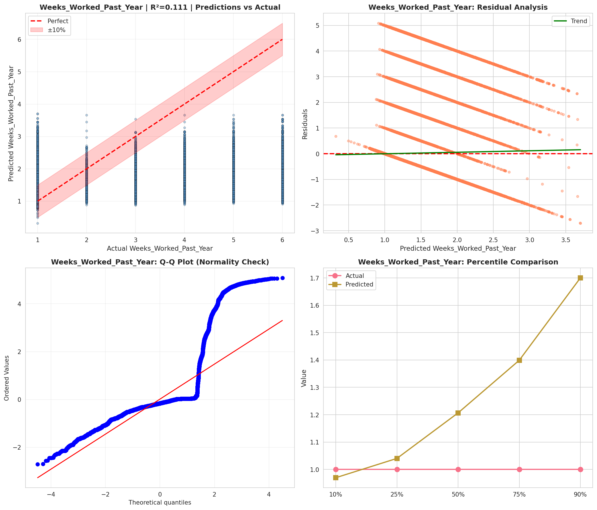
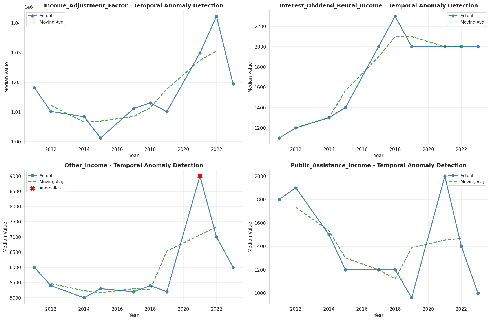
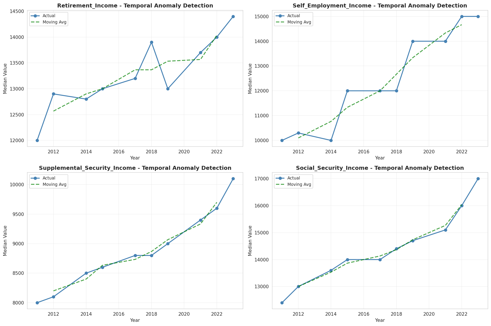
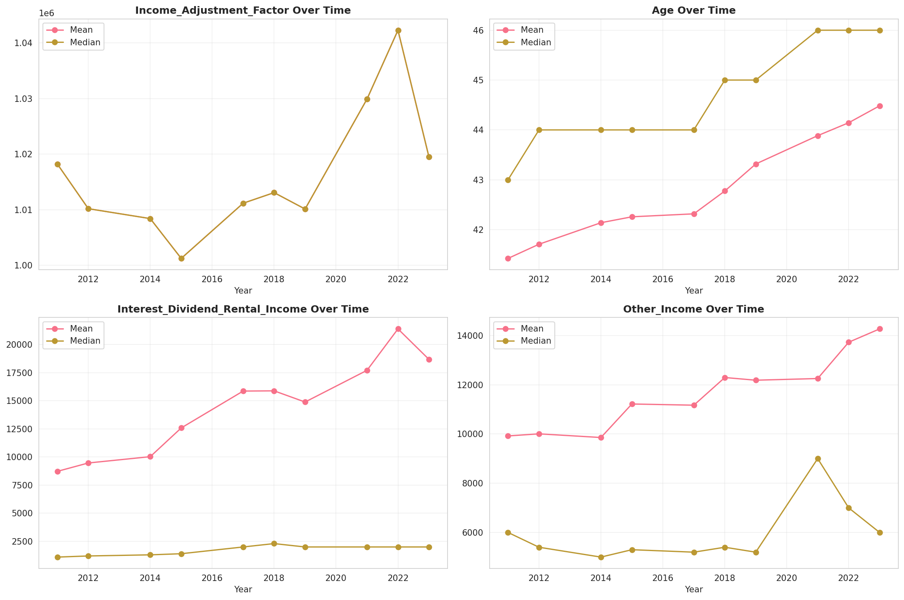
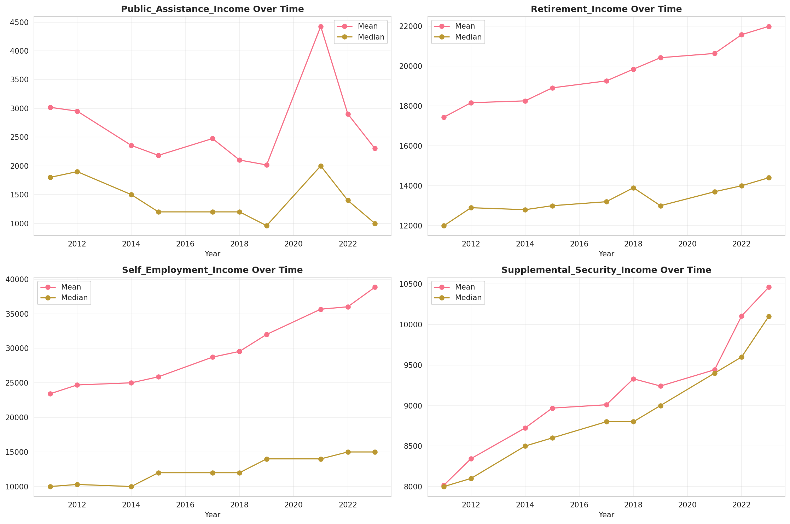
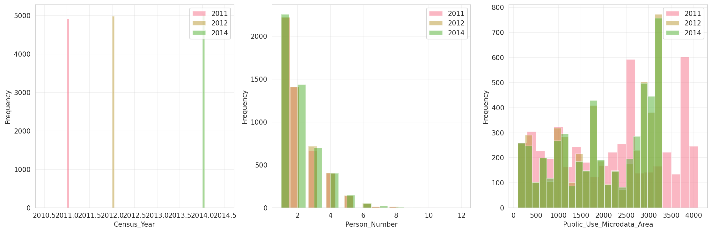
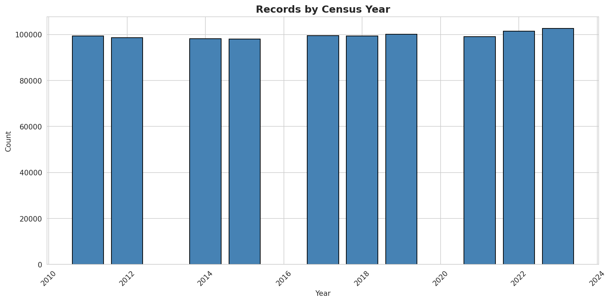
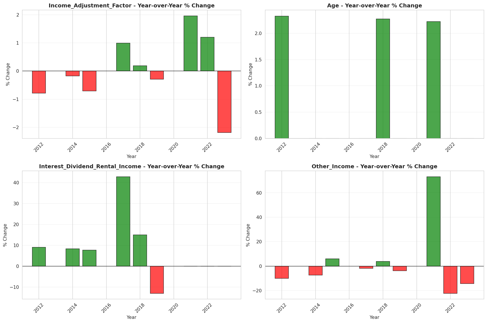
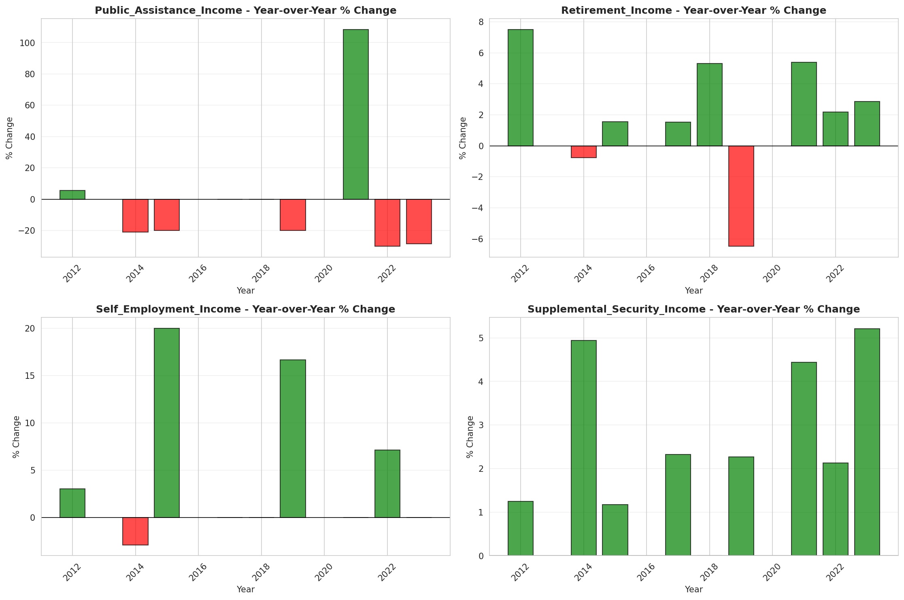

# Temporal Analysis

## Year Distribution

- 2011: 99,285 records

- 2012: 98,587 records

- 2014: 98,180 records

- 2015: 98,008 records

- 2017: 99,459 records

- 2018: 99,419 records

- 2019: 100,078 records

- 2021: 99,040 records

- 2022: 101,512 records

- 2023: 102,581 records

## Temporal Trends

- Census_Year: {np.int64(2011): {'mean': 2011.0, 'median': 2011.0, 'std': 0.0}, np.int64(2012): {'mean': 2012.0, 'median': 2012.0, 'std': 0.0}, np.int64(2014): {'mean': 2014.0, 'median': 2014.0, 'std': 0.0}, np.int64(2015): {'mean': 2015.0, 'median': 2015.0, 'std': 0.0}, np.int64(2017): {'mean': 2017.0, 'median': 2017.0, 'std': 0.0}, np.int64(2018): {'mean': 2018.0, 'median': 2018.0, 'std': 0.0}, np.int64(2019): {'mean': 2019.0, 'median': 2019.0, 'std': 0.0}, np.int64(2021): {'mean': 2021.0, 'median': 2021.0, 'std': 0.0}, np.int64(2022): {'mean': 2022.0, 'median': 2022.0, 'std': 0.0}, np.int64(2023): {'mean': 2023.0, 'median': 2023.0, 'std': 0.0}}

- Person_Number: {np.int64(2011): {'mean': 2.0377700558996827, 'median': 2.0, 'std': 1.2869116507112692}, np.int64(2012): {'mean': 2.0359175144795967, 'median': 2.0, 'std': 1.2818154705518208}, np.int64(2014): {'mean': 2.032379303320432, 'median': 2.0, 'std': 1.2777125601133585}, np.int64(2015): {'mean': 2.031548445024896, 'median': 2.0, 'std': 1.2923746557554585}, np.int64(2017): {'mean': 2.0427713932374143, 'median': 2.0, 'std': 1.3163556657933744}, np.int64(2018): {'mean': 2.021233365855621, 'median': 2.0, 'std': 1.2863639864617449}, np.int64(2019): {'mean': 2.0250904294650174, 'median': 2.0, 'std': 1.3091372434806061}, np.int64(2021): {'mean': 2.002090064620355, 'median': 2.0, 'std': 1.2716627921328032}, np.int64(2022): {'mean': 1.9971333438411223, 'median': 2.0, 'std': 1.2823396008154684}, np.int64(2023): {'mean': 2.00120880085006, 'median': 2.0, 'std': 1.2943020821231879}}

- Public_Use_Microdata_Area: {np.int64(2011): {'mean': 2235.942327642645, 'median': 2501.0, 'std': 1206.3336102909648}, np.int64(2012): {'mean': 1965.1841723553816, 'median': 2000.0, 'std': 1024.0198594062417}, np.int64(2014): {'mean': 1971.0898146261968, 'median': 2000.0, 'std': 1020.7036902571302}, np.int64(2015): {'mean': 1966.2485919516773, 'median': 2000.0, 'std': 1020.7638581550511}, np.int64(2017): {'mean': 1979.2310700891824, 'median': 2000.0, 'std': 1013.7459602788158}, np.int64(2018): {'mean': 1956.7290055220833, 'median': 2000.0, 'std': 1019.0503011990888}, np.int64(2019): {'mean': 1961.4821239433243, 'median': 2000.0, 'std': 1018.144509707904}, np.int64(2021): {'mean': 1985.3331684168013, 'median': 2101.0, 'std': 1015.0390707867922}, np.int64(2022): {'mean': 1922.9536606509575, 'median': 2000.0, 'std': 1020.2929617869813}, np.int64(2023): {'mean': 1908.264980844406, 'median': 1900.0, 'std': 1020.7519668198152}}

- State_Code: {np.int64(2011): {'mean': 26.0, 'median': 26.0, 'std': 0.0}, np.int64(2012): {'mean': 26.0, 'median': 26.0, 'std': 0.0}, np.int64(2014): {'mean': 26.0, 'median': 26.0, 'std': 0.0}, np.int64(2015): {'mean': 26.0, 'median': 26.0, 'std': 0.0}, np.int64(2017): {'mean': 26.0, 'median': 26.0, 'std': 0.0}, np.int64(2018): {'mean': 26.0, 'median': 26.0, 'std': 0.0}, np.int64(2019): {'mean': 26.0, 'median': 26.0, 'std': 0.0}, np.int64(2021): {'mean': 26.0, 'median': 26.0, 'std': 0.0}, np.int64(2022): {'mean': 26.0, 'median': 26.0, 'std': 0.0}, np.int64(2023): {'mean': None, 'median': None, 'std': None}}

- Income_Adjustment_Factor: {np.int64(2011): {'mean': 1018237.0, 'median': 1018237.0, 'std': 0.0}, np.int64(2012): {'mean': 1010207.0, 'median': 1010207.0, 'std': 0.0}, np.int64(2014): {'mean': 1008425.0, 'median': 1008425.0, 'std': 0.0}, np.int64(2015): {'mean': 1001264.0, 'median': 1001264.0, 'std': 0.0}, np.int64(2017): {'mean': 1011189.0, 'median': 1011189.0, 'std': 0.0}, np.int64(2018): {'mean': 1013097.0, 'median': 1013097.0, 'std': 0.0}, np.int64(2019): {'mean': 1010145.0, 'median': 1010145.0, 'std': 0.0}, np.int64(2021): {'mean': 1029928.0, 'median': 1029928.0, 'std': 0.0}, np.int64(2022): {'mean': 1042311.0, 'median': 1042311.0, 'std': 0.0}, np.int64(2023): {'mean': 1019518.0, 'median': 1019518.0, 'std': 0.0}}

- Person_Weight: {np.int64(2011): {'mean': 99.47310268419197, 'median': 79.0, 'std': 85.81582066586131}, np.int64(2012): {'mean': 100.2501343990587, 'median': 84.0, 'std': 81.83017330643423}, np.int64(2014): {'mean': 100.93580158891831, 'median': 84.0, 'std': 82.14173093069677}, np.int64(2015): {'mean': 101.24251081544364, 'median': 85.0, 'std': 83.58498576568122}, np.int64(2017): {'mean': 100.16500266441449, 'median': 83.0, 'std': 82.99624214669927}, np.int64(2018): {'mean': 100.5433066114123, 'median': 82.0, 'std': 85.32991087661402}, np.int64(2019): {'mean': 99.79073322808209, 'median': 79.0, 'std': 91.44232496600097}, np.int64(2021): {'mean': 101.48234046849758, 'median': 79.0, 'std': 90.1904490422956}, np.int64(2022): {'mean': 98.84661911892191, 'median': 77.0, 'std': 94.28681512081522}, np.int64(2023): {'mean': 97.84717442801299, 'median': 76.0, 'std': 95.78083639805202}}

- Age: {np.int64(2011): {'mean': 41.42206778466032, 'median': 43.0, 'std': 23.505865364920393}, np.int64(2012): {'mean': 41.70649274245083, 'median': 44.0, 'std': 23.554855640628748}, np.int64(2014): {'mean': 42.13800162965981, 'median': 44.0, 'std': 23.643453145487495}, np.int64(2015): {'mean': 42.25675455064893, 'median': 44.0, 'std': 23.63039081372025}, np.int64(2017): {'mean': 42.31610010154938, 'median': 44.0, 'std': 23.76775468341193}, np.int64(2018): {'mean': 42.77401703899657, 'median': 45.0, 'std': 23.78972664353088}, np.int64(2019): {'mean': 43.31638322108755, 'median': 45.0, 'std': 23.916677608532368}, np.int64(2021): {'mean': 43.88474353796446, 'median': 46.0, 'std': 24.03832830445572}, np.int64(2022): {'mean': 44.14351012688155, 'median': 46.0, 'std': 24.12177498475953}, np.int64(2023): {'mean': 44.48358857878164, 'median': 46.0, 'std': 24.275516033715423}}

- Citizenship_Status: {np.int64(2011): {'mean': 1.1821121015259102, 'median': 1.0, 'std': 0.7698086550168978}, np.int64(2012): {'mean': 1.1834318926430463, 'median': 1.0, 'std': 0.7702711786455274}, np.int64(2014): {'mean': 1.189845182318191, 'median': 1.0, 'std': 0.7837671819460734}, np.int64(2015): {'mean': 1.1901069300465268, 'median': 1.0, 'std': 0.7814276134465767}, np.int64(2017): {'mean': 1.2053308398435536, 'median': 1.0, 'std': 0.8128891752533582}, np.int64(2018): {'mean': 1.198563654834589, 'median': 1.0, 'std': 0.7976178277459033}, np.int64(2019): {'mean': 1.1911209256779711, 'median': 1.0, 'std': 0.7809383488617627}, np.int64(2021): {'mean': 1.2022617124394184, 'median': 1.0, 'std': 0.7999957931639401}, np.int64(2022): {'mean': 1.1934549609898337, 'median': 1.0, 'std': 0.7846065801741698}, np.int64(2023): {'mean': 1.2052621830553416, 'median': 1.0, 'std': 0.8076814846914923}}

- Class_of_Worker: {np.int64(2011): {'mean': 2.0884193503023485, 'median': 1.0, 'std': 1.9515158366372944}, np.int64(2012): {'mean': 2.0915643494390954, 'median': 1.0, 'std': 1.954541422941916}, np.int64(2014): {'mean': 2.0480636360415265, 'median': 1.0, 'std': 1.9064794495338013}, np.int64(2015): {'mean': 2.0309375055308756, 'median': 1.0, 'std': 1.8898795262457053}, np.int64(2017): {'mean': 2.0016802064748576, 'median': 1.0, 'std': 1.8519648276485352}, np.int64(2018): {'mean': 1.9851428768636112, 'median': 1.0, 'std': 1.8361288226751986}, np.int64(2019): {'mean': 2.0081345366739165, 'median': 1.0, 'std': 1.8400799530767524}, np.int64(2021): {'mean': 2.034887140015567, 'median': 1.0, 'std': 1.8423559123270665}, np.int64(2022): {'mean': 2.0303147618246085, 'median': 1.0, 'std': 1.8304304328744805}, np.int64(2023): {'mean': 2.017292514955009, 'median': 1.0, 'std': 1.8135101962642162}}

- English_Speaking_Ability: {np.int64(2011): {'mean': 1.502813229038013, 'median': 1.0, 'std': 0.7981666758160842}, np.int64(2012): {'mean': 1.4924429788403408, 'median': 1.0, 'std': 0.7838450945896428}, np.int64(2014): {'mean': 1.5347058823529411, 'median': 1.0, 'std': 0.8280465205037426}, np.int64(2015): {'mean': 1.506497256713832, 'median': 1.0, 'std': 0.8001089838624845}, np.int64(2017): {'mean': 1.5, 'median': 1.0, 'std': 0.8074638543069379}, np.int64(2018): {'mean': 1.4798574952041654, 'median': 1.0, 'std': 0.790128475838903}, np.int64(2019): {'mean': 1.4710256770029466, 'median': 1.0, 'std': 0.7827216707789401}, np.int64(2021): {'mean': 1.5051505016722408, 'median': 1.0, 'std': 0.8016032658263466}, np.int64(2022): {'mean': 1.4756405150670384, 'median': 1.0, 'std': 0.7747320673777617}, np.int64(2023): {'mean': 1.521523178807947, 'median': 1.0, 'std': 0.8228183315428106}}

- Fertility_Status: {np.int64(2011): {'mean': 1.9522823529411766, 'median': 2.0, 'std': 0.21317319649348443}, np.int64(2012): {'mean': 1.9520900935292995, 'median': 2.0, 'std': 0.21358072038110532}, np.int64(2014): {'mean': 1.9475174534980229, 'median': 2.0, 'std': 0.22300349035124034}, np.int64(2015): {'mean': 1.9504457908477415, 'median': 2.0, 'std': 0.21702743982067058}, np.int64(2017): {'mean': 1.9493223335297585, 'median': 2.0, 'std': 0.219344029283624}, np.int64(2018): {'mean': 1.9518572214167875, 'median': 2.0, 'std': 0.21407321756112002}, np.int64(2019): {'mean': 1.950292103142627, 'median': 2.0, 'std': 0.21734626968723023}, np.int64(2021): {'mean': 1.9475578406169667, 'median': 2.0, 'std': 0.22292270923166846}, np.int64(2022): {'mean': 1.95108944080451, 'median': 2.0, 'std': 0.21568652987561798}, np.int64(2023): {'mean': 1.9504730105731776, 'median': 2.0, 'std': 0.21697107713429664}}

- Marital_Status: {np.int64(2011): {'mean': 2.884685501334542, 'median': 3.0, 'std': 1.8435897638258838}, np.int64(2012): {'mean': 2.8817694016452475, 'median': 3.0, 'std': 1.8434563862842903}, np.int64(2014): {'mean': 2.878753310246486, 'median': 3.0, 'std': 1.844152144158306}, np.int64(2015): {'mean': 2.8829891437433677, 'median': 3.0, 'std': 1.8469009956489286}, np.int64(2017): {'mean': 2.8909701485034036, 'median': 3.0, 'std': 1.8487677108842655}, np.int64(2018): {'mean': 2.8725595711081384, 'median': 3.0, 'std': 1.8443510481604435}, np.int64(2019): {'mean': 2.8597194188532944, 'median': 3.0, 'std': 1.8408983000612333}, np.int64(2021): {'mean': 2.860359450726979, 'median': 3.0, 'std': 1.8417286691562456}, np.int64(2022): {'mean': 2.8610706123413983, 'median': 3.0, 'std': 1.8421885372860565}, np.int64(2023): {'mean': 2.850410894805081, 'median': 2.0, 'std': 1.841638254418142}}

- Mobility_Status: {np.int64(2011): {'mean': 1.2467936340169516, 'median': 1.0, 'std': 0.6551248171050291}, np.int64(2012): {'mean': 1.2492631104924878, 'median': 1.0, 'std': 0.6576778194979123}, np.int64(2014): {'mean': 1.2524556441244536, 'median': 1.0, 'std': 0.661009872405085}, np.int64(2015): {'mean': 1.2433342948982116, 'median': 1.0, 'std': 0.6508598541102846}, np.int64(2017): {'mean': 1.2509694053637046, 'median': 1.0, 'std': 0.6592980551237136}, np.int64(2018): {'mean': 1.2314254991072877, 'median': 1.0, 'std': 0.6365763270224817}, np.int64(2019): {'mean': 1.2291150210613297, 'median': 1.0, 'std': 0.6345047853293829}, np.int64(2021): {'mean': 1.204517437062545, 'median': 1.0, 'std': 0.6037055555782781}, np.int64(2022): {'mean': 1.2088754692993782, 'median': 1.0, 'std': 0.6087282176911315}, np.int64(2023): {'mean': 1.1944430794028325, 'median': 1.0, 'std': 0.5885936588213221}}

- Military_Service: {np.int64(2011): {'mean': 4.788747903996796, 'median': 5.0, 'std': 0.6109225893367988}, np.int64(2012): {'mean': 4.78710814553695, 'median': 5.0, 'std': 0.6127436599809211}, np.int64(2014): {'mean': 3.809723670817678, 'median': 4.0, 'std': 0.5773375996394092}, np.int64(2015): {'mean': 3.8152728552396753, 'median': 4.0, 'std': 0.5699141311103122}, np.int64(2017): {'mean': 3.828215304477242, 'median': 4.0, 'std': 0.552018326685803}, np.int64(2018): {'mean': 3.8336273578504545, 'median': 4.0, 'std': 0.5433682572543002}, np.int64(2019): {'mean': 3.8288826679649466, 'median': 4.0, 'std': 0.5507316185359643}, np.int64(2021): {'mean': 3.848146788990826, 'median': 4.0, 'std': 0.5213387381632326}, np.int64(2022): {'mean': 3.84810247131089, 'median': 4.0, 'std': 0.5223911239545711}, np.int64(2023): {'mean': 3.8512455096872977, 'median': 4.0, 'std': 0.5157834693394459}}

- Travel_Time_To_Work_Minutes: {np.int64(2011): {'mean': 24.691260670414323, 'median': 20.0, 'std': 22.46493850130581}, np.int64(2012): {'mean': 24.615200247409927, 'median': 20.0, 'std': 22.29271677887903}, np.int64(2014): {'mean': 24.976298222366676, 'median': 20.0, 'std': 21.174894943906025}, np.int64(2015): {'mean': 24.991077810366498, 'median': 20.0, 'std': 21.915587595254074}, np.int64(2017): {'mean': 25.04929560677934, 'median': 20.0, 'std': 21.055412479375576}, np.int64(2018): {'mean': 25.291213607182623, 'median': 20.0, 'std': 21.818575778634816}, np.int64(2019): {'mean': 25.818264669455285, 'median': 20.0, 'std': 22.530914785211852}, np.int64(2021): {'mean': 24.43117001049973, 'median': 20.0, 'std': 20.74685791007733}, np.int64(2022): {'mean': 24.920348475420038, 'median': 20.0, 'std': 22.12242055437423}, np.int64(2023): {'mean': 25.308801136940414, 'median': 20.0, 'std': 22.475563184953014}}

- Vehicle_Occupancy: {np.int64(2011): {'mean': 1.1404571365928524, 'median': 1.0, 'std': 0.5357081590734911}, np.int64(2012): {'mean': 1.152893010140448, 'median': 1.0, 'std': 0.5904722469913514}, np.int64(2014): {'mean': 1.1361911787953838, 'median': 1.0, 'std': 0.555060644761994}, np.int64(2015): {'mean': 1.1346898469374496, 'median': 1.0, 'std': 0.5089352987757888}, np.int64(2017): {'mean': 1.1344504088697136, 'median': 1.0, 'std': 0.514370091672116}, np.int64(2018): {'mean': 1.1430850533452985, 'median': 1.0, 'std': 0.5559036219874346}, np.int64(2019): {'mean': 1.1345724176876426, 'median': 1.0, 'std': 0.5327012199471727}, np.int64(2021): {'mean': 1.130904103053435, 'median': 1.0, 'std': 0.5203859914221828}, np.int64(2022): {'mean': 1.1412260767187798, 'median': 1.0, 'std': 0.5470461698734237}, np.int64(2023): {'mean': 1.1475221617003097, 'median': 1.0, 'std': 0.5535088626232926}}

- Transportation_To_Work: {np.int64(2011): {'mean': 1.7411626570736216, 'median': 1.0, 'std': 2.5438356643712883}, np.int64(2012): {'mean': 1.7515506462055501, 'median': 1.0, 'std': 2.562268032697238}, np.int64(2014): {'mean': 1.7440726416680679, 'median': 1.0, 'std': 2.5577661209835996}, np.int64(2015): {'mean': 1.769114378930446, 'median': 1.0, 'std': 2.5933600774118695}, np.int64(2017): {'mean': 1.7861503416856492, 'median': 1.0, 'std': 2.6192264405805514}, np.int64(2018): {'mean': 1.7907124249631894, 'median': 1.0, 'std': 2.6306018262109494}, np.int64(2019): {'mean': None, 'median': None, 'std': None}, np.int64(2021): {'mean': None, 'median': None, 'std': None}, np.int64(2022): {'mean': None, 'median': None, 'std': None}, np.int64(2023): {'mean': None, 'median': None, 'std': None}}

- Language_Other_Than_English: {np.int64(2011): {'mean': 1.9227491015488345, 'median': 2.0, 'std': 0.2669905482121889}, np.int64(2012): {'mean': 1.9223423211942081, 'median': 2.0, 'std': 0.2676335704094488}, np.int64(2014): {'mean': 1.9271543043236063, 'median': 2.0, 'std': 0.25988444321690113}, np.int64(2015): {'mean': 1.9257353020019086, 'median': 2.0, 'std': 0.2622025739954419}, np.int64(2017): {'mean': 1.9203408826577004, 'median': 2.0, 'std': 0.2707661676421237}, np.int64(2018): {'mean': 1.9228908024723967, 'median': 2.0, 'std': 0.2667660418606859}, np.int64(2019): {'mean': 1.9252260948024424, 'median': 2.0, 'std': 0.2630275539696404}, np.int64(2021): {'mean': 1.92084418747485, 'median': 2.0, 'std': 0.2699832249241311}, np.int64(2022): {'mean': 1.9223297967768875, 'median': 2.0, 'std': 0.26765328578660913}, np.int64(2023): {'mean': 1.9199665677970421, 'median': 2.0, 'std': 0.2713463329633766}}

- Grandparents_Living_With_Grandchildren: {np.int64(2011): {'mean': 1.9737677630159367, 'median': 2.0, 'std': 0.15982646975366485}, np.int64(2012): {'mean': 1.972525602549426, 'median': 2.0, 'std': 0.16346243693386694}, np.int64(2014): {'mean': 1.9744480469353096, 'median': 2.0, 'std': 0.15779554869447193}, np.int64(2015): {'mean': 1.9758157923185027, 'median': 2.0, 'std': 0.153621926291473}, np.int64(2017): {'mean': 1.973908795285568, 'median': 2.0, 'std': 0.15940778430440597}, np.int64(2018): {'mean': 1.9761692751173425, 'median': 2.0, 'std': 0.1525226951268419}, np.int64(2019): {'mean': 1.9762374768089055, 'median': 2.0, 'std': 0.15230958603283143}, np.int64(2021): {'mean': 1.9761559195521459, 'median': 2.0, 'std': 0.15256436343728588}, np.int64(2022): {'mean': 1.9784572820150728, 'median': 2.0, 'std': 0.14518585685562696}, np.int64(2023): {'mean': 1.9783402701095727, 'median': 2.0, 'std': 0.14557089676245216}}

- Months_Responsible_For_Grandchildren: {np.int64(2011): {'mean': 3.6267409470752088, 'median': 4.0, 'std': 1.3256227050820115}, np.int64(2012): {'mean': 3.6267166042446943, 'median': 4.0, 'std': 1.352492266460867}, np.int64(2014): {'mean': 3.6103286384976525, 'median': 4.0, 'std': 1.3782751424575883}, np.int64(2015): {'mean': 3.569620253164557, 'median': 4.0, 'std': 1.3841556968824913}, np.int64(2017): {'mean': 3.688821752265861, 'median': 4.0, 'std': 1.3573898603312382}, np.int64(2018): {'mean': 3.695885509838998, 'median': 4.0, 'std': 1.3640944431933406}, np.int64(2019): {'mean': 3.598019801980198, 'median': 4.0, 'std': 1.4165952501620587}, np.int64(2021): {'mean': 3.7476979742173113, 'median': 4.0, 'std': 1.284619936376845}, np.int64(2022): {'mean': 3.6877729257641922, 'median': 4.0, 'std': 1.3511900325724544}, np.int64(2023): {'mean': 3.849256900212314, 'median': 5.0, 'std': 1.4068958133445915}}

- Grandparents_Responsible_For_Grandchildren: {np.int64(2011): {'mean': 1.5781433607520563, 'median': 2.0, 'std': 0.4940010097764839}, np.int64(2012): {'mean': 1.5489864864864864, 'median': 2.0, 'std': 0.49773468563288864}, np.int64(2014): {'mean': 1.6138972809667673, 'median': 2.0, 'std': 0.48700176073226537}, np.int64(2015): {'mean': 1.6468710089399745, 'median': 2.0, 'std': 0.4780950404425074}, np.int64(2017): {'mean': 1.612638970157987, 'median': 2.0, 'std': 0.4872898563734583}, np.int64(2018): {'mean': 1.6459784673844204, 'median': 2.0, 'std': 0.4783672346601319}, np.int64(2019): {'mean': 1.6845721424109932, 'median': 2.0, 'std': 0.4648312408266786}, np.int64(2021): {'mean': 1.6627329192546585, 'median': 2.0, 'std': 0.4729237933631053}, np.int64(2022): {'mean': 1.6936454849498328, 'median': 2.0, 'std': 0.46113302063747064}, np.int64(2023): {'mean': 1.692156862745098, 'median': 2.0, 'std': 0.46175220234677866}}

- Interest_Dividend_Rental_Income: {np.int64(2011): {'mean': 8724.543788187373, 'median': 1100.0, 'std': 24217.361339123658}, np.int64(2012): {'mean': 9469.928909952607, 'median': 1200.0, 'std': 26840.12987506717}, np.int64(2014): {'mean': 10030.705645514223, 'median': 1300.0, 'std': 26275.002360488717}, np.int64(2015): {'mean': 12584.99318743081, 'median': 1400.0, 'std': 37719.86201430331}, np.int64(2017): {'mean': 15865.531170182576, 'median': 2000.0, 'std': 45675.006101106126}, np.int64(2018): {'mean': 15884.259608138658, 'median': 2300.0, 'std': 43135.11813327065}, np.int64(2019): {'mean': 14890.125251417077, 'median': 2000.0, 'std': 41072.19312687921}, np.int64(2021): {'mean': 17710.088353413656, 'median': 2000.0, 'std': 49224.36304588447}, np.int64(2022): {'mean': 21393.995355411957, 'median': 2000.0, 'std': 62127.3628716772}, np.int64(2023): {'mean': 18684.339511621067, 'median': 2000.0, 'std': 50075.559127559245}}

- Military_Service_Period_1: {np.int64(2011): {'mean': 0.06313799621928166, 'median': 0.0, 'std': 0.24322632486825085}, np.int64(2012): {'mean': 0.06108026249369006, 'median': 0.0, 'std': 0.23949259357970712}, np.int64(2014): {'mean': 0.07937181663837012, 'median': 0.0, 'std': 0.2703373286133648}, np.int64(2015): {'mean': 0.09874379199532574, 'median': 0.0, 'std': 0.29833949918339053}, np.int64(2017): {'mean': 0.10741254430574819, 'median': 0.0, 'std': 0.30966089021131354}, np.int64(2018): {'mean': 0.12063188128291048, 'median': 0.0, 'std': 0.32572497591463073}, np.int64(2019): {'mean': 0.12238987959152568, 'median': 0.0, 'std': 0.3277605383991613}, np.int64(2021): {'mean': 0.1495229835212489, 'median': 0.0, 'std': 0.3566341584953276}, np.int64(2022): {'mean': 0.14703411191396404, 'median': 0.0, 'std': 0.35416967686781553}, np.int64(2023): {'mean': 0.16147793362983237, 'median': 0.0, 'std': 0.36800268498979555}}

- Military_Service_Period_2: {np.int64(2011): {'mean': 0.1072463768115942, 'median': 0.0, 'std': 0.3094457288512422}, np.int64(2012): {'mean': 0.10474507824331146, 'median': 0.0, 'std': 0.3062439916769377}, np.int64(2014): {'mean': 0.1280418788907753, 'median': 0.0, 'std': 0.3341600732007908}, np.int64(2015): {'mean': 0.13380075956763074, 'median': 0.0, 'std': 0.34046299079160636}, np.int64(2017): {'mean': 0.14655570966250578, 'median': 0.0, 'std': 0.3536897112644647}, np.int64(2018): {'mean': 0.1460028721876496, 'median': 0.0, 'std': 0.35313727122037986}, np.int64(2019): {'mean': 0.15744551135497636, 'median': 0.0, 'std': 0.36424805328888504}, np.int64(2021): {'mean': 0.16253252385082395, 'median': 0.0, 'std': 0.3689706185330982}, np.int64(2022): {'mean': 0.17476054444631153, 'median': 0.0, 'std': 0.3797940693170125}, np.int64(2023): {'mean': 0.16883339035237768, 'median': 0.0, 'std': 0.3746367373635591}}

- Military_Service_Period_3: {np.int64(2011): {'mean': 0.14303717706364208, 'median': 0.0, 'std': 0.35013282150323966}, np.int64(2012): {'mean': 0.15825340737001514, 'median': 0.0, 'std': 0.3650014786395565}, np.int64(2014): {'mean': None, 'median': None, 'std': None}, np.int64(2015): {'mean': None, 'median': None, 'std': None}, np.int64(2017): {'mean': None, 'median': None, 'std': None}, np.int64(2018): {'mean': None, 'median': None, 'std': None}, np.int64(2019): {'mean': None, 'median': None, 'std': None}, np.int64(2021): {'mean': None, 'median': None, 'std': None}, np.int64(2022): {'mean': None, 'median': None, 'std': None}, np.int64(2023): {'mean': None, 'median': None, 'std': None}}

- Military_Service_Period_4: {np.int64(2011): {'mean': 0.09779458097038438, 'median': 0.0, 'std': 0.2970554182273623}, np.int64(2012): {'mean': 0.10436648157496214, 'median': 0.0, 'std': 0.30575466785892186}, np.int64(2014): {'mean': None, 'median': None, 'std': None}, np.int64(2015): {'mean': None, 'median': None, 'std': None}, np.int64(2017): {'mean': None, 'median': None, 'std': None}, np.int64(2018): {'mean': None, 'median': None, 'std': None}, np.int64(2019): {'mean': None, 'median': None, 'std': None}, np.int64(2021): {'mean': None, 'median': None, 'std': None}, np.int64(2022): {'mean': None, 'median': None, 'std': None}, np.int64(2023): {'mean': None, 'median': None, 'std': None}}

- Military_Service_Period_5: {np.int64(2011): {'mean': 0.37151858853182107, 'median': 0.0, 'std': 0.48324109538118953}, np.int64(2012): {'mean': 0.3885663806158506, 'median': 0.0, 'std': 0.48745516194720223}, np.int64(2014): {'mean': 0.4104414261460102, 'median': 0.0, 'std': 0.4919486788095749}, np.int64(2015): {'mean': 0.413526146654981, 'median': 0.0, 'std': 0.4925014753894022}, np.int64(2017): {'mean': 0.40977038064416704, 'median': 0.0, 'std': 0.49182913052130245}, np.int64(2018): {'mean': 0.4269985639061752, 'median': 0.0, 'std': 0.4946815518022045}, np.int64(2019): {'mean': 0.41822892851699434, 'median': 0.0, 'std': 0.4933057696194552}, np.int64(2021): {'mean': 0.42705984388551604, 'median': 0.0, 'std': 0.49469402994932005}, np.int64(2022): {'mean': 0.4184170727608805, 'median': 0.0, 'std': 0.49334077894730927}, np.int64(2023): {'mean': 0.4143003763256928, 'median': 0.0, 'std': 0.4926429635856285}}

- Military_Service_Period_6: {np.int64(2011): {'mean': 0.10182734719596723, 'median': 0.0, 'std': 0.3024401857847627}, np.int64(2012): {'mean': 0.10663806158505805, 'median': 0.0, 'std': 0.3086720094791545}, np.int64(2014): {'mean': None, 'median': None, 'std': None}, np.int64(2015): {'mean': None, 'median': None, 'std': None}, np.int64(2017): {'mean': None, 'median': None, 'std': None}, np.int64(2018): {'mean': None, 'median': None, 'std': None}, np.int64(2019): {'mean': None, 'median': None, 'std': None}, np.int64(2021): {'mean': None, 'median': None, 'std': None}, np.int64(2022): {'mean': None, 'median': None, 'std': None}, np.int64(2023): {'mean': None, 'median': None, 'std': None}}

- Military_Service_Period_7: {np.int64(2011): {'mean': 0.12476370510396975, 'median': 0.0, 'std': 0.3304716118745872}, np.int64(2012): {'mean': 0.11774356385663806, 'median': 0.0, 'std': 0.3223245696877286}, np.int64(2014): {'mean': None, 'median': None, 'std': None}, np.int64(2015): {'mean': None, 'median': None, 'std': None}, np.int64(2017): {'mean': None, 'median': None, 'std': None}, np.int64(2018): {'mean': None, 'median': None, 'std': None}, np.int64(2019): {'mean': None, 'median': None, 'std': None}, np.int64(2021): {'mean': None, 'median': None, 'std': None}, np.int64(2022): {'mean': None, 'median': None, 'std': None}, np.int64(2023): {'mean': None, 'median': None, 'std': None}}

- Military_Service_Period_8: {np.int64(2011): {'mean': 0.12867044738500316, 'median': 0.0, 'std': 0.3348559305580321}, np.int64(2012): {'mean': 0.12051993942453307, 'median': 0.0, 'std': 0.3255890995573192}, np.int64(2014): {'mean': 0.11403508771929824, 'median': 0.0, 'std': 0.31787636380464646}, np.int64(2015): {'mean': 0.10809231668127374, 'median': 0.0, 'std': 0.3105196487352663}, np.int64(2017): {'mean': 0.08891971027893358, 'median': 0.0, 'std': 0.2846497531928743}, np.int64(2018): {'mean': 0.07643210467528323, 'median': 0.0, 'std': 0.2657094346242651}, np.int64(2019): {'mean': 0.07757963725041914, 'median': 0.0, 'std': 0.26752933638985754}, np.int64(2021): {'mean': 0.062445793581960105, 'median': 0.0, 'std': 0.24198444925922835}, np.int64(2022): {'mean': 0.050075617543270036, 'median': 0.0, 'std': 0.21811933591773605}, np.int64(2023): {'mean': 0.05011973999315771, 'median': 0.0, 'std': 0.21821067044247336}}

- Military_Service_Period_9: {np.int64(2011): {'mean': 0.021676118462507877, 'median': 0.0, 'std': 0.14563288497050025}, np.int64(2012): {'mean': 0.019560827864714792, 'median': 0.0, 'std': 0.1384941242479768}, np.int64(2014): {'mean': 0.016411997736276173, 'median': 0.0, 'std': 0.12706269434912262}, np.int64(2015): {'mean': 0.014022787028921999, 'median': 0.0, 'std': 0.11759323264147199}, np.int64(2017): {'mean': 0.011095700416088766, 'median': 0.0, 'std': 0.10475818374109906}, np.int64(2018): {'mean': 0.007978299026647519, 'median': 0.0, 'std': 0.08897139361081906}, np.int64(2019): {'mean': 0.007011126352690139, 'median': 0.0, 'std': 0.08344478255673926}, np.int64(2021): {'mean': None, 'median': None, 'std': None}, np.int64(2022): {'mean': None, 'median': None, 'std': None}, np.int64(2023): {'mean': None, 'median': None, 'std': None}}

- Military_Service_Period_10: {np.int64(2011): {'mean': 0.10031505986137366, 'median': 0.0, 'std': 0.30043855273003406}, np.int64(2012): {'mean': 0.09111559818273599, 'median': 0.0, 'std': 0.28779158821469525}, np.int64(2014): {'mean': 0.0636672325976231, 'median': 0.0, 'std': 0.24417647633689551}, np.int64(2015): {'mean': 0.05156295647093193, 'median': 0.0, 'std': 0.22115913390086595}, np.int64(2017): {'mean': 0.0425335182616736, 'median': 0.0, 'std': 0.20181847033693356}, np.int64(2018): {'mean': 0.028881442476464018, 'median': 0.0, 'std': 0.16748665877275837}, np.int64(2019): {'mean': 0.02194787379972565, 'median': 0.0, 'std': 0.14652452667247004}, np.int64(2021): {'mean': 0.012836079791847355, 'median': 0.0, 'std': 0.11257669919587954}, np.int64(2022): {'mean': 0.012939001848428836, 'median': 0.0, 'std': 0.11302092976220993}, np.int64(2023): {'mean': 0.008039685254875127, 'median': 0.0, 'std': 0.08931076720217666}}

- Military_Service_Period_11: {np.int64(2011): {'mean': 0.0030245746691871457, 'median': 0.0, 'std': 0.05491636077811059}, np.int64(2012): {'mean': 0.002271580010095911, 'median': 0.0, 'std': 0.04760993583415459}, np.int64(2014): {'mean': 0.00155631013016412, 'median': 0.0, 'std': 0.03942217533808371}, np.int64(2015): {'mean': 0.0010224948875255625, 'median': 0.0, 'std': 0.03196245637234225}, np.int64(2017): {'mean': 0.0006164278008938204, 'median': 0.0, 'std': 0.024822223299761484}, np.int64(2018): {'mean': 0.00031913196106590075, 'median': 0.0, 'std': 0.01786283936933885}, np.int64(2019): {'mean': 0.00030483158055174517, 'median': 0.0, 'std': 0.01745809589625977}, np.int64(2021): {'mean': None, 'median': None, 'std': None}, np.int64(2022): {'mean': None, 'median': None, 'std': None}, np.int64(2023): {'mean': None, 'median': None, 'std': None}}

- Temporary_Absence_From_Work: {np.int64(2011): {'mean': 2.4696223114636973, 'median': 2.0, 'std': 0.5291505953542667}, np.int64(2012): {'mean': 2.4769708747477996, 'median': 2.0, 'std': 0.5286560351039745}, np.int64(2014): {'mean': 2.5403634565459265, 'median': 3.0, 'std': 0.523250809261524}, np.int64(2015): {'mean': 2.5475368879324205, 'median': 3.0, 'std': 0.5220434246298131}, np.int64(2017): {'mean': 2.5588070261039277, 'median': 3.0, 'std': 0.5208949766608736}, np.int64(2018): {'mean': 2.5626229747127556, 'median': 3.0, 'std': 0.5194598473986379}, np.int64(2019): {'mean': 2.5738064949715573, 'median': 3.0, 'std': 0.5179477846867043}, np.int64(2021): {'mean': 2.559614665846807, 'median': 3.0, 'std': 0.5181825988469443}, np.int64(2022): {'mean': 2.562899987082986, 'median': 3.0, 'std': 0.5177833578482844}, np.int64(2023): {'mean': 2.5587032303044386, 'median': 3.0, 'std': 0.517020308972125}}

- Available_For_Work: {np.int64(2011): {'mean': 4.420766710192416, 'median': 5.0, 'std': 1.3152228132332466}, np.int64(2012): {'mean': 4.427323026649668, 'median': 5.0, 'std': 1.2885849392271245}, np.int64(2014): {'mean': 4.645382618370626, 'median': 5.0, 'std': 1.0516863078635825}, np.int64(2015): {'mean': 4.680506598394618, 'median': 5.0, 'std': 0.9963002755075925}, np.int64(2017): {'mean': 4.704867040741644, 'median': 5.0, 'std': 0.9561065290703451}, np.int64(2018): {'mean': 4.714589355551777, 'median': 5.0, 'std': 0.9403920496401882}, np.int64(2019): {'mean': 4.720039363463985, 'median': 5.0, 'std': 0.9292466245187907}, np.int64(2021): {'mean': 4.736644120519405, 'median': 5.0, 'std': 0.9129623934535648}, np.int64(2022): {'mean': 4.776570885050318, 'median': 5.0, 'std': 0.8356855004370528}, np.int64(2023): {'mean': 4.771136416453637, 'median': 5.0, 'std': 0.8452476634809902}}

- On_Layoff_From_Work: {np.int64(2011): {'mean': 2.4207420729754365, 'median': 2.0, 'std': 0.5395360369729962}, np.int64(2012): {'mean': 2.43227419574447, 'median': 2.0, 'std': 0.5337392240747698}, np.int64(2014): {'mean': 2.517975027815552, 'median': 3.0, 'std': 0.520926118738583}, np.int64(2015): {'mean': 2.5279457781405763, 'median': 3.0, 'std': 0.516320809171122}, np.int64(2017): {'mean': 2.543595999024152, 'median': 3.0, 'std': 0.5123201625033859}, np.int64(2018): {'mean': 2.5465299876114362, 'median': 3.0, 'std': 0.5114795260037289}, np.int64(2019): {'mean': 2.560353311091376, 'median': 3.0, 'std': 0.5094955907149251}, np.int64(2021): {'mean': 2.532716027055377, 'median': 3.0, 'std': 0.5271559137236617}, np.int64(2022): {'mean': 2.552824716119259, 'median': 3.0, 'std': 0.5081144559237352}, np.int64(2023): {'mean': 2.547083430165001, 'median': 3.0, 'std': 0.5092050330045836}}

- Looking_For_Work: {np.int64(2011): {'mean': 2.398445391608564, 'median': 2.0, 'std': 0.6297470480861554}, np.int64(2012): {'mean': 2.416096250727203, 'median': 2.0, 'std': 0.6185768968190116}, np.int64(2014): {'mean': 2.505179873902831, 'median': 3.0, 'std': 0.5871735964017553}, np.int64(2015): {'mean': 2.5202775407220512, 'median': 3.0, 'std': 0.5753259190020678}, np.int64(2017): {'mean': 2.538716760185411, 'median': 3.0, 'std': 0.564161333539278}, np.int64(2018): {'mean': 2.5425826511526224, 'median': 3.0, 'std': 0.5597459262795512}, np.int64(2019): {'mean': 2.5441038811415404, 'median': 3.0, 'std': 0.5572576356129255}, np.int64(2021): {'mean': 2.5187542952219046, 'median': 3.0, 'std': 0.5711291817485604}, np.int64(2022): {'mean': 2.537500440352752, 'median': 3.0, 'std': 0.5528716152864254}, np.int64(2023): {'mean': 2.531338600976063, 'median': 3.0, 'std': 0.5523152297427787}}

- Informed_Of_Recall: {np.int64(2011): {'mean': 2.8675380029071915, 'median': 3.0, 'std': 0.36678154034985694}, np.int64(2012): {'mean': 2.8683484137692012, 'median': 3.0, 'std': 0.367816967785574}, np.int64(2014): {'mean': 2.925120534058598, 'median': 3.0, 'std': 0.2879613182571282}, np.int64(2015): {'mean': 2.9282154032627115, 'median': 3.0, 'std': 0.2820370092599594}, np.int64(2017): {'mean': 2.9329714564527936, 'median': 3.0, 'std': 0.27319798800194983}, np.int64(2018): {'mean': 2.9333811062258603, 'median': 3.0, 'std': 0.2712458860097916}, np.int64(2019): {'mean': 2.9205530086647626, 'median': 3.0, 'std': 0.2900502437901428}, np.int64(2021): {'mean': 2.9332417019326993, 'median': 3.0, 'std': 0.27423214815686175}, np.int64(2022): {'mean': 2.9448326072405737, 'median': 3.0, 'std': 0.24769833605648672}, np.int64(2023): {'mean': 2.9419358587032303, 'median': 3.0, 'std': 0.2500038574619626}}

- Other_Income: {np.int64(2011): {'mean': 9920.821673525377, 'median': 6000.0, 'std': 12361.972072065177}, np.int64(2012): {'mean': 10005.456140350878, 'median': 5400.0, 'std': 13052.226441134388}, np.int64(2014): {'mean': 9856.69114706417, 'median': 5000.0, 'std': 13160.51101318057}, np.int64(2015): {'mean': 11218.447322636768, 'median': 5300.0, 'std': 14654.890378675664}, np.int64(2017): {'mean': 11169.296100333137, 'median': 5200.0, 'std': 14582.304155558546}, np.int64(2018): {'mean': 12293.32452216348, 'median': 5400.0, 'std': 16314.23856862593}, np.int64(2019): {'mean': 12184.2151675485, 'median': 5200.0, 'std': 16134.987348411723}, np.int64(2021): {'mean': 12252.35712509326, 'median': 9000.0, 'std': 12475.542435406258}, np.int64(2022): {'mean': 13726.838114343029, 'median': 7000.0, 'std': 16295.056924707089}, np.int64(2023): {'mean': 14268.300620547001, 'median': 6000.0, 'std': 18265.245288848157}}

- Public_Assistance_Income: {np.int64(2011): {'mean': 3018.5504273504275, 'median': 1800.0, 'std': 4291.68586694686}, np.int64(2012): {'mean': 2951.78625, 'median': 1900.0, 'std': 3860.462747482663}, np.int64(2014): {'mean': 2355.6965718453685, 'median': 1500.0, 'std': 3099.2589189272785}, np.int64(2015): {'mean': 2182.57055682685, 'median': 1200.0, 'std': 3011.801094020253}, np.int64(2017): {'mean': 2475.0865384615386, 'median': 1200.0, 'std': 3780.7630692958846}, np.int64(2018): {'mean': 2101.62, 'median': 1200.0, 'std': 2967.6131660820447}, np.int64(2019): {'mean': 2015.986124876115, 'median': 960.0, 'std': 3002.648771773465}, np.int64(2021): {'mean': 4425.669291338582, 'median': 2000.0, 'std': 5716.049607236073}, np.int64(2022): {'mean': 2903.4255129348794, 'median': 1400.0, 'std': 4320.881631890971}, np.int64(2023): {'mean': 2302.6607929515417, 'median': 1000.0, 'std': 3314.465431613242}}

- Retirement_Income: {np.int64(2011): {'mean': 17437.836867603844, 'median': 12000.0, 'std': 17537.737184214122}, np.int64(2012): {'mean': 18157.73869750261, 'median': 12900.0, 'std': 18347.970030332974}, np.int64(2014): {'mean': 18250.860880663688, 'median': 12800.0, 'std': 18708.620278816034}, np.int64(2015): {'mean': 18901.684261113336, 'median': 13000.0, 'std': 20992.056535779375}, np.int64(2017): {'mean': 19250.51116143643, 'median': 13200.0, 'std': 21187.794263638345}, np.int64(2018): {'mean': 19837.90658511399, 'median': 13900.0, 'std': 22785.519576617167}, np.int64(2019): {'mean': 20412.872638776218, 'median': 13000.0, 'std': 24603.109092193532}, np.int64(2021): {'mean': 20625.880696334145, 'median': 13700.0, 'std': 24266.20005799114}, np.int64(2022): {'mean': 21566.630084507044, 'median': 14000.0, 'std': 25935.28927968439}, np.int64(2023): {'mean': 21981.055828051805, 'median': 14400.0, 'std': 26222.74488716114}}

- Self_Employment_Income: {np.int64(2011): {'mean': 23422.893768400394, 'median': 10000.0, 'std': 41108.857730189746}, np.int64(2012): {'mean': 24701.2989010989, 'median': 10300.0, 'std': 43623.481791497616}, np.int64(2014): {'mean': 25007.728689722357, 'median': 10000.0, 'std': 42886.39576528157}, np.int64(2015): {'mean': 25877.172611623846, 'median': 12000.0, 'std': 44110.77430631695}, np.int64(2017): {'mean': 28722.901421366347, 'median': 12000.0, 'std': 54401.51450073158}, np.int64(2018): {'mean': 29558.793718772304, 'median': 12000.0, 'std': 53350.214808921395}, np.int64(2019): {'mean': 32009.470004723666, 'median': 14000.0, 'std': 58247.09780739986}, np.int64(2021): {'mean': 35664.73178654292, 'median': 14000.0, 'std': 66333.359627805}, np.int64(2022): {'mean': 36011.08111762055, 'median': 15000.0, 'std': 64227.606050181465}, np.int64(2023): {'mean': 38839.429602888085, 'median': 15000.0, 'std': 73121.42762137493}}

- Supplemental_Security_Income: {np.int64(2011): {'mean': 8017.734450531743, 'median': 8000.0, 'std': 4496.4447512195175}, np.int64(2012): {'mean': 8344.62091503268, 'median': 8100.0, 'std': 4678.506111763689}, np.int64(2014): {'mean': 8723.497101007019, 'median': 8500.0, 'std': 4878.354508602905}, np.int64(2015): {'mean': 8968.339529120198, 'median': 8600.0, 'std': 5356.631398368246}, np.int64(2017): {'mean': 9009.738323948328, 'median': 8800.0, 'std': 5152.721738705293}, np.int64(2018): {'mean': 9330.247305009512, 'median': 8800.0, 'std': 5252.927065473706}, np.int64(2019): {'mean': 9240.903436988543, 'median': 9000.0, 'std': 5253.56821724681}, np.int64(2021): {'mean': 9441.752577319588, 'median': 9400.0, 'std': 5658.445676422677}, np.int64(2022): {'mean': 10106.467515507673, 'median': 9600.0, 'std': 6023.58444411314}, np.int64(2023): {'mean': 10460.696680907, 'median': 10100.0, 'std': 6124.852084597422}}

- Social_Security_Income: {np.int64(2011): {'mean': 12711.938576987215, 'median': 12400.0, 'std': 6141.75611587577}, np.int64(2012): {'mean': 13104.740049636916, 'median': 13000.0, 'std': 6315.439822852782}, np.int64(2014): {'mean': 13763.634980988592, 'median': 13600.0, 'std': 6753.934580474052}, np.int64(2015): {'mean': 14093.7107445307, 'median': 14000.0, 'std': 6871.940536551917}, np.int64(2017): {'mean': 14402.985862640719, 'median': 14000.0, 'std': 7211.783891992676}, np.int64(2018): {'mean': 14673.70200940573, 'median': 14400.0, 'std': 7318.87224844476}, np.int64(2019): {'mean': 15065.49995812746, 'median': 14700.0, 'std': 7562.642967104834}, np.int64(2021): {'mean': 15696.388514479435, 'median': 15100.0, 'std': 8149.490301155767}, np.int64(2022): {'mean': 16341.49994136273, 'median': 16000.0, 'std': 8512.283367998778}, np.int64(2023): {'mean': 17376.623751970572, 'median': 17000.0, 'std': 9273.93123563494}}

- Wage_Income: {np.int64(2011): {'mean': 36682.94403185397, 'median': 26000.0, 'std': 42601.21684448706}, np.int64(2012): {'mean': 37594.82285612488, 'median': 27000.0, 'std': 43754.22846182854}, np.int64(2014): {'mean': 39929.13022349671, 'median': 29800.0, 'std': 46416.91430180104}, np.int64(2015): {'mean': 41378.06287865674, 'median': 30000.0, 'std': 49201.91759250768}, np.int64(2017): {'mean': 44707.13597108697, 'median': 32000.0, 'std': 53785.680572021345}, np.int64(2018): {'mean': 45957.98075357478, 'median': 33000.0, 'std': 54682.023985888314}, np.int64(2019): {'mean': 47477.4221901125, 'median': 35000.0, 'std': 55764.756986023196}, np.int64(2021): {'mean': 50020.27519134739, 'median': 37000.0, 'std': 57398.74507822202}, np.int64(2022): {'mean': 52869.40147968567, 'median': 40000.0, 'std': 61892.27330201537}, np.int64(2023): {'mean': 55132.4805523304, 'median': 40000.0, 'std': 62535.49946634507}}

- Relationship_To_Householder: {np.int64(2011): {'mean': 2.3655839250642092, 'median': 1.0, 'std': 4.220873718955737}, np.int64(2012): {'mean': 2.3336241086552993, 'median': 1.0, 'std': 4.172329265752962}, np.int64(2014): {'mean': 2.3543185984925645, 'median': 1.0, 'std': 4.189826158993977}, np.int64(2015): {'mean': 2.350624438821321, 'median': 1.0, 'std': 4.203392048911255}, np.int64(2017): {'mean': 2.3836153590926914, 'median': 1.0, 'std': 4.229043753841001}, np.int64(2018): {'mean': 2.3678270753075368, 'median': 1.0, 'std': 4.233265505640607}, np.int64(2019): {'mean': None, 'median': None, 'std': None}, np.int64(2021): {'mean': None, 'median': None, 'std': None}, np.int64(2022): {'mean': None, 'median': None, 'std': None}, np.int64(2023): {'mean': None, 'median': None, 'std': None}}

- School_Enrollment: {np.int64(2011): {'mean': 1.2919634617976712, 'median': 1.0, 'std': 0.5277053505246984}, np.int64(2012): {'mean': 1.28492675847524, 'median': 1.0, 'std': 0.5242789647190758}, np.int64(2014): {'mean': 1.2742206184701883, 'median': 1.0, 'std': 0.5167198953512279}, np.int64(2015): {'mean': 1.2698029163339917, 'median': 1.0, 'std': 0.5141113482020149}, np.int64(2017): {'mean': 1.2686768071072823, 'median': 1.0, 'std': 0.5132478522751985}, np.int64(2018): {'mean': 1.2584084891610128, 'median': 1.0, 'std': 0.5052770428076424}, np.int64(2019): {'mean': 1.2537046552255677, 'median': 1.0, 'std': 0.5044738085456258}, np.int64(2021): {'mean': 1.244387914027619, 'median': 1.0, 'std': 0.5073552971424113}, np.int64(2022): {'mean': 1.2441517216280151, 'median': 1.0, 'std': 0.502694416987219}, np.int64(2023): {'mean': 1.2417799035401949, 'median': 1.0, 'std': 0.5003063211163743}}

- School_Grade_Attending: {np.int64(2011): {'mean': 9.891291145390502, 'median': 11.0, 'std': 4.856900828278869}, np.int64(2012): {'mean': 9.875607100988109, 'median': 11.0, 'std': 4.806864990860979}, np.int64(2014): {'mean': 9.865819579076064, 'median': 11.0, 'std': 4.814005626400814}, np.int64(2015): {'mean': 9.832777258774856, 'median': 11.0, 'std': 4.80228543978121}, np.int64(2017): {'mean': 9.746302165874274, 'median': 10.0, 'std': 4.810358894225905}, np.int64(2018): {'mean': 9.706851691240242, 'median': 10.0, 'std': 4.80817744327208}, np.int64(2019): {'mean': 9.721303095083186, 'median': 10.0, 'std': 4.851542635224906}, np.int64(2021): {'mean': 9.771987621044225, 'median': 10.0, 'std': 4.800073417116698}, np.int64(2022): {'mean': 9.65837343599615, 'median': 10.0, 'std': 4.833588550674285}, np.int64(2023): {'mean': 9.539536894696388, 'median': 10.0, 'std': 4.840504204910354}}

- Educational_Attainment: {np.int64(2011): {'mean': 15.813410474146423, 'median': 16.0, 'std': 5.37695848474158}, np.int64(2012): {'mean': 15.909103248102403, 'median': 16.0, 'std': 5.330876553185569}, np.int64(2014): {'mean': 16.04128729073134, 'median': 17.0, 'std': 5.36177278633828}, np.int64(2015): {'mean': 16.097407236206244, 'median': 17.0, 'std': 5.348850081270308}, np.int64(2017): {'mean': 16.19037659069965, 'median': 17.0, 'std': 5.358158552301877}, np.int64(2018): {'mean': 16.24006081416515, 'median': 17.0, 'std': 5.359069961722721}, np.int64(2019): {'mean': 16.337293186722846, 'median': 18.0, 'std': 5.33148026517733}, np.int64(2021): {'mean': 16.448375038936767, 'median': 18.0, 'std': 5.3151135113675}, np.int64(2022): {'mean': 16.452041084534667, 'median': 18.0, 'std': 5.333701879398228}, np.int64(2023): {'mean': 16.44286457603714, 'median': 18.0, 'std': 5.369754943778187}}

- Sex: {np.int64(2011): {'mean': 1.507075590471874, 'median': 2.0, 'std': 0.4999524512834311}, np.int64(2012): {'mean': 1.5101281101970847, 'median': 2.0, 'std': 0.49989994618959255}, np.int64(2014): {'mean': 1.508148299042575, 'median': 2.0, 'std': 0.49993614683860865}, np.int64(2015): {'mean': 1.5089380458738062, 'median': 2.0, 'std': 0.4999226553768423}, np.int64(2017): {'mean': 1.5054444544988388, 'median': 2.0, 'std': 0.4999728705050053}, np.int64(2018): {'mean': 1.5053460606121567, 'median': 2.0, 'std': 0.49997393330415685}, np.int64(2019): {'mean': 1.5041867343472093, 'median': 2.0, 'std': 0.49998496893090283}, np.int64(2021): {'mean': 1.5046042003231017, 'median': 2.0, 'std': 0.4999813250347063}, np.int64(2022): {'mean': 1.5040783355662384, 'median': 2.0, 'std': 0.4999858296016403}, np.int64(2023): {'mean': 1.504050457687096, 'median': 2.0, 'std': 0.49998603055968954}}

- Hours_Worked_Per_Week: {np.int64(2011): {'mean': 36.8074485778648, 'median': 40.0, 'std': 13.676182139308997}, np.int64(2012): {'mean': 36.842302773643056, 'median': 40.0, 'std': 13.706285208372213}, np.int64(2014): {'mean': 37.24170890658943, 'median': 40.0, 'std': 13.807155583482736}, np.int64(2015): {'mean': 37.4066310116596, 'median': 40.0, 'std': 13.6705999710973}, np.int64(2017): {'mean': 37.69561157796452, 'median': 40.0, 'std': 13.336481258953677}, np.int64(2018): {'mean': 37.655520579675716, 'median': 40.0, 'std': 13.3832960257958}, np.int64(2019): {'mean': 37.66813820707517, 'median': 40.0, 'std': 13.567592294889456}, np.int64(2021): {'mean': 37.65052501544163, 'median': 40.0, 'std': 13.100969641166312}, np.int64(2022): {'mean': 37.462990414072536, 'median': 40.0, 'std': 13.32735689854597}, np.int64(2023): {'mean': 37.1289277933701, 'median': 40.0, 'std': 13.331618524004751}}

- When_Last_Worked: {np.int64(2011): {'mean': 1.725381260932765, 'median': 1.0, 'std': 0.9056594737401191}, np.int64(2012): {'mean': 1.719726695465967, 'median': 1.0, 'std': 0.906649225614637}, np.int64(2014): {'mean': 1.7132402027444678, 'median': 1.0, 'std': 0.9088998690504139}, np.int64(2015): {'mean': 1.7052428481317947, 'median': 1.0, 'std': 0.908584065001495}, np.int64(2017): {'mean': 1.6868260551353988, 'median': 1.0, 'std': 0.9037639768199461}, np.int64(2018): {'mean': 1.6875531372215609, 'median': 1.0, 'std': 0.9038351267617659}, np.int64(2019): {'mean': 1.6919448911504211, 'median': 1.0, 'std': 0.9057441350486941}, np.int64(2021): {'mean': 1.7207171362775948, 'median': 1.0, 'std': 0.9021762648382007}, np.int64(2022): {'mean': 1.7114221632475721, 'median': 1.0, 'std': 0.9035499144715702}, np.int64(2023): {'mean': 1.7173832210085986, 'median': 1.0, 'std': 0.9064223065956283}}

- Weeks_Worked_Past_Year: {np.int64(2011): {'mean': 2.087643950398956, 'median': 1.0, 'std': 1.7515843915258078}, np.int64(2012): {'mean': 2.054885846663452, 'median': 1.0, 'std': 1.7352331806512389}, np.int64(2014): {'mean': 1.994207096307024, 'median': 1.0, 'std': 1.6865542203386874}, np.int64(2015): {'mean': 1.9632794409950616, 'median': 1.0, 'std': 1.6638280271899326}, np.int64(2017): {'mean': 1.9147942865089298, 'median': 1.0, 'std': 1.6296698798141087}, np.int64(2018): {'mean': 1.904199085347746, 'median': 1.0, 'std': 1.6295104429813705}}

- Year_Of_Entry: {np.int64(2011): {'mean': 1987.9435674106332, 'median': 1994.0, 'std': 18.968286884794498}, np.int64(2012): {'mean': 1988.3326110509208, 'median': 1994.0, 'std': 19.508348011163157}, np.int64(2014): {'mean': 1990.6770503343894, 'median': 1996.0, 'std': 19.222579152212887}, np.int64(2015): {'mean': 1990.995983935743, 'median': 1996.0, 'std': 19.107966254101594}, np.int64(2017): {'mean': 1994.6870388193777, 'median': 1999.0, 'std': 18.899637031415065}, np.int64(2018): {'mean': 1994.3559294078839, 'median': 1999.0, 'std': 19.31149914936371}, np.int64(2019): {'mean': 1994.8767308341776, 'median': 1999.0, 'std': 19.39033625100921}, np.int64(2021): {'mean': 1996.5931522263302, 'median': 2000.0, 'std': 18.61134593395779}, np.int64(2022): {'mean': 1997.1433491881253, 'median': 2001.0, 'std': 19.440824442097252}, np.int64(2023): {'mean': 1998.8939207859994, 'median': 2002.0, 'std': 19.350658408643728}}

- Ancestry_Recode: {np.int64(2011): {'mean': 1.7126857027748401, 'median': 1.0, 'std': 0.956320497350179}, np.int64(2012): {'mean': 1.7422783937030237, 'median': 1.0, 'std': 0.9813023324216426}, np.int64(2014): {'mean': 1.8219698512935425, 'median': 1.0, 'std': 1.0533551850800804}, np.int64(2015): {'mean': 1.8372581830054688, 'median': 1.0, 'std': 1.0643017201666887}, np.int64(2017): {'mean': 1.9289657044611348, 'median': 2.0, 'std': 1.1021229356710984}, np.int64(2018): {'mean': 1.9630151178346191, 'median': 2.0, 'std': 1.121754682292055}, np.int64(2019): {'mean': 1.9645376606247127, 'median': 2.0, 'std': 1.1198329525770727}, np.int64(2021): {'mean': 2.031785137318255, 'median': 2.0, 'std': 1.161500797287022}, np.int64(2022): {'mean': 2.0438174797068327, 'median': 2.0, 'std': 1.1637725380759378}, np.int64(2023): {'mean': 2.0230354549088037, 'median': 2.0, 'std': 1.156367703857288}}

- First_Ancestry_Code: {np.int64(2011): {'mean': 411.28743516140406, 'median': 142.0, 'std': 424.4997215892364}, np.int64(2012): {'mean': 414.88452838609555, 'median': 142.0, 'std': 425.79831180470666}, np.int64(2014): {'mean': 429.569097575881, 'median': 142.0, 'std': 430.8009230245988}, np.int64(2015): {'mean': 433.2908436046037, 'median': 142.0, 'std': 431.52146510659855}, np.int64(2017): {'mean': 455.96927377110165, 'median': 187.0, 'std': 434.3963363340632}, np.int64(2018): {'mean': 464.57642905279675, 'median': 195.0, 'std': 436.10208468262994}, np.int64(2019): {'mean': 459.38884669957434, 'median': 190.0, 'std': 435.4687336496793}, np.int64(2021): {'mean': 459.91785137318254, 'median': 187.0, 'std': 440.2106495347434}, np.int64(2022): {'mean': 461.4567144771062, 'median': 190.0, 'std': 441.2680902556216}, np.int64(2023): {'mean': 458.4702235306733, 'median': 190.0, 'std': 440.0256318228727}}

- Second_Ancestry_Code: {np.int64(2011): {'mean': 717.2293800674825, 'median': 999.0, 'std': 427.42508906403043}, np.int64(2012): {'mean': 716.0747360199621, 'median': 999.0, 'std': 428.00707073268364}, np.int64(2014): {'mean': 729.093481360766, 'median': 999.0, 'std': 422.3509061472068}, np.int64(2015): {'mean': 730.4988980491388, 'median': 999.0, 'std': 421.5042317694851}, np.int64(2017): {'mean': 723.529464402417, 'median': 999.0, 'std': 424.226370060613}, np.int64(2018): {'mean': 728.9874571259015, 'median': 999.0, 'std': 421.5908029111519}, np.int64(2019): {'mean': 724.6639421251424, 'median': 999.0, 'std': 423.48455074557415}, np.int64(2021): {'mean': 739.4876615508886, 'median': 999.0, 'std': 416.846166046306}, np.int64(2022): {'mean': 738.5933781227835, 'median': 999.0, 'std': 417.4578419506778}, np.int64(2023): {'mean': 739.4263070159192, 'median': 999.0, 'std': 416.8737335346629}}

- Decade_Of_Entry: {np.int64(2011): {'mean': 5.309199782253675, 'median': 6.0, 'std': 1.772707157499627}, np.int64(2012): {'mean': 5.32051282051282, 'median': 6.0, 'std': 1.8037190796399332}, np.int64(2014): {'mean': 5.484512495600141, 'median': 6.0, 'std': 1.758682892555177}, np.int64(2015): {'mean': 5.50043652872359, 'median': 6.0, 'std': 1.7326430251845326}, np.int64(2017): {'mean': 6.025184472248958, 'median': 6.0, 'std': 1.895854362416539}, np.int64(2018): {'mean': 5.976414316345044, 'median': 6.0, 'std': 1.9130569110308362}, np.int64(2019): {'mean': 6.017561634582911, 'median': 6.0, 'std': 1.9027253403094884}, np.int64(2021): {'mean': 6.1570487059958205, 'median': 7.0, 'std': 1.8097433428306744}, np.int64(2022): {'mean': 6.197146137444645, 'median': 7.0, 'std': 1.8721886334793625}, np.int64(2023): {'mean': 6.330518882407123, 'median': 7.0, 'std': 1.831845194482343}}

- Drives_Alone_To_Work: {np.int64(2011): {'mean': 1.1353047577285682, 'median': 1.0, 'std': 0.47160151843646175}, np.int64(2012): {'mean': 1.1457892739005477, 'median': 1.0, 'std': 0.5113895184305809}, np.int64(2014): {'mean': 1.1297886915740107, 'median': 1.0, 'std': 0.4745980943140846}, np.int64(2015): {'mean': 1.1311816220992177, 'median': 1.0, 'std': 0.46504071680439246}, np.int64(2017): {'mean': 1.1309888125219485, 'median': 1.0, 'std': 0.47249644340007596}, np.int64(2018): {'mean': 1.138099511416891, 'median': 1.0, 'std': 0.49625115133750347}, np.int64(2019): {'mean': 1.1302020673230377, 'median': 1.0, 'std': 0.4798671705786744}, np.int64(2021): {'mean': 1.1267294847328244, 'median': 1.0, 'std': 0.4680136941885139}, np.int64(2022): {'mean': 1.136680995537059, 'median': 1.0, 'std': 0.4917502558966703}, np.int64(2023): {'mean': 1.1430364199508705, 'median': 1.0, 'std': 0.5005871935424584}}

- Employment_Status_Parents: {np.int64(2011): {'mean': 3.0053207661903314, 'median': 2.0, 'std': 2.5435988611511746}, np.int64(2012): {'mean': 3.084509218251107, 'median': 2.0, 'std': 2.5759146074618564}, np.int64(2014): {'mean': 3.0645400987208746, 'median': 2.0, 'std': 2.561302739206361}, np.int64(2015): {'mean': 3.063868515445152, 'median': 2.0, 'std': 2.5598396298107895}, np.int64(2017): {'mean': 3.010064284961534, 'median': 2.0, 'std': 2.52540527412449}, np.int64(2018): {'mean': 3.001130978026713, 'median': 2.0, 'std': 2.520375055651116}, np.int64(2019): {'mean': 2.9264697764283745, 'median': 2.0, 'std': 2.4783489731413972}, np.int64(2021): {'mean': 2.930595224494459, 'median': 2.0, 'std': 2.4802985280442096}, np.int64(2022): {'mean': 2.8981779206859595, 'median': 2.0, 'std': 2.4650005354991715}, np.int64(2023): {'mean': 2.8461452576341206, 'median': 2.0, 'std': 2.43996674440972}}

- Employment_Status_Recode: {np.int64(2011): {'mean': 3.285323609845032, 'median': 2.0, 'std': 2.3967225491083726}, np.int64(2012): {'mean': 3.273725383406157, 'median': 1.0, 'std': 2.406921630279863}, np.int64(2014): {'mean': 3.255507479292867, 'median': 1.0, 'std': 2.426251986786066}, np.int64(2015): {'mean': 3.231828132536826, 'median': 1.0, 'std': 2.431230506886367}, np.int64(2017): {'mean': 3.189973164186387, 'median': 1.0, 'std': 2.434707980193054}, np.int64(2018): {'mean': 3.1950227123667014, 'median': 1.0, 'std': 2.4385155995138708}, np.int64(2019): {'mean': 3.185248301850563, 'median': 1.0, 'std': 2.438776916783606}, np.int64(2021): {'mean': 3.3125354167420213, 'median': 1.0, 'std': 2.442002584105235}, np.int64(2022): {'mean': 3.2712690379173077, 'median': 1.0, 'std': 2.4523941830571614}, np.int64(2023): {'mean': 3.284603764815245, 'median': 1.0, 'std': 2.4553702374430295}}

- Hispanic_Origin: {np.int64(2011): {'mean': 1.1176008460492521, 'median': 1.0, 'std': 1.2368354867514488}, np.int64(2012): {'mean': 1.1227849513627557, 'median': 1.0, 'std': 1.299127169943601}, np.int64(2014): {'mean': 1.1182318191077611, 'median': 1.0, 'std': 1.2569430113777755}, np.int64(2015): {'mean': 1.1449983674802058, 'median': 1.0, 'std': 1.4466632203264094}, np.int64(2017): {'mean': 1.1385596074764477, 'median': 1.0, 'std': 1.3764241811326832}, np.int64(2018): {'mean': 1.1318460254076184, 'median': 1.0, 'std': 1.3514538211259237}, np.int64(2019): {'mean': 1.1356242131137713, 'median': 1.0, 'std': 1.3976114162911901}, np.int64(2021): {'mean': 1.1805735056542812, 'median': 1.0, 'std': 1.6557390428554037}, np.int64(2022): {'mean': 1.1877512018283554, 'median': 1.0, 'std': 1.6900148138027264}, np.int64(2023): {'mean': 1.1990037141380958, 'median': 1.0, 'std': 1.7561843436314808}}

- Time_Of_Arrival_At_Work: {np.int64(2011): {'mean': 106.79624713720591, 'median': 93.0, 'std': 45.74560959708335}, np.int64(2012): {'mean': 106.99113447760425, 'median': 93.0, 'std': 46.15941791584745}, np.int64(2014): {'mean': 106.55531664874866, 'median': 93.0, 'std': 46.17605975391698}, np.int64(2015): {'mean': 106.73433071254283, 'median': 93.0, 'std': 46.20282042229258}, np.int64(2017): {'mean': 105.78076803890252, 'median': 92.0, 'std': 45.748790333865806}, np.int64(2018): {'mean': 104.92485727145666, 'median': 92.0, 'std': 44.82951946630733}, np.int64(2019): {'mean': 104.6261771785105, 'median': 92.0, 'std': 44.114793404365386}, np.int64(2021): {'mean': 104.50909503674906, 'median': 93.0, 'std': 44.706023640223236}, np.int64(2022): {'mean': 104.25803775150384, 'median': 93.0, 'std': 43.6072338279628}, np.int64(2023): {'mean': 104.23497614455385, 'median': 93.0, 'std': 43.32887197657434}}

- Time_Of_Departure_For_Work: {np.int64(2011): {'mean': 56.90495523631064, 'median': 49.0, 'std': 30.627402978352755}, np.int64(2012): {'mean': 56.99262924591516, 'median': 49.0, 'std': 30.844711862644306}, np.int64(2014): {'mean': 56.600070005250394, 'median': 49.0, 'std': 30.81426487662958}, np.int64(2015): {'mean': 56.66938604490671, 'median': 49.0, 'std': 30.945941814854926}, np.int64(2017): {'mean': 55.996400562561085, 'median': 49.0, 'std': 30.696308768740728}, np.int64(2018): {'mean': 55.4045199346173, 'median': 49.0, 'std': 30.351617058235362}, np.int64(2019): {'mean': 55.264435772205736, 'median': 49.0, 'std': 29.890000414995225}, np.int64(2021): {'mean': 55.51539487499645, 'median': 49.0, 'std': 30.35206577990503}, np.int64(2022): {'mean': 55.359494918066794, 'median': 49.0, 'std': 29.735100077194076}, np.int64(2023): {'mean': 55.28778804182316, 'median': 49.0, 'std': 29.562219814014277}}

- Language_Spoken_At_Home: {np.int64(2011): {'mean': 671.9169754357074, 'median': 638.0, 'std': 66.12905138455784}, np.int64(2012): {'mean': 669.4226435834021, 'median': 638.0, 'std': 62.73289596262736}, np.int64(2014): {'mean': 675.3636764705882, 'median': 645.0, 'std': 65.94089580586974}, np.int64(2015): {'mean': 674.4093271729714, 'median': 645.0, 'std': 64.44599402198915}, np.int64(2017): {'mean': 2123.7626758693923, 'median': 1270.0, 'std': 1403.5598464693485}, np.int64(2018): {'mean': 2079.971499040833, 'median': 1273.0, 'std': 1362.1076062064815}, np.int64(2019): {'mean': 2169.44661147748, 'median': 1276.0, 'std': 1445.2305998940137}, np.int64(2021): {'mean': 2104.330702341137, 'median': 1274.0, 'std': 1379.6549207543765}, np.int64(2022): {'mean': 2067.3346608257, 'median': 1270.0, 'std': 1370.4303793931606}, np.int64(2023): {'mean': 2035.0736118186448, 'median': 1260.0, 'std': 1356.4016870196615}}

- Migration_PUMA: {np.int64(2011): {'mean': 2205.069027123599, 'median': 2290.0, 'std': 1238.4424925297985}, np.int64(2012): {'mean': 2287.798641436196, 'median': 2100.0, 'std': 3489.4856111434965}, np.int64(2014): {'mean': 2143.7769853353634, 'median': 2000.0, 'std': 2841.4149338740626}, np.int64(2015): {'mean': 2251.7771757252417, 'median': 2000.0, 'std': 3542.770773692595}, np.int64(2017): {'mean': 2187.2459238049787, 'median': 2000.0, 'std': 3071.191424505547}, np.int64(2018): {'mean': 2219.7045748255364, 'median': 2000.0, 'std': 3386.324611348775}, np.int64(2019): {'mean': 2183.582696980215, 'median': 2000.0, 'std': 3238.1006453868276}, np.int64(2021): {'mean': 2443.9258749508454, 'median': 2100.0, 'std': 4400.176814518666}, np.int64(2022): {'mean': 2295.3010752688174, 'median': 2000.0, 'std': 3270.1511166387086}, np.int64(2023): {'mean': 2273.202902843602, 'median': 2000.0, 'std': 3271.9825538846153}}

- Migration_State_Or_Country: {np.int64(2011): {'mean': 32.07836608738022, 'median': 26.0, 'std': 38.617814682821894}, np.int64(2012): {'mean': 32.97145398673783, 'median': 26.0, 'std': 42.63499046451417}, np.int64(2014): {'mean': 33.491465662312685, 'median': 26.0, 'std': 43.058877192053124}, np.int64(2015): {'mean': 32.8432810936979, 'median': 26.0, 'std': 40.32941614327397}, np.int64(2017): {'mean': 33.1508788674143, 'median': 26.0, 'std': 40.51681203122668}, np.int64(2018): {'mean': 33.58068406995778, 'median': 26.0, 'std': 44.03602674716968}, np.int64(2019): {'mean': 32.53167303019785, 'median': 26.0, 'std': 42.09647185635752}, np.int64(2021): {'mean': 32.47670074714904, 'median': 26.0, 'std': 41.627165532168554}, np.int64(2022): {'mean': 33.91697054698457, 'median': 26.0, 'std': 45.228216545593106}, np.int64(2023): {'mean': 36.67634281200632, 'median': 26.0, 'std': 51.96436999675304}}

- Place_Of_Birth: {np.int64(2011): {'mean': 37.33452183109231, 'median': 26.0, 'std': 49.455086830947984}, np.int64(2012): {'mean': 37.45827543185207, 'median': 26.0, 'std': 49.91803143772089}, np.int64(2014): {'mean': 37.99458138113669, 'median': 26.0, 'std': 51.432180026257576}, np.int64(2015): {'mean': 38.01398865398743, 'median': 26.0, 'std': 51.39941579533262}, np.int64(2017): {'mean': 39.13682019726721, 'median': 26.0, 'std': 53.8673370542364}, np.int64(2018): {'mean': 38.73859121495891, 'median': 26.0, 'std': 52.85731553968804}, np.int64(2019): {'mean': 38.4442135134595, 'median': 26.0, 'std': 52.574626485604654}, np.int64(2021): {'mean': 39.133390549273024, 'median': 26.0, 'std': 53.864038782768844}, np.int64(2022): {'mean': 38.70321735361337, 'median': 26.0, 'std': 53.16197923502621}, np.int64(2023): {'mean': 39.47505873407356, 'median': 26.0, 'std': 55.046610413121755}}

- Place_Of_Work_PUMA: {np.int64(2011): {'mean': 2226.6433835469284, 'median': 2501.0, 'std': 1186.7844687199345}, np.int64(2012): {'mean': 1988.502631774038, 'median': 2100.0, 'std': 1210.1636827887207}, np.int64(2014): {'mean': 2011.7267529846981, 'median': 2100.0, 'std': 1321.0955911258193}, np.int64(2015): {'mean': 1997.3861884722683, 'median': 2100.0, 'std': 1125.951545607452}, np.int64(2017): {'mean': 2014.9304783599089, 'median': 2100.0, 'std': 1143.677055137104}, np.int64(2018): {'mean': 2003.407747196738, 'median': 2100.0, 'std': 1324.910429694844}, np.int64(2019): {'mean': 2018.84097083055, 'median': 2100.0, 'std': 1417.159980630957}, np.int64(2021): {'mean': 2040.3112664376258, 'median': 2100.0, 'std': 1357.6983268922813}, np.int64(2022): {'mean': 1962.1823601927604, 'median': 2000.0, 'std': 1054.7580650299237}, np.int64(2023): {'mean': 1960.8245516443417, 'median': 2000.0, 'std': 1222.8602379496447}}

- Place_Of_Work_State_Or_Country: {np.int64(2011): {'mean': 26.27065377601239, 'median': 26.0, 'std': 7.316540930312481}, np.int64(2012): {'mean': 26.328613438110064, 'median': 26.0, 'std': 8.912508638054597}, np.int64(2014): {'mean': 26.1839102548704, 'median': 26.0, 'std': 5.166902970312073}, np.int64(2015): {'mean': 26.155421060097403, 'median': 26.0, 'std': 4.338945469205001}, np.int64(2017): {'mean': 26.152072892938495, 'median': 26.0, 'std': 5.51273768674098}, np.int64(2018): {'mean': 26.203715030014724, 'median': 26.0, 'std': 6.082596786002516}, np.int64(2019): {'mean': 26.197506123357826, 'median': 26.0, 'std': 6.312795818848889}, np.int64(2021): {'mean': 26.113635825139202, 'median': 26.0, 'std': 3.6370203252570557}, np.int64(2022): {'mean': 26.20096380141208, 'median': 26.0, 'std': 7.549044909520805}, np.int64(2023): {'mean': 26.149303546793647, 'median': 26.0, 'std': 5.406565554573801}}

- Married_Spouse_Present: {np.int64(2011): {'mean': 2.9494074307457407, 'median': 1.0, 'std': 2.1718438500806094}, np.int64(2012): {'mean': 2.949979290012913, 'median': 1.0, 'std': 2.172913305222521}, np.int64(2014): {'mean': 2.9613474832051407, 'median': 1.0, 'std': 2.1778741478773846}, np.int64(2015): {'mean': 2.969202479389164, 'median': 1.0, 'std': 2.1843613418126893}, np.int64(2017): {'mean': 2.9755124600485425, 'median': 1.0, 'std': 2.188503494292589}, np.int64(2018): {'mean': 2.96768483746741, 'median': 1.0, 'std': 2.1807960721690374}, np.int64(2019): {'mean': 2.96229005645839, 'median': 1.0, 'std': 2.175996393042474}, np.int64(2021): {'mean': 2.9809813617345, 'median': 1.0, 'std': 2.183885413743103}, np.int64(2022): {'mean': 2.987081389560929, 'median': 2.0, 'std': 2.186703628184597}, np.int64(2023): {'mean': 2.9685969560380325, 'median': 1.0, 'std': 2.1813879090867783}}

- Nativity: {np.int64(2011): {'mean': 1.0491715767739336, 'median': 1.0, 'std': 0.21622720393265668}, np.int64(2012): {'mean': 1.049732723381379, 'median': 1.0, 'std': 0.21739332781520118}, np.int64(2014): {'mean': 1.051537991444286, 'median': 1.0, 'std': 0.2210934751794482}, np.int64(2015): {'mean': 1.0518835197126766, 'median': 1.0, 'std': 0.22179297106616322}, np.int64(2017): {'mean': 1.0558421057923366, 'median': 1.0, 'std': 0.2296177151786537}, np.int64(2018): {'mean': 1.054154638449391, 'median': 1.0, 'std': 0.22632372567079573}, np.int64(2019): {'mean': 1.0520793780850937, 'median': 1.0, 'std': 0.22218823045943242}, np.int64(2021): {'mean': 1.0553412762520193, 'median': 1.0, 'std': 0.22864633662872177}, np.int64(2022): {'mean': 1.0524568523918354, 'median': 1.0, 'std': 0.22294757384110542}, np.int64(2023): {'mean': 1.0557023230422788, 'median': 1.0, 'std': 0.22934708852815716}}

- Nativity_Of_Parent: {np.int64(2011): {'mean': 2.8542110063849195, 'median': 1.0, 'std': 2.5529765778106763}, np.int64(2012): {'mean': 2.9482438974147698, 'median': 1.0, 'std': 2.5862769785584345}, np.int64(2014): {'mean': 2.9282416007642906, 'median': 1.0, 'std': 2.5707089929315945}, np.int64(2015): {'mean': 2.9318486000321218, 'median': 1.0, 'std': 2.5657250078117286}, np.int64(2017): {'mean': 2.9113183686373696, 'median': 1.0, 'std': 2.5436252567804405}, np.int64(2018): {'mean': 2.8920185264971994, 'median': 1.0, 'std': 2.5384265749190087}, np.int64(2019): {'mean': 2.830416781672647, 'median': 1.0, 'std': 2.5054763950324577}, np.int64(2021): {'mean': 2.8225179938306866, 'median': 1.0, 'std': 2.4891603152349155}, np.int64(2022): {'mean': 2.7896429175833473, 'median': 1.0, 'std': 2.48532393650624}, np.int64(2023): {'mean': 2.7633562217384022, 'median': 1.0, 'std': 2.458519961494934}}

- Own_Child: {np.int64(2011): {'mean': 0.18666465226368534, 'median': 0.0, 'std': 0.3896440542563618}, np.int64(2012): {'mean': 0.18449694178745676, 'median': 0.0, 'std': 0.38789089499060575}, np.int64(2014): {'mean': 0.17885516398451823, 'median': 0.0, 'std': 0.38323294508807054}, np.int64(2015): {'mean': 0.1786588849889805, 'median': 0.0, 'std': 0.38306838167920243}, np.int64(2017): {'mean': 0.18598142596591266, 'median': 0.0, 'std': 0.3890937188733788}, np.int64(2018): {'mean': 0.18358583472445325, 'median': 0.0, 'std': 0.38714809781809256}, np.int64(2019): {'mean': 0.17648529289225898, 'median': 0.0, 'std': 0.38123450540913906}, np.int64(2021): {'mean': 0.17347272477925585, 'median': 0.0, 'std': 0.3786574323992205}, np.int64(2022): {'mean': 0.17306338757090217, 'median': 0.0, 'std': 0.37830402162819354}, np.int64(2023): {'mean': 0.17264913537296633, 'median': 0.0, 'std': 0.3779455953376735}}

- Presence_And_Age_Own_Children: {np.int64(2011): {'mean': 3.501822478067419, 'median': 4.0, 'std': 0.9290452814588832}, np.int64(2012): {'mean': 3.506509796051476, 'median': 4.0, 'std': 0.925747371572951}, np.int64(2014): {'mean': 3.527294164868797, 'median': 4.0, 'std': 0.9134245703199863}, np.int64(2015): {'mean': 3.5376622723155884, 'median': 4.0, 'std': 0.9028963213657021}, np.int64(2017): {'mean': 3.535877672799602, 'median': 4.0, 'std': 0.9057533233313709}, np.int64(2018): {'mean': 3.5472826493234657, 'median': 4.0, 'std': 0.8966397826875924}, np.int64(2019): {'mean': 3.5653906711277306, 'median': 4.0, 'std': 0.884366583268249}, np.int64(2021): {'mean': 3.5700631422557882, 'median': 4.0, 'std': 0.8832109416370322}, np.int64(2022): {'mean': 3.580827113369478, 'median': 4.0, 'std': 0.8692275504389511}, np.int64(2023): {'mean': 3.584739650944757, 'median': 4.0, 'std': 0.8651233522216446}}

- Total_Person_Earnings: {np.int64(2011): {'mean': 36603.41649079858, 'median': 25000.0, 'std': 43771.70241471679}, np.int64(2012): {'mean': 37584.46904681853, 'median': 26000.0, 'std': 45229.917552599785}, np.int64(2014): {'mean': 39909.35091172814, 'median': 28800.0, 'std': 47711.160543707374}, np.int64(2015): {'mean': 41377.825842350576, 'median': 30000.0, 'std': 50568.174871755036}, np.int64(2017): {'mean': 44811.31905453533, 'median': 31200.0, 'std': 55965.36686594245}, np.int64(2018): {'mean': 46101.21169822544, 'median': 32000.0, 'std': 56646.45799578219}, np.int64(2019): {'mean': 47855.55122459409, 'median': 34300.0, 'std': 58413.21626835222}, np.int64(2021): {'mean': 50446.80855670103, 'median': 36000.0, 'std': 60703.25535957293}, np.int64(2022): {'mean': 53207.25734697512, 'median': 39900.0, 'std': 64324.498900456034}, np.int64(2023): {'mean': 55622.7381598082, 'median': 40000.0, 'std': 66324.26093237661}}

- Total_Person_Income: {np.int64(2011): {'mean': 33626.86757965576, 'median': 22800.0, 'std': 40387.05165420068}, np.int64(2012): {'mean': 34751.70359868229, 'median': 23700.0, 'std': 41983.02237282409}, np.int64(2014): {'mean': 36671.10022038568, 'median': 25000.0, 'std': 43891.05720368716}, np.int64(2015): {'mean': 38590.73158661644, 'median': 26000.0, 'std': 48184.247009407685}, np.int64(2017): {'mean': 41523.62422498683, 'median': 28000.0, 'std': 53558.08994341116}, np.int64(2018): {'mean': 42638.5193280468, 'median': 29000.0, 'std': 54057.77898926729}, np.int64(2019): {'mean': 44818.80202817794, 'median': 30000.0, 'std': 55961.47317269316}, np.int64(2021): {'mean': 46477.151209892334, 'median': 32000.0, 'std': 57736.56800326737}, np.int64(2022): {'mean': 49158.82191426651, 'median': 34000.0, 'std': 62459.170300540114}, np.int64(2023): {'mean': 50642.08560662958, 'median': 35000.0, 'std': 62802.03750897446}}

- Poverty_Status: {np.int64(2011): {'mean': 290.34626044575526, 'median': 284.0, 'std': 161.6191096877981}, np.int64(2012): {'mean': 291.47588545987213, 'median': 288.0, 'std': 162.04823462008747}, np.int64(2014): {'mean': 297.98676431845723, 'median': 297.0, 'std': 161.83631596385337}, np.int64(2015): {'mean': 302.6142828472743, 'median': 304.0, 'std': 162.37379954654705}, np.int64(2017): {'mean': 311.1570475804018, 'median': 317.0, 'std': 161.3444633379017}, np.int64(2018): {'mean': 314.8359415699431, 'median': 323.0, 'std': 161.78134789096472}, np.int64(2019): {'mean': 322.53208705357144, 'median': 337.0, 'std': 160.17343063086147}, np.int64(2021): {'mean': 323.18900616574354, 'median': 340.0, 'std': 161.2731377585162}, np.int64(2022): {'mean': 319.79993857493855, 'median': 333.0, 'std': 161.2393784011281}, np.int64(2023): {'mean': 317.5818060444229, 'median': 328.0, 'std': 160.5740955716019}}

- Quarter_Of_Birth: {np.int64(2011): {'mean': 2.508999345319031, 'median': 3.0, 'std': 1.1075627425509442}, np.int64(2012): {'mean': 2.5064765131305347, 'median': 3.0, 'std': 1.1112001327195473}, np.int64(2014): {'mean': 2.500387044204522, 'median': 3.0, 'std': 1.1097459735333812}, np.int64(2015): {'mean': 2.512396947187985, 'median': 3.0, 'std': 1.109045958031768}, np.int64(2017): {'mean': 2.5016237846750924, 'median': 3.0, 'std': 1.1067628316313562}, np.int64(2018): {'mean': 2.500357074603446, 'median': 3.0, 'std': 1.1061957907897335}, np.int64(2019): {'mean': 2.5082635544275464, 'median': 3.0, 'std': 1.1109259021229316}, np.int64(2021): {'mean': 2.5129745557350565, 'median': 3.0, 'std': 1.1074016384654173}, np.int64(2022): {'mean': 2.503172038773741, 'median': 3.0, 'std': 1.1059335027777537}, np.int64(2023): {'mean': 2.5075403827219467, 'median': 3.0, 'std': 1.1083151287361097}}

- Race_Recode: {np.int64(2011): {'mean': 1.4451226267814876, 'median': 1.0, 'std': 1.4827080685525107}, np.int64(2012): {'mean': 1.4566626431476766, 'median': 1.0, 'std': 1.5153365345973504}, np.int64(2014): {'mean': 1.4617539213689141, 'median': 1.0, 'std': 1.5193519595245042}, np.int64(2015): {'mean': 1.4686454167006775, 'median': 1.0, 'std': 1.5392652037213235}, np.int64(2017): {'mean': 1.4882112227148876, 'median': 1.0, 'std': 1.580629796437383}, np.int64(2018): {'mean': 1.484223337591406, 'median': 1.0, 'std': 1.5788119742532207}, np.int64(2019): {'mean': 1.4614001079158256, 'median': 1.0, 'std': 1.543207743228995}, np.int64(2021): {'mean': 1.859753634894992, 'median': 1.0, 'std': 2.2247527306136186}, np.int64(2022): {'mean': 1.8414374655213177, 'median': 1.0, 'std': 2.2156224950801584}, np.int64(2023): {'mean': 1.8537156003548416, 'median': 1.0, 'std': 2.230797166538196}}

- Race_Two_Categories: {np.int64(2011): {'mean': 4.010595759681724, 'median': 1.0, 'std': 12.59344942845755}, np.int64(2012): {'mean': 4.149908202907077, 'median': 1.0, 'std': 13.014268462070294}, np.int64(2014): {'mean': 4.188500712976166, 'median': 1.0, 'std': 13.027646667094224}, np.int64(2015): {'mean': 4.271763529507795, 'median': 1.0, 'std': 13.24373583254523}, np.int64(2017): {'mean': 4.475874480941895, 'median': 1.0, 'std': 13.570680679161589}, np.int64(2018): {'mean': 4.481748961466118, 'median': 1.0, 'std': 13.58889792253179}, np.int64(2019): {'mean': 4.295139790963049, 'median': 1.0, 'std': 13.232642418821657}, np.int64(2021): {'mean': 7.7016558966074316, 'median': 1.0, 'std': 19.138869690890523}, np.int64(2022): {'mean': 7.606470171014264, 'median': 1.0, 'std': 19.050333951776192}, np.int64(2023): {'mean': 1888.3266979265165, 'median': 1000.0, 'std': 2191.2494485838547}}

- Race_Three_Categories: {np.int64(2011): {'mean': 64.4832250591731, 'median': 69.0, 'std': 11.92863893702438}, np.int64(2012): {'mean': 1.877387485165387, 'median': 1.0, 'std': 4.421865732529196}, np.int64(2014): {'mean': 1.8899062945610103, 'median': 1.0, 'std': 4.606497904834932}, np.int64(2015): {'mean': 1.8743061790874214, 'median': 1.0, 'std': 4.345056329005541}, np.int64(2017): {'mean': 1.938567650991866, 'median': 1.0, 'std': 4.726413415639717}, np.int64(2018): {'mean': 1.9315724358523019, 'median': 1.0, 'std': 4.675545346605901}, np.int64(2019): {'mean': 1.8784647974579827, 'median': 1.0, 'std': 4.485282265412574}, np.int64(2021): {'mean': 3.1141962843295636, 'median': 1.0, 'std': 7.342110507096322}, np.int64(2022): {'mean': 3.0914374655213175, 'median': 1.0, 'std': 7.351811369580741}, np.int64(2023): {'mean': 3.1233366802819233, 'median': 1.0, 'std': 7.399779169928428}}

- Number_Of_Races: {np.int64(2011): {'mean': 1.0229742660019137, 'median': 1.0, 'std': 0.16046909157419434}, np.int64(2012): {'mean': 1.02463813687403, 'median': 1.0, 'std': 0.16398716278935915}, np.int64(2014): {'mean': 1.0248930535750662, 'median': 1.0, 'std': 0.1706514693953409}, np.int64(2015): {'mean': 1.0246408456452534, 'median': 1.0, 'std': 0.16534753070258434}, np.int64(2017): {'mean': 1.025950391618657, 'median': 1.0, 'std': 0.17058115716372171}, np.int64(2018): {'mean': 1.0257093714481136, 'median': 1.0, 'std': 0.16932136980515317}, np.int64(2019): {'mean': 1.0250204840224624, 'median': 1.0, 'std': 0.16724816495135125}, np.int64(2021): {'mean': 1.0689014539579968, 'median': 1.0, 'std': 0.2703713412052433}, np.int64(2022): {'mean': 1.0682677910000788, 'median': 1.0, 'std': 0.26833021704866195}, np.int64(2023): {'mean': 1.0688529064836567, 'median': 1.0, 'std': 0.2725623437836564}}

- Race_American_Indian_Alaska_Native: {np.int64(2011): {'mean': 0.01647781638716825, 'median': 0.0, 'std': 0.12730460001900024}, np.int64(2012): {'mean': 0.016198890320224778, 'median': 0.0, 'std': 0.1262404369574981}, np.int64(2014): {'mean': 0.016591973925443065, 'median': 0.0, 'std': 0.12773741237351588}, np.int64(2015): {'mean': 0.01600889723287895, 'median': 0.0, 'std': 0.12551005207444005}, np.int64(2017): {'mean': 0.015282679294985873, 'median': 0.0, 'std': 0.12267546747353314}, np.int64(2018): {'mean': 0.01540952936561422, 'median': 0.0, 'std': 0.12317559977238247}, np.int64(2019): {'mean': 0.01409900277783329, 'median': 0.0, 'std': 0.11789978708107814}, np.int64(2021): {'mean': 0.02719103392568659, 'median': 0.0, 'std': 0.16264055055006127}, np.int64(2022): {'mean': 0.027119946410276617, 'median': 0.0, 'std': 0.1624337244360914}, np.int64(2023): {'mean': 0.027753677581618428, 'median': 0.0, 'std': 0.16426708133341478}}

- Race_Asian: {np.int64(2011): {'mean': 0.024293699954675934, 'median': 0.0, 'std': 0.15396023785952084}, np.int64(2012): {'mean': 0.025033726556239668, 'median': 0.0, 'std': 0.15622831581372354}, np.int64(2014): {'mean': 0.02672642085964555, 'median': 0.0, 'std': 0.1612835522721869}, np.int64(2015): {'mean': 0.02681413762141866, 'median': 0.0, 'std': 0.1615407252148985}, np.int64(2017): {'mean': 0.0314803084688163, 'median': 0.0, 'std': 0.17461272920963333}, np.int64(2018): {'mean': 0.03193554551946811, 'median': 0.0, 'std': 0.17582939861789765}, np.int64(2019): {'mean': 0.030676072663322607, 'median': 0.0, 'std': 0.17243940486735052}, np.int64(2021): {'mean': 0.03422859450726979, 'median': 0.0, 'std': 0.1818167528114701}, np.int64(2022): {'mean': 0.03263653558200016, 'median': 0.0, 'std': 0.1776842793881806}, np.int64(2023): {'mean': 0.035123463409403304, 'median': 0.0, 'std': 0.1840927377761788}}

- Race_Black: {np.int64(2011): {'mean': 0.1110036762854409, 'median': 0.0, 'std': 0.3141382722174028}, np.int64(2012): {'mean': 0.11032894803574508, 'median': 0.0, 'std': 0.31330092068836435}, np.int64(2014): {'mean': 0.10911590955388063, 'median': 0.0, 'std': 0.3117861734628253}, np.int64(2015): {'mean': 0.1071953309933883, 'median': 0.0, 'std': 0.30936300443541254}, np.int64(2017): {'mean': 0.10194150353411958, 'median': 0.0, 'std': 0.30257289018462374}, np.int64(2018): {'mean': 0.0971444090163852, 'median': 0.0, 'std': 0.2961557951846004}, np.int64(2019): {'mean': 0.09485601231039789, 'median': 0.0, 'std': 0.293017417847232}, np.int64(2021): {'mean': 0.09739499192245557, 'median': 0.0, 'std': 0.29649636607048596}, np.int64(2022): {'mean': 0.0902454882181417, 'median': 0.0, 'std': 0.2865345509113542}, np.int64(2023): {'mean': 0.0859320926877297, 'median': 0.0, 'std': 0.2802651135194839}}

- Race_Native_Hawaiian_Pacific_Islander: {np.int64(2011): {'mean': 0.0006848970136475802, 'median': 0.0, 'std': 0.026161705283983608}, np.int64(2012): {'mean': None, 'median': None, 'std': None}, np.int64(2014): {'mean': None, 'median': None, 'std': None}, np.int64(2015): {'mean': None, 'median': None, 'std': None}, np.int64(2017): {'mean': None, 'median': None, 'std': None}, np.int64(2018): {'mean': None, 'median': None, 'std': None}, np.int64(2019): {'mean': None, 'median': None, 'std': None}, np.int64(2021): {'mean': None, 'median': None, 'std': None}, np.int64(2022): {'mean': None, 'median': None, 'std': None}, np.int64(2023): {'mean': None, 'median': None, 'std': None}}

- Race_Some_Other: {np.int64(2011): {'mean': 0.010464823487938762, 'median': 0.0, 'std': 0.10176156080368405}, np.int64(2012): {'mean': 0.010457768265592826, 'median': 0.0, 'std': 0.10172761825964989}, np.int64(2014): {'mean': 0.010297412915053983, 'median': 0.0, 'std': 0.10095286031779514}, np.int64(2015): {'mean': 0.010805240388539711, 'median': 0.0, 'std': 0.10338566741619169}, np.int64(2017): {'mean': 0.011049779306045707, 'median': 0.0, 'std': 0.10453607777058714}, np.int64(2018): {'mean': 0.011013991289391364, 'median': 0.0, 'std': 0.10436854339199601}, np.int64(2019): {'mean': 0.009342712684106398, 'median': 0.0, 'std': 0.09620560735664287}, np.int64(2021): {'mean': 0.044476978998384493, 'median': 0.0, 'std': 0.20615335662825682}, np.int64(2022): {'mean': 0.04420167073843487, 'median': 0.0, 'std': 0.20554391071632952}, np.int64(2023): {'mean': 0.04574921281718837, 'median': 0.0, 'std': 0.20894173332773644}}

- Race_White: {np.int64(2011): {'mean': 0.8600493528730423, 'median': 1.0, 'std': 0.34693756761207734}, np.int64(2012): {'mean': 0.8619087709332873, 'median': 1.0, 'std': 0.3449974620385995}, np.int64(2014): {'mean': 0.8614789162762273, 'median': 1.0, 'std': 0.3454478376705887}, np.int64(2015): {'mean': 0.8631336217451636, 'median': 1.0, 'std': 0.3437079837897899}, np.int64(2017): {'mean': 0.8652107903759338, 'median': 1.0, 'std': 0.34150000169704187}, np.int64(2018): {'mean': 0.869250344501554, 'median': 1.0, 'std': 0.33712805620521963}, np.int64(2019): {'mean': 0.8752373148943824, 'median': 1.0, 'std': 0.3304512802823692}, np.int64(2021): {'mean': 0.8642265751211632, 'median': 1.0, 'std': 0.34254953911985}, np.int64(2022): {'mean': 0.8728524706438647, 'median': 1.0, 'std': 0.3331398031239949}, np.int64(2023): {'mean': 0.8733391173804116, 'median': 1.0, 'std': 0.332594320142464}}

- Related_Child: {np.int64(2011): {'mean': 0.2037568615601551, 'median': 0.0, 'std': 0.4027923001094955}, np.int64(2012): {'mean': 0.20224776086096544, 'median': 0.0, 'std': 0.4016780310957195}, np.int64(2014): {'mean': 0.19652678753310246, 'median': 0.0, 'std': 0.39737339825756296}, np.int64(2015): {'mean': 0.19518814790629335, 'median': 0.0, 'std': 0.39634749610057324}, np.int64(2017): {'mean': 0.20437726672396805, 'median': 0.0, 'std': 0.40324794361599237}, np.int64(2018): {'mean': 0.19973332493411866, 'median': 0.0, 'std': 0.3998019535029743}, np.int64(2019): {'mean': 0.19379635030414133, 'median': 0.0, 'std': 0.39527326280339586}, np.int64(2021): {'mean': 0.190035129176205, 'median': 0.0, 'std': 0.3923307311945774}, np.int64(2022): {'mean': 0.1889723843828924, 'median': 0.0, 'std': 0.3914887082716459}, np.int64(2023): {'mean': 0.188232886524097, 'median': 0.0, 'std': 0.39090002618971476}}

- Subfamily_Number: {np.int64(2011): {'mean': 1.0143325143325144, 'median': 1.0, 'std': 0.12558484566628644}, np.int64(2012): {'mean': 1.0205170291341814, 'median': 1.0, 'std': 0.1417897396580122}, np.int64(2014): {'mean': 1.0168539325842696, 'median': 1.0, 'std': 0.1287498716060062}, np.int64(2015): {'mean': 1.0110544217687074, 'median': 1.0, 'std': 0.1045794987485192}, np.int64(2017): {'mean': 1.0145288501452885, 'median': 1.0, 'std': 0.11968169690253244}, np.int64(2018): {'mean': 1.00903342366757, 'median': 1.0, 'std': 0.09463543750107888}, np.int64(2019): {'mean': 1.0136228182205194, 'median': 1.0, 'std': 0.11594377899639831}, np.int64(2021): {'mean': 1.0088248954946586, 'median': 1.0, 'std': 0.09354721435196163}, np.int64(2022): {'mean': 1.0134292565947243, 'median': 1.0, 'std': 0.12318544922919401}, np.int64(2023): {'mean': 1.0092293493308722, 'median': 1.0, 'std': 0.0956472170333011}}

- Subfamily_Relationship: {np.int64(2011): {'mean': 3.5876330876330877, 'median': 3.0, 'std': 1.5062000118595582}, np.int64(2012): {'mean': 3.7144029544521953, 'median': 4.0, 'std': 1.4970173488144227}, np.int64(2014): {'mean': 3.709470304975923, 'median': 4.0, 'std': 1.50092390933546}, np.int64(2015): {'mean': 3.6598639455782314, 'median': 3.0, 'std': 1.552140870879676}, np.int64(2017): {'mean': 3.699875466998755, 'median': 4.0, 'std': 1.512133918608846}, np.int64(2018): {'mean': 3.595754290876242, 'median': 3.0, 'std': 1.5573390949422168}, np.int64(2019): {'mean': 3.607918263090677, 'median': 3.0, 'std': 1.5357595438808676}, np.int64(2021): {'mean': 3.6140269391546678, 'median': 3.0, 'std': 1.5802946037337249}, np.int64(2022): {'mean': 3.5894484412470025, 'median': 3.0, 'std': 1.6032248968616964}, np.int64(2023): {'mean': 3.562528841716659, 'median': 3.0, 'std': 1.6135502716680645}}

- Veteran_Period_Of_Service: {np.int64(2011): {'mean': 8.19080025204789, 'median': 6.0, 'std': 3.491592560107455}, np.int64(2012): {'mean': 8.132382635032812, 'median': 6.0, 'std': 3.47421817453255}, np.int64(2014): {'mean': 7.699349179400113, 'median': 6.0, 'std': 3.5116518939826373}, np.int64(2015): {'mean': 7.513584574934268, 'median': 6.0, 'std': 3.5804484221268633}, np.int64(2017): {'mean': 7.411773770997072, 'median': 6.0, 'std': 3.649690891170602}, np.int64(2018): {'mean': 7.240146800702091, 'median': 6.0, 'std': 3.6849600524409323}, np.int64(2019): {'mean': 7.210943453741808, 'median': 6.0, 'std': 3.692280474261545}, np.int64(2021): {'mean': 6.90112749349523, 'median': 6.0, 'std': 3.736591635320691}, np.int64(2022): {'mean': 6.9124516887917995, 'median': 6.0, 'std': 3.7536623534678912}, np.int64(2023): {'mean': 6.8409168662333215, 'median': 6.0, 'std': 3.8000056882942665}}

- World_Area_Of_Birth: {np.int64(2011): {'mean': 1.188145238454953, 'median': 1.0, 'std': 0.8199808710202369}, np.int64(2012): {'mean': 1.1935346445271688, 'median': 1.0, 'std': 0.8382416401932086}, np.int64(2014): {'mean': 1.1976471786514564, 'median': 1.0, 'std': 0.8428117852384829}, np.int64(2015): {'mean': 1.199044975920333, 'median': 1.0, 'std': 0.844755944235682}, np.int64(2017): {'mean': 1.2101267859117828, 'median': 1.0, 'std': 0.8587506017948764}, np.int64(2018): {'mean': 1.2040052706223157, 'median': 1.0, 'std': 0.8460196877190641}, np.int64(2019): {'mean': 1.1995143787845481, 'median': 1.0, 'std': 0.8417644368321887}, np.int64(2021): {'mean': 1.2106320678513731, 'median': 1.0, 'std': 0.8595523268377825}, np.int64(2022): {'mean': 1.200784143746552, 'median': 1.0, 'std': 0.8410399189963705}, np.int64(2023): {'mean': 1.2130219046412103, 'median': 1.0, 'std': 0.8657892384737792}}

- Flag_Age: {np.int64(2011): {'mean': 0.008097899984891977, 'median': 0.0, 'std': 0.08962368494560295}, np.int64(2012): {'mean': 0.0077495004412346455, 'median': 0.0, 'std': 0.08768992919078678}, np.int64(2014): {'mean': 0.009431656141780403, 'median': 0.0, 'std': 0.09665813552963136}, np.int64(2015): {'mean': 0.009529834299240878, 'median': 0.0, 'std': 0.0971550969691559}, np.int64(2017): {'mean': 0.009601946530731256, 'median': 0.0, 'std': 0.09751843297182883}, np.int64(2018): {'mean': 0.009143121536124886, 'median': 0.0, 'std': 0.09518201505694282}, np.int64(2019): {'mean': 0.008593297228162034, 'median': 0.0, 'std': 0.09230134126807642}, np.int64(2021): {'mean': 0.008784329563812601, 'median': 0.0, 'std': 0.0933126627765813}, np.int64(2022): {'mean': 0.00904326582078966, 'median': 0.0, 'std': 0.09466558743815527}, np.int64(2023): {'mean': 0.008529844708084343, 'median': 0.0, 'std': 0.09196286696898048}}

- Flag_Ancestry: {np.int64(2011): {'mean': 0.0, 'median': 0.0, 'std': 0.0}, np.int64(2012): {'mean': 0.0, 'median': 0.0, 'std': 0.0}, np.int64(2014): {'mean': 0.0, 'median': 0.0, 'std': 0.0}, np.int64(2015): {'mean': 0.0, 'median': 0.0, 'std': 0.0}, np.int64(2017): {'mean': 0.0, 'median': 0.0, 'std': 0.0}, np.int64(2018): {'mean': 0.0, 'median': 0.0, 'std': 0.0}, np.int64(2019): {'mean': 0.0, 'median': 0.0, 'std': 0.0}, np.int64(2021): {'mean': 0.0, 'median': 0.0, 'std': 0.0}, np.int64(2022): {'mean': 0.0, 'median': 0.0, 'std': 0.0}, np.int64(2023): {'mean': 0.0, 'median': 0.0, 'std': 0.0}}

- Flag_Citizenship: {np.int64(2011): {'mean': 0.019902301455406154, 'median': 0.0, 'std': 0.13966530106257147}, np.int64(2012): {'mean': 0.02336007790073742, 'median': 0.0, 'std': 0.15104507961955868}, np.int64(2014): {'mean': 0.04959258504787126, 'median': 0.0, 'std': 0.21710283422813542}, np.int64(2015): {'mean': 0.05184270671781895, 'median': 0.0, 'std': 0.22171049146174832}, np.int64(2017): {'mean': 0.05057360319327562, 'median': 0.0, 'std': 0.21912643982209942}, np.int64(2018): {'mean': 0.05559299530270874, 'median': 0.0, 'std': 0.22913520522532793}, np.int64(2019): {'mean': 0.060802573992286016, 'median': 0.0, 'std': 0.2389690180860989}, np.int64(2021): {'mean': 0.08965064620355412, 'median': 0.0, 'std': 0.28568204684941134}, np.int64(2022): {'mean': 0.08001024509417606, 'median': 0.0, 'std': 0.2713103958632982}, np.int64(2023): {'mean': 0.0791569588910227, 'median': 0.0, 'std': 0.2699848983342806}}

- Flag_English_Ability: {np.int64(2011): {'mean': 0.0036561414110892884, 'median': 0.0, 'std': 0.06035570173161233}, np.int64(2012): {'mean': 0.004128333350238875, 'median': 0.0, 'std': 0.06411966871845794}, np.int64(2014): {'mean': 0.0055408433489509065, 'median': 0.0, 'std': 0.07423071148362416}, np.int64(2015): {'mean': 0.005275079585339972, 'median': 0.0, 'std': 0.07243829553684418}, np.int64(2017): {'mean': 0.0060527453523562475, 'median': 0.0, 'std': 0.07756397433733038}, np.int64(2018): {'mean': 0.006296583148090405, 'median': 0.0, 'std': 0.07910119546755891}, np.int64(2019): {'mean': 0.006844661164291852, 'median': 0.0, 'std': 0.08244925532503418}, np.int64(2021): {'mean': 0.009693053311793215, 'median': 0.0, 'std': 0.09797548138025385}, np.int64(2022): {'mean': 0.009959413665379462, 'median': 0.0, 'std': 0.0992991484321798}, np.int64(2023): {'mean': 0.008793051344790945, 'median': 0.0, 'std': 0.09335854839312652}}

- Flag_Fertility: {np.int64(2011): {'mean': 0.006607241778717832, 'median': 0.0, 'std': 0.0810163702223118}, np.int64(2012): {'mean': 0.006826457849412194, 'median': 0.0, 'std': 0.08234030661612506}, np.int64(2014): {'mean': 0.013678957017722551, 'median': 0.0, 'std': 0.11615498514267622}, np.int64(2015): {'mean': 0.015580360786874541, 'median': 0.0, 'std': 0.1238457493808478}, np.int64(2017): {'mean': 0.013724248182668234, 'median': 0.0, 'std': 0.11634444245886497}, np.int64(2018): {'mean': 0.015600639716754343, 'median': 0.0, 'std': 0.12392503471375242}, np.int64(2019): {'mean': 0.015937568696416795, 'median': 0.0, 'std': 0.12523465700603553}, np.int64(2021): {'mean': 0.025615912762520194, 'median': 0.0, 'std': 0.15798730896862137}, np.int64(2022): {'mean': 0.02198754827015525, 'median': 0.0, 'std': 0.14664347183314963}, np.int64(2023): {'mean': 0.021651182967606087, 'median': 0.0, 'std': 0.14554248774908427}}

- Flag_Hispanic_Origin: {np.int64(2011): {'mean': 0.021765624213123835, 'median': 0.0, 'std': 0.14591811494823975}, np.int64(2012): {'mean': 0.027204398145800158, 'median': 0.0, 'std': 0.16267940037460252}, np.int64(2014): {'mean': 0.026767162354858424, 'median': 0.0, 'std': 0.16140305670264318}, np.int64(2015): {'mean': 0.026895763611133786, 'median': 0.0, 'std': 0.16177962961062345}, np.int64(2017): {'mean': 0.025146040076815573, 'median': 0.0, 'std': 0.15656935593634613}, np.int64(2018): {'mean': 0.02556855329464187, 'median': 0.0, 'std': 0.1578450283778847}, np.int64(2019): {'mean': 0.026189572133735687, 'median': 0.0, 'std': 0.15969950934722496}, np.int64(2021): {'mean': 0.011318659127625202, 'median': 0.0, 'std': 0.1057859162388607}, np.int64(2022): {'mean': 0.009388052644022381, 'median': 0.0, 'std': 0.09643655285443392}, np.int64(2023): {'mean': 0.00815940573790468, 'median': 0.0, 'std': 0.08996059542250351}}

- Flag_Marital_Status: {np.int64(2011): {'mean': 0.02642896711487133, 'median': 0.0, 'std': 0.1604080296383841}, np.int64(2012): {'mean': 0.029263493158327162, 'median': 0.0, 'std': 0.16854503633240792}, np.int64(2014): {'mean': 0.04019148502750051, 'median': 0.0, 'std': 0.19640906922819526}, np.int64(2015): {'mean': 0.04178230348542976, 'median': 0.0, 'std': 0.20009235644534493}, np.int64(2017): {'mean': 0.04250997898631597, 'median': 0.0, 'std': 0.20175056361711569}, np.int64(2018): {'mean': 0.04562508172482121, 'median': 0.0, 'std': 0.2086716838141313}, np.int64(2019): {'mean': 0.047842682707488156, 'median': 0.0, 'std': 0.21343433558345007}, np.int64(2021): {'mean': 0.0627221324717286, 'median': 0.0, 'std': 0.24246372956577414}, np.int64(2022): {'mean': 0.05793403735518953, 'median': 0.0, 'std': 0.23361982433823744}, np.int64(2023): {'mean': 0.05676489798305729, 'median': 0.0, 'std': 0.2313939634042094}}

- Flag_Mobility_Status: {np.int64(2011): {'mean': 0.039341290225109536, 'median': 0.0, 'std': 0.19440661966506584}, np.int64(2012): {'mean': 0.044123464554150144, 'median': 0.0, 'std': 0.2053704268998819}, np.int64(2014): {'mean': 0.06874108779792218, 'median': 0.0, 'std': 0.2530146293740176}, np.int64(2015): {'mean': 0.07105542404701656, 'median': 0.0, 'std': 0.2569187113634208}, np.int64(2017): {'mean': 0.06905357986708091, 'median': 0.0, 'std': 0.25354650328824546}, np.int64(2018): {'mean': 0.07624297166537583, 'median': 0.0, 'std': 0.26538780936553646}, np.int64(2019): {'mean': 0.07926817082675514, 'median': 0.0, 'std': 0.27015820773440247}, np.int64(2021): {'mean': 0.10940024232633279, 'median': 0.0, 'std': 0.3121422962009765}, np.int64(2022): {'mean': 0.09990937032075026, 'median': 0.0, 'std': 0.2998805994591168}, np.int64(2023): {'mean': 0.09906317934120354, 'median': 0.0, 'std': 0.29874828181832275}}

- Flag_Race: {np.int64(2011): {'mean': 0.0138691645263635, 'median': 0.0, 'std': 0.11694848676290662}, np.int64(2012): {'mean': 0.013673202349194113, 'median': 0.0, 'std': 0.11613088600143032}, np.int64(2014): {'mean': 0.015023426359747403, 'median': 0.0, 'std': 0.12164651142567107}, np.int64(2015): {'mean': 0.013682556525997877, 'median': 0.0, 'std': 0.11617005582622779}, np.int64(2017): {'mean': 0.014237022290592103, 'median': 0.0, 'std': 0.11846717095883573}, np.int64(2018): {'mean': 0.01595268510043352, 'median': 0.0, 'std': 0.12529307578423038}, np.int64(2019): {'mean': 0.01601750634505086, 'median': 0.0, 'std': 0.12554323288704}, np.int64(2021): {'mean': 0.017467689822294023, 'median': 0.0, 'std': 0.13100665221884406}, np.int64(2022): {'mean': 0.017515170620222238, 'median': 0.0, 'std': 0.13118139708349483}, np.int64(2023): {'mean': 0.016484534172995, 'median': 0.0, 'std': 0.12733009210842872}}

- Flag_Sex: {np.int64(2011): {'mean': 0.0012690738782293398, 'median': 0.0, 'std': 0.03560163052107414}, np.int64(2012): {'mean': 0.0014809254769898668, 'median': 0.0, 'std': 0.0384544839535856}, np.int64(2014): {'mean': 0.0006009370543898961, 'median': 0.0, 'std': 0.02450677551615471}, np.int64(2015): {'mean': 0.00047955268957636113, 'median': 0.0, 'std': 0.02189355177884801}, np.int64(2017): {'mean': 0.0007038075991111915, 'median': 0.0, 'std': 0.026520168276698727}, np.int64(2018): {'mean': 0.0007644414045604965, 'median': 0.0, 'std': 0.027638102633621046}, np.int64(2019): {'mean': 0.0007394232498651052, 'median': 0.0, 'std': 0.027182418696700357}, np.int64(2021): {'mean': 0.0005755250403877222, 'median': 0.0, 'std': 0.023983319600635038}, np.int64(2022): {'mean': 0.000403893135786902, 'median': 0.0, 'std': 0.020093132740473047}, np.int64(2023): {'mean': 0.0007798715161677113, 'median': 0.0, 'std': 0.027915424288837806}}

- Flag_Education: {np.int64(2011): {'mean': 0.045737019690789145, 'median': 0.0, 'std': 0.20891525631118668}, np.int64(2012): {'mean': 0.04811993467698581, 'median': 0.0, 'std': 0.21402072604626987}, np.int64(2014): {'mean': 0.07227541250763903, 'median': 0.0, 'std': 0.25894470492335364}, np.int64(2015): {'mean': 0.07345318749489838, 'median': 0.0, 'std': 0.2608802621120527}, np.int64(2017): {'mean': 0.0718285926864336, 'median': 0.0, 'std': 0.2582051825288246}, np.int64(2018): {'mean': 0.07516671863527093, 'median': 0.0, 'std': 0.26366149184373383}, np.int64(2019): {'mean': 0.07963788245168768, 'median': 0.0, 'std': 0.270733120477082}, np.int64(2021): {'mean': 0.10964256865912762, 'median': 0.0, 'std': 0.3124452935797402}, np.int64(2022): {'mean': 0.1012983686657735, 'median': 0.0, 'std': 0.30172488460612723}, np.int64(2023): {'mean': 0.0989169534319221, 'median': 0.0, 'std': 0.29855193628879584}}

- Flag_School_Enrollment: {np.int64(2011): {'mean': 0.032371455909754744, 'median': 0.0, 'std': 0.17698548032656475}, np.int64(2012): {'mean': 0.035491494821832496, 'median': 0.0, 'std': 0.18501944720876845}, np.int64(2014): {'mean': 0.05666123446730495, 'median': 0.0, 'std': 0.2311953360196686}, np.int64(2015): {'mean': 0.05821973716431312, 'median': 0.0, 'std': 0.23415968658311087}, np.int64(2017): {'mean': 0.0569983611337335, 'median': 0.0, 'std': 0.23184065300629048}, np.int64(2018): {'mean': 0.061648175901990565, 'median': 0.0, 'std': 0.24051665259015903}, np.int64(2019): {'mean': 0.06578868482583584, 'median': 0.0, 'std': 0.24791358959762136}, np.int64(2021): {'mean': 0.0917205169628433, 'median': 0.0, 'std': 0.2886324737328043}, np.int64(2022): {'mean': 0.08464023957758689, 'median': 0.0, 'std': 0.27834696451034036}, np.int64(2023): {'mean': 0.08466480147395716, 'median': 0.0, 'std': 0.2783835992669002}}

- Flag_School_Grade: {np.int64(2011): {'mean': 0.014322405197159691, 'median': 0.0, 'std': 0.11881673323801423}, np.int64(2012): {'mean': 0.013551482446975767, 'median': 0.0, 'std': 0.1156199609331633}, np.int64(2014): {'mean': 0.022468934609900182, 'median': 0.0, 'std': 0.1482035940929097}, np.int64(2015): {'mean': 0.022538976410088972, 'median': 0.0, 'std': 0.148429093314768}, np.int64(2017): {'mean': 0.023135161222212167, 'median': 0.0, 'std': 0.1503334718826151}, np.int64(2018): {'mean': 0.023496514750701577, 'median': 0.0, 'std': 0.15147494622128163}, np.int64(2019): {'mean': 0.025190351525809868, 'median': 0.0, 'std': 0.15670367923204298}, np.int64(2021): {'mean': 0.03374394184168013, 'median': 0.0, 'std': 0.18057025626420198}, np.int64(2022): {'mean': 0.03338521554101978, 'median': 0.0, 'std': 0.17964120024987368}, np.int64(2023): {'mean': 0.03277410046694807, 'median': 0.0, 'std': 0.17804569029389475}}

- Flag_Interest_Dividend_Income: {np.int64(2011): {'mean': 0.07096741703177721, 'median': 0.0, 'std': 0.2567717017444661}, np.int64(2012): {'mean': 0.07420856705245113, 'median': 0.0, 'std': 0.2621113360745312}, np.int64(2014): {'mean': 0.10804644530454267, 'median': 0.0, 'std': 0.31044064257217346}, np.int64(2015): {'mean': 0.1314382499387805, 'median': 0.0, 'std': 0.3378807500130612}, np.int64(2017): {'mean': 0.12978212127610372, 'median': 0.0, 'std': 0.33606525826844885}, np.int64(2018): {'mean': 0.13337490821673925, 'median': 0.0, 'std': 0.33998118286432294}, np.int64(2019): {'mean': 0.13876176582265834, 'median': 0.0, 'std': 0.3456994826700259}, np.int64(2021): {'mean': 0.1775444264943457, 'median': 0.0, 'std': 0.3821307073608278}, np.int64(2022): {'mean': 0.16382299629600441, 'median': 0.0, 'std': 0.3701167000291755}, np.int64(2023): {'mean': 0.16300289527300377, 'median': 0.0, 'std': 0.36937011441201545}}

- Flag_Other_Income: {np.int64(2011): {'mean': 0.05831696630911014, 'median': 0.0, 'std': 0.2343430196761564}, np.int64(2012): {'mean': 0.06165113047359185, 'median': 0.0, 'std': 0.24052204760678136}, np.int64(2014): {'mean': 0.09182114483601549, 'median': 0.0, 'std': 0.2887747765373866}, np.int64(2015): {'mean': 0.10998081789241694, 'median': 0.0, 'std': 0.31286744212798345}, np.int64(2017): {'mean': 0.11176464673885722, 'median': 0.0, 'std': 0.3150782579316373}, np.int64(2018): {'mean': 0.11605427533972379, 'median': 0.0, 'std': 0.32029160522458017}, np.int64(2019): {'mean': 0.12207478167029717, 'median': 0.0, 'std': 0.327373792859393}, np.int64(2021): {'mean': 0.16543820678513732, 'median': 0.0, 'std': 0.37157744899554657}, np.int64(2022): {'mean': 0.15038616124202064, 'median': 0.0, 'std': 0.35745128679562577}, np.int64(2023): {'mean': 0.1477759039198292, 'median': 0.0, 'std': 0.3548794356503731}}

- Flag_Public_Assistance: {np.int64(2011): {'mean': 0.054741401017273504, 'median': 0.0, 'std': 0.22747593545556558}, np.int64(2012): {'mean': 0.05926744905514926, 'median': 0.0, 'std': 0.23612578021604583}, np.int64(2014): {'mean': 0.09096557343654513, 'median': 0.0, 'std': 0.2875616110185401}, np.int64(2015): {'mean': 0.11367439392702637, 'median': 0.0, 'std': 0.3174170034921273}, np.int64(2017): {'mean': 0.1150624880604068, 'median': 0.0, 'std': 0.3190989434043339}, np.int64(2018): {'mean': 0.11914221627656685, 'median': 0.0, 'std': 0.32395741108122716}, np.int64(2019): {'mean': 0.12484262275425169, 'median': 0.0, 'std': 0.3305420306509958}, np.int64(2021): {'mean': 0.1647011308562197, 'median': 0.0, 'std': 0.37091246601698336}, np.int64(2022): {'mean': 0.15260264796280243, 'median': 0.0, 'std': 0.3596058310145704}, np.int64(2023): {'mean': 0.1505346994082725, 'median': 0.0, 'std': 0.35759649083939676}}

- Flag_Retirement_Income: {np.int64(2011): {'mean': 0.06354434204562623, 'median': 0.0, 'std': 0.24394068540444525}, np.int64(2012): {'mean': 0.0670980960978628, 'median': 0.0, 'std': 0.25019307851204786}, np.int64(2014): {'mean': 0.09909350173151354, 'median': 0.0, 'std': 0.29878903752349295}, np.int64(2015): {'mean': 0.11611297036976573, 'median': 0.0, 'std': 0.32036197598874455}, np.int64(2017): {'mean': 0.11663097356699746, 'median': 0.0, 'std': 0.32098165908392073}, np.int64(2018): {'mean': 0.12123437169957453, 'median': 0.0, 'std': 0.3264010882654941}, np.int64(2019): {'mean': 0.12979875696956375, 'median': 0.0, 'std': 0.3360835733862373}, np.int64(2021): {'mean': 0.17126413570274637, 'median': 0.0, 'std': 0.3767415090272595}, np.int64(2022): {'mean': 0.16020766017810703, 'median': 0.0, 'std': 0.3668003423982215}, np.int64(2023): {'mean': 0.15872335032803345, 'median': 0.0, 'std': 0.36541969036552013}}

- Flag_Self_Employment_Income: {np.int64(2011): {'mean': 0.0445787379765322, 'median': 0.0, 'std': 0.2063780586284183}, np.int64(2012): {'mean': 0.05100063902948665, 'median': 0.0, 'std': 0.22000014724010172}, np.int64(2014): {'mean': 0.08117742921165207, 'median': 0.0, 'std': 0.2731087950050599}, np.int64(2015): {'mean': 0.08537058199330667, 'median': 0.0, 'std': 0.2794337889843923}, np.int64(2017): {'mean': 0.0861158869483908, 'median': 0.0, 'std': 0.280536507876737}, np.int64(2018): {'mean': 0.0884539172592764, 'median': 0.0, 'std': 0.28395533592294103}, np.int64(2019): {'mean': 0.0944463318611483, 'median': 0.0, 'std': 0.29245012713845614}, np.int64(2021): {'mean': 0.12272819063004846, 'median': 0.0, 'std': 0.3281266050804773}, np.int64(2022): {'mean': 0.10920876349594137, 'median': 0.0, 'std': 0.31190249728590325}, np.int64(2023): {'mean': 0.10831440520174301, 'median': 0.0, 'std': 0.3107785970107124}}

- Flag_Social_Security_Income: {np.int64(2011): {'mean': 0.07582212821674976, 'median': 0.0, 'std': 0.2647146366829421}, np.int64(2012): {'mean': 0.07868177345897533, 'median': 0.0, 'std': 0.26924280360129055}, np.int64(2014): {'mean': 0.10891220207781625, 'median': 0.0, 'std': 0.3115306129746769}, np.int64(2015): {'mean': 0.12341849644926944, 'median': 0.0, 'std': 0.3289186450281992}, np.int64(2017): {'mean': 0.12436280276294755, 'median': 0.0, 'std': 0.32999665294244546}, np.int64(2018): {'mean': 0.1273297860569911, 'median': 0.0, 'std': 0.3333437104756146}, np.int64(2019): {'mean': 0.13127760346929396, 'median': 0.0, 'std': 0.33770539506666797}, np.int64(2021): {'mean': 0.17205169628432956, 'median': 0.0, 'std': 0.37742727565901374}, np.int64(2022): {'mean': 0.1613208290645441, 'median': 0.0, 'std': 0.36782842739472343}, np.int64(2023): {'mean': 0.16150164260438093, 'median': 0.0, 'std': 0.3679948126940814}}

- Flag_Supplemental_Security_Income: {np.int64(2011): {'mean': 0.054388880495543135, 'median': 0.0, 'std': 0.22678458543358646}, np.int64(2012): {'mean': 0.058242973211478186, 'median': 0.0, 'std': 0.23420351333272615}, np.int64(2014): {'mean': 0.09108779792218374, 'median': 0.0, 'std': 0.28773538930033826}, np.int64(2015): {'mean': 0.1078483389111093, 'median': 0.0, 'std': 0.31019035517240645}, np.int64(2017): {'mean': 0.10944208166179029, 'median': 0.0, 'std': 0.3121946386147798}, np.int64(2018): {'mean': 0.11336867198422837, 'median': 0.0, 'std': 0.3170445193394945}, np.int64(2019): {'mean': 0.11843761865744719, 'median': 0.0, 'std': 0.32312720783362053}, np.int64(2021): {'mean': 0.1576029886914378, 'median': 0.0, 'std': 0.3643701787636817}, np.int64(2022): {'mean': 0.14715501615572543, 'median': 0.0, 'std': 0.35426212569122095}, np.int64(2023): {'mean': 0.14460767588539788, 'median': 0.0, 'std': 0.3517065563966657}}

- Flag_Wage_Income: {np.int64(2011): {'mean': 0.1061791811451881, 'median': 0.0, 'std': 0.30806836665319276}, np.int64(2012): {'mean': 0.11066367776684553, 'median': 0.0, 'std': 0.3137167934268672}, np.int64(2014): {'mean': 0.132338561825219, 'median': 0.0, 'std': 0.33886020189363275}, np.int64(2015): {'mean': 0.13055056730062853, 'median': 0.0, 'std': 0.33690989126363174}, np.int64(2017): {'mean': 0.1288370082144401, 'median': 0.0, 'std': 0.33502113668480826}, np.int64(2018): {'mean': 0.1286373831963709, 'median': 0.0, 'std': 0.33479984214549247}, np.int64(2019): {'mean': 0.13304622394532264, 'median': 0.0, 'std': 0.33962638119116023}, np.int64(2021): {'mean': 0.16557956381260097, 'median': 0.0, 'std': 0.37170467699000626}, np.int64(2022): {'mean': 0.14931239656395304, 'median': 0.0, 'std': 0.35639789010537287}, np.int64(2023): {'mean': 0.14529006346204462, 'median': 0.0, 'std': 0.3523947665573282}}

- Flag_Class_Worker: {np.int64(2011): {'mean': 0.04323915999395679, 'median': 0.0, 'std': 0.2033960464604568}, np.int64(2012): {'mean': 0.04657814924888677, 'median': 0.0, 'std': 0.21073460968035415}, np.int64(2014): {'mean': 0.06857812181707068, 'median': 0.0, 'std': 0.2527366487554837}, np.int64(2015): {'mean': 0.06845359562484696, 'median': 0.0, 'std': 0.25252396225948126}, np.int64(2017): {'mean': 0.07133592736705577, 'median': 0.0, 'std': 0.25738643887164536}, np.int64(2018): {'mean': 0.07440227723071043, 'median': 0.0, 'std': 0.26242574391792794}, np.int64(2019): {'mean': 0.07501149103699115, 'median': 0.0, 'std': 0.26341120052727246}, np.int64(2021): {'mean': 0.10119143780290792, 'median': 0.0, 'std': 0.30158356895041183}, np.int64(2022): {'mean': 0.09843171250689574, 'median': 0.0, 'std': 0.29789895048405546}, np.int64(2023): {'mean': 0.09871223715892807, 'median': 0.0, 'std': 0.29827671497932334}}

- Flag_Employment_Status: {np.int64(2011): {'mean': 0.04059022007352571, 'median': 0.0, 'std': 0.19733992587120255}, np.int64(2012): {'mean': 0.04501607717041801, 'median': 0.0, 'std': 0.20734045921822386}, np.int64(2014): {'mean': 0.06878182929313506, 'median': 0.0, 'std': 0.25308406042483056}, np.int64(2015): {'mean': 0.06866786384784916, 'median': 0.0, 'std': 0.25288978004902496}, np.int64(2017): {'mean': 0.06728400647502991, 'median': 0.0, 'std': 0.2505144705128747}, np.int64(2018): {'mean': 0.06913165491505648, 'median': 0.0, 'std': 0.25367916054672873}, np.int64(2019): {'mean': 0.07658026739143468, 'median': 0.0, 'std': 0.26592562240389606}, np.int64(2021): {'mean': 0.09329563812600969, 'median': 0.0, 'std': 0.29084775425713655}, np.int64(2022): {'mean': 0.08378319804555126, 'median': 0.0, 'std': 0.27706376518813164}, np.int64(2023): {'mean': 0.08244216765287919, 'median': 0.0, 'std': 0.2750385319813818}}

- Flag_Grandparents_Living_Grandchildren: {np.int64(2011): {'mean': 0.003736717530341945, 'median': 0.0, 'std': 0.06101468649806016}, np.int64(2012): {'mean': 0.004016756773205392, 'median': 0.0, 'std': 0.06325079460572974}, np.int64(2014): {'mean': 0.004980647789773885, 'median': 0.0, 'std': 0.07039809241005579}, np.int64(2015): {'mean': 0.0050199983674802055, 'median': 0.0, 'std': 0.0706742452917387}, np.int64(2017): {'mean': 0.010909017786223468, 'median': 0.0, 'std': 0.10387550050555815}, np.int64(2018): {'mean': 0.0028867721461692435, 'median': 0.0, 'std': 0.053651352691596946}, np.int64(2019): {'mean': 0.0028677631447470973, 'median': 0.0, 'std': 0.05347492545747013}, np.int64(2021): {'mean': 0.001928513731825525, 'median': 0.0, 'std': 0.043872702234133774}, np.int64(2022): {'mean': 0.002374103554259595, 'median': 0.0, 'std': 0.0486671400299707}, np.int64(2023): {'mean': 0.0020179175480839534, 'median': 0.0, 'std': 0.044876109332297236}}

- Flag_Months_Responsible_Grandchildren: {np.int64(2011): {'mean': 0.0008057611925265649, 'median': 0.0, 'std': 0.02837463745333738}, np.int64(2012): {'mean': 0.0008418959903435544, 'median': 0.0, 'std': 0.029003374527921195}, np.int64(2014): {'mean': 0.0009370543898961092, 'median': 0.0, 'std': 0.03059715435084389}, np.int64(2015): {'mean': 0.0009591053791527223, 'median': 0.0, 'std': 0.030954729408106556}, np.int64(2017): {'mean': 0.0008546235132064468, 'median': 0.0, 'std': 0.029221596762012525}, np.int64(2018): {'mean': 0.000704090767358352, 'median': 0.0, 'std': 0.026525499065783085}, np.int64(2019): {'mean': 0.0007893842802613961, 'median': 0.0, 'std': 0.028085032210453414}, np.int64(2021): {'mean': 0.0008683360258481421, 'median': 0.0, 'std': 0.02945489396345151}, np.int64(2022): {'mean': 0.0010245094176058003, 'median': 0.0, 'std': 0.031991715807598714}, np.int64(2023): {'mean': 0.000770123122215615, 'median': 0.0, 'std': 0.027740539546794587}}

- Flag_Grandparents_Responsible: {np.int64(2011): {'mean': 0.0015309462658004735, 'median': 0.0, 'std': 0.03909754296108195}, np.int64(2012): {'mean': 0.0015417854280990395, 'median': 0.0, 'std': 0.039235493378704356}, np.int64(2014): {'mean': 0.0024546750865756775, 'median': 0.0, 'std': 0.0494840842843549}, np.int64(2015): {'mean': 0.0026222349195984002, 'median': 0.0, 'std': 0.05114083973746851}, np.int64(2017): {'mean': 0.0015584311123176384, 'median': 0.0, 'std': 0.03944639463379102}, np.int64(2018): {'mean': 0.0019714541486033858, 'median': 0.0, 'std': 0.044357494383714946}, np.int64(2019): {'mean': 0.0021483243070405085, 'median': 0.0, 'std': 0.04630043661034452}, np.int64(2021): {'mean': 0.0027160743134087236, 'median': 0.0, 'std': 0.05204540905341154}, np.int64(2022): {'mean': 0.0027976987942312237, 'median': 0.0, 'std': 0.05281949601359302}, np.int64(2023): {'mean': 0.0024760920638324836, 'median': 0.0, 'std': 0.049698944760546204}}

- Flag_Industry: {np.int64(2011): {'mean': 0.043642040590220074, 'median': 0.0, 'std': 0.20429839271864295}, np.int64(2012): {'mean': 0.0465172892977776, 'median': 0.0, 'std': 0.21060361105641803}, np.int64(2014): {'mean': 0.07762273375432878, 'median': 0.0, 'std': 0.26757835154025594}, np.int64(2015): {'mean': 0.06980042445514652, 'median': 0.0, 'std': 0.2548116710192803}, np.int64(2017): {'mean': 0.07298484802783056, 'median': 0.0, 'std': 0.26011293749799363}, np.int64(2018): {'mean': 0.08092014604854203, 'median': 0.0, 'std': 0.27271381352359125}, np.int64(2019): {'mean': 0.07924818641459662, 'median': 0.0, 'std': 0.2701270820970875}, np.int64(2021): {'mean': 0.10593699515347334, 'median': 0.0, 'std': 0.3077585166086805}, np.int64(2022): {'mean': 0.09861888249665064, 'median': 0.0, 'std': 0.2981510929242376}, np.int64(2023): {'mean': 0.09949210867509578, 'median': 0.0, 'std': 0.2993230735961298}}

- Flag_Departure_Time_Work: {np.int64(2011): {'mean': 0.04729818200130936, 'median': 0.0, 'std': 0.21227698377581936}, np.int64(2012): {'mean': 0.048880684065850465, 'median': 0.0, 'std': 0.2156196521027236}, np.int64(2014): {'mean': 0.07646160114076186, 'median': 0.0, 'std': 0.2657366063257722}, np.int64(2015): {'mean': 0.07922822626724349, 'median': 0.0, 'std': 0.27009601769694747}, np.int64(2017): {'mean': 0.08220472757618717, 'median': 0.0, 'std': 0.2746777546925346}, np.int64(2018): {'mean': 0.08860479385228176, 'median': 0.0, 'std': 0.2841738844896107}, np.int64(2019): {'mean': 0.08951018205799477, 'median': 0.0, 'std': 0.28548016344394267}, np.int64(2021): {'mean': 0.10020193861066236, 'median': 0.0, 'std': 0.30027057876692564}, np.int64(2022): {'mean': 0.10336708960516983, 'median': 0.0, 'std': 0.3044392343625019}, np.int64(2023): {'mean': 0.10451253156042542, 'median': 0.0, 'std': 0.30592576659224013}}

- Flag_Travel_Time_Work: {np.int64(2011): {'mean': 0.03163619882157426, 'median': 0.0, 'std': 0.17503044966091794}, np.int64(2012): {'mean': 0.03306724010265045, 'median': 0.0, 'std': 0.1788130925255805}, np.int64(2014): {'mean': 0.05058056630678346, 'median': 0.0, 'std': 0.21914073502575757}, np.int64(2015): {'mean': 0.05276099910211411, 'median': 0.0, 'std': 0.22355712024366828}, np.int64(2017): {'mean': 0.05302687539589177, 'median': 0.0, 'std': 0.22408822094966513}, np.int64(2018): {'mean': 0.05713193655136342, 'median': 0.0, 'std': 0.23209571346645272}, np.int64(2019): {'mean': 0.05985331441475649, 'median': 0.0, 'std': 0.2372160564639836}, np.int64(2021): {'mean': 0.072516155088853, 'median': 0.0, 'std': 0.25934193922652427}, np.int64(2022): {'mean': 0.0718831271179762, 'median': 0.0, 'std': 0.2582955678722003}, np.int64(2023): {'mean': 0.07198214094227975, 'median': 0.0, 'std': 0.258459597487992}}

- Flag_Vehicle_Occupancy: {np.int64(2011): {'mean': 0.02291383391247419, 'median': 0.0, 'std': 0.1496295947678963}, np.int64(2012): {'mean': 0.024313550468114457, 'median': 0.0, 'std': 0.1540215645882889}, np.int64(2014): {'mean': 0.038521083723772664, 'median': 0.0, 'std': 0.1924515187630057}, np.int64(2015): {'mean': 0.040017141457840175, 'median': 0.0, 'std': 0.1960004127981305}, np.int64(2017): {'mean': 0.04069013362289989, 'median': 0.0, 'std': 0.1975723642625985}, np.int64(2018): {'mean': 0.04305012120419638, 'median': 0.0, 'std': 0.20297098967161106}, np.int64(2019): {'mean': 0.04726313475489118, 'median': 0.0, 'std': 0.21220221675298695}, np.int64(2021): {'mean': 0.05513933764135703, 'median': 0.0, 'std': 0.22825318646414253}, np.int64(2022): {'mean': 0.05532350855071322, 'median': 0.0, 'std': 0.22861175123157357}, np.int64(2023): {'mean': 0.05638471061892553, 'median': 0.0, 'std': 0.23066424452076112}}

- Flag_Transportation_Work: {np.int64(2011): {'mean': 0.019630357052928437, 'median': 0.0, 'std': 0.1387270700795059}, np.int64(2012): {'mean': 0.021453132765983346, 'median': 0.0, 'std': 0.14488998861355962}, np.int64(2014): {'mean': 0.03648400896312895, 'median': 0.0, 'std': 0.18749209077304127}, np.int64(2015): {'mean': 0.03784384948167496, 'median': 0.0, 'std': 0.1908194540905864}, np.int64(2017): {'mean': 0.03747272745553444, 'median': 0.0, 'std': 0.18991810025209857}, np.int64(2018): {'mean': 0.04059586195797584, 'median': 0.0, 'std': 0.1973530585227343}, np.int64(2019): {'mean': None, 'median': None, 'std': None}, np.int64(2021): {'mean': None, 'median': None, 'std': None}, np.int64(2022): {'mean': None, 'median': None, 'std': None}, np.int64(2023): {'mean': None, 'median': None, 'std': None}}

- Flag_Language_Home: {np.int64(2011): {'mean': 0.008178476104144634, 'median': 0.0, 'std': 0.09006481185026198}, np.int64(2012): {'mean': 0.008956556138233235, 'median': 0.0, 'std': 0.09421478799452927}, np.int64(2014): {'mean': 0.007954776940313709, 'median': 0.0, 'std': 0.08883455883170625}, np.int64(2015): {'mean': 0.007795282017794466, 'median': 0.0, 'std': 0.0879465435025676}, np.int64(2017): {'mean': 0.008847866960254979, 'median': 0.0, 'std': 0.09364651827074114}, np.int64(2018): {'mean': 0.008831309910580473, 'median': 0.0, 'std': 0.09355963831400754}, np.int64(2019): {'mean': 0.009842322988069306, 'median': 0.0, 'std': 0.09871954743515743}, np.int64(2021): {'mean': 0.012227382875605815, 'median': 0.0, 'std': 0.10989993600682875}, np.int64(2022): {'mean': 0.012560091417763417, 'median': 0.0, 'std': 0.11136632210232074}, np.int64(2023): {'mean': 0.011542098439282129, 'median': 0.0, 'std': 0.1068128719875343}}

- Flag_Language_Other: {np.int64(2011): {'mean': 0.029128267109835324, 'median': 0.0, 'std': 0.16816686951525806}, np.int64(2012): {'mean': 0.032560073843407346, 'median': 0.0, 'std': 0.17748305539359363}, np.int64(2014): {'mean': 0.05772051334283968, 'median': 0.0, 'std': 0.2332153718320185}, np.int64(2015): {'mean': 0.0603114031507632, 'median': 0.0, 'std': 0.2380641007479524}, np.int64(2017): {'mean': 0.059431524547803614, 'median': 0.0, 'std': 0.23643176706646452}, np.int64(2018): {'mean': 0.06591295426427544, 'median': 0.0, 'std': 0.24813112665092538}, np.int64(2019): {'mean': 0.0693858790143688, 'median': 0.0, 'std': 0.2541104563486963}, np.int64(2021): {'mean': 0.10224151857835218, 'median': 0.0, 'std': 0.302967188397496}, np.int64(2022): {'mean': 0.09227480494916857, 'median': 0.0, 'std': 0.28941491056032614}, np.int64(2023): {'mean': 0.09221005839287977, 'median': 0.0, 'std': 0.2893236588051055}}

- Flag_Migration_State: {np.int64(2011): {'mean': 0.01060583169663091, 'median': 0.0, 'std': 0.10243756010797962}, np.int64(2012): {'mean': 0.012242993498128556, 'median': 0.0, 'std': 0.10996920147864057}, np.int64(2014): {'mean': 0.01675493990629456, 'median': 0.0, 'std': 0.1283525601331981}, np.int64(2015): {'mean': 0.017059831850461185, 'median': 0.0, 'std': 0.1294950388455733}, np.int64(2017): {'mean': 0.01995797263193879, 'median': 0.0, 'std': 0.13985652870993076}, np.int64(2018): {'mean': 0.02195757350204689, 'median': 0.0, 'std': 0.14654574193582437}, np.int64(2019): {'mean': 0.020663882171905915, 'median': 0.0, 'std': 0.14225712059032072}, np.int64(2021): {'mean': 0.025222132471728595, 'median': 0.0, 'std': 0.15679995137343167}, np.int64(2022): {'mean': 0.024125226574198123, 'median': 0.0, 'std': 0.15343869115876843}, np.int64(2023): {'mean': 0.02164143457365399, 'median': 0.0, 'std': 0.14551044391662643}}

- Flag_Military_Periods: {np.int64(2011): {'mean': 0.004663342901747494, 'median': 0.0, 'std': 0.06812960359068988}, np.int64(2012): {'mean': 0.0051528091939099475, 'median': 0.0, 'std': 0.07159825241685663}, np.int64(2014): {'mean': 0.00651863923405989, 'median': 0.0, 'std': 0.0804749186967074}, np.int64(2015): {'mean': 0.006050526487633662, 'median': 0.0, 'std': 0.07754984834917084}, np.int64(2017): {'mean': 0.005811439889803839, 'median': 0.0, 'std': 0.07601134880883026}, np.int64(2018): {'mean': 0.006658686971303272, 'median': 0.0, 'std': 0.08132905624571514}, np.int64(2019): {'mean': 0.006345050860328943, 'median': 0.0, 'std': 0.0794031119623853}, np.int64(2021): {'mean': 0.007189014539579968, 'median': 0.0, 'std': 0.08448316208220989}, np.int64(2022): {'mean': 0.006718417526991882, 'median': 0.0, 'std': 0.08169055105950297}, np.int64(2023): {'mean': 0.006238972129341691, 'median': 0.0, 'std': 0.07874076325007467}}

- Flag_Military_Service: {np.int64(2011): {'mean': 0.02637860704033842, 'median': 0.0, 'std': 0.16025927371250417}, np.int64(2012): {'mean': 0.031302301520484445, 'median': 0.0, 'std': 0.17413435908450822}, np.int64(2014): {'mean': 0.05492972092075779, 'median': 0.0, 'std': 0.22784419113373303}, np.int64(2015): {'mean': 0.05626071341115011, 'median': 0.0, 'std': 0.2304256654307019}, np.int64(2017): {'mean': 0.05517851577031742, 'median': 0.0, 'std': 0.22832952359961417}, np.int64(2018): {'mean': 0.059022923183697285, 'median': 0.0, 'std': 0.2356687853026599}, np.int64(2019): {'mean': 0.060972441495633405, 'median': 0.0, 'std': 0.2392809540711516}, np.int64(2021): {'mean': 0.08527867528271406, 'median': 0.0, 'std': 0.2792973513231109}, np.int64(2022): {'mean': 0.07491725116242415, 'median': 0.0, 'std': 0.26325907272342786}, np.int64(2023): {'mean': 0.0745849621274895, 'median': 0.0, 'std': 0.2627217509316287}}

- Flag_Occupation: {np.int64(2011): {'mean': 0.0455355793926575, 'median': 0.0, 'std': 0.20847668492487006}, np.int64(2012): {'mean': 0.04807936137624636, 'median': 0.0, 'std': 0.21393503833556787}, np.int64(2014): {'mean': 0.08050519454063965, 'median': 0.0, 'std': 0.2720751039024069}, np.int64(2015): {'mean': 0.072555301608032, 'median': 0.0, 'std': 0.2594064694850907}, np.int64(2017): {'mean': 0.0767250826973929, 'median': 0.0, 'std': 0.2661560756892023}, np.int64(2018): {'mean': 0.08595942425492109, 'median': 0.0, 'std': 0.2803055331959499}, np.int64(2019): {'mean': 0.08360478826515318, 'median': 0.0, 'std': 0.27679558017621486}, np.int64(2021): {'mean': 0.11184369951534734, 'median': 0.0, 'std': 0.31517564845594076}, np.int64(2022): {'mean': 0.10468713058554653, 'median': 0.0, 'std': 0.306151365506033}, np.int64(2023): {'mean': 0.10313800801317984, 'median': 0.0, 'std': 0.3041405284682359}}

- Flag_Place_Birth: {np.int64(2011): {'mean': 0.06369542226922496, 'median': 0.0, 'std': 0.24421080265873354}, np.int64(2012): {'mean': 0.0719161755606723, 'median': 0.0, 'std': 0.25835037501189956}, np.int64(2014): {'mean': 0.09455082501527806, 'median': 0.0, 'std': 0.29259500763476065}, np.int64(2015): {'mean': 0.09709411476614153, 'median': 0.0, 'std': 0.29608738936283474}, np.int64(2017): {'mean': 0.09260097125448677, 'median': 0.0, 'std': 0.2898738970941595}, np.int64(2018): {'mean': 0.11190013981230952, 'median': 0.0, 'std': 0.3152451397325072}, np.int64(2019): {'mean': 0.10017186594456325, 'median': 0.0, 'std': 0.3002305179338981}, np.int64(2021): {'mean': 0.12997778675282715, 'median': 0.0, 'std': 0.3362806915540346}, np.int64(2022): {'mean': 0.12088226022539207, 'median': 0.0, 'std': 0.3259920033792927}, np.int64(2023): {'mean': 0.12217662140162408, 'median': 0.0, 'std': 0.32749128248706894}}

- Flag_Place_Work: {np.int64(2011): {'mean': 0.024988668983230097, 'median': 0.0, 'std': 0.15609125793935627}, np.int64(2012): {'mean': 0.026149492326574496, 'median': 0.0, 'std': 0.15958055861255893}, np.int64(2014): {'mean': 0.04558973314320636, 'median': 0.0, 'std': 0.20859470884613052}, np.int64(2015): {'mean': 0.04694514733491144, 'median': 0.0, 'std': 0.2115224739546352}, np.int64(2017): {'mean': 0.050694255924551825, 'median': 0.0, 'std': 0.21937372724837687}, np.int64(2018): {'mean': 0.06212092256007403, 'median': 0.0, 'std': 0.24137626140569063}, np.int64(2019): {'mean': 0.05845440556366034, 'median': 0.0, 'std': 0.23460187123140636}, np.int64(2021): {'mean': 0.07105210016155089, 'median': 0.0, 'std': 0.25691314809810606}, np.int64(2022): {'mean': 0.07358735912995508, 'median': 0.0, 'std': 0.26109946626014324}, np.int64(2023): {'mean': 0.07461420730934579, 'median': 0.0, 'std': 0.2627691010757446}}

- Flag_Relationship: {np.int64(2011): {'mean': 0.008954021251951452, 'median': 0.0, 'std': 0.09420157182227984}, np.int64(2012): {'mean': 0.008804406260460303, 'median': 0.0, 'std': 0.09341829163193249}, np.int64(2014): {'mean': 0.007934406192707272, 'median': 0.0, 'std': 0.08872165218010661}, np.int64(2015): {'mean': 0.009254346583952331, 'median': 0.0, 'std': 0.09575383650159759}, np.int64(2017): {'mean': 0.009863360781829698, 'median': 0.0, 'std': 0.09882394997606626}, np.int64(2018): {'mean': 0.010440660235970992, 'median': 0.0, 'std': 0.10164524962416528}, np.int64(2019): {'mean': None, 'median': None, 'std': None}, np.int64(2021): {'mean': None, 'median': None, 'std': None}, np.int64(2022): {'mean': None, 'median': None, 'std': None}, np.int64(2023): {'mean': None, 'median': None, 'std': None}}

- Flag_Hours_Worked: {np.int64(2011): {'mean': 0.032220375686156016, 'median': 0.0, 'std': 0.1765857784414644}, np.int64(2012): {'mean': 0.03366569628855731, 'median': 0.0, 'std': 0.18036808800667384}, np.int64(2014): {'mean': 0.051313913220615195, 'median': 0.0, 'std': 0.22063837238284764}, np.int64(2015): {'mean': 0.05340380377112072, 'median': 0.0, 'std': 0.22483850495884763}, np.int64(2017): {'mean': 0.05514835258749837, 'median': 0.0, 'std': 0.22827075087293222}, np.int64(2018): {'mean': 0.058791579074422395, 'median': 0.0, 'std': 0.23523538401993843}, np.int64(2019): {'mean': 0.06228142049201623, 'median': 0.0, 'std': 0.2416671858747323}, np.int64(2021): {'mean': 0.0850262520193861, 'median': 0.0, 'std': 0.27892216477652265}, np.int64(2022): {'mean': 0.07860154464496809, 'median': 0.0, 'std': 0.2691171775965526}, np.int64(2023): {'mean': 0.07789941607120227, 'median': 0.0, 'std': 0.26801454679107795}}

- Flag_When_Last_Worked: {np.int64(2011): {'mean': 0.04555572342247066, 'median': 0.0, 'std': 0.20852059232979567}, np.int64(2012): {'mean': 0.051974398247233405, 'median': 0.0, 'std': 0.22197648517762583}, np.int64(2014): {'mean': 0.08164595640660012, 'median': 0.0, 'std': 0.27382596282142524}, np.int64(2015): {'mean': 0.080860746061546, 'median': 0.0, 'std': 0.27262253051503393}, np.int64(2017): {'mean': 0.08030444705858696, 'median': 0.0, 'std': 0.2717653131332623}, np.int64(2018): {'mean': 0.08329393777849305, 'median': 0.0, 'std': 0.2763273886866078}, np.int64(2019): {'mean': 0.09239792961490038, 'median': 0.0, 'std': 0.2895883115356572}, np.int64(2021): {'mean': 0.12184975767366721, 'median': 0.0, 'std': 0.32711385576765967}, np.int64(2022): {'mean': 0.10134762392623532, 'median': 0.0, 'std': 0.3017899604970153}, np.int64(2023): {'mean': 0.10110059367719168, 'median': 0.0, 'std': 0.30146334697739074}}

- Flag_Weeks_Worked: {np.int64(2011): {'mean': 0.029974316361988215, 'median': 0.0, 'std': 0.17051729993179884}, np.int64(2012): {'mean': 0.031069005041232618, 'median': 0.0, 'std': 0.1735051218895832}, np.int64(2014): {'mean': 0.04823793033204318, 'median': 0.0, 'std': 0.21426968995897036}, np.int64(2015): {'mean': 0.0492816912905069, 'median': 0.0, 'std': 0.21645665675096873}, np.int64(2017): {'mean': 0.050010557113986664, 'median': 0.0, 'std': 0.21796783931396008}, np.int64(2018): {'mean': 0.05466761886560919, 'median': 0.0, 'std': 0.22733145433310847}, np.int64(2019): {'mean': None, 'median': None, 'std': None}, np.int64(2021): {'mean': None, 'median': None, 'std': None}, np.int64(2022): {'mean': None, 'median': None, 'std': None}, np.int64(2023): {'mean': None, 'median': None, 'std': None}}

- Flag_Year_Entry: {np.int64(2011): {'mean': 0.003535277232210304, 'median': 0.0, 'std': 0.05935330259507223}, np.int64(2012): {'mean': 0.0038544635702475985, 'median': 0.0, 'std': 0.061964874143399955}, np.int64(2014): {'mean': 0.0064778977388470155, 'median': 0.0, 'std': 0.08022468530819676}, np.int64(2015): {'mean': 0.006540282425924414, 'median': 0.0, 'std': 0.08060752711795102}, np.int64(2017): {'mean': 0.006937532048381745, 'median': 0.0, 'std': 0.08300284312556334}, np.int64(2018): {'mean': 0.006708979168971726, 'median': 0.0, 'std': 0.08163354578409097}, np.int64(2019): {'mean': 0.010222026819081118, 'median': 0.0, 'std': 0.10058647068227365}, np.int64(2021): {'mean': 0.011894184168012923, 'median': 0.0, 'std': 0.10841047559396967}, np.int64(2022): {'mean': 0.012156198281976515, 'median': 0.0, 'std': 0.1095834997711452}, np.int64(2023): {'mean': 0.011571343621138418, 'median': 0.0, 'std': 0.10694652460819998}}

- Person_Weight_Replicate_1: {np.int64(2011): {'mean': None, 'median': None, 'std': None}, np.int64(2012): {'mean': None, 'median': None, 'std': None}, np.int64(2014): {'mean': None, 'median': None, 'std': None}, np.int64(2015): {'mean': None, 'median': None, 'std': None}, np.int64(2017): {'mean': 100.16500266441449, 'median': 72.0, 'std': 103.34795200188739}, np.int64(2018): {'mean': 100.5433066114123, 'median': 71.0, 'std': 105.3576443371618}, np.int64(2019): {'mean': 99.79073322808209, 'median': 69.0, 'std': 111.30368516049016}, np.int64(2021): {'mean': 101.48234046849758, 'median': 70.0, 'std': 110.50318053606537}, np.int64(2022): {'mean': 98.84656986366144, 'median': 67.0, 'std': 113.8628131937952}, np.int64(2023): {'mean': 97.84717442801299, 'median': 65.0, 'std': 115.2614429274238}}

- Person_Weight_Replicate_2: {np.int64(2011): {'mean': None, 'median': None, 'std': None}, np.int64(2012): {'mean': None, 'median': None, 'std': None}, np.int64(2014): {'mean': None, 'median': None, 'std': None}, np.int64(2015): {'mean': None, 'median': None, 'std': None}, np.int64(2017): {'mean': 100.16500266441449, 'median': 72.0, 'std': 103.75549649032726}, np.int64(2018): {'mean': 100.5433066114123, 'median': 71.0, 'std': 105.87796303063757}, np.int64(2019): {'mean': 99.79073322808209, 'median': 68.0, 'std': 112.079565019725}, np.int64(2021): {'mean': 101.48234046849758, 'median': 70.0, 'std': 111.31451552002034}, np.int64(2022): {'mean': 98.84656986366144, 'median': 66.0, 'std': 115.24672866209781}, np.int64(2023): {'mean': 97.84717442801299, 'median': 64.0, 'std': 115.61521331869136}}

- Person_Weight_Replicate_3: {np.int64(2011): {'mean': None, 'median': None, 'std': None}, np.int64(2012): {'mean': None, 'median': None, 'std': None}, np.int64(2014): {'mean': None, 'median': None, 'std': None}, np.int64(2015): {'mean': None, 'median': None, 'std': None}, np.int64(2017): {'mean': 100.16500266441449, 'median': 72.0, 'std': 104.35257661383231}, np.int64(2018): {'mean': 100.5433066114123, 'median': 70.0, 'std': 106.54202053361487}, np.int64(2019): {'mean': 99.79073322808209, 'median': 67.0, 'std': 112.64723576489267}, np.int64(2021): {'mean': 101.48234046849758, 'median': 69.0, 'std': 111.78872465657619}, np.int64(2022): {'mean': 98.84656986366144, 'median': 66.0, 'std': 113.84894087878372}, np.int64(2023): {'mean': 97.84717442801299, 'median': 64.0, 'std': 115.41797840993833}}

- Person_Weight_Replicate_4: {np.int64(2011): {'mean': None, 'median': None, 'std': None}, np.int64(2012): {'mean': None, 'median': None, 'std': None}, np.int64(2014): {'mean': None, 'median': None, 'std': None}, np.int64(2015): {'mean': None, 'median': None, 'std': None}, np.int64(2017): {'mean': 100.16500266441449, 'median': 72.0, 'std': 103.32731432235045}, np.int64(2018): {'mean': 100.5433066114123, 'median': 70.0, 'std': 106.21248352417864}, np.int64(2019): {'mean': 99.79073322808209, 'median': 68.0, 'std': 111.55400743540012}, np.int64(2021): {'mean': 101.48234046849758, 'median': 70.0, 'std': 111.09033977919265}, np.int64(2022): {'mean': 98.84656986366144, 'median': 66.0, 'std': 114.00631204954703}, np.int64(2023): {'mean': 97.84717442801299, 'median': 65.0, 'std': 114.85806439962522}}

- Person_Weight_Replicate_5: {np.int64(2011): {'mean': None, 'median': None, 'std': None}, np.int64(2012): {'mean': None, 'median': None, 'std': None}, np.int64(2014): {'mean': None, 'median': None, 'std': None}, np.int64(2015): {'mean': None, 'median': None, 'std': None}, np.int64(2017): {'mean': 100.16500266441449, 'median': 73.0, 'std': 103.04476894875629}, np.int64(2018): {'mean': 100.5433066114123, 'median': 71.0, 'std': 105.73544967266989}, np.int64(2019): {'mean': 99.79073322808209, 'median': 68.0, 'std': 111.65062243405787}, np.int64(2021): {'mean': 101.48234046849758, 'median': 70.0, 'std': 110.71079782565074}, np.int64(2022): {'mean': 98.84656986366144, 'median': 66.0, 'std': 114.28666254720075}, np.int64(2023): {'mean': 97.84717442801299, 'median': 64.0, 'std': 114.98733123202398}}

- Person_Weight_Replicate_6: {np.int64(2011): {'mean': None, 'median': None, 'std': None}, np.int64(2012): {'mean': None, 'median': None, 'std': None}, np.int64(2014): {'mean': None, 'median': None, 'std': None}, np.int64(2015): {'mean': None, 'median': None, 'std': None}, np.int64(2017): {'mean': 100.16500266441449, 'median': 71.0, 'std': 104.40337668897429}, np.int64(2018): {'mean': 100.5433066114123, 'median': 70.0, 'std': 106.449826654133}, np.int64(2019): {'mean': 99.79073322808209, 'median': 68.0, 'std': 111.75317270270719}, np.int64(2021): {'mean': 101.48234046849758, 'median': 70.0, 'std': 111.68427402605457}, np.int64(2022): {'mean': 98.84656986366144, 'median': 66.0, 'std': 114.5087859232906}, np.int64(2023): {'mean': 97.84717442801299, 'median': 64.0, 'std': 115.70596820272334}}

- Person_Weight_Replicate_7: {np.int64(2011): {'mean': None, 'median': None, 'std': None}, np.int64(2012): {'mean': None, 'median': None, 'std': None}, np.int64(2014): {'mean': None, 'median': None, 'std': None}, np.int64(2015): {'mean': None, 'median': None, 'std': None}, np.int64(2017): {'mean': 100.16500266441449, 'median': 72.0, 'std': 103.83010272783513}, np.int64(2018): {'mean': 100.5433066114123, 'median': 72.0, 'std': 105.443117479962}, np.int64(2019): {'mean': 99.79073322808209, 'median': 68.0, 'std': 112.00976073385317}, np.int64(2021): {'mean': 101.48234046849758, 'median': 70.0, 'std': 110.17094299145295}, np.int64(2022): {'mean': 98.84656986366144, 'median': 67.0, 'std': 112.55273864076317}, np.int64(2023): {'mean': 97.84717442801299, 'median': 65.0, 'std': 114.48610931251443}}

- Person_Weight_Replicate_8: {np.int64(2011): {'mean': None, 'median': None, 'std': None}, np.int64(2012): {'mean': None, 'median': None, 'std': None}, np.int64(2014): {'mean': None, 'median': None, 'std': None}, np.int64(2015): {'mean': None, 'median': None, 'std': None}, np.int64(2017): {'mean': 100.16500266441449, 'median': 72.0, 'std': 103.71866269861648}, np.int64(2018): {'mean': 100.5433066114123, 'median': 71.0, 'std': 106.54227128399872}, np.int64(2019): {'mean': 99.79073322808209, 'median': 68.0, 'std': 112.00482592668136}, np.int64(2021): {'mean': 101.48234046849758, 'median': 70.0, 'std': 110.75595898864135}, np.int64(2022): {'mean': 98.84656986366144, 'median': 66.0, 'std': 114.51900965893965}, np.int64(2023): {'mean': 97.84717442801299, 'median': 64.0, 'std': 115.35486523021967}}

- Person_Weight_Replicate_9: {np.int64(2011): {'mean': None, 'median': None, 'std': None}, np.int64(2012): {'mean': None, 'median': None, 'std': None}, np.int64(2014): {'mean': None, 'median': None, 'std': None}, np.int64(2015): {'mean': None, 'median': None, 'std': None}, np.int64(2017): {'mean': 100.16500266441449, 'median': 71.0, 'std': 104.38716375483418}, np.int64(2018): {'mean': 100.5433066114123, 'median': 70.0, 'std': 107.26761106675512}, np.int64(2019): {'mean': 99.79073322808209, 'median': 67.0, 'std': 113.01890621893484}, np.int64(2021): {'mean': 101.48234046849758, 'median': 69.0, 'std': 111.61063129215019}, np.int64(2022): {'mean': 98.84656986366144, 'median': 65.0, 'std': 115.91423048466639}, np.int64(2023): {'mean': 97.84717442801299, 'median': 63.0, 'std': 116.8275848810351}}

- Person_Weight_Replicate_10: {np.int64(2011): {'mean': None, 'median': None, 'std': None}, np.int64(2012): {'mean': None, 'median': None, 'std': None}, np.int64(2014): {'mean': None, 'median': None, 'std': None}, np.int64(2015): {'mean': None, 'median': None, 'std': None}, np.int64(2017): {'mean': 100.16500266441449, 'median': 71.0, 'std': 105.1170779838715}, np.int64(2018): {'mean': 100.5433066114123, 'median': 70.0, 'std': 107.02896384486631}, np.int64(2019): {'mean': 99.79073322808209, 'median': 67.0, 'std': 114.05693422756437}, np.int64(2021): {'mean': 101.48234046849758, 'median': 69.0, 'std': 111.39820729432411}, np.int64(2022): {'mean': 98.84656986366144, 'median': 66.0, 'std': 114.36762054459061}, np.int64(2023): {'mean': 97.84717442801299, 'median': 63.0, 'std': 116.50662786993843}}

- Person_Weight_Replicate_11: {np.int64(2011): {'mean': None, 'median': None, 'std': None}, np.int64(2012): {'mean': None, 'median': None, 'std': None}, np.int64(2014): {'mean': None, 'median': None, 'std': None}, np.int64(2015): {'mean': None, 'median': None, 'std': None}, np.int64(2017): {'mean': 100.16500266441449, 'median': 72.0, 'std': 103.9350405861219}, np.int64(2018): {'mean': 100.5433066114123, 'median': 70.0, 'std': 106.56504660644994}, np.int64(2019): {'mean': 99.79073322808209, 'median': 68.0, 'std': 111.70344920648185}, np.int64(2021): {'mean': 101.48234046849758, 'median': 70.0, 'std': 110.67513388055302}, np.int64(2022): {'mean': 98.84656986366144, 'median': 67.0, 'std': 114.79694060616382}, np.int64(2023): {'mean': 97.84717442801299, 'median': 65.0, 'std': 116.26264215534928}}

- Person_Weight_Replicate_12: {np.int64(2011): {'mean': None, 'median': None, 'std': None}, np.int64(2012): {'mean': None, 'median': None, 'std': None}, np.int64(2014): {'mean': None, 'median': None, 'std': None}, np.int64(2015): {'mean': None, 'median': None, 'std': None}, np.int64(2017): {'mean': 100.16500266441449, 'median': 72.0, 'std': 103.13940013289181}, np.int64(2018): {'mean': 100.5433066114123, 'median': 71.0, 'std': 106.24458020967035}, np.int64(2019): {'mean': 99.79073322808209, 'median': 68.0, 'std': 111.27320088336296}, np.int64(2021): {'mean': 101.48234046849758, 'median': 70.0, 'std': 110.48369128326165}, np.int64(2022): {'mean': 98.84656986366144, 'median': 67.0, 'std': 113.37656601088504}, np.int64(2023): {'mean': 97.84717442801299, 'median': 65.0, 'std': 113.75927298052424}}

- Person_Weight_Replicate_13: {np.int64(2011): {'mean': None, 'median': None, 'std': None}, np.int64(2012): {'mean': None, 'median': None, 'std': None}, np.int64(2014): {'mean': None, 'median': None, 'std': None}, np.int64(2015): {'mean': None, 'median': None, 'std': None}, np.int64(2017): {'mean': 100.16500266441449, 'median': 74.0, 'std': 101.32987298588849}, np.int64(2018): {'mean': 100.5433066114123, 'median': 72.0, 'std': 103.96216605575844}, np.int64(2019): {'mean': 99.79073322808209, 'median': 70.0, 'std': 109.17785514534687}, np.int64(2021): {'mean': 101.48234046849758, 'median': 72.0, 'std': 108.11458415269594}, np.int64(2022): {'mean': 98.84656986366144, 'median': 68.0, 'std': 112.02017207580666}, np.int64(2023): {'mean': 97.84717442801299, 'median': 66.0, 'std': 113.51787251839563}}

- Person_Weight_Replicate_14: {np.int64(2011): {'mean': None, 'median': None, 'std': None}, np.int64(2012): {'mean': None, 'median': None, 'std': None}, np.int64(2014): {'mean': None, 'median': None, 'std': None}, np.int64(2015): {'mean': None, 'median': None, 'std': None}, np.int64(2017): {'mean': 100.16500266441449, 'median': 73.0, 'std': 103.4303227250336}, np.int64(2018): {'mean': 100.5433066114123, 'median': 71.0, 'std': 105.89102280946919}, np.int64(2019): {'mean': 99.79073322808209, 'median': 68.0, 'std': 111.39460973839489}, np.int64(2021): {'mean': 101.48234046849758, 'median': 70.0, 'std': 109.95303506068828}, np.int64(2022): {'mean': 98.84656986366144, 'median': 67.0, 'std': 113.6916669279654}, np.int64(2023): {'mean': 97.84717442801299, 'median': 65.0, 'std': 115.36624993318131}}

- Person_Weight_Replicate_15: {np.int64(2011): {'mean': None, 'median': None, 'std': None}, np.int64(2012): {'mean': None, 'median': None, 'std': None}, np.int64(2014): {'mean': None, 'median': None, 'std': None}, np.int64(2015): {'mean': None, 'median': None, 'std': None}, np.int64(2017): {'mean': 100.16500266441449, 'median': 74.0, 'std': 100.72625601949609}, np.int64(2018): {'mean': 100.5433066114123, 'median': 73.0, 'std': 103.81222178217541}, np.int64(2019): {'mean': 99.79073322808209, 'median': 70.0, 'std': 109.6076144016753}, np.int64(2021): {'mean': 101.48234046849758, 'median': 72.0, 'std': 108.9516217972884}, np.int64(2022): {'mean': 98.84656986366144, 'median': 68.0, 'std': 110.73917318633869}, np.int64(2023): {'mean': 97.84717442801299, 'median': 66.0, 'std': 113.21262961491384}}

- Person_Weight_Replicate_16: {np.int64(2011): {'mean': None, 'median': None, 'std': None}, np.int64(2012): {'mean': None, 'median': None, 'std': None}, np.int64(2014): {'mean': None, 'median': None, 'std': None}, np.int64(2015): {'mean': None, 'median': None, 'std': None}, np.int64(2017): {'mean': 100.16500266441449, 'median': 73.0, 'std': 102.36692081978488}, np.int64(2018): {'mean': 100.5433066114123, 'median': 71.0, 'std': 104.4475343692241}, np.int64(2019): {'mean': 99.79073322808209, 'median': 69.0, 'std': 110.03276217800094}, np.int64(2021): {'mean': 101.48234046849758, 'median': 71.0, 'std': 109.37602103042691}, np.int64(2022): {'mean': 98.84656986366144, 'median': 67.0, 'std': 111.74994635367547}, np.int64(2023): {'mean': 97.84717442801299, 'median': 65.0, 'std': 115.9754793347145}}

- Person_Weight_Replicate_17: {np.int64(2011): {'mean': None, 'median': None, 'std': None}, np.int64(2012): {'mean': None, 'median': None, 'std': None}, np.int64(2014): {'mean': None, 'median': None, 'std': None}, np.int64(2015): {'mean': None, 'median': None, 'std': None}, np.int64(2017): {'mean': 100.16500266441449, 'median': 73.0, 'std': 102.12009132465292}, np.int64(2018): {'mean': 100.5433066114123, 'median': 72.0, 'std': 104.84269727335416}, np.int64(2019): {'mean': 99.79073322808209, 'median': 69.0, 'std': 110.2066256991478}, np.int64(2021): {'mean': 101.48234046849758, 'median': 71.0, 'std': 109.2249797233871}, np.int64(2022): {'mean': 98.84656986366144, 'median': 67.0, 'std': 113.48357098152333}, np.int64(2023): {'mean': 97.84717442801299, 'median': 65.0, 'std': 114.43138192543798}}

- Person_Weight_Replicate_18: {np.int64(2011): {'mean': None, 'median': None, 'std': None}, np.int64(2012): {'mean': None, 'median': None, 'std': None}, np.int64(2014): {'mean': None, 'median': None, 'std': None}, np.int64(2015): {'mean': None, 'median': None, 'std': None}, np.int64(2017): {'mean': 100.16500266441449, 'median': 73.0, 'std': 102.58262674543322}, np.int64(2018): {'mean': 100.5433066114123, 'median': 71.0, 'std': 105.22543631164152}, np.int64(2019): {'mean': 99.79073322808209, 'median': 69.0, 'std': 109.64980270046607}, np.int64(2021): {'mean': 101.48234046849758, 'median': 70.0, 'std': 111.01293891653832}, np.int64(2022): {'mean': 98.84656986366144, 'median': 67.0, 'std': 113.83064906874434}, np.int64(2023): {'mean': 97.84717442801299, 'median': 65.0, 'std': 114.58848992518054}}

- Person_Weight_Replicate_19: {np.int64(2011): {'mean': None, 'median': None, 'std': None}, np.int64(2012): {'mean': None, 'median': None, 'std': None}, np.int64(2014): {'mean': None, 'median': None, 'std': None}, np.int64(2015): {'mean': None, 'median': None, 'std': None}, np.int64(2017): {'mean': 100.16500266441449, 'median': 74.0, 'std': 102.03558291888628}, np.int64(2018): {'mean': 100.5433066114123, 'median': 73.0, 'std': 102.4973118218748}, np.int64(2019): {'mean': 99.79073322808209, 'median': 70.0, 'std': 108.65120435788751}, np.int64(2021): {'mean': 101.48234046849758, 'median': 72.0, 'std': 108.27693045749248}, np.int64(2022): {'mean': 98.84656986366144, 'median': 69.0, 'std': 110.2359784832928}, np.int64(2023): {'mean': 97.84717442801299, 'median': 67.0, 'std': 112.70507865602058}}

- Person_Weight_Replicate_20: {np.int64(2011): {'mean': None, 'median': None, 'std': None}, np.int64(2012): {'mean': None, 'median': None, 'std': None}, np.int64(2014): {'mean': None, 'median': None, 'std': None}, np.int64(2015): {'mean': None, 'median': None, 'std': None}, np.int64(2017): {'mean': 100.16500266441449, 'median': 72.0, 'std': 103.7181402872143}, np.int64(2018): {'mean': 100.5433066114123, 'median': 72.0, 'std': 104.36811311217225}, np.int64(2019): {'mean': 99.79073322808209, 'median': 68.0, 'std': 111.94736941460734}, np.int64(2021): {'mean': 101.48234046849758, 'median': 70.0, 'std': 111.12275797636951}, np.int64(2022): {'mean': 98.84656986366144, 'median': 67.0, 'std': 113.3859360550317}, np.int64(2023): {'mean': 97.84717442801299, 'median': 65.0, 'std': 113.82214875676353}}

- Person_Weight_Replicate_21: {np.int64(2011): {'mean': None, 'median': None, 'std': None}, np.int64(2012): {'mean': None, 'median': None, 'std': None}, np.int64(2014): {'mean': None, 'median': None, 'std': None}, np.int64(2015): {'mean': None, 'median': None, 'std': None}, np.int64(2017): {'mean': 100.16500266441449, 'median': 73.0, 'std': 102.28657771077836}, np.int64(2018): {'mean': 100.5433066114123, 'median': 72.0, 'std': 103.64272935551541}, np.int64(2019): {'mean': 99.79073322808209, 'median': 69.0, 'std': 110.85734573275103}, np.int64(2021): {'mean': 101.48234046849758, 'median': 71.0, 'std': 108.44445626235851}, np.int64(2022): {'mean': 98.84656986366144, 'median': 67.0, 'std': 112.96087144955959}, np.int64(2023): {'mean': 97.84717442801299, 'median': 65.0, 'std': 115.07036320673947}}

- Person_Weight_Replicate_22: {np.int64(2011): {'mean': None, 'median': None, 'std': None}, np.int64(2012): {'mean': None, 'median': None, 'std': None}, np.int64(2014): {'mean': None, 'median': None, 'std': None}, np.int64(2015): {'mean': None, 'median': None, 'std': None}, np.int64(2017): {'mean': 100.16500266441449, 'median': 73.0, 'std': 103.16097812234804}, np.int64(2018): {'mean': 100.5433066114123, 'median': 71.0, 'std': 104.05753384725683}, np.int64(2019): {'mean': 99.79073322808209, 'median': 69.0, 'std': 110.28225799017166}, np.int64(2021): {'mean': 101.48234046849758, 'median': 70.0, 'std': 109.9492908873921}, np.int64(2022): {'mean': 98.84656986366144, 'median': 67.0, 'std': 112.43684313006148}, np.int64(2023): {'mean': 97.84717442801299, 'median': 65.0, 'std': 114.0549640013557}}

- Person_Weight_Replicate_23: {np.int64(2011): {'mean': None, 'median': None, 'std': None}, np.int64(2012): {'mean': None, 'median': None, 'std': None}, np.int64(2014): {'mean': None, 'median': None, 'std': None}, np.int64(2015): {'mean': None, 'median': None, 'std': None}, np.int64(2017): {'mean': 100.16500266441449, 'median': 72.0, 'std': 103.369822126665}, np.int64(2018): {'mean': 100.5433066114123, 'median': 72.0, 'std': 104.62433861639347}, np.int64(2019): {'mean': 99.79073322808209, 'median': 69.0, 'std': 110.9974779190034}, np.int64(2021): {'mean': 101.48234046849758, 'median': 70.0, 'std': 109.93753079014179}, np.int64(2022): {'mean': 98.84656986366144, 'median': 67.0, 'std': 112.6701753112237}, np.int64(2023): {'mean': 97.84717442801299, 'median': 65.0, 'std': 114.54810205872222}}

- Person_Weight_Replicate_24: {np.int64(2011): {'mean': None, 'median': None, 'std': None}, np.int64(2012): {'mean': None, 'median': None, 'std': None}, np.int64(2014): {'mean': None, 'median': None, 'std': None}, np.int64(2015): {'mean': None, 'median': None, 'std': None}, np.int64(2017): {'mean': 100.16500266441449, 'median': 71.0, 'std': 103.97732305226936}, np.int64(2018): {'mean': 100.5433066114123, 'median': 71.0, 'std': 106.3827829520083}, np.int64(2019): {'mean': 99.79073322808209, 'median': 68.0, 'std': 112.04364539693918}, np.int64(2021): {'mean': 101.48234046849758, 'median': 70.0, 'std': 110.98546287406546}, np.int64(2022): {'mean': 98.84656986366144, 'median': 66.0, 'std': 115.6809491416887}, np.int64(2023): {'mean': 97.84717442801299, 'median': 64.0, 'std': 115.67929617185023}}

- Person_Weight_Replicate_25: {np.int64(2011): {'mean': None, 'median': None, 'std': None}, np.int64(2012): {'mean': None, 'median': None, 'std': None}, np.int64(2014): {'mean': None, 'median': None, 'std': None}, np.int64(2015): {'mean': None, 'median': None, 'std': None}, np.int64(2017): {'mean': 100.16500266441449, 'median': 72.0, 'std': 102.66450288311916}, np.int64(2018): {'mean': 100.5433066114123, 'median': 71.0, 'std': 104.49150638636662}, np.int64(2019): {'mean': 99.79073322808209, 'median': 69.0, 'std': 108.92833295032068}, np.int64(2021): {'mean': 101.48234046849758, 'median': 70.0, 'std': 109.74259115818944}, np.int64(2022): {'mean': 98.84656986366144, 'median': 67.0, 'std': 113.31591064219464}, np.int64(2023): {'mean': 97.84717442801299, 'median': 65.0, 'std': 113.2279418160177}}

- Person_Weight_Replicate_26: {np.int64(2011): {'mean': None, 'median': None, 'std': None}, np.int64(2012): {'mean': None, 'median': None, 'std': None}, np.int64(2014): {'mean': None, 'median': None, 'std': None}, np.int64(2015): {'mean': None, 'median': None, 'std': None}, np.int64(2017): {'mean': 100.16500266441449, 'median': 72.0, 'std': 103.30036633733611}, np.int64(2018): {'mean': 100.5433066114123, 'median': 71.0, 'std': 106.31512069969281}, np.int64(2019): {'mean': 99.79073322808209, 'median': 68.0, 'std': 110.98628391716795}, np.int64(2021): {'mean': 101.48234046849758, 'median': 70.0, 'std': 110.83611461471153}, np.int64(2022): {'mean': 98.84656986366144, 'median': 67.0, 'std': 114.0908501265041}, np.int64(2023): {'mean': 97.84717442801299, 'median': 64.0, 'std': 114.62103976329787}}

- Person_Weight_Replicate_27: {np.int64(2011): {'mean': None, 'median': None, 'std': None}, np.int64(2012): {'mean': None, 'median': None, 'std': None}, np.int64(2014): {'mean': None, 'median': None, 'std': None}, np.int64(2015): {'mean': None, 'median': None, 'std': None}, np.int64(2017): {'mean': 100.16500266441449, 'median': 72.0, 'std': 103.39441049569737}, np.int64(2018): {'mean': 100.5433066114123, 'median': 71.0, 'std': 106.54563992980822}, np.int64(2019): {'mean': 99.79073322808209, 'median': 69.0, 'std': 110.77612939216979}, np.int64(2021): {'mean': 101.48234046849758, 'median': 70.0, 'std': 110.33775486552344}, np.int64(2022): {'mean': 98.84656986366144, 'median': 66.0, 'std': 113.41192517783672}, np.int64(2023): {'mean': 97.84717442801299, 'median': 65.0, 'std': 114.55418980366642}}

- Person_Weight_Replicate_28: {np.int64(2011): {'mean': None, 'median': None, 'std': None}, np.int64(2012): {'mean': None, 'median': None, 'std': None}, np.int64(2014): {'mean': None, 'median': None, 'std': None}, np.int64(2015): {'mean': None, 'median': None, 'std': None}, np.int64(2017): {'mean': 100.16500266441449, 'median': 72.0, 'std': 104.12955960102329}, np.int64(2018): {'mean': 100.5433066114123, 'median': 70.0, 'std': 107.14970399726724}, np.int64(2019): {'mean': 99.79073322808209, 'median': 68.0, 'std': 111.09979310043448}, np.int64(2021): {'mean': 101.48234046849758, 'median': 70.0, 'std': 111.34478775701558}, np.int64(2022): {'mean': 98.84656986366144, 'median': 67.0, 'std': 113.05662121822427}, np.int64(2023): {'mean': 97.84717442801299, 'median': 64.0, 'std': 115.57056873404773}}

- Person_Weight_Replicate_29: {np.int64(2011): {'mean': None, 'median': None, 'std': None}, np.int64(2012): {'mean': None, 'median': None, 'std': None}, np.int64(2014): {'mean': None, 'median': None, 'std': None}, np.int64(2015): {'mean': None, 'median': None, 'std': None}, np.int64(2017): {'mean': 100.16500266441449, 'median': 72.0, 'std': 103.9941821100575}, np.int64(2018): {'mean': 100.5433066114123, 'median': 71.0, 'std': 105.66706030623912}, np.int64(2019): {'mean': 99.79073322808209, 'median': 68.0, 'std': 112.44902356368799}, np.int64(2021): {'mean': 101.48234046849758, 'median': 70.0, 'std': 110.77642466430765}, np.int64(2022): {'mean': 98.84656986366144, 'median': 67.0, 'std': 114.11304064873487}, np.int64(2023): {'mean': 97.84717442801299, 'median': 65.0, 'std': 114.71660025253011}}

- Person_Weight_Replicate_30: {np.int64(2011): {'mean': None, 'median': None, 'std': None}, np.int64(2012): {'mean': None, 'median': None, 'std': None}, np.int64(2014): {'mean': None, 'median': None, 'std': None}, np.int64(2015): {'mean': None, 'median': None, 'std': None}, np.int64(2017): {'mean': 100.16500266441449, 'median': 71.0, 'std': 103.60493442021514}, np.int64(2018): {'mean': 100.5433066114123, 'median': 70.0, 'std': 106.23711570348759}, np.int64(2019): {'mean': 99.79073322808209, 'median': 68.0, 'std': 111.29918984799923}, np.int64(2021): {'mean': 101.48234046849758, 'median': 70.0, 'std': 110.51161551656759}, np.int64(2022): {'mean': 98.84656986366144, 'median': 66.0, 'std': 114.2048511689204}, np.int64(2023): {'mean': 97.84717442801299, 'median': 65.0, 'std': 114.5159361870762}}

- Person_Weight_Replicate_31: {np.int64(2011): {'mean': None, 'median': None, 'std': None}, np.int64(2012): {'mean': None, 'median': None, 'std': None}, np.int64(2014): {'mean': None, 'median': None, 'std': None}, np.int64(2015): {'mean': None, 'median': None, 'std': None}, np.int64(2017): {'mean': 100.16500266441449, 'median': 72.0, 'std': 102.91519696383463}, np.int64(2018): {'mean': 100.5433066114123, 'median': 71.0, 'std': 105.80459653790186}, np.int64(2019): {'mean': 99.79073322808209, 'median': 68.0, 'std': 111.60453338873799}, np.int64(2021): {'mean': 101.48234046849758, 'median': 70.0, 'std': 110.50449803880817}, np.int64(2022): {'mean': 98.84656986366144, 'median': 67.0, 'std': 113.65259100159966}, np.int64(2023): {'mean': 97.84717442801299, 'median': 65.0, 'std': 114.73711249188013}}

- Person_Weight_Replicate_32: {np.int64(2011): {'mean': None, 'median': None, 'std': None}, np.int64(2012): {'mean': None, 'median': None, 'std': None}, np.int64(2014): {'mean': None, 'median': None, 'std': None}, np.int64(2015): {'mean': None, 'median': None, 'std': None}, np.int64(2017): {'mean': 100.16500266441449, 'median': 72.0, 'std': 103.51298156202442}, np.int64(2018): {'mean': 100.5433066114123, 'median': 70.0, 'std': 105.92862145274701}, np.int64(2019): {'mean': 99.79073322808209, 'median': 68.0, 'std': 111.34399301255192}, np.int64(2021): {'mean': 101.48234046849758, 'median': 70.0, 'std': 110.97494935169493}, np.int64(2022): {'mean': 98.84656986366144, 'median': 67.0, 'std': 112.9476737638079}, np.int64(2023): {'mean': 97.84717442801299, 'median': 64.0, 'std': 115.66912059275153}}

- Person_Weight_Replicate_33: {np.int64(2011): {'mean': None, 'median': None, 'std': None}, np.int64(2012): {'mean': None, 'median': None, 'std': None}, np.int64(2014): {'mean': None, 'median': None, 'std': None}, np.int64(2015): {'mean': None, 'median': None, 'std': None}, np.int64(2017): {'mean': 100.16500266441449, 'median': 72.0, 'std': 103.26524509334291}, np.int64(2018): {'mean': 100.5433066114123, 'median': 71.0, 'std': 106.02083195655854}, np.int64(2019): {'mean': 99.79073322808209, 'median': 69.0, 'std': 111.00897467802518}, np.int64(2021): {'mean': 101.48234046849758, 'median': 70.0, 'std': 110.52210021066819}, np.int64(2022): {'mean': 98.84656986366144, 'median': 67.0, 'std': 114.2495982745247}, np.int64(2023): {'mean': 97.84717442801299, 'median': 65.0, 'std': 115.60971014780446}}

- Person_Weight_Replicate_34: {np.int64(2011): {'mean': None, 'median': None, 'std': None}, np.int64(2012): {'mean': None, 'median': None, 'std': None}, np.int64(2014): {'mean': None, 'median': None, 'std': None}, np.int64(2015): {'mean': None, 'median': None, 'std': None}, np.int64(2017): {'mean': 100.16500266441449, 'median': 72.0, 'std': 103.58370439260158}, np.int64(2018): {'mean': 100.5433066114123, 'median': 71.0, 'std': 105.58586336613823}, np.int64(2019): {'mean': 99.79073322808209, 'median': 68.0, 'std': 111.23817840724351}, np.int64(2021): {'mean': 101.48234046849758, 'median': 70.0, 'std': 110.70411708664433}, np.int64(2022): {'mean': 98.84656986366144, 'median': 67.0, 'std': 114.19553020314551}, np.int64(2023): {'mean': 97.84717442801299, 'median': 65.0, 'std': 114.71982294656537}}

- Person_Weight_Replicate_35: {np.int64(2011): {'mean': None, 'median': None, 'std': None}, np.int64(2012): {'mean': None, 'median': None, 'std': None}, np.int64(2014): {'mean': None, 'median': None, 'std': None}, np.int64(2015): {'mean': None, 'median': None, 'std': None}, np.int64(2017): {'mean': 100.16500266441449, 'median': 72.0, 'std': 103.39118330295994}, np.int64(2018): {'mean': 100.5433066114123, 'median': 71.0, 'std': 105.63419177958566}, np.int64(2019): {'mean': 99.79073322808209, 'median': 69.0, 'std': 110.38076521747679}, np.int64(2021): {'mean': 101.48234046849758, 'median': 71.0, 'std': 110.84258362209437}, np.int64(2022): {'mean': 98.84656986366144, 'median': 67.0, 'std': 113.44183092150656}, np.int64(2023): {'mean': 97.84717442801299, 'median': 65.0, 'std': 114.6722099957362}}

- Person_Weight_Replicate_36: {np.int64(2011): {'mean': None, 'median': None, 'std': None}, np.int64(2012): {'mean': None, 'median': None, 'std': None}, np.int64(2014): {'mean': None, 'median': None, 'std': None}, np.int64(2015): {'mean': None, 'median': None, 'std': None}, np.int64(2017): {'mean': 100.16500266441449, 'median': 72.0, 'std': 103.53882554148963}, np.int64(2018): {'mean': 100.5433066114123, 'median': 71.0, 'std': 106.36432406137969}, np.int64(2019): {'mean': 99.79073322808209, 'median': 68.0, 'std': 112.14923426481892}, np.int64(2021): {'mean': 101.48234046849758, 'median': 70.0, 'std': 110.91879507229045}, np.int64(2022): {'mean': 98.84656986366144, 'median': 66.0, 'std': 114.84388679947699}, np.int64(2023): {'mean': 97.84717442801299, 'median': 64.0, 'std': 115.74788166990184}}

- Person_Weight_Replicate_37: {np.int64(2011): {'mean': None, 'median': None, 'std': None}, np.int64(2012): {'mean': None, 'median': None, 'std': None}, np.int64(2014): {'mean': None, 'median': None, 'std': None}, np.int64(2015): {'mean': None, 'median': None, 'std': None}, np.int64(2017): {'mean': 100.16500266441449, 'median': 72.0, 'std': 102.49418679880338}, np.int64(2018): {'mean': 100.5433066114123, 'median': 71.0, 'std': 104.73602973194905}, np.int64(2019): {'mean': 99.79073322808209, 'median': 68.0, 'std': 110.6209024801803}, np.int64(2021): {'mean': 101.48234046849758, 'median': 70.0, 'std': 110.90825137781371}, np.int64(2022): {'mean': 98.84656986366144, 'median': 67.0, 'std': 113.70434342193226}, np.int64(2023): {'mean': 97.84717442801299, 'median': 65.0, 'std': 115.33106013977513}}

- Person_Weight_Replicate_38: {np.int64(2011): {'mean': None, 'median': None, 'std': None}, np.int64(2012): {'mean': None, 'median': None, 'std': None}, np.int64(2014): {'mean': None, 'median': None, 'std': None}, np.int64(2015): {'mean': None, 'median': None, 'std': None}, np.int64(2017): {'mean': 100.16500266441449, 'median': 72.0, 'std': 102.9993543207975}, np.int64(2018): {'mean': 100.5433066114123, 'median': 71.0, 'std': 105.5426076594541}, np.int64(2019): {'mean': 99.79073322808209, 'median': 69.0, 'std': 110.77216960328921}, np.int64(2021): {'mean': 101.48234046849758, 'median': 70.0, 'std': 110.49126729183071}, np.int64(2022): {'mean': 98.84656986366144, 'median': 66.0, 'std': 114.69202833695823}, np.int64(2023): {'mean': 97.84717442801299, 'median': 65.0, 'std': 115.26322799977889}}

- Person_Weight_Replicate_39: {np.int64(2011): {'mean': None, 'median': None, 'std': None}, np.int64(2012): {'mean': None, 'median': None, 'std': None}, np.int64(2014): {'mean': None, 'median': None, 'std': None}, np.int64(2015): {'mean': None, 'median': None, 'std': None}, np.int64(2017): {'mean': 100.16500266441449, 'median': 73.0, 'std': 102.9199448257989}, np.int64(2018): {'mean': 100.5433066114123, 'median': 72.0, 'std': 104.7690335269989}, np.int64(2019): {'mean': 99.79073322808209, 'median': 69.0, 'std': 110.157993989802}, np.int64(2021): {'mean': 101.48234046849758, 'median': 71.0, 'std': 108.727598606563}, np.int64(2022): {'mean': 98.84656986366144, 'median': 66.0, 'std': 114.08075122602288}, np.int64(2023): {'mean': 97.84717442801299, 'median': 65.0, 'std': 113.65696590764774}}

- Person_Weight_Replicate_40: {np.int64(2011): {'mean': None, 'median': None, 'std': None}, np.int64(2012): {'mean': None, 'median': None, 'std': None}, np.int64(2014): {'mean': None, 'median': None, 'std': None}, np.int64(2015): {'mean': None, 'median': None, 'std': None}, np.int64(2017): {'mean': 100.16500266441449, 'median': 71.0, 'std': 104.05062313991934}, np.int64(2018): {'mean': 100.5433066114123, 'median': 71.0, 'std': 105.85940860730209}, np.int64(2019): {'mean': 99.79073322808209, 'median': 68.0, 'std': 112.20886099291036}, np.int64(2021): {'mean': 101.48234046849758, 'median': 70.0, 'std': 110.72712075497196}, np.int64(2022): {'mean': 98.84656986366144, 'median': 66.0, 'std': 114.42309621789946}, np.int64(2023): {'mean': 97.84717442801299, 'median': 65.0, 'std': 114.89193415111451}}

- Person_Weight_Replicate_41: {np.int64(2011): {'mean': None, 'median': None, 'std': None}, np.int64(2012): {'mean': None, 'median': None, 'std': None}, np.int64(2014): {'mean': None, 'median': None, 'std': None}, np.int64(2015): {'mean': None, 'median': None, 'std': None}, np.int64(2017): {'mean': 100.16500266441449, 'median': 72.0, 'std': 102.97804172332599}, np.int64(2018): {'mean': 100.5433066114123, 'median': 71.0, 'std': 105.76093098425237}, np.int64(2019): {'mean': 99.79073322808209, 'median': 68.0, 'std': 112.03683264587647}, np.int64(2021): {'mean': 101.48234046849758, 'median': 70.0, 'std': 110.0646684149216}, np.int64(2022): {'mean': 98.84656986366144, 'median': 66.0, 'std': 115.04861047217335}, np.int64(2023): {'mean': 97.84717442801299, 'median': 64.0, 'std': 115.41145113364487}}

- Person_Weight_Replicate_42: {np.int64(2011): {'mean': None, 'median': None, 'std': None}, np.int64(2012): {'mean': None, 'median': None, 'std': None}, np.int64(2014): {'mean': None, 'median': None, 'std': None}, np.int64(2015): {'mean': None, 'median': None, 'std': None}, np.int64(2017): {'mean': 100.16500266441449, 'median': 72.0, 'std': 103.15596805182382}, np.int64(2018): {'mean': 100.5433066114123, 'median': 71.0, 'std': 105.24086576385368}, np.int64(2019): {'mean': 99.79073322808209, 'median': 68.0, 'std': 111.36466232826307}, np.int64(2021): {'mean': 101.48234046849758, 'median': 70.0, 'std': 109.71163874844665}, np.int64(2022): {'mean': 98.84656986366144, 'median': 66.0, 'std': 113.1039830959308}, np.int64(2023): {'mean': 97.84717442801299, 'median': 65.0, 'std': 114.74516515323452}}

- Person_Weight_Replicate_43: {np.int64(2011): {'mean': None, 'median': None, 'std': None}, np.int64(2012): {'mean': None, 'median': None, 'std': None}, np.int64(2014): {'mean': None, 'median': None, 'std': None}, np.int64(2015): {'mean': None, 'median': None, 'std': None}, np.int64(2017): {'mean': 100.16500266441449, 'median': 71.0, 'std': 104.43899396378214}, np.int64(2018): {'mean': 100.5433066114123, 'median': 70.0, 'std': 106.3461581066104}, np.int64(2019): {'mean': 99.79073322808209, 'median': 67.0, 'std': 112.32783357551733}, np.int64(2021): {'mean': 101.48234046849758, 'median': 69.0, 'std': 111.76092681208684}, np.int64(2022): {'mean': 98.84656986366144, 'median': 65.0, 'std': 116.53996756736566}, np.int64(2023): {'mean': 97.84717442801299, 'median': 64.0, 'std': 116.35751456056262}}

- Person_Weight_Replicate_44: {np.int64(2011): {'mean': None, 'median': None, 'std': None}, np.int64(2012): {'mean': None, 'median': None, 'std': None}, np.int64(2014): {'mean': None, 'median': None, 'std': None}, np.int64(2015): {'mean': None, 'median': None, 'std': None}, np.int64(2017): {'mean': 100.16500266441449, 'median': 72.0, 'std': 104.2303101856438}, np.int64(2018): {'mean': 100.5433066114123, 'median': 70.0, 'std': 106.20363533180829}, np.int64(2019): {'mean': 99.79073322808209, 'median': 68.0, 'std': 111.52597056665576}, np.int64(2021): {'mean': 101.48234046849758, 'median': 69.0, 'std': 111.67254555188252}, np.int64(2022): {'mean': 98.84656986366144, 'median': 65.0, 'std': 115.24490589829445}, np.int64(2023): {'mean': 97.84717442801299, 'median': 64.0, 'std': 116.21990660342802}}

- Person_Weight_Replicate_45: {np.int64(2011): {'mean': None, 'median': None, 'std': None}, np.int64(2012): {'mean': None, 'median': None, 'std': None}, np.int64(2014): {'mean': None, 'median': None, 'std': None}, np.int64(2015): {'mean': None, 'median': None, 'std': None}, np.int64(2017): {'mean': 100.16500266441449, 'median': 72.0, 'std': 103.67180805178401}, np.int64(2018): {'mean': 100.5433066114123, 'median': 70.0, 'std': 106.00855493202951}, np.int64(2019): {'mean': 99.79073322808209, 'median': 68.0, 'std': 112.44405364915946}, np.int64(2021): {'mean': 101.48234046849758, 'median': 70.0, 'std': 110.80955240858881}, np.int64(2022): {'mean': 98.84656986366144, 'median': 66.0, 'std': 114.13579020847004}, np.int64(2023): {'mean': 97.84717442801299, 'median': 64.0, 'std': 115.42602807951454}}

- Person_Weight_Replicate_46: {np.int64(2011): {'mean': None, 'median': None, 'std': None}, np.int64(2012): {'mean': None, 'median': None, 'std': None}, np.int64(2014): {'mean': None, 'median': None, 'std': None}, np.int64(2015): {'mean': None, 'median': None, 'std': None}, np.int64(2017): {'mean': 100.16500266441449, 'median': 72.0, 'std': 103.06157529365443}, np.int64(2018): {'mean': 100.5433066114123, 'median': 71.0, 'std': 105.57269485728102}, np.int64(2019): {'mean': 99.79073322808209, 'median': 68.0, 'std': 112.91487856130196}, np.int64(2021): {'mean': 101.48234046849758, 'median': 70.0, 'std': 110.87996634831383}, np.int64(2022): {'mean': 98.84656986366144, 'median': 66.0, 'std': 114.44945673293218}, np.int64(2023): {'mean': 97.84717442801299, 'median': 65.0, 'std': 115.94602061042765}}

- Person_Weight_Replicate_47: {np.int64(2011): {'mean': None, 'median': None, 'std': None}, np.int64(2012): {'mean': None, 'median': None, 'std': None}, np.int64(2014): {'mean': None, 'median': None, 'std': None}, np.int64(2015): {'mean': None, 'median': None, 'std': None}, np.int64(2017): {'mean': 100.16500266441449, 'median': 73.0, 'std': 103.05076313855783}, np.int64(2018): {'mean': 100.5433066114123, 'median': 72.0, 'std': 105.19505741020517}, np.int64(2019): {'mean': 99.79073322808209, 'median': 68.0, 'std': 112.02078841599644}, np.int64(2021): {'mean': 101.48234046849758, 'median': 71.0, 'std': 109.41218659973526}, np.int64(2022): {'mean': 98.84656986366144, 'median': 67.0, 'std': 112.96293024927084}, np.int64(2023): {'mean': 97.84717442801299, 'median': 65.0, 'std': 114.6842630979311}}

- Person_Weight_Replicate_48: {np.int64(2011): {'mean': None, 'median': None, 'std': None}, np.int64(2012): {'mean': None, 'median': None, 'std': None}, np.int64(2014): {'mean': None, 'median': None, 'std': None}, np.int64(2015): {'mean': None, 'median': None, 'std': None}, np.int64(2017): {'mean': 100.16500266441449, 'median': 71.0, 'std': 105.38029334345642}, np.int64(2018): {'mean': 100.5433066114123, 'median': 70.0, 'std': 106.56255801820534}, np.int64(2019): {'mean': 99.79073322808209, 'median': 68.0, 'std': 111.30520971178265}, np.int64(2021): {'mean': 101.48234046849758, 'median': 70.0, 'std': 110.87954518238669}, np.int64(2022): {'mean': 98.84656986366144, 'median': 66.0, 'std': 114.73310845239828}, np.int64(2023): {'mean': 97.84717442801299, 'median': 63.0, 'std': 116.06127807587254}}

- Person_Weight_Replicate_49: {np.int64(2011): {'mean': None, 'median': None, 'std': None}, np.int64(2012): {'mean': None, 'median': None, 'std': None}, np.int64(2014): {'mean': None, 'median': None, 'std': None}, np.int64(2015): {'mean': None, 'median': None, 'std': None}, np.int64(2017): {'mean': 100.16500266441449, 'median': 72.0, 'std': 104.39586275616102}, np.int64(2018): {'mean': 100.5433066114123, 'median': 70.0, 'std': 105.86465194628607}, np.int64(2019): {'mean': 99.79073322808209, 'median': 68.0, 'std': 111.814647727237}, np.int64(2021): {'mean': 101.48234046849758, 'median': 69.0, 'std': 110.89973557959463}, np.int64(2022): {'mean': 98.84656986366144, 'median': 66.0, 'std': 115.36147278265504}, np.int64(2023): {'mean': 97.84717442801299, 'median': 64.0, 'std': 115.07717963988}}

- Person_Weight_Replicate_50: {np.int64(2011): {'mean': None, 'median': None, 'std': None}, np.int64(2012): {'mean': None, 'median': None, 'std': None}, np.int64(2014): {'mean': None, 'median': None, 'std': None}, np.int64(2015): {'mean': None, 'median': None, 'std': None}, np.int64(2017): {'mean': 100.16500266441449, 'median': 71.0, 'std': 104.70180902150548}, np.int64(2018): {'mean': 100.5433066114123, 'median': 70.0, 'std': 106.18561542500406}, np.int64(2019): {'mean': 99.79073322808209, 'median': 68.0, 'std': 111.69783780312406}, np.int64(2021): {'mean': 101.48234046849758, 'median': 70.0, 'std': 110.5995601972895}, np.int64(2022): {'mean': 98.84656986366144, 'median': 66.0, 'std': 113.67064904638681}, np.int64(2023): {'mean': 97.84717442801299, 'median': 64.0, 'std': 115.80992762561192}}

- Person_Weight_Replicate_51: {np.int64(2011): {'mean': None, 'median': None, 'std': None}, np.int64(2012): {'mean': None, 'median': None, 'std': None}, np.int64(2014): {'mean': None, 'median': None, 'std': None}, np.int64(2015): {'mean': None, 'median': None, 'std': None}, np.int64(2017): {'mean': 100.16500266441449, 'median': 72.0, 'std': 103.89221550458319}, np.int64(2018): {'mean': 100.5433066114123, 'median': 71.0, 'std': 106.32341867434951}, np.int64(2019): {'mean': 99.79073322808209, 'median': 69.0, 'std': 111.55536966401165}, np.int64(2021): {'mean': 101.48234046849758, 'median': 70.0, 'std': 110.2402626501678}, np.int64(2022): {'mean': 98.84656986366144, 'median': 67.0, 'std': 114.98568480363932}, np.int64(2023): {'mean': 97.84717442801299, 'median': 65.0, 'std': 115.54166293586968}}

- Person_Weight_Replicate_52: {np.int64(2011): {'mean': None, 'median': None, 'std': None}, np.int64(2012): {'mean': None, 'median': None, 'std': None}, np.int64(2014): {'mean': None, 'median': None, 'std': None}, np.int64(2015): {'mean': None, 'median': None, 'std': None}, np.int64(2017): {'mean': 100.16500266441449, 'median': 73.0, 'std': 102.36673655859893}, np.int64(2018): {'mean': 100.5433066114123, 'median': 71.0, 'std': 105.63519282797378}, np.int64(2019): {'mean': 99.79073322808209, 'median': 69.0, 'std': 111.18663608036199}, np.int64(2021): {'mean': 101.48234046849758, 'median': 71.0, 'std': 108.79544060028283}, np.int64(2022): {'mean': 98.84656986366144, 'median': 68.0, 'std': 112.79419575470736}, np.int64(2023): {'mean': 97.84717442801299, 'median': 66.0, 'std': 114.31884701542185}}

- Person_Weight_Replicate_53: {np.int64(2011): {'mean': None, 'median': None, 'std': None}, np.int64(2012): {'mean': None, 'median': None, 'std': None}, np.int64(2014): {'mean': None, 'median': None, 'std': None}, np.int64(2015): {'mean': None, 'median': None, 'std': None}, np.int64(2017): {'mean': 100.16500266441449, 'median': 73.0, 'std': 103.38633473934341}, np.int64(2018): {'mean': 100.5433066114123, 'median': 72.0, 'std': 104.25140696414711}, np.int64(2019): {'mean': 99.79073322808209, 'median': 69.0, 'std': 110.63457703557322}, np.int64(2021): {'mean': 101.48234046849758, 'median': 71.0, 'std': 109.44726748546374}, np.int64(2022): {'mean': 98.84656986366144, 'median': 68.0, 'std': 112.4380963674181}, np.int64(2023): {'mean': 97.84717442801299, 'median': 66.0, 'std': 113.14170323214121}}

- Person_Weight_Replicate_54: {np.int64(2011): {'mean': None, 'median': None, 'std': None}, np.int64(2012): {'mean': None, 'median': None, 'std': None}, np.int64(2014): {'mean': None, 'median': None, 'std': None}, np.int64(2015): {'mean': None, 'median': None, 'std': None}, np.int64(2017): {'mean': 100.16500266441449, 'median': 73.0, 'std': 102.93425293325267}, np.int64(2018): {'mean': 100.5433066114123, 'median': 71.0, 'std': 105.38797665799353}, np.int64(2019): {'mean': 99.79073322808209, 'median': 68.0, 'std': 110.57515795503757}, np.int64(2021): {'mean': 101.48234046849758, 'median': 71.0, 'std': 109.20984999473463}, np.int64(2022): {'mean': 98.84656986366144, 'median': 67.0, 'std': 114.27956582724299}, np.int64(2023): {'mean': 97.84717442801299, 'median': 66.0, 'std': 114.17285354659053}}

- Person_Weight_Replicate_55: {np.int64(2011): {'mean': None, 'median': None, 'std': None}, np.int64(2012): {'mean': None, 'median': None, 'std': None}, np.int64(2014): {'mean': None, 'median': None, 'std': None}, np.int64(2015): {'mean': None, 'median': None, 'std': None}, np.int64(2017): {'mean': 100.16500266441449, 'median': 74.0, 'std': 100.28249261929672}, np.int64(2018): {'mean': 100.5433066114123, 'median': 73.0, 'std': 103.3695008184946}, np.int64(2019): {'mean': 99.79073322808209, 'median': 70.0, 'std': 108.96410490440668}, np.int64(2021): {'mean': 101.48234046849758, 'median': 72.0, 'std': 108.12419777339333}, np.int64(2022): {'mean': 98.84656986366144, 'median': 69.0, 'std': 110.91583432158905}, np.int64(2023): {'mean': 97.84717442801299, 'median': 66.0, 'std': 113.47255336022893}}

- Person_Weight_Replicate_56: {np.int64(2011): {'mean': None, 'median': None, 'std': None}, np.int64(2012): {'mean': None, 'median': None, 'std': None}, np.int64(2014): {'mean': None, 'median': None, 'std': None}, np.int64(2015): {'mean': None, 'median': None, 'std': None}, np.int64(2017): {'mean': 100.16500266441449, 'median': 73.0, 'std': 103.01316913850944}, np.int64(2018): {'mean': 100.5433066114123, 'median': 71.0, 'std': 105.41468747191897}, np.int64(2019): {'mean': 99.79073322808209, 'median': 68.0, 'std': 111.0755654125226}, np.int64(2021): {'mean': 101.48234046849758, 'median': 70.0, 'std': 110.30475015345189}, np.int64(2022): {'mean': 98.84656986366144, 'median': 66.0, 'std': 114.33902504457016}, np.int64(2023): {'mean': 97.84717442801299, 'median': 65.0, 'std': 114.75726096748929}}

- Person_Weight_Replicate_57: {np.int64(2011): {'mean': None, 'median': None, 'std': None}, np.int64(2012): {'mean': None, 'median': None, 'std': None}, np.int64(2014): {'mean': None, 'median': None, 'std': None}, np.int64(2015): {'mean': None, 'median': None, 'std': None}, np.int64(2017): {'mean': 100.16500266441449, 'median': 73.0, 'std': 103.57187977055369}, np.int64(2018): {'mean': 100.5433066114123, 'median': 71.0, 'std': 106.123004475149}, np.int64(2019): {'mean': 99.79073322808209, 'median': 68.0, 'std': 111.03115034832466}, np.int64(2021): {'mean': 101.48234046849758, 'median': 70.0, 'std': 109.51043390367072}, np.int64(2022): {'mean': 98.84656986366144, 'median': 67.0, 'std': 113.20193943644877}, np.int64(2023): {'mean': 97.84717442801299, 'median': 65.0, 'std': 114.96553541703241}}

- Person_Weight_Replicate_58: {np.int64(2011): {'mean': None, 'median': None, 'std': None}, np.int64(2012): {'mean': None, 'median': None, 'std': None}, np.int64(2014): {'mean': None, 'median': None, 'std': None}, np.int64(2015): {'mean': None, 'median': None, 'std': None}, np.int64(2017): {'mean': 100.16500266441449, 'median': 73.0, 'std': 102.79441444019271}, np.int64(2018): {'mean': 100.5433066114123, 'median': 72.0, 'std': 104.7785088746728}, np.int64(2019): {'mean': 99.79073322808209, 'median': 69.0, 'std': 110.74540669269416}, np.int64(2021): {'mean': 101.48234046849758, 'median': 70.0, 'std': 110.52413207610252}, np.int64(2022): {'mean': 98.84656986366144, 'median': 67.0, 'std': 112.13691612581414}, np.int64(2023): {'mean': 97.84717442801299, 'median': 65.0, 'std': 114.34294553806805}}

- Person_Weight_Replicate_59: {np.int64(2011): {'mean': None, 'median': None, 'std': None}, np.int64(2012): {'mean': None, 'median': None, 'std': None}, np.int64(2014): {'mean': None, 'median': None, 'std': None}, np.int64(2015): {'mean': None, 'median': None, 'std': None}, np.int64(2017): {'mean': 100.16500266441449, 'median': 74.0, 'std': 101.37183911293972}, np.int64(2018): {'mean': 100.5433066114123, 'median': 72.0, 'std': 104.59928827472997}, np.int64(2019): {'mean': 99.79073322808209, 'median': 70.0, 'std': 110.21696254913894}, np.int64(2021): {'mean': 101.48234046849758, 'median': 71.0, 'std': 108.71840500710412}, np.int64(2022): {'mean': 98.84656986366144, 'median': 68.0, 'std': 112.34280820420551}, np.int64(2023): {'mean': 97.84717442801299, 'median': 66.0, 'std': 112.67365026380271}}

- Person_Weight_Replicate_60: {np.int64(2011): {'mean': None, 'median': None, 'std': None}, np.int64(2012): {'mean': None, 'median': None, 'std': None}, np.int64(2014): {'mean': None, 'median': None, 'std': None}, np.int64(2015): {'mean': None, 'median': None, 'std': None}, np.int64(2017): {'mean': 100.16500266441449, 'median': 71.0, 'std': 103.81789243852182}, np.int64(2018): {'mean': 100.5433066114123, 'median': 71.0, 'std': 106.79809893647061}, np.int64(2019): {'mean': 99.79073322808209, 'median': 68.0, 'std': 111.334196003726}, np.int64(2021): {'mean': 101.48234046849758, 'median': 69.0, 'std': 111.51456002804716}, np.int64(2022): {'mean': 98.84656986366144, 'median': 66.0, 'std': 113.8915572356606}, np.int64(2023): {'mean': 97.84717442801299, 'median': 64.0, 'std': 115.75302977823885}}

- Person_Weight_Replicate_61: {np.int64(2011): {'mean': None, 'median': None, 'std': None}, np.int64(2012): {'mean': None, 'median': None, 'std': None}, np.int64(2014): {'mean': None, 'median': None, 'std': None}, np.int64(2015): {'mean': None, 'median': None, 'std': None}, np.int64(2017): {'mean': 100.16500266441449, 'median': 74.0, 'std': 101.5672020418435}, np.int64(2018): {'mean': 100.5433066114123, 'median': 72.0, 'std': 104.29986804658834}, np.int64(2019): {'mean': 99.79073322808209, 'median': 70.0, 'std': 110.39985102068238}, np.int64(2021): {'mean': 101.48234046849758, 'median': 71.0, 'std': 109.59736952902847}, np.int64(2022): {'mean': 98.84656986366144, 'median': 68.0, 'std': 111.69961902955696}, np.int64(2023): {'mean': 97.84717442801299, 'median': 66.0, 'std': 113.81184807852088}}

- Person_Weight_Replicate_62: {np.int64(2011): {'mean': None, 'median': None, 'std': None}, np.int64(2012): {'mean': None, 'median': None, 'std': None}, np.int64(2014): {'mean': None, 'median': None, 'std': None}, np.int64(2015): {'mean': None, 'median': None, 'std': None}, np.int64(2017): {'mean': 100.16500266441449, 'median': 72.0, 'std': 103.58992829612983}, np.int64(2018): {'mean': 100.5433066114123, 'median': 71.0, 'std': 105.46171214337457}, np.int64(2019): {'mean': 99.79073322808209, 'median': 68.0, 'std': 112.03694841143597}, np.int64(2021): {'mean': 101.48234046849758, 'median': 70.0, 'std': 110.70142178454515}, np.int64(2022): {'mean': 98.84656986366144, 'median': 67.0, 'std': 112.90007852190335}, np.int64(2023): {'mean': 97.84717442801299, 'median': 65.0, 'std': 114.9445722958166}}

- Person_Weight_Replicate_63: {np.int64(2011): {'mean': None, 'median': None, 'std': None}, np.int64(2012): {'mean': None, 'median': None, 'std': None}, np.int64(2014): {'mean': None, 'median': None, 'std': None}, np.int64(2015): {'mean': None, 'median': None, 'std': None}, np.int64(2017): {'mean': 100.16500266441449, 'median': 73.0, 'std': 102.92764914544789}, np.int64(2018): {'mean': 100.5433066114123, 'median': 72.0, 'std': 104.85955706742517}, np.int64(2019): {'mean': 99.79073322808209, 'median': 69.0, 'std': 110.68277256479597}, np.int64(2021): {'mean': 101.48234046849758, 'median': 70.0, 'std': 110.70208733900196}, np.int64(2022): {'mean': 98.84656986366144, 'median': 67.0, 'std': 113.38105859205689}, np.int64(2023): {'mean': 97.84717442801299, 'median': 65.0, 'std': 115.52396116381409}}

- Person_Weight_Replicate_64: {np.int64(2011): {'mean': None, 'median': None, 'std': None}, np.int64(2012): {'mean': None, 'median': None, 'std': None}, np.int64(2014): {'mean': None, 'median': None, 'std': None}, np.int64(2015): {'mean': None, 'median': None, 'std': None}, np.int64(2017): {'mean': 100.16500266441449, 'median': 73.0, 'std': 102.06658127430063}, np.int64(2018): {'mean': 100.5433066114123, 'median': 72.0, 'std': 104.78955364516698}, np.int64(2019): {'mean': 99.79073322808209, 'median': 68.0, 'std': 111.52854974335462}, np.int64(2021): {'mean': 101.48234046849758, 'median': 70.0, 'std': 110.93490345052471}, np.int64(2022): {'mean': 98.84656986366144, 'median': 67.0, 'std': 113.60873617501451}, np.int64(2023): {'mean': 97.84717442801299, 'median': 65.0, 'std': 115.04017384504891}}

- Person_Weight_Replicate_65: {np.int64(2011): {'mean': None, 'median': None, 'std': None}, np.int64(2012): {'mean': None, 'median': None, 'std': None}, np.int64(2014): {'mean': None, 'median': None, 'std': None}, np.int64(2015): {'mean': None, 'median': None, 'std': None}, np.int64(2017): {'mean': 100.16500266441449, 'median': 73.0, 'std': 101.75551638478613}, np.int64(2018): {'mean': 100.5433066114123, 'median': 72.0, 'std': 104.57247595234517}, np.int64(2019): {'mean': 99.79073322808209, 'median': 69.0, 'std': 109.47684127523267}, np.int64(2021): {'mean': 101.48234046849758, 'median': 71.0, 'std': 109.58281936672965}, np.int64(2022): {'mean': 98.84656986366144, 'median': 67.0, 'std': 112.94163327129942}, np.int64(2023): {'mean': 97.84717442801299, 'median': 65.0, 'std': 114.21657540918264}}

- Person_Weight_Replicate_66: {np.int64(2011): {'mean': None, 'median': None, 'std': None}, np.int64(2012): {'mean': None, 'median': None, 'std': None}, np.int64(2014): {'mean': None, 'median': None, 'std': None}, np.int64(2015): {'mean': None, 'median': None, 'std': None}, np.int64(2017): {'mean': 100.16500266441449, 'median': 72.0, 'std': 103.32542771243465}, np.int64(2018): {'mean': 100.5433066114123, 'median': 71.0, 'std': 105.77793140741491}, np.int64(2019): {'mean': 99.79073322808209, 'median': 69.0, 'std': 110.0772145292927}, np.int64(2021): {'mean': 101.48234046849758, 'median': 70.0, 'std': 110.98379244801434}, np.int64(2022): {'mean': 98.84656986366144, 'median': 67.0, 'std': 112.29929191399495}, np.int64(2023): {'mean': 97.84717442801299, 'median': 64.0, 'std': 114.94276302245905}}

- Person_Weight_Replicate_67: {np.int64(2011): {'mean': None, 'median': None, 'std': None}, np.int64(2012): {'mean': None, 'median': None, 'std': None}, np.int64(2014): {'mean': None, 'median': None, 'std': None}, np.int64(2015): {'mean': None, 'median': None, 'std': None}, np.int64(2017): {'mean': 100.16500266441449, 'median': 72.0, 'std': 103.77912414948814}, np.int64(2018): {'mean': 100.5433066114123, 'median': 70.0, 'std': 105.67721725637756}, np.int64(2019): {'mean': 99.79073322808209, 'median': 69.0, 'std': 111.31907371339037}, np.int64(2021): {'mean': 101.48234046849758, 'median': 69.0, 'std': 111.02337526686725}, np.int64(2022): {'mean': 98.84656986366144, 'median': 67.0, 'std': 113.47607426961832}, np.int64(2023): {'mean': 97.84717442801299, 'median': 65.0, 'std': 114.09012170248072}}

- Person_Weight_Replicate_68: {np.int64(2011): {'mean': None, 'median': None, 'std': None}, np.int64(2012): {'mean': None, 'median': None, 'std': None}, np.int64(2014): {'mean': None, 'median': None, 'std': None}, np.int64(2015): {'mean': None, 'median': None, 'std': None}, np.int64(2017): {'mean': 100.16500266441449, 'median': 72.0, 'std': 103.52801632069422}, np.int64(2018): {'mean': 100.5433066114123, 'median': 70.0, 'std': 106.6488813310706}, np.int64(2019): {'mean': 99.79073322808209, 'median': 68.0, 'std': 111.48078816253657}, np.int64(2021): {'mean': 101.48234046849758, 'median': 70.0, 'std': 111.349169453004}, np.int64(2022): {'mean': 98.84656986366144, 'median': 66.0, 'std': 113.9343378420064}, np.int64(2023): {'mean': 97.84717442801299, 'median': 64.0, 'std': 115.58239852012638}}

- Person_Weight_Replicate_69: {np.int64(2011): {'mean': None, 'median': None, 'std': None}, np.int64(2012): {'mean': None, 'median': None, 'std': None}, np.int64(2014): {'mean': None, 'median': None, 'std': None}, np.int64(2015): {'mean': None, 'median': None, 'std': None}, np.int64(2017): {'mean': 100.16500266441449, 'median': 71.0, 'std': 104.1896897735059}, np.int64(2018): {'mean': 100.5433066114123, 'median': 71.0, 'std': 105.77618922887652}, np.int64(2019): {'mean': 99.79073322808209, 'median': 68.0, 'std': 111.8762023134677}, np.int64(2021): {'mean': 101.48234046849758, 'median': 70.0, 'std': 110.42569600927932}, np.int64(2022): {'mean': 98.84656986366144, 'median': 66.0, 'std': 114.59993134132296}, np.int64(2023): {'mean': 97.84717442801299, 'median': 64.0, 'std': 115.52900567311372}}

- Person_Weight_Replicate_70: {np.int64(2011): {'mean': None, 'median': None, 'std': None}, np.int64(2012): {'mean': None, 'median': None, 'std': None}, np.int64(2014): {'mean': None, 'median': None, 'std': None}, np.int64(2015): {'mean': None, 'median': None, 'std': None}, np.int64(2017): {'mean': 100.16500266441449, 'median': 71.0, 'std': 104.10535743820917}, np.int64(2018): {'mean': 100.5433066114123, 'median': 70.0, 'std': 105.4694509730146}, np.int64(2019): {'mean': 99.79073322808209, 'median': 68.0, 'std': 112.52764016681778}, np.int64(2021): {'mean': 101.48234046849758, 'median': 69.0, 'std': 111.54723438879101}, np.int64(2022): {'mean': 98.84656986366144, 'median': 65.0, 'std': 114.91943573723987}, np.int64(2023): {'mean': 97.84717442801299, 'median': 64.0, 'std': 115.74005990027551}}

- Person_Weight_Replicate_71: {np.int64(2011): {'mean': None, 'median': None, 'std': None}, np.int64(2012): {'mean': None, 'median': None, 'std': None}, np.int64(2014): {'mean': None, 'median': None, 'std': None}, np.int64(2015): {'mean': None, 'median': None, 'std': None}, np.int64(2017): {'mean': 100.16500266441449, 'median': 72.0, 'std': 104.11684876154919}, np.int64(2018): {'mean': 100.5433066114123, 'median': 71.0, 'std': 105.96831884719951}, np.int64(2019): {'mean': 99.79073322808209, 'median': 68.0, 'std': 111.73857901606185}, np.int64(2021): {'mean': 101.48234046849758, 'median': 70.0, 'std': 111.0789745494406}, np.int64(2022): {'mean': 98.84656986366144, 'median': 67.0, 'std': 113.64836963084326}, np.int64(2023): {'mean': 97.84717442801299, 'median': 65.0, 'std': 114.32872786292477}}

- Person_Weight_Replicate_72: {np.int64(2011): {'mean': None, 'median': None, 'std': None}, np.int64(2012): {'mean': None, 'median': None, 'std': None}, np.int64(2014): {'mean': None, 'median': None, 'std': None}, np.int64(2015): {'mean': None, 'median': None, 'std': None}, np.int64(2017): {'mean': 100.16500266441449, 'median': 71.0, 'std': 105.27587370026679}, np.int64(2018): {'mean': 100.5433066114123, 'median': 70.0, 'std': 106.7358241800987}, np.int64(2019): {'mean': 99.79073322808209, 'median': 67.0, 'std': 111.45274793692855}, np.int64(2021): {'mean': 101.48234046849758, 'median': 70.0, 'std': 111.57415680497031}, np.int64(2022): {'mean': 98.84656986366144, 'median': 66.0, 'std': 114.36720795325377}, np.int64(2023): {'mean': 97.84717442801299, 'median': 64.0, 'std': 115.56400182486128}}

- Person_Weight_Replicate_73: {np.int64(2011): {'mean': None, 'median': None, 'std': None}, np.int64(2012): {'mean': None, 'median': None, 'std': None}, np.int64(2014): {'mean': None, 'median': None, 'std': None}, np.int64(2015): {'mean': None, 'median': None, 'std': None}, np.int64(2017): {'mean': 100.16500266441449, 'median': 72.0, 'std': 102.4883444920159}, np.int64(2018): {'mean': 100.5433066114123, 'median': 71.0, 'std': 104.96690124037201}, np.int64(2019): {'mean': 99.79073322808209, 'median': 69.0, 'std': 109.79510517376251}, np.int64(2021): {'mean': 101.48234046849758, 'median': 70.0, 'std': 110.93840775613424}, np.int64(2022): {'mean': 98.84656986366144, 'median': 67.0, 'std': 113.10133353878415}, np.int64(2023): {'mean': 97.84717442801299, 'median': 66.0, 'std': 114.02916080578633}}

- Person_Weight_Replicate_74: {np.int64(2011): {'mean': None, 'median': None, 'std': None}, np.int64(2012): {'mean': None, 'median': None, 'std': None}, np.int64(2014): {'mean': None, 'median': None, 'std': None}, np.int64(2015): {'mean': None, 'median': None, 'std': None}, np.int64(2017): {'mean': 100.16500266441449, 'median': 72.0, 'std': 104.02921808482444}, np.int64(2018): {'mean': 100.5433066114123, 'median': 71.0, 'std': 105.66982775452239}, np.int64(2019): {'mean': 99.79073322808209, 'median': 68.0, 'std': 110.68739483220914}, np.int64(2021): {'mean': 101.48234046849758, 'median': 70.0, 'std': 111.79474060271703}, np.int64(2022): {'mean': 98.84656986366144, 'median': 66.0, 'std': 115.18384733929713}, np.int64(2023): {'mean': 97.84717442801299, 'median': 64.0, 'std': 116.57041687161825}}

- Person_Weight_Replicate_75: {np.int64(2011): {'mean': None, 'median': None, 'std': None}, np.int64(2012): {'mean': None, 'median': None, 'std': None}, np.int64(2014): {'mean': None, 'median': None, 'std': None}, np.int64(2015): {'mean': None, 'median': None, 'std': None}, np.int64(2017): {'mean': 100.16500266441449, 'median': 73.0, 'std': 103.09709652908671}, np.int64(2018): {'mean': 100.5433066114123, 'median': 71.0, 'std': 106.27598244382516}, np.int64(2019): {'mean': 99.79073322808209, 'median': 69.0, 'std': 110.531608199751}, np.int64(2021): {'mean': 101.48234046849758, 'median': 70.0, 'std': 110.17563457588871}, np.int64(2022): {'mean': 98.84656986366144, 'median': 67.0, 'std': 113.56615490665567}, np.int64(2023): {'mean': 97.84717442801299, 'median': 65.0, 'std': 115.0483254466689}}

- Person_Weight_Replicate_76: {np.int64(2011): {'mean': None, 'median': None, 'std': None}, np.int64(2012): {'mean': None, 'median': None, 'std': None}, np.int64(2014): {'mean': None, 'median': None, 'std': None}, np.int64(2015): {'mean': None, 'median': None, 'std': None}, np.int64(2017): {'mean': 100.16500266441449, 'median': 73.0, 'std': 102.30767849217399}, np.int64(2018): {'mean': 100.5433066114123, 'median': 71.0, 'std': 105.05917402016995}, np.int64(2019): {'mean': 99.79073322808209, 'median': 68.0, 'std': 110.63761926897122}, np.int64(2021): {'mean': 101.48234046849758, 'median': 71.0, 'std': 110.08272835093234}, np.int64(2022): {'mean': 98.84656986366144, 'median': 67.0, 'std': 112.77364103905614}, np.int64(2023): {'mean': 97.84717442801299, 'median': 65.0, 'std': 114.88816627564614}}

- Person_Weight_Replicate_77: {np.int64(2011): {'mean': None, 'median': None, 'std': None}, np.int64(2012): {'mean': None, 'median': None, 'std': None}, np.int64(2014): {'mean': None, 'median': None, 'std': None}, np.int64(2015): {'mean': None, 'median': None, 'std': None}, np.int64(2017): {'mean': 100.16500266441449, 'median': 72.0, 'std': 103.48070419015244}, np.int64(2018): {'mean': 100.5433066114123, 'median': 71.0, 'std': 105.40072114973336}, np.int64(2019): {'mean': 99.79073322808209, 'median': 68.0, 'std': 111.44773368402647}, np.int64(2021): {'mean': 101.48234046849758, 'median': 70.0, 'std': 111.19511658620316}, np.int64(2022): {'mean': 98.84656986366144, 'median': 67.0, 'std': 113.77350245231823}, np.int64(2023): {'mean': 97.84717442801299, 'median': 65.0, 'std': 115.43685304899472}}

- Person_Weight_Replicate_78: {np.int64(2011): {'mean': None, 'median': None, 'std': None}, np.int64(2012): {'mean': None, 'median': None, 'std': None}, np.int64(2014): {'mean': None, 'median': None, 'std': None}, np.int64(2015): {'mean': None, 'median': None, 'std': None}, np.int64(2017): {'mean': 100.16500266441449, 'median': 73.0, 'std': 103.09159346336992}, np.int64(2018): {'mean': 100.5433066114123, 'median': 71.0, 'std': 105.67055156455578}, np.int64(2019): {'mean': 99.79073322808209, 'median': 68.0, 'std': 111.2183041574162}, np.int64(2021): {'mean': 101.48234046849758, 'median': 70.0, 'std': 110.2504478483179}, np.int64(2022): {'mean': 98.84656986366144, 'median': 67.0, 'std': 113.0168794385666}, np.int64(2023): {'mean': 97.84717442801299, 'median': 65.0, 'std': 114.36904812481161}}

- Person_Weight_Replicate_79: {np.int64(2011): {'mean': None, 'median': None, 'std': None}, np.int64(2012): {'mean': None, 'median': None, 'std': None}, np.int64(2014): {'mean': None, 'median': None, 'std': None}, np.int64(2015): {'mean': None, 'median': None, 'std': None}, np.int64(2017): {'mean': 100.16500266441449, 'median': 73.0, 'std': 102.00890233196706}, np.int64(2018): {'mean': 100.5433066114123, 'median': 72.0, 'std': 104.15204065116417}, np.int64(2019): {'mean': 99.79073322808209, 'median': 69.0, 'std': 109.32464606399307}, np.int64(2021): {'mean': 101.48234046849758, 'median': 71.0, 'std': 109.36694047117079}, np.int64(2022): {'mean': 98.84656986366144, 'median': 67.0, 'std': 112.7797733356974}, np.int64(2023): {'mean': 97.84717442801299, 'median': 66.0, 'std': 112.93509727996887}}

- Person_Weight_Replicate_80: {np.int64(2011): {'mean': None, 'median': None, 'std': None}, np.int64(2012): {'mean': None, 'median': None, 'std': None}, np.int64(2014): {'mean': None, 'median': None, 'std': None}, np.int64(2015): {'mean': None, 'median': None, 'std': None}, np.int64(2017): {'mean': 100.16500266441449, 'median': 71.0, 'std': 104.10990519447125}, np.int64(2018): {'mean': 100.5433066114123, 'median': 71.0, 'std': 106.25688041871535}, np.int64(2019): {'mean': 99.79073322808209, 'median': 68.0, 'std': 112.4323858209738}, np.int64(2021): {'mean': 101.48234046849758, 'median': 69.0, 'std': 111.49793834636526}, np.int64(2022): {'mean': 98.84656986366144, 'median': 66.0, 'std': 114.037814853038}, np.int64(2023): {'mean': 97.84717442801299, 'median': 64.0, 'std': 115.53875746282333}}

- Total_Person_Income_is_zero: {np.int64(2011): {'mean': 0.1030266404794279, 'median': 0.0, 'std': 0.30399520163465815}, np.int64(2012): {'mean': 0.10222443121304026, 'median': 0.0, 'std': 0.30294476028681094}, np.int64(2014): {'mean': 0.09703605622326339, 'median': 0.0, 'std': 0.2960083655372801}, np.int64(2015): {'mean': 0.0949616357848339, 'median': 0.0, 'std': 0.2931634363799091}, np.int64(2017): {'mean': 0.09163574940427714, 'median': 0.0, 'std': 0.28851252270551875}, np.int64(2018): {'mean': 0.09054607268228407, 'median': 0.0, 'std': 0.28696395191659946}, np.int64(2019): {'mean': 0.08664241891324767, 'median': 0.0, 'std': 0.2813117503844036}, np.int64(2021): {'mean': 0.09092285945072698, 'median': 0.0, 'std': 0.2875008307105695}, np.int64(2022): {'mean': 0.08778272519505083, 'median': 0.0, 'std': 0.2829800473567813}, np.int64(2023): {'mean': 0.08327078113880738, 'median': 0.0, 'std': 0.2762924217480206}}

- Wage_Income_is_zero: {np.int64(2011): {'mean': 0.3809034597371204, 'median': 0.0, 'std': 0.4856113561931456}, np.int64(2012): {'mean': 0.37711868704798807, 'median': 0.0, 'std': 0.48466747943337624}, np.int64(2014): {'mean': 0.3716133632104298, 'median': 0.0, 'std': 0.4832382952278451}, np.int64(2015): {'mean': 0.36630683209533915, 'median': 0.0, 'std': 0.4817971620095911}, np.int64(2017): {'mean': 0.3582883399189616, 'median': 0.0, 'std': 0.47949986142291084}, np.int64(2018): {'mean': 0.35917681730856277, 'median': 0.0, 'std': 0.47976155158496403}, np.int64(2019): {'mean': 0.3601390915086233, 'median': 0.0, 'std': 0.480042944841621}, np.int64(2021): {'mean': 0.38639943457189013, 'median': 0.0, 'std': 0.4869263861092757}, np.int64(2022): {'mean': 0.37964969658759556, 'median': 0.0, 'std': 0.48530209619355014}, np.int64(2023): {'mean': 0.37976818319181915, 'median': 0.0, 'std': 0.48533143976886234}}

- Income_Per_Hour: {np.int64(2011): {'mean': 22.129537019971778, 'median': 14.903846153846153, 'std': 51.227326988726425}, np.int64(2012): {'mean': 22.439578232891378, 'median': 15.384615384615385, 'std': 45.38376676408465}, np.int64(2014): {'mean': 23.355763021969324, 'median': 16.025641025641026, 'std': 40.48724425789804}, np.int64(2015): {'mean': 24.362561060544866, 'median': 16.346153846153847, 'std': 46.351583198843}, np.int64(2017): {'mean': 25.924756519333673, 'median': 17.307692307692307, 'std': 53.35319624264988}, np.int64(2018): {'mean': 26.998588652225862, 'median': 18.182255244755247, 'std': 60.06218401934983}, np.int64(2019): {'mean': 28.225929673616633, 'median': 19.23076923076923, 'std': 49.268444534589776}, np.int64(2021): {'mean': 30.20182191355522, 'median': 20.384615384615383, 'std': 55.828601198023364}, np.int64(2022): {'mean': 32.34998056110831, 'median': 21.346153846153847, 'std': 70.79726066297577}, np.int64(2023): {'mean': 33.95902210529577, 'median': 22.596153846153847, 'std': 71.87814721803873}}

- Income_Per_Week_Worked: {np.int64(2011): {'mean': 35290.69556403446, 'median': 24000.0, 'std': 45490.25386311863}, np.int64(2012): {'mean': 36524.174384425976, 'median': 25000.0, 'std': 47079.05956103645}, np.int64(2014): {'mean': 38788.23430635779, 'median': 26900.0, 'std': 49457.63462313813}, np.int64(2015): {'mean': 40341.71318078319, 'median': 28000.0, 'std': 52550.354590523195}, np.int64(2017): {'mean': 43885.74911701754, 'median': 30000.0, 'std': 58776.14170077271}, np.int64(2018): {'mean': 45247.674641083555, 'median': 31000.0, 'std': 59131.5625635709}}

- Total_Annual_Hours: {np.int64(2011): {'mean': 67.83340701909513, 'median': 40.0, 'std': 58.3355821415204}, np.int64(2012): {'mean': 66.22302354347052, 'median': 40.0, 'std': 56.631647663079995}, np.int64(2014): {'mean': 64.51774076755974, 'median': 40.0, 'std': 53.89016040397545}, np.int64(2015): {'mean': 64.17370545685539, 'median': 40.0, 'std': 53.77288923592953}, np.int64(2017): {'mean': 62.918707908695396, 'median': 40.0, 'std': 51.622377912281245}, np.int64(2018): {'mean': 62.39965552057968, 'median': 40.0, 'std': 51.51931229912119}}

- Years_Since_Start: {np.int64(2011): {'mean': 0.0, 'median': 0.0, 'std': 0.0}, np.int64(2012): {'mean': 1.0, 'median': 1.0, 'std': 0.0}, np.int64(2014): {'mean': 3.0, 'median': 3.0, 'std': 0.0}, np.int64(2015): {'mean': 4.0, 'median': 4.0, 'std': 0.0}, np.int64(2017): {'mean': 6.0, 'median': 6.0, 'std': 0.0}, np.int64(2018): {'mean': 7.0, 'median': 7.0, 'std': 0.0}, np.int64(2019): {'mean': 8.0, 'median': 8.0, 'std': 0.0}, np.int64(2021): {'mean': 10.0, 'median': 10.0, 'std': 0.0}, np.int64(2022): {'mean': 11.0, 'median': 11.0, 'std': 0.0}, np.int64(2023): {'mean': 12.0, 'median': 12.0, 'std': 0.0}}

- Decade: {np.int64(2011): {'mean': 2010.0, 'median': 2010.0, 'std': 0.0}, np.int64(2012): {'mean': 2010.0, 'median': 2010.0, 'std': 0.0}, np.int64(2014): {'mean': 2010.0, 'median': 2010.0, 'std': 0.0}, np.int64(2015): {'mean': 2010.0, 'median': 2010.0, 'std': 0.0}, np.int64(2017): {'mean': 2010.0, 'median': 2010.0, 'std': 0.0}, np.int64(2018): {'mean': 2010.0, 'median': 2010.0, 'std': 0.0}, np.int64(2019): {'mean': 2010.0, 'median': 2010.0, 'std': 0.0}, np.int64(2021): {'mean': 2020.0, 'median': 2020.0, 'std': 0.0}, np.int64(2022): {'mean': 2020.0, 'median': 2020.0, 'std': 0.0}, np.int64(2023): {'mean': 2020.0, 'median': 2020.0, 'std': 0.0}}

## Growth Rates

- sample_growth: 331.97%

## Visualizations

