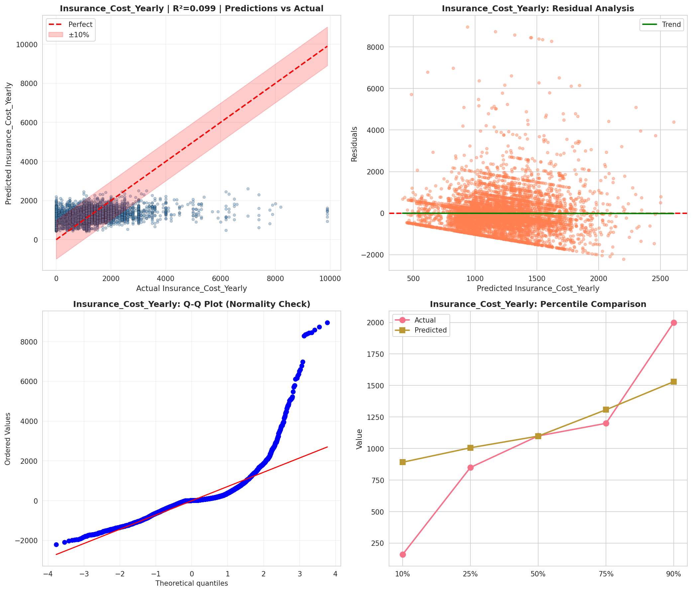
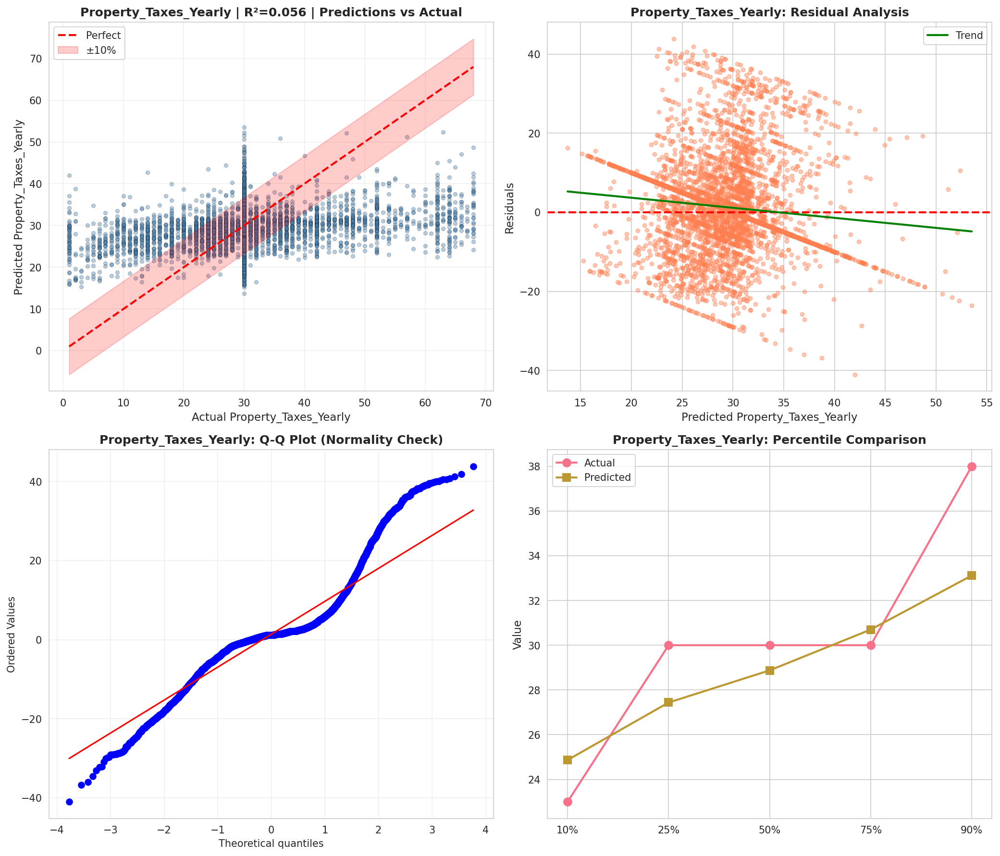
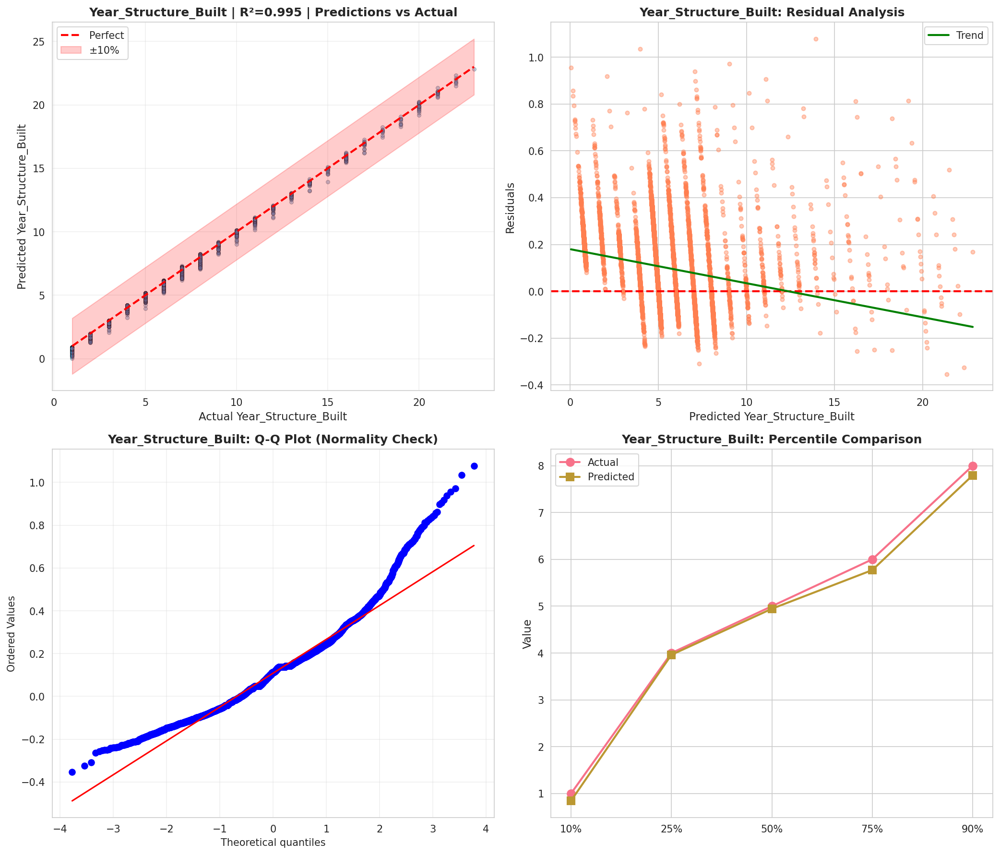
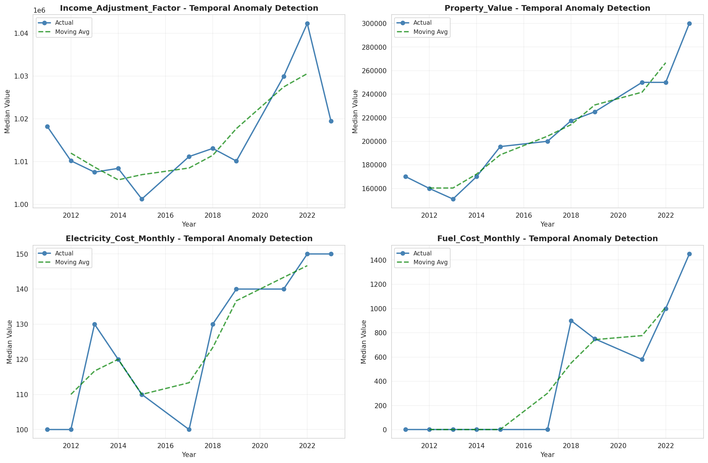
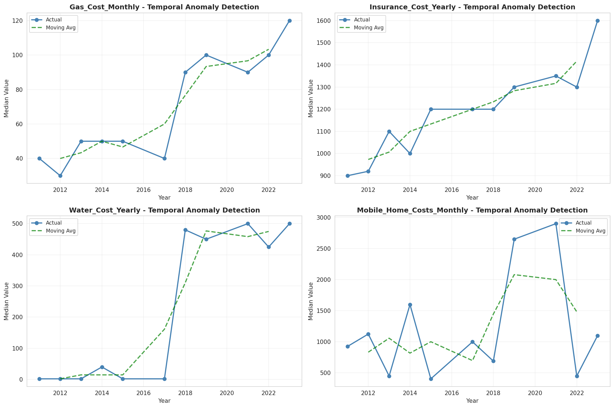
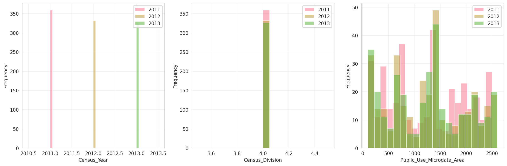
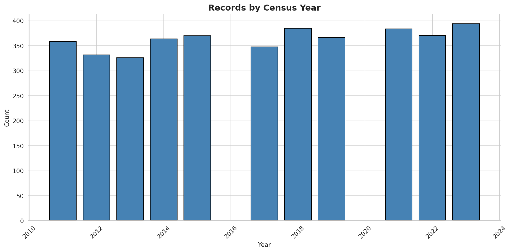
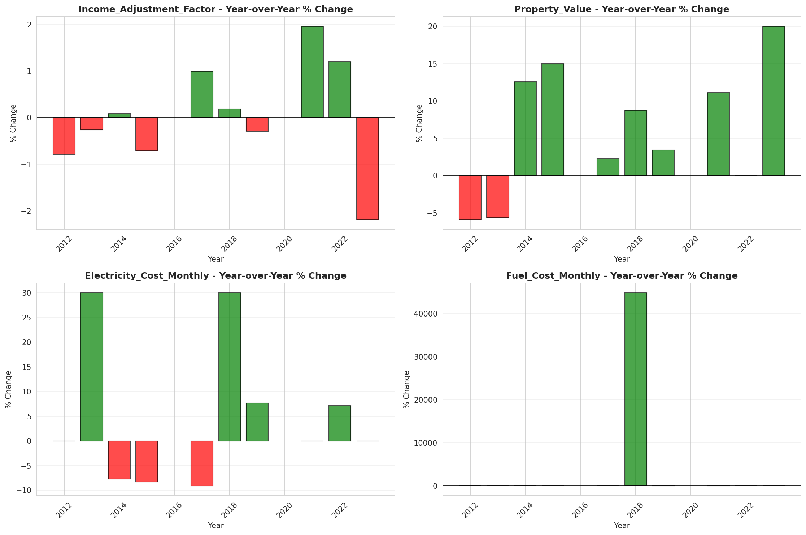
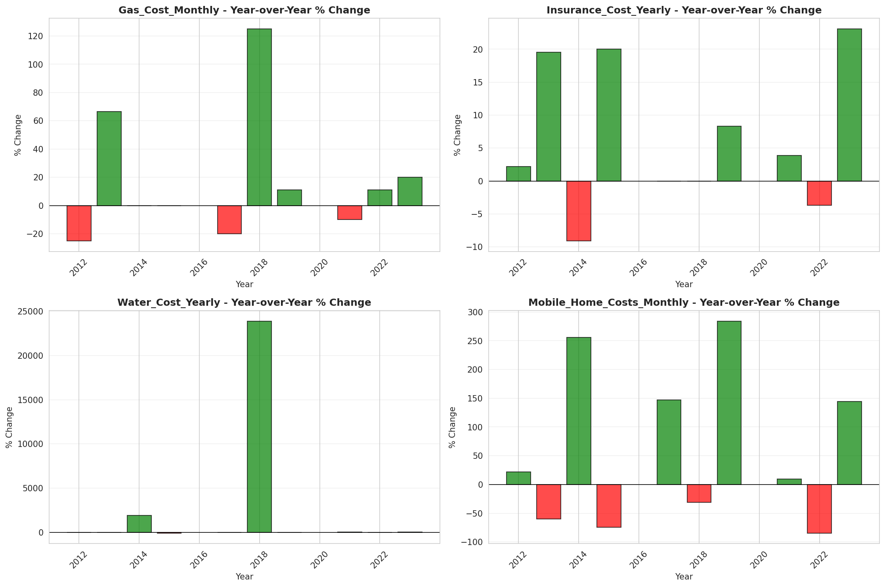

# Temporal Analysis

## Year Distribution

- 2011: 26,363 records

- 2012: 26,362 records

- 2013: 26,374 records

- 2014: 26,408 records

- 2015: 26,582 records

- 2017: 26,945 records

- 2018: 27,267 records

- 2019: 27,346 records

- 2021: 27,414 records

- 2022: 28,639 records

- 2023: 28,798 records

## Temporal Trends

- Census_Year: {np.int64(2011): {'mean': 2011.0, 'median': 2011.0, 'std': 0.0}, np.int64(2012): {'mean': 2012.0, 'median': 2012.0, 'std': 0.0}, np.int64(2013): {'mean': 2013.0, 'median': 2013.0, 'std': 0.0}, np.int64(2014): {'mean': 2014.0, 'median': 2014.0, 'std': 0.0}, np.int64(2015): {'mean': 2015.0, 'median': 2015.0, 'std': 0.0}, np.int64(2017): {'mean': 2017.0, 'median': 2017.0, 'std': 0.0}, np.int64(2018): {'mean': 2018.0, 'median': 2018.0, 'std': 0.0}, np.int64(2019): {'mean': 2019.0, 'median': 2019.0, 'std': 0.0}, np.int64(2021): {'mean': 2021.0, 'median': 2021.0, 'std': 0.0}, np.int64(2022): {'mean': 2022.0, 'median': 2022.0, 'std': 0.0}, np.int64(2023): {'mean': 2023.0, 'median': 2023.0, 'std': 0.0}}

- Census_Division: {np.int64(2011): {'mean': 4.0, 'median': 4.0, 'std': 0.0}, np.int64(2012): {'mean': 4.0, 'median': 4.0, 'std': 0.0}, np.int64(2013): {'mean': 4.0, 'median': 4.0, 'std': 0.0}, np.int64(2014): {'mean': 4.0, 'median': 4.0, 'std': 0.0}, np.int64(2015): {'mean': 4.0, 'median': 4.0, 'std': 0.0}, np.int64(2017): {'mean': 4.0, 'median': 4.0, 'std': 0.0}, np.int64(2018): {'mean': 4.0, 'median': 4.0, 'std': 0.0}, np.int64(2019): {'mean': 4.0, 'median': 4.0, 'std': 0.0}, np.int64(2021): {'mean': 4.0, 'median': 4.0, 'std': 0.0}, np.int64(2022): {'mean': 4.0, 'median': 4.0, 'std': 0.0}, np.int64(2023): {'mean': 4.0, 'median': 4.0, 'std': 0.0}}

- Public_Use_Microdata_Area: {np.int64(2011): {'mean': 1211.8546826992376, 'median': 1203.0, 'std': 715.5892686287141}, np.int64(2012): {'mean': 1256.016956224869, 'median': 1304.0, 'std': 730.6481402201232}, np.int64(2013): {'mean': 1255.6489345567604, 'median': 1303.0, 'std': 729.6048335592618}, np.int64(2014): {'mean': 1253.1610118146016, 'median': 1303.0, 'std': 730.1341730681637}, np.int64(2015): {'mean': 1253.2757881273042, 'median': 1303.0, 'std': 730.2373762550733}, np.int64(2017): {'mean': 1254.922323251067, 'median': 1304.0, 'std': 708.838695881746}, np.int64(2018): {'mean': 1251.4938203689442, 'median': 1303.0, 'std': 727.3590222205472}, np.int64(2019): {'mean': 1253.7374021794778, 'median': 1303.0, 'std': 729.1108096870639}, np.int64(2021): {'mean': 1262.2558181950828, 'median': 1304.0, 'std': 725.5964950489821}, np.int64(2022): {'mean': 1367.3370927755857, 'median': 1503.0, 'std': 797.0780418294178}, np.int64(2023): {'mean': 1364.7626224043336, 'median': 1502.0, 'std': 803.4139493438636}}

- Census_Region: {np.int64(2011): {'mean': 2.0, 'median': 2.0, 'std': 0.0}, np.int64(2012): {'mean': 2.0, 'median': 2.0, 'std': 0.0}, np.int64(2013): {'mean': 2.0, 'median': 2.0, 'std': 0.0}, np.int64(2014): {'mean': 2.0, 'median': 2.0, 'std': 0.0}, np.int64(2015): {'mean': 2.0, 'median': 2.0, 'std': 0.0}, np.int64(2017): {'mean': 2.0, 'median': 2.0, 'std': 0.0}, np.int64(2018): {'mean': 2.0, 'median': 2.0, 'std': 0.0}, np.int64(2019): {'mean': 2.0, 'median': 2.0, 'std': 0.0}, np.int64(2021): {'mean': 2.0, 'median': 2.0, 'std': 0.0}, np.int64(2022): {'mean': 2.0, 'median': 2.0, 'std': 0.0}, np.int64(2023): {'mean': 2.0, 'median': 2.0, 'std': 0.0}}

- State_Code: {np.int64(2011): {'mean': 27.0, 'median': 27.0, 'std': 0.0}, np.int64(2012): {'mean': 27.0, 'median': 27.0, 'std': 0.0}, np.int64(2013): {'mean': 27.0, 'median': 27.0, 'std': 0.0}, np.int64(2014): {'mean': 27.0, 'median': 27.0, 'std': 0.0}, np.int64(2015): {'mean': 27.0, 'median': 27.0, 'std': 0.0}, np.int64(2017): {'mean': 27.0, 'median': 27.0, 'std': 0.0}, np.int64(2018): {'mean': 27.0, 'median': 27.0, 'std': 0.0}, np.int64(2019): {'mean': 27.0, 'median': 27.0, 'std': 0.0}, np.int64(2021): {'mean': 27.0, 'median': 27.0, 'std': 0.0}, np.int64(2022): {'mean': 27.0, 'median': 27.0, 'std': 0.0}, np.int64(2023): {'mean': None, 'median': None, 'std': None}}

- Housing_Adjustment_Factor: {np.int64(2011): {'mean': 1000000.0, 'median': 1000000.0, 'std': 0.0}, np.int64(2012): {'mean': 1000000.0, 'median': 1000000.0, 'std': 0.0}, np.int64(2013): {'mean': 1000000.0, 'median': 1000000.0, 'std': 0.0}, np.int64(2014): {'mean': 1000000.0, 'median': 1000000.0, 'std': 0.0}, np.int64(2015): {'mean': 1000000.0, 'median': 1000000.0, 'std': 0.0}, np.int64(2017): {'mean': 1000000.0, 'median': 1000000.0, 'std': 0.0}, np.int64(2018): {'mean': 1000000.0, 'median': 1000000.0, 'std': 0.0}, np.int64(2019): {'mean': 1000000.0, 'median': 1000000.0, 'std': 0.0}, np.int64(2021): {'mean': 1000000.0, 'median': 1000000.0, 'std': 0.0}, np.int64(2022): {'mean': 1000000.0, 'median': 1000000.0, 'std': 0.0}, np.int64(2023): {'mean': 1000000.0, 'median': 1000000.0, 'std': 0.0}}

- Income_Adjustment_Factor: {np.int64(2011): {'mean': 1018237.0, 'median': 1018237.0, 'std': 0.0}, np.int64(2012): {'mean': 1010207.0, 'median': 1010207.0, 'std': 0.0}, np.int64(2013): {'mean': 1007549.0, 'median': 1007549.0, 'std': 0.0}, np.int64(2014): {'mean': 1008425.0, 'median': 1008425.0, 'std': 0.0}, np.int64(2015): {'mean': 1001264.0, 'median': 1001264.0, 'std': 0.0}, np.int64(2017): {'mean': 1011189.0, 'median': 1011189.0, 'std': 0.0}, np.int64(2018): {'mean': 1013097.0, 'median': 1013097.0, 'std': 0.0}, np.int64(2019): {'mean': 1010145.0, 'median': 1010145.0, 'std': 0.0}, np.int64(2021): {'mean': 1029928.0, 'median': 1029928.0, 'std': 0.0}, np.int64(2022): {'mean': 1042311.0, 'median': 1042311.0, 'std': 0.0}, np.int64(2023): {'mean': 1019518.0, 'median': 1019518.0, 'std': 0.0}}

- Housing_Unit_Weight: {np.int64(2011): {'mean': 89.29465538823351, 'median': 51.0, 'std': 105.37834644766158}, np.int64(2012): {'mean': 89.56353842652302, 'median': 52.0, 'std': 102.60064513280327}, np.int64(2013): {'mean': 89.81398346856753, 'median': 53.0, 'std': 101.90667700769228}, np.int64(2014): {'mean': 90.32342471978188, 'median': 53.0, 'std': 102.60697176658717}, np.int64(2015): {'mean': 90.1768489955609, 'median': 53.0, 'std': 102.3063788243242}, np.int64(2017): {'mean': 90.4704397847467, 'median': 61.0, 'std': 95.64234579946292}, np.int64(2018): {'mean': 90.0589357098324, 'median': 54.0, 'std': 104.59536033702034}, np.int64(2019): {'mean': 90.59880786952388, 'median': 53.0, 'std': 110.0291986581955}, np.int64(2021): {'mean': 91.8130882031079, 'median': 53.0, 'std': 111.0675342494975}, np.int64(2022): {'mean': 88.96494291001781, 'median': 50.0, 'std': 110.45637679218976}, np.int64(2023): {'mean': 89.41357038683242, 'median': 47.0, 'std': 112.58634979847083}}

- Number_of_Persons: {np.int64(2011): {'mean': 2.0793157076205286, 'median': 2.0, 'std': 1.467591773867798}, np.int64(2012): {'mean': 2.061831424019422, 'median': 2.0, 'std': 1.4516108419963498}, np.int64(2013): {'mean': 2.0849321301281565, 'median': 2.0, 'std': 1.4819500970893908}, np.int64(2014): {'mean': 2.056081490457437, 'median': 2.0, 'std': 1.4582453387697858}, np.int64(2015): {'mean': 2.0619592205251673, 'median': 2.0, 'std': 1.4661826721105569}, np.int64(2017): {'mean': 2.04717016143997, 'median': 2.0, 'std': 1.4846433667868868}, np.int64(2018): {'mean': 2.045806285986724, 'median': 2.0, 'std': 1.465385696354967}, np.int64(2019): {'mean': 2.0723323337965334, 'median': 2.0, 'std': 1.4445935379220725}, np.int64(2021): {'mean': 2.065951703509156, 'median': 2.0, 'std': 1.4668948555621995}, np.int64(2022): {'mean': 2.059569119033486, 'median': 2.0, 'std': 1.4566671375040345}, np.int64(2023): {'mean': 2.062261268143621, 'median': 2.0, 'std': 1.4350225440462463}}

- Housing_Unit_Type: {np.int64(2011): {'mean': 1.1654970982058188, 'median': 1.0, 'std': 0.5049987647419233}, np.int64(2012): {'mean': 1.1615203702298764, 'median': 1.0, 'std': 0.4999998582588147}, np.int64(2013): {'mean': 1.159285660119815, 'median': 1.0, 'std': 0.498807623163603}, np.int64(2014): {'mean': 1.1513935171160254, 'median': 1.0, 'std': 0.4878471085537712}, np.int64(2015): {'mean': 1.1549920999172372, 'median': 1.0, 'std': 0.49501607499213485}, np.int64(2017): {'mean': 1.1509742067173874, 'median': 1.0, 'std': 0.4894915971889496}, np.int64(2018): {'mean': 1.1562328088898668, 'median': 1.0, 'std': 0.49579942530089927}, np.int64(2019): {'mean': 1.1493819937102319, 'median': 1.0, 'std': 0.4878773438479236}, np.int64(2021): {'mean': None, 'median': None, 'std': None}, np.int64(2022): {'mean': None, 'median': None, 'std': None}, np.int64(2023): {'mean': None, 'median': None, 'std': None}}

- Number_of_Bedrooms: {np.int64(2011): {'mean': 2.957605879104541, 'median': 3.0, 'std': 1.348394852206635}, np.int64(2012): {'mean': 2.9540526806131955, 'median': 3.0, 'std': 1.28771230797856}, np.int64(2013): {'mean': 2.9546183721715638, 'median': 3.0, 'std': 1.2358237337956275}, np.int64(2014): {'mean': 2.976148558014755, 'median': 3.0, 'std': 1.3544592975283893}, np.int64(2015): {'mean': 2.930436233213779, 'median': 3.0, 'std': 1.1441896431100413}, np.int64(2017): {'mean': 2.9086881614570514, 'median': 3.0, 'std': 1.156192979775286}, np.int64(2018): {'mean': 2.945645535605228, 'median': 3.0, 'std': 1.150775775547807}, np.int64(2019): {'mean': 2.9751795948018405, 'median': 3.0, 'std': 1.1427148062476504}, np.int64(2021): {'mean': 2.9786278949668294, 'median': 3.0, 'std': 1.145232100119988}, np.int64(2022): {'mean': 2.987912087912088, 'median': 3.0, 'std': 1.1591154748924073}, np.int64(2023): {'mean': 2.9909532129683556, 'median': 3.0, 'std': 1.15281969431361}}

- Number_of_Rooms: {np.int64(2011): {'mean': 6.589227305552016, 'median': 6.0, 'std': 2.781232070248076}, np.int64(2012): {'mean': 6.588972643347167, 'median': 6.0, 'std': 2.77318112279807}, np.int64(2013): {'mean': 6.691953731847349, 'median': 6.0, 'std': 2.9312580350953836}, np.int64(2014): {'mean': 6.712818578135479, 'median': 6.0, 'std': 2.9886638336094475}, np.int64(2015): {'mean': 6.642088581199433, 'median': 6.0, 'std': 2.741709431235199}, np.int64(2017): {'mean': 6.614570514398228, 'median': 6.0, 'std': 2.7670826333750185}, np.int64(2018): {'mean': 6.686087700012214, 'median': 6.0, 'std': 2.7512932713151352}, np.int64(2019): {'mean': 6.771611913794495, 'median': 6.0, 'std': 2.7666402756168638}, np.int64(2021): {'mean': 6.7863186747705875, 'median': 6.0, 'std': 2.7902295435025124}, np.int64(2022): {'mean': 6.818563579277865, 'median': 7.0, 'std': 2.8413733276953654}, np.int64(2023): {'mean': 6.794991263832266, 'median': 6.0, 'std': 2.7963934790360105}}

- Building_Type: {np.int64(2011): {'mean': 2.6167537487787267, 'median': 2.0, 'std': 1.7959686793174563}, np.int64(2012): {'mean': 2.62234267807233, 'median': 2.0, 'std': 1.7980689068088243}, np.int64(2013): {'mean': 2.6048632218844983, 'median': 2.0, 'std': 1.7857733208788438}, np.int64(2014): {'mean': 2.6212273641851107, 'median': 2.0, 'std': 1.8061982578986673}, np.int64(2015): {'mean': 2.634414880306948, 'median': 2.0, 'std': 1.8248958471694399}, np.int64(2017): {'mean': 2.6929198457625727, 'median': 2.0, 'std': 1.889610533302275}, np.int64(2018): {'mean': 2.65143927364521, 'median': 2.0, 'std': 1.8506202369662283}, np.int64(2019): {'mean': 2.633868754540318, 'median': 2.0, 'std': 1.8278457795383238}, np.int64(2021): {'mean': 2.639574146903428, 'median': 2.0, 'std': 1.8363100639585164}, np.int64(2022): {'mean': 2.6311224489795917, 'median': 2.0, 'std': 1.8220612971840038}, np.int64(2023): {'mean': 2.625509609784508, 'median': 2.0, 'std': 1.814717259974138}}

- Year_Structure_Built: {np.int64(2011): {'mean': 4.654347733741132, 'median': 5.0, 'std': 2.745448287678437}, np.int64(2012): {'mean': 4.7076310663165915, 'median': 5.0, 'std': 2.7970003843168563}, np.int64(2013): {'mean': 4.772627490712597, 'median': 5.0, 'std': 2.869734632199779}, np.int64(2014): {'mean': 4.844232059020792, 'median': 5.0, 'std': 2.986318037928367}, np.int64(2015): {'mean': 4.918842272082743, 'median': 5.0, 'std': 3.115025714990084}, np.int64(2017): {'mean': 5.329395356468948, 'median': 5.0, 'std': 3.684678194657573}, np.int64(2018): {'mean': 5.280241032531249, 'median': 5.0, 'std': 3.786323004749929}, np.int64(2019): {'mean': 5.3991847606747925, 'median': 5.0, 'std': 4.037303672515597}, np.int64(2021): {'mean': None, 'median': None, 'std': None}, np.int64(2022): {'mean': None, 'median': None, 'std': None}, np.int64(2023): {'mean': None, 'median': None, 'std': None}}

- Bathtub_or_Shower: {np.int64(2011): {'mean': 1.0160995709613017, 'median': 1.0, 'std': 0.1258612239304893}, np.int64(2012): {'mean': 1.0141441517743712, 'median': 1.0, 'std': 0.1180876169254721}, np.int64(2013): {'mean': 1.0148598446470787, 'median': 1.0, 'std': 0.12099441178714813}, np.int64(2014): {'mean': 1.0153839704896044, 'median': 1.0, 'std': 0.12307696338285479}, np.int64(2015): {'mean': 1.0156393360580531, 'median': 1.0, 'std': 0.12407815798450593}, np.int64(2017): {'mean': 1.0174747723357125, 'median': 1.0, 'std': 0.1310347625463143}, np.int64(2018): {'mean': 1.0129473555636985, 'median': 1.0, 'std': 0.1130497319526861}, np.int64(2019): {'mean': 1.0106546129631124, 'median': 1.0, 'std': 0.10267189305899865}, np.int64(2021): {'mean': 1.0133873594724507, 'median': 1.0, 'std': 0.11492894672051363}, np.int64(2022): {'mean': 1.0096153846153846, 'median': 1.0, 'std': 0.09758741081757273}, np.int64(2023): {'mean': 1.0085808580858087, 'median': 1.0, 'std': 0.0922364206089598}}

- Refrigerator: {np.int64(2011): {'mean': 1.0134658680599804, 'median': 1.0, 'std': 0.11526102028137504}, np.int64(2012): {'mean': 1.0104598966714662, 'median': 1.0, 'std': 0.10173949858141745}, np.int64(2013): {'mean': 1.011820330969267, 'median': 1.0, 'std': 0.10807915556807292}, np.int64(2014): {'mean': 1.0123239436619718, 'median': 1.0, 'std': 0.11032939013108854}, np.int64(2015): {'mean': 1.0120110100925848, 'median': 1.0, 'std': 0.10893686543672748}, np.int64(2017): {'mean': 1.0128394454015917, 'median': 1.0, 'std': 0.11258380871179757}, np.int64(2018): {'mean': 1.0109116078335572, 'median': 1.0, 'std': 0.103889287628229}, np.int64(2019): {'mean': 1.008878844135927, 'median': 1.0, 'std': 0.0938102629313584}, np.int64(2021): {'mean': 1.0105668772097087, 'median': 1.0, 'std': 0.10225279295383886}, np.int64(2022): {'mean': 1.008359497645212, 'median': 1.0, 'std': 0.09104911748757093}, np.int64(2023): {'mean': 1.0073772083090662, 'median': 1.0, 'std': 0.0855749346623552}}

- Hot_and_Cold_Running_Water: {np.int64(2011): {'mean': 1.0194129391274798, 'median': 1.0, 'std': 0.1379742207489513}, np.int64(2012): {'mean': 1.016219192004743, 'median': 1.0, 'std': 0.1263202499618527}, np.int64(2013): {'mean': 1.0172661263086795, 'median': 1.0, 'std': 0.13026405311356357}, np.int64(2014): {'mean': 1.01773138832998, 'median': 1.0, 'std': 0.13197619602323954}, np.int64(2015): {'mean': 1.0178079906581032, 'median': 1.0, 'std': 0.13225579613764663}, np.int64(2017): {'mean': 1.0208384609073755, 'median': 1.0, 'std': 0.14284626870132397}, np.int64(2018): {'mean': 1.0183217295712714, 'median': 1.0, 'std': 0.13411478713237457}, np.int64(2019): {'mean': 1.0142465089999193, 'median': 1.0, 'std': 0.1185078595659759}, np.int64(2021): {'mean': 1.0166050927581138, 'median': 1.0, 'std': 0.1277889367825709}, np.int64(2022): {'mean': 1.0124018838304552, 'median': 1.0, 'std': 0.11067320281143689}, np.int64(2023): {'mean': 1.0113376043486701, 'median': 1.0, 'std': 0.10587491823899628}}

- Running_Water: {np.int64(2011): {'mean': None, 'median': None, 'std': None}, np.int64(2012): {'mean': None, 'median': None, 'std': None}, np.int64(2013): {'mean': 9.0, 'median': 9.0, 'std': 0.0}, np.int64(2014): {'mean': 9.0, 'median': 9.0, 'std': 0.0}, np.int64(2015): {'mean': 9.0, 'median': 9.0, 'std': 0.0}, np.int64(2017): {'mean': 9.0, 'median': 9.0, 'std': 0.0}, np.int64(2018): {'mean': 9.0, 'median': 9.0, 'std': 0.0}, np.int64(2019): {'mean': 9.0, 'median': 9.0, 'std': 0.0}, np.int64(2021): {'mean': 9.0, 'median': 9.0, 'std': 0.0}, np.int64(2022): {'mean': 9.0, 'median': 9.0, 'std': 0.0}, np.int64(2023): {'mean': 9.0, 'median': 9.0, 'std': 0.0}}

- Sink_with_Faucet: {np.int64(2011): {'mean': 1.0136782634552484, 'median': 1.0, 'std': 0.11615395680242059}, np.int64(2012): {'mean': 1.0117303294655713, 'median': 1.0, 'std': 0.1076718151750361}, np.int64(2013): {'mean': 1.0117359000337725, 'median': 1.0, 'std': 0.10769706740183857}, np.int64(2014): {'mean': 1.0129107981220657, 'median': 1.0, 'std': 0.11289217708118146}, np.int64(2015): {'mean': 1.0119276003002753, 'median': 1.0, 'std': 0.108562535793549}, np.int64(2017): {'mean': 1.013577816063664, 'median': 1.0, 'std': 0.11573248638460983}, np.int64(2018): {'mean': 1.0097715891046781, 'median': 1.0, 'std': 0.09836919807170426}, np.int64(2019): {'mean': 1.0084752603115668, 'median': 1.0, 'std': 0.09167207555607508}, np.int64(2021): {'mean': 1.0110038533349224, 'median': 1.0, 'std': 0.10432258088723735}, np.int64(2022): {'mean': 1.0080455259026688, 'median': 1.0, 'std': 0.08933705080167936}, np.int64(2023): {'mean': 1.0070665890118424, 'median': 1.0, 'std': 0.08376708649947524}}

- Stove_or_Range: {np.int64(2011): {'mean': 1.0137632216133554, 'median': 1.0, 'std': 0.11650910681572157}, np.int64(2012): {'mean': 1.0117726772253748, 'median': 1.0, 'std': 0.107863682462944}, np.int64(2013): {'mean': 1.0120736237757515, 'median': 1.0, 'std': 0.10921700850030899}, np.int64(2014): {'mean': 1.0132042253521127, 'median': 1.0, 'std': 0.11415086507074099}, np.int64(2015): {'mean': 1.0129702227041455, 'median': 1.0, 'std': 0.11314826536599068}, np.int64(2017): {'mean': 1.0143982279104111, 'median': 1.0, 'std': 0.1191280868948694}, np.int64(2018): {'mean': 1.0116444770164081, 'median': 1.0, 'std': 0.10728164695863639}, np.int64(2019): {'mean': 1.0094035031075954, 'median': 1.0, 'std': 0.09651659543064818}, np.int64(2021): {'mean': 1.0124736821197315, 'median': 1.0, 'std': 0.11098909284658323}, np.int64(2022): {'mean': 1.009536891679749, 'median': 1.0, 'std': 0.09719212988273972}, np.int64(2023): {'mean': 1.0093574063288682, 'median': 1.0, 'std': 0.09628190491334966}}

- Telephone_Service: {np.int64(2011): {'mean': 1.018926856556804, 'median': 1.0, 'std': 0.13626993919463284}, np.int64(2012): {'mean': 1.0189252336448598, 'median': 1.0, 'std': 0.13626421700852723}, np.int64(2013): {'mean': 1.0186410662689906, 'median': 1.0, 'std': 0.1352569018073629}, np.int64(2014): {'mean': 1.0196060211856532, 'median': 1.0, 'std': 0.13864529632344147}, np.int64(2015): {'mean': 1.0253404108008308, 'median': 1.0, 'std': 0.15716047353564222}, np.int64(2017): {'mean': 1.0123774904523075, 'median': 1.0, 'std': 0.11056604670588353}, np.int64(2018): {'mean': 1.012780562706047, 'median': 1.0, 'std': 0.11232893551954419}, np.int64(2019): {'mean': 1.0068656980864634, 'median': 1.0, 'std': 0.08257640290404619}, np.int64(2021): {'mean': 1.0079898151806488, 'median': 1.0, 'std': 0.08902991632255143}, np.int64(2022): {'mean': 1.0075887497856286, 'median': 1.0, 'std': 0.08678412049073103}, np.int64(2023): {'mean': 1.007319843506794, 'median': 1.0, 'std': 0.08524417333952505}}

- Lot_Acreage: {np.int64(2011): {'mean': 1.6722437137330755, 'median': 1.0, 'std': 0.7972724154263504}, np.int64(2012): {'mean': 1.6790785279629092, 'median': 1.0, 'std': 0.796044217035197}, np.int64(2013): {'mean': 1.6662831391725395, 'median': 1.0, 'std': 0.7905010946357954}, np.int64(2014): {'mean': 1.6708407016202265, 'median': 1.0, 'std': 0.7935814565342241}, np.int64(2015): {'mean': 1.6713216719889423, 'median': 1.0, 'std': 0.7905372866742566}, np.int64(2017): {'mean': 1.5925169745026353, 'median': 1.0, 'std': 0.7590849152783339}, np.int64(2018): {'mean': 1.6734436931685708, 'median': 1.0, 'std': 0.7834479089052928}, np.int64(2019): {'mean': 1.6891680471194552, 'median': 1.0, 'std': 0.7916587534418218}, np.int64(2021): {'mean': 1.6569956616052062, 'median': 1.0, 'std': 0.7785074790011576}, np.int64(2022): {'mean': 1.6560339058666071, 'median': 1.0, 'std': 0.777288181338183}, np.int64(2023): {'mean': 1.67518023562511, 'median': 1.0, 'std': 0.7770532728537807}}

- Agricultural_Sales: {np.int64(2011): {'mean': 1.7746155611659398, 'median': 1.0, 'std': 1.6916340406006658}, np.int64(2012): {'mean': 1.7502557690121632, 'median': 1.0, 'std': 1.6787300551482867}, np.int64(2013): {'mean': 1.7059963520291839, 'median': 1.0, 'std': 1.635693970741436}, np.int64(2014): {'mean': 1.7277992277992278, 'median': 1.0, 'std': 1.6595031086893302}, np.int64(2015): {'mean': 1.7030577576443942, 'median': 1.0, 'std': 1.6274146940893608}, np.int64(2017): {'mean': 1.5429997440491425, 'median': 1.0, 'std': 1.4483315975581295}, np.int64(2018): {'mean': 1.6070298002401484, 'median': 1.0, 'std': 1.5252355849553325}, np.int64(2019): {'mean': 1.6569987389659522, 'median': 1.0, 'std': 1.5745093701192332}, np.int64(2021): {'mean': 1.5696339614468269, 'median': 1.0, 'std': 1.4741251965389197}, np.int64(2022): {'mean': 1.5749633046760327, 'median': 1.0, 'std': 1.4849177524658352}, np.int64(2023): {'mean': 1.5634983238020115, 'median': 1.0, 'std': 1.46935991045159}}

- Tenure: {np.int64(2011): {'mean': 1.6919957111556572, 'median': 1.0, 'std': 0.8089250302697963}, np.int64(2012): {'mean': 1.71, 'median': 2.0, 'std': 0.8143836388632743}, np.int64(2013): {'mean': 1.714884891415789, 'median': 2.0, 'std': 0.810854778411482}, np.int64(2014): {'mean': 1.7158985318713993, 'median': 2.0, 'std': 0.8044306385579696}, np.int64(2015): {'mean': 1.7271636279713825, 'median': 2.0, 'std': 0.8059584754270916}, np.int64(2017): {'mean': 1.7258546910228685, 'median': 2.0, 'std': 0.8118803757792601}, np.int64(2018): {'mean': 1.7245179063360883, 'median': 2.0, 'std': 0.8028930850143061}, np.int64(2019): {'mean': 1.7223157335223247, 'median': 2.0, 'std': 0.7926628470407155}, np.int64(2021): {'mean': 1.7128495544141533, 'median': 2.0, 'std': 0.7825459252869452}, np.int64(2022): {'mean': 1.7126136168753217, 'median': 2.0, 'std': 0.7789255942759483}, np.int64(2023): {'mean': 1.7192377266417063, 'median': 2.0, 'std': 0.779906269990717}}

- Vacancy_Status: {np.int64(2011): {'mean': 5.006698564593301, 'median': 5.0, 'std': 1.4473207316242724}, np.int64(2012): {'mean': 5.0347786811201445, 'median': 5.0, 'std': 1.3548663844883087}, np.int64(2013): {'mean': 5.057399103139013, 'median': 5.0, 'std': 1.346056319561751}, np.int64(2014): {'mean': 5.039451114922813, 'median': 5.0, 'std': 1.3897909464790388}, np.int64(2015): {'mean': 5.004323389537397, 'median': 5.0, 'std': 1.383284536856696}, np.int64(2017): {'mean': 5.091493383742911, 'median': 5.0, 'std': 1.2894102900324957}, np.int64(2018): {'mean': 5.099255583126551, 'median': 5.0, 'std': 1.3446562375592974}, np.int64(2019): {'mean': 5.080381471389646, 'median': 5.0, 'std': 1.3732652895411155}, np.int64(2021): {'mean': 5.012949039264829, 'median': 5.0, 'std': 1.368042910147379}, np.int64(2022): {'mean': 5.0482374768089056, 'median': 5.0, 'std': 1.3350501267841575}, np.int64(2023): {'mean': 5.034778225806452, 'median': 5.0, 'std': 1.4616634570702043}}

- Property_Value: {np.int64(2011): {'mean': 210892.4945061137, 'median': 173000.0, 'std': 202495.5181364189}, np.int64(2012): {'mean': 206765.99817684595, 'median': 165000.0, 'std': 205970.14147956757}, np.int64(2013): {'mean': 210295.27435037243, 'median': 170000.0, 'std': 203488.5718233487}, np.int64(2014): {'mean': 219204.9458647469, 'median': 175000.0, 'std': 228686.73488573206}, np.int64(2015): {'mean': 228979.91641251554, 'median': 180000.0, 'std': 230417.94159035597}, np.int64(2017): {'mean': 252334.87123850852, 'median': 200000.0, 'std': 254516.5757505405}, np.int64(2018): {'mean': 255408.9915548932, 'median': 200000.0, 'std': 245055.99278213194}, np.int64(2019): {'mean': 267087.0439713277, 'median': 220000.0, 'std': 247731.26542602511}, np.int64(2021): {'mean': 305187.1098478867, 'median': 250000.0, 'std': 309301.6223025099}, np.int64(2022): {'mean': 343412.90107295034, 'median': 280000.0, 'std': 360696.49963786674}, np.int64(2023): {'mean': 349490.80038185196, 'median': 300000.0, 'std': 342337.48990513815}}

- Vehicles_Available: {np.int64(2011): {'mean': 2.046664491165913, 'median': 2.0, 'std': 1.1110860904698463}, np.int64(2012): {'mean': 2.065607476635514, 'median': 2.0, 'std': 1.1143735705461193}, np.int64(2013): {'mean': 2.0824867182402835, 'median': 2.0, 'std': 1.1294957965713825}, np.int64(2014): {'mean': 2.0804218546738524, 'median': 2.0, 'std': 1.1237963617881026}, np.int64(2015): {'mean': 2.1113777982921764, 'median': 2.0, 'std': 1.147098431807978}, np.int64(2017): {'mean': 2.090415497170202, 'median': 2.0, 'std': 1.1280792276213385}, np.int64(2018): {'mean': 2.128302398049045, 'median': 2.0, 'std': 1.1423893481548417}, np.int64(2019): {'mean': 2.157778171509568, 'median': 2.0, 'std': 1.1689598248523527}, np.int64(2021): {'mean': 2.120593529127705, 'median': 2.0, 'std': 1.151446417044768}, np.int64(2022): {'mean': 2.124078202709655, 'median': 2.0, 'std': 1.1574002880983394}, np.int64(2023): {'mean': 2.1235959782928777, 'median': 2.0, 'std': 1.1471255990146998}}

- Condo_Fee_Monthly: {np.int64(2011): {'mean': 258.18559556786704, 'median': 200.0, 'std': 187.78038907662017}, np.int64(2012): {'mean': 262.0827389443652, 'median': 200.0, 'std': 196.97410707697887}, np.int64(2013): {'mean': 279.53584905660375, 'median': 220.0, 'std': 194.53284558907487}, np.int64(2014): {'mean': 266.6857142857143, 'median': 220.0, 'std': 170.4486286405747}, np.int64(2015): {'mean': 293.90423572744015, 'median': 230.0, 'std': 189.2007028037557}, np.int64(2017): {'mean': 323.6132404181185, 'median': 260.0, 'std': 207.83964040711746}, np.int64(2018): {'mean': 329.24006908462866, 'median': 250.0, 'std': 229.5763573602881}, np.int64(2019): {'mean': 331.657848324515, 'median': 260.0, 'std': 211.79212432668706}, np.int64(2021): {'mean': 392.8454258675079, 'median': 290.0, 'std': 309.4513384805715}, np.int64(2022): {'mean': 382.33542319749216, 'median': 300.0, 'std': 280.16204163885646}, np.int64(2023): {'mean': 391.03067484662574, 'median': 310.0, 'std': 264.15501717277124}}

- Electricity_Cost_Monthly: {np.int64(2011): {'mean': 124.86648641088993, 'median': 100.0, 'std': 85.9208888628805}, np.int64(2012): {'mean': 122.95598130841121, 'median': 100.0, 'std': 84.2902416107871}, np.int64(2013): {'mean': 133.68156398545997, 'median': 120.0, 'std': 92.19154231174312}, np.int64(2014): {'mean': 140.12102769002044, 'median': 120.0, 'std': 98.27058332216704}, np.int64(2015): {'mean': 134.22021693976458, 'median': 110.0, 'std': 95.62759499789921}, np.int64(2017): {'mean': 132.45470022546357, 'median': 110.0, 'std': 91.73621209045419}, np.int64(2018): {'mean': 151.7039486113735, 'median': 130.0, 'std': 97.86943717176295}, np.int64(2019): {'mean': 151.79177045852938, 'median': 130.0, 'std': 99.79337236535994}, np.int64(2021): {'mean': 157.55455835889921, 'median': 130.0, 'std': 111.4730883032653}, np.int64(2022): {'mean': 187.46985910469056, 'median': 150.0, 'std': 265.62920341503207}, np.int64(2023): {'mean': 187.9918759554488, 'median': 150.0, 'std': 232.86394665218012}}

- Fuel_Cost_Monthly: {np.int64(2011): {'mean': 226.399235466878, 'median': 2.0, 'std': 606.3382387834938}, np.int64(2012): {'mean': 208.52808411214954, 'median': 2.0, 'std': 569.7480362908713}, np.int64(2013): {'mean': 137.28758504986484, 'median': 2.0, 'std': 468.987279852555}, np.int64(2014): {'mean': 170.49340271325033, 'median': 2.0, 'std': 560.3935940538739}, np.int64(2015): {'mean': 144.52970228479114, 'median': 2.0, 'std': 490.8068955800434}, np.int64(2017): {'mean': 91.4014171996503, 'median': 2.0, 'std': 354.2838107954831}, np.int64(2018): {'mean': 965.8736, 'median': 800.0, 'std': 776.5217406025998}, np.int64(2019): {'mean': 1030.3325859491779, 'median': 900.0, 'std': 827.1512838378366}, np.int64(2021): {'mean': 937.4321214910262, 'median': 800.0, 'std': 788.5642801690465}, np.int64(2022): {'mean': 1149.2692664809656, 'median': 995.0, 'std': 968.7150125711844}, np.int64(2023): {'mean': 1231.5643564356435, 'median': 1000.0, 'std': 1092.448882652917}}

- Gas_Cost_Monthly: {np.int64(2011): {'mean': 73.3891660062468, 'median': 40.0, 'std': 94.99734341572781}, np.int64(2012): {'mean': 63.989672897196265, 'median': 40.0, 'std': 84.06293572860679}, np.int64(2013): {'mean': 71.47371609656072, 'median': 50.0, 'std': 89.7415457214211}, np.int64(2014): {'mean': 85.46566623304219, 'median': 50.0, 'std': 108.51544371757262}, np.int64(2015): {'mean': 74.8477267482114, 'median': 50.0, 'std': 96.76488599430634}, np.int64(2017): {'mean': 64.65853770763356, 'median': 40.0, 'std': 80.64698036013372}, np.int64(2018): {'mean': 110.93164693218515, 'median': 90.0, 'std': 100.02597070864579}, np.int64(2019): {'mean': 114.7097439865867, 'median': 90.0, 'std': 100.3010252363585}, np.int64(2021): {'mean': 111.96412953926104, 'median': 90.0, 'std': 109.24975360975718}, np.int64(2022): {'mean': 171.9819064966606, 'median': 100.0, 'std': 266.79294745452285}, np.int64(2023): {'mean': 170.0161875855502, 'median': 110.0, 'std': 249.3376398294016}}

- House_Heating_Fuel: {np.int64(2011): {'mean': 2.1644678569763647, 'median': 2.0, 'std': 1.5931344162036833}, np.int64(2012): {'mean': 2.1795794392523367, 'median': 2.0, 'std': 1.5963367015632588}, np.int64(2013): {'mean': 2.159334513934197, 'median': 2.0, 'std': 1.5985183767869309}, np.int64(2014): {'mean': 2.1399832744842966, 'median': 2.0, 'std': 1.5893121869004}, np.int64(2015): {'mean': 2.1263327948303714, 'median': 2.0, 'std': 1.5705237430197325}, np.int64(2017): {'mean': 2.012837620208899, 'median': 1.0, 'std': 1.4977960725381818}, np.int64(2018): {'mean': 2.0897800659350585, 'median': 2.0, 'std': 1.5399347472488927}, np.int64(2019): {'mean': 2.0605510276399714, 'median': 2.0, 'std': 1.5041357050004505}, np.int64(2021): {'mean': 2.025462048377892, 'median': 2.0, 'std': 1.475726745425437}, np.int64(2022): {'mean': 2.00595952666781, 'median': 2.0, 'std': 1.4542453840695346}, np.int64(2023): {'mean': 2.040637751882546, 'median': 2.0, 'std': 1.4516284783054514}}

- Insurance_Cost_Yearly: {np.int64(2011): {'mean': 1026.828059276516, 'median': 900.0, 'std': 711.1197204445748}, np.int64(2012): {'mean': 1060.1693543122021, 'median': 960.0, 'std': 688.0604928957722}, np.int64(2013): {'mean': 1131.4852729414845, 'median': 1000.0, 'std': 755.0981725958997}, np.int64(2014): {'mean': 1206.048905205192, 'median': 1100.0, 'std': 815.9251109220971}, np.int64(2015): {'mean': 1253.2253693786695, 'median': 1100.0, 'std': 849.5461665544062}, np.int64(2017): {'mean': 1317.6341352700863, 'median': 1200.0, 'std': 892.960593630168}, np.int64(2018): {'mean': 1351.4505411049934, 'median': 1200.0, 'std': 907.2946067250004}, np.int64(2019): {'mean': 1401.8227645282554, 'median': 1200.0, 'std': 914.4605987980141}, np.int64(2021): {'mean': 1519.4122205663189, 'median': 1300.0, 'std': 1070.6356974894343}, np.int64(2022): {'mean': 1628.4118057169417, 'median': 1400.0, 'std': 1123.1696177282088}, np.int64(2023): {'mean': 1864.7166449123206, 'median': 1600.0, 'std': 1392.8869903510504}}

- Water_Cost_Yearly: {np.int64(2011): {'mean': 223.51703883268846, 'median': 2.0, 'std': 358.51897496362096}, np.int64(2012): {'mean': 226.2221495327103, 'median': 2.0, 'std': 365.1155343492112}, np.int64(2013): {'mean': 228.64801006617577, 'median': 2.0, 'std': 373.208730858387}, np.int64(2014): {'mean': 234.12962274670136, 'median': 2.0, 'std': 376.93170596032684}, np.int64(2015): {'mean': 235.61643203323334, 'median': 2.0, 'std': 384.25253474433885}, np.int64(2017): {'mean': 262.5536741361064, 'median': 2.0, 'std': 415.2112092316788}, np.int64(2018): {'mean': 531.3262272638373, 'median': 450.0, 'std': 458.48596181774883}, np.int64(2019): {'mean': 540.6720701821303, 'median': 480.0, 'std': 456.8375331395639}, np.int64(2021): {'mean': 585.924070938419, 'median': 500.0, 'std': 524.1285951482602}, np.int64(2022): {'mean': 615.3203579807107, 'median': 500.0, 'std': 569.1100590254812}, np.int64(2023): {'mean': 629.1772020725389, 'median': 500.0, 'std': 582.3326862631028}}

- Mobile_Home_Costs_Monthly: {np.int64(2011): {'mean': 1810.0526315789473, 'median': 800.0, 'std': 2005.7791310357577}, np.int64(2012): {'mean': 1747.7281105990783, 'median': 800.0, 'std': 1895.7595538945775}, np.int64(2013): {'mean': 1717.5876288659795, 'median': 800.0, 'std': 1901.6023243166903}, np.int64(2014): {'mean': 1990.9102844638949, 'median': 1000.0, 'std': 2098.464144572471}, np.int64(2015): {'mean': 1958.9859719438878, 'median': 1000.0, 'std': 2191.4799252685443}, np.int64(2017): {'mean': 2153.307855626327, 'median': 1100.0, 'std': 2365.322873179255}, np.int64(2018): {'mean': 2064.612648221344, 'median': 1000.0, 'std': 2320.2315308158745}, np.int64(2019): {'mean': 2149.7132352941176, 'median': 975.0, 'std': 2346.4142665454615}, np.int64(2021): {'mean': 2537.4315352697095, 'median': 1000.0, 'std': 3500.069511706721}, np.int64(2022): {'mean': 2792.5347368421053, 'median': 1200.0, 'std': 4298.869816193045}, np.int64(2023): {'mean': 3246.2311926605503, 'median': 1200.0, 'std': 5666.077220745557}}

- First_Mortgage_Includes_Insurance: {np.int64(2011): {'mean': 1.4598038316985975, 'median': 1.0, 'std': 0.4984044932470747}, np.int64(2012): {'mean': 1.4575984990619137, 'median': 1.0, 'std': 0.49822223796499643}, np.int64(2013): {'mean': 1.4380618907920886, 'median': 1.0, 'std': 0.496172317188362}, np.int64(2014): {'mean': 1.4398174557900743, 'median': 1.0, 'std': 0.4963884446890703}, np.int64(2015): {'mean': 1.4281600921393607, 'median': 1.0, 'std': 0.4948358608438064}, np.int64(2017): {'mean': 1.3872848678641965, 'median': 1.0, 'std': 0.48715256127679646}, np.int64(2018): {'mean': 1.396504744902753, 'median': 1.0, 'std': 0.4891944577448611}, np.int64(2019): {'mean': 1.3975306332429147, 'median': 1.0, 'std': 0.4894102910596584}, np.int64(2021): {'mean': 1.365046142136809, 'median': 1.0, 'std': 0.48146600112559684}, np.int64(2022): {'mean': 1.3688992974238876, 'median': 1.0, 'std': 0.4825291876878023}, np.int64(2023): {'mean': 1.3635940409683427, 'median': 1.0, 'std': 0.48105608961693813}}

- First_Mortgage_Payment_Monthly: {np.int64(2011): {'mean': 1099.1654597121642, 'median': 990.0, 'std': 678.8469717612493}, np.int64(2012): {'mean': 1092.5360225140712, 'median': 990.0, 'std': 668.538678356679}, np.int64(2013): {'mean': 1087.499006340494, 'median': 980.0, 'std': 680.3408438442607}, np.int64(2014): {'mean': 1082.5149267921659, 'median': 980.0, 'std': 659.7891275233269}, np.int64(2015): {'mean': 1105.5947787695557, 'median': 990.0, 'std': 687.4908371023046}, np.int64(2017): {'mean': 1173.9204363773158, 'median': 1100.0, 'std': 717.9235258219549}, np.int64(2018): {'mean': 1190.031382129099, 'median': 1100.0, 'std': 733.1642005222924}, np.int64(2019): {'mean': 1221.2301936208025, 'median': 1100.0, 'std': 731.4984958549943}, np.int64(2021): {'mean': 549.5585746633298, 'median': 4.0, 'std': 804.9130749803633}, np.int64(2022): {'mean': 714.2344227828746, 'median': 300.0, 'std': 904.3041524771436}, np.int64(2023): {'mean': 1447.8919925512105, 'median': 1300.0, 'std': 852.195483812678}}

- First_Mortgage_Includes_Taxes: {np.int64(2011): {'mean': 1.371803098359153, 'median': 1.0, 'std': 0.48330835573858927}, np.int64(2012): {'mean': 1.3658536585365855, 'median': 1.0, 'std': 0.4816913173003228}, np.int64(2013): {'mean': 1.3483486325352512, 'median': 1.0, 'std': 0.47646967052233985}, np.int64(2014): {'mean': 1.347879825061799, 'median': 1.0, 'std': 0.47632029467035014}, np.int64(2015): {'mean': 1.3339092043382281, 'median': 1.0, 'std': 0.4716303601265899}, np.int64(2017): {'mean': 1.2924856578576132, 'median': 1.0, 'std': 0.4549255559766913}, np.int64(2018): {'mean': 1.3026402330170064, 'median': 1.0, 'std': 0.45942241357217817}, np.int64(2019): {'mean': 1.301281451688336, 'median': 1.0, 'std': 0.45883616997838866}, np.int64(2021): {'mean': 1.2631528874512417, 'median': 1.0, 'std': 0.4403656375118562}, np.int64(2022): {'mean': 1.2617330210772835, 'median': 1.0, 'std': 0.4395986231936782}, np.int64(2023): {'mean': 1.25512104283054, 'median': 1.0, 'std': 0.43594952924828806}}

- First_Mortgage_Status: {np.int64(2011): {'mean': 1.768701291313499, 'median': 1.0, 'std': 0.967839297282129}, np.int64(2012): {'mean': 1.7828587863100374, 'median': 1.0, 'std': 0.971442555981589}, np.int64(2013): {'mean': 1.797670281746715, 'median': 1.0, 'std': 0.9740282044383369}, np.int64(2014): {'mean': 1.8079803349911394, 'median': 1.0, 'std': 0.9760452934617437}, np.int64(2015): {'mean': 1.8216240875912408, 'median': 1.0, 'std': 0.9789352568024416}, np.int64(2017): {'mean': 1.7853650117931312, 'median': 1.0, 'std': 0.9722355804409154}, np.int64(2018): {'mean': 1.8251223309608542, 'median': 1.0, 'std': 0.9801740869175312}, np.int64(2019): {'mean': 1.8579202586206895, 'median': 1.0, 'std': 0.9848339616948029}, np.int64(2021): {'mean': 1.8964040190375462, 'median': 1.0, 'std': 0.9905699394672619}, np.int64(2022): {'mean': 1.9047299736937122, 'median': 1.0, 'std': 0.9924671470306841}, np.int64(2023): {'mean': 1.921613163739148, 'median': 1.0, 'std': 0.9940326025160449}}

- Second_Mortgage_Payment_Monthly: {np.int64(2011): {'mean': 381.4344723995494, 'median': 300.0, 'std': 346.5791396540821}, np.int64(2012): {'mean': 367.59044368600684, 'median': 290.0, 'std': 325.6892352309835}, np.int64(2013): {'mean': 358.54871323529414, 'median': 260.0, 'std': 346.09182545809716}, np.int64(2014): {'mean': 359.0892401835798, 'median': 260.0, 'std': 336.302986404789}, np.int64(2015): {'mean': 373.4216602528862, 'median': 270.0, 'std': 376.7710941916383}, np.int64(2017): {'mean': 376.048, 'median': 260.0, 'std': 383.4209447164966}, np.int64(2018): {'mean': 384.30238393977413, 'median': 280.0, 'std': 407.6960099961955}, np.int64(2019): {'mean': 400.3514419852448, 'median': 300.0, 'std': 376.57609001823613}, np.int64(2021): {'mean': 413.0215633423181, 'median': 300.0, 'std': 428.58835175444347}, np.int64(2022): {'mean': 447.00324464633354, 'median': 300.0, 'std': 450.9016284744311}, np.int64(2023): {'mean': 520.5814536340852, 'median': 350.0, 'std': 542.1653164411586}}

- Second_Mortgage_Status: {np.int64(2011): {'mean': 2.708314235951966, 'median': 3.0, 'std': 0.5931598783245953}, np.int64(2012): {'mean': 2.7393996247654786, 'median': 3.0, 'std': 0.5629566378962684}, np.int64(2013): {'mean': 2.7605753761710985, 'median': 3.0, 'std': 0.5484526183977768}, np.int64(2014): {'mean': 2.783609051150409, 'median': 3.0, 'std': 0.5256105448366002}, np.int64(2015): {'mean': 2.793070352241098, 'median': 3.0, 'std': 0.5154420647547324}, np.int64(2017): {'mean': 2.8182074673187247, 'median': 3.0, 'std': 0.4776410709878507}, np.int64(2018): {'mean': 2.8257070374894298, 'median': 3.0, 'std': 0.46667627574080334}, np.int64(2019): {'mean': 2.8418295762791135, 'median': 3.0, 'std': 0.4475830335127686}, np.int64(2021): {'mean': 2.847828100398259, 'median': 3.0, 'std': 0.4194004932141315}, np.int64(2022): {'mean': 2.843213799364503, 'median': 3.0, 'std': 0.4267935516682989}, np.int64(2023): {'mean': 2.8394470545717385, 'median': 3.0, 'std': 0.4316159728965716}}

- Property_Taxes_Yearly: {np.int64(2011): {'mean': 30.183571306672736, 'median': 29.0, 'std': 14.929726188126017}, np.int64(2012): {'mean': 30.645844118492953, 'median': 29.0, 'std': 14.859184218119953}, np.int64(2013): {'mean': 30.700694324898148, 'median': 29.0, 'std': 15.397303132015155}, np.int64(2014): {'mean': 30.642256902761105, 'median': 29.0, 'std': 15.348283854249246}, np.int64(2015): {'mean': 31.36992472627737, 'median': 30.0, 'std': 15.375559500625139}, np.int64(2017): {'mean': 33.534200080538454, 'median': 32.0, 'std': 15.794156519624147}}

- Meals_Included_in_Rent: {np.int64(2011): {'mean': 1.9559274755927476, 'median': 2.0, 'std': 0.20528490460862253}, np.int64(2012): {'mean': 1.960291734197731, 'median': 2.0, 'std': 0.1952993150543656}, np.int64(2013): {'mean': 1.9606951871657754, 'median': 2.0, 'std': 0.19434516578601582}, np.int64(2014): {'mean': 1.9575249082328263, 'median': 2.0, 'std': 0.2016968634858405}, np.int64(2015): {'mean': 1.9563543003851092, 'median': 2.0, 'std': 0.20433176886677487}, np.int64(2017): {'mean': 1.9515122419587134, 'median': 2.0, 'std': 0.2148203263175953}, np.int64(2018): {'mean': 1.9487244897959184, 'median': 2.0, 'std': 0.22058727343751564}, np.int64(2019): {'mean': 1.949532710280374, 'median': 2.0, 'std': 0.21893638716469777}, np.int64(2021): {'mean': 1.9562243502051984, 'median': 2.0, 'std': 0.20462355201330512}, np.int64(2022): {'mean': 1.9583333333333333, 'median': 2.0, 'std': 0.1998533517386505}, np.int64(2023): {'mean': 1.9619461810274532, 'median': 2.0, 'std': 0.19135223659860814}}

- Rent_Amount_Monthly: {np.int64(2011): {'mean': 687.3138075313808, 'median': 640.0, 'std': 399.3607447596045}, np.int64(2012): {'mean': 728.2285251215559, 'median': 670.0, 'std': 436.3468779041826}, np.int64(2013): {'mean': 747.3641711229947, 'median': 680.0, 'std': 445.98632739742396}, np.int64(2014): {'mean': 764.6754063974829, 'median': 700.0, 'std': 440.6808253877658}, np.int64(2015): {'mean': 789.3761232349166, 'median': 720.0, 'std': 470.1953128748479}, np.int64(2017): {'mean': 858.298127700432, 'median': 790.0, 'std': 510.45800438801325}, np.int64(2018): {'mean': 883.780612244898, 'median': 800.0, 'std': 531.7972462621981}, np.int64(2019): {'mean': 929.8702269692924, 'median': 830.0, 'std': 560.0156660207371}, np.int64(2021): {'mean': 987.318194254446, 'median': 890.0, 'std': 620.6353642197801}, np.int64(2022): {'mean': 1057.198593073593, 'median': 950.0, 'std': 652.0364929626178}, np.int64(2023): {'mean': 1105.630334329981, 'median': 1000.0, 'std': 697.1064582637197}}

- Gross_Rent: {np.int64(2011): {'mean': 800.3471818710052, 'median': 740.0, 'std': 419.8559038311645}, np.int64(2012): {'mean': 841.3763982102909, 'median': 780.0, 'std': 455.85563086009535}, np.int64(2013): {'mean': 863.2048159424301, 'median': 790.0, 'std': 467.08251339338847}, np.int64(2014): {'mean': 895.0852691992347, 'median': 820.0, 'std': 461.7717908472858}, np.int64(2015): {'mean': 912.2317333333333, 'median': 830.0, 'std': 485.4305724376771}, np.int64(2017): {'mean': 969.9490683229814, 'median': 880.0, 'std': 524.6997220788802}, np.int64(2018): {'mean': 1008.2813245033112, 'median': 920.0, 'std': 543.2379217695354}, np.int64(2019): {'mean': 1052.2614958448753, 'median': 952.0, 'std': 571.9165368453558}, np.int64(2021): {'mean': 1106.0152211372774, 'median': 1000.0, 'std': 626.9799333982073}, np.int64(2022): {'mean': 1221.2838293093766, 'median': 1090.0, 'std': 718.6536399489652}, np.int64(2023): {'mean': 1270.9208286038593, 'median': 1145.5, 'std': 738.5826951988706}}

- Gross_Rent_Percentage_Income: {np.int64(2011): {'mean': 38.40341076154073, 'median': 30.0, 'std': 26.84729431232685}, np.int64(2012): {'mean': 37.69946129855401, 'median': 29.0, 'std': 26.710095840133725}, np.int64(2013): {'mean': 37.157924263674616, 'median': 28.0, 'std': 27.084738832422282}, np.int64(2014): {'mean': 36.74764281752635, 'median': 28.0, 'std': 26.398736756667635}, np.int64(2015): {'mean': 35.731049366064205, 'median': 27.0, 'std': 26.016770174909194}, np.int64(2017): {'mean': 35.45694200351494, 'median': 27.0, 'std': 26.347389311739228}, np.int64(2018): {'mean': 36.062130177514796, 'median': 27.0, 'std': 26.237982108375846}, np.int64(2019): {'mean': 35.01791211866779, 'median': 26.0, 'std': 25.766550653776303}, np.int64(2021): {'mean': 36.346825859056494, 'median': 27.0, 'std': 26.638204160304557}, np.int64(2022): {'mean': 38.664674067748365, 'median': 29.0, 'std': 27.987656865177318}, np.int64(2023): {'mean': 36.888952985289876, 'median': 28.0, 'std': 26.83053745300531}}

- Selected_Monthly_Owner_Costs: {np.int64(2011): {'mean': 1164.1449135184341, 'median': 975.0, 'std': 868.9334697135063}, np.int64(2012): {'mean': 1133.655716011737, 'median': 940.0, 'std': 838.6785222838352}, np.int64(2013): {'mean': 1133.5407220340928, 'median': 953.0, 'std': 839.66947918917}, np.int64(2014): {'mean': 1150.7569623148624, 'median': 969.0, 'std': 827.0634266177744}, np.int64(2015): {'mean': 1142.7044936131388, 'median': 955.5, 'std': 841.8364597477959}, np.int64(2017): {'mean': 1196.0310773480662, 'median': 1010.0, 'std': 866.2680496723069}, np.int64(2018): {'mean': 1211.4666332999666, 'median': 1010.0, 'std': 880.8933608253029}, np.int64(2019): {'mean': 1217.9857743291302, 'median': 1009.5, 'std': 869.6452469480803}, np.int64(2021): {'mean': 1268.4345319936542, 'median': 1050.0, 'std': 905.2359475336251}, np.int64(2022): {'mean': 1415.1320160957491, 'median': 1168.0, 'std': 1032.7975898194934}, np.int64(2023): {'mean': 1463.3134463961235, 'median': 1199.0, 'std': 1063.5919350605172}}

- Owner_Costs_Percentage_Income: {np.int64(2011): {'mean': 24.629843410675505, 'median': 19.0, 'std': 20.50634609294151}, np.int64(2012): {'mean': 22.975894560379214, 'median': 18.0, 'std': 19.222527065145336}, np.int64(2013): {'mean': 22.31581073283324, 'median': 17.0, 'std': 19.0203376758459}, np.int64(2014): {'mean': 22.440576713194325, 'median': 17.0, 'std': 19.160951132151705}, np.int64(2015): {'mean': 21.589725948859076, 'median': 17.0, 'std': 18.874743790315506}, np.int64(2017): {'mean': 21.094272007398416, 'median': 16.0, 'std': 18.503955587671456}, np.int64(2018): {'mean': 21.505983001565646, 'median': 16.0, 'std': 19.06456119870002}, np.int64(2019): {'mean': 20.439120783931568, 'median': 16.0, 'std': 18.215451373035403}, np.int64(2021): {'mean': 21.022082690363433, 'median': 16.0, 'std': 19.40999388693079}, np.int64(2022): {'mean': 22.536834995843723, 'median': 16.0, 'std': 20.673750337832185}, np.int64(2023): {'mean': 22.401553220648697, 'median': 16.0, 'std': 20.626856861463924}}

- Satellite_Internet: {np.int64(2011): {'mean': None, 'median': None, 'std': None}, np.int64(2012): {'mean': None, 'median': None, 'std': None}, np.int64(2013): {'mean': 1.8999510763209393, 'median': 2.0, 'std': 0.30007439609828895}, np.int64(2014): {'mean': 1.892025278362925, 'median': 2.0, 'std': 0.3103578231892606}, np.int64(2015): {'mean': 1.894001885458402, 'median': 2.0, 'std': 0.3078442756428305}, np.int64(2017): {'mean': 1.8889127632144391, 'median': 2.0, 'std': 0.3142485756563412}, np.int64(2018): {'mean': 1.88924315283295, 'median': 2.0, 'std': 0.31383899717743796}, np.int64(2019): {'mean': 1.8893123951821924, 'median': 2.0, 'std': 0.313752867391589}, np.int64(2021): {'mean': 1.9015062597809076, 'median': 2.0, 'std': 0.29798836543775065}, np.int64(2022): {'mean': 1.9030600216889058, 'median': 2.0, 'std': 0.29588299499513576}, np.int64(2023): {'mean': 1.8997235023041474, 'median': 2.0, 'std': 0.30037523125699106}}

- Smartphone: {np.int64(2011): {'mean': None, 'median': None, 'std': None}, np.int64(2012): {'mean': None, 'median': None, 'std': None}, np.int64(2013): {'mean': None, 'median': None, 'std': None}, np.int64(2014): {'mean': None, 'median': None, 'std': None}, np.int64(2015): {'mean': None, 'median': None, 'std': None}, np.int64(2017): {'mean': 1.2117977269590023, 'median': 1.0, 'std': 0.4085916440020557}, np.int64(2018): {'mean': 1.187463306688344, 'median': 1.0, 'std': 0.39029180699147736}, np.int64(2019): {'mean': 1.1645552799433025, 'median': 1.0, 'std': 0.3707869058752992}, np.int64(2021): {'mean': 1.1222178322138812, 'median': 1.0, 'std': 0.32754441460411315}, np.int64(2022): {'mean': 1.1083004630423599, 'median': 1.0, 'std': 0.31076617151529395}, np.int64(2023): {'mean': 1.0989020234739808, 'median': 1.0, 'std': 0.29853670211197675}}

- Tablet_Computer: {np.int64(2011): {'mean': None, 'median': None, 'std': None}, np.int64(2012): {'mean': None, 'median': None, 'std': None}, np.int64(2013): {'mean': None, 'median': None, 'std': None}, np.int64(2014): {'mean': None, 'median': None, 'std': None}, np.int64(2015): {'mean': None, 'median': None, 'std': None}, np.int64(2017): {'mean': 1.3558643537477568, 'median': 1.0, 'std': 0.4787854042107394}, np.int64(2018): {'mean': 1.3539267488596847, 'median': 1.0, 'std': 0.4781975871952538}, np.int64(2019): {'mean': 1.3636605244507443, 'median': 1.0, 'std': 0.4810631956357944}, np.int64(2021): {'mean': 1.3558101760393344, 'median': 1.0, 'std': 0.478768584407021}, np.int64(2022): {'mean': 1.3561567484136512, 'median': 1.0, 'std': 0.4788725831166976}, np.int64(2023): {'mean': 1.3651508140170796, 'median': 1.0, 'std': 0.481482553669478}}

- Food_Stamp_SNAP: {np.int64(2011): {'mean': 1.9324352160837144, 'median': 2.0, 'std': 0.25100274792343547}, np.int64(2012): {'mean': 1.9269918833857878, 'median': 2.0, 'std': 0.2601552118825329}, np.int64(2013): {'mean': 1.92668986083499, 'median': 2.0, 'std': 0.2606502955135396}, np.int64(2014): {'mean': 1.9286426316663898, 'median': 2.0, 'std': 0.25742619676119766}, np.int64(2015): {'mean': 1.932836128394248, 'median': 2.0, 'std': 0.25031074220760546}, np.int64(2017): {'mean': 1.9360493827160494, 'median': 2.0, 'std': 0.24466998047845714}, np.int64(2018): {'mean': 1.9410439051873314, 'median': 2.0, 'std': 0.23554724894041187}, np.int64(2019): {'mean': 1.9440025453388483, 'median': 2.0, 'std': 0.22992138259899988}, np.int64(2021): {'mean': 1.9395283772981615, 'median': 2.0, 'std': 0.23836332858896078}, np.int64(2022): {'mean': 1.9421893290035117, 'median': 2.0, 'std': 0.23338949019026892}, np.int64(2023): {'mean': 1.9357798165137614, 'median': 2.0, 'std': 0.24514932759093094}}

- Family_Type_Employment_Status: {np.int64(2011): {'mean': 2.5745759275528823, 'median': 1.0, 'std': 2.063649189360148}, np.int64(2012): {'mean': 2.591531165311653, 'median': 2.0, 'std': 2.060017251137069}, np.int64(2013): {'mean': 2.633290514502062, 'median': 2.0, 'std': 2.0930188825332916}, np.int64(2014): {'mean': 2.622475436681223, 'median': 2.0, 'std': 2.0487766958807976}, np.int64(2015): {'mean': 2.628895376468192, 'median': 2.0, 'std': 2.0523687995299564}, np.int64(2017): {'mean': 2.661504727970399, 'median': 2.0, 'std': 2.0761530256748593}, np.int64(2018): {'mean': 2.6553931145994745, 'median': 2.0, 'std': 2.024614995336351}, np.int64(2019): {'mean': 2.6748405758990206, 'median': 2.0, 'std': 2.0340261614031983}, np.int64(2021): {'mean': None, 'median': None, 'std': None}, np.int64(2022): {'mean': None, 'median': None, 'std': None}, np.int64(2023): {'mean': None, 'median': None, 'std': None}}

- Family_Income: {np.int64(2011): {'mean': 83466.70478579176, 'median': 68200.0, 'std': 69843.41588628903}, np.int64(2012): {'mean': 86485.18886923391, 'median': 70800.0, 'std': 72097.38120618196}, np.int64(2013): {'mean': 91989.12861105474, 'median': 73000.0, 'std': 80889.94494453204}, np.int64(2014): {'mean': 93854.53012048193, 'median': 75000.0, 'std': 84040.66289301291}, np.int64(2015): {'mean': 97797.97376449054, 'median': 78000.0, 'std': 89175.61917877641}, np.int64(2017): {'mean': 103737.11073917201, 'median': 82700.0, 'std': 93138.28426721373}, np.int64(2018): {'mean': 105455.11626813542, 'median': 84000.0, 'std': 94271.92454542092}, np.int64(2019): {'mean': 110707.79441091577, 'median': 89015.0, 'std': 95683.92027714026}, np.int64(2021): {'mean': 116600.50039401103, 'median': 94000.0, 'std': 101123.54009725364}, np.int64(2022): {'mean': 123440.23100031959, 'median': 98200.0, 'std': 108833.80140112794}, np.int64(2023): {'mean': 128267.14313614313, 'median': 101000.0, 'std': 115329.02951988907}}

- Family_Presence_Children: {np.int64(2011): {'mean': 3.1870649455970805, 'median': 4.0, 'std': 1.054291434665831}, np.int64(2012): {'mean': 3.209620596205962, 'median': 4.0, 'std': 1.0450725150829883}, np.int64(2013): {'mean': 3.2038422649140545, 'median': 4.0, 'std': 1.0465626173558094}, np.int64(2014): {'mean': 3.2298086059454323, 'median': 4.0, 'std': 1.037996259954575}, np.int64(2015): {'mean': 3.2216519213885326, 'median': 4.0, 'std': 1.0407260890920031}, np.int64(2017): {'mean': 3.2134540750323417, 'median': 4.0, 'std': 1.0404400132318905}, np.int64(2018): {'mean': 3.241619270659083, 'median': 4.0, 'std': 1.0358442391843052}, np.int64(2019): {'mean': 3.2342554443790466, 'median': 4.0, 'std': 1.0393468102156496}, np.int64(2021): {'mean': 3.251209941137999, 'median': 4.0, 'std': 1.030952161649977}, np.int64(2022): {'mean': 3.2575555131386396, 'median': 4.0, 'std': 1.024310483984633}, np.int64(2023): {'mean': 3.2655367231638417, 'median': 4.0, 'std': 1.025103320251103}}

- Household_Family_Type: {np.int64(2011): {'mean': 2.4796046804344787, 'median': 1.0, 'std': 1.982697028809701}, np.int64(2012): {'mean': 2.482663551401869, 'median': 1.0, 'std': 1.9868671133465265}, np.int64(2013): {'mean': 2.486764842949017, 'median': 1.0, 'std': 1.9837944045022307}, np.int64(2014): {'mean': 2.4916372421482995, 'median': 1.0, 'std': 1.9835486405625709}, np.int64(2015): {'mean': 2.5022847911377797, 'median': 1.0, 'std': 1.9893101608649875}, np.int64(2017): {'mean': 2.5468182027331707, 'median': 1.0, 'std': 2.0113063043259753}, np.int64(2018): {'mean': 2.53064173779524, 'median': 1.0, 'std': 2.0052653972885364}, np.int64(2019): {'mean': 2.5167877391920626, 'median': 1.0, 'std': 1.993984724290018}, np.int64(2021): {'mean': 2.545370736204399, 'median': 1.0, 'std': 2.012340749726005}, np.int64(2022): {'mean': 2.5373863831246783, 'median': 1.0, 'std': 2.0132519745449855}, np.int64(2023): {'mean': 2.5475579487610953, 'median': 1.0, 'std': 2.008260033191417}}

- Household_Income: {np.int64(2011): {'mean': 71240.06208675264, 'median': 56000.0, 'std': 65591.44089165356}, np.int64(2012): {'mean': 73746.62014300498, 'median': 58000.0, 'std': 67775.16547146079}, np.int64(2013): {'mean': 78905.76903934641, 'median': 60400.5, 'std': 75687.22141408763}, np.int64(2014): {'mean': 80227.83320080453, 'median': 61500.0, 'std': 78266.2929654025}, np.int64(2015): {'mean': 83291.17840877405, 'median': 64260.0, 'std': 82977.27487457472}, np.int64(2017): {'mean': 88081.90679261008, 'median': 67570.0, 'std': 86598.81298915799}, np.int64(2018): {'mean': 89576.05976875455, 'median': 68700.0, 'std': 87673.43506965131}, np.int64(2019): {'mean': 94515.0228204671, 'median': 74100.0, 'std': 88956.22927056704}, np.int64(2021): {'mean': 99001.21335339145, 'median': 76500.0, 'std': 96087.34899838593}, np.int64(2022): {'mean': 104777.88912911875, 'median': 80000.0, 'std': 102638.13049354535}, np.int64(2023): {'mean': 109066.24676756116, 'median': 83480.0, 'std': 108254.16460593313}}

- Number_Persons_Family: {np.int64(2011): {'mean': 2.9212678245590324, 'median': 2.0, 'std': 1.2776087818605137}, np.int64(2012): {'mean': 2.9013550135501354, 'median': 2.0, 'std': 1.2556633114141162}, np.int64(2013): {'mean': 2.912639029322548, 'median': 2.0, 'std': 1.271724530091704}, np.int64(2014): {'mean': 2.886860323062305, 'median': 2.0, 'std': 1.2543928420536359}, np.int64(2015): {'mean': 2.8942392111838995, 'median': 2.0, 'std': 1.2509183066056029}, np.int64(2017): {'mean': 2.9174780418056785, 'median': 2.0, 'std': 1.2711504488518577}, np.int64(2018): {'mean': 2.888992974238876, 'median': 2.0, 'std': 1.2708865117363906}, np.int64(2019): {'mean': 2.880452553789811, 'median': 2.0, 'std': 1.248870444994133}, np.int64(2021): {'mean': 2.886919555264879, 'median': 2.0, 'std': 1.2649390873989974}, np.int64(2022): {'mean': 2.8908824839345932, 'median': 2.0, 'std': 1.2650685911592863}, np.int64(2023): {'mean': 2.869742623979912, 'median': 2.0, 'std': 1.2660103048873677}}

- Workers_In_Family: {np.int64(2011): {'mean': 1.5917415692370076, 'median': 2.0, 'std': 0.8746339295170243}, np.int64(2012): {'mean': 1.5852981029810298, 'median': 2.0, 'std': 0.8804326068461855}, np.int64(2013): {'mean': 1.592180653859117, 'median': 2.0, 'std': 0.8818076900327336}, np.int64(2014): {'mean': 1.5723496674358626, 'median': 2.0, 'std': 0.8893273255698683}, np.int64(2015): {'mean': 1.5887755791179847, 'median': 2.0, 'std': 0.8804330755160258}, np.int64(2017): {'mean': 1.57962824266358, 'median': 2.0, 'std': 0.8881559380682084}, np.int64(2018): {'mean': 1.5577785212445634, 'median': 2.0, 'std': 0.8903463888346475}, np.int64(2019): {'mean': 1.539533058661958, 'median': 2.0, 'std': 0.901450479527201}, np.int64(2021): {'mean': 1.504970568999346, 'median': 2.0, 'std': 0.9221130697260888}, np.int64(2022): {'mean': 1.5079213590379843, 'median': 2.0, 'std': 0.9266240924064797}, np.int64(2023): {'mean': 1.4965473948524797, 'median': 2.0, 'std': 0.9259855900586283}}

- Work_Experience_Householder_Spouse: {np.int64(2011): {'mean': 5.3237818476718255, 'median': 4.0, 'std': 4.210914778166193}, np.int64(2012): {'mean': 5.293292682926829, 'median': 4.0, 'std': 4.2274205479425095}, np.int64(2013): {'mean': 5.392922143579373, 'median': 4.0, 'std': 4.262540340775639}, np.int64(2014): {'mean': 5.3677209176055385, 'median': 4.0, 'std': 4.197215950861586}, np.int64(2015): {'mean': 5.368744512730466, 'median': 4.0, 'std': 4.211312340001641}, np.int64(2017): {'mean': 5.388506842786137, 'median': 4.0, 'std': 4.2502667919807005}, np.int64(2018): {'mean': 5.3890933422549345, 'median': 4.0, 'std': 4.1850786986048805}, np.int64(2019): {'mean': 5.433326793538683, 'median': 4.0, 'std': 4.2047403616119325}, np.int64(2021): {'mean': 5.569391759319817, 'median': 4.0, 'std': 4.199134951540541}, np.int64(2022): {'mean': 5.528535980148884, 'median': 4.0, 'std': 4.210260676178005}, np.int64(2023): {'mean': 5.5863779033270555, 'median': 4.5, 'std': 4.213208202809926}}

- Work_Status_Householder_Spouse: {np.int64(2011): {'mean': 4.747786713523012, 'median': 3.0, 'std': 4.467756733618863}, np.int64(2012): {'mean': 4.776964769647696, 'median': 3.0, 'std': 4.4775094106553235}, np.int64(2013): {'mean': 4.841051991075654, 'median': 3.0, 'std': 4.532292018606209}, np.int64(2014): {'mean': 4.829899017467249, 'median': 3.0, 'std': 4.468724007045645}, np.int64(2015): {'mean': 4.840382918052821, 'median': 3.0, 'std': 4.472042887572805}, np.int64(2017): {'mean': 4.889406605454297, 'median': 3.0, 'std': 4.510945156897661}, np.int64(2018): {'mean': 4.918008488849963, 'median': 3.0, 'std': 4.447065596800098}, np.int64(2019): {'mean': 4.959240023667083, 'median': 3.0, 'std': 4.466021390690897}, np.int64(2021): {'mean': 5.074495364586758, 'median': 3.0, 'std': 4.460922418488353}, np.int64(2022): {'mean': 5.091763652641003, 'median': 3.0, 'std': 4.467438268017631}, np.int64(2023): {'mean': 5.142640268201657, 'median': 3.0, 'std': 4.476768546239536}}

- Complete_Kitchen_Facilities: {np.int64(2011): {'mean': 1.021621851238265, 'median': 1.0, 'std': 0.14544842880773626}, np.int64(2012): {'mean': 1.0190564919115779, 'median': 1.0, 'std': 0.1367264922474236}, np.int64(2013): {'mean': 1.0192080378250592, 'median': 1.0, 'std': 0.13725845854629232}, np.int64(2014): {'mean': 1.0204141515761234, 'median': 1.0, 'std': 0.14141517698537068}, np.int64(2015): {'mean': 1.0212694970389524, 'median': 1.0, 'std': 0.14428435031594952}, np.int64(2017): {'mean': 1.021248666830749, 'median': 1.0, 'std': 0.14421516610788246}, np.int64(2018): {'mean': 1.0172224257969953, 'median': 1.0, 'std': 0.1301018947151186}, np.int64(2019): {'mean': 1.0142868673823553, 'median': 1.0, 'std': 0.11867316959960521}, np.int64(2021): {'mean': 1.0187502482818893, 'median': 1.0, 'std': 0.13564441525399262}, np.int64(2022): {'mean': 1.0141287284144427, 'median': 1.0, 'std': 0.11802395577829258}, np.int64(2023): {'mean': 1.0132013201320131, 'median': 1.0, 'std': 0.11413829815132759}}

- Complete_Plumbing_Facilities: {np.int64(2011): {'mean': 1.021621851238265, 'median': 1.0, 'std': 0.14544842880773626}, np.int64(2012): {'mean': 1.0185059710341322, 'median': 1.0, 'std': 0.1347748837370264}, np.int64(2013): {'mean': 1.0203900709219857, 'median': 1.0, 'std': 0.1413335034253056}, np.int64(2014): {'mean': 1.0203722334004024, 'median': 1.0, 'std': 0.1412729348155487}, np.int64(2015): {'mean': 1.021102677454333, 'median': 1.0, 'std': 0.14372966293477768}, np.int64(2017): {'mean': 1.0236278611863154, 'median': 1.0, 'std': 0.15188986710426933}, np.int64(2018): {'mean': 1.019868897846179, 'median': 1.0, 'std': 0.139552562373271}, np.int64(2019): {'mean': 1.0157801275324885, 'median': 1.0, 'std': 0.12462640949464913}, np.int64(2021): {'mean': 1.018670798077305, 'median': 1.0, 'std': 0.13536220763795603}, np.int64(2022): {'mean': 1.0137362637362637, 'median': 1.0, 'std': 0.11639635093212665}, np.int64(2023): {'mean': 1.0128907008347894, 'median': 1.0, 'std': 0.11280525141392055}}

- Plumbing_Facilities_for_Project: {np.int64(2011): {'mean': None, 'median': None, 'std': None}, np.int64(2012): {'mean': None, 'median': None, 'std': None}, np.int64(2013): {'mean': None, 'median': None, 'std': None}, np.int64(2014): {'mean': 9.0, 'median': 9.0, 'std': 0.0}, np.int64(2015): {'mean': 9.0, 'median': 9.0, 'std': 0.0}, np.int64(2017): {'mean': 9.0, 'median': 9.0, 'std': 0.0}, np.int64(2018): {'mean': 9.0, 'median': 9.0, 'std': 0.0}, np.int64(2019): {'mean': 9.0, 'median': 9.0, 'std': 0.0}, np.int64(2021): {'mean': 9.0, 'median': 9.0, 'std': 0.0}, np.int64(2022): {'mean': 9.0, 'median': 9.0, 'std': 0.0}, np.int64(2023): {'mean': 9.0, 'median': 9.0, 'std': 0.0}}

- Response_Mode: {np.int64(2011): {'mean': 1.2805743171488042, 'median': 1.0, 'std': 0.4492893773196844}, np.int64(2012): {'mean': 1.2801727788599984, 'median': 1.0, 'std': 0.449093012341602}, np.int64(2013): {'mean': 2.067038162782844, 'median': 2.0, 'std': 0.8590333246997404}, np.int64(2014): {'mean': 2.079267270288397, 'median': 2.0, 'std': 0.8618490111138116}, np.int64(2015): {'mean': 2.108307615314038, 'median': 2.0, 'std': 0.8675885509701188}, np.int64(2017): {'mean': 2.1965706784805974, 'median': 2.0, 'std': 0.8600191779077739}, np.int64(2018): {'mean': 2.204307642196979, 'median': 3.0, 'std': 0.8764189112281241}, np.int64(2019): {'mean': 2.1962224554039875, 'median': 3.0, 'std': 0.8895941469966306}, np.int64(2021): {'mean': 2.3752035911492473, 'median': 3.0, 'std': 0.8342063829015052}, np.int64(2022): {'mean': 2.4089481946624804, 'median': 3.0, 'std': 0.833827942505106}, np.int64(2023): {'mean': 2.3948747815958065, 'median': 3.0, 'std': 0.8496540889042724}}

- Specified_Rent_Unit: {np.int64(2011): {'mean': 0.16006116987383714, 'median': 0.0, 'std': 0.36667056463543424}, np.int64(2012): {'mean': 0.1635893961209452, 'median': 0.0, 'std': 0.3699103948233932}, np.int64(2013): {'mean': 0.16434481594056063, 'median': 0.0, 'std': 0.3705960001744072}, np.int64(2014): {'mean': 0.1659540576794098, 'median': 0.0, 'std': 0.37204718880238197}, np.int64(2015): {'mean': 0.1673617482692468, 'median': 0.0, 'std': 0.3733063157515151}, np.int64(2017): {'mean': 0.17724997948970383, 'median': 0.0, 'std': 0.38188795037082424}, np.int64(2018): {'mean': 0.16542486055128047, 'median': 0.0, 'std': 0.37157112021393873}, np.int64(2019): {'mean': 0.15780127532488497, 'median': 0.0, 'std': 0.36456192433872264}, np.int64(2021): {'mean': 0.1520676915743058, 'median': 0.0, 'std': 0.3590936246095759}, np.int64(2022): {'mean': 0.15160910518053375, 'median': 0.0, 'std': 0.3586486200088208}, np.int64(2023): {'mean': 0.15033973985633858, 'median': 0.0, 'std': 0.3574110552197126}}

- Specified_Value_Unit: {np.int64(2011): {'mean': 0.5419905696444501, 'median': 1.0, 'std': 0.49824425473777595}, np.int64(2012): {'mean': 0.5374354196662997, 'median': 1.0, 'std': 0.49860717743891086}, np.int64(2013): {'mean': 0.5415822357311719, 'median': 1.0, 'std': 0.4982784352016331}, np.int64(2014): {'mean': 0.5359238765928906, 'median': 1.0, 'std': 0.49871825811278564}, np.int64(2015): {'mean': 0.5392026023855201, 'median': 1.0, 'std': 0.4984711812416949}, np.int64(2017): {'mean': 0.5613257855443433, 'median': 1.0, 'std': 0.4962350746545832}, np.int64(2018): {'mean': 0.5545783966450878, 'median': 1.0, 'std': 0.4970223903266779}, np.int64(2019): {'mean': 0.5600532730648156, 'median': 1.0, 'std': 0.49639052050060445}, np.int64(2021): {'mean': 0.5773249116116475, 'median': 1.0, 'std': 0.4939944859843046}, np.int64(2022): {'mean': 0.5819858712715855, 'median': 1.0, 'std': 0.4932421972025581}, np.int64(2023): {'mean': 0.5867986798679868, 'median': 1.0, 'std': 0.49241791586579897}}

- Moved_When: {np.int64(2011): {'mean': 4.445077833808376, 'median': 5.0, 'std': 1.7494387300854397}, np.int64(2012): {'mean': 4.754927944343216, 'median': 5.0, 'std': 1.8046573510856951}, np.int64(2013): {'mean': 4.522043060863082, 'median': 5.0, 'std': 1.7863212060520646}, np.int64(2014): {'mean': 4.527829399739825, 'median': 5.0, 'std': 1.8182574178629187}, np.int64(2015): {'mean': 4.5228248326794365, 'median': 5.0, 'std': 1.8317193727273475}, np.int64(2017): {'mean': 4.385588736023559, 'median': 5.0, 'std': 1.8458788796171233}, np.int64(2018): {'mean': 4.464300230321094, 'median': 5.0, 'std': 1.854200694997076}, np.int64(2019): {'mean': 4.513687101346563, 'median': 5.0, 'std': 1.8483570950006916}, np.int64(2021): {'mean': 4.497256244786865, 'median': 5.0, 'std': 1.843615759130662}, np.int64(2022): {'mean': 4.483793517406963, 'median': 5.0, 'std': 1.8477958556228342}, np.int64(2023): {'mean': 4.57469185141559, 'median': 5.0, 'std': 1.8180848913579106}}

- Household_Language: {np.int64(2011): {'mean': 1.183348095659876, 'median': 1.0, 'std': 0.6652160887595158}, np.int64(2012): {'mean': 1.175841121495327, 'median': 1.0, 'std': 0.657087229569686}, np.int64(2013): {'mean': 1.1590548979401623, 'median': 1.0, 'std': 0.6331679082986433}, np.int64(2014): {'mean': 1.1619122839620888, 'median': 1.0, 'std': 0.6493301810921267}, np.int64(2015): {'mean': 1.1585506577429032, 'median': 1.0, 'std': 0.6351785101707478}, np.int64(2017): {'mean': 1.1790825012653567, 'median': 1.0, 'std': 0.6833796017972361}, np.int64(2018): {'mean': 1.1685860091225218, 'median': 1.0, 'std': 0.65844528661323}, np.int64(2019): {'mean': 1.1654854712969525, 'median': 1.0, 'std': 0.6514230535147469}, np.int64(2021): {'mean': 1.1750296325563019, 'median': 1.0, 'std': 0.6668510723936562}, np.int64(2022): {'mean': 1.1638655462184875, 'median': 1.0, 'std': 0.6515067803691642}, np.int64(2023): {'mean': 1.1670522906062009, 'median': 1.0, 'std': 0.6580025917654083}}

- Household_Language_Detailed: {np.int64(2011): {'mean': None, 'median': None, 'std': None}, np.int64(2012): {'mean': None, 'median': None, 'std': None}, np.int64(2013): {'mean': None, 'median': None, 'std': None}, np.int64(2014): {'mean': None, 'median': None, 'std': None}, np.int64(2015): {'mean': None, 'median': None, 'std': None}, np.int64(2017): {'mean': 8919.133621681314, 'median': 9500.0, 'std': 2031.3605197498478}, np.int64(2018): {'mean': 8934.522512757982, 'median': 9500.0, 'std': 2013.6363111975493}, np.int64(2019): {'mean': 8949.05178065202, 'median': 9500.0, 'std': 1992.029256284779}, np.int64(2021): {'mean': 8909.08007375214, 'median': 9500.0, 'std': 2056.9482678830486}, np.int64(2022): {'mean': 8958.10641399417, 'median': 9500.0, 'std': 1972.88297373489}, np.int64(2023): {'mean': 8945.828488494384, 'median': 9500.0, 'std': 1993.3229879465898}}

- Limited_English_Speaking_Household: {np.int64(2011): {'mean': 1.01156123257657, 'median': 1.0, 'std': 0.10690230695241701}, np.int64(2012): {'mean': 1.0112616822429907, 'median': 1.0, 'std': 0.10552429625812663}, np.int64(2013): {'mean': 1.0107186131046695, 'median': 1.0, 'std': 0.10297678681449123}, np.int64(2014): {'mean': 1.0119401598215945, 'median': 1.0, 'std': 0.10861924573424483}, np.int64(2015): {'mean': 1.0109854604200323, 'median': 1.0, 'std': 0.10423666146085654}, np.int64(2017): {'mean': 1.012147425574012, 'median': 1.0, 'std': 0.10954641847576715}, np.int64(2018): {'mean': 1.0104321907600595, 'median': 1.0, 'std': 0.10160623204468436}, np.int64(2019): {'mean': 1.0093905031892274, 'median': 1.0, 'std': 0.0964506801534058}, np.int64(2021): {'mean': 1.0110189209359497, 'median': 1.0, 'std': 0.10439340371742059}, np.int64(2022): {'mean': 1.0094752186588922, 'median': 1.0, 'std': 0.09688055171996278}, np.int64(2023): {'mean': 1.010222540069833, 'median': 1.0, 'std': 0.1005905831011311}}

- Household_Grandchildren: {np.int64(2011): {'mean': 0.018414059950585055, 'median': 0.0, 'std': 0.13444636478254418}, np.int64(2012): {'mean': 0.02042056074766355, 'median': 0.0, 'std': 0.141437251938654}, np.int64(2013): {'mean': 0.020924596886941933, 'median': 0.0, 'std': 0.1431352958361293}, np.int64(2014): {'mean': 0.01858390633711206, 'median': 0.0, 'std': 0.13505329377788042}, np.int64(2015): {'mean': 0.0202630971613201, 'median': 0.0, 'std': 0.1409021661897161}, np.int64(2017): {'mean': 0.019371462752496203, 'median': 0.0, 'std': 0.13782990711618495}, np.int64(2018): {'mean': 0.01869665356997697, 'median': 0.0, 'std': 0.13545448433158813}, np.int64(2019): {'mean': 0.019844082211197732, 'median': 0.0, 'std': 0.13946740191879728}, np.int64(2021): {'mean': 0.01940383686729005, 'median': 0.0, 'std': 0.13794260879102782}, np.int64(2022): {'mean': 0.018350197221745843, 'median': 0.0, 'std': 0.13421713687699413}, np.int64(2023): {'mean': 0.017332043245971984, 'median': 0.0, 'std': 0.13050808419917997}}

- Household_Children_Present: {np.int64(2011): {'mean': 3.4264603048808913, 'median': 4.0, 'std': 0.9726023326520271}, np.int64(2012): {'mean': 3.4460280373831775, 'median': 4.0, 'std': 0.9582543668169697}, np.int64(2013): {'mean': 3.436433964022742, 'median': 4.0, 'std': 0.9648672057586104}, np.int64(2014): {'mean': 3.456931797063743, 'median': 4.0, 'std': 0.953918398555861}, np.int64(2015): {'mean': 3.456635125778906, 'median': 4.0, 'std': 0.9523717939017692}, np.int64(2017): {'mean': 3.4511572263378274, 'median': 4.0, 'std': 0.9562345289270916}, np.int64(2018): {'mean': 3.476042090051032, 'median': 4.0, 'std': 0.9427913785408736}, np.int64(2019): {'mean': 3.4662916371367825, 'median': 4.0, 'std': 0.9502892940848701}, np.int64(2021): {'mean': 3.487027525352298, 'median': 4.0, 'std': 0.9340092049404992}, np.int64(2022): {'mean': 3.4864945978391355, 'median': 4.0, 'std': 0.9330995070987329}, np.int64(2023): {'mean': 3.4978755626603846, 'median': 4.0, 'std': 0.9237355959566833}}

- Household_Own_Children_Present: {np.int64(2011): {'mean': 3.4655260827001073, 'median': 4.0, 'std': 0.9482472246105799}, np.int64(2012): {'mean': 3.4825233644859814, 'median': 4.0, 'std': 0.936146907887451}, np.int64(2013): {'mean': 3.476605461832417, 'median': 4.0, 'std': 0.940826395200888}, np.int64(2014): {'mean': 3.4958186210741498, 'median': 4.0, 'std': 0.9288847691037624}, np.int64(2015): {'mean': 3.4955458112162474, 'median': 4.0, 'std': 0.9272817124289897}, np.int64(2017): {'mean': 3.4899001518428197, 'median': 4.0, 'std': 0.9337780885474186}, np.int64(2018): {'mean': 3.51149347423565, 'median': 4.0, 'std': 0.9203886173150813}, np.int64(2019): {'mean': 3.508017363571935, 'median': 4.0, 'std': 0.9228140519113421}, np.int64(2021): {'mean': 3.526669300671671, 'median': 4.0, 'std': 0.9050678381877933}, np.int64(2022): {'mean': 3.5219087635054023, 'median': 4.0, 'std': 0.9102833228734827}, np.int64(2023): {'mean': 3.5318665600942323, 'median': 4.0, 'std': 0.9005820368400802}}

- Household_Related_Children_Present: {np.int64(2011): {'mean': 3.432753717775395, 'median': 4.0, 'std': 0.9700346577301853}, np.int64(2012): {'mean': 3.450514018691589, 'median': 4.0, 'std': 0.9569839246109865}, np.int64(2013): {'mean': 3.4430049398825613, 'median': 4.0, 'std': 0.9626669430608755}, np.int64(2014): {'mean': 3.4642724400669023, 'median': 4.0, 'std': 0.9508070677689935}, np.int64(2015): {'mean': 3.4615278098315256, 'median': 4.0, 'std': 0.9509815594418131}, np.int64(2017): {'mean': 3.4583812635163116, 'median': 4.0, 'std': 0.9541197315928057}, np.int64(2018): {'mean': 3.481867858917039, 'median': 4.0, 'std': 0.9398510161176071}, np.int64(2019): {'mean': 3.4735559886605243, 'median': 4.0, 'std': 0.9466900530208469}, np.int64(2021): {'mean': 3.4926906361122088, 'median': 4.0, 'std': 0.9309634755671867}, np.int64(2022): {'mean': 3.4921968787515008, 'median': 4.0, 'std': 0.9296660855670473}, np.int64(2023): {'mean': 3.5034706154558073, 'median': 4.0, 'std': 0.9210862163854953}}

- Number_Own_Children: {np.int64(2011): {'mean': 0.5263624073469768, 'median': 0.0, 'std': 1.0295820787160692}, np.int64(2012): {'mean': 0.5078504672897196, 'median': 0.0, 'std': 1.0047478560285203}, np.int64(2013): {'mean': 0.5179420262839034, 'median': 0.0, 'std': 1.0281853606463858}, np.int64(2014): {'mean': 0.5006039769559562, 'median': 0.0, 'std': 1.0151707154389877}, np.int64(2015): {'mean': 0.4962843295638126, 'median': 0.0, 'std': 1.0054309431715318}, np.int64(2017): {'mean': 0.5094556664979524, 'median': 0.0, 'std': 1.022463210564642}, np.int64(2018): {'mean': 0.49248069367294406, 'median': 0.0, 'std': 1.0196891520150977}, np.int64(2019): {'mean': 0.49096385542168675, 'median': 0.0, 'std': 1.0039160670158966}, np.int64(2021): {'mean': 0.4782036085868563, 'median': 0.0, 'std': 1.0062132051020145}, np.int64(2022): {'mean': 0.4817355513634025, 'median': 0.0, 'std': 1.007267238200228}, np.int64(2023): {'mean': 0.47663118926422954, 'median': 0.0, 'std': 1.0123297236156732}}

- Number_Related_Children: {np.int64(2011): {'mean': 0.5556384317747425, 'median': 0.0, 'std': 1.0545129020947253}, np.int64(2012): {'mean': 0.5393457943925234, 'median': 0.0, 'std': 1.0325980549005118}, np.int64(2013): {'mean': 0.5494454282784975, 'median': 0.0, 'std': 1.0545108886888943}, np.int64(2014): {'mean': 0.5278758595056681, 'median': 0.0, 'std': 1.0337490099079176}, np.int64(2015): {'mean': 0.5268405261943226, 'median': 0.0, 'std': 1.0295809976602486}, np.int64(2017): {'mean': 0.5393180877007316, 'median': 0.0, 'std': 1.0461830717447007}, np.int64(2018): {'mean': 0.5197127760466062, 'median': 0.0, 'std': 1.0417000015364106}, np.int64(2019): {'mean': 0.5211286321757619, 'median': 0.0, 'std': 1.0271598887692424}, np.int64(2021): {'mean': 0.5057289608850257, 'median': 0.0, 'std': 1.0248900489183104}, np.int64(2022): {'mean': 0.5087463556851312, 'median': 0.0, 'std': 1.0279967157048207}, np.int64(2023): {'mean': 0.5008203272895545, 'median': 0.0, 'std': 1.0311662875826313}}

- Multigenerational_Household: {np.int64(2011): {'mean': 1.0159433126660762, 'median': 1.0, 'std': 0.12525915086321848}, np.int64(2012): {'mean': 1.0181775700934579, 'median': 1.0, 'std': 0.13359633249724695}, np.int64(2013): {'mean': 1.017895423618231, 'median': 1.0, 'std': 0.13257449422888493}, np.int64(2014): {'mean': 1.0170971938301432, 'median': 1.0, 'std': 0.12963664829180446}, np.int64(2015): {'mean': 1.019755365797369, 'median': 1.0, 'std': 0.13916172319658549}, np.int64(2017): {'mean': 1.0178070215800856, 'median': 1.0, 'std': 0.1322525476630164}, np.int64(2018): {'mean': 1.0166192476177573, 'median': 1.0, 'std': 0.12784281883662602}, np.int64(2019): {'mean': 1.0179394046775336, 'median': 1.0, 'std': 0.13273418112781657}, np.int64(2021): {'mean': 1.0175600333640633, 'median': 1.0, 'std': 0.13134852863924562}, np.int64(2022): {'mean': 1.016892471274224, 'median': 1.0, 'std': 0.12887136119921624}, np.int64(2023): {'mean': 1.014976231542636, 'median': 1.0, 'std': 0.1214601360252916}}

- Grandparent_Grandchildren: {np.int64(2011): {'mean': 0.0030301617640203253, 'median': 0.0, 'std': 0.05496472252206145}, np.int64(2012): {'mean': 0.0030373831775700934, 'median': 0.0, 'std': 0.055029982648564464}, np.int64(2013): {'mean': 0.0039612265821604995, 'median': 0.0, 'std': 0.06281495958094331}, np.int64(2014): {'mean': 0.0022765285262962274, 'median': 0.0, 'std': 0.04765974690731025}, np.int64(2015): {'mean': 0.0023540272328640664, 'median': 0.0, 'std': 0.0484622966195883}, np.int64(2017): {'mean': 0.0028067915152072886, 'median': 0.0, 'std': 0.0529059753606282}, np.int64(2018): {'mean': 0.003522557918981168, 'median': 0.0, 'std': 0.05924785256619919}, np.int64(2019): {'mean': 0.0032335223245924874, 'median': 0.0, 'std': 0.05677331617468605}, np.int64(2021): {'mean': 0.002941305588480618, 'median': 0.0, 'std': 0.054155175739136065}, np.int64(2022): {'mean': 0.0033013205282112846, 'median': 0.0, 'std': 0.0573634281710694}, np.int64(2023): {'mean': 0.0034916494888729967, 'median': 0.0, 'std': 0.058988170449181296}}

- Nonrelative_Present: {np.int64(2011): {'mean': 0.08293319658757167, 'median': 0.0, 'std': 0.2757876487301554}, np.int64(2012): {'mean': 0.08355140186915888, 'median': 0.0, 'std': 0.2767203341748757}, np.int64(2013): {'mean': 0.08984993941653463, 'median': 0.0, 'std': 0.2859733186921771}, np.int64(2014): {'mean': 0.08864523322802453, 'median': 0.0, 'std': 0.2842375931951147}, np.int64(2015): {'mean': 0.09226863604892684, 'median': 0.0, 'std': 0.2894114734215507}, np.int64(2017): {'mean': 0.098881884691483, 'median': 0.0, 'std': 0.2985102304981151}, np.int64(2018): {'mean': 0.09723163076367249, 'median': 0.0, 'std': 0.29627960619604626}, np.int64(2019): {'mean': 0.1002834868887314, 'median': 0.0, 'std': 0.3003842637350022}, np.int64(2021): {'mean': 0.0978093858378331, 'median': 0.0, 'std': 0.29706326584122394}, np.int64(2022): {'mean': 0.09573829531812725, 'median': 0.0, 'std': 0.29423831501087006}, np.int64(2023): {'mean': 0.0972193008287409, 'median': 0.0, 'std': 0.29626238497015206}}

- Unmarried_Partner_Household: {np.int64(2011): {'mean': 0.15906018367442076, 'median': 0.0, 'std': 0.7047387604167205}, np.int64(2012): {'mean': 0.1560747663551402, 'median': 0.0, 'std': 0.6940734433626191}, np.int64(2013): {'mean': 0.16604529779103364, 'median': 0.0, 'std': 0.7192899554321457}, np.int64(2014): {'mean': 0.16005389332837763, 'median': 0.0, 'std': 0.7026282734233908}, np.int64(2015): {'mean': 0.16464343411031618, 'median': 0.0, 'std': 0.7104840052523151}, np.int64(2017): {'mean': 0.1878709796162518, 'median': 0.0, 'std': 0.7650545271517032}, np.int64(2018): {'mean': 0.17676014993451655, 'median': 0.0, 'std': 0.7340930712194254}, np.int64(2019): {'mean': 0.19126506024096385, 'median': 0.0, 'std': 0.7644399500313689}, np.int64(2021): {'mean': 0.1967601738443303, 'median': 0.0, 'std': 0.777180269414031}, np.int64(2022): {'mean': 0.19186245926942205, 'median': 0.0, 'std': 0.7705624406425537}, np.int64(2023): {'mean': 0.2008329477093938, 'median': 0.0, 'std': 0.7846128421449042}}

- Subfamilies_Present: {np.int64(2011): {'mean': 0.014777865833760664, 'median': 0.0, 'std': 0.12066548503536678}, np.int64(2012): {'mean': 0.016308411214953272, 'median': 0.0, 'std': 0.12666174095077892}, np.int64(2013): {'mean': 0.017382794295833722, 'median': 0.0, 'std': 0.1306959402522432}, np.int64(2014): {'mean': 0.016586136405872514, 'median': 0.0, 'std': 0.1277176351454377}, np.int64(2015): {'mean': 0.017124394184168012, 'median': 0.0, 'std': 0.12973791360234552}, np.int64(2017): {'mean': 0.015046243040537432, 'median': 0.0, 'std': 0.12173962193075807}, np.int64(2018): {'mean': 0.014180553673847265, 'median': 0.0, 'std': 0.11823745991221693}, np.int64(2019): {'mean': 0.015326009922041105, 'median': 0.0, 'std': 0.1228486541652339}, np.int64(2021): {'mean': 0.014662627858992932, 'median': 0.0, 'std': 0.12020095458646331}, np.int64(2022): {'mean': 0.013891270794031898, 'median': 0.0, 'std': 0.11704226040199121}, np.int64(2023): {'mean': 0.012452147574775987, 'median': 0.0, 'std': 0.11089458477390933}}

- Persons_Under_18: {np.int64(2011): {'mean': 0.2851615309309589, 'median': 0.0, 'std': 0.4515018664911605}, np.int64(2012): {'mean': 0.27733644859813084, 'median': 0.0, 'std': 0.447694436842124}, np.int64(2013): {'mean': 0.2810140740050331, 'median': 0.0, 'std': 0.44950481699108635}, np.int64(2014): {'mean': 0.26997769931239546, 'median': 0.0, 'std': 0.4439582169022739}, np.int64(2015): {'mean': 0.2708516039695361, 'median': 0.0, 'std': 0.4444098656515841}, np.int64(2017): {'mean': 0.2740992960014724, 'median': 0.0, 'std': 0.4460695321405695}, np.int64(2018): {'mean': 0.26125637899110327, 'median': 0.0, 'std': 0.43932926144407974}, np.int64(2019): {'mean': 0.2651045357902197, 'median': 0.0, 'std': 0.4413986304651915}, np.int64(2021): {'mean': 0.2565520874489661, 'median': 0.0, 'std': 0.4367396105710502}, np.int64(2022): {'mean': 0.2560024009603842, 'median': 0.0, 'std': 0.4364325126208247}, np.int64(2023): {'mean': 0.25114635480206976, 'median': 0.0, 'std': 0.4336816521645032}}

- Persons_60_And_Over: {np.int64(2011): {'mean': 0.5688779077898466, 'median': 0.0, 'std': 0.7764296653481608}, np.int64(2012): {'mean': 0.592803738317757, 'median': 0.0, 'std': 0.7892476805729765}, np.int64(2013): {'mean': 0.5939509739957125, 'median': 0.0, 'std': 0.7868606529207767}, np.int64(2014): {'mean': 0.6177290466456049, 'median': 0.0, 'std': 0.7990689011912534}, np.int64(2015): {'mean': 0.629494576505885, 'median': 0.0, 'std': 0.7965303082851508}, np.int64(2017): {'mean': 0.6385680761974877, 'median': 0.0, 'std': 0.8011918302821625}, np.int64(2018): {'mean': 0.6726730795285192, 'median': 0.0, 'std': 0.81150872092539}, np.int64(2019): {'mean': 0.7115963855421686, 'median': 0.0, 'std': 0.8237129042765822}, np.int64(2021): {'mean': 0.7287413846086308, 'median': 0.0, 'std': 0.8242444533843061}, np.int64(2022): {'mean': 0.7419396329960556, 'median': 0.0, 'std': 0.8303233147741611}, np.int64(2023): {'mean': 0.7615582011694922, 'median': 1.0, 'std': 0.8328679305030562}}

- Persons_65_And_Over: {np.int64(2011): {'mean': 0.3991422311314158, 'median': 0.0, 'std': 0.6853289145182193}, np.int64(2012): {'mean': 0.4205607476635514, 'median': 0.0, 'std': 0.7032450758210634}, np.int64(2013): {'mean': 0.41811911641345884, 'median': 0.0, 'std': 0.6982236092984434}, np.int64(2014): {'mean': 0.43686117821966175, 'median': 0.0, 'std': 0.7105707301148553}, np.int64(2015): {'mean': 0.4432956381260097, 'median': 0.0, 'std': 0.7138179294104041}, np.int64(2017): {'mean': 0.44604978603966317, 'median': 0.0, 'std': 0.7137778395676415}, np.int64(2018): {'mean': 0.4808743169398907, 'median': 0.0, 'std': 0.7330307211658227}, np.int64(2019): {'mean': 0.5127126151665485, 'median': 0.0, 'std': 0.7494066011159142}, np.int64(2021): {'mean': 0.5304447078449449, 'median': 0.0, 'std': 0.755860313286623}, np.int64(2022): {'mean': 0.5461756131023838, 'median': 0.0, 'std': 0.762981491607749}, np.int64(2023): {'mean': 0.5655210129990325, 'median': 0.0, 'std': 0.7708045892840409}}

- Same_Sex_Married_Couple: {np.int64(2011): {'mean': None, 'median': None, 'std': None}, np.int64(2012): {'mean': None, 'median': None, 'std': None}, np.int64(2013): {'mean': 0.0040078292478329764, 'median': 0.0, 'std': 0.08891995808076436}, np.int64(2014): {'mean': 0.007015424642259803, 'median': 0.0, 'std': 0.11726027926337518}, np.int64(2015): {'mean': 0.006923609508423725, 'median': 0.0, 'std': 0.11628827306580922}, np.int64(2017): {'mean': 0.00837436156996273, 'median': 0.0, 'std': 0.1284340309397627}, np.int64(2018): {'mean': 0.00880639479745292, 'median': 0.0, 'std': 0.13087995111184667}, np.int64(2019): {'mean': None, 'median': None, 'std': None}, np.int64(2021): {'mean': None, 'median': None, 'std': None}, np.int64(2022): {'mean': None, 'median': None, 'std': None}, np.int64(2023): {'mean': None, 'median': None, 'std': None}}

- Flag_Access: {np.int64(2011): {'mean': None, 'median': None, 'std': None}, np.int64(2012): {'mean': None, 'median': None, 'std': None}, np.int64(2013): {'mean': 0.03719182708544411, 'median': 0.0, 'std': 0.18923558551155256}, np.int64(2014): {'mean': 0.021671696847753184, 'median': 0.0, 'std': 0.14561223571991608}, np.int64(2015): {'mean': 0.02022687463508216, 'median': 0.0, 'std': 0.14077845967753394}, np.int64(2017): {'mean': 0.021946016900484044, 'median': 0.0, 'std': 0.14651030598824077}, np.int64(2018): {'mean': 0.020479622165221287, 'median': 0.0, 'std': 0.14163694442084482}, np.int64(2019): {'mean': 0.02094600048430059, 'median': 0.0, 'std': 0.14320647059920683}, np.int64(2021): {'mean': 0.021570730544631152, 'median': 0.0, 'std': 0.14527997996021022}, np.int64(2022): {'mean': 0.022370486656200943, 'median': 0.0, 'std': 0.14788815482920714}, np.int64(2023): {'mean': 0.02205397010289264, 'median': 0.0, 'std': 0.14686194180900827}}

- Flag_Lot_Acreage: {np.int64(2011): {'mean': 0.03555498916783484, 'median': 0.0, 'std': 0.18518177182959736}, np.int64(2012): {'mean': 0.03874820022020835, 'median': 0.0, 'std': 0.1929983279312952}, np.int64(2013): {'mean': 0.03305471124620061, 'median': 0.0, 'std': 0.17878323932204165}, np.int64(2014): {'mean': 0.03261234071093226, 'median': 0.0, 'std': 0.17762347386214983}, np.int64(2015): {'mean': 0.032529819000750686, 'median': 0.0, 'std': 0.17740615111186456}, np.int64(2017): {'mean': 0.03289851505455739, 'median': 0.0, 'std': 0.17837462805787294}, np.int64(2018): {'mean': 0.034078417002565045, 'median': 0.0, 'std': 0.18143433734850228}, np.int64(2019): {'mean': 0.03220598918395351, 'median': 0.0, 'std': 0.17655033677759255}, np.int64(2021): {'mean': 0.03380606205060978, 'median': 0.0, 'std': 0.1807332559885818}, np.int64(2022): {'mean': 0.03551805337519623, 'median': 0.0, 'std': 0.18508880506356673}, np.int64(2023): {'mean': 0.034245777518928364, 'median': 0.0, 'std': 0.18186337847428455}}

- Flag_Agricultural_Sales: {np.int64(2011): {'mean': 0.018350962151140564, 'median': 0.0, 'std': 0.13421985545583712}, np.int64(2012): {'mean': 0.020157533666469045, 'median': 0.0, 'std': 0.1405419651127996}, np.int64(2013): {'mean': 0.017688280986153326, 'median': 0.0, 'std': 0.13181858459167992}, np.int64(2014): {'mean': 0.02033031522468142, 'median': 0.0, 'std': 0.14113053683231946}, np.int64(2015): {'mean': 0.017140712319626324, 'median': 0.0, 'std': 0.12979834717232117}, np.int64(2017): {'mean': 0.012593321847567479, 'median': 0.0, 'std': 0.11151340813251881}, np.int64(2018): {'mean': 0.017222425796995237, 'median': 0.0, 'std': 0.13010189471511843}, np.int64(2019): {'mean': 0.015497618855436273, 'median': 0.0, 'std': 0.12352351377695772}, np.int64(2021): {'mean': 0.014022961109124855, 'median': 0.0, 'std': 0.11758769895087073}, np.int64(2022): {'mean': 0.015306122448979591, 'median': 0.0, 'std': 0.12276985218063349}, np.int64(2023): {'mean': 0.01700640652300524, 'median': 0.0, 'std': 0.1292974778197817}}

- Flag_Bathtub: {np.int64(2011): {'mean': 0.02102714413151523, 'median': 0.0, 'std': 0.1434777955305925}, np.int64(2012): {'mean': 0.02100448886253917, 'median': 0.0, 'std': 0.143402130935155}, np.int64(2013): {'mean': 0.024527186761229315, 'median': 0.0, 'std': 0.1546823000346468}, np.int64(2014): {'mean': 0.026576123407109322, 'median': 0.0, 'std': 0.16084438918851585}, np.int64(2015): {'mean': 0.024772708315956293, 'median': 0.0, 'std': 0.1554349665620396}, np.int64(2017): {'mean': 0.026130117318894086, 'median': 0.0, 'std': 0.15952547820126622}, np.int64(2018): {'mean': 0.027360449493098814, 'median': 0.0, 'std': 0.16313472604332604}, np.int64(2019): {'mean': 0.028614093147146663, 'median': 0.0, 'std': 0.1667226698449191}, np.int64(2021): {'mean': 0.03750049656377865, 'median': 0.0, 'std': 0.18998853445502445}, np.int64(2022): {'mean': 0.036067503924646784, 'median': 0.0, 'std': 0.18646180200412904}, np.int64(2023): {'mean': 0.03564356435643564, 'median': 0.0, 'std': 0.18540343941462634}}

- Flag_Bedrooms: {np.int64(2011): {'mean': 0.039463064440762925, 'median': 0.0, 'std': 0.19469807717245954}, np.int64(2012): {'mean': 0.04442280003387821, 'median': 0.0, 'std': 0.20603692044093055}, np.int64(2013): {'mean': 0.05175616345829112, 'median': 0.0, 'std': 0.22153901443739737}, np.int64(2014): {'mean': 0.05688296445338699, 'median': 0.0, 'std': 0.23162370711845995}, np.int64(2015): {'mean': 0.05726082242055217, 'median': 0.0, 'std': 0.23234515713638923}, np.int64(2017): {'mean': 0.07145787185166953, 'median': 0.0, 'std': 0.2575934127603217}, np.int64(2018): {'mean': 0.07031472659907984, 'median': 0.0, 'std': 0.25568188729428243}, np.int64(2019): {'mean': 0.06546129631124384, 'median': 0.0, 'std': 0.24734304935693624}, np.int64(2021): {'mean': 0.08687879871290669, 'median': 0.0, 'std': 0.2816629627752848}, np.int64(2022): {'mean': 0.08190737833594977, 'median': 0.0, 'std': 0.2742289392164264}, np.int64(2023): {'mean': 0.07031644340904679, 'median': 0.0, 'std': 0.25568453125109536}}

- Flag_Building_Type: {np.int64(2011): {'mean': 0.007518796992481203, 'median': 0.0, 'std': 0.08638623552316985}, np.int64(2012): {'mean': 0.008173117642076734, 'median': 0.0, 'std': 0.09003699844520634}, np.int64(2013): {'mean': 0.010173927727119217, 'median': 0.0, 'std': 0.10035359518779305}, np.int64(2014): {'mean': 0.008048289738430584, 'median': 0.0, 'std': 0.0893523891069542}, np.int64(2015): {'mean': 0.008924847777129034, 'median': 0.0, 'std': 0.09405085737303379}, np.int64(2017): {'mean': 0.008532283206169496, 'median': 0.0, 'std': 0.09197733621231036}, np.int64(2018): {'mean': 0.00855014046659338, 'median': 0.0, 'std': 0.09207269258996463}, np.int64(2019): {'mean': 0.008112034869642425, 'median': 0.0, 'std': 0.08970258918136151}, np.int64(2021): {'mean': 0.012592857426607873, 'median': 0.0, 'std': 0.11151130588870599}, np.int64(2022): {'mean': 0.011695447409733124, 'median': 0.0, 'std': 0.1075133367269159}, np.int64(2023): {'mean': 0.011454086585129102, 'median': 0.0, 'std': 0.106411137298855}}

- Flag_Kitchen: {np.int64(2011): {'mean': 0.025572405590246802, 'median': 0.0, 'std': 0.15785916577973622}, np.int64(2012): {'mean': 0.026636740916405523, 'median': 0.0, 'std': 0.16102274049385207}, np.int64(2013): {'mean': 0.03347686592367444, 'median': 0.0, 'std': 0.17988199287289533}, np.int64(2014): {'mean': 0.0357981220657277, 'median': 0.0, 'std': 0.1857903750374187}, np.int64(2015): {'mean': 0.033530736508466094, 'median': 0.0, 'std': 0.18002160364987554}, np.int64(2017): {'mean': 0.03695955369595537, 'median': 0.0, 'std': 0.18866638602238975}, np.int64(2018): {'mean': 0.038597776963478686, 'median': 0.0, 'std': 0.19263826070784373}, np.int64(2019): {'mean': 0.03390104124626685, 'median': 0.0, 'std': 0.18097812715937756}, np.int64(2021): {'mean': 0.044611289874071425, 'median': 0.0, 'std': 0.20645293867020673}, np.int64(2022): {'mean': 0.04254317111459969, 'median': 0.0, 'std': 0.20182876010378256}, np.int64(2023): {'mean': 0.03964278780819258, 'median': 0.0, 'std': 0.19512230894493232}}

- Flag_Plumbing: {np.int64(2011): {'mean': 0.022174079265961513, 'median': 0.0, 'std': 0.1472525400858401}, np.int64(2012): {'mean': 0.02206318285762683, 'median': 0.0, 'std': 0.14689218008685}, np.int64(2013): {'mean': 0.02684903748733536, 'median': 0.0, 'std': 0.16164550637949254}, np.int64(2014): {'mean': 0.028839704896042925, 'median': 0.0, 'std': 0.1673593451529993}, np.int64(2015): {'mean': 0.029443656685294854, 'median': 0.0, 'std': 0.1690500505929024}, np.int64(2017): {'mean': 0.02789400278940028, 'median': 0.0, 'std': 0.16467252276812405}, np.int64(2018): {'mean': 0.029070477586417492, 'median': 0.0, 'std': 0.16800754197765033}, np.int64(2019): {'mean': 0.029744127855355556, 'median': 0.0, 'std': 0.1698840177291075}, np.int64(2021): {'mean': 0.039010050450879914, 'median': 0.0, 'std': 0.1936227148324285}, np.int64(2022): {'mean': 0.03783359497645212, 'median': 0.0, 'std': 0.19079738672739976}, np.int64(2023): {'mean': 0.036886041545331004, 'median': 0.0, 'std': 0.18848565170787157}}

- Flag_Plumbing_Project: {np.int64(2011): {'mean': None, 'median': None, 'std': None}, np.int64(2012): {'mean': None, 'median': None, 'std': None}, np.int64(2013): {'mean': None, 'median': None, 'std': None}, np.int64(2014): {'mean': 0.0, 'median': 0.0, 'std': 0.0}, np.int64(2015): {'mean': 0.0, 'median': 0.0, 'std': 0.0}, np.int64(2017): {'mean': 0.0, 'median': 0.0, 'std': 0.0}, np.int64(2018): {'mean': 0.0, 'median': 0.0, 'std': 0.0}, np.int64(2019): {'mean': 0.0, 'median': 0.0, 'std': 0.0}, np.int64(2021): {'mean': 0.0, 'median': 0.0, 'std': 0.0}, np.int64(2022): {'mean': 0.0, 'median': 0.0, 'std': 0.0}, np.int64(2023): {'mean': 0.0, 'median': 0.0, 'std': 0.0}}

- Flag_Refrigerator: {np.int64(2011): {'mean': 0.02395820058621129, 'median': 0.0, 'std': 0.15292219784119596}, np.int64(2012): {'mean': 0.025535699161514356, 'median': 0.0, 'std': 0.15774879093147598}, np.int64(2013): {'mean': 0.028664302600472813, 'median': 0.0, 'std': 0.16686472304670513}, np.int64(2014): {'mean': 0.031229040912139502, 'median': 0.0, 'std': 0.17393980611869114}, np.int64(2015): {'mean': 0.028776378346817916, 'median': 0.0, 'std': 0.16718093200348358}, np.int64(2017): {'mean': 0.03269341209287062, 'median': 0.0, 'std': 0.1778365828779479}, np.int64(2018): {'mean': 0.0348112861854159, 'median': 0.0, 'std': 0.18330528796448786}, np.int64(2019): {'mean': 0.031762046977157156, 'median': 0.0, 'std': 0.1753694972030728}, np.int64(2021): {'mean': 0.04159218209986891, 'median': 0.0, 'std': 0.19965935010362257}, np.int64(2022): {'mean': 0.03967817896389325, 'median': 0.0, 'std': 0.19520583130911603}, np.int64(2023): {'mean': 0.03661424966026015, 'median': 0.0, 'std': 0.18781644235705736}}

- Flag_Rooms: {np.int64(2011): {'mean': 0.0467694660379763, 'median': 0.0, 'std': 0.2111491817904607}, np.int64(2012): {'mean': 0.05213009231811637, 'median': 0.0, 'std': 0.22229403588998634}, np.int64(2013): {'mean': 0.057919621749408984, 'median': 0.0, 'std': 0.23359632434499233}, np.int64(2014): {'mean': 0.06539235412474849, 'median': 0.0, 'std': 0.2472220785721441}, np.int64(2015): {'mean': 0.05263157894736842, 'median': 0.0, 'std': 0.2233015347016438}, np.int64(2017): {'mean': 0.06247436212978916, 'median': 0.0, 'std': 0.24202007961099187}, np.int64(2018): {'mean': 0.05985098326615366, 'median': 0.0, 'std': 0.23721537501793638}, np.int64(2019): {'mean': 0.056824602469933004, 'median': 0.0, 'std': 0.23151183585674012}, np.int64(2021): {'mean': 0.07476264251380448, 'median': 0.0, 'std': 0.26301318943992824}, np.int64(2022): {'mean': 0.07017268445839875, 'median': 0.0, 'std': 0.25544283056513795}, np.int64(2023): {'mean': 0.060104834012813045, 'median': 0.0, 'std': 0.23768558322682198}}

- Flag_Running_Water: {np.int64(2011): {'mean': 0.01971029268085468, 'median': 0.0, 'std': 0.13900581948357668}, np.int64(2012): {'mean': 0.0198610993478445, 'median': 0.0, 'std': 0.13952584163473156}, np.int64(2013): {'mean': 0.021529888551165145, 'median': 0.0, 'std': 0.14514558833669952}, np.int64(2014): {'mean': 0.024354460093896715, 'median': 0.0, 'std': 0.1541503047041675}, np.int64(2015): {'mean': 0.021811660688964885, 'median': 0.0, 'std': 0.14607122234056202}, np.int64(2017): {'mean': 0.024202149479038478, 'median': 0.0, 'std': 0.15367945288265875}, np.int64(2018): {'mean': 0.025691136354382964, 'median': 0.0, 'std': 0.1582154260774708}, np.int64(2019): {'mean': 0.026232948583420776, 'median': 0.0, 'std': 0.15983057273153306}, np.int64(2021): {'mean': 0.03428276327811544, 'median': 0.0, 'std': 0.1819581563696274}, np.int64(2022): {'mean': 0.03445839874411303, 'median': 0.0, 'std': 0.18240702651288207}, np.int64(2023): {'mean': 0.03292564550572704, 'median': 0.0, 'std': 0.1784454643487664}}

- Flag_Running_Water_Project: {np.int64(2011): {'mean': None, 'median': None, 'std': None}, np.int64(2012): {'mean': None, 'median': None, 'std': None}, np.int64(2013): {'mean': 0.0, 'median': 0.0, 'std': 0.0}, np.int64(2014): {'mean': 0.0, 'median': 0.0, 'std': 0.0}, np.int64(2015): {'mean': 0.0, 'median': 0.0, 'std': 0.0}, np.int64(2017): {'mean': 0.0, 'median': 0.0, 'std': 0.0}, np.int64(2018): {'mean': 0.0, 'median': 0.0, 'std': 0.0}, np.int64(2019): {'mean': 0.0, 'median': 0.0, 'std': 0.0}, np.int64(2021): {'mean': 0.0, 'median': 0.0, 'std': 0.0}, np.int64(2022): {'mean': 0.0, 'median': 0.0, 'std': 0.0}, np.int64(2023): {'mean': 0.0, 'median': 0.0, 'std': 0.0}}

- Flag_Sink: {np.int64(2011): {'mean': 0.020304999787604604, 'median': 0.0, 'std': 0.14104450301585972}, np.int64(2012): {'mean': 0.020623359024307616, 'median': 0.0, 'std': 0.14212280416831846}, np.int64(2013): {'mean': 0.023767308341776427, 'median': 0.0, 'std': 0.15232663240048255}, np.int64(2014): {'mean': 0.026743796109993292, 'median': 0.0, 'std': 0.16133708995559404}, np.int64(2015): {'mean': 0.0243139544582534, 'median': 0.0, 'std': 0.1540252429780519}, np.int64(2017): {'mean': 0.026622364426942324, 'median': 0.0, 'std': 0.16098036269889926}, np.int64(2018): {'mean': 0.027889743902935547, 'median': 0.0, 'std': 0.16466028662957963}, np.int64(2019): {'mean': 0.02877552667689079, 'median': 0.0, 'std': 0.16717841877049286}, np.int64(2021): {'mean': 0.03765939697294721, 'median': 0.0, 'std': 0.19037491046309965}, np.int64(2022): {'mean': 0.036224489795918365, 'median': 0.0, 'std': 0.18685193703101555}, np.int64(2023): {'mean': 0.0357212191807416, 'median': 0.0, 'std': 0.1855978209770312}}

- Flag_Stove: {np.int64(2011): {'mean': 0.02310861900513997, 'median': 0.0, 'std': 0.15025168791806082}, np.int64(2012): {'mean': 0.024138223087998643, 'median': 0.0, 'std': 0.1534814869682557}, np.int64(2013): {'mean': 0.02824214792299899, 'median': 0.0, 'std': 0.16566740064428995}, np.int64(2014): {'mean': 0.03051643192488263, 'median': 0.0, 'std': 0.17200703333349185}, np.int64(2015): {'mean': 0.02748352656601885, 'median': 0.0, 'std': 0.1634909694022043}, np.int64(2017): {'mean': 0.03162687669209943, 'median': 0.0, 'std': 0.1750082104826077}, np.int64(2018): {'mean': 0.03314197304670005, 'median': 0.0, 'std': 0.1790108582611867}, np.int64(2019): {'mean': 0.03151989668254097, 'median': 0.0, 'std': 0.17472156375565404}, np.int64(2021): {'mean': 0.04147300679299249, 'median': 0.0, 'std': 0.19938549534790462}, np.int64(2022): {'mean': 0.039285714285714285, 'median': 0.0, 'std': 0.19427770909375114}, np.int64(2023): {'mean': 0.03676955930887207, 'median': 0.0, 'std': 0.18819918714663297}}

- Flag_Condo_Fee: {np.int64(2011): {'mean': 0.0019115585574104752, 'median': 0.0, 'std': 0.043680493939069774}, np.int64(2012): {'mean': 0.0019903447107648005, 'median': 0.0, 'std': 0.044569803243225195}, np.int64(2013): {'mean': 0.002786220871327254, 'median': 0.0, 'std': 0.052712191601495616}, np.int64(2014): {'mean': 0.0024731723675385647, 'median': 0.0, 'std': 0.04967050638751432}, np.int64(2015): {'mean': 0.0020852448077404288, 'median': 0.0, 'std': 0.04561779640695828}, np.int64(2017): {'mean': 0.0027483796866026745, 'median': 0.0, 'std': 0.0523539733986164}, np.int64(2018): {'mean': 0.0019950327755384554, 'median': 0.0, 'std': 0.044622121068823455}, np.int64(2019): {'mean': 0.002340786181289854, 'median': 0.0, 'std': 0.0483259883950268}, np.int64(2021): {'mean': 0.0025424065466968576, 'median': 0.0, 'std': 0.05035914475280591}, np.int64(2022): {'mean': 0.0026295133437990582, 'median': 0.0, 'std': 0.051212322102800016}, np.int64(2023): {'mean': 0.00275674626286158, 'median': 0.0, 'std': 0.05243332298545539}}

- Flag_Electricity: {np.int64(2011): {'mean': 0.041799413788709064, 'median': 0.0, 'std': 0.20013476521944848}, np.int64(2012): {'mean': 0.04518505971034132, 'median': 0.0, 'std': 0.20771422000373874}, np.int64(2013): {'mean': 0.05601992570077676, 'median': 0.0, 'std': 0.2299650541820097}, np.int64(2014): {'mean': 0.05818242790073776, 'median': 0.0, 'std': 0.23409299451424126}, np.int64(2015): {'mean': 0.05855367420135124, 'median': 0.0, 'std': 0.23479233488990964}, np.int64(2017): {'mean': 0.05000410205923374, 'median': 0.0, 'std': 0.21795788709289307}, np.int64(2018): {'mean': 0.050486543707503766, 'median': 0.0, 'std': 0.21895114631075505}, np.int64(2019): {'mean': 0.05246589716684155, 'median': 0.0, 'std': 0.22296913066098542}, np.int64(2021): {'mean': 0.06443411591784849, 'median': 0.0, 'std': 0.24552954087402676}, np.int64(2022): {'mean': 0.06236263736263736, 'median': 0.0, 'std': 0.2418177698055778}, np.int64(2023): {'mean': 0.06134731120170841, 'median': 0.0, 'std': 0.2399709451735815}}

- Flag_Family_Income: {np.int64(2011): {'mean': 0.1456607620746782, 'median': 0.0, 'std': 0.3527732854752852}, np.int64(2012): {'mean': 0.14681968323875666, 'median': 0.0, 'std': 0.3539335653941661}, np.int64(2013): {'mean': 0.15775920297196894, 'median': 0.0, 'std': 0.36452276514346477}, np.int64(2014): {'mean': 0.1573189134808853, 'median': 0.0, 'std': 0.36410881650116306}, np.int64(2015): {'mean': 0.18942363833514053, 'median': 0.0, 'std': 0.39185294092139467}, np.int64(2017): {'mean': 0.17839855607514973, 'median': 0.0, 'std': 0.38285574829605173}, np.int64(2018): {'mean': 0.17849436097878751, 'median': 0.0, 'std': 0.3829361494065993}, np.int64(2019): {'mean': 0.18302526434740496, 'median': 0.0, 'std': 0.3866950372969152}, np.int64(2021): {'mean': 0.20216104556469233, 'median': 0.0, 'std': 0.4016196768273743}, np.int64(2022): {'mean': 0.19850863422291995, 'median': 0.0, 'std': 0.39888494686563586}, np.int64(2023): {'mean': 0.19600077654824305, 'median': 0.0, 'std': 0.39697681415361763}}

- Flag_Food_Stamp: {np.int64(2011): {'mean': 0.012517543526912719, 'median': 0.0, 'std': 0.11118148910709585}, np.int64(2012): {'mean': 0.015400955921402018, 'median': 0.0, 'std': 0.12314358169625261}, np.int64(2013): {'mean': 0.02051262607113066, 'median': 0.0, 'std': 0.14174843941709536}, np.int64(2014): {'mean': 0.022228112693123296, 'median': 0.0, 'std': 0.14742742872161904}, np.int64(2015): {'mean': 0.021142126250846438, 'median': 0.0, 'std': 0.14386074974509247}, np.int64(2017): {'mean': 0.02178511783262201, 'median': 0.0, 'std': 0.14598396279326048}, np.int64(2018): {'mean': 0.026185498954780503, 'median': 0.0, 'std': 0.15968955452159986}, np.int64(2019): {'mean': 0.027791998829810576, 'median': 0.0, 'std': 0.16437941395195504}, np.int64(2021): {'mean': 0.03790034289049391, 'median': 0.0, 'std': 0.1909587313209249}, np.int64(2022): {'mean': 0.048116205174761686, 'median': 0.0, 'std': 0.21401550243898035}, np.int64(2023): {'mean': 0.0390652128620043, 'median': 0.0, 'std': 0.1937535176031032}}

- Flag_Fuel: {np.int64(2011): {'mean': 0.10696232105687949, 'median': 0.0, 'std': 0.3090719022553725}, np.int64(2012): {'mean': 0.11632929618023206, 'median': 0.0, 'std': 0.3206261755200532}, np.int64(2013): {'mean': 0.08502195204322864, 'median': 0.0, 'std': 0.27892024653974035}, np.int64(2014): {'mean': 0.08513581488933601, 'median': 0.0, 'std': 0.27908954290685367}, np.int64(2015): {'mean': 0.08007340061723246, 'median': 0.0, 'std': 0.27141245975536993}, np.int64(2017): {'mean': 0.07030929526622365, 'median': 0.0, 'std': 0.25567279816838384}, np.int64(2018): {'mean': 0.07426407719555393, 'median': 0.0, 'std': 0.26220549814437144}, np.int64(2019): {'mean': 0.07817418677859392, 'median': 0.0, 'std': 0.2684509112722841}, np.int64(2021): {'mean': 0.0741667659794224, 'median': 0.0, 'std': 0.26204729473526667}, np.int64(2022): {'mean': 0.07535321821036106, 'median': 0.0, 'std': 0.2639656139064651}, np.int64(2023): {'mean': 0.08056688021743351, 'median': 0.0, 'std': 0.2721740882505391}}

- Flag_Gas: {np.int64(2011): {'mean': 0.09884881695764836, 'median': 0.0, 'std': 0.2984652617044922}, np.int64(2012): {'mean': 0.10646226814601507, 'median': 0.0, 'std': 0.30843489140787805}, np.int64(2013): {'mean': 0.11474164133738601, 'median': 0.0, 'std': 0.31871662231494674}, np.int64(2014): {'mean': 0.12483232729711603, 'median': 0.0, 'std': 0.3305356214972388}, np.int64(2015): {'mean': 0.11631495537576111, 'median': 0.0, 'std': 0.320608910326947}, np.int64(2017): {'mean': 0.10045943063417835, 'median': 0.0, 'std': 0.30061776478519486}, np.int64(2018): {'mean': 0.10610317169496356, 'median': 0.0, 'std': 0.30797589261188324}, np.int64(2019): {'mean': 0.10150133182662038, 'median': 0.0, 'std': 0.3019975037133656}, np.int64(2021): {'mean': 0.11170698764549318, 'median': 0.0, 'std': 0.31501187053351587}, np.int64(2022): {'mean': 0.10726059654631083, 'median': 0.0, 'std': 0.30945035013347383}, np.int64(2023): {'mean': 0.11333721607454864, 'median': 0.0, 'std': 0.31701071514794954}}

- Flag_Gross_Rent: {np.int64(2011): {'mean': 0.199883788495061, 'median': 0.0, 'std': 0.3999709207373137}, np.int64(2012): {'mean': 0.19714765100671142, 'median': 0.0, 'std': 0.3979004008069263}, np.int64(2013): {'mean': 0.19485192360918904, 'median': 0.0, 'std': 0.39614149714953956}, np.int64(2014): {'mean': 0.11717576364546821, 'median': 0.0, 'std': 0.32165645303093293}, np.int64(2015): {'mean': 0.12205178954313047, 'median': 0.0, 'std': 0.3273726114790791}, np.int64(2017): {'mean': 0.029904011813930594, 'median': 0.0, 'std': 0.17032601662046767}, np.int64(2018): {'mean': 0.029029762631814667, 'median': 0.0, 'std': 0.16789336852286454}, np.int64(2019): {'mean': 0.026434740495600937, 'median': 0.0, 'std': 0.16042750292129346}, np.int64(2021): {'mean': 0.02466928852341795, 'median': 0.0, 'std': 0.15511824708747582}, np.int64(2022): {'mean': 0.027629513343799057, 'median': 0.0, 'std': 0.16391210381790583}, np.int64(2023): {'mean': 0.026868569209862164, 'median': 0.0, 'std': 0.1617023946780668}}

- Flag_House_Heating_Fuel: {np.int64(2011): {'mean': 0.032538974555031644, 'median': 0.0, 'std': 0.17743034406834923}, np.int64(2012): {'mean': 0.03468281527907174, 'median': 0.0, 'std': 0.18297905744358128}, np.int64(2013): {'mean': 0.03263255656872678, 'median': 0.0, 'std': 0.17767668817503846}, np.int64(2014): {'mean': 0.03512743125419182, 'median': 0.0, 'std': 0.18410571865290767}, np.int64(2015): {'mean': 0.037909750604720995, 'median': 0.0, 'std': 0.19098199539041064}, np.int64(2017): {'mean': 0.032980556239232094, 'median': 0.0, 'std': 0.17858932629416568}, np.int64(2018): {'mean': 0.03363055250193396, 'median': 0.0, 'std': 0.1802799537149316}, np.int64(2019): {'mean': 0.03394139962870288, 'median': 0.0, 'std': 0.1810820377611655}, np.int64(2021): {'mean': 0.03408413776665475, 'median': 0.0, 'std': 0.18144893831982828}, np.int64(2022): {'mean': 0.03594976452119309, 'median': 0.0, 'std': 0.18616857733021458}, np.int64(2023): {'mean': 0.03812851873422636, 'median': 0.0, 'std': 0.19151020556016132}}

- Flag_Household_Income: {np.int64(2011): {'mean': 0.2123953952678306, 'median': 0.0, 'std': 0.409011855196918}, np.int64(2012): {'mean': 0.21245871093419158, 'median': 0.0, 'std': 0.4090563445418208}, np.int64(2013): {'mean': 0.23007429922323538, 'median': 0.0, 'std': 0.42088905239829194}, np.int64(2014): {'mean': 0.22686116700201206, 'median': 0.0, 'std': 0.4188108528471913}, np.int64(2015): {'mean': 0.278213362248728, 'median': 0.0, 'std': 0.4481283995164008}, np.int64(2017): {'mean': 0.26552629419968826, 'median': 0.0, 'std': 0.4416221026372402}, np.int64(2018): {'mean': 0.2640364805993241, 'median': 0.0, 'std': 0.4408277777247436}, np.int64(2019): {'mean': 0.27330696585680847, 'median': 0.0, 'std': 0.4456661128957687}, np.int64(2021): {'mean': 0.29773964167957734, 'median': 0.0, 'std': 0.45727350014340484}, np.int64(2022): {'mean': 0.29207221350078494, 'median': 0.0, 'std': 0.4547242579372592}, np.int64(2023): {'mean': 0.2883323626480295, 'median': 0.0, 'std': 0.4529953408903443}}

- Flag_Insurance: {np.int64(2011): {'mean': 0.13962873284907182, 'median': 0.0, 'std': 0.34660878977443704}, np.int64(2012): {'mean': 0.14148386550351486, 'median': 0.0, 'std': 0.34852736670770557}, np.int64(2013): {'mean': 0.14948497129348193, 'median': 0.0, 'std': 0.3565733895271411}, np.int64(2014): {'mean': 0.14922870556673373, 'median': 0.0, 'std': 0.3563212330682716}, np.int64(2015): {'mean': 0.139210943364751, 'median': 0.0, 'std': 0.34617373437450566}, np.int64(2017): {'mean': 0.1258511772910001, 'median': 0.0, 'std': 0.3316883649376459}, np.int64(2018): {'mean': 0.13020642481983632, 'median': 0.0, 'std': 0.3365372535429588}, np.int64(2019): {'mean': 0.1258777948179837, 'median': 0.0, 'std': 0.3317182788236727}, np.int64(2021): {'mean': 0.14674452786715925, 'median': 0.0, 'std': 0.3538580868209199}, np.int64(2022): {'mean': 0.14191522762951334, 'median': 0.0, 'std': 0.34897002053784043}, np.int64(2023): {'mean': 0.12184041933605125, 'median': 0.0, 'std': 0.32710775910273526}}

- Flag_Mobile_Home: {np.int64(2011): {'mean': 0.00700904804383841, 'median': 0.0, 'std': 0.08342791471062724}, np.int64(2012): {'mean': 0.0069450326077750485, 'median': 0.0, 'std': 0.08304872790244151}, np.int64(2013): {'mean': 0.0070921985815602835, 'median': 0.0, 'std': 0.0839177966254063}, np.int64(2014): {'mean': 0.006371562709590879, 'median': 0.0, 'std': 0.07956903475532703}, np.int64(2015): {'mean': 0.006756193177078989, 'median': 0.0, 'std': 0.0819196368715839}, np.int64(2017): {'mean': 0.005906965296578882, 'median': 0.0, 'std': 0.07663102467904417}, np.int64(2018): {'mean': 0.006025813281218192, 'median': 0.0, 'std': 0.0773934540370451}, np.int64(2019): {'mean': 0.006699491484381306, 'median': 0.0, 'std': 0.08157742873061247}, np.int64(2021): {'mean': 0.006395741469034283, 'median': 0.0, 'std': 0.07971880842456791}, np.int64(2022): {'mean': 0.0065149136577708, 'median': 0.0, 'std': 0.08045323852611888}, np.int64(2023): {'mean': 0.007299553484760241, 'median': 0.0, 'std': 0.08512667835949035}}

- Flag_First_Mortgage_Insurance: {np.int64(2011): {'mean': 0.04116222760290557, 'median': 0.0, 'std': 0.1986695126406651}, np.int64(2012): {'mean': 0.04061150165156263, 'median': 0.0, 'std': 0.1973926483363834}, np.int64(2013): {'mean': 0.040991219182708545, 'median': 0.0, 'std': 0.19827404956869013}, np.int64(2014): {'mean': 0.04355298457411134, 'median': 0.0, 'std': 0.20410259266026817}, np.int64(2015): {'mean': 0.04066227375093836, 'median': 0.0, 'std': 0.19751070900679424}, np.int64(2017): {'mean': 0.036672409549593894, 'median': 0.0, 'std': 0.1879600839105106}, np.int64(2018): {'mean': 0.03753918814380522, 'median': 0.0, 'std': 0.19008279403568484}, np.int64(2019): {'mean': 0.03470820889498749, 'median': 0.0, 'std': 0.18304344111142276}, np.int64(2021): {'mean': 0.030191077742025185, 'median': 0.0, 'std': 0.17111615863845728}, np.int64(2022): {'mean': 0.029709576138147568, 'median': 0.0, 'std': 0.16978824642159934}, np.int64(2023): {'mean': 0.031023102310231022, 'median': 0.0, 'std': 0.17338349591758076}}

- Flag_First_Mortgage_Payment: {np.int64(2011): {'mean': 0.0364895289070133, 'median': 0.0, 'std': 0.18750876441355402}, np.int64(2012): {'mean': 0.036673159989836536, 'median': 0.0, 'std': 0.187962058568604}, np.int64(2013): {'mean': 0.04014690982776089, 'median': 0.0, 'std': 0.1963078253827102}, np.int64(2014): {'mean': 0.041624748490945676, 'median': 0.0, 'std': 0.199734326242073}, np.int64(2015): {'mean': 0.03711735757777963, 'median': 0.0, 'std': 0.1890532991649945}, np.int64(2017): {'mean': 0.03211912380014768, 'median': 0.0, 'std': 0.1763200526481559}, np.int64(2018): {'mean': 0.031716949635601156, 'median': 0.0, 'std': 0.17524906615635777}, np.int64(2019): {'mean': 0.03067237065138429, 'median': 0.0, 'std': 0.1724319468566228}, np.int64(2021): {'mean': 0.03893060024629563, 'median': 0.0, 'std': 0.19343343812497737}, np.int64(2022): {'mean': 0.03728414442700157, 'median': 0.0, 'std': 0.18946093468260256}, np.int64(2023): {'mean': 0.03684721413317802, 'median': 0.0, 'std': 0.18839021992298757}}

- Flag_First_Mortgage_Taxes: {np.int64(2011): {'mean': 0.03640457074890616, 'median': 0.0, 'std': 0.18729860697885195}, np.int64(2012): {'mean': 0.035783857033962904, 'median': 0.0, 'std': 0.18575476793921092}, np.int64(2013): {'mean': 0.03858493752110773, 'median': 0.0, 'std': 0.19260764838037994}, np.int64(2014): {'mean': 0.042127766599597584, 'median': 0.0, 'std': 0.20088481644148798}, np.int64(2015): {'mean': 0.03836850446242389, 'median': 0.0, 'std': 0.1920882639592459}, np.int64(2017): {'mean': 0.03441627697103946, 'median': 0.0, 'std': 0.18229964370344987}, np.int64(2018): {'mean': 0.035462725459061116, 'median': 0.0, 'std': 0.18495002913952666}, np.int64(2019): {'mean': 0.0334570990394705, 'median': 0.0, 'std': 0.17983055000233233}, np.int64(2021): {'mean': 0.027529495888451914, 'median': 0.0, 'std': 0.1636236116588349}, np.int64(2022): {'mean': 0.027040816326530614, 'median': 0.0, 'std': 0.16220555840887885}, np.int64(2023): {'mean': 0.028149873810910504, 'median': 0.0, 'std': 0.16540411323754445}}

- Flag_First_Mortgage_Status: {np.int64(2011): {'mean': 0.009897625419480905, 'median': 0.0, 'std': 0.09899534700608664}, np.int64(2012): {'mean': 0.011687981705767765, 'median': 0.0, 'std': 0.10747958868962011}, np.int64(2013): {'mean': 0.014353259034110099, 'median': 0.0, 'std': 0.11894469406788782}, np.int64(2014): {'mean': 0.016390006706908114, 'median': 0.0, 'std': 0.12697263561094005}, np.int64(2015): {'mean': 0.013971140211860873, 'median': 0.0, 'std': 0.11737342970817914}, np.int64(2017): {'mean': 0.014603330872097793, 'median': 0.0, 'std': 0.11996109333069464}, np.int64(2018): {'mean': 0.01412808924718049, 'median': 0.0, 'std': 0.11802141103284444}, np.int64(2019): {'mean': 0.015134393413511986, 'median': 0.0, 'std': 0.12208990592735817}, np.int64(2021): {'mean': 0.022166607079013228, 'median': 0.0, 'std': 0.14722808731791914}, np.int64(2022): {'mean': 0.021781789638932497, 'median': 0.0, 'std': 0.14597321517950043}, np.int64(2023): {'mean': 0.022714036109493303, 'median': 0.0, 'std': 0.1489931897829255}}

- Flag_Meals_Included_Rent: {np.int64(2011): {'mean': 0.0034408054033388557, 'median': 0.0, 'std': 0.05855861957928858}, np.int64(2012): {'mean': 0.004277123740154146, 'median': 0.0, 'std': 0.06526109340343032}, np.int64(2013): {'mean': 0.00447483958122256, 'median': 0.0, 'std': 0.06674581231807625}, np.int64(2014): {'mean': 0.003646881287726358, 'median': 0.0, 'std': 0.06028046005211162}, np.int64(2015): {'mean': 0.004545833680874135, 'median': 0.0, 'std': 0.06727077973828875}, np.int64(2017): {'mean': 0.004594306341783576, 'median': 0.0, 'std': 0.06762681638252831}, np.int64(2018): {'mean': 0.004112210414885387, 'median': 0.0, 'std': 0.06399583492023113}, np.int64(2019): {'mean': 0.0037936879489870044, 'median': 0.0, 'std': 0.0614772186517671}, np.int64(2021): {'mean': 0.005442339014022961, 'median': 0.0, 'std': 0.07357265109723561}, np.int64(2022): {'mean': 0.006122448979591836, 'median': 0.0, 'std': 0.07800771385462027}, np.int64(2023): {'mean': 0.0065230052417006405, 'median': 0.0, 'std': 0.08050284015741128}}

- Flag_Rent_Amount: {np.int64(2011): {'mean': 0.010747207000552228, 'median': 0.0, 'std': 0.10311234740050597}, np.int64(2012): {'mean': 0.011095113068518675, 'median': 0.0, 'std': 0.10474958803881662}, np.int64(2013): {'mean': 0.012200270178993583, 'median': 0.0, 'std': 0.10978129332684698}, np.int64(2014): {'mean': 0.012198189134808853, 'median': 0.0, 'std': 0.10977202934445511}, np.int64(2015): {'mean': 0.014513303861873383, 'median': 0.0, 'std': 0.11959625574842389}, np.int64(2017): {'mean': 0.013905980802362786, 'median': 0.0, 'std': 0.11710323233165339}, np.int64(2018): {'mean': 0.013680224746549407, 'median': 0.0, 'std': 0.11616206605336686}, np.int64(2019): {'mean': 0.012511098555169908, 'median': 0.0, 'std': 0.11115336071723886}, np.int64(2021): {'mean': 0.013824335597664165, 'median': 0.0, 'std': 0.11676371416520756}, np.int64(2022): {'mean': 0.014756671899529042, 'median': 0.0, 'std': 0.12057977922245657}, np.int64(2023): {'mean': 0.01421083284799068, 'median': 0.0, 'std': 0.11836143386944929}}

- Flag_Selected_Monthly_Owner_Costs: {np.int64(2011): {'mean': 0.3222595141930713, 'median': 0.0, 'std': 0.4673550521820698}, np.int64(2012): {'mean': 0.3345412712108139, 'median': 0.0, 'std': 0.4718434224317453}, np.int64(2013): {'mean': 0.3106673552533425, 'median': 0.0, 'std': 0.46278011941116176}, np.int64(2014): {'mean': 0.28030264817150063, 'median': 0.0, 'std': 0.44915837942069065}, np.int64(2015): {'mean': 0.26248173711521994, 'median': 0.0, 'std': 0.4399941228875908}, np.int64(2017): {'mean': 0.19669374025760933, 'median': 0.0, 'std': 0.3975069742010699}, np.int64(2018): {'mean': 0.20512194128903546, 'median': 0.0, 'std': 0.40379892175378684}, np.int64(2019): {'mean': 0.20171119541528776, 'median': 0.0, 'std': 0.40128579339589016}, np.int64(2021): {'mean': 0.21014579112541215, 'median': 0.0, 'std': 0.4074200923032269}, np.int64(2022): {'mean': 0.2032574568288854, 'median': 0.0, 'std': 0.4024303903116667}, np.int64(2023): {'mean': 0.20496990875558144, 'median': 0.0, 'std': 0.4036874691071233}}

- Flag_Second_Mortgage_Payment: {np.int64(2011): {'mean': 0.03262393271313878, 'median': 0.0, 'std': 0.1776540244623234}, np.int64(2012): {'mean': 0.032311340730075376, 'median': 0.0, 'std': 0.17682941539022107}, np.int64(2013): {'mean': 0.03529213103681189, 'median': 0.0, 'std': 0.18452109331284758}, np.int64(2014): {'mean': 0.03374413145539906, 'median': 0.0, 'std': 0.18057361896641472}, np.int64(2015): {'mean': 0.03436483443156226, 'median': 0.0, 'std': 0.18216826445505516}, np.int64(2017): {'mean': 0.029329723521207645, 'median': 0.0, 'std': 0.16873250641966467}, np.int64(2018): {'mean': 0.028378323358169456, 'median': 0.0, 'std': 0.16605455970994182}, np.int64(2019): {'mean': 0.02716119137944951, 'median': 0.0, 'std': 0.16255622877480064}, np.int64(2021): {'mean': 0.029277400389306003, 'median': 0.0, 'std': 0.16858636735309618}, np.int64(2022): {'mean': 0.02892464678178964, 'median': 0.0, 'std': 0.1675980727480075}, np.int64(2023): {'mean': 0.028693457581052222, 'median': 0.0, 'std': 0.16694677367546223}}

- Flag_Second_Mortgage_Home_Equity: {np.int64(2011): {'mean': 0.011511830423516419, 'median': 0.0, 'std': 0.10667610597918856}, np.int64(2012): {'mean': 0.012111459303802828, 'median': 0.0, 'std': 0.10938591572994025}, np.int64(2013): {'mean': 0.01422661263086795, 'median': 0.0, 'std': 0.11842638298857669}, np.int64(2014): {'mean': 0.0153420523138833, 'median': 0.0, 'std': 0.12291178550257684}, np.int64(2015): {'mean': 0.012970222704145466, 'median': 0.0, 'std': 0.11314826536599068}, np.int64(2017): {'mean': 0.012388218885880712, 'median': 0.0, 'std': 0.11061307705707395}, np.int64(2018): {'mean': 0.012418061153861813, 'median': 0.0, 'std': 0.11074453599878442}, np.int64(2019): {'mean': 0.012026797965937525, 'median': 0.0, 'std': 0.10900749359790665}, np.int64(2021): {'mean': 0.016763993167282405, 'median': 0.0, 'std': 0.12838853731436412}, np.int64(2022): {'mean': 0.01640502354788069, 'median': 0.0, 'std': 0.1270296502874823}, np.int64(2023): {'mean': 0.01681226946224034, 'median': 0.0, 'std': 0.12857005438648675}}

- Flag_Second_Mortgage_Status: {np.int64(2011): {'mean': 0.009217960154623847, 'median': 0.0, 'std': 0.09556870482888082}, np.int64(2012): {'mean': 0.009782332514609977, 'median': 0.0, 'std': 0.09842280584293255}, np.int64(2013): {'mean': 0.0121580547112462, 'median': 0.0, 'std': 0.10959353747387451}, np.int64(2014): {'mean': 0.01374916163648558, 'median': 0.0, 'std': 0.1164503784029583}, np.int64(2015): {'mean': 0.011593961131036784, 'median': 0.0, 'std': 0.10705147890261403}, np.int64(2017): {'mean': 0.011198621708097465, 'median': 0.0, 'std': 0.10523149161875953}, np.int64(2018): {'mean': 0.011359472334188348, 'median': 0.0, 'std': 0.10597590286350285}, np.int64(2019): {'mean': 0.01130034708208895, 'median': 0.0, 'std': 0.10570288627167557}, np.int64(2021): {'mean': 0.016724268064990267, 'median': 0.0, 'std': 0.12823891847148372}, np.int64(2022): {'mean': 0.016601255886970173, 'median': 0.0, 'std': 0.12777439078060399}, np.int64(2023): {'mean': 0.0166957872257814, 'median': 0.0, 'std': 0.12813147689206192}}

- Flag_Property_Taxes: {np.int64(2011): {'mean': 0.08071025020177562, 'median': 0.0, 'std': 0.27239540677161383}, np.int64(2012): {'mean': 0.08600830016092148, 'median': 0.0, 'std': 0.280382241947804}, np.int64(2013): {'mean': 0.09321175278622088, 'median': 0.0, 'std': 0.2907350860679721}, np.int64(2014): {'mean': 0.09553152246814219, 'median': 0.0, 'std': 0.2939538616609321}, np.int64(2015): {'mean': 0.08290933355575944, 'median': 0.0, 'std': 0.27575087877432397}, np.int64(2017): {'mean': 0.07482156042333252, 'median': 0.0, 'std': 0.2631085977618004}, np.int64(2018): {'mean': 0.07735841374536867, 'median': 0.0, 'std': 0.2671647350967335}, np.int64(2019): {'mean': 0.0758737589797401, 'median': 0.0, 'std': 0.26480136253082154}, np.int64(2021): {'mean': 0.09625392285385134, 'median': 0.0, 'std': 0.2949450134812921}, np.int64(2022): {'mean': 0.09576138147566719, 'median': 0.0, 'std': 0.2942694986288597}, np.int64(2023): {'mean': 0.09007959619491361, 'median': 0.0, 'std': 0.28630131883538107}}

- Flag_Property_Value: {np.int64(2011): {'mean': 0.06860371267150928, 'median': 0.0, 'std': 0.2527844095084753}, np.int64(2012): {'mean': 0.079444397391378, 'median': 0.0, 'std': 0.27043683599639895}, np.int64(2013): {'mean': 0.07518574805808849, 'median': 0.0, 'std': 0.2636963913913143}, np.int64(2014): {'mean': 0.07109322602280349, 'median': 0.0, 'std': 0.2569858898578945}, np.int64(2015): {'mean': 0.06597714571690716, 'median': 0.0, 'std': 0.2482473204214294}, np.int64(2017): {'mean': 0.05681352038723439, 'median': 0.0, 'std': 0.23149069635211533}, np.int64(2018): {'mean': 0.058955254264891496, 'median': 0.0, 'std': 0.23554573058763664}, np.int64(2019): {'mean': 0.0589635967390427, 'median': 0.0, 'std': 0.23556130932346603}, np.int64(2021): {'mean': 0.06936002860207365, 'median': 0.0, 'std': 0.25407042204953934}, np.int64(2022): {'mean': 0.07397959183673469, 'median': 0.0, 'std': 0.26174281380099995}, np.int64(2023): {'mean': 0.07334498155697923, 'median': 0.0, 'std': 0.26070698928902514}}

- Flag_Water_Cost: {np.int64(2011): {'mean': 0.0691984197782592, 'median': 0.0, 'std': 0.25379664038773114}, np.int64(2012): {'mean': 0.07334631997967307, 'median': 0.0, 'std': 0.26070963864390684}, np.int64(2013): {'mean': 0.07210401891252956, 'median': 0.0, 'std': 0.25866552517786373}, np.int64(2014): {'mean': 0.07109322602280349, 'median': 0.0, 'std': 0.25698588985789483}, np.int64(2015): {'mean': 0.06843773459004088, 'median': 0.0, 'std': 0.25250083176007004}, np.int64(2017): {'mean': 0.06095660021330708, 'median': 0.0, 'std': 0.23925559816941724}, np.int64(2018): {'mean': 0.06331175440739384, 'median': 0.0, 'std': 0.24352780291751425}, np.int64(2019): {'mean': 0.0637662442489305, 'median': 0.0, 'std': 0.24434099091319922}, np.int64(2021): {'mean': 0.0804830572438724, 'median': 0.0, 'std': 0.27204498660108023}, np.int64(2022): {'mean': 0.0836734693877551, 'median': 0.0, 'std': 0.276902923675942}, np.int64(2023): {'mean': 0.08573092603377985, 'median': 0.0, 'std': 0.2799717446635435}}

- Flag_Broadband: {np.int64(2011): {'mean': None, 'median': None, 'std': None}, np.int64(2012): {'mean': None, 'median': None, 'std': None}, np.int64(2013): {'mean': 0.2169452887537994, 'median': 0.0, 'std': 0.4121737525717026}, np.int64(2014): {'mean': 0.215962441314554, 'median': 0.0, 'std': 0.41149697842242056}, np.int64(2015): {'mean': 0.22237050629743932, 'median': 0.0, 'std': 0.41584741939276887}, np.int64(2017): {'mean': 0.06222823857576503, 'median': 0.0, 'std': 0.2415745822529483}, np.int64(2018): {'mean': 0.0629453198159684, 'median': 0.0, 'std': 0.24286952901834208}, np.int64(2019): {'mean': 0.06913390911292275, 'median': 0.0, 'std': 0.25368683266672126}, np.int64(2021): {'mean': 0.0721010606602312, 'median': 0.0, 'std': 0.2586603091431838}, np.int64(2022): {'mean': 0.07370486656200942, 'median': 0.0, 'std': 0.2612951181425358}, np.int64(2023): {'mean': 0.07450980392156863, 'median': 0.0, 'std': 0.2626038282458979}}

- Flag_Computer_Other: {np.int64(2011): {'mean': None, 'median': None, 'std': None}, np.int64(2012): {'mean': None, 'median': None, 'std': None}, np.int64(2013): {'mean': 0.03596757852077001, 'median': 0.0, 'std': 0.18621325316240192}, np.int64(2014): {'mean': 0.01869550637156271, 'median': 0.0, 'std': 0.13545018817081655}, np.int64(2015): {'mean': 0.018892317958128284, 'median': 0.0, 'std': 0.1361476086069728}, np.int64(2017): {'mean': 0.01480843383378456, 'median': 0.0, 'std': 0.1207880068593674}, np.int64(2018): {'mean': 0.014372378974797442, 'median': 0.0, 'std': 0.11902264692632059}, np.int64(2019): {'mean': 0.015457260473000242, 'median': 0.0, 'std': 0.1233650995370454}, np.int64(2021): {'mean': 0.019187224407102847, 'median': 0.0, 'std': 0.13718535798701736}, np.int64(2022): {'mean': 0.019623233908948195, 'median': 0.0, 'std': 0.13870442552228}, np.int64(2023): {'mean': 0.019646670549407882, 'median': 0.0, 'std': 0.138785542320107}}

- Flag_Dialup: {np.int64(2011): {'mean': None, 'median': None, 'std': None}, np.int64(2012): {'mean': None, 'median': None, 'std': None}, np.int64(2013): {'mean': 0.03634751773049645, 'median': 0.0, 'std': 0.18715729855548124}, np.int64(2014): {'mean': 0.02653420523138833, 'median': 0.0, 'std': 0.16072095066267128}, np.int64(2015): {'mean': 0.026524313954458253, 'median': 0.0, 'std': 0.1606917907714762}, np.int64(2017): {'mean': 0.02178193453113463, 'median': 0.0, 'std': 0.14597381936703066}, np.int64(2018): {'mean': 0.02137535116648345, 'median': 0.0, 'std': 0.14463504850910477}, np.int64(2019): {'mean': 0.022156751957381548, 'median': 0.0, 'std': 0.1471961437444486}, np.int64(2021): {'mean': 0.023835061375283042, 'median': 0.0, 'std': 0.15253811177294638}, np.int64(2022): {'mean': 0.02586342229199372, 'median': 0.0, 'std': 0.15873088708094685}, np.int64(2023): {'mean': 0.024733061541448262, 'median': 0.0, 'std': 0.15531346951794806}}

- Flag_High_Speed: {np.int64(2011): {'mean': None, 'median': None, 'std': None}, np.int64(2012): {'mean': None, 'median': None, 'std': None}, np.int64(2013): {'mean': None, 'median': None, 'std': None}, np.int64(2014): {'mean': None, 'median': None, 'std': None}, np.int64(2015): {'mean': None, 'median': None, 'std': None}, np.int64(2017): {'mean': 0.021987037492821396, 'median': 0.0, 'std': 0.14664409228475678}, np.int64(2018): {'mean': 0.02153821098489475, 'median': 0.0, 'std': 0.14517291251207642}, np.int64(2019): {'mean': 0.02223746872225361, 'median': 0.0, 'std': 0.1474579304525241}, np.int64(2021): {'mean': 0.023835061375283042, 'median': 0.0, 'std': 0.15253811177294638}, np.int64(2022): {'mean': 0.025902668759811617, 'median': 0.0, 'std': 0.1588480746049628}, np.int64(2023): {'mean': 0.024771888953601242, 'median': 0.0, 'std': 0.15543223767845127}}

- Flag_Hot_Water: {np.int64(2011): {'mean': None, 'median': None, 'std': None}, np.int64(2012): {'mean': None, 'median': None, 'std': None}, np.int64(2013): {'mean': None, 'median': None, 'std': None}, np.int64(2014): {'mean': 0.0, 'median': 0.0, 'std': 0.0}, np.int64(2015): {'mean': 0.0, 'median': 0.0, 'std': 0.0}, np.int64(2017): {'mean': 0.0, 'median': 0.0, 'std': 0.0}, np.int64(2018): {'mean': 0.0, 'median': 0.0, 'std': 0.0}, np.int64(2019): {'mean': 0.0, 'median': 0.0, 'std': 0.0}, np.int64(2021): {'mean': 0.0, 'median': 0.0, 'std': 0.0}, np.int64(2022): {'mean': 0.0, 'median': 0.0, 'std': 0.0}, np.int64(2023): {'mean': 0.0, 'median': 0.0, 'std': 0.0}}

- Flag_Laptop: {np.int64(2011): {'mean': None, 'median': None, 'std': None}, np.int64(2012): {'mean': None, 'median': None, 'std': None}, np.int64(2013): {'mean': 0.028917595406957108, 'median': 0.0, 'std': 0.1675784998171669}, np.int64(2014): {'mean': 0.011569416498993963, 'median': 0.0, 'std': 0.10693944304600081}, np.int64(2015): {'mean': 0.011802485611810827, 'median': 0.0, 'std': 0.10799848784812158}, np.int64(2017): {'mean': 0.011239642300434819, 'median': 0.0, 'std': 0.10542186032681099}, np.int64(2018): {'mean': 0.010626603151337486, 'median': 0.0, 'std': 0.10253831741437855}, np.int64(2019): {'mean': 0.011179271934780854, 'median': 0.0, 'std': 0.10514153301760916}, np.int64(2021): {'mean': 0.015810590712271085, 'median': 0.0, 'std': 0.12474467565879037}, np.int64(2022): {'mean': 0.01707221350078493, 'median': 0.0, 'std': 0.12954308795956768}, np.int64(2023): {'mean': 0.0165016501650165, 'median': 0.0, 'std': 0.12739692254842933}}

- Flag_Moved_When: {np.int64(2011): {'mean': 0.020672912794446763, 'median': 0.0, 'std': 0.14228953388466536}, np.int64(2012): {'mean': 0.01790455959335407, 'median': 0.0, 'std': 0.1326071392671556}, np.int64(2013): {'mean': 0.07029650413285812, 'median': 0.0, 'std': 0.2556509020883437}, np.int64(2014): {'mean': 0.01982729711602951, 'median': 0.0, 'std': 0.13940943326917254}, np.int64(2015): {'mean': 0.0228542830928351, 'median': 0.0, 'std': 0.14944194935915942}, np.int64(2017): {'mean': 0.019361719583230783, 'median': 0.0, 'std': 0.13779558150218074}, np.int64(2018): {'mean': 0.01876959407190261, 'median': 0.0, 'std': 0.13571310290534788}, np.int64(2019): {'mean': 0.0215917346032771, 'median': 0.0, 'std': 0.14534918034441344}, np.int64(2021): {'mean': 0.030548603662654432, 'median': 0.0, 'std': 0.17209463384403076}, np.int64(2022): {'mean': 0.032692307692307694, 'median': 0.0, 'std': 0.17783352290908996}, np.int64(2023): {'mean': 0.03152785866821976, 'median': 0.0, 'std': 0.17474277779793115}}

- Flag_Other_Service: {np.int64(2011): {'mean': None, 'median': None, 'std': None}, np.int64(2012): {'mean': None, 'median': None, 'std': None}, np.int64(2013): {'mean': 0.03634751773049645, 'median': 0.0, 'std': 0.18715729855548152}, np.int64(2014): {'mean': 0.026618041582830314, 'median': 0.0, 'std': 0.1609677221387139}, np.int64(2015): {'mean': 0.02660772374676787, 'median': 0.0, 'std': 0.1609373573019423}, np.int64(2017): {'mean': 0.021987037492821396, 'median': 0.0, 'std': 0.14664409228475678}, np.int64(2018): {'mean': 0.02153821098489475, 'median': 0.0, 'std': 0.14517291251207642}, np.int64(2019): {'mean': 0.02223746872225361, 'median': 0.0, 'std': 0.1474579304525241}, np.int64(2021): {'mean': 0.023835061375283042, 'median': 0.0, 'std': 0.15253811177294638}, np.int64(2022): {'mean': 0.025902668759811617, 'median': 0.0, 'std': 0.1588480746049628}, np.int64(2023): {'mean': 0.024771888953601242, 'median': 0.0, 'std': 0.15543223767845127}}

- Flag_Satellite: {np.int64(2011): {'mean': None, 'median': None, 'std': None}, np.int64(2012): {'mean': None, 'median': None, 'std': None}, np.int64(2013): {'mean': 0.03634751773049645, 'median': 0.0, 'std': 0.18715729855548152}, np.int64(2014): {'mean': 0.026618041582830314, 'median': 0.0, 'std': 0.1609677221387139}, np.int64(2015): {'mean': 0.02660772374676787, 'median': 0.0, 'std': 0.1609373573019423}, np.int64(2017): {'mean': 0.021987037492821396, 'median': 0.0, 'std': 0.14664409228475678}, np.int64(2018): {'mean': 0.02153821098489475, 'median': 0.0, 'std': 0.14517291251207642}, np.int64(2019): {'mean': 0.02223746872225361, 'median': 0.0, 'std': 0.1474579304525241}, np.int64(2021): {'mean': 0.023835061375283042, 'median': 0.0, 'std': 0.15253811177294638}, np.int64(2022): {'mean': 0.025902668759811617, 'median': 0.0, 'std': 0.1588480746049628}, np.int64(2023): {'mean': 0.024771888953601242, 'median': 0.0, 'std': 0.15543223767845127}}

- Flag_Smartphone: {np.int64(2011): {'mean': None, 'median': None, 'std': None}, np.int64(2012): {'mean': None, 'median': None, 'std': None}, np.int64(2013): {'mean': None, 'median': None, 'std': None}, np.int64(2014): {'mean': None, 'median': None, 'std': None}, np.int64(2015): {'mean': None, 'median': None, 'std': None}, np.int64(2017): {'mean': 0.012142095331856593, 'median': 0.0, 'std': 0.10952240364989242}, np.int64(2018): {'mean': 0.011685191971010951, 'median': 0.0, 'std': 0.10746682502729037}, np.int64(2019): {'mean': 0.013035757526838325, 'median': 0.0, 'std': 0.11342991588397151}, np.int64(2021): {'mean': 0.0169626186787431, 'median': 0.0, 'std': 0.12913384794181326}, np.int64(2022): {'mean': 0.01817111459968603, 'median': 0.0, 'std': 0.1335725473840666}, np.int64(2023): {'mean': 0.0178606095903708, 'median': 0.0, 'std': 0.13244730777607072}}

- Flag_Tablet: {np.int64(2011): {'mean': None, 'median': None, 'std': None}, np.int64(2012): {'mean': None, 'median': None, 'std': None}, np.int64(2013): {'mean': None, 'median': None, 'std': None}, np.int64(2014): {'mean': None, 'median': None, 'std': None}, np.int64(2015): {'mean': None, 'median': None, 'std': None}, np.int64(2017): {'mean': 0.011813930593157764, 'median': 0.0, 'std': 0.10805017605711015}, np.int64(2018): {'mean': 0.011807336834819429, 'median': 0.0, 'std': 0.10802036247861942}, np.int64(2019): {'mean': 0.01315683267414642, 'median': 0.0, 'std': 0.1139484727920375}, np.int64(2021): {'mean': 0.016922893576450958, 'median': 0.0, 'std': 0.12898515481534195}, np.int64(2022): {'mean': 0.01805337519623234, 'median': 0.0, 'std': 0.13314708636463546}, np.int64(2023): {'mean': 0.01801591923898272, 'median': 0.0, 'std': 0.13301140112339088}}

- Flag_Telephone: {np.int64(2011): {'mean': 0.008623253047873923, 'median': 0.0, 'std': 0.09246218534761003}, np.int64(2012): {'mean': 0.010417548911662572, 'median': 0.0, 'std': 0.10153551186101664}, np.int64(2013): {'mean': 0.011904761904761904, 'median': 0.0, 'std': 0.1084598319742922}, np.int64(2014): {'mean': 0.011275989268947016, 'median': 0.0, 'std': 0.10559028692846059}, np.int64(2015): {'mean': 0.014513303861873383, 'median': 0.0, 'std': 0.11959625574842363}, np.int64(2017): {'mean': 0.012019033554844532, 'median': 0.0, 'std': 0.10897276498919944}, np.int64(2018): {'mean': 0.012214486380847685, 'median': 0.0, 'std': 0.10984436244589901}, np.int64(2019): {'mean': 0.008757768988618936, 'median': 0.0, 'std': 0.09317414254536069}, np.int64(2021): {'mean': 0.012950383347237119, 'median': 0.0, 'std': 0.11306272034353036}, np.int64(2022): {'mean': 0.013854003139717425, 'median': 0.0, 'std': 0.11688715047320983}, np.int64(2023): {'mean': 0.013123665307707241, 'median': 0.0, 'std': 0.11380657980458857}}

- Flag_Tenure: {np.int64(2011): {'mean': 0.007858629624909732, 'median': 0.0, 'std': 0.08830177112222405}, np.int64(2012): {'mean': 0.009020072838146861, 'median': 0.0, 'std': 0.09454675919651508}, np.int64(2013): {'mean': 0.01072272880783519, 'median': 0.0, 'std': 0.10299611509596919}, np.int64(2014): {'mean': 0.012533534540576794, 'median': 0.0, 'std': 0.11125180390557032}, np.int64(2015): {'mean': 0.011176912169488698, 'median': 0.0, 'std': 0.1051306318116326}, np.int64(2017): {'mean': 0.011608827631471, 'median': 0.0, 'std': 0.10711924871213628}, np.int64(2018): {'mean': 0.01188876674402508, 'median': 0.0, 'std': 0.10838774047206362}, np.int64(2019): {'mean': 0.012147873113245621, 'median': 0.0, 'std': 0.10954810187495842}, np.int64(2021): {'mean': 0.018750248281889325, 'median': 0.0, 'std': 0.13564441525399223}, np.int64(2022): {'mean': 0.020368916797488226, 'median': 0.0, 'std': 0.14126148513194606}, np.int64(2023): {'mean': 0.019801980198019802, 'median': 0.0, 'std': 0.13932198477707294}}

- Flag_Vacancy_Status: {np.int64(2011): {'mean': 0.0009770188182320208, 'median': 0.0, 'std': 0.0312426906096889}, np.int64(2012): {'mean': 0.0010163462352841535, 'median': 0.0, 'std': 0.03186465555561166}, np.int64(2013): {'mean': 0.002617359000337724, 'median': 0.0, 'std': 0.05109421337772124}, np.int64(2014): {'mean': 0.0018443997317236754, 'median': 0.0, 'std': 0.042907750999821324}, np.int64(2015): {'mean': 0.00321127700392026, 'median': 0.0, 'std': 0.05657824851824768}, np.int64(2017): {'mean': 0.002543276724915908, 'median': 0.0, 'std': 0.050367772772590004}, np.int64(2018): {'mean': 0.0030536215952119213, 'median': 0.0, 'std': 0.05517627156510015}, np.int64(2019): {'mean': 0.003228670594882557, 'median': 0.0, 'std': 0.05673073390613398}, np.int64(2021): {'mean': 0.004886187581933024, 'median': 0.0, 'std': 0.0697316708274805}, np.int64(2022): {'mean': 0.006397174254317111, 'median': 0.0, 'std': 0.07972766073355736}, np.int64(2023): {'mean': 0.0061735585323238204, 'median': 0.0, 'std': 0.07833060666240849}}

- Flag_Vehicles: {np.int64(2011): {'mean': 0.009005564759356018, 'median': 0.0, 'std': 0.09447139081151157}, np.int64(2012): {'mean': 0.010205810112645042, 'median': 0.0, 'std': 0.10050910084673759}, np.int64(2013): {'mean': 0.01152482269503546, 'median': 0.0, 'std': 0.10673557090231856}, np.int64(2014): {'mean': 0.011611334674714957, 'median': 0.0, 'std': 0.10713072704122989}, np.int64(2015): {'mean': 0.010301109350237718, 'median': 0.0, 'std': 0.10097238085434676}, np.int64(2017): {'mean': 0.00992698334563951, 'median': 0.0, 'std': 0.09914051408075601}, np.int64(2018): {'mean': 0.011278042424982697, 'median': 0.0, 'std': 0.10559972636709888}, np.int64(2019): {'mean': 0.011744289288885301, 'median': 0.0, 'std': 0.10773499612866635}, np.int64(2021): {'mean': 0.01767767052000159, 'median': 0.0, 'std': 0.13177959001896503}, np.int64(2022): {'mean': 0.018328100470957613, 'median': 0.0, 'std': 0.13413756879174052}, np.int64(2023): {'mean': 0.01692875169869928, 'median': 0.0, 'std': 0.1290070357076337}}

- Flag_Year_Built: {np.int64(2011): {'mean': 0.07947835690922221, 'median': 0.0, 'std': 0.27048965906190303}, np.int64(2012): {'mean': 0.08156178538155331, 'median': 0.0, 'std': 0.27370172255415537}, np.int64(2013): {'mean': 0.0797872340425532, 'median': 0.0, 'std': 0.270969243584707}, np.int64(2014): {'mean': 0.07876425217974514, 'median': 0.0, 'std': 0.26937610600661743}, np.int64(2015): {'mean': 0.08557844690966719, 'median': 0.0, 'std': 0.2797463852807243}, np.int64(2017): {'mean': 0.08442037903027319, 'median': 0.0, 'std': 0.2780229296175109}, np.int64(2018): {'mean': 0.0777248483367941, 'median': 0.0, 'std': 0.26774356202361266}, np.int64(2019): {'mean': 0.07090967794010816, 'median': 0.0, 'std': 0.25667908853750043}, np.int64(2021): {'mean': None, 'median': None, 'std': None}, np.int64(2022): {'mean': None, 'median': None, 'std': None}, np.int64(2023): {'mean': None, 'median': None, 'std': None}}

- Weight_Replicate_1: {np.int64(2011): {'mean': None, 'median': None, 'std': None}, np.int64(2012): {'mean': None, 'median': None, 'std': None}, np.int64(2013): {'mean': None, 'median': None, 'std': None}, np.int64(2014): {'mean': None, 'median': None, 'std': None}, np.int64(2015): {'mean': None, 'median': None, 'std': None}, np.int64(2017): {'mean': 90.46453887548711, 'median': 50.0, 'std': 113.59643002771762}, np.int64(2018): {'mean': 90.02963288957348, 'median': 45.0, 'std': 122.23185369004044}, np.int64(2019): {'mean': 90.58860528047978, 'median': 44.0, 'std': 126.23761198408484}, np.int64(2021): {'mean': 91.81633471948639, 'median': 44.0, 'std': 129.6679483533418}, np.int64(2022): {'mean': 88.95837843500122, 'median': 42.0, 'std': 126.6459387898655}, np.int64(2023): {'mean': 89.40273630113202, 'median': 40.0, 'std': 130.2294495134957}}

- Weight_Replicate_2: {np.int64(2011): {'mean': None, 'median': None, 'std': None}, np.int64(2012): {'mean': None, 'median': None, 'std': None}, np.int64(2013): {'mean': None, 'median': None, 'std': None}, np.int64(2014): {'mean': None, 'median': None, 'std': None}, np.int64(2015): {'mean': None, 'median': None, 'std': None}, np.int64(2017): {'mean': 90.46791612544071, 'median': 49.0, 'std': 113.63094943932715}, np.int64(2018): {'mean': 90.06458356254814, 'median': 44.0, 'std': 122.65413066286206}, np.int64(2019): {'mean': 90.59771081693849, 'median': 44.0, 'std': 128.5601141843926}, np.int64(2021): {'mean': 91.81896111475888, 'median': 44.0, 'std': 131.05321427386036}, np.int64(2022): {'mean': 88.957540416914, 'median': 42.0, 'std': 128.3361691085476}, np.int64(2023): {'mean': 89.40752830057643, 'median': 40.0, 'std': 129.95868160483343}}

- Weight_Replicate_3: {np.int64(2011): {'mean': None, 'median': None, 'std': None}, np.int64(2012): {'mean': None, 'median': None, 'std': None}, np.int64(2013): {'mean': None, 'median': None, 'std': None}, np.int64(2014): {'mean': None, 'median': None, 'std': None}, np.int64(2015): {'mean': None, 'median': None, 'std': None}, np.int64(2017): {'mean': 90.47229541658935, 'median': 49.0, 'std': 113.71821382001116}, np.int64(2018): {'mean': 90.04943704844685, 'median': 44.0, 'std': 124.35909448839006}, np.int64(2019): {'mean': 90.59504132231405, 'median': 44.0, 'std': 128.06302010279816}, np.int64(2021): {'mean': 91.81462026701685, 'median': 44.0, 'std': 130.02880766153365}, np.int64(2022): {'mean': 88.95617863752226, 'median': 42.0, 'std': 128.04587896281015}, np.int64(2023): {'mean': 89.41568858948538, 'median': 40.0, 'std': 130.22228329554275}}

- Weight_Replicate_4: {np.int64(2011): {'mean': None, 'median': None, 'std': None}, np.int64(2012): {'mean': None, 'median': None, 'std': None}, np.int64(2013): {'mean': None, 'median': None, 'std': None}, np.int64(2014): {'mean': None, 'median': None, 'std': None}, np.int64(2015): {'mean': None, 'median': None, 'std': None}, np.int64(2017): {'mean': 90.46554091668213, 'median': 49.0, 'std': 114.83673513684136}, np.int64(2018): {'mean': 90.05486485495287, 'median': 45.0, 'std': 122.45308254175488}, np.int64(2019): {'mean': 90.596321216997, 'median': 44.0, 'std': 127.05851739191948}, np.int64(2021): {'mean': 91.80801780112351, 'median': 44.0, 'std': 128.96272626719437}, np.int64(2022): {'mean': 88.96190509445162, 'median': 42.0, 'std': 128.67426361279473}, np.int64(2023): {'mean': 89.41068824223905, 'median': 40.0, 'std': 129.16872356797782}}

- Weight_Replicate_5: {np.int64(2011): {'mean': None, 'median': None, 'std': None}, np.int64(2012): {'mean': None, 'median': None, 'std': None}, np.int64(2013): {'mean': None, 'median': None, 'std': None}, np.int64(2014): {'mean': None, 'median': None, 'std': None}, np.int64(2015): {'mean': None, 'median': None, 'std': None}, np.int64(2017): {'mean': 90.46680274633513, 'median': 49.0, 'std': 114.35471237900256}, np.int64(2018): {'mean': 90.05860564051784, 'median': 44.0, 'std': 122.41695477929193}, np.int64(2019): {'mean': 90.60224530095809, 'median': 43.0, 'std': 128.07603374376208}, np.int64(2021): {'mean': 91.81928941416794, 'median': 44.0, 'std': 129.484067890943}, np.int64(2022): {'mean': 88.9615210028283, 'median': 42.0, 'std': 125.6023995098352}, np.int64(2023): {'mean': 89.4255851100771, 'median': 40.0, 'std': 130.20204808148483}}

- Weight_Replicate_6: {np.int64(2011): {'mean': None, 'median': None, 'std': None}, np.int64(2012): {'mean': None, 'median': None, 'std': None}, np.int64(2013): {'mean': None, 'median': None, 'std': None}, np.int64(2014): {'mean': None, 'median': None, 'std': None}, np.int64(2015): {'mean': None, 'median': None, 'std': None}, np.int64(2017): {'mean': 90.47314900723697, 'median': 50.0, 'std': 114.11166513909751}, np.int64(2018): {'mean': 90.04918032786885, 'median': 45.0, 'std': 122.2081010437809}, np.int64(2019): {'mean': 90.5937614276311, 'median': 43.0, 'std': 129.0176904834996}, np.int64(2021): {'mean': 91.8092215656234, 'median': 44.0, 'std': 131.46875011127068}, np.int64(2022): {'mean': 88.96242885575613, 'median': 42.0, 'std': 129.5615268670914}, np.int64(2023): {'mean': 89.41298006806028, 'median': 40.0, 'std': 131.2511230110589}}

- Weight_Replicate_7: {np.int64(2011): {'mean': None, 'median': None, 'std': None}, np.int64(2012): {'mean': None, 'median': None, 'std': None}, np.int64(2013): {'mean': None, 'median': None, 'std': None}, np.int64(2014): {'mean': None, 'median': None, 'std': None}, np.int64(2015): {'mean': None, 'median': None, 'std': None}, np.int64(2017): {'mean': 90.47552421599555, 'median': 49.0, 'std': 114.31307220912326}, np.int64(2018): {'mean': 90.05614845784281, 'median': 45.0, 'std': 122.67109001896084}, np.int64(2019): {'mean': 90.59515102757258, 'median': 44.0, 'std': 127.98763352749067}, np.int64(2021): {'mean': 91.80374990880571, 'median': 44.0, 'std': 129.40596216971718}, np.int64(2022): {'mean': 88.95809909563881, 'median': 42.0, 'std': 127.97131626859603}, np.int64(2023): {'mean': 89.41238974928814, 'median': 40.0, 'std': 131.21865121157595}}

- Weight_Replicate_8: {np.int64(2011): {'mean': None, 'median': None, 'std': None}, np.int64(2012): {'mean': None, 'median': None, 'std': None}, np.int64(2013): {'mean': None, 'median': None, 'std': None}, np.int64(2014): {'mean': None, 'median': None, 'std': None}, np.int64(2015): {'mean': None, 'median': None, 'std': None}, np.int64(2017): {'mean': 90.46279458155502, 'median': 49.0, 'std': 114.93791068758055}, np.int64(2018): {'mean': 90.07283529541203, 'median': 45.0, 'std': 121.60905614944822}, np.int64(2019): {'mean': 90.60272069041176, 'median': 44.0, 'std': 128.3644285287883}, np.int64(2021): {'mean': 91.81564164295615, 'median': 44.0, 'std': 130.82531254684235}, np.int64(2022): {'mean': 88.9579943433779, 'median': 42.0, 'std': 127.77027287683758}, np.int64(2023): {'mean': 89.41360511146607, 'median': 40.0, 'std': 131.16446060415763}}

- Weight_Replicate_9: {np.int64(2011): {'mean': None, 'median': None, 'std': None}, np.int64(2012): {'mean': None, 'median': None, 'std': None}, np.int64(2013): {'mean': None, 'median': None, 'std': None}, np.int64(2014): {'mean': None, 'median': None, 'std': None}, np.int64(2015): {'mean': None, 'median': None, 'std': None}, np.int64(2017): {'mean': 90.46683985897198, 'median': 48.0, 'std': 115.25710355177186}, np.int64(2018): {'mean': 90.06638060659405, 'median': 44.0, 'std': 121.96539454034435}, np.int64(2019): {'mean': 90.61171652161194, 'median': 43.0, 'std': 129.90468638413768}, np.int64(2021): {'mean': 91.80641278179033, 'median': 44.0, 'std': 129.6353043648524}, np.int64(2022): {'mean': 88.96015922343658, 'median': 41.0, 'std': 129.2944667654857}, np.int64(2023): {'mean': 89.41457740120842, 'median': 40.0, 'std': 131.82840297669316}}

- Weight_Replicate_10: {np.int64(2011): {'mean': None, 'median': None, 'std': None}, np.int64(2012): {'mean': None, 'median': None, 'std': None}, np.int64(2013): {'mean': None, 'median': None, 'std': None}, np.int64(2014): {'mean': None, 'median': None, 'std': None}, np.int64(2015): {'mean': None, 'median': None, 'std': None}, np.int64(2017): {'mean': 90.46182965299684, 'median': 49.0, 'std': 115.8730433089138}, np.int64(2018): {'mean': 90.0621630542414, 'median': 44.0, 'std': 123.89435521177717}, np.int64(2019): {'mean': 90.59650405909457, 'median': 43.0, 'std': 128.9307819283069}, np.int64(2021): {'mean': 91.79645436638214, 'median': 44.0, 'std': 130.42526070808705}, np.int64(2022): {'mean': 88.96633960682985, 'median': 42.0, 'std': 127.47919172956561}, np.int64(2023): {'mean': 89.41811931384125, 'median': 39.5, 'std': 131.41854798505503}}

- Weight_Replicate_11: {np.int64(2011): {'mean': None, 'median': None, 'std': None}, np.int64(2012): {'mean': None, 'median': None, 'std': None}, np.int64(2013): {'mean': None, 'median': None, 'std': None}, np.int64(2014): {'mean': None, 'median': None, 'std': None}, np.int64(2015): {'mean': None, 'median': None, 'std': None}, np.int64(2017): {'mean': 90.47140471330488, 'median': 49.0, 'std': 113.79952039612944}, np.int64(2018): {'mean': 90.04943704844685, 'median': 45.0, 'std': 122.30028971962821}, np.int64(2019): {'mean': 90.58710597527975, 'median': 44.0, 'std': 128.4524255742014}, np.int64(2021): {'mean': 91.8090026993507, 'median': 45.0, 'std': 130.12440892042366}, np.int64(2022): {'mean': 88.95544537169594, 'median': 42.0, 'std': 127.78897900928816}, np.int64(2023): {'mean': 89.40794499618029, 'median': 40.0, 'std': 130.11140557600652}}

- Weight_Replicate_12: {np.int64(2011): {'mean': None, 'median': None, 'std': None}, np.int64(2012): {'mean': None, 'median': None, 'std': None}, np.int64(2013): {'mean': None, 'median': None, 'std': None}, np.int64(2014): {'mean': None, 'median': None, 'std': None}, np.int64(2015): {'mean': None, 'median': None, 'std': None}, np.int64(2017): {'mean': 90.46683985897198, 'median': 49.0, 'std': 113.37614240557237}, np.int64(2018): {'mean': 90.06263982102908, 'median': 44.0, 'std': 121.51801843971766}, np.int64(2019): {'mean': 90.59635778541652, 'median': 44.0, 'std': 128.08421681488701}, np.int64(2021): {'mean': 91.80809075654776, 'median': 44.0, 'std': 128.32231109289208}, np.int64(2022): {'mean': 88.96738712943888, 'median': 42.0, 'std': 126.26491078425207}, np.int64(2023): {'mean': 89.4235710813251, 'median': 40.0, 'std': 131.55194039425498}}

- Weight_Replicate_13: {np.int64(2011): {'mean': None, 'median': None, 'std': None}, np.int64(2012): {'mean': None, 'median': None, 'std': None}, np.int64(2013): {'mean': None, 'median': None, 'std': None}, np.int64(2014): {'mean': None, 'median': None, 'std': None}, np.int64(2015): {'mean': None, 'median': None, 'std': None}, np.int64(2017): {'mean': 90.47548710335869, 'median': 50.0, 'std': 112.00096728963392}, np.int64(2018): {'mean': 90.07532915245535, 'median': 45.0, 'std': 120.16303218865738}, np.int64(2019): {'mean': 90.6025378483142, 'median': 45.0, 'std': 124.84498649197133}, np.int64(2021): {'mean': 91.80477128474502, 'median': 45.0, 'std': 126.78435073553705}, np.int64(2022): {'mean': 88.9650476622787, 'median': 43.0, 'std': 126.1178097452397}, np.int64(2023): {'mean': 89.41079241614001, 'median': 41.0, 'std': 127.68505099659097}}

- Weight_Replicate_14: {np.int64(2011): {'mean': None, 'median': None, 'std': None}, np.int64(2012): {'mean': None, 'median': None, 'std': None}, np.int64(2013): {'mean': None, 'median': None, 'std': None}, np.int64(2014): {'mean': None, 'median': None, 'std': None}, np.int64(2015): {'mean': None, 'median': None, 'std': None}, np.int64(2017): {'mean': 90.47300055668956, 'median': 49.0, 'std': 114.09819469759658}, np.int64(2018): {'mean': 90.06792093006197, 'median': 45.0, 'std': 123.10530579036872}, np.int64(2019): {'mean': 90.6008557010166, 'median': 44.0, 'std': 127.83148396160392}, np.int64(2021): {'mean': 91.81217626030495, 'median': 44.0, 'std': 130.37440898114966}, np.int64(2022): {'mean': 88.96263836027794, 'median': 42.0, 'std': 126.91025323420754}, np.int64(2023): {'mean': 89.40648656156678, 'median': 40.0, 'std': 128.9515134366249}}

- Weight_Replicate_15: {np.int64(2011): {'mean': None, 'median': None, 'std': None}, np.int64(2012): {'mean': None, 'median': None, 'std': None}, np.int64(2013): {'mean': None, 'median': None, 'std': None}, np.int64(2014): {'mean': None, 'median': None, 'std': None}, np.int64(2015): {'mean': None, 'median': None, 'std': None}, np.int64(2017): {'mean': 90.47426238634255, 'median': 51.0, 'std': 112.36401625822867}, np.int64(2018): {'mean': 90.05658855026222, 'median': 45.0, 'std': 122.54873894136091}, np.int64(2019): {'mean': 90.58853214364075, 'median': 44.0, 'std': 125.10948683402904}, np.int64(2021): {'mean': 91.80564674983584, 'median': 46.0, 'std': 126.56316236276322}, np.int64(2022): {'mean': 88.95953070987116, 'median': 43.0, 'std': 124.89731603283829}, np.int64(2023): {'mean': 89.4063129383985, 'median': 41.0, 'std': 129.2475840020034}}

- Weight_Replicate_16: {np.int64(2011): {'mean': None, 'median': None, 'std': None}, np.int64(2012): {'mean': None, 'median': None, 'std': None}, np.int64(2013): {'mean': None, 'median': None, 'std': None}, np.int64(2014): {'mean': None, 'median': None, 'std': None}, np.int64(2015): {'mean': None, 'median': None, 'std': None}, np.int64(2017): {'mean': 90.47314900723697, 'median': 49.0, 'std': 113.75849770262714}, np.int64(2018): {'mean': 90.07136832068068, 'median': 45.0, 'std': 121.01574757465373}, np.int64(2019): {'mean': 90.58871498573832, 'median': 44.0, 'std': 126.51525387647277}, np.int64(2021): {'mean': 91.8130882031079, 'median': 45.0, 'std': 128.8860237975321}, np.int64(2022): {'mean': 88.95802926079821, 'median': 41.0, 'std': 128.5116123076467}, np.int64(2023): {'mean': 89.39540940343079, 'median': 41.0, 'std': 128.8453673038536}}

- Weight_Replicate_17: {np.int64(2011): {'mean': None, 'median': None, 'std': None}, np.int64(2012): {'mean': None, 'median': None, 'std': None}, np.int64(2013): {'mean': None, 'median': None, 'std': None}, np.int64(2014): {'mean': None, 'median': None, 'std': None}, np.int64(2015): {'mean': None, 'median': None, 'std': None}, np.int64(2017): {'mean': 90.46342549638152, 'median': 50.0, 'std': 112.963530122277}, np.int64(2018): {'mean': 90.07235852862435, 'median': 45.0, 'std': 123.2293600536025}, np.int64(2019): {'mean': 90.59836904848973, 'median': 44.0, 'std': 126.8035177840443}, np.int64(2021): {'mean': 91.80743415772963, 'median': 45.0, 'std': 128.423487225253}, np.int64(2022): {'mean': 88.95851810468243, 'median': 42.0, 'std': 126.34100442880975}, np.int64(2023): {'mean': 89.39797902632127, 'median': 41.0, 'std': 129.88348556947233}}

- Weight_Replicate_18: {np.int64(2011): {'mean': None, 'median': None, 'std': None}, np.int64(2012): {'mean': None, 'median': None, 'std': None}, np.int64(2013): {'mean': None, 'median': None, 'std': None}, np.int64(2014): {'mean': None, 'median': None, 'std': None}, np.int64(2015): {'mean': None, 'median': None, 'std': None}, np.int64(2017): {'mean': 90.4644646502134, 'median': 50.0, 'std': 112.3842972291566}, np.int64(2018): {'mean': 90.07694282465985, 'median': 45.0, 'std': 122.64876995783032}, np.int64(2019): {'mean': 90.60279382725079, 'median': 44.0, 'std': 128.1887432870918}, np.int64(2021): {'mean': 91.81239512657766, 'median': 45.0, 'std': 127.63193907496839}, np.int64(2022): {'mean': 88.95687698592828, 'median': 42.0, 'std': 127.93823936222306}, np.int64(2023): {'mean': 89.40582679352732, 'median': 41.0, 'std': 131.53456560498748}}

- Weight_Replicate_19: {np.int64(2011): {'mean': None, 'median': None, 'std': None}, np.int64(2012): {'mean': None, 'median': None, 'std': None}, np.int64(2013): {'mean': None, 'median': None, 'std': None}, np.int64(2014): {'mean': None, 'median': None, 'std': None}, np.int64(2015): {'mean': None, 'median': None, 'std': None}, np.int64(2017): {'mean': 90.46606049359806, 'median': 51.0, 'std': 111.3113386795269}, np.int64(2018): {'mean': 90.06318993655334, 'median': 45.0, 'std': 119.59067302138828}, np.int64(2019): {'mean': 90.59902728004096, 'median': 44.0, 'std': 127.12275995766842}, np.int64(2021): {'mean': 91.8188152039104, 'median': 46.0, 'std': 126.28902910632988}, np.int64(2022): {'mean': 88.96075281958169, 'median': 43.0, 'std': 124.70285792855246}, np.int64(2023): {'mean': 89.40895201055629, 'median': 41.0, 'std': 128.8521152996268}}

- Weight_Replicate_20: {np.int64(2011): {'mean': None, 'median': None, 'std': None}, np.int64(2012): {'mean': None, 'median': None, 'std': None}, np.int64(2013): {'mean': None, 'median': None, 'std': None}, np.int64(2014): {'mean': None, 'median': None, 'std': None}, np.int64(2015): {'mean': None, 'median': None, 'std': None}, np.int64(2017): {'mean': 90.47463351271108, 'median': 50.0, 'std': 113.20400253010631}, np.int64(2018): {'mean': 90.05152748743903, 'median': 45.0, 'std': 121.13241213890284}, np.int64(2019): {'mean': 90.6036714693191, 'median': 43.0, 'std': 129.4092617071622}, np.int64(2021): {'mean': 91.80604800466915, 'median': 44.0, 'std': 128.75701086081463}, np.int64(2022): {'mean': 88.95677223366738, 'median': 42.0, 'std': 128.28769904927057}, np.int64(2023): {'mean': 89.41020209736787, 'median': 41.0, 'std': 129.2676306538038}}

- Weight_Replicate_21: {np.int64(2011): {'mean': None, 'median': None, 'std': None}, np.int64(2012): {'mean': None, 'median': None, 'std': None}, np.int64(2013): {'mean': None, 'median': None, 'std': None}, np.int64(2014): {'mean': None, 'median': None, 'std': None}, np.int64(2015): {'mean': None, 'median': None, 'std': None}, np.int64(2017): {'mean': 90.46928929300427, 'median': 50.0, 'std': 112.79951993132464}, np.int64(2018): {'mean': 90.06660065280376, 'median': 45.0, 'std': 121.31941412655917}, np.int64(2019): {'mean': 90.58688656476266, 'median': 44.0, 'std': 128.20358365165612}, np.int64(2021): {'mean': 91.81458378930473, 'median': 45.0, 'std': 128.86656155874115}, np.int64(2022): {'mean': 88.96075281958169, 'median': 42.0, 'std': 127.35641345226941}, np.int64(2023): {'mean': 89.39283978054031, 'median': 41.0, 'std': 129.11634394649911}}

- Weight_Replicate_22: {np.int64(2011): {'mean': None, 'median': None, 'std': None}, np.int64(2012): {'mean': None, 'median': None, 'std': None}, np.int64(2013): {'mean': None, 'median': None, 'std': None}, np.int64(2014): {'mean': None, 'median': None, 'std': None}, np.int64(2015): {'mean': None, 'median': None, 'std': None}, np.int64(2017): {'mean': 90.46012247170161, 'median': 49.0, 'std': 113.48305895155545}, np.int64(2018): {'mean': 90.07272527230718, 'median': 45.0, 'std': 122.9894087289424}, np.int64(2019): {'mean': 90.60180647992394, 'median': 44.0, 'std': 128.38051029675057}, np.int64(2021): {'mean': 91.81768439483476, 'median': 45.0, 'std': 127.79501441453542}, np.int64(2022): {'mean': 88.96602535004713, 'median': 42.0, 'std': 128.73839280138318}, np.int64(2023): {'mean': 89.41145218417945, 'median': 41.0, 'std': 130.25386669357}}

- Weight_Replicate_23: {np.int64(2011): {'mean': None, 'median': None, 'std': None}, np.int64(2012): {'mean': None, 'median': None, 'std': None}, np.int64(2013): {'mean': None, 'median': None, 'std': None}, np.int64(2014): {'mean': None, 'median': None, 'std': None}, np.int64(2015): {'mean': None, 'median': None, 'std': None}, np.int64(2017): {'mean': 90.46405641120802, 'median': 50.0, 'std': 113.35379849900741}, np.int64(2018): {'mean': 90.05171085928045, 'median': 45.0, 'std': 121.14324951333951}, np.int64(2019): {'mean': 90.60114824837271, 'median': 44.0, 'std': 126.7710457218948}, np.int64(2021): {'mean': 91.80590209382068, 'median': 45.0, 'std': 126.90234010974356}, np.int64(2022): {'mean': 88.95603896784105, 'median': 43.0, 'std': 127.07532049325864}, np.int64(2023): {'mean': 89.40620876449753, 'median': 41.0, 'std': 129.18965038354}}

- Weight_Replicate_24: {np.int64(2011): {'mean': None, 'median': None, 'std': None}, np.int64(2012): {'mean': None, 'median': None, 'std': None}, np.int64(2013): {'mean': None, 'median': None, 'std': None}, np.int64(2014): {'mean': None, 'median': None, 'std': None}, np.int64(2015): {'mean': None, 'median': None, 'std': None}, np.int64(2017): {'mean': 90.46312859528669, 'median': 49.0, 'std': 114.1998312413253}, np.int64(2018): {'mean': 90.07052481021015, 'median': 44.0, 'std': 123.6446561894608}, np.int64(2019): {'mean': 90.59017772251883, 'median': 44.0, 'std': 127.86287197209973}, np.int64(2021): {'mean': 91.80298387685124, 'median': 44.0, 'std': 129.41499870364905}, np.int64(2022): {'mean': 88.95376933552149, 'median': 42.0, 'std': 127.40336819410064}, np.int64(2023): {'mean': 89.40259740259741, 'median': 40.0, 'std': 130.73284430623337}}

- Weight_Replicate_25: {np.int64(2011): {'mean': None, 'median': None, 'std': None}, np.int64(2012): {'mean': None, 'median': None, 'std': None}, np.int64(2013): {'mean': None, 'median': None, 'std': None}, np.int64(2014): {'mean': None, 'median': None, 'std': None}, np.int64(2015): {'mean': None, 'median': None, 'std': None}, np.int64(2017): {'mean': 90.46799035071442, 'median': 50.0, 'std': 113.52127016446512}, np.int64(2018): {'mean': 90.05864231488613, 'median': 45.0, 'std': 121.85066719605892}, np.int64(2019): {'mean': 90.60469538506545, 'median': 44.0, 'std': 127.74547696304906}, np.int64(2021): {'mean': 91.81928941416794, 'median': 44.0, 'std': 128.68067355486934}, np.int64(2022): {'mean': 88.9678410559028, 'median': 42.0, 'std': 127.10794996480875}, np.int64(2023): {'mean': 89.41742482116814, 'median': 40.0, 'std': 130.06364878749883}}

- Weight_Replicate_26: {np.int64(2011): {'mean': None, 'median': None, 'std': None}, np.int64(2012): {'mean': None, 'median': None, 'std': None}, np.int64(2013): {'mean': None, 'median': None, 'std': None}, np.int64(2014): {'mean': None, 'median': None, 'std': None}, np.int64(2015): {'mean': None, 'median': None, 'std': None}, np.int64(2017): {'mean': 90.46661718315086, 'median': 50.0, 'std': 112.86682512197478}, np.int64(2018): {'mean': 90.04940037407856, 'median': 45.0, 'std': 121.91990919437971}, np.int64(2019): {'mean': 90.59127477510422, 'median': 44.0, 'std': 128.61117297986033}, np.int64(2021): {'mean': 91.81458378930473, 'median': 44.0, 'std': 129.47432822055757}, np.int64(2022): {'mean': 88.95719124271099, 'median': 42.0, 'std': 127.039852345477}, np.int64(2023): {'mean': 89.41346621293145, 'median': 41.0, 'std': 130.09033431180004}}

- Weight_Replicate_27: {np.int64(2011): {'mean': None, 'median': None, 'std': None}, np.int64(2012): {'mean': None, 'median': None, 'std': None}, np.int64(2013): {'mean': None, 'median': None, 'std': None}, np.int64(2014): {'mean': None, 'median': None, 'std': None}, np.int64(2015): {'mean': None, 'median': None, 'std': None}, np.int64(2017): {'mean': 90.46735943588791, 'median': 49.0, 'std': 114.16248063270456}, np.int64(2018): {'mean': 90.05438808816518, 'median': 45.0, 'std': 121.7962463278046}, np.int64(2019): {'mean': 90.58630147005046, 'median': 44.0, 'std': 128.08330177427626}, np.int64(2021): {'mean': 91.81009703071423, 'median': 44.0, 'std': 129.555537379606}, np.int64(2022): {'mean': 88.9577848388561, 'median': 42.0, 'std': 127.17226246768804}, np.int64(2023): {'mean': 89.4083269671505, 'median': 40.0, 'std': 129.98402960490228}}

- Weight_Replicate_28: {np.int64(2011): {'mean': None, 'median': None, 'std': None}, np.int64(2012): {'mean': None, 'median': None, 'std': None}, np.int64(2013): {'mean': None, 'median': None, 'std': None}, np.int64(2014): {'mean': None, 'median': None, 'std': None}, np.int64(2015): {'mean': None, 'median': None, 'std': None}, np.int64(2017): {'mean': 90.46914084245685, 'median': 48.0, 'std': 114.46250037298189}, np.int64(2018): {'mean': 90.05831224557157, 'median': 45.0, 'std': 123.25641728803437}, np.int64(2019): {'mean': 90.59851532216777, 'median': 43.0, 'std': 129.57597374236713}, np.int64(2021): {'mean': 91.8084190559568, 'median': 44.0, 'std': 129.50852575431304}, np.int64(2022): {'mean': 88.95589929815985, 'median': 42.0, 'std': 126.8983933087644}, np.int64(2023): {'mean': 89.41284116952566, 'median': 40.0, 'std': 130.1327821285777}}

- Weight_Replicate_29: {np.int64(2011): {'mean': None, 'median': None, 'std': None}, np.int64(2012): {'mean': None, 'median': None, 'std': None}, np.int64(2013): {'mean': None, 'median': None, 'std': None}, np.int64(2014): {'mean': None, 'median': None, 'std': None}, np.int64(2015): {'mean': None, 'median': None, 'std': None}, np.int64(2017): {'mean': 90.46917795509371, 'median': 49.0, 'std': 113.38530170344022}, np.int64(2018): {'mean': 90.0697179741079, 'median': 44.0, 'std': 121.39265271782757}, np.int64(2019): {'mean': 90.6008557010166, 'median': 44.0, 'std': 126.62683319641624}, np.int64(2021): {'mean': 91.8059750492449, 'median': 44.0, 'std': 129.07531232652525}, np.int64(2022): {'mean': 88.95376933552149, 'median': 42.0, 'std': 126.6740730782343}, np.int64(2023): {'mean': 89.41232030002084, 'median': 41.0, 'std': 129.19062718131053}}

- Weight_Replicate_30: {np.int64(2011): {'mean': None, 'median': None, 'std': None}, np.int64(2012): {'mean': None, 'median': None, 'std': None}, np.int64(2013): {'mean': None, 'median': None, 'std': None}, np.int64(2014): {'mean': None, 'median': None, 'std': None}, np.int64(2015): {'mean': None, 'median': None, 'std': None}, np.int64(2017): {'mean': 90.47051401002041, 'median': 49.0, 'std': 113.09029562804353}, np.int64(2018): {'mean': 90.06616056038435, 'median': 45.0, 'std': 122.07318227038002}, np.int64(2019): {'mean': 90.59657719593359, 'median': 43.0, 'std': 128.70132389079203}, np.int64(2021): {'mean': 91.8151309549865, 'median': 45.0, 'std': 129.1055404788644}, np.int64(2022): {'mean': 88.95827368274031, 'median': 41.0, 'std': 127.73817047437238}, np.int64(2023): {'mean': 89.39964580873672, 'median': 40.0, 'std': 130.19973990218713}}

- Weight_Replicate_31: {np.int64(2011): {'mean': None, 'median': None, 'std': None}, np.int64(2012): {'mean': None, 'median': None, 'std': None}, np.int64(2013): {'mean': None, 'median': None, 'std': None}, np.int64(2014): {'mean': None, 'median': None, 'std': None}, np.int64(2015): {'mean': None, 'median': None, 'std': None}, np.int64(2017): {'mean': 90.4632770458341, 'median': 50.0, 'std': 113.34973623522963}, np.int64(2018): {'mean': 90.05233432354127, 'median': 45.0, 'std': 123.97257215755492}, np.int64(2019): {'mean': 90.60590214290939, 'median': 44.0, 'std': 127.99223666337087}, np.int64(2021): {'mean': 91.81524038812286, 'median': 45.0, 'std': 129.9029161932942}, np.int64(2022): {'mean': 88.96015922343658, 'median': 42.0, 'std': 127.33303847273322}, np.int64(2023): {'mean': 89.3869713174526, 'median': 40.0, 'std': 130.14858036300362}}

- Weight_Replicate_32: {np.int64(2011): {'mean': None, 'median': None, 'std': None}, np.int64(2012): {'mean': None, 'median': None, 'std': None}, np.int64(2013): {'mean': None, 'median': None, 'std': None}, np.int64(2014): {'mean': None, 'median': None, 'std': None}, np.int64(2015): {'mean': None, 'median': None, 'std': None}, np.int64(2017): {'mean': 90.46891816663575, 'median': 49.0, 'std': 113.57473057938076}, np.int64(2018): {'mean': 90.06113617192943, 'median': 44.0, 'std': 122.32493603519306}, np.int64(2019): {'mean': 90.60034374314343, 'median': 43.0, 'std': 128.44138920545174}, np.int64(2021): {'mean': 91.80637630407821, 'median': 44.0, 'std': 129.62163259830615}, np.int64(2022): {'mean': 88.96295261706065, 'median': 42.0, 'std': 128.80325988658285}, np.int64(2023): {'mean': 89.41402180706993, 'median': 40.0, 'std': 130.85587603018644}}

- Weight_Replicate_33: {np.int64(2011): {'mean': None, 'median': None, 'std': None}, np.int64(2012): {'mean': None, 'median': None, 'std': None}, np.int64(2013): {'mean': None, 'median': None, 'std': None}, np.int64(2014): {'mean': None, 'median': None, 'std': None}, np.int64(2015): {'mean': None, 'median': None, 'std': None}, np.int64(2017): {'mean': 90.46891816663575, 'median': 50.0, 'std': 113.08818662218802}, np.int64(2018): {'mean': 90.06480360875784, 'median': 45.0, 'std': 122.24548938411053}, np.int64(2019): {'mean': 90.60038031156293, 'median': 44.0, 'std': 127.7158814992447}, np.int64(2021): {'mean': 91.79685562121544, 'median': 45.0, 'std': 127.95457035561415}, np.int64(2022): {'mean': 88.96728237717798, 'median': 42.0, 'std': 126.60035981367116}, np.int64(2023): {'mean': 89.39790957705397, 'median': 41.0, 'std': 129.50331756287025}}

- Weight_Replicate_34: {np.int64(2011): {'mean': None, 'median': None, 'std': None}, np.int64(2012): {'mean': None, 'median': None, 'std': None}, np.int64(2013): {'mean': None, 'median': None, 'std': None}, np.int64(2014): {'mean': None, 'median': None, 'std': None}, np.int64(2015): {'mean': None, 'median': None, 'std': None}, np.int64(2017): {'mean': 90.47407682315828, 'median': 49.0, 'std': 113.38073270465277}, np.int64(2018): {'mean': 90.0649136318627, 'median': 44.0, 'std': 122.5337454815535}, np.int64(2019): {'mean': 90.60498793242157, 'median': 44.0, 'std': 128.6009777793946}, np.int64(2021): {'mean': 91.81195739403225, 'median': 44.0, 'std': 129.58269431825173}, np.int64(2022): {'mean': 88.95617863752226, 'median': 42.0, 'std': 128.54493616908562}, np.int64(2023): {'mean': 89.4191610528509, 'median': 40.0, 'std': 129.17568871483246}}

- Weight_Replicate_35: {np.int64(2011): {'mean': None, 'median': None, 'std': None}, np.int64(2012): {'mean': None, 'median': None, 'std': None}, np.int64(2013): {'mean': None, 'median': None, 'std': None}, np.int64(2014): {'mean': None, 'median': None, 'std': None}, np.int64(2015): {'mean': None, 'median': None, 'std': None}, np.int64(2017): {'mean': 90.47292633141585, 'median': 50.0, 'std': 113.24473026083669}, np.int64(2018): {'mean': 90.05933912788352, 'median': 45.0, 'std': 122.31844515078872}, np.int64(2019): {'mean': 90.60356176406056, 'median': 44.0, 'std': 126.72013170604338}, np.int64(2021): {'mean': 91.80969577588094, 'median': 45.0, 'std': 128.38840159846222}, np.int64(2022): {'mean': 88.96197492929223, 'median': 42.0, 'std': 128.30604649362326}, np.int64(2023): {'mean': 89.40075699701369, 'median': 40.0, 'std': 130.15702994908796}}

- Weight_Replicate_36: {np.int64(2011): {'mean': None, 'median': None, 'std': None}, np.int64(2012): {'mean': None, 'median': None, 'std': None}, np.int64(2013): {'mean': None, 'median': None, 'std': None}, np.int64(2014): {'mean': None, 'median': None, 'std': None}, np.int64(2015): {'mean': None, 'median': None, 'std': None}, np.int64(2017): {'mean': 90.46012247170161, 'median': 49.0, 'std': 113.98360637533644}, np.int64(2018): {'mean': 90.06315326218505, 'median': 44.0, 'std': 122.81997406715652}, np.int64(2019): {'mean': 90.59782052219703, 'median': 44.0, 'std': 126.97582247334059}, np.int64(2021): {'mean': 91.7982052965638, 'median': 45.0, 'std': 128.8305983953581}, np.int64(2022): {'mean': 88.96626977198925, 'median': 42.0, 'std': 126.66234726067356}, np.int64(2023): {'mean': 89.42214737134523, 'median': 40.0, 'std': 130.58905638641468}}

- Weight_Replicate_37: {np.int64(2011): {'mean': None, 'median': None, 'std': None}, np.int64(2012): {'mean': None, 'median': None, 'std': None}, np.int64(2013): {'mean': None, 'median': None, 'std': None}, np.int64(2014): {'mean': None, 'median': None, 'std': None}, np.int64(2015): {'mean': None, 'median': None, 'std': None}, np.int64(2017): {'mean': 90.46787901280386, 'median': 49.0, 'std': 113.77691931239283}, np.int64(2018): {'mean': 90.03065977188542, 'median': 45.0, 'std': 121.89519416957488}, np.int64(2019): {'mean': 90.58736195421633, 'median': 44.0, 'std': 128.47708814911567}, np.int64(2021): {'mean': 91.80593857153279, 'median': 44.0, 'std': 128.8665110386791}, np.int64(2022): {'mean': 88.95589929815985, 'median': 42.0, 'std': 127.16666636472975}, np.int64(2023): {'mean': 89.40106951871658, 'median': 41.0, 'std': 130.31345175967206}}

- Weight_Replicate_38: {np.int64(2011): {'mean': None, 'median': None, 'std': None}, np.int64(2012): {'mean': None, 'median': None, 'std': None}, np.int64(2013): {'mean': None, 'median': None, 'std': None}, np.int64(2014): {'mean': None, 'median': None, 'std': None}, np.int64(2015): {'mean': None, 'median': None, 'std': None}, np.int64(2017): {'mean': 90.4665058452403, 'median': 50.0, 'std': 112.74017711724763}, np.int64(2018): {'mean': 90.07730956834268, 'median': 44.0, 'std': 121.89296232790137}, np.int64(2019): {'mean': 90.60421999561179, 'median': 44.0, 'std': 126.6466942718082}, np.int64(2021): {'mean': 91.80608448238127, 'median': 45.0, 'std': 128.92450222272686}, np.int64(2022): {'mean': 88.96267327769824, 'median': 42.0, 'std': 127.83710853308406}, np.int64(2023): {'mean': 89.41263282172373, 'median': 41.0, 'std': 130.00256643914602}}

- Weight_Replicate_39: {np.int64(2011): {'mean': None, 'median': None, 'std': None}, np.int64(2012): {'mean': None, 'median': None, 'std': None}, np.int64(2013): {'mean': None, 'median': None, 'std': None}, np.int64(2014): {'mean': None, 'median': None, 'std': None}, np.int64(2015): {'mean': None, 'median': None, 'std': None}, np.int64(2017): {'mean': 90.4728149935053, 'median': 50.0, 'std': 112.32892381982937}, np.int64(2018): {'mean': 90.06975464847618, 'median': 45.0, 'std': 121.93148696254525}, np.int64(2019): {'mean': 90.6016967746654, 'median': 43.0, 'std': 127.87875778802744}, np.int64(2021): {'mean': 91.81786678339535, 'median': 45.0, 'std': 128.7221490700561}, np.int64(2022): {'mean': 88.96141625056741, 'median': 42.0, 'std': 127.23674250480775}, np.int64(2023): {'mean': 89.41586221265365, 'median': 41.0, 'std': 128.8929376193028}}

- Weight_Replicate_40: {np.int64(2011): {'mean': None, 'median': None, 'std': None}, np.int64(2012): {'mean': None, 'median': None, 'std': None}, np.int64(2013): {'mean': None, 'median': None, 'std': None}, np.int64(2014): {'mean': None, 'median': None, 'std': None}, np.int64(2015): {'mean': None, 'median': None, 'std': None}, np.int64(2017): {'mean': 90.47775097420671, 'median': 50.0, 'std': 114.36980601495688}, np.int64(2018): {'mean': 90.06307991344849, 'median': 44.0, 'std': 124.25902490520926}, np.int64(2019): {'mean': 90.60005119578732, 'median': 43.0, 'std': 128.9430468648601}, np.int64(2021): {'mean': 91.80630334865397, 'median': 44.0, 'std': 129.8491360855008}, np.int64(2022): {'mean': 88.96396522224939, 'median': 41.0, 'std': 128.46121941901077}, np.int64(2023): {'mean': 89.41568858948538, 'median': 40.0, 'std': 131.166105784725}}

- Weight_Replicate_41: {np.int64(2011): {'mean': None, 'median': None, 'std': None}, np.int64(2012): {'mean': None, 'median': None, 'std': None}, np.int64(2013): {'mean': None, 'median': None, 'std': None}, np.int64(2014): {'mean': None, 'median': None, 'std': None}, np.int64(2015): {'mean': None, 'median': None, 'std': None}, np.int64(2017): {'mean': 90.46375951011319, 'median': 49.0, 'std': 113.88107233633812}, np.int64(2018): {'mean': 90.05163751054388, 'median': 45.0, 'std': 121.40439948544004}, np.int64(2019): {'mean': 90.59365172237256, 'median': 43.0, 'std': 128.69004730047195}, np.int64(2021): {'mean': 91.8145108338805, 'median': 44.0, 'std': 131.52072963324957}, np.int64(2022): {'mean': 88.96253360801704, 'median': 42.0, 'std': 128.25099309091755}, np.int64(2023): {'mean': 89.4029099243003, 'median': 40.0, 'std': 129.95701994062787}}

- Weight_Replicate_42: {np.int64(2011): {'mean': None, 'median': None, 'std': None}, np.int64(2012): {'mean': None, 'median': None, 'std': None}, np.int64(2013): {'mean': None, 'median': None, 'std': None}, np.int64(2014): {'mean': None, 'median': None, 'std': None}, np.int64(2015): {'mean': None, 'median': None, 'std': None}, np.int64(2017): {'mean': 90.46992020783077, 'median': 49.0, 'std': 113.43857781371739}, np.int64(2018): {'mean': 90.06399677265559, 'median': 44.0, 'std': 123.01152477700063}, np.int64(2019): {'mean': 90.59043370145542, 'median': 44.0, 'std': 127.4283095188413}, np.int64(2021): {'mean': 91.81221273801707, 'median': 44.0, 'std': 129.78277427800282}, np.int64(2022): {'mean': 88.96361604804638, 'median': 42.0, 'std': 128.05634574892204}, np.int64(2023): {'mean': 89.41235502465449, 'median': 40.0, 'std': 130.93167397458046}}

- Weight_Replicate_43: {np.int64(2011): {'mean': None, 'median': None, 'std': None}, np.int64(2012): {'mean': None, 'median': None, 'std': None}, np.int64(2013): {'mean': None, 'median': None, 'std': None}, np.int64(2014): {'mean': None, 'median': None, 'std': None}, np.int64(2015): {'mean': None, 'median': None, 'std': None}, np.int64(2017): {'mean': 90.47092224902579, 'median': 48.0, 'std': 114.32367500782324}, np.int64(2018): {'mean': 90.05838559430813, 'median': 44.0, 'std': 122.91175804577782}, np.int64(2019): {'mean': 90.59836904848973, 'median': 43.0, 'std': 129.13407568885106}, np.int64(2021): {'mean': 91.80466185160867, 'median': 44.0, 'std': 130.23499142626756}, np.int64(2022): {'mean': 88.95705157302979, 'median': 41.0, 'std': 128.24072468833145}, np.int64(2023): {'mean': 89.40228488089451, 'median': 40.0, 'std': 131.03104248558424}}

- Weight_Replicate_44: {np.int64(2011): {'mean': None, 'median': None, 'std': None}, np.int64(2012): {'mean': None, 'median': None, 'std': None}, np.int64(2013): {'mean': None, 'median': None, 'std': None}, np.int64(2014): {'mean': None, 'median': None, 'std': None}, np.int64(2015): {'mean': None, 'median': None, 'std': None}, np.int64(2017): {'mean': 90.47166450176285, 'median': 49.0, 'std': 114.54525663937811}, np.int64(2018): {'mean': 90.06234642608281, 'median': 44.0, 'std': 123.19223089989143}, np.int64(2019): {'mean': 90.59116506984569, 'median': 44.0, 'std': 127.81637771275699}, np.int64(2021): {'mean': 91.81006055300212, 'median': 44.0, 'std': 130.49102147685198}, np.int64(2022): {'mean': 88.96588568036593, 'median': 42.0, 'std': 127.63009910729971}, np.int64(2023): {'mean': 89.40211125772623, 'median': 40.0, 'std': 130.55450769246468}}

- Weight_Replicate_45: {np.int64(2011): {'mean': None, 'median': None, 'std': None}, np.int64(2012): {'mean': None, 'median': None, 'std': None}, np.int64(2013): {'mean': None, 'median': None, 'std': None}, np.int64(2014): {'mean': None, 'median': None, 'std': None}, np.int64(2015): {'mean': None, 'median': None, 'std': None}, np.int64(2017): {'mean': 90.46635739469289, 'median': 49.0, 'std': 115.14966181766576}, np.int64(2018): {'mean': 90.05563501668684, 'median': 45.0, 'std': 121.97620665588457}, np.int64(2019): {'mean': 90.59639435383603, 'median': 44.0, 'std': 128.82816863697423}, np.int64(2021): {'mean': 91.81680892974393, 'median': 44.0, 'std': 129.4685527629835}, np.int64(2022): {'mean': 88.96379063514787, 'median': 41.0, 'std': 128.7807315935412}, np.int64(2023): {'mean': 89.42089728453365, 'median': 40.0, 'std': 129.80673597246005}}

- Weight_Replicate_46: {np.int64(2011): {'mean': None, 'median': None, 'std': None}, np.int64(2012): {'mean': None, 'median': None, 'std': None}, np.int64(2013): {'mean': None, 'median': None, 'std': None}, np.int64(2014): {'mean': None, 'median': None, 'std': None}, np.int64(2015): {'mean': None, 'median': None, 'std': None}, np.int64(2017): {'mean': 90.47077379847838, 'median': 50.0, 'std': 113.75295949570219}, np.int64(2018): {'mean': 90.07103825136612, 'median': 44.0, 'std': 122.77360557677854}, np.int64(2019): {'mean': 90.60374460615812, 'median': 44.0, 'std': 128.43798320714265}, np.int64(2021): {'mean': 91.8159334646531, 'median': 44.0, 'std': 130.07079905833712}, np.int64(2022): {'mean': 88.954293096826, 'median': 42.0, 'std': 127.57138516559566}, np.int64(2023): {'mean': 89.41982082089034, 'median': 40.0, 'std': 130.197890092942}}

- Weight_Replicate_47: {np.int64(2011): {'mean': None, 'median': None, 'std': None}, np.int64(2012): {'mean': None, 'median': None, 'std': None}, np.int64(2013): {'mean': None, 'median': None, 'std': None}, np.int64(2014): {'mean': None, 'median': None, 'std': None}, np.int64(2015): {'mean': None, 'median': None, 'std': None}, np.int64(2017): {'mean': 90.46342549638152, 'median': 50.0, 'std': 113.42370067416427}, np.int64(2018): {'mean': 90.06784758132541, 'median': 45.0, 'std': 122.36737349180395}, np.int64(2019): {'mean': 90.60176991150442, 'median': 44.0, 'std': 127.3299388977662}, np.int64(2021): {'mean': 91.81721018457722, 'median': 44.0, 'std': 129.69179432823623}, np.int64(2022): {'mean': 88.95879744404483, 'median': 42.0, 'std': 127.99822041658624}, np.int64(2023): {'mean': 89.41999444405862, 'median': 41.0, 'std': 129.9314955386474}}

- Weight_Replicate_48: {np.int64(2011): {'mean': None, 'median': None, 'std': None}, np.int64(2012): {'mean': None, 'median': None, 'std': None}, np.int64(2013): {'mean': None, 'median': None, 'std': None}, np.int64(2014): {'mean': None, 'median': None, 'std': None}, np.int64(2015): {'mean': None, 'median': None, 'std': None}, np.int64(2017): {'mean': 90.46602338096122, 'median': 49.0, 'std': 114.86653206204343}, np.int64(2018): {'mean': 90.05537829610886, 'median': 45.0, 'std': 122.45142991223594}, np.int64(2019): {'mean': 90.60089226943612, 'median': 43.0, 'std': 128.78844697902423}, np.int64(2021): {'mean': 91.811884438608, 'median': 44.0, 'std': 130.7589973998577}, np.int64(2022): {'mean': 88.96075281958169, 'median': 41.0, 'std': 129.5988570300431}, np.int64(2023): {'mean': 89.4175984443364, 'median': 40.0, 'std': 130.59178719254967}}

- Weight_Replicate_49: {np.int64(2011): {'mean': None, 'median': None, 'std': None}, np.int64(2012): {'mean': None, 'median': None, 'std': None}, np.int64(2013): {'mean': None, 'median': None, 'std': None}, np.int64(2014): {'mean': None, 'median': None, 'std': None}, np.int64(2015): {'mean': None, 'median': None, 'std': None}, np.int64(2017): {'mean': 90.4735943588792, 'median': 48.0, 'std': 115.4830682553993}, np.int64(2018): {'mean': 90.06407012139216, 'median': 44.0, 'std': 123.44069918553932}, np.int64(2019): {'mean': 90.58253492284064, 'median': 44.0, 'std': 128.37044615882945}, np.int64(2021): {'mean': 91.80637630407821, 'median': 44.0, 'std': 129.32248271666498}, np.int64(2022): {'mean': 88.96061314990048, 'median': 42.0, 'std': 128.05137731908022}, np.int64(2023): {'mean': 89.41509827071324, 'median': 40.0, 'std': 130.91162830833062}}

- Weight_Replicate_50: {np.int64(2011): {'mean': None, 'median': None, 'std': None}, np.int64(2012): {'mean': None, 'median': None, 'std': None}, np.int64(2013): {'mean': None, 'median': None, 'std': None}, np.int64(2014): {'mean': None, 'median': None, 'std': None}, np.int64(2015): {'mean': None, 'median': None, 'std': None}, np.int64(2017): {'mean': 90.47188717758397, 'median': 49.0, 'std': 114.5528318395385}, np.int64(2018): {'mean': 90.05163751054388, 'median': 44.0, 'std': 122.3297724003468}, np.int64(2019): {'mean': 90.59760111167995, 'median': 44.0, 'std': 128.33295884935367}, np.int64(2021): {'mean': 91.81089954038083, 'median': 44.0, 'std': 130.25128850773683}, np.int64(2022): {'mean': 88.95450260134781, 'median': 41.0, 'std': 128.84373725170187}, np.int64(2023): {'mean': 89.4039863879436, 'median': 40.0, 'std': 129.6666198477943}}

- Weight_Replicate_51: {np.int64(2011): {'mean': None, 'median': None, 'std': None}, np.int64(2012): {'mean': None, 'median': None, 'std': None}, np.int64(2013): {'mean': None, 'median': None, 'std': None}, np.int64(2014): {'mean': None, 'median': None, 'std': None}, np.int64(2015): {'mean': None, 'median': None, 'std': None}, np.int64(2017): {'mean': 90.45986268324364, 'median': 49.0, 'std': 113.03900647525572}, np.int64(2018): {'mean': 90.06832434811311, 'median': 45.0, 'std': 121.15931682091194}, np.int64(2019): {'mean': 90.5960286696409, 'median': 43.0, 'std': 127.5760968927907}, np.int64(2021): {'mean': 91.81173852775954, 'median': 44.0, 'std': 128.4477269833765}, np.int64(2022): {'mean': 88.96330179126366, 'median': 42.0, 'std': 127.72156370831885}, np.int64(2023): {'mean': 89.40159038822141, 'median': 41.0, 'std': 128.40230290387507}}

- Weight_Replicate_52: {np.int64(2011): {'mean': None, 'median': None, 'std': None}, np.int64(2012): {'mean': None, 'median': None, 'std': None}, np.int64(2013): {'mean': None, 'median': None, 'std': None}, np.int64(2014): {'mean': None, 'median': None, 'std': None}, np.int64(2015): {'mean': None, 'median': None, 'std': None}, np.int64(2017): {'mean': 90.46980886992021, 'median': 50.0, 'std': 111.5941808380213}, np.int64(2018): {'mean': 90.06429016760187, 'median': 45.0, 'std': 121.03920639631029}, np.int64(2019): {'mean': 90.60330578512396, 'median': 44.0, 'std': 126.4151690959279}, np.int64(2021): {'mean': 91.80043043700299, 'median': 44.0, 'std': 128.0148605219763}, np.int64(2022): {'mean': 88.95960054471176, 'median': 42.0, 'std': 126.23267424037746}, np.int64(2023): {'mean': 89.40947288006112, 'median': 41.0, 'std': 130.0101945051679}}

- Weight_Replicate_53: {np.int64(2011): {'mean': None, 'median': None, 'std': None}, np.int64(2012): {'mean': None, 'median': None, 'std': None}, np.int64(2013): {'mean': None, 'median': None, 'std': None}, np.int64(2014): {'mean': None, 'median': None, 'std': None}, np.int64(2015): {'mean': None, 'median': None, 'std': None}, np.int64(2017): {'mean': 90.47715717201707, 'median': 50.0, 'std': 112.17593139994567}, np.int64(2018): {'mean': 90.04943704844685, 'median': 45.0, 'std': 120.83349793938255}, np.int64(2019): {'mean': 90.59957580633365, 'median': 45.0, 'std': 127.25058652187805}, np.int64(2021): {'mean': 91.81312468082002, 'median': 46.0, 'std': 126.44059678478817}, np.int64(2022): {'mean': 88.96400013966968, 'median': 42.0, 'std': 125.66229350113917}, np.int64(2023): {'mean': 89.42044586429613, 'median': 41.0, 'std': 128.8947485690715}}

- Weight_Replicate_54: {np.int64(2011): {'mean': None, 'median': None, 'std': None}, np.int64(2012): {'mean': None, 'median': None, 'std': None}, np.int64(2013): {'mean': None, 'median': None, 'std': None}, np.int64(2014): {'mean': None, 'median': None, 'std': None}, np.int64(2015): {'mean': None, 'median': None, 'std': None}, np.int64(2017): {'mean': 90.46357394692893, 'median': 50.0, 'std': 113.57671579950639}, np.int64(2018): {'mean': 90.04540286793559, 'median': 45.0, 'std': 121.50711869702538}, np.int64(2019): {'mean': 90.5946025012799, 'median': 44.0, 'std': 127.1900937186043}, np.int64(2021): {'mean': 91.81640767491064, 'median': 45.0, 'std': 129.6867532135196}, np.int64(2022): {'mean': 88.9646635706554, 'median': 43.0, 'std': 125.91250539116955}, np.int64(2023): {'mean': 89.41634835752483, 'median': 41.0, 'std': 128.05041063350473}}

- Weight_Replicate_55: {np.int64(2011): {'mean': None, 'median': None, 'std': None}, np.int64(2012): {'mean': None, 'median': None, 'std': None}, np.int64(2013): {'mean': None, 'median': None, 'std': None}, np.int64(2014): {'mean': None, 'median': None, 'std': None}, np.int64(2015): {'mean': None, 'median': None, 'std': None}, np.int64(2017): {'mean': 90.46528112822416, 'median': 51.0, 'std': 110.91898260037384}, np.int64(2018): {'mean': 90.05409469321891, 'median': 45.0, 'std': 120.23866721731132}, np.int64(2019): {'mean': 90.60103854311417, 'median': 44.0, 'std': 126.83189539088406}, np.int64(2021): {'mean': 91.80407820821478, 'median': 45.0, 'std': 126.22424597050495}, np.int64(2022): {'mean': 88.96606026746744, 'median': 43.0, 'std': 125.88276696156055}, np.int64(2023): {'mean': 89.41131328564484, 'median': 41.0, 'std': 129.29365901689135}}

- Weight_Replicate_56: {np.int64(2011): {'mean': None, 'median': None, 'std': None}, np.int64(2012): {'mean': None, 'median': None, 'std': None}, np.int64(2013): {'mean': None, 'median': None, 'std': None}, np.int64(2014): {'mean': None, 'median': None, 'std': None}, np.int64(2015): {'mean': None, 'median': None, 'std': None}, np.int64(2017): {'mean': 90.47522731490072, 'median': 49.0, 'std': 113.24428998608907}, np.int64(2018): {'mean': 90.07514578061392, 'median': 45.0, 'std': 122.47227249662856}, np.int64(2019): {'mean': 90.60670664813867, 'median': 44.0, 'std': 127.6485273701569}, np.int64(2021): {'mean': 91.80550083898738, 'median': 45.0, 'std': 128.19320379274967}, np.int64(2022): {'mean': 88.9613813331471, 'median': 42.0, 'std': 125.56262866120832}, np.int64(2023): {'mean': 89.41322314049587, 'median': 40.0, 'std': 130.73461074454136}}

- Weight_Replicate_57: {np.int64(2011): {'mean': None, 'median': None, 'std': None}, np.int64(2012): {'mean': None, 'median': None, 'std': None}, np.int64(2013): {'mean': None, 'median': None, 'std': None}, np.int64(2014): {'mean': None, 'median': None, 'std': None}, np.int64(2015): {'mean': None, 'median': None, 'std': None}, np.int64(2017): {'mean': 90.46127296344406, 'median': 49.0, 'std': 114.2888524713839}, np.int64(2018): {'mean': 90.05556166795027, 'median': 44.0, 'std': 122.2123717821733}, np.int64(2019): {'mean': 90.59953923791414, 'median': 44.0, 'std': 127.40775108214116}, np.int64(2021): {'mean': 91.80925804333552, 'median': 45.0, 'std': 128.45110286902164}, np.int64(2022): {'mean': 88.96522224938022, 'median': 42.0, 'std': 126.77447628992111}, np.int64(2023): {'mean': 89.40891728592263, 'median': 41.0, 'std': 129.66517214228708}}

- Weight_Replicate_58: {np.int64(2011): {'mean': None, 'median': None, 'std': None}, np.int64(2012): {'mean': None, 'median': None, 'std': None}, np.int64(2013): {'mean': None, 'median': None, 'std': None}, np.int64(2014): {'mean': None, 'median': None, 'std': None}, np.int64(2015): {'mean': None, 'median': None, 'std': None}, np.int64(2017): {'mean': 90.47214696604193, 'median': 50.0, 'std': 113.69780186066708}, np.int64(2018): {'mean': 90.06263982102908, 'median': 44.0, 'std': 122.9477729849049}, np.int64(2019): {'mean': 90.59840561690923, 'median': 44.0, 'std': 127.4587262047494}, np.int64(2021): {'mean': 91.80550083898738, 'median': 45.0, 'std': 127.79518599019556}, np.int64(2022): {'mean': 88.9578546736967, 'median': 42.0, 'std': 126.25264193122942}, np.int64(2023): {'mean': 89.41426487950552, 'median': 40.0, 'std': 131.7276462612397}}

- Weight_Replicate_59: {np.int64(2011): {'mean': None, 'median': None, 'std': None}, np.int64(2012): {'mean': None, 'median': None, 'std': None}, np.int64(2013): {'mean': None, 'median': None, 'std': None}, np.int64(2014): {'mean': None, 'median': None, 'std': None}, np.int64(2015): {'mean': None, 'median': None, 'std': None}, np.int64(2017): {'mean': 90.47196140285767, 'median': 50.0, 'std': 111.38565168207172}, np.int64(2018): {'mean': 90.07914328675689, 'median': 45.0, 'std': 121.09367067688318}, np.int64(2019): {'mean': 90.60147736414832, 'median': 44.0, 'std': 126.87837350760537}, np.int64(2021): {'mean': 91.81487561100168, 'median': 45.0, 'std': 128.93073237278043}, np.int64(2022): {'mean': 88.96207968155312, 'median': 43.0, 'std': 125.83484837486807}, np.int64(2023): {'mean': 89.4036044169734, 'median': 41.0, 'std': 128.3841148647607}}

- Weight_Replicate_60: {np.int64(2011): {'mean': None, 'median': None, 'std': None}, np.int64(2012): {'mean': None, 'median': None, 'std': None}, np.int64(2013): {'mean': None, 'median': None, 'std': None}, np.int64(2014): {'mean': None, 'median': None, 'std': None}, np.int64(2015): {'mean': None, 'median': None, 'std': None}, np.int64(2017): {'mean': 90.47530154017443, 'median': 49.0, 'std': 114.12485736716498}, np.int64(2018): {'mean': 90.08189386437819, 'median': 45.0, 'std': 122.97707436946263}, np.int64(2019): {'mean': 90.597747385358, 'median': 43.0, 'std': 129.33509006766062}, np.int64(2021): {'mean': 91.80232727803312, 'median': 44.0, 'std': 129.60548549477357}, np.int64(2022): {'mean': 88.95383917036209, 'median': 41.0, 'std': 127.58243111556924}, np.int64(2023): {'mean': 89.39777067851934, 'median': 40.0, 'std': 131.0273636930607}}

- Weight_Replicate_61: {np.int64(2011): {'mean': None, 'median': None, 'std': None}, np.int64(2012): {'mean': None, 'median': None, 'std': None}, np.int64(2013): {'mean': None, 'median': None, 'std': None}, np.int64(2014): {'mean': None, 'median': None, 'std': None}, np.int64(2015): {'mean': None, 'median': None, 'std': None}, np.int64(2017): {'mean': 90.46891816663575, 'median': 50.0, 'std': 112.39956658061045}, np.int64(2018): {'mean': 90.0681043019034, 'median': 45.0, 'std': 121.39126234189737}, np.int64(2019): {'mean': 90.58432677539676, 'median': 44.0, 'std': 126.74915658174515}, np.int64(2021): {'mean': 91.8041146859269, 'median': 45.0, 'std': 127.45264095563888}, np.int64(2022): {'mean': 88.96221935123432, 'median': 42.0, 'std': 127.14883379260179}, np.int64(2023): {'mean': 89.39898604069727, 'median': 41.0, 'std': 128.19767418335084}}

- Weight_Replicate_62: {np.int64(2011): {'mean': None, 'median': None, 'std': None}, np.int64(2012): {'mean': None, 'median': None, 'std': None}, np.int64(2013): {'mean': None, 'median': None, 'std': None}, np.int64(2014): {'mean': None, 'median': None, 'std': None}, np.int64(2015): {'mean': None, 'median': None, 'std': None}, np.int64(2017): {'mean': 90.46153275190203, 'median': 49.0, 'std': 113.76215584253414}, np.int64(2018): {'mean': 90.05911908167381, 'median': 45.0, 'std': 122.39565644876917}, np.int64(2019): {'mean': 90.60685292181672, 'median': 44.0, 'std': 127.17973544519012}, np.int64(2021): {'mean': 91.81684540745604, 'median': 44.0, 'std': 129.2551792949093}, np.int64(2022): {'mean': 88.96277802995915, 'median': 42.0, 'std': 128.5862902875422}, np.int64(2023): {'mean': 89.41582748802, 'median': 41.0, 'std': 129.8525943878602}}

- Weight_Replicate_63: {np.int64(2011): {'mean': None, 'median': None, 'std': None}, np.int64(2012): {'mean': None, 'median': None, 'std': None}, np.int64(2013): {'mean': None, 'median': None, 'std': None}, np.int64(2014): {'mean': None, 'median': None, 'std': None}, np.int64(2015): {'mean': None, 'median': None, 'std': None}, np.int64(2017): {'mean': 90.47229541658935, 'median': 50.0, 'std': 114.4156986908179}, np.int64(2018): {'mean': 90.04712656324494, 'median': 44.0, 'std': 121.41193730981334}, np.int64(2019): {'mean': 90.59343231185548, 'median': 44.0, 'std': 127.18630155692124}, np.int64(2021): {'mean': 91.80404173050266, 'median': 44.0, 'std': 128.98697891374695}, np.int64(2022): {'mean': 88.9609274066832, 'median': 43.0, 'std': 126.2127353304651}, np.int64(2023): {'mean': 89.41093131467463, 'median': 41.0, 'std': 130.33412670162554}}

- Weight_Replicate_64: {np.int64(2011): {'mean': None, 'median': None, 'std': None}, np.int64(2012): {'mean': None, 'median': None, 'std': None}, np.int64(2013): {'mean': None, 'median': None, 'std': None}, np.int64(2014): {'mean': None, 'median': None, 'std': None}, np.int64(2015): {'mean': None, 'median': None, 'std': None}, np.int64(2017): {'mean': 90.46613471887177, 'median': 49.0, 'std': 113.0787563038443}, np.int64(2018): {'mean': 90.06678402464517, 'median': 44.0, 'std': 124.02872579213292}, np.int64(2019): {'mean': 90.59540700650918, 'median': 44.0, 'std': 127.77491174063827}, np.int64(2021): {'mean': 91.8075800685781, 'median': 44.0, 'std': 128.80435719854168}, np.int64(2022): {'mean': 88.96204476413283, 'median': 42.0, 'std': 127.65636239064617}, np.int64(2023): {'mean': 89.39770122925204, 'median': 40.0, 'std': 128.32267437527534}}

- Weight_Replicate_65: {np.int64(2011): {'mean': None, 'median': None, 'std': None}, np.int64(2012): {'mean': None, 'median': None, 'std': None}, np.int64(2013): {'mean': None, 'median': None, 'std': None}, np.int64(2014): {'mean': None, 'median': None, 'std': None}, np.int64(2015): {'mean': None, 'median': None, 'std': None}, np.int64(2017): {'mean': 90.46721098534051, 'median': 50.0, 'std': 111.82752318034773}, np.int64(2018): {'mean': 90.06058605640519, 'median': 44.0, 'std': 123.11780947072394}, np.int64(2019): {'mean': 90.60813281649968, 'median': 44.0, 'std': 128.59309372564215}, np.int64(2021): {'mean': 91.80502662872985, 'median': 45.0, 'std': 127.4483551888214}, np.int64(2022): {'mean': 88.96658402877195, 'median': 42.0, 'std': 126.59473889025038}, np.int64(2023): {'mean': 89.41509827071324, 'median': 41.0, 'std': 128.61061980810723}}

- Weight_Replicate_66: {np.int64(2011): {'mean': None, 'median': None, 'std': None}, np.int64(2012): {'mean': None, 'median': None, 'std': None}, np.int64(2013): {'mean': None, 'median': None, 'std': None}, np.int64(2014): {'mean': None, 'median': None, 'std': None}, np.int64(2015): {'mean': None, 'median': None, 'std': None}, np.int64(2017): {'mean': 90.45474113935795, 'median': 50.0, 'std': 113.82082233415653}, np.int64(2018): {'mean': 90.0534345545898, 'median': 45.0, 'std': 120.45967137046267}, np.int64(2019): {'mean': 90.58714254369926, 'median': 44.0, 'std': 126.48342321474018}, np.int64(2021): {'mean': 91.81480265557744, 'median': 45.0, 'std': 127.4338532756457}, np.int64(2022): {'mean': 88.95226788644855, 'median': 41.0, 'std': 128.02613008130515}, np.int64(2023): {'mean': 89.41541079241614, 'median': 40.0, 'std': 131.62558712096586}}

- Weight_Replicate_67: {np.int64(2011): {'mean': None, 'median': None, 'std': None}, np.int64(2012): {'mean': None, 'median': None, 'std': None}, np.int64(2013): {'mean': None, 'median': None, 'std': None}, np.int64(2014): {'mean': None, 'median': None, 'std': None}, np.int64(2015): {'mean': None, 'median': None, 'std': None}, np.int64(2017): {'mean': 90.46398218593431, 'median': 49.0, 'std': 114.24129392162875}, np.int64(2018): {'mean': 90.06175963619026, 'median': 45.0, 'std': 121.92598549890876}, np.int64(2019): {'mean': 90.58542382798215, 'median': 43.0, 'std': 128.93060027521102}, np.int64(2021): {'mean': 91.81596994236521, 'median': 44.0, 'std': 128.7364898274548}, np.int64(2022): {'mean': 88.957540416914, 'median': 41.0, 'std': 127.24320728496969}, np.int64(2023): {'mean': 89.40891728592263, 'median': 40.0, 'std': 130.97856015443318}}

- Weight_Replicate_68: {np.int64(2011): {'mean': None, 'median': None, 'std': None}, np.int64(2012): {'mean': None, 'median': None, 'std': None}, np.int64(2013): {'mean': None, 'median': None, 'std': None}, np.int64(2014): {'mean': None, 'median': None, 'std': None}, np.int64(2015): {'mean': None, 'median': None, 'std': None}, np.int64(2017): {'mean': 90.47121915012062, 'median': 49.0, 'std': 113.78149898152505}, np.int64(2018): {'mean': 90.06641728096234, 'median': 45.0, 'std': 121.19235197649641}, np.int64(2019): {'mean': 90.58557010166021, 'median': 44.0, 'std': 127.33892162469343}, np.int64(2021): {'mean': 91.808783833078, 'median': 44.0, 'std': 131.17032946916171}, np.int64(2022): {'mean': 88.94249100876428, 'median': 42.0, 'std': 128.15624579208918}, np.int64(2023): {'mean': 89.38339468018613, 'median': 40.0, 'std': 129.74717441356287}}

- Weight_Replicate_69: {np.int64(2011): {'mean': None, 'median': None, 'std': None}, np.int64(2012): {'mean': None, 'median': None, 'std': None}, np.int64(2013): {'mean': None, 'median': None, 'std': None}, np.int64(2014): {'mean': None, 'median': None, 'std': None}, np.int64(2015): {'mean': None, 'median': None, 'std': None}, np.int64(2017): {'mean': 90.46546669140842, 'median': 49.0, 'std': 114.33187586952269}, np.int64(2018): {'mean': 90.05350790332636, 'median': 44.0, 'std': 122.68376443659028}, np.int64(2019): {'mean': 90.59368829079207, 'median': 44.0, 'std': 126.58490501537294}, np.int64(2021): {'mean': 91.80499015101773, 'median': 44.0, 'std': 129.93911533535936}, np.int64(2022): {'mean': 88.96197492929223, 'median': 42.0, 'std': 130.05617377981824}, np.int64(2023): {'mean': 89.39728453364818, 'median': 40.0, 'std': 130.76560808163225}}

- Weight_Replicate_70: {np.int64(2011): {'mean': None, 'median': None, 'std': None}, np.int64(2012): {'mean': None, 'median': None, 'std': None}, np.int64(2013): {'mean': None, 'median': None, 'std': None}, np.int64(2014): {'mean': None, 'median': None, 'std': None}, np.int64(2015): {'mean': None, 'median': None, 'std': None}, np.int64(2017): {'mean': 90.47348302096864, 'median': 48.0, 'std': 115.33832380406416}, np.int64(2018): {'mean': 90.05669857336707, 'median': 45.0, 'std': 123.63152566653227}, np.int64(2019): {'mean': 90.60688949023623, 'median': 43.0, 'std': 127.79496000753925}, np.int64(2021): {'mean': 91.80663164806303, 'median': 44.0, 'std': 130.41587243548574}, np.int64(2022): {'mean': 88.96647927651105, 'median': 41.0, 'std': 130.28448539209037}, np.int64(2023): {'mean': 89.40148621432044, 'median': 39.0, 'std': 131.22489150479788}}

- Weight_Replicate_71: {np.int64(2011): {'mean': None, 'median': None, 'std': None}, np.int64(2012): {'mean': None, 'median': None, 'std': None}, np.int64(2013): {'mean': None, 'median': None, 'std': None}, np.int64(2014): {'mean': None, 'median': None, 'std': None}, np.int64(2015): {'mean': None, 'median': None, 'std': None}, np.int64(2017): {'mean': 90.4632770458341, 'median': 49.0, 'std': 113.34892748220294}, np.int64(2018): {'mean': 90.06399677265559, 'median': 45.0, 'std': 121.94955194505883}, np.int64(2019): {'mean': 90.60038031156293, 'median': 43.0, 'std': 129.3336225389055}, np.int64(2021): {'mean': 91.81265047056249, 'median': 44.0, 'std': 129.47269481455658}, np.int64(2022): {'mean': 88.9580641782185, 'median': 41.0, 'std': 128.72244614463344}, np.int64(2023): {'mean': 89.40874366275436, 'median': 40.0, 'std': 129.73769761962865}}

- Weight_Replicate_72: {np.int64(2011): {'mean': None, 'median': None, 'std': None}, np.int64(2012): {'mean': None, 'median': None, 'std': None}, np.int64(2013): {'mean': None, 'median': None, 'std': None}, np.int64(2014): {'mean': None, 'median': None, 'std': None}, np.int64(2015): {'mean': None, 'median': None, 'std': None}, np.int64(2017): {'mean': 90.46836147708295, 'median': 49.0, 'std': 114.24725065140235}, np.int64(2018): {'mean': 90.0607694282466, 'median': 44.0, 'std': 122.76892099584023}, np.int64(2019): {'mean': 90.60147736414832, 'median': 44.0, 'std': 128.709117090048}, np.int64(2021): {'mean': 91.79711096520026, 'median': 43.0, 'std': 131.1932062712409}, np.int64(2022): {'mean': 88.96075281958169, 'median': 41.0, 'std': 128.66123252672529}, np.int64(2023): {'mean': 89.41495937217863, 'median': 40.0, 'std': 131.093716997534}}

- Weight_Replicate_73: {np.int64(2011): {'mean': None, 'median': None, 'std': None}, np.int64(2012): {'mean': None, 'median': None, 'std': None}, np.int64(2013): {'mean': None, 'median': None, 'std': None}, np.int64(2014): {'mean': None, 'median': None, 'std': None}, np.int64(2015): {'mean': None, 'median': None, 'std': None}, np.int64(2017): {'mean': 90.46353683429207, 'median': 49.0, 'std': 113.30841868278588}, np.int64(2018): {'mean': 90.05860564051784, 'median': 44.0, 'std': 121.49886860907377}, np.int64(2019): {'mean': 90.59727199590434, 'median': 44.0, 'std': 127.30858092150552}, np.int64(2021): {'mean': 91.81126431750201, 'median': 45.0, 'std': 127.39999851128513}, np.int64(2022): {'mean': 88.95904186598695, 'median': 41.0, 'std': 128.24175118713154}, np.int64(2023): {'mean': 89.3991249392319, 'median': 40.0, 'std': 128.6041646486639}}

- Weight_Replicate_74: {np.int64(2011): {'mean': None, 'median': None, 'std': None}, np.int64(2012): {'mean': None, 'median': None, 'std': None}, np.int64(2013): {'mean': None, 'median': None, 'std': None}, np.int64(2014): {'mean': None, 'median': None, 'std': None}, np.int64(2015): {'mean': None, 'median': None, 'std': None}, np.int64(2017): {'mean': 90.46754499907219, 'median': 49.0, 'std': 113.28213861238825}, np.int64(2018): {'mean': 90.05655187589394, 'median': 45.0, 'std': 123.41256240281287}, np.int64(2019): {'mean': 90.59390770130915, 'median': 44.0, 'std': 127.6544670161173}, np.int64(2021): {'mean': 91.80951338732035, 'median': 44.0, 'std': 130.63252941709212}, np.int64(2022): {'mean': 88.96162575508922, 'median': 42.0, 'std': 127.69978368017159}, np.int64(2023): {'mean': 89.41395235780263, 'median': 40.0, 'std': 130.077719678336}}

- Weight_Replicate_75: {np.int64(2011): {'mean': None, 'median': None, 'std': None}, np.int64(2012): {'mean': None, 'median': None, 'std': None}, np.int64(2013): {'mean': None, 'median': None, 'std': None}, np.int64(2014): {'mean': None, 'median': None, 'std': None}, np.int64(2015): {'mean': None, 'median': None, 'std': None}, np.int64(2017): {'mean': 90.47288921877899, 'median': 50.0, 'std': 113.40423232687834}, np.int64(2018): {'mean': 90.06205303113654, 'median': 45.0, 'std': 122.79689142011597}, np.int64(2019): {'mean': 90.603378921963, 'median': 44.0, 'std': 127.02089102262515}, np.int64(2021): {'mean': 91.80108703582111, 'median': 45.0, 'std': 128.04422865961794}, np.int64(2022): {'mean': 88.95981004923357, 'median': 42.0, 'std': 128.166171798393}, np.int64(2023): {'mean': 89.4135009375651, 'median': 40.0, 'std': 129.88342063650666}}

- Weight_Replicate_76: {np.int64(2011): {'mean': None, 'median': None, 'std': None}, np.int64(2012): {'mean': None, 'median': None, 'std': None}, np.int64(2013): {'mean': None, 'median': None, 'std': None}, np.int64(2014): {'mean': None, 'median': None, 'std': None}, np.int64(2015): {'mean': None, 'median': None, 'std': None}, np.int64(2017): {'mean': 90.45559473000557, 'median': 49.0, 'std': 113.5713118967642}, np.int64(2018): {'mean': 90.06872776616423, 'median': 45.0, 'std': 121.09899169294252}, np.int64(2019): {'mean': 90.59723542748482, 'median': 44.0, 'std': 128.97267226121699}, np.int64(2021): {'mean': 91.80663164806303, 'median': 44.0, 'std': 128.87264690352254}, np.int64(2022): {'mean': 88.96298753448096, 'median': 42.0, 'std': 127.26398560669857}, np.int64(2023): {'mean': 89.40686853253698, 'median': 41.0, 'std': 129.8575933026973}}

- Weight_Replicate_77: {np.int64(2011): {'mean': None, 'median': None, 'std': None}, np.int64(2012): {'mean': None, 'median': None, 'std': None}, np.int64(2013): {'mean': None, 'median': None, 'std': None}, np.int64(2014): {'mean': None, 'median': None, 'std': None}, np.int64(2015): {'mean': None, 'median': None, 'std': None}, np.int64(2017): {'mean': 90.46914084245685, 'median': 49.0, 'std': 113.36470902238429}, np.int64(2018): {'mean': 90.0571019914182, 'median': 45.0, 'std': 122.7642026090789}, np.int64(2019): {'mean': 90.60696262707526, 'median': 44.0, 'std': 127.50828305109466}, np.int64(2021): {'mean': 91.79521412417013, 'median': 44.0, 'std': 129.75834197858012}, np.int64(2022): {'mean': 88.96180034219071, 'median': 42.0, 'std': 127.26545729383933}, np.int64(2023): {'mean': 89.40325717063685, 'median': 40.0, 'std': 130.99088361637547}}

- Weight_Replicate_78: {np.int64(2011): {'mean': None, 'median': None, 'std': None}, np.int64(2012): {'mean': None, 'median': None, 'std': None}, np.int64(2013): {'mean': None, 'median': None, 'std': None}, np.int64(2014): {'mean': None, 'median': None, 'std': None}, np.int64(2015): {'mean': None, 'median': None, 'std': None}, np.int64(2017): {'mean': 90.46787901280386, 'median': 50.0, 'std': 113.32423654247002}, np.int64(2018): {'mean': 90.07228517988777, 'median': 45.0, 'std': 122.94022620671207}, np.int64(2019): {'mean': 90.59463906969941, 'median': 44.0, 'std': 128.3669437443453}, np.int64(2021): {'mean': 91.81257751513824, 'median': 45.0, 'std': 129.10699730078716}, np.int64(2022): {'mean': 88.96015922343658, 'median': 42.0, 'std': 127.04466347145382}, np.int64(2023): {'mean': 89.41829293700951, 'median': 40.0, 'std': 131.2454469243727}}

- Weight_Replicate_79: {np.int64(2011): {'mean': None, 'median': None, 'std': None}, np.int64(2012): {'mean': None, 'median': None, 'std': None}, np.int64(2013): {'mean': None, 'median': None, 'std': None}, np.int64(2014): {'mean': None, 'median': None, 'std': None}, np.int64(2015): {'mean': None, 'median': None, 'std': None}, np.int64(2017): {'mean': 90.47092224902579, 'median': 51.0, 'std': 111.72429844868246}, np.int64(2018): {'mean': 90.06296989034364, 'median': 45.0, 'std': 120.36464818319205}, np.int64(2019): {'mean': 90.59427338550428, 'median': 44.0, 'std': 127.3837522988086}, np.int64(2021): {'mean': 91.81170205004742, 'median': 45.0, 'std': 126.70649529647217}, np.int64(2022): {'mean': 88.95488669297113, 'median': 42.0, 'std': 126.89113307078279}, np.int64(2023): {'mean': 89.40735467740815, 'median': 40.0, 'std': 127.6796007051855}}

- Weight_Replicate_80: {np.int64(2011): {'mean': None, 'median': None, 'std': None}, np.int64(2012): {'mean': None, 'median': None, 'std': None}, np.int64(2013): {'mean': None, 'median': None, 'std': None}, np.int64(2014): {'mean': None, 'median': None, 'std': None}, np.int64(2015): {'mean': None, 'median': None, 'std': None}, np.int64(2017): {'mean': 90.46758211170904, 'median': 49.0, 'std': 114.46544730082726}, np.int64(2018): {'mean': 90.05266439285583, 'median': 44.0, 'std': 124.14840234201922}, np.int64(2019): {'mean': 90.59836904848973, 'median': 43.0, 'std': 126.45818122787053}, np.int64(2021): {'mean': 91.80050339242723, 'median': 44.0, 'std': 130.39658730075368}, np.int64(2022): {'mean': 88.95673731624707, 'median': 41.0, 'std': 129.32613567213141}, np.int64(2023): {'mean': 89.41589693728731, 'median': 40.0, 'std': 131.22941760341618}}

- Property_Value_is_zero: {np.int64(2011): {'mean': 0.0, 'median': 0.0, 'std': 0.0}, np.int64(2012): {'mean': 0.0, 'median': 0.0, 'std': 0.0}, np.int64(2013): {'mean': 0.0, 'median': 0.0, 'std': 0.0}, np.int64(2014): {'mean': 0.0, 'median': 0.0, 'std': 0.0}, np.int64(2015): {'mean': 0.0, 'median': 0.0, 'std': 0.0}, np.int64(2017): {'mean': 0.0, 'median': 0.0, 'std': 0.0}, np.int64(2018): {'mean': 0.0, 'median': 0.0, 'std': 0.0}, np.int64(2019): {'mean': 0.0, 'median': 0.0, 'std': 0.0}, np.int64(2021): {'mean': 0.0, 'median': 0.0, 'std': 0.0}, np.int64(2022): {'mean': 0.0, 'median': 0.0, 'std': 0.0}, np.int64(2023): {'mean': 0.0, 'median': 0.0, 'std': 0.0}}

- Gross_Rent_is_zero: {np.int64(2011): {'mean': 0.0, 'median': 0.0, 'std': 0.0}, np.int64(2012): {'mean': 0.0, 'median': 0.0, 'std': 0.0}, np.int64(2013): {'mean': 0.0, 'median': 0.0, 'std': 0.0}, np.int64(2014): {'mean': 0.0, 'median': 0.0, 'std': 0.0}, np.int64(2015): {'mean': 0.0, 'median': 0.0, 'std': 0.0}, np.int64(2017): {'mean': 0.0, 'median': 0.0, 'std': 0.0}, np.int64(2018): {'mean': 0.0, 'median': 0.0, 'std': 0.0}, np.int64(2019): {'mean': 0.0, 'median': 0.0, 'std': 0.0}, np.int64(2021): {'mean': 0.0, 'median': 0.0, 'std': 0.0}, np.int64(2022): {'mean': 0.0, 'median': 0.0, 'std': 0.0}, np.int64(2023): {'mean': 0.0, 'median': 0.0, 'std': 0.0}}

- Annual_Rent_to_Value_Ratio: {}

- Total_Monthly_Utility_Cost: {np.int64(2011): {'mean': 198.25565241713673, 'median': 170.0, 'std': 134.95148502377913}, np.int64(2012): {'mean': 186.94565420560747, 'median': 160.0, 'std': 126.47641907959543}, np.int64(2013): {'mean': 205.15528008202068, 'median': 180.0, 'std': 135.80028332258667}, np.int64(2014): {'mean': 225.58669392306263, 'median': 200.0, 'std': 155.6211100705888}, np.int64(2015): {'mean': 209.067943687976, 'median': 180.0, 'std': 145.14800931449963}, np.int64(2017): {'mean': 197.11323793309714, 'median': 173.0, 'std': 132.0829831080388}, np.int64(2018): {'mean': 227.8732361352023, 'median': 200.0, 'std': 146.41213709243908}, np.int64(2019): {'mean': 232.1129120879121, 'median': 200.0, 'std': 149.81903664407406}, np.int64(2021): {'mean': 236.40439440711822, 'median': 200.0, 'std': 164.76790248834317}, np.int64(2022): {'mean': 311.528443047501, 'median': 240.0, 'std': 387.14031828173495}, np.int64(2023): {'mean': 310.0877322132248, 'median': 240.0, 'std': 354.65183522322394}}

- Property_Tax_Rate: {np.int64(2011): {'mean': 0.020273755857199257, 'median': 0.016923076923076923, 'std': 0.024180659464139113}, np.int64(2012): {'mean': 0.021478445123246752, 'median': 0.017538461538461537, 'std': 0.031805312168835365}, np.int64(2013): {'mean': 0.06047257664658063, 'median': 0.017307692307692305, 'std': 0.5016142841470462}, np.int64(2014): {'mean': 0.06783651812478231, 'median': 0.016666666666666666, 'std': 0.5572306447866912}, np.int64(2015): {'mean': 0.02510857227028544, 'median': 0.016216216216216217, 'std': 0.1274076206216639}, np.int64(2017): {'mean': 0.022582261240573418, 'median': 0.015806451612903224, 'std': 0.09758156335641087}}

- Years_Since_Start: {np.int64(2011): {'mean': 0.0, 'median': 0.0, 'std': 0.0}, np.int64(2012): {'mean': 1.0, 'median': 1.0, 'std': 0.0}, np.int64(2013): {'mean': 2.0, 'median': 2.0, 'std': 0.0}, np.int64(2014): {'mean': 3.0, 'median': 3.0, 'std': 0.0}, np.int64(2015): {'mean': 4.0, 'median': 4.0, 'std': 0.0}, np.int64(2017): {'mean': 6.0, 'median': 6.0, 'std': 0.0}, np.int64(2018): {'mean': 7.0, 'median': 7.0, 'std': 0.0}, np.int64(2019): {'mean': 8.0, 'median': 8.0, 'std': 0.0}, np.int64(2021): {'mean': 10.0, 'median': 10.0, 'std': 0.0}, np.int64(2022): {'mean': 11.0, 'median': 11.0, 'std': 0.0}, np.int64(2023): {'mean': 12.0, 'median': 12.0, 'std': 0.0}}

- Decade: {np.int64(2011): {'mean': 2010.0, 'median': 2010.0, 'std': 0.0}, np.int64(2012): {'mean': 2010.0, 'median': 2010.0, 'std': 0.0}, np.int64(2013): {'mean': 2010.0, 'median': 2010.0, 'std': 0.0}, np.int64(2014): {'mean': 2010.0, 'median': 2010.0, 'std': 0.0}, np.int64(2015): {'mean': 2010.0, 'median': 2010.0, 'std': 0.0}, np.int64(2017): {'mean': 2010.0, 'median': 2010.0, 'std': 0.0}, np.int64(2018): {'mean': 2010.0, 'median': 2010.0, 'std': 0.0}, np.int64(2019): {'mean': 2010.0, 'median': 2010.0, 'std': 0.0}, np.int64(2021): {'mean': 2020.0, 'median': 2020.0, 'std': 0.0}, np.int64(2022): {'mean': 2020.0, 'median': 2020.0, 'std': 0.0}, np.int64(2023): {'mean': 2020.0, 'median': 2020.0, 'std': 0.0}}

## Growth Rates

- sample_growth: 923.64%

## Visualizations

