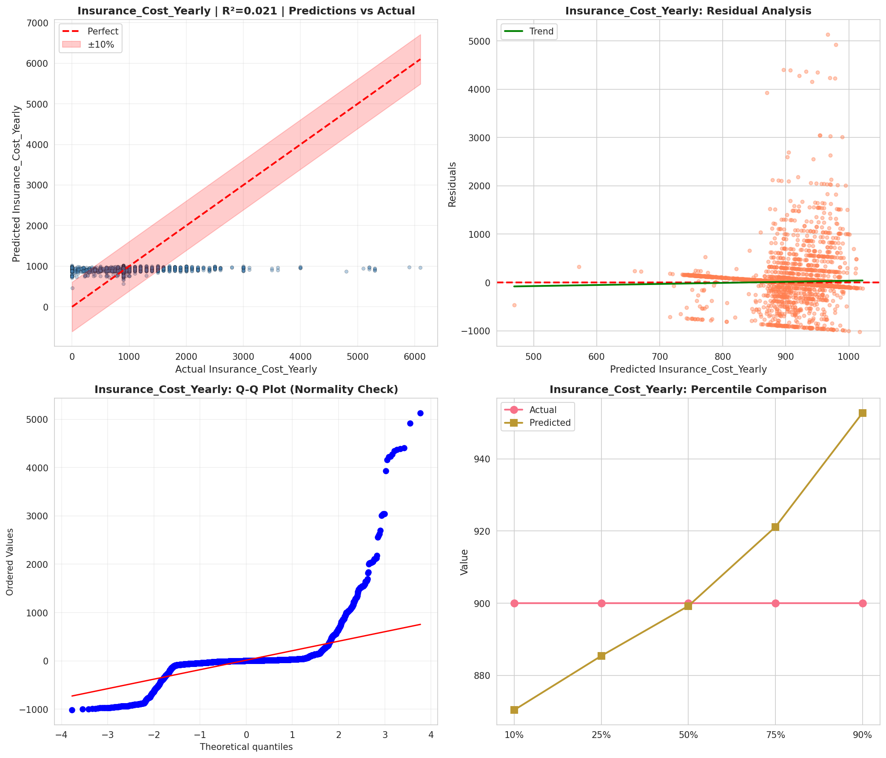
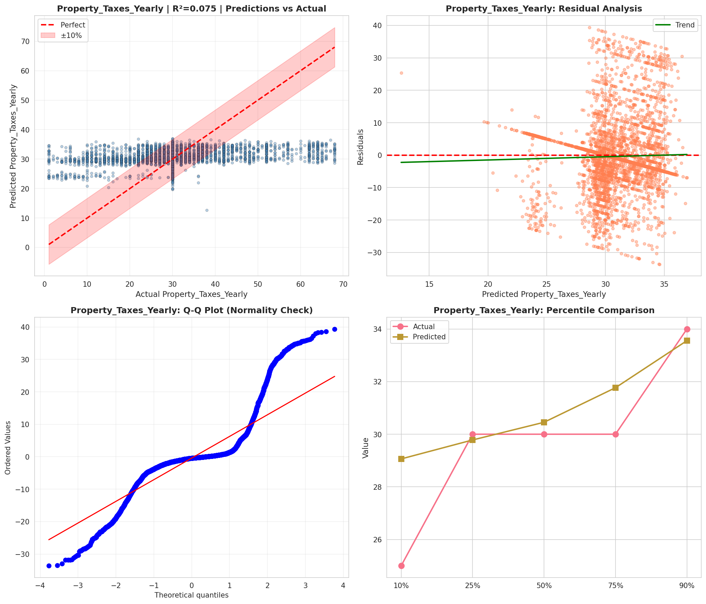
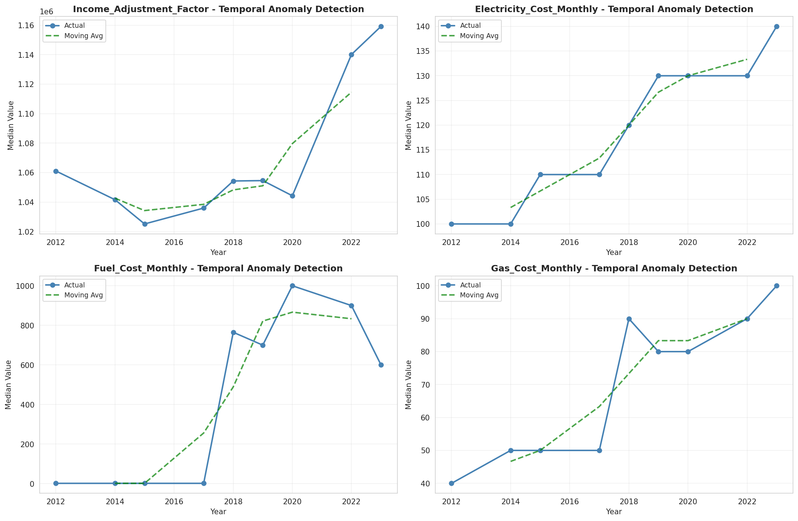
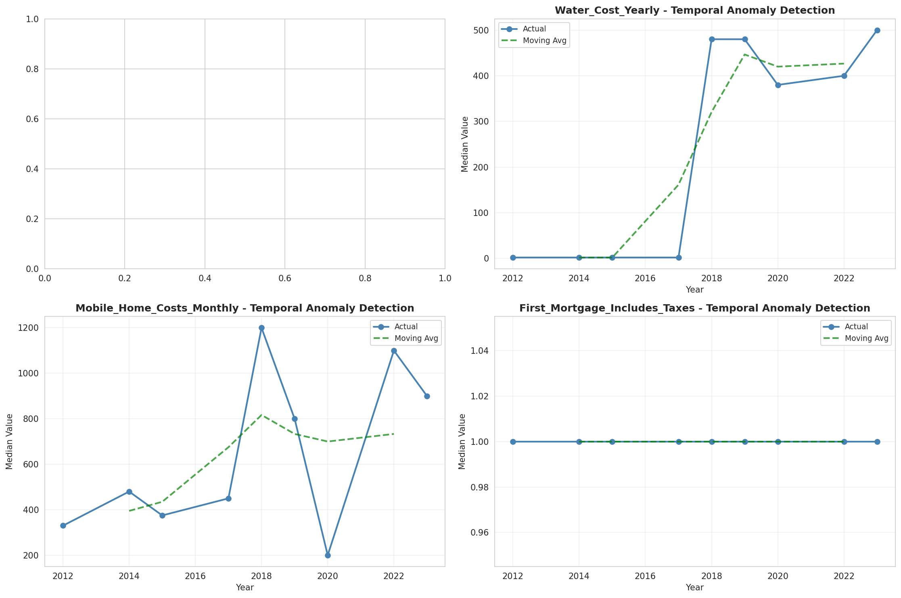
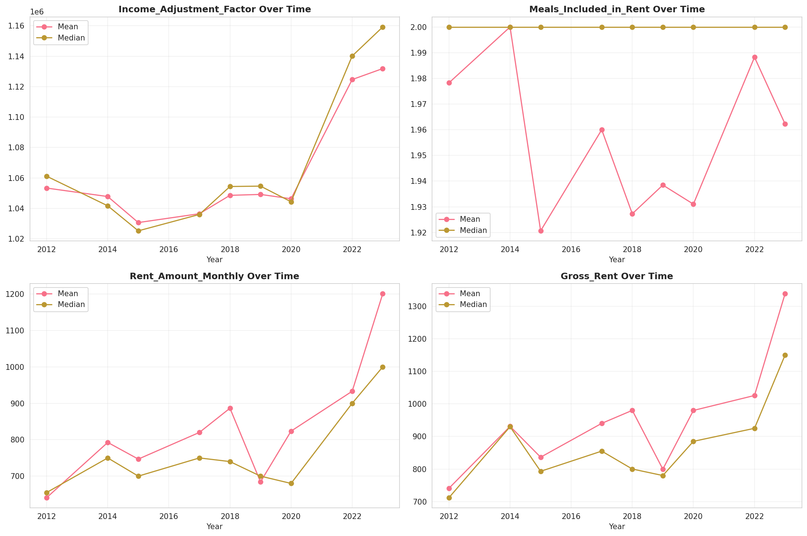
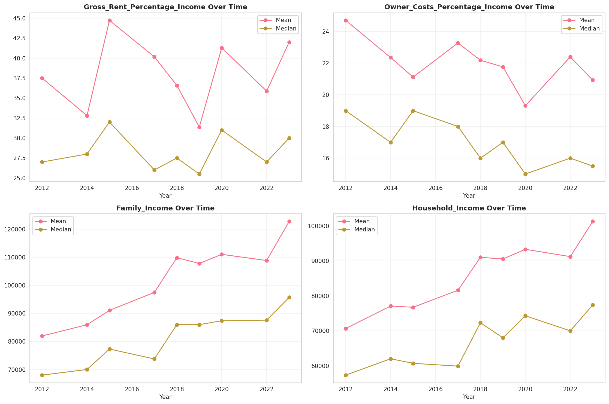
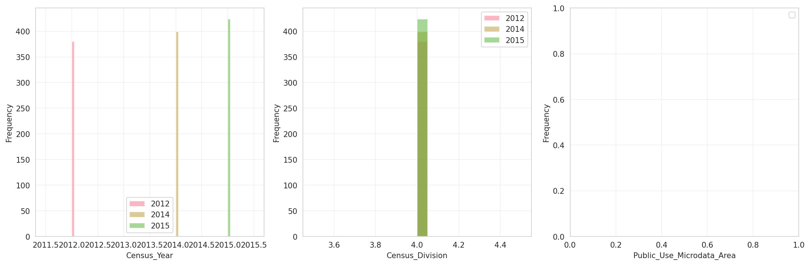
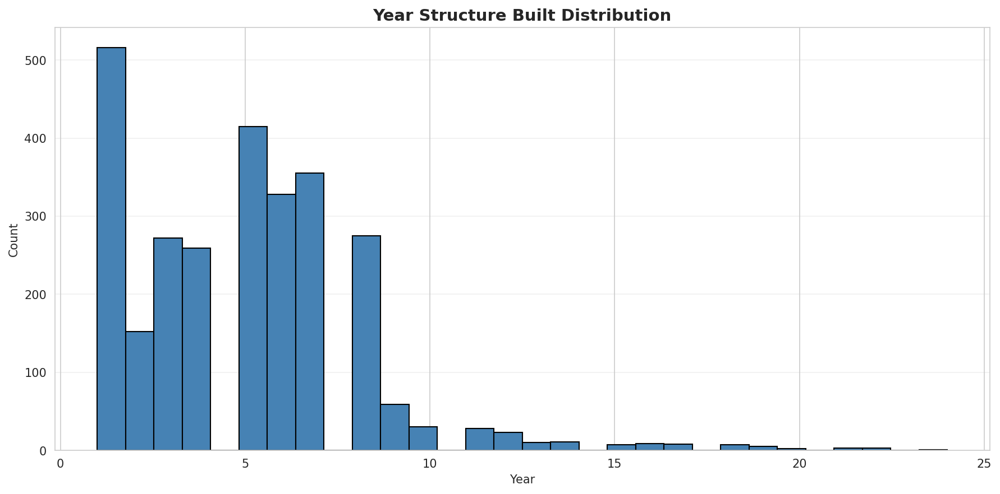
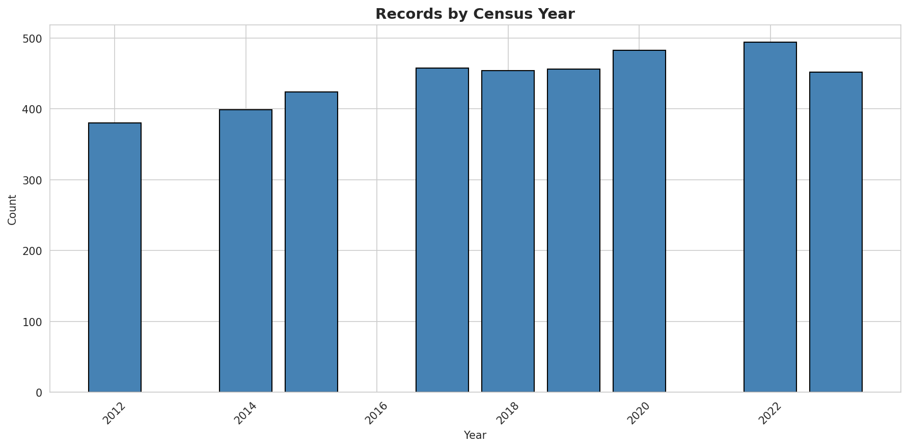
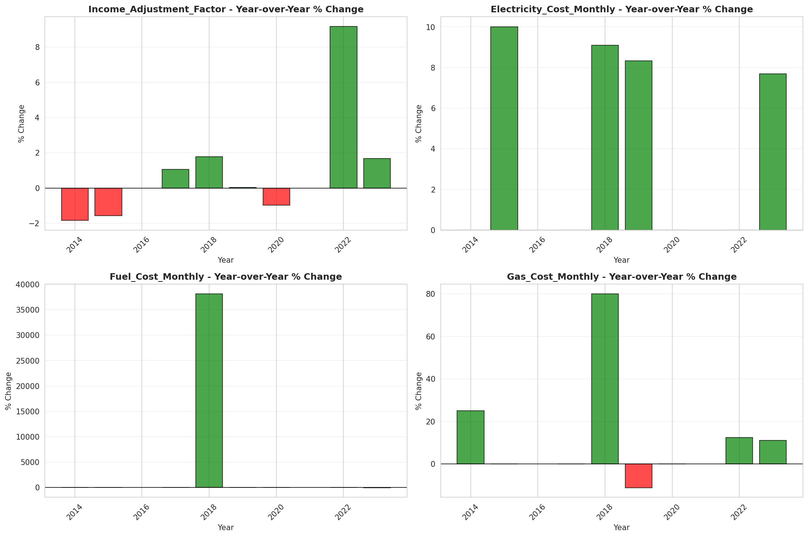

# Temporal Analysis

## Year Distribution

- 2012: 127,083 records

- 2014: 130,345 records

- 2015: 132,089 records

- 2017: 133,023 records

- 2018: 133,916 records

- 2019: 134,854 records

- 2020: 136,526 records

- 2022: 138,920 records

- 2023: 140,451 records

## Temporal Trends

- Census_Year: {np.int64(2012): {'mean': 2012.0, 'median': 2012.0, 'std': 0.0}, np.int64(2014): {'mean': 2014.0, 'median': 2014.0, 'std': 0.0}, np.int64(2015): {'mean': 2015.0, 'median': 2015.0, 'std': 0.0}, np.int64(2017): {'mean': 2017.0, 'median': 2017.0, 'std': 0.0}, np.int64(2018): {'mean': 2018.0, 'median': 2018.0, 'std': 0.0}, np.int64(2019): {'mean': 2019.0, 'median': 2019.0, 'std': 0.0}, np.int64(2020): {'mean': 2020.0, 'median': 2020.0, 'std': 0.0}, np.int64(2022): {'mean': 2022.0, 'median': 2022.0, 'std': 0.0}, np.int64(2023): {'mean': 2023.0, 'median': 2023.0, 'std': 0.0}}

- Census_Division: {np.int64(2012): {'mean': 4.0, 'median': 4.0, 'std': 0.0}, np.int64(2014): {'mean': 4.0, 'median': 4.0, 'std': 0.0}, np.int64(2015): {'mean': 4.0, 'median': 4.0, 'std': 0.0}, np.int64(2017): {'mean': 4.0, 'median': 4.0, 'std': 0.0}, np.int64(2018): {'mean': 4.0, 'median': 4.0, 'std': 0.0}, np.int64(2019): {'mean': 4.0, 'median': 4.0, 'std': 0.0}, np.int64(2020): {'mean': 4.0, 'median': 4.0, 'std': 0.0}, np.int64(2022): {'mean': 4.0, 'median': 4.0, 'std': 0.0}, np.int64(2023): {'mean': 4.0, 'median': 4.0, 'std': 0.0}}

- Public_Use_Microdata_Area: {np.int64(2012): {'mean': None, 'median': None, 'std': None}, np.int64(2014): {'mean': None, 'median': None, 'std': None}, np.int64(2015): {'mean': None, 'median': None, 'std': None}, np.int64(2017): {'mean': 1254.9751997774822, 'median': 1304.0, 'std': 721.779423626992}, np.int64(2018): {'mean': 1254.1336584127364, 'median': 1303.0, 'std': 721.3714226753248}, np.int64(2019): {'mean': 1254.2437747489878, 'median': 1303.0, 'std': 721.2227266128676}, np.int64(2020): {'mean': 1252.7949181840822, 'median': 1303.0, 'std': 722.4471038571343}, np.int64(2022): {'mean': None, 'median': None, 'std': None}, np.int64(2023): {'mean': 1367.272130493909, 'median': 1502.0, 'std': 798.3824475697088}}

- Census_Region: {np.int64(2012): {'mean': 2.0, 'median': 2.0, 'std': 0.0}, np.int64(2014): {'mean': 2.0, 'median': 2.0, 'std': 0.0}, np.int64(2015): {'mean': 2.0, 'median': 2.0, 'std': 0.0}, np.int64(2017): {'mean': 2.0, 'median': 2.0, 'std': 0.0}, np.int64(2018): {'mean': 2.0, 'median': 2.0, 'std': 0.0}, np.int64(2019): {'mean': 2.0, 'median': 2.0, 'std': 0.0}, np.int64(2020): {'mean': 2.0, 'median': 2.0, 'std': 0.0}, np.int64(2022): {'mean': 2.0, 'median': 2.0, 'std': 0.0}, np.int64(2023): {'mean': 2.0, 'median': 2.0, 'std': 0.0}}

- State_Code: {np.int64(2012): {'mean': 27.0, 'median': 27.0, 'std': 0.0}, np.int64(2014): {'mean': 27.0, 'median': 27.0, 'std': 0.0}, np.int64(2015): {'mean': 27.0, 'median': 27.0, 'std': 0.0}, np.int64(2017): {'mean': 27.0, 'median': 27.0, 'std': 0.0}, np.int64(2018): {'mean': 27.0, 'median': 27.0, 'std': 0.0}, np.int64(2019): {'mean': 27.0, 'median': 27.0, 'std': 0.0}, np.int64(2020): {'mean': 27.0, 'median': 27.0, 'std': 0.0}, np.int64(2022): {'mean': 27.0, 'median': 27.0, 'std': 0.0}, np.int64(2023): {'mean': None, 'median': None, 'std': None}}

- Housing_Adjustment_Factor: {np.int64(2012): {'mean': 1041381.1996883926, 'median': 1053092.0, 'std': 27498.456786494222}, np.int64(2014): {'mean': 1036619.205991791, 'median': 1031130.0, 'std': 29577.44569564568}, np.int64(2015): {'mean': 1020932.6984684569, 'median': 1017534.0, 'std': 20277.181472973145}, np.int64(2017): {'mean': 1029196.867038031, 'median': 1034680.0, 'std': 17976.82398991392}, np.int64(2018): {'mean': 1038225.3257191075, 'median': 1046406.0, 'std': 23487.46202655545}, np.int64(2019): {'mean': 1040784.0355347265, 'median': 1042936.0, 'std': 29176.70148961271}, np.int64(2020): {'mean': 1035092.8353793416, 'median': 1030827.0, 'std': 28605.389679860506}, np.int64(2022): {'mean': 1105404.4664843075, 'median': 1133141.0, 'std': 61003.27033104278}, np.int64(2023): {'mean': 1107174.2248684594, 'median': 1125501.0, 'std': 76760.78290463753}}

- Income_Adjustment_Factor: {np.int64(2012): {'mean': 1052641.2694695592, 'median': 1061121.0, 'std': 26431.350993294134}, np.int64(2014): {'mean': 1047467.4402316929, 'median': 1041654.0, 'std': 31018.129373033225}, np.int64(2015): {'mean': 1030346.0718454982, 'median': 1025215.0, 'std': 25643.157852471835}, np.int64(2017): {'mean': 1036592.3549536546, 'median': 1035988.0, 'std': 16851.962588310984}, np.int64(2018): {'mean': 1046811.7124242062, 'median': 1054346.0, 'std': 20508.791476155387}, np.int64(2019): {'mean': 1049739.3896361992, 'median': 1054606.0, 'std': 26225.41827831316}, np.int64(2020): {'mean': 1045052.6451591639, 'median': 1044328.0, 'std': 29267.711235254035}, np.int64(2022): {'mean': 1127225.9783184566, 'median': 1140108.0, 'std': 49085.788638620295}, np.int64(2023): {'mean': 1130555.5580095549, 'median': 1159185.0, 'std': 70061.83653533725}}

- Housing_Unit_Weight: {np.int64(2012): {'mean': 18.47554747684584, 'median': 12.0, 'std': 19.18442390457386}, np.int64(2014): {'mean': 18.137627066630863, 'median': 11.0, 'std': 20.18639932482391}, np.int64(2015): {'mean': 17.97185231169893, 'median': 10.0, 'std': 20.64710682665788}, np.int64(2017): {'mean': 18.07675364410666, 'median': 11.0, 'std': 20.11969945039335}, np.int64(2018): {'mean': 18.07456166552167, 'median': 11.0, 'std': 20.193117319883306}, np.int64(2019): {'mean': 18.080316490426682, 'median': 11.0, 'std': 20.526205812999596}, np.int64(2020): {'mean': 18.004116432034923, 'median': 10.0, 'std': 23.436401363959888}, np.int64(2022): {'mean': 17.95244025338324, 'median': 10.0, 'std': 24.04560179663734}, np.int64(2023): {'mean': 17.9389110793088, 'median': 9.0, 'std': 24.634220635590427}}

- Number_of_Persons: {np.int64(2012): {'mean': 2.113351116986536, 'median': 2.0, 'std': 1.4706494006350854}, np.int64(2014): {'mean': 2.084859411561625, 'median': 2.0, 'std': 1.4658188655729945}, np.int64(2015): {'mean': 2.068809666209904, 'median': 2.0, 'std': 1.4651731630332603}, np.int64(2017): {'mean': 2.055073182833044, 'median': 2.0, 'std': 1.4695378639047911}, np.int64(2018): {'mean': 2.047305773768631, 'median': 2.0, 'std': 1.466160678794398}, np.int64(2019): {'mean': 2.050662197635962, 'median': 2.0, 'std': 1.4633970649708203}, np.int64(2020): {'mean': 2.0351068660914406, 'median': 2.0, 'std': 1.463012153652416}, np.int64(2022): {'mean': 2.045702562625972, 'median': 2.0, 'std': 1.459682183966303}, np.int64(2023): {'mean': 2.0490776142569294, 'median': 2.0, 'std': 1.4535619524553078}}

- Housing_Unit_Type: {np.int64(2012): {'mean': 1.1166639125610822, 'median': 1.0, 'std': 0.42684892339361513}, np.int64(2014): {'mean': 1.1445088035597837, 'median': 1.0, 'std': 0.47542917339471313}, np.int64(2015): {'mean': 1.1585294763379237, 'median': 1.0, 'std': 0.49737662560988766}, np.int64(2017): {'mean': 1.154071100486382, 'median': 1.0, 'std': 0.4926220616087692}, np.int64(2018): {'mean': 1.153484273723827, 'median': 1.0, 'std': 0.49204009537807125}, np.int64(2019): {'mean': 1.15306182983078, 'median': 1.0, 'std': 0.49201954949352117}, np.int64(2020): {'mean': None, 'median': None, 'std': None}, np.int64(2022): {'mean': None, 'median': None, 'std': None}, np.int64(2023): {'mean': None, 'median': None, 'std': None}}

- Building_Type: {np.int64(2012): {'mean': 2.641235953140187, 'median': 2.0, 'std': 1.8265727599451869}, np.int64(2014): {'mean': 2.6283475626782193, 'median': 2.0, 'std': 1.81303346224159}, np.int64(2015): {'mean': 2.6199600596577266, 'median': 2.0, 'std': 1.802295169314845}, np.int64(2017): {'mean': 2.6477666666666666, 'median': 2.0, 'std': 1.8382581897452144}, np.int64(2018): {'mean': 2.656920900449232, 'median': 2.0, 'std': 1.8507543473277344}, np.int64(2019): {'mean': 2.6592224639763535, 'median': 2.0, 'std': 1.8547008306600252}, np.int64(2020): {'mean': 2.6531025893576667, 'median': 2.0, 'std': 1.8473698327986356}, np.int64(2022): {'mean': 2.6322146147939596, 'median': 2.0, 'std': 1.8251616355217413}, np.int64(2023): {'mean': 2.6271054841623225, 'median': 2.0, 'std': 1.8180098290510973}}

- Year_Structure_Built: {np.int64(2012): {'mean': 4.6042238630356564, 'median': 5.0, 'std': 2.6573441953973522}, np.int64(2014): {'mean': 4.719562035148879, 'median': 5.0, 'std': 2.811679087548062}, np.int64(2015): {'mean': 4.78016801907699, 'median': 5.0, 'std': 2.9081600631779017}, np.int64(2017): {'mean': 5.008908333333333, 'median': 5.0, 'std': 3.2388552082162314}, np.int64(2018): {'mean': 5.110347223945794, 'median': 5.0, 'std': 3.4215876628470556}, np.int64(2019): {'mean': 5.221232398702738, 'median': 5.0, 'std': 3.6302403545652533}, np.int64(2020): {'mean': 5.33633973414517, 'median': 5.0, 'std': 3.8569111177707085}, np.int64(2022): {'mean': None, 'median': None, 'std': None}, np.int64(2023): {'mean': None, 'median': None, 'std': None}}

- Bathtub_or_Shower: {np.int64(2012): {'mean': 1.0167624439404532, 'median': 1.0, 'std': 0.12838070313917613}, np.int64(2014): {'mean': 1.015509844901551, 'median': 1.0, 'std': 0.12356948981914342}, np.int64(2015): {'mean': 1.0152262022127287, 'median': 1.0, 'std': 0.1224519960065025}, np.int64(2017): {'mean': 1.0156, 'median': 1.0, 'std': 0.1239224272400536}, np.int64(2018): {'mean': 1.0152060427059806, 'median': 1.0, 'std': 0.12237214904175013}, np.int64(2019): {'mean': 1.0142452481628967, 'median': 1.0, 'std': 0.11850078634062412}, np.int64(2020): {'mean': 1.0138462665548764, 'median': 1.0, 'std': 0.11685314975345958}, np.int64(2022): {'mean': 1.0120376887637574, 'median': 1.0, 'std': 0.10905447234177898}, np.int64(2023): {'mean': 1.011155302730197, 'median': 1.0, 'std': 0.10502832640389323}}

- Refrigerator: {np.int64(2012): {'mean': 1.01245672970346, 'median': 1.0, 'std': 0.11091286884125914}, np.int64(2014): {'mean': 1.0120321873704339, 'median': 1.0, 'std': 0.10902987858000818}, np.int64(2015): {'mean': 1.0120158076122585, 'median': 1.0, 'std': 0.10895654185013107}, np.int64(2017): {'mean': 1.01215, 'median': 1.0, 'std': 0.1095558192002871}, np.int64(2018): {'mean': 1.0119629693976322, 'median': 1.0, 'std': 0.1087196143712602}, np.int64(2019): {'mean': 1.011264830247547, 'median': 1.0, 'std': 0.1055368433107359}, np.int64(2020): {'mean': 1.0111437618539834, 'median': 1.0, 'std': 0.10497460705639}, np.int64(2022): {'mean': 1.0100140772971589, 'median': 1.0, 'std': 0.09956844303703641}, np.int64(2023): {'mean': 1.0093013674753204, 'median': 1.0, 'std': 0.09599440112016874}}

- Hot_and_Cold_Running_Water: {np.int64(2012): {'mean': 1.018902511808741, 'median': 1.0, 'std': 0.13618136795074667}, np.int64(2014): {'mean': 1.018073665417192, 'median': 1.0, 'std': 0.13321846044125987}, np.int64(2015): {'mean': 1.017686662116501, 'median': 1.0, 'std': 0.13181043394573067}, np.int64(2017): {'mean': 1.0183166666666668, 'median': 1.0, 'std': 0.13409443028400175}, np.int64(2018): {'mean': 1.018523574330082, 'median': 1.0, 'std': 0.1348354624529377}, np.int64(2019): {'mean': 1.017808612833039, 'median': 1.0, 'std': 0.13225584961419698}, np.int64(2020): {'mean': 1.017590700779005, 'median': 1.0, 'std': 0.13145877185285496}, np.int64(2022): {'mean': 1.0156449961607372, 'median': 1.0, 'std': 0.12409816048211512}, np.int64(2023): {'mean': 1.0142451948216578, 'median': 1.0, 'std': 0.1185005506363849}}

- Running_Water: {np.int64(2012): {'mean': None, 'median': None, 'std': None}, np.int64(2014): {'mean': 9.0, 'median': 9.0, 'std': 0.0}, np.int64(2015): {'mean': 9.0, 'median': 9.0, 'std': 0.0}, np.int64(2017): {'mean': 9.0, 'median': 9.0, 'std': 0.0}, np.int64(2018): {'mean': 9.0, 'median': 9.0, 'std': 0.0}, np.int64(2019): {'mean': 9.0, 'median': 9.0, 'std': 0.0}, np.int64(2020): {'mean': 9.0, 'median': 9.0, 'std': 0.0}, np.int64(2022): {'mean': 9.0, 'median': 9.0, 'std': 0.0}, np.int64(2023): {'mean': 9.0, 'median': 9.0, 'std': 0.0}}

- Sink_with_Faucet: {np.int64(2012): {'mean': 1.0138209163924083, 'median': 1.0, 'std': 0.11674765468420674}, np.int64(2014): {'mean': 1.012666796408959, 'median': 1.0, 'std': 0.11183226055338685}, np.int64(2015): {'mean': 1.012394988076881, 'median': 1.0, 'std': 0.11064111124173286}, np.int64(2017): {'mean': 1.012375, 'median': 1.0, 'std': 0.11055297926639962}, np.int64(2018): {'mean': 1.011971242543827, 'median': 1.0, 'std': 0.10875674577148493}, np.int64(2019): {'mean': 1.011075988341065, 'median': 1.0, 'std': 0.10465849586356622}, np.int64(2020): {'mean': 1.010875139398774, 'median': 1.0, 'std': 0.10371575726123941}, np.int64(2022): {'mean': 1.0096381494753008, 'median': 1.0, 'std': 0.09770021442140613}, np.int64(2023): {'mean': 1.0090874518689885, 'median': 1.0, 'std': 0.09489436986391443}}

- Stove_or_Range: {np.int64(2012): {'mean': 1.0129938782122334, 'median': 1.0, 'std': 0.11324816418193752}, np.int64(2014): {'mean': 1.012742949493582, 'median': 1.0, 'std': 0.1121636000785078}, np.int64(2015): {'mean': 1.0127573160764092, 'median': 1.0, 'std': 0.11222599114545619}, np.int64(2017): {'mean': 1.0129666666666666, 'median': 1.0, 'std': 0.11313106946169227}, np.int64(2018): {'mean': 1.0128730154790566, 'median': 1.0, 'std': 0.1127271310810354}, np.int64(2019): {'mean': 1.0121023030502072, 'median': 1.0, 'std': 0.10934320040819921}, np.int64(2020): {'mean': 1.0120228898892136, 'median': 1.0, 'std': 0.10898824110556043}, np.int64(2022): {'mean': 1.011117865369849, 'median': 1.0, 'std': 0.10485392876451372}, np.int64(2023): {'mean': 1.0106561663154225, 'median': 1.0, 'std': 0.10267763126676982}}

- Telephone_Service: {np.int64(2012): {'mean': 1.0161211574934745, 'median': 1.0, 'std': 0.12594210852461704}, np.int64(2014): {'mean': 1.0185575667102071, 'median': 1.0, 'std': 0.13495685740410385}, np.int64(2015): {'mean': 1.0202980520567824, 'median': 1.0, 'std': 0.14101853116195182}, np.int64(2017): {'mean': 1.0205817757225861, 'median': 1.0, 'std': 0.14198011493180895}, np.int64(2018): {'mean': 1.0193745625989907, 'median': 1.0, 'std': 0.13783818004324624}, np.int64(2019): {'mean': 1.0167536115569824, 'median': 1.0, 'std': 0.12834749040317295}, np.int64(2020): {'mean': 1.0129434846585645, 'median': 1.0, 'std': 0.11303126518956375}, np.int64(2022): {'mean': 1.0082703904084722, 'median': 1.0, 'std': 0.09056524542373004}, np.int64(2023): {'mean': 1.0072014036190327, 'median': 1.0, 'std': 0.0845553417216929}}

- Lot_Acreage: {np.int64(2012): {'mean': 1.646403133556138, 'median': 1.0, 'std': 0.7906200672763174}, np.int64(2014): {'mean': 1.66527669185996, 'median': 1.0, 'std': 0.7935858905275391}, np.int64(2015): {'mean': 1.6719411612209432, 'median': 1.0, 'std': 0.7935740066503842}, np.int64(2017): {'mean': 1.6401737967914438, 'median': 1.0, 'std': 0.7804855763311052}, np.int64(2018): {'mean': 1.6417772966402675, 'median': 1.0, 'std': 0.7791485454198255}, np.int64(2019): {'mean': 1.6457522499175423, 'median': 1.0, 'std': 0.7790371799982416}, np.int64(2020): {'mean': 1.6517726463377118, 'median': 1.0, 'std': 0.7795125959878743}, np.int64(2022): {'mean': 1.6748714214191434, 'median': 1.0, 'std': 0.7845221006103872}, np.int64(2023): {'mean': 1.6752100613541085, 'median': 1.0, 'std': 0.7832066395180787}}

- Agricultural_Sales: {np.int64(2012): {'mean': 1.7521581263375574, 'median': 1.0, 'std': 1.6660160357135736}, np.int64(2014): {'mean': 1.7417706888580675, 'median': 1.0, 'std': 1.6651987982615388}, np.int64(2015): {'mean': 1.7322571096791821, 'median': 1.0, 'std': 1.6588485683235}, np.int64(2017): {'mean': 1.6610370792655407, 'median': 1.0, 'std': 1.5870320412084682}, np.int64(2018): {'mean': 1.6401101487478817, 'median': 1.0, 'std': 1.5635232020848475}, np.int64(2019): {'mean': 1.6259549053196907, 'median': 1.0, 'std': 1.5451338015562976}, np.int64(2020): {'mean': 1.6130451633495202, 'median': 1.0, 'std': 1.529796285745879}, np.int64(2022): {'mean': 1.6095560668029993, 'median': 1.0, 'std': 1.5238453117652564}, np.int64(2023): {'mean': 1.6002921231090246, 'median': 1.0, 'std': 1.5123313888368048}}

- Business_On_Property: {np.int64(2012): {'mean': 1.9739162631173817, 'median': 2.0, 'std': 0.15938514070243223}, np.int64(2014): {'mean': 1.974768096217145, 'median': 2.0, 'std': 0.156829500492941}, np.int64(2015): {'mean': 1.9751701888640314, 'median': 2.0, 'std': 0.15560695390689488}, np.int64(2017): {'mean': 4.790192895339954, 'median': 2.0, 'std': 3.444073515076634}, np.int64(2018): {'mean': 6.205069036901981, 'median': 9.0, 'std': 3.4392701571945334}, np.int64(2019): {'mean': 7.611468689629176, 'median': 9.0, 'std': 2.797808915019573}, np.int64(2020): {'mean': None, 'median': None, 'std': None}, np.int64(2022): {'mean': None, 'median': None, 'std': None}, np.int64(2023): {'mean': None, 'median': None, 'std': None}}

- Tenure: {np.int64(2012): {'mean': 1.6814076202279684, 'median': 1.0, 'std': 0.8080362723490858}, np.int64(2014): {'mean': 1.7025657771972382, 'median': 1.0, 'std': 0.8094178204983548}, np.int64(2015): {'mean': 1.7120225492567303, 'median': 2.0, 'std': 0.8089731956937822}, np.int64(2017): {'mean': 1.7207420930211008, 'median': 2.0, 'std': 0.8085331843731058}, np.int64(2018): {'mean': 1.722669343253895, 'median': 2.0, 'std': 0.8069215323213805}, np.int64(2019): {'mean': 1.7239256529986866, 'median': 2.0, 'std': 0.8044897670297768}, np.int64(2020): {'mean': 1.7201300706668847, 'median': 2.0, 'std': 0.7996770699344459}, np.int64(2022): {'mean': 1.7160705905271267, 'median': 2.0, 'std': 0.7876872957325775}, np.int64(2023): {'mean': 1.7150950148829007, 'median': 2.0, 'std': 0.7830920250404362}}

- Vacancy_Status: {np.int64(2012): {'mean': 4.96038961038961, 'median': 5.0, 'std': 1.4326609932022336}, np.int64(2014): {'mean': 5.014814141597746, 'median': 5.0, 'std': 1.4059171089326545}, np.int64(2015): {'mean': 5.028714554074604, 'median': 5.0, 'std': 1.3838970722101502}, np.int64(2017): {'mean': 5.04888741831417, 'median': 5.0, 'std': 1.340953324558551}, np.int64(2018): {'mean': 5.057261545980288, 'median': 5.0, 'std': 1.3409103237534674}, np.int64(2019): {'mean': 5.064871984852227, 'median': 5.0, 'std': 1.3372791656682539}, np.int64(2020): {'mean': 5.074794198353587, 'median': 5.0, 'std': 1.3389921505386884}, np.int64(2022): {'mean': 5.060210073608469, 'median': 5.0, 'std': 1.362081529560172}, np.int64(2023): {'mean': 5.047782448314318, 'median': 5.0, 'std': 1.382940514285003}}

- Vehicles_Available: {np.int64(2012): {'mean': 2.0529829305391245, 'median': 2.0, 'std': 1.110825297635178}, np.int64(2014): {'mean': 2.0655719350625117, 'median': 2.0, 'std': 1.1187823437873066}, np.int64(2015): {'mean': 2.0773874862788144, 'median': 2.0, 'std': 1.1254725666576668}, np.int64(2017): {'mean': 2.087507297680496, 'median': 2.0, 'std': 1.1297309367764614}, np.int64(2018): {'mean': 2.0968175623411542, 'median': 2.0, 'std': 1.132479119749977}, np.int64(2019): {'mean': 2.112587552896542, 'median': 2.0, 'std': 1.1419737913764592}, np.int64(2020): {'mean': 2.121532508583574, 'median': 2.0, 'std': 1.1454410653399119}, np.int64(2022): {'mean': 2.1371786811649387, 'median': 2.0, 'std': 1.156879526726915}, np.int64(2023): {'mean': 2.1360759769904245, 'median': 2.0, 'std': 1.1576564999519778}}

- Condo_Fee_Monthly: {np.int64(2012): {'mean': 245.3404255319149, 'median': 190.0, 'std': 187.8134815260614}, np.int64(2014): {'mean': 261.3373639661427, 'median': 200.0, 'std': 186.35005760098508}, np.int64(2015): {'mean': 270.7328699106256, 'median': 210.0, 'std': 188.8747907077769}, np.int64(2017): {'mean': 297.26396495071197, 'median': 240.0, 'std': 197.4590785738338}, np.int64(2018): {'mean': 307.24345643599855, 'median': 250.0, 'std': 205.1639786598886}, np.int64(2019): {'mean': 319.6545390321441, 'median': 250.0, 'std': 211.46997726846948}, np.int64(2020): {'mean': 333.85117585117587, 'median': 260.0, 'std': 227.77091606073472}, np.int64(2022): {'mean': 361.757555406313, 'median': 280.0, 'std': 264.7907743237059}, np.int64(2023): {'mean': 374.1842019010161, 'median': 290.0, 'std': 270.49857335979107}}

- Electricity_Cost_Monthly: {np.int64(2012): {'mean': 116.36035528514826, 'median': 100.0, 'std': 81.75257369985584}, np.int64(2014): {'mean': 127.3373297256951, 'median': 110.0, 'std': 88.74873427404673}, np.int64(2015): {'mean': 131.18526856313605, 'median': 110.0, 'std': 91.65660183732203}, np.int64(2017): {'mean': 133.9190999990733, 'median': 120.0, 'std': 93.54599009789408}, np.int64(2018): {'mean': 142.42796610169492, 'median': 120.0, 'std': 92.9603411518856}, np.int64(2019): {'mean': 143.65291683353357, 'median': 120.0, 'std': 93.8912391521886}, np.int64(2020): {'mean': 146.82114739931055, 'median': 120.0, 'std': 96.48949197634279}, np.int64(2022): {'mean': 161.16031845721886, 'median': 130.0, 'std': 152.7830170101002}, np.int64(2023): {'mean': 168.56537115323422, 'median': 140.0, 'std': 180.27104669964464}}

- Fuel_Cost_Monthly: {np.int64(2012): {'mean': 225.383339905733, 'median': 2.0, 'std': 604.3643267235204}, np.int64(2014): {'mean': 189.15086769919762, 'median': 2.0, 'std': 552.1914038116777}, np.int64(2015): {'mean': 177.35998809280173, 'median': 2.0, 'std': 542.7038482093371}, np.int64(2017): {'mean': 128.33777835438462, 'median': 2.0, 'std': 454.7403419255267}, np.int64(2018): {'mean': 1022.2936335403726, 'median': 810.0, 'std': 851.8764163874397}, np.int64(2019): {'mean': 978.6081210191082, 'median': 800.0, 'std': 801.3444431500947}, np.int64(2020): {'mean': 939.1823983876386, 'median': 800.0, 'std': 770.3031078456883}, np.int64(2022): {'mean': 1002.212623443538, 'median': 800.0, 'std': 833.3269747948137}, np.int64(2023): {'mean': 1056.5927799093129, 'median': 890.0, 'std': 907.0946200452436}}

- Gas_Cost_Monthly: {np.int64(2012): {'mean': 74.8952453382908, 'median': 40.0, 'std': 94.19521595851438}, np.int64(2014): {'mean': 72.44640791192387, 'median': 40.0, 'std': 93.44421121756736}, np.int64(2015): {'mean': 73.84762507209436, 'median': 40.0, 'std': 95.43307770933372}, np.int64(2017): {'mean': 71.57191574538277, 'median': 40.0, 'std': 91.55230785288457}, np.int64(2018): {'mean': 107.53982496953584, 'median': 80.0, 'std': 96.40050226381162}, np.int64(2019): {'mean': 104.91790274381961, 'median': 80.0, 'std': 93.62352961226678}, np.int64(2020): {'mean': 104.84193881243048, 'median': 80.0, 'std': 94.50663321163121}, np.int64(2022): {'mean': 124.75225664170684, 'median': 100.0, 'std': 155.20041260252265}, np.int64(2023): {'mean': 136.8376724925248, 'median': 100.0, 'std': 186.97603173105963}}

- House_Heating_Fuel: {np.int64(2012): {'mean': 2.1281336262745763, 'median': 2.0, 'std': 1.5925580426525179}, np.int64(2014): {'mean': 2.153648068669528, 'median': 2.0, 'std': 1.5969107192339538}, np.int64(2015): {'mean': 2.1538633276898174, 'median': 2.0, 'std': 1.5896370256968468}, np.int64(2017): {'mean': 2.0950042164376197, 'median': 2.0, 'std': 1.5586457222744539}, np.int64(2018): {'mean': 2.0812276695274226, 'median': 2.0, 'std': 1.546505742109901}, np.int64(2019): {'mean': 2.0654366700715014, 'median': 2.0, 'std': 1.5290126446198984}, np.int64(2020): {'mean': 2.052128181372282, 'median': 2.0, 'std': 1.5138053104104177}, np.int64(2022): {'mean': 2.047594591483446, 'median': 2.0, 'std': 1.4940678311516735}, np.int64(2023): {'mean': 2.0379972241862414, 'median': 2.0, 'std': 1.4761358130519981}}

- Insurance_Cost_Yearly: {np.int64(2014): {'mean': 1080.089594356261, 'median': 980.0, 'std': 733.6143119410248}, np.int64(2015): {'mean': 1135.5819585682477, 'median': 1000.0, 'std': 771.1907670254649}}

- Water_Cost_Yearly: {np.int64(2012): {'mean': 222.70842018290048, 'median': 2.0, 'std': 351.402750603454}, np.int64(2014): {'mean': 227.54478447471544, 'median': 2.0, 'std': 365.3555158527862}, np.int64(2015): {'mean': 229.6431840592383, 'median': 2.0, 'std': 371.7680659953366}, np.int64(2017): {'mean': 243.30226760941886, 'median': 2.0, 'std': 391.0372005242201}, np.int64(2018): {'mean': 518.0562637021516, 'median': 440.0, 'std': 440.0513800918087}, np.int64(2019): {'mean': 525.1900236161512, 'median': 450.0, 'std': 448.24730680891514}, np.int64(2020): {'mean': 538.7795884018055, 'median': 460.0, 'std': 462.10346960876717}, np.int64(2022): {'mean': 570.986963647199, 'median': 480.0, 'std': 505.4138406944181}, np.int64(2023): {'mean': 590.5948410535876, 'median': 500.0, 'std': 530.5463364904967}}

- Mobile_Home_Costs_Monthly: {np.int64(2012): {'mean': 1826.9800085070183, 'median': 900.0, 'std': 1965.7056551220714}, np.int64(2014): {'mean': 1805.2783240701153, 'median': 860.0, 'std': 1952.690197333573}, np.int64(2015): {'mean': 1846.5499785499785, 'median': 900.0, 'std': 2026.1522580818698}, np.int64(2017): {'mean': 1926.5117845117845, 'median': 950.0, 'std': 2129.9404862128017}, np.int64(2018): {'mean': 1997.9374217772215, 'median': 1000.0, 'std': 2211.5999340302305}, np.int64(2019): {'mean': 2032.4694041867956, 'median': 990.0, 'std': 2262.5097858531453}, np.int64(2020): {'mean': 2089.2398340248965, 'median': 995.0, 'std': 2405.5631662232204}, np.int64(2022): {'mean': 2355.0912828947367, 'median': 1000.0, 'std': 3151.500234163048}, np.int64(2023): {'mean': 2611.1226224200727, 'median': 1100.0, 'std': 3979.647727266297}}

- First_Mortgage_Includes_Insurance: {np.int64(2012): {'mean': 1.4666014102633822, 'median': 1.0, 'std': 0.4988878087909694}, np.int64(2014): {'mean': 1.4536542718428542, 'median': 1.0, 'std': 0.4978520703951457}, np.int64(2015): {'mean': 1.4448589678367532, 'median': 1.0, 'std': 0.4969548469057315}, np.int64(2017): {'mean': 1.4207601562796344, 'median': 1.0, 'std': 0.4936858005474128}, np.int64(2018): {'mean': 1.4124086208855726, 'median': 1.0, 'std': 0.4922726274724571}, np.int64(2019): {'mean': 1.4039641340254838, 'median': 1.0, 'std': 0.49069507603055185}, np.int64(2020): {'mean': 1.3920620472560397, 'median': 1.0, 'std': 0.4882150328350297}, np.int64(2022): {'mean': 1.3791604994496944, 'median': 1.0, 'std': 0.4851827306415095}, np.int64(2023): {'mean': 1.3724973955867033, 'median': 1.0, 'std': 0.4834744184787138}}

- First_Mortgage_Payment_Monthly: {np.int64(2012): {'mean': 1116.8447441405187, 'median': 1000.0, 'std': 707.0205897253966}, np.int64(2014): {'mean': 1096.4952845105006, 'median': 990.0, 'std': 677.3193884255631}, np.int64(2015): {'mean': 1093.4734422399338, 'median': 990.0, 'std': 675.0871655219563}, np.int64(2017): {'mean': 1119.7480939195084, 'median': 1000.0, 'std': 693.3719668566335}, np.int64(2018): {'mean': 1140.3685466459604, 'median': 1000.0, 'std': 704.3792705488213}, np.int64(2019): {'mean': 1168.1740443605474, 'median': 1000.0, 'std': 718.3079777864222}, np.int64(2020): {'mean': 1202.4237114575037, 'median': 1100.0, 'std': 729.9895644204063}, np.int64(2022): {'mean': 1279.8841701772362, 'median': 1200.0, 'std': 757.187616668146}, np.int64(2023): {'mean': 1332.1752438677904, 'median': 1200.0, 'std': 782.9643086762683}}

- First_Mortgage_Includes_Taxes: {np.int64(2012): {'mean': 1.3732485000090633, 'median': 1.0, 'std': 0.48367168389084025}, np.int64(2014): {'mean': 1.3625439461299502, 'median': 1.0, 'std': 0.48073915199204365}, np.int64(2015): {'mean': 1.353758031390726, 'median': 1.0, 'std': 0.4781397224909046}, np.int64(2017): {'mean': 1.3288700072070705, 'median': 1.0, 'std': 0.4698071005341097}, np.int64(2018): {'mean': 1.3196848604219538, 'median': 1.0, 'std': 0.4663588419044904}, np.int64(2019): {'mean': 1.3103728173666824, 'median': 1.0, 'std': 0.46265059397794744}, np.int64(2020): {'mean': 1.298801532218303, 'median': 1.0, 'std': 0.45773698754883335}, np.int64(2022): {'mean': 1.2807696686781282, 'median': 1.0, 'std': 0.44937945423486636}, np.int64(2023): {'mean': 1.271143100672412, 'median': 1.0, 'std': 0.4445540045305733}}

- First_Mortgage_Status: {np.int64(2012): {'mean': 1.744558427417044, 'median': 1.0, 'std': 0.9620583380728519}, np.int64(2014): {'mean': 1.7785780536121194, 'median': 1.0, 'std': 0.9701804034023613}, np.int64(2015): {'mean': 1.7957675589110043, 'median': 1.0, 'std': 0.9738198620855348}, np.int64(2017): {'mean': 1.7998990142412872, 'median': 1.0, 'std': 0.9746490520928746}, np.int64(2018): {'mean': 1.8055143788911947, 'median': 1.0, 'std': 0.975957914536018}, np.int64(2019): {'mean': 1.8159860305300513, 'median': 1.0, 'std': 0.9780401440382894}, np.int64(2020): {'mean': 1.832911307684585, 'median': 1.0, 'std': 0.981172621442969}, np.int64(2022): {'mean': 1.8781779774606204, 'median': 1.0, 'std': 0.988356695064377}, np.int64(2023): {'mean': 1.8972625069673037, 'median': 1.0, 'std': 0.9908259612815634}}

- Second_Mortgage_Payment_Monthly: {np.int64(2012): {'mean': 385.74244135822977, 'median': 300.0, 'std': 351.7249097349195}, np.int64(2014): {'mean': 371.52796658750304, 'median': 280.0, 'std': 340.9687244069508}, np.int64(2015): {'mean': 368.6054911976649, 'median': 280.0, 'std': 345.61860127448205}, np.int64(2017): {'mean': 369.47339115536994, 'median': 260.0, 'std': 371.4442528232449}, np.int64(2018): {'mean': 374.88729016786573, 'median': 260.0, 'std': 384.1996132516024}, np.int64(2019): {'mean': 383.20719198745024, 'median': 280.0, 'std': 393.3418790904552}, np.int64(2020): {'mean': 391.3141592920354, 'median': 290.0, 'std': 400.9837192287495}, np.int64(2022): {'mean': 411.23759321162254, 'median': 300.0, 'std': 416.37933289921676}, np.int64(2023): {'mean': 439.187146529563, 'median': 300.0, 'std': 448.4217346755247}}

- Second_Mortgage_Status: {np.int64(2012): {'mean': 2.6788297351677635, 'median': 3.0, 'std': 0.6123170081529459}, np.int64(2014): {'mean': 2.7323796945627707, 'median': 3.0, 'std': 0.5719022536123971}, np.int64(2015): {'mean': 2.7565240329357676, 'median': 3.0, 'std': 0.5510870453882408}, np.int64(2017): {'mean': 2.7919811857527597, 'median': 3.0, 'std': 0.5141238851492036}, np.int64(2018): {'mean': 2.8050642021135563, 'median': 3.0, 'std': 0.4974990164274484}, np.int64(2019): {'mean': 2.8167437470504955, 'median': 3.0, 'std': 0.48199641097879564}, np.int64(2020): {'mean': 2.8219970238655843, 'median': 3.0, 'std': 0.4696538528288441}, np.int64(2022): {'mean': 2.8358017101659865, 'median': 3.0, 'std': 0.44330483299659734}, np.int64(2023): {'mean': 2.8385331953275172, 'median': 3.0, 'std': 0.43614118983085526}}

- Property_Taxes_Yearly: {np.int64(2012): {'mean': 30.302619061264256, 'median': 29.0, 'std': 14.792564991983303}, np.int64(2014): {'mean': 30.51777719252041, 'median': 29.0, 'std': 15.073142467681054}, np.int64(2015): {'mean': 30.70835049187829, 'median': 29.0, 'std': 15.188354064188164}, np.int64(2017): {'mean': 31.828599625893666, 'median': 30.0, 'std': 15.569374302072914}}

- Meals_Included_in_Rent: {np.int64(2012): {'mean': 1.9599689509869151, 'median': 2.0, 'std': 0.19603748341847402}, np.int64(2014): {'mean': 1.9584659366740385, 'median': 2.0, 'std': 0.19952727216019686}, np.int64(2015): {'mean': 1.9581554227156277, 'median': 2.0, 'std': 0.20023922860940233}, np.int64(2017): {'mean': 1.9546841623436069, 'median': 2.0, 'std': 0.2080012329927681}, np.int64(2018): {'mean': 1.9523737526459026, 'median': 2.0, 'std': 0.21297951542518148}, np.int64(2019): {'mean': 1.950842057350933, 'median': 2.0, 'std': 0.21620315294970302}, np.int64(2020): {'mean': 1.9498993859965945, 'median': 2.0, 'std': 0.21815819519842486}, np.int64(2022): {'mean': 1.952859225660133, 'median': 2.0, 'std': 0.21194562369295833}, np.int64(2023): {'mean': 1.9555750082065873, 'median': 2.0, 'std': 0.20604304056689926}}

- Rent_Amount_Monthly: {np.int64(2012): {'mean': 694.7316478154802, 'median': 640.0, 'std': 414.2355203567466}, np.int64(2014): {'mean': 725.0046928097524, 'median': 660.0, 'std': 427.92287755550416}, np.int64(2015): {'mean': 744.3507685738684, 'median': 680.0, 'std': 440.9931658629344}, np.int64(2017): {'mean': 800.3478791577662, 'median': 730.0, 'std': 477.7905137314658}, np.int64(2018): {'mean': 826.8177603064207, 'median': 750.0, 'std': 494.70750479215604}, np.int64(2019): {'mean': 858.322459920093, 'median': 780.0, 'std': 517.4926896054095}, np.int64(2020): {'mean': 891.615190134668, 'median': 800.0, 'std': 553.8702432347944}, np.int64(2022): {'mean': 963.6720125276743, 'median': 860.0, 'std': 607.550961347439}, np.int64(2023): {'mean': 1009.3793631688369, 'median': 900.0, 'std': 641.6662045450504}}

- Gross_Rent: {np.int64(2012): {'mean': 802.0859027014519, 'median': 740.0, 'std': 433.98168196327947}, np.int64(2014): {'mean': 841.159782242676, 'median': 772.0, 'std': 449.7690686131046}, np.int64(2015): {'mean': 863.5422394678492, 'median': 790.0, 'std': 460.7168479222296}, np.int64(2017): {'mean': 918.2081376325928, 'median': 834.0, 'std': 494.2276438641712}, np.int64(2018): {'mean': 946.3988802260478, 'median': 860.0, 'std': 509.3826674015205}, np.int64(2019): {'mean': 976.2971356625748, 'median': 887.0, 'std': 530.9142722546555}, np.int64(2020): {'mean': 1007.3601546973197, 'median': 910.0, 'std': 562.0753278342773}, np.int64(2022): {'mean': 1092.3086162174354, 'median': 980.0, 'std': 627.6355544538986}, np.int64(2023): {'mean': 1146.4544986558371, 'median': 1020.0, 'std': 669.1635305366349}}

- Gross_Rent_Percentage_Income: {np.int64(2012): {'mean': 37.82587822014052, 'median': 29.0, 'std': 26.66744776268356}, np.int64(2014): {'mean': 37.59608601661167, 'median': 29.0, 'std': 26.72594985962285}, np.int64(2015): {'mean': 37.12293608895878, 'median': 28.0, 'std': 26.61879572853925}, np.int64(2017): {'mean': 36.19087314310142, 'median': 27.0, 'std': 26.431794867029705}, np.int64(2018): {'mean': 35.98277415593364, 'median': 27.0, 'std': 26.26424628595686}, np.int64(2019): {'mean': 35.653286609323565, 'median': 27.0, 'std': 26.143821207477806}, np.int64(2020): {'mean': 35.57336306286709, 'median': 27.0, 'std': 26.129145762782155}, np.int64(2022): {'mean': 36.283559060517746, 'median': 27.0, 'std': 26.551445414998724}, np.int64(2023): {'mean': 36.45298005565863, 'median': 27.0, 'std': 26.675343431136636}}

- Selected_Monthly_Owner_Costs: {np.int64(2012): {'mean': 1185.9860138256772, 'median': 996.0, 'std': 898.7690957388045}, np.int64(2014): {'mean': 1153.0960164017042, 'median': 968.0, 'std': 855.14495163962}, np.int64(2015): {'mean': 1145.0009038591352, 'median': 960.0, 'std': 843.4433814462127}, np.int64(2017): {'mean': 1159.2979854215691, 'median': 975.0, 'std': 848.6512877586945}, np.int64(2018): {'mean': 1175.1164199192463, 'median': 986.0, 'std': 857.2253220975529}, np.int64(2019): {'mean': 1188.8810637218999, 'median': 994.0, 'std': 865.6834570342041}, np.int64(2020): {'mean': 1208.113046291854, 'median': 1009.0, 'std': 874.602339459564}, np.int64(2022): {'mean': 1271.9915176082013, 'median': 1052.0, 'std': 921.5836963632072}, np.int64(2023): {'mean': 1323.3033171367872, 'median': 1092.0, 'std': 962.4068333440312}}

- Owner_Costs_Percentage_Income: {np.int64(2012): {'mean': 24.46184655755818, 'median': 19.0, 'std': 20.021900025989716}, np.int64(2014): {'mean': 23.41218703976436, 'median': 18.0, 'std': 19.665699659244577}, np.int64(2015): {'mean': 22.791993377635723, 'median': 18.0, 'std': 19.393932458659556}, np.int64(2017): {'mean': 21.77202574572635, 'median': 17.0, 'std': 18.922181030234857}, np.int64(2018): {'mean': 21.609481019622226, 'median': 17.0, 'std': 18.930059562967138}, np.int64(2019): {'mean': 21.200849280942137, 'median': 16.0, 'std': 18.736194202056797}, np.int64(2020): {'mean': 20.93923871864422, 'median': 16.0, 'std': 18.614225987558694}, np.int64(2022): {'mean': 21.170497919047722, 'median': 16.0, 'std': 19.17933696951421}, np.int64(2023): {'mean': 21.36352484586995, 'median': 16.0, 'std': 19.51763909828979}}

- Satellite_Internet: {np.int64(2012): {'mean': None, 'median': None, 'std': None}, np.int64(2014): {'mean': None, 'median': None, 'std': None}, np.int64(2015): {'mean': None, 'median': None, 'std': None}, np.int64(2017): {'mean': 1.8922253931208188, 'median': 2.0, 'std': 0.3100973266839503}, np.int64(2018): {'mean': 1.8901725045057147, 'median': 2.0, 'std': 0.3126763680829864}, np.int64(2019): {'mean': 1.8896561427813796, 'median': 2.0, 'std': 0.3133195699440927}, np.int64(2020): {'mean': 1.889246565254897, 'median': 2.0, 'std': 0.31382821339396716}, np.int64(2022): {'mean': 1.8951180284307163, 'median': 2.0, 'std': 0.30640280917419915}, np.int64(2023): {'mean': 1.897186157727109, 'median': 2.0, 'std': 0.3037170633222732}}

- Smartphone: {np.int64(2012): {'mean': None, 'median': None, 'std': None}, np.int64(2014): {'mean': None, 'median': None, 'std': None}, np.int64(2015): {'mean': None, 'median': None, 'std': None}, np.int64(2017): {'mean': 1.3240726153960207, 'median': 1.0, 'std': 0.46802947051936006}, np.int64(2018): {'mean': 1.2744023720947364, 'median': 1.0, 'std': 0.44621468348077536}, np.int64(2019): {'mean': 1.2320972566759083, 'median': 1.0, 'std': 0.4221726490327756}, np.int64(2020): {'mean': 1.1971951241666212, 'median': 1.0, 'std': 0.3978827027283481}, np.int64(2022): {'mean': 1.1440588667617082, 'median': 1.0, 'std': 0.3511509668630132}, np.int64(2023): {'mean': 1.1262995260167072, 'median': 1.0, 'std': 0.3321880777173031}}

- Tablet_Computer: {np.int64(2012): {'mean': None, 'median': None, 'std': None}, np.int64(2014): {'mean': None, 'median': None, 'std': None}, np.int64(2015): {'mean': None, 'median': None, 'std': None}, np.int64(2017): {'mean': 1.4716201314045834, 'median': 1.0, 'std': 0.49919624632017817}, np.int64(2018): {'mean': 1.4277966039264798, 'median': 1.0, 'std': 0.49476148164558087}, np.int64(2019): {'mean': 1.394051875091201, 'median': 1.0, 'std': 0.4886483116704897}, np.int64(2020): {'mean': 1.3677947935400658, 'median': 1.0, 'std': 0.4822073158234327}, np.int64(2022): {'mean': 1.35668936449045, 'median': 1.0, 'std': 0.47902410545846497}, np.int64(2023): {'mean': 1.3589790591911732, 'median': 1.0, 'std': 0.4797031404130692}}

- Food_Stamp_SNAP: {np.int64(2012): {'mean': 1.9423316681426963, 'median': 2.0, 'std': 0.23311619980845844}, np.int64(2014): {'mean': 1.9313653198371068, 'median': 2.0, 'std': 0.2528329418471168}, np.int64(2015): {'mean': 1.9295260937887686, 'median': 2.0, 'std': 0.2559450654827275}, np.int64(2017): {'mean': 1.9323928754527262, 'median': 2.0, 'std': 0.2510715485839523}, np.int64(2018): {'mean': 1.935292134923832, 'median': 2.0, 'std': 0.2460106802997891}, np.int64(2019): {'mean': 1.9383816734171644, 'median': 2.0, 'std': 0.24046201286660998}, np.int64(2020): {'mean': 1.9411897778962761, 'median': 2.0, 'std': 0.23527011517201224}, np.int64(2022): {'mean': 1.942718148057621, 'median': 2.0, 'std': 0.23238129692162196}, np.int64(2023): {'mean': 1.9415966582294206, 'median': 2.0, 'std': 0.2345054763185169}}

- Family_Type_Employment_Status: {np.int64(2012): {'mean': 2.5424511593689547, 'median': 1.0, 'std': 2.0466362163342517}, np.int64(2014): {'mean': 2.592712671432641, 'median': 2.0, 'std': 2.064310093762253}, np.int64(2015): {'mean': 2.6101202989163603, 'median': 2.0, 'std': 2.0637362542197164}, np.int64(2017): {'mean': 2.6404373078237104, 'median': 2.0, 'std': 2.068452164301322}, np.int64(2018): {'mean': 2.644912395701039, 'median': 2.0, 'std': 2.054627102789974}, np.int64(2019): {'mean': 2.655539291426093, 'median': 2.0, 'std': 2.0515527188417337}, np.int64(2020): {'mean': 2.6643795837328974, 'median': 2.0, 'std': 2.0439773436746216}, np.int64(2022): {'mean': None, 'median': None, 'std': None}, np.int64(2023): {'mean': None, 'median': None, 'std': None}}

- Family_Income: {np.int64(2012): {'mean': 84091.94460238922, 'median': 68800.0, 'std': 71203.4682701042}, np.int64(2014): {'mean': 87679.50010192295, 'median': 70800.0, 'std': 75411.77795912337}, np.int64(2015): {'mean': 90719.61584298183, 'median': 73000.0, 'std': 79707.28859404425}, np.int64(2017): {'mean': 97697.9254710931, 'median': 77700.0, 'std': 87476.52854579654}, np.int64(2018): {'mean': 100421.18327111208, 'median': 80000.0, 'std': 90134.40715099087}, np.int64(2019): {'mean': 103846.33644366912, 'median': 82790.0, 'std': 92461.59592828686}, np.int64(2020): {'mean': 107031.06528885536, 'median': 85400.0, 'std': 93892.66358026031}, np.int64(2022): {'mean': 114058.72296239791, 'median': 91000.0, 'std': 99645.02004385782}, np.int64(2023): {'mean': 118650.12691838271, 'median': 95000.0, 'std': 104074.93718057252}}

- Family_Presence_Children: {np.int64(2012): {'mean': 3.1738917195716736, 'median': 4.0, 'std': 1.0563892162464537}, np.int64(2014): {'mean': 3.2001652243394414, 'median': 4.0, 'std': 1.0482518830914185}, np.int64(2015): {'mean': 3.2103796680778545, 'median': 4.0, 'std': 1.045026937264935}, np.int64(2017): {'mean': 3.2149227757232977, 'median': 4.0, 'std': 1.0427139555275824}, np.int64(2018): {'mean': 3.222570660584833, 'median': 4.0, 'std': 1.0405756099788963}, np.int64(2019): {'mean': 3.223541141756154, 'median': 4.0, 'std': 1.0408420327689603}, np.int64(2020): {'mean': 3.2336134905077736, 'median': 4.0, 'std': 1.037857829253042}, np.int64(2022): {'mean': 3.251241597106653, 'median': 4.0, 'std': 1.0311224228073292}, np.int64(2023): {'mean': 3.2560480219410595, 'median': 4.0, 'std': 1.0289689754355054}}

- Household_Family_Type: {np.int64(2012): {'mean': 2.482160629448106, 'median': 1.0, 'std': 1.9902881546658906}, np.int64(2014): {'mean': 2.4852397835417057, 'median': 1.0, 'std': 1.9856726795311823}, np.int64(2015): {'mean': 2.4886230441496586, 'median': 1.0, 'std': 1.985230135798964}, np.int64(2017): {'mean': 2.5154247481721046, 'median': 1.0, 'std': 1.994910760353072}, np.int64(2018): {'mean': 2.5241905779218388, 'median': 1.0, 'std': 1.999165191010841}, np.int64(2019): {'mean': 2.5290566175397635, 'median': 1.0, 'std': 2.0010973706010247}, np.int64(2020): {'mean': 2.528421167366069, 'median': 1.0, 'std': 2.0029012822482795}, np.int64(2022): {'mean': 2.526170384210107, 'median': 1.0, 'std': 2.004811057703318}, np.int64(2023): {'mean': 2.5297439791901257, 'median': 1.0, 'std': 2.00545889393671}}

- Household_Income: {np.int64(2012): {'mean': 71764.05179771886, 'median': 56600.0, 'std': 66971.11672236066}, np.int64(2014): {'mean': 74957.60613260706, 'median': 58600.0, 'std': 70748.24201528581}, np.int64(2015): {'mean': 77496.16463129109, 'median': 60000.0, 'std': 74494.16294301445}, np.int64(2017): {'mean': 83214.91212584908, 'median': 64000.0, 'std': 81496.64483789194}, np.int64(2018): {'mean': 85361.65675129351, 'median': 65200.0, 'std': 83873.943389395}, np.int64(2019): {'mean': 88255.24953398896, 'median': 68000.0, 'std': 86011.58259435161}, np.int64(2020): {'mean': 90913.95583368378, 'median': 70000.0, 'std': 87397.62786155062}, np.int64(2022): {'mean': 96981.25601098745, 'median': 75000.0, 'std': 93452.5542635411}, np.int64(2023): {'mean': 100917.55609280082, 'median': 78000.0, 'std': 97769.38418190503}}

- Number_Persons_Family: {np.int64(2012): {'mean': 2.9303697446936052, 'median': 2.0, 'std': 1.2575306583538641}, np.int64(2014): {'mean': 2.910738227765815, 'median': 2.0, 'std': 1.2601046158271731}, np.int64(2015): {'mean': 2.903290817361665, 'median': 2.0, 'std': 1.2621456105711264}, np.int64(2017): {'mean': 2.9013215140308897, 'median': 2.0, 'std': 1.259191662765608}, np.int64(2018): {'mean': 2.896540957345714, 'median': 2.0, 'std': 1.2590317396569577}, np.int64(2019): {'mean': 2.895148142658888, 'median': 2.0, 'std': 1.2578784721277034}, np.int64(2020): {'mean': 2.890819258344298, 'median': 2.0, 'std': 1.2607994954775883}, np.int64(2022): {'mean': 2.884069555645827, 'median': 2.0, 'std': 1.262993912912436}, np.int64(2023): {'mean': 2.8801650754223913, 'median': 2.0, 'std': 1.2620941330804143}}

- Workers_In_Family: {np.int64(2012): {'mean': 1.6115500940028882, 'median': 2.0, 'std': 0.8741080605028198}, np.int64(2014): {'mean': 1.5891195709584367, 'median': 2.0, 'std': 0.8798241634354038}, np.int64(2015): {'mean': 1.5860846983079275, 'median': 2.0, 'std': 0.8813394563816765}, np.int64(2017): {'mean': 1.5802969327822494, 'median': 2.0, 'std': 0.8849292083612099}, np.int64(2018): {'mean': 1.573334962395808, 'median': 2.0, 'std': 0.8866720503174681}, np.int64(2019): {'mean': 1.5665665126180628, 'median': 2.0, 'std': 0.8893169660157283}, np.int64(2020): {'mean': 1.5563089068499771, 'median': 2.0, 'std': 0.8959685462911144}, np.int64(2022): {'mean': 1.5293069332879063, 'median': 2.0, 'std': 0.911257253467043}, np.int64(2023): {'mean': 1.5170508939429221, 'median': 2.0, 'std': 0.9182394737138942}}

- Work_Experience_Householder_Spouse: {np.int64(2012): {'mean': 5.2236315086782374, 'median': 4.0, 'std': 4.191746980987726}, np.int64(2014): {'mean': 5.3312477146223545, 'median': 4.0, 'std': 4.216825426354067}, np.int64(2015): {'mean': 5.3493297986014365, 'median': 4.0, 'std': 4.222015958473509}, np.int64(2017): {'mean': 5.382899173373939, 'median': 4.0, 'std': 4.233442154459773}, np.int64(2018): {'mean': 5.382137329966604, 'median': 4.0, 'std': 4.217775932051302}, np.int64(2019): {'mean': 5.395545615004244, 'median': 4.0, 'std': 4.2192035265564005}, np.int64(2020): {'mean': 5.419322789398781, 'median': 4.0, 'std': 4.205323760532803}, np.int64(2022): {'mean': 5.482080379489733, 'median': 4.0, 'std': 4.188909374535715}, np.int64(2023): {'mean': 5.521552950917229, 'median': 4.0, 'std': 4.194549804965781}}

- Work_Status_Householder_Spouse: {np.int64(2012): {'mean': 4.672038909021553, 'median': 3.0, 'std': 4.441328487793588}, np.int64(2014): {'mean': 4.777012086764247, 'median': 3.0, 'std': 4.477957003973466}, np.int64(2015): {'mean': 4.807155547719474, 'median': 3.0, 'std': 4.483810163503702}, np.int64(2017): {'mean': 4.858271267509395, 'median': 3.0, 'std': 4.4997412961160554}, np.int64(2018): {'mean': 4.873858003195543, 'median': 3.0, 'std': 4.482542645868637}, np.int64(2019): {'mean': 4.900192458865306, 'median': 3.0, 'std': 4.481931028124945}, np.int64(2020): {'mean': 4.9331973689541995, 'median': 3.0, 'std': 4.474523653393694}, np.int64(2022): {'mean': 5.010515635089014, 'median': 3.0, 'std': 4.455887694550436}, np.int64(2023): {'mean': 5.055560615720922, 'median': 3.0, 'std': 4.461880676640344}}

- Complete_Kitchen_Facilities: {np.int64(2012): {'mean': 1.0207441638388213, 'median': 1.0, 'std': 0.14252724899521646}, np.int64(2014): {'mean': 1.0201467216097069, 'median': 1.0, 'std': 0.14050266280620266}, np.int64(2015): {'mean': 1.0203156466712169, 'median': 1.0, 'std': 0.14107830761531856}, np.int64(2017): {'mean': 1.0204083333333334, 'median': 1.0, 'std': 0.14139306865574364}, np.int64(2018): {'mean': 1.0199961943527505, 'median': 1.0, 'std': 0.13998753047660517}, np.int64(2019): {'mean': 1.01875282236545, 'median': 1.0, 'std': 0.13565141025076263}, np.int64(2020): {'mean': 1.0182988872518295, 'median': 1.0, 'std': 0.1340305346067456}, np.int64(2022): {'mean': 1.0166608011261837, 'median': 1.0, 'std': 0.12799746041877744}, np.int64(2023): {'mean': 1.0158456004690297, 'median': 1.0, 'std': 0.12487850482781586}}

- Complete_Plumbing_Facilities: {np.int64(2012): {'mean': 1.021622359019832, 'median': 1.0, 'std': 0.1454476296864918}, np.int64(2014): {'mean': 1.020739023378997, 'median': 1.0, 'std': 0.14250995801239336}, np.int64(2015): {'mean': 1.0203999089966884, 'median': 1.0, 'std': 0.14136449730672}, np.int64(2017): {'mean': 1.0210583333333334, 'median': 1.0, 'std': 0.14357942652989464}, np.int64(2018): {'mean': 1.0209476061651486, 'median': 1.0, 'std': 0.1432095444962936}, np.int64(2019): {'mean': 1.0200090315694406, 'median': 1.0, 'std': 0.14003153653284311}, np.int64(2020): {'mean': 1.0195524587094726, 'median': 1.0, 'std': 0.13845691068230076}, np.int64(2022): {'mean': 1.0173566675198362, 'median': 1.0, 'std': 0.13059689900855206}, np.int64(2023): {'mean': 1.015956519672313, 'median': 1.0, 'std': 0.12530775537186511}}

- Plumbing_Facilities_for_Project: {np.int64(2012): {'mean': None, 'median': None, 'std': None}, np.int64(2014): {'mean': None, 'median': None, 'std': None}, np.int64(2015): {'mean': None, 'median': None, 'std': None}, np.int64(2017): {'mean': 9.0, 'median': 9.0, 'std': 0.0}, np.int64(2018): {'mean': 9.0, 'median': 9.0, 'std': 0.0}, np.int64(2019): {'mean': 9.0, 'median': 9.0, 'std': 0.0}, np.int64(2020): {'mean': 9.0, 'median': 9.0, 'std': 0.0}, np.int64(2022): {'mean': 9.0, 'median': 9.0, 'std': 0.0}, np.int64(2023): {'mean': 9.0, 'median': 9.0, 'std': 0.0}}

- Response_Mode: {np.int64(2012): {'mean': 1.282659481950105, 'median': 1.0, 'std': 0.45029415721342586}, np.int64(2014): {'mean': 1.5968201856442974, 'median': 1.0, 'std': 0.7550290850972223}, np.int64(2015): {'mean': 1.7652620137010542, 'median': 2.0, 'std': 0.8270647545433936}, np.int64(2017): {'mean': 2.1207166666666666, 'median': 2.0, 'std': 0.8630761035728799}, np.int64(2018): {'mean': 2.148221687225435, 'median': 2.0, 'std': 0.866648328714751}, np.int64(2019): {'mean': 2.1714930826388605, 'median': 2.0, 'std': 0.8717213185619245}, np.int64(2020): {'mean': 2.2195296665011517, 'median': 3.0, 'std': 0.8610694966768596}, np.int64(2022): {'mean': 2.3073329920655232, 'median': 3.0, 'std': 0.8525928363684455}, np.int64(2023): {'mean': 2.345243943019221, 'median': 3.0, 'std': 0.8461316795679868}}

- Specified_Rent_Unit: {np.int64(2012): {'mean': 0.16004467711406306, 'median': 0.0, 'std': 0.3666490483106716}, np.int64(2014): {'mean': 0.16343298105480483, 'median': 0.0, 'std': 0.3697618133886377}, np.int64(2015): {'mean': 0.16427782973954516, 'median': 0.0, 'std': 0.3705290558756307}, np.int64(2017): {'mean': 0.16983333333333334, 'median': 0.0, 'std': 0.375487878830258}, np.int64(2018): {'mean': 0.17001315430244968, 'median': 0.0, 'std': 0.3756459091870838}, np.int64(2019): {'mean': 0.16832382281702862, 'median': 0.0, 'std': 0.37415513212649804}, np.int64(2020): {'mean': 0.16378643700803425, 'median': 0.0, 'std': 0.3700831729996583}, np.int64(2022): {'mean': 0.1543463654978244, 'median': 0.0, 'std': 0.3612818967950963}, np.int64(2023): {'mean': 0.15137302128064142, 'median': 0.0, 'std': 0.3584135146362224}}

- Specified_Value_Unit: {np.int64(2012): {'mean': 0.5492300871374247, 'median': 1.0, 'std': 0.4975726172289928}, np.int64(2014): {'mean': 0.5409830517079445, 'median': 1.0, 'std': 0.4983196671234221}, np.int64(2015): {'mean': 0.5392198993907834, 'median': 1.0, 'std': 0.4984615262046999}, np.int64(2017): {'mean': 0.5479916666666667, 'median': 1.0, 'std': 0.49769354435009383}, np.int64(2018): {'mean': 0.5505861524078992, 'median': 1.0, 'std': 0.49743651687165846}, np.int64(2019): {'mean': 0.5553840469641611, 'median': 1.0, 'std': 0.49692518028678556}, np.int64(2020): {'mean': 0.5585719053472149, 'median': 1.0, 'std': 0.49655950198645904}, np.int64(2022): {'mean': 0.5660193242897363, 'median': 1.0, 'std': 0.495624266547149}, np.int64(2023): {'mean': 0.5724856993455767, 'median': 1.0, 'std': 0.49471988284079627}}

- Moved_When: {np.int64(2012): {'mean': 4.507815561457743, 'median': 5.0, 'std': 1.75274121810401}, np.int64(2014): {'mean': 4.522382907258817, 'median': 5.0, 'std': 1.783124860712564}, np.int64(2015): {'mean': 4.528028428435878, 'median': 5.0, 'std': 1.7983293340165099}, np.int64(2017): {'mean': 4.479849134935271, 'median': 5.0, 'std': 1.824843059312614}, np.int64(2018): {'mean': 4.468341375372942, 'median': 5.0, 'std': 1.8382398431064266}, np.int64(2019): {'mean': 4.466000291842988, 'median': 5.0, 'std': 1.8441449272049035}, np.int64(2020): {'mean': 4.479608334695805, 'median': 5.0, 'std': 1.8444790472614059}, np.int64(2022): {'mean': 4.509346249546191, 'median': 5.0, 'std': 1.845431976045155}, np.int64(2023): {'mean': 4.531611979644032, 'median': 5.0, 'std': 1.8380858033640253}}

- Household_Language: {np.int64(2012): {'mean': 1.1754361256642818, 'median': 1.0, 'std': 0.6498888616745471}, np.int64(2014): {'mean': 1.1713939167755179, 'median': 1.0, 'std': 0.6513648382437761}, np.int64(2015): {'mean': 1.1677147481813615, 'median': 1.0, 'std': 0.648149646077948}, np.int64(2017): {'mean': 1.1655252939922713, 'median': 1.0, 'std': 0.6518039323440494}, np.int64(2018): {'mean': 1.1674278978967918, 'median': 1.0, 'std': 0.6567680135231126}, np.int64(2019): {'mean': 1.1681106814533782, 'median': 1.0, 'std': 0.6571193559294999}, np.int64(2020): {'mean': 1.1672752375242974, 'median': 1.0, 'std': 0.655809432039488}, np.int64(2022): {'mean': 1.165549485092931, 'median': 1.0, 'std': 0.6516402857739547}, np.int64(2023): {'mean': 1.1652743953003204, 'median': 1.0, 'std': 0.6516436473113278}}

- Household_Language_Detailed: {np.int64(2012): {'mean': None, 'median': None, 'std': None}, np.int64(2014): {'mean': None, 'median': None, 'std': None}, np.int64(2015): {'mean': None, 'median': None, 'std': None}, np.int64(2017): {'mean': None, 'median': None, 'std': None}, np.int64(2018): {'mean': None, 'median': None, 'std': None}, np.int64(2019): {'mean': None, 'median': None, 'std': None}, np.int64(2020): {'mean': None, 'median': None, 'std': None}, np.int64(2022): {'mean': 8945.19570896018, 'median': 9500.0, 'std': 1996.8338086445235}, np.int64(2023): {'mean': 8947.389984375137, 'median': 9500.0, 'std': 1992.8340582994379}}

- Limited_English_Speaking_Household: {np.int64(2012): {'mean': 1.0117458171370628, 'median': 1.0, 'std': 0.10774025202148381}, np.int64(2014): {'mean': 1.0114293711513342, 'median': 1.0, 'std': 0.10629603024464429}, np.int64(2015): {'mean': 1.0112932333624811, 'median': 1.0, 'std': 0.10566834962533614}, np.int64(2017): {'mean': 1.0115280184596567, 'median': 1.0, 'std': 0.10674843721783185}, np.int64(2018): {'mean': 1.0114645106633762, 'median': 1.0, 'std': 0.10645740941597161}, np.int64(2019): {'mean': 1.0109441120677076, 'median': 1.0, 'std': 0.10404055554751342}, np.int64(2020): {'mean': 1.0105727832579432, 'median': 1.0, 'std': 0.1022794922346826}, np.int64(2022): {'mean': 1.009890820220839, 'median': 1.0, 'std': 0.09895998490312112}, np.int64(2023): {'mean': 1.00985501174047, 'median': 1.0, 'std': 0.09878246636514958}}

- Household_Grandchildren: {np.int64(2012): {'mean': 0.018158601393348732, 'median': 0.0, 'std': 0.133525405777796}, np.int64(2014): {'mean': 0.019285314424332897, 'median': 0.0, 'std': 0.13752660665246966}, np.int64(2015): {'mean': 0.019721297140411913, 'median': 0.0, 'std': 0.1390415312793546}, np.int64(2017): {'mean': 0.01971995440687233, 'median': 0.0, 'std': 0.13903689059313817}, np.int64(2018): {'mean': 0.01927326973369185, 'median': 0.0, 'std': 0.1374844895444621}, np.int64(2019): {'mean': 0.01952611994746826, 'median': 0.0, 'std': 0.1383655491503673}, np.int64(2020): {'mean': 0.019101858411902557, 'median': 0.0, 'std': 0.13688370103625444}, np.int64(2022): {'mean': 0.01888730486217492, 'median': 0.0, 'std': 0.1361276557623241}, np.int64(2023): {'mean': 0.01860144377231344, 'median': 0.0, 'std': 0.13511324662839566}}

- Household_Children_Present: {np.int64(2012): {'mean': 3.417675999474208, 'median': 4.0, 'std': 0.977127673749395}, np.int64(2014): {'mean': 3.4360141817503265, 'median': 4.0, 'std': 0.9659394307761874}, np.int64(2015): {'mean': 3.4445292005432657, 'median': 4.0, 'std': 0.9604674013122567}, np.int64(2017): {'mean': 3.45032480470017, 'median': 4.0, 'std': 0.9574946947137186}, np.int64(2018): {'mean': 3.4583133817083502, 'median': 4.0, 'std': 0.953064391440913}, np.int64(2019): {'mean': 3.460227272727273, 'median': 4.0, 'std': 0.9523306277751473}, np.int64(2020): {'mean': 3.4672734208948714, 'median': 4.0, 'std': 0.9481751649359687}, np.int64(2022): {'mean': 3.4815510081198586, 'median': 4.0, 'std': 0.9382844315028774}, np.int64(2023): {'mean': 3.4860030900568257, 'median': 4.0, 'std': 0.9344237515770906}}

- Household_Own_Children_Present: {np.int64(2012): {'mean': 3.45213415206655, 'median': 4.0, 'std': 0.9568429218735051}, np.int64(2014): {'mean': 3.4736984512035827, 'median': 4.0, 'std': 0.9428220733038596}, np.int64(2015): {'mean': 3.48323689743065, 'median': 4.0, 'std': 0.9363408398092312}, np.int64(2017): {'mean': 3.489273568032916, 'median': 4.0, 'std': 0.9333419424272278}, np.int64(2018): {'mean': 3.49630741463774, 'median': 4.0, 'std': 0.9292357930123701}, np.int64(2019): {'mean': 3.4988143878593316, 'median': 4.0, 'std': 0.9279980532256146}, np.int64(2020): {'mean': 3.5046414881828256, 'median': 4.0, 'std': 0.9245324886839498}, np.int64(2022): {'mean': 3.518581813995909, 'median': 4.0, 'std': 0.9136284600321007}, np.int64(2023): {'mean': 3.522708426078683, 'median': 4.0, 'std': 0.9096260033882726}}

- Household_Related_Children_Present: {np.int64(2012): {'mean': 3.4233094849116483, 'median': 4.0, 'std': 0.9752781523804693}, np.int64(2014): {'mean': 3.4420041052435155, 'median': 4.0, 'std': 0.963832940034364}, np.int64(2015): {'mean': 3.4504455896853896, 'median': 4.0, 'std': 0.9583575048018389}, np.int64(2017): {'mean': 3.4569691690374476, 'median': 4.0, 'std': 0.9550452110608675}, np.int64(2018): {'mean': 3.46480533352978, 'median': 4.0, 'std': 0.9504627296135644}, np.int64(2019): {'mean': 3.4667116591273897, 'median': 4.0, 'std': 0.9496259033698307}, np.int64(2020): {'mean': 3.473767871091976, 'median': 4.0, 'std': 0.9453456775931646}, np.int64(2022): {'mean': 3.487439455252229, 'median': 4.0, 'std': 0.9352720240462598}, np.int64(2023): {'mean': 3.4918427737188047, 'median': 4.0, 'std': 0.9314709632122833}}

- Number_Own_Children: {np.int64(2012): {'mean': 0.5327962743882974, 'median': 0.0, 'std': 1.0221523761904325}, np.int64(2014): {'mean': 0.5162810225788393, 'median': 0.0, 'std': 1.017396840266093}, np.int64(2015): {'mean': 0.5097769260823457, 'median': 0.0, 'std': 1.0167038649178666}, np.int64(2017): {'mean': 0.5048790206744447, 'median': 0.0, 'std': 1.0152081499692693}, np.int64(2018): {'mean': 0.4997697889425025, 'median': 0.0, 'std': 1.01352788326351}, np.int64(2019): {'mean': 0.49779293739967895, 'median': 0.0, 'std': 1.0112388672014603}, np.int64(2020): {'mean': 0.4936599633040856, 'median': 0.0, 'std': 1.0101313176713251}, np.int64(2022): {'mean': 0.48380012928019267, 'median': 0.0, 'std': 1.0073825721438803}, np.int64(2023): {'mean': 0.4806347709953649, 'median': 0.0, 'std': 1.0060106035685854}}

- Number_Related_Children: {np.int64(2012): {'mean': 0.5601280679022778, 'median': 0.0, 'std': 1.0442778904148524}, np.int64(2014): {'mean': 0.5454095913416682, 'median': 0.0, 'std': 1.0410275403546327}, np.int64(2015): {'mean': 0.539796089229567, 'median': 0.0, 'std': 1.041070575156545}, np.int64(2017): {'mean': 0.5344311515971495, 'median': 0.0, 'std': 1.0383697162625602}, np.int64(2018): {'mean': 0.5284632951489926, 'median': 0.0, 'std': 1.035815283388016}, np.int64(2019): {'mean': 0.5270684371807968, 'median': 0.0, 'std': 1.034449353069556}, np.int64(2020): {'mean': 0.5221537958471851, 'median': 0.0, 'std': 1.033142603083016}, np.int64(2022): {'mean': 0.5115156774370645, 'median': 0.0, 'std': 1.028919287643252}, np.int64(2023): {'mean': 0.5077120486029277, 'median': 0.0, 'std': 1.026896649325588}}

- Multigenerational_Household: {np.int64(2012): {'mean': 1.0164685557621167, 'median': 1.0, 'std': 0.12726937775368055}, np.int64(2014): {'mean': 1.0172047023698452, 'median': 1.0, 'std': 0.13003406610396698}, np.int64(2015): {'mean': 1.017777074922324, 'median': 1.0, 'std': 0.13214088300915888}, np.int64(2017): {'mean': 1.0181909165886702, 'median': 1.0, 'std': 0.13364195692481615}, np.int64(2018): {'mean': 1.0179288371579063, 'median': 1.0, 'std': 0.13269346665995324}, np.int64(2019): {'mean': 1.0180942652852765, 'median': 1.0, 'std': 0.13329300388988566}, np.int64(2020): {'mean': 1.017693970606936, 'median': 1.0, 'std': 0.13183721737714435}, np.int64(2022): {'mean': 1.0173465683192688, 'median': 1.0, 'std': 0.13055962555183487}, np.int64(2023): {'mean': 1.016995312540917, 'median': 1.0, 'std': 0.12925408204070946}}

- Grandparent_Grandchildren: {np.int64(2012): {'mean': 0.0026571272979926015, 'median': 0.0, 'std': 0.05147904286799285}, np.int64(2014): {'mean': 0.0029856316476954657, 'median': 0.0, 'std': 0.054559558508926305}, np.int64(2015): {'mean': 0.002930287075108374, 'median': 0.0, 'std': 0.05405300798414024}, np.int64(2017): {'mean': 0.00286347082317836, 'median': 0.0, 'std': 0.05343498683232473}, np.int64(2018): {'mean': 0.002780949574569966, 'median': 0.0, 'std': 0.05266157452324576}, np.int64(2019): {'mean': 0.0029731504450605573, 'median': 0.0, 'std': 0.05444573313428391}, np.int64(2020): {'mean': 0.003061020582411394, 'median': 0.0, 'std': 0.05524199900664252}, np.int64(2022): {'mean': 0.003161166355272595, 'median': 0.0, 'std': 0.05613556168622831}, np.int64(2023): {'mean': 0.003159888618290692, 'median': 0.0, 'std': 0.05612424803842501}}

- Nonrelative_Present: {np.int64(2012): {'mean': 0.08211743939308584, 'median': 0.0, 'std': 0.27454484742210367}, np.int64(2014): {'mean': 0.08593021086023511, 'median': 0.0, 'std': 0.2802622746152134}, np.int64(2015): {'mean': 0.08746209231799662, 'median': 0.0, 'std': 0.2825123310365414}, np.int64(2017): {'mean': 0.09255775592849663, 'median': 0.0, 'std': 0.2898130364344451}, np.int64(2018): {'mean': 0.0940458212088843, 'median': 0.0, 'std': 0.29189379798075926}, np.int64(2019): {'mean': 0.09639026703633445, 'median': 0.0, 'std': 0.2951270536852397}, np.int64(2020): {'mean': 0.09688993042309299, 'median': 0.0, 'std': 0.29580917262473133}, np.int64(2022): {'mean': 0.09718151470340822, 'median': 0.0, 'std': 0.29620608502675344}, np.int64(2023): {'mean': 0.0971796684735643, 'median': 0.0, 'std': 0.2962035556150049}}

- Unmarried_Partner_Household: {np.int64(2012): {'mean': 0.15141869941599534, 'median': 0.0, 'std': 0.6849195495101201}, np.int64(2014): {'mean': 0.15898488523978355, 'median': 0.0, 'std': 0.7018847430681534}, np.int64(2015): {'mean': 0.16118439412826285, 'median': 0.0, 'std': 0.7063015667193595}, np.int64(2017): {'mean': 0.1703533467394427, 'median': 0.0, 'std': 0.7257997191974274}, np.int64(2018): {'mean': 0.17251095804633687, 'median': 0.0, 'std': 0.728774768825453}, np.int64(2019): {'mean': 0.178817671092952, 'median': 0.0, 'std': 0.7412328141857096}, np.int64(2020): {'mean': 0.1829527494686359, 'median': 0.0, 'std': 0.749852553911953}, np.int64(2022): {'mean': 0.188527711120753, 'median': 0.0, 'std': 0.7606261862101868}, np.int64(2023): {'mean': 0.19335550492750586, 'median': 0.0, 'std': 0.7706422707830919}}

- Subfamilies_Present: {np.int64(2012): {'mean': 0.014543781570991305, 'median': 0.0, 'std': 0.11971797925750316}, np.int64(2014): {'mean': 0.01603844000746408, 'median': 0.0, 'std': 0.12562386593000707}, np.int64(2015): {'mean': 0.01643751511656031, 'median': 0.0, 'std': 0.1271513806895324}, np.int64(2017): {'mean': 0.01627266914401683, 'median': 0.0, 'std': 0.12652279528835667}, np.int64(2018): {'mean': 0.01562672658293123, 'median': 0.0, 'std': 0.12402690695851519}, np.int64(2019): {'mean': 0.01537647745512914, 'median': 0.0, 'std': 0.12304543663237412}, np.int64(2020): {'mean': 0.014869111849873743, 'median': 0.0, 'std': 0.12102956008352418}, np.int64(2022): {'mean': 0.014521884657274668, 'median': 0.0, 'std': 0.1196291195551757}, np.int64(2023): {'mean': 0.014158395963722384, 'median': 0.0, 'std': 0.11814422384094865}}

- Persons_Under_18: {np.int64(2012): {'mean': 0.289645653765985, 'median': 0.0, 'std': 0.4536000229987813}, np.int64(2014): {'mean': 0.2808079865646576, 'median': 0.0, 'std': 0.4493959785340424}, np.int64(2015): {'mean': 0.27685166235650893, 'median': 0.0, 'std': 0.4474446131414856}, np.int64(2017): {'mean': 0.27372557014576826, 'median': 0.0, 'std': 0.4458718702374311}, np.int64(2018): {'mean': 0.2697429002909868, 'median': 0.0, 'std': 0.4438282121999709}, np.int64(2019): {'mean': 0.2687417919159492, 'median': 0.0, 'std': 0.4433073803666916}, np.int64(2020): {'mean': 0.2652188130143332, 'median': 0.0, 'std': 0.4414516557420039}, np.int64(2022): {'mean': 0.2584275632454641, 'median': 0.0, 'std': 0.43777214938284026}, np.int64(2023): {'mean': 0.2563699688375625, 'median': 0.0, 'std': 0.43663036090085483}}

- Persons_60_And_Over: {np.int64(2012): {'mean': 0.55145250032862, 'median': 0.0, 'std': 0.7718860582543021}, np.int64(2014): {'mean': 0.5845400261242769, 'median': 0.0, 'std': 0.7850511274467228}, np.int64(2015): {'mean': 0.6006437329066587, 'median': 0.0, 'std': 0.7899573585875875}, np.int64(2017): {'mean': 0.6230041423024529, 'median': 0.0, 'std': 0.796893319826221}, np.int64(2018): {'mean': 0.6388725183248002, 'median': 0.0, 'std': 0.8019077094671869}, np.int64(2019): {'mean': 0.6579964978841384, 'median': 0.0, 'std': 0.8073918891748662}, np.int64(2020): {'mean': 0.6796374007666176, 'median': 0.0, 'std': 0.8147675264408516}, np.int64(2022): {'mean': 0.7188244357273782, 'median': 0.0, 'std': 0.8246844300287983}, np.int64(2023): {'mean': 0.736611935999162, 'median': 0.0, 'std': 0.828695636150355}}

- Persons_65_And_Over: {np.int64(2012): {'mean': 0.39125495277261374, 'median': 0.0, 'std': 0.6819241608336698}, np.int64(2014): {'mean': 0.41259563351371525, 'median': 0.0, 'std': 0.6957249560566628}, np.int64(2015): {'mean': 0.4236450910714618, 'median': 0.0, 'std': 0.702495613875419}, np.int64(2017): {'mean': 0.4385373131562121, 'median': 0.0, 'std': 0.71000435761844}, np.int64(2018): {'mean': 0.451204464252827, 'median': 0.0, 'std': 0.7171344389624432}, np.int64(2019): {'mean': 0.4666842988472202, 'median': 0.0, 'std': 0.7255098799057348}, np.int64(2020): {'mean': 0.4836230857267426, 'median': 0.0, 'std': 0.7349071938025445}, np.int64(2022): {'mean': 0.5199720188076116, 'median': 0.0, 'std': 0.7526044409091236}, np.int64(2023): {'mean': 0.5369802987054931, 'median': 0.0, 'std': 0.7600214028965265}}

- Same_Sex_Married_Couple: {np.int64(2012): {'mean': None, 'median': None, 'std': None}, np.int64(2014): {'mean': None, 'median': None, 'std': None}, np.int64(2015): {'mean': None, 'median': None, 'std': None}, np.int64(2017): {'mean': 0.0068111684628999825, 'median': 0.0, 'std': 0.11575836066940025}, np.int64(2018): {'mean': 0.007771925301116063, 'median': 0.0, 'std': 0.12346727766738808}, np.int64(2019): {'mean': None, 'median': None, 'std': None}, np.int64(2020): {'mean': None, 'median': None, 'std': None}, np.int64(2022): {'mean': None, 'median': None, 'std': None}, np.int64(2023): {'mean': None, 'median': None, 'std': None}}

- Flag_Lot_Acreage: {np.int64(2012): {'mean': 0.03713145643981379, 'median': 0.0, 'std': 0.1890846800210229}, np.int64(2014): {'mean': 0.03541964580354196, 'median': 0.0, 'std': 0.18483880432287317}, np.int64(2015): {'mean': 0.03448856981554977, 'median': 0.0, 'std': 0.18248120165108267}, np.int64(2017): {'mean': 0.033216666666666665, 'median': 0.0, 'std': 0.1792026432155803}, np.int64(2018): {'mean': 0.033423510626856286, 'median': 0.0, 'std': 0.1797404986135431}, np.int64(2019): {'mean': 0.03333470175294553, 'median': 0.0, 'std': 0.1795097879943354}, np.int64(2020): {'mean': 0.033960390397968235, 'median': 0.0, 'std': 0.1811279915867503}, np.int64(2022): {'mean': 0.03425742257486562, 'median': 0.0, 'std': 0.18189039610577265}, np.int64(2023): {'mean': 0.03428987941498043, 'median': 0.0, 'std': 0.18197347593271634}}

- Flag_Agricultural_Sales: {np.int64(2012): {'mean': 0.018024316627730505, 'median': 0.0, 'std': 0.13303981188916278}, np.int64(2014): {'mean': 0.01909750133267898, 'median': 0.0, 'std': 0.1368683501890752}, np.int64(2015): {'mean': 0.018731514952349655, 'median': 0.0, 'std': 0.1355758097185347}, np.int64(2017): {'mean': 0.016483333333333332, 'median': 0.0, 'std': 0.12732544189447487}, np.int64(2018): {'mean': 0.01639737575802702, 'median': 0.0, 'std': 0.1269985640109148}, np.int64(2019): {'mean': 0.015443983743175007, 'median': 0.0, 'std': 0.12331095634653465}, np.int64(2020): {'mean': 0.014643993846103754, 'median': 0.0, 'std': 0.1201235395286184}, np.int64(2022): {'mean': 0.015029114410033274, 'median': 0.0, 'std': 0.12166905331356108}, np.int64(2023): {'mean': 0.015005783644171196, 'median': 0.0, 'std': 0.12157601410699723}}

- Flag_Bedrooms: {np.int64(2012): {'mean': 0.04036287365926027, 'median': 0.0, 'std': 0.1968096601849936}, np.int64(2014): {'mean': 0.046842608496991955, 'median': 0.0, 'std': 0.21130252322104698}, np.int64(2015): {'mean': 0.05000126393488207, 'median': 0.0, 'std': 0.21794847510088305}, np.int64(2017): {'mean': 0.061941666666666666, 'median': 0.0, 'std': 0.24105057728354304}, np.int64(2018): {'mean': 0.06563914190927668, 'median': 0.0, 'std': 0.24765127167103393}, np.int64(2019): {'mean': 0.06731803440206904, 'median': 0.0, 'std': 0.25057300764189705}, np.int64(2020): {'mean': 0.0743107392001563, 'median': 0.0, 'std': 0.2622769780003471}, np.int64(2022): {'mean': 0.07939275659073458, 'median': 0.0, 'std': 0.27035186590897775}, np.int64(2023): {'mean': 0.07930723034749401, 'median': 0.0, 'std': 0.27021874855474864}}

- Flag_Building_Type: {np.int64(2012): {'mean': 0.007733233292976144, 'median': 0.0, 'std': 0.08759849211783265}, np.int64(2014): {'mean': 0.008605298562398991, 'median': 0.0, 'std': 0.0923651427023085}, np.int64(2015): {'mean': 0.008569478500467655, 'median': 0.0, 'std': 0.09217436806906378}, np.int64(2017): {'mean': 0.009033333333333334, 'median': 0.0, 'std': 0.09461398850387975}, np.int64(2018): {'mean': 0.008711622943089027, 'median': 0.0, 'std': 0.09292901599629154}, np.int64(2019): {'mean': 0.008719569768873928, 'median': 0.0, 'std': 0.09297101613100198}, np.int64(2020): {'mean': 0.009963451065942742, 'median': 0.0, 'std': 0.099318986123589}, np.int64(2022): {'mean': 0.011213846941387254, 'median': 0.0, 'std': 0.1053004523571301}, np.int64(2023): {'mean': 0.011781203948723637, 'median': 0.0, 'std': 0.1079004143802956}}

- Flag_Kitchen: {np.int64(2012): {'mean': 0.024794093071636852, 'median': 0.0, 'std': 0.15549775618730674}, np.int64(2014): {'mean': 0.02974201027220497, 'median': 0.0, 'std': 0.1698754463570082}, np.int64(2015): {'mean': 0.03102538823866461, 'median': 0.0, 'std': 0.17338704346547132}, np.int64(2017): {'mean': 0.035333333333333335, 'median': 0.0, 'std': 0.18462170222375476}, np.int64(2018): {'mean': 0.036360477525998365, 'median': 0.0, 'std': 0.18718622566905718}, np.int64(2019): {'mean': 0.03597027792602324, 'median': 0.0, 'std': 0.18621681381019278}, np.int64(2020): {'mean': 0.03938167994855473, 'median': 0.0, 'std': 0.19450211099296255}, np.int64(2022): {'mean': 0.04203992833375992, 'median': 0.0, 'std': 0.20068107753538633}, np.int64(2023): {'mean': 0.04222060244972983, 'median': 0.0, 'std': 0.20109287298019596}}

- Flag_Plumbing: {np.int64(2012): {'mean': 0.020855004007298398, 'median': 0.0, 'std': 0.1428994293955898}, np.int64(2014): {'mean': 0.024572061971687976, 'median': 0.0, 'std': 0.15481756538042735}, np.int64(2015): {'mean': 0.025893812617440615, 'median': 0.0, 'std': 0.15881919161408026}, np.int64(2017): {'mean': 0.02805, 'median': 0.0, 'std': 0.16511639741468986}, np.int64(2018): {'mean': 0.028492715494775507, 'median': 0.0, 'std': 0.16637640959095173}, np.int64(2019): {'mean': 0.028679338232275545, 'median': 0.0, 'std': 0.1669043513864696}, np.int64(2020): {'mean': 0.03168116956588983, 'median': 0.0, 'std': 0.17515057173692955}, np.int64(2022): {'mean': 0.03600908625543896, 'median': 0.0, 'std': 0.1863134713617228}, np.int64(2023): {'mean': 0.03753822751113153, 'median': 0.0, 'std': 0.19007734013404903}}

- Flag_Rooms: {np.int64(2012): {'mean': 0.04703033610149549, 'median': 0.0, 'std': 0.21170466627072895}, np.int64(2014): {'mean': 0.054195611890034946, 'median': 0.0, 'std': 0.22640424304009332}, np.int64(2015): {'mean': 0.05498959360280425, 'median': 0.0, 'std': 0.2279609090990968}, np.int64(2017): {'mean': 0.0605, 'median': 0.0, 'std': 0.23841187820352172}, np.int64(2018): {'mean': 0.06087380970109123, 'median': 0.0, 'std': 0.23909969041858764}, np.int64(2019): {'mean': 0.059164990352641736, 'median': 0.0, 'std': 0.23593420970109258}, np.int64(2020): {'mean': 0.06541363788065023, 'median': 0.0, 'std': 0.2472553164339987}, np.int64(2022): {'mean': 0.06910673150755055, 'median': 0.0, 'std': 0.2536365622719757}, np.int64(2023): {'mean': 0.06907097244450078, 'median': 0.0, 'std': 0.2535757927159786}}

- Flag_Condo_Fee: {np.int64(2012): {'mean': 0.0019610183653633, 'median': 0.0, 'std': 0.044240134037520765}, np.int64(2014): {'mean': 0.0022676696309959976, 'median': 0.0, 'std': 0.0475662322438201}, np.int64(2015): {'mean': 0.0022498040900932785, 'median': 0.0, 'std': 0.04737891288886812}, np.int64(2017): {'mean': 0.00255, 'median': 0.0, 'std': 0.05043330938962059}, np.int64(2018): {'mean': 0.002390939250287492, 'median': 0.0, 'std': 0.048838943408390616}, np.int64(2019): {'mean': 0.0023646290898641158, 'median': 0.0, 'std': 0.04857012444096289}, np.int64(2020): {'mean': 0.0024013219480826056, 'median': 0.0, 'std': 0.04894461258549139}, np.int64(2022): {'mean': 0.0023595469669823394, 'median': 0.0, 'std': 0.0485180207084395}, np.int64(2023): {'mean': 0.002511527674341219, 'median': 0.0, 'std': 0.050052370089700204}}

- Flag_Electricity: {np.int64(2012): {'mean': 0.042016950019610186, 'median': 0.0, 'std': 0.20062868470089115}, np.int64(2014): {'mean': 0.049051047951058954, 'median': 0.0, 'std': 0.21597554800063878}, np.int64(2015): {'mean': 0.05198985481601321, 'median': 0.0, 'std': 0.22200748887973615}, np.int64(2017): {'mean': 0.05581666666666667, 'median': 0.0, 'std': 0.2295683026224111}, np.int64(2018): {'mean': 0.05469376949360072, 'median': 0.0, 'std': 0.22738247253671995}, np.int64(2019): {'mean': 0.0535572067818876, 'median': 0.0, 'std': 0.2251427293264898}, np.int64(2020): {'mean': 0.0527151218162134, 'median': 0.0, 'std': 0.2234650850493521}, np.int64(2022): {'mean': 0.0568530842078321, 'median': 0.0, 'std': 0.23156260473457835}, np.int64(2023): {'mean': 0.05900901614666688, 'median': 0.0, 'std': 0.23564250909482634}}

- Flag_Food_Stamp: {np.int64(2012): {'mean': 0.011897736125209508, 'median': 0.0, 'std': 0.10842634600926533}, np.int64(2014): {'mean': 0.016287544593194984, 'median': 0.0, 'std': 0.1265795536696376}, np.int64(2015): {'mean': 0.0183664044697136, 'median': 0.0, 'std': 0.13427291666419558}, np.int64(2017): {'mean': 0.021575216315975435, 'median': 0.0, 'std': 0.14529241222579808}, np.int64(2018): {'mean': 0.02272319961767078, 'median': 0.0, 'std': 0.14902020549173925}, np.int64(2019): {'mean': 0.023848013407092115, 'median': 0.0, 'std': 0.15257607378207164}, np.int64(2020): {'mean': 0.026969221979696176, 'median': 0.0, 'std': 0.16199405933098096}, np.int64(2022): {'mean': 0.03540886841347538, 'median': 0.0, 'std': 0.18481159680720313}, np.int64(2023): {'mean': 0.03794917800514058, 'median': 0.0, 'std': 0.19107406374802438}}

- Flag_Fuel: {np.int64(2012): {'mean': 0.10916903978309432, 'median': 0.0, 'std': 0.31185251277265297}, np.int64(2014): {'mean': 0.1003951498946549, 'median': 0.0, 'std': 0.3005274163584912}, np.int64(2015): {'mean': 0.09462659150467234, 'median': 0.0, 'std': 0.29269971231028824}, np.int64(2017): {'mean': 0.0793, 'median': 0.0, 'std': 0.27020754696033045}, np.int64(2018): {'mean': 0.07715536141239152, 'median': 0.0, 'std': 0.26683890400492155}, np.int64(2019): {'mean': 0.07579949915842193, 'median': 0.0, 'std': 0.26467812578592204}, np.int64(2020): {'mean': 0.07237340149288965, 'median': 0.0, 'std': 0.2591062306112839}, np.int64(2022): {'mean': 0.07300198361914513, 'median': 0.0, 'std': 0.2601407989700419}, np.int64(2023): {'mean': 0.0743000205992806, 'median': 0.0, 'std': 0.2622595517211941}}

- Flag_Gas: {np.int64(2012): {'mean': 0.09620074007127875, 'median': 0.0, 'std': 0.29486759571845106}, np.int64(2014): {'mean': 0.1077227689261569, 'median': 0.0, 'std': 0.3100312682469289}, np.int64(2015): {'mean': 0.11228797492353194, 'median': 0.0, 'std': 0.3157217533523245}, np.int64(2017): {'mean': 0.11243333333333333, 'median': 0.0, 'std': 0.3159001590637062}, np.int64(2018): {'mean': 0.11069469608597454, 'median': 0.0, 'std': 0.31375499162735}, np.int64(2019): {'mean': 0.10605525678394023, 'median': 0.0, 'std': 0.3079095934163149}, np.int64(2020): {'mean': 0.10416039202598312, 'median': 0.0, 'std': 0.3054697437123366}, np.int64(2022): {'mean': 0.10665152290760174, 'median': 0.0, 'std': 0.3086709212813442}, np.int64(2023): {'mean': 0.10812245480042466, 'median': 0.0, 'std': 0.31053623554393284}}

- Flag_House_Heating_Fuel: {np.int64(2012): {'mean': 0.03196459935542179, 'median': 0.0, 'std': 0.17590658762461497}, np.int64(2014): {'mean': 0.03336351251872097, 'median': 0.0, 'std': 0.17958469154863255}, np.int64(2015): {'mean': 0.03458968460611576, 'median': 0.0, 'std': 0.18273893867079302}, np.int64(2017): {'mean': 0.034791666666666665, 'median': 0.0, 'std': 0.1832525209729535}, np.int64(2018): {'mean': 0.03497886211147237, 'median': 0.0, 'std': 0.1837270273586421}, np.int64(2019): {'mean': 0.03473870027505234, 'median': 0.0, 'std': 0.18311799009097773}, np.int64(2020): {'mean': 0.03399295069556936, 'median': 0.0, 'std': 0.18121174713543564}, np.int64(2022): {'mean': 0.03435340414640389, 'median': 0.0, 'std': 0.18213597422562514}, np.int64(2023): {'mean': 0.03526438384382576, 'median': 0.0, 'std': 0.18444803229672757}}

- Flag_Insurance: {np.int64(2012): {'mean': 0.1369302389031939, 'median': 0.0, 'std': 0.34377515356852634}, np.int64(2014): {'mean': 0.14358241032974287, 'median': 0.0, 'std': 0.35066728141905057}, np.int64(2015): {'mean': 0.14381051088247934, 'median': 0.0, 'std': 0.35089896746062205}, np.int64(2017): {'mean': 0.13900833333333334, 'median': 0.0, 'std': 0.34595666488835153}, np.int64(2018): {'mean': 0.13516666253009357, 'median': 0.0, 'std': 0.34190291455547617}, np.int64(2019): {'mean': 0.1305225994498953, 'median': 0.0, 'std': 0.3368788836850628}, np.int64(2020): {'mean': 0.1311365985885111, 'median': 0.0, 'std': 0.33755106070796376}, np.int64(2022): {'mean': 0.13739761965702585, 'median': 0.0, 'std': 0.34426800860854195}, np.int64(2023): {'mean': 0.13562249441442584, 'median': 0.0, 'std': 0.34238861285505245}}

- Flag_Mobile_Home: {np.int64(2012): {'mean': 0.0069232474464130415, 'median': 0.0, 'std': 0.08291787932527192}, np.int64(2014): {'mean': 0.006853777616069993, 'median': 0.0, 'std': 0.08250370261024167}, np.int64(2015): {'mean': 0.006833674595751494, 'median': 0.0, 'std': 0.08238344904400671}, np.int64(2017): {'mean': 0.0066166666666666665, 'median': 0.0, 'std': 0.08107367737680721}, np.int64(2018): {'mean': 0.0064034151547491995, 'median': 0.0, 'std': 0.07976505542341518}, np.int64(2019): {'mean': 0.006469887926433762, 'median': 0.0, 'std': 0.0801753157432374}, np.int64(2020): {'mean': 0.0060399352050077735, 'median': 0.0, 'std': 0.07748227704894987}, np.int64(2022): {'mean': 0.006054837471205528, 'median': 0.0, 'std': 0.07757721670024596}, np.int64(2023): {'mean': 0.006314471786908365, 'median': 0.0, 'std': 0.07921268172300963}}

- Flag_First_Mortgage_Insurance: {np.int64(2012): {'mean': 0.04165032484695531, 'median': 0.0, 'std': 0.19978967845425114}, np.int64(2014): {'mean': 0.041655737288780956, 'median': 0.0, 'std': 0.19980208864860977}, np.int64(2015): {'mean': 0.041398080504225755, 'median': 0.0, 'std': 0.1992099742145855}, np.int64(2017): {'mean': 0.03981666666666667, 'median': 0.0, 'std': 0.1955290728230512}, np.int64(2018): {'mean': 0.03912370835505034, 'median': 0.0, 'std': 0.1938900585768097}, np.int64(2019): {'mean': 0.037357855412783775, 'median': 0.0, 'std': 0.18963792163705553}, np.int64(2020): {'mean': 0.034440654787584755, 'median': 0.0, 'std': 0.18235889553751675}, np.int64(2022): {'mean': 0.03163392628615306, 'median': 0.0, 'std': 0.1750241869415755}, np.int64(2023): {'mean': 0.030360170498661045, 'median': 0.0, 'std': 0.1715769908309544}}

- Flag_First_Mortgage_Payment: {np.int64(2012): {'mean': 0.03531538291015125, 'median': 0.0, 'std': 0.1845765345696737}, np.int64(2014): {'mean': 0.038364231742297965, 'median': 0.0, 'std': 0.19207480217678258}, np.int64(2015): {'mean': 0.03841519418252905, 'median': 0.0, 'std': 0.19219723801764263}, np.int64(2017): {'mean': 0.036708333333333336, 'median': 0.0, 'std': 0.18804554308271867}, np.int64(2018): {'mean': 0.035020227842446204, 'median': 0.0, 'std': 0.18383169222896717}, np.int64(2019): {'mean': 0.032842070692557165, 'median': 0.0, 'std': 0.1782238196253458}, np.int64(2020): {'mean': 0.03199049239310047, 'median': 0.0, 'std': 0.17597543256404805}, np.int64(2022): {'mean': 0.03430541336063476, 'median': 0.0, 'std': 0.18201323291027538}, np.int64(2023): {'mean': 0.03532776624570188, 'median': 0.0, 'std': 0.18460765202641488}}

- Flag_First_Mortgage_Taxes: {np.int64(2012): {'mean': 0.03158092184915506, 'median': 0.0, 'std': 0.17488232611425172}, np.int64(2014): {'mean': 0.03790731323455996, 'median': 0.0, 'std': 0.19097292329720916}, np.int64(2015): {'mean': 0.03826352199668007, 'median': 0.0, 'std': 0.1918325701339937}, np.int64(2017): {'mean': 0.037783333333333335, 'median': 0.0, 'std': 0.19067264099154127}, np.int64(2018): {'mean': 0.03715469956069594, 'median': 0.0, 'std': 0.1891415444293414}, np.int64(2019): {'mean': 0.03542838375959604, 'median': 0.0, 'std': 0.1848607420894307}, np.int64(2020): {'mean': 0.03260913804752175, 'median': 0.0, 'std': 0.17761204618612791}, np.int64(2022): {'mean': 0.029538328640900946, 'median': 0.0, 'std': 0.16931049898438325}, np.int64(2023): {'mean': 0.028102172431824304, 'median': 0.0, 'std': 0.1652654129851712}}

- Flag_First_Mortgage_Status: {np.int64(2012): {'mean': 0.010239926333918797, 'median': 0.0, 'std': 0.10067351516973577}, np.int64(2014): {'mean': 0.012658334955111988, 'median': 0.0, 'std': 0.11179538122963809}, np.int64(2015): {'mean': 0.013271316261786193, 'median': 0.0, 'std': 0.11443469216325333}, np.int64(2017): {'mean': 0.014441666666666667, 'median': 0.0, 'std': 0.11930307431391632}, np.int64(2018): {'mean': 0.01439527437889355, 'median': 0.0, 'std': 0.11911409587129732}, np.int64(2019): {'mean': 0.014154932468492138, 'median': 0.0, 'std': 0.11812994933754767}, np.int64(2020): {'mean': 0.014920756375713273, 'median': 0.0, 'std': 0.12123632726915774}, np.int64(2022): {'mean': 0.018228500127975427, 'median': 0.0, 'std': 0.1337772964837337}, np.int64(2023): {'mean': 0.01994168819027397, 'median': 0.0, 'std': 0.13980047248477848}}

- Flag_Meals_Included_Rent: {np.int64(2012): {'mean': 0.0034701498900124484, 'median': 0.0, 'std': 0.05880593026566199}, np.int64(2014): {'mean': 0.003926114585007996, 'median': 0.0, 'std': 0.06253585611281523}, np.int64(2015): {'mean': 0.004078296552828265, 'median': 0.0, 'std': 0.06373145436022676}, np.int64(2017): {'mean': 0.004183333333333333, 'median': 0.0, 'std': 0.06454353392184432}, np.int64(2018): {'mean': 0.004111753658798904, 'median': 0.0, 'std': 0.06399125735752967}, np.int64(2019): {'mean': 0.0041381009072622025, 'median': 0.0, 'std': 0.06419509999817766}, np.int64(2020): {'mean': 0.00421655853934505, 'median': 0.0, 'std': 0.06479825114987589}, np.int64(2022): {'mean': 0.004887061684156642, 'median': 0.0, 'std': 0.06973677086387937}, np.int64(2023): {'mean': 0.005371658559001093, 'median': 0.0, 'std': 0.07309477528270727}}

- Flag_Rent_Amount: {np.int64(2012): {'mean': 0.01003529833057654, 'median': 0.0, 'std': 0.09967284395810151}, np.int64(2014): {'mean': 0.011338348154979989, 'median': 0.0, 'std': 0.10587674375432952}, np.int64(2015): {'mean': 0.012159053565560303, 'median': 0.0, 'std': 0.10959613219479866}, np.int64(2017): {'mean': 0.013466666666666667, 'median': 0.0, 'std': 0.1152624234841573}, np.int64(2018): {'mean': 0.013758242121896537, 'median': 0.0, 'std': 0.11648633033309695}, np.int64(2019): {'mean': 0.013810090726220288, 'median': 0.0, 'std': 0.1167025447167601}, np.int64(2020): {'mean': 0.01355322387646623, 'median': 0.0, 'std': 0.1156271716721803}, np.int64(2022): {'mean': 0.013605387765549015, 'median': 0.0, 'std': 0.11584640059922773}, np.int64(2023): {'mean': 0.01371436720594527, 'median': 0.0, 'std': 0.1163030115903101}}

- Flag_Second_Mortgage_Payment: {np.int64(2012): {'mean': 0.03281721603601453, 'median': 0.0, 'std': 0.17815868486437172}, np.int64(2014): {'mean': 0.03362581758797797, 'median': 0.0, 'std': 0.18026479672365206}, np.int64(2015): {'mean': 0.033671225258474685, 'median': 0.0, 'std': 0.1803822275577593}, np.int64(2017): {'mean': 0.032633333333333334, 'median': 0.0, 'std': 0.17767572136077542}, np.int64(2018): {'mean': 0.03124767317763272, 'median': 0.0, 'std': 0.17398708727723378}, np.int64(2019): {'mean': 0.029927336918592718, 'median': 0.0, 'std': 0.1703875869619821}, np.int64(2020): {'mean': 0.028335598987374745, 'median': 0.0, 'std': 0.1659304581365151}, np.int64(2022): {'mean': 0.02802661888917328, 'median': 0.0, 'std': 0.16504952411849977}, np.int64(2023): {'mean': 0.02809424963158979, 'median': 0.0, 'std': 0.16524278835309864}}

- Flag_Second_Mortgage_Home_Equity: {np.int64(2012): {'mean': 0.012047473696775404, 'median': 0.0, 'std': 0.10909827476378714}, np.int64(2014): {'mean': 0.013267559632095987, 'median': 0.0, 'std': 0.11441871467479314}, np.int64(2015): {'mean': 0.013237611331597529, 'median': 0.0, 'std': 0.11429123783293507}, np.int64(2017): {'mean': 0.013225, 'median': 0.0, 'std': 0.11423750753029638}, np.int64(2018): {'mean': 0.012864742332861764, 'median': 0.0, 'std': 0.1126913741202723}, np.int64(2019): {'mean': 0.012209039779958126, 'median': 0.0, 'std': 0.10981838710841711}, np.int64(2020): {'mean': 0.012372913088425629, 'median': 0.0, 'std': 0.11054376319457832}, np.int64(2022): {'mean': 0.014293255694906578, 'median': 0.0, 'std': 0.11869739351594873}, np.int64(2023): {'mean': 0.015172162449096008, 'median': 0.0, 'std': 0.12223782687400517}}

- Flag_Second_Mortgage_Status: {np.int64(2012): {'mean': 0.009694251658339443, 'median': 0.0, 'std': 0.09798140128285628}, np.int64(2014): {'mean': 0.010999890001099988, 'median': 0.0, 'std': 0.10430237040973128}, np.int64(2015): {'mean': 0.011308004078296553, 'median': 0.0, 'std': 0.10573659408765475}, np.int64(2017): {'mean': 0.011725, 'median': 0.0, 'std': 0.10764581245226287}, np.int64(2018): {'mean': 0.011565858380283438, 'median': 0.0, 'std': 0.10692139112609463}, np.int64(2019): {'mean': 0.011084198858738044, 'median': 0.0, 'std': 0.1046968451931942}, np.int64(2020): {'mean': 0.011510065201995946, 'median': 0.0, 'std': 0.1066661905955808}, np.int64(2022): {'mean': 0.013957320194522652, 'median': 0.0, 'std': 0.11731420837802567}, np.int64(2023): {'mean': 0.015021629244640226, 'median': 0.0, 'std': 0.12163920883497424}}

- Flag_Property_Taxes: {np.int64(2012): {'mean': 0.08104121549033985, 'median': 0.0, 'std': 0.27289956368854684}, np.int64(2014): {'mean': 0.08760989313183791, 'median': 0.0, 'std': 0.2827279188976992}, np.int64(2015): {'mean': 0.0876833758858077, 'median': 0.0, 'std': 0.28283506773602424}, np.int64(2017): {'mean': 0.08541666666666667, 'median': 0.0, 'std': 0.279501897548379}, np.int64(2018): {'mean': 0.08225161946836762, 'median': 0.0, 'std': 0.27474882179453103}, np.int64(2019): {'mean': 0.07835297015476826, 'median': 0.0, 'std': 0.2687273248854633}, np.int64(2020): {'mean': 0.07918664376592402, 'median': 0.0, 'std': 0.27003094778650444}, np.int64(2022): {'mean': 0.08651138981315587, 'median': 0.0, 'std': 0.2811188384772498}, np.int64(2023): {'mean': 0.08902058343500927, 'median': 0.0, 'std': 0.2847745804522538}}

- Flag_Property_Value: {np.int64(2012): {'mean': 0.06992309397541054, 'median': 0.0, 'std': 0.255018449133664}, np.int64(2014): {'mean': 0.07270081145342393, 'median': 0.0, 'std': 0.2596458624830913}, np.int64(2015): {'mean': 0.0720442882782679, 'median': 0.0, 'std': 0.2585623177032473}, np.int64(2017): {'mean': 0.066175, 'median': 0.0, 'std': 0.24858878563778677}, np.int64(2018): {'mean': 0.06294209624978284, 'median': 0.0, 'std': 0.24285978820480317}, np.int64(2019): {'mean': 0.060536146804055994, 'median': 0.0, 'std': 0.23847848683401293}, np.int64(2020): {'mean': 0.05998420825566346, 'median': 0.0, 'std': 0.23745854797503974}, np.int64(2022): {'mean': 0.06493153314563604, 'median': 0.0, 'std': 0.24640599583425443}, np.int64(2023): {'mean': 0.06781124720721292, 'median': 0.0, 'std': 0.25142271732367105}}

- Flag_Water_Cost: {np.int64(2012): {'mean': 0.0670156710945893, 'median': 0.0, 'std': 0.2500502030029099}, np.int64(2014): {'mean': 0.07067006253014393, 'median': 0.0, 'std': 0.25627399499290476}, np.int64(2015): {'mean': 0.07083091079147602, 'median': 0.0, 'std': 0.2565432662062379}, np.int64(2017): {'mean': 0.06745, 'median': 0.0, 'std': 0.25080076091427694}, np.int64(2018): {'mean': 0.06569705393264004, 'median': 0.0, 'std': 0.24775281805661648}, np.int64(2019): {'mean': 0.06424730079231496, 'median': 0.0, 'std': 0.2451939614880137}, np.int64(2020): {'mean': 0.06291463503976426, 'median': 0.0, 'std': 0.24281034502432902}, np.int64(2022): {'mean': 0.07069042743793191, 'median': 0.0, 'std': 0.25630804972965504}, np.int64(2023): {'mean': 0.07519529702578079, 'median': 0.0, 'std': 0.2637072530184146}}

- Flag_Moved_When: {np.int64(2012): {'mean': 0.017209225466820896, 'median': 0.0, 'std': 0.13005076360208861}, np.int64(2014): {'mean': 0.021280556425204978, 'median': 0.0, 'std': 0.1443186425154569}, np.int64(2015): {'mean': 0.021377351972159727, 'median': 0.0, 'std': 0.14463933447070554}, np.int64(2017): {'mean': 0.02105833333333333, 'median': 0.0, 'std': 0.14357942652989344}, np.int64(2018): {'mean': 0.02059186087877359, 'median': 0.0, 'std': 0.1420140943609483}, np.int64(2019): {'mean': 0.020945030584178334, 'median': 0.0, 'std': 0.14320092404389345}, np.int64(2020): {'mean': 0.02087929083671825, 'median': 0.0, 'std': 0.14298081151884076}, np.int64(2022): {'mean': 0.025275147171743024, 'median': 0.0, 'std': 0.15696022158956166}, np.int64(2023): {'mean': 0.02781695162338177, 'median': 0.0, 'std': 0.16444872479008732}}

- Flag_Telephone: {np.int64(2012): {'mean': 0.008347117303002916, 'median': 0.0, 'std': 0.09098084145133914}, np.int64(2014): {'mean': 0.010238359154869989, 'median': 0.0, 'std': 0.10066588747858693}, np.int64(2015): {'mean': 0.011358561473579548, 'median': 0.0, 'std': 0.1059699918768584}, np.int64(2017): {'mean': 0.01275, 'median': 0.0, 'std': 0.11219421730279447}, np.int64(2018): {'mean': 0.012806830309498399, 'median': 0.0, 'std': 0.11244073996398098}, np.int64(2019): {'mean': 0.01228293443901638, 'median': 0.0, 'std': 0.11014610102916356}, np.int64(2020): {'mean': 0.011501925127595666, 'median': 0.0, 'std': 0.10662890506963499}, np.int64(2022): {'mean': 0.011685756334783722, 'median': 0.0, 'std': 0.10746763145368912}, np.int64(2023): {'mean': 0.011876277551537815, 'median': 0.0, 'std': 0.10832970303517317}}

- Flag_Tenure: {np.int64(2012): {'mean': 0.007954913629930256, 'median': 0.0, 'std': 0.08883524224666416}, np.int64(2014): {'mean': 0.00994220827022499, 'median': 0.0, 'std': 0.09921413233397793}, np.int64(2015): {'mean': 0.010271577474995155, 'median': 0.0, 'std': 0.10082736649134692}, np.int64(2017): {'mean': 0.011333333333333334, 'median': 0.0, 'std': 0.1058535888089814}, np.int64(2018): {'mean': 0.011565858380283438, 'median': 0.0, 'std': 0.10692139112609424}, np.int64(2019): {'mean': 0.011494724742395008, 'median': 0.0, 'std': 0.10659591614622588}, np.int64(2020): {'mean': 0.012364773014025348, 'median': 0.0, 'std': 0.11050784953478207}, np.int64(2022): {'mean': 0.01576497312515997, 'median': 0.0, 'std': 0.1245654962507557}, np.int64(2023): {'mean': 0.017343009713353088, 'median': 0.0, 'std': 0.13054640841741738}}

- Flag_Vacancy_Status: {np.int64(2012): {'mean': 0.0013215558549187457, 'median': 0.0, 'std': 0.036329335227218734}, np.int64(2014): {'mean': 0.0016245991386239984, 'median': 0.0, 'std': 0.04027373263700591}, np.int64(2015): {'mean': 0.0019380334858481423, 'median': 0.0, 'std': 0.04398060721346801}, np.int64(2017): {'mean': 0.0025916666666666666, 'median': 0.0, 'std': 0.050842614724112056}, np.int64(2018): {'mean': 0.002680499367104316, 'median': 0.0, 'std': 0.051704317103605645}, np.int64(2019): {'mean': 0.002955786362330145, 'median': 0.0, 'std': 0.05428695871305214}, np.int64(2020): {'mean': 0.0035816327361232084, 'median': 0.0, 'std': 0.05973971621658846}, np.int64(2022): {'mean': 0.004783081648323522, 'median': 0.0, 'std': 0.06899450596165974}, np.int64(2023): {'mean': 0.005403349759939153, 'median': 0.0, 'std': 0.07330890907654738}}

- Flag_Vehicles: {np.int64(2012): {'mean': 0.008730794809269648, 'median': 0.0, 'std': 0.09303032743244465}, np.int64(2014): {'mean': 0.01052604858566799, 'median': 0.0, 'std': 0.10205556827410517}, np.int64(2015): {'mean': 0.010532790683957296, 'median': 0.0, 'std': 0.10208789752975327}, np.int64(2017): {'mean': 0.0107, 'median': 0.0, 'std': 0.10288633637815245}, np.int64(2018): {'mean': 0.010655812298859133, 'median': 0.0, 'std': 0.10267596204340915}, np.int64(2019): {'mean': 0.010690094010427358, 'median': 0.0, 'std': 0.10283920815580033}, np.int64(2020): {'mean': 0.011599606020399026, 'median': 0.0, 'std': 0.1070754336331733}, np.int64(2022): {'mean': 0.014797158945482468, 'median': 0.0, 'std': 0.12074071242457524}, np.int64(2023): {'mean': 0.01591690567114041, 'median': 0.0, 'std': 0.12515463189678167}}

- Flag_Year_Built: {np.int64(2012): {'mean': 0.07973671196903297, 'median': 0.0, 'std': 0.2708863126449111}, np.int64(2014): {'mean': 0.07983381704644492, 'median': 0.0, 'std': 0.2710368983904258}, np.int64(2015): {'mean': 0.08104350463864102, 'median': 0.0, 'std': 0.27290306437876405}, np.int64(2017): {'mean': 0.08365, 'median': 0.0, 'std': 0.2768633530780773}, np.int64(2018): {'mean': 0.08320303128076577, 'median': 0.0, 'std': 0.27619000334849936}, np.int64(2019): {'mean': 0.08157149308263886, 'median': 0.0, 'std': 0.2737118918061665}, np.int64(2020): {'mean': 0.08304503903165675, 'median': 0.0, 'std': 0.2759514094616684}, np.int64(2022): {'mean': None, 'median': None, 'std': None}, np.int64(2023): {'mean': None, 'median': None, 'std': None}}

- Flag_Business_On_Property: {np.int64(2012): {'mean': 0.027863513121770715, 'median': 0.0, 'std': 0.1645824070479819}, np.int64(2014): {'mean': 0.026653579618049972, 'median': 0.0, 'std': 0.16106950620882893}, np.int64(2015): {'mean': 0.026256140616968748, 'median': 0.0, 'std': 0.1598967514682986}, np.int64(2017): {'mean': 0.014858333333333333, 'median': 0.0, 'std': 0.12098630188826857}, np.int64(2018): {'mean': 0.010060145772835951, 'median': 0.0, 'std': 0.09979489782702942}, np.int64(2019): {'mean': 0.0050740999220000825, 'median': 0.0, 'std': 0.07105205754879237}, np.int64(2020): {'mean': None, 'median': None, 'std': None}, np.int64(2022): {'mean': None, 'median': None, 'std': None}, np.int64(2023): {'mean': None, 'median': None, 'std': None}}

- Weight_Replicate_1: {np.int64(2012): {'mean': 18.4763973151405, 'median': 10.0, 'std': 23.017297959678576}, np.int64(2014): {'mean': 18.141324945337374, 'median': 9.0, 'std': 23.91810925224651}, np.int64(2015): {'mean': 17.976856513411413, 'median': 9.0, 'std': 24.35570287074159}, np.int64(2017): {'mean': 18.080978477406163, 'median': 9.0, 'std': 23.97979710843631}, np.int64(2018): {'mean': 18.078818065055707, 'median': 9.0, 'std': 24.029974666033777}, np.int64(2019): {'mean': 18.08139172734958, 'median': 9.0, 'std': 24.23905722298347}, np.int64(2020): {'mean': 18.00930958205763, 'median': 9.0, 'std': 27.01207217111682}, np.int64(2022): {'mean': 17.953001727613014, 'median': 8.0, 'std': 27.72176745898494}, np.int64(2023): {'mean': 17.9406056204655, 'median': 8.0, 'std': 28.175320586529313}}

- Weight_Replicate_2: {np.int64(2012): {'mean': 18.477097644846282, 'median': 10.0, 'std': 22.935429270875606}, np.int64(2014): {'mean': 18.14091833211861, 'median': 9.0, 'std': 23.987705595429187}, np.int64(2015): {'mean': 17.975675491524655, 'median': 9.0, 'std': 24.469793224082746}, np.int64(2017): {'mean': 18.082369214346393, 'median': 9.0, 'std': 23.908027628645637}, np.int64(2018): {'mean': 18.07846709877834, 'median': 9.0, 'std': 23.92506495102177}, np.int64(2019): {'mean': 18.082986044166283, 'median': 9.0, 'std': 24.22094080769015}, np.int64(2020): {'mean': 18.009287608221143, 'median': 9.0, 'std': 26.921386462493196}, np.int64(2022): {'mean': 17.953987906708896, 'median': 8.0, 'std': 27.671530794319764}, np.int64(2023): {'mean': 17.93953763234153, 'median': 8.0, 'std': 28.312859577749823}}

- Weight_Replicate_3: {np.int64(2012): {'mean': 18.47674354555684, 'median': 10.0, 'std': 23.082770484842484}, np.int64(2014): {'mean': 18.14068050174537, 'median': 9.0, 'std': 24.13689014532524}, np.int64(2015): {'mean': 17.97578148066834, 'median': 9.0, 'std': 24.587902884153184}, np.int64(2017): {'mean': 18.080459770114942, 'median': 9.0, 'std': 24.051427274437206}, np.int64(2018): {'mean': 18.080251799635594, 'median': 9.0, 'std': 24.163672714880917}, np.int64(2019): {'mean': 18.086597357141798, 'median': 9.0, 'std': 24.415271210772634}, np.int64(2020): {'mean': 18.00836470708876, 'median': 9.0, 'std': 26.6810236336396}, np.int64(2022): {'mean': 17.95486610999136, 'median': 8.0, 'std': 27.824490971399918}, np.int64(2023): {'mean': 17.940299463869962, 'median': 8.0, 'std': 28.39938456844053}}

- Weight_Replicate_4: {np.int64(2012): {'mean': 18.477498957374316, 'median': 10.0, 'std': 22.9155657151569}, np.int64(2014): {'mean': 18.140450343319653, 'median': 9.0, 'std': 23.943225816031692}, np.int64(2015): {'mean': 17.976788377533328, 'median': 9.0, 'std': 24.37616934903542}, np.int64(2017): {'mean': 18.081136344842623, 'median': 9.0, 'std': 23.905661191506766}, np.int64(2018): {'mean': 18.080483288031303, 'median': 9.0, 'std': 24.016899448990152}, np.int64(2019): {'mean': 18.084268913046703, 'median': 9.0, 'std': 24.25391139805483}, np.int64(2020): {'mean': 18.00746377979286, 'median': 9.0, 'std': 27.002817461279044}, np.int64(2022): {'mean': 17.953627987330837, 'median': 8.0, 'std': 27.50711997365786}, np.int64(2023): {'mean': 17.94026386426583, 'median': 8.0, 'std': 28.1440090622043}}

- Weight_Replicate_5: {np.int64(2012): {'mean': 18.477443875262622, 'median': 10.0, 'std': 22.94915908651715}, np.int64(2014): {'mean': 18.142023092562045, 'median': 9.0, 'std': 23.887590378113256}, np.int64(2015): {'mean': 17.97833279076986, 'median': 9.0, 'std': 24.31500793914833}, np.int64(2017): {'mean': 18.07791885613766, 'median': 9.0, 'std': 23.817761598230526}, np.int64(2018): {'mean': 18.07947519340482, 'median': 9.0, 'std': 23.909281235489836}, np.int64(2019): {'mean': 18.08306019843683, 'median': 9.0, 'std': 24.242963954288733}, np.int64(2020): {'mean': 18.007082899960448, 'median': 9.0, 'std': 27.094908054635965}, np.int64(2022): {'mean': 17.956061042326517, 'median': 8.0, 'std': 27.54398080686642}, np.int64(2023): {'mean': 17.94073377904038, 'median': 8.0, 'std': 28.092498725497048}}

- Weight_Replicate_6: {np.int64(2012): {'mean': 18.47764059709009, 'median': 10.0, 'std': 23.033605091299915}, np.int64(2014): {'mean': 18.141447696497757, 'median': 9.0, 'std': 23.972549386927206}, np.int64(2015): {'mean': 17.97679594818645, 'median': 9.0, 'std': 24.41886366578802}, np.int64(2017): {'mean': 18.081286694782104, 'median': 9.0, 'std': 23.998660905783417}, np.int64(2018): {'mean': 18.078653782968427, 'median': 9.0, 'std': 24.04646470730291}, np.int64(2019): {'mean': 18.0824298871372, 'median': 9.0, 'std': 24.365153598519573}, np.int64(2020): {'mean': 18.0065555278848, 'median': 9.0, 'std': 27.129623013368203}, np.int64(2022): {'mean': 17.954448603512812, 'median': 8.0, 'std': 27.831023731122514}, np.int64(2023): {'mean': 17.940114345928475, 'median': 8.0, 'std': 28.566349952402934}}

- Weight_Replicate_7: {np.int64(2012): {'mean': 18.477491088501214, 'median': 10.0, 'std': 22.91868243023193}, np.int64(2014): {'mean': 18.139905635045455, 'median': 9.0, 'std': 23.949135149191005}, np.int64(2015): {'mean': 17.978241942932417, 'median': 9.0, 'std': 24.422466566683543}, np.int64(2017): {'mean': 18.08027935018756, 'median': 9.0, 'std': 23.845584108370613}, np.int64(2018): {'mean': 18.077287254696973, 'median': 9.0, 'std': 23.85814248326657}, np.int64(2019): {'mean': 18.081072863986236, 'median': 9.0, 'std': 24.16775606035449}, np.int64(2020): {'mean': 18.007800711952303, 'median': 9.0, 'std': 27.145598824843862}, np.int64(2022): {'mean': 17.955391592283327, 'median': 8.0, 'std': 27.682749695365743}, np.int64(2023): {'mean': 17.93805668880962, 'median': 8.0, 'std': 28.369759005155505}}

- Weight_Replicate_8: {np.int64(2012): {'mean': 18.475744198673308, 'median': 10.0, 'std': 23.035306127386505}, np.int64(2014): {'mean': 18.141493728182898, 'median': 9.0, 'std': 24.065674809535636}, np.int64(2015): {'mean': 17.974736730537742, 'median': 9.0, 'std': 24.460809030570893}, np.int64(2017): {'mean': 18.081873059546094, 'median': 9.0, 'std': 24.001649000227047}, np.int64(2018): {'mean': 18.08123002479166, 'median': 9.0, 'std': 23.93539238186758}, np.int64(2019): {'mean': 18.08308244471799, 'median': 9.0, 'std': 24.180202711547388}, np.int64(2020): {'mean': 18.00902392218332, 'median': 9.0, 'std': 27.041418499524198}, np.int64(2022): {'mean': 17.954930895479414, 'median': 8.0, 'std': 27.622706350138753}, np.int64(2023): {'mean': 17.938633402396565, 'median': 8.0, 'std': 28.251968062491223}}

- Weight_Replicate_9: {np.int64(2012): {'mean': 18.47651534823698, 'median': 10.0, 'std': 23.23541387090298}, np.int64(2014): {'mean': 18.142299282672905, 'median': 9.0, 'std': 24.141564576262315}, np.int64(2015): {'mean': 17.978446350566664, 'median': 9.0, 'std': 24.56640674117657}, np.int64(2017): {'mean': 18.08020417521782, 'median': 9.0, 'std': 24.136705353792067}, np.int64(2018): {'mean': 18.08146151318737, 'median': 9.0, 'std': 24.14634319784838}, np.int64(2019): {'mean': 18.082452133418364, 'median': 9.0, 'std': 24.488699977508542}, np.int64(2020): {'mean': 18.008833482267114, 'median': 9.0, 'std': 27.135212292831536}, np.int64(2022): {'mean': 17.95271379211057, 'median': 8.0, 'std': 27.688814285971905}, np.int64(2023): {'mean': 17.940377782999054, 'median': 8.0, 'std': 28.396973189397617}}

- Weight_Replicate_10: {np.int64(2012): {'mean': 18.477546170612907, 'median': 10.0, 'std': 23.16256946886442}, np.int64(2014): {'mean': 18.141539759868042, 'median': 9.0, 'std': 24.011817052597216}, np.int64(2015): {'mean': 17.976985214514457, 'median': 9.0, 'std': 24.45936845566393}, np.int64(2017): {'mean': 18.080903302436422, 'median': 9.0, 'std': 24.04588702510978}, np.int64(2018): {'mean': 18.080192060694763, 'median': 9.0, 'std': 24.17535903144843}, np.int64(2019): {'mean': 18.080909724591038, 'median': 9.0, 'std': 24.519890077449652}, np.int64(2020): {'mean': 18.0093535297306, 'median': 9.0, 'std': 27.29149076671811}, np.int64(2022): {'mean': 17.955031672905267, 'median': 8.0, 'std': 27.998630731166102}, np.int64(2023): {'mean': 17.939160276537724, 'median': 8.0, 'std': 28.442189733110645}}

- Weight_Replicate_11: {np.int64(2012): {'mean': 18.47673567668374, 'median': 10.0, 'std': 23.088382385566423}, np.int64(2014): {'mean': 18.14074954927308, 'median': 9.0, 'std': 24.045408854665887}, np.int64(2015): {'mean': 17.974782154456467, 'median': 9.0, 'std': 24.509734772046226}, np.int64(2017): {'mean': 18.080467287611917, 'median': 9.0, 'std': 23.9590524562335}, np.int64(2018): {'mean': 18.078982347142986, 'median': 9.0, 'std': 23.92212371143846}, np.int64(2019): {'mean': 18.08353478576831, 'median': 9.0, 'std': 24.33851807923593}, np.int64(2020): {'mean': 18.00832808402795, 'median': 9.0, 'std': 27.008637726748287}, np.int64(2022): {'mean': 17.955254822919667, 'median': 8.0, 'std': 27.643471779074957}, np.int64(2023): {'mean': 17.941445771123025, 'median': 8.0, 'std': 28.310420153798717}}

- Weight_Replicate_12: {np.int64(2012): {'mean': 18.47739666202403, 'median': 10.0, 'std': 22.914207817281262}, np.int64(2014): {'mean': 18.14025087268403, 'median': 9.0, 'std': 24.00028179654192}, np.int64(2015): {'mean': 17.976962502555097, 'median': 9.0, 'std': 24.349907614911025}, np.int64(2017): {'mean': 18.07939980304158, 'median': 9.0, 'std': 23.89541239878089}, np.int64(2018): {'mean': 18.078272947220647, 'median': 9.0, 'std': 23.935932598910558}, np.int64(2019): {'mean': 18.083950049683363, 'median': 9.0, 'std': 24.21627146402613}, np.int64(2020): {'mean': 18.008760236145495, 'median': 9.0, 'std': 27.027640334395944}, np.int64(2022): {'mean': 17.954268643823784, 'median': 8.0, 'std': 27.397248958409836}, np.int64(2023): {'mean': 17.940313703711613, 'median': 8.0, 'std': 28.255585856143526}}

- Weight_Replicate_13: {np.int64(2012): {'mean': 18.479875357050116, 'median': 10.0, 'std': 22.503594379024413}, np.int64(2014): {'mean': 18.14157044765814, 'median': 9.0, 'std': 23.525747284850123}, np.int64(2015): {'mean': 17.974782154456467, 'median': 9.0, 'std': 23.952171538403327}, np.int64(2017): {'mean': 18.078911165738255, 'median': 9.0, 'std': 23.413534163710672}, np.int64(2018): {'mean': 18.079527464978046, 'median': 9.0, 'std': 23.496112850093258}, np.int64(2019): {'mean': 18.08319367612381, 'median': 9.0, 'std': 23.71584382325846}, np.int64(2020): {'mean': 18.008621068514422, 'median': 9.0, 'std': 26.61223871849161}, np.int64(2022): {'mean': 17.95485171321624, 'median': 8.0, 'std': 27.15238031913023}, np.int64(2023): {'mean': 17.93967291083723, 'median': 8.0, 'std': 27.827871454355474}}

- Weight_Replicate_14: {np.int64(2012): {'mean': 18.475327148399078, 'median': 10.0, 'std': 22.856056700592053}, np.int64(2014): {'mean': 18.142368330200622, 'median': 9.0, 'std': 23.890496191011753}, np.int64(2015): {'mean': 17.974789725109584, 'median': 9.0, 'std': 24.31506835237918}, np.int64(2017): {'mean': 18.079069033174715, 'median': 9.0, 'std': 23.89236574815601}, np.int64(2018): {'mean': 18.077944383046088, 'median': 9.0, 'std': 23.959973968805098}, np.int64(2019): {'mean': 18.084261497619647, 'median': 9.0, 'std': 24.25611191469965}, np.int64(2020): {'mean': 18.009492697361676, 'median': 9.0, 'std': 26.892075729216657}, np.int64(2022): {'mean': 17.952577022746905, 'median': 8.0, 'std': 27.586591493240274}, np.int64(2023): {'mean': 17.942179122968152, 'median': 8.0, 'std': 28.158177713359105}}

- Weight_Replicate_15: {np.int64(2012): {'mean': 18.478576992988835, 'median': 10.0, 'std': 22.493988366768196}, np.int64(2014): {'mean': 18.14248340941348, 'median': 9.0, 'std': 23.43911702179703}, np.int64(2015): {'mean': 17.976054024180666, 'median': 9.0, 'std': 23.88352355569894}, np.int64(2017): {'mean': 18.079625327950804, 'median': 9.0, 'std': 23.55488715615773}, np.int64(2018): {'mean': 18.080595298545358, 'median': 9.0, 'std': 23.64214677899343}, np.int64(2019): {'mean': 18.081221172527325, 'median': 9.0, 'std': 23.950746096097788}, np.int64(2020): {'mean': 18.01054011690081, 'median': 9.0, 'std': 26.62390935963349}, np.int64(2022): {'mean': 17.95340483731644, 'median': 8.0, 'std': 27.299459172927673}, np.int64(2023): {'mean': 17.94081209816947, 'median': 8.0, 'std': 27.8455222192168}}

- Weight_Replicate_16: {np.int64(2012): {'mean': 18.47686157865332, 'median': 10.0, 'std': 22.840387402623197}, np.int64(2014): {'mean': 18.142452721623386, 'median': 9.0, 'std': 23.81639819290534}, np.int64(2015): {'mean': 17.97611458940563, 'median': 9.0, 'std': 24.206217401447777}, np.int64(2017): {'mean': 18.080256797696638, 'median': 9.0, 'std': 23.76164022407641}, np.int64(2018): {'mean': 18.081155351115626, 'median': 9.0, 'std': 23.717817703744075}, np.int64(2019): {'mean': 18.08283032019814, 'median': 9.0, 'std': 24.03996688024492}, np.int64(2020): {'mean': 18.006819213922622, 'median': 9.0, 'std': 26.801338446943507}, np.int64(2022): {'mean': 17.95441261157501, 'median': 8.0, 'std': 27.629376019302583}, np.int64(2023): {'mean': 17.94069105951542, 'median': 8.0, 'std': 28.330401479044934}}

- Weight_Replicate_17: {np.int64(2012): {'mean': 18.476428790632895, 'median': 10.0, 'std': 23.025804892748642}, np.int64(2014): {'mean': 18.14040431163451, 'median': 9.0, 'std': 23.88403227351547}, np.int64(2015): {'mean': 17.977666573295277, 'median': 9.0, 'std': 24.320896923564828}, np.int64(2017): {'mean': 18.080587567563505, 'median': 9.0, 'std': 23.703710101417062}, np.int64(2018): {'mean': 18.07997550703426, 'median': 9.0, 'std': 23.797324890332906}, np.int64(2019): {'mean': 18.08269684251116, 'median': 9.0, 'std': 24.09647367027161}, np.int64(2020): {'mean': 18.00893602683738, 'median': 9.0, 'std': 26.837426836452792}, np.int64(2022): {'mean': 17.955247624532106, 'median': 8.0, 'std': 27.51317221756033}, np.int64(2023): {'mean': 17.941452891043852, 'median': 8.0, 'std': 28.080490721889003}}

- Weight_Replicate_18: {np.int64(2012): {'mean': 18.476129773455142, 'median': 10.0, 'std': 22.80757456928152}, np.int64(2014): {'mean': 18.14117917833442, 'median': 9.0, 'std': 23.722841643668904}, np.int64(2015): {'mean': 17.9759177524245, 'median': 9.0, 'std': 24.18629314396997}, np.int64(2017): {'mean': 18.080752952496937, 'median': 9.0, 'std': 23.714083991451925}, np.int64(2018): {'mean': 18.080027778607484, 'median': 9.0, 'std': 23.805319904152732}, np.int64(2019): {'mean': 18.080835570320495, 'median': 9.0, 'std': 24.19259087453758}, np.int64(2020): {'mean': 18.009126466753585, 'median': 9.0, 'std': 27.062844064619995}, np.int64(2022): {'mean': 17.955262021307227, 'median': 8.0, 'std': 27.55737469018867}, np.int64(2023): {'mean': 17.942506639326172, 'median': 8.0, 'std': 28.24691173145546}}

- Weight_Replicate_19: {np.int64(2012): {'mean': 18.477750761313473, 'median': 10.0, 'std': 22.58412416076437}, np.int64(2014): {'mean': 18.140772565115654, 'median': 9.0, 'std': 23.48067001449906}, np.int64(2015): {'mean': 17.975160687112478, 'median': 9.0, 'std': 23.884870741047706}, np.int64(2017): {'mean': 18.081685122121737, 'median': 9.0, 'std': 23.3983541262951}, np.int64(2018): {'mean': 18.077690492547568, 'median': 9.0, 'std': 23.478082099729153}, np.int64(2019): {'mean': 18.083186260696753, 'median': 9.0, 'std': 23.913917923450267}, np.int64(2020): {'mean': 18.0093535297306, 'median': 9.0, 'std': 26.813222004068397}, np.int64(2022): {'mean': 17.956471350417505, 'median': 8.0, 'std': 27.453462897622142}, np.int64(2023): {'mean': 17.94224320225559, 'median': 8.0, 'std': 28.083068240495727}}

- Weight_Replicate_20: {np.int64(2012): {'mean': 18.476601905841065, 'median': 10.0, 'std': 23.10041816637072}, np.int64(2014): {'mean': 18.144493459664737, 'median': 9.0, 'std': 24.09276239190997}, np.int64(2015): {'mean': 17.975054697968794, 'median': 9.0, 'std': 24.486121398817442}, np.int64(2017): {'mean': 18.07759560376777, 'median': 9.0, 'std': 23.90807834366605}, np.int64(2018): {'mean': 18.080005376504676, 'median': 9.0, 'std': 23.859633650341586}, np.int64(2019): {'mean': 18.082919305322793, 'median': 9.0, 'std': 24.191460558026755}, np.int64(2020): {'mean': 18.00763957048474, 'median': 9.0, 'std': 26.97904739952495}, np.int64(2022): {'mean': 17.952958537287646, 'median': 8.0, 'std': 27.68076856296293}, np.int64(2023): {'mean': 17.94117521413162, 'median': 8.0, 'std': 28.270817914052458}}

- Weight_Replicate_21: {np.int64(2012): {'mean': 18.4770032183691, 'median': 10.0, 'std': 22.74908855445856}, np.int64(2014): {'mean': 18.14155510376309, 'median': 9.0, 'std': 23.702269414364515}, np.int64(2015): {'mean': 17.975736056749614, 'median': 9.0, 'std': 24.085684585280223}, np.int64(2017): {'mean': 18.078933718229177, 'median': 9.0, 'std': 23.547551710570417}, np.int64(2018): {'mean': 18.080781982735445, 'median': 9.0, 'std': 23.651135638846853}, np.int64(2019): {'mean': 18.08339389265428, 'median': 9.0, 'std': 24.077570687041685}, np.int64(2020): {'mean': 18.008122994887422, 'median': 9.0, 'std': 26.828172582309893}, np.int64(2022): {'mean': 17.955845090699682, 'median': 8.0, 'std': 27.545303350392416}, np.int64(2023): {'mean': 17.9383201258802, 'median': 8.0, 'std': 28.141069474198204}}

- Weight_Replicate_22: {np.int64(2012): {'mean': 18.479285191567715, 'median': 10.0, 'std': 22.920855310750362}, np.int64(2014): {'mean': 18.142452721623386, 'median': 9.0, 'std': 23.71619754463996}, np.int64(2015): {'mean': 17.975183399071838, 'median': 9.0, 'std': 24.172568208744977}, np.int64(2017): {'mean': 18.080692812521143, 'median': 9.0, 'std': 23.646040675124052}, np.int64(2018): {'mean': 18.07826547985304, 'median': 9.0, 'std': 23.79273165954405}, np.int64(2019): {'mean': 18.083757248579946, 'median': 9.0, 'std': 24.17908267776106}, np.int64(2020): {'mean': 18.005500783733503, 'median': 9.0, 'std': 26.964699416175996}, np.int64(2022): {'mean': 17.95298013245033, 'median': 8.0, 'std': 27.558640243398017}, np.int64(2023): {'mean': 17.941410171518893, 'median': 8.0, 'std': 28.10500638442031}}

- Weight_Replicate_23: {np.int64(2012): {'mean': 18.477491088501214, 'median': 10.0, 'std': 22.890118186880553}, np.int64(2014): {'mean': 18.139376270666308, 'median': 9.0, 'std': 23.866397822076422}, np.int64(2015): {'mean': 17.976061594833787, 'median': 9.0, 'std': 24.336329262067338}, np.int64(2017): {'mean': 18.080211692714794, 'median': 9.0, 'std': 23.752804319685204}, np.int64(2018): {'mean': 18.077645688341946, 'median': 9.0, 'std': 23.85024258085316}, np.int64(2019): {'mean': 18.082800658489923, 'median': 9.0, 'std': 24.160898400106717}, np.int64(2020): {'mean': 18.00791058113473, 'median': 9.0, 'std': 26.830303902850176}, np.int64(2022): {'mean': 17.95332565505327, 'median': 8.0, 'std': 27.302480033640645}, np.int64(2023): {'mean': 17.9401214658493, 'median': 8.0, 'std': 28.04161638266028}}

- Weight_Replicate_24: {np.int64(2012): {'mean': 18.475696985434716, 'median': 10.0, 'std': 23.048567397107945}, np.int64(2014): {'mean': 18.14131727338985, 'median': 9.0, 'std': 24.048888805557294}, np.int64(2015): {'mean': 17.97740160043607, 'median': 9.0, 'std': 24.373803979915436}, np.int64(2017): {'mean': 18.07970050292055, 'median': 9.0, 'std': 23.94030357284766}, np.int64(2018): {'mean': 18.079258639744317, 'median': 9.0, 'std': 24.11880740764891}, np.int64(2019): {'mean': 18.082022038649207, 'median': 9.0, 'std': 24.368818286523748}, np.int64(2020): {'mean': 18.008914053000893, 'median': 9.0, 'std': 27.350440860864282}, np.int64(2022): {'mean': 17.955405989058452, 'median': 8.0, 'std': 27.80465461581791}, np.int64(2023): {'mean': 17.941082655160873, 'median': 8.0, 'std': 28.29339035471235}}

- Weight_Replicate_25: {np.int64(2012): {'mean': 18.478018302998827, 'median': 10.0, 'std': 22.898785561607344}, np.int64(2014): {'mean': 18.141846637768996, 'median': 9.0, 'std': 23.770867395338694}, np.int64(2015): {'mean': 17.977204763454942, 'median': 9.0, 'std': 24.204231413737727}, np.int64(2017): {'mean': 18.078655570841132, 'median': 9.0, 'std': 23.838612432342313}, np.int64(2018): {'mean': 18.080154723856747, 'median': 9.0, 'std': 23.916656621379953}, np.int64(2019): {'mean': 18.08541830424014, 'median': 9.0, 'std': 24.246961259125865}, np.int64(2020): {'mean': 18.008833482267114, 'median': 9.0, 'std': 26.85116251446308}, np.int64(2022): {'mean': 17.95297293406277, 'median': 8.0, 'std': 27.62628686699445}, np.int64(2023): {'mean': 17.94116809421079, 'median': 8.0, 'std': 28.16114247839743}}

- Weight_Replicate_26: {np.int64(2012): {'mean': 18.479222240582928, 'median': 10.0, 'std': 23.050046356912247}, np.int64(2014): {'mean': 18.141324945337374, 'median': 9.0, 'std': 23.996775567280864}, np.int64(2015): {'mean': 17.97493356751887, 'median': 9.0, 'std': 24.417084017596576}, np.int64(2017): {'mean': 18.08164753463687, 'median': 9.0, 'std': 23.886442478516766}, np.int64(2018): {'mean': 18.081394306878938, 'median': 9.0, 'std': 24.058222698155788}, np.int64(2019): {'mean': 18.082919305322793, 'median': 9.0, 'std': 24.330799411891874}, np.int64(2020): {'mean': 18.01037165082109, 'median': 9.0, 'std': 27.052883341322925}, np.int64(2022): {'mean': 17.954225453498417, 'median': 8.0, 'std': 27.601477007167226}, np.int64(2023): {'mean': 17.938512363742515, 'median': 8.0, 'std': 28.11407279823008}}

- Weight_Replicate_27: {np.int64(2012): {'mean': 18.47609042908965, 'median': 10.0, 'std': 22.864104381559237}, np.int64(2014): {'mean': 18.14193102919176, 'median': 9.0, 'std': 23.874044257900454}, np.int64(2015): {'mean': 17.976644535124045, 'median': 9.0, 'std': 24.245442073966238}, np.int64(2017): {'mean': 18.080572532569555, 'median': 9.0, 'std': 23.892573422575566}, np.int64(2018): {'mean': 18.080102452283523, 'median': 9.0, 'std': 23.901948104340246}, np.int64(2019): {'mean': 18.081147018256782, 'median': 9.0, 'std': 24.207116297831504}, np.int64(2020): {'mean': 18.008459927046864, 'median': 9.0, 'std': 26.89335415219983}, np.int64(2022): {'mean': 17.95539879067089, 'median': 8.0, 'std': 27.615385011787286}, np.int64(2023): {'mean': 17.940377782999054, 'median': 8.0, 'std': 28.173136166378665}}

- Weight_Replicate_28: {np.int64(2012): {'mean': 18.478773714816302, 'median': 10.0, 'std': 23.064723552002548}, np.int64(2014): {'mean': 18.140550078637464, 'median': 9.0, 'std': 23.902153021529912}, np.int64(2015): {'mean': 17.976856513411413, 'median': 9.0, 'std': 24.29663736409185}, np.int64(2017): {'mean': 18.08295557911038, 'median': 9.0, 'std': 23.948850811610136}, np.int64(2018): {'mean': 18.07840735983751, 'median': 9.0, 'std': 23.947700411973404}, np.int64(2019): {'mean': 18.083846233704598, 'median': 9.0, 'std': 24.38551406442964}, np.int64(2020): {'mean': 18.00869431463604, 'median': 9.0, 'std': 27.12215514324681}, np.int64(2022): {'mean': 17.95734235531241, 'median': 8.0, 'std': 27.763952485977995}, np.int64(2023): {'mean': 17.94073377904038, 'median': 8.0, 'std': 28.344065760785398}}

- Weight_Replicate_29: {np.int64(2012): {'mean': 18.478065516237418, 'median': 10.0, 'std': 22.942914207802094}, np.int64(2014): {'mean': 18.141424680655184, 'median': 9.0, 'std': 23.90179895960063}, np.int64(2015): {'mean': 17.977378888476707, 'median': 9.0, 'std': 24.305363908745147}, np.int64(2017): {'mean': 18.079099103162612, 'median': 9.0, 'std': 23.69063650277217}, np.int64(2018): {'mean': 18.079699214432928, 'median': 9.0, 'std': 23.760227803451016}, np.int64(2019): {'mean': 18.082459548845417, 'median': 9.0, 'std': 24.074448599338485}, np.int64(2020): {'mean': 18.01119933199537, 'median': 9.0, 'std': 26.90452438773935}, np.int64(2022): {'mean': 17.95576590843651, 'median': 8.0, 'std': 27.51036608041421}, np.int64(2023): {'mean': 17.93925283550847, 'median': 8.0, 'std': 28.055536098398505}}

- Weight_Replicate_30: {np.int64(2012): {'mean': 18.476176986693737, 'median': 10.0, 'std': 23.072609849536736}, np.int64(2014): {'mean': 18.141662511028425, 'median': 9.0, 'std': 24.009085644201758}, np.int64(2015): {'mean': 17.97615244267123, 'median': 9.0, 'std': 24.357079637123604}, np.int64(2017): {'mean': 18.079001375701946, 'median': 9.0, 'std': 23.884040497072807}, np.int64(2018): {'mean': 18.07966187759491, 'median': 9.0, 'std': 23.893755139850306}, np.int64(2019): {'mean': 18.082971213312174, 'median': 9.0, 'std': 24.225633835885354}, np.int64(2020): {'mean': 18.008459927046864, 'median': 9.0, 'std': 27.176955945652832}, np.int64(2022): {'mean': 17.95545637777138, 'median': 8.0, 'std': 27.637753847416164}, np.int64(2023): {'mean': 17.93968003075806, 'median': 8.0, 'std': 28.272175973510084}}

- Weight_Replicate_31: {np.int64(2012): {'mean': 18.477978958633333, 'median': 10.0, 'std': 22.914632833317416}, np.int64(2014): {'mean': 18.139583413249454, 'median': 9.0, 'std': 23.862815157531593}, np.int64(2015): {'mean': 17.977333464557987, 'median': 9.0, 'std': 24.26892573408786}, np.int64(2017): {'mean': 18.07884350826549, 'median': 9.0, 'std': 23.81959812254217}, np.int64(2018): {'mean': 18.079833627049794, 'median': 9.0, 'std': 23.873654586812286}, np.int64(2019): {'mean': 18.08199237694099, 'median': 9.0, 'std': 24.2018846679412}, np.int64(2020): {'mean': 18.007705491994198, 'median': 9.0, 'std': 27.103155726074203}, np.int64(2022): {'mean': 17.952684998560322, 'median': 8.0, 'std': 27.571008258559498}, np.int64(2023): {'mean': 17.941018575873436, 'median': 8.0, 'std': 28.169781672681147}}

- Weight_Replicate_32: {np.int64(2012): {'mean': 18.477664203709388, 'median': 10.0, 'std': 22.93417922955456}, np.int64(2014): {'mean': 18.14015113736622, 'median': 9.0, 'std': 23.93392238428741}, np.int64(2015): {'mean': 17.975130404499996, 'median': 9.0, 'std': 24.471841990049377}, np.int64(2017): {'mean': 18.080730400006015, 'median': 9.0, 'std': 23.884489842747275}, np.int64(2018): {'mean': 18.080445951193287, 'median': 9.0, 'std': 23.960507519451312}, np.int64(2019): {'mean': 18.08024233615614, 'median': 9.0, 'std': 24.402947266060178}, np.int64(2020): {'mean': 18.010818452162958, 'median': 9.0, 'std': 27.098238208049725}, np.int64(2022): {'mean': 17.953915922833286, 'median': 8.0, 'std': 27.6443025957155}, np.int64(2023): {'mean': 17.93967291083723, 'median': 8.0, 'std': 28.26473836815232}}

- Weight_Replicate_33: {np.int64(2012): {'mean': 18.477302235546848, 'median': 10.0, 'std': 22.92068692739118}, np.int64(2014): {'mean': 18.14025087268403, 'median': 9.0, 'std': 23.93020650339128}, np.int64(2015): {'mean': 17.975433230624805, 'median': 9.0, 'std': 24.356153122089747}, np.int64(2017): {'mean': 18.079317110574863, 'median': 9.0, 'std': 23.87693758557424}, np.int64(2018): {'mean': 18.07912422712745, 'median': 9.0, 'std': 23.91581921114992}, np.int64(2019): {'mean': 18.08292672074985, 'median': 9.0, 'std': 24.16257016784397}, np.int64(2020): {'mean': 18.00833540864011, 'median': 9.0, 'std': 26.977209791191488}, np.int64(2022): {'mean': 17.95513964871869, 'median': 8.0, 'std': 27.407346413658647}, np.int64(2023): {'mean': 17.93941659368748, 'median': 8.0, 'std': 28.041942280233528}}

- Weight_Replicate_34: {np.int64(2012): {'mean': 18.4763894462674, 'median': 10.0, 'std': 22.878266664822625}, np.int64(2014): {'mean': 18.14042732747708, 'median': 9.0, 'std': 23.873042472505688}, np.int64(2015): {'mean': 17.975819333933938, 'median': 9.0, 'std': 24.31444854076249}, np.int64(2017): {'mean': 18.079474978011323, 'median': 9.0, 'std': 23.86287647222518}, np.int64(2018): {'mean': 18.079646942859704, 'median': 9.0, 'std': 23.815111696718553}, np.int64(2019): {'mean': 18.08483248550284, 'median': 9.0, 'std': 24.22012690042083}, np.int64(2020): {'mean': 18.008745586921172, 'median': 9.0, 'std': 26.967062937681007}, np.int64(2022): {'mean': 17.956089835876764, 'median': 8.0, 'std': 27.648558578493812}, np.int64(2023): {'mean': 17.94218624288898, 'median': 8.0, 'std': 28.169462843614717}}

- Weight_Replicate_35: {np.int64(2012): {'mean': 18.478333057922775, 'median': 10.0, 'std': 22.862808748597512}, np.int64(2014): {'mean': 18.14100272354137, 'median': 9.0, 'std': 23.80703595487535}, np.int64(2015): {'mean': 17.976939790595736, 'median': 9.0, 'std': 24.299980783255368}, np.int64(2017): {'mean': 18.080113965254128, 'median': 9.0, 'std': 23.760943566839675}, np.int64(2018): {'mean': 18.079669344962515, 'median': 9.0, 'std': 23.854480020768946}, np.int64(2019): {'mean': 18.08296379788512, 'median': 9.0, 'std': 24.151049200138996}, np.int64(2020): {'mean': 18.008020450317154, 'median': 9.0, 'std': 26.76593918745901}, np.int64(2022): {'mean': 17.954225453498417, 'median': 8.0, 'std': 27.555211075653215}, np.int64(2023): {'mean': 17.937608133797553, 'median': 8.0, 'std': 28.15398413696461}}

- Weight_Replicate_36: {np.int64(2012): {'mean': 18.477373055404737, 'median': 10.0, 'std': 22.939741104234717}, np.int64(2014): {'mean': 18.140588438375083, 'median': 9.0, 'std': 23.918763446403975}, np.int64(2015): {'mean': 17.975372665399846, 'median': 9.0, 'std': 24.3053892134896}, np.int64(2017): {'mean': 18.08109875735775, 'median': 9.0, 'std': 23.970787662765133}, np.int64(2018): {'mean': 18.07932584605275, 'median': 9.0, 'std': 24.060892136879648}, np.int64(2019): {'mean': 18.081302742224924, 'median': 9.0, 'std': 24.340953365837795}, np.int64(2020): {'mean': 18.006907109268564, 'median': 9.0, 'std': 27.131663956737235}, np.int64(2022): {'mean': 17.954239850273538, 'median': 8.0, 'std': 27.528607470170716}, np.int64(2023): {'mean': 17.94163800898534, 'median': 8.0, 'std': 28.248713395850316}}

- Weight_Replicate_37: {np.int64(2012): {'mean': 18.478096991729814, 'median': 10.0, 'std': 22.91750910264246}, np.int64(2014): {'mean': 18.14144002455023, 'median': 9.0, 'std': 23.932698926670405}, np.int64(2015): {'mean': 17.974759442497103, 'median': 9.0, 'std': 24.33729105204151}, np.int64(2017): {'mean': 18.080377077648226, 'median': 9.0, 'std': 23.84955903125305}, np.int64(2018): {'mean': 18.081244959526867, 'median': 9.0, 'std': 23.831514167259957}, np.int64(2019): {'mean': 18.08438014445252, 'median': 9.0, 'std': 24.187762573712835}, np.int64(2020): {'mean': 18.007273339876654, 'median': 9.0, 'std': 27.079818372776046}, np.int64(2022): {'mean': 17.95593866973798, 'median': 8.0, 'std': 27.590174188728632}, np.int64(2023): {'mean': 17.941410171518893, 'median': 8.0, 'std': 28.145241071546035}}

- Weight_Replicate_38: {np.int64(2012): {'mean': 18.478262238064886, 'median': 10.0, 'std': 22.969842327109333}, np.int64(2014): {'mean': 18.14155510376309, 'median': 9.0, 'std': 23.811028018346004}, np.int64(2015): {'mean': 17.97560735564657, 'median': 9.0, 'std': 24.282135012932542}, np.int64(2017): {'mean': 18.079377250550657, 'median': 9.0, 'std': 23.72756509248614}, np.int64(2018): {'mean': 18.081371904776127, 'median': 9.0, 'std': 23.889556939012103}, np.int64(2019): {'mean': 18.08343096978955, 'median': 9.0, 'std': 24.168986077461994}, np.int64(2020): {'mean': 18.008789534594143, 'median': 9.0, 'std': 26.823848593039568}, np.int64(2022): {'mean': 17.956154621364814, 'median': 8.0, 'std': 27.40680319095731}, np.int64(2023): {'mean': 17.9411965738941, 'median': 8.0, 'std': 27.98055538821041}}

- Weight_Replicate_39: {np.int64(2012): {'mean': 18.478262238064886, 'median': 10.0, 'std': 22.83550953189051}, np.int64(2014): {'mean': 18.142414361885766, 'median': 9.0, 'std': 23.79027938835496}, np.int64(2015): {'mean': 17.97653097532724, 'median': 9.0, 'std': 24.270608823285805}, np.int64(2017): {'mean': 18.080549980078633, 'median': 9.0, 'std': 23.69444979807206}, np.int64(2018): {'mean': 18.081618327907048, 'median': 9.0, 'std': 23.788584860807468}, np.int64(2019): {'mean': 18.0817624987023, 'median': 9.0, 'std': 24.173613704297058}, np.int64(2020): {'mean': 18.00868699002388, 'median': 9.0, 'std': 26.873792219835398}, np.int64(2022): {'mean': 17.95516844226893, 'median': 8.0, 'std': 27.459487842863304}, np.int64(2023): {'mean': 17.940477461890623, 'median': 8.0, 'std': 28.00213748536441}}

- Weight_Replicate_40: {np.int64(2012): {'mean': 18.47873437045081, 'median': 10.0, 'std': 23.15230858192616}, np.int64(2014): {'mean': 18.14175457439871, 'median': 9.0, 'std': 24.06188187057889}, np.int64(2015): {'mean': 17.97560735564657, 'median': 9.0, 'std': 24.512263861902834}, np.int64(2017): {'mean': 18.079730572908446, 'median': 9.0, 'std': 24.048466905133953}, np.int64(2018): {'mean': 18.081065742704382, 'median': 9.0, 'std': 24.15547531396622}, np.int64(2019): {'mean': 18.08191080724339, 'median': 9.0, 'std': 24.425913550583996}, np.int64(2020): {'mean': 18.008152293336067, 'median': 9.0, 'std': 26.967023060284557}, np.int64(2022): {'mean': 17.95194356464152, 'median': 8.0, 'std': 27.664145935563706}, np.int64(2023): {'mean': 17.942072324155756, 'median': 8.0, 'std': 28.31634859448984}}

- Weight_Replicate_41: {np.int64(2012): {'mean': 18.47507534445992, 'median': 10.0, 'std': 22.891089219804336}, np.int64(2014): {'mean': 18.142468065518432, 'median': 9.0, 'std': 23.845517072730956}, np.int64(2015): {'mean': 17.979089856081885, 'median': 9.0, 'std': 24.27235759110075}, np.int64(2017): {'mean': 18.079211865617225, 'median': 9.0, 'std': 23.919770808396894}, np.int64(2018): {'mean': 18.08177514262672, 'median': 9.0, 'std': 24.01079320841056}, np.int64(2019): {'mean': 18.083772079434056, 'median': 9.0, 'std': 24.326039513853228}, np.int64(2020): {'mean': 18.00824018868201, 'median': 9.0, 'std': 27.036619483827252}, np.int64(2022): {'mean': 17.95420385833573, 'median': 8.0, 'std': 27.758481216173397}, np.int64(2023): {'mean': 17.942193362809807, 'median': 8.0, 'std': 28.298718019828453}}

- Weight_Replicate_42: {np.int64(2012): {'mean': 18.476885185272618, 'median': 10.0, 'std': 22.98318253054947}, np.int64(2014): {'mean': 18.14038896773946, 'median': 9.0, 'std': 23.852818705870472}, np.int64(2015): {'mean': 17.978491774485384, 'median': 9.0, 'std': 24.33468722659202}, np.int64(2017): {'mean': 18.080324455169407, 'median': 9.0, 'std': 23.754488403321684}, np.int64(2018): {'mean': 18.078392425102304, 'median': 9.0, 'std': 23.903767765828924}, np.int64(2019): {'mean': 18.08498079404393, 'median': 9.0, 'std': 24.191790894749726}, np.int64(2020): {'mean': 18.007734790442846, 'median': 9.0, 'std': 26.968167068360394}, np.int64(2022): {'mean': 17.95387993089548, 'median': 8.0, 'std': 27.541838192188116}, np.int64(2023): {'mean': 17.94188720621427, 'median': 8.0, 'std': 28.144369418473794}}

- Weight_Replicate_43: {np.int64(2012): {'mean': 18.47951338888758, 'median': 10.0, 'std': 23.123516723148164}, np.int64(2014): {'mean': 18.142414361885766, 'median': 9.0, 'std': 24.097726738129502}, np.int64(2015): {'mean': 17.976742953614608, 'median': 9.0, 'std': 24.546995081977315}, np.int64(2017): {'mean': 18.081354352254873, 'median': 9.0, 'std': 24.023287101447135}, np.int64(2018): {'mean': 18.07957973655127, 'median': 9.0, 'std': 24.081833335024985}, np.int64(2019): {'mean': 18.08314918356148, 'median': 9.0, 'std': 24.384622703418504}, np.int64(2020): {'mean': 18.008005801092832, 'median': 9.0, 'std': 27.173926537437946}, np.int64(2022): {'mean': 17.956298589116038, 'median': 8.0, 'std': 27.856696407272715}, np.int64(2023): {'mean': 17.94096873642765, 'median': 8.0, 'std': 28.473117432369524}}

- Weight_Replicate_44: {np.int64(2012): {'mean': 18.477302235546848, 'median': 10.0, 'std': 23.03140080969072}, np.int64(2014): {'mean': 18.14054240668994, 'median': 9.0, 'std': 24.095170889643164}, np.int64(2015): {'mean': 17.97589504046514, 'median': 9.0, 'std': 24.53020199958149}, np.int64(2017): {'mean': 18.07939980304158, 'median': 9.0, 'std': 23.983324874708895}, np.int64(2018): {'mean': 18.077742764120792, 'median': 9.0, 'std': 24.109213917541478}, np.int64(2019): {'mean': 18.083786910288165, 'median': 9.0, 'std': 24.36788536027127}, np.int64(2020): {'mean': 18.010269106250824, 'median': 9.0, 'std': 27.16783938437751}, np.int64(2022): {'mean': 17.955074863230635, 'median': 8.0, 'std': 27.745392380828047}, np.int64(2023): {'mean': 17.939658670995577, 'median': 8.0, 'std': 28.39252048872453}}

- Weight_Replicate_45: {np.int64(2012): {'mean': 18.477632728216992, 'median': 10.0, 'std': 23.07174706752619}, np.int64(2014): {'mean': 18.142322298515477, 'median': 9.0, 'std': 23.989395068683447}, np.int64(2015): {'mean': 17.976659676430284, 'median': 9.0, 'std': 24.3915363025132}, np.int64(2017): {'mean': 18.080038790284387, 'median': 9.0, 'std': 23.99185347769608}, np.int64(2018): {'mean': 18.077578482033513, 'median': 9.0, 'std': 24.05841083003471}, np.int64(2019): {'mean': 18.08296379788512, 'median': 9.0, 'std': 24.32945454438989}, np.int64(2020): {'mean': 18.008511199331995, 'median': 9.0, 'std': 26.985540643932826}, np.int64(2022): {'mean': 17.95454938093867, 'median': 8.0, 'std': 27.730427166807086}, np.int64(2023): {'mean': 17.940505941573928, 'median': 8.0, 'std': 28.405785499138233}}

- Weight_Replicate_46: {np.int64(2012): {'mean': 18.479592077618562, 'median': 10.0, 'std': 23.031440876901016}, np.int64(2014): {'mean': 18.144953776516168, 'median': 9.0, 'std': 23.943367358162938}, np.int64(2015): {'mean': 17.97710634496438, 'median': 9.0, 'std': 24.317250368981664}, np.int64(2017): {'mean': 18.08093337242432, 'median': 9.0, 'std': 23.902054193508228}, np.int64(2018): {'mean': 18.078586576659998, 'median': 9.0, 'std': 24.05094236219519}, np.int64(2019): {'mean': 18.083861064558707, 'median': 9.0, 'std': 24.377985619102557}, np.int64(2020): {'mean': 18.010181210904882, 'median': 9.0, 'std': 27.477785650463556}, np.int64(2022): {'mean': 17.953851137345236, 'median': 8.0, 'std': 27.62149588433372}, np.int64(2023): {'mean': 17.940854817694426, 'median': 8.0, 'std': 28.166695436234303}}

- Weight_Replicate_47: {np.int64(2012): {'mean': 18.477097644846282, 'median': 10.0, 'std': 22.885956426671797}, np.int64(2014): {'mean': 18.141110130806705, 'median': 9.0, 'std': 23.778792636830147}, np.int64(2015): {'mean': 17.9758041926277, 'median': 9.0, 'std': 24.272891011787063}, np.int64(2017): {'mean': 18.079880922847927, 'median': 9.0, 'std': 23.78897688844176}, np.int64(2018): {'mean': 18.080259267003196, 'median': 9.0, 'std': 23.84879082378917}, np.int64(2019): {'mean': 18.084157681640885, 'median': 9.0, 'std': 24.191661504644497}, np.int64(2020): {'mean': 18.00877488536982, 'median': 9.0, 'std': 26.93221526197433}, np.int64(2022): {'mean': 17.953210480852288, 'median': 8.0, 'std': 27.644137100940142}, np.int64(2023): {'mean': 17.93947355305409, 'median': 8.0, 'std': 28.19350751313155}}

- Weight_Replicate_48: {np.int64(2012): {'mean': 18.478797321435597, 'median': 10.0, 'std': 22.980248295846124}, np.int64(2014): {'mean': 18.14186965361157, 'median': 9.0, 'std': 24.02013545249464}, np.int64(2015): {'mean': 17.978832453875796, 'median': 9.0, 'std': 24.4605239944465}, np.int64(2017): {'mean': 18.080467287611917, 'median': 9.0, 'std': 24.054254984474667}, np.int64(2018): {'mean': 18.07959467128648, 'median': 9.0, 'std': 24.035877271011568}, np.int64(2019): {'mean': 18.084098358224452, 'median': 9.0, 'std': 24.346352184842548}, np.int64(2020): {'mean': 18.00944142507654, 'median': 9.0, 'std': 27.318192590989767}, np.int64(2022): {'mean': 17.952821767923986, 'median': 8.0, 'std': 27.83318685540799}, np.int64(2023): {'mean': 17.940683939594592, 'median': 8.0, 'std': 28.50436412570479}}

- Weight_Replicate_49: {np.int64(2012): {'mean': 18.47740453089713, 'median': 10.0, 'std': 23.1360459779959}, np.int64(2014): {'mean': 18.142053780352143, 'median': 9.0, 'std': 24.09947522462541}, np.int64(2015): {'mean': 17.97532724148112, 'median': 9.0, 'std': 24.453252862385227}, np.int64(2017): {'mean': 18.07834735346519, 'median': 9.0, 'std': 23.960432799573724}, np.int64(2018): {'mean': 18.079982974401865, 'median': 9.0, 'std': 24.104123640578987}, np.int64(2019): {'mean': 18.083905557121035, 'median': 9.0, 'std': 24.347498054727108}, np.int64(2020): {'mean': 18.00878220998198, 'median': 9.0, 'std': 27.12170788842528}, np.int64(2022): {'mean': 17.95626259717823, 'median': 8.0, 'std': 27.655354843636317}, np.int64(2023): {'mean': 17.942079444076583, 'median': 8.0, 'std': 28.259627798427402}}

- Weight_Replicate_50: {np.int64(2012): {'mean': 18.477986827506435, 'median': 10.0, 'std': 23.120070545873315}, np.int64(2014): {'mean': 18.14110245885918, 'median': 9.0, 'std': 24.167174311686715}, np.int64(2015): {'mean': 17.97717448084246, 'median': 9.0, 'std': 24.51564137596907}, np.int64(2017): {'mean': 18.079662915435676, 'median': 9.0, 'std': 24.081459914470702}, np.int64(2018): {'mean': 18.0790122166134, 'median': 9.0, 'std': 24.107272331414926}, np.int64(2019): {'mean': 18.08483248550284, 'median': 9.0, 'std': 24.382891505056524}, np.int64(2020): {'mean': 18.00368427991738, 'median': 9.0, 'std': 26.868510815507047}, np.int64(2022): {'mean': 17.954808522890872, 'median': 8.0, 'std': 27.748604875006013}, np.int64(2023): {'mean': 17.93993634790781, 'median': 8.0, 'std': 28.334198825629397}}

- Weight_Replicate_51: {np.int64(2012): {'mean': 18.47931666706011, 'median': 10.0, 'std': 22.949743063065714}, np.int64(2014): {'mean': 18.141401664812612, 'median': 9.0, 'std': 23.776573614530914}, np.int64(2015): {'mean': 17.97469130661902, 'median': 9.0, 'std': 24.205191022429375}, np.int64(2017): {'mean': 18.080452252617967, 'median': 9.0, 'std': 23.835990605308492}, np.int64(2018): {'mean': 18.080236864900385, 'median': 9.0, 'std': 23.90059327862401}, np.int64(2019): {'mean': 18.08214810090913, 'median': 9.0, 'std': 24.21468632497863}, np.int64(2020): {'mean': 18.008269487130658, 'median': 9.0, 'std': 26.899176903784195}, np.int64(2022): {'mean': 17.955082061618196, 'median': 8.0, 'std': 27.503149328251588}, np.int64(2023): {'mean': 17.94061986030715, 'median': 8.0, 'std': 28.184682443740744}}

- Weight_Replicate_52: {np.int64(2012): {'mean': 18.479167158471235, 'median': 10.0, 'std': 22.768156327063092}, np.int64(2014): {'mean': 18.142237907092717, 'median': 9.0, 'std': 23.74575343280532}, np.int64(2015): {'mean': 17.97549379584977, 'median': 9.0, 'std': 24.141882159008773}, np.int64(2017): {'mean': 18.08079053998181, 'median': 9.0, 'std': 23.647392576257793}, np.int64(2018): {'mean': 18.080655037486185, 'median': 9.0, 'std': 23.682571099407745}, np.int64(2019): {'mean': 18.085611105343556, 'median': 9.0, 'std': 23.95704888582606}, np.int64(2020): {'mean': 18.0070536015118, 'median': 9.0, 'std': 26.596536144790793}, np.int64(2022): {'mean': 17.953563201842787, 'median': 8.0, 'std': 27.327746289462993}, np.int64(2023): {'mean': 17.940206904899217, 'median': 8.0, 'std': 27.97676779379409}}

- Weight_Replicate_53: {np.int64(2012): {'mean': 18.478679288339116, 'median': 10.0, 'std': 22.595150450695098}, np.int64(2014): {'mean': 18.141700870766044, 'median': 9.0, 'std': 23.637703563891897}, np.int64(2015): {'mean': 17.976296285080515, 'median': 9.0, 'std': 24.120485850858195}, np.int64(2017): {'mean': 18.08009893026018, 'median': 9.0, 'std': 23.65000412446601}, np.int64(2018): {'mean': 18.080610233280563, 'median': 9.0, 'std': 23.636820228751674}, np.int64(2019): {'mean': 18.08307502929094, 'median': 9.0, 'std': 23.971477677614292}, np.int64(2020): {'mean': 18.00881150843063, 'median': 9.0, 'std': 26.773455493467125}, np.int64(2022): {'mean': 17.953793550244747, 'median': 8.0, 'std': 27.250948917854604}, np.int64(2023): {'mean': 17.938369965325986, 'median': 8.0, 'std': 27.839622645399356}}

- Weight_Replicate_54: {np.int64(2012): {'mean': 18.476176986693737, 'median': 10.0, 'std': 22.819858643045826}, np.int64(2014): {'mean': 18.140588438375083, 'median': 9.0, 'std': 23.851194161624598}, np.int64(2015): {'mean': 17.97687165471765, 'median': 9.0, 'std': 24.296010129701777}, np.int64(2017): {'mean': 18.08000872029649, 'median': 9.0, 'std': 23.688652484320464}, np.int64(2018): {'mean': 18.081610860539442, 'median': 9.0, 'std': 23.794053631123035}, np.int64(2019): {'mean': 18.080783662331115, 'median': 9.0, 'std': 24.107730709792012}, np.int64(2020): {'mean': 18.007881282686082, 'median': 9.0, 'std': 27.026819171862105}, np.int64(2022): {'mean': 17.953224877627413, 'median': 8.0, 'std': 27.37576017368469}, np.int64(2023): {'mean': 17.94299079394237, 'median': 8.0, 'std': 27.95191600938764}}

- Weight_Replicate_55: {np.int64(2012): {'mean': 18.47620846218613, 'median': 10.0, 'std': 22.665088993407082}, np.int64(2014): {'mean': 18.143242932218342, 'median': 9.0, 'std': 23.581709850194574}, np.int64(2015): {'mean': 17.975955605690103, 'median': 9.0, 'std': 23.979568307733988}, np.int64(2017): {'mean': 18.08009893026018, 'median': 9.0, 'std': 23.49802104802192}, np.int64(2018): {'mean': 18.079236237641506, 'median': 9.0, 'std': 23.53166143523255}, np.int64(2019): {'mean': 18.08228157859611, 'median': 9.0, 'std': 23.803992136353447}, np.int64(2020): {'mean': 18.00741983211989, 'median': 9.0, 'std': 26.56801583069505}, np.int64(2022): {'mean': 17.954398214799884, 'median': 8.0, 'std': 27.27116208601171}, np.int64(2023): {'mean': 17.941360332073106, 'median': 8.0, 'std': 27.962561178329004}}

- Weight_Replicate_56: {np.int64(2012): {'mean': 18.47657043034867, 'median': 10.0, 'std': 22.997774179159997}, np.int64(2014): {'mean': 18.140588438375083, 'median': 9.0, 'std': 23.85484570296908}, np.int64(2015): {'mean': 17.977310752598626, 'median': 9.0, 'std': 24.291681680440227}, np.int64(2017): {'mean': 18.079324628071838, 'median': 9.0, 'std': 23.73970918215678}, np.int64(2018): {'mean': 18.079146629230262, 'median': 9.0, 'std': 23.801075147392066}, np.int64(2019): {'mean': 18.082934136176902, 'median': 9.0, 'std': 24.129074465081914}, np.int64(2020): {'mean': 18.00717079530639, 'median': 9.0, 'std': 26.80325517620849}, np.int64(2022): {'mean': 17.955269219694788, 'median': 8.0, 'std': 27.481002422727776}, np.int64(2023): {'mean': 17.940598500544674, 'median': 8.0, 'std': 28.17335687898174}}

- Weight_Replicate_57: {np.int64(2012): {'mean': 18.479104207486447, 'median': 10.0, 'std': 22.960738010965713}, np.int64(2014): {'mean': 18.141961716981857, 'median': 9.0, 'std': 23.812416672463222}, np.int64(2015): {'mean': 17.976765665573968, 'median': 9.0, 'std': 24.31584076587096}, np.int64(2017): {'mean': 18.07861046585929, 'median': 9.0, 'std': 23.806145484136064}, np.int64(2018): {'mean': 18.07736192837301, 'median': 9.0, 'std': 23.904237837029214}, np.int64(2019): {'mean': 18.080405475551338, 'median': 9.0, 'std': 24.27085970094978}, np.int64(2020): {'mean': 18.00906054524413, 'median': 9.0, 'std': 26.999808580317602}, np.int64(2022): {'mean': 17.9526706017852, 'median': 8.0, 'std': 27.493516721652647}, np.int64(2023): {'mean': 17.940157065453434, 'median': 8.0, 'std': 28.072705029553088}}

- Weight_Replicate_58: {np.int64(2012): {'mean': 18.47902551875546, 'median': 10.0, 'std': 22.830678554191785}, np.int64(2014): {'mean': 18.143618857647013, 'median': 9.0, 'std': 23.73065268015922}, np.int64(2015): {'mean': 17.977976970073207, 'median': 9.0, 'std': 24.161035254015964}, np.int64(2017): {'mean': 18.08116641483052, 'median': 9.0, 'std': 23.793414749119155}, np.int64(2018): {'mean': 18.07939305236118, 'median': 9.0, 'std': 23.868759307070647}, np.int64(2019): {'mean': 18.081666098150592, 'median': 9.0, 'std': 24.202016604008286}, np.int64(2020): {'mean': 18.009031246795484, 'median': 9.0, 'std': 27.131959215531577}, np.int64(2022): {'mean': 17.954592571264037, 'median': 8.0, 'std': 27.470846811518932}, np.int64(2023): {'mean': 17.94129625278567, 'median': 8.0, 'std': 28.085966159378696}}

- Weight_Replicate_59: {np.int64(2012): {'mean': 18.47883666580109, 'median': 10.0, 'std': 22.754612320527087}, np.int64(2014): {'mean': 18.143618857647013, 'median': 9.0, 'std': 23.6909511472192}, np.int64(2015): {'mean': 17.975970746996342, 'median': 9.0, 'std': 24.05597812108713}, np.int64(2017): {'mean': 18.079264488096044, 'median': 9.0, 'std': 23.49454909919646}, np.int64(2018): {'mean': 18.07738433047582, 'median': 9.0, 'std': 23.51860912748998}, np.int64(2019): {'mean': 18.082615272813563, 'median': 9.0, 'std': 23.915103954556642}, np.int64(2020): {'mean': 18.00739053367124, 'median': 9.0, 'std': 26.44869845246342}, np.int64(2022): {'mean': 17.954275842211345, 'median': 8.0, 'std': 27.50555608555513}, np.int64(2023): {'mean': 17.94070529935707, 'median': 8.0, 'std': 28.02388649467689}}

- Weight_Replicate_60: {np.int64(2012): {'mean': 18.476184855566835, 'median': 10.0, 'std': 22.916192778975653}, np.int64(2014): {'mean': 18.14129425754728, 'median': 9.0, 'std': 23.904508169595562}, np.int64(2015): {'mean': 17.97682623079893, 'median': 9.0, 'std': 24.34125447424988}, np.int64(2017): {'mean': 18.080113965254128, 'median': 9.0, 'std': 23.815838060286897}, np.int64(2018): {'mean': 18.079953104931448, 'median': 9.0, 'std': 23.965572723531825}, np.int64(2019): {'mean': 18.082452133418364, 'median': 9.0, 'std': 24.32445820903281}, np.int64(2020): {'mean': 18.009609891156263, 'median': 9.0, 'std': 26.921694337762535}, np.int64(2022): {'mean': 17.95606824071408, 'median': 8.0, 'std': 27.772232384201775}, np.int64(2023): {'mean': 17.94117521413162, 'median': 8.0, 'std': 28.343925004376967}}

- Weight_Replicate_61: {np.int64(2012): {'mean': 18.478191418206997, 'median': 10.0, 'std': 22.757267086224395}, np.int64(2014): {'mean': 18.139890291150408, 'median': 9.0, 'std': 23.71063934520405}, np.int64(2015): {'mean': 17.977166910189343, 'median': 9.0, 'std': 24.066727768768924}, np.int64(2017): {'mean': 18.080324455169407, 'median': 9.0, 'std': 23.550402684955273}, np.int64(2018): {'mean': 18.08032647331163, 'median': 9.0, 'std': 23.574568664258347}, np.int64(2019): {'mean': 18.082185178044405, 'median': 9.0, 'std': 23.937154644707537}, np.int64(2020): {'mean': 18.007617596648256, 'median': 9.0, 'std': 26.94550443621537}, np.int64(2022): {'mean': 17.95411027929744, 'median': 8.0, 'std': 27.296837374035523}, np.int64(2023): {'mean': 17.942072324155756, 'median': 8.0, 'std': 27.966729037828582}}

- Weight_Replicate_62: {np.int64(2012): {'mean': 18.478726501577707, 'median': 10.0, 'std': 23.01179819322718}, np.int64(2014): {'mean': 18.14064214200775, 'median': 9.0, 'std': 23.95001881775089}, np.int64(2015): {'mean': 17.977553013498476, 'median': 9.0, 'std': 24.40201061790709}, np.int64(2017): {'mean': 18.08151221969133, 'median': 9.0, 'std': 23.940407533939815}, np.int64(2018): {'mean': 18.079101825024644, 'median': 9.0, 'std': 23.9623351094382}, np.int64(2019): {'mean': 18.08429857475492, 'median': 9.0, 'std': 24.263339822888245}, np.int64(2020): {'mean': 18.007939879583375, 'median': 9.0, 'std': 26.967266082776714}, np.int64(2022): {'mean': 17.954693348689894, 'median': 8.0, 'std': 27.557624919576988}, np.int64(2023): {'mean': 17.939160276537724, 'median': 8.0, 'std': 28.144733384113263}}

- Weight_Replicate_63: {np.int64(2012): {'mean': 18.47812846722221, 'median': 10.0, 'std': 22.810774974799397}, np.int64(2014): {'mean': 18.141739230503664, 'median': 9.0, 'std': 23.752029501019987}, np.int64(2015): {'mean': 17.97614487201811, 'median': 9.0, 'std': 24.231475799485906}, np.int64(2017): {'mean': 18.080519910090736, 'median': 9.0, 'std': 23.811705374874965}, np.int64(2018): {'mean': 18.081110546910004, 'median': 9.0, 'std': 23.81312153678021}, np.int64(2019): {'mean': 18.08154745131772, 'median': 9.0, 'std': 24.157086262048814}, np.int64(2020): {'mean': 18.007507727465832, 'median': 9.0, 'std': 26.910149698234672}, np.int64(2022): {'mean': 17.952900950187157, 'median': 8.0, 'std': 27.586984629304922}, np.int64(2023): {'mean': 17.941160974289964, 'median': 8.0, 'std': 28.171959851122825}}

- Weight_Replicate_64: {np.int64(2012): {'mean': 18.477876663283052, 'median': 10.0, 'std': 22.843574981701703}, np.int64(2014): {'mean': 18.141647167133378, 'median': 9.0, 'std': 23.847434778720498}, np.int64(2015): {'mean': 17.97656125793972, 'median': 9.0, 'std': 24.321251989959066}, np.int64(2017): {'mean': 18.080662742533246, 'median': 9.0, 'std': 23.81496767131347}, np.int64(2018): {'mean': 18.08102093849876, 'median': 9.0, 'std': 23.91948824295187}, np.int64(2019): {'mean': 18.0818440683999, 'median': 9.0, 'std': 24.2577740587546}, np.int64(2020): {'mean': 18.008503874719832, 'median': 9.0, 'std': 27.190125140577045}, np.int64(2022): {'mean': 17.955780305211633, 'median': 8.0, 'std': 27.673289207641737}, np.int64(2023): {'mean': 17.94150273048964, 'median': 8.0, 'std': 28.166707279656052}}

- Weight_Replicate_65: {np.int64(2012): {'mean': 18.479104207486447, 'median': 10.0, 'std': 22.741276371536703}, np.int64(2014): {'mean': 18.143288963903487, 'median': 9.0, 'std': 23.673269742494544}, np.int64(2015): {'mean': 17.975100121887515, 'median': 9.0, 'std': 24.15268259797308}, np.int64(2017): {'mean': 18.080249280199666, 'median': 9.0, 'std': 23.66282320918608}, np.int64(2018): {'mean': 18.080042713342692, 'median': 9.0, 'std': 23.769734620469443}, np.int64(2019): {'mean': 18.08116184911089, 'median': 9.0, 'std': 24.15185869520768}, np.int64(2020): {'mean': 18.00996879715219, 'median': 9.0, 'std': 26.953825761518903}, np.int64(2022): {'mean': 17.95308810826375, 'median': 8.0, 'std': 27.43998348828647}, np.int64(2023): {'mean': 17.940092986165993, 'median': 8.0, 'std': 27.952867560566318}}

- Weight_Replicate_66: {np.int64(2012): {'mean': 18.4680169652904, 'median': 10.0, 'std': 23.00900111375631}, np.int64(2014): {'mean': 18.14285933484215, 'median': 9.0, 'std': 23.920825171430327}, np.int64(2015): {'mean': 17.975773910015217, 'median': 9.0, 'std': 24.36317837713675}, np.int64(2017): {'mean': 18.079625327950804, 'median': 9.0, 'std': 23.81032096269165}, np.int64(2018): {'mean': 18.078459631410734, 'median': 9.0, 'std': 23.788168727272133}, np.int64(2019): {'mean': 18.0830157058745, 'median': 9.0, 'std': 24.173013545565635}, np.int64(2020): {'mean': 18.008188916396875, 'median': 9.0, 'std': 26.93112837367113}, np.int64(2022): {'mean': 17.95413187446012, 'median': 8.0, 'std': 27.682457047894943}, np.int64(2023): {'mean': 17.941388811756415, 'median': 8.0, 'std': 28.407103478466418}}

- Weight_Replicate_67: {np.int64(2012): {'mean': 18.477199940196563, 'median': 10.0, 'std': 23.02681003348981}, np.int64(2014): {'mean': 18.14005140204841, 'median': 9.0, 'std': 24.066090662375085}, np.int64(2015): {'mean': 17.975675491524655, 'median': 9.0, 'std': 24.459943356497256}, np.int64(2017): {'mean': 18.080715365012065, 'median': 9.0, 'std': 23.905450979074875}, np.int64(2018): {'mean': 18.079378117625975, 'median': 9.0, 'std': 23.899244662972627}, np.int64(2019): {'mean': 18.083623770892967, 'median': 9.0, 'std': 24.25786733954963}, np.int64(2020): {'mean': 18.0086064192901, 'median': 9.0, 'std': 27.09558452058963}, np.int64(2022): {'mean': 17.955110855168442, 'median': 8.0, 'std': 27.54352766946545}, np.int64(2023): {'mean': 17.939943467828638, 'median': 8.0, 'std': 28.198209904471987}}

- Weight_Replicate_68: {np.int64(2012): {'mean': 18.47801043412573, 'median': 10.0, 'std': 22.849972407943145}, np.int64(2014): {'mean': 18.141463040392804, 'median': 9.0, 'std': 23.89355116540038}, np.int64(2015): {'mean': 17.977840698317046, 'median': 9.0, 'std': 24.316738437613814}, np.int64(2017): {'mean': 18.079715537914495, 'median': 9.0, 'std': 23.936302041672718}, np.int64(2018): {'mean': 18.080117387018728, 'median': 9.0, 'std': 23.97747007517722}, np.int64(2019): {'mean': 18.083987126818634, 'median': 9.0, 'std': 24.32266658168564}, np.int64(2020): {'mean': 18.008723613084687, 'median': 9.0, 'std': 27.06889656107324}, np.int64(2022): {'mean': 17.954023898646703, 'median': 8.0, 'std': 27.756549795598648}, np.int64(2023): {'mean': 17.941623769143686, 'median': 8.0, 'std': 28.349900200713332}}

- Weight_Replicate_69: {np.int64(2012): {'mean': 18.476420921759793, 'median': 10.0, 'std': 23.134344354826467}, np.int64(2014): {'mean': 18.140319920211745, 'median': 9.0, 'std': 24.123660330897877}, np.int64(2015): {'mean': 17.97523639364368, 'median': 9.0, 'std': 24.509193443431588}, np.int64(2017): {'mean': 18.081564842170152, 'median': 9.0, 'std': 24.0850134491152}, np.int64(2018): {'mean': 18.07778010095881, 'median': 9.0, 'std': 24.0666636669791}, np.int64(2019): {'mean': 18.08389814169398, 'median': 9.0, 'std': 24.365358281790396}, np.int64(2020): {'mean': 18.006863161595593, 'median': 9.0, 'std': 26.831036230016725}, np.int64(2022): {'mean': 17.954326230924273, 'median': 8.0, 'std': 27.72727225759548}, np.int64(2023): {'mean': 17.941239293419056, 'median': 8.0, 'std': 28.41705849633472}}

- Weight_Replicate_70: {np.int64(2012): {'mean': 18.476971742876703, 'median': 10.0, 'std': 23.17060237969299}, np.int64(2014): {'mean': 18.14074187732556, 'median': 9.0, 'std': 24.102255408671816}, np.int64(2015): {'mean': 17.978567481016587, 'median': 9.0, 'std': 24.615098048538194}, np.int64(2017): {'mean': 18.08133179976395, 'median': 9.0, 'std': 24.10166179791878}, np.int64(2018): {'mean': 18.076286627438094, 'median': 9.0, 'std': 24.145060106256686}, np.int64(2019): {'mean': 18.082593026532397, 'median': 9.0, 'std': 24.41655339929974}, np.int64(2020): {'mean': 18.00652622943615, 'median': 9.0, 'std': 27.091234921949674}, np.int64(2022): {'mean': 17.956111431039446, 'median': 8.0, 'std': 27.748741992179642}, np.int64(2023): {'mean': 17.94188720621427, 'median': 8.0, 'std': 28.470383415309467}}

- Weight_Replicate_71: {np.int64(2012): {'mean': 18.478041909618124, 'median': 10.0, 'std': 23.013215240351517}, np.int64(2014): {'mean': 18.14096436380375, 'median': 9.0, 'std': 24.019998330041698}, np.int64(2015): {'mean': 17.97673538296149, 'median': 9.0, 'std': 24.508224661099877}, np.int64(2017): {'mean': 18.08006134277531, 'median': 9.0, 'std': 23.960576791389336}, np.int64(2018): {'mean': 18.07572657486783, 'median': 9.0, 'std': 24.036824891774483}, np.int64(2019): {'mean': 18.08352737034126, 'median': 9.0, 'std': 24.30280752511596}, np.int64(2020): {'mean': 18.009126466753585, 'median': 9.0, 'std': 27.132670125866866}, np.int64(2022): {'mean': 17.955909876187732, 'median': 8.0, 'std': 27.73485197171429}, np.int64(2023): {'mean': 17.93868324184235, 'median': 8.0, 'std': 28.275701086131665}}

- Weight_Replicate_72: {np.int64(2012): {'mean': 18.479717979588145, 'median': 10.0, 'std': 23.187398954429806}, np.int64(2014): {'mean': 18.140258544631553, 'median': 9.0, 'std': 24.13864852122316}, np.int64(2015): {'mean': 17.977076062351898, 'median': 9.0, 'std': 24.625147526390183}, np.int64(2017): {'mean': 18.078948753223127, 'median': 9.0, 'std': 24.106289135143}, np.int64(2018): {'mean': 18.080206995429972, 'median': 9.0, 'std': 24.09316809715234}, np.int64(2019): {'mean': 18.08319367612381, 'median': 9.0, 'std': 24.46223159378951}, np.int64(2020): {'mean': 18.008833482267114, 'median': 9.0, 'std': 27.141276180582192}, np.int64(2022): {'mean': 17.954714943852576, 'median': 8.0, 'std': 27.80532195344868}, np.int64(2023): {'mean': 17.94129625278567, 'median': 8.0, 'std': 28.28904500953454}}

- Weight_Replicate_73: {np.int64(2012): {'mean': 18.47836453341517, 'median': 10.0, 'std': 22.766406026183535}, np.int64(2014): {'mean': 18.1399516667306, 'median': 9.0, 'std': 23.688111500885004}, np.int64(2015): {'mean': 17.97592532307762, 'median': 9.0, 'std': 24.151673000486287}, np.int64(2017): {'mean': 18.079076550671687, 'median': 9.0, 'std': 23.695664483116794}, np.int64(2018): {'mean': 18.079079422921833, 'median': 9.0, 'std': 23.797189815841193}, np.int64(2019): {'mean': 18.083408723508388, 'median': 9.0, 'std': 24.13547572341072}, np.int64(2020): {'mean': 18.00701697845099, 'median': 9.0, 'std': 27.05185986844428}, np.int64(2022): {'mean': 17.952821767923986, 'median': 8.0, 'std': 27.411215756879667}, np.int64(2023): {'mean': 17.938790040654748, 'median': 8.0, 'std': 27.97115113251591}}

- Weight_Replicate_74: {np.int64(2012): {'mean': 18.476554692602473, 'median': 10.0, 'std': 23.113104170235204}, np.int64(2014): {'mean': 18.14052706279489, 'median': 9.0, 'std': 24.032351339941908}, np.int64(2015): {'mean': 17.97765900264216, 'median': 9.0, 'std': 24.434249467235635}, np.int64(2017): {'mean': 18.08029438518151, 'median': 9.0, 'std': 23.748907555761438}, np.int64(2018): {'mean': 18.078922608202156, 'median': 9.0, 'std': 23.9053940136959}, np.int64(2019): {'mean': 18.083972295964525, 'median': 9.0, 'std': 24.246341335724303}, np.int64(2020): {'mean': 18.007654219709067, 'median': 9.0, 'std': 27.117165600717573}, np.int64(2022): {'mean': 17.955312410020156, 'median': 8.0, 'std': 27.770891234450225}, np.int64(2023): {'mean': 17.941509850410462, 'median': 8.0, 'std': 28.317959273173013}}

- Weight_Replicate_75: {np.int64(2012): {'mean': 18.476916660765013, 'median': 10.0, 'std': 22.912495383121925}, np.int64(2014): {'mean': 18.1435498101193, 'median': 9.0, 'std': 23.793060606201102}, np.int64(2015): {'mean': 17.973896388041396, 'median': 9.0, 'std': 24.17242247016259}, np.int64(2017): {'mean': 18.0810837223638, 'median': 9.0, 'std': 23.66374436165515}, np.int64(2018): {'mean': 18.07902715134861, 'median': 9.0, 'std': 23.76942825806233}, np.int64(2019): {'mean': 18.08361635546591, 'median': 9.0, 'std': 24.133344787686017}, np.int64(2020): {'mean': 18.009866252581926, 'median': 9.0, 'std': 26.82131828457183}, np.int64(2022): {'mean': 17.952879355024475, 'median': 8.0, 'std': 27.52937564285129}, np.int64(2023): {'mean': 17.940135705690953, 'median': 8.0, 'std': 28.088597137437453}}

- Weight_Replicate_76: {np.int64(2012): {'mean': 18.476853709780222, 'median': 10.0, 'std': 22.854895626823517}, np.int64(2014): {'mean': 18.14127891365223, 'median': 9.0, 'std': 23.811321895825166}, np.int64(2015): {'mean': 17.97798454072633, 'median': 9.0, 'std': 24.245149027601983}, np.int64(2017): {'mean': 18.08012900024808, 'median': 9.0, 'std': 23.776994204927018}, np.int64(2018): {'mean': 18.078146001971383, 'median': 9.0, 'std': 23.764920965246397}, np.int64(2019): {'mean': 18.08277841220876, 'median': 9.0, 'std': 24.17579841590204}, np.int64(2020): {'mean': 18.008628393126585, 'median': 9.0, 'std': 26.76640899882168}, np.int64(2022): {'mean': 17.95441980996257, 'median': 8.0, 'std': 27.54177152833357}, np.int64(2023): {'mean': 17.940883297377734, 'median': 8.0, 'std': 28.117602309911927}}

- Weight_Replicate_77: {np.int64(2012): {'mean': 18.478096991729814, 'median': 10.0, 'std': 23.026295229016277}, np.int64(2014): {'mean': 18.141493728182898, 'median': 9.0, 'std': 23.974566518308027}, np.int64(2015): {'mean': 17.97808295921689, 'median': 9.0, 'std': 24.380242976202215}, np.int64(2017): {'mean': 18.078963788217074, 'median': 9.0, 'std': 23.73388048595068}, np.int64(2018): {'mean': 18.07970668180053, 'median': 9.0, 'std': 23.837624368168246}, np.int64(2019): {'mean': 18.081273080516706, 'median': 9.0, 'std': 24.15079119510541}, np.int64(2020): {'mean': 18.00819624100904, 'median': 9.0, 'std': 26.95434050234847}, np.int64(2022): {'mean': 17.95516844226893, 'median': 8.0, 'std': 27.57789655008594}, np.int64(2023): {'mean': 17.94262767798022, 'median': 8.0, 'std': 28.316754798275525}}

- Weight_Replicate_78: {np.int64(2012): {'mean': 18.477554039486005, 'median': 10.0, 'std': 22.905033349392877}, np.int64(2014): {'mean': 18.1416548390809, 'median': 9.0, 'std': 23.813031932528805}, np.int64(2015): {'mean': 17.97679594818645, 'median': 9.0, 'std': 24.285503024119006}, np.int64(2017): {'mean': 18.080595085060477, 'median': 9.0, 'std': 23.83046501187204}, np.int64(2018): {'mean': 18.079863496520208, 'median': 9.0, 'std': 24.00448110288453}, np.int64(2019): {'mean': 18.083238168686133, 'median': 9.0, 'std': 24.39475975668852}, np.int64(2020): {'mean': 18.006379737192916, 'median': 9.0, 'std': 26.874662721228372}, np.int64(2022): {'mean': 17.95515404549381, 'median': 8.0, 'std': 27.682936144923815}, np.int64(2023): {'mean': 17.942122163601542, 'median': 8.0, 'std': 28.405624785959603}}

- Weight_Replicate_79: {np.int64(2012): {'mean': 18.476169117820636, 'median': 10.0, 'std': 22.740921234133864}, np.int64(2014): {'mean': 18.143304307798534, 'median': 9.0, 'std': 23.71795295587824}, np.int64(2015): {'mean': 17.97466859465966, 'median': 9.0, 'std': 24.101515344888885}, np.int64(2017): {'mean': 18.07911413815656, 'median': 9.0, 'std': 23.52733326803275}, np.int64(2018): {'mean': 18.079527464978046, 'median': 9.0, 'std': 23.499932361332018}, np.int64(2019): {'mean': 18.082659765375887, 'median': 9.0, 'std': 23.914376353188203}, np.int64(2020): {'mean': 18.007976502644183, 'median': 9.0, 'std': 26.60854553666067}, np.int64(2022): {'mean': 17.95588828102505, 'median': 8.0, 'std': 27.235009617072592}, np.int64(2023): {'mean': 17.941766167560218, 'median': 8.0, 'std': 27.874695809432154}}

- Weight_Replicate_80: {np.int64(2012): {'mean': 18.477821581171362, 'median': 10.0, 'std': 23.12556946294572}, np.int64(2014): {'mean': 18.139798227780123, 'median': 9.0, 'std': 23.96447799139945}, np.int64(2015): {'mean': 17.974759442497103, 'median': 9.0, 'std': 24.44088298338793}, np.int64(2017): {'mean': 18.080399630139148, 'median': 9.0, 'std': 23.97600656081464}, np.int64(2018): {'mean': 18.07972161653574, 'median': 9.0, 'std': 24.09894706132155}, np.int64(2019): {'mean': 18.082593026532397, 'median': 9.0, 'std': 24.36524374154331}, np.int64(2020): {'mean': 18.008005801092832, 'median': 9.0, 'std': 26.84354423422549}, np.int64(2022): {'mean': 17.95553556003455, 'median': 8.0, 'std': 27.80414143313595}, np.int64(2023): {'mean': 17.939117557012764, 'median': 8.0, 'std': 28.327088451712825}}

- Property_Value_is_zero: {np.int64(2012): {'mean': 0.0, 'median': 0.0, 'std': 0.0}, np.int64(2014): {'mean': 0.0, 'median': 0.0, 'std': 0.0}, np.int64(2015): {'mean': 0.0, 'median': 0.0, 'std': 0.0}, np.int64(2017): {'mean': 0.0, 'median': 0.0, 'std': 0.0}, np.int64(2018): {'mean': 0.0, 'median': 0.0, 'std': 0.0}, np.int64(2019): {'mean': 0.0, 'median': 0.0, 'std': 0.0}, np.int64(2020): {'mean': 0.0, 'median': 0.0, 'std': 0.0}, np.int64(2022): {'mean': 0.0, 'median': 0.0, 'std': 0.0}, np.int64(2023): {'mean': 0.0, 'median': 0.0, 'std': 0.0}}

- Gross_Rent_is_zero: {np.int64(2012): {'mean': 0.0, 'median': 0.0, 'std': 0.0}, np.int64(2014): {'mean': 0.0, 'median': 0.0, 'std': 0.0}, np.int64(2015): {'mean': 0.0, 'median': 0.0, 'std': 0.0}, np.int64(2017): {'mean': 0.0, 'median': 0.0, 'std': 0.0}, np.int64(2018): {'mean': 0.0, 'median': 0.0, 'std': 0.0}, np.int64(2019): {'mean': 0.0, 'median': 0.0, 'std': 0.0}, np.int64(2020): {'mean': 0.0, 'median': 0.0, 'std': 0.0}, np.int64(2022): {'mean': 0.0, 'median': 0.0, 'std': 0.0}, np.int64(2023): {'mean': 0.0, 'median': 0.0, 'std': 0.0}}

- Total_Monthly_Utility_Cost: {np.int64(2012): {'mean': 191.25560062343905, 'median': 163.0, 'std': 131.8110754993015}, np.int64(2014): {'mean': 199.78373763761897, 'median': 170.0, 'std': 136.86005784449208}, np.int64(2015): {'mean': 205.03289363523044, 'median': 180.0, 'std': 140.5571560853276}, np.int64(2017): {'mean': 205.4910157444561, 'median': 180.0, 'std': 139.88633447378658}, np.int64(2018): {'mean': 215.60167466401575, 'median': 190.0, 'std': 139.98884242941568}, np.int64(2019): {'mean': 215.68518185517834, 'median': 190.0, 'std': 139.42481719788776}, np.int64(2020): {'mean': 219.39713171136196, 'median': 190.0, 'std': 142.3720848648268}, np.int64(2022): {'mean': 249.02719442917353, 'median': 200.0, 'std': 225.6745785325484}, np.int64(2023): {'mean': 265.8105354276749, 'median': 210.0, 'std': 269.4349621777909}}

- Years_Since_Start: {np.int64(2012): {'mean': 0.0, 'median': 0.0, 'std': 0.0}, np.int64(2014): {'mean': 2.0, 'median': 2.0, 'std': 0.0}, np.int64(2015): {'mean': 3.0, 'median': 3.0, 'std': 0.0}, np.int64(2017): {'mean': 5.0, 'median': 5.0, 'std': 0.0}, np.int64(2018): {'mean': 6.0, 'median': 6.0, 'std': 0.0}, np.int64(2019): {'mean': 7.0, 'median': 7.0, 'std': 0.0}, np.int64(2020): {'mean': 8.0, 'median': 8.0, 'std': 0.0}, np.int64(2022): {'mean': 10.0, 'median': 10.0, 'std': 0.0}, np.int64(2023): {'mean': 11.0, 'median': 11.0, 'std': 0.0}}

- Decade: {np.int64(2012): {'mean': 2010.0, 'median': 2010.0, 'std': 0.0}, np.int64(2014): {'mean': 2010.0, 'median': 2010.0, 'std': 0.0}, np.int64(2015): {'mean': 2010.0, 'median': 2010.0, 'std': 0.0}, np.int64(2017): {'mean': 2010.0, 'median': 2010.0, 'std': 0.0}, np.int64(2018): {'mean': 2010.0, 'median': 2010.0, 'std': 0.0}, np.int64(2019): {'mean': 2010.0, 'median': 2010.0, 'std': 0.0}, np.int64(2020): {'mean': 2020.0, 'median': 2020.0, 'std': 0.0}, np.int64(2022): {'mean': 2020.0, 'median': 2020.0, 'std': 0.0}, np.int64(2023): {'mean': 2020.0, 'median': 2020.0, 'std': 0.0}}

## Growth Rates

- sample_growth: 1051.91%

## Visualizations

