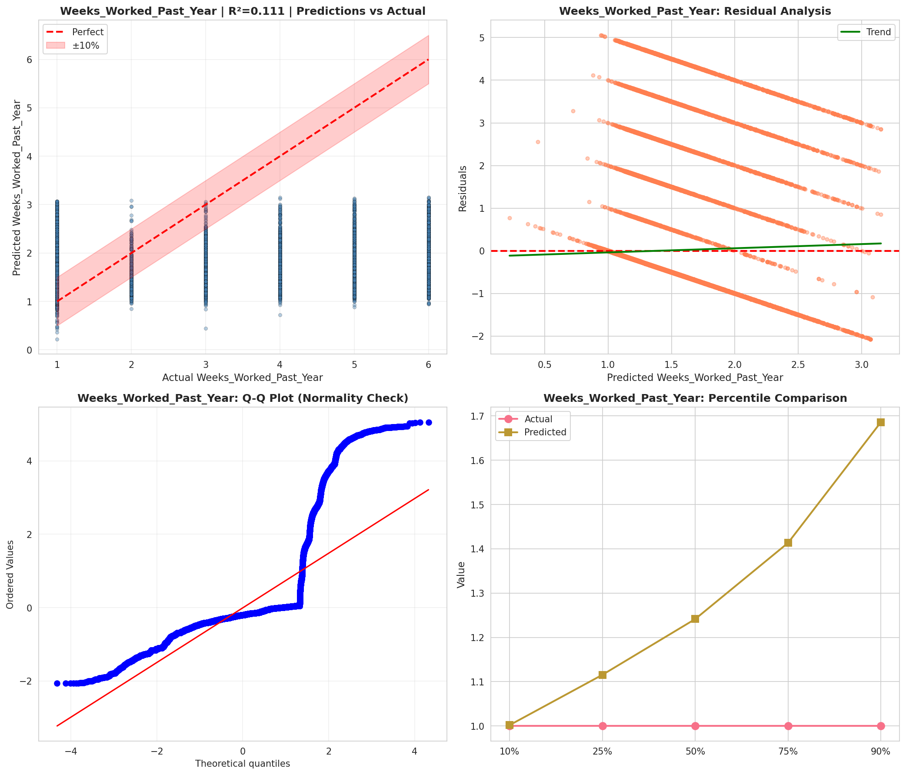
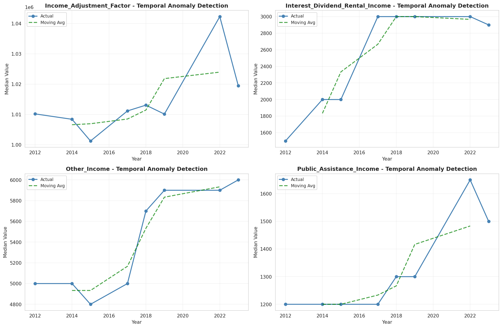
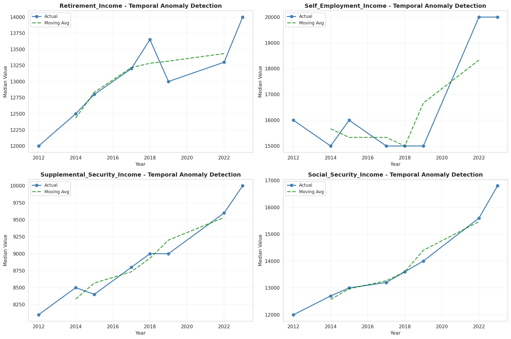
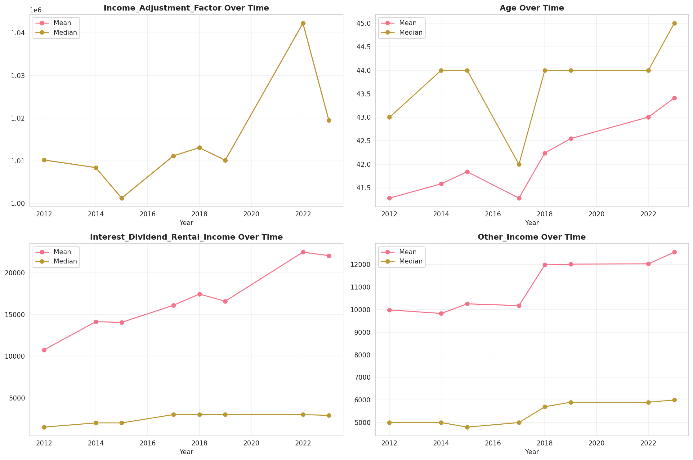
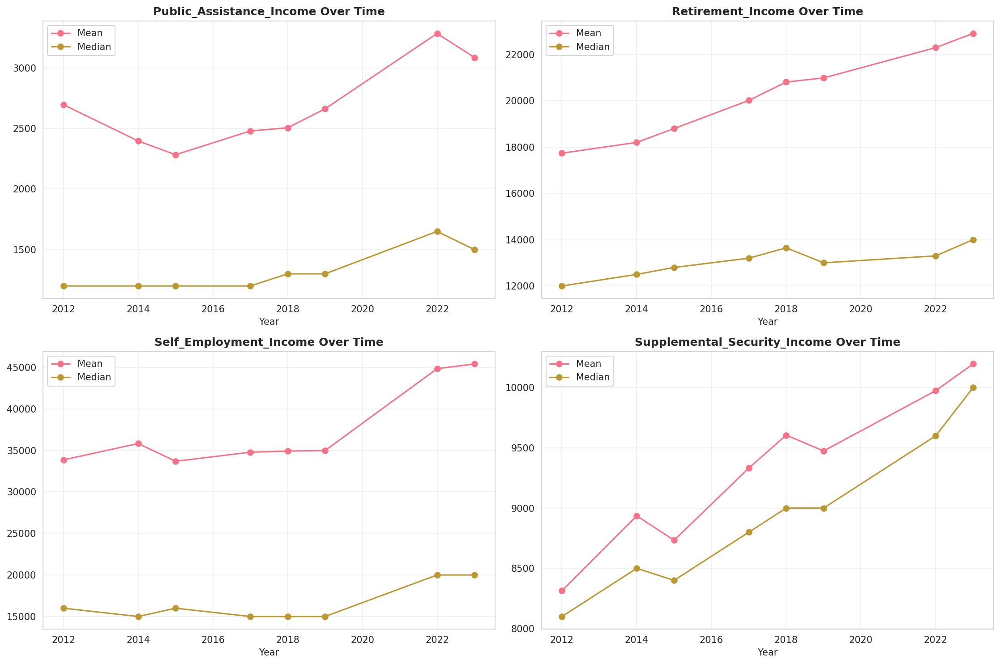
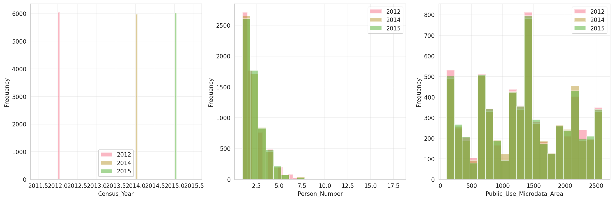
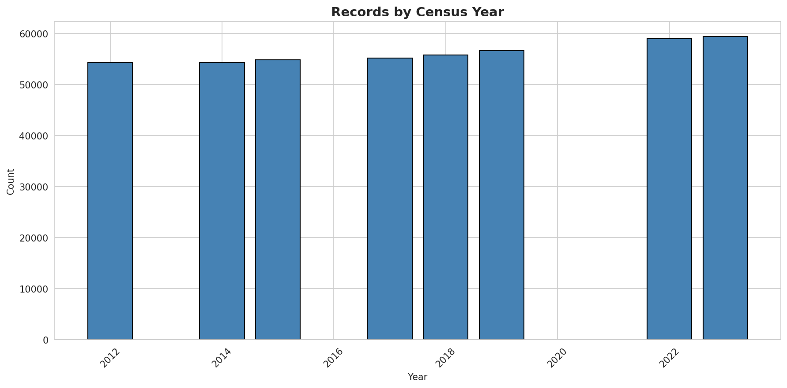
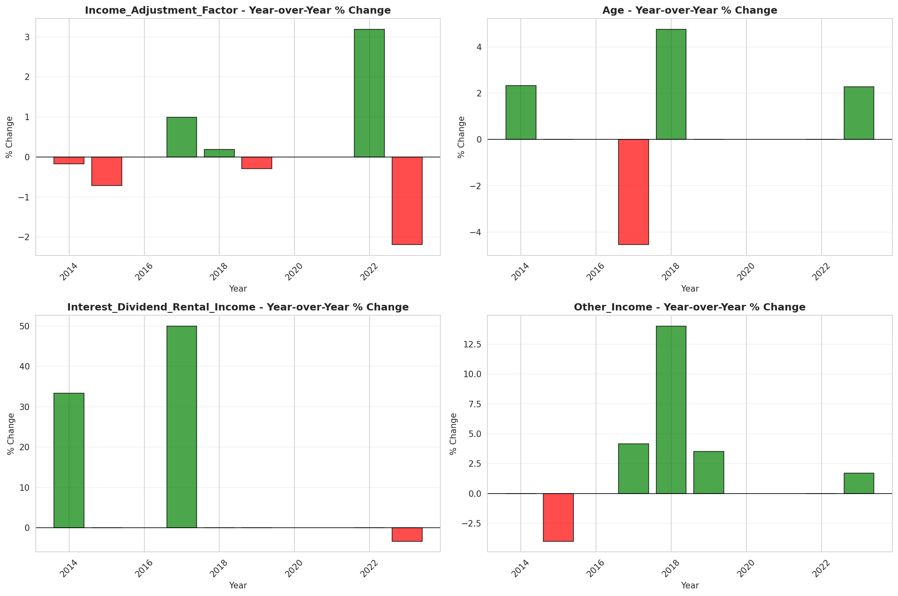
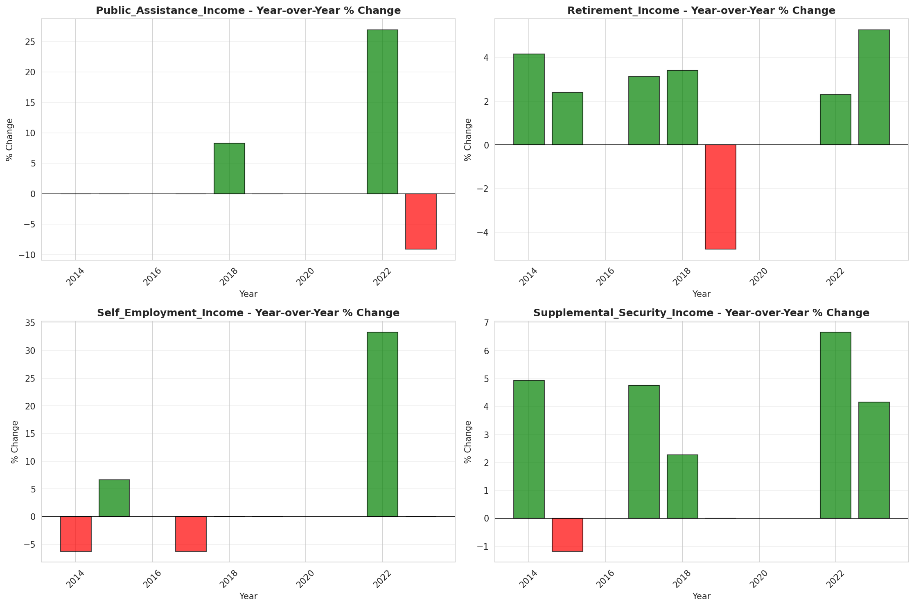

# Temporal Analysis

## Year Distribution

- 2012: 54,354 records

- 2014: 54,297 records

- 2015: 54,811 records

- 2017: 55,161 records

- 2018: 55,783 records

- 2019: 56,670 records

- 2022: 58,984 records

- 2023: 59,389 records

## Temporal Trends

- Census_Year: {np.int64(2012): {'mean': 2012.0, 'median': 2012.0, 'std': 0.0}, np.int64(2014): {'mean': 2014.0, 'median': 2014.0, 'std': 0.0}, np.int64(2015): {'mean': 2015.0, 'median': 2015.0, 'std': 0.0}, np.int64(2017): {'mean': 2017.0, 'median': 2017.0, 'std': 0.0}, np.int64(2018): {'mean': 2018.0, 'median': 2018.0, 'std': 0.0}, np.int64(2019): {'mean': 2019.0, 'median': 2019.0, 'std': 0.0}, np.int64(2022): {'mean': 2022.0, 'median': 2022.0, 'std': 0.0}, np.int64(2023): {'mean': 2023.0, 'median': 2023.0, 'std': 0.0}}

- Person_Number: {np.int64(2012): {'mean': 2.041892041064135, 'median': 2.0, 'std': 1.296166392493392}, np.int64(2014): {'mean': 2.045140615503619, 'median': 2.0, 'std': 1.3102600326515943}, np.int64(2015): {'mean': 2.052234040612286, 'median': 2.0, 'std': 1.332385089343197}, np.int64(2017): {'mean': 2.061909682565581, 'median': 2.0, 'std': 1.3246941882648808}, np.int64(2018): {'mean': 2.0477027051252175, 'median': 2.0, 'std': 1.3300490845220105}, np.int64(2019): {'mean': 2.0396506087877184, 'median': 2.0, 'std': 1.2909095063620062}, np.int64(2022): {'mean': 2.0448935304489355, 'median': 2.0, 'std': 1.3485085044605427}, np.int64(2023): {'mean': 2.0303928336897403, 'median': 2.0, 'std': 1.3174366026927982}}

- Public_Use_Microdata_Area: {np.int64(2012): {'mean': 1304.8248334989146, 'median': 1401.0, 'std': 718.3167676328072}, np.int64(2014): {'mean': 1304.5153139215795, 'median': 1401.0, 'std': 719.5892394936434}, np.int64(2015): {'mean': 1296.0779770484028, 'median': 1401.0, 'std': 717.8144333672462}, np.int64(2017): {'mean': 1314.2757926796105, 'median': 1401.0, 'std': 691.7803359979878}, np.int64(2018): {'mean': 1302.5836365917933, 'median': 1401.0, 'std': 714.598379204312}, np.int64(2019): {'mean': 1294.66158461267, 'median': 1304.0, 'std': 719.1936731009405}, np.int64(2022): {'mean': 1420.3942425064424, 'median': 1505.0, 'std': 785.2166516158578}, np.int64(2023): {'mean': 1405.065921298557, 'median': 1504.0, 'std': 793.8144364919576}}

- State_Code: {np.int64(2012): {'mean': 27.0, 'median': 27.0, 'std': 0.0}, np.int64(2014): {'mean': 27.0, 'median': 27.0, 'std': 0.0}, np.int64(2015): {'mean': 27.0, 'median': 27.0, 'std': 0.0}, np.int64(2017): {'mean': 27.0, 'median': 27.0, 'std': 0.0}, np.int64(2018): {'mean': 27.0, 'median': 27.0, 'std': 0.0}, np.int64(2019): {'mean': 27.0, 'median': 27.0, 'std': 0.0}, np.int64(2022): {'mean': 27.0, 'median': 27.0, 'std': 0.0}, np.int64(2023): {'mean': None, 'median': None, 'std': None}}

- Income_Adjustment_Factor: {np.int64(2012): {'mean': 1010207.0, 'median': 1010207.0, 'std': 0.0}, np.int64(2014): {'mean': 1008425.0, 'median': 1008425.0, 'std': 0.0}, np.int64(2015): {'mean': 1001264.0, 'median': 1001264.0, 'std': 0.0}, np.int64(2017): {'mean': 1011189.0, 'median': 1011189.0, 'std': 0.0}, np.int64(2018): {'mean': 1013097.0, 'median': 1013097.0, 'std': 0.0}, np.int64(2019): {'mean': 1010145.0, 'median': 1010145.0, 'std': 0.0}, np.int64(2022): {'mean': 1042311.0, 'median': 1042311.0, 'std': 0.0}, np.int64(2023): {'mean': 1019518.0, 'median': 1019518.0, 'std': 0.0}}

- Person_Weight: {np.int64(2012): {'mean': 98.96491518563491, 'median': 62.0, 'std': 103.32958612418423}, np.int64(2014): {'mean': 100.5059763891191, 'median': 63.0, 'std': 105.23563566644214}, np.int64(2015): {'mean': 100.1549688931054, 'median': 64.0, 'std': 103.66618793144444}, np.int64(2017): {'mean': 101.09689817080908, 'median': 72.0, 'std': 98.42251925539476}, np.int64(2018): {'mean': 100.58940895971891, 'median': 63.0, 'std': 107.90402153875468}, np.int64(2019): {'mean': 99.51706370213518, 'median': 60.0, 'std': 115.63159568053972}, np.int64(2022): {'mean': 96.9277092092771, 'median': 59.0, 'std': 111.66423968894505}, np.int64(2023): {'mean': 96.61578743538365, 'median': 56.0, 'std': 113.86670026840392}}

- Age: {np.int64(2012): {'mean': 41.283769363800275, 'median': 43.0, 'std': 23.752049700633876}, np.int64(2014): {'mean': 41.586772749875685, 'median': 44.0, 'std': 23.780752511202408}, np.int64(2015): {'mean': 41.84462972760942, 'median': 44.0, 'std': 23.847417140330347}, np.int64(2017): {'mean': 41.28391435978318, 'median': 42.0, 'std': 23.90880312525096}, np.int64(2018): {'mean': 42.24200921427675, 'median': 44.0, 'std': 24.12408572109035}, np.int64(2019): {'mean': 42.547573672136934, 'median': 44.0, 'std': 24.268524640088955}, np.int64(2022): {'mean': 43.005611691306115, 'median': 44.0, 'std': 24.31712642875518}, np.int64(2023): {'mean': 43.410816817929245, 'median': 45.0, 'std': 24.40164762892169}}

- Citizenship_Status: {np.int64(2012): {'mean': 1.1590683298377304, 'median': 1.0, 'std': 0.7253475750020453}, np.int64(2014): {'mean': 1.1529366263329466, 'median': 1.0, 'std': 0.7089018875933761}, np.int64(2015): {'mean': 1.16254036598493, 'median': 1.0, 'std': 0.7317558776443596}, np.int64(2017): {'mean': 1.1814687913562119, 'median': 1.0, 'std': 0.7652900860812998}, np.int64(2018): {'mean': 1.1671835505440726, 'median': 1.0, 'std': 0.7360725802173195}, np.int64(2019): {'mean': 1.159608258337745, 'median': 1.0, 'std': 0.7166853212371561}, np.int64(2022): {'mean': 1.1622134816221348, 'median': 1.0, 'std': 0.719283266975996}, np.int64(2023): {'mean': 1.1550623852902053, 'median': 1.0, 'std': 0.7052353378541906}}

- Class_of_Worker: {np.int64(2012): {'mean': 2.2254547574626864, 'median': 1.0, 'std': 1.9586455130382272}, np.int64(2014): {'mean': 2.2315780301490022, 'median': 1.0, 'std': 1.968060202587589}, np.int64(2015): {'mean': 2.177649855371309, 'median': 1.0, 'std': 1.930745016514986}, np.int64(2017): {'mean': 2.134059633027523, 'median': 1.0, 'std': 1.9008595232846057}, np.int64(2018): {'mean': 2.1643808387994437, 'median': 1.0, 'std': 1.9138608758107478}, np.int64(2019): {'mean': 2.1817773283900683, 'median': 1.0, 'std': 1.9032841933731992}, np.int64(2022): {'mean': 2.177794181977253, 'median': 1.0, 'std': 1.9027828268749398}, np.int64(2023): {'mean': 2.180093891646881, 'median': 1.0, 'std': 1.8899152787269726}}

- English_Speaking_Ability: {np.int64(2012): {'mean': 1.5545827633378932, 'median': 1.0, 'std': 0.8625995161192181}, np.int64(2014): {'mean': 1.5958219800181652, 'median': 1.0, 'std': 0.8755758412051314}, np.int64(2015): {'mean': 1.5354819633353045, 'median': 1.0, 'std': 0.8364023046726299}, np.int64(2017): {'mean': 1.5572100313479624, 'median': 1.0, 'std': 0.8359681198755958}, np.int64(2018): {'mean': 1.4918522542096686, 'median': 1.0, 'std': 0.7891301005370189}, np.int64(2019): {'mean': 1.4966442953020134, 'median': 1.0, 'std': 0.804873222270616}, np.int64(2022): {'mean': 1.5581709956709957, 'median': 1.0, 'std': 0.8515675644926867}, np.int64(2023): {'mean': 1.4988235294117647, 'median': 1.0, 'std': 0.8040569051804717}}

- Fertility_Status: {np.int64(2012): {'mean': 1.9441076840791585, 'median': 2.0, 'std': 0.22972389789161024}, np.int64(2014): {'mean': 1.9448653582838886, 'median': 2.0, 'std': 0.2282532996012213}, np.int64(2015): {'mean': 1.94713059195662, 'median': 2.0, 'std': 0.22378284028774612}, np.int64(2017): {'mean': 1.9413648901147789, 'median': 2.0, 'std': 0.23495094257324456}, np.int64(2018): {'mean': 1.9406872600987022, 'median': 2.0, 'std': 0.23621989414121455}, np.int64(2019): {'mean': 1.9443176631675034, 'median': 2.0, 'std': 0.22931771505058507}, np.int64(2022): {'mean': 1.9425528199755544, 'median': 2.0, 'std': 0.23270524121458433}, np.int64(2023): {'mean': 1.9445270802344912, 'median': 2.0, 'std': 0.22891103029124207}}

- Marital_Status: {np.int64(2012): {'mean': 2.7895831033594582, 'median': 2.0, 'std': 1.8673291475607627}, np.int64(2014): {'mean': 2.7904119932961304, 'median': 2.0, 'std': 1.8692572705618926}, np.int64(2015): {'mean': 2.797449417087811, 'median': 2.0, 'std': 1.866367965332637}, np.int64(2017): {'mean': 2.842479287902685, 'median': 2.0, 'std': 1.8731253743685952}, np.int64(2018): {'mean': 2.8079343169065845, 'median': 2.0, 'std': 1.8670744354753597}, np.int64(2019): {'mean': 2.797864831480501, 'median': 2.0, 'std': 1.865444696622058}, np.int64(2022): {'mean': 2.8137291468872916, 'median': 2.0, 'std': 1.8698857128617163}, np.int64(2023): {'mean': 2.808146289716951, 'median': 2.0, 'std': 1.8686133401707843}}

- Mobility_Status: {np.int64(2012): {'mean': 1.2222098276535223, 'median': 1.0, 'std': 0.6261292648625771}, np.int64(2014): {'mean': 1.2293081316391643, 'median': 1.0, 'std': 0.6341703039620296}, np.int64(2015): {'mean': 1.2323511526341975, 'median': 1.0, 'std': 0.6378936216309988}, np.int64(2017): {'mean': 1.2378283327838224, 'median': 1.0, 'std': 0.6450281726609816}, np.int64(2018): {'mean': 1.22612601191662, 'median': 1.0, 'std': 0.6301920046700785}, np.int64(2019): {'mean': 1.2189994298745723, 'median': 1.0, 'std': 0.6224498494352348}, np.int64(2022): {'mean': 1.2067655014208922, 'median': 1.0, 'std': 0.6066399447454025}, np.int64(2023): {'mean': 1.1870836165873555, 'median': 1.0, 'std': 0.5791663847832287}}

- Military_Service: {np.int64(2012): {'mean': 4.766635816751504, 'median': 5.0, 'std': 0.6336742417628884}, np.int64(2014): {'mean': 3.7910571731807483, 'median': 4.0, 'std': 0.5949227540036026}, np.int64(2015): {'mean': 3.7969548940832722, 'median': 4.0, 'std': 0.5858395865405932}, np.int64(2017): {'mean': 3.8159013022618233, 'median': 4.0, 'std': 0.5609492786004953}, np.int64(2018): {'mean': 3.81428987912359, 'median': 4.0, 'std': 0.5640245304776595}, np.int64(2019): {'mean': 3.8215849290231283, 'median': 4.0, 'std': 0.5533828584259972}, np.int64(2022): {'mean': 3.8357339613516412, 'median': 4.0, 'std': 0.5349417793106652}, np.int64(2023): {'mean': 3.846245306633292, 'median': 4.0, 'std': 0.5166388974250669}}

- Travel_Time_To_Work_Minutes: {np.int64(2012): {'mean': 23.442916867663612, 'median': 20.0, 'std': 22.06602604013927}, np.int64(2014): {'mean': 23.679663427352452, 'median': 20.0, 'std': 20.950611342433742}, np.int64(2015): {'mean': 23.938726440704258, 'median': 20.0, 'std': 22.040705892091815}, np.int64(2017): {'mean': 24.477174583590376, 'median': 20.0, 'std': 22.066353210010774}, np.int64(2018): {'mean': 24.379347616290293, 'median': 20.0, 'std': 22.357567804484766}, np.int64(2019): {'mean': 25.585709904937136, 'median': 20.0, 'std': 24.33567244074884}, np.int64(2022): {'mean': 23.887872234237232, 'median': 20.0, 'std': 21.859082271449765}, np.int64(2023): {'mean': 23.882193134107187, 'median': 20.0, 'std': 22.201331968659854}}

- Vehicle_Occupancy: {np.int64(2012): {'mean': 1.158315240990013, 'median': 1.0, 'std': 0.6052006804539906}, np.int64(2014): {'mean': 1.160877200496852, 'median': 1.0, 'std': 0.6183238561736215}, np.int64(2015): {'mean': 1.1514998739601714, 'median': 1.0, 'std': 0.582567198488359}, np.int64(2017): {'mean': 1.139155749636099, 'median': 1.0, 'std': 0.5489052663444133}, np.int64(2018): {'mean': 1.1482206850570882, 'median': 1.0, 'std': 0.5606812119168109}, np.int64(2019): {'mean': 1.1487139259320425, 'median': 1.0, 'std': 0.5868899555569524}, np.int64(2022): {'mean': 1.1547677589521212, 'median': 1.0, 'std': 0.5709729455473531}, np.int64(2023): {'mean': 1.1508389781732855, 'median': 1.0, 'std': 0.5725150394109333}}

- Transportation_To_Work: {np.int64(2012): {'mean': 2.1211168500636277, 'median': 1.0, 'std': 3.060787411482663}, np.int64(2014): {'mean': 2.0805943602475265, 'median': 1.0, 'std': 3.0051322688940925}, np.int64(2015): {'mean': 2.1089277313357218, 'median': 1.0, 'std': 3.042880950067546}, np.int64(2017): {'mean': 2.085407077100115, 'median': 1.0, 'std': 3.0195188509304076}, np.int64(2018): {'mean': 2.0949159860396502, 'median': 1.0, 'std': 3.027018111153505}, np.int64(2019): {'mean': None, 'median': None, 'std': None}, np.int64(2022): {'mean': None, 'median': None, 'std': None}, np.int64(2023): {'mean': None, 'median': None, 'std': None}}

- Language_Other_Than_English: {np.int64(2012): {'mean': 1.9289173262801689, 'median': 2.0, 'std': 0.2569653894902827}, np.int64(2014): {'mean': 1.935749299719888, 'median': 2.0, 'std': 0.2452013811823354}, np.int64(2015): {'mean': 1.934930254930255, 'median': 2.0, 'std': 0.24665125957178827}, np.int64(2017): {'mean': 1.9266033937302272, 'median': 2.0, 'std': 0.2607888963737127}, np.int64(2018): {'mean': 1.9302175725873703, 'median': 2.0, 'std': 0.2547823983500554}, np.int64(2019): {'mean': 1.9332611697958269, 'median': 2.0, 'std': 0.24957147510942088}, np.int64(2022): {'mean': 1.9340929759803134, 'median': 2.0, 'std': 0.24812171613925035}, np.int64(2023): {'mean': 1.932269717037929, 'median': 2.0, 'std': 0.251284718674992}}

- Grandparents_Living_With_Grandchildren: {np.int64(2012): {'mean': 1.9818351056328096, 'median': 2.0, 'std': 0.13354936934501835}, np.int64(2014): {'mean': 1.9832069643358607, 'median': 2.0, 'std': 0.12849705558131477}, np.int64(2015): {'mean': 1.9817417284497068, 'median': 2.0, 'std': 0.13388578326130635}, np.int64(2017): {'mean': 1.983009234718076, 'median': 2.0, 'std': 0.12923832701210844}, np.int64(2018): {'mean': 1.983835216521598, 'median': 2.0, 'std': 0.12611071785817177}, np.int64(2019): {'mean': 1.9817704883283431, 'median': 2.0, 'std': 0.13378217668813155}, np.int64(2022): {'mean': 1.9838799052944436, 'median': 2.0, 'std': 0.1259390199436822}, np.int64(2023): {'mean': 1.9855198666434455, 'median': 2.0, 'std': 0.11946051293935486}}

- Months_Responsible_For_Grandchildren: {np.int64(2012): {'mean': 3.569620253164557, 'median': 4.0, 'std': 1.3436941014353454}, np.int64(2014): {'mean': 3.6857142857142855, 'median': 4.0, 'std': 1.375202712951373}, np.int64(2015): {'mean': 3.598326359832636, 'median': 4.0, 'std': 1.3619056880436946}, np.int64(2017): {'mean': 3.6, 'median': 4.0, 'std': 1.3388515094983393}, np.int64(2018): {'mean': 3.817073170731707, 'median': 4.0, 'std': 1.24337968109459}, np.int64(2019): {'mean': 3.9507389162561575, 'median': 4.0, 'std': 1.176307760048073}, np.int64(2022): {'mean': 3.9205607476635516, 'median': 5.0, 'std': 1.3629048181148797}, np.int64(2023): {'mean': 3.811224489795918, 'median': 4.0, 'std': 1.3165909867035284}}

- Grandparents_Responsible_For_Grandchildren: {np.int64(2012): {'mean': 1.6319875776397517, 'median': 2.0, 'std': 0.4826396056675989}, np.int64(2014): {'mean': 1.648829431438127, 'median': 2.0, 'std': 0.4777357620011494}, np.int64(2015): {'mean': 1.637878787878788, 'median': 2.0, 'std': 0.4809781231369191}, np.int64(2017): {'mean': 1.6469622331691298, 'median': 2.0, 'std': 0.47830718515819104}, np.int64(2018): {'mean': 1.588628762541806, 'median': 2.0, 'std': 0.49249420846237896}, np.int64(2019): {'mean': 1.7049418604651163, 'median': 2.0, 'std': 0.45640069870603556}, np.int64(2022): {'mean': 1.665625, 'median': 2.0, 'std': 0.4721405158071764}, np.int64(2023): {'mean': 1.6632302405498283, 'median': 2.0, 'std': 0.4730119682557676}}

- Interest_Dividend_Rental_Income: {np.int64(2012): {'mean': 10756.632748694605, 'median': 1500.0, 'std': 28319.163983826464}, np.int64(2014): {'mean': 14132.925411041304, 'median': 2000.0, 'std': 36195.925767895045}, np.int64(2015): {'mean': 14051.340069507016, 'median': 2000.0, 'std': 36909.61901770497}, np.int64(2017): {'mean': 16104.492483894059, 'median': 3000.0, 'std': 42652.17192920681}, np.int64(2018): {'mean': 17449.74875089222, 'median': 3000.0, 'std': 45454.190444009575}, np.int64(2019): {'mean': 16597.762803234502, 'median': 3000.0, 'std': 44603.44196298927}, np.int64(2022): {'mean': 22471.009688162278, 'median': 3000.0, 'std': 59956.830436807366}, np.int64(2023): {'mean': 22059.501584557765, 'median': 2900.0, 'std': 62285.91966268001}}

- Military_Service_Period_1: {np.int64(2012): {'mean': 0.06678230702515178, 'median': 0.0, 'std': 0.2496716774627348}, np.int64(2014): {'mean': 0.09160493827160494, 'median': 0.0, 'std': 0.28850307652954515}, np.int64(2015): {'mean': 0.0933299518133401, 'median': 0.0, 'std': 0.2909311568647737}, np.int64(2017): {'mean': 0.10467394346487545, 'median': 0.0, 'std': 0.30617567779471105}, np.int64(2018): {'mean': 0.12252642992680943, 'median': 0.0, 'std': 0.32793727479813667}, np.int64(2019): {'mean': 0.12633652222847497, 'median': 0.0, 'std': 0.3322749928101825}, np.int64(2022): {'mean': 0.16032295271049596, 'median': 0.0, 'std': 0.3669582160958431}, np.int64(2023): {'mean': 0.15942028985507245, 'median': 0.0, 'std': 0.3661240161924078}}

- Military_Service_Period_2: {np.int64(2012): {'mean': 0.09540329575021683, 'median': 0.0, 'std': 0.2938030349582225}, np.int64(2014): {'mean': 0.09975308641975308, 'median': 0.0, 'std': 0.2997075025418558}, np.int64(2015): {'mean': 0.12097387775805224, 'median': 0.0, 'std': 0.32613827529007616}, np.int64(2017): {'mean': 0.12986286034144975, 'median': 0.0, 'std': 0.33619954247925565}, np.int64(2018): {'mean': 0.12388181078883166, 'median': 0.0, 'std': 0.32949133069575837}, np.int64(2019): {'mean': 0.13365222284749578, 'median': 0.0, 'std': 0.34032616023638795}, np.int64(2022): {'mean': 0.15051903114186851, 'median': 0.0, 'std': 0.3576310003797693}, np.int64(2023): {'mean': 0.14677767499229108, 'median': 0.0, 'std': 0.35393872031341433}}

- Military_Service_Period_3: {np.int64(2012): {'mean': 0.12836079791847355, 'median': 0.0, 'std': 0.33452738023472933}, np.int64(2014): {'mean': None, 'median': None, 'std': None}, np.int64(2015): {'mean': None, 'median': None, 'std': None}, np.int64(2017): {'mean': None, 'median': None, 'std': None}, np.int64(2018): {'mean': None, 'median': None, 'std': None}, np.int64(2019): {'mean': None, 'median': None, 'std': None}, np.int64(2022): {'mean': None, 'median': None, 'std': None}, np.int64(2023): {'mean': None, 'median': None, 'std': None}}

- Military_Service_Period_4: {np.int64(2012): {'mean': 0.09887250650477017, 'median': 0.0, 'std': 0.2985231257559613}, np.int64(2014): {'mean': None, 'median': None, 'std': None}, np.int64(2015): {'mean': None, 'median': None, 'std': None}, np.int64(2017): {'mean': None, 'median': None, 'std': None}, np.int64(2018): {'mean': None, 'median': None, 'std': None}, np.int64(2019): {'mean': None, 'median': None, 'std': None}, np.int64(2022): {'mean': None, 'median': None, 'std': None}, np.int64(2023): {'mean': None, 'median': None, 'std': None}}

- Military_Service_Period_5: {np.int64(2012): {'mean': 0.40503035559410233, 'median': 0.0, 'std': 0.4909511470501907}, np.int64(2014): {'mean': 0.4108641975308642, 'median': 0.0, 'std': 0.49205141001571634}, np.int64(2015): {'mean': 0.42252092315495815, 'median': 0.0, 'std': 0.4940231668680057}, np.int64(2017): {'mean': 0.441925552756787, 'median': 0.0, 'std': 0.49668541672839467}, np.int64(2018): {'mean': 0.4350772567091353, 'median': 0.0, 'std': 0.49583432912264785}, np.int64(2019): {'mean': 0.44935284186831737, 'median': 0.0, 'std': 0.49749824771914397}, np.int64(2022): {'mean': 0.44521337946943484, 'median': 0.0, 'std': 0.4970610313699946}, np.int64(2023): {'mean': 0.43940795559666973, 'median': 0.0, 'std': 0.49639156378858534}}

- Military_Service_Period_6: {np.int64(2012): {'mean': 0.11491760624457936, 'median': 0.0, 'std': 0.31895706368982446}, np.int64(2014): {'mean': None, 'median': None, 'std': None}, np.int64(2015): {'mean': None, 'median': None, 'std': None}, np.int64(2017): {'mean': None, 'median': None, 'std': None}, np.int64(2018): {'mean': None, 'median': None, 'std': None}, np.int64(2019): {'mean': None, 'median': None, 'std': None}, np.int64(2022): {'mean': None, 'median': None, 'std': None}, np.int64(2023): {'mean': None, 'median': None, 'std': None}}

- Military_Service_Period_7: {np.int64(2012): {'mean': 0.1305290546400694, 'median': 0.0, 'std': 0.3369211089881099}, np.int64(2014): {'mean': None, 'median': None, 'std': None}, np.int64(2015): {'mean': None, 'median': None, 'std': None}, np.int64(2017): {'mean': None, 'median': None, 'std': None}, np.int64(2018): {'mean': None, 'median': None, 'std': None}, np.int64(2019): {'mean': None, 'median': None, 'std': None}, np.int64(2022): {'mean': None, 'median': None, 'std': None}, np.int64(2023): {'mean': None, 'median': None, 'std': None}}

- Military_Service_Period_8: {np.int64(2012): {'mean': 0.1342150910667823, 'median': 0.0, 'std': 0.3409202271905689}, np.int64(2014): {'mean': 0.1237037037037037, 'median': 0.0, 'std': 0.32928387404669185}, np.int64(2015): {'mean': 0.1113365457773269, 'median': 0.0, 'std': 0.31458833174282724}, np.int64(2017): {'mean': 0.09907640638119228, 'median': 0.0, 'std': 0.2988063937698499}, np.int64(2018): {'mean': 0.10002710761724044, 'median': 0.0, 'std': 0.30007681468194664}, np.int64(2019): {'mean': 0.08947664603263927, 'median': 0.0, 'std': 0.2854706743745172}, np.int64(2022): {'mean': 0.055074971164936565, 'median': 0.0, 'std': 0.22815943834747862}, np.int64(2023): {'mean': 0.05026210299105766, 'median': 0.0, 'std': 0.21851898815429827}}

- Military_Service_Period_9: {np.int64(2012): {'mean': 0.017129228100607113, 'median': 0.0, 'std': 0.1297669791373829}, np.int64(2014): {'mean': 0.019012345679012346, 'median': 0.0, 'std': 0.13658507489039418}, np.int64(2015): {'mean': 0.011919857976160284, 'median': 0.0, 'std': 0.1085392220735945}, np.int64(2017): {'mean': 0.0109151973131822, 'median': 0.0, 'std': 0.10391861331267459}, np.int64(2018): {'mean': 0.009487666034155597, 'median': 0.0, 'std': 0.09695462029826778}, np.int64(2019): {'mean': 0.009285312324141813, 'median': 0.0, 'std': 0.0959254106358588}, np.int64(2022): {'mean': None, 'median': None, 'std': None}, np.int64(2023): {'mean': None, 'median': None, 'std': None}}

- Military_Service_Period_10: {np.int64(2012): {'mean': 0.08217692974848222, 'median': 0.0, 'std': 0.2746638661094673}, np.int64(2014): {'mean': 0.06617283950617284, 'median': 0.0, 'std': 0.24861467447164942}, np.int64(2015): {'mean': 0.05782399188435201, 'median': 0.0, 'std': 0.23343992447415696}, np.int64(2017): {'mean': 0.04002239014833473, 'median': 0.0, 'std': 0.19603916568314506}, np.int64(2018): {'mean': 0.03252914068853348, 'median': 0.0, 'std': 0.17742471373752214}, np.int64(2019): {'mean': 0.024760832864378166, 'median': 0.0, 'std': 0.1554172784968628}, np.int64(2022): {'mean': 0.011534025374855825, 'median': 0.0, 'std': 0.10679082387967262}, np.int64(2023): {'mean': 0.005242059821153253, 'median': 0.0, 'std': 0.07222318932021136}}

- Military_Service_Period_11: {np.int64(2012): {'mean': 0.00411968777103209, 'median': 0.0, 'std': 0.06405939205743222}, np.int64(2014): {'mean': 0.0004938271604938272, 'median': 0.0, 'std': 0.022219477890970975}, np.int64(2015): {'mean': 0.00126806999746386, 'median': 0.0, 'std': 0.035591898936653626}, np.int64(2017): {'mean': 0.002239014833473272, 'median': 0.0, 'std': 0.047271842215449875}, np.int64(2018): {'mean': 0.0002710761724044456, 'median': 0.0, 'std': 0.01646439104262425}, np.int64(2019): {'mean': 0.0, 'median': 0.0, 'std': 0.0}, np.int64(2022): {'mean': None, 'median': None, 'std': None}, np.int64(2023): {'mean': None, 'median': None, 'std': None}}

- Temporary_Absence_From_Work: {np.int64(2012): {'mean': 2.572640822640823, 'median': 3.0, 'std': 0.5274202999049789}, np.int64(2014): {'mean': 2.6282920853843885, 'median': 3.0, 'std': 0.5109213775460851}, np.int64(2015): {'mean': 2.6379840610618475, 'median': 3.0, 'std': 0.5048287612055599}, np.int64(2017): {'mean': 2.6399451019214326, 'median': 3.0, 'std': 0.5042967916271335}, np.int64(2018): {'mean': 2.632042370076134, 'median': 3.0, 'std': 0.5087545031042584}, np.int64(2019): {'mean': 2.6360587184736683, 'median': 3.0, 'std': 0.5058527745359266}, np.int64(2022): {'mean': 2.612517857512578, 'median': 3.0, 'std': 0.5087594902902227}, np.int64(2023): {'mean': 2.605039260307112, 'median': 3.0, 'std': 0.5095061830379387}}

- Available_For_Work: {np.int64(2012): {'mean': 4.566953316953317, 'median': 5.0, 'std': 1.139321656342192}, np.int64(2014): {'mean': 4.743756096454415, 'median': 5.0, 'std': 0.9009201480893142}, np.int64(2015): {'mean': 4.7483668200695925, 'median': 5.0, 'std': 0.8924829215309942}, np.int64(2017): {'mean': 4.772330468433605, 'median': 5.0, 'std': 0.8516091854537662}, np.int64(2018): {'mean': 4.768685865607415, 'median': 5.0, 'std': 0.8564918326116054}, np.int64(2019): {'mean': 4.777540619418914, 'median': 5.0, 'std': 0.8345839634062762}, np.int64(2022): {'mean': 4.806890411809769, 'median': 5.0, 'std': 0.7833026380091631}, np.int64(2023): {'mean': 4.79752752321791, 'median': 5.0, 'std': 0.8017886073479557}}

- On_Layoff_From_Work: {np.int64(2012): {'mean': 2.537810537810538, 'median': 3.0, 'std': 0.5293385206016691}, np.int64(2014): {'mean': 2.6082163192160244, 'median': 3.0, 'std': 0.5094832286034643}, np.int64(2015): {'mean': 2.6170838477943654, 'median': 3.0, 'std': 0.5062823529782968}, np.int64(2017): {'mean': 2.6243756468523602, 'median': 3.0, 'std': 0.5010496671088538}, np.int64(2018): {'mean': 2.616330133509875, 'median': 3.0, 'std': 0.5031900640615854}, np.int64(2019): {'mean': 2.622228514178682, 'median': 3.0, 'std': 0.4996580099007283}, np.int64(2022): {'mean': 2.5996811528188988, 'median': 3.0, 'std': 0.504418242390491}, np.int64(2023): {'mean': 2.5917953133649054, 'median': 3.0, 'std': 0.5060572186719251}}

- Looking_For_Work: {np.int64(2012): {'mean': 2.5459550459550457, 'median': 3.0, 'std': 0.5794841336545299}, np.int64(2014): {'mean': 2.6149762947167843, 'median': 3.0, 'std': 0.5444281338083874}, np.int64(2015): {'mean': 2.622987989673364, 'median': 3.0, 'std': 0.5393641719724348}, np.int64(2017): {'mean': 2.630292939747109, 'median': 3.0, 'std': 0.5308562734662899}, np.int64(2018): {'mean': 2.6253117069403067, 'median': 3.0, 'std': 0.5313819364792695}, np.int64(2019): {'mean': 2.61981095090822, 'median': 3.0, 'std': 0.5277031218223803}, np.int64(2022): {'mean': 2.5934284353713326, 'median': 3.0, 'std': 0.5352139544965228}, np.int64(2023): {'mean': 2.583922750476659, 'median': 3.0, 'std': 0.5378626365353797}}

- Informed_Of_Recall: {np.int64(2012): {'mean': 2.883929383929384, 'median': 3.0, 'std': 0.34854484760322785}, np.int64(2014): {'mean': 2.9346686931470183, 'median': 3.0, 'std': 0.27533572217926217}, np.int64(2015): {'mean': 2.935256482209002, 'median': 3.0, 'std': 0.2726486340120819}, np.int64(2017): {'mean': 2.9419295324663635, 'median': 3.0, 'std': 0.25776805895901866}, np.int64(2018): {'mean': 2.9401301997131193, 'median': 3.0, 'std': 0.2630943464232325}, np.int64(2019): {'mean': 2.9277562399268198, 'median': 3.0, 'std': 0.2818525208417159}, np.int64(2022): {'mean': 2.9455889355887286, 'median': 3.0, 'std': 0.24910322918453168}, np.int64(2023): {'mean': 2.9414888164503763, 'median': 3.0, 'std': 0.25625715134411875}}

- Other_Income: {np.int64(2012): {'mean': 9984.647918389854, 'median': 5000.0, 'std': 13663.396222437777}, np.int64(2014): {'mean': 9828.64647676162, 'median': 5000.0, 'std': 13806.595863948092}, np.int64(2015): {'mean': 10253.285841495994, 'median': 4800.0, 'std': 14284.608479334616}, np.int64(2017): {'mean': 10176.075212557227, 'median': 5000.0, 'std': 13738.324650256507}, np.int64(2018): {'mean': 11978.089081348593, 'median': 5700.0, 'std': 16433.787743126082}, np.int64(2019): {'mean': 12009.801813066584, 'median': 5900.0, 'std': 16170.356460341822}, np.int64(2022): {'mean': 12022.697429136453, 'median': 5900.0, 'std': 15982.95702074606}, np.int64(2023): {'mean': 12540.08056872038, 'median': 6000.0, 'std': 16741.698238111276}}

- Public_Assistance_Income: {np.int64(2012): {'mean': 2695.59915164369, 'median': 1200.0, 'std': 3819.5745192285285}, np.int64(2014): {'mean': 2396.2343572241184, 'median': 1200.0, 'std': 2949.9108584119585}, np.int64(2015): {'mean': 2283.065868263473, 'median': 1200.0, 'std': 2876.1778843240686}, np.int64(2017): {'mean': 2478.729139922978, 'median': 1200.0, 'std': 3654.653026312605}, np.int64(2018): {'mean': 2505.228494623656, 'median': 1300.0, 'std': 3338.031383067233}, np.int64(2019): {'mean': 2661.3920817369094, 'median': 1300.0, 'std': 3462.025186521777}, np.int64(2022): {'mean': 3283.7244897959185, 'median': 1650.0, 'std': 4296.092870515516}, np.int64(2023): {'mean': 3084.9717514124295, 'median': 1500.0, 'std': 4130.542480996861}}

- Retirement_Income: {np.int64(2012): {'mean': 17739.640693545018, 'median': 12000.0, 'std': 18234.40934492742}, np.int64(2014): {'mean': 18205.00182002022, 'median': 12500.0, 'std': 18682.817854099365}, np.int64(2015): {'mean': 18802.612325260878, 'median': 12800.0, 'std': 20578.902524196154}, np.int64(2017): {'mean': 20020.3316958145, 'median': 13200.0, 'std': 23232.7434774165}, np.int64(2018): {'mean': 20814.630654205608, 'median': 13650.0, 'std': 24338.988957951075}, np.int64(2019): {'mean': 20990.741449062156, 'median': 13000.0, 'std': 25191.033201618495}, np.int64(2022): {'mean': 22301.309271217713, 'median': 13300.0, 'std': 28044.00382036851}, np.int64(2023): {'mean': 22914.487039715208, 'median': 14000.0, 'std': 29663.4897987787}}

- Self_Employment_Income: {np.int64(2012): {'mean': 33858.96758298755, 'median': 16000.0, 'std': 55121.283701256776}, np.int64(2014): {'mean': 35829.84722222222, 'median': 15000.0, 'std': 58003.08157977173}, np.int64(2015): {'mean': 33691.499728555915, 'median': 16000.0, 'std': 54471.31945191651}, np.int64(2017): {'mean': 34780.97077059345, 'median': 15000.0, 'std': 60177.428640079524}, np.int64(2018): {'mean': 34918.64645907964, 'median': 15000.0, 'std': 59349.767387758955}, np.int64(2019): {'mean': 34982.180676855896, 'median': 15000.0, 'std': 61909.388671135704}, np.int64(2022): {'mean': 44841.047237331804, 'median': 20000.0, 'std': 79668.93588951603}, np.int64(2023): {'mean': 45405.83071408878, 'median': 20000.0, 'std': 76631.70618410685}}

- Supplemental_Security_Income: {np.int64(2012): {'mean': 8314.285714285714, 'median': 8100.0, 'std': 4520.100790314171}, np.int64(2014): {'mean': 8935.576923076924, 'median': 8500.0, 'std': 5034.589196824238}, np.int64(2015): {'mean': 8733.23374340949, 'median': 8400.0, 'std': 4889.69403332266}, np.int64(2017): {'mean': 9332.595744680852, 'median': 8800.0, 'std': 5180.891504632744}, np.int64(2018): {'mean': 9605.672913117547, 'median': 9000.0, 'std': 5812.119053574435}, np.int64(2019): {'mean': 9474.480968858132, 'median': 9000.0, 'std': 5328.266304183333}, np.int64(2022): {'mean': 9974.793077501881, 'median': 9600.0, 'std': 5529.239471446562}, np.int64(2023): {'mean': 10196.574344023324, 'median': 10000.0, 'std': 6382.99241696655}}

- Social_Security_Income: {np.int64(2012): {'mean': 12425.151077805533, 'median': 12000.0, 'std': 6272.578661256304}, np.int64(2014): {'mean': 13176.806556195965, 'median': 12700.0, 'std': 6598.793435549504}, np.int64(2015): {'mean': 13311.835910049193, 'median': 13000.0, 'std': 6712.434605916483}, np.int64(2017): {'mean': 14027.773395482252, 'median': 13200.0, 'std': 7207.627885113674}, np.int64(2018): {'mean': 14246.945722171113, 'median': 13600.0, 'std': 7209.316627880341}, np.int64(2019): {'mean': 14693.698410149349, 'median': 14000.0, 'std': 7490.565182889244}, np.int64(2022): {'mean': 16277.717119709245, 'median': 15600.0, 'std': 8637.439604199059}, np.int64(2023): {'mean': 17317.443161443018, 'median': 16800.0, 'std': 9235.036809546018}}

- Wage_Income: {np.int64(2012): {'mean': 39497.108780849485, 'median': 30000.0, 'std': 44917.43886506841}, np.int64(2014): {'mean': 42801.212448307284, 'median': 32000.0, 'std': 51591.58957336378}, np.int64(2015): {'mean': 44494.53379561292, 'median': 34000.0, 'std': 55403.23934551083}, np.int64(2017): {'mean': 47729.96519602825, 'median': 36000.0, 'std': 57016.96983497793}, np.int64(2018): {'mean': 48429.86987260494, 'median': 37400.0, 'std': 57073.39028818753}, np.int64(2019): {'mean': 50625.42832972388, 'median': 40000.0, 'std': 57318.0882131042}, np.int64(2022): {'mean': 56646.337745687924, 'median': 45000.0, 'std': 65914.22548217278}, np.int64(2023): {'mean': 59331.87474305418, 'median': 47000.0, 'std': 70042.89638403108}}

- Relationship_To_Householder: {np.int64(2012): {'mean': 2.3360746219229496, 'median': 1.0, 'std': 4.266101219383967}, np.int64(2014): {'mean': 2.3361880030204247, 'median': 1.0, 'std': 4.258497654407699}, np.int64(2015): {'mean': 2.358048566893507, 'median': 1.0, 'std': 4.281655341832379}, np.int64(2017): {'mean': 2.3866681169666975, 'median': 1.0, 'std': 4.298809546776467}, np.int64(2018): {'mean': 2.3978810748794435, 'median': 1.0, 'std': 4.337646122383403}, np.int64(2019): {'mean': None, 'median': None, 'std': None}, np.int64(2022): {'mean': None, 'median': None, 'std': None}, np.int64(2023): {'mean': None, 'median': None, 'std': None}}

- School_Enrollment: {np.int64(2012): {'mean': 1.2886357163201367, 'median': 1.0, 'std': 0.5403625210811311}, np.int64(2014): {'mean': 1.2832529159226473, 'median': 1.0, 'std': 0.5354657562559377}, np.int64(2015): {'mean': 1.276113223171604, 'median': 1.0, 'std': 0.5284545065092158}, np.int64(2017): {'mean': 1.2843361306758578, 'median': 1.0, 'std': 0.5340803110978897}, np.int64(2018): {'mean': 1.2713978574341105, 'median': 1.0, 'std': 0.5216730898750671}, np.int64(2019): {'mean': 1.2688744620322416, 'median': 1.0, 'std': 0.5199005826889441}, np.int64(2022): {'mean': 1.2687207760485728, 'median': 1.0, 'std': 0.5329443743375138}, np.int64(2023): {'mean': 1.268689038651444, 'median': 1.0, 'std': 0.5323215948194}}

- School_Grade_Attending: {np.int64(2012): {'mean': 9.39360631627835, 'median': 10.0, 'std': 4.888899685652951}, np.int64(2014): {'mean': 9.46364494806421, 'median': 10.0, 'std': 4.848424157080033}, np.int64(2015): {'mean': 9.36562649259672, 'median': 10.0, 'std': 4.826515654707685}, np.int64(2017): {'mean': 9.261291067169347, 'median': 10.0, 'std': 4.8610316572876595}, np.int64(2018): {'mean': 9.306742640075974, 'median': 10.0, 'std': 4.86072804517699}, np.int64(2019): {'mean': 9.221331446985774, 'median': 10.0, 'std': 4.81446957907928}, np.int64(2022): {'mean': 9.252675663099115, 'median': 10.0, 'std': 4.807766528649093}, np.int64(2023): {'mean': 9.291878172588833, 'median': 10.0, 'std': 4.787470847132897}}

- Educational_Attainment: {np.int64(2012): {'mean': 15.983043767207823, 'median': 17.0, 'std': 5.51124314852432}, np.int64(2014): {'mean': 16.104232361992324, 'median': 18.0, 'std': 5.5145026176675795}, np.int64(2015): {'mean': 16.16484736703429, 'median': 18.0, 'std': 5.477285882842969}, np.int64(2017): {'mean': 16.221152405215047, 'median': 18.0, 'std': 5.596068454042579}, np.int64(2018): {'mean': 16.350502279719763, 'median': 18.0, 'std': 5.487700134658615}, np.int64(2019): {'mean': 16.335436574513093, 'median': 18.0, 'std': 5.520868141844651}, np.int64(2022): {'mean': 16.452282085281595, 'median': 18.0, 'std': 5.522776850966202}, np.int64(2023): {'mean': 16.49143292735746, 'median': 18.0, 'std': 5.4895888571826434}}

- Sex: {np.int64(2012): {'mean': 1.4975898737903375, 'median': 1.0, 'std': 0.4999987907454414}, np.int64(2014): {'mean': 1.4977438900860085, 'median': 1.0, 'std': 0.49999951426482026}, np.int64(2015): {'mean': 1.5003557680027733, 'median': 2.0, 'std': 0.5000044346186117}, np.int64(2017): {'mean': 1.499809648120955, 'median': 1.0, 'std': 0.5000044960150546}, np.int64(2018): {'mean': 1.4964415682197085, 'median': 1.0, 'std': 0.4999918190017964}, np.int64(2019): {'mean': 1.4970001764602083, 'median': 1.0, 'std': 0.4999954124619385}, np.int64(2022): {'mean': 1.4957446087074462, 'median': 1.0, 'std': 0.4999861296549534}, np.int64(2023): {'mean': 1.49637138190574, 'median': 1.0, 'std': 0.4999910424334112}}

- Hours_Worked_Per_Week: {np.int64(2012): {'mean': 37.55380415353115, 'median': 40.0, 'std': 14.178766334077318}, np.int64(2014): {'mean': 37.772173236514526, 'median': 40.0, 'std': 14.055298853460599}, np.int64(2015): {'mean': 37.93378624055114, 'median': 40.0, 'std': 14.018708725031706}, np.int64(2017): {'mean': 37.820257368202576, 'median': 40.0, 'std': 13.676187438244908}, np.int64(2018): {'mean': 37.865958394299895, 'median': 40.0, 'std': 13.79454387590039}, np.int64(2019): {'mean': 37.6643517787809, 'median': 40.0, 'std': 14.0391275991757}, np.int64(2022): {'mean': 37.58881044608272, 'median': 40.0, 'std': 13.91975345170945}, np.int64(2023): {'mean': 37.311284528675834, 'median': 40.0, 'std': 14.064650919857149}}

- When_Last_Worked: {np.int64(2012): {'mean': 1.5231595231595232, 'median': 1.0, 'std': 0.8341399235271749}, np.int64(2014): {'mean': 1.5222194496744776, 'median': 1.0, 'std': 0.8327680953465377}, np.int64(2015): {'mean': 1.5145583118195083, 'median': 1.0, 'std': 0.8286254713968961}, np.int64(2017): {'mean': 1.5133195338163163, 'median': 1.0, 'std': 0.8280656753241452}, np.int64(2018): {'mean': 1.5308176100628932, 'median': 1.0, 'std': 0.8356031509306019}, np.int64(2019): {'mean': 1.5364159080019166, 'median': 1.0, 'std': 0.837525322599164}, np.int64(2022): {'mean': 1.58166835752293, 'median': 1.0, 'std': 0.8557208974015291}, np.int64(2023): {'mean': 1.5799249646349713, 'median': 1.0, 'std': 0.8529616144783708}}

- Weeks_Worked_Past_Year: {np.int64(2012): {'mean': 1.927394455458416, 'median': 1.0, 'std': 1.641744891111297}, np.int64(2014): {'mean': 1.899669346473029, 'median': 1.0, 'std': 1.6221558658280317}, np.int64(2015): {'mean': 1.881223487385577, 'median': 1.0, 'std': 1.5998859309122975}, np.int64(2017): {'mean': 1.8440463645943097, 'median': 1.0, 'std': 1.5748283652573423}, np.int64(2018): {'mean': 1.838221260894459, 'median': 1.0, 'std': 1.5666953289261727}}

- Year_Of_Entry: {np.int64(2012): {'mean': 1993.1594147092799, 'median': 1998.0, 'std': 15.672544795472332}, np.int64(2014): {'mean': 1994.570917759237, 'median': 1998.0, 'std': 16.016443646535983}, np.int64(2015): {'mean': 1995.2034213462255, 'median': 1999.0, 'std': 16.36245121363563}, np.int64(2017): {'mean': 1996.2174338883447, 'median': 1999.0, 'std': 16.162337673006654}, np.int64(2018): {'mean': 1996.9481611208407, 'median': 2000.0, 'std': 16.826022741321836}, np.int64(2019): {'mean': 1997.1747225205872, 'median': 2000.0, 'std': 16.65365133958698}, np.int64(2022): {'mean': 1998.189406637613, 'median': 2001.0, 'std': 17.685682399089004}, np.int64(2023): {'mean': 2000.3091416608513, 'median': 2003.0, 'std': 17.25412261218748}}

- Ancestry_Recode: {np.int64(2012): {'mean': 1.7090554513007323, 'median': 2.0, 'std': 0.8952147001224859}, np.int64(2014): {'mean': 1.7935981730114003, 'median': 2.0, 'std': 0.9837700057860401}, np.int64(2015): {'mean': 1.8066264071080622, 'median': 2.0, 'std': 0.9962292828268288}, np.int64(2017): {'mean': 1.8964123202987617, 'median': 2.0, 'std': 1.0257922882710393}, np.int64(2018): {'mean': 1.9225570514314396, 'median': 2.0, 'std': 1.048084266304192}, np.int64(2019): {'mean': 1.9392976883712723, 'median': 2.0, 'std': 1.0535703501752016}, np.int64(2022): {'mean': 1.999847416248474, 'median': 2.0, 'std': 1.1133250701896162}, np.int64(2023): {'mean': 1.9890720503797, 'median': 2.0, 'std': 1.1151152312037895}}

- First_Ancestry_Code: {np.int64(2012): {'mean': 289.19722559517237, 'median': 82.0, 'std': 384.0281057394888}, np.int64(2014): {'mean': 307.37355655008565, 'median': 82.0, 'std': 396.2673794922604}, np.int64(2015): {'mean': 313.39962781193555, 'median': 82.0, 'std': 398.8881711008689}, np.int64(2017): {'mean': 338.3096027990791, 'median': 82.0, 'std': 408.82369377583774}, np.int64(2018): {'mean': 346.35880106842586, 'median': 82.0, 'std': 413.0513358816121}, np.int64(2019): {'mean': 349.8121051702841, 'median': 82.0, 'std': 414.9151945494168}, np.int64(2022): {'mean': 377.22758714227587, 'median': 87.0, 'std': 428.7684272674363}, np.int64(2023): {'mean': 381.6888649413191, 'median': 88.0, 'std': 429.5208008796935}}

- Second_Ancestry_Code: {np.int64(2012): {'mean': 647.2739632777716, 'median': 999.0, 'std': 451.6558874494204}, np.int64(2014): {'mean': 665.1244267639096, 'median': 999.0, 'std': 447.09200948295864}, np.int64(2015): {'mean': 665.8963711663718, 'median': 999.0, 'std': 447.2070895063371}, np.int64(2017): {'mean': 649.6093435579486, 'median': 999.0, 'std': 450.7102289230206}, np.int64(2018): {'mean': 655.5096534786584, 'median': 999.0, 'std': 449.36648063742985}, np.int64(2019): {'mean': 651.6786306687842, 'median': 999.0, 'std': 450.3171408539818}, np.int64(2022): {'mean': 689.2767699715178, 'median': 999.0, 'std': 438.77711788978706}, np.int64(2023): {'mean': 695.7101483439694, 'median': 999.0, 'std': 436.2345274623722}}

- Decade_Of_Entry: {np.int64(2012): {'mean': 5.790142472083173, 'median': 6.0, 'std': 1.4763972055336092}, np.int64(2014): {'mean': 5.868891537544696, 'median': 6.0, 'std': 1.4448986804948527}, np.int64(2015): {'mean': 5.886574934920045, 'median': 6.0, 'std': 1.4788193784733459}, np.int64(2017): {'mean': 6.175318315377082, 'median': 6.0, 'std': 1.6116061403500965}, np.int64(2018): {'mean': 6.247985989492119, 'median': 7.0, 'std': 1.6500436297813625}, np.int64(2019): {'mean': 6.2370211242391695, 'median': 7.0, 'std': 1.6421529145466889}, np.int64(2022): {'mean': 6.311431444854174, 'median': 7.0, 'std': 1.6930520609033455}, np.int64(2023): {'mean': 6.478367062107467, 'median': 7.0, 'std': 1.6254046356573146}}

- Drives_Alone_To_Work: {np.int64(2012): {'mean': 1.1513677811550151, 'median': 1.0, 'std': 0.5313699950135923}, np.int64(2014): {'mean': 1.15316743050499, 'median': 1.0, 'std': 0.5377974819648482}, np.int64(2015): {'mean': 1.145702041845223, 'median': 1.0, 'std': 0.5224551108351113}, np.int64(2017): {'mean': 1.1349137034726555, 'median': 1.0, 'std': 0.5025446785759552}, np.int64(2018): {'mean': 1.1435536294691224, 'median': 1.0, 'std': 0.506591043558769}, np.int64(2019): {'mean': 1.1433053961438422, 'median': 1.0, 'std': 0.5305523884698038}, np.int64(2022): {'mean': 1.1507443336760697, 'median': 1.0, 'std': 0.5290087307896}, np.int64(2023): {'mean': 1.1462788329570106, 'median': 1.0, 'std': 0.5211668895515242}}

- Employment_Status_Parents: {np.int64(2012): {'mean': 2.4619522087999295, 'median': 1.0, 'std': 2.304447666076969}, np.int64(2014): {'mean': 2.4603358942290514, 'median': 1.0, 'std': 2.278769221790272}, np.int64(2015): {'mean': 2.4995107196868607, 'median': 1.0, 'std': 2.294939646531919}, np.int64(2017): {'mean': 2.521357874631012, 'median': 1.0, 'std': 2.30560521340718}, np.int64(2018): {'mean': 2.41213407623596, 'median': 1.0, 'std': 2.226901110325501}, np.int64(2019): {'mean': 2.459555632702656, 'median': 1.0, 'std': 2.2704796713688213}, np.int64(2022): {'mean': 2.3382289787855366, 'median': 1.0, 'std': 2.190232535717908}, np.int64(2023): {'mean': 2.36979969183359, 'median': 1.0, 'std': 2.2075832860092306}}

- Employment_Status_Recode: {np.int64(2012): {'mean': 2.802006552006552, 'median': 1.0, 'std': 2.3419235989137204}, np.int64(2014): {'mean': 2.808928611936574, 'median': 1.0, 'std': 2.3571554447503065}, np.int64(2015): {'mean': 2.7811875631383995, 'median': 1.0, 'std': 2.3535224196247952}, np.int64(2017): {'mean': 2.766210682626108, 'median': 1.0, 'std': 2.3532252168481027}, np.int64(2018): {'mean': 2.827739159218802, 'median': 1.0, 'std': 2.3725273056879135}, np.int64(2019): {'mean': 2.8345602648429673, 'median': 1.0, 'std': 2.376839400170006}, np.int64(2022): {'mean': 2.964326383569018, 'median': 1.0, 'std': 2.4098278286103425}, np.int64(2023): {'mean': 2.975070217520553, 'median': 1.0, 'std': 2.413467512588955}}

- Hispanic_Origin: {np.int64(2012): {'mean': 1.1181697759134561, 'median': 1.0, 'std': 1.2788354959625503}, np.int64(2014): {'mean': 1.113523767427298, 'median': 1.0, 'std': 1.233796104326521}, np.int64(2015): {'mean': 1.1249749137946763, 'median': 1.0, 'std': 1.288843981064465}, np.int64(2017): {'mean': 1.1387030691974402, 'median': 1.0, 'std': 1.3746103859472032}, np.int64(2018): {'mean': 1.1475897674918882, 'median': 1.0, 'std': 1.4784184397059443}, np.int64(2019): {'mean': 1.1314452091053468, 'median': 1.0, 'std': 1.3395983424499462}, np.int64(2022): {'mean': 1.1839481893394819, 'median': 1.0, 'std': 1.6955026880448671}, np.int64(2023): {'mean': 1.1953055279597231, 'median': 1.0, 'std': 1.7454906405644603}}

- Time_Of_Arrival_At_Work: {np.int64(2012): {'mean': 101.44239427560701, 'median': 91.0, 'std': 41.32218426708447}, np.int64(2014): {'mean': 101.40218851228569, 'median': 91.0, 'std': 41.84376767886523}, np.int64(2015): {'mean': 101.70821375940433, 'median': 91.0, 'std': 42.03952940033804}, np.int64(2017): {'mean': 101.31608574953732, 'median': 91.0, 'std': 41.355285032467776}, np.int64(2018): {'mean': 100.93036093418259, 'median': 90.0, 'std': 41.258488921536234}, np.int64(2019): {'mean': 99.45522845752836, 'median': 91.0, 'std': 38.50614077724933}, np.int64(2022): {'mean': 100.65484112460489, 'median': 91.0, 'std': 40.328261736560925}, np.int64(2023): {'mean': 100.15612908537088, 'median': 91.0, 'std': 40.182076854088415}}

- Time_Of_Departure_For_Work: {np.int64(2012): {'mean': 53.15870718765075, 'median': 47.0, 'std': 28.25534212772343}, np.int64(2014): {'mean': 53.046614521608596, 'median': 47.0, 'std': 28.640167504350046}, np.int64(2015): {'mean': 53.247110835337004, 'median': 47.0, 'std': 28.696276095875156}, np.int64(2017): {'mean': 52.8687924120913, 'median': 46.0, 'std': 28.448607179545302}, np.int64(2018): {'mean': 52.66022003474233, 'median': 46.0, 'std': 28.352645390623668}, np.int64(2019): {'mean': 51.692463968107944, 'median': 46.0, 'std': 26.914341632352336}, np.int64(2022): {'mean': 52.77661786724339, 'median': 48.0, 'std': 28.025762812375444}, np.int64(2023): {'mean': 52.40606734173047, 'median': 47.0, 'std': 27.88944509826709}}

- Language_Spoken_At_Home: {np.int64(2012): {'mean': 678.6440492476061, 'median': 637.0, 'std': 78.70317246681542}, np.int64(2014): {'mean': 687.6603088101725, 'median': 645.0, 'std': 83.12841143769168}, np.int64(2015): {'mean': 682.0668243642815, 'median': 639.0, 'std': 78.25032994912489}, np.int64(2017): {'mean': 2208.87486938349, 'median': 1270.0, 'std': 1520.0677705057583}, np.int64(2018): {'mean': 2236.3954372623575, 'median': 1276.0, 'std': 1524.7334686982801}, np.int64(2019): {'mean': 2151.000559284116, 'median': 1276.0, 'std': 1504.546544423052}, np.int64(2022): {'mean': 2107.6739718614717, 'median': 1250.0, 'std': 1428.5677260123448}, np.int64(2023): {'mean': 2178.727058823529, 'median': 1260.0, 'std': 1554.3553942702486}}

- Migration_PUMA: {np.int64(2012): {'mean': 2022.9366022783556, 'median': 1300.0, 'std': 6017.333122445697}, np.int64(2014): {'mean': 2123.822722195628, 'median': 1400.0, 'std': 6222.45388142191}, np.int64(2015): {'mean': 2132.774656679151, 'median': 1300.0, 'std': 6322.305129405428}, np.int64(2017): {'mean': 2121.9067680608364, 'median': 1400.0, 'std': 6391.734950194627}, np.int64(2018): {'mean': 1874.9305839760743, 'median': 1400.0, 'std': 4909.098187567083}, np.int64(2019): {'mean': 2081.857211770381, 'median': 1400.0, 'std': 6104.271269313577}, np.int64(2022): {'mean': 1721.5671568627452, 'median': 1500.0, 'std': 2807.180708478468}, np.int64(2023): {'mean': 1737.775561097257, 'median': 1500.0, 'std': 3386.7549646624566}}

- Migration_State_Or_Country: {np.int64(2012): {'mean': 33.55027241208519, 'median': 27.0, 'std': 40.23131379885473}, np.int64(2014): {'mean': 34.624541247805965, 'median': 27.0, 'std': 43.32484712955427}, np.int64(2015): {'mean': 35.48330212234707, 'median': 27.0, 'std': 46.370368259198635}, np.int64(2017): {'mean': 33.37825095057034, 'median': 27.0, 'std': 37.67926281990321}, np.int64(2018): {'mean': 36.41932945065324, 'median': 27.0, 'std': 50.86013769311271}, np.int64(2019): {'mean': 33.54896285576459, 'median': 27.0, 'std': 41.932437810772846}, np.int64(2022): {'mean': 35.097385620915034, 'median': 27.0, 'std': 47.62649864099924}, np.int64(2023): {'mean': 37.175454221588886, 'median': 27.0, 'std': 50.04833967852653}}

- Place_Of_Birth: {np.int64(2012): {'mean': 39.48318431026235, 'median': 27.0, 'std': 55.22520151581195}, np.int64(2014): {'mean': 39.53240510525443, 'median': 27.0, 'std': 56.252902489367465}, np.int64(2015): {'mean': 39.859663206290705, 'median': 27.0, 'std': 56.06654966892993}, np.int64(2017): {'mean': 41.73782201192872, 'median': 27.0, 'std': 61.25261717365638}, np.int64(2018): {'mean': 40.83756700069914, 'median': 27.0, 'std': 59.65692782256668}, np.int64(2019): {'mean': 39.87471325216164, 'median': 27.0, 'std': 56.29752254056709}, np.int64(2022): {'mean': 40.502797368777976, 'median': 27.0, 'std': 58.16502260531972}, np.int64(2023): {'mean': 40.01847143410396, 'median': 27.0, 'std': 57.64619648131124}}

- Place_Of_Work_PUMA: {np.int64(2012): {'mean': 1418.9149636948873, 'median': 1400.0, 'std': 2269.0719905446795}, np.int64(2014): {'mean': 1449.0780375736465, 'median': 1400.0, 'std': 2623.357543802506}, np.int64(2015): {'mean': 1424.8028806137588, 'median': 1400.0, 'std': 2430.391342472543}, np.int64(2017): {'mean': 1464.4002085730724, 'median': 1400.0, 'std': 2626.6217953721607}, np.int64(2018): {'mean': 1415.5953657395746, 'median': 1400.0, 'std': 2274.868798761592}, np.int64(2019): {'mean': 1414.7340878450295, 'median': 1400.0, 'std': 2288.910717394003}, np.int64(2022): {'mean': 1443.8775940907492, 'median': 1600.0, 'std': 801.7073043957753}, np.int64(2023): {'mean': 1429.9610344225057, 'median': 1600.0, 'std': 789.8524896402097}}

- Place_Of_Work_State_Or_Country: {np.int64(2012): {'mean': 27.488659330788234, 'median': 27.0, 'std': 6.471337363745894}, np.int64(2014): {'mean': 27.48853151517397, 'median': 27.0, 'std': 4.5353066235935975}, np.int64(2015): {'mean': 27.505482575181848, 'median': 27.0, 'std': 5.5391674652763845}, np.int64(2017): {'mean': 27.444008918296895, 'median': 27.0, 'std': 5.5868175204065675}, np.int64(2018): {'mean': 27.54934695786709, 'median': 27.0, 'std': 7.347011332007037}, np.int64(2019): {'mean': 27.470517278081317, 'median': 27.0, 'std': 4.63812707981553}, np.int64(2022): {'mean': 27.48065423848048, 'median': 27.0, 'std': 5.932899678706849}, np.int64(2023): {'mean': 27.46098200244627, 'median': 27.0, 'std': 6.039588260050341}}

- Married_Spouse_Present: {np.int64(2012): {'mean': 2.7446055255551323, 'median': 1.0, 'std': 2.1609262718429414}, np.int64(2014): {'mean': 2.758024525899618, 'median': 1.0, 'std': 2.1697716962682194}, np.int64(2015): {'mean': 2.775187288678703, 'median': 1.0, 'std': 2.169889272260796}, np.int64(2017): {'mean': 2.814810715076378, 'median': 1.0, 'std': 2.1858252346069778}, np.int64(2018): {'mean': 2.789727545300482, 'median': 1.0, 'std': 2.1736008476583635}, np.int64(2019): {'mean': 2.768916111622727, 'median': 1.0, 'std': 2.1667635589331358}, np.int64(2022): {'mean': 2.8221533315657443, 'median': 1.0, 'std': 2.1880545341295767}, np.int64(2023): {'mean': 2.8248471272022764, 'median': 1.0, 'std': 2.189650217964752}}

- Nativity: {np.int64(2012): {'mean': 1.0429039261139934, 'median': 1.0, 'std': 0.20264238137313176}, np.int64(2014): {'mean': 1.0413466674033556, 'median': 1.0, 'std': 0.19909256770948341}, np.int64(2015): {'mean': 1.0435678969549909, 'median': 1.0, 'std': 0.20413352387054562}, np.int64(2017): {'mean': 1.0492558147966862, 'median': 1.0, 'std': 0.21640362400930577}, np.int64(2018): {'mean': 1.0451571267231952, 'median': 1.0, 'std': 0.20765050831133372}, np.int64(2019): {'mean': 1.0438856537850714, 'median': 1.0, 'std': 0.20484248487994405}, np.int64(2022): {'mean': 1.044503594195036, 'median': 1.0, 'std': 0.20621286389484192}, np.int64(2023): {'mean': 1.0419101180353265, 'median': 1.0, 'std': 0.20038546894853612}}

- Nativity_Of_Parent: {np.int64(2012): {'mean': 2.42738735561238, 'median': 1.0, 'std': 2.3405680261319484}, np.int64(2014): {'mean': 2.4126317670180453, 'median': 1.0, 'std': 2.3281084153714144}, np.int64(2015): {'mean': 2.4554754915043144, 'median': 1.0, 'std': 2.346041670534469}, np.int64(2017): {'mean': 2.5093766278867857, 'median': 1.0, 'std': 2.362342537943812}, np.int64(2018): {'mean': 2.3967453789687805, 'median': 1.0, 'std': 2.296641504395535}, np.int64(2019): {'mean': 2.440635306370422, 'median': 1.0, 'std': 2.319911407264039}, np.int64(2022): {'mean': 2.296658936700163, 'median': 1.0, 'std': 2.245255740604592}, np.int64(2023): {'mean': 2.329566854990584, 'median': 1.0, 'std': 2.259077278943224}}

- Own_Child: {np.int64(2012): {'mean': 0.19994848585200722, 'median': 0.0, 'std': 0.39996503848279163}, np.int64(2014): {'mean': 0.1984455863123193, 'median': 0.0, 'std': 0.39883312948393684}, np.int64(2015): {'mean': 0.1961650033752349, 'median': 0.0, 'std': 0.3970984408829603}, np.int64(2017): {'mean': 0.2105183100733924, 'median': 0.0, 'std': 0.4076806486948818}, np.int64(2018): {'mean': 0.205456223976487, 'median': 0.0, 'std': 0.40403841360719134}, np.int64(2019): {'mean': 0.20487227828915752, 'median': 0.0, 'std': 0.40361199053770347}, np.int64(2022): {'mean': 0.2012718316166592, 'median': 0.0, 'std': 0.40095431311540497}, np.int64(2023): {'mean': 0.20107904731480494, 'median': 0.0, 'std': 0.4008105726701028}}

- Presence_And_Age_Own_Children: {np.int64(2012): {'mean': 3.4820406789440783, 'median': 4.0, 'std': 0.9392629847335399}, np.int64(2014): {'mean': 3.4980399655798835, 'median': 4.0, 'std': 0.9300592784561145}, np.int64(2015): {'mean': 3.499384761003313, 'median': 4.0, 'std': 0.9278096284806285}, np.int64(2017): {'mean': 3.4975152633820814, 'median': 4.0, 'std': 0.9309794901202666}, np.int64(2018): {'mean': 3.5171234481143125, 'median': 4.0, 'std': 0.9185329305756146}, np.int64(2019): {'mean': 3.514225306797812, 'median': 4.0, 'std': 0.9208631466692764}, np.int64(2022): {'mean': 3.529310420992181, 'median': 4.0, 'std': 0.9063743784205308}, np.int64(2023): {'mean': 3.5362552931418345, 'median': 4.0, 'std': 0.8994851884573519}}

- Total_Person_Earnings: {np.int64(2012): {'mean': 40671.38768529076, 'median': 30000.0, 'std': 47887.12205336216}, np.int64(2014): {'mean': 44101.60002599766, 'median': 32000.0, 'std': 54532.29199923445}, np.int64(2015): {'mean': 45401.842054759465, 'median': 34000.0, 'std': 57444.48847826222}, np.int64(2017): {'mean': 48508.1167792108, 'median': 36000.0, 'std': 59604.42883175866}, np.int64(2018): {'mean': 49228.30332599892, 'median': 37000.0, 'std': 59998.89052485138}, np.int64(2019): {'mean': 51340.59939263571, 'median': 40000.0, 'std': 60297.42076937908}, np.int64(2022): {'mean': 57881.68106603272, 'median': 44100.0, 'std': 70072.16551149146}, np.int64(2023): {'mean': 60586.00406340147, 'median': 46300.0, 'std': 74280.02999737179}}

- Total_Person_Income: {np.int64(2012): {'mean': 38778.494520714376, 'median': 28000.0, 'std': 46223.06079645634}, np.int64(2014): {'mean': 42047.64956955798, 'median': 30000.0, 'std': 52633.382991337356}, np.int64(2015): {'mean': 43425.76608730897, 'median': 30000.0, 'std': 55837.46498311774}, np.int64(2017): {'mean': 46210.56244313557, 'median': 32800.0, 'std': 58197.31165632963}, np.int64(2018): {'mean': 46988.22186442272, 'median': 34000.0, 'std': 59082.08744890332}, np.int64(2019): {'mean': 49516.247341527414, 'median': 36000.0, 'std': 59568.399856852426}, np.int64(2022): {'mean': 54553.71162336654, 'median': 40000.0, 'std': 68420.07862023935}, np.int64(2023): {'mean': 57004.74250907659, 'median': 40400.0, 'std': 72515.02825639075}}

- Poverty_Status: {np.int64(2012): {'mean': 328.5116738230333, 'median': 343.0, 'std': 155.5108805257815}, np.int64(2014): {'mean': 333.6935440664345, 'median': 353.0, 'std': 155.21960682469572}, np.int64(2015): {'mean': 338.44412439121453, 'median': 365.0, 'std': 154.8243744930793}, np.int64(2017): {'mean': 343.9385470649204, 'median': 377.0, 'std': 155.1923414141199}, np.int64(2018): {'mean': 345.30220814311, 'median': 378.0, 'std': 154.43375219689455}, np.int64(2019): {'mean': 353.70446810846414, 'median': 391.0, 'std': 152.46304654054595}, np.int64(2022): {'mean': 349.68214796377697, 'median': 388.0, 'std': 155.49227947187873}, np.int64(2023): {'mean': 347.8290707438248, 'median': 383.0, 'std': 154.9118457307173}}

- Quarter_Of_Birth: {np.int64(2012): {'mean': 2.5017661993597526, 'median': 3.0, 'std': 1.1049830053810559}, np.int64(2014): {'mean': 2.503600567250493, 'median': 3.0, 'std': 1.1092152712265366}, np.int64(2015): {'mean': 2.495375015963949, 'median': 3.0, 'std': 1.1133495042117254}, np.int64(2017): {'mean': 2.5024383169268143, 'median': 3.0, 'std': 1.1065590103922642}, np.int64(2018): {'mean': 2.5045085420289337, 'median': 3.0, 'std': 1.1119816109907863}, np.int64(2019): {'mean': 2.503052761602259, 'median': 3.0, 'std': 1.1065057484551515}, np.int64(2022): {'mean': 2.4991862199918624, 'median': 3.0, 'std': 1.1095952183374715}, np.int64(2023): {'mean': 2.5077539611712605, 'median': 3.0, 'std': 1.1075984925834998}}

- Race_Recode: {np.int64(2012): {'mean': 1.3999521654340068, 'median': 1.0, 'std': 1.4909834543338987}, np.int64(2014): {'mean': 1.3856014144427868, 'median': 1.0, 'std': 1.4594720369110135}, np.int64(2015): {'mean': 1.4108299428946744, 'median': 1.0, 'std': 1.5199274230667155}, np.int64(2017): {'mean': 1.468156849948333, 'median': 1.0, 'std': 1.6137794826934662}, np.int64(2018): {'mean': 1.436530842729864, 'median': 1.0, 'std': 1.55799895752616}, np.int64(2019): {'mean': 1.441944591494618, 'median': 1.0, 'std': 1.5872985865752256}, np.int64(2022): {'mean': 1.7443035399430353, 'median': 1.0, 'std': 2.1160873272815905}, np.int64(2023): {'mean': 1.7418713903248075, 'median': 1.0, 'std': 2.1215699237664998}}

- Race_Two_Categories: {np.int64(2012): {'mean': 4.236541928836884, 'median': 1.0, 'std': 13.074485468466193}, np.int64(2014): {'mean': 4.099305670663204, 'median': 1.0, 'std': 12.775837167096627}, np.int64(2015): {'mean': 4.302494024922004, 'median': 1.0, 'std': 13.215057403708126}, np.int64(2017): {'mean': 4.775402911477312, 'median': 1.0, 'std': 14.123828518787152}, np.int64(2018): {'mean': 4.507036193822491, 'median': 1.0, 'std': 13.609444126117946}, np.int64(2019): {'mean': 4.611416975472031, 'median': 1.0, 'std': 13.86860136994248}, np.int64(2022): {'mean': 7.21995795469958, 'median': 1.0, 'std': 18.41199557969538}, np.int64(2023): {'mean': 1739.9326474599673, 'median': 1000.0, 'std': 2073.789375123411}}

- Race_Three_Categories: {np.int64(2012): {'mean': 1.797236633918387, 'median': 1.0, 'std': 4.2187450261264905}, np.int64(2014): {'mean': 1.7962318360130394, 'median': 1.0, 'std': 4.451454478758155}, np.int64(2015): {'mean': 1.8548831438944737, 'median': 1.0, 'std': 4.59749688074349}, np.int64(2017): {'mean': 1.988705788509998, 'median': 1.0, 'std': 4.931135565386272}, np.int64(2018): {'mean': 1.8787264937346504, 'median': 1.0, 'std': 4.416922797312714}, np.int64(2019): {'mean': 1.9159520028233634, 'median': 1.0, 'std': 4.680919128661117}, np.int64(2022): {'mean': 2.8647768886477687, 'median': 1.0, 'std': 6.93080580053324}, np.int64(2023): {'mean': 2.8931788715081916, 'median': 1.0, 'std': 7.000130288168788}}

- Number_Of_Races: {np.int64(2012): {'mean': 1.0203848842771461, 'median': 1.0, 'std': 0.15076287820301978}, np.int64(2014): {'mean': 1.0196880122290366, 'median': 1.0, 'std': 0.1498951990681577}, np.int64(2015): {'mean': 1.0226961741256317, 'median': 1.0, 'std': 0.15969353285879292}, np.int64(2017): {'mean': 1.0244375555192982, 'median': 1.0, 'std': 0.16452285456115523}, np.int64(2018): {'mean': 1.02265923309969, 'median': 1.0, 'std': 0.15702216225057955}, np.int64(2019): {'mean': 1.0244220928180696, 'median': 1.0, 'std': 0.1660334215281747}, np.int64(2022): {'mean': 1.0559643293096432, 'median': 1.0, 'std': 0.2501974111290803}, np.int64(2023): {'mean': 1.0575022310528885, 'median': 1.0, 'std': 0.24847585104216532}}

- Race_American_Indian_Alaska_Native: {np.int64(2012): {'mean': 0.02207749199690915, 'median': 0.0, 'std': 0.14693697139802858}, np.int64(2014): {'mean': 0.02103246956553769, 'median': 0.0, 'std': 0.14349384658954698}, np.int64(2015): {'mean': 0.021273102114539054, 'median': 0.0, 'std': 0.1442946191263568}, np.int64(2017): {'mean': 0.02387556425735574, 'median': 0.0, 'std': 0.15266284484573642}, np.int64(2018): {'mean': 0.021027911729379917, 'median': 0.0, 'std': 0.14347859665041973}, np.int64(2019): {'mean': 0.02173989765307923, 'median': 0.0, 'std': 0.14583432309475025}, np.int64(2022): {'mean': 0.030550657805506577, 'median': 0.0, 'std': 0.1720982778711965}, np.int64(2023): {'mean': 0.02963511761437303, 'median': 0.0, 'std': 0.16957995647685806}}

- Race_Asian: {np.int64(2012): {'mean': 0.030154174485778416, 'median': 0.0, 'std': 0.1710129769982428}, np.int64(2014): {'mean': 0.030204247011805442, 'median': 0.0, 'std': 0.17115048922103096}, np.int64(2015): {'mean': 0.03229278794402583, 'median': 0.0, 'std': 0.17677820550508996}, np.int64(2017): {'mean': 0.03466217073657113, 'median': 0.0, 'std': 0.1829243320834047}, np.int64(2018): {'mean': 0.03436530842729864, 'median': 0.0, 'std': 0.18216731017727256}, np.int64(2019): {'mean': 0.03444503264513852, 'median': 0.0, 'std': 0.18237093864711784}, np.int64(2022): {'mean': 0.03709480537094805, 'median': 0.0, 'std': 0.18899573107081596}, np.int64(2023): {'mean': 0.034770748791863815, 'median': 0.0, 'std': 0.18320018817404715}}

- Race_Black: {np.int64(2012): {'mean': 0.034312102145196303, 'median': 0.0, 'std': 0.18203129240194657}, np.int64(2014): {'mean': 0.035121645763117666, 'median': 0.0, 'std': 0.18408894561736858}, np.int64(2015): {'mean': 0.035394355147689335, 'median': 0.0, 'std': 0.184776128543439}, np.int64(2017): {'mean': 0.03997389459944526, 'median': 0.0, 'std': 0.1958996632748893}, np.int64(2018): {'mean': 0.03977914418371188, 'median': 0.0, 'std': 0.19544167575629656}, np.int64(2019): {'mean': 0.032839244750308805, 'median': 0.0, 'std': 0.17821725285918208}, np.int64(2022): {'mean': 0.037976400379764005, 'median': 0.0, 'std': 0.19114081928266421}, np.int64(2023): {'mean': 0.03852565289868494, 'median': 0.0, 'std': 0.19246311513239386}}

- Race_Some_Other: {np.int64(2012): {'mean': 0.009677300658645178, 'median': 0.0, 'std': 0.09789702157364535}, np.int64(2014): {'mean': 0.008453505718547987, 'median': 0.0, 'std': 0.09155434635470368}, np.int64(2015): {'mean': 0.009031033916549597, 'median': 0.0, 'std': 0.09460252440990831}, np.int64(2017): {'mean': 0.012853284023132286, 'median': 0.0, 'std': 0.11264238605474321}, np.int64(2018): {'mean': 0.010343653084272986, 'median': 0.0, 'std': 0.10117729704368193}, np.int64(2019): {'mean': 0.011205223222163403, 'median': 0.0, 'std': 0.10526092204695599}, np.int64(2022): {'mean': 0.03911230164112302, 'median': 0.0, 'std': 0.19386378382017416}, np.int64(2023): {'mean': 0.04095034433986092, 'median': 0.0, 'std': 0.19817687791587546}}

- Race_White: {np.int64(2012): {'mean': 0.9232807153107407, 'median': 1.0, 'std': 0.26614796496908505}, np.int64(2014): {'mean': 0.9238263624141297, 'median': 1.0, 'std': 0.26527817586277735}, np.int64(2015): {'mean': 0.9239568699713561, 'median': 1.0, 'std': 0.2650695272893536}, np.int64(2017): {'mean': 0.9116223418719748, 'median': 1.0, 'std': 0.2838459234835095}, np.int64(2018): {'mean': 0.9160855457755948, 'median': 1.0, 'std': 0.27726196401643366}, np.int64(2019): {'mean': 0.9232574554437974, 'median': 1.0, 'std': 0.266184854394552}, np.int64(2022): {'mean': 0.9101620778516207, 'median': 1.0, 'std': 0.2859518424043091}, np.int64(2023): {'mean': 0.9125258886325751, 'median': 1.0, 'std': 0.2825309457222999}}

- Related_Child: {np.int64(2012): {'mean': 0.21234867719027117, 'median': 0.0, 'std': 0.4089740746263068}, np.int64(2014): {'mean': 0.2092564966756911, 'median': 0.0, 'std': 0.40678159102396105}, np.int64(2015): {'mean': 0.20824287095655983, 'median': 0.0, 'std': 0.4060551512072758}, np.int64(2017): {'mean': 0.2228581206981785, 'median': 0.0, 'std': 0.416167840908053}, np.int64(2018): {'mean': 0.2168170770766999, 'median': 0.0, 'std': 0.4120808555256087}, np.int64(2019): {'mean': 0.21745961332298253, 'median': 0.0, 'std': 0.4125216058908881}, np.int64(2022): {'mean': 0.21255709807433945, 'median': 0.0, 'std': 0.40912049132648465}, np.int64(2023): {'mean': 0.21128385333475314, 'median': 0.0, 'std': 0.4082229099423351}}

- Subfamily_Number: {np.int64(2012): {'mean': 1.0214132762312633, 'median': 1.0, 'std': 0.14483510406356845}, np.int64(2014): {'mean': 1.0089186176142697, 'median': 1.0, 'std': 0.11538295640363888}, np.int64(2015): {'mean': 1.0131979695431472, 'median': 1.0, 'std': 0.1141797648231071}, np.int64(2017): {'mean': 1.0256410256410255, 'median': 1.0, 'std': 0.17168498070807645}, np.int64(2018): {'mean': 1.0191387559808613, 'median': 1.0, 'std': 0.1370946607026733}, np.int64(2019): {'mean': 1.0109409190371992, 'median': 1.0, 'std': 0.10408202390174323}, np.int64(2022): {'mean': 1.0070422535211268, 'median': 1.0, 'std': 0.08367124463317396}, np.int64(2023): {'mean': 1.013157894736842, 'median': 1.0, 'std': 0.1140257526596813}}

- Subfamily_Relationship: {np.int64(2012): {'mean': 3.6691648822269807, 'median': 4.0, 'std': 1.5168831742835656}, np.int64(2014): {'mean': 3.5050167224080266, 'median': 3.0, 'std': 1.5854484158772075}, np.int64(2015): {'mean': 3.6192893401015227, 'median': 3.0, 'std': 1.596564369868057}, np.int64(2017): {'mean': 3.5741360089186176, 'median': 3.0, 'std': 1.5900499611025936}, np.int64(2018): {'mean': 3.5466507177033493, 'median': 3.0, 'std': 1.6615340368767906}, np.int64(2019): {'mean': 3.526258205689278, 'median': 3.0, 'std': 1.6374150155830391}, np.int64(2022): {'mean': 3.5316901408450705, 'median': 3.0, 'std': 1.6525962788492103}, np.int64(2023): {'mean': 3.485526315789474, 'median': 3.0, 'std': 1.6853397125225658}}

- Veteran_Period_Of_Service: {np.int64(2012): {'mean': 8.014527320034691, 'median': 6.0, 'std': 3.4611587294575887}, np.int64(2014): {'mean': 7.7844444444444445, 'median': 6.0, 'std': 3.577902737224184}, np.int64(2015): {'mean': 7.62211514075577, 'median': 6.0, 'std': 3.5687404730676495}, np.int64(2017): {'mean': 7.374755107752589, 'median': 6.0, 'std': 3.5759713091232723}, np.int64(2018): {'mean': 7.294117647058823, 'median': 6.0, 'std': 3.6401995410604546}, np.int64(2019): {'mean': 7.14687675858188, 'median': 6.0, 'std': 3.62681208847927}, np.int64(2022): {'mean': 6.822952710495963, 'median': 6.0, 'std': 3.7439420528707035}, np.int64(2023): {'mean': 6.843663274745606, 'median': 6.0, 'std': 3.770225624359073}}

- World_Area_Of_Birth: {np.int64(2012): {'mean': 1.1641829488170143, 'median': 1.0, 'std': 0.7796516075532912}, np.int64(2014): {'mean': 1.1601561780577196, 'median': 1.0, 'std': 0.773784043930102}, np.int64(2015): {'mean': 1.1701118388644616, 'median': 1.0, 'std': 0.79651994873022}, np.int64(2017): {'mean': 1.195391671652073, 'median': 1.0, 'std': 0.8550289377922681}, np.int64(2018): {'mean': 1.1786028001362423, 'median': 1.0, 'std': 0.8164261027156158}, np.int64(2019): {'mean': 1.1692782777483677, 'median': 1.0, 'std': 0.7884347451055805}, np.int64(2022): {'mean': 1.173165604231656, 'median': 1.0, 'std': 0.7987716537263804}, np.int64(2023): {'mean': 1.1661923925306033, 'median': 1.0, 'std': 0.787027759512546}}

- Flag_Age: {np.int64(2012): {'mean': 0.007579938918938808, 'median': 0.0, 'std': 0.08673304932633075}, np.int64(2014): {'mean': 0.009595373593384533, 'median': 0.0, 'std': 0.09748578063829803}, np.int64(2015): {'mean': 0.0093776796628414, 'median': 0.0, 'std': 0.09638417026065263}, np.int64(2017): {'mean': 0.00930004894762604, 'median': 0.0, 'std': 0.09598815067767329}, np.int64(2018): {'mean': 0.007959414158435365, 'median': 0.0, 'std': 0.08886058427017687}, np.int64(2019): {'mean': 0.0074642668078348335, 'median': 0.0, 'std': 0.08607370250324906}, np.int64(2022): {'mean': 0.0084090600840906, 'median': 0.0, 'std': 0.0913153281834696}, np.int64(2023): {'mean': 0.008738992069238411, 'median': 0.0, 'std': 0.09307399181139989}}

- Flag_Ancestry: {np.int64(2012): {'mean': 0.0, 'median': 0.0, 'std': 0.0}, np.int64(2014): {'mean': 0.0, 'median': 0.0, 'std': 0.0}, np.int64(2015): {'mean': 0.0, 'median': 0.0, 'std': 0.0}, np.int64(2017): {'mean': 0.0, 'median': 0.0, 'std': 0.0}, np.int64(2018): {'mean': 0.0, 'median': 0.0, 'std': 0.0}, np.int64(2019): {'mean': 0.0, 'median': 0.0, 'std': 0.0}, np.int64(2022): {'mean': 0.0, 'median': 0.0, 'std': 0.0}, np.int64(2023): {'mean': 0.0, 'median': 0.0, 'std': 0.0}}

- Flag_Citizenship: {np.int64(2012): {'mean': 0.02378849762666961, 'median': 0.0, 'std': 0.15239105046751614}, np.int64(2014): {'mean': 0.04941341142236219, 'median': 0.0, 'std': 0.21673161121232964}, np.int64(2015): {'mean': 0.05035485577712503, 'median': 0.0, 'std': 0.21867811214552205}, np.int64(2017): {'mean': 0.04782364351625242, 'median': 0.0, 'std': 0.21339486444772615}, np.int64(2018): {'mean': 0.05315239409856049, 'median': 0.0, 'std': 0.2243392950703066}, np.int64(2019): {'mean': 0.05337921298747132, 'median': 0.0, 'std': 0.22479048973483703}, np.int64(2022): {'mean': 0.07081581445815814, 'median': 0.0, 'std': 0.25651910352313}, np.int64(2023): {'mean': 0.06836282813315597, 'median': 0.0, 'std': 0.252369618398799}}

- Flag_English_Ability: {np.int64(2012): {'mean': 0.004599477499356073, 'median': 0.0, 'std': 0.06766392346886506}, np.int64(2014): {'mean': 0.0043280475901062675, 'median': 0.0, 'std': 0.06564598206482579}, np.int64(2015): {'mean': 0.0050719746036379555, 'median': 0.0, 'std': 0.07103760796441157}, np.int64(2017): {'mean': 0.006943311397545367, 'median': 0.0, 'std': 0.08303750252884627}, np.int64(2018): {'mean': 0.007314056253697363, 'median': 0.0, 'std': 0.08520968838330445}, np.int64(2019): {'mean': 0.0066878418916534324, 'median': 0.0, 'std': 0.08150602363686957}, np.int64(2022): {'mean': 0.008629458836294589, 'median': 0.0, 'std': 0.09249397990210545}, np.int64(2023): {'mean': 0.007981275993870919, 'median': 0.0, 'std': 0.0889815067686882}}

- Flag_Fertility: {np.int64(2012): {'mean': 0.006972807889023807, 'median': 0.0, 'std': 0.08321247041216251}, np.int64(2014): {'mean': 0.013536659483949389, 'median': 0.0, 'std': 0.11555805584808135}, np.int64(2015): {'mean': 0.013628651183156665, 'median': 0.0, 'std': 0.11594462606746368}, np.int64(2017): {'mean': 0.013215859030837005, 'median': 0.0, 'std': 0.11419910912901876}, np.int64(2018): {'mean': 0.013427029740243443, 'median': 0.0, 'std': 0.1150955346052109}, np.int64(2019): {'mean': 0.013675666137286041, 'median': 0.0, 'std': 0.11614163903635374}, np.int64(2022): {'mean': 0.02029363895293639, 'median': 0.0, 'std': 0.1410040575582519}, np.int64(2023): {'mean': 0.019970028119685464, 'median': 0.0, 'std': 0.13989837613453823}}

- Flag_Hispanic_Origin: {np.int64(2012): {'mean': 0.02566508444640689, 'median': 0.0, 'std': 0.15813553667820412}, np.int64(2014): {'mean': 0.02362929811960145, 'median': 0.0, 'std': 0.1518926571652889}, np.int64(2015): {'mean': 0.02289686376822171, 'median': 0.0, 'std': 0.14957608626512325}, np.int64(2017): {'mean': 0.01908957415565345, 'median': 0.0, 'std': 0.13684115530116314}, np.int64(2018): {'mean': 0.01957585644371941, 'median': 0.0, 'std': 0.13853875397651697}, np.int64(2019): {'mean': 0.019216516675489678, 'median': 0.0, 'std': 0.1372864696430307}, np.int64(2022): {'mean': 0.0082734300827343, 'median': 0.0, 'std': 0.09058211492865077}, np.int64(2023): {'mean': 0.008772668339254745, 'median': 0.0, 'std': 0.09325156862726537}}

- Flag_Marital_Status: {np.int64(2012): {'mean': 0.02917908525591493, 'median': 0.0, 'std': 0.16830979596858134}, np.int64(2014): {'mean': 0.034495460154336334, 'median': 0.0, 'std': 0.1824996898343994}, np.int64(2015): {'mean': 0.0362700917699002, 'median': 0.0, 'std': 0.18696312458258907}, np.int64(2017): {'mean': 0.035568608255832926, 'median': 0.0, 'std': 0.18521367188498636}, np.int64(2018): {'mean': 0.03811196959647204, 'median': 0.0, 'std': 0.19146828604573235}, np.int64(2019): {'mean': 0.03767425445562026, 'median': 0.0, 'std': 0.1904088883769124}, np.int64(2022): {'mean': 0.04764003797640038, 'median': 0.0, 'std': 0.21300524399782386}, np.int64(2023): {'mean': 0.045227230631935206, 'median': 0.0, 'std': 0.20780388676180744}}

- Flag_Mobility_Status: {np.int64(2012): {'mean': 0.04143209331419951, 'median': 0.0, 'std': 0.1992892512228893}, np.int64(2014): {'mean': 0.06556531668416303, 'median': 0.0, 'std': 0.24752299754164434}, np.int64(2015): {'mean': 0.06509642225100801, 'median': 0.0, 'std': 0.2466981727171384}, np.int64(2017): {'mean': 0.06292489258715397, 'median': 0.0, 'std': 0.24283002175915006}, np.int64(2018): {'mean': 0.06851549755301795, 'median': 0.0, 'std': 0.2526306954130776}, np.int64(2019): {'mean': 0.07121934003882124, 'median': 0.0, 'std': 0.25719314317796726}, np.int64(2022): {'mean': 0.08907500339075003, 'median': 0.0, 'std': 0.28485438880816316}, np.int64(2023): {'mean': 0.08597551735169813, 'median': 0.0, 'std': 0.2803302534395891}}

- Flag_Race: {np.int64(2012): {'mean': 0.016300548257717925, 'median': 0.0, 'std': 0.126629915095895}, np.int64(2014): {'mean': 0.013315652798497155, 'median': 0.0, 'std': 0.11462368064830869}, np.int64(2015): {'mean': 0.013774607286858477, 'median': 0.0, 'std': 0.11655520295020744}, np.int64(2017): {'mean': 0.012381936513116152, 'median': 0.0, 'std': 0.11058411212735422}, np.int64(2018): {'mean': 0.012530699316996217, 'median': 0.0, 'std': 0.1112380452620968}, np.int64(2019): {'mean': 0.012246338450679371, 'median': 0.0, 'std': 0.10998444936315951}, np.int64(2022): {'mean': 0.01498711514987115, 'median': 0.0, 'std': 0.12150206505801343}, np.int64(2023): {'mean': 0.016400343497954165, 'median': 0.0, 'std': 0.12701040846285166}}

- Flag_Sex: {np.int64(2012): {'mean': 0.0018029951797475807, 'median': 0.0, 'std': 0.0424237846057357}, np.int64(2014): {'mean': 0.0004051789233290974, 'median': 0.0, 'std': 0.020125163670239296}, np.int64(2015): {'mean': 0.0006385579536954261, 'median': 0.0, 'std': 0.025261865338631735}, np.int64(2017): {'mean': 0.0005982487627127862, 'median': 0.0, 'std': 0.02445202855268612}, np.int64(2018): {'mean': 0.0005557248624132801, 'median': 0.0, 'std': 0.023567477361712132}, np.int64(2019): {'mean': 0.000494088583024528, 'median': 0.0, 'std': 0.022222807519304104}, np.int64(2022): {'mean': 0.00044079750440797507, 'median': 0.0, 'std': 0.020990728238232493}, np.int64(2023): {'mean': 0.0005893347252858273, 'median': 0.0, 'std': 0.024269267139407406}}

- Flag_Education: {np.int64(2012): {'mean': 0.04461493174375391, 'median': 0.0, 'std': 0.20645877027698703}, np.int64(2014): {'mean': 0.06709394625854098, 'median': 0.0, 'std': 0.250186932977165}, np.int64(2015): {'mean': 0.07002244075094416, 'median': 0.0, 'std': 0.2551871600096435}, np.int64(2017): {'mean': 0.0657167201464803, 'median': 0.0, 'std': 0.247788510487189}, np.int64(2018): {'mean': 0.07079217682806589, 'median': 0.0, 'std': 0.2564796751655177}, np.int64(2019): {'mean': 0.07107817187224282, 'median': 0.0, 'std': 0.2569576433450195}, np.int64(2022): {'mean': 0.09277092092770921, 'median': 0.0, 'std': 0.2901136054817906}, np.int64(2023): {'mean': 0.08858542827796394, 'median': 0.0, 'std': 0.2841468100750993}}

- Flag_School_Enrollment: {np.int64(2012): {'mean': 0.034091327225227216, 'median': 0.0, 'std': 0.18146546357688237}, np.int64(2014): {'mean': 0.05423872405473599, 'median': 0.0, 'std': 0.22649024180140317}, np.int64(2015): {'mean': 0.05725128167703563, 'median': 0.0, 'std': 0.23232425005341087}, np.int64(2017): {'mean': 0.054476894907634014, 'median': 0.0, 'std': 0.2269583588294146}, np.int64(2018): {'mean': 0.059659752971335356, 'median': 0.0, 'std': 0.2368574941940144}, np.int64(2019): {'mean': 0.06031409917063702, 'median': 0.0, 'std': 0.23806996606216843}, np.int64(2022): {'mean': 0.078665400786654, 'median': 0.0, 'std': 0.2692180979914781}, np.int64(2023): {'mean': 0.07501389146138174, 'median': 0.0, 'std': 0.2634159750533524}}

- Flag_School_Grade: {np.int64(2012): {'mean': 0.013099311918166096, 'median': 0.0, 'std': 0.11370117762292833}, np.int64(2014): {'mean': 0.021363979593716043, 'median': 0.0, 'std': 0.14459579881842322}, np.int64(2015): {'mean': 0.02154676980897995, 'median': 0.0, 'std': 0.14519948748828285}, np.int64(2017): {'mean': 0.021808886713438842, 'median': 0.0, 'std': 0.14606041875231257}, np.int64(2018): {'mean': 0.023663123173726763, 'median': 0.0, 'std': 0.151998664285166}, np.int64(2019): {'mean': 0.023133933298041292, 'median': 0.0, 'std': 0.1503301473867825}, np.int64(2022): {'mean': 0.02987250779872508, 'median': 0.0, 'std': 0.17023698895052564}, np.int64(2023): {'mean': 0.03152098873528768, 'median': 0.0, 'std': 0.1747224371334287}}

- Flag_Interest_Dividend_Income: {np.int64(2012): {'mean': 0.07451153548956839, 'median': 0.0, 'std': 0.26260395142456827}, np.int64(2014): {'mean': 0.10407573162421496, 'median': 0.0, 'std': 0.30536157426542365}, np.int64(2015): {'mean': 0.12627027421502984, 'median': 0.0, 'std': 0.3321567475563769}, np.int64(2017): {'mean': 0.12224216384764598, 'median': 0.0, 'std': 0.3275682561816006}, np.int64(2018): {'mean': 0.1263646630693939, 'median': 0.0, 'std': 0.3322628689298299}, np.int64(2019): {'mean': 0.12417504852655727, 'median': 0.0, 'std': 0.3297840581161186}, np.int64(2022): {'mean': 0.14841312898413128, 'median': 0.0, 'std': 0.3555120460598526}, np.int64(2023): {'mean': 0.14457222718011753, 'median': 0.0, 'std': 0.3516719788865913}}

- Flag_Other_Income: {np.int64(2012): {'mean': 0.058027008131876216, 'median': 0.0, 'std': 0.23379666401617494}, np.int64(2014): {'mean': 0.08604526953607013, 'median': 0.0, 'std': 0.28043346717352846}, np.int64(2015): {'mean': 0.10578168615788802, 'median': 0.0, 'std': 0.3075608018693199}, np.int64(2017): {'mean': 0.10284440093544352, 'median': 0.0, 'std': 0.3037582967676867}, np.int64(2018): {'mean': 0.1080436692182206, 'median': 0.0, 'std': 0.3104383390989616}, np.int64(2019): {'mean': 0.10843479795306159, 'median': 0.0, 'std': 0.3109315013551608}, np.int64(2022): {'mean': 0.13605384511053845, 'median': 0.0, 'std': 0.3428486388669896}, np.int64(2023): {'mean': 0.12933371499772686, 'median': 0.0, 'std': 0.3355717528012124}}

- Flag_Public_Assistance: {np.int64(2012): {'mean': 0.05592964639216985, 'median': 0.0, 'std': 0.2297879294090991}, np.int64(2014): {'mean': 0.0859531834171317, 'median': 0.0, 'std': 0.28029748599966436}, np.int64(2015): {'mean': 0.10689460144861433, 'median': 0.0, 'std': 0.30898201797411323}, np.int64(2017): {'mean': 0.1050561084824423, 'median': 0.0, 'std': 0.3066284837334879}, np.int64(2018): {'mean': 0.1094957245038811, 'median': 0.0, 'std': 0.31226296419818395}, np.int64(2019): {'mean': 0.1096876654314452, 'median': 0.0, 'std': 0.31250280760151455}, np.int64(2022): {'mean': 0.1373762376237624, 'median': 0.0, 'std': 0.3442470277017521}, np.int64(2023): {'mean': 0.13135429119870684, 'median': 0.0, 'std': 0.3377902642938288}}

- Flag_Retirement_Income: {np.int64(2012): {'mean': 0.060805092541487284, 'median': 0.0, 'std': 0.23897465126371695}, np.int64(2014): {'mean': 0.08958137650330589, 'median': 0.0, 'std': 0.2855837102497966}, np.int64(2015): {'mean': 0.10824469540785608, 'median': 0.0, 'std': 0.310692037970729}, np.int64(2017): {'mean': 0.10599880350247458, 'median': 0.0, 'std': 0.30783887851516045}, np.int64(2018): {'mean': 0.1115035046519549, 'median': 0.0, 'std': 0.31475744491863406}, np.int64(2019): {'mean': 0.11439915299100054, 'median': 0.0, 'std': 0.31829824782885213}, np.int64(2022): {'mean': 0.14115692391156923, 'median': 0.0, 'std': 0.34818630373593196}, np.int64(2023): {'mean': 0.13623735035107512, 'median': 0.0, 'std': 0.3430433153561004}}

- Flag_Self_Employment_Income: {np.int64(2012): {'mean': 0.047797770173308315, 'median': 0.0, 'std': 0.2133400588307043}, np.int64(2014): {'mean': 0.07280328563272373, 'median': 0.0, 'std': 0.2598157240698777}, np.int64(2015): {'mean': 0.07938187590082282, 'median': 0.0, 'std': 0.27033632205052505}, np.int64(2017): {'mean': 0.07430974782908215, 'median': 0.0, 'std': 0.2622766788456244}, np.int64(2018): {'mean': 0.07984511410286288, 'median': 0.0, 'std': 0.27105569343956193}, np.int64(2019): {'mean': 0.07901888124227986, 'median': 0.0, 'std': 0.2697706097029822}, np.int64(2022): {'mean': 0.09838261223382612, 'median': 0.0, 'std': 0.2978338089033967}, np.int64(2023): {'mean': 0.0920204078196299, 'median': 0.0, 'std': 0.28905719029089755}}

- Flag_Social_Security_Income: {np.int64(2012): {'mean': 0.07381241490966627, 'median': 0.0, 'std': 0.26146778022415634}, np.int64(2014): {'mean': 0.10085271746136987, 'median': 0.0, 'std': 0.30113637603797583}, np.int64(2015): {'mean': 0.11650945977997117, 'median': 0.0, 'std': 0.32083778392679774}, np.int64(2017): {'mean': 0.11368539366581462, 'median': 0.0, 'std': 0.3174316487646581}, np.int64(2018): {'mean': 0.12104046035530538, 'median': 0.0, 'std': 0.3261772134168524}, np.int64(2019): {'mean': 0.11828127757190754, 'median': 0.0, 'std': 0.3229437370475958}, np.int64(2022): {'mean': 0.1452936389529364, 'median': 0.0, 'std': 0.352399635134232}, np.int64(2023): {'mean': 0.13990806378285542, 'median': 0.0, 'std': 0.3468945426238843}}

- Flag_Supplemental_Security_Income: {np.int64(2012): {'mean': 0.054494609412370755, 'median': 0.0, 'std': 0.22699316052723104}, np.int64(2014): {'mean': 0.08344844098200638, 'median': 0.0, 'std': 0.2765613988670081}, np.int64(2015): {'mean': 0.09996168652277827, 'median': 0.0, 'std': 0.299951644814926}, np.int64(2017): {'mean': 0.09851162959337213, 'median': 0.0, 'std': 0.29800788314901283}, np.int64(2018): {'mean': 0.1041356685728627, 'median': 0.0, 'std': 0.3054391977672231}, np.int64(2019): {'mean': 0.10275277924827951, 'median': 0.0, 'std': 0.3036383910219167}, np.int64(2022): {'mean': 0.13315475383154754, 'median': 0.0, 'std': 0.339744789917416}, np.int64(2023): {'mean': 0.1252925625957669, 'median': 0.0, 'std': 0.3310531403706327}}

- Flag_Wage_Income: {np.int64(2012): {'mean': 0.10284431688560179, 'median': 0.0, 'std': 0.30375822775328043}, np.int64(2014): {'mean': 0.12131425308948929, 'median': 0.0, 'std': 0.32649512759875143}, np.int64(2015): {'mean': 0.11966576052252285, 'median': 0.0, 'std': 0.32457324027124934}, np.int64(2017): {'mean': 0.11323217490618372, 'median': 0.0, 'std': 0.31687926695320434}, np.int64(2018): {'mean': 0.11564455120735707, 'median': 0.0, 'std': 0.3198010668938696}, np.int64(2019): {'mean': 0.11291688724192694, 'median': 0.0, 'std': 0.31649396738602664}, np.int64(2022): {'mean': 0.1337650888376509, 'median': 0.0, 'std': 0.3404026356301916}, np.int64(2023): {'mean': 0.1242317600902524, 'median': 0.0, 'std': 0.3298485438277114}}

- Flag_Class_Worker: {np.int64(2012): {'mean': 0.043621444603893, 'median': 0.0, 'std': 0.20425322940896798}, np.int64(2014): {'mean': 0.06499438274674475, 'median': 0.0, 'std': 0.2465182187902085}, np.int64(2015): {'mean': 0.06582620276951706, 'median': 0.0, 'std': 0.247980313192084}, np.int64(2017): {'mean': 0.0677290114392415, 'median': 0.0, 'std': 0.2512825842577459}, np.int64(2018): {'mean': 0.07158094760052346, 'median': 0.0, 'std': 0.2577950870617624}, np.int64(2019): {'mean': 0.07003705664372684, 'median': 0.0, 'std': 0.2552117095255988}, np.int64(2022): {'mean': 0.09324562593245626, 'median': 0.0, 'std': 0.29077880365615744}, np.int64(2023): {'mean': 0.0918183501995319, 'median': 0.0, 'std': 0.28877178685572497}}

- Flag_Employment_Status: {np.int64(2012): {'mean': 0.0397578835044339, 'median': 0.0, 'std': 0.19539164925141259}, np.int64(2014): {'mean': 0.06066633515663849, 'median': 0.0, 'std': 0.238719459779201}, np.int64(2015): {'mean': 0.06091842878254365, 'median': 0.0, 'std': 0.2391828120014605}, np.int64(2017): {'mean': 0.05672485995540327, 'median': 0.0, 'std': 0.23131822291769105}, np.int64(2018): {'mean': 0.061416560600899915, 'median': 0.0, 'std': 0.24009498136145652}, np.int64(2019): {'mean': 0.060825833774483855, 'median': 0.0, 'std': 0.2390126770391243}, np.int64(2022): {'mean': 0.07171436321714363, 'median': 0.0, 'std': 0.25801655369326143}, np.int64(2023): {'mean': 0.0690026772634663, 'median': 0.0, 'std': 0.2534608244205959}}

- Flag_Grandparents_Living_Grandchildren: {np.int64(2012): {'mean': 0.0034772049895131912, 'median': 0.0, 'std': 0.05886576073578874}, np.int64(2014): {'mean': 0.0034992725196603862, 'median': 0.0, 'std': 0.05905160314542034}, np.int64(2015): {'mean': 0.0036853916184707448, 'median': 0.0, 'std': 0.060596010583929036}, np.int64(2017): {'mean': 0.008121680172585704, 'median': 0.0, 'std': 0.08975446800308626}, np.int64(2018): {'mean': 0.0022408260581180646, 'median': 0.0, 'std': 0.04728472097634007}, np.int64(2019): {'mean': 0.0021528145403211575, 'median': 0.0, 'std': 0.046348870939569256}, np.int64(2022): {'mean': 0.0018988200189882002, 'median': 0.0, 'std': 0.043534430432263765}, np.int64(2023): {'mean': 0.0016838135008166496, 'median': 0.0, 'std': 0.04100008021854138}}

- Flag_Months_Responsible_Grandchildren: {np.int64(2012): {'mean': 0.0007175184898995474, 'median': 0.0, 'std': 0.02677717028977566}, np.int64(2014): {'mean': 0.0005156822660552148, 'median': 0.0, 'std': 0.022702991665605455}, np.int64(2015): {'mean': 0.0006385579536954261, 'median': 0.0, 'std': 0.02526186533863175}, np.int64(2017): {'mean': 0.00067076376425373, 'median': 0.0, 'std': 0.02589065453786143}, np.int64(2018): {'mean': 0.0006812111216678916, 'median': 0.0, 'std': 0.026091364026831314}, np.int64(2019): {'mean': 0.0003352743956237868, 'median': 0.0, 'std': 0.01830759135121784}, np.int64(2022): {'mean': 0.00045775125457751256, 'median': 0.0, 'std': 0.02139040615663815}, np.int64(2023): {'mean': 0.0008924211554328243, 'median': 0.0, 'std': 0.02986033746401252}}

- Flag_Grandparents_Responsible: {np.int64(2012): {'mean': 0.0014718327997939435, 'median': 0.0, 'std': 0.03833658236323364}, np.int64(2014): {'mean': 0.0012155367699872922, 'median': 0.0, 'std': 0.034843673749486104}, np.int64(2015): {'mean': 0.0015325390888690227, 'median': 0.0, 'std': 0.03911800520090836}, np.int64(2017): {'mean': 0.0013052700277369881, 'median': 0.0, 'std': 0.03610526180971591}, np.int64(2018): {'mean': 0.0014162020687306168, 'median': 0.0, 'std': 0.03760614035807865}, np.int64(2019): {'mean': 0.001482265749073584, 'median': 0.0, 'std': 0.03847199962447447}, np.int64(2022): {'mean': 0.001661467516614675, 'median': 0.0, 'std': 0.040727572528785505}, np.int64(2023): {'mean': 0.0022899863611106435, 'median': 0.0, 'std': 0.04779938069707668}}

- Flag_Industry: {np.int64(2012): {'mean': 0.044357361003789966, 'median': 0.0, 'std': 0.20588969237525512}, np.int64(2014): {'mean': 0.07749967769858372, 'median': 0.0, 'std': 0.2673851050279858}, np.int64(2015): {'mean': 0.0681250114028206, 'median': 0.0, 'std': 0.2519626013516171}, np.int64(2017): {'mean': 0.06956001522815032, 'median': 0.0, 'std': 0.2544063537912123}, np.int64(2018): {'mean': 0.0789308570711507, 'median': 0.0, 'std': 0.2696332326974738}, np.int64(2019): {'mean': 0.07473089818245986, 'median': 0.0, 'std': 0.26295895348126225}, np.int64(2022): {'mean': 0.09334734843347349, 'median': 0.0, 'std': 0.2909210474604846}, np.int64(2023): {'mean': 0.09400730775059354, 'median': 0.0, 'std': 0.2918413404010317}}

- Flag_Departure_Time_Work: {np.int64(2012): {'mean': 0.04555322515362255, 'median': 0.0, 'std': 0.20851601557948418}, np.int64(2014): {'mean': 0.08035434738567508, 'median': 0.0, 'std': 0.2718434977229392}, np.int64(2015): {'mean': 0.07872507343416467, 'median': 0.0, 'std': 0.2693116401101938}, np.int64(2017): {'mean': 0.0837729555301753, 'median': 0.0, 'std': 0.2770495243638507}, np.int64(2018): {'mean': 0.09070863883261926, 'median': 0.0, 'std': 0.2871969016151683}, np.int64(2019): {'mean': 0.08902417504852655, 'median': 0.0, 'std': 0.28478114825788814}, np.int64(2022): {'mean': 0.09873864098738641, 'median': 0.0, 'std': 0.2983133092767678}, np.int64(2023): {'mean': 0.10084359056390914, 'median': 0.0, 'std': 0.30112404024846284}}

- Flag_Travel_Time_Work: {np.int64(2012): {'mean': 0.03138683445560584, 'median': 0.0, 'std': 0.1743624398100498}, np.int64(2014): {'mean': 0.05387037957898226, 'median': 0.0, 'std': 0.22576381573673832}, np.int64(2015): {'mean': 0.0537118461622667, 'median': 0.0, 'std': 0.2254502407911018}, np.int64(2017): {'mean': 0.05415057740069977, 'median': 0.0, 'std': 0.22631663860251447}, np.int64(2018): {'mean': 0.05817184446874496, 'median': 0.0, 'std': 0.234070209890852}, np.int64(2019): {'mean': 0.058514205046761955, 'median': 0.0, 'std': 0.23471528496481947}, np.int64(2022): {'mean': 0.07040892445408925, 'median': 0.0, 'std': 0.25583709167873286}, np.int64(2023): {'mean': 0.07137685429961778, 'median': 0.0, 'std': 0.25745546227904514}}

- Flag_Vehicle_Occupancy: {np.int64(2012): {'mean': 0.02498436177650219, 'median': 0.0, 'std': 0.15607879941585762}, np.int64(2014): {'mean': 0.040959905703814206, 'median': 0.0, 'std': 0.1981991809034321}, np.int64(2015): {'mean': 0.04203535786612177, 'median': 0.0, 'std': 0.20067167524514654}, np.int64(2017): {'mean': 0.041079748372944654, 'median': 0.0, 'std': 0.19847648926488876}, np.int64(2018): {'mean': 0.044278722908412955, 'median': 0.0, 'std': 0.20571552260327292}, np.int64(2019): {'mean': 0.045738485971413445, 'median': 0.0, 'std': 0.20891923576513255}, np.int64(2022): {'mean': 0.05372643428726434, 'median': 0.0, 'std': 0.2254789712760233}, np.int64(2023): {'mean': 0.05430298540133695, 'median': 0.0, 'std': 0.2266164952091253}}

- Flag_Transportation_Work: {np.int64(2012): {'mean': 0.022868602126798396, 'median': 0.0, 'std': 0.14948592001925207}, np.int64(2014): {'mean': 0.040720481794574284, 'median': 0.0, 'std': 0.19764372894126409}, np.int64(2015): {'mean': 0.04198062432723358, 'median': 0.0, 'std': 0.2005467159644534}, np.int64(2017): {'mean': 0.039375645836732476, 'median': 0.0, 'std': 0.19448879167651867}, np.int64(2018): {'mean': 0.044422135776132514, 'median': 0.0, 'std': 0.20603293573128298}, np.int64(2019): {'mean': None, 'median': None, 'std': None}, np.int64(2022): {'mean': None, 'median': None, 'std': None}, np.int64(2023): {'mean': None, 'median': None, 'std': None}}

- Flag_Language_Home: {np.int64(2012): {'mean': 0.010817971078485485, 'median': 0.0, 'std': 0.10344631196340962}, np.int64(2014): {'mean': 0.0072011345009853215, 'median': 0.0, 'std': 0.08455418283659852}, np.int64(2015): {'mean': 0.007717428983233293, 'median': 0.0, 'std': 0.08751005650657906}, np.int64(2017): {'mean': 0.009263791446855569, 'median': 0.0, 'std': 0.09580260958394485}, np.int64(2018): {'mean': 0.01003890074036893, 'median': 0.0, 'std': 0.09969101951678273}, np.int64(2019): {'mean': 0.009387683077466031, 'median': 0.0, 'std': 0.09643504854009717}, np.int64(2022): {'mean': 0.011036891360368914, 'median': 0.0, 'std': 0.10447613815660337}, np.int64(2023): {'mean': 0.01086059708026739, 'median': 0.0, 'std': 0.10364760200058691}}

- Flag_Language_Other: {np.int64(2012): {'mean': 0.030448541045737205, 'median': 0.0, 'std': 0.171819587173523}, np.int64(2014): {'mean': 0.05578577085290164, 'median': 0.0, 'std': 0.22950967026419714}, np.int64(2015): {'mean': 0.05650325664556385, 'median': 0.0, 'std': 0.23089307325771535}, np.int64(2017): {'mean': 0.05318975363028226, 'median': 0.0, 'std': 0.22441371778569583}, np.int64(2018): {'mean': 0.0598390190559848, 'median': 0.0, 'std': 0.23719047070486074}, np.int64(2019): {'mean': 0.06209634727368978, 'median': 0.0, 'std': 0.24133258929999715}, np.int64(2022): {'mean': 0.08346331208463312, 'median': 0.0, 'std': 0.2765835941567949}, np.int64(2023): {'mean': 0.08215326070484433, 'median': 0.0, 'std': 0.2746003862820349}}

- Flag_Migration_State: {np.int64(2012): {'mean': 0.012197814328292306, 'median': 0.0, 'std': 0.10976907276145496}, np.int64(2014): {'mean': 0.014825865149087427, 'median': 0.0, 'std': 0.12085664185173182}, np.int64(2015): {'mean': 0.015288901862764773, 'median': 0.0, 'std': 0.12270055428363275}, np.int64(2017): {'mean': 0.01762114537444934, 'median': 0.0, 'std': 0.13157110030745237}, np.int64(2018): {'mean': 0.019109764623630857, 'median': 0.0, 'std': 0.13691207964404797}, np.int64(2019): {'mean': 0.018140109405329098, 'median': 0.0, 'std': 0.13345920775923834}, np.int64(2022): {'mean': 0.0240065102400651, 'median': 0.0, 'std': 0.15307055543967837}, np.int64(2023): {'mean': 0.020256276414824293, 'median': 0.0, 'std': 0.14087687480635638}}

- Flag_Military_Periods: {np.int64(2012): {'mean': 0.005206608529271075, 'median': 0.0, 'std': 0.07196940357275117}, np.int64(2014): {'mean': 0.00651969722084093, 'median': 0.0, 'std': 0.08048173745054507}, np.int64(2015): {'mean': 0.006513291127693346, 'median': 0.0, 'std': 0.08044244045509388}, np.int64(2017): {'mean': 0.0058374576240459745, 'median': 0.0, 'std': 0.07618062038667853}, np.int64(2018): {'mean': 0.005736514708782245, 'median': 0.0, 'std': 0.07552290616721918}, np.int64(2019): {'mean': 0.005576142579848244, 'median': 0.0, 'std': 0.07446574422886004}, np.int64(2022): {'mean': 0.006459378814593788, 'median': 0.0, 'std': 0.0801109483472245}, np.int64(2023): {'mean': 0.005388203202613279, 'median': 0.0, 'std': 0.0732069717227537}}

- Flag_Military_Service: {np.int64(2012): {'mean': 0.027504875446149317, 'median': 0.0, 'std': 0.16355075480035233}, np.int64(2014): {'mean': 0.04965283533160211, 'median': 0.0, 'std': 0.2172286821592005}, np.int64(2015): {'mean': 0.051723194249329515, 'median': 0.0, 'std': 0.22146963741661904}, np.int64(2017): {'mean': 0.04633708598466308, 'median': 0.0, 'std': 0.21021598790386659}, np.int64(2018): {'mean': 0.050983274474302204, 'median': 0.0, 'std': 0.21996555997337047}, np.int64(2019): {'mean': 0.05078524792659255, 'median': 0.0, 'std': 0.21956082797392876}, np.int64(2022): {'mean': 0.06703512817035129, 'median': 0.0, 'std': 0.250084945750675}, np.int64(2023): {'mean': 0.06280624358046102, 'median': 0.0, 'std': 0.2426161793540467}}

- Flag_Occupation: {np.int64(2012): {'mean': 0.045240460683666335, 'median': 0.0, 'std': 0.20783300048440584}, np.int64(2014): {'mean': 0.08077794353279187, 'median': 0.0, 'std': 0.27249630259558966}, np.int64(2015): {'mean': 0.07077046578241594, 'median': 0.0, 'std': 0.256443379273154}, np.int64(2017): {'mean': 0.07409220282445932, 'median': 0.0, 'std': 0.2619232559474218}, np.int64(2018): {'mean': 0.08461359195453812, 'median': 0.0, 'std': 0.2783083191819444}, np.int64(2019): {'mean': 0.07884242103405682, 'median': 0.0, 'std': 0.26949503755589005}, np.int64(2022): {'mean': 0.0990946697409467, 'median': 0.0, 'std': 0.29879161591344094}, np.int64(2023): {'mean': 0.09949653976325583, 'median': 0.0, 'std': 0.29933006365852394}}

- Flag_Place_Birth: {np.int64(2012): {'mean': 0.07578099127939066, 'median': 0.0, 'std': 0.2646498086545898}, np.int64(2014): {'mean': 0.09420409967401513, 'median': 0.0, 'std': 0.29211514654929116}, np.int64(2015): {'mean': 0.0940504643228549, 'median': 0.0, 'std': 0.2919015742251714}, np.int64(2017): {'mean': 0.08763437936223056, 'median': 0.0, 'std': 0.2827649985751379}, np.int64(2018): {'mean': 0.1085276876467741, 'median': 0.0, 'std': 0.3110484899192357}, np.int64(2019): {'mean': 0.09308275983765661, 'median': 0.0, 'std': 0.29055094102941825}, np.int64(2022): {'mean': 0.1159127899091279, 'median': 0.0, 'std': 0.32012302704394396}, np.int64(2023): {'mean': 0.11552644429103033, 'median': 0.0, 'std': 0.3196588893047357}}

- Flag_Place_Work: {np.int64(2012): {'mean': 0.02763366081613129, 'median': 0.0, 'std': 0.16392234737134667}, np.int64(2014): {'mean': 0.050500027625835685, 'median': 0.0, 'std': 0.21897638674894548}, np.int64(2015): {'mean': 0.052562441845614934, 'median': 0.0, 'std': 0.22316034625228764}, np.int64(2017): {'mean': 0.05639854244846903, 'median': 0.0, 'std': 0.2306918109662682}, np.int64(2018): {'mean': 0.06641808436261944, 'median': 0.0, 'std': 0.2490137225583798}, np.int64(2019): {'mean': 0.05900829362978648, 'median': 0.0, 'std': 0.23564230254452742}, np.int64(2022): {'mean': 0.07259595822595959, 'median': 0.0, 'std': 0.2594743272832707}, np.int64(2023): {'mean': 0.0743235279260469, 'median': 0.0, 'std': 0.2622988745651442}}

- Flag_Relationship: {np.int64(2012): {'mean': 0.009456525738676086, 'median': 0.0, 'std': 0.09678466922948438}, np.int64(2014): {'mean': 0.006538114444628616, 'median': 0.0, 'std': 0.08059458501027028}, np.int64(2015): {'mean': 0.008191786320264181, 'median': 0.0, 'std': 0.09013783440209117}, np.int64(2017): {'mean': 0.008574898932216602, 'median': 0.0, 'std': 0.09220371013429098}, np.int64(2018): {'mean': 0.008945377624007314, 'median': 0.0, 'std': 0.09415687320540767}, np.int64(2019): {'mean': None, 'median': None, 'std': None}, np.int64(2022): {'mean': None, 'median': None, 'std': None}, np.int64(2023): {'mean': None, 'median': None, 'std': None}}

- Flag_Hours_Worked: {np.int64(2012): {'mean': 0.03694300327482798, 'median': 0.0, 'std': 0.18862362619978312}, np.int64(2014): {'mean': 0.054570234082914344, 'median': 0.0, 'std': 0.22714152821516495}, np.int64(2015): {'mean': 0.054405137654850305, 'median': 0.0, 'std': 0.22681745360904193}, np.int64(2017): {'mean': 0.055075143670346806, 'median': 0.0, 'std': 0.2281289453165743}, np.int64(2018): {'mean': 0.05840489037878924, 'median': 0.0, 'std': 0.2345095840853692}, np.int64(2019): {'mean': 0.057826010234692075, 'median': 0.0, 'std': 0.23341620377637362}, np.int64(2022): {'mean': 0.07612233826122339, 'median': 0.0, 'std': 0.26519600339712956}, np.int64(2023): {'mean': 0.07582212194177373, 'median': 0.0, 'std': 0.2647155221868823}}

- Flag_When_Last_Worked: {np.int64(2012): {'mean': 0.045277256503661184, 'median': 0.0, 'std': 0.20791349608050455}, np.int64(2014): {'mean': 0.06993019872184467, 'median': 0.0, 'std': 0.25503169196443054}, np.int64(2015): {'mean': 0.0715732243527759, 'median': 0.0, 'std': 0.2577822924244674}, np.int64(2017): {'mean': 0.06633309765957833, 'median': 0.0, 'std': 0.2488657079692571}, np.int64(2018): {'mean': 0.07188569994442752, 'median': 0.0, 'std': 0.2583008752200622}, np.int64(2019): {'mean': 0.07621316393153343, 'median': 0.0, 'std': 0.2653412142131595}, np.int64(2022): {'mean': 0.08883765088837652, 'median': 0.0, 'std': 0.28451167818992334}, np.int64(2023): {'mean': 0.08343295896546499, 'median': 0.0, 'std': 0.276537859956998}}

- Flag_Weeks_Worked: {np.int64(2012): {'mean': 0.03182838429554403, 'median': 0.0, 'std': 0.17554459603453915}, np.int64(2014): {'mean': 0.05016851759765733, 'median': 0.0, 'std': 0.2182945603233044}, np.int64(2015): {'mean': 0.04926018499936144, 'median': 0.0, 'std': 0.21641273910135722}, np.int64(2017): {'mean': 0.04858505103243233, 'median': 0.0, 'std': 0.2150008880377425}, np.int64(2018): {'mean': 0.05503468798737967, 'median': 0.0, 'std': 0.2280500019976185}, np.int64(2019): {'mean': None, 'median': None, 'std': None}, np.int64(2022): {'mean': None, 'median': None, 'std': None}, np.int64(2023): {'mean': None, 'median': None, 'std': None}}

- Flag_Year_Entry: {np.int64(2012): {'mean': 0.0032196342495492514, 'median': 0.0, 'std': 0.05665092452698641}, np.int64(2014): {'mean': 0.0045674714993461886, 'median': 0.0, 'std': 0.06742917351502577}, np.int64(2015): {'mean': 0.005418620349929759, 'median': 0.0, 'std': 0.07341224168782033}, np.int64(2017): {'mean': 0.007632203912184333, 'median': 0.0, 'std': 0.0870292518893881}, np.int64(2018): {'mean': 0.006991377301328362, 'median': 0.0, 'std': 0.0833224003640822}, np.int64(2019): {'mean': 0.010075877889535909, 'median': 0.0, 'std': 0.09987257173551474}, np.int64(2022): {'mean': 0.011274243862742438, 'median': 0.0, 'std': 0.10558088973396978}, np.int64(2023): {'mean': 0.009867147114785566, 'median': 0.0, 'std': 0.09884306263140173}}

- Person_Weight_Replicate_1: {np.int64(2012): {'mean': None, 'median': None, 'std': None}, np.int64(2014): {'mean': None, 'median': None, 'std': None}, np.int64(2015): {'mean': None, 'median': None, 'std': None}, np.int64(2017): {'mean': 101.09689817080908, 'median': 59.0, 'std': 118.47236477797485}, np.int64(2018): {'mean': 100.58940895971891, 'median': 52.0, 'std': 127.63242771182608}, np.int64(2019): {'mean': 99.51706370213518, 'median': 50.0, 'std': 133.27484118333044}, np.int64(2022): {'mean': 96.9277092092771, 'median': 49.0, 'std': 128.72198004598394}, np.int64(2023): {'mean': 96.61578743538365, 'median': 47.0, 'std': 132.8317938685776}}

- Person_Weight_Replicate_2: {np.int64(2012): {'mean': None, 'median': None, 'std': None}, np.int64(2014): {'mean': None, 'median': None, 'std': None}, np.int64(2015): {'mean': None, 'median': None, 'std': None}, np.int64(2017): {'mean': 101.09689817080908, 'median': 57.0, 'std': 117.40901736330832}, np.int64(2018): {'mean': 100.58940895971891, 'median': 52.0, 'std': 127.52127800501506}, np.int64(2019): {'mean': 99.51706370213518, 'median': 49.0, 'std': 134.61004184101247}, np.int64(2022): {'mean': 96.9277092092771, 'median': 49.0, 'std': 128.76835210040778}, np.int64(2023): {'mean': 96.61578743538365, 'median': 47.0, 'std': 131.9459235063382}}

- Person_Weight_Replicate_3: {np.int64(2012): {'mean': None, 'median': None, 'std': None}, np.int64(2014): {'mean': None, 'median': None, 'std': None}, np.int64(2015): {'mean': None, 'median': None, 'std': None}, np.int64(2017): {'mean': 101.09689817080908, 'median': 57.0, 'std': 118.39906869752994}, np.int64(2018): {'mean': 100.58940895971891, 'median': 52.0, 'std': 129.33260117947071}, np.int64(2019): {'mean': 99.51706370213518, 'median': 50.0, 'std': 134.29696455934928}, np.int64(2022): {'mean': 96.9277092092771, 'median': 49.0, 'std': 130.29793240306256}, np.int64(2023): {'mean': 96.61578743538365, 'median': 47.0, 'std': 131.8784366588998}}

- Person_Weight_Replicate_4: {np.int64(2012): {'mean': None, 'median': None, 'std': None}, np.int64(2014): {'mean': None, 'median': None, 'std': None}, np.int64(2015): {'mean': None, 'median': None, 'std': None}, np.int64(2017): {'mean': 101.09689817080908, 'median': 58.0, 'std': 118.8551126395789}, np.int64(2018): {'mean': 100.58940895971891, 'median': 52.0, 'std': 127.11595362798819}, np.int64(2019): {'mean': 99.51706370213518, 'median': 50.0, 'std': 134.11859112308045}, np.int64(2022): {'mean': 96.9277092092771, 'median': 49.0, 'std': 130.837656563226}, np.int64(2023): {'mean': 96.61578743538365, 'median': 47.0, 'std': 131.27368001143742}}

- Person_Weight_Replicate_5: {np.int64(2012): {'mean': None, 'median': None, 'std': None}, np.int64(2014): {'mean': None, 'median': None, 'std': None}, np.int64(2015): {'mean': None, 'median': None, 'std': None}, np.int64(2017): {'mean': 101.09689817080908, 'median': 58.0, 'std': 118.457553606822}, np.int64(2018): {'mean': 100.58940895971891, 'median': 52.0, 'std': 126.57635349537392}, np.int64(2019): {'mean': 99.51706370213518, 'median': 50.0, 'std': 134.68382904071262}, np.int64(2022): {'mean': 96.9277092092771, 'median': 50.0, 'std': 127.85808727994466}, np.int64(2023): {'mean': 96.61578743538365, 'median': 47.0, 'std': 131.07124512213375}}

- Person_Weight_Replicate_6: {np.int64(2012): {'mean': None, 'median': None, 'std': None}, np.int64(2014): {'mean': None, 'median': None, 'std': None}, np.int64(2015): {'mean': None, 'median': None, 'std': None}, np.int64(2017): {'mean': 101.09689817080908, 'median': 58.0, 'std': 119.06427422773095}, np.int64(2018): {'mean': 100.58940895971891, 'median': 52.0, 'std': 127.29485171558474}, np.int64(2019): {'mean': 99.51706370213518, 'median': 50.0, 'std': 136.45866950707102}, np.int64(2022): {'mean': 96.9277092092771, 'median': 49.0, 'std': 130.85794072284062}, np.int64(2023): {'mean': 96.61578743538365, 'median': 47.0, 'std': 132.07190463850475}}

- Person_Weight_Replicate_7: {np.int64(2012): {'mean': None, 'median': None, 'std': None}, np.int64(2014): {'mean': None, 'median': None, 'std': None}, np.int64(2015): {'mean': None, 'median': None, 'std': None}, np.int64(2017): {'mean': 101.09689817080908, 'median': 58.0, 'std': 117.73302361339769}, np.int64(2018): {'mean': 100.58940895971891, 'median': 52.0, 'std': 127.05979565368933}, np.int64(2019): {'mean': 99.51706370213518, 'median': 50.0, 'std': 135.15314669329274}, np.int64(2022): {'mean': 96.9277092092771, 'median': 48.0, 'std': 129.42856858398665}, np.int64(2023): {'mean': 96.61578743538365, 'median': 47.0, 'std': 132.76189679503634}}

- Person_Weight_Replicate_8: {np.int64(2012): {'mean': None, 'median': None, 'std': None}, np.int64(2014): {'mean': None, 'median': None, 'std': None}, np.int64(2015): {'mean': None, 'median': None, 'std': None}, np.int64(2017): {'mean': 101.09689817080908, 'median': 57.0, 'std': 118.358824785598}, np.int64(2018): {'mean': 100.58940895971891, 'median': 52.0, 'std': 125.44684820520989}, np.int64(2019): {'mean': 99.51706370213518, 'median': 50.0, 'std': 134.04554093443556}, np.int64(2022): {'mean': 96.9277092092771, 'median': 49.0, 'std': 129.62404440791008}, np.int64(2023): {'mean': 96.61578743538365, 'median': 46.0, 'std': 133.04407510932776}}

- Person_Weight_Replicate_9: {np.int64(2012): {'mean': None, 'median': None, 'std': None}, np.int64(2014): {'mean': None, 'median': None, 'std': None}, np.int64(2015): {'mean': None, 'median': None, 'std': None}, np.int64(2017): {'mean': 101.09689817080908, 'median': 57.0, 'std': 119.71220422215}, np.int64(2018): {'mean': 100.58940895971891, 'median': 52.0, 'std': 127.3677538646001}, np.int64(2019): {'mean': 99.51706370213518, 'median': 49.0, 'std': 135.60420467834427}, np.int64(2022): {'mean': 96.9277092092771, 'median': 49.0, 'std': 131.6143066568638}, np.int64(2023): {'mean': 96.61578743538365, 'median': 46.0, 'std': 133.29419975976333}}

- Person_Weight_Replicate_10: {np.int64(2012): {'mean': None, 'median': None, 'std': None}, np.int64(2014): {'mean': None, 'median': None, 'std': None}, np.int64(2015): {'mean': None, 'median': None, 'std': None}, np.int64(2017): {'mean': 101.09689817080908, 'median': 57.0, 'std': 120.3777551520517}, np.int64(2018): {'mean': 100.58940895971891, 'median': 52.0, 'std': 128.31172852753625}, np.int64(2019): {'mean': 99.51706370213518, 'median': 49.0, 'std': 135.54254180305736}, np.int64(2022): {'mean': 96.9277092092771, 'median': 49.0, 'std': 129.7492885370232}, np.int64(2023): {'mean': 96.61578743538365, 'median': 46.0, 'std': 133.91977604548293}}

- Person_Weight_Replicate_11: {np.int64(2012): {'mean': None, 'median': None, 'std': None}, np.int64(2014): {'mean': None, 'median': None, 'std': None}, np.int64(2015): {'mean': None, 'median': None, 'std': None}, np.int64(2017): {'mean': 101.09689817080908, 'median': 57.0, 'std': 118.81444643188416}, np.int64(2018): {'mean': 100.58940895971891, 'median': 52.0, 'std': 127.35708363092171}, np.int64(2019): {'mean': 99.51706370213518, 'median': 50.0, 'std': 134.8659533458535}, np.int64(2022): {'mean': 96.9277092092771, 'median': 49.0, 'std': 130.88968661208136}, np.int64(2023): {'mean': 96.61578743538365, 'median': 46.0, 'std': 132.34448708795227}}

- Person_Weight_Replicate_12: {np.int64(2012): {'mean': None, 'median': None, 'std': None}, np.int64(2014): {'mean': None, 'median': None, 'std': None}, np.int64(2015): {'mean': None, 'median': None, 'std': None}, np.int64(2017): {'mean': 101.09689817080908, 'median': 58.0, 'std': 119.20619161011845}, np.int64(2018): {'mean': 100.58940895971891, 'median': 52.0, 'std': 126.38313615121713}, np.int64(2019): {'mean': 99.51706370213518, 'median': 50.0, 'std': 133.94407204012106}, np.int64(2022): {'mean': 96.9277092092771, 'median': 49.0, 'std': 128.90118482543826}, np.int64(2023): {'mean': 96.61578743538365, 'median': 46.0, 'std': 133.69636359001828}}

- Person_Weight_Replicate_13: {np.int64(2012): {'mean': None, 'median': None, 'std': None}, np.int64(2014): {'mean': None, 'median': None, 'std': None}, np.int64(2015): {'mean': None, 'median': None, 'std': None}, np.int64(2017): {'mean': 101.09689817080908, 'median': 59.0, 'std': 115.21809749583463}, np.int64(2018): {'mean': 100.58940895971891, 'median': 53.0, 'std': 124.89932009549571}, np.int64(2019): {'mean': 99.51706370213518, 'median': 51.0, 'std': 131.09468913448777}, np.int64(2022): {'mean': 96.9277092092771, 'median': 50.0, 'std': 128.58079575021003}, np.int64(2023): {'mean': 96.61578743538365, 'median': 48.0, 'std': 130.27650926548105}}

- Person_Weight_Replicate_14: {np.int64(2012): {'mean': None, 'median': None, 'std': None}, np.int64(2014): {'mean': None, 'median': None, 'std': None}, np.int64(2015): {'mean': None, 'median': None, 'std': None}, np.int64(2017): {'mean': 101.09689817080908, 'median': 58.0, 'std': 117.5650306118153}, np.int64(2018): {'mean': 100.58940895971891, 'median': 53.0, 'std': 126.919501051969}, np.int64(2019): {'mean': 99.51706370213518, 'median': 50.0, 'std': 134.06756413917336}, np.int64(2022): {'mean': 96.9277092092771, 'median': 50.0, 'std': 129.57725934854028}, np.int64(2023): {'mean': 96.61578743538365, 'median': 47.0, 'std': 130.25321892855106}}

- Person_Weight_Replicate_15: {np.int64(2012): {'mean': None, 'median': None, 'std': None}, np.int64(2014): {'mean': None, 'median': None, 'std': None}, np.int64(2015): {'mean': None, 'median': None, 'std': None}, np.int64(2017): {'mean': 101.09689817080908, 'median': 59.0, 'std': 115.94985968751008}, np.int64(2018): {'mean': 100.58940895971891, 'median': 53.0, 'std': 126.80885981701668}, np.int64(2019): {'mean': 99.51706370213518, 'median': 50.0, 'std': 131.2756127612408}, np.int64(2022): {'mean': 96.9277092092771, 'median': 50.0, 'std': 126.6880050783237}, np.int64(2023): {'mean': 96.61578743538365, 'median': 48.0, 'std': 130.17426581314368}}

- Person_Weight_Replicate_16: {np.int64(2012): {'mean': None, 'median': None, 'std': None}, np.int64(2014): {'mean': None, 'median': None, 'std': None}, np.int64(2015): {'mean': None, 'median': None, 'std': None}, np.int64(2017): {'mean': 101.09689817080908, 'median': 58.0, 'std': 117.94971005574763}, np.int64(2018): {'mean': 100.58940895971891, 'median': 52.0, 'std': 126.48852527534389}, np.int64(2019): {'mean': 99.51706370213518, 'median': 50.0, 'std': 132.7999546908686}, np.int64(2022): {'mean': 96.9277092092771, 'median': 49.0, 'std': 129.9929951692673}, np.int64(2023): {'mean': 96.61578743538365, 'median': 48.0, 'std': 130.7758205199584}}

- Person_Weight_Replicate_17: {np.int64(2012): {'mean': None, 'median': None, 'std': None}, np.int64(2014): {'mean': None, 'median': None, 'std': None}, np.int64(2015): {'mean': None, 'median': None, 'std': None}, np.int64(2017): {'mean': 101.09689817080908, 'median': 58.0, 'std': 118.24948085403778}, np.int64(2018): {'mean': 100.58940895971891, 'median': 52.0, 'std': 126.72993258656439}, np.int64(2019): {'mean': 99.51706370213518, 'median': 50.0, 'std': 133.26024544978026}, np.int64(2022): {'mean': 96.9277092092771, 'median': 49.0, 'std': 128.60167199685094}, np.int64(2023): {'mean': 96.61578743538365, 'median': 47.0, 'std': 131.71648628054936}}

- Person_Weight_Replicate_18: {np.int64(2012): {'mean': None, 'median': None, 'std': None}, np.int64(2014): {'mean': None, 'median': None, 'std': None}, np.int64(2015): {'mean': None, 'median': None, 'std': None}, np.int64(2017): {'mean': 101.09689817080908, 'median': 59.0, 'std': 117.09502929730344}, np.int64(2018): {'mean': 100.58940895971891, 'median': 52.0, 'std': 126.97148110980122}, np.int64(2019): {'mean': 99.51706370213518, 'median': 50.0, 'std': 133.71569074624057}, np.int64(2022): {'mean': 96.9277092092771, 'median': 49.0, 'std': 130.80508978252095}, np.int64(2023): {'mean': 96.61578743538365, 'median': 47.0, 'std': 133.7746852536952}}

- Person_Weight_Replicate_19: {np.int64(2012): {'mean': None, 'median': None, 'std': None}, np.int64(2014): {'mean': None, 'median': None, 'std': None}, np.int64(2015): {'mean': None, 'median': None, 'std': None}, np.int64(2017): {'mean': 101.09689817080908, 'median': 60.0, 'std': 116.80167822218945}, np.int64(2018): {'mean': 100.58940895971891, 'median': 54.0, 'std': 124.35605989908152}, np.int64(2019): {'mean': 99.51706370213518, 'median': 50.0, 'std': 134.16525246640106}, np.int64(2022): {'mean': 96.9277092092771, 'median': 50.0, 'std': 126.83765415564852}, np.int64(2023): {'mean': 96.61578743538365, 'median': 48.0, 'std': 129.42618820600305}}

- Person_Weight_Replicate_20: {np.int64(2012): {'mean': None, 'median': None, 'std': None}, np.int64(2014): {'mean': None, 'median': None, 'std': None}, np.int64(2015): {'mean': None, 'median': None, 'std': None}, np.int64(2017): {'mean': 101.09689817080908, 'median': 58.0, 'std': 117.316162102616}, np.int64(2018): {'mean': 100.58940895971891, 'median': 52.0, 'std': 125.43822018706122}, np.int64(2019): {'mean': 99.51706370213518, 'median': 50.0, 'std': 134.0032416841597}, np.int64(2022): {'mean': 96.9277092092771, 'median': 49.0, 'std': 129.68919636944563}, np.int64(2023): {'mean': 96.61578743538365, 'median': 47.0, 'std': 131.28763102301954}}

- Person_Weight_Replicate_21: {np.int64(2012): {'mean': None, 'median': None, 'std': None}, np.int64(2014): {'mean': None, 'median': None, 'std': None}, np.int64(2015): {'mean': None, 'median': None, 'std': None}, np.int64(2017): {'mean': 101.09689817080908, 'median': 58.0, 'std': 117.28459983398311}, np.int64(2018): {'mean': 100.58940895971891, 'median': 53.0, 'std': 125.60472544858482}, np.int64(2019): {'mean': 99.51706370213518, 'median': 50.0, 'std': 134.75743755594118}, np.int64(2022): {'mean': 96.9277092092771, 'median': 49.0, 'std': 129.26230436063392}, np.int64(2023): {'mean': 96.61578743538365, 'median': 47.0, 'std': 131.13151626433844}}

- Person_Weight_Replicate_22: {np.int64(2012): {'mean': None, 'median': None, 'std': None}, np.int64(2014): {'mean': None, 'median': None, 'std': None}, np.int64(2015): {'mean': None, 'median': None, 'std': None}, np.int64(2017): {'mean': 101.09689817080908, 'median': 58.0, 'std': 117.79133378747706}, np.int64(2018): {'mean': 100.58940895971891, 'median': 52.0, 'std': 126.62074552858502}, np.int64(2019): {'mean': 99.51706370213518, 'median': 50.0, 'std': 133.94349789839606}, np.int64(2022): {'mean': 96.9277092092771, 'median': 49.0, 'std': 130.31646072457363}, np.int64(2023): {'mean': 96.61578743538365, 'median': 47.0, 'std': 131.86296076966542}}

- Person_Weight_Replicate_23: {np.int64(2012): {'mean': None, 'median': None, 'std': None}, np.int64(2014): {'mean': None, 'median': None, 'std': None}, np.int64(2015): {'mean': None, 'median': None, 'std': None}, np.int64(2017): {'mean': 101.09689817080908, 'median': 58.0, 'std': 117.18669283148839}, np.int64(2018): {'mean': 100.58940895971891, 'median': 53.0, 'std': 126.09150664279153}, np.int64(2019): {'mean': 99.51706370213518, 'median': 50.0, 'std': 133.40850934553433}, np.int64(2022): {'mean': 96.9277092092771, 'median': 49.0, 'std': 129.4637444432778}, np.int64(2023): {'mean': 96.61578743538365, 'median': 47.0, 'std': 131.27390204587576}}

- Person_Weight_Replicate_24: {np.int64(2012): {'mean': None, 'median': None, 'std': None}, np.int64(2014): {'mean': None, 'median': None, 'std': None}, np.int64(2015): {'mean': None, 'median': None, 'std': None}, np.int64(2017): {'mean': 101.09689817080908, 'median': 57.0, 'std': 118.67330896950077}, np.int64(2018): {'mean': 100.58940895971891, 'median': 51.0, 'std': 127.88703625269308}, np.int64(2019): {'mean': 99.51706370213518, 'median': 50.0, 'std': 134.92627676094503}, np.int64(2022): {'mean': 96.9277092092771, 'median': 49.0, 'std': 129.6830283346902}, np.int64(2023): {'mean': 96.61578743538365, 'median': 46.0, 'std': 131.81001745102571}}

- Person_Weight_Replicate_25: {np.int64(2012): {'mean': None, 'median': None, 'std': None}, np.int64(2014): {'mean': None, 'median': None, 'std': None}, np.int64(2015): {'mean': None, 'median': None, 'std': None}, np.int64(2017): {'mean': 101.09689817080908, 'median': 58.0, 'std': 116.98639876497911}, np.int64(2018): {'mean': 100.58940895971891, 'median': 53.0, 'std': 126.44458814654779}, np.int64(2019): {'mean': 99.51706370213518, 'median': 50.0, 'std': 133.49139781329797}, np.int64(2022): {'mean': 96.9277092092771, 'median': 49.0, 'std': 129.6219159808875}, np.int64(2023): {'mean': 96.61578743538365, 'median': 47.0, 'std': 132.10241726337162}}

- Person_Weight_Replicate_26: {np.int64(2012): {'mean': None, 'median': None, 'std': None}, np.int64(2014): {'mean': None, 'median': None, 'std': None}, np.int64(2015): {'mean': None, 'median': None, 'std': None}, np.int64(2017): {'mean': 101.09689817080908, 'median': 58.0, 'std': 117.00837541835871}, np.int64(2018): {'mean': 100.58940895971891, 'median': 52.0, 'std': 126.45253463746224}, np.int64(2019): {'mean': 99.51706370213518, 'median': 49.0, 'std': 134.15554740721257}, np.int64(2022): {'mean': 96.9277092092771, 'median': 49.0, 'std': 129.86908214843507}, np.int64(2023): {'mean': 96.61578743538365, 'median': 47.0, 'std': 130.92346367774226}}

- Person_Weight_Replicate_27: {np.int64(2012): {'mean': None, 'median': None, 'std': None}, np.int64(2014): {'mean': None, 'median': None, 'std': None}, np.int64(2015): {'mean': None, 'median': None, 'std': None}, np.int64(2017): {'mean': 101.09689817080908, 'median': 58.0, 'std': 118.15105428826513}, np.int64(2018): {'mean': 100.58940895971891, 'median': 53.0, 'std': 126.49302448340968}, np.int64(2019): {'mean': 99.51706370213518, 'median': 49.0, 'std': 135.16464680107237}, np.int64(2022): {'mean': 96.9277092092771, 'median': 49.0, 'std': 129.25503015619273}, np.int64(2023): {'mean': 96.61578743538365, 'median': 47.0, 'std': 131.26037508908482}}

- Person_Weight_Replicate_28: {np.int64(2012): {'mean': None, 'median': None, 'std': None}, np.int64(2014): {'mean': None, 'median': None, 'std': None}, np.int64(2015): {'mean': None, 'median': None, 'std': None}, np.int64(2017): {'mean': 101.09689817080908, 'median': 57.0, 'std': 118.6418592813515}, np.int64(2018): {'mean': 100.58940895971891, 'median': 52.0, 'std': 127.9757415724317}, np.int64(2019): {'mean': 99.51706370213518, 'median': 50.0, 'std': 136.41566725525266}, np.int64(2022): {'mean': 96.9277092092771, 'median': 49.0, 'std': 128.68546286895824}, np.int64(2023): {'mean': 96.61578743538365, 'median': 47.0, 'std': 132.09153207908844}}

- Person_Weight_Replicate_29: {np.int64(2012): {'mean': None, 'median': None, 'std': None}, np.int64(2014): {'mean': None, 'median': None, 'std': None}, np.int64(2015): {'mean': None, 'median': None, 'std': None}, np.int64(2017): {'mean': 101.09689817080908, 'median': 58.0, 'std': 117.92453255587633}, np.int64(2018): {'mean': 100.58940895971891, 'median': 52.0, 'std': 126.25457397846053}, np.int64(2019): {'mean': 99.51706370213518, 'median': 50.0, 'std': 133.8426125778642}, np.int64(2022): {'mean': 96.9277092092771, 'median': 49.0, 'std': 129.03751361724477}, np.int64(2023): {'mean': 96.61578743538365, 'median': 47.0, 'std': 130.40505872049286}}

- Person_Weight_Replicate_30: {np.int64(2012): {'mean': None, 'median': None, 'std': None}, np.int64(2014): {'mean': None, 'median': None, 'std': None}, np.int64(2015): {'mean': None, 'median': None, 'std': None}, np.int64(2017): {'mean': 101.09689817080908, 'median': 58.0, 'std': 117.4767157185945}, np.int64(2018): {'mean': 100.58940895971891, 'median': 52.0, 'std': 126.93710055273041}, np.int64(2019): {'mean': 99.51706370213518, 'median': 50.0, 'std': 135.0282029514149}, np.int64(2022): {'mean': 96.9277092092771, 'median': 49.0, 'std': 130.10076820212194}, np.int64(2023): {'mean': 96.61578743538365, 'median': 46.0, 'std': 132.80348309263044}}

- Person_Weight_Replicate_31: {np.int64(2012): {'mean': None, 'median': None, 'std': None}, np.int64(2014): {'mean': None, 'median': None, 'std': None}, np.int64(2015): {'mean': None, 'median': None, 'std': None}, np.int64(2017): {'mean': 101.09689817080908, 'median': 58.0, 'std': 117.97041371134922}, np.int64(2018): {'mean': 100.58940895971891, 'median': 52.0, 'std': 129.25266664302936}, np.int64(2019): {'mean': 99.51706370213518, 'median': 50.0, 'std': 134.37659406474415}, np.int64(2022): {'mean': 96.9277092092771, 'median': 49.0, 'std': 130.051093585879}, np.int64(2023): {'mean': 96.61578743538365, 'median': 46.0, 'std': 132.15544654007647}}

- Person_Weight_Replicate_32: {np.int64(2012): {'mean': None, 'median': None, 'std': None}, np.int64(2014): {'mean': None, 'median': None, 'std': None}, np.int64(2015): {'mean': None, 'median': None, 'std': None}, np.int64(2017): {'mean': 101.09689817080908, 'median': 58.0, 'std': 118.37420685141845}, np.int64(2018): {'mean': 100.58940895971891, 'median': 52.0, 'std': 128.5709295150642}, np.int64(2019): {'mean': 99.51706370213518, 'median': 49.0, 'std': 135.29101094861514}, np.int64(2022): {'mean': 96.9277092092771, 'median': 48.0, 'std': 130.96946770449108}, np.int64(2023): {'mean': 96.61578743538365, 'median': 47.0, 'std': 131.3509462303162}}

- Person_Weight_Replicate_33: {np.int64(2012): {'mean': None, 'median': None, 'std': None}, np.int64(2014): {'mean': None, 'median': None, 'std': None}, np.int64(2015): {'mean': None, 'median': None, 'std': None}, np.int64(2017): {'mean': 101.09689817080908, 'median': 57.0, 'std': 118.39491038741184}, np.int64(2018): {'mean': 100.58940895971891, 'median': 52.0, 'std': 127.15696575927976}, np.int64(2019): {'mean': 99.51706370213518, 'median': 50.0, 'std': 132.49005746694138}, np.int64(2022): {'mean': 96.9277092092771, 'median': 49.0, 'std': 128.91620937685656}, np.int64(2023): {'mean': 96.61578743538365, 'median': 47.0, 'std': 131.19894568986822}}

- Person_Weight_Replicate_34: {np.int64(2012): {'mean': None, 'median': None, 'std': None}, np.int64(2014): {'mean': None, 'median': None, 'std': None}, np.int64(2015): {'mean': None, 'median': None, 'std': None}, np.int64(2017): {'mean': 101.09689817080908, 'median': 57.0, 'std': 117.62588084293706}, np.int64(2018): {'mean': 100.58940895971891, 'median': 52.0, 'std': 127.98812522667626}, np.int64(2019): {'mean': 99.51706370213518, 'median': 50.0, 'std': 134.293992701327}, np.int64(2022): {'mean': 96.9277092092771, 'median': 49.0, 'std': 130.05393184943046}, np.int64(2023): {'mean': 96.61578743538365, 'median': 47.0, 'std': 130.98490490441705}}

- Person_Weight_Replicate_35: {np.int64(2012): {'mean': None, 'median': None, 'std': None}, np.int64(2014): {'mean': None, 'median': None, 'std': None}, np.int64(2015): {'mean': None, 'median': None, 'std': None}, np.int64(2017): {'mean': 101.09689817080908, 'median': 59.0, 'std': 117.22162054281827}, np.int64(2018): {'mean': 100.58940895971891, 'median': 52.0, 'std': 126.4114586112189}, np.int64(2019): {'mean': 99.51706370213518, 'median': 50.0, 'std': 133.19046404436838}, np.int64(2022): {'mean': 96.9277092092771, 'median': 49.0, 'std': 130.05533270755447}, np.int64(2023): {'mean': 96.61578743538365, 'median': 47.0, 'std': 131.75291964639274}}

- Person_Weight_Replicate_36: {np.int64(2012): {'mean': None, 'median': None, 'std': None}, np.int64(2014): {'mean': None, 'median': None, 'std': None}, np.int64(2015): {'mean': None, 'median': None, 'std': None}, np.int64(2017): {'mean': 101.09689817080908, 'median': 58.0, 'std': 118.431254409537}, np.int64(2018): {'mean': 100.58940895971891, 'median': 52.0, 'std': 127.72648061119065}, np.int64(2019): {'mean': 99.51706370213518, 'median': 49.0, 'std': 132.9689170637453}, np.int64(2022): {'mean': 96.9277092092771, 'median': 49.0, 'std': 129.1469685545747}, np.int64(2023): {'mean': 96.61578743538365, 'median': 47.0, 'std': 132.74263524145326}}

- Person_Weight_Replicate_37: {np.int64(2012): {'mean': None, 'median': None, 'std': None}, np.int64(2014): {'mean': None, 'median': None, 'std': None}, np.int64(2015): {'mean': None, 'median': None, 'std': None}, np.int64(2017): {'mean': 101.09689817080908, 'median': 58.0, 'std': 117.71426863637286}, np.int64(2018): {'mean': 100.58940895971891, 'median': 52.0, 'std': 127.16325681477635}, np.int64(2019): {'mean': 99.51706370213518, 'median': 50.0, 'std': 135.76636617744828}, np.int64(2022): {'mean': 96.9277092092771, 'median': 49.0, 'std': 130.0259043461283}, np.int64(2023): {'mean': 96.61578743538365, 'median': 47.0, 'std': 132.65968486663692}}

- Person_Weight_Replicate_38: {np.int64(2012): {'mean': None, 'median': None, 'std': None}, np.int64(2014): {'mean': None, 'median': None, 'std': None}, np.int64(2015): {'mean': None, 'median': None, 'std': None}, np.int64(2017): {'mean': 101.09689817080908, 'median': 58.0, 'std': 117.446572263573}, np.int64(2018): {'mean': 100.58940895971891, 'median': 52.0, 'std': 127.73921177398606}, np.int64(2019): {'mean': 99.51706370213518, 'median': 50.0, 'std': 133.5160504395968}, np.int64(2022): {'mean': 96.9277092092771, 'median': 49.0, 'std': 128.32655819459745}, np.int64(2023): {'mean': 96.61578743538365, 'median': 47.0, 'std': 131.949109657972}}

- Person_Weight_Replicate_39: {np.int64(2012): {'mean': None, 'median': None, 'std': None}, np.int64(2014): {'mean': None, 'median': None, 'std': None}, np.int64(2015): {'mean': None, 'median': None, 'std': None}, np.int64(2017): {'mean': 101.09689817080908, 'median': 58.0, 'std': 117.35737699628154}, np.int64(2018): {'mean': 100.58940895971891, 'median': 52.0, 'std': 126.19821750388734}, np.int64(2019): {'mean': 99.51706370213518, 'median': 50.0, 'std': 134.3067995909819}, np.int64(2022): {'mean': 96.9277092092771, 'median': 49.0, 'std': 128.2151166903036}, np.int64(2023): {'mean': 96.61578743538365, 'median': 47.0, 'std': 129.841470208732}}

- Person_Weight_Replicate_40: {np.int64(2012): {'mean': None, 'median': None, 'std': None}, np.int64(2014): {'mean': None, 'median': None, 'std': None}, np.int64(2015): {'mean': None, 'median': None, 'std': None}, np.int64(2017): {'mean': 101.09689817080908, 'median': 58.0, 'std': 119.04782275302142}, np.int64(2018): {'mean': 100.58940895971891, 'median': 52.0, 'std': 129.5515639417177}, np.int64(2019): {'mean': 99.51706370213518, 'median': 49.0, 'std': 136.24461178419665}, np.int64(2022): {'mean': 96.9277092092771, 'median': 49.0, 'std': 130.57470279260355}, np.int64(2023): {'mean': 96.61578743538365, 'median': 47.0, 'std': 133.11805740068098}}

- Person_Weight_Replicate_41: {np.int64(2012): {'mean': None, 'median': None, 'std': None}, np.int64(2014): {'mean': None, 'median': None, 'std': None}, np.int64(2015): {'mean': None, 'median': None, 'std': None}, np.int64(2017): {'mean': 101.09689817080908, 'median': 57.0, 'std': 118.71849347918813}, np.int64(2018): {'mean': 100.58940895971891, 'median': 52.0, 'std': 126.61123285453513}, np.int64(2019): {'mean': 99.51706370213518, 'median': 49.0, 'std': 134.8820412945356}, np.int64(2022): {'mean': 96.9277092092771, 'median': 49.0, 'std': 129.86387034082475}, np.int64(2023): {'mean': 96.61578743538365, 'median': 47.0, 'std': 131.33408685281802}}

- Person_Weight_Replicate_42: {np.int64(2012): {'mean': None, 'median': None, 'std': None}, np.int64(2014): {'mean': None, 'median': None, 'std': None}, np.int64(2015): {'mean': None, 'median': None, 'std': None}, np.int64(2017): {'mean': 101.09689817080908, 'median': 58.0, 'std': 117.67498573431834}, np.int64(2018): {'mean': 100.58940895971891, 'median': 52.0, 'std': 127.55125708323959}, np.int64(2019): {'mean': 99.51706370213518, 'median': 50.0, 'std': 134.51376210661655}, np.int64(2022): {'mean': 96.9277092092771, 'median': 49.0, 'std': 129.6566712934549}, np.int64(2023): {'mean': 96.61578743538365, 'median': 47.0, 'std': 132.26957856227324}}

- Person_Weight_Replicate_43: {np.int64(2012): {'mean': None, 'median': None, 'std': None}, np.int64(2014): {'mean': None, 'median': None, 'std': None}, np.int64(2015): {'mean': None, 'median': None, 'std': None}, np.int64(2017): {'mean': 101.09689817080908, 'median': 57.0, 'std': 118.67376512368152}, np.int64(2018): {'mean': 100.58940895971891, 'median': 52.0, 'std': 129.29684525463355}, np.int64(2019): {'mean': 99.51706370213518, 'median': 49.0, 'std': 135.63525250044614}, np.int64(2022): {'mean': 96.9277092092771, 'median': 48.0, 'std': 130.06370807994395}, np.int64(2023): {'mean': 96.61578743538365, 'median': 46.0, 'std': 133.52374523211665}}

- Person_Weight_Replicate_44: {np.int64(2012): {'mean': None, 'median': None, 'std': None}, np.int64(2014): {'mean': None, 'median': None, 'std': None}, np.int64(2015): {'mean': None, 'median': None, 'std': None}, np.int64(2017): {'mean': 101.09689817080908, 'median': 57.0, 'std': 120.09673607832003}, np.int64(2018): {'mean': 100.58940895971891, 'median': 52.0, 'std': 128.421770571411}, np.int64(2019): {'mean': 99.51706370213518, 'median': 50.0, 'std': 135.29516959156513}, np.int64(2022): {'mean': 96.9277092092771, 'median': 48.0, 'std': 130.15983737525306}, np.int64(2023): {'mean': 96.61578743538365, 'median': 46.0, 'std': 133.17325190845133}}

- Person_Weight_Replicate_45: {np.int64(2012): {'mean': None, 'median': None, 'std': None}, np.int64(2014): {'mean': None, 'median': None, 'std': None}, np.int64(2015): {'mean': None, 'median': None, 'std': None}, np.int64(2017): {'mean': 101.09689817080908, 'median': 57.0, 'std': 119.49053572099564}, np.int64(2018): {'mean': 100.58940895971891, 'median': 52.0, 'std': 125.91994646535379}, np.int64(2019): {'mean': 99.51706370213518, 'median': 50.0, 'std': 135.5007187279559}, np.int64(2022): {'mean': 96.9277092092771, 'median': 49.0, 'std': 131.0284244856595}, np.int64(2023): {'mean': 96.61578743538365, 'median': 48.0, 'std': 131.2163624263351}}

- Person_Weight_Replicate_46: {np.int64(2012): {'mean': None, 'median': None, 'std': None}, np.int64(2014): {'mean': None, 'median': None, 'std': None}, np.int64(2015): {'mean': None, 'median': None, 'std': None}, np.int64(2017): {'mean': 101.09689817080908, 'median': 58.0, 'std': 118.34716058446908}, np.int64(2018): {'mean': 100.58940895971891, 'median': 52.0, 'std': 127.05020537061596}, np.int64(2019): {'mean': 99.51706370213518, 'median': 50.0, 'std': 135.32567309432844}, np.int64(2022): {'mean': 96.9277092092771, 'median': 49.0, 'std': 128.45691184084205}, np.int64(2023): {'mean': 96.61578743538365, 'median': 47.0, 'std': 131.71936964301943}}

- Person_Weight_Replicate_47: {np.int64(2012): {'mean': None, 'median': None, 'std': None}, np.int64(2014): {'mean': None, 'median': None, 'std': None}, np.int64(2015): {'mean': None, 'median': None, 'std': None}, np.int64(2017): {'mean': 101.09689817080908, 'median': 58.0, 'std': 116.42714789293899}, np.int64(2018): {'mean': 100.58940895971891, 'median': 52.0, 'std': 127.00598066570565}, np.int64(2019): {'mean': 99.51706370213518, 'median': 50.0, 'std': 134.01725693581704}, np.int64(2022): {'mean': 96.9277092092771, 'median': 49.0, 'std': 130.38104328465326}, np.int64(2023): {'mean': 96.61578743538365, 'median': 47.0, 'std': 131.29650282791638}}

- Person_Weight_Replicate_48: {np.int64(2012): {'mean': None, 'median': None, 'std': None}, np.int64(2014): {'mean': None, 'median': None, 'std': None}, np.int64(2015): {'mean': None, 'median': None, 'std': None}, np.int64(2017): {'mean': 101.09689817080908, 'median': 57.0, 'std': 119.41329266382483}, np.int64(2018): {'mean': 100.58940895971891, 'median': 52.0, 'std': 126.13438200766761}, np.int64(2019): {'mean': 99.51706370213518, 'median': 50.0, 'std': 135.19320228700542}, np.int64(2022): {'mean': 96.9277092092771, 'median': 48.0, 'std': 131.2036654990856}, np.int64(2023): {'mean': 96.61578743538365, 'median': 47.0, 'std': 133.68087936528255}}

- Person_Weight_Replicate_49: {np.int64(2012): {'mean': None, 'median': None, 'std': None}, np.int64(2014): {'mean': None, 'median': None, 'std': None}, np.int64(2015): {'mean': None, 'median': None, 'std': None}, np.int64(2017): {'mean': 101.09689817080908, 'median': 57.0, 'std': 118.8218104754212}, np.int64(2018): {'mean': 100.58940895971891, 'median': 51.0, 'std': 128.7441514724471}, np.int64(2019): {'mean': 99.51706370213518, 'median': 49.0, 'std': 136.28527250435562}, np.int64(2022): {'mean': 96.9277092092771, 'median': 48.0, 'std': 130.72974699977124}, np.int64(2023): {'mean': 96.61578743538365, 'median': 46.0, 'std': 132.54975676483247}}

- Person_Weight_Replicate_50: {np.int64(2012): {'mean': None, 'median': None, 'std': None}, np.int64(2014): {'mean': None, 'median': None, 'std': None}, np.int64(2015): {'mean': None, 'median': None, 'std': None}, np.int64(2017): {'mean': 101.09689817080908, 'median': 57.0, 'std': 119.07003617557496}, np.int64(2018): {'mean': 100.58940895971891, 'median': 52.0, 'std': 127.28782241616412}, np.int64(2019): {'mean': 99.51706370213518, 'median': 50.0, 'std': 133.54504380098328}, np.int64(2022): {'mean': 96.9277092092771, 'median': 49.0, 'std': 130.3483651532348}, np.int64(2023): {'mean': 96.61578743538365, 'median': 46.0, 'std': 130.95718016822133}}

- Person_Weight_Replicate_51: {np.int64(2012): {'mean': None, 'median': None, 'std': None}, np.int64(2014): {'mean': None, 'median': None, 'std': None}, np.int64(2015): {'mean': None, 'median': None, 'std': None}, np.int64(2017): {'mean': 101.09689817080908, 'median': 58.0, 'std': 118.28437629031414}, np.int64(2018): {'mean': 100.58940895971891, 'median': 52.0, 'std': 127.17142017389854}, np.int64(2019): {'mean': 99.51706370213518, 'median': 50.0, 'std': 133.854197727459}, np.int64(2022): {'mean': 96.9277092092771, 'median': 49.0, 'std': 129.0195032096621}, np.int64(2023): {'mean': 96.61578743538365, 'median': 47.0, 'std': 131.21135557917333}}

- Person_Weight_Replicate_52: {np.int64(2012): {'mean': None, 'median': None, 'std': None}, np.int64(2014): {'mean': None, 'median': None, 'std': None}, np.int64(2015): {'mean': None, 'median': None, 'std': None}, np.int64(2017): {'mean': 101.09689817080908, 'median': 59.0, 'std': 116.7463871392452}, np.int64(2018): {'mean': 100.58940895971891, 'median': 52.0, 'std': 126.64815565212604}, np.int64(2019): {'mean': 99.51706370213518, 'median': 51.0, 'std': 132.41693576782993}, np.int64(2022): {'mean': 96.9277092092771, 'median': 49.0, 'std': 128.97820504147018}, np.int64(2023): {'mean': 96.61578743538365, 'median': 47.0, 'std': 132.23358220961728}}

- Person_Weight_Replicate_53: {np.int64(2012): {'mean': None, 'median': None, 'std': None}, np.int64(2014): {'mean': None, 'median': None, 'std': None}, np.int64(2015): {'mean': None, 'median': None, 'std': None}, np.int64(2017): {'mean': 101.09689817080908, 'median': 59.0, 'std': 115.5857840679147}, np.int64(2018): {'mean': 100.58940895971891, 'median': 53.0, 'std': 125.73536916659688}, np.int64(2019): {'mean': 99.51706370213518, 'median': 51.0, 'std': 132.9376358450708}, np.int64(2022): {'mean': 96.9277092092771, 'median': 49.0, 'std': 127.73978093923667}, np.int64(2023): {'mean': 96.61578743538365, 'median': 47.0, 'std': 130.6921200343271}}

- Person_Weight_Replicate_54: {np.int64(2012): {'mean': None, 'median': None, 'std': None}, np.int64(2014): {'mean': None, 'median': None, 'std': None}, np.int64(2015): {'mean': None, 'median': None, 'std': None}, np.int64(2017): {'mean': 101.09689817080908, 'median': 58.0, 'std': 116.67556316189659}, np.int64(2018): {'mean': 100.58940895971891, 'median': 53.0, 'std': 126.5477435359819}, np.int64(2019): {'mean': 99.51706370213518, 'median': 50.0, 'std': 133.65414284613342}, np.int64(2022): {'mean': 96.9277092092771, 'median': 50.0, 'std': 127.0624288296981}, np.int64(2023): {'mean': 96.61578743538365, 'median': 47.0, 'std': 129.90189791556384}}

- Person_Weight_Replicate_55: {np.int64(2012): {'mean': None, 'median': None, 'std': None}, np.int64(2014): {'mean': None, 'median': None, 'std': None}, np.int64(2015): {'mean': None, 'median': None, 'std': None}, np.int64(2017): {'mean': 101.09689817080908, 'median': 60.0, 'std': 114.4267861819338}, np.int64(2018): {'mean': 100.58940895971891, 'median': 53.0, 'std': 125.80177710073353}, np.int64(2019): {'mean': 99.51706370213518, 'median': 50.0, 'std': 132.75285307132836}, np.int64(2022): {'mean': 96.9277092092771, 'median': 50.0, 'std': 127.72892822977417}, np.int64(2023): {'mean': 96.61578743538365, 'median': 48.0, 'std': 129.71904160191963}}

- Person_Weight_Replicate_56: {np.int64(2012): {'mean': None, 'median': None, 'std': None}, np.int64(2014): {'mean': None, 'median': None, 'std': None}, np.int64(2015): {'mean': None, 'median': None, 'std': None}, np.int64(2017): {'mean': 101.09689817080908, 'median': 57.0, 'std': 118.07483070846422}, np.int64(2018): {'mean': 100.58940895971891, 'median': 53.0, 'std': 127.5592918946786}, np.int64(2019): {'mean': 99.51706370213518, 'median': 50.0, 'std': 133.9515259100911}, np.int64(2022): {'mean': 96.9277092092771, 'median': 49.0, 'std': 127.17827678616055}, np.int64(2023): {'mean': 96.61578743538365, 'median': 47.0, 'std': 132.58528538725895}}

- Person_Weight_Replicate_57: {np.int64(2012): {'mean': None, 'median': None, 'std': None}, np.int64(2014): {'mean': None, 'median': None, 'std': None}, np.int64(2015): {'mean': None, 'median': None, 'std': None}, np.int64(2017): {'mean': 101.09689817080908, 'median': 58.0, 'std': 119.11600620706837}, np.int64(2018): {'mean': 100.58940895971891, 'median': 52.0, 'std': 127.13307399959314}, np.int64(2019): {'mean': 99.51706370213518, 'median': 50.0, 'std': 134.07555366108653}, np.int64(2022): {'mean': 96.9277092092771, 'median': 49.0, 'std': 128.63336988283703}, np.int64(2023): {'mean': 96.61578743538365, 'median': 47.0, 'std': 130.24545434193715}}

- Person_Weight_Replicate_58: {np.int64(2012): {'mean': None, 'median': None, 'std': None}, np.int64(2014): {'mean': None, 'median': None, 'std': None}, np.int64(2015): {'mean': None, 'median': None, 'std': None}, np.int64(2017): {'mean': 101.09689817080908, 'median': 59.0, 'std': 116.82375092222178}, np.int64(2018): {'mean': 100.58940895971891, 'median': 52.0, 'std': 126.96099544419988}, np.int64(2019): {'mean': 99.51706370213518, 'median': 50.0, 'std': 132.8697846044267}, np.int64(2022): {'mean': 96.9277092092771, 'median': 49.0, 'std': 127.85201270985462}, np.int64(2023): {'mean': 96.61578743538365, 'median': 47.0, 'std': 132.38639249506386}}

- Person_Weight_Replicate_59: {np.int64(2012): {'mean': None, 'median': None, 'std': None}, np.int64(2014): {'mean': None, 'median': None, 'std': None}, np.int64(2015): {'mean': None, 'median': None, 'std': None}, np.int64(2017): {'mean': 101.09689817080908, 'median': 59.0, 'std': 116.12602187484532}, np.int64(2018): {'mean': 100.58940895971891, 'median': 53.0, 'std': 124.52345027072928}, np.int64(2019): {'mean': 99.51706370213518, 'median': 50.0, 'std': 132.1173286509896}, np.int64(2022): {'mean': 96.9277092092771, 'median': 50.0, 'std': 127.11809115981363}, np.int64(2023): {'mean': 96.61578743538365, 'median': 48.0, 'std': 130.38724033252646}}

- Person_Weight_Replicate_60: {np.int64(2012): {'mean': None, 'median': None, 'std': None}, np.int64(2014): {'mean': None, 'median': None, 'std': None}, np.int64(2015): {'mean': None, 'median': None, 'std': None}, np.int64(2017): {'mean': 101.09689817080908, 'median': 58.0, 'std': 118.04382283493963}, np.int64(2018): {'mean': 100.58940895971891, 'median': 52.0, 'std': 127.03225025070496}, np.int64(2019): {'mean': 99.51706370213518, 'median': 49.0, 'std': 135.75290249403696}, np.int64(2022): {'mean': 96.9277092092771, 'median': 48.0, 'std': 129.1549366965643}, np.int64(2023): {'mean': 96.61578743538365, 'median': 47.0, 'std': 132.27266004189806}}

- Person_Weight_Replicate_61: {np.int64(2012): {'mean': None, 'median': None, 'std': None}, np.int64(2014): {'mean': None, 'median': None, 'std': None}, np.int64(2015): {'mean': None, 'median': None, 'std': None}, np.int64(2017): {'mean': 101.09689817080908, 'median': 59.0, 'std': 116.15018324007046}, np.int64(2018): {'mean': 100.58940895971891, 'median': 53.0, 'std': 125.90999329029471}, np.int64(2019): {'mean': 99.51706370213518, 'median': 51.0, 'std': 132.31284438509593}, np.int64(2022): {'mean': 96.9277092092771, 'median': 49.0, 'std': 129.09225222684816}, np.int64(2023): {'mean': 96.61578743538365, 'median': 48.0, 'std': 130.45346373531214}}

- Person_Weight_Replicate_62: {np.int64(2012): {'mean': None, 'median': None, 'std': None}, np.int64(2014): {'mean': None, 'median': None, 'std': None}, np.int64(2015): {'mean': None, 'median': None, 'std': None}, np.int64(2017): {'mean': 101.09689817080908, 'median': 58.0, 'std': 117.56372742076056}, np.int64(2018): {'mean': 100.58940895971891, 'median': 52.0, 'std': 128.00567219460967}, np.int64(2019): {'mean': 99.51706370213518, 'median': 50.0, 'std': 133.8336454419011}, np.int64(2022): {'mean': 96.9277092092771, 'median': 49.0, 'std': 129.71511679269307}, np.int64(2023): {'mean': 96.61578743538365, 'median': 48.0, 'std': 131.00578220059194}}

- Person_Weight_Replicate_63: {np.int64(2012): {'mean': None, 'median': None, 'std': None}, np.int64(2014): {'mean': None, 'median': None, 'std': None}, np.int64(2015): {'mean': None, 'median': None, 'std': None}, np.int64(2017): {'mean': 101.09689817080908, 'median': 58.0, 'std': 119.34967478341859}, np.int64(2018): {'mean': 100.58940895971891, 'median': 52.0, 'std': 126.40099187035977}, np.int64(2019): {'mean': 99.51706370213518, 'median': 50.0, 'std': 133.3426809810019}, np.int64(2022): {'mean': 96.9277092092771, 'median': 50.0, 'std': 129.11662160362079}, np.int64(2023): {'mean': 96.61578743538365, 'median': 47.0, 'std': 131.7269179883393}}

- Person_Weight_Replicate_64: {np.int64(2012): {'mean': None, 'median': None, 'std': None}, np.int64(2014): {'mean': None, 'median': None, 'std': None}, np.int64(2015): {'mean': None, 'median': None, 'std': None}, np.int64(2017): {'mean': 101.09689817080908, 'median': 58.0, 'std': 116.65549842702373}, np.int64(2018): {'mean': 100.58940895971891, 'median': 51.0, 'std': 127.82536710001533}, np.int64(2019): {'mean': 99.51706370213518, 'median': 50.0, 'std': 134.6719977699484}, np.int64(2022): {'mean': 96.9277092092771, 'median': 49.0, 'std': 129.76720092387842}, np.int64(2023): {'mean': 96.61578743538365, 'median': 47.0, 'std': 130.14333308389675}}

- Person_Weight_Replicate_65: {np.int64(2012): {'mean': None, 'median': None, 'std': None}, np.int64(2014): {'mean': None, 'median': None, 'std': None}, np.int64(2015): {'mean': None, 'median': None, 'std': None}, np.int64(2017): {'mean': 101.09689817080908, 'median': 59.0, 'std': 115.83624001613057}, np.int64(2018): {'mean': 100.58940895971891, 'median': 53.0, 'std': 127.54473947730665}, np.int64(2019): {'mean': 99.51706370213518, 'median': 50.0, 'std': 134.33519011161545}, np.int64(2022): {'mean': 96.9277092092771, 'median': 49.0, 'std': 129.44015164078903}, np.int64(2023): {'mean': 96.61578743538365, 'median': 48.0, 'std': 130.5576918008138}}

- Person_Weight_Replicate_66: {np.int64(2012): {'mean': None, 'median': None, 'std': None}, np.int64(2014): {'mean': None, 'median': None, 'std': None}, np.int64(2015): {'mean': None, 'median': None, 'std': None}, np.int64(2017): {'mean': 101.09689817080908, 'median': 57.0, 'std': 118.66892485040046}, np.int64(2018): {'mean': 100.58940895971891, 'median': 53.0, 'std': 125.77473726092151}, np.int64(2019): {'mean': 99.51706370213518, 'median': 50.0, 'std': 132.94246528888434}, np.int64(2022): {'mean': 96.9277092092771, 'median': 49.0, 'std': 130.9628082231172}, np.int64(2023): {'mean': 96.61578743538365, 'median': 47.0, 'std': 133.09226298089246}}

- Person_Weight_Replicate_67: {np.int64(2012): {'mean': None, 'median': None, 'std': None}, np.int64(2014): {'mean': None, 'median': None, 'std': None}, np.int64(2015): {'mean': None, 'median': None, 'std': None}, np.int64(2017): {'mean': 101.09689817080908, 'median': 57.0, 'std': 118.81409762635771}, np.int64(2018): {'mean': 100.58940895971891, 'median': 53.0, 'std': 126.46724817137823}, np.int64(2019): {'mean': 99.51706370213518, 'median': 50.0, 'std': 134.41773780229127}, np.int64(2022): {'mean': 96.9277092092771, 'median': 49.0, 'std': 128.35832124576496}, np.int64(2023): {'mean': 96.61578743538365, 'median': 47.0, 'std': 132.0826955724553}}

- Person_Weight_Replicate_68: {np.int64(2012): {'mean': None, 'median': None, 'std': None}, np.int64(2014): {'mean': None, 'median': None, 'std': None}, np.int64(2015): {'mean': None, 'median': None, 'std': None}, np.int64(2017): {'mean': 101.09689817080908, 'median': 58.0, 'std': 117.17453474697585}, np.int64(2018): {'mean': 100.58940895971891, 'median': 53.0, 'std': 127.11487193735202}, np.int64(2019): {'mean': 99.51706370213518, 'median': 50.0, 'std': 133.6499117516013}, np.int64(2022): {'mean': 96.9277092092771, 'median': 49.0, 'std': 131.1606615255462}, np.int64(2023): {'mean': 96.61578743538365, 'median': 47.0, 'std': 132.5582753110246}}

- Person_Weight_Replicate_69: {np.int64(2012): {'mean': None, 'median': None, 'std': None}, np.int64(2014): {'mean': None, 'median': None, 'std': None}, np.int64(2015): {'mean': None, 'median': None, 'std': None}, np.int64(2017): {'mean': 101.09689817080908, 'median': 58.0, 'std': 118.72227183462034}, np.int64(2018): {'mean': 100.58940895971891, 'median': 51.0, 'std': 127.76189208388442}, np.int64(2019): {'mean': 99.51706370213518, 'median': 49.0, 'std': 134.74371158356547}, np.int64(2022): {'mean': 96.9277092092771, 'median': 49.0, 'std': 129.8611874616619}, np.int64(2023): {'mean': 96.61578743538365, 'median': 47.0, 'std': 132.38173809615165}}

- Person_Weight_Replicate_70: {np.int64(2012): {'mean': None, 'median': None, 'std': None}, np.int64(2014): {'mean': None, 'median': None, 'std': None}, np.int64(2015): {'mean': None, 'median': None, 'std': None}, np.int64(2017): {'mean': 101.09689817080908, 'median': 57.0, 'std': 120.92340355140318}, np.int64(2018): {'mean': 100.58940895971891, 'median': 52.0, 'std': 127.2848285930178}, np.int64(2019): {'mean': 99.51706370213518, 'median': 50.0, 'std': 133.7764956481455}, np.int64(2022): {'mean': 96.9277092092771, 'median': 49.0, 'std': 132.67239179503673}, np.int64(2023): {'mean': 96.61578743538365, 'median': 46.0, 'std': 133.2517124711799}}

- Person_Weight_Replicate_71: {np.int64(2012): {'mean': None, 'median': None, 'std': None}, np.int64(2014): {'mean': None, 'median': None, 'std': None}, np.int64(2015): {'mean': None, 'median': None, 'std': None}, np.int64(2017): {'mean': 101.09689817080908, 'median': 57.0, 'std': 118.2349867574432}, np.int64(2018): {'mean': 100.58940895971891, 'median': 52.0, 'std': 127.62270066031456}, np.int64(2019): {'mean': 99.51706370213518, 'median': 49.0, 'std': 135.33511938966217}, np.int64(2022): {'mean': 96.9277092092771, 'median': 49.0, 'std': 130.83532525574026}, np.int64(2023): {'mean': 96.61578743538365, 'median': 47.0, 'std': 132.18006567634424}}

- Person_Weight_Replicate_72: {np.int64(2012): {'mean': None, 'median': None, 'std': None}, np.int64(2014): {'mean': None, 'median': None, 'std': None}, np.int64(2015): {'mean': None, 'median': None, 'std': None}, np.int64(2017): {'mean': 101.09689817080908, 'median': 58.0, 'std': 119.16891649129796}, np.int64(2018): {'mean': 100.58940895971891, 'median': 52.0, 'std': 128.11909927928963}, np.int64(2019): {'mean': 99.51706370213518, 'median': 49.0, 'std': 135.55810764032324}, np.int64(2022): {'mean': 96.9277092092771, 'median': 49.0, 'std': 130.07230241114158}, np.int64(2023): {'mean': 96.61578743538365, 'median': 47.0, 'std': 132.8318104747875}}

- Person_Weight_Replicate_73: {np.int64(2012): {'mean': None, 'median': None, 'std': None}, np.int64(2014): {'mean': None, 'median': None, 'std': None}, np.int64(2015): {'mean': None, 'median': None, 'std': None}, np.int64(2017): {'mean': 101.09689817080908, 'median': 58.0, 'std': 117.43091569750045}, np.int64(2018): {'mean': 100.58940895971891, 'median': 53.0, 'std': 126.30538720734174}, np.int64(2019): {'mean': 99.51706370213518, 'median': 50.0, 'std': 132.534096167777}, np.int64(2022): {'mean': 96.9277092092771, 'median': 48.0, 'std': 131.16515807191774}, np.int64(2023): {'mean': 96.61578743538365, 'median': 47.0, 'std': 129.82183008962735}}

- Person_Weight_Replicate_74: {np.int64(2012): {'mean': None, 'median': None, 'std': None}, np.int64(2014): {'mean': None, 'median': None, 'std': None}, np.int64(2015): {'mean': None, 'median': None, 'std': None}, np.int64(2017): {'mean': 101.09689817080908, 'median': 57.0, 'std': 117.87134930479992}, np.int64(2018): {'mean': 100.58940895971891, 'median': 52.0, 'std': 128.56733308957325}, np.int64(2019): {'mean': 99.51706370213518, 'median': 50.0, 'std': 134.87886881183906}, np.int64(2022): {'mean': 96.9277092092771, 'median': 49.0, 'std': 129.00178822800027}, np.int64(2023): {'mean': 96.61578743538365, 'median': 47.0, 'std': 131.95614860196767}}

- Person_Weight_Replicate_75: {np.int64(2012): {'mean': None, 'median': None, 'std': None}, np.int64(2014): {'mean': None, 'median': None, 'std': None}, np.int64(2015): {'mean': None, 'median': None, 'std': None}, np.int64(2017): {'mean': 101.09689817080908, 'median': 58.0, 'std': 118.52256443046817}, np.int64(2018): {'mean': 100.58940895971891, 'median': 53.0, 'std': 127.13351860074313}, np.int64(2019): {'mean': 99.51706370213518, 'median': 50.0, 'std': 133.22602344236012}, np.int64(2022): {'mean': 96.9277092092771, 'median': 49.0, 'std': 130.88071057775164}, np.int64(2023): {'mean': 96.61578743538365, 'median': 47.0, 'std': 130.55610516519948}}

- Person_Weight_Replicate_76: {np.int64(2012): {'mean': None, 'median': None, 'std': None}, np.int64(2014): {'mean': None, 'median': None, 'std': None}, np.int64(2015): {'mean': None, 'median': None, 'std': None}, np.int64(2017): {'mean': 101.09689817080908, 'median': 58.0, 'std': 118.31116093903682}, np.int64(2018): {'mean': 100.58940895971891, 'median': 52.0, 'std': 125.79396778141947}, np.int64(2019): {'mean': 99.51706370213518, 'median': 49.0, 'std': 135.5406453068271}, np.int64(2022): {'mean': 96.9277092092771, 'median': 49.0, 'std': 129.6336787228076}, np.int64(2023): {'mean': 96.61578743538365, 'median': 47.0, 'std': 131.22271900932597}}

- Person_Weight_Replicate_77: {np.int64(2012): {'mean': None, 'median': None, 'std': None}, np.int64(2014): {'mean': None, 'median': None, 'std': None}, np.int64(2015): {'mean': None, 'median': None, 'std': None}, np.int64(2017): {'mean': 101.09689817080908, 'median': 58.0, 'std': 117.58042031197631}, np.int64(2018): {'mean': 100.58940895971891, 'median': 52.0, 'std': 126.32761454800752}, np.int64(2019): {'mean': 99.51706370213518, 'median': 50.0, 'std': 134.97721810064982}, np.int64(2022): {'mean': 96.9277092092771, 'median': 49.0, 'std': 129.1687664565132}, np.int64(2023): {'mean': 96.61578743538365, 'median': 47.0, 'std': 132.467199405216}}

- Person_Weight_Replicate_78: {np.int64(2012): {'mean': None, 'median': None, 'std': None}, np.int64(2014): {'mean': None, 'median': None, 'std': None}, np.int64(2015): {'mean': None, 'median': None, 'std': None}, np.int64(2017): {'mean': 101.09689817080908, 'median': 58.0, 'std': 117.46612437165102}, np.int64(2018): {'mean': 100.58940895971891, 'median': 52.0, 'std': 127.28016061226214}, np.int64(2019): {'mean': 99.51706370213518, 'median': 50.0, 'std': 134.1995705333065}, np.int64(2022): {'mean': 96.9277092092771, 'median': 48.0, 'std': 129.72219032794848}, np.int64(2023): {'mean': 96.61578743538365, 'median': 47.0, 'std': 132.87654716762825}}

- Person_Weight_Replicate_79: {np.int64(2012): {'mean': None, 'median': None, 'std': None}, np.int64(2014): {'mean': None, 'median': None, 'std': None}, np.int64(2015): {'mean': None, 'median': None, 'std': None}, np.int64(2017): {'mean': 101.09689817080908, 'median': 60.0, 'std': 117.04729843241864}, np.int64(2018): {'mean': 100.58940895971891, 'median': 53.0, 'std': 124.7912606419874}, np.int64(2019): {'mean': 99.51706370213518, 'median': 50.0, 'std': 133.68110457648484}, np.int64(2022): {'mean': 96.9277092092771, 'median': 50.0, 'std': 128.18153138717273}, np.int64(2023): {'mean': 96.61578743538365, 'median': 47.0, 'std': 130.542120863553}}

- Person_Weight_Replicate_80: {np.int64(2012): {'mean': None, 'median': None, 'std': None}, np.int64(2014): {'mean': None, 'median': None, 'std': None}, np.int64(2015): {'mean': None, 'median': None, 'std': None}, np.int64(2017): {'mean': 101.09689817080908, 'median': 57.0, 'std': 119.71805628219509}, np.int64(2018): {'mean': 100.58940895971891, 'median': 52.0, 'std': 128.09822862255484}, np.int64(2019): {'mean': 99.51706370213518, 'median': 49.0, 'std': 132.83122289896264}, np.int64(2022): {'mean': 96.9277092092771, 'median': 48.0, 'std': 130.38199396363143}, np.int64(2023): {'mean': 96.61578743538365, 'median': 47.0, 'std': 133.18111687293364}}

- Total_Person_Income_is_zero: {np.int64(2012): {'mean': 0.06290245428119366, 'median': 0.0, 'std': 0.2427896621046406}, np.int64(2014): {'mean': 0.05991122898134335, 'median': 0.0, 'std': 0.23732448448262447}, np.int64(2015): {'mean': 0.059239933589972815, 'median': 0.0, 'std': 0.23607537070557277}, np.int64(2017): {'mean': 0.060604412537843766, 'median': 0.0, 'std': 0.23860542708574647}, np.int64(2018): {'mean': 0.06123729451625047, 'median': 0.0, 'std': 0.239767218041089}, np.int64(2019): {'mean': 0.05634374448561849, 'median': 0.0, 'std': 0.23058635081685713}, np.int64(2022): {'mean': 0.0661874406618744, 'median': 0.0, 'std': 0.24861156697346085}, np.int64(2023): {'mean': 0.06337874017073869, 'median': 0.0, 'std': 0.24364497742660873}}

- Wage_Income_is_zero: {np.int64(2012): {'mean': 0.2999963204180005, 'median': 0.0, 'std': 0.45826017911091105}, np.int64(2014): {'mean': 0.2990036281930862, 'median': 0.0, 'std': 0.4578256424121571}, np.int64(2015): {'mean': 0.2941015489591505, 'median': 0.0, 'std': 0.45564198181829274}, np.int64(2017): {'mean': 0.2875763673609978, 'median': 0.0, 'std': 0.45263662524510484}, np.int64(2018): {'mean': 0.30021691196242584, 'median': 0.0, 'std': 0.45835628494002084}, np.int64(2019): {'mean': 0.30247044291512265, 'median': 0.0, 'std': 0.4593319030261452}, np.int64(2022): {'mean': 0.32407093449070934, 'median': 0.0, 'std': 0.46803063753711427}, np.int64(2023): {'mean': 0.3264745996733402, 'median': 0.0, 'std': 0.4689271137643861}}

- Income_Per_Hour: {np.int64(2012): {'mean': 23.97340066023437, 'median': 16.88034188034188, 'std': 51.68699686322153}, np.int64(2014): {'mean': 25.531237579536153, 'median': 17.78846153846154, 'std': 49.53684493190207}, np.int64(2015): {'mean': 25.925756631515053, 'median': 18.26923076923077, 'std': 42.50760631372697}, np.int64(2017): {'mean': 27.910080479675777, 'median': 19.23076923076923, 'std': 48.428461556175534}, np.int64(2018): {'mean': 28.94815806130595, 'median': 19.71153846153846, 'std': 60.79722819192076}, np.int64(2019): {'mean': 30.79378219835213, 'median': 21.367521367521366, 'std': 50.50947399953834}, np.int64(2022): {'mean': 34.50804546532256, 'median': 23.626373626373628, 'std': 70.02209206848393}, np.int64(2023): {'mean': 36.830571430597836, 'median': 25.0, 'std': 75.01357271920212}}

- Income_Per_Week_Worked: {np.int64(2012): {'mean': 39629.52688518543, 'median': 30000.0, 'std': 50235.69176166332}, np.int64(2014): {'mean': 43156.32673373357, 'median': 30200.0, 'std': 56430.73544541192}, np.int64(2015): {'mean': 44351.12444316682, 'median': 31500.0, 'std': 59628.044956964644}, np.int64(2017): {'mean': 47434.15266811581, 'median': 35000.0, 'std': 61866.863113973704}, np.int64(2018): {'mean': 48277.46098619958, 'median': 35000.0, 'std': 62840.90862503869}}

- Total_Annual_Hours: {np.int64(2012): {'mean': 63.33117748383113, 'median': 40.0, 'std': 54.08241737026504}, np.int64(2014): {'mean': 62.59105938796681, 'median': 40.0, 'std': 52.50138514820305}, np.int64(2015): {'mean': 62.6347398972985, 'median': 40.0, 'std': 52.51410308918759}, np.int64(2017): {'mean': 61.27077944886164, 'median': 40.0, 'std': 51.507091264962476}, np.int64(2018): {'mean': 60.76789235956486, 'median': 40.0, 'std': 50.17437966911456}}

- Years_Since_Start: {np.int64(2012): {'mean': 0.0, 'median': 0.0, 'std': 0.0}, np.int64(2014): {'mean': 2.0, 'median': 2.0, 'std': 0.0}, np.int64(2015): {'mean': 3.0, 'median': 3.0, 'std': 0.0}, np.int64(2017): {'mean': 5.0, 'median': 5.0, 'std': 0.0}, np.int64(2018): {'mean': 6.0, 'median': 6.0, 'std': 0.0}, np.int64(2019): {'mean': 7.0, 'median': 7.0, 'std': 0.0}, np.int64(2022): {'mean': 10.0, 'median': 10.0, 'std': 0.0}, np.int64(2023): {'mean': 11.0, 'median': 11.0, 'std': 0.0}}

- Decade: {np.int64(2012): {'mean': 2010.0, 'median': 2010.0, 'std': 0.0}, np.int64(2014): {'mean': 2010.0, 'median': 2010.0, 'std': 0.0}, np.int64(2015): {'mean': 2010.0, 'median': 2010.0, 'std': 0.0}, np.int64(2017): {'mean': 2010.0, 'median': 2010.0, 'std': 0.0}, np.int64(2018): {'mean': 2010.0, 'median': 2010.0, 'std': 0.0}, np.int64(2019): {'mean': 2010.0, 'median': 2010.0, 'std': 0.0}, np.int64(2022): {'mean': 2020.0, 'median': 2020.0, 'std': 0.0}, np.int64(2023): {'mean': 2020.0, 'median': 2020.0, 'std': 0.0}}

## Growth Rates

- sample_growth: 926.33%

## Visualizations

