# Temporal Analysis

## Year Distribution

- 2011: 14,654 records

- 2012: 14,518 records

- 2013: 14,550 records

- 2014: 14,703 records

- 2015: 14,788 records

- 2016: 14,729 records

- 2017: 14,898 records

- 2018: 15,053 records

- 2019: 15,083 records

- 2021: 15,006 records

- 2022: 15,246 records

- 2023: 15,297 records

## Temporal Trends

- Census_Year: {np.int64(2011): {'mean': 2011.0, 'median': 2011.0, 'std': 0.0}, np.int64(2012): {'mean': 2012.0, 'median': 2012.0, 'std': 0.0}, np.int64(2013): {'mean': 2013.0, 'median': 2013.0, 'std': 0.0}, np.int64(2014): {'mean': 2014.0, 'median': 2014.0, 'std': 0.0}, np.int64(2015): {'mean': 2015.0, 'median': 2015.0, 'std': 0.0}, np.int64(2016): {'mean': 2016.0, 'median': 2016.0, 'std': 0.0}, np.int64(2017): {'mean': 2017.0, 'median': 2017.0, 'std': 0.0}, np.int64(2018): {'mean': 2018.0, 'median': 2018.0, 'std': 0.0}, np.int64(2019): {'mean': 2019.0, 'median': 2019.0, 'std': 0.0}, np.int64(2021): {'mean': 2021.0, 'median': 2021.0, 'std': 0.0}, np.int64(2022): {'mean': 2022.0, 'median': 2022.0, 'std': 0.0}, np.int64(2023): {'mean': 2023.0, 'median': 2023.0, 'std': 0.0}}

- Census_Division: {np.int64(2011): {'mean': 6.0, 'median': 6.0, 'std': 0.0}, np.int64(2012): {'mean': 6.0, 'median': 6.0, 'std': 0.0}, np.int64(2013): {'mean': 6.0, 'median': 6.0, 'std': 0.0}, np.int64(2014): {'mean': 6.0, 'median': 6.0, 'std': 0.0}, np.int64(2015): {'mean': 6.0, 'median': 6.0, 'std': 0.0}, np.int64(2016): {'mean': 6.0, 'median': 6.0, 'std': 0.0}, np.int64(2017): {'mean': 6.0, 'median': 6.0, 'std': 0.0}, np.int64(2018): {'mean': 6.0, 'median': 6.0, 'std': 0.0}, np.int64(2019): {'mean': 6.0, 'median': 6.0, 'std': 0.0}, np.int64(2021): {'mean': 6.0, 'median': 6.0, 'std': 0.0}, np.int64(2022): {'mean': 6.0, 'median': 6.0, 'std': 0.0}, np.int64(2023): {'mean': 6.0, 'median': 6.0, 'std': 0.0}}

- Public_Use_Microdata_Area: {np.int64(2011): {'mean': 1227.6033847413676, 'median': 1200.0, 'std': 644.2139108086824}, np.int64(2012): {'mean': 1078.3096845295495, 'median': 1100.0, 'std': 605.8757848525447}, np.int64(2013): {'mean': 1078.2061855670104, 'median': 1100.0, 'std': 607.2612139494605}, np.int64(2014): {'mean': 1079.888458137795, 'median': 1100.0, 'std': 607.0541104710647}, np.int64(2015): {'mean': 1078.6583716526914, 'median': 1100.0, 'std': 609.0492599295511}, np.int64(2016): {'mean': 1074.2412926878947, 'median': 1100.0, 'std': 609.6447319895859}, np.int64(2017): {'mean': 1071.103503826017, 'median': 1100.0, 'std': 610.0218082919127}, np.int64(2018): {'mean': 1067.5745698531855, 'median': 1100.0, 'std': 610.7148038063125}, np.int64(2019): {'mean': 1073.4999668500961, 'median': 1100.0, 'std': 614.2140078323263}, np.int64(2021): {'mean': 1060.4224976675996, 'median': 1000.0, 'std': 610.2667610024787}, np.int64(2022): {'mean': 1105.5727403909223, 'median': 1101.0, 'std': 627.1839461050848}, np.int64(2023): {'mean': 1121.2131136824214, 'median': 1101.0, 'std': 627.5567674884834}}

- Census_Region: {np.int64(2011): {'mean': 3.0, 'median': 3.0, 'std': 0.0}, np.int64(2012): {'mean': 3.0, 'median': 3.0, 'std': 0.0}, np.int64(2013): {'mean': 3.0, 'median': 3.0, 'std': 0.0}, np.int64(2014): {'mean': 3.0, 'median': 3.0, 'std': 0.0}, np.int64(2015): {'mean': 3.0, 'median': 3.0, 'std': 0.0}, np.int64(2016): {'mean': 3.0, 'median': 3.0, 'std': 0.0}, np.int64(2017): {'mean': 3.0, 'median': 3.0, 'std': 0.0}, np.int64(2018): {'mean': 3.0, 'median': 3.0, 'std': 0.0}, np.int64(2019): {'mean': 3.0, 'median': 3.0, 'std': 0.0}, np.int64(2021): {'mean': 3.0, 'median': 3.0, 'std': 0.0}, np.int64(2022): {'mean': 3.0, 'median': 3.0, 'std': 0.0}, np.int64(2023): {'mean': 3.0, 'median': 3.0, 'std': 0.0}}

- State_Code: {np.int64(2011): {'mean': 28.0, 'median': 28.0, 'std': 0.0}, np.int64(2012): {'mean': 28.0, 'median': 28.0, 'std': 0.0}, np.int64(2013): {'mean': 28.0, 'median': 28.0, 'std': 0.0}, np.int64(2014): {'mean': 28.0, 'median': 28.0, 'std': 0.0}, np.int64(2015): {'mean': 28.0, 'median': 28.0, 'std': 0.0}, np.int64(2016): {'mean': 28.0, 'median': 28.0, 'std': 0.0}, np.int64(2017): {'mean': 28.0, 'median': 28.0, 'std': 0.0}, np.int64(2018): {'mean': 28.0, 'median': 28.0, 'std': 0.0}, np.int64(2019): {'mean': 28.0, 'median': 28.0, 'std': 0.0}, np.int64(2021): {'mean': 28.0, 'median': 28.0, 'std': 0.0}, np.int64(2022): {'mean': 28.0, 'median': 28.0, 'std': 0.0}, np.int64(2023): {'mean': None, 'median': None, 'std': None}}

- Housing_Adjustment_Factor: {np.int64(2011): {'mean': 1000000.0, 'median': 1000000.0, 'std': 0.0}, np.int64(2012): {'mean': 1000000.0, 'median': 1000000.0, 'std': 0.0}, np.int64(2013): {'mean': 1000000.0, 'median': 1000000.0, 'std': 0.0}, np.int64(2014): {'mean': 1000000.0, 'median': 1000000.0, 'std': 0.0}, np.int64(2015): {'mean': 1000000.0, 'median': 1000000.0, 'std': 0.0}, np.int64(2016): {'mean': 1000000.0, 'median': 1000000.0, 'std': 0.0}, np.int64(2017): {'mean': 1000000.0, 'median': 1000000.0, 'std': 0.0}, np.int64(2018): {'mean': 1000000.0, 'median': 1000000.0, 'std': 0.0}, np.int64(2019): {'mean': 1000000.0, 'median': 1000000.0, 'std': 0.0}, np.int64(2021): {'mean': 1000000.0, 'median': 1000000.0, 'std': 0.0}, np.int64(2022): {'mean': 1000000.0, 'median': 1000000.0, 'std': 0.0}, np.int64(2023): {'mean': 1000000.0, 'median': 1000000.0, 'std': 0.0}}

- Income_Adjustment_Factor: {np.int64(2011): {'mean': 1018237.0, 'median': 1018237.0, 'std': 0.0}, np.int64(2012): {'mean': 1010207.0, 'median': 1010207.0, 'std': 0.0}, np.int64(2013): {'mean': 1007549.0, 'median': 1007549.0, 'std': 0.0}, np.int64(2014): {'mean': 1008425.0, 'median': 1008425.0, 'std': 0.0}, np.int64(2015): {'mean': 1001264.0, 'median': 1001264.0, 'std': 0.0}, np.int64(2016): {'mean': 1007588.0, 'median': 1007588.0, 'std': 0.0}, np.int64(2017): {'mean': 1011189.0, 'median': 1011189.0, 'std': 0.0}, np.int64(2018): {'mean': 1013097.0, 'median': 1013097.0, 'std': 0.0}, np.int64(2019): {'mean': 1010145.0, 'median': 1010145.0, 'std': 0.0}, np.int64(2021): {'mean': 1029928.0, 'median': 1029928.0, 'std': 0.0}, np.int64(2022): {'mean': 1042311.0, 'median': 1042311.0, 'std': 0.0}, np.int64(2023): {'mean': 1019518.0, 'median': 1019518.0, 'std': 0.0}}

- Housing_Unit_Weight: {np.int64(2011): {'mean': 87.46826804967927, 'median': 65.0, 'std': 88.5943649007176}, np.int64(2012): {'mean': 88.43483950957432, 'median': 69.0, 'std': 82.24541099386593}, np.int64(2013): {'mean': 88.19189003436426, 'median': 68.0, 'std': 82.68609760845882}, np.int64(2014): {'mean': 88.05944365095559, 'median': 68.0, 'std': 81.33796141551787}, np.int64(2015): {'mean': 87.97213957262646, 'median': 67.0, 'std': 82.87219561599149}, np.int64(2016): {'mean': 88.76990970194854, 'median': 69.0, 'std': 81.61736683940265}, np.int64(2017): {'mean': 88.85447711102161, 'median': 69.0, 'std': 82.39558436210083}, np.int64(2018): {'mean': 88.52926326978012, 'median': 68.0, 'std': 83.70239011869272}, np.int64(2019): {'mean': 88.77855864217993, 'median': 66.0, 'std': 86.7460364699614}, np.int64(2021): {'mean': 88.76722644275623, 'median': 66.0, 'std': 85.98656696386688}, np.int64(2022): {'mean': 88.07319952774498, 'median': 65.0, 'std': 87.73140989788936}, np.int64(2023): {'mean': 88.28868405569719, 'median': 64.0, 'std': 89.35261597976546}}

- Number_of_Persons: {np.int64(2011): {'mean': 2.009963149993176, 'median': 2.0, 'std': 1.4633665672813727}, np.int64(2012): {'mean': 2.030996004959361, 'median': 2.0, 'std': 1.4689280645650171}, np.int64(2013): {'mean': 2.03766323024055, 'median': 2.0, 'std': 1.4802143335165554}, np.int64(2014): {'mean': 1.9897299870774672, 'median': 2.0, 'std': 1.4574976372327424}, np.int64(2015): {'mean': 2.0016229375169057, 'median': 2.0, 'std': 1.4618051691104161}, np.int64(2016): {'mean': 1.967954375721366, 'median': 2.0, 'std': 1.4511995278453103}, np.int64(2017): {'mean': 1.9530138273593771, 'median': 2.0, 'std': 1.477701382119033}, np.int64(2018): {'mean': 1.9347638344516043, 'median': 2.0, 'std': 1.431720347030622}, np.int64(2019): {'mean': 1.9370814824637008, 'median': 2.0, 'std': 1.4642286966504041}, np.int64(2021): {'mean': 1.9040383846461415, 'median': 2.0, 'std': 1.4159988232234637}, np.int64(2022): {'mean': 1.9543486816214088, 'median': 2.0, 'std': 1.4047715781494685}, np.int64(2023): {'mean': 1.9511015231744786, 'median': 2.0, 'std': 1.438901761953446}}

- Housing_Unit_Type: {np.int64(2011): {'mean': 1.1723761430326192, 'median': 1.0, 'std': 0.48667341297708716}, np.int64(2012): {'mean': 1.1597327455572393, 'median': 1.0, 'std': 0.4715929691695389}, np.int64(2013): {'mean': 1.1676975945017183, 'median': 1.0, 'std': 0.48870800317387797}, np.int64(2014): {'mean': 1.1696932598789362, 'median': 1.0, 'std': 0.49150139060211945}, np.int64(2015): {'mean': 1.170678928861239, 'median': 1.0, 'std': 0.49226150499334825}, np.int64(2016): {'mean': 1.1603639079367234, 'median': 1.0, 'std': 0.4804163481419231}, np.int64(2017): {'mean': 1.1598201100818901, 'median': 1.0, 'std': 0.4805730059377543}, np.int64(2018): {'mean': 1.163356141632897, 'median': 1.0, 'std': 0.48367635331609604}, np.int64(2019): {'mean': 1.1622356295166745, 'median': 1.0, 'std': 0.4858431736164835}, np.int64(2021): {'mean': None, 'median': None, 'std': None}, np.int64(2022): {'mean': None, 'median': None, 'std': None}, np.int64(2023): {'mean': None, 'median': None, 'std': None}}

- Number_of_Bedrooms: {np.int64(2011): {'mean': 2.8530191917615855, 'median': 3.0, 'std': 0.9484278272340283}, np.int64(2012): {'mean': 2.8612820313108496, 'median': 3.0, 'std': 0.9526875627852841}, np.int64(2013): {'mean': 2.8751558603491274, 'median': 3.0, 'std': 0.9538489065870144}, np.int64(2014): {'mean': 2.8338739573679335, 'median': 3.0, 'std': 0.8817320282300822}, np.int64(2015): {'mean': 2.8425705280959335, 'median': 3.0, 'std': 0.8776464302758764}, np.int64(2016): {'mean': 2.8488718929254304, 'median': 3.0, 'std': 0.895887074370718}, np.int64(2017): {'mean': 2.8605424189771096, 'median': 3.0, 'std': 0.903159279251661}, np.int64(2018): {'mean': 2.873780579318625, 'median': 3.0, 'std': 0.8921462173471054}, np.int64(2019): {'mean': 2.8607273541931146, 'median': 3.0, 'std': 0.9004710623322912}, np.int64(2021): {'mean': 2.8675775091960065, 'median': 3.0, 'std': 0.9025492227940783}, np.int64(2022): {'mean': 2.903343510313501, 'median': 3.0, 'std': 0.9101150989443048}, np.int64(2023): {'mean': 2.8931665062560152, 'median': 3.0, 'std': 0.9058622146235455}}

- Number_of_Rooms: {np.int64(2011): {'mean': 5.868310188797004, 'median': 6.0, 'std': 2.0156156315737115}, np.int64(2012): {'mean': 5.846249707921178, 'median': 6.0, 'std': 2.00886989587762}, np.int64(2013): {'mean': 5.916926433915212, 'median': 6.0, 'std': 2.2956153558338364}, np.int64(2014): {'mean': 5.888090824837813, 'median': 6.0, 'std': 2.138461227423428}, np.int64(2015): {'mean': 5.89192097778461, 'median': 6.0, 'std': 2.019318615340777}, np.int64(2016): {'mean': 5.939502868068834, 'median': 6.0, 'std': 2.1226566643523612}, np.int64(2017): {'mean': 5.98353101155851, 'median': 6.0, 'std': 2.1212207921090545}, np.int64(2018): {'mean': 6.034068737805793, 'median': 6.0, 'std': 2.1165750378050294}, np.int64(2019): {'mean': 6.0833395564184904, 'median': 6.0, 'std': 2.1749300256577526}, np.int64(2021): {'mean': 6.1217626304331505, 'median': 6.0, 'std': 2.2160095384005207}, np.int64(2022): {'mean': 6.160101273363616, 'median': 6.0, 'std': 2.2485520158266703}, np.int64(2023): {'mean': 6.171614718294218, 'median': 6.0, 'std': 2.2545049604816865}}

- Building_Type: {np.int64(2011): {'mean': 2.3396785770010924, 'median': 2.0, 'std': 1.4577089235856797}, np.int64(2012): {'mean': 2.361320975153828, 'median': 2.0, 'std': 1.4962910992741503}, np.int64(2013): {'mean': 2.376480673316708, 'median': 2.0, 'std': 1.495849917557206}, np.int64(2014): {'mean': 2.3768921841211, 'median': 2.0, 'std': 1.5152673285485938}, np.int64(2015): {'mean': 2.3833499884695213, 'median': 2.0, 'std': 1.5069344020526172}, np.int64(2016): {'mean': 2.364359464627151, 'median': 2.0, 'std': 1.4901694981202838}, np.int64(2017): {'mean': 2.3800710130694265, 'median': 2.0, 'std': 1.5341105631929925}, np.int64(2018): {'mean': 2.375656611136125, 'median': 2.0, 'std': 1.5058974250453343}, np.int64(2019): {'mean': 2.391531625718766, 'median': 2.0, 'std': 1.5173430968847077}, np.int64(2021): {'mean': 2.3770737932587642, 'median': 2.0, 'std': 1.5223302416358897}, np.int64(2022): {'mean': 2.349690967309554, 'median': 2.0, 'std': 1.5243005109801597}, np.int64(2023): {'mean': 2.3484859702376544, 'median': 2.0, 'std': 1.505915984090611}}

- Year_Structure_Built: {np.int64(2011): {'mean': 5.4984396941800595, 'median': 5.0, 'std': 2.523795915179746}, np.int64(2012): {'mean': 5.584235532362333, 'median': 5.0, 'std': 2.612340381271832}, np.int64(2013): {'mean': 5.670121571072319, 'median': 5.0, 'std': 2.6893078357672966}, np.int64(2014): {'mean': 5.693543404386778, 'median': 5.0, 'std': 2.8054771627668083}, np.int64(2015): {'mean': 5.797755400107618, 'median': 5.0, 'std': 2.9538123267240586}, np.int64(2016): {'mean': 5.999541108986616, 'median': 6.0, 'std': 3.2567459464792936}, np.int64(2017): {'mean': 6.140817405756591, 'median': 6.0, 'std': 3.5180052818559355}, np.int64(2018): {'mean': 6.20036019810896, 'median': 6.0, 'std': 3.634822599510163}, np.int64(2019): {'mean': 6.269135986856845, 'median': 6.0, 'std': 3.8634074848284996}, np.int64(2021): {'mean': None, 'median': None, 'std': None}, np.int64(2022): {'mean': None, 'median': None, 'std': None}, np.int64(2023): {'mean': None, 'median': None, 'std': None}}

- Bathtub_or_Shower: {np.int64(2011): {'mean': 1.0124824465595257, 'median': 1.0, 'std': 0.11102971146710283}, np.int64(2012): {'mean': 1.0088791961990808, 'median': 1.0, 'std': 0.09381386660137618}, np.int64(2013): {'mean': 1.0123129675810474, 'median': 1.0, 'std': 0.11028284644967394}, np.int64(2014): {'mean': 1.0118164967562557, 'median': 1.0, 'std': 0.10806372683830037}, np.int64(2015): {'mean': 1.0117610884772081, 'median': 1.0, 'std': 0.10781307334481743}, np.int64(2016): {'mean': 1.0148374760994263, 'median': 1.0, 'std': 0.1209067551785812}, np.int64(2017): {'mean': 1.0144292513409383, 'median': 1.0, 'std': 0.11925654056931895}, np.int64(2018): {'mean': 1.0114062734503977, 'median': 1.0, 'std': 0.10619329836694835}, np.int64(2019): {'mean': 1.0163542677918005, 'median': 1.0, 'std': 0.12683850803779684}, np.int64(2021): {'mean': 1.0192928458824413, 'median': 1.0, 'std': 0.13755745144507422}, np.int64(2022): {'mean': 1.0121379104922184, 'median': 1.0, 'std': 0.10950559152277009}, np.int64(2023): {'mean': 1.016954171910861, 'median': 1.0, 'std': 0.12910446154050917}}

- Refrigerator: {np.int64(2011): {'mean': 1.0320642845997816, 'median': 1.0, 'std': 0.1761777163472728}, np.int64(2012): {'mean': 1.0274164654568112, 'median': 1.0, 'std': 0.16329996907603503}, np.int64(2013): {'mean': 1.028600374064838, 'median': 1.0, 'std': 0.16668700586320004}, np.int64(2014): {'mean': 1.0308155699721966, 'median': 1.0, 'std': 0.17282441206737392}, np.int64(2015): {'mean': 1.0300561149973095, 'median': 1.0, 'std': 0.17074831210954125}, np.int64(2016): {'mean': 1.035717017208413, 'median': 1.0, 'std': 0.18559080318372065}, np.int64(2017): {'mean': 1.038906096547556, 'median': 1.0, 'std': 0.193378481876335}, np.int64(2018): {'mean': 1.0366201410775926, 'median': 1.0, 'std': 0.18783437899588076}, np.int64(2019): {'mean': 1.0439847658875363, 'median': 1.0, 'std': 0.20506888274084076}, np.int64(2021): {'mean': 1.0415133998949029, 'median': 1.0, 'std': 0.19948189081749515}, np.int64(2022): {'mean': 1.0293394891652394, 'median': 1.0, 'std': 0.16876256807728593}, np.int64(2023): {'mean': 1.0301325238765084, 'median': 1.0, 'std': 0.17095823671729066}}

- Hot_and_Cold_Running_Water: {np.int64(2011): {'mean': 1.0282415353409269, 'median': 1.0, 'std': 0.16566862176461358}, np.int64(2012): {'mean': 1.026481813225329, 'median': 1.0, 'std': 0.16056940846752857}, np.int64(2013): {'mean': 1.0285224438902743, 'median': 1.0, 'std': 0.166466433894658}, np.int64(2014): {'mean': 1.0310472659870251, 'median': 1.0, 'std': 0.17345217449589218}, np.int64(2015): {'mean': 1.0305173341532785, 'median': 1.0, 'std': 0.17201250221418474}, np.int64(2016): {'mean': 1.0366347992351816, 'median': 1.0, 'std': 0.1878706740723716}, np.int64(2017): {'mean': 1.0383017299992445, 'median': 1.0, 'std': 0.19193095215903686}, np.int64(2018): {'mean': 1.034969233078193, 'median': 1.0, 'std': 0.18370878688267264}, np.int64(2019): {'mean': 1.0464491076095885, 'median': 1.0, 'std': 0.2104635261102648}, np.int64(2021): {'mean': 1.049620899331882, 'median': 1.0, 'std': 0.21716861219279335}, np.int64(2022): {'mean': 1.037083922853526, 'median': 1.0, 'std': 0.1889745083110465}, np.int64(2023): {'mean': 1.0353890575257274, 'median': 1.0, 'std': 0.18476796164975814}}

- Running_Water: {np.int64(2011): {'mean': None, 'median': None, 'std': None}, np.int64(2012): {'mean': None, 'median': None, 'std': None}, np.int64(2013): {'mean': 9.0, 'median': 9.0, 'std': 0.0}, np.int64(2014): {'mean': 9.0, 'median': 9.0, 'std': 0.0}, np.int64(2015): {'mean': 9.0, 'median': 9.0, 'std': 0.0}, np.int64(2016): {'mean': 9.0, 'median': 9.0, 'std': 0.0}, np.int64(2017): {'mean': 9.0, 'median': 9.0, 'std': 0.0}, np.int64(2018): {'mean': 9.0, 'median': 9.0, 'std': 0.0}, np.int64(2019): {'mean': 9.0, 'median': 9.0, 'std': 0.0}, np.int64(2021): {'mean': 9.0, 'median': 9.0, 'std': 0.0}, np.int64(2022): {'mean': 9.0, 'median': 9.0, 'std': 0.0}, np.int64(2023): {'mean': 9.0, 'median': 9.0, 'std': 0.0}}

- Sink_with_Faucet: {np.int64(2011): {'mean': 1.0116242783585583, 'median': 1.0, 'std': 0.1071916550430417}, np.int64(2012): {'mean': 1.008801308513124, 'median': 1.0, 'std': 0.09340516588843104}, np.int64(2013): {'mean': 1.0109102244389028, 'median': 1.0, 'std': 0.10388470756838808}, np.int64(2014): {'mean': 1.0118937287611987, 'median': 1.0, 'std': 0.10841206435944897}, np.int64(2015): {'mean': 1.011222999461911, 'median': 1.0, 'std': 0.10534655589414274}, np.int64(2016): {'mean': 1.0136902485659656, 'median': 1.0, 'std': 0.11620610336832508}, np.int64(2017): {'mean': 1.0129938807886985, 'median': 1.0, 'std': 0.11325197041147252}, np.int64(2018): {'mean': 1.0104307369052978, 'median': 1.0, 'std': 0.1016007443983619}, np.int64(2019): {'mean': 1.0162049137480398, 'median': 1.0, 'std': 0.12626759335609405}, np.int64(2021): {'mean': 1.01921777644321, 'median': 1.0, 'std': 0.13729482350347813}, np.int64(2022): {'mean': 1.011691116240971, 'median': 1.0, 'std': 0.10749555579280759}, np.int64(2023): {'mean': 1.0153253868364551, 'median': 1.0, 'std': 0.12284802267204087}}

- Stove_or_Range: {np.int64(2011): {'mean': 1.030503978779841, 'median': 1.0, 'std': 0.17197614201560094}, np.int64(2012): {'mean': 1.0256250486798038, 'median': 1.0, 'std': 0.15802009506001127}, np.int64(2013): {'mean': 1.0277431421446384, 'median': 1.0, 'std': 0.16424238922662182}, np.int64(2014): {'mean': 1.0302749459375966, 'median': 1.0, 'std': 0.17134947086949495}, np.int64(2015): {'mean': 1.030824813590591, 'median': 1.0, 'std': 0.17284947524929206}, np.int64(2016): {'mean': 1.0354110898661568, 'median': 1.0, 'std': 0.18482358394312015}, np.int64(2017): {'mean': 1.0367908136284656, 'median': 1.0, 'std': 0.18825495212428114}, np.int64(2018): {'mean': 1.0324178298063935, 'median': 1.0, 'std': 0.1771137151855829}, np.int64(2019): {'mean': 1.0427152565155702, 'median': 1.0, 'std': 0.2022219503352518}, np.int64(2021): {'mean': 1.0406876360633586, 'median': 1.0, 'std': 0.19757298063424833}, np.int64(2022): {'mean': 1.030530940501899, 'median': 1.0, 'std': 0.17204943020506017}, np.int64(2023): {'mean': 1.0324276301177167, 'median': 1.0, 'std': 0.17713949882553326}}

- Telephone_Service: {np.int64(2011): {'mean': 1.0325026141512723, 'median': 1.0, 'std': 0.17733847476982673}, np.int64(2012): {'mean': 1.0307359307359307, 'median': 1.0, 'std': 0.17260884348324343}, np.int64(2013): {'mean': 1.0339468657753081, 'median': 1.0, 'std': 0.1811003135380746}, np.int64(2014): {'mean': 1.0275420058894855, 'median': 1.0, 'std': 0.1636635686958016}, np.int64(2015): {'mean': 1.0322275696115504, 'median': 1.0, 'std': 0.17661153411738909}, np.int64(2016): {'mean': 1.0347909075134478, 'median': 1.0, 'std': 0.1832577801273101}, np.int64(2017): {'mean': 1.0212545360290306, 'median': 1.0, 'std': 0.14423792238619715}, np.int64(2018): {'mean': 1.0172222695882003, 'median': 1.0, 'std': 0.1301042128546285}, np.int64(2019): {'mean': 1.0130090978658277, 'median': 1.0, 'std': 0.11331792913515619}, np.int64(2021): {'mean': 1.0124754336494917, 'median': 1.0, 'std': 0.11099932431733063}, np.int64(2022): {'mean': 1.0117969593752596, 'median': 1.0, 'std': 0.10797573663384384}, np.int64(2023): {'mean': 1.0103737856084307, 'median': 1.0, 'std': 0.10132628228016373}}

- Lot_Acreage: {np.int64(2011): {'mean': 1.4985848222182911, 'median': 1.0, 'std': 0.6413771503714641}, np.int64(2012): {'mean': 1.4972047209157866, 'median': 1.0, 'std': 0.6459206766118364}, np.int64(2013): {'mean': 1.4913186715341467, 'median': 1.0, 'std': 0.6364488222449669}, np.int64(2014): {'mean': 1.4771143839844783, 'median': 1.0, 'std': 0.6306128236151015}, np.int64(2015): {'mean': 1.4735131336203109, 'median': 1.0, 'std': 0.6326613862145904}, np.int64(2016): {'mean': 1.481752460587057, 'median': 1.0, 'std': 0.6402870613630006}, np.int64(2017): {'mean': 1.4710651142733937, 'median': 1.0, 'std': 0.6292728597789683}, np.int64(2018): {'mean': 1.4973911555897699, 'median': 1.0, 'std': 0.6420315296392684}, np.int64(2019): {'mean': 1.48839194264254, 'median': 1.0, 'std': 0.6444497799863086}, np.int64(2021): {'mean': 1.4723168654173764, 'median': 1.0, 'std': 0.6246220754486673}, np.int64(2022): {'mean': 1.5447748655913978, 'median': 1.0, 'std': 0.6480011463953054}, np.int64(2023): {'mean': 1.5426382411725517, 'median': 1.0, 'std': 0.6441573726889354}}

- Agricultural_Sales: {np.int64(2011): {'mean': 1.1298022277790407, 'median': 1.0, 'std': 0.6967218322194095}, np.int64(2012): {'mean': 1.133194347926801, 'median': 1.0, 'std': 0.6972761199661117}, np.int64(2013): {'mean': 1.1371042830540037, 'median': 1.0, 'std': 0.7180113490662504}, np.int64(2014): {'mean': 1.1018867924528302, 'median': 1.0, 'std': 0.617428882942764}, np.int64(2015): {'mean': 1.0983139396817858, 'median': 1.0, 'std': 0.610925474687986}, np.int64(2016): {'mean': 1.1298270552001894, 'median': 1.0, 'std': 0.7055727352831543}, np.int64(2017): {'mean': 1.1134463816575113, 'median': 1.0, 'std': 0.6445613864973403}, np.int64(2018): {'mean': 1.147052230441605, 'median': 1.0, 'std': 0.7453192858462264}, np.int64(2019): {'mean': 1.113932738503775, 'median': 1.0, 'std': 0.6508683684151966}, np.int64(2021): {'mean': 1.1129032258064515, 'median': 1.0, 'std': 0.6271966759435086}, np.int64(2022): {'mean': 1.1221871298855113, 'median': 1.0, 'std': 0.6787373107027149}, np.int64(2023): {'mean': 1.128390243902439, 'median': 1.0, 'std': 0.6831756476607145}}

- Tenure: {np.int64(2011): {'mean': 1.952073893342628, 'median': 2.0, 'std': 0.8744068959726262}, np.int64(2012): {'mean': 1.9681385281385282, 'median': 2.0, 'std': 0.87658543466981}, np.int64(2013): {'mean': 1.9684841118249696, 'median': 2.0, 'std': 0.8656147261301034}, np.int64(2014): {'mean': 1.9837173046942664, 'median': 2.0, 'std': 0.8688307905936777}, np.int64(2015): {'mean': 1.9811790993468545, 'median': 2.0, 'std': 0.8618784126396325}, np.int64(2016): {'mean': 1.976227659205275, 'median': 2.0, 'std': 0.858768041511347}, np.int64(2017): {'mean': 1.9768446518057716, 'median': 2.0, 'std': 0.8563956410758647}, np.int64(2018): {'mean': 1.9669196009890015, 'median': 2.0, 'std': 0.8446507712705229}, np.int64(2019): {'mean': 1.9814641612107815, 'median': 2.0, 'std': 0.8585286014169948}, np.int64(2021): {'mean': 1.9728274801332992, 'median': 2.0, 'std': 0.8418509172659894}, np.int64(2022): {'mean': 1.9345351831851791, 'median': 2.0, 'std': 0.8368195799182103}, np.int64(2023): {'mean': 1.9209616334595752, 'median': 2.0, 'std': 0.8094808306317358}}

- Vacancy_Status: {np.int64(2011): {'mean': 4.825633383010432, 'median': 5.0, 'std': 2.3970523490165485}, np.int64(2012): {'mean': 4.805275407292474, 'median': 5.0, 'std': 2.3452284264167735}, np.int64(2013): {'mean': 4.89117199391172, 'median': 5.0, 'std': 2.3197285596271566}, np.int64(2014): {'mean': 5.069900142653353, 'median': 5.0, 'std': 2.266528597112213}, np.int64(2015): {'mean': 5.010924981791697, 'median': 5.0, 'std': 2.2627732870196695}, np.int64(2016): {'mean': 5.26468689477082, 'median': 7.0, 'std': 2.1901645268074668}, np.int64(2017): {'mean': 5.163559831629585, 'median': 7.0, 'std': 2.2757434518420885}, np.int64(2018): {'mean': 5.143393863494051, 'median': 7.0, 'std': 2.3229489842107016}, np.int64(2019): {'mean': 5.241717791411043, 'median': 7.0, 'std': 2.308704960436171}, np.int64(2021): {'mean': 5.61557478368356, 'median': 7.0, 'std': 2.18088728169698}, np.int64(2022): {'mean': 5.621408045977011, 'median': 7.0, 'std': 2.1606044033224294}, np.int64(2023): {'mean': 5.603967670830272, 'median': 7.0, 'std': 2.2131855160301894}}

- Property_Value: {np.int64(2011): {'mean': 122555.80351871531, 'median': 90000.0, 'std': 141321.15343777003}, np.int64(2012): {'mean': 122435.97199145502, 'median': 90000.0, 'std': 137436.17991554912}, np.int64(2013): {'mean': 127572.56355428843, 'median': 90000.0, 'std': 168624.19727200782}, np.int64(2014): {'mean': 127581.62406372608, 'median': 95000.0, 'std': 148049.74808068984}, np.int64(2015): {'mean': 143800.16399203468, 'median': 100000.0, 'std': 191570.1837994798}, np.int64(2016): {'mean': 150504.61885537877, 'median': 100000.0, 'std': 217789.2697965482}, np.int64(2017): {'mean': 151247.73182514435, 'median': 102000.0, 'std': 201114.6021429716}, np.int64(2018): {'mean': 154131.5252293578, 'median': 118000.0, 'std': 179850.026696499}, np.int64(2019): {'mean': 166500.51879179158, 'median': 120000.0, 'std': 244029.8032956978}, np.int64(2021): {'mean': 168861.72540889197, 'median': 125000.0, 'std': 193138.5992312258}, np.int64(2022): {'mean': 198464.14290396593, 'median': 150000.0, 'std': 227097.75416950136}, np.int64(2023): {'mean': 211008.49166755122, 'median': 160000.0, 'std': 281427.8568053598}}

- Vehicles_Available: {np.int64(2011): {'mean': 1.7758800975949809, 'median': 2.0, 'std': 1.052419708476572}, np.int64(2012): {'mean': 1.8018181818181818, 'median': 2.0, 'std': 1.0624031616133458}, np.int64(2013): {'mean': 1.820889043236673, 'median': 2.0, 'std': 1.0775074585317552}, np.int64(2014): {'mean': 1.8290316992897973, 'median': 2.0, 'std': 1.080177253728045}, np.int64(2015): {'mean': 1.8458233069783432, 'median': 2.0, 'std': 1.0806501016804957}, np.int64(2016): {'mean': 1.8545028630921394, 'median': 2.0, 'std': 1.0803310050083046}, np.int64(2017): {'mean': 1.8982201486089512, 'median': 2.0, 'std': 1.0985368986252468}, np.int64(2018): {'mean': 1.9199420240429703, 'median': 2.0, 'std': 1.1054491704272968}, np.int64(2019): {'mean': 1.9266218858940567, 'median': 2.0, 'std': 1.1201492053010664}, np.int64(2021): {'mean': 1.8913099205331967, 'median': 2.0, 'std': 1.094951444171382}, np.int64(2022): {'mean': 1.9430090554124781, 'median': 2.0, 'std': 1.1139357219441381}, np.int64(2023): {'mean': 1.9648443932158735, 'median': 2.0, 'std': 1.1270099306445198}}

- Condo_Fee_Monthly: {np.int64(2011): {'mean': 317.3076923076923, 'median': 215.0, 'std': 315.99897855764044}, np.int64(2012): {'mean': 307.96923076923076, 'median': 230.0, 'std': 268.7413934221178}, np.int64(2013): {'mean': 274.54545454545456, 'median': 180.0, 'std': 225.05681100961635}, np.int64(2014): {'mean': 295.55555555555554, 'median': 230.0, 'std': 295.73141650333787}, np.int64(2015): {'mean': 263.09090909090907, 'median': 200.0, 'std': 174.48201358298527}, np.int64(2016): {'mean': 320.5769230769231, 'median': 230.0, 'std': 288.3925256811943}, np.int64(2017): {'mean': 307.83673469387753, 'median': 200.0, 'std': 322.6778157684777}, np.int64(2018): {'mean': 359.83870967741933, 'median': 255.0, 'std': 327.9518753953954}, np.int64(2019): {'mean': 294.5762711864407, 'median': 230.0, 'std': 222.7208089460443}, np.int64(2021): {'mean': 348.9655172413793, 'median': 335.0, 'std': 246.88721521312652}, np.int64(2022): {'mean': 420.253164556962, 'median': 270.0, 'std': 370.69572387794767}, np.int64(2023): {'mean': 402.70588235294116, 'median': 300.0, 'std': 342.1792493057727}}

- Electricity_Cost_Monthly: {np.int64(2011): {'mean': 162.7019867549669, 'median': 150.0, 'std': 91.93441007332132}, np.int64(2012): {'mean': 149.96251082251084, 'median': 130.0, 'std': 84.80332243076947}, np.int64(2013): {'mean': 153.30152804306303, 'median': 140.0, 'std': 85.0085203750003}, np.int64(2014): {'mean': 171.50675558635024, 'median': 150.0, 'std': 96.28393569599669}, np.int64(2015): {'mean': 170.5145238913716, 'median': 150.0, 'std': 95.09727340544642}, np.int64(2016): {'mean': 156.53366302273122, 'median': 140.0, 'std': 87.8414349571772}, np.int64(2017): {'mean': 150.36512873682392, 'median': 140.0, 'std': 83.79759994989523}, np.int64(2018): {'mean': 170.87156605424323, 'median': 150.0, 'std': 89.19860067860402}, np.int64(2019): {'mean': 170.7460732984293, 'median': 150.0, 'std': 88.98924389325661}, np.int64(2021): {'mean': 170.09135542696825, 'median': 150.0, 'std': 92.72117546413847}, np.int64(2022): {'mean': 206.4585889570552, 'median': 170.0, 'std': 260.2774017314728}, np.int64(2023): {'mean': 210.7942043635751, 'median': 180.0, 'std': 224.2318995035059}}

- Fuel_Cost_Monthly: {np.int64(2011): {'mean': 60.34663645869641, 'median': 2.0, 'std': 304.9966178719102}, np.int64(2012): {'mean': 48.66995670995671, 'median': 2.0, 'std': 237.78415640498568}, np.int64(2013): {'mean': 29.368640388956415, 'median': 2.0, 'std': 179.3041557481355}, np.int64(2014): {'mean': 36.757405161960854, 'median': 2.0, 'std': 249.64265105506328}, np.int64(2015): {'mean': 37.31050189068409, 'median': 2.0, 'std': 222.38484572810208}, np.int64(2016): {'mean': 32.496529585285444, 'median': 2.0, 'std': 206.06268223969244}, np.int64(2017): {'mean': 26.86988076723691, 'median': 2.0, 'std': 178.85732043510345}, np.int64(2018): {'mean': 546.5694444444445, 'median': 300.0, 'std': 664.8028635189498}, np.int64(2019): {'mean': 619.3498098859316, 'median': 400.0, 'std': 757.5345846387297}, np.int64(2021): {'mean': 547.493927125506, 'median': 300.0, 'std': 670.1491546031959}, np.int64(2022): {'mean': 569.5300970873786, 'median': 350.0, 'std': 670.6850819503658}, np.int64(2023): {'mean': 568.6724137931035, 'median': 300.0, 'std': 685.7913469881602}}

- Gas_Cost_Monthly: {np.int64(2011): {'mean': 50.81814220982921, 'median': 20.0, 'std': 78.11360670403721}, np.int64(2012): {'mean': 46.62692640692641, 'median': 20.0, 'std': 73.56919636573251}, np.int64(2013): {'mean': 48.171818023962494, 'median': 20.0, 'std': 71.44775998023654}, np.int64(2014): {'mean': 53.75861770310064, 'median': 20.0, 'std': 79.56326995099997}, np.int64(2015): {'mean': 50.40211412856652, 'median': 20.0, 'std': 77.65983891840759}, np.int64(2016): {'mean': 40.852680895366994, 'median': 20.0, 'std': 63.782309988213676}, np.int64(2017): {'mean': 40.000086400552966, 'median': 20.0, 'std': 60.73294869148547}, np.int64(2018): {'mean': 81.31613677264546, 'median': 50.0, 'std': 82.60077416802962}, np.int64(2019): {'mean': 81.13349588540079, 'median': 50.0, 'std': 84.01890927599648}, np.int64(2021): {'mean': 88.93313388182499, 'median': 50.0, 'std': 100.48942403722938}, np.int64(2022): {'mean': 117.26288502592254, 'median': 70.0, 'std': 204.75532059637246}, np.int64(2023): {'mean': 122.75531268973891, 'median': 60.0, 'std': 270.756137926728}}

- House_Heating_Fuel: {np.int64(2011): {'mean': 2.2318752178459396, 'median': 3.0, 'std': 1.1045550389247771}, np.int64(2012): {'mean': 2.2405194805194806, 'median': 3.0, 'std': 1.116545521257646}, np.int64(2013): {'mean': 2.243358221913527, 'median': 3.0, 'std': 1.1393666526589759}, np.int64(2014): {'mean': 2.244846700155898, 'median': 3.0, 'std': 1.1179397921336376}, np.int64(2015): {'mean': 2.258336198006188, 'median': 3.0, 'std': 1.1310153182382967}, np.int64(2016): {'mean': 2.2587194169703277, 'median': 3.0, 'std': 1.1367456955936623}, np.int64(2017): {'mean': 2.2613616727147052, 'median': 3.0, 'std': 1.1195836882590846}, np.int64(2018): {'mean': 2.27888140506437, 'median': 3.0, 'std': 1.1295960733307502}, np.int64(2019): {'mean': 2.281948813876371, 'median': 3.0, 'std': 1.1049924482298794}, np.int64(2021): {'mean': 2.2932581389387336, 'median': 3.0, 'std': 1.1386356014608978}, np.int64(2022): {'mean': 2.3501703082163328, 'median': 3.0, 'std': 1.1368269668605073}, np.int64(2023): {'mean': 2.3789725012349745, 'median': 3.0, 'std': 1.1667335399734249}}

- Insurance_Cost_Yearly: {np.int64(2011): {'mean': 1055.1562956470932, 'median': 900.0, 'std': 793.3441293885669}, np.int64(2012): {'mean': 1072.6390514783131, 'median': 900.0, 'std': 786.1258011797595}, np.int64(2013): {'mean': 1104.8361858190708, 'median': 960.0, 'std': 792.9621053771388}, np.int64(2014): {'mean': 1123.095475866243, 'median': 1000.0, 'std': 764.557837681505}, np.int64(2015): {'mean': 1245.0751117734724, 'median': 1100.0, 'std': 854.6780224194398}, np.int64(2016): {'mean': 1271.371462974112, 'median': 1100.0, 'std': 895.1574330421787}, np.int64(2017): {'mean': 1275.2100360576924, 'median': 1200.0, 'std': 879.5458853540356}, np.int64(2018): {'mean': 1345.3587921847247, 'median': 1200.0, 'std': 949.5956088377167}, np.int64(2019): {'mean': 1373.0056750298686, 'median': 1200.0, 'std': 970.4451671897464}, np.int64(2021): {'mean': 1385.750934369861, 'median': 1200.0, 'std': 947.6886044199688}, np.int64(2022): {'mean': 1546.601690140845, 'median': 1300.0, 'std': 1105.3042045712443}, np.int64(2023): {'mean': 1846.8773388773388, 'median': 1500.0, 'std': 1391.8317691378047}}

- Water_Cost_Yearly: {np.int64(2011): {'mean': 357.0225688393168, 'median': 300.0, 'std': 355.49677281501357}, np.int64(2012): {'mean': 357.06969696969696, 'median': 300.0, 'std': 379.9977567932317}, np.int64(2013): {'mean': 345.5886438617816, 'median': 300.0, 'std': 363.88653809530047}, np.int64(2014): {'mean': 363.22466655118654, 'median': 300.0, 'std': 368.0188848807084}, np.int64(2015): {'mean': 382.70110003437605, 'median': 310.0, 'std': 401.0232788378069}, np.int64(2016): {'mean': 382.1443692521256, 'median': 300.0, 'std': 416.160379956472}, np.int64(2017): {'mean': 376.8417141869708, 'median': 300.0, 'std': 398.7638698122687}, np.int64(2018): {'mean': 434.6689930209372, 'median': 360.0, 'std': 414.4187576308803}, np.int64(2019): {'mean': 434.6459042659724, 'median': 360.0, 'std': 409.4989908742625}, np.int64(2021): {'mean': 442.80472673559825, 'median': 360.0, 'std': 467.04063977939444}, np.int64(2022): {'mean': 446.3858905165767, 'median': 360.0, 'std': 473.6915890450118}, np.int64(2023): {'mean': 460.5497839654345, 'median': 360.0, 'std': 543.789576498531}}

- Mobile_Home_Costs_Monthly: {np.int64(2011): {'mean': 557.990099009901, 'median': 250.0, 'std': 898.7145824611138}, np.int64(2012): {'mean': 552.132911392405, 'median': 240.0, 'std': 938.9186861830883}, np.int64(2013): {'mean': 584.0646258503401, 'median': 225.0, 'std': 1137.7147853412198}, np.int64(2014): {'mean': 608.1722113502935, 'median': 240.0, 'std': 1067.080511181759}, np.int64(2015): {'mean': 624.6746166950596, 'median': 250.0, 'std': 1166.5212927196144}, np.int64(2016): {'mean': 614.8458646616541, 'median': 270.0, 'std': 1002.1097888596105}, np.int64(2017): {'mean': 683.3612565445026, 'median': 250.0, 'std': 1331.1961405893933}, np.int64(2018): {'mean': 636.8333333333334, 'median': 300.0, 'std': 1025.2935797680507}, np.int64(2019): {'mean': 700.4060913705583, 'median': 300.0, 'std': 1332.6145211308992}, np.int64(2021): {'mean': 949.220910623946, 'median': 260.0, 'std': 2410.2345167593594}, np.int64(2022): {'mean': 866.551637279597, 'median': 330.0, 'std': 1872.1261242092833}, np.int64(2023): {'mean': 1968.225352112676, 'median': 300.0, 'std': 7212.036534763531}}

- First_Mortgage_Includes_Insurance: {np.int64(2011): {'mean': 1.4401913875598087, 'median': 1.0, 'std': 0.49646943192803494}, np.int64(2012): {'mean': 1.4228252968257815, 'median': 1.0, 'std': 0.4940680247179713}, np.int64(2013): {'mean': 1.3974358974358974, 'median': 1.0, 'std': 0.48942789353236577}, np.int64(2014): {'mean': 1.3741479424387781, 'median': 1.0, 'std': 0.48396321269164794}, np.int64(2015): {'mean': 1.3586241780475468, 'median': 1.0, 'std': 0.4796572358286356}, np.int64(2016): {'mean': 1.3551567239635995, 'median': 1.0, 'std': 0.47862128237483853}, np.int64(2017): {'mean': 1.351701371254444, 'median': 1.0, 'std': 0.4775619653377571}, np.int64(2018): {'mean': 1.3188442211055276, 'median': 1.0, 'std': 0.4660870798205456}, np.int64(2019): {'mean': 1.3446184941889843, 'median': 1.0, 'std': 0.47530376117219914}, np.int64(2021): {'mean': 1.2908366533864541, 'median': 1.0, 'std': 0.4542086415385647}, np.int64(2022): {'mean': 1.3027160493827161, 'median': 1.0, 'std': 0.4594901239231442}, np.int64(2023): {'mean': 1.283033033033033, 'median': 1.0, 'std': 0.45052872280521755}}

- First_Mortgage_Payment_Monthly: {np.int64(2011): {'mean': 753.466028708134, 'median': 610.0, 'std': 520.5161574385569}, np.int64(2012): {'mean': 778.1715531863339, 'median': 640.0, 'std': 551.0694838142995}, np.int64(2013): {'mean': 788.896449704142, 'median': 660.0, 'std': 511.9385647551573}, np.int64(2014): {'mean': 800.8134309517799, 'median': 670.0, 'std': 524.1564476349993}, np.int64(2015): {'mean': 817.8229640870005, 'median': 700.0, 'std': 533.655950906088}, np.int64(2016): {'mean': 846.7613751263902, 'median': 720.0, 'std': 555.4533276300108}, np.int64(2017): {'mean': 829.9903504316912, 'median': 720.0, 'std': 505.1302735453984}, np.int64(2018): {'mean': 873.0698492462311, 'median': 750.0, 'std': 544.6480182930886}, np.int64(2019): {'mean': 904.0343607882769, 'median': 750.0, 'std': 603.0046097209267}, np.int64(2021): {'mean': 270.69829592372946, 'median': 4.0, 'std': 521.4219940026296}, np.int64(2022): {'mean': 383.3114540721458, 'median': 4.0, 'std': 619.6935899936386}, np.int64(2023): {'mean': 1066.7457457457458, 'median': 910.0, 'std': 671.4748651569856}}

- First_Mortgage_Includes_Taxes: {np.int64(2011): {'mean': 1.449043062200957, 'median': 1.0, 'std': 0.4974561207455324}, np.int64(2012): {'mean': 1.4342137145626364, 'median': 1.0, 'std': 0.4957133315760413}, np.int64(2013): {'mean': 1.3937376725838264, 'median': 1.0, 'std': 0.4886380924788445}, np.int64(2014): {'mean': 1.3706134814440798, 'median': 1.0, 'std': 0.4830300535540069}, np.int64(2015): {'mean': 1.357106727364694, 'median': 1.0, 'std': 0.4792072520609318}, np.int64(2016): {'mean': 1.3480788675429727, 'median': 1.0, 'std': 0.4764213943342061}, np.int64(2017): {'mean': 1.3534789233113256, 'median': 1.0, 'std': 0.4781104696844691}, np.int64(2018): {'mean': 1.3123115577889448, 'median': 1.0, 'std': 0.46349436382755504}, np.int64(2019): {'mean': 1.3342597271349166, 'median': 1.0, 'std': 0.471790630512947}, np.int64(2021): {'mean': 1.2860557768924303, 'median': 1.0, 'std': 0.45197580421978356}, np.int64(2022): {'mean': 1.2807407407407407, 'median': 1.0, 'std': 0.4494165636251091}, np.int64(2023): {'mean': 1.2705205205205206, 'median': 1.0, 'std': 0.4442843290457406}}

- First_Mortgage_Status: {np.int64(2011): {'mean': 2.0106701834312433, 'median': 2.0, 'std': 0.9935071199156527}, np.int64(2012): {'mean': 2.021951513689543, 'median': 3.0, 'std': 0.9910336761314412}, np.int64(2013): {'mean': 2.0408656752508767, 'median': 3.0, 'std': 0.9883350724573305}, np.int64(2014): {'mean': 2.062431941923775, 'median': 3.0, 'std': 0.9875670182000361}, np.int64(2015): {'mean': 2.078639618138425, 'median': 3.0, 'std': 0.9857062033767618}, np.int64(2016): {'mean': 2.060642667310945, 'median': 3.0, 'std': 0.9899554359941182}, np.int64(2017): {'mean': 2.0749970049119444, 'median': 3.0, 'std': 0.9878880616249562}, np.int64(2018): {'mean': 2.082308863130781, 'median': 3.0, 'std': 0.9894725056751251}, np.int64(2019): {'mean': 2.0819228960977902, 'median': 3.0, 'std': 0.9904860543634831}, np.int64(2021): {'mean': 2.1312143439282805, 'median': 3.0, 'std': 0.9874103541813697}, np.int64(2022): {'mean': 2.11681162611472, 'median': 3.0, 'std': 0.9888757418626155}, np.int64(2023): {'mean': 2.152802989855846, 'median': 3.0, 'std': 0.9851708534994437}}

- Second_Mortgage_Payment_Monthly: {np.int64(2011): {'mean': 386.0218818380744, 'median': 290.0, 'std': 374.8811384174826}, np.int64(2012): {'mean': 353.359477124183, 'median': 250.0, 'std': 369.3490310513762}, np.int64(2013): {'mean': 321.28146453089244, 'median': 230.0, 'std': 298.79990228443796}, np.int64(2014): {'mean': 328.2074074074074, 'median': 260.0, 'std': 266.90736414363573}, np.int64(2015): {'mean': 343.14871794871794, 'median': 250.0, 'std': 281.5241540106483}, np.int64(2016): {'mean': 353.22346368715085, 'median': 300.0, 'std': 293.0712292981195}, np.int64(2017): {'mean': 318.198347107438, 'median': 250.0, 'std': 272.1732960655454}, np.int64(2018): {'mean': 356.32311977715875, 'median': 260.0, 'std': 301.4302337270849}, np.int64(2019): {'mean': 350.6818181818182, 'median': 270.0, 'std': 290.6101076257235}, np.int64(2021): {'mean': 386.02583979328165, 'median': 300.0, 'std': 321.5098598863657}, np.int64(2022): {'mean': 368.4669603524229, 'median': 260.0, 'std': 350.1270315179481}, np.int64(2023): {'mean': 454.9699769053118, 'median': 340.0, 'std': 388.6489913126999}}

- Second_Mortgage_Status: {np.int64(2011): {'mean': 2.8633971291866027, 'median': 3.0, 'std': 0.4388960679917021}, np.int64(2012): {'mean': 2.870123576447783, 'median': 3.0, 'std': 0.430419380022537}, np.int64(2013): {'mean': 2.873767258382643, 'median': 3.0, 'std': 0.429311046241113}, np.int64(2014): {'mean': 2.878566018682151, 'median': 3.0, 'std': 0.40220046731149484}, np.int64(2015): {'mean': 2.881385938290339, 'median': 3.0, 'std': 0.4034288921219911}, np.int64(2016): {'mean': 2.890798786653185, 'median': 3.0, 'std': 0.3832211192691505}, np.int64(2017): {'mean': 2.8969019807008634, 'median': 3.0, 'std': 0.37449218996742306}, np.int64(2018): {'mean': 2.8914572864321606, 'median': 3.0, 'std': 0.38347020257780795}, np.int64(2019): {'mean': 2.8951490651844365, 'median': 3.0, 'std': 0.3892304512922609}, np.int64(2021): {'mean': 2.887884267631103, 'median': 3.0, 'std': 0.3698389104427668}, np.int64(2022): {'mean': 2.876313276026743, 'median': 3.0, 'std': 0.381044244491758}, np.int64(2023): {'mean': 2.8854090798737557, 'median': 3.0, 'std': 0.36675634955234643}}

- Property_Taxes_Yearly: {np.int64(2011): {'mean': 14.101906246253447, 'median': 11.0, 'std': 12.688631308037305}, np.int64(2012): {'mean': 14.087685442045592, 'median': 12.0, 'std': 12.604684697321641}, np.int64(2013): {'mean': 14.474670535606336, 'median': 12.0, 'std': 12.961968569595385}, np.int64(2014): {'mean': 14.907078039927404, 'median': 12.0, 'std': 13.115221365034449}, np.int64(2015): {'mean': 15.581742243436754, 'median': 13.0, 'std': 13.610496494190977}, np.int64(2016): {'mean': 15.924015462672143, 'median': 14.0, 'std': 13.848719253994542}, np.int64(2017): {'mean': 16.177309212890858, 'median': 14.0, 'std': 14.122226637831268}}

- Meals_Included_in_Rent: {np.int64(2011): {'mean': 1.9844699527346388, 'median': 2.0, 'std': 0.12366902728638499}, np.int64(2012): {'mean': 1.9891980360065467, 'median': 2.0, 'std': 0.10338655787758894}, np.int64(2013): {'mean': 1.9870382372002593, 'median': 2.0, 'std': 0.11312781527682061}, np.int64(2014): {'mean': 1.9879005886200132, 'median': 2.0, 'std': 0.10934772824289074}, np.int64(2015): {'mean': 1.9819019414281014, 'median': 2.0, 'std': 0.1333280475426522}, np.int64(2016): {'mean': 1.9804432855280314, 'median': 2.0, 'std': 0.13849368644135165}, np.int64(2017): {'mean': 1.9816010329244673, 'median': 2.0, 'std': 0.1344108503045472}, np.int64(2018): {'mean': 1.9825186144383296, 'median': 2.0, 'std': 0.13107764427091784}, np.int64(2019): {'mean': 1.9836814621409922, 'median': 2.0, 'std': 0.12671812764684645}, np.int64(2021): {'mean': 1.982540225950017, 'median': 2.0, 'std': 0.13099925693014572}, np.int64(2022): {'mean': 1.9853103195005508, 'median': 2.0, 'std': 0.12032959387000038}, np.int64(2023): {'mean': 1.9825028527957398, 'median': 2.0, 'std': 0.13113938584291043}}

- Rent_Amount_Monthly: {np.int64(2011): {'mean': 485.39567859554353, 'median': 450.0, 'std': 328.9762215747458}, np.int64(2012): {'mean': 491.01931260229134, 'median': 450.0, 'std': 293.15019018933066}, np.int64(2013): {'mean': 517.0738820479585, 'median': 480.0, 'std': 313.92905967313493}, np.int64(2014): {'mean': 525.3570961412688, 'median': 500.0, 'std': 321.37152314487605}, np.int64(2015): {'mean': 533.8453438631128, 'median': 500.0, 'std': 316.5583662561242}, np.int64(2016): {'mean': 562.7737940026076, 'median': 500.0, 'std': 350.0475420750175}, np.int64(2017): {'mean': 574.0742414460942, 'median': 530.0, 'std': 334.9595626293679}, np.int64(2018): {'mean': 586.9012625445127, 'median': 550.0, 'std': 354.4600226683369}, np.int64(2019): {'mean': 595.958224543081, 'median': 550.0, 'std': 359.59794115916407}, np.int64(2021): {'mean': 630.6456692913385, 'median': 580.0, 'std': 419.0463186987472}, np.int64(2022): {'mean': 679.6114579507896, 'median': 600.0, 'std': 432.06993581498205}, np.int64(2023): {'mean': 745.8303537466718, 'median': 650.0, 'std': 484.37845764966954}}

- Gross_Rent: {np.int64(2011): {'mean': 672.1068181818182, 'median': 640.0, 'std': 350.556097969926}, np.int64(2012): {'mean': 663.5773831098224, 'median': 630.0, 'std': 321.6904910299811}, np.int64(2013): {'mean': 698.3209568011424, 'median': 670.0, 'std': 337.41238463797396}, np.int64(2014): {'mean': 724.3517389745429, 'median': 690.0, 'std': 342.8641002323574}, np.int64(2015): {'mean': 732.6456607850198, 'median': 700.0, 'std': 343.23605007335857}, np.int64(2016): {'mean': 740.5561478322672, 'median': 697.0, 'std': 371.9056203971477}, np.int64(2017): {'mean': 742.8936781609195, 'median': 710.0, 'std': 351.66198109877945}, np.int64(2018): {'mean': 772.8423132183908, 'median': 745.0, 'std': 364.82154969862614}, np.int64(2019): {'mean': 781.5469992769342, 'median': 741.0, 'std': 375.3446085749608}, np.int64(2021): {'mean': 827.4041121495327, 'median': 780.0, 'std': 430.8237366428252}, np.int64(2022): {'mean': 913.5251196172248, 'median': 830.0, 'std': 533.4402803271375}, np.int64(2023): {'mean': 980.230961298377, 'median': 873.0, 'std': 582.1552725625609}}

- Gross_Rent_Percentage_Income: {np.int64(2011): {'mean': 42.16528925619835, 'median': 33.0, 'std': 27.9932822264205}, np.int64(2012): {'mean': 40.72222222222222, 'median': 32.0, 'std': 28.13579834473956}, np.int64(2013): {'mean': 40.382342076099, 'median': 30.0, 'std': 28.507809876045638}, np.int64(2014): {'mean': 41.37956473625968, 'median': 32.0, 'std': 28.591153044786452}, np.int64(2015): {'mean': 40.252262443438916, 'median': 31.0, 'std': 28.18547608966556}, np.int64(2016): {'mean': 37.78547733136749, 'median': 29.0, 'std': 26.70279964307749}, np.int64(2017): {'mean': 38.031716417910445, 'median': 29.0, 'std': 27.18725455140204}, np.int64(2018): {'mean': 39.318775662560654, 'median': 29.0, 'std': 28.242295343992502}, np.int64(2019): {'mean': 37.35044642857143, 'median': 28.0, 'std': 26.927350463816957}, np.int64(2021): {'mean': 39.797062234248166, 'median': 30.0, 'std': 28.397047176598377}, np.int64(2022): {'mean': 39.243489045059945, 'median': 30.0, 'std': 28.332026328189652}, np.int64(2023): {'mean': 38.91620111731844, 'median': 30.0, 'std': 27.64867307162523}}

- Selected_Monthly_Owner_Costs: {np.int64(2011): {'mean': 756.4827338129496, 'median': 581.0, 'std': 617.3211920813909}, np.int64(2012): {'mean': 745.2133719526913, 'median': 574.0, 'std': 628.1173470464244}, np.int64(2013): {'mean': 740.9914126753749, 'median': 563.0, 'std': 596.3422414989943}, np.int64(2014): {'mean': 767.7475175587309, 'median': 587.0, 'std': 602.2856123902898}, np.int64(2015): {'mean': 776.1467462686567, 'median': 603.0, 'std': 612.261303551992}, np.int64(2016): {'mean': 772.3112614789753, 'median': 585.0, 'std': 636.5100390975429}, np.int64(2017): {'mean': 750.3062080536913, 'median': 559.0, 'std': 594.4270824510294}, np.int64(2018): {'mean': 792.7714018034899, 'median': 602.0, 'std': 635.2907614458074}, np.int64(2019): {'mean': 809.2489416745061, 'median': 613.0, 'std': 670.1306558033305}, np.int64(2021): {'mean': 811.6157876353475, 'median': 606.0, 'std': 655.4989113549439}, np.int64(2022): {'mean': 910.5434926227703, 'median': 670.0, 'std': 770.2839214235328}, np.int64(2023): {'mean': 957.8619327282435, 'median': 688.0, 'std': 819.9521606521421}}

- Owner_Costs_Percentage_Income: {np.int64(2011): {'mean': 23.698158914728683, 'median': 17.0, 'std': 21.418259281509542}, np.int64(2012): {'mean': 23.06178406044358, 'median': 16.0, 'std': 21.6004707880887}, np.int64(2013): {'mean': 22.221637498470198, 'median': 16.0, 'std': 20.890990645387937}, np.int64(2014): {'mean': 22.864768683274022, 'median': 16.0, 'std': 21.16422732578764}, np.int64(2015): {'mean': 21.893807450411224, 'median': 15.0, 'std': 21.029188683719354}, np.int64(2016): {'mean': 20.872624739487556, 'median': 15.0, 'std': 20.369721014798827}, np.int64(2017): {'mean': 20.091658583899125, 'median': 14.0, 'std': 19.856410421169816}, np.int64(2018): {'mean': 20.46816079686944, 'median': 14.0, 'std': 20.151518384807392}, np.int64(2019): {'mean': 19.990335282185896, 'median': 14.0, 'std': 19.906260684969958}, np.int64(2021): {'mean': 21.165919811320755, 'median': 14.0, 'std': 21.633971526362767}, np.int64(2022): {'mean': 21.53610430131491, 'median': 14.0, 'std': 22.082294947815235}, np.int64(2023): {'mean': 21.39869989165764, 'median': 14.0, 'std': 22.02149479496156}}

- Satellite_Internet: {np.int64(2011): {'mean': None, 'median': None, 'std': None}, np.int64(2012): {'mean': None, 'median': None, 'std': None}, np.int64(2013): {'mean': 1.9000591366055588, 'median': 2.0, 'std': 0.2999433078537832}, np.int64(2014): {'mean': 1.8814642649622313, 'median': 2.0, 'std': 0.3232648986712637}, np.int64(2015): {'mean': 1.8818295565132768, 'median': 2.0, 'std': 0.3228322768154962}, np.int64(2016): {'mean': 1.8655686084534335, 'median': 2.0, 'std': 0.34113587682375424}, np.int64(2017): {'mean': 1.857738164139368, 'median': 2.0, 'std': 0.3493387070846454}, np.int64(2018): {'mean': 1.8520526723470179, 'median': 2.0, 'std': 0.35506741139755416}, np.int64(2019): {'mean': 1.8530180867291348, 'median': 2.0, 'std': 0.35410717680694853}, np.int64(2021): {'mean': 1.8672557063216577, 'median': 2.0, 'std': 0.33931601312320586}, np.int64(2022): {'mean': 1.8699427669232287, 'median': 2.0, 'std': 0.3363829884698209}, np.int64(2023): {'mean': 1.8883282559025134, 'median': 2.0, 'std': 0.31497715901188034}}

- Smartphone: {np.int64(2011): {'mean': None, 'median': None, 'std': None}, np.int64(2012): {'mean': None, 'median': None, 'std': None}, np.int64(2013): {'mean': None, 'median': None, 'std': None}, np.int64(2014): {'mean': None, 'median': None, 'std': None}, np.int64(2015): {'mean': None, 'median': None, 'std': None}, np.int64(2016): {'mean': 1.3047024119382267, 'median': 1.0, 'std': 0.4603012433657695}, np.int64(2017): {'mean': 1.2515984102298254, 'median': 1.0, 'std': 0.43395036644772594}, np.int64(2018): {'mean': 1.2191150140676954, 'median': 1.0, 'std': 0.41366437362263486}, np.int64(2019): {'mean': 1.1898648074143354, 'median': 1.0, 'std': 0.3922107111304996}, np.int64(2021): {'mean': 1.1492779629154917, 'median': 1.0, 'std': 0.35637747549576027}, np.int64(2022): {'mean': 1.1268588518733904, 'median': 1.0, 'std': 0.3328286142142701}, np.int64(2023): {'mean': 1.1151819529063065, 'median': 1.0, 'std': 0.31925454132393366}}

- Tablet_Computer: {np.int64(2011): {'mean': None, 'median': None, 'std': None}, np.int64(2012): {'mean': None, 'median': None, 'std': None}, np.int64(2013): {'mean': None, 'median': None, 'std': None}, np.int64(2014): {'mean': None, 'median': None, 'std': None}, np.int64(2015): {'mean': None, 'median': None, 'std': None}, np.int64(2016): {'mean': 1.523772340794725, 'median': 2.0, 'std': 0.49945622305911186}, np.int64(2017): {'mean': 1.4827198894072922, 'median': 1.0, 'std': 0.4997228971949797}, np.int64(2018): {'mean': 1.4668769716088328, 'median': 1.0, 'std': 0.4989229278649704}, np.int64(2019): {'mean': 1.4840574781056033, 'median': 1.0, 'std': 0.4997670186061346}, np.int64(2021): {'mean': 1.4697086217209263, 'median': 1.0, 'std': 0.4991029130952862}, np.int64(2022): {'mean': 1.4545152446622913, 'median': 1.0, 'std': 0.4979475235027899}, np.int64(2023): {'mean': 1.4460727811625227, 'median': 1.0, 'std': 0.497103812316039}}

- Food_Stamp_SNAP: {np.int64(2011): {'mean': 1.8368389423076923, 'median': 2.0, 'std': 0.3695264328720115}, np.int64(2012): {'mean': 1.8194874896061684, 'median': 2.0, 'std': 0.38462829707532203}, np.int64(2013): {'mean': 1.822453913569054, 'median': 2.0, 'std': 0.3821446149742994}, np.int64(2014): {'mean': 1.8330200736786708, 'median': 2.0, 'std': 0.37297196810955274}, np.int64(2015): {'mean': 1.8420424897502796, 'median': 2.0, 'std': 0.3647147525623372}, np.int64(2016): {'mean': 1.8584218512898332, 'median': 2.0, 'std': 0.3486301741003738}, np.int64(2017): {'mean': 1.8677748394408764, 'median': 2.0, 'std': 0.33874819216111457}, np.int64(2018): {'mean': 1.8771551724137931, 'median': 2.0, 'std': 0.32827120554873496}, np.int64(2019): {'mean': 1.8882777075745187, 'median': 2.0, 'std': 0.3150361870860101}, np.int64(2021): {'mean': 1.8745891843441889, 'median': 2.0, 'std': 0.33119652204586303}, np.int64(2022): {'mean': 1.8841489822433954, 'median': 2.0, 'std': 0.32005773459772635}, np.int64(2023): {'mean': 1.8958094144661308, 'median': 2.0, 'std': 0.30551858420784106}}

- Family_Type_Employment_Status: {np.int64(2011): {'mean': 3.6979046149890733, 'median': 3.0, 'std': 2.579317121292248}, np.int64(2012): {'mean': 3.758978963571062, 'median': 3.0, 'std': 2.5712707284068776}, np.int64(2013): {'mean': 3.709342560553633, 'median': 3.0, 'std': 2.5464359269750134}, np.int64(2014): {'mean': 3.73302168549539, 'median': 3.0, 'std': 2.5578271162341415}, np.int64(2015): {'mean': 3.698388136686009, 'median': 3.0, 'std': 2.5434965101714155}, np.int64(2016): {'mean': 3.652264717399817, 'median': 3.0, 'std': 2.547195078622337}, np.int64(2017): {'mean': 3.631969275592637, 'median': 3.0, 'std': 2.504783307883783}, np.int64(2018): {'mean': 3.5683509596553074, 'median': 3.0, 'std': 2.50392661789146}, np.int64(2019): {'mean': 3.580856357208328, 'median': 3.0, 'std': 2.478966552854381}, np.int64(2021): {'mean': None, 'median': None, 'std': None}, np.int64(2022): {'mean': None, 'median': None, 'std': None}, np.int64(2023): {'mean': None, 'median': None, 'std': None}}

- Family_Income: {np.int64(2011): {'mean': 59477.00847347151, 'median': 45000.0, 'std': 54825.46548689351}, np.int64(2012): {'mean': 61225.813263979195, 'median': 46000.0, 'std': 58788.10978962494}, np.int64(2013): {'mean': 63684.83153796236, 'median': 48900.0, 'std': 60033.0143862353}, np.int64(2014): {'mean': 64928.67564725982, 'median': 49800.0, 'std': 61698.55496170215}, np.int64(2015): {'mean': 68218.68307652128, 'median': 52000.0, 'std': 64331.31161871948}, np.int64(2016): {'mean': 72377.07778658214, 'median': 54000.0, 'std': 70344.25160443295}, np.int64(2017): {'mean': 73488.44936624417, 'median': 56570.0, 'std': 71349.90865212797}, np.int64(2018): {'mean': 77231.35726495726, 'median': 59700.0, 'std': 73077.28757330369}, np.int64(2019): {'mean': 80643.82987716286, 'median': 61000.0, 'std': 79514.53256165433}, np.int64(2021): {'mean': 80699.64231435809, 'median': 61800.0, 'std': 76814.19913047767}, np.int64(2022): {'mean': 87136.96978582356, 'median': 68000.0, 'std': 80421.40643868336}, np.int64(2023): {'mean': 95387.82715572715, 'median': 73300.0, 'std': 89850.65203100542}}

- Family_Presence_Children: {np.int64(2011): {'mean': 3.1086257873762695, 'median': 4.0, 'std': 1.0653143808120236}, np.int64(2012): {'mean': 3.104412519240636, 'median': 4.0, 'std': 1.0635369005588393}, np.int64(2013): {'mean': 3.117444089456869, 'median': 4.0, 'std': 1.0586741767411787}, np.int64(2014): {'mean': 3.13986013986014, 'median': 4.0, 'std': 1.0517592498359458}, np.int64(2015): {'mean': 3.1416077170418006, 'median': 4.0, 'std': 1.052340666199986}, np.int64(2016): {'mean': 3.149121665582303, 'median': 4.0, 'std': 1.0546682727001053}, np.int64(2017): {'mean': 3.1556404849762782, 'median': 4.0, 'std': 1.0426004805893214}, np.int64(2018): {'mean': 3.187621642662515, 'median': 4.0, 'std': 1.0424856937060976}, np.int64(2019): {'mean': 3.1807983302895906, 'median': 4.0, 'std': 1.046063257384523}, np.int64(2021): {'mean': 3.2112397999473545, 'median': 4.0, 'std': 1.042846730740072}, np.int64(2022): {'mean': 3.2041304621584183, 'median': 4.0, 'std': 1.0418270451689637}, np.int64(2023): {'mean': 3.2346731111676417, 'median': 4.0, 'std': 1.0326084112640754}}

- Household_Family_Type: {np.int64(2011): {'mean': 2.784419658417567, 'median': 3.0, 'std': 1.955332449429773}, np.int64(2012): {'mean': 2.8142857142857145, 'median': 3.0, 'std': 1.9659549927287694}, np.int64(2013): {'mean': 2.770880361173815, 'median': 2.0, 'std': 1.9538025004002477}, np.int64(2014): {'mean': 2.811016802355794, 'median': 3.0, 'std': 1.959212476082976}, np.int64(2015): {'mean': 2.8131660364386386, 'median': 3.0, 'std': 1.9783056947421906}, np.int64(2016): {'mean': 2.793250043380184, 'median': 3.0, 'std': 1.9651699236774054}, np.int64(2017): {'mean': 2.824434076378089, 'median': 3.0, 'std': 1.9791807183374124}, np.int64(2018): {'mean': 2.807400460397306, 'median': 2.0, 'std': 1.9878964773109444}, np.int64(2019): {'mean': 2.821783861916504, 'median': 2.0, 'std': 1.9942617292564548}, np.int64(2021): {'mean': 2.8534563787063147, 'median': 3.0, 'std': 1.9845514638979407}, np.int64(2022): {'mean': 2.8072609454182937, 'median': 2.0, 'std': 1.9908156807925537}, np.int64(2023): {'mean': 2.8378066853285033, 'median': 2.0, 'std': 2.0189811347728672}}

- Household_Income: {np.int64(2011): {'mean': 50452.565043540075, 'median': 35500.0, 'std': 51092.0415995217}, np.int64(2012): {'mean': 52053.687670749976, 'median': 36700.0, 'std': 54681.38527302635}, np.int64(2013): {'mean': 54006.30672455037, 'median': 39000.0, 'std': 55450.94884811694}, np.int64(2014): {'mean': 54792.22287985866, 'median': 39000.0, 'std': 56896.24274394743}, np.int64(2015): {'mean': 58068.5687032967, 'median': 41600.0, 'std': 59793.37608736077}, np.int64(2016): {'mean': 61091.6100177305, 'median': 42500.0, 'std': 65827.56396438922}, np.int64(2017): {'mean': 61608.24239216724, 'median': 44800.0, 'std': 65793.7378174445}, np.int64(2018): {'mean': 64502.58368128045, 'median': 46000.0, 'std': 67961.9734690284}, np.int64(2019): {'mean': 67322.36616052061, 'median': 48000.0, 'std': 73784.05127307565}, np.int64(2021): {'mean': 67076.91089626339, 'median': 47400.0, 'std': 71544.17369192447}, np.int64(2022): {'mean': 72691.74853999153, 'median': 52800.0, 'std': 74565.7140226569}, np.int64(2023): {'mean': 78458.32891090772, 'median': 56000.0, 'std': 83613.48501663191}}

- Number_Persons_Family: {np.int64(2011): {'mean': 2.9632343488880317, 'median': 3.0, 'std': 1.2423841031174063}, np.int64(2012): {'mean': 2.961775269368907, 'median': 3.0, 'std': 1.2470675818073624}, np.int64(2013): {'mean': 2.9624281150159746, 'median': 2.0, 'std': 1.2544885600381952}, np.int64(2014): {'mean': 2.9355089355089357, 'median': 2.0, 'std': 1.228777013045733}, np.int64(2015): {'mean': 2.947652733118971, 'median': 2.0, 'std': 1.237839987280694}, np.int64(2016): {'mean': 2.9309043591411843, 'median': 2.0, 'std': 1.2270967996828008}, np.int64(2017): {'mean': 2.9508434370057985, 'median': 2.0, 'std': 1.2461970409931111}, np.int64(2018): {'mean': 2.905799922148696, 'median': 2.0, 'std': 1.2050164818160034}, np.int64(2019): {'mean': 2.9146882337594575, 'median': 2.0, 'std': 1.2468463076587288}, np.int64(2021): {'mean': 2.8679915767307187, 'median': 2.0, 'std': 1.1976346500347748}, np.int64(2022): {'mean': 2.8769676363178442, 'median': 2.0, 'std': 1.1820869870370088}, np.int64(2023): {'mean': 2.8814551004833375, 'median': 2.0, 'std': 1.2050605753074575}}

- Workers_In_Family: {np.int64(2011): {'mean': 1.2852551741869136, 'median': 1.0, 'std': 0.8763938513179033}, np.int64(2012): {'mean': 1.280015392508979, 'median': 1.0, 'std': 0.8743898375213448}, np.int64(2013): {'mean': 1.2935463258785942, 'median': 1.0, 'std': 0.8766398663056735}, np.int64(2014): {'mean': 1.2773892773892774, 'median': 1.0, 'std': 0.8829892483325733}, np.int64(2015): {'mean': 1.2890032154340836, 'median': 1.0, 'std': 0.8849141399631486}, np.int64(2016): {'mean': 1.3086532205595316, 'median': 1.0, 'std': 0.8802502602502241}, np.int64(2017): {'mean': 1.3247232472324724, 'median': 1.0, 'std': 0.8806370076937391}, np.int64(2018): {'mean': 1.3226936551187232, 'median': 1.0, 'std': 0.90047575738274}, np.int64(2019): {'mean': 1.3225932689799114, 'median': 1.0, 'std': 0.9036583504436337}, np.int64(2021): {'mean': 1.2788891813635168, 'median': 1.0, 'std': 0.8931336677186826}, np.int64(2022): {'mean': 1.302732653318222, 'median': 1.0, 'std': 0.8921876646169159}, np.int64(2023): {'mean': 1.3235817858051386, 'median': 1.0, 'std': 0.9163463409524752}}

- Work_Experience_Householder_Spouse: {np.int64(2011): {'mean': 7.428332690577195, 'median': 7.0, 'std': 5.014235270228556}, np.int64(2012): {'mean': 7.535915854284248, 'median': 8.0, 'std': 4.9999736184140415}, np.int64(2013): {'mean': 7.423258785942492, 'median': 7.0, 'std': 4.960170694196132}, np.int64(2014): {'mean': 7.50919450919451, 'median': 8.0, 'std': 4.952904051193075}, np.int64(2015): {'mean': 7.407974276527331, 'median': 8.0, 'std': 4.9580165041706366}, np.int64(2016): {'mean': 7.275211450878334, 'median': 7.0, 'std': 4.974229891313188}, np.int64(2017): {'mean': 7.217185028993147, 'median': 7.0, 'std': 4.90575578691083}, np.int64(2018): {'mean': 7.094848838718049, 'median': 7.0, 'std': 4.9237327018266175}, np.int64(2019): {'mean': 7.145186537959822, 'median': 7.0, 'std': 4.8724019773078755}, np.int64(2021): {'mean': 7.400631745196105, 'median': 8.0, 'std': 4.921156399034125}, np.int64(2022): {'mean': 7.215086261176174, 'median': 7.0, 'std': 4.875123620029367}, np.int64(2023): {'mean': 7.062325108114983, 'median': 7.0, 'std': 4.8464720833434125}}

- Work_Status_Householder_Spouse: {np.int64(2011): {'mean': 6.9852166088186145, 'median': 7.0, 'std': 5.232856272248312}, np.int64(2012): {'mean': 7.121729091841971, 'median': 7.0, 'std': 5.215675281832799}, np.int64(2013): {'mean': 7.030757400999615, 'median': 7.0, 'std': 5.178740807143405}, np.int64(2014): {'mean': 7.054408518374237, 'median': 7.0, 'std': 5.202674172909043}, np.int64(2015): {'mean': 6.995228884590587, 'median': 7.0, 'std': 5.180079592991342}, np.int64(2016): {'mean': 6.881477613888526, 'median': 7.0, 'std': 5.194398238912171}, np.int64(2017): {'mean': 6.8502185141040925, 'median': 7.0, 'std': 5.128670188193536}, np.int64(2018): {'mean': 6.719153936545241, 'median': 7.0, 'std': 5.141519044790982}, np.int64(2019): {'mean': 6.7675788922351705, 'median': 7.0, 'std': 5.095659732116699}, np.int64(2021): {'mean': 7.033342154008997, 'median': 7.0, 'std': 5.153738059133475}, np.int64(2022): {'mean': 6.874762808349146, 'median': 7.0, 'std': 5.095917225183741}, np.int64(2023): {'mean': 6.7406697341513295, 'median': 7.0, 'std': 5.047199170533322}}

- Complete_Kitchen_Facilities: {np.int64(2011): {'mean': 1.03736932438758, 'median': 1.0, 'std': 0.1896725194495531}, np.int64(2012): {'mean': 1.0325570527299635, 'median': 1.0, 'std': 0.1774811101895905}, np.int64(2013): {'mean': 1.0338216957605986, 'median': 1.0, 'std': 0.18077703239272838}, np.int64(2014): {'mean': 1.0368396663577386, 'median': 1.0, 'std': 0.18837527952753985}, np.int64(2015): {'mean': 1.0362825736028902, 'median': 1.0, 'std': 0.18699956284757474}, np.int64(2016): {'mean': 1.0423709369024856, 'median': 1.0, 'std': 0.2014416643729106}, np.int64(2017): {'mean': 1.0440432122082042, 'median': 1.0, 'std': 0.2051989002000066}, np.int64(2018): {'mean': 1.0418730301665917, 'median': 1.0, 'std': 0.20030649108056553}, np.int64(2019): {'mean': 1.0490628033754015, 'median': 1.0, 'std': 0.21600724308492605}, np.int64(2021): {'mean': 1.0468433300803244, 'median': 1.0, 'std': 0.2113111084083796}, np.int64(2022): {'mean': 1.0346265544716657, 'median': 1.0, 'std': 0.18283885142145756}, np.int64(2023): {'mean': 1.0364255571185312, 'median': 1.0, 'std': 0.18735350185811495}}

- Complete_Plumbing_Facilities: {np.int64(2011): {'mean': 1.0297238258698704, 'median': 1.0, 'std': 0.16983100484609923}, np.int64(2012): {'mean': 1.028117454630423, 'median': 1.0, 'std': 0.16531482682286242}, np.int64(2013): {'mean': 1.0307044887780548, 'median': 1.0, 'std': 0.1725225859531838}, np.int64(2014): {'mean': 1.0329008341056534, 'median': 1.0, 'std': 0.17838393091043492}, np.int64(2015): {'mean': 1.032208471058498, 'median': 1.0, 'std': 0.17656013636075632}, np.int64(2016): {'mean': 1.0381644359464628, 'median': 1.0, 'std': 0.19160041617533552}, np.int64(2017): {'mean': 1.0393593714587896, 'median': 1.0, 'std': 0.19445582520544125}, np.int64(2018): {'mean': 1.0361698934413928, 'median': 1.0, 'std': 0.18671970572869595}, np.int64(2019): {'mean': 1.0477186169815549, 'median': 1.0, 'std': 0.21317819838815555}, np.int64(2021): {'mean': 1.0509721492380453, 'median': 1.0, 'std': 0.21994913257608822}, np.int64(2022): {'mean': 1.0379030456474794, 'median': 1.0, 'std': 0.19096889924021845}, np.int64(2023): {'mean': 1.0373139853409343, 'median': 1.0, 'std': 0.18953709800440022}}

- Plumbing_Facilities_for_Project: {np.int64(2011): {'mean': None, 'median': None, 'std': None}, np.int64(2012): {'mean': None, 'median': None, 'std': None}, np.int64(2013): {'mean': None, 'median': None, 'std': None}, np.int64(2014): {'mean': 9.0, 'median': 9.0, 'std': 0.0}, np.int64(2015): {'mean': 9.0, 'median': 9.0, 'std': 0.0}, np.int64(2016): {'mean': 9.0, 'median': 9.0, 'std': 0.0}, np.int64(2017): {'mean': 9.0, 'median': 9.0, 'std': 0.0}, np.int64(2018): {'mean': 9.0, 'median': 9.0, 'std': 0.0}, np.int64(2019): {'mean': 9.0, 'median': 9.0, 'std': 0.0}, np.int64(2021): {'mean': 9.0, 'median': 9.0, 'std': 0.0}, np.int64(2022): {'mean': 9.0, 'median': 9.0, 'std': 0.0}, np.int64(2023): {'mean': 9.0, 'median': 9.0, 'std': 0.0}}

- Response_Mode: {np.int64(2011): {'mean': 1.4503822749258855, 'median': 1.0, 'std': 0.4975513989736644}, np.int64(2012): {'mean': 1.4379624581353687, 'median': 1.0, 'std': 0.4961557387064241}, np.int64(2013): {'mean': 1.9017300498753118, 'median': 2.0, 'std': 0.7423567671312888}, np.int64(2014): {'mean': 1.9006024096385543, 'median': 2.0, 'std': 0.7367204575754915}, np.int64(2015): {'mean': 1.9322007840725652, 'median': 2.0, 'std': 0.7565926468301106}, np.int64(2016): {'mean': 1.9882982791586998, 'median': 2.0, 'std': 0.763898283264123}, np.int64(2017): {'mean': 2.008007856765128, 'median': 2.0, 'std': 0.7719367251168194}, np.int64(2018): {'mean': 2.0616088848866876, 'median': 2.0, 'std': 0.7902035791322369}, np.int64(2019): {'mean': 2.0579493689791652, 'median': 2.0, 'std': 0.8039777551305423}, np.int64(2021): {'mean': 2.2149988739584114, 'median': 2.0, 'std': 0.7886318418982262}, np.int64(2022): {'mean': 2.250800506366818, 'median': 2.0, 'std': 0.8170119227223449}, np.int64(2023): {'mean': 2.253350114755312, 'median': 3.0, 'std': 0.836608516104557}}

- Specified_Rent_Unit: {np.int64(2011): {'mean': 0.2654080199719145, 'median': 0.0, 'std': 0.441567451777752}, np.int64(2012): {'mean': 0.2728405639068463, 'median': 0.0, 'std': 0.4454369142815129}, np.int64(2013): {'mean': 0.2711190773067332, 'median': 0.0, 'std': 0.4445547485784642}, np.int64(2014): {'mean': 0.27000308928019773, 'median': 0.0, 'std': 0.4439782030382017}, np.int64(2015): {'mean': 0.2660465831347529, 'median': 0.0, 'std': 0.44190588358321975}, np.int64(2016): {'mean': 0.2647036328871893, 'median': 0.0, 'std': 0.4411921427808651}, np.int64(2017): {'mean': 0.2643348190677646, 'median': 0.0, 'std': 0.44099502762638776}, np.int64(2018): {'mean': 0.2585171844514483, 'median': 0.0, 'std': 0.43783608261469414}, np.int64(2019): {'mean': 0.2605481293406019, 'median': 0.0, 'std': 0.4389500998934424}, np.int64(2021): {'mean': 0.24862998273402898, 'median': 0.0, 'std': 0.4322350511334026}, np.int64(2022): {'mean': 0.23196068210589024, 'median': 0.0, 'std': 0.4220997411554267}, np.int64(2023): {'mean': 0.2185533427111868, 'median': 0.0, 'std': 0.4132800798821643}}

- Specified_Value_Unit: {np.int64(2011): {'mean': 0.5063192385707599, 'median': 1.0, 'std': 0.49997956903531515}, np.int64(2012): {'mean': 0.4999610561570216, 'median': 0.0, 'std': 0.500019471542348}, np.int64(2013): {'mean': 0.5096633416458853, 'median': 1.0, 'std': 0.4999260911500532}, np.int64(2014): {'mean': 0.5071825764596849, 'median': 1.0, 'std': 0.4999677150609693}, np.int64(2015): {'mean': 0.5120301329848567, 'median': 1.0, 'std': 0.4998744679584868}, np.int64(2016): {'mean': 0.5072275334608031, 'median': 1.0, 'std': 0.4999668795889767}, np.int64(2017): {'mean': 0.5079700838558586, 'median': 1.0, 'std': 0.4999553588528323}, np.int64(2018): {'mean': 0.5135824703586973, 'median': 1.0, 'std': 0.4998342369027131}, np.int64(2019): {'mean': 0.5155701590620566, 'median': 1.0, 'std': 0.4997761725925215}, np.int64(2021): {'mean': 0.5228586442459274, 'median': 1.0, 'std': 0.4994959578654843}, np.int64(2022): {'mean': 0.5267704222205675, 'median': 1.0, 'std': 0.49930142092469854}, np.int64(2023): {'mean': 0.5487524987043755, 'median': 1.0, 'std': 0.497635939397771}}

- Moved_When: {np.int64(2011): {'mean': 4.553410456730769, 'median': 5.0, 'std': 1.8273464474711134}, np.int64(2012): {'mean': 4.087761735580921, 'median': 4.0, 'std': 1.9120973999677162}, np.int64(2013): {'mean': 4.384875846501129, 'median': 5.0, 'std': 1.8267603889100918}, np.int64(2014): {'mean': 4.430105664299324, 'median': 5.0, 'std': 1.8307345583257166}, np.int64(2015): {'mean': 4.45273289790306, 'median': 5.0, 'std': 1.8442818187739929}, np.int64(2016): {'mean': 4.440655908381052, 'median': 5.0, 'std': 1.8282646761147818}, np.int64(2017): {'mean': 4.433298773112148, 'median': 5.0, 'std': 1.8575375032970616}, np.int64(2018): {'mean': 4.450422030863671, 'median': 5.0, 'std': 1.857551152279395}, np.int64(2019): {'mean': 4.4387382025337985, 'median': 5.0, 'std': 1.8578778507781517}, np.int64(2021): {'mean': 4.51063829787234, 'median': 5.0, 'std': 1.8345146460744526}, np.int64(2022): {'mean': 4.467724516075434, 'median': 5.0, 'std': 1.846617428370318}, np.int64(2023): {'mean': 4.525358142598386, 'median': 5.0, 'std': 1.8085540692765862}}

- Household_Language: {np.int64(2011): {'mean': 1.0732833739979086, 'median': 1.0, 'std': 0.4042657813883675}, np.int64(2012): {'mean': 1.069090909090909, 'median': 1.0, 'std': 0.3848892115010771}, np.int64(2013): {'mean': 1.0720611217225213, 'median': 1.0, 'std': 0.4051193276261286}, np.int64(2014): {'mean': 1.0660834921184825, 'median': 1.0, 'std': 0.3755842332756846}, np.int64(2015): {'mean': 1.073392918528704, 'median': 1.0, 'std': 0.4063655981526576}, np.int64(2016): {'mean': 1.0766961651917404, 'median': 1.0, 'std': 0.4161803995182986}, np.int64(2017): {'mean': 1.077587696561258, 'median': 1.0, 'std': 0.42984710582875146}, np.int64(2018): {'mean': 1.0795464233950038, 'median': 1.0, 'std': 0.4304237405552013}, np.int64(2019): {'mean': 1.0815406853158744, 'median': 1.0, 'std': 0.43865154406125034}, np.int64(2021): {'mean': 1.083311971289413, 'median': 1.0, 'std': 0.4357321280757615}, np.int64(2022): {'mean': 1.0780925479770707, 'median': 1.0, 'std': 0.4219186781386228}, np.int64(2023): {'mean': 1.0867775399308415, 'median': 1.0, 'std': 0.4480906359487321}}

- Household_Language_Detailed: {np.int64(2011): {'mean': None, 'median': None, 'std': None}, np.int64(2012): {'mean': None, 'median': None, 'std': None}, np.int64(2013): {'mean': None, 'median': None, 'std': None}, np.int64(2014): {'mean': None, 'median': None, 'std': None}, np.int64(2015): {'mean': None, 'median': None, 'std': None}, np.int64(2016): {'mean': 9162.29776158251, 'median': 9500.0, 'std': 1609.0901190964228}, np.int64(2017): {'mean': 9186.82391567306, 'median': 9500.0, 'std': 1544.2685232341387}, np.int64(2018): {'mean': 9168.683093187825, 'median': 9500.0, 'std': 1587.7802229570327}, np.int64(2019): {'mean': 9167.463736076865, 'median': 9500.0, 'std': 1590.3458947765428}, np.int64(2021): {'mean': 9148.01623515338, 'median': 9500.0, 'std': 1642.07375919509}, np.int64(2022): {'mean': 9166.19921907452, 'median': 9500.0, 'std': 1595.6446168532736}, np.int64(2023): {'mean': 9136.554750535155, 'median': 9500.0, 'std': 1662.3249198019969}}

- Limited_English_Speaking_Household: {np.int64(2011): {'mean': 1.006971070059254, 'median': 1.0, 'std': 0.08320503294400032}, np.int64(2012): {'mean': 1.0056277056277056, 'median': 1.0, 'std': 0.07480988640669176}, np.int64(2013): {'mean': 1.0055565202292065, 'median': 1.0, 'std': 0.0743379115512614}, np.int64(2014): {'mean': 1.0065823661874242, 'median': 1.0, 'std': 0.08086782449481149}, np.int64(2015): {'mean': 1.006015812994156, 'median': 1.0, 'std': 0.0773313450177391}, np.int64(2016): {'mean': 1.006246746486205, 'median': 1.0, 'std': 0.07879253312178648}, np.int64(2017): {'mean': 1.0063072403663385, 'median': 1.0, 'std': 0.07917070571885287}, np.int64(2018): {'mean': 1.0074175121493734, 'median': 1.0, 'std': 0.08580862680061728}, np.int64(2019): {'mean': 1.005441714139954, 'median': 1.0, 'std': 0.07357011689482777}, np.int64(2021): {'mean': 1.008203024865419, 'median': 1.0, 'std': 0.0902021645617139}, np.int64(2022): {'mean': 1.0051507850793386, 'median': 1.0, 'std': 0.07158687195555442}, np.int64(2023): {'mean': 1.007162851967726, 'median': 1.0, 'std': 0.08433345168301457}}

- Household_Grandchildren: {np.int64(2011): {'mean': 0.0582084349947717, 'median': 0.0, 'std': 0.23414736908803613}, np.int64(2012): {'mean': 0.06285714285714286, 'median': 0.0, 'std': 0.24271634264665065}, np.int64(2013): {'mean': 0.061295363778433753, 'median': 0.0, 'std': 0.2398817168893984}, np.int64(2014): {'mean': 0.0594145158496449, 'median': 0.0, 'std': 0.23640911938918877}, np.int64(2015): {'mean': 0.057064283258851836, 'median': 0.0, 'std': 0.2319753769212}, np.int64(2016): {'mean': 0.058563248308172826, 'median': 0.0, 'std': 0.2348156257188469}, np.int64(2017): {'mean': 0.05374114394332124, 'median': 0.0, 'std': 0.22551591407446775}, np.int64(2018): {'mean': 0.05055844488021144, 'median': 0.0, 'std': 0.21910358622368725}, np.int64(2019): {'mean': 0.056967944902644334, 'median': 0.0, 'std': 0.23179121295760144}, np.int64(2021): {'mean': 0.046569255746389815, 'median': 0.0, 'std': 0.21072340742474796}, np.int64(2022): {'mean': 0.04884938107501869, 'median': 0.0, 'std': 0.21556200822305543}, np.int64(2023): {'mean': 0.04824633624238432, 'median': 0.0, 'std': 0.21429514261497123}}

- Household_Children_Present: {np.int64(2011): {'mean': 3.379661903102126, 'median': 4.0, 'std': 0.9948369147693068}, np.int64(2012): {'mean': 3.381904761904762, 'median': 4.0, 'std': 0.9940692646584641}, np.int64(2013): {'mean': 3.382444868900851, 'median': 4.0, 'std': 0.992125388075496}, np.int64(2014): {'mean': 3.410791616144119, 'median': 4.0, 'std': 0.9727609069676876}, np.int64(2015): {'mean': 3.415348917153661, 'median': 4.0, 'std': 0.9698337251945943}, np.int64(2016): {'mean': 3.4212215859795245, 'median': 4.0, 'std': 0.9677654652174882}, np.int64(2017): {'mean': 3.433471574218075, 'median': 4.0, 'std': 0.9547922266054374}, np.int64(2018): {'mean': 3.453150311194475, 'median': 4.0, 'std': 0.9502685992083054}, np.int64(2019): {'mean': 3.450641952214948, 'median': 4.0, 'std': 0.9515292763297678}, np.int64(2021): {'mean': 3.4741519268563614, 'median': 4.0, 'std': 0.9430878600816389}, np.int64(2022): {'mean': 3.466229126858852, 'median': 4.0, 'std': 0.9412592300695389}, np.int64(2023): {'mean': 3.494236785773094, 'median': 4.0, 'std': 0.9256465066815466}}

- Household_Own_Children_Present: {np.int64(2011): {'mean': 3.4858835831300103, 'median': 4.0, 'std': 0.9334599886269891}, np.int64(2012): {'mean': 3.493766233766234, 'median': 4.0, 'std': 0.9284308389646482}, np.int64(2013): {'mean': 3.49548532731377, 'median': 4.0, 'std': 0.9227929694011353}, np.int64(2014): {'mean': 3.5189676078295515, 'median': 4.0, 'std': 0.9079956697727939}, np.int64(2015): {'mean': 3.525352354761086, 'median': 4.0, 'std': 0.8977611964818396}, np.int64(2016): {'mean': 3.532535137948985, 'median': 4.0, 'std': 0.895847219469217}, np.int64(2017): {'mean': 3.532573008467254, 'median': 4.0, 'std': 0.8911762492435189}, np.int64(2018): {'mean': 3.5461676187228237, 'median': 4.0, 'std': 0.8892093301442707}, np.int64(2019): {'mean': 3.56976447580988, 'median': 4.0, 'std': 0.8672522998911539}, np.int64(2021): {'mean': 3.573869947876613, 'median': 4.0, 'std': 0.8681635010024297}, np.int64(2022): {'mean': 3.561601728005317, 'median': 4.0, 'std': 0.8758783427374552}, np.int64(2023): {'mean': 3.5940227235303803, 'median': 4.0, 'std': 0.8480780610723015}}

- Household_Related_Children_Present: {np.int64(2011): {'mean': 3.3857615894039736, 'median': 4.0, 'std': 0.9926629945769578}, np.int64(2012): {'mean': 3.3852813852813854, 'median': 4.0, 'std': 0.9930705377958671}, np.int64(2013): {'mean': 3.3895641604445217, 'median': 4.0, 'std': 0.9894391378061327}, np.int64(2014): {'mean': 3.419452624285467, 'median': 4.0, 'std': 0.9686998846321816}, np.int64(2015): {'mean': 3.4199896871777242, 'median': 4.0, 'std': 0.9681880434916355}, np.int64(2016): {'mean': 3.426947770258546, 'median': 4.0, 'std': 0.9657919108029772}, np.int64(2017): {'mean': 3.4408156212199756, 'median': 4.0, 'std': 0.9507421914696945}, np.int64(2018): {'mean': 3.459544718219797, 'median': 4.0, 'std': 0.9466973345152672}, np.int64(2019): {'mean': 3.460164951959867, 'median': 4.0, 'std': 0.9466009402781496}, np.int64(2021): {'mean': 3.4816713663163292, 'median': 4.0, 'std': 0.9377213637397394}, np.int64(2022): {'mean': 3.471961452189084, 'median': 4.0, 'std': 0.938265008139836}, np.int64(2023): {'mean': 3.500493989790878, 'median': 4.0, 'std': 0.9215635056027854}}

- Number_Own_Children: {np.int64(2011): {'mean': 0.4612234227953991, 'median': 0.0, 'std': 0.9211030813912696}, np.int64(2012): {'mean': 0.4607792207792208, 'median': 0.0, 'std': 0.931999740377174}, np.int64(2013): {'mean': 0.46275395033860045, 'median': 0.0, 'std': 0.93634890872239}, np.int64(2014): {'mean': 0.44067209423176856, 'median': 0.0, 'std': 0.9125400557568185}, np.int64(2015): {'mean': 0.43889652801650053, 'median': 0.0, 'std': 0.9126695229110505}, np.int64(2016): {'mean': 0.43302099600902305, 'median': 0.0, 'std': 0.9106643285053255}, np.int64(2017): {'mean': 0.4388284085018144, 'median': 0.0, 'std': 0.9217266955966689}, np.int64(2018): {'mean': 0.41989939466280163, 'median': 0.0, 'std': 0.9005358550146274}, np.int64(2019): {'mean': 0.3960547572485333, 'median': 0.0, 'std': 0.8879951881312437}, np.int64(2021): {'mean': 0.39254891908057765, 'median': 0.0, 'std': 0.8791548213733055}, np.int64(2022): {'mean': 0.4058320179446706, 'median': 0.0, 'std': 0.8910633540843489}, np.int64(2023): {'mean': 0.3757615675942697, 'median': 0.0, 'std': 0.857342980881631}}

- Number_Related_Children: {np.int64(2011): {'mean': 0.5624782154060648, 'median': 0.0, 'std': 1.0120064894068816}, np.int64(2012): {'mean': 0.5623376623376624, 'median': 0.0, 'std': 1.008776830541039}, np.int64(2013): {'mean': 0.5627713144643167, 'median': 0.0, 'std': 1.014701190757391}, np.int64(2014): {'mean': 0.5386280963104105, 'median': 0.0, 'std': 0.9948882720195924}, np.int64(2015): {'mean': 0.5339463733241664, 'median': 0.0, 'std': 0.986962331583813}, np.int64(2016): {'mean': 0.5261148707270519, 'median': 0.0, 'std': 0.9829628691231015}, np.int64(2017): {'mean': 0.5271297736305512, 'median': 0.0, 'std': 0.994801195065263}, np.int64(2018): {'mean': 0.4996163355784807, 'median': 0.0, 'std': 0.9658320442218763}, np.int64(2019): {'mean': 0.48703341552589063, 'median': 0.0, 'std': 0.9596569945911214}, np.int64(2021): {'mean': 0.4691104844911561, 'median': 0.0, 'std': 0.9414850358982533}, np.int64(2022): {'mean': 0.48367533438564425, 'median': 0.0, 'std': 0.9525133447454376}, np.int64(2023): {'mean': 0.451259673966738, 'median': 0.0, 'std': 0.9181238915291595}}

- Multigenerational_Household: {np.int64(2011): {'mean': 1.051411641686999, 'median': 1.0, 'std': 0.22084549975703427}, np.int64(2012): {'mean': 1.0525541125541125, 'median': 1.0, 'std': 0.22315126975239907}, np.int64(2013): {'mean': 1.0523528390345547, 'median': 1.0, 'std': 0.22274722669491265}, np.int64(2014): {'mean': 1.05032045730123, 'median': 1.0, 'std': 0.2186148398120615}, np.int64(2015): {'mean': 1.0502750085940185, 'median': 1.0, 'std': 0.21852124812188764}, np.int64(2016): {'mean': 1.0487593267395454, 'median': 1.0, 'std': 0.2153738128264418}, np.int64(2017): {'mean': 1.0463970969414205, 'median': 1.0, 'std': 0.2103526310943541}, np.int64(2018): {'mean': 1.0421178276067866, 'median': 1.0, 'std': 0.2008665133118058}, np.int64(2019): {'mean': 1.0456593827055523, 'median': 1.0, 'std': 0.20875418271240737}, np.int64(2021): {'mean': 1.0387934717593779, 'median': 1.0, 'std': 0.19311065433602032}, np.int64(2022): {'mean': 1.0402924316690205, 'median': 1.0, 'std': 0.19665239483293884}, np.int64(2023): {'mean': 1.0412481475382842, 'median': 1.0, 'std': 0.19887180312576927}}

- Grandparent_Grandchildren: {np.int64(2011): {'mean': 0.011327988846287905, 'median': 0.0, 'std': 0.10583308329957916}, np.int64(2012): {'mean': 0.014545454545454545, 'median': 0.0, 'std': 0.11972938417081175}, np.int64(2013): {'mean': 0.01215488800138913, 'median': 0.0, 'std': 0.10958188380203318}, np.int64(2014): {'mean': 0.01221202147930019, 'median': 0.0, 'std': 0.10983593614522189}, np.int64(2015): {'mean': 0.01160192506015813, 'median': 0.0, 'std': 0.10709017687632093}, np.int64(2016): {'mean': 0.01318757591532188, 'median': 0.0, 'std': 0.1140823953334668}, np.int64(2017): {'mean': 0.010368066355624676, 'median': 0.0, 'std': 0.10129884575431092}, np.int64(2018): {'mean': 0.01219200272828033, 'median': 0.0, 'std': 0.10974691197050307}, np.int64(2019): {'mean': 0.01249893716520704, 'median': 0.0, 'std': 0.11110249000555711}, np.int64(2021): {'mean': 0.011364607365632743, 'median': 0.0, 'std': 0.10600194902013153}, np.int64(2022): {'mean': 0.012378499626152695, 'median': 0.0, 'std': 0.1105725467676274}, np.int64(2023): {'mean': 0.010209122344804873, 'median': 0.0, 'std': 0.1005272509663223}}

- Nonrelative_Present: {np.int64(2011): {'mean': 0.06422098292087836, 'median': 0.0, 'std': 0.24515685887658065}, np.int64(2012): {'mean': 0.0716017316017316, 'median': 0.0, 'std': 0.2578384756710205}, np.int64(2013): {'mean': 0.07527348498003125, 'median': 0.0, 'std': 0.2638435735826384}, np.int64(2014): {'mean': 0.0705006062705699, 'median': 0.0, 'std': 0.2559998962104188}, np.int64(2015): {'mean': 0.07451014094190443, 'median': 0.0, 'std': 0.2626105608006592}, np.int64(2016): {'mean': 0.0698420961304876, 'median': 0.0, 'std': 0.2548917702547439}, np.int64(2017): {'mean': 0.07585968550198721, 'median': 0.0, 'std': 0.2647849150747141}, np.int64(2018): {'mean': 0.06974166595617699, 'median': 0.0, 'std': 0.2547220011215675}, np.int64(2019): {'mean': 0.07490859620780546, 'median': 0.0, 'std': 0.26325499244914297}, np.int64(2021): {'mean': 0.07152012304537299, 'median': 0.0, 'std': 0.2577026769661521}, np.int64(2022): {'mean': 0.0715294508598488, 'median': 0.0, 'std': 0.2577178813774102}, np.int64(2023): {'mean': 0.06989955540918821, 'median': 0.0, 'std': 0.25498815792094665}}

- Unmarried_Partner_Household: {np.int64(2011): {'mean': 0.11136284419658418, 'median': 0.0, 'std': 0.6007749741035198}, np.int64(2012): {'mean': 0.12744588744588745, 'median': 0.0, 'std': 0.6379625747227458}, np.int64(2013): {'mean': 0.1271922208716791, 'median': 0.0, 'std': 0.6373694117150017}, np.int64(2014): {'mean': 0.11311276632600034, 'median': 0.0, 'std': 0.6040339869214968}, np.int64(2015): {'mean': 0.12933997937435546, 'median': 0.0, 'std': 0.6473869549575543}, np.int64(2016): {'mean': 0.12233211868818324, 'median': 0.0, 'std': 0.6277399265733291}, np.int64(2017): {'mean': 0.11689994815966823, 'median': 0.0, 'std': 0.6077663762015205}, np.int64(2018): {'mean': 0.11816864182794783, 'median': 0.0, 'std': 0.6177939468072419}, np.int64(2019): {'mean': 0.11827225576056458, 'median': 0.0, 'std': 0.6146236122327514}, np.int64(2021): {'mean': 0.11979834230539178, 'median': 0.0, 'std': 0.621087495710242}, np.int64(2022): {'mean': 0.12303730165323586, 'median': 0.0, 'std': 0.6261434708457135}, np.int64(2023): {'mean': 0.1134529886382348, 'median': 0.0, 'std': 0.6117863740294053}}

- Subfamilies_Present: {np.int64(2011): {'mean': 0.04566050888811433, 'median': 0.0, 'std': 0.20875685439390512}, np.int64(2012): {'mean': 0.04493506493506493, 'median': 0.0, 'std': 0.207170511557114}, np.int64(2013): {'mean': 0.04401805869074492, 'median': 0.0, 'std': 0.20514415168327993}, np.int64(2014): {'mean': 0.04313182054391131, 'median': 0.0, 'std': 0.20316259851453508}, np.int64(2015): {'mean': 0.041251289102784465, 'median': 0.0, 'std': 0.19887940930115475}, np.int64(2016): {'mean': 0.04129793510324484, 'median': 0.0, 'std': 0.1989870624187727}, np.int64(2017): {'mean': 0.037238638327285294, 'median': 0.0, 'std': 0.1893542184277194}, np.int64(2018): {'mean': 0.03529712677977662, 'median': 0.0, 'std': 0.18453764666021033}, np.int64(2019): {'mean': 0.041237989966839556, 'median': 0.0, 'std': 0.19884863634354505}, np.int64(2021): {'mean': 0.034008373921216785, 'median': 0.0, 'std': 0.18125841164230647}, np.int64(2022): {'mean': 0.03181855944172136, 'median': 0.0, 'std': 0.17552406734263548}, np.int64(2023): {'mean': 0.033920632306932326, 'median': 0.0, 'std': 0.18103237622715193}}

- Persons_Under_18: {np.int64(2011): {'mean': 0.30995120250958524, 'median': 0.0, 'std': 0.4624933442539085}, np.int64(2012): {'mean': 0.30874458874458877, 'median': 0.0, 'std': 0.4619955057205455}, np.int64(2013): {'mean': 0.30830005209237715, 'median': 0.0, 'std': 0.46181126683630547}, np.int64(2014): {'mean': 0.29603325827126276, 'median': 0.0, 'std': 0.45652559529812464}, np.int64(2015): {'mean': 0.29417325541423167, 'median': 0.0, 'std': 0.45568980344914356}, np.int64(2016): {'mean': 0.28995314940135347, 'median': 0.0, 'std': 0.4537600515204128}, np.int64(2017): {'mean': 0.2875410402626577, 'median': 0.0, 'std': 0.45263549582074514}, np.int64(2018): {'mean': 0.2749595020888396, 'median': 0.0, 'std': 0.4465129031288994}, np.int64(2019): {'mean': 0.274551483717371, 'median': 0.0, 'std': 0.4463069604909879}, np.int64(2021): {'mean': 0.26036059130137573, 'median': 0.0, 'std': 0.4388500999342846}, np.int64(2022): {'mean': 0.2678408241256127, 'median': 0.0, 'std': 0.44285258271971356}, np.int64(2023): {'mean': 0.25185246171579123, 'median': 0.0, 'std': 0.43409482106718084}}

- Persons_60_And_Over: {np.int64(2011): {'mean': 0.570756361101429, 'median': 0.0, 'std': 0.7445690560882517}, np.int64(2012): {'mean': 0.5938528138528139, 'median': 0.0, 'std': 0.7518133215062618}, np.int64(2013): {'mean': 0.5889043236673034, 'median': 0.0, 'std': 0.7465274867045244}, np.int64(2014): {'mean': 0.61285293608176, 'median': 0.0, 'std': 0.7535366376018865}, np.int64(2015): {'mean': 0.6277930560330011, 'median': 0.0, 'std': 0.7605988935670883}, np.int64(2016): {'mean': 0.6362137775464168, 'median': 0.0, 'std': 0.7649391037677897}, np.int64(2017): {'mean': 0.6469673405909798, 'median': 0.0, 'std': 0.7676328695310057}, np.int64(2018): {'mean': 0.6665529883195498, 'median': 0.0, 'std': 0.7765804165437671}, np.int64(2019): {'mean': 0.6876115976532607, 'median': 0.0, 'std': 0.777679972924114}, np.int64(2021): {'mean': 0.7187900538323507, 'median': 1.0, 'std': 0.7773684220340119}, np.int64(2022): {'mean': 0.7332391791974745, 'median': 1.0, 'std': 0.7884610987998258}, np.int64(2023): {'mean': 0.7557220484109995, 'median': 1.0, 'std': 0.7912774438957739}}

- Persons_65_And_Over: {np.int64(2011): {'mean': 0.4004879749041478, 'median': 0.0, 'std': 0.6540876842434148}, np.int64(2012): {'mean': 0.4195670995670996, 'median': 0.0, 'std': 0.6667893248743374}, np.int64(2013): {'mean': 0.4231637437055044, 'median': 0.0, 'std': 0.6699688067848515}, np.int64(2014): {'mean': 0.4446561579767885, 'median': 0.0, 'std': 0.6804283218420292}, np.int64(2015): {'mean': 0.4528188380886903, 'median': 0.0, 'std': 0.685606049179974}, np.int64(2016): {'mean': 0.45445080687142114, 'median': 0.0, 'std': 0.6840980681944472}, np.int64(2017): {'mean': 0.4697598064627614, 'median': 0.0, 'std': 0.6961718987149932}, np.int64(2018): {'mean': 0.47744905789069825, 'median': 0.0, 'std': 0.7034972370486885}, np.int64(2019): {'mean': 0.5082050846016495, 'median': 0.0, 'std': 0.7155618486876419}, np.int64(2021): {'mean': 0.53832350679313, 'median': 0.0, 'std': 0.722502647618941}, np.int64(2022): {'mean': 0.5449032150868156, 'median': 0.0, 'std': 0.7314210284493402}, np.int64(2023): {'mean': 0.5734398155771447, 'median': 0.0, 'std': 0.7400216794141238}}

- Same_Sex_Married_Couple: {np.int64(2011): {'mean': None, 'median': None, 'std': None}, np.int64(2012): {'mean': None, 'median': None, 'std': None}, np.int64(2013): {'mean': 0.0034728251432540372, 'median': 0.0, 'std': 0.0811595905281311}, np.int64(2014): {'mean': 0.0033777931751255846, 'median': 0.0, 'std': 0.08052892820415959}, np.int64(2015): {'mean': 0.0031797868683396354, 'median': 0.0, 'std': 0.07805232666045077}, np.int64(2016): {'mean': 0.004077737289606108, 'median': 0.0, 'std': 0.08973731070479164}, np.int64(2017): {'mean': 0.0060480387074477275, 'median': 0.0, 'std': 0.10823543137723404}, np.int64(2018): {'mean': 0.007673288430386222, 'median': 0.0, 'std': 0.12156234962614465}, np.int64(2019): {'mean': None, 'median': None, 'std': None}, np.int64(2021): {'mean': None, 'median': None, 'std': None}, np.int64(2022): {'mean': None, 'median': None, 'std': None}, np.int64(2023): {'mean': None, 'median': None, 'std': None}}

- Flag_Access: {np.int64(2011): {'mean': None, 'median': None, 'std': None}, np.int64(2012): {'mean': None, 'median': None, 'std': None}, np.int64(2013): {'mean': 0.04332917705735661, 'median': 0.0, 'std': 0.203604985369959}, np.int64(2014): {'mean': 0.03027494593759654, 'median': 0.0, 'std': 0.171349470869495}, np.int64(2015): {'mean': 0.02721193020216773, 'median': 0.0, 'std': 0.16270671795971237}, np.int64(2016): {'mean': 0.03173996175908222, 'median': 0.0, 'std': 0.1753136824301141}, np.int64(2017): {'mean': 0.030747148145350154, 'median': 0.0, 'std': 0.17263838679391452}, np.int64(2018): {'mean': 0.027915353444394417, 'median': 0.0, 'std': 0.16473652590046614}, np.int64(2019): {'mean': 0.026062280636248228, 'median': 0.0, 'std': 0.15932650073212873}, np.int64(2021): {'mean': 0.03197958111252909, 'median': 0.0, 'std': 0.17595229920364736}, np.int64(2022): {'mean': 0.029711817707945492, 'median': 0.0, 'std': 0.169797445593642}, np.int64(2023): {'mean': 0.031613237580513806, 'median': 0.0, 'std': 0.17497459094018994}}

- Flag_Lot_Acreage: {np.int64(2011): {'mean': 0.04072398190045249, 'median': 0.0, 'std': 0.19765775255683568}, np.int64(2012): {'mean': 0.04642106083028273, 'median': 0.0, 'std': 0.21040340776211017}, np.int64(2013): {'mean': 0.04730361596009975, 'median': 0.0, 'std': 0.21229577516027384}, np.int64(2014): {'mean': 0.043867778807537845, 'median': 0.0, 'std': 0.20480878011662862}, np.int64(2015): {'mean': 0.04297025136444, 'median': 0.0, 'std': 0.2027978557247028}, np.int64(2016): {'mean': 0.045889101338432124, 'median': 0.0, 'std': 0.20925257608791678}, np.int64(2017): {'mean': 0.0487270529576188, 'median': 0.0, 'std': 0.21530496809634958}, np.int64(2018): {'mean': 0.05042773525438991, 'median': 0.0, 'std': 0.218834120684855}, np.int64(2019): {'mean': 0.057127921738481066, 'median': 0.0, 'std': 0.23209555149529026}, np.int64(2021): {'mean': 0.06951430072817356, 'median': 0.0, 'std': 0.25433623165636793}, np.int64(2022): {'mean': 0.0684339861493782, 'median': 0.0, 'std': 0.2524985609648103}, np.int64(2023): {'mean': 0.06803879469904495, 'median': 0.0, 'std': 0.25182178624889656}}

- Flag_Agricultural_Sales: {np.int64(2011): {'mean': 0.012794507723513808, 'median': 0.0, 'std': 0.11239125307911403}, np.int64(2012): {'mean': 0.01394189578627619, 'median': 0.0, 'std': 0.11725438232336814}, np.int64(2013): {'mean': 0.015040523690773067, 'median': 0.0, 'std': 0.12171877796517383}, np.int64(2014): {'mean': 0.014751312944084029, 'median': 0.0, 'std': 0.12056050043402083}, np.int64(2015): {'mean': 0.013298485663771235, 'median': 0.0, 'std': 0.1145541124476647}, np.int64(2016): {'mean': 0.013154875717017208, 'median': 0.0, 'std': 0.11394216915449579}, np.int64(2017): {'mean': 0.01269169751454257, 'median': 0.0, 'std': 0.111944473003718}, np.int64(2018): {'mean': 0.011781479813897643, 'median': 0.0, 'std': 0.1079052839027131}, np.int64(2019): {'mean': 0.013665895004107236, 'median': 0.0, 'std': 0.11610402652330891}, np.int64(2021): {'mean': 0.015088957285489077, 'median': 0.0, 'std': 0.12191142836209627}, np.int64(2022): {'mean': 0.01779730434135081, 'median': 0.0, 'std': 0.1322189929578193}, np.int64(2023): {'mean': 0.019323313837269564, 'median': 0.0, 'std': 0.1376638167931407}}

- Flag_Bathtub: {np.int64(2011): {'mean': 0.026915275393977218, 'median': 0.0, 'std': 0.16184216629212705}, np.int64(2012): {'mean': 0.026326037853415377, 'median': 0.0, 'std': 0.16010925717515037}, np.int64(2013): {'mean': 0.026963840399002494, 'median': 0.0, 'std': 0.16198406250939887}, np.int64(2014): {'mean': 0.02672227371022552, 'median': 0.0, 'std': 0.16127678883856314}, np.int64(2015): {'mean': 0.027058190483511414, 'median': 0.0, 'std': 0.1622592636683729}, np.int64(2016): {'mean': 0.032275334608030594, 'median': 0.0, 'std': 0.1767371674906071}, np.int64(2017): {'mean': 0.03376898088690791, 'median': 0.0, 'std': 0.18064080923223058}, np.int64(2018): {'mean': 0.03692030616839262, 'median': 0.0, 'std': 0.18857323675006946}, np.int64(2019): {'mean': 0.045478306325143755, 'median': 0.0, 'std': 0.20835851783116455}, np.int64(2021): {'mean': 0.06463478717813978, 'median': 0.0, 'std': 0.2458895489610319}, np.int64(2022): {'mean': 0.060019361084220714, 'median': 0.0, 'std': 0.2375315533287924}, np.int64(2023): {'mean': 0.056341156437402826, 'median': 0.0, 'std': 0.230587872757591}}

- Flag_Bedrooms: {np.int64(2011): {'mean': 0.04758932750819161, 'median': 0.0, 'std': 0.21290401523212}, np.int64(2012): {'mean': 0.04509697016901628, 'median': 0.0, 'std': 0.20752490888434913}, np.int64(2013): {'mean': 0.04504364089775561, 'median': 0.0, 'std': 0.2074079644508491}, np.int64(2014): {'mean': 0.04456286685202348, 'median': 0.0, 'std': 0.20634996077629875}, np.int64(2015): {'mean': 0.05119532631255285, 'median': 0.0, 'std': 0.22040439893056987}, np.int64(2016): {'mean': 0.05980879541108987, 'median': 0.0, 'std': 0.2371413174362667}, np.int64(2017): {'mean': 0.06300521266147918, 'median': 0.0, 'std': 0.24298151383449176}, np.int64(2018): {'mean': 0.06776226924808645, 'median': 0.0, 'std': 0.2513469412350515}, np.int64(2019): {'mean': 0.07146590993951162, 'median': 0.0, 'std': 0.25761112065239994}, np.int64(2021): {'mean': 0.09376172959987988, 'median': 0.0, 'std': 0.2915078846730532}, np.int64(2022): {'mean': 0.08988011020924865, 'median': 0.0, 'std': 0.2860205724618785}, np.int64(2023): {'mean': 0.0882505367587177, 'median': 0.0, 'std': 0.28366941507498794}}

- Flag_Building_Type: {np.int64(2011): {'mean': 0.009517865501638322, 'median': 0.0, 'std': 0.0970979467701226}, np.int64(2012): {'mean': 0.013318794298621388, 'median': 0.0, 'std': 0.11464042764369792}, np.int64(2013): {'mean': 0.014027431421446385, 'median': 0.0, 'std': 0.11760842018798891}, np.int64(2014): {'mean': 0.014751312944084029, 'median': 0.0, 'std': 0.12056050043402085}, np.int64(2015): {'mean': 0.013529095241755707, 'median': 0.0, 'std': 0.11552958414288184}, np.int64(2016): {'mean': 0.01231357552581262, 'median': 0.0, 'std': 0.11028545517471913}, np.int64(2017): {'mean': 0.015260255344866662, 'median': 0.0, 'std': 0.12259084506261222}, np.int64(2018): {'mean': 0.014407924358397118, 'median': 0.0, 'std': 0.11916963440970403}, np.int64(2019): {'mean': 0.01501008139795385, 'median': 0.0, 'std': 0.12159721633364144}, np.int64(2021): {'mean': 0.021695067937842503, 'median': 0.0, 'std': 0.14569140464637914}, np.int64(2022): {'mean': 0.021818452602576515, 'median': 0.0, 'std': 0.14609584910076873}, np.int64(2023): {'mean': 0.021618420078477828, 'median': 0.0, 'std': 0.14543943770947126}}

- Flag_Kitchen: {np.int64(2011): {'mean': 0.037447339678577, 'median': 0.0, 'std': 0.18986271016969455}, np.int64(2012): {'mean': 0.03645143702780591, 'median': 0.0, 'std': 0.18741789030839073}, np.int64(2013): {'mean': 0.0390430174563591, 'median': 0.0, 'std': 0.1937048897366216}, np.int64(2014): {'mean': 0.040546802594995365, 'median': 0.0, 'std': 0.1972454414289164}, np.int64(2015): {'mean': 0.04035667614728265, 'median': 0.0, 'std': 0.19680191077207307}, np.int64(2016): {'mean': 0.045277246653919696, 'median': 0.0, 'std': 0.2079195131275158}, np.int64(2017): {'mean': 0.047140590768300975, 'median': 0.0, 'std': 0.2119475150140341}, np.int64(2018): {'mean': 0.050727900345189855, 'median': 0.0, 'std': 0.21944975352902876}, np.int64(2019): {'mean': 0.05414084086326637, 'median': 0.0, 'std': 0.22630385476316356}, np.int64(2021): {'mean': 0.07018992568125516, 'median': 0.0, 'std': 0.2554764170354338}, np.int64(2022): {'mean': 0.066646809144389, 'median': 0.0, 'std': 0.2494186128991036}, np.int64(2023): {'mean': 0.06411490338343082, 'median': 0.0, 'std': 0.24496658002114913}}

- Flag_Plumbing: {np.int64(2011): {'mean': 0.030894055234826027, 'median': 0.0, 'std': 0.17303741940921358}, np.int64(2012): {'mean': 0.029675208349559935, 'median': 0.0, 'std': 0.16969629718316476}, np.int64(2013): {'mean': 0.03187344139650873, 'median': 0.0, 'std': 0.17566994634765484}, np.int64(2014): {'mean': 0.03143342601173926, 'median': 0.0, 'std': 0.1744927427693061}, np.int64(2015): {'mean': 0.03366899838573295, 'median': 0.0, 'std': 0.1803826436137509}, np.int64(2016): {'mean': 0.036252390057361375, 'median': 0.0, 'std': 0.1869246549041771}, np.int64(2017): {'mean': 0.0375462718138551, 'median': 0.0, 'std': 0.1901033388927802}, np.int64(2018): {'mean': 0.041422782530391715, 'median': 0.0, 'std': 0.19927346913332292}, np.int64(2019): {'mean': 0.04958554252856396, 'median': 0.0, 'std': 0.2170952234708269}, np.int64(2021): {'mean': 0.06733728699046618, 'median': 0.0, 'std': 0.2506146278839799}, np.int64(2022): {'mean': 0.06374264651128156, 'median': 0.0, 'std': 0.24430302072596455}, np.int64(2023): {'mean': 0.060413119123417486, 'median': 0.0, 'std': 0.23825947407743694}}

- Flag_Plumbing_Project: {np.int64(2011): {'mean': None, 'median': None, 'std': None}, np.int64(2012): {'mean': None, 'median': None, 'std': None}, np.int64(2013): {'mean': None, 'median': None, 'std': None}, np.int64(2014): {'mean': 0.0, 'median': 0.0, 'std': 0.0}, np.int64(2015): {'mean': 0.0, 'median': 0.0, 'std': 0.0}, np.int64(2016): {'mean': 0.0, 'median': 0.0, 'std': 0.0}, np.int64(2017): {'mean': 0.0, 'median': 0.0, 'std': 0.0}, np.int64(2018): {'mean': 0.0, 'median': 0.0, 'std': 0.0}, np.int64(2019): {'mean': 0.0, 'median': 0.0, 'std': 0.0}, np.int64(2021): {'mean': 0.0, 'median': 0.0, 'std': 0.0}, np.int64(2022): {'mean': 0.0, 'median': 0.0, 'std': 0.0}, np.int64(2023): {'mean': 0.0, 'median': 0.0, 'std': 0.0}}

- Flag_Refrigerator: {np.int64(2011): {'mean': 0.03557497269464815, 'median': 0.0, 'std': 0.18523517721701122}, np.int64(2012): {'mean': 0.03536100942441, 'median': 0.0, 'std': 0.18469776782680006}, np.int64(2013): {'mean': 0.034678927680798007, 'median': 0.0, 'std': 0.18297242599065375}, np.int64(2014): {'mean': 0.037225826382452885, 'median': 0.0, 'std': 0.18932203370555978}, np.int64(2015): {'mean': 0.03666692289953109, 'median': 0.0, 'std': 0.18794992712382738}, np.int64(2016): {'mean': 0.04206500956022945, 'median': 0.0, 'std': 0.20074517838260394}, np.int64(2017): {'mean': 0.04343884565989273, 'median': 0.0, 'std': 0.20385056207433067}, np.int64(2018): {'mean': 0.047426084346390514, 'median': 0.0, 'std': 0.21255644251060526}, np.int64(2019): {'mean': 0.051825853184974985, 'median': 0.0, 'std': 0.22168356733104344}, np.int64(2021): {'mean': 0.06643645371969072, 'median': 0.0, 'std': 0.24905282108831328}, np.int64(2022): {'mean': 0.061732072380668704, 'median': 0.0, 'std': 0.24067724671521942}, np.int64(2023): {'mean': 0.06011697638261642, 'median': 0.0, 'std': 0.2377122400629962}}

- Flag_Rooms: {np.int64(2011): {'mean': 0.05562490248088625, 'median': 0.0, 'std': 0.22920486737446266}, np.int64(2012): {'mean': 0.057325336864241766, 'median': 0.0, 'std': 0.23247226055868705}, np.int64(2013): {'mean': 0.0529925187032419, 'median': 0.0, 'std': 0.22402728146744932}, np.int64(2014): {'mean': 0.05429409947482237, 'median': 0.0, 'std': 0.22660586073000394}, np.int64(2015): {'mean': 0.05065723729725575, 'median': 0.0, 'std': 0.2193052180079946}, np.int64(2016): {'mean': 0.05682600382409178, 'median': 0.0, 'std': 0.23151870034482014}, np.int64(2017): {'mean': 0.05877464682329833, 'median': 0.0, 'std': 0.23521132463957428}, np.int64(2018): {'mean': 0.061308719795887735, 'median': 0.0, 'std': 0.2399047302978181}, np.int64(2019): {'mean': 0.06788141288925398, 'median': 0.0, 'std': 0.25155168873380557}, np.int64(2021): {'mean': 0.08580436904136327, 'median': 0.0, 'std': 0.28008546612107826}, np.int64(2022): {'mean': 0.08422071636011616, 'median': 0.0, 'std': 0.2777288805364982}, np.int64(2023): {'mean': 0.08069889686829052, 'median': 0.0, 'std': 0.27238222734577516}}

- Flag_Running_Water: {np.int64(2011): {'mean': 0.026915275393977218, 'median': 0.0, 'std': 0.1618421662921271}, np.int64(2012): {'mean': 0.023755744216839316, 'median': 0.0, 'std': 0.15229318861791905}, np.int64(2013): {'mean': 0.02369077306733167, 'median': 0.0, 'std': 0.15208985162344213}, np.int64(2014): {'mean': 0.024559777571825765, 'median': 0.0, 'std': 0.1547851583848102}, np.int64(2015): {'mean': 0.02544392343762011, 'median': 0.0, 'std': 0.1574751931259082}, np.int64(2016): {'mean': 0.029063097514340344, 'median': 0.0, 'std': 0.16798985755070933}, np.int64(2017): {'mean': 0.030520510689733323, 'median': 0.0, 'std': 0.17202105862878228}, np.int64(2018): {'mean': 0.03346840762419331, 'median': 0.0, 'std': 0.17986300607147201}, np.int64(2019): {'mean': 0.03928011350907326, 'median': 0.0, 'std': 0.19426786791162748}, np.int64(2021): {'mean': 0.052773815779596125, 'median': 0.0, 'std': 0.22359001108295734}, np.int64(2022): {'mean': 0.053391913024052426, 'median': 0.0, 'std': 0.22482210860026994}, np.int64(2023): {'mean': 0.05064040867698231, 'median': 0.0, 'std': 0.21927042045386963}}

- Flag_Running_Water_Project: {np.int64(2011): {'mean': None, 'median': None, 'std': None}, np.int64(2012): {'mean': None, 'median': None, 'std': None}, np.int64(2013): {'mean': 0.0, 'median': 0.0, 'std': 0.0}, np.int64(2014): {'mean': 0.0, 'median': 0.0, 'std': 0.0}, np.int64(2015): {'mean': 0.0, 'median': 0.0, 'std': 0.0}, np.int64(2016): {'mean': 0.0, 'median': 0.0, 'std': 0.0}, np.int64(2017): {'mean': 0.0, 'median': 0.0, 'std': 0.0}, np.int64(2018): {'mean': 0.0, 'median': 0.0, 'std': 0.0}, np.int64(2019): {'mean': 0.0, 'median': 0.0, 'std': 0.0}, np.int64(2021): {'mean': 0.0, 'median': 0.0, 'std': 0.0}, np.int64(2022): {'mean': 0.0, 'median': 0.0, 'std': 0.0}, np.int64(2023): {'mean': 0.0, 'median': 0.0, 'std': 0.0}}

- Flag_Sink: {np.int64(2011): {'mean': 0.026837260102980185, 'median': 0.0, 'std': 0.16161392037554748}, np.int64(2012): {'mean': 0.025625048679803725, 'median': 0.0, 'std': 0.1580200950600113}, np.int64(2013): {'mean': 0.027197630922693266, 'median': 0.0, 'std': 0.1626652446771862}, np.int64(2014): {'mean': 0.027340129749768304, 'median': 0.0, 'std': 0.16307881841954391}, np.int64(2015): {'mean': 0.0269044507648551, 'median': 0.0, 'std': 0.16181042595502768}, np.int64(2016): {'mean': 0.032504780114722756, 'median': 0.0, 'std': 0.17734324003448673}, np.int64(2017): {'mean': 0.034222255798141574, 'median': 0.0, 'std': 0.18180646321499536}, np.int64(2018): {'mean': 0.03707038871379258, 'median': 0.0, 'std': 0.1889414033022677}, np.int64(2019): {'mean': 0.04585169143454559, 'median': 0.0, 'std': 0.20917117664629623}, np.int64(2021): {'mean': 0.06531041213122138, 'median': 0.0, 'std': 0.24708206157791185}, np.int64(2022): {'mean': 0.06054062104400924, 'median': 0.0, 'std': 0.23849463271532936}, np.int64(2023): {'mean': 0.056933441919004964, 'median': 0.0, 'std': 0.23172397487194127}}

- Flag_Stove: {np.int64(2011): {'mean': 0.03424871274769855, 'median': 0.0, 'std': 0.18187445955248777}, np.int64(2012): {'mean': 0.032712828101877096, 'median': 0.0, 'std': 0.1778908759549802}, np.int64(2013): {'mean': 0.033120324189526186, 'median': 0.0, 'std': 0.17895771594509832}, np.int64(2014): {'mean': 0.03544949026876738, 'median': 0.0, 'std': 0.18492015815688045}, np.int64(2015): {'mean': 0.03543700515028057, 'median': 0.0, 'std': 0.18488875445553088}, np.int64(2016): {'mean': 0.03938814531548757, 'median': 0.0, 'std': 0.19452406886342133}, np.int64(2017): {'mean': 0.042003475107652795, 'median': 0.0, 'std': 0.20060464430873481}, np.int64(2018): {'mean': 0.04494972234729101, 'median': 0.0, 'std': 0.20720151185529548}, np.int64(2019): {'mean': 0.05122843700993204, 'median': 0.0, 'std': 0.22047157216018357}, np.int64(2021): {'mean': 0.0658358982058404, 'median': 0.0, 'std': 0.24800433452957332}, np.int64(2022): {'mean': 0.06180653808920992, 'median': 0.0, 'std': 0.24081280751916645}, np.int64(2023): {'mean': 0.06056119049381802, 'median': 0.0, 'std': 0.23853248240719557}}

- Flag_Condo_Fee: {np.int64(2011): {'mean': 0.001638321110937744, 'median': 0.0, 'std': 0.040444587147463684}, np.int64(2012): {'mean': 0.002336630578705507, 'median': 0.0, 'std': 0.048284079362472324}, np.int64(2013): {'mean': 0.0023379052369077308, 'median': 0.0, 'std': 0.048297217493243304}, np.int64(2014): {'mean': 0.0025486561631139944, 'median': 0.0, 'std': 0.05042178959729866}, np.int64(2015): {'mean': 0.0020754862018602504, 'median': 0.0, 'std': 0.045511952082173956}, np.int64(2016): {'mean': 0.0029063097514340345, 'median': 0.0, 'std': 0.05383386263222508}, np.int64(2017): {'mean': 0.0027196494674019793, 'median': 0.0, 'std': 0.05208126236016106}, np.int64(2018): {'mean': 0.0019510730901996097, 'median': 0.0, 'std': 0.0441294973947337}, np.int64(2019): {'mean': 0.0020909566126502874, 'median': 0.0, 'std': 0.04568085315149757}, np.int64(2021): {'mean': 0.002402222055401246, 'median': 0.0, 'std': 0.04895540111535605}, np.int64(2022): {'mean': 0.003276491175813538, 'median': 0.0, 'std': 0.057148919380133174}, np.int64(2023): {'mean': 0.0032575701488117273, 'median': 0.0, 'std': 0.05698419775801894}}

- Flag_Electricity: {np.int64(2011): {'mean': 0.04290841004836948, 'median': 0.0, 'std': 0.20265853675859744}, np.int64(2012): {'mean': 0.04525274554092998, 'median': 0.0, 'std': 0.20786606254132894}, np.int64(2013): {'mean': 0.050732543640897756, 'median': 0.0, 'std': 0.21945957707313576}, np.int64(2014): {'mean': 0.048115539079394504, 'median': 0.0, 'std': 0.21401862421538936}, np.int64(2015): {'mean': 0.05596125759089861, 'median': 0.0, 'std': 0.2298557298730903}, np.int64(2016): {'mean': 0.05583173996175908, 'median': 0.0, 'std': 0.22960528911381928}, np.int64(2017): {'mean': 0.054921810077812196, 'median': 0.0, 'std': 0.22783618322852212}, np.int64(2018): {'mean': 0.05005252889088999, 'median': 0.0, 'std': 0.21806155442485073}, np.int64(2019): {'mean': 0.052572623403778655, 'median': 0.0, 'std': 0.22318705723804097}, np.int64(2021): {'mean': 0.0644846482996772, 'median': 0.0, 'std': 0.2456235075084099}, np.int64(2022): {'mean': 0.0626256608831633, 'median': 0.0, 'std': 0.24229746019993098}, np.int64(2023): {'mean': 0.06078329754941882, 'median': 0.0, 'std': 0.2389412379676945}}

- Flag_Family_Income: {np.int64(2011): {'mean': 0.20073334373537213, 'median': 0.0, 'std': 0.40056458425150276}, np.int64(2012): {'mean': 0.20040501596697563, 'median': 0.0, 'std': 0.40031903209673797}, np.int64(2013): {'mean': 0.21142456359102244, 'median': 0.0, 'std': 0.40833468057630773}, np.int64(2014): {'mean': 0.20613222119246216, 'median': 0.0, 'std': 0.4045421707729344}, np.int64(2015): {'mean': 0.2462910292874164, 'median': 0.0, 'std': 0.4308666020522789}, np.int64(2016): {'mean': 0.23495219885277246, 'median': 0.0, 'std': 0.4239851550971075}, np.int64(2017): {'mean': 0.23222784618871345, 'median': 0.0, 'std': 0.4222695162272984}, np.int64(2018): {'mean': 0.2215218370103557, 'median': 0.0, 'std': 0.4152864728955349}, np.int64(2019): {'mean': 0.2350832648793966, 'median': 0.0, 'std': 0.4240666843935289}, np.int64(2021): {'mean': 0.2556114405825389, 'median': 0.0, 'std': 0.4362207203676969}, np.int64(2022): {'mean': 0.25914066572343436, 'median': 0.0, 'std': 0.43817927676717755}, np.int64(2023): {'mean': 0.24913008069889686, 'median': 0.0, 'std': 0.4325252987371944}}

- Flag_Food_Stamp: {np.int64(2011): {'mean': 0.01057731677357718, 'median': 0.0, 'std': 0.10230420989139438}, np.int64(2012): {'mean': 0.013431602149056344, 'median': 0.0, 'std': 0.1151177962699222}, np.int64(2013): {'mean': 0.018006872852233676, 'median': 0.0, 'std': 0.1329806029711185}, np.int64(2014): {'mean': 0.01754743929810243, 'median': 0.0, 'std': 0.13130384331603273}, np.int64(2015): {'mean': 0.018596159047876655, 'median': 0.0, 'std': 0.13509839426085482}, np.int64(2016): {'mean': 0.01697331794419173, 'median': 0.0, 'std': 0.12917568390974044}, np.int64(2017): {'mean': 0.017586253188347428, 'median': 0.0, 'std': 0.1314463261156514}, np.int64(2018): {'mean': 0.01640868929781439, 'median': 0.0, 'std': 0.12704533229981696}, np.int64(2019): {'mean': 0.018762845587747795, 'median': 0.0, 'std': 0.135690905836433}, np.int64(2021): {'mean': 0.03465280554444889, 'median': 0.0, 'std': 0.18290494252969722}, np.int64(2022): {'mean': 0.03430407975862521, 'median': 0.0, 'std': 0.18201506219434388}, np.int64(2023): {'mean': 0.036346996143034584, 'median': 0.0, 'std': 0.18715817344444277}}

- Flag_Fuel: {np.int64(2011): {'mean': 0.1206896551724138, 'median': 0.0, 'std': 0.32577897756168106}, np.int64(2012): {'mean': 0.13427837058960979, 'median': 0.0, 'std': 0.34096443326281844}, np.int64(2013): {'mean': 0.1127649625935162, 'median': 0.0, 'std': 0.3163175987050058}, np.int64(2014): {'mean': 0.1144578313253012, 'median': 0.0, 'std': 0.31837880708488786}, np.int64(2015): {'mean': 0.10969328926128065, 'median': 0.0, 'std': 0.3125190862835819}, np.int64(2016): {'mean': 0.10080305927342256, 'median': 0.0, 'std': 0.301079284402337}, np.int64(2017): {'mean': 0.10387550049104782, 'median': 0.0, 'std': 0.3051104941351078}, np.int64(2018): {'mean': 0.09882935614588023, 'median': 0.0, 'std': 0.2984439618180562}, np.int64(2019): {'mean': 0.10775894257337017, 'median': 0.0, 'std': 0.31008729959990394}, np.int64(2021): {'mean': 0.10547256211996096, 'median': 0.0, 'std': 0.307172889348262}, np.int64(2022): {'mean': 0.10447538908332712, 'median': 0.0, 'std': 0.3058876422982145}, np.int64(2023): {'mean': 0.11534759754201525, 'median': 0.0, 'std': 0.31945278936212373}}

- Flag_Gas: {np.int64(2011): {'mean': 0.09541270088937431, 'median': 0.0, 'std': 0.29379559451195}, np.int64(2012): {'mean': 0.10117610405794844, 'median': 0.0, 'std': 0.30157351283650485}, np.int64(2013): {'mean': 0.10543952618453865, 'median': 0.0, 'std': 0.30713089002549027}, np.int64(2014): {'mean': 0.10526722273710226, 'median': 0.0, 'std': 0.3069092851193137}, np.int64(2015): {'mean': 0.10538857713890383, 'median': 0.0, 'std': 0.30706525843102755}, np.int64(2016): {'mean': 0.1089866156787763, 'median': 0.0, 'std': 0.31163433842985544}, np.int64(2017): {'mean': 0.10183576339049634, 'median': 0.0, 'std': 0.3024436328040227}, np.int64(2018): {'mean': 0.09942968632748012, 'median': 0.0, 'std': 0.2992493003518257}, np.int64(2019): {'mean': 0.10454783063251437, 'median': 0.0, 'std': 0.3059813284284871}, np.int64(2021): {'mean': 0.10637339539073642, 'median': 0.0, 'std': 0.3083265033004576}, np.int64(2022): {'mean': 0.10723062029935215, 'median': 0.0, 'std': 0.30941774943857}, np.int64(2023): {'mean': 0.10712963648478567, 'median': 0.0, 'std': 0.30928944327617686}}

- Flag_Gross_Rent: {np.int64(2011): {'mean': 0.23333333333333334, 'median': 0.0, 'std': 0.42303271210203097}, np.int64(2012): {'mean': 0.22036969916636462, 'median': 0.0, 'std': 0.4145710902501875}, np.int64(2013): {'mean': 0.21242413423777223, 'median': 0.0, 'std': 0.409096408532846}, np.int64(2014): {'mean': 0.138391791935099, 'median': 0.0, 'std': 0.34535193929609104}, np.int64(2015): {'mean': 0.14457831325301204, 'median': 0.0, 'std': 0.3517175473015593}, np.int64(2016): {'mean': 0.1480632592253037, 'median': 0.0, 'std': 0.3552033903864898}, np.int64(2017): {'mean': 0.04608294930875576, 'median': 0.0, 'std': 0.20967267891836444}, np.int64(2018): {'mean': 0.043523938165991295, 'median': 0.0, 'std': 0.20404099868775222}, np.int64(2019): {'mean': 0.04159510118736465, 'median': 0.0, 'std': 0.1996695419000032}, np.int64(2021): {'mean': 0.04474138578184821, 'median': 0.0, 'std': 0.20674332603111978}, np.int64(2022): {'mean': 0.036786060019361085, 'median': 0.0, 'std': 0.1882431526937345}, np.int64(2023): {'mean': 0.035833271636929, 'median': 0.0, 'std': 0.18588116189485454}}

- Flag_House_Heating_Fuel: {np.int64(2011): {'mean': 0.031908254017787484, 'median': 0.0, 'std': 0.175762702052629}, np.int64(2012): {'mean': 0.03800919074694291, 'median': 0.0, 'std': 0.19122588818259892}, np.int64(2013): {'mean': 0.043640897755610975, 'median': 0.0, 'std': 0.20430277182350925}, np.int64(2014): {'mean': 0.04409947482236639, 'median': 0.0, 'std': 0.20532405384435704}, np.int64(2015): {'mean': 0.052963333077100466, 'median': 0.0, 'std': 0.22396891386544154}, np.int64(2016): {'mean': 0.041070745697896746, 'median': 0.0, 'std': 0.1984614620829356}, np.int64(2017): {'mean': 0.040568104555412855, 'median': 0.0, 'std': 0.19729489119053972}, np.int64(2018): {'mean': 0.041422782530391715, 'median': 0.0, 'std': 0.19927346913332325}, np.int64(2019): {'mean': 0.040250914793518035, 'median': 0.0, 'std': 0.19655448023067876}, np.int64(2021): {'mean': 0.047969371668793635, 'median': 0.0, 'std': 0.2137094747604217}, np.int64(2022): {'mean': 0.050636681808027405, 'median': 0.0, 'std': 0.21926282925047977}, np.int64(2023): {'mean': 0.05041830162138151, 'median': 0.0, 'std': 0.21881462770997473}}

- Flag_Household_Income: {np.int64(2011): {'mean': 0.28631611795912, 'median': 0.0, 'std': 0.4520565687851027}, np.int64(2012): {'mean': 0.2883402134122595, 'median': 0.0, 'std': 0.45300785705131746}, np.int64(2013): {'mean': 0.30416147132169574, 'median': 0.0, 'std': 0.4600693053001097}, np.int64(2014): {'mean': 0.3000463392029657, 'median': 0.0, 'std': 0.4582954886741698}, np.int64(2015): {'mean': 0.3548312706587747, 'median': 0.0, 'std': 0.47848055225554387}, np.int64(2016): {'mean': 0.3431739961759082, 'median': 0.0, 'std': 0.4747871578692389}, np.int64(2017): {'mean': 0.3434312910780388, 'median': 0.0, 'std': 0.4748718513620482}, np.int64(2018): {'mean': 0.33378358096953326, 'median': 0.0, 'std': 0.4715811599105212}, np.int64(2019): {'mean': 0.3468747666343066, 'median': 0.0, 'std': 0.47599325882660243}, np.int64(2021): {'mean': 0.3803768485849411, 'median': 0.0, 'std': 0.4854976787922061}, np.int64(2022): {'mean': 0.3721051455804602, 'median': 0.0, 'std': 0.4833842218083245}, np.int64(2023): {'mean': 0.3680313911305249, 'median': 0.0, 'std': 0.4822877845073538}}

- Flag_Insurance: {np.int64(2011): {'mean': 0.1958183804025589, 'median': 0.0, 'std': 0.39684484197457337}, np.int64(2012): {'mean': 0.19970402679336396, 'median': 0.0, 'std': 0.39979341870126517}, np.int64(2013): {'mean': 0.19552680798004987, 'median': 0.0, 'std': 0.39662114720113284}, np.int64(2014): {'mean': 0.20088044485634848, 'median': 0.0, 'std': 0.4006742948434356}, np.int64(2015): {'mean': 0.19709431931739566, 'median': 0.0, 'std': 0.39781944906990946}, np.int64(2016): {'mean': 0.18608030592734226, 'median': 0.0, 'std': 0.3891863436347749}, np.int64(2017): {'mean': 0.18402961396086726, 'median': 0.0, 'std': 0.38752298018127873}, np.int64(2018): {'mean': 0.18257541647906347, 'median': 0.0, 'std': 0.38633254315313653}, np.int64(2019): {'mean': 0.17922485251288178, 'median': 0.0, 'std': 0.38355480809361847}, np.int64(2021): {'mean': 0.19593123639366414, 'median': 0.0, 'std': 0.39693074268747625}, np.int64(2022): {'mean': 0.19748305905130686, 'median': 0.0, 'std': 0.39811468561719254}, np.int64(2023): {'mean': 0.13948323091730214, 'median': 0.0, 'std': 0.3464629073914252}}

- Flag_Mobile_Home: {np.int64(2011): {'mean': 0.017241379310344827, 'median': 0.0, 'std': 0.13017463713394467}, np.int64(2012): {'mean': 0.020406573720694758, 'median': 0.0, 'std': 0.14139201737413862}, np.int64(2013): {'mean': 0.020339775561097256, 'median': 0.0, 'std': 0.14116522962219383}, np.int64(2014): {'mean': 0.020466481309854803, 'median': 0.0, 'std': 0.1415950313002656}, np.int64(2015): {'mean': 0.021907909908524866, 'median': 0.0, 'std': 0.14638852647101358}, np.int64(2016): {'mean': 0.02011472275334608, 'median': 0.0, 'std': 0.14039810633841757}, np.int64(2017): {'mean': 0.01896200045327491, 'median': 0.0, 'std': 0.13639592528753508}, np.int64(2018): {'mean': 0.02003601981089599, 'median': 0.0, 'std': 0.14012869526013896}, np.int64(2019): {'mean': 0.01964005675453663, 'median': 0.0, 'std': 0.1387651357086559}, np.int64(2021): {'mean': 0.02109451242399219, 'median': 0.0, 'std': 0.14370485111818318}, np.int64(2022): {'mean': 0.025392806612554917, 'median': 0.0, 'std': 0.15732086638580758}, np.int64(2023): {'mean': 0.024505811801288222, 'median': 0.0, 'std': 0.15461903816752687}}

- Flag_First_Mortgage_Insurance: {np.int64(2011): {'mean': 0.03136214698080824, 'median': 0.0, 'std': 0.1743012704913048}, np.int64(2012): {'mean': 0.03240127735804969, 'median': 0.0, 'std': 0.1770702591191295}, np.int64(2013): {'mean': 0.03686097256857855, 'median': 0.0, 'std': 0.1884277266788584}, np.int64(2014): {'mean': 0.03761198640716713, 'median': 0.0, 'std': 0.19026329307981207}, np.int64(2015): {'mean': 0.037205011914828195, 'median': 0.0, 'std': 0.18927110913899825}, np.int64(2016): {'mean': 0.0378585086042065, 'median': 0.0, 'std': 0.19086127950142262}, np.int64(2017): {'mean': 0.03611090126161517, 'median': 0.0, 'std': 0.18657313254167113}, np.int64(2018): {'mean': 0.03594476962329281, 'median': 0.0, 'std': 0.18615945783419477}, np.int64(2019): {'mean': 0.03338062878052423, 'median': 0.0, 'std': 0.17963510831278018}, np.int64(2021): {'mean': 0.03130395615944749, 'median': 0.0, 'std': 0.17414446607968728}, np.int64(2022): {'mean': 0.03276491175813538, 'median': 0.0, 'std': 0.1780273361364976}, np.int64(2023): {'mean': 0.031169023469312208, 'median': 0.0, 'std': 0.17378075642763935}}

- Flag_First_Mortgage_Payment: {np.int64(2011): {'mean': 0.028943672959900142, 'median': 0.0, 'std': 0.1676547930105257}, np.int64(2012): {'mean': 0.030921411324869537, 'median': 0.0, 'std': 0.17311155869693054}, np.int64(2013): {'mean': 0.03452306733167082, 'median': 0.0, 'std': 0.18257552646594852}, np.int64(2014): {'mean': 0.032978066110596234, 'median': 0.0, 'std': 0.17858604767650263}, np.int64(2015): {'mean': 0.03428395726035821, 'median': 0.0, 'std': 0.18196459210931654}, np.int64(2016): {'mean': 0.0324282982791587, 'median': 0.0, 'std': 0.17714147927948592}, np.int64(2017): {'mean': 0.03120042305658382, 'median': 0.0, 'std': 0.173865581270072}, np.int64(2018): {'mean': 0.03114212817049377, 'median': 0.0, 'std': 0.17370826221259245}, np.int64(2019): {'mean': 0.03173773429915615, 'median': 0.0, 'std': 0.17530757413935166}, np.int64(2021): {'mean': 0.03655881690563771, 'median': 0.0, 'std': 0.18768301501906962}, np.int64(2022): {'mean': 0.038647702732891503, 'median': 0.0, 'std': 0.19276105601402285}, np.int64(2023): {'mean': 0.0367216998593322, 'median': 0.0, 'std': 0.18808465033863966}}

- Flag_First_Mortgage_Taxes: {np.int64(2011): {'mean': 0.04009985957247621, 'median': 0.0, 'std': 0.19620108058510438}, np.int64(2012): {'mean': 0.040968922813303214, 'median': 0.0, 'std': 0.1982259585901829}, np.int64(2013): {'mean': 0.04138092269326683, 'median': 0.0, 'std': 0.19917739215997465}, np.int64(2014): {'mean': 0.04402224281742354, 'median': 0.0, 'std': 0.20515246881159865}, np.int64(2015): {'mean': 0.04427703897301868, 'median': 0.0, 'std': 0.2057178551138281}, np.int64(2016): {'mean': 0.04290630975143404, 'median': 0.0, 'std': 0.20265364375989062}, np.int64(2017): {'mean': 0.040492558736873914, 'median': 0.0, 'std': 0.19711886469987563}, np.int64(2018): {'mean': 0.03969683325829206, 'median': 0.0, 'std': 0.19525331124003015}, np.int64(2019): {'mean': 0.03748786498394444, 'median': 0.0, 'std': 0.18996110049068202}, np.int64(2021): {'mean': 0.03618346970948127, 'median': 0.0, 'std': 0.18675343213557408}, np.int64(2022): {'mean': 0.03619033435103135, 'median': 0.0, 'std': 0.18677042499329088}, np.int64(2023): {'mean': 0.03242763011771674, 'median': 0.0, 'std': 0.17713949882553304}}

- Flag_First_Mortgage_Status: {np.int64(2011): {'mean': 0.011000156030581994, 'median': 0.0, 'std': 0.104307245215088}, np.int64(2012): {'mean': 0.012851468182880287, 'median': 0.0, 'std': 0.11263789829609508}, np.int64(2013): {'mean': 0.01597568578553616, 'median': 0.0, 'std': 0.1253861573027215}, np.int64(2014): {'mean': 0.01791782514674081, 'median': 0.0, 'std': 0.1326579655658299}, np.int64(2015): {'mean': 0.01729571834883542, 'median': 0.0, 'std': 0.13037592991237293}, np.int64(2016): {'mean': 0.01537284894837476, 'median': 0.0, 'std': 0.1230352885204391}, np.int64(2017): {'mean': 0.014580342978016168, 'median': 0.0, 'std': 0.11987010504123273}, np.int64(2018): {'mean': 0.01575866726699685, 'median': 0.0, 'std': 0.12454515516607584}, np.int64(2019): {'mean': 0.015607497572996789, 'median': 0.0, 'std': 0.12395584297949037}, np.int64(2021): {'mean': 0.025223331581713086, 'median': 0.0, 'std': 0.15680867643452065}, np.int64(2022): {'mean': 0.028073572120038724, 'median': 0.0, 'std': 0.16518922074364187}, np.int64(2023): {'mean': 0.028651810172503147, 'median': 0.0, 'std': 0.166832084976077}}

- Flag_Meals_Included_Rent: {np.int64(2011): {'mean': 0.009127789046653144, 'median': 0.0, 'std': 0.09510614163123478}, np.int64(2012): {'mean': 0.008879196199080926, 'median': 0.0, 'std': 0.09381386660137608}, np.int64(2013): {'mean': 0.008338528678304239, 'median': 0.0, 'std': 0.0909375723913699}, np.int64(2014): {'mean': 0.007877664504170528, 'median': 0.0, 'std': 0.08840933529748676}, np.int64(2015): {'mean': 0.008686294104081789, 'median': 0.0, 'std': 0.0927981915984803}, np.int64(2016): {'mean': 0.007112810707456979, 'median': 0.0, 'std': 0.08404022134700945}, np.int64(2017): {'mean': 0.007705673490972275, 'median': 0.0, 'std': 0.08744640516545803}, np.int64(2018): {'mean': 0.008179498724298365, 'median': 0.0, 'std': 0.09007332207719786}, np.int64(2019): {'mean': 0.010230751997610336, 'median': 0.0, 'std': 0.10063220137422478}, np.int64(2021): {'mean': 0.013287290743938142, 'median': 0.0, 'std': 0.11450643186438238}, np.int64(2022): {'mean': 0.012733636160548067, 'median': 0.0, 'std': 0.11212683392192489}, np.int64(2023): {'mean': 0.012512030798845043, 'median': 0.0, 'std': 0.11115932123885025}}

- Flag_Rent_Amount: {np.int64(2011): {'mean': 0.026447183647995007, 'median': 0.0, 'std': 0.16046725210604568}, np.int64(2012): {'mean': 0.023522081158968765, 'median': 0.0, 'std': 0.15156048951621662}, np.int64(2013): {'mean': 0.02673004987531172, 'median': 0.0, 'std': 0.16129966479714536}, np.int64(2014): {'mean': 0.02432808155699722, 'median': 0.0, 'std': 0.1540716045956222}, np.int64(2015): {'mean': 0.027673149358136674, 'median': 0.0, 'std': 0.16404089333352306}, np.int64(2016): {'mean': 0.02615678776290631, 'median': 0.0, 'std': 0.15960751410203464}, np.int64(2017): {'mean': 0.02636549067009141, 'median': 0.0, 'std': 0.16022575013416127}, np.int64(2018): {'mean': 0.025889239081494823, 'median': 0.0, 'std': 0.15881082767914098}, np.int64(2019): {'mean': 0.02568889552684639, 'median': 0.0, 'std': 0.15821139466690423}, np.int64(2021): {'mean': 0.028601456347121086, 'median': 0.0, 'std': 0.16668982837523325}, np.int64(2022): {'mean': 0.024499218110060318, 'median': 0.0, 'std': 0.1545987911047039}, np.int64(2023): {'mean': 0.023321240838083956, 'median': 0.0, 'std': 0.15092729052828976}}

- Flag_Selected_Monthly_Owner_Costs: {np.int64(2011): {'mean': 0.3486392518882628, 'median': 0.0, 'std': 0.47656809895199725}, np.int64(2012): {'mean': 0.36955735134483175, 'median': 0.0, 'std': 0.48271401442269934}, np.int64(2013): {'mean': 0.3524362229476484, 'median': 0.0, 'std': 0.47775781357186936}, np.int64(2014): {'mean': 0.30226543912278886, 'median': 0.0, 'std': 0.45926339097381425}, np.int64(2015): {'mean': 0.29754947195734643, 'median': 0.0, 'std': 0.4572036926905814}, np.int64(2016): {'mean': 0.28716800651266916, 'median': 0.0, 'std': 0.4524636728978453}, np.int64(2017): {'mean': 0.20971519226410817, 'median': 0.0, 'std': 0.40712068469871704}, np.int64(2018): {'mean': 0.20613837610685878, 'median': 0.0, 'std': 0.4045461989433451}, np.int64(2019): {'mean': 0.20483907101784782, 'median': 0.0, 'std': 0.40359904646325967}, np.int64(2021): {'mean': 0.20508970797988138, 'median': 0.0, 'std': 0.40378231634621586}, np.int64(2022): {'mean': 0.20991883237769007, 'median': 0.0, 'std': 0.4072655981856815}, np.int64(2023): {'mean': 0.20655956170874362, 'median': 0.0, 'std': 0.4048516320615085}}

- Flag_Second_Mortgage_Payment: {np.int64(2011): {'mean': 0.025432984865033547, 'median': 0.0, 'std': 0.1574423132303344}, np.int64(2012): {'mean': 0.026403925539372226, 'median': 0.0, 'std': 0.16033951681154454}, np.int64(2013): {'mean': 0.027743142144638404, 'median': 0.0, 'std': 0.16424238922662135}, np.int64(2014): {'mean': 0.02710843373493976, 'median': 0.0, 'std': 0.16240567599725494}, np.int64(2015): {'mean': 0.030824813590591128, 'median': 0.0, 'std': 0.17284947524929234}, np.int64(2016): {'mean': 0.026080305927342257, 'median': 0.0, 'std': 0.1593802571422865}, np.int64(2017): {'mean': 0.02493012011785148, 'median': 0.0, 'std': 0.15591807394040852}, np.int64(2018): {'mean': 0.02708989944469458, 'median': 0.0, 'std': 0.16235151595147532}, np.int64(2019): {'mean': 0.026062280636248228, 'median': 0.0, 'std': 0.15932650073212945}, np.int64(2021): {'mean': 0.025073192703250508, 'median': 0.0, 'std': 0.1563533270693953}, np.int64(2022): {'mean': 0.026211929406508305, 'median': 0.0, 'std': 0.15977097681350444}, np.int64(2023): {'mean': 0.025246168653290886, 'median': 0.0, 'std': 0.15687772845710174}}

- Flag_Second_Mortgage_Home_Equity: {np.int64(2011): {'mean': 0.00834763613668279, 'median': 0.0, 'std': 0.0909868065431448}, np.int64(2012): {'mean': 0.009658073058649427, 'median': 0.0, 'std': 0.09780357724131088}, np.int64(2013): {'mean': 0.011144014962593516, 'median': 0.0, 'std': 0.10497944911739807}, np.int64(2014): {'mean': 0.012279888785912883, 'median': 0.0, 'std': 0.11013641515798048}, np.int64(2015): {'mean': 0.012606656929817819, 'median': 0.0, 'std': 0.11157367995910981}, np.int64(2016): {'mean': 0.010707456978967494, 'median': 0.0, 'std': 0.10292530089014817}, np.int64(2017): {'mean': 0.009443227317367985, 'median': 0.0, 'std': 0.0967200056253271}, np.int64(2018): {'mean': 0.01170643854119766, 'median': 0.0, 'std': 0.1075651713398505}, np.int64(2019): {'mean': 0.012023000522739153, 'median': 0.0, 'std': 0.10899236255140152}, np.int64(2021): {'mean': 0.01644020719165228, 'median': 0.0, 'std': 0.12716580018863086}, np.int64(2022): {'mean': 0.017201578673021075, 'median': 0.0, 'std': 0.13002670245642944}, np.int64(2023): {'mean': 0.016509957799659435, 'median': 0.0, 'std': 0.12743069225115328}}

- Flag_Second_Mortgage_Status: {np.int64(2011): {'mean': 0.007255422062724294, 'median': 0.0, 'std': 0.08487250959119388}, np.int64(2012): {'mean': 0.008957083885037775, 'median': 0.0, 'std': 0.09422073012255827}, np.int64(2013): {'mean': 0.010364713216957606, 'median': 0.0, 'std': 0.1012822064889478}, np.int64(2014): {'mean': 0.011275872721655854, 'median': 0.0, 'std': 0.10559161198266005}, np.int64(2015): {'mean': 0.01168421861787993, 'median': 0.0, 'std': 0.10746434474421726}, np.int64(2016): {'mean': 0.009636711281070746, 'median': 0.0, 'std': 0.09769634109513282}, np.int64(2017): {'mean': 0.008763314950517489, 'median': 0.0, 'std': 0.09320501886369952}, np.int64(2018): {'mean': 0.01095602581419781, 'median': 0.0, 'std': 0.10409997367991794}, np.int64(2019): {'mean': 0.011649615413337316, 'median': 0.0, 'std': 0.10730685794568166}, np.int64(2021): {'mean': 0.01644020719165228, 'median': 0.0, 'std': 0.12716580018863086}, np.int64(2022): {'mean': 0.017127112964479857, 'median': 0.0, 'std': 0.12974986935760144}, np.int64(2023): {'mean': 0.016509957799659435, 'median': 0.0, 'std': 0.12743069225115322}}

- Flag_Property_Taxes: {np.int64(2011): {'mean': 0.11179591199875176, 'median': 0.0, 'std': 0.31512748752465436}, np.int64(2012): {'mean': 0.11106784017446841, 'median': 0.0, 'std': 0.3142283654317972}, np.int64(2013): {'mean': 0.11338840399002494, 'median': 0.0, 'std': 0.31707934161107243}, np.int64(2014): {'mean': 0.11113685511275873, 'median': 0.0, 'std': 0.3143136722072349}, np.int64(2015): {'mean': 0.10969328926128065, 'median': 0.0, 'std': 0.31251908628358144}, np.int64(2016): {'mean': 0.09437858508604206, 'median': 0.0, 'std': 0.29236587568087613}, np.int64(2017): {'mean': 0.09329908589559568, 'median': 0.0, 'std': 0.2908620939554203}, np.int64(2018): {'mean': 0.09282605432988143, 'median': 0.0, 'std': 0.29019941009684724}, np.int64(2019): {'mean': 0.09491449480994697, 'median': 0.0, 'std': 0.29310774324190236}, np.int64(2021): {'mean': 0.11185346445462052, 'median': 0.0, 'std': 0.3151979141305793}, np.int64(2022): {'mean': 0.1127410827314022, 'median': 0.0, 'std': 0.31628781259328376}, np.int64(2023): {'mean': 0.11097949211519953, 'median': 0.0, 'std': 0.314118368727446}}

- Flag_Property_Value: {np.int64(2011): {'mean': 0.10602278046497113, 'median': 0.0, 'std': 0.3078787837864442}, np.int64(2012): {'mean': 0.11270348157956227, 'median': 0.0, 'std': 0.3162423063163466}, np.int64(2013): {'mean': 0.10692019950124688, 'median': 0.0, 'std': 0.309023805616009}, np.int64(2014): {'mean': 0.10349088662341674, 'median': 0.0, 'std': 0.3046107174552231}, np.int64(2015): {'mean': 0.10031516642324545, 'median': 0.0, 'std': 0.3004313099582059}, np.int64(2016): {'mean': 0.0918546845124283, 'median': 0.0, 'std': 0.28883175353398416}, np.int64(2017): {'mean': 0.08597114149731812, 'median': 0.0, 'std': 0.280332019530007}, np.int64(2018): {'mean': 0.08839861924058232, 'median': 0.0, 'std': 0.2838843971750543}, np.int64(2019): {'mean': 0.09073258158464641, 'median': 0.0, 'std': 0.28723917133898225}, np.int64(2021): {'mean': 0.10682381202612416, 'median': 0.0, 'std': 0.30890070946798015}, np.int64(2022): {'mean': 0.11117730285203664, 'median': 0.0, 'std': 0.3143632758478795}, np.int64(2023): {'mean': 0.11127563485600059, 'median': 0.0, 'std': 0.3144848011013483}}

- Flag_Water_Cost: {np.int64(2011): {'mean': 0.06077391168669059, 'median': 0.0, 'std': 0.2389244584378659}, np.int64(2012): {'mean': 0.05927252901316302, 'median': 0.0, 'std': 0.23614326079394551}, np.int64(2013): {'mean': 0.060785536159601, 'median': 0.0, 'std': 0.23894581851295726}, np.int64(2014): {'mean': 0.06641952425084956, 'median': 0.0, 'std': 0.249023614179377}, np.int64(2015): {'mean': 0.06756860634945037, 'median': 0.0, 'std': 0.25101381076826096}, np.int64(2016): {'mean': 0.06646271510516252, 'median': 0.0, 'std': 0.24909871199342337}, np.int64(2017): {'mean': 0.06519604139910856, 'median': 0.0, 'std': 0.24688078522205711}, np.int64(2018): {'mean': 0.06018310070538797, 'median': 0.0, 'std': 0.23783469013153802}, np.int64(2019): {'mean': 0.05996564856993503, 'median': 0.0, 'std': 0.23743205218001884}, np.int64(2021): {'mean': 0.07491930035282636, 'median': 0.0, 'std': 0.26327096682042533}, np.int64(2022): {'mean': 0.07454017424975799, 'median': 0.0, 'std': 0.26265771260873}, np.int64(2023): {'mean': 0.07270304286666174, 'median': 0.0, 'std': 0.25965804836538786}}

- Flag_Broadband: {np.int64(2011): {'mean': None, 'median': None, 'std': None}, np.int64(2012): {'mean': None, 'median': None, 'std': None}, np.int64(2013): {'mean': 0.15586034912718205, 'median': 0.0, 'std': 0.3627370323053491}, np.int64(2014): {'mean': 0.1531510658016682, 'median': 0.0, 'std': 0.3601469620684257}, np.int64(2015): {'mean': 0.15950495810592666, 'median': 0.0, 'std': 0.3661603919752406}, np.int64(2016): {'mean': 0.06080305927342256, 'median': 0.0, 'std': 0.23897785496944504}, np.int64(2017): {'mean': 0.054695172622195365, 'median': 0.0, 'std': 0.22739286928292185}, np.int64(2018): {'mean': 0.05260393216268948, 'median': 0.0, 'std': 0.22324985683793397}, np.int64(2019): {'mean': 0.05757598386976327, 'median': 0.0, 'std': 0.2329485829597247}, np.int64(2021): {'mean': 0.06568575932737783, 'median': 0.0, 'std': 0.24774129206075582}, np.int64(2022): {'mean': 0.07185940874227419, 'median': 0.0, 'std': 0.25826459498932475}, np.int64(2023): {'mean': 0.08336418153550011, 'median': 0.0, 'std': 0.27644213245845933}}

- Flag_Computer_Other: {np.int64(2011): {'mean': None, 'median': None, 'std': None}, np.int64(2012): {'mean': None, 'median': None, 'std': None}, np.int64(2013): {'mean': 0.03686097256857855, 'median': 0.0, 'std': 0.18842772667885804}, np.int64(2014): {'mean': 0.023787457522397283, 'median': 0.0, 'std': 0.15239228319497428}, np.int64(2015): {'mean': 0.024982704281651166, 'median': 0.0, 'std': 0.15607831800774477}, np.int64(2016): {'mean': 0.016826003824091777, 'median': 0.0, 'std': 0.1286240830743848}, np.int64(2017): {'mean': 0.01949082118304752, 'median': 0.0, 'std': 0.13824750606255196}, np.int64(2018): {'mean': 0.016434038721296715, 'median': 0.0, 'std': 0.12714233814054685}, np.int64(2019): {'mean': 0.018519901426331118, 'median': 0.0, 'std': 0.13482682291265022}, np.int64(2021): {'mean': 0.02612416485248855, 'median': 0.0, 'std': 0.15951051031280133}, np.int64(2022): {'mean': 0.027328915034626554, 'median': 0.0, 'std': 0.16304608255311404}, np.int64(2023): {'mean': 0.027615310579699414, 'median': 0.0, 'std': 0.16387401687550512}}

- Flag_Dialup: {np.int64(2011): {'mean': None, 'median': None, 'std': None}, np.int64(2012): {'mean': None, 'median': None, 'std': None}, np.int64(2013): {'mean': 0.030782418952618455, 'median': 0.0, 'std': 0.17273444026372972}, np.int64(2014): {'mean': 0.02108433734939759, 'median': 0.0, 'std': 0.14367109049238047}, np.int64(2015): {'mean': 0.02144669075255592, 'median': 0.0, 'std': 0.1448735434071335}, np.int64(2016): {'mean': 0.026462715105162522, 'median': 0.0, 'std': 0.16051295998709691}, np.int64(2017): {'mean': 0.02500566593639042, 'median': 0.0, 'std': 0.15614808542720626}, np.int64(2018): {'mean': 0.024613537445595076, 'median': 0.0, 'std': 0.15495003363799612}, np.int64(2019): {'mean': 0.02247778358599059, 'median': 0.0, 'std': 0.14823688406368163}, np.int64(2021): {'mean': 0.02972749793559042, 'median': 0.0, 'std': 0.1698409233682021}, np.int64(2022): {'mean': 0.029637351999404274, 'median': 0.0, 'std': 0.16959104069238845}, np.int64(2023): {'mean': 0.032575701488117274, 'median': 0.0, 'std': 0.17752988067615927}}

- Flag_High_Speed: {np.int64(2011): {'mean': None, 'median': None, 'std': None}, np.int64(2012): {'mean': None, 'median': None, 'std': None}, np.int64(2013): {'mean': None, 'median': None, 'std': None}, np.int64(2014): {'mean': None, 'median': None, 'std': None}, np.int64(2015): {'mean': None, 'median': None, 'std': None}, np.int64(2016): {'mean': 0.026539196940726578, 'median': 0.0, 'std': 0.16073843353636189}, np.int64(2017): {'mean': 0.025081211754929365, 'median': 0.0, 'std': 0.15637772209836504}, np.int64(2018): {'mean': 0.02468857871829506, 'median': 0.0, 'std': 0.1551800884699353}, np.int64(2019): {'mean': 0.02255246060787096, 'median': 0.0, 'std': 0.1484772488302362}, np.int64(2021): {'mean': 0.02972749793559042, 'median': 0.0, 'std': 0.1698409233682021}, np.int64(2022): {'mean': 0.029711817707945492, 'median': 0.0, 'std': 0.1697974455936424}, np.int64(2023): {'mean': 0.03264973717331754, 'median': 0.0, 'std': 0.17772470377578534}}

- Flag_Hot_Water: {np.int64(2011): {'mean': None, 'median': None, 'std': None}, np.int64(2012): {'mean': None, 'median': None, 'std': None}, np.int64(2013): {'mean': None, 'median': None, 'std': None}, np.int64(2014): {'mean': 0.0, 'median': 0.0, 'std': 0.0}, np.int64(2015): {'mean': 0.0, 'median': 0.0, 'std': 0.0}, np.int64(2016): {'mean': 0.0, 'median': 0.0, 'std': 0.0}, np.int64(2017): {'mean': 0.0, 'median': 0.0, 'std': 0.0}, np.int64(2018): {'mean': 0.0, 'median': 0.0, 'std': 0.0}, np.int64(2019): {'mean': 0.0, 'median': 0.0, 'std': 0.0}, np.int64(2021): {'mean': 0.0, 'median': 0.0, 'std': 0.0}, np.int64(2022): {'mean': 0.0, 'median': 0.0, 'std': 0.0}, np.int64(2023): {'mean': 0.0, 'median': 0.0, 'std': 0.0}}

- Flag_Laptop: {np.int64(2011): {'mean': None, 'median': None, 'std': None}, np.int64(2012): {'mean': None, 'median': None, 'std': None}, np.int64(2013): {'mean': 0.02891209476309227, 'median': 0.0, 'std': 0.16756602785787328}, np.int64(2014): {'mean': 0.013824528884769849, 'median': 0.0, 'std': 0.11676670888099239}, np.int64(2015): {'mean': 0.013067876085786762, 'median': 0.0, 'std': 0.1135697942913767}, np.int64(2016): {'mean': 0.011319311663479924, 'median': 0.0, 'std': 0.1057924422384307}, np.int64(2017): {'mean': 0.014202613885321447, 'median': 0.0, 'std': 0.11832986703905903}, np.int64(2018): {'mean': 0.012606933813597478, 'median': 0.0, 'std': 0.11157478755171102}, np.int64(2019): {'mean': 0.012247031588380256, 'median': 0.0, 'std': 0.10999065980425428}, np.int64(2021): {'mean': 0.021394790180917347, 'median': 0.0, 'std': 0.14470184858828786}, np.int64(2022): {'mean': 0.02233971256236503, 'median': 0.0, 'std': 0.14779132689565094}, np.int64(2023): {'mean': 0.02302509809728289, 'median': 0.0, 'std': 0.14998869459635575}}

- Flag_Moved_When: {np.int64(2011): {'mean': 0.030367135253173194, 'median': 0.0, 'std': 0.17160122911539338}, np.int64(2012): {'mean': 0.028722964595674336, 'median': 0.0, 'std': 0.1670325646225598}, np.int64(2013): {'mean': 0.0942955326460481, 'median': 0.0, 'std': 0.2922494743456657}, np.int64(2014): {'mean': 0.031819586036453504, 'median': 0.0, 'std': 0.17552629278484772}, np.int64(2015): {'mean': 0.03290029979245138, 'median': 0.0, 'std': 0.17838249939172754}, np.int64(2016): {'mean': 0.033804971319311664, 'median': 0.0, 'std': 0.18073376410933417}, np.int64(2017): {'mean': 0.035279897257686786, 'median': 0.0, 'std': 0.1844933535942387}, np.int64(2018): {'mean': 0.03204262344289359, 'median': 0.0, 'std': 0.17611990623606197}, np.int64(2019): {'mean': 0.032111119408557987, 'median': 0.0, 'std': 0.17630177694430887}, np.int64(2021): {'mean': 0.05134749643420164, 'median': 0.0, 'std': 0.2207138147487516}, np.int64(2022): {'mean': 0.050860078933651055, 'median': 0.0, 'std': 0.21972010895690738}, np.int64(2023): {'mean': 0.051750943954986306, 'median': 0.0, 'std': 0.221531977738939}}

- Flag_Other_Service: {np.int64(2011): {'mean': None, 'median': None, 'std': None}, np.int64(2012): {'mean': None, 'median': None, 'std': None}, np.int64(2013): {'mean': 0.030860349127182045, 'median': 0.0, 'std': 0.1729459999401643}, np.int64(2014): {'mean': 0.021238801359283285, 'median': 0.0, 'std': 0.14418502098689207}, np.int64(2015): {'mean': 0.02152356061188408, 'median': 0.0, 'std': 0.1451272406441638}, np.int64(2016): {'mean': 0.026539196940726578, 'median': 0.0, 'std': 0.16073843353636189}, np.int64(2017): {'mean': 0.025081211754929365, 'median': 0.0, 'std': 0.15637772209836504}, np.int64(2018): {'mean': 0.02468857871829506, 'median': 0.0, 'std': 0.1551800884699353}, np.int64(2019): {'mean': 0.02255246060787096, 'median': 0.0, 'std': 0.1484772488302362}, np.int64(2021): {'mean': 0.02972749793559042, 'median': 0.0, 'std': 0.1698409233682021}, np.int64(2022): {'mean': 0.029711817707945492, 'median': 0.0, 'std': 0.1697974455936424}, np.int64(2023): {'mean': 0.03264973717331754, 'median': 0.0, 'std': 0.17772470377578534}}

- Flag_Satellite: {np.int64(2011): {'mean': None, 'median': None, 'std': None}, np.int64(2012): {'mean': None, 'median': None, 'std': None}, np.int64(2013): {'mean': 0.030860349127182045, 'median': 0.0, 'std': 0.1729459999401643}, np.int64(2014): {'mean': 0.021238801359283285, 'median': 0.0, 'std': 0.14418502098689207}, np.int64(2015): {'mean': 0.02152356061188408, 'median': 0.0, 'std': 0.1451272406441638}, np.int64(2016): {'mean': 0.026539196940726578, 'median': 0.0, 'std': 0.16073843353636189}, np.int64(2017): {'mean': 0.025081211754929365, 'median': 0.0, 'std': 0.15637772209836504}, np.int64(2018): {'mean': 0.02468857871829506, 'median': 0.0, 'std': 0.1551800884699353}, np.int64(2019): {'mean': 0.02255246060787096, 'median': 0.0, 'std': 0.1484772488302362}, np.int64(2021): {'mean': 0.02972749793559042, 'median': 0.0, 'std': 0.1698409233682021}, np.int64(2022): {'mean': 0.029711817707945492, 'median': 0.0, 'std': 0.1697974455936424}, np.int64(2023): {'mean': 0.03264973717331754, 'median': 0.0, 'std': 0.17772470377578534}}

- Flag_Smartphone: {np.int64(2011): {'mean': None, 'median': None, 'std': None}, np.int64(2012): {'mean': None, 'median': None, 'std': None}, np.int64(2013): {'mean': None, 'median': None, 'std': None}, np.int64(2014): {'mean': None, 'median': None, 'std': None}, np.int64(2015): {'mean': None, 'median': None, 'std': None}, np.int64(2016): {'mean': 0.015066921606118546, 'median': 0.0, 'std': 0.12182382587065041}, np.int64(2017): {'mean': 0.016695625897106596, 'median': 0.0, 'std': 0.12813322088161994}, np.int64(2018): {'mean': 0.015683625994296863, 'median': 0.0, 'std': 0.12425300164503292}, np.int64(2019): {'mean': 0.015906205660518258, 'median': 0.0, 'std': 0.12511741406987759}, np.int64(2021): {'mean': 0.02492305382478793, 'median': 0.0, 'std': 0.1558965031020333}, np.int64(2022): {'mean': 0.026211929406508305, 'median': 0.0, 'std': 0.15977097681350408}, np.int64(2023): {'mean': 0.02554231139409195, 'median': 0.0, 'std': 0.15777117797654433}}

- Flag_Tablet: {np.int64(2011): {'mean': None, 'median': None, 'std': None}, np.int64(2012): {'mean': None, 'median': None, 'std': None}, np.int64(2013): {'mean': None, 'median': None, 'std': None}, np.int64(2014): {'mean': None, 'median': None, 'std': None}, np.int64(2015): {'mean': None, 'median': None, 'std': None}, np.int64(2016): {'mean': 0.016826003824091777, 'median': 0.0, 'std': 0.12862408307438528}, np.int64(2017): {'mean': 0.016468988441489765, 'median': 0.0, 'std': 0.12727523178826658}, np.int64(2018): {'mean': 0.014558006903797088, 'median': 0.0, 'std': 0.11977958075994906}, np.int64(2019): {'mean': 0.01553282055111642, 'median': 0.0, 'std': 0.12366363268839947}, np.int64(2021): {'mean': 0.02402222055401246, 'median': 0.0, 'std': 0.15312385059266231}, np.int64(2022): {'mean': 0.025765135155261003, 'median': 0.0, 'std': 0.1584397749634191}, np.int64(2023): {'mean': 0.02539424002369142, 'median': 0.0, 'std': 0.15732515714194453}}

- Flag_Telephone: {np.int64(2011): {'mean': 0.011546263067561242, 'median': 0.0, 'std': 0.10683556210633523}, np.int64(2012): {'mean': 0.012384142067139186, 'median': 0.0, 'std': 0.11059714188609567}, np.int64(2013): {'mean': 0.015819825436408978, 'median': 0.0, 'std': 0.12478289943958679}, np.int64(2014): {'mean': 0.016218721037998145, 'median': 0.0, 'std': 0.1263206495778586}, np.int64(2015): {'mean': 0.018909985394726728, 'median': 0.0, 'std': 0.13621242262343325}, np.int64(2016): {'mean': 0.01988527724665392, 'median': 0.0, 'std': 0.13961140257594895}, np.int64(2017): {'mean': 0.01835763390496336, 'median': 0.0, 'std': 0.13424601546624243}, np.int64(2018): {'mean': 0.018159987993396368, 'median': 0.0, 'std': 0.1335347929604932}, np.int64(2019): {'mean': 0.010529460085131805, 'median': 0.0, 'std': 0.10207530868367506}, np.int64(2021): {'mean': 0.019668193078597702, 'median': 0.0, 'std': 0.1388625320553185}, np.int64(2022): {'mean': 0.02055253555737583, 'median': 0.0, 'std': 0.1418859681415977}, np.int64(2023): {'mean': 0.021174205967276226, 'median': 0.0, 'std': 0.1439701133420213}}

- Flag_Tenure: {np.int64(2011): {'mean': 0.01006397253861757, 'median': 0.0, 'std': 0.0998171643460287}, np.int64(2012): {'mean': 0.011137939091829582, 'median': 0.0, 'std': 0.10495114728998753}, np.int64(2013): {'mean': 0.01285847880299252, 'median': 0.0, 'std': 0.11266821903910568}, np.int64(2014): {'mean': 0.01467408093914118, 'median': 0.0, 'std': 0.12024919564142987}, np.int64(2015): {'mean': 0.014297793835037282, 'median': 0.0, 'std': 0.1187200503912668}, np.int64(2016): {'mean': 0.012160611854684512, 'median': 0.0, 'std': 0.1096067981469368}, np.int64(2017): {'mean': 0.012238422603308907, 'median': 0.0, 'std': 0.1099525212578856}, np.int64(2018): {'mean': 0.014032717994897194, 'median': 0.0, 'std': 0.11763009459569923}, np.int64(2019): {'mean': 0.014935404376073482, 'median': 0.0, 'std': 0.12129895641694775}, np.int64(2021): {'mean': 0.02559867877786953, 'median': 0.0, 'std': 0.15794068205913697}, np.int64(2022): {'mean': 0.026882120783379253, 'median': 0.0, 'std': 0.1617449241685212}, np.int64(2023): {'mean': 0.02791145332050048, 'median': 0.0, 'std': 0.1647252652415461}}

- Flag_Vacancy_Status: {np.int64(2011): {'mean': 0.007099391480730223, 'median': 0.0, 'std': 0.08396153936925754}, np.int64(2012): {'mean': 0.009112859256951477, 'median': 0.0, 'std': 0.09502903987359411}, np.int64(2013): {'mean': 0.006078553615960099, 'median': 0.0, 'std': 0.0777307896647723}, np.int64(2014): {'mean': 0.005483472350942231, 'median': 0.0, 'std': 0.0738500175474937}, np.int64(2015): {'mean': 0.004227842263048658, 'median': 0.0, 'std': 0.06488675718006062}, np.int64(2016): {'mean': 0.005353728489483747, 'median': 0.0, 'std': 0.07297584108952909}, np.int64(2017): {'mean': 0.006270302938732341, 'median': 0.0, 'std': 0.07893957816145604}, np.int64(2018): {'mean': 0.006528590724898694, 'median': 0.0, 'std': 0.08053853102635078}, np.int64(2019): {'mean': 0.0073930251661563735, 'median': 0.0, 'std': 0.08566747570384585}, np.int64(2021): {'mean': 0.007506943923128894, 'median': 0.0, 'std': 0.08632003863325216}, np.int64(2022): {'mean': 0.008042296522451411, 'median': 0.0, 'std': 0.0893208379512457}, np.int64(2023): {'mean': 0.00873621085363145, 'median': 0.0, 'std': 0.0930619721576654}}

- Flag_Vehicles: {np.int64(2011): {'mean': 0.008737712591667966, 'median': 0.0, 'std': 0.09307008510774281}, np.int64(2012): {'mean': 0.01004751148843368, 'median': 0.0, 'std': 0.09973632124824307}, np.int64(2013): {'mean': 0.011767456359102244, 'median': 0.0, 'std': 0.10784196608588585}, np.int64(2014): {'mean': 0.013052208835341365, 'median': 0.0, 'std': 0.1135026151579967}, np.int64(2015): {'mean': 0.010992389883926512, 'median': 0.0, 'std': 0.1042707677534183}, np.int64(2016): {'mean': 0.009866156787762906, 'median': 0.0, 'std': 0.09884109940762428}, np.int64(2017): {'mean': 0.01110523532522475, 'median': 0.0, 'std': 0.1047985628412269}, np.int64(2018): {'mean': 0.011856521086597628, 'median': 0.0, 'std': 0.10824427578236427}, np.int64(2019): {'mean': 0.01299380180718393, 'median': 0.0, 'std': 0.11325158154896564}, np.int64(2021): {'mean': 0.022145484573230238, 'median': 0.0, 'std': 0.1471621141519067}, np.int64(2022): {'mean': 0.022712041105071114, 'median': 0.0, 'std': 0.14898945356327276}, np.int64(2023): {'mean': 0.02324720515288369, 'median': 0.0, 'std': 0.15069324417970217}}

- Flag_Year_Built: {np.int64(2011): {'mean': 0.1768606646902793, 'median': 0.0, 'std': 0.38156562791144977}, np.int64(2012): {'mean': 0.1786743515850144, 'median': 0.0, 'std': 0.38309432071685223}, np.int64(2013): {'mean': 0.17105673316708228, 'median': 0.0, 'std': 0.37657320440922504}, np.int64(2014): {'mean': 0.17639789928946556, 'median': 0.0, 'std': 0.3811730600105807}, np.int64(2015): {'mean': 0.1824121761857176, 'median': 0.0, 'std': 0.386198704375511}, np.int64(2016): {'mean': 0.1847036328871893, 'median': 0.0, 'std': 0.3880717962290112}, np.int64(2017): {'mean': 0.18841127143612602, 'median': 0.0, 'std': 0.3910550050849453}, np.int64(2018): {'mean': 0.17912351793486417, 'median': 0.0, 'std': 0.38347010056258357}, np.int64(2019): {'mean': 0.1757897095063849, 'median': 0.0, 'std': 0.38065536660752336}, np.int64(2021): {'mean': None, 'median': None, 'std': None}, np.int64(2022): {'mean': None, 'median': None, 'std': None}, np.int64(2023): {'mean': None, 'median': None, 'std': None}}

- Weight_Replicate_1: {np.int64(2011): {'mean': None, 'median': None, 'std': None}, np.int64(2012): {'mean': None, 'median': None, 'std': None}, np.int64(2013): {'mean': None, 'median': None, 'std': None}, np.int64(2014): {'mean': None, 'median': None, 'std': None}, np.int64(2015): {'mean': None, 'median': None, 'std': None}, np.int64(2016): {'mean': None, 'median': None, 'std': None}, np.int64(2017): {'mean': 88.8484360316821, 'median': 59.0, 'std': 100.19086831583965}, np.int64(2018): {'mean': 88.52826679067296, 'median': 58.0, 'std': 100.29054232337346}, np.int64(2019): {'mean': 88.77358615660015, 'median': 57.0, 'std': 104.40466287132442}, np.int64(2021): {'mean': 88.76782620285219, 'median': 56.0, 'std': 104.28581988789009}, np.int64(2022): {'mean': 88.07411780139053, 'median': 57.0, 'std': 105.51932893893644}, np.int64(2023): {'mean': 88.28914166176375, 'median': 57.0, 'std': 105.88044089699343}}

- Weight_Replicate_2: {np.int64(2011): {'mean': None, 'median': None, 'std': None}, np.int64(2012): {'mean': None, 'median': None, 'std': None}, np.int64(2013): {'mean': None, 'median': None, 'std': None}, np.int64(2014): {'mean': None, 'median': None, 'std': None}, np.int64(2015): {'mean': None, 'median': None, 'std': None}, np.int64(2016): {'mean': None, 'median': None, 'std': None}, np.int64(2017): {'mean': 88.8515908175594, 'median': 58.0, 'std': 99.90829414784031}, np.int64(2018): {'mean': 88.53152195575633, 'median': 58.0, 'std': 101.75722434373311}, np.int64(2019): {'mean': 88.77922164025725, 'median': 56.0, 'std': 104.79228474362499}, np.int64(2021): {'mean': 88.75523124083699, 'median': 56.0, 'std': 104.0700568785771}, np.int64(2022): {'mean': 88.07477371113735, 'median': 57.0, 'std': 105.51147186838335}, np.int64(2023): {'mean': 88.28894554487808, 'median': 57.0, 'std': 105.988487196458}}

- Weight_Replicate_3: {np.int64(2011): {'mean': None, 'median': None, 'std': None}, np.int64(2012): {'mean': None, 'median': None, 'std': None}, np.int64(2013): {'mean': None, 'median': None, 'std': None}, np.int64(2014): {'mean': None, 'median': None, 'std': None}, np.int64(2015): {'mean': None, 'median': None, 'std': None}, np.int64(2016): {'mean': None, 'median': None, 'std': None}, np.int64(2017): {'mean': 88.85078534031413, 'median': 59.0, 'std': 99.12949813520561}, np.int64(2018): {'mean': 88.5339135056135, 'median': 58.0, 'std': 100.24409417665004}, np.int64(2019): {'mean': 88.7795531392959, 'median': 57.0, 'std': 103.40100228327474}, np.int64(2021): {'mean': 88.76649340263894, 'median': 57.0, 'std': 102.4824539538487}, np.int64(2022): {'mean': 88.06755870392234, 'median': 58.0, 'std': 103.31846801213047}, np.int64(2023): {'mean': 88.29031836307773, 'median': 57.0, 'std': 105.24604245240101}}

- Weight_Replicate_4: {np.int64(2011): {'mean': None, 'median': None, 'std': None}, np.int64(2012): {'mean': None, 'median': None, 'std': None}, np.int64(2013): {'mean': None, 'median': None, 'std': None}, np.int64(2014): {'mean': None, 'median': None, 'std': None}, np.int64(2015): {'mean': None, 'median': None, 'std': None}, np.int64(2016): {'mean': None, 'median': None, 'std': None}, np.int64(2017): {'mean': 88.84367029131427, 'median': 60.0, 'std': 98.98318544791825}, np.int64(2018): {'mean': 88.52886467813725, 'median': 59.0, 'std': 100.63011308285574}, np.int64(2019): {'mean': 88.77656964794802, 'median': 56.0, 'std': 105.09118836963503}, np.int64(2021): {'mean': 88.76942556310809, 'median': 57.0, 'std': 104.11711749809058}, np.int64(2022): {'mean': 88.08244785517513, 'median': 57.0, 'std': 104.79119576852237}, np.int64(2023): {'mean': 88.28587304700268, 'median': 58.0, 'std': 105.17394652199434}}

- Weight_Replicate_5: {np.int64(2011): {'mean': None, 'median': None, 'std': None}, np.int64(2012): {'mean': None, 'median': None, 'std': None}, np.int64(2013): {'mean': None, 'median': None, 'std': None}, np.int64(2014): {'mean': None, 'median': None, 'std': None}, np.int64(2015): {'mean': None, 'median': None, 'std': None}, np.int64(2016): {'mean': None, 'median': None, 'std': None}, np.int64(2017): {'mean': 88.84964424755, 'median': 59.0, 'std': 99.51890894585645}, np.int64(2018): {'mean': 88.53397993755398, 'median': 58.0, 'std': 100.45980519635292}, np.int64(2019): {'mean': 88.77981833852682, 'median': 58.0, 'std': 103.09625826456697}, np.int64(2021): {'mean': 88.77062508330002, 'median': 56.0, 'std': 103.26504221236428}, np.int64(2022): {'mean': 88.07333070969435, 'median': 57.0, 'std': 104.02966817544458}, np.int64(2023): {'mean': 88.29064522455383, 'median': 57.0, 'std': 104.73384583978353}}

- Weight_Replicate_6: {np.int64(2011): {'mean': None, 'median': None, 'std': None}, np.int64(2012): {'mean': None, 'median': None, 'std': None}, np.int64(2013): {'mean': None, 'median': None, 'std': None}, np.int64(2014): {'mean': None, 'median': None, 'std': None}, np.int64(2015): {'mean': None, 'median': None, 'std': None}, np.int64(2016): {'mean': None, 'median': None, 'std': None}, np.int64(2017): {'mean': 88.84387166062558, 'median': 59.0, 'std': 100.18257979737228}, np.int64(2018): {'mean': 88.5229522354348, 'median': 58.0, 'std': 101.04243842831559}, np.int64(2019): {'mean': 88.77690114698667, 'median': 56.0, 'std': 103.92868331462928}, np.int64(2021): {'mean': 88.77182460349194, 'median': 56.5, 'std': 103.51740512642385}, np.int64(2022): {'mean': 88.0742489833399, 'median': 56.0, 'std': 106.47115532871756}, np.int64(2023): {'mean': 88.28803033274498, 'median': 57.0, 'std': 106.24251971525712}}

- Weight_Replicate_7: {np.int64(2011): {'mean': None, 'median': None, 'std': None}, np.int64(2012): {'mean': None, 'median': None, 'std': None}, np.int64(2013): {'mean': None, 'median': None, 'std': None}, np.int64(2014): {'mean': None, 'median': None, 'std': None}, np.int64(2015): {'mean': None, 'median': None, 'std': None}, np.int64(2016): {'mean': None, 'median': None, 'std': None}, np.int64(2017): {'mean': 88.85206067928581, 'median': 60.0, 'std': 99.52390457326729}, np.int64(2018): {'mean': 88.52846608649439, 'median': 59.0, 'std': 101.19145422122575}, np.int64(2019): {'mean': 88.77723264602533, 'median': 58.0, 'std': 103.61823742094214}, np.int64(2021): {'mean': 88.76809276289484, 'median': 57.0, 'std': 102.58312092455306}, np.int64(2022): {'mean': 88.07595434868162, 'median': 58.0, 'std': 103.73830448761063}, np.int64(2023): {'mean': 88.2859384192979, 'median': 58.0, 'std': 104.91712874136029}}

- Weight_Replicate_8: {np.int64(2011): {'mean': None, 'median': None, 'std': None}, np.int64(2012): {'mean': None, 'median': None, 'std': None}, np.int64(2013): {'mean': None, 'median': None, 'std': None}, np.int64(2014): {'mean': None, 'median': None, 'std': None}, np.int64(2015): {'mean': None, 'median': None, 'std': None}, np.int64(2016): {'mean': None, 'median': None, 'std': None}, np.int64(2017): {'mean': 88.85306752584239, 'median': 59.0, 'std': 100.34307510908619}, np.int64(2018): {'mean': 88.5298611572444, 'median': 58.0, 'std': 100.94758713619063}, np.int64(2019): {'mean': 88.77584035006298, 'median': 57.0, 'std': 104.07572725088008}, np.int64(2021): {'mean': 88.76269492203119, 'median': 56.0, 'std': 102.93077681385012}, np.int64(2022): {'mean': 88.07077266168176, 'median': 57.0, 'std': 104.16149841694408}, np.int64(2023): {'mean': 88.28600379159312, 'median': 56.0, 'std': 106.30996146275088}}

- Weight_Replicate_9: {np.int64(2011): {'mean': None, 'median': None, 'std': None}, np.int64(2012): {'mean': None, 'median': None, 'std': None}, np.int64(2013): {'mean': None, 'median': None, 'std': None}, np.int64(2014): {'mean': None, 'median': None, 'std': None}, np.int64(2015): {'mean': None, 'median': None, 'std': None}, np.int64(2016): {'mean': None, 'median': None, 'std': None}, np.int64(2017): {'mean': 88.84877164720096, 'median': 58.0, 'std': 101.54593929006082}, np.int64(2018): {'mean': 88.53716867069687, 'median': 57.0, 'std': 103.5031880787962}, np.int64(2019): {'mean': 88.76907776967447, 'median': 56.0, 'std': 104.9124857726193}, np.int64(2021): {'mean': 88.76309476209516, 'median': 56.0, 'std': 104.48376987553026}, np.int64(2022): {'mean': 88.07549521185885, 'median': 56.0, 'std': 105.33468318086946}, np.int64(2023): {'mean': 88.29280251029614, 'median': 56.0, 'std': 107.67736157479172}}

- Weight_Replicate_10: {np.int64(2011): {'mean': None, 'median': None, 'std': None}, np.int64(2012): {'mean': None, 'median': None, 'std': None}, np.int64(2013): {'mean': None, 'median': None, 'std': None}, np.int64(2014): {'mean': None, 'median': None, 'std': None}, np.int64(2015): {'mean': None, 'median': None, 'std': None}, np.int64(2016): {'mean': None, 'median': None, 'std': None}, np.int64(2017): {'mean': 88.84897301651229, 'median': 59.0, 'std': 100.73796049414308}, np.int64(2018): {'mean': 88.53025974888726, 'median': 57.0, 'std': 101.71379822349066}, np.int64(2019): {'mean': 88.77504475237022, 'median': 56.0, 'std': 105.95670631303567}, np.int64(2021): {'mean': 88.76456084232973, 'median': 56.0, 'std': 103.9575577898172}, np.int64(2022): {'mean': 88.07221566312475, 'median': 57.0, 'std': 105.67267899648515}, np.int64(2023): {'mean': 88.2929986271818, 'median': 56.0, 'std': 107.44778117122169}}

- Weight_Replicate_11: {np.int64(2011): {'mean': None, 'median': None, 'std': None}, np.int64(2012): {'mean': None, 'median': None, 'std': None}, np.int64(2013): {'mean': None, 'median': None, 'std': None}, np.int64(2014): {'mean': None, 'median': None, 'std': None}, np.int64(2015): {'mean': None, 'median': None, 'std': None}, np.int64(2016): {'mean': None, 'median': None, 'std': None}, np.int64(2017): {'mean': 88.84716069271043, 'median': 59.0, 'std': 99.90038368660116}, np.int64(2018): {'mean': 88.51856772736332, 'median': 58.0, 'std': 101.81768162265622}, np.int64(2019): {'mean': 88.77471325333157, 'median': 57.0, 'std': 104.71008861223964}, np.int64(2021): {'mean': 88.77555644408903, 'median': 57.0, 'std': 103.39436673846963}, np.int64(2022): {'mean': 88.07083825265643, 'median': 57.0, 'std': 104.69404220199647}, np.int64(2023): {'mean': 88.28214682617507, 'median': 57.0, 'std': 105.43494799781995}}

- Weight_Replicate_12: {np.int64(2011): {'mean': None, 'median': None, 'std': None}, np.int64(2012): {'mean': None, 'median': None, 'std': None}, np.int64(2013): {'mean': None, 'median': None, 'std': None}, np.int64(2014): {'mean': None, 'median': None, 'std': None}, np.int64(2015): {'mean': None, 'median': None, 'std': None}, np.int64(2016): {'mean': None, 'median': None, 'std': None}, np.int64(2017): {'mean': 88.85306752584239, 'median': 59.0, 'std': 98.89581342736402}, np.int64(2018): {'mean': 88.52348369095861, 'median': 58.0, 'std': 102.07016032508207}, np.int64(2019): {'mean': 88.77537625140887, 'median': 56.0, 'std': 104.74650254511717}, np.int64(2021): {'mean': 88.7716913234706, 'median': 57.0, 'std': 103.28196744526686}, np.int64(2022): {'mean': 88.07805325987144, 'median': 58.0, 'std': 103.12470332238986}, np.int64(2023): {'mean': 88.28221219847029, 'median': 57.0, 'std': 104.4672655138166}}

- Weight_Replicate_13: {np.int64(2011): {'mean': None, 'median': None, 'std': None}, np.int64(2012): {'mean': None, 'median': None, 'std': None}, np.int64(2013): {'mean': None, 'median': None, 'std': None}, np.int64(2014): {'mean': None, 'median': None, 'std': None}, np.int64(2015): {'mean': None, 'median': None, 'std': None}, np.int64(2016): {'mean': None, 'median': None, 'std': None}, np.int64(2017): {'mean': 88.85568532688951, 'median': 60.0, 'std': 98.18238714468504}, np.int64(2018): {'mean': 88.51783697601807, 'median': 59.0, 'std': 100.17959572288598}, np.int64(2019): {'mean': 88.77040376582907, 'median': 58.0, 'std': 101.92807940627581}, np.int64(2021): {'mean': 88.76889244302279, 'median': 59.0, 'std': 101.04160644270283}, np.int64(2022): {'mean': 88.08048012593467, 'median': 59.0, 'std': 101.36770246019537}, np.int64(2023): {'mean': 88.28423873962215, 'median': 58.0, 'std': 103.563833367243}}

- Weight_Replicate_14: {np.int64(2011): {'mean': None, 'median': None, 'std': None}, np.int64(2012): {'mean': None, 'median': None, 'std': None}, np.int64(2013): {'mean': None, 'median': None, 'std': None}, np.int64(2014): {'mean': None, 'median': None, 'std': None}, np.int64(2015): {'mean': None, 'median': None, 'std': None}, np.int64(2016): {'mean': None, 'median': None, 'std': None}, np.int64(2017): {'mean': 88.8523291717009, 'median': 58.0, 'std': 100.22932124497024}, np.int64(2018): {'mean': 88.5272703115658, 'median': 58.0, 'std': 101.32303242492907}, np.int64(2019): {'mean': 88.77809454352582, 'median': 57.0, 'std': 103.76010575669682}, np.int64(2021): {'mean': 88.77628948420632, 'median': 57.0, 'std': 103.5613014235325}, np.int64(2022): {'mean': 88.07247802702348, 'median': 57.0, 'std': 103.72108919202547}, np.int64(2023): {'mean': 88.28770347126887, 'median': 57.0, 'std': 106.98833447858712}}

- Weight_Replicate_15: {np.int64(2011): {'mean': None, 'median': None, 'std': None}, np.int64(2012): {'mean': None, 'median': None, 'std': None}, np.int64(2013): {'mean': None, 'median': None, 'std': None}, np.int64(2014): {'mean': None, 'median': None, 'std': None}, np.int64(2015): {'mean': None, 'median': None, 'std': None}, np.int64(2016): {'mean': None, 'median': None, 'std': None}, np.int64(2017): {'mean': 88.86286749899315, 'median': 59.0, 'std': 98.52704857254287}, np.int64(2018): {'mean': 88.53178768351823, 'median': 59.0, 'std': 99.08124585042019}, np.int64(2019): {'mean': 88.7754425512166, 'median': 57.0, 'std': 102.42732162021021}, np.int64(2021): {'mean': 88.76802612288418, 'median': 58.0, 'std': 101.2578108189435}, np.int64(2022): {'mean': 88.07805325987144, 'median': 58.0, 'std': 100.73689760771627}, np.int64(2023): {'mean': 88.2890109171733, 'median': 59.0, 'std': 102.77275911382924}}

- Weight_Replicate_16: {np.int64(2011): {'mean': None, 'median': None, 'std': None}, np.int64(2012): {'mean': None, 'median': None, 'std': None}, np.int64(2013): {'mean': None, 'median': None, 'std': None}, np.int64(2014): {'mean': None, 'median': None, 'std': None}, np.int64(2015): {'mean': None, 'median': None, 'std': None}, np.int64(2016): {'mean': None, 'median': None, 'std': None}, np.int64(2017): {'mean': 88.85407437239898, 'median': 60.0, 'std': 98.9686945165317}, np.int64(2018): {'mean': 88.52866538231582, 'median': 58.0, 'std': 100.26644906410604}, np.int64(2019): {'mean': 88.7715308625605, 'median': 57.0, 'std': 103.53112952900216}, np.int64(2021): {'mean': 88.76689324270292, 'median': 57.0, 'std': 102.46098617656763}, np.int64(2022): {'mean': 88.07333070969435, 'median': 58.0, 'std': 102.61700215816857}, np.int64(2023): {'mean': 88.28221219847029, 'median': 57.0, 'std': 104.36285089827848}}

- Weight_Replicate_17: {np.int64(2011): {'mean': None, 'median': None, 'std': None}, np.int64(2012): {'mean': None, 'median': None, 'std': None}, np.int64(2013): {'mean': None, 'median': None, 'std': None}, np.int64(2014): {'mean': None, 'median': None, 'std': None}, np.int64(2015): {'mean': None, 'median': None, 'std': None}, np.int64(2016): {'mean': None, 'median': None, 'std': None}, np.int64(2017): {'mean': 88.85763189689891, 'median': 60.0, 'std': 98.3542125187096}, np.int64(2018): {'mean': 88.52720387962532, 'median': 58.0, 'std': 100.42059639623122}, np.int64(2019): {'mean': 88.7776304448717, 'median': 58.0, 'std': 102.3457495199608}, np.int64(2021): {'mean': 88.7702918832467, 'median': 57.0, 'std': 103.41898399709353}, np.int64(2022): {'mean': 88.07326511871966, 'median': 57.0, 'std': 103.63322664568466}, np.int64(2023): {'mean': 88.28711512061189, 'median': 57.0, 'std': 105.17642672878075}}

- Weight_Replicate_18: {np.int64(2011): {'mean': None, 'median': None, 'std': None}, np.int64(2012): {'mean': None, 'median': None, 'std': None}, np.int64(2013): {'mean': None, 'median': None, 'std': None}, np.int64(2014): {'mean': None, 'median': None, 'std': None}, np.int64(2015): {'mean': None, 'median': None, 'std': None}, np.int64(2016): {'mean': None, 'median': None, 'std': None}, np.int64(2017): {'mean': 88.85541683447443, 'median': 58.0, 'std': 99.81423121157103}, np.int64(2018): {'mean': 88.52547664917292, 'median': 58.0, 'std': 101.31179179921484}, np.int64(2019): {'mean': 88.77670224756348, 'median': 57.0, 'std': 102.11494894926322}, np.int64(2021): {'mean': 88.76116220178595, 'median': 57.0, 'std': 102.1694569544996}, np.int64(2022): {'mean': 88.07575757575758, 'median': 58.0, 'std': 104.93469943082538}, np.int64(2023): {'mean': 88.29071059684905, 'median': 57.0, 'std': 104.45417511961865}}

- Weight_Replicate_19: {np.int64(2011): {'mean': None, 'median': None, 'std': None}, np.int64(2012): {'mean': None, 'median': None, 'std': None}, np.int64(2013): {'mean': None, 'median': None, 'std': None}, np.int64(2014): {'mean': None, 'median': None, 'std': None}, np.int64(2015): {'mean': None, 'median': None, 'std': None}, np.int64(2016): {'mean': None, 'median': None, 'std': None}, np.int64(2017): {'mean': 88.851120955833, 'median': 61.0, 'std': 98.00797751301246}, np.int64(2018): {'mean': 88.53358134591112, 'median': 59.0, 'std': 99.09797945433216}, np.int64(2019): {'mean': 88.77405025525427, 'median': 58.0, 'std': 101.61106620954817}, np.int64(2021): {'mean': 88.76949220311876, 'median': 58.0, 'std': 102.1067750628272}, np.int64(2022): {'mean': 88.07116620752984, 'median': 58.0, 'std': 101.32716035864874}, np.int64(2023): {'mean': 88.28240831535595, 'median': 57.0, 'std': 105.41930560629486}}

- Weight_Replicate_20: {np.int64(2011): {'mean': None, 'median': None, 'std': None}, np.int64(2012): {'mean': None, 'median': None, 'std': None}, np.int64(2013): {'mean': None, 'median': None, 'std': None}, np.int64(2014): {'mean': None, 'median': None, 'std': None}, np.int64(2015): {'mean': None, 'median': None, 'std': None}, np.int64(2016): {'mean': None, 'median': None, 'std': None}, np.int64(2017): {'mean': 88.84588535373875, 'median': 58.0, 'std': 100.50095577999197}, np.int64(2018): {'mean': 88.52992758918488, 'median': 57.0, 'std': 101.34083664501752}, np.int64(2019): {'mean': 88.77365245640787, 'median': 55.0, 'std': 106.12266100346696}, np.int64(2021): {'mean': 88.76742636278821, 'median': 56.0, 'std': 103.21590081219838}, np.int64(2022): {'mean': 88.06742752197297, 'median': 57.0, 'std': 104.03808013276266}, np.int64(2023): {'mean': 88.28574230241223, 'median': 57.0, 'std': 107.45573734210312}}

- Weight_Replicate_21: {np.int64(2011): {'mean': None, 'median': None, 'std': None}, np.int64(2012): {'mean': None, 'median': None, 'std': None}, np.int64(2013): {'mean': None, 'median': None, 'std': None}, np.int64(2014): {'mean': None, 'median': None, 'std': None}, np.int64(2015): {'mean': None, 'median': None, 'std': None}, np.int64(2016): {'mean': None, 'median': None, 'std': None}, np.int64(2017): {'mean': 88.85649080413478, 'median': 60.0, 'std': 99.21855617167736}, np.int64(2018): {'mean': 88.52614096857769, 'median': 60.0, 'std': 99.13833757087794}, np.int64(2019): {'mean': 88.78154213352781, 'median': 57.0, 'std': 104.0982811596227}, np.int64(2021): {'mean': 88.76256164200986, 'median': 58.0, 'std': 101.45770569615203}, np.int64(2022): {'mean': 88.07247802702348, 'median': 58.0, 'std': 102.95778744796839}, np.int64(2023): {'mean': 88.28417336732693, 'median': 58.0, 'std': 104.47464323273394}}

- Weight_Replicate_22: {np.int64(2011): {'mean': None, 'median': None, 'std': None}, np.int64(2012): {'mean': None, 'median': None, 'std': None}, np.int64(2013): {'mean': None, 'median': None, 'std': None}, np.int64(2014): {'mean': None, 'median': None, 'std': None}, np.int64(2015): {'mean': None, 'median': None, 'std': None}, np.int64(2016): {'mean': None, 'median': None, 'std': None}, np.int64(2017): {'mean': 88.85340314136126, 'median': 60.0, 'std': 98.5752821336658}, np.int64(2018): {'mean': 88.52567594499435, 'median': 58.0, 'std': 100.34688418138079}, np.int64(2019): {'mean': 88.78114433468143, 'median': 57.0, 'std': 103.41955104245585}, np.int64(2021): {'mean': 88.77062508330002, 'median': 56.5, 'std': 102.39037049504392}, np.int64(2022): {'mean': 88.07359307359307, 'median': 57.0, 'std': 104.16940986376845}, np.int64(2023): {'mean': 88.28999150160162, 'median': 57.0, 'std': 106.0381248288257}}

- Weight_Replicate_23: {np.int64(2011): {'mean': None, 'median': None, 'std': None}, np.int64(2012): {'mean': None, 'median': None, 'std': None}, np.int64(2013): {'mean': None, 'median': None, 'std': None}, np.int64(2014): {'mean': None, 'median': None, 'std': None}, np.int64(2015): {'mean': None, 'median': None, 'std': None}, np.int64(2016): {'mean': None, 'median': None, 'std': None}, np.int64(2017): {'mean': 88.85018123238018, 'median': 60.0, 'std': 99.59198685322156}, np.int64(2018): {'mean': 88.52301866737527, 'median': 58.0, 'std': 100.30146403791846}, np.int64(2019): {'mean': 88.77484585294702, 'median': 57.0, 'std': 102.75405488230842}, np.int64(2021): {'mean': 88.76262828202053, 'median': 57.0, 'std': 104.02267281692025}, np.int64(2022): {'mean': 88.07477371113735, 'median': 58.0, 'std': 104.23645658848613}, np.int64(2023): {'mean': 88.28371576126038, 'median': 57.0, 'std': 105.11803010541279}}

- Weight_Replicate_24: {np.int64(2011): {'mean': None, 'median': None, 'std': None}, np.int64(2012): {'mean': None, 'median': None, 'std': None}, np.int64(2013): {'mean': None, 'median': None, 'std': None}, np.int64(2014): {'mean': None, 'median': None, 'std': None}, np.int64(2015): {'mean': None, 'median': None, 'std': None}, np.int64(2016): {'mean': None, 'median': None, 'std': None}, np.int64(2017): {'mean': 88.84890589340851, 'median': 59.0, 'std': 99.36568064533054}, np.int64(2018): {'mean': 88.52966186142297, 'median': 58.0, 'std': 101.93644685707876}, np.int64(2019): {'mean': 88.77875754160313, 'median': 56.0, 'std': 105.00767860289689}, np.int64(2021): {'mean': 88.76902572304411, 'median': 57.0, 'std': 103.50621616091045}, np.int64(2022): {'mean': 88.07254361799816, 'median': 57.0, 'std': 103.23614320483101}, np.int64(2023): {'mean': 88.29188729816303, 'median': 57.0, 'std': 105.25187330099723}}

- Weight_Replicate_25: {np.int64(2011): {'mean': None, 'median': None, 'std': None}, np.int64(2012): {'mean': None, 'median': None, 'std': None}, np.int64(2013): {'mean': None, 'median': None, 'std': None}, np.int64(2014): {'mean': None, 'median': None, 'std': None}, np.int64(2015): {'mean': None, 'median': None, 'std': None}, np.int64(2016): {'mean': None, 'median': None, 'std': None}, np.int64(2017): {'mean': 88.84205933682374, 'median': 59.0, 'std': 99.58985210882179}, np.int64(2018): {'mean': 88.5347771208397, 'median': 58.0, 'std': 100.96628056731777}, np.int64(2019): {'mean': 88.77683484717895, 'median': 57.0, 'std': 102.66746997177574}, np.int64(2021): {'mean': 88.76596028255365, 'median': 56.0, 'std': 102.69703684320879}, np.int64(2022): {'mean': 88.07182211727667, 'median': 57.0, 'std': 103.1644413464866}, np.int64(2023): {'mean': 88.29227953193437, 'median': 57.0, 'std': 106.76355588743952}}

- Weight_Replicate_26: {np.int64(2011): {'mean': None, 'median': None, 'std': None}, np.int64(2012): {'mean': None, 'median': None, 'std': None}, np.int64(2013): {'mean': None, 'median': None, 'std': None}, np.int64(2014): {'mean': None, 'median': None, 'std': None}, np.int64(2015): {'mean': None, 'median': None, 'std': None}, np.int64(2016): {'mean': None, 'median': None, 'std': None}, np.int64(2017): {'mean': 88.85749765069137, 'median': 59.0, 'std': 99.37372476207877}, np.int64(2018): {'mean': 88.5235501228991, 'median': 59.0, 'std': 99.82692200501093}, np.int64(2019): {'mean': 88.77769674467945, 'median': 56.0, 'std': 104.17983226015313}, np.int64(2021): {'mean': 88.76795948287352, 'median': 57.0, 'std': 102.57454796243607}, np.int64(2022): {'mean': 88.07464252918798, 'median': 57.0, 'std': 104.30447428391831}, np.int64(2023): {'mean': 88.28606916388834, 'median': 57.0, 'std': 107.2505693876667}}

- Weight_Replicate_27: {np.int64(2011): {'mean': None, 'median': None, 'std': None}, np.int64(2012): {'mean': None, 'median': None, 'std': None}, np.int64(2013): {'mean': None, 'median': None, 'std': None}, np.int64(2014): {'mean': None, 'median': None, 'std': None}, np.int64(2015): {'mean': None, 'median': None, 'std': None}, np.int64(2016): {'mean': None, 'median': None, 'std': None}, np.int64(2017): {'mean': 88.8637400993422, 'median': 59.0, 'std': 99.16563760754337}, np.int64(2018): {'mean': 88.52687171992294, 'median': 58.0, 'std': 101.71079781680972}, np.int64(2019): {'mean': 88.7784923423722, 'median': 57.0, 'std': 102.92976149047004}, np.int64(2021): {'mean': 88.76875916300146, 'median': 57.0, 'std': 102.77092399448448}, np.int64(2022): {'mean': 88.07510166601075, 'median': 58.0, 'std': 104.03494159363217}, np.int64(2023): {'mean': 88.286265280774, 'median': 57.0, 'std': 105.10226684567448}}

- Weight_Replicate_28: {np.int64(2011): {'mean': None, 'median': None, 'std': None}, np.int64(2012): {'mean': None, 'median': None, 'std': None}, np.int64(2013): {'mean': None, 'median': None, 'std': None}, np.int64(2014): {'mean': None, 'median': None, 'std': None}, np.int64(2015): {'mean': None, 'median': None, 'std': None}, np.int64(2016): {'mean': None, 'median': None, 'std': None}, np.int64(2017): {'mean': 88.85011410927642, 'median': 59.0, 'std': 100.23504172846553}, np.int64(2018): {'mean': 88.52335082707766, 'median': 58.0, 'std': 101.0664240633822}, np.int64(2019): {'mean': 88.78187363256646, 'median': 56.0, 'std': 105.02532147877803}, np.int64(2021): {'mean': 88.76362788218046, 'median': 57.5, 'std': 102.30013945752412}, np.int64(2022): {'mean': 88.07470812016267, 'median': 57.0, 'std': 103.61401425156969}, np.int64(2023): {'mean': 88.2841079950317, 'median': 56.0, 'std': 106.11328678831256}}

- Weight_Replicate_29: {np.int64(2011): {'mean': None, 'median': None, 'std': None}, np.int64(2012): {'mean': None, 'median': None, 'std': None}, np.int64(2013): {'mean': None, 'median': None, 'std': None}, np.int64(2014): {'mean': None, 'median': None, 'std': None}, np.int64(2015): {'mean': None, 'median': None, 'std': None}, np.int64(2016): {'mean': None, 'median': None, 'std': None}, np.int64(2017): {'mean': 88.85635655792724, 'median': 60.0, 'std': 98.89996105139734}, np.int64(2018): {'mean': 88.51823556766094, 'median': 59.0, 'std': 100.32104929405425}, np.int64(2019): {'mean': 88.7784923423722, 'median': 57.0, 'std': 104.04780739403357}, np.int64(2021): {'mean': 88.76322804211648, 'median': 57.0, 'std': 102.43358386574732}, np.int64(2022): {'mean': 88.07575757575758, 'median': 57.0, 'std': 103.46502586655271}, np.int64(2023): {'mean': 88.28691900372623, 'median': 56.0, 'std': 107.2871870946224}}

- Weight_Replicate_30: {np.int64(2011): {'mean': None, 'median': None, 'std': None}, np.int64(2012): {'mean': None, 'median': None, 'std': None}, np.int64(2013): {'mean': None, 'median': None, 'std': None}, np.int64(2014): {'mean': None, 'median': None, 'std': None}, np.int64(2015): {'mean': None, 'median': None, 'std': None}, np.int64(2016): {'mean': None, 'median': None, 'std': None}, np.int64(2017): {'mean': 88.8484360316821, 'median': 59.0, 'std': 99.26842615622463}, np.int64(2018): {'mean': 88.5295954294825, 'median': 58.0, 'std': 100.98224877265736}, np.int64(2019): {'mean': 88.77338725717695, 'median': 56.0, 'std': 104.45535502462069}, np.int64(2021): {'mean': 88.76096228175396, 'median': 57.0, 'std': 103.42936443279201}, np.int64(2022): {'mean': 88.07503607503608, 'median': 57.0, 'std': 105.58194141743748}, np.int64(2023): {'mean': 88.28554618552657, 'median': 56.0, 'std': 104.26958188752548}}

- Weight_Replicate_31: {np.int64(2011): {'mean': None, 'median': None, 'std': None}, np.int64(2012): {'mean': None, 'median': None, 'std': None}, np.int64(2013): {'mean': None, 'median': None, 'std': None}, np.int64(2014): {'mean': None, 'median': None, 'std': None}, np.int64(2015): {'mean': None, 'median': None, 'std': None}, np.int64(2016): {'mean': None, 'median': None, 'std': None}, np.int64(2017): {'mean': 88.85622231171969, 'median': 59.0, 'std': 100.59442381923363}, np.int64(2018): {'mean': 88.52826679067296, 'median': 59.0, 'std': 100.39338820788821}, np.int64(2019): {'mean': 88.77550885102433, 'median': 56.0, 'std': 104.03077330795783}, np.int64(2021): {'mean': 88.77002532320405, 'median': 57.0, 'std': 102.9691028663985}, np.int64(2022): {'mean': 88.0720844811754, 'median': 58.0, 'std': 103.9448209256007}, np.int64(2023): {'mean': 88.28567693011702, 'median': 58.0, 'std': 103.96377683005895}}

- Weight_Replicate_32: {np.int64(2011): {'mean': None, 'median': None, 'std': None}, np.int64(2012): {'mean': None, 'median': None, 'std': None}, np.int64(2013): {'mean': None, 'median': None, 'std': None}, np.int64(2014): {'mean': None, 'median': None, 'std': None}, np.int64(2015): {'mean': None, 'median': None, 'std': None}, np.int64(2016): {'mean': None, 'median': None, 'std': None}, np.int64(2017): {'mean': 88.84729493891797, 'median': 58.0, 'std': 99.63695446758355}, np.int64(2018): {'mean': 88.51876702318475, 'median': 58.0, 'std': 100.66230712779208}, np.int64(2019): {'mean': 88.7756414506398, 'median': 57.0, 'std': 103.92014315045654}, np.int64(2021): {'mean': 88.77129148340664, 'median': 57.0, 'std': 103.01342574084099}, np.int64(2022): {'mean': 88.07923389741572, 'median': 58.0, 'std': 104.36671108537492}, np.int64(2023): {'mean': 88.28829182192587, 'median': 57.0, 'std': 105.82643317598709}}

- Weight_Replicate_33: {np.int64(2011): {'mean': None, 'median': None, 'std': None}, np.int64(2012): {'mean': None, 'median': None, 'std': None}, np.int64(2013): {'mean': None, 'median': None, 'std': None}, np.int64(2014): {'mean': None, 'median': None, 'std': None}, np.int64(2015): {'mean': None, 'median': None, 'std': None}, np.int64(2016): {'mean': None, 'median': None, 'std': None}, np.int64(2017): {'mean': 88.84642233856894, 'median': 60.0, 'std': 99.35837611577583}, np.int64(2018): {'mean': 88.52746960738723, 'median': 58.0, 'std': 100.94982147437452}, np.int64(2019): {'mean': 88.76993966717497, 'median': 57.0, 'std': 103.9686779241783}, np.int64(2021): {'mean': 88.76815940290551, 'median': 57.0, 'std': 101.95187998835429}, np.int64(2022): {'mean': 88.07372425554244, 'median': 58.0, 'std': 102.26279278756999}, np.int64(2023): {'mean': 88.2856115578218, 'median': 58.0, 'std': 104.40119311653969}}

- Weight_Replicate_34: {np.int64(2011): {'mean': None, 'median': None, 'std': None}, np.int64(2012): {'mean': None, 'median': None, 'std': None}, np.int64(2013): {'mean': None, 'median': None, 'std': None}, np.int64(2014): {'mean': None, 'median': None, 'std': None}, np.int64(2015): {'mean': None, 'median': None, 'std': None}, np.int64(2016): {'mean': None, 'median': None, 'std': None}, np.int64(2017): {'mean': 88.85118807893677, 'median': 58.0, 'std': 100.73458363008572}, np.int64(2018): {'mean': 88.5295954294825, 'median': 58.0, 'std': 101.03571804615726}, np.int64(2019): {'mean': 88.77133196313731, 'median': 57.0, 'std': 104.20126048617459}, np.int64(2021): {'mean': 88.7750899640144, 'median': 57.0, 'std': 103.89871196406949}, np.int64(2022): {'mean': 88.07759412304867, 'median': 57.0, 'std': 104.3713320607088}, np.int64(2023): {'mean': 88.28273517683206, 'median': 57.0, 'std': 106.78914165183608}}

- Weight_Replicate_35: {np.int64(2011): {'mean': None, 'median': None, 'std': None}, np.int64(2012): {'mean': None, 'median': None, 'std': None}, np.int64(2013): {'mean': None, 'median': None, 'std': None}, np.int64(2014): {'mean': None, 'median': None, 'std': None}, np.int64(2015): {'mean': None, 'median': None, 'std': None}, np.int64(2016): {'mean': None, 'median': None, 'std': None}, np.int64(2017): {'mean': 88.85763189689891, 'median': 59.0, 'std': 99.81989521794743}, np.int64(2018): {'mean': 88.52441373812529, 'median': 59.0, 'std': 99.45726232322188}, np.int64(2019): {'mean': 88.7788901412186, 'median': 57.0, 'std': 103.39799407915469}, np.int64(2021): {'mean': 88.7640943622551, 'median': 58.0, 'std': 101.42125666004137}, np.int64(2022): {'mean': 88.07503607503608, 'median': 57.0, 'std': 103.06347703736348}, np.int64(2023): {'mean': 88.29031836307773, 'median': 58.0, 'std': 104.40013311266806}}

- Weight_Replicate_36: {np.int64(2011): {'mean': None, 'median': None, 'std': None}, np.int64(2012): {'mean': None, 'median': None, 'std': None}, np.int64(2013): {'mean': None, 'median': None, 'std': None}, np.int64(2014): {'mean': None, 'median': None, 'std': None}, np.int64(2015): {'mean': None, 'median': None, 'std': None}, np.int64(2016): {'mean': None, 'median': None, 'std': None}, np.int64(2017): {'mean': 88.85145657135186, 'median': 59.0, 'std': 100.31859775806808}, np.int64(2018): {'mean': 88.5330498903873, 'median': 58.0, 'std': 100.14209569822128}, np.int64(2019): {'mean': 88.78863621295498, 'median': 56.0, 'std': 104.15469320922332}, np.int64(2021): {'mean': 88.77568972411035, 'median': 57.0, 'std': 103.66819361140548}, np.int64(2022): {'mean': 88.0792994883904, 'median': 57.0, 'std': 105.06110768552193}, np.int64(2023): {'mean': 88.29319474406746, 'median': 57.0, 'std': 105.03100322495088}}

- Weight_Replicate_37: {np.int64(2011): {'mean': None, 'median': None, 'std': None}, np.int64(2012): {'mean': None, 'median': None, 'std': None}, np.int64(2013): {'mean': None, 'median': None, 'std': None}, np.int64(2014): {'mean': None, 'median': None, 'std': None}, np.int64(2015): {'mean': None, 'median': None, 'std': None}, np.int64(2016): {'mean': None, 'median': None, 'std': None}, np.int64(2017): {'mean': 88.8605853134649, 'median': 59.0, 'std': 99.67986059391086}, np.int64(2018): {'mean': 88.52653956022056, 'median': 57.0, 'std': 101.49363226761902}, np.int64(2019): {'mean': 88.78220513160512, 'median': 57.0, 'std': 103.88839717706034}, np.int64(2021): {'mean': 88.7699586831934, 'median': 57.0, 'std': 103.96461215063394}, np.int64(2022): {'mean': 88.08185753640299, 'median': 57.0, 'std': 104.40359342895526}, np.int64(2023): {'mean': 88.28384650585082, 'median': 58.0, 'std': 104.7106903960428}}

- Weight_Replicate_38: {np.int64(2011): {'mean': None, 'median': None, 'std': None}, np.int64(2012): {'mean': None, 'median': None, 'std': None}, np.int64(2013): {'mean': None, 'median': None, 'std': None}, np.int64(2014): {'mean': None, 'median': None, 'std': None}, np.int64(2015): {'mean': None, 'median': None, 'std': None}, np.int64(2016): {'mean': None, 'median': None, 'std': None}, np.int64(2017): {'mean': 88.84575110753121, 'median': 60.0, 'std': 99.55421734975472}, np.int64(2018): {'mean': 88.53550787218495, 'median': 58.0, 'std': 101.26956993743165}, np.int64(2019): {'mean': 88.77723264602533, 'median': 57.0, 'std': 103.67488925271529}, np.int64(2021): {'mean': 88.76489404238305, 'median': 57.0, 'std': 103.36261651542327}, np.int64(2022): {'mean': 88.06913288731471, 'median': 58.0, 'std': 103.24913211252644}, np.int64(2023): {'mean': 88.29430607308623, 'median': 57.0, 'std': 104.8709186878407}}

- Weight_Replicate_39: {np.int64(2011): {'mean': None, 'median': None, 'std': None}, np.int64(2012): {'mean': None, 'median': None, 'std': None}, np.int64(2013): {'mean': None, 'median': None, 'std': None}, np.int64(2014): {'mean': None, 'median': None, 'std': None}, np.int64(2015): {'mean': None, 'median': None, 'std': None}, np.int64(2016): {'mean': None, 'median': None, 'std': None}, np.int64(2017): {'mean': 88.8397100281917, 'median': 60.0, 'std': 99.16337321479241}, np.int64(2018): {'mean': 88.53092406829204, 'median': 58.0, 'std': 100.46387125218831}, np.int64(2019): {'mean': 88.77232646025327, 'median': 58.0, 'std': 104.75337387829117}, np.int64(2021): {'mean': 88.76949220311876, 'median': 58.0, 'std': 102.34871026090825}, np.int64(2022): {'mean': 88.06821461366916, 'median': 58.0, 'std': 103.59062371121755}, np.int64(2023): {'mean': 88.28724586520232, 'median': 58.0, 'std': 105.6113453460348}}

- Weight_Replicate_40: {np.int64(2011): {'mean': None, 'median': None, 'std': None}, np.int64(2012): {'mean': None, 'median': None, 'std': None}, np.int64(2013): {'mean': None, 'median': None, 'std': None}, np.int64(2014): {'mean': None, 'median': None, 'std': None}, np.int64(2015): {'mean': None, 'median': None, 'std': None}, np.int64(2016): {'mean': None, 'median': None, 'std': None}, np.int64(2017): {'mean': 88.84957712444623, 'median': 58.0, 'std': 100.8050570269578}, np.int64(2018): {'mean': 88.53059190858966, 'median': 57.0, 'std': 101.85572559358772}, np.int64(2019): {'mean': 88.76563017967248, 'median': 55.0, 'std': 106.12553600727553}, np.int64(2021): {'mean': 88.76782620285219, 'median': 56.0, 'std': 103.65047354873562}, np.int64(2022): {'mean': 88.0680834317198, 'median': 57.0, 'std': 103.31353259382469}, np.int64(2023): {'mean': 88.28920703405896, 'median': 57.0, 'std': 106.83330609930522}}

- Weight_Replicate_41: {np.int64(2011): {'mean': None, 'median': None, 'std': None}, np.int64(2012): {'mean': None, 'median': None, 'std': None}, np.int64(2013): {'mean': None, 'median': None, 'std': None}, np.int64(2014): {'mean': None, 'median': None, 'std': None}, np.int64(2015): {'mean': None, 'median': None, 'std': None}, np.int64(2016): {'mean': None, 'median': None, 'std': None}, np.int64(2017): {'mean': 88.85420861860652, 'median': 59.0, 'std': 98.87395321975204}, np.int64(2018): {'mean': 88.52780176708961, 'median': 58.0, 'std': 100.90843933396965}, np.int64(2019): {'mean': 88.77829344294902, 'median': 57.0, 'std': 104.11191311792676}, np.int64(2021): {'mean': 88.7598294015727, 'median': 57.0, 'std': 102.64599664933269}, np.int64(2022): {'mean': 88.07608553063099, 'median': 58.0, 'std': 104.74215658654863}, np.int64(2023): {'mean': 88.28031640190888, 'median': 57.0, 'std': 106.52813951525648}}

- Weight_Replicate_42: {np.int64(2011): {'mean': None, 'median': None, 'std': None}, np.int64(2012): {'mean': None, 'median': None, 'std': None}, np.int64(2013): {'mean': None, 'median': None, 'std': None}, np.int64(2014): {'mean': None, 'median': None, 'std': None}, np.int64(2015): {'mean': None, 'median': None, 'std': None}, np.int64(2016): {'mean': None, 'median': None, 'std': None}, np.int64(2017): {'mean': 88.85098670962546, 'median': 59.0, 'std': 99.14108178501252}, np.int64(2018): {'mean': 88.53318275426825, 'median': 58.0, 'std': 101.36892830143253}, np.int64(2019): {'mean': 88.78200623218193, 'median': 57.0, 'std': 104.09723468196447}, np.int64(2021): {'mean': 88.75696388111422, 'median': 56.5, 'std': 103.31281461624361}, np.int64(2022): {'mean': 88.06900170536534, 'median': 57.0, 'std': 104.32435902766775}, np.int64(2023): {'mean': 88.28580767470746, 'median': 56.0, 'std': 106.4334450242058}}

- Weight_Replicate_43: {np.int64(2011): {'mean': None, 'median': None, 'std': None}, np.int64(2012): {'mean': None, 'median': None, 'std': None}, np.int64(2013): {'mean': None, 'median': None, 'std': None}, np.int64(2014): {'mean': None, 'median': None, 'std': None}, np.int64(2015): {'mean': None, 'median': None, 'std': None}, np.int64(2016): {'mean': None, 'median': None, 'std': None}, np.int64(2017): {'mean': 88.8484360316821, 'median': 60.0, 'std': 98.79698739487438}, np.int64(2018): {'mean': 88.53657078323258, 'median': 58.0, 'std': 100.02885682425543}, np.int64(2019): {'mean': 88.77643704833255, 'median': 57.0, 'std': 103.11985659099555}, np.int64(2021): {'mean': 88.76969212315073, 'median': 57.0, 'std': 103.41045706079255}, np.int64(2022): {'mean': 88.06473829201101, 'median': 58.0, 'std': 103.82041509220821}, np.int64(2023): {'mean': 88.28803033274498, 'median': 57.0, 'std': 105.70028448305257}}

- Weight_Replicate_44: {np.int64(2011): {'mean': None, 'median': None, 'std': None}, np.int64(2012): {'mean': None, 'median': None, 'std': None}, np.int64(2013): {'mean': None, 'median': None, 'std': None}, np.int64(2014): {'mean': None, 'median': None, 'std': None}, np.int64(2015): {'mean': None, 'median': None, 'std': None}, np.int64(2016): {'mean': None, 'median': None, 'std': None}, np.int64(2017): {'mean': 88.84326755269164, 'median': 60.0, 'std': 98.78831494334351}, np.int64(2018): {'mean': 88.52222148408956, 'median': 58.0, 'std': 100.49596707272181}, np.int64(2019): {'mean': 88.77875754160313, 'median': 57.0, 'std': 104.71243726303504}, np.int64(2021): {'mean': 88.76522724243635, 'median': 57.0, 'std': 103.11987049291163}, np.int64(2022): {'mean': 88.08179194542831, 'median': 57.0, 'std': 104.23807897119639}, np.int64(2023): {'mean': 88.28508857946002, 'median': 57.0, 'std': 105.94450535294958}}

- Weight_Replicate_45: {np.int64(2011): {'mean': None, 'median': None, 'std': None}, np.int64(2012): {'mean': None, 'median': None, 'std': None}, np.int64(2013): {'mean': None, 'median': None, 'std': None}, np.int64(2014): {'mean': None, 'median': None, 'std': None}, np.int64(2015): {'mean': None, 'median': None, 'std': None}, np.int64(2016): {'mean': None, 'median': None, 'std': None}, np.int64(2017): {'mean': 88.8538058799839, 'median': 59.0, 'std': 99.30241604375875}, np.int64(2018): {'mean': 88.5321862751611, 'median': 58.0, 'std': 100.41318494262013}, np.int64(2019): {'mean': 88.77398395544652, 'median': 55.0, 'std': 105.57067232559477}, np.int64(2021): {'mean': 88.76029588164734, 'median': 57.0, 'std': 102.73506519722801}, np.int64(2022): {'mean': 88.07011675193493, 'median': 57.0, 'std': 104.70817434201044}, np.int64(2023): {'mean': 88.28907628946853, 'median': 57.0, 'std': 105.5793539509073}}

- Weight_Replicate_46: {np.int64(2011): {'mean': None, 'median': None, 'std': None}, np.int64(2012): {'mean': None, 'median': None, 'std': None}, np.int64(2013): {'mean': None, 'median': None, 'std': None}, np.int64(2014): {'mean': None, 'median': None, 'std': None}, np.int64(2015): {'mean': None, 'median': None, 'std': None}, np.int64(2016): {'mean': None, 'median': None, 'std': None}, np.int64(2017): {'mean': 88.84635521546517, 'median': 60.0, 'std': 99.42731812427755}, np.int64(2018): {'mean': 88.5333156181492, 'median': 58.0, 'std': 100.9288810047725}, np.int64(2019): {'mean': 88.77444805410065, 'median': 56.0, 'std': 103.99960812620618}, np.int64(2021): {'mean': 88.76942556310809, 'median': 57.0, 'std': 102.48120290333067}, np.int64(2022): {'mean': 88.07641348550439, 'median': 57.0, 'std': 105.20205487615982}, np.int64(2023): {'mean': 88.28737660979277, 'median': 58.0, 'std': 104.14232254697176}}

- Weight_Replicate_47: {np.int64(2011): {'mean': None, 'median': None, 'std': None}, np.int64(2012): {'mean': None, 'median': None, 'std': None}, np.int64(2013): {'mean': None, 'median': None, 'std': None}, np.int64(2014): {'mean': None, 'median': None, 'std': None}, np.int64(2015): {'mean': None, 'median': None, 'std': None}, np.int64(2016): {'mean': None, 'median': None, 'std': None}, np.int64(2017): {'mean': 88.85239629480468, 'median': 60.0, 'std': 99.98653410692619}, np.int64(2018): {'mean': 88.5295954294825, 'median': 59.0, 'std': 100.65701388845135}, np.int64(2019): {'mean': 88.77988463833455, 'median': 58.0, 'std': 103.67264563226635}, np.int64(2021): {'mean': 88.76162868186059, 'median': 57.0, 'std': 102.53196715312856}, np.int64(2022): {'mean': 88.07903712449168, 'median': 59.0, 'std': 101.83359494801806}, np.int64(2023): {'mean': 88.28430411191736, 'median': 57.0, 'std': 104.47959694060314}}

- Weight_Replicate_48: {np.int64(2011): {'mean': None, 'median': None, 'std': None}, np.int64(2012): {'mean': None, 'median': None, 'std': None}, np.int64(2013): {'mean': None, 'median': None, 'std': None}, np.int64(2014): {'mean': None, 'median': None, 'std': None}, np.int64(2015): {'mean': None, 'median': None, 'std': None}, np.int64(2016): {'mean': None, 'median': None, 'std': None}, np.int64(2017): {'mean': 88.86474694589877, 'median': 58.0, 'std': 101.01054362365005}, np.int64(2018): {'mean': 88.51511326645851, 'median': 57.0, 'std': 101.56468211923679}, np.int64(2019): {'mean': 88.77584035006298, 'median': 57.0, 'std': 104.79488908542363}, np.int64(2021): {'mean': 88.76149540183927, 'median': 57.0, 'std': 103.85703698558774}, np.int64(2022): {'mean': 88.07838121474485, 'median': 57.0, 'std': 104.85141225084652}, np.int64(2023): {'mean': 88.28659214225011, 'median': 56.0, 'std': 105.41996780338292}}

- Weight_Replicate_49: {np.int64(2011): {'mean': None, 'median': None, 'std': None}, np.int64(2012): {'mean': None, 'median': None, 'std': None}, np.int64(2013): {'mean': None, 'median': None, 'std': None}, np.int64(2014): {'mean': None, 'median': None, 'std': None}, np.int64(2015): {'mean': None, 'median': None, 'std': None}, np.int64(2016): {'mean': None, 'median': None, 'std': None}, np.int64(2017): {'mean': 88.85514834205934, 'median': 58.0, 'std': 100.47807097840418}, np.int64(2018): {'mean': 88.53537500830399, 'median': 57.0, 'std': 103.08762337351098}, np.int64(2019): {'mean': 88.77557515083207, 'median': 56.0, 'std': 104.53650814777805}, np.int64(2021): {'mean': 88.76895908303345, 'median': 56.0, 'std': 105.33467457357138}, np.int64(2022): {'mean': 88.06913288731471, 'median': 57.0, 'std': 105.22826774601147}, np.int64(2023): {'mean': 88.286853631431, 'median': 56.0, 'std': 105.61180263615496}}

- Weight_Replicate_50: {np.int64(2011): {'mean': None, 'median': None, 'std': None}, np.int64(2012): {'mean': None, 'median': None, 'std': None}, np.int64(2013): {'mean': None, 'median': None, 'std': None}, np.int64(2014): {'mean': None, 'median': None, 'std': None}, np.int64(2015): {'mean': None, 'median': None, 'std': None}, np.int64(2016): {'mean': None, 'median': None, 'std': None}, np.int64(2017): {'mean': 88.85394012619143, 'median': 59.0, 'std': 100.73216566761667}, np.int64(2018): {'mean': 88.5307247724706, 'median': 58.0, 'std': 101.72647596777213}, np.int64(2019): {'mean': 88.77073526486774, 'median': 57.0, 'std': 104.60458543817303}, np.int64(2021): {'mean': 88.76556044248967, 'median': 56.0, 'std': 103.26769038515052}, np.int64(2022): {'mean': 88.07582316673226, 'median': 56.0, 'std': 105.39006880186069}, np.int64(2023): {'mean': 88.28508857946002, 'median': 56.0, 'std': 107.17984757400774}}

- Weight_Replicate_51: {np.int64(2011): {'mean': None, 'median': None, 'std': None}, np.int64(2012): {'mean': None, 'median': None, 'std': None}, np.int64(2013): {'mean': None, 'median': None, 'std': None}, np.int64(2014): {'mean': None, 'median': None, 'std': None}, np.int64(2015): {'mean': None, 'median': None, 'std': None}, np.int64(2016): {'mean': None, 'median': None, 'std': None}, np.int64(2017): {'mean': 88.85239629480468, 'median': 59.0, 'std': 101.41081938039815}, np.int64(2018): {'mean': 88.52893111007772, 'median': 58.0, 'std': 99.77830416526174}, np.int64(2019): {'mean': 88.77756414506398, 'median': 56.0, 'std': 104.56895716857053}, np.int64(2021): {'mean': 88.77449020391843, 'median': 57.0, 'std': 102.32208228016731}, np.int64(2022): {'mean': 88.07569198478289, 'median': 56.0, 'std': 105.63885539826535}, np.int64(2023): {'mean': 88.28914166176375, 'median': 57.0, 'std': 106.58554207880168}}

- Weight_Replicate_52: {np.int64(2011): {'mean': None, 'median': None, 'std': None}, np.int64(2012): {'mean': None, 'median': None, 'std': None}, np.int64(2013): {'mean': None, 'median': None, 'std': None}, np.int64(2014): {'mean': None, 'median': None, 'std': None}, np.int64(2015): {'mean': None, 'median': None, 'std': None}, np.int64(2016): {'mean': None, 'median': None, 'std': None}, np.int64(2017): {'mean': 88.85722915827628, 'median': 59.0, 'std': 99.56722332790257}, np.int64(2018): {'mean': 88.53211984322063, 'median': 58.0, 'std': 100.79570739515066}, np.int64(2019): {'mean': 88.77418285486972, 'median': 57.0, 'std': 103.59065175649559}, np.int64(2021): {'mean': 88.76815940290551, 'median': 57.0, 'std': 102.10553844647085}, np.int64(2022): {'mean': 88.07943067033976, 'median': 58.0, 'std': 102.34584254552497}, np.int64(2023): {'mean': 88.28619990847879, 'median': 57.0, 'std': 105.3598253443906}}

- Weight_Replicate_53: {np.int64(2011): {'mean': None, 'median': None, 'std': None}, np.int64(2012): {'mean': None, 'median': None, 'std': None}, np.int64(2013): {'mean': None, 'median': None, 'std': None}, np.int64(2014): {'mean': None, 'median': None, 'std': None}, np.int64(2015): {'mean': None, 'median': None, 'std': None}, np.int64(2016): {'mean': None, 'median': None, 'std': None}, np.int64(2017): {'mean': 88.85185930997449, 'median': 60.0, 'std': 99.26066087821124}, np.int64(2018): {'mean': 88.52421444230386, 'median': 60.0, 'std': 100.54765675946403}, np.int64(2019): {'mean': 88.78180733275873, 'median': 58.0, 'std': 103.18679204100108}, np.int64(2021): {'mean': 88.7716913234706, 'median': 57.0, 'std': 102.74255711867343}, np.int64(2022): {'mean': 88.0749704840614, 'median': 59.0, 'std': 102.54519831849211}, np.int64(2023): {'mean': 88.28489246257436, 'median': 58.0, 'std': 102.78242625506631}}

- Weight_Replicate_54: {np.int64(2011): {'mean': None, 'median': None, 'std': None}, np.int64(2012): {'mean': None, 'median': None, 'std': None}, np.int64(2013): {'mean': None, 'median': None, 'std': None}, np.int64(2014): {'mean': None, 'median': None, 'std': None}, np.int64(2015): {'mean': None, 'median': None, 'std': None}, np.int64(2016): {'mean': None, 'median': None, 'std': None}, np.int64(2017): {'mean': 88.85004698617264, 'median': 59.0, 'std': 99.76015104298496}, np.int64(2018): {'mean': 88.52919683783963, 'median': 59.0, 'std': 101.59401966871273}, np.int64(2019): {'mean': 88.78200623218193, 'median': 57.0, 'std': 104.74375032160296}, np.int64(2021): {'mean': 88.76822604291617, 'median': 57.0, 'std': 102.87346633601155}, np.int64(2022): {'mean': 88.06572215663125, 'median': 57.0, 'std': 103.91885352129007}, np.int64(2023): {'mean': 88.286265280774, 'median': 57.0, 'std': 105.59731893364413}}

- Weight_Replicate_55: {np.int64(2011): {'mean': None, 'median': None, 'std': None}, np.int64(2012): {'mean': None, 'median': None, 'std': None}, np.int64(2013): {'mean': None, 'median': None, 'std': None}, np.int64(2014): {'mean': None, 'median': None, 'std': None}, np.int64(2015): {'mean': None, 'median': None, 'std': None}, np.int64(2016): {'mean': None, 'median': None, 'std': None}, np.int64(2017): {'mean': 88.86092092898376, 'median': 60.0, 'std': 98.3884633035198}, np.int64(2018): {'mean': 88.53882946920879, 'median': 59.0, 'std': 100.20580753405142}, np.int64(2019): {'mean': 88.77809454352582, 'median': 57.0, 'std': 102.1841660180556}, np.int64(2021): {'mean': 88.7646274823404, 'median': 58.0, 'std': 101.65854886546404}, np.int64(2022): {'mean': 88.06998556998558, 'median': 58.0, 'std': 103.11272058751725}, np.int64(2023): {'mean': 88.29227953193437, 'median': 58.0, 'std': 104.04568134289352}}

- Weight_Replicate_56: {np.int64(2011): {'mean': None, 'median': None, 'std': None}, np.int64(2012): {'mean': None, 'median': None, 'std': None}, np.int64(2013): {'mean': None, 'median': None, 'std': None}, np.int64(2014): {'mean': None, 'median': None, 'std': None}, np.int64(2015): {'mean': None, 'median': None, 'std': None}, np.int64(2016): {'mean': None, 'median': None, 'std': None}, np.int64(2017): {'mean': 88.8433346757954, 'median': 59.0, 'std': 100.19304530584314}, np.int64(2018): {'mean': 88.53052547664917, 'median': 58.0, 'std': 101.07398011746677}, np.int64(2019): {'mean': 88.77623814890937, 'median': 57.0, 'std': 104.5257518236918}, np.int64(2021): {'mean': 88.7686925229908, 'median': 57.0, 'std': 102.70270717024191}, np.int64(2022): {'mean': 88.07536402990948, 'median': 57.0, 'std': 104.8137633409015}, np.int64(2023): {'mean': 88.28704974831666, 'median': 57.0, 'std': 104.74734201541199}}

- Weight_Replicate_57: {np.int64(2011): {'mean': None, 'median': None, 'std': None}, np.int64(2012): {'mean': None, 'median': None, 'std': None}, np.int64(2013): {'mean': None, 'median': None, 'std': None}, np.int64(2014): {'mean': None, 'median': None, 'std': None}, np.int64(2015): {'mean': None, 'median': None, 'std': None}, np.int64(2016): {'mean': None, 'median': None, 'std': None}, np.int64(2017): {'mean': 88.84541549201235, 'median': 59.0, 'std': 98.53666418592074}, np.int64(2018): {'mean': 88.52414801036338, 'median': 58.0, 'std': 99.49355094839804}, np.int64(2019): {'mean': 88.78313332891335, 'median': 57.0, 'std': 104.3907017897241}, np.int64(2021): {'mean': 88.77249100359856, 'median': 57.0, 'std': 104.00592967622798}, np.int64(2022): {'mean': 88.0800209891119, 'median': 57.0, 'std': 103.97145720994}, np.int64(2023): {'mean': 88.29312937177224, 'median': 57.0, 'std': 106.65160306185136}}

- Weight_Replicate_58: {np.int64(2011): {'mean': None, 'median': None, 'std': None}, np.int64(2012): {'mean': None, 'median': None, 'std': None}, np.int64(2013): {'mean': None, 'median': None, 'std': None}, np.int64(2014): {'mean': None, 'median': None, 'std': None}, np.int64(2015): {'mean': None, 'median': None, 'std': None}, np.int64(2016): {'mean': None, 'median': None, 'std': None}, np.int64(2017): {'mean': 88.85105383272922, 'median': 59.0, 'std': 98.73812362178303}, np.int64(2018): {'mean': 88.53683651099449, 'median': 58.0, 'std': 101.52159698707949}, np.int64(2019): {'mean': 88.77816084333355, 'median': 57.0, 'std': 102.26602105070052}, np.int64(2021): {'mean': 88.77162468345995, 'median': 56.0, 'std': 103.52749027885399}, np.int64(2022): {'mean': 88.07011675193493, 'median': 57.0, 'std': 104.23618073349459}, np.int64(2023): {'mean': 88.28652676995489, 'median': 57.0, 'std': 105.01226428710073}}

- Weight_Replicate_59: {np.int64(2011): {'mean': None, 'median': None, 'std': None}, np.int64(2012): {'mean': None, 'median': None, 'std': None}, np.int64(2013): {'mean': None, 'median': None, 'std': None}, np.int64(2014): {'mean': None, 'median': None, 'std': None}, np.int64(2015): {'mean': None, 'median': None, 'std': None}, np.int64(2016): {'mean': None, 'median': None, 'std': None}, np.int64(2017): {'mean': 88.84427439924822, 'median': 61.0, 'std': 99.31427058376832}, np.int64(2018): {'mean': 88.52700458380389, 'median': 58.0, 'std': 101.29625719413868}, np.int64(2019): {'mean': 88.77961943910363, 'median': 57.0, 'std': 102.58105345133565}, np.int64(2021): {'mean': 88.7686925229908, 'median': 58.0, 'std': 101.40973275521442}, np.int64(2022): {'mean': 88.07529843893481, 'median': 58.0, 'std': 101.47916386665072}, np.int64(2023): {'mean': 88.28613453618357, 'median': 57.0, 'std': 104.36429040499169}}

- Weight_Replicate_60: {np.int64(2011): {'mean': None, 'median': None, 'std': None}, np.int64(2012): {'mean': None, 'median': None, 'std': None}, np.int64(2013): {'mean': None, 'median': None, 'std': None}, np.int64(2014): {'mean': None, 'median': None, 'std': None}, np.int64(2015): {'mean': None, 'median': None, 'std': None}, np.int64(2016): {'mean': None, 'median': None, 'std': None}, np.int64(2017): {'mean': 88.84568398442744, 'median': 58.0, 'std': 102.35577456431292}, np.int64(2018): {'mean': 88.52082641333953, 'median': 56.0, 'std': 102.59307678781917}, np.int64(2019): {'mean': 88.77908904064178, 'median': 56.0, 'std': 105.31368640905988}, np.int64(2021): {'mean': 88.77309076369453, 'median': 56.0, 'std': 103.36817352794729}, np.int64(2022): {'mean': 88.07090384363111, 'median': 57.0, 'std': 105.49553728262353}, np.int64(2023): {'mean': 88.28750735438321, 'median': 57.0, 'std': 107.48621942136513}}

- Weight_Replicate_61: {np.int64(2011): {'mean': None, 'median': None, 'std': None}, np.int64(2012): {'mean': None, 'median': None, 'std': None}, np.int64(2013): {'mean': None, 'median': None, 'std': None}, np.int64(2014): {'mean': None, 'median': None, 'std': None}, np.int64(2015): {'mean': None, 'median': None, 'std': None}, np.int64(2016): {'mean': None, 'median': None, 'std': None}, np.int64(2017): {'mean': 88.85179218687072, 'median': 59.0, 'std': 99.3779081843861}, np.int64(2018): {'mean': 88.53411280143493, 'median': 59.0, 'std': 99.73891965999331}, np.int64(2019): {'mean': 88.7747795531393, 'median': 57.0, 'std': 103.38187184389564}, np.int64(2021): {'mean': 88.7624950019992, 'median': 57.0, 'std': 101.90740500938666}, np.int64(2022): {'mean': 88.07483930211203, 'median': 57.0, 'std': 103.3009783868206}, np.int64(2023): {'mean': 88.2895992678303, 'median': 58.0, 'std': 104.80619600445073}}

- Weight_Replicate_62: {np.int64(2011): {'mean': None, 'median': None, 'std': None}, np.int64(2012): {'mean': None, 'median': None, 'std': None}, np.int64(2013): {'mean': None, 'median': None, 'std': None}, np.int64(2014): {'mean': None, 'median': None, 'std': None}, np.int64(2015): {'mean': None, 'median': None, 'std': None}, np.int64(2016): {'mean': None, 'median': None, 'std': None}, np.int64(2017): {'mean': 88.84199221371996, 'median': 60.0, 'std': 100.13153128966214}, np.int64(2018): {'mean': 88.52574237693483, 'median': 59.0, 'std': 101.29928559183247}, np.int64(2019): {'mean': 88.77259165948419, 'median': 58.0, 'std': 102.50830143185874}, np.int64(2021): {'mean': 88.76236172197788, 'median': 56.0, 'std': 103.35194771795209}, np.int64(2022): {'mean': 88.07431457431457, 'median': 57.0, 'std': 105.98626952465341}, np.int64(2023): {'mean': 88.2834542720795, 'median': 57.0, 'std': 105.81147040238969}}

- Weight_Replicate_63: {np.int64(2011): {'mean': None, 'median': None, 'std': None}, np.int64(2012): {'mean': None, 'median': None, 'std': None}, np.int64(2013): {'mean': None, 'median': None, 'std': None}, np.int64(2014): {'mean': None, 'median': None, 'std': None}, np.int64(2015): {'mean': None, 'median': None, 'std': None}, np.int64(2016): {'mean': None, 'median': None, 'std': None}, np.int64(2017): {'mean': 88.8542757417103, 'median': 60.0, 'std': 99.50591460406676}, np.int64(2018): {'mean': 88.52242077991099, 'median': 58.0, 'std': 100.23565433191953}, np.int64(2019): {'mean': 88.78154213352781, 'median': 57.0, 'std': 103.6756156647859}, np.int64(2021): {'mean': 88.76709316273491, 'median': 57.0, 'std': 102.51325967846138}, np.int64(2022): {'mean': 88.07615112160566, 'median': 57.0, 'std': 103.5901131893246}, np.int64(2023): {'mean': 88.28528469634568, 'median': 58.0, 'std': 103.89486062570253}}

- Weight_Replicate_64: {np.int64(2011): {'mean': None, 'median': None, 'std': None}, np.int64(2012): {'mean': None, 'median': None, 'std': None}, np.int64(2013): {'mean': None, 'median': None, 'std': None}, np.int64(2014): {'mean': None, 'median': None, 'std': None}, np.int64(2015): {'mean': None, 'median': None, 'std': None}, np.int64(2016): {'mean': None, 'median': None, 'std': None}, np.int64(2017): {'mean': 88.84474426097462, 'median': 59.0, 'std': 99.83897483641783}, np.int64(2018): {'mean': 88.51982993423238, 'median': 58.0, 'std': 100.33054502691358}, np.int64(2019): {'mean': 88.77902274083405, 'median': 57.0, 'std': 103.9668408532391}, np.int64(2021): {'mean': 88.77262428361989, 'median': 57.0, 'std': 103.19272019109142}, np.int64(2022): {'mean': 88.07851239669421, 'median': 58.0, 'std': 102.52328200596179}, np.int64(2023): {'mean': 88.28731123749755, 'median': 58.0, 'std': 105.34519811254243}}

- Weight_Replicate_65: {np.int64(2011): {'mean': None, 'median': None, 'std': None}, np.int64(2012): {'mean': None, 'median': None, 'std': None}, np.int64(2013): {'mean': None, 'median': None, 'std': None}, np.int64(2014): {'mean': None, 'median': None, 'std': None}, np.int64(2015): {'mean': None, 'median': None, 'std': None}, np.int64(2016): {'mean': None, 'median': None, 'std': None}, np.int64(2017): {'mean': 88.84588535373875, 'median': 60.0, 'std': 98.50610123464726}, np.int64(2018): {'mean': 88.52155716468478, 'median': 59.0, 'std': 98.97425701330316}, np.int64(2019): {'mean': 88.77981833852682, 'median': 57.0, 'std': 102.96984512573708}, np.int64(2021): {'mean': 88.76616020258564, 'median': 57.0, 'std': 101.56276400367415}, np.int64(2022): {'mean': 88.06611570247934, 'median': 58.0, 'std': 102.49492443348572}, np.int64(2023): {'mean': 88.2877688435641, 'median': 57.0, 'std': 104.27878092021359}}

- Weight_Replicate_66: {np.int64(2011): {'mean': None, 'median': None, 'std': None}, np.int64(2012): {'mean': None, 'median': None, 'std': None}, np.int64(2013): {'mean': None, 'median': None, 'std': None}, np.int64(2014): {'mean': None, 'median': None, 'std': None}, np.int64(2015): {'mean': None, 'median': None, 'std': None}, np.int64(2016): {'mean': None, 'median': None, 'std': None}, np.int64(2017): {'mean': 88.85709491206873, 'median': 59.0, 'std': 99.38437432603605}, np.int64(2018): {'mean': 88.5385637414469, 'median': 59.0, 'std': 100.68340319517807}, np.int64(2019): {'mean': 88.7828018298747, 'median': 56.0, 'std': 104.93257048290441}, np.int64(2021): {'mean': 88.77175796348128, 'median': 57.0, 'std': 102.17170905893838}, np.int64(2022): {'mean': 88.07182211727667, 'median': 57.0, 'std': 104.59819647641572}, np.int64(2023): {'mean': 88.29195267045826, 'median': 57.0, 'std': 104.77559769374977}}

- Weight_Replicate_67: {np.int64(2011): {'mean': None, 'median': None, 'std': None}, np.int64(2012): {'mean': None, 'median': None, 'std': None}, np.int64(2013): {'mean': None, 'median': None, 'std': None}, np.int64(2014): {'mean': None, 'median': None, 'std': None}, np.int64(2015): {'mean': None, 'median': None, 'std': None}, np.int64(2016): {'mean': None, 'median': None, 'std': None}, np.int64(2017): {'mean': 88.84984561686133, 'median': 60.0, 'std': 99.73881414389878}, np.int64(2018): {'mean': 88.51896631900618, 'median': 59.0, 'std': 99.69705768408303}, np.int64(2019): {'mean': 88.76848107140489, 'median': 57.0, 'std': 101.8986796059873}, np.int64(2021): {'mean': 88.7716913234706, 'median': 56.0, 'std': 103.85031900791436}, np.int64(2022): {'mean': 88.07687262232717, 'median': 57.0, 'std': 104.42367089873656}, np.int64(2023): {'mean': 88.28855331110675, 'median': 57.0, 'std': 106.68531863717104}}

- Weight_Replicate_68: {np.int64(2011): {'mean': None, 'median': None, 'std': None}, np.int64(2012): {'mean': None, 'median': None, 'std': None}, np.int64(2013): {'mean': None, 'median': None, 'std': None}, np.int64(2014): {'mean': None, 'median': None, 'std': None}, np.int64(2015): {'mean': None, 'median': None, 'std': None}, np.int64(2016): {'mean': None, 'median': None, 'std': None}, np.int64(2017): {'mean': 88.86004832863472, 'median': 60.0, 'std': 98.26267627001349}, np.int64(2018): {'mean': 88.52680528798246, 'median': 59.0, 'std': 99.14938869121288}, np.int64(2019): {'mean': 88.77637074852483, 'median': 57.0, 'std': 103.72767659130979}, np.int64(2021): {'mean': 88.76662668266027, 'median': 57.0, 'std': 102.88237322724065}, np.int64(2022): {'mean': 88.0745769382133, 'median': 57.0, 'std': 103.9210722418152}, np.int64(2023): {'mean': 88.2877688435641, 'median': 57.0, 'std': 105.04733044925818}}

- Weight_Replicate_69: {np.int64(2011): {'mean': None, 'median': None, 'std': None}, np.int64(2012): {'mean': None, 'median': None, 'std': None}, np.int64(2013): {'mean': None, 'median': None, 'std': None}, np.int64(2014): {'mean': None, 'median': None, 'std': None}, np.int64(2015): {'mean': None, 'median': None, 'std': None}, np.int64(2016): {'mean': None, 'median': None, 'std': None}, np.int64(2017): {'mean': 88.85293327963485, 'median': 58.0, 'std': 101.04480464594153}, np.int64(2018): {'mean': 88.52999402112536, 'median': 58.0, 'std': 101.7179288624484}, np.int64(2019): {'mean': 88.77504475237022, 'median': 56.0, 'std': 104.38927906542042}, np.int64(2021): {'mean': 88.77369052379048, 'median': 57.0, 'std': 102.86216742987577}, np.int64(2022): {'mean': 88.07811885084612, 'median': 56.0, 'std': 104.15729519515766}, np.int64(2023): {'mean': 88.28927240635419, 'median': 57.0, 'std': 104.84531311217525}}

- Weight_Replicate_70: {np.int64(2011): {'mean': None, 'median': None, 'std': None}, np.int64(2012): {'mean': None, 'median': None, 'std': None}, np.int64(2013): {'mean': None, 'median': None, 'std': None}, np.int64(2014): {'mean': None, 'median': None, 'std': None}, np.int64(2015): {'mean': None, 'median': None, 'std': None}, np.int64(2016): {'mean': None, 'median': None, 'std': None}, np.int64(2017): {'mean': 88.84494563028595, 'median': 58.0, 'std': 101.70604311862394}, np.int64(2018): {'mean': 88.52594167275626, 'median': 58.0, 'std': 101.14899535444196}, np.int64(2019): {'mean': 88.77504475237022, 'median': 56.0, 'std': 105.6044466225532}, np.int64(2021): {'mean': 88.76589364254298, 'median': 57.0, 'std': 102.2567006509357}, np.int64(2022): {'mean': 88.07615112160566, 'median': 56.0, 'std': 105.81623166044618}, np.int64(2023): {'mean': 88.28698437602144, 'median': 56.0, 'std': 106.5984834424974}}

- Weight_Replicate_71: {np.int64(2011): {'mean': None, 'median': None, 'std': None}, np.int64(2012): {'mean': None, 'median': None, 'std': None}, np.int64(2013): {'mean': None, 'median': None, 'std': None}, np.int64(2014): {'mean': None, 'median': None, 'std': None}, np.int64(2015): {'mean': None, 'median': None, 'std': None}, np.int64(2016): {'mean': None, 'median': None, 'std': None}, np.int64(2017): {'mean': 88.85185930997449, 'median': 59.0, 'std': 101.26448045876798}, np.int64(2018): {'mean': 88.54122101906597, 'median': 57.0, 'std': 101.55320997409636}, np.int64(2019): {'mean': 88.77113306371412, 'median': 56.0, 'std': 104.7584297343507}, np.int64(2021): {'mean': 88.76282820205252, 'median': 56.0, 'std': 104.28073728953113}, np.int64(2022): {'mean': 88.0731339367703, 'median': 58.0, 'std': 105.75034786937556}, np.int64(2023): {'mean': 88.28848793881153, 'median': 57.0, 'std': 104.75433751377639}}

- Weight_Replicate_72: {np.int64(2011): {'mean': None, 'median': None, 'std': None}, np.int64(2012): {'mean': None, 'median': None, 'std': None}, np.int64(2013): {'mean': None, 'median': None, 'std': None}, np.int64(2014): {'mean': None, 'median': None, 'std': None}, np.int64(2015): {'mean': None, 'median': None, 'std': None}, np.int64(2016): {'mean': None, 'median': None, 'std': None}, np.int64(2017): {'mean': 88.84722781581421, 'median': 58.0, 'std': 100.39966127595412}, np.int64(2018): {'mean': 88.52972829336345, 'median': 58.0, 'std': 101.57944804104285}, np.int64(2019): {'mean': 88.7739176556388, 'median': 56.0, 'std': 106.37312606088462}, np.int64(2021): {'mean': 88.7697587631614, 'median': 57.0, 'std': 104.69973808969043}, np.int64(2022): {'mean': 88.0727403909222, 'median': 57.0, 'std': 105.12801184169956}, np.int64(2023): {'mean': 88.28816107733543, 'median': 56.0, 'std': 106.48105070691055}}

- Weight_Replicate_73: {np.int64(2011): {'mean': None, 'median': None, 'std': None}, np.int64(2012): {'mean': None, 'median': None, 'std': None}, np.int64(2013): {'mean': None, 'median': None, 'std': None}, np.int64(2014): {'mean': None, 'median': None, 'std': None}, np.int64(2015): {'mean': None, 'median': None, 'std': None}, np.int64(2016): {'mean': None, 'median': None, 'std': None}, np.int64(2017): {'mean': 88.86038394415358, 'median': 60.0, 'std': 97.56738018664569}, np.int64(2018): {'mean': 88.5252773533515, 'median': 59.0, 'std': 100.65685995904214}, np.int64(2019): {'mean': 88.76901146986674, 'median': 57.0, 'std': 103.1279054750853}, np.int64(2021): {'mean': 88.77075836332133, 'median': 57.0, 'std': 102.95906259801006}, np.int64(2022): {'mean': 88.07077266168176, 'median': 58.0, 'std': 102.18442244929234}, np.int64(2023): {'mean': 88.28633065306923, 'median': 58.0, 'std': 103.49130608981342}}

- Weight_Replicate_74: {np.int64(2011): {'mean': None, 'median': None, 'std': None}, np.int64(2012): {'mean': None, 'median': None, 'std': None}, np.int64(2013): {'mean': None, 'median': None, 'std': None}, np.int64(2014): {'mean': None, 'median': None, 'std': None}, np.int64(2015): {'mean': None, 'median': None, 'std': None}, np.int64(2016): {'mean': None, 'median': None, 'std': None}, np.int64(2017): {'mean': 88.85884011276681, 'median': 59.0, 'std': 99.65202534646555}, np.int64(2018): {'mean': 88.52175646050621, 'median': 58.0, 'std': 101.42810058564082}, np.int64(2019): {'mean': 88.77484585294702, 'median': 56.0, 'std': 104.20466565507384}, np.int64(2021): {'mean': 88.76862588298015, 'median': 57.0, 'std': 102.96116991581935}, np.int64(2022): {'mean': 88.0691984782894, 'median': 57.0, 'std': 105.30750859921304}, np.int64(2023): {'mean': 88.28691900372623, 'median': 57.0, 'std': 107.09017730072158}}

- Weight_Replicate_75: {np.int64(2011): {'mean': None, 'median': None, 'std': None}, np.int64(2012): {'mean': None, 'median': None, 'std': None}, np.int64(2013): {'mean': None, 'median': None, 'std': None}, np.int64(2014): {'mean': None, 'median': None, 'std': None}, np.int64(2015): {'mean': None, 'median': None, 'std': None}, np.int64(2016): {'mean': None, 'median': None, 'std': None}, np.int64(2017): {'mean': 88.85306752584239, 'median': 59.0, 'std': 99.4162438395077}, np.int64(2018): {'mean': 88.52109214110145, 'median': 58.0, 'std': 99.87148949316125}, np.int64(2019): {'mean': 88.78293442949015, 'median': 57.0, 'std': 103.80499034045071}, np.int64(2021): {'mean': 88.77622284419566, 'median': 57.0, 'std': 102.7690657581117}, np.int64(2022): {'mean': 88.07765971402335, 'median': 58.0, 'std': 103.10220502143487}, np.int64(2023): {'mean': 88.28678825913578, 'median': 57.0, 'std': 105.24296110266499}}

- Weight_Replicate_76: {np.int64(2011): {'mean': None, 'median': None, 'std': None}, np.int64(2012): {'mean': None, 'median': None, 'std': None}, np.int64(2013): {'mean': None, 'median': None, 'std': None}, np.int64(2014): {'mean': None, 'median': None, 'std': None}, np.int64(2015): {'mean': None, 'median': None, 'std': None}, np.int64(2016): {'mean': None, 'median': None, 'std': None}, np.int64(2017): {'mean': 88.8605853134649, 'median': 59.0, 'std': 100.358299316195}, np.int64(2018): {'mean': 88.52361655483956, 'median': 58.0, 'std': 101.02634839639872}, np.int64(2019): {'mean': 88.78439302526023, 'median': 57.0, 'std': 102.26097258549144}, np.int64(2021): {'mean': 88.76256164200986, 'median': 56.0, 'std': 102.76957626266156}, np.int64(2022): {'mean': 88.06709956709956, 'median': 58.0, 'std': 103.49006171387484}, np.int64(2023): {'mean': 88.29038373537296, 'median': 57.0, 'std': 106.50736799613405}}

- Weight_Replicate_77: {np.int64(2011): {'mean': None, 'median': None, 'std': None}, np.int64(2012): {'mean': None, 'median': None, 'std': None}, np.int64(2013): {'mean': None, 'median': None, 'std': None}, np.int64(2014): {'mean': None, 'median': None, 'std': None}, np.int64(2015): {'mean': None, 'median': None, 'std': None}, np.int64(2016): {'mean': None, 'median': None, 'std': None}, np.int64(2017): {'mean': 88.85521546516311, 'median': 60.0, 'std': 98.27911323090521}, np.int64(2018): {'mean': 88.52939613366107, 'median': 58.0, 'std': 100.0453319527516}, np.int64(2019): {'mean': 88.77537625140887, 'median': 57.0, 'std': 103.61453094710275}, np.int64(2021): {'mean': 88.76822604291617, 'median': 56.0, 'std': 103.514200617284}, np.int64(2022): {'mean': 88.07556080283354, 'median': 57.0, 'std': 103.71929122010404}, np.int64(2023): {'mean': 88.28672288684055, 'median': 57.0, 'std': 106.24089194084154}}

- Weight_Replicate_78: {np.int64(2011): {'mean': None, 'median': None, 'std': None}, np.int64(2012): {'mean': None, 'median': None, 'std': None}, np.int64(2013): {'mean': None, 'median': None, 'std': None}, np.int64(2014): {'mean': None, 'median': None, 'std': None}, np.int64(2015): {'mean': None, 'median': None, 'std': None}, np.int64(2016): {'mean': None, 'median': None, 'std': None}, np.int64(2017): {'mean': 88.84984561686133, 'median': 59.0, 'std': 99.82219512060082}, np.int64(2018): {'mean': 88.52614096857769, 'median': 58.0, 'std': 102.05794436336326}, np.int64(2019): {'mean': 88.77577405025525, 'median': 57.0, 'std': 103.73988964781032}, np.int64(2021): {'mean': 88.7686925229908, 'median': 57.0, 'std': 103.51772876530353}, np.int64(2022): {'mean': 88.07372425554244, 'median': 57.0, 'std': 104.49094365666433}, np.int64(2023): {'mean': 88.28587304700268, 'median': 57.0, 'std': 104.32764687528561}}

- Weight_Replicate_79: {np.int64(2011): {'mean': None, 'median': None, 'std': None}, np.int64(2012): {'mean': None, 'median': None, 'std': None}, np.int64(2013): {'mean': None, 'median': None, 'std': None}, np.int64(2014): {'mean': None, 'median': None, 'std': None}, np.int64(2015): {'mean': None, 'median': None, 'std': None}, np.int64(2016): {'mean': None, 'median': None, 'std': None}, np.int64(2017): {'mean': 88.84212645992751, 'median': 61.0, 'std': 98.84792516769029}, np.int64(2018): {'mean': 88.52800106291104, 'median': 58.0, 'std': 99.66899424596185}, np.int64(2019): {'mean': 88.77298945833057, 'median': 57.0, 'std': 103.28408568048555}, np.int64(2021): {'mean': 88.75809676129548, 'median': 58.0, 'std': 102.84130241099177}, np.int64(2022): {'mean': 88.0785779876689, 'median': 58.0, 'std': 102.67016859865768}, np.int64(2023): {'mean': 88.29005687389684, 'median': 57.0, 'std': 105.61485338406702}}

- Weight_Replicate_80: {np.int64(2011): {'mean': None, 'median': None, 'std': None}, np.int64(2012): {'mean': None, 'median': None, 'std': None}, np.int64(2013): {'mean': None, 'median': None, 'std': None}, np.int64(2014): {'mean': None, 'median': None, 'std': None}, np.int64(2015): {'mean': None, 'median': None, 'std': None}, np.int64(2016): {'mean': None, 'median': None, 'std': None}, np.int64(2017): {'mean': 88.84937575513491, 'median': 57.0, 'std': 103.00427294190477}, np.int64(2018): {'mean': 88.52992758918488, 'median': 56.0, 'std': 102.88863367052565}, np.int64(2019): {'mean': 88.77471325333157, 'median': 55.0, 'std': 105.54914290102934}, np.int64(2021): {'mean': 88.76616020258564, 'median': 56.0, 'std': 104.45528291267664}, np.int64(2022): {'mean': 88.0659189295553, 'median': 56.0, 'std': 105.56485084430335}, np.int64(2023): {'mean': 88.28181996469895, 'median': 55.0, 'std': 109.34353315260228}}

- Property_Value_is_zero: {np.int64(2011): {'mean': 0.0, 'median': 0.0, 'std': 0.0}, np.int64(2012): {'mean': 0.0, 'median': 0.0, 'std': 0.0}, np.int64(2013): {'mean': 0.0, 'median': 0.0, 'std': 0.0}, np.int64(2014): {'mean': 0.0, 'median': 0.0, 'std': 0.0}, np.int64(2015): {'mean': 0.0, 'median': 0.0, 'std': 0.0}, np.int64(2016): {'mean': 0.0, 'median': 0.0, 'std': 0.0}, np.int64(2017): {'mean': 0.0, 'median': 0.0, 'std': 0.0}, np.int64(2018): {'mean': 0.0, 'median': 0.0, 'std': 0.0}, np.int64(2019): {'mean': 0.0, 'median': 0.0, 'std': 0.0}, np.int64(2021): {'mean': 0.0, 'median': 0.0, 'std': 0.0}, np.int64(2022): {'mean': 0.0, 'median': 0.0, 'std': 0.0}, np.int64(2023): {'mean': 0.0, 'median': 0.0, 'std': 0.0}}

- Gross_Rent_is_zero: {np.int64(2011): {'mean': 0.0, 'median': 0.0, 'std': 0.0}, np.int64(2012): {'mean': 0.0, 'median': 0.0, 'std': 0.0}, np.int64(2013): {'mean': 0.0, 'median': 0.0, 'std': 0.0}, np.int64(2014): {'mean': 0.0, 'median': 0.0, 'std': 0.0}, np.int64(2015): {'mean': 0.0, 'median': 0.0, 'std': 0.0}, np.int64(2016): {'mean': 0.0, 'median': 0.0, 'std': 0.0}, np.int64(2017): {'mean': 0.0, 'median': 0.0, 'std': 0.0}, np.int64(2018): {'mean': 0.0, 'median': 0.0, 'std': 0.0}, np.int64(2019): {'mean': 0.0, 'median': 0.0, 'std': 0.0}, np.int64(2021): {'mean': 0.0, 'median': 0.0, 'std': 0.0}, np.int64(2022): {'mean': 0.0, 'median': 0.0, 'std': 0.0}, np.int64(2023): {'mean': 0.0, 'median': 0.0, 'std': 0.0}}

- Annual_Rent_to_Value_Ratio: {}

- Total_Monthly_Utility_Cost: {np.int64(2011): {'mean': 213.5201289647961, 'median': 190.0, 'std': 121.42266206422646}, np.int64(2012): {'mean': 196.58943722943724, 'median': 173.0, 'std': 114.05565961229523}, np.int64(2013): {'mean': 201.47334606702552, 'median': 180.0, 'std': 111.29742382888242}, np.int64(2014): {'mean': 225.2653732894509, 'median': 200.0, 'std': 125.55761426316565}, np.int64(2015): {'mean': 220.91663801993812, 'median': 200.0, 'std': 123.62907882441628}, np.int64(2016): {'mean': 197.38634391809822, 'median': 173.0, 'std': 111.7664750958926}, np.int64(2017): {'mean': 190.36521513737688, 'median': 170.0, 'std': 104.7832856890211}, np.int64(2018): {'mean': 217.01843798921553, 'median': 190.0, 'std': 117.75501053445983}, np.int64(2019): {'mean': 216.20324850169374, 'median': 190.0, 'std': 117.20393940462036}, np.int64(2021): {'mean': 220.95545288117862, 'median': 190.0, 'std': 130.33847434017196}, np.int64(2022): {'mean': 270.00575198781934, 'median': 210.0, 'std': 325.4013637178254}, np.int64(2023): {'mean': 277.33059720244574, 'median': 220.0, 'std': 332.7743728480239}}

- Property_Tax_Rate: {np.int64(2011): {'mean': 0.01615791693072507, 'median': 0.0125, 'std': 0.021858293062835175}, np.int64(2012): {'mean': 0.016843295077478157, 'median': 0.0125, 'std': 0.029504574417305175}, np.int64(2013): {'mean': 0.03403140350858083, 'median': 0.012666666666666666, 'std': 0.3042350329441968}, np.int64(2014): {'mean': 0.03525633981360709, 'median': 0.012682926829268292, 'std': 0.3374762098662293}, np.int64(2015): {'mean': 0.01805870852696509, 'median': 0.012, 'std': 0.07656059396186765}, np.int64(2016): {'mean': 0.017099612081271167, 'median': 0.012, 'std': 0.05147759553335234}, np.int64(2017): {'mean': 0.018215745489040053, 'median': 0.012, 'std': 0.06238142808893725}}

- Years_Since_Start: {np.int64(2011): {'mean': 0.0, 'median': 0.0, 'std': 0.0}, np.int64(2012): {'mean': 1.0, 'median': 1.0, 'std': 0.0}, np.int64(2013): {'mean': 2.0, 'median': 2.0, 'std': 0.0}, np.int64(2014): {'mean': 3.0, 'median': 3.0, 'std': 0.0}, np.int64(2015): {'mean': 4.0, 'median': 4.0, 'std': 0.0}, np.int64(2016): {'mean': 5.0, 'median': 5.0, 'std': 0.0}, np.int64(2017): {'mean': 6.0, 'median': 6.0, 'std': 0.0}, np.int64(2018): {'mean': 7.0, 'median': 7.0, 'std': 0.0}, np.int64(2019): {'mean': 8.0, 'median': 8.0, 'std': 0.0}, np.int64(2021): {'mean': 10.0, 'median': 10.0, 'std': 0.0}, np.int64(2022): {'mean': 11.0, 'median': 11.0, 'std': 0.0}, np.int64(2023): {'mean': 12.0, 'median': 12.0, 'std': 0.0}}

- Decade: {np.int64(2011): {'mean': 2010.0, 'median': 2010.0, 'std': 0.0}, np.int64(2012): {'mean': 2010.0, 'median': 2010.0, 'std': 0.0}, np.int64(2013): {'mean': 2010.0, 'median': 2010.0, 'std': 0.0}, np.int64(2014): {'mean': 2010.0, 'median': 2010.0, 'std': 0.0}, np.int64(2015): {'mean': 2010.0, 'median': 2010.0, 'std': 0.0}, np.int64(2016): {'mean': 2010.0, 'median': 2010.0, 'std': 0.0}, np.int64(2017): {'mean': 2010.0, 'median': 2010.0, 'std': 0.0}, np.int64(2018): {'mean': 2010.0, 'median': 2010.0, 'std': 0.0}, np.int64(2019): {'mean': 2010.0, 'median': 2010.0, 'std': 0.0}, np.int64(2021): {'mean': 2020.0, 'median': 2020.0, 'std': 0.0}, np.int64(2022): {'mean': 2020.0, 'median': 2020.0, 'std': 0.0}, np.int64(2023): {'mean': 2020.0, 'median': 2020.0, 'std': 0.0}}

## Growth Rates

- sample_growth: 438.79%

## Visualizations

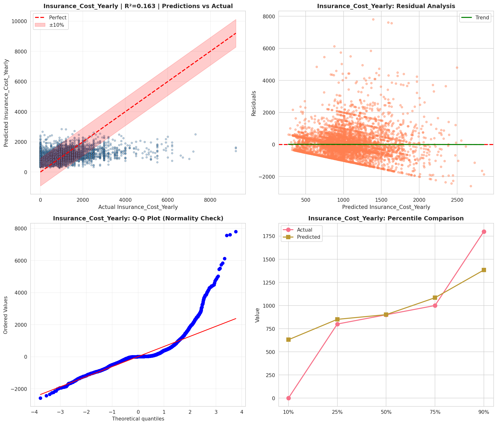
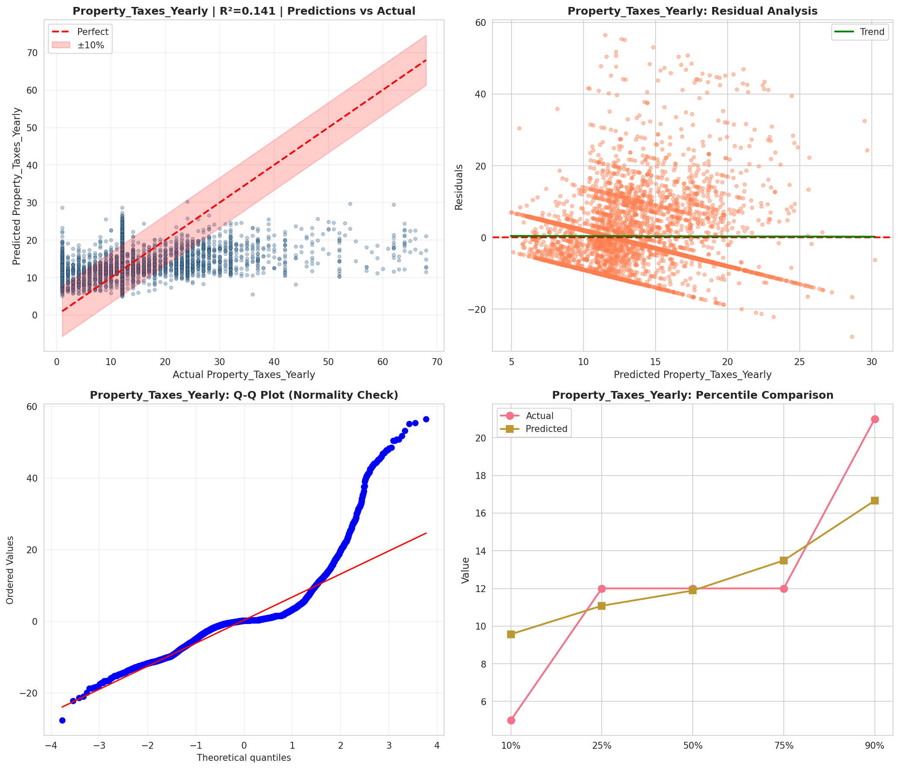
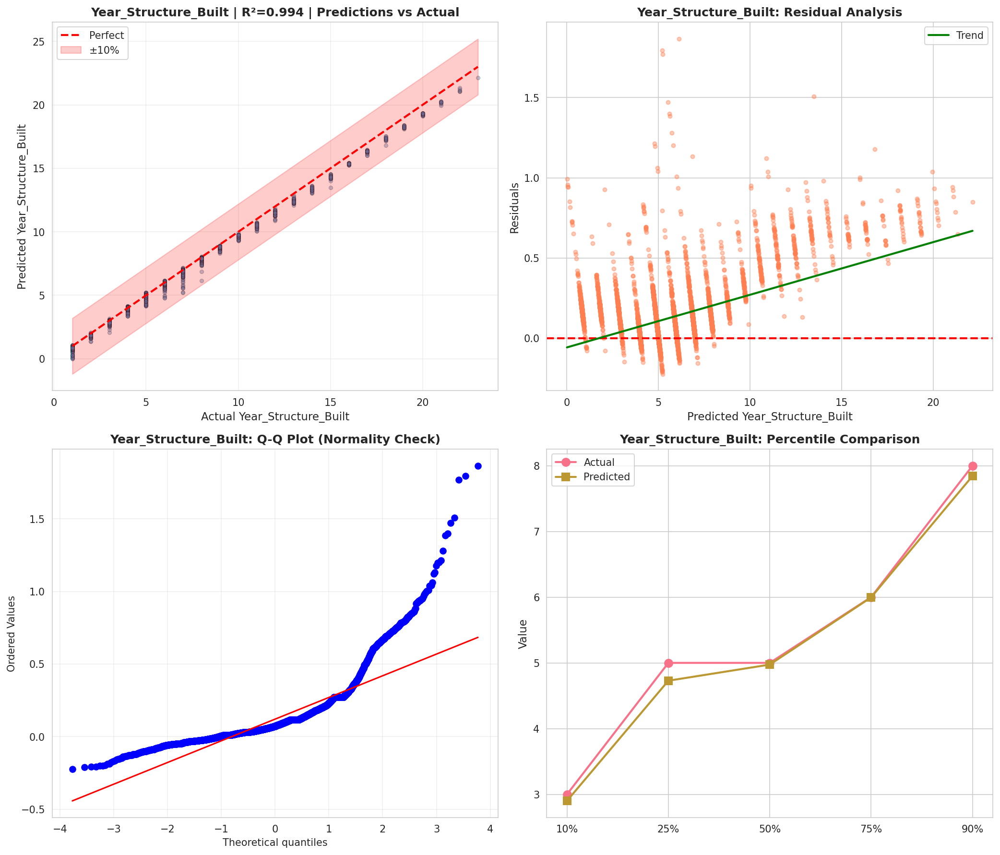
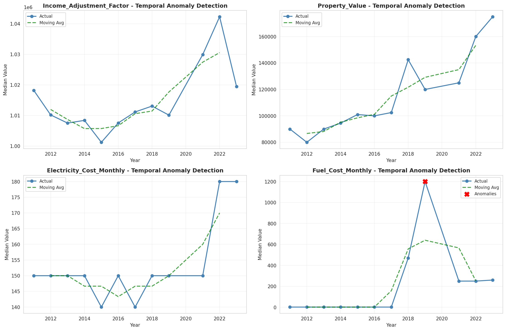
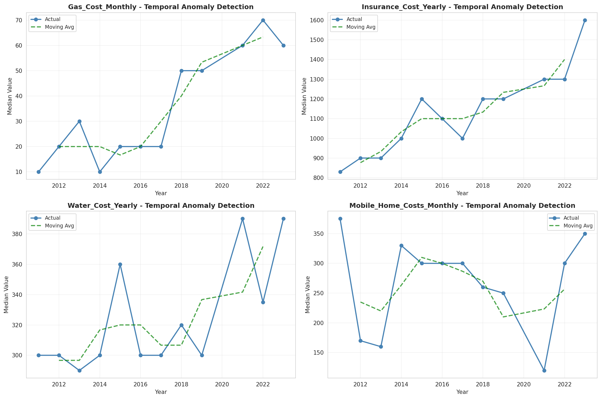
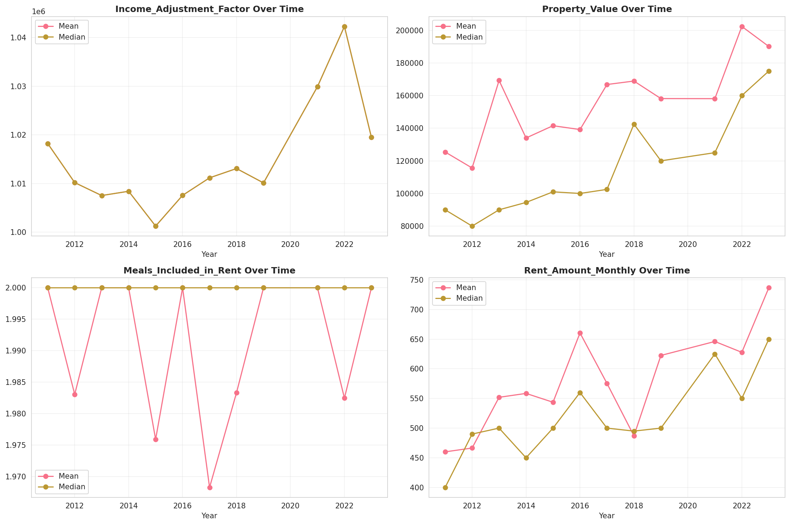
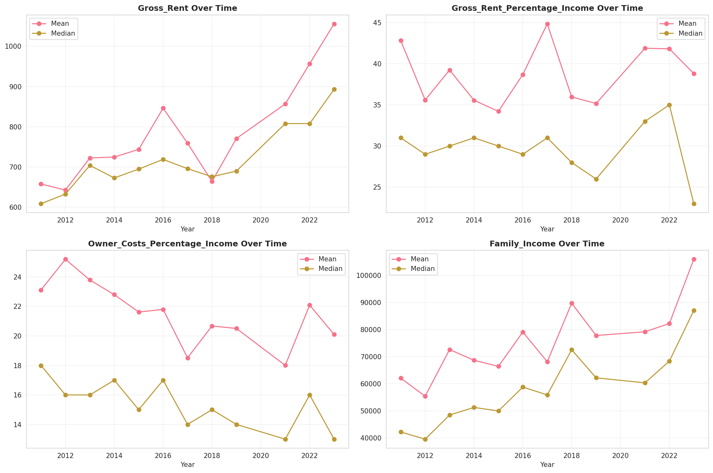
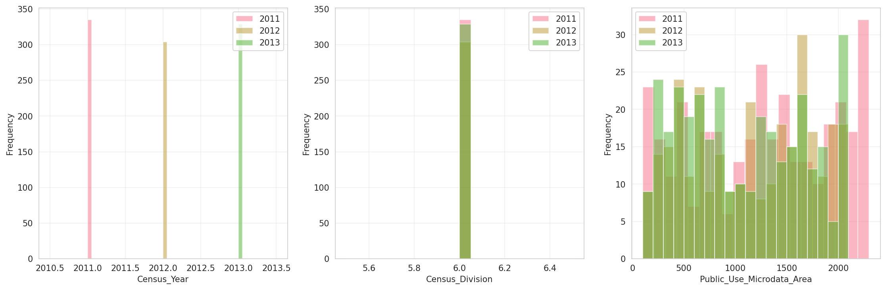
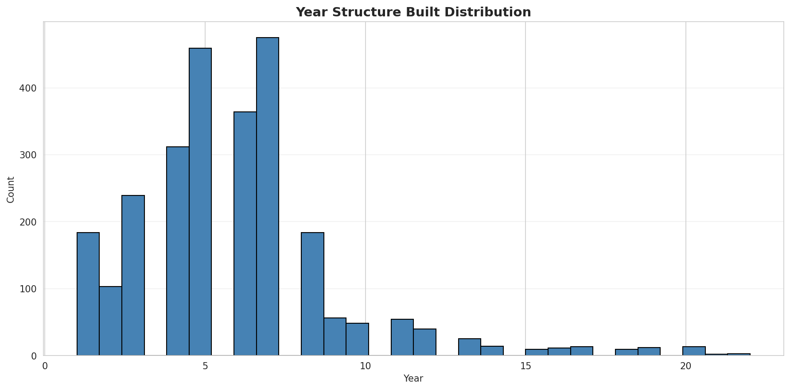
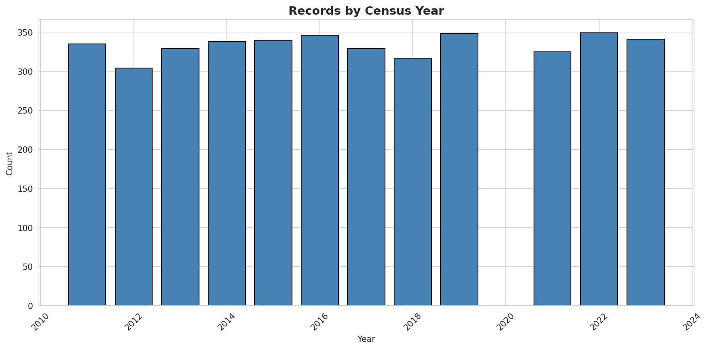
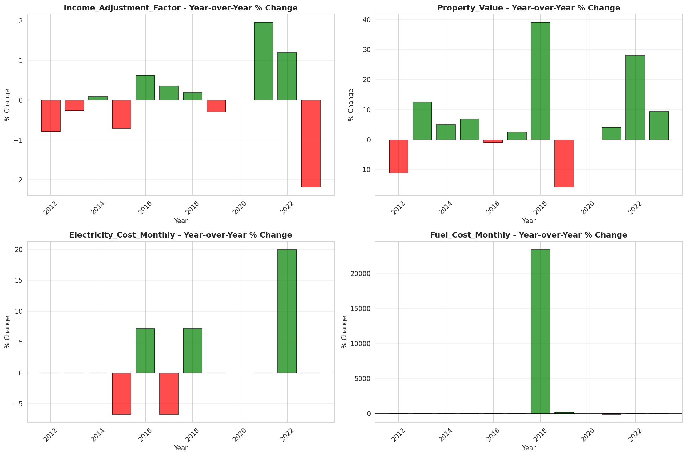
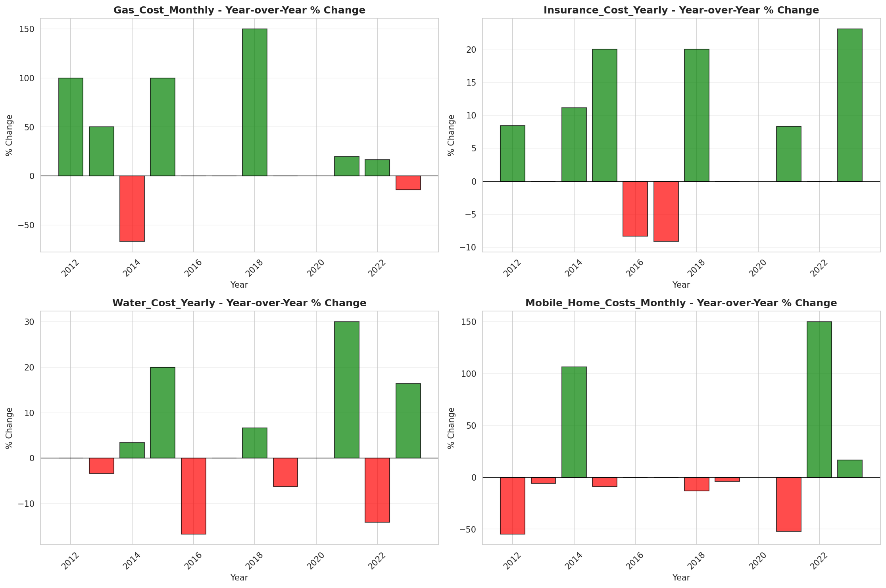
