# Temporal Analysis

## Year Distribution

- 2011: 69,337 records

- 2012: 70,351 records

- 2016: 73,288 records

- 2017: 73,668 records

- 2018: 74,171 records

- 2019: 74,551 records

- 2020: 70,831 records

- 2022: 71,456 records

- 2023: 71,700 records

## Temporal Trends

- Census_Year: {np.int64(2011): {'mean': 2011.0, 'median': 2011.0, 'std': 0.0}, np.int64(2012): {'mean': 2012.0, 'median': 2012.0, 'std': 0.0}, np.int64(2016): {'mean': 2016.0, 'median': 2016.0, 'std': 0.0}, np.int64(2017): {'mean': 2017.0, 'median': 2017.0, 'std': 0.0}, np.int64(2018): {'mean': 2018.0, 'median': 2018.0, 'std': 0.0}, np.int64(2019): {'mean': 2019.0, 'median': 2019.0, 'std': 0.0}, np.int64(2020): {'mean': 2020.0, 'median': 2020.0, 'std': 0.0}, np.int64(2022): {'mean': 2022.0, 'median': 2022.0, 'std': 0.0}, np.int64(2023): {'mean': 2023.0, 'median': 2023.0, 'std': 0.0}}

- Census_Division: {np.int64(2011): {'mean': 6.0, 'median': 6.0, 'std': 0.0}, np.int64(2012): {'mean': 6.0, 'median': 6.0, 'std': 0.0}, np.int64(2016): {'mean': 6.0, 'median': 6.0, 'std': 0.0}, np.int64(2017): {'mean': 6.0, 'median': 6.0, 'std': 0.0}, np.int64(2018): {'mean': 6.0, 'median': 6.0, 'std': 0.0}, np.int64(2019): {'mean': 6.0, 'median': 6.0, 'std': 0.0}, np.int64(2020): {'mean': 6.0, 'median': 6.0, 'std': 0.0}, np.int64(2022): {'mean': 6.0, 'median': 6.0, 'std': 0.0}, np.int64(2023): {'mean': 6.0, 'median': 6.0, 'std': 0.0}}

- Public_Use_Microdata_Area: {np.int64(2011): {'mean': 1233.0602708510607, 'median': 1300.0, 'std': 653.5178516289504}, np.int64(2012): {'mean': None, 'median': None, 'std': None}, np.int64(2016): {'mean': 1077.858585307281, 'median': 1100.0, 'std': 607.7730150325613}, np.int64(2017): {'mean': 1076.4035945050769, 'median': 1100.0, 'std': 608.6071432062483}, np.int64(2018): {'mean': 1074.2581332326652, 'median': 1100.0, 'std': 609.3076218081837}, np.int64(2019): {'mean': 1072.994326031844, 'median': 1100.0, 'std': 610.7397794125923}, np.int64(2020): {'mean': 1071.6762434527254, 'median': 1100.0, 'std': 609.5039664579582}, np.int64(2022): {'mean': None, 'median': None, 'std': None}, np.int64(2023): {'mean': 1084.1400557880056, 'median': 1001.0, 'std': 617.3802256173274}}

- Census_Region: {np.int64(2011): {'mean': 3.0, 'median': 3.0, 'std': 0.0}, np.int64(2012): {'mean': 3.0, 'median': 3.0, 'std': 0.0}, np.int64(2016): {'mean': 3.0, 'median': 3.0, 'std': 0.0}, np.int64(2017): {'mean': 3.0, 'median': 3.0, 'std': 0.0}, np.int64(2018): {'mean': 3.0, 'median': 3.0, 'std': 0.0}, np.int64(2019): {'mean': 3.0, 'median': 3.0, 'std': 0.0}, np.int64(2020): {'mean': 3.0, 'median': 3.0, 'std': 0.0}, np.int64(2022): {'mean': 3.0, 'median': 3.0, 'std': 0.0}, np.int64(2023): {'mean': 3.0, 'median': 3.0, 'std': 0.0}}

- State_Code: {np.int64(2011): {'mean': 28.0, 'median': 28.0, 'std': 0.0}, np.int64(2012): {'mean': 28.0, 'median': 28.0, 'std': 0.0}, np.int64(2016): {'mean': 28.0, 'median': 28.0, 'std': 0.0}, np.int64(2017): {'mean': 28.0, 'median': 28.0, 'std': 0.0}, np.int64(2018): {'mean': 28.0, 'median': 28.0, 'std': 0.0}, np.int64(2019): {'mean': 28.0, 'median': 28.0, 'std': 0.0}, np.int64(2020): {'mean': 28.0, 'median': 28.0, 'std': 0.0}, np.int64(2022): {'mean': 28.0, 'median': 28.0, 'std': 0.0}, np.int64(2023): {'mean': None, 'median': None, 'std': None}}

- Housing_Adjustment_Factor: {np.int64(2011): {'mean': 1041202.7284855128, 'median': 1044592.0, 'std': 27555.12546909734}, np.int64(2012): {'mean': 1041432.7435857344, 'median': 1053092.0, 'std': 27488.81497818589}, np.int64(2016): {'mean': 1020337.8090683331, 'median': 1013801.0, 'std': 15740.760139703683}, np.int64(2017): {'mean': 1029207.1011022425, 'median': 1034680.0, 'std': 17956.969165872168}, np.int64(2018): {'mean': 1038291.4463604373, 'median': 1046406.0, 'std': 23485.062427378107}, np.int64(2019): {'mean': 1040844.1388445494, 'median': 1042936.0, 'std': 29186.874166477042}, np.int64(2020): {'mean': 1037336.6811706738, 'median': 1030827.0, 'std': 28043.907744001535}, np.int64(2022): {'mean': 1104514.487950627, 'median': 1133141.0, 'std': 62091.64058982681}, np.int64(2023): {'mean': 1103948.608828452, 'median': 1125501.0, 'std': 76778.49492276544}}

- Income_Adjustment_Factor: {np.int64(2011): {'mean': 1053834.4002192193, 'median': 1048026.0, 'std': 28369.169794829257}, np.int64(2012): {'mean': 1052680.6940910576, 'median': 1061121.0, 'std': 26396.082847874884}, np.int64(2016): {'mean': 1027492.4261270603, 'median': 1022342.0, 'std': 17495.802760277056}, np.int64(2017): {'mean': 1036596.4971765217, 'median': 1035988.0, 'std': 16832.165141487912}, np.int64(2018): {'mean': 1046868.4218090628, 'median': 1054346.0, 'std': 20506.94065154652}, np.int64(2019): {'mean': 1049788.8004185054, 'median': 1054606.0, 'std': 26226.54821347018}, np.int64(2020): {'mean': 1047541.2102045715, 'median': 1044328.0, 'std': 28427.530911907175}, np.int64(2022): {'mean': 1127098.8994206225, 'median': 1140108.0, 'std': 50179.09125086604}, np.int64(2023): {'mean': 1128202.0688981868, 'median': 1159185.0, 'std': 70557.7966427925}}

- Housing_Unit_Weight: {np.int64(2011): {'mean': 18.264663887967462, 'median': 15.0, 'std': 15.403346969301788}, np.int64(2012): {'mean': 18.113132720217198, 'median': 15.0, 'std': 15.802990449000438}, np.int64(2016): {'mean': 17.673316231852418, 'median': 14.0, 'std': 16.4225656842701}, np.int64(2017): {'mean': 17.75885051854265, 'median': 14.0, 'std': 16.55213550837975}, np.int64(2018): {'mean': 17.744239662401746, 'median': 14.0, 'std': 16.567912635186534}, np.int64(2019): {'mean': 17.743665410256067, 'median': 14.0, 'std': 16.71435301951684}, np.int64(2020): {'mean': 18.789329530855134, 'median': 13.0, 'std': 21.876853101238094}, np.int64(2022): {'mean': 18.542767577250334, 'median': 13.0, 'std': 21.619174276884426}, np.int64(2023): {'mean': 18.588716875871686, 'median': 13.0, 'std': 21.844128253644488}}

- Number_of_Persons: {np.int64(2011): {'mean': 2.101518669685738, 'median': 2.0, 'std': 1.479896873833993}, np.int64(2012): {'mean': 2.0771986183565265, 'median': 2.0, 'std': 1.4811381469766136}, np.int64(2016): {'mean': 2.0054442746425063, 'median': 2.0, 'std': 1.4640982973626262}, np.int64(2017): {'mean': 1.9898056143780203, 'median': 2.0, 'std': 1.4659697622424788}, np.int64(2018): {'mean': 1.9692467406398728, 'median': 2.0, 'std': 1.4561722195203288}, np.int64(2019): {'mean': 1.9586994138240936, 'median': 2.0, 'std': 1.4575497179688}, np.int64(2020): {'mean': 1.9312447939461534, 'median': 2.0, 'std': 1.4481151348668913}, np.int64(2022): {'mean': 1.9183553515450067, 'median': 2.0, 'std': 1.425193340060168}, np.int64(2023): {'mean': 1.9218967921896792, 'median': 2.0, 'std': 1.42681364598981}}

- Housing_Unit_Type: {np.int64(2011): {'mean': 1.111109508631755, 'median': 1.0, 'std': 0.39528949351559295}, np.int64(2012): {'mean': 1.1245184858779549, 'median': 1.0, 'std': 0.4184313968664041}, np.int64(2016): {'mean': 1.1656478550376597, 'median': 1.0, 'std': 0.48500141323634244}, np.int64(2017): {'mean': 1.1656350111310203, 'median': 1.0, 'std': 0.48671271453023773}, np.int64(2018): {'mean': 1.1647679012012782, 'median': 1.0, 'std': 0.4857046559387526}, np.int64(2019): {'mean': 1.1632841947123447, 'median': 1.0, 'std': 0.48457551930220094}, np.int64(2020): {'mean': None, 'median': None, 'std': None}, np.int64(2022): {'mean': None, 'median': None, 'std': None}, np.int64(2023): {'mean': None, 'median': None, 'std': None}}

- Number_of_Bedrooms: {np.int64(2011): {'mean': 2.851177191714079, 'median': 3.0, 'std': 0.8625980478728011}, np.int64(2012): {'mean': None, 'median': None, 'std': None}, np.int64(2016): {'mean': None, 'median': None, 'std': None}, np.int64(2017): {'mean': None, 'median': None, 'std': None}, np.int64(2018): {'mean': None, 'median': None, 'std': None}, np.int64(2019): {'mean': None, 'median': None, 'std': None}, np.int64(2020): {'mean': None, 'median': None, 'std': None}, np.int64(2022): {'mean': None, 'median': None, 'std': None}, np.int64(2023): {'mean': None, 'median': None, 'std': None}}

- Number_of_Rooms: {np.int64(2011): {'mean': 5.75717473988621, 'median': 6.0, 'std': 1.6800895744257782}, np.int64(2012): {'mean': None, 'median': None, 'std': None}, np.int64(2016): {'mean': None, 'median': None, 'std': None}, np.int64(2017): {'mean': None, 'median': None, 'std': None}, np.int64(2018): {'mean': None, 'median': None, 'std': None}, np.int64(2019): {'mean': None, 'median': None, 'std': None}, np.int64(2020): {'mean': None, 'median': None, 'std': None}, np.int64(2022): {'mean': None, 'median': None, 'std': None}, np.int64(2023): {'mean': None, 'median': None, 'std': None}}

- Building_Type: {np.int64(2011): {'mean': 2.3102190928236883, 'median': 2.0, 'std': 1.4107468269529782}, np.int64(2012): {'mean': 2.326089337401236, 'median': 2.0, 'std': 1.433747440920655}, np.int64(2016): {'mean': 2.3724865925845786, 'median': 2.0, 'std': 1.5009074801845919}, np.int64(2017): {'mean': 2.3762307798651325, 'median': 2.0, 'std': 1.508613159073287}, np.int64(2018): {'mean': 2.3760652488756766, 'median': 2.0, 'std': 1.5105468287395187}, np.int64(2019): {'mean': 2.3790393409854933, 'median': 2.0, 'std': 1.5110140544805697}, np.int64(2020): {'mean': 2.3810520553238765, 'median': 2.0, 'std': 1.5167992084129323}, np.int64(2022): {'mean': 2.3771684387241185, 'median': 2.0, 'std': 1.5214663595131759}, np.int64(2023): {'mean': 2.3713133309951218, 'median': 2.0, 'std': 1.5214724110064743}}

- Year_Structure_Built: {np.int64(2011): {'mean': 4.69817370257442, 'median': 5.0, 'std': 2.1062083467103223}, np.int64(2012): {'mean': 5.461957287021826, 'median': 5.0, 'std': 2.4135399773092883}, np.int64(2016): {'mean': 5.7499961361915215, 'median': 5.0, 'std': 2.877663743084961}, np.int64(2017): {'mean': 5.862152655105144, 'median': 5.0, 'std': 3.0682131225503664}, np.int64(2018): {'mean': 5.968427471606067, 'median': 6.0, 'std': 3.2583647396353856}, np.int64(2019): {'mean': 6.083300523940761, 'median': 6.0, 'std': 3.4668998600534198}, np.int64(2020): {'mean': 6.197481765340461, 'median': 6.0, 'std': 3.6698933484680345}, np.int64(2022): {'mean': None, 'median': None, 'std': None}, np.int64(2023): {'mean': None, 'median': None, 'std': None}}

- Bathtub_or_Shower: {np.int64(2011): {'mean': None, 'median': None, 'std': None}, np.int64(2012): {'mean': 1.0119690213564891, 'median': 1.0, 'std': 0.10874717886201322}, np.int64(2016): {'mean': 1.0119314405823532, 'median': 1.0, 'std': 0.10857837498235244}, np.int64(2017): {'mean': 1.0130412743275834, 'median': 1.0, 'std': 0.11345218026011626}, np.int64(2018): {'mean': 1.0128515892979648, 'median': 1.0, 'std': 0.11263489405513051}, np.int64(2019): {'mean': 1.0137648020836487, 'median': 1.0, 'std': 0.11651411021354934}, np.int64(2020): {'mean': 1.015054663725506, 'median': 1.0, 'std': 0.1217713413700153}, np.int64(2022): {'mean': 1.0155088336397793, 'median': 1.0, 'std': 0.12356598981923504}, np.int64(2023): {'mean': 1.016691643018844, 'median': 1.0, 'std': 0.12811437756430463}}

- Refrigerator: {np.int64(2011): {'mean': None, 'median': None, 'std': None}, np.int64(2012): {'mean': 1.0302902292106704, 'median': 1.0, 'std': 0.17138608692511537}, np.int64(2016): {'mean': 1.0305395422159715, 'median': 1.0, 'std': 0.1720678243179599}, np.int64(2017): {'mean': 1.0328566381468796, 'median': 1.0, 'std': 0.1782626365892339}, np.int64(2018): {'mean': 1.0344538455674974, 'median': 1.0, 'std': 0.18239321603342315}, np.int64(2019): {'mean': 1.0370998516005936, 'median': 1.0, 'std': 0.18900791933930938}, np.int64(2020): {'mean': 1.0396895680036067, 'median': 1.0, 'std': 0.1952304276821176}, np.int64(2022): {'mean': 1.0388520265408905, 'median': 1.0, 'std': 0.19324374151566082}, np.int64(2023): {'mean': 1.0374485859133373, 'median': 1.0, 'std': 0.18985985356742782}}

- Hot_and_Cold_Running_Water: {np.int64(2011): {'mean': None, 'median': None, 'std': None}, np.int64(2012): {'mean': 1.027239302198232, 'median': 1.0, 'std': 0.16278125565230342}, np.int64(2016): {'mean': 1.030663184087291, 'median': 1.0, 'std': 0.17240479288933563}, np.int64(2017): {'mean': 1.0330409671126404, 'median': 1.0, 'std': 0.17874493664708202}, np.int64(2018): {'mean': 1.0343166399878039, 'median': 1.0, 'std': 0.1820426143016183}, np.int64(2019): {'mean': 1.0374178503285987, 'median': 1.0, 'std': 0.18978487880539502}, np.int64(2020): {'mean': 1.0405429339687957, 'median': 1.0, 'std': 0.19723040031822991}, np.int64(2022): {'mean': 1.0430250219841715, 'median': 1.0, 'std': 0.2029150753046421}, np.int64(2023): {'mean': 1.0430921786818863, 'median': 1.0, 'std': 0.20306624587949007}}

- Running_Water: {np.int64(2011): {'mean': None, 'median': None, 'std': None}, np.int64(2012): {'mean': None, 'median': None, 'std': None}, np.int64(2016): {'mean': 9.0, 'median': 9.0, 'std': 0.0}, np.int64(2017): {'mean': 9.0, 'median': 9.0, 'std': 0.0}, np.int64(2018): {'mean': 9.0, 'median': 9.0, 'std': 0.0}, np.int64(2019): {'mean': 9.0, 'median': 9.0, 'std': 0.0}, np.int64(2020): {'mean': 9.0, 'median': 9.0, 'std': 0.0}, np.int64(2022): {'mean': 9.0, 'median': 9.0, 'std': 0.0}, np.int64(2023): {'mean': 9.0, 'median': 9.0, 'std': 0.0}}

- Sink_with_Faucet: {np.int64(2011): {'mean': None, 'median': None, 'std': None}, np.int64(2012): {'mean': 1.0114370648517563, 'median': 1.0, 'std': 0.10633172291149594}, np.int64(2016): {'mean': 1.0113132312257547, 'median': 1.0, 'std': 0.10576112186522495}, np.int64(2017): {'mean': 1.0121503509930723, 'median': 1.0, 'std': 0.10955776712490975}, np.int64(2018): {'mean': 1.0120436008842137, 'median': 1.0, 'std': 0.10908131810223609}, np.int64(2019): {'mean': 1.0129168054756352, 'median': 1.0, 'std': 0.11291658286070444}, np.int64(2020): {'mean': 1.014120791537186, 'median': 1.0, 'std': 0.11798991032686393}, np.int64(2022): {'mean': 1.015013190502838, 'median': 1.0, 'std': 0.12160604858322076}, np.int64(2023): {'mean': 1.0160539489207028, 'median': 1.0, 'std': 0.12568401440783966}}

- Stove_or_Range: {np.int64(2011): {'mean': None, 'median': None, 'std': None}, np.int64(2012): {'mean': 1.027739967143863, 'median': 1.0, 'std': 0.16422814419951176}, np.int64(2016): {'mean': 1.0299986090289477, 'median': 1.0, 'std': 0.17058470687410907}, np.int64(2017): {'mean': 1.0322422082610099, 'median': 1.0, 'std': 0.17664407029622153}, np.int64(2018): {'mean': 1.0331580150926138, 'median': 1.0, 'std': 0.1790504115326521}, np.int64(2019): {'mean': 1.0356612859262848, 'median': 1.0, 'std': 0.18544562376703516}, np.int64(2020): {'mean': 1.037709114914583, 'median': 1.0, 'std': 0.19049336430550032}, np.int64(2022): {'mean': 1.0374770165480853, 'median': 1.0, 'std': 0.18992910922905334}, np.int64(2023): {'mean': 1.0374645282657908, 'median': 1.0, 'std': 0.18989868955037972}}

- Telephone_Service: {np.int64(2011): {'mean': 1.0387054184111322, 'median': 1.0, 'std': 0.1928936374881582}, np.int64(2012): {'mean': 1.0307943058276836, 'median': 1.0, 'std': 0.17276149475329527}, np.int64(2016): {'mean': 1.0318471337579618, 'median': 1.0, 'std': 0.17559449735473132}, np.int64(2017): {'mean': 1.0299480968858132, 'median': 1.0, 'std': 0.17044562477074332}, np.int64(2018): {'mean': 1.026581165640999, 'median': 1.0, 'std': 0.16085724513114322}, np.int64(2019): {'mean': 1.0236492288668293, 'median': 1.0, 'std': 0.15195505718764787}, np.int64(2020): {'mean': 1.020086742382475, 'median': 1.0, 'std': 0.14029834960261522}, np.int64(2022): {'mean': 1.0133323645874959, 'median': 1.0, 'std': 0.11469460138350783}, np.int64(2023): {'mean': 1.0118620540462584, 'median': 1.0, 'std': 0.10826613981158595}}

- Lot_Acreage: {np.int64(2011): {'mean': 1.5116521493312602, 'median': 1.0, 'std': 0.6501007080094353}, np.int64(2012): {'mean': 1.506243046112004, 'median': 1.0, 'std': 0.6478601524009457}, np.int64(2016): {'mean': 1.4841366418002575, 'median': 1.0, 'std': 0.6372431356730819}, np.int64(2017): {'mean': 1.4788967016780936, 'median': 1.0, 'std': 0.6338769842966148}, np.int64(2018): {'mean': 1.4802310007131798, 'median': 1.0, 'std': 0.6350709965700682}, np.int64(2019): {'mean': 1.482494037949746, 'median': 1.0, 'std': 0.6378532438922361}, np.int64(2020): {'mean': 1.4862188085700636, 'median': 1.0, 'std': 0.6394588855246235}, np.int64(2022): {'mean': 1.5000545553737044, 'median': 1.0, 'std': 0.6405681205563749}, np.int64(2023): {'mean': 1.50986312763303, 'median': 1.0, 'std': 0.6412705276480368}}

- Agricultural_Sales: {np.int64(2011): {'mean': 1.1379921958141186, 'median': 1.0, 'std': 0.7268081675958185}, np.int64(2012): {'mean': 1.133611597325075, 'median': 1.0, 'std': 0.7077170884776666}, np.int64(2016): {'mean': 1.120178529480855, 'median': 1.0, 'std': 0.6718276159093175}, np.int64(2017): {'mean': 1.116190025998582, 'median': 1.0, 'std': 0.6611350837352445}, np.int64(2018): {'mean': 1.1184333958724202, 'median': 1.0, 'std': 0.6679615966240661}, np.int64(2019): {'mean': 1.1207869097011793, 'median': 1.0, 'std': 0.6740629727508881}, np.int64(2020): {'mean': 1.1242196016252106, 'median': 1.0, 'std': 0.6828319157294661}, np.int64(2022): {'mean': 1.1224547779145753, 'median': 1.0, 'std': 0.67373245502595}, np.int64(2023): {'mean': 1.1188136993848132, 'median': 1.0, 'std': 0.6603027572510072}}

- Business_On_Property: {np.int64(2011): {'mean': 1.9861304970052474, 'median': 2.0, 'std': 0.11695033790267907}, np.int64(2012): {'mean': 1.9862600003532134, 'median': 2.0, 'std': 0.11641070133014292}, np.int64(2016): {'mean': 3.407650388868314, 'median': 2.0, 'std': 2.8195158312090567}, np.int64(2017): {'mean': 4.8253695488260355, 'median': 2.0, 'std': 3.4426377234510452}, np.int64(2018): {'mean': 6.228774200281793, 'median': 9.0, 'std': 3.428616723655664}, np.int64(2019): {'mean': 7.620744478623026, 'median': 9.0, 'std': 2.7875953708792447}, np.int64(2020): {'mean': None, 'median': None, 'std': None}, np.int64(2022): {'mean': None, 'median': None, 'std': None}, np.int64(2023): {'mean': None, 'median': None, 'std': None}}

- Tenure: {np.int64(2011): {'mean': 1.8974167433941942, 'median': 2.0, 'std': 0.8693464666452215}, np.int64(2012): {'mean': 1.9200492431467064, 'median': 2.0, 'std': 0.8725911799072141}, np.int64(2016): {'mean': 1.975560786485738, 'median': 2.0, 'std': 0.8663475391041267}, np.int64(2017): {'mean': 1.9773010380622837, 'median': 2.0, 'std': 0.8622911713291971}, np.int64(2018): {'mean': 1.9769526469117926, 'median': 2.0, 'std': 0.8580935408747138}, np.int64(2019): {'mean': 1.9765225157146291, 'median': 2.0, 'std': 0.8560336333543096}, np.int64(2020): {'mean': 1.9738853971404418, 'median': 2.0, 'std': 0.8529623236186672}, np.int64(2022): {'mean': 1.9639444908635157, 'median': 2.0, 'std': 0.8452816771546522}, np.int64(2023): {'mean': 1.9539038416469867, 'median': 2.0, 'std': 0.8378887437111042}}

- Vacancy_Status: {np.int64(2011): {'mean': 4.7746989938974105, 'median': 5.0, 'std': 2.3662589871921886}, np.int64(2012): {'mean': 4.785966036526754, 'median': 5.0, 'std': 2.369018729261752}, np.int64(2016): {'mean': 5.018622780424426, 'median': 5.0, 'std': 2.279065091861862}, np.int64(2017): {'mean': 5.089302835228051, 'median': 5.0, 'std': 2.264610842356665}, np.int64(2018): {'mean': 5.135021097046414, 'median': 7.0, 'std': 2.2655600957289037}, np.int64(2019): {'mean': 5.168970814132105, 'median': 7.0, 'std': 2.2745540269864817}, np.int64(2020): {'mean': 5.223839854413103, 'median': 7.0, 'std': 2.28400084863954}, np.int64(2022): {'mean': 5.387264717661194, 'median': 7.0, 'std': 2.268303243987503}, np.int64(2023): {'mean': 5.481598897312199, 'median': 7.0, 'std': 2.2428790434948658}}

- Property_Value: {np.int64(2011): {'mean': 12.390196033684019, 'median': 13.0, 'std': 5.171331801889364}}

- Vehicles_Available: {np.int64(2011): {'mean': 1.8348765700189358, 'median': 2.0, 'std': 1.0724388624794066}, np.int64(2012): {'mean': 1.8217190019593223, 'median': 2.0, 'std': 1.0713299507632763}, np.int64(2016): {'mean': 1.830431320963722, 'median': 2.0, 'std': 1.0763637010732068}, np.int64(2017): {'mean': 1.8497231833910035, 'median': 2.0, 'std': 1.0837736051727955}, np.int64(2018): {'mean': 1.8696454120770198, 'median': 2.0, 'std': 1.0896249416498216}, np.int64(2019): {'mean': 1.8892075705011506, 'median': 2.0, 'std': 1.0976870021150553}, np.int64(2020): {'mean': 1.9028191274304407, 'median': 2.0, 'std': 1.1048209810042158}, np.int64(2022): {'mean': 1.9202419442728957, 'median': 2.0, 'std': 1.1109158651732545}, np.int64(2023): {'mean': 1.9300715689279082, 'median': 2.0, 'std': 1.1157601152861556}}

- Condo_Fee_Monthly: {np.int64(2011): {'mean': 279.4416961130742, 'median': 180.0, 'std': 278.9846063776541}, np.int64(2012): {'mean': 291.62629757785464, 'median': 200.0, 'std': 278.7086768083447}, np.int64(2016): {'mean': 294.28915662650604, 'median': 230.0, 'std': 254.70105168357932}, np.int64(2017): {'mean': 293.0940170940171, 'median': 200.0, 'std': 265.8168714521344}, np.int64(2018): {'mean': 311.15589353612165, 'median': 230.0, 'std': 287.01134781117196}, np.int64(2019): {'mean': 310.15884476534296, 'median': 230.0, 'std': 273.30723415624936}, np.int64(2020): {'mean': 320.4609375, 'median': 230.0, 'std': 278.71102196047946}, np.int64(2022): {'mean': 355.2191780821918, 'median': 265.0, 'std': 294.478757701581}, np.int64(2023): {'mean': 367.12380952380954, 'median': 280.0, 'std': 302.0901190644883}}

- Electricity_Cost_Monthly: {np.int64(2011): {'mean': 157.93963136042248, 'median': 140.0, 'std': 89.56002110621583}, np.int64(2012): {'mean': 158.1890312624625, 'median': 140.0, 'std': 89.76705291687385}, np.int64(2016): {'mean': 160.38363680420937, 'median': 150.0, 'std': 90.3942797432594}, np.int64(2017): {'mean': 160.45993079584775, 'median': 150.0, 'std': 90.19511398914001}, np.int64(2018): {'mean': 167.03610713844307, 'median': 150.0, 'std': 89.02929158562996}, np.int64(2019): {'mean': 166.18151402560355, 'median': 150.0, 'std': 87.92757824010114}, np.int64(2020): {'mean': 164.63713509843856, 'median': 150.0, 'std': 86.40384096903745}, np.int64(2022): {'mean': 177.99373741892194, 'median': 150.0, 'std': 145.92209954567545}, np.int64(2023): {'mean': 186.69691087571405, 'median': 160.0, 'std': 174.99054959396403}}

- Fuel_Cost_Monthly: {np.int64(2011): {'mean': 55.224692945121, 'median': 2.0, 'std': 281.418164873469}, np.int64(2012): {'mean': 54.9864754737919, 'median': 2.0, 'std': 274.8574822525218}, np.int64(2016): {'mean': 36.92721891442814, 'median': 2.0, 'std': 220.53900271176798}, np.int64(2017): {'mean': 32.566799307958476, 'median': 2.0, 'std': 209.0419578679683}, np.int64(2018): {'mean': 592.8065595716198, 'median': 350.0, 'std': 727.9428131847326}, np.int64(2019): {'mean': 583.7133999311058, 'median': 350.0, 'std': 697.4725982747688}, np.int64(2020): {'mean': 555.3417223751475, 'median': 310.0, 'std': 677.9755391204421}, np.int64(2022): {'mean': 557.8102006688963, 'median': 340.0, 'std': 677.0829249485171}, np.int64(2023): {'mean': 563.1419031719532, 'median': 340.0, 'std': 682.0824614657793}}

- Gas_Cost_Monthly: {np.int64(2011): {'mean': 56.325330507444015, 'median': 20.0, 'std': 81.57892918395139}, np.int64(2012): {'mean': 54.35923222305065, 'median': 20.0, 'std': 80.74310203734143}, np.int64(2016): {'mean': 47.96849903073941, 'median': 20.0, 'std': 73.54547543262996}, np.int64(2017): {'mean': 46.64096885813149, 'median': 20.0, 'std': 71.234473903086}, np.int64(2018): {'mean': 78.88817449825743, 'median': 50.0, 'std': 80.51840041195508}, np.int64(2019): {'mean': 77.14461947812416, 'median': 50.0, 'std': 79.53212034503447}, np.int64(2020): {'mean': 75.79934456017392, 'median': 50.0, 'std': 77.22913811333325}, np.int64(2022): {'mean': 90.33257918552036, 'median': 50.0, 'std': 122.80788381177071}, np.int64(2023): {'mean': 99.20239792611795, 'median': 60.0, 'std': 171.53169103297523}}

- House_Heating_Fuel: {np.int64(2011): {'mean': 2.2006323506419054, 'median': 2.0, 'std': 1.1136856058851203}, np.int64(2012): {'mean': 2.215958940925563, 'median': 3.0, 'std': 1.1107149058794006}, np.int64(2016): {'mean': 2.249169205206314, 'median': 3.0, 'std': 1.1283450015890477}, np.int64(2017): {'mean': 2.253339100346021, 'median': 3.0, 'std': 1.1289416152471017}, np.int64(2018): {'mean': 2.260485080415783, 'median': 3.0, 'std': 1.1270200883000168}, np.int64(2019): {'mean': 2.26792154707519, 'median': 3.0, 'std': 1.124399931490596}, np.int64(2020): {'mean': 2.270114308817584, 'median': 3.0, 'std': 1.1220835723611613}, np.int64(2022): {'mean': 2.29676317797072, 'median': 3.0, 'std': 1.126637875309495}, np.int64(2023): {'mean': 2.318544825223991, 'median': 3.0, 'std': 1.1353293137990643}}

- Insurance_Cost_Yearly: {np.int64(2011): {'mean': 1030.4274916406755, 'median': 850.0, 'std': 791.077607691544}, np.int64(2012): {'mean': 1049.6236746045543, 'median': 880.0, 'std': 795.5700130160554}, np.int64(2016): {'mean': 1163.73307205306, 'median': 1000.0, 'std': 824.1298237004403}, np.int64(2017): {'mean': 1204.4094321985344, 'median': 1000.0, 'std': 842.379212548509}, np.int64(2018): {'mean': 1252.4651985018727, 'median': 1100.0, 'std': 874.1292921851514}, np.int64(2019): {'mean': 1302.1377682146913, 'median': 1200.0, 'std': 912.2733227327179}, np.int64(2020): {'mean': 1319.2568581739213, 'median': 1200.0, 'std': 924.0455807372689}, np.int64(2022): {'mean': 1403.22180994906, 'median': 1200.0, 'std': 988.730525021918}, np.int64(2023): {'mean': 1519.4424286848696, 'median': 1300.0, 'std': 1118.4092999323618}}

- Water_Cost_Yearly: {np.int64(2011): {'mean': 342.4083352153293, 'median': 300.0, 'std': 354.0530039475237}, np.int64(2012): {'mean': 348.7116154873164, 'median': 300.0, 'std': 361.40850467943636}, np.int64(2016): {'mean': 366.1752803932429, 'median': 300.0, 'std': 386.6104705962456}, np.int64(2017): {'mean': 370.1306920415225, 'median': 300.0, 'std': 390.36178479582827}, np.int64(2018): {'mean': 440.8568766079857, 'median': 360.0, 'std': 398.755071316614}, np.int64(2019): {'mean': 442.13458977359863, 'median': 360.0, 'std': 407.494162051166}, np.int64(2020): {'mean': 439.62233126721765, 'median': 360.0, 'std': 411.2508820220948}, np.int64(2022): {'mean': 439.62236786469344, 'median': 360.0, 'std': 439.4700979974261}, np.int64(2023): {'mean': 445.23506343713956, 'median': 360.0, 'std': 469.1412870673717}}

- Mobile_Home_Costs_Monthly: {np.int64(2011): {'mean': 557.7235926628716, 'median': 250.0, 'std': 949.6309815301574}, np.int64(2012): {'mean': 565.2367491166078, 'median': 250.0, 'std': 966.0980570425048}, np.int64(2016): {'mean': 595.4161403508772, 'median': 250.0, 'std': 1064.6853707718242}, np.int64(2017): {'mean': 623.2726621282694, 'median': 250.0, 'std': 1149.7143144451975}, np.int64(2018): {'mean': 634.4106571936056, 'median': 260.0, 'std': 1126.234807018615}, np.int64(2019): {'mean': 652.5146804835924, 'median': 280.0, 'std': 1181.1707867533987}, np.int64(2020): {'mean': 798.6265682656826, 'median': 280.0, 'std': 1942.7502682237123}, np.int64(2022): {'mean': 901.2513368983957, 'median': 300.0, 'std': 2228.6605155141474}, np.int64(2023): {'mean': 1198.7838187702266, 'median': 300.0, 'std': 4086.4439911228046}}

- First_Mortgage_Includes_Insurance: {np.int64(2011): {'mean': 1.4485158107989078, 'median': 1.0, 'std': 0.49735326711615874}, np.int64(2012): {'mean': 1.43878568192116, 'median': 1.0, 'std': 0.49624990234259575}, np.int64(2016): {'mean': 1.3820684152787475, 'median': 1.0, 'std': 0.48590525283502667}, np.int64(2017): {'mean': 1.367581172917191, 'median': 1.0, 'std': 0.4821586430585398}, np.int64(2018): {'mean': 1.3516600131386123, 'median': 1.0, 'std': 0.4775005447038375}, np.int64(2019): {'mean': 1.345749519862529, 'median': 1.0, 'std': 0.4756240349522217}, np.int64(2020): {'mean': 1.3388510754151919, 'median': 1.0, 'std': 0.4733320436784515}, np.int64(2022): {'mean': 1.314666958328776, 'median': 1.0, 'std': 0.46439579840471146}, np.int64(2023): {'mean': 1.306851710195607, 'median': 1.0, 'std': 0.46119991339894983}}

- First_Mortgage_Payment_Monthly: {np.int64(2011): {'mean': 778.649608033119, 'median': 630.0, 'std': 559.3447942219841}, np.int64(2012): {'mean': 784.5236973266879, 'median': 640.0, 'std': 552.495731751822}, np.int64(2016): {'mean': 806.1613643163458, 'median': 680.0, 'std': 536.0069653502266}, np.int64(2017): {'mean': 816.700125849484, 'median': 700.0, 'std': 526.6589537611649}, np.int64(2018): {'mean': 833.7360149578049, 'median': 700.0, 'std': 533.4493782754283}, np.int64(2019): {'mean': 854.3893662185384, 'median': 730.0, 'std': 550.1724141880111}, np.int64(2020): {'mean': 872.6976313640076, 'median': 750.0, 'std': 559.4794904717173}, np.int64(2022): {'mean': 933.6445368041125, 'median': 800.0, 'std': 588.3301252811484}, np.int64(2023): {'mean': 975.8781553928533, 'median': 830.0, 'std': 617.2880986252366}}

- First_Mortgage_Includes_Taxes: {np.int64(2011): {'mean': 1.45635514841892, 'median': 1.0, 'std': 0.49810245314032187}, np.int64(2012): {'mean': 1.4475305845038513, 'median': 1.0, 'std': 0.4972506046229436}, np.int64(2016): {'mean': 1.3812705694624514, 'median': 1.0, 'std': 0.48571090817045404}, np.int64(2017): {'mean': 1.3647621444752076, 'median': 1.0, 'std': 0.4813755158815264}, np.int64(2018): {'mean': 1.3482742937995855, 'median': 1.0, 'std': 0.47643549472237534}, np.int64(2019): {'mean': 1.3409986859395533, 'median': 1.0, 'std': 0.4740568954829765}, np.int64(2020): {'mean': 1.3314456847263818, 'median': 1.0, 'std': 0.47074569495167723}, np.int64(2022): {'mean': 1.3025265230230778, 'median': 1.0, 'std': 0.4593645237009703}, np.int64(2023): {'mean': 1.2934105562233635, 'median': 1.0, 'std': 0.45533738052852646}}

- First_Mortgage_Status: {np.int64(2011): {'mean': 1.9621717019250866, 'median': 1.0, 'std': 0.9908946114181968}, np.int64(2012): {'mean': 1.9802066212725993, 'median': 1.0, 'std': 0.9914792799385397}, np.int64(2016): {'mean': 2.052958900807521, 'median': 3.0, 'std': 0.9886620938785309}, np.int64(2017): {'mean': 2.063575744445247, 'median': 3.0, 'std': 0.9879278106956425}, np.int64(2018): {'mean': 2.0718949558728563, 'median': 3.0, 'std': 0.9881125996114}, np.int64(2019): {'mean': 2.075783516431255, 'median': 3.0, 'std': 0.9886940591384377}, np.int64(2020): {'mean': 2.0838529784537387, 'median': 3.0, 'std': 0.9889835833608376}, np.int64(2022): {'mean': 2.1078598414697387, 'median': 3.0, 'std': 0.9886613723004068}, np.int64(2023): {'mean': 2.123327121802473, 'median': 3.0, 'std': 0.9877458886987073}}

- Second_Mortgage_Payment_Monthly: {np.int64(2011): {'mean': 364.942536327609, 'median': 280.0, 'std': 331.2122242555477}, np.int64(2012): {'mean': 355.4321608040201, 'median': 270.0, 'std': 329.9282690542692}, np.int64(2016): {'mean': 339.5793069790142, 'median': 250.0, 'std': 306.21668294745115}, np.int64(2017): {'mean': 332.3666154633897, 'median': 250.0, 'std': 283.01651017642536}, np.int64(2018): {'mean': 339.53706666666665, 'median': 250.0, 'std': 282.9268115062374}, np.int64(2019): {'mean': 344.2085620197585, 'median': 260.0, 'std': 287.79282844916827}, np.int64(2020): {'mean': 345.01153402537483, 'median': 270.0, 'std': 287.9135098151116}, np.int64(2022): {'mean': 362.9805825242718, 'median': 290.0, 'std': 313.07741973936515}, np.int64(2023): {'mean': 384.87966804979254, 'median': 300.0, 'std': 335.632317359552}}

- Second_Mortgage_Status: {np.int64(2011): {'mean': 2.8363428168765963, 'median': 3.0, 'std': 0.4801200901081924}, np.int64(2012): {'mean': 2.8461259628454916, 'median': 3.0, 'std': 0.4673122131939905}, np.int64(2016): {'mean': 2.8788271666500447, 'median': 3.0, 'std': 0.4104036527357033}, np.int64(2017): {'mean': 2.884218474704254, 'median': 3.0, 'std': 0.39921026120708586}, np.int64(2018): {'mean': 2.88781646369195, 'median': 3.0, 'std': 0.38955903744172454}, np.int64(2019): {'mean': 2.8911351460628727, 'median': 3.0, 'std': 0.38689063328517237}, np.int64(2020): {'mean': 2.8911889021350383, 'median': 3.0, 'std': 0.38049126671636796}, np.int64(2022): {'mean': 2.886030399054729, 'median': 3.0, 'std': 0.37913095177035533}, np.int64(2023): {'mean': 2.8847425098624586, 'median': 3.0, 'std': 0.37550508405581295}}

- Property_Taxes_Yearly: {np.int64(2011): {'mean': 13.780182523279846, 'median': 11.0, 'std': 12.324562097273077}, np.int64(2012): {'mean': 13.986146982859827, 'median': 11.0, 'std': 12.516545978684132}, np.int64(2016): {'mean': 14.996311919971074, 'median': 12.0, 'std': 13.253423188030892}, np.int64(2017): {'mean': 15.4149635300065, 'median': 13.0, 'std': 13.554326271731163}}

- Meals_Included_in_Rent: {np.int64(2011): {'mean': 1.988014705882353, 'median': 2.0, 'std': 0.10882333213017625}, np.int64(2012): {'mean': 1.988137268747352, 'median': 2.0, 'std': 0.10827203991225266}, np.int64(2016): {'mean': 1.9852998823990593, 'median': 2.0, 'std': 0.12035352301630549}, np.int64(2017): {'mean': 1.9837774447846765, 'median': 2.0, 'std': 0.12633457069373635}, np.int64(2018): {'mean': 1.9828686816050025, 'median': 2.0, 'std': 0.1297649150619617}, np.int64(2019): {'mean': 1.9820289100143247, 'median': 2.0, 'std': 0.13285058939140817}, np.int64(2020): {'mean': 1.981750804083345, 'median': 2.0, 'std': 0.13385595076782322}, np.int64(2022): {'mean': 1.9829462989840347, 'median': 2.0, 'std': 0.12947620958998418}, np.int64(2023): {'mean': 1.982957957957958, 'median': 2.0, 'std': 0.12943287282581936}}

- Rent_Amount_Monthly: {np.int64(2011): {'mean': 468.4264705882353, 'median': 420.0, 'std': 297.4159227092677}, np.int64(2012): {'mean': 478.9128654144895, 'median': 440.0, 'std': 300.56164248027}, np.int64(2016): {'mean': 526.0186854828172, 'median': 500.0, 'std': 320.36153362789855}, np.int64(2017): {'mean': 542.6842139553065, 'median': 500.0, 'std': 328.3722789099163}, np.int64(2018): {'mean': 556.7292860865034, 'median': 500.0, 'std': 336.66056737767616}, np.int64(2019): {'mean': 570.8023180101576, 'median': 520.0, 'std': 344.1531145753217}, np.int64(2020): {'mean': 584.0640469864354, 'median': 540.0, 'std': 353.2241498005275}, np.int64(2022): {'mean': 619.8047895500725, 'median': 550.0, 'std': 389.8162951311434}, np.int64(2023): {'mean': 652.3093093093094, 'median': 600.0, 'std': 419.75712998734446}}

- Gross_Rent: {np.int64(2011): {'mean': 655.4647921960816, 'median': 620.0, 'std': 324.9055214280337}, np.int64(2012): {'mean': 664.0668135673251, 'median': 630.0, 'std': 327.49833002378426}, np.int64(2016): {'mean': 712.016212338594, 'median': 677.0, 'std': 344.9850414712816}, np.int64(2017): {'mean': 727.7416398138203, 'median': 695.0, 'std': 349.9831118645686}, np.int64(2018): {'mean': 742.6518497275595, 'median': 709.5, 'std': 355.45642355404914}, np.int64(2019): {'mean': 754.0430879712746, 'median': 720.0, 'std': 362.07713730269154}, np.int64(2020): {'mean': 763.5046141915471, 'median': 725.0, 'std': 369.2595004574738}, np.int64(2022): {'mean': 817.1216346153847, 'median': 770.0, 'std': 425.88565430265584}, np.int64(2023): {'mean': 859.7057608066782, 'median': 795.0, 'std': 476.21576395164}}

- Gross_Rent_Percentage_Income: {np.int64(2011): {'mean': 40.74581430745814, 'median': 31.0, 'std': 28.04913525977215}, np.int64(2012): {'mean': 40.908232997071266, 'median': 31.0, 'std': 28.062082468073058}, np.int64(2016): {'mean': 40.10113780025284, 'median': 31.0, 'std': 28.05431353380473}, np.int64(2017): {'mean': 39.56629280249573, 'median': 30.0, 'std': 27.876460628526807}, np.int64(2018): {'mean': 39.35251209527354, 'median': 30.0, 'std': 27.818185763757075}, np.int64(2019): {'mean': 38.54152997315837, 'median': 29.0, 'std': 27.469697606923756}, np.int64(2020): {'mean': 38.28463577222713, 'median': 29.0, 'std': 27.334250034813884}, np.int64(2022): {'mean': 38.96966180371353, 'median': 29.0, 'std': 27.938838615090823}, np.int64(2023): {'mean': 38.8791837431694, 'median': 30.0, 'std': 27.81080801023719}}

- Selected_Monthly_Owner_Costs: {np.int64(2011): {'mean': 786.9824646971387, 'median': 609.0, 'std': 653.1180289353387}, np.int64(2012): {'mean': 780.973531553113, 'median': 603.0, 'std': 644.0284590714874}, np.int64(2016): {'mean': 760.5163881050576, 'median': 583.0, 'std': 615.4368964825129}, np.int64(2017): {'mean': 761.518460538041, 'median': 580.0, 'std': 608.6719601791948}, np.int64(2018): {'mean': 771.9651129402756, 'median': 588.0, 'std': 616.5977042159351}, np.int64(2019): {'mean': 780.3358865788097, 'median': 593.0, 'std': 630.6822012302104}, np.int64(2020): {'mean': 783.6111871798772, 'median': 590.0, 'std': 638.9168275109979}, np.int64(2022): {'mean': 827.196991775544, 'median': 617.0, 'std': 683.994599865793}, np.int64(2023): {'mean': 863.9303158659083, 'median': 638.0, 'std': 727.8378978703294}}

- Owner_Costs_Percentage_Income: {np.int64(2011): {'mean': 23.768473137443426, 'median': 17.0, 'std': 21.17455286032331}, np.int64(2012): {'mean': 23.626749537410447, 'median': 17.0, 'std': 21.24959431135818}, np.int64(2016): {'mean': 22.183072452443163, 'median': 16.0, 'std': 21.0287892119874}, np.int64(2017): {'mean': 21.58636840436172, 'median': 15.0, 'std': 20.689563132313275}, np.int64(2018): {'mean': 21.2319718821961, 'median': 15.0, 'std': 20.54161670602993}, np.int64(2019): {'mean': 20.660423747197918, 'median': 14.0, 'std': 20.276295046496394}, np.int64(2020): {'mean': 20.277826310380267, 'median': 14.0, 'std': 20.116419598746955}, np.int64(2022): {'mean': 20.66579098801571, 'median': 14.0, 'std': 20.90647281070521}, np.int64(2023): {'mean': 20.872614433596624, 'median': 14.0, 'std': 21.316647197225638}}

- Satellite_Internet: {np.int64(2011): {'mean': None, 'median': None, 'std': None}, np.int64(2012): {'mean': None, 'median': None, 'std': None}, np.int64(2016): {'mean': None, 'median': None, 'std': None}, np.int64(2017): {'mean': 1.8759572833028593, 'median': 2.0, 'std': 0.32963464700669093}, np.int64(2018): {'mean': 1.8664833791552111, 'median': 2.0, 'std': 0.3401364790796304}, np.int64(2019): {'mean': 1.861124243570348, 'median': 2.0, 'std': 0.34582091850408037}, np.int64(2020): {'mean': 1.8572534785238959, 'median': 2.0, 'std': 0.34981840048030455}, np.int64(2022): {'mean': 1.8606761969593828, 'median': 2.0, 'std': 0.346288033244095}, np.int64(2023): {'mean': 1.8687660583701167, 'median': 2.0, 'std': 0.3376597369579122}}

- Smartphone: {np.int64(2011): {'mean': None, 'median': None, 'std': None}, np.int64(2012): {'mean': None, 'median': None, 'std': None}, np.int64(2016): {'mean': None, 'median': None, 'std': None}, np.int64(2017): {'mean': 1.3645328719723184, 'median': 1.0, 'std': 0.48130309063573457}, np.int64(2018): {'mean': 1.3134750305976453, 'median': 1.0, 'std': 0.4639096308981884}, np.int64(2019): {'mean': 1.2665991137979598, 'median': 1.0, 'std': 0.4421847853522091}, np.int64(2020): {'mean': 1.2309883485867608, 'median': 1.0, 'std': 0.42146885523293104}, np.int64(2022): {'mean': 1.1710865695498964, 'median': 1.0, 'std': 0.37658801263335634}, np.int64(2023): {'mean': 1.1486903066467162, 'median': 1.0, 'std': 0.35578614551056004}}

- Tablet_Computer: {np.int64(2011): {'mean': None, 'median': None, 'std': None}, np.int64(2012): {'mean': None, 'median': None, 'std': None}, np.int64(2016): {'mean': None, 'median': None, 'std': None}, np.int64(2017): {'mean': 1.5417474048442907, 'median': 2.0, 'std': 0.49825841625561507}, np.int64(2018): {'mean': 1.513850821395942, 'median': 2.0, 'std': 0.4998124258572823}, np.int64(2019): {'mean': 1.495998351252018, 'median': 1.0, 'std': 0.49998828008319796}, np.int64(2020): {'mean': 1.4873194398500387, 'median': 1.0, 'std': 0.4998437705218093}, np.int64(2022): {'mean': 1.4697388019035855, 'median': 1.0, 'std': 0.49908795250393984}, np.int64(2023): {'mean': 1.465161976528276, 'median': 1.0, 'std': 0.4987893314628912}}

- Food_Stamp_SNAP: {np.int64(2011): {'mean': 1.8633087840187124, 'median': 2.0, 'std': 0.34352378737964845}, np.int64(2012): {'mean': 1.8495063095665196, 'median': 2.0, 'std': 0.3575574552311546}, np.int64(2016): {'mean': 1.8350838594957881, 'median': 2.0, 'std': 0.3711076426510566}, np.int64(2017): {'mean': 1.8447119803516807, 'median': 2.0, 'std': 0.3621817597848921}, np.int64(2018): {'mean': 1.8556925526003574, 'median': 2.0, 'std': 0.35140384532712793}, np.int64(2019): {'mean': 1.866779544194549, 'median': 2.0, 'std': 0.33981538546771395}, np.int64(2020): {'mean': 1.8751940194494598, 'median': 2.0, 'std': 0.33050140363993746}, np.int64(2022): {'mean': 1.8819979676385523, 'median': 2.0, 'std': 0.3226130497159653}, np.int64(2023): {'mean': 1.8859958103809449, 'median': 2.0, 'std': 0.3178188190350011}}

- Family_Type_Employment_Status: {np.int64(2011): {'mean': 3.5240831758034026, 'median': 3.0, 'std': 2.5350282770247987}, np.int64(2012): {'mean': 3.5863118642347986, 'median': 3.0, 'std': 2.5485124334777365}, np.int64(2016): {'mean': 3.7105589420394667, 'median': 3.0, 'std': 2.553402379037192}, np.int64(2017): {'mean': 3.6853214109329104, 'median': 3.0, 'std': 2.5403041814015306}, np.int64(2018): {'mean': 3.657056383228533, 'median': 3.0, 'std': 2.5321826127168143}, np.int64(2019): {'mean': 3.6265582939131797, 'median': 3.0, 'std': 2.5162525987689217}, np.int64(2020): {'mean': 3.623590779067811, 'median': 3.0, 'std': 2.512999187574997}, np.int64(2022): {'mean': None, 'median': None, 'std': None}, np.int64(2023): {'mean': None, 'median': None, 'std': None}}

- Family_Income: {np.int64(2011): {'mean': 61749.82962018863, 'median': 47355.0, 'std': 58419.88754893616}, np.int64(2012): {'mean': 61736.056636713736, 'median': 47000.0, 'std': 58349.25733028201}, np.int64(2016): {'mean': 66067.33096197102, 'median': 50000.0, 'std': 63264.36189224254}, np.int64(2017): {'mean': 68508.31399353295, 'median': 52000.0, 'std': 65783.0202328217}, np.int64(2018): {'mean': 71236.47436674662, 'median': 54100.0, 'std': 68413.54852331802}, np.int64(2019): {'mean': 74382.0148281048, 'median': 56800.0, 'std': 71997.16323271034}, np.int64(2020): {'mean': 76589.45753261824, 'median': 58460.0, 'std': 74066.25693035571}, np.int64(2022): {'mean': 81326.85265788661, 'median': 62020.0, 'std': 77373.10408088194}, np.int64(2023): {'mean': 85251.27166256709, 'median': 65000.0, 'std': 81246.92999898468}}

- Family_Presence_Children: {np.int64(2011): {'mean': 3.095299306868305, 'median': 4.0, 'std': 1.0681599615702753}, np.int64(2012): {'mean': 3.1008599477435883, 'median': 4.0, 'std': 1.068327531734858}, np.int64(2016): {'mean': 3.1304022884828493, 'median': 4.0, 'std': 1.0563008406277758}, np.int64(2017): {'mean': 3.1406140691799456, 'median': 4.0, 'std': 1.052095477206574}, np.int64(2018): {'mean': 3.154741793798893, 'median': 4.0, 'std': 1.0488964116099404}, np.int64(2019): {'mean': 3.1629317300434656, 'median': 4.0, 'std': 1.04776661126395}, np.int64(2020): {'mean': 3.1706881143878465, 'median': 4.0, 'std': 1.0469306268296097}, np.int64(2022): {'mean': 3.19435050174641, 'median': 4.0, 'std': 1.0441479879380609}, np.int64(2023): {'mean': 3.2045322807695493, 'median': 4.0, 'std': 1.0421239358427783}}

- Household_Family_Type: {np.int64(2011): {'mean': 2.707572572659521, 'median': 2.0, 'std': 1.9547919004573533}, np.int64(2012): {'mean': 2.74287794982054, 'median': 2.0, 'std': 1.9598291721998025}, np.int64(2016): {'mean': 2.8005573248407645, 'median': 3.0, 'std': 1.9645355114953453}, np.int64(2017): {'mean': 2.8025951557093425, 'median': 3.0, 'std': 1.9672116842187881}, np.int64(2018): {'mean': 2.8098636465497924, 'median': 3.0, 'std': 1.973993979915688}, np.int64(2019): {'mean': 2.812042730051867, 'median': 3.0, 'std': 1.9810220054645045}, np.int64(2020): {'mean': 2.813853052523248, 'median': 3.0, 'std': 1.9805233888483917}, np.int64(2022): {'mean': 2.822919315581066, 'median': 3.0, 'std': 1.9871466823972026}, np.int64(2023): {'mean': 2.829460438787835, 'median': 3.0, 'std': 1.9939908632798575}}

- Household_Income: {np.int64(2011): {'mean': 52521.22113941705, 'median': 37504.0, 'std': 54367.329727235345}, np.int64(2012): {'mean': 52476.108067105335, 'median': 37300.0, 'std': 54321.413740710974}, np.int64(2016): {'mean': 56000.17083855924, 'median': 40000.0, 'std': 58750.30659938818}, np.int64(2017): {'mean': 57914.68260923338, 'median': 41000.0, 'std': 60986.328478635565}, np.int64(2018): {'mean': 60024.391617377834, 'median': 42600.0, 'std': 63487.74339613917}, np.int64(2019): {'mean': 62538.50781400733, 'median': 44750.0, 'std': 66880.02923010947}, np.int64(2020): {'mean': 64199.58931217527, 'median': 45640.0, 'std': 68789.26871460694}, np.int64(2022): {'mean': 67863.19682545563, 'median': 48600.0, 'std': 71860.90144291417}, np.int64(2023): {'mean': 70892.53303924271, 'median': 50300.0, 'std': 75446.20620087332}}

- Number_Persons_Family: {np.int64(2011): {'mean': 2.966780088216761, 'median': 3.0, 'std': 1.2379195568635553}, np.int64(2012): {'mean': 2.9651962152152405, 'median': 3.0, 'std': 1.247242002608721}, np.int64(2016): {'mean': 2.94773599979383, 'median': 2.0, 'std': 1.2391689259413952}, np.int64(2017): {'mean': 2.9455110765643218, 'median': 2.0, 'std': 1.2389367368067545}, np.int64(2018): {'mean': 2.9341164851729604, 'median': 2.0, 'std': 1.2290661619996954}, np.int64(2019): {'mean': 2.929960178027641, 'median': 2.0, 'std': 1.2327151931825893}, np.int64(2020): {'mean': 2.921023235031278, 'median': 2.0, 'std': 1.2213900309226713}, np.int64(2022): {'mean': 2.891778011864501, 'median': 2.0, 'std': 1.2012512230281551}, np.int64(2023): {'mean': 2.8865549697755943, 'median': 2.0, 'std': 1.2012578163458694}}

- Workers_In_Family: {np.int64(2011): {'mean': 1.3586641461877758, 'median': 1.0, 'std': 0.8775715379374581}, np.int64(2012): {'mean': 1.3304837523147561, 'median': 1.0, 'std': 0.8767019061451496}, np.int64(2016): {'mean': 1.2896940958173337, 'median': 1.0, 'std': 0.8798576555729584}, np.int64(2017): {'mean': 1.2985360798030834, 'median': 1.0, 'std': 0.8811927604987082}, np.int64(2018): {'mean': 1.3043896353665827, 'median': 1.0, 'std': 0.8860510768726524}, np.int64(2019): {'mean': 1.3134483745868144, 'median': 1.0, 'std': 0.8901119902291358}, np.int64(2020): {'mean': 1.318923145665773, 'median': 1.0, 'std': 0.8931194787612934}, np.int64(2022): {'mean': 1.3078948827410324, 'median': 1.0, 'std': 0.898367282627784}, np.int64(2023): {'mean': 1.3081509288139337, 'median': 1.0, 'std': 0.9018555061956771}}

- Work_Experience_Householder_Spouse: {np.int64(2011): {'mean': 7.066389413988658, 'median': 7.0, 'std': 4.947516885493829}, np.int64(2012): {'mean': 7.1851804875573935, 'median': 7.0, 'std': 4.975628534268878}, np.int64(2016): {'mean': 7.4306110352292345, 'median': 8.0, 'std': 4.969687819797623}, np.int64(2017): {'mean': 7.36737919419614, 'median': 7.0, 'std': 4.951304383789712}, np.int64(2018): {'mean': 7.3014268264157804, 'median': 7.0, 'std': 4.9449880738275995}, np.int64(2019): {'mean': 7.228494833554566, 'median': 7.0, 'std': 4.92806938644023}, np.int64(2020): {'mean': 7.212661974977658, 'median': 7.0, 'std': 4.923997384854733}, np.int64(2022): {'mean': 7.238509729999445, 'median': 7.0, 'std': 4.906341114975958}, np.int64(2023): {'mean': 7.230837174639102, 'median': 7.0, 'std': 4.88992929839993}}

- Work_Status_Householder_Spouse: {np.int64(2011): {'mean': 6.622709514807814, 'median': 7.0, 'std': 5.180254726972898}, np.int64(2012): {'mean': 6.756221303366226, 'median': 7.0, 'std': 5.195047222594416}, np.int64(2016): {'mean': 7.017124702965182, 'median': 7.0, 'std': 5.1946575600079745}, np.int64(2017): {'mean': 6.963167060903018, 'median': 7.0, 'std': 5.17752638905548}, np.int64(2018): {'mean': 6.900644454301146, 'median': 7.0, 'std': 5.170786818476537}, np.int64(2019): {'mean': 6.843138279800329, 'median': 7.0, 'std': 5.148981425609668}, np.int64(2020): {'mean': 6.837820404958214, 'median': 7.0, 'std': 5.1454245464148025}, np.int64(2022): {'mean': 6.87518449413796, 'median': 7.0, 'std': 5.129960185358359}, np.int64(2023): {'mean': 6.879137328824084, 'median': 7.0, 'std': 5.109536837525301}}

- Complete_Kitchen_Facilities: {np.int64(2011): {'mean': 1.0341527048690786, 'median': 1.0, 'std': 0.1816227300419472}, np.int64(2012): {'mean': 1.0347805679417976, 'median': 1.0, 'std': 0.1832250127200156}, np.int64(2016): {'mean': 1.0363970758697434, 'median': 1.0, 'std': 0.18727752347064416}, np.int64(2017): {'mean': 1.0387090828097878, 'median': 1.0, 'std': 0.19290220659854826}, np.int64(2018): {'mean': 1.04030795030109, 'median': 1.0, 'std': 0.19668200014433682}, np.int64(2019): {'mean': 1.0427632575183985, 'median': 1.0, 'std': 0.2023244453790374}, np.int64(2020): {'mean': 1.0452605986442751, 'median': 1.0, 'std': 0.2078768208195905}, np.int64(2022): {'mean': 1.0441761931409386, 'median': 1.0, 'std': 0.2054880342495481}, np.int64(2023): {'mean': 1.042996524567165, 'median': 1.0, 'std': 0.20285087982523564}}

- Complete_Plumbing_Facilities: {np.int64(2011): {'mean': 1.0279445509697294, 'median': 1.0, 'std': 0.16481529047534596}, np.int64(2012): {'mean': 1.0288821090510836, 'median': 1.0, 'std': 0.16747648093533749}, np.int64(2016): {'mean': 1.0324405359875122, 'median': 1.0, 'std': 0.17716837395826765}, np.int64(2017): {'mean': 1.0346999278044884, 'median': 1.0, 'std': 0.1830201009286338}, np.int64(2018): {'mean': 1.035780166171202, 'median': 1.0, 'std': 0.18574302636136533}, np.int64(2019): {'mean': 1.0387655592234775, 'median': 1.0, 'std': 0.19303718531146125}, np.int64(2020): {'mean': 1.0418310335388925, 'median': 1.0, 'std': 0.20020450429380643}, np.int64(2022): {'mean': 1.0442241586058039, 'median': 1.0, 'std': 0.20559440220919203}, np.int64(2023): {'mean': 1.0444472786404362, 'median': 1.0, 'std': 0.20608831886302625}}

- Plumbing_Facilities_for_Project: {np.int64(2011): {'mean': None, 'median': None, 'std': None}, np.int64(2012): {'mean': None, 'median': None, 'std': None}, np.int64(2016): {'mean': None, 'median': None, 'std': None}, np.int64(2017): {'mean': 9.0, 'median': 9.0, 'std': 0.0}, np.int64(2018): {'mean': 9.0, 'median': 9.0, 'std': 0.0}, np.int64(2019): {'mean': 9.0, 'median': 9.0, 'std': 0.0}, np.int64(2020): {'mean': 9.0, 'median': 9.0, 'std': 0.0}, np.int64(2022): {'mean': 9.0, 'median': 9.0, 'std': 0.0}, np.int64(2023): {'mean': 9.0, 'median': 9.0, 'std': 0.0}}

- Response_Mode: {np.int64(2011): {'mean': 1.4486373495112062, 'median': 1.0, 'std': 0.49735878995373956}, np.int64(2012): {'mean': 1.4418524602988343, 'median': 1.0, 'std': 0.4966112385271283}, np.int64(2016): {'mean': 1.8330989289522897, 'median': 2.0, 'std': 0.7344425229432278}, np.int64(2017): {'mean': 1.9465906821707808, 'median': 2.0, 'std': 0.7558201799519187}, np.int64(2018): {'mean': 1.978733135147496, 'median': 2.0, 'std': 0.766334882085244}, np.int64(2019): {'mean': 2.010115388109876, 'median': 2.0, 'std': 0.7791485372094352}, np.int64(2020): {'mean': 2.051073147954337, 'median': 2.0, 'std': 0.7820276565276689}, np.int64(2022): {'mean': 2.1511072028139737, 'median': 2.0, 'std': 0.7987671755916842}, np.int64(2023): {'mean': 2.19213723176992, 'median': 2.0, 'std': 0.8081525816210023}}

- Specified_Rent_Unit: {np.int64(2011): {'mean': 0.24502561845786314, 'median': 0.0, 'std': 0.43010576865661604}, np.int64(2012): {'mean': 0.25411875146679186, 'median': 0.0, 'std': 0.4353680939216106}, np.int64(2016): {'mean': 0.2689210701203963, 'median': 0.0, 'std': 0.4434022629066317}, np.int64(2017): {'mean': 0.2672155573647102, 'median': 0.0, 'std': 0.44250922151140726}, np.int64(2018): {'mean': 0.26468480829331503, 'median': 0.0, 'std': 0.44116859327787833}, np.int64(2019): {'mean': 0.2628032345013477, 'median': 0.0, 'std': 0.44015977577681703}, np.int64(2020): {'mean': 0.2600028982240327, 'median': 0.0, 'std': 0.43863936108252116}, np.int64(2022): {'mean': 0.24966024462387082, 'median': 0.0, 'std': 0.4328198263131322}, np.int64(2023): {'mean': 0.24108025380225107, 'median': 0.0, 'std': 0.42774230781769457}}

- Specified_Value_Unit: {np.int64(2011): {'mean': 0.5293905007386918, 'median': 1.0, 'std': 0.4991393734849641}, np.int64(2012): {'mean': 0.5203942736446844, 'median': 1.0, 'std': 0.4995878086993308}, np.int64(2016): {'mean': 0.5072253218552463, 'median': 1.0, 'std': 0.49995165544823106}, np.int64(2017): {'mean': 0.5088093884886561, 'median': 1.0, 'std': 0.4999262282858731}, np.int64(2018): {'mean': 0.5096120131107554, 'median': 1.0, 'std': 0.49991141127167754}, np.int64(2019): {'mean': 0.5112965262424665, 'median': 1.0, 'std': 0.4998761569818049}, np.int64(2020): {'mean': 0.5112306181267812, 'median': 1.0, 'std': 0.4998778816487366}, np.int64(2022): {'mean': 0.5185706291470141, 'median': 1.0, 'std': 0.49965900712891587}, np.int64(2023): {'mean': 0.5261295156713325, 'median': 1.0, 'std': 0.4993207618130812}}

- Moved_When: {np.int64(2011): {'mean': 4.293785757183045, 'median': 4.0, 'std': 1.825619869336949}, np.int64(2012): {'mean': 4.298975182891637, 'median': 4.0, 'std': 1.8295876603451071}, np.int64(2016): {'mean': 4.416955137081141, 'median': 5.0, 'std': 1.8344062563251187}, np.int64(2017): {'mean': 4.428391003460208, 'median': 5.0, 'std': 1.8376633810095604}, np.int64(2018): {'mean': 4.4414852355587735, 'median': 5.0, 'std': 1.8437318235771845}, np.int64(2019): {'mean': 4.443186892453543, 'median': 5.0, 'std': 1.8491526716568139}, np.int64(2020): {'mean': 4.448450766346896, 'median': 5.0, 'std': 1.8499225720274086}, np.int64(2022): {'mean': 4.470701493079522, 'median': 5.0, 'std': 1.8489360949678626}, np.int64(2023): {'mean': 4.486957148780444, 'median': 5.0, 'std': 1.8384173905404166}}

- Household_Language: {np.int64(2011): {'mean': 1.0754651425394786, 'median': 1.0, 'std': 0.40625429565704724}, np.int64(2012): {'mean': 1.0745582855062161, 'median': 1.0, 'std': 0.4027621584711672}, np.int64(2016): {'mean': 1.0714656604818609, 'median': 1.0, 'std': 0.39791577920028615}, np.int64(2017): {'mean': 1.0731660899653979, 'median': 1.0, 'std': 0.407026228631394}, np.int64(2018): {'mean': 1.0746754925789936, 'median': 1.0, 'std': 0.4122437828473027}, np.int64(2019): {'mean': 1.0777659464843885, 'median': 1.0, 'std': 0.42449425963007476}, np.int64(2020): {'mean': 1.0782335428382401, 'median': 1.0, 'std': 0.42598503464399173}, np.int64(2022): {'mean': 1.0797398917426526, 'median': 1.0, 'std': 0.4284053883643904}, np.int64(2023): {'mean': 1.081321771736583, 'median': 1.0, 'std': 0.43237800466312354}}

- Household_Language_Detailed: {np.int64(2011): {'mean': None, 'median': None, 'std': None}, np.int64(2012): {'mean': None, 'median': None, 'std': None}, np.int64(2016): {'mean': None, 'median': None, 'std': None}, np.int64(2017): {'mean': None, 'median': None, 'std': None}, np.int64(2018): {'mean': None, 'median': None, 'std': None}, np.int64(2019): {'mean': None, 'median': None, 'std': None}, np.int64(2020): {'mean': None, 'median': None, 'std': None}, np.int64(2022): {'mean': 9164.693391942457, 'median': 9500.0, 'std': 1599.6638034253313}, np.int64(2023): {'mean': 9157.688521930379, 'median': 9500.0, 'std': 1616.1084667994278}}

- Limited_English_Speaking_Household: {np.int64(2011): {'mean': 1.0069141636120424, 'median': 1.0, 'std': 0.0828642096437758}, np.int64(2012): {'mean': 1.0065715326062457, 'median': 1.0, 'std': 0.08079889085452062}, np.int64(2016): {'mean': 1.0060059540293547, 'median': 1.0, 'std': 0.07726568368564464}, np.int64(2017): {'mean': 1.0061418685121106, 'median': 1.0, 'std': 0.07812970992637532}, np.int64(2018): {'mean': 1.0065160055851476, 'median': 1.0, 'std': 0.08045905076500348}, np.int64(2019): {'mean': 1.0062858516813795, 'median': 1.0, 'std': 0.07903446735040462}, np.int64(2020): {'mean': 1.0064321681920094, 'median': 1.0, 'std': 0.07994318516389544}, np.int64(2022): {'mean': 1.0065935263559413, 'median': 1.0, 'std': 0.0809331251301622}, np.int64(2023): {'mean': 1.0065439599069783, 'median': 1.0, 'std': 0.0806303522047414}}

- Household_Grandchildren: {np.int64(2011): {'mean': 0.05767593766829387, 'median': 0.0, 'std': 0.23313165394614657}, np.int64(2012): {'mean': 0.05897040209456765, 'median': 0.0, 'std': 0.2355713394852981}, np.int64(2016): {'mean': 0.05983453337025755, 'median': 0.0, 'std': 0.23718207281879586}, np.int64(2017): {'mean': 0.05801038062283737, 'median': 0.0, 'std': 0.23376509961383138}, np.int64(2018): {'mean': 0.055851476444122666, 'median': 0.0, 'std': 0.2296366652787749}, np.int64(2019): {'mean': 0.055370453062205886, 'median': 0.0, 'std': 0.22870387908362957}, np.int64(2020): {'mean': 0.054269121917153676, 'median': 0.0, 'std': 0.2265500552939343}, np.int64(2022): {'mean': 0.050659352635594145, 'median': 0.0, 'std': 0.21930311489395896}, np.int64(2023): {'mean': 0.05015233184907429, 'median': 0.0, 'std': 0.2182611606517959}}

- Household_Children_Present: {np.int64(2011): {'mean': 3.3611000121605894, 'median': 4.0, 'std': 1.003781591896219}, np.int64(2012): {'mean': 3.37041596587658, 'median': 4.0, 'std': 1.0006223243976704}, np.int64(2016): {'mean': 3.4023643035170315, 'median': 4.0, 'std': 0.9794711263438204}, np.int64(2017): {'mean': 3.412681660899654, 'median': 4.0, 'std': 0.9716237648406586}, np.int64(2018): {'mean': 3.426867318267225, 'median': 4.0, 'std': 0.963177280679622}, np.int64(2019): {'mean': 3.434857280252808, 'median': 4.0, 'std': 0.9589192935226066}, np.int64(2020): {'mean': 3.440566765905833, 'median': 4.0, 'std': 0.9566850194659174}, np.int64(2022): {'mean': 3.4588585752170595, 'median': 4.0, 'std': 0.9484785449311224}, np.int64(2023): {'mean': 3.4678120098790357, 'median': 4.0, 'std': 0.9432450187412543}}

- Household_Own_Children_Present: {np.int64(2011): {'mean': 3.4662022479717876, 'median': 4.0, 'std': 0.945024738802005}, np.int64(2012): {'mean': 3.4781093405926518, 'median': 4.0, 'std': 0.9383165103176994}, np.int64(2016): {'mean': 3.51324079202437, 'median': 4.0, 'std': 0.910745229055602}, np.int64(2017): {'mean': 3.5210034602076123, 'median': 4.0, 'std': 0.9032363728540841}, np.int64(2018): {'mean': 3.5311578838496147, 'median': 4.0, 'std': 0.8964142797964321}, np.int64(2019): {'mean': 3.541373269673342, 'median': 4.0, 'std': 0.8883660233171932}, np.int64(2020): {'mean': 3.5465505200867424, 'median': 4.0, 'std': 0.8859958533810878}, np.int64(2022): {'mean': 3.5615214153376686, 'median': 4.0, 'std': 0.876774917220767}, np.int64(2023): {'mean': 3.571884408069081, 'median': 4.0, 'std': 0.867944768933257}}

- Household_Related_Children_Present: {np.int64(2011): {'mean': 3.367145562253531, 'median': 4.0, 'std': 1.002054330633941}, np.int64(2012): {'mean': 3.3759818285853, 'median': 4.0, 'std': 0.9988654441720578}, np.int64(2016): {'mean': 3.4082664081971754, 'median': 4.0, 'std': 0.9772116742168958}, np.int64(2017): {'mean': 3.419377162629758, 'median': 4.0, 'std': 0.9687436665014147}, np.int64(2018): {'mean': 3.4334178000724003, 'median': 4.0, 'std': 0.9601217408010051}, np.int64(2019): {'mean': 3.4415896678459794, 'median': 4.0, 'std': 0.9557118200827367}, np.int64(2020): {'mean': 3.4481567243724043, 'median': 4.0, 'std': 0.9527576983250743}, np.int64(2022): {'mean': 3.4664692847022924, 'median': 4.0, 'std': 0.9440374447948169}, np.int64(2023): {'mean': 3.47538353373835, 'median': 4.0, 'std': 0.938683859482704}}

- Number_Own_Children: {np.int64(2011): {'mean': 0.4793183121102097, 'median': 0.0, 'std': 0.9319477481251425}, np.int64(2012): {'mean': 0.47122570353544985, 'median': 0.0, 'std': 0.9314530121336714}, np.int64(2016): {'mean': 0.44720991415120465, 'median': 0.0, 'std': 0.9209423638467632}, np.int64(2017): {'mean': 0.44282006920415223, 'median': 0.0, 'std': 0.9188516284872151}, np.int64(2018): {'mean': 0.4342279912430401, 'median': 0.0, 'std': 0.9116249824418535}, np.int64(2019): {'mean': 0.42523958369113457, 'median': 0.0, 'std': 0.9068326858355663}, np.int64(2020): {'mean': 0.41945087661263647, 'median': 0.0, 'std': 0.9011216145202021}, np.int64(2022): {'mean': 0.40383986631307445, 'median': 0.0, 'std': 0.887741360388521}, np.int64(2023): {'mean': 0.3942961186926502, 'median': 0.0, 'std': 0.8784415466971387}}

- Number_Related_Children: {np.int64(2011): {'mean': 0.5773500338759272, 'median': 0.0, 'std': 1.0150217156897514}, np.int64(2012): {'mean': 0.5704749189395384, 'median': 0.0, 'std': 1.0149032062381622}, np.int64(2016): {'mean': 0.5447417612849627, 'median': 0.0, 'std': 0.9977936937314094}, np.int64(2017): {'mean': 0.5376989619377163, 'median': 0.0, 'std': 0.9949599973469635}, np.int64(2018): {'mean': 0.5250211166847667, 'median': 0.0, 'std': 0.9851546924866427}, np.int64(2019): {'mean': 0.5146498127984062, 'median': 0.0, 'std': 0.9781819407145627}, np.int64(2020): {'mean': 0.5061381262175175, 'median': 0.0, 'std': 0.9696613522052299}, np.int64(2022): {'mean': 0.484760417045083, 'median': 0.0, 'std': 0.9515988493085157}, np.int64(2023): {'mean': 0.47428386003497325, 'median': 0.0, 'std': 0.9413585218761504}}

- Multigenerational_Household: {np.int64(2011): {'mean': None, 'median': None, 'std': None}, np.int64(2012): {'mean': 1.0494858946127303, 'median': 1.0, 'std': 0.21688212568790835}, np.int64(2016): {'mean': 1.0508515646635281, 'median': 1.0, 'std': 0.21969642337223885}, np.int64(2017): {'mean': 1.0496193771626297, 'median': 1.0, 'std': 0.21715918229926703}, np.int64(2018): {'mean': 1.0475599455275724, 'median': 1.0, 'std': 0.21283509572978146}, np.int64(2019): {'mean': 1.0466286538659706, 'median': 1.0, 'std': 0.21084398497075876}, np.int64(2020): {'mean': 1.0452640864483405, 'median': 1.0, 'std': 0.20788468710923255}, np.int64(2022): {'mean': 1.0418316561921024, 'median': 1.0, 'std': 0.20020613574557786}, np.int64(2023): {'mean': 1.0416433812262262, 'median': 1.0, 'std': 0.19977469684633103}}

- Grandparent_Grandchildren: {np.int64(2011): {'mean': 0.012768618730781925, 'median': 0.0, 'std': 0.11227555431997513}, np.int64(2012): {'mean': 0.01302169125934146, 'median': 0.0, 'std': 0.1133682039406497}, np.int64(2016): {'mean': 0.012738853503184714, 'median': 0.0, 'std': 0.1121463008599346}, np.int64(2017): {'mean': 0.011903114186851211, 'median': 0.0, 'std': 0.10845106522287191}, np.int64(2018): {'mean': 0.011911534019410112, 'median': 0.0, 'std': 0.10848894997520654}, np.int64(2019): {'mean': 0.011970597327654313, 'median': 0.0, 'std': 0.10875433443439138}, np.int64(2020): {'mean': 0.012129231447789171, 'median': 0.0, 'std': 0.10946384516855728}, np.int64(2022): {'mean': 0.012169869582591638, 'median': 0.0, 'std': 0.10964480025989669}, np.int64(2023): {'mean': 0.011735861981936508, 'median': 0.0, 'std': 0.10769559236032399}}

- Nonrelative_Present: {np.int64(2011): {'mean': 0.0632698087313031, 'median': 0.0, 'std': 0.24344972715147423}, np.int64(2012): {'mean': 0.06602743051341183, 'median': 0.0, 'std': 0.24833219327804607}, np.int64(2016): {'mean': 0.07234837995015231, 'median': 0.0, 'std': 0.2590661180367678}, np.int64(2017): {'mean': 0.07320069204152249, 'median': 0.0, 'std': 0.26046789531449815}, np.int64(2018): {'mean': 0.07208977607695093, 'median': 0.0, 'std': 0.2586387314153542}, np.int64(2019): {'mean': 0.07297427266169752, 'median': 0.0, 'std': 0.2600965014115947}, np.int64(2020): {'mean': 0.07374940272723932, 'median': 0.0, 'std': 0.26136503922868676}, np.int64(2022): {'mean': 0.07316452937116286, 'median': 0.0, 'std': 0.2604087417160174}, np.int64(2023): {'mean': 0.07317336986894053, 'median': 0.0, 'std': 0.26042321408873453}}

- Unmarried_Partner_Household: {np.int64(2011): {'mean': 0.1079165436130848, 'median': 0.0, 'std': 0.5883530521513499}, np.int64(2012): {'mean': 0.1133112548332842, 'median': 0.0, 'std': 0.6034089441023646}, np.int64(2016): {'mean': 0.12389227360841872, 'median': 0.0, 'std': 0.631101858761114}, np.int64(2017): {'mean': 0.12178200692041523, 'median': 0.0, 'std': 0.625111301057494}, np.int64(2018): {'mean': 0.11997724569478202, 'median': 0.0, 'std': 0.6211654772095422}, np.int64(2019): {'mean': 0.12099405763748154, 'median': 0.0, 'std': 0.6231899938063171}, np.int64(2020): {'mean': 0.12171499981622376, 'median': 0.0, 'std': 0.6254086427118825}, np.int64(2022): {'mean': 0.12247974715733644, 'median': 0.0, 'std': 0.6278133644936267}, np.int64(2023): {'mean': 0.12141479331542608, 'median': 0.0, 'std': 0.6264593039823688}}

- Subfamilies_Present: {np.int64(2011): {'mean': 0.04117228080537846, 'median': 0.0, 'std': 0.19869023609087946}, np.int64(2012): {'mean': 0.04279298805333518, 'median': 0.0, 'std': 0.20239184390791887}, np.int64(2016): {'mean': 0.04292439767377458, 'median': 0.0, 'std': 0.2026884427516298}, np.int64(2017): {'mean': 0.0413840830449827, 'median': 0.0, 'std': 0.1991786310940257}, np.int64(2018): {'mean': 0.039630414921308026, 'median': 0.0, 'std': 0.19509100754668393}, np.int64(2019): {'mean': 0.03926081132140281, 'median': 0.0, 'std': 0.1942164973352445}, np.int64(2020): {'mean': 0.03835410004778182, 'median': 0.0, 'std': 0.19205140169445867}, np.int64(2022): {'mean': 0.03561957350964508, 'median': 0.0, 'std': 0.18534142400370407}, np.int64(2023): {'mean': 0.03531575057237115, 'median': 0.0, 'std': 0.1845783370647483}}

- Persons_Under_18: {np.int64(2011): {'mean': 0.31954554140680647, 'median': 0.0, 'std': 0.466304584793797}, np.int64(2012): {'mean': 0.3143758777937683, 'median': 0.0, 'std': 0.46427085054015277}, np.int64(2016): {'mean': 0.2994322902243146, 'median': 0.0, 'std': 0.4580133454926876}, np.int64(2017): {'mean': 0.2951903114186851, 'median': 0.0, 'std': 0.4561322078720434}, np.int64(2018): {'mean': 0.28849700918791266, 'median': 0.0, 'std': 0.4530673496785956}, np.int64(2019): {'mean': 0.2841857589393055, 'median': 0.0, 'std': 0.4510296078042309}, np.int64(2020): {'mean': 0.28084684088653655, 'median': 0.0, 'std': 0.4494169608305739}, np.int64(2022): {'mean': 0.270334580593599, 'median': 0.0, 'std': 0.4441366660261559}, np.int64(2023): {'mean': 0.2653098015179103, 'median': 0.0, 'std': 0.4415020098676347}}

- Persons_60_And_Over: {np.int64(2011): {'mean': 0.5477998019561177, 'median': 0.0, 'std': 0.7360014598247356}, np.int64(2012): {'mean': 0.5642501690565777, 'median': 0.0, 'std': 0.7421173472839012}, np.int64(2016): {'mean': 0.6119495984491831, 'median': 0.0, 'std': 0.7557185421045758}, np.int64(2017): {'mean': 0.6225778546712802, 'median': 0.0, 'std': 0.758938795255422}, np.int64(2018): {'mean': 0.6381548327041423, 'median': 0.0, 'std': 0.7649166859965859}, np.int64(2019): {'mean': 0.6531618177446502, 'median': 0.0, 'std': 0.7698326998340916}, np.int64(2020): {'mean': 0.6666850442900724, 'median': 0.0, 'std': 0.7732177609019066}, np.int64(2022): {'mean': 0.7028372143713445, 'median': 1.0, 'std': 0.7803046774580817}, np.int64(2023): {'mean': 0.7220890194876602, 'median': 1.0, 'std': 0.783479643629396}}

- Persons_65_And_Over: {np.int64(2011): {'mean': 0.39108455083994925, 'median': 0.0, 'std': 0.6509876099756532}, np.int64(2012): {'mean': 0.40023928007906645, 'median': 0.0, 'std': 0.6561577660175125}, np.int64(2016): {'mean': 0.4389538908889504, 'median': 0.0, 'std': 0.677571584267877}, np.int64(2017): {'mean': 0.4489965397923875, 'median': 0.0, 'std': 0.6834690280255881}, np.int64(2018): {'mean': 0.45987829894330384, 'median': 0.0, 'std': 0.6901349677849478}, np.int64(2019): {'mean': 0.472658262631814, 'median': 0.0, 'std': 0.6974279183040287}, np.int64(2020): {'mean': 0.4839195795199765, 'median': 0.0, 'std': 0.7032618347686309}, np.int64(2022): {'mean': 0.5179641806226614, 'median': 0.0, 'std': 0.7189934250990504}, np.int64(2023): {'mean': 0.5386778677146618, 'median': 0.0, 'std': 0.7267924527825246}}

- Same_Sex_Married_Couple: {np.int64(2011): {'mean': None, 'median': None, 'std': None}, np.int64(2012): {'mean': None, 'median': None, 'std': None}, np.int64(2016): {'mean': None, 'median': None, 'std': None}, np.int64(2017): {'mean': 0.0040311418685121106, 'median': 0.0, 'std': 0.0882420125478901}, np.int64(2018): {'mean': 0.004878385133853924, 'median': 0.0, 'std': 0.09716010747838567}, np.int64(2019): {'mean': None, 'median': None, 'std': None}, np.int64(2020): {'mean': None, 'median': None, 'std': None}, np.int64(2022): {'mean': None, 'median': None, 'std': None}, np.int64(2023): {'mean': None, 'median': None, 'std': None}}

- Flag_Lot_Acreage: {np.int64(2011): {'mean': 0.03511143243328199, 'median': 0.0, 'std': 0.1840629028869218}, np.int64(2012): {'mean': 0.03911444887741532, 'median': 0.0, 'std': 0.19386876183276858}, np.int64(2016): {'mean': 0.04528383537084834, 'median': 0.0, 'std': 0.20792757829265648}, np.int64(2017): {'mean': 0.045759665750142085, 'median': 0.0, 'std': 0.20896504370096228}, np.int64(2018): {'mean': 0.04640597606524888, 'median': 0.0, 'std': 0.21036429376819213}, np.int64(2019): {'mean': 0.04907780368878525, 'median': 0.0, 'std': 0.21603212628301965}, np.int64(2020): {'mean': 0.05376205580691387, 'median': 0.0, 'std': 0.22554936549047763}, np.int64(2022): {'mean': 0.06297865536813495, 'median': 0.0, 'std': 0.24292650713625158}, np.int64(2023): {'mean': 0.06673468737046839, 'median': 0.0, 'std': 0.24956394330152853}}

- Flag_Agricultural_Sales: {np.int64(2011): {'mean': 0.01207053720177286, 'median': 0.0, 'std': 0.10920177085209885}, np.int64(2012): {'mean': 0.012751310334037393, 'median': 0.0, 'std': 0.11220031810175428}, np.int64(2016): {'mean': 0.014033352394788496, 'median': 0.0, 'std': 0.11762921092876974}, np.int64(2017): {'mean': 0.013778590190626872, 'median': 0.0, 'std': 0.1165716491236233}, np.int64(2018): {'mean': 0.013126000457351933, 'median': 0.0, 'std': 0.11381522768275698}, np.int64(2019): {'mean': 0.01291680547563524, 'median': 0.0, 'std': 0.1129165828607045}, np.int64(2020): {'mean': 0.0130742106364822, 'median': 0.0, 'std': 0.11359350075976256}, np.int64(2022): {'mean': 0.014581501319050285, 'median': 0.0, 'std': 0.1198712262333787}, np.int64(2023): {'mean': 0.01619743009278449, 'median': 0.0, 'std': 0.12623520664925328}}

- Flag_Bedrooms: {np.int64(2011): {'mean': 0.03545720303020777, 'median': 0.0, 'std': 0.1849338457608018}, np.int64(2012): {'mean': 0.03914574043651725, 'median': 0.0, 'std': 0.1939431358455528}, np.int64(2016): {'mean': 0.0491785543174196, 'median': 0.0, 'std': 0.2162423335310369}, np.int64(2017): {'mean': 0.052794887943349564, 'median': 0.0, 'std': 0.22362548136585264}, np.int64(2018): {'mean': 0.05735193231191402, 'median': 0.0, 'std': 0.23251561748349822}, np.int64(2019): {'mean': 0.06272146339986069, 'median': 0.0, 'std': 0.24246313461883923}, np.int64(2020): {'mean': 0.0702336290595263, 'median': 0.0, 'std': 0.2555423993211471}, np.int64(2022): {'mean': 0.08317211607642497, 'median': 0.0, 'std': 0.27614440859396666}, np.int64(2023): {'mean': 0.08753945732232248, 'median': 0.0, 'std': 0.28262620927733584}}

- Flag_Building_Type: {np.int64(2011): {'mean': 0.009382956652940621, 'median': 0.0, 'std': 0.09641090636673212}, np.int64(2012): {'mean': 0.010498318078698271, 'median': 0.0, 'std': 0.10192284301733047}, np.int64(2016): {'mean': 0.0135851506112545, 'median': 0.0, 'std': 0.11576183052562852}, np.int64(2017): {'mean': 0.013978279903534507, 'median': 0.0, 'std': 0.11740144510684798}, np.int64(2018): {'mean': 0.014055949386386157, 'median': 0.0, 'std': 0.1177225167431664}, np.int64(2019): {'mean': 0.014113086404797238, 'median': 0.0, 'std': 0.11795811924401213}, np.int64(2020): {'mean': 0.018130001449112015, 'median': 0.0, 'std': 0.13342260349858476}, np.int64(2022): {'mean': 0.02150451674794148, 'median': 0.0, 'std': 0.14506001841888755}, np.int64(2023): {'mean': 0.02303669929534802, 'median': 0.0, 'std': 0.15002122711597946}}

- Flag_Kitchen: {np.int64(2011): {'mean': 0.023685285889416277, 'median': 0.0, 'std': 0.15206793405712793}, np.int64(2012): {'mean': 0.02872565125557381, 'median': 0.0, 'std': 0.16703569902040372}, np.int64(2016): {'mean': 0.04035361575197441, 'median': 0.0, 'std': 0.19678871909744552}, np.int64(2017): {'mean': 0.04250318735503295, 'median': 0.0, 'std': 0.2017356972885593}, np.int64(2018): {'mean': 0.04485097949538837, 'median': 0.0, 'std': 0.20697831343546735}, np.int64(2019): {'mean': 0.04757866682818983, 'median': 0.0, 'std': 0.21287466616840592}, np.int64(2020): {'mean': 0.053745954562287666, 'median': 0.0, 'std': 0.22551750665951195}, np.int64(2022): {'mean': 0.06318650571588456, 'median': 0.0, 'std': 0.24330005681986297}, np.int64(2023): {'mean': 0.06603322386251315, 'median': 0.0, 'std': 0.2483421438955119}}

- Flag_Plumbing: {np.int64(2011): {'mean': 0.01890736491371452, 'median': 0.0, 'std': 0.13619900152297523}, np.int64(2012): {'mean': 0.022874129703512477, 'median': 0.0, 'std': 0.1495033564727088}, np.int64(2016): {'mean': 0.032595088326661824, 'median': 0.0, 'std': 0.17757571876703823}, np.int64(2017): {'mean': 0.034177662401499206, 'median': 0.0, 'std': 0.18168669971521137}, np.int64(2018): {'mean': 0.03610031252382041, 'median': 0.0, 'std': 0.18654117628908498}, np.int64(2019): {'mean': 0.039749841000636, 'median': 0.0, 'std': 0.19537238583585678}, np.int64(2020): {'mean': 0.045872445940071165, 'median': 0.0, 'std': 0.20921010820899516}, np.int64(2022): {'mean': 0.05805420097529779, 'median': 0.0, 'std': 0.23384778179718296}, np.int64(2023): {'mean': 0.062095462806491725, 'median': 0.0, 'std': 0.24133077880086284}}

- Flag_Rooms: {np.int64(2011): {'mean': 0.04867506993996165, 'median': 0.0, 'std': 0.21518953343263184}, np.int64(2012): {'mean': 0.04754752405538606, 'median': 0.0, 'std': 0.21280851855433766}, np.int64(2016): {'mean': 0.05441787861459283, 'median': 0.0, 'std': 0.22684216624636977}, np.int64(2017): {'mean': 0.05473034208383896, 'median': 0.0, 'std': 0.22745488879915718}, np.int64(2018): {'mean': 0.056406738318469395, 'median': 0.0, 'std': 0.230707237905406}, np.int64(2019): {'mean': 0.05914776340894636, 'median': 0.0, 'std': 0.23590283633635808}, np.int64(2020): {'mean': 0.06595069798895455, 'median': 0.0, 'std': 0.24819789542971604}, np.int64(2022): {'mean': 0.07752817971060837, 'median': 0.0, 'std': 0.2674298123570701}, np.int64(2023): {'mean': 0.08165672926697064, 'median': 0.0, 'std': 0.2738432094302303}}

- Flag_Condo_Fee: {np.int64(2011): {'mean': 0.0012416307798698645, 'median': 0.0, 'std': 0.03521517603919857}, np.int64(2012): {'mean': 0.001595869514198545, 'median': 0.0, 'std': 0.03991675893479056}, np.int64(2016): {'mean': 0.0024419269585645178, 'median': 0.0, 'std': 0.0493558669285438}, np.int64(2017): {'mean': 0.0025191625320655597, 'median': 0.0, 'std': 0.050128384689037575}, np.int64(2018): {'mean': 0.0024392103056635416, 'median': 0.0, 'std': 0.04932846697929886}, np.int64(2019): {'mean': 0.0023471334686089827, 'median': 0.0, 'std': 0.04839070047404729}, np.int64(2020): {'mean': 0.002382984204679022, 'median': 0.0, 'std': 0.048758013384001625}, np.int64(2022): {'mean': 0.0023982732432648495, 'median': 0.0, 'std': 0.0489137995061675}, np.int64(2023): {'mean': 0.002678315212192711, 'median': 0.0, 'std': 0.05168350244304676}}

- Flag_Electricity: {np.int64(2011): {'mean': 0.04065947882940936, 'median': 0.0, 'std': 0.19750164221120553}, np.int64(2012): {'mean': 0.04288508174919815, 'median': 0.0, 'std': 0.20259958963067826}, np.int64(2016): {'mean': 0.051203189960280046, 'median': 0.0, 'std': 0.2204136432869722}, np.int64(2017): {'mean': 0.05313282438057787, 'median': 0.0, 'std': 0.22430002265000518}, np.int64(2018): {'mean': 0.05297659882613004, 'median': 0.0, 'std': 0.22398849001832308}, np.int64(2019): {'mean': 0.05384778460886156, 'median': 0.0, 'std': 0.22571879011615653}, np.int64(2020): {'mean': 0.054341700613457423, 'median': 0.0, 'std': 0.22669253984842208}, np.int64(2022): {'mean': 0.057846350627548164, 'median': 0.0, 'std': 0.23345453890548135}, np.int64(2023): {'mean': 0.06013455345470778, 'median': 0.0, 'std': 0.23773785980771345}}

- Flag_Food_Stamp: {np.int64(2011): {'mean': 0.015071318343741437, 'median': 0.0, 'std': 0.12183754674790387}, np.int64(2012): {'mean': 0.01213913092919788, 'median': 0.0, 'std': 0.1095077298103776}, np.int64(2016): {'mean': 0.016919550267438053, 'median': 0.0, 'std': 0.1289709503997925}, np.int64(2017): {'mean': 0.017741760330129773, 'median': 0.0, 'std': 0.1320122222937193}, np.int64(2018): {'mean': 0.017419206967682788, 'median': 0.0, 'std': 0.13082816577658565}, np.int64(2019): {'mean': 0.017665759010610186, 'median': 0.0, 'std': 0.13173425047520285}, np.int64(2020): {'mean': 0.02059832559190185, 'median': 0.0, 'std': 0.14203633126075665}, np.int64(2022): {'mean': 0.027849305866547245, 'median': 0.0, 'std': 0.16454209467858802}, np.int64(2023): {'mean': 0.032064156206415624, 'median': 0.0, 'std': 0.1761717314412309}}

- Flag_Fuel: {np.int64(2011): {'mean': 0.11650897431867475, 'median': 0.0, 'std': 0.32083679816227656}, np.int64(2012): {'mean': 0.12491590393491356, 'median': 0.0, 'std': 0.33062611992402113}, np.int64(2016): {'mean': 0.11433782050291331, 'median': 0.0, 'std': 0.3182235824056939}, np.int64(2017): {'mean': 0.10827790663737884, 'median': 0.0, 'std': 0.3107334625252325}, np.int64(2018): {'mean': 0.10548060065553777, 'median': 0.0, 'std': 0.30717402559849255}, np.int64(2019): {'mean': 0.10418244041309549, 'median': 0.0, 'std': 0.3054993826474037}, np.int64(2020): {'mean': 0.10134123367736327, 'median': 0.0, 'std': 0.30178246207690684}, np.int64(2022): {'mean': 0.1024702214405628, 'median': 0.0, 'std': 0.3032681085186267}, np.int64(2023): {'mean': 0.10601664381596149, 'median': 0.0, 'std': 0.30786137471956787}}

- Flag_Gas: {np.int64(2011): {'mean': 0.09681576713921981, 'median': 0.0, 'std': 0.2957090609262895}, np.int64(2012): {'mean': 0.09961667840100133, 'median': 0.0, 'std': 0.2994905660071416}, np.int64(2016): {'mean': 0.10526559819482868, 'median': 0.0, 'std': 0.30689771537335486}, np.int64(2017): {'mean': 0.10537472542664475, 'median': 0.0, 'std': 0.30703801191626756}, np.int64(2018): {'mean': 0.10415428005183322, 'median': 0.0, 'std': 0.3054629085157713}, np.int64(2019): {'mean': 0.10401586965080711, 'median': 0.0, 'std': 0.3052834417220208}, np.int64(2020): {'mean': 0.10283864942760075, 'median': 0.0, 'std': 0.3037504686125293}, np.int64(2022): {'mean': 0.1034615077144456, 'median': 0.0, 'std': 0.3045631415772486}, np.int64(2023): {'mean': 0.10510792972611038, 'median': 0.0, 'std': 0.30669488486182944}}

- Flag_House_Heating_Fuel: {np.int64(2011): {'mean': 0.028321755257284757, 'median': 0.0, 'std': 0.16589172964633073}, np.int64(2012): {'mean': 0.03365407181412814, 'median': 0.0, 'std': 0.1803385263781739}, np.int64(2016): {'mean': 0.043970140488076286, 'median': 0.0, 'std': 0.20503028296241307}, np.int64(2017): {'mean': 0.044454002242669086, 'median': 0.0, 'std': 0.2061031208611862}, np.int64(2018): {'mean': 0.043997255888406125, 'median': 0.0, 'std': 0.2050905619542459}, np.int64(2019): {'mean': 0.04321754141554862, 'median': 0.0, 'std': 0.2033480063595821}, np.int64(2020): {'mean': 0.04121918624309659, 'median': 0.0, 'std': 0.1987983935112215}, np.int64(2022): {'mean': 0.04484770964905268, 'median': 0.0, 'std': 0.20697119965927324}, np.int64(2023): {'mean': 0.046774862098651275, 'median': 0.0, 'std': 0.21115796268882495}}

- Flag_Insurance: {np.int64(2011): {'mean': 0.1814195454688335, 'median': 0.0, 'std': 0.3853684316092782}, np.int64(2012): {'mean': 0.18884455918016116, 'median': 0.0, 'std': 0.3913881555975809}, np.int64(2016): {'mean': 0.19583326893652536, 'median': 0.0, 'std': 0.3968438404236523}, np.int64(2017): {'mean': 0.1926698514615751, 'median': 0.0, 'std': 0.3943989974281269}, np.int64(2018): {'mean': 0.19006021800442108, 'median': 0.0, 'std': 0.3923514729892641}, np.int64(2019): {'mean': 0.18574154274811472, 'median': 0.0, 'std': 0.3889009029321764}, np.int64(2020): {'mean': 0.18416603603458548, 'median': 0.0, 'std': 0.3876226598629865}, np.int64(2022): {'mean': 0.18915980494044288, 'median': 0.0, 'std': 0.3916386414322099}, np.int64(2023): {'mean': 0.17986162038070339, 'median': 0.0, 'std': 0.3840752134819925}}

- Flag_Mobile_Home: {np.int64(2011): {'mean': 0.018954515449658944, 'median': 0.0, 'std': 0.13636544304500262}, np.int64(2012): {'mean': 0.019244308847688334, 'median': 0.0, 'std': 0.13738362612475163}, np.int64(2016): {'mean': 0.020648192510393643, 'median': 0.0, 'std': 0.1422046314105739}, np.int64(2017): {'mean': 0.020352989969432113, 'median': 0.0, 'std': 0.14120570826801981}, np.int64(2018): {'mean': 0.020291180730238584, 'median': 0.0, 'std': 0.14099557362877652}, np.int64(2019): {'mean': 0.020124776643750567, 'median': 0.0, 'std': 0.1404281617973313}, np.int64(2020): {'mean': 0.019015569903553544, 'median': 0.0, 'std': 0.13658066613505612}, np.int64(2022): {'mean': 0.02060916140378927, 'median': 0.0, 'std': 0.1420730326050882}, np.int64(2023): {'mean': 0.02157000286962344, 'median': 0.0, 'std': 0.14527585590992528}}

- Flag_First_Mortgage_Insurance: {np.int64(2011): {'mean': 0.036353063213151855, 'median': 0.0, 'std': 0.1871685566588996}, np.int64(2012): {'mean': 0.03573496049440664, 'median': 0.0, 'std': 0.18563004127337732}, np.int64(2016): {'mean': 0.036397075869743285, 'median': 0.0, 'std': 0.1872775234706446}, np.int64(2017): {'mean': 0.037126925853673526, 'median': 0.0, 'std': 0.1890742350578176}, np.int64(2018): {'mean': 0.03693879106639226, 'median': 0.0, 'std': 0.18861298768102955}, np.int64(2019): {'mean': 0.03608528423029165, 'median': 0.0, 'std': 0.18650378873965676}, np.int64(2020): {'mean': 0.03476258714798654, 'median': 0.0, 'std': 0.18317939282309104}, np.int64(2022): {'mean': 0.03266448157326725, 'median': 0.0, 'std': 0.1777583146335614}, np.int64(2023): {'mean': 0.03164556962025317, 'median': 0.0, 'std': 0.17505603700225159}}

- Flag_First_Mortgage_Payment: {np.int64(2011): {'mean': 0.03066356520919121, 'median': 0.0, 'std': 0.1724058529803334}, np.int64(2012): {'mean': 0.031182038645075492, 'median': 0.0, 'std': 0.17381079302797406}, np.int64(2016): {'mean': 0.03302783487628085, 'median': 0.0, 'std': 0.1787106337100664}, np.int64(2017): {'mean': 0.03307168860693384, 'median': 0.0, 'std': 0.17882517505206136}, np.int64(2018): {'mean': 0.03239576187209391, 'median': 0.0, 'std': 0.17705014647864534}, np.int64(2019): {'mean': 0.03214815712165723, 'median': 0.0, 'std': 0.17639479665039962}, np.int64(2020): {'mean': 0.03171945191363292, 'median': 0.0, 'std': 0.1752535957254688}, np.int64(2022): {'mean': 0.03419937644895675, 'median': 0.0, 'std': 0.18174241993585055}, np.int64(2023): {'mean': 0.035392022446832254, 'median': 0.0, 'std': 0.18477005023924464}}

- Flag_First_Mortgage_Taxes: {np.int64(2011): {'mean': 0.033005375161097666, 'median': 0.0, 'std': 0.17865195772398312}, np.int64(2012): {'mean': 0.03783149495423609, 'median': 0.0, 'std': 0.19079004812442515}, np.int64(2016): {'mean': 0.0427182665409641, 'median': 0.0, 'std': 0.2022227689252147}, np.int64(2017): {'mean': 0.042610712585060134, 'median': 0.0, 'std': 0.2019793712485757}, np.int64(2018): {'mean': 0.04225931854562086, 'median': 0.0, 'std': 0.20118172275761534}, np.int64(2019): {'mean': 0.040946121929798, 'median': 0.0, 'std': 0.1981669288461713}, np.int64(2020): {'mean': 0.039077720707810716, 'median': 0.0, 'std': 0.1937814673132312}, np.int64(2022): {'mean': 0.03674154608681749, 'median': 0.0, 'std': 0.1881280700620595}, np.int64(2023): {'mean': 0.03518477186493639, 'median': 0.0, 'std': 0.1842480526200631}}

- Flag_First_Mortgage_Status: {np.int64(2011): {'mean': 0.011064659101625123, 'median': 0.0, 'std': 0.10460594820882468}, np.int64(2012): {'mean': 0.012062896033794884, 'median': 0.0, 'std': 0.10916761897527416}, np.int64(2016): {'mean': 0.015887980464584332, 'median': 0.0, 'std': 0.12504316933042736}, np.int64(2017): {'mean': 0.016220948986958725, 'median': 0.0, 'std': 0.1263252743075394}, np.int64(2018): {'mean': 0.01617501333943136, 'median': 0.0, 'std': 0.1261492167519767}, np.int64(2019): {'mean': 0.015718222841394347, 'median': 0.0, 'std': 0.12438406084496383}, np.int64(2020): {'mean': 0.016487674497238636, 'median': 0.0, 'std': 0.12734242100014814}, np.int64(2022): {'mean': 0.021472539771364617, 'median': 0.0, 'std': 0.1449544954602724}, np.int64(2023): {'mean': 0.024232375729362626, 'median': 0.0, 'std': 0.1537710787550131}}

- Flag_Meals_Included_Rent: {np.int64(2011): {'mean': 0.0063181718165529815, 'median': 0.0, 'std': 0.07923604733531407}, np.int64(2012): {'mean': 0.007337870609403114, 'median': 0.0, 'std': 0.08534717470646082}, np.int64(2016): {'mean': 0.008175818741016645, 'median': 0.0, 'std': 0.09005054168059709}, np.int64(2017): {'mean': 0.00794150627486521, 'median': 0.0, 'std': 0.08876125153193841}, np.int64(2018): {'mean': 0.007912188428996112, 'median': 0.0, 'std': 0.08859856303870946}, np.int64(2019): {'mean': 0.008389109300705654, 'median': 0.0, 'std': 0.09120777443081601}, np.int64(2020): {'mean': 0.009451430595585038, 'median': 0.0, 'std': 0.09675872983451334}, np.int64(2022): {'mean': 0.011831481333439923, 'median': 0.0, 'std': 0.10812809216505258}, np.int64(2023): {'mean': 0.012753881962822435, 'median': 0.0, 'std': 0.11221150206006217}}

- Flag_Rent_Amount: {np.int64(2011): {'mean': 0.02057335051708421, 'median': 0.0, 'std': 0.14195212033067772}, np.int64(2012): {'mean': 0.022279590080575763, 'median': 0.0, 'std': 0.1475925159588064}, np.int64(2016): {'mean': 0.025686598766672335, 'median': 0.0, 'std': 0.15819982367707755}, np.int64(2017): {'mean': 0.02625151687378074, 'median': 0.0, 'std': 0.1598836057849984}, np.int64(2018): {'mean': 0.026084305206189495, 'median': 0.0, 'std': 0.15938726899697062}, np.int64(2019): {'mean': 0.02634846603470729, 'median': 0.0, 'std': 0.1601705742479203}, np.int64(2020): {'mean': 0.026889078525770042, 'median': 0.0, 'std': 0.16176055543505174}, np.int64(2022): {'mean': 0.027004556719162204, 'median': 0.0, 'std': 0.16209790481303948}, np.int64(2023): {'mean': 0.02644836272040302, 'median': 0.0, 'std': 0.16046575127904697}}

- Flag_Second_Mortgage_Payment: {np.int64(2011): {'mean': 0.027724515135322036, 'median': 0.0, 'std': 0.16418370827726617}, np.int64(2012): {'mean': 0.027333176875537823, 'median': 0.0, 'std': 0.16305364235058975}, np.int64(2016): {'mean': 0.027633958239957963, 'median': 0.0, 'std': 0.1639229632647296}, np.int64(2017): {'mean': 0.027326769174052627, 'median': 0.0, 'std': 0.16303504272318348}, np.int64(2018): {'mean': 0.027197194908148488, 'median': 0.0, 'std': 0.1626588787918814}, np.int64(2019): {'mean': 0.026984463490717467, 'median': 0.0, 'std': 0.1620391922366293}, np.int64(2020): {'mean': 0.025117941616886984, 'median': 0.0, 'std': 0.1564845835979895}, np.int64(2022): {'mean': 0.02518186905428092, 'median': 0.0, 'std': 0.15667844463353464}, np.int64(2023): {'mean': 0.024790358065236107, 'median': 0.0, 'std': 0.1554869178980736}}

- Flag_Second_Mortgage_Home_Equity: {np.int64(2011): {'mean': 0.00988589570301449, 'median': 0.0, 'std': 0.0989359318481061}, np.int64(2012): {'mean': 0.010013298912618322, 'median': 0.0, 'std': 0.09956499313040093}, np.int64(2016): {'mean': 0.011282320757924671, 'median': 0.0, 'std': 0.10561819162673855}, np.int64(2017): {'mean': 0.01122870616426783, 'median': 0.0, 'std': 0.10536979106621622}, np.int64(2018): {'mean': 0.011342327921335467, 'median': 0.0, 'std': 0.10589546956566681}, np.int64(2019): {'mean': 0.01129652624246646, 'median': 0.0, 'std': 0.10568388651296219}, np.int64(2020): {'mean': 0.011286972482972933, 'median': 0.0, 'std': 0.10563974830105219}, np.int64(2022): {'mean': 0.014165800623551043, 'median': 0.0, 'std': 0.11817509890473525}, np.int64(2023): {'mean': 0.015193061888212225, 'median': 0.0, 'std': 0.12232118089547687}}

- Flag_Second_Mortgage_Status: {np.int64(2011): {'mean': 0.008329928016848459, 'median': 0.0, 'std': 0.09088822887347653}, np.int64(2012): {'mean': 0.008589532973480404, 'median': 0.0, 'std': 0.09228155901617102}, np.int64(2016): {'mean': 0.010385917190856684, 'median': 0.0, 'std': 0.10138150110884188}, np.int64(2017): {'mean': 0.01033778282975684, 'median': 0.0, 'std': 0.1011487529967848}, np.int64(2018): {'mean': 0.010458114185532434, 'median': 0.0, 'std': 0.10172954242922203}, np.int64(2019): {'mean': 0.010539386413882915, 'median': 0.0, 'std': 0.10211985930285992}, np.int64(2020): {'mean': 0.010723428921055598, 'median': 0.0, 'std': 0.10299809612327776}, np.int64(2022): {'mean': 0.013957950275801424, 'median': 0.0, 'std': 0.11731728753681354}, np.int64(2023): {'mean': 0.01514523483085164, 'median': 0.0, 'std': 0.12213146396570193}}

- Flag_Property_Taxes: {np.int64(2011): {'mean': 0.11955804230974759, 'median': 0.0, 'std': 0.32444656150359846}, np.int64(2012): {'mean': 0.11005241336149574, 'median': 0.0, 'std': 0.31295752437062835}, np.int64(2016): {'mean': 0.10789298796037278, 'median': 0.0, 'std': 0.31024760874329194}, np.int64(2017): {'mean': 0.10429947312637286, 'median': 0.0, 'std': 0.30565099062781625}, np.int64(2018): {'mean': 0.10019056330512996, 'median': 0.0, 'std': 0.3002562051482812}, np.int64(2019): {'mean': 0.09697446924498017, 'median': 0.0, 'std': 0.2959252399522461}, np.int64(2020): {'mean': 0.0953676719210395, 'median': 0.0, 'std': 0.2937244766669547}, np.int64(2022): {'mean': 0.10325365736669598, 'median': 0.0, 'std': 0.30429232662409555}, np.int64(2023): {'mean': 0.10713260848770845, 'median': 0.0, 'std': 0.3092842344506966}}

- Flag_Property_Value: {np.int64(2011): {'mean': 0.10206519347436582, 'median': 0.0, 'std': 0.3027364038132047}, np.int64(2012): {'mean': 0.10612532269420324, 'median': 0.0, 'std': 0.30800036169129974}, np.int64(2016): {'mean': 0.10300913404324374, 'median': 0.0, 'std': 0.3039731573767301}, np.int64(2017): {'mean': 0.09763290886468717, 'median': 0.0, 'std': 0.2968199408480489}, np.int64(2018): {'mean': 0.09394008689686714, 'median': 0.0, 'std': 0.2917475699631548}, np.int64(2019): {'mean': 0.09141706290317696, 'median': 0.0, 'std': 0.2882034720346257}, np.int64(2020): {'mean': 0.09023137488527863, 'median': 0.0, 'std': 0.2865152624883928}, np.int64(2022): {'mean': 0.09882484611080022, 'median': 0.0, 'std': 0.29842908677852015}, np.int64(2023): {'mean': 0.10372094506265345, 'median': 0.0, 'std': 0.3049006275642565}}

- Flag_Water_Cost: {np.int64(2011): {'mean': 0.05780655706786534, 'median': 0.0, 'std': 0.2333791230136384}, np.int64(2012): {'mean': 0.05959477430962998, 'median': 0.0, 'std': 0.2367363808933213}, np.int64(2016): {'mean': 0.06412376551319104, 'median': 0.0, 'std': 0.2449751736850372}, np.int64(2017): {'mean': 0.06529853612079692, 'median': 0.0, 'std': 0.24705378939273442}, np.int64(2018): {'mean': 0.06514216022562695, 'median': 0.0, 'std': 0.24677841802900957}, np.int64(2019): {'mean': 0.06384203034616433, 'median': 0.0, 'std': 0.24447316938458355}, np.int64(2020): {'mean': 0.0635194100503969, 'median': 0.0, 'std': 0.24389680684725543}, np.int64(2022): {'mean': 0.06734351267087697, 'median': 0.0, 'std': 0.2506179726174325}, np.int64(2023): {'mean': 0.07001881197589516, 'median': 0.0, 'std': 0.25518075175645233}}

- Flag_Moved_When: {np.int64(2011): {'mean': 0.04372431744731878, 'median': 0.0, 'std': 0.20448254929425108}, np.int64(2012): {'mean': 0.04270017483760003, 'median': 0.0, 'std': 0.20218172755338792}, np.int64(2016): {'mean': 0.032857827303216236, 'median': 0.0, 'std': 0.1782657612529301}, np.int64(2017): {'mean': 0.03342498579130889, 'median': 0.0, 'std': 0.17974496486704597}, np.int64(2018): {'mean': 0.03317326015702416, 'median': 0.0, 'std': 0.17909015586250926}, np.int64(2019): {'mean': 0.033223295678245855, 'median': 0.0, 'std': 0.17922051972100517}, np.int64(2020): {'mean': 0.03376430998116155, 'median': 0.0, 'std': 0.1806233834603114}, np.int64(2022): {'mean': 0.0408505875769446, 'median': 0.0, 'std': 0.19794555700899763}, np.int64(2023): {'mean': 0.045069030386123775, 'median': 0.0, 'std': 0.20745722214736004}}

- Flag_Telephone: {np.int64(2011): {'mean': 0.00919435450916292, 'median': 0.0, 'std': 0.09544611848670966}, np.int64(2012): {'mean': 0.010686067433309864, 'median': 0.0, 'std': 0.10282042989571905}, np.int64(2016): {'mean': 0.016660742160332597, 'median': 0.0, 'std': 0.1279977149816016}, np.int64(2017): {'mean': 0.017849188184513295, 'median': 0.0, 'std': 0.13240416894054224}, np.int64(2018): {'mean': 0.018309322356886957, 'median': 0.0, 'std': 0.1340685089499853}, np.int64(2019): {'mean': 0.017141645719131408, 'median': 0.0, 'std': 0.12980009563937003}, np.int64(2020): {'mean': 0.01672919316663178, 'median': 0.0, 'std': 0.12825596329813316}, np.int64(2022): {'mean': 0.017171636421776323, 'median': 0.0, 'std': 0.1299116667691933}, np.int64(2023): {'mean': 0.017823550043044353, 'median': 0.0, 'std': 0.1323108090676035}}

- Flag_Tenure: {np.int64(2011): {'mean': 0.008927168138811177, 'median': 0.0, 'std': 0.09406175027286816}, np.int64(2012): {'mean': 0.009731674880700932, 'median': 0.0, 'std': 0.09816883499856174}, np.int64(2016): {'mean': 0.01302876219031575, 'median': 0.0, 'std': 0.11339846686899185}, np.int64(2017): {'mean': 0.01324096404049093, 'median': 0.0, 'std': 0.11430591241427011}, np.int64(2018): {'mean': 0.013476636938791066, 'median': 0.0, 'std': 0.11530489964478766}, np.int64(2019): {'mean': 0.013537660135073746, 'median': 0.0, 'std': 0.11556207907026889}, np.int64(2020): {'mean': 0.014958056257748724, 'median': 0.0, 'std': 0.12138595493438967}, np.int64(2022): {'mean': 0.02094491965784635, 'median': 0.0, 'std': 0.14320110986732243}, np.int64(2023): {'mean': 0.023913528680292066, 'median': 0.0, 'std': 0.15278103270183963}}

- Flag_Vacancy_Status: {np.int64(2011): {'mean': 0.0038663439474428693, 'median': 0.0, 'std': 0.06206009881283659}, np.int64(2012): {'mean': 0.005303919267777517, 'median': 0.0, 'std': 0.07263518605525388}, np.int64(2016): {'mean': 0.006042996460751434, 'median': 0.0, 'std': 0.0775020740851117}, np.int64(2017): {'mean': 0.0054837867313866145, 'median': 0.0, 'std': 0.07384983811012984}, np.int64(2018): {'mean': 0.005579693574205351, 'median': 0.0, 'std': 0.07448922863929039}, np.int64(2019): {'mean': 0.005966261849238317, 'median': 0.0, 'std': 0.07701139770843574}, np.int64(2020): {'mean': 0.008920089522920121, 'median': 0.0, 'std': 0.09402480455451581}, np.int64(2022): {'mean': 0.009736989367655288, 'median': 0.0, 'std': 0.09819538976990078}, np.int64(2023): {'mean': 0.010203105570257947, 'median': 0.0, 'std': 0.10049459294608594}}

- Flag_Vehicles: {np.int64(2011): {'mean': 0.0082199100996448, 'median': 0.0, 'std': 0.09029103670203947}, np.int64(2012): {'mean': 0.00901196902135649, 'median': 0.0, 'std': 0.09450340293608597}, np.int64(2016): {'mean': 0.011143223652689983, 'median': 0.0, 'std': 0.1049724846041943}, np.int64(2017): {'mean': 0.01135159214144176, 'median': 0.0, 'std': 0.1059382173227189}, np.int64(2018): {'mean': 0.011372818050156263, 'median': 0.0, 'std': 0.1060360715506725}, np.int64(2019): {'mean': 0.011372240225324813, 'median': 0.0, 'std': 0.10603340336561591}, np.int64(2020): {'mean': 0.012719983254705589, 'median': 0.0, 'std': 0.11206421144314857}, np.int64(2022): {'mean': 0.017811175953313614, 'median': 0.0, 'std': 0.13226570859662812}, np.int64(2023): {'mean': 0.020246787615980612, 'median': 0.0, 'std': 0.14084449388738243}}

- Flag_Year_Built: {np.int64(2011): {'mean': 0.15083456448621632, 'median': 0.0, 'std': 0.35789036274066477}, np.int64(2012): {'mean': 0.15988422123132284, 'median': 0.0, 'std': 0.36650151244740325}, np.int64(2016): {'mean': 0.17867795929091387, 'median': 0.0, 'std': 0.38308538771186323}, np.int64(2017): {'mean': 0.18065774719282346, 'median': 0.0, 'std': 0.3847373120881708}, np.int64(2018): {'mean': 0.18222425489747693, 'median': 0.0, 'std': 0.3860321847423583}, np.int64(2019): {'mean': 0.1820618431811987, 'median': 0.0, 'std': 0.38589841081214005}, np.int64(2020): {'mean': 0.18580836298645886, 'median': 0.0, 'std': 0.38895507597210854}, np.int64(2022): {'mean': None, 'median': None, 'std': None}, np.int64(2023): {'mean': None, 'median': None, 'std': None}}

- Flag_Business_On_Property: {np.int64(2011): {'mean': 0.02025901361078804, 'median': 0.0, 'std': 0.1408861169184696}, np.int64(2012): {'mean': 0.022905421262614408, 'median': 0.0, 'std': 0.14960318549201423}, np.int64(2016): {'mean': 0.019226310990216836, 'median': 0.0, 'std': 0.13732061532967016}, np.int64(2017): {'mean': 0.013855393926360577, 'median': 0.0, 'std': 0.11689153891150517}, np.int64(2018): {'mean': 0.009086058388596692, 'median': 0.0, 'std': 0.09488750809571933}, np.int64(2019): {'mean': 0.004361125412641206, 'median': 0.0, 'std': 0.06589515726060491}, np.int64(2020): {'mean': None, 'median': None, 'std': None}, np.int64(2022): {'mean': None, 'median': None, 'std': None}, np.int64(2023): {'mean': None, 'median': None, 'std': None}}

- Weight_Replicate_1: {np.int64(2011): {'mean': 18.263942772257238, 'median': 13.0, 'std': 18.974611765416363}, np.int64(2012): {'mean': 18.114738951827267, 'median': 13.0, 'std': 19.35028390587133}, np.int64(2016): {'mean': 17.673889313393733, 'median': 12.0, 'std': 19.888541456768046}, np.int64(2017): {'mean': 17.75825324428517, 'median': 12.0, 'std': 20.063237656483388}, np.int64(2018): {'mean': 17.743646438635047, 'median': 12.0, 'std': 20.09034928011222}, np.int64(2019): {'mean': 17.746120105699454, 'median': 12.0, 'std': 20.213886433962465}, np.int64(2020): {'mean': 18.789640129321906, 'median': 11.0, 'std': 25.256863575516878}, np.int64(2022): {'mean': 18.542809561128525, 'median': 11.0, 'std': 24.781630592603335}, np.int64(2023): {'mean': 18.58781032078103, 'median': 11.0, 'std': 25.054362057754222}}

- Weight_Replicate_2: {np.int64(2011): {'mean': 18.26087081933167, 'median': 13.0, 'std': 19.07285549938966}, np.int64(2012): {'mean': 18.115293314949326, 'median': 13.0, 'std': 19.3526190561992}, np.int64(2016): {'mean': 17.672374740748825, 'median': 12.0, 'std': 19.912937794928965}, np.int64(2017): {'mean': 17.759217027746104, 'median': 12.0, 'std': 20.13848136649811}, np.int64(2018): {'mean': 17.742230791009963, 'median': 12.0, 'std': 20.18381844545637}, np.int64(2019): {'mean': 17.747045646604338, 'median': 12.0, 'std': 20.305574322885114}, np.int64(2020): {'mean': 18.79013426324632, 'median': 11.0, 'std': 25.175838301674386}, np.int64(2022): {'mean': 18.542515673981192, 'median': 11.0, 'std': 25.019088321811207}, np.int64(2023): {'mean': 18.58712691771269, 'median': 11.0, 'std': 25.168595853633818}}

- Weight_Replicate_3: {np.int64(2011): {'mean': 18.264447553254396, 'median': 13.0, 'std': 18.940544286312534}, np.int64(2012): {'mean': 18.11652997114469, 'median': 13.0, 'std': 19.344978242125116}, np.int64(2016): {'mean': 17.670696430520685, 'median': 12.0, 'std': 19.89289844423082}, np.int64(2017): {'mean': 17.7555926589564, 'median': 12.0, 'std': 19.98812631841022}, np.int64(2018): {'mean': 17.742459991101644, 'median': 12.0, 'std': 19.977170626536317}, np.int64(2019): {'mean': 17.746831028423497, 'median': 12.0, 'std': 20.14560135716955}, np.int64(2020): {'mean': 18.790106027022066, 'median': 11.0, 'std': 25.15870913413151}, np.int64(2022): {'mean': 18.54457288401254, 'median': 11.0, 'std': 24.968799797720852}, np.int64(2023): {'mean': 18.589567642956766, 'median': 11.0, 'std': 25.10691730237074}}

- Weight_Replicate_4: {np.int64(2011): {'mean': 18.263510102831102, 'median': 13.0, 'std': 18.876669130431274}, np.int64(2012): {'mean': 18.11962871885261, 'median': 13.0, 'std': 19.227531198816262}, np.int64(2016): {'mean': 17.67544482043445, 'median': 12.0, 'std': 19.848028140922402}, np.int64(2017): {'mean': 17.760072215887494, 'median': 12.0, 'std': 19.984923891536845}, np.int64(2018): {'mean': 17.743107144301682, 'median': 12.0, 'std': 19.971580578105275}, np.int64(2019): {'mean': 17.74515432388566, 'median': 12.0, 'std': 20.2059972062401}, np.int64(2020): {'mean': 18.790162499470572, 'median': 11.0, 'std': 25.03025197314611}, np.int64(2022): {'mean': 18.54234773846843, 'median': 11.0, 'std': 24.907099619268674}, np.int64(2023): {'mean': 18.587391910739193, 'median': 11.0, 'std': 25.127082516041728}}

- Weight_Replicate_5: {np.int64(2011): {'mean': 18.26293321026292, 'median': 13.0, 'std': 19.05321800411955}, np.int64(2012): {'mean': 18.115236457193216, 'median': 13.0, 'std': 19.397257544726695}, np.int64(2016): {'mean': 17.671828948804716, 'median': 12.0, 'std': 19.822538843856876}, np.int64(2017): {'mean': 17.759230602161047, 'median': 12.0, 'std': 19.992913643115383}, np.int64(2018): {'mean': 17.744104838818405, 'median': 12.0, 'std': 20.0250817210573}, np.int64(2019): {'mean': 17.747032232968035, 'median': 12.0, 'std': 20.124931160221152}, np.int64(2020): {'mean': 18.789428357640016, 'median': 11.0, 'std': 24.977758940237397}, np.int64(2022): {'mean': 18.54348130317958, 'median': 11.0, 'std': 24.743729374474388}, np.int64(2023): {'mean': 18.586094839609483, 'median': 11.0, 'std': 25.043816199545468}}

- Weight_Replicate_6: {np.int64(2011): {'mean': 18.26427448548394, 'median': 13.0, 'std': 19.02688408294876}, np.int64(2012): {'mean': 18.11296214694887, 'median': 13.0, 'std': 19.437713944301674}, np.int64(2016): {'mean': 17.67327529745661, 'median': 12.0, 'std': 20.016817051613682}, np.int64(2017): {'mean': 17.760207960036922, 'median': 12.0, 'std': 20.16262667489897}, np.int64(2018): {'mean': 17.742459991101644, 'median': 12.0, 'std': 20.07973000587083}, np.int64(2019): {'mean': 17.744309264798595, 'median': 12.0, 'std': 20.210385077129704}, np.int64(2020): {'mean': 18.79085428696475, 'median': 11.0, 'std': 25.07579748094716}, np.int64(2022): {'mean': 18.541983878190774, 'median': 11.0, 'std': 24.941819936722123}, np.int64(2023): {'mean': 18.587698744769874, 'median': 11.0, 'std': 25.209731987906732}}

- Weight_Replicate_7: {np.int64(2011): {'mean': 18.261260221815192, 'median': 13.0, 'std': 18.912319881507937}, np.int64(2012): {'mean': 18.114980597290728, 'median': 13.0, 'std': 19.242287491054576}, np.int64(2016): {'mean': 17.675076410872176, 'median': 12.0, 'std': 19.781766630613156}, np.int64(2017): {'mean': 17.759719281098985, 'median': 12.0, 'std': 19.907975736959724}, np.int64(2018): {'mean': 17.742500438176645, 'median': 12.0, 'std': 19.997907742748495}, np.int64(2019): {'mean': 17.744215369344477, 'median': 12.0, 'std': 20.1225585703928}, np.int64(2020): {'mean': 18.790515452273723, 'median': 11.0, 'std': 24.908259647692237}, np.int64(2022): {'mean': 18.541801948051948, 'median': 11.0, 'std': 24.522043462940932}, np.int64(2023): {'mean': 18.587405857740585, 'median': 11.0, 'std': 24.756018410287563}}

- Weight_Replicate_8: {np.int64(2011): {'mean': 18.262731297864054, 'median': 13.0, 'std': 19.058753362351254}, np.int64(2012): {'mean': 18.114881096217538, 'median': 13.0, 'std': 19.41068497688661}, np.int64(2016): {'mean': 17.674148564567187, 'median': 12.0, 'std': 19.859397480504168}, np.int64(2017): {'mean': 17.758334690774827, 'median': 12.0, 'std': 20.05304050168678}, np.int64(2018): {'mean': 17.742756602984993, 'median': 12.0, 'std': 20.089740621831396}, np.int64(2019): {'mean': 17.744564123888345, 'median': 12.0, 'std': 20.230893474240844}, np.int64(2020): {'mean': 18.79044486171309, 'median': 11.0, 'std': 25.102323584574123}, np.int64(2022): {'mean': 18.54162001791312, 'median': 11.0, 'std': 24.783599480135052}, np.int64(2023): {'mean': 18.58839609483961, 'median': 11.0, 'std': 25.127989295695333}}

- Weight_Replicate_9: {np.int64(2011): {'mean': 18.264260063169736, 'median': 13.0, 'std': 19.35417816833278}, np.int64(2012): {'mean': 18.114753166266294, 'median': 13.0, 'std': 19.6863763273607}, np.int64(2016): {'mean': 17.673534548630062, 'median': 12.0, 'std': 20.162803267536194}, np.int64(2017): {'mean': 17.758918390617364, 'median': 12.0, 'std': 20.35619807298658}, np.int64(2018): {'mean': 17.743592509201708, 'median': 12.0, 'std': 20.36587002203984}, np.int64(2019): {'mean': 17.745985969336427, 'median': 12.0, 'std': 20.47358434060477}, np.int64(2020): {'mean': 18.78927305840663, 'median': 11.0, 'std': 25.6354812800783}, np.int64(2022): {'mean': 18.543047469771608, 'median': 11.0, 'std': 24.938569150578438}, np.int64(2023): {'mean': 18.586457461645747, 'median': 11.0, 'std': 25.161850473121447}}

- Weight_Replicate_10: {np.int64(2011): {'mean': 18.26475042185269, 'median': 13.0, 'std': 19.45480178701908}, np.int64(2012): {'mean': 18.115208028315163, 'median': 13.0, 'std': 19.743715180041406}, np.int64(2016): {'mean': 17.673739220609104, 'median': 12.0, 'std': 20.193804868129895}, np.int64(2017): {'mean': 17.75840256284954, 'median': 12.0, 'std': 20.292947345273554}, np.int64(2018): {'mean': 17.742891426568335, 'median': 12.0, 'std': 20.307228688397963}, np.int64(2019): {'mean': 17.744255610253383, 'median': 12.0, 'std': 20.479380930404677}, np.int64(2020): {'mean': 18.789908373452302, 'median': 11.0, 'std': 25.39655351595102}, np.int64(2022): {'mean': 18.54234773846843, 'median': 11.0, 'std': 25.147106443968536}, np.int64(2023): {'mean': 18.586429567642956, 'median': 11.0, 'std': 25.37453265445565}}

- Weight_Replicate_11: {np.int64(2011): {'mean': 18.263437991260076, 'median': 13.0, 'std': 19.31872054675681}, np.int64(2012): {'mean': 18.113985586558826, 'median': 13.0, 'std': 19.646950333860904}, np.int64(2016): {'mean': 17.671433249645236, 'median': 12.0, 'std': 20.08169287027817}, np.int64(2017): {'mean': 17.75894553944725, 'median': 12.0, 'std': 20.184563638266646}, np.int64(2018): {'mean': 17.743080179585014, 'median': 12.0, 'std': 20.23911999995774}, np.int64(2019): {'mean': 17.746737132969375, 'median': 12.0, 'std': 20.369157502992696}, np.int64(2020): {'mean': 18.791179003543647, 'median': 11.0, 'std': 25.278514757096364}, np.int64(2022): {'mean': 18.542641625615765, 'median': 11.0, 'std': 24.668486198697547}, np.int64(2023): {'mean': 18.588368200836822, 'median': 11.0, 'std': 24.978770075913854}}

- Weight_Replicate_12: {np.int64(2011): {'mean': 18.263019744148146, 'median': 13.0, 'std': 18.997422106292092}, np.int64(2012): {'mean': 18.114284089778398, 'median': 13.0, 'std': 19.35572771908713}, np.int64(2016): {'mean': 17.672920532692938, 'median': 12.0, 'std': 19.944955628921075}, np.int64(2017): {'mean': 17.75784601183689, 'median': 12.0, 'std': 20.080970528685366}, np.int64(2018): {'mean': 17.74401046231007, 'median': 12.0, 'std': 20.15286682698541}, np.int64(2019): {'mean': 17.74493970570482, 'median': 12.0, 'std': 20.278806184330108}, np.int64(2020): {'mean': 18.790218971919074, 'median': 11.0, 'std': 24.976736843800243}, np.int64(2022): {'mean': 18.54199787281684, 'median': 11.0, 'std': 25.02896005490526}, np.int64(2023): {'mean': 18.589037656903766, 'median': 11.0, 'std': 25.218859188691134}}

- Weight_Replicate_13: {np.int64(2011): {'mean': 18.263106278033373, 'median': 14.0, 'std': 18.512684801513767}, np.int64(2012): {'mean': 18.117766627340053, 'median': 13.0, 'std': 18.87033272230124}, np.int64(2016): {'mean': 17.67253847833206, 'median': 12.0, 'std': 19.47589172805835}, np.int64(2017): {'mean': 17.75933919748059, 'median': 12.0, 'std': 19.55309960848955}, np.int64(2018): {'mean': 17.743605991560045, 'median': 12.0, 'std': 19.689084966242007}, np.int64(2019): {'mean': 17.745757937519283, 'median': 12.0, 'std': 19.820671923329314}, np.int64(2020): {'mean': 18.789569538761278, 'median': 12.0, 'std': 24.82619309382839}, np.int64(2022): {'mean': 18.540528437080162, 'median': 11.0, 'std': 24.331130252667787}, np.int64(2023): {'mean': 18.587489539748955, 'median': 11.0, 'std': 24.478238809324214}}

- Weight_Replicate_14: {np.int64(2011): {'mean': 18.26361105903053, 'median': 13.0, 'std': 19.136685400610677}, np.int64(2012): {'mean': 18.115350172705433, 'median': 13.0, 'std': 19.51272321363107}, np.int64(2016): {'mean': 17.674830804497326, 'median': 12.0, 'std': 19.949888745324067}, np.int64(2017): {'mean': 17.759827876418527, 'median': 12.0, 'std': 20.064824842438025}, np.int64(2018): {'mean': 17.744374485985087, 'median': 12.0, 'std': 20.076196144055483}, np.int64(2019): {'mean': 17.74408123298145, 'median': 12.0, 'std': 20.251162812278654}, np.int64(2020): {'mean': 18.790670751507108, 'median': 11.0, 'std': 25.159335046585525}, np.int64(2022): {'mean': 18.544055082848185, 'median': 11.0, 'std': 24.917704396015605}, np.int64(2023): {'mean': 18.587642956764295, 'median': 11.0, 'std': 25.147092139390363}}

- Weight_Replicate_15: {np.int64(2011): {'mean': 18.262990899519735, 'median': 13.0, 'std': 18.732848915461023}, np.int64(2012): {'mean': 18.114639450754076, 'median': 13.0, 'std': 19.10753262153821}, np.int64(2016): {'mean': 17.672606702325073, 'median': 12.0, 'std': 19.562800426384367}, np.int64(2017): {'mean': 17.757873160666776, 'median': 12.0, 'std': 19.743162715712973}, np.int64(2018): {'mean': 17.743188038451684, 'median': 12.0, 'std': 19.743397100766437}, np.int64(2019): {'mean': 17.74459095116095, 'median': 12.0, 'std': 19.83592313194225}, np.int64(2020): {'mean': 18.789287176518755, 'median': 12.0, 'std': 24.803197736867656}, np.int64(2022): {'mean': 18.54071036721899, 'median': 11.0, 'std': 24.476762094546146}, np.int64(2023): {'mean': 18.587642956764295, 'median': 11.0, 'std': 24.67880340388607}}

- Weight_Replicate_16: {np.int64(2011): {'mean': 18.26338030200326, 'median': 13.0, 'std': 18.910773220272596}, np.int64(2012): {'mean': 18.113786584412445, 'median': 13.0, 'std': 19.3059628346314}, np.int64(2016): {'mean': 17.671460539242442, 'median': 12.0, 'std': 19.748235741897833}, np.int64(2017): {'mean': 17.758416137264483, 'median': 12.0, 'std': 19.859886146241045}, np.int64(2018): {'mean': 17.743309379676692, 'median': 12.0, 'std': 19.86100136743472}, np.int64(2019): {'mean': 17.745677455701465, 'median': 12.0, 'std': 19.978818443018085}, np.int64(2020): {'mean': 18.790077790797813, 'median': 12.0, 'std': 24.73904341702005}, np.int64(2022): {'mean': 18.54223578145992, 'median': 11.0, 'std': 24.607196817673536}, np.int64(2023): {'mean': 18.587601115760112, 'median': 11.0, 'std': 24.852737947485892}}

- Weight_Replicate_17: {np.int64(2011): {'mean': 18.26348125820269, 'median': 13.0, 'std': 18.991770343710595}, np.int64(2012): {'mean': 18.11286264587568, 'median': 13.0, 'std': 19.251531426578538}, np.int64(2016): {'mean': 17.6737255758105, 'median': 12.0, 'std': 19.795205290572905}, np.int64(2017): {'mean': 17.760221534451865, 'median': 12.0, 'std': 19.89772966652065}, np.int64(2018): {'mean': 17.743417238543365, 'median': 12.0, 'std': 19.893068588868914}, np.int64(2019): {'mean': 17.746026210245336, 'median': 12.0, 'std': 19.96890448543161}, np.int64(2020): {'mean': 18.78848244412757, 'median': 11.0, 'std': 24.935825877032443}, np.int64(2022): {'mean': 18.543159426780118, 'median': 11.0, 'std': 24.77502294442316}, np.int64(2023): {'mean': 18.58857740585774, 'median': 11.0, 'std': 24.980557704422353}}

- Weight_Replicate_18: {np.int64(2011): {'mean': 18.262082293724852, 'median': 13.0, 'std': 18.888161002620063}, np.int64(2012): {'mean': 18.11436937641256, 'median': 13.0, 'std': 19.286835656044797}, np.int64(2016): {'mean': 17.672361095950222, 'median': 12.0, 'std': 19.714882270754796}, np.int64(2017): {'mean': 17.759379920725415, 'median': 12.0, 'std': 19.885533393154283}, np.int64(2018): {'mean': 17.743457685618367, 'median': 12.0, 'std': 19.92558304166419}, np.int64(2019): {'mean': 17.745650628428862, 'median': 12.0, 'std': 20.063981838930818}, np.int64(2020): {'mean': 18.790981349973883, 'median': 11.0, 'std': 25.227796420874512}, np.int64(2022): {'mean': 18.542221786833856, 'median': 11.0, 'std': 24.767633747171644}, np.int64(2023): {'mean': 18.587824267782427, 'median': 11.0, 'std': 24.90765997185435}}

- Weight_Replicate_19: {np.int64(2011): {'mean': 18.265399425991895, 'median': 13.0, 'std': 18.752098501760358}, np.int64(2012): {'mean': 18.11256414265611, 'median': 13.0, 'std': 19.150595198061215}, np.int64(2016): {'mean': 17.672183713568387, 'median': 12.0, 'std': 19.550282877060155}, np.int64(2017): {'mean': 17.75974642992887, 'median': 12.0, 'std': 19.70225336555571}, np.int64(2018): {'mean': 17.742271238084967, 'median': 12.0, 'std': 19.686281343682197}, np.int64(2019): {'mean': 17.745033601158937, 'median': 12.0, 'std': 19.870903809973676}, np.int64(2020): {'mean': 18.789583656873404, 'median': 12.0, 'std': 24.54838047556711}, np.int64(2022): {'mean': 18.542571652485446, 'median': 11.0, 'std': 24.64208519959627}, np.int64(2023): {'mean': 18.58824267782427, 'median': 11.0, 'std': 24.86323395368551}}

- Weight_Replicate_20: {np.int64(2011): {'mean': 18.26293321026292, 'median': 13.0, 'std': 19.289544510228133}, np.int64(2012): {'mean': 18.112876860314707, 'median': 13.0, 'std': 19.57393021504088}, np.int64(2016): {'mean': 17.671719790415892, 'median': 12.0, 'std': 20.03264113119784}, np.int64(2017): {'mean': 17.75954281370473, 'median': 12.0, 'std': 20.226792690358764}, np.int64(2018): {'mean': 17.741354437718247, 'median': 12.0, 'std': 20.19831906563408}, np.int64(2019): {'mean': 17.74574452388298, 'median': 11.0, 'std': 20.396982190039097}, np.int64(2020): {'mean': 18.788538916576076, 'median': 11.0, 'std': 24.993492513462563}, np.int64(2022): {'mean': 18.54188591580833, 'median': 11.0, 'std': 24.84317522087263}, np.int64(2023): {'mean': 18.58768479776848, 'median': 11.0, 'std': 25.16603693461293}}

- Weight_Replicate_21: {np.int64(2011): {'mean': 18.261880381325987, 'median': 13.0, 'std': 18.882549932025697}, np.int64(2012): {'mean': 18.114582592997966, 'median': 13.0, 'std': 19.271742942565297}, np.int64(2016): {'mean': 17.67425772295601, 'median': 12.0, 'std': 19.86989163789649}, np.int64(2017): {'mean': 17.76009936471738, 'median': 12.0, 'std': 19.97797572268115}, np.int64(2018): {'mean': 17.742028555634953, 'median': 12.0, 'std': 19.903163834526953}, np.int64(2019): {'mean': 17.744818982978096, 'median': 12.0, 'std': 20.00750008142315}, np.int64(2020): {'mean': 18.790007200237184, 'median': 12.0, 'std': 25.134172375941244}, np.int64(2022): {'mean': 18.541438087774296, 'median': 11.0, 'std': 24.670205454794143}, np.int64(2023): {'mean': 18.58804741980474, 'median': 11.0, 'std': 24.926148791537127}}

- Weight_Replicate_22: {np.int64(2011): {'mean': 18.262832254063486, 'median': 13.0, 'std': 18.973783836472293}, np.int64(2012): {'mean': 18.12268482324345, 'median': 13.0, 'std': 19.37063043596466}, np.int64(2016): {'mean': 17.674476039733655, 'median': 12.0, 'std': 19.81504631897243}, np.int64(2017): {'mean': 17.759271325405876, 'median': 12.0, 'std': 19.8904253011541}, np.int64(2018): {'mean': 17.74469806258511, 'median': 12.0, 'std': 19.89479326379664}, np.int64(2019): {'mean': 17.74599938297273, 'median': 12.0, 'std': 20.043253779178503}, np.int64(2020): {'mean': 18.788793042594346, 'median': 11.0, 'std': 24.928677690465975}, np.int64(2022): {'mean': 18.541634012539184, 'median': 11.0, 'std': 24.879332364578854}, np.int64(2023): {'mean': 18.585857740585773, 'median': 11.0, 'std': 25.157085101506993}}

- Weight_Replicate_23: {np.int64(2011): {'mean': 18.26375528217258, 'median': 13.0, 'std': 19.002671942421753}, np.int64(2012): {'mean': 18.115208028315163, 'median': 13.0, 'std': 19.341492986434254}, np.int64(2016): {'mean': 17.672224647964196, 'median': 12.0, 'std': 19.77437312328833}, np.int64(2017): {'mean': 17.75771026768746, 'median': 12.0, 'std': 19.90115882112009}, np.int64(2018): {'mean': 17.742338649876636, 'median': 12.0, 'std': 19.903777169436676}, np.int64(2019): {'mean': 17.744483642070527, 'median': 12.0, 'std': 20.062533917440167}, np.int64(2020): {'mean': 18.787945955866782, 'median': 11.0, 'std': 24.995376940401073}, np.int64(2022): {'mean': 18.54349529780564, 'median': 11.0, 'std': 24.927926285078748}, np.int64(2023): {'mean': 18.588354253835426, 'median': 11.0, 'std': 25.171089008824318}}

- Weight_Replicate_24: {np.int64(2011): {'mean': 18.261519823470874, 'median': 13.0, 'std': 19.017329813435097}, np.int64(2012): {'mean': 18.11452573524186, 'median': 13.0, 'std': 19.38379083324058}, np.int64(2016): {'mean': 17.672361095950222, 'median': 12.0, 'std': 19.973678127908517}, np.int64(2017): {'mean': 17.759651409024272, 'median': 12.0, 'std': 20.13201856090278}, np.int64(2018): {'mean': 17.744361003626754, 'median': 12.0, 'std': 20.09794066422798}, np.int64(2019): {'mean': 17.74620058751727, 'median': 12.0, 'std': 20.323309266656644}, np.int64(2020): {'mean': 18.789484830088522, 'median': 11.0, 'std': 25.296742899099595}, np.int64(2022): {'mean': 18.544320980743393, 'median': 11.0, 'std': 24.952669670369804}, np.int64(2023): {'mean': 18.58757322175732, 'median': 11.0, 'std': 25.09301324327107}}

- Weight_Replicate_25: {np.int64(2011): {'mean': 18.26433217474076, 'median': 13.0, 'std': 18.880247901324474}, np.int64(2012): {'mean': 18.114539949680886, 'median': 13.0, 'std': 19.16209427383354}, np.int64(2016): {'mean': 17.672784084706908, 'median': 12.0, 'std': 19.77121591670153}, np.int64(2017): {'mean': 17.758660476733453, 'median': 12.0, 'std': 20.000321112920272}, np.int64(2018): {'mean': 17.743471167976704, 'median': 12.0, 'std': 20.05771503430473}, np.int64(2019): {'mean': 17.746670064787864, 'median': 12.0, 'std': 20.184158715593224}, np.int64(2020): {'mean': 18.789075404836865, 'median': 11.0, 'std': 24.93772868215487}, np.int64(2022): {'mean': 18.542459695476936, 'median': 11.0, 'std': 24.705817712298213}, np.int64(2023): {'mean': 18.588172942817295, 'median': 11.0, 'std': 24.94035439669643}}

- Weight_Replicate_26: {np.int64(2011): {'mean': 18.26480811110951, 'median': 13.0, 'std': 19.22381387441526}, np.int64(2012): {'mean': 18.11387187104661, 'median': 13.0, 'std': 19.519673807832774}, np.int64(2016): {'mean': 17.673780155004913, 'median': 12.0, 'std': 19.97514752635659}, np.int64(2017): {'mean': 17.75920345333116, 'median': 12.0, 'std': 20.126195022719383}, np.int64(2018): {'mean': 17.744819403810116, 'median': 12.0, 'std': 20.046414793707573}, np.int64(2019): {'mean': 17.745315287521294, 'median': 12.0, 'std': 20.13110659488428}, np.int64(2020): {'mean': 18.790896641301124, 'median': 11.0, 'std': 25.173973787135893}, np.int64(2022): {'mean': 18.54363524406628, 'median': 11.0, 'std': 24.748450769343055}, np.int64(2023): {'mean': 18.58892608089261, 'median': 11.0, 'std': 25.083485481743725}}

- Weight_Replicate_27: {np.int64(2011): {'mean': 18.261649624298716, 'median': 13.0, 'std': 18.941616419693304}, np.int64(2012): {'mean': 18.114085087632017, 'median': 13.0, 'std': 19.33129428985345}, np.int64(2016): {'mean': 17.672415675144634, 'median': 12.0, 'std': 19.82864473119382}, np.int64(2017): {'mean': 17.759474941630017, 'median': 12.0, 'std': 19.93241840963787}, np.int64(2018): {'mean': 17.74290490892667, 'median': 12.0, 'std': 20.014667822705253}, np.int64(2019): {'mean': 17.74540918297541, 'median': 12.0, 'std': 20.174727656983215}, np.int64(2020): {'mean': 18.788962459939857, 'median': 11.0, 'std': 25.04979465968945}, np.int64(2022): {'mean': 18.541871921182267, 'median': 11.0, 'std': 24.660454720036704}, np.int64(2023): {'mean': 18.587852161785218, 'median': 11.0, 'std': 24.87250397776532}}

- Weight_Replicate_28: {np.int64(2011): {'mean': 18.2647792664811, 'median': 13.0, 'std': 19.166992456426666}, np.int64(2012): {'mean': 18.11442623416867, 'median': 13.0, 'std': 19.45490470945424}, np.int64(2016): {'mean': 17.671528763235454, 'median': 12.0, 'std': 20.019721508530086}, np.int64(2017): {'mean': 17.759189878916217, 'median': 12.0, 'std': 20.169741378386316}, np.int64(2018): {'mean': 17.743282414960024, 'median': 12.0, 'std': 20.173768117404002}, np.int64(2019): {'mean': 17.74424219661708, 'median': 12.0, 'std': 20.316145983063294}, np.int64(2020): {'mean': 18.79034603492821, 'median': 11.0, 'std': 25.1842300208376}, np.int64(2022): {'mean': 18.542599641737574, 'median': 11.0, 'std': 24.781745593384837}, np.int64(2023): {'mean': 18.58673640167364, 'median': 11.0, 'std': 24.9895487397927}}

- Weight_Replicate_29: {np.int64(2011): {'mean': 18.264909067308942, 'median': 13.0, 'std': 19.0213887638201}, np.int64(2012): {'mean': 18.11476738070532, 'median': 13.0, 'std': 19.343421393790234}, np.int64(2016): {'mean': 17.673657351817486, 'median': 12.0, 'std': 19.815992762362796}, np.int64(2017): {'mean': 17.75920345333116, 'median': 12.0, 'std': 19.94601613525726}, np.int64(2018): {'mean': 17.741839802618273, 'median': 12.0, 'std': 19.95629941453357}, np.int64(2019): {'mean': 17.745114082976755, 'median': 12.0, 'std': 20.07396138429107}, np.int64(2020): {'mean': 18.788708333921587, 'median': 11.0, 'std': 24.84064525100558}, np.int64(2022): {'mean': 18.540668383340797, 'median': 11.0, 'std': 24.636219361437174}, np.int64(2023): {'mean': 18.587852161785218, 'median': 11.0, 'std': 24.892416563961696}}

- Weight_Replicate_30: {np.int64(2011): {'mean': 18.26443313094019, 'median': 13.0, 'std': 19.22653097081145}, np.int64(2012): {'mean': 18.114639450754076, 'median': 13.0, 'std': 19.604782510101106}, np.int64(2016): {'mean': 17.67248389913765, 'median': 12.0, 'std': 19.949950212339996}, np.int64(2017): {'mean': 17.75970570668404, 'median': 12.0, 'std': 20.057447430345928}, np.int64(2018): {'mean': 17.74510253333513, 'median': 12.0, 'std': 20.0140691072206}, np.int64(2019): {'mean': 17.744416573889016, 'median': 12.0, 'std': 20.20760131943322}, np.int64(2020): {'mean': 18.791404893337663, 'median': 11.0, 'std': 25.327050372066306}, np.int64(2022): {'mean': 18.543285378414687, 'median': 11.0, 'std': 24.85977133063013}, np.int64(2023): {'mean': 18.58644351464435, 'median': 11.0, 'std': 24.986730525784687}}

- Weight_Replicate_31: {np.int64(2011): {'mean': 18.264187951598714, 'median': 13.0, 'std': 18.9381537188485}, np.int64(2012): {'mean': 18.115037455046835, 'median': 13.0, 'std': 19.33239710568318}, np.int64(2016): {'mean': 17.67297511188735, 'median': 12.0, 'std': 19.798539558738327}, np.int64(2017): {'mean': 17.75715371667481, 'median': 12.0, 'std': 20.016758111424146}, np.int64(2018): {'mean': 17.74244650874331, 'median': 12.0, 'std': 20.02586535482556}, np.int64(2019): {'mean': 17.7463615511529, 'median': 12.0, 'std': 20.154886821421556}, np.int64(2020): {'mean': 18.789315412743008, 'median': 11.0, 'std': 25.282372268178605}, np.int64(2022): {'mean': 18.541829937304076, 'median': 11.0, 'std': 24.94826806884558}, np.int64(2023): {'mean': 18.58928870292887, 'median': 11.0, 'std': 25.093468523993806}}

- Weight_Replicate_32: {np.int64(2011): {'mean': 18.262197672238486, 'median': 13.0, 'std': 18.979616588009314}, np.int64(2012): {'mean': 18.114539949680886, 'median': 13.0, 'std': 19.331091592609027}, np.int64(2016): {'mean': 17.673248007859403, 'median': 12.0, 'std': 19.947291697933437}, np.int64(2017): {'mean': 17.75728946082424, 'median': 12.0, 'std': 20.04026257206391}, np.int64(2018): {'mean': 17.744023944668402, 'median': 12.0, 'std': 20.05213107408506}, np.int64(2019): {'mean': 17.745771351155586, 'median': 12.0, 'std': 20.180129346668355}, np.int64(2020): {'mean': 18.788722452033713, 'median': 11.0, 'std': 25.14715500115087}, np.int64(2022): {'mean': 18.54068237796686, 'median': 11.0, 'std': 24.98243837347672}, np.int64(2023): {'mean': 18.588298465829848, 'median': 11.0, 'std': 25.175409673189236}}

- Weight_Replicate_33: {np.int64(2011): {'mean': 18.26176500281235, 'median': 13.0, 'std': 18.94543676778456}, np.int64(2012): {'mean': 18.112891074753733, 'median': 13.0, 'std': 19.326799162609444}, np.int64(2016): {'mean': 17.674066695775572, 'median': 12.0, 'std': 19.8366490217957}, np.int64(2017): {'mean': 17.75970570668404, 'median': 12.0, 'std': 19.908577311987024}, np.int64(2018): {'mean': 17.741408367151582, 'median': 12.0, 'std': 19.960204513577356}, np.int64(2019): {'mean': 17.74499336025003, 'median': 12.0, 'std': 20.135538409135663}, np.int64(2020): {'mean': 18.788298908669933, 'median': 11.0, 'std': 25.155675837769536}, np.int64(2022): {'mean': 18.54160602328706, 'median': 11.0, 'std': 24.68122772398844}, np.int64(2023): {'mean': 18.58718270571827, 'median': 11.0, 'std': 24.822175985599518}}

- Weight_Replicate_34: {np.int64(2011): {'mean': 18.26405815077087, 'median': 13.0, 'std': 18.916532044707555}, np.int64(2012): {'mean': 18.114184588705207, 'median': 13.0, 'std': 19.31904568076859}, np.int64(2016): {'mean': 17.672170068769784, 'median': 12.0, 'std': 19.827995869433984}, np.int64(2017): {'mean': 17.760628766900147, 'median': 12.0, 'std': 19.953181700442936}, np.int64(2018): {'mean': 17.74365992099338, 'median': 12.0, 'std': 20.07275938903434}, np.int64(2019): {'mean': 17.745395769339112, 'median': 12.0, 'std': 20.262343236040863}, np.int64(2020): {'mean': 18.790049554573564, 'median': 11.0, 'std': 25.18359210129048}, np.int64(2022): {'mean': 18.54111621137483, 'median': 11.0, 'std': 24.77457959853422}, np.int64(2023): {'mean': 18.587977684797767, 'median': 11.0, 'std': 25.07601354432216}}

- Weight_Replicate_35: {np.int64(2011): {'mean': 18.263971616885645, 'median': 13.0, 'std': 18.97556070004375}, np.int64(2012): {'mean': 18.114227232022287, 'median': 13.0, 'std': 19.28929870029393}, np.int64(2016): {'mean': 17.67255212313066, 'median': 12.0, 'std': 19.87649584475632}, np.int64(2017): {'mean': 17.758429711679426, 'median': 12.0, 'std': 20.00166044906214}, np.int64(2018): {'mean': 17.743686885710048, 'median': 12.0, 'std': 19.941009886792628}, np.int64(2019): {'mean': 17.74444340116162, 'median': 12.0, 'std': 20.05994608911767}, np.int64(2020): {'mean': 18.791249594104276, 'median': 11.0, 'std': 25.023115507592507}, np.int64(2022): {'mean': 18.54310344827586, 'median': 11.0, 'std': 24.70861587727721}, np.int64(2023): {'mean': 18.5878940027894, 'median': 11.0, 'std': 24.892990155815717}}

- Weight_Replicate_36: {np.int64(2011): {'mean': 18.262702453235647, 'median': 13.0, 'std': 19.126266312016252}, np.int64(2012): {'mean': 18.11448309192478, 'median': 13.0, 'std': 19.420401187330523}, np.int64(2016): {'mean': 17.67095568169414, 'median': 12.0, 'std': 20.042299101524886}, np.int64(2017): {'mean': 17.75879622088288, 'median': 12.0, 'std': 20.197399950849498}, np.int64(2018): {'mean': 17.74421269768508, 'median': 12.0, 'std': 20.138739226320215}, np.int64(2019): {'mean': 17.746562755697443, 'median': 12.0, 'std': 20.294350892757382}, np.int64(2020): {'mean': 18.790261326255454, 'median': 11.0, 'std': 25.044458033483487}, np.int64(2022): {'mean': 18.54192789968652, 'median': 11.0, 'std': 24.82625437920048}, np.int64(2023): {'mean': 18.587517433751742, 'median': 11.0, 'std': 25.02968344150774}}

- Weight_Replicate_37: {np.int64(2011): {'mean': 18.264721577224282, 'median': 13.0, 'std': 19.07282247953929}, np.int64(2012): {'mean': 18.115989822461657, 'median': 13.0, 'std': 19.446276302140145}, np.int64(2016): {'mean': 17.672361095950222, 'median': 12.0, 'std': 19.98370969140515}, np.int64(2017): {'mean': 17.756882228375957, 'median': 12.0, 'std': 20.10277250195771}, np.int64(2018): {'mean': 17.74201507327662, 'median': 12.0, 'std': 20.115969043923172}, np.int64(2019): {'mean': 17.744617778433554, 'median': 12.0, 'std': 20.215988910203777}, np.int64(2020): {'mean': 18.7901766175827, 'median': 11.0, 'std': 25.060726923874174}, np.int64(2022): {'mean': 18.543327362292878, 'median': 11.0, 'std': 24.63252160060461}, np.int64(2023): {'mean': 18.586178521617853, 'median': 11.0, 'std': 24.858608944990706}}

- Weight_Replicate_38: {np.int64(2011): {'mean': 18.26398603919985, 'median': 13.0, 'std': 19.061071560985198}, np.int64(2012): {'mean': 18.114937953973648, 'median': 13.0, 'std': 19.40093880732595}, np.int64(2016): {'mean': 17.674462394935052, 'median': 12.0, 'std': 19.876668639314637}, np.int64(2017): {'mean': 17.757900309496662, 'median': 12.0, 'std': 20.004034354939847}, np.int64(2018): {'mean': 17.74258133232665, 'median': 12.0, 'std': 20.034341591400636}, np.int64(2019): {'mean': 17.746710305696773, 'median': 12.0, 'std': 20.16477466357505}, np.int64(2020): {'mean': 18.790162499470572, 'median': 11.0, 'std': 25.217079325828156}, np.int64(2022): {'mean': 18.543537281683832, 'median': 11.0, 'std': 25.020745029574034}, np.int64(2023): {'mean': 18.675857740585773, 'median': 11.0, 'std': 25.274569336408476}}

- Weight_Replicate_39: {np.int64(2011): {'mean': 18.263437991260076, 'median': 13.0, 'std': 18.988986366612238}, np.int64(2012): {'mean': 18.112947932509844, 'median': 13.0, 'std': 19.348846501021487}, np.int64(2016): {'mean': 17.67317978386639, 'median': 12.0, 'std': 19.857758955158587}, np.int64(2017): {'mean': 17.760479448335776, 'median': 12.0, 'std': 20.00336711983196}, np.int64(2018): {'mean': 17.742945356001673, 'median': 12.0, 'std': 19.981280506116672}, np.int64(2019): {'mean': 17.74512749661306, 'median': 12.0, 'std': 20.154127169206834}, np.int64(2020): {'mean': 18.789117759173244, 'median': 11.0, 'std': 24.98161036249239}, np.int64(2022): {'mean': 18.54223578145992, 'median': 11.0, 'std': 24.876043273962257}, np.int64(2023): {'mean': 18.587963737796375, 'median': 11.0, 'std': 25.148965026118077}}

- Weight_Replicate_40: {np.int64(2011): {'mean': 18.262688030921442, 'median': 13.0, 'std': 19.288598640168477}, np.int64(2012): {'mean': 18.11562024704695, 'median': 13.0, 'std': 19.55356666611441}, np.int64(2016): {'mean': 17.67382108940072, 'median': 12.0, 'std': 20.028606614943396}, np.int64(2017): {'mean': 17.75933919748059, 'median': 12.0, 'std': 20.272493233444752}, np.int64(2018): {'mean': 17.743295897318358, 'median': 12.0, 'std': 20.2302834982052}, np.int64(2019): {'mean': 17.745167737521964, 'median': 11.0, 'std': 20.399493916960527}, np.int64(2020): {'mean': 18.78995072778868, 'median': 11.0, 'std': 25.24758747403228}, np.int64(2022): {'mean': 18.547287841468876, 'median': 11.0, 'std': 24.87238894397975}, np.int64(2023): {'mean': 18.58792189679219, 'median': 11.0, 'std': 25.17227182732697}}

- Weight_Replicate_41: {np.int64(2011): {'mean': 18.265659027647576, 'median': 13.0, 'std': 19.084335096961084}, np.int64(2012): {'mean': 18.112692072607356, 'median': 13.0, 'std': 19.489466320895644}, np.int64(2016): {'mean': 17.67297511188735, 'median': 12.0, 'std': 19.968283417271433}, np.int64(2017): {'mean': 17.7568958027909, 'median': 12.0, 'std': 20.07215838678845}, np.int64(2018): {'mean': 17.743835191651723, 'median': 12.0, 'std': 20.088857774125106}, np.int64(2019): {'mean': 17.74563721479256, 'median': 12.0, 'std': 20.21928727015372}, np.int64(2020): {'mean': 18.791291948440655, 'median': 11.0, 'std': 25.247110136066933}, np.int64(2022): {'mean': 18.54402709359606, 'median': 11.0, 'std': 24.767346384611425}, np.int64(2023): {'mean': 18.5886889818689, 'median': 11.0, 'std': 25.055878646048523}}

- Weight_Replicate_42: {np.int64(2011): {'mean': 18.264231218541326, 'median': 13.0, 'std': 19.0811560455757}, np.int64(2012): {'mean': 18.114738951827267, 'median': 13.0, 'std': 19.425950677701525}, np.int64(2016): {'mean': 17.672361095950222, 'median': 12.0, 'std': 19.829965712159}, np.int64(2017): {'mean': 17.759325623065646, 'median': 12.0, 'std': 19.94604857555635}, np.int64(2018): {'mean': 17.742338649876636, 'median': 12.0, 'std': 20.003892985663434}, np.int64(2019): {'mean': 17.744108060254053, 'median': 12.0, 'std': 20.17460514648142}, np.int64(2020): {'mean': 18.789908373452302, 'median': 11.0, 'std': 25.2197672467792}, np.int64(2022): {'mean': 18.54071036721899, 'median': 11.0, 'std': 24.785915509312147}, np.int64(2023): {'mean': 18.58907949790795, 'median': 11.0, 'std': 25.04021230696095}}

- Weight_Replicate_43: {np.int64(2011): {'mean': 18.265154246650418, 'median': 13.0, 'std': 18.95336033969321}, np.int64(2012): {'mean': 18.1125072849, 'median': 13.0, 'std': 19.36242542122412}, np.int64(2016): {'mean': 17.673848378997928, 'median': 12.0, 'std': 19.860034961842903}, np.int64(2017): {'mean': 17.76049302275072, 'median': 12.0, 'std': 19.974554563679714}, np.int64(2018): {'mean': 17.743295897318358, 'median': 12.0, 'std': 19.951031583257635}, np.int64(2019): {'mean': 17.744778742069187, 'median': 12.0, 'std': 20.070212404392255}, np.int64(2020): {'mean': 18.789287176518755, 'median': 11.0, 'std': 25.249285473640583}, np.int64(2022): {'mean': 18.54195588893865, 'median': 11.0, 'std': 24.855928360710994}, np.int64(2023): {'mean': 18.588521617852162, 'median': 11.0, 'std': 25.153702645790684}}

- Weight_Replicate_44: {np.int64(2011): {'mean': 18.262442851579966, 'median': 13.0, 'std': 19.04192151847618}, np.int64(2012): {'mean': 18.113942943241746, 'median': 13.0, 'std': 19.438306041623953}, np.int64(2016): {'mean': 17.671092129680165, 'median': 12.0, 'std': 19.896746127051472}, np.int64(2017): {'mean': 17.76030298094152, 'median': 12.0, 'std': 20.06993400777126}, np.int64(2018): {'mean': 17.744846368526783, 'median': 12.0, 'std': 20.02501543885739}, np.int64(2019): {'mean': 17.744161714799265, 'median': 12.0, 'std': 20.21686229557602}, np.int64(2020): {'mean': 18.791051940534512, 'median': 11.0, 'std': 25.35152592737266}, np.int64(2022): {'mean': 18.544586878638604, 'median': 11.0, 'std': 24.950528322409312}, np.int64(2023): {'mean': 18.58792189679219, 'median': 11.0, 'std': 25.083522383564514}}

- Weight_Replicate_45: {np.int64(2011): {'mean': 18.262630341664625, 'median': 13.0, 'std': 19.098908592201468}, np.int64(2012): {'mean': 18.114099302071043, 'median': 13.0, 'std': 19.404399124945208}, np.int64(2016): {'mean': 17.671528763235454, 'median': 12.0, 'std': 19.8554980486669}, np.int64(2017): {'mean': 17.758769072052996, 'median': 12.0, 'std': 20.102607172115697}, np.int64(2018): {'mean': 17.743848674010056, 'median': 12.0, 'std': 20.107762928396454}, np.int64(2019): {'mean': 17.743973923891026, 'median': 12.0, 'std': 20.296300201804357}, np.int64(2020): {'mean': 18.789682483658286, 'median': 11.0, 'std': 25.162494892795753}, np.int64(2022): {'mean': 18.542403716972682, 'median': 11.0, 'std': 24.88197133689793}, np.int64(2023): {'mean': 18.58732217573222, 'median': 11.0, 'std': 25.133629467267184}}

- Weight_Replicate_46: {np.int64(2011): {'mean': 18.264577354082235, 'median': 13.0, 'std': 19.05157376469479}, np.int64(2012): {'mean': 18.11317536353428, 'median': 13.0, 'std': 19.385603762337645}, np.int64(2016): {'mean': 17.671965396790743, 'median': 12.0, 'std': 19.964416583297254}, np.int64(2017): {'mean': 17.760981701688657, 'median': 12.0, 'std': 20.10828646126415}, np.int64(2018): {'mean': 17.74303973251001, 'median': 12.0, 'std': 20.105286973872502}, np.int64(2019): {'mean': 17.744376332980107, 'median': 12.0, 'std': 20.243521317424246}, np.int64(2020): {'mean': 18.789654247434033, 'median': 11.0, 'std': 25.355496741388727}, np.int64(2022): {'mean': 18.54341133004926, 'median': 11.0, 'std': 24.853362218736915}, np.int64(2023): {'mean': 18.587754532775453, 'median': 11.0, 'std': 25.124433446469492}}

- Weight_Replicate_47: {np.int64(2011): {'mean': 18.26501002350837, 'median': 13.0, 'std': 18.91815788683244}, np.int64(2012): {'mean': 18.116345183437335, 'median': 13.0, 'std': 19.256723953162293}, np.int64(2016): {'mean': 17.671733435214495, 'median': 12.0, 'std': 19.766294760128282}, np.int64(2017): {'mean': 17.758022479231144, 'median': 12.0, 'std': 19.898774100458063}, np.int64(2018): {'mean': 17.742797050059995, 'median': 12.0, 'std': 19.946216053258176}, np.int64(2019): {'mean': 17.74640179206181, 'median': 12.0, 'std': 20.107696446102963}, np.int64(2020): {'mean': 18.791814318589317, 'median': 11.0, 'std': 25.25316516029871}, np.int64(2022): {'mean': 18.54083631885356, 'median': 11.0, 'std': 24.60988115863149}, np.int64(2023): {'mean': 18.588465829846584, 'median': 11.0, 'std': 24.748941448234753}}

- Weight_Replicate_48: {np.int64(2011): {'mean': 18.26401488382826, 'median': 13.0, 'std': 19.224736682527666}, np.int64(2012): {'mean': 18.114326733095478, 'median': 13.0, 'std': 19.490818085050442}, np.int64(2016): {'mean': 17.672279227158608, 'median': 12.0, 'std': 20.030667743012934}, np.int64(2017): {'mean': 17.75728946082424, 'median': 12.0, 'std': 20.21266598723111}, np.int64(2018): {'mean': 17.743322862035026, 'median': 12.0, 'std': 20.21160786192255}, np.int64(2019): {'mean': 17.74500677388633, 'median': 12.0, 'std': 20.35750382921637}, np.int64(2020): {'mean': 18.790586042834352, 'median': 11.0, 'std': 25.428531857473846}, np.int64(2022): {'mean': 18.54271159874608, 'median': 11.0, 'std': 24.890062562988383}, np.int64(2023): {'mean': 18.587294281729427, 'median': 11.0, 'std': 25.179858084247986}}

- Weight_Replicate_49: {np.int64(2011): {'mean': 18.264635043339055, 'median': 13.0, 'std': 19.096936686844792}, np.int64(2012): {'mean': 18.115051669485865, 'median': 13.0, 'std': 19.47240161399545}, np.int64(2016): {'mean': 17.674107630171378, 'median': 12.0, 'std': 20.055496429585524}, np.int64(2017): {'mean': 17.756719335396646, 'median': 12.0, 'std': 20.19393797940578}, np.int64(2018): {'mean': 17.743107144301682, 'median': 12.0, 'std': 20.27013242063576}, np.int64(2019): {'mean': 17.74540918297541, 'median': 12.0, 'std': 20.386528430952517}, np.int64(2020): {'mean': 18.78856715280033, 'median': 11.0, 'std': 25.121688753416255}, np.int64(2022): {'mean': 18.542445700850873, 'median': 11.0, 'std': 25.14170357642701}, np.int64(2023): {'mean': 18.58687587168759, 'median': 11.0, 'std': 25.34780170080641}}

- Weight_Replicate_50: {np.int64(2011): {'mean': 18.263784126800985, 'median': 13.0, 'std': 19.280611303993798}, np.int64(2012): {'mean': 18.115449673778624, 'median': 13.0, 'std': 19.58301351076367}, np.int64(2016): {'mean': 17.67500818687916, 'median': 12.0, 'std': 20.14645212281262}, np.int64(2017): {'mean': 17.759556388119673, 'median': 12.0, 'std': 20.262264986595}, np.int64(2018): {'mean': 17.74240606166831, 'median': 12.0, 'std': 20.283258511446725}, np.int64(2019): {'mean': 17.74464460570616, 'median': 12.0, 'std': 20.33829181639488}, np.int64(2020): {'mean': 18.790614279058605, 'median': 11.0, 'std': 25.158288560135876}, np.int64(2022): {'mean': 18.543355351545006, 'median': 11.0, 'std': 24.953337092458}, np.int64(2023): {'mean': 18.589358437935843, 'median': 11.0, 'std': 25.191418113230032}}

- Weight_Replicate_51: {np.int64(2011): {'mean': 18.264159106970304, 'median': 13.0, 'std': 19.112837583287504}, np.int64(2012): {'mean': 18.115449673778624, 'median': 13.0, 'std': 19.457308183791987}, np.int64(2016): {'mean': 17.67263399192228, 'median': 12.0, 'std': 19.9707817447674}, np.int64(2017): {'mean': 17.758036053646087, 'median': 12.0, 'std': 20.166483022964787}, np.int64(2018): {'mean': 17.74248695581831, 'median': 12.0, 'std': 20.085457005789234}, np.int64(2019): {'mean': 17.744550710252042, 'median': 12.0, 'std': 20.218045217847518}, np.int64(2020): {'mean': 18.790289562479707, 'median': 11.0, 'std': 25.103243813076194}, np.int64(2022): {'mean': 18.540934281236005, 'median': 11.0, 'std': 24.93075548375244}, np.int64(2023): {'mean': 18.587545327754533, 'median': 11.0, 'std': 25.14529265825285}}

- Weight_Replicate_52: {np.int64(2011): {'mean': 18.264418708625985, 'median': 13.0, 'std': 18.93496005821502}, np.int64(2012): {'mean': 18.115435459339597, 'median': 13.0, 'std': 19.26711113294268}, np.int64(2016): {'mean': 17.671283156860603, 'median': 12.0, 'std': 19.79211342077196}, np.int64(2017): {'mean': 17.75754737470815, 'median': 12.0, 'std': 19.929050227218298}, np.int64(2018): {'mean': 17.743970015235064, 'median': 12.0, 'std': 19.997473883406617}, np.int64(2019): {'mean': 17.745462837520623, 'median': 12.0, 'std': 20.105208157950248}, np.int64(2020): {'mean': 18.789075404836865, 'median': 11.0, 'std': 24.70599072093963}, np.int64(2022): {'mean': 18.551234326018808, 'median': 11.0, 'std': 24.59586623968536}, np.int64(2023): {'mean': 18.587852161785218, 'median': 11.0, 'std': 24.905335947283024}}

- Weight_Replicate_53: {np.int64(2011): {'mean': 18.26281783174928, 'median': 13.0, 'std': 18.75287511922577}, np.int64(2012): {'mean': 18.11583346363236, 'median': 13.0, 'std': 19.109749638476995}, np.int64(2016): {'mean': 17.67509005567078, 'median': 12.0, 'std': 19.632504266385343}, np.int64(2017): {'mean': 17.757873160666776, 'median': 12.0, 'std': 19.7559444348516}, np.int64(2018): {'mean': 17.745372180501814, 'median': 12.0, 'std': 19.844628764603307}, np.int64(2019): {'mean': 17.74473850116028, 'median': 12.0, 'std': 19.970962949974634}, np.int64(2020): {'mean': 18.789583656873404, 'median': 12.0, 'std': 24.76031308321543}, np.int64(2022): {'mean': 18.542445700850873, 'median': 11.0, 'std': 24.734218938216898}, np.int64(2023): {'mean': 18.58649930264993, 'median': 11.0, 'std': 24.814621004061006}}

- Weight_Replicate_54: {np.int64(2011): {'mean': 18.26284667637769, 'median': 13.0, 'std': 18.910444689608894}, np.int64(2012): {'mean': 18.11337436568066, 'median': 13.0, 'std': 19.237494382997944}, np.int64(2016): {'mean': 17.673452679838444, 'median': 12.0, 'std': 19.766711881285534}, np.int64(2017): {'mean': 17.756325677363307, 'median': 12.0, 'std': 19.876851098235303}, np.int64(2018): {'mean': 17.74425314476008, 'median': 12.0, 'std': 19.93334305974081}, np.int64(2019): {'mean': 17.744161714799265, 'median': 12.0, 'std': 20.143607625934507}, np.int64(2020): {'mean': 18.789018932388363, 'median': 11.0, 'std': 25.163348625744966}, np.int64(2022): {'mean': 18.542221786833856, 'median': 11.0, 'std': 24.956990956825038}, np.int64(2023): {'mean': 18.587531380753138, 'median': 11.0, 'std': 25.09479194987459}}

- Weight_Replicate_55: {np.int64(2011): {'mean': 18.26290436563451, 'median': 14.0, 'std': 18.680380737549445}, np.int64(2012): {'mean': 18.11300479026595, 'median': 13.0, 'std': 19.06842413604833}, np.int64(2016): {'mean': 17.67308427027617, 'median': 12.0, 'std': 19.602690002834233}, np.int64(2017): {'mean': 17.757574523538036, 'median': 12.0, 'std': 19.71599826422755}, np.int64(2018): {'mean': 17.74473850966011, 'median': 12.0, 'std': 19.800411735539846}, np.int64(2019): {'mean': 17.74444340116162, 'median': 12.0, 'std': 19.926185426963524}, np.int64(2020): {'mean': 18.789908373452302, 'median': 12.0, 'std': 24.86704179073317}, np.int64(2022): {'mean': 18.542515673981192, 'median': 11.0, 'std': 24.58534289494056}, np.int64(2023): {'mean': 18.587517433751742, 'median': 11.0, 'std': 24.84039228528662}}

- Weight_Replicate_56: {np.int64(2011): {'mean': 18.2622409391811, 'median': 13.0, 'std': 19.112375390229317}, np.int64(2012): {'mean': 18.11472473738824, 'median': 13.0, 'std': 19.497112230051506}, np.int64(2016): {'mean': 17.671528763235454, 'median': 12.0, 'std': 19.899883723105575}, np.int64(2017): {'mean': 17.759162730086334, 'median': 12.0, 'std': 20.05938184679256}, np.int64(2018): {'mean': 17.744495827210095, 'median': 12.0, 'std': 20.08093806624457}, np.int64(2019): {'mean': 17.745207978430873, 'median': 12.0, 'std': 20.243714022345625}, np.int64(2020): {'mean': 18.789329530855134, 'median': 11.0, 'std': 25.10362158489065}, np.int64(2022): {'mean': 18.54199787281684, 'median': 11.0, 'std': 24.735739982328255}, np.int64(2023): {'mean': 18.586513249651325, 'median': 11.0, 'std': 24.79474433041954}}

- Weight_Replicate_57: {np.int64(2011): {'mean': 18.265341736735078, 'median': 13.0, 'std': 19.005279519905617}, np.int64(2012): {'mean': 18.116316754559282, 'median': 13.0, 'std': 19.349416825459944}, np.int64(2016): {'mean': 17.673070625477568, 'median': 12.0, 'std': 19.92771837929303}, np.int64(2017): {'mean': 17.7594070695553, 'median': 12.0, 'std': 20.038728073778607}, np.int64(2018): {'mean': 17.743120626660016, 'median': 12.0, 'std': 19.958521325760845}, np.int64(2019): {'mean': 17.74464460570616, 'median': 12.0, 'std': 20.12264934740632}, np.int64(2020): {'mean': 18.79044486171309, 'median': 11.0, 'std': 25.055980405370192}, np.int64(2022): {'mean': 18.54223578145992, 'median': 11.0, 'std': 24.617210094801596}, np.int64(2023): {'mean': 18.587991631799163, 'median': 11.0, 'std': 24.937704743037973}}

- Weight_Replicate_58: {np.int64(2011): {'mean': 18.26375528217258, 'median': 13.0, 'std': 19.061887378024164}, np.int64(2012): {'mean': 18.113075862461088, 'median': 13.0, 'std': 19.40664218589243}, np.int64(2016): {'mean': 17.672661281519485, 'median': 12.0, 'std': 19.85793456645114}, np.int64(2017): {'mean': 17.758212521040342, 'median': 12.0, 'std': 19.981866051543474}, np.int64(2018): {'mean': 17.742958838360007, 'median': 12.0, 'std': 20.005371568751062}, np.int64(2019): {'mean': 17.745207978430873, 'median': 12.0, 'std': 20.07636100745891}, np.int64(2020): {'mean': 18.790204853806948, 'median': 11.0, 'std': 24.969912275524752}, np.int64(2022): {'mean': 18.54156403940887, 'median': 11.0, 'std': 24.695994324526335}, np.int64(2023): {'mean': 18.58910739191074, 'median': 11.0, 'std': 24.91931601253433}}

- Weight_Replicate_59: {np.int64(2011): {'mean': 18.261620779670306, 'median': 13.0, 'std': 18.978809924005862}, np.int64(2012): {'mean': 18.114326733095478, 'median': 13.0, 'std': 19.31405484540276}, np.int64(2016): {'mean': 17.670996616089948, 'median': 12.0, 'std': 19.631663908650726}, np.int64(2017): {'mean': 17.754723896400066, 'median': 12.0, 'std': 19.790748060617645}, np.int64(2018): {'mean': 17.74379474457672, 'median': 12.0, 'std': 19.911400873492877}, np.int64(2019): {'mean': 17.74515432388566, 'median': 12.0, 'std': 20.083084028051974}, np.int64(2020): {'mean': 18.789047168612612, 'median': 12.0, 'std': 24.617496220905004}, np.int64(2022): {'mean': 18.54157803403493, 'median': 11.0, 'std': 24.46686548019329}, np.int64(2023): {'mean': 18.58595536959554, 'median': 11.0, 'std': 24.554644093318934}}

- Weight_Replicate_60: {np.int64(2011): {'mean': 18.262471696208372, 'median': 13.0, 'std': 19.435235275663274}, np.int64(2012): {'mean': 18.114255660900344, 'median': 13.0, 'std': 19.74631203158164}, np.int64(2016): {'mean': 17.671324091256412, 'median': 12.0, 'std': 20.154454577270307}, np.int64(2017): {'mean': 17.76030298094152, 'median': 12.0, 'std': 20.362245214534628}, np.int64(2018): {'mean': 17.74487333324345, 'median': 11.0, 'std': 20.394189796565488}, np.int64(2019): {'mean': 17.744228782980777, 'median': 11.0, 'std': 20.529870585155866}, np.int64(2020): {'mean': 18.790007200237184, 'median': 11.0, 'std': 25.23877965365987}, np.int64(2022): {'mean': 18.541801948051948, 'median': 11.0, 'std': 24.864870863509648}, np.int64(2023): {'mean': 18.587698744769874, 'median': 11.0, 'std': 25.17346161147412}}

- Weight_Replicate_61: {np.int64(2011): {'mean': 18.26356779208792, 'median': 13.0, 'std': 18.875664350274917}, np.int64(2012): {'mean': 18.11532174382738, 'median': 13.0, 'std': 19.18694303820375}, np.int64(2016): {'mean': 17.673016046283156, 'median': 12.0, 'std': 19.696486735706685}, np.int64(2017): {'mean': 17.758674051148397, 'median': 12.0, 'std': 19.87752340404387}, np.int64(2018): {'mean': 17.74244650874331, 'median': 12.0, 'std': 19.878681850705362}, np.int64(2019): {'mean': 17.743263001166987, 'median': 12.0, 'std': 20.066132130281556}, np.int64(2020): {'mean': 18.78955542064915, 'median': 11.0, 'std': 24.861483583857225}, np.int64(2022): {'mean': 18.542207792207794, 'median': 11.0, 'std': 24.735567063549126}, np.int64(2023): {'mean': 18.58747559274756, 'median': 11.0, 'std': 24.93170922201135}}

- Weight_Replicate_62: {np.int64(2011): {'mean': 18.265139824336213, 'median': 13.0, 'std': 18.974038297227995}, np.int64(2012): {'mean': 18.116089323534847, 'median': 13.0, 'std': 19.34351601749025}, np.int64(2016): {'mean': 17.672770439908305, 'median': 12.0, 'std': 19.944394565167084}, np.int64(2017): {'mean': 17.7580089048162, 'median': 12.0, 'std': 20.069996772547878}, np.int64(2018): {'mean': 17.743943050518396, 'median': 12.0, 'std': 20.15201864711497}, np.int64(2019): {'mean': 17.74287400571421, 'median': 12.0, 'std': 20.24240296898142}, np.int64(2020): {'mean': 18.79074134206774, 'median': 11.0, 'std': 25.013546059909306}, np.int64(2022): {'mean': 18.543621249440214, 'median': 11.0, 'std': 24.94690465121473}, np.int64(2023): {'mean': 18.58818688981869, 'median': 11.0, 'std': 25.185141976355975}}

- Weight_Replicate_63: {np.int64(2011): {'mean': 18.263135122661783, 'median': 13.0, 'std': 18.900792664919667}, np.int64(2012): {'mean': 18.11345965231482, 'median': 13.0, 'std': 19.27866730371122}, np.int64(2016): {'mean': 17.674380526143434, 'median': 12.0, 'std': 19.726405638435963}, np.int64(2017): {'mean': 17.75754737470815, 'median': 12.0, 'std': 19.861989570380047}, np.int64(2018): {'mean': 17.742001590918285, 'median': 12.0, 'std': 19.931070020020783}, np.int64(2019): {'mean': 17.74413488752666, 'median': 12.0, 'std': 20.073128001877077}, np.int64(2020): {'mean': 18.789894255340176, 'median': 11.0, 'std': 24.91257541961389}, np.int64(2022): {'mean': 18.541326130765786, 'median': 11.0, 'std': 24.7701021203032}, np.int64(2023): {'mean': 18.587782426778244, 'median': 11.0, 'std': 24.877932789396382}}

- Weight_Replicate_64: {np.int64(2011): {'mean': 18.26141886727144, 'median': 13.0, 'std': 19.04787313902826}, np.int64(2012): {'mean': 18.112393569387784, 'median': 13.0, 'std': 19.36142249264826}, np.int64(2016): {'mean': 17.673793799803516, 'median': 12.0, 'std': 19.765754865561977}, np.int64(2017): {'mean': 17.759312048650703, 'median': 12.0, 'std': 19.947325452676147}, np.int64(2018): {'mean': 17.742338649876636, 'median': 12.0, 'std': 19.940371145701153}, np.int64(2019): {'mean': 17.745516492065835, 'median': 12.0, 'std': 20.124195853190972}, np.int64(2020): {'mean': 18.78980954666742, 'median': 11.0, 'std': 24.84842279239048}, np.int64(2022): {'mean': 18.543285378414687, 'median': 11.0, 'std': 24.878578586762455}, np.int64(2023): {'mean': 18.588898186889818, 'median': 11.0, 'std': 25.11548699306457}}

- Weight_Replicate_65: {np.int64(2011): {'mean': 18.26459177639644, 'median': 13.0, 'std': 18.75695548051386}, np.int64(2012): {'mean': 18.11375815553439, 'median': 13.0, 'std': 19.1888851510497}, np.int64(2016): {'mean': 17.673152494269186, 'median': 12.0, 'std': 19.746642100858303}, np.int64(2017): {'mean': 17.75993647173807, 'median': 12.0, 'std': 19.853185148621897}, np.int64(2018): {'mean': 17.7422847204433, 'median': 12.0, 'std': 19.832769492737942}, np.int64(2019): {'mean': 17.746066451154242, 'median': 12.0, 'std': 19.985159411423748}, np.int64(2020): {'mean': 18.79109429487089, 'median': 12.0, 'std': 24.825045256335763}, np.int64(2022): {'mean': 18.54164800716525, 'median': 11.0, 'std': 24.773415016979992}, np.int64(2023): {'mean': 18.588284518828452, 'median': 11.0, 'std': 25.00306628680273}}

- Weight_Replicate_66: {np.int64(2011): {'mean': 18.26356779208792, 'median': 13.0, 'std': 19.061297153904555}, np.int64(2012): {'mean': 18.11441201972964, 'median': 13.0, 'std': 19.503538249021222}, np.int64(2016): {'mean': 17.671924462394934, 'median': 12.0, 'std': 20.050917539333295}, np.int64(2017): {'mean': 17.758959113862193, 'median': 12.0, 'std': 20.12854317790346}, np.int64(2018): {'mean': 17.742594814684985, 'median': 12.0, 'std': 20.129090476365622}, np.int64(2019): {'mean': 17.747340746602998, 'median': 12.0, 'std': 20.335781837482774}, np.int64(2020): {'mean': 18.78962601120978, 'median': 11.0, 'std': 25.36529399493111}, np.int64(2022): {'mean': 18.541759964173757, 'median': 11.0, 'std': 24.773209764271577}, np.int64(2023): {'mean': 18.58839609483961, 'median': 11.0, 'std': 24.972921008856193}}

- Weight_Replicate_67: {np.int64(2011): {'mean': 18.26361105903053, 'median': 13.0, 'std': 19.084376343045918}, np.int64(2012): {'mean': 18.114255660900344, 'median': 13.0, 'std': 19.486151521239762}, np.int64(2016): {'mean': 17.67287959829713, 'median': 12.0, 'std': 19.9380416303212}, np.int64(2017): {'mean': 17.75840256284954, 'median': 12.0, 'std': 20.053348307059913}, np.int64(2018): {'mean': 17.744199215326745, 'median': 12.0, 'std': 20.027779578789573}, np.int64(2019): {'mean': 17.7463481375166, 'median': 12.0, 'std': 20.105358119860472}, np.int64(2020): {'mean': 18.790416625488838, 'median': 11.0, 'std': 25.02092184973289}, np.int64(2022): {'mean': 18.540976265114196, 'median': 11.0, 'std': 24.713179682882224}, np.int64(2023): {'mean': 18.587112970711296, 'median': 11.0, 'std': 24.966777432154185}}

- Weight_Replicate_68: {np.int64(2011): {'mean': 18.264735999538487, 'median': 13.0, 'std': 18.999364072264605}, np.int64(2012): {'mean': 18.115478102656677, 'median': 13.0, 'std': 19.363173986610263}, np.int64(2016): {'mean': 17.671774369610304, 'median': 12.0, 'std': 19.893457101257873}, np.int64(2017): {'mean': 17.7594070695553, 'median': 12.0, 'std': 20.006667319210436}, np.int64(2018): {'mean': 17.74123309649324, 'median': 12.0, 'std': 19.897187027197393}, np.int64(2019): {'mean': 17.74530187388499, 'median': 12.0, 'std': 19.97468746679476}, np.int64(2020): {'mean': 18.789993082125058, 'median': 11.0, 'std': 24.95424618686026}, np.int64(2022): {'mean': 18.540584415584416, 'median': 11.0, 'std': 24.677068827438664}, np.int64(2023): {'mean': 18.58849372384937, 'median': 11.0, 'std': 25.00612332639472}}

- Weight_Replicate_69: {np.int64(2011): {'mean': 18.263812971429395, 'median': 13.0, 'std': 19.01339620422249}, np.int64(2012): {'mean': 18.114454663046722, 'median': 13.0, 'std': 19.43567613717288}, np.int64(2016): {'mean': 17.674189498962996, 'median': 12.0, 'std': 19.883697997419716}, np.int64(2017): {'mean': 17.7594070695553, 'median': 12.0, 'std': 20.064027221866283}, np.int64(2018): {'mean': 17.742069002709954, 'median': 12.0, 'std': 20.0852935607292}, np.int64(2019): {'mean': 17.744886051159607, 'median': 12.0, 'std': 20.263766710193313}, np.int64(2020): {'mean': 18.79074134206774, 'median': 11.0, 'std': 25.36222921462499}, np.int64(2022): {'mean': 18.5423197492163, 'median': 11.0, 'std': 24.799349013589712}, np.int64(2023): {'mean': 18.58629009762901, 'median': 11.0, 'std': 25.01079060370169}}

- Weight_Replicate_70: {np.int64(2011): {'mean': 18.265053290450986, 'median': 13.0, 'std': 19.249031737649023}, np.int64(2012): {'mean': 18.116004036900684, 'median': 13.0, 'std': 19.59305400725654}, np.int64(2016): {'mean': 17.672511188734855, 'median': 12.0, 'std': 20.11299996585454}, np.int64(2017): {'mean': 17.759366346310475, 'median': 12.0, 'std': 20.30299196128489}, np.int64(2018): {'mean': 17.741974626201614, 'median': 12.0, 'std': 20.30487259313074}, np.int64(2019): {'mean': 17.74675054660568, 'median': 12.0, 'std': 20.481761905709416}, np.int64(2020): {'mean': 18.790713105843487, 'median': 11.0, 'std': 25.217713468579763}, np.int64(2022): {'mean': 18.54359326018809, 'median': 11.0, 'std': 24.905603946260527}, np.int64(2023): {'mean': 18.58747559274756, 'median': 11.0, 'std': 25.14792630907884}}

- Weight_Replicate_71: {np.int64(2011): {'mean': 18.26417352928451, 'median': 13.0, 'std': 19.168857811704903}, np.int64(2012): {'mean': 18.11452573524186, 'median': 13.0, 'std': 19.45781078055102}, np.int64(2016): {'mean': 17.671924462394934, 'median': 12.0, 'std': 19.93178213658474}, np.int64(2017): {'mean': 17.75849758375414, 'median': 12.0, 'std': 20.12304259385023}, np.int64(2018): {'mean': 17.741934179126613, 'median': 12.0, 'std': 20.11002008137276}, np.int64(2019): {'mean': 17.744845810250702, 'median': 12.0, 'std': 20.286991354131008}, np.int64(2020): {'mean': 18.790374271152462, 'median': 11.0, 'std': 25.49203214557212}, np.int64(2022): {'mean': 18.54341133004926, 'median': 11.0, 'std': 25.02108196205777}, np.int64(2023): {'mean': 18.587391910739193, 'median': 11.0, 'std': 25.21734900050686}}

- Weight_Replicate_72: {np.int64(2011): {'mean': 18.2622409391811, 'median': 13.0, 'std': 19.24718240952644}, np.int64(2012): {'mean': 18.116515756705663, 'median': 13.0, 'std': 19.61270707720176}, np.int64(2016): {'mean': 17.67337081104683, 'median': 12.0, 'std': 20.03296270866788}, np.int64(2017): {'mean': 17.75970570668404, 'median': 12.0, 'std': 20.17342994770924}, np.int64(2018): {'mean': 17.74322848552669, 'median': 12.0, 'std': 20.163223257998855}, np.int64(2019): {'mean': 17.743048382986142, 'median': 12.0, 'std': 20.327685717697673}, np.int64(2020): {'mean': 18.791108412983014, 'median': 11.0, 'std': 25.31446812009451}, np.int64(2022): {'mean': 18.542879534258844, 'median': 11.0, 'std': 25.08419148536337}, np.int64(2023): {'mean': 18.587991631799163, 'median': 11.0, 'std': 25.30773288313169}}

- Weight_Replicate_73: {np.int64(2011): {'mean': 18.2647792664811, 'median': 13.0, 'std': 18.84664199137562}, np.int64(2012): {'mean': 18.114227232022287, 'median': 13.0, 'std': 19.172305182164575}, np.int64(2016): {'mean': 17.671392315249427, 'median': 12.0, 'std': 19.587773907887186}, np.int64(2017): {'mean': 17.75844328609437, 'median': 12.0, 'std': 19.682712179948314}, np.int64(2018): {'mean': 17.742271238084967, 'median': 12.0, 'std': 19.738999836895918}, np.int64(2019): {'mean': 17.745757937519283, 'median': 12.0, 'std': 19.924847096112398}, np.int64(2020): {'mean': 18.79076957829199, 'median': 12.0, 'std': 24.866405496920713}, np.int64(2022): {'mean': 18.541340125391848, 'median': 11.0, 'std': 24.665954651903974}, np.int64(2023): {'mean': 18.589581589958158, 'median': 11.0, 'std': 24.763638270812557}}

- Weight_Replicate_74: {np.int64(2011): {'mean': 18.265240780535645, 'median': 13.0, 'std': 19.101196351074588}, np.int64(2012): {'mean': 18.114340947534505, 'median': 13.0, 'std': 19.476667009595513}, np.int64(2016): {'mean': 17.67263399192228, 'median': 12.0, 'std': 19.99552525252829}, np.int64(2017): {'mean': 17.760479448335776, 'median': 12.0, 'std': 20.074906442559215}, np.int64(2018): {'mean': 17.743929568160063, 'median': 12.0, 'std': 20.079158252300083}, np.int64(2019): {'mean': 17.74473850116028, 'median': 12.0, 'std': 20.242677381573657}, np.int64(2020): {'mean': 18.78899069616411, 'median': 11.0, 'std': 24.937942532672597}, np.int64(2022): {'mean': 18.543355351545006, 'median': 11.0, 'std': 24.874717556376424}, np.int64(2023): {'mean': 18.586917712691772, 'median': 11.0, 'std': 25.252574339216846}}

- Weight_Replicate_75: {np.int64(2011): {'mean': 18.264303330112348, 'median': 13.0, 'std': 18.89921316146167}, np.int64(2012): {'mean': 18.11355915338801, 'median': 13.0, 'std': 19.217792549486635}, np.int64(2016): {'mean': 17.672361095950222, 'median': 12.0, 'std': 19.682111720525626}, np.int64(2017): {'mean': 17.75775099093229, 'median': 12.0, 'std': 19.835328306205362}, np.int64(2018): {'mean': 17.743835191651723, 'median': 12.0, 'std': 19.893087191480216}, np.int64(2019): {'mean': 17.746026210245336, 'median': 12.0, 'std': 20.067258222928988}, np.int64(2020): {'mean': 18.791009586198133, 'median': 11.0, 'std': 24.92996524160598}, np.int64(2022): {'mean': 18.541200179131213, 'median': 11.0, 'std': 24.822402900800725}, np.int64(2023): {'mean': 18.588828451882843, 'median': 11.0, 'std': 25.059359159669775}}

- Weight_Replicate_76: {np.int64(2011): {'mean': 18.264519664825418, 'median': 13.0, 'std': 19.038780328838453}, np.int64(2012): {'mean': 18.113942943241746, 'median': 13.0, 'std': 19.403707407885054}, np.int64(2016): {'mean': 17.671965396790743, 'median': 12.0, 'std': 19.945860079655432}, np.int64(2017): {'mean': 17.758321116359884, 'median': 12.0, 'std': 20.105702035387978}, np.int64(2018): {'mean': 17.741556673093257, 'median': 12.0, 'std': 20.09660935821595}, np.int64(2019): {'mean': 17.744201955708174, 'median': 12.0, 'std': 20.181272381764003}, np.int64(2020): {'mean': 18.79060016094648, 'median': 11.0, 'std': 25.125509086497573}, np.int64(2022): {'mean': 18.542291759964172, 'median': 11.0, 'std': 24.906540636680752}, np.int64(2023): {'mean': 18.5873640167364, 'median': 11.0, 'std': 25.13474025052136}}

- Weight_Replicate_77: {np.int64(2011): {'mean': 18.264764844166894, 'median': 13.0, 'std': 19.04140576125971}, np.int64(2012): {'mean': 18.113729726656338, 'median': 13.0, 'std': 19.36655762775276}, np.int64(2016): {'mean': 17.67283866390132, 'median': 12.0, 'std': 19.84124936584159}, np.int64(2017): {'mean': 17.758334690774827, 'median': 12.0, 'std': 19.917472171449404}, np.int64(2018): {'mean': 17.74306669722668, 'median': 12.0, 'std': 19.916504498444407}, np.int64(2019): {'mean': 17.744872637523308, 'median': 12.0, 'std': 19.981701715693234}, np.int64(2020): {'mean': 18.789386003303637, 'median': 11.0, 'std': 24.952225440463216}, np.int64(2022): {'mean': 18.54181594267801, 'median': 11.0, 'std': 24.86471999971529}, np.int64(2023): {'mean': 18.587377963737797, 'median': 11.0, 'std': 25.14801871295075}}

- Weight_Replicate_78: {np.int64(2011): {'mean': 18.262673608607237, 'median': 13.0, 'std': 18.982165743818815}, np.int64(2012): {'mean': 18.113815013290502, 'median': 13.0, 'std': 19.297977505302022}, np.int64(2016): {'mean': 17.671856238401922, 'median': 12.0, 'std': 19.844082801535606}, np.int64(2017): {'mean': 17.759054134766792, 'median': 12.0, 'std': 20.02482855225333}, np.int64(2018): {'mean': 17.74260829704332, 'median': 12.0, 'std': 20.046774592569896}, np.int64(2019): {'mean': 17.74424219661708, 'median': 12.0, 'std': 20.175012423887164}, np.int64(2020): {'mean': 18.789851901003797, 'median': 11.0, 'std': 25.301147922574692}, np.int64(2022): {'mean': 18.544111061352442, 'median': 11.0, 'std': 24.628059874334728}, np.int64(2023): {'mean': 18.588075313807533, 'median': 11.0, 'std': 24.748070454738546}}

- Weight_Replicate_79: {np.int64(2011): {'mean': 18.26353894745951, 'median': 13.0, 'std': 18.764622909400583}, np.int64(2012): {'mean': 18.11426987533937, 'median': 13.0, 'std': 19.170754936613374}, np.int64(2016): {'mean': 17.67563584761489, 'median': 12.0, 'std': 19.797549862225207}, np.int64(2017): {'mean': 17.758728348808166, 'median': 12.0, 'std': 19.93539446455215}, np.int64(2018): {'mean': 17.744172250610077, 'median': 12.0, 'std': 19.911127426519798}, np.int64(2019): {'mean': 17.746321310243992, 'median': 12.0, 'std': 20.054695976232633}, np.int64(2020): {'mean': 18.78941423952789, 'median': 12.0, 'std': 24.99324457727448}, np.int64(2022): {'mean': 18.54125615763547, 'median': 11.0, 'std': 24.57389792007041}, np.int64(2023): {'mean': 18.588437935843793, 'median': 11.0, 'std': 24.84405180178331}}

- Weight_Replicate_80: {np.int64(2011): {'mean': 18.26316396729019, 'median': 13.0, 'std': 19.406346390944144}, np.int64(2012): {'mean': 18.11407087319299, 'median': 13.0, 'std': 19.656269250346398}, np.int64(2016): {'mean': 17.670982971291345, 'median': 12.0, 'std': 20.065779845134564}, np.int64(2017): {'mean': 17.758972688277137, 'median': 12.0, 'std': 20.374585561498428}, np.int64(2018): {'mean': 17.742985803076675, 'median': 11.0, 'std': 20.41543442511399}, np.int64(2019): {'mean': 17.74413488752666, 'median': 11.0, 'std': 20.551064265084324}, np.int64(2020): {'mean': 18.790049554573564, 'median': 11.0, 'std': 25.336323868530286}, np.int64(2022): {'mean': 18.54110221674877, 'median': 11.0, 'std': 24.972125887530108}, np.int64(2023): {'mean': 18.587935843793584, 'median': 11.0, 'std': 25.204238485441344}}

- Property_Value_is_zero: {np.int64(2011): {'mean': 0.0, 'median': 0.0, 'std': 0.0}, np.int64(2012): {'mean': 0.0, 'median': 0.0, 'std': 0.0}, np.int64(2016): {'mean': 0.0, 'median': 0.0, 'std': 0.0}, np.int64(2017): {'mean': 0.0, 'median': 0.0, 'std': 0.0}, np.int64(2018): {'mean': 0.0, 'median': 0.0, 'std': 0.0}, np.int64(2019): {'mean': 0.0, 'median': 0.0, 'std': 0.0}, np.int64(2020): {'mean': 0.0, 'median': 0.0, 'std': 0.0}, np.int64(2022): {'mean': 0.0, 'median': 0.0, 'std': 0.0}, np.int64(2023): {'mean': 0.0, 'median': 0.0, 'std': 0.0}}

- Gross_Rent_is_zero: {np.int64(2011): {'mean': 0.0, 'median': 0.0, 'std': 0.0}, np.int64(2012): {'mean': 0.0, 'median': 0.0, 'std': 0.0}, np.int64(2016): {'mean': 0.0, 'median': 0.0, 'std': 0.0}, np.int64(2017): {'mean': 0.0, 'median': 0.0, 'std': 0.0}, np.int64(2018): {'mean': 0.0, 'median': 0.0, 'std': 0.0}, np.int64(2019): {'mean': 0.0, 'median': 0.0, 'std': 0.0}, np.int64(2020): {'mean': 0.0, 'median': 0.0, 'std': 0.0}, np.int64(2022): {'mean': 0.0, 'median': 0.0, 'std': 0.0}, np.int64(2023): {'mean': 0.0, 'median': 0.0, 'std': 0.0}}

- Annual_Rent_to_Value_Ratio: {}

- Total_Monthly_Utility_Cost: {np.int64(2011): {'mean': 214.2649618678665, 'median': 190.0, 'std': 120.6497678031886}, np.int64(2012): {'mean': 212.54826348551316, 'median': 190.0, 'std': 121.03781712754025}, np.int64(2016): {'mean': 208.35213583494877, 'median': 183.0, 'std': 118.06683941108683}, np.int64(2017): {'mean': 207.10089965397924, 'median': 183.0, 'std': 116.48462647286567}, np.int64(2018): {'mean': 212.35044627169864, 'median': 190.0, 'std': 116.12899960330854}, np.int64(2019): {'mean': 210.02568235170457, 'median': 190.0, 'std': 114.61201288468972}, np.int64(2020): {'mean': 207.53981471062602, 'median': 180.0, 'std': 112.48867328757939}, np.int64(2022): {'mean': 228.71401044947567, 'median': 200.0, 'std': 186.95163813980147}, np.int64(2023): {'mean': 241.85209960488837, 'median': 200.0, 'std': 237.38192185576295}}

- Property_Tax_Rate: {np.int64(2011): {'mean': 112.43853975902034, 'median': 100.0, 'std': 96.83518043300742}}

- Years_Since_Start: {np.int64(2011): {'mean': 0.0, 'median': 0.0, 'std': 0.0}, np.int64(2012): {'mean': 1.0, 'median': 1.0, 'std': 0.0}, np.int64(2016): {'mean': 5.0, 'median': 5.0, 'std': 0.0}, np.int64(2017): {'mean': 6.0, 'median': 6.0, 'std': 0.0}, np.int64(2018): {'mean': 7.0, 'median': 7.0, 'std': 0.0}, np.int64(2019): {'mean': 8.0, 'median': 8.0, 'std': 0.0}, np.int64(2020): {'mean': 9.0, 'median': 9.0, 'std': 0.0}, np.int64(2022): {'mean': 11.0, 'median': 11.0, 'std': 0.0}, np.int64(2023): {'mean': 12.0, 'median': 12.0, 'std': 0.0}}

- Decade: {np.int64(2011): {'mean': 2010.0, 'median': 2010.0, 'std': 0.0}, np.int64(2012): {'mean': 2010.0, 'median': 2010.0, 'std': 0.0}, np.int64(2016): {'mean': 2010.0, 'median': 2010.0, 'std': 0.0}, np.int64(2017): {'mean': 2010.0, 'median': 2010.0, 'std': 0.0}, np.int64(2018): {'mean': 2010.0, 'median': 2010.0, 'std': 0.0}, np.int64(2019): {'mean': 2010.0, 'median': 2010.0, 'std': 0.0}, np.int64(2020): {'mean': 2020.0, 'median': 2020.0, 'std': 0.0}, np.int64(2022): {'mean': 2020.0, 'median': 2020.0, 'std': 0.0}, np.int64(2023): {'mean': 2020.0, 'median': 2020.0, 'std': 0.0}}

## Growth Rates

- sample_growth: 340.80%

## Visualizations

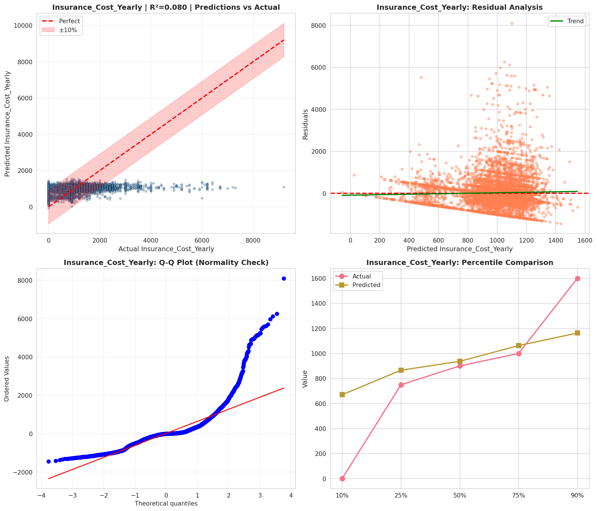
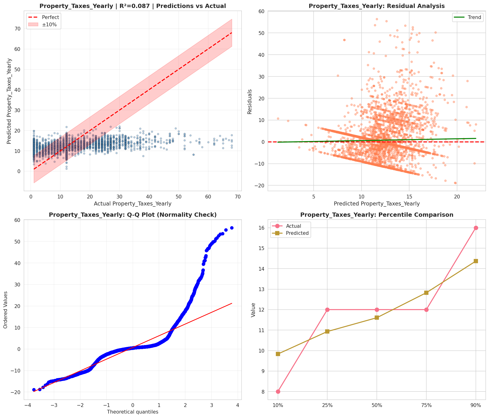
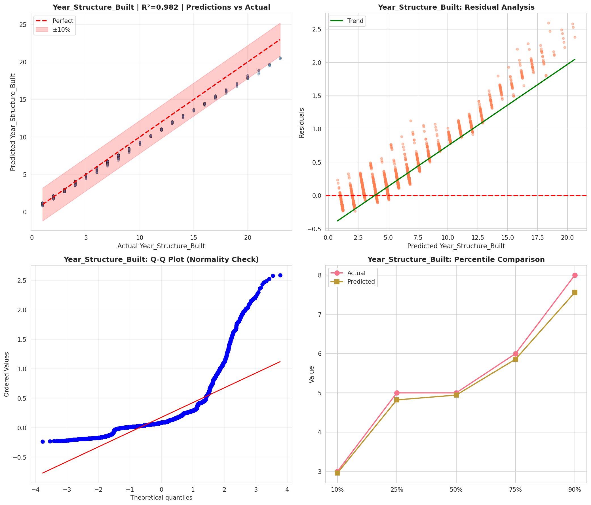
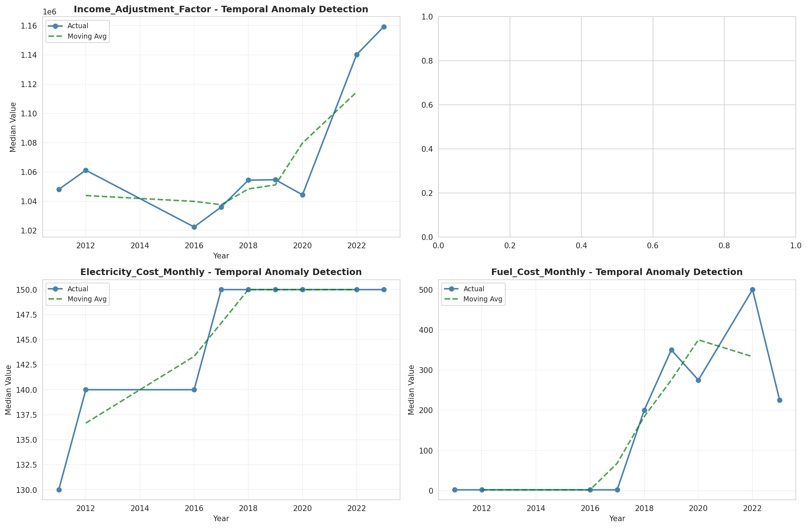
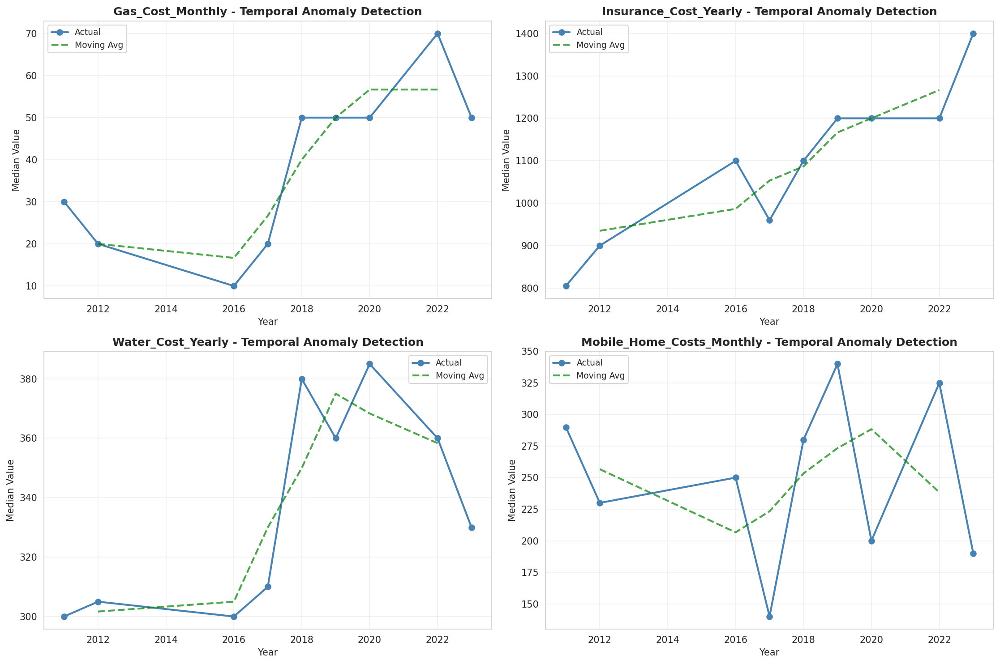
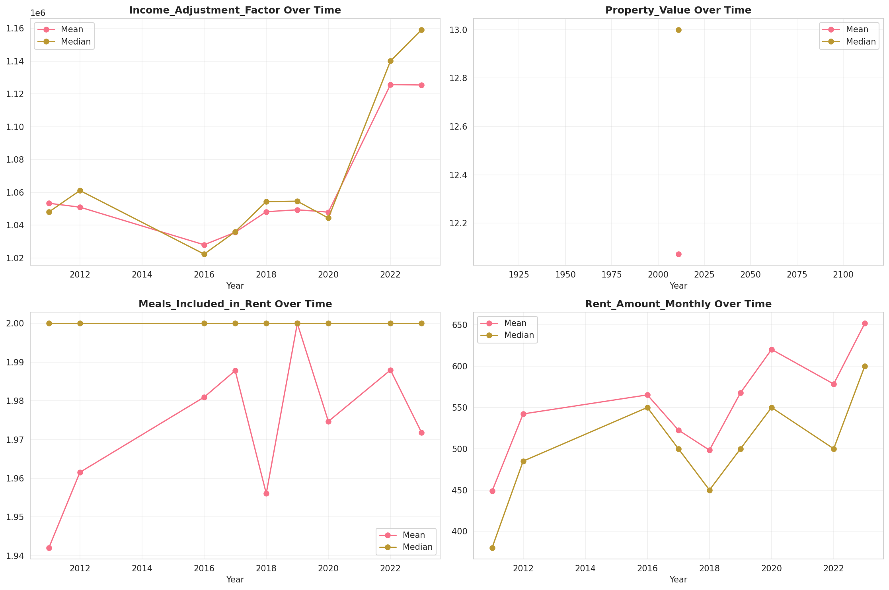
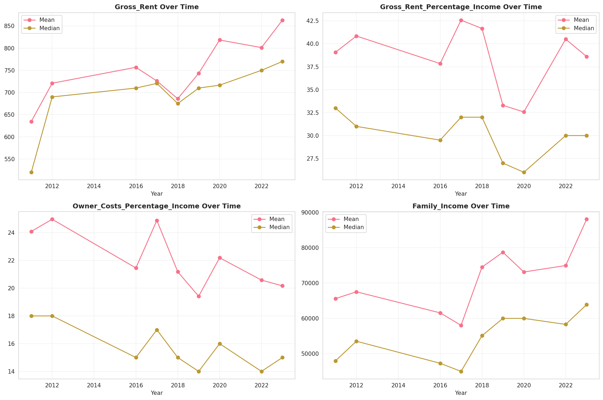
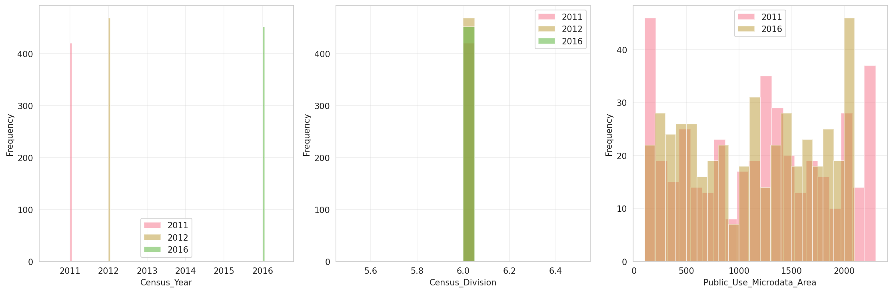
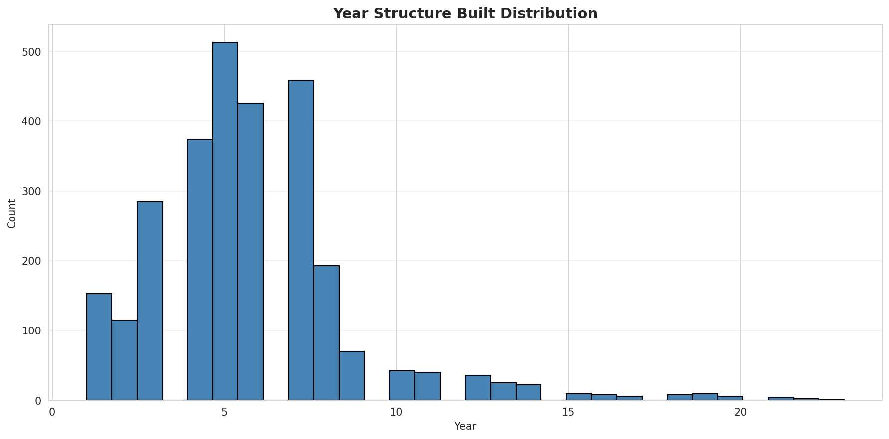
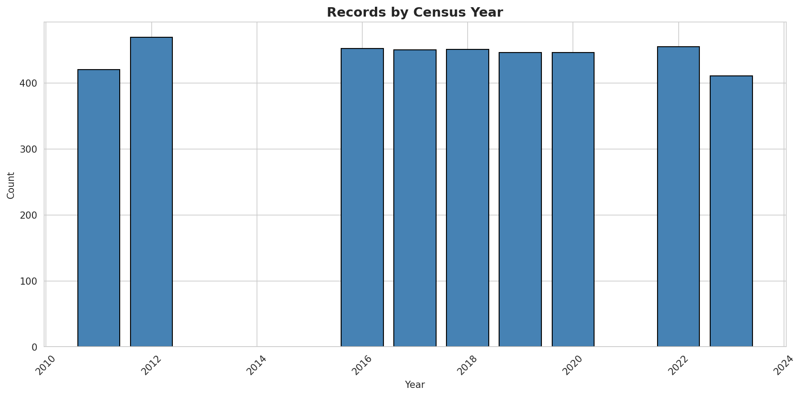
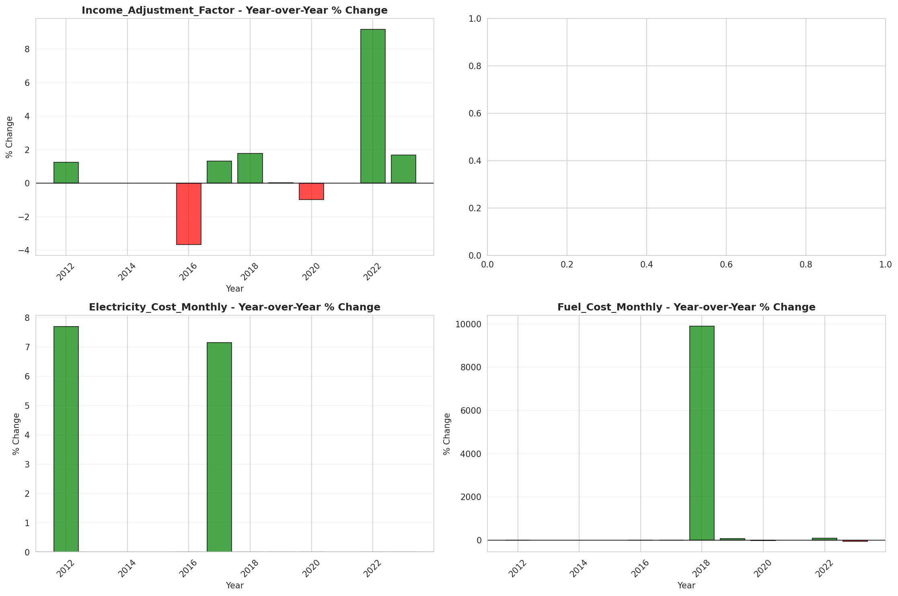
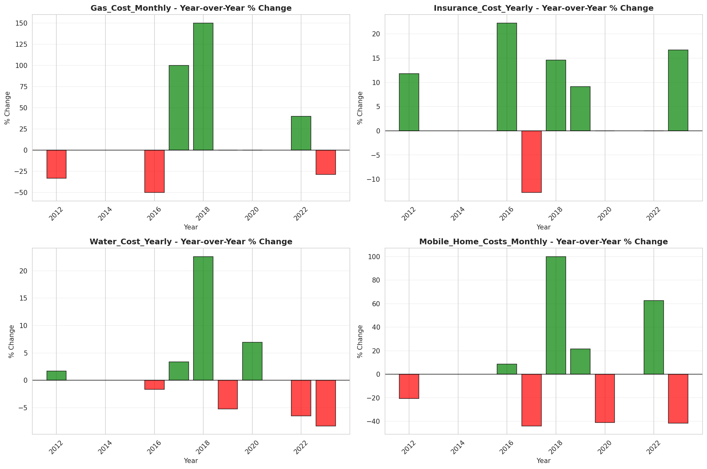
