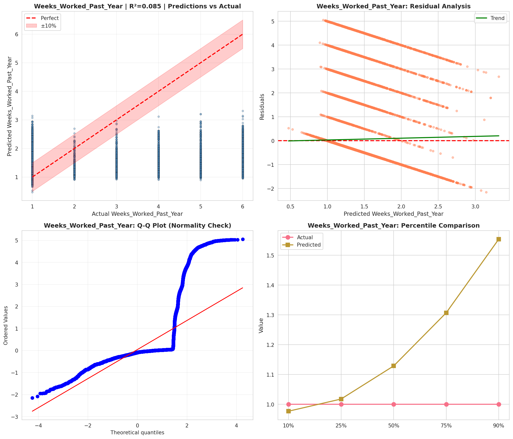
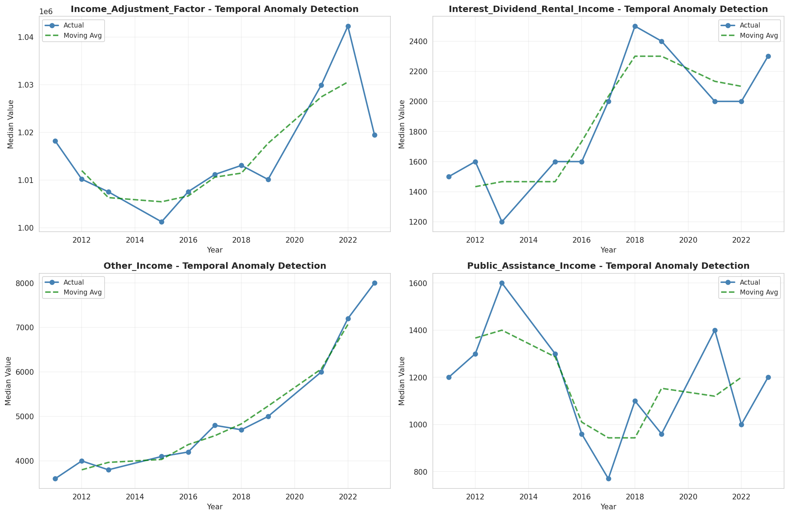
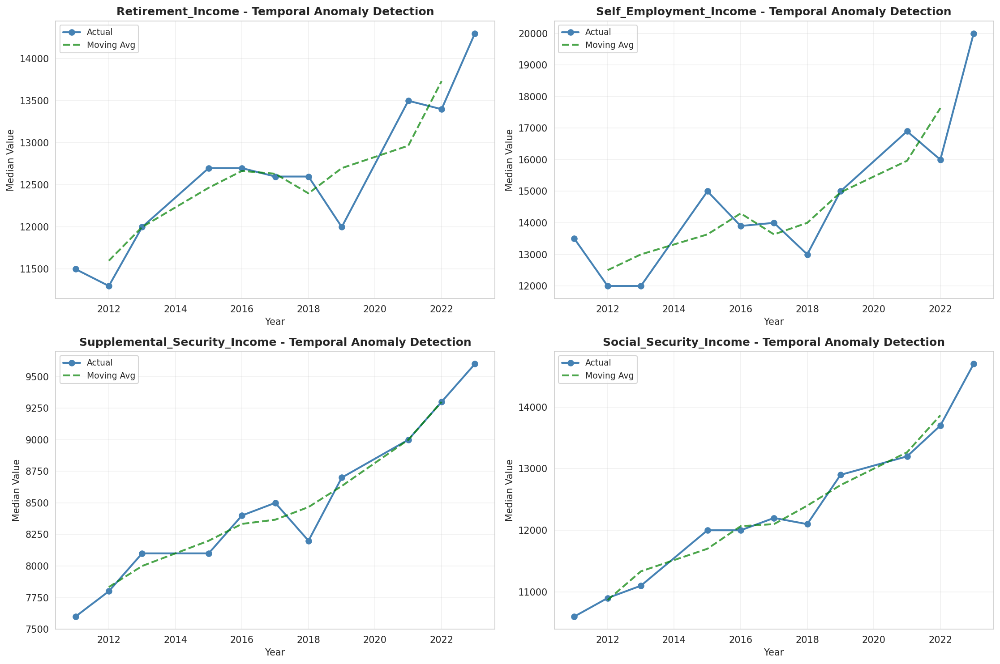
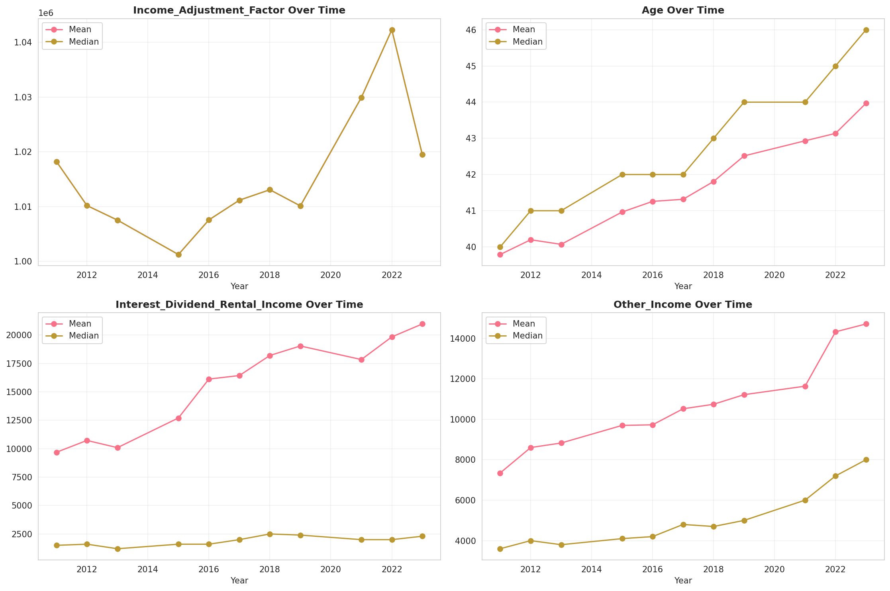
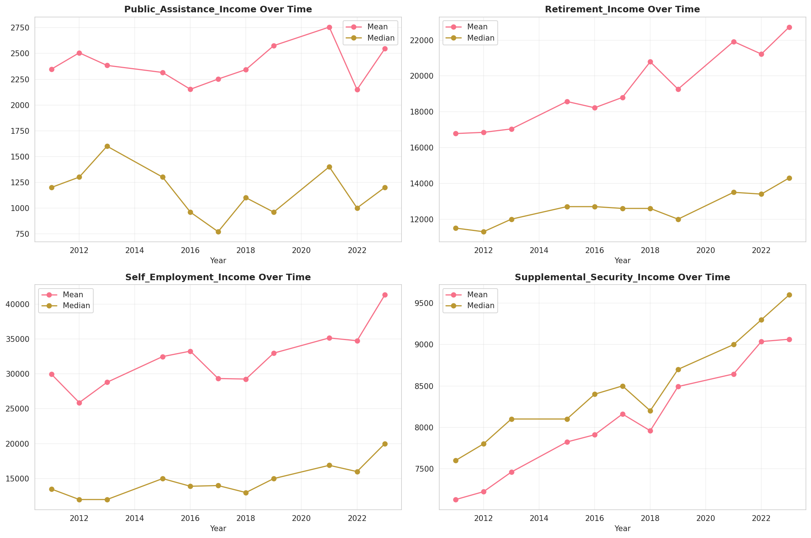
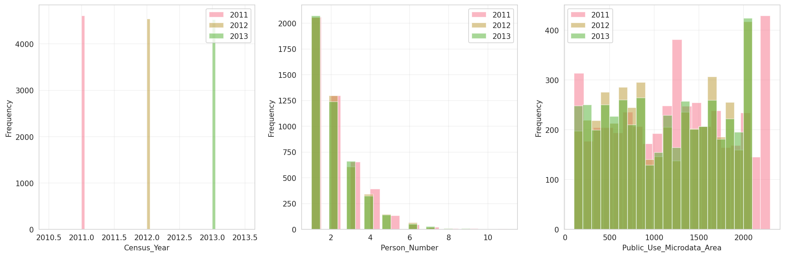
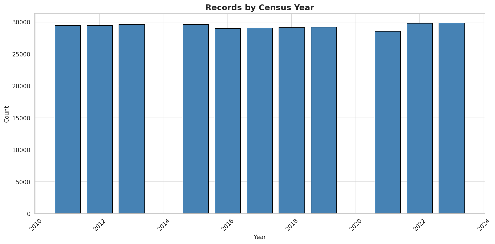
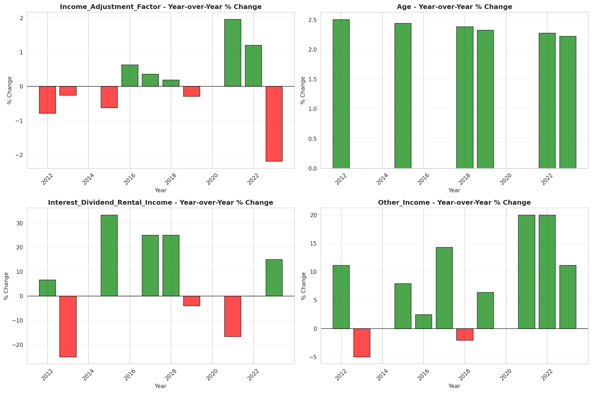
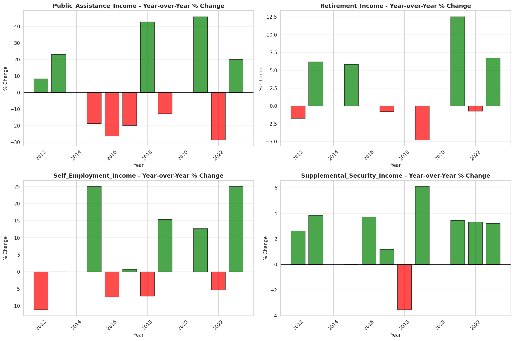

# Temporal Analysis

## Year Distribution

- 2011: 29,454 records

- 2012: 29,486 records

- 2013: 29,648 records

- 2015: 29,600 records

- 2016: 28,986 records

- 2017: 29,096 records

- 2018: 29,124 records

- 2019: 29,217 records

- 2021: 28,572 records

- 2022: 29,796 records

- 2023: 29,846 records

## Temporal Trends

- Census_Year: {np.int64(2011): {'mean': 2011.0, 'median': 2011.0, 'std': 0.0}, np.int64(2012): {'mean': 2012.0, 'median': 2012.0, 'std': 0.0}, np.int64(2013): {'mean': 2013.0, 'median': 2013.0, 'std': 0.0}, np.int64(2015): {'mean': 2015.0, 'median': 2015.0, 'std': 0.0}, np.int64(2016): {'mean': 2016.0, 'median': 2016.0, 'std': 0.0}, np.int64(2017): {'mean': 2017.0, 'median': 2017.0, 'std': 0.0}, np.int64(2018): {'mean': 2018.0, 'median': 2018.0, 'std': 0.0}, np.int64(2019): {'mean': 2019.0, 'median': 2019.0, 'std': 0.0}, np.int64(2021): {'mean': 2021.0, 'median': 2021.0, 'std': 0.0}, np.int64(2022): {'mean': 2022.0, 'median': 2022.0, 'std': 0.0}, np.int64(2023): {'mean': 2023.0, 'median': 2023.0, 'std': 0.0}}

- Person_Number: {np.int64(2011): {'mean': 2.037651931825898, 'median': 2.0, 'std': 1.3115146804581308}, np.int64(2012): {'mean': 2.046666214474666, 'median': 2.0, 'std': 1.304247340660207}, np.int64(2013): {'mean': 2.056428764166217, 'median': 2.0, 'std': 1.309116252934724}, np.int64(2015): {'mean': 2.034560810810811, 'median': 2.0, 'std': 1.3018352309064911}, np.int64(2016): {'mean': 2.0190091768439937, 'median': 2.0, 'std': 1.2722340469400755}, np.int64(2017): {'mean': 2.0355031619466595, 'median': 2.0, 'std': 1.3092178548399862}, np.int64(2018): {'mean': 1.9970814448564758, 'median': 2.0, 'std': 1.2597693904456317}, np.int64(2019): {'mean': 2.021905055276038, 'median': 2.0, 'std': 1.3280916312685047}, np.int64(2021): {'mean': 1.9785104297914042, 'median': 2.0, 'std': 1.2533083223462944}, np.int64(2022): {'mean': 1.9820110081890188, 'median': 2.0, 'std': 1.2389651596810498}, np.int64(2023): {'mean': 2.0060979695771626, 'median': 2.0, 'std': 1.3417642805168895}}

- Public_Use_Microdata_Area: {np.int64(2011): {'mean': 1217.9092822706593, 'median': 1200.0, 'std': 646.4989681496006}, np.int64(2012): {'mean': 1068.1916841891066, 'median': 1000.0, 'std': 608.4353337763371}, np.int64(2013): {'mean': 1071.2324608742579, 'median': 1100.0, 'std': 610.7483924465924}, np.int64(2015): {'mean': 1065.7331081081081, 'median': 1000.0, 'std': 613.9562125030665}, np.int64(2016): {'mean': 1068.591733940523, 'median': 1100.0, 'std': 614.5362910462788}, np.int64(2017): {'mean': 1061.5479791036569, 'median': 1000.0, 'std': 616.6822148255812}, np.int64(2018): {'mean': 1060.8398571624778, 'median': 1000.0, 'std': 620.0278749437804}, np.int64(2019): {'mean': 1067.720847451826, 'median': 1000.0, 'std': 624.661122018522}, np.int64(2021): {'mean': 1050.2519949601008, 'median': 1000.0, 'std': 620.240886251966}, np.int64(2022): {'mean': 1112.9496576721708, 'median': 1101.0, 'std': 639.2597910599948}, np.int64(2023): {'mean': 1120.6587482409702, 'median': 1101.0, 'std': 640.585554695807}}

- State_Code: {np.int64(2011): {'mean': 28.0, 'median': 28.0, 'std': 0.0}, np.int64(2012): {'mean': 28.0, 'median': 28.0, 'std': 0.0}, np.int64(2013): {'mean': 28.0, 'median': 28.0, 'std': 0.0}, np.int64(2015): {'mean': 28.0, 'median': 28.0, 'std': 0.0}, np.int64(2016): {'mean': 28.0, 'median': 28.0, 'std': 0.0}, np.int64(2017): {'mean': 28.0, 'median': 28.0, 'std': 0.0}, np.int64(2018): {'mean': 28.0, 'median': 28.0, 'std': 0.0}, np.int64(2019): {'mean': 28.0, 'median': 28.0, 'std': 0.0}, np.int64(2021): {'mean': 28.0, 'median': 28.0, 'std': 0.0}, np.int64(2022): {'mean': 28.0, 'median': 28.0, 'std': 0.0}, np.int64(2023): {'mean': None, 'median': None, 'std': None}}

- Income_Adjustment_Factor: {np.int64(2011): {'mean': 1018237.0, 'median': 1018237.0, 'std': 0.0}, np.int64(2012): {'mean': 1010207.0, 'median': 1010207.0, 'std': 0.0}, np.int64(2013): {'mean': 1007549.0, 'median': 1007549.0, 'std': 0.0}, np.int64(2015): {'mean': 1001264.0, 'median': 1001264.0, 'std': 0.0}, np.int64(2016): {'mean': 1007588.0, 'median': 1007588.0, 'std': 0.0}, np.int64(2017): {'mean': 1011189.0, 'median': 1011189.0, 'std': 0.0}, np.int64(2018): {'mean': 1013097.0, 'median': 1013097.0, 'std': 0.0}, np.int64(2019): {'mean': 1010145.0, 'median': 1010145.0, 'std': 0.0}, np.int64(2021): {'mean': 1029928.0, 'median': 1029928.0, 'std': 0.0}, np.int64(2022): {'mean': 1042311.0, 'median': 1042311.0, 'std': 0.0}, np.int64(2023): {'mean': 1019518.0, 'median': 1019518.0, 'std': 0.0}}

- Person_Weight: {np.int64(2011): {'mean': 101.12419365790724, 'median': 75.0, 'std': 92.95834617453785}, np.int64(2012): {'mean': 101.23197449637117, 'median': 78.0, 'std': 85.55485737406505}, np.int64(2013): {'mean': 100.89068402590394, 'median': 77.0, 'std': 85.52271161909248}, np.int64(2015): {'mean': 101.09233108108108, 'median': 77.0, 'std': 85.27071907901859}, np.int64(2016): {'mean': 103.10929414199958, 'median': 79.0, 'std': 88.85430695596598}, np.int64(2017): {'mean': 102.56048941435249, 'median': 80.0, 'std': 88.04094439112409}, np.int64(2018): {'mean': 102.54532344458178, 'median': 78.0, 'std': 89.98091095637967}, np.int64(2019): {'mean': 101.8636068042578, 'median': 76.0, 'std': 95.1573471169405}, np.int64(2021): {'mean': 103.24671006579868, 'median': 76.0, 'std': 93.10419144046647}, np.int64(2022): {'mean': 98.6728755537656, 'median': 71.0, 'std': 92.023187523878}, np.int64(2023): {'mean': 98.49527574884407, 'median': 71.0, 'std': 92.89754169479511}}

- Age: {np.int64(2011): {'mean': 39.78963807971753, 'median': 40.0, 'std': 23.622598972318247}, np.int64(2012): {'mean': 40.19799226751679, 'median': 41.0, 'std': 23.80622135163373}, np.int64(2013): {'mean': 40.070966001079334, 'median': 41.0, 'std': 23.721958065953807}, np.int64(2015): {'mean': 40.96418918918919, 'median': 42.0, 'std': 23.854217333675003}, np.int64(2016): {'mean': 41.25802111364107, 'median': 42.0, 'std': 23.828411148327877}, np.int64(2017): {'mean': 41.315610393181196, 'median': 42.0, 'std': 23.930849820143475}, np.int64(2018): {'mean': 41.80771871995605, 'median': 43.0, 'std': 23.918846662366278}, np.int64(2019): {'mean': 42.51456343909368, 'median': 44.0, 'std': 24.12269690984039}, np.int64(2021): {'mean': 42.93168136637267, 'median': 44.0, 'std': 24.130313851080537}, np.int64(2022): {'mean': 43.136897570143645, 'median': 45.0, 'std': 24.216098347824868}, np.int64(2023): {'mean': 43.968806540239896, 'median': 46.0, 'std': 24.194006974717436}}

- Citizenship_Status: {np.int64(2011): {'mean': 1.0872547022475725, 'median': 1.0, 'std': 0.5479040111118437}, np.int64(2012): {'mean': 1.071288068914061, 'median': 1.0, 'std': 0.4915481172859351}, np.int64(2013): {'mean': 1.0789260658391797, 'median': 1.0, 'std': 0.5133661566611257}, np.int64(2015): {'mean': 1.091722972972973, 'median': 1.0, 'std': 0.5573914514858268}, np.int64(2016): {'mean': 1.0834885806941281, 'median': 1.0, 'std': 0.5259509286278368}, np.int64(2017): {'mean': 1.0866785812482815, 'median': 1.0, 'std': 0.5378729635372488}, np.int64(2018): {'mean': 1.0916769674495261, 'median': 1.0, 'std': 0.5498599802698296}, np.int64(2019): {'mean': 1.088099394188315, 'median': 1.0, 'std': 0.5370714929942283}, np.int64(2021): {'mean': 1.098243035139297, 'median': 1.0, 'std': 0.5716712474254463}, np.int64(2022): {'mean': 1.0927976909652302, 'median': 1.0, 'std': 0.5533287082028192}, np.int64(2023): {'mean': 1.1086577765864774, 'median': 1.0, 'std': 0.5993972185873034}}

- Class_of_Worker: {np.int64(2011): {'mean': 2.2717017208413, 'median': 1.0, 'std': 2.011990565033802}, np.int64(2012): {'mean': 2.3035691276897308, 'median': 1.0, 'std': 2.0645716683109616}, np.int64(2013): {'mean': 2.260328490208465, 'median': 1.0, 'std': 2.0430360319697347}, np.int64(2015): {'mean': 2.275895387786653, 'median': 1.0, 'std': 2.0386862704549715}, np.int64(2016): {'mean': 2.2726446334653594, 'median': 1.0, 'std': 2.0031495522891736}, np.int64(2017): {'mean': 2.232591623036649, 'median': 1.0, 'std': 1.9621953790733064}, np.int64(2018): {'mean': 2.224323107595344, 'median': 1.0, 'std': 1.9541891470843253}, np.int64(2019): {'mean': 2.208247819394561, 'median': 1.0, 'std': 1.931061557382884}, np.int64(2021): {'mean': 2.2579857444561773, 'median': 1.0, 'std': 1.9540719156020072}, np.int64(2022): {'mean': 2.261387744914514, 'median': 1.0, 'std': 1.9438939439453815}, np.int64(2023): {'mean': 2.257081147793891, 'median': 1.0, 'std': 1.9554877546462324}}

- English_Speaking_Ability: {np.int64(2011): {'mean': 1.7678227360308285, 'median': 1.0, 'std': 0.9676768746016382}, np.int64(2012): {'mean': 1.5740149094781684, 'median': 1.0, 'std': 0.8831555435274054}, np.int64(2013): {'mean': 1.5644637053087758, 'median': 1.0, 'std': 0.8817961416922809}, np.int64(2015): {'mean': 1.6521308225966302, 'median': 1.0, 'std': 0.9024316350197071}, np.int64(2016): {'mean': 1.5975143403441683, 'median': 1.0, 'std': 0.8877440562254049}, np.int64(2017): {'mean': 1.6813074565883555, 'median': 1.0, 'std': 0.9563948616262852}, np.int64(2018): {'mean': 1.6457260556127704, 'median': 1.0, 'std': 0.9002461078916214}, np.int64(2019): {'mean': 1.515748031496063, 'median': 1.0, 'std': 0.8195565492597469}, np.int64(2021): {'mean': 1.6220053238686778, 'median': 1.0, 'std': 0.8538775145876281}, np.int64(2022): {'mean': 1.5620300751879699, 'median': 1.0, 'std': 0.8888914185317627}, np.int64(2023): {'mean': 1.5961214165261384, 'median': 1.0, 'std': 0.8625064830752588}}

- Fertility_Status: {np.int64(2011): {'mean': 1.9498894620486367, 'median': 2.0, 'std': 0.21818911148172065}, np.int64(2012): {'mean': 1.946439348219674, 'median': 2.0, 'std': 0.22516562273308793}, np.int64(2013): {'mean': 1.9407485982724655, 'median': 2.0, 'std': 0.23611251817179388}, np.int64(2015): {'mean': 1.9541255675591045, 'median': 2.0, 'std': 0.2092291158992851}, np.int64(2016): {'mean': 1.9471084913175083, 'median': 2.0, 'std': 0.22383471318556994}, np.int64(2017): {'mean': 1.9501115715651898, 'median': 2.0, 'std': 0.21773178286202838}, np.int64(2018): {'mean': 1.9492475184117835, 'median': 2.0, 'std': 0.2195094112769585}, np.int64(2019): {'mean': 1.9506916192026038, 'median': 2.0, 'std': 0.21652873737928152}, np.int64(2021): {'mean': 1.9508943638204523, 'median': 2.0, 'std': 0.21610681054712924}, np.int64(2022): {'mean': 1.94512987012987, 'median': 2.0, 'std': 0.2277450741917864}, np.int64(2023): {'mean': 1.95002474022761, 'median': 2.0, 'std': 0.21791182897603706}}

- Marital_Status: {np.int64(2011): {'mean': 3.0639641474842128, 'median': 3.0, 'std': 1.8304854720335773}, np.int64(2012): {'mean': 3.0681679441090686, 'median': 3.0, 'std': 1.8223359572073108}, np.int64(2013): {'mean': 3.0603413383702103, 'median': 3.0, 'std': 1.8282869842138392}, np.int64(2015): {'mean': 3.0557432432432434, 'median': 3.0, 'std': 1.827597778675032}, np.int64(2016): {'mean': 3.0201131580763128, 'median': 3.0, 'std': 1.8274286292943047}, np.int64(2017): {'mean': 3.041723948309046, 'median': 3.0, 'std': 1.8276047440355176}, np.int64(2018): {'mean': 2.9785056997665156, 'median': 3.0, 'std': 1.82887882034881}, np.int64(2019): {'mean': 2.982031009343875, 'median': 3.0, 'std': 1.8265000275837584}, np.int64(2021): {'mean': 3.003604927901442, 'median': 3.0, 'std': 1.8220570250713677}, np.int64(2022): {'mean': 2.9728822660759833, 'median': 3.0, 'std': 1.8238605085338464}, np.int64(2023): {'mean': 2.936105340749179, 'median': 3.0, 'std': 1.8177578740170999}}

- Mobility_Status: {np.int64(2011): {'mean': 1.254758720032925, 'median': 1.0, 'std': 0.6649004535280285}, np.int64(2012): {'mean': 1.2625840076807022, 'median': 1.0, 'std': 0.6740783609008792}, np.int64(2013): {'mean': 1.274125349519198, 'median': 1.0, 'std': 0.6862256088172423}, np.int64(2015): {'mean': 1.255462013020212, 'median': 1.0, 'std': 0.664956819268256}, np.int64(2016): {'mean': 1.245426351186535, 'median': 1.0, 'std': 0.6546583682013665}, np.int64(2017): {'mean': 1.2530266763797828, 'median': 1.0, 'std': 0.6629321694942649}, np.int64(2018): {'mean': 1.2445723798293682, 'median': 1.0, 'std': 0.6530165942796962}, np.int64(2019): {'mean': 1.2398204109825592, 'median': 1.0, 'std': 0.6478610527794856}, np.int64(2021): {'mean': 1.2085259554645869, 'median': 1.0, 'std': 0.6084647851216967}, np.int64(2022): {'mean': 1.2112108382726503, 'median': 1.0, 'std': 0.6114145129920635}, np.int64(2023): {'mean': 1.1980014179129672, 'median': 1.0, 'std': 0.5941909223978222}}

- Military_Service: {np.int64(2011): {'mean': 4.771063610167305, 'median': 5.0, 'std': 0.6648266520581906}, np.int64(2012): {'mean': 4.7657344159470725, 'median': 5.0, 'std': 0.6712477502995099}, np.int64(2013): {'mean': 3.7930355920602326, 'median': 4.0, 'std': 0.6000608238114346}, np.int64(2015): {'mean': 3.804124147859593, 'median': 4.0, 'std': 0.5887480368093128}, np.int64(2016): {'mean': 3.796405115796751, 'median': 4.0, 'std': 0.5989613828763695}, np.int64(2017): {'mean': 3.804796142420459, 'median': 4.0, 'std': 0.5861186547858009}, np.int64(2018): {'mean': 3.812132572207549, 'median': 4.0, 'std': 0.5789408635353189}, np.int64(2019): {'mean': 3.810381937117535, 'median': 4.0, 'std': 0.5817577285047305}, np.int64(2021): {'mean': 3.815393195761294, 'median': 4.0, 'std': 0.5758361795723799}, np.int64(2022): {'mean': 3.8119428854407396, 'median': 4.0, 'std': 0.580594378549128}, np.int64(2023): {'mean': 3.8153484030680573, 'median': 4.0, 'std': 0.5740546730164289}}

- Travel_Time_To_Work_Minutes: {np.int64(2011): {'mean': 24.01505156554864, 'median': 20.0, 'std': 24.353898905549578}, np.int64(2012): {'mean': 23.81084618980832, 'median': 20.0, 'std': 23.884819504302953}, np.int64(2013): {'mean': 23.815808689302663, 'median': 20.0, 'std': 23.432718881694047}, np.int64(2015): {'mean': 24.178885364748528, 'median': 20.0, 'std': 23.17076295598567}, np.int64(2016): {'mean': 24.496146262771106, 'median': 20.0, 'std': 23.969090172644016}, np.int64(2017): {'mean': 24.940136779465316, 'median': 20.0, 'std': 24.43778496875675}, np.int64(2018): {'mean': 24.989097677716718, 'median': 20.0, 'std': 24.14497928624337}, np.int64(2019): {'mean': 25.352858399296395, 'median': 20.0, 'std': 24.536735662382064}, np.int64(2021): {'mean': 25.07344903634097, 'median': 20.0, 'std': 23.78224747938084}, np.int64(2022): {'mean': 25.773642301154155, 'median': 20.0, 'std': 23.601558894101416}, np.int64(2023): {'mean': 25.75951280227596, 'median': 20.0, 'std': 24.575319726459263}}

- Vehicle_Occupancy: {np.int64(2011): {'mean': 1.1918537151702786, 'median': 1.0, 'std': 0.7047117725855311}, np.int64(2012): {'mean': 1.1868976929816022, 'median': 1.0, 'std': 0.6865102922565378}, np.int64(2013): {'mean': 1.1836521077171949, 'median': 1.0, 'std': 0.6867299079782254}, np.int64(2015): {'mean': 1.1526523702031604, 'median': 1.0, 'std': 0.5779673042599841}, np.int64(2016): {'mean': 1.1580954152329583, 'median': 1.0, 'std': 0.6534618915040588}, np.int64(2017): {'mean': 1.1614180478821363, 'median': 1.0, 'std': 0.6780221123997996}, np.int64(2018): {'mean': 1.1476386978450253, 'median': 1.0, 'std': 0.6300366897389661}, np.int64(2019): {'mean': 1.1550753586344653, 'median': 1.0, 'std': 0.6414318241422525}, np.int64(2021): {'mean': 1.12609736632083, 'median': 1.0, 'std': 0.4863304464044151}, np.int64(2022): {'mean': 1.1579923926152704, 'median': 1.0, 'std': 0.5979754110829344}, np.int64(2023): {'mean': 1.1764163979732842, 'median': 1.0, 'std': 0.6280380444858793}}

- Transportation_To_Work: {np.int64(2011): {'mean': 1.5663404023926046, 'median': 1.0, 'std': 2.266043515776916}, np.int64(2012): {'mean': 1.5718972115910335, 'median': 1.0, 'std': 2.2730090287238287}, np.int64(2013): {'mean': 1.583444711752651, 'median': 1.0, 'std': 2.3117716938727613}, np.int64(2015): {'mean': 1.5557913351016799, 'median': 1.0, 'std': 2.2666114024599215}, np.int64(2016): {'mean': 1.5426519530565774, 'median': 1.0, 'std': 2.2384703767636447}, np.int64(2017): {'mean': 1.547124047124047, 'median': 1.0, 'std': 2.2477257465385927}, np.int64(2018): {'mean': 1.5780550774526678, 'median': 1.0, 'std': 2.3062349592200935}, np.int64(2019): {'mean': None, 'median': None, 'std': None}, np.int64(2021): {'mean': None, 'median': None, 'std': None}, np.int64(2022): {'mean': None, 'median': None, 'std': None}, np.int64(2023): {'mean': None, 'median': None, 'std': None}}

- Language_Other_Than_English: {np.int64(2011): {'mean': 1.9625824591759489, 'median': 2.0, 'std': 0.18978610817816158}, np.int64(2012): {'mean': 1.9662509434640405, 'median': 2.0, 'std': 0.18058579627144838}, np.int64(2013): {'mean': 1.967069820543009, 'median': 2.0, 'std': 0.17845705071834989}, np.int64(2015): {'mean': 1.9640374950992623, 'median': 2.0, 'std': 0.1861999969291079}, np.int64(2016): {'mean': 1.9619331829099644, 'median': 2.0, 'std': 0.19136109112159613}, np.int64(2017): {'mean': 1.9645546705286026, 'median': 2.0, 'std': 0.18490591112310167}, np.int64(2018): {'mean': 1.964841769860236, 'median': 2.0, 'std': 0.18418294519114026}, np.int64(2019): {'mean': 1.9634282423238905, 'median': 2.0, 'std': 0.18771130106798226}, np.int64(2021): {'mean': 1.9585844480376304, 'median': 2.0, 'std': 0.19925301251924424}, np.int64(2022): {'mean': 1.962485015161131, 'median': 2.0, 'std': 0.19002337723154786}, np.int64(2023): {'mean': 1.9584879243962199, 'median': 2.0, 'std': 0.19947485031963177}}

- Grandparents_Living_With_Grandchildren: {np.int64(2011): {'mean': 1.9495614035087718, 'median': 2.0, 'std': 0.21885422183861028}, np.int64(2012): {'mean': 1.9455701015807485, 'median': 2.0, 'std': 0.22687018423921498}, np.int64(2013): {'mean': 1.9467257402204452, 'median': 2.0, 'std': 0.22458592625029083}, np.int64(2015): {'mean': 1.9512311865127905, 'median': 2.0, 'std': 0.21539007319538933}, np.int64(2016): {'mean': 1.949504737295435, 'median': 2.0, 'std': 0.2189704827890582}, np.int64(2017): {'mean': 1.9548747115952139, 'median': 2.0, 'std': 0.20758446206013229}, np.int64(2018): {'mean': 1.9570040872657783, 'median': 2.0, 'std': 0.20285326837797754}, np.int64(2019): {'mean': 1.9516592631303893, 'median': 2.0, 'std': 0.21449082574851952}, np.int64(2021): {'mean': 1.9605026929982046, 'median': 2.0, 'std': 0.19478006335984682}, np.int64(2022): {'mean': 1.9595323287809303, 'median': 2.0, 'std': 0.19705835624787527}, np.int64(2023): {'mean': 1.9597897763895087, 'median': 2.0, 'std': 0.19645680217689862}}

- Months_Responsible_For_Grandchildren: {np.int64(2011): {'mean': 3.6826568265682655, 'median': 4.0, 'std': 1.4242532006674067}, np.int64(2012): {'mean': 3.8098471986417657, 'median': 4.0, 'std': 1.3743909512275314}, np.int64(2013): {'mean': 3.8894927536231885, 'median': 4.0, 'std': 1.2768062597719225}, np.int64(2015): {'mean': 3.7270875763747453, 'median': 4.0, 'std': 1.3548324207196591}, np.int64(2016): {'mean': 3.8355899419729207, 'median': 4.0, 'std': 1.3956085229590727}, np.int64(2017): {'mean': 4.0559796437659035, 'median': 5.0, 'std': 1.191775009409895}, np.int64(2018): {'mean': 3.8626126126126126, 'median': 4.0, 'std': 1.324043476342308}, np.int64(2019): {'mean': 4.008714596949891, 'median': 5.0, 'std': 1.2999539306685828}, np.int64(2021): {'mean': 4.126984126984127, 'median': 5.0, 'std': 1.198921666144662}, np.int64(2022): {'mean': 4.01912568306011, 'median': 5.0, 'std': 1.2506065599228782}, np.int64(2023): {'mean': 3.976063829787234, 'median': 5.0, 'std': 1.3414266778005026}}

- Grandparents_Responsible_For_Grandchildren: {np.int64(2011): {'mean': 1.4108695652173913, 'median': 1.0, 'std': 0.49225923656382553}, np.int64(2012): {'mean': 1.4121756487025947, 'median': 1.0, 'std': 0.49247226130785354}, np.int64(2013): {'mean': 1.4401622718052738, 'median': 1.0, 'std': 0.4966584523706194}, np.int64(2015): {'mean': 1.4645583424209379, 'median': 1.0, 'std': 0.49901447210669353}, np.int64(2016): {'mean': 1.4488272921108742, 'median': 1.0, 'std': 0.4976397976640604}, np.int64(2017): {'mean': 1.5326991676575505, 'median': 2.0, 'std': 0.499226512299417}, np.int64(2018): {'mean': 1.451851851851852, 'median': 1.0, 'std': 0.49798384888278363}, np.int64(2019): {'mean': 1.5037837837837837, 'median': 2.0, 'std': 0.5002561646359096}, np.int64(2021): {'mean': 1.4946524064171123, 'median': 1.0, 'std': 0.5003059433808005}, np.int64(2022): {'mean': 1.544209215442092, 'median': 2.0, 'std': 0.49835211346223507}, np.int64(2023): {'mean': 1.5363748458692972, 'median': 2.0, 'std': 0.49898284446480967}}

- Interest_Dividend_Rental_Income: {np.int64(2011): {'mean': 9687.15972944849, 'median': 1500.0, 'std': 26074.44754577293}, np.int64(2012): {'mean': 10726.863777089784, 'median': 1600.0, 'std': 30269.89068547326}, np.int64(2013): {'mean': 10090.916034155598, 'median': 1200.0, 'std': 26793.724175774252}, np.int64(2015): {'mean': 12703.10531309298, 'median': 1600.0, 'std': 35735.9040209281}, np.int64(2016): {'mean': 16124.961500493584, 'median': 1600.0, 'std': 51162.70547650459}, np.int64(2017): {'mean': 16435.302874743327, 'median': 2000.0, 'std': 50952.705043690155}, np.int64(2018): {'mean': 18200.72806171649, 'median': 2500.0, 'std': 49159.21565623913}, np.int64(2019): {'mean': 19036.30964467005, 'median': 2400.0, 'std': 60796.4435734429}, np.int64(2021): {'mean': 17842.037120359953, 'median': 2000.0, 'std': 49688.21185365955}, np.int64(2022): {'mean': 19833.41921631777, 'median': 2000.0, 'std': 53813.47976446682}, np.int64(2023): {'mean': 20972.206931702345, 'median': 2300.0, 'std': 59471.33982562324}}

- Military_Service_Period_1: {np.int64(2011): {'mean': 0.1568627450980392, 'median': 0.0, 'std': 0.3637505706738086}, np.int64(2012): {'mean': 0.16, 'median': 0.0, 'std': 0.3666840817877516}, np.int64(2013): {'mean': 0.16491897044804577, 'median': 0.0, 'std': 0.37119587651727987}, np.int64(2015): {'mean': 0.19367787255393878, 'median': 0.0, 'std': 0.395278574175097}, np.int64(2016): {'mean': 0.22101628021706957, 'median': 0.0, 'std': 0.4150338099565917}, np.int64(2017): {'mean': 0.21703437660338634, 'median': 0.0, 'std': 0.4123320133938039}, np.int64(2018): {'mean': 0.2323607427055703, 'median': 0.0, 'std': 0.42244988314106835}, np.int64(2019): {'mean': 0.2405587170201759, 'median': 0.0, 'std': 0.42753336810290904}, np.int64(2021): {'mean': 0.2670704845814978, 'median': 0.0, 'std': 0.4425513401777227}, np.int64(2022): {'mean': 0.2813786008230453, 'median': 0.0, 'std': 0.44978745214827137}, np.int64(2023): {'mean': 0.29677088672475654, 'median': 0.0, 'std': 0.4569518050030797}}

- Military_Service_Period_2: {np.int64(2011): {'mean': 0.16427015250544663, 'median': 0.0, 'std': 0.37060128838742995}, np.int64(2012): {'mean': 0.15617021276595744, 'median': 0.0, 'std': 0.3630938974115996}, np.int64(2013): {'mean': 0.18446139180171592, 'median': 0.0, 'std': 0.38795247791209997}, np.int64(2015): {'mean': 0.18414450577019567, 'median': 0.0, 'std': 0.38769927275602595}, np.int64(2016): {'mean': 0.203749383325111, 'median': 0.0, 'std': 0.402884163138198}, np.int64(2017): {'mean': 0.22832221652129298, 'median': 0.0, 'std': 0.41985905871228285}, np.int64(2018): {'mean': 0.21379310344827587, 'median': 0.0, 'std': 0.41009124567900856}, np.int64(2019): {'mean': 0.20951888256595966, 'median': 0.0, 'std': 0.407070565657648}, np.int64(2021): {'mean': 0.21475770925110133, 'median': 0.0, 'std': 0.4107672679576392}, np.int64(2022): {'mean': 0.23919753086419754, 'median': 0.0, 'std': 0.4267033307215525}, np.int64(2023): {'mean': 0.24654023577652487, 'median': 0.0, 'std': 0.43110718911711193}}

- Military_Service_Period_3: {np.int64(2011): {'mean': 0.16601307189542483, 'median': 0.0, 'std': 0.37217346243542127}, np.int64(2012): {'mean': 0.18, 'median': 0.0, 'std': 0.38426922235464334}, np.int64(2013): {'mean': None, 'median': None, 'std': None}, np.int64(2015): {'mean': None, 'median': None, 'std': None}, np.int64(2016): {'mean': None, 'median': None, 'std': None}, np.int64(2017): {'mean': None, 'median': None, 'std': None}, np.int64(2018): {'mean': None, 'median': None, 'std': None}, np.int64(2019): {'mean': None, 'median': None, 'std': None}, np.int64(2021): {'mean': None, 'median': None, 'std': None}, np.int64(2022): {'mean': None, 'median': None, 'std': None}, np.int64(2023): {'mean': None, 'median': None, 'std': None}}

- Military_Service_Period_4: {np.int64(2011): {'mean': 0.13115468409586056, 'median': 0.0, 'std': 0.33764301764058635}, np.int64(2012): {'mean': 0.14468085106382977, 'median': 0.0, 'std': 0.35185363955616816}, np.int64(2013): {'mean': None, 'median': None, 'std': None}, np.int64(2015): {'mean': None, 'median': None, 'std': None}, np.int64(2016): {'mean': None, 'median': None, 'std': None}, np.int64(2017): {'mean': None, 'median': None, 'std': None}, np.int64(2018): {'mean': None, 'median': None, 'std': None}, np.int64(2019): {'mean': None, 'median': None, 'std': None}, np.int64(2021): {'mean': None, 'median': None, 'std': None}, np.int64(2022): {'mean': None, 'median': None, 'std': None}, np.int64(2023): {'mean': None, 'median': None, 'std': None}}

- Military_Service_Period_5: {np.int64(2011): {'mean': 0.3446623093681917, 'median': 0.0, 'std': 0.4753616130487545}, np.int64(2012): {'mean': 0.34297872340425534, 'median': 0.0, 'std': 0.47480548724485583}, np.int64(2013): {'mean': 0.36939942802669207, 'median': 0.0, 'std': 0.4827572627766682}, np.int64(2015): {'mean': 0.36076266934269946, 'median': 0.0, 'std': 0.48034231055836607}, np.int64(2016): {'mean': 0.36901825357671436, 'median': 0.0, 'std': 0.4826579637105122}, np.int64(2017): {'mean': 0.3796818881477681, 'median': 0.0, 'std': 0.48543223757231213}, np.int64(2018): {'mean': 0.3639257294429708, 'median': 0.0, 'std': 0.48125529726707783}, np.int64(2019): {'mean': 0.37403000517330576, 'median': 0.0, 'std': 0.483996638946214}, np.int64(2021): {'mean': 0.3601321585903084, 'median': 0.0, 'std': 0.4801707503239163}, np.int64(2022): {'mean': 0.3477366255144033, 'median': 0.0, 'std': 0.4763744322133913}, np.int64(2023): {'mean': 0.33572526909277295, 'median': 0.0, 'std': 0.4723644555247533}}

- Military_Service_Period_6: {np.int64(2011): {'mean': 0.11241830065359477, 'median': 0.0, 'std': 0.31594924053449}, np.int64(2012): {'mean': 0.10085106382978723, 'median': 0.0, 'std': 0.30119550207345536}, np.int64(2013): {'mean': None, 'median': None, 'std': None}, np.int64(2015): {'mean': None, 'median': None, 'std': None}, np.int64(2016): {'mean': None, 'median': None, 'std': None}, np.int64(2017): {'mean': None, 'median': None, 'std': None}, np.int64(2018): {'mean': None, 'median': None, 'std': None}, np.int64(2019): {'mean': None, 'median': None, 'std': None}, np.int64(2021): {'mean': None, 'median': None, 'std': None}, np.int64(2022): {'mean': None, 'median': None, 'std': None}, np.int64(2023): {'mean': None, 'median': None, 'std': None}}

- Military_Service_Period_7: {np.int64(2011): {'mean': 0.10457516339869281, 'median': 0.0, 'std': 0.30607191602414197}, np.int64(2012): {'mean': 0.1076595744680851, 'median': 0.0, 'std': 0.3100159484901577}, np.int64(2013): {'mean': None, 'median': None, 'std': None}, np.int64(2015): {'mean': None, 'median': None, 'std': None}, np.int64(2016): {'mean': None, 'median': None, 'std': None}, np.int64(2017): {'mean': None, 'median': None, 'std': None}, np.int64(2018): {'mean': None, 'median': None, 'std': None}, np.int64(2019): {'mean': None, 'median': None, 'std': None}, np.int64(2021): {'mean': None, 'median': None, 'std': None}, np.int64(2022): {'mean': None, 'median': None, 'std': None}, np.int64(2023): {'mean': None, 'median': None, 'std': None}}

- Military_Service_Period_8: {np.int64(2011): {'mean': 0.11764705882352941, 'median': 0.0, 'std': 0.3222599564994923}, np.int64(2012): {'mean': 0.1097872340425532, 'median': 0.0, 'std': 0.3126909079647286}, np.int64(2013): {'mean': 0.11534795042897998, 'median': 0.0, 'std': 0.31951754582006897}, np.int64(2015): {'mean': 0.0958354239839438, 'median': 0.0, 'std': 0.2944392891403783}, np.int64(2016): {'mean': 0.07893438579181056, 'median': 0.0, 'std': 0.2697028622317662}, np.int64(2017): {'mean': 0.07491021036428938, 'median': 0.0, 'std': 0.26331396661355555}, np.int64(2018): {'mean': 0.07480106100795755, 'median': 0.0, 'std': 0.26313987868164196}, np.int64(2019): {'mean': 0.05794102431453699, 'median': 0.0, 'std': 0.23369235017965526}, np.int64(2021): {'mean': 0.046255506607929514, 'median': 0.0, 'std': 0.21009579009702328}, np.int64(2022): {'mean': 0.041666666666666664, 'median': 0.0, 'std': 0.19987772896519526}, np.int64(2023): {'mean': 0.027678113787801127, 'median': 0.0, 'std': 0.1640909407887993}}

- Military_Service_Period_9: {np.int64(2011): {'mean': 0.022657952069716776, 'median': 0.0, 'std': 0.14884294586485844}, np.int64(2012): {'mean': 0.020425531914893616, 'median': 0.0, 'std': 0.1414809081405618}, np.int64(2013): {'mean': 0.020495710200190656, 'median': 0.0, 'std': 0.14172229735193556}, np.int64(2015): {'mean': 0.017059708981435023, 'median': 0.0, 'std': 0.12952641939233092}, np.int64(2016): {'mean': 0.013320177602368031, 'median': 0.0, 'std': 0.11467012476960683}, np.int64(2017): {'mean': 0.01539250897896357, 'median': 0.0, 'std': 0.12313959443648945}, np.int64(2018): {'mean': 0.009549071618037135, 'median': 0.0, 'std': 0.09727747405778643}, np.int64(2019): {'mean': 0.008277289187790998, 'median': 0.0, 'std': 0.09062573872903834}, np.int64(2021): {'mean': None, 'median': None, 'std': None}, np.int64(2022): {'mean': None, 'median': None, 'std': None}, np.int64(2023): {'mean': None, 'median': None, 'std': None}}

- Military_Service_Period_10: {np.int64(2011): {'mean': 0.08148148148148149, 'median': 0.0, 'std': 0.27363273721335873}, np.int64(2012): {'mean': 0.07574468085106383, 'median': 0.0, 'std': 0.2646454746434548}, np.int64(2013): {'mean': 0.06434699714013346, 'median': 0.0, 'std': 0.24542854735733446}, np.int64(2015): {'mean': 0.0386352232814852, 'median': 0.0, 'std': 0.19277237524680763}, np.int64(2016): {'mean': 0.03256043413912185, 'median': 0.0, 'std': 0.17752690013037525}, np.int64(2017): {'mean': 0.029758850692662903, 'median': 0.0, 'std': 0.16996494785966057}, np.int64(2018): {'mean': 0.016976127320954906, 'median': 0.0, 'std': 0.1292160831279227}, np.int64(2019): {'mean': 0.023279875840662184, 'median': 0.0, 'std': 0.15083001138004276}, np.int64(2021): {'mean': 0.00881057268722467, 'median': 0.0, 'std': 0.09347597572059375}, np.int64(2022): {'mean': 0.0102880658436214, 'median': 0.0, 'std': 0.10093295799101007}, np.int64(2023): {'mean': 0.0046130189646335215, 'median': 0.0, 'std': 0.06777974445676797}}

- Military_Service_Period_11: {np.int64(2011): {'mean': 0.003485838779956427, 'median': 0.0, 'std': 0.05895084356627473}, np.int64(2012): {'mean': 0.002553191489361702, 'median': 0.0, 'std': 0.05047530935450821}, np.int64(2013): {'mean': 0.003336510962821735, 'median': 0.0, 'std': 0.05767984428257185}, np.int64(2015): {'mean': 0.002508780732563974, 'median': 0.0, 'std': 0.05003741620277364}, np.int64(2016): {'mean': 0.001973359644795264, 'median': 0.0, 'std': 0.044389611307311824}, np.int64(2017): {'mean': 0.0, 'median': 0.0, 'std': 0.0}, np.int64(2018): {'mean': 0.0010610079575596816, 'median': 0.0, 'std': 0.03256447128165866}, np.int64(2019): {'mean': 0.0, 'median': 0.0, 'std': 0.0}, np.int64(2021): {'mean': None, 'median': None, 'std': None}, np.int64(2022): {'mean': None, 'median': None, 'std': None}, np.int64(2023): {'mean': None, 'median': None, 'std': None}}

- Temporary_Absence_From_Work: {np.int64(2011): {'mean': 2.4843174603174605, 'median': 2.0, 'std': 0.5284986794455944}, np.int64(2012): {'mean': 2.48097470332362, 'median': 2.0, 'std': 0.5302401535956576}, np.int64(2013): {'mean': 2.5312565775626186, 'median': 3.0, 'std': 0.5221998496412896}, np.int64(2015): {'mean': 2.536003000250021, 'median': 3.0, 'std': 0.5195832989119531}, np.int64(2016): {'mean': 2.5416613608387455, 'median': 3.0, 'std': 0.5195416886798299}, np.int64(2017): {'mean': 2.5472232796176457, 'median': 3.0, 'std': 0.5176859063033288}, np.int64(2018): {'mean': 2.5452755080662057, 'median': 3.0, 'std': 0.5217901015295742}, np.int64(2019): {'mean': 2.5662500519038325, 'median': 3.0, 'std': 0.5151571893585865}, np.int64(2021): {'mean': 2.53752903907075, 'median': 3.0, 'std': 0.5196731776542546}, np.int64(2022): {'mean': 2.5590016665989186, 'median': 3.0, 'std': 0.5172868981495868}, np.int64(2023): {'mean': 2.554527323494216, 'median': 3.0, 'std': 0.5150788297309716}}

- Available_For_Work: {np.int64(2011): {'mean': 4.5175449735449735, 'median': 5.0, 'std': 1.2189415727415327}, np.int64(2012): {'mean': 4.483212973520842, 'median': 5.0, 'std': 1.234124239535309}, np.int64(2013): {'mean': 4.611113449800042, 'median': 5.0, 'std': 1.1054044912994816}, np.int64(2015): {'mean': 4.659638303191933, 'median': 5.0, 'std': 1.0318898530220746}, np.int64(2016): {'mean': 4.678763954327433, 'median': 5.0, 'std': 1.0045081675773082}, np.int64(2017): {'mean': 4.7046906060990565, 'median': 5.0, 'std': 0.9572573698331117}, np.int64(2018): {'mean': 4.711250785669391, 'median': 5.0, 'std': 0.9518501217151688}, np.int64(2019): {'mean': 4.713158659635427, 'median': 5.0, 'std': 0.9419779627908408}, np.int64(2021): {'mean': 4.743695881731784, 'median': 5.0, 'std': 0.9015663814261192}, np.int64(2022): {'mean': 4.7693589691475955, 'median': 5.0, 'std': 0.8463537957611625}, np.int64(2023): {'mean': 4.751615476665337, 'median': 5.0, 'std': 0.8709985881480329}}

- On_Layoff_From_Work: {np.int64(2011): {'mean': 2.4558306878306877, 'median': 2.0, 'std': 0.5283272375561924}, np.int64(2012): {'mean': 2.454453313062207, 'median': 2.0, 'std': 0.5244518533874799}, np.int64(2013): {'mean': 2.5086087139549567, 'median': 3.0, 'std': 0.5223387957507653}, np.int64(2015): {'mean': 2.518293191099258, 'median': 3.0, 'std': 0.5145493000373385}, np.int64(2016): {'mean': 2.52578632369795, 'median': 3.0, 'std': 0.5141715588194934}, np.int64(2017): {'mean': 2.5315738273484754, 'median': 3.0, 'std': 0.5106587511410398}, np.int64(2018): {'mean': 2.532537188351142, 'median': 3.0, 'std': 0.5115570511151679}, np.int64(2019): {'mean': 2.553336378358178, 'median': 3.0, 'std': 0.5073269086363486}, np.int64(2021): {'mean': 2.5189017951425554, 'median': 3.0, 'std': 0.5176732703937819}, np.int64(2022): {'mean': 2.549245965611154, 'median': 3.0, 'std': 0.5056826872550763}, np.int64(2023): {'mean': 2.5439569206222576, 'median': 3.0, 'std': 0.5057040103378796}}

- Looking_For_Work: {np.int64(2011): {'mean': 2.4305608465608466, 'median': 2.0, 'std': 0.6168949599962483}, np.int64(2012): {'mean': 2.4249334853667808, 'median': 2.0, 'std': 0.6161220291908679}, np.int64(2013): {'mean': 2.480446221848032, 'median': 3.0, 'std': 0.6055254569200298}, np.int64(2015): {'mean': 2.4954996249687476, 'median': 3.0, 'std': 0.5883611584327136}, np.int64(2016): {'mean': 2.5087652277261343, 'median': 3.0, 'std': 0.5773235545592182}, np.int64(2017): {'mean': 2.520153956773675, 'median': 3.0, 'std': 0.5667203230201293}, np.int64(2018): {'mean': 2.518583699979049, 'median': 3.0, 'std': 0.5690653793823158}, np.int64(2019): {'mean': 2.5287547232487646, 'median': 3.0, 'std': 0.5637219760925001}, np.int64(2021): {'mean': 2.4964308342133052, 'median': 3.0, 'std': 0.5704728154309276}, np.int64(2022): {'mean': 2.52798666720865, 'median': 3.0, 'std': 0.5554965982943015}, np.int64(2023): {'mean': 2.5192660550458714, 'median': 3.0, 'std': 0.5558731453705773}}

- Informed_Of_Recall: {np.int64(2011): {'mean': 2.900867724867725, 'median': 3.0, 'std': 0.3191214162539}, np.int64(2012): {'mean': 2.896701718822585, 'median': 3.0, 'std': 0.321626152887903}, np.int64(2013): {'mean': 2.9293201431277627, 'median': 3.0, 'std': 0.2749948157763359}, np.int64(2015): {'mean': 2.9374947912326026, 'median': 3.0, 'std': 0.25629078876624023}, np.int64(2016): {'mean': 2.937561017021096, 'median': 3.0, 'std': 0.26102908921485196}, np.int64(2017): {'mean': 2.9402783064754896, 'median': 3.0, 'std': 0.2501731883614167}, np.int64(2018): {'mean': 2.9424680494447935, 'median': 3.0, 'std': 0.24819231063698094}, np.int64(2019): {'mean': 2.925798280945065, 'median': 3.0, 'std': 0.2750906056089146}, np.int64(2021): {'mean': 2.939556494192186, 'median': 3.0, 'std': 0.2529295569590839}, np.int64(2022): {'mean': 2.945164830697939, 'median': 3.0, 'std': 0.24303529107474311}, np.int64(2023): {'mean': 2.939090546469884, 'median': 3.0, 'std': 0.24881475506714673}}

- Other_Income: {np.int64(2011): {'mean': 7345.121140142518, 'median': 3600.0, 'std': 10005.287708699867}, np.int64(2012): {'mean': 8602.468639053255, 'median': 4000.0, 'std': 12478.635941987774}, np.int64(2013): {'mean': 8826.825757575758, 'median': 3800.0, 'std': 12922.684207652323}, np.int64(2015): {'mean': 9697.196107784432, 'median': 4100.0, 'std': 13315.174931451178}, np.int64(2016): {'mean': 9726.478693181818, 'median': 4200.0, 'std': 12805.397826000291}, np.int64(2017): {'mean': 10519.099928109274, 'median': 4800.0, 'std': 14238.862263202042}, np.int64(2018): {'mean': 10742.570793180133, 'median': 4700.0, 'std': 14380.879710354524}, np.int64(2019): {'mean': 11216.981549815499, 'median': 5000.0, 'std': 14720.434644600395}, np.int64(2021): {'mean': 11636.246575342466, 'median': 6000.0, 'std': 14837.27656191223}, np.int64(2022): {'mean': 14323.96992481203, 'median': 7200.0, 'std': 17047.09976544221}, np.int64(2023): {'mean': 14712.633504023408, 'median': 8000.0, 'std': 16521.978350325597}}

- Public_Assistance_Income: {np.int64(2011): {'mean': 2347.9411764705883, 'median': 1200.0, 'std': 3966.832310622722}, np.int64(2012): {'mean': 2506.4578313253014, 'median': 1300.0, 'std': 3498.5177306429805}, np.int64(2013): {'mean': 2384.0941176470587, 'median': 1600.0, 'std': 2904.2462716194227}, np.int64(2015): {'mean': 2315.6521739130435, 'median': 1300.0, 'std': 3214.132690212278}, np.int64(2016): {'mean': 2152.4657534246576, 'median': 960.0, 'std': 3275.9084281693495}, np.int64(2017): {'mean': 2251.814671814672, 'median': 770.0, 'std': 3957.650939353848}, np.int64(2018): {'mean': 2343.6363636363635, 'median': 1100.0, 'std': 3252.9158075941996}, np.int64(2019): {'mean': 2575.7322175732215, 'median': 960.0, 'std': 4415.823460641776}, np.int64(2021): {'mean': 2756.021505376344, 'median': 1400.0, 'std': 3701.755991957908}, np.int64(2022): {'mean': 2149.662162162162, 'median': 1000.0, 'std': 2897.502937929348}, np.int64(2023): {'mean': 2546.134020618557, 'median': 1200.0, 'std': 3636.475404914276}}

- Retirement_Income: {np.int64(2011): {'mean': 16781.729267385646, 'median': 11500.0, 'std': 20446.135541428415}, np.int64(2012): {'mean': 16848.057083906464, 'median': 11300.0, 'std': 19255.21391710941}, np.int64(2013): {'mean': 17038.74700493305, 'median': 12000.0, 'std': 18218.20487909525}, np.int64(2015): {'mean': 18571.20775805391, 'median': 12700.0, 'std': 20403.420754059367}, np.int64(2016): {'mean': 18221.12044634066, 'median': 12700.0, 'std': 19217.59631652112}, np.int64(2017): {'mean': 18801.2663476874, 'median': 12600.0, 'std': 19561.907297753678}, np.int64(2018): {'mean': 20790.497092133457, 'median': 12600.0, 'std': 27291.172606388624}, np.int64(2019): {'mean': 19260.61276595745, 'median': 12000.0, 'std': 21655.108484563298}, np.int64(2021): {'mean': 21918.485838224038, 'median': 13500.0, 'std': 27408.543264543834}, np.int64(2022): {'mean': 21220.07802974884, 'median': 13400.0, 'std': 24543.915892344772}, np.int64(2023): {'mean': 22726.188129899216, 'median': 14300.0, 'std': 28336.238758851712}}

- Self_Employment_Income: {np.int64(2011): {'mean': 29946.10923535253, 'median': 13500.0, 'std': 51371.22734725151}, np.int64(2012): {'mean': 25877.58930276982, 'median': 12000.0, 'std': 42597.03227642169}, np.int64(2013): {'mean': 28790.3931372549, 'median': 12000.0, 'std': 52321.60302577516}, np.int64(2015): {'mean': 32470.065239551477, 'median': 15000.0, 'std': 52078.02130567273}, np.int64(2016): {'mean': 33250.57025547445, 'median': 13900.0, 'std': 57165.61128964913}, np.int64(2017): {'mean': 29330.09201877934, 'median': 14000.0, 'std': 46596.072526851625}, np.int64(2018): {'mean': 29253.054054054053, 'median': 13000.0, 'std': 48914.69404718961}, np.int64(2019): {'mean': 32966.608938547484, 'median': 15000.0, 'std': 60896.64384171946}, np.int64(2021): {'mean': 35143.2734375, 'median': 16900.0, 'std': 61434.92919691969}, np.int64(2022): {'mean': 34739.05569837189, 'median': 16000.0, 'std': 55170.86468877559}, np.int64(2023): {'mean': 41302.65, 'median': 20000.0, 'std': 71507.4994591766}}

- Supplemental_Security_Income: {np.int64(2011): {'mean': 7126.8645357686455, 'median': 7600.0, 'std': 3514.6025140259308}, np.int64(2012): {'mean': 7221.858339680122, 'median': 7800.0, 'std': 3492.3263729441096}, np.int64(2013): {'mean': 7458.937198067633, 'median': 8100.0, 'std': 3870.8965741482925}, np.int64(2015): {'mean': 7822.664500406174, 'median': 8100.0, 'std': 4332.9046999176}, np.int64(2016): {'mean': 7909.618717504332, 'median': 8400.0, 'std': 4244.423230807291}, np.int64(2017): {'mean': 8160.502092050209, 'median': 8500.0, 'std': 4451.822476894483}, np.int64(2018): {'mean': 7957.978723404255, 'median': 8200.0, 'std': 4152.446408151781}, np.int64(2019): {'mean': 8492.435424354244, 'median': 8700.0, 'std': 4510.1033569507335}, np.int64(2021): {'mean': 8644.374508261211, 'median': 9000.0, 'std': 4808.646844035934}, np.int64(2022): {'mean': 9036.546184738956, 'median': 9300.0, 'std': 5010.858558735682}, np.int64(2023): {'mean': 9064.237288135593, 'median': 9600.0, 'std': 5336.542515204933}}

- Social_Security_Income: {np.int64(2011): {'mean': 11200.491935483871, 'median': 10600.0, 'std': 5873.653902202984}, np.int64(2012): {'mean': 11472.412925819803, 'median': 10900.0, 'std': 6018.8164913209075}, np.int64(2013): {'mean': 11725.060435132957, 'median': 11100.0, 'std': 6140.0082102898605}, np.int64(2015): {'mean': 12682.372262773722, 'median': 12000.0, 'std': 6517.579888536285}, np.int64(2016): {'mean': 12911.912618392911, 'median': 12000.0, 'std': 6763.728769580568}, np.int64(2017): {'mean': 13142.967049808429, 'median': 12200.0, 'std': 6784.343380680009}, np.int64(2018): {'mean': 13189.173893870351, 'median': 12100.0, 'std': 7054.016655688062}, np.int64(2019): {'mean': 13646.063361272909, 'median': 12900.0, 'std': 7208.987517346281}, np.int64(2021): {'mean': 14110.446935300795, 'median': 13200.0, 'std': 7540.252089554104}, np.int64(2022): {'mean': 14524.009595613434, 'median': 13700.0, 'std': 8268.088564701939}, np.int64(2023): {'mean': 15711.192156862746, 'median': 14700.0, 'std': 8785.600941881683}}

- Wage_Income: {np.int64(2011): {'mean': 32127.364748378623, 'median': 24000.0, 'std': 34444.24374016015}, np.int64(2012): {'mean': 33527.425030978935, 'median': 25000.0, 'std': 38473.5620633857}, np.int64(2013): {'mean': 34036.74311410905, 'median': 25000.0, 'std': 38317.07861887351}, np.int64(2015): {'mean': 36482.16865514163, 'median': 27000.0, 'std': 40898.83498131727}, np.int64(2016): {'mean': 38067.70158988993, 'median': 28600.0, 'std': 43886.33226710515}, np.int64(2017): {'mean': 38372.854602764084, 'median': 30000.0, 'std': 42618.171264551514}, np.int64(2018): {'mean': 39931.92691082803, 'median': 30000.0, 'std': 45600.13941001012}, np.int64(2019): {'mean': 41296.93150247485, 'median': 30000.0, 'std': 49596.97022978399}, np.int64(2021): {'mean': 41815.25100738751, 'median': 31600.0, 'std': 47869.81516256592}, np.int64(2022): {'mean': 44856.14496623213, 'median': 34700.0, 'std': 49082.463714958256}, np.int64(2023): {'mean': 47305.11695404541, 'median': 35000.0, 'std': 55189.49297425587}}

- Relationship_To_Householder: {np.int64(2011): {'mean': 2.702892646160114, 'median': 1.0, 'std': 4.493989291603722}, np.int64(2012): {'mean': 2.6700128874720206, 'median': 1.0, 'std': 4.434740468742332}, np.int64(2013): {'mean': 2.7121559633027523, 'median': 1.0, 'std': 4.490402093954073}, np.int64(2015): {'mean': 2.7195945945945947, 'median': 1.0, 'std': 4.523710429545406}, np.int64(2016): {'mean': 2.6485889739874424, 'median': 1.0, 'std': 4.4452257526509795}, np.int64(2017): {'mean': 2.658544129777289, 'median': 1.0, 'std': 4.463876649162228}, np.int64(2018): {'mean': 2.6213775580277434, 'median': 1.0, 'std': 4.4773306858904265}, np.int64(2019): {'mean': None, 'median': None, 'std': None}, np.int64(2021): {'mean': None, 'median': None, 'std': None}, np.int64(2022): {'mean': None, 'median': None, 'std': None}, np.int64(2023): {'mean': None, 'median': None, 'std': None}}

- School_Enrollment: {np.int64(2011): {'mean': 1.3059798447979212, 'median': 1.0, 'std': 0.541736913162435}, np.int64(2012): {'mean': 1.3024886084822993, 'median': 1.0, 'std': 0.5323007437242127}, np.int64(2013): {'mean': 1.3015276472839892, 'median': 1.0, 'std': 0.5310600156912741}, np.int64(2015): {'mean': 1.2908438686309338, 'median': 1.0, 'std': 0.5285181069946926}, np.int64(2016): {'mean': 1.28405611336609, 'median': 1.0, 'std': 0.5248939236008786}, np.int64(2017): {'mean': 1.2882634094530006, 'median': 1.0, 'std': 0.5275634176261581}, np.int64(2018): {'mean': 1.2738765537023267, 'median': 1.0, 'std': 0.518099312461418}, np.int64(2019): {'mean': 1.2747337987447993, 'median': 1.0, 'std': 0.5272208142394738}, np.int64(2021): {'mean': 1.2609243848841818, 'median': 1.0, 'std': 0.5151751713502194}, np.int64(2022): {'mean': 1.2650764610445648, 'median': 1.0, 'std': 0.5268763190802231}, np.int64(2023): {'mean': 1.2638483464404684, 'median': 1.0, 'std': 0.5270306319185721}}

- School_Grade_Attending: {np.int64(2011): {'mean': 9.618468051329542, 'median': 10.0, 'std': 4.875964318084141}, np.int64(2012): {'mean': 9.605685706764937, 'median': 10.0, 'std': 4.891243615000757}, np.int64(2013): {'mean': 9.568006283544966, 'median': 10.0, 'std': 4.8970338096627035}, np.int64(2015): {'mean': 9.597644480964119, 'median': 10.0, 'std': 4.884978603297426}, np.int64(2016): {'mean': 9.60646087580761, 'median': 10.0, 'std': 4.8353461965412805}, np.int64(2017): {'mean': 9.55338303558869, 'median': 10.0, 'std': 4.847200851736274}, np.int64(2018): {'mean': 9.660693127962086, 'median': 10.0, 'std': 4.839899345915154}, np.int64(2019): {'mean': 9.587177950868783, 'median': 10.0, 'std': 4.850024324161473}, np.int64(2021): {'mean': 9.885022450288647, 'median': 11.0, 'std': 4.705889791788054}, np.int64(2022): {'mean': 9.599074074074075, 'median': 10.0, 'std': 4.797688040418591}, np.int64(2023): {'mean': 9.876913561156641, 'median': 11.0, 'std': 4.800795492817215}}

- Educational_Attainment: {np.int64(2011): {'mean': 15.10091646476351, 'median': 16.0, 'std': 5.613027139941742}, np.int64(2012): {'mean': 15.195478443743427, 'median': 16.0, 'std': 5.577683008972455}, np.int64(2013): {'mean': 15.18164735358597, 'median': 16.0, 'std': 5.679502106876206}, np.int64(2015): {'mean': 15.398251663009786, 'median': 16.0, 'std': 5.579159416148767}, np.int64(2016): {'mean': 15.55739514348786, 'median': 16.0, 'std': 5.506967050637091}, np.int64(2017): {'mean': 15.57171180739954, 'median': 16.0, 'std': 5.5333508725202485}, np.int64(2018): {'mean': 15.764864194907751, 'median': 17.0, 'std': 5.501079027540802}, np.int64(2019): {'mean': 15.803610464706297, 'median': 17.0, 'std': 5.430476801043894}, np.int64(2021): {'mean': 15.900284592384452, 'median': 17.0, 'std': 5.4289255383180945}, np.int64(2022): {'mean': 15.849666885291173, 'median': 17.0, 'std': 5.537899782325704}, np.int64(2023): {'mean': 16.067722105841547, 'median': 17.0, 'std': 5.37363004457968}}

- Sex: {np.int64(2011): {'mean': 1.5275684117607116, 'median': 2.0, 'std': 0.4992478792826914}, np.int64(2012): {'mean': 1.527199348843519, 'median': 2.0, 'std': 0.49926811356141937}, np.int64(2013): {'mean': 1.5220250944414464, 'median': 2.0, 'std': 0.49952308395965694}, np.int64(2015): {'mean': 1.522972972972973, 'median': 2.0, 'std': 0.499480400930636}, np.int64(2016): {'mean': 1.5273925343269164, 'median': 2.0, 'std': 0.4992576973132484}, np.int64(2017): {'mean': 1.5223742095133352, 'median': 2.0, 'std': 0.4995077277524782}, np.int64(2018): {'mean': 1.523073753605274, 'median': 2.0, 'std': 0.4994758932060794}, np.int64(2019): {'mean': 1.5219563952493411, 'median': 2.0, 'std': 0.4995262327066398}, np.int64(2021): {'mean': 1.5216295674086517, 'median': 2.0, 'std': 0.4995406845997462}, np.int64(2022): {'mean': 1.522351993556182, 'median': 2.0, 'std': 0.499508520733468}, np.int64(2023): {'mean': 1.5207733029551698, 'median': 2.0, 'std': 0.49957665281495034}}

- Hours_Worked_Per_Week: {np.int64(2011): {'mean': 38.49609223864428, 'median': 40.0, 'std': 13.246863037437015}, np.int64(2012): {'mean': 38.40587501947951, 'median': 40.0, 'std': 13.3144503723745}, np.int64(2013): {'mean': 38.281252374800516, 'median': 40.0, 'std': 13.33751668573334}, np.int64(2015): {'mean': 38.74057547314972, 'median': 40.0, 'std': 12.980460752695617}, np.int64(2016): {'mean': 38.489716039907904, 'median': 40.0, 'std': 12.96557289255139}, np.int64(2017): {'mean': 38.679868491474885, 'median': 40.0, 'std': 13.053850520433956}, np.int64(2018): {'mean': 38.81816130003009, 'median': 40.0, 'std': 13.06954450024356}, np.int64(2019): {'mean': 38.62219037562227, 'median': 40.0, 'std': 13.260460940851399}, np.int64(2021): {'mean': 38.52097182652738, 'median': 40.0, 'std': 12.75371231744758}, np.int64(2022): {'mean': 38.660921665803684, 'median': 40.0, 'std': 13.14213687232581}, np.int64(2023): {'mean': 38.455441176470586, 'median': 40.0, 'std': 13.502900902065793}}

- When_Last_Worked: {np.int64(2011): {'mean': 1.8017777777777777, 'median': 1.0, 'std': 0.9254904460621648}, np.int64(2012): {'mean': 1.8171375480383463, 'median': 1.0, 'std': 0.9315224082576626}, np.int64(2013): {'mean': 1.7941486002946747, 'median': 1.0, 'std': 0.927201740227529}, np.int64(2015): {'mean': 1.8244853737811484, 'median': 1.0, 'std': 0.9364686174395748}, np.int64(2016): {'mean': 1.8038117067787258, 'median': 1.0, 'std': 0.9335512082489587}, np.int64(2017): {'mean': 1.80806158270947, 'median': 1.0, 'std': 0.9368203277401259}, np.int64(2018): {'mean': 1.7990362455478734, 'median': 1.0, 'std': 0.9341407372185715}, np.int64(2019): {'mean': 1.80862018851472, 'median': 1.0, 'std': 0.9343745651274747}, np.int64(2021): {'mean': 1.830960929250264, 'median': 1.0, 'std': 0.9326728181640893}, np.int64(2022): {'mean': 1.8024470549977643, 'median': 1.0, 'std': 0.9287173751459225}, np.int64(2023): {'mean': 1.8159553250897487, 'median': 1.0, 'std': 0.9311710772844559}}

- Weeks_Worked_Past_Year: {np.int64(2011): {'mean': 1.957362841445485, 'median': 1.0, 'std': 1.6908465326667412}, np.int64(2012): {'mean': 1.9426523297491038, 'median': 1.0, 'std': 1.6856477251512243}, np.int64(2013): {'mean': 1.9455125769435369, 'median': 1.0, 'std': 1.685167099440761}, np.int64(2015): {'mean': 1.8752885059239883, 'median': 1.0, 'std': 1.6338451818742386}, np.int64(2016): {'mean': 1.8669992325402915, 'median': 1.0, 'std': 1.6287696122427269}, np.int64(2017): {'mean': 1.830032877131279, 'median': 1.0, 'std': 1.6052360009000644}, np.int64(2018): {'mean': 1.8633012338248571, 'median': 1.0, 'std': 1.6292557600458106}}

- Year_Of_Entry: {np.int64(2011): {'mean': 1990.2777777777778, 'median': 1995.0, 'std': 16.940932226594}, np.int64(2012): {'mean': 1991.469512195122, 'median': 1998.0, 'std': 17.51001415739626}, np.int64(2013): {'mean': 1991.1277173913043, 'median': 1996.0, 'std': 17.728718949741864}, np.int64(2015): {'mean': 1993.6666666666667, 'median': 2000.0, 'std': 17.746554352537242}, np.int64(2016): {'mean': 1993.4863813229572, 'median': 1999.0, 'std': 17.99720782831172}, np.int64(2017): {'mean': 1994.4891719745224, 'median': 1999.0, 'std': 18.57438705699568}, np.int64(2018): {'mean': 1994.354534746761, 'median': 2000.0, 'std': 19.521948371230632}, np.int64(2019): {'mean': 1995.2934782608695, 'median': 2000.0, 'std': 18.974293205260302}, np.int64(2021): {'mean': 1998.2247446083995, 'median': 2002.0, 'std': 19.007818384439545}, np.int64(2022): {'mean': 1998.5927189988624, 'median': 2002.0, 'std': 18.97445211413044}, np.int64(2023): {'mean': 1999.0720545277507, 'median': 2003.0, 'std': 19.408270477525797}}

- Ancestry_Recode: {np.int64(2011): {'mean': 1.645990357846133, 'median': 1.0, 'std': 1.113675153647243}, np.int64(2012): {'mean': 1.6410160754256258, 'median': 1.0, 'std': 1.1079002403006337}, np.int64(2013): {'mean': 1.701328926065839, 'median': 1.0, 'std': 1.150705334083868}, np.int64(2015): {'mean': 1.7245608108108108, 'median': 1.0, 'std': 1.1652441758456586}, np.int64(2016): {'mean': 1.7870006209894431, 'median': 1.0, 'std': 1.1905693170665634}, np.int64(2017): {'mean': 1.8200439923013472, 'median': 1.0, 'std': 1.2106213559541859}, np.int64(2018): {'mean': 1.853213844252163, 'median': 1.0, 'std': 1.226859622783723}, np.int64(2019): {'mean': 1.87295067939898, 'median': 1.0, 'std': 1.23729016113324}, np.int64(2021): {'mean': 1.9184866302673946, 'median': 1.0, 'std': 1.2565206406295328}, np.int64(2022): {'mean': 1.972143911934488, 'median': 1.0, 'std': 1.2738857925584028}, np.int64(2023): {'mean': 1.9970180258661128, 'median': 1.0, 'std': 1.2805062478458984}}

- First_Ancestry_Code: {np.int64(2011): {'mean': 687.8635838935289, 'median': 902.0, 'std': 391.7010581272046}, np.int64(2012): {'mean': 698.5201112392322, 'median': 902.0, 'std': 386.4541847175049}, np.int64(2013): {'mean': 700.638660280626, 'median': 902.0, 'std': 387.3902465938656}, np.int64(2015): {'mean': 701.1199324324324, 'median': 902.0, 'std': 387.07602595342564}, np.int64(2016): {'mean': 706.2506382391499, 'median': 902.0, 'std': 385.273449534803}, np.int64(2017): {'mean': 723.6904041792686, 'median': 902.0, 'std': 376.41604688974724}, np.int64(2018): {'mean': 720.1263562697432, 'median': 902.0, 'std': 379.2764274507028}, np.int64(2019): {'mean': 708.7775610090016, 'median': 902.0, 'std': 386.4554396887682}, np.int64(2021): {'mean': 685.2905991880162, 'median': 902.0, 'std': 403.24869037359315}, np.int64(2022): {'mean': 680.4531816351188, 'median': 902.0, 'std': 409.0363399834193}, np.int64(2023): {'mean': 673.5279099376801, 'median': 902.0, 'std': 411.85636502669365}}

- Second_Ancestry_Code: {np.int64(2011): {'mean': 911.3428736334623, 'median': 999.0, 'std': 268.78324495420355}, np.int64(2012): {'mean': 914.0705419521129, 'median': 999.0, 'std': 264.49813303678917}, np.int64(2013): {'mean': 912.7769832703724, 'median': 999.0, 'std': 266.822714856643}, np.int64(2015): {'mean': 914.2572972972973, 'median': 999.0, 'std': 264.793481870193}, np.int64(2016): {'mean': 905.5214241357897, 'median': 999.0, 'std': 276.1051022776111}, np.int64(2017): {'mean': 908.4044885894969, 'median': 999.0, 'std': 272.5615443317142}, np.int64(2018): {'mean': 908.5080689465733, 'median': 999.0, 'std': 272.3159445698897}, np.int64(2019): {'mean': 905.8898244172913, 'median': 999.0, 'std': 276.48403751248617}, np.int64(2021): {'mean': 907.5073498530029, 'median': 999.0, 'std': 274.82668301415777}, np.int64(2022): {'mean': 906.2953416565982, 'median': 999.0, 'std': 276.3856707566643}, np.int64(2023): {'mean': 902.8675534409971, 'median': 999.0, 'std': 280.9054679148575}}

- Decade_Of_Entry: {np.int64(2011): {'mean': 5.550387596899225, 'median': 6.0, 'std': 1.6251320510465757}, np.int64(2012): {'mean': 5.603658536585366, 'median': 6.0, 'std': 1.6655243401102038}, np.int64(2013): {'mean': 5.559782608695652, 'median': 6.0, 'std': 1.6665453963570565}, np.int64(2015): {'mean': 5.731182795698925, 'median': 7.0, 'std': 1.6187138734518751}, np.int64(2016): {'mean': 5.700389105058366, 'median': 6.0, 'std': 1.6187978076051144}, np.int64(2017): {'mean': 6.008917197452229, 'median': 6.0, 'std': 1.8409103710964605}, np.int64(2018): {'mean': 5.972909305064782, 'median': 7.0, 'std': 1.9347787993406214}, np.int64(2019): {'mean': 6.03743961352657, 'median': 7.0, 'std': 1.8982074443512282}, np.int64(2021): {'mean': 6.311010215664018, 'median': 7.0, 'std': 1.8324050269659444}, np.int64(2022): {'mean': 6.304891922639363, 'median': 7.0, 'std': 1.7679405688677938}, np.int64(2023): {'mean': 6.317429406037001, 'median': 7.0, 'std': 1.8194632194822382}}

- Drives_Alone_To_Work: {np.int64(2011): {'mean': 1.17937306501548, 'median': 1.0, 'std': 0.5823930361196702}, np.int64(2012): {'mean': 1.1767740679450989, 'median': 1.0, 'std': 0.5915897365039466}, np.int64(2013): {'mean': 1.1728042630126558, 'median': 1.0, 'std': 0.5771459070439698}, np.int64(2015): {'mean': 1.146068472535741, 'median': 1.0, 'std': 0.5009778475158622}, np.int64(2016): {'mean': 1.146935738863573, 'median': 1.0, 'std': 0.5317173655488634}, np.int64(2017): {'mean': 1.1487108655616942, 'median': 1.0, 'std': 0.5405409725179123}, np.int64(2018): {'mean': 1.1376432828977534, 'median': 1.0, 'std': 0.5182294473705794}, np.int64(2019): {'mean': 1.1448156891229344, 'median': 1.0, 'std': 0.5319211112866526}, np.int64(2021): {'mean': 1.1236033519553073, 'median': 1.0, 'std': 0.45289489177054815}, np.int64(2022): {'mean': 1.1516838296688003, 'median': 1.0, 'std': 0.5246738985354343}, np.int64(2023): {'mean': 1.1702441271303547, 'median': 1.0, 'std': 0.5598004373634379}}

- Employment_Status_Parents: {np.int64(2011): {'mean': 4.061513157894737, 'median': 3.0, 'std': 2.8483925354517097}, np.int64(2012): {'mean': 4.15591043793217, 'median': 4.0, 'std': 2.8546013772100243}, np.int64(2013): {'mean': 3.978695509668961, 'median': 3.0, 'std': 2.826085854130823}, np.int64(2015): {'mean': 3.8653089166524044, 'median': 2.0, 'std': 2.818211126527107}, np.int64(2016): {'mean': 3.863420636315697, 'median': 2.0, 'std': 2.8387537452239013}, np.int64(2017): {'mean': 3.8137476132615866, 'median': 2.0, 'std': 2.794064616544993}, np.int64(2018): {'mean': 3.6667269766600326, 'median': 2.0, 'std': 2.805496875787258}, np.int64(2019): {'mean': 3.713485244676877, 'median': 2.0, 'std': 2.81433994311271}, np.int64(2021): {'mean': 3.8300387596899226, 'median': 2.0, 'std': 2.8269856793167243}, np.int64(2022): {'mean': 3.622234513274336, 'median': 2.0, 'std': 2.7515927869414623}, np.int64(2023): {'mean': 3.5312196070803346, 'median': 2.0, 'std': 2.748124201179714}}

- Employment_Status_Recode: {np.int64(2011): {'mean': 3.456126984126984, 'median': 3.0, 'std': 2.4092289925965282}, np.int64(2012): {'mean': 3.4701212044427554, 'median': 3.0, 'std': 2.408618864172297}, np.int64(2013): {'mean': 3.448621342875184, 'median': 3.0, 'std': 2.41940078138904}, np.int64(2015): {'mean': 3.4906658888240685, 'median': 3.0, 'std': 2.43272107212737}, np.int64(2016): {'mean': 3.445095292669468, 'median': 3.0, 'std': 2.439511289319765}, np.int64(2017): {'mean': 3.443387049020852, 'median': 3.0, 'std': 2.447269579988495}, np.int64(2018): {'mean': 3.4444584119002726, 'median': 3.0, 'std': 2.4453688058082874}, np.int64(2019): {'mean': 3.457750280280696, 'median': 3.0, 'std': 2.449996236581508}, np.int64(2021): {'mean': 3.5403590285110877, 'median': 3.0, 'std': 2.444951825549583}, np.int64(2022): {'mean': 3.4908743547010284, 'median': 3.0, 'std': 2.455375729139054}, np.int64(2023): {'mean': 3.5174311926605504, 'median': 3.0, 'std': 2.458883495521766}}

- Hispanic_Origin: {np.int64(2011): {'mean': 1.0899708019284309, 'median': 1.0, 'std': 1.1052569644295152}, np.int64(2012): {'mean': 1.0903479617445568, 'median': 1.0, 'std': 1.1297886312767225}, np.int64(2013): {'mean': 1.1058756071235833, 'median': 1.0, 'std': 1.2871347661130337}, np.int64(2015): {'mean': 1.1199662162162163, 'median': 1.0, 'std': 1.3479064950995687}, np.int64(2016): {'mean': 1.1223004208928449, 'median': 1.0, 'std': 1.2986032358865909}, np.int64(2017): {'mean': 1.110255705251581, 'median': 1.0, 'std': 1.2956800232775434}, np.int64(2018): {'mean': 1.130167559401181, 'median': 1.0, 'std': 1.419176608363841}, np.int64(2019): {'mean': 1.1001814012390048, 'median': 1.0, 'std': 1.1406701794691332}, np.int64(2021): {'mean': 1.1840613187736246, 'median': 1.0, 'std': 1.7089205831469576}, np.int64(2022): {'mean': 1.1958652168076251, 'median': 1.0, 'std': 1.793697180477959}, np.int64(2023): {'mean': 1.2239831133150172, 'median': 1.0, 'std': 1.9306945903454302}}

- Time_Of_Arrival_At_Work: {np.int64(2011): {'mean': 100.5069218619344, 'median': 88.0, 'std': 43.80594279194986}, np.int64(2012): {'mean': 100.64151472650771, 'median': 89.0, 'std': 44.239053380178994}, np.int64(2013): {'mean': 101.33716684921504, 'median': 89.0, 'std': 44.56743617791244}, np.int64(2015): {'mean': 99.83760761214317, 'median': 88.0, 'std': 43.076817408089326}, np.int64(2016): {'mean': 101.23982792615163, 'median': 89.0, 'std': 45.41362021071019}, np.int64(2017): {'mean': 99.67830180300204, 'median': 88.0, 'std': 43.195507990577994}, np.int64(2018): {'mean': 99.74251019322816, 'median': 88.0, 'std': 43.50934921199444}, np.int64(2019): {'mean': 100.31029023746702, 'median': 89.0, 'std': 42.9897140666041}, np.int64(2021): {'mean': 98.55211429667274, 'median': 88.0, 'std': 41.371056777459216}, np.int64(2022): {'mean': 98.11112105216068, 'median': 88.0, 'std': 41.31643690844292}, np.int64(2023): {'mean': 98.58703769559033, 'median': 88.0, 'std': 41.14302104679194}}

- Time_Of_Departure_For_Work: {np.int64(2011): {'mean': 52.069868995633186, 'median': 43.0, 'std': 29.416792051021886}, np.int64(2012): {'mean': 52.1426834969612, 'median': 44.0, 'std': 29.8832749861812}, np.int64(2013): {'mean': 52.63636363636363, 'median': 45.0, 'std': 29.990990998929576}, np.int64(2015): {'mean': 51.665337562301765, 'median': 43.0, 'std': 29.266411580554074}, np.int64(2016): {'mean': 52.52150923104499, 'median': 43.0, 'std': 30.32021499994919}, np.int64(2017): {'mean': 51.30047073452349, 'median': 43.0, 'std': 29.31758416843351}, np.int64(2018): {'mean': 51.37076759439816, 'median': 43.0, 'std': 29.43814207404435}, np.int64(2019): {'mean': 52.01125769569041, 'median': 44.0, 'std': 29.145264426221228}, np.int64(2021): {'mean': 50.810048902099915, 'median': 43.0, 'std': 28.454522135593983}, np.int64(2022): {'mean': 50.37344546837255, 'median': 43.0, 'std': 28.392082471150083}, np.int64(2023): {'mean': 50.7074146514936, 'median': 43.0, 'std': 28.266234338877997}}

- Language_Spoken_At_Home: {np.int64(2011): {'mean': 667.2726396917149, 'median': 625.0, 'std': 92.5878239960903}, np.int64(2012): {'mean': 663.0223642172524, 'median': 625.0, 'std': 86.97002479931972}, np.int64(2013): {'mean': 672.566630552546, 'median': 625.0, 'std': 93.5132471285542}, np.int64(2015): {'mean': 659.7026759167493, 'median': 625.0, 'std': 74.59116614080432}, np.int64(2016): {'mean': 1849.4942638623327, 'median': 1200.0, 'std': 1598.8859355486536}, np.int64(2017): {'mean': 1853.4719101123596, 'median': 1200.0, 'std': 1421.622522004012}, np.int64(2018): {'mean': 1816.9196704428425, 'median': 1200.0, 'std': 1454.9308786267989}, np.int64(2019): {'mean': 1991.0501968503936, 'median': 1200.0, 'std': 1656.0355462618313}, np.int64(2021): {'mean': 1854.271517302573, 'median': 1200.0, 'std': 1604.3895429200961}, np.int64(2022): {'mean': 1819.7415413533834, 'median': 1200.0, 'std': 1442.0916207501166}, np.int64(2023): {'mean': 1781.8684654300168, 'median': 1200.0, 'std': 1330.1621681789486}}

- Migration_PUMA: {np.int64(2011): {'mean': 1381.2647294054918, 'median': 1300.0, 'std': 968.362980722097}, np.int64(2012): {'mean': 1586.4380186721992, 'median': 990.0, 'std': 3293.867910917945}, np.int64(2013): {'mean': 1466.7529615004935, 'median': 990.0, 'std': 3247.5919005068345}, np.int64(2015): {'mean': 1650.5548828639116, 'median': 990.0, 'std': 4185.557433238382}, np.int64(2016): {'mean': 1642.504083356801, 'median': 1200.0, 'std': 3576.2151646083666}, np.int64(2017): {'mean': 1407.7024972855593, 'median': 990.0, 'std': 2651.7573948240065}, np.int64(2018): {'mean': 1517.4969170403588, 'median': 990.0, 'std': 3369.619635976664}, np.int64(2019): {'mean': 1760.861990305104, 'median': 990.0, 'std': 4647.611687640026}, np.int64(2021): {'mean': 1668.7271818787476, 'median': 990.0, 'std': 4511.639096390061}, np.int64(2022): {'mean': 1850.239219389361, 'median': 1190.0, 'std': 4798.958872585397}, np.int64(2023): {'mean': 1582.3209504685408, 'median': 1090.0, 'std': 3011.403287621769}}

- Migration_State_Or_Country: {np.int64(2011): {'mean': 32.03705678485737, 'median': 28.0, 'std': 33.85994624570213}, np.int64(2012): {'mean': 30.494035269709542, 'median': 28.0, 'std': 26.600146585960868}, np.int64(2013): {'mean': 31.59674234945706, 'median': 28.0, 'std': 33.59249850507003}, np.int64(2015): {'mean': 34.891550408002104, 'median': 28.0, 'std': 44.25980468060701}, np.int64(2016): {'mean': 31.426077161362997, 'median': 28.0, 'std': 32.63127483343072}, np.int64(2017): {'mean': 32.30836047774159, 'median': 28.0, 'std': 35.917287030088424}, np.int64(2018): {'mean': 33.161715246636774, 'median': 28.0, 'std': 38.58704943580311}, np.int64(2019): {'mean': 32.74565155403479, 'median': 28.0, 'std': 35.43935437236893}, np.int64(2021): {'mean': 36.74417055296469, 'median': 28.0, 'std': 52.79375702424156}, np.int64(2022): {'mean': 36.960339943342774, 'median': 28.0, 'std': 50.96667863287514}, np.int64(2023): {'mean': 37.53112449799197, 'median': 28.0, 'std': 53.83347367255554}}

- Place_Of_Birth: {np.int64(2011): {'mean': 33.58246757656006, 'median': 28.0, 'std': 39.334122127707694}, np.int64(2012): {'mean': 32.459404463135044, 'median': 28.0, 'std': 35.17744110165379}, np.int64(2013): {'mean': 33.10425661090124, 'median': 28.0, 'std': 36.880942104821614}, np.int64(2015): {'mean': 34.00070945945946, 'median': 28.0, 'std': 40.067872492365346}, np.int64(2016): {'mean': 33.54509073345753, 'median': 28.0, 'std': 39.60387849967558}, np.int64(2017): {'mean': 33.55323755842728, 'median': 28.0, 'std': 38.73373688072475}, np.int64(2018): {'mean': 34.052259305040515, 'median': 28.0, 'std': 40.07087189746096}, np.int64(2019): {'mean': 33.825033370982645, 'median': 28.0, 'std': 39.70450545779933}, np.int64(2021): {'mean': 34.90858182836343, 'median': 28.0, 'std': 44.16136881877865}, np.int64(2022): {'mean': 34.12226473352128, 'median': 28.0, 'std': 40.67133960252354}, np.int64(2023): {'mean': 35.069825102191245, 'median': 28.0, 'std': 43.704154922194036}}

- Place_Of_Work_PUMA: {np.int64(2011): {'mean': 1335.4237810404204, 'median': 1400.0, 'std': 738.7893195604719}, np.int64(2012): {'mean': 1210.9397667213414, 'median': 990.0, 'std': 773.5397499508433}, np.int64(2013): {'mean': 1217.9142831684933, 'median': 990.0, 'std': 945.4827980450372}, np.int64(2015): {'mean': 1217.0220159151193, 'median': 990.0, 'std': 988.6828295826435}, np.int64(2016): {'mean': 1213.3295673497985, 'median': 990.0, 'std': 905.3524997958419}, np.int64(2017): {'mean': 1207.5140332640333, 'median': 990.0, 'std': 1087.8828729505638}, np.int64(2018): {'mean': 1214.587091222031, 'median': 990.0, 'std': 1174.4245583967904}, np.int64(2019): {'mean': 1209.2702886826194, 'median': 990.0, 'std': 861.4834098711342}, np.int64(2021): {'mean': 1171.2206505090548, 'median': 990.0, 'std': 767.7394613900589}, np.int64(2022): {'mean': 1237.9500293944739, 'median': 1090.0, 'std': 855.3010441565866}, np.int64(2023): {'mean': 1231.7416673593218, 'median': 1090.0, 'std': 856.4669842949074}}

- Place_Of_Work_State_Or_Country: {np.int64(2011): {'mean': 29.03126699293094, 'median': 28.0, 'std': 15.978970286742003}, np.int64(2012): {'mean': 29.125113905595043, 'median': 28.0, 'std': 16.80325360963843}, np.int64(2013): {'mean': 28.96614096052749, 'median': 28.0, 'std': 13.580466847807655}, np.int64(2015): {'mean': 29.0499557913351, 'median': 28.0, 'std': 13.565575091716791}, np.int64(2016): {'mean': 29.153704676826063, 'median': 28.0, 'std': 17.49069059632354}, np.int64(2017): {'mean': 28.832467082467083, 'median': 28.0, 'std': 10.960001432826639}, np.int64(2018): {'mean': 28.793115318416522, 'median': 28.0, 'std': 9.863674648162583}, np.int64(2019): {'mean': 28.744358341139403, 'median': 28.0, 'std': 10.61306966933575}, np.int64(2021): {'mean': 28.873952608343092, 'median': 28.0, 'std': 14.823879428356692}, np.int64(2022): {'mean': 28.687662719408753, 'median': 28.0, 'std': 11.883348048044635}, np.int64(2023): {'mean': 28.896184855789212, 'median': 28.0, 'std': 16.749569379174247}}

- Married_Spouse_Present: {np.int64(2011): {'mean': 3.1813143309580365, 'median': 3.0, 'std': 2.1794026372822084}, np.int64(2012): {'mean': 3.197723212430928, 'median': 3.0, 'std': 2.1699064652979776}, np.int64(2013): {'mean': 3.1760003313727116, 'median': 3.0, 'std': 2.1744205342551126}, np.int64(2015): {'mean': 3.204260548955346, 'median': 3.0, 'std': 2.181955700129681}, np.int64(2016): {'mean': 3.153691864109314, 'median': 3.0, 'std': 2.173778327196213}, np.int64(2017): {'mean': 3.1890340294533654, 'median': 3.0, 'std': 2.1792135185129577}, np.int64(2018): {'mean': 3.110734650028923, 'median': 3.0, 'std': 2.169020482816804}, np.int64(2019): {'mean': 3.13185191259071, 'median': 3.0, 'std': 2.169337593476268}, np.int64(2021): {'mean': 3.1876351238982203, 'median': 3.0, 'std': 2.176279860891903}, np.int64(2022): {'mean': 3.1372737081884665, 'median': 3.0, 'std': 2.1678014560656504}, np.int64(2023): {'mean': 3.133532205518703, 'median': 3.0, 'std': 2.163839146583111}}

- Nativity: {np.int64(2011): {'mean': 1.0214571874787806, 'median': 1.0, 'std': 0.14490510506953136}, np.int64(2012): {'mean': 1.0170928576273486, 'median': 1.0, 'std': 0.1296196807980515}, np.int64(2013): {'mean': 1.0194616837560713, 'median': 1.0, 'std': 0.13814329622848545}, np.int64(2015): {'mean': 1.0224662162162161, 'median': 1.0, 'std': 0.1481965833353834}, np.int64(2016): {'mean': 1.019906161595253, 'median': 1.0, 'std': 0.13968027573477976}, np.int64(2017): {'mean': 1.0217899367610668, 'median': 1.0, 'std': 0.14599954801907075}, np.int64(2018): {'mean': 1.022627386348029, 'median': 1.0, 'std': 0.14871498617775497}, np.int64(2019): {'mean': 1.0216312420850875, 'median': 1.0, 'std': 0.14547871262027065}, np.int64(2021): {'mean': 1.0244645107097858, 'median': 1.0, 'std': 0.15448894377265776}, np.int64(2022): {'mean': 1.022989663042019, 'median': 1.0, 'std': 0.14987292047330344}, np.int64(2023): {'mean': 1.02633518729478, 'median': 1.0, 'std': 0.16013277105399587}}

- Nativity_Of_Parent: {np.int64(2011): {'mean': 3.763157894736842, 'median': 1.0, 'std': 2.8772367117279734}, np.int64(2012): {'mean': 3.8386565689825485, 'median': 4.0, 'std': 2.8650383065860874}, np.int64(2013): {'mean': 3.7043107687264385, 'median': 1.0, 'std': 2.847506145786555}, np.int64(2015): {'mean': 3.6123566660961837, 'median': 1.0, 'std': 2.817542610560818}, np.int64(2016): {'mean': 3.602917911759536, 'median': 1.0, 'std': 2.8461484684652736}, np.int64(2017): {'mean': 3.5462593299774343, 'median': 1.0, 'std': 2.8134079364294275}, np.int64(2018): {'mean': 3.4309752125927266, 'median': 1.0, 'std': 2.8123035434214745}, np.int64(2019): {'mean': 3.478894284646993, 'median': 1.0, 'std': 2.8074822985633765}, np.int64(2021): {'mean': 3.574031007751938, 'median': 1.0, 'std': 2.816467791905566}, np.int64(2022): {'mean': 3.362278761061947, 'median': 1.0, 'std': 2.7725612915729965}, np.int64(2023): {'mean': 3.313363158918498, 'median': 1.0, 'std': 2.768435621091603}}

- Own_Child: {np.int64(2011): {'mean': 0.17970394513478644, 'median': 0.0, 'std': 0.3839471867011432}, np.int64(2012): {'mean': 0.1804924370887879, 'median': 0.0, 'std': 0.3846036061431953}, np.int64(2013): {'mean': 0.17977603885590934, 'median': 0.0, 'std': 0.3840072765639716}, np.int64(2015): {'mean': 0.17253378378378378, 'median': 0.0, 'std': 0.3778501033101793}, np.int64(2016): {'mean': 0.1721865728282619, 'median': 0.0, 'std': 0.3775490360539865}, np.int64(2017): {'mean': 0.1851284855112083, 'median': 0.0, 'std': 0.38840884159732475}, np.int64(2018): {'mean': 0.17976420775997373, 'median': 0.0, 'std': 0.38399794205938814}, np.int64(2019): {'mean': 0.16922797456857402, 'median': 0.0, 'std': 0.3749599646535545}, np.int64(2021): {'mean': 0.17086324245918103, 'median': 0.0, 'std': 0.37639641879707075}, np.int64(2022): {'mean': 0.1745952321383895, 'median': 0.0, 'std': 0.37962730137308903}, np.int64(2023): {'mean': 0.1626746506986028, 'median': 0.0, 'std': 0.36907514665996394}}

- Presence_And_Age_Own_Children: {np.int64(2011): {'mean': 3.4553035356904602, 'median': 4.0, 'std': 0.9666286788867298}, np.int64(2012): {'mean': 3.479464507065532, 'median': 4.0, 'std': 0.9462473481083757}, np.int64(2013): {'mean': 3.4771345272803, 'median': 4.0, 'std': 0.9458415548578467}, np.int64(2015): {'mean': 3.510841784153681, 'median': 4.0, 'std': 0.9193582991261608}, np.int64(2016): {'mean': 3.5085255767301904, 'median': 4.0, 'std': 0.9223886573310147}, np.int64(2017): {'mean': 3.518736842105263, 'median': 4.0, 'std': 0.9093390520542947}, np.int64(2018): {'mean': 3.5239886325643597, 'median': 4.0, 'std': 0.9121815446022631}, np.int64(2019): {'mean': 3.5452737967028414, 'median': 4.0, 'std': 0.8944738688635315}, np.int64(2021): {'mean': 3.5518665206033537, 'median': 4.0, 'std': 0.892447578088854}, np.int64(2022): {'mean': 3.5587617200129325, 'median': 4.0, 'std': 0.8849545012525154}, np.int64(2023): {'mean': 3.5776605944391178, 'median': 4.0, 'std': 0.8694905954073416}}

- Total_Person_Earnings: {np.int64(2011): {'mean': 32666.305497402496, 'median': 24000.0, 'std': 36942.82033264999}, np.int64(2012): {'mean': 33772.8405525638, 'median': 24700.0, 'std': 39993.39551731975}, np.int64(2013): {'mean': 34477.37204170154, 'median': 25000.0, 'std': 40673.2415691617}, np.int64(2015): {'mean': 37054.35037732943, 'median': 27000.0, 'std': 43390.79400572328}, np.int64(2016): {'mean': 38687.03844675125, 'median': 28000.0, 'std': 46558.13513452754}, np.int64(2017): {'mean': 38723.4132598377, 'median': 30000.0, 'std': 44754.83441559379}, np.int64(2018): {'mean': 40234.39535760042, 'median': 30000.0, 'std': 47238.04700734323}, np.int64(2019): {'mean': 41721.62162978627, 'median': 30000.0, 'std': 52253.53775741206}, np.int64(2021): {'mean': 42315.388554216865, 'median': 31000.0, 'std': 50929.18668620864}, np.int64(2022): {'mean': 45290.70728094215, 'median': 34000.0, 'std': 52111.982466578396}, np.int64(2023): {'mean': 48151.42197510862, 'median': 35000.0, 'std': 59514.90627817574}}

- Total_Person_Income: {np.int64(2011): {'mean': 28686.896265353822, 'median': 19000.0, 'std': 34912.82201199365}, np.int64(2012): {'mean': 29818.998657050484, 'median': 19200.0, 'std': 37700.22024062662}, np.int64(2013): {'mean': 30554.521477536124, 'median': 20000.0, 'std': 38098.75863135498}, np.int64(2015): {'mean': 33007.605902606985, 'median': 22000.0, 'std': 41184.7389850152}, np.int64(2016): {'mean': 34690.992655451344, 'median': 22100.0, 'std': 45366.316892055846}, np.int64(2017): {'mean': 35033.08732478082, 'median': 24000.0, 'std': 44948.29550598068}, np.int64(2018): {'mean': 36538.55297884727, 'median': 24000.0, 'std': 46956.59631545131}, np.int64(2019): {'mean': 37921.90920906947, 'median': 25000.0, 'std': 51004.738498430794}, np.int64(2021): {'mean': 38157.40881302881, 'median': 25000.0, 'std': 49355.08107837072}, np.int64(2022): {'mean': 40770.52683496961, 'median': 27600.0, 'std': 50275.652735950745}, np.int64(2023): {'mean': 43622.17782176395, 'median': 29200.0, 'std': 56801.187203247006}}

- Poverty_Status: {np.int64(2011): {'mean': 246.48294266137756, 'median': 218.0, 'std': 161.0677197905819}, np.int64(2012): {'mean': 245.11371213479117, 'median': 213.0, 'std': 162.58988141466642}, np.int64(2013): {'mean': 249.81529730887286, 'median': 225.0, 'std': 163.30599944394984}, np.int64(2015): {'mean': 258.8983621832778, 'median': 237.0, 'std': 162.9242919707467}, np.int64(2016): {'mean': 266.76742150749374, 'median': 248.0, 'std': 165.22542342089173}, np.int64(2017): {'mean': 268.90682643427743, 'median': 250.0, 'std': 163.4078320425519}, np.int64(2018): {'mean': 274.05390050258575, 'median': 257.0, 'std': 163.7889861990685}, np.int64(2019): {'mean': 276.33511947863866, 'median': 263.0, 'std': 163.99715752311693}, np.int64(2021): {'mean': 272.50749647443035, 'median': 257.0, 'std': 165.13543837544046}, np.int64(2022): {'mean': 278.14758478198917, 'median': 263.0, 'std': 165.13477865526207}, np.int64(2023): {'mean': 280.0941531899769, 'median': 268.0, 'std': 162.2113920391079}}

- Quarter_Of_Birth: {np.int64(2011): {'mean': 2.5426767162354857, 'median': 3.0, 'std': 1.1150175004620366}, np.int64(2012): {'mean': 2.544563521671302, 'median': 3.0, 'std': 1.121013367178121}, np.int64(2013): {'mean': 2.535516729627631, 'median': 3.0, 'std': 1.1187254178992192}, np.int64(2015): {'mean': 2.5505067567567568, 'median': 3.0, 'std': 1.1172441455872417}, np.int64(2016): {'mean': 2.5331539363830813, 'median': 3.0, 'std': 1.1196896836416246}, np.int64(2017): {'mean': 2.5245394555952707, 'median': 3.0, 'std': 1.1206398208771562}, np.int64(2018): {'mean': 2.535572036808131, 'median': 3.0, 'std': 1.121903114910946}, np.int64(2019): {'mean': 2.5343464421398503, 'median': 3.0, 'std': 1.1129370817879352}, np.int64(2021): {'mean': 2.5522189556208876, 'median': 3.0, 'std': 1.1109890371138202}, np.int64(2022): {'mean': 2.5341992213719964, 'median': 3.0, 'std': 1.120588735319304}, np.int64(2023): {'mean': 2.547812102124238, 'median': 3.0, 'std': 1.1189779478864719}}

- Race_Recode: {np.int64(2011): {'mean': 1.543898961091872, 'median': 1.0, 'std': 1.0976301724601023}, np.int64(2012): {'mean': 1.5617920368988674, 'median': 1.0, 'std': 1.1533719013001993}, np.int64(2013): {'mean': 1.5553831624392875, 'median': 1.0, 'std': 1.1694706118727796}, np.int64(2015): {'mean': 1.570945945945946, 'median': 1.0, 'std': 1.195747579767512}, np.int64(2016): {'mean': 1.568584834057821, 'median': 1.0, 'std': 1.2207474634410567}, np.int64(2017): {'mean': 1.5856131427000275, 'median': 1.0, 'std': 1.2637521589354868}, np.int64(2018): {'mean': 1.5618390330998488, 'median': 1.0, 'std': 1.2541539385097382}, np.int64(2019): {'mean': 1.5592292158674743, 'median': 1.0, 'std': 1.2613633801314978}, np.int64(2021): {'mean': 1.895842083158337, 'median': 1.0, 'std': 1.9000065951879468}, np.int64(2022): {'mean': 1.847362062021748, 'median': 1.0, 'std': 1.8928310239918373}, np.int64(2023): {'mean': 1.8585740132681097, 'median': 1.0, 'std': 1.929621499807199}}

- Race_Two_Categories: {np.int64(2011): {'mean': 2.827765328987574, 'median': 1.0, 'std': 9.08141226941316}, np.int64(2012): {'mean': 2.97653123516245, 'median': 1.0, 'std': 9.656792751620202}, np.int64(2013): {'mean': 3.063140852671344, 'median': 1.0, 'std': 9.93458178689949}, np.int64(2015): {'mean': 3.1655405405405403, 'median': 1.0, 'std': 10.173362722146814}, np.int64(2016): {'mean': 3.2041330297384945, 'median': 1.0, 'std': 10.399266081346227}, np.int64(2017): {'mean': 3.383935936211163, 'median': 1.0, 'std': 10.879663375111894}, np.int64(2018): {'mean': 3.3410932564208213, 'median': 1.0, 'std': 10.796513042205087}, np.int64(2019): {'mean': 3.3738919122428723, 'median': 1.0, 'std': 10.848752339592023}, np.int64(2021): {'mean': 6.072413551728966, 'median': 1.0, 'std': 16.654026285602082}, np.int64(2022): {'mean': 5.936669351590818, 'median': 1.0, 'std': 16.514292268758922}, np.int64(2023): {'mean': 2138.038832674395, 'median': 1000.0, 'std': 1979.4943162242828}}

- Race_Three_Categories: {np.int64(2011): {'mean': 58.550960820262105, 'median': 69.0, 'std': 13.514666709552595}, np.int64(2012): {'mean': 1.8082479820931967, 'median': 1.0, 'std': 3.489346824456543}, np.int64(2013): {'mean': 1.8266999460334592, 'median': 1.0, 'std': 3.732485252560309}, np.int64(2015): {'mean': 1.8509121621621623, 'median': 1.0, 'std': 3.7908560234562936}, np.int64(2016): {'mean': 1.847823087007521, 'median': 1.0, 'std': 3.7046271699136537}, np.int64(2017): {'mean': 1.878814957382458, 'median': 1.0, 'std': 3.7021458946750254}, np.int64(2018): {'mean': 1.8497802499656641, 'median': 1.0, 'std': 3.6726515796032526}, np.int64(2019): {'mean': 1.8654892699455796, 'median': 1.0, 'std': 3.9401123908785753}, np.int64(2021): {'mean': 2.8366232675346494, 'median': 1.0, 'std': 6.569517858102152}, np.int64(2022): {'mean': 2.7348973016512286, 'median': 1.0, 'std': 6.0674647371444115}, np.int64(2023): {'mean': 2.8218521744957448, 'median': 1.0, 'std': 6.579915291309162}}

- Number_Of_Races: {np.int64(2011): {'mean': 1.010015617573165, 'median': 1.0, 'std': 0.10713287062373503}, np.int64(2012): {'mean': 1.0129213864206743, 'median': 1.0, 'std': 0.12189184092589928}, np.int64(2013): {'mean': 1.0124460334592553, 'median': 1.0, 'std': 0.12380333033458303}, np.int64(2015): {'mean': 1.0125675675675676, 'median': 1.0, 'std': 0.12238340322061483}, np.int64(2016): {'mean': 1.013937763058028, 'median': 1.0, 'std': 0.12873626329221788}, np.int64(2017): {'mean': 1.0141256530107232, 'median': 1.0, 'std': 0.1261747488568971}, np.int64(2018): {'mean': 1.0138717209174564, 'median': 1.0, 'std': 0.12380608964548227}, np.int64(2019): {'mean': 1.0144094191737687, 'median': 1.0, 'std': 0.1322427490066499}, np.int64(2021): {'mean': 1.0514489710205797, 'median': 1.0, 'std': 0.24150326146528714}, np.int64(2022): {'mean': 1.0491676735132232, 'median': 1.0, 'std': 0.22844897973458458}, np.int64(2023): {'mean': 1.0512631508409838, 'median': 1.0, 'std': 0.2408706619718068}}

- Race_American_Indian_Alaska_Native: {np.int64(2011): {'mean': 0.008555713994703605, 'median': 0.0, 'std': 0.09210212676390098}, np.int64(2012): {'mean': 0.010309977616495963, 'median': 0.0, 'std': 0.10101498919235927}, np.int64(2013): {'mean': 0.009005666486778198, 'median': 0.0, 'std': 0.09447150620943949}, np.int64(2015): {'mean': 0.009493243243243243, 'median': 0.0, 'std': 0.09697133215402692}, np.int64(2016): {'mean': 0.010108328158421307, 'median': 0.0, 'std': 0.10003247012082858}, np.int64(2017): {'mean': 0.009313995050866098, 'median': 0.0, 'std': 0.09606019825605071}, np.int64(2018): {'mean': 0.00800027468754292, 'median': 0.0, 'std': 0.08908727631456112}, np.int64(2019): {'mean': 0.008898928705890406, 'median': 0.0, 'std': 0.09391506617246322}, np.int64(2021): {'mean': 0.022049559008819823, 'median': 0.0, 'std': 0.1468473039787102}, np.int64(2022): {'mean': 0.019365015438313867, 'median': 0.0, 'std': 0.1378065635992658}, np.int64(2023): {'mean': 0.02067278697312873, 'median': 0.0, 'std': 0.14228879507586215}}

- Race_Asian: {np.int64(2011): {'mean': 0.009574251375025463, 'median': 0.0, 'std': 0.09738021894688498}, np.int64(2012): {'mean': 0.009224716814759547, 'median': 0.0, 'std': 0.09560298839333778}, np.int64(2013): {'mean': 0.012007555315704263, 'median': 0.0, 'std': 0.10892095338053284}, np.int64(2015): {'mean': 0.011959459459459459, 'median': 0.0, 'std': 0.10870524369195318}, np.int64(2016): {'mean': 0.009832332850341545, 'median': 0.0, 'std': 0.09867114049783422}, np.int64(2017): {'mean': 0.012372834753918064, 'median': 0.0, 'std': 0.11054486740159501}, np.int64(2018): {'mean': 0.014043400631781349, 'median': 0.0, 'std': 0.11767182742087395}, np.int64(2019): {'mean': 0.01471745901358798, 'median': 0.0, 'std': 0.12042155847872774}, np.int64(2021): {'mean': 0.015784684306313874, 'median': 0.0, 'std': 0.12464377962538603}, np.int64(2022): {'mean': 0.014196536447845349, 'median': 0.0, 'std': 0.11830242816712896}, np.int64(2023): {'mean': 0.017556791529853247, 'median': 0.0, 'std': 0.1313359377273745}}

- Race_Black: {np.int64(2011): {'mean': 0.37943912541590274, 'median': 0.0, 'std': 0.485255675004064}, np.int64(2012): {'mean': 0.3817404870107848, 'median': 0.0, 'std': 0.48582166702974133}, np.int64(2013): {'mean': 0.3656570426335672, 'median': 0.0, 'std': 0.4816220443442388}, np.int64(2015): {'mean': 0.36841216216216216, 'median': 0.0, 'std': 0.48238211219565885}, np.int64(2016): {'mean': 0.3620368453736286, 'median': 0.0, 'std': 0.48059768667543795}, np.int64(2017): {'mean': 0.3584341490239208, 'median': 0.0, 'std': 0.47954876036786626}, np.int64(2018): {'mean': 0.33862106853454194, 'median': 0.0, 'std': 0.4732489096790313}, np.int64(2019): {'mean': 0.33124550775233597, 'median': 0.0, 'std': 0.47066920821184594}, np.int64(2021): {'mean': 0.3607377852442951, 'median': 0.0, 'std': 0.48022297620339943}, np.int64(2022): {'mean': 0.32403678346086723, 'median': 0.0, 'std': 0.46802168527940097}, np.int64(2023): {'mean': 0.3078804529920257, 'median': 0.0, 'std': 0.4616245439202158}}

- Race_Native_Hawaiian_Pacific_Islander: {np.int64(2011): {'mean': 0.00044136619813947174, 'median': 0.0, 'std': 0.02100443697997381}, np.int64(2012): {'mean': None, 'median': None, 'std': None}, np.int64(2013): {'mean': None, 'median': None, 'std': None}, np.int64(2015): {'mean': None, 'median': None, 'std': None}, np.int64(2016): {'mean': None, 'median': None, 'std': None}, np.int64(2017): {'mean': None, 'median': None, 'std': None}, np.int64(2018): {'mean': None, 'median': None, 'std': None}, np.int64(2019): {'mean': None, 'median': None, 'std': None}, np.int64(2021): {'mean': None, 'median': None, 'std': None}, np.int64(2022): {'mean': None, 'median': None, 'std': None}, np.int64(2023): {'mean': None, 'median': None, 'std': None}}

- Race_Some_Other: {np.int64(2011): {'mean': 0.007197664154274462, 'median': 0.0, 'std': 0.08453461068704082}, np.int64(2012): {'mean': 0.007054195211286712, 'median': 0.0, 'std': 0.08369391316234208}, np.int64(2013): {'mean': 0.008061252023745278, 'median': 0.0, 'std': 0.08942336358853338}, np.int64(2015): {'mean': 0.00956081081081081, 'median': 0.0, 'std': 0.09731249472949886}, np.int64(2016): {'mean': 0.009763334023321604, 'median': 0.0, 'std': 0.09832774219058779}, np.int64(2017): {'mean': 0.01147924113280176, 'median': 0.0, 'std': 0.10652632618366648}, np.int64(2018): {'mean': 0.009991759373712402, 'median': 0.0, 'std': 0.09945986013731417}, np.int64(2019): {'mean': 0.009925728171954683, 'median': 0.0, 'std': 0.09913397226039375}, np.int64(2021): {'mean': 0.031849363012739745, 'median': 0.0, 'std': 0.17560199409160793}, np.int64(2022): {'mean': 0.033125251711639145, 'median': 0.0, 'std': 0.17896660122803254}, np.int64(2023): {'mean': 0.03444347651276553, 'median': 0.0, 'std': 0.18236841219526825}}

- Race_White: {np.int64(2011): {'mean': 0.6048074964351192, 'median': 1.0, 'std': 0.4889003005079711}, np.int64(2012): {'mean': 0.6040154649664248, 'median': 1.0, 'std': 0.4890694173588135}, np.int64(2013): {'mean': 0.6170736643281166, 'median': 1.0, 'std': 0.48610876083705457}, np.int64(2015): {'mean': 0.6121621621621621, 'median': 1.0, 'std': 0.4872655031748058}, np.int64(2016): {'mean': 0.6216794314496653, 'median': 1.0, 'std': 0.4849765255155016}, np.int64(2017): {'mean': 0.6216318394281001, 'median': 1.0, 'std': 0.48498843253865703}, np.int64(2018): {'mean': 0.642322483175388, 'median': 1.0, 'std': 0.4793247328703047}, np.int64(2019): {'mean': 0.6488003559571482, 'median': 1.0, 'std': 0.4773533839465913}, np.int64(2021): {'mean': 0.619347613047739, 'median': 1.0, 'std': 0.4855557628622447}, np.int64(2022): {'mean': 0.657034501275339, 'median': 1.0, 'std': 0.474708045464459}, np.int64(2023): {'mean': 0.6697714936674931, 'median': 1.0, 'std': 0.4703031477838959}}

- Related_Child: {np.int64(2011): {'mean': 0.21915529299925307, 'median': 0.0, 'std': 0.41368110990998425}, np.int64(2012): {'mean': 0.22027402835243845, 'median': 0.0, 'std': 0.41443842232139766}, np.int64(2013): {'mean': 0.2186319481921209, 'median': 0.0, 'std': 0.41332527339179664}, np.int64(2015): {'mean': 0.20989864864864866, 'median': 0.0, 'std': 0.40724293594469113}, np.int64(2016): {'mean': 0.20920444352446008, 'median': 0.0, 'std': 0.40674765155197257}, np.int64(2017): {'mean': 0.22238017131401494, 'median': 0.0, 'std': 0.41585277937202453}, np.int64(2018): {'mean': 0.21389203197430376, 'median': 0.0, 'std': 0.410058981252635}, np.int64(2019): {'mean': 0.20810172570390553, 'median': 0.0, 'std': 0.4059573682020807}, np.int64(2021): {'mean': 0.20418789749693161, 'median': 0.0, 'std': 0.4031144302452734}, np.int64(2022): {'mean': 0.20808463490475, 'median': 0.0, 'std': 0.4059449586367374}, np.int64(2023): {'mean': 0.19535928143712575, 'median': 0.0, 'std': 0.3964840925687498}}

- Subfamily_Number: {np.int64(2011): {'mean': 1.0071994240460762, 'median': 1.0, 'std': 0.08457388427691691}, np.int64(2012): {'mean': 1.0154639175257731, 'median': 1.0, 'std': 0.12343421010397884}, np.int64(2013): {'mean': 1.0081967213114753, 'median': 1.0, 'std': 0.09019754633212262}, np.int64(2015): {'mean': 1.0199233716475096, 'median': 1.0, 'std': 0.13979057610059917}, np.int64(2016): {'mean': 1.0246815286624205, 'median': 1.0, 'std': 0.15521447085026158}, np.int64(2017): {'mean': 1.0033898305084745, 'median': 1.0, 'std': 0.05814812968232296}, np.int64(2018): {'mean': 1.006340579710145, 'median': 1.0, 'std': 0.07941088587868267}, np.int64(2019): {'mean': 1.0054517133956387, 'median': 1.0, 'std': 0.07366286882384997}, np.int64(2021): {'mean': 1.0105871029836382, 'median': 1.0, 'std': 0.10239681524271009}, np.int64(2022): {'mean': 1.0060422960725075, 'median': 1.0, 'std': 0.07753606226250051}, np.int64(2023): {'mean': 1.0064874884151993, 'median': 1.0, 'std': 0.08032048272611324}}

- Subfamily_Relationship: {np.int64(2011): {'mean': 4.007919366450684, 'median': 5.0, 'std': 1.331537454784334}, np.int64(2012): {'mean': 3.9609720176730487, 'median': 5.0, 'std': 1.392931814464367}, np.int64(2013): {'mean': 4.064828614008942, 'median': 5.0, 'std': 1.3286719161764913}, np.int64(2015): {'mean': 3.9839080459770115, 'median': 4.0, 'std': 1.3523049140245806}, np.int64(2016): {'mean': 3.9737261146496814, 'median': 5.0, 'std': 1.3543887528517595}, np.int64(2017): {'mean': 4.033898305084746, 'median': 5.0, 'std': 1.3493453530994075}, np.int64(2018): {'mean': 3.878623188405797, 'median': 4.0, 'std': 1.419887085536081}, np.int64(2019): {'mean': 3.883177570093458, 'median': 4.0, 'std': 1.459902257993593}, np.int64(2021): {'mean': 3.921077959576516, 'median': 4.0, 'std': 1.4309840021932534}, np.int64(2022): {'mean': 3.8992950654582073, 'median': 4.0, 'std': 1.4290793007134495}, np.int64(2023): {'mean': 3.8378127896200187, 'median': 4.0, 'std': 1.443627555083186}}

- Veteran_Period_Of_Service: {np.int64(2011): {'mean': 7.198257080610022, 'median': 6.0, 'std': 3.8680724857677697}, np.int64(2012): {'mean': 7.2429787234042555, 'median': 6.0, 'std': 3.896503718701916}, np.int64(2013): {'mean': 6.997616777883699, 'median': 6.0, 'std': 3.8056622776371434}, np.int64(2015): {'mean': 6.753637732062217, 'median': 6.0, 'std': 3.9044843520550905}, np.int64(2016): {'mean': 6.4346324617661566, 'median': 6.0, 'std': 3.8864744325543055}, np.int64(2017): {'mean': 6.447408927655208, 'median': 6.0, 'std': 3.851175146334383}, np.int64(2018): {'mean': 6.251989389920424, 'median': 6.0, 'std': 3.894529414825968}, np.int64(2019): {'mean': 6.156233833419555, 'median': 6.0, 'std': 3.873973341743589}, np.int64(2021): {'mean': 5.980726872246696, 'median': 6.0, 'std': 3.943284240432363}, np.int64(2022): {'mean': 5.872942386831276, 'median': 6.0, 'std': 3.937991889039472}, np.int64(2023): {'mean': 5.808303434136341, 'median': 6.0, 'std': 3.9979677840422263}}

- World_Area_Of_Birth: {np.int64(2011): {'mean': 1.074421131255517, 'median': 1.0, 'std': 0.4843971261707254}, np.int64(2012): {'mean': 1.0631486129010377, 'median': 1.0, 'std': 0.4474189648712339}, np.int64(2013): {'mean': 1.0717417701025365, 'median': 1.0, 'std': 0.47963924809262154}, np.int64(2015): {'mean': 1.0819594594594595, 'median': 1.0, 'std': 0.5148940939150729}, np.int64(2016): {'mean': 1.0773476850893535, 'median': 1.0, 'std': 0.5061834823323281}, np.int64(2017): {'mean': 1.078086334891394, 'median': 1.0, 'std': 0.49947860242285286}, np.int64(2018): {'mean': 1.085015794533718, 'median': 1.0, 'std': 0.5263871536454312}, np.int64(2019): {'mean': 1.08364992983537, 'median': 1.0, 'std': 0.5282140823261013}, np.int64(2021): {'mean': 1.0907181856362873, 'median': 1.0, 'std': 0.5510849314017767}, np.int64(2022): {'mean': 1.0852799033427305, 'median': 1.0, 'std': 0.5234652814109363}, np.int64(2023): {'mean': 1.1005494873684916, 'median': 1.0, 'std': 0.5725399636694061}}

- Flag_Age: {np.int64(2011): {'mean': 0.009031031438853806, 'median': 0.0, 'std': 0.0946032545214115}, np.int64(2012): {'mean': 0.009631689615410704, 'median': 0.0, 'std': 0.09766905184494042}, np.int64(2013): {'mean': 0.01167026443604965, 'median': 0.0, 'std': 0.10739859594428929}, np.int64(2015): {'mean': 0.010743243243243243, 'median': 0.0, 'std': 0.10309308913872293}, np.int64(2016): {'mean': 0.011143310563720418, 'median': 0.0, 'std': 0.10497388894523728}, np.int64(2017): {'mean': 0.012544679681055815, 'median': 0.0, 'std': 0.11130020865519062}, np.int64(2018): {'mean': 0.011124845488257108, 'median': 0.0, 'std': 0.10488784985238925}, np.int64(2019): {'mean': 0.009891501523085875, 'median': 0.0, 'std': 0.09896461456667441}, np.int64(2021): {'mean': 0.010744785104297914, 'median': 0.0, 'std': 0.10310046910492345}, np.int64(2022): {'mean': 0.014397905759162303, 'median': 0.0, 'std': 0.11912632934687016}, np.int64(2023): {'mean': 0.013167593647389935, 'median': 0.0, 'std': 0.1139940503478655}}

- Flag_Ancestry: {np.int64(2011): {'mean': 0.0, 'median': 0.0, 'std': 0.0}, np.int64(2012): {'mean': 0.0, 'median': 0.0, 'std': 0.0}, np.int64(2013): {'mean': 0.0, 'median': 0.0, 'std': 0.0}, np.int64(2015): {'mean': 0.0, 'median': 0.0, 'std': 0.0}, np.int64(2016): {'mean': 0.0, 'median': 0.0, 'std': 0.0}, np.int64(2017): {'mean': 0.0, 'median': 0.0, 'std': 0.0}, np.int64(2018): {'mean': 0.0, 'median': 0.0, 'std': 0.0}, np.int64(2019): {'mean': 0.0, 'median': 0.0, 'std': 0.0}, np.int64(2021): {'mean': 0.0, 'median': 0.0, 'std': 0.0}, np.int64(2022): {'mean': 0.0, 'median': 0.0, 'std': 0.0}, np.int64(2023): {'mean': 0.0, 'median': 0.0, 'std': 0.0}}

- Flag_Citizenship: {np.int64(2011): {'mean': 0.02807768045087255, 'median': 0.0, 'std': 0.16519761151236897}, np.int64(2012): {'mean': 0.02970901444753442, 'median': 0.0, 'std': 0.1697862378726057}, np.int64(2013): {'mean': 0.051133297355639505, 'median': 0.0, 'std': 0.22027328436130014}, np.int64(2015): {'mean': 0.05489864864864865, 'median': 0.0, 'std': 0.227786171548774}, np.int64(2016): {'mean': 0.055578555164562206, 'median': 0.0, 'std': 0.2291099960555234}, np.int64(2017): {'mean': 0.05402804509210888, 'median': 0.0, 'std': 0.22607691624978804}, np.int64(2018): {'mean': 0.05569289932701552, 'median': 0.0, 'std': 0.22933165093815525}, np.int64(2019): {'mean': 0.061881781154807136, 'median': 0.0, 'std': 0.2409448346072933}, np.int64(2021): {'mean': 0.08448831023379533, 'median': 0.0, 'std': 0.2781236109349429}, np.int64(2022): {'mean': 0.09021345146999597, 'median': 0.0, 'std': 0.2864921278153606}, np.int64(2023): {'mean': 0.09515512966561683, 'median': 0.0, 'std': 0.2934340060225162}}

- Flag_English_Ability: {np.int64(2011): {'mean': 0.0022747334827188156, 'median': 0.0, 'std': 0.047640698224059704}, np.int64(2012): {'mean': 0.002577494404123991, 'median': 0.0, 'std': 0.050704419122445096}, np.int64(2013): {'mean': 0.0020912034538586076, 'median': 0.0, 'std': 0.04568260841097894}, np.int64(2015): {'mean': 0.0019932432432432433, 'median': 0.0, 'std': 0.044601989103202386}, np.int64(2016): {'mean': 0.004484923756296143, 'median': 0.0, 'std': 0.06682038052727557}, np.int64(2017): {'mean': 0.0026120428924938134, 'median': 0.0, 'std': 0.051042234142634875}, np.int64(2018): {'mean': 0.003296250515039143, 'median': 0.0, 'std': 0.057319264285708146}, np.int64(2019): {'mean': 0.003080398398192833, 'median': 0.0, 'std': 0.05541673623050611}, np.int64(2021): {'mean': 0.005879882402351953, 'median': 0.0, 'std': 0.07645596101144632}, np.int64(2022): {'mean': 0.005638340716874748, 'median': 0.0, 'std': 0.07487815436870433}, np.int64(2023): {'mean': 0.007304161361656503, 'median': 0.0, 'std': 0.08515311818942252}}

- Flag_Fertility: {np.int64(2011): {'mean': 0.008385957764649963, 'median': 0.0, 'std': 0.09119164332724253}, np.int64(2012): {'mean': 0.0093603744149766, 'median': 0.0, 'std': 0.09629679276316329}, np.int64(2013): {'mean': 0.013525364274150027, 'median': 0.0, 'std': 0.1155113796928063}, np.int64(2015): {'mean': 0.014797297297297297, 'median': 0.0, 'std': 0.12074282512028217}, np.int64(2016): {'mean': 0.015248740771406886, 'median': 0.0, 'std': 0.12254278740437897}, np.int64(2017): {'mean': 0.013747594171020072, 'median': 0.0, 'std': 0.11644339327242452}, np.int64(2018): {'mean': 0.01342535366021151, 'median': 0.0, 'std': 0.1150893928144006}, np.int64(2019): {'mean': 0.014614779066981552, 'median': 0.0, 'std': 0.120007000716862}, np.int64(2021): {'mean': 0.02138457230855383, 'median': 0.0, 'std': 0.1446651472928233}, np.int64(2022): {'mean': 0.022486239763726674, 'median': 0.0, 'std': 0.148261075515849}, np.int64(2023): {'mean': 0.024994974200897944, 'median': 0.0, 'std': 0.1561122737818366}}

- Flag_Hispanic_Origin: {np.int64(2011): {'mean': 0.030148706457526993, 'median': 0.0, 'std': 0.1709992827953438}, np.int64(2012): {'mean': 0.03774672726039476, 'median': 0.0, 'std': 0.19058631566602946}, np.int64(2013): {'mean': 0.042093901780895844, 'median': 0.0, 'std': 0.20080678595129883}, np.int64(2015): {'mean': 0.040945945945945944, 'median': 0.0, 'std': 0.19816836823632736}, np.int64(2016): {'mean': 0.03549989650175947, 'median': 0.0, 'std': 0.18504279272334362}, np.int64(2017): {'mean': 0.037084135276326646, 'median': 0.0, 'std': 0.18897123989658998}, np.int64(2018): {'mean': 0.0338209037220162, 'median': 0.0, 'std': 0.18077104920118384}, np.int64(2019): {'mean': 0.03319984940274498, 'median': 0.0, 'std': 0.17916115101754435}, np.int64(2021): {'mean': 0.008224835503289934, 'median': 0.0, 'std': 0.09031873056061966}, np.int64(2022): {'mean': 0.008591757282856759, 'median': 0.0, 'std': 0.09229422990899987}, np.int64(2023): {'mean': 0.010520672786973129, 'median': 0.0, 'std': 0.10203105915765391}}

- Flag_Marital_Status: {np.int64(2011): {'mean': 0.03181231751205269, 'median': 0.0, 'std': 0.1755031045606512}, np.int64(2012): {'mean': 0.036491894458387034, 'median': 0.0, 'std': 0.18751380902744233}, np.int64(2013): {'mean': 0.045163248785752834, 'median': 0.0, 'std': 0.20766555879889745}, np.int64(2015): {'mean': 0.04408783783783784, 'median': 0.0, 'std': 0.2052937510688048}, np.int64(2016): {'mean': 0.046505209411440006, 'median': 0.0, 'std': 0.21058016229264068}, np.int64(2017): {'mean': 0.045538905691503984, 'median': 0.0, 'std': 0.2084864687770629}, np.int64(2018): {'mean': 0.04298860046696882, 'median': 0.0, 'std': 0.2028348918356816}, np.int64(2019): {'mean': 0.04726700208782558, 'median': 0.0, 'std': 0.21221303913087058}, np.int64(2021): {'mean': 0.0627887442251155, 'median': 0.0, 'std': 0.2425868452240704}, np.int64(2022): {'mean': 0.06259229426768693, 'median': 0.0, 'std': 0.24223226093839653}, np.int64(2023): {'mean': 0.06791529853246667, 'median': 0.0, 'std': 0.25160471341009377}}

- Flag_Mobility_Status: {np.int64(2011): {'mean': 0.048787940517416986, 'median': 0.0, 'std': 0.2154280692701225}, np.int64(2012): {'mean': 0.05260123448416198, 'median': 0.0, 'std': 0.22323985928620513}, np.int64(2013): {'mean': 0.07501349163518618, 'median': 0.0, 'std': 0.26341755470943334}, np.int64(2015): {'mean': 0.0781418918918919, 'median': 0.0, 'std': 0.26839927411492526}, np.int64(2016): {'mean': 0.07921065341889189, 'median': 0.0, 'std': 0.2700719203307157}, np.int64(2017): {'mean': 0.07605856475116854, 'median': 0.0, 'std': 0.26509635002495147}, np.int64(2018): {'mean': 0.07488669138854553, 'median': 0.0, 'std': 0.2632129435869807}, np.int64(2019): {'mean': 0.08272581031591197, 'median': 0.0, 'std': 0.27547204560087485}, np.int64(2021): {'mean': 0.10702785944281114, 'median': 0.0, 'std': 0.3091540746091876}, np.int64(2022): {'mean': 0.11082024432809773, 'median': 0.0, 'std': 0.313914677917214}, np.int64(2023): {'mean': 0.12165784359713194, 'median': 0.0, 'std': 0.32689569145872943}}

- Flag_Race: {np.int64(2011): {'mean': 0.009947715081143478, 'median': 0.0, 'std': 0.0992425938534865}, np.int64(2012): {'mean': 0.010004748016007597, 'median': 0.0, 'std': 0.09952381099466498}, np.int64(2013): {'mean': 0.010860766324878575, 'median': 0.0, 'std': 0.10364927610515691}, np.int64(2015): {'mean': 0.009831081081081081, 'median': 0.0, 'std': 0.09866488637240048}, np.int64(2016): {'mean': 0.010004829917891396, 'median': 0.0, 'std': 0.09952424335549731}, np.int64(2017): {'mean': 0.010482540555402804, 'median': 0.0, 'std': 0.10184799167805803}, np.int64(2018): {'mean': 0.01023211097376734, 'median': 0.0, 'std': 0.10063678564554207}, np.int64(2019): {'mean': 0.011157887531231817, 'median': 0.0, 'std': 0.10504173801842595}, np.int64(2021): {'mean': 0.013614727705445891, 'median': 0.0, 'std': 0.11588717327575292}, np.int64(2022): {'mean': 0.01584105249026715, 'median': 0.0, 'std': 0.12486247151259393}, np.int64(2023): {'mean': 0.018561951350264692, 'median': 0.0, 'std': 0.1349741297912871}}

- Flag_Sex: {np.int64(2011): {'mean': 0.0011882936103755008, 'median': 0.0, 'std': 0.03445173241140887}, np.int64(2012): {'mean': 0.0015261480024418368, 'median': 0.0, 'std': 0.03903678465078982}, np.int64(2013): {'mean': 0.0008094981111710739, 'median': 0.0, 'std': 0.028440641807632512}, np.int64(2015): {'mean': 0.000777027027027027, 'median': 0.0, 'std': 0.027864843215562835}, np.int64(2016): {'mean': 0.0010694818188090802, 'median': 0.0, 'std': 0.032686004432406414}, np.int64(2017): {'mean': 0.0015122353588122078, 'median': 0.0, 'std': 0.03885872360504824}, np.int64(2018): {'mean': 0.0009957423430847412, 'median': 0.0, 'std': 0.03154021238279412}, np.int64(2019): {'mean': 0.0010952527638018962, 'median': 0.0, 'std': 0.03307704086282784}, np.int64(2021): {'mean': 0.0005599888002239956, 'median': 0.0, 'std': 0.023657869762383446}, np.int64(2022): {'mean': 0.0008390387971539804, 'median': 0.0, 'std': 0.028954497885689955}, np.int64(2023): {'mean': 0.0009046438383703009, 'median': 0.0, 'std': 0.0300641936841571}}

- Flag_Education: {np.int64(2011): {'mean': 0.05730970326610987, 'median': 0.0, 'std': 0.23243737966649786}, np.int64(2012): {'mean': 0.058977141694363425, 'median': 0.0, 'std': 0.2355859094376665}, np.int64(2013): {'mean': 0.08223151645979493, 'median': 0.0, 'std': 0.27472174970974744}, np.int64(2015): {'mean': 0.08547297297297297, 'median': 0.0, 'std': 0.27958895675973594}, np.int64(2016): {'mean': 0.07903815635134202, 'median': 0.0, 'std': 0.2698029605651594}, np.int64(2017): {'mean': 0.08138575749243883, 'median': 0.0, 'std': 0.2734313178043232}, np.int64(2018): {'mean': 0.0792473561323994, 'median': 0.0, 'std': 0.2701290768549311}, np.int64(2019): {'mean': 0.08334188999555053, 'median': 0.0, 'std': 0.2764030286316494}, np.int64(2021): {'mean': 0.11364272714545709, 'median': 0.0, 'std': 0.3173823927808586}, np.int64(2022): {'mean': 0.11897570143643442, 'median': 0.0, 'std': 0.3237653501539716}, np.int64(2023): {'mean': 0.12088722106814984, 'median': 0.0, 'std': 0.32600162836757623}}

- Flag_School_Enrollment: {np.int64(2011): {'mean': 0.03934949412643444, 'median': 0.0, 'std': 0.19442837981332986}, np.int64(2012): {'mean': 0.04178254086685206, 'median': 0.0, 'std': 0.2000952723437359}, np.int64(2013): {'mean': 0.06030760928224501, 'median': 0.0, 'std': 0.2380598938441399}, np.int64(2015): {'mean': 0.06358108108108108, 'median': 0.0, 'std': 0.2440093004668645}, np.int64(2016): {'mean': 0.0637204167529152, 'median': 0.0, 'std': 0.24425843598961167}, np.int64(2017): {'mean': 0.06251718449271378, 'median': 0.0, 'std': 0.24209667599859025}, np.int64(2018): {'mean': 0.062354072242823785, 'median': 0.0, 'std': 0.24180167384277335}, np.int64(2019): {'mean': 0.06995927028784611, 'median': 0.0, 'std': 0.255082727405779}, np.int64(2021): {'mean': 0.09232815343693127, 'median': 0.0, 'std': 0.289493693700137}, np.int64(2022): {'mean': 0.09699288495100014, 'median': 0.0, 'std': 0.2959530449513287}, np.int64(2023): {'mean': 0.1058433290893252, 'median': 0.0, 'std': 0.3076421457544846}}

- Flag_School_Grade: {np.int64(2011): {'mean': 0.017790452909621782, 'median': 0.0, 'std': 0.13219132338206493}, np.int64(2012): {'mean': 0.01627891202604626, 'median': 0.0, 'std': 0.1265482207296181}, np.int64(2013): {'mean': 0.024723421478683217, 'median': 0.0, 'std': 0.15528357034193144}, np.int64(2015): {'mean': 0.024425675675675676, 'median': 0.0, 'std': 0.15436925570378432}, np.int64(2016): {'mean': 0.023563099427309737, 'median': 0.0, 'std': 0.151686102060907}, np.int64(2017): {'mean': 0.024333241682705526, 'median': 0.0, 'std': 0.1540842335175316}, np.int64(2018): {'mean': 0.023657464633978848, 'median': 0.0, 'std': 0.15198217695725552}, np.int64(2019): {'mean': 0.026833692713146454, 'median': 0.0, 'std': 0.1615999364532537}, np.int64(2021): {'mean': 0.03366932661346773, 'median': 0.0, 'std': 0.1803797156710025}, np.int64(2022): {'mean': 0.03772318432004296, 'median': 0.0, 'std': 0.19052916840975087}, np.int64(2023): {'mean': 0.039871339542987334, 'median': 0.0, 'std': 0.19566016075604556}}

- Flag_Interest_Dividend_Income: {np.int64(2011): {'mean': 0.07272356895498065, 'median': 0.0, 'std': 0.2596866208498175}, np.int64(2012): {'mean': 0.07830834972529337, 'median': 0.0, 'std': 0.26866075259052974}, np.int64(2013): {'mean': 0.10351457096600108, 'median': 0.0, 'std': 0.3046349203640472}, np.int64(2015): {'mean': 0.13253378378378378, 'median': 0.0, 'std': 0.33907589732183313}, np.int64(2016): {'mean': 0.13409922031325466, 'median': 0.0, 'std': 0.34076476566409936}, np.int64(2017): {'mean': 0.1306021446246907, 'median': 0.0, 'std': 0.3369705135652266}, np.int64(2018): {'mean': 0.12584123060019228, 'median': 0.0, 'std': 0.33167603552819985}, np.int64(2019): {'mean': 0.13803607488790773, 'median': 0.0, 'std': 0.34494374819087964}, np.int64(2021): {'mean': 0.17065658686826263, 'median': 0.0, 'std': 0.37621519101853396}, np.int64(2022): {'mean': 0.17153309169015976, 'median': 0.0, 'std': 0.37698045005076386}, np.int64(2023): {'mean': 0.1822689807679421, 'median': 0.0, 'std': 0.386072523567258}}

- Flag_Other_Income: {np.int64(2011): {'mean': 0.06060297412915054, 'median': 0.0, 'std': 0.23860466586914078}, np.int64(2012): {'mean': 0.06694702570711523, 'median': 0.0, 'std': 0.24993447140211256}, np.int64(2013): {'mean': 0.09137209929843497, 'median': 0.0, 'std': 0.28814239389720225}, np.int64(2015): {'mean': 0.11273648648648649, 'median': 0.0, 'std': 0.3162757507380264}, np.int64(2016): {'mean': 0.1142965569585317, 'median': 0.0, 'std': 0.31817659659462716}, np.int64(2017): {'mean': 0.11376134176519109, 'median': 0.0, 'std': 0.3175266352210968}, np.int64(2018): {'mean': 0.10908529048207664, 'median': 0.0, 'std': 0.3117515468436275}, np.int64(2019): {'mean': 0.12325016257658213, 'median': 0.0, 'std': 0.32872976537672777}, np.int64(2021): {'mean': 0.15679686406271875, 'median': 0.0, 'std': 0.3636155042878276}, np.int64(2022): {'mean': 0.15975298697811788, 'median': 0.0, 'std': 0.3663829626417138}, np.int64(2023): {'mean': 0.16756014206258796, 'median': 0.0, 'std': 0.37348147806757553}}

- Flag_Public_Assistance: {np.int64(2011): {'mean': 0.05856589936850683, 'median': 0.0, 'std': 0.23481440926167213}, np.int64(2012): {'mean': 0.06654005290646409, 'median': 0.0, 'std': 0.24922796962703236}, np.int64(2013): {'mean': 0.0898542903399892, 'median': 0.0, 'std': 0.2859777182266115}, np.int64(2015): {'mean': 0.11547297297297297, 'median': 0.0, 'std': 0.319597271958104}, np.int64(2016): {'mean': 0.11615952528807011, 'median': 0.0, 'std': 0.320421647253756}, np.int64(2017): {'mean': 0.11444872147374209, 'median': 0.0, 'std': 0.31836095088819477}, np.int64(2018): {'mean': 0.11172915808268095, 'median': 0.0, 'std': 0.31503834866622604}, np.int64(2019): {'mean': 0.12444809528699045, 'median': 0.0, 'std': 0.33009770728677723}, np.int64(2021): {'mean': 0.15683186336273275, 'median': 0.0, 'std': 0.3636485367953245}, np.int64(2022): {'mean': 0.16015572560075178, 'median': 0.0, 'std': 0.3667565725863219}, np.int64(2023): {'mean': 0.16792870066340548, 'median': 0.0, 'std': 0.37380922135228567}}

- Flag_Retirement_Income: {np.int64(2011): {'mean': 0.06769878454539281, 'median': 0.0, 'std': 0.2512325656528114}, np.int64(2012): {'mean': 0.07467950891948721, 'median': 0.0, 'std': 0.2628779631609721}, np.int64(2013): {'mean': 0.09730841878035618, 'median': 0.0, 'std': 0.296382275550776}, np.int64(2015): {'mean': 0.12, 'median': 0.0, 'std': 0.3249670255396657}, np.int64(2016): {'mean': 0.12167943144966535, 'median': 0.0, 'std': 0.3269208384512417}, np.int64(2017): {'mean': 0.12121941160296948, 'median': 0.0, 'std': 0.32638769453633537}, np.int64(2018): {'mean': 0.11681087762669963, 'median': 0.0, 'std': 0.3212003096536603}, np.int64(2019): {'mean': 0.1305062121367697, 'median': 0.0, 'std': 0.3368652916372263}, np.int64(2021): {'mean': 0.16470670586588268, 'median': 0.0, 'std': 0.37092212420555787}, np.int64(2022): {'mean': 0.1674721439119345, 'median': 0.0, 'std': 0.3734031392602977}, np.int64(2023): {'mean': 0.17617101119077933, 'median': 0.0, 'std': 0.38097197922976955}}

- Flag_Self_Employment_Income: {np.int64(2011): {'mean': 0.05574794594961635, 'median': 0.0, 'std': 0.2294382263924283}, np.int64(2012): {'mean': 0.06097809129756494, 'median': 0.0, 'std': 0.23929418228545604}, np.int64(2013): {'mean': 0.0824338909875877, 'median': 0.0, 'std': 0.2750292637328111}, np.int64(2015): {'mean': 0.09577702702702702, 'median': 0.0, 'std': 0.2942901867602665}, np.int64(2016): {'mean': 0.09259642586076036, 'median': 0.0, 'std': 0.2898710516757601}, np.int64(2017): {'mean': 0.09578636238658235, 'median': 0.0, 'std': 0.29430309548721284}, np.int64(2018): {'mean': 0.08951380304903173, 'median': 0.0, 'std': 0.2854888450103073}, np.int64(2019): {'mean': 0.10784817058561796, 'median': 0.0, 'std': 0.31019386838424673}, np.int64(2021): {'mean': 0.12267254654906902, 'median': 0.0, 'std': 0.328066700182279}, np.int64(2022): {'mean': 0.1271311585447711, 'median': 0.0, 'std': 0.3331254290547031}, np.int64(2023): {'mean': 0.13110634590899953, 'median': 0.0, 'std': 0.33752227917793315}}

- Flag_Social_Security_Income: {np.int64(2011): {'mean': 0.08538738371698242, 'median': 0.0, 'std': 0.2794620367390378}, np.int64(2012): {'mean': 0.090381876144611, 'median': 0.0, 'std': 0.28673294353470435}, np.int64(2013): {'mean': 0.10965326497571505, 'median': 0.0, 'std': 0.31246234896138314}, np.int64(2015): {'mean': 0.1318918918918919, 'median': 0.0, 'std': 0.33837891334726583}, np.int64(2016): {'mean': 0.13089077485682743, 'median': 0.0, 'std': 0.3372866802098723}, np.int64(2017): {'mean': 0.13287049766290898, 'median': 0.0, 'std': 0.33944055223910585}, np.int64(2018): {'mean': 0.12707732454333195, 'median': 0.0, 'std': 0.3330652895481309}, np.int64(2019): {'mean': 0.13875483451415271, 'median': 0.0, 'std': 0.34569642853768423}, np.int64(2021): {'mean': 0.1741215175696486, 'median': 0.0, 'std': 0.3792205794480353}, np.int64(2022): {'mean': 0.17384883877030474, 'median': 0.0, 'std': 0.37898580511978314}, np.int64(2023): {'mean': 0.1805937144005897, 'median': 0.0, 'std': 0.38468764340888734}}

- Flag_Supplemental_Security_Income: {np.int64(2011): {'mean': 0.05982209547090378, 'median': 0.0, 'std': 0.23716096213992943}, np.int64(2012): {'mean': 0.06647222410635556, 'median': 0.0, 'std': 0.24910995988316312}, np.int64(2013): {'mean': 0.09036022665947113, 'median': 0.0, 'std': 0.2867019856262871}, np.int64(2015): {'mean': 0.11138513513513514, 'median': 0.0, 'std': 0.3146137803511357}, np.int64(2016): {'mean': 0.11250258745601324, 'median': 0.0, 'std': 0.31598924033984976}, np.int64(2017): {'mean': 0.11204289249381358, 'median': 0.0, 'std': 0.3154246379068475}, np.int64(2018): {'mean': 0.10915396236780663, 'median': 0.0, 'std': 0.31183764010696197}, np.int64(2019): {'mean': 0.12003285758291406, 'median': 0.0, 'std': 0.3250055168699709}, np.int64(2021): {'mean': 0.15312193756124878, 'median': 0.0, 'std': 0.36011130017421294}, np.int64(2022): {'mean': 0.15629614713384346, 'median': 0.0, 'std': 0.36314196584374864}, np.int64(2023): {'mean': 0.16290290156134826, 'median': 0.0, 'std': 0.3692832454222602}}

- Flag_Wage_Income: {np.int64(2011): {'mean': 0.1337000067902492, 'median': 0.0, 'std': 0.34033549254795936}, np.int64(2012): {'mean': 0.13280879061249407, 'median': 0.0, 'std': 0.3393737199951551}, np.int64(2013): {'mean': 0.15299514301133296, 'median': 0.0, 'std': 0.35998888905944154}, np.int64(2015): {'mean': 0.15527027027027027, 'median': 0.0, 'std': 0.3621682547090572}, np.int64(2016): {'mean': 0.15248740771406885, 'median': 0.0, 'std': 0.35949889692205894}, np.int64(2017): {'mean': 0.15531344514709924, 'median': 0.0, 'std': 0.36220945317084996}, np.int64(2018): {'mean': 0.14311220986128279, 'median': 0.0, 'std': 0.35019325528785916}, np.int64(2019): {'mean': 0.16483554095218536, 'median': 0.0, 'std': 0.37103840415344114}, np.int64(2021): {'mean': 0.18560128797424053, 'median': 0.0, 'std': 0.38879138406945996}, np.int64(2022): {'mean': 0.18015841052490267, 'median': 0.0, 'std': 0.3843257926488874}, np.int64(2023): {'mean': 0.18179990618508343, 'median': 0.0, 'std': 0.38568599188597164}}

- Flag_Class_Worker: {np.int64(2011): {'mean': 0.0479731106131595, 'median': 0.0, 'std': 0.21371298962564356}, np.int64(2012): {'mean': 0.04673404327477447, 'median': 0.0, 'std': 0.21107222320996472}, np.int64(2013): {'mean': 0.06273610361575822, 'median': 0.0, 'std': 0.24249179009968544}, np.int64(2015): {'mean': 0.06675675675675675, 'median': 0.0, 'std': 0.24960448111920047}, np.int64(2016): {'mean': 0.06899882701994066, 'median': 0.0, 'std': 0.25345651528263086}, np.int64(2017): {'mean': 0.06997525433049216, 'median': 0.0, 'std': 0.2551096918548273}, np.int64(2018): {'mean': 0.06939294053014695, 'median': 0.0, 'std': 0.25412551572458303}, np.int64(2019): {'mean': 0.079132012184687, 'median': 0.0, 'std': 0.26994931194252675}, np.int64(2021): {'mean': 0.09610807783844323, 'median': 0.0, 'std': 0.2947445601775933}, np.int64(2022): {'mean': 0.10571888844140154, 'median': 0.0, 'std': 0.30748264693221855}, np.int64(2023): {'mean': 0.10748509012933057, 'median': 0.0, 'std': 0.30973417614384513}}

- Flag_Employment_Status: {np.int64(2011): {'mean': 0.04909350173151355, 'median': 0.0, 'std': 0.21606692211044076}, np.int64(2012): {'mean': 0.05388998168622397, 'median': 0.0, 'std': 0.22580429750847242}, np.int64(2013): {'mean': 0.07322584997301673, 'median': 0.0, 'std': 0.2605112549024956}, np.int64(2015): {'mean': 0.07695945945945946, 'median': 0.0, 'std': 0.266531613563563}, np.int64(2016): {'mean': 0.07403574139239633, 'median': 0.0, 'std': 0.26183356461463014}, np.int64(2017): {'mean': 0.07561176794061039, 'median': 0.0, 'std': 0.26438046595680675}, np.int64(2018): {'mean': 0.0715217689877764, 'median': 0.0, 'std': 0.25769882761370005}, np.int64(2019): {'mean': 0.09165896567067118, 'median': 0.0, 'std': 0.2885488683204646}, np.int64(2021): {'mean': 0.09376312473750525, 'median': 0.0, 'std': 0.29150398835627656}, np.int64(2022): {'mean': 0.09709356960665862, 'median': 0.0, 'std': 0.2960901056556211}, np.int64(2023): {'mean': 0.10420156804931985, 'median': 0.0, 'std': 0.3055269691501727}}

- Flag_Grandparents_Living_Grandchildren: {np.int64(2011): {'mean': 0.007061859170231548, 'median': 0.0, 'std': 0.08373904339762031}, np.int64(2012): {'mean': 0.008749915213999865, 'median': 0.0, 'std': 0.09313242378102303}, np.int64(2013): {'mean': 0.008870750134916353, 'median': 0.0, 'std': 0.09376756627494115}, np.int64(2015): {'mean': 0.009256756756756758, 'median': 0.0, 'std': 0.09576731725902074}, np.int64(2016): {'mean': 0.008417856896432761, 'median': 0.0, 'std': 0.09136347496743769}, np.int64(2017): {'mean': 0.016256530107231236, 'median': 0.0, 'std': 0.1264626624446347}, np.int64(2018): {'mean': 0.0035709380579590716, 'median': 0.0, 'std': 0.05965156022458572}, np.int64(2019): {'mean': 0.004175651161994729, 'median': 0.0, 'std': 0.0644853272148599}, np.int64(2021): {'mean': 0.002624947501049979, 'median': 0.0, 'std': 0.0511678491344079}, np.int64(2022): {'mean': 0.003758893811249832, 'median': 0.0, 'std': 0.06119550811042251}, np.int64(2023): {'mean': 0.004288681900422167, 'median': 0.0, 'std': 0.06534854390273448}}

- Flag_Months_Responsible_Grandchildren: {np.int64(2011): {'mean': 0.0026481971888368304, 'median': 0.0, 'std': 0.051393325588312826}, np.int64(2012): {'mean': 0.0028827240046123584, 'median': 0.0, 'std': 0.053614470008151234}, np.int64(2013): {'mean': 0.002597139773340529, 'median': 0.0, 'std': 0.050896778021147136}, np.int64(2015): {'mean': 0.003006756756756757, 'median': 0.0, 'std': 0.05475232824436743}, np.int64(2016): {'mean': 0.003035948388877389, 'median': 0.0, 'std': 0.0550166868351631}, np.int64(2017): {'mean': 0.0017528182568050592, 'median': 0.0, 'std': 0.041830682806062475}, np.int64(2018): {'mean': 0.001957148743304491, 'median': 0.0, 'std': 0.0441971196282065}, np.int64(2019): {'mean': 0.0022247321764726014, 'median': 0.0, 'std': 0.04711537669955075}, np.int64(2021): {'mean': 0.002659946801063979, 'median': 0.0, 'std': 0.051506934833808686}, np.int64(2022): {'mean': 0.0021143777688280305, 'median': 0.0, 'std': 0.04593449672756313}, np.int64(2023): {'mean': 0.0024458888963345173, 'median': 0.0, 'std': 0.04939623747257716}}

- Flag_Grandparents_Responsible: {np.int64(2011): {'mean': 0.003768588307190874, 'median': 0.0, 'std': 0.061274085221845326}, np.int64(2012): {'mean': 0.004612358407379774, 'median': 0.0, 'std': 0.06775869144590092}, np.int64(2013): {'mean': 0.0046883432271991364, 'median': 0.0, 'std': 0.06831193206496815}, np.int64(2015): {'mean': 0.00554054054054054, 'median': 0.0, 'std': 0.07422957025802403}, np.int64(2016): {'mean': 0.004967915545435728, 'median': 0.0, 'std': 0.07030935858883675}, np.int64(2017): {'mean': 0.0031619466593346165, 'median': 0.0, 'std': 0.056143183786299504}, np.int64(2018): {'mean': 0.0030902348578491965, 'median': 0.0, 'std': 0.055504874454765936}, np.int64(2019): {'mean': 0.003593798131224972, 'median': 0.0, 'std': 0.05984150158567533}, np.int64(2021): {'mean': 0.004584908301833964, 'median': 0.0, 'std': 0.06755772832279024}, np.int64(2022): {'mean': 0.004430124848973017, 'median': 0.0, 'std': 0.06641270112673751}, np.int64(2023): {'mean': 0.0049587884473631305, 'median': 0.0, 'std': 0.07024502966036052}}

- Flag_Industry: {np.int64(2011): {'mean': 0.049161404223535, 'median': 0.0, 'std': 0.216208574409675}, np.int64(2012): {'mean': 0.04676795767482873, 'median': 0.0, 'std': 0.2111450396984562}, np.int64(2013): {'mean': 0.06324203993524015, 'median': 0.0, 'std': 0.24340189519071934}, np.int64(2015): {'mean': 0.06702702702702702, 'median': 0.0, 'std': 0.25007302412521}, np.int64(2016): {'mean': 0.06934382115504037, 'median': 0.0, 'std': 0.2540422841338448}, np.int64(2017): {'mean': 0.07159059664558702, 'median': 0.0, 'std': 0.2578132415990563}, np.int64(2018): {'mean': 0.07351325367394589, 'median': 0.0, 'std': 0.26098159681698635}, np.int64(2019): {'mean': 0.08255467707156793, 'median': 0.0, 'std': 0.2752126355381173}, np.int64(2021): {'mean': 0.1004129917401652, 'median': 0.0, 'std': 0.30055512711510624}, np.int64(2022): {'mean': 0.10424218015841052, 'median': 0.0, 'std': 0.30557958370026056}, np.int64(2023): {'mean': 0.10751859545667761, 'median': 0.0, 'std': 0.30977663293292396}}

- Flag_Departure_Time_Work: {np.int64(2011): {'mean': 0.04495144971820466, 'median': 0.0, 'std': 0.2072010484786444}, np.int64(2012): {'mean': 0.04242691446788306, 'median': 0.0, 'std': 0.2015645040162516}, np.int64(2013): {'mean': 0.05990286022665947, 'median': 0.0, 'std': 0.2373107816016221}, np.int64(2015): {'mean': 0.062364864864864866, 'median': 0.0, 'std': 0.24182114069132793}, np.int64(2016): {'mean': 0.07162078244669841, 'median': 0.0, 'std': 0.2578634133733436}, np.int64(2017): {'mean': 0.07269040417926863, 'median': 0.0, 'std': 0.25963209757748557}, np.int64(2018): {'mean': 0.073066886416701, 'median': 0.0, 'std': 0.26025072932589416}, np.int64(2019): {'mean': 0.0835814765376322, 'median': 0.0, 'std': 0.27676386147457005}, np.int64(2021): {'mean': 0.09533809323813523, 'median': 0.0, 'std': 0.29368649946341824}, np.int64(2022): {'mean': 0.10195999463015169, 'median': 0.0, 'std': 0.3026007720800126}, np.int64(2023): {'mean': 0.10369898813911411, 'median': 0.0, 'std': 0.30487476489872634}}

- Flag_Travel_Time_Work: {np.int64(2011): {'mean': 0.035037685883071906, 'median': 0.0, 'std': 0.1838782052969019}, np.int64(2012): {'mean': 0.03499966085599946, 'median': 0.0, 'std': 0.18378201784445036}, np.int64(2013): {'mean': 0.04604020507285483, 'median': 0.0, 'std': 0.20957572864774912}, np.int64(2015): {'mean': 0.04885135135135135, 'median': 0.0, 'std': 0.21556081887847856}, np.int64(2016): {'mean': 0.05226661146760505, 'median': 0.0, 'std': 0.22256801606306334}, np.int64(2017): {'mean': 0.053065713500137474, 'median': 0.0, 'std': 0.2241683979576977}, np.int64(2018): {'mean': 0.05476582886966076, 'median': 0.0, 'std': 0.22752650476730546}, np.int64(2019): {'mean': 0.05883560940548311, 'median': 0.0, 'std': 0.23532079339069265}, np.int64(2021): {'mean': 0.07195856082878342, 'median': 0.0, 'std': 0.25842380638345985}, np.int64(2022): {'mean': 0.07655389985232917, 'median': 0.0, 'std': 0.26588676712010323}, np.int64(2023): {'mean': 0.07763184346311064, 'median': 0.0, 'std': 0.26759585119669466}}

- Flag_Vehicle_Occupancy: {np.int64(2011): {'mean': 0.02607455693623956, 'median': 0.0, 'std': 0.15935977104316504}, np.int64(2012): {'mean': 0.026181916841891067, 'median': 0.0, 'std': 0.15967870489713964}, np.int64(2013): {'mean': 0.035449271451699946, 'median': 0.0, 'std': 0.1849155859576261}, np.int64(2015): {'mean': 0.03804054054054054, 'median': 0.0, 'std': 0.1912973970632054}, np.int64(2016): {'mean': 0.041709790933554126, 'median': 0.0, 'std': 0.19992864543599867}, np.int64(2017): {'mean': 0.040933461644212264, 'median': 0.0, 'std': 0.19813950303526148}, np.int64(2018): {'mean': 0.04089410795220437, 'median': 0.0, 'std': 0.19804829373168925}, np.int64(2019): {'mean': 0.04736968203443201, 'median': 0.0, 'std': 0.21243196514649806}, np.int64(2021): {'mean': 0.057748845023099536, 'median': 0.0, 'std': 0.23327198811092376}, np.int64(2022): {'mean': 0.06286078668277621, 'median': 0.0, 'std': 0.24271647108212135}, np.int64(2023): {'mean': 0.06563693627286739, 'median': 0.0, 'std': 0.24765052751319938}}

- Flag_Transportation_Work: {np.int64(2011): {'mean': 0.02298499354926326, 'median': 0.0, 'std': 0.14985808646542978}, np.int64(2012): {'mean': 0.02241741843586787, 'median': 0.0, 'std': 0.1480392550699935}, np.int64(2013): {'mean': 0.032548569886670264, 'median': 0.0, 'std': 0.1774548467117523}, np.int64(2015): {'mean': 0.034898648648648646, 'median': 0.0, 'std': 0.1835262130383285}, np.int64(2016): {'mean': 0.03650037949354861, 'median': 0.0, 'std': 0.18753483705999852}, np.int64(2017): {'mean': 0.03643112455320319, 'median': 0.0, 'std': 0.18736356167571222}, np.int64(2018): {'mean': 0.037563521494300235, 'median': 0.0, 'std': 0.19014138087265586}, np.int64(2019): {'mean': None, 'median': None, 'std': None}, np.int64(2021): {'mean': None, 'median': None, 'std': None}, np.int64(2022): {'mean': None, 'median': None, 'std': None}, np.int64(2023): {'mean': None, 'median': None, 'std': None}}

- Flag_Language_Home: {np.int64(2011): {'mean': 0.003938344537244517, 'median': 0.0, 'std': 0.0626335945733113}, np.int64(2012): {'mean': 0.004374957606999933, 'median': 0.0, 'std': 0.06599973547582838}, np.int64(2013): {'mean': 0.003912574203993524, 'median': 0.0, 'std': 0.06242913921200814}, np.int64(2015): {'mean': 0.0032094594594594596, 'median': 0.0, 'std': 0.056562062486963535}, np.int64(2016): {'mean': 0.005899399710204927, 'median': 0.0, 'std': 0.07658197650488216}, np.int64(2017): {'mean': 0.0037118504261754192, 'median': 0.0, 'std': 0.06081282509438756}, np.int64(2018): {'mean': 0.004875703886828732, 'median': 0.0, 'std': 0.06965700251802678}, np.int64(2019): {'mean': 0.004894410788239724, 'median': 0.0, 'std': 0.06978984336099886}, np.int64(2021): {'mean': 0.00745485090298194, 'median': 0.0, 'std': 0.08602055033272252}, np.int64(2022): {'mean': 0.006678748825345684, 'median': 0.0, 'std': 0.08145161630738583}, np.int64(2023): {'mean': 0.00958252362125578, 'median': 0.0, 'std': 0.09742185002313755}}

- Flag_Language_Other: {np.int64(2011): {'mean': 0.038772322944252056, 'median': 0.0, 'std': 0.19305516126413955}, np.int64(2012): {'mean': 0.04405480567048769, 'median': 0.0, 'std': 0.205220389061667}, np.int64(2013): {'mean': 0.06155558553696708, 'median': 0.0, 'std': 0.24035066861378673}, np.int64(2015): {'mean': 0.06618243243243244, 'median': 0.0, 'std': 0.24860491961433503}, np.int64(2016): {'mean': 0.0643069067825847, 'median': 0.0, 'std': 0.24530308696937334}, np.int64(2017): {'mean': 0.06447621666208414, 'median': 0.0, 'std': 0.24560355722645177}, np.int64(2018): {'mean': 0.06122098612827908, 'median': 0.0, 'std': 0.23973933853745177}, np.int64(2019): {'mean': 0.06906937741725708, 'median': 0.0, 'std': 0.2535764171372714}, np.int64(2021): {'mean': 0.09722805543889122, 'median': 0.0, 'std': 0.2962732401638212}, np.int64(2022): {'mean': 0.10232917170089945, 'median': 0.0, 'std': 0.3030857887091835}, np.int64(2023): {'mean': 0.10942839911545936, 'median': 0.0, 'std': 0.3121811812300454}}

- Flag_Migration_State: {np.int64(2011): {'mean': 0.011237862429551165, 'median': 0.0, 'std': 0.10541323513733238}, np.int64(2012): {'mean': 0.010411720816658754, 'median': 0.0, 'std': 0.10150697675015558}, np.int64(2013): {'mean': 0.017977603885590932, 'median': 0.0, 'std': 0.13287213828092292}, np.int64(2015): {'mean': 0.014763513513513514, 'median': 0.0, 'std': 0.12060697990846884}, np.int64(2016): {'mean': 0.017870696198164632, 'median': 0.0, 'std': 0.13248373465143418}, np.int64(2017): {'mean': 0.018181193291174045, 'median': 0.0, 'std': 0.13360857394295297}, np.int64(2018): {'mean': 0.019125120175800026, 'median': 0.0, 'std': 0.13696712779403145}, np.int64(2019): {'mean': 0.0192353766642708, 'median': 0.0, 'std': 0.1373536409040106}, np.int64(2021): {'mean': 0.02236455270894582, 'median': 0.0, 'std': 0.14786867401797996}, np.int64(2022): {'mean': 0.022519801315612833, 'median': 0.0, 'std': 0.14836912976808797}, np.int64(2023): {'mean': 0.024257856999262882, 'median': 0.0, 'std': 0.15385124780476095}}

- Flag_Military_Periods: {np.int64(2011): {'mean': 0.005669858083791675, 'median': 0.0, 'std': 0.07508596544565536}, np.int64(2012): {'mean': 0.006681136810689819, 'median': 0.0, 'std': 0.08146609295976877}, np.int64(2013): {'mean': 0.007319212088505127, 'median': 0.0, 'std': 0.08524016831650738}, np.int64(2015): {'mean': 0.007905405405405406, 'median': 0.0, 'std': 0.08856170133250613}, np.int64(2016): {'mean': 0.007520872145173532, 'median': 0.0, 'std': 0.08639772074831473}, np.int64(2017): {'mean': 0.007526807808633489, 'median': 0.0, 'std': 0.08643154356666904}, np.int64(2018): {'mean': 0.006214805658563384, 'median': 0.0, 'std': 0.07859003703713632}, np.int64(2019): {'mean': 0.006058116849779238, 'median': 0.0, 'std': 0.07759911191477166}, np.int64(2021): {'mean': 0.007664846703065938, 'median': 0.0, 'std': 0.08721446580394032}, np.int64(2022): {'mean': 0.008759565042287556, 'median': 0.0, 'std': 0.09318329507887899}, np.int64(2023): {'mean': 0.009146954365744153, 'median': 0.0, 'std': 0.09520289528248377}}

- Flag_Military_Service: {np.int64(2011): {'mean': 0.03486792965301826, 'median': 0.0, 'std': 0.18344835705502469}, np.int64(2012): {'mean': 0.04076510886522417, 'median': 0.0, 'std': 0.19774893419401415}, np.int64(2013): {'mean': 0.058823529411764705, 'median': 0.0, 'std': 0.2352980858754386}, np.int64(2015): {'mean': 0.062128378378378375, 'median': 0.0, 'std': 0.24139265020591857}, np.int64(2016): {'mean': 0.05982198302628855, 'median': 0.0, 'std': 0.23716081843626718}, np.int64(2017): {'mean': 0.05969892768765466, 'median': 0.0, 'std': 0.23693225843841645}, np.int64(2018): {'mean': 0.05727235269880511, 'median': 0.0, 'std': 0.23236627176279404}, np.int64(2019): {'mean': 0.059417462436252864, 'median': 0.0, 'std': 0.23640841881166316}, np.int64(2021): {'mean': 0.08067338653226935, 'median': 0.0, 'std': 0.27233763430403}, np.int64(2022): {'mean': 0.08209155591354544, 'median': 0.0, 'std': 0.2745087637836748}, np.int64(2023): {'mean': 0.08912417074314816, 'median': 0.0, 'std': 0.2849276627872147}}

- Flag_Occupation: {np.int64(2011): {'mean': 0.05150404019827528, 'median': 0.0, 'std': 0.22102722154264118}, np.int64(2012): {'mean': 0.04876890727803025, 'median': 0.0, 'std': 0.21538819447756347}, np.int64(2013): {'mean': 0.06580545062061521, 'median': 0.0, 'std': 0.24794589502147732}, np.int64(2015): {'mean': 0.07084459459459459, 'median': 0.0, 'std': 0.25656940956703417}, np.int64(2016): {'mean': 0.07262126543848754, 'median': 0.0, 'std': 0.2595182860053545}, np.int64(2017): {'mean': 0.07612730272202364, 'median': 0.0, 'std': 0.2652062477067137}, np.int64(2018): {'mean': 0.07859497321796456, 'median': 0.0, 'std': 0.26911018193627123}, np.int64(2019): {'mean': 0.08563507546976075, 'median': 0.0, 'std': 0.2798292147290747}, np.int64(2021): {'mean': 0.10604787904241915, 'median': 0.0, 'std': 0.30790427815023735}, np.int64(2022): {'mean': 0.1097798362196268, 'median': 0.0, 'std': 0.31262038289298083}, np.int64(2023): {'mean': 0.1112041814648529, 'median': 0.0, 'std': 0.31439008125857343}}

- Flag_Place_Birth: {np.int64(2011): {'mean': 0.0635227812860732, 'median': 0.0, 'std': 0.24390501694664787}, np.int64(2012): {'mean': 0.0753238825205182, 'median': 0.0, 'std': 0.2639177096506646}, np.int64(2013): {'mean': 0.09538586076632488, 'median': 0.0, 'std': 0.29375212139763307}, np.int64(2015): {'mean': 0.0985472972972973, 'median': 0.0, 'std': 0.2980582641046903}, np.int64(2016): {'mean': 0.0957013730766577, 'median': 0.0, 'std': 0.29418634577517416}, np.int64(2017): {'mean': 0.10176656585097608, 'median': 0.0, 'std': 0.30234628112041684}, np.int64(2018): {'mean': 0.10901661859634666, 'median': 0.0, 'std': 0.3116654146666426}, np.int64(2019): {'mean': 0.10120820070506897, 'median': 0.0, 'std': 0.3016093737804612}, np.int64(2021): {'mean': 0.126697466050679, 'median': 0.0, 'std': 0.3326395809096386}, np.int64(2022): {'mean': 0.13122566787488255, 'median': 0.0, 'std': 0.337652659245155}, np.int64(2023): {'mean': 0.1417275346780138, 'median': 0.0, 'std': 0.3487763127634207}}

- Flag_Place_Work: {np.int64(2011): {'mean': 0.027330753038636517, 'median': 0.0, 'std': 0.16304810811590947}, np.int64(2012): {'mean': 0.027741979244387167, 'median': 0.0, 'std': 0.16423543044813757}, np.int64(2013): {'mean': 0.04054236373448462, 'median': 0.0, 'std': 0.19723081031769782}, np.int64(2015): {'mean': 0.04206081081081081, 'median': 0.0, 'std': 0.2007313135930307}, np.int64(2016): {'mean': 0.046436210584420066, 'median': 0.0, 'std': 0.21043150100182664}, np.int64(2017): {'mean': 0.0489070662634039, 'median': 0.0, 'std': 0.21567745331139757}, np.int64(2018): {'mean': 0.05558989149842054, 'median': 0.0, 'std': 0.22913196666698826}, np.int64(2019): {'mean': 0.05596057090050313, 'median': 0.0, 'std': 0.2298495021226193}, np.int64(2021): {'mean': 0.06982360352792945, 'median': 0.0, 'std': 0.25485396042004166}, np.int64(2022): {'mean': 0.07621828433346758, 'median': 0.0, 'std': 0.2653515038270477}, np.int64(2023): {'mean': 0.08068082825169202, 'median': 0.0, 'std': 0.27234888915818345}}

- Flag_Relationship: {np.int64(2011): {'mean': 0.010558837509336593, 'median': 0.0, 'std': 0.10221400673258325}, np.int64(2012): {'mean': 0.01170046801872075, 'median': 0.0, 'std': 0.10753585100609007}, np.int64(2013): {'mean': 0.013289260658391797, 'median': 0.0, 'std': 0.1145124381995162}, np.int64(2015): {'mean': 0.011891891891891892, 'median': 0.0, 'std': 0.10840143812715422}, np.int64(2016): {'mean': 0.013316773614848548, 'median': 0.0, 'std': 0.11462936130788813}, np.int64(2017): {'mean': 0.014744294748419026, 'median': 0.0, 'std': 0.12052966362179572}, np.int64(2018): {'mean': 0.011468204916907018, 'median': 0.0, 'std': 0.10647569892718166}, np.int64(2019): {'mean': None, 'median': None, 'std': None}, np.int64(2021): {'mean': None, 'median': None, 'std': None}, np.int64(2022): {'mean': None, 'median': None, 'std': None}, np.int64(2023): {'mean': None, 'median': None, 'std': None}}

- Flag_Hours_Worked: {np.int64(2011): {'mean': 0.036293881985468866, 'median': 0.0, 'std': 0.18702359117659398}, np.int64(2012): {'mean': 0.03527097605643356, 'median': 0.0, 'std': 0.1844670386455562}, np.int64(2013): {'mean': 0.04627630868861306, 'median': 0.0, 'std': 0.21008641226870206}, np.int64(2015): {'mean': 0.049087837837837836, 'median': 0.0, 'std': 0.2160550833340458}, np.int64(2016): {'mean': 0.05285310149727455, 'median': 0.0, 'std': 0.2237440015901708}, np.int64(2017): {'mean': 0.052584547704151774, 'median': 0.0, 'std': 0.2232064635005724}, np.int64(2018): {'mean': 0.05253399258343634, 'median': 0.0, 'std': 0.22310509027921496}, np.int64(2019): {'mean': 0.06369579354485402, 'median': 0.0, 'std': 0.2442144154839809}, np.int64(2021): {'mean': 0.0749335013299734, 'median': 0.0, 'std': 0.26328862089218086}, np.int64(2022): {'mean': 0.07846690830984025, 'median': 0.0, 'std': 0.2689094262432181}, np.int64(2023): {'mean': 0.08091536554312136, 'median': 0.0, 'std': 0.2727096642441088}}

- Flag_When_Last_Worked: {np.int64(2011): {'mean': 0.05578189719562708, 'median': 0.0, 'std': 0.22950395513614677}, np.int64(2012): {'mean': 0.06189378009903005, 'median': 0.0, 'std': 0.24096661453538856}, np.int64(2013): {'mean': 0.08354695089044792, 'median': 0.0, 'std': 0.27671183658230325}, np.int64(2015): {'mean': 0.08969594594594595, 'median': 0.0, 'std': 0.2857504886883865}, np.int64(2016): {'mean': 0.0853515490236666, 'median': 0.0, 'std': 0.2794089394595393}, np.int64(2017): {'mean': 0.0884313995050866, 'median': 0.0, 'std': 0.2839261483379671}, np.int64(2018): {'mean': 0.08182255184727373, 'median': 0.0, 'std': 0.27409889004295657}, np.int64(2019): {'mean': 0.10918300989150152, 'median': 0.0, 'std': 0.3118740279528666}, np.int64(2021): {'mean': 0.12046759064818703, 'median': 0.0, 'std': 0.32551322359851115}, np.int64(2022): {'mean': 0.11659283125251711, 'median': 0.0, 'std': 0.3209398695603699}, np.int64(2023): {'mean': 0.1224619714534611, 'median': 0.0, 'std': 0.32782409577863714}}

- Flag_Weeks_Worked: {np.int64(2011): {'mean': 0.03296665987641746, 'median': 0.0, 'std': 0.1785523497764779}, np.int64(2012): {'mean': 0.03215085125144136, 'median': 0.0, 'std': 0.1764035979546024}, np.int64(2013): {'mean': 0.04202644360496492, 'median': 0.0, 'std': 0.20065288343117488}, np.int64(2015): {'mean': 0.0460472972972973, 'median': 0.0, 'std': 0.20959109660817574}, np.int64(2016): {'mean': 0.04609121644932036, 'median': 0.0, 'std': 0.20968627303008416}, np.int64(2017): {'mean': 0.047326092933736595, 'median': 0.0, 'std': 0.21233907668202423}, np.int64(2018): {'mean': 0.04992446092569702, 'median': 0.0, 'std': 0.21779264864924366}, np.int64(2019): {'mean': None, 'median': None, 'std': None}, np.int64(2021): {'mean': None, 'median': None, 'std': None}, np.int64(2022): {'mean': None, 'median': None, 'std': None}, np.int64(2023): {'mean': None, 'median': None, 'std': None}}

- Flag_Year_Entry: {np.int64(2011): {'mean': 0.003021660894954845, 'median': 0.0, 'std': 0.05488745524276152}, np.int64(2012): {'mean': 0.002407922403852676, 'median': 0.0, 'std': 0.04901230236295416}, np.int64(2013): {'mean': 0.002900701565029682, 'median': 0.0, 'std': 0.05378089858834828}, np.int64(2015): {'mean': 0.004425675675675676, 'median': 0.0, 'std': 0.06637949931928504}, np.int64(2016): {'mean': 0.003760436072586766, 'median': 0.0, 'std': 0.06120804230308923}, np.int64(2017): {'mean': 0.00381495738245807, 'median': 0.0, 'std': 0.061648472025909035}, np.int64(2018): {'mean': 0.004704024172503777, 'median': 0.0, 'std': 0.06842555876230076}, np.int64(2019): {'mean': 0.0067768764760242324, 'median': 0.0, 'std': 0.08204377372485326}, np.int64(2021): {'mean': 0.006054878902421952, 'median': 0.0, 'std': 0.0775785278583296}, np.int64(2022): {'mean': 0.007584910726271983, 'median': 0.0, 'std': 0.0867619299841527}, np.int64(2023): {'mean': 0.007907257253903371, 'median': 0.0, 'std': 0.08857197855847196}}

- Person_Weight_Replicate_1: {np.int64(2011): {'mean': None, 'median': None, 'std': None}, np.int64(2012): {'mean': None, 'median': None, 'std': None}, np.int64(2013): {'mean': None, 'median': None, 'std': None}, np.int64(2015): {'mean': None, 'median': None, 'std': None}, np.int64(2016): {'mean': None, 'median': None, 'std': None}, np.int64(2017): {'mean': 102.56048941435249, 'median': 72.0, 'std': 106.94329805760341}, np.int64(2018): {'mean': 102.54532344458178, 'median': 71.0, 'std': 108.72019942324113}, np.int64(2019): {'mean': 101.8636068042578, 'median': 68.0, 'std': 114.71326662126275}, np.int64(2021): {'mean': 103.24671006579868, 'median': 69.0, 'std': 112.6564451775652}, np.int64(2022): {'mean': 98.6728755537656, 'median': 66.0, 'std': 110.44583566227163}, np.int64(2023): {'mean': 98.49527574884407, 'median': 66.0, 'std': 110.76906935548271}}

- Person_Weight_Replicate_2: {np.int64(2011): {'mean': None, 'median': None, 'std': None}, np.int64(2012): {'mean': None, 'median': None, 'std': None}, np.int64(2013): {'mean': None, 'median': None, 'std': None}, np.int64(2015): {'mean': None, 'median': None, 'std': None}, np.int64(2016): {'mean': None, 'median': None, 'std': None}, np.int64(2017): {'mean': 102.56048941435249, 'median': 71.0, 'std': 106.96097929890361}, np.int64(2018): {'mean': 102.54532344458178, 'median': 70.0, 'std': 109.61095404291919}, np.int64(2019): {'mean': 101.8636068042578, 'median': 68.0, 'std': 114.13306847890524}, np.int64(2021): {'mean': 103.24671006579868, 'median': 69.0, 'std': 112.4673874135276}, np.int64(2022): {'mean': 98.6728755537656, 'median': 66.0, 'std': 110.5054603713103}, np.int64(2023): {'mean': 98.49527574884407, 'median': 65.0, 'std': 110.74027468838672}}

- Person_Weight_Replicate_3: {np.int64(2011): {'mean': None, 'median': None, 'std': None}, np.int64(2012): {'mean': None, 'median': None, 'std': None}, np.int64(2013): {'mean': None, 'median': None, 'std': None}, np.int64(2015): {'mean': None, 'median': None, 'std': None}, np.int64(2016): {'mean': None, 'median': None, 'std': None}, np.int64(2017): {'mean': 102.56048941435249, 'median': 71.0, 'std': 105.87003669025712}, np.int64(2018): {'mean': 102.54532344458178, 'median': 70.0, 'std': 109.47663453299936}, np.int64(2019): {'mean': 101.8636068042578, 'median': 67.0, 'std': 113.83705121336295}, np.int64(2021): {'mean': 103.24671006579868, 'median': 69.0, 'std': 113.18279199194599}, np.int64(2022): {'mean': 98.6728755537656, 'median': 66.0, 'std': 108.43586360978023}, np.int64(2023): {'mean': 98.49527574884407, 'median': 66.0, 'std': 109.5534949868134}}

- Person_Weight_Replicate_4: {np.int64(2011): {'mean': None, 'median': None, 'std': None}, np.int64(2012): {'mean': None, 'median': None, 'std': None}, np.int64(2013): {'mean': None, 'median': None, 'std': None}, np.int64(2015): {'mean': None, 'median': None, 'std': None}, np.int64(2016): {'mean': None, 'median': None, 'std': None}, np.int64(2017): {'mean': 102.56048941435249, 'median': 72.0, 'std': 105.96067834909189}, np.int64(2018): {'mean': 102.54532344458178, 'median': 71.0, 'std': 108.8468840635701}, np.int64(2019): {'mean': 101.8636068042578, 'median': 68.0, 'std': 114.96814429037099}, np.int64(2021): {'mean': 103.24671006579868, 'median': 68.0, 'std': 113.56505013971201}, np.int64(2022): {'mean': 98.6728755537656, 'median': 66.0, 'std': 109.4991227336712}, np.int64(2023): {'mean': 98.49527574884407, 'median': 66.0, 'std': 109.89363608781507}}

- Person_Weight_Replicate_5: {np.int64(2011): {'mean': None, 'median': None, 'std': None}, np.int64(2012): {'mean': None, 'median': None, 'std': None}, np.int64(2013): {'mean': None, 'median': None, 'std': None}, np.int64(2015): {'mean': None, 'median': None, 'std': None}, np.int64(2016): {'mean': None, 'median': None, 'std': None}, np.int64(2017): {'mean': 102.56048941435249, 'median': 72.0, 'std': 106.26484430354147}, np.int64(2018): {'mean': 102.54532344458178, 'median': 71.0, 'std': 108.49509971669966}, np.int64(2019): {'mean': 101.8636068042578, 'median': 69.0, 'std': 113.69252147699586}, np.int64(2021): {'mean': 103.24671006579868, 'median': 69.0, 'std': 112.4323756464858}, np.int64(2022): {'mean': 98.6728755537656, 'median': 66.0, 'std': 109.56631444878644}, np.int64(2023): {'mean': 98.49527574884407, 'median': 66.0, 'std': 109.47586039171655}}

- Person_Weight_Replicate_6: {np.int64(2011): {'mean': None, 'median': None, 'std': None}, np.int64(2012): {'mean': None, 'median': None, 'std': None}, np.int64(2013): {'mean': None, 'median': None, 'std': None}, np.int64(2015): {'mean': None, 'median': None, 'std': None}, np.int64(2016): {'mean': None, 'median': None, 'std': None}, np.int64(2017): {'mean': 102.56048941435249, 'median': 71.0, 'std': 108.28265913055512}, np.int64(2018): {'mean': 102.54532344458178, 'median': 71.0, 'std': 109.51432100225908}, np.int64(2019): {'mean': 101.8636068042578, 'median': 69.0, 'std': 112.9478067971181}, np.int64(2021): {'mean': 103.24671006579868, 'median': 69.0, 'std': 113.78417157272602}, np.int64(2022): {'mean': 98.6728755537656, 'median': 65.0, 'std': 111.64021102709746}, np.int64(2023): {'mean': 98.49527574884407, 'median': 65.0, 'std': 110.79220766706139}}

- Person_Weight_Replicate_7: {np.int64(2011): {'mean': None, 'median': None, 'std': None}, np.int64(2012): {'mean': None, 'median': None, 'std': None}, np.int64(2013): {'mean': None, 'median': None, 'std': None}, np.int64(2015): {'mean': None, 'median': None, 'std': None}, np.int64(2016): {'mean': None, 'median': None, 'std': None}, np.int64(2017): {'mean': 102.56048941435249, 'median': 72.0, 'std': 106.50097265330439}, np.int64(2018): {'mean': 102.54532344458178, 'median': 70.0, 'std': 108.3609408685845}, np.int64(2019): {'mean': 101.8636068042578, 'median': 69.0, 'std': 112.16875712543809}, np.int64(2021): {'mean': 103.24671006579868, 'median': 69.0, 'std': 111.34898695937756}, np.int64(2022): {'mean': 98.6728755537656, 'median': 66.0, 'std': 109.68531511099998}, np.int64(2023): {'mean': 98.49527574884407, 'median': 66.0, 'std': 109.52907233168499}}

- Person_Weight_Replicate_8: {np.int64(2011): {'mean': None, 'median': None, 'std': None}, np.int64(2012): {'mean': None, 'median': None, 'std': None}, np.int64(2013): {'mean': None, 'median': None, 'std': None}, np.int64(2015): {'mean': None, 'median': None, 'std': None}, np.int64(2016): {'mean': None, 'median': None, 'std': None}, np.int64(2017): {'mean': 102.56048941435249, 'median': 71.0, 'std': 108.92632685693836}, np.int64(2018): {'mean': 102.54532344458178, 'median': 70.0, 'std': 108.86647315970178}, np.int64(2019): {'mean': 101.8636068042578, 'median': 68.0, 'std': 113.52272310925738}, np.int64(2021): {'mean': 103.24671006579868, 'median': 68.0, 'std': 112.77239543489246}, np.int64(2022): {'mean': 98.6728755537656, 'median': 65.0, 'std': 108.98268913869799}, np.int64(2023): {'mean': 98.49527574884407, 'median': 65.0, 'std': 110.78736390552545}}

- Person_Weight_Replicate_9: {np.int64(2011): {'mean': None, 'median': None, 'std': None}, np.int64(2012): {'mean': None, 'median': None, 'std': None}, np.int64(2013): {'mean': None, 'median': None, 'std': None}, np.int64(2015): {'mean': None, 'median': None, 'std': None}, np.int64(2016): {'mean': None, 'median': None, 'std': None}, np.int64(2017): {'mean': 102.56048941435249, 'median': 71.0, 'std': 108.21237282872625}, np.int64(2018): {'mean': 102.54532344458178, 'median': 69.0, 'std': 111.8332708306707}, np.int64(2019): {'mean': 101.8636068042578, 'median': 69.0, 'std': 114.33888577686669}, np.int64(2021): {'mean': 103.24671006579868, 'median': 68.0, 'std': 113.67421966017325}, np.int64(2022): {'mean': 98.6728755537656, 'median': 65.0, 'std': 111.49012728440921}, np.int64(2023): {'mean': 98.49527574884407, 'median': 65.0, 'std': 112.5637278347404}}

- Person_Weight_Replicate_10: {np.int64(2011): {'mean': None, 'median': None, 'std': None}, np.int64(2012): {'mean': None, 'median': None, 'std': None}, np.int64(2013): {'mean': None, 'median': None, 'std': None}, np.int64(2015): {'mean': None, 'median': None, 'std': None}, np.int64(2016): {'mean': None, 'median': None, 'std': None}, np.int64(2017): {'mean': 102.56048941435249, 'median': 71.0, 'std': 109.34016121913463}, np.int64(2018): {'mean': 102.54532344458178, 'median': 70.0, 'std': 110.10480146978607}, np.int64(2019): {'mean': 101.8636068042578, 'median': 68.0, 'std': 114.38794867615316}, np.int64(2021): {'mean': 103.24671006579868, 'median': 69.0, 'std': 112.64722091055712}, np.int64(2022): {'mean': 98.6728755537656, 'median': 65.0, 'std': 110.6643916035726}, np.int64(2023): {'mean': 98.49527574884407, 'median': 65.0, 'std': 112.12109368587818}}

- Person_Weight_Replicate_11: {np.int64(2011): {'mean': None, 'median': None, 'std': None}, np.int64(2012): {'mean': None, 'median': None, 'std': None}, np.int64(2013): {'mean': None, 'median': None, 'std': None}, np.int64(2015): {'mean': None, 'median': None, 'std': None}, np.int64(2016): {'mean': None, 'median': None, 'std': None}, np.int64(2017): {'mean': 102.56048941435249, 'median': 71.0, 'std': 107.53043547599128}, np.int64(2018): {'mean': 102.54532344458178, 'median': 70.0, 'std': 110.52841511942549}, np.int64(2019): {'mean': 101.8636068042578, 'median': 69.0, 'std': 113.18603008010963}, np.int64(2021): {'mean': 103.24671006579868, 'median': 68.0, 'std': 112.2986117126968}, np.int64(2022): {'mean': 98.6728755537656, 'median': 67.0, 'std': 109.14499187080925}, np.int64(2023): {'mean': 98.49527574884407, 'median': 65.0, 'std': 109.96539043922235}}

- Person_Weight_Replicate_12: {np.int64(2011): {'mean': None, 'median': None, 'std': None}, np.int64(2012): {'mean': None, 'median': None, 'std': None}, np.int64(2013): {'mean': None, 'median': None, 'std': None}, np.int64(2015): {'mean': None, 'median': None, 'std': None}, np.int64(2016): {'mean': None, 'median': None, 'std': None}, np.int64(2017): {'mean': 102.56048941435249, 'median': 71.0, 'std': 105.28643400611323}, np.int64(2018): {'mean': 102.54532344458178, 'median': 70.0, 'std': 109.66003177486739}, np.int64(2019): {'mean': 101.8636068042578, 'median': 68.0, 'std': 114.22670944743261}, np.int64(2021): {'mean': 103.24671006579868, 'median': 69.0, 'std': 112.21035716630577}, np.int64(2022): {'mean': 98.6728755537656, 'median': 66.0, 'std': 109.32351544521894}, np.int64(2023): {'mean': 98.49527574884407, 'median': 65.0, 'std': 109.0894353415073}}

- Person_Weight_Replicate_13: {np.int64(2011): {'mean': None, 'median': None, 'std': None}, np.int64(2012): {'mean': None, 'median': None, 'std': None}, np.int64(2013): {'mean': None, 'median': None, 'std': None}, np.int64(2015): {'mean': None, 'median': None, 'std': None}, np.int64(2016): {'mean': None, 'median': None, 'std': None}, np.int64(2017): {'mean': 102.56048941435249, 'median': 73.0, 'std': 104.64477732878215}, np.int64(2018): {'mean': 102.54532344458178, 'median': 71.0, 'std': 106.67153624895232}, np.int64(2019): {'mean': 101.8636068042578, 'median': 69.0, 'std': 111.90550349524581}, np.int64(2021): {'mean': 103.24671006579868, 'median': 70.0, 'std': 110.2337920977956}, np.int64(2022): {'mean': 98.6728755537656, 'median': 68.0, 'std': 106.25714400321941}, np.int64(2023): {'mean': 98.49527574884407, 'median': 66.0, 'std': 107.08936287641254}}

- Person_Weight_Replicate_14: {np.int64(2011): {'mean': None, 'median': None, 'std': None}, np.int64(2012): {'mean': None, 'median': None, 'std': None}, np.int64(2013): {'mean': None, 'median': None, 'std': None}, np.int64(2015): {'mean': None, 'median': None, 'std': None}, np.int64(2016): {'mean': None, 'median': None, 'std': None}, np.int64(2017): {'mean': 102.56048941435249, 'median': 71.0, 'std': 107.2083749544579}, np.int64(2018): {'mean': 102.54532344458178, 'median': 70.0, 'std': 109.47453150330355}, np.int64(2019): {'mean': 101.8636068042578, 'median': 68.0, 'std': 113.35006838210813}, np.int64(2021): {'mean': 103.24671006579868, 'median': 68.0, 'std': 113.60555400707582}, np.int64(2022): {'mean': 98.6728755537656, 'median': 66.0, 'std': 107.45771547358494}, np.int64(2023): {'mean': 98.49527574884407, 'median': 65.0, 'std': 111.39588931345294}}

- Person_Weight_Replicate_15: {np.int64(2011): {'mean': None, 'median': None, 'std': None}, np.int64(2012): {'mean': None, 'median': None, 'std': None}, np.int64(2013): {'mean': None, 'median': None, 'std': None}, np.int64(2015): {'mean': None, 'median': None, 'std': None}, np.int64(2016): {'mean': None, 'median': None, 'std': None}, np.int64(2017): {'mean': 102.56048941435249, 'median': 72.0, 'std': 105.13001754521667}, np.int64(2018): {'mean': 102.54532344458178, 'median': 71.0, 'std': 107.51138277979862}, np.int64(2019): {'mean': 101.8636068042578, 'median': 69.0, 'std': 111.92057390945682}, np.int64(2021): {'mean': 103.24671006579868, 'median': 70.0, 'std': 109.76426641142794}, np.int64(2022): {'mean': 98.6728755537656, 'median': 67.0, 'std': 106.61797629169187}, np.int64(2023): {'mean': 98.49527574884407, 'median': 67.0, 'std': 106.84655409868678}}

- Person_Weight_Replicate_16: {np.int64(2011): {'mean': None, 'median': None, 'std': None}, np.int64(2012): {'mean': None, 'median': None, 'std': None}, np.int64(2013): {'mean': None, 'median': None, 'std': None}, np.int64(2015): {'mean': None, 'median': None, 'std': None}, np.int64(2016): {'mean': None, 'median': None, 'std': None}, np.int64(2017): {'mean': 102.56048941435249, 'median': 71.0, 'std': 106.18742950654824}, np.int64(2018): {'mean': 102.54532344458178, 'median': 71.0, 'std': 107.74950143109558}, np.int64(2019): {'mean': 101.8636068042578, 'median': 69.0, 'std': 112.80688116491066}, np.int64(2021): {'mean': 103.24671006579868, 'median': 69.0, 'std': 110.4912116982344}, np.int64(2022): {'mean': 98.6728755537656, 'median': 67.0, 'std': 108.1486460222679}, np.int64(2023): {'mean': 98.49527574884407, 'median': 66.0, 'std': 109.34726924712663}}

- Person_Weight_Replicate_17: {np.int64(2011): {'mean': None, 'median': None, 'std': None}, np.int64(2012): {'mean': None, 'median': None, 'std': None}, np.int64(2013): {'mean': None, 'median': None, 'std': None}, np.int64(2015): {'mean': None, 'median': None, 'std': None}, np.int64(2016): {'mean': None, 'median': None, 'std': None}, np.int64(2017): {'mean': 102.56048941435249, 'median': 72.0, 'std': 106.13337148607668}, np.int64(2018): {'mean': 102.54532344458178, 'median': 70.0, 'std': 108.65282586343324}, np.int64(2019): {'mean': 101.8636068042578, 'median': 69.0, 'std': 111.87173595272647}, np.int64(2021): {'mean': 103.24671006579868, 'median': 69.0, 'std': 112.98333185220366}, np.int64(2022): {'mean': 98.6728755537656, 'median': 66.0, 'std': 108.31324063844158}, np.int64(2023): {'mean': 98.49527574884407, 'median': 66.0, 'std': 109.70610960791298}}

- Person_Weight_Replicate_18: {np.int64(2011): {'mean': None, 'median': None, 'std': None}, np.int64(2012): {'mean': None, 'median': None, 'std': None}, np.int64(2013): {'mean': None, 'median': None, 'std': None}, np.int64(2015): {'mean': None, 'median': None, 'std': None}, np.int64(2016): {'mean': None, 'median': None, 'std': None}, np.int64(2017): {'mean': 102.56048941435249, 'median': 70.0, 'std': 107.71574832944584}, np.int64(2018): {'mean': 102.54532344458178, 'median': 70.0, 'std': 108.9092312721344}, np.int64(2019): {'mean': 101.8636068042578, 'median': 69.0, 'std': 110.05648527844839}, np.int64(2021): {'mean': 103.24671006579868, 'median': 69.0, 'std': 111.4888333615773}, np.int64(2022): {'mean': 98.6728755537656, 'median': 67.0, 'std': 108.93466983901799}, np.int64(2023): {'mean': 98.49527574884407, 'median': 66.0, 'std': 108.90307559389984}}

- Person_Weight_Replicate_19: {np.int64(2011): {'mean': None, 'median': None, 'std': None}, np.int64(2012): {'mean': None, 'median': None, 'std': None}, np.int64(2013): {'mean': None, 'median': None, 'std': None}, np.int64(2015): {'mean': None, 'median': None, 'std': None}, np.int64(2016): {'mean': None, 'median': None, 'std': None}, np.int64(2017): {'mean': 102.56048941435249, 'median': 73.0, 'std': 104.45256297296656}, np.int64(2018): {'mean': 102.54532344458178, 'median': 72.0, 'std': 107.11741701750265}, np.int64(2019): {'mean': 101.8636068042578, 'median': 70.0, 'std': 110.84709421188684}, np.int64(2021): {'mean': 103.24671006579868, 'median': 70.0, 'std': 110.47360442289022}, np.int64(2022): {'mean': 98.6728755537656, 'median': 67.0, 'std': 106.97541541810972}, np.int64(2023): {'mean': 98.49527574884407, 'median': 66.0, 'std': 109.39597496118209}}

- Person_Weight_Replicate_20: {np.int64(2011): {'mean': None, 'median': None, 'std': None}, np.int64(2012): {'mean': None, 'median': None, 'std': None}, np.int64(2013): {'mean': None, 'median': None, 'std': None}, np.int64(2015): {'mean': None, 'median': None, 'std': None}, np.int64(2016): {'mean': None, 'median': None, 'std': None}, np.int64(2017): {'mean': 102.56048941435249, 'median': 71.0, 'std': 106.95576006969232}, np.int64(2018): {'mean': 102.54532344458178, 'median': 70.0, 'std': 109.86747020511973}, np.int64(2019): {'mean': 101.8636068042578, 'median': 68.0, 'std': 114.94538822354116}, np.int64(2021): {'mean': 103.24671006579868, 'median': 69.0, 'std': 113.71494626592064}, np.int64(2022): {'mean': 98.6728755537656, 'median': 66.0, 'std': 109.2018369753567}, np.int64(2023): {'mean': 98.49527574884407, 'median': 66.0, 'std': 111.17891997920609}}

- Person_Weight_Replicate_21: {np.int64(2011): {'mean': None, 'median': None, 'std': None}, np.int64(2012): {'mean': None, 'median': None, 'std': None}, np.int64(2013): {'mean': None, 'median': None, 'std': None}, np.int64(2015): {'mean': None, 'median': None, 'std': None}, np.int64(2016): {'mean': None, 'median': None, 'std': None}, np.int64(2017): {'mean': 102.56048941435249, 'median': 72.0, 'std': 106.29838607540114}, np.int64(2018): {'mean': 102.54532344458178, 'median': 72.0, 'std': 106.52742915584625}, np.int64(2019): {'mean': 101.8636068042578, 'median': 69.0, 'std': 112.42242084030919}, np.int64(2021): {'mean': 103.24671006579868, 'median': 69.0, 'std': 111.04736782425167}, np.int64(2022): {'mean': 98.6728755537656, 'median': 67.0, 'std': 108.10015687948585}, np.int64(2023): {'mean': 98.49527574884407, 'median': 67.0, 'std': 109.14487288950414}}

- Person_Weight_Replicate_22: {np.int64(2011): {'mean': None, 'median': None, 'std': None}, np.int64(2012): {'mean': None, 'median': None, 'std': None}, np.int64(2013): {'mean': None, 'median': None, 'std': None}, np.int64(2015): {'mean': None, 'median': None, 'std': None}, np.int64(2016): {'mean': None, 'median': None, 'std': None}, np.int64(2017): {'mean': 102.56048941435249, 'median': 72.0, 'std': 105.98565524642692}, np.int64(2018): {'mean': 102.54532344458178, 'median': 71.0, 'std': 108.2643047063937}, np.int64(2019): {'mean': 101.8636068042578, 'median': 69.0, 'std': 113.24290176979292}, np.int64(2021): {'mean': 103.24671006579868, 'median': 69.0, 'std': 111.84526672318917}, np.int64(2022): {'mean': 98.6728755537656, 'median': 66.0, 'std': 108.8437777965669}, np.int64(2023): {'mean': 98.49527574884407, 'median': 66.0, 'std': 110.38297680909433}}

- Person_Weight_Replicate_23: {np.int64(2011): {'mean': None, 'median': None, 'std': None}, np.int64(2012): {'mean': None, 'median': None, 'std': None}, np.int64(2013): {'mean': None, 'median': None, 'std': None}, np.int64(2015): {'mean': None, 'median': None, 'std': None}, np.int64(2016): {'mean': None, 'median': None, 'std': None}, np.int64(2017): {'mean': 102.56048941435249, 'median': 72.0, 'std': 106.4938434940514}, np.int64(2018): {'mean': 102.54532344458178, 'median': 71.0, 'std': 107.58581596583714}, np.int64(2019): {'mean': 101.8636068042578, 'median': 69.0, 'std': 112.22855128232669}, np.int64(2021): {'mean': 103.24671006579868, 'median': 69.0, 'std': 112.49013987189998}, np.int64(2022): {'mean': 98.6728755537656, 'median': 67.0, 'std': 108.97114359560415}, np.int64(2023): {'mean': 98.49527574884407, 'median': 65.0, 'std': 109.71673954461194}}

- Person_Weight_Replicate_24: {np.int64(2011): {'mean': None, 'median': None, 'std': None}, np.int64(2012): {'mean': None, 'median': None, 'std': None}, np.int64(2013): {'mean': None, 'median': None, 'std': None}, np.int64(2015): {'mean': None, 'median': None, 'std': None}, np.int64(2016): {'mean': None, 'median': None, 'std': None}, np.int64(2017): {'mean': 102.56048941435249, 'median': 71.0, 'std': 107.25544967226827}, np.int64(2018): {'mean': 102.54532344458178, 'median': 70.0, 'std': 109.51053713598806}, np.int64(2019): {'mean': 101.8636068042578, 'median': 68.0, 'std': 114.31255334944305}, np.int64(2021): {'mean': 103.24671006579868, 'median': 69.0, 'std': 112.8205868855441}, np.int64(2022): {'mean': 98.6728755537656, 'median': 67.0, 'std': 107.54731355265002}, np.int64(2023): {'mean': 98.49527574884407, 'median': 66.0, 'std': 110.49286935234424}}

- Person_Weight_Replicate_25: {np.int64(2011): {'mean': None, 'median': None, 'std': None}, np.int64(2012): {'mean': None, 'median': None, 'std': None}, np.int64(2013): {'mean': None, 'median': None, 'std': None}, np.int64(2015): {'mean': None, 'median': None, 'std': None}, np.int64(2016): {'mean': None, 'median': None, 'std': None}, np.int64(2017): {'mean': 102.56048941435249, 'median': 72.0, 'std': 106.05306747294173}, np.int64(2018): {'mean': 102.54532344458178, 'median': 70.0, 'std': 110.01699886650471}, np.int64(2019): {'mean': 101.8636068042578, 'median': 69.0, 'std': 111.89026739202538}, np.int64(2021): {'mean': 103.24671006579868, 'median': 69.0, 'std': 112.08587429544495}, np.int64(2022): {'mean': 98.6728755537656, 'median': 66.0, 'std': 108.3053591992622}, np.int64(2023): {'mean': 98.49527574884407, 'median': 66.0, 'std': 109.92801416077853}}

- Person_Weight_Replicate_26: {np.int64(2011): {'mean': None, 'median': None, 'std': None}, np.int64(2012): {'mean': None, 'median': None, 'std': None}, np.int64(2013): {'mean': None, 'median': None, 'std': None}, np.int64(2015): {'mean': None, 'median': None, 'std': None}, np.int64(2016): {'mean': None, 'median': None, 'std': None}, np.int64(2017): {'mean': 102.56048941435249, 'median': 71.0, 'std': 107.13406574916655}, np.int64(2018): {'mean': 102.54532344458178, 'median': 71.0, 'std': 108.14443205276164}, np.int64(2019): {'mean': 101.8636068042578, 'median': 69.0, 'std': 112.79194555934086}, np.int64(2021): {'mean': 103.24671006579868, 'median': 69.0, 'std': 111.95891840276619}, np.int64(2022): {'mean': 98.6728755537656, 'median': 66.0, 'std': 109.51725870973588}, np.int64(2023): {'mean': 98.49527574884407, 'median': 66.0, 'std': 111.27833502077151}}

- Person_Weight_Replicate_27: {np.int64(2011): {'mean': None, 'median': None, 'std': None}, np.int64(2012): {'mean': None, 'median': None, 'std': None}, np.int64(2013): {'mean': None, 'median': None, 'std': None}, np.int64(2015): {'mean': None, 'median': None, 'std': None}, np.int64(2016): {'mean': None, 'median': None, 'std': None}, np.int64(2017): {'mean': 102.56048941435249, 'median': 71.0, 'std': 106.88938597019705}, np.int64(2018): {'mean': 102.54532344458178, 'median': 70.0, 'std': 110.80162611312795}, np.int64(2019): {'mean': 101.8636068042578, 'median': 68.0, 'std': 113.12942418613515}, np.int64(2021): {'mean': 103.24671006579868, 'median': 69.0, 'std': 111.94157731458476}, np.int64(2022): {'mean': 98.6728755537656, 'median': 66.0, 'std': 108.99225560151027}, np.int64(2023): {'mean': 98.49527574884407, 'median': 65.0, 'std': 109.949009768161}}

- Person_Weight_Replicate_28: {np.int64(2011): {'mean': None, 'median': None, 'std': None}, np.int64(2012): {'mean': None, 'median': None, 'std': None}, np.int64(2013): {'mean': None, 'median': None, 'std': None}, np.int64(2015): {'mean': None, 'median': None, 'std': None}, np.int64(2016): {'mean': None, 'median': None, 'std': None}, np.int64(2017): {'mean': 102.56048941435249, 'median': 72.0, 'std': 107.02656878136376}, np.int64(2018): {'mean': 102.54532344458178, 'median': 70.0, 'std': 108.42042902566199}, np.int64(2019): {'mean': 101.8636068042578, 'median': 68.0, 'std': 114.29335482334166}, np.int64(2021): {'mean': 103.24671006579868, 'median': 70.0, 'std': 111.70631805071983}, np.int64(2022): {'mean': 98.6728755537656, 'median': 66.0, 'std': 108.87647870856475}, np.int64(2023): {'mean': 98.49527574884407, 'median': 65.0, 'std': 109.85600877921031}}

- Person_Weight_Replicate_29: {np.int64(2011): {'mean': None, 'median': None, 'std': None}, np.int64(2012): {'mean': None, 'median': None, 'std': None}, np.int64(2013): {'mean': None, 'median': None, 'std': None}, np.int64(2015): {'mean': None, 'median': None, 'std': None}, np.int64(2016): {'mean': None, 'median': None, 'std': None}, np.int64(2017): {'mean': 102.56048941435249, 'median': 72.0, 'std': 106.01351691478641}, np.int64(2018): {'mean': 102.54532344458178, 'median': 71.0, 'std': 108.14884664525698}, np.int64(2019): {'mean': 101.8636068042578, 'median': 69.0, 'std': 112.43854830601472}, np.int64(2021): {'mean': 103.24671006579868, 'median': 70.0, 'std': 111.06585759042652}, np.int64(2022): {'mean': 98.6728755537656, 'median': 66.0, 'std': 109.17037472303565}, np.int64(2023): {'mean': 98.49527574884407, 'median': 65.0, 'std': 112.36247599707062}}

- Person_Weight_Replicate_30: {np.int64(2011): {'mean': None, 'median': None, 'std': None}, np.int64(2012): {'mean': None, 'median': None, 'std': None}, np.int64(2013): {'mean': None, 'median': None, 'std': None}, np.int64(2015): {'mean': None, 'median': None, 'std': None}, np.int64(2016): {'mean': None, 'median': None, 'std': None}, np.int64(2017): {'mean': 102.56048941435249, 'median': 72.0, 'std': 106.02148915281323}, np.int64(2018): {'mean': 102.54532344458178, 'median': 70.0, 'std': 108.29782588082969}, np.int64(2019): {'mean': 101.8636068042578, 'median': 67.0, 'std': 115.02393398750326}, np.int64(2021): {'mean': 103.24671006579868, 'median': 69.0, 'std': 112.1125039240906}, np.int64(2022): {'mean': 98.6728755537656, 'median': 66.0, 'std': 110.34311200421033}, np.int64(2023): {'mean': 98.49527574884407, 'median': 65.0, 'std': 109.35440038254035}}

- Person_Weight_Replicate_31: {np.int64(2011): {'mean': None, 'median': None, 'std': None}, np.int64(2012): {'mean': None, 'median': None, 'std': None}, np.int64(2013): {'mean': None, 'median': None, 'std': None}, np.int64(2015): {'mean': None, 'median': None, 'std': None}, np.int64(2016): {'mean': None, 'median': None, 'std': None}, np.int64(2017): {'mean': 102.56048941435249, 'median': 71.0, 'std': 107.79713584600405}, np.int64(2018): {'mean': 102.54532344458178, 'median': 72.0, 'std': 107.55679144248245}, np.int64(2019): {'mean': 101.8636068042578, 'median': 68.0, 'std': 113.62251252118315}, np.int64(2021): {'mean': 103.24671006579868, 'median': 69.0, 'std': 111.63215165885448}, np.int64(2022): {'mean': 98.6728755537656, 'median': 66.0, 'std': 109.21957151420257}, np.int64(2023): {'mean': 98.49527574884407, 'median': 66.0, 'std': 108.83825253438633}}

- Person_Weight_Replicate_32: {np.int64(2011): {'mean': None, 'median': None, 'std': None}, np.int64(2012): {'mean': None, 'median': None, 'std': None}, np.int64(2013): {'mean': None, 'median': None, 'std': None}, np.int64(2015): {'mean': None, 'median': None, 'std': None}, np.int64(2016): {'mean': None, 'median': None, 'std': None}, np.int64(2017): {'mean': 102.56048941435249, 'median': 71.0, 'std': 107.61141571020319}, np.int64(2018): {'mean': 102.54532344458178, 'median': 70.0, 'std': 109.16799456696401}, np.int64(2019): {'mean': 101.8636068042578, 'median': 69.0, 'std': 112.26042115926364}, np.int64(2021): {'mean': 103.24671006579868, 'median': 69.0, 'std': 111.77968969545226}, np.int64(2022): {'mean': 98.6728755537656, 'median': 67.0, 'std': 109.38181425361235}, np.int64(2023): {'mean': 98.49527574884407, 'median': 65.0, 'std': 110.62469032133339}}

- Person_Weight_Replicate_33: {np.int64(2011): {'mean': None, 'median': None, 'std': None}, np.int64(2012): {'mean': None, 'median': None, 'std': None}, np.int64(2013): {'mean': None, 'median': None, 'std': None}, np.int64(2015): {'mean': None, 'median': None, 'std': None}, np.int64(2016): {'mean': None, 'median': None, 'std': None}, np.int64(2017): {'mean': 102.56048941435249, 'median': 71.0, 'std': 107.20476085789018}, np.int64(2018): {'mean': 102.54532344458178, 'median': 71.0, 'std': 108.46308248793166}, np.int64(2019): {'mean': 101.8636068042578, 'median': 68.0, 'std': 112.19998749755804}, np.int64(2021): {'mean': 103.24671006579868, 'median': 69.0, 'std': 111.24817913245373}, np.int64(2022): {'mean': 98.6728755537656, 'median': 67.0, 'std': 107.24874336066836}, np.int64(2023): {'mean': 98.49527574884407, 'median': 66.0, 'std': 109.50239126097094}}

- Person_Weight_Replicate_34: {np.int64(2011): {'mean': None, 'median': None, 'std': None}, np.int64(2012): {'mean': None, 'median': None, 'std': None}, np.int64(2013): {'mean': None, 'median': None, 'std': None}, np.int64(2015): {'mean': None, 'median': None, 'std': None}, np.int64(2016): {'mean': None, 'median': None, 'std': None}, np.int64(2017): {'mean': 102.56048941435249, 'median': 71.0, 'std': 107.81559293869708}, np.int64(2018): {'mean': 102.54532344458178, 'median': 71.0, 'std': 108.24935274499151}, np.int64(2019): {'mean': 101.8636068042578, 'median': 68.0, 'std': 114.37771200423673}, np.int64(2021): {'mean': 103.24671006579868, 'median': 69.0, 'std': 113.16252544143556}, np.int64(2022): {'mean': 98.6728755537656, 'median': 66.0, 'std': 109.5966120338165}, np.int64(2023): {'mean': 98.49527574884407, 'median': 65.0, 'std': 111.20221918263856}}

- Person_Weight_Replicate_35: {np.int64(2011): {'mean': None, 'median': None, 'std': None}, np.int64(2012): {'mean': None, 'median': None, 'std': None}, np.int64(2013): {'mean': None, 'median': None, 'std': None}, np.int64(2015): {'mean': None, 'median': None, 'std': None}, np.int64(2016): {'mean': None, 'median': None, 'std': None}, np.int64(2017): {'mean': 102.56048941435249, 'median': 72.0, 'std': 107.03242551354403}, np.int64(2018): {'mean': 102.54532344458178, 'median': 71.0, 'std': 107.98883591167792}, np.int64(2019): {'mean': 101.8636068042578, 'median': 69.0, 'std': 113.50807197092794}, np.int64(2021): {'mean': 103.24671006579868, 'median': 69.0, 'std': 111.36149257556059}, np.int64(2022): {'mean': 98.6728755537656, 'median': 66.0, 'std': 109.23703863510542}, np.int64(2023): {'mean': 98.49527574884407, 'median': 66.0, 'std': 108.24486813283276}}

- Person_Weight_Replicate_36: {np.int64(2011): {'mean': None, 'median': None, 'std': None}, np.int64(2012): {'mean': None, 'median': None, 'std': None}, np.int64(2013): {'mean': None, 'median': None, 'std': None}, np.int64(2015): {'mean': None, 'median': None, 'std': None}, np.int64(2016): {'mean': None, 'median': None, 'std': None}, np.int64(2017): {'mean': 102.56048941435249, 'median': 70.0, 'std': 108.62968836992601}, np.int64(2018): {'mean': 102.54532344458178, 'median': 70.5, 'std': 109.33964494501842}, np.int64(2019): {'mean': 101.8636068042578, 'median': 67.0, 'std': 115.1708323673452}, np.int64(2021): {'mean': 103.24671006579868, 'median': 69.0, 'std': 111.86990529656231}, np.int64(2022): {'mean': 98.6728755537656, 'median': 66.0, 'std': 109.7925509599065}, np.int64(2023): {'mean': 98.49527574884407, 'median': 66.0, 'std': 111.09187437122092}}

- Person_Weight_Replicate_37: {np.int64(2011): {'mean': None, 'median': None, 'std': None}, np.int64(2012): {'mean': None, 'median': None, 'std': None}, np.int64(2013): {'mean': None, 'median': None, 'std': None}, np.int64(2015): {'mean': None, 'median': None, 'std': None}, np.int64(2016): {'mean': None, 'median': None, 'std': None}, np.int64(2017): {'mean': 102.56048941435249, 'median': 71.0, 'std': 106.78109775080274}, np.int64(2018): {'mean': 102.54532344458178, 'median': 70.0, 'std': 109.2691222153184}, np.int64(2019): {'mean': 101.8636068042578, 'median': 69.0, 'std': 113.42506571454663}, np.int64(2021): {'mean': 103.24671006579868, 'median': 69.0, 'std': 112.41562038703418}, np.int64(2022): {'mean': 98.6728755537656, 'median': 66.0, 'std': 110.19351519488772}, np.int64(2023): {'mean': 98.49527574884407, 'median': 66.0, 'std': 109.5430048994231}}

- Person_Weight_Replicate_38: {np.int64(2011): {'mean': None, 'median': None, 'std': None}, np.int64(2012): {'mean': None, 'median': None, 'std': None}, np.int64(2013): {'mean': None, 'median': None, 'std': None}, np.int64(2015): {'mean': None, 'median': None, 'std': None}, np.int64(2016): {'mean': None, 'median': None, 'std': None}, np.int64(2017): {'mean': 102.56048941435249, 'median': 72.0, 'std': 106.49074737326787}, np.int64(2018): {'mean': 102.54532344458178, 'median': 70.0, 'std': 109.63878993113951}, np.int64(2019): {'mean': 101.8636068042578, 'median': 69.0, 'std': 113.78093766314126}, np.int64(2021): {'mean': 103.24671006579868, 'median': 68.0, 'std': 112.65243573263447}, np.int64(2022): {'mean': 98.6728755537656, 'median': 67.0, 'std': 108.5915259148746}, np.int64(2023): {'mean': 98.49527574884407, 'median': 66.0, 'std': 109.47126905263319}}

- Person_Weight_Replicate_39: {np.int64(2011): {'mean': None, 'median': None, 'std': None}, np.int64(2012): {'mean': None, 'median': None, 'std': None}, np.int64(2013): {'mean': None, 'median': None, 'std': None}, np.int64(2015): {'mean': None, 'median': None, 'std': None}, np.int64(2016): {'mean': None, 'median': None, 'std': None}, np.int64(2017): {'mean': 102.56048941435249, 'median': 73.0, 'std': 106.22361242051434}, np.int64(2018): {'mean': 102.54532344458178, 'median': 71.0, 'std': 109.16892998913913}, np.int64(2019): {'mean': 101.8636068042578, 'median': 69.0, 'std': 113.11310261200306}, np.int64(2021): {'mean': 103.24671006579868, 'median': 69.0, 'std': 111.57459415690032}, np.int64(2022): {'mean': 98.6728755537656, 'median': 66.0, 'std': 107.21737255664404}, np.int64(2023): {'mean': 98.49527574884407, 'median': 65.0, 'std': 110.63419865336847}}

- Person_Weight_Replicate_40: {np.int64(2011): {'mean': None, 'median': None, 'std': None}, np.int64(2012): {'mean': None, 'median': None, 'std': None}, np.int64(2013): {'mean': None, 'median': None, 'std': None}, np.int64(2015): {'mean': None, 'median': None, 'std': None}, np.int64(2016): {'mean': None, 'median': None, 'std': None}, np.int64(2017): {'mean': 102.56048941435249, 'median': 71.0, 'std': 108.06687534079518}, np.int64(2018): {'mean': 102.54532344458178, 'median': 70.0, 'std': 109.24941202204455}, np.int64(2019): {'mean': 101.8636068042578, 'median': 67.0, 'std': 115.34014554433892}, np.int64(2021): {'mean': 103.24671006579868, 'median': 69.0, 'std': 112.78252713254135}, np.int64(2022): {'mean': 98.6728755537656, 'median': 67.0, 'std': 109.08540011450414}, np.int64(2023): {'mean': 98.49527574884407, 'median': 65.0, 'std': 111.45414436887118}}

- Person_Weight_Replicate_41: {np.int64(2011): {'mean': None, 'median': None, 'std': None}, np.int64(2012): {'mean': None, 'median': None, 'std': None}, np.int64(2013): {'mean': None, 'median': None, 'std': None}, np.int64(2015): {'mean': None, 'median': None, 'std': None}, np.int64(2016): {'mean': None, 'median': None, 'std': None}, np.int64(2017): {'mean': 102.56048941435249, 'median': 72.0, 'std': 105.97901323963289}, np.int64(2018): {'mean': 102.54532344458178, 'median': 71.0, 'std': 108.25377289173791}, np.int64(2019): {'mean': 101.8636068042578, 'median': 68.0, 'std': 114.73239040733642}, np.int64(2021): {'mean': 103.24671006579868, 'median': 69.0, 'std': 111.95368440715967}, np.int64(2022): {'mean': 98.6728755537656, 'median': 66.0, 'std': 110.20813251523782}, np.int64(2023): {'mean': 98.49527574884407, 'median': 66.0, 'std': 110.70769695152921}}

- Person_Weight_Replicate_42: {np.int64(2011): {'mean': None, 'median': None, 'std': None}, np.int64(2012): {'mean': None, 'median': None, 'std': None}, np.int64(2013): {'mean': None, 'median': None, 'std': None}, np.int64(2015): {'mean': None, 'median': None, 'std': None}, np.int64(2016): {'mean': None, 'median': None, 'std': None}, np.int64(2017): {'mean': 102.56048941435249, 'median': 71.0, 'std': 106.37292331959748}, np.int64(2018): {'mean': 102.54532344458178, 'median': 70.0, 'std': 109.25825167437722}, np.int64(2019): {'mean': 101.8636068042578, 'median': 68.0, 'std': 113.54384437685727}, np.int64(2021): {'mean': 103.24671006579868, 'median': 69.0, 'std': 112.07199980335527}, np.int64(2022): {'mean': 98.6728755537656, 'median': 66.0, 'std': 110.06545589743605}, np.int64(2023): {'mean': 98.49527574884407, 'median': 65.0, 'std': 110.80225229305691}}

- Person_Weight_Replicate_43: {np.int64(2011): {'mean': None, 'median': None, 'std': None}, np.int64(2012): {'mean': None, 'median': None, 'std': None}, np.int64(2013): {'mean': None, 'median': None, 'std': None}, np.int64(2015): {'mean': None, 'median': None, 'std': None}, np.int64(2016): {'mean': None, 'median': None, 'std': None}, np.int64(2017): {'mean': 102.56048941435249, 'median': 72.0, 'std': 106.12103669830836}, np.int64(2018): {'mean': 102.54532344458178, 'median': 71.0, 'std': 108.72729715937362}, np.int64(2019): {'mean': 101.8636068042578, 'median': 68.0, 'std': 113.13285449745068}, np.int64(2021): {'mean': 103.24671006579868, 'median': 69.0, 'std': 112.54820626916819}, np.int64(2022): {'mean': 98.6728755537656, 'median': 67.0, 'std': 108.27513519158434}, np.int64(2023): {'mean': 98.49527574884407, 'median': 65.0, 'std': 110.96188391886638}}

- Person_Weight_Replicate_44: {np.int64(2011): {'mean': None, 'median': None, 'std': None}, np.int64(2012): {'mean': None, 'median': None, 'std': None}, np.int64(2013): {'mean': None, 'median': None, 'std': None}, np.int64(2015): {'mean': None, 'median': None, 'std': None}, np.int64(2016): {'mean': None, 'median': None, 'std': None}, np.int64(2017): {'mean': 102.56048941435249, 'median': 72.0, 'std': 106.62935429358043}, np.int64(2018): {'mean': 102.54532344458178, 'median': 70.5, 'std': 108.55650267494956}, np.int64(2019): {'mean': 101.8636068042578, 'median': 68.0, 'std': 115.38198166679665}, np.int64(2021): {'mean': 103.24671006579868, 'median': 69.0, 'std': 111.79992359688777}, np.int64(2022): {'mean': 98.6728755537656, 'median': 66.0, 'std': 109.3397694468135}, np.int64(2023): {'mean': 98.49527574884407, 'median': 66.0, 'std': 110.4094244452381}}

- Person_Weight_Replicate_45: {np.int64(2011): {'mean': None, 'median': None, 'std': None}, np.int64(2012): {'mean': None, 'median': None, 'std': None}, np.int64(2013): {'mean': None, 'median': None, 'std': None}, np.int64(2015): {'mean': None, 'median': None, 'std': None}, np.int64(2016): {'mean': None, 'median': None, 'std': None}, np.int64(2017): {'mean': 102.56048941435249, 'median': 71.0, 'std': 106.74203847799271}, np.int64(2018): {'mean': 102.54532344458178, 'median': 70.0, 'std': 110.73430061950039}, np.int64(2019): {'mean': 101.8636068042578, 'median': 67.0, 'std': 114.00980396840626}, np.int64(2021): {'mean': 103.24671006579868, 'median': 70.0, 'std': 111.42801901217423}, np.int64(2022): {'mean': 98.6728755537656, 'median': 66.0, 'std': 109.91825587343615}, np.int64(2023): {'mean': 98.49527574884407, 'median': 66.0, 'std': 110.60634856811375}}

- Person_Weight_Replicate_46: {np.int64(2011): {'mean': None, 'median': None, 'std': None}, np.int64(2012): {'mean': None, 'median': None, 'std': None}, np.int64(2013): {'mean': None, 'median': None, 'std': None}, np.int64(2015): {'mean': None, 'median': None, 'std': None}, np.int64(2016): {'mean': None, 'median': None, 'std': None}, np.int64(2017): {'mean': 102.56048941435249, 'median': 71.0, 'std': 107.34453663751634}, np.int64(2018): {'mean': 102.54532344458178, 'median': 70.0, 'std': 109.623563430523}, np.int64(2019): {'mean': 101.8636068042578, 'median': 67.0, 'std': 113.61583078741522}, np.int64(2021): {'mean': 103.24671006579868, 'median': 70.0, 'std': 111.9353919495777}, np.int64(2022): {'mean': 98.6728755537656, 'median': 65.0, 'std': 110.00075279579198}, np.int64(2023): {'mean': 98.49527574884407, 'median': 66.0, 'std': 109.05394952952038}}

- Person_Weight_Replicate_47: {np.int64(2011): {'mean': None, 'median': None, 'std': None}, np.int64(2012): {'mean': None, 'median': None, 'std': None}, np.int64(2013): {'mean': None, 'median': None, 'std': None}, np.int64(2015): {'mean': None, 'median': None, 'std': None}, np.int64(2016): {'mean': None, 'median': None, 'std': None}, np.int64(2017): {'mean': 102.56048941435249, 'median': 72.0, 'std': 107.2044517961637}, np.int64(2018): {'mean': 102.54532344458178, 'median': 70.0, 'std': 108.8282080213702}, np.int64(2019): {'mean': 101.8636068042578, 'median': 69.0, 'std': 110.98192955064862}, np.int64(2021): {'mean': 103.24671006579868, 'median': 69.0, 'std': 112.39712720812366}, np.int64(2022): {'mean': 98.6728755537656, 'median': 67.0, 'std': 106.85599723738335}, np.int64(2023): {'mean': 98.49527574884407, 'median': 65.0, 'std': 109.45645614912429}}

- Person_Weight_Replicate_48: {np.int64(2011): {'mean': None, 'median': None, 'std': None}, np.int64(2012): {'mean': None, 'median': None, 'std': None}, np.int64(2013): {'mean': None, 'median': None, 'std': None}, np.int64(2015): {'mean': None, 'median': None, 'std': None}, np.int64(2016): {'mean': None, 'median': None, 'std': None}, np.int64(2017): {'mean': 102.56048941435249, 'median': 72.0, 'std': 107.15373051772113}, np.int64(2018): {'mean': 102.54532344458178, 'median': 70.0, 'std': 110.28990201178489}, np.int64(2019): {'mean': 101.8636068042578, 'median': 68.0, 'std': 113.8769186914646}, np.int64(2021): {'mean': 103.24671006579868, 'median': 69.0, 'std': 113.35905081660736}, np.int64(2022): {'mean': 98.6728755537656, 'median': 66.0, 'std': 109.5684378590032}, np.int64(2023): {'mean': 98.49527574884407, 'median': 65.0, 'std': 110.4871384729022}}

- Person_Weight_Replicate_49: {np.int64(2011): {'mean': None, 'median': None, 'std': None}, np.int64(2012): {'mean': None, 'median': None, 'std': None}, np.int64(2013): {'mean': None, 'median': None, 'std': None}, np.int64(2015): {'mean': None, 'median': None, 'std': None}, np.int64(2016): {'mean': None, 'median': None, 'std': None}, np.int64(2017): {'mean': 102.56048941435249, 'median': 71.0, 'std': 107.88410614533288}, np.int64(2018): {'mean': 102.54532344458178, 'median': 70.0, 'std': 110.73738809966021}, np.int64(2019): {'mean': 101.8636068042578, 'median': 69.0, 'std': 112.70089454115977}, np.int64(2021): {'mean': 103.24671006579868, 'median': 67.0, 'std': 114.89971064836797}, np.int64(2022): {'mean': 98.6728755537656, 'median': 65.0, 'std': 111.29149787915223}, np.int64(2023): {'mean': 98.49527574884407, 'median': 65.0, 'std': 110.9847800604004}}

- Person_Weight_Replicate_50: {np.int64(2011): {'mean': None, 'median': None, 'std': None}, np.int64(2012): {'mean': None, 'median': None, 'std': None}, np.int64(2013): {'mean': None, 'median': None, 'std': None}, np.int64(2015): {'mean': None, 'median': None, 'std': None}, np.int64(2016): {'mean': None, 'median': None, 'std': None}, np.int64(2017): {'mean': 102.56048941435249, 'median': 71.0, 'std': 107.41056036075288}, np.int64(2018): {'mean': 102.54532344458178, 'median': 70.0, 'std': 109.19237992006734}, np.int64(2019): {'mean': 101.8636068042578, 'median': 67.0, 'std': 115.30596789990908}, np.int64(2021): {'mean': 103.24671006579868, 'median': 68.0, 'std': 112.5081483234776}, np.int64(2022): {'mean': 98.6728755537656, 'median': 66.0, 'std': 110.3732170351964}, np.int64(2023): {'mean': 98.49527574884407, 'median': 65.0, 'std': 111.37356145174918}}

- Person_Weight_Replicate_51: {np.int64(2011): {'mean': None, 'median': None, 'std': None}, np.int64(2012): {'mean': None, 'median': None, 'std': None}, np.int64(2013): {'mean': None, 'median': None, 'std': None}, np.int64(2015): {'mean': None, 'median': None, 'std': None}, np.int64(2016): {'mean': None, 'median': None, 'std': None}, np.int64(2017): {'mean': 102.56048941435249, 'median': 70.0, 'std': 108.44218724835072}, np.int64(2018): {'mean': 102.54532344458178, 'median': 71.0, 'std': 107.80872883307505}, np.int64(2019): {'mean': 101.8636068042578, 'median': 69.0, 'std': 114.33236026881612}, np.int64(2021): {'mean': 103.24671006579868, 'median': 70.0, 'std': 111.14842579863384}, np.int64(2022): {'mean': 98.6728755537656, 'median': 66.0, 'std': 111.84526363575704}, np.int64(2023): {'mean': 98.49527574884407, 'median': 66.0, 'std': 109.5110681332642}}

- Person_Weight_Replicate_52: {np.int64(2011): {'mean': None, 'median': None, 'std': None}, np.int64(2012): {'mean': None, 'median': None, 'std': None}, np.int64(2013): {'mean': None, 'median': None, 'std': None}, np.int64(2015): {'mean': None, 'median': None, 'std': None}, np.int64(2016): {'mean': None, 'median': None, 'std': None}, np.int64(2017): {'mean': 102.56048941435249, 'median': 72.0, 'std': 106.65872897242066}, np.int64(2018): {'mean': 102.54532344458178, 'median': 71.0, 'std': 109.14774546162451}, np.int64(2019): {'mean': 101.8636068042578, 'median': 69.0, 'std': 112.29392216225958}, np.int64(2021): {'mean': 103.24671006579868, 'median': 69.0, 'std': 110.96929539604153}, np.int64(2022): {'mean': 98.6728755537656, 'median': 67.0, 'std': 106.78336156458111}, np.int64(2023): {'mean': 98.49527574884407, 'median': 66.0, 'std': 108.99926651888354}}

- Person_Weight_Replicate_53: {np.int64(2011): {'mean': None, 'median': None, 'std': None}, np.int64(2012): {'mean': None, 'median': None, 'std': None}, np.int64(2013): {'mean': None, 'median': None, 'std': None}, np.int64(2015): {'mean': None, 'median': None, 'std': None}, np.int64(2016): {'mean': None, 'median': None, 'std': None}, np.int64(2017): {'mean': 102.56048941435249, 'median': 73.0, 'std': 105.99170925736814}, np.int64(2018): {'mean': 102.54532344458178, 'median': 71.0, 'std': 108.14613167950635}, np.int64(2019): {'mean': 101.8636068042578, 'median': 69.0, 'std': 112.1135454160453}, np.int64(2021): {'mean': 103.24671006579868, 'median': 69.0, 'std': 110.59666894745934}, np.int64(2022): {'mean': 98.6728755537656, 'median': 67.0, 'std': 107.43638470485769}, np.int64(2023): {'mean': 98.49527574884407, 'median': 66.0, 'std': 107.3461600830057}}

- Person_Weight_Replicate_54: {np.int64(2011): {'mean': None, 'median': None, 'std': None}, np.int64(2012): {'mean': None, 'median': None, 'std': None}, np.int64(2013): {'mean': None, 'median': None, 'std': None}, np.int64(2015): {'mean': None, 'median': None, 'std': None}, np.int64(2016): {'mean': None, 'median': None, 'std': None}, np.int64(2017): {'mean': 102.56048941435249, 'median': 72.0, 'std': 105.56696795773118}, np.int64(2018): {'mean': 102.54532344458178, 'median': 71.0, 'std': 108.69856100652213}, np.int64(2019): {'mean': 101.8636068042578, 'median': 68.0, 'std': 114.2804767413148}, np.int64(2021): {'mean': 103.24671006579868, 'median': 69.0, 'std': 111.84756709960234}, np.int64(2022): {'mean': 98.6728755537656, 'median': 66.0, 'std': 109.59548782731301}, np.int64(2023): {'mean': 98.49527574884407, 'median': 66.0, 'std': 110.91387641937173}}

- Person_Weight_Replicate_55: {np.int64(2011): {'mean': None, 'median': None, 'std': None}, np.int64(2012): {'mean': None, 'median': None, 'std': None}, np.int64(2013): {'mean': None, 'median': None, 'std': None}, np.int64(2015): {'mean': None, 'median': None, 'std': None}, np.int64(2016): {'mean': None, 'median': None, 'std': None}, np.int64(2017): {'mean': 102.56048941435249, 'median': 72.0, 'std': 105.13089142573044}, np.int64(2018): {'mean': 102.54532344458178, 'median': 71.0, 'std': 108.08688711619087}, np.int64(2019): {'mean': 101.8636068042578, 'median': 69.0, 'std': 111.54064810001108}, np.int64(2021): {'mean': 103.24671006579868, 'median': 69.0, 'std': 111.45482591884239}, np.int64(2022): {'mean': 98.6728755537656, 'median': 67.0, 'std': 108.02293587108164}, np.int64(2023): {'mean': 98.49527574884407, 'median': 66.0, 'std': 109.59807972637003}}

- Person_Weight_Replicate_56: {np.int64(2011): {'mean': None, 'median': None, 'std': None}, np.int64(2012): {'mean': None, 'median': None, 'std': None}, np.int64(2013): {'mean': None, 'median': None, 'std': None}, np.int64(2015): {'mean': None, 'median': None, 'std': None}, np.int64(2016): {'mean': None, 'median': None, 'std': None}, np.int64(2017): {'mean': 102.56048941435249, 'median': 71.0, 'std': 106.5699178839298}, np.int64(2018): {'mean': 102.54532344458178, 'median': 70.0, 'std': 108.55135086957142}, np.int64(2019): {'mean': 101.8636068042578, 'median': 68.0, 'std': 115.42085319699207}, np.int64(2021): {'mean': 103.24671006579868, 'median': 69.0, 'std': 111.80479226133258}, np.int64(2022): {'mean': 98.6728755537656, 'median': 66.0, 'std': 109.07992739007281}, np.int64(2023): {'mean': 98.49527574884407, 'median': 66.0, 'std': 110.03800541059546}}

- Person_Weight_Replicate_57: {np.int64(2011): {'mean': None, 'median': None, 'std': None}, np.int64(2012): {'mean': None, 'median': None, 'std': None}, np.int64(2013): {'mean': None, 'median': None, 'std': None}, np.int64(2015): {'mean': None, 'median': None, 'std': None}, np.int64(2016): {'mean': None, 'median': None, 'std': None}, np.int64(2017): {'mean': 102.56048941435249, 'median': 72.0, 'std': 105.82029590077457}, np.int64(2018): {'mean': 102.54532344458178, 'median': 71.0, 'std': 107.60808339091074}, np.int64(2019): {'mean': 101.8636068042578, 'median': 69.0, 'std': 113.78771648718413}, np.int64(2021): {'mean': 103.24671006579868, 'median': 70.0, 'std': 112.83528284602278}, np.int64(2022): {'mean': 98.6728755537656, 'median': 66.0, 'std': 109.29595535651019}, np.int64(2023): {'mean': 98.49527574884407, 'median': 65.0, 'std': 111.70098940837177}}

- Person_Weight_Replicate_58: {np.int64(2011): {'mean': None, 'median': None, 'std': None}, np.int64(2012): {'mean': None, 'median': None, 'std': None}, np.int64(2013): {'mean': None, 'median': None, 'std': None}, np.int64(2015): {'mean': None, 'median': None, 'std': None}, np.int64(2016): {'mean': None, 'median': None, 'std': None}, np.int64(2017): {'mean': 102.56048941435249, 'median': 71.0, 'std': 106.85283311299321}, np.int64(2018): {'mean': 102.54532344458178, 'median': 70.0, 'std': 109.19264092525026}, np.int64(2019): {'mean': 101.8636068042578, 'median': 69.0, 'std': 112.19220756675497}, np.int64(2021): {'mean': 103.24671006579868, 'median': 70.0, 'std': 112.39668439569783}, np.int64(2022): {'mean': 98.6728755537656, 'median': 66.0, 'std': 110.21073477056753}, np.int64(2023): {'mean': 98.49527574884407, 'median': 65.0, 'std': 109.99922216540331}}

- Person_Weight_Replicate_59: {np.int64(2011): {'mean': None, 'median': None, 'std': None}, np.int64(2012): {'mean': None, 'median': None, 'std': None}, np.int64(2013): {'mean': None, 'median': None, 'std': None}, np.int64(2015): {'mean': None, 'median': None, 'std': None}, np.int64(2016): {'mean': None, 'median': None, 'std': None}, np.int64(2017): {'mean': 102.56048941435249, 'median': 73.0, 'std': 106.14841243630133}, np.int64(2018): {'mean': 102.54532344458178, 'median': 71.0, 'std': 109.04793419015333}, np.int64(2019): {'mean': 101.8636068042578, 'median': 69.0, 'std': 111.07194352577214}, np.int64(2021): {'mean': 103.24671006579868, 'median': 70.0, 'std': 109.85595488132819}, np.int64(2022): {'mean': 98.6728755537656, 'median': 66.0, 'std': 107.16533618985831}, np.int64(2023): {'mean': 98.49527574884407, 'median': 66.0, 'std': 108.81413154142913}}

- Person_Weight_Replicate_60: {np.int64(2011): {'mean': None, 'median': None, 'std': None}, np.int64(2012): {'mean': None, 'median': None, 'std': None}, np.int64(2013): {'mean': None, 'median': None, 'std': None}, np.int64(2015): {'mean': None, 'median': None, 'std': None}, np.int64(2016): {'mean': None, 'median': None, 'std': None}, np.int64(2017): {'mean': 102.56048941435249, 'median': 70.0, 'std': 109.19718216685784}, np.int64(2018): {'mean': 102.54532344458178, 'median': 70.0, 'std': 109.42541073948506}, np.int64(2019): {'mean': 101.8636068042578, 'median': 68.0, 'std': 112.4279578678453}, np.int64(2021): {'mean': 103.24671006579868, 'median': 69.0, 'std': 113.20050412095418}, np.int64(2022): {'mean': 98.6728755537656, 'median': 65.0, 'std': 110.68349923750019}, np.int64(2023): {'mean': 98.49527574884407, 'median': 65.0, 'std': 111.75295895086249}}

- Person_Weight_Replicate_61: {np.int64(2011): {'mean': None, 'median': None, 'std': None}, np.int64(2012): {'mean': None, 'median': None, 'std': None}, np.int64(2013): {'mean': None, 'median': None, 'std': None}, np.int64(2015): {'mean': None, 'median': None, 'std': None}, np.int64(2016): {'mean': None, 'median': None, 'std': None}, np.int64(2017): {'mean': 102.56048941435249, 'median': 72.0, 'std': 106.97483720211645}, np.int64(2018): {'mean': 102.54532344458178, 'median': 71.0, 'std': 107.76775106652428}, np.int64(2019): {'mean': 101.8636068042578, 'median': 69.0, 'std': 112.8432938341749}, np.int64(2021): {'mean': 103.24671006579868, 'median': 69.0, 'std': 110.46471782761365}, np.int64(2022): {'mean': 98.6728755537656, 'median': 67.0, 'std': 108.65500295272273}, np.int64(2023): {'mean': 98.49527574884407, 'median': 66.0, 'std': 110.35847600493122}}

- Person_Weight_Replicate_62: {np.int64(2011): {'mean': None, 'median': None, 'std': None}, np.int64(2012): {'mean': None, 'median': None, 'std': None}, np.int64(2013): {'mean': None, 'median': None, 'std': None}, np.int64(2015): {'mean': None, 'median': None, 'std': None}, np.int64(2016): {'mean': None, 'median': None, 'std': None}, np.int64(2017): {'mean': 102.56048941435249, 'median': 72.0, 'std': 106.48815951139406}, np.int64(2018): {'mean': 102.54532344458178, 'median': 71.0, 'std': 109.51338006463148}, np.int64(2019): {'mean': 101.8636068042578, 'median': 69.0, 'std': 111.35494168569996}, np.int64(2021): {'mean': 103.24671006579868, 'median': 69.0, 'std': 112.3985260106013}, np.int64(2022): {'mean': 98.6728755537656, 'median': 66.0, 'std': 109.74109097674983}, np.int64(2023): {'mean': 98.49527574884407, 'median': 66.0, 'std': 110.80687677889745}}

- Person_Weight_Replicate_63: {np.int64(2011): {'mean': None, 'median': None, 'std': None}, np.int64(2012): {'mean': None, 'median': None, 'std': None}, np.int64(2013): {'mean': None, 'median': None, 'std': None}, np.int64(2015): {'mean': None, 'median': None, 'std': None}, np.int64(2016): {'mean': None, 'median': None, 'std': None}, np.int64(2017): {'mean': 102.56048941435249, 'median': 71.0, 'std': 105.86696647898964}, np.int64(2018): {'mean': 102.54532344458178, 'median': 70.0, 'std': 109.49394464937347}, np.int64(2019): {'mean': 101.8636068042578, 'median': 68.0, 'std': 113.099129882654}, np.int64(2021): {'mean': 103.24671006579868, 'median': 70.0, 'std': 111.18026067464324}, np.int64(2022): {'mean': 98.6728755537656, 'median': 66.0, 'std': 109.37766877129901}, np.int64(2023): {'mean': 98.49527574884407, 'median': 66.0, 'std': 108.1737798891957}}

- Person_Weight_Replicate_64: {np.int64(2011): {'mean': None, 'median': None, 'std': None}, np.int64(2012): {'mean': None, 'median': None, 'std': None}, np.int64(2013): {'mean': None, 'median': None, 'std': None}, np.int64(2015): {'mean': None, 'median': None, 'std': None}, np.int64(2016): {'mean': None, 'median': None, 'std': None}, np.int64(2017): {'mean': 102.56048941435249, 'median': 72.0, 'std': 107.48327110407752}, np.int64(2018): {'mean': 102.54532344458178, 'median': 71.0, 'std': 108.08134979912136}, np.int64(2019): {'mean': 101.8636068042578, 'median': 68.0, 'std': 113.73831161032777}, np.int64(2021): {'mean': 103.24671006579868, 'median': 69.0, 'std': 112.66228867636}, np.int64(2022): {'mean': 98.6728755537656, 'median': 67.0, 'std': 107.52561756729342}, np.int64(2023): {'mean': 98.49527574884407, 'median': 66.0, 'std': 109.41816619026378}}

- Person_Weight_Replicate_65: {np.int64(2011): {'mean': None, 'median': None, 'std': None}, np.int64(2012): {'mean': None, 'median': None, 'std': None}, np.int64(2013): {'mean': None, 'median': None, 'std': None}, np.int64(2015): {'mean': None, 'median': None, 'std': None}, np.int64(2016): {'mean': None, 'median': None, 'std': None}, np.int64(2017): {'mean': 102.56048941435249, 'median': 73.0, 'std': 105.88532279006125}, np.int64(2018): {'mean': 102.54532344458178, 'median': 71.0, 'std': 106.55178945748119}, np.int64(2019): {'mean': 101.8636068042578, 'median': 69.0, 'std': 113.64834707083496}, np.int64(2021): {'mean': 103.24671006579868, 'median': 70.0, 'std': 111.04881420129217}, np.int64(2022): {'mean': 98.6728755537656, 'median': 67.0, 'std': 107.4831483051786}, np.int64(2023): {'mean': 98.49527574884407, 'median': 66.0, 'std': 108.98757267666858}}

- Person_Weight_Replicate_66: {np.int64(2011): {'mean': None, 'median': None, 'std': None}, np.int64(2012): {'mean': None, 'median': None, 'std': None}, np.int64(2013): {'mean': None, 'median': None, 'std': None}, np.int64(2015): {'mean': None, 'median': None, 'std': None}, np.int64(2016): {'mean': None, 'median': None, 'std': None}, np.int64(2017): {'mean': 102.56048941435249, 'median': 71.0, 'std': 108.13727655376313}, np.int64(2018): {'mean': 102.54532344458178, 'median': 71.0, 'std': 109.1329353037226}, np.int64(2019): {'mean': 101.8636068042578, 'median': 68.0, 'std': 113.53126114613255}, np.int64(2021): {'mean': 103.24671006579868, 'median': 70.0, 'std': 111.83437285481784}, np.int64(2022): {'mean': 98.6728755537656, 'median': 66.0, 'std': 111.3263933242235}, np.int64(2023): {'mean': 98.49527574884407, 'median': 66.0, 'std': 109.49493896844923}}

- Person_Weight_Replicate_67: {np.int64(2011): {'mean': None, 'median': None, 'std': None}, np.int64(2012): {'mean': None, 'median': None, 'std': None}, np.int64(2013): {'mean': None, 'median': None, 'std': None}, np.int64(2015): {'mean': None, 'median': None, 'std': None}, np.int64(2016): {'mean': None, 'median': None, 'std': None}, np.int64(2017): {'mean': 102.56048941435249, 'median': 71.0, 'std': 107.02088322495547}, np.int64(2018): {'mean': 102.54532344458178, 'median': 71.0, 'std': 107.63397413732828}, np.int64(2019): {'mean': 101.8636068042578, 'median': 69.0, 'std': 111.79425546178601}, np.int64(2021): {'mean': 103.24671006579868, 'median': 68.0, 'std': 113.91537108135445}, np.int64(2022): {'mean': 98.6728755537656, 'median': 66.0, 'std': 110.39710811755481}, np.int64(2023): {'mean': 98.49527574884407, 'median': 65.0, 'std': 111.06100358874747}}

- Person_Weight_Replicate_68: {np.int64(2011): {'mean': None, 'median': None, 'std': None}, np.int64(2012): {'mean': None, 'median': None, 'std': None}, np.int64(2013): {'mean': None, 'median': None, 'std': None}, np.int64(2015): {'mean': None, 'median': None, 'std': None}, np.int64(2016): {'mean': None, 'median': None, 'std': None}, np.int64(2017): {'mean': 102.56048941435249, 'median': 73.0, 'std': 104.47497252676952}, np.int64(2018): {'mean': 102.54532344458178, 'median': 71.0, 'std': 107.35050472500598}, np.int64(2019): {'mean': 101.8636068042578, 'median': 68.0, 'std': 112.91149634143662}, np.int64(2021): {'mean': 103.24671006579868, 'median': 69.0, 'std': 113.91035142360278}, np.int64(2022): {'mean': 98.6728755537656, 'median': 65.0, 'std': 108.79930433075809}, np.int64(2023): {'mean': 98.49527574884407, 'median': 66.0, 'std': 108.76203069524911}}

- Person_Weight_Replicate_69: {np.int64(2011): {'mean': None, 'median': None, 'std': None}, np.int64(2012): {'mean': None, 'median': None, 'std': None}, np.int64(2013): {'mean': None, 'median': None, 'std': None}, np.int64(2015): {'mean': None, 'median': None, 'std': None}, np.int64(2016): {'mean': None, 'median': None, 'std': None}, np.int64(2017): {'mean': 102.56048941435249, 'median': 70.0, 'std': 109.50059320371471}, np.int64(2018): {'mean': 102.54532344458178, 'median': 70.0, 'std': 109.91453122526016}, np.int64(2019): {'mean': 101.8636068042578, 'median': 68.0, 'std': 113.6962259112262}, np.int64(2021): {'mean': 103.24671006579868, 'median': 69.0, 'std': 111.73537778987381}, np.int64(2022): {'mean': 98.6728755537656, 'median': 66.0, 'std': 108.27022971245486}, np.int64(2023): {'mean': 98.49527574884407, 'median': 66.0, 'std': 109.1292054207038}}

- Person_Weight_Replicate_70: {np.int64(2011): {'mean': None, 'median': None, 'std': None}, np.int64(2012): {'mean': None, 'median': None, 'std': None}, np.int64(2013): {'mean': None, 'median': None, 'std': None}, np.int64(2015): {'mean': None, 'median': None, 'std': None}, np.int64(2016): {'mean': None, 'median': None, 'std': None}, np.int64(2017): {'mean': 102.56048941435249, 'median': 70.0, 'std': 108.60742783821773}, np.int64(2018): {'mean': 102.54532344458178, 'median': 71.0, 'std': 109.50114839400985}, np.int64(2019): {'mean': 101.8636068042578, 'median': 67.0, 'std': 115.37561157100379}, np.int64(2021): {'mean': 103.24671006579868, 'median': 69.0, 'std': 111.77388491479776}, np.int64(2022): {'mean': 98.6728755537656, 'median': 65.0, 'std': 110.40496639219594}, np.int64(2023): {'mean': 98.49527574884407, 'median': 65.0, 'std': 111.20967818717762}}

- Person_Weight_Replicate_71: {np.int64(2011): {'mean': None, 'median': None, 'std': None}, np.int64(2012): {'mean': None, 'median': None, 'std': None}, np.int64(2013): {'mean': None, 'median': None, 'std': None}, np.int64(2015): {'mean': None, 'median': None, 'std': None}, np.int64(2016): {'mean': None, 'median': None, 'std': None}, np.int64(2017): {'mean': 102.56048941435249, 'median': 70.0, 'std': 108.69036628074251}, np.int64(2018): {'mean': 102.54532344458178, 'median': 70.0, 'std': 109.87654889034796}, np.int64(2019): {'mean': 101.8636068042578, 'median': 68.0, 'std': 114.92406051927338}, np.int64(2021): {'mean': 103.24671006579868, 'median': 69.0, 'std': 112.33495103948962}, np.int64(2022): {'mean': 98.6728755537656, 'median': 66.0, 'std': 110.36150980627276}, np.int64(2023): {'mean': 98.49527574884407, 'median': 65.0, 'std': 110.99540376078133}}

- Person_Weight_Replicate_72: {np.int64(2011): {'mean': None, 'median': None, 'std': None}, np.int64(2012): {'mean': None, 'median': None, 'std': None}, np.int64(2013): {'mean': None, 'median': None, 'std': None}, np.int64(2015): {'mean': None, 'median': None, 'std': None}, np.int64(2016): {'mean': None, 'median': None, 'std': None}, np.int64(2017): {'mean': 102.56048941435249, 'median': 71.0, 'std': 107.79254634826573}, np.int64(2018): {'mean': 102.54532344458178, 'median': 71.0, 'std': 108.20057355107826}, np.int64(2019): {'mean': 101.8636068042578, 'median': 69.0, 'std': 114.75286458271795}, np.int64(2021): {'mean': 103.24671006579868, 'median': 69.0, 'std': 112.7858560621236}, np.int64(2022): {'mean': 98.6728755537656, 'median': 66.0, 'std': 110.2547128802283}, np.int64(2023): {'mean': 98.49527574884407, 'median': 65.0, 'std': 111.44677418280925}}

- Person_Weight_Replicate_73: {np.int64(2011): {'mean': None, 'median': None, 'std': None}, np.int64(2012): {'mean': None, 'median': None, 'std': None}, np.int64(2013): {'mean': None, 'median': None, 'std': None}, np.int64(2015): {'mean': None, 'median': None, 'std': None}, np.int64(2016): {'mean': None, 'median': None, 'std': None}, np.int64(2017): {'mean': 102.56048941435249, 'median': 72.0, 'std': 104.35313285890297}, np.int64(2018): {'mean': 102.54532344458178, 'median': 71.0, 'std': 108.72301343386735}, np.int64(2019): {'mean': 101.8636068042578, 'median': 69.0, 'std': 111.73745728442468}, np.int64(2021): {'mean': 103.24671006579868, 'median': 69.0, 'std': 112.30387575829161}, np.int64(2022): {'mean': 98.6728755537656, 'median': 67.0, 'std': 108.26962864035934}, np.int64(2023): {'mean': 98.49527574884407, 'median': 66.0, 'std': 108.08857781704306}}

- Person_Weight_Replicate_74: {np.int64(2011): {'mean': None, 'median': None, 'std': None}, np.int64(2012): {'mean': None, 'median': None, 'std': None}, np.int64(2013): {'mean': None, 'median': None, 'std': None}, np.int64(2015): {'mean': None, 'median': None, 'std': None}, np.int64(2016): {'mean': None, 'median': None, 'std': None}, np.int64(2017): {'mean': 102.56048941435249, 'median': 71.0, 'std': 107.53964975174341}, np.int64(2018): {'mean': 102.54532344458178, 'median': 70.0, 'std': 110.2290752591385}, np.int64(2019): {'mean': 101.8636068042578, 'median': 68.0, 'std': 114.0135842535559}, np.int64(2021): {'mean': 103.24671006579868, 'median': 69.0, 'std': 112.04330539331824}, np.int64(2022): {'mean': 98.6728755537656, 'median': 66.0, 'std': 109.59760516006874}, np.int64(2023): {'mean': 98.49527574884407, 'median': 65.0, 'std': 111.77707645594447}}

- Person_Weight_Replicate_75: {np.int64(2011): {'mean': None, 'median': None, 'std': None}, np.int64(2012): {'mean': None, 'median': None, 'std': None}, np.int64(2013): {'mean': None, 'median': None, 'std': None}, np.int64(2015): {'mean': None, 'median': None, 'std': None}, np.int64(2016): {'mean': None, 'median': None, 'std': None}, np.int64(2017): {'mean': 102.56048941435249, 'median': 72.0, 'std': 106.74775498489947}, np.int64(2018): {'mean': 102.54532344458178, 'median': 71.0, 'std': 108.19949996102524}, np.int64(2019): {'mean': 101.8636068042578, 'median': 68.0, 'std': 112.78716141425338}, np.int64(2021): {'mean': 103.24671006579868, 'median': 69.0, 'std': 111.61741331275498}, np.int64(2022): {'mean': 98.6728755537656, 'median': 67.0, 'std': 108.9773245923912}, np.int64(2023): {'mean': 98.49527574884407, 'median': 66.0, 'std': 109.38427880697337}}

- Person_Weight_Replicate_76: {np.int64(2011): {'mean': None, 'median': None, 'std': None}, np.int64(2012): {'mean': None, 'median': None, 'std': None}, np.int64(2013): {'mean': None, 'median': None, 'std': None}, np.int64(2015): {'mean': None, 'median': None, 'std': None}, np.int64(2016): {'mean': None, 'median': None, 'std': None}, np.int64(2017): {'mean': 102.56048941435249, 'median': 71.0, 'std': 106.57599546506863}, np.int64(2018): {'mean': 102.54532344458178, 'median': 70.0, 'std': 108.54138944971076}, np.int64(2019): {'mean': 101.8636068042578, 'median': 69.0, 'std': 111.05435457382163}, np.int64(2021): {'mean': 103.24671006579868, 'median': 69.0, 'std': 111.46214359623615}, np.int64(2022): {'mean': 98.6728755537656, 'median': 66.0, 'std': 108.9935132063435}, np.int64(2023): {'mean': 98.49527574884407, 'median': 65.0, 'std': 111.07751558808063}}

- Person_Weight_Replicate_77: {np.int64(2011): {'mean': None, 'median': None, 'std': None}, np.int64(2012): {'mean': None, 'median': None, 'std': None}, np.int64(2013): {'mean': None, 'median': None, 'std': None}, np.int64(2015): {'mean': None, 'median': None, 'std': None}, np.int64(2016): {'mean': None, 'median': None, 'std': None}, np.int64(2017): {'mean': 102.56048941435249, 'median': 72.0, 'std': 105.5211363152772}, np.int64(2018): {'mean': 102.54532344458178, 'median': 70.0, 'std': 107.86271801067295}, np.int64(2019): {'mean': 101.8636068042578, 'median': 69.0, 'std': 112.55435000172068}, np.int64(2021): {'mean': 103.24671006579868, 'median': 69.0, 'std': 112.06245913706864}, np.int64(2022): {'mean': 98.6728755537656, 'median': 67.0, 'std': 108.07494222546329}, np.int64(2023): {'mean': 98.49527574884407, 'median': 64.0, 'std': 110.75037212841899}}

- Person_Weight_Replicate_78: {np.int64(2011): {'mean': None, 'median': None, 'std': None}, np.int64(2012): {'mean': None, 'median': None, 'std': None}, np.int64(2013): {'mean': None, 'median': None, 'std': None}, np.int64(2015): {'mean': None, 'median': None, 'std': None}, np.int64(2016): {'mean': None, 'median': None, 'std': None}, np.int64(2017): {'mean': 102.56048941435249, 'median': 71.0, 'std': 107.43149070295864}, np.int64(2018): {'mean': 102.54532344458178, 'median': 70.0, 'std': 109.92993201140808}, np.int64(2019): {'mean': 101.8636068042578, 'median': 68.0, 'std': 114.23675440981566}, np.int64(2021): {'mean': 103.24671006579868, 'median': 69.0, 'std': 112.3546871365941}, np.int64(2022): {'mean': 98.6728755537656, 'median': 66.0, 'std': 109.25434567835883}, np.int64(2023): {'mean': 98.49527574884407, 'median': 65.0, 'std': 109.23994484529659}}

- Person_Weight_Replicate_79: {np.int64(2011): {'mean': None, 'median': None, 'std': None}, np.int64(2012): {'mean': None, 'median': None, 'std': None}, np.int64(2013): {'mean': None, 'median': None, 'std': None}, np.int64(2015): {'mean': None, 'median': None, 'std': None}, np.int64(2016): {'mean': None, 'median': None, 'std': None}, np.int64(2017): {'mean': 102.56048941435249, 'median': 73.0, 'std': 105.76302835093557}, np.int64(2018): {'mean': 102.54532344458178, 'median': 71.0, 'std': 108.42186463281017}, np.int64(2019): {'mean': 101.8636068042578, 'median': 69.0, 'std': 112.41530118668187}, np.int64(2021): {'mean': 103.24671006579868, 'median': 70.0, 'std': 111.94691098725946}, np.int64(2022): {'mean': 98.6728755537656, 'median': 67.0, 'std': 108.08621056754764}, np.int64(2023): {'mean': 98.49527574884407, 'median': 66.0, 'std': 109.54403477519598}}

- Person_Weight_Replicate_80: {np.int64(2011): {'mean': None, 'median': None, 'std': None}, np.int64(2012): {'mean': None, 'median': None, 'std': None}, np.int64(2013): {'mean': None, 'median': None, 'std': None}, np.int64(2015): {'mean': None, 'median': None, 'std': None}, np.int64(2016): {'mean': None, 'median': None, 'std': None}, np.int64(2017): {'mean': 102.56048941435249, 'median': 70.0, 'std': 110.18042281971769}, np.int64(2018): {'mean': 102.54532344458178, 'median': 69.0, 'std': 110.2906068722852}, np.int64(2019): {'mean': 101.8636068042578, 'median': 68.0, 'std': 113.71280000765253}, np.int64(2021): {'mean': 103.24671006579868, 'median': 68.0, 'std': 113.94865309585416}, np.int64(2022): {'mean': 98.6728755537656, 'median': 66.0, 'std': 112.55802128829248}, np.int64(2023): {'mean': 98.49527574884407, 'median': 64.0, 'std': 114.53219028416248}}

- Total_Person_Income_is_zero: {np.int64(2011): {'mean': 0.13149317579955183, 'median': 0.0, 'std': 0.33794466702997933}, np.int64(2012): {'mean': 0.1338601370141762, 'median': 0.0, 'std': 0.3405077575561392}, np.int64(2013): {'mean': 0.12992444684295737, 'median': 0.0, 'std': 0.33622596264714943}, np.int64(2015): {'mean': 0.1374662162162162, 'median': 0.0, 'std': 0.3443446841013235}, np.int64(2016): {'mean': 0.12971779479748843, 'median': 0.0, 'std': 0.3359984870815307}, np.int64(2017): {'mean': 0.13153010723123454, 'median': 0.0, 'std': 0.33798500591740605}, np.int64(2018): {'mean': 0.12254498008515313, 'median': 0.0, 'std': 0.32791980747294597}, np.int64(2019): {'mean': 0.12304480268336927, 'median': 0.0, 'std': 0.32849425042362557}, np.int64(2021): {'mean': 0.125262494750105, 'median': 0.0, 'std': 0.33102210988042247}, np.int64(2022): {'mean': 0.12105651765337629, 'median': 0.0, 'std': 0.3261984186314308}, np.int64(2023): {'mean': 0.12500837633183676, 'median': 0.0, 'std': 0.3307339522292435}}

- Wage_Income_is_zero: {np.int64(2011): {'mean': 0.4011679228627691, 'median': 0.0, 'std': 0.49014322089454726}, np.int64(2012): {'mean': 0.405751882249203, 'median': 0.0, 'std': 0.4910452829689774}, np.int64(2013): {'mean': 0.39425930922827845, 'median': 0.0, 'std': 0.4886992548906957}, np.int64(2015): {'mean': 0.40841216216216214, 'median': 0.0, 'std': 0.4915484012712406}, np.int64(2016): {'mean': 0.4024701580073139, 'median': 0.0, 'std': 0.49040414649517566}, np.int64(2017): {'mean': 0.40091421501237284, 'median': 0.0, 'std': 0.4900920957422308}, np.int64(2018): {'mean': 0.39973904683422606, 'median': 0.0, 'std': 0.4898530191650593}, np.int64(2019): {'mean': 0.40609918882842183, 'median': 0.0, 'std': 0.4911118943960908}, np.int64(2021): {'mean': 0.4248915021699566, 'median': 0.0, 'std': 0.49433517600609705}, np.int64(2022): {'mean': 0.4124379111290106, 'median': 0.0, 'std': 0.49228143772953903}, np.int64(2023): {'mean': 0.42417744421362996, 'median': 0.0, 'std': 0.49422578242735343}}

- Income_Per_Hour: {np.int64(2011): {'mean': 18.64884906911468, 'median': 12.98076923076923, 'std': 41.48523963140315}, np.int64(2012): {'mean': 20.093973407941057, 'median': 13.461538461538462, 'std': 56.67410355530482}, np.int64(2013): {'mean': 19.985058088587433, 'median': 13.736263736263735, 'std': 43.346287534753905}, np.int64(2015): {'mean': 21.512736440754413, 'median': 14.423076923076923, 'std': 50.559880204425255}, np.int64(2016): {'mean': 22.68801590336311, 'median': 14.436298076923077, 'std': 44.60923062848468}, np.int64(2017): {'mean': 22.12639031604216, 'median': 15.384615384615385, 'std': 37.831462301089715}, np.int64(2018): {'mean': 22.48789407368375, 'median': 15.666208791208792, 'std': 35.20989650702143}, np.int64(2019): {'mean': 25.27635941671935, 'median': 16.025641025641026, 'std': 58.62309908240676}, np.int64(2021): {'mean': 25.63562250271265, 'median': 16.826923076923077, 'std': 77.16554152896727}, np.int64(2022): {'mean': 26.67956386995238, 'median': 18.028846153846153, 'std': 43.72243298796082}, np.int64(2023): {'mean': 28.809894270748025, 'median': 19.23076923076923, 'std': 54.50790536849661}}

- Income_Per_Week_Worked: {np.int64(2011): {'mean': 31888.12719128392, 'median': 23200.0, 'std': 39005.09478793257}, np.int64(2012): {'mean': 33372.34223470077, 'median': 24000.0, 'std': 42378.28079231465}, np.int64(2013): {'mean': 33629.613333079826, 'median': 24500.0, 'std': 42258.2237885117}, np.int64(2015): {'mean': 36503.00650756993, 'median': 26000.0, 'std': 45889.6041002705}, np.int64(2016): {'mean': 38430.37911288671, 'median': 27000.0, 'std': 49417.25837499437}, np.int64(2017): {'mean': 38750.86803642486, 'median': 29000.0, 'std': 49490.50670285418}, np.int64(2018): {'mean': 39860.91579304112, 'median': 30000.0, 'std': 50469.173735671044}}

- Total_Annual_Hours: {np.int64(2011): {'mean': 67.79617735819856, 'median': 40.0, 'std': 60.86205457155477}, np.int64(2012): {'mean': 66.73585787751286, 'median': 40.0, 'std': 58.852826197409364}, np.int64(2013): {'mean': 66.44121893760924, 'median': 40.0, 'std': 58.050263796398475}, np.int64(2015): {'mean': 65.32851207878134, 'median': 40.0, 'std': 57.42603436776027}, np.int64(2016): {'mean': 63.884574059861855, 'median': 40.0, 'std': 54.43618053393669}, np.int64(2017): {'mean': 63.01613273186023, 'median': 40.0, 'std': 54.56401289294636}, np.int64(2018): {'mean': 64.37458621727355, 'median': 40.0, 'std': 55.81857248286488}}

- Years_Since_Start: {np.int64(2011): {'mean': 0.0, 'median': 0.0, 'std': 0.0}, np.int64(2012): {'mean': 1.0, 'median': 1.0, 'std': 0.0}, np.int64(2013): {'mean': 2.0, 'median': 2.0, 'std': 0.0}, np.int64(2015): {'mean': 4.0, 'median': 4.0, 'std': 0.0}, np.int64(2016): {'mean': 5.0, 'median': 5.0, 'std': 0.0}, np.int64(2017): {'mean': 6.0, 'median': 6.0, 'std': 0.0}, np.int64(2018): {'mean': 7.0, 'median': 7.0, 'std': 0.0}, np.int64(2019): {'mean': 8.0, 'median': 8.0, 'std': 0.0}, np.int64(2021): {'mean': 10.0, 'median': 10.0, 'std': 0.0}, np.int64(2022): {'mean': 11.0, 'median': 11.0, 'std': 0.0}, np.int64(2023): {'mean': 12.0, 'median': 12.0, 'std': 0.0}}

- Decade: {np.int64(2011): {'mean': 2010.0, 'median': 2010.0, 'std': 0.0}, np.int64(2012): {'mean': 2010.0, 'median': 2010.0, 'std': 0.0}, np.int64(2013): {'mean': 2010.0, 'median': 2010.0, 'std': 0.0}, np.int64(2015): {'mean': 2010.0, 'median': 2010.0, 'std': 0.0}, np.int64(2016): {'mean': 2010.0, 'median': 2010.0, 'std': 0.0}, np.int64(2017): {'mean': 2010.0, 'median': 2010.0, 'std': 0.0}, np.int64(2018): {'mean': 2010.0, 'median': 2010.0, 'std': 0.0}, np.int64(2019): {'mean': 2010.0, 'median': 2010.0, 'std': 0.0}, np.int64(2021): {'mean': 2020.0, 'median': 2020.0, 'std': 0.0}, np.int64(2022): {'mean': 2020.0, 'median': 2020.0, 'std': 0.0}, np.int64(2023): {'mean': 2020.0, 'median': 2020.0, 'std': 0.0}}

## Growth Rates

- sample_growth: 133.09%

## Visualizations

