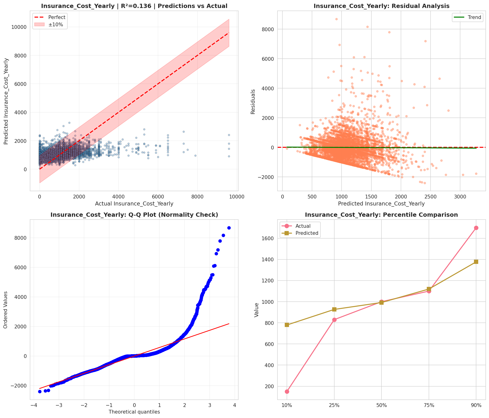
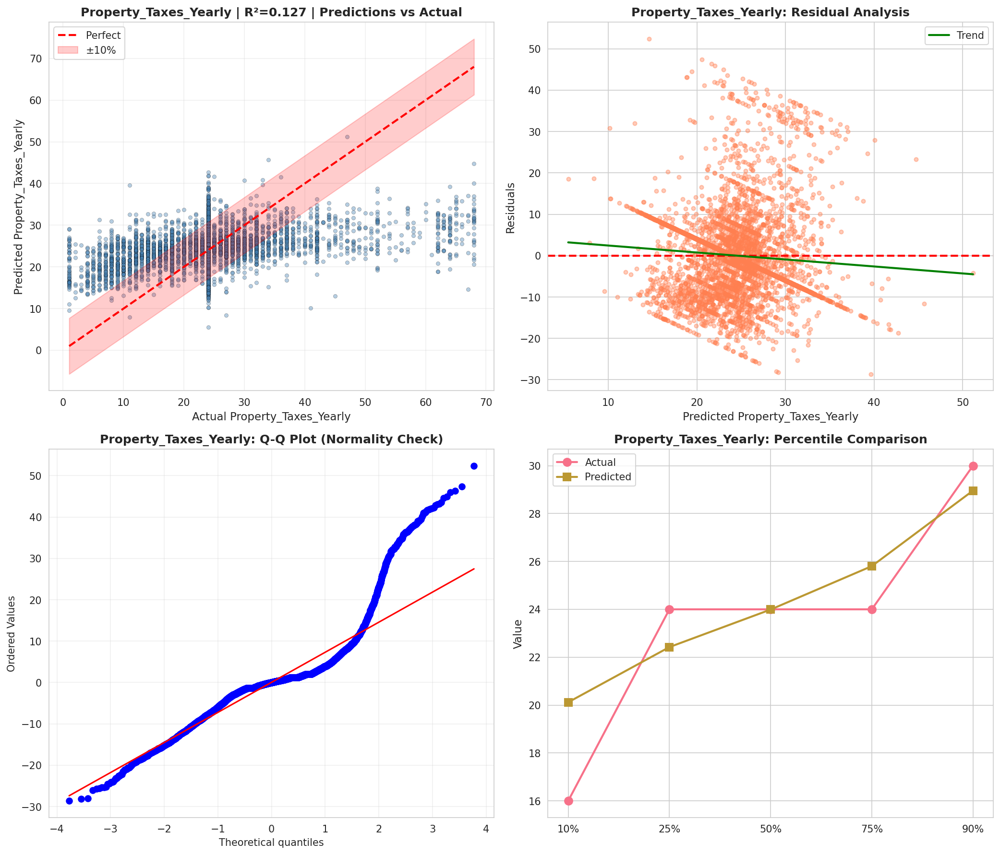
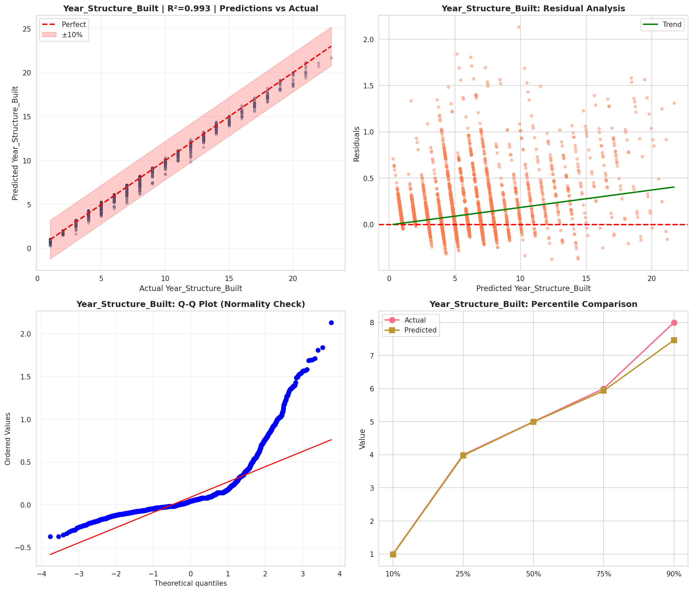
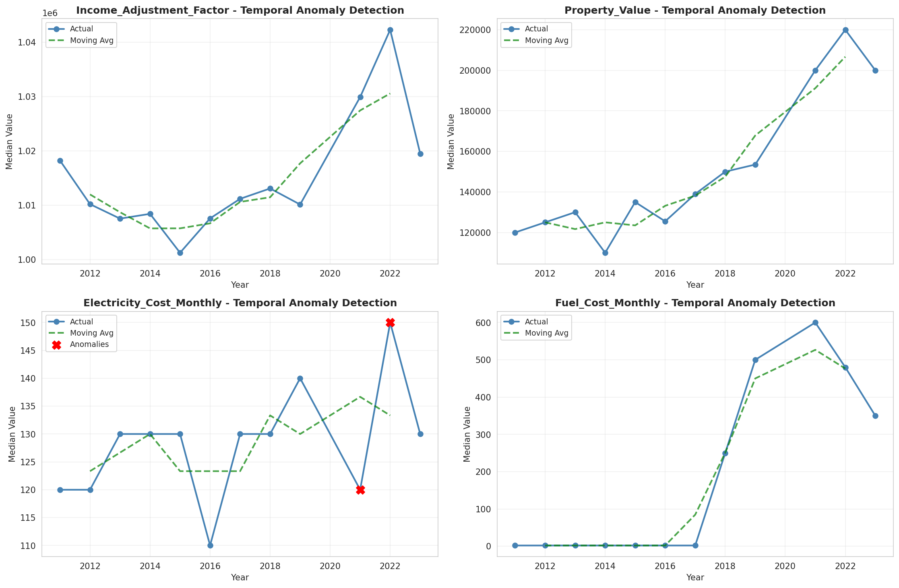
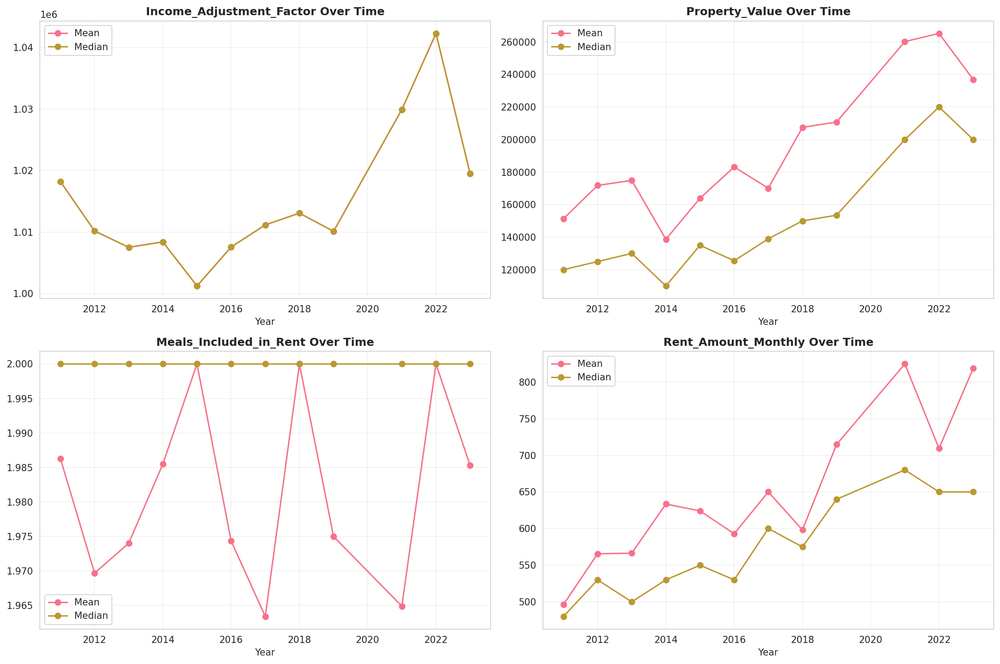
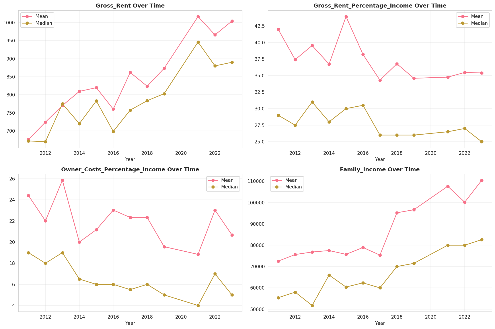
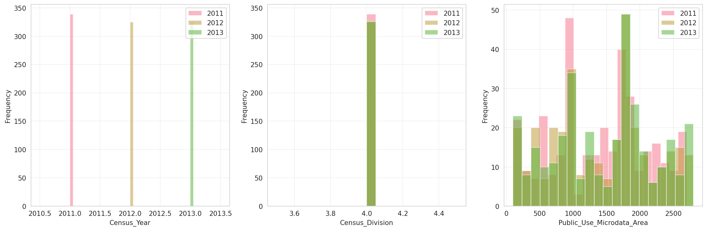
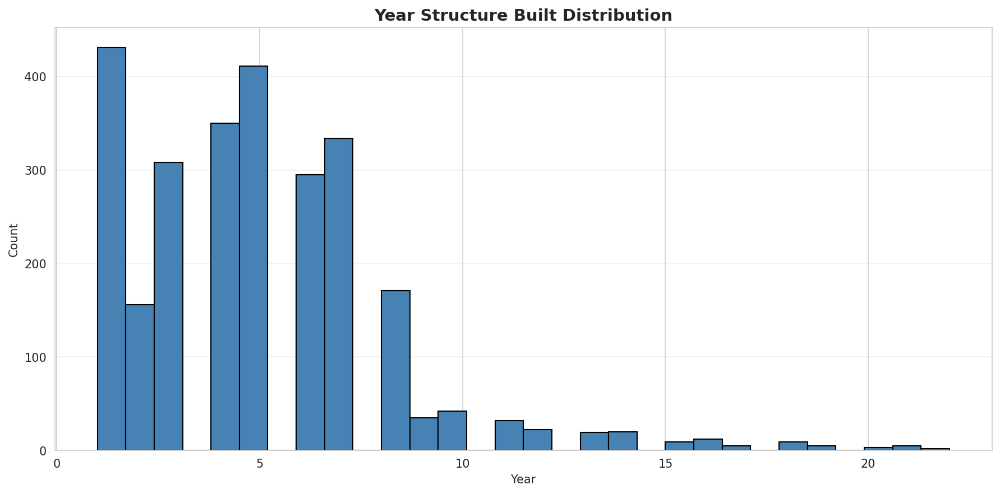
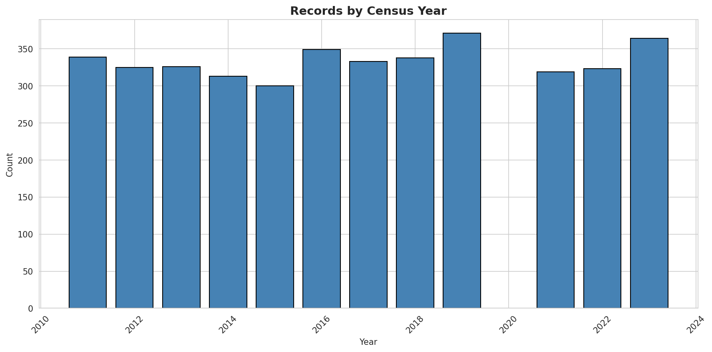
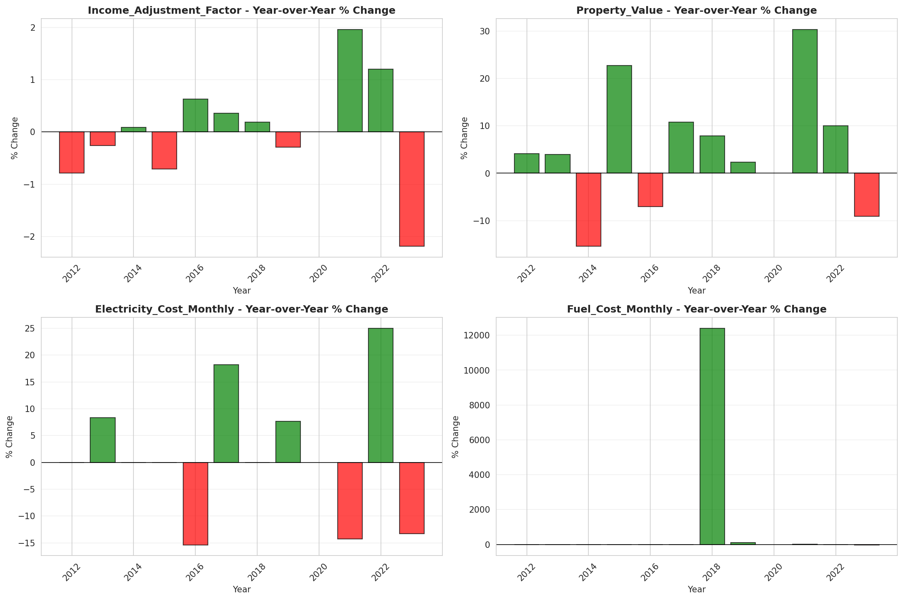

# Temporal Analysis

## Year Distribution

- 2011: 31,041 records

- 2012: 30,668 records

- 2013: 30,531 records

- 2014: 30,689 records

- 2015: 30,746 records

- 2016: 30,983 records

- 2017: 31,277 records

- 2018: 31,472 records

- 2019: 31,663 records

- 2021: 31,224 records

- 2022: 32,126 records

- 2023: 31,957 records

## Temporal Trends

- Census_Year: {np.int64(2011): {'mean': 2011.0, 'median': 2011.0, 'std': 0.0}, np.int64(2012): {'mean': 2012.0, 'median': 2012.0, 'std': 0.0}, np.int64(2013): {'mean': 2013.0, 'median': 2013.0, 'std': 0.0}, np.int64(2014): {'mean': 2014.0, 'median': 2014.0, 'std': 0.0}, np.int64(2015): {'mean': 2015.0, 'median': 2015.0, 'std': 0.0}, np.int64(2016): {'mean': 2016.0, 'median': 2016.0, 'std': 0.0}, np.int64(2017): {'mean': 2017.0, 'median': 2017.0, 'std': 0.0}, np.int64(2018): {'mean': 2018.0, 'median': 2018.0, 'std': 0.0}, np.int64(2019): {'mean': 2019.0, 'median': 2019.0, 'std': 0.0}, np.int64(2021): {'mean': 2021.0, 'median': 2021.0, 'std': 0.0}, np.int64(2022): {'mean': 2022.0, 'median': 2022.0, 'std': 0.0}, np.int64(2023): {'mean': 2023.0, 'median': 2023.0, 'std': 0.0}}

- Census_Division: {np.int64(2011): {'mean': 4.0, 'median': 4.0, 'std': 0.0}, np.int64(2012): {'mean': 4.0, 'median': 4.0, 'std': 0.0}, np.int64(2013): {'mean': 4.0, 'median': 4.0, 'std': 0.0}, np.int64(2014): {'mean': 4.0, 'median': 4.0, 'std': 0.0}, np.int64(2015): {'mean': 4.0, 'median': 4.0, 'std': 0.0}, np.int64(2016): {'mean': 4.0, 'median': 4.0, 'std': 0.0}, np.int64(2017): {'mean': 4.0, 'median': 4.0, 'std': 0.0}, np.int64(2018): {'mean': 4.0, 'median': 4.0, 'std': 0.0}, np.int64(2019): {'mean': 4.0, 'median': 4.0, 'std': 0.0}, np.int64(2021): {'mean': 4.0, 'median': 4.0, 'std': 0.0}, np.int64(2022): {'mean': 4.0, 'median': 4.0, 'std': 0.0}, np.int64(2023): {'mean': 4.0, 'median': 4.0, 'std': 0.0}}

- Public_Use_Microdata_Area: {np.int64(2011): {'mean': 1383.6008827035212, 'median': 1400.0, 'std': 724.7287019576576}, np.int64(2012): {'mean': 1449.1371788183123, 'median': 1500.0, 'std': 773.2701629873839}, np.int64(2013): {'mean': 1452.1126723657922, 'median': 1500.0, 'std': 772.7889015472706}, np.int64(2014): {'mean': 1445.7874482713676, 'median': 1500.0, 'std': 773.5419829870863}, np.int64(2015): {'mean': 1452.2336889351461, 'median': 1500.0, 'std': 769.1862280604058}, np.int64(2016): {'mean': 1449.4535067617726, 'median': 1600.0, 'std': 768.8530465928229}, np.int64(2017): {'mean': 1450.1705726252517, 'median': 1500.0, 'std': 770.6666719332326}, np.int64(2018): {'mean': 1439.0119153533299, 'median': 1500.0, 'std': 774.268800533781}, np.int64(2019): {'mean': 1442.8658055143228, 'median': 1500.0, 'std': 772.6518011280137}, np.int64(2021): {'mean': 1440.7782154752754, 'median': 1500.0, 'std': 770.4913607809966}, np.int64(2022): {'mean': 1526.8885015252442, 'median': 1600.0, 'std': 807.1826135770598}, np.int64(2023): {'mean': 1532.472948023907, 'median': 1600.0, 'std': 809.2727962894247}}

- Census_Region: {np.int64(2011): {'mean': 2.0, 'median': 2.0, 'std': 0.0}, np.int64(2012): {'mean': 2.0, 'median': 2.0, 'std': 0.0}, np.int64(2013): {'mean': 2.0, 'median': 2.0, 'std': 0.0}, np.int64(2014): {'mean': 2.0, 'median': 2.0, 'std': 0.0}, np.int64(2015): {'mean': 2.0, 'median': 2.0, 'std': 0.0}, np.int64(2016): {'mean': 2.0, 'median': 2.0, 'std': 0.0}, np.int64(2017): {'mean': 2.0, 'median': 2.0, 'std': 0.0}, np.int64(2018): {'mean': 2.0, 'median': 2.0, 'std': 0.0}, np.int64(2019): {'mean': 2.0, 'median': 2.0, 'std': 0.0}, np.int64(2021): {'mean': 2.0, 'median': 2.0, 'std': 0.0}, np.int64(2022): {'mean': 2.0, 'median': 2.0, 'std': 0.0}, np.int64(2023): {'mean': 2.0, 'median': 2.0, 'std': 0.0}}

- State_Code: {np.int64(2011): {'mean': 29.0, 'median': 29.0, 'std': 0.0}, np.int64(2012): {'mean': 29.0, 'median': 29.0, 'std': 0.0}, np.int64(2013): {'mean': 29.0, 'median': 29.0, 'std': 0.0}, np.int64(2014): {'mean': 29.0, 'median': 29.0, 'std': 0.0}, np.int64(2015): {'mean': 29.0, 'median': 29.0, 'std': 0.0}, np.int64(2016): {'mean': 29.0, 'median': 29.0, 'std': 0.0}, np.int64(2017): {'mean': 29.0, 'median': 29.0, 'std': 0.0}, np.int64(2018): {'mean': 29.0, 'median': 29.0, 'std': 0.0}, np.int64(2019): {'mean': 29.0, 'median': 29.0, 'std': 0.0}, np.int64(2021): {'mean': 29.0, 'median': 29.0, 'std': 0.0}, np.int64(2022): {'mean': 29.0, 'median': 29.0, 'std': 0.0}, np.int64(2023): {'mean': None, 'median': None, 'std': None}}

- Housing_Adjustment_Factor: {np.int64(2011): {'mean': 1000000.0, 'median': 1000000.0, 'std': 0.0}, np.int64(2012): {'mean': 1000000.0, 'median': 1000000.0, 'std': 0.0}, np.int64(2013): {'mean': 1000000.0, 'median': 1000000.0, 'std': 0.0}, np.int64(2014): {'mean': 1000000.0, 'median': 1000000.0, 'std': 0.0}, np.int64(2015): {'mean': 1000000.0, 'median': 1000000.0, 'std': 0.0}, np.int64(2016): {'mean': 1000000.0, 'median': 1000000.0, 'std': 0.0}, np.int64(2017): {'mean': 1000000.0, 'median': 1000000.0, 'std': 0.0}, np.int64(2018): {'mean': 1000000.0, 'median': 1000000.0, 'std': 0.0}, np.int64(2019): {'mean': 1000000.0, 'median': 1000000.0, 'std': 0.0}, np.int64(2021): {'mean': 1000000.0, 'median': 1000000.0, 'std': 0.0}, np.int64(2022): {'mean': 1000000.0, 'median': 1000000.0, 'std': 0.0}, np.int64(2023): {'mean': 1000000.0, 'median': 1000000.0, 'std': 0.0}}

- Income_Adjustment_Factor: {np.int64(2011): {'mean': 1018237.0, 'median': 1018237.0, 'std': 0.0}, np.int64(2012): {'mean': 1010207.0, 'median': 1010207.0, 'std': 0.0}, np.int64(2013): {'mean': 1007549.0, 'median': 1007549.0, 'std': 0.0}, np.int64(2014): {'mean': 1008425.0, 'median': 1008425.0, 'std': 0.0}, np.int64(2015): {'mean': 1001264.0, 'median': 1001264.0, 'std': 0.0}, np.int64(2016): {'mean': 1007588.0, 'median': 1007588.0, 'std': 0.0}, np.int64(2017): {'mean': 1011189.0, 'median': 1011189.0, 'std': 0.0}, np.int64(2018): {'mean': 1013097.0, 'median': 1013097.0, 'std': 0.0}, np.int64(2019): {'mean': 1010145.0, 'median': 1010145.0, 'std': 0.0}, np.int64(2021): {'mean': 1029928.0, 'median': 1029928.0, 'std': 0.0}, np.int64(2022): {'mean': 1042311.0, 'median': 1042311.0, 'std': 0.0}, np.int64(2023): {'mean': 1019518.0, 'median': 1019518.0, 'std': 0.0}}

- Housing_Unit_Weight: {np.int64(2011): {'mean': 87.73715408653072, 'median': 67.0, 'std': 92.30631931967837}, np.int64(2012): {'mean': 88.69463284205034, 'median': 72.0, 'std': 86.5666876584479}, np.int64(2013): {'mean': 89.06059415020799, 'median': 72.0, 'std': 86.42048385369108}, np.int64(2014): {'mean': 89.1460458144612, 'median': 73.0, 'std': 85.59745698496016}, np.int64(2015): {'mean': 89.33337669940805, 'median': 73.0, 'std': 85.4434005143555}, np.int64(2016): {'mean': 89.08840331794855, 'median': 72.0, 'std': 85.5901371601208}, np.int64(2017): {'mean': 89.28110112862487, 'median': 72.0, 'std': 85.1033644289693}, np.int64(2018): {'mean': 89.16802236908998, 'median': 71.0, 'std': 87.20630105512332}, np.int64(2019): {'mean': 89.04191011590815, 'median': 69.0, 'std': 92.67081744038107}, np.int64(2021): {'mean': 89.91903663848322, 'median': 69.0, 'std': 89.07179369552036}, np.int64(2022): {'mean': 87.97531594347258, 'median': 70.0, 'std': 91.76688303840885}, np.int64(2023): {'mean': 89.00835497700034, 'median': 69.0, 'std': 94.33155228476453}}

- Number_of_Persons: {np.int64(2011): {'mean': 2.0009020327953353, 'median': 2.0, 'std': 1.415055902404282}, np.int64(2012): {'mean': 2.0098800052171644, 'median': 2.0, 'std': 1.412829503652811}, np.int64(2013): {'mean': 2.0208640398283713, 'median': 2.0, 'std': 1.42157939143485}, np.int64(2014): {'mean': 2.000521359444752, 'median': 2.0, 'std': 1.4252992073123554}, np.int64(2015): {'mean': 2.003057308267742, 'median': 2.0, 'std': 1.4310602389423182}, np.int64(2016): {'mean': 1.9986121421424652, 'median': 2.0, 'std': 1.4376071200287734}, np.int64(2017): {'mean': 1.9846212872078524, 'median': 2.0, 'std': 1.440129766617273}, np.int64(2018): {'mean': 1.9832231825114388, 'median': 2.0, 'std': 1.423274644167906}, np.int64(2019): {'mean': 1.9951994441461642, 'median': 2.0, 'std': 1.4197777131764715}, np.int64(2021): {'mean': 1.993786830643095, 'median': 2.0, 'std': 1.4136562761288765}, np.int64(2022): {'mean': 2.0093071032808316, 'median': 2.0, 'std': 1.4154260435853707}, np.int64(2023): {'mean': 2.020777920330444, 'median': 2.0, 'std': 1.4008094000413156}}

- Housing_Unit_Type: {np.int64(2011): {'mean': 1.1784414161914887, 'median': 1.0, 'std': 0.5081999323629594}, np.int64(2012): {'mean': 1.161992956827964, 'median': 1.0, 'std': 0.48330186119014507}, np.int64(2013): {'mean': 1.1576758049195899, 'median': 1.0, 'std': 0.47893554436272145}, np.int64(2014): {'mean': 1.1576786470722409, 'median': 1.0, 'std': 0.4807284857869071}, np.int64(2015): {'mean': 1.1559227216548493, 'median': 1.0, 'std': 0.4796901773042705}, np.int64(2016): {'mean': 1.1607655811251332, 'median': 1.0, 'std': 0.48800162813778136}, np.int64(2017): {'mean': 1.1576877577772804, 'median': 1.0, 'std': 0.4836594468233008}, np.int64(2018): {'mean': 1.1568378240976105, 'median': 1.0, 'std': 0.4789041600410199}, np.int64(2019): {'mean': 1.1591763256798155, 'median': 1.0, 'std': 0.48278269126409074}, np.int64(2021): {'mean': None, 'median': None, 'std': None}, np.int64(2022): {'mean': None, 'median': None, 'std': None}, np.int64(2023): {'mean': None, 'median': None, 'std': None}}

- Number_of_Bedrooms: {np.int64(2011): {'mean': 2.7603084266568754, 'median': 3.0, 'std': 1.0860274330186166}, np.int64(2012): {'mean': 2.777169117647059, 'median': 3.0, 'std': 1.1068245364590756}, np.int64(2013): {'mean': 2.783347431135302, 'median': 3.0, 'std': 1.067296111654521}, np.int64(2014): {'mean': 2.787118941443088, 'median': 3.0, 'std': 1.0645054213317184}, np.int64(2015): {'mean': 2.787264253986747, 'median': 3.0, 'std': 1.0371575559962514}, np.int64(2016): {'mean': 2.7817470381507916, 'median': 3.0, 'std': 1.0276828473335744}, np.int64(2017): {'mean': 2.7829621141588485, 'median': 3.0, 'std': 1.0257479027679417}, np.int64(2018): {'mean': 2.7802166476624857, 'median': 3.0, 'std': 1.025498528715621}, np.int64(2019): {'mean': 2.7893168759310494, 'median': 3.0, 'std': 1.0395734810435135}, np.int64(2021): {'mean': 2.8031484845247, 'median': 3.0, 'std': 1.0476433990731795}, np.int64(2022): {'mean': 2.826611476685771, 'median': 3.0, 'std': 1.0744647686569266}, np.int64(2023): {'mean': 2.8254816481507525, 'median': 3.0, 'std': 1.0624372999183522}}

- Number_of_Rooms: {np.int64(2011): {'mean': 5.986084082981458, 'median': 6.0, 'std': 2.234702354264597}, np.int64(2012): {'mean': 6.033382352941176, 'median': 6.0, 'std': 2.283725222219981}, np.int64(2013): {'mean': 6.078518627487036, 'median': 6.0, 'std': 2.346198499107958}, np.int64(2014): {'mean': 6.097229329629359, 'median': 6.0, 'std': 2.3257363571087697}, np.int64(2015): {'mean': 6.105111774557635, 'median': 6.0, 'std': 2.3090505905627046}, np.int64(2016): {'mean': 6.10637295750154, 'median': 6.0, 'std': 2.3363362327877435}, np.int64(2017): {'mean': 6.122752990045119, 'median': 6.0, 'std': 2.3563715999992225}, np.int64(2018): {'mean': 6.131342645381984, 'median': 6.0, 'std': 2.345248684281546}, np.int64(2019): {'mean': 6.168865716109811, 'median': 6.0, 'std': 2.3919566794009945}, np.int64(2021): {'mean': 6.2295473163087225, 'median': 6.0, 'std': 2.454410995773307}, np.int64(2022): {'mean': 6.23349607302059, 'median': 6.0, 'std': 2.4507815691316592}, np.int64(2023): {'mean': 6.225741808465758, 'median': 6.0, 'std': 2.435927974898674}}

- Building_Type: {np.int64(2011): {'mean': 2.580062419680558, 'median': 2.0, 'std': 1.6587183671875254}, np.int64(2012): {'mean': 2.575, 'median': 2.0, 'std': 1.6521568970859621}, np.int64(2013): {'mean': 2.5820308190209995, 'median': 2.0, 'std': 1.6612182887714186}, np.int64(2014): {'mean': 2.581840777834637, 'median': 2.0, 'std': 1.6579211844181005}, np.int64(2015): {'mean': 2.594516857205272, 'median': 2.0, 'std': 1.6677309644449898}, np.int64(2016): {'mean': 2.600884025941089, 'median': 2.0, 'std': 1.6788036892875446}, np.int64(2017): {'mean': 2.6228604168158705, 'median': 2.0, 'std': 1.7021968627952928}, np.int64(2018): {'mean': 2.6057582668187003, 'median': 2.0, 'std': 1.6865529979828304}, np.int64(2019): {'mean': 2.6058735901255585, 'median': 2.0, 'std': 1.7048825764526734}, np.int64(2021): {'mean': 2.6245681518680772, 'median': 2.0, 'std': 1.7139377864284682}, np.int64(2022): {'mean': 2.617561734946579, 'median': 2.0, 'std': 1.7076620741787913}, np.int64(2023): {'mean': 2.6121853466460414, 'median': 2.0, 'std': 1.7094534237411985}}

- Year_Structure_Built: {np.int64(2011): {'mean': 4.759353772718928, 'median': 5.0, 'std': 2.688572209702143}, np.int64(2012): {'mean': 4.842867647058823, 'median': 5.0, 'std': 2.7470436152300617}, np.int64(2013): {'mean': 4.89720863521018, 'median': 5.0, 'std': 2.8095074370459012}, np.int64(2014): {'mean': 4.943161049784341, 'median': 5.0, 'std': 2.905164886599129}, np.int64(2015): {'mean': 5.086616180004369, 'median': 5.0, 'std': 3.1016338494796116}, np.int64(2016): {'mean': 5.218941342704975, 'median': 5.0, 'std': 3.3520377615066352}, np.int64(2017): {'mean': 5.298359951299864, 'median': 5.0, 'std': 3.544979250024919}, np.int64(2018): {'mean': 5.374322976054732, 'median': 5.0, 'std': 3.7262580913634658}, np.int64(2019): {'mean': 5.52755905511811, 'median': 5.0, 'std': 4.00042156565364}, np.int64(2021): {'mean': None, 'median': None, 'std': None}, np.int64(2022): {'mean': None, 'median': None, 'std': None}, np.int64(2023): {'mean': None, 'median': None, 'std': None}}

- Bathtub_or_Shower: {np.int64(2011): {'mean': 1.0161556820268038, 'median': 1.0, 'std': 0.12607640381370944}, np.int64(2012): {'mean': 1.0133823529411765, 'median': 1.0, 'std': 0.11490757591628335}, np.int64(2013): {'mean': 1.0113272774079658, 'median': 1.0, 'std': 0.10582713297051984}, np.int64(2014): {'mean': 1.014913370860443, 'median': 1.0, 'std': 0.12120849491383998}, np.int64(2015): {'mean': 1.0144542343260758, 'median': 1.0, 'std': 0.1193558884492184}, np.int64(2016): {'mean': 1.0150719176841418, 'median': 1.0, 'std': 0.12184126080645102}, np.int64(2017): {'mean': 1.017403136861706, 'median': 1.0, 'std': 0.13077033323038428}, np.int64(2018): {'mean': 1.0140749714937287, 'median': 1.0, 'std': 0.1178022120376295}, np.int64(2019): {'mean': 1.0118819607008582, 'median': 1.0, 'std': 0.10835680021964486}, np.int64(2021): {'mean': 1.0147095487409623, 'median': 1.0, 'std': 0.12038975923702502}, np.int64(2022): {'mean': 1.0112502653364466, 'median': 1.0, 'std': 0.10547080362129875}, np.int64(2023): {'mean': 1.010371255800872, 'median': 1.0, 'std': 0.10131166618539578}}

- Refrigerator: {np.int64(2011): {'mean': 1.027721681659629, 'median': 1.0, 'std': 0.16417728135946116}, np.int64(2012): {'mean': 1.0242647058823529, 'median': 1.0, 'std': 0.15387267594150308}, np.int64(2013): {'mean': 1.0218454635725056, 'median': 1.0, 'std': 0.14618148028997852}, np.int64(2014): {'mean': 1.0243438847868995, 'median': 1.0, 'std': 0.15411725489765596}, np.int64(2015): {'mean': 1.0250855603291342, 'median': 1.0, 'std': 0.15638786859760373}, np.int64(2016): {'mean': 1.0294554545125176, 'median': 1.0, 'std': 0.16908242517466587}, np.int64(2017): {'mean': 1.0288261834849244, 'median': 1.0, 'std': 0.16732076125135964}, np.int64(2018): {'mean': 1.0287913340935007, 'median': 1.0, 'std': 0.16722257499985546}, np.int64(2019): {'mean': 1.0244378236504221, 'median': 1.0, 'std': 0.15440680699855483}, np.int64(2021): {'mean': 1.029276632118816, 'median': 1.0, 'std': 0.16858387575813344}, np.int64(2022): {'mean': 1.0204839736786244, 'median': 1.0, 'std': 0.1416512985030326}, np.int64(2023): {'mean': 1.0177541836591197, 'median': 1.0, 'std': 0.1320590237043044}}

- Hot_and_Cold_Running_Water: {np.int64(2011): {'mean': 1.026069395997797, 'median': 1.0, 'std': 0.15934464180713168}, np.int64(2012): {'mean': 1.0225, 'median': 1.0, 'std': 0.14830562573105205}, np.int64(2013): {'mean': 1.0204111654591592, 'median': 1.0, 'std': 0.1414046857351428}, np.int64(2014): {'mean': 1.024636303823379, 'median': 1.0, 'std': 0.15501688527241667}, np.int64(2015): {'mean': 1.0244666132673124, 'median': 1.0, 'std': 0.15449552464646363}, np.int64(2016): {'mean': 1.0279337705155611, 'median': 1.0, 'std': 0.16478610014774459}, np.int64(2017): {'mean': 1.0295065530330159, 'median': 1.0, 'std': 0.1692245307843605}, np.int64(2018): {'mean': 1.0282212086659066, 'median': 1.0, 'std': 0.16560721392698227}, np.int64(2019): {'mean': 1.0240831382563667, 'median': 1.0, 'std': 0.15331005955165497}, np.int64(2021): {'mean': 1.0288848523702674, 'median': 1.0, 'std': 0.1674858703479075}, np.int64(2022): {'mean': 1.0223590179013655, 'median': 1.0, 'std': 0.14785082205518174}, np.int64(2023): {'mean': 1.0188440444381943, 'median': 1.0, 'std': 0.1359764555444744}}

- Running_Water: {np.int64(2011): {'mean': None, 'median': None, 'std': None}, np.int64(2012): {'mean': None, 'median': None, 'std': None}, np.int64(2013): {'mean': 9.0, 'median': 9.0, 'std': 0.0}, np.int64(2014): {'mean': 9.0, 'median': 9.0, 'std': 0.0}, np.int64(2015): {'mean': 9.0, 'median': 9.0, 'std': 0.0}, np.int64(2016): {'mean': 9.0, 'median': 9.0, 'std': 0.0}, np.int64(2017): {'mean': 9.0, 'median': 9.0, 'std': 0.0}, np.int64(2018): {'mean': 9.0, 'median': 9.0, 'std': 0.0}, np.int64(2019): {'mean': 9.0, 'median': 9.0, 'std': 0.0}, np.int64(2021): {'mean': 9.0, 'median': 9.0, 'std': 0.0}, np.int64(2022): {'mean': 9.0, 'median': 9.0, 'std': 0.0}, np.int64(2023): {'mean': 9.0, 'median': 9.0, 'std': 0.0}}

- Sink_with_Faucet: {np.int64(2011): {'mean': 1.0153846153846153, 'median': 1.0, 'std': 0.12307918267509642}, np.int64(2012): {'mean': 1.0133088235294119, 'median': 1.0, 'std': 0.11459573092601179}, np.int64(2013): {'mean': 1.0108859549115516, 'median': 1.0, 'std': 0.10376823649350352}, np.int64(2014): {'mean': 1.0134878280576065, 'median': 1.0, 'std': 0.11535333949314176}, np.int64(2015): {'mean': 1.014199373771208, 'median': 1.0, 'std': 0.11831424771986039}, np.int64(2016): {'mean': 1.0148183036846492, 'median': 1.0, 'std': 0.12082735824202062}, np.int64(2017): {'mean': 1.016651149466447, 'median': 1.0, 'std': 0.1279627877166583}, np.int64(2018): {'mean': 1.0133979475484607, 'median': 1.0, 'std': 0.1149735342475455}, np.int64(2019): {'mean': 1.0109243101369085, 'median': 1.0, 'std': 0.10394879910332788}, np.int64(2021): {'mean': 1.014104070947751, 'median': 1.0, 'std': 0.11792218365733592}, np.int64(2022): {'mean': 1.0104365669001627, 'median': 1.0, 'std': 0.1016268190875009}, np.int64(2023): {'mean': 1.0104064126001968, 'median': 1.0, 'std': 0.101481432974853}}

- Stove_or_Range: {np.int64(2011): {'mean': 1.026913897558289, 'median': 1.0, 'std': 0.1618347963979732}, np.int64(2012): {'mean': 1.024485294117647, 'median': 1.0, 'std': 0.15455304162329483}, np.int64(2013): {'mean': 1.0222132323195174, 'median': 1.0, 'std': 0.1473791146850465}, np.int64(2014): {'mean': 1.0248556181007384, 'median': 1.0, 'std': 0.15568783617166831}, np.int64(2015): {'mean': 1.0256316900895652, 'median': 1.0, 'std': 0.1580367548426388}, np.int64(2016): {'mean': 1.0288033042281077, 'median': 1.0, 'std': 0.1672563524430683}, np.int64(2017): {'mean': 1.0285755210198382, 'median': 1.0, 'std': 0.16661318877081394}, np.int64(2018): {'mean': 1.0292189281641961, 'median': 1.0, 'std': 0.16842266227895894}, np.int64(2019): {'mean': 1.0246151663474499, 'median': 1.0, 'std': 0.1549519652560898}, np.int64(2021): {'mean': 1.0311286818392278, 'median': 1.0, 'std': 0.17366853837736407}, np.int64(2022): {'mean': 1.021403806693554, 'median': 1.0, 'std': 0.1447287974082416}, np.int64(2023): {'mean': 1.019863591618619, 'median': 1.0, 'std': 0.13953391644847535}}

- Telephone_Service: {np.int64(2011): {'mean': 1.0284595511060874, 'median': 1.0, 'std': 0.16628506025978795}, np.int64(2012): {'mean': 1.0310496390983508, 'median': 1.0, 'std': 0.17345538975607894}, np.int64(2013): {'mean': 1.0258012497480347, 'median': 1.0, 'std': 0.1585451311963851}, np.int64(2014): {'mean': 1.0299555914412597, 'median': 1.0, 'std': 0.17046825849088845}, np.int64(2015): {'mean': 1.0290361445783132, 'median': 1.0, 'std': 0.16791122411171103}, np.int64(2016): {'mean': 1.0347896114354742, 'median': 1.0, 'std': 0.18325022925413734}, np.int64(2017): {'mean': 1.0184237870673807, 'median': 1.0, 'std': 0.13448075663230702}, np.int64(2018): {'mean': 1.0165054294175715, 'median': 1.0, 'std': 0.1274113073074755}, np.int64(2019): {'mean': 1.0113256013076983, 'median': 1.0, 'std': 0.10581950611903122}, np.int64(2021): {'mean': 1.0095567703622135, 'median': 1.0, 'std': 0.09729239834873343}, np.int64(2022): {'mean': 1.0100317800666232, 'median': 1.0, 'std': 0.09965703048848527}, np.int64(2023): {'mean': 1.0103038309114927, 'median': 1.0, 'std': 0.10098537955873357}}

- Lot_Acreage: {np.int64(2011): {'mean': 1.4205081591135351, 'median': 1.0, 'std': 0.6930952744017049}, np.int64(2012): {'mean': 1.4202208270188352, 'median': 1.0, 'std': 0.6944944534311538}, np.int64(2013): {'mean': 1.418573409603051, 'median': 1.0, 'std': 0.6900625511127867}, np.int64(2014): {'mean': 1.4258558403578188, 'median': 1.0, 'std': 0.6959387915854015}, np.int64(2015): {'mean': 1.4225770356343606, 'median': 1.0, 'std': 0.6926623967820904}, np.int64(2016): {'mean': 1.403342618384401, 'median': 1.0, 'std': 0.6794356330465867}, np.int64(2017): {'mean': 1.403869870295556, 'median': 1.0, 'std': 0.6785780278702477}, np.int64(2018): {'mean': 1.407813224324666, 'median': 1.0, 'std': 0.6818185809918932}, np.int64(2019): {'mean': 1.4061768639251087, 'median': 1.0, 'std': 0.6788165211718129}, np.int64(2021): {'mean': 1.4018935409215232, 'median': 1.0, 'std': 0.6762158808145944}, np.int64(2022): {'mean': 1.4244297769237195, 'median': 1.0, 'std': 0.6881626576310057}, np.int64(2023): {'mean': 1.42477363873155, 'median': 1.0, 'std': 0.6837070808106486}}

- Agricultural_Sales: {np.int64(2011): {'mean': 1.5222959419842617, 'median': 1.0, 'std': 1.3795814938622841}, np.int64(2012): {'mean': 1.5492477121141617, 'median': 1.0, 'std': 1.4290606612290844}, np.int64(2013): {'mean': 1.476966030711959, 'median': 1.0, 'std': 1.3275482439398227}, np.int64(2014): {'mean': 1.5240982115792665, 'median': 1.0, 'std': 1.396723486975539}, np.int64(2015): {'mean': 1.5228000610035077, 'median': 1.0, 'std': 1.3982601294827197}, np.int64(2016): {'mean': 1.434179033030158, 'median': 1.0, 'std': 1.2680612717626443}, np.int64(2017): {'mean': 1.4665295141636334, 'median': 1.0, 'std': 1.3212097797436086}, np.int64(2018): {'mean': 1.4759481961147085, 'median': 1.0, 'std': 1.3406489825689687}, np.int64(2019): {'mean': 1.4788604333989999, 'median': 1.0, 'std': 1.334641227745835}, np.int64(2021): {'mean': 1.4680950163018165, 'median': 1.0, 'std': 1.3206255297124418}, np.int64(2022): {'mean': 1.4603492699685083, 'median': 1.0, 'std': 1.3011484794081654}, np.int64(2023): {'mean': 1.4493379790940766, 'median': 1.0, 'std': 1.2972776257521776}}

- Tenure: {np.int64(2011): {'mean': 1.85342321976425, 'median': 2.0, 'std': 0.8719376756860119}, np.int64(2012): {'mean': 1.8619299165288923, 'median': 2.0, 'std': 0.8686000268834622}, np.int64(2013): {'mean': 1.8679298528522474, 'median': 2.0, 'std': 0.8682649240339518}, np.int64(2014): {'mean': 1.871336293903916, 'median': 2.0, 'std': 0.8658435427496627}, np.int64(2015): {'mean': 1.881004016064257, 'median': 2.0, 'std': 0.8676045505382274}, np.int64(2016): {'mean': 1.8784376887457217, 'median': 2.0, 'std': 0.8659441092723492}, np.int64(2017): {'mean': 1.8715929981616177, 'median': 2.0, 'std': 0.8639618804170943}, np.int64(2018): {'mean': 1.8773938795656466, 'median': 2.0, 'std': 0.858038908835051}, np.int64(2019): {'mean': 1.8695804467969175, 'median': 2.0, 'std': 0.8522126829045089}, np.int64(2021): {'mean': 1.8559405356510796, 'median': 2.0, 'std': 0.845895745520789}, np.int64(2022): {'mean': 1.8666768771298388, 'median': 2.0, 'std': 0.8478114339460894}, np.int64(2023): {'mean': 1.8662389130024533, 'median': 2.0, 'std': 0.8393658414333441}}

- Vacancy_Status: {np.int64(2011): {'mean': 5.118960617133577, 'median': 5.0, 'std': 2.136311775301439}, np.int64(2012): {'mean': 5.241149521032903, 'median': 5.0, 'std': 2.0725763382927083}, np.int64(2013): {'mean': 5.161357921207041, 'median': 5.0, 'std': 2.0842704509035186}, np.int64(2014): {'mean': 5.151854714064915, 'median': 5.0, 'std': 2.1079598713541623}, np.int64(2015): {'mean': 5.215510522213562, 'median': 5.0, 'std': 2.0485170484865205}, np.int64(2016): {'mean': 5.273318872017353, 'median': 5.0, 'std': 2.0598083561161245}, np.int64(2017): {'mean': 5.381887052341598, 'median': 7.0, 'std': 2.020518862137628}, np.int64(2018): {'mean': 5.314713399050748, 'median': 7.0, 'std': 2.050024234211392}, np.int64(2019): {'mean': 5.4488, 'median': 7.0, 'std': 1.9630894141681896}, np.int64(2021): {'mean': 5.584528301886793, 'median': 7.0, 'std': 1.8938980975536825}, np.int64(2022): {'mean': 5.3271288971614705, 'median': 5.0, 'std': 1.992657423095416}, np.int64(2023): {'mean': 5.368394048229861, 'median': 5.0, 'std': 1.9960810003721547}}

- Property_Value: {np.int64(2011): {'mean': 153419.0698431649, 'median': 120000.0, 'std': 162105.50863100603}, np.int64(2012): {'mean': 155753.26619488295, 'median': 120000.0, 'std': 168118.47623881974}, np.int64(2013): {'mean': 156857.28847725416, 'median': 120000.0, 'std': 179744.6532090398}, np.int64(2014): {'mean': 161225.55579773322, 'median': 124000.0, 'std': 185253.09632949112}, np.int64(2015): {'mean': 174418.7605787606, 'median': 130000.0, 'std': 194533.358307715}, np.int64(2016): {'mean': 184902.74872693425, 'median': 135000.0, 'std': 248726.14282263667}, np.int64(2017): {'mean': 186085.04338394795, 'median': 140000.0, 'std': 215360.82776250158}, np.int64(2018): {'mean': 195689.0293789513, 'median': 150000.0, 'std': 231342.90758904253}, np.int64(2019): {'mean': 202854.1001507982, 'median': 150000.0, 'std': 232354.32342180164}, np.int64(2021): {'mean': 234001.748434238, 'median': 178000.0, 'std': 277055.8333695273}, np.int64(2022): {'mean': 255516.748216106, 'median': 200000.0, 'std': 289272.3343353493}, np.int64(2023): {'mean': 263214.1632612379, 'median': 200000.0, 'std': 268845.6525477676}}

- Vehicles_Available: {np.int64(2011): {'mean': 1.8398595188115614, 'median': 2.0, 'std': 1.066966169281659}, np.int64(2012): {'mean': 1.8501552481954917, 'median': 2.0, 'std': 1.074324342204527}, np.int64(2013): {'mean': 1.8694618020560372, 'median': 2.0, 'std': 1.066475349373596}, np.int64(2014): {'mean': 1.8712959224868793, 'median': 2.0, 'std': 1.0654940737779528}, np.int64(2015): {'mean': 1.884578313253012, 'median': 2.0, 'std': 1.0911743192208418}, np.int64(2016): {'mean': 1.903805113750755, 'median': 2.0, 'std': 1.0924707805005598}, np.int64(2017): {'mean': 1.92039005675006, 'median': 2.0, 'std': 1.0930019080761735}, np.int64(2018): {'mean': 1.9432971372161896, 'median': 2.0, 'std': 1.0940342868178305}, np.int64(2019): {'mean': 1.9404141044601853, 'median': 2.0, 'std': 1.099172508976055}, np.int64(2021): {'mean': 1.93561961694262, 'median': 2.0, 'std': 1.1093661963942092}, np.int64(2022): {'mean': 1.9479266378221083, 'median': 2.0, 'std': 1.1092348989688536}, np.int64(2023): {'mean': 1.9380637856199283, 'median': 2.0, 'std': 1.1019476480376527}}

- Condo_Fee_Monthly: {np.int64(2011): {'mean': 238.7173913043478, 'median': 180.0, 'std': 183.01721564360568}, np.int64(2012): {'mean': 253.24897959183673, 'median': 180.0, 'std': 233.54595465029345}, np.int64(2013): {'mean': 253.60092807424593, 'median': 190.0, 'std': 201.97662401946283}, np.int64(2014): {'mean': 258.1867881548975, 'median': 200.0, 'std': 206.07493363467862}, np.int64(2015): {'mean': 277.73995271867614, 'median': 210.0, 'std': 211.93654260636808}, np.int64(2016): {'mean': 269.95726495726495, 'median': 210.0, 'std': 194.84358820791837}, np.int64(2017): {'mean': 291.74583333333334, 'median': 230.0, 'std': 228.44956680962315}, np.int64(2018): {'mean': 299.1304347826087, 'median': 230.0, 'std': 222.87463114659707}, np.int64(2019): {'mean': 287.49897330595485, 'median': 230.0, 'std': 212.66553344199917}, np.int64(2021): {'mean': 345.40637450199205, 'median': 250.0, 'std': 323.1757433302336}, np.int64(2022): {'mean': 370.70563674321505, 'median': 260.0, 'std': 376.99531504025737}, np.int64(2023): {'mean': 377.1371769383698, 'median': 260.0, 'std': 382.7372517199833}}

- Electricity_Cost_Monthly: {np.int64(2011): {'mean': 135.28742128209268, 'median': 120.0, 'std': 86.25149457556174}, np.int64(2012): {'mean': 133.0157667647889, 'median': 120.0, 'std': 83.6193201013802}, np.int64(2013): {'mean': 136.3842773634348, 'median': 120.0, 'std': 85.20450678965665}, np.int64(2014): {'mean': 143.41332256762212, 'median': 130.0, 'std': 91.19196953673048}, np.int64(2015): {'mean': 143.96253012048192, 'median': 130.0, 'std': 90.99098666697003}, np.int64(2016): {'mean': 141.84892289108114, 'median': 130.0, 'std': 88.97086725105201}, np.int64(2017): {'mean': 142.02381903924547, 'median': 130.0, 'std': 88.7533975297435}, np.int64(2018): {'mean': 160.46677351744543, 'median': 140.0, 'std': 93.2321230485516}, np.int64(2019): {'mean': 155.44081748509794, 'median': 140.0, 'std': 90.91904299585981}, np.int64(2021): {'mean': 158.96951369023293, 'median': 140.0, 'std': 118.92299245247531}, np.int64(2022): {'mean': 183.69869135014363, 'median': 150.0, 'std': 248.69046261621895}, np.int64(2023): {'mean': 182.66868321810182, 'median': 150.0, 'std': 200.23826915519174}}

- Fuel_Cost_Monthly: {np.int64(2011): {'mean': 81.14443726788309, 'median': 2.0, 'std': 315.0362844667244}, np.int64(2012): {'mean': 73.21049235856285, 'median': 2.0, 'std': 293.65116767359524}, np.int64(2013): {'mean': 46.16686151985487, 'median': 2.0, 'std': 233.58405135051922}, np.int64(2014): {'mean': 55.46334275333064, 'median': 2.0, 'std': 264.2541730315761}, np.int64(2015): {'mean': 49.83606425702811, 'median': 2.0, 'std': 241.94872469495076}, np.int64(2016): {'mean': 43.823032011274414, 'median': 2.0, 'std': 222.7717680941839}, np.int64(2017): {'mean': 40.54064423307489, 'median': 2.0, 'std': 214.6580155343398}, np.int64(2018): {'mean': 629.9445407279029, 'median': 450.0, 'std': 636.0443374754857}, np.int64(2019): {'mean': 650.3829551743221, 'median': 470.0, 'std': 638.567603438461}, np.int64(2021): {'mean': 598.2599864590386, 'median': 480.0, 'std': 585.4215284438916}, np.int64(2022): {'mean': 662.491578290705, 'median': 500.0, 'std': 648.7811315858485}, np.int64(2023): {'mean': 699.9029003783102, 'median': 500.0, 'std': 771.7471468716399}}

- Gas_Cost_Monthly: {np.int64(2011): {'mean': 63.367511706765704, 'median': 40.0, 'std': 78.62115662569714}, np.int64(2012): {'mean': 55.582160570990766, 'median': 40.0, 'std': 68.39017059947444}, np.int64(2013): {'mean': 59.960169320701475, 'median': 40.0, 'std': 72.44912930028008}, np.int64(2014): {'mean': 65.56653209527654, 'median': 40.0, 'std': 85.14766981805994}, np.int64(2015): {'mean': 60.28168674698795, 'median': 40.0, 'std': 76.72475473693993}, np.int64(2016): {'mean': 50.440024159452385, 'median': 30.0, 'std': 63.83962469534789}, np.int64(2017): {'mean': 51.306929901686516, 'median': 40.0, 'std': 66.10861168079377}, np.int64(2018): {'mean': 94.12908222537756, 'median': 70.0, 'std': 82.71865977898183}, np.int64(2019): {'mean': 93.40040650406505, 'median': 70.0, 'std': 78.93498830474205}, np.int64(2021): {'mean': 92.71768249695572, 'median': 60.0, 'std': 111.80734736462867}, np.int64(2022): {'mean': 124.414935106451, 'median': 80.0, 'std': 210.87218815198892}, np.int64(2023): {'mean': 131.67275263091162, 'median': 90.0, 'std': 184.9357843298269}}

- House_Heating_Fuel: {np.int64(2011): {'mean': 2.0995478766349103, 'median': 2.0, 'std': 1.3826977878440774}, np.int64(2012): {'mean': 2.117182144441308, 'median': 2.0, 'std': 1.4010853334583588}, np.int64(2013): {'mean': 2.1137673856077406, 'median': 2.0, 'std': 1.3946783639915863}, np.int64(2014): {'mean': 2.1300363342753332, 'median': 2.0, 'std': 1.422357043295934}, np.int64(2015): {'mean': 2.1231325301204818, 'median': 2.0, 'std': 1.3960993387633072}, np.int64(2016): {'mean': 2.097483390376485, 'median': 2.0, 'std': 1.3791407405504574}, np.int64(2017): {'mean': 2.093397809927264, 'median': 2.0, 'std': 1.3572331501978014}, np.int64(2018): {'mean': 2.112142152023692, 'median': 2.0, 'std': 1.3497736737960149}, np.int64(2019): {'mean': 2.1004125476765005, 'median': 2.0, 'std': 1.3388752427969235}, np.int64(2021): {'mean': 2.0985959806504897, 'median': 2.0, 'std': 1.329878286033672}, np.int64(2022): {'mean': 2.1418616226978595, 'median': 2.0, 'std': 1.3449559548340515}, np.int64(2023): {'mean': 2.1451972070201926, 'median': 2.0, 'std': 1.344636790871662}}

- Insurance_Cost_Yearly: {np.int64(2011): {'mean': 940.0199306212551, 'median': 820.0, 'std': 643.5932552042773}, np.int64(2012): {'mean': 974.6291432942377, 'median': 900.0, 'std': 658.2726947657574}, np.int64(2013): {'mean': 1037.5246596455177, 'median': 940.0, 'std': 697.4374474446531}, np.int64(2014): {'mean': 1082.558130527403, 'median': 1000.0, 'std': 761.4877685086902}, np.int64(2015): {'mean': 1144.832866242038, 'median': 1000.0, 'std': 774.5004133066583}, np.int64(2016): {'mean': 1188.0305186894916, 'median': 1100.0, 'std': 812.6094350699336}, np.int64(2017): {'mean': 1229.5445166220863, 'median': 1100.0, 'std': 841.1183098152629}, np.int64(2018): {'mean': 1270.192257176809, 'median': 1200.0, 'std': 882.7587553106722}, np.int64(2019): {'mean': 1299.7317013162751, 'median': 1200.0, 'std': 872.6231218887333}, np.int64(2021): {'mean': 1389.2606068005616, 'median': 1200.0, 'std': 974.9204994503126}, np.int64(2022): {'mean': 1453.3368471490178, 'median': 1300.0, 'std': 1018.4012988429344}, np.int64(2023): {'mean': 1681.6711885931998, 'median': 1500.0, 'std': 1281.1768850465694}}

- Water_Cost_Yearly: {np.int64(2011): {'mean': 364.30550621669624, 'median': 300.0, 'std': 398.4663750150569}, np.int64(2012): {'mean': 382.9158837049881, 'median': 300.0, 'std': 425.6108123806858}, np.int64(2013): {'mean': 386.41874622052006, 'median': 300.0, 'std': 435.5678389680436}, np.int64(2014): {'mean': 397.3601534113847, 'median': 300.0, 'std': 439.64284500353347}, np.int64(2015): {'mean': 402.36630522088353, 'median': 300.0, 'std': 456.013485419782}, np.int64(2016): {'mean': 419.61328769881214, 'median': 300.0, 'std': 478.70752214886033}, np.int64(2017): {'mean': 422.5970745743746, 'median': 300.0, 'std': 483.33542398347873}, np.int64(2018): {'mean': 578.1509750471797, 'median': 500.0, 'std': 506.3923402504386}, np.int64(2019): {'mean': 584.9699912194618, 'median': 500.0, 'std': 510.86283474915086}, np.int64(2021): {'mean': 609.2359320646614, 'median': 500.0, 'std': 583.9078812328719}, np.int64(2022): {'mean': 610.1828168304359, 'median': 500.0, 'std': 599.5217071972883}, np.int64(2023): {'mean': 640.071022305752, 'median': 520.0, 'std': 616.1316961416621}}

- Mobile_Home_Costs_Monthly: {np.int64(2011): {'mean': 810.7014755959137, 'median': 300.0, 'std': 1219.6370447838913}, np.int64(2012): {'mean': 827.1106427818756, 'median': 300.0, 'std': 1239.281577553125}, np.int64(2013): {'mean': 878.496644295302, 'median': 300.0, 'std': 1466.717523949828}, np.int64(2014): {'mean': 787.6351197263398, 'median': 300.0, 'std': 1218.2133500556379}, np.int64(2015): {'mean': 769.954233409611, 'median': 325.0, 'std': 1128.344101005608}, np.int64(2016): {'mean': 833.5251141552511, 'median': 300.0, 'std': 1303.493515331555}, np.int64(2017): {'mean': 896.320707070707, 'median': 330.0, 'std': 1401.721500073354}, np.int64(2018): {'mean': 959.8206896551724, 'median': 400.0, 'std': 1518.5609095242394}, np.int64(2019): {'mean': 948.4434490481523, 'median': 400.0, 'std': 1456.7543229359483}, np.int64(2021): {'mean': 1302.3613861386139, 'median': 390.0, 'std': 2819.7179340059365}, np.int64(2022): {'mean': 1083.2489711934156, 'median': 400.0, 'std': 2042.7021924180092}, np.int64(2023): {'mean': 1567.6176470588234, 'median': 430.0, 'std': 3340.5228123727397}}

- First_Mortgage_Includes_Insurance: {np.int64(2011): {'mean': 1.3918633483331804, 'median': 1.0, 'std': 0.4881888483369439}, np.int64(2012): {'mean': 1.373506348020911, 'median': 1.0, 'std': 0.48375737994218}, np.int64(2013): {'mean': 1.3619308004148205, 'median': 1.0, 'std': 0.48058159588204974}, np.int64(2014): {'mean': 1.3572449271220348, 'median': 1.0, 'std': 0.4792106699222568}, np.int64(2015): {'mean': 1.3531780270348002, 'median': 1.0, 'std': 0.47798034559693975}, np.int64(2016): {'mean': 1.3327586206896551, 'median': 1.0, 'std': 0.4712235036113913}, np.int64(2017): {'mean': 1.3193174318846046, 'median': 1.0, 'std': 0.46623417190883704}, np.int64(2018): {'mean': 1.3155238095238095, 'median': 1.0, 'std': 0.4647462808225532}, np.int64(2019): {'mean': 1.3018106764236794, 'median': 1.0, 'std': 0.45906509688433855}, np.int64(2021): {'mean': 1.2751276862291607, 'median': 1.0, 'std': 0.446600115372648}, np.int64(2022): {'mean': 1.2805167664101833, 'median': 1.0, 'std': 0.4492730620943666}, np.int64(2023): {'mean': 1.2860155276526406, 'median': 1.0, 'std': 0.4519183786937645}}

- First_Mortgage_Payment_Monthly: {np.int64(2011): {'mean': 902.3936082284874, 'median': 780.0, 'std': 612.7909877990165}, np.int64(2012): {'mean': 910.6766243465272, 'median': 770.0, 'std': 617.6171883142185}, np.int64(2013): {'mean': 894.2756670123504, 'median': 760.0, 'std': 599.1913289779721}, np.int64(2014): {'mean': 900.3654377441173, 'median': 780.0, 'std': 587.8191224439923}, np.int64(2015): {'mean': 922.5056082830026, 'median': 800.0, 'std': 610.4063228272228}, np.int64(2016): {'mean': 950.0429118773947, 'median': 800.0, 'std': 624.9182395243296}, np.int64(2017): {'mean': 964.9840671254832, 'median': 820.0, 'std': 629.6386839810533}, np.int64(2018): {'mean': 993.9045714285714, 'median': 840.0, 'std': 676.4342375144386}, np.int64(2019): {'mean': 1023.9994370954123, 'median': 870.0, 'std': 673.121536659401}, np.int64(2021): {'mean': 411.41325640203723, 'median': 4.0, 'std': 697.1263518022032}, np.int64(2022): {'mean': 499.7901312734794, 'median': 4.0, 'std': 740.4897865879461}, np.int64(2023): {'mean': 1187.9704782900412, 'median': 1000.0, 'std': 782.0479808642082}}

- First_Mortgage_Includes_Taxes: {np.int64(2011): {'mean': 1.3486086876664525, 'median': 1.0, 'std': 0.4765517040151634}, np.int64(2012): {'mean': 1.3247759522031366, 'median': 1.0, 'std': 0.46831293707176336}, np.int64(2013): {'mean': 1.3070613745639672, 'median': 1.0, 'std': 0.4612968117631219}, np.int64(2014): {'mean': 1.3065637801276555, 'median': 1.0, 'std': 0.4610885842251816}, np.int64(2015): {'mean': 1.298629086377145, 'median': 1.0, 'std': 0.4576787482709962}, np.int64(2016): {'mean': 1.2704980842911877, 'median': 1.0, 'std': 0.44423841991597934}, np.int64(2017): {'mean': 1.2581314226454228, 'median': 1.0, 'std': 0.4376272924160452}, np.int64(2018): {'mean': 1.2518095238095237, 'median': 1.0, 'std': 0.4340730724615126}, np.int64(2019): {'mean': 1.2402664415048317, 'median': 1.0, 'std': 0.4272652636119742}, np.int64(2021): {'mean': 1.205839838103498, 'median': 1.0, 'std': 0.40433346851296786}, np.int64(2022): {'mean': 1.2070865393749406, 'median': 1.0, 'std': 0.4052373430652413}, np.int64(2023): {'mean': 1.2029138311128151, 'median': 1.0, 'std': 0.4021881555383575}}

- First_Mortgage_Status: {np.int64(2011): {'mean': 1.8091375600066215, 'median': 1.0, 'std': 0.9761194174375992}, np.int64(2012): {'mean': 1.8254888962545575, 'median': 1.0, 'std': 0.9800991839778903}, np.int64(2013): {'mean': 1.8359249626473355, 'median': 1.0, 'std': 0.9814696386496091}, np.int64(2014): {'mean': 1.8462817244818797, 'median': 1.0, 'std': 0.9832508525564955}, np.int64(2015): {'mean': 1.8538546866333887, 'median': 1.0, 'std': 0.9837525038399163}, np.int64(2016): {'mean': 1.8482033596618088, 'median': 1.0, 'std': 0.9835592087756215}, np.int64(2017): {'mean': 1.8412942989214176, 'median': 1.0, 'std': 0.9829399643030601}, np.int64(2018): {'mean': 1.8733171127331711, 'median': 1.0, 'std': 0.9875449621087276}, np.int64(2019): {'mean': 1.882961321302306, 'median': 1.0, 'std': 0.9891871402576532}, np.int64(2021): {'mean': 1.91158762015422, 'median': 1.0, 'std': 0.9922319550829879}, np.int64(2022): {'mean': 1.9243688820195775, 'median': 1.0, 'std': 0.9926042532685541}, np.int64(2023): {'mean': 1.9589426604351978, 'median': 1.0, 'std': 0.9954024414189152}}

- Second_Mortgage_Payment_Monthly: {np.int64(2011): {'mean': 296.7266703478741, 'median': 210.0, 'std': 257.35849375996685}, np.int64(2012): {'mean': 320.3173252279635, 'median': 240.0, 'std': 295.56340520108006}, np.int64(2013): {'mean': 309.46351351351353, 'median': 220.0, 'std': 301.9931737042779}, np.int64(2014): {'mean': 306.40353460972017, 'median': 210.0, 'std': 315.09128745085656}, np.int64(2015): {'mean': 312.38065522620906, 'median': 230.0, 'std': 304.29034965513995}, np.int64(2016): {'mean': 328.5942857142857, 'median': 230.0, 'std': 339.97312388969834}, np.int64(2017): {'mean': 336.5211389128559, 'median': 220.0, 'std': 365.8719979081189}, np.int64(2018): {'mean': 380.6880570409982, 'median': 250.0, 'std': 461.6469728943148}, np.int64(2019): {'mean': 348.48243992606285, 'median': 250.0, 'std': 348.989608276354}, np.int64(2021): {'mean': 361.9250425894378, 'median': 250.0, 'std': 365.362319328529}, np.int64(2022): {'mean': 439.9047619047619, 'median': 290.0, 'std': 550.20309103868}, np.int64(2023): {'mean': 468.61617021276595, 'median': 350.0, 'std': 472.34121467146315}}

- Second_Mortgage_Status: {np.int64(2011): {'mean': 2.798236752686197, 'median': 3.0, 'std': 0.5099781501179069}, np.int64(2012): {'mean': 2.8117064973861092, 'median': 3.0, 'std': 0.4997629916496344}, np.int64(2013): {'mean': 2.834826058263411, 'median': 3.0, 'std': 0.4645265945161536}, np.int64(2014): {'mean': 2.8496713346670477, 'median': 3.0, 'std': 0.44780772799533475}, np.int64(2015): {'mean': 2.854855718531301, 'median': 3.0, 'std': 0.434408333237555}, np.int64(2016): {'mean': 2.8629310344827585, 'median': 3.0, 'std': 0.42107229612675684}, np.int64(2017): {'mean': 2.8755538795135287, 'median': 3.0, 'std': 0.3939160074767625}, np.int64(2018): {'mean': 2.876857142857143, 'median': 3.0, 'std': 0.39278378455712526}, np.int64(2019): {'mean': 2.882165306313913, 'median': 3.0, 'std': 0.38453882675518636}, np.int64(2021): {'mean': 2.8777403035413154, 'median': 3.0, 'std': 0.37306621809613305}, np.int64(2022): {'mean': 2.891405234824578, 'median': 3.0, 'std': 0.35333266666928964}, np.int64(2023): {'mean': 2.8849269155572106, 'median': 3.0, 'std': 0.3539836695762895}}

- Property_Taxes_Yearly: {np.int64(2011): {'mean': 23.70656072394195, 'median': 23.0, 'std': 14.249436294687646}, np.int64(2012): {'mean': 24.089437631200973, 'median': 23.0, 'std': 14.452928574614642}, np.int64(2013): {'mean': 24.459631453710365, 'median': 23.0, 'std': 14.757812974226992}, np.int64(2014): {'mean': 24.553973179652, 'median': 23.0, 'std': 14.72841405808107}, np.int64(2015): {'mean': 25.80371602884082, 'median': 24.0, 'std': 15.00033898895168}, np.int64(2016): {'mean': 26.189954388697295, 'median': 24.0, 'std': 15.333216990968628}, np.int64(2017): {'mean': 26.67752586396654, 'median': 25.0, 'std': 15.38359568893656}}

- Meals_Included_in_Rent: {np.int64(2011): {'mean': 1.9816199376947041, 'median': 2.0, 'std': 0.13433185165788375}, np.int64(2012): {'mean': 1.9759316770186335, 'median': 2.0, 'std': 0.1532732420970966}, np.int64(2013): {'mean': 1.980407281703178, 'median': 2.0, 'std': 0.13860666490795195}, np.int64(2014): {'mean': 1.980845847379712, 'median': 2.0, 'std': 0.13707716926222502}, np.int64(2015): {'mean': 1.9791666666666667, 'median': 2.0, 'std': 0.14283691968762574}, np.int64(2016): {'mean': 1.9787361485474693, 'median': 2.0, 'std': 0.14427341057074455}, np.int64(2017): {'mean': 1.978876404494382, 'median': 2.0, 'std': 0.14380711880465233}, np.int64(2018): {'mean': 1.9795918367346939, 'median': 2.0, 'std': 0.1414025910891832}, np.int64(2019): {'mean': 1.9769278414369773, 'median': 2.0, 'std': 0.15014434661938095}, np.int64(2021): {'mean': 1.9769452449567724, 'median': 2.0, 'std': 0.15008943972091002}, np.int64(2022): {'mean': 1.9782744607689904, 'median': 2.0, 'std': 0.14579733399198286}, np.int64(2023): {'mean': 1.9736, 'median': 2.0, 'std': 0.16033450391136364}}

- Rent_Amount_Monthly: {np.int64(2011): {'mean': 538.6716510903427, 'median': 500.0, 'std': 329.12383506325597}, np.int64(2012): {'mean': 560.7782608695652, 'median': 500.0, 'std': 364.9360629967372}, np.int64(2013): {'mean': 575.6544276457884, 'median': 500.0, 'std': 348.15461264074594}, np.int64(2014): {'mean': 589.1915415262029, 'median': 520.0, 'std': 367.137651651589}, np.int64(2015): {'mean': 603.5712560386473, 'median': 540.0, 'std': 368.4979493749124}, np.int64(2016): {'mean': 618.8858939802336, 'median': 550.0, 'std': 359.31946706877613}, np.int64(2017): {'mean': 642.4835955056179, 'median': 580.0, 'std': 382.36686177593015}, np.int64(2018): {'mean': 651.9534391534391, 'median': 590.0, 'std': 377.32483979086544}, np.int64(2019): {'mean': 682.4190151749767, 'median': 600.0, 'std': 411.5757497998185}, np.int64(2021): {'mean': 733.4610951008646, 'median': 650.0, 'std': 469.9980256582742}, np.int64(2022): {'mean': 784.9015317286652, 'median': 680.0, 'std': 502.5892700381797}, np.int64(2023): {'mean': 851.91616, 'median': 710.0, 'std': 583.2167813610175}}

- Gross_Rent: {np.int64(2011): {'mean': 713.2403973509934, 'median': 670.0, 'std': 357.2000104729494}, np.int64(2012): {'mean': 725.3504749426793, 'median': 670.0, 'std': 383.65154046585315}, np.int64(2013): {'mean': 748.3236108847972, 'median': 695.0, 'std': 376.3900510803641}, np.int64(2014): {'mean': 775.6011730205279, 'median': 720.0, 'std': 393.6215235582304}, np.int64(2015): {'mean': 787.8348214285714, 'median': 730.0, 'std': 395.8754015838496}, np.int64(2016): {'mean': 791.796917209598, 'median': 732.0, 'std': 385.0232080050634}, np.int64(2017): {'mean': 819.047415160165, 'median': 756.0, 'std': 408.5186043387246}, np.int64(2018): {'mean': 839.8785315243416, 'median': 785.0, 'std': 401.9585910290488}, np.int64(2019): {'mean': 860.5330203949499, 'median': 792.0, 'std': 427.6309895182381}, np.int64(2021): {'mean': 912.2386610878661, 'median': 830.0, 'std': 486.72284395516357}, np.int64(2022): {'mean': 988.5769356419471, 'median': 888.0, 'std': 571.52825365441}, np.int64(2023): {'mean': 1059.0490408673895, 'median': 940.0, 'std': 622.4062532953361}}

- Gross_Rent_Percentage_Income: {np.int64(2011): {'mean': 39.04808019028202, 'median': 29.0, 'std': 27.403078275031838}, np.int64(2012): {'mean': 38.76496155132063, 'median': 29.0, 'std': 27.395203296839476}, np.int64(2013): {'mean': 37.60822008617832, 'median': 28.0, 'std': 26.943414661392346}, np.int64(2014): {'mean': 37.673288814691155, 'median': 28.0, 'std': 26.99969890993802}, np.int64(2015): {'mean': 36.3735977889774, 'median': 28.0, 'std': 26.393887788008918}, np.int64(2016): {'mean': 35.4133354911798, 'median': 27.0, 'std': 25.847281457624927}, np.int64(2017): {'mean': 35.59533452130245, 'median': 27.0, 'std': 25.86217503378247}, np.int64(2018): {'mean': 35.69640825613522, 'median': 27.0, 'std': 26.0444718525904}, np.int64(2019): {'mean': 34.707280832095094, 'median': 26.0, 'std': 25.425344679405928}, np.int64(2021): {'mean': 36.20949291446133, 'median': 27.0, 'std': 26.79804540891073}, np.int64(2022): {'mean': 35.87671232876713, 'median': 27.0, 'std': 26.452046787180414}, np.int64(2023): {'mean': 35.57555668876424, 'median': 27.0, 'std': 26.524074906616278}}

- Selected_Monthly_Owner_Costs: {np.int64(2011): {'mean': 943.2040061803333, 'median': 771.0, 'std': 730.3221316067555}, np.int64(2012): {'mean': 931.0809436985469, 'median': 750.0, 'std': 737.598340406365}, np.int64(2013): {'mean': 922.5901820798052, 'median': 750.0, 'std': 710.1187312559327}, np.int64(2014): {'mean': 939.5667165585676, 'median': 770.0, 'std': 709.1719661419398}, np.int64(2015): {'mean': 952.5125658807212, 'median': 776.0, 'std': 717.9450592879672}, np.int64(2016): {'mean': 961.5241195126023, 'median': 782.0, 'std': 736.8900296530268}, np.int64(2017): {'mean': 973.5133781105484, 'median': 793.0, 'std': 746.1953111411603}, np.int64(2018): {'mean': 1005.9746253313856, 'median': 804.0, 'std': 787.1527103499536}, np.int64(2019): {'mean': 1008.5836499894448, 'median': 810.0, 'std': 771.0892157777218}, np.int64(2021): {'mean': 1059.9583817471216, 'median': 850.0, 'std': 835.7537372092442}, np.int64(2022): {'mean': 1116.4976557267248, 'median': 881.0, 'std': 904.4569479982598}, np.int64(2023): {'mean': 1163.6659631137243, 'median': 914.0, 'std': 912.7865815096624}}

- Owner_Costs_Percentage_Income: {np.int64(2011): {'mean': 23.68920119986668, 'median': 18.0, 'std': 20.040598315436867}, np.int64(2012): {'mean': 22.699572008226337, 'median': 17.0, 'std': 19.430343636869324}, np.int64(2013): {'mean': 22.22275489157701, 'median': 17.0, 'std': 19.711697082314828}, np.int64(2014): {'mean': 22.11099944165271, 'median': 17.0, 'std': 19.431870605723745}, np.int64(2015): {'mean': 21.084572386808272, 'median': 16.0, 'std': 18.550900137527105}, np.int64(2016): {'mean': 20.627246766336302, 'median': 16.0, 'std': 18.47004151970694}, np.int64(2017): {'mean': 20.445665445665444, 'median': 15.0, 'std': 18.526033738930256}, np.int64(2018): {'mean': 20.781658674803836, 'median': 16.0, 'std': 18.771712919862143}, np.int64(2019): {'mean': 19.941651610160484, 'median': 15.0, 'std': 18.329476389324547}, np.int64(2021): {'mean': 20.71009477158982, 'median': 15.0, 'std': 19.683768599732286}, np.int64(2022): {'mean': 21.18155858989668, 'median': 15.0, 'std': 20.402001013597527}, np.int64(2023): {'mean': 20.971641261963843, 'median': 15.0, 'std': 20.28374399338734}}

- Satellite_Internet: {np.int64(2011): {'mean': None, 'median': None, 'std': None}, np.int64(2012): {'mean': None, 'median': None, 'std': None}, np.int64(2013): {'mean': 1.909900650907845, 'median': 2.0, 'std': 0.28633221537670156}, np.int64(2014): {'mean': 1.9058134294727356, 'median': 2.0, 'std': 0.29209633118822004}, np.int64(2015): {'mean': 1.9020114310837546, 'median': 2.0, 'std': 0.29730736121164536}, np.int64(2016): {'mean': 1.8820881177601294, 'median': 2.0, 'std': 0.3225119094437381}, np.int64(2017): {'mean': 1.8812195121951218, 'median': 2.0, 'std': 0.32353792622593147}, np.int64(2018): {'mean': 1.8743161600304457, 'median': 2.0, 'std': 0.33150058837831337}, np.int64(2019): {'mean': 1.885863826270603, 'median': 2.0, 'std': 0.3179838830306503}, np.int64(2021): {'mean': 1.8925386511315259, 'median': 2.0, 'std': 0.30970583739894797}, np.int64(2022): {'mean': 1.8934027628351335, 'median': 2.0, 'std': 0.3086071365978234}, np.int64(2023): {'mean': 1.8999035922370793, 'median': 2.0, 'std': 0.30013479102612456}}

- Smartphone: {np.int64(2011): {'mean': None, 'median': None, 'std': None}, np.int64(2012): {'mean': None, 'median': None, 'std': None}, np.int64(2013): {'mean': None, 'median': None, 'std': None}, np.int64(2014): {'mean': None, 'median': None, 'std': None}, np.int64(2015): {'mean': None, 'median': None, 'std': None}, np.int64(2016): {'mean': 1.2979665794241997, 'median': 1.0, 'std': 0.45737393913576835}, np.int64(2017): {'mean': 1.2275997122532172, 'median': 1.0, 'std': 0.4192911986399672}, np.int64(2018): {'mean': 1.2005528134254688, 'median': 1.0, 'std': 0.4004219195492513}, np.int64(2019): {'mean': 1.1764614306842065, 'median': 1.0, 'std': 0.381219687698707}, np.int64(2021): {'mean': 1.134345380894325, 'median': 1.0, 'std': 0.3410297251779196}, np.int64(2022): {'mean': 1.1182754527702263, 'median': 1.0, 'std': 0.32294018523659845}, np.int64(2023): {'mean': 1.1083978109077184, 'median': 1.0, 'std': 0.3108880399887655}}

- Tablet_Computer: {np.int64(2011): {'mean': None, 'median': None, 'std': None}, np.int64(2012): {'mean': None, 'median': None, 'std': None}, np.int64(2013): {'mean': None, 'median': None, 'std': None}, np.int64(2014): {'mean': None, 'median': None, 'std': None}, np.int64(2015): {'mean': None, 'median': None, 'std': None}, np.int64(2016): {'mean': 1.4563720555667405, 'median': 1.0, 'std': 0.4981029940319049}, np.int64(2017): {'mean': 1.3993285908400608, 'median': 1.0, 'std': 0.4897702052348006}, np.int64(2018): {'mean': 1.3996051332675221, 'median': 1.0, 'std': 0.48982685184143926}, np.int64(2019): {'mean': 1.4110687319996886, 'median': 1.0, 'std': 0.49203724658859477}, np.int64(2021): {'mean': 1.403193455775357, 'median': 1.0, 'std': 0.49054862844632163}, np.int64(2022): {'mean': 1.4039514492476164, 'median': 1.0, 'std': 0.49069735614732773}, np.int64(2023): {'mean': 1.4029439516889979, 'median': 1.0, 'std': 0.4904989337781005}}

- Food_Stamp_SNAP: {np.int64(2011): {'mean': 1.8698649310658548, 'median': 2.0, 'std': 0.3364578636216691}, np.int64(2012): {'mean': 1.8682208936215374, 'median': 2.0, 'std': 0.33825644301173724}, np.int64(2013): {'mean': 1.8785219399538107, 'median': 2.0, 'std': 0.32668782184430445}, np.int64(2014): {'mean': 1.887512899896801, 'median': 2.0, 'std': 0.3159704182611874}, np.int64(2015): {'mean': 1.8905251951738822, 'median': 2.0, 'std': 0.312239542027433}, np.int64(2016): {'mean': 1.9009816777120176, 'median': 2.0, 'std': 0.29869190807836615}, np.int64(2017): {'mean': 1.9049800867021465, 'median': 2.0, 'std': 0.29324760906024067}, np.int64(2018): {'mean': 1.908398009257648, 'median': 2.0, 'std': 0.28846830353707287}, np.int64(2019): {'mean': 1.9154750882968146, 'median': 2.0, 'std': 0.27817818834938146}, np.int64(2021): {'mean': 1.909883110520053, 'median': 2.0, 'std': 0.28635416079886494}, np.int64(2022): {'mean': 1.9156686793208126, 'median': 2.0, 'std': 0.2778886918848898}, np.int64(2023): {'mean': 1.91578912290056, 'median': 2.0, 'std': 0.2777084358184823}}

- Family_Type_Employment_Status: {np.int64(2011): {'mean': 3.0636224333435487, 'median': 2.0, 'std': 2.311841156429293}, np.int64(2012): {'mean': 3.079953222133317, 'median': 2.0, 'std': 2.297131964669812}, np.int64(2013): {'mean': 3.071037579186912, 'median': 2.0, 'std': 2.28976327253795}, np.int64(2014): {'mean': 3.0856467073322547, 'median': 2.0, 'std': 2.295642635361166}, np.int64(2015): {'mean': 3.077844683096406, 'median': 2.0, 'std': 2.283571698017695}, np.int64(2016): {'mean': 3.078052117669009, 'median': 2.0, 'std': 2.2754831130894595}, np.int64(2017): {'mean': 3.077352868140055, 'median': 2.0, 'std': 2.270736392717951}, np.int64(2018): {'mean': 3.0778030629189987, 'median': 2.0, 'std': 2.266945987243421}, np.int64(2019): {'mean': 3.0300054888089285, 'median': 2.0, 'std': 2.232044417074671}, np.int64(2021): {'mean': None, 'median': None, 'std': None}, np.int64(2022): {'mean': None, 'median': None, 'std': None}, np.int64(2023): {'mean': None, 'median': None, 'std': None}}

- Family_Income: {np.int64(2011): {'mean': 71037.02174584543, 'median': 55000.0, 'std': 66496.10859835125}, np.int64(2012): {'mean': 71957.16154227623, 'median': 55975.0, 'std': 65699.87340947866}, np.int64(2013): {'mean': 75408.45481481482, 'median': 58200.0, 'std': 69214.77852694759}, np.int64(2014): {'mean': 77683.68494348341, 'median': 60500.0, 'std': 70694.42828229177}, np.int64(2015): {'mean': 81905.49057542768, 'median': 63000.0, 'std': 77202.03106744747}, np.int64(2016): {'mean': 85293.67181467182, 'median': 65000.0, 'std': 83013.53135370486}, np.int64(2017): {'mean': 87656.57702837233, 'median': 66500.0, 'std': 85704.71450172747}, np.int64(2018): {'mean': 90338.02152786321, 'median': 69000.0, 'std': 84477.61940601675}, np.int64(2019): {'mean': 94390.60994508846, 'median': 73000.0, 'std': 87485.77725827113}, np.int64(2021): {'mean': 99593.8651142627, 'median': 75400.0, 'std': 96599.47507411471}, np.int64(2022): {'mean': 103968.95042817513, 'median': 79950.0, 'std': 100120.72040451101}, np.int64(2023): {'mean': 110128.1925216871, 'median': 85000.0, 'std': 101671.61477199453}}

- Family_Presence_Children: {np.int64(2011): {'mean': 3.1491878639289, 'median': 4.0, 'std': 1.0670450151294826}, np.int64(2012): {'mean': 3.169200467778667, 'median': 4.0, 'std': 1.0614467511815067}, np.int64(2013): {'mean': 3.16163660900503, 'median': 4.0, 'std': 1.0647720397687566}, np.int64(2014): {'mean': 3.163376784605835, 'median': 4.0, 'std': 1.0632137643855006}, np.int64(2015): {'mean': 3.176041537890963, 'median': 4.0, 'std': 1.057844638161553}, np.int64(2016): {'mean': 3.177512228344994, 'median': 4.0, 'std': 1.0568389235353581}, np.int64(2017): {'mean': 3.172426561342878, 'median': 4.0, 'std': 1.054353268659746}, np.int64(2018): {'mean': 3.205281819293312, 'median': 4.0, 'std': 1.0506714404070603}, np.int64(2019): {'mean': 3.2144156159068866, 'median': 4.0, 'std': 1.0470765597648228}, np.int64(2021): {'mean': 3.2181874039938556, 'median': 4.0, 'std': 1.039771263180339}, np.int64(2022): {'mean': 3.21036877394636, 'median': 4.0, 'std': 1.0490789352979752}, np.int64(2023): {'mean': 3.2429123328380385, 'median': 4.0, 'std': 1.033388666464767}}

- Household_Family_Type: {np.int64(2011): {'mean': 2.7152430163087358, 'median': 1.0, 'std': 2.0355061936370995}, np.int64(2012): {'mean': 2.7288197104721963, 'median': 1.0, 'std': 2.0395844014713598}, np.int64(2013): {'mean': 2.718645434388228, 'median': 1.0, 'std': 2.0366880342731903}, np.int64(2014): {'mean': 2.746992329430763, 'median': 1.0, 'std': 2.0491892121837534}, np.int64(2015): {'mean': 2.7479116465863456, 'median': 1.0, 'std': 2.0538030109355936}, np.int64(2016): {'mean': 2.7390376484799677, 'median': 1.0, 'std': 2.046784121392089}, np.int64(2017): {'mean': 2.7479817760370873, 'median': 1.0, 'std': 2.0467613364372026}, np.int64(2018): {'mean': 2.743968410661402, 'median': 1.0, 'std': 2.0421236400500704}, np.int64(2019): {'mean': 2.752432474507667, 'median': 1.0, 'std': 2.0591818157073645}, np.int64(2021): {'mean': 2.7716993746804577, 'median': 1.0, 'std': 2.0652621506066433}, np.int64(2022): {'mean': 2.769192479993874, 'median': 1.0, 'std': 2.0629981983632075}, np.int64(2023): {'mean': 2.791998490281185, 'median': 2.0, 'std': 2.0703333188958037}}

- Household_Income: {np.int64(2011): {'mean': 59146.2708699383, 'median': 43000.0, 'std': 60602.52179364947}, np.int64(2012): {'mean': 60239.20268122733, 'median': 44100.0, 'std': 60578.46818939738}, np.int64(2013): {'mean': 63155.32626048709, 'median': 46900.0, 'std': 63292.38123817089}, np.int64(2014): {'mean': 64953.6455923822, 'median': 48000.0, 'std': 65274.86429249386}, np.int64(2015): {'mean': 68692.68315263734, 'median': 50000.0, 'std': 71209.20339226534}, np.int64(2016): {'mean': 71382.60306740979, 'median': 51600.0, 'std': 76086.90164279904}, np.int64(2017): {'mean': 73271.01533605794, 'median': 53000.0, 'std': 78176.5234887236}, np.int64(2018): {'mean': 75024.00339334903, 'median': 54500.0, 'std': 77290.97573463446}, np.int64(2019): {'mean': 78710.6903974813, 'median': 58165.0, 'std': 80631.157779686}, np.int64(2021): {'mean': 82288.61125258634, 'median': 60000.0, 'std': 87786.74920532934}, np.int64(2022): {'mean': 85895.5061422205, 'median': 63000.0, 'std': 91034.24641639464}, np.int64(2023): {'mean': 90530.0815018315, 'median': 66000.0, 'std': 92758.71957347407}}

- Number_Persons_Family: {np.int64(2011): {'mean': 2.908366533864542, 'median': 2.0, 'std': 1.2113336300047786}, np.int64(2012): {'mean': 2.890810611189758, 'median': 2.0, 'std': 1.199026494411526}, np.int64(2013): {'mean': 2.895718316770948, 'median': 2.0, 'std': 1.2146661467822353}, np.int64(2014): {'mean': 2.898261949099938, 'median': 2.0, 'std': 1.2261822695903706}, np.int64(2015): {'mean': 2.887377920632958, 'median': 2.0, 'std': 1.2237173862018877}, np.int64(2016): {'mean': 2.907250325057272, 'median': 2.0, 'std': 1.2196802348780036}, np.int64(2017): {'mean': 2.899407553690447, 'median': 2.0, 'std': 1.230012935720633}, np.int64(2018): {'mean': 2.8762684924807433, 'median': 2.0, 'std': 1.225943981495557}, np.int64(2019): {'mean': 2.8824563530552862, 'median': 2.0, 'std': 1.2320633781763153}, np.int64(2021): {'mean': 2.8892165898617512, 'median': 2.0, 'std': 1.2111799852162646}, np.int64(2022): {'mean': 2.880088601532567, 'median': 2.0, 'std': 1.2328890519947504}, np.int64(2023): {'mean': 2.86739970282318, 'median': 2.0, 'std': 1.2357886572489112}}

- Workers_In_Family: {np.int64(2011): {'mean': 1.425068954949433, 'median': 2.0, 'std': 0.8942197473588266}, np.int64(2012): {'mean': 1.4212469994460515, 'median': 2.0, 'std': 0.8938139937150129}, np.int64(2013): {'mean': 1.4303152987363514, 'median': 2.0, 'std': 0.8873877954566763}, np.int64(2014): {'mean': 1.4305400372439478, 'median': 2.0, 'std': 0.8907611792215087}, np.int64(2015): {'mean': 1.4296575596489058, 'median': 2.0, 'std': 0.8918265158612987}, np.int64(2016): {'mean': 1.4395393474088292, 'median': 2.0, 'std': 0.8994222491206754}, np.int64(2017): {'mean': 1.4388422611700815, 'median': 2.0, 'std': 0.8962191866469232}, np.int64(2018): {'mean': 1.4367282063821982, 'median': 2.0, 'std': 0.8993491323562155}, np.int64(2019): {'mean': 1.4304073714839962, 'median': 2.0, 'std': 0.9026621119207796}, np.int64(2021): {'mean': 1.4135791090629801, 'median': 2.0, 'std': 0.9037221454444488}, np.int64(2022): {'mean': 1.4163074712643677, 'median': 2.0, 'std': 0.9099093210038655}, np.int64(2023): {'mean': 1.4210995542347697, 'median': 2.0, 'std': 0.9149362149114846}}

- Work_Experience_Householder_Spouse: {np.int64(2011): {'mean': 6.259209316579835, 'median': 5.0, 'std': 4.623569387666424}, np.int64(2012): {'mean': 6.2692804825506245, 'median': 5.0, 'std': 4.596931585366951}, np.int64(2013): {'mean': 6.265243528401423, 'median': 6.0, 'std': 4.573397141335857}, np.int64(2014): {'mean': 6.2165114835505895, 'median': 5.0, 'std': 4.605289490052932}, np.int64(2015): {'mean': 6.198293979478304, 'median': 6.0, 'std': 4.5822308453334655}, np.int64(2016): {'mean': 6.207169834685159, 'median': 6.0, 'std': 4.5752518395429345}, np.int64(2017): {'mean': 6.196186126882251, 'median': 6.0, 'std': 4.565198474390203}, np.int64(2018): {'mean': 6.186391979459592, 'median': 6.0, 'std': 4.565130489675217}, np.int64(2019): {'mean': 6.086627061105722, 'median': 5.0, 'std': 4.523135837130323}, np.int64(2021): {'mean': 6.230537634408602, 'median': 6.0, 'std': 4.53313163966808}, np.int64(2022): {'mean': 6.200790229885057, 'median': 6.0, 'std': 4.522446955624922}, np.int64(2023): {'mean': 6.208439821693908, 'median': 6.0, 'std': 4.562114251603242}}

- Work_Status_Householder_Spouse: {np.int64(2011): {'mean': 5.776279497395035, 'median': 3.0, 'std': 4.847985974926764}, np.int64(2012): {'mean': 5.791469194312796, 'median': 3.0, 'std': 4.826355034548173}, np.int64(2013): {'mean': 5.778584168768067, 'median': 3.0, 'std': 4.805958641902923}, np.int64(2014): {'mean': 5.78488733972364, 'median': 3.0, 'std': 4.834867721584713}, np.int64(2015): {'mean': 5.763796635421193, 'median': 3.0, 'std': 4.814669598714309}, np.int64(2016): {'mean': 5.760370669817775, 'median': 3.0, 'std': 4.809634643926843}, np.int64(2017): {'mean': 5.749441271417929, 'median': 3.0, 'std': 4.800759605539612}, np.int64(2018): {'mean': 5.762962051786703, 'median': 3.0, 'std': 4.799308852958248}, np.int64(2019): {'mean': 5.676526193815942, 'median': 3.0, 'std': 4.749329345780447}, np.int64(2021): {'mean': 5.791182290378432, 'median': 3.0, 'std': 4.767345993041088}, np.int64(2022): {'mean': 5.7873237739486685, 'median': 3.0, 'std': 4.761006616720982}, np.int64(2023): {'mean': 5.822195632665271, 'median': 3.0, 'std': 4.77437295942565}}

- Complete_Kitchen_Facilities: {np.int64(2011): {'mean': 1.0333761703690105, 'median': 1.0, 'std': 0.17962011649611007}, np.int64(2012): {'mean': 1.0304411764705883, 'median': 1.0, 'std': 0.17180103718515405}, np.int64(2013): {'mean': 1.027582656025891, 'median': 1.0, 'std': 0.1637767980290812}, np.int64(2014): {'mean': 1.030667446450764, 'median': 1.0, 'std': 0.1724182148428202}, np.int64(2015): {'mean': 1.0314570742008302, 'median': 1.0, 'std': 0.17455267401411803}, np.int64(2016): {'mean': 1.0357233433571247, 'median': 1.0, 'std': 0.1856028937893115}, np.int64(2017): {'mean': 1.0334097257036454, 'median': 1.0, 'std': 0.17970718508036249}, np.int64(2018): {'mean': 1.0337442987457242, 'median': 1.0, 'std': 0.18057348343579402}, np.int64(2019): {'mean': 1.0286231113002766, 'median': 1.0, 'std': 0.16674775859346685}, np.int64(2021): {'mean': 1.0347971649392742, 'median': 1.0, 'std': 0.18326897859694802}, np.int64(2022): {'mean': 1.0253661642963277, 'median': 1.0, 'std': 0.15723738957827962}, np.int64(2023): {'mean': 1.023414428350443, 'median': 1.0, 'std': 0.1512183746304778}}

- Complete_Plumbing_Facilities: {np.int64(2011): {'mean': 1.027758399118781, 'median': 1.0, 'std': 0.16428286995167163}, np.int64(2012): {'mean': 1.0246323529411765, 'median': 1.0, 'std': 0.15500478526921563}, np.int64(2013): {'mean': 1.0221764554448163, 'median': 1.0, 'std': 0.14725983088434036}, np.int64(2014): {'mean': 1.0263908180422545, 'median': 1.0, 'std': 0.1602974796714385}, np.int64(2015): {'mean': 1.0259957765965193, 'median': 1.0, 'std': 0.1591254790915817}, np.int64(2016): {'mean': 1.0290206876562444, 'median': 1.0, 'std': 0.16786753201226723}, np.int64(2017): {'mean': 1.0310105278235335, 'median': 1.0, 'std': 0.17334921702747927}, np.int64(2018): {'mean': 1.0299315849486887, 'median': 1.0, 'std': 0.17040164269137076}, np.int64(2019): {'mean': 1.025927502305455, 'median': 1.0, 'std': 0.15892187618090395}, np.int64(2021): {'mean': 1.0302738896605763, 'median': 1.0, 'std': 0.1713430095017966}, np.int64(2022): {'mean': 1.0233849854949408, 'median': 1.0, 'std': 0.15112556351796833}, np.int64(2023): {'mean': 1.0197581212206441, 'median': 1.0, 'std': 0.13917046668775412}}

- Plumbing_Facilities_for_Project: {np.int64(2011): {'mean': None, 'median': None, 'std': None}, np.int64(2012): {'mean': None, 'median': None, 'std': None}, np.int64(2013): {'mean': None, 'median': None, 'std': None}, np.int64(2014): {'mean': 9.0, 'median': 9.0, 'std': 0.0}, np.int64(2015): {'mean': 9.0, 'median': 9.0, 'std': 0.0}, np.int64(2016): {'mean': 9.0, 'median': 9.0, 'std': 0.0}, np.int64(2017): {'mean': 9.0, 'median': 9.0, 'std': 0.0}, np.int64(2018): {'mean': 9.0, 'median': 9.0, 'std': 0.0}, np.int64(2019): {'mean': 9.0, 'median': 9.0, 'std': 0.0}, np.int64(2021): {'mean': 9.0, 'median': 9.0, 'std': 0.0}, np.int64(2022): {'mean': 9.0, 'median': 9.0, 'std': 0.0}, np.int64(2023): {'mean': 9.0, 'median': 9.0, 'std': 0.0}}

- Response_Mode: {np.int64(2011): {'mean': 1.3333210941802827, 'median': 1.0, 'std': 0.4714088479652305}, np.int64(2012): {'mean': 1.3199632352941177, 'median': 1.0, 'std': 0.46647053836411534}, np.int64(2013): {'mean': 2.015262403000993, 'median': 2.0, 'std': 0.8363888934722516}, np.int64(2014): {'mean': 2.026208056144455, 'median': 2.0, 'std': 0.8340412716245673}, np.int64(2015): {'mean': 2.0621131580863614, 'median': 2.0, 'std': 0.8391918939404978}, np.int64(2016): {'mean': 2.0964095503786093, 'median': 2.0, 'std': 0.8377950310198422}, np.int64(2017): {'mean': 2.152152116307384, 'median': 2.0, 'std': 0.8392883044187546}, np.int64(2018): {'mean': 2.1695766818700113, 'median': 2.0, 'std': 0.8595977744177854}, np.int64(2019): {'mean': 2.1704263318436547, 'median': 2.0, 'std': 0.8710760625450288}, np.int64(2021): {'mean': 2.353349716850091, 'median': 3.0, 'std': 0.8171524896289662}, np.int64(2022): {'mean': 2.3991367720936814, 'median': 3.0, 'std': 0.821154475828483}, np.int64(2023): {'mean': 2.391084235691183, 'median': 3.0, 'std': 0.8370691978808986}}

- Specified_Rent_Unit: {np.int64(2011): {'mean': 0.25026620157885077, 'median': 0.0, 'std': 0.4331742369846409}, np.int64(2012): {'mean': 0.25058823529411767, 'median': 0.0, 'std': 0.4333597536261504}, np.int64(2013): {'mean': 0.2520686992019418, 'median': 0.0, 'std': 0.43420847974947696}, np.int64(2014): {'mean': 0.25188244754733535, 'median': 0.0, 'std': 0.43410202517643603}, np.int64(2015): {'mean': 0.25446005971018715, 'median': 0.0, 'std': 0.43556520185168657}, np.int64(2016): {'mean': 0.25488206949023584, 'median': 0.0, 'std': 0.43580280081774025}, np.int64(2017): {'mean': 0.251772541717396, 'median': 0.0, 'std': 0.4340390247353303}, np.int64(2018): {'mean': 0.24875285062713798, 'median': 0.0, 'std': 0.43229796327474096}, np.int64(2019): {'mean': 0.24249840391572675, 'median': 0.0, 'std': 0.4286017307069626}, np.int64(2021): {'mean': 0.23521031449228907, 'median': 0.0, 'std': 0.42413774834721973}, np.int64(2022): {'mean': 0.23986414773933348, 'median': 0.0, 'std': 0.4270079496676052}, np.int64(2023): {'mean': 0.23379271551117986, 'median': 0.0, 'std': 0.42324931148603756}}

- Specified_Value_Unit: {np.int64(2011): {'mean': 0.5344593354139894, 'median': 1.0, 'std': 0.49882029860770255}, np.int64(2012): {'mean': 0.5323529411764706, 'median': 1.0, 'std': 0.4989613614581017}, np.int64(2013): {'mean': 0.5374572468831599, 'median': 1.0, 'std': 0.4986041492118141}, np.int64(2014): {'mean': 0.5295708750639667, 'median': 1.0, 'std': 0.4991339197179082}, np.int64(2015): {'mean': 0.5308745357897037, 'median': 1.0, 'std': 0.49905493768373504}, np.int64(2016): {'mean': 0.5371544509256911, 'median': 1.0, 'std': 0.49862666869212163}, np.int64(2017): {'mean': 0.5391749624006302, 'median': 1.0, 'std': 0.49847188477913335}, np.int64(2018): {'mean': 0.5436858608893956, 'median': 1.0, 'std': 0.4980967637713801}, np.int64(2019): {'mean': 0.5539831169752429, 'median': 1.0, 'std': 0.49708609633114775}, np.int64(2021): {'mean': 0.560529971150764, 'median': 1.0, 'std': 0.4963314381502246}, np.int64(2022): {'mean': 0.5626547795938583, 'median': 1.0, 'std': 0.4960676209639921}, np.int64(2023): {'mean': 0.5756222753480523, 'median': 1.0, 'std': 0.4942568764526856}}

- Moved_When: {np.int64(2011): {'mean': 4.0425904534784065, 'median': 4.0, 'std': 1.8433017070394773}, np.int64(2012): {'mean': 4.051897972901263, 'median': 4.0, 'std': 1.8884821253129709}, np.int64(2013): {'mean': 4.229510179399314, 'median': 4.0, 'std': 1.8229175750076327}, np.int64(2014): {'mean': 4.237949132014534, 'median': 4.0, 'std': 1.8255670944767082}, np.int64(2015): {'mean': 4.219236947791165, 'median': 4.0, 'std': 1.845646042367734}, np.int64(2016): {'mean': 4.219528890678478, 'median': 4.0, 'std': 1.8460862624819676}, np.int64(2017): {'mean': 4.176804412117336, 'median': 4.0, 'std': 1.848394649012428}, np.int64(2018): {'mean': 4.200671273445212, 'median': 4.0, 'std': 1.85167267601851}, np.int64(2019): {'mean': 4.22016813263797, 'median': 4.0, 'std': 1.8497392772576693}, np.int64(2021): {'mean': 4.216502143390883, 'median': 4.0, 'std': 1.8635422958248633}, np.int64(2022): {'mean': 4.209901596661179, 'median': 4.0, 'std': 1.8374072020614052}, np.int64(2023): {'mean': 4.271145499150784, 'median': 4.0, 'std': 1.8258117064299866}}

- Household_Language: {np.int64(2011): {'mean': 1.1165428709833682, 'median': 1.0, 'std': 0.5054521173565036}, np.int64(2012): {'mean': 1.1166982539618533, 'median': 1.0, 'std': 0.5096169763449925}, np.int64(2013): {'mean': 1.1079217899617013, 'median': 1.0, 'std': 0.4917515636965694}, np.int64(2014): {'mean': 1.1082357690754945, 'median': 1.0, 'std': 0.49759484111848684}, np.int64(2015): {'mean': 1.1086345381526104, 'median': 1.0, 'std': 0.4933854445841244}, np.int64(2016): {'mean': 1.1176162673646064, 'median': 1.0, 'std': 0.5162044716745382}, np.int64(2017): {'mean': 1.1193349852130126, 'median': 1.0, 'std': 0.5207675319712026}, np.int64(2018): {'mean': 1.1113919052319843, 'median': 1.0, 'std': 0.5099222191044738}, np.int64(2019): {'mean': 1.11481279676189, 'median': 1.0, 'std': 0.5094102312458872}, np.int64(2021): {'mean': 1.124080701616392, 'median': 1.0, 'std': 0.5381506546043239}, np.int64(2022): {'mean': 1.1222958226442548, 'median': 1.0, 'std': 0.5283865437884413}, np.int64(2023): {'mean': 1.124098886582374, 'median': 1.0, 'std': 0.5307045066508539}}

- Household_Language_Detailed: {np.int64(2011): {'mean': None, 'median': None, 'std': None}, np.int64(2012): {'mean': None, 'median': None, 'std': None}, np.int64(2013): {'mean': None, 'median': None, 'std': None}, np.int64(2014): {'mean': None, 'median': None, 'std': None}, np.int64(2015): {'mean': None, 'median': None, 'std': None}, np.int64(2016): {'mean': 9023.435876786793, 'median': 9500.0, 'std': 1891.1682090921179}, np.int64(2017): {'mean': 9023.23415394453, 'median': 9500.0, 'std': 1888.9396567548526}, np.int64(2018): {'mean': 9063.768726554788, 'median': 9500.0, 'std': 1809.5584185682778}, np.int64(2019): {'mean': 9033.649490153342, 'median': 9500.0, 'std': 1873.0060110914956}, np.int64(2021): {'mean': 9017.130923821134, 'median': 9500.0, 'std': 1895.5869572917313}, np.int64(2022): {'mean': 9013.518934027645, 'median': 9500.0, 'std': 1905.0746780690795}, np.int64(2023): {'mean': 9002.934100773731, 'median': 9500.0, 'std': 1927.0760707198058}}

- Limited_English_Speaking_Household: {np.int64(2011): {'mean': 1.0111416114968512, 'median': 1.0, 'std': 0.10496628393568248}, np.int64(2012): {'mean': 1.008589056010323, 'median': 1.0, 'std': 0.09228015774313536}, np.int64(2013): {'mean': 1.0085466639790366, 'median': 1.0, 'std': 0.0920541152634217}, np.int64(2014): {'mean': 1.0076705692369803, 'median': 1.0, 'std': 0.08724699945189184}, np.int64(2015): {'mean': 1.0083534136546184, 'median': 1.0, 'std': 0.09101629977297454}, np.int64(2016): {'mean': 1.0086974028588684, 'median': 1.0, 'std': 0.09285529181444914}, np.int64(2017): {'mean': 1.0084725441611382, 'median': 1.0, 'std': 0.09165749235579883}, np.int64(2018): {'mean': 1.008371174728529, 'median': 1.0, 'std': 0.09111216141595951}, np.int64(2019): {'mean': 1.0074725616875535, 'median': 1.0, 'std': 0.08612207136634002}, np.int64(2021): {'mean': 1.0082196090769655, 'median': 1.0, 'std': 0.09029046307407776}, np.int64(2022): {'mean': 1.0079641612742658, 'median': 1.0, 'std': 0.08888777156673398}, np.int64(2023): {'mean': 1.0087186261558785, 'median': 1.0, 'std': 0.09296740248056011}}

- Household_Grandchildren: {np.int64(2011): {'mean': 0.03156789924107864, 'median': 0.0, 'std': 0.17485022487307464}, np.int64(2012): {'mean': 0.032460986330093956, 'median': 0.0, 'std': 0.17722453899196944}, np.int64(2013): {'mean': 0.032977222334206815, 'median': 0.0, 'std': 0.17858054432097314}, np.int64(2014): {'mean': 0.03213564796124344, 'median': 0.0, 'std': 0.17636383929858826}, np.int64(2015): {'mean': 0.031445783132530124, 'median': 0.0, 'std': 0.17452268928524314}, np.int64(2016): {'mean': 0.03281658949063821, 'median': 0.0, 'std': 0.17815986926825778}, np.int64(2017): {'mean': 0.032251618575653423, 'median': 0.0, 'std': 0.17667116087564025}, np.int64(2018): {'mean': 0.029022704837117472, 'median': 0.0, 'std': 0.16787346495127253}, np.int64(2019): {'mean': 0.03354868840974547, 'median': 0.0, 'std': 0.1800678645998495}, np.int64(2021): {'mean': 0.027805089078538563, 'median': 0.0, 'std': 0.16441724137763175}, np.int64(2022): {'mean': 0.02890837385610905, 'median': 0.0, 'std': 0.16755224468728755}, np.int64(2023): {'mean': 0.02709945272692961, 'median': 0.0, 'std': 0.16237631453674461}}

- Household_Children_Present: {np.int64(2011): {'mean': 3.4241482318746974, 'median': 4.0, 'std': 0.9798847771881339}, np.int64(2012): {'mean': 3.4389693132787613, 'median': 4.0, 'std': 0.9717640408362916}, np.int64(2013): {'mean': 3.4345091715379965, 'median': 4.0, 'std': 0.9737495578771922}, np.int64(2014): {'mean': 3.4410577311263624, 'median': 4.0, 'std': 0.9672760347214552}, np.int64(2015): {'mean': 3.449277108433735, 'median': 4.0, 'std': 0.9621733841191732}, np.int64(2016): {'mean': 3.4517414938594726, 'median': 4.0, 'std': 0.9580664305518453}, np.int64(2017): {'mean': 3.448765086723683, 'median': 4.0, 'std': 0.9596348880630307}, np.int64(2018): {'mean': 3.47182625863771, 'median': 4.0, 'std': 0.9482991956851613}, np.int64(2019): {'mean': 3.4805791235307852, 'median': 4.0, 'std': 0.9425527846566497}, np.int64(2021): {'mean': 3.4862154402800174, 'median': 4.0, 'std': 0.9345345232279755}, np.int64(2022): {'mean': 3.4814105754872307, 'median': 4.0, 'std': 0.9420777694024798}, np.int64(2023): {'mean': 3.5043215701075674, 'median': 4.0, 'std': 0.9248842384544707}}

- Household_Own_Children_Present: {np.int64(2011): {'mean': 3.4871225577264653, 'median': 4.0, 'std': 0.9395969994268768}, np.int64(2012): {'mean': 3.502479938707206, 'median': 4.0, 'std': 0.9289979764520541}, np.int64(2013): {'mean': 3.5023583954847815, 'median': 4.0, 'std': 0.9282672314424602}, np.int64(2014): {'mean': 3.5064190553088412, 'median': 4.0, 'std': 0.9256218358722724}, np.int64(2015): {'mean': 3.5112449799196788, 'median': 4.0, 'std': 0.9207710062652117}, np.int64(2016): {'mean': 3.5159653714515806, 'median': 4.0, 'std': 0.9168195541977199}, np.int64(2017): {'mean': 3.5096714890896012, 'median': 4.0, 'std': 0.922416210063203}, np.int64(2018): {'mean': 3.5300296150049357, 'median': 4.0, 'std': 0.9109023160854707}, np.int64(2019): {'mean': 3.5482602942321164, 'median': 4.0, 'std': 0.8941934240983777}, np.int64(2021): {'mean': 3.5446572540999726, 'median': 4.0, 'std': 0.8932664916424604}, np.int64(2022): {'mean': 3.5385381169353294, 'median': 4.0, 'std': 0.9041280853845614}, np.int64(2023): {'mean': 3.559992451405926, 'median': 4.0, 'std': 0.8854184767724069}}

- Household_Related_Children_Present: {np.int64(2011): {'mean': 3.429880510253512, 'median': 4.0, 'std': 0.9778377082929712}, np.int64(2012): {'mean': 3.4453405379249165, 'median': 4.0, 'std': 0.9690687516733177}, np.int64(2013): {'mean': 3.4408788550695424, 'median': 4.0, 'std': 0.970965136491121}, np.int64(2014): {'mean': 3.448849414614453, 'median': 4.0, 'std': 0.9636221528433956}, np.int64(2015): {'mean': 3.455863453815261, 'median': 4.0, 'std': 0.959112161233786}, np.int64(2016): {'mean': 3.4580632172337427, 'median': 4.0, 'std': 0.9562608223906657}, np.int64(2017): {'mean': 3.4548797058588443, 'median': 4.0, 'std': 0.9578578571531351}, np.int64(2018): {'mean': 3.479684106614018, 'median': 4.0, 'std': 0.9445367327876101}, np.int64(2019): {'mean': 3.488868996652915, 'median': 4.0, 'std': 0.9383834198718167}, np.int64(2021): {'mean': 3.493176544617926, 'median': 4.0, 'std': 0.9306472098248849}, np.int64(2022): {'mean': 3.4890684228663322, 'median': 4.0, 'std': 0.9381249698095946}, np.int64(2023): {'mean': 3.511077561804114, 'median': 4.0, 'std': 0.9213524119817768}}

- Number_Own_Children: {np.int64(2011): {'mean': 0.4733973841433877, 'median': 0.0, 'std': 0.9562609369088814}, np.int64(2012): {'mean': 0.46106697850719786, 'median': 0.0, 'std': 0.9471935311436119}, np.int64(2013): {'mean': 0.460834509171538, 'median': 0.0, 'std': 0.9450129826619453}, np.int64(2014): {'mean': 0.45308841340331046, 'median': 0.0, 'std': 0.9430038586658621}, np.int64(2015): {'mean': 0.4524899598393574, 'median': 0.0, 'std': 0.94251828704493}, np.int64(2016): {'mean': 0.4569357761224079, 'median': 0.0, 'std': 0.9519479571518963}, np.int64(2017): {'mean': 0.4632723203580849, 'median': 0.0, 'std': 0.9585499899882012}, np.int64(2018): {'mean': 0.4435143139190523, 'median': 0.0, 'std': 0.951236574057952}, np.int64(2019): {'mean': 0.4329026231805091, 'median': 0.0, 'std': 0.942635680178927}, np.int64(2021): {'mean': 0.43886419947300115, 'median': 0.0, 'std': 0.9417828120236836}, np.int64(2022): {'mean': 0.43772255618945516, 'median': 0.0, 'std': 0.9455208296020211}, np.int64(2023): {'mean': 0.42336289866012455, 'median': 0.0, 'std': 0.9416456599320052}}

- Number_Related_Children: {np.int64(2011): {'mean': 0.5199822380106572, 'median': 0.0, 'std': 0.9874900520869087}, np.int64(2012): {'mean': 0.5084075970805274, 'median': 0.0, 'std': 0.9811514452731135}, np.int64(2013): {'mean': 0.5104616004837734, 'median': 0.0, 'std': 0.9818653859538329}, np.int64(2014): {'mean': 0.5029874848607186, 'median': 0.0, 'std': 0.9808674579206308}, np.int64(2015): {'mean': 0.5005220883534136, 'median': 0.0, 'std': 0.9803686368284771}, np.int64(2016): {'mean': 0.5069458425609019, 'median': 0.0, 'std': 0.9886924488444955}, np.int64(2017): {'mean': 0.5116697306370394, 'median': 0.0, 'std': 0.9930434753107846}, np.int64(2018): {'mean': 0.488923988153998, 'median': 0.0, 'std': 0.9860050396362953}, np.int64(2019): {'mean': 0.4825640227290418, 'median': 0.0, 'std': 0.9794067001121662}, np.int64(2021): {'mean': 0.4805128406811657, 'median': 0.0, 'std': 0.9710894873486849}, np.int64(2022): {'mean': 0.4803001876172608, 'median': 0.0, 'std': 0.9783831902520213}, np.int64(2023): {'mean': 0.46355916210605774, 'median': 0.0, 'std': 0.9720283287556885}}

- Multigenerational_Household: {np.int64(2011): {'mean': 1.027813660584531, 'median': 1.0, 'std': 0.16444194255397246}, np.int64(2012): {'mean': 1.028146296221622, 'median': 1.0, 'std': 0.1653940304447868}, np.int64(2013): {'mean': 1.0287442047974198, 'median': 1.0, 'std': 0.1670900985434587}, np.int64(2014): {'mean': 1.0288655631812678, 'median': 1.0, 'std': 0.16743199871760897}, np.int64(2015): {'mean': 1.0285140562248996, 'median': 1.0, 'std': 0.16643953063300937}, np.int64(2016): {'mean': 1.0277431044896315, 'median': 1.0, 'std': 0.1642391877473952}, np.int64(2017): {'mean': 1.0275357685236992, 'median': 1.0, 'std': 0.1636417433863898}, np.int64(2018): {'mean': 1.0253899308983219, 'median': 1.0, 'std': 0.15730943854315071}, np.int64(2019): {'mean': 1.0288783373550245, 'median': 1.0, 'std': 0.1674678193113735}, np.int64(2021): {'mean': 1.024855468596374, 'median': 1.0, 'std': 0.1556875959753765}, np.int64(2022): {'mean': 1.0253474748248268, 'median': 1.0, 'std': 0.15718118944675513}, np.int64(2023): {'mean': 1.0243064729194187, 'median': 1.0, 'std': 0.1540018292981837}}

- Grandparent_Grandchildren: {np.int64(2011): {'mean': 0.006499273373163248, 'median': 0.0, 'std': 0.08035728646380055}, np.int64(2012): {'mean': 0.00596798257994274, 'median': 0.0, 'std': 0.07702340547819031}, np.int64(2013): {'mean': 0.006490626889739972, 'median': 0.0, 'std': 0.08030416322017901}, np.int64(2014): {'mean': 0.0058134840532902705, 'median': 0.0, 'std': 0.07602579036120198}, np.int64(2015): {'mean': 0.0059036144578313255, 'median': 0.0, 'std': 0.07660938256424797}, np.int64(2016): {'mean': 0.007449164485604993, 'median': 0.0, 'std': 0.0859882094123094}, np.int64(2017): {'mean': 0.006554232275597475, 'median': 0.0, 'std': 0.08069408000127601}, np.int64(2018): {'mean': 0.0063178677196446195, 'median': 0.0, 'std': 0.07923509432291055}, np.int64(2019): {'mean': 0.007511481279676189, 'median': 0.0, 'std': 0.08634436338179134}, np.int64(2021): {'mean': 0.006174538875997955, 'median': 0.0, 'std': 0.07833680673682004}, np.int64(2022): {'mean': 0.00604969942949037, 'median': 0.0, 'std': 0.07754566920306506}, np.int64(2023): {'mean': 0.006189847140969994, 'median': 0.0, 'std': 0.07843318888856962}}

- Nonrelative_Present: {np.int64(2011): {'mean': 0.08170515097690942, 'median': 0.0, 'std': 0.2739205143877399}, np.int64(2012): {'mean': 0.08899552401306504, 'median': 0.0, 'std': 0.2847430247583363}, np.int64(2013): {'mean': 0.088006450312437, 'median': 0.0, 'std': 0.283309990712086}, np.int64(2014): {'mean': 0.090754945498587, 'median': 0.0, 'std': 0.2872661081450777}, np.int64(2015): {'mean': 0.09441767068273092, 'median': 0.0, 'std': 0.2924147878235184}, np.int64(2016): {'mean': 0.09498691362995772, 'median': 0.0, 'std': 0.29320276504455245}, np.int64(2017): {'mean': 0.09531612181280473, 'median': 0.0, 'std': 0.2936569513544547}, np.int64(2018): {'mean': 0.09630799605133268, 'median': 0.0, 'std': 0.29501898704660906}, np.int64(2019): {'mean': 0.09640382968786487, 'median': 0.0, 'std': 0.29514999869915703}, np.int64(2021): {'mean': 0.09836001101191647, 'median': 0.0, 'std': 0.2978066608108075}, np.int64(2022): {'mean': 0.10020293295554619, 'median': 0.0, 'std': 0.3002761355164675}, np.int64(2023): {'mean': 0.10009435742592943, 'median': 0.0, 'std': 0.3001314326787544}}

- Unmarried_Partner_Household: {np.int64(2011): {'mean': 0.14496205393185854, 'median': 0.0, 'std': 0.6797129239981612}, np.int64(2012): {'mean': 0.15859510464131618, 'median': 0.0, 'std': 0.7081395541083836}, np.int64(2013): {'mean': 0.15807296915944366, 'median': 0.0, 'std': 0.7062851627844094}, np.int64(2014): {'mean': 0.15538958417440452, 'median': 0.0, 'std': 0.7001180953458995}, np.int64(2015): {'mean': 0.16618473895582328, 'median': 0.0, 'std': 0.7230804916560688}, np.int64(2016): {'mean': 0.16923696396215018, 'median': 0.0, 'std': 0.7321937150262026}, np.int64(2017): {'mean': 0.16773239549196706, 'median': 0.0, 'std': 0.7250927164914152}, np.int64(2018): {'mean': 0.1680157946692991, 'median': 0.0, 'std': 0.7206066345252233}, np.int64(2019): {'mean': 0.17229703432708024, 'median': 0.0, 'std': 0.7322476015634937}, np.int64(2021): {'mean': 0.1956974869233492, 'median': 0.0, 'std': 0.785452599717182}, np.int64(2022): {'mean': 0.19875942872458552, 'median': 0.0, 'std': 0.7877731945949451}, np.int64(2023): {'mean': 0.1930930364219664, 'median': 0.0, 'std': 0.7746876880577626}}

- Subfamilies_Present: {np.int64(2011): {'mean': 0.023292426933634747, 'median': 0.0, 'std': 0.15083371038791868}, np.int64(2012): {'mean': 0.023388039840316142, 'median': 0.0, 'std': 0.15113556999157865}, np.int64(2013): {'mean': 0.024470872807901632, 'median': 0.0, 'std': 0.15450893702087093}, np.int64(2014): {'mean': 0.02511102139685103, 'median': 0.0, 'std': 0.1564654797453362}, np.int64(2015): {'mean': 0.024216867469879517, 'median': 0.0, 'std': 0.1537249486922094}, np.int64(2016): {'mean': 0.022870948258506142, 'median': 0.0, 'std': 0.14949504297551677}, np.int64(2017): {'mean': 0.023499320597873873, 'median': 0.0, 'std': 0.15148603778248965}, np.int64(2018): {'mean': 0.021283316880552815, 'median': 0.0, 'std': 0.14433003795578134}, np.int64(2019): {'mean': 0.02331283568148206, 'median': 0.0, 'std': 0.1508980900547576}, np.int64(2021): {'mean': 0.01978212136705077, 'median': 0.0, 'std': 0.1392535517590496}, np.int64(2022): {'mean': 0.019527510816709424, 'median': 0.0, 'std': 0.13837239702693024}, np.int64(2023): {'mean': 0.019097943008114737, 'median': 0.0, 'std': 0.13687190600963484}}

- Persons_Under_18: {np.int64(2011): {'mean': 0.283868884224124, 'median': 0.0, 'std': 0.45088307515382864}, np.int64(2012): {'mean': 0.27630146376870035, 'median': 0.0, 'std': 0.44717673061077784}, np.int64(2013): {'mean': 0.2784519250151179, 'median': 0.0, 'std': 0.44824608267534677}, np.int64(2014): {'mean': 0.2757771497779572, 'median': 0.0, 'std': 0.44691405986980776}, np.int64(2015): {'mean': 0.2717670682730924, 'median': 0.0, 'std': 0.44487939643957464}, np.int64(2016): {'mean': 0.27163277632373667, 'median': 0.0, 'std': 0.44481049671363876}, np.int64(2017): {'mean': 0.27427863480137477, 'median': 0.0, 'std': 0.4461589633807875}, np.int64(2018): {'mean': 0.26179664363277394, 'median': 0.0, 'std': 0.43962119202567246}, np.int64(2019): {'mean': 0.25811473495757764, 'median': 0.0, 'std': 0.43760595473236513}, np.int64(2021): {'mean': 0.2561843709442718, 'median': 0.0, 'std': 0.4365334276779468}, np.int64(2022): {'mean': 0.2569590688057587, 'median': 0.0, 'std': 0.4369650062081677}, np.int64(2023): {'mean': 0.24581996603132666, 'median': 0.0, 'std': 0.4305804313479839}}

- Persons_60_And_Over: {np.int64(2011): {'mean': 0.5697965444857097, 'median': 0.0, 'std': 0.7547923076322016}, np.int64(2012): {'mean': 0.5884511472236784, 'median': 0.0, 'std': 0.7645603183425727}, np.int64(2013): {'mean': 0.5964120137069139, 'median': 0.0, 'std': 0.7680180100838084}, np.int64(2014): {'mean': 0.6106580540976988, 'median': 0.0, 'std': 0.7727646847081089}, np.int64(2015): {'mean': 0.6175502008032129, 'median': 0.0, 'std': 0.771311028137516}, np.int64(2016): {'mean': 0.6305214415139924, 'median': 0.0, 'std': 0.7781563410435218}, np.int64(2017): {'mean': 0.6270082327551755, 'median': 0.0, 'std': 0.7804377513049222}, np.int64(2018): {'mean': 0.6576900296150049, 'median': 0.0, 'std': 0.7860112777465513}, np.int64(2019): {'mean': 0.6773565813030279, 'median': 0.0, 'std': 0.7914836382077288}, np.int64(2021): {'mean': 0.6917449954772485, 'median': 0.0, 'std': 0.7963847280309471}, np.int64(2022): {'mean': 0.6994294903702569, 'median': 0.0, 'std': 0.7978020018354064}, np.int64(2023): {'mean': 0.717116437063597, 'median': 0.0, 'std': 0.8006279074993332}}

- Persons_65_And_Over: {np.int64(2011): {'mean': 0.4080817051509769, 'median': 0.0, 'std': 0.6719253471494964}, np.int64(2012): {'mean': 0.4244122746884955, 'median': 0.0, 'std': 0.682529465919737}, np.int64(2013): {'mean': 0.4320499899213868, 'median': 0.0, 'std': 0.6884070157985034}, np.int64(2014): {'mean': 0.44109810254339926, 'median': 0.0, 'std': 0.6919877396591809}, np.int64(2015): {'mean': 0.4463453815261044, 'median': 0.0, 'std': 0.6950715936150539}, np.int64(2016): {'mean': 0.4574189651701228, 'median': 0.0, 'std': 0.7016966677737394}, np.int64(2017): {'mean': 0.4545599872112541, 'median': 0.0, 'std': 0.7033475968758689}, np.int64(2018): {'mean': 0.47782823297137217, 'median': 0.0, 'std': 0.7131900497778216}, np.int64(2019): {'mean': 0.49548532731376976, 'median': 0.0, 'std': 0.7213966995130199}, np.int64(2021): {'mean': 0.5089865104023282, 'median': 0.0, 'std': 0.7299240620848795}, np.int64(2022): {'mean': 0.5200444155147987, 'median': 0.0, 'std': 0.731298116209079}, np.int64(2023): {'mean': 0.5413096810719004, 'median': 0.0, 'std': 0.7412847993164974}}

- Same_Sex_Married_Couple: {np.int64(2011): {'mean': None, 'median': None, 'std': None}, np.int64(2012): {'mean': None, 'median': None, 'std': None}, np.int64(2013): {'mean': 0.0031848417657730295, 'median': 0.0, 'std': 0.07795886197112734}, np.int64(2014): {'mean': 0.003350827614049253, 'median': 0.0, 'std': 0.08055328708725012}, np.int64(2015): {'mean': 0.005461847389558233, 'median': 0.0, 'std': 0.10399026883941846}, np.int64(2016): {'mean': 0.005677471310650292, 'median': 0.0, 'std': 0.10584121480062031}, np.int64(2017): {'mean': 0.0074734233874190715, 'median': 0.0, 'std': 0.121209561159919}, np.int64(2018): {'mean': 0.007699901283316881, 'median': 0.0, 'std': 0.12338012465193834}, np.int64(2019): {'mean': None, 'median': None, 'std': None}, np.int64(2021): {'mean': None, 'median': None, 'std': None}, np.int64(2022): {'mean': None, 'median': None, 'std': None}, np.int64(2023): {'mean': None, 'median': None, 'std': None}}

- Flag_Access: {np.int64(2011): {'mean': None, 'median': None, 'std': None}, np.int64(2012): {'mean': None, 'median': None, 'std': None}, np.int64(2013): {'mean': 0.041263653414732815, 'median': 0.0, 'std': 0.19890303995600214}, np.int64(2014): {'mean': 0.025586665691936544, 'median': 0.0, 'std': 0.15790155030117597}, np.int64(2015): {'mean': 0.024430204616616907, 'median': 0.0, 'std': 0.15438341067431624}, np.int64(2016): {'mean': 0.02652077823267273, 'median': 0.0, 'std': 0.16068093218740015}, np.int64(2017): {'mean': 0.02370550741244718, 'median': 0.0, 'std': 0.15213278774243055}, np.int64(2018): {'mean': 0.02326824401368301, 'median': 0.0, 'std': 0.15075689929366534}, np.int64(2019): {'mean': 0.023515641625877846, 'median': 0.0, 'std': 0.15153702750670178}, np.int64(2021): {'mean': 0.025002671225558284, 'median': 0.0, 'std': 0.15613585727422813}, np.int64(2022): {'mean': 0.024481709474280054, 'median': 0.0, 'std': 0.15454190473772697}, np.int64(2023): {'mean': 0.024715229925467586, 'median': 0.0, 'std': 0.15525860619656953}}

- Flag_Lot_Acreage: {np.int64(2011): {'mean': 0.041931338351386085, 'median': 0.0, 'std': 0.20043596564442437}, np.int64(2012): {'mean': 0.04580882352941176, 'median': 0.0, 'std': 0.20907410713532992}, np.int64(2013): {'mean': 0.040748777168916187, 'median': 0.0, 'std': 0.19771128426840787}, np.int64(2014): {'mean': 0.04444769354484977, 'median': 0.0, 'std': 0.20609135982936713}, np.int64(2015): {'mean': 0.03975824655938251, 'median': 0.0, 'std': 0.19539426407346477}, np.int64(2016): {'mean': 0.042389768486649035, 'median': 0.0, 'std': 0.20148038805470547}, np.int64(2017): {'mean': 0.03928238917138151, 'median': 0.0, 'std': 0.1942694894312209}, np.int64(2018): {'mean': 0.0376639110604333, 'median': 0.0, 'std': 0.1903854837809091}, np.int64(2019): {'mean': 0.04039866638291835, 'median': 0.0, 'std': 0.19689588411480788}, np.int64(2021): {'mean': 0.039284823877194855, 'median': 0.0, 'std': 0.19427524482825684}, np.int64(2022): {'mean': 0.03672256421142008, 'median': 0.0, 'std': 0.1880831438546485}, np.int64(2023): {'mean': 0.03526226972296442, 'median': 0.0, 'std': 0.1844452170499454}}

- Flag_Agricultural_Sales: {np.int64(2011): {'mean': 0.011125390123003488, 'median': 0.0, 'std': 0.10489051331663163}, np.int64(2012): {'mean': 0.012941176470588235, 'median': 0.0, 'std': 0.11302288290794937}, np.int64(2013): {'mean': 0.01118016990916112, 'median': 0.0, 'std': 0.10514551963661985}, np.int64(2014): {'mean': 0.012574018568608816, 'median': 0.0, 'std': 0.11142875065881858}, np.int64(2015): {'mean': 0.010886186557926163, 'median': 0.0, 'std': 0.10376930929246427}, np.int64(2016): {'mean': 0.010506865693271982, 'median': 0.0, 'std': 0.10196493588643228}, np.int64(2017): {'mean': 0.009525173673279382, 'median': 0.0, 'std': 0.09713280902548825}, np.int64(2018): {'mean': 0.009122006841505131, 'median': 0.0, 'std': 0.09507427581698612}, np.int64(2019): {'mean': 0.009363694403064482, 'median': 0.0, 'std': 0.0963137822359097}, np.int64(2021): {'mean': 0.009580795669052962, 'median': 0.0, 'std': 0.09741325371344096}, np.int64(2022): {'mean': 0.010471945093044647, 'median': 0.0, 'std': 0.1017971024678293}, np.int64(2023): {'mean': 0.010968921389396709, 'median': 0.0, 'std': 0.10415846373943169}}

- Flag_Bathtub: {np.int64(2011): {'mean': 0.03209105929869653, 'median': 0.0, 'std': 0.17624518076491016}, np.int64(2012): {'mean': 0.03525735294117647, 'median': 0.0, 'std': 0.18443297583523527}, np.int64(2013): {'mean': 0.040050016549593614, 'median': 0.0, 'std': 0.19608015376413113}, np.int64(2014): {'mean': 0.04291249360333358, 'median': 0.0, 'std': 0.20266354579488222}, np.int64(2015): {'mean': 0.038119857278089274, 'median': 0.0, 'std': 0.1914890827021109}, np.int64(2016): {'mean': 0.04159269591681461, 'median': 0.0, 'std': 0.1996601809712921}, np.int64(2017): {'mean': 0.03917496240063024, 'median': 0.0, 'std': 0.19401451653906177}, np.int64(2018): {'mean': 0.035133979475484606, 'median': 0.0, 'std': 0.18412167428940612}, np.int64(2019): {'mean': 0.03617791019365822, 'median': 0.0, 'std': 0.18673592532368702}, np.int64(2021): {'mean': 0.047262884211276134, 'median': 0.0, 'std': 0.21220440102962682}, np.int64(2022): {'mean': 0.038066935540932566, 'median': 0.0, 'std': 0.19136127998744812}, np.int64(2023): {'mean': 0.0323442553789903, 'median': 0.0, 'std': 0.1769158130378254}}

- Flag_Bedrooms: {np.int64(2011): {'mean': 0.04953185239581421, 'median': 0.0, 'std': 0.21697966876764477}, np.int64(2012): {'mean': 0.05319852941176471, 'median': 0.0, 'std': 0.22443328124271472}, np.int64(2013): {'mean': 0.05825456952668162, 'median': 0.0, 'std': 0.2342285045534329}, np.int64(2014): {'mean': 0.06272388332480444, 'median': 0.0, 'std': 0.2424700945760181}, np.int64(2015): {'mean': 0.06258647054540159, 'median': 0.0, 'std': 0.24222208900447423}, np.int64(2016): {'mean': 0.07206260642730336, 'median': 0.0, 'std': 0.2585962296580079}, np.int64(2017): {'mean': 0.06742820310821457, 'median': 0.0, 'std': 0.25076660929698524}, np.int64(2018): {'mean': 0.05964937286202965, 'median': 0.0, 'std': 0.23684029206110493}, np.int64(2019): {'mean': 0.05557920124849259, 'median': 0.0, 'std': 0.22911136037348867}, np.int64(2021): {'mean': 0.0716600776436229, 'median': 0.0, 'std': 0.2579288281174122}, np.int64(2022): {'mean': 0.06322083067996886, 'median': 0.0, 'std': 0.24336403300162243}, np.int64(2023): {'mean': 0.056918858107157924, 'median': 0.0, 'std': 0.23169158152745076}}

- Flag_Building_Type: {np.int64(2011): {'mean': 0.009693409216082248, 'median': 0.0, 'std': 0.09797856660565285}, np.int64(2012): {'mean': 0.010625, 'median': 0.0, 'std': 0.10253046310155095}, np.int64(2013): {'mean': 0.01066529366334449, 'median': 0.0, 'std': 0.10272260336238448}, np.int64(2014): {'mean': 0.01129468528401199, 'median': 0.0, 'std': 0.1056765043323597}, np.int64(2015): {'mean': 0.011687176873225078, 'median': 0.0, 'std': 0.10747561270609249}, np.int64(2016): {'mean': 0.01278939168870693, 'median': 0.0, 'std': 0.11236672374996165}, np.int64(2017): {'mean': 0.010850103845878393, 'median': 0.0, 'std': 0.10359905125587406}, np.int64(2018): {'mean': 0.010618586088939567, 'median': 0.0, 'std': 0.10249978577715947}, np.int64(2019): {'mean': 0.011704618003830602, 'median': 0.0, 'std': 0.107554777775563}, np.int64(2021): {'mean': 0.016917761869145564, 'median': 0.0, 'std': 0.12896566821669225}, np.int64(2022): {'mean': 0.015495648482275526, 'median': 0.0, 'std': 0.12351547713823459}, np.int64(2023): {'mean': 0.014343974124595697, 'median': 0.0, 'std': 0.1189063564453422}}

- Flag_Kitchen: {np.int64(2011): {'mean': 0.039618138424821, 'median': 0.0, 'std': 0.19506393472305464}, np.int64(2012): {'mean': 0.04246323529411765, 'median': 0.0, 'std': 0.20164722625015344}, np.int64(2013): {'mean': 0.05016365709242029, 'median': 0.0, 'std': 0.21828654787105298}, np.int64(2014): {'mean': 0.05457270268294466, 'median': 0.0, 'std': 0.22714842895415377}, np.int64(2015): {'mean': 0.04747688050680842, 'median': 0.0, 'std': 0.21266046385303253}, np.int64(2016): {'mean': 0.05057787761312996, 'median': 0.0, 'std': 0.21913807463676896}, np.int64(2017): {'mean': 0.048735944997493376, 'median': 0.0, 'std': 0.21531932762943778}, np.int64(2018): {'mean': 0.04593072976054732, 'median': 0.0, 'std': 0.20933862364596276}, np.int64(2019): {'mean': 0.045080513584450595, 'median': 0.0, 'std': 0.2074844278313614}, np.int64(2021): {'mean': 0.05467108309292303, 'median': 0.0, 'std': 0.22734114577261144}, np.int64(2022): {'mean': 0.04411660652373877, 'median': 0.0, 'std': 0.2053577939000002}, np.int64(2023): {'mean': 0.03768808887638869, 'median': 0.0, 'std': 0.19044414386954006}}

- Flag_Plumbing: {np.int64(2011): {'mean': 0.03429410684780613, 'median': 0.0, 'std': 0.1819869147426652}, np.int64(2012): {'mean': 0.036875, 'median': 0.0, 'std': 0.18845832465070828}, np.int64(2013): {'mean': 0.043690927145011216, 'median': 0.0, 'std': 0.20441029010110473}, np.int64(2014): {'mean': 0.04678704583668397, 'median': 0.0, 'std': 0.21118628838501052}, np.int64(2015): {'mean': 0.04409087599213573, 'median': 0.0, 'std': 0.20530076768717764}, np.int64(2016): {'mean': 0.043911452483605666, 'median': 0.0, 'std': 0.2049018251655035}, np.int64(2017): {'mean': 0.04125187996848815, 'median': 0.0, 'std': 0.19887578703052752}, np.int64(2018): {'mean': 0.0376639110604333, 'median': 0.0, 'std': 0.19038548378090966}, np.int64(2019): {'mean': 0.03883805064907427, 'median': 0.0, 'std': 0.1932122681048198}, np.int64(2021): {'mean': 0.049399864657905045, 'median': 0.0, 'std': 0.21670530823091083}, np.int64(2022): {'mean': 0.03990660157079176, 'median': 0.0, 'std': 0.19574325084709737}, np.int64(2023): {'mean': 0.03473491773308958, 'median': 0.0, 'std': 0.18311084625426066}}

- Flag_Plumbing_Project: {np.int64(2011): {'mean': None, 'median': None, 'std': None}, np.int64(2012): {'mean': None, 'median': None, 'std': None}, np.int64(2013): {'mean': None, 'median': None, 'std': None}, np.int64(2014): {'mean': 0.0, 'median': 0.0, 'std': 0.0}, np.int64(2015): {'mean': 0.0, 'median': 0.0, 'std': 0.0}, np.int64(2016): {'mean': 0.0, 'median': 0.0, 'std': 0.0}, np.int64(2017): {'mean': 0.0, 'median': 0.0, 'std': 0.0}, np.int64(2018): {'mean': 0.0, 'median': 0.0, 'std': 0.0}, np.int64(2019): {'mean': 0.0, 'median': 0.0, 'std': 0.0}, np.int64(2021): {'mean': 0.0, 'median': 0.0, 'std': 0.0}, np.int64(2022): {'mean': 0.0, 'median': 0.0, 'std': 0.0}, np.int64(2023): {'mean': 0.0, 'median': 0.0, 'std': 0.0}}

- Flag_Refrigerator: {np.int64(2011): {'mean': 0.038002570222140625, 'median': 0.0, 'std': 0.19120595508136412}, np.int64(2012): {'mean': 0.04113970588235294, 'median': 0.0, 'std': 0.19861691972592246}, np.int64(2013): {'mean': 0.0458607627523813, 'median': 0.0, 'std': 0.20918690809271043}, np.int64(2014): {'mean': 0.04996710285839608, 'median': 0.0, 'std': 0.21788099207945863}, np.int64(2015): {'mean': 0.04310784242335979, 'median': 0.0, 'std': 0.20310356530679902}, np.int64(2016): {'mean': 0.0468461287634506, 'median': 0.0, 'std': 0.211313006683922}, np.int64(2017): {'mean': 0.04522667048628518, 'median': 0.0, 'std': 0.20780463202572166}, np.int64(2018): {'mean': 0.042224914481185864, 'median': 0.0, 'std': 0.2011054752905715}, np.int64(2019): {'mean': 0.04227849897141236, 'median': 0.0, 'std': 0.20122739302759193}, np.int64(2021): {'mean': 0.05150122876375681, 'median': 0.0, 'std': 0.22102170047059794}, np.int64(2022): {'mean': 0.04128635109318616, 'median': 0.0, 'std': 0.19895524292734953}, np.int64(2023): {'mean': 0.035051328927014486, 'median': 0.0, 'std': 0.18391281197436196}}

- Flag_Rooms: {np.int64(2011): {'mean': 0.0547457315953736, 'median': 0.0, 'std': 0.22748744276481472}, np.int64(2012): {'mean': 0.05963235294117647, 'median': 0.0, 'std': 0.2368087775604017}, np.int64(2013): {'mean': 0.06299878636313486, 'median': 0.0, 'std': 0.2429652450381146}, np.int64(2014): {'mean': 0.07047298779150522, 'median': 0.0, 'std': 0.25594714354900194}, np.int64(2015): {'mean': 0.059673778489769166, 'median': 0.0, 'std': 0.23688575667802889}, np.int64(2016): {'mean': 0.06644686786710627, 'median': 0.0, 'std': 0.2490661139987804}, np.int64(2017): {'mean': 0.061842011029148464, 'median': 0.0, 'std': 0.2408726931853987}, np.int64(2018): {'mean': 0.05330672748004561, 'median': 0.0, 'std': 0.22464843325741066}, np.int64(2019): {'mean': 0.0508618855075548, 'median': 0.0, 'std': 0.21971951759690336}, np.int64(2021): {'mean': 0.06386009901342736, 'median': 0.0, 'std': 0.2445079059230454}, np.int64(2022): {'mean': 0.05504846812424821, 'median': 0.0, 'std': 0.2280788781411358}, np.int64(2023): {'mean': 0.04974687104486008, 'median': 0.0, 'std': 0.21742534778854145}}

- Flag_Running_Water: {np.int64(2011): {'mean': 0.03135671011566, 'median': 0.0, 'std': 0.17428305174015318}, np.int64(2012): {'mean': 0.033602941176470585, 'median': 0.0, 'std': 0.1802081503532952}, np.int64(2013): {'mean': 0.037622742819315214, 'median': 0.0, 'std': 0.190285584533741}, np.int64(2014): {'mean': 0.039695884202061556, 'median': 0.0, 'std': 0.19524731601623066}, np.int64(2015): {'mean': 0.03433335760576713, 'median': 0.0, 'std': 0.18208730136582285}, np.int64(2016): {'mean': 0.03833194449476468, 'median': 0.0, 'std': 0.19199984929082828}, np.int64(2017): {'mean': 0.035307598653584474, 'median': 0.0, 'std': 0.18455945345965635}, np.int64(2018): {'mean': 0.03253278221208666, 'median': 0.0, 'std': 0.17741342073202226}, np.int64(2019): {'mean': 0.0332340214229978, 'median': 0.0, 'std': 0.17925027439495014}, np.int64(2021): {'mean': 0.04348755208889839, 'median': 0.0, 'std': 0.20395555022112416}, np.int64(2022): {'mean': 0.03502441095308852, 'median': 0.0, 'std': 0.1838447642289192}, np.int64(2023): {'mean': 0.03027000421881592, 'median': 0.0, 'std': 0.17133231768386195}}

- Flag_Running_Water_Project: {np.int64(2011): {'mean': None, 'median': None, 'std': None}, np.int64(2012): {'mean': None, 'median': None, 'std': None}, np.int64(2013): {'mean': 0.0, 'median': 0.0, 'std': 0.0}, np.int64(2014): {'mean': 0.0, 'median': 0.0, 'std': 0.0}, np.int64(2015): {'mean': 0.0, 'median': 0.0, 'std': 0.0}, np.int64(2016): {'mean': 0.0, 'median': 0.0, 'std': 0.0}, np.int64(2017): {'mean': 0.0, 'median': 0.0, 'std': 0.0}, np.int64(2018): {'mean': 0.0, 'median': 0.0, 'std': 0.0}, np.int64(2019): {'mean': 0.0, 'median': 0.0, 'std': 0.0}, np.int64(2021): {'mean': 0.0, 'median': 0.0, 'std': 0.0}, np.int64(2022): {'mean': 0.0, 'median': 0.0, 'std': 0.0}, np.int64(2023): {'mean': 0.0, 'median': 0.0, 'std': 0.0}}

- Flag_Sink: {np.int64(2011): {'mean': 0.031687167248026435, 'median': 0.0, 'std': 0.17516911065116028}, np.int64(2012): {'mean': 0.035, 'median': 0.0, 'std': 0.18378313789244802}, np.int64(2013): {'mean': 0.040050016549593614, 'median': 0.0, 'std': 0.1960801537641305}, np.int64(2014): {'mean': 0.04342422691717231, 'median': 0.0, 'std': 0.20381384109686038}, np.int64(2015): {'mean': 0.037646544819049006, 'median': 0.0, 'std': 0.19034337810797122}, np.int64(2016): {'mean': 0.04202746277308793, 'median': 0.0, 'std': 0.20065546063700804}, np.int64(2017): {'mean': 0.03935400701854902, 'median': 0.0, 'std': 0.19443925263332557}, np.int64(2018): {'mean': 0.036096066134549604, 'median': 0.0, 'std': 0.18653251718321684}, np.int64(2019): {'mean': 0.036780875363552526, 'median': 0.0, 'std': 0.18822672285448144}, np.int64(2021): {'mean': 0.04808206004915055, 'median': 0.0, 'std': 0.21394346396843453}, np.int64(2022): {'mean': 0.03803155734805066, 'median': 0.0, 'std': 0.19127585408592762}, np.int64(2023): {'mean': 0.03255519617494023, 'median': 0.0, 'std': 0.17747242797620583}}

- Flag_Stove: {np.int64(2011): {'mean': 0.03624013218285295, 'median': 0.0, 'std': 0.18689052269206421}, np.int64(2012): {'mean': 0.03959558823529412, 'median': 0.0, 'std': 0.19501070678056892}, np.int64(2013): {'mean': 0.04486778713544923, 'median': 0.0, 'std': 0.20701749909552788}, np.int64(2014): {'mean': 0.048176036259960524, 'median': 0.0, 'std': 0.21414196684615336}, np.int64(2015): {'mean': 0.04154227044345737, 'median': 0.0, 'std': 0.19954438084810713}, np.int64(2016): {'mean': 0.04532444476649397, 'median': 0.0, 'std': 0.2080185261744242}, np.int64(2017): {'mean': 0.044116593855188714, 'median': 0.0, 'std': 0.20535781000402104}, np.int64(2018): {'mean': 0.04090649942987457, 'median': 0.0, 'std': 0.19807714601358217}, np.int64(2019): {'mean': 0.04220756189260126, 'median': 0.0, 'std': 0.20106595315140197}, np.int64(2021): {'mean': 0.05125191437831677, 'median': 0.0, 'std': 0.22051505064886784}, np.int64(2022): {'mean': 0.04086181277860327, 'median': 0.0, 'std': 0.19797351244715497}, np.int64(2023): {'mean': 0.03477007453241457, 'median': 0.0, 'std': 0.18320015390917116}}

- Flag_Condo_Fee: {np.int64(2011): {'mean': 0.0020561777125022948, 'median': 0.0, 'std': 0.04529928466176975}, np.int64(2012): {'mean': 0.0013970588235294118, 'median': 0.0, 'std': 0.0373518184665638}, np.int64(2013): {'mean': 0.0019491743591629584, 'median': 0.0, 'std': 0.044107217390437894}, np.int64(2014): {'mean': 0.0023393522918341986, 'median': 0.0, 'std': 0.04831112744145714}, np.int64(2015): {'mean': 0.0016747979319886406, 'median': 0.0, 'std': 0.04089075520335407}, np.int64(2016): {'mean': 0.002173834281366617, 'median': 0.0, 'std': 0.046574535067777784}, np.int64(2017): {'mean': 0.002435006803695481, 'median': 0.0, 'std': 0.04928655527959419}, np.int64(2018): {'mean': 0.002316134549600912, 'median': 0.0, 'std': 0.04807132630354146}, np.int64(2019): {'mean': 0.002269986521955026, 'median': 0.0, 'std': 0.04759111278733888}, np.int64(2021): {'mean': 0.002315062150514656, 'median': 0.0, 'std': 0.04806022163744323}, np.int64(2022): {'mean': 0.0019458006085049176, 'median': 0.0, 'std': 0.04406907278228186}, np.int64(2023): {'mean': 0.002390662354099283, 'median': 0.0, 'std': 0.048836778534850564}}

- Flag_Electricity: {np.int64(2011): {'mean': 0.04431797319625482, 'median': 0.0, 'std': 0.20580438681518912}, np.int64(2012): {'mean': 0.044669117647058824, 'median': 0.0, 'std': 0.20658014551893158}, np.int64(2013): {'mean': 0.05564341142289728, 'median': 0.0, 'std': 0.2292360241798848}, np.int64(2014): {'mean': 0.056327216901820305, 'median': 0.0, 'std': 0.2305567273600796}, np.int64(2015): {'mean': 0.06298696570305104, 'median': 0.0, 'std': 0.24294393747755613}, np.int64(2016): {'mean': 0.061555740734031375, 'median': 0.0, 'std': 0.24035125235914911}, np.int64(2017): {'mean': 0.05750913127551386, 'median': 0.0, 'std': 0.23281703561849057}, np.int64(2018): {'mean': 0.05640678449258837, 'median': 0.0, 'std': 0.23070967856453906}, np.int64(2019): {'mean': 0.054763424842165, 'median': 0.0, 'std': 0.22752192908426833}, np.int64(2021): {'mean': 0.06571214873383908, 'median': 0.0, 'std': 0.2477826647535008}, np.int64(2022): {'mean': 0.060107549706361, 'median': 0.0, 'std': 0.23769019946847664}, np.int64(2023): {'mean': 0.056778230909857966, 'median': 0.0, 'std': 0.23142244116403976}}

- Flag_Family_Income: {np.int64(2011): {'mean': 0.16287864879750322, 'median': 0.0, 'std': 0.369261697368159}, np.int64(2012): {'mean': 0.15996323529411766, 'median': 0.0, 'std': 0.3665786942626284}, np.int64(2013): {'mean': 0.17035048361590233, 'median': 0.0, 'std': 0.375947329101556}, np.int64(2014): {'mean': 0.16781197455954383, 'median': 0.0, 'std': 0.3737060616596293}, np.int64(2015): {'mean': 0.20115779509211387, 'median': 0.0, 'std': 0.40087303152790765}, np.int64(2016): {'mean': 0.1976377667475816, 'median': 0.0, 'std': 0.39822459171801866}, np.int64(2017): {'mean': 0.19365465874095825, 'median': 0.0, 'std': 0.3951684751383916}, np.int64(2018): {'mean': 0.18913911060433294, 'median': 0.0, 'std': 0.39162606206346906}, np.int64(2019): {'mean': 0.1870256082854508, 'median': 0.0, 'std': 0.3899389993425537}, np.int64(2021): {'mean': 0.2094953164511878, 'median': 0.0, 'std': 0.40695568230787}, np.int64(2022): {'mean': 0.20586570437982027, 'median': 0.0, 'std': 0.4043399561619935}, np.int64(2023): {'mean': 0.20313598649978906, 'median': 0.0, 'std': 0.4023399664233257}}

- Flag_Food_Stamp: {np.int64(2011): {'mean': 0.01710640765439258, 'median': 0.0, 'std': 0.12967004338921861}, np.int64(2012): {'mean': 0.014575453241163428, 'median': 0.0, 'std': 0.11984772737891042}, np.int64(2013): {'mean': 0.018833316956535978, 'median': 0.0, 'std': 0.13593832568524564}, np.int64(2014): {'mean': 0.0196161491088012, 'median': 0.0, 'std': 0.13867942340673384}, np.int64(2015): {'mean': 0.021173485981916346, 'median': 0.0, 'std': 0.14396473030624754}, np.int64(2016): {'mean': 0.021366555853209825, 'median': 0.0, 'std': 0.14460532857760292}, np.int64(2017): {'mean': 0.021933049844933977, 'median': 0.0, 'std': 0.14646732421426997}, np.int64(2018): {'mean': 0.026245551601423486, 'median': 0.0, 'std': 0.15986724084286433}, np.int64(2019): {'mean': 0.020023371127183148, 'median': 0.0, 'std': 0.14008231681080482}, np.int64(2021): {'mean': 0.035709710479118625, 'median': 0.0, 'std': 0.18556839686312787}, np.int64(2022): {'mean': 0.035298512108572495, 'median': 0.0, 'std': 0.18453614050461492}, np.int64(2023): {'mean': 0.034170917169947114, 'median': 0.0, 'std': 0.18167085171216404}}

- Flag_Fuel: {np.int64(2011): {'mean': 0.12608775472737285, 'median': 0.0, 'std': 0.331954332502356}, np.int64(2012): {'mean': 0.14261029411764706, 'median': 0.0, 'std': 0.34968141730825253}, np.int64(2013): {'mean': 0.10562318414181163, 'median': 0.0, 'std': 0.30736037714655573}, np.int64(2014): {'mean': 0.10402807222750202, 'median': 0.0, 'std': 0.3053025375758466}, np.int64(2015): {'mean': 0.09666496759630087, 'median': 0.0, 'std': 0.29550639753827457}, np.int64(2016): {'mean': 0.08996050867722184, 'median': 0.0, 'std': 0.28613035800787007}, np.int64(2017): {'mean': 0.08912841079997136, 'median': 0.0, 'std': 0.2849341054055069}, np.int64(2018): {'mean': 0.09310860889395667, 'median': 0.0, 'std': 0.29058975337479115}, np.int64(2019): {'mean': 0.09157976874512308, 'median': 0.0, 'std': 0.2884369351132881}, np.int64(2021): {'mean': 0.08587099761370517, 'median': 0.0, 'std': 0.2801784525334635}, np.int64(2022): {'mean': 0.08745489280407556, 'median': 0.0, 'std': 0.2825055009014257}, np.int64(2023): {'mean': 0.09260300942202222, 'median': 0.0, 'std': 0.2898804000214169}}

- Flag_Gas: {np.int64(2011): {'mean': 0.09730126675234074, 'median': 0.0, 'std': 0.29637300044125575}, np.int64(2012): {'mean': 0.10540441176470589, 'median': 0.0, 'std': 0.30707944994041153}, np.int64(2013): {'mean': 0.10198227354639403, 'median': 0.0, 'std': 0.3026305629777786}, np.int64(2014): {'mean': 0.10665984355581548, 'median': 0.0, 'std': 0.30868593148248946}, np.int64(2015): {'mean': 0.10955362994247433, 'median': 0.0, 'std': 0.3123382524788122}, np.int64(2016): {'mean': 0.10626426578747147, 'median': 0.0, 'std': 0.3081811360625941}, np.int64(2017): {'mean': 0.10499176394757574, 'median': 0.0, 'std': 0.3065482971439449}, np.int64(2018): {'mean': 0.09913055872291904, 'median': 0.0, 'std': 0.29884255605194365}, np.int64(2019): {'mean': 0.09668723841952188, 'median': 0.0, 'std': 0.295536654641105}, np.int64(2021): {'mean': 0.09976137051679311, 'median': 0.0, 'std': 0.29968690036884776}, np.int64(2022): {'mean': 0.09562725535979621, 'median': 0.0, 'std': 0.2940845849435996}, np.int64(2023): {'mean': 0.09777105892279567, 'median': 0.0, 'std': 0.2970100677018729}}

- Flag_Gross_Rent: {np.int64(2011): {'mean': 0.22897350993377483, 'median': 0.0, 'std': 0.4202069439785289}, np.int64(2012): {'mean': 0.2309204061578775, 'median': 0.0, 'std': 0.42145612163053403}, np.int64(2013): {'mean': 0.20873390907609582, 'median': 0.0, 'std': 0.4064369342201723}, np.int64(2014): {'mean': 0.1567728627091451, 'median': 0.0, 'std': 0.36360732051442235}, np.int64(2015): {'mean': 0.1544467073998642, 'median': 0.0, 'std': 0.36139687317868047}, np.int64(2016): {'mean': 0.15310740699856495, 'median': 0.0, 'std': 0.36011087729937497}, np.int64(2017): {'mean': 0.04905822530974719, 'median': 0.0, 'std': 0.21599348703049626}, np.int64(2018): {'mean': 0.046465222348916764, 'median': 0.0, 'std': 0.21049414308511238}, np.int64(2019): {'mean': 0.041781939419734695, 'median': 0.0, 'std': 0.20009405047198017}, np.int64(2021): {'mean': 0.04238344552480678, 'median': 0.0, 'std': 0.2014659640865811}, np.int64(2022): {'mean': 0.0391282813273898, 'median': 0.0, 'std': 0.19390355617649552}, np.int64(2023): {'mean': 0.0380045000703136, 'median': 0.0, 'std': 0.1912104689290009}}

- Flag_House_Heating_Fuel: {np.int64(2011): {'mean': 0.02753809436387002, 'median': 0.0, 'std': 0.16364819291111876}, np.int64(2012): {'mean': 0.02911764705882353, 'median': 0.0, 'std': 0.16813937390757655}, np.int64(2013): {'mean': 0.030819020999595454, 'median': 0.0, 'std': 0.17283028519555632}, np.int64(2014): {'mean': 0.0308867607281234, 'median': 0.0, 'std': 0.17301405403540293}, np.int64(2015): {'mean': 0.03648146799679604, 'median': 0.0, 'std': 0.1874882671556664}, np.int64(2016): {'mean': 0.03054237165320097, 'median': 0.0, 'std': 0.17207733144213003}, np.int64(2017): {'mean': 0.027358017617990404, 'median': 0.0, 'std': 0.1631272797042277}, np.int64(2018): {'mean': 0.03067987457240593, 'median': 0.0, 'std': 0.1724519631023328}, np.int64(2019): {'mean': 0.030538412428176207, 'median': 0.0, 'std': 0.17206646363223668}, np.int64(2021): {'mean': 0.034013605442176874, 'median': 0.0, 'std': 0.18126734500013125}, np.int64(2022): {'mean': 0.034635250831387535, 'median': 0.0, 'std': 0.18285741211656537}, np.int64(2023): {'mean': 0.03487554493038954, 'median': 0.0, 'std': 0.1834677756146672}}

- Flag_Household_Income: {np.int64(2011): {'mean': 0.2434734716357628, 'median': 0.0, 'std': 0.42918632740867513}, np.int64(2012): {'mean': 0.2422058823529412, 'median': 0.0, 'std': 0.42842612085329934}, np.int64(2013): {'mean': 0.25736456915891287, 'median': 0.0, 'std': 0.4371899782146657}, np.int64(2014): {'mean': 0.2546604283938884, 'median': 0.0, 'std': 0.43567812982737325}, np.int64(2015): {'mean': 0.3094007136095536, 'median': 0.0, 'std': 0.4622550073462846}, np.int64(2016): {'mean': 0.3032498822506431, 'median': 0.0, 'std': 0.4596705848521707}, np.int64(2017): {'mean': 0.2945642053999857, 'median': 0.0, 'std': 0.4558547745931983}, np.int64(2018): {'mean': 0.2899800456100342, 'median': 0.0, 'std': 0.4537609012711612}, np.int64(2019): {'mean': 0.29098389728310986, 'median': 0.0, 'std': 0.45422415904422325}, np.int64(2021): {'mean': 0.32058268333511414, 'median': 0.0, 'std': 0.46670888606478933}, np.int64(2022): {'mean': 0.31536121134932427, 'median': 0.0, 'std': 0.46466779149091003}, np.int64(2023): {'mean': 0.3124033188018563, 'median': 0.0, 'std': 0.4634814315726201}}

- Flag_Insurance: {np.int64(2011): {'mean': 0.15164310629704425, 'median': 0.0, 'std': 0.3586811932503105}, np.int64(2012): {'mean': 0.15485294117647058, 'median': 0.0, 'std': 0.36177108713714096}, np.int64(2013): {'mean': 0.1615608105623184, 'median': 0.0, 'std': 0.3680542038770001}, np.int64(2014): {'mean': 0.16042839388844213, 'median': 0.0, 'std': 0.36700960175979214}, np.int64(2015): {'mean': 0.15280710696861574, 'median': 0.0, 'std': 0.35980801625070036}, np.int64(2016): {'mean': 0.1542697728343176, 'median': 0.0, 'std': 0.36121370021080373}, np.int64(2017): {'mean': 0.15000358089235838, 'median': 0.0, 'std': 0.35708132477468546}, np.int64(2018): {'mean': 0.1467716647662486, 'median': 0.0, 'std': 0.3538844523828468}, np.int64(2019): {'mean': 0.1460594452720437, 'median': 0.0, 'std': 0.35317206532764595}, np.int64(2021): {'mean': 0.15525162944759055, 'median': 0.0, 'std': 0.3621508417768367}, np.int64(2022): {'mean': 0.15209085119932073, 'median': 0.0, 'std': 0.35911528328171544}, np.int64(2023): {'mean': 0.12280270004218816, 'median': 0.0, 'std': 0.3282163679729357}}

- Flag_Mobile_Home: {np.int64(2011): {'mean': 0.010280888562511473, 'median': 0.0, 'std': 0.10087400811798791}, np.int64(2012): {'mean': 0.01, 'median': 0.0, 'std': 0.09950057278212006}, np.int64(2013): {'mean': 0.010113640542826671, 'median': 0.0, 'std': 0.10005859791981953}, np.int64(2014): {'mean': 0.010892609108852987, 'median': 0.0, 'std': 0.10379958575992378}, np.int64(2015): {'mean': 0.009975970290541033, 'median': 0.0, 'std': 0.0993821407931287}, np.int64(2016): {'mean': 0.010832940835476975, 'median': 0.0, 'std': 0.10351800072587548}, np.int64(2017): {'mean': 0.00855833273651794, 'median': 0.0, 'std': 0.09211618495153748}, np.int64(2018): {'mean': 0.009549600912200685, 'median': 0.0, 'std': 0.09725606961259373}, np.int64(2019): {'mean': 0.008441512378520253, 'median': 0.0, 'std': 0.09149071066764612}, np.int64(2021): {'mean': 0.008797236171955693, 'median': 0.0, 'std': 0.09338177224553218}, np.int64(2022): {'mean': 0.009481355692351234, 'median': 0.0, 'std': 0.09691125760823677}, np.int64(2023): {'mean': 0.008859513429897343, 'median': 0.0, 'std': 0.09370875719579667}}

- Flag_First_Mortgage_Insurance: {np.int64(2011): {'mean': 0.0357628052138792, 'median': 0.0, 'std': 0.18570162406967147}, np.int64(2012): {'mean': 0.03363970588235294, 'median': 0.0, 'std': 0.1803032758002424}, np.int64(2013): {'mean': 0.03604133720716413, 'median': 0.0, 'std': 0.18639645109783484}, np.int64(2014): {'mean': 0.03742963666934718, 'median': 0.0, 'std': 0.18981563673602853}, np.int64(2015): {'mean': 0.03578970363358334, 'median': 0.0, 'std': 0.18576882734200123}, np.int64(2016): {'mean': 0.03499873193000254, 'median': 0.0, 'std': 0.18377988024386666}, np.int64(2017): {'mean': 0.0313686170593712, 'median': 0.0, 'std': 0.17431498788945365}, np.int64(2018): {'mean': 0.032247719498289626, 'median': 0.0, 'std': 0.1766604543969614}, np.int64(2019): {'mean': 0.031247783216287153, 'median': 0.0, 'std': 0.1739897496386993}, np.int64(2021): {'mean': 0.02916978309648467, 'median': 0.0, 'std': 0.1682852206890142}, np.int64(2022): {'mean': 0.02996532937097573, 'median': 0.0, 'std': 0.17049468260162398}, np.int64(2023): {'mean': 0.029320770637041204, 'median': 0.0, 'std': 0.168707035067754}}

- Flag_First_Mortgage_Payment: {np.int64(2011): {'mean': 0.0352120433266018, 'median': 0.0, 'std': 0.1843187531110028}, np.int64(2012): {'mean': 0.03419117647058824, 'median': 0.0, 'std': 0.18172328969078996}, np.int64(2013): {'mean': 0.039902909050788866, 'median': 0.0, 'std': 0.19573470795566272}, np.int64(2014): {'mean': 0.039476569924702096, 'median': 0.0, 'std': 0.1947294441056625}, np.int64(2015): {'mean': 0.0362266074419282, 'median': 0.0, 'std': 0.1868569281076882}, np.int64(2016): {'mean': 0.03213651679286982, 'median': 0.0, 'std': 0.17636577907620488}, np.int64(2017): {'mean': 0.03079567428203108, 'median': 0.0, 'std': 0.1727668068974214}, np.int64(2018): {'mean': 0.03128563283922463, 'median': 0.0, 'std': 0.17409170564499823}, np.int64(2019): {'mean': 0.03064481804639285, 'median': 0.0, 'std': 0.17235651083996298}, np.int64(2021): {'mean': 0.035687573458702854, 'median': 0.0, 'std': 0.18551333187318883}, np.int64(2022): {'mean': 0.03707634614023916, 'median': 0.0, 'std': 0.18895225270717078}, np.int64(2023): {'mean': 0.035191956124314444, 'median': 0.0, 'std': 0.1842679464426524}}

- Flag_First_Mortgage_Taxes: {np.int64(2011): {'mean': 0.031944189462089226, 'median': 0.0, 'std': 0.1758547517277281}, np.int64(2012): {'mean': 0.031176470588235295, 'median': 0.0, 'std': 0.17379760864355565}, np.int64(2013): {'mean': 0.03313596410577029, 'median': 0.0, 'std': 0.1789948331331577}, np.int64(2014): {'mean': 0.03428613202719497, 'median': 0.0, 'std': 0.18196649002774568}, np.int64(2015): {'mean': 0.033095463482123354, 'median': 0.0, 'std': 0.17888912461038148}, np.int64(2016): {'mean': 0.03220897793558204, 'median': 0.0, 'std': 0.17655789158308183}, np.int64(2017): {'mean': 0.029291699491513286, 'median': 0.0, 'std': 0.16862595900072638}, np.int64(2018): {'mean': 0.0306442417331813, 'median': 0.0, 'std': 0.17235495553978697}, np.int64(2019): {'mean': 0.02958076186422643, 'median': 0.0, 'std': 0.16943068960066324}, np.int64(2021): {'mean': 0.02564376535954696, 'median': 0.0, 'std': 0.15807293444834847}, np.int64(2022): {'mean': 0.02671053562584023, 'median': 0.0, 'std': 0.1612389614044137}, np.int64(2023): {'mean': 0.026121501898467164, 'median': 0.0, 'std': 0.15949941513447743}}

- Flag_First_Mortgage_Status: {np.int64(2011): {'mean': 0.010684780613181568, 'median': 0.0, 'std': 0.10281538900789779}, np.int64(2012): {'mean': 0.011801470588235293, 'median': 0.0, 'std': 0.1079936324657867}, np.int64(2013): {'mean': 0.014600419256371594, 'median': 0.0, 'std': 0.11994905648378643}, np.int64(2014): {'mean': 0.016083047006360113, 'median': 0.0, 'std': 0.12579730142309872}, np.int64(2015): {'mean': 0.015000364086506955, 'median': 0.0, 'std': 0.12155612339178241}, np.int64(2016): {'mean': 0.013658925401253578, 'median': 0.0, 'std': 0.11607259490117211}, np.int64(2017): {'mean': 0.014072906968416529, 'median': 0.0, 'std': 0.11779370577190267}, np.int64(2018): {'mean': 0.015037058152793615, 'median': 0.0, 'std': 0.12170239442892004}, np.int64(2019): {'mean': 0.015180534865574236, 'median': 0.0, 'std': 0.12227271364985684}, np.int64(2021): {'mean': 0.02169035153328347, 'median': 0.0, 'std': 0.14567304481285734}, np.int64(2022): {'mean': 0.023455741880704734, 'median': 0.0, 'std': 0.1513485396027201}, np.int64(2023): {'mean': 0.023027703557868092, 'median': 0.0, 'std': 0.14999406452291153}}

- Flag_Meals_Included_Rent: {np.int64(2011): {'mean': 0.0063154029741141916, 'median': 0.0, 'std': 0.07921962565519737}, np.int64(2012): {'mean': 0.006323529411764706, 'median': 0.0, 'std': 0.0792702555100238}, np.int64(2013): {'mean': 0.006215291824500754, 'median': 0.0, 'std': 0.07859318761009093}, np.int64(2014): {'mean': 0.008041523503180057, 'median': 0.0, 'std': 0.08931488670263997}, np.int64(2015): {'mean': 0.007063278234908614, 'median': 0.0, 'std': 0.0837474996211122}, np.int64(2016): {'mean': 0.008079417412412594, 'median': 0.0, 'std': 0.08952335334478556}, np.int64(2017): {'mean': 0.006839504404497601, 'median': 0.0, 'std': 0.08241946877346584}, np.int64(2018): {'mean': 0.006984036488027366, 'median': 0.0, 'std': 0.08327969052633379}, np.int64(2019): {'mean': 0.0066326168688373415, 'median': 0.0, 'std': 0.08117178672120119}, np.int64(2021): {'mean': 0.008975317875841436, 'median': 0.0, 'std': 0.0943137230471315}, np.int64(2022): {'mean': 0.010648836057454186, 'median': 0.0, 'std': 0.10264409912913834}, np.int64(2023): {'mean': 0.009211081423147237, 'median': 0.0, 'std': 0.09553302184449494}}

- Flag_Rent_Amount: {np.int64(2011): {'mean': 0.017587662933724987, 'median': 0.0, 'std': 0.13144950165818245}, np.int64(2012): {'mean': 0.01797794117647059, 'median': 0.0, 'std': 0.13287356359533073}, np.int64(2013): {'mean': 0.01846199109999632, 'median': 0.0, 'std': 0.1346172813878133}, np.int64(2014): {'mean': 0.020615542071788874, 'median': 0.0, 'std': 0.14209602223914816}, np.int64(2015): {'mean': 0.021335469307507463, 'median': 0.0, 'std': 0.1445026896184467}, np.int64(2016): {'mean': 0.021955726241802833, 'median': 0.0, 'std': 0.14654163353328606}, np.int64(2017): {'mean': 0.020590131060660318, 'median': 0.0, 'std': 0.14201020990948546}, np.int64(2018): {'mean': 0.020560148232611174, 'median': 0.0, 'std': 0.14190893599977103}, np.int64(2019): {'mean': 0.017024898914662693, 'median': 0.0, 'std': 0.12936632220366992}, np.int64(2021): {'mean': 0.02023008156142038, 'median': 0.0, 'std': 0.14078896026270418}, np.int64(2022): {'mean': 0.01995330078539588, 'median': 0.0, 'std': 0.13984226265365735}, np.int64(2023): {'mean': 0.017508086063844748, 'median': 0.0, 'std': 0.13115699660724958}}

- Flag_Selected_Monthly_Owner_Costs: {np.int64(2011): {'mean': 0.3375820780224025, 'median': 0.0, 'std': 0.472898253688026}, np.int64(2012): {'mean': 0.3470334769638714, 'median': 0.0, 'std': 0.47603966383514407}, np.int64(2013): {'mean': 0.3166952575950418, 'median': 0.0, 'std': 0.4652003299948469}, np.int64(2014): {'mean': 0.2744499369971891, 'median': 0.0, 'std': 0.4462474873729457}, np.int64(2015): {'mean': 0.26466304136725577, 'median': 0.0, 'std': 0.441164329472352}, np.int64(2016): {'mean': 0.258629001156961, 'median': 0.0, 'std': 0.4378918639570016}, np.int64(2017): {'mean': 0.18849817374489722, 'median': 0.0, 'std': 0.3911164660374411}, np.int64(2018): {'mean': 0.18586088939566706, 'median': 0.0, 'std': 0.389001299768542}, np.int64(2019): {'mean': 0.1810314251259133, 'median': 0.0, 'std': 0.3850510446177339}, np.int64(2021): {'mean': 0.17932827581294297, 'median': 0.0, 'std': 0.3836337930081685}, np.int64(2022): {'mean': 0.17600650958749028, 'median': 0.0, 'std': 0.380832442404952}, np.int64(2023): {'mean': 0.17736605259457178, 'median': 0.0, 'std': 0.3819849025771436}}

- Flag_Second_Mortgage_Payment: {np.int64(2011): {'mean': 0.03087938314668625, 'median': 0.0, 'std': 0.17299406257028546}, np.int64(2012): {'mean': 0.028529411764705883, 'median': 0.0, 'std': 0.16648274210308436}, np.int64(2013): {'mean': 0.031738442867125155, 'median': 0.0, 'std': 0.17530614463673222}, np.int64(2014): {'mean': 0.03150815118064186, 'median': 0.0, 'std': 0.17468973364402865}, np.int64(2015): {'mean': 0.032512925070996866, 'median': 0.0, 'std': 0.17736115719210974}, np.int64(2016): {'mean': 0.02920184051302489, 'median': 0.0, 'std': 0.1683749392419444}, np.int64(2017): {'mean': 0.027107355152904102, 'median': 0.0, 'std': 0.1623991713520641}, np.int64(2018): {'mean': 0.026724629418472062, 'median': 0.0, 'std': 0.16128034740533725}, np.int64(2019): {'mean': 0.026175782081293893, 'median': 0.0, 'std': 0.15966062338760484}, np.int64(2021): {'mean': 0.025323218292552623, 'median': 0.0, 'std': 0.15710770834054233}, np.int64(2022): {'mean': 0.026250619118375434, 'median': 0.0, 'std': 0.15988254584788875}, np.int64(2023): {'mean': 0.024820700323442555, 'median': 0.0, 'std': 0.15558111757615462}}

- Flag_Second_Mortgage_Home_Equity: {np.int64(2011): {'mean': 0.011639434551129061, 'median': 0.0, 'std': 0.10725847531118952}, np.int64(2012): {'mean': 0.010919117647058824, 'median': 0.0, 'std': 0.10392443209498396}, np.int64(2013): {'mean': 0.011621492405575374, 'median': 0.0, 'std': 0.10717675013965444}, np.int64(2014): {'mean': 0.012720228086848454, 'median': 0.0, 'std': 0.11206642200642933}, np.int64(2015): {'mean': 0.013361974805213719, 'median': 0.0, 'std': 0.1148212194804666}, np.int64(2016): {'mean': 0.011630013405311402, 'median': 0.0, 'std': 0.10721554304380226}, np.int64(2017): {'mean': 0.011172384158132206, 'median': 0.0, 'std': 0.10510926508079575}, np.int64(2018): {'mean': 0.011758836944127708, 'median': 0.0, 'std': 0.10780065299611642}, np.int64(2019): {'mean': 0.012094771937291622, 'median': 0.0, 'std': 0.10931108013161847}, np.int64(2021): {'mean': 0.01577803896427681, 'median': 0.0, 'std': 0.12461799853900266}, np.int64(2022): {'mean': 0.01634472511144131, 'median': 0.0, 'std': 0.12679962100948283}, np.int64(2023): {'mean': 0.015644775699620306, 'median': 0.0, 'std': 0.12409898519835043}}

- Flag_Second_Mortgage_Status: {np.int64(2011): {'mean': 0.009399669542867634, 'median': 0.0, 'std': 0.09649693081006323}, np.int64(2012): {'mean': 0.009154411764705883, 'median': 0.0, 'std': 0.09524149306086506}, np.int64(2013): {'mean': 0.010849178036850428, 'median': 0.0, 'std': 0.1035947298724316}, np.int64(2014): {'mean': 0.011769866218290811, 'median': 0.0, 'std': 0.10785064504239475}, np.int64(2015): {'mean': 0.012233306633656156, 'median': 0.0, 'std': 0.10992767080211031}, np.int64(2016): {'mean': 0.010796710264120865, 'median': 0.0, 'std': 0.10334664132537251}, np.int64(2017): {'mean': 0.01027716106853828, 'median': 0.0, 'std': 0.10085586385475172}, np.int64(2018): {'mean': 0.011224344355758267, 'median': 0.0, 'std': 0.10535062377440385}, np.int64(2019): {'mean': 0.011562743846208413, 'median': 0.0, 'std': 0.10690861605563266}, np.int64(2021): {'mean': 0.01577803896427681, 'median': 0.0, 'std': 0.12461799853900273}, np.int64(2022): {'mean': 0.0163093469185594, 'median': 0.0, 'std': 0.12666459539483055}, np.int64(2023): {'mean': 0.015574462100970328, 'median': 0.0, 'std': 0.12382421924105139}}

- Flag_Property_Taxes: {np.int64(2011): {'mean': 0.09935744446484303, 'median': 0.0, 'std': 0.29914683434170447}, np.int64(2012): {'mean': 0.09878676470588235, 'median': 0.0, 'std': 0.29838098637679433}, np.int64(2013): {'mean': 0.10643227538523777, 'median': 0.0, 'std': 0.3083957585870707}, np.int64(2014): {'mean': 0.10549016740989839, 'median': 0.0, 'std': 0.3071895852257313}, np.int64(2015): {'mean': 0.09626447243865142, 'median': 0.0, 'std': 0.29495896556331774}, np.int64(2016): {'mean': 0.09927176551574218, 'median': 0.0, 'std': 0.2990319745934107}, np.int64(2017): {'mean': 0.09560982596863138, 'median': 0.0, 'std': 0.29406068014066356}, np.int64(2018): {'mean': 0.09538911060433296, 'median': 0.0, 'std': 0.29375687745262113}, np.int64(2019): {'mean': 0.09416897212172803, 'median': 0.0, 'std': 0.29206883165913183}, np.int64(2021): {'mean': 0.10880792107418884, 'median': 0.0, 'std': 0.3114036145920929}, np.int64(2022): {'mean': 0.10708978985353428, 'median': 0.0, 'std': 0.3092328407536595}, np.int64(2023): {'mean': 0.10026719167486992, 'median': 0.0, 'std': 0.300361205358358}}

- Flag_Property_Value: {np.int64(2011): {'mean': 0.08283458784652102, 'median': 0.0, 'std': 0.27563709572817824}, np.int64(2012): {'mean': 0.09011029411764705, 'median': 0.0, 'std': 0.2863449728500786}, np.int64(2013): {'mean': 0.08613144055018204, 'median': 0.0, 'std': 0.2805632021786735}, np.int64(2014): {'mean': 0.08491117771766941, 'median': 0.0, 'std': 0.2787545692654856}, np.int64(2015): {'mean': 0.07853345954998908, 'median': 0.0, 'std': 0.26901410766689915}, np.int64(2016): {'mean': 0.07702619470309047, 'median': 0.0, 'std': 0.2666378365344725}, np.int64(2017): {'mean': 0.0698274009883263, 'median': 0.0, 'std': 0.25486047356815916}, np.int64(2018): {'mean': 0.07112314709236033, 'median': 0.0, 'std': 0.25703501550333463}, np.int64(2019): {'mean': 0.07015677094417253, 'median': 0.0, 'std': 0.25541556784962755}, np.int64(2021): {'mean': 0.08035046479324714, 'median': 0.0, 'std': 0.2718398417044729}, np.int64(2022): {'mean': 0.08451850279487724, 'median': 0.0, 'std': 0.278168767062642}, np.int64(2023): {'mean': 0.08388412318942483, 'median': 0.0, 'std': 0.27721882850195867}}

- Flag_Water_Cost: {np.int64(2011): {'mean': 0.06403524876078576, 'median': 0.0, 'std': 0.24482021241912302}, np.int64(2012): {'mean': 0.06761029411764706, 'median': 0.0, 'std': 0.25108058456938853}, np.int64(2013): {'mean': 0.06914052443823324, 'median': 0.0, 'std': 0.25369761403978147}, np.int64(2014): {'mean': 0.07135024490094305, 'median': 0.0, 'std': 0.2574136932650022}, np.int64(2015): {'mean': 0.07532949828879341, 'median': 0.0, 'std': 0.2639270753673794}, np.int64(2016): {'mean': 0.07166407014238614, 'median': 0.0, 'std': 0.2579355377604943}, np.int64(2017): {'mean': 0.06724915849029578, 'median': 0.0, 'std': 0.2504574922596938}, np.int64(2018): {'mean': 0.06510119726339794, 'median': 0.0, 'std': 0.2467087355124709}, np.int64(2019): {'mean': 0.06604242037312903, 'median': 0.0, 'std': 0.2483606387706166}, np.int64(2021): {'mean': 0.0802436157709157, 'median': 0.0, 'std': 0.2716748178273961}, np.int64(2022): {'mean': 0.07662916578221185, 'median': 0.0, 'std': 0.26600684217126713}, np.int64(2023): {'mean': 0.07650119533117705, 'median': 0.0, 'std': 0.2658030216452907}}

- Flag_Broadband: {np.int64(2011): {'mean': None, 'median': None, 'std': None}, np.int64(2012): {'mean': None, 'median': None, 'std': None}, np.int64(2013): {'mean': 0.20036041337207164, 'median': 0.0, 'std': 0.4002774170375486}, np.int64(2014): {'mean': 0.2029388113166167, 'median': 0.0, 'std': 0.40219468284838034}, np.int64(2015): {'mean': 0.20982305395762033, 'median': 0.0, 'std': 0.40718960775386115}, np.int64(2016): {'mean': 0.06680917358066736, 'median': 0.0, 'std': 0.24969574847921655}, np.int64(2017): {'mean': 0.06112583255747332, 'median': 0.0, 'std': 0.23956527352726428}, np.int64(2018): {'mean': 0.06089652223489168, 'median': 0.0, 'std': 0.23914467098986492}, np.int64(2019): {'mean': 0.067141945094701, 'median': 0.0, 'std': 0.25027210375010145}, np.int64(2021): {'mean': 0.06802721088435375, 'median': 0.0, 'std': 0.2517970762392012}, np.int64(2022): {'mean': 0.07475412155947074, 'median': 0.0, 'std': 0.26299884015330355}, np.int64(2023): {'mean': 0.076676979327802, 'median': 0.0, 'std': 0.26608289925171824}}

- Flag_Computer_Other: {np.int64(2011): {'mean': None, 'median': None, 'std': None}, np.int64(2012): {'mean': None, 'median': None, 'std': None}, np.int64(2013): {'mean': 0.039645470927880545, 'median': 0.0, 'std': 0.19512843935791988}, np.int64(2014): {'mean': 0.02361283719570144, 'median': 0.0, 'std': 0.15184239813403924}, np.int64(2015): {'mean': 0.02373844025340421, 'median': 0.0, 'std': 0.15223590412998048}, np.int64(2016): {'mean': 0.018260207963479585, 'median': 0.0, 'std': 0.1338933242897591}, np.int64(2017): {'mean': 0.015648499606101842, 'median': 0.0, 'std': 0.12411355958608734}, np.int64(2018): {'mean': 0.016070410490307867, 'median': 0.0, 'std': 0.125748621658221}, np.int64(2019): {'mean': 0.01748598992693481, 'median': 0.0, 'std': 0.13107570126644927}, np.int64(2021): {'mean': 0.020799943013854755, 'median': 0.0, 'std': 0.1427166101727536}, np.int64(2022): {'mean': 0.022005235972546524, 'median': 0.0, 'std': 0.14670298893874603}, np.int64(2023): {'mean': 0.021445647588243567, 'median': 0.0, 'std': 0.14486707564130974}}

- Flag_Dialup: {np.int64(2011): {'mean': None, 'median': None, 'std': None}, np.int64(2012): {'mean': None, 'median': None, 'std': None}, np.int64(2013): {'mean': 0.03574712220955463, 'median': 0.0, 'std': 0.18566241725715316}, np.int64(2014): {'mean': 0.02430733240733972, 'median': 0.0, 'std': 0.15400439254860537}, np.int64(2015): {'mean': 0.025886550644433116, 'median': 0.0, 'std': 0.15879973321780416}, np.int64(2016): {'mean': 0.02554255280605775, 'median': 0.0, 'std': 0.15776892158641695}, np.int64(2017): {'mean': 0.021843443386091815, 'median': 0.0, 'std': 0.14617480117652498}, np.int64(2018): {'mean': 0.022876282782212088, 'median': 0.0, 'std': 0.1495117219352331}, np.int64(2019): {'mean': 0.024615166347449813, 'median': 0.0, 'std': 0.15495196525608973}, np.int64(2021): {'mean': 0.025216369270221178, 'median': 0.0, 'std': 0.15678450015814022}, np.int64(2022): {'mean': 0.027665746833651736, 'median': 0.0, 'std': 0.16401617299932705}, np.int64(2023): {'mean': 0.028617634650541415, 'median': 0.0, 'std': 0.16673224938211387}}

- Flag_High_Speed: {np.int64(2011): {'mean': None, 'median': None, 'std': None}, np.int64(2012): {'mean': None, 'median': None, 'std': None}, np.int64(2013): {'mean': None, 'median': None, 'std': None}, np.int64(2014): {'mean': None, 'median': None, 'std': None}, np.int64(2015): {'mean': None, 'median': None, 'std': None}, np.int64(2016): {'mean': 0.02557878337741386, 'median': 0.0, 'std': 0.15787783973779657}, np.int64(2017): {'mean': 0.02187925230967557, 'median': 0.0, 'std': 0.1462918896800834}, np.int64(2018): {'mean': 0.022876282782212088, 'median': 0.0, 'std': 0.1495117219352331}, np.int64(2019): {'mean': 0.024615166347449813, 'median': 0.0, 'std': 0.15495196525608973}, np.int64(2021): {'mean': 0.02535883463332977, 'median': 0.0, 'std': 0.15721528060529238}, np.int64(2022): {'mean': 0.027701125026533643, 'median': 0.0, 'std': 0.16411802338779127}, np.int64(2023): {'mean': 0.028652791449866405, 'median': 0.0, 'std': 0.16683161422141113}}

- Flag_Hot_Water: {np.int64(2011): {'mean': None, 'median': None, 'std': None}, np.int64(2012): {'mean': None, 'median': None, 'std': None}, np.int64(2013): {'mean': None, 'median': None, 'std': None}, np.int64(2014): {'mean': 0.0, 'median': 0.0, 'std': 0.0}, np.int64(2015): {'mean': 0.0, 'median': 0.0, 'std': 0.0}, np.int64(2016): {'mean': 0.0, 'median': 0.0, 'std': 0.0}, np.int64(2017): {'mean': 0.0, 'median': 0.0, 'std': 0.0}, np.int64(2018): {'mean': 0.0, 'median': 0.0, 'std': 0.0}, np.int64(2019): {'mean': 0.0, 'median': 0.0, 'std': 0.0}, np.int64(2021): {'mean': 0.0, 'median': 0.0, 'std': 0.0}, np.int64(2022): {'mean': 0.0, 'median': 0.0, 'std': 0.0}, np.int64(2023): {'mean': 0.0, 'median': 0.0, 'std': 0.0}}

- Flag_Laptop: {np.int64(2011): {'mean': None, 'median': None, 'std': None}, np.int64(2012): {'mean': None, 'median': None, 'std': None}, np.int64(2013): {'mean': 0.03162811224302159, 'median': 0.0, 'std': 0.1750111459142697}, np.int64(2014): {'mean': 0.015059580378682652, 'median': 0.0, 'std': 0.12179216563912379}, np.int64(2015): {'mean': 0.013980921867035607, 'median': 0.0, 'std': 0.11741361768934189}, np.int64(2016): {'mean': 0.013441541973116916, 'median': 0.0, 'std': 0.1151579236904464}, np.int64(2017): {'mean': 0.011100766310964693, 'median': 0.0, 'std': 0.10477562887531003}, np.int64(2018): {'mean': 0.012115165336374002, 'median': 0.0, 'std': 0.10940207762237525}, np.int64(2019): {'mean': 0.01252039441015819, 'median': 0.0, 'std': 0.11119385176155619}, np.int64(2021): {'mean': 0.017095843573031306, 'median': 0.0, 'std': 0.12963091532791393}, np.int64(2022): {'mean': 0.018184391141300504, 'median': 0.0, 'std': 0.1336201733077161}, np.int64(2023): {'mean': 0.01863310364224441, 'median': 0.0, 'std': 0.1352277855605521}}

- Flag_Moved_When: {np.int64(2011): {'mean': 0.02377500724847782, 'median': 0.0, 'std': 0.15234993933640464}, np.int64(2012): {'mean': 0.020086083213773313, 'median': 0.0, 'std': 0.14029709295954224}, np.int64(2013): {'mean': 0.02282925551079231, 'median': 0.0, 'std': 0.14936134472271922}, np.int64(2014): {'mean': 0.025111484757657725, 'median': 0.0, 'std': 0.15646658735561514}, np.int64(2015): {'mean': 0.027488531275030946, 'median': 0.0, 'std': 0.16350500074329016}, np.int64(2016): {'mean': 0.027825078801492698, 'median': 0.0, 'std': 0.16447438674218906}, np.int64(2017): {'mean': 0.02485139296712741, 'median': 0.0, 'std': 0.15567488253450878}, np.int64(2018): {'mean': 0.02444412770809578, 'median': 0.0, 'std': 0.15442623508157025}, np.int64(2019): {'mean': 0.026211250620699438, 'median': 0.0, 'std': 0.15976584835485405}, np.int64(2021): {'mean': 0.03429853616839406, 'median': 0.0, 'std': 0.18199814921250454}, np.int64(2022): {'mean': 0.03385693058798556, 'median': 0.0, 'std': 0.1808640266149646}, np.int64(2023): {'mean': 0.036316973702714105, 'median': 0.0, 'std': 0.18708094928802788}}

- Flag_Other_Service: {np.int64(2011): {'mean': None, 'median': None, 'std': None}, np.int64(2012): {'mean': None, 'median': None, 'std': None}, np.int64(2013): {'mean': 0.03582067595895701, 'median': 0.0, 'std': 0.1858462411856993}, np.int64(2014): {'mean': 0.024416989546019445, 'median': 0.0, 'std': 0.15434270603525657}, np.int64(2015): {'mean': 0.026032185247214738, 'median': 0.0, 'std': 0.15923389631482227}, np.int64(2016): {'mean': 0.02557878337741386, 'median': 0.0, 'std': 0.15787783973779657}, np.int64(2017): {'mean': 0.02187925230967557, 'median': 0.0, 'std': 0.1462918896800834}, np.int64(2018): {'mean': 0.022876282782212088, 'median': 0.0, 'std': 0.1495117219352331}, np.int64(2019): {'mean': 0.024615166347449813, 'median': 0.0, 'std': 0.15495196525608973}, np.int64(2021): {'mean': 0.02535883463332977, 'median': 0.0, 'std': 0.15721528060529238}, np.int64(2022): {'mean': 0.027701125026533643, 'median': 0.0, 'std': 0.16411802338779127}, np.int64(2023): {'mean': 0.028652791449866405, 'median': 0.0, 'std': 0.16683161422141113}}

- Flag_Satellite: {np.int64(2011): {'mean': None, 'median': None, 'std': None}, np.int64(2012): {'mean': None, 'median': None, 'std': None}, np.int64(2013): {'mean': 0.03582067595895701, 'median': 0.0, 'std': 0.1858462411856993}, np.int64(2014): {'mean': 0.024416989546019445, 'median': 0.0, 'std': 0.15434270603525657}, np.int64(2015): {'mean': 0.026032185247214738, 'median': 0.0, 'std': 0.15923389631482227}, np.int64(2016): {'mean': 0.02557878337741386, 'median': 0.0, 'std': 0.15787783973779657}, np.int64(2017): {'mean': 0.02187925230967557, 'median': 0.0, 'std': 0.1462918896800834}, np.int64(2018): {'mean': 0.022876282782212088, 'median': 0.0, 'std': 0.1495117219352331}, np.int64(2019): {'mean': 0.024615166347449813, 'median': 0.0, 'std': 0.15495196525608973}, np.int64(2021): {'mean': 0.02535883463332977, 'median': 0.0, 'std': 0.15721528060529238}, np.int64(2022): {'mean': 0.027701125026533643, 'median': 0.0, 'std': 0.16411802338779127}, np.int64(2023): {'mean': 0.028652791449866405, 'median': 0.0, 'std': 0.16683161422141113}}

- Flag_Smartphone: {np.int64(2011): {'mean': None, 'median': None, 'std': None}, np.int64(2012): {'mean': None, 'median': None, 'std': None}, np.int64(2013): {'mean': None, 'median': None, 'std': None}, np.int64(2014): {'mean': None, 'median': None, 'std': None}, np.int64(2015): {'mean': None, 'median': None, 'std': None}, np.int64(2016): {'mean': 0.017137060251440166, 'median': 0.0, 'std': 0.12978440462868196}, np.int64(2017): {'mean': 0.013428346343908902, 'median': 0.0, 'std': 0.11510212974967383}, np.int64(2018): {'mean': 0.014324401368301026, 'median': 0.0, 'std': 0.11882641128685001}, np.int64(2019): {'mean': 0.015464283180818614, 'median': 0.0, 'std': 0.12339237885349005}, np.int64(2021): {'mean': 0.019410905723545962, 'median': 0.0, 'std': 0.13796666413476716}, np.int64(2022): {'mean': 0.020236326328451144, 'median': 0.0, 'std': 0.1408102229490711}, np.int64(2023): {'mean': 0.020215159611868934, 'median': 0.0, 'std': 0.1407380662493521}}

- Flag_Tablet: {np.int64(2011): {'mean': None, 'median': None, 'std': None}, np.int64(2012): {'mean': None, 'median': None, 'std': None}, np.int64(2013): {'mean': None, 'median': None, 'std': None}, np.int64(2014): {'mean': None, 'median': None, 'std': None}, np.int64(2015): {'mean': None, 'median': None, 'std': None}, np.int64(2016): {'mean': 0.017934132821274592, 'median': 0.0, 'std': 0.13271449745702463}, np.int64(2017): {'mean': 0.013070257108071331, 'median': 0.0, 'std': 0.11357767130155035}, np.int64(2018): {'mean': 0.013789908779931585, 'median': 0.0, 'std': 0.11662003177261752}, np.int64(2019): {'mean': 0.015180534865574236, 'median': 0.0, 'std': 0.12227271364985724}, np.int64(2021): {'mean': 0.019161591338105924, 'median': 0.0, 'std': 0.13709520111213275}, np.int64(2022): {'mean': 0.020059435364041606, 'median': 0.0, 'std': 0.14020609784379576}, np.int64(2023): {'mean': 0.019793278019969062, 'median': 0.0, 'std': 0.1392917308527783}}

- Flag_Telephone: {np.int64(2011): {'mean': 0.010023866348448688, 'median': 0.0, 'std': 0.09961803464667499}, np.int64(2012): {'mean': 0.011544117647058823, 'median': 0.0, 'std': 0.10682354855936238}, np.int64(2013): {'mean': 0.014269427384060902, 'median': 0.0, 'std': 0.118601552020956}, np.int64(2014): {'mean': 0.014730608962643468, 'median': 0.0, 'std': 0.12047468053040689}, np.int64(2015): {'mean': 0.01700283987475424, 'median': 0.0, 'std': 0.12928399691356263}, np.int64(2016): {'mean': 0.018006593963986812, 'median': 0.0, 'std': 0.13297743117873412}, np.int64(2017): {'mean': 0.015720117453269355, 'median': 0.0, 'std': 0.12439272266364579}, np.int64(2018): {'mean': 0.014751995438996579, 'median': 0.0, 'std': 0.12056073983280736}, np.int64(2019): {'mean': 0.009966659572958786, 'median': 0.0, 'std': 0.09933617297814677}, np.int64(2021): {'mean': 0.014673932400185205, 'median': 0.0, 'std': 0.12024609386235921}, np.int64(2022): {'mean': 0.015424892096511711, 'median': 0.0, 'std': 0.12323758398598096}, np.int64(2023): {'mean': 0.01543383490367037, 'median': 0.0, 'std': 0.12327272971907241}}

- Flag_Tenure: {np.int64(2011): {'mean': 0.009252799706260327, 'median': 0.0, 'std': 0.0957471775666055}, np.int64(2012): {'mean': 0.009926470588235294, 'median': 0.0, 'std': 0.0991377683042569}, np.int64(2013): {'mean': 0.012540914273105072, 'median': 0.0, 'std': 0.11128384963963452}, np.int64(2014): {'mean': 0.013560932816726368, 'median': 0.0, 'std': 0.11566124198780295}, np.int64(2015): {'mean': 0.012160489332265345, 'median': 0.0, 'std': 0.109604056541616}, np.int64(2016): {'mean': 0.012064780261584725, 'median': 0.0, 'std': 0.10917716425457283}, np.int64(2017): {'mean': 0.012282460789228676, 'median': 0.0, 'std': 0.1101455236555417}, np.int64(2018): {'mean': 0.012471493728620296, 'median': 0.0, 'std': 0.11097925229924822}, np.int64(2019): {'mean': 0.013513513513513514, 'median': 0.0, 'std': 0.11546155771642024}, np.int64(2021): {'mean': 0.020942408376963352, 'median': 0.0, 'std': 0.14319411372513144}, np.int64(2022): {'mean': 0.022818934408830396, 'median': 0.0, 'std': 0.14932856237267558}, np.int64(2023): {'mean': 0.021586274785543525, 'median': 0.0, 'std': 0.1453308297469797}}

- Flag_Vacancy_Status: {np.int64(2011): {'mean': 0.0031944189462089225, 'median': 0.0, 'std': 0.056429881750441606}, np.int64(2012): {'mean': 0.003860294117647059, 'median': 0.0, 'std': 0.062012366725396485}, np.int64(2013): {'mean': 0.005038431834062741, 'median': 0.0, 'std': 0.07080416943699623}, np.int64(2014): {'mean': 0.0058849331091454056, 'median': 0.0, 'std': 0.07648865616334065}, np.int64(2015): {'mean': 0.006808417680040778, 'median': 0.0, 'std': 0.0822332617332754}, np.int64(2016): {'mean': 0.006521502844099852, 'median': 0.0, 'std': 0.08049352514424496}, np.int64(2017): {'mean': 0.00562200100264986, 'median': 0.0, 'std': 0.07477027685210323}, np.int64(2018): {'mean': 0.0059863169897377425, 'median': 0.0, 'std': 0.0771407352747199}, np.int64(2019): {'mean': 0.00482372135915443, 'median': 0.0, 'std': 0.06928653074373033}, np.int64(2021): {'mean': 0.006304092317555294, 'median': 0.0, 'std': 0.0791490610102508}, np.int64(2022): {'mean': 0.0070048821906177035, 'median': 0.0, 'std': 0.08340299700216038}, np.int64(2023): {'mean': 0.0067149486710729855, 'median': 0.0, 'std': 0.08167063508095272}}

- Flag_Vehicles: {np.int64(2011): {'mean': 0.009032494951349366, 'median': 0.0, 'std': 0.09461098061539217}, np.int64(2012): {'mean': 0.011397058823529411, 'median': 0.0, 'std': 0.10614885832156457}, np.int64(2013): {'mean': 0.011952484277886066, 'median': 0.0, 'std': 0.10867408492575277}, np.int64(2014): {'mean': 0.012098837634329994, 'median': 0.0, 'std': 0.10932928550437826}, np.int64(2015): {'mean': 0.011031821160707785, 'median': 0.0, 'std': 0.10445342177161976}, np.int64(2016): {'mean': 0.011811166262091954, 'median': 0.0, 'std': 0.10803742638524733}, np.int64(2017): {'mean': 0.010563632457208337, 'median': 0.0, 'std': 0.10223705989658564}, np.int64(2018): {'mean': 0.011259977194982897, 'median': 0.0, 'std': 0.10551581317442824}, np.int64(2019): {'mean': 0.012555862949563738, 'median': 0.0, 'std': 0.11134923896133553}, np.int64(2021): {'mean': 0.017238308936139903, 'median': 0.0, 'std': 0.13016048956734882}, np.int64(2022): {'mean': 0.01924573692775773, 'median': 0.0, 'std': 0.13738997902634073}, np.int64(2023): {'mean': 0.018211222050344537, 'median': 0.0, 'std': 0.13371687272911012}}

- Flag_Year_Built: {np.int64(2011): {'mean': 0.13321094180282725, 'median': 0.0, 'std': 0.3398088088216878}, np.int64(2012): {'mean': 0.1305514705882353, 'median': 0.0, 'std': 0.33691535635706876}, np.int64(2013): {'mean': 0.12312897649957706, 'median': 0.0, 'std': 0.3285912392713888}, np.int64(2014): {'mean': 0.13513414723298486, 'median': 0.0, 'std': 0.3418730489870516}, np.int64(2015): {'mean': 0.1391902716085342, 'median': 0.0, 'std': 0.3461512709902675}, np.int64(2016): {'mean': 0.1408282308612007, 'median': 0.0, 'std': 0.3478505773370425}, np.int64(2017): {'mean': 0.13141874955238844, 'median': 0.0, 'std': 0.3378638031469339}, np.int64(2018): {'mean': 0.1134905929304447, 'median': 0.0, 'std': 0.31719719956438136}, np.int64(2019): {'mean': 0.10754061147761936, 'median': 0.0, 'std': 0.30980482984733937}, np.int64(2021): {'mean': None, 'median': None, 'std': None}, np.int64(2022): {'mean': None, 'median': None, 'std': None}, np.int64(2023): {'mean': None, 'median': None, 'std': None}}

- Weight_Replicate_1: {np.int64(2011): {'mean': None, 'median': None, 'std': None}, np.int64(2012): {'mean': None, 'median': None, 'std': None}, np.int64(2013): {'mean': None, 'median': None, 'std': None}, np.int64(2014): {'mean': None, 'median': None, 'std': None}, np.int64(2015): {'mean': None, 'median': None, 'std': None}, np.int64(2016): {'mean': None, 'median': None, 'std': None}, np.int64(2017): {'mean': 89.28528950986347, 'median': 59.0, 'std': 102.50281492453983}, np.int64(2018): {'mean': 89.16929334011185, 'median': 57.0, 'std': 105.32113698529412}, np.int64(2019): {'mean': 89.05343776647823, 'median': 55.0, 'std': 111.1577912847455}, np.int64(2021): {'mean': 89.91519344094286, 'median': 57.0, 'std': 107.75534633279487}, np.int64(2022): {'mean': 87.98110564651684, 'median': 55.5, 'std': 108.73345549269264}, np.int64(2023): {'mean': 89.00638357793285, 'median': 55.0, 'std': 112.19246678145598}}

- Weight_Replicate_2: {np.int64(2011): {'mean': None, 'median': None, 'std': None}, np.int64(2012): {'mean': None, 'median': None, 'std': None}, np.int64(2013): {'mean': None, 'median': None, 'std': None}, np.int64(2014): {'mean': None, 'median': None, 'std': None}, np.int64(2015): {'mean': None, 'median': None, 'std': None}, np.int64(2016): {'mean': None, 'median': None, 'std': None}, np.int64(2017): {'mean': 89.28445822809093, 'median': 59.0, 'std': 103.74875240208264}, np.int64(2018): {'mean': 89.16370106761566, 'median': 57.0, 'std': 105.89054757131005}, np.int64(2019): {'mean': 89.03142469128004, 'median': 55.0, 'std': 110.28335194518927}, np.int64(2021): {'mean': 89.92204714322317, 'median': 57.0, 'std': 108.34182186729066}, np.int64(2022): {'mean': 87.98116790138829, 'median': 55.0, 'std': 109.27180854820469}, np.int64(2023): {'mean': 88.99718371561787, 'median': 55.0, 'std': 111.24239637774313}}

- Weight_Replicate_3: {np.int64(2011): {'mean': None, 'median': None, 'std': None}, np.int64(2012): {'mean': None, 'median': None, 'std': None}, np.int64(2013): {'mean': None, 'median': None, 'std': None}, np.int64(2014): {'mean': None, 'median': None, 'std': None}, np.int64(2015): {'mean': None, 'median': None, 'std': None}, np.int64(2016): {'mean': None, 'median': None, 'std': None}, np.int64(2017): {'mean': 89.29104453751958, 'median': 59.0, 'std': 102.74779075782486}, np.int64(2018): {'mean': 89.18003304524657, 'median': 58.0, 'std': 104.8522755123165}, np.int64(2019): {'mean': 89.0348040299403, 'median': 55.0, 'std': 110.10156009637949}, np.int64(2021): {'mean': 89.91756341275942, 'median': 56.0, 'std': 107.80049088508184}, np.int64(2022): {'mean': 87.98353358650314, 'median': 55.0, 'std': 110.61322305250289}, np.int64(2023): {'mean': 89.0085114372438, 'median': 55.0, 'std': 112.05991734170769}}

- Weight_Replicate_4: {np.int64(2011): {'mean': None, 'median': None, 'std': None}, np.int64(2012): {'mean': None, 'median': None, 'std': None}, np.int64(2013): {'mean': None, 'median': None, 'std': None}, np.int64(2014): {'mean': None, 'median': None, 'std': None}, np.int64(2015): {'mean': None, 'median': None, 'std': None}, np.int64(2016): {'mean': None, 'median': None, 'std': None}, np.int64(2017): {'mean': 89.28401061482879, 'median': 59.0, 'std': 103.6472554066063}, np.int64(2018): {'mean': 89.16459074733096, 'median': 57.0, 'std': 105.82557766163099}, np.int64(2019): {'mean': 89.03196159555317, 'median': 56.0, 'std': 109.40880167455806}, np.int64(2021): {'mean': 89.92121445042275, 'median': 58.0, 'std': 106.8379392552568}, np.int64(2022): {'mean': 87.98066986241673, 'median': 56.0, 'std': 108.9712929742602}, np.int64(2023): {'mean': 89.0036298776481, 'median': 55.0, 'std': 112.0312763084028}}

- Weight_Replicate_5: {np.int64(2011): {'mean': None, 'median': None, 'std': None}, np.int64(2012): {'mean': None, 'median': None, 'std': None}, np.int64(2013): {'mean': None, 'median': None, 'std': None}, np.int64(2014): {'mean': None, 'median': None, 'std': None}, np.int64(2015): {'mean': None, 'median': None, 'std': None}, np.int64(2016): {'mean': None, 'median': None, 'std': None}, np.int64(2017): {'mean': 89.28711193528791, 'median': 59.0, 'std': 102.38962091752231}, np.int64(2018): {'mean': 89.17571174377224, 'median': 57.0, 'std': 104.23126284244424}, np.int64(2019): {'mean': 89.04307867226731, 'median': 56.0, 'std': 110.57489717179114}, np.int64(2021): {'mean': 89.91663464002049, 'median': 57.0, 'std': 107.04680538914258}, np.int64(2022): {'mean': 87.97923800037353, 'median': 56.0, 'std': 108.85495652997999}, np.int64(2023): {'mean': 89.0019713990675, 'median': 56.0, 'std': 110.94517783362689}}

- Weight_Replicate_6: {np.int64(2011): {'mean': None, 'median': None, 'std': None}, np.int64(2012): {'mean': None, 'median': None, 'std': None}, np.int64(2013): {'mean': None, 'median': None, 'std': None}, np.int64(2014): {'mean': None, 'median': None, 'std': None}, np.int64(2015): {'mean': None, 'median': None, 'std': None}, np.int64(2016): {'mean': None, 'median': None, 'std': None}, np.int64(2017): {'mean': 89.28592895738082, 'median': 59.0, 'std': 103.61965050797374}, np.int64(2018): {'mean': 89.17196237925775, 'median': 57.0, 'std': 105.2913326475257}, np.int64(2019): {'mean': 89.03815178599628, 'median': 56.0, 'std': 110.35498275774978}, np.int64(2021): {'mean': 89.92268767614655, 'median': 56.0, 'std': 107.33863216282587}, np.int64(2022): {'mean': 87.9806076075453, 'median': 55.0, 'std': 109.35100246753542}, np.int64(2023): {'mean': 89.00525706417999, 'median': 56.0, 'std': 112.67310781674983}}

- Weight_Replicate_7: {np.int64(2011): {'mean': None, 'median': None, 'std': None}, np.int64(2012): {'mean': None, 'median': None, 'std': None}, np.int64(2013): {'mean': None, 'median': None, 'std': None}, np.int64(2014): {'mean': None, 'median': None, 'std': None}, np.int64(2015): {'mean': None, 'median': None, 'std': None}, np.int64(2016): {'mean': None, 'median': None, 'std': None}, np.int64(2017): {'mean': 89.28941394635035, 'median': 60.0, 'std': 103.4474012417191}, np.int64(2018): {'mean': 89.17189883070667, 'median': 58.0, 'std': 104.97225878519056}, np.int64(2019): {'mean': 89.0327195780564, 'median': 57.0, 'std': 110.40582739014104}, np.int64(2021): {'mean': 89.91560978734307, 'median': 58.0, 'std': 106.0813943667065}, np.int64(2022): {'mean': 87.98322231214593, 'median': 55.0, 'std': 109.39765438366729}, np.int64(2023): {'mean': 89.00500672779047, 'median': 55.0, 'std': 111.58443060998219}}

- Weight_Replicate_8: {np.int64(2011): {'mean': None, 'median': None, 'std': None}, np.int64(2012): {'mean': None, 'median': None, 'std': None}, np.int64(2013): {'mean': None, 'median': None, 'std': None}, np.int64(2014): {'mean': None, 'median': None, 'std': None}, np.int64(2015): {'mean': None, 'median': None, 'std': None}, np.int64(2016): {'mean': None, 'median': None, 'std': None}, np.int64(2017): {'mean': 89.2841065319564, 'median': 59.0, 'std': 102.98647707009515}, np.int64(2018): {'mean': 89.1801919166243, 'median': 57.0, 'std': 105.11032758217492}, np.int64(2019): {'mean': 89.05053216688248, 'median': 56.0, 'std': 110.51941915736667}, np.int64(2021): {'mean': 89.91922879836024, 'median': 57.0, 'std': 107.36394206302512}, np.int64(2022): {'mean': 87.97821079499471, 'median': 55.0, 'std': 108.49048081716398}, np.int64(2023): {'mean': 89.00109522170416, 'median': 55.0, 'std': 111.30130053987324}}

- Weight_Replicate_9: {np.int64(2011): {'mean': None, 'median': None, 'std': None}, np.int64(2012): {'mean': None, 'median': None, 'std': None}, np.int64(2013): {'mean': None, 'median': None, 'std': None}, np.int64(2014): {'mean': None, 'median': None, 'std': None}, np.int64(2015): {'mean': None, 'median': None, 'std': None}, np.int64(2016): {'mean': None, 'median': None, 'std': None}, np.int64(2017): {'mean': 89.28461808997027, 'median': 57.0, 'std': 104.4753817646238}, np.int64(2018): {'mean': 89.16516268429079, 'median': 55.0, 'std': 107.0451230440912}, np.int64(2019): {'mean': 89.04424722862647, 'median': 54.0, 'std': 111.65850181990751}, np.int64(2021): {'mean': 89.91535357417371, 'median': 57.0, 'std': 109.04793727536094}, np.int64(2022): {'mean': 87.98029633318808, 'median': 54.0, 'std': 110.21181651217303}, np.int64(2023): {'mean': 89.00265982413869, 'median': 55.0, 'std': 112.61336936285048}}

- Weight_Replicate_10: {np.int64(2011): {'mean': None, 'median': None, 'std': None}, np.int64(2012): {'mean': None, 'median': None, 'std': None}, np.int64(2013): {'mean': None, 'median': None, 'std': None}, np.int64(2014): {'mean': None, 'median': None, 'std': None}, np.int64(2015): {'mean': None, 'median': None, 'std': None}, np.int64(2016): {'mean': None, 'median': None, 'std': None}, np.int64(2017): {'mean': 89.2869201010327, 'median': 57.0, 'std': 105.08991503016793}, np.int64(2018): {'mean': 89.17599771225215, 'median': 56.0, 'std': 106.13552730192069}, np.int64(2019): {'mean': 89.0531851056438, 'median': 54.0, 'std': 111.62774706296916}, np.int64(2021): {'mean': 89.91817191903664, 'median': 56.0, 'std': 109.32349175941546}, np.int64(2022): {'mean': 87.98344020419597, 'median': 55.0, 'std': 109.22884543553945}, np.int64(2023): {'mean': 89.00791688831868, 'median': 54.0, 'std': 113.88189479392528}}

- Weight_Replicate_11: {np.int64(2011): {'mean': None, 'median': None, 'std': None}, np.int64(2012): {'mean': None, 'median': None, 'std': None}, np.int64(2013): {'mean': None, 'median': None, 'std': None}, np.int64(2014): {'mean': None, 'median': None, 'std': None}, np.int64(2015): {'mean': None, 'median': None, 'std': None}, np.int64(2016): {'mean': None, 'median': None, 'std': None}, np.int64(2017): {'mean': 89.28519359273588, 'median': 59.0, 'std': 104.10611630883255}, np.int64(2018): {'mean': 89.17704626334519, 'median': 57.0, 'std': 105.33146144879515}, np.int64(2019): {'mean': 89.0366358209898, 'median': 56.0, 'std': 110.84475726985934}, np.int64(2021): {'mean': 89.91330386881886, 'median': 57.0, 'std': 107.54549060819629}, np.int64(2022): {'mean': 87.97936251011642, 'median': 55.0, 'std': 109.70702850439318}, np.int64(2023): {'mean': 88.99921769878274, 'median': 55.0, 'std': 112.76400837731282}}

- Weight_Replicate_12: {np.int64(2011): {'mean': None, 'median': None, 'std': None}, np.int64(2012): {'mean': None, 'median': None, 'std': None}, np.int64(2013): {'mean': None, 'median': None, 'std': None}, np.int64(2014): {'mean': None, 'median': None, 'std': None}, np.int64(2015): {'mean': None, 'median': None, 'std': None}, np.int64(2016): {'mean': None, 'median': None, 'std': None}, np.int64(2017): {'mean': 89.28982958723662, 'median': 59.0, 'std': 103.40502890590383}, np.int64(2018): {'mean': 89.16004702592781, 'median': 58.0, 'std': 104.77106215217657}, np.int64(2019): {'mean': 89.04465780248239, 'median': 55.0, 'std': 111.26820244426322}, np.int64(2021): {'mean': 89.91942095823725, 'median': 58.0, 'std': 106.84252202563991}, np.int64(2022): {'mean': 87.981759322667, 'median': 55.0, 'std': 109.74305176391782}, np.int64(2023): {'mean': 88.99909253058797, 'median': 55.0, 'std': 110.90118069372186}}

- Weight_Replicate_13: {np.int64(2011): {'mean': None, 'median': None, 'std': None}, np.int64(2012): {'mean': None, 'median': None, 'std': None}, np.int64(2013): {'mean': None, 'median': None, 'std': None}, np.int64(2014): {'mean': None, 'median': None, 'std': None}, np.int64(2015): {'mean': None, 'median': None, 'std': None}, np.int64(2016): {'mean': None, 'median': None, 'std': None}, np.int64(2017): {'mean': 89.28660037727404, 'median': 62.0, 'std': 100.3220856834931}, np.int64(2018): {'mean': 89.168371886121, 'median': 60.0, 'std': 102.9930424887945}, np.int64(2019): {'mean': 89.04851088020717, 'median': 58.0, 'std': 107.86787215710609}, np.int64(2021): {'mean': 89.91740327952857, 'median': 60.0, 'std': 104.73861695261762}, np.int64(2022): {'mean': 87.98490319367491, 'median': 57.0, 'std': 107.36072678287833}, np.int64(2023): {'mean': 88.99987483180524, 'median': 57.0, 'std': 110.072383699353}}

- Weight_Replicate_14: {np.int64(2011): {'mean': None, 'median': None, 'std': None}, np.int64(2012): {'mean': None, 'median': None, 'std': None}, np.int64(2013): {'mean': None, 'median': None, 'std': None}, np.int64(2014): {'mean': None, 'median': None, 'std': None}, np.int64(2015): {'mean': None, 'median': None, 'std': None}, np.int64(2016): {'mean': None, 'median': None, 'std': None}, np.int64(2017): {'mean': 89.28548134411868, 'median': 59.0, 'std': 102.81705211657814}, np.int64(2018): {'mean': 89.16122267412302, 'median': 58.0, 'std': 104.02789892353603}, np.int64(2019): {'mean': 89.03331964753814, 'median': 57.0, 'std': 109.19201243591304}, np.int64(2021): {'mean': 89.91762746605175, 'median': 58.0, 'std': 106.82706304537076}, np.int64(2022): {'mean': 87.98278652804582, 'median': 56.0, 'std': 108.85049061350153}, np.int64(2023): {'mean': 89.00275370028476, 'median': 56.0, 'std': 111.72437745469409}}

- Weight_Replicate_15: {np.int64(2011): {'mean': None, 'median': None, 'std': None}, np.int64(2012): {'mean': None, 'median': None, 'std': None}, np.int64(2013): {'mean': None, 'median': None, 'std': None}, np.int64(2014): {'mean': None, 'median': None, 'std': None}, np.int64(2015): {'mean': None, 'median': None, 'std': None}, np.int64(2016): {'mean': None, 'median': None, 'std': None}, np.int64(2017): {'mean': 89.28570515074975, 'median': 62.0, 'std': 100.35753754171449}, np.int64(2018): {'mean': 89.16579816980173, 'median': 60.0, 'std': 102.35523638766617}, np.int64(2019): {'mean': 89.03777279474465, 'median': 58.0, 'std': 108.80942728854237}, np.int64(2021): {'mean': 89.9213745836536, 'median': 59.0, 'std': 106.46749826468488}, np.int64(2022): {'mean': 87.98238187138143, 'median': 57.0, 'std': 107.16981281632445}, np.int64(2023): {'mean': 89.0055386926182, 'median': 58.0, 'std': 110.18937118527887}}

- Weight_Replicate_16: {np.int64(2011): {'mean': None, 'median': None, 'std': None}, np.int64(2012): {'mean': None, 'median': None, 'std': None}, np.int64(2013): {'mean': None, 'median': None, 'std': None}, np.int64(2014): {'mean': None, 'median': None, 'std': None}, np.int64(2015): {'mean': None, 'median': None, 'std': None}, np.int64(2016): {'mean': None, 'median': None, 'std': None}, np.int64(2017): {'mean': 89.28449020046679, 'median': 61.0, 'std': 101.34484439048268}, np.int64(2018): {'mean': 89.17196237925775, 'median': 58.0, 'std': 104.45721191361243}, np.int64(2019): {'mean': 89.03426712566718, 'median': 57.0, 'std': 108.5184497054705}, np.int64(2021): {'mean': 89.91868434537535, 'median': 58.0, 'std': 106.61460053284485}, np.int64(2022): {'mean': 87.98126128369545, 'median': 56.0, 'std': 108.50792834011206}, np.int64(2023): {'mean': 89.0048815595957, 'median': 56.0, 'std': 111.35362855905552}}

- Weight_Replicate_17: {np.int64(2011): {'mean': None, 'median': None, 'std': None}, np.int64(2012): {'mean': None, 'median': None, 'std': None}, np.int64(2013): {'mean': None, 'median': None, 'std': None}, np.int64(2014): {'mean': None, 'median': None, 'std': None}, np.int64(2015): {'mean': None, 'median': None, 'std': None}, np.int64(2016): {'mean': None, 'median': None, 'std': None}, np.int64(2017): {'mean': 89.28928605684689, 'median': 59.0, 'std': 102.41914021937802}, np.int64(2018): {'mean': 89.16976995424504, 'median': 58.0, 'std': 103.89248131153815}, np.int64(2019): {'mean': 89.03530935160913, 'median': 56.0, 'std': 110.20388827462196}, np.int64(2021): {'mean': 89.91625032026646, 'median': 58.0, 'std': 106.51653375322861}, np.int64(2022): {'mean': 87.98312892983876, 'median': 56.0, 'std': 108.38659139375706}, np.int64(2023): {'mean': 89.00143943423976, 'median': 56.0, 'std': 112.12038690409982}}

- Weight_Replicate_18: {np.int64(2011): {'mean': None, 'median': None, 'std': None}, np.int64(2012): {'mean': None, 'median': None, 'std': None}, np.int64(2013): {'mean': None, 'median': None, 'std': None}, np.int64(2014): {'mean': None, 'median': None, 'std': None}, np.int64(2015): {'mean': None, 'median': None, 'std': None}, np.int64(2016): {'mean': None, 'median': None, 'std': None}, np.int64(2017): {'mean': 89.28247594078717, 'median': 59.0, 'std': 102.71881826093049}, np.int64(2018): {'mean': 89.14822699542451, 'median': 59.0, 'std': 105.18818474194673}, np.int64(2019): {'mean': 89.0429839244544, 'median': 57.0, 'std': 109.74444310572925}, np.int64(2021): {'mean': 89.92159877017679, 'median': 58.0, 'std': 106.99948113156823}, np.int64(2022): {'mean': 87.98057648010956, 'median': 56.0, 'std': 109.04154491594838}, np.int64(2023): {'mean': 89.00378633789154, 'median': 56.0, 'std': 112.12716310244737}}

- Weight_Replicate_19: {np.int64(2011): {'mean': None, 'median': None, 'std': None}, np.int64(2012): {'mean': None, 'median': None, 'std': None}, np.int64(2013): {'mean': None, 'median': None, 'std': None}, np.int64(2014): {'mean': None, 'median': None, 'std': None}, np.int64(2015): {'mean': None, 'median': None, 'std': None}, np.int64(2016): {'mean': None, 'median': None, 'std': None}, np.int64(2017): {'mean': 89.28698404578444, 'median': 61.0, 'std': 101.03025338843574}, np.int64(2018): {'mean': 89.16532155566853, 'median': 60.0, 'std': 103.45212691873257}, np.int64(2019): {'mean': 89.05425891419006, 'median': 58.0, 'std': 108.79602548863808}, np.int64(2021): {'mean': 89.91259928260313, 'median': 59.0, 'std': 105.34054969007653}, np.int64(2022): {'mean': 87.97973603934508, 'median': 58.0, 'std': 107.01605157003016}, np.int64(2023): {'mean': 89.00707200300404, 'median': 58.0, 'std': 109.34205053672352}}

- Weight_Replicate_20: {np.int64(2011): {'mean': None, 'median': None, 'std': None}, np.int64(2012): {'mean': None, 'median': None, 'std': None}, np.int64(2013): {'mean': None, 'median': None, 'std': None}, np.int64(2014): {'mean': None, 'median': None, 'std': None}, np.int64(2015): {'mean': None, 'median': None, 'std': None}, np.int64(2016): {'mean': None, 'median': None, 'std': None}, np.int64(2017): {'mean': 89.28695207340857, 'median': 58.0, 'std': 104.07308266562958}, np.int64(2018): {'mean': 89.15734621250635, 'median': 58.0, 'std': 104.51504384139912}, np.int64(2019): {'mean': 89.04585794144585, 'median': 56.0, 'std': 110.74141570623175}, np.int64(2021): {'mean': 89.91490520112734, 'median': 58.0, 'std': 107.28372035499211}, np.int64(2022): {'mean': 87.97765050115171, 'median': 55.0, 'std': 108.0636045525457}, np.int64(2023): {'mean': 89.00300403667428, 'median': 55.0, 'std': 111.95744229708797}}

- Weight_Replicate_21: {np.int64(2011): {'mean': None, 'median': None, 'std': None}, np.int64(2012): {'mean': None, 'median': None, 'std': None}, np.int64(2013): {'mean': None, 'median': None, 'std': None}, np.int64(2014): {'mean': None, 'median': None, 'std': None}, np.int64(2015): {'mean': None, 'median': None, 'std': None}, np.int64(2016): {'mean': None, 'median': None, 'std': None}, np.int64(2017): {'mean': 89.28461808997027, 'median': 60.0, 'std': 103.09094873840382}, np.int64(2018): {'mean': 89.15839476359939, 'median': 59.0, 'std': 104.24226276844107}, np.int64(2019): {'mean': 89.04652117613618, 'median': 57.0, 'std': 109.24348340744234}, np.int64(2021): {'mean': 89.92038175762234, 'median': 59.0, 'std': 105.63642955886752}, np.int64(2022): {'mean': 87.98312892983876, 'median': 57.0, 'std': 107.26194140204024}, np.int64(2023): {'mean': 89.00563256876428, 'median': 56.0, 'std': 110.6385771831567}}

- Weight_Replicate_22: {np.int64(2011): {'mean': None, 'median': None, 'std': None}, np.int64(2012): {'mean': None, 'median': None, 'std': None}, np.int64(2013): {'mean': None, 'median': None, 'std': None}, np.int64(2014): {'mean': None, 'median': None, 'std': None}, np.int64(2015): {'mean': None, 'median': None, 'std': None}, np.int64(2016): {'mean': None, 'median': None, 'std': None}, np.int64(2017): {'mean': 89.28452217284267, 'median': 60.0, 'std': 103.26634466670629}, np.int64(2018): {'mean': 89.17104092526691, 'median': 58.0, 'std': 105.20169966903217}, np.int64(2019): {'mean': 89.04794239332975, 'median': 56.0, 'std': 109.60026127092002}, np.int64(2021): {'mean': 89.92425698180887, 'median': 58.0, 'std': 106.41285360615484}, np.int64(2022): {'mean': 87.9790512357592, 'median': 56.0, 'std': 108.669871669228}, np.int64(2023): {'mean': 89.00156460243453, 'median': 56.0, 'std': 111.34820757261281}}

- Weight_Replicate_23: {np.int64(2011): {'mean': None, 'median': None, 'std': None}, np.int64(2012): {'mean': None, 'median': None, 'std': None}, np.int64(2013): {'mean': None, 'median': None, 'std': None}, np.int64(2014): {'mean': None, 'median': None, 'std': None}, np.int64(2015): {'mean': None, 'median': None, 'std': None}, np.int64(2016): {'mean': None, 'median': None, 'std': None}, np.int64(2017): {'mean': 89.27924673082457, 'median': 59.0, 'std': 101.6019502482742}, np.int64(2018): {'mean': 89.1696110828673, 'median': 58.0, 'std': 103.97899084218243}, np.int64(2019): {'mean': 89.05403783595996, 'median': 56.0, 'std': 110.55402519838162}, np.int64(2021): {'mean': 89.91762746605175, 'median': 58.0, 'std': 106.59504524875048}, np.int64(2022): {'mean': 87.97958040216648, 'median': 56.0, 'std': 109.09490996692949}, np.int64(2023): {'mean': 89.00278499233345, 'median': 56.0, 'std': 111.03719057292723}}

- Weight_Replicate_24: {np.int64(2011): {'mean': None, 'median': None, 'std': None}, np.int64(2012): {'mean': None, 'median': None, 'std': None}, np.int64(2013): {'mean': None, 'median': None, 'std': None}, np.int64(2014): {'mean': None, 'median': None, 'std': None}, np.int64(2015): {'mean': None, 'median': None, 'std': None}, np.int64(2016): {'mean': None, 'median': None, 'std': None}, np.int64(2017): {'mean': 89.28765546567766, 'median': 58.0, 'std': 104.67150836364733}, np.int64(2018): {'mean': 89.16017412302999, 'median': 58.0, 'std': 104.99671446918249}, np.int64(2019): {'mean': 89.03963616839845, 'median': 56.0, 'std': 109.69874927023442}, np.int64(2021): {'mean': 89.91826799897515, 'median': 57.0, 'std': 107.73943673854798}, np.int64(2022): {'mean': 87.97382182655792, 'median': 55.0, 'std': 108.73946143978694}, np.int64(2023): {'mean': 89.00319178896642, 'median': 55.0, 'std': 111.73623672021598}}

- Weight_Replicate_25: {np.int64(2011): {'mean': None, 'median': None, 'std': None}, np.int64(2012): {'mean': None, 'median': None, 'std': None}, np.int64(2013): {'mean': None, 'median': None, 'std': None}, np.int64(2014): {'mean': None, 'median': None, 'std': None}, np.int64(2015): {'mean': None, 'median': None, 'std': None}, np.int64(2016): {'mean': None, 'median': None, 'std': None}, np.int64(2017): {'mean': 89.2867282667775, 'median': 60.0, 'std': 101.39187541392123}, np.int64(2018): {'mean': 89.16312913065582, 'median': 59.0, 'std': 103.98599264772555}, np.int64(2019): {'mean': 89.03966775100275, 'median': 56.0, 'std': 109.0660809964234}, np.int64(2021): {'mean': 89.9177875992826, 'median': 58.0, 'std': 106.15905426412614}, np.int64(2022): {'mean': 87.98210172445994, 'median': 56.0, 'std': 108.90034322063316}, np.int64(2023): {'mean': 89.00560127671558, 'median': 57.0, 'std': 110.22737824799538}}

- Weight_Replicate_26: {np.int64(2011): {'mean': None, 'median': None, 'std': None}, np.int64(2012): {'mean': None, 'median': None, 'std': None}, np.int64(2013): {'mean': None, 'median': None, 'std': None}, np.int64(2014): {'mean': None, 'median': None, 'std': None}, np.int64(2015): {'mean': None, 'median': None, 'std': None}, np.int64(2016): {'mean': None, 'median': None, 'std': None}, np.int64(2017): {'mean': 89.29197173641974, 'median': 59.0, 'std': 103.29125725398427}, np.int64(2018): {'mean': 89.16436832740213, 'median': 58.0, 'std': 104.63908485944029}, np.int64(2019): {'mean': 89.05441682721157, 'median': 55.0, 'std': 109.54158464120742}, np.int64(2021): {'mean': 89.9164104534973, 'median': 58.0, 'std': 106.63389856754189}, np.int64(2022): {'mean': 87.98119902882401, 'median': 55.0, 'std': 109.13128560890625}, np.int64(2023): {'mean': 89.00200269111619, 'median': 56.0, 'std': 111.48901474610432}}

- Weight_Replicate_27: {np.int64(2011): {'mean': None, 'median': None, 'std': None}, np.int64(2012): {'mean': None, 'median': None, 'std': None}, np.int64(2013): {'mean': None, 'median': None, 'std': None}, np.int64(2014): {'mean': None, 'median': None, 'std': None}, np.int64(2015): {'mean': None, 'median': None, 'std': None}, np.int64(2016): {'mean': None, 'median': None, 'std': None}, np.int64(2017): {'mean': 89.28608881926016, 'median': 59.0, 'std': 102.93563203856219}, np.int64(2018): {'mean': 89.17285205897305, 'median': 58.0, 'std': 105.92363592035973}, np.int64(2019): {'mean': 89.03410921264567, 'median': 56.0, 'std': 109.86840561220117}, np.int64(2021): {'mean': 89.91596208045094, 'median': 58.0, 'std': 106.40646123679679}, np.int64(2022): {'mean': 87.98368922368175, 'median': 56.0, 'std': 108.73783664927441}, np.int64(2023): {'mean': 89.00735363144226, 'median': 56.0, 'std': 111.15527921281998}}

- Weight_Replicate_28: {np.int64(2011): {'mean': None, 'median': None, 'std': None}, np.int64(2012): {'mean': None, 'median': None, 'std': None}, np.int64(2013): {'mean': None, 'median': None, 'std': None}, np.int64(2014): {'mean': None, 'median': None, 'std': None}, np.int64(2015): {'mean': None, 'median': None, 'std': None}, np.int64(2016): {'mean': None, 'median': None, 'std': None}, np.int64(2017): {'mean': 89.28864660932953, 'median': 59.0, 'std': 102.69567619311461}, np.int64(2018): {'mean': 89.16484494153534, 'median': 58.0, 'std': 106.56084751034632}, np.int64(2019): {'mean': 89.038751855478, 'median': 56.0, 'std': 109.86355711905843}, np.int64(2021): {'mean': 89.91874839866769, 'median': 57.0, 'std': 107.76025066021211}, np.int64(2022): {'mean': 87.97886447114487, 'median': 55.0, 'std': 108.78213555685764}, np.int64(2023): {'mean': 89.00143943423976, 'median': 55.0, 'std': 112.19947160033092}}

- Weight_Replicate_29: {np.int64(2011): {'mean': None, 'median': None, 'std': None}, np.int64(2012): {'mean': None, 'median': None, 'std': None}, np.int64(2013): {'mean': None, 'median': None, 'std': None}, np.int64(2014): {'mean': None, 'median': None, 'std': None}, np.int64(2015): {'mean': None, 'median': None, 'std': None}, np.int64(2016): {'mean': None, 'median': None, 'std': None}, np.int64(2017): {'mean': 89.28919013971928, 'median': 59.0, 'std': 103.10640144544948}, np.int64(2018): {'mean': 89.16592526690391, 'median': 58.0, 'std': 104.16578885324776}, np.int64(2019): {'mean': 89.04582635884155, 'median': 56.0, 'std': 109.2512255569873}, np.int64(2021): {'mean': 89.91548168075839, 'median': 58.0, 'std': 107.13224418973404}, np.int64(2022): {'mean': 87.97873996140198, 'median': 56.0, 'std': 108.99455003394331}, np.int64(2023): {'mean': 89.00040679663297, 'median': 56.0, 'std': 111.7554113568555}}

- Weight_Replicate_30: {np.int64(2011): {'mean': None, 'median': None, 'std': None}, np.int64(2012): {'mean': None, 'median': None, 'std': None}, np.int64(2013): {'mean': None, 'median': None, 'std': None}, np.int64(2014): {'mean': None, 'median': None, 'std': None}, np.int64(2015): {'mean': None, 'median': None, 'std': None}, np.int64(2016): {'mean': None, 'median': None, 'std': None}, np.int64(2017): {'mean': 89.28957380822969, 'median': 59.0, 'std': 104.1552616507876}, np.int64(2018): {'mean': 89.17180350788001, 'median': 57.0, 'std': 104.90219658344897}, np.int64(2019): {'mean': 89.03707797745002, 'median': 55.0, 'std': 110.35990393773781}, np.int64(2021): {'mean': 89.91618626697412, 'median': 57.0, 'std': 107.10613146836434}, np.int64(2022): {'mean': 87.97923800037353, 'median': 55.0, 'std': 108.72884849475784}, np.int64(2023): {'mean': 89.00322308101511, 'median': 56.0, 'std': 111.23170922195817}}

- Weight_Replicate_31: {np.int64(2011): {'mean': None, 'median': None, 'std': None}, np.int64(2012): {'mean': None, 'median': None, 'std': None}, np.int64(2013): {'mean': None, 'median': None, 'std': None}, np.int64(2014): {'mean': None, 'median': None, 'std': None}, np.int64(2015): {'mean': None, 'median': None, 'std': None}, np.int64(2016): {'mean': None, 'median': None, 'std': None}, np.int64(2017): {'mean': 89.2885826645778, 'median': 60.0, 'std': 103.18466913696875}, np.int64(2018): {'mean': 89.16834011184545, 'median': 58.0, 'std': 105.2977032440748}, np.int64(2019): {'mean': 89.04187853330386, 'median': 56.0, 'std': 110.68239596183845}, np.int64(2021): {'mean': 89.91887650525237, 'median': 58.0, 'std': 107.02398192514165}, np.int64(2022): {'mean': 87.98051422523812, 'median': 56.0, 'std': 108.95717472380902}, np.int64(2023): {'mean': 89.00215915135963, 'median': 56.0, 'std': 112.24467819141799}}

- Weight_Replicate_32: {np.int64(2011): {'mean': None, 'median': None, 'std': None}, np.int64(2012): {'mean': None, 'median': None, 'std': None}, np.int64(2013): {'mean': None, 'median': None, 'std': None}, np.int64(2014): {'mean': None, 'median': None, 'std': None}, np.int64(2015): {'mean': None, 'median': None, 'std': None}, np.int64(2016): {'mean': None, 'median': None, 'std': None}, np.int64(2017): {'mean': 89.28733574191898, 'median': 59.0, 'std': 103.46498300673694}, np.int64(2018): {'mean': 89.16706914082359, 'median': 57.0, 'std': 104.56866311136613}, np.int64(2019): {'mean': 89.04288917664151, 'median': 56.0, 'std': 109.54575410739048}, np.int64(2021): {'mean': 89.91887650525237, 'median': 57.0, 'std': 107.88228271387253}, np.int64(2022): {'mean': 87.98284878291726, 'median': 56.0, 'std': 109.1417360777975}, np.int64(2023): {'mean': 89.00650874612761, 'median': 55.0, 'std': 110.58976937851699}}

- Weight_Replicate_33: {np.int64(2011): {'mean': None, 'median': None, 'std': None}, np.int64(2012): {'mean': None, 'median': None, 'std': None}, np.int64(2013): {'mean': None, 'median': None, 'std': None}, np.int64(2014): {'mean': None, 'median': None, 'std': None}, np.int64(2015): {'mean': None, 'median': None, 'std': None}, np.int64(2016): {'mean': None, 'median': None, 'std': None}, np.int64(2017): {'mean': 89.28599290213256, 'median': 59.0, 'std': 102.62147929943522}, np.int64(2018): {'mean': 89.16141331977632, 'median': 58.0, 'std': 104.44770368834503}, np.int64(2019): {'mean': 89.03189843034457, 'median': 56.0, 'std': 109.55870989904408}, np.int64(2021): {'mean': 89.91426466820394, 'median': 57.0, 'std': 106.84336679416613}, np.int64(2022): {'mean': 87.97824192243043, 'median': 56.0, 'std': 108.21297487473734}, np.int64(2023): {'mean': 89.00519448008261, 'median': 55.0, 'std': 111.70706610327974}}

- Weight_Replicate_34: {np.int64(2011): {'mean': None, 'median': None, 'std': None}, np.int64(2012): {'mean': None, 'median': None, 'std': None}, np.int64(2013): {'mean': None, 'median': None, 'std': None}, np.int64(2014): {'mean': None, 'median': None, 'std': None}, np.int64(2015): {'mean': None, 'median': None, 'std': None}, np.int64(2016): {'mean': None, 'median': None, 'std': None}, np.int64(2017): {'mean': 89.2828276369217, 'median': 59.0, 'std': 102.671361613387}, np.int64(2018): {'mean': 89.16157219115404, 'median': 58.0, 'std': 105.25243873890862}, np.int64(2019): {'mean': 89.03815178599628, 'median': 56.0, 'std': 110.37254602971576}, np.int64(2021): {'mean': 89.91634640020497, 'median': 57.0, 'std': 106.28261635460123}, np.int64(2022): {'mean': 87.98244412625287, 'median': 56.0, 'std': 108.81086837717889}, np.int64(2023): {'mean': 89.00431830271928, 'median': 55.0, 'std': 111.6410295126731}}

- Weight_Replicate_35: {np.int64(2011): {'mean': None, 'median': None, 'std': None}, np.int64(2012): {'mean': None, 'median': None, 'std': None}, np.int64(2013): {'mean': None, 'median': None, 'std': None}, np.int64(2014): {'mean': None, 'median': None, 'std': None}, np.int64(2015): {'mean': None, 'median': None, 'std': None}, np.int64(2016): {'mean': None, 'median': None, 'std': None}, np.int64(2017): {'mean': 89.29040509000224, 'median': 61.0, 'std': 102.08631191433722}, np.int64(2018): {'mean': 89.1692615658363, 'median': 58.0, 'std': 103.97762555343348}, np.int64(2019): {'mean': 89.03562517765215, 'median': 56.0, 'std': 109.1670529476289}, np.int64(2021): {'mean': 89.92079810402255, 'median': 58.0, 'std': 107.4547088999657}, np.int64(2022): {'mean': 87.981759322667, 'median': 56.0, 'std': 108.94762662950157}, np.int64(2023): {'mean': 89.00247207184654, 'median': 56.0, 'std': 111.78143863777206}}

- Weight_Replicate_36: {np.int64(2011): {'mean': None, 'median': None, 'std': None}, np.int64(2012): {'mean': None, 'median': None, 'std': None}, np.int64(2013): {'mean': None, 'median': None, 'std': None}, np.int64(2014): {'mean': None, 'median': None, 'std': None}, np.int64(2015): {'mean': None, 'median': None, 'std': None}, np.int64(2016): {'mean': None, 'median': None, 'std': None}, np.int64(2017): {'mean': 89.28308341592864, 'median': 59.0, 'std': 103.37183406578905}, np.int64(2018): {'mean': 89.17393238434164, 'median': 58.0, 'std': 105.26202628954678}, np.int64(2019): {'mean': 89.03300382149511, 'median': 56.0, 'std': 109.90992466151857}, np.int64(2021): {'mean': 89.91753138611324, 'median': 57.0, 'std': 107.04682164181501}, np.int64(2022): {'mean': 87.98129241113116, 'median': 55.0, 'std': 110.23214326488439}, np.int64(2023): {'mean': 89.0035672935507, 'median': 54.0, 'std': 112.54088443522193}}

- Weight_Replicate_37: {np.int64(2011): {'mean': None, 'median': None, 'std': None}, np.int64(2012): {'mean': None, 'median': None, 'std': None}, np.int64(2013): {'mean': None, 'median': None, 'std': None}, np.int64(2014): {'mean': None, 'median': None, 'std': None}, np.int64(2015): {'mean': None, 'median': None, 'std': None}, np.int64(2016): {'mean': None, 'median': None, 'std': None}, np.int64(2017): {'mean': 89.27966237171084, 'median': 59.0, 'std': 102.99848370370667}, np.int64(2018): {'mean': 89.1705643111337, 'median': 58.0, 'std': 104.4576117870377}, np.int64(2019): {'mean': 89.03881502068661, 'median': 55.0, 'std': 110.92414545244044}, np.int64(2021): {'mean': 89.91756341275942, 'median': 57.0, 'std': 107.08619108301642}, np.int64(2022): {'mean': 87.98085662703106, 'median': 55.0, 'std': 109.1032913977906}, np.int64(2023): {'mean': 89.00538223237476, 'median': 55.0, 'std': 111.76444003975195}}

- Weight_Replicate_38: {np.int64(2011): {'mean': None, 'median': None, 'std': None}, np.int64(2012): {'mean': None, 'median': None, 'std': None}, np.int64(2013): {'mean': None, 'median': None, 'std': None}, np.int64(2014): {'mean': None, 'median': None, 'std': None}, np.int64(2015): {'mean': None, 'median': None, 'std': None}, np.int64(2016): {'mean': None, 'median': None, 'std': None}, np.int64(2017): {'mean': 89.28688812865684, 'median': 59.0, 'std': 103.74862644497652}, np.int64(2018): {'mean': 89.1670055922725, 'median': 58.0, 'std': 104.18333124564951}, np.int64(2019): {'mean': 89.0406783943404, 'median': 56.0, 'std': 110.26563982527122}, np.int64(2021): {'mean': 89.91759543940559, 'median': 57.0, 'std': 106.73042802849035}, np.int64(2022): {'mean': 87.9773392267945, 'median': 55.0, 'std': 109.81467621831169}, np.int64(2023): {'mean': 89.00416184247582, 'median': 56.0, 'std': 112.55093622295547}}

- Weight_Replicate_39: {np.int64(2011): {'mean': None, 'median': None, 'std': None}, np.int64(2012): {'mean': None, 'median': None, 'std': None}, np.int64(2013): {'mean': None, 'median': None, 'std': None}, np.int64(2014): {'mean': None, 'median': None, 'std': None}, np.int64(2015): {'mean': None, 'median': None, 'std': None}, np.int64(2016): {'mean': None, 'median': None, 'std': None}, np.int64(2017): {'mean': 89.28372286344599, 'median': 60.0, 'std': 101.69592143985832}, np.int64(2018): {'mean': 89.16729156075242, 'median': 58.0, 'std': 104.68731943959841}, np.int64(2019): {'mean': 89.0347408647317, 'median': 56.0, 'std': 109.20954929879501}, np.int64(2021): {'mean': 89.91618626697412, 'median': 58.0, 'std': 106.37565672332855}, np.int64(2022): {'mean': 87.98172819523127, 'median': 56.0, 'std': 107.82341959885485}, np.int64(2023): {'mean': 89.00278499233345, 'median': 56.0, 'std': 110.52510035277115}}

- Weight_Replicate_40: {np.int64(2011): {'mean': None, 'median': None, 'std': None}, np.int64(2012): {'mean': None, 'median': None, 'std': None}, np.int64(2013): {'mean': None, 'median': None, 'std': None}, np.int64(2014): {'mean': None, 'median': None, 'std': None}, np.int64(2015): {'mean': None, 'median': None, 'std': None}, np.int64(2016): {'mean': None, 'median': None, 'std': None}, np.int64(2017): {'mean': 89.28580106787736, 'median': 58.0, 'std': 104.47406547234372}, np.int64(2018): {'mean': 89.17202592780885, 'median': 57.0, 'std': 104.16598211656272}, np.int64(2019): {'mean': 89.0487951236459, 'median': 55.0, 'std': 110.81818842861503}, np.int64(2021): {'mean': 89.91586600051242, 'median': 57.0, 'std': 107.34783687406973}, np.int64(2022): {'mean': 87.98098113677395, 'median': 54.5, 'std': 110.18865398517836}, np.int64(2023): {'mean': 89.00776042807523, 'median': 55.0, 'std': 112.18601976861974}}

- Weight_Replicate_41: {np.int64(2011): {'mean': None, 'median': None, 'std': None}, np.int64(2012): {'mean': None, 'median': None, 'std': None}, np.int64(2013): {'mean': None, 'median': None, 'std': None}, np.int64(2014): {'mean': None, 'median': None, 'std': None}, np.int64(2015): {'mean': None, 'median': None, 'std': None}, np.int64(2016): {'mean': None, 'median': None, 'std': None}, np.int64(2017): {'mean': 89.28752757617418, 'median': 59.0, 'std': 102.81426938176318}, np.int64(2018): {'mean': 89.15671072699543, 'median': 57.0, 'std': 105.42703156471556}, np.int64(2019): {'mean': 89.0283927612671, 'median': 55.0, 'std': 110.1209967693307}, np.int64(2021): {'mean': 89.92006149116065, 'median': 58.0, 'std': 107.38518468787345}, np.int64(2022): {'mean': 87.97989167652369, 'median': 55.0, 'std': 109.70670357662985}, np.int64(2023): {'mean': 89.00506931188785, 'median': 55.0, 'std': 112.09244129514485}}

- Weight_Replicate_42: {np.int64(2011): {'mean': None, 'median': None, 'std': None}, np.int64(2012): {'mean': None, 'median': None, 'std': None}, np.int64(2013): {'mean': None, 'median': None, 'std': None}, np.int64(2014): {'mean': None, 'median': None, 'std': None}, np.int64(2015): {'mean': None, 'median': None, 'std': None}, np.int64(2016): {'mean': None, 'median': None, 'std': None}, np.int64(2017): {'mean': 89.28615276401189, 'median': 59.0, 'std': 103.14971681461225}, np.int64(2018): {'mean': 89.17402770716828, 'median': 58.0, 'std': 104.59764165947881}, np.int64(2019): {'mean': 89.03464611691881, 'median': 55.0, 'std': 109.7012828299026}, np.int64(2021): {'mean': 89.92204714322317, 'median': 58.0, 'std': 106.17238145981862}, np.int64(2022): {'mean': 87.98200834215277, 'median': 56.0, 'std': 108.91454567663517}, np.int64(2023): {'mean': 89.00194010701881, 'median': 55.0, 'std': 111.92383843021713}}

- Weight_Replicate_43: {np.int64(2011): {'mean': None, 'median': None, 'std': None}, np.int64(2012): {'mean': None, 'median': None, 'std': None}, np.int64(2013): {'mean': None, 'median': None, 'std': None}, np.int64(2014): {'mean': None, 'median': None, 'std': None}, np.int64(2015): {'mean': None, 'median': None, 'std': None}, np.int64(2016): {'mean': None, 'median': None, 'std': None}, np.int64(2017): {'mean': 89.28656840489816, 'median': 59.0, 'std': 102.94962437747785}, np.int64(2018): {'mean': 89.1696110828673, 'median': 57.0, 'std': 105.76339505277238}, np.int64(2019): {'mean': 89.04146795944794, 'median': 55.0, 'std': 110.44720548038389}, np.int64(2021): {'mean': 89.91711503971304, 'median': 56.0, 'std': 107.29950358840183}, np.int64(2022): {'mean': 87.97967378447363, 'median': 55.0, 'std': 109.92439392876551}, np.int64(2023): {'mean': 89.00434959476797, 'median': 55.0, 'std': 112.33413001135867}}

- Weight_Replicate_44: {np.int64(2011): {'mean': None, 'median': None, 'std': None}, np.int64(2012): {'mean': None, 'median': None, 'std': None}, np.int64(2013): {'mean': None, 'median': None, 'std': None}, np.int64(2014): {'mean': None, 'median': None, 'std': None}, np.int64(2015): {'mean': None, 'median': None, 'std': None}, np.int64(2016): {'mean': None, 'median': None, 'std': None}, np.int64(2017): {'mean': 89.2897656424849, 'median': 59.0, 'std': 103.07824098399993}, np.int64(2018): {'mean': 89.168721403152, 'median': 57.0, 'std': 105.95143745254352}, np.int64(2019): {'mean': 89.03979408141996, 'median': 56.0, 'std': 110.64494717404897}, np.int64(2021): {'mean': 89.92041378426852, 'median': 57.0, 'std': 107.40872461390909}, np.int64(2022): {'mean': 87.97855319678764, 'median': 55.0, 'std': 108.6484278696279}, np.int64(2023): {'mean': 89.00569515286166, 'median': 55.0, 'std': 111.7640413164692}}

- Weight_Replicate_45: {np.int64(2011): {'mean': None, 'median': None, 'std': None}, np.int64(2012): {'mean': None, 'median': None, 'std': None}, np.int64(2013): {'mean': None, 'median': None, 'std': None}, np.int64(2014): {'mean': None, 'median': None, 'std': None}, np.int64(2015): {'mean': None, 'median': None, 'std': None}, np.int64(2016): {'mean': None, 'median': None, 'std': None}, np.int64(2017): {'mean': 89.28279566454583, 'median': 59.0, 'std': 103.35540869356538}, np.int64(2018): {'mean': 89.17895271987798, 'median': 58.0, 'std': 104.75210847761866}, np.int64(2019): {'mean': 89.04712124561792, 'median': 57.0, 'std': 109.08483468825337}, np.int64(2021): {'mean': 89.9199013579298, 'median': 57.0, 'std': 107.24928594266328}, np.int64(2022): {'mean': 87.98200834215277, 'median': 55.0, 'std': 109.59403142043242}, np.int64(2023): {'mean': 88.99558782113465, 'median': 56.0, 'std': 112.14702799742737}}

- Weight_Replicate_46: {np.int64(2011): {'mean': None, 'median': None, 'std': None}, np.int64(2012): {'mean': None, 'median': None, 'std': None}, np.int64(2013): {'mean': None, 'median': None, 'std': None}, np.int64(2014): {'mean': None, 'median': None, 'std': None}, np.int64(2015): {'mean': None, 'median': None, 'std': None}, np.int64(2016): {'mean': None, 'median': None, 'std': None}, np.int64(2017): {'mean': 89.28979761486076, 'median': 59.0, 'std': 102.70326970804255}, np.int64(2018): {'mean': 89.15883960345704, 'median': 57.0, 'std': 106.27657532286439}, np.int64(2019): {'mean': 89.03641474275969, 'median': 56.0, 'std': 110.72961538476605}, np.int64(2021): {'mean': 89.92041378426852, 'median': 57.0, 'std': 106.97717863252213}, np.int64(2022): {'mean': 87.98045197036669, 'median': 55.0, 'std': 108.69353564859593}, np.int64(2023): {'mean': 89.0045686391088, 'median': 56.0, 'std': 111.57381340813535}}

- Weight_Replicate_47: {np.int64(2011): {'mean': None, 'median': None, 'std': None}, np.int64(2012): {'mean': None, 'median': None, 'std': None}, np.int64(2013): {'mean': None, 'median': None, 'std': None}, np.int64(2014): {'mean': None, 'median': None, 'std': None}, np.int64(2015): {'mean': None, 'median': None, 'std': None}, np.int64(2016): {'mean': None, 'median': None, 'std': None}, np.int64(2017): {'mean': 89.29235540493013, 'median': 60.0, 'std': 102.13253996699875}, np.int64(2018): {'mean': 89.17021479410269, 'median': 58.0, 'std': 104.78540529252763}, np.int64(2019): {'mean': 89.05751192243312, 'median': 56.0, 'std': 109.42895001077552}, np.int64(2021): {'mean': 89.92111837048424, 'median': 58.0, 'std': 106.30795718433696}, np.int64(2022): {'mean': 87.97995393139513, 'median': 56.0, 'std': 108.44054938026483}, np.int64(2023): {'mean': 89.00262853209, 'median': 56.0, 'std': 110.4900394162934}}

- Weight_Replicate_48: {np.int64(2011): {'mean': None, 'median': None, 'std': None}, np.int64(2012): {'mean': None, 'median': None, 'std': None}, np.int64(2013): {'mean': None, 'median': None, 'std': None}, np.int64(2014): {'mean': None, 'median': None, 'std': None}, np.int64(2015): {'mean': None, 'median': None, 'std': None}, np.int64(2016): {'mean': None, 'median': None, 'std': None}, np.int64(2017): {'mean': 89.28573712312561, 'median': 59.0, 'std': 103.87771030532788}, np.int64(2018): {'mean': 89.16160396542959, 'median': 57.0, 'std': 106.19174930183762}, np.int64(2019): {'mean': 89.03581467327795, 'median': 55.0, 'std': 110.10782143504177}, np.int64(2021): {'mean': 89.91801178580579, 'median': 57.0, 'std': 106.82325360526592}, np.int64(2022): {'mean': 87.98057648010956, 'median': 55.0, 'std': 110.44967498561141}, np.int64(2023): {'mean': 89.00200269111619, 'median': 55.0, 'std': 111.90132983557717}}

- Weight_Replicate_49: {np.int64(2011): {'mean': None, 'median': None, 'std': None}, np.int64(2012): {'mean': None, 'median': None, 'std': None}, np.int64(2013): {'mean': None, 'median': None, 'std': None}, np.int64(2014): {'mean': None, 'median': None, 'std': None}, np.int64(2015): {'mean': None, 'median': None, 'std': None}, np.int64(2016): {'mean': None, 'median': None, 'std': None}, np.int64(2017): {'mean': 89.2881030789398, 'median': 58.0, 'std': 104.20579559459173}, np.int64(2018): {'mean': 89.1670055922725, 'median': 56.0, 'std': 106.25510131076757}, np.int64(2019): {'mean': 89.04544736758993, 'median': 55.0, 'std': 111.04309295151144}, np.int64(2021): {'mean': 89.91695490648219, 'median': 57.0, 'std': 107.65426773977711}, np.int64(2022): {'mean': 87.97930025524498, 'median': 55.0, 'std': 110.01659658803533}, np.int64(2023): {'mean': 89.00679037456582, 'median': 55.0, 'std': 112.15177194380053}}

- Weight_Replicate_50: {np.int64(2011): {'mean': None, 'median': None, 'std': None}, np.int64(2012): {'mean': None, 'median': None, 'std': None}, np.int64(2013): {'mean': None, 'median': None, 'std': None}, np.int64(2014): {'mean': None, 'median': None, 'std': None}, np.int64(2015): {'mean': None, 'median': None, 'std': None}, np.int64(2016): {'mean': None, 'median': None, 'std': None}, np.int64(2017): {'mean': 89.28602487450843, 'median': 58.0, 'std': 103.8388477682638}, np.int64(2018): {'mean': 89.1733604473818, 'median': 57.0, 'std': 106.0435834556401}, np.int64(2019): {'mean': 89.02513975302404, 'median': 55.0, 'std': 110.15415117889548}, np.int64(2021): {'mean': 89.91775557263644, 'median': 57.0, 'std': 107.05164544659249}, np.int64(2022): {'mean': 87.98490319367491, 'median': 55.0, 'std': 109.19556663198077}, np.int64(2023): {'mean': 89.00459993115749, 'median': 55.0, 'std': 110.84561721170918}}

- Weight_Replicate_51: {np.int64(2011): {'mean': None, 'median': None, 'std': None}, np.int64(2012): {'mean': None, 'median': None, 'std': None}, np.int64(2013): {'mean': None, 'median': None, 'std': None}, np.int64(2014): {'mean': None, 'median': None, 'std': None}, np.int64(2015): {'mean': None, 'median': None, 'std': None}, np.int64(2016): {'mean': None, 'median': None, 'std': None}, np.int64(2017): {'mean': 89.28800716181219, 'median': 59.0, 'std': 103.69348104380713}, np.int64(2018): {'mean': 89.15362862226742, 'median': 57.0, 'std': 105.35273494761466}, np.int64(2019): {'mean': 89.0489214540631, 'median': 56.0, 'std': 110.88995331106854}, np.int64(2021): {'mean': 89.91903663848322, 'median': 57.0, 'std': 107.45841222788337}, np.int64(2022): {'mean': 87.98154143061694, 'median': 55.0, 'std': 108.80550627719013}, np.int64(2023): {'mean': 89.00134555809369, 'median': 55.0, 'std': 112.88663980041854}}

- Weight_Replicate_52: {np.int64(2011): {'mean': None, 'median': None, 'std': None}, np.int64(2012): {'mean': None, 'median': None, 'std': None}, np.int64(2013): {'mean': None, 'median': None, 'std': None}, np.int64(2014): {'mean': None, 'median': None, 'std': None}, np.int64(2015): {'mean': None, 'median': None, 'std': None}, np.int64(2016): {'mean': None, 'median': None, 'std': None}, np.int64(2017): {'mean': 89.2918118745404, 'median': 60.0, 'std': 101.78132893156787}, np.int64(2018): {'mean': 89.16716446365022, 'median': 58.0, 'std': 104.75767176084932}, np.int64(2019): {'mean': 89.03767804693175, 'median': 56.0, 'std': 109.74919870528294}, np.int64(2021): {'mean': 89.91554573405072, 'median': 58.0, 'std': 106.66375782458084}, np.int64(2022): {'mean': 87.97923800037353, 'median': 57.0, 'std': 107.54405169653644}, np.int64(2023): {'mean': 89.00447476296273, 'median': 57.0, 'std': 110.92982228091948}}

- Weight_Replicate_53: {np.int64(2011): {'mean': None, 'median': None, 'std': None}, np.int64(2012): {'mean': None, 'median': None, 'std': None}, np.int64(2013): {'mean': None, 'median': None, 'std': None}, np.int64(2014): {'mean': None, 'median': None, 'std': None}, np.int64(2015): {'mean': None, 'median': None, 'std': None}, np.int64(2016): {'mean': None, 'median': None, 'std': None}, np.int64(2017): {'mean': 89.2841065319564, 'median': 61.0, 'std': 101.26870021303017}, np.int64(2018): {'mean': 89.16417768174885, 'median': 59.0, 'std': 102.82658271756219}, np.int64(2019): {'mean': 89.04326816789312, 'median': 57.0, 'std': 109.41321154133131}, np.int64(2021): {'mean': 89.91368818857289, 'median': 58.0, 'std': 106.17719491508292}, np.int64(2022): {'mean': 87.98191495984561, 'median': 57.0, 'std': 108.0091093568018}, np.int64(2023): {'mean': 89.00237819570047, 'median': 56.0, 'std': 111.5248027642069}}

- Weight_Replicate_54: {np.int64(2011): {'mean': None, 'median': None, 'std': None}, np.int64(2012): {'mean': None, 'median': None, 'std': None}, np.int64(2013): {'mean': None, 'median': None, 'std': None}, np.int64(2014): {'mean': None, 'median': None, 'std': None}, np.int64(2015): {'mean': None, 'median': None, 'std': None}, np.int64(2016): {'mean': None, 'median': None, 'std': None}, np.int64(2017): {'mean': 89.2864405153947, 'median': 60.0, 'std': 102.26119899255895}, np.int64(2018): {'mean': 89.1665289781393, 'median': 59.0, 'std': 103.57670297750056}, np.int64(2019): {'mean': 89.03328806493383, 'median': 56.0, 'std': 110.18754045812962}, np.int64(2021): {'mean': 89.92166282346912, 'median': 58.0, 'std': 106.39685472584951}, np.int64(2022): {'mean': 87.9844674095748, 'median': 55.0, 'std': 108.9656277149934}, np.int64(2023): {'mean': 89.00444347091404, 'median': 56.0, 'std': 110.8155665565314}}

- Weight_Replicate_55: {np.int64(2011): {'mean': None, 'median': None, 'std': None}, np.int64(2012): {'mean': None, 'median': None, 'std': None}, np.int64(2013): {'mean': None, 'median': None, 'std': None}, np.int64(2014): {'mean': None, 'median': None, 'std': None}, np.int64(2015): {'mean': None, 'median': None, 'std': None}, np.int64(2016): {'mean': None, 'median': None, 'std': None}, np.int64(2017): {'mean': 89.28365891869424, 'median': 62.0, 'std': 100.38875155166478}, np.int64(2018): {'mean': 89.16900737163192, 'median': 60.0, 'std': 102.68304329246993}, np.int64(2019): {'mean': 89.0450052111297, 'median': 57.0, 'std': 108.81195170299415}, np.int64(2021): {'mean': 89.92207916986933, 'median': 60.0, 'std': 104.86843581051643}, np.int64(2022): {'mean': 87.9807632447239, 'median': 57.0, 'std': 107.92202288194902}, np.int64(2023): {'mean': 89.00291016052822, 'median': 58.0, 'std': 109.60675716836846}}

- Weight_Replicate_56: {np.int64(2011): {'mean': None, 'median': None, 'std': None}, np.int64(2012): {'mean': None, 'median': None, 'std': None}, np.int64(2013): {'mean': None, 'median': None, 'std': None}, np.int64(2014): {'mean': None, 'median': None, 'std': None}, np.int64(2015): {'mean': None, 'median': None, 'std': None}, np.int64(2016): {'mean': None, 'median': None, 'std': None}, np.int64(2017): {'mean': 89.28375483582185, 'median': 60.0, 'std': 102.73002891010916}, np.int64(2018): {'mean': 89.1633197763091, 'median': 58.0, 'std': 105.11497047864717}, np.int64(2019): {'mean': 89.04731074124372, 'median': 56.0, 'std': 110.58631208909902}, np.int64(2021): {'mean': 89.9164104534973, 'median': 57.0, 'std': 106.94921762861055}, np.int64(2022): {'mean': 87.98390711573181, 'median': 56.0, 'std': 109.56420908406776}, np.int64(2023): {'mean': 89.00319178896642, 'median': 55.0, 'std': 112.54232700836518}}

- Weight_Replicate_57: {np.int64(2011): {'mean': None, 'median': None, 'std': None}, np.int64(2012): {'mean': None, 'median': None, 'std': None}, np.int64(2013): {'mean': None, 'median': None, 'std': None}, np.int64(2014): {'mean': None, 'median': None, 'std': None}, np.int64(2015): {'mean': None, 'median': None, 'std': None}, np.int64(2016): {'mean': None, 'median': None, 'std': None}, np.int64(2017): {'mean': 89.28775138280525, 'median': 59.0, 'std': 102.65324191238845}, np.int64(2018): {'mean': 89.17790416878495, 'median': 58.0, 'std': 104.83890947783968}, np.int64(2019): {'mean': 89.04557369800713, 'median': 55.0, 'std': 110.8491596824165}, np.int64(2021): {'mean': 89.91698693312836, 'median': 57.0, 'std': 107.32970150416428}, np.int64(2022): {'mean': 87.97898898088775, 'median': 56.0, 'std': 109.14848214177798}, np.int64(2023): {'mean': 89.00140814219107, 'median': 56.0, 'std': 111.42919689161239}}

- Weight_Replicate_58: {np.int64(2011): {'mean': None, 'median': None, 'std': None}, np.int64(2012): {'mean': None, 'median': None, 'std': None}, np.int64(2013): {'mean': None, 'median': None, 'std': None}, np.int64(2014): {'mean': None, 'median': None, 'std': None}, np.int64(2015): {'mean': None, 'median': None, 'std': None}, np.int64(2016): {'mean': None, 'median': None, 'std': None}, np.int64(2017): {'mean': 89.28250791316303, 'median': 59.0, 'std': 102.70687727570267}, np.int64(2018): {'mean': 89.16268429079817, 'median': 58.0, 'std': 104.73570554873392}, np.int64(2019): {'mean': 89.03805703818337, 'median': 57.0, 'std': 110.0149086234504}, np.int64(2021): {'mean': 89.92198308993082, 'median': 58.0, 'std': 106.44823133171249}, np.int64(2022): {'mean': 87.98185270497416, 'median': 56.0, 'std': 108.65039245034899}, np.int64(2023): {'mean': 89.00347341740463, 'median': 56.0, 'std': 112.06147429415904}}

- Weight_Replicate_59: {np.int64(2011): {'mean': None, 'median': None, 'std': None}, np.int64(2012): {'mean': None, 'median': None, 'std': None}, np.int64(2013): {'mean': None, 'median': None, 'std': None}, np.int64(2014): {'mean': None, 'median': None, 'std': None}, np.int64(2015): {'mean': None, 'median': None, 'std': None}, np.int64(2016): {'mean': None, 'median': None, 'std': None}, np.int64(2017): {'mean': 89.28212424465262, 'median': 60.0, 'std': 102.05227040647634}, np.int64(2018): {'mean': 89.16316090493137, 'median': 59.0, 'std': 103.76435258979302}, np.int64(2019): {'mean': 89.03887818589521, 'median': 57.0, 'std': 108.22427611400438}, np.int64(2021): {'mean': 89.91743530617474, 'median': 58.0, 'std': 107.23051707578186}, np.int64(2022): {'mean': 87.98107451908112, 'median': 56.0, 'std': 107.83186775750379}, np.int64(2023): {'mean': 89.00287886847951, 'median': 57.0, 'std': 109.38413202191761}}

- Weight_Replicate_60: {np.int64(2011): {'mean': None, 'median': None, 'std': None}, np.int64(2012): {'mean': None, 'median': None, 'std': None}, np.int64(2013): {'mean': None, 'median': None, 'std': None}, np.int64(2014): {'mean': None, 'median': None, 'std': None}, np.int64(2015): {'mean': None, 'median': None, 'std': None}, np.int64(2016): {'mean': None, 'median': None, 'std': None}, np.int64(2017): {'mean': 89.28330722255971, 'median': 58.0, 'std': 103.9895903878177}, np.int64(2018): {'mean': 89.15960218607016, 'median': 57.0, 'std': 105.51430296394834}, np.int64(2019): {'mean': 89.05166914063734, 'median': 55.0, 'std': 111.0375760586918}, np.int64(2021): {'mean': 89.91724314629772, 'median': 57.0, 'std': 107.83239519825977}, np.int64(2022): {'mean': 87.9810433916454, 'median': 54.0, 'std': 110.7891117513772}, np.int64(2023): {'mean': 89.00829239290296, 'median': 55.0, 'std': 112.27155451299139}}

- Weight_Replicate_61: {np.int64(2011): {'mean': None, 'median': None, 'std': None}, np.int64(2012): {'mean': None, 'median': None, 'std': None}, np.int64(2013): {'mean': None, 'median': None, 'std': None}, np.int64(2014): {'mean': None, 'median': None, 'std': None}, np.int64(2015): {'mean': None, 'median': None, 'std': None}, np.int64(2016): {'mean': None, 'median': None, 'std': None}, np.int64(2017): {'mean': 89.28122901812834, 'median': 61.0, 'std': 103.35840669723139}, np.int64(2018): {'mean': 89.15445475343162, 'median': 59.0, 'std': 103.14028785703995}, np.int64(2019): {'mean': 89.04806872374697, 'median': 57.0, 'std': 109.7850471608439}, np.int64(2021): {'mean': 89.91830002562132, 'median': 59.0, 'std': 105.93725834570884}, np.int64(2022): {'mean': 87.98381373342464, 'median': 57.0, 'std': 108.05022345455929}, np.int64(2023): {'mean': 89.0045686391088, 'median': 56.0, 'std': 111.44126033071757}}

- Weight_Replicate_62: {np.int64(2011): {'mean': None, 'median': None, 'std': None}, np.int64(2012): {'mean': None, 'median': None, 'std': None}, np.int64(2013): {'mean': None, 'median': None, 'std': None}, np.int64(2014): {'mean': None, 'median': None, 'std': None}, np.int64(2015): {'mean': None, 'median': None, 'std': None}, np.int64(2016): {'mean': None, 'median': None, 'std': None}, np.int64(2017): {'mean': 89.28826294081914, 'median': 59.0, 'std': 103.20710838055247}, np.int64(2018): {'mean': 89.16802236908998, 'median': 57.0, 'std': 105.79044311496232}, np.int64(2019): {'mean': 89.03846761203928, 'median': 56.0, 'std': 109.99204856188439}, np.int64(2021): {'mean': 89.92156674353062, 'median': 58.0, 'std': 106.85083054301428}, np.int64(2022): {'mean': 87.97656104090144, 'median': 56.0, 'std': 108.04065575030523}, np.int64(2023): {'mean': 89.00021904434084, 'median': 55.0, 'std': 112.46301390572914}}

- Weight_Replicate_63: {np.int64(2011): {'mean': None, 'median': None, 'std': None}, np.int64(2012): {'mean': None, 'median': None, 'std': None}, np.int64(2013): {'mean': None, 'median': None, 'std': None}, np.int64(2014): {'mean': None, 'median': None, 'std': None}, np.int64(2015): {'mean': None, 'median': None, 'std': None}, np.int64(2016): {'mean': None, 'median': None, 'std': None}, np.int64(2017): {'mean': 89.28592895738082, 'median': 60.0, 'std': 102.00453635026236}, np.int64(2018): {'mean': 89.16840366039655, 'median': 58.0, 'std': 104.31916404808007}, np.int64(2019): {'mean': 89.03714114265863, 'median': 56.0, 'std': 109.30186031639785}, np.int64(2021): {'mean': 89.91756341275942, 'median': 58.0, 'std': 106.14513673488975}, np.int64(2022): {'mean': 87.9774948639731, 'median': 56.0, 'std': 107.33589428366574}, np.int64(2023): {'mean': 89.00600807334857, 'median': 56.0, 'std': 110.78985429721205}}

- Weight_Replicate_64: {np.int64(2011): {'mean': None, 'median': None, 'std': None}, np.int64(2012): {'mean': None, 'median': None, 'std': None}, np.int64(2013): {'mean': None, 'median': None, 'std': None}, np.int64(2014): {'mean': None, 'median': None, 'std': None}, np.int64(2015): {'mean': None, 'median': None, 'std': None}, np.int64(2016): {'mean': None, 'median': None, 'std': None}, np.int64(2017): {'mean': 89.28794321706046, 'median': 59.0, 'std': 103.0456982848406}, np.int64(2018): {'mean': 89.16716446365022, 'median': 58.0, 'std': 104.75164428003022}, np.int64(2019): {'mean': 89.04127846382212, 'median': 56.0, 'std': 109.90377709663849}, np.int64(2021): {'mean': 89.91692287983602, 'median': 58.0, 'std': 107.52209693399207}, np.int64(2022): {'mean': 87.97712133474444, 'median': 56.0, 'std': 108.51247315694124}, np.int64(2023): {'mean': 89.0042870106706, 'median': 55.0, 'std': 111.71715964015392}}

- Weight_Replicate_65: {np.int64(2011): {'mean': None, 'median': None, 'std': None}, np.int64(2012): {'mean': None, 'median': None, 'std': None}, np.int64(2013): {'mean': None, 'median': None, 'std': None}, np.int64(2014): {'mean': None, 'median': None, 'std': None}, np.int64(2015): {'mean': None, 'median': None, 'std': None}, np.int64(2016): {'mean': None, 'median': None, 'std': None}, np.int64(2017): {'mean': 89.28417047670813, 'median': 60.0, 'std': 102.07391049697208}, np.int64(2018): {'mean': 89.1728838332486, 'median': 59.0, 'std': 103.99315103019308}, np.int64(2019): {'mean': 89.03616208192527, 'median': 57.0, 'std': 108.03972597525109}, np.int64(2021): {'mean': 89.91679477325134, 'median': 58.0, 'std': 106.2074429630198}, np.int64(2022): {'mean': 87.98135466600262, 'median': 57.0, 'std': 108.08536125540029}, np.int64(2023): {'mean': 88.99799730888381, 'median': 56.0, 'std': 110.20957201813555}}

- Weight_Replicate_66: {np.int64(2011): {'mean': None, 'median': None, 'std': None}, np.int64(2012): {'mean': None, 'median': None, 'std': None}, np.int64(2013): {'mean': None, 'median': None, 'std': None}, np.int64(2014): {'mean': None, 'median': None, 'std': None}, np.int64(2015): {'mean': None, 'median': None, 'std': None}, np.int64(2016): {'mean': None, 'median': None, 'std': None}, np.int64(2017): {'mean': 89.29504108450298, 'median': 59.0, 'std': 103.12367604840578}, np.int64(2018): {'mean': 89.16459074733096, 'median': 58.0, 'std': 104.561477837273}, np.int64(2019): {'mean': 89.04449988946088, 'median': 55.0, 'std': 110.46638633368136}, np.int64(2021): {'mean': 89.91743530617474, 'median': 57.0, 'std': 107.0729898381246}, np.int64(2022): {'mean': 87.98073211728818, 'median': 55.0, 'std': 109.24210489036368}, np.int64(2023): {'mean': 89.00253465594392, 'median': 56.0, 'std': 111.07847671046841}}

- Weight_Replicate_67: {np.int64(2011): {'mean': None, 'median': None, 'std': None}, np.int64(2012): {'mean': None, 'median': None, 'std': None}, np.int64(2013): {'mean': None, 'median': None, 'std': None}, np.int64(2014): {'mean': None, 'median': None, 'std': None}, np.int64(2015): {'mean': None, 'median': None, 'std': None}, np.int64(2016): {'mean': None, 'median': None, 'std': None}, np.int64(2017): {'mean': 89.28771941042939, 'median': 58.0, 'std': 102.3986923379034}, np.int64(2018): {'mean': 89.16964285714286, 'median': 58.0, 'std': 104.74158017252442}, np.int64(2019): {'mean': 89.04326816789312, 'median': 56.0, 'std': 109.71334220126005}, np.int64(2021): {'mean': 89.91464898795797, 'median': 57.0, 'std': 107.05330778690289}, np.int64(2022): {'mean': 87.98035858805952, 'median': 55.0, 'std': 108.39402751882388}, np.int64(2023): {'mean': 89.00334824920988, 'median': 55.0, 'std': 111.22228926476276}}

- Weight_Replicate_68: {np.int64(2011): {'mean': None, 'median': None, 'std': None}, np.int64(2012): {'mean': None, 'median': None, 'std': None}, np.int64(2013): {'mean': None, 'median': None, 'std': None}, np.int64(2014): {'mean': None, 'median': None, 'std': None}, np.int64(2015): {'mean': None, 'median': None, 'std': None}, np.int64(2016): {'mean': None, 'median': None, 'std': None}, np.int64(2017): {'mean': 89.2901493109953, 'median': 59.0, 'std': 103.28730213669449}, np.int64(2018): {'mean': 89.16964285714286, 'median': 57.0, 'std': 105.69495348427441}, np.int64(2019): {'mean': 89.036762151407, 'median': 56.0, 'std': 110.3726643969232}, np.int64(2021): {'mean': 89.91544965411222, 'median': 58.0, 'std': 107.4646134355886}, np.int64(2022): {'mean': 87.98110564651684, 'median': 55.0, 'std': 109.0040047143707}, np.int64(2023): {'mean': 89.00215915135963, 'median': 56.0, 'std': 111.80294304688886}}

- Weight_Replicate_69: {np.int64(2011): {'mean': None, 'median': None, 'std': None}, np.int64(2012): {'mean': None, 'median': None, 'std': None}, np.int64(2013): {'mean': None, 'median': None, 'std': None}, np.int64(2014): {'mean': None, 'median': None, 'std': None}, np.int64(2015): {'mean': None, 'median': None, 'std': None}, np.int64(2016): {'mean': None, 'median': None, 'std': None}, np.int64(2017): {'mean': 89.28717588003964, 'median': 59.0, 'std': 104.80416615259932}, np.int64(2018): {'mean': 89.1678317234367, 'median': 57.0, 'std': 105.25538099194759}, np.int64(2019): {'mean': 89.04086788996621, 'median': 56.0, 'std': 110.20150617742001}, np.int64(2021): {'mean': 89.91548168075839, 'median': 56.0, 'std': 108.0153004264952}, np.int64(2022): {'mean': 87.97870883396625, 'median': 55.0, 'std': 110.21279303695566}, np.int64(2023): {'mean': 89.00303532872297, 'median': 55.0, 'std': 113.27749908199691}}

- Weight_Replicate_70: {np.int64(2011): {'mean': None, 'median': None, 'std': None}, np.int64(2012): {'mean': None, 'median': None, 'std': None}, np.int64(2013): {'mean': None, 'median': None, 'std': None}, np.int64(2014): {'mean': None, 'median': None, 'std': None}, np.int64(2015): {'mean': None, 'median': None, 'std': None}, np.int64(2016): {'mean': None, 'median': None, 'std': None}, np.int64(2017): {'mean': 89.28660037727404, 'median': 59.0, 'std': 104.40594056709996}, np.int64(2018): {'mean': 89.1674186578546, 'median': 56.0, 'std': 104.78610876677797}, np.int64(2019): {'mean': 89.04115213340492, 'median': 54.0, 'std': 110.59896325609746}, np.int64(2021): {'mean': 89.91461696131181, 'median': 56.0, 'std': 108.55266648282867}, np.int64(2022): {'mean': 87.97970491190935, 'median': 55.0, 'std': 109.43568966180172}, np.int64(2023): {'mean': 89.00240948774916, 'median': 54.0, 'std': 113.20981836635114}}

- Weight_Replicate_71: {np.int64(2011): {'mean': None, 'median': None, 'std': None}, np.int64(2012): {'mean': None, 'median': None, 'std': None}, np.int64(2013): {'mean': None, 'median': None, 'std': None}, np.int64(2014): {'mean': None, 'median': None, 'std': None}, np.int64(2015): {'mean': None, 'median': None, 'std': None}, np.int64(2016): {'mean': None, 'median': None, 'std': None}, np.int64(2017): {'mean': 89.28222016178022, 'median': 59.0, 'std': 103.70047472874178}, np.int64(2018): {'mean': 89.16119089984748, 'median': 58.0, 'std': 104.60329730500123}, np.int64(2019): {'mean': 89.04187853330386, 'median': 56.0, 'std': 110.59770718794474}, np.int64(2021): {'mean': 89.92050986420702, 'median': 57.0, 'std': 108.08182234943148}, np.int64(2022): {'mean': 87.98250638112432, 'median': 56.0, 'std': 108.78755395861471}, np.int64(2023): {'mean': 89.00725975529618, 'median': 55.0, 'std': 112.37110866768053}}

- Weight_Replicate_72: {np.int64(2011): {'mean': None, 'median': None, 'std': None}, np.int64(2012): {'mean': None, 'median': None, 'std': None}, np.int64(2013): {'mean': None, 'median': None, 'std': None}, np.int64(2014): {'mean': None, 'median': None, 'std': None}, np.int64(2015): {'mean': None, 'median': None, 'std': None}, np.int64(2016): {'mean': None, 'median': None, 'std': None}, np.int64(2017): {'mean': 89.28094126674553, 'median': 58.0, 'std': 103.82321799576312}, np.int64(2018): {'mean': 89.1647496187087, 'median': 57.0, 'std': 104.45665788823543}, np.int64(2019): {'mean': 89.04620535009317, 'median': 55.0, 'std': 110.56002253907558}, np.int64(2021): {'mean': 89.91772354599027, 'median': 56.0, 'std': 107.81431706927975}, np.int64(2022): {'mean': 87.98365809624603, 'median': 55.0, 'std': 110.12220850883728}, np.int64(2023): {'mean': 89.00772913602654, 'median': 54.0, 'std': 112.97320404961779}}

- Weight_Replicate_73: {np.int64(2011): {'mean': None, 'median': None, 'std': None}, np.int64(2012): {'mean': None, 'median': None, 'std': None}, np.int64(2013): {'mean': None, 'median': None, 'std': None}, np.int64(2014): {'mean': None, 'median': None, 'std': None}, np.int64(2015): {'mean': None, 'median': None, 'std': None}, np.int64(2016): {'mean': None, 'median': None, 'std': None}, np.int64(2017): {'mean': 89.28407455958052, 'median': 60.0, 'std': 102.41726437283229}, np.int64(2018): {'mean': 89.16703736654804, 'median': 58.0, 'std': 104.10957539352533}, np.int64(2019): {'mean': 89.04538420238133, 'median': 57.0, 'std': 108.76438721700829}, np.int64(2021): {'mean': 89.91858826543684, 'median': 58.0, 'std': 106.03031001681919}, np.int64(2022): {'mean': 87.9784909419162, 'median': 56.0, 'std': 108.39659508159728}, np.int64(2023): {'mean': 89.00087617736334, 'median': 56.0, 'std': 109.98030951445094}}

- Weight_Replicate_74: {np.int64(2011): {'mean': None, 'median': None, 'std': None}, np.int64(2012): {'mean': None, 'median': None, 'std': None}, np.int64(2013): {'mean': None, 'median': None, 'std': None}, np.int64(2014): {'mean': None, 'median': None, 'std': None}, np.int64(2015): {'mean': None, 'median': None, 'std': None}, np.int64(2016): {'mean': None, 'median': None, 'std': None}, np.int64(2017): {'mean': 89.28599290213256, 'median': 58.0, 'std': 104.3148841264266}, np.int64(2018): {'mean': 89.1733604473818, 'median': 57.0, 'std': 105.23066023863716}, np.int64(2019): {'mean': 89.03928875975113, 'median': 56.0, 'std': 110.54771803904586}, np.int64(2021): {'mean': 89.91400845503459, 'median': 57.0, 'std': 106.91287666791597}, np.int64(2022): {'mean': 87.97740148166594, 'median': 55.0, 'std': 108.79538122398583}, np.int64(2023): {'mean': 89.00478768344963, 'median': 55.0, 'std': 111.20743038640454}}

- Weight_Replicate_75: {np.int64(2011): {'mean': None, 'median': None, 'std': None}, np.int64(2012): {'mean': None, 'median': None, 'std': None}, np.int64(2013): {'mean': None, 'median': None, 'std': None}, np.int64(2014): {'mean': None, 'median': None, 'std': None}, np.int64(2015): {'mean': None, 'median': None, 'std': None}, np.int64(2016): {'mean': None, 'median': None, 'std': None}, np.int64(2017): {'mean': 89.28874252645714, 'median': 60.0, 'std': 102.98905231123534}, np.int64(2018): {'mean': 89.17193060498221, 'median': 58.0, 'std': 103.32326216392018}, np.int64(2019): {'mean': 89.03189843034457, 'median': 57.0, 'std': 108.27776067406967}, np.int64(2021): {'mean': 89.91970919805279, 'median': 58.0, 'std': 107.32091176947657}, np.int64(2022): {'mean': 87.9796115296022, 'median': 56.0, 'std': 108.01313850700699}, np.int64(2023): {'mean': 88.99987483180524, 'median': 56.0, 'std': 111.43986931810167}}

- Weight_Replicate_76: {np.int64(2011): {'mean': None, 'median': None, 'std': None}, np.int64(2012): {'mean': None, 'median': None, 'std': None}, np.int64(2013): {'mean': None, 'median': None, 'std': None}, np.int64(2014): {'mean': None, 'median': None, 'std': None}, np.int64(2015): {'mean': None, 'median': None, 'std': None}, np.int64(2016): {'mean': None, 'median': None, 'std': None}, np.int64(2017): {'mean': 89.28567317837388, 'median': 60.0, 'std': 103.69454311506819}, np.int64(2018): {'mean': 89.16970640569394, 'median': 58.0, 'std': 105.00610818181916}, np.int64(2019): {'mean': 89.03783595995326, 'median': 56.0, 'std': 109.72055722689083}, np.int64(2021): {'mean': 89.91596208045094, 'median': 58.0, 'std': 107.51255794745349}, np.int64(2022): {'mean': 87.97979829421652, 'median': 56.0, 'std': 108.58960572382541}, np.int64(2023): {'mean': 89.00071971711988, 'median': 56.0, 'std': 112.27915765378056}}

- Weight_Replicate_77: {np.int64(2011): {'mean': None, 'median': None, 'std': None}, np.int64(2012): {'mean': None, 'median': None, 'std': None}, np.int64(2013): {'mean': None, 'median': None, 'std': None}, np.int64(2014): {'mean': None, 'median': None, 'std': None}, np.int64(2015): {'mean': None, 'median': None, 'std': None}, np.int64(2016): {'mean': None, 'median': None, 'std': None}, np.int64(2017): {'mean': 89.27982223359018, 'median': 59.0, 'std': 103.11652043150029}, np.int64(2018): {'mean': 89.17081850533808, 'median': 57.0, 'std': 105.25696199016853}, np.int64(2019): {'mean': 89.0408363073619, 'median': 56.0, 'std': 110.1343788161356}, np.int64(2021): {'mean': 89.9189405585447, 'median': 58.0, 'std': 106.66911769867251}, np.int64(2022): {'mean': 87.98210172445994, 'median': 56.0, 'std': 108.15519109398112}, np.int64(2023): {'mean': 89.00253465594392, 'median': 55.0, 'std': 111.98684453179298}}

- Weight_Replicate_78: {np.int64(2011): {'mean': None, 'median': None, 'std': None}, np.int64(2012): {'mean': None, 'median': None, 'std': None}, np.int64(2013): {'mean': None, 'median': None, 'std': None}, np.int64(2014): {'mean': None, 'median': None, 'std': None}, np.int64(2015): {'mean': None, 'median': None, 'std': None}, np.int64(2016): {'mean': None, 'median': None, 'std': None}, np.int64(2017): {'mean': 89.29360232758896, 'median': 59.0, 'std': 102.8442196844517}, np.int64(2018): {'mean': 89.16805414336554, 'median': 58.0, 'std': 105.86869216322322}, np.int64(2019): {'mean': 89.04431039383508, 'median': 56.0, 'std': 110.48634294004611}, np.int64(2021): {'mean': 89.91801178580579, 'median': 57.0, 'std': 107.70474760966513}, np.int64(2022): {'mean': 87.97681006038722, 'median': 55.0, 'std': 109.1546340000664}, np.int64(2023): {'mean': 89.00284757643082, 'median': 55.0, 'std': 110.9301199471113}}

- Weight_Replicate_79: {np.int64(2011): {'mean': None, 'median': None, 'std': None}, np.int64(2012): {'mean': None, 'median': None, 'std': None}, np.int64(2013): {'mean': None, 'median': None, 'std': None}, np.int64(2014): {'mean': None, 'median': None, 'std': None}, np.int64(2015): {'mean': None, 'median': None, 'std': None}, np.int64(2016): {'mean': None, 'median': None, 'std': None}, np.int64(2017): {'mean': 89.27892700706589, 'median': 61.0, 'std': 101.27680861476587}, np.int64(2018): {'mean': 89.162906710727, 'median': 59.0, 'std': 104.01376783569076}, np.int64(2019): {'mean': 89.04184695069955, 'median': 56.0, 'std': 109.04911933351113}, np.int64(2021): {'mean': 89.92233538303869, 'median': 58.0, 'std': 105.02467391325955}, np.int64(2022): {'mean': 87.98070098985245, 'median': 57.0, 'std': 107.85104702083285}, np.int64(2023): {'mean': 89.00463122320619, 'median': 57.0, 'std': 109.87338400078688}}

- Weight_Replicate_80: {np.int64(2011): {'mean': None, 'median': None, 'std': None}, np.int64(2012): {'mean': None, 'median': None, 'std': None}, np.int64(2013): {'mean': None, 'median': None, 'std': None}, np.int64(2014): {'mean': None, 'median': None, 'std': None}, np.int64(2015): {'mean': None, 'median': None, 'std': None}, np.int64(2016): {'mean': None, 'median': None, 'std': None}, np.int64(2017): {'mean': 89.28586501262909, 'median': 58.0, 'std': 104.51877420677579}, np.int64(2018): {'mean': 89.16942043721403, 'median': 56.0, 'std': 105.76200101893252}, np.int64(2019): {'mean': 89.04017307267158, 'median': 55.0, 'std': 110.25486219542148}, np.int64(2021): {'mean': 89.91535357417371, 'median': 57.0, 'std': 108.64220730719752}, np.int64(2022): {'mean': 87.98098113677395, 'median': 55.0, 'std': 110.05757861698683}, np.int64(2023): {'mean': 89.00306662077166, 'median': 55.0, 'std': 111.72150199208997}}

- Property_Value_is_zero: {np.int64(2011): {'mean': 0.0, 'median': 0.0, 'std': 0.0}, np.int64(2012): {'mean': 0.0, 'median': 0.0, 'std': 0.0}, np.int64(2013): {'mean': 0.0, 'median': 0.0, 'std': 0.0}, np.int64(2014): {'mean': 0.0, 'median': 0.0, 'std': 0.0}, np.int64(2015): {'mean': 0.0, 'median': 0.0, 'std': 0.0}, np.int64(2016): {'mean': 0.0, 'median': 0.0, 'std': 0.0}, np.int64(2017): {'mean': 0.0, 'median': 0.0, 'std': 0.0}, np.int64(2018): {'mean': 0.0, 'median': 0.0, 'std': 0.0}, np.int64(2019): {'mean': 0.0, 'median': 0.0, 'std': 0.0}, np.int64(2021): {'mean': 0.0, 'median': 0.0, 'std': 0.0}, np.int64(2022): {'mean': 0.0, 'median': 0.0, 'std': 0.0}, np.int64(2023): {'mean': 0.0, 'median': 0.0, 'std': 0.0}}

- Gross_Rent_is_zero: {np.int64(2011): {'mean': 0.0, 'median': 0.0, 'std': 0.0}, np.int64(2012): {'mean': 0.0, 'median': 0.0, 'std': 0.0}, np.int64(2013): {'mean': 0.0, 'median': 0.0, 'std': 0.0}, np.int64(2014): {'mean': 0.0, 'median': 0.0, 'std': 0.0}, np.int64(2015): {'mean': 0.0, 'median': 0.0, 'std': 0.0}, np.int64(2016): {'mean': 0.0, 'median': 0.0, 'std': 0.0}, np.int64(2017): {'mean': 0.0, 'median': 0.0, 'std': 0.0}, np.int64(2018): {'mean': 0.0, 'median': 0.0, 'std': 0.0}, np.int64(2019): {'mean': 0.0, 'median': 0.0, 'std': 0.0}, np.int64(2021): {'mean': 0.0, 'median': 0.0, 'std': 0.0}, np.int64(2022): {'mean': 0.0, 'median': 0.0, 'std': 0.0}, np.int64(2023): {'mean': 0.0, 'median': 0.0, 'std': 0.0}}

- Annual_Rent_to_Value_Ratio: {}

- Total_Monthly_Utility_Cost: {np.int64(2011): {'mean': 198.65493298885838, 'median': 180.0, 'std': 115.89303832887788}, np.int64(2012): {'mean': 188.59792733577967, 'median': 170.0, 'std': 109.36347297265814}, np.int64(2013): {'mean': 196.34444668413627, 'median': 180.0, 'std': 111.2407073081009}, np.int64(2014): {'mean': 208.97985466289867, 'median': 190.0, 'std': 125.13483138751944}, np.int64(2015): {'mean': 204.24421686746987, 'median': 190.0, 'std': 119.34766563477773}, np.int64(2016): {'mean': 192.28894705053352, 'median': 173.0, 'std': 110.22098621206803}, np.int64(2017): {'mean': 193.33074894093198, 'median': 180.0, 'std': 112.05190663195091}, np.int64(2018): {'mean': 218.80274162620864, 'median': 200.0, 'std': 120.62068996166603}, np.int64(2019): {'mean': 213.26184157619622, 'median': 190.0, 'std': 116.9488201503004}, np.int64(2021): {'mean': 216.56756756756758, 'median': 180.0, 'std': 158.09515052735532}, np.int64(2022): {'mean': 259.5782674169771, 'median': 200.0, 'std': 328.79582817355674}, np.int64(2023): {'mean': 262.4052114214386, 'median': 210.0, 'std': 269.6411165973205}}

- Property_Tax_Rate: {np.int64(2011): {'mean': 0.022967374435163404, 'median': 0.01823529411764706, 'std': 0.02637920354363125}, np.int64(2012): {'mean': 0.022965678944002, 'median': 0.01846153846153846, 'std': 0.024439893246763246}, np.int64(2013): {'mean': 0.0656922214003262, 'median': 0.018666666666666665, 'std': 0.5406443479070466}, np.int64(2014): {'mean': 0.0640431818820897, 'median': 0.018245614035087718, 'std': 0.49945777852393114}, np.int64(2015): {'mean': 0.0267086395371848, 'median': 0.017777777777777778, 'std': 0.09731393974703825}, np.int64(2016): {'mean': 0.027673251059776083, 'median': 0.01760503144654088, 'std': 0.1183265253552074}, np.int64(2017): {'mean': 0.027760030113620746, 'median': 0.017222222222222222, 'std': 0.12425587855614391}}

- Years_Since_Start: {np.int64(2011): {'mean': 0.0, 'median': 0.0, 'std': 0.0}, np.int64(2012): {'mean': 1.0, 'median': 1.0, 'std': 0.0}, np.int64(2013): {'mean': 2.0, 'median': 2.0, 'std': 0.0}, np.int64(2014): {'mean': 3.0, 'median': 3.0, 'std': 0.0}, np.int64(2015): {'mean': 4.0, 'median': 4.0, 'std': 0.0}, np.int64(2016): {'mean': 5.0, 'median': 5.0, 'std': 0.0}, np.int64(2017): {'mean': 6.0, 'median': 6.0, 'std': 0.0}, np.int64(2018): {'mean': 7.0, 'median': 7.0, 'std': 0.0}, np.int64(2019): {'mean': 8.0, 'median': 8.0, 'std': 0.0}, np.int64(2021): {'mean': 10.0, 'median': 10.0, 'std': 0.0}, np.int64(2022): {'mean': 11.0, 'median': 11.0, 'std': 0.0}, np.int64(2023): {'mean': 12.0, 'median': 12.0, 'std': 0.0}}

- Decade: {np.int64(2011): {'mean': 2010.0, 'median': 2010.0, 'std': 0.0}, np.int64(2012): {'mean': 2010.0, 'median': 2010.0, 'std': 0.0}, np.int64(2013): {'mean': 2010.0, 'median': 2010.0, 'std': 0.0}, np.int64(2014): {'mean': 2010.0, 'median': 2010.0, 'std': 0.0}, np.int64(2015): {'mean': 2010.0, 'median': 2010.0, 'std': 0.0}, np.int64(2016): {'mean': 2010.0, 'median': 2010.0, 'std': 0.0}, np.int64(2017): {'mean': 2010.0, 'median': 2010.0, 'std': 0.0}, np.int64(2018): {'mean': 2010.0, 'median': 2010.0, 'std': 0.0}, np.int64(2019): {'mean': 2010.0, 'median': 2010.0, 'std': 0.0}, np.int64(2021): {'mean': 2020.0, 'median': 2020.0, 'std': 0.0}, np.int64(2022): {'mean': 2020.0, 'median': 2020.0, 'std': 0.0}, np.int64(2023): {'mean': 2020.0, 'median': 2020.0, 'std': 0.0}}

## Growth Rates

- sample_growth: 295.09%

## Visualizations

