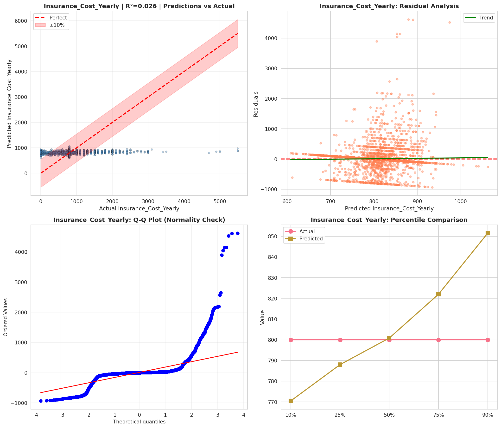
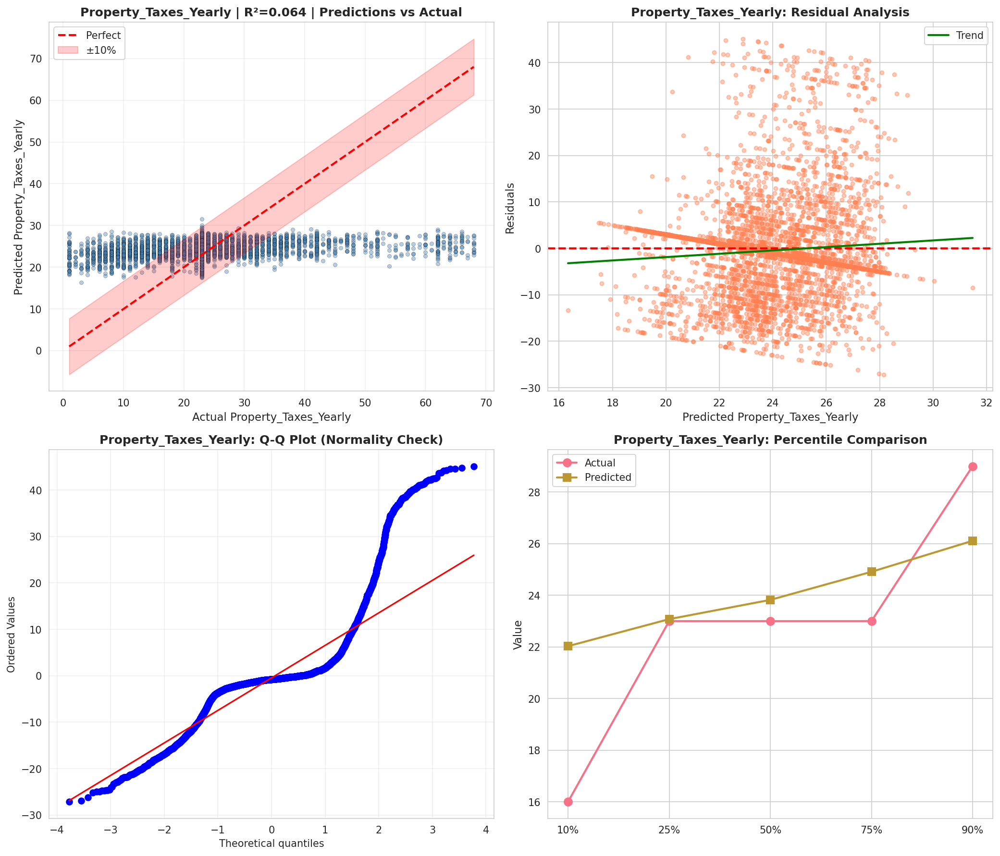
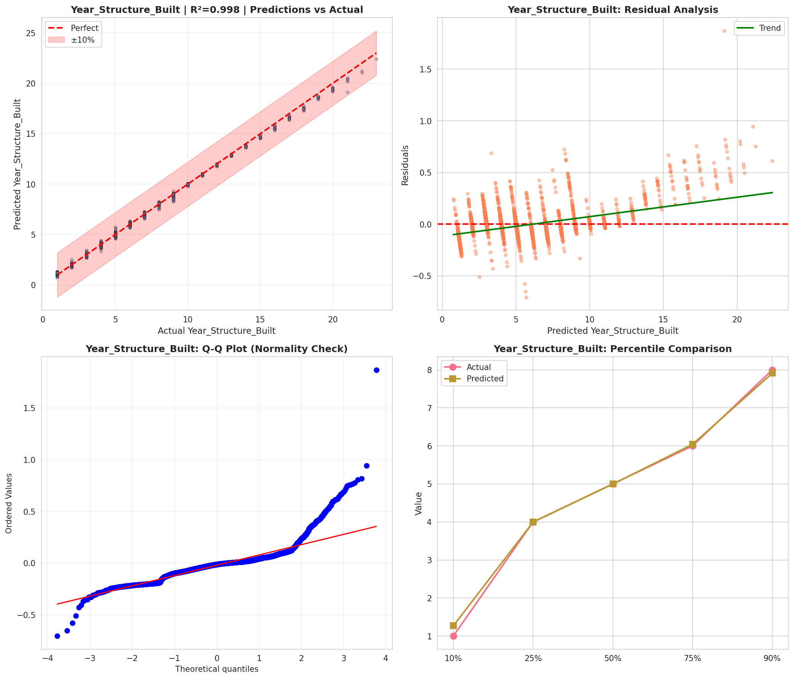
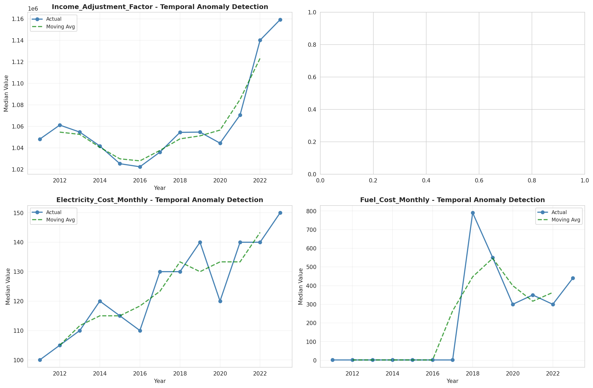
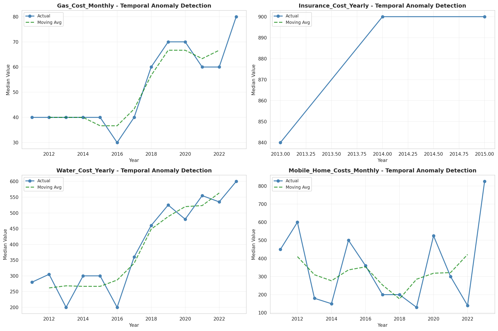
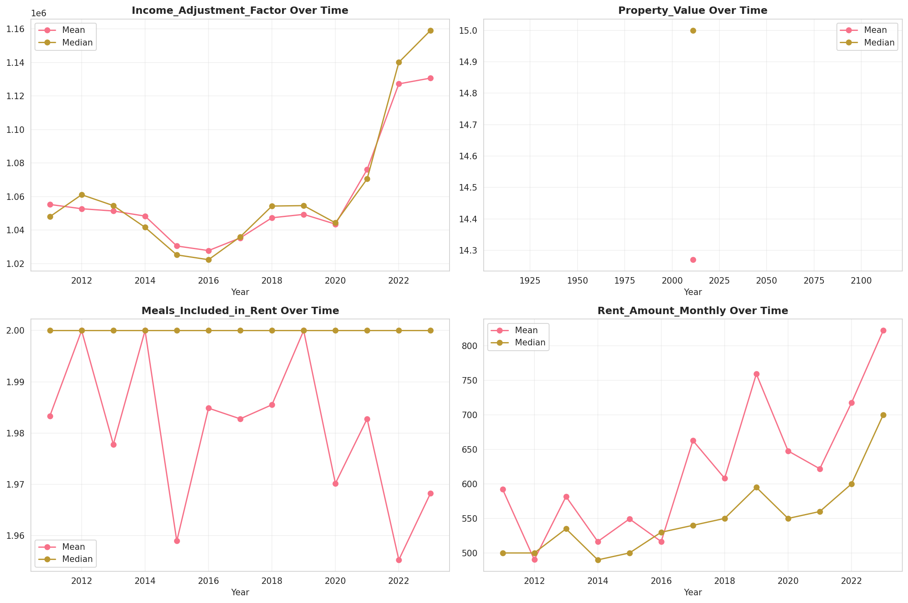
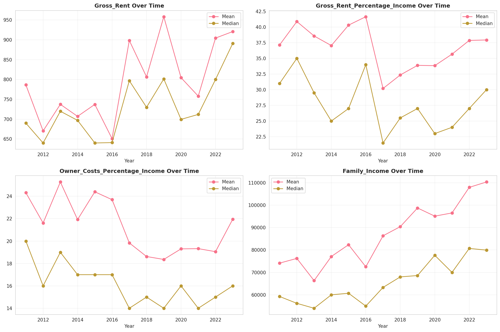
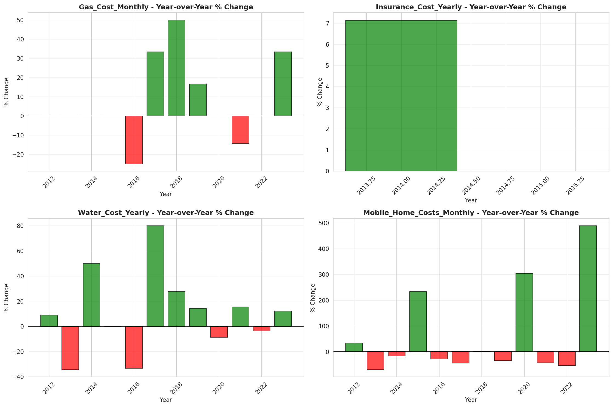

# Temporal Analysis

## Year Distribution

- 2011: 144,910 records

- 2012: 147,429 records

- 2013: 149,631 records

- 2014: 151,811 records

- 2015: 153,675 records

- 2016: 153,617 records

- 2017: 154,226 records

- 2018: 155,167 records

- 2019: 156,141 records

- 2020: 155,397 records

- 2021: 155,638 records

- 2022: 156,487 records

- 2023: 156,972 records

## Temporal Trends

- Census_Year: {np.int64(2011): {'mean': 2011.0, 'median': 2011.0, 'std': 0.0}, np.int64(2012): {'mean': 2012.0, 'median': 2012.0, 'std': 0.0}, np.int64(2013): {'mean': 2013.0, 'median': 2013.0, 'std': 0.0}, np.int64(2014): {'mean': 2014.0, 'median': 2014.0, 'std': 0.0}, np.int64(2015): {'mean': 2015.0, 'median': 2015.0, 'std': 0.0}, np.int64(2016): {'mean': 2016.0, 'median': 2016.0, 'std': 0.0}, np.int64(2017): {'mean': 2017.0, 'median': 2017.0, 'std': 0.0}, np.int64(2018): {'mean': 2018.0, 'median': 2018.0, 'std': 0.0}, np.int64(2019): {'mean': 2019.0, 'median': 2019.0, 'std': 0.0}, np.int64(2020): {'mean': 2020.0, 'median': 2020.0, 'std': 0.0}, np.int64(2021): {'mean': 2021.0, 'median': 2021.0, 'std': 0.0}, np.int64(2022): {'mean': 2022.0, 'median': 2022.0, 'std': 0.0}, np.int64(2023): {'mean': 2023.0, 'median': 2023.0, 'std': 0.0}}

- Census_Division: {np.int64(2011): {'mean': 4.0, 'median': 4.0, 'std': 0.0}, np.int64(2012): {'mean': 4.0, 'median': 4.0, 'std': 0.0}, np.int64(2013): {'mean': 4.0, 'median': 4.0, 'std': 0.0}, np.int64(2014): {'mean': 4.0, 'median': 4.0, 'std': 0.0}, np.int64(2015): {'mean': 4.0, 'median': 4.0, 'std': 0.0}, np.int64(2016): {'mean': 4.0, 'median': 4.0, 'std': 0.0}, np.int64(2017): {'mean': 4.0, 'median': 4.0, 'std': 0.0}, np.int64(2018): {'mean': 4.0, 'median': 4.0, 'std': 0.0}, np.int64(2019): {'mean': 4.0, 'median': 4.0, 'std': 0.0}, np.int64(2020): {'mean': 4.0, 'median': 4.0, 'std': 0.0}, np.int64(2021): {'mean': 4.0, 'median': 4.0, 'std': 0.0}, np.int64(2022): {'mean': 4.0, 'median': 4.0, 'std': 0.0}, np.int64(2023): {'mean': 4.0, 'median': 4.0, 'std': 0.0}}

- Public_Use_Microdata_Area: {np.int64(2011): {'mean': 1411.3160306397074, 'median': 1500.0, 'std': 715.2113146548704}, np.int64(2012): {'mean': None, 'median': None, 'std': None}, np.int64(2013): {'mean': None, 'median': None, 'std': None}, np.int64(2014): {'mean': None, 'median': None, 'std': None}, np.int64(2015): {'mean': None, 'median': None, 'std': None}, np.int64(2016): {'mean': 1449.7429125682704, 'median': 1500.0, 'std': 771.5168770988103}, np.int64(2017): {'mean': 1449.9500927210718, 'median': 1500.0, 'std': 770.9952979510011}, np.int64(2018): {'mean': 1447.306025121321, 'median': 1500.0, 'std': 771.3178689417714}, np.int64(2019): {'mean': 1446.704087971769, 'median': 1500.0, 'std': 771.1528812741533}, np.int64(2020): {'mean': 1443.651891606659, 'median': 1500.0, 'std': 772.4210313753086}, np.int64(2021): {'mean': 1441.9204435934669, 'median': 1500.0, 'std': 772.7377482697184}, np.int64(2022): {'mean': None, 'median': None, 'std': None}, np.int64(2023): {'mean': 1524.6989271972072, 'median': 1600.0, 'std': 807.6029932486042}}

- Census_Region: {np.int64(2011): {'mean': 2.0, 'median': 2.0, 'std': 0.0}, np.int64(2012): {'mean': 2.0, 'median': 2.0, 'std': 0.0}, np.int64(2013): {'mean': 2.0, 'median': 2.0, 'std': 0.0}, np.int64(2014): {'mean': 2.0, 'median': 2.0, 'std': 0.0}, np.int64(2015): {'mean': 2.0, 'median': 2.0, 'std': 0.0}, np.int64(2016): {'mean': 2.0, 'median': 2.0, 'std': 0.0}, np.int64(2017): {'mean': 2.0, 'median': 2.0, 'std': 0.0}, np.int64(2018): {'mean': 2.0, 'median': 2.0, 'std': 0.0}, np.int64(2019): {'mean': 2.0, 'median': 2.0, 'std': 0.0}, np.int64(2020): {'mean': 2.0, 'median': 2.0, 'std': 0.0}, np.int64(2021): {'mean': 2.0, 'median': 2.0, 'std': 0.0}, np.int64(2022): {'mean': 2.0, 'median': 2.0, 'std': 0.0}, np.int64(2023): {'mean': 2.0, 'median': 2.0, 'std': 0.0}}

- State_Code: {np.int64(2011): {'mean': 29.0, 'median': 29.0, 'std': 0.0}, np.int64(2012): {'mean': 29.0, 'median': 29.0, 'std': 0.0}, np.int64(2013): {'mean': 29.0, 'median': 29.0, 'std': 0.0}, np.int64(2014): {'mean': 29.0, 'median': 29.0, 'std': 0.0}, np.int64(2015): {'mean': 29.0, 'median': 29.0, 'std': 0.0}, np.int64(2016): {'mean': 29.0, 'median': 29.0, 'std': 0.0}, np.int64(2017): {'mean': 29.0, 'median': 29.0, 'std': 0.0}, np.int64(2018): {'mean': 29.0, 'median': 29.0, 'std': 0.0}, np.int64(2019): {'mean': 29.0, 'median': 29.0, 'std': 0.0}, np.int64(2020): {'mean': 29.0, 'median': 29.0, 'std': 0.0}, np.int64(2021): {'mean': 29.0, 'median': 29.0, 'std': 0.0}, np.int64(2022): {'mean': 29.0, 'median': 29.0, 'std': 0.0}, np.int64(2023): {'mean': None, 'median': None, 'std': None}}

- Housing_Adjustment_Factor: {np.int64(2011): {'mean': 1041018.6940445794, 'median': 1044592.0, 'std': 27625.48308624379}, np.int64(2012): {'mean': 1041189.2648257805, 'median': 1053092.0, 'std': 27487.42735804415}, np.int64(2013): {'mean': 1039982.6714450882, 'median': 1035725.0, 'std': 31977.541632033808}, np.int64(2014): {'mean': 1036682.2477422585, 'median': 1031130.0, 'std': 29555.657026191544}, np.int64(2015): {'mean': 1021044.1656612982, 'median': 1017534.0, 'std': 20326.028927419597}, np.int64(2016): {'mean': 1020382.1450555603, 'median': 1013801.0, 'std': 15777.186144516168}, np.int64(2017): {'mean': 1029182.5351561994, 'median': 1034680.0, 'std': 17977.719837649052}, np.int64(2018): {'mean': 1038258.0365477195, 'median': 1046406.0, 'std': 23468.065100883716}, np.int64(2019): {'mean': 1040799.7632844673, 'median': 1042936.0, 'std': 29169.49415882842}, np.int64(2020): {'mean': 1035733.1164501245, 'median': 1030827.0, 'std': 28483.749810137142}, np.int64(2021): {'mean': 1058279.8471324483, 'median': 1059761.0, 'std': 35182.89881602828}, np.int64(2022): {'mean': 1105660.8137481068, 'median': 1133141.0, 'std': 61104.72383195393}, np.int64(2023): {'mean': 1107238.8524513927, 'median': 1125501.0, 'std': 76692.54598940974}}

- Income_Adjustment_Factor: {np.int64(2011): {'mean': 1053677.739396867, 'median': 1048026.0, 'std': 28413.661620205894}, np.int64(2012): {'mean': 1052466.0412944537, 'median': 1061121.0, 'std': 26397.335100428958}, np.int64(2013): {'mean': 1049028.5648829453, 'median': 1054614.0, 'std': 29598.404209682325}, np.int64(2014): {'mean': 1047554.8319752851, 'median': 1041654.0, 'std': 31006.488525917208}, np.int64(2015): {'mean': 1030492.6120969579, 'median': 1025215.0, 'std': 25706.614487799892}, np.int64(2016): {'mean': 1027551.0541671821, 'median': 1022342.0, 'std': 17531.114951308362}, np.int64(2017): {'mean': 1036582.294736296, 'median': 1035988.0, 'std': 16851.88744417764}, np.int64(2018): {'mean': 1046844.5368989541, 'median': 1054346.0, 'std': 20494.59932683548}, np.int64(2019): {'mean': 1049754.9735687615, 'median': 1054606.0, 'std': 26221.53568757504}, np.int64(2020): {'mean': 1045757.5166380303, 'median': 1044328.0, 'std': 29074.1958695512}, np.int64(2021): {'mean': 1073054.5624847403, 'median': 1070512.0, 'std': 30519.988269622874}, np.int64(2022): {'mean': 1127573.7034769661, 'median': 1140108.0, 'std': 49226.32348409089}, np.int64(2023): {'mean': 1130762.768582932, 'median': 1159185.0, 'std': 70034.73155154785}}

- Housing_Unit_Weight: {np.int64(2011): {'mean': 18.65219791594783, 'median': 16.0, 'std': 16.0876849051505}, np.int64(2012): {'mean': 18.385161671041654, 'median': 16.0, 'std': 16.435088353053942}, np.int64(2013): {'mean': 18.13680988565204, 'median': 15.0, 'std': 16.7547867448901}, np.int64(2014): {'mean': 17.93956959640606, 'median': 15.0, 'std': 17.077742319509145}, np.int64(2015): {'mean': 17.76391085082154, 'median': 14.0, 'std': 17.412105542713835}, np.int64(2016): {'mean': 17.82858667985965, 'median': 15.0, 'std': 17.192783066046317}, np.int64(2017): {'mean': 17.916888203026726, 'median': 15.0, 'std': 17.20679118776434}, np.int64(2018): {'mean': 17.888049649732224, 'median': 15.0, 'std': 17.21543506435457}, np.int64(2019): {'mean': 17.871007614912163, 'median': 14.0, 'std': 17.48035823633266}, np.int64(2020): {'mean': 18.048379312341936, 'median': 14.0, 'std': 20.685497789838557}, np.int64(2021): {'mean': 17.875332502345184, 'median': 13.0, 'std': 20.30134873386325}, np.int64(2022): {'mean': 17.861100283090607, 'median': 13.0, 'std': 20.60409405600294}, np.int64(2023): {'mean': 17.898102846367504, 'median': 13.0, 'std': 20.941126535083395}}

- Number_of_Persons: {np.int64(2011): {'mean': 2.092381478158857, 'median': 2.0, 'std': 1.4312876052940433}, np.int64(2012): {'mean': 2.067103487102266, 'median': 2.0, 'std': 1.427212061183943}, np.int64(2013): {'mean': 2.047944610408271, 'median': 2.0, 'std': 1.4255571173170176}, np.int64(2014): {'mean': 2.02572277371205, 'median': 2.0, 'std': 1.4230325908490609}, np.int64(2015): {'mean': 2.007014803969416, 'median': 2.0, 'std': 1.4211730817938708}, np.int64(2016): {'mean': 2.006555264065826, 'median': 2.0, 'std': 1.4257350884545683}, np.int64(2017): {'mean': 2.001445929998833, 'median': 2.0, 'std': 1.4312372690536468}, np.int64(2018): {'mean': 1.9939291215271289, 'median': 2.0, 'std': 1.431498461572575}, np.int64(2019): {'mean': 1.992891040790055, 'median': 2.0, 'std': 1.4303435249280745}, np.int64(2020): {'mean': 1.9776186155459887, 'median': 2.0, 'std': 1.4304159242123293}, np.int64(2021): {'mean': 1.9766830722574178, 'median': 2.0, 'std': 1.425617587285224}, np.int64(2022): {'mean': 1.9817940148382933, 'median': 2.0, 'std': 1.4206720892435742}, np.int64(2023): {'mean': 1.9894439772698316, 'median': 2.0, 'std': 1.4162156287222676}}

- Housing_Unit_Type: {np.int64(2011): {'mean': 1.1027672348354152, 'median': 1.0, 'std': 0.3891402591007496}, np.int64(2012): {'mean': 1.1193048857416112, 'median': 1.0, 'std': 0.41899950832886407}, np.int64(2013): {'mean': 1.1340497624155423, 'median': 1.0, 'std': 0.44324502133376614}, np.int64(2014): {'mean': 1.1487836849767146, 'median': 1.0, 'std': 0.4664236667143882}, np.int64(2015): {'mean': 1.1623816495851635, 'median': 1.0, 'std': 0.4864198744509907}, np.int64(2016): {'mean': 1.1588105483117104, 'median': 1.0, 'std': 0.48215511669235817}, np.int64(2017): {'mean': 1.1579500213971703, 'median': 1.0, 'std': 0.48222976908795023}, np.int64(2018): {'mean': 1.1577783936017323, 'median': 1.0, 'std': 0.4822037514192508}, np.int64(2019): {'mean': 1.1580814776388009, 'median': 1.0, 'std': 0.48261086830672517}, np.int64(2020): {'mean': None, 'median': None, 'std': None}, np.int64(2021): {'mean': None, 'median': None, 'std': None}, np.int64(2022): {'mean': None, 'median': None, 'std': None}, np.int64(2023): {'mean': None, 'median': None, 'std': None}}

- Number_of_Bedrooms: {np.int64(2011): {'mean': 2.757253795352508, 'median': 3.0, 'std': 0.9808708297883548}, np.int64(2012): {'mean': None, 'median': None, 'std': None}, np.int64(2013): {'mean': None, 'median': None, 'std': None}, np.int64(2014): {'mean': None, 'median': None, 'std': None}, np.int64(2015): {'mean': None, 'median': None, 'std': None}, np.int64(2016): {'mean': None, 'median': None, 'std': None}, np.int64(2017): {'mean': None, 'median': None, 'std': None}, np.int64(2018): {'mean': None, 'median': None, 'std': None}, np.int64(2019): {'mean': None, 'median': None, 'std': None}, np.int64(2020): {'mean': None, 'median': None, 'std': None}, np.int64(2021): {'mean': None, 'median': None, 'std': None}, np.int64(2022): {'mean': None, 'median': None, 'std': None}, np.int64(2023): {'mean': None, 'median': None, 'std': None}}

- Number_of_Rooms: {np.int64(2011): {'mean': 5.859026573051694, 'median': 6.0, 'std': 1.8197606416859176}, np.int64(2012): {'mean': None, 'median': None, 'std': None}, np.int64(2013): {'mean': None, 'median': None, 'std': None}, np.int64(2014): {'mean': None, 'median': None, 'std': None}, np.int64(2015): {'mean': None, 'median': None, 'std': None}, np.int64(2016): {'mean': None, 'median': None, 'std': None}, np.int64(2017): {'mean': None, 'median': None, 'std': None}, np.int64(2018): {'mean': None, 'median': None, 'std': None}, np.int64(2019): {'mean': None, 'median': None, 'std': None}, np.int64(2020): {'mean': None, 'median': None, 'std': None}, np.int64(2021): {'mean': None, 'median': None, 'std': None}, np.int64(2022): {'mean': None, 'median': None, 'std': None}, np.int64(2023): {'mean': None, 'median': None, 'std': None}}

- Building_Type: {np.int64(2011): {'mean': 2.5643255478039446, 'median': 2.0, 'std': 1.6278118721532167}, np.int64(2012): {'mean': 2.5692926330756243, 'median': 2.0, 'std': 1.6366607281866448}, np.int64(2013): {'mean': 2.574553607646751, 'median': 2.0, 'std': 1.6492717759687887}, np.int64(2014): {'mean': 2.578979459904205, 'median': 2.0, 'std': 1.657048574847818}, np.int64(2015): {'mean': 2.582711615976548, 'median': 2.0, 'std': 1.6595587868694326}, np.int64(2016): {'mean': 2.586905040346158, 'median': 2.0, 'std': 1.6636401986158125}, np.int64(2017): {'mean': 2.596559596341481, 'median': 2.0, 'std': 1.6738333175710696}, np.int64(2018): {'mean': 2.6012787631398333, 'median': 2.0, 'std': 1.6788692546516146}, np.int64(2019): {'mean': 2.606027963892539, 'median': 2.0, 'std': 1.6882130187284046}, np.int64(2020): {'mean': 2.61080672036556, 'median': 2.0, 'std': 1.695672246538038}, np.int64(2021): {'mean': 2.615594341196006, 'median': 2.0, 'std': 1.7027540457696986}, np.int64(2022): {'mean': 2.61452885735159, 'median': 2.0, 'std': 1.7038678765742756}, np.int64(2023): {'mean': 2.615823528987441, 'median': 2.0, 'std': 1.7084920716924095}}

- Year_Structure_Built: {np.int64(2011): {'mean': 5.362194640716557, 'median': 5.0, 'std': 2.3985517085576373}, np.int64(2012): {'mean': 4.754983856156876, 'median': 5.0, 'std': 2.6068422062870007}, np.int64(2013): {'mean': 4.806773510734805, 'median': 5.0, 'std': 2.678441595365963}, np.int64(2014): {'mean': 4.851003496811731, 'median': 5.0, 'std': 2.7532222889823745}, np.int64(2015): {'mean': 4.906200073286918, 'median': 5.0, 'std': 2.8566286020520764}, np.int64(2016): {'mean': 4.998523564495381, 'median': 5.0, 'std': 2.9955365226100352}, np.int64(2017): {'mean': 5.090183362173009, 'median': 5.0, 'std': 3.160713119961835}, np.int64(2018): {'mean': 5.1857024166455945, 'median': 5.0, 'std': 3.3453855098789544}, np.int64(2019): {'mean': 5.30256874277384, 'median': 5.0, 'std': 3.564384840362028}, np.int64(2020): {'mean': 5.4065180851760495, 'median': 5.0, 'std': 3.7693919515108876}, np.int64(2021): {'mean': None, 'median': None, 'std': None}, np.int64(2022): {'mean': None, 'median': None, 'std': None}, np.int64(2023): {'mean': None, 'median': None, 'std': None}}

- Bathtub_or_Shower: {np.int64(2011): {'mean': None, 'median': None, 'std': None}, np.int64(2012): {'mean': 1.0122115583992417, 'median': 1.0, 'std': 0.10982952958527928}, np.int64(2013): {'mean': 1.0121914342820477, 'median': 1.0, 'std': 0.109740111320326}, np.int64(2014): {'mean': 1.0133334312832418, 'median': 1.0, 'std': 0.11469850713403723}, np.int64(2015): {'mean': 1.014049102235251, 'median': 1.0, 'std': 0.11769378266247514}, np.int64(2016): {'mean': 1.013836101040814, 'median': 1.0, 'std': 0.11681080035492539}, np.int64(2017): {'mean': 1.0146500705239128, 'median': 1.0, 'std': 0.12014803748427656}, np.int64(2018): {'mean': 1.0151862153668316, 'median': 1.0, 'std': 0.12229350873773272}, np.int64(2019): {'mean': 1.0145708109816087, 'median': 1.0, 'std': 0.11982739904575476}, np.int64(2020): {'mean': 1.0144870591488215, 'median': 1.0, 'std': 0.11948760668573001}, np.int64(2021): {'mean': 1.0144153028446294, 'median': 1.0, 'std': 0.11919565810095738}, np.int64(2022): {'mean': 1.0131646521855493, 'median': 1.0, 'std': 0.11397998986524696}, np.int64(2023): {'mean': 1.0124072163832964, 'median': 1.0, 'std': 0.11069492199076968}}

- Refrigerator: {np.int64(2011): {'mean': None, 'median': None, 'std': None}, np.int64(2012): {'mean': 1.022808732486152, 'median': 1.0, 'std': 0.1492938688148017}, np.int64(2013): {'mean': 1.0230184309705208, 'median': 1.0, 'std': 0.14996249087123928}, np.int64(2014): {'mean': 1.0241103699568042, 'median': 1.0, 'std': 0.15339241463910488}, np.int64(2015): {'mean': 1.024653719311103, 'median': 1.0, 'std': 0.15506801624323852}, np.int64(2016): {'mean': 1.0250116945386505, 'median': 1.0, 'std': 0.1561610960401064}, np.int64(2017): {'mean': 1.025933896555234, 'median': 1.0, 'std': 0.15893870903178822}, np.int64(2018): {'mean': 1.0273164035689772, 'median': 1.0, 'std': 0.16300432395172015}, np.int64(2019): {'mean': 1.027317577611651, 'median': 1.0, 'std': 0.16300772491668955}, np.int64(2020): {'mean': 1.028151899471015, 'median': 1.0, 'std': 0.16540728249650044}, np.int64(2021): {'mean': 1.028119992168749, 'median': 1.0, 'std': 0.16531623144566018}, np.int64(2022): {'mean': 1.0264161042756186, 'median': 1.0, 'std': 0.1603698217890473}, np.int64(2023): {'mean': 1.0241580044579417, 'median': 1.0, 'std': 0.15354010985286304}}

- Hot_and_Cold_Running_Water: {np.int64(2011): {'mean': None, 'median': None, 'std': None}, np.int64(2012): {'mean': 1.0209869960603097, 'median': 1.0, 'std': 0.14334118115124525}, np.int64(2013): {'mean': 1.0214179825499494, 'median': 1.0, 'std': 0.14477364109588045}, np.int64(2014): {'mean': 1.0228835473538833, 'median': 1.0, 'std': 0.1495327886344173}, np.int64(2015): {'mean': 1.0236203737632832, 'median': 1.0, 'std': 0.1518638229645421}, np.int64(2016): {'mean': 1.024003040580049, 'median': 1.0, 'std': 0.15305902735028737}, np.int64(2017): {'mean': 1.025417690596327, 'median': 1.0, 'std': 0.15739063410728568}, np.int64(2018): {'mean': 1.026969620344616, 'median': 1.0, 'std': 0.161995214483669}, np.int64(2019): {'mean': 1.0268436133313226, 'median': 1.0, 'std': 0.16162679651817977}, np.int64(2020): {'mean': 1.028210109653431, 'median': 1.0, 'std': 0.16557324313470745}, np.int64(2021): {'mean': 1.0284027873452783, 'median': 1.0, 'std': 0.16612124825324157}, np.int64(2022): {'mean': 1.026944137028116, 'median': 1.0, 'std': 0.1619207835755221}, np.int64(2023): {'mean': 1.0250236242056134, 'median': 1.0, 'std': 0.15619737011037985}}

- Running_Water: {np.int64(2011): {'mean': None, 'median': None, 'std': None}, np.int64(2012): {'mean': None, 'median': None, 'std': None}, np.int64(2013): {'mean': 9.0, 'median': 9.0, 'std': 0.0}, np.int64(2014): {'mean': 9.0, 'median': 9.0, 'std': 0.0}, np.int64(2015): {'mean': 9.0, 'median': 9.0, 'std': 0.0}, np.int64(2016): {'mean': 9.0, 'median': 9.0, 'std': 0.0}, np.int64(2017): {'mean': 9.0, 'median': 9.0, 'std': 0.0}, np.int64(2018): {'mean': 9.0, 'median': 9.0, 'std': 0.0}, np.int64(2019): {'mean': 9.0, 'median': 9.0, 'std': 0.0}, np.int64(2020): {'mean': 9.0, 'median': 9.0, 'std': 0.0}, np.int64(2021): {'mean': 9.0, 'median': 9.0, 'std': 0.0}, np.int64(2022): {'mean': 9.0, 'median': 9.0, 'std': 0.0}, np.int64(2023): {'mean': 9.0, 'median': 9.0, 'std': 0.0}}

- Sink_with_Faucet: {np.int64(2011): {'mean': None, 'median': None, 'std': None}, np.int64(2012): {'mean': 1.011745016143843, 'median': 1.0, 'std': 0.1077365151452416}, np.int64(2013): {'mean': 1.0117636646581163, 'median': 1.0, 'std': 0.1078209932848863}, np.int64(2014): {'mean': 1.0127457318327406, 'median': 1.0, 'std': 0.11217562388187602}, np.int64(2015): {'mean': 1.0134554781971419, 'median': 1.0, 'std': 0.1152151274292373}, np.int64(2016): {'mean': 1.0133463922348263, 'median': 1.0, 'std': 0.1147534849049984}, np.int64(2017): {'mean': 1.0140248069680533, 'median': 1.0, 'std': 0.1175934194403291}, np.int64(2018): {'mean': 1.0145143228696312, 'median': 1.0, 'std': 0.1195983304270535}, np.int64(2019): {'mean': 1.0139891275466604, 'median': 1.0, 'std': 0.11744586375138834}, np.int64(2020): {'mean': 1.013854023415046, 'median': 1.0, 'std': 0.11688536632134242}, np.int64(2021): {'mean': 1.0137119404824921, 'median': 1.0, 'std': 0.11629282538280819}, np.int64(2022): {'mean': 1.0124485529732583, 'median': 1.0, 'std': 0.1108768480174499}, np.int64(2023): {'mean': 1.0118373500494124, 'median': 1.0, 'std': 0.10815411028598379}}

- Stove_or_Range: {np.int64(2011): {'mean': None, 'median': None, 'std': None}, np.int64(2012): {'mean': 1.0223125685002519, 'median': 1.0, 'std': 0.14769860979641117}, np.int64(2013): {'mean': 1.0226717900683693, 'median': 1.0, 'std': 0.14885544473009796}, np.int64(2014): {'mean': 1.0239928300667038, 'median': 1.0, 'std': 0.15302727273794206}, np.int64(2015): {'mean': 1.0248222792231587, 'median': 1.0, 'std': 0.15558377511141852}, np.int64(2016): {'mean': 1.0252090398783769, 'median': 1.0, 'std': 0.15676008356167767}, np.int64(2017): {'mean': 1.0260356836457227, 'median': 1.0, 'std': 0.15924198940106019}, np.int64(2018): {'mean': 1.0274319979770978, 'median': 1.0, 'std': 0.16333914477374556}, np.int64(2019): {'mean': 1.0273678465504736, 'median': 1.0, 'std': 0.16315342069461042}, np.int64(2020): {'mean': 1.0282610435630453, 'median': 1.0, 'std': 0.16571830558157463}, np.int64(2021): {'mean': 1.0287363406304157, 'median': 1.0, 'std': 0.16706515418533963}, np.int64(2022): {'mean': 1.0272696366700664, 'median': 1.0, 'std': 0.16286864479865823}, np.int64(2023): {'mean': 1.0253554451088878, 'median': 1.0, 'std': 0.15720281415231266}}

- Telephone_Service: {np.int64(2011): {'mean': 1.0283188285674818, 'median': 1.0, 'std': 0.16588277824339723}, np.int64(2012): {'mean': 1.0255822987649925, 'median': 1.0, 'std': 0.15788618210641567}, np.int64(2013): {'mean': 1.026307077395131, 'median': 1.0, 'std': 0.16004756139025966}, np.int64(2014): {'mean': 1.0282241151227696, 'median': 1.0, 'std': 0.1656132110964605}, np.int64(2015): {'mean': 1.0288602615158893, 'median': 1.0, 'std': 0.1674143744309856}, np.int64(2016): {'mean': 1.0301267434271486, 'median': 1.0, 'std': 0.17093670814267933}, np.int64(2017): {'mean': 1.0275874272110157, 'median': 1.0, 'std': 0.16378820725729704}, np.int64(2018): {'mean': 1.02569442219588, 'median': 1.0, 'std': 0.1582226891967826}, np.int64(2019): {'mean': 1.0219199211296273, 'median': 1.0, 'std': 0.14642270536347884}, np.int64(2020): {'mean': 1.0181968101016143, 'median': 1.0, 'std': 0.1336631236689512}, np.int64(2021): {'mean': 1.0131139627499095, 'median': 1.0, 'std': 0.11376331067127653}, np.int64(2022): {'mean': 1.0114123933328016, 'median': 1.0, 'std': 0.10621789203526412}, np.int64(2023): {'mean': 1.010161188369153, 'median': 1.0, 'std': 0.1002896709158512}}

- Lot_Acreage: {np.int64(2011): {'mean': 1.4166192721959243, 'median': 1.0, 'std': 0.6921723483350969}, np.int64(2012): {'mean': 1.4172343502273639, 'median': 1.0, 'std': 0.691986834744441}, np.int64(2013): {'mean': 1.4176345990242547, 'median': 1.0, 'std': 0.6916313090398833}, np.int64(2014): {'mean': 1.4205161926680914, 'median': 1.0, 'std': 0.6928927028579446}, np.int64(2015): {'mean': 1.4215545688567923, 'median': 1.0, 'std': 0.693249464988153}, np.int64(2016): {'mean': 1.4180992120282083, 'median': 1.0, 'std': 0.6905631176438829}, np.int64(2017): {'mean': 1.4148040613671895, 'median': 1.0, 'std': 0.6873950030792333}, np.int64(2018): {'mean': 1.4126440414463513, 'median': 1.0, 'std': 0.6857422722812149}, np.int64(2019): {'mean': 1.4087206882787087, 'median': 1.0, 'std': 0.6822745124061443}, np.int64(2020): {'mean': 1.4072184022787708, 'median': 1.0, 'std': 0.6805352438623835}, np.int64(2021): {'mean': 1.4069088508398138, 'median': 1.0, 'std': 0.6798794243756484}, np.int64(2022): {'mean': 1.4111023783488246, 'median': 1.0, 'std': 0.6818737319563244}, np.int64(2023): {'mean': 1.4145803904215668, 'median': 1.0, 'std': 0.6822803215960244}}

- Agricultural_Sales: {np.int64(2011): {'mean': 1.522508089089938, 'median': 1.0, 'std': 1.378944033387728}, np.int64(2012): {'mean': 1.5174558524769495, 'median': 1.0, 'std': 1.375776570175659}, np.int64(2013): {'mean': 1.5099573035808895, 'median': 1.0, 'std': 1.3667470602470957}, np.int64(2014): {'mean': 1.51321150759353, 'median': 1.0, 'std': 1.3742651066156446}, np.int64(2015): {'mean': 1.5191208115585613, 'median': 1.0, 'std': 1.386826277497442}, np.int64(2016): {'mean': 1.502011387547964, 'median': 1.0, 'std': 1.3664813256545116}, np.int64(2017): {'mean': 1.485584689946564, 'median': 1.0, 'std': 1.3445751801742962}, np.int64(2018): {'mean': 1.485369410742545, 'median': 1.0, 'std': 1.3471693947599994}, np.int64(2019): {'mean': 1.476107732406603, 'median': 1.0, 'std': 1.3340796860543058}, np.int64(2020): {'mean': 1.4688685208596712, 'median': 1.0, 'std': 1.3202578782828334}, np.int64(2021): {'mean': 1.4755453573898283, 'median': 1.0, 'std': 1.33026537063427}, np.int64(2022): {'mean': 1.474030971952834, 'median': 1.0, 'std': 1.3258321246708398}, np.int64(2023): {'mean': 1.4683147422369611, 'median': 1.0, 'std': 1.316816086829495}}

- Business_On_Property: {np.int64(2011): {'mean': 1.9829992387718853, 'median': 2.0, 'std': 0.1292744428359256}, np.int64(2012): {'mean': 1.9835531473770407, 'median': 2.0, 'std': 0.12718684908179287}, np.int64(2013): {'mean': 1.984261333055541, 'median': 2.0, 'std': 0.12446323065705858}, np.int64(2014): {'mean': 1.9844865327876653, 'median': 2.0, 'std': 0.12358370318316503}, np.int64(2015): {'mean': 1.9848136694251999, 'median': 2.0, 'std': 0.12229405191242079}, np.int64(2016): {'mean': 3.3959428935979448, 'median': 2.0, 'std': 2.8144669050152675}, np.int64(2017): {'mean': 4.8077293109076225, 'median': 2.0, 'std': 3.4417781522847353}, np.int64(2018): {'mean': 6.213954402179948, 'median': 9.0, 'std': 3.4337737968949913}, np.int64(2019): {'mean': 7.615569503070247, 'median': 9.0, 'std': 2.792588806328409}, np.int64(2020): {'mean': None, 'median': None, 'std': None}, np.int64(2021): {'mean': None, 'median': None, 'std': None}, np.int64(2022): {'mean': None, 'median': None, 'std': None}, np.int64(2023): {'mean': None, 'median': None, 'std': None}}

- Tenure: {np.int64(2011): {'mean': 1.8121287470645118, 'median': 2.0, 'std': 0.8664377699859304}, np.int64(2012): {'mean': 1.8293002703096422, 'median': 2.0, 'std': 0.8690239950304663}, np.int64(2013): {'mean': 1.843885502038839, 'median': 2.0, 'std': 0.8698150920961925}, np.int64(2014): {'mean': 1.856249798341561, 'median': 2.0, 'std': 0.8686897423540921}, np.int64(2015): {'mean': 1.8671379971945892, 'median': 2.0, 'std': 0.8684866297260083}, np.int64(2016): {'mean': 1.8721365896107454, 'median': 2.0, 'std': 0.8672662985877888}, np.int64(2017): {'mean': 1.8740629926326289, 'median': 2.0, 'std': 0.8663217498645214}, np.int64(2018): {'mean': 1.875957133245763, 'median': 2.0, 'std': 0.8642557115802769}, np.int64(2019): {'mean': 1.8755644956112454, 'median': 2.0, 'std': 0.861497634752096}, np.int64(2020): {'mean': 1.8712076505824435, 'median': 2.0, 'std': 0.8575529166241505}, np.int64(2021): {'mean': 1.8666398487469327, 'median': 2.0, 'std': 0.8534996947319323}, np.int64(2022): {'mean': 1.8656591434723662, 'median': 2.0, 'std': 0.8502086228336284}, np.int64(2023): {'mean': 1.8634323640960808, 'median': 2.0, 'std': 0.8463514003572161}}

- Vacancy_Status: {np.int64(2011): {'mean': 4.968255379690556, 'median': 5.0, 'std': 2.153134089906979}, np.int64(2012): {'mean': 5.038347568415548, 'median': 5.0, 'std': 2.1338282415279153}, np.int64(2013): {'mean': 5.093084653381025, 'median': 5.0, 'std': 2.1184025924758516}, np.int64(2014): {'mean': 5.1342988808426595, 'median': 5.0, 'std': 2.108114443913892}, np.int64(2015): {'mean': 5.177603998710094, 'median': 5.0, 'std': 2.090235191685919}, np.int64(2016): {'mean': 5.209805618950185, 'median': 5.0, 'std': 2.074646981815513}, np.int64(2017): {'mean': 5.241937925813778, 'median': 5.0, 'std': 2.0645346833940637}, np.int64(2018): {'mean': 5.270810292708103, 'median': 5.0, 'std': 2.0578980151807977}, np.int64(2019): {'mean': 5.326679035250463, 'median': 5.0, 'std': 2.030821563886207}, np.int64(2020): {'mean': 5.363073561544064, 'median': 7.0, 'std': 2.026251314896845}, np.int64(2021): {'mean': 5.424416042309387, 'median': 7.0, 'std': 1.9952511774862576}, np.int64(2022): {'mean': 5.417761878839723, 'median': 7.0, 'std': 1.9893514777777828}, np.int64(2023): {'mean': 5.4331759052117, 'median': 7.0, 'std': 1.9758518209266887}}

- Property_Value: {np.int64(2011): {'mean': 13.877650809954847, 'median': 15.0, 'std': 4.971436949159249}}

- Vehicles_Available: {np.int64(2011): {'mean': 1.8638502230564833, 'median': 2.0, 'std': 1.0567036484746977}, np.int64(2012): {'mean': 1.8566144931289554, 'median': 2.0, 'std': 1.0618365484385068}, np.int64(2013): {'mean': 1.856062013000121, 'median': 2.0, 'std': 1.0645874693021131}, np.int64(2014): {'mean': 1.856427257767883, 'median': 2.0, 'std': 1.066757787433281}, np.int64(2015): {'mean': 1.8630911113619142, 'median': 2.0, 'std': 1.0730498504980612}, np.int64(2016): {'mean': 1.875875238701464, 'median': 2.0, 'std': 1.0781978202669347}, np.int64(2017): {'mean': 1.8899639674420101, 'median': 2.0, 'std': 1.0819937238580561}, np.int64(2018): {'mean': 1.9048553487328999, 'median': 2.0, 'std': 1.0876213745803707}, np.int64(2019): {'mean': 1.9187285332654878, 'median': 2.0, 'std': 1.0942150809359044}, np.int64(2020): {'mean': 1.933534352440927, 'median': 2.0, 'std': 1.0971231288981322}, np.int64(2021): {'mean': 1.9399010418761817, 'median': 2.0, 'std': 1.100465515952896}, np.int64(2022): {'mean': 1.945466145625648, 'median': 2.0, 'std': 1.10373621710629}, np.int64(2023): {'mean': 1.9443505056890014, 'median': 2.0, 'std': 1.105297989889603}}

- Condo_Fee_Monthly: {np.int64(2011): {'mean': 214.5113243761996, 'median': 160.0, 'std': 181.49870078194553}, np.int64(2012): {'mean': 224.19460726846424, 'median': 170.0, 'std': 192.10208214147093}, np.int64(2013): {'mean': 233.55701394585725, 'median': 180.0, 'std': 197.21279203086212}, np.int64(2014): {'mean': 242.3220556745182, 'median': 180.0, 'std': 201.0785803224593}, np.int64(2015): {'mean': 255.92153366027642, 'median': 190.0, 'std': 208.52587637869382}, np.int64(2016): {'mean': 262.4019564250778, 'median': 200.0, 'std': 210.58934063154695}, np.int64(2017): {'mean': 270.64196428571427, 'median': 210.0, 'std': 209.4821971278554}, np.int64(2018): {'mean': 279.8499127399651, 'median': 220.0, 'std': 213.8043223260466}, np.int64(2019): {'mean': 285.50598290598293, 'median': 230.0, 'std': 214.73520577762469}, np.int64(2020): {'mean': 296.09294320137695, 'median': 230.0, 'std': 235.73809855041574}, np.int64(2021): {'mean': 311.77862595419845, 'median': 235.0, 'std': 263.790019830259}, np.int64(2022): {'mean': 327.83368689011456, 'median': 250.0, 'std': 296.99449127220515}, np.int64(2023): {'mean': 344.0992848127892, 'median': 250.0, 'std': 329.2700787365468}}

- Electricity_Cost_Monthly: {np.int64(2011): {'mean': 118.3944158682951, 'median': 100.0, 'std': 77.7697531179641}, np.int64(2012): {'mean': 123.63234651430051, 'median': 100.0, 'std': 80.55210384644775}, np.int64(2013): {'mean': 128.88304735758408, 'median': 110.0, 'std': 82.99959548982031}, np.int64(2014): {'mean': 134.8344706869293, 'median': 120.0, 'std': 86.11736449539909}, np.int64(2015): {'mean': 138.4165954565242, 'median': 120.0, 'std': 87.61984377772636}, np.int64(2016): {'mean': 139.72800522121685, 'median': 120.0, 'std': 88.15410395637024}, np.int64(2017): {'mean': 141.528850175337, 'median': 120.0, 'std': 89.08802920222526}, np.int64(2018): {'mean': 150.9903469431987, 'median': 130.0, 'std': 88.46809954265018}, np.int64(2019): {'mean': 152.24147976495902, 'median': 130.0, 'std': 89.02055714364732}, np.int64(2020): {'mean': 153.37182475241693, 'median': 130.0, 'std': 91.6878595262992}, np.int64(2021): {'mean': 155.6510763668017, 'median': 140.0, 'std': 98.8899750705951}, np.int64(2022): {'mean': 163.083681938911, 'median': 140.0, 'std': 145.56022995761094}, np.int64(2023): {'mean': 167.70719472381438, 'median': 140.0, 'std': 166.44387891816004}}

- Fuel_Cost_Monthly: {np.int64(2011): {'mean': 81.88919496518044, 'median': 2.0, 'std': 319.7212994815023}, np.int64(2012): {'mean': 81.92891827584532, 'median': 2.0, 'std': 319.81621407058486}, np.int64(2013): {'mean': 73.44687310751343, 'median': 2.0, 'std': 301.1264770972274}, np.int64(2014): {'mean': 66.89271771045075, 'median': 2.0, 'std': 283.78682053230125}, np.int64(2015): {'mean': 61.151274527191525, 'median': 2.0, 'std': 271.7492064998356}, np.int64(2016): {'mean': 53.69317293669275, 'median': 2.0, 'std': 252.69769285229714}, np.int64(2017): {'mean': 47.15332336003603, 'median': 2.0, 'std': 236.07570605346376}, np.int64(2018): {'mean': 635.8202374222725, 'median': 450.0, 'std': 638.9026533260959}, np.int64(2019): {'mean': 625.8027911233128, 'median': 450.0, 'std': 628.9064266216772}, np.int64(2020): {'mean': 611.2427893391749, 'median': 400.0, 'std': 622.175897710392}, np.int64(2021): {'mean': 609.4391680240572, 'median': 410.0, 'std': 617.2772401380848}, np.int64(2022): {'mean': 627.1211737920567, 'median': 450.0, 'std': 624.1531297695093}, np.int64(2023): {'mean': 641.364772580853, 'median': 480.0, 'std': 655.1226996439411}}

- Gas_Cost_Monthly: {np.int64(2011): {'mean': 68.43544363456115, 'median': 40.0, 'std': 82.82013433243358}, np.int64(2012): {'mean': 65.75939204609831, 'median': 40.0, 'std': 80.24207002567262}, np.int64(2013): {'mean': 62.59437199725463, 'median': 40.0, 'std': 76.5846446483564}, np.int64(2014): {'mean': 61.52770786951892, 'median': 40.0, 'std': 76.59694739883383}, np.int64(2015): {'mean': 60.94941392709156, 'median': 40.0, 'std': 76.54881102252294}, np.int64(2016): {'mean': 58.36376894504025, 'median': 40.0, 'std': 73.84283481217057}, np.int64(2017): {'mean': 57.49838336067947, 'median': 40.0, 'std': 73.46664409647569}, np.int64(2018): {'mean': 91.07458538422577, 'median': 70.0, 'std': 77.88189575360575}, np.int64(2019): {'mean': 88.99038436684158, 'median': 70.0, 'std': 75.61705022000396}, np.int64(2020): {'mean': 87.70723437808003, 'median': 70.0, 'std': 75.17230833130628}, np.int64(2021): {'mean': 90.2992299229923, 'median': 70.0, 'std': 85.45700257310057}, np.int64(2022): {'mean': 99.03293202057925, 'median': 70.0, 'std': 124.73813465592922}, np.int64(2023): {'mean': 106.71996565272826, 'median': 80.0, 'std': 145.93487302790905}}

- House_Heating_Fuel: {np.int64(2011): {'mean': 2.043132379350414, 'median': 1.0, 'std': 1.3555700327485205}, np.int64(2012): {'mean': 2.069147472523915, 'median': 2.0, 'std': 1.3736446485128355}, np.int64(2013): {'mean': 2.0901933868949087, 'median': 2.0, 'std': 1.3846556407302477}, np.int64(2014): {'mean': 2.1070725647726904, 'median': 2.0, 'std': 1.3963236888189983}, np.int64(2015): {'mean': 2.1167389516792157, 'median': 2.0, 'std': 1.3994537299953167}, np.int64(2016): {'mean': 2.1163171083483068, 'median': 2.0, 'std': 1.3987481287153627}, np.int64(2017): {'mean': 2.1115320271531064, 'median': 2.0, 'std': 1.3900534079250462}, np.int64(2018): {'mean': 2.111211674622753, 'median': 2.0, 'std': 1.3810518142656387}, np.int64(2019): {'mean': 2.1052983081032948, 'median': 2.0, 'std': 1.3641793594124692}, np.int64(2020): {'mean': 2.0985667283736045, 'median': 2.0, 'std': 1.351485074533406}, np.int64(2021): {'mean': 2.0987891709240114, 'median': 2.0, 'std': 1.3414811676854583}, np.int64(2022): {'mean': 2.1088364303373477, 'median': 2.0, 'std': 1.339146326652139}, np.int64(2023): {'mean': 2.1157869785082175, 'median': 2.0, 'std': 1.3382473174886893}}

- Insurance_Cost_Yearly: {np.int64(2013): {'mean': 942.5135507347088, 'median': 830.0, 'std': 639.9672889889582}, np.int64(2014): {'mean': 985.9546033200937, 'median': 900.0, 'std': 676.9521979183965}, np.int64(2015): {'mean': 1035.605394222665, 'median': 920.0, 'std': 712.5924966901355}}

- Water_Cost_Yearly: {np.int64(2011): {'mean': 335.7075806700633, 'median': 280.0, 'std': 372.0403748795617}, np.int64(2012): {'mean': 351.1600734853758, 'median': 300.0, 'std': 388.5420166534693}, np.int64(2013): {'mean': 362.55324801162743, 'median': 300.0, 'std': 401.5457264313116}, np.int64(2014): {'mean': 375.339133030039, 'median': 300.0, 'std': 416.95367101056746}, np.int64(2015): {'mean': 386.6884542830885, 'median': 300.0, 'std': 431.7011531957691}, np.int64(2016): {'mean': 397.7445310170898, 'median': 300.0, 'std': 447.69486218402795}, np.int64(2017): {'mean': 405.70383328507546, 'median': 300.0, 'std': 459.31713694707435}, np.int64(2018): {'mean': 555.0704581223301, 'median': 490.0, 'std': 471.6221110559542}, np.int64(2019): {'mean': 564.9258925829035, 'median': 500.0, 'std': 487.0783793132013}, np.int64(2020): {'mean': 576.2092287903961, 'median': 500.0, 'std': 504.2331894586692}, np.int64(2021): {'mean': 586.8632240796992, 'median': 500.0, 'std': 526.7531506907758}, np.int64(2022): {'mean': 596.8225194649631, 'median': 500.0, 'std': 550.6754313707056}, np.int64(2023): {'mean': 609.5996843657205, 'median': 500.0, 'std': 573.3299549576824}}

- Mobile_Home_Costs_Monthly: {np.int64(2011): {'mean': 874.8441300022109, 'median': 330.0, 'std': 1273.2482572252452}, np.int64(2012): {'mean': 868.198719364098, 'median': 320.0, 'std': 1278.4347047949511}, np.int64(2013): {'mean': 869.4343389529724, 'median': 300.0, 'std': 1334.5777902822663}, np.int64(2014): {'mean': 846.7888074616922, 'median': 300.0, 'std': 1299.4010722775856}, np.int64(2015): {'mean': 815.2464804469274, 'median': 300.0, 'std': 1260.0712451858183}, np.int64(2016): {'mean': 819.724384787472, 'median': 300.0, 'std': 1276.4635440676109}, np.int64(2017): {'mean': 832.1646185949455, 'median': 300.0, 'std': 1308.5767147358924}, np.int64(2018): {'mean': 848.4014921893215, 'median': 320.0, 'std': 1320.5591605133343}, np.int64(2019): {'mean': 881.5326364692219, 'median': 350.0, 'std': 1369.4452262201792}, np.int64(2020): {'mean': 937.141530188218, 'median': 350.0, 'std': 1490.148967549882}, np.int64(2021): {'mean': 1033.0564255530699, 'median': 380.0, 'std': 1870.5615168744357}, np.int64(2022): {'mean': 1070.4301689269569, 'median': 400.0, 'std': 1984.7227445515575}, np.int64(2023): {'mean': 1197.4740336732275, 'median': 400.0, 'std': 2412.6856549483623}}

- First_Mortgage_Includes_Insurance: {np.int64(2011): {'mean': 1.4025289409621884, 'median': 1.0, 'std': 0.4904116685967769}, np.int64(2012): {'mean': 1.3929131612719237, 'median': 1.0, 'std': 0.48840215054651925}, np.int64(2013): {'mean': 1.383887718788583, 'median': 1.0, 'std': 0.48633551445677253}, np.int64(2014): {'mean': 1.3752244497510226, 'median': 1.0, 'std': 0.4841852969357181}, np.int64(2015): {'mean': 1.3677544414333032, 'median': 1.0, 'std': 0.4821985981890177}, np.int64(2016): {'mean': 1.3558373033196045, 'median': 1.0, 'std': 0.4787707880734895}, np.int64(2017): {'mean': 1.3448708683579933, 'median': 1.0, 'std': 0.4753306737518726}, np.int64(2018): {'mean': 1.3355502620295379, 'median': 1.0, 'std': 0.4721869678125557}, np.int64(2019): {'mean': 1.3243915876664702, 'median': 1.0, 'std': 0.4681515238039593}, np.int64(2020): {'mean': 1.311604334148899, 'median': 1.0, 'std': 0.46315357983831973}, np.int64(2021): {'mean': 1.2999513949645183, 'median': 1.0, 'std': 0.4582408080340223}, np.int64(2022): {'mean': 1.291967675980917, 'median': 1.0, 'std': 0.4546719450387192}, np.int64(2023): {'mean': 1.2859343316175325, 'median': 1.0, 'std': 0.45186266792648966}}

- First_Mortgage_Payment_Monthly: {np.int64(2011): {'mean': 909.6623408465998, 'median': 780.0, 'std': 628.5341064296475}, np.int64(2012): {'mean': 914.801119349779, 'median': 780.0, 'std': 627.8158706102865}, np.int64(2013): {'mean': 908.963468661486, 'median': 780.0, 'std': 615.3575464166272}, np.int64(2014): {'mean': 904.4679661613077, 'median': 780.0, 'std': 607.945485122391}, np.int64(2015): {'mean': 905.9904019873532, 'median': 780.0, 'std': 605.7977222383872}, np.int64(2016): {'mean': 915.4628276424925, 'median': 790.0, 'std': 608.4278285853151}, np.int64(2017): {'mean': 926.4274466547488, 'median': 800.0, 'std': 611.1923764624336}, np.int64(2018): {'mean': 946.4282801333968, 'median': 800.0, 'std': 627.3773331531581}, np.int64(2019): {'mean': 971.3224157911735, 'median': 820.0, 'std': 644.5227443625542}, np.int64(2020): {'mean': 999.4103071963959, 'median': 850.0, 'std': 660.6990212609096}, np.int64(2021): {'mean': 1031.0028968601148, 'median': 880.0, 'std': 685.0858038733124}, np.int64(2022): {'mean': 1062.8355564209912, 'median': 900.0, 'std': 706.4288019215622}, np.int64(2023): {'mean': 1102.4024723132118, 'median': 940.0, 'std': 728.7485209940262}}

- First_Mortgage_Includes_Taxes: {np.int64(2011): {'mean': 1.3564510762009843, 'median': 1.0, 'std': 0.47895482461269495}, np.int64(2012): {'mean': 1.346392414088122, 'median': 1.0, 'std': 0.4758242796128557}, np.int64(2013): {'mean': 1.3369162611663883, 'median': 1.0, 'std': 0.4726602907818782}, np.int64(2014): {'mean': 1.3280390959071473, 'median': 1.0, 'std': 0.4695034909125498}, np.int64(2015): {'mean': 1.3173931044866005, 'median': 1.0, 'std': 0.4654662169803169}, np.int64(2016): {'mean': 1.3016493632205288, 'median': 1.0, 'std': 0.4589782383058656}, np.int64(2017): {'mean': 1.2881594461983188, 'median': 1.0, 'std': 0.4529100140888549}, np.int64(2018): {'mean': 1.277065269175798, 'median': 1.0, 'std': 0.44755326266584194}, np.int64(2019): {'mean': 1.2637308357239205, 'median': 1.0, 'std': 0.4406592459748912}, np.int64(2020): {'mean': 1.2487086877160278, 'median': 1.0, 'std': 0.43226878766488724}, np.int64(2021): {'mean': 1.2356372120151649, 'median': 1.0, 'std': 0.4244005397536372}, np.int64(2022): {'mean': 1.2251387401421479, 'median': 1.0, 'std': 0.4176777284742725}, np.int64(2023): {'mean': 1.2151575417251599, 'median': 1.0, 'std': 0.41093559898031123}}

- First_Mortgage_Status: {np.int64(2011): {'mean': 1.768325191221752, 'median': 1.0, 'std': 0.9672125699939504}, np.int64(2012): {'mean': 1.7829391245393607, 'median': 1.0, 'std': 0.9710586599536865}, np.int64(2013): {'mean': 1.8001691341211616, 'median': 1.0, 'std': 0.974750575717509}, np.int64(2014): {'mean': 1.818845212636963, 'median': 1.0, 'std': 0.9784594393652721}, np.int64(2015): {'mean': 1.8341079095295003, 'median': 1.0, 'std': 0.9810418463606735}, np.int64(2016): {'mean': 1.8419320159154133, 'median': 1.0, 'std': 0.9824543837628161}, np.int64(2017): {'mean': 1.8451000586951947, 'median': 1.0, 'std': 0.982990891094596}, np.int64(2018): {'mean': 1.8526801953241256, 'median': 1.0, 'std': 0.9842681795741283}, np.int64(2019): {'mean': 1.8602034357060222, 'median': 1.0, 'std': 0.9855509788306477}, np.int64(2020): {'mean': 1.8717960039739485, 'median': 1.0, 'std': 0.9873357126595388}, np.int64(2021): {'mean': 1.8846590784960566, 'median': 1.0, 'std': 0.9891161226735833}, np.int64(2022): {'mean': 1.90145930332816, 'median': 1.0, 'std': 0.9908891756065764}, np.int64(2023): {'mean': 1.919129825455472, 'median': 1.0, 'std': 0.9926150913382938}}

- Second_Mortgage_Payment_Monthly: {np.int64(2011): {'mean': 320.0573495676725, 'median': 250.0, 'std': 285.63809358784044}, np.int64(2012): {'mean': 314.7680644851742, 'median': 240.0, 'std': 287.90093405932635}, np.int64(2013): {'mean': 309.3025201072386, 'median': 230.0, 'std': 282.42272618666385}, np.int64(2014): {'mean': 309.33941868844585, 'median': 230.0, 'std': 289.2997628224113}, np.int64(2015): {'mean': 308.720696937698, 'median': 220.0, 'std': 293.43256189820045}, np.int64(2016): {'mean': 315.3110157367668, 'median': 220.0, 'std': 310.48289710779505}, np.int64(2017): {'mean': 317.8244157441574, 'median': 220.0, 'std': 324.6906891067489}, np.int64(2018): {'mean': 331.3140253823625, 'median': 230.0, 'std': 359.1884107132722}, np.int64(2019): {'mean': 340.24156729131175, 'median': 240.0, 'std': 366.5950658653876}, np.int64(2020): {'mean': 357.59803059609635, 'median': 250.0, 'std': 395.6611650032437}, np.int64(2021): {'mean': 364.80340667139814, 'median': 250.0, 'std': 400.5189025942858}, np.int64(2022): {'mean': 385.2094448449892, 'median': 250.0, 'std': 440.3576288519363}, np.int64(2023): {'mean': 403.6125691840743, 'median': 280.0, 'std': 444.19296387524247}}

- Second_Mortgage_Status: {np.int64(2011): {'mean': 2.758156885409552, 'median': 3.0, 'std': 0.5555326826899248}, np.int64(2012): {'mean': 2.7741872237273633, 'median': 3.0, 'std': 0.5395466606609582}, np.int64(2013): {'mean': 2.7950105309027524, 'median': 3.0, 'std': 0.5162043969808924}, np.int64(2014): {'mean': 2.8146646674441422, 'median': 3.0, 'std': 0.49369258696754525}, np.int64(2015): {'mean': 2.8295317675398977, 'median': 3.0, 'std': 0.4731205108552894}, np.int64(2016): {'mean': 2.8426177235371153, 'median': 3.0, 'std': 0.45495133700686535}, np.int64(2017): {'mean': 2.8555589365182, 'median': 3.0, 'std': 0.43321101661842026}, np.int64(2018): {'mean': 2.864011434016198, 'median': 3.0, 'std': 0.4186177220526143}, np.int64(2019): {'mean': 2.8705473336246365, 'median': 3.0, 'std': 0.4057566406913436}, np.int64(2020): {'mean': 2.8738818801800585, 'median': 3.0, 'std': 0.3950207112577193}, np.int64(2021): {'mean': 2.8768727762284834, 'median': 3.0, 'std': 0.38507314992887276}, np.int64(2022): {'mean': 2.8801426325677695, 'median': 3.0, 'std': 0.37692526400152615}, np.int64(2023): {'mean': 2.8817815773906075, 'median': 3.0, 'std': 0.3690395128622952}}

- Property_Taxes_Yearly: {np.int64(2011): {'mean': 23.579758239127834, 'median': 22.0, 'std': 14.208248147699447}, np.int64(2012): {'mean': 23.85363426609367, 'median': 23.0, 'std': 14.329963252057127}, np.int64(2013): {'mean': 24.003778060888283, 'median': 23.0, 'std': 14.415799528915873}, np.int64(2014): {'mean': 24.137734517956744, 'median': 23.0, 'std': 14.499089507230051}, np.int64(2015): {'mean': 24.521455760633824, 'median': 23.0, 'std': 14.656355220571458}, np.int64(2016): {'mean': 25.017588970042226, 'median': 24.0, 'std': 14.879207253220919}, np.int64(2017): {'mean': 25.537714431265712, 'median': 24.0, 'std': 15.069185640522418}}

- Meals_Included_in_Rent: {np.int64(2011): {'mean': 1.982175396746513, 'median': 2.0, 'std': 0.13231578445635955}, np.int64(2012): {'mean': 1.980595667870036, 'median': 2.0, 'std': 0.13794352964028875}, np.int64(2013): {'mean': 1.9802117907381065, 'median': 2.0, 'std': 0.1392740076036094}, np.int64(2014): {'mean': 1.979579766536965, 'median': 2.0, 'std': 0.14143503885854167}, np.int64(2015): {'mean': 1.979594977225163, 'median': 2.0, 'std': 0.1413834255716889}, np.int64(2016): {'mean': 1.9790229007633588, 'median': 2.0, 'std': 0.14330976117914593}, np.int64(2017): {'mean': 1.9795967864180688, 'median': 2.0, 'std': 0.14137725565159315}, np.int64(2018): {'mean': 1.9794371640799566, 'median': 2.0, 'std': 0.14191763049746228}, np.int64(2019): {'mean': 1.9786686838124055, 'median': 2.0, 'std': 0.1444884867878339}, np.int64(2020): {'mean': 1.9775815428624732, 'median': 2.0, 'std': 0.14804239724050863}, np.int64(2021): {'mean': 1.9772132749219957, 'median': 2.0, 'std': 0.14922530637530226}, np.int64(2022): {'mean': 1.9770761795752256, 'median': 2.0, 'std': 0.14966305839271854}, np.int64(2023): {'mean': 1.9758419918293821, 'median': 2.0, 'std': 0.15354203715101927}}

- Rent_Amount_Monthly: {np.int64(2011): {'mean': 523.1442865189014, 'median': 480.0, 'std': 318.1783812504395}, np.int64(2012): {'mean': 536.539002062919, 'median': 490.0, 'std': 330.7965545962514}, np.int64(2013): {'mean': 547.7144302196933, 'median': 500.0, 'std': 335.4980147159065}, np.int64(2014): {'mean': 560.3958287937743, 'median': 500.0, 'std': 347.0819007165856}, np.int64(2015): {'mean': 573.8088144774098, 'median': 500.0, 'std': 356.6888677778559}, np.int64(2016): {'mean': 589.8883664122137, 'median': 530.0, 'std': 362.2569640873578}, np.int64(2017): {'mean': 606.2152493557678, 'median': 550.0, 'std': 366.07031744480486}, np.int64(2018): {'mean': 621.3325080016909, 'median': 550.0, 'std': 371.7379238766602}, np.int64(2019): {'mean': 639.6153706505295, 'median': 580.0, 'std': 380.982814185736}, np.int64(2020): {'mean': 661.2671247784584, 'median': 590.0, 'std': 413.6534938829681}, np.int64(2021): {'mean': 684.3988149642283, 'median': 600.0, 'std': 435.7297872215313}, np.int64(2022): {'mean': 713.7387765483912, 'median': 620.0, 'std': 461.20015181958985}, np.int64(2023): {'mean': 754.6664522147521, 'median': 650.0, 'std': 504.6172125342532}}

- Gross_Rent: {np.int64(2011): {'mean': 684.4732606163295, 'median': 640.0, 'std': 345.78739062331636}, np.int64(2012): {'mean': 701.3235092763744, 'median': 652.0, 'std': 356.95815403158264}, np.int64(2013): {'mean': 715.6404637448063, 'median': 666.0, 'std': 363.12589300871}, np.int64(2014): {'mean': 733.5024745941665, 'median': 680.0, 'std': 373.43186756455754}, np.int64(2015): {'mean': 750.3783924673378, 'median': 700.0, 'std': 382.7758631903116}, np.int64(2016): {'mean': 766.0495702190913, 'median': 710.0, 'std': 387.80876339698597}, np.int64(2017): {'mean': 784.7586527965068, 'median': 730.0, 'std': 392.7554154947878}, np.int64(2018): {'mean': 802.9503741126815, 'median': 746.0, 'std': 397.7545938687689}, np.int64(2019): {'mean': 819.6718081369355, 'median': 760.0, 'std': 404.89778567972354}, np.int64(2020): {'mean': 839.9393032207125, 'median': 774.0, 'std': 432.09387813619793}, np.int64(2021): {'mean': 864.3732504405067, 'median': 793.0, 'std': 452.4122326637041}, np.int64(2022): {'mean': 899.369058370965, 'median': 820.0, 'std': 489.00088510267216}, np.int64(2023): {'mean': 944.263223628692, 'median': 850.0, 'std': 536.5779454595054}}

- Gross_Rent_Percentage_Income: {np.int64(2011): {'mean': 37.562603320635375, 'median': 28.0, 'std': 26.8740788981185}, np.int64(2012): {'mean': 37.99323452484743, 'median': 29.0, 'std': 27.058062678777222}, np.int64(2013): {'mean': 38.21878630492722, 'median': 29.0, 'std': 27.128818700344876}, np.int64(2014): {'mean': 38.32396549400189, 'median': 29.0, 'std': 27.147305985417812}, np.int64(2015): {'mean': 37.8808374662983, 'median': 29.0, 'std': 27.039755402306024}, np.int64(2016): {'mean': 37.15176687763713, 'median': 28.0, 'std': 26.737823405024635}, np.int64(2017): {'mean': 36.52091591050545, 'median': 28.0, 'std': 26.42362764378269}, np.int64(2018): {'mean': 36.14129086993409, 'median': 27.0, 'std': 26.239532070036322}, np.int64(2019): {'mean': 35.559697847816885, 'median': 27.0, 'std': 25.921727308682005}, np.int64(2020): {'mean': 35.33763621123219, 'median': 27.0, 'std': 25.849544819727495}, np.int64(2021): {'mean': 35.494864928990275, 'median': 27.0, 'std': 26.043435980268622}, np.int64(2022): {'mean': 35.55167826442898, 'median': 27.0, 'std': 26.165724805769827}, np.int64(2023): {'mean': 35.525855539489086, 'median': 27.0, 'std': 26.26413502321122}}

- Selected_Monthly_Owner_Costs: {np.int64(2011): {'mean': 955.3848330195763, 'median': 782.0, 'std': 759.1818781789724}, np.int64(2012): {'mean': 954.2272250049214, 'median': 780.0, 'std': 754.9557374089304}, np.int64(2013): {'mean': 943.5658329763513, 'median': 770.0, 'std': 736.8163327686393}, np.int64(2014): {'mean': 937.8715794580054, 'median': 764.0, 'std': 726.3819028683503}, np.int64(2015): {'mean': 937.7840715408283, 'median': 764.0, 'std': 721.191880669996}, np.int64(2016): {'mean': 941.425331190067, 'median': 766.0, 'std': 722.5710496113817}, np.int64(2017): {'mean': 949.956076215797, 'median': 774.0, 'std': 724.4338033909575}, np.int64(2018): {'mean': 966.8263640774558, 'median': 786.0, 'std': 740.5564321254277}, np.int64(2019): {'mean': 980.8334807245095, 'median': 793.0, 'std': 752.9609609039428}, np.int64(2020): {'mean': 996.062246024735, 'median': 805.0, 'std': 768.041661698508}, np.int64(2021): {'mean': 1016.0638104915812, 'median': 818.0, 'std': 788.523992528801}, np.int64(2022): {'mean': 1045.4086842161998, 'median': 836.0, 'std': 822.4644623564097}, np.int64(2023): {'mean': 1078.133210167548, 'median': 859.0, 'std': 849.8786422369128}}

- Owner_Costs_Percentage_Income: {np.int64(2011): {'mean': 23.196905074365706, 'median': 18.0, 'std': 19.448089696149868}, np.int64(2012): {'mean': 23.16091183003805, 'median': 18.0, 'std': 19.482272751169962}, np.int64(2013): {'mean': 22.99265144650474, 'median': 18.0, 'std': 19.603311294848684}, np.int64(2014): {'mean': 22.81375323190963, 'median': 17.0, 'std': 19.647267912533632}, np.int64(2015): {'mean': 22.363326349574287, 'median': 17.0, 'std': 19.458310188156997}, np.int64(2016): {'mean': 21.750828784783845, 'median': 16.0, 'std': 19.141712356223856}, np.int64(2017): {'mean': 21.297949026959472, 'median': 16.0, 'std': 18.959544423752558}, np.int64(2018): {'mean': 21.008430616801252, 'median': 16.0, 'std': 18.76231089784801}, np.int64(2019): {'mean': 20.570526848257586, 'median': 15.0, 'std': 18.532946016232497}, np.int64(2020): {'mean': 20.3067069916385, 'median': 15.0, 'std': 18.51163118634668}, np.int64(2021): {'mean': 20.327089226163615, 'median': 15.0, 'std': 18.768328406470328}, np.int64(2022): {'mean': 20.482584525851774, 'median': 15.0, 'std': 19.170951616625803}, np.int64(2023): {'mean': 20.527171994823362, 'median': 15.0, 'std': 19.488512570870586}}

- Satellite_Internet: {np.int64(2011): {'mean': None, 'median': None, 'std': None}, np.int64(2012): {'mean': None, 'median': None, 'std': None}, np.int64(2013): {'mean': None, 'median': None, 'std': None}, np.int64(2014): {'mean': None, 'median': None, 'std': None}, np.int64(2015): {'mean': None, 'median': None, 'std': None}, np.int64(2016): {'mean': None, 'median': None, 'std': None}, np.int64(2017): {'mean': 1.8954561457788779, 'median': 2.0, 'std': 0.3059663960842391}, np.int64(2018): {'mean': 1.8882844155577039, 'median': 2.0, 'std': 0.3150178299476613}, np.int64(2019): {'mean': 1.8846909654675263, 'median': 2.0, 'std': 0.3193960996363317}, np.int64(2020): {'mean': 1.882007505784899, 'median': 2.0, 'std': 0.32260080185734674}, np.int64(2021): {'mean': 1.8842220113851993, 'median': 2.0, 'std': 0.3199600244739853}, np.int64(2022): {'mean': 1.886764012317708, 'median': 2.0, 'std': 0.3168825135000685}, np.int64(2023): {'mean': 1.891946689735341, 'median': 2.0, 'std': 0.3104491277053087}}

- Smartphone: {np.int64(2011): {'mean': None, 'median': None, 'std': None}, np.int64(2012): {'mean': None, 'median': None, 'std': None}, np.int64(2013): {'mean': None, 'median': None, 'std': None}, np.int64(2014): {'mean': None, 'median': None, 'std': None}, np.int64(2015): {'mean': None, 'median': None, 'std': None}, np.int64(2016): {'mean': None, 'median': None, 'std': None}, np.int64(2017): {'mean': 1.3454219348196763, 'median': 1.0, 'std': 0.47550756076334866}, np.int64(2018): {'mean': 1.292602441290488, 'median': 1.0, 'std': 0.45495924049032244}, np.int64(2019): {'mean': 1.2480759445363185, 'median': 1.0, 'std': 0.4318978506056787}, np.int64(2020): {'mean': 1.2116197666992716, 'median': 1.0, 'std': 0.40845830844903347}, np.int64(2021): {'mean': 1.178559073172694, 'median': 1.0, 'std': 0.382984217209125}, np.int64(2022): {'mean': 1.1562166041949118, 'median': 1.0, 'std': 0.3630620167424577}, np.int64(2023): {'mean': 1.13733407079646, 'median': 1.0, 'std': 0.3442010457670503}}

- Tablet_Computer: {np.int64(2011): {'mean': None, 'median': None, 'std': None}, np.int64(2012): {'mean': None, 'median': None, 'std': None}, np.int64(2013): {'mean': None, 'median': None, 'std': None}, np.int64(2014): {'mean': None, 'median': None, 'std': None}, np.int64(2015): {'mean': None, 'median': None, 'std': None}, np.int64(2016): {'mean': None, 'median': None, 'std': None}, np.int64(2017): {'mean': 1.499396776372937, 'median': 1.0, 'std': 0.5000016468772119}, np.int64(2018): {'mean': 1.4600166597251145, 'median': 1.0, 'std': 0.4984007645286117}, np.int64(2019): {'mean': 1.4336995929271086, 'median': 1.0, 'std': 0.49558673181301904}, np.int64(2020): {'mean': 1.4124718074743539, 'median': 1.0, 'std': 0.4922811946098786}, np.int64(2021): {'mean': 1.4018021642061225, 'median': 1.0, 'std': 0.490264335664818}, np.int64(2022): {'mean': 1.4027434404657468, 'median': 1.0, 'std': 0.49045191404144756}, np.int64(2023): {'mean': 1.4034134007585335, 'median': 1.0, 'std': 0.49058427461325377}}

- Food_Stamp_SNAP: {np.int64(2011): {'mean': 1.8896037826191046, 'median': 2.0, 'std': 0.31338415294795874}, np.int64(2012): {'mean': 1.880960611967195, 'median': 2.0, 'std': 0.3238360441429535}, np.int64(2013): {'mean': 1.8767849502135776, 'median': 2.0, 'std': 0.32868508450640366}, np.int64(2014): {'mean': 1.8764347446279868, 'median': 2.0, 'std': 0.32908609584776416}, np.int64(2015): {'mean': 1.878892341669557, 'median': 2.0, 'std': 0.3262535009455061}, np.int64(2016): {'mean': 1.8851465474416293, 'median': 2.0, 'std': 0.3188461360397663}, np.int64(2017): {'mean': 1.8925299256821921, 'median': 2.0, 'std': 0.3097110551095702}, np.int64(2018): {'mean': 1.898533939719217, 'median': 2.0, 'std': 0.301945926846356}, np.int64(2019): {'mean': 1.9041677764849367, 'median': 2.0, 'std': 0.29436204885646294}, np.int64(2020): {'mean': 1.9088990378846167, 'median': 2.0, 'std': 0.28775364689522803}, np.int64(2021): {'mean': 1.910670027600969, 'median': 2.0, 'std': 0.2852204432113392}, np.int64(2022): {'mean': 1.9128373297685688, 'median': 2.0, 'std': 0.2820742688044719}, np.int64(2023): {'mean': 1.9143288958820728, 'median': 2.0, 'std': 0.27987873556274107}}

- Family_Type_Employment_Status: {np.int64(2011): {'mean': 2.986824480650739, 'median': 2.0, 'std': 2.284844185382207}, np.int64(2012): {'mean': 3.0138751480952206, 'median': 2.0, 'std': 2.2913631100691902}, np.int64(2013): {'mean': 3.0423418905862065, 'median': 2.0, 'std': 2.2961585903617685}, np.int64(2014): {'mean': 3.0620965262834305, 'median': 2.0, 'std': 2.2975727080992225}, np.int64(2015): {'mean': 3.0755839794557756, 'median': 2.0, 'std': 2.2955986436297944}, np.int64(2016): {'mean': 3.0784918276374444, 'median': 2.0, 'std': 2.288299254832992}, np.int64(2017): {'mean': 3.077969759740018, 'median': 2.0, 'std': 2.283014307898718}, np.int64(2018): {'mean': 3.079334168516888, 'median': 2.0, 'std': 2.278415155794769}, np.int64(2019): {'mean': 3.068089732186975, 'median': 2.0, 'std': 2.2657302873853675}, np.int64(2020): {'mean': 3.0640645420729866, 'median': 2.0, 'std': 2.2546002094576587}, np.int64(2021): {'mean': None, 'median': None, 'std': None}, np.int64(2022): {'mean': None, 'median': None, 'std': None}, np.int64(2023): {'mean': None, 'median': None, 'std': None}}

- Family_Income: {np.int64(2011): {'mean': 70903.9247808199, 'median': 56000.0, 'std': 63589.463632346386}, np.int64(2012): {'mean': 71311.26280215796, 'median': 56000.0, 'std': 64235.17680192426}, np.int64(2013): {'mean': 71958.19468710781, 'median': 56200.0, 'std': 64956.77594894297}, np.int64(2014): {'mean': 73199.47575000618, 'median': 57000.0, 'std': 66758.90053677083}, np.int64(2015): {'mean': 75587.55166424753, 'median': 58500.0, 'std': 70081.58080163745}, np.int64(2016): {'mean': 78439.51499788761, 'median': 60295.0, 'std': 73562.46671166911}, np.int64(2017): {'mean': 81581.97000671491, 'median': 62700.0, 'std': 77564.33113227694}, np.int64(2018): {'mean': 84593.63599085441, 'median': 65000.0, 'std': 80547.92011250871}, np.int64(2019): {'mean': 87948.13674198855, 'median': 67000.0, 'std': 83774.45348828172}, np.int64(2020): {'mean': 91063.60765845071, 'median': 70000.0, 'std': 86543.16207700569}, np.int64(2021): {'mean': 93957.64849451695, 'median': 72000.0, 'std': 89351.21036894129}, np.int64(2022): {'mean': 97293.6640372446, 'median': 74800.0, 'std': 92388.499865324}, np.int64(2023): {'mean': 101359.56429954329, 'median': 78000.0, 'std': 95914.027653959}}

- Family_Presence_Children: {np.int64(2011): {'mean': 3.123206936022016, 'median': 4.0, 'std': 1.0735508572632213}, np.int64(2012): {'mean': 3.1370048734014877, 'median': 4.0, 'std': 1.0707015922909666}, np.int64(2013): {'mean': 3.1480087035180793, 'median': 4.0, 'std': 1.0684300738857397}, np.int64(2014): {'mean': 3.1559843757677, 'median': 4.0, 'std': 1.0661398556676085}, np.int64(2015): {'mean': 3.163865339116719, 'median': 4.0, 'std': 1.0628887327759624}, np.int64(2016): {'mean': 3.1695436360942364, 'median': 4.0, 'std': 1.0608267561233018}, np.int64(2017): {'mean': 3.1701896349373033, 'median': 4.0, 'std': 1.0594100336297623}, np.int64(2018): {'mean': 3.178997790150739, 'median': 4.0, 'std': 1.0566410269152653}, np.int64(2019): {'mean': 3.189268556403357, 'median': 4.0, 'std': 1.0534490196089152}, np.int64(2020): {'mean': 3.1979555877685164, 'median': 4.0, 'std': 1.050862090673776}, np.int64(2021): {'mean': 3.2061836375659727, 'median': 4.0, 'std': 1.0473756132629461}, np.int64(2022): {'mean': 3.213833124604759, 'median': 4.0, 'std': 1.0461859153367894}, np.int64(2023): {'mean': 3.221589368049905, 'median': 4.0, 'std': 1.0426835057945312}}

- Household_Family_Type: {np.int64(2011): {'mean': 2.676043977474952, 'median': 1.0, 'std': 2.0300993696614156}, np.int64(2012): {'mean': 2.6967757077418626, 'median': 1.0, 'std': 2.034216767044817}, np.int64(2013): {'mean': 2.706076143566555, 'median': 1.0, 'std': 2.034329332006352}, np.int64(2014): {'mean': 2.722526054270319, 'median': 1.0, 'std': 2.0398585565406737}, np.int64(2015): {'mean': 2.731535075697725, 'median': 1.0, 'std': 2.0429891128499515}, np.int64(2016): {'mean': 2.736288262736788, 'median': 1.0, 'std': 2.045223036433625}, np.int64(2017): {'mean': 2.740131261461249, 'median': 1.0, 'std': 2.0466557072051055}, np.int64(2018): {'mean': 2.7451782910966585, 'median': 1.0, 'std': 2.0476847535612235}, np.int64(2019): {'mean': 2.746302951278463, 'median': 1.0, 'std': 2.049744676029157}, np.int64(2020): {'mean': 2.741906016830635, 'median': 1.0, 'std': 2.048720323208566}, np.int64(2021): {'mean': 2.7485739571181464, 'median': 1.0, 'std': 2.052534022615303}, np.int64(2022): {'mean': 2.752986681553553, 'median': 1.0, 'std': 2.055883434502858}, np.int64(2023): {'mean': 2.762958280657396, 'median': 1.0, 'std': 2.061704198547066}}

- Household_Income: {np.int64(2011): {'mean': 59724.15027873422, 'median': 45000.0, 'std': 58833.22860326221}, np.int64(2012): {'mean': 59901.88886619333, 'median': 44800.0, 'std': 59261.80417677839}, np.int64(2013): {'mean': 60346.967730884055, 'median': 45000.0, 'std': 59798.50227289881}, np.int64(2014): {'mean': 61283.32438493342, 'median': 45000.0, 'std': 61380.43875149082}, np.int64(2015): {'mean': 63242.50230711537, 'median': 46400.0, 'std': 64407.85673327806}, np.int64(2016): {'mean': 65688.81652168247, 'median': 48050.0, 'std': 67643.52149656606}, np.int64(2017): {'mean': 68300.71992939875, 'median': 50000.0, 'std': 71161.78043660294}, np.int64(2018): {'mean': 70688.55135735059, 'median': 51100.0, 'std': 73873.5435746416}, np.int64(2019): {'mean': 73455.63579353594, 'median': 53300.0, 'std': 76843.9249071146}, np.int64(2020): {'mean': 76032.76552795031, 'median': 55100.0, 'std': 79402.58254378475}, np.int64(2021): {'mean': 78241.9051346096, 'median': 57000.0, 'std': 81812.4654136547}, np.int64(2022): {'mean': 80825.28435602365, 'median': 59400.0, 'std': 84507.33714667868}, np.int64(2023): {'mean': 84018.42293188028, 'median': 61100.0, 'std': 87659.64527967935}}

- Number_Persons_Family: {np.int64(2011): {'mean': 2.9175860305399284, 'median': 2.0, 'std': 1.2081310551006756}, np.int64(2012): {'mean': 2.9104222393218766, 'median': 2.0, 'std': 1.2091731980709868}, np.int64(2013): {'mean': 2.9059971151260298, 'median': 2.0, 'std': 1.211052324720501}, np.int64(2014): {'mean': 2.9021397337001917, 'median': 2.0, 'std': 1.2125934855716494}, np.int64(2015): {'mean': 2.896120859621451, 'median': 2.0, 'std': 1.2149856177011664}, np.int64(2016): {'mean': 2.89587346273522, 'median': 2.0, 'std': 1.2166547140166672}, np.int64(2017): {'mean': 2.8975971338563222, 'median': 2.0, 'std': 1.2228378311002202}, np.int64(2018): {'mean': 2.893667979407662, 'median': 2.0, 'std': 1.2251337155876567}, np.int64(2019): {'mean': 2.8904861955840615, 'median': 2.0, 'std': 1.2263385012878767}, np.int64(2020): {'mean': 2.8895067668045438, 'median': 2.0, 'std': 1.2293889137283787}, np.int64(2021): {'mean': 2.885872209814466, 'median': 2.0, 'std': 1.2276351160786303}, np.int64(2022): {'mean': 2.881954691433035, 'median': 2.0, 'std': 1.2282288461581063}, np.int64(2023): {'mean': 2.8800823532312547, 'median': 2.0, 'std': 1.2302741195181348}}

- Workers_In_Family: {np.int64(2011): {'mean': 1.4781666301356517, 'median': 2.0, 'std': 0.885028430394915}, np.int64(2012): {'mean': 1.4580020275304435, 'median': 2.0, 'std': 0.887409489776968}, np.int64(2013): {'mean': 1.4431459795125052, 'median': 2.0, 'std': 0.8888271569549155}, np.int64(2014): {'mean': 1.4329582862477277, 'median': 2.0, 'std': 0.8901478932579804}, np.int64(2015): {'mean': 1.427358537066246, 'median': 2.0, 'std': 0.8915913320574029}, np.int64(2016): {'mean': 1.4302489257667803, 'median': 2.0, 'std': 0.8926402415491516}, np.int64(2017): {'mean': 1.4337760207548336, 'median': 2.0, 'std': 0.8931144352412798}, np.int64(2018): {'mean': 1.4350687028555202, 'median': 2.0, 'std': 0.8955220826572426}, np.int64(2019): {'mean': 1.435020334942927, 'median': 2.0, 'std': 0.8979118040546308}, np.int64(2020): {'mean': 1.4337752896042388, 'median': 2.0, 'std': 0.9008117172081554}, np.int64(2021): {'mean': 1.4285126080826482, 'median': 2.0, 'std': 0.9017098564040654}, np.int64(2022): {'mean': 1.423909134871725, 'median': 2.0, 'std': 0.9045047482994293}, np.int64(2023): {'mean': 1.420741179081293, 'median': 2.0, 'std': 0.9076889961879423}}

- Work_Experience_Householder_Spouse: {np.int64(2011): {'mean': 6.06822775870047, 'median': 5.0, 'std': 4.570418116826815}, np.int64(2012): {'mean': 6.118292965935046, 'median': 5.0, 'std': 4.5916200890135315}, np.int64(2013): {'mean': 6.1953524191379605, 'median': 5.0, 'std': 4.592967405426297}, np.int64(2014): {'mean': 6.232656119490984, 'median': 5.0, 'std': 4.594775941867132}, np.int64(2015): {'mean': 6.241817823343848, 'median': 6.0, 'std': 4.5962982253313385}, np.int64(2016): {'mean': 6.2314046525411175, 'median': 6.0, 'std': 4.5865984664908845}, np.int64(2017): {'mean': 6.216752115634073, 'median': 6.0, 'std': 4.580216278083621}, np.int64(2018): {'mean': 6.200861717756571, 'median': 6.0, 'std': 4.578486972913313}, np.int64(2019): {'mean': 6.174610195731505, 'median': 6.0, 'std': 4.562195101382327}, np.int64(2020): {'mean': 6.168539045024556, 'median': 6.0, 'std': 4.544394322218769}, np.int64(2021): {'mean': 6.173343980435949, 'median': 6.0, 'std': 4.535913432708627}, np.int64(2022): {'mean': 6.17443922278572, 'median': 6.0, 'std': 4.527222847177513}, np.int64(2023): {'mean': 6.179081292995044, 'median': 6.0, 'std': 4.526832273955649}}

- Work_Status_Householder_Spouse: {np.int64(2011): {'mean': 5.583741262998953, 'median': 3.0, 'std': 4.805018893315757}, np.int64(2012): {'mean': 5.6504219950411, 'median': 3.0, 'std': 4.813242838669103}, np.int64(2013): {'mean': 5.721622249672835, 'median': 3.0, 'std': 4.818182008322885}, np.int64(2014): {'mean': 5.759667998770365, 'median': 3.0, 'std': 4.824062270746637}, np.int64(2015): {'mean': 5.779013778458196, 'median': 3.0, 'std': 4.825894676749992}, np.int64(2016): {'mean': 5.775854383358098, 'median': 3.0, 'std': 4.8181899681436375}, np.int64(2017): {'mean': 5.7674303221245085, 'median': 3.0, 'std': 4.813066384291437}, np.int64(2018): {'mean': 5.764279778221555, 'median': 3.0, 'std': 4.811724874227621}, np.int64(2019): {'mean': 5.742415258424746, 'median': 3.0, 'std': 4.7946385725623255}, np.int64(2020): {'mean': 5.741592942595758, 'median': 3.0, 'std': 4.778330203218556}, np.int64(2021): {'mean': 5.7478693092670925, 'median': 3.0, 'std': 4.769797917070999}, np.int64(2022): {'mean': 5.755723000536434, 'median': 3.0, 'std': 4.761758165613215}, np.int64(2023): {'mean': 5.768045649072754, 'median': 3.0, 'std': 4.756850745734311}}

- Complete_Kitchen_Facilities: {np.int64(2011): {'mean': 1.026364577206293, 'median': 1.0, 'std': 0.160217593912331}, np.int64(2012): {'mean': 1.0282072928700494, 'median': 1.0, 'std': 0.16556522731407225}, np.int64(2013): {'mean': 1.028483556683163, 'median': 1.0, 'std': 0.16635037654151882}, np.int64(2014): {'mean': 1.0299359407598954, 'median': 1.0, 'std': 0.17041124829531976}, np.int64(2015): {'mean': 1.030707218761451, 'median': 1.0, 'std': 0.17252392185509155}, np.int64(2016): {'mean': 1.0311878727634194, 'median': 1.0, 'std': 0.17382580419190868}, np.int64(2017): {'mean': 1.0317866542583356, 'median': 1.0, 'std': 0.17543228502770417}, np.int64(2018): {'mean': 1.0330094281689124, 'median': 1.0, 'std': 0.1786617934310007}, np.int64(2019): {'mean': 1.0325814536340852, 'median': 1.0, 'std': 0.1775390910981311}, np.int64(2020): {'mean': 1.0330924887035864, 'median': 1.0, 'std': 0.178878754239624}, np.int64(2021): {'mean': 1.0329130078530044, 'median': 1.0, 'std': 0.1784095641249226}, np.int64(2022): {'mean': 1.0312696656033677, 'median': 1.0, 'std': 0.17404623733072852}, np.int64(2023): {'mean': 1.0291569585007465, 'median': 1.0, 'std': 0.16824694488895042}}

- Complete_Plumbing_Facilities: {np.int64(2011): {'mean': 1.0210782598336672, 'median': 1.0, 'std': 0.14364581590757988}, np.int64(2012): {'mean': 1.0225273260463876, 'median': 1.0, 'std': 0.1483914037108559}, np.int64(2013): {'mean': 1.023033181647208, 'median': 1.0, 'std': 0.1500094002265435}, np.int64(2014): {'mean': 1.02460991448973, 'median': 1.0, 'std': 0.15493367271517383}, np.int64(2015): {'mean': 1.0253939171857824, 'median': 1.0, 'std': 0.15731893571770733}, np.int64(2016): {'mean': 1.0256548941644252, 'median': 1.0, 'std': 0.1581040899988668}, np.int64(2017): {'mean': 1.0269444969536579, 'median': 1.0, 'std': 0.16192183812156674}, np.int64(2018): {'mean': 1.0284867969511975, 'median': 1.0, 'std': 0.16635954825758761}, np.int64(2019): {'mean': 1.0283804066039024, 'median': 1.0, 'std': 0.16605769223297312}, np.int64(2020): {'mean': 1.0298327184882816, 'median': 1.0, 'std': 0.17012624134034454}, np.int64(2021): {'mean': 1.03008505608771, 'median': 1.0, 'std': 0.1708220040798301}, np.int64(2022): {'mean': 1.0285282352856078, 'median': 1.0, 'std': 0.16647695199528215}, np.int64(2023): {'mean': 1.0264446832913747, 'median': 1.0, 'std': 0.16045419200646596}}

- Plumbing_Facilities_for_Project: {np.int64(2011): {'mean': None, 'median': None, 'std': None}, np.int64(2012): {'mean': None, 'median': None, 'std': None}, np.int64(2013): {'mean': None, 'median': None, 'std': None}, np.int64(2014): {'mean': None, 'median': None, 'std': None}, np.int64(2015): {'mean': None, 'median': None, 'std': None}, np.int64(2016): {'mean': None, 'median': None, 'std': None}, np.int64(2017): {'mean': 9.0, 'median': 9.0, 'std': 0.0}, np.int64(2018): {'mean': 9.0, 'median': 9.0, 'std': 0.0}, np.int64(2019): {'mean': 9.0, 'median': 9.0, 'std': 0.0}, np.int64(2020): {'mean': 9.0, 'median': 9.0, 'std': 0.0}, np.int64(2021): {'mean': 9.0, 'median': 9.0, 'std': 0.0}, np.int64(2022): {'mean': 9.0, 'median': 9.0, 'std': 0.0}, np.int64(2023): {'mean': 9.0, 'median': 9.0, 'std': 0.0}}

- Response_Mode: {np.int64(2011): {'mean': 1.3269028881162097, 'median': 1.0, 'std': 0.4690831782977429}, np.int64(2012): {'mean': 1.3220548594448889, 'median': 1.0, 'std': 0.46726560309296084}, np.int64(2013): {'mean': 1.4612610353499966, 'median': 1.0, 'std': 0.6260139862992365}, np.int64(2014): {'mean': 1.6032661396961594, 'median': 1.0, 'std': 0.726203469615718}, np.int64(2015): {'mean': 1.7521729571271527, 'median': 2.0, 'std': 0.7929614770207698}, np.int64(2016): {'mean': 1.9049964916384048, 'median': 2.0, 'std': 0.8307186744316789}, np.int64(2017): {'mean': 2.0708728970060055, 'median': 2.0, 'std': 0.8388315762255408}, np.int64(2018): {'mean': 2.1018097749521365, 'median': 2.0, 'std': 0.8438031875674675}, np.int64(2019): {'mean': 2.13055561539953, 'median': 2.0, 'std': 0.8507025248133334}, np.int64(2020): {'mean': 2.1790763499305115, 'median': 2.0, 'std': 0.8462901029516711}, np.int64(2021): {'mean': 2.2311016684915415, 'median': 2.0, 'std': 0.8433929035632853}, np.int64(2022): {'mean': 2.2814052904541806, 'median': 3.0, 'std': 0.8409054915655569}, np.int64(2023): {'mean': 2.3265478363113057, 'median': 3.0, 'std': 0.8350241831753983}}

- Specified_Rent_Unit: {np.int64(2011): {'mean': 0.23786194521588278, 'median': 0.0, 'std': 0.42577575082965124}, np.int64(2012): {'mean': 0.2432832726087858, 'median': 0.0, 'std': 0.4290662946469138}, np.int64(2013): {'mean': 0.24701483180540906, 'median': 0.0, 'std': 0.4312770298608272}, np.int64(2014): {'mean': 0.24969880403161823, 'median': 0.0, 'std': 0.4328402564694028}, np.int64(2015): {'mean': 0.2518578233785269, 'median': 0.0, 'std': 0.434081606502519}, np.int64(2016): {'mean': 0.2527847620161385, 'median': 0.0, 'std': 0.43461017785225864}, np.int64(2017): {'mean': 0.25301362492911256, 'median': 0.0, 'std': 0.43474027263246967}, np.int64(2018): {'mean': 0.2523353682765596, 'median': 0.0, 'std': 0.43435422551394354}, np.int64(2019): {'mean': 0.25043267193772395, 'median': 0.0, 'std': 0.4332637727934292}, np.int64(2020): {'mean': 0.24679662089891075, 'median': 0.0, 'std': 0.43114893180174574}, np.int64(2021): {'mean': 0.24281954042158235, 'median': 0.0, 'std': 0.4287884611387134}, np.int64(2022): {'mean': 0.24040680221918423, 'median': 0.0, 'std': 0.42733206357931375}, np.int64(2023): {'mean': 0.23736014830951677, 'median': 0.0, 'std': 0.42546634896667573}}

- Specified_Value_Unit: {np.int64(2011): {'mean': 0.5503577571123305, 'median': 1.0, 'std': 0.49745948459203676}, np.int64(2012): {'mean': 0.5443067033976124, 'median': 1.0, 'std': 0.49803489121577826}, np.int64(2013): {'mean': 0.5403394130705746, 'median': 1.0, 'std': 0.4983719129320663}, np.int64(2014): {'mean': 0.5356219329434927, 'median': 1.0, 'std': 0.4987312955347472}, np.int64(2015): {'mean': 0.5329351410773177, 'median': 1.0, 'std': 0.4989159255014202}, np.int64(2016): {'mean': 0.5334829259735704, 'median': 1.0, 'std': 0.4988794571426505}, np.int64(2017): {'mean': 0.5348620784923878, 'median': 1.0, 'std': 0.49878496798383937}, np.int64(2018): {'mean': 0.5361413141639273, 'median': 1.0, 'std': 0.49869389624228916}, np.int64(2019): {'mean': 0.5410445885487357, 'median': 1.0, 'std': 0.4983142833442699}, np.int64(2020): {'mean': 0.5448473074152496, 'median': 1.0, 'std': 0.49798646915785183}, np.int64(2021): {'mean': 0.5495797953723107, 'median': 1.0, 'std': 0.497537575333729}, np.int64(2022): {'mean': 0.5543548235430275, 'median': 1.0, 'std': 0.4970385700641337}, np.int64(2023): {'mean': 0.560878315503971, 'median': 1.0, 'std': 0.4962817822107168}}

- Moved_When: {np.int64(2011): {'mean': 4.071430238256365, 'median': 4.0, 'std': 1.8117830239483996}, np.int64(2012): {'mean': 4.074604228604199, 'median': 4.0, 'std': 1.8238922167371208}, np.int64(2013): {'mean': 4.181912874964674, 'median': 4.0, 'std': 1.8192052679447002}, np.int64(2014): {'mean': 4.205377020617559, 'median': 4.0, 'std': 1.8211084720930264}, np.int64(2015): {'mean': 4.21941860277639, 'median': 4.0, 'std': 1.8275613165503872}, np.int64(2016): {'mean': 4.220749502453488, 'median': 4.0, 'std': 1.8332286153220834}, np.int64(2017): {'mean': 4.216533153170543, 'median': 4.0, 'std': 1.8378775553887052}, np.int64(2018): {'mean': 4.210737513215648, 'median': 4.0, 'std': 1.8436327911777208}, np.int64(2019): {'mean': 4.20730505024806, 'median': 4.0, 'std': 1.8483786146887218}, np.int64(2020): {'mean': 4.2205928716360965, 'median': 4.0, 'std': 1.8470051331018802}, np.int64(2021): {'mean': 4.219968623033911, 'median': 4.0, 'std': 1.850584013066927}, np.int64(2022): {'mean': 4.226485365659143, 'median': 4.0, 'std': 1.8481781526560377}, np.int64(2023): {'mean': 4.241000316055626, 'median': 4.0, 'std': 1.8428365372153377}}

- Household_Language: {np.int64(2011): {'mean': 1.1158837343474481, 'median': 1.0, 'std': 0.499259027957971}, np.int64(2012): {'mean': 1.1165164047198977, 'median': 1.0, 'std': 0.5034460388927864}, np.int64(2013): {'mean': 1.1147886470991966, 'median': 1.0, 'std': 0.5016699977812729}, np.int64(2014): {'mean': 1.1135659665085664, 'median': 1.0, 'std': 0.5020877014001458}, np.int64(2015): {'mean': 1.1116037598955226, 'median': 1.0, 'std': 0.4996105343417902}, np.int64(2016): {'mean': 1.1118210605193821, 'median': 1.0, 'std': 0.5018108450073089}, np.int64(2017): {'mean': 1.112360454267606, 'median': 1.0, 'std': 0.5041297345397332}, np.int64(2018): {'mean': 1.1130458462819979, 'median': 1.0, 'std': 0.5077233939794388}, np.int64(2019): {'mean': 1.1143540898104567, 'median': 1.0, 'std': 0.5100324848178982}, np.int64(2020): {'mean': 1.1160925765745373, 'median': 1.0, 'std': 0.5148346180086588}, np.int64(2021): {'mean': 1.1174222615551712, 'median': 1.0, 'std': 0.5194281846317496}, np.int64(2022): {'mean': 1.1180556663210783, 'median': 1.0, 'std': 0.5210436735564883}, np.int64(2023): {'mean': 1.1206542351453856, 'median': 1.0, 'std': 0.5252617020449468}}

- Household_Language_Detailed: {np.int64(2011): {'mean': None, 'median': None, 'std': None}, np.int64(2012): {'mean': None, 'median': None, 'std': None}, np.int64(2013): {'mean': None, 'median': None, 'std': None}, np.int64(2014): {'mean': None, 'median': None, 'std': None}, np.int64(2015): {'mean': None, 'median': None, 'std': None}, np.int64(2016): {'mean': None, 'median': None, 'std': None}, np.int64(2017): {'mean': None, 'median': None, 'std': None}, np.int64(2018): {'mean': None, 'median': None, 'std': None}, np.int64(2019): {'mean': None, 'median': None, 'std': None}, np.int64(2020): {'mean': None, 'median': None, 'std': None}, np.int64(2021): {'mean': 9034.25429019671, 'median': 9500.0, 'std': 1867.5158445872885}, np.int64(2022): {'mean': 9032.13530584576, 'median': 9500.0, 'std': 1871.1292784205305}, np.int64(2023): {'mean': 9019.692177623261, 'median': 9500.0, 'std': 1894.9351245799428}}

- Limited_English_Speaking_Household: {np.int64(2011): {'mean': 1.0100598880248328, 'median': 1.0, 'std': 0.09979362505642317}, np.int64(2012): {'mean': 1.009849306421068, 'median': 1.0, 'std': 0.09875412148907976}, np.int64(2013): {'mean': 1.009471516815374, 'median': 1.0, 'std': 0.0968601204811875}, np.int64(2014): {'mean': 1.0092359565063078, 'median': 1.0, 'std': 0.09565943459260946}, np.int64(2015): {'mean': 1.0088596165938442, 'median': 1.0, 'std': 0.09370802835125108}, np.int64(2016): {'mean': 1.008371673287191, 'median': 1.0, 'std': 0.09111341977775735}, np.int64(2017): {'mean': 1.0083486149985523, 'median': 1.0, 'std': 0.09098891258752677}, np.int64(2018): {'mean': 1.0083138435908114, 'median': 1.0, 'std': 0.09080082396136759}, np.int64(2019): {'mean': 1.0082686681083832, 'median': 1.0, 'std': 0.09055585256760555}, np.int64(2020): {'mean': 1.0081889687396426, 'median': 1.0, 'std': 0.09012200168484254}, np.int64(2021): {'mean': 1.008093648175711, 'median': 1.0, 'std': 0.08960025460260158}, np.int64(2022): {'mean': 1.007991067868251, 'median': 1.0, 'std': 0.0890352397846954}, np.int64(2023): {'mean': 1.0080673198482932, 'median': 1.0, 'std': 0.08945558354886662}}

- Household_Grandchildren: {np.int64(2011): {'mean': 0.03065096739068607, 'median': 0.0, 'std': 0.17237089958515447}, np.int64(2012): {'mean': 0.03102895712274, 'median': 0.0, 'std': 0.17339666742219473}, np.int64(2013): {'mean': 0.03182203560902741, 'median': 0.0, 'std': 0.1755267570330909}, np.int64(2014): {'mean': 0.03191849772529281, 'median': 0.0, 'std': 0.17578383451766125}, np.int64(2015): {'mean': 0.03211711784338068, 'median': 0.0, 'std': 0.17631182372224397}, np.int64(2016): {'mean': 0.032366709908225835, 'median': 0.0, 'std': 0.1769727616091981}, np.int64(2017): {'mean': 0.03232474342888396, 'median': 0.0, 'std': 0.17686182735813966}, np.int64(2018): {'mean': 0.031525325985967384, 'median': 0.0, 'std': 0.17473329491193157}, np.int64(2019): {'mean': 0.03181847093245134, 'median': 0.0, 'std': 0.17551723781399287}, np.int64(2020): {'mean': 0.0318747322215306, 'median': 0.0, 'std': 0.1756672511528569}, np.int64(2021): {'mean': 0.030854016653928156, 'median': 0.0, 'std': 0.17292277723130126}, np.int64(2022): {'mean': 0.03016987000558258, 'median': 0.0, 'std': 0.1710552024944929}, np.int64(2023): {'mean': 0.029756637168141593, 'median': 0.0, 'std': 0.16991588459251544}}

- Household_Children_Present: {np.int64(2011): {'mean': 3.399657086207877, 'median': 4.0, 'std': 0.9915812495555264}, np.int64(2012): {'mean': 3.4126592318026576, 'median': 4.0, 'std': 0.9855665527902341}, np.int64(2013): {'mean': 3.422148653558884, 'median': 4.0, 'std': 0.980901265710584}, np.int64(2014): {'mean': 3.430726293033911, 'median': 4.0, 'std': 0.9754886003485941}, np.int64(2015): {'mean': 3.437603792141625, 'median': 4.0, 'std': 0.9709993420634669}, np.int64(2016): {'mean': 3.443118549017396, 'median': 4.0, 'std': 0.9666235898444561}, np.int64(2017): {'mean': 3.445082520992182, 'median': 4.0, 'std': 0.9641907218004201}, np.int64(2018): {'mean': 3.452607887739083, 'median': 4.0, 'std': 0.9591064331308066}, np.int64(2019): {'mean': 3.4605966162065895, 'median': 4.0, 'std': 0.9541619878329898}, np.int64(2020): {'mean': 3.4664397791484443, 'median': 4.0, 'std': 0.9505162524475099}, np.int64(2021): {'mean': 3.4734221006476527, 'median': 4.0, 'std': 0.9457416797447424}, np.int64(2022): {'mean': 3.4800063800941063, 'median': 4.0, 'std': 0.9421002829847427}, np.int64(2023): {'mean': 3.486733565107459, 'median': 4.0, 'std': 0.937307098571399}}

- Household_Own_Children_Present: {np.int64(2011): {'mean': 3.458074319657411, 'median': 4.0, 'std': 0.9577181831567464}, np.int64(2012): {'mean': 3.4722487496155776, 'median': 4.0, 'std': 0.9493503584441805}, np.int64(2013): {'mean': 3.4844684888368525, 'median': 4.0, 'std': 0.9412997113683753}, np.int64(2014): {'mean': 3.494345497370374, 'median': 4.0, 'std': 0.9344325428059259}, np.int64(2015): {'mean': 3.501934766135143, 'median': 4.0, 'std': 0.928683707970598}, np.int64(2016): {'mean': 3.5076988775995295, 'median': 4.0, 'std': 0.9241022910565779}, np.int64(2017): {'mean': 3.509136827204581, 'median': 4.0, 'std': 0.9227796659700518}, np.int64(2018): {'mean': 3.514721430173325, 'median': 4.0, 'std': 0.9193122086296667}, np.int64(2019): {'mean': 3.523207925200356, 'median': 4.0, 'std': 0.9130614573708185}, np.int64(2020): {'mean': 3.529671875378932, 'median': 4.0, 'std': 0.9086007269919011}, np.int64(2021): {'mean': 3.5354760851200773, 'median': 4.0, 'std': 0.9038142981130926}, np.int64(2022): {'mean': 3.541263258633065, 'median': 4.0, 'std': 0.9000306325921472}, np.int64(2023): {'mean': 3.5474320480404553, 'median': 4.0, 'std': 0.8947984348091437}}

- Household_Related_Children_Present: {np.int64(2011): {'mean': 3.406344717746195, 'median': 4.0, 'std': 0.989331883592005}, np.int64(2012): {'mean': 3.4191256211456595, 'median': 4.0, 'std': 0.9832415600588018}, np.int64(2013): {'mean': 3.428204610601962, 'median': 4.0, 'std': 0.9786028421267179}, np.int64(2014): {'mean': 3.4371874294195464, 'median': 4.0, 'std': 0.9729209810880178}, np.int64(2015): {'mean': 3.444173935475549, 'median': 4.0, 'std': 0.968157231648777}, np.int64(2016): {'mean': 3.449806218727087, 'median': 4.0, 'std': 0.9638223670817158}, np.int64(2017): {'mean': 3.4517179808898755, 'median': 4.0, 'std': 0.9615726080849657}, np.int64(2018): {'mean': 3.459544100214654, 'median': 4.0, 'std': 0.9562966830382157}, np.int64(2019): {'mean': 3.467640885383539, 'median': 4.0, 'std': 0.9512560544485944}, np.int64(2020): {'mean': 3.4737476051510474, 'median': 4.0, 'std': 0.9473048207427469}, np.int64(2021): {'mean': 3.480856027997908, 'median': 4.0, 'std': 0.9421032352081531}, np.int64(2022): {'mean': 3.487750219315735, 'median': 4.0, 'std': 0.9380081835412343}, np.int64(2023): {'mean': 3.4942477876106195, 'median': 4.0, 'std': 0.9332607836535091}}

- Number_Own_Children: {np.int64(2011): {'mean': 0.4963961548150134, 'median': 0.0, 'std': 0.9633385983631599}, np.int64(2012): {'mean': 0.4853433903627329, 'median': 0.0, 'std': 0.9593849720559744}, np.int64(2013): {'mean': 0.47576405991360166, 'median': 0.0, 'std': 0.9554466733137247}, np.int64(2014): {'mean': 0.4665085664504888, 'median': 0.0, 'std': 0.9489980322585536}, np.int64(2015): {'mean': 0.46016800219273496, 'median': 0.0, 'std': 0.9468212903379769}, np.int64(2016): {'mean': 0.45688064523926547, 'median': 0.0, 'std': 0.9459329732294536}, np.int64(2017): {'mean': 0.4573319821124087, 'median': 0.0, 'std': 0.9482370160059427}, np.int64(2018): {'mean': 0.4538333386729888, 'median': 0.0, 'std': 0.9494976595616499}, np.int64(2019): {'mean': 0.44970423610227706, 'median': 0.0, 'std': 0.9494135234668314}, np.int64(2020): {'mean': 0.44632708988464304, 'median': 0.0, 'std': 0.9508094693559462}, np.int64(2021): {'mean': 0.4426807192566073, 'median': 0.0, 'std': 0.9487290024394239}, np.int64(2022): {'mean': 0.4375388786984608, 'median': 0.0, 'std': 0.9460323814382195}, np.int64(2023): {'mean': 0.4333754740834387, 'median': 0.0, 'std': 0.9440792663823953}}

- Number_Related_Children: {np.int64(2011): {'mean': 0.5421532060814379, 'median': 0.0, 'std': 0.9967405569411056}, np.int64(2012): {'mean': 0.5314578915847914, 'median': 0.0, 'std': 0.9930041675509205}, np.int64(2013): {'mean': 0.5231620170374258, 'median': 0.0, 'std': 0.9896382266245874}, np.int64(2014): {'mean': 0.5144790759203691, 'median': 0.0, 'std': 0.98396452638249}, np.int64(2015): {'mean': 0.5084646018412524, 'median': 0.0, 'std': 0.9823572128528254}, np.int64(2016): {'mean': 0.5058617827877108, 'median': 0.0, 'std': 0.9825851125190251}, np.int64(2017): {'mean': 0.5065228581539748, 'median': 0.0, 'std': 0.9849863858742254}, np.int64(2018): {'mean': 0.5021705699548266, 'median': 0.0, 'std': 0.9858325203542934}, np.int64(2019): {'mean': 0.4980043887546114, 'median': 0.0, 'std': 0.9855303740019992}, np.int64(2020): {'mean': 0.4944261658973509, 'median': 0.0, 'std': 0.9864234439754072}, np.int64(2021): {'mean': 0.48907840218834225, 'median': 0.0, 'std': 0.9828403835249326}, np.int64(2022): {'mean': 0.48274184544222026, 'median': 0.0, 'std': 0.9797988003277709}, np.int64(2023): {'mean': 0.47748893805309733, 'median': 0.0, 'std': 0.9769499788559243}}

- Multigenerational_Household: {np.int64(2011): {'mean': None, 'median': None, 'std': None}, np.int64(2012): {'mean': 1.0266910538838803, 'median': 1.0, 'std': 0.1611795637665412}, np.int64(2013): {'mean': 1.0275263434131374, 'median': 1.0, 'std': 0.16361191881867188}, np.int64(2014): {'mean': 1.027990191333527, 'median': 1.0, 'std': 0.16494532422340016}, np.int64(2015): {'mean': 1.028416877609919, 'median': 1.0, 'std': 0.16616131093659284}, np.int64(2016): {'mean': 1.0284024526827225, 'median': 1.0, 'std': 0.16612036514847864}, np.int64(2017): {'mean': 1.0282791236367146, 'median': 1.0, 'std': 0.16576982783746186}, np.int64(2018): {'mean': 1.0276006792041776, 'median': 1.0, 'std': 0.16382642240780615}, np.int64(2019): {'mean': 1.0276125810965526, 'median': 1.0, 'std': 0.1638607333658372}, np.int64(2020): {'mean': 1.0272669215782964, 'median': 1.0, 'std': 0.1628608331671751}, np.int64(2021): {'mean': 1.0266784665513495, 'median': 1.0, 'std': 0.16114259178618814}, np.int64(2022): {'mean': 1.026230161894888, 'median': 1.0, 'std': 0.15981972408015246}, np.int64(2023): {'mean': 1.0259955752212389, 'median': 1.0, 'std': 0.15912261106897704}}

- Grandparent_Grandchildren: {np.int64(2011): {'mean': 0.006240705979863972, 'median': 0.0, 'std': 0.07875157118523954}, np.int64(2012): {'mean': 0.006191223839044366, 'median': 0.0, 'std': 0.07844069341111161}, np.int64(2013): {'mean': 0.006338568371755017, 'median': 0.0, 'std': 0.07936272286287037}, np.int64(2014): {'mean': 0.006170748233472074, 'median': 0.0, 'std': 0.07831168219555346}, np.int64(2015): {'mean': 0.0061348209535172435, 'median': 0.0, 'std': 0.07808478775276158}, np.int64(2016): {'mean': 0.0063250852073580485, 'median': 0.0, 'std': 0.07927880641437021}, np.int64(2017): {'mean': 0.006442428337033105, 'median': 0.0, 'std': 0.08000609312470865}, np.int64(2018): {'mean': 0.006407586582513696, 'median': 0.0, 'std': 0.07979085417339667}, np.int64(2019): {'mean': 0.006750095407708943, 'median': 0.0, 'std': 0.08188152981871466}, np.int64(2020): {'mean': 0.0070329741396732495, 'median': 0.0, 'std': 0.08356774418839409}, np.int64(2021): {'mean': 0.006774206524799872, 'median': 0.0, 'std': 0.08202664678646522}, np.int64(2022): {'mean': 0.006667198341175532, 'median': 0.0, 'std': 0.08138058506216957}, np.int64(2023): {'mean': 0.00663716814159292, 'median': 0.0, 'std': 0.08119832655819287}}

- Nonrelative_Present: {np.int64(2011): {'mean': 0.08242119889812535, 'median': 0.0, 'std': 0.27500647160000813}, np.int64(2012): {'mean': 0.08427348213852155, 'median': 0.0, 'std': 0.27779864454028985}, np.int64(2013): {'mean': 0.08548588962008963, 'median': 0.0, 'std': 0.2796045127645189}, np.int64(2014): {'mean': 0.08739070112606072, 'median': 0.0, 'std': 0.2824078784438117}, np.int64(2015): {'mean': 0.08878158102639344, 'median': 0.0, 'std': 0.284429365704005}, np.int64(2016): {'mean': 0.09143575405490335, 'median': 0.0, 'std': 0.2882289477378302}, np.int64(2017): {'mean': 0.09270340700704566, 'median': 0.0, 'std': 0.29001751987220253}, np.int64(2018): {'mean': 0.09436773139397046, 'median': 0.0, 'std': 0.2923408065617466}, np.int64(2019): {'mean': 0.09549516600941356, 'median': 0.0, 'std': 0.2938988363827285}, np.int64(2020): {'mean': 0.09594755179745035, 'median': 0.0, 'std': 0.2945204921832902}, np.int64(2021): {'mean': 0.09663301017740054, 'median': 0.0, 'std': 0.29545858228992344}, np.int64(2022): {'mean': 0.09763936518063641, 'median': 0.0, 'std': 0.2968275967770444}, np.int64(2023): {'mean': 0.0984197218710493, 'median': 0.0, 'std': 0.2978824958599055}}

- Unmarried_Partner_Household: {np.int64(2011): {'mean': 0.14737167142032942, 'median': 0.0, 'std': 0.6814169775261621}, np.int64(2012): {'mean': 0.14982761690487367, 'median': 0.0, 'std': 0.6871194417174282}, np.int64(2013): {'mean': 0.15269086357947434, 'median': 0.0, 'std': 0.6945517846298462}, np.int64(2014): {'mean': 0.15376052657051592, 'median': 0.0, 'std': 0.6970971447954413}, np.int64(2015): {'mean': 0.1566515647421118, 'median': 0.0, 'std': 0.7036521438792641}, np.int64(2016): {'mean': 0.1615031947723372, 'median': 0.0, 'std': 0.7140850161935373}, np.int64(2017): {'mean': 0.16333687224527876, 'median': 0.0, 'std': 0.7174920349840856}, np.int64(2018): {'mean': 0.16533175279530965, 'median': 0.0, 'std': 0.7203251117684504}, np.int64(2019): {'mean': 0.16871263198066402, 'median': 0.0, 'std': 0.7266618959506504}, np.int64(2020): {'mean': 0.17204109843738633, 'median': 0.0, 'std': 0.7328615643636318}, np.int64(2021): {'mean': 0.1774407659197876, 'median': 0.0, 'std': 0.7441099696057119}, np.int64(2022): {'mean': 0.18381848632267325, 'median': 0.0, 'std': 0.7571270794182468}, np.int64(2023): {'mean': 0.1889222503160556, 'median': 0.0, 'std': 0.7678628099764887}}

- Subfamilies_Present: {np.int64(2011): {'mean': 0.02153368599822855, 'median': 0.0, 'std': 0.14515563227087297}, np.int64(2012): {'mean': 0.0222317540991567, 'median': 0.0, 'std': 0.14743703447271536}, np.int64(2013): {'mean': 0.023367919576890467, 'median': 0.0, 'std': 0.15106966667941948}, np.int64(2014): {'mean': 0.02381182847739812, 'median': 0.0, 'std': 0.15246315228303853}, np.int64(2015): {'mean': 0.024095899908098607, 'median': 0.0, 'std': 0.15334756954819123}, np.int64(2016): {'mean': 0.024011151487805076, 'median': 0.0, 'std': 0.1530843065647612}, np.int64(2017): {'mean': 0.02403242930219091, 'median': 0.0, 'std': 0.1531504498610666}, np.int64(2018): {'mean': 0.02338769102617499, 'median': 0.0, 'std': 0.15113202797012842}, np.int64(2019): {'mean': 0.02303301106729424, 'median': 0.0, 'std': 0.1500089009997525}, np.int64(2020): {'mean': 0.022408510707096835, 'median': 0.0, 'std': 0.14800860260418242}, np.int64(2021): {'mean': 0.02177883261595398, 'median': 0.0, 'std': 0.1459612498920564}, np.int64(2022): {'mean': 0.020966584257117792, 'median': 0.0, 'std': 0.1432729922495691}, np.int64(2023): {'mean': 0.020512010113780024, 'median': 0.0, 'std': 0.14174422847185011}}

- Persons_Under_18: {np.int64(2011): {'mean': 0.2961572527892218, 'median': 0.0, 'std': 0.4565630605469915}, np.int64(2012): {'mean': 0.2895793205030673, 'median': 0.0, 'std': 0.4535689612309007}, np.int64(2013): {'mean': 0.28465420485284026, 'median': 0.0, 'std': 0.4512514074522659}, np.int64(2014): {'mean': 0.28061981737811764, 'median': 0.0, 'std': 0.449303865837284}, np.int64(2015): {'mean': 0.277227802589362, 'median': 0.0, 'std': 0.4476317274080046}, np.int64(2016): {'mean': 0.27478265073443503, 'median': 0.0, 'std': 0.44640648658488064}, np.int64(2017): {'mean': 0.2743782775150404, 'median': 0.0, 'std': 0.4462022407742283}, np.int64(2018): {'mean': 0.27101688399064494, 'median': 0.0, 'std': 0.44448657460349844}, np.int64(2019): {'mean': 0.2674437094517237, 'median': 0.0, 'std': 0.44262752897822005}, np.int64(2020): {'mean': 0.26465000848807224, 'median': 0.0, 'std': 0.4411484497475869}, np.int64(2021): {'mean': 0.26152298966169196, 'median': 0.0, 'std': 0.4394658909923746}, np.int64(2022): {'mean': 0.2580269558975995, 'median': 0.0, 'std': 0.4375506516606471}, np.int64(2023): {'mean': 0.2547171302149178, 'median': 0.0, 'std': 0.43570381427377713}}

- Persons_60_And_Over: {np.int64(2011): {'mean': 0.5419013025848549, 'median': 0.0, 'std': 0.7483801554299352}, np.int64(2012): {'mean': 0.5550169145853904, 'median': 0.0, 'std': 0.7528941040602962}, np.int64(2013): {'mean': 0.5692518874399451, 'median': 0.0, 'std': 0.7583781113682191}, np.int64(2014): {'mean': 0.5829219501177685, 'median': 0.0, 'std': 0.7628968596511073}, np.int64(2015): {'mean': 0.596593199297035, 'median': 0.0, 'std': 0.7664943352249219}, np.int64(2016): {'mean': 0.6087310348161696, 'median': 0.0, 'std': 0.7711102232057951}, np.int64(2017): {'mean': 0.6164543319499405, 'median': 0.0, 'std': 0.7742448874624172}, np.int64(2018): {'mean': 0.6288004997917535, 'median': 0.0, 'std': 0.7779456735995847}, np.int64(2019): {'mean': 0.6422926472458975, 'median': 0.0, 'std': 0.78189302108416}, np.int64(2020): {'mean': 0.6570333783335893, 'median': 0.0, 'std': 0.7876063912248238}, np.int64(2021): {'mean': 0.6694315941912385, 'median': 0.0, 'std': 0.7912502292009939}, np.int64(2022): {'mean': 0.6841454661456257, 'median': 0.0, 'std': 0.7945112995290694}, np.int64(2023): {'mean': 0.6963416561314791, 'median': 0.0, 'std': 0.797444470880415}}

- Persons_65_And_Over: {np.int64(2011): {'mean': 0.3917343149443781, 'median': 0.0, 'std': 0.6644754483075597}, np.int64(2012): {'mean': 0.4004791117010084, 'median': 0.0, 'std': 0.6693725383910576}, np.int64(2013): {'mean': 0.41030320158262346, 'median': 0.0, 'std': 0.6755406707130092}, np.int64(2014): {'mean': 0.4202965185687091, 'median': 0.0, 'std': 0.6806358779202903}, np.int64(2015): {'mean': 0.43041291133934184, 'median': 0.0, 'std': 0.6861629953434262}, np.int64(2016): {'mean': 0.44027427503243116, 'median': 0.0, 'std': 0.6920563521728321}, np.int64(2017): {'mean': 0.4463130971913908, 'median': 0.0, 'std': 0.6961889988007861}, np.int64(2018): {'mean': 0.4555393586005831, 'median': 0.0, 'std': 0.701252996220527}, np.int64(2019): {'mean': 0.46654369673069584, 'median': 0.0, 'std': 0.7073300285138981}, np.int64(2020): {'mean': 0.4794063199760717, 'median': 0.0, 'std': 0.7148967252496738}, np.int64(2021): {'mean': 0.48985075827668045, 'median': 0.0, 'std': 0.7205748917236633}, np.int64(2022): {'mean': 0.5031820719355611, 'median': 0.0, 'std': 0.7260367870043037}, np.int64(2023): {'mean': 0.5162373577749684, 'median': 0.0, 'std': 0.7317910059500918}}

- Same_Sex_Married_Couple: {np.int64(2011): {'mean': None, 'median': None, 'std': None}, np.int64(2012): {'mean': None, 'median': None, 'std': None}, np.int64(2013): {'mean': None, 'median': None, 'std': None}, np.int64(2014): {'mean': None, 'median': None, 'std': None}, np.int64(2015): {'mean': None, 'median': None, 'std': None}, np.int64(2016): {'mean': None, 'median': None, 'std': None}, np.int64(2017): {'mean': 0.005034906540552713, 'median': 0.0, 'std': 0.09933577686241782}, np.int64(2018): {'mean': 0.005943036555281453, 'median': 0.0, 'std': 0.10819739596398749}, np.int64(2019): {'mean': None, 'median': None, 'std': None}, np.int64(2020): {'mean': None, 'median': None, 'std': None}, np.int64(2021): {'mean': None, 'median': None, 'std': None}, np.int64(2022): {'mean': None, 'median': None, 'std': None}, np.int64(2023): {'mean': None, 'median': None, 'std': None}}

- Flag_Lot_Acreage: {np.int64(2011): {'mean': 0.037339269892561186, 'median': 0.0, 'std': 0.18959250103295683}, np.int64(2012): {'mean': 0.04176664000710922, 'median': 0.0, 'std': 0.2000562025367765}, np.int64(2013): {'mean': 0.04129451938607684, 'median': 0.0, 'std': 0.19897128948984813}, np.int64(2014): {'mean': 0.043335488231318504, 'median': 0.0, 'std': 0.20361195507719326}, np.int64(2015): {'mean': 0.04253572737266398, 'median': 0.0, 'std': 0.20180866617480106}, np.int64(2016): {'mean': 0.04262659338089112, 'median': 0.0, 'std': 0.20201451730128733}, np.int64(2017): {'mean': 0.04131828823195824, 'median': 0.0, 'std': 0.19902606684627888}, np.int64(2018): {'mean': 0.04068923165841853, 'median': 0.0, 'std': 0.19756998783153285}, np.int64(2019): {'mean': 0.039891993594300935, 'median': 0.0, 'std': 0.19570615087606796}, np.int64(2020): {'mean': 0.04088537687454978, 'median': 0.0, 'std': 0.19802537252707672}, np.int64(2021): {'mean': 0.04025843128439768, 'median': 0.0, 'std': 0.19656543481741195}, np.int64(2022): {'mean': 0.03973265629407808, 'median': 0.0, 'std': 0.1953311247599497}, np.int64(2023): {'mean': 0.03923421506322631, 'median': 0.0, 'std': 0.19415242297117916}}

- Flag_Agricultural_Sales: {np.int64(2011): {'mean': 0.010572634745251622, 'median': 0.0, 'std': 0.1022786978155602}, np.int64(2012): {'mean': 0.011678367250214757, 'median': 0.0, 'std': 0.10743401911217036}, np.int64(2013): {'mean': 0.011439149770995744, 'median': 0.0, 'std': 0.1063408624501129}, np.int64(2014): {'mean': 0.011996415033351944, 'median': 0.0, 'std': 0.10886959231894636}, np.int64(2015): {'mean': 0.011740564309270795, 'median': 0.0, 'std': 0.10771633345216783}, np.int64(2016): {'mean': 0.011614138697228394, 'median': 0.0, 'std': 0.10714165568535823}, np.int64(2017): {'mean': 0.01092757121461081, 'median': 0.0, 'std': 0.10396267591460238}, np.int64(2018): {'mean': 0.01051186648845862, 'median': 0.0, 'std': 0.1019874614752855}, np.int64(2019): {'mean': 0.0098742558401735, 'median': 0.0, 'std': 0.09887782927363105}, np.int64(2020): {'mean': 0.009459154642625861, 'median': 0.0, 'std': 0.09679745457866788}, np.int64(2021): {'mean': 0.00927423155849147, 'median': 0.0, 'std': 0.09585555181215963}, np.int64(2022): {'mean': 0.009468422918068124, 'median': 0.0, 'std': 0.09684440988364909}, np.int64(2023): {'mean': 0.00984642462976722, 'median': 0.0, 'std': 0.09873977354685737}}

- Flag_Bedrooms: {np.int64(2011): {'mean': 0.04147897758154703, 'median': 0.0, 'std': 0.199396008046641}, np.int64(2012): {'mean': 0.04558043780917681, 'median': 0.0, 'std': 0.20857416824284983}, np.int64(2013): {'mean': 0.049318887503964244, 'median': 0.0, 'std': 0.21653378638435275}, np.int64(2014): {'mean': 0.05419323557932473, 'median': 0.0, 'std': 0.2263994375898252}, np.int64(2015): {'mean': 0.0572737266397948, 'median': 0.0, 'std': 0.23236575173811286}, np.int64(2016): {'mean': 0.061798327680972986, 'median': 0.0, 'std': 0.2407897800065265}, np.int64(2017): {'mean': 0.06464207296680287, 'median': 0.0, 'std': 0.24589411333466638}, np.int64(2018): {'mean': 0.06488458620814218, 'median': 0.0, 'std': 0.2463229892570296}, np.int64(2019): {'mean': 0.0634250382402999, 'median': 0.0, 'std': 0.24372675140814787}, np.int64(2020): {'mean': 0.06582844003987398, 'median': 0.0, 'std': 0.24798287033554264}, np.int64(2021): {'mean': 0.06576800643902864, 'median': 0.0, 'std': 0.2478770285870461}, np.int64(2022): {'mean': 0.06491186193028521, 'median': 0.0, 'std': 0.24637116544929732}, np.int64(2023): {'mean': 0.06433718774570978, 'median': 0.0, 'std': 0.24535351690844298}}

- Flag_Building_Type: {np.int64(2011): {'mean': 0.008681473318988303, 'median': 0.0, 'std': 0.09276944226082452}, np.int64(2012): {'mean': 0.009264196214342843, 'median': 0.0, 'std': 0.09580416928900065}, np.int64(2013): {'mean': 0.00954368781667859, 'median': 0.0, 'std': 0.09722487107842798}, np.int64(2014): {'mean': 0.010431665246392994, 'median': 0.0, 'std': 0.10160177873084097}, np.int64(2015): {'mean': 0.010795163063393185, 'median': 0.0, 'std': 0.10333782356316494}, np.int64(2016): {'mean': 0.011416793357502047, 'median': 0.0, 'std': 0.10623809430321951}, np.int64(2017): {'mean': 0.011458318186444869, 'median': 0.0, 'std': 0.10642888463472397}, np.int64(2018): {'mean': 0.01144384640393021, 'median': 0.0, 'std': 0.10636243000064818}, np.int64(2019): {'mean': 0.011525949544347975, 'median': 0.0, 'std': 0.10673885819633844}, np.int64(2020): {'mean': 0.01432698114717717, 'median': 0.0, 'std': 0.11883527049075683}, np.int64(2021): {'mean': 0.015162172157002081, 'median': 0.0, 'std': 0.12219815452616592}, np.int64(2022): {'mean': 0.016101382288479484, 'median': 0.0, 'std': 0.1258659698606947}, np.int64(2023): {'mean': 0.016850731088011887, 'median': 0.0, 'std': 0.12871248368023477}}

- Flag_Kitchen: {np.int64(2011): {'mean': 0.031509429747820325, 'median': 0.0, 'std': 0.1746906202354576}, np.int64(2012): {'mean': 0.03637548505583696, 'median': 0.0, 'std': 0.18722331244325902}, np.int64(2013): {'mean': 0.04046110615324478, 'median': 0.0, 'std': 0.19703880679801303}, np.int64(2014): {'mean': 0.04509124033969028, 'median': 0.0, 'std': 0.20750502813505073}, np.int64(2015): {'mean': 0.04686698424331257, 'median': 0.0, 'std': 0.21135467207932215}, np.int64(2016): {'mean': 0.04905858963863875, 'median': 0.0, 'std': 0.21599116974120117}, np.int64(2017): {'mean': 0.05029736371435634, 'median': 0.0, 'std': 0.21855865623321058}, np.int64(2018): {'mean': 0.04943828342303941, 'median': 0.0, 'std': 0.21678210044629898}, np.int64(2019): {'mean': 0.0475472348493009, 'median': 0.0, 'std': 0.21280700299728927}, np.int64(2020): {'mean': 0.05068651633887058, 'median': 0.0, 'std': 0.21935757000415668}, np.int64(2021): {'mean': 0.051519480236967855, 'median': 0.0, 'std': 0.22105559871924493}, np.int64(2022): {'mean': 0.05056817770833785, 'median': 0.0, 'std': 0.219115002666549}, np.int64(2023): {'mean': 0.04886423475607557, 'median': 0.0, 'std': 0.2155849173260637}}

- Flag_Plumbing: {np.int64(2011): {'mean': 0.026855981356424363, 'median': 0.0, 'std': 0.16166302053933362}, np.int64(2012): {'mean': 0.031073195296069195, 'median': 0.0, 'std': 0.17351620901806272}, np.int64(2013): {'mean': 0.03475259427526238, 'median': 0.0, 'std': 0.1831532114729501}, np.int64(2014): {'mean': 0.03887631865064206, 'median': 0.0, 'std': 0.19330086650825729}, np.int64(2015): {'mean': 0.04115793330890436, 'median': 0.0, 'std': 0.19865610248857088}, np.int64(2016): {'mean': 0.04307975675359607, 'median': 0.0, 'std': 0.20303741680499168}, np.int64(2017): {'mean': 0.043935670558811125, 'median': 0.0, 'std': 0.20495275751641834}, np.int64(2018): {'mean': 0.0427121338005274, 'median': 0.0, 'std': 0.20220806815996617}, np.int64(2019): {'mean': 0.04112717323394446, 'median': 0.0, 'std': 0.19858502475427103}, np.int64(2020): {'mean': 0.043533940174485024, 'median': 0.0, 'std': 0.20405646082488688}, np.int64(2021): {'mean': 0.04465263325816299, 'median': 0.0, 'std': 0.20654075851767426}, np.int64(2022): {'mean': 0.04436921786052702, 'median': 0.0, 'std': 0.20591478107813724}, np.int64(2023): {'mean': 0.043749864746914426, 'median': 0.0, 'std': 0.20453878817054677}}

- Flag_Rooms: {np.int64(2011): {'mean': 0.05072631022492908, 'median': 0.0, 'std': 0.21943908084863023}, np.int64(2012): {'mean': 0.05111229598033117, 'median': 0.0, 'std': 0.22022758306994122}, np.int64(2013): {'mean': 0.05473238584820079, 'median': 0.0, 'std': 0.22745798154038988}, np.int64(2014): {'mean': 0.06005553759807235, 'median': 0.0, 'std': 0.23759058207776093}, np.int64(2015): {'mean': 0.061509710516672776, 'median': 0.0, 'std': 0.24026379063425907}, np.int64(2016): {'mean': 0.0638521810314583, 'median': 0.0, 'std': 0.24449032069474014}, np.int64(2017): {'mean': 0.06427854764362885, 'median': 0.0, 'std': 0.24524936953527315}, np.int64(2018): {'mean': 0.06230538597695336, 'median': 0.0, 'std': 0.24171025412069674}, np.int64(2019): {'mean': 0.0583837818040804, 'median': 0.0, 'std': 0.23446857064584264}, np.int64(2020): {'mean': 0.06012384216309038, 'median': 0.0, 'std': 0.23771701021231298}, np.int64(2021): {'mean': 0.05961902413910622, 'median': 0.0, 'std': 0.2367804946274512}, np.int64(2022): {'mean': 0.0582355026076138, 'median': 0.0, 'std': 0.23418908077011555}, np.int64(2023): {'mean': 0.05749157824120494, 'median': 0.0, 'std': 0.23278034184204066}}

- Flag_Condo_Fee: {np.int64(2011): {'mean': 0.0018092607345747494, 'median': 0.0, 'std': 0.042497067625651454}, np.int64(2012): {'mean': 0.001747682099588258, 'median': 0.0, 'std': 0.04176889544488403}, np.int64(2013): {'mean': 0.001733204510756931, 'median': 0.0, 'std': 0.04159583240889803}, np.int64(2014): {'mean': 0.0018512532690781935, 'median': 0.0, 'std': 0.042986506081462976}, np.int64(2015): {'mean': 0.001883473799926713, 'median': 0.0, 'std': 0.043358276071280705}, np.int64(2016): {'mean': 0.0019076716173546952, 'median': 0.0, 'std': 0.043635379260350216}, np.int64(2017): {'mean': 0.0021157173808727518, 'median': 0.0, 'std': 0.045948410970792344}, np.int64(2018): {'mean': 0.0021890691037821045, 'median': 0.0, 'std': 0.04673641900053436}, np.int64(2019): {'mean': 0.002175926923325506, 'median': 0.0, 'std': 0.04659622149267937}, np.int64(2020): {'mean': 0.002233815750220107, 'median': 0.0, 'std': 0.047210613585049674}, np.int64(2021): {'mean': 0.0022623614122356047, 'median': 0.0, 'std': 0.047510625136091035}, np.int64(2022): {'mean': 0.00216276428762595, 'median': 0.0, 'std': 0.04645538018915131}, np.int64(2023): {'mean': 0.00217847636497414, 'median': 0.0, 'std': 0.04662345210315963}}

- Flag_Electricity: {np.int64(2011): {'mean': 0.04097268239656315, 'median': 0.0, 'std': 0.19822768287893303}, np.int64(2012): {'mean': 0.04285523860303919, 'median': 0.0, 'std': 0.2025314071706933}, np.int64(2013): {'mean': 0.045564840287048165, 'median': 0.0, 'std': 0.2085401792528257}, np.int64(2014): {'mean': 0.04946960124592283, 'median': 0.0, 'std': 0.21684719329222965}, np.int64(2015): {'mean': 0.05281055331623305, 'median': 0.0, 'std': 0.22365590841789665}, np.int64(2016): {'mean': 0.056265349081978715, 'median': 0.0, 'std': 0.2304342589260137}, np.int64(2017): {'mean': 0.05881112678309171, 'median': 0.0, 'std': 0.23527171651591333}, np.int64(2018): {'mean': 0.058945923490951124, 'median': 0.0, 'std': 0.23552431373090213}, np.int64(2019): {'mean': 0.058613582667269896, 'median': 0.0, 'std': 0.23490088728172584}, np.int64(2020): {'mean': 0.05699504485822182, 'median': 0.0, 'std': 0.23183399405106983}, np.int64(2021): {'mean': 0.05785699265457657, 'median': 0.0, 'std': 0.23347367371048525}, np.int64(2022): {'mean': 0.05838740244052398, 'median': 0.0, 'std': 0.23447539605613532}, np.int64(2023): {'mean': 0.0584581869594385, 'median': 0.0, 'std': 0.2346086621943233}}

- Flag_Food_Stamp: {np.int64(2011): {'mean': 0.013898281692084742, 'median': 0.0, 'std': 0.11706927024421447}, np.int64(2012): {'mean': 0.012792598471128475, 'median': 0.0, 'std': 0.11237897293215214}, np.int64(2013): {'mean': 0.01450234242904211, 'median': 0.0, 'std': 0.11954965499273314}, np.int64(2014): {'mean': 0.016632523334936204, 'median': 0.0, 'std': 0.1278905400786664}, np.int64(2015): {'mean': 0.018259313486253457, 'median': 0.0, 'std': 0.13388811600069572}, np.int64(2016): {'mean': 0.019118977717309932, 'median': 0.0, 'std': 0.13694365442897485}, np.int64(2017): {'mean': 0.02059315549907279, 'median': 0.0, 'std': 0.14201833762802912}, np.int64(2018): {'mean': 0.022085881662982466, 'median': 0.0, 'std': 0.1469633787296382}, np.int64(2019): {'mean': 0.022153053970449785, 'median': 0.0, 'std': 0.147181639162627}, np.int64(2020): {'mean': 0.025051963680122524, 'median': 0.0, 'std': 0.15628346032408558}, np.int64(2021): {'mean': 0.027923771829501794, 'median': 0.0, 'std': 0.1647549975034693}, np.int64(2022): {'mean': 0.030635132630825564, 'median': 0.0, 'std': 0.17232762706908794}, np.int64(2023): {'mean': 0.03223504828886681, 'median': 0.0, 'std': 0.17662431510895849}}

- Flag_Fuel: {np.int64(2011): {'mean': 0.12297016581167308, 'median': 0.0, 'std': 0.3284041825644398}, np.int64(2012): {'mean': 0.1322314049586777, 'median': 0.0, 'std': 0.33874342835444904}, np.int64(2013): {'mean': 0.12418594703032002, 'median': 0.0, 'std': 0.3297947843223517}, np.int64(2014): {'mean': 0.12103670183068378, 'median': 0.0, 'std': 0.3261711210236323}, np.int64(2015): {'mean': 0.11495786002198607, 'median': 0.0, 'std': 0.3189722497121245}, np.int64(2016): {'mean': 0.10769939188399018, 'median': 0.0, 'std': 0.31000150851548197}, np.int64(2017): {'mean': 0.09702490875514388, 'median': 0.0, 'std': 0.29599275804945896}, np.int64(2018): {'mean': 0.0945417765415598, 'median': 0.0, 'std': 0.29258203548867595}, np.int64(2019): {'mean': 0.09207833336923972, 'median': 0.0, 'std': 0.2891375351828811}, np.int64(2020): {'mean': 0.08847220099975989, 'median': 0.0, 'std': 0.283981438563098}, np.int64(2021): {'mean': 0.08764475124901203, 'median': 0.0, 'std': 0.2827785859239895}, np.int64(2022): {'mean': 0.08730623729647231, 'median': 0.0, 'std': 0.28228431520197556}, np.int64(2023): {'mean': 0.0872184030758355, 'median': 0.0, 'std': 0.2821558567905484}}

- Flag_Gas: {np.int64(2011): {'mean': 0.0930913043801979, 'median': 0.0, 'std': 0.2905614255606119}, np.int64(2012): {'mean': 0.09755916940667674, 'median': 0.0, 'std': 0.2967187723428979}, np.int64(2013): {'mean': 0.09753884959472515, 'median': 0.0, 'std': 0.296691205858164}, np.int64(2014): {'mean': 0.1016279274778878, 'median': 0.0, 'std': 0.3021594985253627}, np.int64(2015): {'mean': 0.10419201172590692, 'median': 0.0, 'std': 0.3055105897583186}, np.int64(2016): {'mean': 0.1059817565197053, 'median': 0.0, 'std': 0.3078153932846388}, np.int64(2017): {'mean': 0.10589492664058979, 'median': 0.0, 'std': 0.3077042078646159}, np.int64(2018): {'mean': 0.10529205649676697, 'median': 0.0, 'std': 0.30693048063557166}, np.int64(2019): {'mean': 0.10328112544972747, 'median': 0.0, 'std': 0.304326797486014}, np.int64(2020): {'mean': 0.09940116274839376, 'median': 0.0, 'std': 0.2992009742188378}, np.int64(2021): {'mean': 0.09810092162222915, 'median': 0.0, 'std': 0.29745213457872266}, np.int64(2022): {'mean': 0.09620322750978308, 'median': 0.0, 'std': 0.29487081146734767}, np.int64(2023): {'mean': 0.09593230853573206, 'median': 0.0, 'std': 0.2944994504933379}}

- Flag_House_Heating_Fuel: {np.int64(2011): {'mean': 0.02332680609638967, 'median': 0.0, 'std': 0.15093984180372086}, np.int64(2012): {'mean': 0.026933558458485145, 'median': 0.0, 'std': 0.1618898884159061}, np.int64(2013): {'mean': 0.027989409014138524, 'median': 0.0, 'std': 0.16494302850416986}, np.int64(2014): {'mean': 0.029421703740707003, 'median': 0.0, 'std': 0.1689860256679639}, np.int64(2015): {'mean': 0.0309783803591059, 'median': 0.0, 'std': 0.1732597480922654}, np.int64(2016): {'mean': 0.031575254356215644, 'median': 0.0, 'std': 0.17486703854450325}, np.int64(2017): {'mean': 0.031205013741257216, 'median': 0.0, 'std': 0.17387202379002883}, np.int64(2018): {'mean': 0.03117436693999928, 'median': 0.0, 'std': 0.17378936673501982}, np.int64(2019): {'mean': 0.031102110577302857, 'median': 0.0, 'std': 0.17359431356648464}, np.int64(2020): {'mean': 0.0300291778539361, 'median': 0.0, 'std': 0.1706682110763313}, np.int64(2021): {'mean': 0.030737660341239512, 'median': 0.0, 'std': 0.17260669921029817}, np.int64(2022): {'mean': 0.03221723122771231, 'median': 0.0, 'std': 0.17657719776701145}, np.int64(2023): {'mean': 0.03307388785896169, 'median': 0.0, 'std': 0.1788301889788848}}

- Flag_Insurance: {np.int64(2011): {'mean': 0.14228383801532288, 'median': 0.0, 'std': 0.34934231937502014}, np.int64(2012): {'mean': 0.14546491306022097, 'median': 0.0, 'std': 0.35257026628287236}, np.int64(2013): {'mean': 0.14935060145884194, 'median': 0.0, 'std': 0.35643503799358517}, np.int64(2014): {'mean': 0.15474861156004818, 'median': 0.0, 'std': 0.36166619925949156}, np.int64(2015): {'mean': 0.1562550384756321, 'median': 0.0, 'std': 0.36309828923314635}, np.int64(2016): {'mean': 0.15677259969594198, 'median': 0.0, 'std': 0.3635875656728894}, np.int64(2017): {'mean': 0.15577787148652775, 'median': 0.0, 'std': 0.3626459463458806}, np.int64(2018): {'mean': 0.1528158075353105, 'median': 0.0, 'std': 0.3598111613545553}, np.int64(2019): {'mean': 0.14995224450811842, 'median': 0.0, 'std': 0.3570258873728986}, np.int64(2020): {'mean': 0.14969476035595528, 'median': 0.0, 'std': 0.3567732686932515}, np.int64(2021): {'mean': 0.14991044819409902, 'median': 0.0, 'std': 0.3569849153551581}, np.int64(2022): {'mean': 0.1503374346288219, 'median': 0.0, 'std': 0.3574031537933492}, np.int64(2023): {'mean': 0.14540969061307518, 'median': 0.0, 'std': 0.35251469314882}}

- Flag_Mobile_Home: {np.int64(2011): {'mean': 0.010259923013349813, 'median': 0.0, 'std': 0.10077069316199236}, np.int64(2012): {'mean': 0.010160253562013093, 'median': 0.0, 'std': 0.10028508008036394}, np.int64(2013): {'mean': 0.009971457440610088, 'median': 0.0, 'std': 0.09935844346204323}, np.int64(2014): {'mean': 0.010431665246392994, 'median': 0.0, 'std': 0.1016017787308429}, np.int64(2015): {'mean': 0.010252839868083547, 'median': 0.0, 'std': 0.10073625719061845}, np.int64(2016): {'mean': 0.010364284878961525, 'median': 0.0, 'std': 0.10127655921674748}, np.int64(2017): {'mean': 0.01006965145192014, 'median': 0.0, 'std': 0.09984150462776512}, np.int64(2018): {'mean': 0.009955568399378681, 'median': 0.0, 'std': 0.09928003962117209}, np.int64(2019): {'mean': 0.009464923052617216, 'median': 0.0, 'std': 0.09682667820187663}, np.int64(2020): {'mean': 0.009000749456098607, 'median': 0.0, 'std': 0.09444469740663976}, np.int64(2021): {'mean': 0.008592622671471768, 'median': 0.0, 'std': 0.09229762336397003}, np.int64(2022): {'mean': 0.008781257007283959, 'median': 0.0, 'std': 0.09329635305324226}, np.int64(2023): {'mean': 0.008641770480923905, 'median': 0.0, 'std': 0.09255891141868791}}

- Flag_First_Mortgage_Insurance: {np.int64(2011): {'mean': 0.03456953741000231, 'median': 0.0, 'std': 0.182687528270041}, np.int64(2012): {'mean': 0.03465001925412482, 'median': 0.0, 'std': 0.18289243595319057}, np.int64(2013): {'mean': 0.0347083422452005, 'median': 0.0, 'std': 0.183040761379914}, np.int64(2014): {'mean': 0.03571008786106785, 'median': 0.0, 'std': 0.18556705110245866}, np.int64(2015): {'mean': 0.03573470135580799, 'median': 0.0, 'std': 0.1856286211950416}, np.int64(2016): {'mean': 0.035580633843994854, 'median': 0.0, 'std': 0.18524282212775453}, np.int64(2017): {'mean': 0.03510927571214611, 'median': 0.0, 'std': 0.18405667815390514}, np.int64(2018): {'mean': 0.034345988512805695, 'median': 0.0, 'std': 0.18211694375549312}, np.int64(2019): {'mean': 0.033112868130210915, 'median': 0.0, 'std': 0.17893193123289539}, np.int64(2020): {'mean': 0.031026027227812825, 'median': 0.0, 'std': 0.17338867210246792}, np.int64(2021): {'mean': 0.029853019019788412, 'median': 0.0, 'std': 0.1701823324655994}, np.int64(2022): {'mean': 0.02956983413984911, 'median': 0.0, 'std': 0.16939795339343555}, np.int64(2023): {'mean': 0.028976621053314965, 'median': 0.0, 'std': 0.16774140649563077}}

- Flag_First_Mortgage_Payment: {np.int64(2011): {'mean': 0.032976196680788335, 'median': 0.0, 'std': 0.17857492702895783}, np.int64(2012): {'mean': 0.03405758464409491, 'median': 0.0, 'std': 0.18137780789158187}, np.int64(2013): {'mean': 0.03544587607956515, 'median': 0.0, 'std': 0.1849046189505726}, np.int64(2014): {'mean': 0.037289530134289324, 'median': 0.0, 'std': 0.1894710658689803}, np.int64(2015): {'mean': 0.03700256504213998, 'median': 0.0, 'std': 0.18876873779940975}, np.int64(2016): {'mean': 0.03637732428955678, 'median': 0.0, 'std': 0.1872278579212819}, np.int64(2017): {'mean': 0.035676375216297566, 'median': 0.0, 'std': 0.18548267196946186}, np.int64(2018): {'mean': 0.03395585738539898, 'median': 0.0, 'std': 0.18111624478635965}, np.int64(2019): {'mean': 0.03220084595442762, 'median': 0.0, 'std': 0.17653377941011994}, np.int64(2020): {'mean': 0.03129524932148756, 'median': 0.0, 'std': 0.17411512650956576}, np.int64(2021): {'mean': 0.032021115373180864, 'median': 0.0, 'std': 0.1760567757862742}, np.int64(2022): {'mean': 0.03330223003421363, 'median': 0.0, 'std': 0.179425261249567}, np.int64(2023): {'mean': 0.03409820456037337, 'median': 0.0, 'std': 0.181482105421249}}

- Flag_First_Mortgage_Taxes: {np.int64(2011): {'mean': 0.024413851640619766, 'median': 0.0, 'std': 0.15433079027196847}, np.int64(2012): {'mean': 0.027748156047276283, 'median': 0.0, 'std': 0.16425101421283128}, np.int64(2013): {'mean': 0.031544322095776144, 'median': 0.0, 'std': 0.17478416161716778}, np.int64(2014): {'mean': 0.0325512033146249, 'median': 0.0, 'std': 0.17745944275864725}, np.int64(2015): {'mean': 0.032729937706119455, 'median': 0.0, 'std': 0.17792953915060708}, np.int64(2016): {'mean': 0.032781253654543326, 'median': 0.0, 'std': 0.17806424349564143}, np.int64(2017): {'mean': 0.032390106294804495, 'median': 0.0, 'std': 0.1770345027827165}, np.int64(2018): {'mean': 0.031889607340244916, 'median': 0.0, 'std': 0.1757068107095515}, np.int64(2019): {'mean': 0.030951303760834752, 'median': 0.0, 'std': 0.17318641964146148}, np.int64(2020): {'mean': 0.028974118297643216, 'median': 0.0, 'std': 0.16773438372369626}, np.int64(2021): {'mean': 0.027648666874533205, 'median': 0.0, 'std': 0.16396467009002585}, np.int64(2022): {'mean': 0.027124970162532822, 'median': 0.0, 'std': 0.1624481364599475}, np.int64(2023): {'mean': 0.026206637860765065, 'median': 0.0, 'std': 0.1597499110532206}}

- Flag_First_Mortgage_Status: {np.int64(2011): {'mean': 0.009828083002628267, 'median': 0.0, 'std': 0.09864869103871925}, np.int64(2012): {'mean': 0.01086376966142362, 'median': 0.0, 'std': 0.10366208442661508}, np.int64(2013): {'mean': 0.011793166011490778, 'median': 0.0, 'std': 0.10795449597115789}, np.int64(2014): {'mean': 0.013149775204960183, 'median': 0.0, 'std': 0.1139164340597009}, np.int64(2015): {'mean': 0.013638695492854526, 'median': 0.0, 'std': 0.11598612015834989}, np.int64(2016): {'mean': 0.014230791720266636, 'median': 0.0, 'std': 0.11844145736150634}, np.int64(2017): {'mean': 0.014679152549766617, 'median': 0.0, 'std': 0.1202654571736812}, np.int64(2018): {'mean': 0.014767185637394792, 'median': 0.0, 'std': 0.12062015162808425}, np.int64(2019): {'mean': 0.014592354812532765, 'median': 0.0, 'std': 0.11991464154506994}, np.int64(2020): {'mean': 0.015302001702647835, 'median': 0.0, 'std': 0.12275161948067426}, np.int64(2021): {'mean': 0.016931454799904284, 'median': 0.0, 'std': 0.1290151205598741}, np.int64(2022): {'mean': 0.018842812606239465, 'median': 0.0, 'std': 0.13597019801516733}, np.int64(2023): {'mean': 0.0204719070324391, 'median': 0.0, 'std': 0.1416084485714976}}

- Flag_Meals_Included_Rent: {np.int64(2011): {'mean': 0.004943823571019068, 'median': 0.0, 'std': 0.07013856861339646}, np.int64(2012): {'mean': 0.005620723362658847, 'median': 0.0, 'std': 0.07476076659436805}, np.int64(2013): {'mean': 0.005833892629824393, 'median': 0.0, 'std': 0.07615708176421263}, np.int64(2014): {'mean': 0.006589580088742617, 'median': 0.0, 'std': 0.08090862508419412}, np.int64(2015): {'mean': 0.006793697325027483, 'median': 0.0, 'std': 0.08214373045284196}, np.int64(2016): {'mean': 0.007148286750087709, 'median': 0.0, 'std': 0.08424512223845988}, np.int64(2017): {'mean': 0.0072486949440898054, 'median': 0.0, 'std': 0.08483044079658454}, np.int64(2018): {'mean': 0.007398042119712459, 'median': 0.0, 'std': 0.08569343117034618}, np.int64(2019): {'mean': 0.007116645481899591, 'median': 0.0, 'std': 0.08405979765764192}, np.int64(2020): {'mean': 0.007640086442120888, 'median': 0.0, 'std': 0.08707336382792213}, np.int64(2021): {'mean': 0.007823999883981466, 'median': 0.0, 'std': 0.08810698723363472}, np.int64(2022): {'mean': 0.008600423872867073, 'median': 0.0, 'std': 0.09233914802051657}, np.int64(2023): {'mean': 0.00905293986106803, 'median': 0.0, 'std': 0.09471562095864593}}

- Flag_Rent_Amount: {np.int64(2011): {'mean': 0.015352656932893552, 'median': 0.0, 'std': 0.12295147584461232}, np.int64(2012): {'mean': 0.01645487129358097, 'median': 0.0, 'std': 0.12721724865561782}, np.int64(2013): {'mean': 0.01711816029560356, 'median': 0.0, 'std': 0.12971219285645796}, np.int64(2014): {'mean': 0.018461108988863096, 'median': 0.0, 'std': 0.13461214492327692}, np.int64(2015): {'mean': 0.01920117259069256, 'median': 0.0, 'std': 0.13723201368610835}, np.int64(2016): {'mean': 0.020078061045491754, 'median': 0.0, 'std': 0.14026787343145575}, np.int64(2017): {'mean': 0.020597344811039538, 'median': 0.0, 'std': 0.1420325345385799}, np.int64(2018): {'mean': 0.021009283675902178, 'median': 0.0, 'std': 0.14341562771275915}, np.int64(2019): {'mean': 0.0202799261764727, 'median': 0.0, 'std': 0.1409567077299201}, np.int64(2020): {'mean': 0.020017026478356726, 'median': 0.0, 'std': 0.14005887285080756}, np.int64(2021): {'mean': 0.01967239266472819, 'median': 0.0, 'std': 0.13887234956607308}, np.int64(2022): {'mean': 0.019544445167776984, 'median': 0.0, 'std': 0.13842903756138109}, np.int64(2023): {'mean': 0.01892100498452705, 'median': 0.0, 'std': 0.13624659430618408}}

- Flag_Second_Mortgage_Payment: {np.int64(2011): {'mean': 0.03072020490063957, 'median': 0.0, 'std': 0.17255925247406542}, np.int64(2012): {'mean': 0.03018454338102432, 'median': 0.0, 'std': 0.17109545144734795}, np.int64(2013): {'mean': 0.03051915006600928, 'median': 0.0, 'std': 0.1720114814958534}, np.int64(2014): {'mean': 0.031214187064735093, 'median': 0.0, 'std': 0.1738967617341676}, np.int64(2015): {'mean': 0.03103700989373397, 'median': 0.0, 'std': 0.17341837939845445}, np.int64(2016): {'mean': 0.03069816395743188, 'median': 0.0, 'std': 0.17249928746602866}, np.int64(2017): {'mean': 0.03039798752381091, 'median': 0.0, 'std': 0.1716804128909702}, np.int64(2018): {'mean': 0.029389878264638947, 'median': 0.0, 'std': 0.16889736354637594}, np.int64(2019): {'mean': 0.028322956388104933, 'median': 0.0, 'std': 0.16589443681211452}, np.int64(2020): {'mean': 0.026238239724083734, 'median': 0.0, 'std': 0.15984361234936195}, np.int64(2021): {'mean': 0.025458817046023104, 'median': 0.0, 'std': 0.15751458849265565}, np.int64(2022): {'mean': 0.025287705516857266, 'median': 0.0, 'std': 0.15699813934107826}, np.int64(2023): {'mean': 0.02490099474136003, 'median': 0.0, 'std': 0.15582397233413647}}

- Flag_Second_Mortgage_Home_Equity: {np.int64(2011): {'mean': 0.010870455442300963, 'median': 0.0, 'std': 0.10369362901223125}, np.int64(2012): {'mean': 0.011226635860066945, 'median': 0.0, 'std': 0.10535976799839414}, np.int64(2013): {'mean': 0.011306393680810108, 'median': 0.0, 'std': 0.1057290952813302}, np.int64(2014): {'mean': 0.011834797684464165, 'median': 0.0, 'std': 0.10814259642357185}, np.int64(2015): {'mean': 0.012055698057896665, 'median': 0.0, 'std': 0.10913498747064633}, np.int64(2016): {'mean': 0.012052683896620278, 'median': 0.0, 'std': 0.10912150906436786}, np.int64(2017): {'mean': 0.012098122755231129, 'median': 0.0, 'std': 0.10932449440540523}, np.int64(2018): {'mean': 0.012122963551638189, 'median': 0.0, 'std': 0.10943529517200587}, np.int64(2019): {'mean': 0.011999913824676304, 'median': 0.0, 'std': 0.10888526545912429}, np.int64(2020): {'mean': 0.011896706031302525, 'median': 0.0, 'std': 0.1084216765752386}, np.int64(2021): {'mean': 0.012740285260570377, 'median': 0.0, 'std': 0.11215195761807455}, np.int64(2022): {'mean': 0.013793951493320024, 'median': 0.0, 'std': 0.11663522965238235}, np.int64(2023): {'mean': 0.014585692748270564, 'median': 0.0, 'std': 0.11988767240762621}}

- Flag_Second_Mortgage_Status: {np.int64(2011): {'mean': 0.008889947806922842, 'median': 0.0, 'std': 0.0938668324661853}, np.int64(2012): {'mean': 0.009293817944844338, 'median': 0.0, 'std': 0.09595577668100742}, np.int64(2013): {'mean': 0.009610065861771409, 'median': 0.0, 'std': 0.09755912408776281}, np.int64(2014): {'mean': 0.01033616408568658, 'median': 0.0, 'std': 0.10114051090122837}, np.int64(2015): {'mean': 0.010685232685965555, 'median': 0.0, 'std': 0.10281602968900315}, np.int64(2016): {'mean': 0.0109636299847971, 'median': 0.0, 'std': 0.1041321663007816}, np.int64(2017): {'mean': 0.011182038940832618, 'median': 0.0, 'std': 0.10515265729661676}, np.int64(2018): {'mean': 0.011256005490734385, 'median': 0.0, 'std': 0.10549591573642751}, np.int64(2019): {'mean': 0.011217154634437095, 'median': 0.0, 'std': 0.10531576200564496}, np.int64(2020): {'mean': 0.011329156752744974, 'median': 0.0, 'std': 0.10583424994176804}, np.int64(2021): {'mean': 0.012341471550080125, 'median': 0.0, 'std': 0.1104049274997574}, np.int64(2022): {'mean': 0.013569718406643085, 'median': 0.0, 'std': 0.11569649075046146}, np.int64(2023): {'mean': 0.014455849786119787, 'median': 0.0, 'std': 0.11936071784154155}}

- Flag_Property_Taxes: {np.int64(2011): {'mean': 0.10082719698605455, 'median': 0.0, 'std': 0.30110089398342615}, np.int64(2012): {'mean': 0.09735922272579164, 'median': 0.0, 'std': 0.2964473903971075}, np.int64(2013): {'mean': 0.0985123942560865, 'median': 0.0, 'std': 0.2980073110272697}, np.int64(2014): {'mean': 0.10190708471687579, 'median': 0.0, 'std': 0.30252719406594236}, np.int64(2015): {'mean': 0.10126053499450348, 'median': 0.0, 'std': 0.30167450341899554}, np.int64(2016): {'mean': 0.10123815927961642, 'median': 0.0, 'std': 0.3016449227760934}, np.int64(2017): {'mean': 0.10058018641578573, 'median': 0.0, 'std': 0.3007731208716398}, np.int64(2018): {'mean': 0.09837806596105914, 'median': 0.0, 'std': 0.2978262294168626}, np.int64(2019): {'mean': 0.09612857358295453, 'median': 0.0, 'std': 0.29476854461460167}, np.int64(2020): {'mean': 0.09650520617318985, 'median': 0.0, 'std': 0.29528390709908525}, np.int64(2021): {'mean': 0.0984562283824841, 'median': 0.0, 'std': 0.2979316081108438}, np.int64(2022): {'mean': 0.10079638912397196, 'median': 0.0, 'std': 0.3010600150657896}, np.int64(2023): {'mean': 0.10178245533041427, 'median': 0.0, 'std': 0.30236310390020565}}

- Flag_Property_Value: {np.int64(2011): {'mean': 0.07536352738833585, 'median': 0.0, 'std': 0.2639780009095941}, np.int64(2012): {'mean': 0.08225954560265411, 'median': 0.0, 'std': 0.27476075378721443}, np.int64(2013): {'mean': 0.08287667696755589, 'median': 0.0, 'std': 0.27569674276676853}, np.int64(2014): {'mean': 0.08553965502042256, 'median': 0.0, 'std': 0.27968410231193613}, np.int64(2015): {'mean': 0.08449248809087578, 'median': 0.0, 'std': 0.27812600462966935}, np.int64(2016): {'mean': 0.08331627879780143, 'median': 0.0, 'std': 0.2763606967683682}, np.int64(2017): {'mean': 0.07923397943900772, 'median': 0.0, 'std': 0.2701045841370927}, np.int64(2018): {'mean': 0.07623451215547448, 'median': 0.0, 'std': 0.2653739250487227}, np.int64(2019): {'mean': 0.07329929408047339, 'median': 0.0, 'std': 0.2606280786299614}, np.int64(2020): {'mean': 0.07195506173917472, 'median': 0.0, 'std': 0.2584144282433823}, np.int64(2021): {'mean': 0.0726493557345786, 'median': 0.0, 'std': 0.2595610051035348}, np.int64(2022): {'mean': 0.07564611678927154, 'median': 0.0, 'std': 0.26443200938823364}, np.int64(2023): {'mean': 0.07825202518953465, 'median': 0.0, 'std': 0.26856873616796834}}

- Flag_Water_Cost: {np.int64(2011): {'mean': 0.05958647596214699, 'median': 0.0, 'std': 0.2367199718320019}, np.int64(2012): {'mean': 0.0631387185639385, 'median': 0.0, 'std': 0.2432131962560271}, np.int64(2013): {'mean': 0.06420969561978655, 'median': 0.0, 'std': 0.24512701558993505}, np.int64(2014): {'mean': 0.06748993564691017, 'median': 0.0, 'std': 0.25086950108137696}, np.int64(2015): {'mean': 0.06950531330157567, 'median': 0.0, 'std': 0.25431240375981384}, np.int64(2016): {'mean': 0.07102970412817214, 'median': 0.0, 'std': 0.25687539304005447}, np.int64(2017): {'mean': 0.07093833156417675, 'median': 0.0, 'std': 0.25672273731238743}, np.int64(2018): {'mean': 0.0701080085250876, 'median': 0.0, 'std': 0.25532987812803803}, np.int64(2019): {'mean': 0.06904079683449311, 'median': 0.0, 'std': 0.25352441062124387}, np.int64(2020): {'mean': 0.06639598931843152, 'median': 0.0, 'std': 0.24897392024577927}, np.int64(2021): {'mean': 0.06816088870197014, 'median': 0.0, 'std': 0.25202270237790236}, np.int64(2022): {'mean': 0.07007645624923146, 'median': 0.0, 'std': 0.2552767476626863}, np.int64(2023): {'mean': 0.07240187839485245, 'median': 0.0, 'std': 0.2591531031275801}}

- Flag_Moved_When: {np.int64(2011): {'mean': 0.021196084728486254, 'median': 0.0, 'std': 0.1440380351409059}, np.int64(2012): {'mean': 0.020864280433293313, 'median': 0.0, 'std': 0.14293040545794933}, np.int64(2013): {'mean': 0.022468606104350034, 'median': 0.0, 'std': 0.14820227606643485}, np.int64(2014): {'mean': 0.02581469836325703, 'median': 0.0, 'std': 0.15858273694999914}, np.int64(2015): {'mean': 0.02559912055698058, 'median': 0.0, 'std': 0.15793665942552207}, np.int64(2016): {'mean': 0.02574991229096012, 'median': 0.0, 'std': 0.15838888114795252}, np.int64(2017): {'mean': 0.026181093774992364, 'median': 0.0, 'std': 0.15967413526094495}, np.int64(2018): {'mean': 0.025936495322038795, 'median': 0.0, 'std': 0.15894645656901668}, np.int64(2019): {'mean': 0.0261542107417541, 'median': 0.0, 'std': 0.1595943323300508}, np.int64(2020): {'mean': 0.025779834537556483, 'median': 0.0, 'std': 0.15847844463964514}, np.int64(2021): {'mean': 0.027104829996591955, 'median': 0.0, 'std': 0.162389499054058}, np.int64(2022): {'mean': 0.02894053483207835, 'median': 0.0, 'std': 0.1676400416224662}, np.int64(2023): {'mean': 0.0313642888573098, 'median': 0.0, 'std': 0.17430085884339455}}

- Flag_Telephone: {np.int64(2011): {'mean': 0.008160287099151956, 'median': 0.0, 'std': 0.08996531040251404}, np.int64(2012): {'mean': 0.009738143902366776, 'median': 0.0, 'std': 0.09820073252849577}, np.int64(2013): {'mean': 0.010952377440315075, 'median': 0.0, 'std': 0.10407930996164863}, np.int64(2014): {'mean': 0.012246187299814875, 'median': 0.0, 'std': 0.1099832126228607}, np.int64(2015): {'mean': 0.013521436423598389, 'median': 0.0, 'std': 0.11549331121713877}, np.int64(2016): {'mean': 0.015122500292363466, 'median': 0.0, 'std': 0.12204064543510329}, np.int64(2017): {'mean': 0.01595149118087566, 'median': 0.0, 'std': 0.12528828850395718}, np.int64(2018): {'mean': 0.01603872412672037, 'median': 0.0, 'std': 0.12562482824519042}, np.int64(2019): {'mean': 0.015066319092861092, 'median': 0.0, 'std': 0.12181720604217837}, np.int64(2020): {'mean': 0.014181455691136772, 'median': 0.0, 'std': 0.11823892646307117}, np.int64(2021): {'mean': 0.013516159206433228, 'median': 0.0, 'std': 0.11547107573138102}, np.int64(2022): {'mean': 0.013461218525992955, 'median': 0.0, 'std': 0.11523936038153992}, np.int64(2023): {'mean': 0.013604657034242474, 'median': 0.0, 'std': 0.11584328700431433}}

- Flag_Tenure: {np.int64(2011): {'mean': 0.007914585024086249, 'median': 0.0, 'std': 0.08861152763724703}, np.int64(2012): {'mean': 0.009123492994460736, 'median': 0.0, 'std': 0.09508060694765798}, np.int64(2013): {'mean': 0.010118964207483018, 'median': 0.0, 'std': 0.10008318863322663}, np.int64(2014): {'mean': 0.011225059504569363, 'median': 0.0, 'std': 0.10535245170693688}, np.int64(2015): {'mean': 0.011491388787101502, 'median': 0.0, 'std': 0.10658057994087829}, np.int64(2016): {'mean': 0.012052683896620278, 'median': 0.0, 'std': 0.10912150906436911}, np.int64(2017): {'mean': 0.012519812130112983, 'median': 0.0, 'std': 0.11118973118389865}, np.int64(2018): {'mean': 0.01250587002853737, 'median': 0.0, 'std': 0.11112858527237543}, np.int64(2019): {'mean': 0.01250260321290332, 'median': 0.0, 'std': 0.11111425105968717}, np.int64(2020): {'mean': 0.013431999592528722, 'median': 0.0, 'std': 0.11511593027159542}, np.int64(2021): {'mean': 0.01523468374072758, 'median': 0.0, 'std': 0.12248549685158257}, np.int64(2022): {'mean': 0.017381680880151032, 'median': 0.0, 'std': 0.13068925584310903}, np.int64(2023): {'mean': 0.019238398892006722, 'median': 0.0, 'std': 0.13736236386790954}}

- Flag_Vacancy_Status: {np.int64(2011): {'mean': 0.0027027228257227734, 'median': 0.0, 'std': 0.05191760957499949}, np.int64(2012): {'mean': 0.0030362273764033294, 'median': 0.0, 'std': 0.05501846159424198}, np.int64(2013): {'mean': 0.003599165111699499, 'median': 0.0, 'std': 0.0598852032802239}, np.int64(2014): {'mean': 0.004238782286738562, 'median': 0.0, 'std': 0.06496803844064633}, np.int64(2015): {'mean': 0.00496152436790033, 'median': 0.0, 'std': 0.07026338893895544}, np.int64(2016): {'mean': 0.005627996725529178, 'median': 0.0, 'std': 0.0748088449495837}, np.int64(2017): {'mean': 0.005976356312980762, 'median': 0.0, 'std': 0.07707582416019196}, np.int64(2018): {'mean': 0.006162626882924538, 'median': 0.0, 'std': 0.07826041886927255}, np.int64(2019): {'mean': 0.005946097335028115, 'median': 0.0, 'std': 0.0768816213960492}, np.int64(2020): {'mean': 0.007894755990191585, 'median': 0.0, 'std': 0.08850133224618992}, np.int64(2021): {'mean': 0.007845753359099115, 'median': 0.0, 'std': 0.08822841922071134}, np.int64(2022): {'mean': 0.008123024398006495, 'median': 0.0, 'std': 0.08976134553501068}, np.int64(2023): {'mean': 0.008266668590266106, 'median': 0.0, 'std': 0.0905449607639938}}

- Flag_Vehicles: {np.int64(2011): {'mean': 0.008137950546873255, 'median': 0.0, 'std': 0.089843109954973}, np.int64(2012): {'mean': 0.009345655973221956, 'median': 0.0, 'std': 0.09622049287955975}, np.int64(2013): {'mean': 0.01032547368110512, 'median': 0.0, 'std': 0.10108874142286411}, np.int64(2014): {'mean': 0.011217713261438101, 'median': 0.0, 'std': 0.10531836333156701}, np.int64(2015): {'mean': 0.011102968120190546, 'median': 0.0, 'std': 0.10478441051264646}, np.int64(2016): {'mean': 0.011657993217167583, 'median': 0.0, 'std': 0.10734136494308699}, np.int64(2017): {'mean': 0.011487400212298788, 'median': 0.0, 'std': 0.10656229356137399}, np.int64(2018): {'mean': 0.011349925947332298, 'median': 0.0, 'std': 0.10593010052610638}, np.int64(2019): {'mean': 0.011446955497626587, 'median': 0.0, 'std': 0.10637670783973667}, np.int64(2020): {'mean': 0.012173204397779282, 'median': 0.0, 'std': 0.10965903971134179}, np.int64(2021): {'mean': 0.013276870980139077, 'median': 0.0, 'std': 0.11445824859877342}, np.int64(2022): {'mean': 0.015045316783484872, 'median': 0.0, 'std': 0.12173357144793626}, np.int64(2023): {'mean': 0.01646120220155956, 'median': 0.0, 'std': 0.1272412975911464}}

- Flag_Year_Built: {np.int64(2011): {'mean': 0.1223968609698531, 'median': 0.0, 'std': 0.3277448232501328}, np.int64(2012): {'mean': 0.12558873189371722, 'median': 0.0, 'std': 0.33138650479094}, np.int64(2013): {'mean': 0.12622154041316647, 'median': 0.0, 'std': 0.3321001002385797}, np.int64(2014): {'mean': 0.129712614968705, 'median': 0.0, 'std': 0.3359882167427619}, np.int64(2015): {'mean': 0.1322609014290949, 'median': 0.0, 'std': 0.3387754366647617}, np.int64(2016): {'mean': 0.1338001403344638, 'median': 0.0, 'std': 0.3404387021083151}, np.int64(2017): {'mean': 0.13395908158962352, 'median': 0.0, 'std': 0.3406095852090631}, np.int64(2018): {'mean': 0.13193656756854388, 'median': 0.0, 'std': 0.3384230150964753}, np.int64(2019): {'mean': 0.1263689309232968, 'median': 0.0, 'std': 0.33226588304851}, np.int64(2020): {'mean': 0.12363115117912, 'median': 0.0, 'std': 0.3291614770923178}, np.int64(2021): {'mean': None, 'median': None, 'std': None}, np.int64(2022): {'mean': None, 'median': None, 'std': None}, np.int64(2023): {'mean': None, 'median': None, 'std': None}}

- Flag_Business_On_Property: {np.int64(2011): {'mean': 0.027243148262588508, 'median': 0.0, 'std': 0.16279175793065703}, np.int64(2012): {'mean': 0.030421517225036287, 'median': 0.0, 'std': 0.17174477269303037}, np.int64(2013): {'mean': 0.029280093224276663, 'median': 0.0, 'std': 0.1685911593000686}, np.int64(2014): {'mean': 0.03004613440686433, 'median': 0.0, 'std': 0.1707149035962606}, np.int64(2015): {'mean': 0.029410040307805058, 'median': 0.0, 'std': 0.16895354105965954}, np.int64(2016): {'mean': 0.023118641094608816, 'median': 0.0, 'std': 0.15028085240444358}, np.int64(2017): {'mean': 0.016387721568684475, 'median': 0.0, 'std': 0.12696173181636572}, np.int64(2018): {'mean': 0.011205432937181663, 'median': 0.0, 'std': 0.10526134741037381}, np.int64(2019): {'mean': 0.005220788360586279, 'median': 0.0, 'std': 0.07206642093192878}, np.int64(2020): {'mean': None, 'median': None, 'std': None}, np.int64(2021): {'mean': None, 'median': None, 'std': None}, np.int64(2022): {'mean': None, 'median': None, 'std': None}, np.int64(2023): {'mean': None, 'median': None, 'std': None}}

- Weight_Replicate_1: {np.int64(2011): {'mean': 18.65232903181285, 'median': 14.0, 'std': 20.015285650098402}, np.int64(2012): {'mean': 18.383174273718197, 'median': 13.0, 'std': 20.31734039267421}, np.int64(2013): {'mean': 18.134751488662108, 'median': 12.0, 'std': 20.540876518257473}, np.int64(2014): {'mean': 17.939345633715607, 'median': 12.0, 'std': 20.87039019383055}, np.int64(2015): {'mean': 17.76340328615585, 'median': 11.0, 'std': 21.18705791923859}, np.int64(2016): {'mean': 17.827968258721366, 'median': 12.0, 'std': 20.9857054399301}, np.int64(2017): {'mean': 17.91695304293699, 'median': 12.0, 'std': 20.948106123643814}, np.int64(2018): {'mean': 17.890350396669394, 'median': 12.0, 'std': 20.950769214665186}, np.int64(2019): {'mean': 17.869605036473445, 'median': 12.0, 'std': 21.17404487807973}, np.int64(2020): {'mean': 18.049293100896413, 'median': 11.0, 'std': 24.289466329376864}, np.int64(2021): {'mean': 17.874041043960986, 'median': 11.0, 'std': 23.76132614221131}, np.int64(2022): {'mean': 17.862627566507122, 'median': 10.0, 'std': 24.056717070078395}, np.int64(2023): {'mean': 17.89991208623194, 'median': 10.0, 'std': 24.44535726413107}}

- Weight_Replicate_2: {np.int64(2011): {'mean': 18.650907459802635, 'median': 14.0, 'std': 20.014583055318035}, np.int64(2012): {'mean': 18.385629692936938, 'median': 13.0, 'std': 20.265248165849155}, np.int64(2013): {'mean': 18.13737126664929, 'median': 12.0, 'std': 20.55678581678355}, np.int64(2014): {'mean': 17.938924056886524, 'median': 12.0, 'std': 20.819497991858476}, np.int64(2015): {'mean': 17.76169838945827, 'median': 11.0, 'std': 21.043617038453498}, np.int64(2016): {'mean': 17.82850856350534, 'median': 12.0, 'std': 20.859736212865066}, np.int64(2017): {'mean': 17.917789477779362, 'median': 12.0, 'std': 20.916966140958365}, np.int64(2018): {'mean': 17.889171022188997, 'median': 12.0, 'std': 20.921653898134227}, np.int64(2019): {'mean': 17.871097277460755, 'median': 12.0, 'std': 21.17660746122206}, np.int64(2020): {'mean': 18.050998410522727, 'median': 11.0, 'std': 24.14740943484287}, np.int64(2021): {'mean': 17.873430653182385, 'median': 10.0, 'std': 23.82884269594617}, np.int64(2022): {'mean': 17.861585946436445, 'median': 10.0, 'std': 24.096935393517196}, np.int64(2023): {'mean': 17.900179649873863, 'median': 10.0, 'std': 24.47481174866604}}

- Weight_Replicate_3: {np.int64(2011): {'mean': 18.651293906562692, 'median': 14.0, 'std': 20.006318921936156}, np.int64(2012): {'mean': 18.3850327954473, 'median': 13.0, 'std': 20.296309141842137}, np.int64(2013): {'mean': 18.137090576150666, 'median': 12.0, 'std': 20.527484759758785}, np.int64(2014): {'mean': 17.938225820263355, 'median': 12.0, 'std': 20.811076544345568}, np.int64(2015): {'mean': 17.762453229217506, 'median': 11.0, 'std': 21.15464957856325}, np.int64(2016): {'mean': 17.828176568999524, 'median': 12.0, 'std': 20.917180946719363}, np.int64(2017): {'mean': 17.918087741366566, 'median': 12.0, 'std': 20.899149605242513}, np.int64(2018): {'mean': 17.88942880896067, 'median': 12.0, 'std': 20.9167574657809}, np.int64(2019): {'mean': 17.870283910055655, 'median': 12.0, 'std': 21.129454346434613}, np.int64(2020): {'mean': 18.049885132917623, 'median': 11.0, 'std': 24.213977285702082}, np.int64(2021): {'mean': 17.87418882278107, 'median': 10.0, 'std': 23.79586877457193}, np.int64(2022): {'mean': 17.86235278329829, 'median': 10.0, 'std': 24.143861699976814}, np.int64(2023): {'mean': 17.897943582294932, 'median': 10.0, 'std': 24.472750165710927}}

- Weight_Replicate_4: {np.int64(2011): {'mean': 18.652018494237804, 'median': 14.0, 'std': 19.95395687672489}, np.int64(2012): {'mean': 18.386002753867963, 'median': 13.0, 'std': 20.216123981872446}, np.int64(2013): {'mean': 18.13680320254493, 'median': 12.0, 'std': 20.45463251119022}, np.int64(2014): {'mean': 17.938627635678575, 'median': 12.0, 'std': 20.750655226691237}, np.int64(2015): {'mean': 17.762752562225476, 'median': 11.0, 'std': 21.057890047161038}, np.int64(2016): {'mean': 17.828417427758648, 'median': 12.0, 'std': 20.842116241195964}, np.int64(2017): {'mean': 17.91855458872045, 'median': 12.0, 'std': 20.897177504369708}, np.int64(2018): {'mean': 17.8892483582205, 'median': 12.0, 'std': 20.95321448251756}, np.int64(2019): {'mean': 17.86979076603839, 'median': 12.0, 'std': 21.134467309150505}, np.int64(2020): {'mean': 18.047722929014075, 'median': 11.0, 'std': 24.071901881322773}, np.int64(2021): {'mean': 17.873661959161645, 'median': 11.0, 'std': 23.753077881047833}, np.int64(2022): {'mean': 17.86246780882757, 'median': 10.0, 'std': 24.017146638273793}, np.int64(2023): {'mean': 17.899160359809393, 'median': 10.0, 'std': 24.400926102292757}}

- Weight_Replicate_5: {np.int64(2011): {'mean': 18.651514733282728, 'median': 14.0, 'std': 19.942557171984767}, np.int64(2012): {'mean': 18.38512097348554, 'median': 13.0, 'std': 20.213443688756257}, np.int64(2013): {'mean': 18.136749737688046, 'median': 12.0, 'std': 20.49773580682409}, np.int64(2014): {'mean': 17.938838424093117, 'median': 12.0, 'std': 20.77797935373952}, np.int64(2015): {'mean': 17.762752562225476, 'median': 11.0, 'std': 20.96248628567293}, np.int64(2016): {'mean': 17.8281114720376, 'median': 12.0, 'std': 20.79951396150057}, np.int64(2017): {'mean': 17.918969564146124, 'median': 12.0, 'std': 20.834712104611576}, np.int64(2018): {'mean': 17.888545889267693, 'median': 12.0, 'std': 20.814460912427126}, np.int64(2019): {'mean': 17.87054649323368, 'median': 12.0, 'std': 21.066397371673524}, np.int64(2020): {'mean': 18.05101771591472, 'median': 11.0, 'std': 24.140652658638086}, np.int64(2021): {'mean': 17.873796887649547, 'median': 11.0, 'std': 23.620372400079695}, np.int64(2022): {'mean': 17.86361806412034, 'median': 10.0, 'std': 23.8741036271868}, np.int64(2023): {'mean': 17.899115765869073, 'median': 10.0, 'std': 24.22100465658903}}

- Weight_Replicate_6: {np.int64(2011): {'mean': 18.65108688151266, 'median': 14.0, 'std': 20.00503349212193}, np.int64(2012): {'mean': 18.384964966187113, 'median': 13.0, 'std': 20.266773633929304}, np.int64(2013): {'mean': 18.135580193943767, 'median': 12.0, 'std': 20.509067681028004}, np.int64(2014): {'mean': 17.938159948883808, 'median': 12.0, 'std': 20.794040763005498}, np.int64(2015): {'mean': 17.76186757768017, 'median': 11.0, 'std': 21.06104509998501}, np.int64(2016): {'mean': 17.82814402051856, 'median': 12.0, 'std': 20.856403450811403}, np.int64(2017): {'mean': 17.9175755060755, 'median': 12.0, 'std': 20.925392362314938}, np.int64(2018): {'mean': 17.88922257954333, 'median': 12.0, 'std': 20.895579568981276}, np.int64(2019): {'mean': 17.86898380310104, 'median': 11.0, 'std': 21.14292746029427}, np.int64(2020): {'mean': 18.051429564277303, 'median': 11.0, 'std': 24.258731517140998}, np.int64(2021): {'mean': 17.874779938061398, 'median': 10.0, 'std': 23.819250330425277}, np.int64(2022): {'mean': 17.86182238780218, 'median': 10.0, 'std': 24.091536675683535}, np.int64(2023): {'mean': 17.898370410009427, 'median': 10.0, 'std': 24.435317339987165}}

- Weight_Replicate_7: {np.int64(2011): {'mean': 18.65239804016286, 'median': 14.0, 'std': 19.871717988427076}, np.int64(2012): {'mean': 18.385148105189618, 'median': 13.0, 'std': 20.1468717450676}, np.int64(2013): {'mean': 18.135005446732293, 'median': 13.0, 'std': 20.359573880109423}, np.int64(2014): {'mean': 17.937659326399274, 'median': 12.0, 'std': 20.61115048844474}, np.int64(2015): {'mean': 17.763455344070277, 'median': 11.0, 'std': 20.87016951206733}, np.int64(2016): {'mean': 17.828632247732997, 'median': 12.0, 'std': 20.711567734393416}, np.int64(2017): {'mean': 17.917432858272925, 'median': 12.0, 'std': 20.75218555518959}, np.int64(2018): {'mean': 17.889203245535455, 'median': 12.0, 'std': 20.77592203128881}, np.int64(2019): {'mean': 17.86920795947253, 'median': 12.0, 'std': 21.096239757675626}, np.int64(2020): {'mean': 18.05123651035734, 'median': 11.0, 'std': 24.176930428284855}, np.int64(2021): {'mean': 17.873751911486913, 'median': 11.0, 'std': 23.816437195121814}, np.int64(2022): {'mean': 17.861815997495, 'median': 11.0, 'std': 24.102660763425146}, np.int64(2023): {'mean': 17.897714242030425, 'median': 10.0, 'std': 24.360296740990517}}

- Weight_Replicate_8: {np.int64(2011): {'mean': 18.65299841280795, 'median': 14.0, 'std': 20.044559972493303}, np.int64(2012): {'mean': 18.385968839237872, 'median': 13.0, 'std': 20.209486729637305}, np.int64(2013): {'mean': 18.136275237083225, 'median': 12.0, 'std': 20.50760967247673}, np.int64(2014): {'mean': 17.94018220023582, 'median': 12.0, 'std': 20.75518729969926}, np.int64(2015): {'mean': 17.763221083455345, 'median': 11.0, 'std': 20.998645407622806}, np.int64(2016): {'mean': 17.828020336290905, 'median': 12.0, 'std': 20.822923122480866}, np.int64(2017): {'mean': 17.918009933474252, 'median': 12.0, 'std': 20.887584505747437}, np.int64(2018): {'mean': 17.890672630133984, 'median': 12.0, 'std': 20.88261192301087}, np.int64(2019): {'mean': 17.869694699022038, 'median': 12.0, 'std': 21.112759236765594}, np.int64(2020): {'mean': 18.049280230635084, 'median': 11.0, 'std': 24.208209192091182}, np.int64(2021): {'mean': 17.874130996286254, 'median': 11.0, 'std': 23.858923414310684}, np.int64(2022): {'mean': 17.861745704115997, 'median': 10.0, 'std': 24.13581690101496}, np.int64(2023): {'mean': 17.898574268022323, 'median': 10.0, 'std': 24.472166162754842}}

- Weight_Replicate_9: {np.int64(2011): {'mean': 18.651749361672763, 'median': 14.0, 'std': 20.177751219695097}, np.int64(2012): {'mean': 18.384978532039153, 'median': 13.0, 'std': 20.401316035910064}, np.int64(2013): {'mean': 18.13479158730477, 'median': 12.0, 'std': 20.680115286708954}, np.int64(2014): {'mean': 17.938403672988123, 'median': 12.0, 'std': 20.95629955627804}, np.int64(2015): {'mean': 17.76410606800065, 'median': 11.0, 'std': 21.241694164281558}, np.int64(2016): {'mean': 17.82848252472057, 'median': 11.0, 'std': 21.0188327316941}, np.int64(2017): {'mean': 17.91713459468572, 'median': 11.0, 'std': 21.11801311839123}, np.int64(2018): {'mean': 17.888371883196815, 'median': 11.0, 'std': 21.12263820874774}, np.int64(2019): {'mean': 17.870149416232763, 'median': 11.0, 'std': 21.379820454835645}, np.int64(2020): {'mean': 18.048353571819277, 'median': 10.0, 'std': 24.45408913506602}, np.int64(2021): {'mean': 17.87418882278107, 'median': 10.0, 'std': 24.014338318001}, np.int64(2022): {'mean': 17.86292791094468, 'median': 10.0, 'std': 24.281155586045582}, np.int64(2023): {'mean': 17.89869530871748, 'median': 10.0, 'std': 24.652732566757617}}

- Weight_Replicate_10: {np.int64(2011): {'mean': 18.650679732247603, 'median': 14.0, 'std': 20.238694151597084}, np.int64(2012): {'mean': 18.384849656444796, 'median': 13.0, 'std': 20.495594466087777}, np.int64(2013): {'mean': 18.13728438625686, 'median': 12.0, 'std': 20.706958542642887}, np.int64(2014): {'mean': 17.940155851684, 'median': 12.0, 'std': 20.952335535112823}, np.int64(2015): {'mean': 17.764184154872297, 'median': 11.0, 'std': 21.285039333926665}, np.int64(2016): {'mean': 17.828384879277685, 'median': 11.0, 'std': 21.120576375264186}, np.int64(2017): {'mean': 17.918561072711476, 'median': 11.0, 'std': 21.166784772636298}, np.int64(2018): {'mean': 17.88951258966146, 'median': 11.0, 'std': 21.162232388889365}, np.int64(2019): {'mean': 17.87007896708744, 'median': 11.0, 'std': 21.452976034750474}, np.int64(2020): {'mean': 18.050734570165446, 'median': 10.0, 'std': 24.5724470884675}, np.int64(2021): {'mean': 17.874111720787983, 'median': 10.0, 'std': 24.141449932757094}, np.int64(2022): {'mean': 17.86182238780218, 'median': 10.0, 'std': 24.371578379543266}, np.int64(2023): {'mean': 17.899491629080345, 'median': 10.0, 'std': 24.72856684234167}}

- Weight_Replicate_11: {np.int64(2011): {'mean': 18.651673452487753, 'median': 14.0, 'std': 20.0291287835686}, np.int64(2012): {'mean': 18.384327371141364, 'median': 13.0, 'std': 20.276494270360843}, np.int64(2013): {'mean': 18.13658266001029, 'median': 12.0, 'std': 20.536264961647642}, np.int64(2014): {'mean': 17.93823899453926, 'median': 12.0, 'std': 20.78372622979531}, np.int64(2015): {'mean': 17.763871807385716, 'median': 11.0, 'std': 21.038271728911663}, np.int64(2016): {'mean': 17.82840440836626, 'median': 12.0, 'std': 20.856269821366965}, np.int64(2017): {'mean': 17.919676319167973, 'median': 12.0, 'std': 20.930084535099216}, np.int64(2018): {'mean': 17.889235468881914, 'median': 12.0, 'std': 20.9221834458256}, np.int64(2019): {'mean': 17.870290314523412, 'median': 11.0, 'std': 21.207217799122702}, np.int64(2020): {'mean': 18.050367767717525, 'median': 11.0, 'std': 24.23260081767947}, np.int64(2021): {'mean': 17.87480563872576, 'median': 11.0, 'std': 23.880833477867064}, np.int64(2022): {'mean': 17.863094058931413, 'median': 10.0, 'std': 24.150250689817856}, np.int64(2023): {'mean': 17.899255918252937, 'median': 10.0, 'std': 24.510621794722077}}

- Weight_Replicate_12: {np.int64(2011): {'mean': 18.652632668552894, 'median': 14.0, 'std': 19.94357981403681}, np.int64(2012): {'mean': 18.385955273385832, 'median': 13.0, 'std': 20.222978290985605}, np.int64(2013): {'mean': 18.13689008293736, 'median': 12.0, 'std': 20.452022657236537}, np.int64(2014): {'mean': 17.93902286395584, 'median': 12.0, 'std': 20.731455449962674}, np.int64(2015): {'mean': 17.764496502358874, 'median': 11.0, 'std': 21.006678491127403}, np.int64(2016): {'mean': 17.827961749025174, 'median': 12.0, 'std': 20.82688961136943}, np.int64(2017): {'mean': 17.917854317689624, 'median': 12.0, 'std': 20.812241914208528}, np.int64(2018): {'mean': 17.88935791759846, 'median': 12.0, 'std': 20.827627951359773}, np.int64(2019): {'mean': 17.870463235152844, 'median': 12.0, 'std': 21.133578223637763}, np.int64(2020): {'mean': 18.049936613962945, 'median': 11.0, 'std': 24.15028550169985}, np.int64(2021): {'mean': 17.872576106092342, 'median': 11.0, 'std': 23.793337726940088}, np.int64(2022): {'mean': 17.862736201729216, 'median': 10.0, 'std': 24.063811137568077}, np.int64(2023): {'mean': 17.898657085340062, 'median': 10.0, 'std': 24.4014577903295}}

- Weight_Replicate_13: {np.int64(2011): {'mean': 18.64992064039749, 'median': 14.0, 'std': 19.52118644918231}, np.int64(2012): {'mean': 18.385711088049163, 'median': 14.0, 'std': 19.767209451982296}, np.int64(2013): {'mean': 18.13693686468713, 'median': 13.0, 'std': 20.03843932918602}, np.int64(2014): {'mean': 17.93954324785424, 'median': 12.0, 'std': 20.344245259605497}, np.int64(2015): {'mean': 17.7634943875061, 'median': 12.0, 'std': 20.718618318897224}, np.int64(2016): {'mean': 17.827961749025174, 'median': 12.0, 'std': 20.483663155983066}, np.int64(2017): {'mean': 17.918820432352522, 'median': 12.0, 'std': 20.44370509111713}, np.int64(2018): {'mean': 17.88968659573234, 'median': 12.0, 'std': 20.440607418820804}, np.int64(2019): {'mean': 17.870303123458925, 'median': 12.0, 'std': 20.654302413814975}, np.int64(2020): {'mean': 18.04980791134964, 'median': 11.0, 'std': 23.81998501922356}, np.int64(2021): {'mean': 17.87323789819967, 'median': 11.0, 'std': 23.213431889248962}, np.int64(2022): {'mean': 17.86246141852039, 'median': 11.0, 'std': 23.52106636823679}, np.int64(2023): {'mean': 17.89986749229162, 'median': 11.0, 'std': 23.878414325333956}}

- Weight_Replicate_14: {np.int64(2011): {'mean': 18.650106962942516, 'median': 14.0, 'std': 19.927086651874856}, np.int64(2012): {'mean': 18.38444268088368, 'median': 13.0, 'std': 20.22078674278259}, np.int64(2013): {'mean': 18.13606806076281, 'median': 12.0, 'std': 20.422497507066588}, np.int64(2014): {'mean': 17.93868033278221, 'median': 12.0, 'std': 20.674650445354505}, np.int64(2015): {'mean': 17.76492598015292, 'median': 11.0, 'std': 21.034524813094546}, np.int64(2016): {'mean': 17.828306762923376, 'median': 12.0, 'std': 20.858701412981652}, np.int64(2017): {'mean': 17.91832116504351, 'median': 12.0, 'std': 20.89860787853894}, np.int64(2018): {'mean': 17.88946103230713, 'median': 12.0, 'std': 20.843086878480545}, np.int64(2019): {'mean': 17.868535490358074, 'median': 12.0, 'std': 21.081950540233084}, np.int64(2020): {'mean': 18.048752549920525, 'median': 11.0, 'std': 24.214568249730846}, np.int64(2021): {'mean': 17.874831339390123, 'median': 11.0, 'std': 23.76444749008953}, np.int64(2022): {'mean': 17.86132394384198, 'median': 11.0, 'std': 24.058838575525}, np.int64(2023): {'mean': 17.900268837754503, 'median': 10.0, 'std': 24.458361580753817}}

- Weight_Replicate_15: {np.int64(2011): {'mean': 18.651673452487753, 'median': 14.0, 'std': 19.625861675582644}, np.int64(2012): {'mean': 18.38449016136581, 'median': 14.0, 'std': 19.926461543711135}, np.int64(2013): {'mean': 18.13531955276647, 'median': 13.0, 'std': 20.074233358931657}, np.int64(2014): {'mean': 17.937540757916093, 'median': 12.0, 'std': 20.369900880378967}, np.int64(2015): {'mean': 17.764620139905645, 'median': 12.0, 'std': 20.657303655886686}, np.int64(2016): {'mean': 17.828489034416762, 'median': 12.0, 'std': 20.492559797018032}, np.int64(2017): {'mean': 17.917867285671676, 'median': 12.0, 'std': 20.49280278434921}, np.int64(2018): {'mean': 17.888339659850356, 'median': 12.0, 'std': 20.43583441873345}, np.int64(2019): {'mean': 17.870226269845844, 'median': 12.0, 'std': 20.71902112852625}, np.int64(2020): {'mean': 18.05068952425079, 'median': 11.0, 'std': 23.854622691414686}, np.int64(2021): {'mean': 17.873687659826007, 'median': 11.0, 'std': 23.408837399159943}, np.int64(2022): {'mean': 17.861151405548064, 'median': 11.0, 'std': 23.701780569579558}, np.int64(2023): {'mean': 17.899842010040008, 'median': 11.0, 'std': 24.068275031549526}}

- Weight_Replicate_16: {np.int64(2011): {'mean': 18.65214961010282, 'median': 14.0, 'std': 19.770283785730136}, np.int64(2012): {'mean': 18.385629692936938, 'median': 13.0, 'std': 20.011042478063754}, np.int64(2013): {'mean': 18.137170773435987, 'median': 13.0, 'std': 20.30991644017341}, np.int64(2014): {'mean': 17.936058651876348, 'median': 12.0, 'std': 20.617495721889455}, np.int64(2015): {'mean': 17.762563852285666, 'median': 11.0, 'std': 20.902353151186926}, np.int64(2016): {'mean': 17.82713501760873, 'median': 12.0, 'std': 20.739623481462985}, np.int64(2017): {'mean': 17.918048837420407, 'median': 12.0, 'std': 20.733061738365652}, np.int64(2018): {'mean': 17.888636114637777, 'median': 12.0, 'std': 20.68539871543142}, np.int64(2019): {'mean': 17.86945773371504, 'median': 12.0, 'std': 20.934548247888973}, np.int64(2020): {'mean': 18.05013610301357, 'median': 11.0, 'std': 23.872003963425833}, np.int64(2021): {'mean': 17.874522931417776, 'median': 11.0, 'std': 23.57091605225915}, np.int64(2022): {'mean': 17.860128956398935, 'median': 11.0, 'std': 23.862237226259047}, np.int64(2023): {'mean': 17.899797416099688, 'median': 10.0, 'std': 24.257688195050097}}

- Weight_Replicate_17: {np.int64(2011): {'mean': 18.65206680008281, 'median': 14.0, 'std': 19.853176950976245}, np.int64(2012): {'mean': 18.383967876062375, 'median': 13.0, 'std': 20.05674593926017}, np.int64(2013): {'mean': 18.13689676604447, 'median': 13.0, 'std': 20.391884745838333}, np.int64(2014): {'mean': 17.939490550750605, 'median': 12.0, 'std': 20.69046504837547}, np.int64(2015): {'mean': 17.76065072393037, 'median': 11.0, 'std': 21.002972417364766}, np.int64(2016): {'mean': 17.82994720636388, 'median': 12.0, 'std': 20.861345268879447}, np.int64(2017): {'mean': 17.917329114416507, 'median': 12.0, 'std': 20.842569308700163}, np.int64(2018): {'mean': 17.88892612475591, 'median': 12.0, 'std': 20.794718756838844}, np.int64(2019): {'mean': 17.87058492004022, 'median': 12.0, 'std': 21.056784576403444}, np.int64(2020): {'mean': 18.049775735696315, 'median': 11.0, 'std': 24.015834950145464}, np.int64(2021): {'mean': 17.873899690306995, 'median': 11.0, 'std': 23.71554209273579}, np.int64(2022): {'mean': 17.86191185210273, 'median': 11.0, 'std': 23.990726752512057}, np.int64(2023): {'mean': 17.90015416762225, 'median': 10.0, 'std': 24.36068331278357}}

- Weight_Replicate_18: {np.int64(2011): {'mean': 18.651293906562692, 'median': 14.0, 'std': 19.852516851314256}, np.int64(2012): {'mean': 18.38660643428362, 'median': 13.0, 'std': 20.079829150440187}, np.int64(2013): {'mean': 18.13680988565204, 'median': 13.0, 'std': 20.366825176399644}, np.int64(2014): {'mean': 17.939128258163112, 'median': 12.0, 'std': 20.586876278294103}, np.int64(2015): {'mean': 17.763813242231983, 'median': 11.0, 'std': 20.834462859029067}, np.int64(2016): {'mean': 17.82839789867007, 'median': 12.0, 'std': 20.730635613095075}, np.int64(2017): {'mean': 17.916589939439525, 'median': 12.0, 'std': 20.771983671383513}, np.int64(2018): {'mean': 17.88713450669279, 'median': 12.0, 'std': 20.791682513860778}, np.int64(2019): {'mean': 17.868746837794045, 'median': 12.0, 'std': 21.027766247521622}, np.int64(2020): {'mean': 18.05020688945089, 'median': 11.0, 'std': 23.992332110262243}, np.int64(2021): {'mean': 17.874484380421233, 'median': 11.0, 'std': 23.686532859614502}, np.int64(2022): {'mean': 17.862014097017642, 'median': 11.0, 'std': 23.998307758930387}, np.int64(2023): {'mean': 17.89735749050786, 'median': 10.0, 'std': 24.332083572316886}}

- Weight_Replicate_19: {np.int64(2011): {'mean': 18.65079704644262, 'median': 14.0, 'std': 19.549844369553387}, np.int64(2012): {'mean': 18.384652951590258, 'median': 14.0, 'std': 19.829722495926646}, np.int64(2013): {'mean': 18.135185890624268, 'median': 13.0, 'std': 20.101934223822738}, np.int64(2014): {'mean': 17.938159948883808, 'median': 12.0, 'std': 20.38196831531003}, np.int64(2015): {'mean': 17.76389132910363, 'median': 12.0, 'std': 20.606338000696084}, np.int64(2016): {'mean': 17.828567150771075, 'median': 12.0, 'std': 20.485512191381194}, np.int64(2017): {'mean': 17.916777975179283, 'median': 12.0, 'std': 20.508668204466588}, np.int64(2018): {'mean': 17.887843420314887, 'median': 12.0, 'std': 20.519780064057475}, np.int64(2019): {'mean': 17.870770649605163, 'median': 12.0, 'std': 20.796973774188}, np.int64(2020): {'mean': 18.04940893324839, 'median': 11.0, 'std': 23.73905394425421}, np.int64(2021): {'mean': 17.873681234659916, 'median': 11.0, 'std': 23.523473547206752}, np.int64(2022): {'mean': 17.86166263012263, 'median': 11.0, 'std': 23.784161895493256}, np.int64(2023): {'mean': 17.898313074943303, 'median': 11.0, 'std': 24.094443236668628}}

- Weight_Replicate_20: {np.int64(2011): {'mean': 18.651038575667656, 'median': 14.0, 'std': 20.094780509003947}, np.int64(2012): {'mean': 18.385012446669244, 'median': 13.0, 'std': 20.330780946689224}, np.int64(2013): {'mean': 18.135473264230004, 'median': 12.0, 'std': 20.60775100133492}, np.int64(2014): {'mean': 17.93967499061333, 'median': 12.0, 'std': 20.891936466287763}, np.int64(2015): {'mean': 17.76499755978526, 'median': 11.0, 'std': 21.156146604556586}, np.int64(2016): {'mean': 17.82977144456668, 'median': 12.0, 'std': 20.89070949798765}, np.int64(2017): {'mean': 17.91670016728697, 'median': 12.0, 'std': 20.94489181379516}, np.int64(2018): {'mean': 17.89062751744894, 'median': 12.0, 'std': 20.91435018575878}, np.int64(2019): {'mean': 17.869156723730473, 'median': 12.0, 'std': 21.122348925517958}, np.int64(2020): {'mean': 18.050792486341436, 'median': 11.0, 'std': 24.17956138029607}, np.int64(2021): {'mean': 17.874233798943703, 'median': 11.0, 'std': 23.817050654450874}, np.int64(2022): {'mean': 17.86138145660662, 'median': 10.0, 'std': 24.047616384573715}, np.int64(2023): {'mean': 17.899975791860967, 'median': 10.0, 'std': 24.357717380921848}}

- Weight_Replicate_21: {np.int64(2011): {'mean': 18.65233593264785, 'median': 14.0, 'std': 19.837330704756287}, np.int64(2012): {'mean': 18.385202368597767, 'median': 13.0, 'std': 20.08285945725918}, np.int64(2013): {'mean': 18.136301969511667, 'median': 13.0, 'std': 20.32149493996813}, np.int64(2014): {'mean': 17.94077504265172, 'median': 12.0, 'std': 20.590408127251372}, np.int64(2015): {'mean': 17.76312347486579, 'median': 12.0, 'std': 20.873519336651913}, np.int64(2016): {'mean': 17.828274214442413, 'median': 12.0, 'std': 20.654258019778265}, np.int64(2017): {'mean': 17.917886737644753, 'median': 12.0, 'std': 20.750814090340377}, np.int64(2018): {'mean': 17.88781764163772, 'median': 12.0, 'std': 20.718078843925834}, np.int64(2019): {'mean': 17.870597728975735, 'median': 12.0, 'std': 20.930174561321405}, np.int64(2020): {'mean': 18.048096166592664, 'median': 11.0, 'std': 23.82971036754344}, np.int64(2021): {'mean': 17.873784037317364, 'median': 11.0, 'std': 23.708670286497583}, np.int64(2022): {'mean': 17.86134950507071, 'median': 11.0, 'std': 23.927360782104277}, np.int64(2023): {'mean': 17.898625232525546, 'median': 11.0, 'std': 24.218052530133075}}

- Weight_Replicate_22: {np.int64(2011): {'mean': 18.652494651852873, 'median': 14.0, 'std': 19.889723455230474}, np.int64(2012): {'mean': 18.383777954133855, 'median': 13.0, 'std': 20.1679668175381}, np.int64(2013): {'mean': 18.135139108874498, 'median': 13.0, 'std': 20.429931919584412}, np.int64(2014): {'mean': 17.938265343091082, 'median': 12.0, 'std': 20.669303333090657}, np.int64(2015): {'mean': 17.763149503823, 'median': 11.0, 'std': 20.96791614649827}, np.int64(2016): {'mean': 17.827597206038394, 'median': 12.0, 'std': 20.815264093368327}, np.int64(2017): {'mean': 17.9175755060755, 'median': 12.0, 'std': 20.87247219291209}, np.int64(2018): {'mean': 17.88911946483466, 'median': 12.0, 'std': 20.85983349451461}, np.int64(2019): {'mean': 17.871859409123804, 'median': 12.0, 'std': 21.08656518920344}, np.int64(2020): {'mean': 18.04954407099236, 'median': 11.0, 'std': 24.22104876604163}, np.int64(2021): {'mean': 17.873700510158187, 'median': 11.0, 'std': 23.795369357585006}, np.int64(2022): {'mean': 17.86150926275026, 'median': 10.0, 'std': 24.075327915521378}, np.int64(2023): {'mean': 17.899071171928753, 'median': 10.0, 'std': 24.396165512428112}}

- Weight_Replicate_23: {np.int64(2011): {'mean': 18.651045476502656, 'median': 14.0, 'std': 19.92308381822679}, np.int64(2012): {'mean': 18.38414423213886, 'median': 13.0, 'std': 20.222616149258883}, np.int64(2013): {'mean': 18.136281920190335, 'median': 13.0, 'std': 20.46071586720743}, np.int64(2014): {'mean': 17.939068973921522, 'median': 12.0, 'std': 20.715045046661583}, np.int64(2015): {'mean': 17.762661460875222, 'median': 11.0, 'std': 21.023737008603522}, np.int64(2016): {'mean': 17.829563134288524, 'median': 12.0, 'std': 20.799367384936808}, np.int64(2017): {'mean': 17.918528652756343, 'median': 12.0, 'std': 20.754678874160845}, np.int64(2018): {'mean': 17.889854157133925, 'median': 12.0, 'std': 20.71496113554948}, np.int64(2019): {'mean': 17.871046041718703, 'median': 12.0, 'std': 20.988984483670592}, np.int64(2020): {'mean': 18.04987869778696, 'median': 11.0, 'std': 24.125918421975502}, np.int64(2021): {'mean': 17.87397036713399, 'median': 11.0, 'std': 23.47879431280593}, np.int64(2022): {'mean': 17.862602005278394, 'median': 11.0, 'std': 23.80413174855518}, np.int64(2023): {'mean': 17.900014015238387, 'median': 10.0, 'std': 24.226466872587476}}

- Weight_Replicate_24: {np.int64(2011): {'mean': 18.65120419570768, 'median': 14.0, 'std': 19.995410811783536}, np.int64(2012): {'mean': 18.38468686622035, 'median': 13.0, 'std': 20.269363348992936}, np.int64(2013): {'mean': 18.136716322152495, 'median': 12.0, 'std': 20.54664207104483}, np.int64(2014): {'mean': 17.94045227289195, 'median': 12.0, 'std': 20.816036658756456}, np.int64(2015): {'mean': 17.7633186920449, 'median': 11.0, 'std': 21.1040026606163}, np.int64(2016): {'mean': 17.82703086246965, 'median': 12.0, 'std': 20.87297802982868}, np.int64(2017): {'mean': 17.918353584998638, 'median': 12.0, 'std': 20.927451881027554}, np.int64(2018): {'mean': 17.888771452692904, 'median': 12.0, 'std': 20.91717393343618}, np.int64(2019): {'mean': 17.867747740823997, 'median': 12.0, 'std': 21.14306894975558}, np.int64(2020): {'mean': 18.050264805626878, 'median': 11.0, 'std': 24.10316045311679}, np.int64(2021): {'mean': 17.873469204178928, 'median': 10.0, 'std': 23.941323048347734}, np.int64(2022): {'mean': 17.86214829346847, 'median': 10.0, 'std': 24.16036471014495}, np.int64(2023): {'mean': 17.898153810870728, 'median': 10.0, 'std': 24.482635126301243}}

- Weight_Replicate_25: {np.int64(2011): {'mean': 18.651970188392795, 'median': 14.0, 'std': 19.831433045850318}, np.int64(2012): {'mean': 18.383981441914415, 'median': 13.0, 'std': 20.123380657942697}, np.int64(2013): {'mean': 18.13732448489952, 'median': 13.0, 'std': 20.388465592469032}, np.int64(2014): {'mean': 17.938851598369023, 'median': 12.0, 'std': 20.654817113481116}, np.int64(2015): {'mean': 17.765355457946967, 'median': 11.0, 'std': 20.907919015453565}, np.int64(2016): {'mean': 17.828449976239607, 'median': 12.0, 'std': 20.709635991554997}, np.int64(2017): {'mean': 17.91795806154604, 'median': 12.0, 'std': 20.697960510335907}, np.int64(2018): {'mean': 17.890182835267808, 'median': 12.0, 'std': 20.653343033231412}, np.int64(2019): {'mean': 17.87242940675415, 'median': 12.0, 'std': 20.866899023068513}, np.int64(2020): {'mean': 18.049453979163047, 'median': 11.0, 'std': 23.91357029291319}, np.int64(2021): {'mean': 17.874368727431605, 'median': 11.0, 'std': 23.484040829560342}, np.int64(2022): {'mean': 17.862250538383382, 'median': 11.0, 'std': 23.83152043963538}, np.int64(2023): {'mean': 17.898835461101342, 'median': 10.0, 'std': 24.17975605665376}}

- Weight_Replicate_26: {np.int64(2011): {'mean': 18.653391760403007, 'median': 14.0, 'std': 19.947008638394916}, np.int64(2012): {'mean': 18.385731436827218, 'median': 13.0, 'std': 20.18867179627487}, np.int64(2013): {'mean': 18.136315335725886, 'median': 12.0, 'std': 20.469250916490545}, np.int64(2014): {'mean': 17.94040616292627, 'median': 12.0, 'std': 20.75782865478647}, np.int64(2015): {'mean': 17.765043110460386, 'median': 11.0, 'std': 21.06427034994251}, np.int64(2016): {'mean': 17.827701361177475, 'median': 12.0, 'std': 20.850216996342677}, np.int64(2017): {'mean': 17.91734208239856, 'median': 12.0, 'std': 20.888449649329498}, np.int64(2018): {'mean': 17.888378327866107, 'median': 12.0, 'std': 20.8781234433965}, np.int64(2019): {'mean': 17.868689197584235, 'median': 12.0, 'std': 21.086282506495923}, np.int64(2020): {'mean': 18.050831097125428, 'median': 11.0, 'std': 24.247069794273266}, np.int64(2021): {'mean': 17.872730310078516, 'median': 11.0, 'std': 23.62741148350987}, np.int64(2022): {'mean': 17.862109951625374, 'median': 10.0, 'std': 23.918370744806563}, np.int64(2023): {'mean': 17.898383151135235, 'median': 10.0, 'std': 24.342245251767082}}

- Weight_Replicate_27: {np.int64(2011): {'mean': 18.652370436822856, 'median': 14.0, 'std': 19.859117971230962}, np.int64(2012): {'mean': 18.384659734516276, 'median': 13.0, 'std': 20.1651657337739}, np.int64(2013): {'mean': 18.1360613776557, 'median': 12.0, 'std': 20.413760706624938}, np.int64(2014): {'mean': 17.93930611088788, 'median': 12.0, 'std': 20.675432715977795}, np.int64(2015): {'mean': 17.763663575727996, 'median': 11.0, 'std': 20.981962047185288}, np.int64(2016): {'mean': 17.827968258721366, 'median': 12.0, 'std': 20.807289078751428}, np.int64(2017): {'mean': 17.91802938544733, 'median': 12.0, 'std': 20.810072396859166}, np.int64(2018): {'mean': 17.889602815031548, 'median': 12.0, 'std': 20.874682304593403}, np.int64(2019): {'mean': 17.86978436157063, 'median': 12.0, 'std': 21.119301078166107}, np.int64(2020): {'mean': 18.05155826689061, 'median': 11.0, 'std': 24.37008189089498}, np.int64(2021): {'mean': 17.874407278428148, 'median': 11.0, 'std': 23.70511216631131}, np.int64(2022): {'mean': 17.861100283090607, 'median': 10.0, 'std': 23.997528522240653}, np.int64(2023): {'mean': 17.898682567591674, 'median': 10.0, 'std': 24.317761837098615}}

- Weight_Replicate_28: {np.int64(2011): {'mean': 18.649568697812434, 'median': 14.0, 'std': 20.081374206434788}, np.int64(2012): {'mean': 18.384076402878673, 'median': 13.0, 'std': 20.26651789070054}, np.int64(2013): {'mean': 18.137110625471994, 'median': 12.0, 'std': 20.531897102459755}, np.int64(2014): {'mean': 17.938416847264033, 'median': 12.0, 'std': 20.78835371583749}, np.int64(2015): {'mean': 17.76377419879616, 'median': 11.0, 'std': 21.1129136177875}, np.int64(2016): {'mean': 17.828150530214756, 'median': 12.0, 'std': 20.926610597574747}, np.int64(2017): {'mean': 17.917095690739565, 'median': 12.0, 'std': 20.958784552790707}, np.int64(2018): {'mean': 17.889415919622085, 'median': 12.0, 'std': 20.99732181982884}, np.int64(2019): {'mean': 17.870943570234594, 'median': 12.0, 'std': 21.20119126314804}, np.int64(2020): {'mean': 18.05042568389351, 'median': 11.0, 'std': 23.967478317254987}, np.int64(2021): {'mean': 17.87336640152148, 'median': 11.0, 'std': 23.730006330589493}, np.int64(2022): {'mean': 17.861458140292804, 'median': 10.0, 'std': 24.00169077493797}, np.int64(2023): {'mean': 17.899122136431973, 'median': 10.0, 'std': 24.37658476542687}}

- Weight_Replicate_29: {np.int64(2011): {'mean': 18.651701055827754, 'median': 14.0, 'std': 19.875570369740654}, np.int64(2012): {'mean': 18.38548725149055, 'median': 13.0, 'std': 20.12964330202794}, np.int64(2013): {'mean': 18.13485173526876, 'median': 13.0, 'std': 20.40561572186977}, np.int64(2014): {'mean': 17.93969475202719, 'median': 12.0, 'std': 20.665638583050978}, np.int64(2015): {'mean': 17.76417114039369, 'median': 11.0, 'std': 20.92502037082149}, np.int64(2016): {'mean': 17.827148037001113, 'median': 12.0, 'std': 20.764253512247027}, np.int64(2017): {'mean': 17.917925641590912, 'median': 12.0, 'std': 20.857104098944493}, np.int64(2018): {'mean': 17.891355765078917, 'median': 12.0, 'std': 20.822638396660295}, np.int64(2019): {'mean': 17.86982919284493, 'median': 12.0, 'std': 21.040501983053797}, np.int64(2020): {'mean': 18.050444989285506, 'median': 11.0, 'std': 24.013928047319627}, np.int64(2021): {'mean': 17.873989642632264, 'median': 11.0, 'std': 23.71601073003413}, np.int64(2022): {'mean': 17.86104277032597, 'median': 11.0, 'std': 23.943351589069536}, np.int64(2023): {'mean': 17.89841500394975, 'median': 10.0, 'std': 24.307616309464972}}

- Weight_Replicate_30: {np.int64(2011): {'mean': 18.65106617900766, 'median': 14.0, 'std': 19.975990617804758}, np.int64(2012): {'mean': 18.382292493335775, 'median': 13.0, 'std': 20.220369788953782}, np.int64(2013): {'mean': 18.13601459590593, 'median': 12.0, 'std': 20.471431679537808}, np.int64(2014): {'mean': 17.938746204161752, 'median': 12.0, 'std': 20.789582519321087}, np.int64(2015): {'mean': 17.763364242720026, 'median': 11.0, 'std': 21.07790750058067}, np.int64(2016): {'mean': 17.828091942949023, 'median': 12.0, 'std': 20.865415776811115}, np.int64(2017): {'mean': 17.918055321411437, 'median': 12.0, 'std': 20.88302667867978}, np.int64(2018): {'mean': 17.890034607874096, 'median': 12.0, 'std': 20.90748843009979}, np.int64(2019): {'mean': 17.868580321632372, 'median': 11.0, 'std': 21.15915602935815}, np.int64(2020): {'mean': 18.050889013301415, 'median': 11.0, 'std': 24.24837659982325}, np.int64(2021): {'mean': 17.873565581670285, 'median': 10.0, 'std': 23.82403753983301}, np.int64(2022): {'mean': 17.862704250193307, 'median': 10.0, 'std': 24.055337751054275}, np.int64(2023): {'mean': 17.898752643783606, 'median': 10.0, 'std': 24.41200293508388}}

- Weight_Replicate_31: {np.int64(2011): {'mean': 18.65093506314264, 'median': 14.0, 'std': 19.852020759917835}, np.int64(2012): {'mean': 18.384361285771455, 'median': 13.0, 'std': 20.099213278530538}, np.int64(2013): {'mean': 18.134972031196742, 'median': 13.0, 'std': 20.333499296564217}, np.int64(2014): {'mean': 17.94018220023582, 'median': 12.0, 'std': 20.627952923940082}, np.int64(2015): {'mean': 17.762609402960795, 'median': 11.0, 'std': 20.94694305808027}, np.int64(2016): {'mean': 17.828117981733794, 'median': 12.0, 'std': 20.79924814089873}, np.int64(2017): {'mean': 17.917990481501175, 'median': 12.0, 'std': 20.87404876337389}, np.int64(2018): {'mean': 17.889306360244124, 'median': 12.0, 'std': 20.868131472189987}, np.int64(2019): {'mean': 17.87250626036723, 'median': 12.0, 'std': 21.137424321408812}, np.int64(2020): {'mean': 18.050477164938833, 'median': 11.0, 'std': 24.175354651193775}, np.int64(2021): {'mean': 17.87469641090222, 'median': 11.0, 'std': 23.76221273706055}, np.int64(2022): {'mean': 17.86153482397899, 'median': 10.0, 'std': 24.090504627945858}, np.int64(2023): {'mean': 17.898822719975538, 'median': 10.0, 'std': 24.44143725305685}}

- Weight_Replicate_32: {np.int64(2011): {'mean': 18.652625767717893, 'median': 14.0, 'std': 19.97758715520507}, np.int64(2012): {'mean': 18.38538550760027, 'median': 13.0, 'std': 20.25729319552608}, np.int64(2013): {'mean': 18.137023745079563, 'median': 12.0, 'std': 20.44552972916739}, np.int64(2014): {'mean': 17.93987260475196, 'median': 12.0, 'std': 20.719146200593528}, np.int64(2015): {'mean': 17.762648446396618, 'median': 11.0, 'std': 21.028661068780647}, np.int64(2016): {'mean': 17.828860087099734, 'median': 12.0, 'std': 20.858142478875152}, np.int64(2017): {'mean': 17.917672765940893, 'median': 12.0, 'std': 20.8814650436847}, np.int64(2018): {'mean': 17.887076504669164, 'median': 12.0, 'std': 20.903621196643567}, np.int64(2019): {'mean': 17.869470542650554, 'median': 12.0, 'std': 21.090450154896953}, np.int64(2020): {'mean': 18.04895203897115, 'median': 11.0, 'std': 24.229409902864607}, np.int64(2021): {'mean': 17.87433660160115, 'median': 11.0, 'std': 23.761104621076683}, np.int64(2022): {'mean': 17.86141340814253, 'median': 10.0, 'std': 24.0598922247838}, np.int64(2023): {'mean': 17.899230436001325, 'median': 10.0, 'std': 24.384694454767786}}

- Weight_Replicate_33: {np.int64(2011): {'mean': 18.652639569387897, 'median': 14.0, 'std': 19.92965069580896}, np.int64(2012): {'mean': 18.382828344491248, 'median': 13.0, 'std': 20.216266547212392}, np.int64(2013): {'mean': 18.13602127901304, 'median': 12.0, 'std': 20.49543882160588}, np.int64(2014): {'mean': 17.93883183695516, 'median': 12.0, 'std': 20.798582059687384}, np.int64(2015): {'mean': 17.76361151781357, 'median': 11.0, 'std': 21.080338567627404}, np.int64(2016): {'mean': 17.829406901579905, 'median': 12.0, 'std': 20.88217790633833}, np.int64(2017): {'mean': 17.918347101007612, 'median': 12.0, 'std': 20.869077215406882}, np.int64(2018): {'mean': 17.889022794795284, 'median': 12.0, 'std': 20.789544040532395}, np.int64(2019): {'mean': 17.869079870117393, 'median': 12.0, 'std': 21.028816336221308}, np.int64(2020): {'mean': 18.049840087002966, 'median': 11.0, 'std': 24.02904299240795}, np.int64(2021): {'mean': 17.875769413639343, 'median': 11.0, 'std': 23.804706501396275}, np.int64(2022): {'mean': 17.860314275307214, 'median': 10.0, 'std': 24.023396122850897}, np.int64(2023): {'mean': 17.898816349412634, 'median': 10.0, 'std': 24.424022495541475}}

- Weight_Replicate_34: {np.int64(2011): {'mean': 18.6519908908978, 'median': 14.0, 'std': 19.961827206162642}, np.int64(2012): {'mean': 18.384510510143866, 'median': 13.0, 'std': 20.273728613003946}, np.int64(2013): {'mean': 18.135526729086887, 'median': 12.0, 'std': 20.560980456985533}, np.int64(2014): {'mean': 17.938258755953125, 'median': 12.0, 'std': 20.779093861671118}, np.int64(2015): {'mean': 17.76333170652351, 'median': 11.0, 'std': 21.03988992269761}, np.int64(2016): {'mean': 17.825689865054, 'median': 12.0, 'std': 20.869366288557664}, np.int64(2017): {'mean': 17.918353584998638, 'median': 12.0, 'std': 20.85832967268143}, np.int64(2018): {'mean': 17.887488963503838, 'median': 12.0, 'std': 20.825836468535364}, np.int64(2019): {'mean': 17.870251887716872, 'median': 12.0, 'std': 21.06806271375674}, np.int64(2020): {'mean': 18.051519656106617, 'median': 11.0, 'std': 24.137890036661837}, np.int64(2021): {'mean': 17.874510081085596, 'median': 11.0, 'std': 23.78897008430817}, np.int64(2022): {'mean': 17.861279211691706, 'median': 10.0, 'std': 24.04514165362289}, np.int64(2023): {'mean': 17.89904568967714, 'median': 10.0, 'std': 24.402647392643207}}

- Weight_Replicate_35: {np.int64(2011): {'mean': 18.651880477537784, 'median': 14.0, 'std': 19.879431618965885}, np.int64(2012): {'mean': 18.38512775641156, 'median': 13.0, 'std': 20.188232936675252}, np.int64(2013): {'mean': 18.136322018832995, 'median': 13.0, 'std': 20.448725296698456}, np.int64(2014): {'mean': 17.939701339165147, 'median': 12.0, 'std': 20.779795349732417}, np.int64(2015): {'mean': 17.763917358060844, 'median': 11.0, 'std': 21.072424627306855}, np.int64(2016): {'mean': 17.827948729632787, 'median': 12.0, 'std': 20.808732240211807}, np.int64(2017): {'mean': 17.920007002710307, 'median': 12.0, 'std': 20.76096786092178}, np.int64(2018): {'mean': 17.889267692228373, 'median': 12.0, 'std': 20.74403561465673}, np.int64(2019): {'mean': 17.87105244618646, 'median': 12.0, 'std': 20.929485962848993}, np.int64(2020): {'mean': 18.050020270661594, 'median': 11.0, 'std': 24.05807368903937}, np.int64(2021): {'mean': 17.873051568383044, 'median': 11.0, 'std': 23.612288308652936}, np.int64(2022): {'mean': 17.861681801044178, 'median': 11.0, 'std': 23.92281295451823}, np.int64(2023): {'mean': 17.898542415207807, 'median': 10.0, 'std': 24.297358598532877}}

- Weight_Replicate_36: {np.int64(2011): {'mean': 18.65234283348285, 'median': 14.0, 'std': 20.099472176763324}, np.int64(2012): {'mean': 18.383805085837928, 'median': 13.0, 'std': 20.32715520062992}, np.int64(2013): {'mean': 18.136596026224513, 'median': 12.0, 'std': 20.596933683499152}, np.int64(2014): {'mean': 17.93716529105269, 'median': 12.0, 'std': 20.858099063745126}, np.int64(2015): {'mean': 17.76354644542053, 'median': 11.0, 'std': 21.155168445695807}, np.int64(2016): {'mean': 17.827388895760233, 'median': 11.0, 'std': 20.949178825279827}, np.int64(2017): {'mean': 17.918275777106324, 'median': 12.0, 'std': 20.959930733938478}, np.int64(2018): {'mean': 17.888700561330694, 'median': 12.0, 'std': 20.897129501154588}, np.int64(2019): {'mean': 17.869560205199146, 'median': 12.0, 'std': 21.10522751575403}, np.int64(2020): {'mean': 18.051719145157243, 'median': 11.0, 'std': 24.26099370226706}, np.int64(2021): {'mean': 17.874722111566584, 'median': 11.0, 'std': 23.732004498057105}, np.int64(2022): {'mean': 17.86103638001879, 'median': 10.0, 'std': 24.038124901940584}, np.int64(2023): {'mean': 17.898185663685243, 'median': 10.0, 'std': 24.368632845484914}}

- Weight_Replicate_37: {np.int64(2011): {'mean': 18.651162790697676, 'median': 14.0, 'std': 20.01260088574262}, np.int64(2012): {'mean': 18.384171363842935, 'median': 13.0, 'std': 20.27083177559714}, np.int64(2013): {'mean': 18.134945298768304, 'median': 12.0, 'std': 20.572640016278207}, np.int64(2014): {'mean': 17.938034793262677, 'median': 12.0, 'std': 20.8555946205445}, np.int64(2015): {'mean': 17.762921750447372, 'median': 11.0, 'std': 21.117481307287346}, np.int64(2016): {'mean': 17.827857593886094, 'median': 12.0, 'std': 20.896916976302865}, np.int64(2017): {'mean': 17.917782993788336, 'median': 12.0, 'std': 20.882816334963714}, np.int64(2018): {'mean': 17.88997016118118, 'median': 12.0, 'std': 20.825009686686055}, np.int64(2019): {'mean': 17.87013660729725, 'median': 12.0, 'std': 21.16569909036251}, np.int64(2020): {'mean': 18.04987869778696, 'median': 11.0, 'std': 24.2904780984593}, np.int64(2021): {'mean': 17.87420167311325, 'median': 11.0, 'std': 23.741809584106406}, np.int64(2022): {'mean': 17.862710640500488, 'median': 10.0, 'std': 24.032644788119747}, np.int64(2023): {'mean': 17.89905206024004, 'median': 10.0, 'std': 24.444534238731432}}

- Weight_Replicate_38: {np.int64(2011): {'mean': 18.650693533917604, 'median': 14.0, 'std': 19.950349457081845}, np.int64(2012): {'mean': 18.385914575829723, 'median': 13.0, 'std': 20.170942148785553}, np.int64(2013): {'mean': 18.136275237083225, 'median': 12.0, 'std': 20.416125806664564}, np.int64(2014): {'mean': 17.939279762336064, 'median': 12.0, 'std': 20.727545268773156}, np.int64(2015): {'mean': 17.762615910200097, 'median': 11.0, 'std': 21.009645330180103}, np.int64(2016): {'mean': 17.82832629201195, 'median': 12.0, 'std': 20.77949773636213}, np.int64(2017): {'mean': 17.918989016119202, 'median': 12.0, 'std': 20.9014552267693}, np.int64(2018): {'mean': 17.889087241488202, 'median': 12.0, 'std': 20.86307321756484}, np.int64(2019): {'mean': 17.869854810715957, 'median': 12.0, 'std': 21.16487762981955}, np.int64(2020): {'mean': 18.050258370496213, 'median': 11.0, 'std': 24.186229606003092}, np.int64(2021): {'mean': 17.874420128760327, 'median': 11.0, 'std': 23.834433675210022}, np.int64(2022): {'mean': 17.862780933879492, 'median': 11.0, 'std': 24.114552452552914}, np.int64(2023): {'mean': 17.900313431694826, 'median': 10.0, 'std': 24.54326413841825}}

- Weight_Replicate_39: {np.int64(2011): {'mean': 18.65192188254779, 'median': 14.0, 'std': 19.859835838122812}, np.int64(2012): {'mean': 18.38310644445801, 'median': 13.0, 'std': 20.069890155383824}, np.int64(2013): {'mean': 18.136007912798817, 'median': 13.0, 'std': 20.24922923277821}, np.int64(2014): {'mean': 17.93895040543834, 'median': 12.0, 'std': 20.49805583657197}, np.int64(2015): {'mean': 17.76249877989263, 'median': 12.0, 'std': 20.79682062463291}, np.int64(2016): {'mean': 17.828651776821577, 'median': 12.0, 'std': 20.629472143012322}, np.int64(2017): {'mean': 17.9182952290794, 'median': 12.0, 'std': 20.604447761389615}, np.int64(2018): {'mean': 17.888442774559024, 'median': 12.0, 'std': 20.684808196614988}, np.int64(2019): {'mean': 17.870277505587897, 'median': 12.0, 'std': 20.911347925993365}, np.int64(2020): {'mean': 18.05001383553093, 'median': 11.0, 'std': 24.026730666811712}, np.int64(2021): {'mean': 17.873771186985184, 'median': 11.0, 'std': 23.591260179800592}, np.int64(2022): {'mean': 17.860614619744773, 'median': 11.0, 'std': 23.832914099500677}, np.int64(2023): {'mean': 17.897682389215912, 'median': 10.0, 'std': 24.117609364660343}}

- Weight_Replicate_40: {np.int64(2011): {'mean': 18.651369815747707, 'median': 14.0, 'std': 20.074679805080926}, np.int64(2012): {'mean': 18.383906829728208, 'median': 13.0, 'std': 20.37245713312304}, np.int64(2013): {'mean': 18.137164090328877, 'median': 12.0, 'std': 20.645128681179376}, np.int64(2014): {'mean': 17.939016276817885, 'median': 12.0, 'std': 20.96502295936052}, np.int64(2015): {'mean': 17.762830649097122, 'median': 11.0, 'std': 21.277084765504355}, np.int64(2016): {'mean': 17.82800731689852, 'median': 11.0, 'std': 21.065584999000535}, np.int64(2017): {'mean': 17.91806828939349, 'median': 12.0, 'std': 21.06185761216018}, np.int64(2018): {'mean': 17.887398738133754, 'median': 12.0, 'std': 20.980339742921206}, np.int64(2019): {'mean': 17.87054649323368, 'median': 11.0, 'std': 21.258047302162446}, np.int64(2020): {'mean': 18.04830852590462, 'median': 11.0, 'std': 24.318279911543176}, np.int64(2021): {'mean': 17.873173646538763, 'median': 10.0, 'std': 23.776232587869448}, np.int64(2022): {'mean': 17.86023759162103, 'median': 10.0, 'std': 24.035177084042196}, np.int64(2023): {'mean': 17.900313431694826, 'median': 10.0, 'std': 24.4041329111756}}

- Weight_Replicate_41: {np.int64(2011): {'mean': 18.653226140362985, 'median': 14.0, 'std': 20.119917576330437}, np.int64(2012): {'mean': 18.38600953679398, 'median': 13.0, 'std': 20.392392526314076}, np.int64(2013): {'mean': 18.135733905407303, 'median': 12.0, 'std': 20.59540537948492}, np.int64(2014): {'mean': 17.93844319581585, 'median': 12.0, 'std': 20.93398832395584}, np.int64(2015): {'mean': 17.763025866276234, 'median': 11.0, 'std': 21.210383102326773}, np.int64(2016): {'mean': 17.829042358593124, 'median': 12.0, 'std': 20.968920326634642}, np.int64(2017): {'mean': 17.922276399569462, 'median': 12.0, 'std': 20.996147255160572}, np.int64(2018): {'mean': 17.88839121720469, 'median': 12.0, 'std': 20.933609232731097}, np.int64(2019): {'mean': 17.870636155782275, 'median': 11.0, 'std': 21.170261069660718}, np.int64(2020): {'mean': 18.05027767588821, 'median': 11.0, 'std': 24.09970406311262}, np.int64(2021): {'mean': 17.87574371297498, 'median': 10.0, 'std': 23.890886732083093}, np.int64(2022): {'mean': 17.86228248991929, 'median': 10.0, 'std': 24.20133533595598}, np.int64(2023): {'mean': 17.899459776265832, 'median': 10.0, 'std': 24.550315692731644}}

- Weight_Replicate_42: {np.int64(2011): {'mean': 18.651839072527775, 'median': 14.0, 'std': 19.861303474965503}, np.int64(2012): {'mean': 18.384422332105625, 'median': 13.0, 'std': 20.102042816734144}, np.int64(2013): {'mean': 18.136629441760064, 'median': 13.0, 'std': 20.403741558095554}, np.int64(2014): {'mean': 17.939885779027872, 'median': 12.0, 'std': 20.621990055912306}, np.int64(2015): {'mean': 17.764444444444443, 'median': 11.0, 'std': 20.89975686045883}, np.int64(2016): {'mean': 17.826646790394292, 'median': 12.0, 'std': 20.681498376358626}, np.int64(2017): {'mean': 17.919131663921778, 'median': 12.0, 'std': 20.747486206475916}, np.int64(2018): {'mean': 17.889009905456703, 'median': 12.0, 'std': 20.734615143884298}, np.int64(2019): {'mean': 17.87054649323368, 'median': 12.0, 'std': 21.039586523448293}, np.int64(2020): {'mean': 18.04980791134964, 'median': 11.0, 'std': 24.13244556873478}, np.int64(2021): {'mean': 17.87303871805086, 'median': 11.0, 'std': 23.706503032802026}, np.int64(2022): {'mean': 17.861157795855245, 'median': 10.0, 'std': 23.955075394421275}, np.int64(2023): {'mean': 17.898102846367504, 'median': 10.0, 'std': 24.35544846814456}}

- Weight_Replicate_43: {np.int64(2011): {'mean': 18.65121799737768, 'median': 14.0, 'std': 20.04753438977195}, np.int64(2012): {'mean': 18.385833180717498, 'median': 13.0, 'std': 20.338689079111045}, np.int64(2013): {'mean': 18.137157407221764, 'median': 12.0, 'std': 20.597377396505124}, np.int64(2014): {'mean': 17.939563009268102, 'median': 12.0, 'std': 20.848478379136402}, np.int64(2015): {'mean': 17.763481373027492, 'median': 11.0, 'std': 21.150310192375148}, np.int64(2016): {'mean': 17.82792269084802, 'median': 11.0, 'std': 20.99026867879392}, np.int64(2017): {'mean': 17.917795961770388, 'median': 12.0, 'std': 21.01277380023234}, np.int64(2018): {'mean': 17.888262323818854, 'median': 12.0, 'std': 21.036654786190272}, np.int64(2019): {'mean': 17.867696505081945, 'median': 11.0, 'std': 21.280788976673673}, np.int64(2020): {'mean': 18.050766745818773, 'median': 11.0, 'std': 24.34907734681155}, np.int64(2021): {'mean': 17.874420128760327, 'median': 10.0, 'std': 23.95301285031524}, np.int64(2022): {'mean': 17.863554161048523, 'median': 10.0, 'std': 24.276270817377835}, np.int64(2023): {'mean': 17.898281222128787, 'median': 10.0, 'std': 24.56685992651149}}

- Weight_Replicate_44: {np.int64(2011): {'mean': 18.650583120557588, 'median': 14.0, 'std': 20.083564808773463}, np.int64(2012): {'mean': 18.385853529495552, 'median': 13.0, 'std': 20.280198401115246}, np.int64(2013): {'mean': 18.137063843722224, 'median': 12.0, 'std': 20.507680348321323}, np.int64(2014): {'mean': 17.93893723116243, 'median': 12.0, 'std': 20.819526189622447}, np.int64(2015): {'mean': 17.76246624369611, 'median': 11.0, 'std': 21.114666627718048}, np.int64(2016): {'mean': 17.826347344369438, 'median': 12.0, 'std': 20.911692561927982}, np.int64(2017): {'mean': 17.917757057824232, 'median': 12.0, 'std': 20.958117050983258}, np.int64(2018): {'mean': 17.890311728653643, 'median': 12.0, 'std': 20.976026278096178}, np.int64(2019): {'mean': 17.86936166669869, 'median': 12.0, 'std': 21.17311447279349}, np.int64(2020): {'mean': 18.050464294677504, 'median': 11.0, 'std': 24.119108556997833}, np.int64(2021): {'mean': 17.87453578174996, 'median': 10.0, 'std': 23.97249788257317}, np.int64(2022): {'mean': 17.86262117619994, 'median': 10.0, 'std': 24.241218764327563}, np.int64(2023): {'mean': 17.897523125143337, 'median': 10.0, 'std': 24.58042891989214}}

- Weight_Replicate_45: {np.int64(2011): {'mean': 18.651093782347665, 'median': 14.0, 'std': 20.00895280603395}, np.int64(2012): {'mean': 18.385310895414065, 'median': 13.0, 'std': 20.214806118136817}, np.int64(2013): {'mean': 18.13556014462244, 'median': 12.0, 'std': 20.498517720827735}, np.int64(2014): {'mean': 17.939115083887202, 'median': 12.0, 'std': 20.759900808856734}, np.int64(2015): {'mean': 17.763064909712053, 'median': 11.0, 'std': 21.041968756163623}, np.int64(2016): {'mean': 17.82671839705241, 'median': 12.0, 'std': 20.874105950824408}, np.int64(2017): {'mean': 17.911480554510913, 'median': 12.0, 'std': 20.89446911431356}, np.int64(2018): {'mean': 17.88793364568497, 'median': 12.0, 'std': 20.882726559339993}, np.int64(2019): {'mean': 17.870610537911247, 'median': 12.0, 'std': 21.087121116611925}, np.int64(2020): {'mean': 18.05064447833613, 'median': 11.0, 'std': 24.218833364685786}, np.int64(2021): {'mean': 17.8745743327465, 'median': 11.0, 'std': 23.744713055678858}, np.int64(2022): {'mean': 17.862071609782284, 'median': 10.0, 'std': 24.019854181396713}, np.int64(2023): {'mean': 17.898453227327167, 'median': 10.0, 'std': 24.406333592323683}}

- Weight_Replicate_46: {np.int64(2011): {'mean': 18.65114898902767, 'median': 14.0, 'std': 20.006734969989328}, np.int64(2012): {'mean': 18.385839963643516, 'median': 13.0, 'std': 20.296599434606527}, np.int64(2013): {'mean': 18.134951981875414, 'median': 12.0, 'std': 20.592556205569178}, np.int64(2014): {'mean': 17.93980014623446, 'median': 12.0, 'std': 20.87939887469599}, np.int64(2015): {'mean': 17.762973808361803, 'median': 11.0, 'std': 21.13042593938494}, np.int64(2016): {'mean': 17.82795523932898, 'median': 12.0, 'std': 20.92087354489926}, np.int64(2017): {'mean': 17.919164083876908, 'median': 12.0, 'std': 20.888312592782498}, np.int64(2018): {'mean': 17.88900346078741, 'median': 12.0, 'std': 20.906020288502948}, np.int64(2019): {'mean': 17.869720316893066, 'median': 12.0, 'std': 21.14586387277389}, np.int64(2020): {'mean': 18.04928666576575, 'median': 11.0, 'std': 24.351844684312198}, np.int64(2021): {'mean': 17.874516506251688, 'median': 10.0, 'std': 23.794583720477437}, np.int64(2022): {'mean': 17.86138145660662, 'median': 10.0, 'std': 24.054926768759113}, np.int64(2023): {'mean': 17.899816527788396, 'median': 10.0, 'std': 24.391828326750375}}

- Weight_Replicate_47: {np.int64(2011): {'mean': 18.652370436822856, 'median': 14.0, 'std': 19.755494495590042}, np.int64(2012): {'mean': 18.384435897957662, 'median': 13.0, 'std': 20.000945579332615}, np.int64(2013): {'mean': 18.136221772226342, 'median': 13.0, 'std': 20.261524170283362}, np.int64(2014): {'mean': 17.93931928516379, 'median': 12.0, 'std': 20.52525391830441}, np.int64(2015): {'mean': 17.764281763461852, 'median': 11.0, 'std': 20.84528517974529}, np.int64(2016): {'mean': 17.82876895135304, 'median': 12.0, 'std': 20.656433894528888}, np.int64(2017): {'mean': 17.91738747033574, 'median': 12.0, 'std': 20.716572159214582}, np.int64(2018): {'mean': 17.8877531949448, 'median': 12.0, 'std': 20.728137204611947}, np.int64(2019): {'mean': 17.869694699022038, 'median': 12.0, 'std': 20.93673226869738}, np.int64(2020): {'mean': 18.050573691898816, 'median': 11.0, 'std': 24.034553121707216}, np.int64(2021): {'mean': 17.87383543864609, 'median': 11.0, 'std': 23.539840434248028}, np.int64(2022): {'mean': 17.8632410359966, 'median': 11.0, 'std': 23.847348928166962}, np.int64(2023): {'mean': 17.897937211732028, 'median': 10.0, 'std': 24.147822132043473}}

- Weight_Replicate_48: {np.int64(2011): {'mean': 18.651563039127733, 'median': 14.0, 'std': 20.097825182648748}, np.int64(2012): {'mean': 18.38522271737582, 'median': 13.0, 'std': 20.308953307245492}, np.int64(2013): {'mean': 18.136642807974283, 'median': 12.0, 'std': 20.57888492085117}, np.int64(2014): {'mean': 17.938805488403343, 'median': 12.0, 'std': 20.93233119639357}, np.int64(2015): {'mean': 17.76433382137628, 'median': 11.0, 'std': 21.157200050560213}, np.int64(2016): {'mean': 17.829198591301743, 'median': 11.0, 'std': 20.985638405180335}, np.int64(2017): {'mean': 17.91795806154604, 'median': 12.0, 'std': 21.03563995488549}, np.int64(2018): {'mean': 17.890060386551266, 'median': 12.0, 'std': 20.99995236127788}, np.int64(2019): {'mean': 17.867792572098296, 'median': 11.0, 'std': 21.210431985615955}, np.int64(2020): {'mean': 18.050541516245488, 'median': 11.0, 'std': 24.373244353774325}, np.int64(2021): {'mean': 17.873102969711766, 'median': 11.0, 'std': 23.677990528114666}, np.int64(2022): {'mean': 17.86182238780218, 'median': 10.0, 'std': 24.007687314145468}, np.int64(2023): {'mean': 17.899376958948093, 'median': 10.0, 'std': 24.354023993630047}}

- Weight_Replicate_49: {np.int64(2011): {'mean': 18.653046718652956, 'median': 14.0, 'std': 20.1753917118013}, np.int64(2012): {'mean': 18.384849656444796, 'median': 13.0, 'std': 20.396944095447683}, np.int64(2013): {'mean': 18.13644899786809, 'median': 12.0, 'std': 20.61253720370218}, np.int64(2014): {'mean': 17.939727687716964, 'median': 12.0, 'std': 20.80575667038769}, np.int64(2015): {'mean': 17.764587603709128, 'median': 11.0, 'std': 21.097475416244617}, np.int64(2016): {'mean': 17.82732379879831, 'median': 11.0, 'std': 20.875043867185575}, np.int64(2017): {'mean': 17.91833413302556, 'median': 12.0, 'std': 20.92302799452683}, np.int64(2018): {'mean': 17.889080796818913, 'median': 12.0, 'std': 20.98515380602183}, np.int64(2019): {'mean': 17.87054649323368, 'median': 11.0, 'std': 21.239258446896713}, np.int64(2020): {'mean': 18.051481045322625, 'median': 11.0, 'std': 24.33802146823718}, np.int64(2021): {'mean': 17.87358485716856, 'median': 10.0, 'std': 24.02277402170758}, np.int64(2022): {'mean': 17.86196936486737, 'median': 10.0, 'std': 24.30121708076406}, np.int64(2023): {'mean': 17.899918456794843, 'median': 10.0, 'std': 24.613645280026383}}

- Weight_Replicate_50: {np.int64(2011): {'mean': 18.6520046925678, 'median': 14.0, 'std': 20.09603146384036}, np.int64(2012): {'mean': 18.385202368597767, 'median': 13.0, 'std': 20.31832310306096}, np.int64(2013): {'mean': 18.136629441760064, 'median': 12.0, 'std': 20.59617953471311}, np.int64(2014): {'mean': 17.938851598369023, 'median': 12.0, 'std': 20.8581069178694}, np.int64(2015): {'mean': 17.763715633642427, 'median': 11.0, 'std': 21.148225793448653}, np.int64(2016): {'mean': 17.828098452645214, 'median': 11.0, 'std': 20.973841154735574}, np.int64(2017): {'mean': 17.917627378003708, 'median': 12.0, 'std': 20.992661345481817}, np.int64(2018): {'mean': 17.887662969574716, 'median': 11.0, 'std': 21.006397526724733}, np.int64(2019): {'mean': 17.86751717998476, 'median': 11.0, 'std': 21.222793214856463}, np.int64(2020): {'mean': 18.0495183304697, 'median': 11.0, 'std': 24.355542489869748}, np.int64(2021): {'mean': 17.873263598864032, 'median': 10.0, 'std': 23.8520912246838}, np.int64(2022): {'mean': 17.862416686370114, 'median': 10.0, 'std': 24.115700845756656}, np.int64(2023): {'mean': 17.899599928649696, 'median': 10.0, 'std': 24.38010609494193}}

- Weight_Replicate_51: {np.int64(2011): {'mean': 18.651611344972743, 'median': 14.0, 'std': 19.843434235941253}, np.int64(2012): {'mean': 18.383425241980884, 'median': 13.0, 'std': 20.125454357168252}, np.int64(2013): {'mean': 18.13648241340364, 'median': 12.0, 'std': 20.40848026365865}, np.int64(2014): {'mean': 17.939161193852883, 'median': 12.0, 'std': 20.71782945278306}, np.int64(2015): {'mean': 17.764496502358874, 'median': 11.0, 'std': 21.00387021987417}, np.int64(2016): {'mean': 17.82966077973141, 'median': 12.0, 'std': 20.864776736771873}, np.int64(2017): {'mean': 17.917789477779362, 'median': 12.0, 'std': 20.904254892409558}, np.int64(2018): {'mean': 17.890459956047355, 'median': 12.0, 'std': 20.940504871186178}, np.int64(2019): {'mean': 17.871058850654215, 'median': 12.0, 'std': 21.179575098587943}, np.int64(2020): {'mean': 18.05074744042678, 'median': 11.0, 'std': 24.20300763987749}, np.int64(2021): {'mean': 17.873841863812178, 'median': 11.0, 'std': 23.963998782128225}, np.int64(2022): {'mean': 17.86218663531156, 'median': 10.0, 'std': 24.212662367217966}, np.int64(2023): {'mean': 17.8983067043804, 'median': 10.0, 'std': 24.569115208108528}}

- Weight_Replicate_52: {np.int64(2011): {'mean': 18.65108688151266, 'median': 14.0, 'std': 19.841471867043467}, np.int64(2012): {'mean': 18.38311322738403, 'median': 13.0, 'std': 20.083268913538152}, np.int64(2013): {'mean': 18.135780687157073, 'median': 13.0, 'std': 20.301627207141834}, np.int64(2014): {'mean': 17.937250923846097, 'median': 12.0, 'std': 20.623270727896404}, np.int64(2015): {'mean': 17.763572474377746, 'median': 11.0, 'std': 20.88759121734811}, np.int64(2016): {'mean': 17.82858667985965, 'median': 12.0, 'std': 20.72510584139704}, np.int64(2017): {'mean': 17.91789970562681, 'median': 12.0, 'std': 20.751905887519897}, np.int64(2018): {'mean': 17.890021718535515, 'median': 12.0, 'std': 20.80044430548992}, np.int64(2019): {'mean': 17.869508969457094, 'median': 12.0, 'std': 20.99152973871695}, np.int64(2020): {'mean': 18.051892893685206, 'median': 11.0, 'std': 24.14852371916985}, np.int64(2021): {'mean': 17.875011244040657, 'median': 11.0, 'std': 23.654706866914612}, np.int64(2022): {'mean': 17.861483701521532, 'median': 11.0, 'std': 23.93706969008908}, np.int64(2023): {'mean': 17.899619040338404, 'median': 11.0, 'std': 24.287532113722058}}

- Weight_Replicate_53: {np.int64(2011): {'mean': 18.651438824097717, 'median': 14.0, 'std': 19.698437670177306}, np.int64(2012): {'mean': 18.384435897957662, 'median': 13.0, 'std': 19.980494925986957}, np.int64(2013): {'mean': 18.13658266001029, 'median': 13.0, 'std': 20.219713364162413}, np.int64(2014): {'mean': 17.93895040543834, 'median': 12.0, 'std': 20.49481148700488}, np.int64(2015): {'mean': 17.763839271189198, 'median': 12.0, 'std': 20.80050147618068}, np.int64(2016): {'mean': 17.82829374353099, 'median': 12.0, 'std': 20.60407894976752}, np.int64(2017): {'mean': 17.91859997665763, 'median': 12.0, 'std': 20.55483595827435}, np.int64(2018): {'mean': 17.88983482312605, 'median': 12.0, 'std': 20.551168030886966}, np.int64(2019): {'mean': 17.86930402648888, 'median': 12.0, 'std': 20.84447583817561}, np.int64(2020): {'mean': 18.050650913466797, 'median': 11.0, 'std': 23.95256724573241}, np.int64(2021): {'mean': 17.875281101016462, 'median': 11.0, 'std': 23.50654689814351}, np.int64(2022): {'mean': 17.86317713292478, 'median': 11.0, 'std': 23.78395853185719}, np.int64(2023): {'mean': 17.898682567591674, 'median': 11.0, 'std': 24.199922369011663}}

- Weight_Replicate_54: {np.int64(2011): {'mean': 18.650431302187563, 'median': 14.0, 'std': 19.8950188046479}, np.int64(2012): {'mean': 18.38538550760027, 'median': 13.0, 'std': 20.151424781340232}, np.int64(2013): {'mean': 18.135774004049964, 'median': 13.0, 'std': 20.407550370196095}, np.int64(2014): {'mean': 17.93967499061333, 'median': 12.0, 'std': 20.691849486198823}, np.int64(2015): {'mean': 17.76181551976574, 'median': 11.0, 'std': 21.001675516887705}, np.int64(2016): {'mean': 17.827935710240403, 'median': 12.0, 'std': 20.819495004235055}, np.int64(2017): {'mean': 17.91847029683711, 'median': 12.0, 'std': 20.809991248113292}, np.int64(2018): {'mean': 17.888591001952737, 'median': 12.0, 'std': 20.755844172181032}, np.int64(2019): {'mean': 17.871250984686917, 'median': 12.0, 'std': 21.009627240343473}, np.int64(2020): {'mean': 18.04910648210712, 'median': 11.0, 'std': 24.10008805067454}, np.int64(2021): {'mean': 17.87410529562189, 'median': 11.0, 'std': 23.642506081808353}, np.int64(2022): {'mean': 17.8619949260961, 'median': 11.0, 'std': 23.926495576303875}, np.int64(2023): {'mean': 17.898899166730374, 'median': 10.0, 'std': 24.323688375612807}}

- Weight_Replicate_55: {np.int64(2011): {'mean': 18.65079704644262, 'median': 14.0, 'std': 19.61737422194143}, np.int64(2012): {'mean': 18.38601631972, 'median': 14.0, 'std': 19.803407069700395}, np.int64(2013): {'mean': 18.136174990476572, 'median': 13.0, 'std': 20.044068821059806}, np.int64(2014): {'mean': 17.939174368128793, 'median': 12.0, 'std': 20.313395697599194}, np.int64(2015): {'mean': 17.763865300146414, 'median': 12.0, 'std': 20.57753486536267}, np.int64(2016): {'mean': 17.828436956847224, 'median': 12.0, 'std': 20.448833978037335}, np.int64(2017): {'mean': 17.917977513519123, 'median': 12.0, 'std': 20.478475336776516}, np.int64(2018): {'mean': 17.889879935811095, 'median': 12.0, 'std': 20.44198181659414}, np.int64(2019): {'mean': 17.870476044088356, 'median': 12.0, 'std': 20.716267543206346}, np.int64(2020): {'mean': 18.050766745818773, 'median': 11.0, 'std': 23.698413590254887}, np.int64(2021): {'mean': 17.87328929952839, 'median': 11.0, 'std': 23.354914822221403}, np.int64(2022): {'mean': 17.861400627528166, 'median': 11.0, 'std': 23.65454578683746}, np.int64(2023): {'mean': 17.89986749229162, 'median': 11.0, 'std': 24.048087324377676}}

- Weight_Replicate_56: {np.int64(2011): {'mean': 18.6500034504175, 'median': 14.0, 'std': 19.86136537202106}, np.int64(2012): {'mean': 18.384334154067382, 'median': 13.0, 'std': 20.102439119800348}, np.int64(2013): {'mean': 18.137190822757315, 'median': 12.0, 'std': 20.377191632502033}, np.int64(2014): {'mean': 17.93844319581585, 'median': 12.0, 'std': 20.656495570309012}, np.int64(2015): {'mean': 17.764164633154383, 'median': 11.0, 'std': 20.942823999058596}, np.int64(2016): {'mean': 17.827890142367057, 'median': 12.0, 'std': 20.80936570997915}, np.int64(2017): {'mean': 17.917452310246002, 'median': 12.0, 'std': 20.815406043967464}, np.int64(2018): {'mean': 17.8877531949448, 'median': 12.0, 'std': 20.808919017206957}, np.int64(2019): {'mean': 17.86972672136082, 'median': 12.0, 'std': 21.08205332515093}, np.int64(2020): {'mean': 18.050284111018875, 'median': 11.0, 'std': 23.880726551344246}, np.int64(2021): {'mean': 17.875069070535474, 'median': 11.0, 'std': 23.796623632999204}, np.int64(2022): {'mean': 17.86072964527405, 'median': 10.0, 'std': 24.054381323968084}, np.int64(2023): {'mean': 17.898274851565883, 'median': 10.0, 'std': 24.490429601705944}}

- Weight_Replicate_57: {np.int64(2011): {'mean': 18.650748740597614, 'median': 14.0, 'std': 19.902628283116332}, np.int64(2012): {'mean': 18.384076402878673, 'median': 13.0, 'std': 20.176979669218692}, np.int64(2013): {'mean': 18.135867567549504, 'median': 12.0, 'std': 20.447434380914917}, np.int64(2014): {'mean': 17.939609119233783, 'median': 12.0, 'std': 20.68593547788247}, np.int64(2015): {'mean': 17.763800227753375, 'median': 11.0, 'std': 21.005336287740143}, np.int64(2016): {'mean': 17.829042358593124, 'median': 12.0, 'std': 20.792493992211153}, np.int64(2017): {'mean': 17.91887878827176, 'median': 12.0, 'std': 20.857639268469214}, np.int64(2018): {'mean': 17.890073275889847, 'median': 12.0, 'std': 20.836824910852044}, np.int64(2019): {'mean': 17.870591324507977, 'median': 12.0, 'std': 21.047100705622455}, np.int64(2020): {'mean': 18.049061436192464, 'median': 11.0, 'std': 24.059398206261875}, np.int64(2021): {'mean': 17.875178298359014, 'median': 11.0, 'std': 23.69339650967035}, np.int64(2022): {'mean': 17.861464530599985, 'median': 10.0, 'std': 24.010010747407815}, np.int64(2023): {'mean': 17.898899166730374, 'median': 10.0, 'std': 24.390537423396903}}

- Weight_Replicate_58: {np.int64(2011): {'mean': 18.65272237940791, 'median': 14.0, 'std': 19.86241477721567}, np.int64(2012): {'mean': 18.385609344158883, 'median': 13.0, 'std': 20.122781558762263}, np.int64(2013): {'mean': 18.135700489871752, 'median': 13.0, 'std': 20.372364270445882}, np.int64(2014): {'mean': 17.938285104504942, 'median': 12.0, 'std': 20.67039855475093}, np.int64(2015): {'mean': 17.76305840247275, 'median': 11.0, 'std': 20.92366354146424}, np.int64(2016): {'mean': 17.82795523932898, 'median': 12.0, 'std': 20.75685793966214}, np.int64(2017): {'mean': 17.916635327376706, 'median': 12.0, 'std': 20.73765910857143}, np.int64(2018): {'mean': 17.888623225299195, 'median': 12.0, 'std': 20.738767060492624}, np.int64(2019): {'mean': 17.8698035749739, 'median': 12.0, 'std': 20.99282271001588}, np.int64(2020): {'mean': 18.049859392394964, 'median': 11.0, 'std': 24.027085061557326}, np.int64(2021): {'mean': 17.873784037317364, 'median': 11.0, 'std': 23.735463937574178}, np.int64(2022): {'mean': 17.86085745141769, 'median': 11.0, 'std': 24.014424845930883}, np.int64(2023): {'mean': 17.899039319114237, 'median': 10.0, 'std': 24.350881433254763}}

- Weight_Replicate_59: {np.int64(2011): {'mean': 18.652777586087918, 'median': 14.0, 'std': 19.79720403843317}, np.int64(2012): {'mean': 18.38405605410062, 'median': 13.0, 'std': 20.066634688635926}, np.int64(2013): {'mean': 18.13688339983025, 'median': 13.0, 'std': 20.324703355573018}, np.int64(2014): {'mean': 17.938838424093117, 'median': 12.0, 'std': 20.589591464937342}, np.int64(2015): {'mean': 17.763182040019522, 'median': 12.0, 'std': 20.87864684958228}, np.int64(2016): {'mean': 17.82688113945722, 'median': 12.0, 'std': 20.700789996266497}, np.int64(2017): {'mean': 17.9179969654922, 'median': 12.0, 'std': 20.71801771680713}, np.int64(2018): {'mean': 17.888307436503897, 'median': 12.0, 'std': 20.686626783844964}, np.int64(2019): {'mean': 17.87084109875049, 'median': 12.0, 'std': 20.876024322730633}, np.int64(2020): {'mean': 18.049943049093613, 'median': 11.0, 'std': 23.880447688891817}, np.int64(2021): {'mean': 17.87561520965317, 'median': 11.0, 'std': 23.535856987827707}, np.int64(2022): {'mean': 17.86110667339779, 'median': 11.0, 'std': 23.853172512192778}, np.int64(2023): {'mean': 17.89860612083684, 'median': 11.0, 'std': 24.117280569999874}}

- Weight_Replicate_60: {np.int64(2011): {'mean': 18.651259402387687, 'median': 14.0, 'std': 20.09887367490205}, np.int64(2012): {'mean': 18.385690739271105, 'median': 13.0, 'std': 20.39053828183449}, np.int64(2013): {'mean': 18.137090576150666, 'median': 12.0, 'std': 20.57628582782369}, np.int64(2014): {'mean': 17.937909637641543, 'median': 12.0, 'std': 20.859002119246888}, np.int64(2015): {'mean': 17.76382625671059, 'median': 11.0, 'std': 21.114552598691986}, np.int64(2016): {'mean': 17.828788480441617, 'median': 11.0, 'std': 20.96752911395299}, np.int64(2017): {'mean': 17.917374502353688, 'median': 12.0, 'std': 20.9481246595423}, np.int64(2018): {'mean': 17.888868122732283, 'median': 12.0, 'std': 20.986975441920936}, np.int64(2019): {'mean': 17.871609634881292, 'median': 11.0, 'std': 21.26202809225439}, np.int64(2020): {'mean': 18.051139983397363, 'median': 11.0, 'std': 24.14165588158646}, np.int64(2021): {'mean': 17.873764761819093, 'median': 10.0, 'std': 23.86281160460235}, np.int64(2022): {'mean': 17.861937413331457, 'median': 10.0, 'std': 24.133978332966606}, np.int64(2023): {'mean': 17.898472339015875, 'median': 10.0, 'std': 24.556789634789105}}

- Weight_Replicate_61: {np.int64(2011): {'mean': 18.653226140362985, 'median': 14.0, 'std': 19.741297808916098}, np.int64(2012): {'mean': 18.386077366054167, 'median': 13.0, 'std': 20.019458996665065}, np.int64(2013): {'mean': 18.135820785799734, 'median': 13.0, 'std': 20.25351005660105}, np.int64(2014): {'mean': 17.93941150509515, 'median': 12.0, 'std': 20.51530806838625}, np.int64(2015): {'mean': 17.763175532780217, 'median': 12.0, 'std': 20.85312256621887}, np.int64(2016): {'mean': 17.828528092593917, 'median': 12.0, 'std': 20.589643831209887}, np.int64(2017): {'mean': 17.91723833854214, 'median': 12.0, 'std': 20.671234035526094}, np.int64(2018): {'mean': 17.888900346078742, 'median': 12.0, 'std': 20.647043354184895}, np.int64(2019): {'mean': 17.87153918573597, 'median': 12.0, 'std': 20.922323256102977}, np.int64(2020): {'mean': 18.04954407099236, 'median': 11.0, 'std': 23.95884927531724}, np.int64(2021): {'mean': 17.873758336653, 'median': 11.0, 'std': 23.65384580167886}, np.int64(2022): {'mean': 17.862103561318193, 'median': 11.0, 'std': 23.91666247500988}, np.int64(2023): {'mean': 17.898790867161022, 'median': 11.0, 'std': 24.29602123245659}}

- Weight_Replicate_62: {np.int64(2011): {'mean': 18.65301221447795, 'median': 14.0, 'std': 19.987681367343473}, np.int64(2012): {'mean': 18.38366264439154, 'median': 13.0, 'std': 20.206224058262784}, np.int64(2013): {'mean': 18.13728438625686, 'median': 13.0, 'std': 20.461892197626128}, np.int64(2014): {'mean': 17.939819907648324, 'median': 12.0, 'std': 20.753200182054606}, np.int64(2015): {'mean': 17.762264519277696, 'median': 11.0, 'std': 21.067742869900812}, np.int64(2016): {'mean': 17.82798127811375, 'median': 12.0, 'std': 20.856904463225266}, np.int64(2017): {'mean': 17.917932125581938, 'median': 12.0, 'std': 20.932815712531674}, np.int64(2018): {'mean': 17.887946535023556, 'median': 12.0, 'std': 20.964886670545642}, np.int64(2019): {'mean': 17.870034135813142, 'median': 12.0, 'std': 21.140504426107665}, np.int64(2020): {'mean': 18.04998809500827, 'median': 11.0, 'std': 24.09169064454958}, np.int64(2021): {'mean': 17.87323789819967, 'median': 11.0, 'std': 23.71986340296121}, np.int64(2022): {'mean': 17.86203326793919, 'median': 10.0, 'std': 23.988184972565783}, np.int64(2023): {'mean': 17.89926228881584, 'median': 10.0, 'std': 24.356062213733242}}

- Weight_Replicate_63: {np.int64(2011): {'mean': 18.65305361948796, 'median': 14.0, 'std': 19.84860664573445}, np.int64(2012): {'mean': 18.38608414898019, 'median': 13.0, 'std': 20.089715228531283}, np.int64(2013): {'mean': 18.136228455333455, 'median': 13.0, 'std': 20.33228923885558}, np.int64(2014): {'mean': 17.938008444710857, 'median': 12.0, 'std': 20.632224803265245}, np.int64(2015): {'mean': 17.76242720026029, 'median': 11.0, 'std': 20.917953555956387}, np.int64(2016): {'mean': 17.82832629201195, 'median': 12.0, 'std': 20.66147631111931}, np.int64(2017): {'mean': 17.917199434595982, 'median': 12.0, 'std': 20.689344396249734}, np.int64(2018): {'mean': 17.889770376433134, 'median': 12.0, 'std': 20.701874997861875}, np.int64(2019): {'mean': 17.86964986774774, 'median': 12.0, 'std': 20.974423112428664}, np.int64(2020): {'mean': 18.049923743701616, 'median': 11.0, 'std': 24.14838396918042}, np.int64(2021): {'mean': 17.87407959495753, 'median': 11.0, 'std': 23.58074356911944}, np.int64(2022): {'mean': 17.86055710698013, 'median': 11.0, 'std': 23.85524144952351}, np.int64(2023): {'mean': 17.899096654180365, 'median': 10.0, 'std': 24.194723716398965}}

- Weight_Replicate_64: {np.int64(2011): {'mean': 18.651107584017666, 'median': 14.0, 'std': 20.00983353083227}, np.int64(2012): {'mean': 18.38470043207239, 'median': 13.0, 'std': 20.24701679334169}, np.int64(2013): {'mean': 18.135780687157073, 'median': 12.0, 'std': 20.48858735363412}, np.int64(2014): {'mean': 17.93864739709244, 'median': 12.0, 'std': 20.736028160069313}, np.int64(2015): {'mean': 17.764847893281274, 'median': 11.0, 'std': 21.01490805122308}, np.int64(2016): {'mean': 17.828912164669276, 'median': 12.0, 'std': 20.779077447300715}, np.int64(2017): {'mean': 17.916816879125438, 'median': 12.0, 'std': 20.81860737398958}, np.int64(2018): {'mean': 17.889531923669338, 'median': 12.0, 'std': 20.765533019371176}, np.int64(2019): {'mean': 17.870027731345388, 'median': 12.0, 'std': 21.060237421462464}, np.int64(2020): {'mean': 18.051056326698713, 'median': 11.0, 'std': 24.038954123326903}, np.int64(2021): {'mean': 17.87411814595407, 'median': 11.0, 'std': 23.764336520741665}, np.int64(2022): {'mean': 17.861375066299438, 'median': 11.0, 'std': 24.045649944379072}, np.int64(2023): {'mean': 17.899504370206152, 'median': 10.0, 'std': 24.40841259238731}}

- Weight_Replicate_65: {np.int64(2011): {'mean': 18.652239320957836, 'median': 14.0, 'std': 19.811599946208986}, np.int64(2012): {'mean': 18.384720780850444, 'median': 13.0, 'std': 20.10989424863967}, np.int64(2013): {'mean': 18.136308652618776, 'median': 13.0, 'std': 20.38710252586163}, np.int64(2014): {'mean': 17.939701339165147, 'median': 12.0, 'std': 20.66425884494333}, np.int64(2015): {'mean': 17.764216691068814, 'median': 12.0, 'std': 20.897994896321435}, np.int64(2016): {'mean': 17.82821562717668, 'median': 12.0, 'std': 20.69308121534933}, np.int64(2017): {'mean': 17.918159065267854, 'median': 12.0, 'std': 20.694666548682697}, np.int64(2018): {'mean': 17.888629669968484, 'median': 12.0, 'std': 20.663674296985153}, np.int64(2019): {'mean': 17.869874024119227, 'median': 12.0, 'std': 20.856394459070245}, np.int64(2020): {'mean': 18.05015540840557, 'median': 11.0, 'std': 23.835165063906903}, np.int64(2021): {'mean': 17.873642683663373, 'median': 11.0, 'std': 23.482021381224648}, np.int64(2022): {'mean': 17.860914964182328, 'median': 11.0, 'std': 23.77463666937695}, np.int64(2023): {'mean': 17.898956501796498, 'median': 11.0, 'std': 24.092368056151717}}

- Weight_Replicate_66: {np.int64(2011): {'mean': 18.650955765647645, 'median': 14.0, 'std': 19.989184659405193}, np.int64(2012): {'mean': 18.383832217542004, 'median': 13.0, 'std': 20.23982959548777}, np.int64(2013): {'mean': 18.13642226543965, 'median': 12.0, 'std': 20.484659313929335}, np.int64(2014): {'mean': 17.939101909611292, 'median': 12.0, 'std': 20.77476015163863}, np.int64(2015): {'mean': 17.763032373515536, 'median': 11.0, 'std': 21.105070605824647}, np.int64(2016): {'mean': 17.82814402051856, 'median': 12.0, 'std': 20.918054396945102}, np.int64(2017): {'mean': 17.919682803159, 'median': 12.0, 'std': 20.957238899360213}, np.int64(2018): {'mean': 17.889061462811036, 'median': 12.0, 'std': 20.9482389339774}, np.int64(2019): {'mean': 17.86993806879679, 'median': 12.0, 'std': 21.172634950476354}, np.int64(2020): {'mean': 18.048701068875204, 'median': 11.0, 'std': 24.343592873263407}, np.int64(2021): {'mean': 17.87361055783292, 'median': 11.0, 'std': 23.762790629009487}, np.int64(2022): {'mean': 17.8620652194751, 'median': 10.0, 'std': 24.04351073750573}, np.int64(2023): {'mean': 17.89999490354968, 'median': 10.0, 'std': 24.380739280288424}}

- Weight_Replicate_67: {np.int64(2011): {'mean': 18.651521634117728, 'median': 14.0, 'std': 20.051661351699387}, np.int64(2012): {'mean': 18.382889390825415, 'median': 13.0, 'std': 20.32250110866455}, np.int64(2013): {'mean': 18.136709639045385, 'median': 12.0, 'std': 20.599340217599632}, np.int64(2014): {'mean': 17.939207303818563, 'median': 12.0, 'std': 20.841128515476257}, np.int64(2015): {'mean': 17.762563852285666, 'median': 11.0, 'std': 21.05207277548994}, np.int64(2016): {'mean': 17.82766230300032, 'median': 12.0, 'std': 20.886552373945975}, np.int64(2017): {'mean': 17.917919157599886, 'median': 12.0, 'std': 20.913797080855943}, np.int64(2018): {'mean': 17.88810765175585, 'median': 12.0, 'std': 20.937193107602944}, np.int64(2019): {'mean': 17.87173772423643, 'median': 12.0, 'std': 21.140157347258683}, np.int64(2020): {'mean': 18.05103702130672, 'median': 11.0, 'std': 24.193185840153102}, np.int64(2021): {'mean': 17.873546306172013, 'median': 11.0, 'std': 23.856732294340105}, np.int64(2022): {'mean': 17.862582834356846, 'median': 10.0, 'std': 24.130514788004255}, np.int64(2023): {'mean': 17.89965089315292, 'median': 10.0, 'std': 24.45815419479375}}

- Weight_Replicate_68: {np.int64(2011): {'mean': 18.652225519287835, 'median': 14.0, 'std': 19.834156256477044}, np.int64(2012): {'mean': 18.385154888115636, 'median': 13.0, 'std': 20.098347463408004}, np.int64(2013): {'mean': 18.13650246272497, 'median': 13.0, 'std': 20.396295123291253}, np.int64(2014): {'mean': 17.93995823754537, 'median': 12.0, 'std': 20.694998041524684}, np.int64(2015): {'mean': 17.764145111436473, 'median': 11.0, 'std': 21.0365509571793}, np.int64(2016): {'mean': 17.82774692905082, 'median': 12.0, 'std': 20.971191542763403}, np.int64(2017): {'mean': 17.918178517240932, 'median': 12.0, 'std': 20.969730091838453}, np.int64(2018): {'mean': 17.889009905456703, 'median': 12.0, 'std': 20.95803192521352}, np.int64(2019): {'mean': 17.86994447326455, 'median': 12.0, 'std': 21.19259037455732}, np.int64(2020): {'mean': 18.051796366725227, 'median': 11.0, 'std': 24.257524380425224}, np.int64(2021): {'mean': 17.874272349940245, 'median': 11.0, 'std': 23.898062276680236}, np.int64(2022): {'mean': 17.860371788071852, 'median': 10.0, 'std': 24.138494763770808}, np.int64(2023): {'mean': 17.8987399026578, 'median': 10.0, 'std': 24.43439567205848}}

- Weight_Replicate_69: {np.int64(2011): {'mean': 18.651977089227795, 'median': 14.0, 'std': 20.046327608707934}, np.int64(2012): {'mean': 18.384761478406556, 'median': 13.0, 'std': 20.304239563893155}, np.int64(2013): {'mean': 18.136829934973367, 'median': 12.0, 'std': 20.50523974353534}, np.int64(2014): {'mean': 17.938054554676537, 'median': 12.0, 'std': 20.828643868679677}, np.int64(2015): {'mean': 17.76288270701155, 'median': 11.0, 'std': 21.09235936755653}, np.int64(2016): {'mean': 17.82761673512697, 'median': 11.0, 'std': 20.975943294803873}, np.int64(2017): {'mean': 17.9182952290794, 'median': 12.0, 'std': 21.022373501489465}, np.int64(2018): {'mean': 17.888081873078683, 'median': 12.0, 'std': 21.016456478318588}, np.int64(2019): {'mean': 17.8694193069085, 'median': 11.0, 'std': 21.21758652406137}, np.int64(2020): {'mean': 18.05041281363218, 'median': 11.0, 'std': 24.295040839816334}, np.int64(2021): {'mean': 17.87406674462535, 'median': 10.0, 'std': 23.92304851713175}, np.int64(2022): {'mean': 17.86234000268393, 'median': 10.0, 'std': 24.201775433435508}, np.int64(2023): {'mean': 17.897873506103, 'median': 10.0, 'std': 24.612238284052765}}

- Weight_Replicate_70: {np.int64(2011): {'mean': 18.650569318887584, 'median': 14.0, 'std': 20.160931213859403}, np.int64(2012): {'mean': 18.383981441914415, 'median': 13.0, 'std': 20.381645188287813}, np.int64(2013): {'mean': 18.137117308579104, 'median': 12.0, 'std': 20.665619898294658}, np.int64(2014): {'mean': 17.940188787373774, 'median': 12.0, 'std': 20.979021411857463}, np.int64(2015): {'mean': 17.763709126403125, 'median': 11.0, 'std': 21.244042197206753}, np.int64(2016): {'mean': 17.828274214442413, 'median': 11.0, 'std': 21.052706119790603}, np.int64(2017): {'mean': 17.918658332576868, 'median': 12.0, 'std': 21.129506352534108}, np.int64(2018): {'mean': 17.888803676039363, 'median': 12.0, 'std': 21.075486476000663}, np.int64(2019): {'mean': 17.870354359200977, 'median': 11.0, 'std': 21.3156681424667}, np.int64(2020): {'mean': 18.048495144693913, 'median': 11.0, 'std': 24.41467700632284}, np.int64(2021): {'mean': 17.87494699237975, 'median': 10.0, 'std': 23.941574226050623}, np.int64(2022): {'mean': 17.8613878469138, 'median': 10.0, 'std': 24.17372395590949}, np.int64(2023): {'mean': 17.898020029049768, 'median': 10.0, 'std': 24.554915301357624}}

- Weight_Replicate_71: {np.int64(2011): {'mean': 18.65120419570768, 'median': 14.0, 'std': 20.0353889310276}, np.int64(2012): {'mean': 18.38493105155702, 'median': 13.0, 'std': 20.25228848109355}, np.int64(2013): {'mean': 18.13777893618301, 'median': 12.0, 'std': 20.57385467741001}, np.int64(2014): {'mean': 17.937138942500873, 'median': 12.0, 'std': 20.83243411189551}, np.int64(2015): {'mean': 17.76403448836831, 'median': 11.0, 'std': 21.119067569919558}, np.int64(2016): {'mean': 17.827187095178267, 'median': 12.0, 'std': 20.894686315076466}, np.int64(2017): {'mean': 17.918360068989664, 'median': 12.0, 'std': 20.941670154301104}, np.int64(2018): {'mean': 17.888455663897606, 'median': 12.0, 'std': 20.851530285344754}, np.int64(2019): {'mean': 17.86902863437534, 'median': 12.0, 'std': 21.136936291738913}, np.int64(2020): {'mean': 18.050618737813473, 'median': 11.0, 'std': 24.287673094235817}, np.int64(2021): {'mean': 17.873565581670285, 'median': 11.0, 'std': 23.88280103923702}, np.int64(2022): {'mean': 17.861151405548064, 'median': 10.0, 'std': 24.1474750802369}, np.int64(2023): {'mean': 17.89880360828683, 'median': 10.0, 'std': 24.50046475650979}}

- Weight_Replicate_72: {np.int64(2011): {'mean': 18.65205989924781, 'median': 14.0, 'std': 20.15096925233562}, np.int64(2012): {'mean': 18.38390004680219, 'median': 13.0, 'std': 20.40533150820081}, np.int64(2013): {'mean': 18.13525940480248, 'median': 12.0, 'std': 20.658178171576814}, np.int64(2014): {'mean': 17.93904921250766, 'median': 12.0, 'std': 20.895556950205716}, np.int64(2015): {'mean': 17.765218805921588, 'median': 11.0, 'std': 21.23221396950176}, np.int64(2016): {'mean': 17.828918674365468, 'median': 11.0, 'std': 20.995374602157945}, np.int64(2017): {'mean': 17.918463812846085, 'median': 12.0, 'std': 21.034820136564964}, np.int64(2018): {'mean': 17.890350396669394, 'median': 12.0, 'std': 21.017151029397898}, np.int64(2019): {'mean': 17.870674582588816, 'median': 11.0, 'std': 21.252829064740276}, np.int64(2020): {'mean': 18.04687349176625, 'median': 11.0, 'std': 24.23780916080136}, np.int64(2021): {'mean': 17.874876315552758, 'median': 10.0, 'std': 23.776997583757137}, np.int64(2022): {'mean': 17.862550882820937, 'median': 10.0, 'std': 24.06611275965483}, np.int64(2023): {'mean': 17.897949952857836, 'median': 10.0, 'std': 24.46784707431436}}

- Weight_Replicate_73: {np.int64(2011): {'mean': 18.651500931612723, 'median': 14.0, 'std': 19.751575545985833}, np.int64(2012): {'mean': 18.382984351789673, 'median': 13.0, 'std': 20.04964477625258}, np.int64(2013): {'mean': 18.134985397410965, 'median': 13.0, 'std': 20.262734856838026}, np.int64(2014): {'mean': 17.938884534058797, 'median': 12.0, 'std': 20.53778627584668}, np.int64(2015): {'mean': 17.76550512445095, 'median': 12.0, 'std': 20.781931376823657}, np.int64(2016): {'mean': 17.827942219936595, 'median': 12.0, 'std': 20.64604406131652}, np.int64(2017): {'mean': 17.917264274506245, 'median': 12.0, 'std': 20.67522337671462}, np.int64(2018): {'mean': 17.889029239464577, 'median': 12.0, 'std': 20.668360443111645}, np.int64(2019): {'mean': 17.869893237522497, 'median': 12.0, 'std': 20.905356804779473}, np.int64(2020): {'mean': 18.049537635861697, 'median': 11.0, 'std': 24.000835037436946}, np.int64(2021): {'mean': 17.875120471864197, 'median': 11.0, 'std': 23.47936761161354}, np.int64(2022): {'mean': 17.86234639299111, 'median': 11.0, 'std': 23.750891595381304}, np.int64(2023): {'mean': 17.899313253319065, 'median': 11.0, 'std': 24.064250409789835}}

- Weight_Replicate_74: {np.int64(2011): {'mean': 18.653502173763027, 'median': 14.0, 'std': 20.060955251583707}, np.int64(2012): {'mean': 18.385310895414065, 'median': 13.0, 'std': 20.300316008735173}, np.int64(2013): {'mean': 18.135399750051793, 'median': 12.0, 'std': 20.572956686450738}, np.int64(2014): {'mean': 17.940946308238534, 'median': 12.0, 'std': 20.791025750385728}, np.int64(2015): {'mean': 17.763455344070277, 'median': 11.0, 'std': 21.110626833622483}, np.int64(2016): {'mean': 17.82869083499873, 'median': 12.0, 'std': 20.8799236784157}, np.int64(2017): {'mean': 17.917069754775458, 'median': 12.0, 'std': 20.907348479392027}, np.int64(2018): {'mean': 17.888068983740098, 'median': 12.0, 'std': 20.91094320230261}, np.int64(2019): {'mean': 17.870501661959384, 'median': 11.0, 'std': 21.16552930448735}, np.int64(2020): {'mean': 18.05112067800537, 'median': 11.0, 'std': 24.131560427428024}, np.int64(2021): {'mean': 17.874156696950617, 'median': 11.0, 'std': 23.79917185641548}, np.int64(2022): {'mean': 17.860793548345868, 'median': 10.0, 'std': 24.0495814898967}, np.int64(2023): {'mean': 17.89904568967714, 'median': 10.0, 'std': 24.365060240965338}}

- Weight_Replicate_75: {np.int64(2011): {'mean': 18.651259402387687, 'median': 14.0, 'std': 19.900319892378484}, np.int64(2012): {'mean': 18.38419171262099, 'median': 13.0, 'std': 20.155429158413472}, np.int64(2013): {'mean': 18.137077209936443, 'median': 13.0, 'std': 20.391925647675162}, np.int64(2014): {'mean': 17.93960253209583, 'median': 12.0, 'std': 20.604662879393885}, np.int64(2015): {'mean': 17.762680982593135, 'median': 11.0, 'std': 20.960853662376095}, np.int64(2016): {'mean': 17.827291250317348, 'median': 12.0, 'std': 20.737753664269146}, np.int64(2017): {'mean': 17.91798399751015, 'median': 12.0, 'std': 20.77297107568624}, np.int64(2018): {'mean': 17.889564147015797, 'median': 12.0, 'std': 20.677117694043446}, np.int64(2019): {'mean': 17.86936166669869, 'median': 12.0, 'std': 20.922614961481855}, np.int64(2020): {'mean': 18.048340701557944, 'median': 11.0, 'std': 24.12565335145996}, np.int64(2021): {'mean': 17.87384828897827, 'median': 11.0, 'std': 23.72489783142452}, np.int64(2022): {'mean': 17.86123447954143, 'median': 11.0, 'std': 23.9084620562425}, np.int64(2023): {'mean': 17.899173100935197, 'median': 11.0, 'std': 24.331279903941414}}

- Weight_Replicate_76: {np.int64(2011): {'mean': 18.65165274998275, 'median': 14.0, 'std': 19.943664105869107}, np.int64(2012): {'mean': 18.384123883360804, 'median': 13.0, 'std': 20.22904659597196}, np.int64(2013): {'mean': 18.13684330118759, 'median': 13.0, 'std': 20.407813728275176}, np.int64(2014): {'mean': 17.939503725026512, 'median': 12.0, 'std': 20.721563140561663}, np.int64(2015): {'mean': 17.763559459899138, 'median': 11.0, 'std': 20.980108654476563}, np.int64(2016): {'mean': 17.82423169310688, 'median': 12.0, 'std': 20.79650867814964}, np.int64(2017): {'mean': 17.917368018362662, 'median': 12.0, 'std': 20.83870405196189}, np.int64(2018): {'mean': 17.888732784677153, 'median': 12.0, 'std': 20.875191256959}, np.int64(2019): {'mean': 17.867766954227267, 'median': 12.0, 'std': 21.091016505316343}, np.int64(2020): {'mean': 18.050200454320226, 'median': 11.0, 'std': 24.12938396426848}, np.int64(2021): {'mean': 17.875576658656627, 'median': 11.0, 'std': 23.772556811835045}, np.int64(2022): {'mean': 17.860940525411056, 'median': 11.0, 'std': 23.990110353541095}, np.int64(2023): {'mean': 17.90082307672706, 'median': 10.0, 'std': 24.38303229724256}}

- Weight_Replicate_77: {np.int64(2011): {'mean': 18.65186667586778, 'median': 14.0, 'std': 19.970837928566134}, np.int64(2012): {'mean': 18.385683956345087, 'median': 13.0, 'std': 20.199099641900414}, np.int64(2013): {'mean': 18.13652919515341, 'median': 12.0, 'std': 20.511549527157122}, np.int64(2014): {'mean': 17.94007680602855, 'median': 12.0, 'std': 20.729149071501766}, np.int64(2015): {'mean': 17.763051895233446, 'median': 11.0, 'std': 21.0237383174426}, np.int64(2016): {'mean': 17.82865828651777, 'median': 12.0, 'std': 20.832510903338157}, np.int64(2017): {'mean': 17.918275777106324, 'median': 12.0, 'std': 20.84668158804234}, np.int64(2018): {'mean': 17.889493255653587, 'median': 12.0, 'std': 20.81366695712217}, np.int64(2019): {'mean': 17.86993806879679, 'median': 12.0, 'std': 21.082767764094196}, np.int64(2020): {'mean': 18.051661228981253, 'median': 11.0, 'std': 23.980463884104118}, np.int64(2021): {'mean': 17.873321425358846, 'median': 11.0, 'std': 23.74455067626131}, np.int64(2022): {'mean': 17.86320908446069, 'median': 10.0, 'std': 24.00749495470867}, np.int64(2023): {'mean': 17.900007644675483, 'median': 10.0, 'std': 24.333325125433678}}

- Weight_Replicate_78: {np.int64(2011): {'mean': 18.65205299841281, 'median': 14.0, 'std': 19.91325742867197}, np.int64(2012): {'mean': 18.38399500776645, 'median': 13.0, 'std': 20.154456768818626}, np.int64(2013): {'mean': 18.135874250656617, 'median': 12.0, 'std': 20.431610035335797}, np.int64(2014): {'mean': 17.93947078933674, 'median': 12.0, 'std': 20.71325284139944}, np.int64(2015): {'mean': 17.76326663413047, 'median': 11.0, 'std': 20.998660640997567}, np.int64(2016): {'mean': 17.829055377985508, 'median': 12.0, 'std': 20.835228968856605}, np.int64(2017): {'mean': 17.91740043831779, 'median': 12.0, 'std': 20.844188003850263}, np.int64(2018): {'mean': 17.88931924958271, 'median': 12.0, 'std': 20.852842238071013}, np.int64(2019): {'mean': 17.870053349216413, 'median': 12.0, 'std': 21.131484565790533}, np.int64(2020): {'mean': 18.05018114892823, 'median': 11.0, 'std': 24.167535017425752}, np.int64(2021): {'mean': 17.87370693532428, 'median': 11.0, 'std': 23.77355763710078}, np.int64(2022): {'mean': 17.861145015240883, 'median': 10.0, 'std': 24.084195034682878}, np.int64(2023): {'mean': 17.899077542491654, 'median': 10.0, 'std': 24.422685072452342}}

- Weight_Replicate_79: {np.int64(2011): {'mean': 18.65165965081775, 'median': 14.0, 'std': 19.716859080188996}, np.int64(2012): {'mean': 18.384035705322564, 'median': 13.0, 'std': 19.938669065313178}, np.int64(2013): {'mean': 18.136428948546758, 'median': 13.0, 'std': 20.24241791687269}, np.int64(2014): {'mean': 17.939516899302422, 'median': 12.0, 'std': 20.500156508288107}, np.int64(2015): {'mean': 17.763839271189198, 'median': 12.0, 'std': 20.792981572177013}, np.int64(2016): {'mean': 17.828990281023586, 'median': 12.0, 'std': 20.582943398445554}, np.int64(2017): {'mean': 17.918087741366566, 'median': 12.0, 'std': 20.619992156336927}, np.int64(2018): {'mean': 17.888700561330694, 'median': 12.0, 'std': 20.63560286888122}, np.int64(2019): {'mean': 17.86988042858698, 'median': 12.0, 'std': 20.903059225369244}, np.int64(2020): {'mean': 18.051538961498615, 'median': 11.0, 'std': 23.917331666610927}, np.int64(2021): {'mean': 17.874619308909136, 'median': 11.0, 'std': 23.609160921789506}, np.int64(2022): {'mean': 17.86237834452702, 'median': 11.0, 'std': 23.945193731227153}, np.int64(2023): {'mean': 17.899319623881965, 'median': 11.0, 'std': 24.225934782948134}}

- Weight_Replicate_80: {np.int64(2011): {'mean': 18.651100683182666, 'median': 14.0, 'std': 20.22625047656352}, np.int64(2012): {'mean': 18.383465939536997, 'median': 13.0, 'std': 20.43236213378163}, np.int64(2013): {'mean': 18.137504928791493, 'median': 12.0, 'std': 20.61943410625807}, np.int64(2014): {'mean': 17.93872644274789, 'median': 12.0, 'std': 20.92709356469152}, np.int64(2015): {'mean': 17.76389132910363, 'median': 11.0, 'std': 21.2238613081032}, np.int64(2016): {'mean': 17.827727399962242, 'median': 11.0, 'std': 21.072687639936408}, np.int64(2017): {'mean': 17.917497698183187, 'median': 11.0, 'std': 21.117520817183394}, np.int64(2018): {'mean': 17.889042128803162, 'median': 11.0, 'std': 21.119681669155206}, np.int64(2019): {'mean': 17.87173772423643, 'median': 11.0, 'std': 21.312365485287447}, np.int64(2020): {'mean': 18.05023262997355, 'median': 11.0, 'std': 24.34886160520337}, np.int64(2021): {'mean': 17.872935915393413, 'median': 10.0, 'std': 24.028603931052153}, np.int64(2022): {'mean': 17.861962974560186, 'median': 10.0, 'std': 24.258515835603195}, np.int64(2023): {'mean': 17.899115765869073, 'median': 10.0, 'std': 24.535868538294718}}

- Property_Value_is_zero: {np.int64(2011): {'mean': 0.0, 'median': 0.0, 'std': 0.0}, np.int64(2012): {'mean': 0.0, 'median': 0.0, 'std': 0.0}, np.int64(2013): {'mean': 0.0, 'median': 0.0, 'std': 0.0}, np.int64(2014): {'mean': 0.0, 'median': 0.0, 'std': 0.0}, np.int64(2015): {'mean': 0.0, 'median': 0.0, 'std': 0.0}, np.int64(2016): {'mean': 0.0, 'median': 0.0, 'std': 0.0}, np.int64(2017): {'mean': 0.0, 'median': 0.0, 'std': 0.0}, np.int64(2018): {'mean': 0.0, 'median': 0.0, 'std': 0.0}, np.int64(2019): {'mean': 0.0, 'median': 0.0, 'std': 0.0}, np.int64(2020): {'mean': 0.0, 'median': 0.0, 'std': 0.0}, np.int64(2021): {'mean': 0.0, 'median': 0.0, 'std': 0.0}, np.int64(2022): {'mean': 0.0, 'median': 0.0, 'std': 0.0}, np.int64(2023): {'mean': 0.0, 'median': 0.0, 'std': 0.0}}

- Gross_Rent_is_zero: {np.int64(2011): {'mean': 0.0, 'median': 0.0, 'std': 0.0}, np.int64(2012): {'mean': 0.0, 'median': 0.0, 'std': 0.0}, np.int64(2013): {'mean': 0.0, 'median': 0.0, 'std': 0.0}, np.int64(2014): {'mean': 0.0, 'median': 0.0, 'std': 0.0}, np.int64(2015): {'mean': 0.0, 'median': 0.0, 'std': 0.0}, np.int64(2016): {'mean': 0.0, 'median': 0.0, 'std': 0.0}, np.int64(2017): {'mean': 0.0, 'median': 0.0, 'std': 0.0}, np.int64(2018): {'mean': 0.0, 'median': 0.0, 'std': 0.0}, np.int64(2019): {'mean': 0.0, 'median': 0.0, 'std': 0.0}, np.int64(2020): {'mean': 0.0, 'median': 0.0, 'std': 0.0}, np.int64(2021): {'mean': 0.0, 'median': 0.0, 'std': 0.0}, np.int64(2022): {'mean': 0.0, 'median': 0.0, 'std': 0.0}, np.int64(2023): {'mean': 0.0, 'median': 0.0, 'std': 0.0}}

- Annual_Rent_to_Value_Ratio: {}

- Total_Monthly_Utility_Cost: {np.int64(2011): {'mean': 186.82985950285627, 'median': 170.0, 'std': 112.13853367771335}, np.int64(2012): {'mean': 189.39173856039884, 'median': 170.0, 'std': 112.42765705036116}, np.int64(2013): {'mean': 191.4774193548387, 'median': 173.0, 'std': 112.08158679134172}, np.int64(2014): {'mean': 196.36217855644824, 'median': 180.0, 'std': 115.02985349995843}, np.int64(2015): {'mean': 199.36600938361576, 'median': 180.0, 'std': 116.54047458142227}, np.int64(2016): {'mean': 198.09177416625707, 'median': 180.0, 'std': 115.46977671891483}, np.int64(2017): {'mean': 199.02723353601647, 'median': 180.0, 'std': 115.91509404825968}, np.int64(2018): {'mean': 208.1083704673083, 'median': 190.0, 'std': 115.0836975630408}, np.int64(2019): {'mean': 207.76187110665506, 'median': 190.0, 'std': 114.16383181512886}, np.int64(2020): {'mean': 207.98952625952157, 'median': 190.0, 'std': 116.15535419457366}, np.int64(2021): {'mean': 211.77758392941703, 'median': 190.0, 'std': 127.485980829384}, np.int64(2022): {'mean': 224.37371365482693, 'median': 190.0, 'std': 191.08904036792754}, np.int64(2023): {'mean': 233.44768808777428, 'median': 200.0, 'std': 220.67663966845728}}

- Property_Tax_Rate: {np.int64(2011): {'mean': 172.78147702038413, 'median': 161.11111111111111, 'std': 98.25680769002761}}

- Years_Since_Start: {np.int64(2011): {'mean': 0.0, 'median': 0.0, 'std': 0.0}, np.int64(2012): {'mean': 1.0, 'median': 1.0, 'std': 0.0}, np.int64(2013): {'mean': 2.0, 'median': 2.0, 'std': 0.0}, np.int64(2014): {'mean': 3.0, 'median': 3.0, 'std': 0.0}, np.int64(2015): {'mean': 4.0, 'median': 4.0, 'std': 0.0}, np.int64(2016): {'mean': 5.0, 'median': 5.0, 'std': 0.0}, np.int64(2017): {'mean': 6.0, 'median': 6.0, 'std': 0.0}, np.int64(2018): {'mean': 7.0, 'median': 7.0, 'std': 0.0}, np.int64(2019): {'mean': 8.0, 'median': 8.0, 'std': 0.0}, np.int64(2020): {'mean': 9.0, 'median': 9.0, 'std': 0.0}, np.int64(2021): {'mean': 10.0, 'median': 10.0, 'std': 0.0}, np.int64(2022): {'mean': 11.0, 'median': 11.0, 'std': 0.0}, np.int64(2023): {'mean': 12.0, 'median': 12.0, 'std': 0.0}}

- Decade: {np.int64(2011): {'mean': 2010.0, 'median': 2010.0, 'std': 0.0}, np.int64(2012): {'mean': 2010.0, 'median': 2010.0, 'std': 0.0}, np.int64(2013): {'mean': 2010.0, 'median': 2010.0, 'std': 0.0}, np.int64(2014): {'mean': 2010.0, 'median': 2010.0, 'std': 0.0}, np.int64(2015): {'mean': 2010.0, 'median': 2010.0, 'std': 0.0}, np.int64(2016): {'mean': 2010.0, 'median': 2010.0, 'std': 0.0}, np.int64(2017): {'mean': 2010.0, 'median': 2010.0, 'std': 0.0}, np.int64(2018): {'mean': 2010.0, 'median': 2010.0, 'std': 0.0}, np.int64(2019): {'mean': 2010.0, 'median': 2010.0, 'std': 0.0}, np.int64(2020): {'mean': 2020.0, 'median': 2020.0, 'std': 0.0}, np.int64(2021): {'mean': 2020.0, 'median': 2020.0, 'std': 0.0}, np.int64(2022): {'mean': 2020.0, 'median': 2020.0, 'std': 0.0}, np.int64(2023): {'mean': 2020.0, 'median': 2020.0, 'std': 0.0}}

## Growth Rates

- sample_growth: 832.38%

## Visualizations

