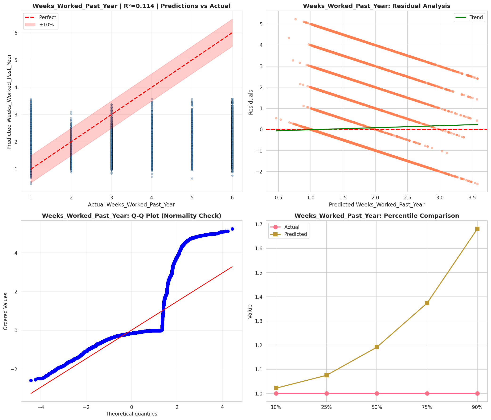
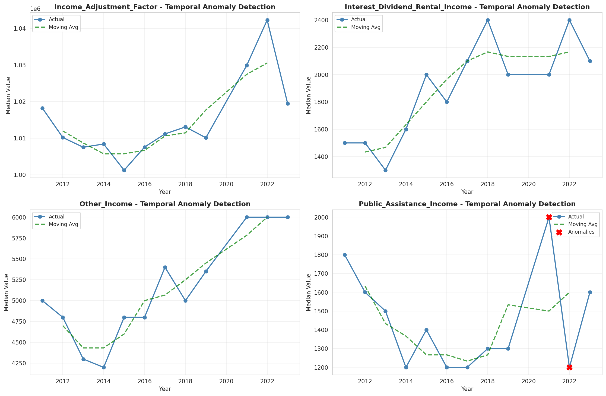
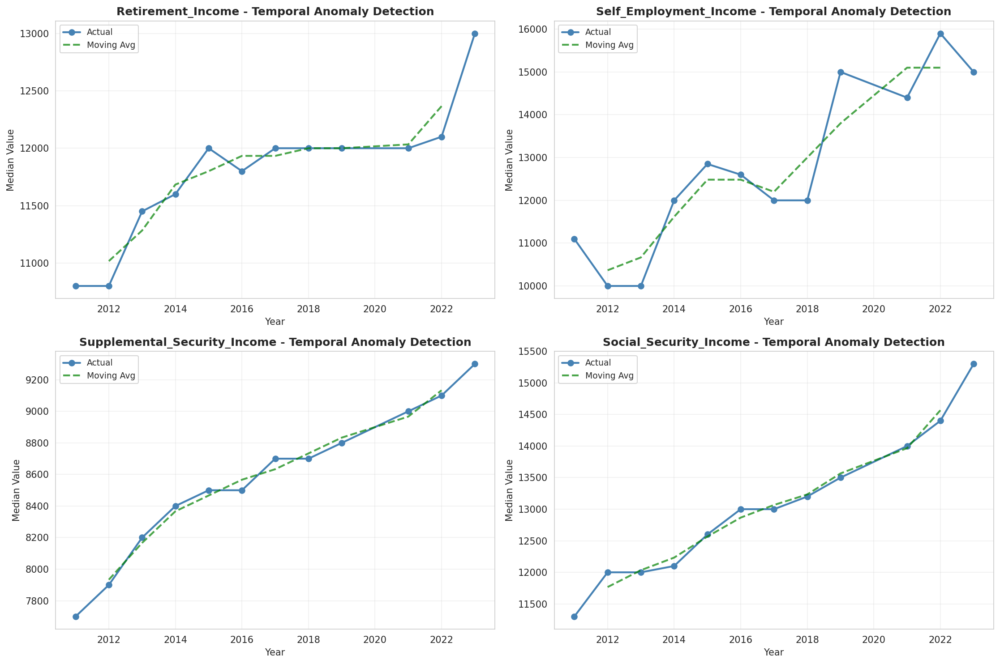
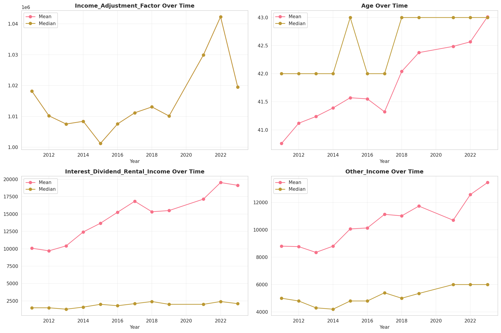
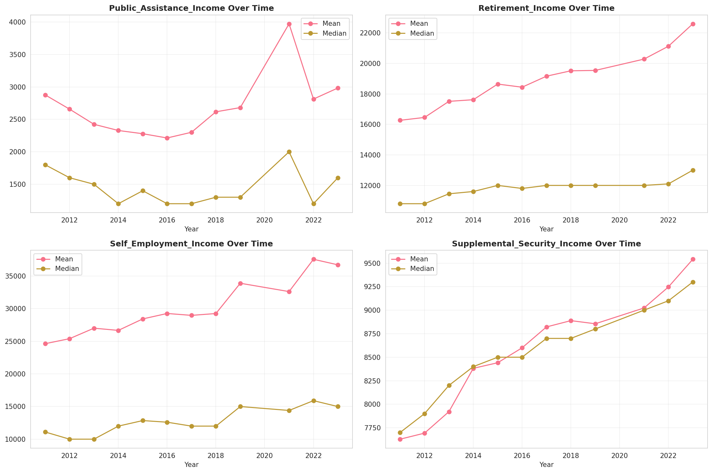
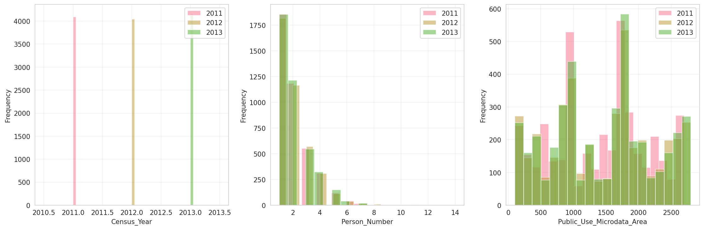
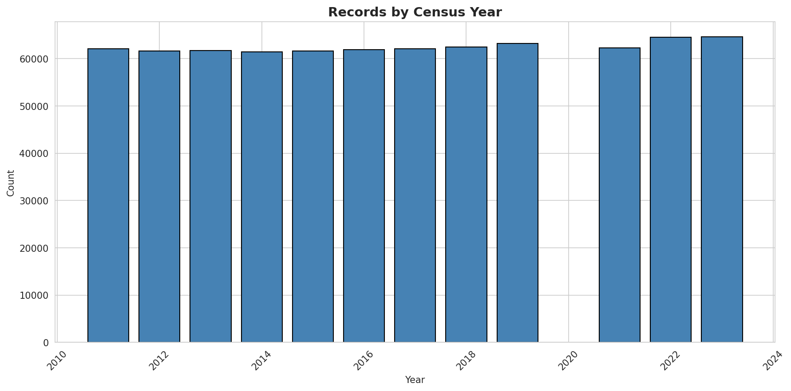
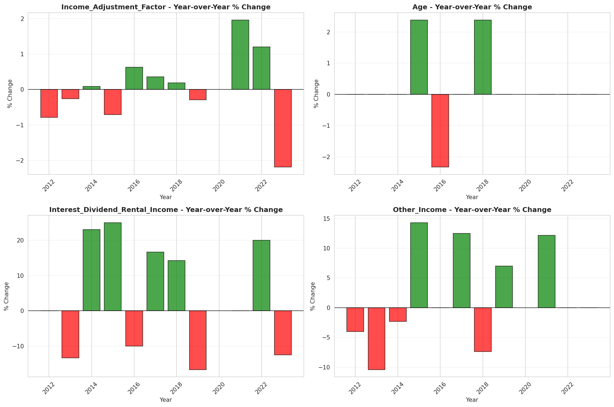
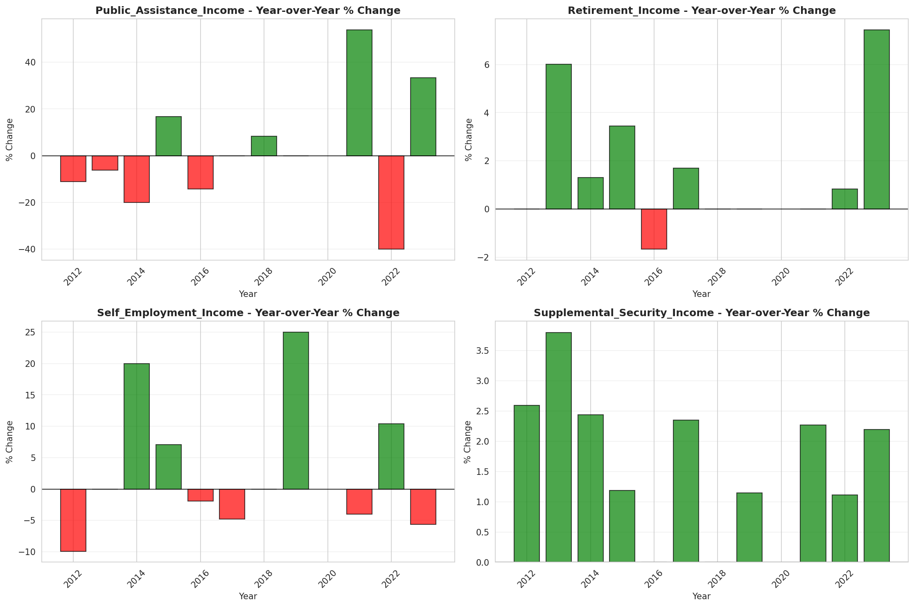

# Temporal Analysis

## Year Distribution

- 2011: 62,110 records

- 2012: 61,639 records

- 2013: 61,699 records

- 2014: 61,394 records

- 2015: 61,586 records

- 2016: 61,923 records

- 2017: 62,073 records

- 2018: 62,416 records

- 2019: 63,174 records

- 2021: 62,254 records

- 2022: 64,551 records

- 2023: 64,578 records

## Temporal Trends

- Census_Year: {np.int64(2011): {'mean': 2011.0, 'median': 2011.0, 'std': 0.0}, np.int64(2012): {'mean': 2012.0, 'median': 2012.0, 'std': 0.0}, np.int64(2013): {'mean': 2013.0, 'median': 2013.0, 'std': 0.0}, np.int64(2014): {'mean': 2014.0, 'median': 2014.0, 'std': 0.0}, np.int64(2015): {'mean': 2015.0, 'median': 2015.0, 'std': 0.0}, np.int64(2016): {'mean': 2016.0, 'median': 2016.0, 'std': 0.0}, np.int64(2017): {'mean': 2017.0, 'median': 2017.0, 'std': 0.0}, np.int64(2018): {'mean': 2018.0, 'median': 2018.0, 'std': 0.0}, np.int64(2019): {'mean': 2019.0, 'median': 2019.0, 'std': 0.0}, np.int64(2021): {'mean': 2021.0, 'median': 2021.0, 'std': 0.0}, np.int64(2022): {'mean': 2022.0, 'median': 2022.0, 'std': 0.0}, np.int64(2023): {'mean': 2023.0, 'median': 2023.0, 'std': 0.0}}

- Person_Number: {np.int64(2011): {'mean': 2.000805023345677, 'median': 2.0, 'std': 1.2592823635621242}, np.int64(2012): {'mean': 2.0014925615276042, 'median': 2.0, 'std': 1.2592360535652505}, np.int64(2013): {'mean': 2.0104215627481805, 'median': 2.0, 'std': 1.2799892098404786}, np.int64(2014): {'mean': 2.0079812359513958, 'median': 2.0, 'std': 1.2789802771425691}, np.int64(2015): {'mean': 2.0127139284902413, 'median': 2.0, 'std': 1.300239765262717}, np.int64(2016): {'mean': 2.016326728356184, 'median': 2.0, 'std': 1.2804382843968334}, np.int64(2017): {'mean': 2.0148051487764405, 'median': 2.0, 'std': 1.2853920784237154}, np.int64(2018): {'mean': 2.002307100743399, 'median': 2.0, 'std': 1.2795801839071579}, np.int64(2019): {'mean': 2.0027384683572356, 'median': 2.0, 'std': 1.2842094455361786}, np.int64(2021): {'mean': 1.9980402865679314, 'median': 2.0, 'std': 1.2524742089226966}, np.int64(2022): {'mean': 2.003175783489024, 'median': 2.0, 'std': 1.307111863881586}, np.int64(2023): {'mean': 1.9958964353185296, 'median': 2.0, 'std': 1.2929336475493085}}

- Public_Use_Microdata_Area: {np.int64(2011): {'mean': 1389.8529222347447, 'median': 1500.0, 'std': 719.8259147134355}, np.int64(2012): {'mean': 1457.1175554437937, 'median': 1600.0, 'std': 769.399236788345}, np.int64(2013): {'mean': 1461.1647352469247, 'median': 1600.0, 'std': 769.2605664195383}, np.int64(2014): {'mean': 1459.267224810242, 'median': 1600.0, 'std': 768.4767345977975}, np.int64(2015): {'mean': 1466.0157340954113, 'median': 1600.0, 'std': 764.9184793373173}, np.int64(2016): {'mean': 1461.4918043376451, 'median': 1600.0, 'std': 761.2399950752961}, np.int64(2017): {'mean': 1456.7113076538915, 'median': 1600.0, 'std': 763.3081735504211}, np.int64(2018): {'mean': 1447.9324532171238, 'median': 1500.0, 'std': 768.8544432688624}, np.int64(2019): {'mean': 1452.1712888213506, 'median': 1500.0, 'std': 767.3266117279849}, np.int64(2021): {'mean': 1446.2359205834164, 'median': 1600.0, 'std': 764.1699267386664}, np.int64(2022): {'mean': 1527.917042338616, 'median': 1600.0, 'std': 803.6898863636716}, np.int64(2023): {'mean': 1540.5827681253677, 'median': 1700.0, 'std': 808.6083407829053}}

- State_Code: {np.int64(2011): {'mean': 29.0, 'median': 29.0, 'std': 0.0}, np.int64(2012): {'mean': 29.0, 'median': 29.0, 'std': 0.0}, np.int64(2013): {'mean': 29.0, 'median': 29.0, 'std': 0.0}, np.int64(2014): {'mean': 29.0, 'median': 29.0, 'std': 0.0}, np.int64(2015): {'mean': 29.0, 'median': 29.0, 'std': 0.0}, np.int64(2016): {'mean': 29.0, 'median': 29.0, 'std': 0.0}, np.int64(2017): {'mean': 29.0, 'median': 29.0, 'std': 0.0}, np.int64(2018): {'mean': 29.0, 'median': 29.0, 'std': 0.0}, np.int64(2019): {'mean': 29.0, 'median': 29.0, 'std': 0.0}, np.int64(2021): {'mean': 29.0, 'median': 29.0, 'std': 0.0}, np.int64(2022): {'mean': 29.0, 'median': 29.0, 'std': 0.0}, np.int64(2023): {'mean': None, 'median': None, 'std': None}}

- Income_Adjustment_Factor: {np.int64(2011): {'mean': 1018237.0, 'median': 1018237.0, 'std': 0.0}, np.int64(2012): {'mean': 1010207.0, 'median': 1010207.0, 'std': 0.0}, np.int64(2013): {'mean': 1007549.0, 'median': 1007549.0, 'std': 0.0}, np.int64(2014): {'mean': 1008425.0, 'median': 1008425.0, 'std': 0.0}, np.int64(2015): {'mean': 1001264.0, 'median': 1001264.0, 'std': 0.0}, np.int64(2016): {'mean': 1007588.0, 'median': 1007588.0, 'std': 0.0}, np.int64(2017): {'mean': 1011189.0, 'median': 1011189.0, 'std': 0.0}, np.int64(2018): {'mean': 1013097.0, 'median': 1013097.0, 'std': 0.0}, np.int64(2019): {'mean': 1010145.0, 'median': 1010145.0, 'std': 0.0}, np.int64(2021): {'mean': 1029928.0, 'median': 1029928.0, 'std': 0.0}, np.int64(2022): {'mean': 1042311.0, 'median': 1042311.0, 'std': 0.0}, np.int64(2023): {'mean': 1019518.0, 'median': 1019518.0, 'std': 0.0}}

- Person_Weight: {np.int64(2011): {'mean': 96.77488327161488, 'median': 75.0, 'std': 90.85477352859084}, np.int64(2012): {'mean': 97.69769139668067, 'median': 78.0, 'std': 85.45644465070255}, np.int64(2013): {'mean': 97.96221980907308, 'median': 78.0, 'std': 84.93636108549035}, np.int64(2014): {'mean': 98.76517249242598, 'median': 79.0, 'std': 86.19889896693853}, np.int64(2015): {'mean': 98.78335985451238, 'median': 79.0, 'std': 85.72607196899862}, np.int64(2016): {'mean': 98.3963955234727, 'median': 78.0, 'std': 85.90118752877699}, np.int64(2017): {'mean': 98.48939152288435, 'median': 79.0, 'std': 86.1593590981626}, np.int64(2018): {'mean': 98.1551525249936, 'median': 78.0, 'std': 85.9170762763816}, np.int64(2019): {'mean': 97.15116978503815, 'median': 75.0, 'std': 91.33016027197736}, np.int64(2021): {'mean': 99.08097471648408, 'median': 76.0, 'std': 90.54041855013408}, np.int64(2022): {'mean': 95.70660408049449, 'median': 75.0, 'std': 89.38865593914527}, np.int64(2023): {'mean': 95.94840348106166, 'median': 74.0, 'std': 92.9340452423561}}

- Age: {np.int64(2011): {'mean': 40.75812268555788, 'median': 42.0, 'std': 23.788053820484173}, np.int64(2012): {'mean': 41.11791236068074, 'median': 42.0, 'std': 23.843487077212487}, np.int64(2013): {'mean': 41.23666509992058, 'median': 42.0, 'std': 23.79977700172735}, np.int64(2014): {'mean': 41.38987523210737, 'median': 42.0, 'std': 23.868973237534554}, np.int64(2015): {'mean': 41.57144480888513, 'median': 43.0, 'std': 23.931489364592718}, np.int64(2016): {'mean': 41.5513460265168, 'median': 42.0, 'std': 23.951131941588223}, np.int64(2017): {'mean': 41.32118634510979, 'median': 42.0, 'std': 23.92955340226104}, np.int64(2018): {'mean': 42.03946103563189, 'median': 43.0, 'std': 24.07933421872463}, np.int64(2019): {'mean': 42.375423433691076, 'median': 43.0, 'std': 24.153846663652132}, np.int64(2021): {'mean': 42.48597680470331, 'median': 43.0, 'std': 24.16970147991024}, np.int64(2022): {'mean': 42.5674582887949, 'median': 43.0, 'std': 24.270139250189043}, np.int64(2023): {'mean': 43.013595961472944, 'median': 43.0, 'std': 24.385712240334755}}

- Citizenship_Status: {np.int64(2011): {'mean': 1.1306391885364675, 'median': 1.0, 'std': 0.6654095477755302}, np.int64(2012): {'mean': 1.118593747465079, 'median': 1.0, 'std': 0.6298578008164447}, np.int64(2013): {'mean': 1.1179273570074069, 'median': 1.0, 'std': 0.6284548010588155}, np.int64(2014): {'mean': 1.1135941622959897, 'median': 1.0, 'std': 0.6093783037069662}, np.int64(2015): {'mean': 1.1245575293086092, 'median': 1.0, 'std': 0.642131497557511}, np.int64(2016): {'mean': 1.1314051321802885, 'median': 1.0, 'std': 0.6562029512459344}, np.int64(2017): {'mean': 1.134245162953297, 'median': 1.0, 'std': 0.6590689948393893}, np.int64(2018): {'mean': 1.1232216098436298, 'median': 1.0, 'std': 0.6343690868944647}, np.int64(2019): {'mean': 1.1255579827144078, 'median': 1.0, 'std': 0.6351388505351359}, np.int64(2021): {'mean': 1.1313168631734507, 'median': 1.0, 'std': 0.6538142917519942}, np.int64(2022): {'mean': 1.132453408932472, 'median': 1.0, 'std': 0.6563462858861578}, np.int64(2023): {'mean': 1.1449719718789682, 'median': 1.0, 'std': 0.6874104575679281}}

- Class_of_Worker: {np.int64(2011): {'mean': 2.1274429298735424, 'median': 1.0, 'std': 1.9085131972004334}, np.int64(2012): {'mean': 2.0941433590616096, 'median': 1.0, 'std': 1.8917228501876364}, np.int64(2013): {'mean': 2.0639512543228853, 'median': 1.0, 'std': 1.859980718501709}, np.int64(2014): {'mean': 2.068195684730157, 'median': 1.0, 'std': 1.8588254847321888}, np.int64(2015): {'mean': 2.0762169680111264, 'median': 1.0, 'std': 1.8715100524513046}, np.int64(2016): {'mean': 2.056847402328089, 'median': 1.0, 'std': 1.8499774816310637}, np.int64(2017): {'mean': 2.0489214175654853, 'median': 1.0, 'std': 1.847641823409694}, np.int64(2018): {'mean': 2.0303254235432577, 'median': 1.0, 'std': 1.8333694906530913}, np.int64(2019): {'mean': 2.0357074347099284, 'median': 1.0, 'std': 1.8074968967774312}, np.int64(2021): {'mean': 2.0591188722447518, 'median': 1.0, 'std': 1.8186233750777012}, np.int64(2022): {'mean': 2.071651755908666, 'median': 1.0, 'std': 1.8343186414003028}, np.int64(2023): {'mean': 2.0449208915273105, 'median': 1.0, 'std': 1.7966337998996773}}

- English_Speaking_Ability: {np.int64(2011): {'mean': 1.5994483604045358, 'median': 1.0, 'std': 0.8540808030286122}, np.int64(2012): {'mean': 1.5337301587301588, 'median': 1.0, 'std': 0.8315956237531712}, np.int64(2013): {'mean': 1.5426136363636365, 'median': 1.0, 'std': 0.8303493590833606}, np.int64(2014): {'mean': 1.498533724340176, 'median': 1.0, 'std': 0.7983284092113514}, np.int64(2015): {'mean': 1.5246527777777779, 'median': 1.0, 'std': 0.8188152245329713}, np.int64(2016): {'mean': 1.5209542230818827, 'median': 1.0, 'std': 0.8111083772102696}, np.int64(2017): {'mean': 1.490170380078637, 'median': 1.0, 'std': 0.7892893947969205}, np.int64(2018): {'mean': 1.5091961852861036, 'median': 1.0, 'std': 0.8007134176290128}, np.int64(2019): {'mean': 1.4705497382198953, 'median': 1.0, 'std': 0.7905641310582007}, np.int64(2021): {'mean': 1.4996757457846952, 'median': 1.0, 'std': 0.7987582959550716}, np.int64(2022): {'mean': 1.4965495608531996, 'median': 1.0, 'std': 0.786408318666477}, np.int64(2023): {'mean': 1.4864864864864864, 'median': 1.0, 'std': 0.7876061934261125}}

- Fertility_Status: {np.int64(2011): {'mean': 1.946034520428228, 'median': 2.0, 'std': 0.2259577946329283}, np.int64(2012): {'mean': 1.944248253061838, 'median': 2.0, 'std': 0.22945031146025227}, np.int64(2013): {'mean': 1.9477315335583052, 'median': 2.0, 'std': 0.22257625414072194}, np.int64(2014): {'mean': 1.9486337963669669, 'median': 2.0, 'std': 0.22075197880534422}, np.int64(2015): {'mean': 1.9482336748738338, 'median': 2.0, 'std': 0.2215633687370439}, np.int64(2016): {'mean': 1.946840521564694, 'median': 2.0, 'std': 0.22436005002948708}, np.int64(2017): {'mean': 1.944223716381418, 'median': 2.0, 'std': 0.22949796088187127}, np.int64(2018): {'mean': 1.944362191225746, 'median': 2.0, 'std': 0.2292298794555875}, np.int64(2019): {'mean': 1.9455295307758151, 'median': 2.0, 'std': 0.22695251762487678}, np.int64(2021): {'mean': 1.9491471888818699, 'median': 2.0, 'std': 0.21970574494068215}, np.int64(2022): {'mean': 1.9465285130842536, 'median': 2.0, 'std': 0.22498025508176436}, np.int64(2023): {'mean': 1.948948043134002, 'median': 2.0, 'std': 0.2201120353015578}}

- Marital_Status: {np.int64(2011): {'mean': 2.877153437449686, 'median': 3.0, 'std': 1.8346652463492568}, np.int64(2012): {'mean': 2.8714125796979184, 'median': 3.0, 'std': 1.8307060755824498}, np.int64(2013): {'mean': 2.8712134718552975, 'median': 3.0, 'std': 1.8355899913506781}, np.int64(2014): {'mean': 2.8764537251197186, 'median': 3.0, 'std': 1.8350348716205436}, np.int64(2015): {'mean': 2.8702464845906537, 'median': 3.0, 'std': 1.8321200267600803}, np.int64(2016): {'mean': 2.8883452029132957, 'median': 3.0, 'std': 1.8379050773545298}, np.int64(2017): {'mean': 2.8948979427448327, 'median': 3.0, 'std': 1.83496454807186}, np.int64(2018): {'mean': 2.8735420405024352, 'median': 3.0, 'std': 1.8342643299346435}, np.int64(2019): {'mean': 2.859087599328838, 'median': 3.0, 'std': 1.832124675292383}, np.int64(2021): {'mean': 2.881758601856909, 'median': 3.0, 'std': 1.8376538829770763}, np.int64(2022): {'mean': 2.889668634103267, 'median': 3.0, 'std': 1.8371677761795342}, np.int64(2023): {'mean': 2.8838768620892563, 'median': 3.0, 'std': 1.837289328402727}}

- Mobility_Status: {np.int64(2011): {'mean': 1.2918260077134627, 'median': 1.0, 'std': 0.7036309896732458}, np.int64(2012): {'mean': 1.294992213752971, 'median': 1.0, 'std': 0.7063334615528823}, np.int64(2013): {'mean': 1.2885991778174493, 'median': 1.0, 'std': 0.7008202400791484}, np.int64(2014): {'mean': 1.2897546850063344, 'median': 1.0, 'std': 0.7019354110645015}, np.int64(2015): {'mean': 1.2862390135117407, 'median': 1.0, 'std': 0.6978384708485726}, np.int64(2016): {'mean': 1.2832702720334008, 'median': 1.0, 'std': 0.6955418741206963}, np.int64(2017): {'mean': 1.2800442809233874, 'median': 1.0, 'std': 0.6917936115414614}, np.int64(2018): {'mean': 1.270866728194168, 'median': 1.0, 'std': 0.682327699692373}, np.int64(2019): {'mean': 1.2612232503875598, 'median': 1.0, 'std': 0.6719012354030117}, np.int64(2021): {'mean': 1.2444570502431118, 'median': 1.0, 'std': 0.6530849474920646}, np.int64(2022): {'mean': 1.2404366457101748, 'median': 1.0, 'std': 0.6481501662000585}, np.int64(2023): {'mean': 1.216271981242673, 'median': 1.0, 'std': 0.6183091969026739}}

- Military_Service: {np.int64(2011): {'mean': 4.7491284985995526, 'median': 5.0, 'std': 0.6694213702399067}, np.int64(2012): {'mean': 4.754339416280153, 'median': 5.0, 'std': 0.6651499886599749}, np.int64(2013): {'mean': 3.7702344050730363, 'median': 4.0, 'std': 0.6293088174054728}, np.int64(2014): {'mean': 3.7772722656646693, 'median': 4.0, 'std': 0.6215707835528803}, np.int64(2015): {'mean': 3.7847032931532296, 'median': 4.0, 'std': 0.6123566287486247}, np.int64(2016): {'mean': 3.7811349600692, 'median': 4.0, 'std': 0.6163916054395497}, np.int64(2017): {'mean': 3.7946745085401226, 'median': 4.0, 'std': 0.5987564735031825}, np.int64(2018): {'mean': 3.8024759939687325, 'median': 4.0, 'std': 0.5873740319393395}, np.int64(2019): {'mean': 3.7977576541612765, 'median': 4.0, 'std': 0.5958883147529387}, np.int64(2021): {'mean': 3.8138418191198062, 'median': 4.0, 'std': 0.5757406957912952}, np.int64(2022): {'mean': 3.820652485522619, 'median': 4.0, 'std': 0.5651777762909678}, np.int64(2023): {'mean': 3.8222424794895167, 'median': 4.0, 'std': 0.5620240563709352}}

- Travel_Time_To_Work_Minutes: {np.int64(2011): {'mean': 23.7568088790932, 'median': 20.0, 'std': 21.837757258236557}, np.int64(2012): {'mean': 23.780640586219125, 'median': 20.0, 'std': 21.651628733689584}, np.int64(2013): {'mean': 23.90399509240089, 'median': 20.0, 'std': 21.449379994301133}, np.int64(2014): {'mean': 23.51227635349702, 'median': 20.0, 'std': 20.186859561557778}, np.int64(2015): {'mean': 24.062189245008796, 'median': 20.0, 'std': 21.02873015839264}, np.int64(2016): {'mean': 24.391120027253113, 'median': 20.0, 'std': 22.16959827718834}, np.int64(2017): {'mean': 24.53793103448276, 'median': 20.0, 'std': 21.710921896762045}, np.int64(2018): {'mean': 24.60586233970165, 'median': 20.0, 'std': 21.560948168709757}, np.int64(2019): {'mean': 25.16086780061248, 'median': 20.0, 'std': 22.952549301971366}, np.int64(2021): {'mean': 23.592114093959733, 'median': 20.0, 'std': 20.506305530922116}, np.int64(2022): {'mean': 24.27210453375569, 'median': 20.0, 'std': 22.086914517197698}, np.int64(2023): {'mean': 24.30352932080869, 'median': 20.0, 'std': 21.864672173972348}}

- Vehicle_Occupancy: {np.int64(2011): {'mean': 1.1645664379288834, 'median': 1.0, 'std': 0.5916224110344412}, np.int64(2012): {'mean': 1.1558053677355125, 'median': 1.0, 'std': 0.5566995044803038}, np.int64(2013): {'mean': 1.1443031824439225, 'median': 1.0, 'std': 0.5322229465559194}, np.int64(2014): {'mean': 1.1442806387062523, 'median': 1.0, 'std': 0.5295042637343589}, np.int64(2015): {'mean': 1.1433158084841675, 'median': 1.0, 'std': 0.5574701490533196}, np.int64(2016): {'mean': 1.14094013022074, 'median': 1.0, 'std': 0.5470539068870545}, np.int64(2017): {'mean': 1.1419588115076247, 'median': 1.0, 'std': 0.5425438607646897}, np.int64(2018): {'mean': 1.138747553816047, 'median': 1.0, 'std': 0.5275731186325033}, np.int64(2019): {'mean': 1.141896331800085, 'median': 1.0, 'std': 0.534980412704664}, np.int64(2021): {'mean': 1.1393226881909106, 'median': 1.0, 'std': 0.5505589949721597}, np.int64(2022): {'mean': 1.1479439562261649, 'median': 1.0, 'std': 0.546589445923321}, np.int64(2023): {'mean': 1.1598090383137112, 'median': 1.0, 'std': 0.6273282995226437}}

- Transportation_To_Work: {np.int64(2011): {'mean': 1.8455973310342242, 'median': 1.0, 'std': 2.717320138976388}, np.int64(2012): {'mean': 1.8273041128790153, 'median': 1.0, 'std': 2.6910105241879965}, np.int64(2013): {'mean': 1.7793199676874496, 'median': 1.0, 'std': 2.6092387104345223}, np.int64(2014): {'mean': 1.815975172719548, 'median': 1.0, 'std': 2.675250163093763}, np.int64(2015): {'mean': 1.7857325119381766, 'median': 1.0, 'std': 2.630680023855222}, np.int64(2016): {'mean': 1.8169342960807557, 'median': 1.0, 'std': 2.6802668132376772}, np.int64(2017): {'mean': 1.8140644472138152, 'median': 1.0, 'std': 2.675841615014819}, np.int64(2018): {'mean': 1.8124510850231235, 'median': 1.0, 'std': 2.679782026476323}, np.int64(2019): {'mean': None, 'median': None, 'std': None}, np.int64(2021): {'mean': None, 'median': None, 'std': None}, np.int64(2022): {'mean': None, 'median': None, 'std': None}, np.int64(2023): {'mean': None, 'median': None, 'std': None}}

- Language_Other_Than_English: {np.int64(2011): {'mean': 1.944407530454042, 'median': 2.0, 'std': 0.22913498506018712}, np.int64(2012): {'mean': 1.9480688980096512, 'median': 2.0, 'std': 0.22188985589727817}, np.int64(2013): {'mean': 1.9517609976702754, 'median': 2.0, 'std': 0.2142726942124105}, np.int64(2014): {'mean': 1.9530828102158397, 'median': 2.0, 'std': 0.21146332103343216}, np.int64(2015): {'mean': 1.9506595854034607, 'median': 2.0, 'std': 0.21657964284398037}, np.int64(2016): {'mean': 1.947200898708107, 'median': 2.0, 'std': 0.22363409277609675}, np.int64(2017): {'mean': 1.9480510638297872, 'median': 2.0, 'std': 0.22192584914176583}, np.int64(2018): {'mean': 1.950354250156411, 'median': 2.0, 'std': 0.21721382824025798}, np.int64(2019): {'mean': 1.948952660942772, 'median': 2.0, 'std': 0.22009615492217904}, np.int64(2021): {'mean': 1.9478754690193691, 'median': 2.0, 'std': 0.22228000209561594}, np.int64(2022): {'mean': 1.9480180664938285, 'median': 2.0, 'std': 0.2219923774371593}, np.int64(2023): {'mean': 1.9434048231197318, 'median': 2.0, 'std': 0.23106932220308316}}

- Grandparents_Living_With_Grandchildren: {np.int64(2011): {'mean': 1.9712441463105936, 'median': 2.0, 'std': 0.16712169685156572}, np.int64(2012): {'mean': 1.9710035108989417, 'median': 2.0, 'std': 0.1677987005396746}, np.int64(2013): {'mean': 1.969834731501482, 'median': 2.0, 'std': 0.1710440291075172}, np.int64(2014): {'mean': 1.9703082788395991, 'median': 2.0, 'std': 0.16973759239801303}, np.int64(2015): {'mean': 1.9706873145960078, 'median': 2.0, 'std': 0.1686836305117607}, np.int64(2016): {'mean': 1.9694910172159616, 'median': 2.0, 'std': 0.1719852430838114}, np.int64(2017): {'mean': 1.9703620192909934, 'median': 2.0, 'std': 0.1695885943892663}, np.int64(2018): {'mean': 1.9737307711210499, 'median': 2.0, 'std': 0.1599368159045015}, np.int64(2019): {'mean': 1.969559039568432, 'median': 2.0, 'std': 0.171799357306451}, np.int64(2021): {'mean': 1.9752182689267734, 'median': 2.0, 'std': 0.15546119979022255}, np.int64(2022): {'mean': 1.9743734424225325, 'median': 2.0, 'std': 0.15802032841990057}, np.int64(2023): {'mean': 1.9758738158570162, 'median': 2.0, 'std': 0.1534426953168925}}

- Months_Responsible_For_Grandchildren: {np.int64(2011): {'mean': 3.6666666666666665, 'median': 4.0, 'std': 1.4133435447193134}, np.int64(2012): {'mean': 3.638733705772812, 'median': 4.0, 'std': 1.3451920595548483}, np.int64(2013): {'mean': 3.557491289198606, 'median': 4.0, 'std': 1.3611428748492793}, np.int64(2014): {'mean': 3.6495575221238936, 'median': 4.0, 'std': 1.3478459235585587}, np.int64(2015): {'mean': 3.6961538461538463, 'median': 4.0, 'std': 1.3783296051273568}, np.int64(2016): {'mean': 3.7409948542024014, 'median': 4.0, 'std': 1.3734661691657681}, np.int64(2017): {'mean': 3.782214156079855, 'median': 4.0, 'std': 1.2876092707237654}, np.int64(2018): {'mean': 3.8354978354978355, 'median': 4.0, 'std': 1.295326017386555}, np.int64(2019): {'mean': 3.8205546492659055, 'median': 4.0, 'std': 1.3359416958600165}, np.int64(2021): {'mean': 4.055172413793104, 'median': 5.0, 'std': 1.2669822105372643}, np.int64(2022): {'mean': 3.861607142857143, 'median': 4.0, 'std': 1.3638178767792613}, np.int64(2023): {'mean': 3.9956236323851204, 'median': 5.0, 'std': 1.3442463871124395}}

- Grandparents_Responsible_For_Grandchildren: {np.int64(2011): {'mean': 1.5220070422535212, 'median': 2.0, 'std': 0.4997354577210497}, np.int64(2012): {'mean': 1.5322299651567943, 'median': 2.0, 'std': 0.4991776072701967}, np.int64(2013): {'mean': 1.5220649458784345, 'median': 2.0, 'std': 0.49972098793078307}, np.int64(2014): {'mean': 1.5195578231292517, 'median': 2.0, 'std': 0.49982990303981345}, np.int64(2015): {'mean': 1.5540308747855918, 'median': 2.0, 'std': 0.49728538182542603}, np.int64(2016): {'mean': 1.5225225225225225, 'median': 2.0, 'std': 0.49969714650158664}, np.int64(2017): {'mean': 1.5342349957734573, 'median': 2.0, 'std': 0.4990375531132283}, np.int64(2018): {'mean': 1.5678203928905519, 'median': 2.0, 'std': 0.4956109058104681}, np.int64(2019): {'mean': 1.5150316455696202, 'median': 2.0, 'std': 0.49997181134647417}, np.int64(2021): {'mean': 1.5731108930323847, 'median': 2.0, 'std': 0.4948687969528208}, np.int64(2022): {'mean': 1.5889908256880734, 'median': 2.0, 'std': 0.4922427543485877}, np.int64(2023): {'mean': 1.558027079303675, 'median': 2.0, 'std': 0.49686176351608785}}

- Interest_Dividend_Rental_Income: {np.int64(2011): {'mean': 10075.256301908787, 'median': 1500.0, 'std': 30223.357029842566}, np.int64(2012): {'mean': 9699.556079587324, 'median': 1500.0, 'std': 26286.474781810008}, np.int64(2013): {'mean': 10413.277616077616, 'median': 1300.0, 'std': 28245.42793516806}, np.int64(2014): {'mean': 12420.556685832227, 'median': 1600.0, 'std': 34774.66146103463}, np.int64(2015): {'mean': 13671.225024658306, 'median': 2000.0, 'std': 38475.45251987329}, np.int64(2016): {'mean': 15259.035719623374, 'median': 1800.0, 'std': 45385.05417099447}, np.int64(2017): {'mean': 16835.993783993785, 'median': 2100.0, 'std': 51247.125762021744}, np.int64(2018): {'mean': 15321.977528089888, 'median': 2400.0, 'std': 42832.790750599735}, np.int64(2019): {'mean': 15498.269516176908, 'median': 2000.0, 'std': 42680.814440491115}, np.int64(2021): {'mean': 17141.060734224327, 'median': 2000.0, 'std': 49734.246590252464}, np.int64(2022): {'mean': 19529.010135135137, 'median': 2400.0, 'std': 55320.41773017218}, np.int64(2023): {'mean': 19132.391993327772, 'median': 2100.0, 'std': 54661.39396600471}}

- Military_Service_Period_1: {np.int64(2011): {'mean': 0.10005321979776477, 'median': 0.0, 'std': 0.30009756635435464}, np.int64(2012): {'mean': 0.10092074381657339, 'median': 0.0, 'std': 0.30125094438473293}, np.int64(2013): {'mean': 0.11547433903576983, 'median': 0.0, 'std': 0.31962458614292055}, np.int64(2014): {'mean': 0.1324914812587693, 'median': 0.0, 'std': 0.3390583009647132}, np.int64(2015): {'mean': 0.14403973509933773, 'median': 0.0, 'std': 0.3511663578448018}, np.int64(2016): {'mean': 0.14521984671238403, 'median': 0.0, 'std': 0.3523578924889444}, np.int64(2017): {'mean': 0.15470803706097824, 'median': 0.0, 'std': 0.3616650995950993}, np.int64(2018): {'mean': 0.16258351893095768, 'median': 0.0, 'std': 0.3690263513953284}, np.int64(2019): {'mean': 0.18317677198975235, 'median': 0.0, 'std': 0.38685267537881285}, np.int64(2021): {'mean': 0.2057923239934071, 'median': 0.0, 'std': 0.40432701679699207}, np.int64(2022): {'mean': 0.22019002375296912, 'median': 0.0, 'std': 0.41442390404684204}, np.int64(2023): {'mean': 0.208804143126177, 'median': 0.0, 'std': 0.4065019952670953}}

- Military_Service_Period_2: {np.int64(2011): {'mean': 0.12879191059073974, 'median': 0.0, 'std': 0.3349991983590308}, np.int64(2012): {'mean': 0.12890413432027442, 'median': 0.0, 'std': 0.33512405816613844}, np.int64(2013): {'mean': 0.14288491446345256, 'median': 0.0, 'std': 0.3499894689866931}, np.int64(2014): {'mean': 0.15253557827219882, 'median': 0.0, 'std': 0.3595752932650342}, np.int64(2015): {'mean': 0.1560430463576159, 'median': 0.0, 'std': 0.36293370490454013}, np.int64(2016): {'mean': 0.17164179104477612, 'median': 0.0, 'std': 0.3771068409105673}, np.int64(2017): {'mean': 0.17194570135746606, 'median': 0.0, 'std': 0.3773739028712285}, np.int64(2018): {'mean': 0.17661469933184856, 'median': 0.0, 'std': 0.3813847696071122}, np.int64(2019): {'mean': 0.18274978650725876, 'median': 0.0, 'std': 0.3865025154898589}, np.int64(2021): {'mean': 0.18554273604897575, 'median': 0.0, 'std': 0.38878299795535565}, np.int64(2022): {'mean': 0.19453681710213777, 'median': 0.0, 'std': 0.3958907321432861}, np.int64(2023): {'mean': 0.1967984934086629, 'median': 0.0, 'std': 0.39762553406776946}}

- Military_Service_Period_3: {np.int64(2011): {'mean': 0.16338477913783928, 'median': 0.0, 'std': 0.36974916650954254}, np.int64(2012): {'mean': 0.16916410904495396, 'median': 0.0, 'std': 0.3749306496183949}, np.int64(2013): {'mean': None, 'median': None, 'std': None}, np.int64(2014): {'mean': None, 'median': None, 'std': None}, np.int64(2015): {'mean': None, 'median': None, 'std': None}, np.int64(2016): {'mean': None, 'median': None, 'std': None}, np.int64(2017): {'mean': None, 'median': None, 'std': None}, np.int64(2018): {'mean': None, 'median': None, 'std': None}, np.int64(2019): {'mean': None, 'median': None, 'std': None}, np.int64(2021): {'mean': None, 'median': None, 'std': None}, np.int64(2022): {'mean': None, 'median': None, 'std': None}, np.int64(2023): {'mean': None, 'median': None, 'std': None}}

- Military_Service_Period_4: {np.int64(2011): {'mean': 0.12205073620720241, 'median': 0.0, 'std': 0.32737343582130857}, np.int64(2012): {'mean': 0.12312691821628453, 'median': 0.0, 'std': 0.328612501033373}, np.int64(2013): {'mean': None, 'median': None, 'std': None}, np.int64(2014): {'mean': None, 'median': None, 'std': None}, np.int64(2015): {'mean': None, 'median': None, 'std': None}, np.int64(2016): {'mean': None, 'median': None, 'std': None}, np.int64(2017): {'mean': None, 'median': None, 'std': None}, np.int64(2018): {'mean': None, 'median': None, 'std': None}, np.int64(2019): {'mean': None, 'median': None, 'std': None}, np.int64(2021): {'mean': None, 'median': None, 'std': None}, np.int64(2022): {'mean': None, 'median': None, 'std': None}, np.int64(2023): {'mean': None, 'median': None, 'std': None}}

- Military_Service_Period_5: {np.int64(2011): {'mean': 0.3617172254745432, 'median': 0.0, 'std': 0.48054015348973045}, np.int64(2012): {'mean': 0.37660227477884095, 'median': 0.0, 'std': 0.4845775423115485}, np.int64(2013): {'mean': 0.3823872472783826, 'median': 0.0, 'std': 0.48601765454511936}, np.int64(2014): {'mean': 0.3832431348967729, 'median': 0.0, 'std': 0.48622548446956954}, np.int64(2015): {'mean': 0.3841059602649007, 'median': 0.0, 'std': 0.4864334902283347}, np.int64(2016): {'mean': 0.39854780153287617, 'median': 0.0, 'std': 0.489648658519351}, np.int64(2017): {'mean': 0.4065934065934066, 'median': 0.0, 'std': 0.4912506562595954}, np.int64(2018): {'mean': 0.4006681514476615, 'median': 0.0, 'std': 0.49008843850399175}, np.int64(2019): {'mean': 0.39901793339026476, 'median': 0.0, 'std': 0.48974874096289195}, np.int64(2021): {'mean': 0.40734636213797976, 'median': 0.0, 'std': 0.4913981690078927}, np.int64(2022): {'mean': 0.39026128266033255, 'median': 0.0, 'std': 0.4878667331316256}, np.int64(2023): {'mean': 0.3912429378531073, 'median': 0.0, 'std': 0.4880860389997636}}

- Military_Service_Period_6: {np.int64(2011): {'mean': 0.10572999822600675, 'median': 0.0, 'std': 0.3075190107786743}, np.int64(2012): {'mean': 0.0985737497743275, 'median': 0.0, 'std': 0.29811576708659615}, np.int64(2013): {'mean': None, 'median': None, 'std': None}, np.int64(2014): {'mean': None, 'median': None, 'std': None}, np.int64(2015): {'mean': None, 'median': None, 'std': None}, np.int64(2016): {'mean': None, 'median': None, 'std': None}, np.int64(2017): {'mean': None, 'median': None, 'std': None}, np.int64(2018): {'mean': None, 'median': None, 'std': None}, np.int64(2019): {'mean': None, 'median': None, 'std': None}, np.int64(2021): {'mean': None, 'median': None, 'std': None}, np.int64(2022): {'mean': None, 'median': None, 'std': None}, np.int64(2023): {'mean': None, 'median': None, 'std': None}}

- Military_Service_Period_7: {np.int64(2011): {'mean': 0.1151321624977825, 'median': 0.0, 'std': 0.3192096861459678}, np.int64(2012): {'mean': 0.1155443220797978, 'median': 0.0, 'std': 0.3197065606407599}, np.int64(2013): {'mean': None, 'median': None, 'std': None}, np.int64(2014): {'mean': None, 'median': None, 'std': None}, np.int64(2015): {'mean': None, 'median': None, 'std': None}, np.int64(2016): {'mean': None, 'median': None, 'std': None}, np.int64(2017): {'mean': None, 'median': None, 'std': None}, np.int64(2018): {'mean': None, 'median': None, 'std': None}, np.int64(2019): {'mean': None, 'median': None, 'std': None}, np.int64(2021): {'mean': None, 'median': None, 'std': None}, np.int64(2022): {'mean': None, 'median': None, 'std': None}, np.int64(2023): {'mean': None, 'median': None, 'std': None}}

- Military_Service_Period_8: {np.int64(2011): {'mean': 0.13233989710839097, 'median': 0.0, 'std': 0.33888998571756146}, np.int64(2012): {'mean': 0.13089005235602094, 'median': 0.0, 'std': 0.33731052143865764}, np.int64(2013): {'mean': 0.11897356143079316, 'median': 0.0, 'std': 0.3237888725524575}, np.int64(2014): {'mean': 0.11645620364802566, 'median': 0.0, 'std': 0.3208033425935357}, np.int64(2015): {'mean': 0.11713576158940397, 'median': 0.0, 'std': 0.32161526935482554}, np.int64(2016): {'mean': 0.10044372730939895, 'median': 0.0, 'std': 0.3006210449535041}, np.int64(2017): {'mean': 0.08575737987502693, 'median': 0.0, 'std': 0.2800356207367364}, np.int64(2018): {'mean': 0.08062360801781737, 'median': 0.0, 'std': 0.27228652938995057}, np.int64(2019): {'mean': 0.0710930828351836, 'median': 0.0, 'std': 0.2570077007315039}, np.int64(2021): {'mean': 0.05321403343536614, 'median': 0.0, 'std': 0.22448644927385988}, np.int64(2022): {'mean': 0.04703087885985748, 'median': 0.0, 'std': 0.21173007264012378}, np.int64(2023): {'mean': 0.04449152542372881, 'median': 0.0, 'std': 0.20620872795664894}}

- Military_Service_Period_9: {np.int64(2011): {'mean': 0.021287919105907396, 'median': 0.0, 'std': 0.14435525737331134}, np.int64(2012): {'mean': 0.019317566347716194, 'median': 0.0, 'std': 0.13765107620169953}, np.int64(2013): {'mean': 0.017884914463452566, 'median': 0.0, 'std': 0.13254606606194483}, np.int64(2014): {'mean': 0.017438364401683705, 'median': 0.0, 'std': 0.1309110497493708}, np.int64(2015): {'mean': 0.015314569536423841, 'median': 0.0, 'std': 0.12281349685684317}, np.int64(2016): {'mean': 0.01593384429205325, 'median': 0.0, 'std': 0.1252322645845919}, np.int64(2017): {'mean': 0.010127127774186598, 'median': 0.0, 'std': 0.1001335584342288}, np.int64(2018): {'mean': 0.012249443207126948, 'median': 0.0, 'std': 0.11000949818610192}, np.int64(2019): {'mean': 0.009607173356105893, 'median': 0.0, 'std': 0.09755463785414577}, np.int64(2021): {'mean': None, 'median': None, 'std': None}, np.int64(2022): {'mean': None, 'median': None, 'std': None}, np.int64(2023): {'mean': None, 'median': None, 'std': None}}

- Military_Service_Period_10: {np.int64(2011): {'mean': 0.09419904204364024, 'median': 0.0, 'std': 0.29213134359092274}, np.int64(2012): {'mean': 0.08431124751760245, 'median': 0.0, 'std': 0.27787911333313825}, np.int64(2013): {'mean': 0.06998444790046657, 'median': 0.0, 'std': 0.25514560614210985}, np.int64(2014): {'mean': 0.056724794548005615, 'median': 0.0, 'std': 0.2313391868990881}, np.int64(2015): {'mean': 0.05360099337748345, 'median': 0.0, 'std': 0.22525191983374362}, np.int64(2016): {'mean': 0.03993545784590561, 'median': 0.0, 'std': 0.19582735175115185}, np.int64(2017): {'mean': 0.030165912518853696, 'median': 0.0, 'std': 0.17106208053843475}, np.int64(2018): {'mean': 0.026726057906458798, 'median': 0.0, 'std': 0.1612996289342443}, np.int64(2019): {'mean': 0.02220324508966695, 'median': 0.0, 'std': 0.14735975356261666}, np.int64(2021): {'mean': 0.011066635271956676, 'median': 0.0, 'std': 0.10462668101030327}, np.int64(2022): {'mean': 0.007838479809976246, 'median': 0.0, 'std': 0.08819799181714688}, np.int64(2023): {'mean': 0.005649717514124294, 'median': 0.0, 'std': 0.07496079625194713}}

- Military_Service_Period_11: {np.int64(2011): {'mean': 0.003547986517651233, 'median': 0.0, 'std': 0.059464490226345756}, np.int64(2012): {'mean': 0.004152374074742733, 'median': 0.0, 'std': 0.06431079650836863}, np.int64(2013): {'mean': 0.003110419906687403, 'median': 0.0, 'std': 0.05568974861337451}, np.int64(2014): {'mean': 0.0008017638805371818, 'median': 0.0, 'std': 0.02830691902859278}, np.int64(2015): {'mean': 0.0024834437086092716, 'median': 0.0, 'std': 0.04977739450207049}, np.int64(2016): {'mean': 0.0016135538523598225, 'median': 0.0, 'std': 0.04014069358213703}, np.int64(2017): {'mean': 0.00021547080370609782, 'median': 0.0, 'std': 0.014678923792502565}, np.int64(2018): {'mean': 0.0011135857461024498, 'median': 0.0, 'std': 0.033355561253464706}, np.int64(2019): {'mean': 0.0002134927412467976, 'median': 0.0, 'std': 0.014611390804670096}, np.int64(2021): {'mean': None, 'median': None, 'std': None}, np.int64(2022): {'mean': None, 'median': None, 'std': None}, np.int64(2023): {'mean': None, 'median': None, 'std': None}}

- Temporary_Absence_From_Work: {np.int64(2011): {'mean': 2.515838896923351, 'median': 3.0, 'std': 0.5304460994903158}, np.int64(2012): {'mean': 2.5166314783093653, 'median': 3.0, 'std': 0.5301696209907215}, np.int64(2013): {'mean': 2.580607220461296, 'median': 3.0, 'std': 0.5184067500253506}, np.int64(2014): {'mean': 2.579756502269047, 'median': 3.0, 'std': 0.5181060269306792}, np.int64(2015): {'mean': 2.5837142743570376, 'median': 3.0, 'std': 0.5163418805199906}, np.int64(2016): {'mean': 2.5909963391708715, 'median': 3.0, 'std': 0.5141236193961053}, np.int64(2017): {'mean': 2.59685635567184, 'median': 3.0, 'std': 0.5123540458951045}, np.int64(2018): {'mean': 2.593882021592865, 'median': 3.0, 'std': 0.5119757416707823}, np.int64(2019): {'mean': 2.599466985960101, 'median': 3.0, 'std': 0.5097152941869509}, np.int64(2021): {'mean': 2.5979085222830336, 'median': 3.0, 'std': 0.5110169640753134}, np.int64(2022): {'mean': 2.5913100724160634, 'median': 3.0, 'std': 0.512135207094426}, np.int64(2023): {'mean': 2.591671497223209, 'median': 3.0, 'std': 0.5106357950230463}}

- Available_For_Work: {np.int64(2011): {'mean': 4.512411593398974, 'median': 5.0, 'std': 1.2155505263839306}, np.int64(2012): {'mean': 4.5034059674142535, 'median': 5.0, 'std': 1.2052148877260378}, np.int64(2013): {'mean': 4.666666666666667, 'median': 5.0, 'std': 1.0231884788043932}, np.int64(2014): {'mean': 4.693508726334939, 'median': 5.0, 'std': 0.9804382397744429}, np.int64(2015): {'mean': 4.720475414397583, 'median': 5.0, 'std': 0.9337863109551433}, np.int64(2016): {'mean': 4.735292371623627, 'median': 5.0, 'std': 0.9110084524023131}, np.int64(2017): {'mean': 4.744643317278151, 'median': 5.0, 'std': 0.893199057391338}, np.int64(2018): {'mean': 4.750508527616962, 'median': 5.0, 'std': 0.8817179488499658}, np.int64(2019): {'mean': 4.754234178559703, 'median': 5.0, 'std': 0.8728821321435682}, np.int64(2021): {'mean': 4.785848318999218, 'median': 5.0, 'std': 0.8239290801081017}, np.int64(2022): {'mean': 4.80744850935766, 'median': 5.0, 'std': 0.7801069764517669}, np.int64(2023): {'mean': 4.7944426784345255, 'median': 5.0, 'std': 0.8026763960878995}}

- On_Layoff_From_Work: {np.int64(2011): {'mean': 2.4810507756007687, 'median': 2.0, 'std': 0.5323946969851269}, np.int64(2012): {'mean': 2.4859180177668008, 'median': 2.0, 'std': 0.5268140046446322}, np.int64(2013): {'mean': 2.5582401371528816, 'median': 3.0, 'std': 0.5191711888410141}, np.int64(2014): {'mean': 2.5636632614301993, 'median': 3.0, 'std': 0.5118842414929732}, np.int64(2015): {'mean': 2.569086139046786, 'median': 3.0, 'std': 0.5091798681300199}, np.int64(2016): {'mean': 2.5777579895122193, 'median': 3.0, 'std': 0.5060327862439195}, np.int64(2017): {'mean': 2.583992388654338, 'median': 3.0, 'std': 0.5046234650590008}, np.int64(2018): {'mean': 2.581286183695822, 'median': 3.0, 'std': 0.5044867755783429}, np.int64(2019): {'mean': 2.588922577779494, 'median': 3.0, 'std': 0.501327052963154}, np.int64(2021): {'mean': 2.585711493354183, 'median': 3.0, 'std': 0.5065715858854846}, np.int64(2022): {'mean': 2.583861563058403, 'median': 3.0, 'std': 0.5020339568631337}, np.int64(2023): {'mean': 2.584360216159614, 'median': 3.0, 'std': 0.5002927241557928}}

- Looking_For_Work: {np.int64(2011): {'mean': 2.469580204845771, 'median': 3.0, 'std': 0.6073704723246012}, np.int64(2012): {'mean': 2.4760188025335617, 'median': 3.0, 'std': 0.5988174556155615}, np.int64(2013): {'mean': 2.5433486832924665, 'median': 3.0, 'std': 0.5853712914257223}, np.int64(2014): {'mean': 2.553287619199936, 'median': 3.0, 'std': 0.5708361371376784}, np.int64(2015): {'mean': 2.5627459554000875, 'median': 3.0, 'std': 0.5594718807764733}, np.int64(2016): {'mean': 2.571564262392401, 'median': 3.0, 'std': 0.5538436100480523}, np.int64(2017): {'mean': 2.5775504945392558, 'median': 3.0, 'std': 0.5520900676673609}, np.int64(2018): {'mean': 2.5785675168205286, 'median': 3.0, 'std': 0.5446840392931178}, np.int64(2019): {'mean': 2.57463162163728, 'median': 3.0, 'std': 0.5432409946402043}, np.int64(2021): {'mean': 2.570230648944488, 'median': 3.0, 'std': 0.5492898784406366}, np.int64(2022): {'mean': 2.571729521301608, 'median': 3.0, 'std': 0.5394613391387083}, np.int64(2023): {'mean': 2.5682604386768637, 'median': 3.0, 'std': 0.5421837544067346}}

- Informed_Of_Recall: {np.int64(2011): {'mean': 2.8806585177407533, 'median': 3.0, 'std': 0.34738009716399076}, np.int64(2012): {'mean': 2.881567940086842, 'median': 3.0, 'std': 0.34540831075764866}, np.int64(2013): {'mean': 2.929390187987162, 'median': 3.0, 'std': 0.27530425611074166}, np.int64(2014): {'mean': 2.9345274984506506, 'median': 3.0, 'std': 0.26386303581185916}, np.int64(2015): {'mean': 2.934570894780777, 'median': 3.0, 'std': 0.2642254816517535}, np.int64(2016): {'mean': 2.939428119125359, 'median': 3.0, 'std': 0.2549851046288627}, np.int64(2017): {'mean': 2.9403183286753483, 'median': 3.0, 'std': 0.2528450007478897}, np.int64(2018): {'mean': 2.94171491159443, 'median': 3.0, 'std': 0.2501905482504265}, np.int64(2019): {'mean': 2.929491512330778, 'median': 3.0, 'std': 0.26859481242618416}, np.int64(2021): {'mean': 2.9464229867083658, 'median': 3.0, 'std': 0.23924082767513982}, np.int64(2022): {'mean': 2.9500047023417664, 'median': 3.0, 'std': 0.23060181472244307}, np.int64(2023): {'mean': 2.9475308064847883, 'median': 3.0, 'std': 0.23426076856587558}}

- Other_Income: {np.int64(2011): {'mean': 8808.04541062802, 'median': 5000.0, 'std': 11215.311498852787}, np.int64(2012): {'mean': 8774.753326509725, 'median': 4800.0, 'std': 11636.508047117866}, np.int64(2013): {'mean': 8351.910131174993, 'median': 4300.0, 'std': 10942.291694238136}, np.int64(2014): {'mean': 8807.614311704063, 'median': 4200.0, 'std': 12241.245625378346}, np.int64(2015): {'mean': 10067.499088145896, 'median': 4800.0, 'std': 14234.368704451163}, np.int64(2016): {'mean': 10138.980392156862, 'median': 4800.0, 'std': 14199.919238457476}, np.int64(2017): {'mean': 11133.501593371575, 'median': 5400.0, 'std': 14661.252360446406}, np.int64(2018): {'mean': 11022.595798854232, 'median': 5000.0, 'std': 14810.05356121456}, np.int64(2019): {'mean': 11737.08523908524, 'median': 5350.0, 'std': 15675.76924664902}, np.int64(2021): {'mean': 10704.709732016925, 'median': 6000.0, 'std': 13206.360718975724}, np.int64(2022): {'mean': 12577.235294117647, 'median': 6000.0, 'std': 15460.715414261897}, np.int64(2023): {'mean': 13458.527272727273, 'median': 6000.0, 'std': 16521.201603924605}}

- Public_Assistance_Income: {np.int64(2011): {'mean': 2877.017173051519, 'median': 1800.0, 'std': 3877.198828747527}, np.int64(2012): {'mean': 2657.3378932968535, 'median': 1600.0, 'std': 3497.059480133206}, np.int64(2013): {'mean': 2423.8333333333335, 'median': 1500.0, 'std': 3305.721619843239}, np.int64(2014): {'mean': 2328.3898305084745, 'median': 1200.0, 'std': 3330.911918241266}, np.int64(2015): {'mean': 2278.6837606837607, 'median': 1400.0, 'std': 2510.844727178391}, np.int64(2016): {'mean': 2213.0581613508443, 'median': 1200.0, 'std': 2740.662724857426}, np.int64(2017): {'mean': 2300.8602150537636, 'median': 1200.0, 'std': 3207.1337077776066}, np.int64(2018): {'mean': 2616.328502415459, 'median': 1300.0, 'std': 3228.8132317401855}, np.int64(2019): {'mean': 2681.1688311688313, 'median': 1300.0, 'std': 3475.2094987743244}, np.int64(2021): {'mean': 3972.35, 'median': 2000.0, 'std': 4984.912895105219}, np.int64(2022): {'mean': 2812.5413223140495, 'median': 1200.0, 'std': 3712.475017287325}, np.int64(2023): {'mean': 2983.036093418259, 'median': 1600.0, 'std': 3984.5302343006742}}

- Retirement_Income: {np.int64(2011): {'mean': 16269.47869593286, 'median': 10800.0, 'std': 17041.171446356457}, np.int64(2012): {'mean': 16456.978348035285, 'median': 10800.0, 'std': 18018.20561191441}, np.int64(2013): {'mean': 17512.0494213325, 'median': 11450.0, 'std': 19289.805688922992}, np.int64(2014): {'mean': 17619.988154613467, 'median': 11600.0, 'std': 18968.923021641225}, np.int64(2015): {'mean': 18646.093002392343, 'median': 12000.0, 'std': 20500.9076938533}, np.int64(2016): {'mean': 18440.193342055532, 'median': 11800.0, 'std': 20907.540963830237}, np.int64(2017): {'mean': 19162.21168890934, 'median': 12000.0, 'std': 21048.56861477469}, np.int64(2018): {'mean': 19516.472012533828, 'median': 12000.0, 'std': 23189.619247090613}, np.int64(2019): {'mean': 19540.28895063048, 'median': 12000.0, 'std': 23247.90910630394}, np.int64(2021): {'mean': 20282.960408962368, 'median': 12000.0, 'std': 24783.7518806185}, np.int64(2022): {'mean': 21126.748760156166, 'median': 12100.0, 'std': 25314.33869364765}, np.int64(2023): {'mean': 22596.902188295164, 'median': 13000.0, 'std': 28361.9255395427}}

- Self_Employment_Income: {np.int64(2011): {'mean': 24627.195362134687, 'median': 11100.0, 'std': 42649.85876520251}, np.int64(2012): {'mean': 25397.486434108527, 'median': 10000.0, 'std': 44801.94848276671}, np.int64(2013): {'mean': 27003.4795400744, 'median': 10000.0, 'std': 50158.414065272256}, np.int64(2014): {'mean': 26665.867055994502, 'median': 12000.0, 'std': 46078.293366123646}, np.int64(2015): {'mean': 28421.754260395366, 'median': 12850.0, 'std': 49339.63744698449}, np.int64(2016): {'mean': 29256.573200137787, 'median': 12600.0, 'std': 53509.74723645046}, np.int64(2017): {'mean': 28967.24966622163, 'median': 12000.0, 'std': 51746.40253664878}, np.int64(2018): {'mean': 29248.20382585752, 'median': 12000.0, 'std': 48963.088370013975}, np.int64(2019): {'mean': 33888.21769177609, 'median': 15000.0, 'std': 59926.0471690186}, np.int64(2021): {'mean': 32610.5434406369, 'median': 14400.0, 'std': 57743.8623604887}, np.int64(2022): {'mean': 37559.82125124131, 'median': 15900.0, 'std': 66500.76423487438}, np.int64(2023): {'mean': 36711.609690444144, 'median': 15000.0, 'std': 66432.09339606816}}

- Supplemental_Security_Income: {np.int64(2011): {'mean': 7628.648941942485, 'median': 7700.0, 'std': 4199.730313963587}, np.int64(2012): {'mean': 7692.802786709539, 'median': 7900.0, 'std': 4246.161353746605}, np.int64(2013): {'mean': 7921.166163141994, 'median': 8200.0, 'std': 4244.558750907609}, np.int64(2014): {'mean': 8382.069345074298, 'median': 8400.0, 'std': 4719.4309778934685}, np.int64(2015): {'mean': 8441.15795390669, 'median': 8500.0, 'std': 4841.306776254538}, np.int64(2016): {'mean': 8599.86607142857, 'median': 8500.0, 'std': 4960.31383347399}, np.int64(2017): {'mean': 8821.917808219177, 'median': 8700.0, 'std': 5178.338801597901}, np.int64(2018): {'mean': 8888.999447208402, 'median': 8700.0, 'std': 5178.456430303604}, np.int64(2019): {'mean': 8855.62645011601, 'median': 8800.0, 'std': 4920.159733889154}, np.int64(2021): {'mean': 9023.474178403756, 'median': 9000.0, 'std': 5291.852223992819}, np.int64(2022): {'mean': 9246.9433314253, 'median': 9100.0, 'std': 5497.381771756313}, np.int64(2023): {'mean': 9541.212484993997, 'median': 9300.0, 'std': 6070.597852663027}}

- Social_Security_Income: {np.int64(2011): {'mean': 11723.4420659709, 'median': 11300.0, 'std': 5932.048445558411}, np.int64(2012): {'mean': 12185.136066190296, 'median': 12000.0, 'std': 6295.889557844203}, np.int64(2013): {'mean': 12488.721353771438, 'median': 12000.0, 'std': 6431.59658975832}, np.int64(2014): {'mean': 12823.990579230147, 'median': 12100.0, 'std': 6632.154516734604}, np.int64(2015): {'mean': 13179.44236828607, 'median': 12600.0, 'std': 6787.819162484353}, np.int64(2016): {'mean': 13437.558626773505, 'median': 13000.0, 'std': 7029.008193517153}, np.int64(2017): {'mean': 13575.369944341373, 'median': 13000.0, 'std': 7169.443018678123}, np.int64(2018): {'mean': 13904.030491732876, 'median': 13200.0, 'std': 7371.003439609109}, np.int64(2019): {'mean': 14183.99051058707, 'median': 13500.0, 'std': 7582.731479355703}, np.int64(2021): {'mean': 14653.648456394936, 'median': 14000.0, 'std': 8189.998506302336}, np.int64(2022): {'mean': 15038.209654423246, 'median': 14400.0, 'std': 8715.659906152481}, np.int64(2023): {'mean': 16373.855832241154, 'median': 15300.0, 'std': 9339.420424879369}}

- Wage_Income: {np.int64(2011): {'mean': 35165.82081740867, 'median': 26000.0, 'std': 41710.2810327764}, np.int64(2012): {'mean': 36006.75715764057, 'median': 27000.0, 'std': 42196.5394543698}, np.int64(2013): {'mean': 37199.05729590453, 'median': 28000.0, 'std': 42973.20564894496}, np.int64(2014): {'mean': 38318.10210990664, 'median': 29000.0, 'std': 45007.24734512767}, np.int64(2015): {'mean': 40302.65998773257, 'median': 30000.0, 'std': 48671.118635212966}, np.int64(2016): {'mean': 41445.571140939595, 'median': 30000.0, 'std': 51413.26152523714}, np.int64(2017): {'mean': 42807.69789445629, 'median': 31000.0, 'std': 51720.43555755971}, np.int64(2018): {'mean': 44016.2672048703, 'median': 32000.0, 'std': 53353.86544616458}, np.int64(2019): {'mean': 46005.02432226167, 'median': 35000.0, 'std': 53080.693951438785}, np.int64(2021): {'mean': 49185.996188661265, 'median': 36000.0, 'std': 58859.8561030099}, np.int64(2022): {'mean': 50697.540569089586, 'median': 38000.0, 'std': 60511.756195464644}, np.int64(2023): {'mean': 53571.133193073314, 'median': 40000.0, 'std': 62162.16695247559}}

- Relationship_To_Householder: {np.int64(2011): {'mean': 2.571679278699082, 'median': 1.0, 'std': 4.518511987864598}, np.int64(2012): {'mean': 2.5363811872353543, 'median': 1.0, 'std': 4.471171171032277}, np.int64(2013): {'mean': 2.517188285061346, 'median': 1.0, 'std': 4.430639202545253}, np.int64(2014): {'mean': 2.5374955207349252, 'median': 1.0, 'std': 4.455986669550609}, np.int64(2015): {'mean': 2.534390933004254, 'median': 1.0, 'std': 4.452000434325971}, np.int64(2016): {'mean': 2.5826106616281512, 'median': 1.0, 'std': 4.499227734947144}, np.int64(2017): {'mean': 2.5557972065149097, 'median': 1.0, 'std': 4.4782827843204025}, np.int64(2018): {'mean': 2.5692931299666752, 'median': 1.0, 'std': 4.5040117718964865}, np.int64(2019): {'mean': None, 'median': None, 'std': None}, np.int64(2021): {'mean': None, 'median': None, 'std': None}, np.int64(2022): {'mean': None, 'median': None, 'std': None}, np.int64(2023): {'mean': None, 'median': None, 'std': None}}

- School_Enrollment: {np.int64(2011): {'mean': 1.3050819263079099, 'median': 1.0, 'std': 0.5639819271852442}, np.int64(2012): {'mean': 1.295033345621502, 'median': 1.0, 'std': 0.5523721575893857}, np.int64(2013): {'mean': 1.2933815164290972, 'median': 1.0, 'std': 0.5512842295191669}, np.int64(2014): {'mean': 1.2924964288715235, 'median': 1.0, 'std': 0.5509790421958138}, np.int64(2015): {'mean': 1.2889451448497855, 'median': 1.0, 'std': 0.5509412967338648}, np.int64(2016): {'mean': 1.2938943372350522, 'median': 1.0, 'std': 0.555091579637698}, np.int64(2017): {'mean': 1.2945392264458413, 'median': 1.0, 'std': 0.558377293433321}, np.int64(2018): {'mean': 1.2766439534268326, 'median': 1.0, 'std': 0.5404984800474978}, np.int64(2019): {'mean': 1.2754612244897958, 'median': 1.0, 'std': 0.5441895582507201}, np.int64(2021): {'mean': 1.2703029099872616, 'median': 1.0, 'std': 0.538749613189815}, np.int64(2022): {'mean': 1.272165836844121, 'median': 1.0, 'std': 0.5436034493616503}, np.int64(2023): {'mean': 1.265813096927468, 'median': 1.0, 'std': 0.5384571094886638}}

- School_Grade_Attending: {np.int64(2011): {'mean': 9.737064413938754, 'median': 11.0, 'std': 4.906319711590813}, np.int64(2012): {'mean': 9.69284111768305, 'median': 10.0, 'std': 4.903226226189232}, np.int64(2013): {'mean': 9.624616014745033, 'median': 10.0, 'std': 4.874495054757014}, np.int64(2014): {'mean': 9.659119064005505, 'median': 10.0, 'std': 4.848582181656556}, np.int64(2015): {'mean': 9.683508036338225, 'median': 10.0, 'std': 4.819283660038798}, np.int64(2016): {'mean': 9.628776486671223, 'median': 10.0, 'std': 4.845545793875386}, np.int64(2017): {'mean': 9.576717400246812, 'median': 10.0, 'std': 4.847716299857381}, np.int64(2018): {'mean': 9.517891717461456, 'median': 10.0, 'std': 4.8576833316489925}, np.int64(2019): {'mean': 9.461228889687387, 'median': 10.0, 'std': 4.865119292021435}, np.int64(2021): {'mean': 9.477306327616795, 'median': 10.0, 'std': 4.85193675118439}, np.int64(2022): {'mean': 9.561522530886238, 'median': 10.0, 'std': 4.8280218424010215}, np.int64(2023): {'mean': 9.530257683042558, 'median': 10.0, 'std': 4.837000045492226}}

- Educational_Attainment: {np.int64(2011): {'mean': 15.601630208766531, 'median': 16.0, 'std': 5.42110929557803}, np.int64(2012): {'mean': 15.64447535105064, 'median': 16.0, 'std': 5.42428091315562}, np.int64(2013): {'mean': 15.766245064578733, 'median': 16.0, 'std': 5.431829909253486}, np.int64(2014): {'mean': 15.81814973531636, 'median': 16.0, 'std': 5.437675796464431}, np.int64(2015): {'mean': 15.8671875, 'median': 16.0, 'std': 5.402187334866217}, np.int64(2016): {'mean': 15.91879651675852, 'median': 17.0, 'std': 5.415659189599608}, np.int64(2017): {'mean': 15.921580365160132, 'median': 17.0, 'std': 5.476919196030091}, np.int64(2018): {'mean': 16.045266604921938, 'median': 17.0, 'std': 5.4049441735307555}, np.int64(2019): {'mean': 16.05547755102041, 'median': 17.0, 'std': 5.443194013786175}, np.int64(2021): {'mean': 16.155623935017452, 'median': 17.0, 'std': 5.462010130986652}, np.int64(2022): {'mean': 16.155033192901826, 'median': 17.0, 'std': 5.4484055319082305}, np.int64(2023): {'mean': 16.233844093308033, 'median': 17.0, 'std': 5.423541051761472}}

- Sex: {np.int64(2011): {'mean': 1.5100305908871356, 'median': 2.0, 'std': 0.49990340147677753}, np.int64(2012): {'mean': 1.5105371599149888, 'median': 2.0, 'std': 0.49989301095243577}, np.int64(2013): {'mean': 1.514919204525195, 'median': 2.0, 'std': 0.49978141794580816}, np.int64(2014): {'mean': 1.512362771606346, 'median': 2.0, 'std': 0.4998512093755415}, np.int64(2015): {'mean': 1.5147760854739714, 'median': 2.0, 'std': 0.49978567724865414}, np.int64(2016): {'mean': 1.508631687741227, 'median': 2.0, 'std': 0.4999295251341007}, np.int64(2017): {'mean': 1.511011228714578, 'median': 2.0, 'std': 0.4998827647256284}, np.int64(2018): {'mean': 1.5089880799794924, 'median': 2.0, 'std': 0.4999232126750665}, np.int64(2019): {'mean': 1.509545066008168, 'median': 2.0, 'std': 0.4999128400627004}, np.int64(2021): {'mean': 1.5075818421306262, 'median': 2.0, 'std': 0.4999465277579459}, np.int64(2022): {'mean': 1.5088689563291042, 'median': 2.0, 'std': 0.49992520776788224}, np.int64(2023): {'mean': 1.5097091888878564, 'median': 2.0, 'std': 0.49990959336538265}}

- Hours_Worked_Per_Week: {np.int64(2011): {'mean': 37.53184866668806, 'median': 40.0, 'std': 13.389984086617849}, np.int64(2012): {'mean': 37.60115439184832, 'median': 40.0, 'std': 13.327107893336953}, np.int64(2013): {'mean': 37.691694055330416, 'median': 40.0, 'std': 13.319166257702655}, np.int64(2014): {'mean': 37.928060797320796, 'median': 40.0, 'std': 13.343890880025539}, np.int64(2015): {'mean': 38.047349030914624, 'median': 40.0, 'std': 13.175340899135339}, np.int64(2016): {'mean': 38.0980621502861, 'median': 40.0, 'std': 13.26508099862792}, np.int64(2017): {'mean': 38.05074645590265, 'median': 40.0, 'std': 13.18067753937176}, np.int64(2018): {'mean': 38.0872852233677, 'median': 40.0, 'std': 13.051957399608556}, np.int64(2019): {'mean': 38.17012200859392, 'median': 40.0, 'std': 12.983526521151962}, np.int64(2021): {'mean': 38.184217285218956, 'median': 40.0, 'std': 12.865893737535949}, np.int64(2022): {'mean': 38.04219881296417, 'median': 40.0, 'std': 13.01234616446684}, np.int64(2023): {'mean': 37.62460220318238, 'median': 40.0, 'std': 12.879647804779484}}

- When_Last_Worked: {np.int64(2011): {'mean': 1.6661053549141194, 'median': 1.0, 'std': 0.8884683078992885}, np.int64(2012): {'mean': 1.6690236226745807, 'median': 1.0, 'std': 0.8915628330019115}, np.int64(2013): {'mean': 1.6548452046328967, 'median': 1.0, 'std': 0.8861239747331215}, np.int64(2014): {'mean': 1.6638411867015854, 'median': 1.0, 'std': 0.8902206434194602}, np.int64(2015): {'mean': 1.6701116985332114, 'median': 1.0, 'std': 0.8956054246292947}, np.int64(2016): {'mean': 1.6623132482437915, 'median': 1.0, 'std': 0.8945508089238491}, np.int64(2017): {'mean': 1.6514043329170878, 'median': 1.0, 'std': 0.8909883378009955}, np.int64(2018): {'mean': 1.6623376623376624, 'median': 1.0, 'std': 0.8947004681027793}, np.int64(2019): {'mean': 1.6823931557907341, 'median': 1.0, 'std': 0.9016597484914796}, np.int64(2021): {'mean': 1.6847146207974981, 'median': 1.0, 'std': 0.8961001623463127}, np.int64(2022): {'mean': 1.6927489889965204, 'median': 1.0, 'std': 0.8994273202781677}, np.int64(2023): {'mean': 1.685484021765553, 'median': 1.0, 'std': 0.8993001800881536}}

- Weeks_Worked_Past_Year: {np.int64(2011): {'mean': 1.9906620030163977, 'median': 1.0, 'std': 1.7066514267936432}, np.int64(2012): {'mean': 1.9598542499677545, 'median': 1.0, 'std': 1.6872358013499391}, np.int64(2013): {'mean': 1.9270876543603817, 'median': 1.0, 'std': 1.6503934176128352}, np.int64(2014): {'mean': 1.900528112320474, 'median': 1.0, 'std': 1.6373822267370606}, np.int64(2015): {'mean': 1.8689412141598591, 'median': 1.0, 'std': 1.6068831260433143}, np.int64(2016): {'mean': 1.8612841020453323, 'median': 1.0, 'std': 1.6081925695990142}, np.int64(2017): {'mean': 1.8414565299209635, 'median': 1.0, 'std': 1.59520069853272}, np.int64(2018): {'mean': 1.8526085598250546, 'median': 1.0, 'std': 1.6071846483331687}}

- Year_Of_Entry: {np.int64(2011): {'mean': 1992.7835728952773, 'median': 1998.0, 'std': 16.09591402184954}, np.int64(2012): {'mean': 1991.2556053811659, 'median': 1997.0, 'std': 17.605521190007316}, np.int64(2013): {'mean': 1992.1236973266878, 'median': 1997.0, 'std': 17.15159900495965}, np.int64(2014): {'mean': 1992.1695612431445, 'median': 1997.0, 'std': 17.474837783105716}, np.int64(2015): {'mean': 1993.8451776649747, 'median': 1999.0, 'std': 17.384542472572992}, np.int64(2016): {'mean': 1994.5168316831682, 'median': 1999.0, 'std': 17.22493280348505}, np.int64(2017): {'mean': 1994.714833269452, 'median': 1999.0, 'std': 17.35275295905092}, np.int64(2018): {'mean': 1995.8532721967485, 'median': 2000.0, 'std': 18.214324434384704}, np.int64(2019): {'mean': 1995.0747035573122, 'median': 1999.0, 'std': 18.486044462474734}, np.int64(2021): {'mean': 1997.311667971809, 'median': 2000.0, 'std': 17.73891153619662}, np.int64(2022): {'mean': 1998.3936567164178, 'median': 2001.0, 'std': 18.33946104283366}, np.int64(2023): {'mean': 1999.698691460055, 'median': 2003.0, 'std': 18.983661004356744}}

- Ancestry_Recode: {np.int64(2011): {'mean': 1.7603606504588634, 'median': 1.0, 'std': 1.062484616233366}, np.int64(2012): {'mean': 1.8081896202079852, 'median': 1.0, 'std': 1.0866691749741075}, np.int64(2013): {'mean': 1.9094961020437933, 'median': 1.0, 'std': 1.1454458505468215}, np.int64(2014): {'mean': 1.8994038505391406, 'median': 1.0, 'std': 1.147252286715746}, np.int64(2015): {'mean': 1.905465527879713, 'median': 1.0, 'std': 1.155264909312822}, np.int64(2016): {'mean': 1.9886310417776916, 'median': 2.0, 'std': 1.172295720421758}, np.int64(2017): {'mean': 2.032107357466209, 'median': 2.0, 'std': 1.1911829849106124}, np.int64(2018): {'mean': 2.0480645988208153, 'median': 2.0, 'std': 1.1975020477755403}, np.int64(2019): {'mean': 2.023047456231994, 'median': 2.0, 'std': 1.1829232202340931}, np.int64(2021): {'mean': 2.0950942911298873, 'median': 2.0, 'std': 1.2107062187327653}, np.int64(2022): {'mean': 2.117906771390064, 'median': 2.0, 'std': 1.2270360752734548}, np.int64(2023): {'mean': 2.0988571959490847, 'median': 2.0, 'std': 1.2229063245445162}}

- First_Ancestry_Code: {np.int64(2011): {'mean': 493.0254226372565, 'median': 271.0, 'std': 444.3009732077026}, np.int64(2012): {'mean': 498.3782670062785, 'median': 335.0, 'std': 445.31335193644236}, np.int64(2013): {'mean': 503.32235530559655, 'median': 495.0, 'std': 448.54895828019863}, np.int64(2014): {'mean': 505.4285109294068, 'median': 599.0, 'std': 447.8181671786197}, np.int64(2015): {'mean': 507.89650245185595, 'median': 609.0, 'std': 447.86441946246856}, np.int64(2016): {'mean': 519.7900780000969, 'median': 720.0, 'std': 447.735643676478}, np.int64(2017): {'mean': 534.4705427480548, 'median': 902.0, 'std': 447.42583546820117}, np.int64(2018): {'mean': 538.9808702896693, 'median': 902.0, 'std': 447.42914677838115}, np.int64(2019): {'mean': 536.3686959825244, 'median': 902.0, 'std': 446.97128887075434}, np.int64(2021): {'mean': 514.3799434574485, 'median': 615.0, 'std': 453.1419567693028}, np.int64(2022): {'mean': 525.8148440767765, 'median': 750.0, 'std': 452.9802114099373}, np.int64(2023): {'mean': 521.413592864443, 'median': 706.0, 'std': 452.644506397133}}

- Second_Ancestry_Code: {np.int64(2011): {'mean': 785.07913379488, 'median': 999.0, 'std': 391.9877980484697}, np.int64(2012): {'mean': 779.6674832492415, 'median': 999.0, 'std': 395.1094263048341}, np.int64(2013): {'mean': 781.8422664873012, 'median': 999.0, 'std': 393.8412807285903}, np.int64(2014): {'mean': 789.2116982115516, 'median': 999.0, 'std': 389.0370843156055}, np.int64(2015): {'mean': 795.0239989608028, 'median': 999.0, 'std': 385.1807625451386}, np.int64(2016): {'mean': 777.2020896920369, 'median': 999.0, 'std': 396.73289072207217}, np.int64(2017): {'mean': 783.9659755449229, 'median': 999.0, 'std': 392.13568010575733}, np.int64(2018): {'mean': 788.7598852858241, 'median': 999.0, 'std': 388.80605239822563}, np.int64(2019): {'mean': 787.7747016177541, 'median': 999.0, 'std': 389.3743311413377}, np.int64(2021): {'mean': 790.1906383525557, 'median': 999.0, 'std': 388.91450447575954}, np.int64(2022): {'mean': 795.5892240244148, 'median': 999.0, 'std': 385.23675551282923}, np.int64(2023): {'mean': 795.1856669453994, 'median': 999.0, 'std': 385.81947560834305}}

- Decade_Of_Entry: {np.int64(2011): {'mean': 5.763449691991786, 'median': 6.0, 'std': 1.521652410026046}, np.int64(2012): {'mean': 5.599551569506726, 'median': 6.0, 'std': 1.660427922105783}, np.int64(2013): {'mean': 5.64159492523788, 'median': 6.0, 'std': 1.6034162285359765}, np.int64(2014): {'mean': 5.657221206581353, 'median': 6.0, 'std': 1.6235740329822688}, np.int64(2015): {'mean': 5.7533840947546535, 'median': 6.0, 'std': 1.5630659519755143}, np.int64(2016): {'mean': 5.806336633663366, 'median': 6.0, 'std': 1.539791624337303}, np.int64(2017): {'mean': 6.0341126868532005, 'median': 6.0, 'std': 1.749448200786595}, np.int64(2018): {'mean': 6.132138390996248, 'median': 7.0, 'std': 1.8080433913331198}, np.int64(2019): {'mean': 6.0328063241106715, 'median': 6.0, 'std': 1.8296660263369158}, np.int64(2021): {'mean': 6.228269381362568, 'median': 7.0, 'std': 1.7178493088197866}, np.int64(2022): {'mean': 6.32089552238806, 'median': 7.0, 'std': 1.7835495067786526}, np.int64(2023): {'mean': 6.391528925619835, 'median': 7.0, 'std': 1.77262760211121}}

- Drives_Alone_To_Work: {np.int64(2011): {'mean': 1.1584113121231026, 'median': 1.0, 'std': 0.5212826706278014}, np.int64(2012): {'mean': 1.1507445970050192, 'median': 1.0, 'std': 0.49590516606456114}, np.int64(2013): {'mean': 1.1398088914082112, 'median': 1.0, 'std': 0.47457270598751267}, np.int64(2014): {'mean': 1.1398292971780946, 'median': 1.0, 'std': 0.4728703051693924}, np.int64(2015): {'mean': 1.1375366215836578, 'median': 1.0, 'std': 0.48750900958750953}, np.int64(2016): {'mean': 1.135342226457043, 'median': 1.0, 'std': 0.4764522260489392}, np.int64(2017): {'mean': 1.1380286118534821, 'median': 1.0, 'std': 0.4968652871694091}, np.int64(2018): {'mean': 1.1347553816046967, 'median': 1.0, 'std': 0.47961445912293166}, np.int64(2019): {'mean': 1.1382242665532836, 'median': 1.0, 'std': 0.4914306254567946}, np.int64(2021): {'mean': 1.134058606773118, 'median': 1.0, 'std': 0.48817186974580323}, np.int64(2022): {'mean': 1.144337589122865, 'median': 1.0, 'std': 0.5048952634682528}, np.int64(2023): {'mean': 1.1509082817494032, 'median': 1.0, 'std': 0.5307776172638545}}

- Employment_Status_Parents: {np.int64(2011): {'mean': 3.011854225070084, 'median': 2.0, 'std': 2.5742147677521836}, np.int64(2012): {'mean': 3.079590163934426, 'median': 2.0, 'std': 2.5845124735362397}, np.int64(2013): {'mean': 3.0359771054783318, 'median': 2.0, 'std': 2.549857255485778}, np.int64(2014): {'mean': 3.04239463442908, 'median': 2.0, 'std': 2.5795764130215515}, np.int64(2015): {'mean': 2.996762679505271, 'median': 2.0, 'std': 2.538805153521261}, np.int64(2016): {'mean': 2.9860013175230566, 'median': 2.0, 'std': 2.538862403299717}, np.int64(2017): {'mean': 3.02964872703835, 'median': 2.0, 'std': 2.5492188175051127}, np.int64(2018): {'mean': 2.960083682008368, 'median': 2.0, 'std': 2.5194524801549276}, np.int64(2019): {'mean': 2.8840214837193687, 'median': 2.0, 'std': 2.4864841136048654}, np.int64(2021): {'mean': 2.916213921901528, 'median': 2.0, 'std': 2.4964581947638034}, np.int64(2022): {'mean': 2.874493592393551, 'median': 2.0, 'std': 2.4788752149264983}, np.int64(2023): {'mean': 2.8411655718376285, 'median': 2.0, 'std': 2.462802324423219}}

- Employment_Status_Recode: {np.int64(2011): {'mean': 3.1705925471006595, 'median': 1.0, 'std': 2.3999598303132066}, np.int64(2012): {'mean': 3.17687129028403, 'median': 1.0, 'std': 2.4094202424310587}, np.int64(2013): {'mean': 3.1271255706397145, 'median': 1.0, 'std': 2.4079245334747785}, np.int64(2014): {'mean': 3.153995321964775, 'median': 1.0, 'std': 2.4198002618760057}, np.int64(2015): {'mean': 3.1518066542115513, 'median': 1.0, 'std': 2.4265265178454056}, np.int64(2016): {'mean': 3.13699416246166, 'median': 1.0, 'std': 2.4292929323429693}, np.int64(2017): {'mean': 3.1083625696220096, 'median': 1.0, 'std': 2.4267038575253377}, np.int64(2018): {'mean': 3.158895321545924, 'median': 1.0, 'std': 2.439356336157139}, np.int64(2019): {'mean': 3.15926691257411, 'median': 1.0, 'std': 2.4420495770897115}, np.int64(2021): {'mean': 3.1741399530883503, 'median': 1.0, 'std': 2.438595121582804}, np.int64(2022): {'mean': 3.205040910373366, 'median': 1.0, 'std': 2.447845297374821}, np.int64(2023): {'mean': 3.169861066960863, 'median': 1.0, 'std': 2.4457882296094207}}

- Hispanic_Origin: {np.int64(2011): {'mean': 1.1248913218483336, 'median': 1.0, 'std': 1.3291378348604082}, np.int64(2012): {'mean': 1.1151056960690473, 'median': 1.0, 'std': 1.286552745747821}, np.int64(2013): {'mean': 1.1252370378774372, 'median': 1.0, 'std': 1.370912531984111}, np.int64(2014): {'mean': 1.1120956445255237, 'median': 1.0, 'std': 1.270255127179925}, np.int64(2015): {'mean': 1.1378235313220537, 'median': 1.0, 'std': 1.435728431842672}, np.int64(2016): {'mean': 1.1541107504481372, 'median': 1.0, 'std': 1.533263918802813}, np.int64(2017): {'mean': 1.1302820872198862, 'median': 1.0, 'std': 1.352046183365817}, np.int64(2018): {'mean': 1.1284926941809792, 'median': 1.0, 'std': 1.3608991883530033}, np.int64(2019): {'mean': 1.1441732358248646, 'median': 1.0, 'std': 1.4234784238289362}, np.int64(2021): {'mean': 1.2053201400713207, 'median': 1.0, 'std': 1.7774767536085967}, np.int64(2022): {'mean': 1.1917088813496306, 'median': 1.0, 'std': 1.7176019643763143}, np.int64(2023): {'mean': 1.1895227476849701, 'median': 1.0, 'std': 1.6572226663335203}}

- Time_Of_Arrival_At_Work: {np.int64(2011): {'mean': 103.85240869017632, 'median': 91.0, 'std': 44.56730856603771}, np.int64(2012): {'mean': 103.10487334042469, 'median': 91.0, 'std': 44.09581316407356}, np.int64(2013): {'mean': 103.16348439536846, 'median': 91.0, 'std': 43.62652058859556}, np.int64(2014): {'mean': 103.32243823096584, 'median': 91.0, 'std': 44.23340353834842}, np.int64(2015): {'mean': 102.7054998852597, 'median': 91.0, 'std': 43.26899338829103}, np.int64(2016): {'mean': 103.49907263711722, 'median': 91.0, 'std': 44.329647805825594}, np.int64(2017): {'mean': 102.94775112443779, 'median': 91.0, 'std': 43.98493073660601}, np.int64(2018): {'mean': 101.80401540359667, 'median': 91.0, 'std': 43.25646756750214}, np.int64(2019): {'mean': 101.88724495443309, 'median': 91.0, 'std': 42.41508527755129}, np.int64(2021): {'mean': 101.60276845637584, 'median': 91.0, 'std': 42.69128821044856}, np.int64(2022): {'mean': 100.78590378142943, 'median': 91.0, 'std': 41.79957295937422}, np.int64(2023): {'mean': 101.52738799335111, 'median': 91.0, 'std': 42.223161175263066}}

- Time_Of_Departure_For_Work: {np.int64(2011): {'mean': 54.706824622166245, 'median': 49.0, 'std': 30.02608457613896}, np.int64(2012): {'mean': 54.1941062916125, 'median': 48.0, 'std': 29.73246919021498}, np.int64(2013): {'mean': 54.2412391687754, 'median': 49.0, 'std': 29.52922680553821}, np.int64(2014): {'mean': 54.29804043064054, 'median': 47.0, 'std': 29.799696827638396}, np.int64(2015): {'mean': 53.913715291057905, 'median': 48.0, 'std': 29.466898064330152}, np.int64(2016): {'mean': 54.368863318066545, 'median': 48.0, 'std': 29.942986192049403}, np.int64(2017): {'mean': 53.991416791604195, 'median': 47.0, 'std': 29.747136436694785}, np.int64(2018): {'mean': 53.11530265076457, 'median': 46.0, 'std': 29.46243262721028}, np.int64(2019): {'mean': 53.18223074936354, 'median': 47.0, 'std': 28.904470488578504}, np.int64(2021): {'mean': 53.46455536912752, 'median': 49.0, 'std': 29.201287927621607}, np.int64(2022): {'mean': 52.78732924173431, 'median': 47.0, 'std': 28.730311052249263}, np.int64(2023): {'mean': 53.22065019907998, 'median': 47.0, 'std': 28.873068947244565}}

- Language_Spoken_At_Home: {np.int64(2011): {'mean': 655.0769230769231, 'median': 625.0, 'std': 57.57852764877726}, np.int64(2012): {'mean': 657.2774470899471, 'median': 625.0, 'std': 62.05850808737626}, np.int64(2013): {'mean': 657.9605823863636, 'median': 625.0, 'std': 60.4449300165458}, np.int64(2014): {'mean': 660.2456011730205, 'median': 625.0, 'std': 60.482315941929194}, np.int64(2015): {'mean': 658.3180555555556, 'median': 625.0, 'std': 58.22048693869409}, np.int64(2016): {'mean': 1719.737911025145, 'median': 1200.0, 'std': 1145.902806028842}, np.int64(2017): {'mean': 1709.701507208388, 'median': 1200.0, 'std': 1081.568877146597}, np.int64(2018): {'mean': 1750.6232970027247, 'median': 1200.0, 'std': 1158.824720275884}, np.int64(2019): {'mean': 1636.2519633507854, 'median': 1200.0, 'std': 981.1386684557834}, np.int64(2021): {'mean': 1757.1322957198443, 'median': 1200.0, 'std': 1127.1431132744106}, np.int64(2022): {'mean': 1717.7296110414052, 'median': 1200.0, 'std': 1108.380530199516}, np.int64(2023): {'mean': 1738.8706152961472, 'median': 1200.0, 'std': 1188.6680790128514}}

- Migration_PUMA: {np.int64(2011): {'mean': 1433.2449564546357, 'median': 1400.0, 'std': 934.5656990459022}, np.int64(2012): {'mean': 1874.2240736680553, 'median': 1500.0, 'std': 4313.732707852182}, np.int64(2013): {'mean': 1595.6584598088814, 'median': 1400.0, 'std': 2378.516202237987}, np.int64(2014): {'mean': 1706.8927125506073, 'median': 1500.0, 'std': 3073.7348791429463}, np.int64(2015): {'mean': 1721.458074007016, 'median': 1500.0, 'std': 3219.0845271311714}, np.int64(2016): {'mean': 1741.8983108879252, 'median': 1400.0, 'std': 3418.84778649742}, np.int64(2017): {'mean': 1713.0379484820608, 'median': 1400.0, 'std': 3310.0287915628246}, np.int64(2018): {'mean': 1863.6665483374748, 'median': 1500.0, 'std': 3995.499771130582}, np.int64(2019): {'mean': 1822.1946966945152, 'median': 1400.0, 'std': 4048.8551491453622}, np.int64(2021): {'mean': 1957.8028335301062, 'median': 1400.0, 'std': 4674.8752396738055}, np.int64(2022): {'mean': 2318.907607298895, 'median': 1600.0, 'std': 4534.798468374181}, np.int64(2023): {'mean': 2336.105135865699, 'median': 1800.0, 'std': 4433.159148705313}}

- Migration_State_Or_Country: {np.int64(2011): {'mean': 33.03439532576342, 'median': 29.0, 'std': 34.45656433325032}, np.int64(2012): {'mean': 34.36549002411752, 'median': 29.0, 'std': 42.06205764028838}, np.int64(2013): {'mean': 32.12186621697583, 'median': 29.0, 'std': 32.57100992860634}, np.int64(2014): {'mean': 32.31736392262708, 'median': 29.0, 'std': 32.86557865232061}, np.int64(2015): {'mean': 33.8734864773113, 'median': 29.0, 'std': 40.094344033559075}, np.int64(2016): {'mean': 31.733165943848437, 'median': 29.0, 'std': 30.641630201804215}, np.int64(2017): {'mean': 33.28116375344986, 'median': 29.0, 'std': 38.021790239566634}, np.int64(2018): {'mean': 33.10519465152053, 'median': 29.0, 'std': 38.35976609247253}, np.int64(2019): {'mean': 33.288775880857244, 'median': 29.0, 'std': 38.673644714902814}, np.int64(2021): {'mean': 32.962350780532596, 'median': 29.0, 'std': 37.74955829880206}, np.int64(2022): {'mean': 33.4118478540221, 'median': 29.0, 'std': 38.765192373828846}, np.int64(2023): {'mean': 34.98036705078959, 'median': 29.0, 'std': 43.323844534104815}}

- Place_Of_Birth: {np.int64(2011): {'mean': 35.890243117050396, 'median': 29.0, 'std': 46.106539172228544}, np.int64(2012): {'mean': 35.17818264410519, 'median': 29.0, 'std': 44.19769001785179}, np.int64(2013): {'mean': 35.06970939561419, 'median': 29.0, 'std': 44.23207328226548}, np.int64(2014): {'mean': 34.85109294067824, 'median': 29.0, 'std': 43.765728631911614}, np.int64(2015): {'mean': 35.63366674244146, 'median': 29.0, 'std': 45.74472946354465}, np.int64(2016): {'mean': 35.95948193724464, 'median': 29.0, 'std': 46.060973119660964}, np.int64(2017): {'mean': 36.36183203647318, 'median': 29.0, 'std': 47.41989522360945}, np.int64(2018): {'mean': 35.73761535503717, 'median': 29.0, 'std': 46.457724635082684}, np.int64(2019): {'mean': 35.83569189856586, 'median': 29.0, 'std': 46.13776515464352}, np.int64(2021): {'mean': 36.38638481061458, 'median': 29.0, 'std': 48.26898331692969}, np.int64(2022): {'mean': 36.424811389444, 'median': 29.0, 'std': 48.574475518676145}, np.int64(2023): {'mean': 37.32467713462789, 'median': 29.0, 'std': 51.21076342443926}}

- Place_Of_Work_PUMA: {np.int64(2011): {'mean': 1373.2466544214117, 'median': 1500.0, 'std': 728.781420548983}, np.int64(2012): {'mean': 1441.7386295406784, 'median': 1600.0, 'std': 897.2081824366254}, np.int64(2013): {'mean': 1445.6636557244622, 'median': 1600.0, 'std': 1101.5032777205008}, np.int64(2014): {'mean': 1446.8233642442826, 'median': 1600.0, 'std': 912.5610134991666}, np.int64(2015): {'mean': 1461.2704407100937, 'median': 1700.0, 'std': 954.8737735026237}, np.int64(2016): {'mean': 1441.5974781765276, 'median': 1700.0, 'std': 868.9257079875646}, np.int64(2017): {'mean': 1450.87708741321, 'median': 1700.0, 'std': 935.1615049269169}, np.int64(2018): {'mean': 1435.1229811454998, 'median': 1500.0, 'std': 990.0635954365724}, np.int64(2019): {'mean': 1442.8117272058566, 'median': 1600.0, 'std': 924.5856613993622}, np.int64(2021): {'mean': 1440.7772126508828, 'median': 1600.0, 'std': 1086.918562943382}, np.int64(2022): {'mean': 1612.8326390335346, 'median': 1700.0, 'std': 1386.8400018141756}, np.int64(2023): {'mean': 1614.3465612971352, 'median': 1800.0, 'std': 1393.4430601931494}}

- Place_Of_Work_State_Or_Country: {np.int64(2011): {'mean': 28.621996476365407, 'median': 29.0, 'std': 6.729991121417955}, np.int64(2012): {'mean': 28.543830681477033, 'median': 29.0, 'std': 4.956987680508592}, np.int64(2013): {'mean': 28.500036718807372, 'median': 29.0, 'std': 4.561909656862486}, np.int64(2014): {'mean': 28.479476853733328, 'median': 29.0, 'std': 3.2816356954971235}, np.int64(2015): {'mean': 28.52418619910327, 'median': 29.0, 'std': 4.644312015104709}, np.int64(2016): {'mean': 28.54801163918526, 'median': 29.0, 'std': 5.710551599494806}, np.int64(2017): {'mean': 28.524764108954958, 'median': 29.0, 'std': 6.149093640945889}, np.int64(2018): {'mean': 28.532692991817857, 'median': 29.0, 'std': 7.350225074295514}, np.int64(2019): {'mean': 28.55452029843427, 'median': 29.0, 'std': 4.835483096423567}, np.int64(2021): {'mean': 28.60525090440202, 'median': 29.0, 'std': 6.098795212014462}, np.int64(2022): {'mean': 28.656668749566062, 'median': 29.0, 'std': 6.063319345336709}, np.int64(2023): {'mean': 28.542153489798004, 'median': 29.0, 'std': 4.491142381875266}}

- Married_Spouse_Present: {np.int64(2011): {'mean': 2.9248839114995904, 'median': 1.0, 'std': 2.1464660967667246}, np.int64(2012): {'mean': 2.9225061830173122, 'median': 1.0, 'std': 2.141285279490049}, np.int64(2013): {'mean': 2.917423989636289, 'median': 1.0, 'std': 2.1464077802170265}, np.int64(2014): {'mean': 2.9360242219294967, 'median': 1.0, 'std': 2.1509427361336475}, np.int64(2015): {'mean': 2.930688224240526, 'median': 1.0, 'std': 2.147312111038055}, np.int64(2016): {'mean': 2.9540655316164726, 'median': 2.0, 'std': 2.159659249966481}, np.int64(2017): {'mean': 2.950435155914608, 'median': 2.0, 'std': 2.15493228442884}, np.int64(2018): {'mean': 2.9388333783418847, 'median': 1.0, 'std': 2.1524480375164674}, np.int64(2019): {'mean': 2.922977444752957, 'median': 1.0, 'std': 2.14831151425577}, np.int64(2021): {'mean': 2.958965072148265, 'median': 1.0, 'std': 2.165309182960644}, np.int64(2022): {'mean': 2.980347806741073, 'median': 2.0, 'std': 2.167389264022154}, np.int64(2023): {'mean': 2.9855764797019386, 'median': 2.0, 'std': 2.1709135380353954}}

- Nativity: {np.int64(2011): {'mean': 1.033456770246337, 'median': 1.0, 'std': 0.17982751576686004}, np.int64(2012): {'mean': 1.0302892649134476, 'median': 1.0, 'std': 0.1713834935629423}, np.int64(2013): {'mean': 1.0305029254931197, 'median': 1.0, 'std': 0.17196795149081}, np.int64(2014): {'mean': 1.0286998729517542, 'median': 1.0, 'std': 0.16696300280507276}, np.int64(2015): {'mean': 1.0317279901276264, 'median': 1.0, 'std': 0.17527642058863574}, np.int64(2016): {'mean': 1.0342360673739968, 'median': 1.0, 'std': 0.18183644581375855}, np.int64(2017): {'mean': 1.0350554991703318, 'median': 1.0, 'std': 0.18392160315172035}, np.int64(2018): {'mean': 1.0318347859523198, 'median': 1.0, 'std': 0.1755614598042332}, np.int64(2019): {'mean': 1.0320384968499698, 'median': 1.0, 'std': 0.17610372646820757}, np.int64(2021): {'mean': 1.0343431747357599, 'median': 1.0, 'std': 0.18211055381195024}, np.int64(2022): {'mean': 1.033911171012068, 'median': 1.0, 'std': 0.1810019641464089}, np.int64(2023): {'mean': 1.0375205178234073, 'median': 1.0, 'std': 0.19003496463898314}}

- Nativity_Of_Parent: {np.int64(2011): {'mean': 2.8112134561473767, 'median': 1.0, 'std': 2.5868451581351977}, np.int64(2012): {'mean': 2.861393442622951, 'median': 1.0, 'std': 2.5999901680196973}, np.int64(2013): {'mean': 2.8302365556192193, 'median': 1.0, 'std': 2.580845876860449}, np.int64(2014): {'mean': 2.8132814440672353, 'median': 1.0, 'std': 2.5907501918375746}, np.int64(2015): {'mean': 2.7903212418029386, 'median': 1.0, 'std': 2.560319164389975}, np.int64(2016): {'mean': 2.8281455862977603, 'median': 1.0, 'std': 2.5733790022658454}, np.int64(2017): {'mean': 2.848694811472768, 'median': 1.0, 'std': 2.576644773399758}, np.int64(2018): {'mean': 2.78326359832636, 'median': 1.0, 'std': 2.54672056751036}, np.int64(2019): {'mean': 2.6968781470292043, 'median': 1.0, 'std': 2.5015500669544086}, np.int64(2021): {'mean': 2.735483870967742, 'median': 1.0, 'std': 2.53032826848055}, np.int64(2022): {'mean': 2.6963207937164118, 'median': 1.0, 'std': 2.5101676201679264}, np.int64(2023): {'mean': 2.6731514232777496, 'median': 1.0, 'std': 2.5010820647194816}}

- Own_Child: {np.int64(2011): {'mean': 0.18881017549508936, 'median': 0.0, 'std': 0.39136090648683663}, np.int64(2012): {'mean': 0.18549944028942714, 'median': 0.0, 'std': 0.388705350078406}, np.int64(2013): {'mean': 0.1852704257767549, 'median': 0.0, 'std': 0.388519937233212}, np.int64(2014): {'mean': 0.18280287976023715, 'median': 0.0, 'std': 0.3865079820463447}, np.int64(2015): {'mean': 0.18294742311564316, 'median': 0.0, 'std': 0.3866265519431774}, np.int64(2016): {'mean': 0.1832598549811863, 'median': 0.0, 'std': 0.3868825373395486}, np.int64(2017): {'mean': 0.19740472054766528, 'median': 0.0, 'std': 0.3980437098732113}, np.int64(2018): {'mean': 0.1903470715835141, 'median': 0.0, 'std': 0.3925782415429382}, np.int64(2019): {'mean': 0.18629930491583618, 'median': 0.0, 'std': 0.389351271939568}, np.int64(2021): {'mean': 0.18879320554249074, 'median': 0.0, 'std': 0.3913475721102472}, np.int64(2022): {'mean': 0.18836400784300802, 'median': 0.0, 'std': 0.3910057895646029}, np.int64(2023): {'mean': 0.18368951117661508, 'median': 0.0, 'std': 0.38723394768868535}}

- Presence_And_Age_Own_Children: {np.int64(2011): {'mean': 3.4815145851954172, 'median': 4.0, 'std': 0.9483703792049873}, np.int64(2012): {'mean': 3.4998375172637908, 'median': 4.0, 'std': 0.9369465971699186}, np.int64(2013): {'mean': 3.497565527874706, 'median': 4.0, 'std': 0.9388993079103312}, np.int64(2014): {'mean': 3.5018309056880135, 'median': 4.0, 'std': 0.933357742409687}, np.int64(2015): {'mean': 3.514186683862647, 'median': 4.0, 'std': 0.9224932326850402}, np.int64(2016): {'mean': 3.5131830962956925, 'median': 4.0, 'std': 0.9232616011737869}, np.int64(2017): {'mean': 3.509076879340454, 'median': 4.0, 'std': 0.925318767122461}, np.int64(2018): {'mean': 3.5309477756286265, 'median': 4.0, 'std': 0.9132033966293825}, np.int64(2019): {'mean': 3.543992694354006, 'median': 4.0, 'std': 0.9016728567643633}, np.int64(2021): {'mean': 3.544821235536694, 'median': 4.0, 'std': 0.896824970827549}, np.int64(2022): {'mean': 3.5418490153172866, 'median': 4.0, 'std': 0.9025249015214128}, np.int64(2023): {'mean': 3.560801473975127, 'median': 4.0, 'std': 0.8878342216912326}}

- Total_Person_Earnings: {np.int64(2011): {'mean': 35325.72391828856, 'median': 25000.0, 'std': 43193.637528720676}, np.int64(2012): {'mean': 36259.98031610589, 'median': 26000.0, 'std': 44152.608560523295}, np.int64(2013): {'mean': 37630.52458334666, 'median': 28000.0, 'std': 45478.99258911818}, np.int64(2014): {'mean': 38633.42034456059, 'median': 28000.0, 'std': 46544.037180238265}, np.int64(2015): {'mean': 40621.73716817, 'median': 30000.0, 'std': 50652.16506147002}, np.int64(2016): {'mean': 41773.54742907801, 'median': 30000.0, 'std': 53511.1382322354}, np.int64(2017): {'mean': 43084.18837801314, 'median': 30000.0, 'std': 53946.58816049313}, np.int64(2018): {'mean': 44418.70776312905, 'median': 31500.0, 'std': 55175.737476484646}, np.int64(2019): {'mean': 46605.23046960892, 'median': 34700.0, 'std': 56206.54075149576}, np.int64(2021): {'mean': 49483.06324962217, 'median': 36000.0, 'std': 61349.92414927932}, np.int64(2022): {'mean': 51303.76931934892, 'median': 38000.0, 'std': 63550.53174593622}, np.int64(2023): {'mean': 54017.86459577858, 'median': 40000.0, 'std': 64879.4978810207}}

- Total_Person_Income: {np.int64(2011): {'mean': 32616.005111637274, 'median': 22000.0, 'std': 41013.34117835155}, np.int64(2012): {'mean': 33257.31069293779, 'median': 22800.0, 'std': 41483.76506480692}, np.int64(2013): {'mean': 34842.55148802269, 'median': 24000.0, 'std': 43187.18244009649}, np.int64(2014): {'mean': 35723.43593998938, 'median': 24500.0, 'std': 44721.433372215666}, np.int64(2015): {'mean': 37916.41358051971, 'median': 25300.0, 'std': 48779.08931618901}, np.int64(2016): {'mean': 38981.93335378816, 'median': 26000.0, 'std': 51835.982079986556}, np.int64(2017): {'mean': 40327.7393002941, 'median': 27000.0, 'std': 53246.0200645799}, np.int64(2018): {'mean': 41190.992556529265, 'median': 28000.0, 'std': 52923.03943827223}, np.int64(2019): {'mean': 43480.153248709124, 'median': 30000.0, 'std': 54790.66236220423}, np.int64(2021): {'mean': 45437.32021762786, 'median': 30900.0, 'std': 58816.172307195855}, np.int64(2022): {'mean': 47111.3618490296, 'median': 32165.0, 'std': 61417.6728355056}, np.int64(2023): {'mean': 49814.48972574364, 'median': 35000.0, 'std': 62902.78548412969}}

- Poverty_Status: {np.int64(2011): {'mean': 284.62878917038904, 'median': 274.0, 'std': 160.82315759809515}, np.int64(2012): {'mean': 284.1432532347505, 'median': 273.0, 'std': 160.57244269502226}, np.int64(2013): {'mean': 289.10908097401045, 'median': 281.0, 'std': 160.84983284032634}, np.int64(2014): {'mean': 291.3340655568903, 'median': 283.0, 'std': 160.33473974143317}, np.int64(2015): {'mean': 298.1850036713854, 'median': 294.0, 'std': 160.2404115989338}, np.int64(2016): {'mean': 302.3127563611608, 'median': 301.0, 'std': 160.76398996320353}, np.int64(2017): {'mean': 303.8387118655565, 'median': 306.0, 'std': 161.12420481657568}, np.int64(2018): {'mean': 306.76883191460615, 'median': 308.0, 'std': 160.87191231613514}, np.int64(2019): {'mean': 312.998447956476, 'median': 321.0, 'std': 159.61907304235189}, np.int64(2021): {'mean': 313.5612965177985, 'median': 320.0, 'std': 161.99086479284514}, np.int64(2022): {'mean': 308.95739836865727, 'median': 314.0, 'std': 161.29253030865675}, np.int64(2023): {'mean': 311.703434126325, 'median': 315.0, 'std': 159.48571037375095}}

- Quarter_Of_Birth: {np.int64(2011): {'mean': 2.523748188697472, 'median': 3.0, 'std': 1.1135912705053663}, np.int64(2012): {'mean': 2.527036454192962, 'median': 3.0, 'std': 1.112616934787165}, np.int64(2013): {'mean': 2.5228123632473785, 'median': 3.0, 'std': 1.113095174762183}, np.int64(2014): {'mean': 2.5296120142033423, 'median': 3.0, 'std': 1.1106773807467178}, np.int64(2015): {'mean': 2.521660767057448, 'median': 3.0, 'std': 1.1140208863862417}, np.int64(2016): {'mean': 2.5285758118954185, 'median': 3.0, 'std': 1.1141828668666869}, np.int64(2017): {'mean': 2.5248014434617305, 'median': 3.0, 'std': 1.1133270711912646}, np.int64(2018): {'mean': 2.526307357087926, 'median': 3.0, 'std': 1.110673012948139}, np.int64(2019): {'mean': 2.527210561306867, 'median': 3.0, 'std': 1.1162945180733332}, np.int64(2021): {'mean': 2.526391878433514, 'median': 3.0, 'std': 1.1116067544171964}, np.int64(2022): {'mean': 2.5338414586915774, 'median': 3.0, 'std': 1.1093142963605136}, np.int64(2023): {'mean': 2.526231843661928, 'median': 3.0, 'std': 1.1113297023422595}}

- Race_Recode: {np.int64(2011): {'mean': 1.3911608436644662, 'median': 1.0, 'std': 1.4176802793100578}, np.int64(2012): {'mean': 1.4026184720712536, 'median': 1.0, 'std': 1.4431661266477975}, np.int64(2013): {'mean': 1.3987746965104784, 'median': 1.0, 'std': 1.4433590949986197}, np.int64(2014): {'mean': 1.4058051275368928, 'median': 1.0, 'std': 1.460292562679709}, np.int64(2015): {'mean': 1.401000227324392, 'median': 1.0, 'std': 1.4429414491769854}, np.int64(2016): {'mean': 1.4174054874602329, 'median': 1.0, 'std': 1.480296613992841}, np.int64(2017): {'mean': 1.422244776311762, 'median': 1.0, 'std': 1.5006279800565983}, np.int64(2018): {'mean': 1.388265829274545, 'median': 1.0, 'std': 1.4429733220766618}, np.int64(2019): {'mean': 1.3999746731250198, 'median': 1.0, 'std': 1.4645027059163735}, np.int64(2021): {'mean': 1.8760882834837922, 'median': 1.0, 'std': 2.291224382496014}, np.int64(2022): {'mean': 1.8481355827175412, 'median': 1.0, 'std': 2.26412520529964}, np.int64(2023): {'mean': 1.8227260057604757, 'median': 1.0, 'std': 2.2339532698943367}}

- Race_Two_Categories: {np.int64(2011): {'mean': 3.6499597488327162, 'median': 1.0, 'std': 12.093410270749745}, np.int64(2012): {'mean': 3.7915443144762246, 'median': 1.0, 'std': 12.520222490082011}, np.int64(2013): {'mean': 3.763075576589572, 'median': 1.0, 'std': 12.437242139569896}, np.int64(2014): {'mean': 3.8340065804476007, 'median': 1.0, 'std': 12.6109077224175}, np.int64(2015): {'mean': 3.806936641444484, 'median': 1.0, 'std': 12.490663218617833}, np.int64(2016): {'mean': 3.984254638825638, 'median': 1.0, 'std': 12.863705313033089}, np.int64(2017): {'mean': 4.062362057577369, 'median': 1.0, 'std': 13.03279617745336}, np.int64(2018): {'mean': 3.7855037169956423, 'median': 1.0, 'std': 12.487348286952503}, np.int64(2019): {'mean': 3.8903821192262638, 'median': 1.0, 'std': 12.702825774727936}, np.int64(2021): {'mean': 7.95672567224596, 'median': 1.0, 'std': 19.758936841228962}, np.int64(2022): {'mean': 7.742823503896144, 'median': 1.0, 'std': 19.491777293918833}, np.int64(2023): {'mean': 1862.6714825482363, 'median': 1000.0, 'std': 2212.978768059343}}

- Race_Three_Categories: {np.int64(2011): {'mean': 65.12624376106908, 'median': 69.0, 'std': 11.166337826844153}, np.int64(2012): {'mean': 1.8076704683722968, 'median': 1.0, 'std': 4.3909667290225105}, np.int64(2013): {'mean': 1.8006288594628763, 'median': 1.0, 'std': 4.447311013092735}, np.int64(2014): {'mean': 1.792210965240903, 'median': 1.0, 'std': 4.19352171127069}, np.int64(2015): {'mean': 1.8134965738966649, 'median': 1.0, 'std': 4.577769833056177}, np.int64(2016): {'mean': 1.816207225102143, 'median': 1.0, 'std': 4.327350898945552}, np.int64(2017): {'mean': 1.8431524173150968, 'median': 1.0, 'std': 4.52066137152159}, np.int64(2018): {'mean': 1.7739201486798257, 'median': 1.0, 'std': 4.34023037765537}, np.int64(2019): {'mean': 1.8019754962484567, 'median': 1.0, 'std': 4.4629035047260865}, np.int64(2021): {'mean': 3.259260449127767, 'median': 1.0, 'std': 7.724917710056997}, np.int64(2022): {'mean': 3.1749159579247417, 'median': 1.0, 'std': 7.563936638653934}, np.int64(2023): {'mean': 3.0960079283966677, 'median': 1.0, 'std': 7.437923881005396}}

- Number_Of_Races: {np.int64(2011): {'mean': 1.021268716792787, 'median': 1.0, 'std': 0.150720202103457}, np.int64(2012): {'mean': 1.0224208699037947, 'median': 1.0, 'std': 0.15770622708280213}, np.int64(2013): {'mean': 1.0234687758310508, 'median': 1.0, 'std': 0.1608359920969124}, np.int64(2014): {'mean': 1.0237319607779263, 'median': 1.0, 'std': 0.15973314145837603}, np.int64(2015): {'mean': 1.0223914526028643, 'median': 1.0, 'std': 0.16149229924653227}, np.int64(2016): {'mean': 1.02299630185876, 'median': 1.0, 'std': 0.16010342667835473}, np.int64(2017): {'mean': 1.0238751147842058, 'median': 1.0, 'std': 0.16464357101245888}, np.int64(2018): {'mean': 1.0233113304280954, 'median': 1.0, 'std': 0.16185468811907788}, np.int64(2019): {'mean': 1.0233482128723843, 'median': 1.0, 'std': 0.16300572713711486}, np.int64(2021): {'mean': 1.0778745140874482, 'median': 1.0, 'std': 0.28623630426648355}, np.int64(2022): {'mean': 1.0760174125884958, 'median': 1.0, 'std': 0.2839901198472379}, np.int64(2023): {'mean': 1.0724550156400012, 'median': 1.0, 'std': 0.2778666743030526}}

- Race_American_Indian_Alaska_Native: {np.int64(2011): {'mean': 0.013186282402189664, 'median': 0.0, 'std': 0.11407284456766424}, np.int64(2012): {'mean': 0.013725076656013238, 'median': 0.0, 'std': 0.11634826403057426}, np.int64(2013): {'mean': 0.01311204395533153, 'median': 0.0, 'std': 0.11375556246546183}, np.int64(2014): {'mean': 0.013942730559989576, 'median': 0.0, 'std': 0.11725423132763474}, np.int64(2015): {'mean': 0.011382457051927386, 'median': 0.0, 'std': 0.10608053282660782}, np.int64(2016): {'mean': 0.013274550651615716, 'median': 0.0, 'std': 0.114448890279594}, np.int64(2017): {'mean': 0.012549739822467095, 'median': 0.0, 'std': 0.11132135238090123}, np.int64(2018): {'mean': 0.010846577800563958, 'median': 0.0, 'std': 0.10358137596707469}, np.int64(2019): {'mean': 0.010700604679140153, 'median': 0.0, 'std': 0.10288959768528808}, np.int64(2021): {'mean': 0.03350788704340284, 'median': 0.0, 'std': 0.17996007548044252}, np.int64(2022): {'mean': 0.03130857771374572, 'median': 0.0, 'std': 0.17415171695408538}, np.int64(2023): {'mean': 0.03079996283564062, 'median': 0.0, 'std': 0.17277669803640053}}

- Race_Asian: {np.int64(2011): {'mean': 0.016808887457736274, 'median': 0.0, 'std': 0.12855588219286182}, np.int64(2012): {'mean': 0.01758626843394604, 'median': 0.0, 'std': 0.1314430366898423}, np.int64(2013): {'mean': 0.018833368450055916, 'median': 0.0, 'std': 0.13593738332354477}, np.int64(2014): {'mean': 0.01866631918428511, 'median': 0.0, 'std': 0.1353446935913821}, np.int64(2015): {'mean': 0.019793459552495698, 'median': 0.0, 'std': 0.13929103901711418}, np.int64(2016): {'mean': 0.02118760395975647, 'median': 0.0, 'std': 0.14401050070928006}, np.int64(2017): {'mean': 0.022328548644338118, 'median': 0.0, 'std': 0.1477509263858906}, np.int64(2018): {'mean': 0.020683799025890796, 'median': 0.0, 'std': 0.14232464305519826}, np.int64(2019): {'mean': 0.02067306170259917, 'median': 0.0, 'std': 0.1422884629985508}, np.int64(2021): {'mean': 0.02669707970572172, 'median': 0.0, 'std': 0.16119790023446215}, np.int64(2022): {'mean': 0.025917491595792475, 'median': 0.0, 'std': 0.15889042239657164}, np.int64(2023): {'mean': 0.02601505156554864, 'median': 0.0, 'std': 0.1591812207220138}}

- Race_Black: {np.int64(2011): {'mean': 0.1014329415553051, 'median': 0.0, 'std': 0.3019035730364165}, np.int64(2012): {'mean': 0.10112104349518973, 'median': 0.0, 'std': 0.30149138084778215}, np.int64(2013): {'mean': 0.09859154929577464, 'median': 0.0, 'std': 0.2981152396755994}, np.int64(2014): {'mean': 0.09782714923282405, 'median': 0.0, 'std': 0.29708321339329957}, np.int64(2015): {'mean': 0.09675900366966518, 'median': 0.0, 'std': 0.29563172698758594}, np.int64(2016): {'mean': 0.09360011627343637, 'median': 0.0, 'std': 0.2912739339588129}, np.int64(2017): {'mean': 0.08945918515296505, 'median': 0.0, 'std': 0.28540769371392}, np.int64(2018): {'mean': 0.08667649320687003, 'median': 0.0, 'std': 0.2813626611262369}, np.int64(2019): {'mean': 0.08704530344762086, 'median': 0.0, 'std': 0.28190366536183015}, np.int64(2021): {'mean': 0.08731969030102484, 'median': 0.0, 'std': 0.2823052287248963}, np.int64(2022): {'mean': 0.08362380133537822, 'median': 0.0, 'std': 0.27682494168822974}, np.int64(2023): {'mean': 0.07991885781535507, 'median': 0.0, 'std': 0.2711696381417649}}

- Race_Native_Hawaiian_Pacific_Islander: {np.int64(2011): {'mean': 0.001271936886169699, 'median': 0.0, 'std': 0.03564182256544465}, np.int64(2012): {'mean': None, 'median': None, 'std': None}, np.int64(2013): {'mean': None, 'median': None, 'std': None}, np.int64(2014): {'mean': None, 'median': None, 'std': None}, np.int64(2015): {'mean': None, 'median': None, 'std': None}, np.int64(2016): {'mean': None, 'median': None, 'std': None}, np.int64(2017): {'mean': None, 'median': None, 'std': None}, np.int64(2018): {'mean': None, 'median': None, 'std': None}, np.int64(2019): {'mean': None, 'median': None, 'std': None}, np.int64(2021): {'mean': None, 'median': None, 'std': None}, np.int64(2022): {'mean': None, 'median': None, 'std': None}, np.int64(2023): {'mean': None, 'median': None, 'std': None}}

- Race_Some_Other: {np.int64(2011): {'mean': 0.009660280148124296, 'median': 0.0, 'std': 0.09781162083603914}, np.int64(2012): {'mean': 0.010772400590535212, 'median': 0.0, 'std': 0.10323046479694667}, np.int64(2013): {'mean': 0.008606298319259631, 'median': 0.0, 'std': 0.09237081919480185}, np.int64(2014): {'mean': 0.009235430172329544, 'median': 0.0, 'std': 0.09565712751220352}, np.int64(2015): {'mean': 0.010489396940863184, 'median': 0.0, 'std': 0.1018800178149673}, np.int64(2016): {'mean': 0.010351565654118825, 'median': 0.0, 'std': 0.10121549379019694}, np.int64(2017): {'mean': 0.010987063618642566, 'median': 0.0, 'std': 0.10424261658297342}, np.int64(2018): {'mean': 0.007914637272494232, 'median': 0.0, 'std': 0.08861219776285731}, np.int64(2019): {'mean': 0.009750846867382151, 'median': 0.0, 'std': 0.09826454446638572}, np.int64(2021): {'mean': 0.04576412760625823, 'median': 0.0, 'std': 0.20897481599306456}, np.int64(2022): {'mean': 0.04277238152778423, 'median': 0.0, 'std': 0.20234509924446928}, np.int64(2023): {'mean': 0.04047818142401437, 'median': 0.0, 'std': 0.19707942485321883}}

- Race_White: {np.int64(2011): {'mean': 0.8789083883432619, 'median': 1.0, 'std': 0.32623633583365363}, np.int64(2012): {'mean': 0.8776424017261798, 'median': 1.0, 'std': 0.3277010201791854}, np.int64(2013): {'mean': 0.8824130050730158, 'median': 1.0, 'std': 0.32212105689611764}, np.int64(2014): {'mean': 0.8823826432550412, 'median': 1.0, 'std': 0.3221571116943727}, np.int64(2015): {'mean': 0.8818400285779235, 'median': 1.0, 'std': 0.3228000689540039}, np.int64(2016): {'mean': 0.8829675564814367, 'median': 1.0, 'std': 0.3214615365628893}, np.int64(2017): {'mean': 0.8870040114059253, 'median': 1.0, 'std': 0.3165904449909033}, np.int64(2018): {'mean': 0.8956036913611894, 'median': 1.0, 'std': 0.3057764173087778}, np.int64(2019): {'mean': 0.8927090258650711, 'median': 1.0, 'std': 0.3094852777631928}, np.int64(2021): {'mean': 0.8823690044013236, 'median': 1.0, 'std': 0.322173263579383}, np.int64(2022): {'mean': 0.8891883936732197, 'median': 1.0, 'std': 0.31390113201577113}, np.int64(2023): {'mean': 0.8921614172009044, 'median': 1.0, 'std': 0.3101788398639858}}

- Related_Child: {np.int64(2011): {'mean': 0.20739011431331508, 'median': 0.0, 'std': 0.4054406262660541}, np.int64(2012): {'mean': 0.20454582326124693, 'median': 0.0, 'std': 0.4033726182623991}, np.int64(2013): {'mean': 0.2052221267767711, 'median': 0.0, 'std': 0.4038671180933088}, np.int64(2014): {'mean': 0.20293514024171744, 'median': 0.0, 'std': 0.4021878961408479}, np.int64(2015): {'mean': 0.20236742116714837, 'median': 0.0, 'std': 0.401767929315479}, np.int64(2016): {'mean': 0.20331702275406555, 'median': 0.0, 'std': 0.40246965956619174}, np.int64(2017): {'mean': 0.2180273151459419, 'median': 0.0, 'std': 0.41290956444569044}, np.int64(2018): {'mean': 0.20983595444685466, 'median': 0.0, 'std': 0.40719483860451017}, np.int64(2019): {'mean': 0.20767104932585212, 'median': 0.0, 'std': 0.40564336625956576}, np.int64(2021): {'mean': 0.20670986515979495, 'median': 0.0, 'std': 0.4049489735240948}, np.int64(2022): {'mean': 0.20668632910975268, 'median': 0.0, 'std': 0.4049318364663403}, np.int64(2023): {'mean': 0.20112994350282487, 'median': 0.0, 'std': 0.4008482513530169}}

- Subfamily_Number: {np.int64(2011): {'mean': 1.014647137150466, 'median': 1.0, 'std': 0.12017576230628167}, np.int64(2012): {'mean': 1.0073924731182795, 'median': 1.0, 'std': 0.08568990086010257}, np.int64(2013): {'mean': 1.0140485312899106, 'median': 1.0, 'std': 0.11772858890857317}, np.int64(2014): {'mean': 1.0121802679658953, 'median': 1.0, 'std': 0.10972347559801317}, np.int64(2015): {'mean': 1.0038809831824063, 'median': 1.0, 'std': 0.062196650764184416}, np.int64(2016): {'mean': 1.0117493472584855, 'median': 1.0, 'std': 0.10779092830832161}, np.int64(2017): {'mean': 1.0138976626658245, 'median': 1.0, 'std': 0.12744263581850893}, np.int64(2018): {'mean': 1.0090655509065551, 'median': 1.0, 'std': 0.09481368897126463}, np.int64(2019): {'mean': 1.002562459961563, 'median': 1.0, 'std': 0.050572049137292324}, np.int64(2021): {'mean': 1.009353078721746, 'median': 1.0, 'std': 0.0962955144137479}, np.int64(2022): {'mean': 1.009009009009009, 'median': 1.0, 'std': 0.09452277180182482}, np.int64(2023): {'mean': 1.0091533180778032, 'median': 1.0, 'std': 0.09527044743787288}}

- Subfamily_Relationship: {np.int64(2011): {'mean': 3.6970705725699067, 'median': 4.0, 'std': 1.5150075605115854}, np.int64(2012): {'mean': 3.7815860215053765, 'median': 4.0, 'std': 1.5000595049818457}, np.int64(2013): {'mean': 3.7547892720306515, 'median': 4.0, 'std': 1.4954326802809441}, np.int64(2014): {'mean': 3.7521315468940317, 'median': 4.0, 'std': 1.4991603458560947}, np.int64(2015): {'mean': 3.703751617076326, 'median': 4.0, 'std': 1.5370964601839412}, np.int64(2016): {'mean': 3.7082245430809397, 'median': 4.0, 'std': 1.4969108994393552}, np.int64(2017): {'mean': 3.728363866077069, 'median': 4.0, 'std': 1.5221077238959055}, np.int64(2018): {'mean': 3.610181311018131, 'median': 4.0, 'std': 1.5653013846809993}, np.int64(2019): {'mean': 3.698270339525945, 'median': 4.0, 'std': 1.5641999122015158}, np.int64(2021): {'mean': 3.621200311769291, 'median': 3.0, 'std': 1.624189069594686}, np.int64(2022): {'mean': 3.6366366366366365, 'median': 3.0, 'std': 1.5727134505034728}, np.int64(2023): {'mean': 3.677345537757437, 'median': 4.0, 'std': 1.5645200621236295}}

- Veteran_Period_Of_Service: {np.int64(2011): {'mean': 7.8351960262551, 'median': 6.0, 'std': 3.6431950698961555}, np.int64(2012): {'mean': 7.661671781910092, 'median': 6.0, 'std': 3.622538215137771}, np.int64(2013): {'mean': 7.576594090202177, 'median': 6.0, 'std': 3.680297424990446}, np.int64(2014): {'mean': 7.3319302465423934, 'median': 6.0, 'std': 3.713807531585495}, np.int64(2015): {'mean': 7.1802566225165565, 'median': 6.0, 'std': 3.734403057210729}, np.int64(2016): {'mean': 7.050020169423155, 'median': 6.0, 'std': 3.719203989174187}, np.int64(2017): {'mean': 6.918121094591683, 'median': 6.0, 'std': 3.728873998479948}, np.int64(2018): {'mean': 6.873942093541203, 'median': 6.0, 'std': 3.7826517512903948}, np.int64(2019): {'mean': 6.719684030742955, 'median': 6.0, 'std': 3.817168615622723}, np.int64(2021): {'mean': 6.476100777019072, 'median': 6.0, 'std': 3.8461132275616317}, np.int64(2022): {'mean': 6.306175771971496, 'median': 6.0, 'std': 3.8630124453884593}, np.int64(2023): {'mean': 6.38653483992467, 'median': 6.0, 'std': 3.8528780319997686}}

- World_Area_Of_Birth: {np.int64(2011): {'mean': 1.1253582353888263, 'median': 1.0, 'std': 0.6593566378100334}, np.int64(2012): {'mean': 1.1186910884342705, 'median': 1.0, 'std': 0.650793244578234}, np.int64(2013): {'mean': 1.1170845556654079, 'median': 1.0, 'std': 0.6450285294342597}, np.int64(2014): {'mean': 1.1186923803629019, 'median': 1.0, 'std': 0.6536427538136385}, np.int64(2015): {'mean': 1.1245575293086092, 'median': 1.0, 'std': 0.6626161389856803}, np.int64(2016): {'mean': 1.131195194031297, 'median': 1.0, 'std': 0.6743651994788679}, np.int64(2017): {'mean': 1.136677782610797, 'median': 1.0, 'std': 0.69039618261761}, np.int64(2018): {'mean': 1.1269225839528325, 'median': 1.0, 'std': 0.673154198070521}, np.int64(2019): {'mean': 1.1281223288061544, 'median': 1.0, 'std': 0.6668101735535661}, np.int64(2021): {'mean': 1.1309474090018312, 'median': 1.0, 'std': 0.6761471905146975}, np.int64(2022): {'mean': 1.1357066505553748, 'median': 1.0, 'std': 0.6942187930529977}, np.int64(2023): {'mean': 1.1481773978754375, 'median': 1.0, 'std': 0.7294058742339211}}

- Flag_Age: {np.int64(2011): {'mean': 0.007615520850104653, 'median': 0.0, 'std': 0.08693472478774862}, np.int64(2012): {'mean': 0.008046853453170882, 'median': 0.0, 'std': 0.0893433327247169}, np.int64(2013): {'mean': 0.010405355030065316, 'median': 0.0, 'std': 0.1014753689901991}, np.int64(2014): {'mean': 0.010489624393263185, 'median': 0.0, 'std': 0.10188111327110005}, np.int64(2015): {'mean': 0.011512356704445816, 'median': 0.0, 'std': 0.10667711624302065}, np.int64(2016): {'mean': 0.012725481646561052, 'median': 0.0, 'std': 0.11208812005060698}, np.int64(2017): {'mean': 0.01219531841541411, 'median': 0.0, 'std': 0.10975785483811615}, np.int64(2018): {'mean': 0.011167008459369392, 'median': 0.0, 'std': 0.10508322082496183}, np.int64(2019): {'mean': 0.01275841327128249, 'median': 0.0, 'std': 0.11223117011464184}, np.int64(2021): {'mean': 0.01055353872843512, 'median': 0.0, 'std': 0.1021877159262595}, np.int64(2022): {'mean': 0.010503322953943394, 'median': 0.0, 'std': 0.10194686933834139}, np.int64(2023): {'mean': 0.011040911765616774, 'median': 0.0, 'std': 0.10449487603765219}}

- Flag_Ancestry: {np.int64(2011): {'mean': 0.0, 'median': 0.0, 'std': 0.0}, np.int64(2012): {'mean': 0.0, 'median': 0.0, 'std': 0.0}, np.int64(2013): {'mean': 0.0, 'median': 0.0, 'std': 0.0}, np.int64(2014): {'mean': 0.0, 'median': 0.0, 'std': 0.0}, np.int64(2015): {'mean': 0.0, 'median': 0.0, 'std': 0.0}, np.int64(2016): {'mean': 0.0, 'median': 0.0, 'std': 0.0}, np.int64(2017): {'mean': 0.0, 'median': 0.0, 'std': 0.0}, np.int64(2018): {'mean': 0.0, 'median': 0.0, 'std': 0.0}, np.int64(2019): {'mean': 0.0, 'median': 0.0, 'std': 0.0}, np.int64(2021): {'mean': 0.0, 'median': 0.0, 'std': 0.0}, np.int64(2022): {'mean': 0.0, 'median': 0.0, 'std': 0.0}, np.int64(2023): {'mean': 0.0, 'median': 0.0, 'std': 0.0}}

- Flag_Citizenship: {np.int64(2011): {'mean': 0.023410078892287876, 'median': 0.0, 'std': 0.15120322481383836}, np.int64(2012): {'mean': 0.025341098979542172, 'median': 0.0, 'std': 0.15716019976914838}, np.int64(2013): {'mean': 0.049790110050406004, 'median': 0.0, 'std': 0.21751280837745243}, np.int64(2014): {'mean': 0.0469264097468808, 'median': 0.0, 'std': 0.21148297876508126}, np.int64(2015): {'mean': 0.05346994446789855, 'median': 0.0, 'std': 0.2249705120950007}, np.int64(2016): {'mean': 0.0524683881594884, 'median': 0.0, 'std': 0.22297143152363474}, np.int64(2017): {'mean': 0.04911958500475247, 'median': 0.0, 'std': 0.21611942031247103}, np.int64(2018): {'mean': 0.055835042296846965, 'median': 0.0, 'std': 0.22960473639952705}, np.int64(2019): {'mean': 0.054626903472947734, 'median': 0.0, 'std': 0.22725233193992533}, np.int64(2021): {'mean': 0.07965753204613359, 'median': 0.0, 'std': 0.2707644498154764}, np.int64(2022): {'mean': 0.07829468172452789, 'median': 0.0, 'std': 0.2686368226861896}, np.int64(2023): {'mean': 0.07908265972931958, 'median': 0.0, 'std': 0.26986982128163894}}

- Flag_English_Ability: {np.int64(2011): {'mean': 0.0026243761069071002, 'median': 0.0, 'std': 0.0511618109572586}, np.int64(2012): {'mean': 0.003001346550073817, 'median': 0.0, 'std': 0.05470271488633453}, np.int64(2013): {'mean': 0.003192920468727208, 'median': 0.0, 'std': 0.05641610863188884}, np.int64(2014): {'mean': 0.004006906212333453, 'median': 0.0, 'std': 0.06317369642439696}, np.int64(2015): {'mean': 0.004822524599746696, 'median': 0.0, 'std': 0.06927731075467866}, np.int64(2016): {'mean': 0.004214912068213749, 'median': 0.0, 'std': 0.06478591178378741}, np.int64(2017): {'mean': 0.0036408744542715836, 'median': 0.0, 'std': 0.060230199481548875}, np.int64(2018): {'mean': 0.003957318636247116, 'median': 0.0, 'std': 0.06278313004205728}, np.int64(2019): {'mean': 0.004226422262323107, 'median': 0.0, 'std': 0.06487392570808191}, np.int64(2021): {'mean': 0.005686381597969609, 'median': 0.0, 'std': 0.07519399900240575}, np.int64(2022): {'mean': 0.006243125590618271, 'median': 0.0, 'std': 0.07876703045898939}, np.int64(2023): {'mean': 0.006441822292421568, 'median': 0.0, 'std': 0.0800026520154398}}

- Flag_Fertility: {np.int64(2011): {'mean': 0.008323941394300434, 'median': 0.0, 'std': 0.09085585451625215}, np.int64(2012): {'mean': 0.008225311896688785, 'median': 0.0, 'std': 0.09032047657497531}, np.int64(2013): {'mean': 0.014052091606022788, 'median': 0.0, 'std': 0.11770664757396311}, np.int64(2014): {'mean': 0.013519236407466528, 'median': 0.0, 'std': 0.11548456124300183}, np.int64(2015): {'mean': 0.016172506738544475, 'median': 0.0, 'std': 0.1261396651414641}, np.int64(2016): {'mean': 0.014598775899100495, 'median': 0.0, 'std': 0.11994116874643124}, np.int64(2017): {'mean': 0.014901809160182366, 'median': 0.0, 'std': 0.1211609744900585}, np.int64(2018): {'mean': 0.015172391694437324, 'median': 0.0, 'std': 0.1222392311221578}, np.int64(2019): {'mean': 0.014420489441858992, 'median': 0.0, 'std': 0.11921729700079277}, np.int64(2021): {'mean': 0.021540784527901823, 'median': 0.0, 'std': 0.14517960495987456}, np.int64(2022): {'mean': 0.02175024399312172, 'median': 0.0, 'std': 0.14586809281833268}, np.int64(2023): {'mean': 0.02260831862244108, 'median': 0.0, 'std': 0.14865236202289783}}

- Flag_Hispanic_Origin: {np.int64(2011): {'mean': 0.01985187570439543, 'median': 0.0, 'std': 0.1394922650894295}, np.int64(2012): {'mean': 0.02315092717273155, 'median': 0.0, 'std': 0.15038393745158593}, np.int64(2013): {'mean': 0.025721648649086694, 'median': 0.0, 'std': 0.15830493236976279}, np.int64(2014): {'mean': 0.024546372609701272, 'median': 0.0, 'std': 0.15473925878982606}, np.int64(2015): {'mean': 0.02610983015620433, 'median': 0.0, 'std': 0.15946322403584096}, np.int64(2016): {'mean': 0.023222389096135523, 'median': 0.0, 'std': 0.1506103451236436}, np.int64(2017): {'mean': 0.021990237301242086, 'median': 0.0, 'std': 0.14665269599989025}, np.int64(2018): {'mean': 0.021581004870546015, 'median': 0.0, 'std': 0.14531208966792392}, np.int64(2019): {'mean': 0.02148035584259347, 'median': 0.0, 'std': 0.14498028443873834}, np.int64(2021): {'mean': 0.006971439586211328, 'median': 0.0, 'std': 0.08320426564309545}, np.int64(2022): {'mean': 0.007978187789499776, 'median': 0.0, 'std': 0.08896436882278876}, np.int64(2023): {'mean': 0.007247050078974263, 'median': 0.0, 'std': 0.08482123409991164}}

- Flag_Marital_Status: {np.int64(2011): {'mean': 0.030268877797456125, 'median': 0.0, 'std': 0.17132759682457982}, np.int64(2012): {'mean': 0.029737666088028684, 'median': 0.0, 'std': 0.16986407923168984}, np.int64(2013): {'mean': 0.039449585892802154, 'median': 0.0, 'std': 0.19466363358323702}, np.int64(2014): {'mean': 0.03946639736782096, 'median': 0.0, 'std': 0.1947034111776227}, np.int64(2015): {'mean': 0.041697788458415874, 'median': 0.0, 'std': 0.19989930400204434}, np.int64(2016): {'mean': 0.04245595336143275, 'median': 0.0, 'std': 0.20162862374248713}, np.int64(2017): {'mean': 0.04075846181109339, 'median': 0.0, 'std': 0.19773173612392497}, np.int64(2018): {'mean': 0.04463599077159703, 'median': 0.0, 'std': 0.20650496925383996}, np.int64(2019): {'mean': 0.04159939215500048, 'median': 0.0, 'std': 0.19967351810819917}, np.int64(2021): {'mean': 0.05101680213319626, 'median': 0.0, 'std': 0.22003378316106922}, np.int64(2022): {'mean': 0.05137023438831312, 'median': 0.0, 'std': 0.22075345602397103}, np.int64(2023): {'mean': 0.04997057821549134, 'median': 0.0, 'std': 0.2178858753435909}}

- Flag_Mobility_Status: {np.int64(2011): {'mean': 0.04340685879890517, 'median': 0.0, 'std': 0.20377284400477275}, np.int64(2012): {'mean': 0.04769707490387579, 'median': 0.0, 'std': 0.21312625569381716}, np.int64(2013): {'mean': 0.07248091541191916, 'median': 0.0, 'std': 0.25928463497458115}, np.int64(2014): {'mean': 0.07021858813564844, 'median': 0.0, 'std': 0.2555171255681117}, np.int64(2015): {'mean': 0.07337706621634787, 'median': 0.0, 'std': 0.26075654626311673}, np.int64(2016): {'mean': 0.07246095957883178, 'median': 0.0, 'std': 0.25925171999325936}, np.int64(2017): {'mean': 0.0696276964219548, 'median': 0.0, 'std': 0.2545205766426992}, np.int64(2018): {'mean': 0.0760381953345296, 'median': 0.0, 'std': 0.2650613397269951}, np.int64(2019): {'mean': 0.07332130306771774, 'median': 0.0, 'std': 0.2606652357476033}, np.int64(2021): {'mean': 0.09617052719503967, 'median': 0.0, 'std': 0.2948273277025429}, np.int64(2022): {'mean': 0.09628046041114778, 'median': 0.0, 'std': 0.2949777640937649}, np.int64(2023): {'mean': 0.09915141379417139, 'median': 0.0, 'std': 0.29886751930938393}}

- Flag_Race: {np.int64(2011): {'mean': 0.012188053453550153, 'median': 0.0, 'std': 0.10972556061070425}, np.int64(2012): {'mean': 0.013335712779246906, 'median': 0.0, 'std': 0.11470869633136352}, np.int64(2013): {'mean': 0.011604726170602441, 'median': 0.0, 'std': 0.10709921758614017}, np.int64(2014): {'mean': 0.0106199302863472, 'median': 0.0, 'std': 0.10250521212480208}, np.int64(2015): {'mean': 0.012210567336732375, 'median': 0.0, 'std': 0.10982561282693894}, np.int64(2016): {'mean': 0.012773928911712933, 'median': 0.0, 'std': 0.11229852762778245}, np.int64(2017): {'mean': 0.011905337264188938, 'median': 0.0, 'std': 0.10846100554678482}, np.int64(2018): {'mean': 0.012753140220456293, 'median': 0.0, 'std': 0.11220828559994259}, np.int64(2019): {'mean': 0.013249121474024125, 'median': 0.0, 'std': 0.11434067169245202}, np.int64(2021): {'mean': 0.013975005622128698, 'median': 0.0, 'std': 0.11738793034227586}, np.int64(2022): {'mean': 0.016607023903580116, 'median': 0.0, 'std': 0.12779469340272098}, np.int64(2023): {'mean': 0.015810337885967356, 'median': 0.0, 'std': 0.12474218236148789}}

- Flag_Sex: {np.int64(2011): {'mean': 0.0013202382869103204, 'median': 0.0, 'std': 0.03631138232713227}, np.int64(2012): {'mean': 0.0018494784146400817, 'median': 0.0, 'std': 0.04296612379805413}, np.int64(2013): {'mean': 0.0008590090601144264, 'median': 0.0, 'std': 0.029296502767252118}, np.int64(2014): {'mean': 0.0007492588852330847, 'median': 0.0, 'std': 0.02736256003221569}, np.int64(2015): {'mean': 0.0007469230019809697, 'median': 0.0, 'std': 0.027319905330690494}, np.int64(2016): {'mean': 0.0008397525959659577, 'median': 0.0, 'std': 0.028966549011112078}, np.int64(2017): {'mean': 0.0005477421745364329, 'median': 0.0, 'std': 0.023397670236945264}, np.int64(2018): {'mean': 0.000817098179953858, 'median': 0.0, 'std': 0.0285734774081909}, np.int64(2019): {'mean': 0.0007914648431316681, 'median': 0.0, 'std': 0.02812207220579843}, np.int64(2021): {'mean': 0.0004818967455906448, 'median': 0.0, 'std': 0.021947033018770996}, np.int64(2022): {'mean': 0.0005576985639261979, 'median': 0.0, 'std': 0.023609239106998806}, np.int64(2023): {'mean': 0.000665861438880114, 'median': 0.0, 'std': 0.025795898349976292}}

- Flag_Education: {np.int64(2011): {'mean': 0.051440991788761874, 'median': 0.0, 'std': 0.22089726522644493}, np.int64(2012): {'mean': 0.05369976800402343, 'median': 0.0, 'std': 0.22542610174621971}, np.int64(2013): {'mean': 0.07810499359795134, 'median': 0.0, 'std': 0.26833891000421217}, np.int64(2014): {'mean': 0.07388344137863635, 'median': 0.0, 'std': 0.26158324297285346}, np.int64(2015): {'mean': 0.07683564446465106, 'median': 0.0, 'std': 0.266332649101003}, np.int64(2016): {'mean': 0.07733798427078792, 'median': 0.0, 'std': 0.26712913136894934}, np.int64(2017): {'mean': 0.07297858972500121, 'median': 0.0, 'std': 0.260103450715053}, np.int64(2018): {'mean': 0.0794988464496283, 'median': 0.0, 'std': 0.2705179334495662}, np.int64(2019): {'mean': 0.07408110931712414, 'median': 0.0, 'std': 0.261904914725126}, np.int64(2021): {'mean': 0.10071641982844476, 'median': 0.0, 'std': 0.30095527494489627}, np.int64(2022): {'mean': 0.10001394246409816, 'median': 0.0, 'std': 0.30002091296722605}, np.int64(2023): {'mean': 0.10135030505744991, 'median': 0.0, 'std': 0.301794352344498}}

- Flag_School_Enrollment: {np.int64(2011): {'mean': 0.03490581226855579, 'median': 0.0, 'std': 0.18354274414962474}, np.int64(2012): {'mean': 0.03715180324145428, 'median': 0.0, 'std': 0.18913520853157745}, np.int64(2013): {'mean': 0.0589960939399342, 'median': 0.0, 'std': 0.2356193002171347}, np.int64(2014): {'mean': 0.05653646936182689, 'median': 0.0, 'std': 0.23095663191214172}, np.int64(2015): {'mean': 0.061556197837170784, 'median': 0.0, 'std': 0.24034968348202881}, np.int64(2016): {'mean': 0.05984852155095845, 'median': 0.0, 'std': 0.237207893395902}, np.int64(2017): {'mean': 0.058334541588130104, 'median': 0.0, 'std': 0.23437684999173197}, np.int64(2018): {'mean': 0.06298064598820816, 'median': 0.0, 'std': 0.24293009227010065}, np.int64(2019): {'mean': 0.06124354956152848, 'median': 0.0, 'std': 0.2397784128800534}, np.int64(2021): {'mean': 0.08619526456131332, 'median': 0.0, 'std': 0.2806544248342488}, np.int64(2022): {'mean': 0.08323651066598503, 'median': 0.0, 'std': 0.27624151772409195}, np.int64(2023): {'mean': 0.0851063829787234, 'median': 0.0, 'std': 0.27904209771703686}}

- Flag_School_Grade: {np.int64(2011): {'mean': 0.015408146836258251, 'median': 0.0, 'std': 0.12317053262527423}, np.int64(2012): {'mean': 0.014390239945489058, 'median': 0.0, 'std': 0.11909404285677828}, np.int64(2013): {'mean': 0.02410087683755004, 'median': 0.0, 'std': 0.15336363905867018}, np.int64(2014): {'mean': 0.02246147832035704, 'median': 0.0, 'std': 0.14818001875425682}, np.int64(2015): {'mean': 0.023576786932094956, 'median': 0.0, 'std': 0.15172770299897478}, np.int64(2016): {'mean': 0.023513072687046815, 'median': 0.0, 'std': 0.15152748560006643}, np.int64(2017): {'mean': 0.023601243696937477, 'median': 0.0, 'std': 0.1518044671372183}, np.int64(2018): {'mean': 0.024368751602153294, 'median': 0.0, 'std': 0.1541924007991361}, np.int64(2019): {'mean': 0.023189919903757874, 'median': 0.0, 'std': 0.1505074951351559}, np.int64(2021): {'mean': 0.0337809618659042, 'median': 0.0, 'std': 0.18066635766053263}, np.int64(2022): {'mean': 0.033508388715899055, 'median': 0.0, 'std': 0.17996132449668573}, np.int64(2023): {'mean': 0.03307627984762613, 'median': 0.0, 'std': 0.17883717403410715}}

- Flag_Interest_Dividend_Income: {np.int64(2011): {'mean': 0.07444855900821123, 'median': 0.0, 'std': 0.26250158191139006}, np.int64(2012): {'mean': 0.07800256331218872, 'median': 0.0, 'std': 0.2681777958963076}, np.int64(2013): {'mean': 0.10674403150780401, 'median': 0.0, 'std': 0.3087900397876754}, np.int64(2014): {'mean': 0.10305567319282015, 'median': 0.0, 'std': 0.3040340557348034}, np.int64(2015): {'mean': 0.131101224304225, 'median': 0.0, 'std': 0.3375137671100834}, np.int64(2016): {'mean': 0.13469954621061642, 'median': 0.0, 'std': 0.34140512702360754}, np.int64(2017): {'mean': 0.13324633898796578, 'median': 0.0, 'std': 0.3398435121401589}, np.int64(2018): {'mean': 0.13544603947705716, 'median': 0.0, 'std': 0.3422021128297858}, np.int64(2019): {'mean': 0.13367841200493874, 'median': 0.0, 'std': 0.34030916438560604}, np.int64(2021): {'mean': 0.16342724965464067, 'median': 0.0, 'std': 0.3697580018130796}, np.int64(2022): {'mean': 0.15428111105947234, 'median': 0.0, 'std': 0.3612208066882188}, np.int64(2023): {'mean': 0.1531636160921676, 'median': 0.0, 'std': 0.360147929777193}}

- Flag_Other_Income: {np.int64(2011): {'mean': 0.058734503300595715, 'median': 0.0, 'std': 0.23512901043348897}, np.int64(2012): {'mean': 0.0637258878307565, 'median': 0.0, 'std': 0.24426597601759126}, np.int64(2013): {'mean': 0.09014732815766868, 'median': 0.0, 'std': 0.28639503622627577}, np.int64(2014): {'mean': 0.08916180734273707, 'median': 0.0, 'std': 0.2849794769375474}, np.int64(2015): {'mean': 0.11213587503653427, 'median': 0.0, 'std': 0.31553611079687344}, np.int64(2016): {'mean': 0.11527219288471166, 'median': 0.0, 'std': 0.3193527225745801}, np.int64(2017): {'mean': 0.11402703268731977, 'median': 0.0, 'std': 0.3178466549252289}, np.int64(2018): {'mean': 0.11793450397334017, 'median': 0.0, 'std': 0.32253313539526035}, np.int64(2019): {'mean': 0.11821318897014595, 'median': 0.0, 'std': 0.3228629445711796}, np.int64(2021): {'mean': 0.15174928518649405, 'median': 0.0, 'std': 0.35878058384829603}, np.int64(2022): {'mean': 0.14190330126566592, 'median': 0.0, 'std': 0.3489536369632894}, np.int64(2023): {'mean': 0.13966056551766856, 'median': 0.0, 'std': 0.3466372060404828}}

- Flag_Public_Assistance: {np.int64(2011): {'mean': 0.0541941716309773, 'median': 0.0, 'std': 0.2264022717857758}, np.int64(2012): {'mean': 0.059978260516880544, 'median': 0.0, 'std': 0.23744848597500973}, np.int64(2013): {'mean': 0.08899658017147766, 'median': 0.0, 'std': 0.28474111570086286}, np.int64(2014): {'mean': 0.08797276606834543, 'median': 0.0, 'std': 0.2832575954552714}, np.int64(2015): {'mean': 0.11379209560614426, 'median': 0.0, 'std': 0.31756116269391005}, np.int64(2016): {'mean': 0.11808213426352082, 'median': 0.0, 'std': 0.3227079571442723}, np.int64(2017): {'mean': 0.11618578125755159, 'median': 0.0, 'std': 0.3204501518273963}, np.int64(2018): {'mean': 0.12115483209433478, 'median': 0.0, 'std': 0.32630973736012}, np.int64(2019): {'mean': 0.11955867920346978, 'median': 0.0, 'std': 0.32444732657001113}, np.int64(2021): {'mean': 0.15160471616281684, 'median': 0.0, 'std': 0.35864019894156063}, np.int64(2022): {'mean': 0.14098929528589796, 'median': 0.0, 'std': 0.348013203975113}, np.int64(2023): {'mean': 0.14045030815447984, 'median': 0.0, 'std': 0.3474563117173916}}

- Flag_Retirement_Income: {np.int64(2011): {'mean': 0.06406375784897762, 'median': 0.0, 'std': 0.24486845074902686}, np.int64(2012): {'mean': 0.06800889047518617, 'median': 0.0, 'std': 0.25176320146723363}, np.int64(2013): {'mean': 0.09526896708212451, 'median': 0.0, 'std': 0.29358846708331704}, np.int64(2014): {'mean': 0.0947486725087142, 'median': 0.0, 'std': 0.2928698664143177}, np.int64(2015): {'mean': 0.1161952391777352, 'median': 0.0, 'std': 0.32046150016042724}, np.int64(2016): {'mean': 0.12115046105647337, 'median': 0.0, 'std': 0.32630468325227346}, np.int64(2017): {'mean': 0.11844119021152515, 'median': 0.0, 'std': 0.32313241372228724}, np.int64(2018): {'mean': 0.12190784414252756, 'median': 0.0, 'std': 0.32718196275573525}, np.int64(2019): {'mean': 0.12400671162186976, 'median': 0.0, 'std': 0.3295918182286285}, np.int64(2021): {'mean': 0.15687345391460789, 'median': 0.0, 'std': 0.36368433839635367}, np.int64(2022): {'mean': 0.14847175101857446, 'median': 0.0, 'std': 0.3555697523300928}, np.int64(2023): {'mean': 0.1463036947567283, 'median': 0.0, 'std': 0.35341315448882665}}

- Flag_Self_Employment_Income: {np.int64(2011): {'mean': 0.04971824182901304, 'median': 0.0, 'std': 0.21736397806167987}, np.int64(2012): {'mean': 0.05369976800402343, 'median': 0.0, 'std': 0.22542610174621983}, np.int64(2013): {'mean': 0.07825086306098965, 'median': 0.0, 'std': 0.26856811898477134}, np.int64(2014): {'mean': 0.07753200638498876, 'median': 0.0, 'std': 0.26743589762315895}, np.int64(2015): {'mean': 0.08855908810443933, 'median': 0.0, 'std': 0.2841085825322446}, np.int64(2016): {'mean': 0.08728582271530771, 'median': 0.0, 'std': 0.2822557252537981}, np.int64(2017): {'mean': 0.08378844264011728, 'median': 0.0, 'std': 0.2770725108638547}, np.int64(2018): {'mean': 0.08996090745962573, 'median': 0.0, 'std': 0.2861280382269802}, np.int64(2019): {'mean': 0.08368949251274259, 'median': 0.0, 'std': 0.27692377155714276}, np.int64(2021): {'mean': 0.10828219873421788, 'median': 0.0, 'std': 0.31073898245288584}, np.int64(2022): {'mean': 0.10461495561648929, 'median': 0.0, 'std': 0.30605901034169325}, np.int64(2023): {'mean': 0.10331691907460745, 'median': 0.0, 'std': 0.30437471628447327}}

- Flag_Social_Security_Income: {np.int64(2011): {'mean': 0.08245049106424086, 'median': 0.0, 'std': 0.27505204170520775}, np.int64(2012): {'mean': 0.08369701000989634, 'median': 0.0, 'std': 0.276935127340036}, np.int64(2013): {'mean': 0.10828376472876383, 'median': 0.0, 'std': 0.31074097901866693}, np.int64(2014): {'mean': 0.10795843242010619, 'median': 0.0, 'std': 0.31033043345403394}, np.int64(2015): {'mean': 0.12510960283181244, 'median': 0.0, 'std': 0.33084583637444837}, np.int64(2016): {'mean': 0.12917655798330185, 'median': 0.0, 'std': 0.3353979598786657}, np.int64(2017): {'mean': 0.12678620334122725, 'median': 0.0, 'std': 0.3327359998272056}, np.int64(2018): {'mean': 0.12938990002563444, 'median': 0.0, 'std': 0.33563366729518196}, np.int64(2019): {'mean': 0.12596954443283628, 'median': 0.0, 'std': 0.3318176625206643}, np.int64(2021): {'mean': 0.15984515051241688, 'median': 0.0, 'std': 0.36646532661405634}, np.int64(2022): {'mean': 0.15488528450372574, 'median': 0.0, 'std': 0.3617980942027365}, np.int64(2023): {'mean': 0.1523583883056149, 'median': 0.0, 'std': 0.3593707134477689}}

- Flag_Supplemental_Security_Income: {np.int64(2011): {'mean': 0.05570761552085011, 'median': 0.0, 'std': 0.22935806953515028}, np.int64(2012): {'mean': 0.06061097681662584, 'median': 0.0, 'std': 0.23861728781192432}, np.int64(2013): {'mean': 0.0887372566816318, 'median': 0.0, 'std': 0.2843664301275533}, np.int64(2014): {'mean': 0.08875460142684953, 'median': 0.0, 'std': 0.2843915250516451}, np.int64(2015): {'mean': 0.1091157081154808, 'median': 0.0, 'std': 0.3117868644091987}, np.int64(2016): {'mean': 0.11401256399076272, 'median': 0.0, 'std': 0.3178290901546238}, np.int64(2017): {'mean': 0.11085335008779985, 'median': 0.0, 'std': 0.31395297860394844}, np.int64(2018): {'mean': 0.11540310176877723, 'median': 0.0, 'std': 0.3195103464035811}, np.int64(2019): {'mean': 0.11412923037958654, 'median': 0.0, 'std': 0.31797067408668905}, np.int64(2021): {'mean': 0.14524367912102035, 'median': 0.0, 'std': 0.35234918340323274}, np.int64(2022): {'mean': 0.1358615668231321, 'median': 0.0, 'std': 0.3426441598484531}, np.int64(2023): {'mean': 0.13507696119421475, 'median': 0.0, 'std': 0.34180840382444894}}

- Flag_Wage_Income: {np.int64(2011): {'mean': 0.11386250201255836, 'median': 0.0, 'std': 0.31764674904108414}, np.int64(2012): {'mean': 0.11458654423335875, 'median': 0.0, 'std': 0.3185249034521608}, np.int64(2013): {'mean': 0.1339243747872737, 'median': 0.0, 'std': 0.34057380487451855}, np.int64(2014): {'mean': 0.13312375802195656, 'median': 0.0, 'std': 0.339711204988719}, np.int64(2015): {'mean': 0.13509563861916668, 'median': 0.0, 'std': 0.3418284721004557}, np.int64(2016): {'mean': 0.13549085154143048, 'median': 0.0, 'std': 0.34224986824399184}, np.int64(2017): {'mean': 0.1322314049586777, 'median': 0.0, 'std': 0.33874490269332413}, np.int64(2018): {'mean': 0.13193732376313766, 'median': 0.0, 'std': 0.3384253260835903}, np.int64(2019): {'mean': 0.12183809795168898, 'median': 0.0, 'std': 0.3271013138143721}, np.int64(2021): {'mean': 0.1511228194172262, 'median': 0.0, 'std': 0.3581714304183176}, np.int64(2022): {'mean': 0.14205821753342318, 'median': 0.0, 'std': 0.34911254414219517}, np.int64(2023): {'mean': 0.13955216946947877, 'median': 0.0, 'std': 0.346524488183097}}

- Flag_Class_Worker: {np.int64(2011): {'mean': 0.04529061342778941, 'median': 0.0, 'std': 0.2079424678809978}, np.int64(2012): {'mean': 0.04884894303930953, 'median': 0.0, 'std': 0.21555388561388145}, np.int64(2013): {'mean': 0.06735927648746333, 'median': 0.0, 'std': 0.2506452125543001}, np.int64(2014): {'mean': 0.06569045835097892, 'median': 0.0, 'std': 0.24774224860334262}, np.int64(2015): {'mean': 0.07076283570941448, 'median': 0.0, 'std': 0.2564303502132439}, np.int64(2016): {'mean': 0.07154046154094601, 'median': 0.0, 'std': 0.25772756271375225}, np.int64(2017): {'mean': 0.07268860857377604, 'median': 0.0, 'std': 0.25962677187326605}, np.int64(2018): {'mean': 0.07629453986157396, 'median': 0.0, 'std': 0.2654709252694327}, np.int64(2019): {'mean': 0.07021876088264159, 'median': 0.0, 'std': 0.2555173574996615}, np.int64(2021): {'mean': 0.0902110707745687, 'median': 0.0, 'std': 0.28648621583427697}, np.int64(2022): {'mean': 0.09552137069913712, 'median': 0.0, 'std': 0.2939360081553533}, np.int64(2023): {'mean': 0.09630214624175416, 'median': 0.0, 'std': 0.2950074414894134}}

- Flag_Employment_Status: {np.int64(2011): {'mean': 0.043278055063596846, 'median': 0.0, 'std': 0.2034839838049227}, np.int64(2012): {'mean': 0.04738882850143578, 'median': 0.0, 'std': 0.21247084464903807}, np.int64(2013): {'mean': 0.06653268286357963, 'median': 0.0, 'std': 0.2492129442641119}, np.int64(2014): {'mean': 0.06583705248069845, 'median': 0.0, 'std': 0.24799906609806713}, np.int64(2015): {'mean': 0.06936641444484136, 'median': 0.0, 'std': 0.25407826198498257}, np.int64(2016): {'mean': 0.06881126560405665, 'median': 0.0, 'std': 0.25313496423878257}, np.int64(2017): {'mean': 0.06724340695632562, 'median': 0.0, 'std': 0.250445087084197}, np.int64(2018): {'mean': 0.07033452960779288, 'median': 0.0, 'std': 0.25571200828031443}, np.int64(2019): {'mean': 0.0698388577579384, 'median': 0.0, 'std': 0.2548772646087436}, np.int64(2021): {'mean': 0.08418736145468564, 'median': 0.0, 'std': 0.27767082691218675}, np.int64(2022): {'mean': 0.08143948196000061, 'median': 0.0, 'std': 0.2735109716987631}, np.int64(2023): {'mean': 0.08186998668277122, 'median': 0.0, 'std': 0.27416866334089035}}

- Flag_Grandparents_Living_Grandchildren: {np.int64(2011): {'mean': 0.004057317662212204, 'median': 0.0, 'std': 0.06356823810924186}, np.int64(2012): {'mean': 0.004315449634160191, 'median': 0.0, 'std': 0.0655507150173766}, np.int64(2013): {'mean': 0.005202677515032658, 'median': 0.0, 'std': 0.07194229317925044}, np.int64(2014): {'mean': 0.0051959474867250876, 'median': 0.0, 'std': 0.07189599300994577}, np.int64(2015): {'mean': 0.005374598122950021, 'median': 0.0, 'std': 0.07311496850946271}, np.int64(2016): {'mean': 0.00578137364145794, 'median': 0.0, 'std': 0.07581584389767809}, np.int64(2017): {'mean': 0.0117442366246194, 'median': 0.0, 'std': 0.10773345122163976}, np.int64(2018): {'mean': 0.0023711868751602155, 'median': 0.0, 'std': 0.04863745725814262}, np.int64(2019): {'mean': 0.002928419919587172, 'median': 0.0, 'std': 0.0540360111053288}, np.int64(2021): {'mean': 0.0017669547338323643, 'median': 0.0, 'std': 0.041998344468511965}, np.int64(2022): {'mean': 0.0020294031076203314, 'median': 0.0, 'std': 0.045003511041770666}, np.int64(2023): {'mean': 0.002229861562761312, 'median': 0.0, 'std': 0.047169097229535516}}

- Flag_Months_Responsible_Grandchildren: {np.int64(2011): {'mean': 0.0009499275478988891, 'median': 0.0, 'std': 0.030806500378122326}, np.int64(2012): {'mean': 0.0011843151251642629, 'median': 0.0, 'std': 0.03439377435140196}, np.int64(2013): {'mean': 0.0014262791941522554, 'median': 0.0, 'std': 0.037739475432853324}, np.int64(2014): {'mean': 0.0013845001140176565, 'median': 0.0, 'std': 0.03718340750472305}, np.int64(2015): {'mean': 0.001461371090832332, 'median': 0.0, 'std': 0.03820025104661982}, np.int64(2016): {'mean': 0.001647207015163994, 'median': 0.0, 'std': 0.04055268525901289}, np.int64(2017): {'mean': 0.0008699434536755111, 'median': 0.0, 'std': 0.029482209125862087}, np.int64(2018): {'mean': 0.0009292489105357601, 'median': 0.0, 'std': 0.03046966165538623}, np.int64(2019): {'mean': 0.001392978123911736, 'median': 0.0, 'std': 0.03729691348296605}, np.int64(2021): {'mean': 0.0012368683136826548, 'median': 0.0, 'std': 0.03514766442163162}, np.int64(2022): {'mean': 0.001053430620749485, 'median': 0.0, 'std': 0.032439747333972965}, np.int64(2023): {'mean': 0.001285267428536034, 'median': 0.0, 'std': 0.03582785778496173}}

- Flag_Grandparents_Responsible: {np.int64(2011): {'mean': 0.0019803574303654805, 'median': 0.0, 'std': 0.044457478975556505}, np.int64(2012): {'mean': 0.001979266373562193, 'median': 0.0, 'std': 0.04444525762966157}, np.int64(2013): {'mean': 0.002739104361496945, 'median': 0.0, 'std': 0.05226515036370979}, np.int64(2014): {'mean': 0.0027038472814933053, 'median': 0.0, 'std': 0.05192860881933523}, np.int64(2015): {'mean': 0.002776605072581431, 'median': 0.0, 'std': 0.05262072307944261}, np.int64(2016): {'mean': 0.003181370411640263, 'median': 0.0, 'std': 0.05631430109267447}, np.int64(2017): {'mean': 0.0020620881864901004, 'median': 0.0, 'std': 0.045363742473527965}, np.int64(2018): {'mean': 0.001922583952832607, 'median': 0.0, 'std': 0.043805460479154464}, np.int64(2019): {'mean': 0.002627663279197138, 'median': 0.0, 'std': 0.05119375108655225}, np.int64(2021): {'mean': 0.0028431907989848043, 'median': 0.0, 'std': 0.05324615109807641}, np.int64(2022): {'mean': 0.002664559805425168, 'median': 0.0, 'std': 0.051550956300379154}, np.int64(2023): {'mean': 0.00278732695345164, 'median': 0.0, 'std': 0.0527219195822847}}

- Flag_Industry: {np.int64(2011): {'mean': 0.04558042183223313, 'median': 0.0, 'std': 0.20857504022594467}, np.int64(2012): {'mean': 0.04721037005791787, 'median': 0.0, 'std': 0.21209026565760353}, np.int64(2013): {'mean': 0.06836415501061606, 'median': 0.0, 'std': 0.25237180828028044}, np.int64(2014): {'mean': 0.07427435905788839, 'median': 0.0, 'std': 0.26221898978527586}, np.int64(2015): {'mean': 0.07202935732146916, 'median': 0.0, 'std': 0.25853861288573216}, np.int64(2016): {'mean': 0.07409201750561181, 'median': 0.0, 'std': 0.2619226953349366}, np.int64(2017): {'mean': 0.07554008989415688, 'median': 0.0, 'std': 0.2642629557047322}, np.int64(2018): {'mean': 0.08241476544475776, 'median': 0.0, 'std': 0.2749977881554361}, np.int64(2019): {'mean': 0.07433437806692626, 'median': 0.0, 'std': 0.26231635007400755}, np.int64(2021): {'mean': 0.09658817104121824, 'median': 0.0, 'std': 0.2953985408527231}, np.int64(2022): {'mean': 0.09482424749422937, 'median': 0.0, 'std': 0.29297429800024244}, np.int64(2023): {'mean': 0.09816036421072191, 'median': 0.0, 'std': 0.2975336585185102}}

- Flag_Departure_Time_Work: {np.int64(2011): {'mean': 0.048575108678151666, 'median': 0.0, 'std': 0.21497979346732357}, np.int64(2012): {'mean': 0.049984587679878, 'median': 0.0, 'std': 0.21791488952757218}, np.int64(2013): {'mean': 0.0754631355451466, 'median': 0.0, 'std': 0.2641393221853772}, np.int64(2014): {'mean': 0.07508877088966348, 'median': 0.0, 'std': 0.26353667414553616}, np.int64(2015): {'mean': 0.07910888838372357, 'median': 0.0, 'std': 0.2699108280363114}, np.int64(2016): {'mean': 0.08347463785669298, 'median': 0.0, 'std': 0.2766005390875997}, np.int64(2017): {'mean': 0.08757430767000145, 'median': 0.0, 'std': 0.2826770871547588}, np.int64(2018): {'mean': 0.08656434247628814, 'median': 0.0, 'std': 0.28119783773382256}, np.int64(2019): {'mean': 0.08505081204292905, 'median': 0.0, 'std': 0.2789595010469674}, np.int64(2021): {'mean': 0.09702187811224981, 'median': 0.0, 'std': 0.29598993324030837}, np.int64(2022): {'mean': 0.09933231088596614, 'median': 0.0, 'std': 0.29910999462759913}, np.int64(2023): {'mean': 0.09929078014184398, 'median': 0.0, 'std': 0.2990543529392265}}

- Flag_Travel_Time_Work: {np.int64(2011): {'mean': 0.03537272580904846, 'median': 0.0, 'std': 0.18472153490795257}, np.int64(2012): {'mean': 0.03509141939356576, 'median': 0.0, 'std': 0.1840123936455052}, np.int64(2013): {'mean': 0.05129742783513509, 'median': 0.0, 'std': 0.220605508793994}, np.int64(2014): {'mean': 0.04945108642538359, 'median': 0.0, 'std': 0.21680969103982753}, np.int64(2015): {'mean': 0.05603546260513753, 'median': 0.0, 'std': 0.22999206168458475}, np.int64(2016): {'mean': 0.05729696558629265, 'median': 0.0, 'std': 0.23241104881700264}, np.int64(2017): {'mean': 0.05965556683260032, 'median': 0.0, 'std': 0.23684949633840818}, np.int64(2018): {'mean': 0.05953601640604973, 'median': 0.0, 'std': 0.2366270826432358}, np.int64(2019): {'mean': 0.05753949409567227, 'median': 0.0, 'std': 0.23287240955226232}, np.int64(2021): {'mean': 0.07016416615799788, 'median': 0.0, 'std': 0.255425535030354}, np.int64(2022): {'mean': 0.0725937630710601, 'median': 0.0, 'std': 0.25947052165374435}, np.int64(2023): {'mean': 0.07205240174672489, 'median': 0.0, 'std': 0.25857665887625997}}

- Flag_Vehicle_Occupancy: {np.int64(2011): {'mean': 0.02458541297697633, 'median': 0.0, 'std': 0.15485915070400588}, np.int64(2012): {'mean': 0.026265838186862213, 'median': 0.0, 'std': 0.15992610440178506}, np.int64(2013): {'mean': 0.039109223812379454, 'median': 0.0, 'std': 0.19385639405525568}, np.int64(2014): {'mean': 0.037039450109131185, 'median': 0.0, 'std': 0.18886002810378927}, np.int64(2015): {'mean': 0.04309420972298899, 'median': 0.0, 'std': 0.20307084578494586}, np.int64(2016): {'mean': 0.042585146068504436, 'median': 0.0, 'std': 0.2019215437700102}, np.int64(2017): {'mean': 0.04311053114880866, 'median': 0.0, 'std': 0.2031075523858095}, np.int64(2018): {'mean': 0.043963086388105616, 'median': 0.0, 'std': 0.20501465026797047}, np.int64(2019): {'mean': 0.04576249722987305, 'median': 0.0, 'std': 0.20897124760704405}, np.int64(2021): {'mean': 0.05487197609792142, 'median': 0.0, 'std': 0.22773202542900436}, np.int64(2022): {'mean': 0.05688525352047218, 'median': 0.0, 'std': 0.23162502580792982}, np.int64(2023): {'mean': 0.05889002446653659, 'median': 0.0, 'std': 0.23542057623742996}}

- Flag_Transportation_Work: {np.int64(2011): {'mean': 0.023377877958460795, 'median': 0.0, 'std': 0.15110168887864583}, np.int64(2012): {'mean': 0.023540291049497883, 'median': 0.0, 'std': 0.1516130557322505}, np.int64(2013): {'mean': 0.037293959383458405, 'median': 0.0, 'std': 0.18948272188788856}, np.int64(2014): {'mean': 0.035247744079225984, 'median': 0.0, 'std': 0.18440687219463453}, np.int64(2015): {'mean': 0.04028512973727795, 'median': 0.0, 'std': 0.1966287513206892}, np.int64(2016): {'mean': 0.04032427369474993, 'median': 0.0, 'std': 0.19672023687693088}, np.int64(2017): {'mean': 0.040484590723825174, 'median': 0.0, 'std': 0.1970944302935759}, np.int64(2018): {'mean': 0.04197641630351192, 'median': 0.0, 'std': 0.20053688210509227}, np.int64(2019): {'mean': None, 'median': None, 'std': None}, np.int64(2021): {'mean': None, 'median': None, 'std': None}, np.int64(2022): {'mean': None, 'median': None, 'std': None}, np.int64(2023): {'mean': None, 'median': None, 'std': None}}

- Flag_Language_Home: {np.int64(2011): {'mean': 0.005474158750603767, 'median': 0.0, 'std': 0.07378536434840484}, np.int64(2012): {'mean': 0.006473174451240286, 'median': 0.0, 'std': 0.08019586524985371}, np.int64(2013): {'mean': 0.004813692280263861, 'median': 0.0, 'std': 0.06921414805920495}, np.int64(2014): {'mean': 0.005961494608593674, 'median': 0.0, 'std': 0.07698085291524145}, np.int64(2015): {'mean': 0.006608644821875101, 'median': 0.0, 'std': 0.08102516421242109}, np.int64(2016): {'mean': 0.006330442646512604, 'median': 0.0, 'std': 0.07931248153830213}, np.int64(2017): {'mean': 0.005445201617450421, 'median': 0.0, 'std': 0.0735910228430117}, np.int64(2018): {'mean': 0.005703665726736734, 'median': 0.0, 'std': 0.0753075347208304}, np.int64(2019): {'mean': 0.005967644917212777, 'median': 0.0, 'std': 0.07702029623897079}, np.int64(2021): {'mean': 0.007935233077392616, 'median': 0.0, 'std': 0.08872649891321424}, np.int64(2022): {'mean': 0.008257037071462874, 'median': 0.0, 'std': 0.0904930122770081}, np.int64(2023): {'mean': 0.008377466010096318, 'median': 0.0, 'std': 0.09114500927026026}}

- Flag_Language_Other: {np.int64(2011): {'mean': 0.03532442440830784, 'median': 0.0, 'std': 0.18459999487184833}, np.int64(2012): {'mean': 0.037606061097681664, 'median': 0.0, 'std': 0.19024308774339302}, np.int64(2013): {'mean': 0.06217280669054604, 'median': 0.0, 'std': 0.24147110353654447}, np.int64(2014): {'mean': 0.05994071081864678, 'median': 0.0, 'std': 0.23737889507454185}, np.int64(2015): {'mean': 0.06464131458448348, 'median': 0.0, 'std': 0.2458938730663039}, np.int64(2016): {'mean': 0.06217399027824879, 'median': 0.0, 'std': 0.241473242520993}, np.int64(2017): {'mean': 0.06058995054210365, 'median': 0.0, 'std': 0.2385785518772092}, np.int64(2018): {'mean': 0.065271725198667, 'median': 0.0, 'std': 0.24700668938088402}, np.int64(2019): {'mean': 0.06250989331053915, 'median': 0.0, 'std': 0.24208125536360464}, np.int64(2021): {'mean': 0.09040382947280497, 'median': 0.0, 'std': 0.28676174431982654}, np.int64(2022): {'mean': 0.09118371520193336, 'median': 0.0, 'std': 0.2878724180660823}, np.int64(2023): {'mean': 0.08965901700269442, 'median': 0.0, 'std': 0.2856948399859516}}

- Flag_Migration_State: {np.int64(2011): {'mean': 0.0156657543068749, 'median': 0.0, 'std': 0.12417965504670093}, np.int64(2012): {'mean': 0.016304612339590196, 'median': 0.0, 'std': 0.1266453006044904}, np.int64(2013): {'mean': 0.019076484221786413, 'median': 0.0, 'std': 0.13679501184081894}, np.int64(2014): {'mean': 0.018177672085220056, 'median': 0.0, 'std': 0.13359466691322675}, np.int64(2015): {'mean': 0.01945247296463482, 'median': 0.0, 'std': 0.13811004300801802}, np.int64(2016): {'mean': 0.0191205206466095, 'median': 0.0, 'std': 0.13694973244466865}, np.int64(2017): {'mean': 0.022103007748940764, 'median': 0.0, 'std': 0.14701977082491705}, np.int64(2018): {'mean': 0.022590361445783132, 'median': 0.0, 'std': 0.1485947198834474}, np.int64(2019): {'mean': 0.020546427327698104, 'median': 0.0, 'std': 0.14186116526336023}, np.int64(2021): {'mean': 0.023259549587175122, 'median': 0.0, 'std': 0.1507279266728718}, np.int64(2022): {'mean': 0.025452742792520643, 'median': 0.0, 'std': 0.1574969363228222}, np.int64(2023): {'mean': 0.022778655269596458, 'median': 0.0, 'std': 0.14919830037636422}}

- Flag_Military_Periods: {np.int64(2011): {'mean': 0.005651263886652713, 'median': 0.0, 'std': 0.0749627746176924}, np.int64(2012): {'mean': 0.006116257564204481, 'median': 0.0, 'std': 0.07796760596162725}, np.int64(2013): {'mean': 0.007941781876529603, 'median': 0.0, 'std': 0.08876281696259591}, np.int64(2014): {'mean': 0.0072645535394338205, 'median': 0.0, 'std': 0.08492289014391723}, np.int64(2015): {'mean': 0.007566654759198519, 'median': 0.0, 'std': 0.0866575007168905}, np.int64(2016): {'mean': 0.007993798750060559, 'median': 0.0, 'std': 0.0890506933959235}, np.int64(2017): {'mean': 0.007523399867897475, 'median': 0.0, 'std': 0.08641133383336738}, np.int64(2018): {'mean': 0.0066649577031530375, 'median': 0.0, 'std': 0.08136732830076218}, np.int64(2019): {'mean': 0.006268401557602811, 'median': 0.0, 'std': 0.0789253273891662}, np.int64(2021): {'mean': 0.008625951746072542, 'median': 0.0, 'std': 0.09247530519083938}, np.int64(2022): {'mean': 0.007854254775293954, 'median': 0.0, 'std': 0.08827619259236635}, np.int64(2023): {'mean': 0.008238099662423736, 'median': 0.0, 'std': 0.09039004312213891}}

- Flag_Military_Service: {np.int64(2011): {'mean': 0.028868137175978102, 'median': 0.0, 'std': 0.16743720975961768}, np.int64(2012): {'mean': 0.03356641087623096, 'median': 0.0, 'std': 0.1801117243021001}, np.int64(2013): {'mean': 0.053825831861132274, 'median': 0.0, 'std': 0.22567551292851928}, np.int64(2014): {'mean': 0.05160113366126983, 'median': 0.0, 'std': 0.22122218198066956}, np.int64(2015): {'mean': 0.0559218004091839, 'median': 0.0, 'std': 0.22977251774604124}, np.int64(2016): {'mean': 0.05448702420748349, 'median': 0.0, 'std': 0.226978017406335}, np.int64(2017): {'mean': 0.052438258179884976, 'median': 0.0, 'std': 0.2229109413118804}, np.int64(2018): {'mean': 0.057789669315560115, 'median': 0.0, 'std': 0.23334715730597588}, np.int64(2019): {'mean': 0.05212587456865166, 'median': 0.0, 'std': 0.2222825901584251}, np.int64(2021): {'mean': 0.07050149387991134, 'median': 0.0, 'std': 0.2559923551539057}, np.int64(2022): {'mean': 0.06881380613778253, 'median': 0.0, 'std': 0.253139208574405}, np.int64(2023): {'mean': 0.06991545108241197, 'median': 0.0, 'std': 0.2550064464971978}}

- Flag_Occupation: {np.int64(2011): {'mean': 0.046868459185316375, 'median': 0.0, 'std': 0.21135876127437037}, np.int64(2012): {'mean': 0.04855692013173478, 'median': 0.0, 'std': 0.21494160872855073}, np.int64(2013): {'mean': 0.06992009594969124, 'median': 0.0, 'std': 0.25501437245330477}, np.int64(2014): {'mean': 0.07776004169788579, 'median': 0.0, 'std': 0.26779579107441376}, np.int64(2015): {'mean': 0.07595882181015166, 'median': 0.0, 'std': 0.2649343671742031}, np.int64(2016): {'mean': 0.07716034429856435, 'median': 0.0, 'std': 0.266847850856909}, np.int64(2017): {'mean': 0.07910041402864369, 'median': 0.0, 'std': 0.26989759551005726}, np.int64(2018): {'mean': 0.08781402204562933, 'median': 0.0, 'std': 0.28302650576707655}, np.int64(2019): {'mean': 0.07844999525121094, 'median': 0.0, 'std': 0.26888052719158134}, np.int64(2021): {'mean': 0.1020175410415395, 'median': 0.0, 'std': 0.30267380781369146}, np.int64(2022): {'mean': 0.09871264581493702, 'median': 0.0, 'std': 0.2982781213208096}, np.int64(2023): {'mean': 0.10342531512279723, 'median': 0.0, 'std': 0.3045159359570346}}

- Flag_Place_Birth: {np.int64(2011): {'mean': 0.0717275800998229, 'median': 0.0, 'std': 0.2580383816086629}, np.int64(2012): {'mean': 0.07835948019922452, 'median': 0.0, 'std': 0.26873861600099347}, np.int64(2013): {'mean': 0.09737597043712216, 'median': 0.0, 'std': 0.296471441122153}, np.int64(2014): {'mean': 0.0938528194937616, 'median': 0.0, 'std': 0.2916262214098926}, np.int64(2015): {'mean': 0.09885363556652486, 'median': 0.0, 'std': 0.2984678220241032}, np.int64(2016): {'mean': 0.09813801010932933, 'median': 0.0, 'std': 0.2975035636939615}, np.int64(2017): {'mean': 0.09129573244405781, 'median': 0.0, 'std': 0.28803152294017376}, np.int64(2018): {'mean': 0.11522686490643425, 'median': 0.0, 'std': 0.3192980863172625}, np.int64(2019): {'mean': 0.0956564409408934, 'median': 0.0, 'std': 0.2941218380242701}, np.int64(2021): {'mean': 0.11981559417868731, 'median': 0.0, 'std': 0.32474838201639866}, np.int64(2022): {'mean': 0.11796873789716658, 'median': 0.0, 'std': 0.3225735989469941}, np.int64(2023): {'mean': 0.1230759701446313, 'median': 0.0, 'std': 0.32852693501291474}}

- Flag_Place_Work: {np.int64(2011): {'mean': 0.029238447914989536, 'median': 0.0, 'std': 0.16847557115040618}, np.int64(2012): {'mean': 0.030451499862100294, 'median': 0.0, 'std': 0.1718274861942187}, np.int64(2013): {'mean': 0.046094750320102434, 'median': 0.0, 'std': 0.20969200504153768}, np.int64(2014): {'mean': 0.045346450793237125, 'median': 0.0, 'std': 0.2080645460557597}, np.int64(2015): {'mean': 0.05048225245997467, 'median': 0.0, 'std': 0.2189396560289819}, np.int64(2016): {'mean': 0.052629879043328005, 'median': 0.0, 'std': 0.2232952755464326}, np.int64(2017): {'mean': 0.05682019557617644, 'median': 0.0, 'std': 0.23150059250432972}, np.int64(2018): {'mean': 0.06499935913868239, 'median': 0.0, 'std': 0.24652670477166386}, np.int64(2019): {'mean': 0.05687466362744167, 'median': 0.0, 'std': 0.2316048042693039}, np.int64(2021): {'mean': 0.07066212612844154, 'median': 0.0, 'std': 0.2562616727724752}, np.int64(2022): {'mean': 0.07620331210980465, 'median': 0.0, 'std': 0.2653251927436289}, np.int64(2023): {'mean': 0.07686828331629966, 'median': 0.0, 'std': 0.26638440114350176}}

- Flag_Relationship: {np.int64(2011): {'mean': 0.009177266140718081, 'median': 0.0, 'std': 0.09535822110080856}, np.int64(2012): {'mean': 0.008939145670760396, 'median': 0.0, 'std': 0.09412428525922904}, np.int64(2013): {'mean': 0.008622506037374997, 'median': 0.0, 'std': 0.092457000683551}, np.int64(2014): {'mean': 0.008192983027657426, 'median': 0.0, 'std': 0.09014427555214331}, np.int64(2015): {'mean': 0.009044263306595655, 'median': 0.0, 'std': 0.09467106283246977}, np.int64(2016): {'mean': 0.009737900295528318, 'median': 0.0, 'std': 0.09819994563504277}, np.int64(2017): {'mean': 0.009424387414818037, 'median': 0.0, 'std': 0.09662152314934476}, np.int64(2018): {'mean': 0.009837221225326839, 'median': 0.0, 'std': 0.0986945102998967}, np.int64(2019): {'mean': None, 'median': None, 'std': None}, np.int64(2021): {'mean': None, 'median': None, 'std': None}, np.int64(2022): {'mean': None, 'median': None, 'std': None}, np.int64(2023): {'mean': None, 'median': None, 'std': None}}

- Flag_Hours_Worked: {np.int64(2011): {'mean': 0.035710835614232814, 'median': 0.0, 'std': 0.18556973425555537}, np.int64(2012): {'mean': 0.03715180324145428, 'median': 0.0, 'std': 0.18913520853157673}, np.int64(2013): {'mean': 0.05147571273440412, 'median': 0.0, 'std': 0.22096776937637874}, np.int64(2014): {'mean': 0.04995602176108414, 'median': 0.0, 'std': 0.2178558943659679}, np.int64(2015): {'mean': 0.05683109797681291, 'median': 0.0, 'std': 0.2315214777139921}, np.int64(2016): {'mean': 0.0573615619398285, 'median': 0.0, 'std': 0.23253405420831158}, np.int64(2017): {'mean': 0.05799623024503407, 'median': 0.0, 'std': 0.23373820327953737}, np.int64(2018): {'mean': 0.06025698538836196, 'median': 0.0, 'std': 0.23796425855877604}, np.int64(2019): {'mean': 0.05507012378510147, 'median': 0.0, 'std': 0.22811889220310044}, np.int64(2021): {'mean': 0.07602724322935073, 'median': 0.0, 'std': 0.2650438264314195}, np.int64(2022): {'mean': 0.07558364703877554, 'median': 0.0, 'std': 0.2643328238558119}, np.int64(2023): {'mean': 0.07668246151940289, 'median': 0.0, 'std': 0.2660890039353903}}

- Flag_When_Last_Worked: {np.int64(2011): {'mean': 0.04823699887296731, 'median': 0.0, 'std': 0.21426835977368666}, np.int64(2012): {'mean': 0.05306705170427813, 'median': 0.0, 'std': 0.22416903217612913}, np.int64(2013): {'mean': 0.07789429326245158, 'median': 0.0, 'std': 0.2680073441279969}, np.int64(2014): {'mean': 0.0769456298661107, 'median': 0.0, 'std': 0.2665073297330999}, np.int64(2015): {'mean': 0.08118728282401845, 'median': 0.0, 'std': 0.2731247319434006}, np.int64(2016): {'mean': 0.08074544191980362, 'median': 0.0, 'std': 0.27244598404888004}, np.int64(2017): {'mean': 0.07721553654568009, 'median': 0.0, 'std': 0.2669352831217976}, np.int64(2018): {'mean': 0.08352025121763651, 'median': 0.0, 'std': 0.2766691982060178}, np.int64(2019): {'mean': 0.08166334251432551, 'median': 0.0, 'std': 0.2738532967334401}, np.int64(2021): {'mean': 0.10765573296495004, 'median': 0.0, 'std': 0.30994760731274046}, np.int64(2022): {'mean': 0.09609456088983905, 'median': 0.0, 'std': 0.2947231614361412}, np.int64(2023): {'mean': 0.09583759174951222, 'median': 0.0, 'std': 0.29437066703175285}}

- Flag_Weeks_Worked: {np.int64(2011): {'mean': 0.032603445499919496, 'median': 0.0, 'std': 0.17759777213066477}, np.int64(2012): {'mean': 0.03395577475299729, 'median': 0.0, 'std': 0.1811168470857687}, np.int64(2013): {'mean': 0.04768310669540835, 'median': 0.0, 'std': 0.21309660726163893}, np.int64(2014): {'mean': 0.046063133205199204, 'median': 0.0, 'std': 0.20962355951278747}, np.int64(2015): {'mean': 0.05230084759523268, 'median': 0.0, 'std': 0.22263484400756087}, np.int64(2016): {'mean': 0.05204851186150542, 'median': 0.0, 'std': 0.22212667798971145}, np.int64(2017): {'mean': 0.051938846197219404, 'median': 0.0, 'std': 0.22190537565507898}, np.int64(2018): {'mean': 0.05599525762624968, 'median': 0.0, 'std': 0.22991440941801586}, np.int64(2019): {'mean': None, 'median': None, 'std': None}, np.int64(2021): {'mean': None, 'median': None, 'std': None}, np.int64(2022): {'mean': None, 'median': None, 'std': None}, np.int64(2023): {'mean': None, 'median': None, 'std': None}}

- Flag_Year_Entry: {np.int64(2011): {'mean': 0.0029463854451779103, 'median': 0.0, 'std': 0.0542010291153051}, np.int64(2012): {'mean': 0.002498418209250637, 'median': 0.0, 'std': 0.04992210480503316}, np.int64(2013): {'mean': 0.0036953597303035707, 'median': 0.0, 'std': 0.06067753884062684}, np.int64(2014): {'mean': 0.003371664983548881, 'median': 0.0, 'std': 0.05796853968308588}, np.int64(2015): {'mean': 0.004903711882570714, 'median': 0.0, 'std': 0.0698551696511182}, np.int64(2016): {'mean': 0.005022366487411786, 'median': 0.0, 'std': 0.0706910391978652}, np.int64(2017): {'mean': 0.004913569506870942, 'median': 0.0, 'std': 0.06992499633044084}, np.int64(2018): {'mean': 0.004470007690335812, 'median': 0.0, 'std': 0.06670905499987358}, np.int64(2019): {'mean': 0.007012378510146579, 'median': 0.0, 'std': 0.0834464815445314}, np.int64(2021): {'mean': 0.006409226716355575, 'median': 0.0, 'std': 0.0798013209408143}, np.int64(2022): {'mean': 0.007559913866555127, 'median': 0.0, 'std': 0.08661915377483219}, np.int64(2023): {'mean': 0.007820000619405989, 'median': 0.0, 'std': 0.0880850064341567}}

- Person_Weight_Replicate_1: {np.int64(2011): {'mean': None, 'median': None, 'std': None}, np.int64(2012): {'mean': None, 'median': None, 'std': None}, np.int64(2013): {'mean': None, 'median': None, 'std': None}, np.int64(2014): {'mean': None, 'median': None, 'std': None}, np.int64(2015): {'mean': None, 'median': None, 'std': None}, np.int64(2016): {'mean': None, 'median': None, 'std': None}, np.int64(2017): {'mean': 98.48939152288435, 'median': 69.0, 'std': 104.79681204318295}, np.int64(2018): {'mean': 98.1551525249936, 'median': 68.0, 'std': 105.07615618274488}, np.int64(2019): {'mean': 97.15116978503815, 'median': 65.0, 'std': 109.61758748712805}, np.int64(2021): {'mean': 99.08097471648408, 'median': 66.0, 'std': 110.18024121508182}, np.int64(2022): {'mean': 95.70660408049449, 'median': 66.0, 'std': 106.58191544460098}, np.int64(2023): {'mean': 95.94840348106166, 'median': 64.0, 'std': 111.27301492964122}}

- Person_Weight_Replicate_2: {np.int64(2011): {'mean': None, 'median': None, 'std': None}, np.int64(2012): {'mean': None, 'median': None, 'std': None}, np.int64(2013): {'mean': None, 'median': None, 'std': None}, np.int64(2014): {'mean': None, 'median': None, 'std': None}, np.int64(2015): {'mean': None, 'median': None, 'std': None}, np.int64(2016): {'mean': None, 'median': None, 'std': None}, np.int64(2017): {'mean': 98.48939152288435, 'median': 69.0, 'std': 106.92165190138124}, np.int64(2018): {'mean': 98.1551525249936, 'median': 68.0, 'std': 105.24330687031295}, np.int64(2019): {'mean': 97.15116978503815, 'median': 65.0, 'std': 111.0146070963357}, np.int64(2021): {'mean': 99.08097471648408, 'median': 66.0, 'std': 111.28301552087305}, np.int64(2022): {'mean': 95.70660408049449, 'median': 65.0, 'std': 108.70959005969917}, np.int64(2023): {'mean': 95.94840348106166, 'median': 64.0, 'std': 110.63147233182167}}

- Person_Weight_Replicate_3: {np.int64(2011): {'mean': None, 'median': None, 'std': None}, np.int64(2012): {'mean': None, 'median': None, 'std': None}, np.int64(2013): {'mean': None, 'median': None, 'std': None}, np.int64(2014): {'mean': None, 'median': None, 'std': None}, np.int64(2015): {'mean': None, 'median': None, 'std': None}, np.int64(2016): {'mean': None, 'median': None, 'std': None}, np.int64(2017): {'mean': 98.48939152288435, 'median': 68.0, 'std': 105.20441633995226}, np.int64(2018): {'mean': 98.1551525249936, 'median': 68.0, 'std': 104.40971138499522}, np.int64(2019): {'mean': 97.15116978503815, 'median': 65.0, 'std': 110.71168590468798}, np.int64(2021): {'mean': 99.08097471648408, 'median': 66.0, 'std': 110.08058031420715}, np.int64(2022): {'mean': 95.70660408049449, 'median': 65.0, 'std': 108.84373625236239}, np.int64(2023): {'mean': 95.94840348106166, 'median': 63.0, 'std': 111.64943635244336}}

- Person_Weight_Replicate_4: {np.int64(2011): {'mean': None, 'median': None, 'std': None}, np.int64(2012): {'mean': None, 'median': None, 'std': None}, np.int64(2013): {'mean': None, 'median': None, 'std': None}, np.int64(2014): {'mean': None, 'median': None, 'std': None}, np.int64(2015): {'mean': None, 'median': None, 'std': None}, np.int64(2016): {'mean': None, 'median': None, 'std': None}, np.int64(2017): {'mean': 98.48939152288435, 'median': 69.0, 'std': 105.82912257236255}, np.int64(2018): {'mean': 98.1551525249936, 'median': 68.0, 'std': 105.56120748286982}, np.int64(2019): {'mean': 97.15116978503815, 'median': 65.0, 'std': 109.950762997092}, np.int64(2021): {'mean': 99.08097471648408, 'median': 67.0, 'std': 109.71032539296638}, np.int64(2022): {'mean': 95.70660408049449, 'median': 65.0, 'std': 107.95251964126047}, np.int64(2023): {'mean': 95.94840348106166, 'median': 64.0, 'std': 111.74837163311314}}

- Person_Weight_Replicate_5: {np.int64(2011): {'mean': None, 'median': None, 'std': None}, np.int64(2012): {'mean': None, 'median': None, 'std': None}, np.int64(2013): {'mean': None, 'median': None, 'std': None}, np.int64(2014): {'mean': None, 'median': None, 'std': None}, np.int64(2015): {'mean': None, 'median': None, 'std': None}, np.int64(2016): {'mean': None, 'median': None, 'std': None}, np.int64(2017): {'mean': 98.48939152288435, 'median': 69.0, 'std': 105.04422344169537}, np.int64(2018): {'mean': 98.1551525249936, 'median': 68.0, 'std': 103.61861044422777}, np.int64(2019): {'mean': 97.15116978503815, 'median': 66.0, 'std': 109.91765339585288}, np.int64(2021): {'mean': 99.08097471648408, 'median': 66.0, 'std': 109.81901812284339}, np.int64(2022): {'mean': 95.70660408049449, 'median': 66.0, 'std': 107.78103663020971}, np.int64(2023): {'mean': 95.94840348106166, 'median': 65.0, 'std': 109.68818940086354}}

- Person_Weight_Replicate_6: {np.int64(2011): {'mean': None, 'median': None, 'std': None}, np.int64(2012): {'mean': None, 'median': None, 'std': None}, np.int64(2013): {'mean': None, 'median': None, 'std': None}, np.int64(2014): {'mean': None, 'median': None, 'std': None}, np.int64(2015): {'mean': None, 'median': None, 'std': None}, np.int64(2016): {'mean': None, 'median': None, 'std': None}, np.int64(2017): {'mean': 98.48939152288435, 'median': 69.0, 'std': 105.66009617254379}, np.int64(2018): {'mean': 98.1551525249936, 'median': 68.0, 'std': 105.43517959817181}, np.int64(2019): {'mean': 97.15116978503815, 'median': 65.0, 'std': 110.44612766193715}, np.int64(2021): {'mean': 99.08097471648408, 'median': 65.0, 'std': 110.52646287715945}, np.int64(2022): {'mean': 95.70660408049449, 'median': 65.0, 'std': 108.40403641181709}, np.int64(2023): {'mean': 95.94840348106166, 'median': 64.0, 'std': 111.63649105470788}}

- Person_Weight_Replicate_7: {np.int64(2011): {'mean': None, 'median': None, 'std': None}, np.int64(2012): {'mean': None, 'median': None, 'std': None}, np.int64(2013): {'mean': None, 'median': None, 'std': None}, np.int64(2014): {'mean': None, 'median': None, 'std': None}, np.int64(2015): {'mean': None, 'median': None, 'std': None}, np.int64(2016): {'mean': None, 'median': None, 'std': None}, np.int64(2017): {'mean': 98.48939152288435, 'median': 69.0, 'std': 105.92625497112508}, np.int64(2018): {'mean': 98.1551525249936, 'median': 68.0, 'std': 106.21343353435533}, np.int64(2019): {'mean': 97.15116978503815, 'median': 65.0, 'std': 110.58649268172529}, np.int64(2021): {'mean': 99.08097471648408, 'median': 67.0, 'std': 108.90653941690826}, np.int64(2022): {'mean': 95.70660408049449, 'median': 65.0, 'std': 107.97767824339095}, np.int64(2023): {'mean': 95.94840348106166, 'median': 64.0, 'std': 111.48994875352292}}

- Person_Weight_Replicate_8: {np.int64(2011): {'mean': None, 'median': None, 'std': None}, np.int64(2012): {'mean': None, 'median': None, 'std': None}, np.int64(2013): {'mean': None, 'median': None, 'std': None}, np.int64(2014): {'mean': None, 'median': None, 'std': None}, np.int64(2015): {'mean': None, 'median': None, 'std': None}, np.int64(2016): {'mean': None, 'median': None, 'std': None}, np.int64(2017): {'mean': 98.48939152288435, 'median': 69.0, 'std': 104.87105889835925}, np.int64(2018): {'mean': 98.1551525249936, 'median': 68.0, 'std': 105.38144152374822}, np.int64(2019): {'mean': 97.15116978503815, 'median': 65.0, 'std': 110.04989596048833}, np.int64(2021): {'mean': 99.08097471648408, 'median': 67.0, 'std': 109.23793418728003}, np.int64(2022): {'mean': 95.70660408049449, 'median': 65.0, 'std': 107.37734590331745}, np.int64(2023): {'mean': 95.94840348106166, 'median': 64.0, 'std': 110.13871976751949}}

- Person_Weight_Replicate_9: {np.int64(2011): {'mean': None, 'median': None, 'std': None}, np.int64(2012): {'mean': None, 'median': None, 'std': None}, np.int64(2013): {'mean': None, 'median': None, 'std': None}, np.int64(2014): {'mean': None, 'median': None, 'std': None}, np.int64(2015): {'mean': None, 'median': None, 'std': None}, np.int64(2016): {'mean': None, 'median': None, 'std': None}, np.int64(2017): {'mean': 98.48939152288435, 'median': 68.0, 'std': 106.99227408803908}, np.int64(2018): {'mean': 98.1551525249936, 'median': 66.0, 'std': 106.61388725934302}, np.int64(2019): {'mean': 97.15116978503815, 'median': 64.0, 'std': 110.64025583258608}, np.int64(2021): {'mean': 99.08097471648408, 'median': 65.0, 'std': 112.43159685479019}, np.int64(2022): {'mean': 95.70660408049449, 'median': 64.0, 'std': 108.97338459261059}, np.int64(2023): {'mean': 95.94840348106166, 'median': 64.0, 'std': 111.01742019016321}}

- Person_Weight_Replicate_10: {np.int64(2011): {'mean': None, 'median': None, 'std': None}, np.int64(2012): {'mean': None, 'median': None, 'std': None}, np.int64(2013): {'mean': None, 'median': None, 'std': None}, np.int64(2014): {'mean': None, 'median': None, 'std': None}, np.int64(2015): {'mean': None, 'median': None, 'std': None}, np.int64(2016): {'mean': None, 'median': None, 'std': None}, np.int64(2017): {'mean': 98.48939152288435, 'median': 67.0, 'std': 107.10879381062031}, np.int64(2018): {'mean': 98.1551525249936, 'median': 66.0, 'std': 107.50833277772362}, np.int64(2019): {'mean': 97.15116978503815, 'median': 64.0, 'std': 112.18815775961532}, np.int64(2021): {'mean': 99.08097471648408, 'median': 65.0, 'std': 110.9985290821953}, np.int64(2022): {'mean': 95.70660408049449, 'median': 65.0, 'std': 108.36229263868927}, np.int64(2023): {'mean': 95.94840348106166, 'median': 63.0, 'std': 113.06005605222002}}

- Person_Weight_Replicate_11: {np.int64(2011): {'mean': None, 'median': None, 'std': None}, np.int64(2012): {'mean': None, 'median': None, 'std': None}, np.int64(2013): {'mean': None, 'median': None, 'std': None}, np.int64(2014): {'mean': None, 'median': None, 'std': None}, np.int64(2015): {'mean': None, 'median': None, 'std': None}, np.int64(2016): {'mean': None, 'median': None, 'std': None}, np.int64(2017): {'mean': 98.48939152288435, 'median': 69.0, 'std': 106.65354815810404}, np.int64(2018): {'mean': 98.1551525249936, 'median': 68.0, 'std': 105.22420808084624}, np.int64(2019): {'mean': 97.15116978503815, 'median': 65.0, 'std': 111.09896680010417}, np.int64(2021): {'mean': 99.08097471648408, 'median': 66.0, 'std': 109.93975236256524}, np.int64(2022): {'mean': 95.70660408049449, 'median': 64.0, 'std': 108.97885441994912}, np.int64(2023): {'mean': 95.94840348106166, 'median': 63.0, 'std': 111.92649660670148}}

- Person_Weight_Replicate_12: {np.int64(2011): {'mean': None, 'median': None, 'std': None}, np.int64(2012): {'mean': None, 'median': None, 'std': None}, np.int64(2013): {'mean': None, 'median': None, 'std': None}, np.int64(2014): {'mean': None, 'median': None, 'std': None}, np.int64(2015): {'mean': None, 'median': None, 'std': None}, np.int64(2016): {'mean': None, 'median': None, 'std': None}, np.int64(2017): {'mean': 98.48939152288435, 'median': 69.0, 'std': 105.26776943157017}, np.int64(2018): {'mean': 98.1551525249936, 'median': 68.0, 'std': 104.69441304775995}, np.int64(2019): {'mean': 97.15116978503815, 'median': 65.0, 'std': 110.83309107122345}, np.int64(2021): {'mean': 99.08097471648408, 'median': 66.0, 'std': 109.43600958619857}, np.int64(2022): {'mean': 95.70660408049449, 'median': 65.0, 'std': 107.94579257380515}, np.int64(2023): {'mean': 95.94840348106166, 'median': 64.0, 'std': 111.16374694343679}}

- Person_Weight_Replicate_13: {np.int64(2011): {'mean': None, 'median': None, 'std': None}, np.int64(2012): {'mean': None, 'median': None, 'std': None}, np.int64(2013): {'mean': None, 'median': None, 'std': None}, np.int64(2014): {'mean': None, 'median': None, 'std': None}, np.int64(2015): {'mean': None, 'median': None, 'std': None}, np.int64(2016): {'mean': None, 'median': None, 'std': None}, np.int64(2017): {'mean': 98.48939152288435, 'median': 71.0, 'std': 102.4131796104006}, np.int64(2018): {'mean': 98.1551525249936, 'median': 69.0, 'std': 103.4680750082346}, np.int64(2019): {'mean': 97.15116978503815, 'median': 67.0, 'std': 107.21068707038296}, np.int64(2021): {'mean': 99.08097471648408, 'median': 68.0, 'std': 107.3310483638614}, np.int64(2022): {'mean': 95.70660408049449, 'median': 66.0, 'std': 105.86044028615389}, np.int64(2023): {'mean': 95.94840348106166, 'median': 65.0, 'std': 109.36239393212716}}

- Person_Weight_Replicate_14: {np.int64(2011): {'mean': None, 'median': None, 'std': None}, np.int64(2012): {'mean': None, 'median': None, 'std': None}, np.int64(2013): {'mean': None, 'median': None, 'std': None}, np.int64(2014): {'mean': None, 'median': None, 'std': None}, np.int64(2015): {'mean': None, 'median': None, 'std': None}, np.int64(2016): {'mean': None, 'median': None, 'std': None}, np.int64(2017): {'mean': 98.48939152288435, 'median': 69.0, 'std': 104.5559691770782}, np.int64(2018): {'mean': 98.1551525249936, 'median': 69.0, 'std': 103.57268737549795}, np.int64(2019): {'mean': 97.15116978503815, 'median': 66.0, 'std': 108.99067841804832}, np.int64(2021): {'mean': 99.08097471648408, 'median': 66.0, 'std': 109.50873228603007}, np.int64(2022): {'mean': 95.70660408049449, 'median': 65.0, 'std': 107.84693979216877}, np.int64(2023): {'mean': 95.94840348106166, 'median': 64.0, 'std': 110.88036077013625}}

- Person_Weight_Replicate_15: {np.int64(2011): {'mean': None, 'median': None, 'std': None}, np.int64(2012): {'mean': None, 'median': None, 'std': None}, np.int64(2013): {'mean': None, 'median': None, 'std': None}, np.int64(2014): {'mean': None, 'median': None, 'std': None}, np.int64(2015): {'mean': None, 'median': None, 'std': None}, np.int64(2016): {'mean': None, 'median': None, 'std': None}, np.int64(2017): {'mean': 98.48939152288435, 'median': 70.0, 'std': 103.09933225104936}, np.int64(2018): {'mean': 98.1551525249936, 'median': 70.0, 'std': 102.40912505897616}, np.int64(2019): {'mean': 97.15116978503815, 'median': 67.0, 'std': 107.96918590581555}, np.int64(2021): {'mean': 99.08097471648408, 'median': 67.0, 'std': 109.5768248271237}, np.int64(2022): {'mean': 95.70660408049449, 'median': 67.0, 'std': 106.3113334433712}, np.int64(2023): {'mean': 95.94840348106166, 'median': 66.0, 'std': 109.05565584307254}}

- Person_Weight_Replicate_16: {np.int64(2011): {'mean': None, 'median': None, 'std': None}, np.int64(2012): {'mean': None, 'median': None, 'std': None}, np.int64(2013): {'mean': None, 'median': None, 'std': None}, np.int64(2014): {'mean': None, 'median': None, 'std': None}, np.int64(2015): {'mean': None, 'median': None, 'std': None}, np.int64(2016): {'mean': None, 'median': None, 'std': None}, np.int64(2017): {'mean': 98.48939152288435, 'median': 70.0, 'std': 103.91462247327529}, np.int64(2018): {'mean': 98.1551525249936, 'median': 68.0, 'std': 104.52915143253597}, np.int64(2019): {'mean': 97.15116978503815, 'median': 66.0, 'std': 107.61006260879537}, np.int64(2021): {'mean': 99.08097471648408, 'median': 67.0, 'std': 109.54808259824432}, np.int64(2022): {'mean': 95.70660408049449, 'median': 66.0, 'std': 106.91744112033011}, np.int64(2023): {'mean': 95.94840348106166, 'median': 65.0, 'std': 110.109248110026}}

- Person_Weight_Replicate_17: {np.int64(2011): {'mean': None, 'median': None, 'std': None}, np.int64(2012): {'mean': None, 'median': None, 'std': None}, np.int64(2013): {'mean': None, 'median': None, 'std': None}, np.int64(2014): {'mean': None, 'median': None, 'std': None}, np.int64(2015): {'mean': None, 'median': None, 'std': None}, np.int64(2016): {'mean': None, 'median': None, 'std': None}, np.int64(2017): {'mean': 98.48939152288435, 'median': 70.0, 'std': 103.82056156409931}, np.int64(2018): {'mean': 98.1551525249936, 'median': 68.0, 'std': 104.2187075965972}, np.int64(2019): {'mean': 97.15116978503815, 'median': 65.0, 'std': 109.40799016051966}, np.int64(2021): {'mean': 99.08097471648408, 'median': 67.0, 'std': 109.11825282339998}, np.int64(2022): {'mean': 95.70660408049449, 'median': 65.0, 'std': 107.77412794782325}, np.int64(2023): {'mean': 95.94840348106166, 'median': 64.0, 'std': 111.5294481992859}}

- Person_Weight_Replicate_18: {np.int64(2011): {'mean': None, 'median': None, 'std': None}, np.int64(2012): {'mean': None, 'median': None, 'std': None}, np.int64(2013): {'mean': None, 'median': None, 'std': None}, np.int64(2014): {'mean': None, 'median': None, 'std': None}, np.int64(2015): {'mean': None, 'median': None, 'std': None}, np.int64(2016): {'mean': None, 'median': None, 'std': None}, np.int64(2017): {'mean': 98.48939152288435, 'median': 69.0, 'std': 105.41267929577585}, np.int64(2018): {'mean': 98.1551525249936, 'median': 68.0, 'std': 105.98180913584777}, np.int64(2019): {'mean': 97.15116978503815, 'median': 66.0, 'std': 109.51650724466269}, np.int64(2021): {'mean': 99.08097471648408, 'median': 66.0, 'std': 110.11197942936988}, np.int64(2022): {'mean': 95.70660408049449, 'median': 66.0, 'std': 107.7963460113352}, np.int64(2023): {'mean': 95.94840348106166, 'median': 64.5, 'std': 112.39842930764554}}

- Person_Weight_Replicate_19: {np.int64(2011): {'mean': None, 'median': None, 'std': None}, np.int64(2012): {'mean': None, 'median': None, 'std': None}, np.int64(2013): {'mean': None, 'median': None, 'std': None}, np.int64(2014): {'mean': None, 'median': None, 'std': None}, np.int64(2015): {'mean': None, 'median': None, 'std': None}, np.int64(2016): {'mean': None, 'median': None, 'std': None}, np.int64(2017): {'mean': 98.48939152288435, 'median': 70.0, 'std': 103.600262347913}, np.int64(2018): {'mean': 98.1551525249936, 'median': 69.0, 'std': 104.04859594477824}, np.int64(2019): {'mean': 97.15116978503815, 'median': 67.0, 'std': 107.41124316915375}, np.int64(2021): {'mean': 99.08097471648408, 'median': 68.0, 'std': 107.62660413321697}, np.int64(2022): {'mean': 95.70660408049449, 'median': 67.0, 'std': 105.08498028234138}, np.int64(2023): {'mean': 95.94840348106166, 'median': 66.0, 'std': 109.22740207116529}}

- Person_Weight_Replicate_20: {np.int64(2011): {'mean': None, 'median': None, 'std': None}, np.int64(2012): {'mean': None, 'median': None, 'std': None}, np.int64(2013): {'mean': None, 'median': None, 'std': None}, np.int64(2014): {'mean': None, 'median': None, 'std': None}, np.int64(2015): {'mean': None, 'median': None, 'std': None}, np.int64(2016): {'mean': None, 'median': None, 'std': None}, np.int64(2017): {'mean': 98.48939152288435, 'median': 68.0, 'std': 105.76039478118031}, np.int64(2018): {'mean': 98.1551525249936, 'median': 68.0, 'std': 104.21942537059245}, np.int64(2019): {'mean': 97.15116978503815, 'median': 65.0, 'std': 110.84478268372987}, np.int64(2021): {'mean': 99.08097471648408, 'median': 67.0, 'std': 109.24111792928664}, np.int64(2022): {'mean': 95.70660408049449, 'median': 65.0, 'std': 106.98884805279262}, np.int64(2023): {'mean': 95.94840348106166, 'median': 64.0, 'std': 111.59252894865426}}

- Person_Weight_Replicate_21: {np.int64(2011): {'mean': None, 'median': None, 'std': None}, np.int64(2012): {'mean': None, 'median': None, 'std': None}, np.int64(2013): {'mean': None, 'median': None, 'std': None}, np.int64(2014): {'mean': None, 'median': None, 'std': None}, np.int64(2015): {'mean': None, 'median': None, 'std': None}, np.int64(2016): {'mean': None, 'median': None, 'std': None}, np.int64(2017): {'mean': 98.48939152288435, 'median': 69.0, 'std': 105.52592628566737}, np.int64(2018): {'mean': 98.1551525249936, 'median': 69.0, 'std': 104.45716503491862}, np.int64(2019): {'mean': 97.15116978503815, 'median': 66.0, 'std': 109.61176123170402}, np.int64(2021): {'mean': 99.08097471648408, 'median': 67.0, 'std': 108.69724355092572}, np.int64(2022): {'mean': 95.70660408049449, 'median': 66.0, 'std': 105.86800006259207}, np.int64(2023): {'mean': 95.94840348106166, 'median': 65.0, 'std': 109.93460533508996}}

- Person_Weight_Replicate_22: {np.int64(2011): {'mean': None, 'median': None, 'std': None}, np.int64(2012): {'mean': None, 'median': None, 'std': None}, np.int64(2013): {'mean': None, 'median': None, 'std': None}, np.int64(2014): {'mean': None, 'median': None, 'std': None}, np.int64(2015): {'mean': None, 'median': None, 'std': None}, np.int64(2016): {'mean': None, 'median': None, 'std': None}, np.int64(2017): {'mean': 98.48939152288435, 'median': 70.0, 'std': 104.64847758600962}, np.int64(2018): {'mean': 98.1551525249936, 'median': 68.0, 'std': 104.96754464228276}, np.int64(2019): {'mean': 97.15116978503815, 'median': 65.0, 'std': 109.7419113452222}, np.int64(2021): {'mean': 99.08097471648408, 'median': 67.0, 'std': 109.13660460374803}, np.int64(2022): {'mean': 95.70660408049449, 'median': 66.0, 'std': 107.8274750446791}, np.int64(2023): {'mean': 95.94840348106166, 'median': 65.0, 'std': 110.87917212991272}}

- Person_Weight_Replicate_23: {np.int64(2011): {'mean': None, 'median': None, 'std': None}, np.int64(2012): {'mean': None, 'median': None, 'std': None}, np.int64(2013): {'mean': None, 'median': None, 'std': None}, np.int64(2014): {'mean': None, 'median': None, 'std': None}, np.int64(2015): {'mean': None, 'median': None, 'std': None}, np.int64(2016): {'mean': None, 'median': None, 'std': None}, np.int64(2017): {'mean': 98.48939152288435, 'median': 70.0, 'std': 104.13234692940232}, np.int64(2018): {'mean': 98.1551525249936, 'median': 68.0, 'std': 104.70170807050991}, np.int64(2019): {'mean': 97.15116978503815, 'median': 65.0, 'std': 110.0967406320199}, np.int64(2021): {'mean': 99.08097471648408, 'median': 67.0, 'std': 109.2593610066944}, np.int64(2022): {'mean': 95.70660408049449, 'median': 66.0, 'std': 107.19205408129358}, np.int64(2023): {'mean': 95.94840348106166, 'median': 64.0, 'std': 110.95061399419781}}

- Person_Weight_Replicate_24: {np.int64(2011): {'mean': None, 'median': None, 'std': None}, np.int64(2012): {'mean': None, 'median': None, 'std': None}, np.int64(2013): {'mean': None, 'median': None, 'std': None}, np.int64(2014): {'mean': None, 'median': None, 'std': None}, np.int64(2015): {'mean': None, 'median': None, 'std': None}, np.int64(2016): {'mean': None, 'median': None, 'std': None}, np.int64(2017): {'mean': 98.48939152288435, 'median': 68.0, 'std': 107.55553219855133}, np.int64(2018): {'mean': 98.1551525249936, 'median': 68.0, 'std': 104.94649789172543}, np.int64(2019): {'mean': 97.15116978503815, 'median': 65.0, 'std': 109.82860878604298}, np.int64(2021): {'mean': 99.08097471648408, 'median': 66.0, 'std': 110.90732145300925}, np.int64(2022): {'mean': 95.70660408049449, 'median': 65.0, 'std': 107.64274189126506}, np.int64(2023): {'mean': 95.94840348106166, 'median': 64.0, 'std': 111.39911807719132}}

- Person_Weight_Replicate_25: {np.int64(2011): {'mean': None, 'median': None, 'std': None}, np.int64(2012): {'mean': None, 'median': None, 'std': None}, np.int64(2013): {'mean': None, 'median': None, 'std': None}, np.int64(2014): {'mean': None, 'median': None, 'std': None}, np.int64(2015): {'mean': None, 'median': None, 'std': None}, np.int64(2016): {'mean': None, 'median': None, 'std': None}, np.int64(2017): {'mean': 98.48939152288435, 'median': 69.0, 'std': 104.02073557998759}, np.int64(2018): {'mean': 98.1551525249936, 'median': 69.0, 'std': 103.33122738998294}, np.int64(2019): {'mean': 97.15116978503815, 'median': 66.0, 'std': 109.51420830726167}, np.int64(2021): {'mean': 99.08097471648408, 'median': 66.0, 'std': 108.78575501662661}, np.int64(2022): {'mean': 95.70660408049449, 'median': 65.0, 'std': 107.91522265549472}, np.int64(2023): {'mean': 95.94840348106166, 'median': 65.0, 'std': 109.74156878230266}}

- Person_Weight_Replicate_26: {np.int64(2011): {'mean': None, 'median': None, 'std': None}, np.int64(2012): {'mean': None, 'median': None, 'std': None}, np.int64(2013): {'mean': None, 'median': None, 'std': None}, np.int64(2014): {'mean': None, 'median': None, 'std': None}, np.int64(2015): {'mean': None, 'median': None, 'std': None}, np.int64(2016): {'mean': None, 'median': None, 'std': None}, np.int64(2017): {'mean': 98.48939152288435, 'median': 69.0, 'std': 105.19324756572784}, np.int64(2018): {'mean': 98.1551525249936, 'median': 68.0, 'std': 105.20988871858756}, np.int64(2019): {'mean': 97.15116978503815, 'median': 65.0, 'std': 109.80168569031129}, np.int64(2021): {'mean': 99.08097471648408, 'median': 67.0, 'std': 108.78020324032177}, np.int64(2022): {'mean': 95.70660408049449, 'median': 65.0, 'std': 107.62478588678066}, np.int64(2023): {'mean': 95.94840348106166, 'median': 65.0, 'std': 109.93973857656506}}

- Person_Weight_Replicate_27: {np.int64(2011): {'mean': None, 'median': None, 'std': None}, np.int64(2012): {'mean': None, 'median': None, 'std': None}, np.int64(2013): {'mean': None, 'median': None, 'std': None}, np.int64(2014): {'mean': None, 'median': None, 'std': None}, np.int64(2015): {'mean': None, 'median': None, 'std': None}, np.int64(2016): {'mean': None, 'median': None, 'std': None}, np.int64(2017): {'mean': 98.48939152288435, 'median': 69.0, 'std': 105.28074776390976}, np.int64(2018): {'mean': 98.1551525249936, 'median': 68.0, 'std': 106.29026018617805}, np.int64(2019): {'mean': 97.15116978503815, 'median': 65.0, 'std': 109.31166672114128}, np.int64(2021): {'mean': 99.08097471648408, 'median': 67.0, 'std': 108.65725794688329}, np.int64(2022): {'mean': 95.70660408049449, 'median': 66.0, 'std': 107.07169205960193}, np.int64(2023): {'mean': 95.94840348106166, 'median': 65.0, 'std': 108.93019558749369}}

- Person_Weight_Replicate_28: {np.int64(2011): {'mean': None, 'median': None, 'std': None}, np.int64(2012): {'mean': None, 'median': None, 'std': None}, np.int64(2013): {'mean': None, 'median': None, 'std': None}, np.int64(2014): {'mean': None, 'median': None, 'std': None}, np.int64(2015): {'mean': None, 'median': None, 'std': None}, np.int64(2016): {'mean': None, 'median': None, 'std': None}, np.int64(2017): {'mean': 98.48939152288435, 'median': 69.0, 'std': 104.82519843452916}, np.int64(2018): {'mean': 98.1551525249936, 'median': 67.0, 'std': 107.37678723673011}, np.int64(2019): {'mean': 97.15116978503815, 'median': 65.0, 'std': 109.21659088921075}, np.int64(2021): {'mean': 99.08097471648408, 'median': 66.0, 'std': 109.80859119039175}, np.int64(2022): {'mean': 95.70660408049449, 'median': 65.0, 'std': 107.67341909723133}, np.int64(2023): {'mean': 95.94840348106166, 'median': 64.0, 'std': 112.36002354101447}}

- Person_Weight_Replicate_29: {np.int64(2011): {'mean': None, 'median': None, 'std': None}, np.int64(2012): {'mean': None, 'median': None, 'std': None}, np.int64(2013): {'mean': None, 'median': None, 'std': None}, np.int64(2014): {'mean': None, 'median': None, 'std': None}, np.int64(2015): {'mean': None, 'median': None, 'std': None}, np.int64(2016): {'mean': None, 'median': None, 'std': None}, np.int64(2017): {'mean': 98.48939152288435, 'median': 69.0, 'std': 105.1674712893882}, np.int64(2018): {'mean': 98.1551525249936, 'median': 68.0, 'std': 103.93203334835282}, np.int64(2019): {'mean': 97.15116978503815, 'median': 66.0, 'std': 109.54322514851562}, np.int64(2021): {'mean': 99.08097471648408, 'median': 67.0, 'std': 109.95211052518115}, np.int64(2022): {'mean': 95.70660408049449, 'median': 66.0, 'std': 107.21673152712604}, np.int64(2023): {'mean': 95.94840348106166, 'median': 64.0, 'std': 111.15577674291923}}

- Person_Weight_Replicate_30: {np.int64(2011): {'mean': None, 'median': None, 'std': None}, np.int64(2012): {'mean': None, 'median': None, 'std': None}, np.int64(2013): {'mean': None, 'median': None, 'std': None}, np.int64(2014): {'mean': None, 'median': None, 'std': None}, np.int64(2015): {'mean': None, 'median': None, 'std': None}, np.int64(2016): {'mean': None, 'median': None, 'std': None}, np.int64(2017): {'mean': 98.48939152288435, 'median': 68.0, 'std': 106.75597595265275}, np.int64(2018): {'mean': 98.1551525249936, 'median': 68.0, 'std': 106.00877168047347}, np.int64(2019): {'mean': 97.15116978503815, 'median': 65.0, 'std': 110.68268334845595}, np.int64(2021): {'mean': 99.08097471648408, 'median': 66.0, 'std': 109.69876177497733}, np.int64(2022): {'mean': 95.70660408049449, 'median': 66.0, 'std': 107.09873727339892}, np.int64(2023): {'mean': 95.94840348106166, 'median': 64.0, 'std': 110.76636733793575}}

- Person_Weight_Replicate_31: {np.int64(2011): {'mean': None, 'median': None, 'std': None}, np.int64(2012): {'mean': None, 'median': None, 'std': None}, np.int64(2013): {'mean': None, 'median': None, 'std': None}, np.int64(2014): {'mean': None, 'median': None, 'std': None}, np.int64(2015): {'mean': None, 'median': None, 'std': None}, np.int64(2016): {'mean': None, 'median': None, 'std': None}, np.int64(2017): {'mean': 98.48939152288435, 'median': 70.0, 'std': 105.31637807416783}, np.int64(2018): {'mean': 98.1551525249936, 'median': 68.0, 'std': 105.67482597893128}, np.int64(2019): {'mean': 97.15116978503815, 'median': 66.0, 'std': 109.45950812613171}, np.int64(2021): {'mean': 99.08097471648408, 'median': 67.0, 'std': 109.8534741842362}, np.int64(2022): {'mean': 95.70660408049449, 'median': 65.0, 'std': 107.48746432230968}, np.int64(2023): {'mean': 95.94840348106166, 'median': 64.0, 'std': 111.96292654803649}}

- Person_Weight_Replicate_32: {np.int64(2011): {'mean': None, 'median': None, 'std': None}, np.int64(2012): {'mean': None, 'median': None, 'std': None}, np.int64(2013): {'mean': None, 'median': None, 'std': None}, np.int64(2014): {'mean': None, 'median': None, 'std': None}, np.int64(2015): {'mean': None, 'median': None, 'std': None}, np.int64(2016): {'mean': None, 'median': None, 'std': None}, np.int64(2017): {'mean': 98.48939152288435, 'median': 68.0, 'std': 105.4564147297865}, np.int64(2018): {'mean': 98.1551525249936, 'median': 68.0, 'std': 105.24363448105316}, np.int64(2019): {'mean': 97.15116978503815, 'median': 65.0, 'std': 108.6341320354703}, np.int64(2021): {'mean': 99.08097471648408, 'median': 66.0, 'std': 110.1459524175049}, np.int64(2022): {'mean': 95.70660408049449, 'median': 65.0, 'std': 107.76204574474899}, np.int64(2023): {'mean': 95.94840348106166, 'median': 65.0, 'std': 109.73748532929015}}

- Person_Weight_Replicate_33: {np.int64(2011): {'mean': None, 'median': None, 'std': None}, np.int64(2012): {'mean': None, 'median': None, 'std': None}, np.int64(2013): {'mean': None, 'median': None, 'std': None}, np.int64(2014): {'mean': None, 'median': None, 'std': None}, np.int64(2015): {'mean': None, 'median': None, 'std': None}, np.int64(2016): {'mean': None, 'median': None, 'std': None}, np.int64(2017): {'mean': 98.48939152288435, 'median': 69.0, 'std': 104.88340217752003}, np.int64(2018): {'mean': 98.1551525249936, 'median': 68.0, 'std': 104.90444884300005}, np.int64(2019): {'mean': 97.15116978503815, 'median': 65.0, 'std': 109.58650394898207}, np.int64(2021): {'mean': 99.08097471648408, 'median': 66.0, 'std': 109.25355100080134}, np.int64(2022): {'mean': 95.70660408049449, 'median': 65.0, 'std': 106.86314799451644}, np.int64(2023): {'mean': 95.94840348106166, 'median': 63.0, 'std': 111.1893044846731}}

- Person_Weight_Replicate_34: {np.int64(2011): {'mean': None, 'median': None, 'std': None}, np.int64(2012): {'mean': None, 'median': None, 'std': None}, np.int64(2013): {'mean': None, 'median': None, 'std': None}, np.int64(2014): {'mean': None, 'median': None, 'std': None}, np.int64(2015): {'mean': None, 'median': None, 'std': None}, np.int64(2016): {'mean': None, 'median': None, 'std': None}, np.int64(2017): {'mean': 98.48939152288435, 'median': 69.0, 'std': 104.9099544900623}, np.int64(2018): {'mean': 98.1551525249936, 'median': 68.0, 'std': 104.87307484828287}, np.int64(2019): {'mean': 97.15116978503815, 'median': 66.0, 'std': 109.11859967064385}, np.int64(2021): {'mean': 99.08097471648408, 'median': 67.0, 'std': 109.44962151125027}, np.int64(2022): {'mean': 95.70660408049449, 'median': 65.0, 'std': 107.6424340474687}, np.int64(2023): {'mean': 95.94840348106166, 'median': 64.0, 'std': 110.93319246213794}}

- Person_Weight_Replicate_35: {np.int64(2011): {'mean': None, 'median': None, 'std': None}, np.int64(2012): {'mean': None, 'median': None, 'std': None}, np.int64(2013): {'mean': None, 'median': None, 'std': None}, np.int64(2014): {'mean': None, 'median': None, 'std': None}, np.int64(2015): {'mean': None, 'median': None, 'std': None}, np.int64(2016): {'mean': None, 'median': None, 'std': None}, np.int64(2017): {'mean': 98.48939152288435, 'median': 70.0, 'std': 104.63390286652356}, np.int64(2018): {'mean': 98.1551525249936, 'median': 68.0, 'std': 104.20085958414667}, np.int64(2019): {'mean': 97.15116978503815, 'median': 65.0, 'std': 107.92695757917703}, np.int64(2021): {'mean': 99.08097471648408, 'median': 67.0, 'std': 109.6698186140801}, np.int64(2022): {'mean': 95.70660408049449, 'median': 65.0, 'std': 108.1312055794116}, np.int64(2023): {'mean': 95.94840348106166, 'median': 64.0, 'std': 111.18171217293799}}

- Person_Weight_Replicate_36: {np.int64(2011): {'mean': None, 'median': None, 'std': None}, np.int64(2012): {'mean': None, 'median': None, 'std': None}, np.int64(2013): {'mean': None, 'median': None, 'std': None}, np.int64(2014): {'mean': None, 'median': None, 'std': None}, np.int64(2015): {'mean': None, 'median': None, 'std': None}, np.int64(2016): {'mean': None, 'median': None, 'std': None}, np.int64(2017): {'mean': 98.48939152288435, 'median': 69.0, 'std': 106.38920690948025}, np.int64(2018): {'mean': 98.1551525249936, 'median': 67.0, 'std': 105.15769777030879}, np.int64(2019): {'mean': 97.15116978503815, 'median': 65.0, 'std': 109.66503528059523}, np.int64(2021): {'mean': 99.08097471648408, 'median': 66.0, 'std': 110.18135900260042}, np.int64(2022): {'mean': 95.70660408049449, 'median': 65.0, 'std': 109.13648376899674}, np.int64(2023): {'mean': 95.94840348106166, 'median': 63.0, 'std': 112.48718451354347}}

- Person_Weight_Replicate_37: {np.int64(2011): {'mean': None, 'median': None, 'std': None}, np.int64(2012): {'mean': None, 'median': None, 'std': None}, np.int64(2013): {'mean': None, 'median': None, 'std': None}, np.int64(2014): {'mean': None, 'median': None, 'std': None}, np.int64(2015): {'mean': None, 'median': None, 'std': None}, np.int64(2016): {'mean': None, 'median': None, 'std': None}, np.int64(2017): {'mean': 98.48939152288435, 'median': 69.0, 'std': 104.91049794933168}, np.int64(2018): {'mean': 98.1551525249936, 'median': 68.0, 'std': 104.06965077993408}, np.int64(2019): {'mean': 97.15116978503815, 'median': 65.0, 'std': 110.66660416661252}, np.int64(2021): {'mean': 99.08097471648408, 'median': 67.0, 'std': 110.09062210671216}, np.int64(2022): {'mean': 95.70660408049449, 'median': 65.0, 'std': 107.63361327943134}, np.int64(2023): {'mean': 95.94840348106166, 'median': 64.0, 'std': 110.23874874738104}}

- Person_Weight_Replicate_38: {np.int64(2011): {'mean': None, 'median': None, 'std': None}, np.int64(2012): {'mean': None, 'median': None, 'std': None}, np.int64(2013): {'mean': None, 'median': None, 'std': None}, np.int64(2014): {'mean': None, 'median': None, 'std': None}, np.int64(2015): {'mean': None, 'median': None, 'std': None}, np.int64(2016): {'mean': None, 'median': None, 'std': None}, np.int64(2017): {'mean': 98.48939152288435, 'median': 69.0, 'std': 105.17803256551433}, np.int64(2018): {'mean': 98.1551525249936, 'median': 68.0, 'std': 104.09883224607812}, np.int64(2019): {'mean': 97.15116978503815, 'median': 65.0, 'std': 110.5250942948251}, np.int64(2021): {'mean': 99.08097471648408, 'median': 66.0, 'std': 109.62823264883566}, np.int64(2022): {'mean': 95.70660408049449, 'median': 65.0, 'std': 108.44539498230806}, np.int64(2023): {'mean': 95.94840348106166, 'median': 64.0, 'std': 110.86734089676617}}

- Person_Weight_Replicate_39: {np.int64(2011): {'mean': None, 'median': None, 'std': None}, np.int64(2012): {'mean': None, 'median': None, 'std': None}, np.int64(2013): {'mean': None, 'median': None, 'std': None}, np.int64(2014): {'mean': None, 'median': None, 'std': None}, np.int64(2015): {'mean': None, 'median': None, 'std': None}, np.int64(2016): {'mean': None, 'median': None, 'std': None}, np.int64(2017): {'mean': 98.48939152288435, 'median': 69.0, 'std': 104.22946343933525}, np.int64(2018): {'mean': 98.1551525249936, 'median': 68.0, 'std': 104.67371210105277}, np.int64(2019): {'mean': 97.15116978503815, 'median': 66.0, 'std': 109.1468736983622}, np.int64(2021): {'mean': 99.08097471648408, 'median': 67.0, 'std': 109.96009361121087}, np.int64(2022): {'mean': 95.70660408049449, 'median': 66.0, 'std': 106.73923373435888}, np.int64(2023): {'mean': 95.94840348106166, 'median': 64.0, 'std': 110.27880292596403}}

- Person_Weight_Replicate_40: {np.int64(2011): {'mean': None, 'median': None, 'std': None}, np.int64(2012): {'mean': None, 'median': None, 'std': None}, np.int64(2013): {'mean': None, 'median': None, 'std': None}, np.int64(2014): {'mean': None, 'median': None, 'std': None}, np.int64(2015): {'mean': None, 'median': None, 'std': None}, np.int64(2016): {'mean': None, 'median': None, 'std': None}, np.int64(2017): {'mean': 98.48939152288435, 'median': 68.0, 'std': 106.4155330748437}, np.int64(2018): {'mean': 98.1551525249936, 'median': 68.0, 'std': 103.86526402326801}, np.int64(2019): {'mean': 97.15116978503815, 'median': 65.0, 'std': 110.19985243523347}, np.int64(2021): {'mean': 99.08097471648408, 'median': 66.0, 'std': 109.54507626497691}, np.int64(2022): {'mean': 95.70660408049449, 'median': 64.0, 'std': 108.81917564468526}, np.int64(2023): {'mean': 95.94840348106166, 'median': 63.0, 'std': 111.80972757333745}}

- Person_Weight_Replicate_41: {np.int64(2011): {'mean': None, 'median': None, 'std': None}, np.int64(2012): {'mean': None, 'median': None, 'std': None}, np.int64(2013): {'mean': None, 'median': None, 'std': None}, np.int64(2014): {'mean': None, 'median': None, 'std': None}, np.int64(2015): {'mean': None, 'median': None, 'std': None}, np.int64(2016): {'mean': None, 'median': None, 'std': None}, np.int64(2017): {'mean': 98.48939152288435, 'median': 70.0, 'std': 104.90333063320901}, np.int64(2018): {'mean': 98.1551525249936, 'median': 68.0, 'std': 106.11761188756026}, np.int64(2019): {'mean': 97.15116978503815, 'median': 65.0, 'std': 110.3781972802891}, np.int64(2021): {'mean': 99.08097471648408, 'median': 67.0, 'std': 109.65810555610689}, np.int64(2022): {'mean': 95.70660408049449, 'median': 65.0, 'std': 107.66389235071593}, np.int64(2023): {'mean': 95.94840348106166, 'median': 64.0, 'std': 112.2714895955637}}

- Person_Weight_Replicate_42: {np.int64(2011): {'mean': None, 'median': None, 'std': None}, np.int64(2012): {'mean': None, 'median': None, 'std': None}, np.int64(2013): {'mean': None, 'median': None, 'std': None}, np.int64(2014): {'mean': None, 'median': None, 'std': None}, np.int64(2015): {'mean': None, 'median': None, 'std': None}, np.int64(2016): {'mean': None, 'median': None, 'std': None}, np.int64(2017): {'mean': 98.48939152288435, 'median': 68.0, 'std': 105.87600453300571}, np.int64(2018): {'mean': 98.1551525249936, 'median': 68.0, 'std': 105.37402372253709}, np.int64(2019): {'mean': 97.15116978503815, 'median': 64.0, 'std': 110.93308625510836}, np.int64(2021): {'mean': 99.08097471648408, 'median': 67.0, 'std': 108.7018105061708}, np.int64(2022): {'mean': 95.70660408049449, 'median': 66.0, 'std': 106.90117897489584}, np.int64(2023): {'mean': 95.94840348106166, 'median': 65.0, 'std': 110.52016292851167}}

- Person_Weight_Replicate_43: {np.int64(2011): {'mean': None, 'median': None, 'std': None}, np.int64(2012): {'mean': None, 'median': None, 'std': None}, np.int64(2013): {'mean': None, 'median': None, 'std': None}, np.int64(2014): {'mean': None, 'median': None, 'std': None}, np.int64(2015): {'mean': None, 'median': None, 'std': None}, np.int64(2016): {'mean': None, 'median': None, 'std': None}, np.int64(2017): {'mean': 98.48939152288435, 'median': 68.0, 'std': 106.13162437264323}, np.int64(2018): {'mean': 98.1551525249936, 'median': 67.0, 'std': 105.53855032389494}, np.int64(2019): {'mean': 97.15116978503815, 'median': 65.0, 'std': 109.80940775502616}, np.int64(2021): {'mean': 99.08097471648408, 'median': 66.0, 'std': 110.08167313935311}, np.int64(2022): {'mean': 95.70660408049449, 'median': 65.0, 'std': 108.56893496137467}, np.int64(2023): {'mean': 95.94840348106166, 'median': 64.0, 'std': 111.39261188697853}}

- Person_Weight_Replicate_44: {np.int64(2011): {'mean': None, 'median': None, 'std': None}, np.int64(2012): {'mean': None, 'median': None, 'std': None}, np.int64(2013): {'mean': None, 'median': None, 'std': None}, np.int64(2014): {'mean': None, 'median': None, 'std': None}, np.int64(2015): {'mean': None, 'median': None, 'std': None}, np.int64(2016): {'mean': None, 'median': None, 'std': None}, np.int64(2017): {'mean': 98.48939152288435, 'median': 68.0, 'std': 106.3008401875085}, np.int64(2018): {'mean': 98.1551525249936, 'median': 68.0, 'std': 106.21651344757333}, np.int64(2019): {'mean': 97.15116978503815, 'median': 65.0, 'std': 109.86918269445039}, np.int64(2021): {'mean': 99.08097471648408, 'median': 67.0, 'std': 110.04019114430689}, np.int64(2022): {'mean': 95.70660408049449, 'median': 65.0, 'std': 107.16984864301696}, np.int64(2023): {'mean': 95.94840348106166, 'median': 64.0, 'std': 111.32167791775429}}

- Person_Weight_Replicate_45: {np.int64(2011): {'mean': None, 'median': None, 'std': None}, np.int64(2012): {'mean': None, 'median': None, 'std': None}, np.int64(2013): {'mean': None, 'median': None, 'std': None}, np.int64(2014): {'mean': None, 'median': None, 'std': None}, np.int64(2015): {'mean': None, 'median': None, 'std': None}, np.int64(2016): {'mean': None, 'median': None, 'std': None}, np.int64(2017): {'mean': 98.48939152288435, 'median': 69.0, 'std': 105.46579546540755}, np.int64(2018): {'mean': 98.1551525249936, 'median': 68.0, 'std': 105.61567751553518}, np.int64(2019): {'mean': 97.15116978503815, 'median': 66.0, 'std': 108.89255208122876}, np.int64(2021): {'mean': 99.08097471648408, 'median': 66.0, 'std': 109.7465017636439}, np.int64(2022): {'mean': 95.70660408049449, 'median': 65.0, 'std': 108.32934609335781}, np.int64(2023): {'mean': 95.94840348106166, 'median': 64.0, 'std': 111.00453176117504}}

- Person_Weight_Replicate_46: {np.int64(2011): {'mean': None, 'median': None, 'std': None}, np.int64(2012): {'mean': None, 'median': None, 'std': None}, np.int64(2013): {'mean': None, 'median': None, 'std': None}, np.int64(2014): {'mean': None, 'median': None, 'std': None}, np.int64(2015): {'mean': None, 'median': None, 'std': None}, np.int64(2016): {'mean': None, 'median': None, 'std': None}, np.int64(2017): {'mean': 98.48939152288435, 'median': 69.0, 'std': 105.02500770575223}, np.int64(2018): {'mean': 98.1551525249936, 'median': 67.0, 'std': 106.52010625688158}, np.int64(2019): {'mean': 97.15116978503815, 'median': 65.0, 'std': 110.01401216609469}, np.int64(2021): {'mean': 99.08097471648408, 'median': 66.0, 'std': 108.76640947413416}, np.int64(2022): {'mean': 95.70660408049449, 'median': 65.0, 'std': 107.70015541299199}, np.int64(2023): {'mean': 95.94840348106166, 'median': 65.0, 'std': 110.5864627821172}}

- Person_Weight_Replicate_47: {np.int64(2011): {'mean': None, 'median': None, 'std': None}, np.int64(2012): {'mean': None, 'median': None, 'std': None}, np.int64(2013): {'mean': None, 'median': None, 'std': None}, np.int64(2014): {'mean': None, 'median': None, 'std': None}, np.int64(2015): {'mean': None, 'median': None, 'std': None}, np.int64(2016): {'mean': None, 'median': None, 'std': None}, np.int64(2017): {'mean': 98.48939152288435, 'median': 70.0, 'std': 104.6725048831853}, np.int64(2018): {'mean': 98.1551525249936, 'median': 68.0, 'std': 105.08510960741485}, np.int64(2019): {'mean': 97.15116978503815, 'median': 65.0, 'std': 109.19844991162698}, np.int64(2021): {'mean': 99.08097471648408, 'median': 66.0, 'std': 109.80200050616958}, np.int64(2022): {'mean': 95.70660408049449, 'median': 66.0, 'std': 107.01558399979689}, np.int64(2023): {'mean': 95.94840348106166, 'median': 64.0, 'std': 109.81457271667936}}

- Person_Weight_Replicate_48: {np.int64(2011): {'mean': None, 'median': None, 'std': None}, np.int64(2012): {'mean': None, 'median': None, 'std': None}, np.int64(2013): {'mean': None, 'median': None, 'std': None}, np.int64(2014): {'mean': None, 'median': None, 'std': None}, np.int64(2015): {'mean': None, 'median': None, 'std': None}, np.int64(2016): {'mean': None, 'median': None, 'std': None}, np.int64(2017): {'mean': 98.48939152288435, 'median': 69.0, 'std': 105.8606453859561}, np.int64(2018): {'mean': 98.1551525249936, 'median': 67.0, 'std': 105.85957617460714}, np.int64(2019): {'mean': 97.15116978503815, 'median': 65.0, 'std': 108.66574292413429}, np.int64(2021): {'mean': 99.08097471648408, 'median': 66.0, 'std': 109.81273525430367}, np.int64(2022): {'mean': 95.70660408049449, 'median': 64.0, 'std': 109.01299309100531}, np.int64(2023): {'mean': 95.94840348106166, 'median': 63.0, 'std': 112.06108924546355}}

- Person_Weight_Replicate_49: {np.int64(2011): {'mean': None, 'median': None, 'std': None}, np.int64(2012): {'mean': None, 'median': None, 'std': None}, np.int64(2013): {'mean': None, 'median': None, 'std': None}, np.int64(2014): {'mean': None, 'median': None, 'std': None}, np.int64(2015): {'mean': None, 'median': None, 'std': None}, np.int64(2016): {'mean': None, 'median': None, 'std': None}, np.int64(2017): {'mean': 98.48939152288435, 'median': 68.0, 'std': 106.06992835874206}, np.int64(2018): {'mean': 98.1551525249936, 'median': 67.0, 'std': 106.19153910975152}, np.int64(2019): {'mean': 97.15116978503815, 'median': 65.0, 'std': 110.95895704332133}, np.int64(2021): {'mean': 99.08097471648408, 'median': 66.0, 'std': 110.3498264686822}, np.int64(2022): {'mean': 95.70660408049449, 'median': 64.0, 'std': 109.38970608888903}, np.int64(2023): {'mean': 95.94840348106166, 'median': 63.0, 'std': 111.59991542423772}}

- Person_Weight_Replicate_50: {np.int64(2011): {'mean': None, 'median': None, 'std': None}, np.int64(2012): {'mean': None, 'median': None, 'std': None}, np.int64(2013): {'mean': None, 'median': None, 'std': None}, np.int64(2014): {'mean': None, 'median': None, 'std': None}, np.int64(2015): {'mean': None, 'median': None, 'std': None}, np.int64(2016): {'mean': None, 'median': None, 'std': None}, np.int64(2017): {'mean': 98.48939152288435, 'median': 68.0, 'std': 106.85212529347166}, np.int64(2018): {'mean': 98.1551525249936, 'median': 67.0, 'std': 107.0702326852627}, np.int64(2019): {'mean': 97.15116978503815, 'median': 65.0, 'std': 110.18461520654239}, np.int64(2021): {'mean': 99.08097471648408, 'median': 66.0, 'std': 109.02438162585949}, np.int64(2022): {'mean': 95.70660408049449, 'median': 65.0, 'std': 108.70429522936004}, np.int64(2023): {'mean': 95.94840348106166, 'median': 64.0, 'std': 110.97991217288565}}

- Person_Weight_Replicate_51: {np.int64(2011): {'mean': None, 'median': None, 'std': None}, np.int64(2012): {'mean': None, 'median': None, 'std': None}, np.int64(2013): {'mean': None, 'median': None, 'std': None}, np.int64(2014): {'mean': None, 'median': None, 'std': None}, np.int64(2015): {'mean': None, 'median': None, 'std': None}, np.int64(2016): {'mean': None, 'median': None, 'std': None}, np.int64(2017): {'mean': 98.48939152288435, 'median': 70.0, 'std': 104.86955141152326}, np.int64(2018): {'mean': 98.1551525249936, 'median': 68.0, 'std': 105.53781115923205}, np.int64(2019): {'mean': 97.15116978503815, 'median': 65.0, 'std': 110.90280833159542}, np.int64(2021): {'mean': 99.08097471648408, 'median': 66.0, 'std': 109.78965295339411}, np.int64(2022): {'mean': 95.70660408049449, 'median': 64.0, 'std': 108.48869041027027}, np.int64(2023): {'mean': 95.94840348106166, 'median': 64.0, 'std': 111.52974907761333}}

- Person_Weight_Replicate_52: {np.int64(2011): {'mean': None, 'median': None, 'std': None}, np.int64(2012): {'mean': None, 'median': None, 'std': None}, np.int64(2013): {'mean': None, 'median': None, 'std': None}, np.int64(2014): {'mean': None, 'median': None, 'std': None}, np.int64(2015): {'mean': None, 'median': None, 'std': None}, np.int64(2016): {'mean': None, 'median': None, 'std': None}, np.int64(2017): {'mean': 98.48939152288435, 'median': 70.0, 'std': 103.33511244668482}, np.int64(2018): {'mean': 98.1551525249936, 'median': 68.0, 'std': 105.32854109965942}, np.int64(2019): {'mean': 97.15116978503815, 'median': 66.0, 'std': 109.28261895951668}, np.int64(2021): {'mean': 99.08097471648408, 'median': 67.0, 'std': 109.00587287266133}, np.int64(2022): {'mean': 95.70660408049449, 'median': 66.0, 'std': 107.11515122337399}, np.int64(2023): {'mean': 95.94840348106166, 'median': 65.0, 'std': 110.05294616940066}}

- Person_Weight_Replicate_53: {np.int64(2011): {'mean': None, 'median': None, 'std': None}, np.int64(2012): {'mean': None, 'median': None, 'std': None}, np.int64(2013): {'mean': None, 'median': None, 'std': None}, np.int64(2014): {'mean': None, 'median': None, 'std': None}, np.int64(2015): {'mean': None, 'median': None, 'std': None}, np.int64(2016): {'mean': None, 'median': None, 'std': None}, np.int64(2017): {'mean': 98.48939152288435, 'median': 71.0, 'std': 102.21517259034358}, np.int64(2018): {'mean': 98.1551525249936, 'median': 69.0, 'std': 102.08974580278132}, np.int64(2019): {'mean': 97.15116978503815, 'median': 66.0, 'std': 108.61819846447062}, np.int64(2021): {'mean': 99.08097471648408, 'median': 67.0, 'std': 108.18637198494268}, np.int64(2022): {'mean': 95.70660408049449, 'median': 66.0, 'std': 107.18830187327696}, np.int64(2023): {'mean': 95.94840348106166, 'median': 65.0, 'std': 110.94333768656469}}

- Person_Weight_Replicate_54: {np.int64(2011): {'mean': None, 'median': None, 'std': None}, np.int64(2012): {'mean': None, 'median': None, 'std': None}, np.int64(2013): {'mean': None, 'median': None, 'std': None}, np.int64(2014): {'mean': None, 'median': None, 'std': None}, np.int64(2015): {'mean': None, 'median': None, 'std': None}, np.int64(2016): {'mean': None, 'median': None, 'std': None}, np.int64(2017): {'mean': 98.48939152288435, 'median': 69.0, 'std': 104.26232314867772}, np.int64(2018): {'mean': 98.1551525249936, 'median': 69.0, 'std': 103.75066778337498}, np.int64(2019): {'mean': 97.15116978503815, 'median': 66.0, 'std': 109.25516824426546}, np.int64(2021): {'mean': 99.08097471648408, 'median': 67.0, 'std': 107.83113498901476}, np.int64(2022): {'mean': 95.70660408049449, 'median': 65.0, 'std': 107.64410623746862}, np.int64(2023): {'mean': 95.94840348106166, 'median': 65.0, 'std': 109.72278347077301}}

- Person_Weight_Replicate_55: {np.int64(2011): {'mean': None, 'median': None, 'std': None}, np.int64(2012): {'mean': None, 'median': None, 'std': None}, np.int64(2013): {'mean': None, 'median': None, 'std': None}, np.int64(2014): {'mean': None, 'median': None, 'std': None}, np.int64(2015): {'mean': None, 'median': None, 'std': None}, np.int64(2016): {'mean': None, 'median': None, 'std': None}, np.int64(2017): {'mean': 98.48939152288435, 'median': 71.0, 'std': 103.2471763845151}, np.int64(2018): {'mean': 98.1551525249936, 'median': 69.0, 'std': 102.64451484218803}, np.int64(2019): {'mean': 97.15116978503815, 'median': 67.0, 'std': 108.09692862868695}, np.int64(2021): {'mean': 99.08097471648408, 'median': 68.0, 'std': 107.5750113305475}, np.int64(2022): {'mean': 95.70660408049449, 'median': 67.0, 'std': 106.51860017110516}, np.int64(2023): {'mean': 95.94840348106166, 'median': 66.0, 'std': 108.43010054381169}}

- Person_Weight_Replicate_56: {np.int64(2011): {'mean': None, 'median': None, 'std': None}, np.int64(2012): {'mean': None, 'median': None, 'std': None}, np.int64(2013): {'mean': None, 'median': None, 'std': None}, np.int64(2014): {'mean': None, 'median': None, 'std': None}, np.int64(2015): {'mean': None, 'median': None, 'std': None}, np.int64(2016): {'mean': None, 'median': None, 'std': None}, np.int64(2017): {'mean': 98.48939152288435, 'median': 70.0, 'std': 104.93280637311119}, np.int64(2018): {'mean': 98.1551525249936, 'median': 68.0, 'std': 104.3719389984286}, np.int64(2019): {'mean': 97.15116978503815, 'median': 65.0, 'std': 110.1442591019836}, np.int64(2021): {'mean': 99.08097471648408, 'median': 66.0, 'std': 109.12919275369713}, np.int64(2022): {'mean': 95.70660408049449, 'median': 65.0, 'std': 108.03782798336357}, np.int64(2023): {'mean': 95.94840348106166, 'median': 64.0, 'std': 111.15941315771549}}

- Person_Weight_Replicate_57: {np.int64(2011): {'mean': None, 'median': None, 'std': None}, np.int64(2012): {'mean': None, 'median': None, 'std': None}, np.int64(2013): {'mean': None, 'median': None, 'std': None}, np.int64(2014): {'mean': None, 'median': None, 'std': None}, np.int64(2015): {'mean': None, 'median': None, 'std': None}, np.int64(2016): {'mean': None, 'median': None, 'std': None}, np.int64(2017): {'mean': 98.48939152288435, 'median': 69.0, 'std': 105.00117476315124}, np.int64(2018): {'mean': 98.1551525249936, 'median': 68.0, 'std': 104.78081673017023}, np.int64(2019): {'mean': 97.15116978503815, 'median': 65.0, 'std': 110.17512867330724}, np.int64(2021): {'mean': 99.08097471648408, 'median': 66.0, 'std': 110.32166100428157}, np.int64(2022): {'mean': 95.70660408049449, 'median': 65.0, 'std': 108.02126582773117}, np.int64(2023): {'mean': 95.94840348106166, 'median': 64.0, 'std': 110.94739601904763}}

- Person_Weight_Replicate_58: {np.int64(2011): {'mean': None, 'median': None, 'std': None}, np.int64(2012): {'mean': None, 'median': None, 'std': None}, np.int64(2013): {'mean': None, 'median': None, 'std': None}, np.int64(2014): {'mean': None, 'median': None, 'std': None}, np.int64(2015): {'mean': None, 'median': None, 'std': None}, np.int64(2016): {'mean': None, 'median': None, 'std': None}, np.int64(2017): {'mean': 98.48939152288435, 'median': 69.0, 'std': 104.80652881147398}, np.int64(2018): {'mean': 98.1551525249936, 'median': 68.0, 'std': 104.57136717275529}, np.int64(2019): {'mean': 97.15116978503815, 'median': 66.0, 'std': 110.14461695548864}, np.int64(2021): {'mean': 99.08097471648408, 'median': 67.0, 'std': 109.53918213423718}, np.int64(2022): {'mean': 95.70660408049449, 'median': 66.0, 'std': 107.2594465893066}, np.int64(2023): {'mean': 95.94840348106166, 'median': 65.0, 'std': 111.2521749986408}}

- Person_Weight_Replicate_59: {np.int64(2011): {'mean': None, 'median': None, 'std': None}, np.int64(2012): {'mean': None, 'median': None, 'std': None}, np.int64(2013): {'mean': None, 'median': None, 'std': None}, np.int64(2014): {'mean': None, 'median': None, 'std': None}, np.int64(2015): {'mean': None, 'median': None, 'std': None}, np.int64(2016): {'mean': None, 'median': None, 'std': None}, np.int64(2017): {'mean': 98.48939152288435, 'median': 70.0, 'std': 104.18544366037938}, np.int64(2018): {'mean': 98.1551525249936, 'median': 69.0, 'std': 104.72871562909772}, np.int64(2019): {'mean': 97.15116978503815, 'median': 66.0, 'std': 108.56279865559931}, np.int64(2021): {'mean': 99.08097471648408, 'median': 67.0, 'std': 109.80696652369937}, np.int64(2022): {'mean': 95.70660408049449, 'median': 66.0, 'std': 106.58508333867674}, np.int64(2023): {'mean': 95.94840348106166, 'median': 65.0, 'std': 108.68563788031096}}

- Person_Weight_Replicate_60: {np.int64(2011): {'mean': None, 'median': None, 'std': None}, np.int64(2012): {'mean': None, 'median': None, 'std': None}, np.int64(2013): {'mean': None, 'median': None, 'std': None}, np.int64(2014): {'mean': None, 'median': None, 'std': None}, np.int64(2015): {'mean': None, 'median': None, 'std': None}, np.int64(2016): {'mean': None, 'median': None, 'std': None}, np.int64(2017): {'mean': 98.48939152288435, 'median': 68.0, 'std': 107.38808314041266}, np.int64(2018): {'mean': 98.1551525249936, 'median': 67.0, 'std': 104.99246906940785}, np.int64(2019): {'mean': 97.15116978503815, 'median': 64.0, 'std': 111.0363107027158}, np.int64(2021): {'mean': 99.08097471648408, 'median': 67.0, 'std': 110.44356595313528}, np.int64(2022): {'mean': 95.70660408049449, 'median': 64.0, 'std': 110.0700670004852}, np.int64(2023): {'mean': 95.94840348106166, 'median': 64.0, 'std': 111.7230254235024}}

- Person_Weight_Replicate_61: {np.int64(2011): {'mean': None, 'median': None, 'std': None}, np.int64(2012): {'mean': None, 'median': None, 'std': None}, np.int64(2013): {'mean': None, 'median': None, 'std': None}, np.int64(2014): {'mean': None, 'median': None, 'std': None}, np.int64(2015): {'mean': None, 'median': None, 'std': None}, np.int64(2016): {'mean': None, 'median': None, 'std': None}, np.int64(2017): {'mean': 98.48939152288435, 'median': 70.0, 'std': 104.81219581863458}, np.int64(2018): {'mean': 98.1551525249936, 'median': 69.0, 'std': 102.99908041539678}, np.int64(2019): {'mean': 97.15116978503815, 'median': 66.0, 'std': 108.77112784735895}, np.int64(2021): {'mean': 99.08097471648408, 'median': 67.0, 'std': 109.34605140518346}, np.int64(2022): {'mean': 95.70660408049449, 'median': 66.0, 'std': 106.91011161497173}, np.int64(2023): {'mean': 95.94840348106166, 'median': 65.0, 'std': 110.24826372778712}}

- Person_Weight_Replicate_62: {np.int64(2011): {'mean': None, 'median': None, 'std': None}, np.int64(2012): {'mean': None, 'median': None, 'std': None}, np.int64(2013): {'mean': None, 'median': None, 'std': None}, np.int64(2014): {'mean': None, 'median': None, 'std': None}, np.int64(2015): {'mean': None, 'median': None, 'std': None}, np.int64(2016): {'mean': None, 'median': None, 'std': None}, np.int64(2017): {'mean': 98.48939152288435, 'median': 69.0, 'std': 105.91685630506348}, np.int64(2018): {'mean': 98.1551525249936, 'median': 67.0, 'std': 105.95859776954123}, np.int64(2019): {'mean': 97.15116978503815, 'median': 65.0, 'std': 110.30719688196228}, np.int64(2021): {'mean': 99.08097471648408, 'median': 67.0, 'std': 109.7548476979475}, np.int64(2022): {'mean': 95.70660408049449, 'median': 66.0, 'std': 107.05549849463391}, np.int64(2023): {'mean': 95.94840348106166, 'median': 64.0, 'std': 111.21453840999501}}

- Person_Weight_Replicate_63: {np.int64(2011): {'mean': None, 'median': None, 'std': None}, np.int64(2012): {'mean': None, 'median': None, 'std': None}, np.int64(2013): {'mean': None, 'median': None, 'std': None}, np.int64(2014): {'mean': None, 'median': None, 'std': None}, np.int64(2015): {'mean': None, 'median': None, 'std': None}, np.int64(2016): {'mean': None, 'median': None, 'std': None}, np.int64(2017): {'mean': 98.48939152288435, 'median': 70.0, 'std': 104.44533480301386}, np.int64(2018): {'mean': 98.1551525249936, 'median': 68.0, 'std': 104.58600573871354}, np.int64(2019): {'mean': 97.15116978503815, 'median': 66.0, 'std': 108.83643220963174}, np.int64(2021): {'mean': 99.08097471648408, 'median': 67.0, 'std': 109.09155183252045}, np.int64(2022): {'mean': 95.70660408049449, 'median': 66.0, 'std': 105.81970712650319}, np.int64(2023): {'mean': 95.94840348106166, 'median': 64.0, 'std': 110.64979030662748}}

- Person_Weight_Replicate_64: {np.int64(2011): {'mean': None, 'median': None, 'std': None}, np.int64(2012): {'mean': None, 'median': None, 'std': None}, np.int64(2013): {'mean': None, 'median': None, 'std': None}, np.int64(2014): {'mean': None, 'median': None, 'std': None}, np.int64(2015): {'mean': None, 'median': None, 'std': None}, np.int64(2016): {'mean': None, 'median': None, 'std': None}, np.int64(2017): {'mean': 98.48939152288435, 'median': 69.0, 'std': 104.63987497965195}, np.int64(2018): {'mean': 98.1551525249936, 'median': 68.0, 'std': 104.32062091982536}, np.int64(2019): {'mean': 97.15116978503815, 'median': 65.0, 'std': 109.77273212229788}, np.int64(2021): {'mean': 99.08097471648408, 'median': 66.0, 'std': 110.77871056965272}, np.int64(2022): {'mean': 95.70660408049449, 'median': 65.0, 'std': 107.06647857578608}, np.int64(2023): {'mean': 95.94840348106166, 'median': 64.0, 'std': 111.46418548822004}}

- Person_Weight_Replicate_65: {np.int64(2011): {'mean': None, 'median': None, 'std': None}, np.int64(2012): {'mean': None, 'median': None, 'std': None}, np.int64(2013): {'mean': None, 'median': None, 'std': None}, np.int64(2014): {'mean': None, 'median': None, 'std': None}, np.int64(2015): {'mean': None, 'median': None, 'std': None}, np.int64(2016): {'mean': None, 'median': None, 'std': None}, np.int64(2017): {'mean': 98.48939152288435, 'median': 69.0, 'std': 104.44828487920748}, np.int64(2018): {'mean': 98.1551525249936, 'median': 68.0, 'std': 104.58232139466425}, np.int64(2019): {'mean': 97.15116978503815, 'median': 66.0, 'std': 107.74303521594382}, np.int64(2021): {'mean': 99.08097471648408, 'median': 67.0, 'std': 108.82223682875667}, np.int64(2022): {'mean': 95.70660408049449, 'median': 66.0, 'std': 106.84578811552463}, np.int64(2023): {'mean': 95.94840348106166, 'median': 65.0, 'std': 109.16855238840783}}

- Person_Weight_Replicate_66: {np.int64(2011): {'mean': None, 'median': None, 'std': None}, np.int64(2012): {'mean': None, 'median': None, 'std': None}, np.int64(2013): {'mean': None, 'median': None, 'std': None}, np.int64(2014): {'mean': None, 'median': None, 'std': None}, np.int64(2015): {'mean': None, 'median': None, 'std': None}, np.int64(2016): {'mean': None, 'median': None, 'std': None}, np.int64(2017): {'mean': 98.48939152288435, 'median': 69.0, 'std': 105.13108070610829}, np.int64(2018): {'mean': 98.1551525249936, 'median': 68.0, 'std': 105.18249655888263}, np.int64(2019): {'mean': 97.15116978503815, 'median': 65.0, 'std': 109.85688264280378}, np.int64(2021): {'mean': 99.08097471648408, 'median': 66.0, 'std': 110.53959669973607}, np.int64(2022): {'mean': 95.70660408049449, 'median': 65.0, 'std': 108.62600741455486}, np.int64(2023): {'mean': 95.94840348106166, 'median': 64.0, 'std': 110.4755973647049}}

- Person_Weight_Replicate_67: {np.int64(2011): {'mean': None, 'median': None, 'std': None}, np.int64(2012): {'mean': None, 'median': None, 'std': None}, np.int64(2013): {'mean': None, 'median': None, 'std': None}, np.int64(2014): {'mean': None, 'median': None, 'std': None}, np.int64(2015): {'mean': None, 'median': None, 'std': None}, np.int64(2016): {'mean': None, 'median': None, 'std': None}, np.int64(2017): {'mean': 98.48939152288435, 'median': 69.0, 'std': 105.14593309075889}, np.int64(2018): {'mean': 98.1551525249936, 'median': 68.0, 'std': 104.95057491774817}, np.int64(2019): {'mean': 97.15116978503815, 'median': 65.0, 'std': 109.67432389044527}, np.int64(2021): {'mean': 99.08097471648408, 'median': 66.0, 'std': 109.72712387443742}, np.int64(2022): {'mean': 95.70660408049449, 'median': 65.0, 'std': 107.19262682994093}, np.int64(2023): {'mean': 95.94840348106166, 'median': 64.0, 'std': 110.34524569340236}}

- Person_Weight_Replicate_68: {np.int64(2011): {'mean': None, 'median': None, 'std': None}, np.int64(2012): {'mean': None, 'median': None, 'std': None}, np.int64(2013): {'mean': None, 'median': None, 'std': None}, np.int64(2014): {'mean': None, 'median': None, 'std': None}, np.int64(2015): {'mean': None, 'median': None, 'std': None}, np.int64(2016): {'mean': None, 'median': None, 'std': None}, np.int64(2017): {'mean': 98.48939152288435, 'median': 69.0, 'std': 105.61312142043244}, np.int64(2018): {'mean': 98.1551525249936, 'median': 68.0, 'std': 105.4255896582311}, np.int64(2019): {'mean': 97.15116978503815, 'median': 65.0, 'std': 109.38805658021595}, np.int64(2021): {'mean': 99.08097471648408, 'median': 66.0, 'std': 110.86677416684623}, np.int64(2022): {'mean': 95.70660408049449, 'median': 65.0, 'std': 107.46290152106346}, np.int64(2023): {'mean': 95.94840348106166, 'median': 64.0, 'std': 110.72268043950334}}

- Person_Weight_Replicate_69: {np.int64(2011): {'mean': None, 'median': None, 'std': None}, np.int64(2012): {'mean': None, 'median': None, 'std': None}, np.int64(2013): {'mean': None, 'median': None, 'std': None}, np.int64(2014): {'mean': None, 'median': None, 'std': None}, np.int64(2015): {'mean': None, 'median': None, 'std': None}, np.int64(2016): {'mean': None, 'median': None, 'std': None}, np.int64(2017): {'mean': 98.48939152288435, 'median': 68.0, 'std': 106.04926860583036}, np.int64(2018): {'mean': 98.1551525249936, 'median': 67.0, 'std': 105.51610923032048}, np.int64(2019): {'mean': 97.15116978503815, 'median': 65.0, 'std': 109.87477242528914}, np.int64(2021): {'mean': 99.08097471648408, 'median': 66.0, 'std': 110.48898568439958}, np.int64(2022): {'mean': 95.70660408049449, 'median': 65.0, 'std': 108.76223247350536}, np.int64(2023): {'mean': 95.94840348106166, 'median': 64.0, 'std': 112.60884444783953}}

- Person_Weight_Replicate_70: {np.int64(2011): {'mean': None, 'median': None, 'std': None}, np.int64(2012): {'mean': None, 'median': None, 'std': None}, np.int64(2013): {'mean': None, 'median': None, 'std': None}, np.int64(2014): {'mean': None, 'median': None, 'std': None}, np.int64(2015): {'mean': None, 'median': None, 'std': None}, np.int64(2016): {'mean': None, 'median': None, 'std': None}, np.int64(2017): {'mean': 98.48939152288435, 'median': 68.0, 'std': 107.73343325932046}, np.int64(2018): {'mean': 98.1551525249936, 'median': 67.0, 'std': 105.42762075102826}, np.int64(2019): {'mean': 97.15116978503815, 'median': 64.0, 'std': 110.09231360210107}, np.int64(2021): {'mean': 99.08097471648408, 'median': 66.0, 'std': 110.59701628591992}, np.int64(2022): {'mean': 95.70660408049449, 'median': 65.0, 'std': 107.88689880503328}, np.int64(2023): {'mean': 95.94840348106166, 'median': 63.0, 'std': 112.47442912116622}}

- Person_Weight_Replicate_71: {np.int64(2011): {'mean': None, 'median': None, 'std': None}, np.int64(2012): {'mean': None, 'median': None, 'std': None}, np.int64(2013): {'mean': None, 'median': None, 'std': None}, np.int64(2014): {'mean': None, 'median': None, 'std': None}, np.int64(2015): {'mean': None, 'median': None, 'std': None}, np.int64(2016): {'mean': None, 'median': None, 'std': None}, np.int64(2017): {'mean': 98.48939152288435, 'median': 69.0, 'std': 106.09107882896542}, np.int64(2018): {'mean': 98.1551525249936, 'median': 68.0, 'std': 104.3035444076498}, np.int64(2019): {'mean': 97.15116978503815, 'median': 65.0, 'std': 110.23615247719219}, np.int64(2021): {'mean': 99.08097471648408, 'median': 66.0, 'std': 110.82195455359125}, np.int64(2022): {'mean': 95.70660408049449, 'median': 65.0, 'std': 107.44995948610632}, np.int64(2023): {'mean': 95.94840348106166, 'median': 64.0, 'std': 110.96244611732}}

- Person_Weight_Replicate_72: {np.int64(2011): {'mean': None, 'median': None, 'std': None}, np.int64(2012): {'mean': None, 'median': None, 'std': None}, np.int64(2013): {'mean': None, 'median': None, 'std': None}, np.int64(2014): {'mean': None, 'median': None, 'std': None}, np.int64(2015): {'mean': None, 'median': None, 'std': None}, np.int64(2016): {'mean': None, 'median': None, 'std': None}, np.int64(2017): {'mean': 98.48939152288435, 'median': 68.0, 'std': 106.343506064682}, np.int64(2018): {'mean': 98.1551525249936, 'median': 67.0, 'std': 104.8832979289746}, np.int64(2019): {'mean': 97.15116978503815, 'median': 64.0, 'std': 111.08722427913484}, np.int64(2021): {'mean': 99.08097471648408, 'median': 65.0, 'std': 110.4106161077874}, np.int64(2022): {'mean': 95.70660408049449, 'median': 65.0, 'std': 108.43736328584133}, np.int64(2023): {'mean': 95.94840348106166, 'median': 63.0, 'std': 111.97311552527528}}

- Person_Weight_Replicate_73: {np.int64(2011): {'mean': None, 'median': None, 'std': None}, np.int64(2012): {'mean': None, 'median': None, 'std': None}, np.int64(2013): {'mean': None, 'median': None, 'std': None}, np.int64(2014): {'mean': None, 'median': None, 'std': None}, np.int64(2015): {'mean': None, 'median': None, 'std': None}, np.int64(2016): {'mean': None, 'median': None, 'std': None}, np.int64(2017): {'mean': 98.48939152288435, 'median': 70.0, 'std': 104.43600648582624}, np.int64(2018): {'mean': 98.1551525249936, 'median': 69.0, 'std': 103.87587178749972}, np.int64(2019): {'mean': 97.15116978503815, 'median': 66.0, 'std': 108.23688429861554}, np.int64(2021): {'mean': 99.08097471648408, 'median': 67.0, 'std': 109.96410677575572}, np.int64(2022): {'mean': 95.70660408049449, 'median': 65.0, 'std': 107.5655563534529}, np.int64(2023): {'mean': 95.94840348106166, 'median': 64.0, 'std': 109.68488864572575}}

- Person_Weight_Replicate_74: {np.int64(2011): {'mean': None, 'median': None, 'std': None}, np.int64(2012): {'mean': None, 'median': None, 'std': None}, np.int64(2013): {'mean': None, 'median': None, 'std': None}, np.int64(2014): {'mean': None, 'median': None, 'std': None}, np.int64(2015): {'mean': None, 'median': None, 'std': None}, np.int64(2016): {'mean': None, 'median': None, 'std': None}, np.int64(2017): {'mean': 98.48939152288435, 'median': 69.0, 'std': 106.09715735868139}, np.int64(2018): {'mean': 98.1551525249936, 'median': 68.0, 'std': 105.68366774114254}, np.int64(2019): {'mean': 97.15116978503815, 'median': 66.0, 'std': 110.23211719253973}, np.int64(2021): {'mean': 99.08097471648408, 'median': 66.0, 'std': 109.31287860062427}, np.int64(2022): {'mean': 95.70660408049449, 'median': 64.0, 'std': 107.60637367595}, np.int64(2023): {'mean': 95.94840348106166, 'median': 64.0, 'std': 110.38113396868322}}

- Person_Weight_Replicate_75: {np.int64(2011): {'mean': None, 'median': None, 'std': None}, np.int64(2012): {'mean': None, 'median': None, 'std': None}, np.int64(2013): {'mean': None, 'median': None, 'std': None}, np.int64(2014): {'mean': None, 'median': None, 'std': None}, np.int64(2015): {'mean': None, 'median': None, 'std': None}, np.int64(2016): {'mean': None, 'median': None, 'std': None}, np.int64(2017): {'mean': 98.48939152288435, 'median': 70.0, 'std': 104.71302953159508}, np.int64(2018): {'mean': 98.1551525249936, 'median': 68.0, 'std': 103.37445635375829}, np.int64(2019): {'mean': 97.15116978503815, 'median': 66.0, 'std': 108.51499538669825}, np.int64(2021): {'mean': 99.08097471648408, 'median': 67.0, 'std': 109.67607803370032}, np.int64(2022): {'mean': 95.70660408049449, 'median': 66.0, 'std': 106.76616582686987}, np.int64(2023): {'mean': 95.94840348106166, 'median': 64.0, 'std': 111.08509496857528}}

- Person_Weight_Replicate_76: {np.int64(2011): {'mean': None, 'median': None, 'std': None}, np.int64(2012): {'mean': None, 'median': None, 'std': None}, np.int64(2013): {'mean': None, 'median': None, 'std': None}, np.int64(2014): {'mean': None, 'median': None, 'std': None}, np.int64(2015): {'mean': None, 'median': None, 'std': None}, np.int64(2016): {'mean': None, 'median': None, 'std': None}, np.int64(2017): {'mean': 98.48939152288435, 'median': 69.0, 'std': 105.65228514380415}, np.int64(2018): {'mean': 98.1551525249936, 'median': 69.0, 'std': 104.27969890476373}, np.int64(2019): {'mean': 97.15116978503815, 'median': 65.0, 'std': 109.65682451228955}, np.int64(2021): {'mean': 99.08097471648408, 'median': 66.0, 'std': 110.37761538624433}, np.int64(2022): {'mean': 95.70660408049449, 'median': 66.0, 'std': 107.12230660701259}, np.int64(2023): {'mean': 95.94840348106166, 'median': 64.0, 'std': 111.43889887089169}}

- Person_Weight_Replicate_77: {np.int64(2011): {'mean': None, 'median': None, 'std': None}, np.int64(2012): {'mean': None, 'median': None, 'std': None}, np.int64(2013): {'mean': None, 'median': None, 'std': None}, np.int64(2014): {'mean': None, 'median': None, 'std': None}, np.int64(2015): {'mean': None, 'median': None, 'std': None}, np.int64(2016): {'mean': None, 'median': None, 'std': None}, np.int64(2017): {'mean': 98.48939152288435, 'median': 69.0, 'std': 105.22328345528314}, np.int64(2018): {'mean': 98.1551525249936, 'median': 68.0, 'std': 105.00928509416369}, np.int64(2019): {'mean': 97.15116978503815, 'median': 66.0, 'std': 109.642785634896}, np.int64(2021): {'mean': 99.08097471648408, 'median': 67.0, 'std': 109.20354368263399}, np.int64(2022): {'mean': 95.70660408049449, 'median': 66.0, 'std': 106.54639035568592}, np.int64(2023): {'mean': 95.94840348106166, 'median': 64.0, 'std': 111.49158145156525}}

- Person_Weight_Replicate_78: {np.int64(2011): {'mean': None, 'median': None, 'std': None}, np.int64(2012): {'mean': None, 'median': None, 'std': None}, np.int64(2013): {'mean': None, 'median': None, 'std': None}, np.int64(2014): {'mean': None, 'median': None, 'std': None}, np.int64(2015): {'mean': None, 'median': None, 'std': None}, np.int64(2016): {'mean': None, 'median': None, 'std': None}, np.int64(2017): {'mean': 98.48939152288435, 'median': 69.0, 'std': 105.07245283685309}, np.int64(2018): {'mean': 98.1551525249936, 'median': 68.0, 'std': 106.25580746222649}, np.int64(2019): {'mean': 97.15116978503815, 'median': 65.0, 'std': 110.00074832697449}, np.int64(2021): {'mean': 99.08097471648408, 'median': 65.0, 'std': 111.01848679174857}, np.int64(2022): {'mean': 95.70660408049449, 'median': 66.0, 'std': 106.71067076913216}, np.int64(2023): {'mean': 95.94840348106166, 'median': 64.0, 'std': 110.72047752320758}}

- Person_Weight_Replicate_79: {np.int64(2011): {'mean': None, 'median': None, 'std': None}, np.int64(2012): {'mean': None, 'median': None, 'std': None}, np.int64(2013): {'mean': None, 'median': None, 'std': None}, np.int64(2014): {'mean': None, 'median': None, 'std': None}, np.int64(2015): {'mean': None, 'median': None, 'std': None}, np.int64(2016): {'mean': None, 'median': None, 'std': None}, np.int64(2017): {'mean': 98.48939152288435, 'median': 70.0, 'std': 103.22403764222405}, np.int64(2018): {'mean': 98.1551525249936, 'median': 69.0, 'std': 104.39611396099416}, np.int64(2019): {'mean': 97.15116978503815, 'median': 66.0, 'std': 109.48777696126727}, np.int64(2021): {'mean': 99.08097471648408, 'median': 67.0, 'std': 107.62853588415238}, np.int64(2022): {'mean': 95.70660408049449, 'median': 66.0, 'std': 105.86786529081648}, np.int64(2023): {'mean': 95.94840348106166, 'median': 65.0, 'std': 109.38925640282005}}

- Person_Weight_Replicate_80: {np.int64(2011): {'mean': None, 'median': None, 'std': None}, np.int64(2012): {'mean': None, 'median': None, 'std': None}, np.int64(2013): {'mean': None, 'median': None, 'std': None}, np.int64(2014): {'mean': None, 'median': None, 'std': None}, np.int64(2015): {'mean': None, 'median': None, 'std': None}, np.int64(2016): {'mean': None, 'median': None, 'std': None}, np.int64(2017): {'mean': 98.48939152288435, 'median': 68.0, 'std': 106.80045298757112}, np.int64(2018): {'mean': 98.1551525249936, 'median': 67.0, 'std': 105.99356671637663}, np.int64(2019): {'mean': 97.15116978503815, 'median': 65.0, 'std': 109.42801862126473}, np.int64(2021): {'mean': 99.08097471648408, 'median': 66.0, 'std': 110.95463279372785}, np.int64(2022): {'mean': 95.70660408049449, 'median': 64.0, 'std': 109.35795106913822}, np.int64(2023): {'mean': 95.94840348106166, 'median': 64.0, 'std': 110.4600300838771}}

- Total_Person_Income_is_zero: {np.int64(2011): {'mean': 0.09684430848494606, 'median': 0.0, 'std': 0.2957480289991714}, np.int64(2012): {'mean': 0.09291195509336621, 'median': 0.0, 'std': 0.29031136908748756}, np.int64(2013): {'mean': 0.09350232580754955, 'median': 0.0, 'std': 0.29113744977031314}, np.int64(2014): {'mean': 0.09180050167768837, 'median': 0.0, 'std': 0.2887464763307911}, np.int64(2015): {'mean': 0.09406358587990778, 'median': 0.0, 'std': 0.29191952897817935}, np.int64(2016): {'mean': 0.09175912019766484, 'median': 0.0, 'std': 0.2886879456004874}, np.int64(2017): {'mean': 0.09053855943808096, 'median': 0.0, 'std': 0.28695409953231105}, np.int64(2018): {'mean': 0.08906370161497051, 'median': 0.0, 'std': 0.28483795136738765}, np.int64(2019): {'mean': 0.09589388039383291, 'median': 0.0, 'std': 0.294447986053248}, np.int64(2021): {'mean': 0.09493365888135702, 'median': 0.0, 'std': 0.2931256377177431}, np.int64(2022): {'mean': 0.09863518768105839, 'median': 0.0, 'std': 0.29817388342465634}, np.int64(2023): {'mean': 0.09122301712657561, 'median': 0.0, 'std': 0.2879282237520922}}

- Wage_Income_is_zero: {np.int64(2011): {'mean': 0.3576074706166479, 'median': 0.0, 'std': 0.4792995580062025}, np.int64(2012): {'mean': 0.3562030532617336, 'median': 0.0, 'std': 0.4788801087751587}, np.int64(2013): {'mean': 0.3476717612927276, 'median': 0.0, 'std': 0.47623500879219505}, np.int64(2014): {'mean': 0.3521516760595498, 'median': 0.0, 'std': 0.477644835815331}, np.int64(2015): {'mean': 0.3530347806319618, 'median': 0.0, 'std': 0.47791728678850454}, np.int64(2016): {'mean': 0.34775446926021025, 'median': 0.0, 'std': 0.4762614422626583}, np.int64(2017): {'mean': 0.3420166578061315, 'median': 0.0, 'std': 0.4743889639070573}, np.int64(2018): {'mean': 0.34635349910279417, 'median': 0.0, 'std': 0.475811286098915}, np.int64(2019): {'mean': 0.3552885680818058, 'median': 0.0, 'std': 0.4786044581553582}, np.int64(2021): {'mean': 0.361759886914897, 'median': 0.0, 'std': 0.48051366268452395}, np.int64(2022): {'mean': 0.3662840234853062, 'median': 0.0, 'std': 0.4817921062008195}, np.int64(2023): {'mean': 0.36114466226888414, 'median': 0.0, 'std': 0.48033609895591667}}

- Income_Per_Hour: {np.int64(2011): {'mean': 20.43867296824408, 'median': 14.423076923076923, 'std': 39.92945476125897}, np.int64(2012): {'mean': 20.86690469354387, 'median': 14.423076923076923, 'std': 35.795489031280276}, np.int64(2013): {'mean': 21.73562241080042, 'median': 15.0, 'std': 40.74856307051515}, np.int64(2014): {'mean': 22.183864043649407, 'median': 15.384615384615385, 'std': 43.36597787149284}, np.int64(2015): {'mean': 23.41770751837965, 'median': 15.811965811965813, 'std': 58.71499051909585}, np.int64(2016): {'mean': 23.95448830844407, 'median': 16.153846153846153, 'std': 47.243627566224546}, np.int64(2017): {'mean': 25.030461022895363, 'median': 16.826923076923077, 'std': 50.591968403044646}, np.int64(2018): {'mean': 25.951981526464287, 'median': 17.137862137862136, 'std': 62.00473791901056}, np.int64(2019): {'mean': 27.32436341800599, 'median': 18.315018315018314, 'std': 48.18093409604406}, np.int64(2021): {'mean': 28.388195430146478, 'median': 19.23076923076923, 'std': 44.845992894856124}, np.int64(2022): {'mean': 30.147615611724145, 'median': 19.71153846153846, 'std': 52.89096249304304}, np.int64(2023): {'mean': 31.722605585737238, 'median': 21.634615384615383, 'std': 58.1393036318093}}

- Income_Per_Week_Worked: {np.int64(2011): {'mean': 34702.55737682091, 'median': 25000.0, 'std': 45358.587986692444}, np.int64(2012): {'mean': 35696.04420413829, 'median': 25000.0, 'std': 46272.29605576267}, np.int64(2013): {'mean': 36996.6196402326, 'median': 26400.0, 'std': 47468.764935531646}, np.int64(2014): {'mean': 38089.300280947165, 'median': 27900.0, 'std': 48573.04406977711}, np.int64(2015): {'mean': 40239.72365591398, 'median': 28925.0, 'std': 53262.33601199163}, np.int64(2016): {'mean': 41445.60039535693, 'median': 30000.0, 'std': 56487.949778194656}, np.int64(2017): {'mean': 42926.80607820364, 'median': 30000.0, 'std': 57438.08479553386}, np.int64(2018): {'mean': 43946.12786847647, 'median': 30100.0, 'std': 57522.156310860926}}

- Total_Annual_Hours: {np.int64(2011): {'mean': 65.83762795623015, 'median': 40.0, 'std': 56.897382961254245}, np.int64(2012): {'mean': 64.84699471172449, 'median': 40.0, 'std': 55.2733105000016}, np.int64(2013): {'mean': 63.733526915345095, 'median': 40.0, 'std': 53.859290228255176}, np.int64(2014): {'mean': 63.320828234687966, 'median': 40.0, 'std': 53.74984865337874}, np.int64(2015): {'mean': 62.23732180041647, 'median': 40.0, 'std': 51.293185072532594}, np.int64(2016): {'mean': 62.272879587772266, 'median': 40.0, 'std': 52.178624866900336}, np.int64(2017): {'mean': 61.318278760506836, 'median': 40.0, 'std': 51.15287818450646}, np.int64(2018): {'mean': 61.578288034989065, 'median': 40.0, 'std': 50.7383973330075}}

- Years_Since_Start: {np.int64(2011): {'mean': 0.0, 'median': 0.0, 'std': 0.0}, np.int64(2012): {'mean': 1.0, 'median': 1.0, 'std': 0.0}, np.int64(2013): {'mean': 2.0, 'median': 2.0, 'std': 0.0}, np.int64(2014): {'mean': 3.0, 'median': 3.0, 'std': 0.0}, np.int64(2015): {'mean': 4.0, 'median': 4.0, 'std': 0.0}, np.int64(2016): {'mean': 5.0, 'median': 5.0, 'std': 0.0}, np.int64(2017): {'mean': 6.0, 'median': 6.0, 'std': 0.0}, np.int64(2018): {'mean': 7.0, 'median': 7.0, 'std': 0.0}, np.int64(2019): {'mean': 8.0, 'median': 8.0, 'std': 0.0}, np.int64(2021): {'mean': 10.0, 'median': 10.0, 'std': 0.0}, np.int64(2022): {'mean': 11.0, 'median': 11.0, 'std': 0.0}, np.int64(2023): {'mean': 12.0, 'median': 12.0, 'std': 0.0}}

- Decade: {np.int64(2011): {'mean': 2010.0, 'median': 2010.0, 'std': 0.0}, np.int64(2012): {'mean': 2010.0, 'median': 2010.0, 'std': 0.0}, np.int64(2013): {'mean': 2010.0, 'median': 2010.0, 'std': 0.0}, np.int64(2014): {'mean': 2010.0, 'median': 2010.0, 'std': 0.0}, np.int64(2015): {'mean': 2010.0, 'median': 2010.0, 'std': 0.0}, np.int64(2016): {'mean': 2010.0, 'median': 2010.0, 'std': 0.0}, np.int64(2017): {'mean': 2010.0, 'median': 2010.0, 'std': 0.0}, np.int64(2018): {'mean': 2010.0, 'median': 2010.0, 'std': 0.0}, np.int64(2019): {'mean': 2010.0, 'median': 2010.0, 'std': 0.0}, np.int64(2021): {'mean': 2020.0, 'median': 2020.0, 'std': 0.0}, np.int64(2022): {'mean': 2020.0, 'median': 2020.0, 'std': 0.0}, np.int64(2023): {'mean': 2020.0, 'median': 2020.0, 'std': 0.0}}

## Growth Rates

- sample_growth: 397.36%

## Visualizations

