# Temporal Analysis

## Year Distribution

- 2011: 5,436 records

- 2012: 5,353 records

- 2013: 5,329 records

- 2014: 5,342 records

- 2015: 5,406 records

- 2016: 5,405 records

- 2018: 5,586 records

- 2019: 5,646 records

- 2021: 5,650 records

- 2022: 5,850 records

- 2023: 5,897 records

## Temporal Trends

- Census_Year: {np.int64(2011): {'mean': 2011.0, 'median': 2011.0, 'std': 0.0}, np.int64(2012): {'mean': 2012.0, 'median': 2012.0, 'std': 0.0}, np.int64(2013): {'mean': 2013.0, 'median': 2013.0, 'std': 0.0}, np.int64(2014): {'mean': 2014.0, 'median': 2014.0, 'std': 0.0}, np.int64(2015): {'mean': 2015.0, 'median': 2015.0, 'std': 0.0}, np.int64(2016): {'mean': 2016.0, 'median': 2016.0, 'std': 0.0}, np.int64(2018): {'mean': 2018.0, 'median': 2018.0, 'std': 0.0}, np.int64(2019): {'mean': 2019.0, 'median': 2019.0, 'std': 0.0}, np.int64(2021): {'mean': 2021.0, 'median': 2021.0, 'std': 0.0}, np.int64(2022): {'mean': 2022.0, 'median': 2022.0, 'std': 0.0}, np.int64(2023): {'mean': 2023.0, 'median': 2023.0, 'std': 0.0}}

- Census_Division: {np.int64(2011): {'mean': 8.0, 'median': 8.0, 'std': 0.0}, np.int64(2012): {'mean': 8.0, 'median': 8.0, 'std': 0.0}, np.int64(2013): {'mean': 8.0, 'median': 8.0, 'std': 0.0}, np.int64(2014): {'mean': 8.0, 'median': 8.0, 'std': 0.0}, np.int64(2015): {'mean': 8.0, 'median': 8.0, 'std': 0.0}, np.int64(2016): {'mean': 8.0, 'median': 8.0, 'std': 0.0}, np.int64(2018): {'mean': 8.0, 'median': 8.0, 'std': 0.0}, np.int64(2019): {'mean': 8.0, 'median': 8.0, 'std': 0.0}, np.int64(2021): {'mean': 8.0, 'median': 8.0, 'std': 0.0}, np.int64(2022): {'mean': 8.0, 'median': 8.0, 'std': 0.0}, np.int64(2023): {'mean': 8.0, 'median': 8.0, 'std': 0.0}}

- Public_Use_Microdata_Area: {np.int64(2011): {'mean': 368.2671081677704, 'median': 300.0, 'std': 191.8754944359244}, np.int64(2012): {'mean': 392.1726134877639, 'median': 400.0, 'std': 179.6556832357301}, np.int64(2013): {'mean': 395.3086883092513, 'median': 400.0, 'std': 179.83074980387696}, np.int64(2014): {'mean': 393.69150131037065, 'median': 400.0, 'std': 180.21259138277892}, np.int64(2015): {'mean': 393.6551979282279, 'median': 400.0, 'std': 180.374968310858}, np.int64(2016): {'mean': 387.7890841813136, 'median': 400.0, 'std': 180.86378786919212}, np.int64(2018): {'mean': 389.72431077694233, 'median': 400.0, 'std': 180.2962723576646}, np.int64(2019): {'mean': 389.69181721572795, 'median': 400.0, 'std': 179.8730305863601}, np.int64(2021): {'mean': 388.7079646017699, 'median': 400.0, 'std': 179.94686974856066}, np.int64(2022): {'mean': 446.37606837606836, 'median': 500.0, 'std': 221.1381108122507}, np.int64(2023): {'mean': 448.4992369001187, 'median': 500.0, 'std': 222.76677718196436}}

- Census_Region: {np.int64(2011): {'mean': 4.0, 'median': 4.0, 'std': 0.0}, np.int64(2012): {'mean': 4.0, 'median': 4.0, 'std': 0.0}, np.int64(2013): {'mean': 4.0, 'median': 4.0, 'std': 0.0}, np.int64(2014): {'mean': 4.0, 'median': 4.0, 'std': 0.0}, np.int64(2015): {'mean': 4.0, 'median': 4.0, 'std': 0.0}, np.int64(2016): {'mean': 4.0, 'median': 4.0, 'std': 0.0}, np.int64(2018): {'mean': 4.0, 'median': 4.0, 'std': 0.0}, np.int64(2019): {'mean': 4.0, 'median': 4.0, 'std': 0.0}, np.int64(2021): {'mean': 4.0, 'median': 4.0, 'std': 0.0}, np.int64(2022): {'mean': 4.0, 'median': 4.0, 'std': 0.0}, np.int64(2023): {'mean': 4.0, 'median': 4.0, 'std': 0.0}}

- State_Code: {np.int64(2011): {'mean': 30.0, 'median': 30.0, 'std': 0.0}, np.int64(2012): {'mean': 30.0, 'median': 30.0, 'std': 0.0}, np.int64(2013): {'mean': 30.0, 'median': 30.0, 'std': 0.0}, np.int64(2014): {'mean': 30.0, 'median': 30.0, 'std': 0.0}, np.int64(2015): {'mean': 30.0, 'median': 30.0, 'std': 0.0}, np.int64(2016): {'mean': 30.0, 'median': 30.0, 'std': 0.0}, np.int64(2018): {'mean': 30.0, 'median': 30.0, 'std': 0.0}, np.int64(2019): {'mean': 30.0, 'median': 30.0, 'std': 0.0}, np.int64(2021): {'mean': 30.0, 'median': 30.0, 'std': 0.0}, np.int64(2022): {'mean': 30.0, 'median': 30.0, 'std': 0.0}, np.int64(2023): {'mean': None, 'median': None, 'std': None}}

- Housing_Adjustment_Factor: {np.int64(2011): {'mean': 1000000.0, 'median': 1000000.0, 'std': 0.0}, np.int64(2012): {'mean': 1000000.0, 'median': 1000000.0, 'std': 0.0}, np.int64(2013): {'mean': 1000000.0, 'median': 1000000.0, 'std': 0.0}, np.int64(2014): {'mean': 1000000.0, 'median': 1000000.0, 'std': 0.0}, np.int64(2015): {'mean': 1000000.0, 'median': 1000000.0, 'std': 0.0}, np.int64(2016): {'mean': 1000000.0, 'median': 1000000.0, 'std': 0.0}, np.int64(2018): {'mean': 1000000.0, 'median': 1000000.0, 'std': 0.0}, np.int64(2019): {'mean': 1000000.0, 'median': 1000000.0, 'std': 0.0}, np.int64(2021): {'mean': 1000000.0, 'median': 1000000.0, 'std': 0.0}, np.int64(2022): {'mean': 1000000.0, 'median': 1000000.0, 'std': 0.0}, np.int64(2023): {'mean': 1000000.0, 'median': 1000000.0, 'std': 0.0}}

- Income_Adjustment_Factor: {np.int64(2011): {'mean': 1018237.0, 'median': 1018237.0, 'std': 0.0}, np.int64(2012): {'mean': 1010207.0, 'median': 1010207.0, 'std': 0.0}, np.int64(2013): {'mean': 1007549.0, 'median': 1007549.0, 'std': 0.0}, np.int64(2014): {'mean': 1008425.0, 'median': 1008425.0, 'std': 0.0}, np.int64(2015): {'mean': 1001264.0, 'median': 1001264.0, 'std': 0.0}, np.int64(2016): {'mean': 1007588.0, 'median': 1007588.0, 'std': 0.0}, np.int64(2018): {'mean': 1013097.0, 'median': 1013097.0, 'std': 0.0}, np.int64(2019): {'mean': 1010145.0, 'median': 1010145.0, 'std': 0.0}, np.int64(2021): {'mean': 1029928.0, 'median': 1029928.0, 'std': 0.0}, np.int64(2022): {'mean': 1042311.0, 'median': 1042311.0, 'std': 0.0}, np.int64(2023): {'mean': 1019518.0, 'median': 1019518.0, 'std': 0.0}}

- Housing_Unit_Weight: {np.int64(2011): {'mean': 89.98951434878587, 'median': 57.0, 'std': 103.66548920774144}, np.int64(2012): {'mean': 90.82028768914627, 'median': 65.0, 'std': 95.79393787981097}, np.int64(2013): {'mean': 91.1553762431976, 'median': 65.0, 'std': 94.84111629550985}, np.int64(2014): {'mean': 92.00954698614751, 'median': 64.0, 'std': 95.37167659193412}, np.int64(2015): {'mean': 91.42101368849427, 'median': 63.0, 'std': 95.52514939553294}, np.int64(2016): {'mean': 92.0904717853839, 'median': 66.0, 'std': 94.74780772507509}, np.int64(2018): {'mean': 92.22359470103831, 'median': 66.0, 'std': 97.86243220238048}, np.int64(2019): {'mean': 92.08962097059866, 'median': 64.0, 'std': 100.2682837434245}, np.int64(2021): {'mean': 92.37451327433628, 'median': 67.0, 'std': 96.66626824004362}, np.int64(2022): {'mean': 90.45589743589744, 'median': 66.0, 'std': 98.99552026001189}, np.int64(2023): {'mean': 90.80566389689673, 'median': 64.0, 'std': 100.36660352726904}}

- Number_of_Persons: {np.int64(2011): {'mean': 1.833149374540103, 'median': 2.0, 'std': 1.4351140201141597}, np.int64(2012): {'mean': 1.8968802540631422, 'median': 2.0, 'std': 1.484038010106714}, np.int64(2013): {'mean': 1.8977294051416775, 'median': 2.0, 'std': 1.4973238468314722}, np.int64(2014): {'mean': 1.8491201797079746, 'median': 2.0, 'std': 1.471592762400483}, np.int64(2015): {'mean': 1.8203847576766556, 'median': 2.0, 'std': 1.4184324842052447}, np.int64(2016): {'mean': 1.8799259944495836, 'median': 2.0, 'std': 1.4997576889405269}, np.int64(2018): {'mean': 1.8503401360544218, 'median': 2.0, 'std': 1.4821458682891386}, np.int64(2019): {'mean': 1.8861140630534892, 'median': 2.0, 'std': 1.494707008774738}, np.int64(2021): {'mean': 1.8787610619469026, 'median': 2.0, 'std': 1.4561478879300114}, np.int64(2022): {'mean': 1.9001709401709401, 'median': 2.0, 'std': 1.434242817091715}, np.int64(2023): {'mean': 1.9303035441750043, 'median': 2.0, 'std': 1.4249874881414066}}

- Housing_Unit_Type: {np.int64(2011): {'mean': 1.1460632818248713, 'median': 1.0, 'std': 0.4655620998919041}, np.int64(2012): {'mean': 1.1350644498412106, 'median': 1.0, 'std': 0.4511545566647905}, np.int64(2013): {'mean': 1.1307937699380748, 'median': 1.0, 'std': 0.44558156618439887}, np.int64(2014): {'mean': 1.1153126169973793, 'median': 1.0, 'std': 0.41615194697973684}, np.int64(2015): {'mean': 1.126711061783204, 'median': 1.0, 'std': 0.4386934859256725}, np.int64(2016): {'mean': 1.1172987974098056, 'median': 1.0, 'std': 0.42446303485400605}, np.int64(2018): {'mean': 1.11546723952739, 'median': 1.0, 'std': 0.4215594594930394}, np.int64(2019): {'mean': 1.1176053843428977, 'median': 1.0, 'std': 0.42547530339512035}, np.int64(2021): {'mean': None, 'median': None, 'std': None}, np.int64(2022): {'mean': None, 'median': None, 'std': None}, np.int64(2023): {'mean': None, 'median': None, 'std': None}}

- Number_of_Bedrooms: {np.int64(2011): {'mean': 2.820318887980376, 'median': 3.0, 'std': 1.3084082627667155}, np.int64(2012): {'mean': 2.8270259152612094, 'median': 3.0, 'std': 1.2684782170738422}, np.int64(2013): {'mean': 2.842527789213668, 'median': 3.0, 'std': 1.3541610172668872}, np.int64(2014): {'mean': 2.835435313262815, 'median': 3.0, 'std': 1.259096477906851}, np.int64(2015): {'mean': 2.803116147308782, 'median': 3.0, 'std': 1.1314559981904804}, np.int64(2016): {'mean': 2.805544395339494, 'median': 3.0, 'std': 1.185588142424523}, np.int64(2018): {'mean': 2.8055124223602483, 'median': 3.0, 'std': 1.1645047595954088}, np.int64(2019): {'mean': 2.8415384615384616, 'median': 3.0, 'std': 1.1651002887660789}, np.int64(2021): {'mean': 2.8258287028166316, 'median': 3.0, 'std': 1.1604408213016537}, np.int64(2022): {'mean': 2.8371126228269086, 'median': 3.0, 'std': 1.147881540890759}, np.int64(2023): {'mean': 2.900280112044818, 'median': 3.0, 'std': 1.1491945157729138}}

- Number_of_Rooms: {np.int64(2011): {'mean': 5.973426001635323, 'median': 6.0, 'std': 2.6672071813939384}, np.int64(2012): {'mean': 5.969559851912793, 'median': 6.0, 'std': 2.6214775587926504}, np.int64(2013): {'mean': 6.018937834499794, 'median': 6.0, 'std': 2.7471233656176732}, np.int64(2014): {'mean': 6.0545158665581775, 'median': 6.0, 'std': 2.6714796669520893}, np.int64(2015): {'mean': 6.001011736139215, 'median': 6.0, 'std': 2.579753770529133}, np.int64(2016): {'mean': 6.0144636400160705, 'median': 6.0, 'std': 2.601407580913288}, np.int64(2018): {'mean': 6.078416149068323, 'median': 6.0, 'std': 2.5553215064859636}, np.int64(2019): {'mean': 6.213076923076923, 'median': 6.0, 'std': 2.7055936006569627}, np.int64(2021): {'mean': 6.210385131251198, 'median': 6.0, 'std': 2.638679368377384}, np.int64(2022): {'mean': 6.184807256235827, 'median': 6.0, 'std': 2.6560984379351975}, np.int64(2023): {'mean': 6.266853408029879, 'median': 6.0, 'std': 2.6409347090477944}}

- Building_Type: {np.int64(2011): {'mean': 2.295175797219951, 'median': 2.0, 'std': 1.3605540674440078}, np.int64(2012): {'mean': 2.3015220074043605, 'median': 2.0, 'std': 1.376916758841539}, np.int64(2013): {'mean': 2.3149444215726636, 'median': 2.0, 'std': 1.394578685003697}, np.int64(2014): {'mean': 2.2890561432058583, 'median': 2.0, 'std': 1.3477875484620367}, np.int64(2015): {'mean': 2.294415216511534, 'median': 2.0, 'std': 1.365624898010994}, np.int64(2016): {'mean': 2.3398955403776616, 'median': 2.0, 'std': 1.4582045837030853}, np.int64(2018): {'mean': 2.360248447204969, 'median': 2.0, 'std': 1.4631551264613054}, np.int64(2019): {'mean': 2.375, 'median': 2.0, 'std': 1.4761520289129892}, np.int64(2021): {'mean': 2.3765089097528262, 'median': 2.0, 'std': 1.4564825809766209}, np.int64(2022): {'mean': 2.4191232048374904, 'median': 2.0, 'std': 1.5086460785415174}, np.int64(2023): {'mean': 2.415499533146592, 'median': 2.0, 'std': 1.503607512203978}}

- Year_Structure_Built: {np.int64(2011): {'mean': 4.77289452166803, 'median': 5.0, 'std': 2.77378142334551}, np.int64(2012): {'mean': 5.054504319210202, 'median': 5.0, 'std': 2.869318446448932}, np.int64(2013): {'mean': 5.116097159324825, 'median': 5.0, 'std': 2.949737522552478}, np.int64(2014): {'mean': 5.1330349877949555, 'median': 5.0, 'std': 3.025997733376078}, np.int64(2015): {'mean': 5.148927559692432, 'median': 5.0, 'std': 3.161906092028033}, np.int64(2016): {'mean': 5.481920449979912, 'median': 5.0, 'std': 3.6246669275456993}, np.int64(2018): {'mean': 5.711762422360248, 'median': 5.0, 'std': 4.0098637652036375}, np.int64(2019): {'mean': 5.8628846153846155, 'median': 5.0, 'std': 4.17673689945725}, np.int64(2021): {'mean': None, 'median': None, 'std': None}, np.int64(2022): {'mean': None, 'median': None, 'std': None}, np.int64(2023): {'mean': None, 'median': None, 'std': None}}

- Bathtub_or_Shower: {np.int64(2011): {'mean': 1.0320932134096483, 'median': 1.0, 'std': 0.17626568062026018}, np.int64(2012): {'mean': 1.025915261209379, 'median': 1.0, 'std': 0.15889887836641692}, np.int64(2013): {'mean': 1.028612597776863, 'median': 1.0, 'std': 0.1667322388461935}, np.int64(2014): {'mean': 1.0246135069161921, 'median': 1.0, 'std': 0.1549598876086283}, np.int64(2015): {'mean': 1.0297450424929178, 'median': 1.0, 'std': 0.16990031170821054}, np.int64(2016): {'mean': 1.0285255122539172, 'median': 1.0, 'std': 0.16648536085413343}, np.int64(2018): {'mean': 1.0267857142857142, 'median': 1.0, 'std': 0.1614722905249429}, np.int64(2019): {'mean': 1.023076923076923, 'median': 1.0, 'std': 0.15016229549913315}, np.int64(2021): {'mean': 1.0218432649932938, 'median': 1.0, 'std': 0.14618560622108273}, np.int64(2022): {'mean': 1.0175736961451247, 'median': 1.0, 'std': 0.131408235704546}, np.int64(2023): {'mean': 1.0125116713352007, 'median': 1.0, 'std': 0.11116400973445988}}

- Refrigerator: {np.int64(2011): {'mean': 1.03556827473426, 'median': 1.0, 'std': 0.18523008960788118}, np.int64(2012): {'mean': 1.029823118058412, 'median': 1.0, 'std': 0.17011658325719178}, np.int64(2013): {'mean': 1.0323178262659531, 'median': 1.0, 'std': 0.17686102792512792}, np.int64(2014): {'mean': 1.029292107404394, 'median': 1.0, 'std': 0.16864123164859982}, np.int64(2015): {'mean': 1.030149736948604, 'median': 1.0, 'std': 0.17101651466667964}, np.int64(2016): {'mean': 1.0287263961430293, 'median': 1.0, 'std': 0.16705327393811586}, np.int64(2018): {'mean': 1.0289208074534162, 'median': 1.0, 'std': 0.16760025826779298}, np.int64(2019): {'mean': 1.0267307692307692, 'median': 1.0, 'std': 0.16131100176857047}, np.int64(2021): {'mean': 1.022801302931596, 'median': 1.0, 'std': 0.14928386925712855}, np.int64(2022): {'mean': 1.0207860922146637, 'median': 1.0, 'std': 0.14268103413115074}, np.int64(2023): {'mean': 1.0156862745098039, 'median': 1.0, 'std': 0.12427026662559984}}

- Hot_and_Cold_Running_Water: {np.int64(2011): {'mean': 1.0423139820114473, 'median': 1.0, 'std': 0.20132509595076598}, np.int64(2012): {'mean': 1.0355820649938297, 'median': 1.0, 'std': 0.18526478643718583}, np.int64(2013): {'mean': 1.0389048991354466, 'median': 1.0, 'std': 0.19338822713803985}, np.int64(2014): {'mean': 1.0353946297803092, 'median': 1.0, 'std': 0.18479392961575722}, np.int64(2015): {'mean': 1.0370295426952651, 'median': 1.0, 'std': 0.1888533094567527}, np.int64(2016): {'mean': 1.036560867818401, 'median': 1.0, 'std': 0.18769988852664113}, np.int64(2018): {'mean': 1.0374611801242235, 'median': 1.0, 'std': 0.18990745185753058}, np.int64(2019): {'mean': 1.0325, 'median': 1.0, 'std': 0.17734090909343003}, np.int64(2021): {'mean': 1.0350641885418663, 'median': 1.0, 'std': 0.1839597114853091}, np.int64(2022): {'mean': 1.0266439909297052, 'median': 1.0, 'std': 0.16105586057236346}, np.int64(2023): {'mean': 1.0197945845004668, 'median': 1.0, 'std': 0.1393067941606526}}

- Running_Water: {np.int64(2011): {'mean': None, 'median': None, 'std': None}, np.int64(2012): {'mean': None, 'median': None, 'std': None}, np.int64(2013): {'mean': 9.0, 'median': 9.0, 'std': 0.0}, np.int64(2014): {'mean': 9.0, 'median': 9.0, 'std': 0.0}, np.int64(2015): {'mean': 9.0, 'median': 9.0, 'std': 0.0}, np.int64(2016): {'mean': 9.0, 'median': 9.0, 'std': 0.0}, np.int64(2018): {'mean': 9.0, 'median': 9.0, 'std': 0.0}, np.int64(2019): {'mean': 9.0, 'median': 9.0, 'std': 0.0}, np.int64(2021): {'mean': 9.0, 'median': 9.0, 'std': 0.0}, np.int64(2022): {'mean': 9.0, 'median': 9.0, 'std': 0.0}, np.int64(2023): {'mean': 9.0, 'median': 9.0, 'std': 0.0}}

- Sink_with_Faucet: {np.int64(2011): {'mean': 1.0282093213409649, 'median': 1.0, 'std': 0.1655873196483563}, np.int64(2012): {'mean': 1.023241464417935, 'median': 1.0, 'std': 0.15068499871535612}, np.int64(2013): {'mean': 1.0251132153149445, 'median': 1.0, 'std': 0.1564850868391055}, np.int64(2014): {'mean': 1.0209519934906428, 'median': 1.0, 'std': 0.14323819676079624}, np.int64(2015): {'mean': 1.027316875758802, 'median': 1.0, 'std': 0.16302159870990812}, np.int64(2016): {'mean': 1.0263157894736843, 'median': 1.0, 'std': 0.1600887786015828}, np.int64(2018): {'mean': 1.0230978260869565, 'median': 1.0, 'std': 0.1502288157681478}, np.int64(2019): {'mean': 1.018076923076923, 'median': 1.0, 'std': 0.13324249350543946}, np.int64(2021): {'mean': 1.0189691511783867, 'median': 1.0, 'std': 0.1364290616133186}, np.int64(2022): {'mean': 1.0156840513983372, 'median': 1.0, 'std': 0.12426173878830933}, np.int64(2023): {'mean': 1.011017740429505, 'median': 1.0, 'std': 0.10439533037739651}}

- Stove_or_Range: {np.int64(2011): {'mean': 1.0374080130825838, 'median': 1.0, 'std': 0.18977886043255668}, np.int64(2012): {'mean': 1.0312628547922666, 'median': 1.0, 'std': 0.17404516368628872}, np.int64(2013): {'mean': 1.0345821325648414, 'median': 1.0, 'std': 0.18273774242196947}, np.int64(2014): {'mean': 1.0313262815296989, 'median': 1.0, 'std': 0.1742157270783256}, np.int64(2015): {'mean': 1.0360178065560501, 'median': 1.0, 'std': 0.18635329669918455}, np.int64(2016): {'mean': 1.0305343511450382, 'median': 1.0, 'std': 0.1720696147081102}, np.int64(2018): {'mean': 1.030861801242236, 'median': 1.0, 'std': 0.17295998664347076}, np.int64(2019): {'mean': 1.028076923076923, 'median': 1.0, 'std': 0.16520852970218214}, np.int64(2021): {'mean': 1.0256754167465032, 'median': 1.0, 'std': 0.15818022610860258}, np.int64(2022): {'mean': 1.0211640211640212, 'median': 1.0, 'std': 0.1439445056958434}, np.int64(2023): {'mean': 1.0214752567693743, 'median': 1.0, 'std': 0.14497584297085703}}

- Telephone_Service: {np.int64(2011): {'mean': 1.029796511627907, 'median': 1.0, 'std': 0.170046124011094}, np.int64(2012): {'mean': 1.02653159671973, 'median': 1.0, 'std': 0.16072928214147927}, np.int64(2013): {'mean': 1.029102470041575, 'median': 1.0, 'std': 0.1681143304364765}, np.int64(2014): {'mean': 1.0292682926829269, 'median': 1.0, 'std': 0.16857814535115123}, np.int64(2015): {'mean': 1.0277308897998554, 'median': 1.0, 'std': 0.16422055492292575}, np.int64(2016): {'mean': 1.0304702495201536, 'median': 1.0, 'std': 0.17189794321746613}, np.int64(2018): {'mean': 1.0171933085501859, 'median': 1.0, 'std': 0.13000625234547822}, np.int64(2019): {'mean': 1.0162932790224033, 'median': 1.0, 'std': 0.12661530682971298}, np.int64(2021): {'mean': 1.010130571814498, 'median': 1.0, 'std': 0.10015089298871561}, np.int64(2022): {'mean': 1.0146646538710373, 'median': 1.0, 'std': 0.12021946025131201}, np.int64(2023): {'mean': 1.0090507261629131, 'median': 1.0, 'std': 0.09471377243818627}}

- Lot_Acreage: {np.int64(2011): {'mean': 1.6235534377127296, 'median': 1.0, 'std': 0.8023562601030253}, np.int64(2012): {'mean': 1.6379706152433424, 'median': 1.0, 'std': 0.8018462708496497}, np.int64(2013): {'mean': 1.6374740723669048, 'median': 1.0, 'std': 0.809798612875287}, np.int64(2014): {'mean': 1.6364458512321953, 'median': 1.0, 'std': 0.806380723246449}, np.int64(2015): {'mean': 1.633714413808563, 'median': 1.0, 'std': 0.8082380427008342}, np.int64(2016): {'mean': 1.6035834266517357, 'median': 1.0, 'std': 0.7814984608743117}, np.int64(2018): {'mean': 1.653203040173724, 'median': 1.0, 'std': 0.8068404950954935}, np.int64(2019): {'mean': 1.6627831715210355, 'median': 1.0, 'std': 0.802446907595497}, np.int64(2021): {'mean': 1.6512027491408934, 'median': 1.0, 'std': 0.8005842743685582}, np.int64(2022): {'mean': 1.6164882226980728, 'median': 1.0, 'std': 0.7845873428327512}, np.int64(2023): {'mean': 1.6274013088452608, 'median': 1.0, 'std': 0.7875406615027859}}

- Agricultural_Sales: {np.int64(2011): {'mean': 1.9013245033112582, 'median': 1.0, 'std': 1.8268843773375363}, np.int64(2012): {'mean': 1.8861940298507462, 'median': 1.0, 'std': 1.8099107486689174}, np.int64(2013): {'mean': 1.8928571428571428, 'median': 1.0, 'std': 1.8273998309132327}, np.int64(2014): {'mean': 1.8822393822393821, 'median': 1.0, 'std': 1.81739640391323}, np.int64(2015): {'mean': 1.8852353320438426, 'median': 1.0, 'std': 1.8110007728937625}, np.int64(2016): {'mean': 1.6864686468646866, 'median': 1.0, 'std': 1.6327381769890645}, np.int64(2018): {'mean': 1.8422619047619047, 'median': 1.0, 'std': 1.7742112987006669}, np.int64(2019): {'mean': 1.8248461108002239, 'median': 1.0, 'std': 1.7452826889746993}, np.int64(2021): {'mean': 1.7363013698630136, 'median': 1.0, 'std': 1.6560587812531207}, np.int64(2022): {'mean': 1.744, 'median': 1.0, 'std': 1.6688913682697244}, np.int64(2023): {'mean': 1.757228587015821, 'median': 1.0, 'std': 1.6881565876489388}}

- Tenure: {np.int64(2011): {'mean': 1.9382267441860466, 'median': 2.0, 'std': 0.8807292366629611}, np.int64(2012): {'mean': 1.9336710082006754, 'median': 2.0, 'std': 0.8757226245449939}, np.int64(2013): {'mean': 1.9444852042064074, 'median': 2.0, 'std': 0.8689014677196683}, np.int64(2014): {'mean': 1.9592682926829268, 'median': 2.0, 'std': 0.8705136693462522}, np.int64(2015): {'mean': 1.9450204967446347, 'median': 2.0, 'std': 0.8765400165932442}, np.int64(2016): {'mean': 1.9328214971209212, 'median': 2.0, 'std': 0.8740162997605634}, np.int64(2018): {'mean': 1.937732342007435, 'median': 2.0, 'std': 0.8576747160677637}, np.int64(2019): {'mean': 1.9099343742928265, 'median': 2.0, 'std': 0.8465510515503848}, np.int64(2021): {'mean': 1.9270598829356147, 'median': 2.0, 'std': 0.8534032433235689}, np.int64(2022): {'mean': 1.9219322838041837, 'median': 2.0, 'std': 0.8485051930972041}, np.int64(2023): {'mean': 1.914965270469375, 'median': 2.0, 'std': 0.8469941861814533}}

- Vacancy_Status: {np.int64(2011): {'mean': 5.136125654450262, 'median': 5.0, 'std': 1.649434126698822}, np.int64(2012): {'mean': 5.08659217877095, 'median': 5.0, 'std': 1.6752544050266278}, np.int64(2013): {'mean': 5.2132639791937585, 'median': 5.0, 'std': 1.5741336520267255}, np.int64(2014): {'mean': 5.116421568627451, 'median': 5.0, 'std': 1.5944458625381108}, np.int64(2015): {'mean': 5.188679245283019, 'median': 5.0, 'std': 1.4996633178857266}, np.int64(2016): {'mean': 5.17037037037037, 'median': 5.0, 'std': 1.5229959126420725}, np.int64(2018): {'mean': 5.188679245283019, 'median': 5.0, 'std': 1.6297888552863176}, np.int64(2019): {'mean': 5.0614596670934695, 'median': 5.0, 'std': 1.6536866103049683}, np.int64(2021): {'mean': 5.229086229086229, 'median': 5.0, 'std': 1.6572329173345648}, np.int64(2022): {'mean': 5.181679389312977, 'median': 5.0, 'std': 1.5549959697243438}, np.int64(2023): {'mean': 5.21523178807947, 'median': 5.0, 'std': 1.5908214486574446}}

- Property_Value: {np.int64(2011): {'mean': 223252.4806701031, 'median': 160000.0, 'std': 286200.14600105956}, np.int64(2012): {'mean': 229931.04448742745, 'median': 175000.0, 'std': 292520.1745388292}, np.int64(2013): {'mean': 235696.88217919265, 'median': 175000.0, 'std': 331266.8916770867}, np.int64(2014): {'mean': 238264.76377952757, 'median': 180000.0, 'std': 305113.3282124014}, np.int64(2015): {'mean': 269197.33593242365, 'median': 190000.0, 'std': 370505.0581145255}, np.int64(2016): {'mean': 261776.06673083093, 'median': 200000.0, 'std': 299916.1038844834}, np.int64(2018): {'mean': 294902.70018621976, 'median': 225000.0, 'std': 350590.76601900393}, np.int64(2019): {'mean': 307476.22149837133, 'median': 230000.0, 'std': 359702.0976396749}, np.int64(2021): {'mean': 417671.09398161876, 'median': 300000.0, 'std': 624042.473473237}, np.int64(2022): {'mean': 455126.3607865489, 'median': 325000.0, 'std': 588880.4359046306}, np.int64(2023): {'mean': 476363.18257032544, 'median': 350000.0, 'std': 568879.6053162678}}

- Vehicles_Available: {np.int64(2011): {'mean': 2.1637596899224807, 'median': 2.0, 'std': 1.2350681652508853}, np.int64(2012): {'mean': 2.162083936324168, 'median': 2.0, 'std': 1.2288332943606912}, np.int64(2013): {'mean': 2.1662998288089996, 'median': 2.0, 'std': 1.2131975787442473}, np.int64(2014): {'mean': 2.2087804878048782, 'median': 2.0, 'std': 1.2361241457645507}, np.int64(2015): {'mean': 2.188087774294671, 'median': 2.0, 'std': 1.2316468896536765}, np.int64(2016): {'mean': 2.2432821497120923, 'median': 2.0, 'std': 1.2301031679260757}, np.int64(2018): {'mean': 2.26974907063197, 'median': 2.0, 'std': 1.2543043555902895}, np.int64(2019): {'mean': 2.296899751074904, 'median': 2.0, 'std': 1.2698819490256685}, np.int64(2021): {'mean': 2.290184601530842, 'median': 2.0, 'std': 1.2659210844242266}, np.int64(2022): {'mean': 2.228380418373949, 'median': 2.0, 'std': 1.266235813608507}, np.int64(2023): {'mean': 2.2889917912018523, 'median': 2.0, 'std': 1.2909575614272857}}

- Condo_Fee_Monthly: {np.int64(2011): {'mean': 131.125, 'median': 120.0, 'std': 111.3949509914295}, np.int64(2012): {'mean': 190.625, 'median': 150.0, 'std': 148.18628658521305}, np.int64(2013): {'mean': 143.91304347826087, 'median': 130.0, 'std': 82.3401687005954}, np.int64(2014): {'mean': 160.625, 'median': 150.0, 'std': 87.48024093011797}, np.int64(2015): {'mean': 158.5, 'median': 130.0, 'std': 119.36906784830968}, np.int64(2016): {'mean': 150.43478260869566, 'median': 150.0, 'std': 62.85632724234001}, np.int64(2018): {'mean': 176.10169491525423, 'median': 140.0, 'std': 135.3031965515883}, np.int64(2019): {'mean': 200.3030303030303, 'median': 165.0, 'std': 106.5539906045424}, np.int64(2021): {'mean': 241.80327868852459, 'median': 180.0, 'std': 216.4756198491438}, np.int64(2022): {'mean': 225.92592592592592, 'median': 200.0, 'std': 203.89199210475252}, np.int64(2023): {'mean': 333.6585365853659, 'median': 235.0, 'std': 568.7619480663262}}

- Electricity_Cost_Monthly: {np.int64(2011): {'mean': 106.59447674418605, 'median': 90.0, 'std': 81.36235967932461}, np.int64(2012): {'mean': 106.92619392185239, 'median': 90.0, 'std': 78.82281578566699}, np.int64(2013): {'mean': 112.35558816336513, 'median': 100.0, 'std': 81.81661300794946}, np.int64(2014): {'mean': 113.1648780487805, 'median': 100.0, 'std': 86.49878411959935}, np.int64(2015): {'mean': 112.49722691102001, 'median': 100.0, 'std': 81.37763523936626}, np.int64(2016): {'mean': 110.9925623800384, 'median': 100.0, 'std': 83.24234452266684}, np.int64(2018): {'mean': 127.82796780684104, 'median': 100.0, 'std': 85.42383908647312}, np.int64(2019): {'mean': 130.0666344760985, 'median': 110.0, 'std': 87.00812777096885}, np.int64(2021): {'mean': 135.4900918318028, 'median': 110.0, 'std': 93.90696347535916}, np.int64(2022): {'mean': 160.63437354448067, 'median': 120.0, 'std': 197.5813265766828}, np.int64(2023): {'mean': 175.90103931314957, 'median': 130.0, 'std': 250.01503622814874}}

- Fuel_Cost_Monthly: {np.int64(2011): {'mean': 169.03924418604652, 'median': 2.0, 'std': 477.58772928861595}, np.int64(2012): {'mean': 160.49348769898697, 'median': 2.0, 'std': 477.78008132358326}, np.int64(2013): {'mean': 113.49376375641967, 'median': 2.0, 'std': 358.8654210608948}, np.int64(2014): {'mean': 122.34317073170732, 'median': 2.0, 'std': 401.8855401139931}, np.int64(2015): {'mean': 110.38823245719797, 'median': 2.0, 'std': 367.417329746708}, np.int64(2016): {'mean': 104.36108445297505, 'median': 2.0, 'std': 322.7076574823093}, np.int64(2018): {'mean': 698.1479374110953, 'median': 500.0, 'std': 682.3978593769228}, np.int64(2019): {'mean': 683.3098782138024, 'median': 500.0, 'std': 620.8339832352019}, np.int64(2021): {'mean': 736.6294117647059, 'median': 500.0, 'std': 774.8424198310328}, np.int64(2022): {'mean': 953.2017804154302, 'median': 600.0, 'std': 994.1207727355592}, np.int64(2023): {'mean': 927.4527777777778, 'median': 700.0, 'std': 970.8542131500286}}

- Gas_Cost_Monthly: {np.int64(2011): {'mean': 62.59496124031008, 'median': 30.0, 'std': 87.85870539777736}, np.int64(2012): {'mean': 56.188133140376266, 'median': 30.0, 'std': 79.43446253000499}, np.int64(2013): {'mean': 52.61408657373441, 'median': 20.0, 'std': 77.01456934593267}, np.int64(2014): {'mean': 59.777804878048784, 'median': 20.0, 'std': 88.68576719965915}, np.int64(2015): {'mean': 50.652761032071375, 'median': 20.0, 'std': 77.04645226754758}, np.int64(2016): {'mean': 43.62380038387716, 'median': 20.0, 'std': 68.06112549184157}, np.int64(2018): {'mean': 92.9588459906661, 'median': 70.0, 'std': 88.881087001181}, np.int64(2019): {'mean': 97.56297179181566, 'median': 70.0, 'std': 89.69949670677046}, np.int64(2021): {'mean': 96.31934156378601, 'median': 70.0, 'std': 94.79188747580363}, np.int64(2022): {'mean': 151.51229183187945, 'median': 90.0, 'std': 267.0866728326607}, np.int64(2023): {'mean': 149.7515479876161, 'median': 100.0, 'std': 236.76897601627869}}

- House_Heating_Fuel: {np.int64(2011): {'mean': 2.394622093023256, 'median': 2.0, 'std': 1.7908688386110518}, np.int64(2012): {'mean': 2.4659913169319827, 'median': 2.0, 'std': 1.8397635013276101}, np.int64(2013): {'mean': 2.42993396918562, 'median': 2.0, 'std': 1.82825294375886}, np.int64(2014): {'mean': 2.3585365853658535, 'median': 2.0, 'std': 1.7538826144590824}, np.int64(2015): {'mean': 2.4140342416204486, 'median': 2.0, 'std': 1.7898588209475348}, np.int64(2016): {'mean': 2.3697216890595008, 'median': 2.0, 'std': 1.772876386910147}, np.int64(2018): {'mean': 2.349907063197026, 'median': 2.0, 'std': 1.7514006189360536}, np.int64(2019): {'mean': 2.3011993663724826, 'median': 2.0, 'std': 1.6658435630865294}, np.int64(2021): {'mean': 2.323953174245835, 'median': 2.0, 'std': 1.6917905400234452}, np.int64(2022): {'mean': 2.3114082380849688, 'median': 2.0, 'std': 1.6446849123118692}, np.int64(2023): {'mean': 2.377394232793096, 'median': 2.0, 'std': 1.6932268875606449}}

- Insurance_Cost_Yearly: {np.int64(2011): {'mean': 876.006993006993, 'median': 750.0, 'std': 629.7048790477263}, np.int64(2012): {'mean': 924.4710059171598, 'median': 800.0, 'std': 662.9866417526355}, np.int64(2013): {'mean': 978.8814935064935, 'median': 800.0, 'std': 708.7495560276192}, np.int64(2014): {'mean': 1082.3151465798046, 'median': 870.0, 'std': 900.7028710655026}, np.int64(2015): {'mean': 1125.6069182389938, 'median': 950.0, 'std': 843.8285592488253}, np.int64(2016): {'mean': 1144.563249516441, 'median': 1000.0, 'std': 821.4640134246082}, np.int64(2018): {'mean': 1238.0773606370876, 'median': 1100.0, 'std': 860.3568956794966}, np.int64(2019): {'mean': 1328.5948118377785, 'median': 1100.0, 'std': 1022.5255954928386}, np.int64(2021): {'mean': 1455.3783393501806, 'median': 1200.0, 'std': 1114.6471497781788}, np.int64(2022): {'mean': 1564.5264604810995, 'median': 1300.0, 'std': 1182.5433354748077}, np.int64(2023): {'mean': 1764.8396443859071, 'median': 1500.0, 'std': 1275.4924233040613}}

- Water_Cost_Yearly: {np.int64(2011): {'mean': 251.359496124031, 'median': 2.0, 'std': 350.56582547466365}, np.int64(2012): {'mean': 263.7988422575977, 'median': 2.0, 'std': 392.6454301684836}, np.int64(2013): {'mean': 265.0031792614331, 'median': 2.0, 'std': 406.4182311489509}, np.int64(2014): {'mean': 265.81634146341463, 'median': 2.0, 'std': 412.6327110862458}, np.int64(2015): {'mean': 280.8386785628165, 'median': 2.0, 'std': 431.47699394509704}, np.int64(2016): {'mean': 302.0515834932821, 'median': 2.0, 'std': 444.00229113770223}, np.int64(2018): {'mean': 623.6961240310078, 'median': 600.0, 'std': 488.91535892295315}, np.int64(2019): {'mean': 597.0507282772476, 'median': 600.0, 'std': 480.810932385829}, np.int64(2021): {'mean': 643.0508474576271, 'median': 600.0, 'std': 551.3963392971813}, np.int64(2022): {'mean': 660.7299729972997, 'median': 600.0, 'std': 567.8762556100022}, np.int64(2023): {'mean': 679.8633540372671, 'median': 620.0, 'std': 584.4124389187841}}

- Mobile_Home_Costs_Monthly: {np.int64(2011): {'mean': 1195.310924369748, 'median': 530.0, 'std': 1399.71175904304}, np.int64(2012): {'mean': 1458.6159695817491, 'median': 600.0, 'std': 1727.737611074407}, np.int64(2013): {'mean': 1454.052434456929, 'median': 650.0, 'std': 1661.2580648841254}, np.int64(2014): {'mean': 1345.0479704797049, 'median': 480.0, 'std': 1596.7653488135923}, np.int64(2015): {'mean': 1484.3112840466927, 'median': 600.0, 'std': 1908.308698880696}, np.int64(2016): {'mean': 1411.5573770491803, 'median': 535.0, 'std': 1956.9387870976987}, np.int64(2018): {'mean': 1536.023622047244, 'median': 700.0, 'std': 1879.8838201616093}, np.int64(2019): {'mean': 1631.4600760456274, 'median': 700.0, 'std': 1930.9435016608084}, np.int64(2021): {'mean': 1989.799043062201, 'median': 800.0, 'std': 3336.3455101755144}, np.int64(2022): {'mean': 2020.1774193548388, 'median': 1000.0, 'std': 2591.432511627895}, np.int64(2023): {'mean': 2707.2096774193546, 'median': 890.0, 'std': 5264.662940292165}}

- First_Mortgage_Includes_Insurance: {np.int64(2011): {'mean': 1.333984375, 'median': 1.0, 'std': 0.4717877950246296}, np.int64(2012): {'mean': 1.355899419729207, 'median': 1.0, 'std': 0.47893936602527826}, np.int64(2013): {'mean': 1.346282652377763, 'median': 1.0, 'std': 0.4759440095378282}, np.int64(2014): {'mean': 1.3289655172413792, 'median': 1.0, 'std': 0.4699995215155946}, np.int64(2015): {'mean': 1.3204708960104643, 'median': 1.0, 'std': 0.46681026123752273}, np.int64(2016): {'mean': 1.3059125964010283, 'median': 1.0, 'std': 0.46094102273425375}, np.int64(2018): {'mean': 1.3401797175866494, 'median': 1.0, 'std': 0.47392155211470927}, np.int64(2019): {'mean': 1.3381906496660596, 'median': 1.0, 'std': 0.4732374783306183}, np.int64(2021): {'mean': 1.3112667091024826, 'median': 1.0, 'std': 0.46315903587775775}, np.int64(2022): {'mean': 1.3009708737864079, 'median': 1.0, 'std': 0.4588192963380378}, np.int64(2023): {'mean': 1.3017543859649123, 'median': 1.0, 'std': 0.45915353011190285}}

- First_Mortgage_Payment_Monthly: {np.int64(2011): {'mean': 1001.796875, 'median': 890.0, 'std': 604.2042930737331}, np.int64(2012): {'mean': 1020.9825918762089, 'median': 910.0, 'std': 609.4383233924025}, np.int64(2013): {'mean': 1049.707970529136, 'median': 920.0, 'std': 688.4894725438586}, np.int64(2014): {'mean': 1026.375172413793, 'median': 900.0, 'std': 645.254762632509}, np.int64(2015): {'mean': 1095.5186396337476, 'median': 980.0, 'std': 661.393165955785}, np.int64(2016): {'mean': 1112.7570694087403, 'median': 1000.0, 'std': 653.3001418581823}, np.int64(2018): {'mean': 1147.5147625160462, 'median': 1000.0, 'std': 642.6748899971085}, np.int64(2019): {'mean': 1224.9423193685489, 'median': 1100.0, 'std': 729.1927699167552}, np.int64(2021): {'mean': 403.14428051350836, 'median': 4.0, 'std': 747.8209180036029}, np.int64(2022): {'mean': 526.8554832713754, 'median': 4.0, 'std': 828.3229694354169}, np.int64(2023): {'mean': 1466.2736842105264, 'median': 1300.0, 'std': 840.4667849288455}}

- First_Mortgage_Includes_Taxes: {np.int64(2011): {'mean': 1.298828125, 'median': 1.0, 'std': 0.4578934136426609}, np.int64(2012): {'mean': 1.306254029658285, 'median': 1.0, 'std': 0.4610852107326062}, np.int64(2013): {'mean': 1.2839919624916276, 'median': 1.0, 'std': 0.4510840442187688}, np.int64(2014): {'mean': 1.2703448275862068, 'median': 1.0, 'std': 0.4442911613067787}, np.int64(2015): {'mean': 1.2563767168083715, 'median': 1.0, 'std': 0.4367750740614822}, np.int64(2016): {'mean': 1.2455012853470437, 'median': 1.0, 'std': 0.43052238440180524}, np.int64(2018): {'mean': 1.2625160462130938, 'median': 1.0, 'std': 0.44014283392717746}, np.int64(2019): {'mean': 1.2355798421372193, 'median': 1.0, 'std': 0.4244895592780378}, np.int64(2021): {'mean': 1.2234245703373647, 'median': 1.0, 'std': 0.41667318740581355}, np.int64(2022): {'mean': 1.2160194174757282, 'median': 1.0, 'std': 0.41165259032049334}, np.int64(2023): {'mean': 1.2228070175438597, 'median': 1.0, 'std': 0.4162515768834068}}

- First_Mortgage_Status: {np.int64(2011): {'mean': 2.004922874958976, 'median': 2.0, 'std': 0.9935653377571697}, np.int64(2012): {'mean': 1.998036006546645, 'median': 2.0, 'std': 0.9934276845943183}, np.int64(2013): {'mean': 2.0153691947878385, 'median': 3.0, 'std': 0.9935105304647276}, np.int64(2014): {'mean': 2.0482208180911208, 'median': 3.0, 'std': 0.9926556619824068}, np.int64(2015): {'mean': 2.0016501650165015, 'median': 2.0, 'std': 0.9947023340190996}, np.int64(2016): {'mean': 1.9993500162495939, 'median': 2.0, 'std': 0.9947846281720966}, np.int64(2018): {'mean': 2.033322854448287, 'median': 3.0, 'std': 0.993131724310957}, np.int64(2019): {'mean': 2.0183569064098705, 'median': 3.0, 'std': 0.9951538547755288}, np.int64(2021): {'mean': 2.064583959146891, 'median': 3.0, 'std': 0.9938383561324342}, np.int64(2022): {'mean': 2.0595683453237412, 'median': 3.0, 'std': 0.994323171859778}, np.int64(2023): {'mean': 2.054099274958171, 'median': 3.0, 'std': 0.9947567900312508}}

- Second_Mortgage_Payment_Monthly: {np.int64(2011): {'mean': 390.64, 'median': 285.0, 'std': 372.75107492188624}, np.int64(2012): {'mean': 410.6060606060606, 'median': 250.0, 'std': 450.4950873421684}, np.int64(2013): {'mean': 347.22222222222223, 'median': 300.0, 'std': 251.90023165546026}, np.int64(2014): {'mean': 377.92391304347825, 'median': 250.0, 'std': 359.9336530755333}, np.int64(2015): {'mean': 383.7096774193548, 'median': 275.0, 'std': 407.089473680562}, np.int64(2016): {'mean': 470.0, 'median': 300.0, 'std': 561.8677800860721}, np.int64(2018): {'mean': 488.57142857142856, 'median': 300.0, 'std': 664.450766745416}, np.int64(2019): {'mean': 416.5822784810127, 'median': 300.0, 'std': 371.89439661242295}, np.int64(2021): {'mean': 505.0898203592814, 'median': 310.0, 'std': 535.0113930365252}, np.int64(2022): {'mean': 461.2916666666667, 'median': 320.0, 'std': 417.66460946971597}, np.int64(2023): {'mean': 575.8372093023256, 'median': 400.0, 'std': 540.6417858394551}}

- Second_Mortgage_Status: {np.int64(2011): {'mean': 2.8079427083333335, 'median': 3.0, 'std': 0.5220500175459829}, np.int64(2012): {'mean': 2.8471953578336557, 'median': 3.0, 'std': 0.4591614374941149}, np.int64(2013): {'mean': 2.868720696584059, 'median': 3.0, 'std': 0.4192656484875181}, np.int64(2014): {'mean': 2.8455172413793104, 'median': 3.0, 'std': 0.4545573705091275}, np.int64(2015): {'mean': 2.854153041203401, 'median': 3.0, 'std': 0.4434486224485807}, np.int64(2016): {'mean': 2.875964010282776, 'median': 3.0, 'std': 0.4128647108236026}, np.int64(2018): {'mean': 2.8831835686777922, 'median': 3.0, 'std': 0.39646755053238564}, np.int64(2019): {'mean': 2.8925318761384333, 'median': 3.0, 'std': 0.3705256701248206}, np.int64(2021): {'mean': 2.8884758364312266, 'median': 3.0, 'std': 0.35730413287719276}, np.int64(2022): {'mean': 2.883116883116883, 'median': 3.0, 'std': 0.36926927960593586}, np.int64(2023): {'mean': 2.88659793814433, 'median': 3.0, 'std': 0.36583804310611506}}

- Property_Taxes_Yearly: {np.int64(2011): {'mean': 25.24581555628487, 'median': 25.0, 'std': 13.738827421079955}, np.int64(2012): {'mean': 25.47037643207856, 'median': 25.0, 'std': 13.952312235661248}, np.int64(2013): {'mean': 25.584363514868027, 'median': 25.0, 'std': 14.601009829423983}, np.int64(2014): {'mean': 25.580977718656467, 'median': 26.0, 'std': 14.579445240752912}, np.int64(2015): {'mean': 27.263696369636964, 'median': 27.0, 'std': 14.91871125113484}, np.int64(2016): {'mean': 28.023399415014623, 'median': 27.0, 'std': 14.627319986952141}}

- Meals_Included_in_Rent: {np.int64(2011): {'mean': 1.9609704641350212, 'median': 2.0, 'std': 0.1937674805221849}, np.int64(2012): {'mean': 1.9723643807574207, 'median': 2.0, 'std': 0.16401044011792215}, np.int64(2013): {'mean': 1.965376782077393, 'median': 2.0, 'std': 0.18291670923806425}, np.int64(2014): {'mean': 1.9754601226993864, 'median': 2.0, 'std': 0.1547971993351013}, np.int64(2015): {'mean': 1.9624365482233503, 'median': 2.0, 'std': 0.1902345372183367}, np.int64(2016): {'mean': 1.9627329192546583, 'median': 2.0, 'std': 0.18951365377463752}, np.int64(2018): {'mean': 1.9661181026137464, 'median': 2.0, 'std': 0.18101279878803753}, np.int64(2019): {'mean': 1.9725220804710502, 'median': 2.0, 'std': 0.16355162440036305}, np.int64(2021): {'mean': 1.9762140733399405, 'median': 2.0, 'std': 0.15245718160316213}, np.int64(2022): {'mean': 1.975095785440613, 'median': 2.0, 'std': 0.15590791349194308}, np.int64(2023): {'mean': 1.9797101449275363, 'median': 2.0, 'std': 0.14105814898832955}}

- Rent_Amount_Monthly: {np.int64(2011): {'mean': 553.5316455696203, 'median': 500.0, 'std': 339.7091868449487}, np.int64(2012): {'mean': 566.288638689867, 'median': 500.0, 'std': 388.43171779507264}, np.int64(2013): {'mean': 608.6761710794298, 'median': 545.0, 'std': 420.46122801443653}, np.int64(2014): {'mean': 632.4846625766871, 'median': 570.0, 'std': 413.1934477344781}, np.int64(2015): {'mean': 647.3888324873096, 'median': 600.0, 'std': 408.1662791810784}, np.int64(2016): {'mean': 647.9855072463768, 'median': 600.0, 'std': 371.51335347530636}, np.int64(2018): {'mean': 712.0077444336882, 'median': 650.0, 'std': 431.47672327793464}, np.int64(2019): {'mean': 750.667320902846, 'median': 680.0, 'std': 473.56042450769417}, np.int64(2021): {'mean': 833.7205153617443, 'median': 700.0, 'std': 669.773644825555}, np.int64(2022): {'mean': 904.7988505747127, 'median': 780.0, 'std': 626.8180902565643}, np.int64(2023): {'mean': 985.5652173913044, 'median': 850.0, 'std': 690.3109104896369}}

- Gross_Rent: {np.int64(2011): {'mean': 678.9920544835414, 'median': 610.0, 'std': 358.01868752708305}, np.int64(2012): {'mean': 682.514348785872, 'median': 630.0, 'std': 358.5545849680627}, np.int64(2013): {'mean': 738.6555075593952, 'median': 658.0, 'std': 431.9050259801699}, np.int64(2014): {'mean': 767.6744186046511, 'median': 690.0, 'std': 429.84516146759887}, np.int64(2015): {'mean': 765.2325830653805, 'median': 720.0, 'std': 413.2768124926337}, np.int64(2016): {'mean': 763.5309050772627, 'median': 703.0, 'std': 391.3750538108914}, np.int64(2018): {'mean': 831.979079497908, 'median': 750.0, 'std': 450.04296663005766}, np.int64(2019): {'mean': 879.4602332979852, 'median': 790.0, 'std': 472.86049869924005}, np.int64(2021): {'mean': 946.9519230769231, 'median': 830.0, 'std': 616.4207196132282}, np.int64(2022): {'mean': 1055.8487903225807, 'median': 924.0, 'std': 662.9573191249806}, np.int64(2023): {'mean': 1152.5465587044534, 'median': 991.0, 'std': 718.9419917460266}}

- Gross_Rent_Percentage_Income: {np.int64(2011): {'mean': 34.477064220183486, 'median': 27.0, 'std': 25.271239064649976}, np.int64(2012): {'mean': 34.030269058295964, 'median': 26.0, 'std': 25.461490975803354}, np.int64(2013): {'mean': 35.606593406593404, 'median': 27.0, 'std': 26.48845484937819}, np.int64(2014): {'mean': 35.12881355932203, 'median': 27.0, 'std': 26.089198612150792}, np.int64(2015): {'mean': 33.90869565217391, 'median': 26.0, 'std': 25.57649412283963}, np.int64(2016): {'mean': 33.37388392857143, 'median': 25.0, 'std': 25.551825938841617}, np.int64(2018): {'mean': 33.840042372881356, 'median': 26.0, 'std': 25.651404150394114}, np.int64(2019): {'mean': 33.717367853290185, 'median': 26.0, 'std': 25.07323938028601}, np.int64(2021): {'mean': 33.267895878524946, 'median': 25.0, 'std': 25.521420815310076}, np.int64(2022): {'mean': 35.157303370786515, 'median': 27.0, 'std': 26.3697899763271}, np.int64(2023): {'mean': 34.23942208462332, 'median': 27.0, 'std': 25.881094404981255}}

- Selected_Monthly_Owner_Costs: {np.int64(2011): {'mean': 894.5316912972086, 'median': 678.0, 'std': 729.9732840753794}, np.int64(2012): {'mean': 899.3354077956109, 'median': 691.0, 'std': 727.3196430857308}, np.int64(2013): {'mean': 902.8058252427185, 'median': 670.0, 'std': 743.3575396859745}, np.int64(2014): {'mean': 890.87017310253, 'median': 672.0, 'std': 726.6377506720945}, np.int64(2015): {'mean': 947.6445325404691, 'median': 729.0, 'std': 783.4614644836116}, np.int64(2016): {'mean': 954.2805076472503, 'median': 718.0, 'std': 788.8068410503074}, np.int64(2018): {'mean': 985.8657844990548, 'median': 745.0, 'std': 780.1585931411639}, np.int64(2019): {'mean': 1033.2510535821793, 'median': 758.5, 'std': 823.8581905665557}, np.int64(2021): {'mean': 1088.69960949234, 'median': 818.0, 'std': 892.3735048949119}, np.int64(2022): {'mean': 1184.0779856115107, 'median': 900.0, 'std': 938.3450144322884}, np.int64(2023): {'mean': 1287.8541143654115, 'median': 987.0, 'std': 1004.201089861416}}

- Owner_Costs_Percentage_Income: {np.int64(2011): {'mean': 23.72128989799276, 'median': 18.0, 'std': 21.278111812656608}, np.int64(2012): {'mean': 22.801519154557464, 'median': 17.0, 'std': 20.382967952702916}, np.int64(2013): {'mean': 21.824401752612065, 'median': 16.0, 'std': 20.951051656504593}, np.int64(2014): {'mean': 21.650501672240804, 'median': 16.0, 'std': 20.325008733311737}, np.int64(2015): {'mean': 21.9724160850781, 'median': 16.0, 'std': 21.01921542461035}, np.int64(2016): {'mean': 21.306329944244016, 'median': 16.0, 'std': 19.824888648329416}, np.int64(2018): {'mean': 21.9778410889522, 'median': 16.0, 'std': 20.860133523984242}, np.int64(2019): {'mean': 21.566180935033394, 'median': 16.0, 'std': 20.321595045460093}, np.int64(2021): {'mean': 21.280169799878713, 'median': 15.0, 'std': 20.76363742453712}, np.int64(2022): {'mean': 23.3419373549884, 'median': 16.0, 'std': 22.368799086513537}, np.int64(2023): {'mean': 23.665636414723238, 'median': 16.0, 'std': 22.896190856624592}}

- Satellite_Internet: {np.int64(2011): {'mean': None, 'median': None, 'std': None}, np.int64(2012): {'mean': None, 'median': None, 'std': None}, np.int64(2013): {'mean': 1.877298562353728, 'median': 2.0, 'std': 0.3281490465990804}, np.int64(2014): {'mean': 1.8728841686027216, 'median': 2.0, 'std': 0.3331579734159336}, np.int64(2015): {'mean': 1.8674582798459562, 'median': 2.0, 'std': 0.33913319285559507}, np.int64(2016): {'mean': 1.8631041729210447, 'median': 2.0, 'std': 0.3437889493530826}, np.int64(2018): {'mean': 1.8575791227096057, 'median': 2.0, 'std': 0.3495298107066495}, np.int64(2019): {'mean': 1.8601694915254237, 'median': 2.0, 'std': 0.34685702973931876}, np.int64(2021): {'mean': 1.8603821656050956, 'median': 2.0, 'std': 0.3466342561418112}, np.int64(2022): {'mean': 1.8554011216776396, 'median': 2.0, 'std': 0.351738839216507}, np.int64(2023): {'mean': 1.8416608022519352, 'median': 2.0, 'std': 0.36510158184819796}}

- Smartphone: {np.int64(2011): {'mean': None, 'median': None, 'std': None}, np.int64(2012): {'mean': None, 'median': None, 'std': None}, np.int64(2013): {'mean': None, 'median': None, 'std': None}, np.int64(2014): {'mean': None, 'median': None, 'std': None}, np.int64(2015): {'mean': None, 'median': None, 'std': None}, np.int64(2016): {'mean': 1.3567658349328215, 'median': 1.0, 'std': 0.4791023332290487}, np.int64(2018): {'mean': 1.2302509293680297, 'median': 1.0, 'std': 0.421042311057617}, np.int64(2019): {'mean': 1.2068341253677302, 'median': 1.0, 'std': 0.40508135354632463}, np.int64(2021): {'mean': 1.1584871679423683, 'median': 1.0, 'std': 0.36523830143616764}, np.int64(2022): {'mean': 1.1337071382359285, 'median': 1.0, 'std': 0.34037409452265166}, np.int64(2023): {'mean': 1.122711008208798, 'median': 1.0, 'std': 0.3281397270465158}}

- Tablet_Computer: {np.int64(2011): {'mean': None, 'median': None, 'std': None}, np.int64(2012): {'mean': None, 'median': None, 'std': None}, np.int64(2013): {'mean': None, 'median': None, 'std': None}, np.int64(2014): {'mean': None, 'median': None, 'std': None}, np.int64(2015): {'mean': None, 'median': None, 'std': None}, np.int64(2016): {'mean': 1.4728886756238004, 'median': 1.0, 'std': 0.49932433838070145}, np.int64(2018): {'mean': 1.407992565055762, 'median': 1.0, 'std': 0.49151883341126773}, np.int64(2019): {'mean': 1.400090518216791, 'median': 1.0, 'std': 0.4899718591601309}, np.int64(2021): {'mean': 1.3957676722197208, 'median': 1.0, 'std': 0.48907000428572117}, np.int64(2022): {'mean': 1.4021996980806557, 'median': 1.0, 'std': 0.49039470181000744}, np.int64(2023): {'mean': 1.4018101452325826, 'median': 1.0, 'std': 0.49031556600149695}}

- Food_Stamp_SNAP: {np.int64(2011): {'mean': 1.9006849315068493, 'median': 2.0, 'std': 0.29911659278239905}, np.int64(2012): {'mean': 1.9066206599094242, 'median': 2.0, 'std': 0.290994673987705}, np.int64(2013): {'mean': 1.906140350877193, 'median': 2.0, 'std': 0.29166534041536996}, np.int64(2014): {'mean': 1.9142730888201502, 'median': 2.0, 'std': 0.2799913015468993}, np.int64(2015): {'mean': 1.9191064844936023, 'median': 2.0, 'std': 0.2727010865120274}, np.int64(2016): {'mean': 1.9085963003264417, 'median': 2.0, 'std': 0.2882137073135009}, np.int64(2018): {'mean': 1.922541156606163, 'median': 2.0, 'std': 0.26734632268621994}, np.int64(2019): {'mean': 1.9260020554984583, 'median': 2.0, 'std': 0.2617944543806424}, np.int64(2021): {'mean': 1.9273548122306587, 'median': 2.0, 'std': 0.25957983747141444}, np.int64(2022): {'mean': 1.9247353224254091, 'median': 2.0, 'std': 0.26384333598382914}, np.int64(2023): {'mean': 1.9312299263177781, 'median': 2.0, 'std': 0.2530866493412245}}

- Family_Type_Employment_Status: {np.int64(2011): {'mean': 2.8112509252405626, 'median': 2.0, 'std': 2.1209047453538266}, np.int64(2012): {'mean': 2.782214156079855, 'median': 2.0, 'std': 2.1304010769339343}, np.int64(2013): {'mean': 2.8577235772357725, 'median': 2.0, 'std': 2.124256840996326}, np.int64(2014): {'mean': 2.832768361581921, 'median': 2.0, 'std': 2.0913347213100635}, np.int64(2015): {'mean': 2.8279730740463727, 'median': 2.0, 'std': 2.0753544281080303}, np.int64(2016): {'mean': 2.8368324125230204, 'median': 2.0, 'std': 2.084854034319181}, np.int64(2018): {'mean': 2.855699855699856, 'median': 2.0, 'std': 2.0825857624737667}, np.int64(2019): {'mean': 2.8659470752089136, 'median': 2.0, 'std': 2.04694040898858}, np.int64(2021): {'mean': None, 'median': None, 'std': None}, np.int64(2022): {'mean': None, 'median': None, 'std': None}, np.int64(2023): {'mean': None, 'median': None, 'std': None}}

- Family_Income: {np.int64(2011): {'mean': 67672.03017883755, 'median': 56000.0, 'std': 54101.1831942976}, np.int64(2012): {'mean': 71997.51133869788, 'median': 57000.0, 'std': 61875.817958919215}, np.int64(2013): {'mean': 77565.9043186895, 'median': 60000.0, 'std': 72339.78211752223}, np.int64(2014): {'mean': 79396.70056710775, 'median': 60630.0, 'std': 69820.64814160699}, np.int64(2015): {'mean': 82218.67857142857, 'median': 64150.0, 'std': 75573.4251646804}, np.int64(2016): {'mean': 83839.67441860466, 'median': 65500.0, 'std': 78921.824614392}, np.int64(2018): {'mean': 88142.32394366198, 'median': 68000.0, 'std': 81956.39822288745}, np.int64(2019): {'mean': 93333.47888307156, 'median': 71800.0, 'std': 89824.85759269052}, np.int64(2021): {'mean': 99958.74366197184, 'median': 77710.0, 'std': 89099.30343936388}, np.int64(2022): {'mean': 104340.42599523648, 'median': 79200.0, 'std': 98627.94479326779}, np.int64(2023): {'mean': 110255.6191112596, 'median': 85570.0, 'std': 108109.10130466816}}

- Family_Presence_Children: {np.int64(2011): {'mean': 3.2372316802368615, 'median': 4.0, 'std': 1.038848238177868}, np.int64(2012): {'mean': 3.2319419237749547, 'median': 4.0, 'std': 1.0386134531781595}, np.int64(2013): {'mean': 3.2373755989679323, 'median': 4.0, 'std': 1.0335682447082386}, np.int64(2014): {'mean': 3.2390243902439027, 'median': 4.0, 'std': 1.0380778653043916}, np.int64(2015): {'mean': 3.2855007473841553, 'median': 4.0, 'std': 1.0289051306364003}, np.int64(2016): {'mean': 3.2545854732208364, 'median': 4.0, 'std': 1.0200409564694604}, np.int64(2018): {'mean': 3.273086597197269, 'median': 4.0, 'std': 1.0238798979069341}, np.int64(2019): {'mean': 3.2921582234559335, 'median': 4.0, 'std': 1.013275774142343}, np.int64(2021): {'mean': 3.304788535477106, 'median': 4.0, 'std': 1.005270098531428}, np.int64(2022): {'mean': 3.2836879432624113, 'median': 4.0, 'std': 1.0239863358957526}, np.int64(2023): {'mean': 3.292287322078782, 'median': 4.0, 'std': 1.0004817208275614}}

- Household_Family_Type: {np.int64(2011): {'mean': 2.6363856589147288, 'median': 1.0, 'std': 2.0242780663374433}, np.int64(2012): {'mean': 2.5918958031837915, 'median': 1.0, 'std': 2.0018982366284073}, np.int64(2013): {'mean': 2.624113475177305, 'median': 1.0, 'std': 2.0306640490910643}, np.int64(2014): {'mean': 2.6351219512195123, 'median': 1.0, 'std': 2.0119272577110405}, np.int64(2015): {'mean': 2.649143959488787, 'median': 1.0, 'std': 2.0279347044999816}, np.int64(2016): {'mean': 2.619961612284069, 'median': 1.0, 'std': 2.0202965323634112}, np.int64(2018): {'mean': 2.6521840148698885, 'median': 1.0, 'std': 2.0303483792389834}, np.int64(2019): {'mean': 2.6309119710341706, 'median': 1.0, 'std': 2.0343929094214315}, np.int64(2021): {'mean': 2.6668167492120665, 'median': 1.0, 'std': 2.0454687807323437}, np.int64(2022): {'mean': 2.6868665085184387, 'median': 1.0, 'std': 2.0372570637772838}, np.int64(2023): {'mean': 2.7183750789307513, 'median': 1.0, 'std': 2.0697920493365265}}

- Household_Income: {np.int64(2011): {'mean': 57179.05873750914, 'median': 44000.0, 'std': 51514.114253152926}, np.int64(2012): {'mean': 60270.59717142161, 'median': 45000.0, 'std': 57901.595791389}, np.int64(2013): {'mean': 65477.39683325087, 'median': 49200.0, 'std': 66860.62489407575}, np.int64(2014): {'mean': 66079.25923190547, 'median': 48900.0, 'std': 64620.799852714095}, np.int64(2015): {'mean': 69161.25851996105, 'median': 50001.0, 'std': 70746.11058033032}, np.int64(2016): {'mean': 70050.03683062758, 'median': 52030.0, 'std': 73014.92662255863}, np.int64(2018): {'mean': 73648.22750702905, 'median': 55000.0, 'std': 75479.42601892426}, np.int64(2019): {'mean': 78332.79300091491, 'median': 58700.0, 'std': 82831.77171269617}, np.int64(2021): {'mean': 83869.0109190173, 'median': 61000.0, 'std': 85488.9673729625}, np.int64(2022): {'mean': 87115.8680026138, 'median': 64000.0, 'std': 91650.52612104798}, np.int64(2023): {'mean': 92503.50818974686, 'median': 69800.0, 'std': 98199.8158107979}}

- Number_Persons_Family: {np.int64(2011): {'mean': 2.8175425610658773, 'median': 2.0, 'std': 1.24773745366507}, np.int64(2012): {'mean': 2.8602540834845733, 'median': 2.0, 'std': 1.297894756756369}, np.int64(2013): {'mean': 2.872097309251751, 'median': 2.0, 'std': 1.3038712732904567}, np.int64(2014): {'mean': 2.8416510318949344, 'median': 2.0, 'std': 1.263838820562866}, np.int64(2015): {'mean': 2.7765321375186844, 'median': 2.0, 'std': 1.179951878986513}, np.int64(2016): {'mean': 2.863169479090242, 'median': 2.0, 'std': 1.2821945372874528}, np.int64(2018): {'mean': 2.828602227811714, 'median': 2.0, 'std': 1.2888454787538768}, np.int64(2019): {'mean': 2.826509368494101, 'median': 2.0, 'std': 1.2987130420206086}, np.int64(2021): {'mean': 2.808109052778749, 'median': 2.0, 'std': 1.2320958138055011}, np.int64(2022): {'mean': 2.806822019587977, 'median': 2.0, 'std': 1.2221909595570908}, np.int64(2023): {'mean': 2.8321747765640515, 'median': 2.0, 'std': 1.2512130024060888}}

- Workers_In_Family: {np.int64(2011): {'mean': 1.4607698001480385, 'median': 2.0, 'std': 0.8736001334669754}, np.int64(2012): {'mean': 1.474410163339383, 'median': 2.0, 'std': 0.8734246980505207}, np.int64(2013): {'mean': 1.481385919646148, 'median': 2.0, 'std': 0.8810756174757226}, np.int64(2014): {'mean': 1.446529080675422, 'median': 2.0, 'std': 0.8824767208892846}, np.int64(2015): {'mean': 1.406203288490284, 'median': 2.0, 'std': 0.8804113366199875}, np.int64(2016): {'mean': 1.433602347762289, 'median': 2.0, 'std': 0.8963702595365616}, np.int64(2018): {'mean': 1.4333453108156666, 'median': 2.0, 'std': 0.8802051822664294}, np.int64(2019): {'mean': 1.4191533657182511, 'median': 2.0, 'std': 0.9011664187815637}, np.int64(2021): {'mean': 1.3739951066060818, 'median': 1.0, 'std': 0.9068166937479493}, np.int64(2022): {'mean': 1.3927727119216482, 'median': 2.0, 'std': 0.901613668995747}, np.int64(2023): {'mean': 1.364117841774247, 'median': 1.0, 'std': 0.9144662203864733}}

- Work_Experience_Householder_Spouse: {np.int64(2011): {'mean': 5.827535159141377, 'median': 5.0, 'std': 4.278686377981615}, np.int64(2012): {'mean': 5.750998185117967, 'median': 5.0, 'std': 4.319282766240119}, np.int64(2013): {'mean': 5.879469222263177, 'median': 5.0, 'std': 4.268443687994628}, np.int64(2014): {'mean': 5.88780487804878, 'median': 5.0, 'std': 4.217325094524268}, np.int64(2015): {'mean': 5.788116591928251, 'median': 5.0, 'std': 4.213944901042025}, np.int64(2016): {'mean': 5.865003668378576, 'median': 5.0, 'std': 4.215929657942654}, np.int64(2018): {'mean': 5.856629536471433, 'median': 5.0, 'std': 4.209545278769271}, np.int64(2019): {'mean': 5.874739764052741, 'median': 5.0, 'std': 4.186049004354797}, np.int64(2021): {'mean': 6.097518350227193, 'median': 6.0, 'std': 4.170567551233396}, np.int64(2022): {'mean': 6.053022627490712, 'median': 6.0, 'std': 4.219031665171234}, np.int64(2023): {'mean': 6.113869579609401, 'median': 6.0, 'std': 4.264237114313752}}

- Work_Status_Householder_Spouse: {np.int64(2011): {'mean': 5.279052553663953, 'median': 3.0, 'std': 4.568358343463215}, np.int64(2012): {'mean': 5.174228675136116, 'median': 3.0, 'std': 4.587025458268747}, np.int64(2013): {'mean': 5.3547671840354765, 'median': 3.0, 'std': 4.5754881562673395}, np.int64(2014): {'mean': 5.31789077212806, 'median': 3.0, 'std': 4.536617333494934}, np.int64(2015): {'mean': 5.316753926701571, 'median': 3.0, 'std': 4.513549846851026}, np.int64(2016): {'mean': 5.3377532228360955, 'median': 3.0, 'std': 4.5296566480852425}, np.int64(2018): {'mean': 5.3726551226551225, 'median': 3.0, 'std': 4.52356783057649}, np.int64(2019): {'mean': 5.415389972144847, 'median': 3.0, 'std': 4.480362343660168}, np.int64(2021): {'mean': 5.570224719101123, 'median': 3.0, 'std': 4.503597089283096}, np.int64(2022): {'mean': 5.553140916808149, 'median': 3.0, 'std': 4.544389063310512}, np.int64(2023): {'mean': 5.6626666666666665, 'median': 3.0, 'std': 4.564919026386051}}

- Complete_Kitchen_Facilities: {np.int64(2011): {'mean': 1.0480376124284547, 'median': 1.0, 'std': 0.21386759933866697}, np.int64(2012): {'mean': 1.0405183052241875, 'median': 1.0, 'std': 0.19719170828162316}, np.int64(2013): {'mean': 1.0442568958419103, 'median': 1.0, 'std': 0.20568648892468946}, np.int64(2014): {'mean': 1.03966639544345, 'median': 1.0, 'std': 0.19519406462911443}, np.int64(2015): {'mean': 1.0445163901254553, 'median': 1.0, 'std': 0.20626024738756132}, np.int64(2016): {'mean': 1.0403776617115308, 'median': 1.0, 'std': 0.19686312864456687}, np.int64(2018): {'mean': 1.0380434782608696, 'median': 1.0, 'std': 0.19131982828749358}, np.int64(2019): {'mean': 1.034423076923077, 'median': 1.0, 'std': 0.18233080341924848}, np.int64(2021): {'mean': 1.0352557961295268, 'median': 1.0, 'std': 0.18444333366405455}, np.int64(2022): {'mean': 1.029289493575208, 'median': 1.0, 'std': 0.1686327154579056}, np.int64(2023): {'mean': 1.0248366013071895, 'median': 1.0, 'std': 0.15564147331468767}}

- Complete_Plumbing_Facilities: {np.int64(2011): {'mean': 1.0474243663123466, 'median': 1.0, 'std': 0.21256653594858219}, np.int64(2012): {'mean': 1.0384615384615385, 'median': 1.0, 'std': 0.19232747196239178}, np.int64(2013): {'mean': 1.042404281597365, 'median': 1.0, 'std': 0.2015304414646199}, np.int64(2014): {'mean': 1.039259560618389, 'median': 1.0, 'std': 0.19423161850688161}, np.int64(2015): {'mean': 1.0400647511129097, 'median': 1.0, 'std': 0.19613095266409453}, np.int64(2016): {'mean': 1.0385697067095219, 'median': 1.0, 'std': 0.1925864354619101}, np.int64(2018): {'mean': 1.0409549689440993, 'median': 1.0, 'std': 0.198205158137343}, np.int64(2019): {'mean': 1.0355769230769232, 'median': 1.0, 'std': 0.18525065505747818}, np.int64(2021): {'mean': 1.0381299099444339, 'median': 1.0, 'std': 0.1915281928660255}, np.int64(2022): {'mean': 1.028533635676493, 'median': 1.0, 'std': 0.16650737610128524}, np.int64(2023): {'mean': 1.0209150326797385, 'median': 1.0, 'std': 0.14311330761258448}}

- Plumbing_Facilities_for_Project: {np.int64(2011): {'mean': None, 'median': None, 'std': None}, np.int64(2012): {'mean': None, 'median': None, 'std': None}, np.int64(2013): {'mean': None, 'median': None, 'std': None}, np.int64(2014): {'mean': 9.0, 'median': 9.0, 'std': 0.0}, np.int64(2015): {'mean': 9.0, 'median': 9.0, 'std': 0.0}, np.int64(2016): {'mean': 9.0, 'median': 9.0, 'std': 0.0}, np.int64(2018): {'mean': 9.0, 'median': 9.0, 'std': 0.0}, np.int64(2019): {'mean': 9.0, 'median': 9.0, 'std': 0.0}, np.int64(2021): {'mean': 9.0, 'median': 9.0, 'std': 0.0}, np.int64(2022): {'mean': 9.0, 'median': 9.0, 'std': 0.0}, np.int64(2023): {'mean': 9.0, 'median': 9.0, 'std': 0.0}}

- Response_Mode: {np.int64(2011): {'mean': 1.4930498773507768, 'median': 1.0, 'std': 0.5000028002027351}, np.int64(2012): {'mean': 1.4777869189633897, 'median': 1.0, 'std': 0.4995577116527822}, np.int64(2013): {'mean': 2.0300535199670646, 'median': 2.0, 'std': 0.730185682946574}, np.int64(2014): {'mean': 2.034580960130187, 'median': 2.0, 'std': 0.7420135971720289}, np.int64(2015): {'mean': 2.047349251315257, 'median': 2.0, 'std': 0.7526409382603383}, np.int64(2016): {'mean': 2.079550020088389, 'median': 2.0, 'std': 0.7599713138264235}, np.int64(2018): {'mean': 2.139363354037267, 'median': 2.0, 'std': 0.7930900755577597}, np.int64(2019): {'mean': 2.1561538461538463, 'median': 2.0, 'std': 0.8088283644409792}, np.int64(2021): {'mean': 2.3201762789806475, 'median': 3.0, 'std': 0.7801663489094778}, np.int64(2022): {'mean': 2.36281179138322, 'median': 3.0, 'std': 0.7867982436395837}, np.int64(2023): {'mean': 2.350700280112045, 'median': 3.0, 'std': 0.8014957153729659}}

- Specified_Rent_Unit: {np.int64(2011): {'mean': 0.21279640228945218, 'median': 0.0, 'std': 0.40932669460831594}, np.int64(2012): {'mean': 0.21410941999177294, 'median': 0.0, 'std': 0.4102452825960583}, np.int64(2013): {'mean': 0.21449156031288596, 'median': 0.0, 'std': 0.4105114127057842}, np.int64(2014): {'mean': 0.2144019528071603, 'median': 0.0, 'std': 0.4104485653152284}, np.int64(2015): {'mean': 0.21367867260218534, 'median': 0.0, 'std': 0.4099440239337245}, np.int64(2016): {'mean': 0.21394134190437927, 'median': 0.0, 'std': 0.4101270945074865}, np.int64(2018): {'mean': 0.21137422360248448, 'median': 0.0, 'std': 0.4083228170303133}, np.int64(2019): {'mean': 0.20576923076923076, 'median': 0.0, 'std': 0.4043014827989691}, np.int64(2021): {'mean': 0.2080858401992719, 'median': 0.0, 'std': 0.40597746689986536}, np.int64(2022): {'mean': 0.21164021164021163, 'median': 0.0, 'std': 0.408509690068873}, np.int64(2023): {'mean': 0.20765639589169002, 'median': 0.0, 'std': 0.40566728781910366}}

- Specified_Value_Unit: {np.int64(2011): {'mean': 0.428454619787408, 'median': 0.0, 'std': 0.49490537105432975}, np.int64(2012): {'mean': 0.41567256273138625, 'median': 0.0, 'std': 0.49288827352550124}, np.int64(2013): {'mean': 0.4083985179086044, 'median': 0.0, 'std': 0.49158815385018434}, np.int64(2014): {'mean': 0.411106590724166, 'median': 0.0, 'std': 0.49208456463092676}, np.int64(2015): {'mean': 0.41663294212869284, 'median': 0.0, 'std': 0.493050833176189}, np.int64(2016): {'mean': 0.439734833266372, 'median': 0.0, 'std': 0.4964046847146122}, np.int64(2018): {'mean': 0.42604813664596275, 'median': 0.0, 'std': 0.49454887974773376}, np.int64(2019): {'mean': 0.4442307692307692, 'median': 0.0, 'std': 0.4969278426874783}, np.int64(2021): {'mean': 0.45430159034297757, 'median': 0.0, 'std': 0.4979549841225564}, np.int64(2022): {'mean': 0.4722222222222222, 'median': 0.0, 'std': 0.49927497361223644}, np.int64(2023): {'mean': 0.4804855275443511, 'median': 0.0, 'std': 0.49966569653936305}}

- Moved_When: {np.int64(2011): {'mean': 4.426155821917808, 'median': 5.0, 'std': 1.729299921496818}, np.int64(2012): {'mean': 4.3743799870606, 'median': 4.0, 'std': 1.6910970972265984}, np.int64(2013): {'mean': 4.293714844705307, 'median': 4.0, 'std': 1.8426513798089872}, np.int64(2014): {'mean': 4.35609756097561, 'median': 5.0, 'std': 1.8300637530088941}, np.int64(2015): {'mean': 4.404870991077888, 'median': 5.0, 'std': 1.8448780222615504}, np.int64(2016): {'mean': 4.355326295585413, 'median': 5.0, 'std': 1.8392803444070984}, np.int64(2018): {'mean': 4.305762081784387, 'median': 5.0, 'std': 1.840213457263752}, np.int64(2019): {'mean': 4.334012219959267, 'median': 5.0, 'std': 1.8485552801207517}, np.int64(2021): {'mean': 4.308419630796938, 'median': 4.0, 'std': 1.873592850698557}, np.int64(2022): {'mean': 4.2109122277334485, 'median': 4.0, 'std': 1.8410598197728472}, np.int64(2023): {'mean': 4.337823616080825, 'median': 4.0, 'std': 1.8008648855591753}}

- Household_Language: {np.int64(2011): {'mean': 1.144137596899225, 'median': 1.0, 'std': 0.6213311272763901}, np.int64(2012): {'mean': 1.138205499276411, 'median': 1.0, 'std': 0.5910078588678618}, np.int64(2013): {'mean': 1.1332844216189777, 'median': 1.0, 'std': 0.6005460639338764}, np.int64(2014): {'mean': 1.1246341463414635, 'median': 1.0, 'std': 0.5846937530700324}, np.int64(2015): {'mean': 1.1085121774776947, 'median': 1.0, 'std': 0.5475837201451729}, np.int64(2016): {'mean': 1.1297984644913628, 'median': 1.0, 'std': 0.6151395741088278}, np.int64(2018): {'mean': 1.108039033457249, 'median': 1.0, 'std': 0.5278138517565266}, np.int64(2019): {'mean': 1.1147318397827564, 'median': 1.0, 'std': 0.5634946730393429}, np.int64(2021): {'mean': 1.120666366501576, 'median': 1.0, 'std': 0.5508019225068435}, np.int64(2022): {'mean': 1.1171015742937245, 'median': 1.0, 'std': 0.5379100749567463}, np.int64(2023): {'mean': 1.1189223321406019, 'median': 1.0, 'std': 0.556267425716985}}

- Household_Language_Detailed: {np.int64(2011): {'mean': None, 'median': None, 'std': None}, np.int64(2012): {'mean': None, 'median': None, 'std': None}, np.int64(2013): {'mean': None, 'median': None, 'std': None}, np.int64(2014): {'mean': None, 'median': None, 'std': None}, np.int64(2015): {'mean': None, 'median': None, 'std': None}, np.int64(2016): {'mean': 9158.247600767754, 'median': 9500.0, 'std': 1562.3067869002343}, np.int64(2018): {'mean': 9136.074581784387, 'median': 9500.0, 'std': 1655.9869626914485}, np.int64(2019): {'mean': 9158.92916949536, 'median': 9500.0, 'std': 1584.5332584350933}, np.int64(2021): {'mean': 9091.334984241334, 'median': 9500.0, 'std': 1748.9191545950582}, np.int64(2022): {'mean': 9090.202070304076, 'median': 9500.0, 'std': 1752.3519992462523}, np.int64(2023): {'mean': 9109.538623447695, 'median': 9500.0, 'std': 1700.709141175037}}

- Limited_English_Speaking_Household: {np.int64(2011): {'mean': 1.0031492248062015, 'median': 1.0, 'std': 0.05603630844975758}, np.int64(2012): {'mean': 1.0057887120115774, 'median': 1.0, 'std': 0.07587220369502727}, np.int64(2013): {'mean': 1.0022010271460016, 'median': 1.0, 'std': 0.04686917806163956}, np.int64(2014): {'mean': 1.0026829268292683, 'median': 1.0, 'std': 0.051733755990405965}, np.int64(2015): {'mean': 1.0043404870991077, 'median': 1.0, 'std': 0.06574716447367181}, np.int64(2016): {'mean': 1.0033589251439539, 'median': 1.0, 'std': 0.0578657596150387}, np.int64(2018): {'mean': 1.0027881040892193, 'median': 1.0, 'std': 0.052734966602025146}, np.int64(2019): {'mean': 1.003847024213623, 'median': 1.0, 'std': 0.06191197000549385}, np.int64(2021): {'mean': 1.0040522287257991, 'median': 1.0, 'std': 0.06353516293581614}, np.int64(2022): {'mean': 1.0043131334914817, 'median': 1.0, 'std': 0.06553973386333774}, np.int64(2023): {'mean': 1.0037886760681962, 'median': 1.0, 'std': 0.06144197747429768}}

- Household_Grandchildren: {np.int64(2011): {'mean': 0.02422480620155039, 'median': 0.0, 'std': 0.15376505651402103}, np.int64(2012): {'mean': 0.02219006271104679, 'median': 0.0, 'std': 0.1473190364056016}, np.int64(2013): {'mean': 0.03032526290046466, 'median': 0.0, 'std': 0.17150170404773676}, np.int64(2014): {'mean': 0.02878048780487805, 'median': 0.0, 'std': 0.16720942136312036}, np.int64(2015): {'mean': 0.022425850012056908, 'median': 0.0, 'std': 0.14808179832086313}, np.int64(2016): {'mean': 0.030710172744721688, 'median': 0.0, 'std': 0.17255202565359118}, np.int64(2018): {'mean': 0.030436802973977696, 'median': 0.0, 'std': 0.17180588493596755}, np.int64(2019): {'mean': 0.030097307083050463, 'median': 0.0, 'std': 0.1708744175753083}, np.int64(2021): {'mean': 0.02656461053579469, 'median': 0.0, 'std': 0.16082523053061498}, np.int64(2022): {'mean': 0.02674142764718568, 'median': 0.0, 'std': 0.16134415903801255}, np.int64(2023): {'mean': 0.02736266049252789, 'median': 0.0, 'std': 0.16315498226885936}}

- Household_Children_Present: {np.int64(2011): {'mean': 3.4886143410852712, 'median': 4.0, 'std': 0.935717354384378}, np.int64(2012): {'mean': 3.479015918958032, 'median': 4.0, 'std': 0.9405327116333795}, np.int64(2013): {'mean': 3.4737099535338714, 'median': 4.0, 'std': 0.9479383102916626}, np.int64(2014): {'mean': 3.4958536585365856, 'median': 4.0, 'std': 0.9278601709062192}, np.int64(2015): {'mean': 3.52134072823728, 'median': 4.0, 'std': 0.9210070917670211}, np.int64(2016): {'mean': 3.5067178502879077, 'median': 4.0, 'std': 0.9114649716662176}, np.int64(2018): {'mean': 3.52114312267658, 'median': 4.0, 'std': 0.9098418645095583}, np.int64(2019): {'mean': 3.531568228105906, 'median': 4.0, 'std': 0.8999706036368182}, np.int64(2021): {'mean': 3.5373705538045925, 'median': 4.0, 'std': 0.8976308591028881}, np.int64(2022): {'mean': 3.5257709726116024, 'median': 4.0, 'std': 0.9165069450484405}, np.int64(2023): {'mean': 3.5434645337823616, 'median': 4.0, 'std': 0.8833875675368802}}

- Household_Own_Children_Present: {np.int64(2011): {'mean': 3.5406976744186047, 'median': 4.0, 'std': 0.8986923152902938}, np.int64(2012): {'mean': 3.5200192957067054, 'median': 4.0, 'std': 0.9155984284262577}, np.int64(2013): {'mean': 3.52849107361213, 'median': 4.0, 'std': 0.9126383215437226}, np.int64(2014): {'mean': 3.5526829268292683, 'median': 4.0, 'std': 0.8870899831228158}, np.int64(2015): {'mean': 3.563298770195322, 'median': 4.0, 'std': 0.8919068599342712}, np.int64(2016): {'mean': 3.560220729366603, 'median': 4.0, 'std': 0.8747977375236121}, np.int64(2018): {'mean': 3.5773698884758365, 'median': 4.0, 'std': 0.8712405812358481}, np.int64(2019): {'mean': 3.5840687938447613, 'median': 4.0, 'std': 0.8605217083123695}, np.int64(2021): {'mean': 3.5875731652408827, 'median': 4.0, 'std': 0.862336342320641}, np.int64(2022): {'mean': 3.582488678024585, 'median': 4.0, 'std': 0.8742922788889579}, np.int64(2023): {'mean': 3.600294674805304, 'median': 4.0, 'std': 0.8380377566491437}}

- Household_Related_Children_Present: {np.int64(2011): {'mean': 3.496124031007752, 'median': 4.0, 'std': 0.931366294917312}, np.int64(2012): {'mean': 3.483357452966715, 'median': 4.0, 'std': 0.9390794024289287}, np.int64(2013): {'mean': 3.480557593543654, 'median': 4.0, 'std': 0.9447434560872314}, np.int64(2014): {'mean': 3.500487804878049, 'median': 4.0, 'std': 0.9265537413797736}, np.int64(2015): {'mean': 3.5305039787798407, 'median': 4.0, 'std': 0.91654819828482}, np.int64(2016): {'mean': 3.508877159309021, 'median': 4.0, 'std': 0.9119729355932196}, np.int64(2018): {'mean': 3.526022304832714, 'median': 4.0, 'std': 0.9081813057905791}, np.int64(2019): {'mean': 3.534057479067662, 'median': 4.0, 'std': 0.8993766199579604}, np.int64(2021): {'mean': 3.5436740207113915, 'median': 4.0, 'std': 0.8948333320693792}, np.int64(2022): {'mean': 3.533318956221695, 'median': 4.0, 'std': 0.9122526874501836}, np.int64(2023): {'mean': 3.546621763839192, 'median': 4.0, 'std': 0.8815564321202313}}

- Number_Own_Children: {np.int64(2011): {'mean': 0.4471899224806202, 'median': 0.0, 'std': 0.9649148534270436}, np.int64(2012): {'mean': 0.46985045827303423, 'median': 0.0, 'std': 1.0076584074835517}, np.int64(2013): {'mean': 0.45390070921985815, 'median': 0.0, 'std': 0.9698942136325756}, np.int64(2014): {'mean': 0.4373170731707317, 'median': 0.0, 'std': 0.959396523925709}, np.int64(2015): {'mean': 0.4157222088256571, 'median': 0.0, 'std': 0.9273273757107228}, np.int64(2016): {'mean': 0.4472168905950096, 'median': 0.0, 'std': 0.9689674607478913}, np.int64(2018): {'mean': 0.4144981412639405, 'median': 0.0, 'std': 0.9471921537152612}, np.int64(2019): {'mean': 0.4190993437429283, 'median': 0.0, 'std': 0.9543481791897023}, np.int64(2021): {'mean': 0.40319675821701934, 'median': 0.0, 'std': 0.9234216993196797}, np.int64(2022): {'mean': 0.40263101142980373, 'median': 0.0, 'std': 0.9152254353024858}, np.int64(2023): {'mean': 0.4062302673121448, 'median': 0.0, 'std': 0.9267913617578449}}

- Number_Related_Children: {np.int64(2011): {'mean': 0.4903100775193798, 'median': 0.0, 'std': 1.0008007943509694}, np.int64(2012): {'mean': 0.5137481910274964, 'median': 0.0, 'std': 1.0527368379450637}, np.int64(2013): {'mean': 0.5023233064318905, 'median': 0.0, 'std': 1.0162847142884246}, np.int64(2014): {'mean': 0.48560975609756096, 'median': 0.0, 'std': 1.008641725381453}, np.int64(2015): {'mean': 0.4506872437906921, 'median': 0.0, 'std': 0.9624730894873169}, np.int64(2016): {'mean': 0.5043186180422264, 'median': 0.0, 'std': 1.0256983859769577}, np.int64(2018): {'mean': 0.47142193308550184, 'median': 0.0, 'std': 1.009423976597191}, np.int64(2019): {'mean': 0.4645847476804707, 'median': 0.0, 'std': 0.9908142520553751}, np.int64(2021): {'mean': 0.4477712742008104, 'median': 0.0, 'std': 0.9641610890471826}, np.int64(2022): {'mean': 0.4494285098123787, 'median': 0.0, 'std': 0.9652494106905417}, np.int64(2023): {'mean': 0.4571669122290044, 'median': 0.0, 'std': 0.9790471701596422}}

- Multigenerational_Household: {np.int64(2011): {'mean': 1.0186531007751938, 'median': 1.0, 'std': 0.1353129634266921}, np.int64(2012): {'mean': 1.0190545103714423, 'median': 1.0, 'std': 0.13673311742015734}, np.int64(2013): {'mean': 1.024455857177794, 'median': 1.0, 'std': 0.15447849130695426}, np.int64(2014): {'mean': 1.0214634146341464, 'median': 1.0, 'std': 0.1449408856560611}, np.int64(2015): {'mean': 1.0176030865686039, 'median': 1.0, 'std': 0.13151953836834393}, np.int64(2016): {'mean': 1.022552783109405, 'median': 1.0, 'std': 0.14849055612203504}, np.int64(2018): {'mean': 1.025325278810409, 'median': 1.0, 'std': 0.15712939096611928}, np.int64(2019): {'mean': 1.0239873274496492, 'median': 1.0, 'std': 0.15302690870337274}, np.int64(2021): {'mean': 1.0236380009004953, 'median': 1.0, 'std': 0.15193565306338214}, np.int64(2022): {'mean': 1.021781324131982, 'median': 1.0, 'std': 0.145984567735666}, np.int64(2023): {'mean': 1.0216796463902336, 'median': 1.0, 'std': 0.14565062481793176}}

- Grandparent_Grandchildren: {np.int64(2011): {'mean': 0.006056201550387597, 'median': 0.0, 'std': 0.0775949904602193}, np.int64(2012): {'mean': 0.006271104679208876, 'median': 0.0, 'std': 0.07895113279697352}, np.int64(2013): {'mean': 0.006847640009782343, 'median': 0.0, 'std': 0.08247674475020537}, np.int64(2014): {'mean': 0.00878048780487805, 'median': 0.0, 'std': 0.09330334471452183}, np.int64(2015): {'mean': 0.006993006993006993, 'median': 0.0, 'std': 0.08334134471457295}, np.int64(2016): {'mean': 0.00791746641074856, 'median': 0.0, 'std': 0.0886378312731999}, np.int64(2018): {'mean': 0.008596654275092937, 'median': 0.0, 'std': 0.09232947776209378}, np.int64(2019): {'mean': 0.00746775288526816, 'median': 0.0, 'std': 0.08610263196355632}, np.int64(2021): {'mean': 0.00675371454299865, 'median': 0.0, 'std': 0.08191222360811899}, np.int64(2022): {'mean': 0.008410610308389044, 'median': 0.0, 'std': 0.09133274812262984}, np.int64(2023): {'mean': 0.007156388128814986, 'median': 0.0, 'std': 0.08430106798801588}}

- Nonrelative_Present: {np.int64(2011): {'mean': 0.07994186046511628, 'median': 0.0, 'std': 0.27123602517668893}, np.int64(2012): {'mean': 0.07959479015918958, 'median': 0.0, 'std': 0.27069749484379885}, np.int64(2013): {'mean': 0.09635607728050868, 'median': 0.0, 'std': 0.2951150334406751}, np.int64(2014): {'mean': 0.08463414634146342, 'median': 0.0, 'std': 0.2783704503728243}, np.int64(2015): {'mean': 0.08608632746563781, 'median': 0.0, 'std': 0.280525307101604}, np.int64(2016): {'mean': 0.095489443378119, 'median': 0.0, 'std': 0.2939250533955224}, np.int64(2018): {'mean': 0.09828066914498142, 'median': 0.0, 'std': 0.29772835692652316}, np.int64(2019): {'mean': 0.09594930979859696, 'median': 0.0, 'std': 0.294555043674439}, np.int64(2021): {'mean': 0.10175596578117965, 'median': 0.0, 'std': 0.3023611591122817}, np.int64(2022): {'mean': 0.09898641362950183, 'median': 0.0, 'std': 0.2986759811316116}, np.int64(2023): {'mean': 0.0940854556935382, 'median': 0.0, 'std': 0.2919782981499204}}

- Unmarried_Partner_Household: {np.int64(2011): {'mean': 0.15431201550387597, 'median': 0.0, 'std': 0.7014649847412451}, np.int64(2012): {'mean': 0.1309696092619392, 'median': 0.0, 'std': 0.6463936332548208}, np.int64(2013): {'mean': 0.15969674737099535, 'median': 0.0, 'std': 0.6995801830220661}, np.int64(2014): {'mean': 0.14341463414634145, 'median': 0.0, 'std': 0.6607661493695846}, np.int64(2015): {'mean': 0.15336387750180855, 'median': 0.0, 'std': 0.6970512929785991}, np.int64(2016): {'mean': 0.16098848368522073, 'median': 0.0, 'std': 0.7070179804173031}, np.int64(2018): {'mean': 0.16821561338289961, 'median': 0.0, 'std': 0.7253921657120417}, np.int64(2019): {'mean': 0.16632722335369993, 'median': 0.0, 'std': 0.7222690546690402}, np.int64(2021): {'mean': 0.1875281404772625, 'median': 0.0, 'std': 0.765853837653801}, np.int64(2022): {'mean': 0.1779167565236144, 'median': 0.0, 'std': 0.7410988442520245}, np.int64(2023): {'mean': 0.17343717112186907, 'median': 0.0, 'std': 0.7405670332494634}}

- Subfamilies_Present: {np.int64(2011): {'mean': 0.01744186046511628, 'median': 0.0, 'std': 0.13092667617845233}, np.int64(2012): {'mean': 0.016160154365653642, 'median': 0.0, 'std': 0.12610646090947314}, np.int64(2013): {'mean': 0.022254830031792613, 'median': 0.0, 'std': 0.14752923560732384}, np.int64(2014): {'mean': 0.02024390243902439, 'median': 0.0, 'std': 0.14085072103261984}, np.int64(2015): {'mean': 0.013262599469496022, 'median': 0.0, 'std': 0.11441092338398015}, np.int64(2016): {'mean': 0.022552783109404992, 'median': 0.0, 'std': 0.1484905561220349}, np.int64(2018): {'mean': 0.020446096654275093, 'median': 0.0, 'std': 0.14153695003610403}, np.int64(2019): {'mean': 0.02014030323602625, 'median': 0.0, 'std': 0.14049604371862956}, np.int64(2021): {'mean': 0.020711391265195857, 'median': 0.0, 'std': 0.1424324282710697}, np.int64(2022): {'mean': 0.017468190640500324, 'median': 0.0, 'std': 0.13102196411885136}, np.int64(2023): {'mean': 0.019574826352346874, 'median': 0.0, 'std': 0.1385485217298346}}

- Persons_Under_18: {np.int64(2011): {'mean': 0.2553294573643411, 'median': 0.0, 'std': 0.43609906773971285}, np.int64(2012): {'mean': 0.2592860588519055, 'median': 0.0, 'std': 0.43829571422542113}, np.int64(2013): {'mean': 0.2619222303741746, 'median': 0.0, 'std': 0.4397343118152002}, np.int64(2014): {'mean': 0.25170731707317073, 'median': 0.0, 'std': 0.43404687997746494}, np.int64(2015): {'mean': 0.23559199421268387, 'median': 0.0, 'std': 0.4244194188994886}, np.int64(2016): {'mean': 0.2528790786948177, 'median': 0.0, 'std': 0.4347143776390986}, np.int64(2018): {'mean': 0.24093866171003717, 'median': 0.0, 'std': 0.427702846919448}, np.int64(2019): {'mean': 0.2357999547408916, 'median': 0.0, 'std': 0.4245457848044183}, np.int64(2021): {'mean': 0.23277802791535346, 'median': 0.0, 'std': 0.4226495381464012}, np.int64(2022): {'mean': 0.23290920854000433, 'median': 0.0, 'std': 0.4227304663622587}, np.int64(2023): {'mean': 0.23174068617133234, 'median': 0.0, 'std': 0.42198865151250103}}

- Persons_60_And_Over: {np.int64(2011): {'mean': 0.5990794573643411, 'median': 0.0, 'std': 0.7697762588685806}, np.int64(2012): {'mean': 0.6490593342981187, 'median': 0.0, 'std': 0.793578165223417}, np.int64(2013): {'mean': 0.6453900709219859, 'median': 0.0, 'std': 0.7875957996022435}, np.int64(2014): {'mean': 0.665609756097561, 'median': 0.0, 'std': 0.7968208016862642}, np.int64(2015): {'mean': 0.6935133831685556, 'median': 0.0, 'std': 0.8003037758404703}, np.int64(2016): {'mean': 0.6993761996161229, 'median': 0.0, 'std': 0.8017137838089539}, np.int64(2018): {'mean': 0.7551115241635687, 'median': 1.0, 'std': 0.8158161669369774}, np.int64(2019): {'mean': 0.7709889115184431, 'median': 1.0, 'std': 0.8224224145712976}, np.int64(2021): {'mean': 0.7820801440792435, 'median': 1.0, 'std': 0.8206759560720286}, np.int64(2022): {'mean': 0.7714039249514772, 'median': 1.0, 'std': 0.8197950248411}, np.int64(2023): {'mean': 0.7865712481582825, 'median': 1.0, 'std': 0.8227787635916267}}

- Persons_65_And_Over: {np.int64(2011): {'mean': 0.4261143410852713, 'median': 0.0, 'std': 0.688699478831106}, np.int64(2012): {'mean': 0.4527255185721177, 'median': 0.0, 'std': 0.7085952057804502}, np.int64(2013): {'mean': 0.44558571777940814, 'median': 0.0, 'std': 0.7015747631500997}, np.int64(2014): {'mean': 0.47, 'median': 0.0, 'std': 0.7094851051418555}, np.int64(2015): {'mean': 0.487099107788763, 'median': 0.0, 'std': 0.7194593501067525}, np.int64(2016): {'mean': 0.5011996161228407, 'median': 0.0, 'std': 0.7305585966858493}, np.int64(2018): {'mean': 0.5455390334572491, 'median': 0.0, 'std': 0.7513369212857149}, np.int64(2019): {'mean': 0.5587236931432451, 'median': 0.0, 'std': 0.7566681393261999}, np.int64(2021): {'mean': 0.5871229176046826, 'median': 0.0, 'std': 0.7632022616325228}, np.int64(2022): {'mean': 0.5809790813025664, 'median': 0.0, 'std': 0.7635520444218222}, np.int64(2023): {'mean': 0.6063986529151758, 'median': 0.0, 'std': 0.7778466201063147}}

- Same_Sex_Married_Couple: {np.int64(2011): {'mean': None, 'median': None, 'std': None}, np.int64(2012): {'mean': None, 'median': None, 'std': None}, np.int64(2013): {'mean': 0.00293470286133529, 'median': 0.0, 'std': 0.07330068286869913}, np.int64(2014): {'mean': 0.004146341463414634, 'median': 0.0, 'std': 0.08686555046903145}, np.int64(2015): {'mean': 0.0009645526886906198, 'median': 0.0, 'std': 0.04391628495486238}, np.int64(2016): {'mean': 0.005038387715930902, 'median': 0.0, 'std': 0.09906473348370795}, np.int64(2018): {'mean': 0.005111524163568773, 'median': 0.0, 'std': 0.10099153613774828}, np.int64(2019): {'mean': None, 'median': None, 'std': None}, np.int64(2021): {'mean': None, 'median': None, 'std': None}, np.int64(2022): {'mean': None, 'median': None, 'std': None}, np.int64(2023): {'mean': None, 'median': None, 'std': None}}

- Flag_Access: {np.int64(2011): {'mean': None, 'median': None, 'std': None}, np.int64(2012): {'mean': None, 'median': None, 'std': None}, np.int64(2013): {'mean': 0.0354055166735282, 'median': 0.0, 'std': 0.18482152893142031}, np.int64(2014): {'mean': 0.019934906427990236, 'median': 0.0, 'std': 0.1397908473799407}, np.int64(2015): {'mean': 0.021448806151355727, 'median': 0.0, 'std': 0.14488962261648072}, np.int64(2016): {'mean': 0.03455202892728003, 'median': 0.0, 'std': 0.18266058330381188}, np.int64(2018): {'mean': 0.021933229813664596, 'median': 0.0, 'std': 0.14647978667217082}, np.int64(2019): {'mean': 0.020576923076923076, 'median': 0.0, 'std': 0.14197672251010837}, np.int64(2021): {'mean': 0.02854953056141023, 'median': 0.0, 'std': 0.16655260435234384}, np.int64(2022): {'mean': 0.02343159486016629, 'median': 0.0, 'std': 0.15128410369148906}, np.int64(2023): {'mean': 0.023902894491129784, 'median': 0.0, 'std': 0.15276093710298663}}

- Flag_Lot_Acreage: {np.int64(2011): {'mean': 0.029844644317252658, 'median': 0.0, 'std': 0.17017597175766086}, np.int64(2012): {'mean': 0.03187988482106129, 'median': 0.0, 'std': 0.17569834087071604}, np.int64(2013): {'mean': 0.03046521202140799, 'median': 0.0, 'std': 0.17188125034710344}, np.int64(2014): {'mean': 0.03722538649308381, 'median': 0.0, 'std': 0.18933290518854487}, np.int64(2015): {'mean': 0.030352084176446782, 'median': 0.0, 'std': 0.17157153498110547}, np.int64(2016): {'mean': 0.030534351145038167, 'median': 0.0, 'std': 0.17206961470811044}, np.int64(2018): {'mean': 0.030667701863354036, 'median': 0.0, 'std': 0.17243249425739918}, np.int64(2019): {'mean': 0.027692307692307693, 'median': 0.0, 'std': 0.16410552322483293}, np.int64(2021): {'mean': 0.0367886568308105, 'median': 0.0, 'std': 0.1882605708152003}, np.int64(2022): {'mean': 0.03476946334089191, 'median': 0.0, 'std': 0.18321269254543418}, np.int64(2023): {'mean': 0.0380952380952381, 'median': 0.0, 'std': 0.1914440784057458}}

- Flag_Agricultural_Sales: {np.int64(2011): {'mean': 0.015126737530662305, 'median': 0.0, 'std': 0.12206951023376848}, np.int64(2012): {'mean': 0.01686548745372275, 'median': 0.0, 'std': 0.1287806422643205}, np.int64(2013): {'mean': 0.01626183614656237, 'median': 0.0, 'std': 0.12649380423021164}, np.int64(2014): {'mean': 0.01647681041497152, 'median': 0.0, 'std': 0.1273130875028929}, np.int64(2015): {'mean': 0.017199514366653176, 'median': 0.0, 'std': 0.13002735165912122}, np.int64(2016): {'mean': 0.014865407794294898, 'median': 0.0, 'std': 0.12102631889811465}, np.int64(2018): {'mean': 0.013004658385093168, 'median': 0.0, 'std': 0.11330502680311383}, np.int64(2019): {'mean': 0.011346153846153846, 'median': 0.0, 'std': 0.1059225011499942}, np.int64(2021): {'mean': 0.014370569074535352, 'median': 0.0, 'std': 0.11902424240333377}, np.int64(2022): {'mean': 0.013983371126228269, 'median': 0.0, 'std': 0.11743271418932182}, np.int64(2023): {'mean': 0.014752567693744164, 'median': 0.0, 'std': 0.12057215358317662}}

- Flag_Bathtub: {np.int64(2011): {'mean': 0.02473426001635323, 'median': 0.0, 'std': 0.1553299984258137}, np.int64(2012): {'mean': 0.01871657754010695, 'median': 0.0, 'std': 0.13553614114030516}, np.int64(2013): {'mean': 0.02387813915191437, 'median': 0.0, 'std': 0.15268520709011157}, np.int64(2014): {'mean': 0.024003254678600486, 'median': 0.0, 'std': 0.1530747036344089}, np.int64(2015): {'mean': 0.02509105625252934, 'median': 0.0, 'std': 0.15641753695208865}, np.int64(2016): {'mean': 0.030132583366813983, 'median': 0.0, 'std': 0.17096924495214136}, np.int64(2018): {'mean': 0.021739130434782608, 'median': 0.0, 'std': 0.1458446751390505}, np.int64(2019): {'mean': 0.026346153846153846, 'median': 0.0, 'std': 0.16017792624449603}, np.int64(2021): {'mean': 0.034489365778884847, 'median': 0.0, 'std': 0.18249994836618572}, np.int64(2022): {'mean': 0.035903250188964474, 'median': 0.0, 'std': 0.18606651742445005}, np.int64(2023): {'mean': 0.03734827264239029, 'median': 0.0, 'std': 0.18963146998868977}}

- Flag_Bedrooms: {np.int64(2011): {'mean': 0.04476696647587899, 'median': 0.0, 'std': 0.20681302755569303}, np.int64(2012): {'mean': 0.03948992184286302, 'median': 0.0, 'std': 0.194777490827807}, np.int64(2013): {'mean': 0.04960889254837381, 'median': 0.0, 'std': 0.21715790919136502}, np.int64(2014): {'mean': 0.058787632221318144, 'median': 0.0, 'std': 0.23525072631026994}, np.int64(2015): {'mean': 0.06394172399838122, 'median': 0.0, 'std': 0.24467385129327007}, np.int64(2016): {'mean': 0.06568903173965449, 'median': 0.0, 'std': 0.24776261697505958}, np.int64(2018): {'mean': 0.056677018633540376, 'median': 0.0, 'std': 0.2312468673921973}, np.int64(2019): {'mean': 0.059423076923076926, 'median': 0.0, 'std': 0.23643757183701128}, np.int64(2021): {'mean': 0.07913393370377467, 'median': 0.0, 'std': 0.26997355369974163}, np.int64(2022): {'mean': 0.06991685563114135, 'median': 0.0, 'std': 0.255030937979088}, np.int64(2023): {'mean': 0.07675070028011205, 'median': 0.0, 'std': 0.2662203321626539}}

- Flag_Building_Type: {np.int64(2011): {'mean': 0.007563368765331153, 'median': 0.0, 'std': 0.08664697863928099}, np.int64(2012): {'mean': 0.006375976964212258, 'median': 0.0, 'std': 0.07960293448347783}, np.int64(2013): {'mean': 0.007616303005351997, 'median': 0.0, 'std': 0.08694740421195711}, np.int64(2014): {'mean': 0.007526444263628967, 'median': 0.0, 'std': 0.08643677860891166}, np.int64(2015): {'mean': 0.006879805746661271, 'median': 0.0, 'std': 0.08266714481300802}, np.int64(2016): {'mean': 0.011048613901165126, 'median': 0.0, 'std': 0.10454060186983817}, np.int64(2018): {'mean': 0.011063664596273292, 'median': 0.0, 'std': 0.1046106305593118}, np.int64(2019): {'mean': 0.0075, 'median': 0.0, 'std': 0.08628546671209567}, np.int64(2021): {'mean': 0.013604138723893466, 'median': 0.0, 'std': 0.11585179248125553}, np.int64(2022): {'mean': 0.01492819349962207, 'median': 0.0, 'std': 0.1212770458536114}, np.int64(2023): {'mean': 0.016059757236227823, 'median': 0.0, 'std': 0.1257171143572022}}

- Flag_Kitchen: {np.int64(2011): {'mean': 0.03045789043336059, 'median': 0.0, 'std': 0.17186112127593492}, np.int64(2012): {'mean': 0.023035787741670095, 'median': 0.0, 'std': 0.15003256299703616}, np.int64(2013): {'mean': 0.03314121037463977, 'median': 0.0, 'std': 0.17902365152449606}, np.int64(2014): {'mean': 0.03458096013018715, 'median': 0.0, 'std': 0.1827345337437814}, np.int64(2015): {'mean': 0.036220153783893164, 'median': 0.0, 'std': 0.18685641348860935}, np.int64(2016): {'mean': 0.03816793893129771, 'median': 0.0, 'std': 0.19162078052456433}, np.int64(2018): {'mean': 0.029114906832298136, 'median': 0.0, 'std': 0.16814492781289916}, np.int64(2019): {'mean': 0.033269230769230766, 'median': 0.0, 'std': 0.17935600162174295}, np.int64(2021): {'mean': 0.04234527687296417, 'median': 0.0, 'std': 0.20139495025717657}, np.int64(2022): {'mean': 0.040249433106575964, 'median': 0.0, 'std': 0.19656224766761776}, np.int64(2023): {'mean': 0.04276377217553688, 'median': 0.0, 'std': 0.2023429703654043}}

- Flag_Plumbing: {np.int64(2011): {'mean': 0.026778413736713, 'median': 0.0, 'std': 0.16145172256807452}, np.int64(2012): {'mean': 0.02118469765528589, 'median': 0.0, 'std': 0.14401448541790543}, np.int64(2013): {'mean': 0.028612597776862907, 'median': 0.0, 'std': 0.16673223884619387}, np.int64(2014): {'mean': 0.03376729048006509, 'median': 0.0, 'std': 0.18064799704474596}, np.int64(2015): {'mean': 0.03358963982193444, 'median': 0.0, 'std': 0.1801886392572427}, np.int64(2016): {'mean': 0.03133788670148654, 'median': 0.0, 'std': 0.17424672960976986}, np.int64(2018): {'mean': 0.023680124223602484, 'median': 0.0, 'std': 0.15206532894795285}, np.int64(2019): {'mean': 0.030576923076923078, 'median': 0.0, 'std': 0.17218500610763968}, np.int64(2021): {'mean': 0.03755508718145239, 'median': 0.0, 'std': 0.19013581865280146}, np.int64(2022): {'mean': 0.03798185941043084, 'median': 0.0, 'std': 0.19117045715539005}, np.int64(2023): {'mean': 0.038468720821662, 'median': 0.0, 'std': 0.192342889090555}}

- Flag_Plumbing_Project: {np.int64(2011): {'mean': None, 'median': None, 'std': None}, np.int64(2012): {'mean': None, 'median': None, 'std': None}, np.int64(2013): {'mean': None, 'median': None, 'std': None}, np.int64(2014): {'mean': 0.0, 'median': 0.0, 'std': 0.0}, np.int64(2015): {'mean': 0.0, 'median': 0.0, 'std': 0.0}, np.int64(2016): {'mean': 0.0, 'median': 0.0, 'std': 0.0}, np.int64(2018): {'mean': 0.0, 'median': 0.0, 'std': 0.0}, np.int64(2019): {'mean': 0.0, 'median': 0.0, 'std': 0.0}, np.int64(2021): {'mean': 0.0, 'median': 0.0, 'std': 0.0}, np.int64(2022): {'mean': 0.0, 'median': 0.0, 'std': 0.0}, np.int64(2023): {'mean': 0.0, 'median': 0.0, 'std': 0.0}}

- Flag_Refrigerator: {np.int64(2011): {'mean': 0.028618152085036794, 'median': 0.0, 'std': 0.16674782515047595}, np.int64(2012): {'mean': 0.02241875771287536, 'median': 0.0, 'std': 0.14805629194710299}, np.int64(2013): {'mean': 0.02881844380403458, 'median': 0.0, 'std': 0.16731318983689894}, np.int64(2014): {'mean': 0.029292107404393815, 'median': 0.0, 'std': 0.16864123164859987}, np.int64(2015): {'mean': 0.03156616754350466, 'median': 0.0, 'std': 0.17485974827018066}, np.int64(2016): {'mean': 0.03374849337083166, 'median': 0.0, 'std': 0.18059923757301702}, np.int64(2018): {'mean': 0.026203416149068324, 'median': 0.0, 'std': 0.1597552843795229}, np.int64(2019): {'mean': 0.03134615384615384, 'median': 0.0, 'std': 0.17426822073140927}, np.int64(2021): {'mean': 0.03966277064571757, 'median': 0.0, 'std': 0.19518436139256248}, np.int64(2022): {'mean': 0.037226001511715796, 'median': 0.0, 'std': 0.1893330402563545}, np.int64(2023): {'mean': 0.040336134453781515, 'median': 0.0, 'std': 0.19676473428202446}}

- Flag_Rooms: {np.int64(2011): {'mean': 0.051921504497138185, 'median': 0.0, 'std': 0.22189124905507848}, np.int64(2012): {'mean': 0.04463183874948581, 'median': 0.0, 'std': 0.20651539783653902}, np.int64(2013): {'mean': 0.05640181144503911, 'median': 0.0, 'std': 0.23071975343496143}, np.int64(2014): {'mean': 0.06387306753458095, 'median': 0.0, 'std': 0.24455155744974685}, np.int64(2015): {'mean': 0.056454876568191016, 'median': 0.0, 'std': 0.230821368676077}, np.int64(2016): {'mean': 0.05524306950582563, 'median': 0.0, 'std': 0.22847704320088869}, np.int64(2018): {'mean': 0.04677795031055901, 'median': 0.0, 'std': 0.2111834041843804}, np.int64(2019): {'mean': 0.052307692307692305, 'median': 0.0, 'std': 0.2226682116205693}, np.int64(2021): {'mean': 0.06782908603180686, 'median': 0.0, 'std': 0.25147647695941866}, np.int64(2022): {'mean': 0.05782312925170068, 'median': 0.0, 'std': 0.2334307426899227}, np.int64(2023): {'mean': 0.06405228758169934, 'median': 0.0, 'std': 0.24486892248050676}}

- Flag_Running_Water: {np.int64(2011): {'mean': 0.022076860179885527, 'median': 0.0, 'std': 0.1469485847051121}, np.int64(2012): {'mean': 0.018922254216371864, 'median': 0.0, 'std': 0.1362645277417936}, np.int64(2013): {'mean': 0.024083985179086043, 'median': 0.0, 'std': 0.1533257513504726}, np.int64(2014): {'mean': 0.027461350691619202, 'median': 0.0, 'std': 0.16344007687752654}, np.int64(2015): {'mean': 0.026912181303116147, 'median': 0.0, 'std': 0.1618431831287781}, np.int64(2016): {'mean': 0.02812374447569305, 'median': 0.0, 'std': 0.16534295054412215}, np.int64(2018): {'mean': 0.021350931677018632, 'median': 0.0, 'std': 0.14456529978144278}, np.int64(2019): {'mean': 0.02673076923076923, 'median': 0.0, 'std': 0.16131100176857072}, np.int64(2021): {'mean': 0.03391454301590343, 'median': 0.0, 'std': 0.18102658889925105}, np.int64(2022): {'mean': 0.03269085411942555, 'median': 0.0, 'std': 0.1778430172117977}, np.int64(2023): {'mean': 0.03398692810457516, 'median': 0.0, 'std': 0.18121244169746167}}

- Flag_Running_Water_Project: {np.int64(2011): {'mean': None, 'median': None, 'std': None}, np.int64(2012): {'mean': None, 'median': None, 'std': None}, np.int64(2013): {'mean': 0.0, 'median': 0.0, 'std': 0.0}, np.int64(2014): {'mean': 0.0, 'median': 0.0, 'std': 0.0}, np.int64(2015): {'mean': 0.0, 'median': 0.0, 'std': 0.0}, np.int64(2016): {'mean': 0.0, 'median': 0.0, 'std': 0.0}, np.int64(2018): {'mean': 0.0, 'median': 0.0, 'std': 0.0}, np.int64(2019): {'mean': 0.0, 'median': 0.0, 'std': 0.0}, np.int64(2021): {'mean': 0.0, 'median': 0.0, 'std': 0.0}, np.int64(2022): {'mean': 0.0, 'median': 0.0, 'std': 0.0}, np.int64(2023): {'mean': 0.0, 'median': 0.0, 'std': 0.0}}

- Flag_Sink: {np.int64(2011): {'mean': 0.024325429272281276, 'median': 0.0, 'std': 0.15407321405296753}, np.int64(2012): {'mean': 0.01809954751131222, 'median': 0.0, 'std': 0.1333252036171886}, np.int64(2013): {'mean': 0.023672293124742692, 'median': 0.0, 'std': 0.15204168552897523}, np.int64(2014): {'mean': 0.023189585028478437, 'median': 0.0, 'std': 0.15052055304327844}, np.int64(2015): {'mean': 0.02509105625252934, 'median': 0.0, 'std': 0.15641753695208852}, np.int64(2016): {'mean': 0.031137002812374446, 'median': 0.0, 'std': 0.17370535757010963}, np.int64(2018): {'mean': 0.02251552795031056, 'median': 0.0, 'std': 0.14836728626034307}, np.int64(2019): {'mean': 0.02653846153846154, 'median': 0.0, 'std': 0.16074557742950607}, np.int64(2021): {'mean': 0.035830618892508145, 'median': 0.0, 'std': 0.18588546564248024}, np.int64(2022): {'mean': 0.03571428571428571, 'median': 0.0, 'std': 0.1855944084429388}, np.int64(2023): {'mean': 0.03772175536881419, 'median': 0.0, 'std': 0.19054029573491427}}

- Flag_Stove: {np.int64(2011): {'mean': 0.026573998364677023, 'median': 0.0, 'std': 0.16085120402708886}, np.int64(2012): {'mean': 0.022007404360345536, 'median': 0.0, 'std': 0.14672254843613267}, np.int64(2013): {'mean': 0.027789213668176205, 'median': 0.0, 'std': 0.16438532706269643}, np.int64(2014): {'mean': 0.028478437754271765, 'median': 0.0, 'std': 0.16635217316483655}, np.int64(2015): {'mean': 0.02954269526507487, 'median': 0.0, 'std': 0.16933908844501738}, np.int64(2016): {'mean': 0.03214142225793491, 'median': 0.0, 'std': 0.17639331522300025}, np.int64(2018): {'mean': 0.0265916149068323, 'median': 0.0, 'std': 0.16090222516922426}, np.int64(2019): {'mean': 0.03, 'median': 0.0, 'std': 0.17060362607587376}, np.int64(2021): {'mean': 0.039279555470396625, 'median': 0.0, 'std': 0.19427790407259654}, np.int64(2022): {'mean': 0.03760393046107332, 'median': 0.0, 'std': 0.19025434231087449}, np.int64(2023): {'mean': 0.040522875816993466, 'median': 0.0, 'std': 0.1972004927911246}}

- Flag_Condo_Fee: {np.int64(2011): {'mean': 0.0008176614881439084, 'median': 0.0, 'std': 0.02858600982808758}, np.int64(2012): {'mean': 0.0012340600575894694, 'median': 0.0, 'std': 0.03511111945893242}, np.int64(2013): {'mean': 0.0012350761630300535, 'median': 0.0, 'std': 0.035125556560747145}, np.int64(2014): {'mean': 0.0008136696501220504, 'median': 0.0, 'std': 0.02851618847902387}, np.int64(2015): {'mean': 0.0012140833670578712, 'median': 0.0, 'std': 0.03482606475672374}, np.int64(2016): {'mean': 0.002812374447569305, 'median': 0.0, 'std': 0.05296251960175814}, np.int64(2018): {'mean': 0.0019409937888198758, 'median': 0.0, 'std': 0.04401820554449897}, np.int64(2019): {'mean': 0.0015384615384615385, 'median': 0.0, 'std': 0.039196812806622454}, np.int64(2021): {'mean': 0.0011496455259628281, 'median': 0.0, 'std': 0.033890174252363216}, np.int64(2022): {'mean': 0.0024565381708238853, 'median': 0.0, 'std': 0.04950723923509592}, np.int64(2023): {'mean': 0.002054154995331466, 'median': 0.0, 'std': 0.04528044083072805}}

- Flag_Electricity: {np.int64(2011): {'mean': 0.05212591986917416, 'median': 0.0, 'std': 0.2223036444413537}, np.int64(2012): {'mean': 0.05285890580008227, 'median': 0.0, 'std': 0.22377475542674363}, np.int64(2013): {'mean': 0.07225195553725813, 'median': 0.0, 'std': 0.25893128719777314}, np.int64(2014): {'mean': 0.058787632221318144, 'median': 0.0, 'std': 0.23525072631027}, np.int64(2015): {'mean': 0.06454876568191016, 'median': 0.0, 'std': 0.24575280909687766}, np.int64(2016): {'mean': 0.06227400562474889, 'median': 0.0, 'std': 0.24167682348855626}, np.int64(2018): {'mean': 0.05046583850931677, 'median': 0.0, 'std': 0.2189254222651927}, np.int64(2019): {'mean': 0.052884615384615384, 'median': 0.0, 'std': 0.22382463440939618}, np.int64(2021): {'mean': 0.06802069361946733, 'median': 0.0, 'std': 0.2518055359499659}, np.int64(2022): {'mean': 0.06972789115646258, 'median': 0.0, 'std': 0.2547119392981592}, np.int64(2023): {'mean': 0.06853408029878619, 'median': 0.0, 'std': 0.2526837616493388}}

- Flag_Family_Income: {np.int64(2011): {'mean': 0.16087489779231398, 'median': 0.0, 'std': 0.3674530794224886}, np.int64(2012): {'mean': 0.1711229946524064, 'median': 0.0, 'std': 0.37665514003850264}, np.int64(2013): {'mean': 0.17846850555784274, 'median': 0.0, 'std': 0.3829460600726017}, np.int64(2014): {'mean': 0.1710740439381611, 'median': 0.0, 'std': 0.37661195872722764}, np.int64(2015): {'mean': 0.20153783893160665, 'median': 0.0, 'std': 0.40118936524400245}, np.int64(2016): {'mean': 0.18883085576536762, 'median': 0.0, 'std': 0.3914135153518736}, np.int64(2018): {'mean': 0.17585403726708074, 'median': 0.0, 'std': 0.3807328866944412}, np.int64(2019): {'mean': 0.18711538461538463, 'median': 0.0, 'std': 0.3900416307274947}, np.int64(2021): {'mean': 0.20751101743629047, 'median': 0.0, 'std': 0.4055634488248526}, np.int64(2022): {'mean': 0.2161753590325019, 'median': 0.0, 'std': 0.41167414061005353}, np.int64(2023): {'mean': 0.2003734827264239, 'median': 0.0, 'std': 0.40031721943204507}}

- Flag_Food_Stamp: {np.int64(2011): {'mean': 0.006806475349521707, 'median': 0.0, 'std': 0.08222767818793161}, np.int64(2012): {'mean': 0.005417522884363908, 'median': 0.0, 'std': 0.0734110351991086}, np.int64(2013): {'mean': 0.01125914805779696, 'median': 0.0, 'std': 0.10551999361923406}, np.int64(2014): {'mean': 0.018906776488206663, 'median': 0.0, 'std': 0.1362086021302219}, np.int64(2015): {'mean': 0.016833148353681094, 'median': 0.0, 'std': 0.1286579006964656}, np.int64(2016): {'mean': 0.02257169287696577, 'median': 0.0, 'std': 0.14854727910076373}, np.int64(2018): {'mean': 0.014500537056928034, 'median': 0.0, 'std': 0.11955262510631048}, np.int64(2019): {'mean': 0.023025150549061284, 'median': 0.0, 'std': 0.14999659306944182}, np.int64(2021): {'mean': 0.037699115044247784, 'median': 0.0, 'std': 0.19048441871073285}, np.int64(2022): {'mean': 0.03675213675213675, 'median': 0.0, 'std': 0.1881687268257443}, np.int64(2023): {'mean': 0.039850771578768866, 'median': 0.0, 'std': 0.19562509344243265}}

- Flag_Fuel: {np.int64(2011): {'mean': 0.0856500408830744, 'median': 0.0, 'std': 0.279875192293083}, np.int64(2012): {'mean': 0.09152612093788565, 'median': 0.0, 'std': 0.2883854980241048}, np.int64(2013): {'mean': 0.0759571840263483, 'median': 0.0, 'std': 0.2649568664008738}, np.int64(2014): {'mean': 0.08014646053702197, 'median': 0.0, 'std': 0.27154742678690674}, np.int64(2015): {'mean': 0.08073654390934844, 'median': 0.0, 'std': 0.27245765774547587}, np.int64(2016): {'mean': 0.0799517878666131, 'median': 0.0, 'std': 0.271245791434492}, np.int64(2018): {'mean': 0.06754658385093168, 'median': 0.0, 'std': 0.2509905783051566}, np.int64(2019): {'mean': 0.07076923076923076, 'median': 0.0, 'std': 0.25646363390143684}, np.int64(2021): {'mean': 0.08143322475570032, 'median': 0.0, 'std': 0.27352548329410525}, np.int64(2022): {'mean': 0.07955404383975813, 'median': 0.0, 'std': 0.27062711897507913}, np.int64(2023): {'mean': 0.08085901027077498, 'median': 0.0, 'std': 0.27264392913519336}}

- Flag_Gas: {np.int64(2011): {'mean': 0.09382665576451349, 'median': 0.0, 'std': 0.2916172114914462}, np.int64(2012): {'mean': 0.10263266145619086, 'median': 0.0, 'std': 0.30350971123253806}, np.int64(2013): {'mean': 0.11239193083573487, 'median': 0.0, 'std': 0.3158805536009366}, np.int64(2014): {'mean': 0.10496338486574451, 'median': 0.0, 'std': 0.3065374151036847}, np.int64(2015): {'mean': 0.10562525293403481, 'median': 0.0, 'std': 0.30738848091040144}, np.int64(2016): {'mean': 0.09983929288871032, 'median': 0.0, 'std': 0.2998157197841347}, np.int64(2018): {'mean': 0.08773291925465838, 'median': 0.0, 'std': 0.28293354707279145}, np.int64(2019): {'mean': 0.09115384615384615, 'median': 0.0, 'std': 0.28785544505222743}, np.int64(2021): {'mean': 0.09791147729450086, 'median': 0.0, 'std': 0.29722339554199745}, np.int64(2022): {'mean': 0.09259259259259259, 'median': 0.0, 'std': 0.2898880543159447}, np.int64(2023): {'mean': 0.10084033613445378, 'median': 0.0, 'std': 0.3011453105005872}}

- Flag_Gross_Rent: {np.int64(2011): {'mean': 0.19409761634506242, 'median': 0.0, 'std': 0.39572905619219606}, np.int64(2012): {'mean': 0.18763796909492272, 'median': 0.0, 'std': 0.3906384422272151}, np.int64(2013): {'mean': 0.21706263498920086, 'median': 0.0, 'std': 0.4124683907524478}, np.int64(2014): {'mean': 0.08842350203606748, 'median': 0.0, 'std': 0.2839924367429409}, np.int64(2015): {'mean': 0.1232638888888889, 'median': 0.0, 'std': 0.3288350334911261}, np.int64(2016): {'mean': 0.0979020979020979, 'median': 0.0, 'std': 0.29726885824630184}, np.int64(2018): {'mean': 0.030279503105590064, 'median': 0.0, 'std': 0.17137197897196413}, np.int64(2019): {'mean': 0.031538461538461536, 'median': 0.0, 'std': 0.174784615791072}, np.int64(2021): {'mean': 0.03180685955163824, 'median': 0.0, 'std': 0.17550237878355662}, np.int64(2022): {'mean': 0.030612244897959183, 'median': 0.0, 'std': 0.1722810029180762}, np.int64(2023): {'mean': 0.031932773109243695, 'median': 0.0, 'std': 0.17583755269580448}}

- Flag_House_Heating_Fuel: {np.int64(2011): {'mean': 0.02964022894521668, 'median': 0.0, 'std': 0.16961004187860115}, np.int64(2012): {'mean': 0.0337309749074455, 'median': 0.0, 'std': 0.18055442746878386}, np.int64(2013): {'mean': 0.03417044051049815, 'median': 0.0, 'std': 0.18168548759934536}, np.int64(2014): {'mean': 0.030716029292107403, 'median': 0.0, 'std': 0.17256480615960393}, np.int64(2015): {'mean': 0.03723188992310805, 'median': 0.0, 'std': 0.18934870223232833}, np.int64(2016): {'mean': 0.03615910004017678, 'median': 0.0, 'std': 0.18670463856056105}, np.int64(2018): {'mean': 0.033385093167701864, 'median': 0.0, 'std': 0.17965743410023746}, np.int64(2019): {'mean': 0.03346153846153846, 'median': 0.0, 'std': 0.1798557329940945}, np.int64(2021): {'mean': 0.03908794788273615, 'median': 0.0, 'std': 0.19382280151891224}, np.int64(2022): {'mean': 0.03458049886621315, 'median': 0.0, 'std': 0.18273203790444575}, np.int64(2023): {'mean': 0.04276377217553688, 'median': 0.0, 'std': 0.2023429703654039}}

- Flag_Household_Income: {np.int64(2011): {'mean': 0.23691741618969747, 'median': 0.0, 'std': 0.4252346615772209}, np.int64(2012): {'mean': 0.25071986836692717, 'median': 0.0, 'std': 0.4334721008576123}, np.int64(2013): {'mean': 0.2647179909427748, 'median': 0.0, 'std': 0.44122834317738285}, np.int64(2014): {'mean': 0.26037428803905616, 'median': 0.0, 'std': 0.4388834699151956}, np.int64(2015): {'mean': 0.30716309186564145, 'median': 0.0, 'std': 0.4613642789430385}, np.int64(2016): {'mean': 0.2838489353153877, 'median': 0.0, 'std': 0.45090970366563055}, np.int64(2018): {'mean': 0.27270962732919257, 'median': 0.0, 'std': 0.44539599398563523}, np.int64(2019): {'mean': 0.2809615384615385, 'median': 0.0, 'std': 0.44951196897685786}, np.int64(2021): {'mean': 0.3115539375359264, 'median': 0.0, 'std': 0.4631729557754681}, np.int64(2022): {'mean': 0.3231292517006803, 'median': 0.0, 'std': 0.4677158067683119}, np.int64(2023): {'mean': 0.3051353874883287, 'median': 0.0, 'std': 0.4605077464529326}}

- Flag_Insurance: {np.int64(2011): {'mean': 0.14963205233033525, 'median': 0.0, 'std': 0.35674685260851763}, np.int64(2012): {'mean': 0.15939942410530647, 'median': 0.0, 'std': 0.36608579901993266}, np.int64(2013): {'mean': 0.15459036640592835, 'median': 0.0, 'std': 0.36155095495155903}, np.int64(2014): {'mean': 0.16334418226200162, 'median': 0.0, 'std': 0.36971700751342584}, np.int64(2015): {'mean': 0.1386078510724403, 'median': 0.0, 'std': 0.3455718144973352}, np.int64(2016): {'mean': 0.1450381679389313, 'median': 0.0, 'std': 0.35217469075522384}, np.int64(2018): {'mean': 0.11995341614906832, 'median': 0.0, 'std': 0.32493859128034736}, np.int64(2019): {'mean': 0.12884615384615383, 'median': 0.0, 'std': 0.3350618035226597}, np.int64(2021): {'mean': 0.12933512167081818, 'median': 0.0, 'std': 0.3356026349253507}, np.int64(2022): {'mean': 0.14474678760393045, 'median': 0.0, 'std': 0.35187860462094167}, np.int64(2023): {'mean': 0.12922502334267041, 'median': 0.0, 'std': 0.3354801541859214}}

- Flag_Mobile_Home: {np.int64(2011): {'mean': 0.013082583810302535, 'median': 0.0, 'std': 0.11364008819734364}, np.int64(2012): {'mean': 0.018922254216371864, 'median': 0.0, 'std': 0.1362645277417937}, np.int64(2013): {'mean': 0.016055990119390694, 'median': 0.0, 'std': 0.12570381046716156}, np.int64(2014): {'mean': 0.01708706265256306, 'median': 0.0, 'std': 0.12960907395829382}, np.int64(2015): {'mean': 0.014366653176851478, 'median': 0.0, 'std': 0.11900890017590039}, np.int64(2016): {'mean': 0.014664523905182804, 'median': 0.0, 'std': 0.12021804728865061}, np.int64(2018): {'mean': 0.01358695652173913, 'median': 0.0, 'std': 0.11577976087068075}, np.int64(2019): {'mean': 0.011153846153846153, 'median': 0.0, 'std': 0.10503123022957772}, np.int64(2021): {'mean': 0.012262885610270167, 'median': 0.0, 'std': 0.11006738181609943}, np.int64(2022): {'mean': 0.012471655328798186, 'median': 0.0, 'std': 0.1109884718782518}, np.int64(2023): {'mean': 0.01437908496732026, 'median': 0.0, 'std': 0.11905869954261761}}

- Flag_First_Mortgage_Insurance: {np.int64(2011): {'mean': 0.03331970564186427, 'median': 0.0, 'std': 0.17948840720638073}, np.int64(2012): {'mean': 0.032291238173591114, 'median': 0.0, 'std': 0.1767906743114653}, np.int64(2013): {'mean': 0.036434746809386576, 'median': 0.0, 'std': 0.187388591465419}, np.int64(2014): {'mean': 0.03763222131814483, 'median': 0.0, 'std': 0.19032447480098091}, np.int64(2015): {'mean': 0.03743423715095103, 'median': 0.0, 'std': 0.18984258657106273}, np.int64(2016): {'mean': 0.03495379670550422, 'median': 0.0, 'std': 0.18368126301834614}, np.int64(2018): {'mean': 0.027562111801242236, 'median': 0.0, 'std': 0.1637304038398775}, np.int64(2019): {'mean': 0.03134615384615384, 'median': 0.0, 'std': 0.17426822073140874}, np.int64(2021): {'mean': 0.024717378808200803, 'median': 0.0, 'std': 0.15527733206476418}, np.int64(2022): {'mean': 0.024943310657596373, 'median': 0.0, 'std': 0.15596710746645578}, np.int64(2023): {'mean': 0.029878618113912233, 'median': 0.0, 'std': 0.1702683181582233}}

- Flag_First_Mortgage_Payment: {np.int64(2011): {'mean': 0.032706459525756335, 'median': 0.0, 'std': 0.1778853995995537}, np.int64(2012): {'mean': 0.03414232825997532, 'median': 0.0, 'std': 0.1816133629440425}, np.int64(2013): {'mean': 0.03828736105393166, 'median': 0.0, 'std': 0.19190888500780504}, np.int64(2014): {'mean': 0.040886899918633035, 'median': 0.0, 'std': 0.19804832744390316}, np.int64(2015): {'mean': 0.03905301497369486, 'median': 0.0, 'std': 0.1937407344723957}, np.int64(2016): {'mean': 0.035757332261952594, 'median': 0.0, 'std': 0.18570318539967326}, np.int64(2018): {'mean': 0.026979813664596272, 'median': 0.0, 'std': 0.16204011783064662}, np.int64(2019): {'mean': 0.030576923076923078, 'median': 0.0, 'std': 0.1721850061076396}, np.int64(2021): {'mean': 0.03180685955163824, 'median': 0.0, 'std': 0.17550237878355668}, np.int64(2022): {'mean': 0.03269085411942555, 'median': 0.0, 'std': 0.17784301721179804}, np.int64(2023): {'mean': 0.03790849673202614, 'median': 0.0, 'std': 0.19099281297089962}}

- Flag_First_Mortgage_Taxes: {np.int64(2011): {'mean': 0.032297628781684386, 'median': 0.0, 'std': 0.1768074720186399}, np.int64(2012): {'mean': 0.031057178116001647, 'median': 0.0, 'std': 0.17349011622803737}, np.int64(2013): {'mean': 0.036434746809386576, 'median': 0.0, 'std': 0.18738859146541897}, np.int64(2014): {'mean': 0.03559804719283971, 'median': 0.0, 'std': 0.1853046441338957}, np.int64(2015): {'mean': 0.03460137596114933, 'median': 0.0, 'std': 0.18278643642777195}, np.int64(2016): {'mean': 0.03314584170349538, 'median': 0.0, 'std': 0.1790352868568324}, np.int64(2018): {'mean': 0.02717391304347826, 'median': 0.0, 'std': 0.16260573053248223}, np.int64(2019): {'mean': 0.02923076923076923, 'median': 0.0, 'std': 0.16846895677652104}, np.int64(2021): {'mean': 0.02241808775627515, 'median': 0.0, 'std': 0.14805308872745404}, np.int64(2022): {'mean': 0.02343159486016629, 'median': 0.0, 'std': 0.15128410369148898}, np.int64(2023): {'mean': 0.02838468720821662, 'median': 0.0, 'std': 0.16608476101581188}}

- Flag_First_Mortgage_Status: {np.int64(2011): {'mean': 0.009403107113654947, 'median': 0.0, 'std': 0.09652250071935543}, np.int64(2012): {'mean': 0.008432743726861374, 'median': 0.0, 'std': 0.09145136798695574}, np.int64(2013): {'mean': 0.012350761630300536, 'median': 0.0, 'std': 0.11045692277815598}, np.int64(2014): {'mean': 0.016883645240032545, 'median': 0.0, 'std': 0.12884861230212213}, np.int64(2015): {'mean': 0.013354917037636584, 'median': 0.0, 'std': 0.11480082756327101}, np.int64(2016): {'mean': 0.01627159501807955, 'median': 0.0, 'std': 0.1265308119551425}, np.int64(2018): {'mean': 0.011063664596273292, 'median': 0.0, 'std': 0.10461063055931166}, np.int64(2019): {'mean': 0.012884615384615385, 'median': 0.0, 'std': 0.11278762532508844}, np.int64(2021): {'mean': 0.02126844223031232, 'median': 0.0, 'std': 0.14429166601591106}, np.int64(2022): {'mean': 0.01984126984126984, 'median': 0.0, 'std': 0.1394678079388555}, np.int64(2023): {'mean': 0.02091503267973856, 'median': 0.0, 'std': 0.14311330761258437}}

- Flag_Meals_Included_Rent: {np.int64(2011): {'mean': 0.0028618152085036794, 'median': 0.0, 'std': 0.05342479449040912}, np.int64(2012): {'mean': 0.003702180172768408, 'median': 0.0, 'std': 0.060739055177718805}, np.int64(2013): {'mean': 0.0037052284890901604, 'median': 0.0, 'std': 0.06076396800692456}, np.int64(2014): {'mean': 0.00467860048820179, 'median': 0.0, 'std': 0.0682470412145573}, np.int64(2015): {'mean': 0.0056657223796034, 'median': 0.0, 'std': 0.07506505277438266}, np.int64(2016): {'mean': 0.00622740056247489, 'median': 0.0, 'std': 0.07867568549787174}, np.int64(2018): {'mean': 0.0038819875776397515, 'median': 0.0, 'std': 0.06219058177998512}, np.int64(2019): {'mean': 0.004807692307692308, 'median': 0.0, 'std': 0.06917729895403973}, np.int64(2021): {'mean': 0.007472695918758382, 'median': 0.0, 'std': 0.0861294150244763}, np.int64(2022): {'mean': 0.006613756613756613, 'median': 0.0, 'std': 0.08106328744417274}, np.int64(2023): {'mean': 0.0061624649859943975, 'median': 0.0, 'std': 0.07826642268772013}}

- Flag_Rent_Amount: {np.int64(2011): {'mean': 0.016353229762878167, 'median': 0.0, 'std': 0.12684277865381308}, np.int64(2012): {'mean': 0.01563142739613328, 'median': 0.0, 'std': 0.12405745156750894}, np.int64(2013): {'mean': 0.018731988472622477, 'median': 0.0, 'std': 0.1355908755637033}, np.int64(2014): {'mean': 0.02013832384052075, 'median': 0.0, 'std': 0.14048767404818358}, np.int64(2015): {'mean': 0.02246054229057062, 'median': 0.0, 'std': 0.14819078911626188}, np.int64(2016): {'mean': 0.019083969465648856, 'median': 0.0, 'std': 0.13683396081081653}, np.int64(2018): {'mean': 0.019604037267080744, 'median': 0.0, 'std': 0.1386486575833502}, np.int64(2019): {'mean': 0.018076923076923077, 'median': 0.0, 'std': 0.13324249350543949}, np.int64(2021): {'mean': 0.018777543590726194, 'median': 0.0, 'std': 0.1357515321597921}, np.int64(2022): {'mean': 0.018140589569160998, 'median': 0.0, 'std': 0.13347237526069627}, np.int64(2023): {'mean': 0.018487394957983194, 'median': 0.0, 'std': 0.13471822577037568}}

- Flag_Selected_Monthly_Owner_Costs: {np.int64(2011): {'mean': 0.3212996389891697, 'median': 0.0, 'std': 0.4670522154673381}, np.int64(2012): {'mean': 0.34206219312602293, 'median': 0.0, 'std': 0.4744779670879367}, np.int64(2013): {'mean': 0.32141663882392246, 'median': 0.0, 'std': 0.46709836240799846}, np.int64(2014): {'mean': 0.2524195657860319, 'median': 0.0, 'std': 0.43445747971329407}, np.int64(2015): {'mean': 0.2465359477124183, 'median': 0.0, 'std': 0.4310505197201871}, np.int64(2016): {'mean': 0.23540005145356316, 'median': 0.0, 'std': 0.4243031745971675}, np.int64(2018): {'mean': 0.16479037267080746, 'median': 0.0, 'std': 0.37102725736019654}, np.int64(2019): {'mean': 0.17346153846153847, 'median': 0.0, 'std': 0.37868220198416325}, np.int64(2021): {'mean': 0.17436290477102892, 'median': 0.0, 'std': 0.37945760160768194}, np.int64(2022): {'mean': 0.1899092970521542, 'median': 0.0, 'std': 0.39226627747521325}, np.int64(2023): {'mean': 0.19140989729225025, 'median': 0.0, 'std': 0.3934476537877623}}

- Flag_Second_Mortgage_Payment: {np.int64(2011): {'mean': 0.030866721177432544, 'median': 0.0, 'std': 0.17297422590099742}, np.int64(2012): {'mean': 0.030028794734677088, 'median': 0.0, 'std': 0.17068408892466277}, np.int64(2013): {'mean': 0.026759983532317826, 'median': 0.0, 'std': 0.16139779722187886}, np.int64(2014): {'mean': 0.033970707892595604, 'median': 0.0, 'std': 0.181172226745812}, np.int64(2015): {'mean': 0.03439902873330635, 'median': 0.0, 'std': 0.18227028838457338}, np.int64(2016): {'mean': 0.03274407392527119, 'median': 0.0, 'std': 0.17798388466588688}, np.int64(2018): {'mean': 0.02096273291925466, 'median': 0.0, 'std': 0.14327344862296873}, np.int64(2019): {'mean': 0.022884615384615385, 'median': 0.0, 'std': 0.14955002763417954}, np.int64(2021): {'mean': 0.021651657405633264, 'median': 0.0, 'std': 0.14555728326804254}, np.int64(2022): {'mean': 0.021164021164021163, 'median': 0.0, 'std': 0.14394450569584374}, np.int64(2023): {'mean': 0.022595704948646125, 'median': 0.0, 'std': 0.14862457416524408}}

- Flag_Second_Mortgage_Home_Equity: {np.int64(2011): {'mean': 0.009811937857726901, 'median': 0.0, 'std': 0.09857814245702681}, np.int64(2012): {'mean': 0.010283833813245578, 'median': 0.0, 'std': 0.10089683047033046}, np.int64(2013): {'mean': 0.00885137916838205, 'median': 0.0, 'std': 0.09367410806006192}, np.int64(2014): {'mean': 0.013425549227013833, 'median': 0.0, 'std': 0.11509995103643351}, np.int64(2015): {'mean': 0.01396195872116552, 'median': 0.0, 'std': 0.11734482823053981}, np.int64(2016): {'mean': 0.013860988348734431, 'median': 0.0, 'std': 0.11692565054968568}, np.int64(2018): {'mean': 0.008540372670807454, 'median': 0.0, 'std': 0.09202759666717975}, np.int64(2019): {'mean': 0.008846153846153846, 'median': 0.0, 'std': 0.09364606701354102}, np.int64(2021): {'mean': 0.013412531136232995, 'median': 0.0, 'std': 0.1150442136917807}, np.int64(2022): {'mean': 0.011337868480725623, 'median': 0.0, 'std': 0.10588408654216336}, np.int64(2023): {'mean': 0.014005602240896359, 'median': 0.0, 'std': 0.11752457029520699}}

- Flag_Second_Mortgage_Status: {np.int64(2011): {'mean': 0.009811937857726901, 'median': 0.0, 'std': 0.0985781424570268}, np.int64(2012): {'mean': 0.007610037021801728, 'median': 0.0, 'std': 0.08691189776841698}, np.int64(2013): {'mean': 0.008233841086867023, 'median': 0.0, 'std': 0.09037547367411758}, np.int64(2014): {'mean': 0.01240846216436127, 'median': 0.0, 'std': 0.11071127094996175}, np.int64(2015): {'mean': 0.010724403075677864, 'median': 0.0, 'std': 0.1030123170768349}, np.int64(2016): {'mean': 0.012655685014061873, 'median': 0.0, 'std': 0.11179458530545859}, np.int64(2018): {'mean': 0.007763975155279503, 'median': 0.0, 'std': 0.0877792197387063}, np.int64(2019): {'mean': 0.007692307692307693, 'median': 0.0, 'std': 0.08737622266845153}, np.int64(2021): {'mean': 0.013220923548572523, 'median': 0.0, 'std': 0.11423060424331623}, np.int64(2022): {'mean': 0.011337868480725623, 'median': 0.0, 'std': 0.10588408654216336}, np.int64(2023): {'mean': 0.013818860877684407, 'median': 0.0, 'std': 0.11674949819879148}}

- Flag_Property_Taxes: {np.int64(2011): {'mean': 0.1017988552739166, 'median': 0.0, 'std': 0.3024145218954928}, np.int64(2012): {'mean': 0.10139860139860139, 'median': 0.0, 'std': 0.3018868488599728}, np.int64(2013): {'mean': 0.10456978180321119, 'median': 0.0, 'std': 0.30602977124152025}, np.int64(2014): {'mean': 0.11655817737998372, 'median': 0.0, 'std': 0.3209257224037358}, np.int64(2015): {'mean': 0.09348441926345609, 'median': 0.0, 'std': 0.2911395438986439}, np.int64(2016): {'mean': 0.09562073121735637, 'median': 0.0, 'std': 0.2940999530552301}, np.int64(2018): {'mean': 0.08055124223602485, 'median': 0.0, 'std': 0.27217111884407996}, np.int64(2019): {'mean': 0.08692307692307692, 'median': 0.0, 'std': 0.2817493949049191}, np.int64(2021): {'mean': 0.09101360413872389, 'median': 0.0, 'std': 0.28765601463996643}, np.int64(2022): {'mean': 0.10260770975056689, 'median': 0.0, 'std': 0.3034744975581955}, np.int64(2023): {'mean': 0.09915966386554621, 'median': 0.0, 'std': 0.29890418045528955}}

- Flag_Property_Value: {np.int64(2011): {'mean': 0.09934587080948487, 'median': 0.0, 'std': 0.2991564186624539}, np.int64(2012): {'mean': 0.11332784862196627, 'median': 0.0, 'std': 0.31702573862169514}, np.int64(2013): {'mean': 0.10333470564018114, 'median': 0.0, 'std': 0.30442687328726153}, np.int64(2014): {'mean': 0.11228641171684296, 'median': 0.0, 'std': 0.3157506197335428}, np.int64(2015): {'mean': 0.08943747470659652, 'median': 0.0, 'std': 0.28540303957193647}, np.int64(2016): {'mean': 0.08356769787063077, 'median': 0.0, 'std': 0.27676619257740115}, np.int64(2018): {'mean': 0.07958074534161491, 'median': 0.0, 'std': 0.270669300800862}, np.int64(2019): {'mean': 0.07538461538461538, 'median': 0.0, 'std': 0.2640363268826505}, np.int64(2021): {'mean': 0.08545698409657022, 'median': 0.0, 'std': 0.27958731328836617}, np.int64(2022): {'mean': 0.10222978080120937, 'median': 0.0, 'std': 0.302978875400672}, np.int64(2023): {'mean': 0.10401493930905696, 'median': 0.0, 'std': 0.3053084317158842}}

- Flag_Water_Cost: {np.int64(2011): {'mean': 0.05703188879803761, 'median': 0.0, 'std': 0.2319272472387087}, np.int64(2012): {'mean': 0.052241875771287534, 'median': 0.0, 'std': 0.22253729548535556}, np.int64(2013): {'mean': 0.05969534787978592, 'median': 0.0, 'std': 0.23694592254564575}, np.int64(2014): {'mean': 0.061432058584214806, 'median': 0.0, 'std': 0.2401455638201458}, np.int64(2015): {'mean': 0.05827600161877782, 'median': 0.0, 'std': 0.2342883187422876}, np.int64(2016): {'mean': 0.06066693451185215, 'median': 0.0, 'std': 0.23874234549011802}, np.int64(2018): {'mean': 0.04619565217391304, 'median': 0.0, 'std': 0.2099289591417861}, np.int64(2019): {'mean': 0.04980769230769231, 'median': 0.0, 'std': 0.21756835516571507}, np.int64(2021): {'mean': 0.07434374401226289, 'median': 0.0, 'std': 0.2623546075015248}, np.int64(2022): {'mean': 0.0782312925170068, 'median': 0.0, 'std': 0.2685605823841261}, np.int64(2023): {'mean': 0.08067226890756303, 'median': 0.0, 'std': 0.27235657887687337}}

- Flag_Broadband: {np.int64(2011): {'mean': None, 'median': None, 'std': None}, np.int64(2012): {'mean': None, 'median': None, 'std': None}, np.int64(2013): {'mean': 0.1805269658295595, 'median': 0.0, 'std': 0.3846653596925393}, np.int64(2014): {'mean': 0.17676973148901545, 'median': 0.0, 'std': 0.38151251786687757}, np.int64(2015): {'mean': 0.18838526912181303, 'median': 0.0, 'std': 0.39105907980186977}, np.int64(2016): {'mean': 0.06870229007633588, 'median': 0.0, 'std': 0.2529726092038674}, np.int64(2018): {'mean': 0.06696428571428571, 'median': 0.0, 'std': 0.2499843992137052}, np.int64(2019): {'mean': 0.07057692307692308, 'median': 0.0, 'std': 0.25614144142099954}, np.int64(2021): {'mean': 0.07740946541483043, 'median': 0.0, 'std': 0.26726564834745636}, np.int64(2022): {'mean': 0.08238851095993953, 'median': 0.0, 'std': 0.27498169531405164}, np.int64(2023): {'mean': 0.08646125116713352, 'median': 0.0, 'std': 0.28107019740016936}}

- Flag_Computer_Other: {np.int64(2011): {'mean': None, 'median': None, 'std': None}, np.int64(2012): {'mean': None, 'median': None, 'std': None}, np.int64(2013): {'mean': 0.02902428983120626, 'median': 0.0, 'std': 0.1678918781642236}, np.int64(2014): {'mean': 0.016069975589910496, 'median': 0.0, 'std': 0.12575749882355103}, np.int64(2015): {'mean': 0.018818292189397005, 'median': 0.0, 'std': 0.13589665557710523}, np.int64(2016): {'mean': 0.01888308557653676, 'median': 0.0, 'std': 0.13612581342911098}, np.int64(2018): {'mean': 0.014751552795031056, 'median': 0.0, 'std': 0.12056851190269421}, np.int64(2019): {'mean': 0.01596153846153846, 'median': 0.0, 'std': 0.12533869659734972}, np.int64(2021): {'mean': 0.02126844223031232, 'median': 0.0, 'std': 0.1442916660159111}, np.int64(2022): {'mean': 0.01832955404383976, 'median': 0.0, 'std': 0.1341528318102029}, np.int64(2023): {'mean': 0.020168067226890758, 'median': 0.0, 'std': 0.14058807643472968}}

- Flag_Dialup: {np.int64(2011): {'mean': None, 'median': None, 'std': None}, np.int64(2012): {'mean': None, 'median': None, 'std': None}, np.int64(2013): {'mean': 0.03499382461918485, 'median': 0.0, 'std': 0.18378305024200858}, np.int64(2014): {'mean': 0.026240846216436128, 'median': 0.0, 'std': 0.1598670167335458}, np.int64(2015): {'mean': 0.02650748684743019, 'median': 0.0, 'std': 0.1606551044414015}, np.int64(2016): {'mean': 0.03133788670148654, 'median': 0.0, 'std': 0.17424672960976967}, np.int64(2018): {'mean': 0.02309782608695652, 'median': 0.0, 'std': 0.1502288157681477}, np.int64(2019): {'mean': 0.025, 'median': 0.0, 'std': 0.1561399641399207}, np.int64(2021): {'mean': 0.03314811266526155, 'median': 0.0, 'std': 0.17904037913512402}, np.int64(2022): {'mean': 0.027399848828420257, 'median': 0.0, 'std': 0.16326093775606884}, np.int64(2023): {'mean': 0.029505135387488328, 'median': 0.0, 'std': 0.16923336146558973}}

- Flag_High_Speed: {np.int64(2011): {'mean': None, 'median': None, 'std': None}, np.int64(2012): {'mean': None, 'median': None, 'std': None}, np.int64(2013): {'mean': None, 'median': None, 'std': None}, np.int64(2014): {'mean': None, 'median': None, 'std': None}, np.int64(2015): {'mean': None, 'median': None, 'std': None}, np.int64(2016): {'mean': 0.03133788670148654, 'median': 0.0, 'std': 0.17424672960976967}, np.int64(2018): {'mean': 0.02309782608695652, 'median': 0.0, 'std': 0.1502288157681477}, np.int64(2019): {'mean': 0.02519230769230769, 'median': 0.0, 'std': 0.1567238937106909}, np.int64(2021): {'mean': 0.03314811266526155, 'median': 0.0, 'std': 0.17904037913512402}, np.int64(2022): {'mean': 0.027399848828420257, 'median': 0.0, 'std': 0.16326093775606884}, np.int64(2023): {'mean': 0.029505135387488328, 'median': 0.0, 'std': 0.16923336146558973}}

- Flag_Hot_Water: {np.int64(2011): {'mean': None, 'median': None, 'std': None}, np.int64(2012): {'mean': None, 'median': None, 'std': None}, np.int64(2013): {'mean': None, 'median': None, 'std': None}, np.int64(2014): {'mean': 0.0, 'median': 0.0, 'std': 0.0}, np.int64(2015): {'mean': 0.0, 'median': 0.0, 'std': 0.0}, np.int64(2016): {'mean': 0.0, 'median': 0.0, 'std': 0.0}, np.int64(2018): {'mean': 0.0, 'median': 0.0, 'std': 0.0}, np.int64(2019): {'mean': 0.0, 'median': 0.0, 'std': 0.0}, np.int64(2021): {'mean': 0.0, 'median': 0.0, 'std': 0.0}, np.int64(2022): {'mean': 0.0, 'median': 0.0, 'std': 0.0}, np.int64(2023): {'mean': 0.0, 'median': 0.0, 'std': 0.0}}

- Flag_Laptop: {np.int64(2011): {'mean': None, 'median': None, 'std': None}, np.int64(2012): {'mean': None, 'median': None, 'std': None}, np.int64(2013): {'mean': 0.024495677233429394, 'median': 0.0, 'std': 0.15459805582669756}, np.int64(2014): {'mean': 0.012001627339300243, 'median': 0.0, 'std': 0.10890363084482722}, np.int64(2015): {'mean': 0.012343180898421692, 'median': 0.0, 'std': 0.11042324964871511}, np.int64(2016): {'mean': 0.014865407794294898, 'median': 0.0, 'std': 0.1210263188981145}, np.int64(2018): {'mean': 0.01125776397515528, 'median': 0.0, 'std': 0.10551392168925725}, np.int64(2019): {'mean': 0.010576923076923078, 'median': 0.0, 'std': 0.10230867349448082}, np.int64(2021): {'mean': 0.018202720827744778, 'median': 0.0, 'std': 0.13369669678346405}, np.int64(2022): {'mean': 0.015117157974300832, 'median': 0.0, 'std': 0.12203050218233151}, np.int64(2023): {'mean': 0.01680672268907563, 'median': 0.0, 'std': 0.12855871460196272}}

- Flag_Moved_When: {np.int64(2011): {'mean': 0.024834437086092714, 'median': 0.0, 'std': 0.15563464812513206}, np.int64(2012): {'mean': 0.019801980198019802, 'median': 0.0, 'std': 0.13933229501463493}, np.int64(2013): {'mean': 0.023831863389003564, 'median': 0.0, 'std': 0.15253941138300786}, np.int64(2014): {'mean': 0.021562245728234338, 'median': 0.0, 'std': 0.14526392436469754}, np.int64(2015): {'mean': 0.021853500607041682, 'median': 0.0, 'std': 0.14621987331704103}, np.int64(2016): {'mean': 0.021695460024106068, 'median': 0.0, 'std': 0.14570185863220883}, np.int64(2018): {'mean': 0.022127329192546584, 'median': 0.0, 'std': 0.14711190018781123}, np.int64(2019): {'mean': 0.01903846153846154, 'median': 0.0, 'std': 0.13667329932982689}, np.int64(2021): {'mean': 0.034872580954205784, 'median': 0.0, 'std': 0.18347461438956444}, np.int64(2022): {'mean': 0.03306878306878307, 'median': 0.0, 'std': 0.178833112094159}, np.int64(2023): {'mean': 0.035854341736694675, 'median': 0.0, 'std': 0.18594425118125593}}

- Flag_Other_Service: {np.int64(2011): {'mean': None, 'median': None, 'std': None}, np.int64(2012): {'mean': None, 'median': None, 'std': None}, np.int64(2013): {'mean': 0.0354055166735282, 'median': 0.0, 'std': 0.18482152893142043}, np.int64(2014): {'mean': 0.02644426362896664, 'median': 0.0, 'std': 0.16046869660364088}, np.int64(2015): {'mean': 0.02650748684743019, 'median': 0.0, 'std': 0.1606551044414015}, np.int64(2016): {'mean': 0.03133788670148654, 'median': 0.0, 'std': 0.17424672960976967}, np.int64(2018): {'mean': 0.02309782608695652, 'median': 0.0, 'std': 0.1502288157681477}, np.int64(2019): {'mean': 0.02519230769230769, 'median': 0.0, 'std': 0.1567238937106909}, np.int64(2021): {'mean': 0.03314811266526155, 'median': 0.0, 'std': 0.17904037913512402}, np.int64(2022): {'mean': 0.027399848828420257, 'median': 0.0, 'std': 0.16326093775606884}, np.int64(2023): {'mean': 0.029505135387488328, 'median': 0.0, 'std': 0.16923336146558973}}

- Flag_Satellite: {np.int64(2011): {'mean': None, 'median': None, 'std': None}, np.int64(2012): {'mean': None, 'median': None, 'std': None}, np.int64(2013): {'mean': 0.0354055166735282, 'median': 0.0, 'std': 0.18482152893142043}, np.int64(2014): {'mean': 0.02644426362896664, 'median': 0.0, 'std': 0.16046869660364088}, np.int64(2015): {'mean': 0.02650748684743019, 'median': 0.0, 'std': 0.1606551044414015}, np.int64(2016): {'mean': 0.03133788670148654, 'median': 0.0, 'std': 0.17424672960976967}, np.int64(2018): {'mean': 0.02309782608695652, 'median': 0.0, 'std': 0.1502288157681477}, np.int64(2019): {'mean': 0.02519230769230769, 'median': 0.0, 'std': 0.1567238937106909}, np.int64(2021): {'mean': 0.03314811266526155, 'median': 0.0, 'std': 0.17904037913512402}, np.int64(2022): {'mean': 0.027399848828420257, 'median': 0.0, 'std': 0.16326093775606884}, np.int64(2023): {'mean': 0.029505135387488328, 'median': 0.0, 'std': 0.16923336146558973}}

- Flag_Smartphone: {np.int64(2011): {'mean': None, 'median': None, 'std': None}, np.int64(2012): {'mean': None, 'median': None, 'std': None}, np.int64(2013): {'mean': None, 'median': None, 'std': None}, np.int64(2014): {'mean': None, 'median': None, 'std': None}, np.int64(2015): {'mean': None, 'median': None, 'std': None}, np.int64(2016): {'mean': 0.017878666130976297, 'median': 0.0, 'std': 0.13252376187382423}, np.int64(2018): {'mean': 0.012422360248447204, 'median': 0.0, 'std': 0.11077195898125242}, np.int64(2019): {'mean': 0.012884615384615385, 'median': 0.0, 'std': 0.11278762532508853}, np.int64(2021): {'mean': 0.018777543590726194, 'median': 0.0, 'std': 0.1357515321597923}, np.int64(2022): {'mean': 0.016439909297052153, 'median': 0.0, 'std': 0.12717191020081173}, np.int64(2023): {'mean': 0.018300653594771243, 'median': 0.0, 'std': 0.1340488539530172}}

- Flag_Tablet: {np.int64(2011): {'mean': None, 'median': None, 'std': None}, np.int64(2012): {'mean': None, 'median': None, 'std': None}, np.int64(2013): {'mean': None, 'median': None, 'std': None}, np.int64(2014): {'mean': None, 'median': None, 'std': None}, np.int64(2015): {'mean': None, 'median': None, 'std': None}, np.int64(2016): {'mean': 0.01828043390920048, 'median': 0.0, 'std': 0.13397710805984453}, np.int64(2018): {'mean': 0.012422360248447204, 'median': 0.0, 'std': 0.1107719589812523}, np.int64(2019): {'mean': 0.0125, 'median': 0.0, 'std': 0.11111311468348081}, np.int64(2021): {'mean': 0.019160758766047135, 'median': 0.0, 'std': 0.13710297509770908}, np.int64(2022): {'mean': 0.016250944822373395, 'median': 0.0, 'std': 0.12645107011302942}, np.int64(2023): {'mean': 0.018300653594771243, 'median': 0.0, 'std': 0.1340488539530172}}

- Flag_Telephone: {np.int64(2011): {'mean': 0.008994276369582993, 'median': 0.0, 'std': 0.09442034614666704}, np.int64(2012): {'mean': 0.006993006993006993, 'median': 0.0, 'std': 0.08333986669309791}, np.int64(2013): {'mean': 0.007822149032523672, 'median': 0.0, 'std': 0.08810539659612542}, np.int64(2014): {'mean': 0.010577705451586655, 'median': 0.0, 'std': 0.10231298530319391}, np.int64(2015): {'mean': 0.014569000404694455, 'median': 0.0, 'std': 0.11983175817506353}, np.int64(2016): {'mean': 0.014865407794294898, 'median': 0.0, 'std': 0.12102631889811466}, np.int64(2018): {'mean': 0.013392857142857142, 'median': 0.0, 'std': 0.11496109667288312}, np.int64(2019): {'mean': 0.008653846153846154, 'median': 0.0, 'std': 0.09263156706741113}, np.int64(2021): {'mean': 0.01705307530178195, 'median': 0.0, 'std': 0.12948158292889925}, np.int64(2022): {'mean': 0.012849584278155708, 'median': 0.0, 'std': 0.11263600592051798}, np.int64(2023): {'mean': 0.01437908496732026, 'median': 0.0, 'std': 0.11905869954261755}}

- Flag_Tenure: {np.int64(2011): {'mean': 0.008381030253475062, 'median': 0.0, 'std': 0.09117284565948698}, np.int64(2012): {'mean': 0.006170300287947347, 'median': 0.0, 'std': 0.07831659592944548}, np.int64(2013): {'mean': 0.01029230135858378, 'median': 0.0, 'std': 0.1009379371040097}, np.int64(2014): {'mean': 0.015256305939788446, 'median': 0.0, 'std': 0.12258306466443934}, np.int64(2015): {'mean': 0.012747875354107648, 'median': 0.0, 'std': 0.11219587406673137}, np.int64(2016): {'mean': 0.015267175572519083, 'median': 0.0, 'std': 0.12262589300641823}, np.int64(2018): {'mean': 0.009316770186335404, 'median': 0.0, 'std': 0.09608204753482803}, np.int64(2019): {'mean': 0.012115384615384615, 'median': 0.0, 'std': 0.10941162720644133}, np.int64(2021): {'mean': 0.02126844223031232, 'median': 0.0, 'std': 0.14429166601591115}, np.int64(2022): {'mean': 0.017762660619803475, 'median': 0.0, 'std': 0.13210013634313408}, np.int64(2023): {'mean': 0.019794584500466852, 'median': 0.0, 'std': 0.1393067941606525}}

- Flag_Vacancy_Status: {np.int64(2011): {'mean': 0.0014309076042518397, 'median': 0.0, 'std': 0.03780413004379912}, np.int64(2012): {'mean': 0.001439736733854381, 'median': 0.0, 'std': 0.03792043837763896}, np.int64(2013): {'mean': 0.0020584602717167557, 'median': 0.0, 'std': 0.0453282026307391}, np.int64(2014): {'mean': 0.0030512611879576893, 'median': 0.0, 'std': 0.05515949514651162}, np.int64(2015): {'mean': 0.003035208417644678, 'median': 0.0, 'std': 0.055014619450798774}, np.int64(2016): {'mean': 0.003816793893129771, 'median': 0.0, 'std': 0.06166838685190276}, np.int64(2018): {'mean': 0.005822981366459627, 'median': 0.0, 'std': 0.07609335140684628}, np.int64(2019): {'mean': 0.0038461538461538464, 'median': 0.0, 'std': 0.06190394081677862}, np.int64(2021): {'mean': 0.007472695918758382, 'median': 0.0, 'std': 0.08612941502447641}, np.int64(2022): {'mean': 0.010393046107331822, 'median': 0.0, 'std': 0.10142472367568402}, np.int64(2023): {'mean': 0.011204481792717087, 'median': 0.0, 'std': 0.10526637954974426}}

- Flag_Vehicles: {np.int64(2011): {'mean': 0.007563368765331153, 'median': 0.0, 'std': 0.08664697863928107}, np.int64(2012): {'mean': 0.009666803784450843, 'median': 0.0, 'std': 0.09785359528546847}, np.int64(2013): {'mean': 0.012350761630300536, 'median': 0.0, 'std': 0.110456922778156}, np.int64(2014): {'mean': 0.012205044751830757, 'median': 0.0, 'std': 0.10981135893127687}, np.int64(2015): {'mean': 0.013152569809793607, 'median': 0.0, 'std': 0.11393948670551016}, np.int64(2016): {'mean': 0.016070711128967456, 'median': 0.0, 'std': 0.1257601704679452}, np.int64(2018): {'mean': 0.009122670807453416, 'median': 0.0, 'std': 0.09508523847893909}, np.int64(2019): {'mean': 0.0125, 'median': 0.0, 'std': 0.11111311468348088}, np.int64(2021): {'mean': 0.020693619467330907, 'median': 0.0, 'std': 0.14237021222153406}, np.int64(2022): {'mean': 0.017951625094482237, 'median': 0.0, 'std': 0.13278816289159504}, np.int64(2023): {'mean': 0.0196078431372549, 'median': 0.0, 'std': 0.13866133597588995}}

- Flag_Year_Built: {np.int64(2011): {'mean': 0.09852820932134096, 'median': 0.0, 'std': 0.29805798304494646}, np.int64(2012): {'mean': 0.09934183463595228, 'median': 0.0, 'std': 0.299151200614705}, np.int64(2013): {'mean': 0.09921778509674763, 'median': 0.0, 'std': 0.29898497823276404}, np.int64(2014): {'mean': 0.0982506102522376, 'median': 0.0, 'std': 0.2976834791580067}, np.int64(2015): {'mean': 0.09287737757992716, 'median': 0.0, 'std': 0.2902898926157616}, np.int64(2016): {'mean': 0.10486139011651266, 'median': 0.0, 'std': 0.3064055137076621}, np.int64(2018): {'mean': 0.0764751552795031, 'median': 0.0, 'std': 0.26578265023431247}, np.int64(2019): {'mean': 0.07942307692307693, 'median': 0.0, 'std': 0.2704239543134204}, np.int64(2021): {'mean': None, 'median': None, 'std': None}, np.int64(2022): {'mean': None, 'median': None, 'std': None}, np.int64(2023): {'mean': None, 'median': None, 'std': None}}

- Weight_Replicate_1: {np.int64(2011): {'mean': None, 'median': None, 'std': None}, np.int64(2012): {'mean': None, 'median': None, 'std': None}, np.int64(2013): {'mean': None, 'median': None, 'std': None}, np.int64(2014): {'mean': None, 'median': None, 'std': None}, np.int64(2015): {'mean': None, 'median': None, 'std': None}, np.int64(2016): {'mean': None, 'median': None, 'std': None}, np.int64(2018): {'mean': 92.21804511278195, 'median': 54.0, 'std': 115.30568956019167}, np.int64(2019): {'mean': 92.08767268862911, 'median': 52.0, 'std': 119.82536865330188}, np.int64(2021): {'mean': 92.36017699115044, 'median': 54.0, 'std': 116.12048061704274}, np.int64(2022): {'mean': 90.46444444444444, 'median': 51.0, 'std': 116.39780268795353}, np.int64(2023): {'mean': 90.80498558589113, 'median': 51.0, 'std': 117.96437275028845}}

- Weight_Replicate_2: {np.int64(2011): {'mean': None, 'median': None, 'std': None}, np.int64(2012): {'mean': None, 'median': None, 'std': None}, np.int64(2013): {'mean': None, 'median': None, 'std': None}, np.int64(2014): {'mean': None, 'median': None, 'std': None}, np.int64(2015): {'mean': None, 'median': None, 'std': None}, np.int64(2016): {'mean': None, 'median': None, 'std': None}, np.int64(2018): {'mean': 92.22055137844612, 'median': 54.0, 'std': 118.40293425365346}, np.int64(2019): {'mean': 92.07421183138506, 'median': 53.0, 'std': 118.28988121300046}, np.int64(2021): {'mean': 92.36902654867257, 'median': 54.0, 'std': 113.04042484473761}, np.int64(2022): {'mean': 90.44871794871794, 'median': 52.0, 'std': 116.89357949533742}, np.int64(2023): {'mean': 90.79752416482957, 'median': 50.0, 'std': 119.20273814892114}}

- Weight_Replicate_3: {np.int64(2011): {'mean': None, 'median': None, 'std': None}, np.int64(2012): {'mean': None, 'median': None, 'std': None}, np.int64(2013): {'mean': None, 'median': None, 'std': None}, np.int64(2014): {'mean': None, 'median': None, 'std': None}, np.int64(2015): {'mean': None, 'median': None, 'std': None}, np.int64(2016): {'mean': None, 'median': None, 'std': None}, np.int64(2018): {'mean': 92.22986036519872, 'median': 54.0, 'std': 117.9150376640049}, np.int64(2019): {'mean': 92.08182784272051, 'median': 53.0, 'std': 118.29357888419958}, np.int64(2021): {'mean': 92.37044247787611, 'median': 53.0, 'std': 115.61382945530123}, np.int64(2022): {'mean': 90.46495726495726, 'median': 52.0, 'std': 117.69879297183431}, np.int64(2023): {'mean': 90.81736476174326, 'median': 50.0, 'std': 121.00538264562633}}

- Weight_Replicate_4: {np.int64(2011): {'mean': None, 'median': None, 'std': None}, np.int64(2012): {'mean': None, 'median': None, 'std': None}, np.int64(2013): {'mean': None, 'median': None, 'std': None}, np.int64(2014): {'mean': None, 'median': None, 'std': None}, np.int64(2015): {'mean': None, 'median': None, 'std': None}, np.int64(2016): {'mean': None, 'median': None, 'std': None}, np.int64(2018): {'mean': 92.21661296097386, 'median': 54.0, 'std': 115.61687409434558}, np.int64(2019): {'mean': 92.0843074743181, 'median': 52.0, 'std': 116.1788623410148}, np.int64(2021): {'mean': 92.3649557522124, 'median': 52.0, 'std': 115.73130093824825}, np.int64(2022): {'mean': 90.44837606837606, 'median': 50.0, 'std': 119.88224326348002}, np.int64(2023): {'mean': 90.81363405121247, 'median': 51.0, 'std': 116.84489001040565}}

- Weight_Replicate_5: {np.int64(2011): {'mean': None, 'median': None, 'std': None}, np.int64(2012): {'mean': None, 'median': None, 'std': None}, np.int64(2013): {'mean': None, 'median': None, 'std': None}, np.int64(2014): {'mean': None, 'median': None, 'std': None}, np.int64(2015): {'mean': None, 'median': None, 'std': None}, np.int64(2016): {'mean': None, 'median': None, 'std': None}, np.int64(2018): {'mean': 92.23451485857501, 'median': 54.0, 'std': 112.11936246148947}, np.int64(2019): {'mean': 92.0772228126107, 'median': 53.0, 'std': 118.38699980910272}, np.int64(2021): {'mean': 92.37079646017699, 'median': 53.0, 'std': 116.05029414136985}, np.int64(2022): {'mean': 90.44376068376069, 'median': 52.0, 'std': 115.51108490707921}, np.int64(2023): {'mean': 90.8105816516873, 'median': 51.0, 'std': 117.66798481558405}}

- Weight_Replicate_6: {np.int64(2011): {'mean': None, 'median': None, 'std': None}, np.int64(2012): {'mean': None, 'median': None, 'std': None}, np.int64(2013): {'mean': None, 'median': None, 'std': None}, np.int64(2014): {'mean': None, 'median': None, 'std': None}, np.int64(2015): {'mean': None, 'median': None, 'std': None}, np.int64(2016): {'mean': None, 'median': None, 'std': None}, np.int64(2018): {'mean': 92.20748299319727, 'median': 53.5, 'std': 111.65863898997752}, np.int64(2019): {'mean': 92.08731845554375, 'median': 53.0, 'std': 117.71774047256675}, np.int64(2021): {'mean': 92.37592920353983, 'median': 54.0, 'std': 116.6512334781436}, np.int64(2022): {'mean': 90.45623931623932, 'median': 52.0, 'std': 117.7461846960421}, np.int64(2023): {'mean': 90.81227742920129, 'median': 52.0, 'std': 118.00699044957076}}

- Weight_Replicate_7: {np.int64(2011): {'mean': None, 'median': None, 'std': None}, np.int64(2012): {'mean': None, 'median': None, 'std': None}, np.int64(2013): {'mean': None, 'median': None, 'std': None}, np.int64(2014): {'mean': None, 'median': None, 'std': None}, np.int64(2015): {'mean': None, 'median': None, 'std': None}, np.int64(2016): {'mean': None, 'median': None, 'std': None}, np.int64(2018): {'mean': 92.20855710705335, 'median': 56.0, 'std': 110.746185677303}, np.int64(2019): {'mean': 92.0963513992207, 'median': 53.0, 'std': 116.53417338637107}, np.int64(2021): {'mean': 92.36849557522125, 'median': 53.0, 'std': 113.12542506956522}, np.int64(2022): {'mean': 90.44940170940171, 'median': 51.0, 'std': 116.24483915428736}, np.int64(2023): {'mean': 90.8121078514499, 'median': 52.0, 'std': 118.21039890097492}}

- Weight_Replicate_8: {np.int64(2011): {'mean': None, 'median': None, 'std': None}, np.int64(2012): {'mean': None, 'median': None, 'std': None}, np.int64(2013): {'mean': None, 'median': None, 'std': None}, np.int64(2014): {'mean': None, 'median': None, 'std': None}, np.int64(2015): {'mean': None, 'median': None, 'std': None}, np.int64(2016): {'mean': None, 'median': None, 'std': None}, np.int64(2018): {'mean': 92.22771213748658, 'median': 53.0, 'std': 114.53493706482874}, np.int64(2019): {'mean': 92.08979808714133, 'median': 52.0, 'std': 117.00644715293839}, np.int64(2021): {'mean': 92.38619469026548, 'median': 53.0, 'std': 116.36132106824884}, np.int64(2022): {'mean': 90.45350427350428, 'median': 53.0, 'std': 115.69323036191462}, np.int64(2023): {'mean': 90.80719009665931, 'median': 50.0, 'std': 117.61733494184811}}

- Weight_Replicate_9: {np.int64(2011): {'mean': None, 'median': None, 'std': None}, np.int64(2012): {'mean': None, 'median': None, 'std': None}, np.int64(2013): {'mean': None, 'median': None, 'std': None}, np.int64(2014): {'mean': None, 'median': None, 'std': None}, np.int64(2015): {'mean': None, 'median': None, 'std': None}, np.int64(2016): {'mean': None, 'median': None, 'std': None}, np.int64(2018): {'mean': 92.2280701754386, 'median': 54.0, 'std': 117.29253150914548}, np.int64(2019): {'mean': 92.07173219978746, 'median': 52.0, 'std': 121.3063306446357}, np.int64(2021): {'mean': 92.37646017699115, 'median': 52.0, 'std': 113.97316572214334}, np.int64(2022): {'mean': 90.46837606837607, 'median': 51.0, 'std': 116.94465101865907}, np.int64(2023): {'mean': 90.80278107512295, 'median': 50.0, 'std': 120.91010152875728}}

- Weight_Replicate_10: {np.int64(2011): {'mean': None, 'median': None, 'std': None}, np.int64(2012): {'mean': None, 'median': None, 'std': None}, np.int64(2013): {'mean': None, 'median': None, 'std': None}, np.int64(2014): {'mean': None, 'median': None, 'std': None}, np.int64(2015): {'mean': None, 'median': None, 'std': None}, np.int64(2016): {'mean': None, 'median': None, 'std': None}, np.int64(2018): {'mean': 92.23182957393483, 'median': 54.0, 'std': 112.97598542226143}, np.int64(2019): {'mean': 92.08643287283033, 'median': 52.0, 'std': 120.34435226249977}, np.int64(2021): {'mean': 92.37132743362832, 'median': 52.5, 'std': 117.23573949443463}, np.int64(2022): {'mean': 90.43965811965812, 'median': 52.0, 'std': 115.62711717963221}, np.int64(2023): {'mean': 90.8093946074275, 'median': 49.0, 'std': 116.48125279329813}}

- Weight_Replicate_11: {np.int64(2011): {'mean': None, 'median': None, 'std': None}, np.int64(2012): {'mean': None, 'median': None, 'std': None}, np.int64(2013): {'mean': None, 'median': None, 'std': None}, np.int64(2014): {'mean': None, 'median': None, 'std': None}, np.int64(2015): {'mean': None, 'median': None, 'std': None}, np.int64(2016): {'mean': None, 'median': None, 'std': None}, np.int64(2018): {'mean': 92.22610096670248, 'median': 53.0, 'std': 116.70541650125054}, np.int64(2019): {'mean': 92.07562876372653, 'median': 51.0, 'std': 123.03908565945459}, np.int64(2021): {'mean': 92.36672566371682, 'median': 52.0, 'std': 114.26275581609583}, np.int64(2022): {'mean': 90.4557264957265, 'median': 51.0, 'std': 112.51532144915805}, np.int64(2023): {'mean': 90.80583347464813, 'median': 51.0, 'std': 118.01822890564199}}

- Weight_Replicate_12: {np.int64(2011): {'mean': None, 'median': None, 'std': None}, np.int64(2012): {'mean': None, 'median': None, 'std': None}, np.int64(2013): {'mean': None, 'median': None, 'std': None}, np.int64(2014): {'mean': None, 'median': None, 'std': None}, np.int64(2015): {'mean': None, 'median': None, 'std': None}, np.int64(2016): {'mean': None, 'median': None, 'std': None}, np.int64(2018): {'mean': 92.22234156820623, 'median': 55.0, 'std': 117.54736781321816}, np.int64(2019): {'mean': 92.07917109458023, 'median': 52.0, 'std': 117.71881016139339}, np.int64(2021): {'mean': 92.37433628318584, 'median': 54.0, 'std': 115.3690172430555}, np.int64(2022): {'mean': 90.45555555555555, 'median': 52.0, 'std': 115.06386085395644}, np.int64(2023): {'mean': 90.81634729523486, 'median': 50.0, 'std': 119.10847742082659}}

- Weight_Replicate_13: {np.int64(2011): {'mean': None, 'median': None, 'std': None}, np.int64(2012): {'mean': None, 'median': None, 'std': None}, np.int64(2013): {'mean': None, 'median': None, 'std': None}, np.int64(2014): {'mean': None, 'median': None, 'std': None}, np.int64(2015): {'mean': None, 'median': None, 'std': None}, np.int64(2016): {'mean': None, 'median': None, 'std': None}, np.int64(2018): {'mean': 92.2234156820623, 'median': 56.0, 'std': 113.80679191815243}, np.int64(2019): {'mean': 92.0926319518243, 'median': 53.0, 'std': 116.83417617123058}, np.int64(2021): {'mean': 92.36584070796461, 'median': 57.0, 'std': 110.71427185522862}, np.int64(2022): {'mean': 90.4582905982906, 'median': 53.0, 'std': 114.40416034124885}, np.int64(2023): {'mean': 90.81380362896388, 'median': 52.0, 'std': 115.74916849019304}}

- Weight_Replicate_14: {np.int64(2011): {'mean': None, 'median': None, 'std': None}, np.int64(2012): {'mean': None, 'median': None, 'std': None}, np.int64(2013): {'mean': None, 'median': None, 'std': None}, np.int64(2014): {'mean': None, 'median': None, 'std': None}, np.int64(2015): {'mean': None, 'median': None, 'std': None}, np.int64(2016): {'mean': None, 'median': None, 'std': None}, np.int64(2018): {'mean': 92.2171500179019, 'median': 54.0, 'std': 116.59403787597158}, np.int64(2019): {'mean': 92.07757704569607, 'median': 53.0, 'std': 118.22543359252552}, np.int64(2021): {'mean': 92.369203539823, 'median': 55.0, 'std': 111.78846529885942}, np.int64(2022): {'mean': 90.45880341880341, 'median': 52.0, 'std': 115.18070467439911}, np.int64(2023): {'mean': 90.80888587417331, 'median': 52.0, 'std': 116.78458379399629}}

- Weight_Replicate_15: {np.int64(2011): {'mean': None, 'median': None, 'std': None}, np.int64(2012): {'mean': None, 'median': None, 'std': None}, np.int64(2013): {'mean': None, 'median': None, 'std': None}, np.int64(2014): {'mean': None, 'median': None, 'std': None}, np.int64(2015): {'mean': None, 'median': None, 'std': None}, np.int64(2016): {'mean': None, 'median': None, 'std': None}, np.int64(2018): {'mean': 92.21518080916577, 'median': 55.0, 'std': 110.84501455656135}, np.int64(2019): {'mean': 92.08873538788522, 'median': 54.0, 'std': 115.07303072056176}, np.int64(2021): {'mean': 92.37238938053098, 'median': 55.0, 'std': 112.022644333486}, np.int64(2022): {'mean': 90.4591452991453, 'median': 53.0, 'std': 114.3758107247381}, np.int64(2023): {'mean': 90.81244700695268, 'median': 52.0, 'std': 113.08774598271063}}

- Weight_Replicate_16: {np.int64(2011): {'mean': None, 'median': None, 'std': None}, np.int64(2012): {'mean': None, 'median': None, 'std': None}, np.int64(2013): {'mean': None, 'median': None, 'std': None}, np.int64(2014): {'mean': None, 'median': None, 'std': None}, np.int64(2015): {'mean': None, 'median': None, 'std': None}, np.int64(2016): {'mean': None, 'median': None, 'std': None}, np.int64(2018): {'mean': 92.22359470103831, 'median': 55.0, 'std': 112.98810018883681}, np.int64(2019): {'mean': 92.08891250442791, 'median': 52.0, 'std': 118.69585502146957}, np.int64(2021): {'mean': 92.37008849557522, 'median': 55.0, 'std': 112.00212041287088}, np.int64(2022): {'mean': 90.44153846153846, 'median': 52.0, 'std': 118.54491262012533}, np.int64(2023): {'mean': 90.80379854163134, 'median': 52.0, 'std': 113.66078814476009}}

- Weight_Replicate_17: {np.int64(2011): {'mean': None, 'median': None, 'std': None}, np.int64(2012): {'mean': None, 'median': None, 'std': None}, np.int64(2013): {'mean': None, 'median': None, 'std': None}, np.int64(2014): {'mean': None, 'median': None, 'std': None}, np.int64(2015): {'mean': None, 'median': None, 'std': None}, np.int64(2016): {'mean': None, 'median': None, 'std': None}, np.int64(2018): {'mean': 92.22842821339061, 'median': 53.0, 'std': 116.34986023939193}, np.int64(2019): {'mean': 92.08997520368402, 'median': 53.0, 'std': 119.11254236607465}, np.int64(2021): {'mean': 92.36194690265486, 'median': 54.0, 'std': 112.35782843511143}, np.int64(2022): {'mean': 90.45880341880341, 'median': 53.0, 'std': 114.12154286853912}, np.int64(2023): {'mean': 90.81397320671527, 'median': 52.0, 'std': 117.88917113284}}

- Weight_Replicate_18: {np.int64(2011): {'mean': None, 'median': None, 'std': None}, np.int64(2012): {'mean': None, 'median': None, 'std': None}, np.int64(2013): {'mean': None, 'median': None, 'std': None}, np.int64(2014): {'mean': None, 'median': None, 'std': None}, np.int64(2015): {'mean': None, 'median': None, 'std': None}, np.int64(2016): {'mean': None, 'median': None, 'std': None}, np.int64(2018): {'mean': 92.2296813462227, 'median': 54.0, 'std': 116.79836577911485}, np.int64(2019): {'mean': 92.0974140984768, 'median': 52.0, 'std': 116.65294868949177}, np.int64(2021): {'mean': 92.3621238938053, 'median': 53.0, 'std': 113.68446103855804}, np.int64(2022): {'mean': 90.45128205128205, 'median': 52.0, 'std': 114.9713922324421}, np.int64(2023): {'mean': 90.81431236221808, 'median': 51.0, 'std': 118.61236340727359}}

- Weight_Replicate_19: {np.int64(2011): {'mean': None, 'median': None, 'std': None}, np.int64(2012): {'mean': None, 'median': None, 'std': None}, np.int64(2013): {'mean': None, 'median': None, 'std': None}, np.int64(2014): {'mean': None, 'median': None, 'std': None}, np.int64(2015): {'mean': None, 'median': None, 'std': None}, np.int64(2016): {'mean': None, 'median': None, 'std': None}, np.int64(2018): {'mean': 92.21428571428571, 'median': 56.0, 'std': 112.9538932723062}, np.int64(2019): {'mean': 92.08696422245838, 'median': 54.0, 'std': 116.87469939565617}, np.int64(2021): {'mean': 92.37929203539824, 'median': 55.0, 'std': 113.4592400214734}, np.int64(2022): {'mean': 90.45128205128205, 'median': 53.0, 'std': 113.94545117267681}, np.int64(2023): {'mean': 90.80193318636594, 'median': 52.0, 'std': 117.00471167405337}}

- Weight_Replicate_20: {np.int64(2011): {'mean': None, 'median': None, 'std': None}, np.int64(2012): {'mean': None, 'median': None, 'std': None}, np.int64(2013): {'mean': None, 'median': None, 'std': None}, np.int64(2014): {'mean': None, 'median': None, 'std': None}, np.int64(2015): {'mean': None, 'median': None, 'std': None}, np.int64(2016): {'mean': None, 'median': None, 'std': None}, np.int64(2018): {'mean': 92.23308270676692, 'median': 53.0, 'std': 115.94025761167242}, np.int64(2019): {'mean': 92.08448459086078, 'median': 52.0, 'std': 118.0622365942134}, np.int64(2021): {'mean': 92.36530973451327, 'median': 53.0, 'std': 115.05551855175673}, np.int64(2022): {'mean': 90.46512820512821, 'median': 51.0, 'std': 118.63924680115117}, np.int64(2023): {'mean': 90.80668136340512, 'median': 51.0, 'std': 117.01506908776744}}

- Weight_Replicate_21: {np.int64(2011): {'mean': None, 'median': None, 'std': None}, np.int64(2012): {'mean': None, 'median': None, 'std': None}, np.int64(2013): {'mean': None, 'median': None, 'std': None}, np.int64(2014): {'mean': None, 'median': None, 'std': None}, np.int64(2015): {'mean': None, 'median': None, 'std': None}, np.int64(2016): {'mean': None, 'median': None, 'std': None}, np.int64(2018): {'mean': 92.22269960615826, 'median': 54.0, 'std': 117.32910577548613}, np.int64(2019): {'mean': 92.09334041799504, 'median': 53.0, 'std': 117.56602713736841}, np.int64(2021): {'mean': 92.38283185840707, 'median': 52.0, 'std': 113.55201450903502}, np.int64(2022): {'mean': 90.45247863247863, 'median': 54.0, 'std': 114.8030323799926}, np.int64(2023): {'mean': 90.80685094115653, 'median': 53.0, 'std': 116.54368259608334}}

- Weight_Replicate_22: {np.int64(2011): {'mean': None, 'median': None, 'std': None}, np.int64(2012): {'mean': None, 'median': None, 'std': None}, np.int64(2013): {'mean': None, 'median': None, 'std': None}, np.int64(2014): {'mean': None, 'median': None, 'std': None}, np.int64(2015): {'mean': None, 'median': None, 'std': None}, np.int64(2016): {'mean': None, 'median': None, 'std': None}, np.int64(2018): {'mean': 92.2266380236305, 'median': 54.0, 'std': 116.52043371409471}, np.int64(2019): {'mean': 92.0724406659582, 'median': 53.0, 'std': 117.25356032393677}, np.int64(2021): {'mean': 92.36814159292035, 'median': 54.0, 'std': 115.43810679089711}, np.int64(2022): {'mean': 90.44957264957264, 'median': 52.0, 'std': 115.38415741563166}, np.int64(2023): {'mean': 90.80769882991352, 'median': 51.0, 'std': 118.29682753464427}}

- Weight_Replicate_23: {np.int64(2011): {'mean': None, 'median': None, 'std': None}, np.int64(2012): {'mean': None, 'median': None, 'std': None}, np.int64(2013): {'mean': None, 'median': None, 'std': None}, np.int64(2014): {'mean': None, 'median': None, 'std': None}, np.int64(2015): {'mean': None, 'median': None, 'std': None}, np.int64(2016): {'mean': None, 'median': None, 'std': None}, np.int64(2018): {'mean': 92.22538489079842, 'median': 54.0, 'std': 114.89998238351438}, np.int64(2019): {'mean': 92.08572440665958, 'median': 53.0, 'std': 118.83340566121534}, np.int64(2021): {'mean': 92.35716814159292, 'median': 53.0, 'std': 113.53055369917533}, np.int64(2022): {'mean': 90.44632478632478, 'median': 52.0, 'std': 114.64719097008003}, np.int64(2023): {'mean': 90.8095641851789, 'median': 52.0, 'std': 115.42956989995969}}

- Weight_Replicate_24: {np.int64(2011): {'mean': None, 'median': None, 'std': None}, np.int64(2012): {'mean': None, 'median': None, 'std': None}, np.int64(2013): {'mean': None, 'median': None, 'std': None}, np.int64(2014): {'mean': None, 'median': None, 'std': None}, np.int64(2015): {'mean': None, 'median': None, 'std': None}, np.int64(2016): {'mean': None, 'median': None, 'std': None}, np.int64(2018): {'mean': 92.23451485857501, 'median': 54.0, 'std': 117.95442786102029}, np.int64(2019): {'mean': 92.09404888416579, 'median': 53.0, 'std': 117.67484366933647}, np.int64(2021): {'mean': 92.36637168141593, 'median': 53.0, 'std': 114.00301059294681}, np.int64(2022): {'mean': 90.45264957264958, 'median': 51.0, 'std': 118.81739272143078}, np.int64(2023): {'mean': 90.80752925216211, 'median': 51.0, 'std': 118.51409049051229}}

- Weight_Replicate_25: {np.int64(2011): {'mean': None, 'median': None, 'std': None}, np.int64(2012): {'mean': None, 'median': None, 'std': None}, np.int64(2013): {'mean': None, 'median': None, 'std': None}, np.int64(2014): {'mean': None, 'median': None, 'std': None}, np.int64(2015): {'mean': None, 'median': None, 'std': None}, np.int64(2016): {'mean': None, 'median': None, 'std': None}, np.int64(2018): {'mean': 92.2311134980308, 'median': 54.0, 'std': 112.95745995163018}, np.int64(2019): {'mean': 92.09192348565357, 'median': 54.0, 'std': 114.17559339828095}, np.int64(2021): {'mean': 92.34725663716814, 'median': 54.0, 'std': 113.71996883650313}, np.int64(2022): {'mean': 90.44376068376069, 'median': 52.0, 'std': 114.59619352342051}, np.int64(2023): {'mean': 90.80023740885196, 'median': 51.0, 'std': 117.1000125428191}}

- Weight_Replicate_26: {np.int64(2011): {'mean': None, 'median': None, 'std': None}, np.int64(2012): {'mean': None, 'median': None, 'std': None}, np.int64(2013): {'mean': None, 'median': None, 'std': None}, np.int64(2014): {'mean': None, 'median': None, 'std': None}, np.int64(2015): {'mean': None, 'median': None, 'std': None}, np.int64(2016): {'mean': None, 'median': None, 'std': None}, np.int64(2018): {'mean': 92.21303258145363, 'median': 55.0, 'std': 113.99160195490249}, np.int64(2019): {'mean': 92.096174282678, 'median': 52.0, 'std': 119.31564733253396}, np.int64(2021): {'mean': 92.36070796460177, 'median': 54.0, 'std': 113.61162417026}, np.int64(2022): {'mean': 90.4523076923077, 'median': 51.0, 'std': 115.33584668328301}, np.int64(2023): {'mean': 90.8112599626929, 'median': 51.0, 'std': 119.18590666723149}}

- Weight_Replicate_27: {np.int64(2011): {'mean': None, 'median': None, 'std': None}, np.int64(2012): {'mean': None, 'median': None, 'std': None}, np.int64(2013): {'mean': None, 'median': None, 'std': None}, np.int64(2014): {'mean': None, 'median': None, 'std': None}, np.int64(2015): {'mean': None, 'median': None, 'std': None}, np.int64(2016): {'mean': None, 'median': None, 'std': None}, np.int64(2018): {'mean': 92.21768707482993, 'median': 54.0, 'std': 114.35828609845615}, np.int64(2019): {'mean': 92.08395324123273, 'median': 52.0, 'std': 116.40330321862074}, np.int64(2021): {'mean': 92.37752212389381, 'median': 53.0, 'std': 114.9088024526221}, np.int64(2022): {'mean': 90.45042735042735, 'median': 51.0, 'std': 117.7696272200952}, np.int64(2023): {'mean': 90.8112599626929, 'median': 51.0, 'std': 117.26900048876546}}

- Weight_Replicate_28: {np.int64(2011): {'mean': None, 'median': None, 'std': None}, np.int64(2012): {'mean': None, 'median': None, 'std': None}, np.int64(2013): {'mean': None, 'median': None, 'std': None}, np.int64(2014): {'mean': None, 'median': None, 'std': None}, np.int64(2015): {'mean': None, 'median': None, 'std': None}, np.int64(2016): {'mean': None, 'median': None, 'std': None}, np.int64(2018): {'mean': 92.21840315073398, 'median': 53.0, 'std': 117.62008667436412}, np.int64(2019): {'mean': 92.08501594048884, 'median': 51.0, 'std': 116.72866586037343}, np.int64(2021): {'mean': 92.35504424778762, 'median': 53.0, 'std': 112.63798939298594}, np.int64(2022): {'mean': 90.44273504273504, 'median': 50.0, 'std': 117.39012011350502}, np.int64(2023): {'mean': 90.81295574020689, 'median': 50.0, 'std': 116.95131330116224}}

- Weight_Replicate_29: {np.int64(2011): {'mean': None, 'median': None, 'std': None}, np.int64(2012): {'mean': None, 'median': None, 'std': None}, np.int64(2013): {'mean': None, 'median': None, 'std': None}, np.int64(2014): {'mean': None, 'median': None, 'std': None}, np.int64(2015): {'mean': None, 'median': None, 'std': None}, np.int64(2016): {'mean': None, 'median': None, 'std': None}, np.int64(2018): {'mean': 92.22269960615826, 'median': 53.0, 'std': 116.13363937924349}, np.int64(2019): {'mean': 92.06606447042154, 'median': 52.0, 'std': 119.66265126470132}, np.int64(2021): {'mean': 92.38141592920354, 'median': 54.0, 'std': 114.87880507899094}, np.int64(2022): {'mean': 90.44461538461539, 'median': 52.0, 'std': 112.88490890944958}, np.int64(2023): {'mean': 90.80702051890792, 'median': 51.0, 'std': 117.314199926094}}

- Weight_Replicate_30: {np.int64(2011): {'mean': None, 'median': None, 'std': None}, np.int64(2012): {'mean': None, 'median': None, 'std': None}, np.int64(2013): {'mean': None, 'median': None, 'std': None}, np.int64(2014): {'mean': None, 'median': None, 'std': None}, np.int64(2015): {'mean': None, 'median': None, 'std': None}, np.int64(2016): {'mean': None, 'median': None, 'std': None}, np.int64(2018): {'mean': 92.22520587182241, 'median': 52.0, 'std': 114.79875247779886}, np.int64(2019): {'mean': 92.09705986539143, 'median': 52.0, 'std': 117.51522435805697}, np.int64(2021): {'mean': 92.3741592920354, 'median': 51.0, 'std': 116.24876499686165}, np.int64(2022): {'mean': 90.45777777777778, 'median': 53.0, 'std': 116.4764624162017}, np.int64(2023): {'mean': 90.8095641851789, 'median': 51.0, 'std': 117.52731512275209}}

- Weight_Replicate_31: {np.int64(2011): {'mean': None, 'median': None, 'std': None}, np.int64(2012): {'mean': None, 'median': None, 'std': None}, np.int64(2013): {'mean': None, 'median': None, 'std': None}, np.int64(2014): {'mean': None, 'median': None, 'std': None}, np.int64(2015): {'mean': None, 'median': None, 'std': None}, np.int64(2016): {'mean': None, 'median': None, 'std': None}, np.int64(2018): {'mean': 92.2171500179019, 'median': 54.0, 'std': 114.45245899935377}, np.int64(2019): {'mean': 92.08165072617783, 'median': 53.0, 'std': 120.30631362543971}, np.int64(2021): {'mean': 92.37469026548672, 'median': 53.0, 'std': 113.26953348346447}, np.int64(2022): {'mean': 90.45333333333333, 'median': 51.0, 'std': 114.49310838952498}, np.int64(2023): {'mean': 90.80719009665931, 'median': 51.0, 'std': 115.73112068777301}}

- Weight_Replicate_32: {np.int64(2011): {'mean': None, 'median': None, 'std': None}, np.int64(2012): {'mean': None, 'median': None, 'std': None}, np.int64(2013): {'mean': None, 'median': None, 'std': None}, np.int64(2014): {'mean': None, 'median': None, 'std': None}, np.int64(2015): {'mean': None, 'median': None, 'std': None}, np.int64(2016): {'mean': None, 'median': None, 'std': None}, np.int64(2018): {'mean': 92.22842821339061, 'median': 54.0, 'std': 114.83506254269778}, np.int64(2019): {'mean': 92.08466170740347, 'median': 52.0, 'std': 117.60604812910894}, np.int64(2021): {'mean': 92.37115044247787, 'median': 53.0, 'std': 114.59937119582278}, np.int64(2022): {'mean': 90.44478632478632, 'median': 51.0, 'std': 113.79785543011285}, np.int64(2023): {'mean': 90.80854671867051, 'median': 51.0, 'std': 117.56026836322378}}

- Weight_Replicate_33: {np.int64(2011): {'mean': None, 'median': None, 'std': None}, np.int64(2012): {'mean': None, 'median': None, 'std': None}, np.int64(2013): {'mean': None, 'median': None, 'std': None}, np.int64(2014): {'mean': None, 'median': None, 'std': None}, np.int64(2015): {'mean': None, 'median': None, 'std': None}, np.int64(2016): {'mean': None, 'median': None, 'std': None}, np.int64(2018): {'mean': 92.22359470103831, 'median': 54.0, 'std': 118.22441956094573}, np.int64(2019): {'mean': 92.08802692171449, 'median': 53.5, 'std': 115.08649441119607}, np.int64(2021): {'mean': 92.36300884955752, 'median': 54.0, 'std': 113.23510561220635}, np.int64(2022): {'mean': 90.46205128205128, 'median': 52.0, 'std': 114.87254607721121}, np.int64(2023): {'mean': 90.8107512294387, 'median': 51.0, 'std': 115.64544314738524}}

- Weight_Replicate_34: {np.int64(2011): {'mean': None, 'median': None, 'std': None}, np.int64(2012): {'mean': None, 'median': None, 'std': None}, np.int64(2013): {'mean': None, 'median': None, 'std': None}, np.int64(2014): {'mean': None, 'median': None, 'std': None}, np.int64(2015): {'mean': None, 'median': None, 'std': None}, np.int64(2016): {'mean': None, 'median': None, 'std': None}, np.int64(2018): {'mean': 92.218761188686, 'median': 54.0, 'std': 119.26068185715124}, np.int64(2019): {'mean': 92.09582004959263, 'median': 52.0, 'std': 116.97327195887146}, np.int64(2021): {'mean': 92.37345132743363, 'median': 53.0, 'std': 113.11942786171898}, np.int64(2022): {'mean': 90.43897435897436, 'median': 51.0, 'std': 114.58078587030151}, np.int64(2023): {'mean': 90.8114295404443, 'median': 50.0, 'std': 117.56276962329883}}

- Weight_Replicate_35: {np.int64(2011): {'mean': None, 'median': None, 'std': None}, np.int64(2012): {'mean': None, 'median': None, 'std': None}, np.int64(2013): {'mean': None, 'median': None, 'std': None}, np.int64(2014): {'mean': None, 'median': None, 'std': None}, np.int64(2015): {'mean': None, 'median': None, 'std': None}, np.int64(2016): {'mean': None, 'median': None, 'std': None}, np.int64(2018): {'mean': 92.21786609380594, 'median': 54.0, 'std': 114.74199141511276}, np.int64(2019): {'mean': 92.09227771873893, 'median': 52.0, 'std': 117.48065360833856}, np.int64(2021): {'mean': 92.35185840707965, 'median': 53.0, 'std': 113.59927964827008}, np.int64(2022): {'mean': 90.43760683760684, 'median': 52.0, 'std': 113.62469207476235}, np.int64(2023): {'mean': 90.80430727488553, 'median': 51.0, 'std': 118.36973942739378}}

- Weight_Replicate_36: {np.int64(2011): {'mean': None, 'median': None, 'std': None}, np.int64(2012): {'mean': None, 'median': None, 'std': None}, np.int64(2013): {'mean': None, 'median': None, 'std': None}, np.int64(2014): {'mean': None, 'median': None, 'std': None}, np.int64(2015): {'mean': None, 'median': None, 'std': None}, np.int64(2016): {'mean': None, 'median': None, 'std': None}, np.int64(2018): {'mean': 92.21124239169352, 'median': 55.0, 'std': 111.3849565552631}, np.int64(2019): {'mean': 92.09564293304994, 'median': 51.0, 'std': 120.4933454515534}, np.int64(2021): {'mean': 92.36867256637169, 'median': 54.0, 'std': 112.32146751612102}, np.int64(2022): {'mean': 90.45179487179487, 'median': 52.0, 'std': 117.23521319940104}, np.int64(2023): {'mean': 90.80617263015093, 'median': 51.0, 'std': 118.82291695135403}}

- Weight_Replicate_37: {np.int64(2011): {'mean': None, 'median': None, 'std': None}, np.int64(2012): {'mean': None, 'median': None, 'std': None}, np.int64(2013): {'mean': None, 'median': None, 'std': None}, np.int64(2014): {'mean': None, 'median': None, 'std': None}, np.int64(2015): {'mean': None, 'median': None, 'std': None}, np.int64(2016): {'mean': None, 'median': None, 'std': None}, np.int64(2018): {'mean': 92.24149659863946, 'median': 54.0, 'std': 117.19295448242703}, np.int64(2019): {'mean': 92.08590152320227, 'median': 53.0, 'std': 115.60723444080256}, np.int64(2021): {'mean': 92.36778761061947, 'median': 54.0, 'std': 113.9663605613087}, np.int64(2022): {'mean': 90.45555555555555, 'median': 53.0, 'std': 119.5044785234039}, np.int64(2023): {'mean': 90.80803798541632, 'median': 51.0, 'std': 115.14028277837188}}

- Weight_Replicate_38: {np.int64(2011): {'mean': None, 'median': None, 'std': None}, np.int64(2012): {'mean': None, 'median': None, 'std': None}, np.int64(2013): {'mean': None, 'median': None, 'std': None}, np.int64(2014): {'mean': None, 'median': None, 'std': None}, np.int64(2015): {'mean': None, 'median': None, 'std': None}, np.int64(2016): {'mean': None, 'median': None, 'std': None}, np.int64(2018): {'mean': 92.22914428929467, 'median': 53.0, 'std': 115.85250609444499}, np.int64(2019): {'mean': 92.09227771873893, 'median': 53.0, 'std': 115.40448596379774}, np.int64(2021): {'mean': 92.37486725663717, 'median': 52.5, 'std': 115.50572571627411}, np.int64(2022): {'mean': 90.45965811965812, 'median': 51.0, 'std': 113.88597010573159}, np.int64(2023): {'mean': 90.80803798541632, 'median': 52.0, 'std': 117.83064760966292}}

- Weight_Replicate_39: {np.int64(2011): {'mean': None, 'median': None, 'std': None}, np.int64(2012): {'mean': None, 'median': None, 'std': None}, np.int64(2013): {'mean': None, 'median': None, 'std': None}, np.int64(2014): {'mean': None, 'median': None, 'std': None}, np.int64(2015): {'mean': None, 'median': None, 'std': None}, np.int64(2016): {'mean': None, 'median': None, 'std': None}, np.int64(2018): {'mean': 92.22305764411027, 'median': 55.0, 'std': 114.40238090799188}, np.int64(2019): {'mean': 92.08519305703153, 'median': 52.0, 'std': 118.06352497498933}, np.int64(2021): {'mean': 92.38141592920354, 'median': 53.0, 'std': 114.54162193751183}, np.int64(2022): {'mean': 90.45623931623932, 'median': 53.0, 'std': 110.49586806996139}, np.int64(2023): {'mean': 90.81363405121247, 'median': 50.0, 'std': 117.35164006532449}}

- Weight_Replicate_40: {np.int64(2011): {'mean': None, 'median': None, 'std': None}, np.int64(2012): {'mean': None, 'median': None, 'std': None}, np.int64(2013): {'mean': None, 'median': None, 'std': None}, np.int64(2014): {'mean': None, 'median': None, 'std': None}, np.int64(2015): {'mean': None, 'median': None, 'std': None}, np.int64(2016): {'mean': None, 'median': None, 'std': None}, np.int64(2018): {'mean': 92.22359470103831, 'median': 54.0, 'std': 113.30784058364767}, np.int64(2019): {'mean': 92.09670563230605, 'median': 51.0, 'std': 118.99419580691793}, np.int64(2021): {'mean': 92.38619469026548, 'median': 53.0, 'std': 111.42801122616352}, np.int64(2022): {'mean': 90.44136752136752, 'median': 51.0, 'std': 119.3620375770397}, np.int64(2023): {'mean': 90.80057656435476, 'median': 50.0, 'std': 120.46511898105341}}

- Weight_Replicate_41: {np.int64(2011): {'mean': None, 'median': None, 'std': None}, np.int64(2012): {'mean': None, 'median': None, 'std': None}, np.int64(2013): {'mean': None, 'median': None, 'std': None}, np.int64(2014): {'mean': None, 'median': None, 'std': None}, np.int64(2015): {'mean': None, 'median': None, 'std': None}, np.int64(2016): {'mean': None, 'median': None, 'std': None}, np.int64(2018): {'mean': 92.22216254923022, 'median': 53.0, 'std': 120.94780224431848}, np.int64(2019): {'mean': 92.07456606447042, 'median': 53.0, 'std': 115.90808001548602}, np.int64(2021): {'mean': 92.36141592920355, 'median': 52.0, 'std': 116.54061368361681}, np.int64(2022): {'mean': 90.44888888888889, 'median': 52.0, 'std': 116.31758250419442}, np.int64(2023): {'mean': 90.80668136340512, 'median': 51.0, 'std': 116.088675880549}}

- Weight_Replicate_42: {np.int64(2011): {'mean': None, 'median': None, 'std': None}, np.int64(2012): {'mean': None, 'median': None, 'std': None}, np.int64(2013): {'mean': None, 'median': None, 'std': None}, np.int64(2014): {'mean': None, 'median': None, 'std': None}, np.int64(2015): {'mean': None, 'median': None, 'std': None}, np.int64(2016): {'mean': None, 'median': None, 'std': None}, np.int64(2018): {'mean': 92.22252058718225, 'median': 54.0, 'std': 113.75783889438671}, np.int64(2019): {'mean': 92.09192348565357, 'median': 52.0, 'std': 117.74950915948831}, np.int64(2021): {'mean': 92.37380530973451, 'median': 53.0, 'std': 112.07060538704621}, np.int64(2022): {'mean': 90.44752136752136, 'median': 52.0, 'std': 112.55123670467184}, np.int64(2023): {'mean': 90.80345938612854, 'median': 51.0, 'std': 118.62332864699283}}

- Weight_Replicate_43: {np.int64(2011): {'mean': None, 'median': None, 'std': None}, np.int64(2012): {'mean': None, 'median': None, 'std': None}, np.int64(2013): {'mean': None, 'median': None, 'std': None}, np.int64(2014): {'mean': None, 'median': None, 'std': None}, np.int64(2015): {'mean': None, 'median': None, 'std': None}, np.int64(2016): {'mean': None, 'median': None, 'std': None}, np.int64(2018): {'mean': 92.22269960615826, 'median': 55.0, 'std': 112.50390778983581}, np.int64(2019): {'mean': 92.0913921360255, 'median': 53.0, 'std': 120.19889543023987}, np.int64(2021): {'mean': 92.36938053097344, 'median': 54.0, 'std': 113.72317815766517}, np.int64(2022): {'mean': 90.4417094017094, 'median': 50.0, 'std': 116.65272919102725}, np.int64(2023): {'mean': 90.81261658470409, 'median': 50.0, 'std': 121.86520648563041}}

- Weight_Replicate_44: {np.int64(2011): {'mean': None, 'median': None, 'std': None}, np.int64(2012): {'mean': None, 'median': None, 'std': None}, np.int64(2013): {'mean': None, 'median': None, 'std': None}, np.int64(2014): {'mean': None, 'median': None, 'std': None}, np.int64(2015): {'mean': None, 'median': None, 'std': None}, np.int64(2016): {'mean': None, 'median': None, 'std': None}, np.int64(2018): {'mean': 92.21571786609381, 'median': 54.0, 'std': 113.98338085835927}, np.int64(2019): {'mean': 92.08253630889125, 'median': 51.0, 'std': 119.87560834912814}, np.int64(2021): {'mean': 92.37026548672566, 'median': 52.0, 'std': 115.51889553119891}, np.int64(2022): {'mean': 90.44837606837606, 'median': 50.0, 'std': 115.72010592353926}, np.int64(2023): {'mean': 90.80227234186874, 'median': 51.0, 'std': 117.48009405098256}}

- Weight_Replicate_45: {np.int64(2011): {'mean': None, 'median': None, 'std': None}, np.int64(2012): {'mean': None, 'median': None, 'std': None}, np.int64(2013): {'mean': None, 'median': None, 'std': None}, np.int64(2014): {'mean': None, 'median': None, 'std': None}, np.int64(2015): {'mean': None, 'median': None, 'std': None}, np.int64(2016): {'mean': None, 'median': None, 'std': None}, np.int64(2018): {'mean': 92.21321160042964, 'median': 54.0, 'std': 114.11970271166146}, np.int64(2019): {'mean': 92.105738575983, 'median': 53.0, 'std': 119.57082529990292}, np.int64(2021): {'mean': 92.37008849557522, 'median': 53.0, 'std': 114.19360312815063}, np.int64(2022): {'mean': 90.44940170940171, 'median': 51.0, 'std': 113.69252695794961}, np.int64(2023): {'mean': 90.81397320671527, 'median': 51.0, 'std': 119.10515727108452}}

- Weight_Replicate_46: {np.int64(2011): {'mean': None, 'median': None, 'std': None}, np.int64(2012): {'mean': None, 'median': None, 'std': None}, np.int64(2013): {'mean': None, 'median': None, 'std': None}, np.int64(2014): {'mean': None, 'median': None, 'std': None}, np.int64(2015): {'mean': None, 'median': None, 'std': None}, np.int64(2016): {'mean': None, 'median': None, 'std': None}, np.int64(2018): {'mean': 92.2311134980308, 'median': 55.0, 'std': 113.27758557393423}, np.int64(2019): {'mean': 92.0890896209706, 'median': 53.0, 'std': 117.0797811067615}, np.int64(2021): {'mean': 92.38053097345133, 'median': 53.0, 'std': 114.07757145846602}, np.int64(2022): {'mean': 90.43982905982907, 'median': 51.0, 'std': 114.18245180196995}, np.int64(2023): {'mean': 90.8117686959471, 'median': 52.0, 'std': 117.17266036806276}}

- Weight_Replicate_47: {np.int64(2011): {'mean': None, 'median': None, 'std': None}, np.int64(2012): {'mean': None, 'median': None, 'std': None}, np.int64(2013): {'mean': None, 'median': None, 'std': None}, np.int64(2014): {'mean': None, 'median': None, 'std': None}, np.int64(2015): {'mean': None, 'median': None, 'std': None}, np.int64(2016): {'mean': None, 'median': None, 'std': None}, np.int64(2018): {'mean': 92.22574292875045, 'median': 54.0, 'std': 115.47525116931828}, np.int64(2019): {'mean': 92.07669146298264, 'median': 53.0, 'std': 114.9787224068256}, np.int64(2021): {'mean': 92.38424778761062, 'median': 53.0, 'std': 113.39840488045013}, np.int64(2022): {'mean': 90.44923076923077, 'median': 52.0, 'std': 113.19853320412551}, np.int64(2023): {'mean': 90.81007291843311, 'median': 52.0, 'std': 117.63454094849725}}

- Weight_Replicate_48: {np.int64(2011): {'mean': None, 'median': None, 'std': None}, np.int64(2012): {'mean': None, 'median': None, 'std': None}, np.int64(2013): {'mean': None, 'median': None, 'std': None}, np.int64(2014): {'mean': None, 'median': None, 'std': None}, np.int64(2015): {'mean': None, 'median': None, 'std': None}, np.int64(2016): {'mean': None, 'median': None, 'std': None}, np.int64(2018): {'mean': 92.23254564983888, 'median': 54.0, 'std': 114.89356479217503}, np.int64(2019): {'mean': 92.08891250442791, 'median': 51.0, 'std': 116.8893152615198}, np.int64(2021): {'mean': 92.3846017699115, 'median': 53.0, 'std': 114.78560622951876}, np.int64(2022): {'mean': 90.45880341880341, 'median': 51.0, 'std': 116.8372024696801}, np.int64(2023): {'mean': 90.81380362896388, 'median': 52.0, 'std': 120.9736475365662}}

- Weight_Replicate_49: {np.int64(2011): {'mean': None, 'median': None, 'std': None}, np.int64(2012): {'mean': None, 'median': None, 'std': None}, np.int64(2013): {'mean': None, 'median': None, 'std': None}, np.int64(2014): {'mean': None, 'median': None, 'std': None}, np.int64(2015): {'mean': None, 'median': None, 'std': None}, np.int64(2016): {'mean': None, 'median': None, 'std': None}, np.int64(2018): {'mean': 92.22484783387038, 'median': 54.0, 'std': 114.69431841644769}, np.int64(2019): {'mean': 92.0926319518243, 'median': 53.0, 'std': 119.17776954405865}, np.int64(2021): {'mean': 92.36884955752213, 'median': 52.0, 'std': 117.41290208694126}, np.int64(2022): {'mean': 90.46239316239316, 'median': 50.0, 'std': 118.06163302455745}, np.int64(2023): {'mean': 90.80413769713414, 'median': 50.0, 'std': 117.38902116265014}}

- Weight_Replicate_50: {np.int64(2011): {'mean': None, 'median': None, 'std': None}, np.int64(2012): {'mean': None, 'median': None, 'std': None}, np.int64(2013): {'mean': None, 'median': None, 'std': None}, np.int64(2014): {'mean': None, 'median': None, 'std': None}, np.int64(2015): {'mean': None, 'median': None, 'std': None}, np.int64(2016): {'mean': None, 'median': None, 'std': None}, np.int64(2018): {'mean': 92.22395273899033, 'median': 52.0, 'std': 116.80827348575188}, np.int64(2019): {'mean': 92.07421183138506, 'median': 53.0, 'std': 119.55569496822119}, np.int64(2021): {'mean': 92.37539823008849, 'median': 53.0, 'std': 115.14608143949873}, np.int64(2022): {'mean': 90.45299145299145, 'median': 51.0, 'std': 115.61448929009362}, np.int64(2023): {'mean': 90.8099033406817, 'median': 50.0, 'std': 117.810375532238}}

- Weight_Replicate_51: {np.int64(2011): {'mean': None, 'median': None, 'std': None}, np.int64(2012): {'mean': None, 'median': None, 'std': None}, np.int64(2013): {'mean': None, 'median': None, 'std': None}, np.int64(2014): {'mean': None, 'median': None, 'std': None}, np.int64(2015): {'mean': None, 'median': None, 'std': None}, np.int64(2016): {'mean': None, 'median': None, 'std': None}, np.int64(2018): {'mean': 92.21858216970999, 'median': 53.5, 'std': 116.82375994763545}, np.int64(2019): {'mean': 92.09245483528161, 'median': 54.0, 'std': 118.24505767658182}, np.int64(2021): {'mean': 92.36283185840708, 'median': 53.0, 'std': 114.65447425990662}, np.int64(2022): {'mean': 90.45435897435897, 'median': 51.0, 'std': 119.0292144472145}, np.int64(2023): {'mean': 90.81397320671527, 'median': 50.0, 'std': 117.59291263450783}}

- Weight_Replicate_52: {np.int64(2011): {'mean': None, 'median': None, 'std': None}, np.int64(2012): {'mean': None, 'median': None, 'std': None}, np.int64(2013): {'mean': None, 'median': None, 'std': None}, np.int64(2014): {'mean': None, 'median': None, 'std': None}, np.int64(2015): {'mean': None, 'median': None, 'std': None}, np.int64(2016): {'mean': None, 'median': None, 'std': None}, np.int64(2018): {'mean': 92.22753311851056, 'median': 54.0, 'std': 114.61139339543924}, np.int64(2019): {'mean': 92.08306765851931, 'median': 53.0, 'std': 115.38450376762941}, np.int64(2021): {'mean': 92.36814159292035, 'median': 55.0, 'std': 112.82444474101425}, np.int64(2022): {'mean': 90.45538461538462, 'median': 53.0, 'std': 111.18884360681162}, np.int64(2023): {'mean': 90.81634729523486, 'median': 51.0, 'std': 116.19218197446804}}

- Weight_Replicate_53: {np.int64(2011): {'mean': None, 'median': None, 'std': None}, np.int64(2012): {'mean': None, 'median': None, 'std': None}, np.int64(2013): {'mean': None, 'median': None, 'std': None}, np.int64(2014): {'mean': None, 'median': None, 'std': None}, np.int64(2015): {'mean': None, 'median': None, 'std': None}, np.int64(2016): {'mean': None, 'median': None, 'std': None}, np.int64(2018): {'mean': 92.2311134980308, 'median': 56.0, 'std': 115.11583721263715}, np.int64(2019): {'mean': 92.0712008501594, 'median': 53.0, 'std': 114.29914085823866}, np.int64(2021): {'mean': 92.37203539823008, 'median': 56.0, 'std': 113.92088230260904}, np.int64(2022): {'mean': 90.45487179487179, 'median': 53.0, 'std': 115.02258476197778}, np.int64(2023): {'mean': 90.80888587417331, 'median': 52.0, 'std': 114.68682033940283}}

- Weight_Replicate_54: {np.int64(2011): {'mean': None, 'median': None, 'std': None}, np.int64(2012): {'mean': None, 'median': None, 'std': None}, np.int64(2013): {'mean': None, 'median': None, 'std': None}, np.int64(2014): {'mean': None, 'median': None, 'std': None}, np.int64(2015): {'mean': None, 'median': None, 'std': None}, np.int64(2016): {'mean': None, 'median': None, 'std': None}, np.int64(2018): {'mean': 92.22359470103831, 'median': 54.0, 'std': 112.46555762845843}, np.int64(2019): {'mean': 92.0903294367694, 'median': 53.0, 'std': 119.29854173703178}, np.int64(2021): {'mean': 92.37256637168142, 'median': 53.0, 'std': 115.48277197369086}, np.int64(2022): {'mean': 90.44427350427351, 'median': 51.0, 'std': 117.01731582388355}, np.int64(2023): {'mean': 90.81549940647787, 'median': 51.0, 'std': 117.05578670899352}}

- Weight_Replicate_55: {np.int64(2011): {'mean': None, 'median': None, 'std': None}, np.int64(2012): {'mean': None, 'median': None, 'std': None}, np.int64(2013): {'mean': None, 'median': None, 'std': None}, np.int64(2014): {'mean': None, 'median': None, 'std': None}, np.int64(2015): {'mean': None, 'median': None, 'std': None}, np.int64(2016): {'mean': None, 'median': None, 'std': None}, np.int64(2018): {'mean': 92.24310776942356, 'median': 55.0, 'std': 113.41987328576606}, np.int64(2019): {'mean': 92.08767268862911, 'median': 52.0, 'std': 116.68483408407972}, np.int64(2021): {'mean': 92.36584070796461, 'median': 54.0, 'std': 112.9402052597296}, np.int64(2022): {'mean': 90.46991452991453, 'median': 54.0, 'std': 109.56286040625072}, np.int64(2023): {'mean': 90.80634220790232, 'median': 51.0, 'std': 115.13981445586491}}

- Weight_Replicate_56: {np.int64(2011): {'mean': None, 'median': None, 'std': None}, np.int64(2012): {'mean': None, 'median': None, 'std': None}, np.int64(2013): {'mean': None, 'median': None, 'std': None}, np.int64(2014): {'mean': None, 'median': None, 'std': None}, np.int64(2015): {'mean': None, 'median': None, 'std': None}, np.int64(2016): {'mean': None, 'median': None, 'std': None}, np.int64(2018): {'mean': 92.23039742212674, 'median': 53.0, 'std': 115.82260266075644}, np.int64(2019): {'mean': 92.09068366985477, 'median': 51.0, 'std': 120.38172940330053}, np.int64(2021): {'mean': 92.36477876106194, 'median': 55.0, 'std': 113.14229303168776}, np.int64(2022): {'mean': 90.45264957264958, 'median': 51.0, 'std': 116.46098686148412}, np.int64(2023): {'mean': 90.80566389689673, 'median': 52.0, 'std': 117.0184445524401}}

- Weight_Replicate_57: {np.int64(2011): {'mean': None, 'median': None, 'std': None}, np.int64(2012): {'mean': None, 'median': None, 'std': None}, np.int64(2013): {'mean': None, 'median': None, 'std': None}, np.int64(2014): {'mean': None, 'median': None, 'std': None}, np.int64(2015): {'mean': None, 'median': None, 'std': None}, np.int64(2016): {'mean': None, 'median': None, 'std': None}, np.int64(2018): {'mean': 92.21321160042964, 'median': 54.0, 'std': 117.21600553823308}, np.int64(2019): {'mean': 92.09528869996457, 'median': 52.0, 'std': 116.7496536105758}, np.int64(2021): {'mean': 92.35681415929203, 'median': 53.0, 'std': 113.68591973199572}, np.int64(2022): {'mean': 90.4519658119658, 'median': 51.0, 'std': 119.08906184354966}, np.int64(2023): {'mean': 90.80515516364252, 'median': 52.0, 'std': 117.10959936651709}}

- Weight_Replicate_58: {np.int64(2011): {'mean': None, 'median': None, 'std': None}, np.int64(2012): {'mean': None, 'median': None, 'std': None}, np.int64(2013): {'mean': None, 'median': None, 'std': None}, np.int64(2014): {'mean': None, 'median': None, 'std': None}, np.int64(2015): {'mean': None, 'median': None, 'std': None}, np.int64(2016): {'mean': None, 'median': None, 'std': None}, np.int64(2018): {'mean': 92.22466881489437, 'median': 54.0, 'std': 115.38954074315514}, np.int64(2019): {'mean': 92.06606447042154, 'median': 52.0, 'std': 118.31013750887874}, np.int64(2021): {'mean': 92.36566371681415, 'median': 53.0, 'std': 111.26076640507488}, np.int64(2022): {'mean': 90.44820512820513, 'median': 51.0, 'std': 115.39509450089244}, np.int64(2023): {'mean': 90.81956927251144, 'median': 51.0, 'std': 117.71574928271191}}

- Weight_Replicate_59: {np.int64(2011): {'mean': None, 'median': None, 'std': None}, np.int64(2012): {'mean': None, 'median': None, 'std': None}, np.int64(2013): {'mean': None, 'median': None, 'std': None}, np.int64(2014): {'mean': None, 'median': None, 'std': None}, np.int64(2015): {'mean': None, 'median': None, 'std': None}, np.int64(2016): {'mean': None, 'median': None, 'std': None}, np.int64(2018): {'mean': 92.2218045112782, 'median': 55.0, 'std': 113.32450785040434}, np.int64(2019): {'mean': 92.08501594048884, 'median': 53.0, 'std': 118.59743908884393}, np.int64(2021): {'mean': 92.37504424778761, 'median': 55.0, 'std': 112.72430857422343}, np.int64(2022): {'mean': 90.43435897435897, 'median': 53.0, 'std': 112.28011530854026}, np.int64(2023): {'mean': 90.80854671867051, 'median': 52.0, 'std': 114.373669627874}}

- Weight_Replicate_60: {np.int64(2011): {'mean': None, 'median': None, 'std': None}, np.int64(2012): {'mean': None, 'median': None, 'std': None}, np.int64(2013): {'mean': None, 'median': None, 'std': None}, np.int64(2014): {'mean': None, 'median': None, 'std': None}, np.int64(2015): {'mean': None, 'median': None, 'std': None}, np.int64(2016): {'mean': None, 'median': None, 'std': None}, np.int64(2018): {'mean': 92.21160042964554, 'median': 53.0, 'std': 115.06716725071213}, np.int64(2019): {'mean': 92.07793127878143, 'median': 51.0, 'std': 117.04935988793306}, np.int64(2021): {'mean': 92.36477876106194, 'median': 53.0, 'std': 113.90423812609461}, np.int64(2022): {'mean': 90.44820512820513, 'median': 51.0, 'std': 120.67102861028084}, np.int64(2023): {'mean': 90.8109208071901, 'median': 50.0, 'std': 117.47797808636817}}

- Weight_Replicate_61: {np.int64(2011): {'mean': None, 'median': None, 'std': None}, np.int64(2012): {'mean': None, 'median': None, 'std': None}, np.int64(2013): {'mean': None, 'median': None, 'std': None}, np.int64(2014): {'mean': None, 'median': None, 'std': None}, np.int64(2015): {'mean': None, 'median': None, 'std': None}, np.int64(2016): {'mean': None, 'median': None, 'std': None}, np.int64(2018): {'mean': 92.22287862513427, 'median': 55.5, 'std': 116.99330798001209}, np.int64(2019): {'mean': 92.07899397803754, 'median': 53.0, 'std': 117.1411893429822}, np.int64(2021): {'mean': 92.39150442477876, 'median': 53.0, 'std': 112.82369453820357}, np.int64(2022): {'mean': 90.44700854700855, 'median': 52.0, 'std': 115.07967169836306}, np.int64(2023): {'mean': 90.80481600813974, 'median': 51.0, 'std': 119.094889325148}}

- Weight_Replicate_62: {np.int64(2011): {'mean': None, 'median': None, 'std': None}, np.int64(2012): {'mean': None, 'median': None, 'std': None}, np.int64(2013): {'mean': None, 'median': None, 'std': None}, np.int64(2014): {'mean': None, 'median': None, 'std': None}, np.int64(2015): {'mean': None, 'median': None, 'std': None}, np.int64(2016): {'mean': None, 'median': None, 'std': None}, np.int64(2018): {'mean': 92.2266380236305, 'median': 53.0, 'std': 115.80703942640714}, np.int64(2019): {'mean': 92.09351753453772, 'median': 52.0, 'std': 119.36320158417942}, np.int64(2021): {'mean': 92.369203539823, 'median': 53.0, 'std': 112.5183927777908}, np.int64(2022): {'mean': 90.46461538461539, 'median': 51.0, 'std': 115.02626249096583}, np.int64(2023): {'mean': 90.80244191962015, 'median': 50.0, 'std': 117.7937038053386}}

- Weight_Replicate_63: {np.int64(2011): {'mean': None, 'median': None, 'std': None}, np.int64(2012): {'mean': None, 'median': None, 'std': None}, np.int64(2013): {'mean': None, 'median': None, 'std': None}, np.int64(2014): {'mean': None, 'median': None, 'std': None}, np.int64(2015): {'mean': None, 'median': None, 'std': None}, np.int64(2016): {'mean': None, 'median': None, 'std': None}, np.int64(2018): {'mean': 92.22019334049409, 'median': 55.0, 'std': 113.50868948882386}, np.int64(2019): {'mean': 92.09068366985477, 'median': 54.0, 'std': 118.0055121514798}, np.int64(2021): {'mean': 92.36176991150442, 'median': 54.0, 'std': 116.11346516558683}, np.int64(2022): {'mean': 90.44769230769231, 'median': 52.0, 'std': 114.78313082301302}, np.int64(2023): {'mean': 90.81159911819569, 'median': 52.0, 'std': 117.94844394281455}}

- Weight_Replicate_64: {np.int64(2011): {'mean': None, 'median': None, 'std': None}, np.int64(2012): {'mean': None, 'median': None, 'std': None}, np.int64(2013): {'mean': None, 'median': None, 'std': None}, np.int64(2014): {'mean': None, 'median': None, 'std': None}, np.int64(2015): {'mean': None, 'median': None, 'std': None}, np.int64(2016): {'mean': None, 'median': None, 'std': None}, np.int64(2018): {'mean': 92.23165055495882, 'median': 55.0, 'std': 116.0414569855715}, np.int64(2019): {'mean': 92.09883103081827, 'median': 52.0, 'std': 116.56533603357761}, np.int64(2021): {'mean': 92.36407079646018, 'median': 52.5, 'std': 116.79767227240136}, np.int64(2022): {'mean': 90.45418803418804, 'median': 52.0, 'std': 116.92147767160596}, np.int64(2023): {'mean': 90.80006783110056, 'median': 51.0, 'std': 115.70958247375376}}

- Weight_Replicate_65: {np.int64(2011): {'mean': None, 'median': None, 'std': None}, np.int64(2012): {'mean': None, 'median': None, 'std': None}, np.int64(2013): {'mean': None, 'median': None, 'std': None}, np.int64(2014): {'mean': None, 'median': None, 'std': None}, np.int64(2015): {'mean': None, 'median': None, 'std': None}, np.int64(2016): {'mean': None, 'median': None, 'std': None}, np.int64(2018): {'mean': 92.21786609380594, 'median': 54.0, 'std': 112.65912161265965}, np.int64(2019): {'mean': 92.0926319518243, 'median': 54.0, 'std': 116.76060960928176}, np.int64(2021): {'mean': 92.3541592920354, 'median': 53.0, 'std': 113.40497329172246}, np.int64(2022): {'mean': 90.4408547008547, 'median': 54.0, 'std': 112.97737003705696}, np.int64(2023): {'mean': 90.80464643038833, 'median': 52.0, 'std': 116.49732189889447}}

- Weight_Replicate_66: {np.int64(2011): {'mean': None, 'median': None, 'std': None}, np.int64(2012): {'mean': None, 'median': None, 'std': None}, np.int64(2013): {'mean': None, 'median': None, 'std': None}, np.int64(2014): {'mean': None, 'median': None, 'std': None}, np.int64(2015): {'mean': None, 'median': None, 'std': None}, np.int64(2016): {'mean': None, 'median': None, 'std': None}, np.int64(2018): {'mean': 92.21983530254207, 'median': 54.0, 'std': 115.92726089906995}, np.int64(2019): {'mean': 92.09050655331208, 'median': 52.0, 'std': 118.47242113935312}, np.int64(2021): {'mean': 92.36548672566371, 'median': 52.0, 'std': 116.90606871520806}, np.int64(2022): {'mean': 90.44307692307693, 'median': 52.0, 'std': 119.07880555641805}, np.int64(2023): {'mean': 90.80752925216211, 'median': 51.0, 'std': 119.86475626324456}}

- Weight_Replicate_67: {np.int64(2011): {'mean': None, 'median': None, 'std': None}, np.int64(2012): {'mean': None, 'median': None, 'std': None}, np.int64(2013): {'mean': None, 'median': None, 'std': None}, np.int64(2014): {'mean': None, 'median': None, 'std': None}, np.int64(2015): {'mean': None, 'median': None, 'std': None}, np.int64(2016): {'mean': None, 'median': None, 'std': None}, np.int64(2018): {'mean': 92.23415682062299, 'median': 54.0, 'std': 114.79203548002394}, np.int64(2019): {'mean': 92.08767268862911, 'median': 51.0, 'std': 117.79444467421277}, np.int64(2021): {'mean': 92.37929203539824, 'median': 53.0, 'std': 114.47811509057418}, np.int64(2022): {'mean': 90.45675213675214, 'median': 52.0, 'std': 115.90157829809833}, np.int64(2023): {'mean': 90.80447685263694, 'median': 51.0, 'std': 118.09227267108537}}

- Weight_Replicate_68: {np.int64(2011): {'mean': None, 'median': None, 'std': None}, np.int64(2012): {'mean': None, 'median': None, 'std': None}, np.int64(2013): {'mean': None, 'median': None, 'std': None}, np.int64(2014): {'mean': None, 'median': None, 'std': None}, np.int64(2015): {'mean': None, 'median': None, 'std': None}, np.int64(2016): {'mean': None, 'median': None, 'std': None}, np.int64(2018): {'mean': 92.22216254923022, 'median': 54.0, 'std': 117.91850006780557}, np.int64(2019): {'mean': 92.09794544810485, 'median': 52.0, 'std': 118.17706074263837}, np.int64(2021): {'mean': 92.38495575221239, 'median': 52.0, 'std': 114.73266912261947}, np.int64(2022): {'mean': 90.46153846153847, 'median': 51.0, 'std': 116.77497115044154}, np.int64(2023): {'mean': 90.80413769713414, 'median': 51.0, 'std': 114.72286882505958}}

- Weight_Replicate_69: {np.int64(2011): {'mean': None, 'median': None, 'std': None}, np.int64(2012): {'mean': None, 'median': None, 'std': None}, np.int64(2013): {'mean': None, 'median': None, 'std': None}, np.int64(2014): {'mean': None, 'median': None, 'std': None}, np.int64(2015): {'mean': None, 'median': None, 'std': None}, np.int64(2016): {'mean': None, 'median': None, 'std': None}, np.int64(2018): {'mean': 92.22287862513427, 'median': 53.0, 'std': 115.56069960779394}, np.int64(2019): {'mean': 92.10237336167198, 'median': 52.0, 'std': 118.80947735486058}, np.int64(2021): {'mean': 92.38318584070797, 'median': 54.0, 'std': 112.20617845303028}, np.int64(2022): {'mean': 90.45538461538462, 'median': 52.0, 'std': 118.32705519450897}, np.int64(2023): {'mean': 90.80362896387994, 'median': 50.0, 'std': 118.06878457277305}}

- Weight_Replicate_70: {np.int64(2011): {'mean': None, 'median': None, 'std': None}, np.int64(2012): {'mean': None, 'median': None, 'std': None}, np.int64(2013): {'mean': None, 'median': None, 'std': None}, np.int64(2014): {'mean': None, 'median': None, 'std': None}, np.int64(2015): {'mean': None, 'median': None, 'std': None}, np.int64(2016): {'mean': None, 'median': None, 'std': None}, np.int64(2018): {'mean': 92.22950232724669, 'median': 52.0, 'std': 114.95672906528277}, np.int64(2019): {'mean': 92.08483882394616, 'median': 52.0, 'std': 119.87458338511262}, np.int64(2021): {'mean': 92.36672566371682, 'median': 52.0, 'std': 117.1305585091514}, np.int64(2022): {'mean': 90.4582905982906, 'median': 51.0, 'std': 120.12229643444573}, np.int64(2023): {'mean': 90.81193827369849, 'median': 50.0, 'std': 117.00004235780231}}

- Weight_Replicate_71: {np.int64(2011): {'mean': None, 'median': None, 'std': None}, np.int64(2012): {'mean': None, 'median': None, 'std': None}, np.int64(2013): {'mean': None, 'median': None, 'std': None}, np.int64(2014): {'mean': None, 'median': None, 'std': None}, np.int64(2015): {'mean': None, 'median': None, 'std': None}, np.int64(2016): {'mean': None, 'median': None, 'std': None}, np.int64(2018): {'mean': 92.21768707482993, 'median': 53.5, 'std': 117.5443224220746}, np.int64(2019): {'mean': 92.08377612469005, 'median': 52.5, 'std': 118.01323233811445}, np.int64(2021): {'mean': 92.37044247787611, 'median': 53.0, 'std': 115.90375725570482}, np.int64(2022): {'mean': 90.44888888888889, 'median': 51.0, 'std': 116.36969905826973}, np.int64(2023): {'mean': 90.8099033406817, 'median': 51.0, 'std': 115.50839918302827}}

- Weight_Replicate_72: {np.int64(2011): {'mean': None, 'median': None, 'std': None}, np.int64(2012): {'mean': None, 'median': None, 'std': None}, np.int64(2013): {'mean': None, 'median': None, 'std': None}, np.int64(2014): {'mean': None, 'median': None, 'std': None}, np.int64(2015): {'mean': None, 'median': None, 'std': None}, np.int64(2016): {'mean': None, 'median': None, 'std': None}, np.int64(2018): {'mean': 92.21500179018976, 'median': 53.0, 'std': 116.31845490407478}, np.int64(2019): {'mean': 92.08590152320227, 'median': 52.0, 'std': 117.47188822846609}, np.int64(2021): {'mean': 92.37539823008849, 'median': 53.0, 'std': 114.44275140579228}, np.int64(2022): {'mean': 90.45299145299145, 'median': 51.0, 'std': 114.43955145562802}, np.int64(2023): {'mean': 90.80413769713414, 'median': 50.0, 'std': 119.9000210905044}}

- Weight_Replicate_73: {np.int64(2011): {'mean': None, 'median': None, 'std': None}, np.int64(2012): {'mean': None, 'median': None, 'std': None}, np.int64(2013): {'mean': None, 'median': None, 'std': None}, np.int64(2014): {'mean': None, 'median': None, 'std': None}, np.int64(2015): {'mean': None, 'median': None, 'std': None}, np.int64(2016): {'mean': None, 'median': None, 'std': None}, np.int64(2018): {'mean': 92.22144647332617, 'median': 54.0, 'std': 118.7897995846271}, np.int64(2019): {'mean': 92.08501594048884, 'median': 53.0, 'std': 115.35814696533244}, np.int64(2021): {'mean': 92.37008849557522, 'median': 54.0, 'std': 112.30637762125924}, np.int64(2022): {'mean': 90.45811965811966, 'median': 52.0, 'std': 116.3713643909723}, np.int64(2023): {'mean': 90.8102424961845, 'median': 53.0, 'std': 114.45962702195155}}

- Weight_Replicate_74: {np.int64(2011): {'mean': None, 'median': None, 'std': None}, np.int64(2012): {'mean': None, 'median': None, 'std': None}, np.int64(2013): {'mean': None, 'median': None, 'std': None}, np.int64(2014): {'mean': None, 'median': None, 'std': None}, np.int64(2015): {'mean': None, 'median': None, 'std': None}, np.int64(2016): {'mean': None, 'median': None, 'std': None}, np.int64(2018): {'mean': 92.22717508055854, 'median': 54.0, 'std': 117.99594451160529}, np.int64(2019): {'mean': 92.09280906836699, 'median': 52.0, 'std': 120.91100854452365}, np.int64(2021): {'mean': 92.3846017699115, 'median': 52.0, 'std': 115.46331681027016}, np.int64(2022): {'mean': 90.45521367521367, 'median': 51.0, 'std': 115.71273168450428}, np.int64(2023): {'mean': 90.81007291843311, 'median': 51.0, 'std': 115.41980428613593}}

- Weight_Replicate_75: {np.int64(2011): {'mean': None, 'median': None, 'std': None}, np.int64(2012): {'mean': None, 'median': None, 'std': None}, np.int64(2013): {'mean': None, 'median': None, 'std': None}, np.int64(2014): {'mean': None, 'median': None, 'std': None}, np.int64(2015): {'mean': None, 'median': None, 'std': None}, np.int64(2016): {'mean': None, 'median': None, 'std': None}, np.int64(2018): {'mean': 92.2375581811672, 'median': 54.0, 'std': 112.84156088154438}, np.int64(2019): {'mean': 92.07102373361673, 'median': 53.0, 'std': 117.39403983183931}, np.int64(2021): {'mean': 92.34654867256637, 'median': 53.0, 'std': 116.11224468069712}, np.int64(2022): {'mean': 90.44649572649573, 'median': 53.0, 'std': 114.4256822151936}, np.int64(2023): {'mean': 90.81278616245548, 'median': 50.0, 'std': 117.36269100880502}}

- Weight_Replicate_76: {np.int64(2011): {'mean': None, 'median': None, 'std': None}, np.int64(2012): {'mean': None, 'median': None, 'std': None}, np.int64(2013): {'mean': None, 'median': None, 'std': None}, np.int64(2014): {'mean': None, 'median': None, 'std': None}, np.int64(2015): {'mean': None, 'median': None, 'std': None}, np.int64(2016): {'mean': None, 'median': None, 'std': None}, np.int64(2018): {'mean': 92.22252058718225, 'median': 55.0, 'std': 113.08911754081922}, np.int64(2019): {'mean': 92.0878498051718, 'median': 53.0, 'std': 119.73282512013274}, np.int64(2021): {'mean': 92.36106194690265, 'median': 55.0, 'std': 115.11206407557268}, np.int64(2022): {'mean': 90.45880341880341, 'median': 52.0, 'std': 116.82537830237881}, np.int64(2023): {'mean': 90.80295065287434, 'median': 52.0, 'std': 115.17170461918083}}

- Weight_Replicate_77: {np.int64(2011): {'mean': None, 'median': None, 'std': None}, np.int64(2012): {'mean': None, 'median': None, 'std': None}, np.int64(2013): {'mean': None, 'median': None, 'std': None}, np.int64(2014): {'mean': None, 'median': None, 'std': None}, np.int64(2015): {'mean': None, 'median': None, 'std': None}, np.int64(2016): {'mean': None, 'median': None, 'std': None}, np.int64(2018): {'mean': 92.22055137844612, 'median': 55.0, 'std': 114.19280706525888}, np.int64(2019): {'mean': 92.08572440665958, 'median': 52.0, 'std': 116.21151153621507}, np.int64(2021): {'mean': 92.37946902654868, 'median': 54.0, 'std': 115.76953227124359}, np.int64(2022): {'mean': 90.44051282051282, 'median': 52.0, 'std': 116.5500543317009}, np.int64(2023): {'mean': 90.80176360861455, 'median': 52.0, 'std': 115.57310683143103}}

- Weight_Replicate_78: {np.int64(2011): {'mean': None, 'median': None, 'std': None}, np.int64(2012): {'mean': None, 'median': None, 'std': None}, np.int64(2013): {'mean': None, 'median': None, 'std': None}, np.int64(2014): {'mean': None, 'median': None, 'std': None}, np.int64(2015): {'mean': None, 'median': None, 'std': None}, np.int64(2016): {'mean': None, 'median': None, 'std': None}, np.int64(2018): {'mean': 92.2280701754386, 'median': 55.0, 'std': 115.28642423546025}, np.int64(2019): {'mean': 92.08466170740347, 'median': 52.0, 'std': 118.48621326421991}, np.int64(2021): {'mean': 92.35575221238938, 'median': 53.0, 'std': 115.19907184069172}, np.int64(2022): {'mean': 90.4459829059829, 'median': 51.0, 'std': 115.57125906765131}, np.int64(2023): {'mean': 90.79938952009496, 'median': 51.0, 'std': 116.54178535480007}}

- Weight_Replicate_79: {np.int64(2011): {'mean': None, 'median': None, 'std': None}, np.int64(2012): {'mean': None, 'median': None, 'std': None}, np.int64(2013): {'mean': None, 'median': None, 'std': None}, np.int64(2014): {'mean': None, 'median': None, 'std': None}, np.int64(2015): {'mean': None, 'median': None, 'std': None}, np.int64(2016): {'mean': None, 'median': None, 'std': None}, np.int64(2018): {'mean': 92.20587182241317, 'median': 56.0, 'std': 112.10053619138714}, np.int64(2019): {'mean': 92.08342189160467, 'median': 55.0, 'std': 117.32169344780748}, np.int64(2021): {'mean': 92.369203539823, 'median': 55.0, 'std': 114.86029584957159}, np.int64(2022): {'mean': 90.44102564102565, 'median': 53.0, 'std': 114.2076827303638}, np.int64(2023): {'mean': 90.81295574020689, 'median': 51.0, 'std': 118.48595166183716}}

- Weight_Replicate_80: {np.int64(2011): {'mean': None, 'median': None, 'std': None}, np.int64(2012): {'mean': None, 'median': None, 'std': None}, np.int64(2013): {'mean': None, 'median': None, 'std': None}, np.int64(2014): {'mean': None, 'median': None, 'std': None}, np.int64(2015): {'mean': None, 'median': None, 'std': None}, np.int64(2016): {'mean': None, 'median': None, 'std': None}, np.int64(2018): {'mean': 92.23361976369495, 'median': 53.0, 'std': 117.34956626673824}, np.int64(2019): {'mean': 92.08926673751328, 'median': 51.0, 'std': 119.28178412042635}, np.int64(2021): {'mean': 92.36938053097344, 'median': 51.0, 'std': 117.11939075604002}, np.int64(2022): {'mean': 90.45282051282051, 'median': 51.0, 'std': 118.2475383880654}, np.int64(2023): {'mean': 90.81414278446668, 'median': 49.0, 'std': 119.27179852513883}}

- Property_Value_is_zero: {np.int64(2011): {'mean': 0.0, 'median': 0.0, 'std': 0.0}, np.int64(2012): {'mean': 0.0, 'median': 0.0, 'std': 0.0}, np.int64(2013): {'mean': 0.0, 'median': 0.0, 'std': 0.0}, np.int64(2014): {'mean': 0.0, 'median': 0.0, 'std': 0.0}, np.int64(2015): {'mean': 0.0, 'median': 0.0, 'std': 0.0}, np.int64(2016): {'mean': 0.0, 'median': 0.0, 'std': 0.0}, np.int64(2018): {'mean': 0.0, 'median': 0.0, 'std': 0.0}, np.int64(2019): {'mean': 0.0, 'median': 0.0, 'std': 0.0}, np.int64(2021): {'mean': 0.0, 'median': 0.0, 'std': 0.0}, np.int64(2022): {'mean': 0.0, 'median': 0.0, 'std': 0.0}, np.int64(2023): {'mean': 0.0, 'median': 0.0, 'std': 0.0}}

- Gross_Rent_is_zero: {np.int64(2011): {'mean': 0.0, 'median': 0.0, 'std': 0.0}, np.int64(2012): {'mean': 0.0, 'median': 0.0, 'std': 0.0}, np.int64(2013): {'mean': 0.0, 'median': 0.0, 'std': 0.0}, np.int64(2014): {'mean': 0.0, 'median': 0.0, 'std': 0.0}, np.int64(2015): {'mean': 0.0, 'median': 0.0, 'std': 0.0}, np.int64(2016): {'mean': 0.0, 'median': 0.0, 'std': 0.0}, np.int64(2018): {'mean': 0.0, 'median': 0.0, 'std': 0.0}, np.int64(2019): {'mean': 0.0, 'median': 0.0, 'std': 0.0}, np.int64(2021): {'mean': 0.0, 'median': 0.0, 'std': 0.0}, np.int64(2022): {'mean': 0.0, 'median': 0.0, 'std': 0.0}, np.int64(2023): {'mean': 0.0, 'median': 0.0, 'std': 0.0}}

- Annual_Rent_to_Value_Ratio: {}

- Total_Monthly_Utility_Cost: {np.int64(2011): {'mean': 169.18943798449612, 'median': 140.0, 'std': 126.73266305313663}, np.int64(2012): {'mean': 163.11432706222865, 'median': 140.0, 'std': 119.91034226915355}, np.int64(2013): {'mean': 164.96967473709952, 'median': 142.0, 'std': 117.71606715173608}, np.int64(2014): {'mean': 172.94268292682926, 'median': 143.0, 'std': 133.58662204460128}, np.int64(2015): {'mean': 163.1499879430914, 'median': 140.0, 'std': 119.59435045501607}, np.int64(2016): {'mean': 154.61636276391556, 'median': 130.0, 'std': 112.08685176409959}, np.int64(2018): {'mean': 181.5193411529823, 'median': 150.0, 'std': 122.1174212220201}, np.int64(2019): {'mean': 187.7668182906392, 'median': 150.0, 'std': 127.96968263839919}, np.int64(2021): {'mean': 189.62395609639705, 'median': 150.0, 'std': 136.40016880952462}, np.int64(2022): {'mean': 246.8627360663289, 'median': 180.0, 'std': 321.33716111041946}, np.int64(2023): {'mean': 259.6916221033868, 'median': 190.0, 'std': 338.8571746350475}}

- Property_Tax_Rate: {np.int64(2011): {'mean': 0.02058869610207272, 'median': 0.014838709677419355, 'std': 0.0396254911109412}, np.int64(2012): {'mean': 0.019488657535899893, 'median': 0.0144, 'std': 0.02657968784732129}, np.int64(2013): {'mean': 0.0576750990724272, 'median': 0.014074074074074072, 'std': 0.5163358788629087}, np.int64(2014): {'mean': 0.05266094903689154, 'median': 0.013999999999999999, 'std': 0.4250724672173172}, np.int64(2015): {'mean': 0.02291621187969066, 'median': 0.013333333333333334, 'std': 0.11515543485036078}, np.int64(2016): {'mean': 0.02424515831601558, 'median': 0.0135, 'std': 0.11176460445791477}}

- Years_Since_Start: {np.int64(2011): {'mean': 0.0, 'median': 0.0, 'std': 0.0}, np.int64(2012): {'mean': 1.0, 'median': 1.0, 'std': 0.0}, np.int64(2013): {'mean': 2.0, 'median': 2.0, 'std': 0.0}, np.int64(2014): {'mean': 3.0, 'median': 3.0, 'std': 0.0}, np.int64(2015): {'mean': 4.0, 'median': 4.0, 'std': 0.0}, np.int64(2016): {'mean': 5.0, 'median': 5.0, 'std': 0.0}, np.int64(2018): {'mean': 7.0, 'median': 7.0, 'std': 0.0}, np.int64(2019): {'mean': 8.0, 'median': 8.0, 'std': 0.0}, np.int64(2021): {'mean': 10.0, 'median': 10.0, 'std': 0.0}, np.int64(2022): {'mean': 11.0, 'median': 11.0, 'std': 0.0}, np.int64(2023): {'mean': 12.0, 'median': 12.0, 'std': 0.0}}

- Decade: {np.int64(2011): {'mean': 2010.0, 'median': 2010.0, 'std': 0.0}, np.int64(2012): {'mean': 2010.0, 'median': 2010.0, 'std': 0.0}, np.int64(2013): {'mean': 2010.0, 'median': 2010.0, 'std': 0.0}, np.int64(2014): {'mean': 2010.0, 'median': 2010.0, 'std': 0.0}, np.int64(2015): {'mean': 2010.0, 'median': 2010.0, 'std': 0.0}, np.int64(2016): {'mean': 2010.0, 'median': 2010.0, 'std': 0.0}, np.int64(2018): {'mean': 2010.0, 'median': 2010.0, 'std': 0.0}, np.int64(2019): {'mean': 2010.0, 'median': 2010.0, 'std': 0.0}, np.int64(2021): {'mean': 2020.0, 'median': 2020.0, 'std': 0.0}, np.int64(2022): {'mean': 2020.0, 'median': 2020.0, 'std': 0.0}, np.int64(2023): {'mean': 2020.0, 'median': 2020.0, 'std': 0.0}}

## Growth Rates

- sample_growth: 848.05%

## Visualizations

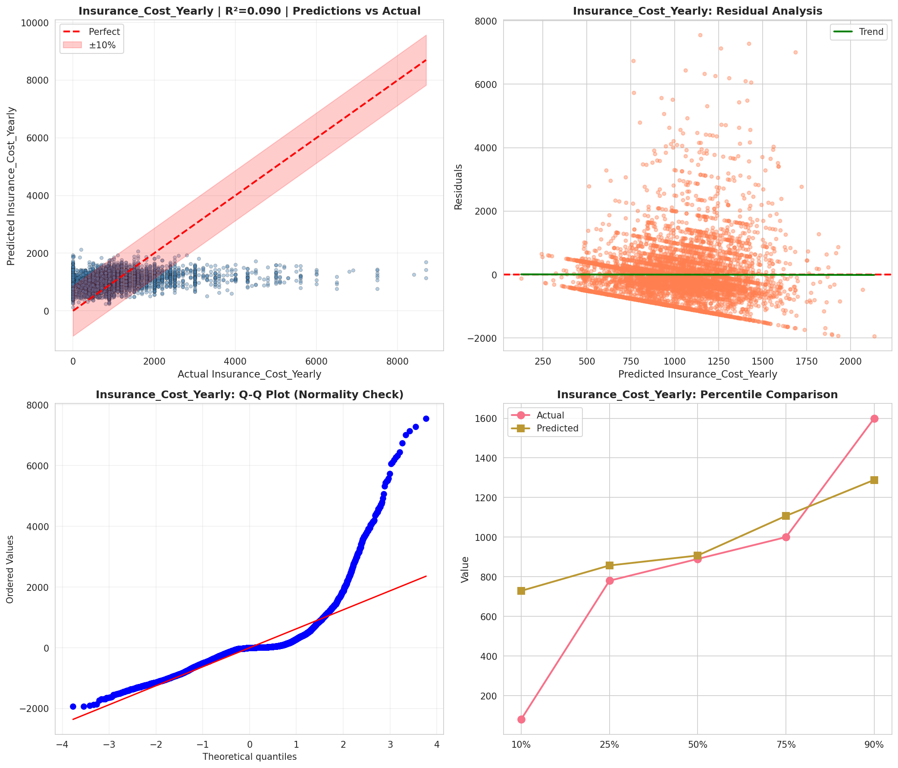
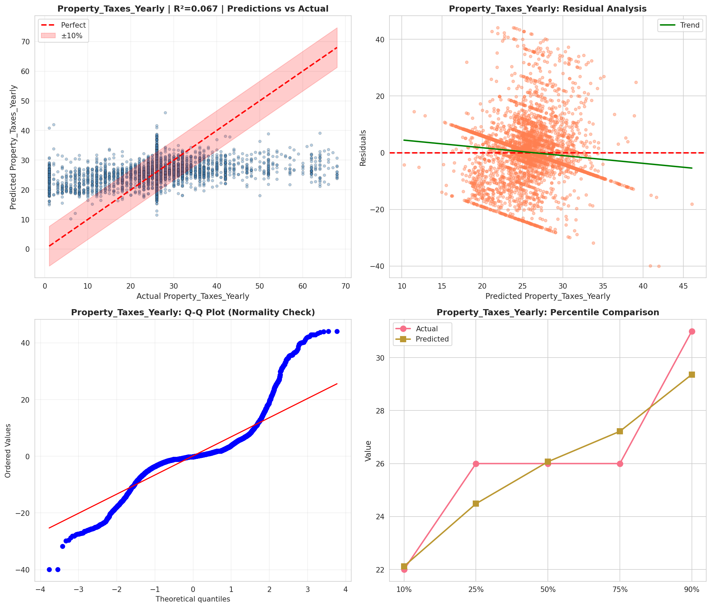
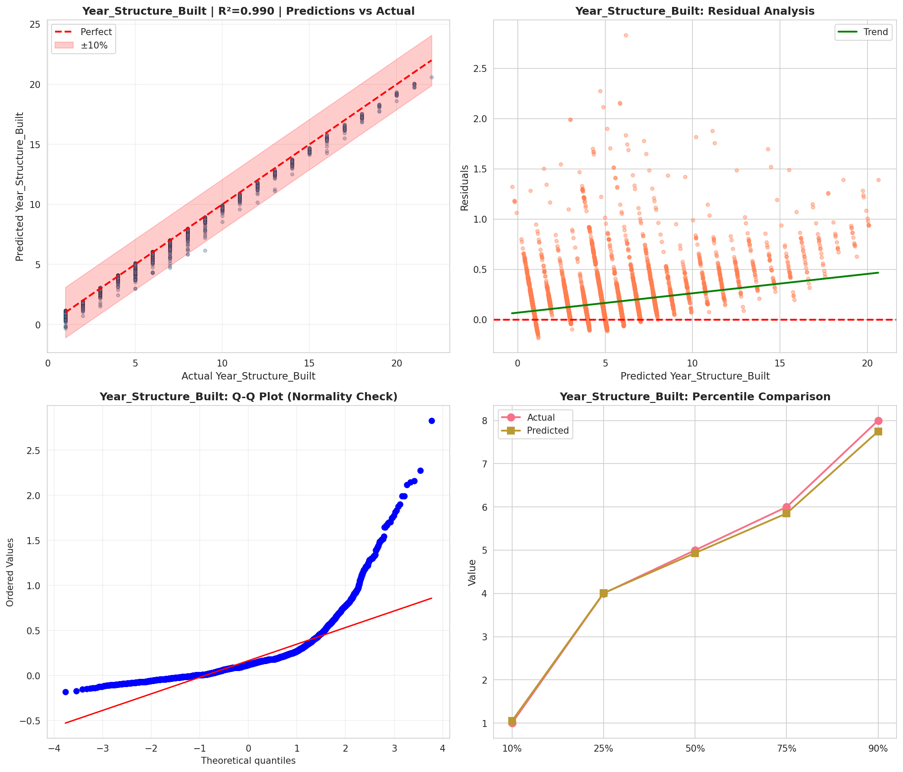
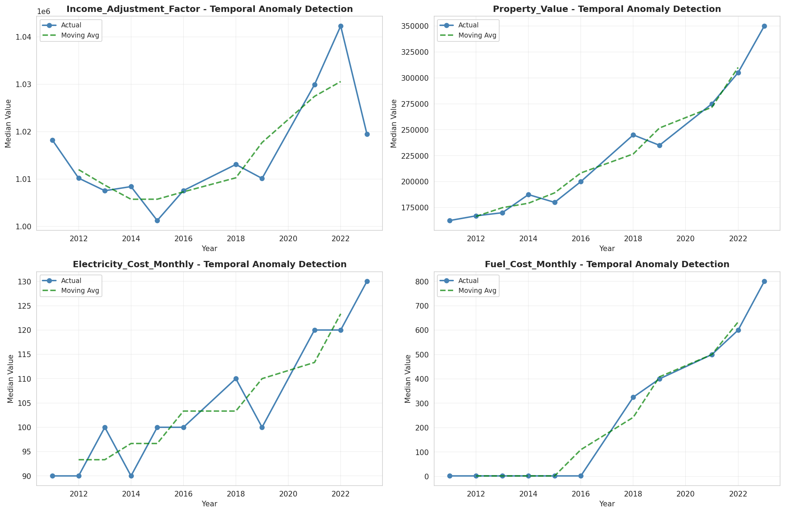
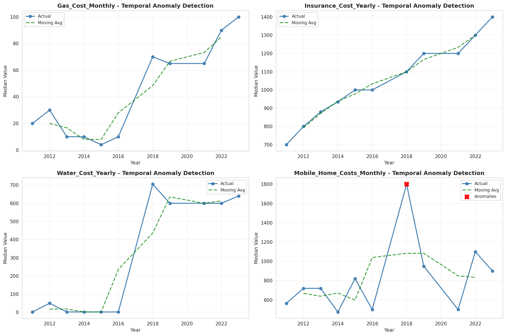
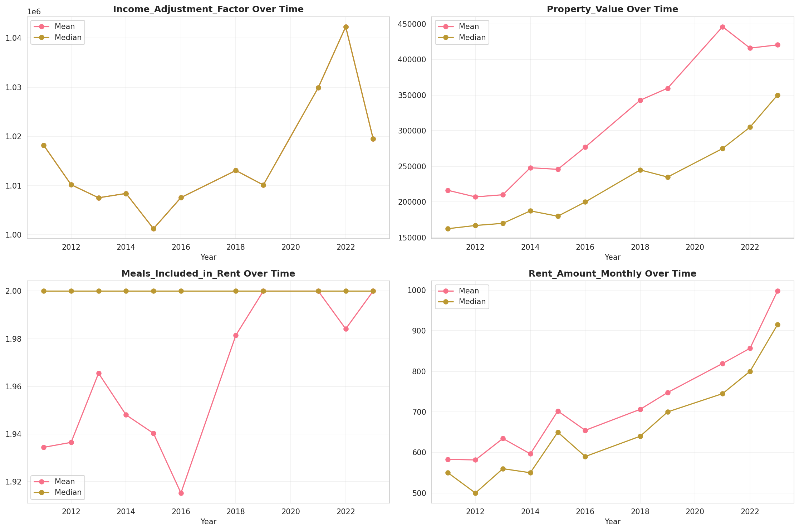
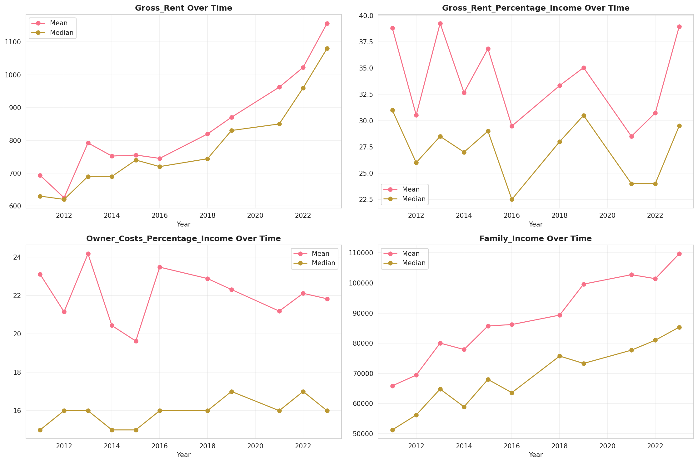
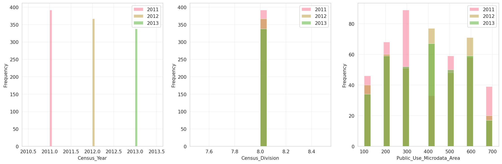
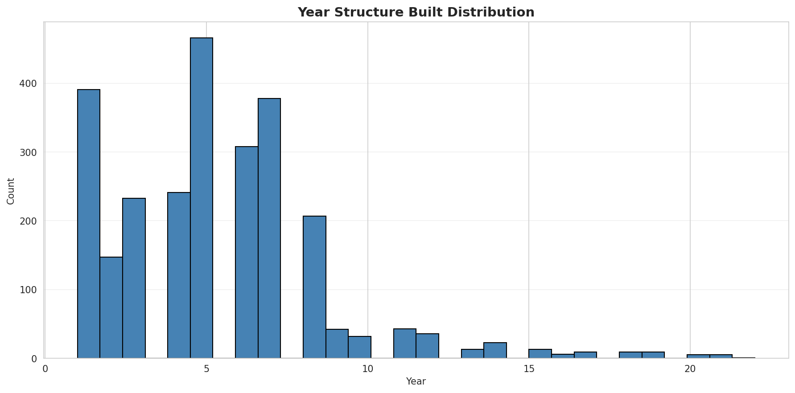
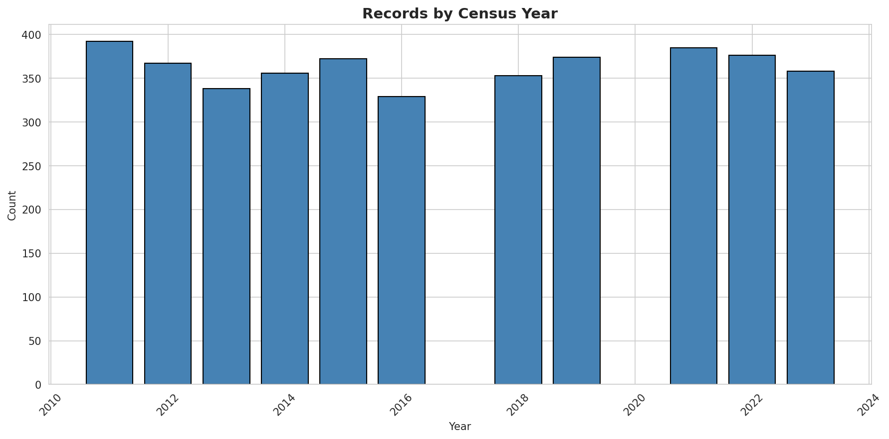
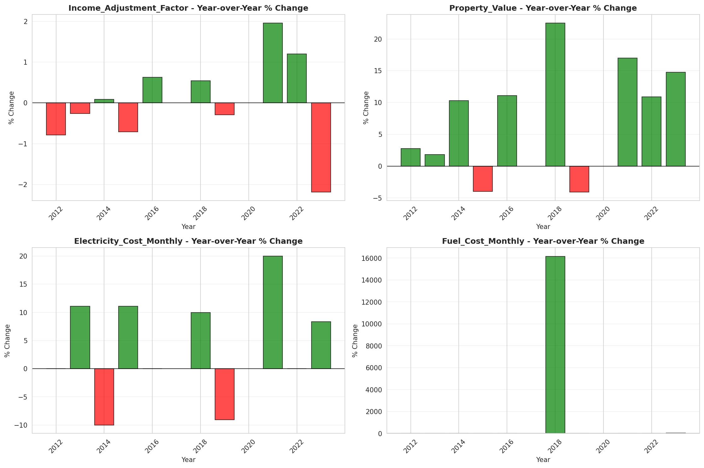
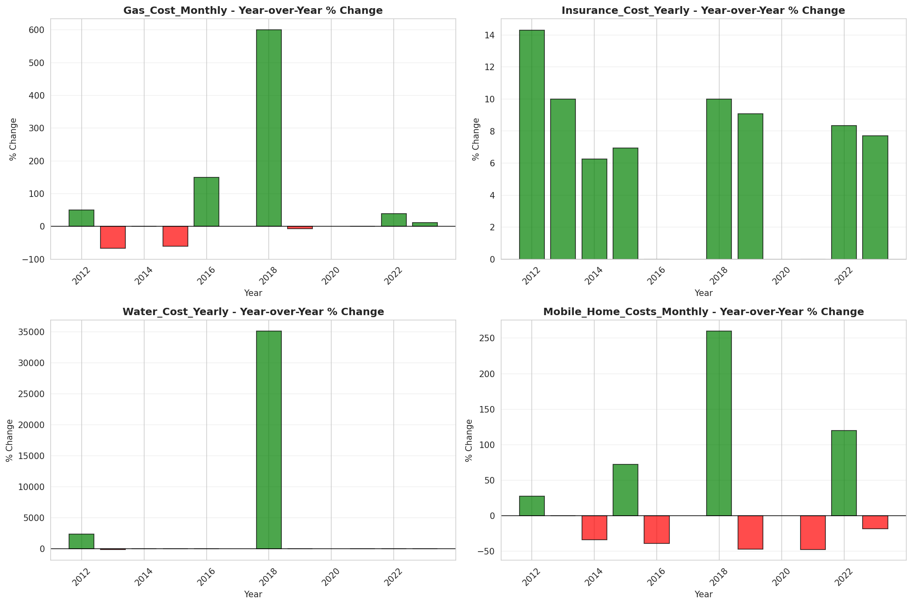
