# Temporal Analysis

## Year Distribution

- 2011: 24,505 records

- 2012: 25,236 records

- 2014: 26,579 records

- 2015: 26,866 records

- 2016: 26,835 records

- 2017: 27,054 records

- 2018: 27,311 records

- 2019: 27,615 records

- 2020: 28,083 records

- 2021: 28,328 records

- 2022: 28,606 records

- 2023: 28,917 records

## Temporal Trends

- Census_Year: {np.int64(2011): {'mean': 2011.0, 'median': 2011.0, 'std': 0.0}, np.int64(2012): {'mean': 2012.0, 'median': 2012.0, 'std': 0.0}, np.int64(2014): {'mean': 2014.0, 'median': 2014.0, 'std': 0.0}, np.int64(2015): {'mean': 2015.0, 'median': 2015.0, 'std': 0.0}, np.int64(2016): {'mean': 2016.0, 'median': 2016.0, 'std': 0.0}, np.int64(2017): {'mean': 2017.0, 'median': 2017.0, 'std': 0.0}, np.int64(2018): {'mean': 2018.0, 'median': 2018.0, 'std': 0.0}, np.int64(2019): {'mean': 2019.0, 'median': 2019.0, 'std': 0.0}, np.int64(2020): {'mean': 2020.0, 'median': 2020.0, 'std': 0.0}, np.int64(2021): {'mean': 2021.0, 'median': 2021.0, 'std': 0.0}, np.int64(2022): {'mean': 2022.0, 'median': 2022.0, 'std': 0.0}, np.int64(2023): {'mean': 2023.0, 'median': 2023.0, 'std': 0.0}}

- Census_Division: {np.int64(2011): {'mean': 8.0, 'median': 8.0, 'std': 0.0}, np.int64(2012): {'mean': 8.0, 'median': 8.0, 'std': 0.0}, np.int64(2014): {'mean': 8.0, 'median': 8.0, 'std': 0.0}, np.int64(2015): {'mean': 8.0, 'median': 8.0, 'std': 0.0}, np.int64(2016): {'mean': 8.0, 'median': 8.0, 'std': 0.0}, np.int64(2017): {'mean': 8.0, 'median': 8.0, 'std': 0.0}, np.int64(2018): {'mean': 8.0, 'median': 8.0, 'std': 0.0}, np.int64(2019): {'mean': 8.0, 'median': 8.0, 'std': 0.0}, np.int64(2020): {'mean': 8.0, 'median': 8.0, 'std': 0.0}, np.int64(2021): {'mean': 8.0, 'median': 8.0, 'std': 0.0}, np.int64(2022): {'mean': 8.0, 'median': 8.0, 'std': 0.0}, np.int64(2023): {'mean': 8.0, 'median': 8.0, 'std': 0.0}}

- Public_Use_Microdata_Area: {np.int64(2011): {'mean': 376.34360334625586, 'median': 300.0, 'std': 193.19516296981257}, np.int64(2012): {'mean': None, 'median': None, 'std': None}, np.int64(2014): {'mean': None, 'median': None, 'std': None}, np.int64(2015): {'mean': None, 'median': None, 'std': None}, np.int64(2016): {'mean': 392.5135084777343, 'median': 400.0, 'std': 180.19495829572747}, np.int64(2017): {'mean': 391.71287055518593, 'median': 400.0, 'std': 180.45581357627543}, np.int64(2018): {'mean': 390.60451832594924, 'median': 400.0, 'std': 180.53676420517647}, np.int64(2019): {'mean': 389.8207495926127, 'median': 400.0, 'std': 180.45762112082366}, np.int64(2020): {'mean': 388.7761279065627, 'median': 400.0, 'std': 180.06383301004863}, np.int64(2021): {'mean': 388.9508613386049, 'median': 400.0, 'std': 179.88688227736048}, np.int64(2022): {'mean': None, 'median': None, 'std': None}, np.int64(2023): {'mean': 452.277207179168, 'median': 500.0, 'std': 217.99512675917225}}

- Census_Region: {np.int64(2011): {'mean': 4.0, 'median': 4.0, 'std': 0.0}, np.int64(2012): {'mean': 4.0, 'median': 4.0, 'std': 0.0}, np.int64(2014): {'mean': 4.0, 'median': 4.0, 'std': 0.0}, np.int64(2015): {'mean': 4.0, 'median': 4.0, 'std': 0.0}, np.int64(2016): {'mean': 4.0, 'median': 4.0, 'std': 0.0}, np.int64(2017): {'mean': 4.0, 'median': 4.0, 'std': 0.0}, np.int64(2018): {'mean': 4.0, 'median': 4.0, 'std': 0.0}, np.int64(2019): {'mean': 4.0, 'median': 4.0, 'std': 0.0}, np.int64(2020): {'mean': 4.0, 'median': 4.0, 'std': 0.0}, np.int64(2021): {'mean': 4.0, 'median': 4.0, 'std': 0.0}, np.int64(2022): {'mean': 4.0, 'median': 4.0, 'std': 0.0}, np.int64(2023): {'mean': 4.0, 'median': 4.0, 'std': 0.0}}

- State_Code: {np.int64(2011): {'mean': 30.0, 'median': 30.0, 'std': 0.0}, np.int64(2012): {'mean': 30.0, 'median': 30.0, 'std': 0.0}, np.int64(2014): {'mean': 30.0, 'median': 30.0, 'std': 0.0}, np.int64(2015): {'mean': 30.0, 'median': 30.0, 'std': 0.0}, np.int64(2016): {'mean': 30.0, 'median': 30.0, 'std': 0.0}, np.int64(2017): {'mean': 30.0, 'median': 30.0, 'std': 0.0}, np.int64(2018): {'mean': 30.0, 'median': 30.0, 'std': 0.0}, np.int64(2019): {'mean': 30.0, 'median': 30.0, 'std': 0.0}, np.int64(2020): {'mean': 30.0, 'median': 30.0, 'std': 0.0}, np.int64(2021): {'mean': 30.0, 'median': 30.0, 'std': 0.0}, np.int64(2022): {'mean': 30.0, 'median': 30.0, 'std': 0.0}, np.int64(2023): {'mean': None, 'median': None, 'std': None}}

- Housing_Adjustment_Factor: {np.int64(2011): {'mean': 1040304.3449092022, 'median': 1044592.0, 'std': 27662.17735411499}, np.int64(2012): {'mean': 1040571.0840862261, 'median': 1053092.0, 'std': 27445.6067921127}, np.int64(2014): {'mean': 1036857.1438353588, 'median': 1031130.0, 'std': 29620.537846668034}, np.int64(2015): {'mean': 1021046.0524454701, 'median': 1017534.0, 'std': 20338.564001703842}, np.int64(2016): {'mean': 1020376.6054033911, 'median': 1013801.0, 'std': 15771.629450852042}, np.int64(2017): {'mean': 1029065.7901234567, 'median': 1034680.0, 'std': 18031.75363634748}, np.int64(2018): {'mean': 1038088.6700596829, 'median': 1046406.0, 'std': 23500.898747594492}, np.int64(2019): {'mean': 1040608.0536302734, 'median': 1042936.0, 'std': 29166.55111144241}, np.int64(2020): {'mean': 1034883.8938859808, 'median': 1030827.0, 'std': 28560.778528975}, np.int64(2021): {'mean': 1057868.6883648688, 'median': 1059761.0, 'std': 34987.3715293519}, np.int64(2022): {'mean': 1105587.1277354402, 'median': 1133141.0, 'std': 60840.89253360964}, np.int64(2023): {'mean': 1107594.1222810112, 'median': 1125501.0, 'std': 76728.17005602378}}

- Income_Adjustment_Factor: {np.int64(2011): {'mean': 1052967.3415221383, 'median': 1048026.0, 'std': 28353.6693390641}, np.int64(2012): {'mean': 1051884.7366460613, 'median': 1061121.0, 'std': 26340.084033691386}, np.int64(2014): {'mean': 1047729.108130479, 'median': 1041654.0, 'std': 31054.368903801493}, np.int64(2015): {'mean': 1030489.56781806, 'median': 1025215.0, 'std': 25729.881998733043}, np.int64(2016): {'mean': 1027536.0730389417, 'median': 1022342.0, 'std': 17530.39183502124}, np.int64(2017): {'mean': 1036471.7036297775, 'median': 1035988.0, 'std': 16888.1849082779}, np.int64(2018): {'mean': 1046691.762513273, 'median': 1054346.0, 'std': 20515.293377607362}, np.int64(2019): {'mean': 1049583.44519283, 'median': 1054606.0, 'std': 26226.970411600443}, np.int64(2020): {'mean': 1044840.2599793469, 'median': 1044328.0, 'std': 29244.615009043682}, np.int64(2021): {'mean': 1072534.1465687659, 'median': 1070512.0, 'std': 30402.69983367872}, np.int64(2022): {'mean': 1127348.7462070894, 'median': 1140108.0, 'std': 48940.6783363714}, np.int64(2023): {'mean': 1130910.7794031193, 'median': 1159185.0, 'std': 70010.04574381794}}

- Housing_Unit_Weight: {np.int64(2011): {'mean': 19.507447459702103, 'median': 15.0, 'std': 18.99400743474687}, np.int64(2012): {'mean': 19.07596291012839, 'median': 14.0, 'std': 19.041097636729454}, np.int64(2014): {'mean': 18.314534030625683, 'median': 13.0, 'std': 19.18493481388658}, np.int64(2015): {'mean': 18.195674830640957, 'median': 12.0, 'std': 19.497724566153703}, np.int64(2016): {'mean': 18.31335941866965, 'median': 13.0, 'std': 19.163036183026218}, np.int64(2017): {'mean': 18.522177866489244, 'median': 13.0, 'std': 19.292293592789427}, np.int64(2018): {'mean': 18.515799494709093, 'median': 13.0, 'std': 19.240936971202157}, np.int64(2019): {'mean': 18.474741988049974, 'median': 13.0, 'std': 19.371238488730256}, np.int64(2020): {'mean': 18.336929815190686, 'median': 12.0, 'std': 21.07161505377787}, np.int64(2021): {'mean': 18.093511719853147, 'median': 12.0, 'std': 20.676423811246355}, np.int64(2022): {'mean': 18.08816332237992, 'median': 12.0, 'std': 21.000125395702746}, np.int64(2023): {'mean': 18.084137358647162, 'median': 12.0, 'std': 21.465883245570552}}

- Number_of_Persons: {np.int64(2011): {'mean': 1.9142215874311366, 'median': 2.0, 'std': 1.4534019805412741}, np.int64(2012): {'mean': 1.9017276906007292, 'median': 2.0, 'std': 1.4586607181436748}, np.int64(2014): {'mean': 1.8782497460401069, 'median': 2.0, 'std': 1.4686635218383826}, np.int64(2015): {'mean': 1.8592644978783592, 'median': 2.0, 'std': 1.4616491896104364}, np.int64(2016): {'mean': 1.8687162288056642, 'median': 2.0, 'std': 1.4746432884872986}, np.int64(2017): {'mean': 1.8560656464848082, 'median': 2.0, 'std': 1.4733994657125737}, np.int64(2018): {'mean': 1.8467650397275823, 'median': 2.0, 'std': 1.470342869606311}, np.int64(2019): {'mean': 1.854354517472388, 'median': 2.0, 'std': 1.4752025990969828}, np.int64(2020): {'mean': 1.8510130684043729, 'median': 2.0, 'std': 1.4879167984309134}, np.int64(2021): {'mean': 1.8510307822648968, 'median': 2.0, 'std': 1.4793545134886286}, np.int64(2022): {'mean': 1.8643291617143256, 'median': 2.0, 'std': 1.4706409757136927}, np.int64(2023): {'mean': 1.880485527544351, 'median': 2.0, 'std': 1.4594031138043682}}

- Housing_Unit_Type: {np.int64(2011): {'mean': 1.0926749642930014, 'median': 1.0, 'std': 0.3692236671624103}, np.int64(2012): {'mean': 1.1042161990806785, 'median': 1.0, 'std': 0.39332207497530813}, np.int64(2014): {'mean': 1.121148274953911, 'median': 1.0, 'std': 0.42620456726443406}, np.int64(2015): {'mean': 1.1308345120226309, 'median': 1.0, 'std': 0.4438766623225037}, np.int64(2016): {'mean': 1.1250232904788522, 'median': 1.0, 'std': 0.4354231381668627}, np.int64(2017): {'mean': 1.123198048347749, 'median': 1.0, 'std': 0.4331809851536406}, np.int64(2018): {'mean': 1.1201347442422467, 'median': 1.0, 'std': 0.4283456165255742}, np.int64(2019): {'mean': 1.1205504254933913, 'median': 1.0, 'std': 0.4300782744321075}, np.int64(2020): {'mean': None, 'median': None, 'std': None}, np.int64(2021): {'mean': None, 'median': None, 'std': None}, np.int64(2022): {'mean': None, 'median': None, 'std': None}, np.int64(2023): {'mean': None, 'median': None, 'std': None}}

- Number_of_Bedrooms: {np.int64(2011): {'mean': 2.7872256710675876, 'median': 3.0, 'std': 1.1031571434602243}, np.int64(2012): {'mean': None, 'median': None, 'std': None}, np.int64(2014): {'mean': None, 'median': None, 'std': None}, np.int64(2015): {'mean': None, 'median': None, 'std': None}, np.int64(2016): {'mean': None, 'median': None, 'std': None}, np.int64(2017): {'mean': None, 'median': None, 'std': None}, np.int64(2018): {'mean': None, 'median': None, 'std': None}, np.int64(2019): {'mean': None, 'median': None, 'std': None}, np.int64(2020): {'mean': None, 'median': None, 'std': None}, np.int64(2021): {'mean': None, 'median': None, 'std': None}, np.int64(2022): {'mean': None, 'median': None, 'std': None}, np.int64(2023): {'mean': None, 'median': None, 'std': None}}

- Number_of_Rooms: {np.int64(2011): {'mean': 5.767902421963802, 'median': 6.0, 'std': 2.012082529463794}, np.int64(2012): {'mean': None, 'median': None, 'std': None}, np.int64(2014): {'mean': None, 'median': None, 'std': None}, np.int64(2015): {'mean': None, 'median': None, 'std': None}, np.int64(2016): {'mean': None, 'median': None, 'std': None}, np.int64(2017): {'mean': None, 'median': None, 'std': None}, np.int64(2018): {'mean': None, 'median': None, 'std': None}, np.int64(2019): {'mean': None, 'median': None, 'std': None}, np.int64(2020): {'mean': None, 'median': None, 'std': None}, np.int64(2021): {'mean': None, 'median': None, 'std': None}, np.int64(2022): {'mean': None, 'median': None, 'std': None}, np.int64(2023): {'mean': None, 'median': None, 'std': None}}

- Building_Type: {np.int64(2011): {'mean': 2.317696948500481, 'median': 2.0, 'std': 1.396579696210116}, np.int64(2012): {'mean': 2.3177074422583406, 'median': 2.0, 'std': 1.397878497420273}, np.int64(2014): {'mean': 2.3092207898842267, 'median': 2.0, 'std': 1.383053182291072}, np.int64(2015): {'mean': 2.2989783408255007, 'median': 2.0, 'std': 1.3690272990619552}, np.int64(2016): {'mean': 2.3080306238801107, 'median': 2.0, 'std': 1.3893163106636262}, np.int64(2017): {'mean': 2.315025405274619, 'median': 2.0, 'std': 1.3968985737834894}, np.int64(2018): {'mean': 2.3243264785589033, 'median': 2.0, 'std': 1.411316774491583}, np.int64(2019): {'mean': 2.3415431904161412, 'median': 2.0, 'std': 1.4367018218382803}, np.int64(2020): {'mean': 2.346637591994081, 'median': 2.0, 'std': 1.4448349321480665}, np.int64(2021): {'mean': 2.3539464547488618, 'median': 2.0, 'std': 1.4446508167438064}, np.int64(2022): {'mean': 2.3707008808885486, 'median': 2.0, 'std': 1.4638648796386105}, np.int64(2023): {'mean': 2.3818644776346294, 'median': 2.0, 'std': 1.4722659771098103}}

- Year_Structure_Built: {np.int64(2011): {'mean': 5.418816123109207, 'median': 5.0, 'std': 2.4155363356712938}, np.int64(2012): {'mean': 4.758212147134302, 'median': 5.0, 'std': 2.664977971133513}, np.int64(2014): {'mean': 4.9786107233763035, 'median': 5.0, 'std': 2.863696516123312}, np.int64(2015): {'mean': 5.045279934613813, 'median': 5.0, 'std': 2.962803099802635}, np.int64(2016): {'mean': 5.188059944616387, 'median': 5.0, 'std': 3.1434678803243608}, np.int64(2017): {'mean': 5.309379788692636, 'median': 5.0, 'std': 3.3610093974735658}, np.int64(2018): {'mean': 5.429419735373824, 'median': 5.0, 'std': 3.5766235968754603}, np.int64(2019): {'mean': 5.575662042875158, 'median': 5.0, 'std': 3.801294717872516}, np.int64(2020): {'mean': 5.717884817569409, 'median': 5.0, 'std': 4.04876368337736}, np.int64(2021): {'mean': None, 'median': None, 'std': None}, np.int64(2022): {'mean': None, 'median': None, 'std': None}, np.int64(2023): {'mean': None, 'median': None, 'std': None}}

- Bathtub_or_Shower: {np.int64(2011): {'mean': None, 'median': None, 'std': None}, np.int64(2012): {'mean': 1.0301539777587683, 'median': 1.0, 'std': 0.1710145206725244}, np.int64(2014): {'mean': 1.0284916659824288, 'median': 1.0, 'std': 0.16637616228429472}, np.int64(2015): {'mean': 1.028197793216183, 'median': 1.0, 'std': 0.16554092414737873}, np.int64(2016): {'mean': 1.0274881902589998, 'median': 1.0, 'std': 0.16350436794597514}, np.int64(2017): {'mean': 1.0284700379062828, 'median': 1.0, 'std': 0.16631479274268104}, np.int64(2018): {'mean': 1.0280966044954567, 'median': 1.0, 'std': 0.1652521516870175}, np.int64(2019): {'mean': 1.0277427490542244, 'median': 1.0, 'std': 0.16423809517895915}, np.int64(2020): {'mean': 1.0272575055488493, 'median': 1.0, 'std': 0.16283601087453417}, np.int64(2021): {'mean': 1.0259239256230228, 'median': 1.0, 'std': 0.15891145298350945}, np.int64(2022): {'mean': 1.0232860972807354, 'median': 1.0, 'std': 0.15081354735517413}, np.int64(2023): {'mean': 1.0204081632653061, 'median': 1.0, 'std': 0.1413945894662106}}

- Refrigerator: {np.int64(2011): {'mean': None, 'median': None, 'std': None}, np.int64(2012): {'mean': 1.0332763045337896, 'median': 1.0, 'std': 0.17936099929602323}, np.int64(2014): {'mean': 1.0321454963461696, 'median': 1.0, 'std': 0.1763900245210648}, np.int64(2015): {'mean': 1.0314262362076012, 'median': 1.0, 'std': 0.17447026065321042}, np.int64(2016): {'mean': 1.0300537546831732, 'median': 1.0, 'std': 0.17073872924731975}, np.int64(2017): {'mean': 1.0304460037099765, 'median': 1.0, 'std': 0.17181453662635016}, np.int64(2018): {'mean': 1.0297704447632712, 'median': 1.0, 'std': 0.1699568079195465}, np.int64(2019): {'mean': 1.0292402269861287, 'median': 1.0, 'std': 0.1684825057444335}, np.int64(2020): {'mean': 1.028659320119933, 'median': 1.0, 'std': 0.16685037465658348}, np.int64(2021): {'mean': 1.0274670164339172, 'median': 1.0, 'std': 0.1634429869412825}, np.int64(2022): {'mean': 1.0252776713902718, 'median': 1.0, 'std': 0.15697023413963912}, np.int64(2023): {'mean': 1.0226123969140728, 'median': 1.0, 'std': 0.14866713282273203}}

- Hot_and_Cold_Running_Water: {np.int64(2011): {'mean': None, 'median': None, 'std': None}, np.int64(2012): {'mean': 1.040333618477331, 'median': 1.0, 'std': 0.1967446907064599}, np.int64(2014): {'mean': 1.0390426143361524, 'median': 1.0, 'std': 0.19370035867617708}, np.int64(2015): {'mean': 1.0378422558234572, 'median': 1.0, 'std': 0.19081851983455603}, np.int64(2016): {'mean': 1.0366916435901612, 'median': 1.0, 'std': 0.18800746346212258}, np.int64(2017): {'mean': 1.0383901927574803, 'median': 1.0, 'std': 0.19214024721947243}, np.int64(2018): {'mean': 1.0380997927626334, 'median': 1.0, 'std': 0.19144100701102354}, np.int64(2019): {'mean': 1.0374763556116016, 'median': 1.0, 'std': 0.18992972367044506}, np.int64(2020): {'mean': 1.0373427826019237, 'median': 1.0, 'std': 0.18960405862047439}, np.int64(2021): {'mean': 1.0370341794614613, 'median': 1.0, 'std': 0.1888492118961658}, np.int64(2022): {'mean': 1.0335886633473765, 'median': 1.0, 'std': 0.1801713304307283}, np.int64(2023): {'mean': 1.0300231824573405, 'median': 1.0, 'std': 0.17065432241788714}}

- Running_Water: {np.int64(2011): {'mean': None, 'median': None, 'std': None}, np.int64(2012): {'mean': None, 'median': None, 'std': None}, np.int64(2014): {'mean': 9.0, 'median': 9.0, 'std': 0.0}, np.int64(2015): {'mean': 9.0, 'median': 9.0, 'std': 0.0}, np.int64(2016): {'mean': 9.0, 'median': 9.0, 'std': 0.0}, np.int64(2017): {'mean': 9.0, 'median': 9.0, 'std': 0.0}, np.int64(2018): {'mean': 9.0, 'median': 9.0, 'std': 0.0}, np.int64(2019): {'mean': 9.0, 'median': 9.0, 'std': 0.0}, np.int64(2020): {'mean': 9.0, 'median': 9.0, 'std': 0.0}, np.int64(2021): {'mean': 9.0, 'median': 9.0, 'std': 0.0}, np.int64(2022): {'mean': 9.0, 'median': 9.0, 'std': 0.0}, np.int64(2023): {'mean': 9.0, 'median': 9.0, 'std': 0.0}}

- Sink_with_Faucet: {np.int64(2011): {'mean': None, 'median': None, 'std': None}, np.int64(2012): {'mean': 1.0257485029940119, 'median': 1.0, 'std': 0.1583874697733011}, np.int64(2014): {'mean': 1.0246325642499383, 'median': 1.0, 'std': 0.15500576579830666}, np.int64(2015): {'mean': 1.024969350224765, 'median': 1.0, 'std': 0.15603485745985676}, np.int64(2016): {'mean': 1.0245968398762013, 'median': 1.0, 'std': 0.15489613426254298}, np.int64(2017): {'mean': 1.025243971288007, 'median': 1.0, 'std': 0.1568684338158394}, np.int64(2018): {'mean': 1.0248286306392476, 'median': 1.0, 'std': 0.1556057027043372}, np.int64(2019): {'mean': 1.0241960907944514, 'median': 1.0, 'std': 0.15366056896057864}, np.int64(2020): {'mean': 1.023363576184728, 'median': 1.0, 'std': 0.15105829349316502}, np.int64(2021): {'mean': 1.021911889514698, 'median': 1.0, 'std': 0.14639872070217724}, np.int64(2022): {'mean': 1.01976254308694, 'median': 1.0, 'std': 0.1391859437711766}, np.int64(2023): {'mean': 1.017329836962718, 'median': 1.0, 'std': 0.13049965872860997}}

- Stove_or_Range: {np.int64(2011): {'mean': None, 'median': None, 'std': None}, np.int64(2012): {'mean': 1.0350299401197605, 'median': 1.0, 'std': 0.1838594280380916}, np.int64(2014): {'mean': 1.033582395927416, 'median': 1.0, 'std': 0.1801553525896194}, np.int64(2015): {'mean': 1.0341234164282795, 'median': 1.0, 'std': 0.18154987152168403}, np.int64(2016): {'mean': 1.032741488841831, 'median': 1.0, 'std': 0.17796284299514228}, np.int64(2017): {'mean': 1.0333091378336963, 'median': 1.0, 'std': 0.17944619722941885}, np.int64(2018): {'mean': 1.032560178542962, 'median': 1.0, 'std': 0.177485967746684}, np.int64(2019): {'mean': 1.0318805170239596, 'median': 1.0, 'std': 0.17568541766297396}, np.int64(2020): {'mean': 1.03048946692107, 'median': 1.0, 'std': 0.17193315681625768}, np.int64(2021): {'mean': 1.029511611758352, 'median': 1.0, 'std': 0.16923882962110182}, np.int64(2022): {'mean': 1.0269245499808501, 'median': 1.0, 'std': 0.161866062100611}, np.int64(2023): {'mean': 1.0250446547334018, 'median': 1.0, 'std': 0.15626371299274136}}

- Telephone_Service: {np.int64(2011): {'mean': 1.027760704773612, 'median': 1.0, 'std': 0.16429068908036557}, np.int64(2012): {'mean': 1.0249297752808988, 'median': 1.0, 'std': 0.15591504405411738}, np.int64(2014): {'mean': 1.027417237859122, 'median': 1.0, 'std': 0.16329981401858745}, np.int64(2015): {'mean': 1.0284813197476952, 'median': 1.0, 'std': 0.16634745804170914}, np.int64(2016): {'mean': 1.0286198547215497, 'median': 1.0, 'std': 0.1667396323199041}, np.int64(2017): {'mean': 1.0275848765432098, 'median': 1.0, 'std': 0.16378414082265372}, np.int64(2018): {'mean': 1.0251539305999713, 'median': 1.0, 'std': 0.15659623507238551}, np.int64(2019): {'mean': 1.02251998119417, 'median': 1.0, 'std': 0.14837070672392427}, np.int64(2020): {'mean': 1.0196242949704004, 'median': 1.0, 'std': 0.13870861135940904}, np.int64(2021): {'mean': 1.015602706310121, 'median': 1.0, 'std': 0.12393534128313308}, np.int64(2022): {'mean': 1.0142779685523224, 'median': 1.0, 'std': 0.11863702673181271}, np.int64(2023): {'mean': 1.0126223481996546, 'median': 1.0, 'std': 0.11164038930506827}}

- Lot_Acreage: {np.int64(2011): {'mean': 1.6082962818195143, 'median': 1.0, 'std': 0.7995867474167753}, np.int64(2012): {'mean': 1.6115998852443338, 'median': 1.0, 'std': 0.7985553909230079}, np.int64(2014): {'mean': 1.6252348009346222, 'median': 1.0, 'std': 0.8021670877300299}, np.int64(2015): {'mean': 1.6338124260893296, 'median': 1.0, 'std': 0.8056775970432036}, np.int64(2016): {'mean': 1.629740518962076, 'median': 1.0, 'std': 0.8015981778270604}, np.int64(2017): {'mean': 1.624242152063592, 'median': 1.0, 'std': 0.7975483994647133}, np.int64(2018): {'mean': 1.6276128345093863, 'median': 1.0, 'std': 0.7971606393708824}, np.int64(2019): {'mean': 1.6330622114750495, 'median': 1.0, 'std': 0.7965680324760511}, np.int64(2020): {'mean': 1.6384301112656467, 'median': 1.0, 'std': 0.7967503678005956}, np.int64(2021): {'mean': 1.6477003319108583, 'median': 1.0, 'std': 0.8002406853193367}, np.int64(2022): {'mean': 1.6486904250751395, 'median': 1.0, 'std': 0.800660582661253}, np.int64(2023): {'mean': 1.6434975663905729, 'median': 1.0, 'std': 0.7968385903119578}}

- Agricultural_Sales: {np.int64(2011): {'mean': 1.9338352396119878, 'median': 1.0, 'std': 1.8454930466060637}, np.int64(2012): {'mean': 1.9191862895360179, 'median': 1.0, 'std': 1.837425555258317}, np.int64(2014): {'mean': 1.8904593639575973, 'median': 1.0, 'std': 1.817429953122508}, np.int64(2015): {'mean': 1.8894757181501998, 'median': 1.0, 'std': 1.8179573981649004}, np.int64(2016): {'mean': 1.847579814624099, 'median': 1.0, 'std': 1.7833447764083803}, np.int64(2017): {'mean': 1.8218502659919553, 'median': 1.0, 'std': 1.7606743310671507}, np.int64(2018): {'mean': 1.8122849496622913, 'median': 1.0, 'std': 1.7499315645499633}, np.int64(2019): {'mean': 1.801608910891089, 'median': 1.0, 'std': 1.7353342499499016}, np.int64(2020): {'mean': 1.8111930375921672, 'median': 1.0, 'std': 1.74516060363663}, np.int64(2021): {'mean': 1.817978848413631, 'median': 1.0, 'std': 1.7461758911473908}, np.int64(2022): {'mean': 1.8134970733386893, 'median': 1.0, 'std': 1.7399169293528365}, np.int64(2023): {'mean': 1.7964132641551995, 'median': 1.0, 'std': 1.7227951796094365}}

- Business_On_Property: {np.int64(2011): {'mean': 1.9736160648849368, 'median': 2.0, 'std': 0.16027812773162192}, np.int64(2012): {'mean': 1.9743234197188486, 'median': 2.0, 'std': 0.1581723419622528}, np.int64(2014): {'mean': 1.975489073166262, 'median': 2.0, 'std': 0.15463258643770766}, np.int64(2015): {'mean': 1.974938597289184, 'median': 2.0, 'std': 0.15631519493825646}, np.int64(2016): {'mean': 3.397296316457993, 'median': 2.0, 'std': 2.8272598582477517}, np.int64(2017): {'mean': 4.827906767862757, 'median': 2.0, 'std': 3.45262517809681}, np.int64(2018): {'mean': 6.229707540052368, 'median': 9.0, 'std': 3.4353287812245314}, np.int64(2019): {'mean': 7.622026819081117, 'median': 9.0, 'std': 2.7906617539812397}, np.int64(2020): {'mean': None, 'median': None, 'std': None}, np.int64(2021): {'mean': None, 'median': None, 'std': None}, np.int64(2022): {'mean': None, 'median': None, 'std': None}, np.int64(2023): {'mean': None, 'median': None, 'std': None}}

- Tenure: {np.int64(2011): {'mean': 1.9033497234173324, 'median': 2.0, 'std': 0.8780773714834869}, np.int64(2012): {'mean': 1.9146268057784912, 'median': 2.0, 'std': 0.8772318577786208}, np.int64(2014): {'mean': 1.9362208934908367, 'median': 2.0, 'std': 0.876538076262281}, np.int64(2015): {'mean': 1.9441048034934498, 'median': 2.0, 'std': 0.8744686729245722}, np.int64(2016): {'mean': 1.9430024213075061, 'median': 2.0, 'std': 0.8731306897088161}, np.int64(2017): {'mean': 1.943335262345679, 'median': 2.0, 'std': 0.8716088008806843}, np.int64(2018): {'mean': 1.9419598109875424, 'median': 2.0, 'std': 0.8692965671886981}, np.int64(2019): {'mean': 1.9319699106723085, 'median': 2.0, 'std': 0.8644172014478643}, np.int64(2020): {'mean': 1.9279821004055377, 'median': 2.0, 'std': 0.8587478673833913}, np.int64(2021): {'mean': 1.9268651907764534, 'median': 2.0, 'std': 0.854691467576154}, np.int64(2022): {'mean': 1.9241821796493765, 'median': 2.0, 'std': 0.8507739195235218}, np.int64(2023): {'mean': 1.9196598609327251, 'median': 2.0, 'std': 0.8486352131688883}}

- Vacancy_Status: {np.int64(2011): {'mean': 5.155820895522388, 'median': 5.0, 'std': 1.5822867566512409}, np.int64(2012): {'mean': 5.139663182346109, 'median': 5.0, 'std': 1.6129938185729145}, np.int64(2014): {'mean': 5.145233694217058, 'median': 5.0, 'std': 1.6183804152804413}, np.int64(2015): {'mean': 5.148963730569948, 'median': 5.0, 'std': 1.597755767261416}, np.int64(2016): {'mean': 5.155913978494624, 'median': 5.0, 'std': 1.5721689909180556}, np.int64(2017): {'mean': 5.159281142294436, 'median': 5.0, 'std': 1.5408694064347739}, np.int64(2018): {'mean': 5.155276503260082, 'median': 5.0, 'std': 1.553176362691661}, np.int64(2019): {'mean': 5.145153433999026, 'median': 5.0, 'std': 1.564954852842088}, np.int64(2020): {'mean': 5.147587511825923, 'median': 5.0, 'std': 1.5615974387876543}, np.int64(2021): {'mean': 5.158283671036949, 'median': 5.0, 'std': 1.5873020543483674}, np.int64(2022): {'mean': 5.171694318753143, 'median': 5.0, 'std': 1.5973743842262988}, np.int64(2023): {'mean': 5.174879485806106, 'median': 5.0, 'std': 1.588938769096872}}

- Property_Value: {np.int64(2011): {'mean': 15.238947580916493, 'median': 16.0, 'std': 5.3399412814793825}}

- Vehicles_Available: {np.int64(2011): {'mean': 2.1845933210407704, 'median': 2.0, 'std': 1.2178293884407405}, np.int64(2012): {'mean': 2.181480738362761, 'median': 2.0, 'std': 1.227994723242404}, np.int64(2014): {'mean': 2.178260658208157, 'median': 2.0, 'std': 1.225584463002399}, np.int64(2015): {'mean': 2.1777777777777776, 'median': 2.0, 'std': 1.2290383683573}, np.int64(2016): {'mean': 2.193801452784504, 'median': 2.0, 'std': 1.2282769137136367}, np.int64(2017): {'mean': 2.205295138888889, 'median': 2.0, 'std': 1.2330364963724938}, np.int64(2018): {'mean': 2.2261467233067633, 'median': 2.0, 'std': 1.2413042033671764}, np.int64(2019): {'mean': 2.2441937000470147, 'median': 2.0, 'std': 1.2485481327497674}, np.int64(2020): {'mean': 2.2599636414487483, 'median': 2.0, 'std': 1.259148560907568}, np.int64(2021): {'mean': 2.2693422929994935, 'median': 2.0, 'std': 1.2660423922284723}, np.int64(2022): {'mean': 2.2703777335984094, 'median': 2.0, 'std': 1.2686289253874539}, np.int64(2023): {'mean': 2.274414278754595, 'median': 2.0, 'std': 1.2760828067370686}}

- Condo_Fee_Monthly: {np.int64(2011): {'mean': 133.42322097378278, 'median': 120.0, 'std': 117.19059689289338}, np.int64(2012): {'mean': 146.2076923076923, 'median': 130.0, 'std': 132.1806530363844}, np.int64(2014): {'mean': 151.44401544401543, 'median': 130.0, 'std': 101.6487327851999}, np.int64(2015): {'mean': 157.01739130434783, 'median': 130.0, 'std': 113.12917087651914}, np.int64(2016): {'mean': 161.14537444933922, 'median': 140.0, 'std': 104.99267152350376}, np.int64(2017): {'mean': 159.65367965367966, 'median': 140.0, 'std': 104.00192921229655}, np.int64(2018): {'mean': 166.5983606557377, 'median': 145.0, 'std': 115.42151483946338}, np.int64(2019): {'mean': 176.18320610687022, 'median': 150.0, 'std': 118.49605464287282}, np.int64(2020): {'mean': 189.96296296296296, 'median': 150.0, 'std': 131.66223019938823}, np.int64(2021): {'mean': 207.43859649122808, 'median': 150.0, 'std': 160.34766558069424}, np.int64(2022): {'mean': 216.28571428571428, 'median': 180.0, 'std': 174.39571999322783}, np.int64(2023): {'mean': 251.77514792899407, 'median': 195.0, 'std': 323.6454764018473}}

- Electricity_Cost_Monthly: {np.int64(2011): {'mean': 99.76362425732432, 'median': 80.0, 'std': 74.31112930946784}, np.int64(2012): {'mean': 102.46132624398074, 'median': 90.0, 'std': 76.69284343331412}, np.int64(2014): {'mean': 107.38870254241408, 'median': 90.0, 'std': 80.56969189490779}, np.int64(2015): {'mean': 110.29898107714702, 'median': 90.0, 'std': 82.04818692310785}, np.int64(2016): {'mean': 111.1795157384988, 'median': 100.0, 'std': 82.40579161386906}, np.int64(2017): {'mean': 113.74339313271605, 'median': 100.0, 'std': 85.46612447252987}, np.int64(2018): {'mean': 123.92232409601318, 'median': 100.0, 'std': 83.87901538465728}, np.int64(2019): {'mean': 125.58129175946547, 'median': 100.0, 'std': 84.60339394517796}, np.int64(2020): {'mean': 127.97035701767562, 'median': 100.0, 'std': 87.8181915933697}, np.int64(2021): {'mean': 131.0882599891342, 'median': 110.0, 'std': 90.37459698539516}, np.int64(2022): {'mean': 137.73881393768806, 'median': 110.0, 'std': 121.33100841635594}, np.int64(2023): {'mean': 147.63202887537994, 'median': 120.0, 'std': 162.34365994979683}}

- Fuel_Cost_Monthly: {np.int64(2011): {'mean': 148.6818787133784, 'median': 2.0, 'std': 449.8055907435504}, np.int64(2012): {'mean': 155.1818820224719, 'median': 2.0, 'std': 466.1039375361432}, np.int64(2014): {'mean': 142.880171114676, 'median': 2.0, 'std': 432.5591718170854}, np.int64(2015): {'mean': 135.20926734594858, 'median': 2.0, 'std': 420.7405366452938}, np.int64(2016): {'mean': 122.22014527845036, 'median': 2.0, 'std': 389.7471300439289}, np.int64(2017): {'mean': 109.9657600308642, 'median': 2.0, 'std': 354.3342828085602}, np.int64(2018): {'mean': 680.1533870486422, 'median': 500.0, 'std': 645.1280000630808}, np.int64(2019): {'mean': 664.3708647707487, 'median': 500.0, 'std': 621.2306326913879}, np.int64(2020): {'mean': 657.3861499002564, 'median': 500.0, 'std': 597.1075897254846}, np.int64(2021): {'mean': 676.6096104634631, 'median': 500.0, 'std': 643.1566592500209}, np.int64(2022): {'mean': 742.4054669703872, 'median': 500.0, 'std': 744.1660904745656}, np.int64(2023): {'mean': 788.9759138566166, 'median': 590.0, 'std': 809.3062773121131}}

- Gas_Cost_Monthly: {np.int64(2011): {'mean': 63.62456463839377, 'median': 40.0, 'std': 83.06526189008797}, np.int64(2012): {'mean': 62.43539325842696, 'median': 30.0, 'std': 82.80428809693007}, np.int64(2014): {'mean': 57.965971513295415, 'median': 30.0, 'std': 82.17163114777874}, np.int64(2015): {'mean': 56.36259097525473, 'median': 20.0, 'std': 82.27610487873322}, np.int64(2016): {'mean': 52.5455205811138, 'median': 20.0, 'std': 78.47731474612222}, np.int64(2017): {'mean': 51.04345100308642, 'median': 20.0, 'std': 77.956772923781}, np.int64(2018): {'mean': 91.76667253211332, 'median': 70.0, 'std': 87.83697113942934}, np.int64(2019): {'mean': 90.18998451213216, 'median': 70.0, 'std': 86.11933639456913}, np.int64(2020): {'mean': 92.07818197235649, 'median': 70.0, 'std': 95.4865867864416}, np.int64(2021): {'mean': 95.4543176883247, 'median': 70.0, 'std': 98.2381835603843}, np.int64(2022): {'mean': 108.2091065151639, 'median': 70.0, 'std': 152.38988162723328}, np.int64(2023): {'mean': 119.70914927768861, 'median': 80.0, 'std': 181.96052867604456}}

- House_Heating_Fuel: {np.int64(2011): {'mean': 2.2690534726490474, 'median': 2.0, 'std': 1.7332726526480147}, np.int64(2012): {'mean': 2.3133025682182984, 'median': 2.0, 'std': 1.755011630122857}, np.int64(2014): {'mean': 2.380487093481114, 'median': 2.0, 'std': 1.787317274393342}, np.int64(2015): {'mean': 2.4127122755943717, 'median': 2.0, 'std': 1.8010012982629966}, np.int64(2016): {'mean': 2.407651331719128, 'median': 2.0, 'std': 1.7974642074607388}, np.int64(2017): {'mean': 2.3763020833333335, 'median': 2.0, 'std': 1.7711444688061706}, np.int64(2018): {'mean': 2.3604123908166676, 'median': 2.0, 'std': 1.7555303142757153}, np.int64(2019): {'mean': 2.3484720263281615, 'median': 2.0, 'std': 1.737770691544425}, np.int64(2020): {'mean': 2.331002656971053, 'median': 2.0, 'std': 1.7153722251513934}, np.int64(2021): {'mean': 2.322133750632853, 'median': 2.0, 'std': 1.699190880753804}, np.int64(2022): {'mean': 2.3219772275438277, 'median': 2.0, 'std': 1.6860549158269014}, np.int64(2023): {'mean': 2.3283139200141725, 'median': 2.0, 'std': 1.6749710144727579}}

- Insurance_Cost_Yearly: {np.int64(2014): {'mean': 941.337341772152, 'median': 800.0, 'std': 716.3995242259406}, np.int64(2015): {'mean': 996.7430207587688, 'median': 800.0, 'std': 761.2497619204006}}

- Water_Cost_Yearly: {np.int64(2011): {'mean': 243.880454824831, 'median': 2.0, 'std': 346.8069756624833}, np.int64(2012): {'mean': 249.5592897271268, 'median': 2.0, 'std': 358.3241163473833}, np.int64(2014): {'mean': 258.8369549365612, 'median': 2.0, 'std': 385.5860602717373}, np.int64(2015): {'mean': 265.3762736535662, 'median': 2.0, 'std': 399.7350246251484}, np.int64(2016): {'mean': 275.58082324455205, 'median': 2.0, 'std': 418.12293814067334}, np.int64(2017): {'mean': 281.98042052469134, 'median': 2.0, 'std': 427.6412261238626}, np.int64(2018): {'mean': 611.4588766813841, 'median': 600.0, 'std': 459.05285529626053}, np.int64(2019): {'mean': 614.2541066720746, 'median': 600.0, 'std': 467.42308918872607}, np.int64(2020): {'mean': 618.4042703192667, 'median': 600.0, 'std': 477.2864961441768}, np.int64(2021): {'mean': 622.2773519163763, 'median': 600.0, 'std': 498.0081679393274}, np.int64(2022): {'mean': 630.2525803310614, 'median': 600.0, 'std': 521.9473022709312}, np.int64(2023): {'mean': 642.0109547643781, 'median': 600.0, 'std': 541.8593036758663}}

- Mobile_Home_Costs_Monthly: {np.int64(2011): {'mean': 1248.4446240905415, 'median': 570.0, 'std': 1442.8344293435025}, np.int64(2012): {'mean': 1256.2841181165204, 'median': 550.0, 'std': 1467.4466628636978}, np.int64(2014): {'mean': 1360.8037529319781, 'median': 580.0, 'std': 1582.6848303116378}, np.int64(2015): {'mean': 1390.6697530864199, 'median': 580.0, 'std': 1670.866931165845}, np.int64(2016): {'mean': 1430.294930875576, 'median': 580.0, 'std': 1768.8528534551529}, np.int64(2017): {'mean': 1378.726422447389, 'median': 540.0, 'std': 1758.1740996177023}, np.int64(2018): {'mean': 1394.3496062992126, 'median': 550.0, 'std': 1803.4506607818664}, np.int64(2019): {'mean': 1454.3502377179082, 'median': 600.0, 'std': 1873.3477430026887}, np.int64(2020): {'mean': 1535.8835562549175, 'median': 600.0, 'std': 2032.038713819615}, np.int64(2021): {'mean': 1637.1812297734627, 'median': 680.0, 'std': 2321.4128957848525}, np.int64(2022): {'mean': 1801.840322580645, 'median': 750.0, 'std': 2477.3612631986057}, np.int64(2023): {'mean': 2038.5089141004862, 'median': 800.0, 'std': 3329.9596329167107}}

- First_Mortgage_Includes_Insurance: {np.int64(2011): {'mean': 1.3657425484836652, 'median': 1.0, 'std': 0.48166911248113875}, np.int64(2012): {'mean': 1.355538241786781, 'median': 1.0, 'std': 0.4787071731870672}, np.int64(2014): {'mean': 1.3468615424768366, 'median': 1.0, 'std': 0.47600229058723315}, np.int64(2015): {'mean': 1.3372139171848128, 'median': 1.0, 'std': 0.4727898715585065}, np.int64(2016): {'mean': 1.3314421427628975, 'median': 1.0, 'std': 0.4707626681855093}, np.int64(2017): {'mean': 1.3272344346452547, 'median': 1.0, 'std': 0.4692345277767947}, np.int64(2018): {'mean': 1.3261550509005482, 'median': 1.0, 'std': 0.4688353885573312}, np.int64(2019): {'mean': 1.3281587988293677, 'median': 1.0, 'std': 0.4695728467599406}, np.int64(2020): {'mean': 1.3210412147505424, 'median': 1.0, 'std': 0.46690638263897005}, np.int64(2021): {'mean': 1.3220835455934794, 'median': 1.0, 'std': 0.4673045542811764}, np.int64(2022): {'mean': 1.3150926743159752, 'median': 1.0, 'std': 0.4645820650794543}, np.int64(2023): {'mean': 1.3074353581590994, 'median': 1.0, 'std': 0.46145986123994437}}

- First_Mortgage_Payment_Monthly: {np.int64(2011): {'mean': 987.7365612390993, 'median': 850.0, 'std': 636.2071878634238}, np.int64(2012): {'mean': 1007.9838981950396, 'median': 890.0, 'std': 633.6182362835586}, np.int64(2014): {'mean': 1023.7442254991518, 'median': 900.0, 'std': 637.3135524775018}, np.int64(2015): {'mean': 1038.8688980023812, 'median': 920.0, 'std': 642.8017889381784}, np.int64(2016): {'mean': 1061.5516558912786, 'median': 950.0, 'std': 652.735482002569}, np.int64(2017): {'mean': 1083.37343688298, 'median': 980.0, 'std': 657.5842397195094}, np.int64(2018): {'mean': 1102.9759853824066, 'median': 1000.0, 'std': 648.5419923018012}, np.int64(2019): {'mean': 1142.669296348136, 'median': 1000.0, 'std': 667.17725102381}, np.int64(2020): {'mean': 1179.8149802220237, 'median': 1100.0, 'std': 684.0879240758651}, np.int64(2021): {'mean': 1223.150534895568, 'median': 1100.0, 'std': 714.1794259571936}, np.int64(2022): {'mean': 1272.5643676711638, 'median': 1200.0, 'std': 747.4976074384057}, np.int64(2023): {'mean': 1337.6479030063094, 'median': 1200.0, 'std': 786.5953211148006}}

- First_Mortgage_Includes_Taxes: {np.int64(2011): {'mean': 1.3178445919562671, 'median': 1.0, 'std': 0.4656690151427221}, np.int64(2012): {'mean': 1.308141799766264, 'median': 1.0, 'std': 0.46175547432816927}, np.int64(2014): {'mean': 1.2912697377006395, 'median': 1.0, 'std': 0.45437717798220784}, np.int64(2015): {'mean': 1.283370816245535, 'median': 1.0, 'std': 0.45066469265154163}, np.int64(2016): {'mean': 1.2724633856709329, 'median': 1.0, 'std': 0.44525638386506505}, np.int64(2017): {'mean': 1.262077135711465, 'median': 1.0, 'std': 0.43979332698204415}, np.int64(2018): {'mean': 1.2578961106760638, 'median': 1.0, 'std': 0.43750507264728045}, np.int64(2019): {'mean': 1.2509225092250922, 'median': 1.0, 'std': 0.4335715894901852}, np.int64(2020): {'mean': 1.2428225086129896, 'median': 1.0, 'std': 0.4288160460992871}, np.int64(2021): {'mean': 1.2384105960264902, 'median': 1.0, 'std': 0.42613860520290275}, np.int64(2022): {'mean': 1.2303618711385702, 'median': 1.0, 'std': 0.42109100798105437}, np.int64(2023): {'mean': 1.2225658790053198, 'median': 1.0, 'std': 0.4159948531541092}}

- First_Mortgage_Status: {np.int64(2011): {'mean': 1.9607695467616049, 'median': 1.0, 'std': 0.9928370971920459}, np.int64(2012): {'mean': 1.9736345246122724, 'median': 1.0, 'std': 0.9935624979472056}, np.int64(2014): {'mean': 2.002375140199248, 'median': 2.0, 'std': 0.9932443518598552}, np.int64(2015): {'mean': 2.0135474491144594, 'median': 3.0, 'std': 0.9936093056689407}, np.int64(2016): {'mean': 2.0123994196016355, 'median': 3.0, 'std': 0.9938691062461689}, np.int64(2017): {'mean': 2.013408702510845, 'median': 3.0, 'std': 0.9938767576081057}, np.int64(2018): {'mean': 2.017140631086872, 'median': 3.0, 'std': 0.9938279391774199}, np.int64(2019): {'mean': 2.0114518386563174, 'median': 2.5, 'std': 0.99422326724797}, np.int64(2020): {'mean': 2.0288112238506826, 'median': 3.0, 'std': 0.9943387145737933}, np.int64(2021): {'mean': 2.041743741521766, 'median': 3.0, 'std': 0.9941166105739282}, np.int64(2022): {'mean': 2.052695044013023, 'median': 3.0, 'std': 0.9941021291616138}, np.int64(2023): {'mean': 2.0566182096403978, 'median': 3.0, 'std': 0.9943789423595024}}

- Second_Mortgage_Payment_Monthly: {np.int64(2011): {'mean': 397.9757085020243, 'median': 300.0, 'std': 410.91588149493293}, np.int64(2012): {'mean': 406.01783060921247, 'median': 300.0, 'std': 439.8030444385837}, np.int64(2014): {'mean': 389.29135338345867, 'median': 270.0, 'std': 391.44130237920274}, np.int64(2015): {'mean': 383.7938775510204, 'median': 265.0, 'std': 377.53155894745066}, np.int64(2016): {'mean': 398.5723756906077, 'median': 270.0, 'std': 421.9662512054813}, np.int64(2017): {'mean': 396.80501710376285, 'median': 280.0, 'std': 408.2426695423617}, np.int64(2018): {'mean': 422.8401826484018, 'median': 280.0, 'std': 486.13090021465337}, np.int64(2019): {'mean': 431.4, 'median': 300.0, 'std': 490.62042642643326}, np.int64(2020): {'mean': 441.73933102652825, 'median': 300.0, 'std': 491.7785616334155}, np.int64(2021): {'mean': 448.29802095459837, 'median': 300.0, 'std': 485.8326710642956}, np.int64(2022): {'mean': 459.77979568671964, 'median': 300.0, 'std': 488.93274458527037}, np.int64(2023): {'mean': 476.96188340807174, 'median': 320.0, 'std': 463.7614555553862}}

- Second_Mortgage_Status: {np.int64(2011): {'mean': 2.7689704542496423, 'median': 3.0, 'std': 0.5491849249457789}, np.int64(2012): {'mean': 2.791195948578107, 'median': 3.0, 'std': 0.5277055314877837}, np.int64(2014): {'mean': 2.8355735351689937, 'median': 3.0, 'std': 0.4739112120408844}, np.int64(2015): {'mean': 2.844556158221987, 'median': 3.0, 'std': 0.46159082210142804}, np.int64(2016): {'mean': 2.858424594273651, 'median': 3.0, 'std': 0.4381951499020519}, np.int64(2017): {'mean': 2.863893642227195, 'median': 3.0, 'std': 0.4273536299999199}, np.int64(2018): {'mean': 2.866875489428348, 'median': 3.0, 'std': 0.4229132680843065}, np.int64(2019): {'mean': 2.8761928998600332, 'median': 3.0, 'std': 0.4061965459578091}, np.int64(2020): {'mean': 2.8753329105897274, 'median': 3.0, 'std': 0.40016045917668525}, np.int64(2021): {'mean': 2.8778798942465063, 'median': 3.0, 'std': 0.38928346211726517}, np.int64(2022): {'mean': 2.879771938522558, 'median': 3.0, 'std': 0.3817094346764266}, np.int64(2023): {'mean': 2.8805717054263567, 'median': 3.0, 'std': 0.37554623274851673}}

- Property_Taxes_Yearly: {np.int64(2011): {'mean': 25.297069697384636, 'median': 25.0, 'std': 13.267433324900365}, np.int64(2012): {'mean': 25.412339851652057, 'median': 25.0, 'std': 13.45165537354292}, np.int64(2014): {'mean': 25.4917859734776, 'median': 25.0, 'std': 14.031832912140192}, np.int64(2015): {'mean': 25.82877346021676, 'median': 25.0, 'std': 14.37911432682718}, np.int64(2016): {'mean': 26.39130721540694, 'median': 26.0, 'std': 14.57496078374032}, np.int64(2017): {'mean': 26.965492309714737, 'median': 27.0, 'std': 14.787263950569034}}

- Meals_Included_in_Rent: {np.int64(2011): {'mean': 1.9650919245985572, 'median': 2.0, 'std': 0.1835683625682354}, np.int64(2012): {'mean': 1.966, 'median': 2.0, 'std': 0.1812492766577374}, np.int64(2014): {'mean': 1.9671107410491258, 'median': 2.0, 'std': 0.17836529379786137}, np.int64(2015): {'mean': 1.9673511293634498, 'median': 2.0, 'std': 0.17773409468700702}, np.int64(2016): {'mean': 1.9676759410801965, 'median': 2.0, 'std': 0.17687739999430063}, np.int64(2017): {'mean': 1.9681541582150102, 'median': 2.0, 'std': 0.17560734411207832}, np.int64(2018): {'mean': 1.9682794619554307, 'median': 2.0, 'std': 0.17527268198436255}, np.int64(2019): {'mean': 1.967741935483871, 'median': 2.0, 'std': 0.1767022896658396}, np.int64(2020): {'mean': 1.9698371204504324, 'median': 2.0, 'std': 0.17105251769808524}, np.int64(2021): {'mean': 1.972488038277512, 'median': 2.0, 'std': 0.16358602840826048}, np.int64(2022): {'mean': 1.972624479269986, 'median': 2.0, 'std': 0.16319125145497262}, np.int64(2023): {'mean': 1.9754114614316876, 'median': 2.0, 'std': 0.15488285628330162}}

- Rent_Amount_Monthly: {np.int64(2011): {'mean': 538.6432394693973, 'median': 490.0, 'std': 354.0872252078926}, np.int64(2012): {'mean': 552.332, 'median': 500.0, 'std': 364.89294346338846}, np.int64(2014): {'mean': 585.4225645295587, 'median': 530.0, 'std': 384.7045753353998}, np.int64(2015): {'mean': 602.0492813141684, 'median': 550.0, 'std': 396.9393658620624}, np.int64(2016): {'mean': 620.5372340425532, 'median': 550.0, 'std': 401.85912168047}, np.int64(2017): {'mean': 643.6312373225152, 'median': 590.0, 'std': 411.5021006229418}, np.int64(2018): {'mean': 664.7030716723549, 'median': 600.0, 'std': 414.29435576831855}, np.int64(2019): {'mean': 688.4201513341299, 'median': 620.0, 'std': 428.042735536611}, np.int64(2020): {'mean': 715.4618942288357, 'median': 650.0, 'std': 455.91582793526516}, np.int64(2021): {'mean': 752.2452153110048, 'median': 650.0, 'std': 519.8734914723253}, np.int64(2022): {'mean': 798.3915889704424, 'median': 700.0, 'std': 559.7090739136743}, np.int64(2023): {'mean': 854.5008923259965, 'median': 750.0, 'std': 612.6037657484651}}

- Gross_Rent: {np.int64(2011): {'mean': 663.8346534653465, 'median': 600.0, 'std': 369.9789082632578}, np.int64(2012): {'mean': 675.702112508901, 'median': 616.0, 'std': 370.53270638788905}, np.int64(2014): {'mean': 711.1941031941031, 'median': 650.0, 'std': 392.5590460428839}, np.int64(2015): {'mean': 727.1305781490438, 'median': 660.0, 'std': 401.82782098969096}, np.int64(2016): {'mean': 743.6125929164845, 'median': 680.0, 'std': 407.15464102582337}, np.int64(2017): {'mean': 769.091735179576, 'median': 700.0, 'std': 424.1646890353186}, np.int64(2018): {'mean': 788.0737317282889, 'median': 720.0, 'std': 428.38199980563513}, np.int64(2019): {'mean': 810.3665814151748, 'median': 740.0, 'std': 438.6581823641414}, np.int64(2020): {'mean': 838.5127319810099, 'median': 750.0, 'std': 465.60410982029384}, np.int64(2021): {'mean': 874.8404802744425, 'median': 784.0, 'std': 511.66657792443175}, np.int64(2022): {'mean': 926.3806890684815, 'median': 822.0, 'std': 561.1458808065646}, np.int64(2023): {'mean': 992.645965356992, 'median': 870.0, 'std': 619.8077291338075}}

- Gross_Rent_Percentage_Income: {np.int64(2011): {'mean': 34.53934837092732, 'median': 26.0, 'std': 25.901278737488852}, np.int64(2012): {'mean': 34.373766546329726, 'median': 26.0, 'std': 25.693316155722087}, np.int64(2014): {'mean': 34.91513501248014, 'median': 27.0, 'std': 25.90120664730415}, np.int64(2015): {'mean': 34.62960482250502, 'median': 26.0, 'std': 25.781377697833243}, np.int64(2016): {'mean': 34.40928270042194, 'median': 26.0, 'std': 25.83865931916013}, np.int64(2017): {'mean': 34.418333699714225, 'median': 26.0, 'std': 25.854750013841603}, np.int64(2018): {'mean': 34.06327732926031, 'median': 26.0, 'std': 25.6786781403882}, np.int64(2019): {'mean': 33.79005405405405, 'median': 26.0, 'std': 25.473717468787395}, np.int64(2020): {'mean': 34.132398071021484, 'median': 26.0, 'std': 25.70476480094397}, np.int64(2021): {'mean': 34.10680034873583, 'median': 26.0, 'std': 25.698558047619333}, np.int64(2022): {'mean': 34.331821127673365, 'median': 26.0, 'std': 25.873204565902725}, np.int64(2023): {'mean': 34.412333476579285, 'median': 26.0, 'std': 25.918525869523982}}

- Selected_Monthly_Owner_Costs: {np.int64(2011): {'mean': 906.6969655455853, 'median': 684.0, 'std': 757.1496177971338}, np.int64(2012): {'mean': 910.3009040615301, 'median': 687.0, 'std': 756.5841720099196}, np.int64(2014): {'mean': 901.7678488871277, 'median': 682.0, 'std': 739.7395693407257}, np.int64(2015): {'mean': 907.0451839110876, 'median': 688.0, 'std': 742.6337613404042}, np.int64(2016): {'mean': 919.1461965134707, 'median': 695.0, 'std': 754.8989445291512}, np.int64(2017): {'mean': 933.7452128709614, 'median': 705.0, 'std': 761.5697502960271}, np.int64(2018): {'mean': 950.5059152366094, 'median': 720.5, 'std': 768.9692811025108}, np.int64(2019): {'mean': 979.4210291682588, 'median': 740.0, 'std': 788.5729621138746}, np.int64(2020): {'mean': 997.921143358616, 'median': 748.0, 'std': 802.8204322819435}, np.int64(2021): {'mean': 1024.8388549571225, 'median': 768.0, 'std': 824.9401433268544}, np.int64(2022): {'mean': 1068.2854988539027, 'median': 800.0, 'std': 862.8653065423088}, np.int64(2023): {'mean': 1130.0168344222732, 'median': 850.0, 'std': 911.418447715924}}

- Owner_Costs_Percentage_Income: {np.int64(2011): {'mean': 23.552595346275645, 'median': 18.0, 'std': 21.165794698253986}, np.int64(2012): {'mean': 23.444821501289535, 'median': 17.0, 'std': 21.054625794605833}, np.int64(2014): {'mean': 22.72154336565281, 'median': 17.0, 'std': 20.819913081520525}, np.int64(2015): {'mean': 22.399720614647777, 'median': 16.0, 'std': 20.806876177114475}, np.int64(2016): {'mean': 21.911121451838063, 'median': 16.0, 'std': 20.505764622507925}, np.int64(2017): {'mean': 21.64182564917859, 'median': 16.0, 'std': 20.454514693189218}, np.int64(2018): {'mean': 21.675824175824175, 'median': 16.0, 'std': 20.44201071234087}, np.int64(2019): {'mean': 21.657516675218062, 'median': 16.0, 'std': 20.439069769092406}, np.int64(2020): {'mean': 21.53859759949463, 'median': 16.0, 'std': 20.28810107177758}, np.int64(2021): {'mean': 21.529634927545246, 'median': 16.0, 'std': 20.47281278916631}, np.int64(2022): {'mean': 21.92137905873769, 'median': 16.0, 'std': 20.955165539611432}, np.int64(2023): {'mean': 22.279294788080257, 'median': 16.0, 'std': 21.40925879164994}}

- Satellite_Internet: {np.int64(2011): {'mean': None, 'median': None, 'std': None}, np.int64(2012): {'mean': None, 'median': None, 'std': None}, np.int64(2014): {'mean': None, 'median': None, 'std': None}, np.int64(2015): {'mean': None, 'median': None, 'std': None}, np.int64(2016): {'mean': None, 'median': None, 'std': None}, np.int64(2017): {'mean': 1.8700144918404638, 'median': 2.0, 'std': 0.33629808474976}, np.int64(2018): {'mean': 1.8659750030336124, 'median': 2.0, 'std': 0.34068950577079604}, np.int64(2019): {'mean': 1.863496665700203, 'median': 2.0, 'std': 0.34333221441621686}, np.int64(2020): {'mean': 1.8634149073192585, 'median': 2.0, 'std': 0.3434184177045679}, np.int64(2021): {'mean': 1.862825863096851, 'median': 2.0, 'std': 0.3440404163799357}, np.int64(2022): {'mean': 1.85992055195484, 'median': 2.0, 'std': 0.34707851088861985}, np.int64(2023): {'mean': 1.8564138836962563, 'median': 2.0, 'std': 0.35067842331926685}}

- Smartphone: {np.int64(2011): {'mean': None, 'median': None, 'std': None}, np.int64(2012): {'mean': None, 'median': None, 'std': None}, np.int64(2014): {'mean': None, 'median': None, 'std': None}, np.int64(2015): {'mean': None, 'median': None, 'std': None}, np.int64(2016): {'mean': None, 'median': None, 'std': None}, np.int64(2017): {'mean': 1.4010416666666667, 'median': 1.0, 'std': 0.49012124305241855}, np.int64(2018): {'mean': 1.3423225621688701, 'median': 1.0, 'std': 0.47449823185613715}, np.int64(2019): {'mean': 1.29257169722614, 'median': 1.0, 'std': 0.45495409706570095}, np.int64(2020): {'mean': 1.2516198200717847, 'median': 1.0, 'std': 0.43395398868407975}, np.int64(2021): {'mean': 1.2124085239563676, 'median': 1.0, 'std': 0.40902181231621954}, np.int64(2022): {'mean': 1.1819537321525393, 'median': 1.0, 'std': 0.38581510754898807}, np.int64(2023): {'mean': 1.160281677665087, 'median': 1.0, 'std': 0.3668752139996229}}

- Tablet_Computer: {np.int64(2011): {'mean': None, 'median': None, 'std': None}, np.int64(2012): {'mean': None, 'median': None, 'std': None}, np.int64(2014): {'mean': None, 'median': None, 'std': None}, np.int64(2015): {'mean': None, 'median': None, 'std': None}, np.int64(2016): {'mean': None, 'median': None, 'std': None}, np.int64(2017): {'mean': 1.5266685956790123, 'median': 2.0, 'std': 0.499300319059533}, np.int64(2018): {'mean': 1.480597584840819, 'median': 1.0, 'std': 0.49963532850576525}, np.int64(2019): {'mean': 1.4435825105782794, 'median': 1.0, 'std': 0.4968185498069849}, np.int64(2020): {'mean': 1.417657204120636, 'median': 1.0, 'std': 0.4931845514832142}, np.int64(2021): {'mean': 1.4025866433469876, 'median': 1.0, 'std': 0.490430125625785}, np.int64(2022): {'mean': 1.4014549069221038, 'median': 1.0, 'std': 0.4902037557990542}, np.int64(2023): {'mean': 1.4002834492227292, 'median': 1.0, 'std': 0.489966572150594}}

- Food_Stamp_SNAP: {np.int64(2011): {'mean': 1.9242259513117466, 'median': 2.0, 'std': 0.26464250004370193}, np.int64(2012): {'mean': 1.9177220998531572, 'median': 2.0, 'std': 0.2747939453588603}, np.int64(2014): {'mean': 1.909134784134784, 'median': 2.0, 'std': 0.2874236473075895}, np.int64(2015): {'mean': 1.9093280013909415, 'median': 2.0, 'std': 0.2871483437289917}, np.int64(2016): {'mean': 1.9109424745954904, 'median': 2.0, 'std': 0.284832970141183}, np.int64(2017): {'mean': 1.9133611691022965, 'median': 2.0, 'std': 0.28131119026906226}, np.int64(2018): {'mean': 1.9166594734570566, 'median': 2.0, 'std': 0.2764022077828689}, np.int64(2019): {'mean': 1.9190522778510357, 'median': 2.0, 'std': 0.27276061501474336}, np.int64(2020): {'mean': 1.9182561307901906, 'median': 2.0, 'std': 0.27397984556227883}, np.int64(2021): {'mean': 1.921932623378776, 'median': 2.0, 'std': 0.26828314109232543}, np.int64(2022): {'mean': 1.9231768718531752, 'median': 2.0, 'std': 0.26631600580679665}, np.int64(2023): {'mean': 1.9249890799348768, 'median': 2.0, 'std': 0.2634141933319255}}

- Family_Type_Employment_Status: {np.int64(2011): {'mean': 2.725986078886311, 'median': 2.0, 'std': 2.088908065840381}, np.int64(2012): {'mean': 2.74212927756654, 'median': 2.0, 'std': 2.102523940214404}, np.int64(2014): {'mean': 2.811866538433084, 'median': 2.0, 'std': 2.1173506476166577}, np.int64(2015): {'mean': 2.822190927957308, 'median': 2.0, 'std': 2.108614646805005}, np.int64(2016): {'mean': 2.8273232136245836, 'median': 2.0, 'std': 2.101386745463953}, np.int64(2017): {'mean': 2.8379701758290676, 'median': 2.0, 'std': 2.0896605048840478}, np.int64(2018): {'mean': 2.83765227021041, 'median': 2.0, 'std': 2.0812284623384767}, np.int64(2019): {'mean': 2.844499346025287, 'median': 2.0, 'std': 2.0721880399842747}, np.int64(2020): {'mean': 2.8647054592533987, 'median': 2.0, 'std': 2.0747523346061394}, np.int64(2021): {'mean': None, 'median': None, 'std': None}, np.int64(2022): {'mean': None, 'median': None, 'std': None}, np.int64(2023): {'mean': None, 'median': None, 'std': None}}

- Family_Income: {np.int64(2011): {'mean': 68318.53488553184, 'median': 56000.0, 'std': 56423.951537780675}, np.int64(2012): {'mean': 69578.12815013404, 'median': 56600.0, 'std': 57834.53897123048}, np.int64(2014): {'mean': 73190.3616260889, 'median': 58100.0, 'std': 63489.331057883704}, np.int64(2015): {'mean': 75734.27563576702, 'median': 60000.0, 'std': 67346.14927040089}, np.int64(2016): {'mean': 78979.5184606223, 'median': 61300.0, 'std': 72026.68003609976}, np.int64(2017): {'mean': 81450.23236607143, 'median': 63400.0, 'std': 74637.3794418578}, np.int64(2018): {'mean': 83592.04311173556, 'median': 65000.0, 'std': 76641.97305459548}, np.int64(2019): {'mean': 86430.28036091101, 'median': 67500.0, 'std': 80820.2905925355}, np.int64(2020): {'mean': 88868.77876998416, 'median': 69000.0, 'std': 83208.62409761891}, np.int64(2021): {'mean': 92087.68038810017, 'median': 71120.0, 'std': 85283.19384723277}, np.int64(2022): {'mean': 96154.19667979742, 'median': 74100.0, 'std': 89854.87715475797}, np.int64(2023): {'mean': 100613.3679362881, 'median': 77200.0, 'std': 95351.3847223441}}

- Family_Presence_Children: {np.int64(2011): {'mean': 3.202320185614849, 'median': 4.0, 'std': 1.050460579640316}, np.int64(2012): {'mean': 3.2159695817490492, 'median': 4.0, 'std': 1.047457307119966}, np.int64(2014): {'mean': 3.230973843653022, 'median': 4.0, 'std': 1.039668953158375}, np.int64(2015): {'mean': 3.2460957738139293, 'median': 4.0, 'std': 1.0356606630723375}, np.int64(2016): {'mean': 3.249575175471001, 'median': 4.0, 'std': 1.0318890274976855}, np.int64(2017): {'mean': 3.2561885760733023, 'median': 4.0, 'std': 1.029666159847733}, np.int64(2018): {'mean': 3.263397779901492, 'median': 4.0, 'std': 1.027673469294695}, np.int64(2019): {'mean': 3.274095513748191, 'median': 4.0, 'std': 1.0226371226192943}, np.int64(2020): {'mean': 3.2744915496992264, 'median': 4.0, 'std': 1.0224464207858006}, np.int64(2021): {'mean': 3.2844882615788356, 'median': 4.0, 'std': 1.0194559863341754}, np.int64(2022): {'mean': 3.2881806108897744, 'median': 4.0, 'std': 1.0187269072154717}, np.int64(2023): {'mean': 3.2919216225507046, 'median': 4.0, 'std': 1.0139463684440995}}

- Household_Family_Type: {np.int64(2011): {'mean': 2.5989551321450524, 'median': 1.0, 'std': 2.023599670367836}, np.int64(2012): {'mean': 2.6113563402889244, 'median': 1.0, 'std': 2.0240935127880264}, np.int64(2014): {'mean': 2.626269991735939, 'median': 1.0, 'std': 2.0224885840839493}, np.int64(2015): {'mean': 2.627316836487142, 'median': 1.0, 'std': 2.019248686744357}, np.int64(2016): {'mean': 2.6240193704600485, 'median': 1.0, 'std': 2.0184495347897102}, np.int64(2017): {'mean': 2.6301601080246915, 'median': 1.0, 'std': 2.0201385168164125}, np.int64(2018): {'mean': 2.635864636532862, 'median': 1.0, 'std': 2.0201964897949702}, np.int64(2019): {'mean': 2.6349788434414667, 'median': 1.0, 'std': 2.0247420601175103}, np.int64(2020): {'mean': 2.6313336130144966, 'median': 1.0, 'std': 2.022288835070472}, np.int64(2021): {'mean': 2.64076954940857, 'median': 1.0, 'std': 2.027464994115255}, np.int64(2022): {'mean': 2.6538948129405386, 'median': 1.0, 'std': 2.0327270640982182}, np.int64(2023): {'mean': 2.667788653173303, 'median': 1.0, 'std': 2.0411989529092898}}

- Household_Income: {np.int64(2011): {'mean': 57818.502323180175, 'median': 44600.0, 'std': 53204.63088475625}, np.int64(2012): {'mean': 58476.81904231626, 'median': 44600.0, 'std': 54124.11076100432}, np.int64(2014): {'mean': 61461.60679063834, 'median': 46000.0, 'std': 59104.09057812632}, np.int64(2015): {'mean': 63624.77644984326, 'median': 47600.0, 'std': 62829.97209335378}, np.int64(2016): {'mean': 66215.96183953033, 'median': 49000.0, 'std': 66931.80377313423}, np.int64(2017): {'mean': 68397.69206411068, 'median': 50200.0, 'std': 69505.7625739691}, np.int64(2018): {'mean': 70046.278706693, 'median': 51800.0, 'std': 71278.79577316488}, np.int64(2019): {'mean': 72531.33181408157, 'median': 54000.0, 'std': 75031.0817310864}, np.int64(2020): {'mean': 74550.84095511703, 'median': 55200.0, 'std': 77145.07411855762}, np.int64(2021): {'mean': 77319.76913775463, 'median': 57115.0, 'std': 79711.69720383672}, np.int64(2022): {'mean': 80564.4255649395, 'median': 59800.0, 'std': 83776.09133097093}, np.int64(2023): {'mean': 84398.42864177635, 'median': 62000.0, 'std': 88483.23387619383}}

- Number_Persons_Family: {np.int64(2011): {'mean': 2.839675174013921, 'median': 2.0, 'std': 1.2252230507746986}, np.int64(2012): {'mean': 2.8398479087452473, 'median': 2.0, 'std': 1.2427206768402332}, np.int64(2014): {'mean': 2.845426333678144, 'median': 2.0, 'std': 1.2652566139422903}, np.int64(2015): {'mean': 2.8338390940714975, 'median': 2.0, 'std': 1.2600438458348928}, np.int64(2016): {'mean': 2.842999630587366, 'median': 2.0, 'std': 1.2669822973470872}, np.int64(2017): {'mean': 2.8392078622626173, 'median': 2.0, 'std': 1.2648794078359358}, np.int64(2018): {'mean': 2.830478570903477, 'median': 2.0, 'std': 1.2618234700915318}, np.int64(2019): {'mean': 2.827496382054993, 'median': 2.0, 'std': 1.2692044939194869}, np.int64(2020): {'mean': 2.8372242910340875, 'median': 2.0, 'std': 1.2908653006753303}, np.int64(2021): {'mean': 2.8262997375700403, 'median': 2.0, 'std': 1.2808155932863514}, np.int64(2022): {'mean': 2.8193192143705876, 'median': 2.0, 'std': 1.2675150680463712}, np.int64(2023): {'mean': 2.8202131316603642, 'median': 2.0, 'std': 1.260021907586165}}

- Workers_In_Family: {np.int64(2011): {'mean': 1.511291569992266, 'median': 2.0, 'std': 0.872525236631664}, np.int64(2012): {'mean': 1.4961977186311788, 'median': 2.0, 'std': 0.8720445076876598}, np.int64(2014): {'mean': 1.4723658933057484, 'median': 2.0, 'std': 0.876432854498433}, np.int64(2015): {'mean': 1.45407445784916, 'median': 2.0, 'std': 0.8784471360972721}, np.int64(2016): {'mean': 1.4486147026228298, 'median': 2.0, 'std': 0.8830711488235818}, np.int64(2017): {'mean': 1.4408482967560778, 'median': 2.0, 'std': 0.885721925888425}, np.int64(2018): {'mean': 1.431228405498787, 'median': 2.0, 'std': 0.8852901940261645}, np.int64(2019): {'mean': 1.4257597684515195, 'median': 2.0, 'std': 0.889137701926581}, np.int64(2020): {'mean': 1.422515038670868, 'median': 2.0, 'std': 0.8939771286137093}, np.int64(2021): {'mean': 1.4105255691893042, 'median': 2.0, 'std': 0.8963078221931204}, np.int64(2022): {'mean': 1.4019011672607815, 'median': 2.0, 'std': 0.8991144768388737}, np.int64(2023): {'mean': 1.3880371261601925, 'median': 2.0, 'std': 0.9058360491924027}}

- Work_Experience_Householder_Spouse: {np.int64(2011): {'mean': 5.622428460943542, 'median': 5.0, 'std': 4.231840821445921}, np.int64(2012): {'mean': 5.647756653992396, 'median': 5.0, 'std': 4.267470200307174}, np.int64(2014): {'mean': 5.813432835820896, 'median': 5.0, 'std': 4.274808864802665}, np.int64(2015): {'mean': 5.826437717415439, 'median': 5.0, 'std': 4.259860303302452}, np.int64(2016): {'mean': 5.833985962319911, 'median': 5.0, 'std': 4.247305202360189}, np.int64(2017): {'mean': 5.862632084534102, 'median': 5.0, 'std': 4.2181290344619295}, np.int64(2018): {'mean': 5.858046019260457, 'median': 5.0, 'std': 4.206258481700758}, np.int64(2019): {'mean': 5.855788712011577, 'median': 5.0, 'std': 4.199900299154001}, np.int64(2020): {'mean': 5.91291893440275, 'median': 5.0, 'std': 4.197840588169552}, np.int64(2021): {'mean': 5.959642527838854, 'median': 5.0, 'std': 4.1893239647325595}, np.int64(2022): {'mean': 5.99203187250996, 'median': 5.0, 'std': 4.19777966209909}, np.int64(2023): {'mean': 6.043245101409419, 'median': 6.0, 'std': 4.209056638419639}}

- Work_Status_Householder_Spouse: {np.int64(2011): {'mean': 5.070069605568445, 'median': 3.0, 'std': 4.51544488955961}, np.int64(2012): {'mean': 5.106692015209125, 'median': 3.0, 'std': 4.536274487648646}, np.int64(2014): {'mean': 5.265369534660057, 'median': 3.0, 'std': 4.563477509673333}, np.int64(2015): {'mean': 5.287948413874889, 'median': 3.0, 'std': 4.556323738914313}, np.int64(2016): {'mean': 5.299740836727138, 'median': 3.0, 'std': 4.548600843193075}, np.int64(2017): {'mean': 5.331849543734698, 'median': 3.0, 'std': 4.535123163972078}, np.int64(2018): {'mean': 5.3356220007382795, 'median': 3.0, 'std': 4.524676894873357}, np.int64(2019): {'mean': 5.355689580002907, 'median': 3.0, 'std': 4.513251886590117}, np.int64(2020): {'mean': 5.405308206861829, 'median': 3.0, 'std': 4.518803632033372}, np.int64(2021): {'mean': 5.451838130521516, 'median': 3.0, 'std': 4.513893704861022}, np.int64(2022): {'mean': 5.495790064552343, 'median': 3.0, 'std': 4.5181453559278415}, np.int64(2023): {'mean': 5.553936464088398, 'median': 3.0, 'std': 4.526780100393885}}

- Complete_Kitchen_Facilities: {np.int64(2011): {'mean': 1.0443735245256622, 'median': 1.0, 'std': 0.20592806695107388}, np.int64(2012): {'mean': 1.0436698032506415, 'median': 1.0, 'std': 0.20436373912899886}, np.int64(2014): {'mean': 1.0430659331636423, 'median': 1.0, 'std': 0.20300973014153853}, np.int64(2015): {'mean': 1.043400081732734, 'median': 1.0, 'std': 0.20376018094020915}, np.int64(2016): {'mean': 1.0418634956833361, 'median': 1.0, 'std': 0.2002812445707242}, np.int64(2017): {'mean': 1.042422776030325, 'median': 1.0, 'std': 0.20155575489170097}, np.int64(2018): {'mean': 1.0411684999202933, 'median': 1.0, 'std': 0.1986837380216813}, np.int64(2019): {'mean': 1.040077238335435, 'median': 1.0, 'std': 0.19614425661604806}, np.int64(2020): {'mean': 1.038900354347572, 'median': 1.0, 'std': 0.19336124912664204}, np.int64(2021): {'mean': 1.037882879407453, 'median': 1.0, 'std': 0.19091666497414575}, np.int64(2022): {'mean': 1.035082343929529, 'median': 1.0, 'std': 0.18399149334137857}, np.int64(2023): {'mean': 1.0324174362482423, 'median': 1.0, 'std': 0.1771093960684944}}

- Complete_Plumbing_Facilities: {np.int64(2011): {'mean': 1.0438051936696686, 'median': 1.0, 'std': 0.20466589831324017}, np.int64(2012): {'mean': 1.0437125748502993, 'median': 1.0, 'std': 0.20445922247717965}, np.int64(2014): {'mean': 1.042737498973643, 'median': 1.0, 'std': 0.20226884286929292}, np.int64(2015): {'mean': 1.0415202288516552, 'median': 1.0, 'std': 0.19949417496359112}, np.int64(2016): {'mean': 1.0397458869522724, 'median': 1.0, 'std': 0.19536556947291123}, np.int64(2017): {'mean': 1.041616259375756, 'median': 1.0, 'std': 0.19971468340025988}, np.int64(2018): {'mean': 1.0413279132791329, 'median': 1.0, 'std': 0.19905149060497246}, np.int64(2019): {'mean': 1.0405501261034047, 'median': 1.0, 'std': 0.1972494527506419}, np.int64(2020): {'mean': 1.0402632296250145, 'median': 1.0, 'std': 0.19657977189916365}, np.int64(2021): {'mean': 1.0401589383535221, 'median': 1.0, 'std': 0.1963356439577554}, np.int64(2022): {'mean': 1.0363462274990425, 'median': 1.0, 'std': 0.18715373558637644}, np.int64(2023): {'mean': 1.0323034241629612, 'median': 1.0, 'std': 0.1768080908727881}}

- Plumbing_Facilities_for_Project: {np.int64(2011): {'mean': None, 'median': None, 'std': None}, np.int64(2012): {'mean': None, 'median': None, 'std': None}, np.int64(2014): {'mean': None, 'median': None, 'std': None}, np.int64(2015): {'mean': None, 'median': None, 'std': None}, np.int64(2016): {'mean': None, 'median': None, 'std': None}, np.int64(2017): {'mean': 9.0, 'median': 9.0, 'std': 0.0}, np.int64(2018): {'mean': 9.0, 'median': 9.0, 'std': 0.0}, np.int64(2019): {'mean': 9.0, 'median': 9.0, 'std': 0.0}, np.int64(2020): {'mean': 9.0, 'median': 9.0, 'std': 0.0}, np.int64(2021): {'mean': 9.0, 'median': 9.0, 'std': 0.0}, np.int64(2022): {'mean': 9.0, 'median': 9.0, 'std': 0.0}, np.int64(2023): {'mean': 9.0, 'median': 9.0, 'std': 0.0}}

- Response_Mode: {np.int64(2011): {'mean': 1.482338025706042, 'median': 1.0, 'std': 0.4996988802701699}, np.int64(2012): {'mean': 1.4773738237810095, 'median': 1.0, 'std': 0.49949847608316184}, np.int64(2014): {'mean': 1.7018228097544954, 'median': 2.0, 'std': 0.6633948659530609}, np.int64(2015): {'mean': 1.8173682059664895, 'median': 2.0, 'std': 0.709539239292865}, np.int64(2016): {'mean': 1.9351278709887605, 'median': 2.0, 'std': 0.740311994262497}, np.int64(2017): {'mean': 2.062746995725462, 'median': 2.0, 'std': 0.7512371180333404}, np.int64(2018): {'mean': 2.0848079069025984, 'median': 2.0, 'std': 0.7643132570201658}, np.int64(2019): {'mean': 2.109158259773014, 'median': 2.0, 'std': 0.7778112937511545}, np.int64(2020): {'mean': 2.156224446088548, 'median': 2.0, 'std': 0.7764852996998907}, np.int64(2021): {'mean': 2.2039580279299438, 'median': 2.0, 'std': 0.7816388031813205}, np.int64(2022): {'mean': 2.2526618153964, 'median': 2.0, 'std': 0.7864908943625707}, np.int64(2023): {'mean': 2.294797248508342, 'median': 3.0, 'std': 0.7867928167116399}}

- Specified_Rent_Unit: {np.int64(2011): {'mean': 0.20429308385066014, 'median': 0.0, 'std': 0.4031929149899717}, np.int64(2012): {'mean': 0.20821214713430283, 'median': 0.0, 'std': 0.4060380530702679}, np.int64(2014): {'mean': 0.21282535511946793, 'median': 0.0, 'std': 0.4093135735255989}, np.int64(2015): {'mean': 0.21389456477319166, 'median': 0.0, 'std': 0.4100616437022956}, np.int64(2016): {'mean': 0.2141228213064017, 'median': 0.0, 'std': 0.41022078403499096}, np.int64(2017): {'mean': 0.21408984595531896, 'median': 0.0, 'std': 0.4101977195526969}, np.int64(2018): {'mean': 0.21345448748605134, 'median': 0.0, 'std': 0.4097540244689727}, np.int64(2019): {'mean': 0.21169609079445145, 'median': 0.0, 'std': 0.4085185828359025}, np.int64(2020): {'mean': 0.20750749581402594, 'median': 0.0, 'std': 0.4055299480169026}, np.int64(2021): {'mean': 0.20638839595710207, 'median': 0.0, 'std': 0.4047203292053557}, np.int64(2022): {'mean': 0.20597472232860972, 'median': 0.0, 'std': 0.40441983158674943}, np.int64(2023): {'mean': 0.20525975753429865, 'median': 0.0, 'std': 0.40389898394923723}}

- Specified_Value_Unit: {np.int64(2011): {'mean': 0.44119961528372825, 'median': 0.0, 'std': 0.49654133112408044}, np.int64(2012): {'mean': 0.43550042771599656, 'median': 0.0, 'std': 0.49583295633375163}, np.int64(2014): {'mean': 0.42187371705394533, 'median': 0.0, 'std': 0.49386870452472675}, np.int64(2015): {'mean': 0.41606048222313036, 'median': 0.0, 'std': 0.4929138732221926}, np.int64(2016): {'mean': 0.4183906173643916, 'median': 0.0, 'std': 0.4933049955758403}, np.int64(2017): {'mean': 0.42366319864505203, 'median': 0.0, 'std': 0.49414829719745557}, np.int64(2018): {'mean': 0.427108241670652, 'median': 0.0, 'std': 0.49466811453956605}, np.int64(2019): {'mean': 0.4337168978562421, 'median': 0.0, 'std': 0.4955968416425544}, np.int64(2020): {'mean': 0.4370156925353374, 'median': 0.0, 'std': 0.4960267711894183}, np.int64(2021): {'mean': 0.4399737674562148, 'median': 0.0, 'std': 0.4963933491609592}, np.int64(2022): {'mean': 0.44622749904251247, 'median': 0.0, 'std': 0.4971096283884196}, np.int64(2023): {'mean': 0.45715045794854253, 'median': 0.0, 'std': 0.49816999943088186}}

- Moved_When: {np.int64(2011): {'mean': 4.252091704088868, 'median': 4.0, 'std': 1.774790573544395}, np.int64(2012): {'mean': 4.323604992657856, 'median': 5.0, 'std': 1.7379350997356995}, np.int64(2014): {'mean': 4.3313888483787855, 'median': 4.0, 'std': 1.8155050111024211}, np.int64(2015): {'mean': 4.355215914604561, 'median': 5.0, 'std': 1.8251277979707905}, np.int64(2016): {'mean': 4.3561743341404355, 'median': 5.0, 'std': 1.8277479021836176}, np.int64(2017): {'mean': 4.3412905092592595, 'median': 5.0, 'std': 1.8442578599701935}, np.int64(2018): {'mean': 4.3432771705407855, 'median': 5.0, 'std': 1.8436907908308038}, np.int64(2019): {'mean': 4.338881053126469, 'median': 5.0, 'std': 1.847306555411139}, np.int64(2020): {'mean': 4.3461986668531205, 'median': 5.0, 'std': 1.8525471489006573}, np.int64(2021): {'mean': 4.3367238919316975, 'median': 5.0, 'std': 1.8594463269621857}, np.int64(2022): {'mean': 4.318001084402675, 'median': 4.0, 'std': 1.855786427274476}, np.int64(2023): {'mean': 4.324505071083751, 'median': 4.0, 'std': 1.8473423887648368}}

- Household_Language: {np.int64(2011): {'mean': 1.1351157549682442, 'median': 1.0, 'std': 0.589548744457633}, np.int64(2012): {'mean': 1.135333065810594, 'median': 1.0, 'std': 0.5882756933352767}, np.int64(2014): {'mean': 1.133488892129697, 'median': 1.0, 'std': 0.59308277707861}, np.int64(2015): {'mean': 1.1297428432799612, 'median': 1.0, 'std': 0.5895505737736166}, np.int64(2016): {'mean': 1.1268765133171912, 'median': 1.0, 'std': 0.5882600265496651}, np.int64(2017): {'mean': 1.1248553240740742, 'median': 1.0, 'std': 0.5887683402448434}, np.int64(2018): {'mean': 1.1197556202567895, 'median': 1.0, 'std': 0.5744160944677354}, np.int64(2019): {'mean': 1.117771509167842, 'median': 1.0, 'std': 0.5701519293210893}, np.int64(2020): {'mean': 1.119703537966718, 'median': 1.0, 'std': 0.5755685850435308}, np.int64(2021): {'mean': 1.117963823813688, 'median': 1.0, 'std': 0.5625988603405806}, np.int64(2022): {'mean': 1.1158503524308694, 'median': 1.0, 'std': 0.5513265330273305}, np.int64(2023): {'mean': 1.1179857389609815, 'median': 1.0, 'std': 0.5567170098091961}}

- Household_Language_Detailed: {np.int64(2011): {'mean': None, 'median': None, 'std': None}, np.int64(2012): {'mean': None, 'median': None, 'std': None}, np.int64(2014): {'mean': None, 'median': None, 'std': None}, np.int64(2015): {'mean': None, 'median': None, 'std': None}, np.int64(2016): {'mean': None, 'median': None, 'std': None}, np.int64(2017): {'mean': None, 'median': None, 'std': None}, np.int64(2018): {'mean': None, 'median': None, 'std': None}, np.int64(2019): {'mean': None, 'median': None, 'std': None}, np.int64(2020): {'mean': None, 'median': None, 'std': None}, np.int64(2021): {'mean': 9133.329866065264, 'median': 9500.0, 'std': 1646.837862330644}, np.int64(2022): {'mean': 9126.56230797036, 'median': 9500.0, 'std': 1667.323139725777}, np.int64(2023): {'mean': 9121.167013596705, 'median': 9500.0, 'std': 1676.5492732246778}}

- Limited_English_Speaking_Household: {np.int64(2011): {'mean': 1.0040463019872976, 'median': 1.0, 'std': 0.06348335094419312}, np.int64(2012): {'mean': 1.004414125200642, 'median': 1.0, 'std': 0.06629374893493101}, np.int64(2014): {'mean': 1.0035972971659133, 'median': 1.0, 'std': 0.05987095181030588}, np.int64(2015): {'mean': 1.0036390101892285, 'median': 1.0, 'std': 0.060215809596429144}, np.int64(2016): {'mean': 1.003680387409201, 'median': 1.0, 'std': 0.06055592239713193}, np.int64(2017): {'mean': 1.0035204475308641, 'median': 1.0, 'std': 0.059230255488150294}, np.int64(2018): {'mean': 1.0036275118132787, 'median': 1.0, 'std': 0.060120923929510676}, np.int64(2019): {'mean': 1.0038551951104842, 'median': 1.0, 'std': 0.061971873791548365}, np.int64(2020): {'mean': 1.0033561739616836, 'median': 1.0, 'std': 0.057836545396029206}, np.int64(2021): {'mean': 1.0034979518571363, 'median': 1.0, 'std': 0.05904131290708084}, np.int64(2022): {'mean': 1.0033887583589374, 'median': 1.0, 'std': 0.05811563713426034}, np.int64(2023): {'mean': 1.003587404225165, 'median': 1.0, 'std': 0.059788737028483425}}

- Household_Grandchildren: {np.int64(2011): {'mean': 0.02530219217373489, 'median': 0.0, 'std': 0.15704538984789504}, np.int64(2012): {'mean': 0.024678972712680578, 'median': 0.0, 'std': 0.15514873005826996}, np.int64(2014): {'mean': 0.02629915901025716, 'median': 0.0, 'std': 0.1600273668524644}, np.int64(2015): {'mean': 0.02557011159631247, 'median': 0.0, 'std': 0.15785274780397107}, np.int64(2016): {'mean': 0.026876513317191285, 'median': 0.0, 'std': 0.16172641390949355}, np.int64(2017): {'mean': 0.027826003086419752, 'median': 0.0, 'std': 0.1644780267359606}, np.int64(2018): {'mean': 0.027874564459930314, 'median': 0.0, 'std': 0.16461733370560847}, np.int64(2019): {'mean': 0.028161730136342267, 'median': 0.0, 'std': 0.1654386106018363}, np.int64(2020): {'mean': 0.029925884491679485, 'median': 0.0, 'std': 0.17038685159964506}, np.int64(2021): {'mean': 0.02908823123302803, 'median': 0.0, 'std': 0.16805774590536526}, np.int64(2022): {'mean': 0.029007771552503163, 'median': 0.0, 'std': 0.16783203940536617}, np.int64(2023): {'mean': 0.028389211213959875, 'median': 0.0, 'std': 0.16608577780251135}}

- Household_Children_Present: {np.int64(2011): {'mean': 3.459280885064536, 'median': 4.0, 'std': 0.9531522014734104}, np.int64(2012): {'mean': 3.470957062600321, 'median': 4.0, 'std': 0.9471402745826115}, np.int64(2014): {'mean': 3.4802391716494094, 'median': 4.0, 'std': 0.9413712012874078}, np.int64(2015): {'mean': 3.491751576904415, 'median': 4.0, 'std': 0.9346936287023637}, np.int64(2016): {'mean': 3.495399515738499, 'median': 4.0, 'std': 0.9298631105325519}, np.int64(2017): {'mean': 3.5013020833333335, 'median': 4.0, 'std': 0.9263697056927492}, np.int64(2018): {'mean': 3.5107632093933465, 'median': 4.0, 'std': 0.91863037243444}, np.int64(2019): {'mean': 3.5179595674659145, 'median': 4.0, 'std': 0.9129861055904775}, np.int64(2020): {'mean': 3.5191814664615673, 'median': 4.0, 'std': 0.9108948792294747}, np.int64(2021): {'mean': 3.525291112440742, 'median': 4.0, 'std': 0.9080899137391948}, np.int64(2022): {'mean': 3.5286463039942166, 'median': 4.0, 'std': 0.9068702935402856}, np.int64(2023): {'mean': 3.533194561318039, 'median': 4.0, 'std': 0.9014184223363657}}

- Household_Own_Children_Present: {np.int64(2011): {'mean': 3.5109096496619547, 'median': 4.0, 'std': 0.9198443466797126}, np.int64(2012): {'mean': 3.520465489566613, 'median': 4.0, 'std': 0.9147140453789302}, np.int64(2014): {'mean': 3.531670798697195, 'median': 4.0, 'std': 0.9067380374070202}, np.int64(2015): {'mean': 3.541048034934498, 'median': 4.0, 'std': 0.9013060154452925}, np.int64(2016): {'mean': 3.5449878934624697, 'median': 4.0, 'std': 0.8965770284309045}, np.int64(2017): {'mean': 3.552420910493827, 'median': 4.0, 'std': 0.8917005661659413}, np.int64(2018): {'mean': 3.5622166006395877, 'median': 4.0, 'std': 0.8833287730465645}, np.int64(2019): {'mean': 3.568594264221909, 'median': 4.0, 'std': 0.8779327701841919}, np.int64(2020): {'mean': 3.574185428611383, 'median': 4.0, 'std': 0.8715033993119896}, np.int64(2021): {'mean': 3.579601417591016, 'median': 4.0, 'std': 0.8689854728445826}, np.int64(2022): {'mean': 3.5845382251942888, 'median': 4.0, 'std': 0.8655708074832585}, np.int64(2023): {'mean': 3.5892200717480844, 'median': 4.0, 'std': 0.8587715272322134}}

- Household_Related_Children_Present: {np.int64(2011): {'mean': 3.4671686129891417, 'median': 4.0, 'std': 0.9490950374976368}, np.int64(2012): {'mean': 3.477879213483146, 'median': 4.0, 'std': 0.9436664571765314}, np.int64(2014): {'mean': 3.486607359875553, 'median': 4.0, 'std': 0.9380691680815849}, np.int64(2015): {'mean': 3.49825327510917, 'median': 4.0, 'std': 0.9317647794620216}, np.int64(2016): {'mean': 3.500823244552058, 'median': 4.0, 'std': 0.9278929498602911}, np.int64(2017): {'mean': 3.5067997685185186, 'median': 4.0, 'std': 0.9244173533086072}, np.int64(2018): {'mean': 3.515870364183094, 'median': 4.0, 'std': 0.9169960583719237}, np.int64(2019): {'mean': 3.522614010343206, 'median': 4.0, 'std': 0.9114910127546237}, np.int64(2020): {'mean': 3.5233766839136718, 'median': 4.0, 'std': 0.9094651810705962}, np.int64(2021): {'mean': 3.5303079118147926, 'median': 4.0, 'std': 0.9060078568015375}, np.int64(2022): {'mean': 3.5342490511476594, 'median': 4.0, 'std': 0.9041807219626588}, np.int64(2023): {'mean': 3.5384206563621063, 'median': 4.0, 'std': 0.8987008487513325}}

- Number_Own_Children: {np.int64(2011): {'mean': 0.46711739397664415, 'median': 0.0, 'std': 0.9664740491274406}, np.int64(2012): {'mean': 0.4604233547351525, 'median': 0.0, 'std': 0.9718065792293535}, np.int64(2014): {'mean': 0.45306499440960574, 'median': 0.0, 'std': 0.9704289468527655}, np.int64(2015): {'mean': 0.4447840853954391, 'median': 0.0, 'std': 0.9662574534806494}, np.int64(2016): {'mean': 0.44479418886198546, 'median': 0.0, 'std': 0.9670729308217395}, np.int64(2017): {'mean': 0.4369695216049383, 'median': 0.0, 'std': 0.9534529575742534}, np.int64(2018): {'mean': 0.4290487327573863, 'median': 0.0, 'std': 0.9489167531218523}, np.int64(2019): {'mean': 0.4253878702397743, 'median': 0.0, 'std': 0.9480137670413398}, np.int64(2020): {'mean': 0.42348389502633665, 'median': 0.0, 'std': 0.9498826883633186}, np.int64(2021): {'mean': 0.4147834491646339, 'median': 0.0, 'std': 0.9407556773219753}, np.int64(2022): {'mean': 0.40913609253569494, 'median': 0.0, 'std': 0.9353092207383331}, np.int64(2023): {'mean': 0.40750254661411045, 'median': 0.0, 'std': 0.9312340132957878}}

- Number_Related_Children: {np.int64(2011): {'mean': 0.5077852898996107, 'median': 0.0, 'std': 0.9984831151639472}, np.int64(2012): {'mean': 0.502357544141252, 'median': 0.0, 'std': 1.0078669535750358}, np.int64(2014): {'mean': 0.4979825968596568, 'median': 0.0, 'std': 1.0120486180695063}, np.int64(2015): {'mean': 0.48850072780203785, 'median': 0.0, 'std': 1.008714868285854}, np.int64(2016): {'mean': 0.4913317191283293, 'median': 0.0, 'std': 1.0137547037314765}, np.int64(2017): {'mean': 0.4846161265432099, 'median': 0.0, 'std': 1.0034686056646176}, np.int64(2018): {'mean': 0.4784497160040094, 'median': 0.0, 'std': 1.002146146830609}, np.int64(2019): {'mean': 0.47418899858956276, 'median': 0.0, 'std': 0.9985491793577866}, np.int64(2020): {'mean': 0.476530089031837, 'median': 0.0, 'std': 1.0044519792705942}, np.int64(2021): {'mean': 0.465319648363787, 'median': 0.0, 'std': 0.9921355660658131}, np.int64(2022): {'mean': 0.4591089824688234, 'median': 0.0, 'std': 0.9844939796037938}, np.int64(2023): {'mean': 0.45635324859382614, 'median': 0.0, 'std': 0.9785034727896359}}

- Multigenerational_Household: {np.int64(2011): {'mean': None, 'median': None, 'std': None}, np.int64(2012): {'mean': 1.0194121187800964, 'median': 1.0, 'std': 0.13797189312430688}, np.int64(2014): {'mean': 1.0208546011375237, 'median': 1.0, 'std': 0.14290094275937046}, np.int64(2015): {'mean': 1.0202328966521106, 'median': 1.0, 'std': 0.14079946176050384}, np.int64(2016): {'mean': 1.0210169491525423, 'median': 1.0, 'std': 0.1434441822753044}, np.int64(2017): {'mean': 1.021604938271605, 'median': 1.0, 'std': 0.1453932060227545}, np.int64(2018): {'mean': 1.0218128012982675, 'median': 1.0, 'std': 0.1460753965268839}, np.int64(2019): {'mean': 1.0223319228960979, 'median': 1.0, 'std': 0.14776411825308666}, np.int64(2020): {'mean': 1.024052580058733, 'median': 1.0, 'std': 0.1532160164953026}, np.int64(2021): {'mean': 1.0242555345883002, 'median': 1.0, 'std': 0.15384502910224326}, np.int64(2022): {'mean': 1.0241731429604193, 'median': 1.0, 'std': 0.15358993453782155}, np.int64(2023): {'mean': 1.023428849816201, 'median': 1.0, 'std': 0.15126451066140206}}

- Grandparent_Grandchildren: {np.int64(2011): {'mean': 0.00650481458717476, 'median': 0.0, 'std': 0.0803917470533209}, np.int64(2012): {'mean': 0.006370385232744784, 'median': 0.0, 'std': 0.0795620572059908}, np.int64(2014): {'mean': 0.00665986096932575, 'median': 0.0, 'std': 0.08133774542416077}, np.int64(2015): {'mean': 0.0069868995633187774, 'median': 0.0, 'std': 0.08329717552753647}, np.int64(2016): {'mean': 0.007360774818401937, 'median': 0.0, 'std': 0.08548068588762595}, np.int64(2017): {'mean': 0.0074266975308641976, 'median': 0.0, 'std': 0.08585975312489139}, np.int64(2018): {'mean': 0.007780058231110686, 'median': 0.0, 'std': 0.08786294667813938}, np.int64(2019): {'mean': 0.007522331922896097, 'median': 0.0, 'std': 0.08640658227666069}, np.int64(2020): {'mean': 0.007411550832051461, 'median': 0.0, 'std': 0.08577273856124523}, np.int64(2021): {'mean': 0.007180006443595527, 'median': 0.0, 'std': 0.08443211508735188}, np.int64(2022): {'mean': 0.0075456352792336884, 'median': 0.0, 'std': 0.08653922259853318}, np.int64(2023): {'mean': 0.0072633863324327915, 'median': 0.0, 'std': 0.08491730634393746}}

- Nonrelative_Present: {np.int64(2011): {'mean': 0.08312845728334357, 'median': 0.0, 'std': 0.27608335858880667}, np.int64(2012): {'mean': 0.08351725521669343, 'median': 0.0, 'std': 0.27666941081836016}, np.int64(2014): {'mean': 0.08677264109668952, 'median': 0.0, 'std': 0.28150844075956655}, np.int64(2015): {'mean': 0.08529839883551674, 'median': 0.0, 'std': 0.27933200289544635}, np.int64(2016): {'mean': 0.08842615012106537, 'median': 0.0, 'std': 0.2839205342519504}, np.int64(2017): {'mean': 0.08955439814814815, 'median': 0.0, 'std': 0.28554919038948456}, np.int64(2018): {'mean': 0.09001956947162426, 'median': 0.0, 'std': 0.2862166254038895}, np.int64(2019): {'mean': 0.0922896097790315, 'median': 0.0, 'std': 0.28944114497969076}, np.int64(2020): {'mean': 0.09313382743672213, 'median': 0.0, 'std': 0.2906266587598347}, np.int64(2021): {'mean': 0.09444470014267961, 'median': 0.0, 'std': 0.29245313347721436}, np.int64(2022): {'mean': 0.09714440628953551, 'median': 0.0, 'std': 0.2961609929014846}, np.int64(2023): {'mean': 0.09628415784578591, 'median': 0.0, 'std': 0.2949870720913103}}

- Unmarried_Partner_Household: {np.int64(2011): {'mean': 0.14617906166769104, 'median': 0.0, 'std': 0.6776370536950541}, np.int64(2012): {'mean': 0.14506420545746387, 'median': 0.0, 'std': 0.6750590761918414}, np.int64(2014): {'mean': 0.14996840211948861, 'median': 0.0, 'std': 0.6835929656644736}, np.int64(2015): {'mean': 0.14832605531295487, 'median': 0.0, 'std': 0.6814244145952321}, np.int64(2016): {'mean': 0.14968523002421308, 'median': 0.0, 'std': 0.6826379876692149}, np.int64(2017): {'mean': 0.15186149691358025, 'median': 0.0, 'std': 0.6854014661642233}, np.int64(2018): {'mean': 0.1536919478783829, 'median': 0.0, 'std': 0.6910651019082732}, np.int64(2019): {'mean': 0.15829807240244476, 'median': 0.0, 'std': 0.703290172427553}, np.int64(2020): {'mean': 0.15881228732578195, 'median': 0.0, 'std': 0.702275361414666}, np.int64(2021): {'mean': 0.16426566023841305, 'median': 0.0, 'std': 0.7149311644796754}, np.int64(2022): {'mean': 0.171380806072655, 'median': 0.0, 'std': 0.7301034458495774}, np.int64(2023): {'mean': 0.17241684751317596, 'median': 0.0, 'std': 0.7332075327344938}}

- Subfamilies_Present: {np.int64(2011): {'mean': 0.017568121286621594, 'median': 0.0, 'std': 0.13137871387711778}, np.int64(2012): {'mean': 0.01720505617977528, 'median': 0.0, 'std': 0.1300380345530329}, np.int64(2014): {'mean': 0.019104564678430802, 'median': 0.0, 'std': 0.13689591411712368}, np.int64(2015): {'mean': 0.017855409995147987, 'median': 0.0, 'std': 0.13242901966064333}, np.int64(2016): {'mean': 0.018886198547215495, 'median': 0.0, 'std': 0.1361264390481937}, np.int64(2017): {'mean': 0.019579475308641976, 'median': 0.0, 'std': 0.13855340211886513}, np.int64(2018): {'mean': 0.019235358694095747, 'median': 0.0, 'std': 0.13735450543939257}, np.int64(2019): {'mean': 0.01922896097790315, 'median': 0.0, 'std': 0.13733206012050825}, np.int64(2020): {'mean': 0.020882860206031792, 'median': 0.0, 'std': 0.14299552264311272}, np.int64(2021): {'mean': 0.020527454319510287, 'median': 0.0, 'std': 0.14179916564359907}, np.int64(2022): {'mean': 0.02006144948490873, 'median': 0.0, 'std': 0.1402136798974918}, np.int64(2023): {'mean': 0.019885734532087338, 'median': 0.0, 'std': 0.13961072787159481}}

- Persons_Under_18: {np.int64(2011): {'mean': 0.26920712968653965, 'median': 0.0, 'std': 0.44355915962040593}, np.int64(2012): {'mean': 0.2630918940609952, 'median': 0.0, 'std': 0.4403229209060089}, np.int64(2014): {'mean': 0.2589081716980215, 'median': 0.0, 'std': 0.43804572617206905}, np.int64(2015): {'mean': 0.2527413876758855, 'median': 0.0, 'std': 0.43459445779172223}, np.int64(2016): {'mean': 0.2522518159806295, 'median': 0.0, 'std': 0.4343155211806773}, np.int64(2017): {'mean': 0.24946952160493827, 'median': 0.0, 'std': 0.43271643055373743}, np.int64(2018): {'mean': 0.24528662116366762, 'median': 0.0, 'std': 0.4302672785268245}, np.int64(2019): {'mean': 0.24207804419370005, 'median': 0.0, 'std': 0.4283513641593094}, np.int64(2020): {'mean': 0.24187759287745303, 'median': 0.0, 'std': 0.42823051151663116}, np.int64(2021): {'mean': 0.23790675196759792, 'median': 0.0, 'std': 0.4258115481104956}, np.int64(2022): {'mean': 0.23540574733417677, 'median': 0.0, 'std': 0.424261728637593}, np.int64(2023): {'mean': 0.23357987510518624, 'median': 0.0, 'std': 0.4231172958205159}}

- Persons_60_And_Over: {np.int64(2011): {'mean': 0.5770846138086457, 'median': 0.0, 'std': 0.764318079420213}, np.int64(2012): {'mean': 0.5989666934189406, 'median': 0.0, 'std': 0.7721883377053209}, np.int64(2014): {'mean': 0.6303047980166253, 'median': 0.0, 'std': 0.7836897133382846}, np.int64(2015): {'mean': 0.6505579815623483, 'median': 0.0, 'std': 0.7902223639599819}, np.int64(2016): {'mean': 0.6707021791767555, 'median': 0.0, 'std': 0.7962809705787679}, np.int64(2017): {'mean': 0.6826774691358025, 'median': 0.0, 'std': 0.7993250633380187}, np.int64(2018): {'mean': 0.7048350914037516, 'median': 0.0, 'std': 0.8051949527565775}, np.int64(2019): {'mean': 0.7261401034320639, 'median': 0.0, 'std': 0.810498317581695}, np.int64(2020): {'mean': 0.7437188272036545, 'median': 1.0, 'std': 0.8139128548993374}, np.int64(2021): {'mean': 0.7600681180098495, 'median': 1.0, 'std': 0.8174046595111055}, np.int64(2022): {'mean': 0.7723658051689861, 'median': 1.0, 'std': 0.819236299672266}, np.int64(2023): {'mean': 0.7786438726250056, 'median': 1.0, 'std': 0.8205997300040966}}

- Persons_65_And_Over: {np.int64(2011): {'mean': 0.4117496414669125, 'median': 0.0, 'std': 0.6808848592688737}, np.int64(2012): {'mean': 0.42265248796147675, 'median': 0.0, 'std': 0.6870010266778795}, np.int64(2014): {'mean': 0.4421758786641388, 'median': 0.0, 'std': 0.6981456168084755}, np.int64(2015): {'mean': 0.45633187772925765, 'median': 0.0, 'std': 0.705894533574436}, np.int64(2016): {'mean': 0.4714285714285714, 'median': 0.0, 'std': 0.7143005885972639}, np.int64(2017): {'mean': 0.4802276234567901, 'median': 0.0, 'std': 0.7170759330000096}, np.int64(2018): {'mean': 0.5004057085580641, 'median': 0.0, 'std': 0.7273631243258014}, np.int64(2019): {'mean': 0.5183826986365774, 'median': 0.0, 'std': 0.737052657678244}, np.int64(2020): {'mean': 0.5375005826690906, 'median': 0.0, 'std': 0.746396676292011}, np.int64(2021): {'mean': 0.5546094720854237, 'median': 0.0, 'std': 0.7528202172789283}, np.int64(2022): {'mean': 0.5712994758720404, 'median': 0.0, 'std': 0.7602266019646586}, np.int64(2023): {'mean': 0.5835953762345543, 'median': 0.0, 'std': 0.7656294730521304}}

- Same_Sex_Married_Couple: {np.int64(2011): {'mean': None, 'median': None, 'std': None}, np.int64(2012): {'mean': None, 'median': None, 'std': None}, np.int64(2014): {'mean': None, 'median': None, 'std': None}, np.int64(2015): {'mean': None, 'median': None, 'std': None}, np.int64(2016): {'mean': None, 'median': None, 'std': None}, np.int64(2017): {'mean': 0.004870756172839506, 'median': 0.0, 'std': 0.09685382442047939}, np.int64(2018): {'mean': 0.00529807646413059, 'median': 0.0, 'std': 0.10163623503786526}, np.int64(2019): {'mean': None, 'median': None, 'std': None}, np.int64(2020): {'mean': None, 'median': None, 'std': None}, np.int64(2021): {'mean': None, 'median': None, 'std': None}, np.int64(2022): {'mean': None, 'median': None, 'std': None}, np.int64(2023): {'mean': None, 'median': None, 'std': None}}

- Flag_Lot_Acreage: {np.int64(2011): {'mean': 0.028197954008918422, 'median': 0.0, 'std': 0.16554161845672904}, np.int64(2012): {'mean': 0.03071000855431993, 'median': 0.0, 'std': 0.1725345680189034}, np.int64(2014): {'mean': 0.03181706215617046, 'median': 0.0, 'std': 0.17551638507540238}, np.int64(2015): {'mean': 0.031957498978340826, 'median': 0.0, 'std': 0.17589053851718164}, np.int64(2016): {'mean': 0.03208991692458055, 'median': 0.0, 'std': 0.17624250077131734}, np.int64(2017): {'mean': 0.03157512702637309, 'median': 0.0, 'std': 0.1748695843143178}, np.int64(2018): {'mean': 0.03160369838992508, 'median': 0.0, 'std': 0.17494606138543545}, np.int64(2019): {'mean': 0.02971311475409836, 'median': 0.0, 'std': 0.16979806162916353}, np.int64(2020): {'mean': 0.03146294926210039, 'median': 0.0, 'std': 0.1745686648009385}, np.int64(2021): {'mean': 0.032713525190957486, 'median': 0.0, 'std': 0.17788921052642478}, np.int64(2022): {'mean': 0.033780160857908845, 'median': 0.0, 'std': 0.1806662992868601}, np.int64(2023): {'mean': 0.03526773838026831, 'median': 0.0, 'std': 0.18445925865937227}}

- Flag_Agricultural_Sales: {np.int64(2011): {'mean': 0.01289673865524176, 'median': 0.0, 'std': 0.11283159733310341}, np.int64(2012): {'mean': 0.01437125748502994, 'median': 0.0, 'std': 0.11901819321921402}, np.int64(2014): {'mean': 0.015641678298710895, 'median': 0.0, 'std': 0.12408726098186133}, np.int64(2015): {'mean': 0.016387413158970167, 'median': 0.0, 'std': 0.12696268977670114}, np.int64(2016): {'mean': 0.01633002117608731, 'median': 0.0, 'std': 0.12674385887653647}, np.int64(2017): {'mean': 0.01572707476409388, 'median': 0.0, 'std': 0.12442008737254404}, np.int64(2018): {'mean': 0.015064562410329985, 'median': 0.0, 'std': 0.12181220268120714}, np.int64(2019): {'mean': 0.014029003783102144, 'median': 0.0, 'std': 0.1176126521549649}, np.int64(2020): {'mean': 0.013511934893501032, 'median': 0.0, 'std': 0.11545510627558815}, np.int64(2021): {'mean': 0.013424890054779724, 'median': 0.0, 'std': 0.11508767677048921}, np.int64(2022): {'mean': 0.013443125239371889, 'median': 0.0, 'std': 0.11516473238901691}, np.int64(2023): {'mean': 0.013795462319005814, 'median': 0.0, 'std': 0.11664332217694784}}

- Flag_Bedrooms: {np.int64(2011): {'mean': 0.04502929089796275, 'median': 0.0, 'std': 0.2073729342929864}, np.int64(2012): {'mean': 0.04375534644995723, 'median': 0.0, 'std': 0.20455465231127015}, np.int64(2014): {'mean': 0.04684292634863289, 'median': 0.0, 'std': 0.21130664848406155}, np.int64(2015): {'mean': 0.051369023293829176, 'median': 0.0, 'std': 0.22075379554879546}, np.int64(2016): {'mean': 0.055587229190421895, 'median': 0.0, 'std': 0.22912753454872276}, np.int64(2017): {'mean': 0.06270666989273328, 'median': 0.0, 'std': 0.24243950517951096}, np.int64(2018): {'mean': 0.0640044635740475, 'median': 0.0, 'std': 0.24476576525605176}, np.int64(2019): {'mean': 0.06407629255989912, 'median': 0.0, 'std': 0.24489361907157683}, np.int64(2020): {'mean': 0.06791012811027608, 'median': 0.0, 'std': 0.25159651726336163}, np.int64(2021): {'mean': 0.07059640459841061, 'median': 0.0, 'std': 0.2561544134052705}, np.int64(2022): {'mean': 0.06962849482956722, 'median': 0.0, 'std': 0.2545247506396704}, np.int64(2023): {'mean': 0.07361380306312469, 'median': 0.0, 'std': 0.2611463245725351}}

- Flag_Building_Type: {np.int64(2011): {'mean': 0.006339074932237475, 'median': 0.0, 'std': 0.07936728826586062}, np.int64(2012): {'mean': 0.006629597946963216, 'median': 0.0, 'std': 0.08115373108307203}, np.int64(2014): {'mean': 0.007225552179981936, 'median': 0.0, 'std': 0.08469733221405507}, np.int64(2015): {'mean': 0.007192480588475684, 'median': 0.0, 'std': 0.08450467821279166}, np.int64(2016): {'mean': 0.007900309496660695, 'median': 0.0, 'std': 0.08853368739647852}, np.int64(2017): {'mean': 0.008428099040245182, 'median': 0.0, 'std': 0.09141883397887295}, np.int64(2018): {'mean': 0.0091264147935597, 'median': 0.0, 'std': 0.09509723318586133}, np.int64(2019): {'mean': 0.009103089533417402, 'median': 0.0, 'std': 0.09497672752387273}, np.int64(2020): {'mean': 0.011253455862310658, 'median': 0.0, 'std': 0.10548577572676425}, np.int64(2021): {'mean': 0.011766067433068437, 'median': 0.0, 'std': 0.10783355539741257}, np.int64(2022): {'mean': 0.012945231711987745, 'median': 0.0, 'std': 0.11304044446299036}, np.int64(2023): {'mean': 0.013947478432713867, 'median': 0.0, 'std': 0.11727518478053392}}

- Flag_Kitchen: {np.int64(2011): {'mean': 0.022864387514208273, 'median': 0.0, 'std': 0.14947435922423324}, np.int64(2012): {'mean': 0.02403763900769889, 'median': 0.0, 'std': 0.1531692997178283}, np.int64(2014): {'mean': 0.028614828803678462, 'median': 0.0, 'std': 0.1667248078976096}, np.int64(2015): {'mean': 0.0315079689415611, 'median': 0.0, 'std': 0.17468962170590593}, np.int64(2016): {'mean': 0.0330672748004561, 'median': 0.0, 'std': 0.1788159172693166}, np.int64(2017): {'mean': 0.035446406968303895, 'median': 0.0, 'std': 0.18490899922804768}, np.int64(2018): {'mean': 0.03459269886816515, 'median': 0.0, 'std': 0.18274948714049724}, np.int64(2019): {'mean': 0.03432377049180328, 'median': 0.0, 'std': 0.18206305364766542}, np.int64(2020): {'mean': 0.03582415014991628, 'median': 0.0, 'std': 0.18585511954724}, np.int64(2021): {'mean': 0.036686984029010106, 'median': 0.0, 'std': 0.18799577826555017}, np.int64(2022): {'mean': 0.037725009574875526, 'median': 0.0, 'std': 0.1905340484607427}, np.int64(2023): {'mean': 0.040436286246342115, 'median': 0.0, 'std': 0.19698392741193596}}

- Flag_Plumbing: {np.int64(2011): {'mean': 0.019935297717933023, 'median': 0.0, 'std': 0.13978102808520634}, np.int64(2012): {'mean': 0.021300256629597947, 'median': 0.0, 'std': 0.14438645149661447}, np.int64(2014): {'mean': 0.026110518104934723, 'median': 0.0, 'std': 0.15946724726826605}, np.int64(2015): {'mean': 0.028810788720882715, 'median': 0.0, 'std': 0.1672778248649832}, np.int64(2016): {'mean': 0.02972796872454797, 'median': 0.0, 'std': 0.1698393101669672}, np.int64(2017): {'mean': 0.03113154286636019, 'median': 0.0, 'std': 0.17367667165412573}, np.int64(2018): {'mean': 0.030089271480950103, 'median': 0.0, 'std': 0.17083638472298276}, np.int64(2019): {'mean': 0.02947667087011349, 'median': 0.0, 'std': 0.16914172798391688}, np.int64(2020): {'mean': 0.030528406214711264, 'median': 0.0, 'std': 0.17203945808264465}, np.int64(2021): {'mean': 0.031787670704420956, 'median': 0.0, 'std': 0.1754377440642189}, np.int64(2022): {'mean': 0.0337035618536959, 'median': 0.0, 'std': 0.18046849903494366}, np.int64(2023): {'mean': 0.03663588340364079, 'median': 0.0, 'std': 0.18786973360405218}}

- Flag_Rooms: {np.int64(2011): {'mean': 0.055740141645536416, 'median': 0.0, 'std': 0.2294242344653866}, np.int64(2012): {'mean': 0.0495295124037639, 'median': 0.0, 'std': 0.2169754673259039}, np.int64(2014): {'mean': 0.05308317595861729, 'median': 0.0, 'std': 0.22420396089504024}, np.int64(2015): {'mean': 0.05467919901920719, 'median': 0.0, 'std': 0.2273576404203241}, np.int64(2016): {'mean': 0.05534288972145301, 'median': 0.0, 'std': 0.2286529758802321}, np.int64(2017): {'mean': 0.059399951609000724, 'median': 0.0, 'std': 0.23637650161849733}, np.int64(2018): {'mean': 0.05738880918220947, 'median': 0.0, 'std': 0.23258867067957734}, np.int64(2019): {'mean': 0.05509142496847415, 'median': 0.0, 'std': 0.22816312442105796}, np.int64(2020): {'mean': 0.05782485105720182, 'median': 0.0, 'std': 0.23341649298419898}, np.int64(2021): {'mean': 0.06033485070596405, 'median': 0.0, 'std': 0.23811078031424515}, np.int64(2022): {'mean': 0.05894293374186135, 'median': 0.0, 'std': 0.2355223743243028}, np.int64(2023): {'mean': 0.062364610648728766, 'median': 0.0, 'std': 0.2418211908983405}}

- Flag_Condo_Fee: {np.int64(2011): {'mean': 0.0014426860190609426, 'median': 0.0, 'std': 0.037956128080609615}, np.int64(2012): {'mean': 0.0014114627887082977, 'median': 0.0, 'std': 0.03754371917369923}, np.int64(2014): {'mean': 0.0011495196649971263, 'median': 0.0, 'std': 0.03388577002103245}, np.int64(2015): {'mean': 0.0010625255414793626, 'median': 0.0, 'std': 0.03257974766857357}, np.int64(2016): {'mean': 0.0014660368138133247, 'median': 0.0, 'std': 0.038261562521057}, np.int64(2017): {'mean': 0.0015727074764093879, 'median': 0.0, 'std': 0.039626978072431464}, np.int64(2018): {'mean': 0.0017136936075243104, 'median': 0.0, 'std': 0.04136212088173792}, np.int64(2019): {'mean': 0.0018521437578814628, 'median': 0.0, 'std': 0.04299751361508016}, np.int64(2020): {'mean': 0.0019859039757018806, 'median': 0.0, 'std': 0.044520077945070895}, np.int64(2021): {'mean': 0.0016588226217112876, 'median': 0.0, 'std': 0.04069563635552938}, np.int64(2022): {'mean': 0.001800076599004213, 'median': 0.0, 'std': 0.042389917950077245}, np.int64(2023): {'mean': 0.0018241933644966366, 'median': 0.0, 'std': 0.042672413640743694}}

- Flag_Electricity: {np.int64(2011): {'mean': 0.04848299379207834, 'median': 0.0, 'std': 0.2147892222575758}, np.int64(2012): {'mean': 0.05106928999144568, 'median': 0.0, 'std': 0.22014379496972686}, np.int64(2014): {'mean': 0.05653173495360867, 'median': 0.0, 'std': 0.23095040085090915}, np.int64(2015): {'mean': 0.06011442582754393, 'median': 0.0, 'std': 0.23770357739613884}, np.int64(2016): {'mean': 0.062143671607753706, 'median': 0.0, 'std': 0.24142122775137753}, np.int64(2017): {'mean': 0.0635131865473022, 'median': 0.0, 'std': 0.24388862279613346}, np.int64(2018): {'mean': 0.05914235612944365, 'median': 0.0, 'std': 0.23589564546628325}, np.int64(2019): {'mean': 0.05792875157629256, 'median': 0.0, 'std': 0.23361327440376578}, np.int64(2020): {'mean': 0.05611152213698844, 'median': 0.0, 'std': 0.23014143834460893}, np.int64(2021): {'mean': 0.057325823624720315, 'median': 0.0, 'std': 0.23246861798988633}, np.int64(2022): {'mean': 0.05932592876292608, 'median': 0.0, 'std': 0.23623822801807431}, np.int64(2023): {'mean': 0.06293467107513397, 'median': 0.0, 'std': 0.24285003517126263}}

- Flag_Food_Stamp: {np.int64(2011): {'mean': 0.011793511528259538, 'median': 0.0, 'std': 0.10795786320246374}, np.int64(2012): {'mean': 0.009589475352670788, 'median': 0.0, 'std': 0.09745713764528906}, np.int64(2014): {'mean': 0.010609879980435683, 'median': 0.0, 'std': 0.10245831049567102}, np.int64(2015): {'mean': 0.011836521998064469, 'median': 0.0, 'std': 0.10815199546303353}, np.int64(2016): {'mean': 0.015017700763927706, 'median': 0.0, 'std': 0.12162532908473331}, np.int64(2017): {'mean': 0.01763140385894877, 'median': 0.0, 'std': 0.13160994529868233}, np.int64(2018): {'mean': 0.01823441104316942, 'median': 0.0, 'std': 0.13380049628028967}, np.int64(2019): {'mean': 0.019083831251131632, 'median': 0.0, 'std': 0.136822207772797}, np.int64(2020): {'mean': 0.02079549905636862, 'median': 0.0, 'std': 0.14270168675747533}, np.int64(2021): {'mean': 0.023828014685117197, 'median': 0.0, 'std': 0.1525157747070503}, np.int64(2022): {'mean': 0.027511710829895827, 'median': 0.0, 'std': 0.16357185551520886}, np.int64(2023): {'mean': 0.03254141162637895, 'median': 0.0, 'std': 0.17743606429283124}}

- Flag_Fuel: {np.int64(2011): {'mean': 0.0854682171898225, 'median': 0.0, 'std': 0.2795832940614915}, np.int64(2012): {'mean': 0.09007698887938409, 'median': 0.0, 'std': 0.2862981501821574}, np.int64(2014): {'mean': 0.08485918384103786, 'median': 0.0, 'std': 0.27867775491914537}, np.int64(2015): {'mean': 0.08279525950143032, 'median': 0.0, 'std': 0.27557813416999777}, np.int64(2016): {'mean': 0.08165010588043656, 'median': 0.0, 'std': 0.2738364836549016}, np.int64(2017): {'mean': 0.0781111379949996, 'median': 0.0, 'std': 0.2683518065672406}, np.int64(2018): {'mean': 0.0763589988841065, 'median': 0.0, 'std': 0.26557694379206354}, np.int64(2019): {'mean': 0.0744798234552333, 'median': 0.0, 'std': 0.2625553197102695}, np.int64(2020): {'mean': 0.06989603208597796, 'median': 0.0, 'std': 0.254976681971372}, np.int64(2021): {'mean': 0.07028778643623178, 'median': 0.0, 'std': 0.2556363325824663}, np.int64(2022): {'mean': 0.0714668709306779, 'median': 0.0, 'std': 0.2576080334883651}, np.int64(2023): {'mean': 0.07414585946110287, 'median': 0.0, 'std': 0.2620130912666609}}

- Flag_Gas: {np.int64(2011): {'mean': 0.08603654804581622, 'median': 0.0, 'std': 0.2804241400273029}, np.int64(2012): {'mean': 0.091830624465355, 'median': 0.0, 'std': 0.2887928809438932}, np.int64(2014): {'mean': 0.10033664504474916, 'median': 0.0, 'std': 0.30045450370168114}, np.int64(2015): {'mean': 0.10388230486309767, 'median': 0.0, 'std': 0.30511403775725593}, np.int64(2016): {'mean': 0.1050659716566216, 'median': 0.0, 'std': 0.3066446518391669}, np.int64(2017): {'mean': 0.10387934510847649, 'median': 0.0, 'std': 0.3051101125626967}, np.int64(2018): {'mean': 0.0989159891598916, 'median': 0.0, 'std': 0.2985551349124073}, np.int64(2019): {'mean': 0.09615384615384616, 'median': 0.0, 'std': 0.29480791878895335}, np.int64(2020): {'mean': 0.09263657957244656, 'median': 0.0, 'std': 0.289928123625577}, np.int64(2021): {'mean': 0.09231540776174678, 'median': 0.0, 'std': 0.28947626136176424}, np.int64(2022): {'mean': 0.0914592110302566, 'median': 0.0, 'std': 0.28826655432937187}, np.int64(2023): {'mean': 0.09409797438528485, 'median': 0.0, 'std': 0.2919705213255676}}

- Flag_House_Heating_Fuel: {np.int64(2011): {'mean': 0.028066800734458337, 'median': 0.0, 'std': 0.1651673335205167}, np.int64(2012): {'mean': 0.03229255774165954, 'median': 0.0, 'std': 0.17677976443887014}, np.int64(2014): {'mean': 0.03157073651367107, 'median': 0.0, 'std': 0.17485788616926926}, np.int64(2015): {'mean': 0.03310175725378014, 'median': 0.0, 'std': 0.1789059499965031}, np.int64(2016): {'mean': 0.03441114187978498, 'median': 0.0, 'std': 0.18228650076540032}, np.int64(2017): {'mean': 0.035809339462859906, 'median': 0.0, 'std': 0.18581825275657457}, np.int64(2018): {'mean': 0.03562888570062171, 'median': 0.0, 'std': 0.18536676508610545}, np.int64(2019): {'mean': 0.03613650693568726, 'median': 0.0, 'std': 0.1866334172623266}, np.int64(2020): {'mean': 0.03520112145165687, 'median': 0.0, 'std': 0.18429141327823267}, np.int64(2021): {'mean': 0.03579970681274593, 'median': 0.0, 'std': 0.18579402431144523}, np.int64(2022): {'mean': 0.034622749904251245, 'median': 0.0, 'std': 0.1828258604943111}, np.int64(2023): {'mean': 0.036521871318359746, 'median': 0.0, 'std': 0.1875882767426104}}

- Flag_Insurance: {np.int64(2011): {'mean': 0.14409373087348082, 'median': 0.0, 'std': 0.35119242528148015}, np.int64(2012): {'mean': 0.14657827202737383, 'median': 0.0, 'std': 0.35369256828060563}, np.int64(2014): {'mean': 0.15432301502586418, 'median': 0.0, 'std': 0.3612655258485037}, np.int64(2015): {'mean': 0.15308541070698814, 'median': 0.0, 'std': 0.36007716712895566}, np.int64(2016): {'mean': 0.15214204267796058, 'median': 0.0, 'std': 0.35916583193586593}, np.int64(2017): {'mean': 0.14626179530607308, 'median': 0.0, 'std': 0.3533756049882115}, np.int64(2018): {'mean': 0.1392475689462777, 'median': 0.0, 'std': 0.3462115832957967}, np.int64(2019): {'mean': 0.13244798234552332, 'median': 0.0, 'std': 0.33898383827883927}, np.int64(2020): {'mean': 0.1312643588645302, 'median': 0.0, 'std': 0.3376958210191353}, np.int64(2021): {'mean': 0.12823084638530977, 'median': 0.0, 'std': 0.334353120295242}, np.int64(2022): {'mean': 0.13113749521256224, 'median': 0.0, 'std': 0.3375571308559205}, np.int64(2023): {'mean': 0.1329380914376924, 'median': 0.0, 'std': 0.33951426480270486}}

- Flag_Mobile_Home: {np.int64(2011): {'mean': 0.014120835883535892, 'median': 0.0, 'std': 0.11799172224418465}, np.int64(2012): {'mean': 0.01561163387510693, 'median': 0.0, 'std': 0.12397002904371122}, np.int64(2014): {'mean': 0.015970112488710074, 'median': 0.0, 'std': 0.12536232764670446}, np.int64(2015): {'mean': 0.01589701675521046, 'median': 0.0, 'std': 0.12507973842870712}, np.int64(2016): {'mean': 0.016207851441602868, 'median': 0.0, 'std': 0.1262767055249147}, np.int64(2017): {'mean': 0.015162513105895637, 'median': 0.0, 'std': 0.12220152820844261}, np.int64(2018): {'mean': 0.014666029013231309, 'median': 0.0, 'std': 0.12021444400425965}, np.int64(2019): {'mean': 0.013477301387137453, 'median': 0.0, 'std': 0.11530909635194171}, np.int64(2020): {'mean': 0.013356177718936178, 'median': 0.0, 'std': 0.11479679172129231}, np.int64(2021): {'mean': 0.012884808270966747, 'median': 0.0, 'std': 0.11277978835728877}, np.int64(2022): {'mean': 0.012638835695135964, 'median': 0.0, 'std': 0.1117120113902635}, np.int64(2023): {'mean': 0.012807357579903469, 'median': 0.0, 'std': 0.11244469612848275}}

- Flag_First_Mortgage_Insurance: {np.int64(2011): {'mean': 0.030733583981813414, 'median': 0.0, 'std': 0.1725987635066569}, np.int64(2012): {'mean': 0.03130881094952951, 'median': 0.0, 'std': 0.17415472018686887}, np.int64(2014): {'mean': 0.0343213728549142, 'median': 0.0, 'std': 0.1820570705987952}, np.int64(2015): {'mean': 0.035431140171638745, 'median': 0.0, 'std': 0.1848706877106156}, np.int64(2016): {'mean': 0.03575500895911386, 'median': 0.0, 'std': 0.18568250415472962}, np.int64(2017): {'mean': 0.035728687797403014, 'median': 0.0, 'std': 0.18561664266247926}, np.int64(2018): {'mean': 0.0339151920930974, 'median': 0.0, 'std': 0.18101452340401888}, np.int64(2019): {'mean': 0.032668663303909204, 'median': 0.0, 'std': 0.17777139004370524}, np.int64(2020): {'mean': 0.029438105992757292, 'median': 0.0, 'std': 0.16903436486649898}, np.int64(2021): {'mean': 0.02742843916364478, 'median': 0.0, 'std': 0.16333140855413839}, np.int64(2022): {'mean': 0.025967062428188435, 'median': 0.0, 'std': 0.15904006675927979}, np.int64(2023): {'mean': 0.026450803785201232, 'median': 0.0, 'std': 0.16047472526626008}}

- Flag_First_Mortgage_Payment: {np.int64(2011): {'mean': 0.028766284864912128, 'median': 0.0, 'std': 0.16715264638784574}, np.int64(2012): {'mean': 0.030752780153977758, 'median': 0.0, 'std': 0.17265086624855827}, np.int64(2014): {'mean': 0.035922489531160194, 'median': 0.0, 'std': 0.18610074188370182}, np.int64(2015): {'mean': 0.037024928483857786, 'median': 0.0, 'std': 0.1888267466939373}, np.int64(2016): {'mean': 0.037628278221208664, 'median': 0.0, 'std': 0.19029941052308263}, np.int64(2017): {'mean': 0.03705944027744173, 'median': 0.0, 'std': 0.18891129476821694}, np.int64(2018): {'mean': 0.034752112227004625, 'median': 0.0, 'std': 0.18315496125557595}, np.int64(2019): {'mean': 0.03270807061790668, 'median': 0.0, 'std': 0.17787495484765367}, np.int64(2020): {'mean': 0.03002219539737549, 'median': 0.0, 'std': 0.17065168376226694}, np.int64(2021): {'mean': 0.029280148136717844, 'median': 0.0, 'std': 0.16859394288929994}, np.int64(2022): {'mean': 0.029528916124090386, 'median': 0.0, 'std': 0.16928690683551045}, np.int64(2023): {'mean': 0.031733363736556074, 'median': 0.0, 'std': 0.17529268419491503}}

- Flag_First_Mortgage_Taxes: {np.int64(2011): {'mean': 0.02373874267727551, 'median': 0.0, 'std': 0.15223740665850674}, np.int64(2012): {'mean': 0.027587681779298545, 'median': 0.0, 'std': 0.16379178568867603}, np.int64(2014): {'mean': 0.03358239592741604, 'median': 0.0, 'std': 0.18015535258961932}, np.int64(2015): {'mean': 0.0340008173273396, 'median': 0.0, 'std': 0.18123494157958123}, np.int64(2016): {'mean': 0.03416680241081609, 'median': 0.0, 'std': 0.18166115688972606}, np.int64(2017): {'mean': 0.03423663198645052, 'median': 0.0, 'std': 0.18184009025332545}, np.int64(2018): {'mean': 0.03236091184441256, 'median': 0.0, 'std': 0.17696025325932066}, np.int64(2019): {'mean': 0.031092370744010087, 'median': 0.0, 'std': 0.17357079951039894}, np.int64(2020): {'mean': 0.02780265565982633, 'median': 0.0, 'std': 0.16441022034913916}, np.int64(2021): {'mean': 0.02569246200138878, 'median': 0.0, 'std': 0.15821923117954065}, np.int64(2022): {'mean': 0.024090386824971274, 'median': 0.0, 'std': 0.15333277713819474}, np.int64(2023): {'mean': 0.024360582221715502, 'median': 0.0, 'std': 0.15416889289700692}}

- Flag_First_Mortgage_Status: {np.int64(2011): {'mean': 0.008481245081752208, 'median': 0.0, 'std': 0.09170431405351127}, np.int64(2012): {'mean': 0.009281437125748504, 'median': 0.0, 'std': 0.09589413623784432}, np.int64(2014): {'mean': 0.011782576566220544, 'median': 0.0, 'std': 0.1079084125585349}, np.int64(2015): {'mean': 0.012096444626072742, 'median': 0.0, 'std': 0.10931884115492364}, np.int64(2016): {'mean': 0.013479394038116958, 'median': 0.0, 'std': 0.11531800172578155}, np.int64(2017): {'mean': 0.014557625614968948, 'median': 0.0, 'std': 0.11977595617275578}, np.int64(2018): {'mean': 0.014267495616132633, 'median': 0.0, 'std': 0.11859382236044828}, np.int64(2019): {'mean': 0.013477301387137453, 'median': 0.0, 'std': 0.11530909635194232}, np.int64(2020): {'mean': 0.013550874187142245, 'median': 0.0, 'std': 0.11561906645259895}, np.int64(2021): {'mean': 0.01458220816295039, 'median': 0.0, 'std': 0.1198754425564825}, np.int64(2022): {'mean': 0.015779394867866718, 'median': 0.0, 'std': 0.12462343437352821}, np.int64(2023): {'mean': 0.017747881275415194, 'median': 0.0, 'std': 0.13203619401901462}}

- Flag_Meals_Included_Rent: {np.int64(2011): {'mean': 0.003847162717495847, 'median': 0.0, 'std': 0.06190742771367095}, np.int64(2012): {'mean': 0.0040633019674935844, 'median': 0.0, 'std': 0.06361575779448}, np.int64(2014): {'mean': 0.0039001560062402497, 'median': 0.0, 'std': 0.0623306047580343}, np.int64(2015): {'mean': 0.004127503064977524, 'median': 0.0, 'std': 0.06411423219640987}, np.int64(2016): {'mean': 0.004805342889721453, 'median': 0.0, 'std': 0.06915523354140504}, np.int64(2017): {'mean': 0.005403661585611743, 'median': 0.0, 'std': 0.07331220065907697}, np.int64(2018): {'mean': 0.005420054200542005, 'median': 0.0, 'std': 0.07342269443474332}, np.int64(2019): {'mean': 0.0054382093316519544, 'median': 0.0, 'std': 0.07354487309869234}, np.int64(2020): {'mean': 0.005724076165258362, 'median': 0.0, 'std': 0.075442247723523}, np.int64(2021): {'mean': 0.0059794768922151065, 'median': 0.0, 'std': 0.07709703009685442}, np.int64(2022): {'mean': 0.005974722328609728, 'median': 0.0, 'std': 0.07706654586861304}, np.int64(2023): {'mean': 0.006422680804165241, 'median': 0.0, 'std': 0.07988537103072359}}

- Flag_Rent_Amount: {np.int64(2011): {'mean': 0.01586954620967037, 'median': 0.0, 'std': 0.1249735432546176}, np.int64(2012): {'mean': 0.016766467065868262, 'median': 0.0, 'std': 0.1283980443116672}, np.int64(2014): {'mean': 0.017735446259955663, 'median': 0.0, 'std': 0.13199096725793497}, np.int64(2015): {'mean': 0.018675929709848795, 'median': 0.0, 'std': 0.13538053166365188}, np.int64(2016): {'mean': 0.019221371558885814, 'median': 0.0, 'std': 0.13730505517463687}, np.int64(2017): {'mean': 0.020243568029679814, 'median': 0.0, 'std': 0.1408352435595984}, np.int64(2018): {'mean': 0.020404909931452254, 'median': 0.0, 'std': 0.14138368443475824}, np.int64(2019): {'mean': 0.019979508196721313, 'median': 0.0, 'std': 0.13993248045917933}, np.int64(2020): {'mean': 0.018729800241423622, 'median': 0.0, 'std': 0.135571791008619}, np.int64(2021): {'mean': 0.018671398811820075, 'median': 0.0, 'std': 0.1353642661423086}, np.int64(2022): {'mean': 0.01815396399846802, 'median': 0.0, 'std': 0.1335105998837174}, np.int64(2023): {'mean': 0.01793790141755026, 'median': 0.0, 'std': 0.1327283037628075}}

- Flag_Second_Mortgage_Payment: {np.int64(2011): {'mean': 0.026580396957244033, 'median': 0.0, 'std': 0.16085711253251245}, np.int64(2012): {'mean': 0.027630453378956372, 'median': 0.0, 'std': 0.16391510186446911}, np.int64(2014): {'mean': 0.030380162574924048, 'median': 0.0, 'std': 0.17163454690355692}, np.int64(2015): {'mean': 0.031221904372701267, 'median': 0.0, 'std': 0.1739204795288013}, np.int64(2016): {'mean': 0.03160123798664278, 'median': 0.0, 'std': 0.174939549651499}, np.int64(2017): {'mean': 0.030849262037261068, 'median': 0.0, 'std': 0.1729126680224811}, np.int64(2018): {'mean': 0.029611031404431692, 'median': 0.0, 'std': 0.16951508317491257}, np.int64(2019): {'mean': 0.02738808322824716, 'median': 0.0, 'std': 0.16321466201842305}, np.int64(2020): {'mean': 0.023908726295704997, 'median': 0.0, 'std': 0.1527678234058581}, np.int64(2021): {'mean': 0.02175758043360852, 'median': 0.0, 'std': 0.1458938286729018}, np.int64(2022): {'mean': 0.020720030639601685, 'median': 0.0, 'std': 0.14244819452624835}, np.int64(2023): {'mean': 0.021054231748565348, 'median': 0.0, 'std': 0.14356787385408798}}

- Flag_Second_Mortgage_Home_Equity: {np.int64(2011): {'mean': 0.007956631983911866, 'median': 0.0, 'std': 0.08884632285525647}, np.int64(2012): {'mean': 0.008982035928143712, 'median': 0.0, 'std': 0.09434903126357971}, np.int64(2014): {'mean': 0.01042778553247393, 'median': 0.0, 'std': 0.10158479453012999}, np.int64(2015): {'mean': 0.011279117286473232, 'median': 0.0, 'std': 0.10560470896662304}, np.int64(2016): {'mean': 0.012094803713959929, 'median': 0.0, 'std': 0.10931150918077695}, np.int64(2017): {'mean': 0.012097749818533753, 'median': 0.0, 'std': 0.1093246369178693}, np.int64(2018): {'mean': 0.011995855252670174, 'median': 0.0, 'std': 0.10886885260821609}, np.int64(2019): {'mean': 0.011073455233291299, 'median': 0.0, 'std': 0.10464829373879543}, np.int64(2020): {'mean': 0.010085277053074257, 'median': 0.0, 'std': 0.09991973282547775}, np.int64(2021): {'mean': 0.010030090270812437, 'median': 0.0, 'std': 0.0996487362051057}, np.int64(2022): {'mean': 0.010225967062428188, 'median': 0.0, 'std': 0.10060707887304048}, np.int64(2023): {'mean': 0.011325200471249953, 'median': 0.0, 'std': 0.1058176065243686}}

- Flag_Second_Mortgage_Status: {np.int64(2011): {'mean': 0.007169712337151351, 'median': 0.0, 'std': 0.08437190748233513}, np.int64(2012): {'mean': 0.007912745936698032, 'median': 0.0, 'std': 0.08860287899163498}, np.int64(2014): {'mean': 0.009278265867476805, 'median': 0.0, 'std': 0.0958778235241212}, np.int64(2015): {'mean': 0.00976706170821414, 'median': 0.0, 'std': 0.0983466393722521}, np.int64(2016): {'mean': 0.010343704186349568, 'median': 0.0, 'std': 0.10117869765498944}, np.int64(2017): {'mean': 0.010726671505766594, 'median': 0.0, 'std': 0.10301474633974396}, np.int64(2018): {'mean': 0.010600988362824805, 'median': 0.0, 'std': 0.10241594324737614}, np.int64(2019): {'mean': 0.009654791929382093, 'median': 0.0, 'std': 0.09778524292088031}, np.int64(2020): {'mean': 0.00930649118024999, 'median': 0.0, 'std': 0.0960220778351129}, np.int64(2021): {'mean': 0.009451431216727105, 'median': 0.0, 'std': 0.09675982039535884}, np.int64(2022): {'mean': 0.00980467253925699, 'median': 0.0, 'std': 0.09853381542486075}, np.int64(2023): {'mean': 0.011021168243833847, 'median': 0.0, 'std': 0.10440362226812987}}

- Flag_Property_Taxes: {np.int64(2011): {'mean': 0.09687855206784995, 'median': 0.0, 'std': 0.2957987886831571}, np.int64(2012): {'mean': 0.09529512403763901, 'median': 0.0, 'std': 0.2936284234183474}, np.int64(2014): {'mean': 0.10493472370473766, 'median': 0.0, 'std': 0.3064755839902437}, np.int64(2015): {'mean': 0.10355537392725786, 'median': 0.0, 'std': 0.30468910762563567}, np.int64(2016): {'mean': 0.10229679100830755, 'median': 0.0, 'std': 0.30304438192027944}, np.int64(2017): {'mean': 0.10000806516654569, 'median': 0.0, 'std': 0.30001680252894536}, np.int64(2018): {'mean': 0.09512992188745417, 'median': 0.0, 'std': 0.29340015434575006}, np.int64(2019): {'mean': 0.089296973518285, 'median': 0.0, 'std': 0.2851775392400284}, np.int64(2020): {'mean': 0.08800280362914217, 'median': 0.0, 'std': 0.28330449256261053}, np.int64(2021): {'mean': 0.08714605354525114, 'median': 0.0, 'std': 0.28205440592097936}, np.int64(2022): {'mean': 0.0896591344312524, 'median': 0.0, 'std': 0.2856982677296241}, np.int64(2023): {'mean': 0.09337589784517158, 'median': 0.0, 'std': 0.29096401318718323}}

- Flag_Property_Value: {np.int64(2011): {'mean': 0.08389437789630148, 'median': 0.0, 'std': 0.277235407871137}, np.int64(2012): {'mean': 0.0935414884516681, 'median': 0.0, 'std': 0.2911959910647939}, np.int64(2014): {'mean': 0.10370309549224074, 'median': 0.0, 'std': 0.3048812548816603}, np.int64(2015): {'mean': 0.10351450756027789, 'median': 0.0, 'std': 0.304635925012463}, np.int64(2016): {'mean': 0.1003013520117283, 'median': 0.0, 'std': 0.3004074996599939}, np.int64(2017): {'mean': 0.09565287523187353, 'median': 0.0, 'std': 0.29412053847729097}, np.int64(2018): {'mean': 0.09086561453849833, 'median': 0.0, 'std': 0.2874236368341494}, np.int64(2019): {'mean': 0.08354350567465321, 'median': 0.0, 'std': 0.2767074368973042}, np.int64(2020): {'mean': 0.08212297028931895, 'median': 0.0, 'std': 0.274557322523438}, np.int64(2021): {'mean': 0.08251678111256848, 'median': 0.0, 'std': 0.2751557425511161}, np.int64(2022): {'mean': 0.0850248946763692, 'median': 0.0, 'std': 0.2789240785785266}, np.int64(2023): {'mean': 0.0899555352867404, 'median': 0.0, 'std': 0.2861234842169414}}

- Flag_Water_Cost: {np.int64(2011): {'mean': 0.05001311532744601, 'median': 0.0, 'std': 0.21797678964293465}, np.int64(2012): {'mean': 0.051924721984602226, 'median': 0.0, 'std': 0.22187981184667452}, np.int64(2014): {'mean': 0.05595697512111011, 'median': 0.0, 'std': 0.22984333984253896}, np.int64(2015): {'mean': 0.057744176542705354, 'median': 0.0, 'std': 0.23326382111096616}, np.int64(2016): {'mean': 0.0584785795732204, 'median': 0.0, 'std': 0.2346509696763715}, np.int64(2017): {'mean': 0.05960158077264296, 'median': 0.0, 'std': 0.23675196443781096}, np.int64(2018): {'mean': 0.05683086242627132, 'median': 0.0, 'std': 0.23152376070451128}, np.int64(2019): {'mean': 0.05450031525851198, 'median': 0.0, 'std': 0.22700674359007228}, np.int64(2020): {'mean': 0.05284062147112652, 'median': 0.0, 'std': 0.22371955462680848}, np.int64(2021): {'mean': 0.055667001003009024, 'median': 0.0, 'std': 0.22928195310074997}, np.int64(2022): {'mean': 0.05978552278820375, 'median': 0.0, 'std': 0.2370935827834931}, np.int64(2023): {'mean': 0.06669706988940828, 'median': 0.0, 'std': 0.24950137583576112}}

- Flag_Moved_When: {np.int64(2011): {'mean': 0.020999216139279672, 'median': 0.0, 'std': 0.14338443863747088}, np.int64(2012): {'mean': 0.021358376921857665, 'median': 0.0, 'std': 0.14457878460877507}, np.int64(2014): {'mean': 0.02504310698743739, 'median': 0.0, 'std': 0.15625924676668904}, np.int64(2015): {'mean': 0.02378422558234573, 'median': 0.0, 'std': 0.15237941164013166}, np.int64(2016): {'mean': 0.022601400879622088, 'median': 0.0, 'std': 0.14863201941215443}, np.int64(2017): {'mean': 0.023630937978869265, 'median': 0.0, 'std': 0.15189946413691024}, np.int64(2018): {'mean': 0.022835963653754184, 'median': 0.0, 'std': 0.149383304823029}, np.int64(2019): {'mean': 0.02230453972257251, 'median': 0.0, 'std': 0.1476750033734905}, np.int64(2020): {'mean': 0.021922822320003116, 'median': 0.0, 'std': 0.1464344466259165}, np.int64(2021): {'mean': 0.02457372116349047, 'median': 0.0, 'std': 0.15482499190652524}, np.int64(2022): {'mean': 0.025852163921869016, 'median': 0.0, 'std': 0.1586971773772324}, np.int64(2023): {'mean': 0.028617033405540986, 'median': 0.0, 'std': 0.16673078685262335}}

- Flag_Telephone: {np.int64(2011): {'mean': 0.007956631983911866, 'median': 0.0, 'std': 0.0888463228552561}, np.int64(2012): {'mean': 0.008468776732249786, 'median': 0.0, 'std': 0.09163741443216612}, np.int64(2014): {'mean': 0.008826668856227933, 'median': 0.0, 'std': 0.09353671985810867}, np.int64(2015): {'mean': 0.009807928075194115, 'median': 0.0, 'std': 0.09855013709536424}, np.int64(2016): {'mean': 0.010995276103599934, 'median': 0.0, 'std': 0.10428241877267487}, np.int64(2017): {'mean': 0.01201709815307686, 'median': 0.0, 'std': 0.10896405967278545}, np.int64(2018): {'mean': 0.013111748764546469, 'median': 0.0, 'std': 0.11375564392551189}, np.int64(2019): {'mean': 0.012689155107187895, 'median': 0.0, 'std': 0.1119313815231202}, np.int64(2020): {'mean': 0.011837545266928857, 'median': 0.0, 'std': 0.10815670712399439}, np.int64(2021): {'mean': 0.012306149216881413, 'median': 0.0, 'std': 0.11025051846533275}, np.int64(2022): {'mean': 0.0124473381846036, 'median': 0.0, 'std': 0.11087322836297367}, np.int64(2023): {'mean': 0.012655341466195416, 'median': 0.0, 'std': 0.111783982233311}}

- Flag_Tenure: {np.int64(2011): {'mean': 0.007912914225758504, 'median': 0.0, 'std': 0.08860385559746373}, np.int64(2012): {'mean': 0.008383233532934131, 'median': 0.0, 'std': 0.0911773573978486}, np.int64(2014): {'mean': 0.010181459889974546, 'median': 0.0, 'std': 0.10039029593610115}, np.int64(2015): {'mean': 0.01058438904781365, 'median': 0.0, 'std': 0.10233663928957844}, np.int64(2016): {'mean': 0.011972633979475485, 'median': 0.0, 'std': 0.10876475422562548}, np.int64(2017): {'mean': 0.013710783127671586, 'median': 0.0, 'std': 0.11628990882170766}, np.int64(2018): {'mean': 0.013470428821935278, 'median': 0.0, 'std': 0.11528011971057998}, np.int64(2019): {'mean': 0.012846784363177806, 'median': 0.0, 'std': 0.11261547081944777}, np.int64(2020): {'mean': 0.0131225419570889, 'median': 0.0, 'std': 0.11380178006707706}, np.int64(2021): {'mean': 0.014350744541316256, 'median': 0.0, 'std': 0.1189342102226093}, np.int64(2022): {'mean': 0.01493680582152432, 'median': 0.0, 'std': 0.12130235447942617}, np.int64(2023): {'mean': 0.017025804735301943, 'median': 0.0, 'std': 0.12936986807299614}}

- Flag_Vacancy_Status: {np.int64(2011): {'mean': 0.0015301215353676664, 'median': 0.0, 'std': 0.039087684217702416}, np.int64(2012): {'mean': 0.001668092386655261, 'median': 0.0, 'std': 0.040809080919054164}, np.int64(2014): {'mean': 0.0019295508662451762, 'median': 0.0, 'std': 0.0438851542825516}, np.int64(2015): {'mean': 0.002206783816918676, 'median': 0.0, 'std': 0.04692551448843086}, np.int64(2016): {'mean': 0.002687734158657762, 'median': 0.0, 'std': 0.05177469852418818}, np.int64(2017): {'mean': 0.0031454149528187757, 'median': 0.0, 'std': 0.05599685495811916}, np.int64(2018): {'mean': 0.003905627291567033, 'median': 0.0, 'std': 0.06237410053521469}, np.int64(2019): {'mean': 0.004058953341740227, 'median': 0.0, 'std': 0.0635817391158585}, np.int64(2020): {'mean': 0.005685136871617149, 'median': 0.0, 'std': 0.07518667578504369}, np.int64(2021): {'mean': 0.006403826865211018, 'median': 0.0, 'std': 0.07976881180201635}, np.int64(2022): {'mean': 0.007736499425507469, 'median': 0.0, 'std': 0.08761814894830434}, np.int64(2023): {'mean': 0.008816934595067077, 'median': 0.0, 'std': 0.09348544483875032}}

- Flag_Vehicles: {np.int64(2011): {'mean': 0.00808778525837195, 'median': 0.0, 'std': 0.08956965849818711}, np.int64(2012): {'mean': 0.008810949529512405, 'median': 0.0, 'std': 0.09345421473536526}, np.int64(2014): {'mean': 0.01042778553247393, 'median': 0.0, 'std': 0.10158479453012997}, np.int64(2015): {'mean': 0.010993052717613404, 'median': 0.0, 'std': 0.10427199928676634}, np.int64(2016): {'mean': 0.012705652386382146, 'median': 0.0, 'std': 0.11200325730046966}, np.int64(2017): {'mean': 0.013952738124042262, 'median': 0.0, 'std': 0.1172971186792452}, np.int64(2018): {'mean': 0.01327116212338594, 'median': 0.0, 'std': 0.1144358347769319}, np.int64(2019): {'mean': 0.01331967213114754, 'median': 0.0, 'std': 0.11464194863566395}, np.int64(2020): {'mean': 0.013317238425294965, 'median': 0.0, 'std': 0.11463158929353717}, np.int64(2021): {'mean': 0.014273590000771545, 'median': 0.0, 'std': 0.11861870605762725}, np.int64(2022): {'mean': 0.014707008808885485, 'median': 0.0, 'std': 0.12037968146294074}, np.int64(2023): {'mean': 0.01679778056473986, 'median': 0.0, 'std': 0.12851553531227358}}

- Flag_Year_Built: {np.int64(2011): {'mean': 0.09512984174171549, 'median': 0.0, 'std': 0.2934006106807463}, np.int64(2012): {'mean': 0.09508126603934987, 'median': 0.0, 'std': 0.29333342657899464}, np.int64(2014): {'mean': 0.09766811725100583, 'median': 0.0, 'std': 0.2968714778259921}, np.int64(2015): {'mean': 0.09762975071516142, 'median': 0.0, 'std': 0.2968194449328547}, np.int64(2016): {'mean': 0.09891676168757127, 'median': 0.0, 'std': 0.2985563026407308}, np.int64(2017): {'mean': 0.09742721187192516, 'median': 0.0, 'std': 0.29654459438666575}, np.int64(2018): {'mean': 0.09277857484457197, 'median': 0.0, 'std': 0.2901276710553651}, np.int64(2019): {'mean': 0.08898171500630517, 'median': 0.0, 'std': 0.2847229601560624}, np.int64(2020): {'mean': 0.0924808223978817, 'median': 0.0, 'std': 0.28970914399697656}, np.int64(2021): {'mean': None, 'median': None, 'std': None}, np.int64(2022): {'mean': None, 'median': None, 'std': None}, np.int64(2023): {'mean': None, 'median': None, 'std': None}}

- Flag_Business_On_Property: {np.int64(2011): {'mean': 0.020853370639153625, 'median': 0.0, 'std': 0.14289646693512822}, np.int64(2012): {'mean': 0.021770744225834048, 'median': 0.0, 'std': 0.14593728056241}, np.int64(2014): {'mean': 0.020445028327448888, 'median': 0.0, 'std': 0.1415197914534624}, np.int64(2015): {'mean': 0.020024519820187985, 'median': 0.0, 'std': 0.14008690303399315}, np.int64(2016): {'mean': 0.015719172503665092, 'median': 0.0, 'std': 0.12438934929659971}, np.int64(2017): {'mean': 0.01153318816033551, 'median': 0.0, 'std': 0.10677374897994416}, np.int64(2018): {'mean': 0.00824964131994261, 'median': 0.0, 'std': 0.09045391541832792}, np.int64(2019): {'mean': 0.004058953341740227, 'median': 0.0, 'std': 0.06358173911585828}, np.int64(2020): {'mean': None, 'median': None, 'std': None}, np.int64(2021): {'mean': None, 'median': None, 'std': None}, np.int64(2022): {'mean': None, 'median': None, 'std': None}, np.int64(2023): {'mean': None, 'median': None, 'std': None}}

- Weight_Replicate_1: {np.int64(2011): {'mean': 19.51646602734136, 'median': 12.0, 'std': 22.9116705199613}, np.int64(2012): {'mean': 19.074060865430337, 'median': 11.0, 'std': 22.88887064612027}, np.int64(2014): {'mean': 18.311862748786638, 'median': 11.0, 'std': 22.91563536008716}, np.int64(2015): {'mean': 18.20375195414278, 'median': 10.0, 'std': 23.184226992336807}, np.int64(2016): {'mean': 18.313508477734302, 'median': 11.0, 'std': 22.951106240804844}, np.int64(2017): {'mean': 18.522732313151476, 'median': 11.0, 'std': 23.10970488877141}, np.int64(2018): {'mean': 18.524111163999855, 'median': 11.0, 'std': 23.202630465529136}, np.int64(2019): {'mean': 18.472750316856782, 'median': 11.0, 'std': 23.287266447841823}, np.int64(2020): {'mean': 18.333653811914683, 'median': 10.0, 'std': 24.82641801388724}, np.int64(2021): {'mean': 18.09248799774075, 'median': 10.0, 'std': 24.320625816323926}, np.int64(2022): {'mean': 18.090016080542544, 'median': 10.0, 'std': 24.505163358750305}, np.int64(2023): {'mean': 18.07839679081509, 'median': 10.0, 'std': 25.064827605174898}}

- Weight_Replicate_2: {np.int64(2011): {'mean': 19.511283411548664, 'median': 12.0, 'std': 22.67013804005552}, np.int64(2012): {'mean': 19.07279283563164, 'median': 11.0, 'std': 22.73420935501083}, np.int64(2014): {'mean': 18.315474622822528, 'median': 10.0, 'std': 22.88649597128435}, np.int64(2015): {'mean': 18.201965309312886, 'median': 10.0, 'std': 23.274778675603958}, np.int64(2016): {'mean': 18.316862306689025, 'median': 10.0, 'std': 23.05718650630598}, np.int64(2017): {'mean': 18.524654394913878, 'median': 11.0, 'std': 23.10397591985658}, np.int64(2018): {'mean': 18.519277946614917, 'median': 11.0, 'std': 23.023826354739985}, np.int64(2019): {'mean': 18.474235017200797, 'median': 11.0, 'std': 23.099108658632428}, np.int64(2020): {'mean': 18.339636078766514, 'median': 10.0, 'std': 24.87849008612061}, np.int64(2021): {'mean': 18.090581756565943, 'median': 10.0, 'std': 24.05869398832048}, np.int64(2022): {'mean': 18.088967349507097, 'median': 10.0, 'std': 24.367982823650806}, np.int64(2023): {'mean': 18.084275685582874, 'median': 10.0, 'std': 25.023315742652382}}

- Weight_Replicate_3: {np.int64(2011): {'mean': 19.516874107325037, 'median': 12.0, 'std': 23.218599914748737}, np.int64(2012): {'mean': 19.07647804723411, 'median': 11.0, 'std': 23.085209615823153}, np.int64(2014): {'mean': 18.318258775725198, 'median': 10.0, 'std': 23.142864468831775}, np.int64(2015): {'mean': 18.19768480607459, 'median': 10.0, 'std': 23.313464537388757}, np.int64(2016): {'mean': 18.315185392211664, 'median': 11.0, 'std': 22.94891793824949}, np.int64(2017): {'mean': 18.527796259333186, 'median': 11.0, 'std': 23.029890943710505}, np.int64(2018): {'mean': 18.51719087547142, 'median': 11.0, 'std': 23.01462582337514}, np.int64(2019): {'mean': 18.47919608908202, 'median': 11.0, 'std': 23.00741139603859}, np.int64(2020): {'mean': 18.34098921055443, 'median': 10.0, 'std': 24.704018634418286}, np.int64(2021): {'mean': 18.094358938153064, 'median': 10.0, 'std': 24.171121552722237}, np.int64(2022): {'mean': 18.09015591134727, 'median': 10.0, 'std': 24.595769526877678}, np.int64(2023): {'mean': 18.0845523394543, 'median': 10.0, 'std': 25.13695524943024}}

- Weight_Replicate_4: {np.int64(2011): {'mean': 19.51116098755356, 'median': 12.0, 'std': 22.89682995452902}, np.int64(2012): {'mean': 19.07457600253606, 'median': 11.0, 'std': 22.800684127232618}, np.int64(2014): {'mean': 18.317844915158584, 'median': 10.0, 'std': 22.938443807508122}, np.int64(2015): {'mean': 18.197275366634408, 'median': 10.0, 'std': 23.256115702572494}, np.int64(2016): {'mean': 18.31619154089808, 'median': 10.0, 'std': 22.993370622812797}, np.int64(2017): {'mean': 18.520070969172764, 'median': 11.0, 'std': 23.03733885050797}, np.int64(2018): {'mean': 18.52337885833547, 'median': 11.0, 'std': 23.027033308755342}, np.int64(2019): {'mean': 18.470251674814413, 'median': 11.0, 'std': 22.966513793770684}, np.int64(2020): {'mean': 18.341238471673254, 'median': 10.0, 'std': 24.25282057869922}, np.int64(2021): {'mean': 18.09171138096583, 'median': 10.0, 'std': 23.93489402165844}, np.int64(2022): {'mean': 18.088932391805916, 'median': 10.0, 'std': 24.3129783117048}, np.int64(2023): {'mean': 18.085624373206073, 'median': 10.0, 'std': 24.847536198323333}}

- Weight_Replicate_5: {np.int64(2011): {'mean': 19.514384819424606, 'median': 12.0, 'std': 22.939386250161174}, np.int64(2012): {'mean': 19.075368521160247, 'median': 11.0, 'std': 22.880141557962734}, np.int64(2014): {'mean': 18.315060762255918, 'median': 11.0, 'std': 22.994108202082163}, np.int64(2015): {'mean': 18.202746966425966, 'median': 10.0, 'std': 23.234747973496816}, np.int64(2016): {'mean': 18.315595304639462, 'median': 11.0, 'std': 22.926091203539954}, np.int64(2017): {'mean': 18.525726325127522, 'median': 11.0, 'std': 23.010969882762325}, np.int64(2018): {'mean': 18.52250009153821, 'median': 11.0, 'std': 22.835552657345005}, np.int64(2019): {'mean': 18.476154263986963, 'median': 11.0, 'std': 22.992808168603403}, np.int64(2020): {'mean': 18.3413809065983, 'median': 10.0, 'std': 24.421800408769407}, np.int64(2021): {'mean': 18.091570177915845, 'median': 10.0, 'std': 24.05763668131093}, np.int64(2022): {'mean': 18.0859260295043, 'median': 10.0, 'std': 24.285978105132386}, np.int64(2023): {'mean': 18.085313137600718, 'median': 10.0, 'std': 24.80089237169103}}

- Weight_Replicate_6: {np.int64(2011): {'mean': 19.511283411548664, 'median': 12.0, 'std': 22.944888060425978}, np.int64(2012): {'mean': 19.07410049136155, 'median': 11.0, 'std': 22.752349436429608}, np.int64(2014): {'mean': 18.31539937544678, 'median': 11.0, 'std': 22.67467543929146}, np.int64(2015): {'mean': 18.198094245514778, 'median': 10.0, 'std': 22.929834746726904}, np.int64(2016): {'mean': 18.31112353269983, 'median': 11.0, 'std': 22.63401158974937}, np.int64(2017): {'mean': 18.527574480668292, 'median': 11.0, 'std': 23.066166006675083}, np.int64(2018): {'mean': 18.52107209549266, 'median': 11.0, 'std': 22.93585663758984}, np.int64(2019): {'mean': 18.473945319572696, 'median': 11.0, 'std': 23.0754436406459}, np.int64(2020): {'mean': 18.33984973115408, 'median': 10.0, 'std': 24.35316654612933}, np.int64(2021): {'mean': 18.096371081615363, 'median': 10.0, 'std': 24.291496013706833}, np.int64(2022): {'mean': 18.091798923302804, 'median': 10.0, 'std': 24.56931018227081}, np.int64(2023): {'mean': 18.082823252757894, 'median': 10.0, 'std': 25.122577237673223}}

- Weight_Replicate_7: {np.int64(2011): {'mean': 19.514384819424606, 'median': 12.0, 'std': 22.740239175810434}, np.int64(2012): {'mean': 19.065897923601206, 'median': 11.0, 'std': 22.527161609365702}, np.int64(2014): {'mean': 18.31607660182851, 'median': 11.0, 'std': 22.65182190821425}, np.int64(2015): {'mean': 18.200848656294202, 'median': 10.0, 'std': 23.10447566717822}, np.int64(2016): {'mean': 18.3139183901621, 'median': 11.0, 'std': 22.783673042410662}, np.int64(2017): {'mean': 18.526465587343832, 'median': 11.0, 'std': 22.88238329902217}, np.int64(2018): {'mean': 18.526344696276226, 'median': 11.0, 'std': 22.683759391500615}, np.int64(2019): {'mean': 18.472279558211117, 'median': 11.0, 'std': 22.77547818132752}, np.int64(2020): {'mean': 18.34145212406082, 'median': 10.0, 'std': 24.087996289817443}, np.int64(2021): {'mean': 18.092029087828298, 'median': 10.0, 'std': 23.618108637369655}, np.int64(2022): {'mean': 18.090085995944907, 'median': 10.0, 'std': 24.001138212528303}, np.int64(2023): {'mean': 18.0845523394543, 'median': 10.0, 'std': 24.72444086010564}}

- Weight_Replicate_8: {np.int64(2011): {'mean': 19.511446643542133, 'median': 12.0, 'std': 22.898505140645234}, np.int64(2012): {'mean': 19.06811697574893, 'median': 11.0, 'std': 22.867329480193415}, np.int64(2014): {'mean': 18.315737988637647, 'median': 10.0, 'std': 22.954841800564022}, np.int64(2015): {'mean': 18.198280354351226, 'median': 10.0, 'std': 23.250583714189364}, np.int64(2016): {'mean': 18.313657536798956, 'median': 10.0, 'std': 22.859960841252285}, np.int64(2017): {'mean': 18.526058993124863, 'median': 11.0, 'std': 23.198644390493374}, np.int64(2018): {'mean': 18.5302991468639, 'median': 11.0, 'std': 23.185579519891924}, np.int64(2019): {'mean': 18.469853340575774, 'median': 11.0, 'std': 23.22974258510451}, np.int64(2020): {'mean': 18.342021863760994, 'median': 10.0, 'std': 24.70504723776017}, np.int64(2021): {'mean': 18.09329991527817, 'median': 10.0, 'std': 24.487346119325807}, np.int64(2022): {'mean': 18.087149549045655, 'median': 10.0, 'std': 24.51865560162093}, np.int64(2023): {'mean': 18.08399903171145, 'median': 10.0, 'std': 24.93184302166704}}

- Weight_Replicate_9: {np.int64(2011): {'mean': 19.507569883697204, 'median': 11.0, 'std': 23.3941225009278}, np.int64(2012): {'mean': 19.06930575368521, 'median': 11.0, 'std': 23.323544047258032}, np.int64(2014): {'mean': 18.31743105459197, 'median': 10.0, 'std': 23.19807983544083}, np.int64(2015): {'mean': 18.201965309312886, 'median': 10.0, 'std': 23.618830979873266}, np.int64(2016): {'mean': 18.31835289733557, 'median': 10.0, 'std': 23.295973188904306}, np.int64(2017): {'mean': 18.522177866489244, 'median': 11.0, 'std': 23.448417221290608}, np.int64(2018): {'mean': 18.520962249643002, 'median': 11.0, 'std': 23.478829365664456}, np.int64(2019): {'mean': 18.476588810429114, 'median': 11.0, 'std': 23.6313906454556}, np.int64(2020): {'mean': 18.338104903322293, 'median': 10.0, 'std': 25.009136350585422}, np.int64(2021): {'mean': 18.091640779440837, 'median': 10.0, 'std': 24.480368793425075}, np.int64(2022): {'mean': 18.088442983989374, 'median': 10.0, 'std': 24.78412740309187}, np.int64(2023): {'mean': 18.08365321437217, 'median': 9.0, 'std': 25.308204394463846}}

- Weight_Replicate_10: {np.int64(2011): {'mean': 19.51573148337074, 'median': 11.0, 'std': 23.318491547566108}, np.int64(2012): {'mean': 19.072436202250753, 'median': 11.0, 'std': 23.244641487891975}, np.int64(2014): {'mean': 18.312916212047107, 'median': 10.0, 'std': 23.2901346891324}, np.int64(2015): {'mean': 18.19958311620636, 'median': 10.0, 'std': 23.52597657895068}, np.int64(2016): {'mean': 18.31578162847028, 'median': 10.0, 'std': 23.161205869905725}, np.int64(2017): {'mean': 18.532157906409402, 'median': 11.0, 'std': 23.185820748084346}, np.int64(2018): {'mean': 18.51550657244334, 'median': 11.0, 'std': 22.998392938113504}, np.int64(2019): {'mean': 18.473076226688395, 'median': 11.0, 'std': 23.16700848581942}, np.int64(2020): {'mean': 18.338104903322293, 'median': 10.0, 'std': 24.756777610855295}, np.int64(2021): {'mean': 18.091781982490822, 'median': 10.0, 'std': 24.466503316705968}, np.int64(2022): {'mean': 18.08931692651891, 'median': 10.0, 'std': 24.758099598441966}, np.int64(2023): {'mean': 18.08199329114362, 'median': 9.0, 'std': 25.069353651956426}}

- Weight_Replicate_11: {np.int64(2011): {'mean': 19.517771883289125, 'median': 12.0, 'std': 23.1931682570797}, np.int64(2012): {'mean': 19.075051513710573, 'median': 11.0, 'std': 23.223949852210357}, np.int64(2014): {'mean': 18.315023138568044, 'median': 10.0, 'std': 22.996709458528233}, np.int64(2015): {'mean': 18.198317576118516, 'median': 10.0, 'std': 23.261557759149742}, np.int64(2016): {'mean': 18.31276318241103, 'median': 10.0, 'std': 22.93812135814707}, np.int64(2017): {'mean': 18.524321726916536, 'median': 11.0, 'std': 22.96343113825139}, np.int64(2018): {'mean': 18.51583610999231, 'median': 11.0, 'std': 23.04278962760656}, np.int64(2019): {'mean': 18.47709578127829, 'median': 11.0, 'std': 23.335635137712075}, np.int64(2020): {'mean': 18.337677598547163, 'median': 10.0, 'std': 24.563579680887297}, np.int64(2021): {'mean': 18.094288336628072, 'median': 10.0, 'std': 24.4755064660636}, np.int64(2022): {'mean': 18.088128364678738, 'median': 10.0, 'std': 24.58754452690135}, np.int64(2023): {'mean': 18.083791541307882, 'median': 9.0, 'std': 25.19779135297737}}

- Weight_Replicate_12: {np.int64(2011): {'mean': 19.515119363395225, 'median': 12.0, 'std': 23.047919753715686}, np.int64(2012): {'mean': 19.073624980187034, 'median': 11.0, 'std': 22.925733773693754}, np.int64(2014): {'mean': 18.31080928552617, 'median': 11.0, 'std': 22.95523278441064}, np.int64(2015): {'mean': 18.199732003275514, 'median': 10.0, 'std': 23.202150370181165}, np.int64(2016): {'mean': 18.317495807713808, 'median': 11.0, 'std': 22.963879313794028}, np.int64(2017): {'mean': 18.524395653138168, 'median': 11.0, 'std': 22.90764477671834}, np.int64(2018): {'mean': 18.517557028303614, 'median': 11.0, 'std': 22.85461615799355}, np.int64(2019): {'mean': 18.46840485243527, 'median': 11.0, 'std': 22.885841074944214}, np.int64(2020): {'mean': 18.33703664138447, 'median': 10.0, 'std': 24.52688493212416}, np.int64(2021): {'mean': 18.09121717029088, 'median': 10.0, 'std': 24.060933561285072}, np.int64(2022): {'mean': 18.087429210655106, 'median': 10.0, 'std': 24.41784225592078}, np.int64(2023): {'mean': 18.08088667565792, 'median': 10.0, 'std': 24.998117100255477}}

- Weight_Replicate_13: {np.int64(2011): {'mean': 19.51997551520098, 'median': 12.0, 'std': 22.37808636288696}, np.int64(2012): {'mean': 19.071207798383263, 'median': 12.0, 'std': 22.34710510073837}, np.int64(2014): {'mean': 18.313330072613716, 'median': 11.0, 'std': 22.544832957527685}, np.int64(2015): {'mean': 18.196865927194224, 'median': 10.0, 'std': 22.844850743945784}, np.int64(2016): {'mean': 18.31578162847028, 'median': 11.0, 'std': 22.739041882444123}, np.int64(2017): {'mean': 18.527426628225033, 'median': 11.0, 'std': 22.777995217068916}, np.int64(2018): {'mean': 18.520339789828274, 'median': 11.0, 'std': 22.722947630139828}, np.int64(2019): {'mean': 18.472533043635707, 'median': 11.0, 'std': 22.749778771209446}, np.int64(2020): {'mean': 18.336039596909163, 'median': 10.0, 'std': 24.357587439851876}, np.int64(2021): {'mean': 18.095135554927985, 'median': 10.0, 'std': 23.71728868417117}, np.int64(2022): {'mean': 18.088303153184647, 'median': 10.0, 'std': 23.966817755035766}, np.int64(2023): {'mean': 18.08323823356503, 'median': 10.0, 'std': 24.34585227685791}}

- Weight_Replicate_14: {np.int64(2011): {'mean': 19.508794123648237, 'median': 12.0, 'std': 23.003942545302685}, np.int64(2012): {'mean': 19.074417498811222, 'median': 11.0, 'std': 22.80208195119873}, np.int64(2014): {'mean': 18.314835020128672, 'median': 11.0, 'std': 22.738743865747164}, np.int64(2015): {'mean': 18.2001414427157, 'median': 10.0, 'std': 23.047165033852142}, np.int64(2016): {'mean': 18.31566983417179, 'median': 11.0, 'std': 22.74640155417582}, np.int64(2017): {'mean': 18.52428476380572, 'median': 11.0, 'std': 23.03764126013182}, np.int64(2018): {'mean': 18.511369045439565, 'median': 11.0, 'std': 22.897687055632336}, np.int64(2019): {'mean': 18.475466232120226, 'median': 11.0, 'std': 22.937854839325716}, np.int64(2020): {'mean': 18.34020581846669, 'median': 10.0, 'std': 24.450133896588113}, np.int64(2021): {'mean': 18.091075967240894, 'median': 10.0, 'std': 23.843946873802683}, np.int64(2022): {'mean': 18.086520310424387, 'median': 10.0, 'std': 24.116650370824786}, np.int64(2023): {'mean': 18.08157831033648, 'median': 10.0, 'std': 24.575664633597928}}

- Weight_Replicate_15: {np.int64(2011): {'mean': 19.513527851458885, 'median': 12.0, 'std': 22.759299353199243}, np.int64(2012): {'mean': 19.069226501822794, 'median': 12.0, 'std': 22.65042100443787}, np.int64(2014): {'mean': 18.314985514880167, 'median': 11.0, 'std': 22.46841826758771}, np.int64(2015): {'mean': 18.201667535174572, 'median': 11.0, 'std': 22.701757385659317}, np.int64(2016): {'mean': 18.31660145332588, 'median': 11.0, 'std': 22.289683657297374}, np.int64(2017): {'mean': 18.52092112072152, 'median': 11.0, 'std': 22.419162487886325}, np.int64(2018): {'mean': 18.523159166636155, 'median': 11.0, 'std': 22.41828572919384}, np.int64(2019): {'mean': 18.471084555495203, 'median': 11.0, 'std': 22.452678854720705}, np.int64(2020): {'mean': 18.339636078766514, 'median': 10.0, 'std': 24.03254072529005}, np.int64(2021): {'mean': 18.087828297091217, 'median': 10.0, 'std': 23.657248134926892}, np.int64(2022): {'mean': 18.090016080542544, 'median': 10.0, 'std': 24.00798912110961}, np.int64(2023): {'mean': 18.083756959573954, 'median': 10.0, 'std': 24.404725909607293}}

- Weight_Replicate_16: {np.int64(2011): {'mean': 19.519200163231993, 'median': 12.0, 'std': 22.637908712707706}, np.int64(2012): {'mean': 19.076953558408622, 'median': 12.0, 'std': 22.55069761660215}, np.int64(2014): {'mean': 18.315737988637647, 'median': 11.0, 'std': 22.42676925430353}, np.int64(2015): {'mean': 18.20025310801757, 'median': 10.0, 'std': 22.917936476289704}, np.int64(2016): {'mean': 18.31525992174399, 'median': 11.0, 'std': 22.57529607193246}, np.int64(2017): {'mean': 18.52106897316478, 'median': 11.0, 'std': 22.936534826038944}, np.int64(2018): {'mean': 18.518179488118342, 'median': 11.0, 'std': 22.93063803131163}, np.int64(2019): {'mean': 18.472424407025166, 'median': 11.0, 'std': 23.13642325304286}, np.int64(2020): {'mean': 18.33678738026564, 'median': 10.0, 'std': 24.640905579861457}, np.int64(2021): {'mean': 18.09051115504095, 'median': 10.0, 'std': 23.985520285636866}, np.int64(2022): {'mean': 18.09155421939453, 'median': 10.0, 'std': 24.377399778873084}, np.int64(2023): {'mean': 18.08417194038109, 'median': 10.0, 'std': 24.703828107542428}}

- Weight_Replicate_17: {np.int64(2011): {'mean': 19.510426443582944, 'median': 12.0, 'std': 22.75091670653607}, np.int64(2012): {'mean': 19.06621493105088, 'median': 11.0, 'std': 22.611543168919162}, np.int64(2014): {'mean': 18.315023138568044, 'median': 11.0, 'std': 22.699537298718653}, np.int64(2015): {'mean': 18.19880145909328, 'median': 10.0, 'std': 22.852196010729937}, np.int64(2016): {'mean': 18.31101173840134, 'median': 11.0, 'std': 22.62290580441708}, np.int64(2017): {'mean': 18.528905152657646, 'median': 11.0, 'std': 22.738227288650044}, np.int64(2018): {'mean': 18.515945955841968, 'median': 11.0, 'std': 22.68135246728045}, np.int64(2019): {'mean': 18.469418794133624, 'median': 11.0, 'std': 22.904321638980246}, np.int64(2020): {'mean': 18.33867464302247, 'median': 10.0, 'std': 24.506732537361863}, np.int64(2021): {'mean': 18.09238209545326, 'median': 10.0, 'std': 23.8785311423585}, np.int64(2022): {'mean': 18.089841292036635, 'median': 10.0, 'std': 24.17610555862549}, np.int64(2023): {'mean': 18.082200781547186, 'median': 10.0, 'std': 24.623368260981717}}

- Weight_Replicate_18: {np.int64(2011): {'mean': 19.51169149153234, 'median': 12.0, 'std': 22.747575866861727}, np.int64(2012): {'mean': 19.07049453162149, 'median': 11.0, 'std': 22.801374051098794}, np.int64(2014): {'mean': 18.31190037247451, 'median': 10.0, 'std': 22.718750711789617}, np.int64(2015): {'mean': 18.197349810168987, 'median': 10.0, 'std': 22.88955481782652}, np.int64(2016): {'mean': 18.310229178311907, 'median': 10.0, 'std': 22.638513334224285}, np.int64(2017): {'mean': 18.529385673098247, 'median': 11.0, 'std': 22.757453275934125}, np.int64(2018): {'mean': 18.519863791146424, 'median': 11.0, 'std': 22.881088958478145}, np.int64(2019): {'mean': 18.467897881586094, 'median': 11.0, 'std': 22.90675112656377}, np.int64(2020): {'mean': 18.34312573443008, 'median': 10.0, 'std': 24.517716575021808}, np.int64(2021): {'mean': 18.090617057328437, 'median': 10.0, 'std': 24.009146174137072}, np.int64(2022): {'mean': 18.09169405019926, 'median': 10.0, 'std': 24.24835844207475}, np.int64(2023): {'mean': 18.081924127675762, 'median': 10.0, 'std': 24.65894133583259}}

- Weight_Replicate_19: {np.int64(2011): {'mean': 19.510712099571517, 'median': 12.0, 'std': 22.495809307992417}, np.int64(2012): {'mean': 19.07144555397052, 'median': 12.0, 'std': 22.40627811875005}, np.int64(2014): {'mean': 18.312126114601753, 'median': 11.0, 'std': 22.44353338045261}, np.int64(2015): {'mean': 18.201704756941858, 'median': 10.0, 'std': 22.715167968382556}, np.int64(2016): {'mean': 18.312539593814048, 'median': 11.0, 'std': 22.372972295504702}, np.int64(2017): {'mean': 18.532971094847344, 'median': 11.0, 'std': 22.449033845737855}, np.int64(2018): {'mean': 18.518655486800192, 'median': 11.0, 'std': 22.352846224753474}, np.int64(2019): {'mean': 18.479666847727685, 'median': 11.0, 'std': 22.520091005838324}, np.int64(2020): {'mean': 18.338567816828686, 'median': 10.0, 'std': 24.188974882104443}, np.int64(2021): {'mean': 18.09570036712793, 'median': 10.0, 'std': 23.708129184463523}, np.int64(2022): {'mean': 18.089561630427184, 'median': 10.0, 'std': 24.058263008502713}, np.int64(2023): {'mean': 18.08552062800429, 'median': 10.0, 'std': 24.68604042018526}}

- Weight_Replicate_20: {np.int64(2011): {'mean': 19.516670067333198, 'median': 11.0, 'std': 23.19114197891556}, np.int64(2012): {'mean': 19.076042161990806, 'median': 11.0, 'std': 23.06378426117126}, np.int64(2014): {'mean': 18.314082546371196, 'median': 10.0, 'std': 22.93996525998327}, np.int64(2015): {'mean': 18.202114196382045, 'median': 10.0, 'std': 23.301772161988154}, np.int64(2016): {'mean': 18.314291037823736, 'median': 10.0, 'std': 22.996413476265587}, np.int64(2017): {'mean': 18.526687366008723, 'median': 11.0, 'std': 23.231958245513006}, np.int64(2018): {'mean': 18.51345611658306, 'median': 11.0, 'std': 23.086593557358075}, np.int64(2019): {'mean': 18.47553865652725, 'median': 10.0, 'std': 23.195055911923212}, np.int64(2020): {'mean': 18.33821172951608, 'median': 10.0, 'std': 24.726498860987334}, np.int64(2021): {'mean': 18.091464275628354, 'median': 10.0, 'std': 24.410383884532845}, np.int64(2022): {'mean': 18.085995944906664, 'median': 10.0, 'std': 24.693560774324965}, np.int64(2023): {'mean': 18.084206522115018, 'median': 10.0, 'std': 25.18773332917034}}

- Weight_Replicate_21: {np.int64(2011): {'mean': 19.51242603550296, 'median': 12.0, 'std': 22.75605244861426}, np.int64(2012): {'mean': 19.069900142653353, 'median': 11.0, 'std': 22.553163044478094}, np.int64(2014): {'mean': 18.31434591218631, 'median': 11.0, 'std': 22.402827885443244}, np.int64(2015): {'mean': 18.19954589443907, 'median': 10.0, 'std': 22.55736879207119}, np.int64(2016): {'mean': 18.314961803614683, 'median': 11.0, 'std': 22.472272997950423}, np.int64(2017): {'mean': 18.522362682043322, 'median': 11.0, 'std': 22.71047107105991}, np.int64(2018): {'mean': 18.52370839588444, 'median': 11.0, 'std': 22.826088871460986}, np.int64(2019): {'mean': 18.47459713923592, 'median': 11.0, 'std': 22.98862923939271}, np.int64(2020): {'mean': 18.340846775629384, 'median': 10.0, 'std': 24.772769343421643}, np.int64(2021): {'mean': 18.088852019203614, 'median': 10.0, 'std': 24.14521482612681}, np.int64(2022): {'mean': 18.092428161924072, 'median': 10.0, 'std': 24.385621642885752}, np.int64(2023): {'mean': 18.082926997959678, 'median': 10.0, 'std': 24.690874231926202}}

- Weight_Replicate_22: {np.int64(2011): {'mean': 19.516057947357684, 'median': 12.0, 'std': 22.803588973272028}, np.int64(2012): {'mean': 19.07200031700745, 'median': 11.0, 'std': 22.748143517703557}, np.int64(2014): {'mean': 18.311937996162385, 'median': 11.0, 'std': 22.72816911312086}, np.int64(2015): {'mean': 18.200550882155884, 'median': 10.0, 'std': 23.0655168878525}, np.int64(2016): {'mean': 18.315632569405626, 'median': 11.0, 'std': 22.775891769307325}, np.int64(2017): {'mean': 18.522991054927182, 'median': 11.0, 'std': 22.963368120621173}, np.int64(2018): {'mean': 18.520705942660467, 'median': 11.0, 'std': 22.906753844393506}, np.int64(2019): {'mean': 18.472641680246245, 'median': 11.0, 'std': 23.096311367463862}, np.int64(2020): {'mean': 18.339208773991384, 'median': 10.0, 'std': 24.687615080003102}, np.int64(2021): {'mean': 18.094923750353008, 'median': 10.0, 'std': 24.204731370612738}, np.int64(2022): {'mean': 18.08816332237992, 'median': 10.0, 'std': 24.41945809495974}, np.int64(2023): {'mean': 18.083307397032886, 'median': 10.0, 'std': 24.847136968621488}}

- Weight_Replicate_23: {np.int64(2011): {'mean': 19.506468067741277, 'median': 12.0, 'std': 22.90943469850001}, np.int64(2012): {'mean': 19.07314946901252, 'median': 11.0, 'std': 22.73979321815664}, np.int64(2014): {'mean': 18.315737988637647, 'median': 11.0, 'std': 22.578042782931117}, np.int64(2015): {'mean': 18.194334847018535, 'median': 10.0, 'std': 22.93292104352277}, np.int64(2016): {'mean': 18.3176076020123, 'median': 11.0, 'std': 22.62248717382969}, np.int64(2017): {'mean': 18.51792710874547, 'median': 11.0, 'std': 22.821080503551542}, np.int64(2018): {'mean': 18.5192413313317, 'median': 11.0, 'std': 22.818444779198956}, np.int64(2019): {'mean': 18.471845011768966, 'median': 11.0, 'std': 22.94323364299328}, np.int64(2020): {'mean': 18.336716162803118, 'median': 10.0, 'std': 24.70911752765048}, np.int64(2021): {'mean': 18.09040525275346, 'median': 10.0, 'std': 23.86232995415189}, np.int64(2022): {'mean': 18.092008669509895, 'median': 10.0, 'std': 24.111449434213323}, np.int64(2023): {'mean': 18.08119791126327, 'median': 10.0, 'std': 24.601299487662974}}

- Weight_Replicate_24: {np.int64(2011): {'mean': 19.51328300346868, 'median': 12.0, 'std': 22.78335912644334}, np.int64(2012): {'mean': 19.069107624029165, 'median': 11.0, 'std': 22.802474043849994}, np.int64(2014): {'mean': 18.31491026750442, 'median': 10.0, 'std': 22.823884942569737}, np.int64(2015): {'mean': 18.197424253703566, 'median': 10.0, 'std': 23.378683584575803}, np.int64(2016): {'mean': 18.314179243525246, 'median': 10.0, 'std': 23.142835249557457}, np.int64(2017): {'mean': 18.625304945664226, 'median': 11.0, 'std': 23.351493114295575}, np.int64(2018): {'mean': 18.518179488118342, 'median': 11.0, 'std': 23.04143396971212}, np.int64(2019): {'mean': 18.477747600941516, 'median': 11.0, 'std': 23.211834052741494}, np.int64(2020): {'mean': 18.336680554071858, 'median': 10.0, 'std': 24.74364949821975}, np.int64(2021): {'mean': 18.090970064953403, 'median': 10.0, 'std': 24.310222604533156}, np.int64(2022): {'mean': 18.091309515486262, 'median': 10.0, 'std': 24.626903446138265}, np.int64(2023): {'mean': 18.084690666390014, 'median': 10.0, 'std': 25.21123897192102}}

- Weight_Replicate_25: {np.int64(2011): {'mean': 19.51487451540502, 'median': 12.0, 'std': 23.048481200390594}, np.int64(2012): {'mean': 19.07841971786337, 'median': 11.0, 'std': 22.93009492596969}, np.int64(2014): {'mean': 18.315813236013394, 'median': 10.0, 'std': 22.953098344114373}, np.int64(2015): {'mean': 18.20494305069605, 'median': 10.0, 'std': 23.063570684232754}, np.int64(2016): {'mean': 18.316787777156698, 'median': 11.0, 'std': 22.632146524647652}, np.int64(2017): {'mean': 18.52565239890589, 'median': 11.0, 'std': 22.7643989034787}, np.int64(2018): {'mean': 18.51583610999231, 'median': 11.0, 'std': 22.64606674683815}, np.int64(2019): {'mean': 18.47329349990947, 'median': 11.0, 'std': 22.608668280890935}, np.int64(2020): {'mean': 18.33952925257273, 'median': 10.0, 'std': 24.424498814061593}, np.int64(2021): {'mean': 18.0889932222536, 'median': 10.0, 'std': 23.975906529397445}, np.int64(2022): {'mean': 18.08798853387401, 'median': 10.0, 'std': 24.34206469707311}, np.int64(2023): {'mean': 18.082926997959678, 'median': 10.0, 'std': 24.69646773894124}}

- Weight_Replicate_26: {np.int64(2011): {'mean': 19.50814119567435, 'median': 12.0, 'std': 22.788585889130797}, np.int64(2012): {'mean': 19.0764384213029, 'median': 11.0, 'std': 22.774759257010672}, np.int64(2014): {'mean': 18.31400729899545, 'median': 11.0, 'std': 22.73773932233924}, np.int64(2015): {'mean': 18.199099233231593, 'median': 10.0, 'std': 22.973210446535052}, np.int64(2016): {'mean': 18.31317309483883, 'median': 11.0, 'std': 22.799014005555357}, np.int64(2017): {'mean': 18.527648406889924, 'median': 11.0, 'std': 22.999032329179528}, np.int64(2018): {'mean': 18.515140419611146, 'median': 11.0, 'std': 22.824926703015773}, np.int64(2019): {'mean': 18.475936990765888, 'median': 11.0, 'std': 23.00695175543538}, np.int64(2020): {'mean': 18.336288858027988, 'median': 10.0, 'std': 24.53157196794773}, np.int64(2021): {'mean': 18.091817283253317, 'median': 10.0, 'std': 24.162672088663868}, np.int64(2022): {'mean': 18.089596588128366, 'median': 10.0, 'std': 24.406525674619193}, np.int64(2023): {'mean': 18.08102500259363, 'median': 10.0, 'std': 24.790368260700287}}

- Weight_Replicate_27: {np.int64(2011): {'mean': 19.50483574780657, 'median': 12.0, 'std': 22.65613443554245}, np.int64(2012): {'mean': 19.069820890790933, 'median': 11.0, 'std': 22.50106747404182}, np.int64(2014): {'mean': 18.313593438428835, 'median': 11.0, 'std': 22.676782868190557}, np.int64(2015): {'mean': 18.200588103923174, 'median': 10.0, 'std': 23.042887236108125}, np.int64(2016): {'mean': 18.313620272032793, 'median': 10.0, 'std': 22.901948360765765}, np.int64(2017): {'mean': 18.527315738892586, 'median': 11.0, 'std': 23.108081152367006}, np.int64(2018): {'mean': 18.53180037347589, 'median': 11.0, 'std': 22.95004695249599}, np.int64(2019): {'mean': 18.473764258555132, 'median': 11.0, 'std': 23.02542731036381}, np.int64(2020): {'mean': 18.337677598547163, 'median': 10.0, 'std': 24.595650913276646}, np.int64(2021): {'mean': 18.09471194577803, 'median': 10.0, 'std': 24.086745664140754}, np.int64(2022): {'mean': 18.086939802838565, 'median': 10.0, 'std': 24.5242890710087}, np.int64(2023): {'mean': 18.079849223640075, 'median': 10.0, 'std': 24.95498827134846}}

- Weight_Replicate_28: {np.int64(2011): {'mean': 19.50973270761069, 'median': 12.0, 'std': 22.924162335194943}, np.int64(2012): {'mean': 19.07196069107624, 'median': 11.0, 'std': 22.871458172694464}, np.int64(2014): {'mean': 18.313555814740962, 'median': 10.0, 'std': 22.81714046024281}, np.int64(2015): {'mean': 18.20248641405494, 'median': 10.0, 'std': 23.031703179441575}, np.int64(2016): {'mean': 18.314291037823736, 'median': 11.0, 'std': 22.759098611931034}, np.int64(2017): {'mean': 18.520551489613364, 'median': 11.0, 'std': 22.991666273863412}, np.int64(2018): {'mean': 18.512760426201897, 'median': 11.0, 'std': 23.07156276742786}, np.int64(2019): {'mean': 18.47514032228861, 'median': 11.0, 'std': 23.151014244679853}, np.int64(2020): {'mean': 18.338532208097426, 'median': 10.0, 'std': 24.521186836794175}, np.int64(2021): {'mean': 18.09167608020333, 'median': 10.0, 'std': 24.23793206606373}, np.int64(2022): {'mean': 18.09151926169335, 'median': 10.0, 'std': 24.54884183558108}, np.int64(2023): {'mean': 18.084068195179306, 'median': 10.0, 'std': 24.859937314269004}}

- Weight_Replicate_29: {np.int64(2011): {'mean': 19.51046725158131, 'median': 12.0, 'std': 22.687967313189542}, np.int64(2012): {'mean': 19.075447773022667, 'median': 11.0, 'std': 22.756143314438532}, np.int64(2014): {'mean': 18.316415215019376, 'median': 10.0, 'std': 22.702309871596174}, np.int64(2015): {'mean': 18.202263083451204, 'median': 10.0, 'std': 23.101284446992466}, np.int64(2016): {'mean': 18.313620272032793, 'median': 11.0, 'std': 22.6530886903176}, np.int64(2017): {'mean': 18.52598506690323, 'median': 11.0, 'std': 22.673649439477046}, np.int64(2018): {'mean': 18.51528688074402, 'median': 11.0, 'std': 22.811543333453262}, np.int64(2019): {'mean': 18.474886836864023, 'median': 11.0, 'std': 23.072853537515286}, np.int64(2020): {'mean': 18.340811166898124, 'median': 10.0, 'std': 24.475981706941624}, np.int64(2021): {'mean': 18.093617622140638, 'median': 10.0, 'std': 24.545163657877527}, np.int64(2022): {'mean': 18.090330699853176, 'median': 10.0, 'std': 24.733112449529298}, np.int64(2023): {'mean': 18.081612892070407, 'median': 10.0, 'std': 25.1096608549777}}

- Weight_Replicate_30: {np.int64(2011): {'mean': 19.509855131605796, 'median': 12.0, 'std': 22.9968999156211}, np.int64(2012): {'mean': 19.07917261055635, 'median': 11.0, 'std': 22.93812268441949}, np.int64(2014): {'mean': 18.311749877723013, 'median': 10.0, 'std': 23.024761035855843}, np.int64(2015): {'mean': 18.201555869872703, 'median': 10.0, 'std': 23.34973944641192}, np.int64(2016): {'mean': 18.31682504192286, 'median': 10.0, 'std': 23.198591387735263}, np.int64(2017): {'mean': 18.526946107784433, 'median': 11.0, 'std': 23.13752169580634}, np.int64(2018): {'mean': 18.522793013803962, 'median': 11.0, 'std': 23.14375146411275}, np.int64(2019): {'mean': 18.475900778562377, 'median': 11.0, 'std': 23.198848281715083}, np.int64(2020): {'mean': 18.3438379090553, 'median': 10.0, 'std': 24.932201994361805}, np.int64(2021): {'mean': 18.089558034453542, 'median': 10.0, 'std': 24.377832908030616}, np.int64(2022): {'mean': 18.08903726490946, 'median': 10.0, 'std': 24.742697740758135}, np.int64(2023): {'mean': 18.084414012518586, 'median': 10.0, 'std': 25.28344022776264}}

- Weight_Replicate_31: {np.int64(2011): {'mean': 19.518343195266272, 'median': 12.0, 'std': 22.86843840793828}, np.int64(2012): {'mean': 19.07465525439848, 'median': 11.0, 'std': 22.844640607760734}, np.int64(2014): {'mean': 18.31449640693781, 'median': 11.0, 'std': 22.619262873069086}, np.int64(2015): {'mean': 18.202076974614755, 'median': 10.0, 'std': 22.952083478789024}, np.int64(2016): {'mean': 18.31276318241103, 'median': 11.0, 'std': 22.787811214870995}, np.int64(2017): {'mean': 18.523471575367783, 'median': 11.0, 'std': 22.824348757939763}, np.int64(2018): {'mean': 18.51693456848889, 'median': 11.0, 'std': 22.795205221649375}, np.int64(2019): {'mean': 18.4707948578671, 'median': 11.0, 'std': 23.07044250658366}, np.int64(2020): {'mean': 18.337713207278426, 'median': 10.0, 'std': 24.49166775311937}, np.int64(2021): {'mean': 18.090193448178482, 'median': 10.0, 'std': 23.864753895111647}, np.int64(2022): {'mean': 18.0912396000839, 'median': 10.0, 'std': 24.140452989425338}, np.int64(2023): {'mean': 18.079468824566863, 'median': 10.0, 'std': 24.539584800540375}}

- Weight_Replicate_32: {np.int64(2011): {'mean': 19.513201387471945, 'median': 12.0, 'std': 22.85527539237164}, np.int64(2012): {'mean': 19.071485179901728, 'median': 11.0, 'std': 22.9187735692679}, np.int64(2014): {'mean': 18.31656570977087, 'median': 10.0, 'std': 22.898602929174135}, np.int64(2015): {'mean': 18.19932256383533, 'median': 10.0, 'std': 23.29442047411865}, np.int64(2016): {'mean': 18.317085895286006, 'median': 10.0, 'std': 22.965180759585753}, np.int64(2017): {'mean': 18.521771272270275, 'median': 11.0, 'std': 23.11603105707401}, np.int64(2018): {'mean': 18.520815788510124, 'median': 11.0, 'std': 22.99957485814084}, np.int64(2019): {'mean': 18.47792866195908, 'median': 11.0, 'std': 23.088428967044777}, np.int64(2020): {'mean': 18.34305451696756, 'median': 10.0, 'std': 24.365740358368697}, np.int64(2021): {'mean': 18.09171138096583, 'median': 10.0, 'std': 24.16609905681573}, np.int64(2022): {'mean': 18.090924980773263, 'median': 10.0, 'std': 24.368982683871838}, np.int64(2023): {'mean': 18.080506276584707, 'median': 10.0, 'std': 24.79133458461893}}

- Weight_Replicate_33: {np.int64(2011): {'mean': 19.516057947357684, 'median': 12.0, 'std': 22.82546190547031}, np.int64(2012): {'mean': 19.074179743223965, 'median': 11.0, 'std': 22.811230879350994}, np.int64(2014): {'mean': 18.313555814740962, 'median': 10.0, 'std': 22.77913435069192}, np.int64(2015): {'mean': 18.198019801980198, 'median': 10.0, 'std': 23.01275230082423}, np.int64(2016): {'mean': 18.31294950624185, 'median': 11.0, 'std': 22.618200329352653}, np.int64(2017): {'mean': 18.52454350558143, 'median': 11.0, 'std': 22.785801287023823}, np.int64(2018): {'mean': 18.51583610999231, 'median': 11.0, 'std': 22.781583474815996}, np.int64(2019): {'mean': 18.469961977186312, 'median': 11.0, 'std': 22.81378006026371}, np.int64(2020): {'mean': 18.344051561442864, 'median': 10.0, 'std': 24.410568520376163}, np.int64(2021): {'mean': 18.09570036712793, 'median': 10.0, 'std': 24.149431213480952}, np.int64(2022): {'mean': 18.087638956862197, 'median': 10.0, 'std': 24.365900168837577}, np.int64(2023): {'mean': 18.084379430784658, 'median': 10.0, 'std': 24.754084545670114}}

- Weight_Replicate_34: {np.int64(2011): {'mean': 19.515690675372372, 'median': 12.0, 'std': 22.922718801586026}, np.int64(2012): {'mean': 19.073506102393406, 'median': 11.0, 'std': 22.679943024195357}, np.int64(2014): {'mean': 18.315474622822528, 'median': 11.0, 'std': 22.692216837329628}, np.int64(2015): {'mean': 18.201518648105413, 'median': 10.0, 'std': 23.056916586903146}, np.int64(2016): {'mean': 18.314141978759082, 'median': 11.0, 'std': 22.811266324437213}, np.int64(2017): {'mean': 18.527537517557477, 'median': 11.0, 'std': 23.071907240794836}, np.int64(2018): {'mean': 18.51788656585259, 'median': 11.0, 'std': 23.24654213933401}, np.int64(2019): {'mean': 18.472496831432192, 'median': 11.0, 'std': 23.294308033316867}, np.int64(2020): {'mean': 18.338282946978598, 'median': 10.0, 'std': 24.779868612840005}, np.int64(2021): {'mean': 18.089452132166056, 'median': 10.0, 'std': 24.325612490427808}, np.int64(2022): {'mean': 18.08928196881773, 'median': 10.0, 'std': 24.49178307810088}, np.int64(2023): {'mean': 18.08102500259363, 'median': 10.0, 'std': 24.822528995235068}}

- Weight_Replicate_35: {np.int64(2011): {'mean': 19.516139563354418, 'median': 12.0, 'std': 22.743825123404047}, np.int64(2012): {'mean': 19.074813758123316, 'median': 11.0, 'std': 22.661353507737456}, np.int64(2014): {'mean': 18.313706309492456, 'median': 11.0, 'std': 22.654207567367216}, np.int64(2015): {'mean': 18.199024789697013, 'median': 10.0, 'std': 23.097689280945286}, np.int64(2016): {'mean': 18.315446245574808, 'median': 11.0, 'std': 22.755380942469223}, np.int64(2017): {'mean': 18.527093960227692, 'median': 11.0, 'std': 22.939637063107874}, np.int64(2018): {'mean': 18.521841016440263, 'median': 11.0, 'std': 22.910697567899177}, np.int64(2019): {'mean': 18.473945319572696, 'median': 11.0, 'std': 23.067600251107166}, np.int64(2020): {'mean': 18.337250293772033, 'median': 10.0, 'std': 24.516446591946178}, np.int64(2021): {'mean': 18.090052245128494, 'median': 10.0, 'std': 23.997888609249234}, np.int64(2022): {'mean': 18.090645319163812, 'median': 10.0, 'std': 24.163976878697174}, np.int64(2023): {'mean': 18.083307397032886, 'median': 10.0, 'std': 24.488632503405814}}

- Weight_Replicate_36: {np.int64(2011): {'mean': 19.515119363395225, 'median': 12.0, 'std': 22.91338665418632}, np.int64(2012): {'mean': 19.07211919480108, 'median': 11.0, 'std': 22.8083883142622}, np.int64(2014): {'mean': 18.314195417434817, 'median': 10.0, 'std': 22.879045367132733}, np.int64(2015): {'mean': 18.19876423732599, 'median': 10.0, 'std': 23.215383944745366}, np.int64(2016): {'mean': 18.31380659586361, 'median': 10.0, 'std': 22.845696674642273}, np.int64(2017): {'mean': 18.526502550454648, 'median': 11.0, 'std': 22.956315921295896}, np.int64(2018): {'mean': 18.51821610340156, 'median': 11.0, 'std': 22.80084336120052}, np.int64(2019): {'mean': 18.47651638602209, 'median': 11.0, 'std': 23.03389018563634}, np.int64(2020): {'mean': 18.335897161984118, 'median': 10.0, 'std': 24.295459888653276}, np.int64(2021): {'mean': 18.090440553515958, 'median': 10.0, 'std': 24.209656536142283}, np.int64(2022): {'mean': 18.089247011116548, 'median': 10.0, 'std': 24.524638576419267}, np.int64(2023): {'mean': 18.08510564719715, 'median': 10.0, 'std': 25.10934281340386}}

- Weight_Replicate_37: {np.int64(2011): {'mean': 19.514752091409918, 'median': 12.0, 'std': 22.88663964958253}, np.int64(2012): {'mean': 19.072951339356475, 'median': 11.0, 'std': 22.816120171283853}, np.int64(2014): {'mean': 18.315850859701268, 'median': 10.0, 'std': 22.98549293675626}, np.int64(2015): {'mean': 18.202933075262415, 'median': 10.0, 'std': 23.290080041926426}, np.int64(2016): {'mean': 18.314775479783865, 'median': 11.0, 'std': 22.93706378583006}, np.int64(2017): {'mean': 18.525541509573447, 'median': 11.0, 'std': 23.047666002731592}, np.int64(2018): {'mean': 18.523122551352934, 'median': 11.0, 'std': 22.911840616343763}, np.int64(2019): {'mean': 18.47637153720804, 'median': 11.0, 'std': 22.79083405160655}, np.int64(2020): {'mean': 18.343339386817647, 'median': 10.0, 'std': 24.497663452309393}, np.int64(2021): {'mean': 18.093335216040668, 'median': 10.0, 'std': 24.027588270944097}, np.int64(2022): {'mean': 18.089806334335453, 'median': 10.0, 'std': 24.522627977156844}, np.int64(2023): {'mean': 18.079468824566863, 'median': 10.0, 'std': 24.77287433804644}}

- Weight_Replicate_38: {np.int64(2011): {'mean': 19.508059579677617, 'median': 12.0, 'std': 22.66818076705745}, np.int64(2012): {'mean': 19.070573783483912, 'median': 11.0, 'std': 22.668270724644945}, np.int64(2014): {'mean': 18.315248880695286, 'median': 10.0, 'std': 22.88071480530777}, np.int64(2015): {'mean': 18.201928087545596, 'median': 10.0, 'std': 23.26923919368836}, np.int64(2016): {'mean': 18.31660145332588, 'median': 11.0, 'std': 22.998616374652084}, np.int64(2017): {'mean': 18.52269535004066, 'median': 11.0, 'std': 23.2123661376658}, np.int64(2018): {'mean': 18.520413020394713, 'median': 11.0, 'std': 23.099260736371377}, np.int64(2019): {'mean': 18.47553865652725, 'median': 11.0, 'std': 22.97618375944625}, np.int64(2020): {'mean': 18.33942242637895, 'median': 10.0, 'std': 24.2925797108714}, np.int64(2021): {'mean': 18.09089946342841, 'median': 10.0, 'std': 24.148848949027567}, np.int64(2022): {'mean': 18.08798853387401, 'median': 10.0, 'std': 24.27467329189171}, np.int64(2023): {'mean': 18.082961579693606, 'median': 10.0, 'std': 24.534352037628533}}

- Weight_Replicate_39: {np.int64(2011): {'mean': 19.51695572332177, 'median': 12.0, 'std': 22.96793781244248}, np.int64(2012): {'mean': 19.07322872087494, 'median': 11.0, 'std': 22.943987820519204}, np.int64(2014): {'mean': 18.31325482523797, 'median': 11.0, 'std': 22.834170596727052}, np.int64(2015): {'mean': 18.200625325690464, 'median': 10.0, 'std': 22.963717349698058}, np.int64(2016): {'mean': 18.313843860629774, 'median': 11.0, 'std': 22.572598508726347}, np.int64(2017): {'mean': 18.527056997116876, 'median': 11.0, 'std': 22.5849748452813}, np.int64(2018): {'mean': 18.52250009153821, 'median': 11.0, 'std': 22.547358454121625}, np.int64(2019): {'mean': 18.473402136520008, 'median': 11.0, 'std': 22.82662874496695}, np.int64(2020): {'mean': 18.33675177153438, 'median': 10.0, 'std': 24.550067255299936}, np.int64(2021): {'mean': 18.091075967240894, 'median': 10.0, 'std': 24.168435716721017}, np.int64(2022): {'mean': 18.091659092498077, 'median': 10.0, 'std': 24.357106720296994}, np.int64(2023): {'mean': 18.084828993325726, 'median': 10.0, 'std': 24.7298202590642}}

- Weight_Replicate_40: {np.int64(2011): {'mean': 19.5154050193838, 'median': 11.0, 'std': 23.33845884420973}, np.int64(2012): {'mean': 19.07465525439848, 'median': 11.0, 'std': 23.21140970086048}, np.int64(2014): {'mean': 18.310997403965537, 'median': 10.0, 'std': 23.108393853441484}, np.int64(2015): {'mean': 18.200625325690464, 'median': 10.0, 'std': 23.33288874865157}, np.int64(2016): {'mean': 18.316005217067264, 'median': 10.0, 'std': 22.980548787168107}, np.int64(2017): {'mean': 18.519849190507873, 'median': 11.0, 'std': 23.13170968793867}, np.int64(2018): {'mean': 18.52162132474095, 'median': 11.0, 'std': 22.95316501176694}, np.int64(2019): {'mean': 18.474778200253485, 'median': 11.0, 'std': 23.029776719260408}, np.int64(2020): {'mean': 18.337748816009686, 'median': 10.0, 'std': 24.540684402801716}, np.int64(2021): {'mean': 18.094147133578087, 'median': 10.0, 'std': 24.09407486187265}, np.int64(2022): {'mean': 18.088897434104734, 'median': 10.0, 'std': 24.444928229132287}, np.int64(2023): {'mean': 18.083272815298958, 'median': 10.0, 'std': 25.144887579549536}}

- Weight_Replicate_41: {np.int64(2011): {'mean': 19.515772291369107, 'median': 12.0, 'std': 23.12747869378961}, np.int64(2012): {'mean': 19.074932635916944, 'median': 11.0, 'std': 22.9541019991784}, np.int64(2014): {'mean': 18.316753828210242, 'median': 11.0, 'std': 23.28862396918748}, np.int64(2015): {'mean': 18.19954589443907, 'median': 10.0, 'std': 23.460476153595657}, np.int64(2016): {'mean': 18.314440096888394, 'median': 11.0, 'std': 23.22524099180287}, np.int64(2017): {'mean': 18.517668366969765, 'median': 11.0, 'std': 23.359161563614318}, np.int64(2018): {'mean': 18.517154260188203, 'median': 11.0, 'std': 23.32140367552717}, np.int64(2019): {'mean': 18.47622668839399, 'median': 11.0, 'std': 23.27363445298466}, np.int64(2020): {'mean': 18.338995121603816, 'median': 10.0, 'std': 24.80780675643184}, np.int64(2021): {'mean': 18.091075967240894, 'median': 10.0, 'std': 24.314265374231393}, np.int64(2022): {'mean': 18.089981122841362, 'median': 10.0, 'std': 24.586499158483765}, np.int64(2023): {'mean': 18.084102776913234, 'median': 10.0, 'std': 24.945600976805856}}

- Weight_Replicate_42: {np.int64(2011): {'mean': 19.51454805141808, 'median': 12.0, 'std': 22.689342853475846}, np.int64(2012): {'mean': 19.076359169440483, 'median': 11.0, 'std': 22.738438171360382}, np.int64(2014): {'mean': 18.3130667067986, 'median': 10.0, 'std': 22.941739784362177}, np.int64(2015): {'mean': 18.198354797885802, 'median': 10.0, 'std': 23.07401080408615}, np.int64(2016): {'mean': 18.311533445127633, 'median': 11.0, 'std': 22.97243535266984}, np.int64(2017): {'mean': 18.52084719449989, 'median': 11.0, 'std': 23.049519865476405}, np.int64(2018): {'mean': 18.518362564534435, 'median': 11.0, 'std': 22.838116991989427}, np.int64(2019): {'mean': 18.471265616512763, 'median': 11.0, 'std': 22.923598743352503}, np.int64(2020): {'mean': 18.341701385179647, 'median': 10.0, 'std': 24.80241343176145}, np.int64(2021): {'mean': 18.086945778028806, 'median': 10.0, 'std': 23.76204601495516}, np.int64(2022): {'mean': 18.091344473187444, 'median': 10.0, 'std': 23.944770044344665}, np.int64(2023): {'mean': 18.084102776913234, 'median': 10.0, 'std': 24.49485751646488}}

- Weight_Replicate_43: {np.int64(2011): {'mean': 19.516302795347887, 'median': 12.0, 'std': 23.051633459154534}, np.int64(2012): {'mean': 19.069622761134887, 'median': 11.0, 'std': 23.09996768281386}, np.int64(2014): {'mean': 18.317280559840476, 'median': 10.0, 'std': 22.94371380245782}, np.int64(2015): {'mean': 18.19950867267178, 'median': 10.0, 'std': 23.34164375698597}, np.int64(2016): {'mean': 18.31190609278927, 'median': 11.0, 'std': 22.962480736567393}, np.int64(2017): {'mean': 18.525689362016706, 'median': 11.0, 'std': 22.94496367229835}, np.int64(2018): {'mean': 18.52059609681081, 'median': 11.0, 'std': 22.855467553654197}, np.int64(2019): {'mean': 18.470179250407387, 'median': 11.0, 'std': 23.010168390821594}, np.int64(2020): {'mean': 18.334330377808637, 'median': 10.0, 'std': 24.62987027276547}, np.int64(2021): {'mean': 18.09118186952838, 'median': 10.0, 'std': 23.88598276986091}, np.int64(2022): {'mean': 18.090855065370903, 'median': 10.0, 'std': 24.229905109483596}, np.int64(2023): {'mean': 18.081301656465055, 'median': 10.0, 'std': 25.04749110700477}}

- Weight_Replicate_44: {np.int64(2011): {'mean': 19.513364619465417, 'median': 12.0, 'std': 23.053194983219523}, np.int64(2012): {'mean': 19.07322872087494, 'median': 11.0, 'std': 22.963373696748274}, np.int64(2014): {'mean': 18.31799540991008, 'median': 10.0, 'std': 22.95749040117813}, np.int64(2015): {'mean': 18.20088587806149, 'median': 10.0, 'std': 23.28757802963549}, np.int64(2016): {'mean': 18.316228805664245, 'median': 10.0, 'std': 23.150643993143685}, np.int64(2017): {'mean': 18.521364678051306, 'median': 11.0, 'std': 23.27462504623058}, np.int64(2018): {'mean': 18.519314561898135, 'median': 11.0, 'std': 23.141436679666096}, np.int64(2019): {'mean': 18.474886836864023, 'median': 11.0, 'std': 23.242642008766264}, np.int64(2020): {'mean': 18.34098921055443, 'median': 10.0, 'std': 24.66996070737284}, np.int64(2021): {'mean': 18.09036995199096, 'median': 10.0, 'std': 24.207438808215645}, np.int64(2022): {'mean': 18.093092358246523, 'median': 10.0, 'std': 24.565893748088424}, np.int64(2023): {'mean': 18.087180551232837, 'median': 10.0, 'std': 25.048883745719454}}

- Weight_Replicate_45: {np.int64(2011): {'mean': 19.508916547643338, 'median': 12.0, 'std': 22.996983703455612}, np.int64(2012): {'mean': 19.074932635916944, 'median': 11.0, 'std': 22.94000004870121}, np.int64(2014): {'mean': 18.313179577862222, 'median': 10.0, 'std': 22.878882508776506}, np.int64(2015): {'mean': 18.201481426338123, 'median': 10.0, 'std': 23.124154810064972}, np.int64(2016): {'mean': 18.31868828023104, 'median': 10.0, 'std': 22.876691614455677}, np.int64(2017): {'mean': 18.51881422340504, 'median': 11.0, 'std': 22.993355819496042}, np.int64(2018): {'mean': 18.518655486800192, 'median': 11.0, 'std': 22.913342109217538}, np.int64(2019): {'mean': 18.47093970668115, 'median': 11.0, 'std': 23.10099537137639}, np.int64(2020): {'mean': 18.33504255243386, 'median': 10.0, 'std': 24.673899509855275}, np.int64(2021): {'mean': 18.08991104207851, 'median': 10.0, 'std': 24.164994853342616}, np.int64(2022): {'mean': 18.090715234566176, 'median': 10.0, 'std': 24.36957019616369}, np.int64(2023): {'mean': 18.081751219006122, 'median': 10.0, 'std': 24.81973655924503}}

- Weight_Replicate_46: {np.int64(2011): {'mean': 19.513895123444193, 'median': 12.0, 'std': 22.719170073189307}, np.int64(2012): {'mean': 19.072872087494055, 'median': 11.0, 'std': 22.70289056209421}, np.int64(2014): {'mean': 18.31434591218631, 'median': 10.0, 'std': 22.81607174016784}, np.int64(2015): {'mean': 18.201295317501675, 'median': 10.0, 'std': 23.106414660673412}, np.int64(2016): {'mean': 18.315334451276318, 'median': 10.0, 'std': 22.924388777025797}, np.int64(2017): {'mean': 18.52332372292452, 'median': 11.0, 'std': 23.32921979647166}, np.int64(2018): {'mean': 18.52059609681081, 'median': 11.0, 'std': 23.16448291181548}, np.int64(2019): {'mean': 18.477313054499366, 'median': 11.0, 'std': 23.120838452211782}, np.int64(2020): {'mean': 18.339279991453903, 'median': 10.0, 'std': 24.69860869129213}, np.int64(2021): {'mean': 18.090864162665913, 'median': 10.0, 'std': 24.21597824611384}, np.int64(2022): {'mean': 18.08994616514018, 'median': 10.0, 'std': 24.316009019818217}, np.int64(2023): {'mean': 18.08306532489539, 'median': 10.0, 'std': 24.755339326827833}}

- Weight_Replicate_47: {np.int64(2011): {'mean': 19.506141603754337, 'median': 12.0, 'std': 22.45933980339876}, np.int64(2012): {'mean': 19.07830084006974, 'median': 12.0, 'std': 22.455021443193257}, np.int64(2014): {'mean': 18.317543925655592, 'median': 11.0, 'std': 22.468229866801025}, np.int64(2015): {'mean': 18.19880145909328, 'median': 10.0, 'std': 22.684608133530986}, np.int64(2016): {'mean': 18.311421650829143, 'median': 11.0, 'std': 22.4283281632526}, np.int64(2017): {'mean': 18.525578472684263, 'median': 11.0, 'std': 22.61076253961561}, np.int64(2018): {'mean': 18.518472410384096, 'median': 11.0, 'std': 22.549486188760874}, np.int64(2019): {'mean': 18.469346369726598, 'median': 11.0, 'std': 22.655451745588625}, np.int64(2020): {'mean': 18.33871025175373, 'median': 10.0, 'std': 24.18962210111937}, np.int64(2021): {'mean': 18.07970912171703, 'median': 10.0, 'std': 23.850589883573978}, np.int64(2022): {'mean': 18.08795357617283, 'median': 10.0, 'std': 24.204758358092622}, np.int64(2023): {'mean': 18.085001901995366, 'median': 10.0, 'std': 24.674791038909223}}

- Weight_Replicate_48: {np.int64(2011): {'mean': 19.505774331769025, 'median': 12.0, 'std': 22.861644925996387}, np.int64(2012): {'mean': 19.075566650816295, 'median': 11.0, 'std': 22.690516872692616}, np.int64(2014): {'mean': 18.316528086082997, 'median': 11.0, 'std': 22.57344935744839}, np.int64(2015): {'mean': 18.199769225042804, 'median': 10.0, 'std': 22.797867110368582}, np.int64(2016): {'mean': 18.315632569405626, 'median': 11.0, 'std': 22.65243395554544}, np.int64(2017): {'mean': 18.525282767797737, 'median': 11.0, 'std': 23.08563769740542}, np.int64(2018): {'mean': 18.525429314195744, 'median': 11.0, 'std': 23.055453575205295}, np.int64(2019): {'mean': 18.47495926127105, 'median': 11.0, 'std': 23.246075805472593}, np.int64(2020): {'mean': 18.34184382010469, 'median': 10.0, 'std': 24.687053683864733}, np.int64(2021): {'mean': 18.092311493928268, 'median': 10.0, 'std': 24.341159082270536}, np.int64(2022): {'mean': 18.090085995944907, 'median': 10.0, 'std': 24.45605045932012}, np.int64(2023): {'mean': 18.084483175986446, 'median': 10.0, 'std': 25.098623153522816}}

- Weight_Replicate_49: {np.int64(2011): {'mean': 19.50867169965313, 'median': 12.0, 'std': 22.836900242865166}, np.int64(2012): {'mean': 19.074972261848153, 'median': 11.0, 'std': 22.91780278873582}, np.int64(2014): {'mean': 18.319199367922042, 'median': 10.0, 'std': 23.0454617434053}, np.int64(2015): {'mean': 18.19850368495496, 'median': 10.0, 'std': 23.35498905715808}, np.int64(2016): {'mean': 18.314850009316192, 'median': 10.0, 'std': 22.961803554147078}, np.int64(2017): {'mean': 18.52044060028092, 'median': 11.0, 'std': 23.060733768100064}, np.int64(2018): {'mean': 18.520779173226906, 'median': 11.0, 'std': 22.877226293705608}, np.int64(2019): {'mean': 18.474633351439437, 'median': 11.0, 'std': 23.070390537603963}, np.int64(2020): {'mean': 18.340811166898124, 'median': 10.0, 'std': 24.519008798815225}, np.int64(2021): {'mean': 18.08751059022875, 'median': 10.0, 'std': 24.25967709655241}, np.int64(2022): {'mean': 18.088408026288192, 'median': 10.0, 'std': 24.54669783541914}, np.int64(2023): {'mean': 18.08247743541861, 'median': 9.0, 'std': 25.005964353764515}}

- Weight_Replicate_50: {np.int64(2011): {'mean': 19.51063048357478, 'median': 12.0, 'std': 23.118793103147873}, np.int64(2012): {'mean': 19.073506102393406, 'median': 11.0, 'std': 23.013675732107632}, np.int64(2014): {'mean': 18.311298393468526, 'median': 10.0, 'std': 22.9623951261072}, np.int64(2015): {'mean': 18.200848656294202, 'median': 10.0, 'std': 23.171218132323975}, np.int64(2016): {'mean': 18.3163778647289, 'median': 10.0, 'std': 22.739195841096866}, np.int64(2017): {'mean': 18.518148887410366, 'median': 11.0, 'std': 22.955351459013215}, np.int64(2018): {'mean': 18.512906887334772, 'median': 11.0, 'std': 23.142779724977657}, np.int64(2019): {'mean': 18.473945319572696, 'median': 11.0, 'std': 23.290242489546923}, np.int64(2020): {'mean': 18.34195064629847, 'median': 10.0, 'std': 24.75905344392341}, np.int64(2021): {'mean': 18.09167608020333, 'median': 10.0, 'std': 24.49803969989364}, np.int64(2022): {'mean': 18.089526672726002, 'median': 10.0, 'std': 24.69683741063693}, np.int64(2023): {'mean': 18.085935608811425, 'median': 10.0, 'std': 24.99381681041674}}

- Weight_Replicate_51: {np.int64(2011): {'mean': 19.518955315241787, 'median': 12.0, 'std': 23.10230007118004}, np.int64(2012): {'mean': 19.069266127754002, 'median': 11.0, 'std': 22.940970522286307}, np.int64(2014): {'mean': 18.316866699273863, 'median': 11.0, 'std': 22.68794991370379}, np.int64(2015): {'mean': 18.19705203603067, 'median': 10.0, 'std': 23.142426176132552}, np.int64(2016): {'mean': 18.315222656977827, 'median': 11.0, 'std': 22.708102441790363}, np.int64(2017): {'mean': 18.5235085384786, 'median': 11.0, 'std': 22.886578137876015}, np.int64(2018): {'mean': 18.520266559261835, 'median': 11.0, 'std': 22.907890748172075}, np.int64(2019): {'mean': 18.470975918884665, 'median': 11.0, 'std': 23.037273250809022}, np.int64(2020): {'mean': 18.340098992272907, 'median': 10.0, 'std': 24.637951535865444}, np.int64(2021): {'mean': 18.094959051115506, 'median': 10.0, 'std': 24.086264695941313}, np.int64(2022): {'mean': 18.0881982800811, 'median': 10.0, 'std': 24.44130230516141}, np.int64(2023): {'mean': 18.082581180620398, 'median': 10.0, 'std': 24.97157243626934}}

- Weight_Replicate_52: {np.int64(2011): {'mean': 19.518465619261374, 'median': 12.0, 'std': 22.693575374985997}, np.int64(2012): {'mean': 19.07521001743541, 'median': 11.0, 'std': 22.702937919743164}, np.int64(2014): {'mean': 18.311486511907898, 'median': 11.0, 'std': 22.80261601839265}, np.int64(2015): {'mean': 18.200774212759622, 'median': 10.0, 'std': 23.070622059873685}, np.int64(2016): {'mean': 18.31742127818148, 'median': 11.0, 'std': 22.808003990798703}, np.int64(2017): {'mean': 18.525578472684263, 'median': 11.0, 'std': 22.83054517338111}, np.int64(2018): {'mean': 18.516751492072792, 'median': 11.0, 'std': 22.712936488537693}, np.int64(2019): {'mean': 18.471229404309252, 'median': 11.0, 'std': 22.679565128808516}, np.int64(2020): {'mean': 18.34077555816686, 'median': 10.0, 'std': 24.29420103146329}, np.int64(2021): {'mean': 18.08991104207851, 'median': 10.0, 'std': 23.916760602764203}, np.int64(2022): {'mean': 18.089561630427184, 'median': 10.0, 'std': 24.086298657401862}, np.int64(2023): {'mean': 18.08009129577757, 'median': 10.0, 'std': 24.56857690722707}}

- Weight_Replicate_53: {np.int64(2011): {'mean': 19.51503774739849, 'median': 12.0, 'std': 22.61566806967234}, np.int64(2012): {'mean': 19.07588365826597, 'median': 11.0, 'std': 22.68066902640688}, np.int64(2014): {'mean': 18.31374393318033, 'median': 11.0, 'std': 22.629309770119626}, np.int64(2015): {'mean': 18.19857812848954, 'median': 11.0, 'std': 22.868261063489616}, np.int64(2016): {'mean': 18.320588783305386, 'median': 11.0, 'std': 22.60239507661894}, np.int64(2017): {'mean': 18.521697346048644, 'median': 11.0, 'std': 22.52651461511975}, np.int64(2018): {'mean': 18.512797041485115, 'median': 11.0, 'std': 22.439476576417253}, np.int64(2019): {'mean': 18.474053956183234, 'median': 11.0, 'std': 22.55490645743884}, np.int64(2020): {'mean': 18.341238471673254, 'median': 10.0, 'std': 24.079175030935485}, np.int64(2021): {'mean': 18.095876870940412, 'median': 10.0, 'std': 23.70673991433054}, np.int64(2022): {'mean': 18.09267286583234, 'median': 10.0, 'std': 23.9224503987212}, np.int64(2023): {'mean': 18.08154372860255, 'median': 10.0, 'std': 24.483200148198645}}

- Weight_Replicate_54: {np.int64(2011): {'mean': 19.51307896347684, 'median': 12.0, 'std': 22.772276155535263}, np.int64(2012): {'mean': 19.06938500554763, 'median': 11.0, 'std': 22.68013771987467}, np.int64(2014): {'mean': 18.314872643816546, 'median': 11.0, 'std': 22.590372374731768}, np.int64(2015): {'mean': 18.1987270155587, 'median': 10.0, 'std': 22.90340456533843}, np.int64(2016): {'mean': 18.314291037823736, 'median': 11.0, 'std': 22.569815222838635}, np.int64(2017): {'mean': 18.527389665114217, 'median': 11.0, 'std': 22.804075199836877}, np.int64(2018): {'mean': 18.514151806964225, 'median': 11.0, 'std': 22.772236271260024}, np.int64(2019): {'mean': 18.474017743979722, 'median': 11.0, 'std': 22.889321139460815}, np.int64(2020): {'mean': 18.343731082861517, 'median': 10.0, 'std': 24.6386107782425}, np.int64(2021): {'mean': 18.09372352442813, 'median': 10.0, 'std': 24.17456472608742}, np.int64(2022): {'mean': 18.090330699853176, 'median': 10.0, 'std': 24.457119483429096}, np.int64(2023): {'mean': 18.079607151502575, 'median': 10.0, 'std': 25.001887288243594}}

- Weight_Replicate_55: {np.int64(2011): {'mean': 19.51063048357478, 'median': 12.0, 'std': 22.386408846509052}, np.int64(2012): {'mean': 19.07211919480108, 'median': 12.0, 'std': 22.36936427830242}, np.int64(2014): {'mean': 18.31449640693781, 'median': 11.0, 'std': 22.536307880170423}, np.int64(2015): {'mean': 18.19861535025683, 'median': 10.0, 'std': 22.82514652573178}, np.int64(2016): {'mean': 18.31380659586361, 'median': 11.0, 'std': 22.55878545758437}, np.int64(2017): {'mean': 18.51851851851852, 'median': 11.0, 'std': 22.633201069257012}, np.int64(2018): {'mean': 18.51909487019882, 'median': 11.0, 'std': 22.651161773670797}, np.int64(2019): {'mean': 18.473546985334057, 'median': 11.0, 'std': 22.660605048218066}, np.int64(2020): {'mean': 18.337784424740946, 'median': 10.0, 'std': 24.156380595744597}, np.int64(2021): {'mean': 18.091923185540807, 'median': 10.0, 'std': 23.830592780257135}, np.int64(2022): {'mean': 18.091204642382717, 'median': 10.0, 'std': 24.030318674432056}, np.int64(2023): {'mean': 18.082546598886466, 'median': 10.0, 'std': 24.29416654091493}}

- Weight_Replicate_56: {np.int64(2011): {'mean': 19.515323403387065, 'median': 12.0, 'std': 22.96156821210843}, np.int64(2012): {'mean': 19.067879220161675, 'median': 11.0, 'std': 22.924398903872234}, np.int64(2014): {'mean': 18.316302343955755, 'median': 11.0, 'std': 22.742336188289126}, np.int64(2015): {'mean': 18.19962033797365, 'median': 10.0, 'std': 23.063568144351272}, np.int64(2016): {'mean': 18.31525992174399, 'median': 11.0, 'std': 22.83420064894688}, np.int64(2017): {'mean': 18.52284320248392, 'median': 11.0, 'std': 23.05350763024191}, np.int64(2018): {'mean': 18.51503057376149, 'median': 11.0, 'std': 23.157968956258525}, np.int64(2019): {'mean': 18.472496831432192, 'median': 11.0, 'std': 23.403575441055978}, np.int64(2020): {'mean': 18.338923904141296, 'median': 10.0, 'std': 24.689003680251425}, np.int64(2021): {'mean': 18.093229313753177, 'median': 10.0, 'std': 24.22082251014265}, np.int64(2022): {'mean': 18.08970146123191, 'median': 10.0, 'std': 24.415785886516815}, np.int64(2023): {'mean': 18.082926997959678, 'median': 10.0, 'std': 24.793363164395817}}

- Weight_Replicate_57: {np.int64(2011): {'mean': 19.511242603550297, 'median': 12.0, 'std': 22.87512156132922}, np.int64(2012): {'mean': 19.071128546520843, 'median': 11.0, 'std': 22.82487434825499}, np.int64(2014): {'mean': 18.31400729899545, 'median': 11.0, 'std': 22.80673173389309}, np.int64(2015): {'mean': 18.19794535844562, 'median': 10.0, 'std': 23.140662070884336}, np.int64(2016): {'mean': 18.312427799515557, 'median': 11.0, 'std': 22.864182375623678}, np.int64(2017): {'mean': 18.52598506690323, 'median': 11.0, 'std': 22.913791750434687}, np.int64(2018): {'mean': 18.526051774010472, 'median': 11.0, 'std': 22.92171991843431}, np.int64(2019): {'mean': 18.472388194821654, 'median': 11.0, 'std': 23.034443725434798}, np.int64(2020): {'mean': 18.341986255029735, 'median': 10.0, 'std': 24.813760799601184}, np.int64(2021): {'mean': 18.08931092911607, 'median': 10.0, 'std': 24.091241146975747}, np.int64(2022): {'mean': 18.091029853876808, 'median': 10.0, 'std': 24.490506248054224}, np.int64(2023): {'mean': 18.083341978766814, 'median': 10.0, 'std': 24.909578591586598}}

- Weight_Replicate_58: {np.int64(2011): {'mean': 19.516302795347887, 'median': 12.0, 'std': 22.76453815830531}, np.int64(2012): {'mean': 19.068037723886512, 'median': 11.0, 'std': 22.616404022272718}, np.int64(2014): {'mean': 18.314947891192293, 'median': 10.0, 'std': 22.61065013230779}, np.int64(2015): {'mean': 18.20006699918112, 'median': 10.0, 'std': 23.080805979983115}, np.int64(2016): {'mean': 18.313620272032793, 'median': 11.0, 'std': 22.82734808008429}, np.int64(2017): {'mean': 18.524321726916536, 'median': 11.0, 'std': 22.93003755816999}, np.int64(2018): {'mean': 18.52418439456629, 'median': 11.0, 'std': 22.876180951647658}, np.int64(2019): {'mean': 18.47669744703965, 'median': 11.0, 'std': 23.15292414644433}, np.int64(2020): {'mean': 18.339707296229037, 'median': 10.0, 'std': 24.503597575715855}, np.int64(2021): {'mean': 18.091817283253317, 'median': 10.0, 'std': 23.875356029282266}, np.int64(2022): {'mean': 18.089526672726002, 'median': 10.0, 'std': 24.165287417397494}, np.int64(2023): {'mean': 18.08341114223467, 'median': 10.0, 'std': 24.765966966918707}}

- Weight_Replicate_59: {np.int64(2011): {'mean': 19.518669659253213, 'median': 12.0, 'std': 22.6453549413013}, np.int64(2012): {'mean': 19.072158820732287, 'median': 12.0, 'std': 22.370300372750652}, np.int64(2014): {'mean': 18.314759772752925, 'median': 11.0, 'std': 22.47044088045943}, np.int64(2015): {'mean': 18.197275366634408, 'median': 10.0, 'std': 22.756743245301667}, np.int64(2016): {'mean': 18.31380659586361, 'median': 11.0, 'std': 22.44932550537822}, np.int64(2017): {'mean': 18.529163894433356, 'median': 11.0, 'std': 22.608111273704054}, np.int64(2018): {'mean': 18.518106257551903, 'median': 11.0, 'std': 22.68778167734512}, np.int64(2019): {'mean': 18.476588810429114, 'median': 11.0, 'std': 22.918296230681243}, np.int64(2020): {'mean': 18.34077555816686, 'median': 10.0, 'std': 24.344814524409834}, np.int64(2021): {'mean': 18.090581756565943, 'median': 10.0, 'std': 24.213235572694774}, np.int64(2022): {'mean': 18.08931692651891, 'median': 10.0, 'std': 24.444908108504638}, np.int64(2023): {'mean': 18.082027872877546, 'median': 10.0, 'std': 24.866255493321617}}

- Weight_Replicate_60: {np.int64(2011): {'mean': 19.5167924913283, 'median': 12.0, 'std': 22.952888751084487}, np.int64(2012): {'mean': 19.076715802821365, 'median': 11.0, 'std': 22.879981203086846}, np.int64(2014): {'mean': 18.313781556868204, 'median': 10.0, 'std': 22.953827782439465}, np.int64(2015): {'mean': 18.200439216854015, 'median': 10.0, 'std': 23.43709372286744}, np.int64(2016): {'mean': 18.314663685485375, 'median': 10.0, 'std': 23.175411241507817}, np.int64(2017): {'mean': 18.524210837584093, 'median': 11.0, 'std': 23.252205306932268}, np.int64(2018): {'mean': 18.514041961114568, 'median': 11.0, 'std': 23.10197282651505}, np.int64(2019): {'mean': 18.474017743979722, 'median': 10.0, 'std': 23.214235775856014}, np.int64(2020): {'mean': 18.343303778086387, 'median': 10.0, 'std': 24.50725806561341}, np.int64(2021): {'mean': 18.08962863597854, 'median': 10.0, 'std': 23.938110380022614}, np.int64(2022): {'mean': 18.0868698874362, 'median': 10.0, 'std': 24.505838071254338}, np.int64(2023): {'mean': 18.082615762354326, 'median': 10.0, 'std': 24.833309015293136}}

- Weight_Replicate_61: {np.int64(2011): {'mean': 19.505733523770658, 'median': 12.0, 'std': 22.66168323889553}, np.int64(2012): {'mean': 19.075923284197177, 'median': 11.0, 'std': 22.606555060895914}, np.int64(2014): {'mean': 18.310884532901916, 'median': 11.0, 'std': 22.56813177786615}, np.int64(2015): {'mean': 18.202672522891387, 'median': 10.0, 'std': 22.962766492890093}, np.int64(2016): {'mean': 18.315930687534937, 'median': 11.0, 'std': 22.664289715509028}, np.int64(2017): {'mean': 18.52550454646263, 'median': 11.0, 'std': 22.873182769261554}, np.int64(2018): {'mean': 18.515250265460804, 'median': 11.0, 'std': 22.78372789920803}, np.int64(2019): {'mean': 18.47300380228137, 'median': 11.0, 'std': 23.03666264669284}, np.int64(2020): {'mean': 18.336466901684293, 'median': 10.0, 'std': 24.394920817214267}, np.int64(2021): {'mean': 18.091252471053373, 'median': 10.0, 'std': 24.05875968430836}, np.int64(2022): {'mean': 18.09368663916661, 'median': 10.0, 'std': 24.28142040790128}, np.int64(2023): {'mean': 18.082200781547186, 'median': 10.0, 'std': 24.760083836326167}}

- Weight_Replicate_62: {np.int64(2011): {'mean': 19.514752091409918, 'median': 12.0, 'std': 23.041034698987747}, np.int64(2012): {'mean': 19.074853384054524, 'median': 11.0, 'std': 22.933378069515026}, np.int64(2014): {'mean': 18.312539975168367, 'median': 10.0, 'std': 22.946787858189232}, np.int64(2015): {'mean': 18.199694781508224, 'median': 10.0, 'std': 23.197482517339527}, np.int64(2016): {'mean': 18.315818893236443, 'median': 11.0, 'std': 22.89498926535062}, np.int64(2017): {'mean': 18.52679825534117, 'median': 11.0, 'std': 23.080747038763803}, np.int64(2018): {'mean': 18.514188422247447, 'median': 11.0, 'std': 22.992132648996424}, np.int64(2019): {'mean': 18.473148651095418, 'median': 11.0, 'std': 23.13164813617776}, np.int64(2020): {'mean': 18.340063383541644, 'median': 10.0, 'std': 24.815974206912706}, np.int64(2021): {'mean': 18.093229313753177, 'median': 10.0, 'std': 24.349834090057122}, np.int64(2022): {'mean': 18.09043557295672, 'median': 10.0, 'std': 24.50193892578656}, np.int64(2023): {'mean': 18.082823252757894, 'median': 10.0, 'std': 24.863074077091323}}

- Weight_Replicate_63: {np.int64(2011): {'mean': 19.517282187308712, 'median': 12.0, 'std': 22.86214786254215}, np.int64(2012): {'mean': 19.072872087494055, 'median': 11.0, 'std': 22.739144962403614}, np.int64(2014): {'mean': 18.312916212047107, 'median': 10.0, 'std': 22.68953951485594}, np.int64(2015): {'mean': 18.196121491848434, 'median': 10.0, 'std': 23.010287987761195}, np.int64(2016): {'mean': 18.31201788708776, 'median': 11.0, 'std': 22.66054946670091}, np.int64(2017): {'mean': 18.524210837584093, 'median': 11.0, 'std': 22.82799809085087}, np.int64(2018): {'mean': 18.522317015122113, 'median': 11.0, 'std': 22.786760971420044}, np.int64(2019): {'mean': 18.474778200253485, 'median': 11.0, 'std': 22.920379964956382}, np.int64(2020): {'mean': 18.338176120784816, 'median': 10.0, 'std': 24.233390666215683}, np.int64(2021): {'mean': 18.092240892403275, 'median': 10.0, 'std': 24.19849428933564}, np.int64(2022): {'mean': 18.08973641893309, 'median': 10.0, 'std': 24.413551306267873}, np.int64(2023): {'mean': 18.083307397032886, 'median': 10.0, 'std': 24.894928120732057}}

- Weight_Replicate_64: {np.int64(2011): {'mean': 19.505243827790245, 'median': 12.0, 'std': 22.858674502404163}, np.int64(2012): {'mean': 19.074496750673642, 'median': 11.0, 'std': 22.684021871586346}, np.int64(2014): {'mean': 18.313555814740962, 'median': 11.0, 'std': 22.76603232067144}, np.int64(2015): {'mean': 18.20092309982878, 'median': 10.0, 'std': 23.087196172390495}, np.int64(2016): {'mean': 18.31276318241103, 'median': 10.0, 'std': 22.820591218590174}, np.int64(2017): {'mean': 18.528498558438677, 'median': 11.0, 'std': 22.91465825927689}, np.int64(2018): {'mean': 18.520632712094027, 'median': 11.0, 'std': 22.849356314325526}, np.int64(2019): {'mean': 18.47763896433098, 'median': 11.0, 'std': 22.96097275993732}, np.int64(2020): {'mean': 18.341345297867036, 'median': 10.0, 'std': 24.349292337116857}, np.int64(2021): {'mean': 18.234644168314034, 'median': 10.0, 'std': 24.317022600933132}, np.int64(2022): {'mean': 18.089212053415366, 'median': 10.0, 'std': 24.47097766336117}, np.int64(2023): {'mean': 18.08399903171145, 'median': 10.0, 'std': 24.856584744730036}}

- Weight_Replicate_65: {np.int64(2011): {'mean': 19.51711895531524, 'median': 12.0, 'std': 22.670143385117594}, np.int64(2012): {'mean': 19.07528926929783, 'median': 11.0, 'std': 22.623783581230345}, np.int64(2014): {'mean': 18.315926107077015, 'median': 11.0, 'std': 22.559033824424773}, np.int64(2015): {'mean': 18.19560038710638, 'median': 10.0, 'std': 22.77558578056961}, np.int64(2016): {'mean': 18.312986771008013, 'median': 11.0, 'std': 22.48777646494353}, np.int64(2017): {'mean': 18.53042064020108, 'median': 11.0, 'std': 22.61875429436919}, np.int64(2018): {'mean': 18.522170553989234, 'median': 11.0, 'std': 22.695896329648086}, np.int64(2019): {'mean': 18.477421691109903, 'median': 11.0, 'std': 22.826612450879246}, np.int64(2020): {'mean': 18.3374639461596, 'median': 10.0, 'std': 24.25960305460223}, np.int64(2021): {'mean': 18.08871081615363, 'median': 10.0, 'std': 24.226072818747603}, np.int64(2022): {'mean': 18.08945675732364, 'median': 10.0, 'std': 24.465629698366637}, np.int64(2023): {'mean': 18.08140540166684, 'median': 10.0, 'std': 24.798969275970418}}

- Weight_Replicate_66: {np.int64(2011): {'mean': 19.51348704346052, 'median': 12.0, 'std': 22.839803392820443}, np.int64(2012): {'mean': 19.07509113964178, 'median': 11.0, 'std': 22.776550622601583}, np.int64(2014): {'mean': 18.318070657285826, 'median': 10.0, 'std': 22.943278947490086}, np.int64(2015): {'mean': 18.19965755974094, 'median': 10.0, 'std': 23.129056381351518}, np.int64(2016): {'mean': 18.310340972610398, 'median': 10.0, 'std': 22.90947531140221}, np.int64(2017): {'mean': 18.526687366008723, 'median': 11.0, 'std': 22.98572666558402}, np.int64(2018): {'mean': 18.520705942660467, 'median': 11.0, 'std': 22.875760190132123}, np.int64(2019): {'mean': 18.474452290421873, 'median': 11.0, 'std': 22.96168861676075}, np.int64(2020): {'mean': 18.3351849873589, 'median': 10.0, 'std': 24.44596830888788}, np.int64(2021): {'mean': 18.09421773510308, 'median': 10.0, 'std': 24.181746392173274}, np.int64(2022): {'mean': 18.08970146123191, 'median': 10.0, 'std': 24.622096639630925}, np.int64(2023): {'mean': 18.084448594252517, 'median': 10.0, 'std': 25.217120376209213}}

- Weight_Replicate_67: {np.int64(2011): {'mean': 19.517445419302184, 'median': 12.0, 'std': 23.0444367608614}, np.int64(2012): {'mean': 19.071604057695357, 'median': 11.0, 'std': 22.847870528659364}, np.int64(2014): {'mean': 18.31412017005907, 'median': 10.0, 'std': 22.87497913508205}, np.int64(2015): {'mean': 18.20479416362689, 'median': 10.0, 'std': 23.149758217084347}, np.int64(2016): {'mean': 18.315446245574808, 'median': 10.0, 'std': 22.808143315230254}, np.int64(2017): {'mean': 18.52905300510091, 'median': 11.0, 'std': 22.99620332581953}, np.int64(2018): {'mean': 18.526454542125883, 'median': 11.0, 'std': 22.907622293847357}, np.int64(2019): {'mean': 18.478870179250407, 'median': 11.0, 'std': 22.99902805654926}, np.int64(2020): {'mean': 18.336538119146816, 'median': 10.0, 'std': 24.417328078331206}, np.int64(2021): {'mean': 18.094817848065517, 'median': 10.0, 'std': 24.002301374153607}, np.int64(2022): {'mean': 18.087813745368106, 'median': 10.0, 'std': 24.321576449632946}, np.int64(2023): {'mean': 18.082754089290038, 'median': 10.0, 'std': 24.891872247089566}}

- Weight_Replicate_68: {np.int64(2011): {'mean': 19.505937563762497, 'median': 12.0, 'std': 23.203147078902564}, np.int64(2012): {'mean': 19.074932635916944, 'median': 11.0, 'std': 23.041010897388684}, np.int64(2014): {'mean': 18.316189472892134, 'median': 10.0, 'std': 23.077138492563574}, np.int64(2015): {'mean': 18.19939700736991, 'median': 10.0, 'std': 23.238738483869223}, np.int64(2016): {'mean': 18.314067449226755, 'median': 11.0, 'std': 22.872734804755723}, np.int64(2017): {'mean': 18.519590448732167, 'median': 11.0, 'std': 23.048937214356595}, np.int64(2018): {'mean': 18.519680714730328, 'median': 11.0, 'std': 22.93539329354716}, np.int64(2019): {'mean': 18.476118051783452, 'median': 11.0, 'std': 22.96363334872666}, np.int64(2020): {'mean': 18.33903073033508, 'median': 10.0, 'std': 24.625040170335907}, np.int64(2021): {'mean': 18.091781982490822, 'median': 10.0, 'std': 24.192838676901246}, np.int64(2022): {'mean': 18.091379430888626, 'median': 10.0, 'std': 24.569089777466104}, np.int64(2023): {'mean': 18.083099906629318, 'median': 10.0, 'std': 24.82164579229791}}

- Weight_Replicate_69: {np.int64(2011): {'mean': 19.513772699449092, 'median': 12.0, 'std': 23.132688344995326}, np.int64(2012): {'mean': 19.0777064511016, 'median': 11.0, 'std': 23.048605714605316}, np.int64(2014): {'mean': 18.316603333458744, 'median': 11.0, 'std': 22.81468000783527}, np.int64(2015): {'mean': 18.197610362540015, 'median': 10.0, 'std': 23.148919397173827}, np.int64(2016): {'mean': 18.313881125395937, 'median': 11.0, 'std': 22.90122473755869}, np.int64(2017): {'mean': 18.52454350558143, 'median': 11.0, 'std': 22.992065896513918}, np.int64(2018): {'mean': 18.518911793782724, 'median': 11.0, 'std': 23.0208222353534}, np.int64(2019): {'mean': 18.472098497193553, 'median': 11.0, 'std': 23.183352115411783}, np.int64(2020): {'mean': 18.34184382010469, 'median': 10.0, 'std': 24.614851241094588}, np.int64(2021): {'mean': 18.093370516803162, 'median': 10.0, 'std': 24.094997995578456}, np.int64(2022): {'mean': 18.088268195483465, 'median': 10.0, 'std': 24.505853046136533}, np.int64(2023): {'mean': 18.077566829200816, 'median': 10.0, 'std': 24.919740456814264}}

- Weight_Replicate_70: {np.int64(2011): {'mean': 19.510712099571517, 'median': 12.0, 'std': 23.13305161387141}, np.int64(2012): {'mean': 19.073545728324614, 'median': 11.0, 'std': 23.03570122170883}, np.int64(2014): {'mean': 18.317092441401105, 'median': 10.0, 'std': 23.1308767123086}, np.int64(2015): {'mean': 18.198280354351226, 'median': 10.0, 'std': 23.37581102860832}, np.int64(2016): {'mean': 18.314850009316192, 'median': 10.0, 'std': 23.116625121757526}, np.int64(2017): {'mean': 18.526354698011385, 'median': 11.0, 'std': 23.29077096544941}, np.int64(2018): {'mean': 18.523122551352934, 'median': 10.0, 'std': 23.308248476016505}, np.int64(2019): {'mean': 18.47372804635162, 'median': 10.0, 'std': 23.325008275891065}, np.int64(2020): {'mean': 18.33942242637895, 'median': 10.0, 'std': 24.767596235463493}, np.int64(2021): {'mean': 18.095241457215476, 'median': 10.0, 'std': 24.411950795397352}, np.int64(2022): {'mean': 18.091029853876808, 'median': 10.0, 'std': 24.868893036805787}, np.int64(2023): {'mean': 18.08341114223467, 'median': 9.0, 'std': 25.24516173541655}}

- Weight_Replicate_71: {np.int64(2011): {'mean': 19.51185472352581, 'median': 12.0, 'std': 23.03612261380958}, np.int64(2012): {'mean': 19.070375653827863, 'median': 11.0, 'std': 23.081508911022777}, np.int64(2014): {'mean': 18.31596373076489, 'median': 10.0, 'std': 23.020129240224247}, np.int64(2015): {'mean': 18.19854090672225, 'median': 10.0, 'std': 23.436772383387915}, np.int64(2016): {'mean': 18.31648965902739, 'median': 11.0, 'std': 23.088341554526238}, np.int64(2017): {'mean': 18.52380424336512, 'median': 11.0, 'std': 23.196301226039274}, np.int64(2018): {'mean': 18.51781333528615, 'median': 11.0, 'std': 23.10371049075411}, np.int64(2019): {'mean': 18.4771319934818, 'median': 11.0, 'std': 23.217319788861044}, np.int64(2020): {'mean': 18.342021863760994, 'median': 10.0, 'std': 24.757448746349684}, np.int64(2021): {'mean': 18.09248799774075, 'median': 10.0, 'std': 24.292150537429176}, np.int64(2022): {'mean': 18.093162273648886, 'median': 10.0, 'std': 24.61028012580683}, np.int64(2023): {'mean': 18.08213161807933, 'median': 10.0, 'std': 24.94487762957737}}

- Weight_Replicate_72: {np.int64(2011): {'mean': 19.514262395429505, 'median': 11.0, 'std': 23.075879517968165}, np.int64(2012): {'mean': 19.0764384213029, 'median': 11.0, 'std': 23.049641512551837}, np.int64(2014): {'mean': 18.315324128071033, 'median': 10.0, 'std': 22.874020071007255}, np.int64(2015): {'mean': 18.199062011464303, 'median': 10.0, 'std': 23.125530293656816}, np.int64(2016): {'mean': 18.31462642071921, 'median': 10.0, 'std': 22.665933158422764}, np.int64(2017): {'mean': 18.52476528424632, 'median': 11.0, 'std': 22.79849331319608}, np.int64(2018): {'mean': 18.524953315513894, 'median': 11.0, 'std': 22.8609273046543}, np.int64(2019): {'mean': 18.472098497193553, 'median': 11.0, 'std': 23.01287915666908}, np.int64(2020): {'mean': 18.342377951073605, 'median': 10.0, 'std': 24.848941128800217}, np.int64(2021): {'mean': 18.088534312341146, 'median': 10.0, 'std': 24.157917314362482}, np.int64(2022): {'mean': 18.088023491575193, 'median': 10.0, 'std': 24.376920175873444}, np.int64(2023): {'mean': 18.080782930456134, 'median': 10.0, 'std': 24.83218910092591}}

- Weight_Replicate_73: {np.int64(2011): {'mean': 19.50675372372985, 'median': 12.0, 'std': 22.743824464401207}, np.int64(2012): {'mean': 19.072317324457124, 'median': 11.0, 'std': 22.764687336611846}, np.int64(2014): {'mean': 18.313179577862222, 'median': 11.0, 'std': 22.810586676350486}, np.int64(2015): {'mean': 18.198875902627858, 'median': 10.0, 'std': 22.954506675977004}, np.int64(2016): {'mean': 18.31328488913732, 'median': 11.0, 'std': 22.6302736232659}, np.int64(2017): {'mean': 18.52857248466031, 'median': 11.0, 'std': 22.67801343602224}, np.int64(2018): {'mean': 18.522060708139577, 'median': 11.0, 'std': 22.72512780710513}, np.int64(2019): {'mean': 18.475176534492125, 'median': 11.0, 'std': 22.758002064811823}, np.int64(2020): {'mean': 18.33917316526012, 'median': 10.0, 'std': 24.50276134576356}, np.int64(2021): {'mean': 18.09259390002824, 'median': 10.0, 'std': 23.994511473800024}, np.int64(2022): {'mean': 18.086275606516114, 'median': 10.0, 'std': 24.28041267866525}, np.int64(2023): {'mean': 18.080782930456134, 'median': 10.0, 'std': 24.698190176124562}}

- Weight_Replicate_74: {np.int64(2011): {'mean': 19.515323403387065, 'median': 12.0, 'std': 23.119277663371157}, np.int64(2012): {'mean': 19.074774132192108, 'median': 11.0, 'std': 22.948782923164956}, np.int64(2014): {'mean': 18.31848451785244, 'median': 10.0, 'std': 22.864703822372395}, np.int64(2015): {'mean': 18.204198615350258, 'median': 10.0, 'std': 23.24409494074989}, np.int64(2016): {'mean': 18.314850009316192, 'median': 10.0, 'std': 22.962876307553174}, np.int64(2017): {'mean': 18.52768537000074, 'median': 11.0, 'std': 23.3531425377901}, np.int64(2018): {'mean': 18.52345208890191, 'median': 11.0, 'std': 23.305289817234424}, np.int64(2019): {'mean': 18.474886836864023, 'median': 11.0, 'std': 23.463572433299813}, np.int64(2020): {'mean': 18.337784424740946, 'median': 10.0, 'std': 24.899196943630063}, np.int64(2021): {'mean': 18.095276757977974, 'median': 10.0, 'std': 24.47820687726298}, np.int64(2022): {'mean': 18.090680276864994, 'median': 10.0, 'std': 24.600972702408026}, np.int64(2023): {'mean': 18.084241103848946, 'median': 10.0, 'std': 24.94470076316316}}

- Weight_Replicate_75: {np.int64(2011): {'mean': 19.5180575392777, 'median': 12.0, 'std': 22.816039804514798}, np.int64(2012): {'mean': 19.070890790933586, 'median': 11.0, 'std': 22.722237267279823}, np.int64(2014): {'mean': 18.31103502765341, 'median': 11.0, 'std': 22.66840114162869}, np.int64(2015): {'mean': 18.199136454998882, 'median': 10.0, 'std': 22.78640379756968}, np.int64(2016): {'mean': 18.315893422768774, 'median': 11.0, 'std': 22.440044730181658}, np.int64(2017): {'mean': 18.52428476380572, 'median': 11.0, 'std': 22.69477484831411}, np.int64(2018): {'mean': 18.515616418292996, 'median': 11.0, 'std': 22.554945393067932}, np.int64(2019): {'mean': 18.471845011768966, 'median': 11.0, 'std': 22.746496955785698}, np.int64(2020): {'mean': 18.336039596909163, 'median': 10.0, 'std': 24.517536586159757}, np.int64(2021): {'mean': 18.092276193165773, 'median': 10.0, 'std': 24.23436771031177}, np.int64(2022): {'mean': 18.091309515486262, 'median': 10.0, 'std': 24.39600568739142}, np.int64(2023): {'mean': 18.08527855586679, 'median': 10.0, 'std': 24.90895005308956}}

- Weight_Replicate_76: {np.int64(2011): {'mean': 19.51189553152418, 'median': 12.0, 'std': 23.152361941480876}, np.int64(2012): {'mean': 19.06617530511967, 'median': 11.0, 'std': 23.0461632053545}, np.int64(2014): {'mean': 18.314082546371196, 'median': 10.0, 'std': 22.9885182376255}, np.int64(2015): {'mean': 18.20382639767736, 'median': 10.0, 'std': 23.242909936916583}, np.int64(2016): {'mean': 18.310639090739706, 'median': 10.0, 'std': 22.812242202291937}, np.int64(2017): {'mean': 18.52365639092186, 'median': 11.0, 'std': 22.900136098207998}, np.int64(2018): {'mean': 18.516751492072792, 'median': 11.0, 'std': 22.867715427393883}, np.int64(2019): {'mean': 18.47637153720804, 'median': 11.0, 'std': 22.892530410426644}, np.int64(2020): {'mean': 18.34020581846669, 'median': 10.0, 'std': 24.502765195576448}, np.int64(2021): {'mean': 18.08832250776617, 'median': 10.0, 'std': 24.153611249434434}, np.int64(2022): {'mean': 18.089177095714184, 'median': 10.0, 'std': 24.516264241284727}, np.int64(2023): {'mean': 18.082823252757894, 'median': 10.0, 'std': 24.93461822442247}}

- Weight_Replicate_77: {np.int64(2011): {'mean': 19.50956947561722, 'median': 12.0, 'std': 22.7086563317742}, np.int64(2012): {'mean': 19.072951339356475, 'median': 11.0, 'std': 22.572656348025923}, np.int64(2014): {'mean': 18.31761917303134, 'median': 10.0, 'std': 22.486954654116055}, np.int64(2015): {'mean': 18.198243132583936, 'median': 10.0, 'std': 22.856762042783636}, np.int64(2016): {'mean': 18.31462642071921, 'median': 10.0, 'std': 22.665778607958}, np.int64(2017): {'mean': 18.520329710948474, 'median': 11.0, 'std': 22.775823112646115}, np.int64(2018): {'mean': 18.527296693639926, 'median': 11.0, 'std': 22.791641687384256}, np.int64(2019): {'mean': 18.470432735831974, 'median': 11.0, 'std': 22.777220046259686}, np.int64(2020): {'mean': 18.338460990634903, 'median': 10.0, 'std': 24.14906194456943}, np.int64(2021): {'mean': 18.089558034453542, 'median': 10.0, 'std': 23.785607789145388}, np.int64(2022): {'mean': 18.08721946444802, 'median': 10.0, 'std': 24.247019712769767}, np.int64(2023): {'mean': 18.083272815298958, 'median': 10.0, 'std': 24.663051964682786}}

- Weight_Replicate_78: {np.int64(2011): {'mean': 19.518139155274433, 'median': 12.0, 'std': 22.617064228521528}, np.int64(2012): {'mean': 19.0726343319068, 'median': 11.0, 'std': 22.69692273449423}, np.int64(2014): {'mean': 18.31208849091388, 'median': 10.0, 'std': 22.86399885406667}, np.int64(2015): {'mean': 18.196605374823196, 'median': 10.0, 'std': 23.247367788184196}, np.int64(2016): {'mean': 18.31753307247997, 'median': 10.0, 'std': 22.944538856412752}, np.int64(2017): {'mean': 18.524247800694905, 'median': 11.0, 'std': 23.04454934906763}, np.int64(2018): {'mean': 18.515469957160118, 'median': 11.0, 'std': 22.947493290812}, np.int64(2019): {'mean': 18.474669563642948, 'median': 11.0, 'std': 23.00502685592206}, np.int64(2020): {'mean': 18.342876473311257, 'median': 10.0, 'std': 24.542522819354318}, np.int64(2021): {'mean': 18.092240892403275, 'median': 10.0, 'std': 24.41398893544522}, np.int64(2022): {'mean': 18.09109976927917, 'median': 10.0, 'std': 24.603619825394432}, np.int64(2023): {'mean': 18.085347719334646, 'median': 10.0, 'std': 25.025304223824627}}

- Weight_Replicate_79: {np.int64(2011): {'mean': 19.512997347480106, 'median': 12.0, 'std': 22.356642470433734}, np.int64(2012): {'mean': 19.07521001743541, 'median': 12.0, 'std': 22.43568555193564}, np.int64(2014): {'mean': 18.31208849091388, 'median': 11.0, 'std': 22.601164471920296}, np.int64(2015): {'mean': 18.20248641405494, 'median': 10.0, 'std': 23.072465708816594}, np.int64(2016): {'mean': 18.318762809763367, 'median': 11.0, 'std': 22.799940131292132}, np.int64(2017): {'mean': 18.52058845272418, 'median': 11.0, 'std': 22.787281411919263}, np.int64(2018): {'mean': 18.521365017758413, 'median': 11.0, 'std': 22.829652135021238}, np.int64(2019): {'mean': 18.473800470758647, 'median': 11.0, 'std': 22.98195449252912}, np.int64(2020): {'mean': 18.340455079585514, 'median': 10.0, 'std': 24.297650600241294}, np.int64(2021): {'mean': 18.097253600677774, 'median': 10.0, 'std': 24.010897805211187}, np.int64(2022): {'mean': 18.091344473187444, 'median': 10.0, 'std': 24.21493969038036}, np.int64(2023): {'mean': 18.082581180620398, 'median': 10.0, 'std': 24.750474756992496}}

- Weight_Replicate_80: {np.int64(2011): {'mean': 19.510222403591104, 'median': 12.0, 'std': 23.082360530630446}, np.int64(2012): {'mean': 19.07398161356792, 'median': 11.0, 'std': 22.911252593351737}, np.int64(2014): {'mean': 18.314985514880167, 'median': 10.0, 'std': 22.83937451895501}, np.int64(2015): {'mean': 18.19842924142038, 'median': 10.0, 'std': 23.203803488283423}, np.int64(2016): {'mean': 18.315334451276318, 'median': 10.0, 'std': 23.074266292135327}, np.int64(2017): {'mean': 18.494381607156058, 'median': 10.0, 'std': 23.121400133310598}, np.int64(2018): {'mean': 18.513346270733404, 'median': 11.0, 'std': 23.28582284169971}, np.int64(2019): {'mean': 18.472750316856782, 'median': 10.0, 'std': 23.49064560857989}, np.int64(2020): {'mean': 18.341665776448384, 'median': 10.0, 'std': 24.796843315031996}, np.int64(2021): {'mean': 18.095629765602936, 'median': 10.0, 'std': 24.48017976715095}, np.int64(2022): {'mean': 18.088408026288192, 'median': 10.0, 'std': 24.734379451877892}, np.int64(2023): {'mean': 18.08306532489539, 'median': 9.0, 'std': 25.17645740308322}}

- Property_Value_is_zero: {np.int64(2011): {'mean': 0.0, 'median': 0.0, 'std': 0.0}, np.int64(2012): {'mean': 0.0, 'median': 0.0, 'std': 0.0}, np.int64(2014): {'mean': 0.0, 'median': 0.0, 'std': 0.0}, np.int64(2015): {'mean': 0.0, 'median': 0.0, 'std': 0.0}, np.int64(2016): {'mean': 0.0, 'median': 0.0, 'std': 0.0}, np.int64(2017): {'mean': 0.0, 'median': 0.0, 'std': 0.0}, np.int64(2018): {'mean': 0.0, 'median': 0.0, 'std': 0.0}, np.int64(2019): {'mean': 0.0, 'median': 0.0, 'std': 0.0}, np.int64(2020): {'mean': 0.0, 'median': 0.0, 'std': 0.0}, np.int64(2021): {'mean': 0.0, 'median': 0.0, 'std': 0.0}, np.int64(2022): {'mean': 0.0, 'median': 0.0, 'std': 0.0}, np.int64(2023): {'mean': 0.0, 'median': 0.0, 'std': 0.0}}

- Gross_Rent_is_zero: {np.int64(2011): {'mean': 0.0, 'median': 0.0, 'std': 0.0}, np.int64(2012): {'mean': 0.0, 'median': 0.0, 'std': 0.0}, np.int64(2014): {'mean': 0.0, 'median': 0.0, 'std': 0.0}, np.int64(2015): {'mean': 0.0, 'median': 0.0, 'std': 0.0}, np.int64(2016): {'mean': 0.0, 'median': 0.0, 'std': 0.0}, np.int64(2017): {'mean': 0.0, 'median': 0.0, 'std': 0.0}, np.int64(2018): {'mean': 0.0, 'median': 0.0, 'std': 0.0}, np.int64(2019): {'mean': 0.0, 'median': 0.0, 'std': 0.0}, np.int64(2020): {'mean': 0.0, 'median': 0.0, 'std': 0.0}, np.int64(2021): {'mean': 0.0, 'median': 0.0, 'std': 0.0}, np.int64(2022): {'mean': 0.0, 'median': 0.0, 'std': 0.0}, np.int64(2023): {'mean': 0.0, 'median': 0.0, 'std': 0.0}}

- Annual_Rent_to_Value_Ratio: {}

- Total_Monthly_Utility_Cost: {np.int64(2011): {'mean': 163.3881888957181, 'median': 140.0, 'std': 117.25178503942706}, np.int64(2012): {'mean': 164.8967195024077, 'median': 140.0, 'std': 119.0266996171168}, np.int64(2014): {'mean': 165.3546740557095, 'median': 140.0, 'std': 122.44276912556771}, np.int64(2015): {'mean': 166.66157205240174, 'median': 140.0, 'std': 123.68613074461355}, np.int64(2016): {'mean': 163.7250363196126, 'median': 140.0, 'std': 120.88539667818137}, np.int64(2017): {'mean': 164.78684413580248, 'median': 140.0, 'std': 122.65156032285138}, np.int64(2018): {'mean': 176.19536119341984, 'median': 150.0, 'std': 120.934668899653}, np.int64(2019): {'mean': 177.24735071066246, 'median': 150.0, 'std': 120.57641003881238}, np.int64(2020): {'mean': 180.8219871890362, 'median': 150.0, 'std': 128.12743123400523}, np.int64(2021): {'mean': 185.841523101018, 'median': 150.0, 'std': 132.98002808321576}, np.int64(2022): {'mean': 199.95042036992552, 'median': 160.0, 'std': 190.99762930368104}, np.int64(2023): {'mean': 216.00845229151014, 'median': 170.0, 'std': 239.7401934215414}}

- Property_Tax_Rate: {np.int64(2011): {'mean': 173.63929427634002, 'median': 163.1578947368421, 'std': 96.48205658667258}}

- Years_Since_Start: {np.int64(2011): {'mean': 0.0, 'median': 0.0, 'std': 0.0}, np.int64(2012): {'mean': 1.0, 'median': 1.0, 'std': 0.0}, np.int64(2014): {'mean': 3.0, 'median': 3.0, 'std': 0.0}, np.int64(2015): {'mean': 4.0, 'median': 4.0, 'std': 0.0}, np.int64(2016): {'mean': 5.0, 'median': 5.0, 'std': 0.0}, np.int64(2017): {'mean': 6.0, 'median': 6.0, 'std': 0.0}, np.int64(2018): {'mean': 7.0, 'median': 7.0, 'std': 0.0}, np.int64(2019): {'mean': 8.0, 'median': 8.0, 'std': 0.0}, np.int64(2020): {'mean': 9.0, 'median': 9.0, 'std': 0.0}, np.int64(2021): {'mean': 10.0, 'median': 10.0, 'std': 0.0}, np.int64(2022): {'mean': 11.0, 'median': 11.0, 'std': 0.0}, np.int64(2023): {'mean': 12.0, 'median': 12.0, 'std': 0.0}}

- Decade: {np.int64(2011): {'mean': 2010.0, 'median': 2010.0, 'std': 0.0}, np.int64(2012): {'mean': 2010.0, 'median': 2010.0, 'std': 0.0}, np.int64(2014): {'mean': 2010.0, 'median': 2010.0, 'std': 0.0}, np.int64(2015): {'mean': 2010.0, 'median': 2010.0, 'std': 0.0}, np.int64(2016): {'mean': 2010.0, 'median': 2010.0, 'std': 0.0}, np.int64(2017): {'mean': 2010.0, 'median': 2010.0, 'std': 0.0}, np.int64(2018): {'mean': 2010.0, 'median': 2010.0, 'std': 0.0}, np.int64(2019): {'mean': 2010.0, 'median': 2010.0, 'std': 0.0}, np.int64(2020): {'mean': 2020.0, 'median': 2020.0, 'std': 0.0}, np.int64(2021): {'mean': 2020.0, 'median': 2020.0, 'std': 0.0}, np.int64(2022): {'mean': 2020.0, 'median': 2020.0, 'std': 0.0}, np.int64(2023): {'mean': 2020.0, 'median': 2020.0, 'std': 0.0}}

## Growth Rates

- sample_growth: 1800.45%

## Visualizations

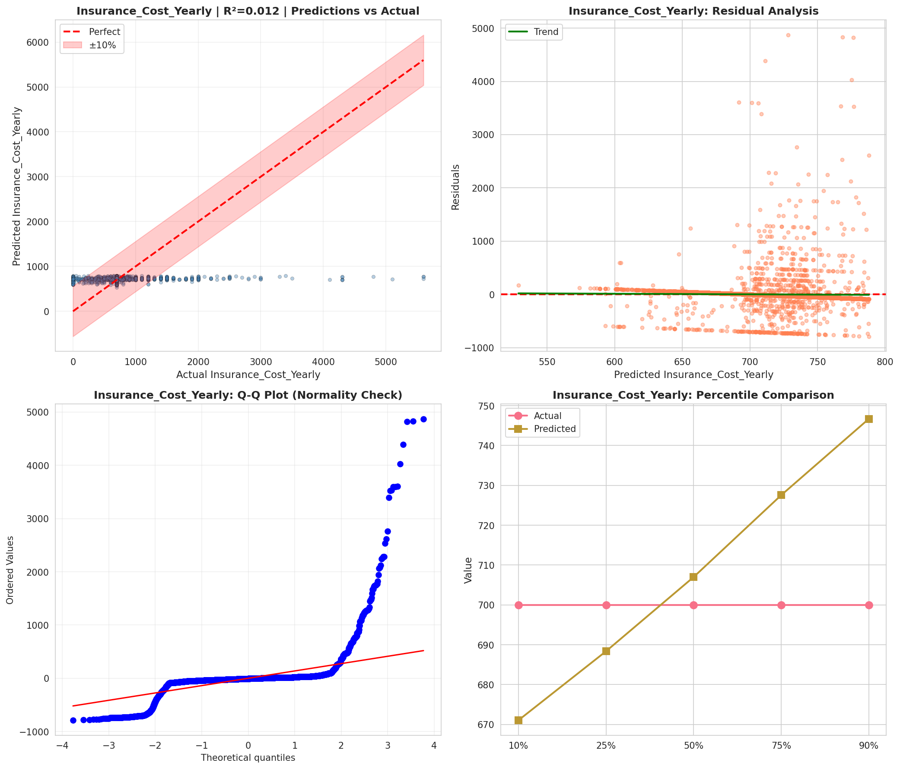
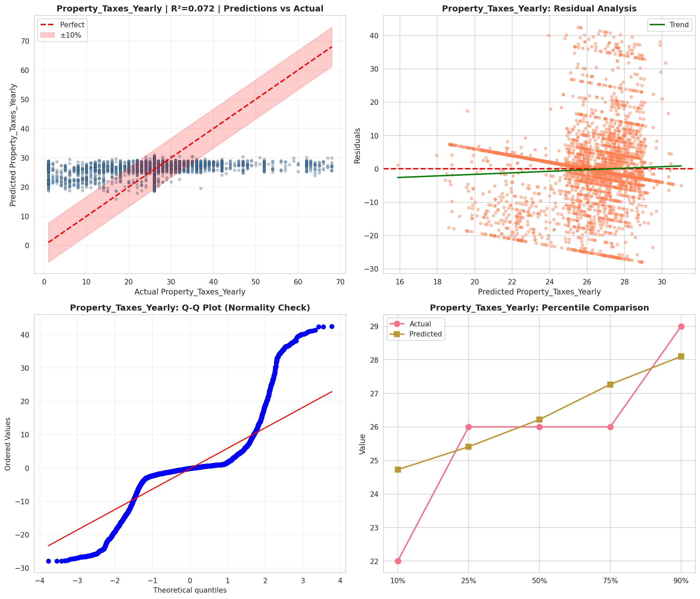
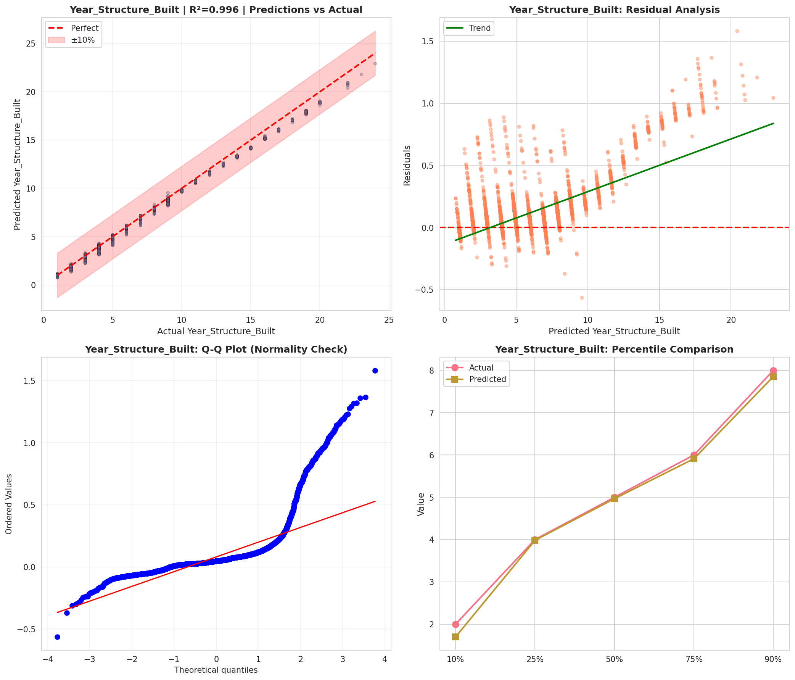
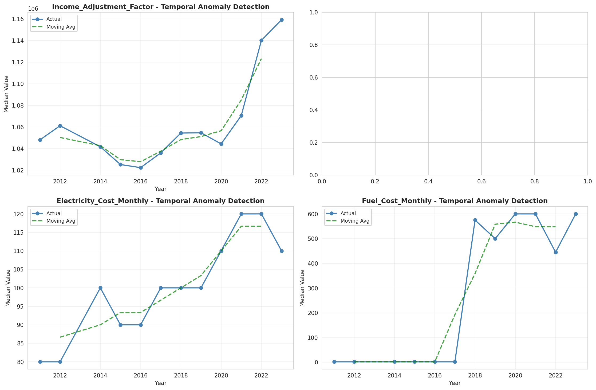
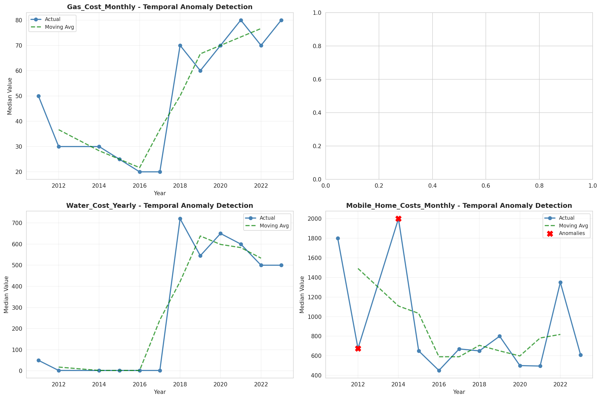
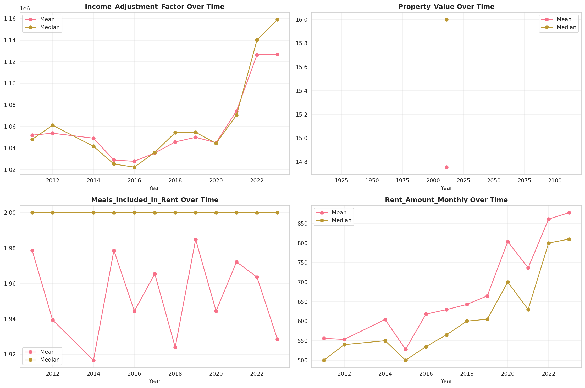
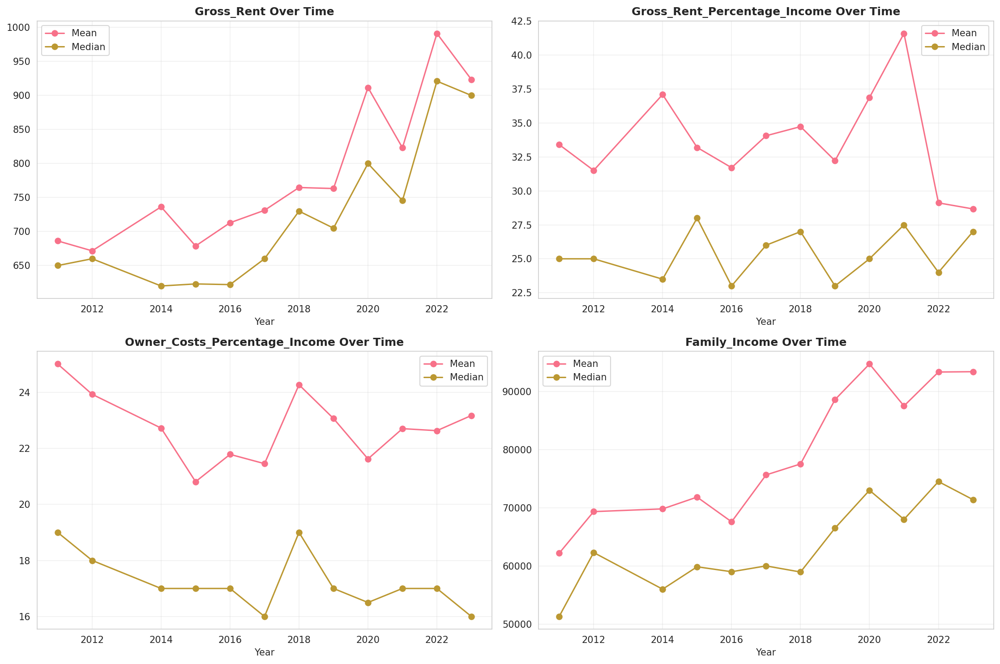
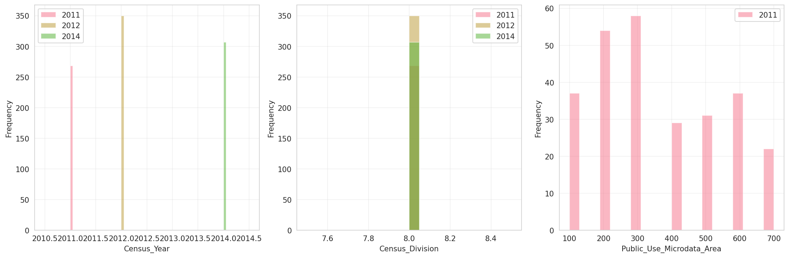
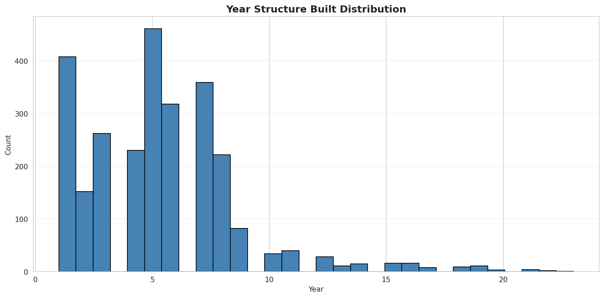
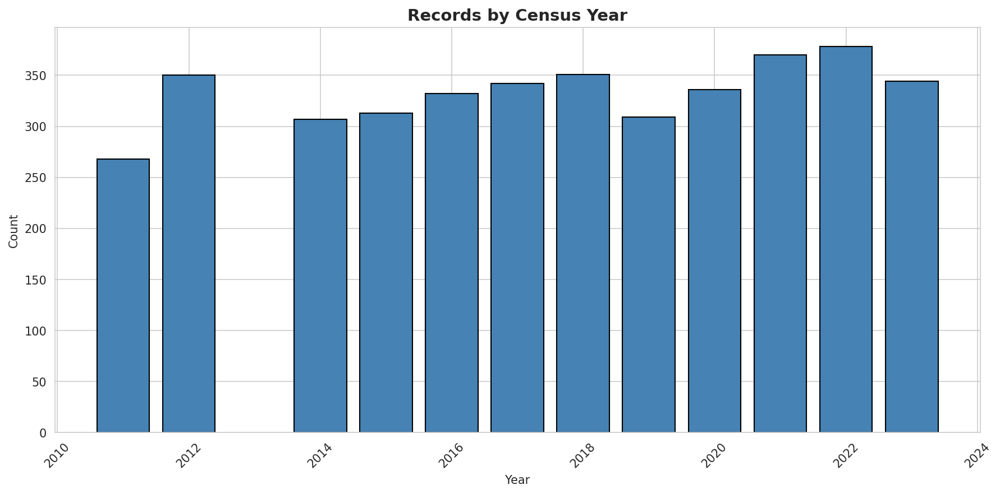
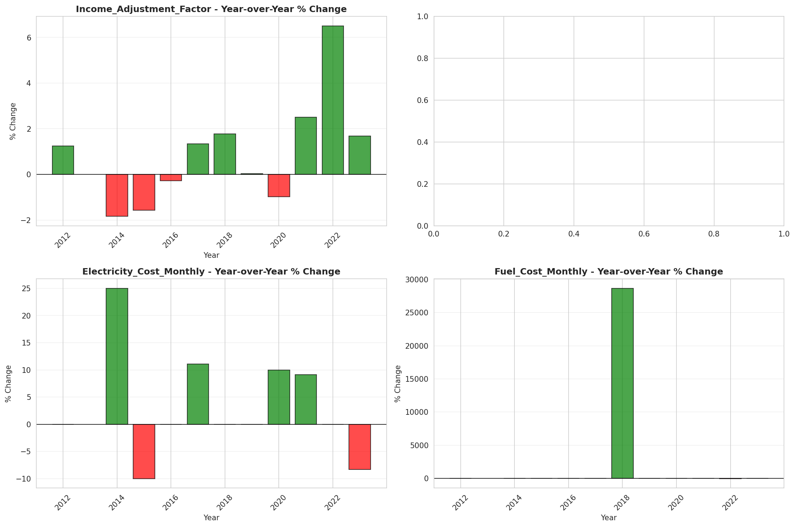
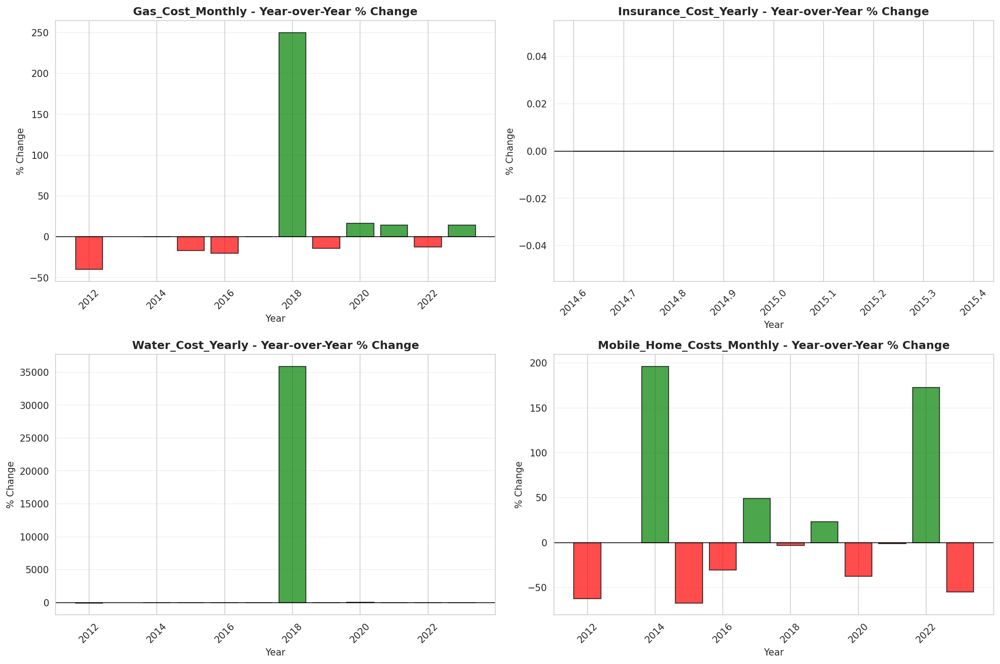
