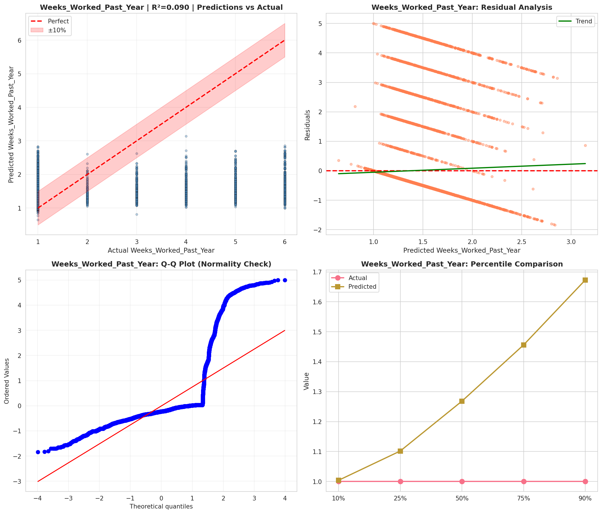
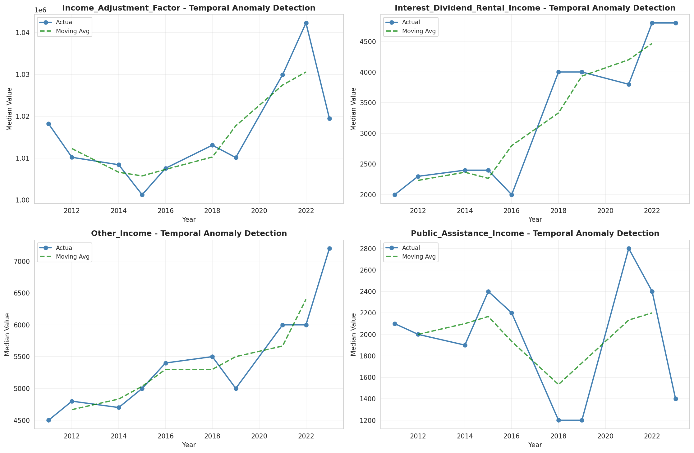
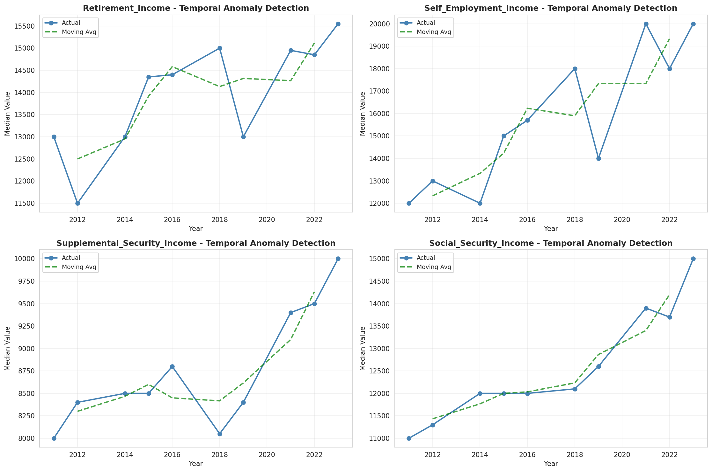
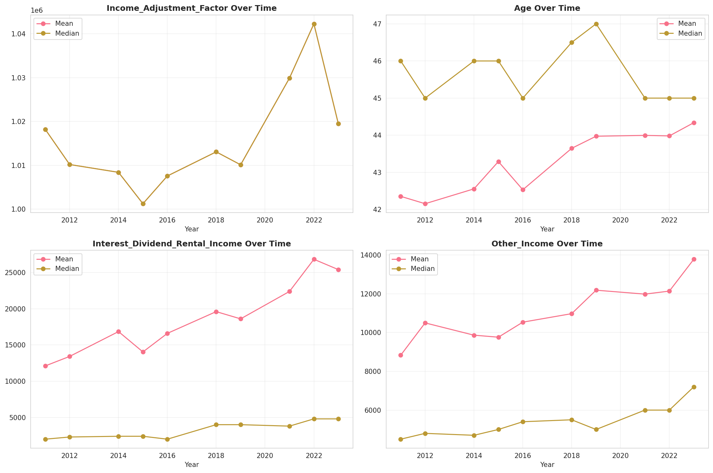
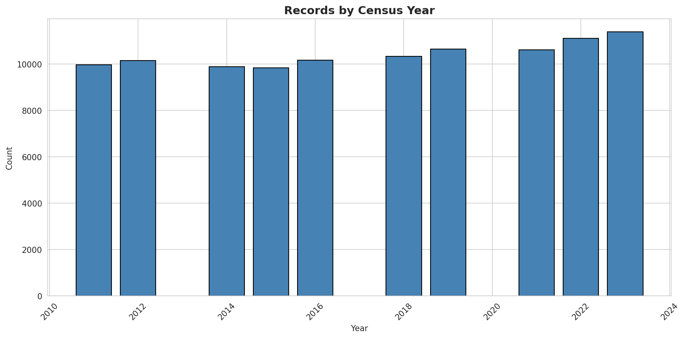
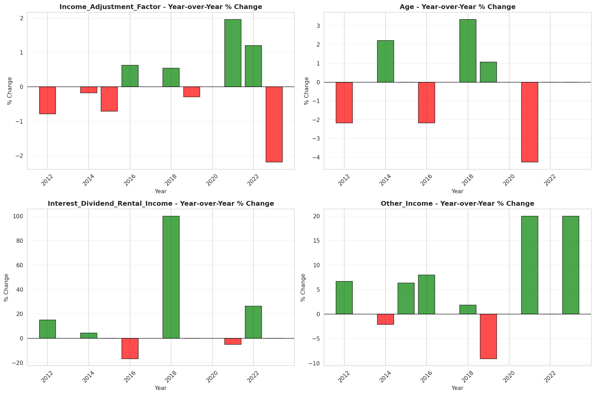
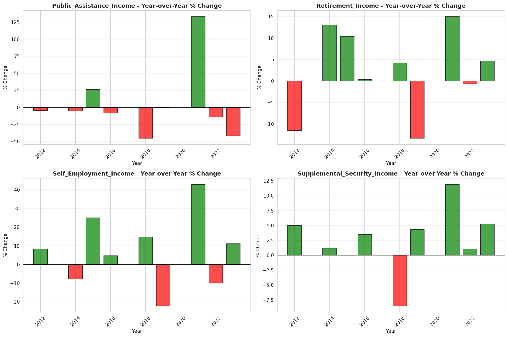

# Temporal Analysis

## Year Distribution

- 2011: 9,965 records

- 2012: 10,154 records

- 2014: 9,878 records

- 2015: 9,841 records

- 2016: 10,161 records

- 2018: 10,336 records

- 2019: 10,649 records

- 2021: 10,615 records

- 2022: 11,116 records

- 2023: 11,383 records

## Temporal Trends

- Census_Year: {np.int64(2011): {'mean': 2011.0, 'median': 2011.0, 'std': 0.0}, np.int64(2012): {'mean': 2012.0, 'median': 2012.0, 'std': 0.0}, np.int64(2014): {'mean': 2014.0, 'median': 2014.0, 'std': 0.0}, np.int64(2015): {'mean': 2015.0, 'median': 2015.0, 'std': 0.0}, np.int64(2016): {'mean': 2016.0, 'median': 2016.0, 'std': 0.0}, np.int64(2018): {'mean': 2018.0, 'median': 2018.0, 'std': 0.0}, np.int64(2019): {'mean': 2019.0, 'median': 2019.0, 'std': 0.0}, np.int64(2021): {'mean': 2021.0, 'median': 2021.0, 'std': 0.0}, np.int64(2022): {'mean': 2022.0, 'median': 2022.0, 'std': 0.0}, np.int64(2023): {'mean': 2023.0, 'median': 2023.0, 'std': 0.0}}

- Person_Number: {np.int64(2011): {'mean': 1.9782237832413447, 'median': 2.0, 'std': 1.270447949689665}, np.int64(2012): {'mean': 2.0288556233996453, 'median': 2.0, 'std': 1.3379336727176485}, np.int64(2014): {'mean': 2.010022271714922, 'median': 2.0, 'std': 1.3062108857725794}, np.int64(2015): {'mean': 1.9627070419672799, 'median': 2.0, 'std': 1.2436551771429019}, np.int64(2016): {'mean': 2.0380868024800707, 'median': 2.0, 'std': 1.3213964669165523}, np.int64(2018): {'mean': 2.018672600619195, 'median': 2.0, 'std': 1.338044272760251}, np.int64(2019): {'mean': 2.0352145741384167, 'median': 2.0, 'std': 1.3960942396910814}, np.int64(2021): {'mean': 2.00357983984927, 'median': 2.0, 'std': 1.3075228394565686}, np.int64(2022): {'mean': 1.9912738395106153, 'median': 2.0, 'std': 1.3420147053608011}, np.int64(2023): {'mean': 1.9910392690854783, 'median': 2.0, 'std': 1.2871465598418146}}

- Public_Use_Microdata_Area: {np.int64(2011): {'mean': 368.1083793276468, 'median': 300.0, 'std': 190.91805369489973}, np.int64(2012): {'mean': 398.9068347449281, 'median': 400.0, 'std': 181.86192038968233}, np.int64(2014): {'mean': 398.86616724033206, 'median': 400.0, 'std': 180.7836487558994}, np.int64(2015): {'mean': 403.5463875622396, 'median': 400.0, 'std': 179.48838512201073}, np.int64(2016): {'mean': 396.4176754256471, 'median': 400.0, 'std': 182.92505333159642}, np.int64(2018): {'mean': 393.85642414860683, 'median': 400.0, 'std': 182.00088861738234}, np.int64(2019): {'mean': 390.3089491971077, 'median': 400.0, 'std': 181.54935797159075}, np.int64(2021): {'mean': 390.53226566179933, 'median': 400.0, 'std': 182.0207977717467}, np.int64(2022): {'mean': 448.0208708168406, 'median': 500.0, 'std': 222.46855740431198}, np.int64(2023): {'mean': 449.8638320302205, 'median': 500.0, 'std': 224.5707533875977}}

- State_Code: {np.int64(2011): {'mean': 30.0, 'median': 30.0, 'std': 0.0}, np.int64(2012): {'mean': 30.0, 'median': 30.0, 'std': 0.0}, np.int64(2014): {'mean': 30.0, 'median': 30.0, 'std': 0.0}, np.int64(2015): {'mean': 30.0, 'median': 30.0, 'std': 0.0}, np.int64(2016): {'mean': 30.0, 'median': 30.0, 'std': 0.0}, np.int64(2018): {'mean': 30.0, 'median': 30.0, 'std': 0.0}, np.int64(2019): {'mean': 30.0, 'median': 30.0, 'std': 0.0}, np.int64(2021): {'mean': 30.0, 'median': 30.0, 'std': 0.0}, np.int64(2022): {'mean': 30.0, 'median': 30.0, 'std': 0.0}, np.int64(2023): {'mean': None, 'median': None, 'std': None}}

- Income_Adjustment_Factor: {np.int64(2011): {'mean': 1018237.0, 'median': 1018237.0, 'std': 0.0}, np.int64(2012): {'mean': 1010207.0, 'median': 1010207.0, 'std': 0.0}, np.int64(2014): {'mean': 1008425.0, 'median': 1008425.0, 'std': 0.0}, np.int64(2015): {'mean': 1001264.0, 'median': 1001264.0, 'std': 0.0}, np.int64(2016): {'mean': 1007588.0, 'median': 1007588.0, 'std': 0.0}, np.int64(2018): {'mean': 1013097.0, 'median': 1013097.0, 'std': 0.0}, np.int64(2019): {'mean': 1010145.0, 'median': 1010145.0, 'std': 0.0}, np.int64(2021): {'mean': 1029928.0, 'median': 1029928.0, 'std': 0.0}, np.int64(2022): {'mean': 1042311.0, 'median': 1042311.0, 'std': 0.0}, np.int64(2023): {'mean': 1019518.0, 'median': 1019518.0, 'std': 0.0}}

- Person_Weight: {np.int64(2011): {'mean': 100.17049673858504, 'median': 66.0, 'std': 106.58795289681639}, np.int64(2012): {'mean': 98.98965924758716, 'median': 72.0, 'std': 95.79638251935239}, np.int64(2014): {'mean': 103.62208949179995, 'median': 75.0, 'std': 100.80558088317699}, np.int64(2015): {'mean': 104.96382481455137, 'median': 76.0, 'std': 102.65755545123305}, np.int64(2016): {'mean': 102.6001377817144, 'median': 77.0, 'std': 97.87234291593842}, np.int64(2018): {'mean': 102.77718653250774, 'median': 77.0, 'std': 98.16815439370671}, np.int64(2019): {'mean': 100.36416564935675, 'median': 72.0, 'std': 100.86096954266266}, np.int64(2021): {'mean': 104.02929816297691, 'median': 79.0, 'std': 99.83389440204378}, np.int64(2022): {'mean': 101.01358402302986, 'median': 75.0, 'std': 102.01993884344627}, np.int64(2023): {'mean': 99.5178775366775, 'median': 74.0, 'std': 98.98398197027328}}

- Age: {np.int64(2011): {'mean': 42.355845459106874, 'median': 46.0, 'std': 24.01889430054}, np.int64(2012): {'mean': 42.15747488674414, 'median': 45.0, 'std': 23.942491585974043}, np.int64(2014): {'mean': 42.55709657825471, 'median': 46.0, 'std': 24.118764936546338}, np.int64(2015): {'mean': 43.292653185651865, 'median': 46.0, 'std': 24.094405194344134}, np.int64(2016): {'mean': 42.53282157267986, 'median': 45.0, 'std': 24.178326388103784}, np.int64(2018): {'mean': 43.647736068111456, 'median': 46.5, 'std': 24.3144741525764}, np.int64(2019): {'mean': 43.974082073434126, 'median': 47.0, 'std': 24.396230754051103}, np.int64(2021): {'mean': 43.99642016015073, 'median': 45.0, 'std': 24.25757583311318}, np.int64(2022): {'mean': 43.98227779776898, 'median': 45.0, 'std': 24.302960188616556}, np.int64(2023): {'mean': 44.338047966265485, 'median': 45.0, 'std': 24.63586362988277}}

- Citizenship_Status: {np.int64(2011): {'mean': 1.0807827395885599, 'median': 1.0, 'std': 0.5164855426824655}, np.int64(2012): {'mean': 1.0762261177860941, 'median': 1.0, 'std': 0.48811351143223103}, np.int64(2014): {'mean': 1.0877708038064386, 'median': 1.0, 'std': 0.5283213891561948}, np.int64(2015): {'mean': 1.0752972258916778, 'median': 1.0, 'std': 0.48673509468685683}, np.int64(2016): {'mean': 1.0794213167995277, 'median': 1.0, 'std': 0.5022495651792199}, np.int64(2018): {'mean': 1.0798181114551084, 'median': 1.0, 'std': 0.49625106966742194}, np.int64(2019): {'mean': 1.0828246783735562, 'median': 1.0, 'std': 0.5088389128453431}, np.int64(2021): {'mean': 1.0866698068770608, 'median': 1.0, 'std': 0.5207457743026173}, np.int64(2022): {'mean': 1.0911299028427492, 'median': 1.0, 'std': 0.5302106124975855}, np.int64(2023): {'mean': 1.084336290960204, 'median': 1.0, 'std': 0.5072863192061069}}

- Class_of_Worker: {np.int64(2011): {'mean': 2.752834839769926, 'median': 1.0, 'std': 2.2128763548460237}, np.int64(2012): {'mean': 2.8080103778174155, 'median': 1.0, 'std': 2.2649898659780914}, np.int64(2014): {'mean': 2.7505419376354845, 'median': 1.0, 'std': 2.189443818097534}, np.int64(2015): {'mean': 2.7405857740585775, 'median': 1.0, 'std': 2.2158356613786805}, np.int64(2016): {'mean': 2.6319038336582197, 'median': 1.0, 'std': 2.1777209592348448}, np.int64(2018): {'mean': 2.6819407008086253, 'median': 1.0, 'std': 2.2003939994704345}, np.int64(2019): {'mean': 2.7237227967278903, 'median': 1.0, 'std': 2.2077728963370298}, np.int64(2021): {'mean': 2.7094043887147334, 'median': 1.0, 'std': 2.170475393230499}, np.int64(2022): {'mean': 2.6875374475733973, 'median': 1.0, 'std': 2.1848714809138268}, np.int64(2023): {'mean': 2.728436856049455, 'median': 1.0, 'std': 2.1928233653682363}}

- English_Speaking_Ability: {np.int64(2011): {'mean': 1.2132196162046909, 'median': 1.0, 'std': 0.5035727872840379}, np.int64(2012): {'mean': 1.3304904051172708, 'median': 1.0, 'std': 0.612850261278905}, np.int64(2014): {'mean': 1.3015463917525774, 'median': 1.0, 'std': 0.681461933897476}, np.int64(2015): {'mean': 1.3140495867768596, 'median': 1.0, 'std': 0.622324876313012}, np.int64(2016): {'mean': 1.2607594936708861, 'median': 1.0, 'std': 0.5791245190003242}, np.int64(2018): {'mean': 1.2747252747252746, 'median': 1.0, 'std': 0.6221961294412397}, np.int64(2019): {'mean': 1.2235576923076923, 'median': 1.0, 'std': 0.5558216204611074}, np.int64(2021): {'mean': 1.2928039702233252, 'median': 1.0, 'std': 0.6056309803521509}, np.int64(2022): {'mean': 1.3200836820083681, 'median': 1.0, 'std': 0.6377817898241356}, np.int64(2023): {'mean': 1.2727272727272727, 'median': 1.0, 'std': 0.5877538136452586}}

- Fertility_Status: {np.int64(2011): {'mean': 1.9367991845056065, 'median': 2.0, 'std': 0.243385834417394}, np.int64(2012): {'mean': 4.16950852557673, 'median': 2.0, 'std': 2.923399559867028}, np.int64(2014): {'mean': 1.9430979978925185, 'median': 2.0, 'std': 0.23171632058922287}, np.int64(2015): {'mean': 1.9355742296918768, 'median': 2.0, 'std': 0.245578657285185}, np.int64(2016): {'mean': 1.9490114464099897, 'median': 2.0, 'std': 0.22003161212019487}, np.int64(2018): {'mean': 1.946524064171123, 'median': 2.0, 'std': 0.22504075656919345}, np.int64(2019): {'mean': 1.9545454545454546, 'median': 2.0, 'std': 0.20835271227699045}, np.int64(2021): {'mean': 1.9523341523341524, 'median': 2.0, 'std': 0.21311061011079635}, np.int64(2022): {'mean': 1.94234404536862, 'median': 2.0, 'std': 0.23314680846088134}, np.int64(2023): {'mean': 1.9484583525080534, 'median': 2.0, 'std': 0.22115065683979573}}

- Marital_Status: {np.int64(2011): {'mean': 2.722829904666332, 'median': 2.0, 'std': 1.824232932638241}, np.int64(2012): {'mean': 2.740200906046878, 'median': 2.0, 'std': 1.8366957275827271}, np.int64(2014): {'mean': 2.759870419113181, 'median': 2.0, 'std': 1.8361122940045997}, np.int64(2015): {'mean': 2.7233004775937406, 'median': 2.0, 'std': 1.82873260125116}, np.int64(2016): {'mean': 2.7636059442968213, 'median': 2.0, 'std': 1.8418308002293071}, np.int64(2018): {'mean': 2.7418730650154797, 'median': 2.0, 'std': 1.8269952632839692}, np.int64(2019): {'mean': 2.736970607568786, 'median': 2.0, 'std': 1.8342332446485279}, np.int64(2021): {'mean': 2.757230334432407, 'median': 2.0, 'std': 1.8403231750744358}, np.int64(2022): {'mean': 2.791111910759266, 'median': 2.0, 'std': 1.8420529203782274}, np.int64(2023): {'mean': 2.755424756215409, 'median': 2.0, 'std': 1.832397067392981}}

- Mobility_Status: {np.int64(2011): {'mean': 1.269445289524389, 'median': 1.0, 'std': 0.6807319072789199}, np.int64(2012): {'mean': 1.2602766995122923, 'median': 1.0, 'std': 0.6710931080432027}, np.int64(2014): {'mean': 1.2575726565697913, 'median': 1.0, 'std': 0.6674355628992503}, np.int64(2015): {'mean': 1.2635690789473684, 'median': 1.0, 'std': 0.6748739173473173}, np.int64(2016): {'mean': 1.271481076785537, 'median': 1.0, 'std': 0.6819347408479746}, np.int64(2018): {'mean': 1.2447545623109202, 'median': 1.0, 'std': 0.6530873508285389}, np.int64(2019): {'mean': 1.2703777335984094, 'median': 1.0, 'std': 0.6820806185204454}, np.int64(2021): {'mean': 1.2320190023752968, 'median': 1.0, 'std': 0.6372309201168556}, np.int64(2022): {'mean': 1.2483215387407005, 'median': 1.0, 'std': 0.6578377933983847}, np.int64(2023): {'mean': 1.2264468669680049, 'median': 1.0, 'std': 0.631307263898954}}

- Military_Service: {np.int64(2011): {'mean': 4.709931292941912, 'median': 5.0, 'std': 0.7209699431647033}, np.int64(2012): {'mean': 4.703383551494196, 'median': 5.0, 'std': 0.7210320922741928}, np.int64(2014): {'mean': 3.7327194752774973, 'median': 4.0, 'std': 0.673024778504114}, np.int64(2015): {'mean': 3.7380415727523166, 'median': 4.0, 'std': 0.6624354006333405}, np.int64(2016): {'mean': 3.7517852745629154, 'median': 4.0, 'std': 0.6473877028246717}, np.int64(2018): {'mean': 3.755119147407496, 'median': 4.0, 'std': 0.6459657075906072}, np.int64(2019): {'mean': 3.755267423014587, 'median': 4.0, 'std': 0.6440503825381382}, np.int64(2021): {'mean': 3.7678715787042383, 'median': 4.0, 'std': 0.6359360272611663}, np.int64(2022): {'mean': 3.7798942964104825, 'median': 4.0, 'std': 0.6258577374746889}, np.int64(2023): {'mean': 3.7664036320397796, 'median': 4.0, 'std': 0.6379187653813962}}

- Travel_Time_To_Work_Minutes: {np.int64(2011): {'mean': 19.84488692232055, 'median': 15.0, 'std': 22.39023507940976}, np.int64(2012): {'mean': 19.704089039438664, 'median': 15.0, 'std': 23.99216908431958}, np.int64(2014): {'mean': 19.90108534780464, 'median': 15.0, 'std': 21.620286683014395}, np.int64(2015): {'mean': 18.72587827808016, 'median': 15.0, 'std': 21.484755581077657}, np.int64(2016): {'mean': 18.248637117800428, 'median': 15.0, 'std': 19.268080679296396}, np.int64(2018): {'mean': 18.999295939920206, 'median': 15.0, 'std': 19.96762049040353}, np.int64(2019): {'mean': 20.61982348947726, 'median': 15.0, 'std': 24.46698102718233}, np.int64(2021): {'mean': 20.180579638345307, 'median': 15.0, 'std': 22.2518323509356}, np.int64(2022): {'mean': 20.4983908045977, 'median': 15.0, 'std': 22.48475883852406}, np.int64(2023): {'mean': 20.5171240644137, 'median': 15.0, 'std': 22.67338396771517}}

- Vehicle_Occupancy: {np.int64(2011): {'mean': 1.1700187717886832, 'median': 1.0, 'std': 0.5486542496864738}, np.int64(2012): {'mean': 1.1936780069649076, 'median': 1.0, 'std': 0.6074234413724227}, np.int64(2014): {'mean': 1.2118827997829626, 'median': 1.0, 'std': 0.7325573749290628}, np.int64(2015): {'mean': 1.1700304119435996, 'median': 1.0, 'std': 0.5635575841238678}, np.int64(2016): {'mean': 1.1490206458443621, 'median': 1.0, 'std': 0.5250165791322047}, np.int64(2018): {'mean': 1.188424604204516, 'median': 1.0, 'std': 0.6822941983801245}, np.int64(2019): {'mean': 1.1775607312797396, 'median': 1.0, 'std': 0.5958081361065558}, np.int64(2021): {'mean': 1.1791891891891892, 'median': 1.0, 'std': 0.6121676852156341}, np.int64(2022): {'mean': 1.2064581744215612, 'median': 1.0, 'std': 0.6443186174288579}, np.int64(2023): {'mean': 1.229712858926342, 'median': 1.0, 'std': 0.753059721073593}}

- Transportation_To_Work: {np.int64(2011): {'mean': 2.518261259242662, 'median': 1.0, 'std': 3.499640171916781}, np.int64(2012): {'mean': 2.6156050253471457, 'median': 1.0, 'std': 3.5792740377919383}, np.int64(2014): {'mean': 2.6324614352783366, 'median': 1.0, 'std': 3.606288193529984}, np.int64(2015): {'mean': 2.6945134341837886, 'median': 1.0, 'std': 3.643796521298816}, np.int64(2016): {'mean': 2.566017079045325, 'median': 1.0, 'std': 3.5179237523747613}, np.int64(2018): {'mean': 2.723489649345163, 'median': 1.0, 'std': 3.686678869702995}, np.int64(2019): {'mean': None, 'median': None, 'std': None}, np.int64(2021): {'mean': None, 'median': None, 'std': None}, np.int64(2022): {'mean': None, 'median': None, 'std': None}, np.int64(2023): {'mean': None, 'median': None, 'std': None}}

- Language_Other_Than_English: {np.int64(2011): {'mean': 1.9501435101520144, 'median': 2.0, 'std': 0.21765995612967132}, np.int64(2012): {'mean': 1.9512271214642263, 'median': 2.0, 'std': 0.21540406224800038}, np.int64(2014): {'mean': 1.95863539445629, 'median': 2.0, 'std': 0.1991426696182323}, np.int64(2015): {'mean': 1.9611764705882353, 'median': 2.0, 'std': 0.19318450881694016}, np.int64(2016): {'mean': 1.9588627369298064, 'median': 2.0, 'std': 0.19861796767239248}, np.int64(2018): {'mean': 1.963019404653053, 'median': 2.0, 'std': 0.18872373827828018}, np.int64(2019): {'mean': 1.9589541193882585, 'median': 2.0, 'std': 0.19840615000978346}, np.int64(2021): {'mean': 1.9601778656126483, 'median': 2.0, 'std': 0.19555078794842365}, np.int64(2022): {'mean': 1.9549396681749622, 'median': 2.0, 'std': 0.20744627031171792}, np.int64(2023): {'mean': 1.9586844998167827, 'median': 2.0, 'std': 0.19902803431703145}}

- Grandparents_Living_With_Grandchildren: {np.int64(2011): {'mean': 1.9763993948562784, 'median': 2.0, 'std': 0.15181272437788343}, np.int64(2012): {'mean': 1.9800387308207954, 'median': 2.0, 'std': 0.13987755901214008}, np.int64(2014): {'mean': 1.9724602203182375, 'median': 2.0, 'std': 0.16366257469600648}, np.int64(2015): {'mean': 1.9781363088057902, 'median': 2.0, 'std': 0.14624942839688376}, np.int64(2016): {'mean': 1.9721891731112433, 'median': 2.0, 'std': 0.16444271471095526}, np.int64(2018): {'mean': 1.9724167500357297, 'median': 2.0, 'std': 0.16378720417048778}, np.int64(2019): {'mean': 1.971159179145868, 'median': 2.0, 'std': 0.16737058318339337}, np.int64(2021): {'mean': 1.9764916139675557, 'median': 2.0, 'std': 0.15152193938414626}, np.int64(2022): {'mean': 1.976762504923198, 'median': 2.0, 'std': 0.15066683158596347}, np.int64(2023): {'mean': 1.9745697405599794, 'median': 2.0, 'std': 0.157438066701202}}

- Months_Responsible_For_Grandchildren: {np.int64(2011): {'mean': 3.617283950617284, 'median': 4.0, 'std': 1.1996655912645813}, np.int64(2012): {'mean': 3.5972222222222223, 'median': 4.0, 'std': 1.430647664050848}, np.int64(2014): {'mean': 3.8363636363636364, 'median': 4.0, 'std': 1.337718670985141}, np.int64(2015): {'mean': 3.7435897435897436, 'median': 4.0, 'std': 1.3525915235220978}, np.int64(2016): {'mean': 3.7547169811320753, 'median': 4.0, 'std': 1.2859039492732394}, np.int64(2018): {'mean': 4.0, 'median': 5.0, 'std': 1.3930520662939845}, np.int64(2019): {'mean': 3.865979381443299, 'median': 5.0, 'std': 1.366480164962929}, np.int64(2021): {'mean': 3.935064935064935, 'median': 5.0, 'std': 1.3605113428961215}, np.int64(2022): {'mean': 4.142857142857143, 'median': 5.0, 'std': 1.3129392688961374}, np.int64(2023): {'mean': 4.2407407407407405, 'median': 5.0, 'std': 1.1590390022738535}}

- Grandparents_Responsible_For_Grandchildren: {np.int64(2011): {'mean': 1.4807692307692308, 'median': 1.0, 'std': 0.5012391592733773}, np.int64(2012): {'mean': 1.462686567164179, 'median': 1.0, 'std': 0.5004767113614728}, np.int64(2014): {'mean': 1.3888888888888888, 'median': 1.0, 'std': 0.48885785128044656}, np.int64(2015): {'mean': 1.4620689655172414, 'median': 1.0, 'std': 0.5002872737956056}, np.int64(2016): {'mean': 1.4331550802139037, 'median': 1.0, 'std': 0.4968418459699709}, np.int64(2018): {'mean': 1.471502590673575, 'median': 1.0, 'std': 0.5004855155699682}, np.int64(2019): {'mean': 1.5336538461538463, 'median': 2.0, 'std': 0.5000696718459454}, np.int64(2021): {'mean': 1.5497076023391814, 'median': 2.0, 'std': 0.49898417622038377}, np.int64(2022): {'mean': 1.4858757062146892, 'median': 1.0, 'std': 0.5012183410175327}, np.int64(2023): {'mean': 1.4545454545454546, 'median': 1.0, 'std': 0.499191778711898}}

- Interest_Dividend_Rental_Income: {np.int64(2011): {'mean': 12103.871705963938, 'median': 2000.0, 'std': 31754.753008742842}, np.int64(2012): {'mean': 13420.049132947977, 'median': 2300.0, 'std': 42815.01951967872}, np.int64(2014): {'mean': 16843.803139306736, 'median': 2400.0, 'std': 44174.42178945955}, np.int64(2015): {'mean': 14034.885519801981, 'median': 2400.0, 'std': 36622.77748329038}, np.int64(2016): {'mean': 16595.491515151516, 'median': 2000.0, 'std': 51222.987581306}, np.int64(2018): {'mean': 19596.831955922866, 'median': 4000.0, 'std': 48187.27931682757}, np.int64(2019): {'mean': 18599.425675675677, 'median': 4000.0, 'std': 40687.25340275904}, np.int64(2021): {'mean': 22379.754558204768, 'median': 3800.0, 'std': 59018.79336733512}, np.int64(2022): {'mean': 26817.926829268294, 'median': 4800.0, 'std': 59761.726645488256}, np.int64(2023): {'mean': 25395.365686944635, 'median': 4800.0, 'std': 64288.66197819183}}

- Military_Service_Period_1: {np.int64(2011): {'mean': 0.1111111111111111, 'median': 0.0, 'std': 0.314419012766966}, np.int64(2012): {'mean': 0.10027855153203342, 'median': 0.0, 'std': 0.3005105884769245}, np.int64(2014): {'mean': 0.14360041623309053, 'median': 0.0, 'std': 0.3508666985715419}, np.int64(2015): {'mean': 0.13090128755364808, 'median': 0.0, 'std': 0.33747346304306086}, np.int64(2016): {'mean': 0.17155756207674944, 'median': 0.0, 'std': 0.3772083758743382}, np.int64(2018): {'mean': 0.17787418655097614, 'median': 0.0, 'std': 0.3826143473111517}, np.int64(2019): {'mean': 0.20042417815482502, 'median': 0.0, 'std': 0.40053020901299524}, np.int64(2021): {'mean': 0.23411371237458195, 'median': 0.0, 'std': 0.4236798303698292}, np.int64(2022): {'mean': 0.25975473801560756, 'median': 0.0, 'std': 0.4387445894588598}, np.int64(2023): {'mean': 0.2865979381443299, 'median': 0.0, 'std': 0.4524053056426944}}

- Military_Service_Period_2: {np.int64(2011): {'mean': 0.13675213675213677, 'median': 0.0, 'std': 0.34374875362054347}, np.int64(2012): {'mean': 0.1309192200557103, 'median': 0.0, 'std': 0.3374686960178028}, np.int64(2014): {'mean': 0.15400624349635797, 'median': 0.0, 'std': 0.3611426829675196}, np.int64(2015): {'mean': 0.15879828326180256, 'median': 0.0, 'std': 0.36568411247304977}, np.int64(2016): {'mean': 0.17042889390519186, 'median': 0.0, 'std': 0.3762215314158963}, np.int64(2018): {'mean': 0.1822125813449024, 'median': 0.0, 'std': 0.38622914096585587}, np.int64(2019): {'mean': 0.1855779427359491, 'median': 0.0, 'std': 0.38897199701248675}, np.int64(2021): {'mean': 0.19509476031215162, 'median': 0.0, 'std': 0.39649470945591825}, np.int64(2022): {'mean': 0.2028985507246377, 'median': 0.0, 'std': 0.4023819477611513}, np.int64(2023): {'mean': 0.19381443298969073, 'median': 0.0, 'std': 0.39548912459875657}}

- Military_Service_Period_3: {np.int64(2011): {'mean': 0.17473884140550808, 'median': 0.0, 'std': 0.3799240132919246}, np.int64(2012): {'mean': 0.15691736304549675, 'median': 0.0, 'std': 0.36389181677691484}, np.int64(2014): {'mean': None, 'median': None, 'std': None}, np.int64(2015): {'mean': None, 'median': None, 'std': None}, np.int64(2016): {'mean': None, 'median': None, 'std': None}, np.int64(2018): {'mean': None, 'median': None, 'std': None}, np.int64(2019): {'mean': None, 'median': None, 'std': None}, np.int64(2021): {'mean': None, 'median': None, 'std': None}, np.int64(2022): {'mean': None, 'median': None, 'std': None}, np.int64(2023): {'mean': None, 'median': None, 'std': None}}

- Military_Service_Period_4: {np.int64(2011): {'mean': 0.13200379867046533, 'median': 0.0, 'std': 0.33865574114751446}, np.int64(2012): {'mean': 0.12349117920148561, 'median': 0.0, 'std': 0.3291530095351732}, np.int64(2014): {'mean': None, 'median': None, 'std': None}, np.int64(2015): {'mean': None, 'median': None, 'std': None}, np.int64(2016): {'mean': None, 'median': None, 'std': None}, np.int64(2018): {'mean': None, 'median': None, 'std': None}, np.int64(2019): {'mean': None, 'median': None, 'std': None}, np.int64(2021): {'mean': None, 'median': None, 'std': None}, np.int64(2022): {'mean': None, 'median': None, 'std': None}, np.int64(2023): {'mean': None, 'median': None, 'std': None}}

- Military_Service_Period_5: {np.int64(2011): {'mean': 0.37037037037037035, 'median': 0.0, 'std': 0.483133344403864}, np.int64(2012): {'mean': 0.38904363974001854, 'median': 0.0, 'std': 0.48775976298149715}, np.int64(2014): {'mean': 0.40790842872008326, 'median': 0.0, 'std': 0.4917018659099226}, np.int64(2015): {'mean': 0.4302575107296137, 'median': 0.0, 'std': 0.49537792557670984}, np.int64(2016): {'mean': 0.3939051918735892, 'median': 0.0, 'std': 0.48889023184951547}, np.int64(2018): {'mean': 0.4370932754880694, 'median': 0.0, 'std': 0.4962961730648487}, np.int64(2019): {'mean': 0.40827147401908803, 'median': 0.0, 'std': 0.4917746822613154}, np.int64(2021): {'mean': 0.42920847268673357, 'median': 0.0, 'std': 0.495239320321417}, np.int64(2022): {'mean': 0.39241917502787066, 'median': 0.0, 'std': 0.4885616306601823}, np.int64(2023): {'mean': 0.37731958762886597, 'median': 0.0, 'std': 0.48496596002365633}}

- Military_Service_Period_6: {np.int64(2011): {'mean': 0.1120607787274454, 'median': 0.0, 'std': 0.3155911046779748}, np.int64(2012): {'mean': 0.116991643454039, 'median': 0.0, 'std': 0.3215596473555515}, np.int64(2014): {'mean': None, 'median': None, 'std': None}, np.int64(2015): {'mean': None, 'median': None, 'std': None}, np.int64(2016): {'mean': None, 'median': None, 'std': None}, np.int64(2018): {'mean': None, 'median': None, 'std': None}, np.int64(2019): {'mean': None, 'median': None, 'std': None}, np.int64(2021): {'mean': None, 'median': None, 'std': None}, np.int64(2022): {'mean': None, 'median': None, 'std': None}, np.int64(2023): {'mean': None, 'median': None, 'std': None}}

- Military_Service_Period_7: {np.int64(2011): {'mean': 0.13010446343779677, 'median': 0.0, 'std': 0.33657818558037284}, np.int64(2012): {'mean': 0.1374187558031569, 'median': 0.0, 'std': 0.3444488406841231}, np.int64(2014): {'mean': None, 'median': None, 'std': None}, np.int64(2015): {'mean': None, 'median': None, 'std': None}, np.int64(2016): {'mean': None, 'median': None, 'std': None}, np.int64(2018): {'mean': None, 'median': None, 'std': None}, np.int64(2019): {'mean': None, 'median': None, 'std': None}, np.int64(2021): {'mean': None, 'median': None, 'std': None}, np.int64(2022): {'mean': None, 'median': None, 'std': None}, np.int64(2023): {'mean': None, 'median': None, 'std': None}}

- Military_Service_Period_8: {np.int64(2011): {'mean': 0.12440645773979107, 'median': 0.0, 'std': 0.33020150840960216}, np.int64(2012): {'mean': 0.11792014856081709, 'median': 0.0, 'std': 0.3226633777295758}, np.int64(2014): {'mean': 0.10718002081165452, 'median': 0.0, 'std': 0.3095030591131794}, np.int64(2015): {'mean': 0.09549356223175966, 'median': 0.0, 'std': 0.29405325690461603}, np.int64(2016): {'mean': 0.0835214446952596, 'median': 0.0, 'std': 0.27682504436795985}, np.int64(2018): {'mean': 0.07592190889370933, 'median': 0.0, 'std': 0.26501688303304755}, np.int64(2019): {'mean': 0.06468716861081654, 'median': 0.0, 'std': 0.2461035692314755}, np.int64(2021): {'mean': 0.04013377926421405, 'median': 0.0, 'std': 0.1963824165033766}, np.int64(2022): {'mean': 0.04793756967670011, 'median': 0.0, 'std': 0.21375335341955412}, np.int64(2023): {'mean': 0.030927835051546393, 'median': 0.0, 'std': 0.17321153024244784}}

- Military_Service_Period_9: {np.int64(2011): {'mean': 0.016144349477682812, 'median': 0.0, 'std': 0.12609047561477385}, np.int64(2012): {'mean': 0.019498607242339833, 'median': 0.0, 'std': 0.13833358087763864}, np.int64(2014): {'mean': 0.01768990634755463, 'median': 0.0, 'std': 0.13189038848640716}, np.int64(2015): {'mean': 0.011802575107296138, 'median': 0.0, 'std': 0.10805462513328969}, np.int64(2016): {'mean': 0.014672686230248307, 'median': 0.0, 'std': 0.12030683502008528}, np.int64(2018): {'mean': 0.004338394793926247, 'median': 0.0, 'std': 0.06575913027704168}, np.int64(2019): {'mean': 0.006362672322375398, 'median': 0.0, 'std': 0.07955438502238961}, np.int64(2021): {'mean': None, 'median': None, 'std': None}, np.int64(2022): {'mean': None, 'median': None, 'std': None}, np.int64(2023): {'mean': None, 'median': None, 'std': None}}

- Military_Service_Period_10: {np.int64(2011): {'mean': 0.09021842355175688, 'median': 0.0, 'std': 0.28663056627542016}, np.int64(2012): {'mean': 0.06499535747446611, 'median': 0.0, 'std': 0.24663219491685384}, np.int64(2014): {'mean': 0.061394380853277836, 'median': 0.0, 'std': 0.24017730327834688}, np.int64(2015): {'mean': 0.04291845493562232, 'median': 0.0, 'std': 0.2027821046287199}, np.int64(2016): {'mean': 0.04401805869074492, 'median': 0.0, 'std': 0.2052511090167633}, np.int64(2018): {'mean': 0.016268980477223426, 'median': 0.0, 'std': 0.1265767665979444}, np.int64(2019): {'mean': 0.016967126193001062, 'median': 0.0, 'std': 0.1292166747146927}, np.int64(2021): {'mean': 0.002229654403567447, 'median': 0.0, 'std': 0.0471928590995718}, np.int64(2022): {'mean': 0.012263099219620958, 'median': 0.0, 'std': 0.11011918212996959}, np.int64(2023): {'mean': 0.009278350515463918, 'median': 0.0, 'std': 0.09592574767193554}}

- Military_Service_Period_11: {np.int64(2011): {'mean': 0.005698005698005698, 'median': 0.0, 'std': 0.07530553712625977}, np.int64(2012): {'mean': 0.0018570102135561746, 'median': 0.0, 'std': 0.04307301205665554}, np.int64(2014): {'mean': 0.001040582726326743, 'median': 0.0, 'std': 0.03225806451612904}, np.int64(2015): {'mean': 0.00536480686695279, 'median': 0.0, 'std': 0.07308732594225269}, np.int64(2016): {'mean': 0.0, 'median': 0.0, 'std': 0.0}, np.int64(2018): {'mean': 0.0021691973969631237, 'median': 0.0, 'std': 0.04654935159348881}, np.int64(2019): {'mean': 0.0021208907741251328, 'median': 0.0, 'std': 0.046028679078586175}, np.int64(2021): {'mean': None, 'median': None, 'std': None}, np.int64(2022): {'mean': None, 'median': None, 'std': None}, np.int64(2023): {'mean': None, 'median': None, 'std': None}}

- Temporary_Absence_From_Work: {np.int64(2011): {'mean': 2.5364954534283606, 'median': 3.0, 'std': 0.5313868515786736}, np.int64(2012): {'mean': 2.529340446168768, 'median': 3.0, 'std': 0.5318633052630032}, np.int64(2014): {'mean': 2.5790844808336435, 'median': 3.0, 'std': 0.5232596871365143}, np.int64(2015): {'mean': 2.5765954820392545, 'median': 3.0, 'std': 0.5192257416475624}, np.int64(2016): {'mean': 2.5900485436893206, 'median': 3.0, 'std': 0.5173508453125311}, np.int64(2018): {'mean': 2.5840906408591997, 'median': 3.0, 'std': 0.5206246042622709}, np.int64(2019): {'mean': 2.5899305160041006, 'median': 3.0, 'std': 0.5140706273363993}, np.int64(2021): {'mean': 2.5810595725329697, 'median': 3.0, 'std': 0.5148399824020111}, np.int64(2022): {'mean': 2.5841573399978266, 'median': 3.0, 'std': 0.5188858941991348}, np.int64(2023): {'mean': 2.574590338369866, 'median': 3.0, 'std': 0.5146788769379907}}

- Available_For_Work: {np.int64(2011): {'mean': 4.594372081592529, 'median': 5.0, 'std': 1.1226834459741697}, np.int64(2012): {'mean': 4.568016488845781, 'median': 5.0, 'std': 1.1441429206563425}, np.int64(2014): {'mean': 4.7470537154199235, 'median': 5.0, 'std': 0.9060893068444282}, np.int64(2015): {'mean': 4.750030860387606, 'median': 5.0, 'std': 0.8892230269398751}, np.int64(2016): {'mean': 4.7564320388349515, 'median': 5.0, 'std': 0.8860395249669106}, np.int64(2018): {'mean': 4.765844447067154, 'median': 5.0, 'std': 0.865986925381489}, np.int64(2019): {'mean': 4.7540722177924595, 'median': 5.0, 'std': 0.8819628680358224}, np.int64(2021): {'mean': 4.8021828103683495, 'median': 5.0, 'std': 0.8040402588949922}, np.int64(2022): {'mean': 4.808758013691188, 'median': 5.0, 'std': 0.7821507822222604}, np.int64(2023): {'mean': 4.815918280485209, 'median': 5.0, 'std': 0.7581656944946443}}

- On_Layoff_From_Work: {np.int64(2011): {'mean': 2.513393954288523, 'median': 3.0, 'std': 0.5240955808128162}, np.int64(2012): {'mean': 2.5098205625606207, 'median': 3.0, 'std': 0.5203747954923942}, np.int64(2014): {'mean': 2.568912045651904, 'median': 3.0, 'std': 0.5095818066781}, np.int64(2015): {'mean': 2.5600543142821874, 'median': 3.0, 'std': 0.5130438789625622}, np.int64(2016): {'mean': 2.5689320388349515, 'median': 3.0, 'std': 0.5166069148272737}, np.int64(2018): {'mean': 2.5719343797946417, 'median': 3.0, 'std': 0.5105596453900814}, np.int64(2019): {'mean': 2.575578084064244, 'median': 3.0, 'std': 0.5090437451041303}, np.int64(2021): {'mean': 2.5702592087312413, 'median': 3.0, 'std': 0.509553953245611}, np.int64(2022): {'mean': 2.5833967184613713, 'median': 3.0, 'std': 0.4998090287963431}, np.int64(2023): {'mean': 2.5702277080229834, 'median': 3.0, 'std': 0.5025368984767391}}

- Looking_For_Work: {np.int64(2011): {'mean': 2.5070041779306953, 'median': 3.0, 'std': 0.5864075009250819}, np.int64(2012): {'mean': 2.505213385063046, 'median': 3.0, 'std': 0.5824497447492931}, np.int64(2014): {'mean': 2.5723855601042054, 'median': 3.0, 'std': 0.5480637048062531}, np.int64(2015): {'mean': 2.5669670411060364, 'median': 3.0, 'std': 0.5457942881369863}, np.int64(2016): {'mean': 2.571723300970874, 'median': 3.0, 'std': 0.5510267511970726}, np.int64(2018): {'mean': 2.5812581140092057, 'median': 3.0, 'std': 0.5344929322102427}, np.int64(2019): {'mean': 2.5705661237042943, 'median': 3.0, 'std': 0.5388774995169756}, np.int64(2021): {'mean': 2.5661664392905865, 'median': 3.0, 'std': 0.5368184900187618}, np.int64(2022): {'mean': 2.572856677170488, 'median': 3.0, 'std': 0.5339892228371207}, np.int64(2023): {'mean': 2.5612896360927855, 'median': 3.0, 'std': 0.5326617579960792}}

- Informed_Of_Recall: {np.int64(2011): {'mean': 2.899483902678791, 'median': 3.0, 'std': 0.3314229903373937}, np.int64(2012): {'mean': 2.8986420950533462, 'median': 3.0, 'std': 0.32911078234056595}, np.int64(2014): {'mean': 2.943431336062523, 'median': 3.0, 'std': 0.25648044664115105}, np.int64(2015): {'mean': 2.9369213677323787, 'median': 3.0, 'std': 0.268688359318909}, np.int64(2016): {'mean': 2.9375, 'median': 3.0, 'std': 0.26733219183055884}, np.int64(2018): {'mean': 2.940634958102207, 'median': 3.0, 'std': 0.25918886874165903}, np.int64(2019): {'mean': 2.925390135550746, 'median': 3.0, 'std': 0.2807994273235818}, np.int64(2021): {'mean': 2.949863574351978, 'median': 3.0, 'std': 0.23576947825722294}, np.int64(2022): {'mean': 2.9517548625448224, 'median': 3.0, 'std': 0.2256578104109569}, np.int64(2023): {'mean': 2.9503085762928283, 'median': 3.0, 'std': 0.23246052486106442}}

- Other_Income: {np.int64(2011): {'mean': 8831.617689015691, 'median': 4500.0, 'std': 12256.144129231125}, np.int64(2012): {'mean': 10498.963665086887, 'median': 4800.0, 'std': 15063.216049273651}, np.int64(2014): {'mean': 9865.311475409837, 'median': 4700.0, 'std': 13565.821342171546}, np.int64(2015): {'mean': 9761.70159857904, 'median': 5000.0, 'std': 12756.808031091276}, np.int64(2016): {'mean': 10537.436332767402, 'median': 5400.0, 'std': 14356.962556843615}, np.int64(2018): {'mean': 10975.45751633987, 'median': 5500.0, 'std': 14749.72135839867}, np.int64(2019): {'mean': 12186.171243941842, 'median': 5000.0, 'std': 15821.281969190162}, np.int64(2021): {'mean': 11983.972027972028, 'median': 6000.0, 'std': 15136.299280523646}, np.int64(2022): {'mean': 12139.508637236084, 'median': 6000.0, 'std': 16134.492326535146}, np.int64(2023): {'mean': 13781.125874125873, 'median': 7200.0, 'std': 16607.89385933605}}

- Public_Assistance_Income: {np.int64(2011): {'mean': 2838.8952380952383, 'median': 2100.0, 'std': 2963.4812037009183}, np.int64(2012): {'mean': 3091.3821138211383, 'median': 2000.0, 'std': 3770.6107530681115}, np.int64(2014): {'mean': 2694.607843137255, 'median': 1900.0, 'std': 2818.8996770450717}, np.int64(2015): {'mean': 3535.402298850575, 'median': 2400.0, 'std': 4200.089922790885}, np.int64(2016): {'mean': 3600.091743119266, 'median': 2200.0, 'std': 3909.7741943448004}, np.int64(2018): {'mean': 3246.9166666666665, 'median': 1200.0, 'std': 4097.77984485047}, np.int64(2019): {'mean': 2183.0708661417325, 'median': 1200.0, 'std': 3026.857428384021}, np.int64(2021): {'mean': 4255.032679738562, 'median': 2800.0, 'std': 4785.3369958027715}, np.int64(2022): {'mean': 3083.206106870229, 'median': 2400.0, 'std': 2920.4489294457594}, np.int64(2023): {'mean': 2892.3232323232323, 'median': 1400.0, 'std': 3219.0674997464935}}

- Retirement_Income: {np.int64(2011): {'mean': 18402.109207708778, 'median': 13000.0, 'std': 22652.216918989936}, np.int64(2012): {'mean': 16863.932702418508, 'median': 11500.0, 'std': 17355.137510007105}, np.int64(2014): {'mean': 18946.77139979859, 'median': 13000.0, 'std': 18973.045087285842}, np.int64(2015): {'mean': 21989.43396226415, 'median': 14350.0, 'std': 28903.74032832614}, np.int64(2016): {'mean': 20159.698397737982, 'median': 14400.0, 'std': 21380.339225107}, np.int64(2018): {'mean': 21396.08108108108, 'median': 15000.0, 'std': 21642.905631160873}, np.int64(2019): {'mean': 21280.68582375479, 'median': 13000.0, 'std': 24789.4658826534}, np.int64(2021): {'mean': 23665.839743589742, 'median': 14950.0, 'std': 30766.18299946546}, np.int64(2022): {'mean': 22347.32603406326, 'median': 14850.0, 'std': 23350.391495546282}, np.int64(2023): {'mean': 24664.94557823129, 'median': 15550.0, 'std': 27905.27813128018}}

- Self_Employment_Income: {np.int64(2011): {'mean': 27962.50991831972, 'median': 12000.0, 'std': 48510.445788252255}, np.int64(2012): {'mean': 28681.598163030998, 'median': 13000.0, 'std': 43608.19389625661}, np.int64(2014): {'mean': 28405.09234234234, 'median': 12000.0, 'std': 46455.23291334546}, np.int64(2015): {'mean': 31010.17270531401, 'median': 15000.0, 'std': 49511.11348278364}, np.int64(2016): {'mean': 30252.932379713915, 'median': 15700.0, 'std': 47577.77647524895}, np.int64(2018): {'mean': 32330.70909090909, 'median': 18000.0, 'std': 50913.66078054911}, np.int64(2019): {'mean': 37467.123094958966, 'median': 14000.0, 'std': 75346.23943206506}, np.int64(2021): {'mean': 33764.38523644752, 'median': 20000.0, 'std': 45803.94458233665}, np.int64(2022): {'mean': 38578.16965352449, 'median': 18000.0, 'std': 70357.60019398973}, np.int64(2023): {'mean': 43120.174512055106, 'median': 20000.0, 'std': 73063.54276615614}}

- Supplemental_Security_Income: {np.int64(2011): {'mean': 8092.213114754099, 'median': 8000.0, 'std': 3784.7513005572896}, np.int64(2012): {'mean': 8833.85214007782, 'median': 8400.0, 'std': 5321.784345374869}, np.int64(2014): {'mean': 8374.509803921568, 'median': 8500.0, 'std': 4140.687451827583}, np.int64(2015): {'mean': 8665.573770491803, 'median': 8500.0, 'std': 5003.854818429308}, np.int64(2016): {'mean': 9084.905660377359, 'median': 8800.0, 'std': 5509.282670212952}, np.int64(2018): {'mean': 8167.368421052632, 'median': 8050.0, 'std': 4694.112987759736}, np.int64(2019): {'mean': 8694.97487437186, 'median': 8400.0, 'std': 5015.790709226161}, np.int64(2021): {'mean': 9448.858447488585, 'median': 9400.0, 'std': 5343.935607157794}, np.int64(2022): {'mean': 10042.80303030303, 'median': 9500.0, 'std': 6079.694535851972}, np.int64(2023): {'mean': 10748.0, 'median': 10000.0, 'std': 6579.902466288043}}

- Social_Security_Income: {np.int64(2011): {'mean': 11588.833712984055, 'median': 11000.0, 'std': 6134.773667827676}, np.int64(2012): {'mean': 11762.873051224944, 'median': 11300.0, 'std': 6130.157545847174}, np.int64(2014): {'mean': 12597.65873015873, 'median': 12000.0, 'std': 6720.751445026181}, np.int64(2015): {'mean': 12757.703451214316, 'median': 12000.0, 'std': 6772.03520635765}, np.int64(2016): {'mean': 13042.769753610875, 'median': 12000.0, 'std': 6889.888750614034}, np.int64(2018): {'mean': 13231.622047244095, 'median': 12100.0, 'std': 6914.253144109584}, np.int64(2019): {'mean': 13515.887528691661, 'median': 12600.0, 'std': 7284.251845501525}, np.int64(2021): {'mean': 14358.005229734777, 'median': 13900.0, 'std': 7767.771474021255}, np.int64(2022): {'mean': 14734.189383070301, 'median': 13700.0, 'std': 8253.577508092922}, np.int64(2023): {'mean': 16144.425560842965, 'median': 15000.0, 'std': 9080.107127873238}}

- Wage_Income: {np.int64(2011): {'mean': 30875.8357771261, 'median': 24500.0, 'std': 29842.84115775352}, np.int64(2012): {'mean': 32500.48664319735, 'median': 24000.0, 'std': 35142.68848932515}, np.int64(2014): {'mean': 35558.52409638554, 'median': 26000.0, 'std': 38787.63499170162}, np.int64(2015): {'mean': 38400.02780748663, 'median': 28000.0, 'std': 46222.545937117495}, np.int64(2016): {'mean': 37301.633906633906, 'median': 28000.0, 'std': 44807.47624006716}, np.int64(2018): {'mean': 39213.02557953637, 'median': 30000.0, 'std': 45695.06224758053}, np.int64(2019): {'mean': 40968.254154447706, 'median': 30000.0, 'std': 47639.590357587294}, np.int64(2021): {'mean': 46022.137622149836, 'median': 34900.0, 'std': 54717.90019046161}, np.int64(2022): {'mean': 47748.90129573171, 'median': 35000.0, 'std': 58788.46388623116}, np.int64(2023): {'mean': 50259.48803646031, 'median': 38000.0, 'std': 58602.9101662504}}

- Relationship_To_Householder: {np.int64(2011): {'mean': 2.3841445057701955, 'median': 1.0, 'std': 4.365381206064211}, np.int64(2012): {'mean': 2.331002560567264, 'median': 1.0, 'std': 4.23955777556671}, np.int64(2014): {'mean': 2.3201052844705408, 'median': 1.0, 'std': 4.1964253277143735}, np.int64(2015): {'mean': 2.3444771872777155, 'median': 1.0, 'std': 4.323153564398898}, np.int64(2016): {'mean': 2.354099006003346, 'median': 1.0, 'std': 4.220706733750027}, np.int64(2018): {'mean': 2.3620356037151704, 'median': 1.0, 'std': 4.247031608248389}, np.int64(2019): {'mean': None, 'median': None, 'std': None}, np.int64(2021): {'mean': None, 'median': None, 'std': None}, np.int64(2022): {'mean': None, 'median': None, 'std': None}, np.int64(2023): {'mean': None, 'median': None, 'std': None}}

- School_Enrollment: {np.int64(2011): {'mean': 1.2552574329224075, 'median': 1.0, 'std': 0.5045427374772798}, np.int64(2012): {'mean': 1.2580087460591884, 'median': 1.0, 'std': 0.5000439170346619}, np.int64(2014): {'mean': 1.2561319277737188, 'median': 1.0, 'std': 0.49962953386583375}, np.int64(2015): {'mean': 1.2442788158723495, 'median': 1.0, 'std': 0.49571001550442256}, np.int64(2016): {'mean': 1.2572850035536602, 'median': 1.0, 'std': 0.5046533867105436}, np.int64(2018): {'mean': 1.2477128082736675, 'median': 1.0, 'std': 0.49602571621612174}, np.int64(2019): {'mean': 1.2471986089644513, 'median': 1.0, 'std': 0.4992912336816029}, np.int64(2021): {'mean': 1.2391493475108748, 'median': 1.0, 'std': 0.5006129763730842}, np.int64(2022): {'mean': 1.238517697070511, 'median': 1.0, 'std': 0.4976270701151306}, np.int64(2023): {'mean': 1.2429022082018928, 'median': 1.0, 'std': 0.4995381451627874}}

- School_Grade_Attending: {np.int64(2011): {'mean': 9.293543892243381, 'median': 10.0, 'std': 4.849907074767156}, np.int64(2012): {'mean': 9.363272565584705, 'median': 10.0, 'std': 4.750735395120125}, np.int64(2014): {'mean': 9.261169967756794, 'median': 10.0, 'std': 4.7994295277496155}, np.int64(2015): {'mean': 9.425343811394892, 'median': 10.0, 'std': 4.773990355166172}, np.int64(2016): {'mean': 9.161638901395767, 'median': 10.0, 'std': 4.8064789061177065}, np.int64(2018): {'mean': 9.160200821542675, 'median': 9.0, 'std': 4.776883525412782}, np.int64(2019): {'mean': 9.367383512544803, 'median': 10.0, 'std': 4.759700539365309}, np.int64(2021): {'mean': 9.245870693723454, 'median': 10.0, 'std': 4.785231715654644}, np.int64(2022): {'mean': 9.238758992805755, 'median': 10.0, 'std': 4.771816106948545}, np.int64(2023): {'mean': 9.216645216645217, 'median': 9.0, 'std': 4.658998131614115}}

- Educational_Attainment: {np.int64(2011): {'mean': 16.01046306847612, 'median': 17.0, 'std': 5.392489358983211}, np.int64(2012): {'mean': 16.056645987999595, 'median': 17.0, 'std': 5.346814981840024}, np.int64(2014): {'mean': 16.139442646905334, 'median': 17.0, 'std': 5.390547907744856}, np.int64(2015): {'mean': 16.312828049548603, 'median': 18.0, 'std': 5.280198958435767}, np.int64(2016): {'mean': 16.199004975124378, 'median': 18.0, 'std': 5.422745503016997}, np.int64(2018): {'mean': 16.349244232299124, 'median': 18.0, 'std': 5.4055559595513785}, np.int64(2019): {'mean': 16.408713292117465, 'median': 18.0, 'std': 5.342412495715269}, np.int64(2021): {'mean': 16.54132431126148, 'median': 18.0, 'std': 5.44795902396234}, np.int64(2022): {'mean': 16.506977174013493, 'median': 18.0, 'std': 5.373436437874918}, np.int64(2023): {'mean': 16.526092834610186, 'median': 18.0, 'std': 5.373436827500307}}

- Sex: {np.int64(2011): {'mean': 1.4988459608630205, 'median': 1.0, 'std': 0.5000237578207436}, np.int64(2012): {'mean': 1.5026590506204451, 'median': 2.0, 'std': 0.5000175517093952}, np.int64(2014): {'mean': 1.4988864142538976, 'median': 1.0, 'std': 0.5000240705511938}, np.int64(2015): {'mean': 1.4940554821664465, 'median': 1.0, 'std': 0.49999006552190906}, np.int64(2016): {'mean': 1.4940458616277925, 'median': 1.0, 'std': 0.4999891509284091}, np.int64(2018): {'mean': 1.4933243034055728, 'median': 1.0, 'std': 0.49997961999442647}, np.int64(2019): {'mean': 1.497887125551695, 'median': 1.0, 'std': 0.500019013568322}, np.int64(2021): {'mean': 1.501365991521432, 'median': 2.0, 'std': 0.5000216872178994}, np.int64(2022): {'mean': 1.4961317020510976, 'median': 1.0, 'std': 0.5000075269958132}, np.int64(2023): {'mean': 1.5017130809101291, 'median': 2.0, 'std': 0.5000190292392102}}

- Hours_Worked_Per_Week: {np.int64(2011): {'mean': 38.24081328110427, 'median': 40.0, 'std': 15.085985577050904}, np.int64(2012): {'mean': 38.18118338846013, 'median': 40.0, 'std': 15.465855183692392}, np.int64(2014): {'mean': 38.035325568073326, 'median': 40.0, 'std': 15.30158038424532}, np.int64(2015): {'mean': 38.3682192831129, 'median': 40.0, 'std': 14.72052823267011}, np.int64(2016): {'mean': 37.74688256095291, 'median': 40.0, 'std': 14.569624867490322}, np.int64(2018): {'mean': 37.506851785070324, 'median': 40.0, 'std': 14.782183117369696}, np.int64(2019): {'mean': 38.22799858055358, 'median': 40.0, 'std': 15.395778479824285}, np.int64(2021): {'mean': 38.24354986276304, 'median': 40.0, 'std': 14.946505606860237}, np.int64(2022): {'mean': 38.006065857885616, 'median': 40.0, 'std': 14.857856511056136}, np.int64(2023): {'mean': 37.370020604395606, 'median': 40.0, 'std': 14.821530338186331}}

- When_Last_Worked: {np.int64(2011): {'mean': 1.598672892602605, 'median': 1.0, 'std': 0.8690368120005215}, np.int64(2012): {'mean': 1.5984481086323958, 'median': 1.0, 'std': 0.8699934379088301}, np.int64(2014): {'mean': 1.6099739486416078, 'median': 1.0, 'std': 0.8702241585763277}, np.int64(2015): {'mean': 1.6217750894951242, 'median': 1.0, 'std': 0.8756739115022009}, np.int64(2016): {'mean': 1.603883495145631, 'median': 1.0, 'std': 0.8667136709829775}, np.int64(2018): {'mean': 1.6035642629529092, 'median': 1.0, 'std': 0.8692477427353863}, np.int64(2019): {'mean': 1.6228499829137715, 'median': 1.0, 'std': 0.874453010257422}, np.int64(2021): {'mean': 1.6550704865848114, 'median': 1.0, 'std': 0.8824924556057455}, np.int64(2022): {'mean': 1.649896772791481, 'median': 1.0, 'std': 0.8839391028391956}, np.int64(2023): {'mean': 1.6596084273249627, 'median': 1.0, 'std': 0.8850073369675444}}

- Weeks_Worked_Past_Year: {np.int64(2011): {'mean': 2.0658459242678604, 'median': 1.0, 'std': 1.7391323744351594}, np.int64(2012): {'mean': 2.0602719588386624, 'median': 1.0, 'std': 1.7427999702644537}, np.int64(2014): {'mean': 2.019858697727707, 'median': 1.0, 'std': 1.7001064258825165}, np.int64(2015): {'mean': 1.9469043511596702, 'median': 1.0, 'std': 1.669964991348504}, np.int64(2016): {'mean': 2.0117252931323284, 'median': 1.0, 'std': 1.7049848789806366}, np.int64(2018): {'mean': 1.9587089794446448, 'median': 1.0, 'std': 1.6766332551784264}}

- Year_Of_Entry: {np.int64(2011): {'mean': 1985.0711462450593, 'median': 1990.0, 'std': 21.84984103022235}, np.int64(2012): {'mean': 1982.5836575875487, 'median': 1987.0, 'std': 21.18615882203037}, np.int64(2014): {'mean': 1986.463157894737, 'median': 1994.0, 'std': 22.387029629372204}, np.int64(2015): {'mean': 1985.7951807228915, 'median': 1991.0, 'std': 23.319705966378187}, np.int64(2016): {'mean': 1988.0557620817845, 'median': 1994.0, 'std': 21.613822585307695}, np.int64(2018): {'mean': 1989.1, 'median': 1994.5, 'std': 22.81303155221042}, np.int64(2019): {'mean': 1987.9966216216217, 'median': 1991.0, 'std': 22.63333349637301}, np.int64(2021): {'mean': 1990.9511400651465, 'median': 1995.0, 'std': 21.68839537158165}, np.int64(2022): {'mean': 1992.687134502924, 'median': 1996.0, 'std': 21.190071500145304}, np.int64(2023): {'mean': 1992.3262195121952, 'median': 1993.0, 'std': 21.650129740357215}}

- Ancestry_Recode: {np.int64(2011): {'mean': 1.7067737079779228, 'median': 1.0, 'std': 0.9270453952556276}, np.int64(2012): {'mean': 1.7008075635217648, 'median': 1.0, 'std': 0.9305147579496277}, np.int64(2014): {'mean': 1.844300465681312, 'median': 2.0, 'std': 1.0627061433392613}, np.int64(2015): {'mean': 1.8091657351895132, 'median': 2.0, 'std': 1.0264595621812296}, np.int64(2016): {'mean': 1.9009939966538727, 'median': 2.0, 'std': 1.0538829571939945}, np.int64(2018): {'mean': 1.936532507739938, 'median': 2.0, 'std': 1.085077803157195}, np.int64(2019): {'mean': 1.956427833599399, 'median': 2.0, 'std': 1.0931357490503255}, np.int64(2021): {'mean': 2.027979274611399, 'median': 2.0, 'std': 1.1421770918233984}, np.int64(2022): {'mean': 1.99091399784095, 'median': 2.0, 'std': 1.1242264222448315}, np.int64(2023): {'mean': 1.9965738381797418, 'median': 2.0, 'std': 1.1322211140834335}}

- First_Ancestry_Code: {np.int64(2011): {'mean': 363.75504264927247, 'median': 82.0, 'std': 424.34191440756183}, np.int64(2012): {'mean': 375.4120543628127, 'median': 82.0, 'std': 426.7255755505765}, np.int64(2014): {'mean': 405.85847337517714, 'median': 88.0, 'std': 437.8148710455984}, np.int64(2015): {'mean': 395.23727263489485, 'median': 88.0, 'std': 433.79520534431236}, np.int64(2016): {'mean': 407.9202834366696, 'median': 89.0, 'std': 437.1149058185263}, np.int64(2018): {'mean': 419.8203366873065, 'median': 91.0, 'std': 440.0347379704574}, np.int64(2019): {'mean': 413.8842144802329, 'median': 94.0, 'std': 438.5202184513864}, np.int64(2021): {'mean': 425.11625058878946, 'median': 89.0, 'std': 446.2868878827807}, np.int64(2022): {'mean': 440.0351745232098, 'median': 94.0, 'std': 447.50719184371263}, np.int64(2023): {'mean': 439.20794166739876, 'median': 97.0, 'std': 447.6290403426099}}

- Second_Ancestry_Code: {np.int64(2011): {'mean': 682.7318615153035, 'median': 999.0, 'std': 443.0349766319435}, np.int64(2012): {'mean': 690.5183179042742, 'median': 999.0, 'std': 440.3166186082033}, np.int64(2014): {'mean': 716.8478436930553, 'median': 999.0, 'std': 429.74482096708016}, np.int64(2015): {'mean': 702.0184940554822, 'median': 999.0, 'std': 435.93432281053185}, np.int64(2016): {'mean': 682.4407046550537, 'median': 999.0, 'std': 441.97700826969697}, np.int64(2018): {'mean': 699.625677244582, 'median': 999.0, 'std': 436.19447941798074}, np.int64(2019): {'mean': 698.2093154286788, 'median': 999.0, 'std': 436.5377435928456}, np.int64(2021): {'mean': 718.045219029675, 'median': 999.0, 'std': 428.53031255939896}, np.int64(2022): {'mean': 726.4648254767902, 'median': 999.0, 'std': 423.92797676832737}, np.int64(2023): {'mean': 732.3828516208381, 'median': 999.0, 'std': 421.681673334438}}

- Decade_Of_Entry: {np.int64(2011): {'mean': 4.980237154150197, 'median': 6.0, 'std': 2.0362792728081427}, np.int64(2012): {'mean': 4.7587548638132295, 'median': 5.0, 'std': 2.0606457588774854}, np.int64(2014): {'mean': 5.042105263157895, 'median': 6.0, 'std': 2.0499868917840147}, np.int64(2015): {'mean': 4.991967871485944, 'median': 6.0, 'std': 2.0634921228100396}, np.int64(2016): {'mean': 5.215613382899628, 'median': 6.0, 'std': 1.9117609525047121}, np.int64(2018): {'mean': 5.45, 'median': 6.0, 'std': 2.215374754902542}, np.int64(2019): {'mean': 5.327702702702703, 'median': 6.0, 'std': 2.2271155152111817}, np.int64(2021): {'mean': 5.635179153094462, 'median': 6.0, 'std': 2.1137118986926993}, np.int64(2022): {'mean': 5.771929824561403, 'median': 6.0, 'std': 2.0263734173968335}, np.int64(2023): {'mean': 5.722560975609756, 'median': 6.0, 'std': 2.057100070398745}}

- Drives_Alone_To_Work: {np.int64(2011): {'mean': 1.16733708769107, 'median': 1.0, 'std': 0.521938667322665}, np.int64(2012): {'mean': 1.1888561478703457, 'median': 1.0, 'std': 0.5579630154602472}, np.int64(2014): {'mean': 1.2007596310363537, 'median': 1.0, 'std': 0.6374639954252537}, np.int64(2015): {'mean': 1.1667127453690904, 'median': 1.0, 'std': 0.5364151468535396}, np.int64(2016): {'mean': 1.147961884595024, 'median': 1.0, 'std': 0.5146231521712726}, np.int64(2018): {'mean': 1.1796003114456268, 'median': 1.0, 'std': 0.6019431550492107}, np.int64(2019): {'mean': 1.1738041572752316, 'median': 1.0, 'std': 0.5567449223206322}, np.int64(2021): {'mean': 1.174864864864865, 'median': 1.0, 'std': 0.5719075503342661}, np.int64(2022): {'mean': 1.2034070683956268, 'median': 1.0, 'std': 0.6179072302450346}, np.int64(2023): {'mean': 1.2209737827715357, 'median': 1.0, 'std': 0.6818318384366429}}

- Employment_Status_Parents: {np.int64(2011): {'mean': 2.8093285494618145, 'median': 2.0, 'std': 2.4571267586140797}, np.int64(2012): {'mean': 2.7937743190661477, 'median': 2.0, 'std': 2.4346005743918715}, np.int64(2014): {'mean': 2.8428720083246617, 'median': 2.0, 'std': 2.444655203986646}, np.int64(2015): {'mean': 2.7053918843802114, 'median': 2.0, 'std': 2.3689051763526394}, np.int64(2016): {'mean': 2.6883374689826303, 'median': 2.0, 'std': 2.361377824207708}, np.int64(2018): {'mean': 2.698857736240914, 'median': 1.0, 'std': 2.3803674808538187}, np.int64(2019): {'mean': 2.687436676798379, 'median': 2.0, 'std': 2.315043514097856}, np.int64(2021): {'mean': 2.7068694284216046, 'median': 1.0, 'std': 2.3572731336649717}, np.int64(2022): {'mean': 2.6813131313131313, 'median': 1.0, 'std': 2.3470825843665097}, np.int64(2023): {'mean': 2.6887385210246495, 'median': 1.0, 'std': 2.366712620986849}}

- Employment_Status_Recode: {np.int64(2011): {'mean': 3.094126320963382, 'median': 1.0, 'std': 2.3985345172975037}, np.int64(2012): {'mean': 3.087172647914646, 'median': 1.0, 'std': 2.4007477025885273}, np.int64(2014): {'mean': 3.105445974444858, 'median': 1.0, 'std': 2.42142963026141}, np.int64(2015): {'mean': 3.1587458338476733, 'median': 1.0, 'std': 2.434014436835762}, np.int64(2016): {'mean': 3.1060679611650484, 'median': 1.0, 'std': 2.4205119483772632}, np.int64(2018): {'mean': 3.1059837129706125, 'median': 1.0, 'std': 2.4301096258004415}, np.int64(2019): {'mean': 3.1632304362683676, 'median': 1.0, 'std': 2.441922595657739}, np.int64(2021): {'mean': 3.2136198271941794, 'median': 1.0, 'std': 2.4437645202976053}, np.int64(2022): {'mean': 3.1930892100402044, 'median': 1.0, 'std': 2.4432680661465156}, np.int64(2023): {'mean': 3.231432219621196, 'median': 1.0, 'std': 2.4556432071777388}}

- Hispanic_Origin: {np.int64(2011): {'mean': 1.0946312092323132, 'median': 1.0, 'std': 1.3018747394366517}, np.int64(2012): {'mean': 1.1176876107937759, 'median': 1.0, 'std': 1.4090630967796778}, np.int64(2014): {'mean': 1.1145980967807247, 'median': 1.0, 'std': 1.378550849814534}, np.int64(2015): {'mean': 1.1269179961386038, 'median': 1.0, 'std': 1.423613268444685}, np.int64(2016): {'mean': 1.1282354099006002, 'median': 1.0, 'std': 1.4290954844347663}, np.int64(2018): {'mean': 1.138544891640867, 'median': 1.0, 'std': 1.5670038561420427}, np.int64(2019): {'mean': 1.1424546905812751, 'median': 1.0, 'std': 1.5780738502549225}, np.int64(2021): {'mean': 1.2478568064060291, 'median': 1.0, 'std': 2.183992173705187}, np.int64(2022): {'mean': 1.207808564231738, 'median': 1.0, 'std': 1.9673896110932347}, np.int64(2023): {'mean': 1.2399191777211631, 'median': 1.0, 'std': 2.063220199026685}}

- Time_Of_Arrival_At_Work: {np.int64(2011): {'mean': 101.16715830875123, 'median': 92.0, 'std': 37.52374654200749}, np.int64(2012): {'mean': 100.5552867166707, 'median': 92.0, 'std': 37.32371477563256}, np.int64(2014): {'mean': 99.77084361124815, 'median': 92.0, 'std': 36.76174150820019}, np.int64(2015): {'mean': 99.28179119247898, 'median': 92.0, 'std': 36.52281303880089}, np.int64(2016): {'mean': 100.37568144109979, 'median': 92.0, 'std': 36.90814770130774}, np.int64(2018): {'mean': 101.02182586247359, 'median': 92.0, 'std': 38.13009288755797}, np.int64(2019): {'mean': 100.34419551934828, 'median': 92.0, 'std': 37.77612532770935}, np.int64(2021): {'mean': 99.8912558830815, 'median': 92.0, 'std': 36.915021952068166}, np.int64(2022): {'mean': 99.60505747126437, 'median': 92.0, 'std': 35.81347622107993}, np.int64(2023): {'mean': 98.49081424359265, 'median': 92.0, 'std': 35.65989869898136}}

- Time_Of_Departure_For_Work: {np.int64(2011): {'mean': 54.4358407079646, 'median': 49.0, 'std': 25.920725423825672}, np.int64(2012): {'mean': 53.894265666586016, 'median': 49.0, 'std': 25.632477631127237}, np.int64(2014): {'mean': 53.43956586087815, 'median': 49.0, 'std': 25.416785814571902}, np.int64(2015): {'mean': 53.19619000494804, 'median': 49.0, 'std': 25.16503026349957}, np.int64(2016): {'mean': 54.005688551789525, 'median': 49.0, 'std': 25.485247378042974}, np.int64(2018): {'mean': 54.361652194320584, 'median': 49.0, 'std': 26.127493901086357}, np.int64(2019): {'mean': 53.73002941842046, 'median': 49.0, 'std': 25.790757628694436}, np.int64(2021): {'mean': 53.66509784493436, 'median': 49.0, 'std': 25.452949326294693}, np.int64(2022): {'mean': 53.31080459770115, 'median': 49.0, 'std': 25.201071342765545}, np.int64(2023): {'mean': 52.454071217963254, 'median': 49.0, 'std': 25.152831171271686}}

- Language_Spoken_At_Home: {np.int64(2011): {'mean': 721.4904051172708, 'median': 625.0, 'std': 146.08959321371375}, np.int64(2012): {'mean': 713.2174840085288, 'median': 625.0, 'std': 145.45755847527437}, np.int64(2014): {'mean': 713.7731958762887, 'median': 625.0, 'std': 141.92464464538438}, np.int64(2015): {'mean': 738.8539944903581, 'median': 625.0, 'std': 166.51467227264467}, np.int64(2016): {'mean': 3712.8632911392406, 'median': 1315.0, 'std': 2828.597913074972}, np.int64(2018): {'mean': 2429.7115384615386, 'median': 1200.0, 'std': 2287.1175350296394}, np.int64(2019): {'mean': 2950.331730769231, 'median': 1200.0, 'std': 2622.466841175121}, np.int64(2021): {'mean': 2460.349875930521, 'median': 1200.0, 'std': 2322.3781695402135}, np.int64(2022): {'mean': 2171.531380753138, 'median': 1200.0, 'std': 2083.697743741433}, np.int64(2023): {'mean': 2561.89800443459, 'median': 1200.0, 'std': 2382.0496595757386}}

- Migration_PUMA: {np.int64(2011): {'mean': 600.8481012658228, 'median': 400.0, 'std': 885.8955083548464}, np.int64(2012): {'mean': 1194.9212121212122, 'median': 400.0, 'std': 4687.327174498602}, np.int64(2014): {'mean': 1589.1505882352942, 'median': 400.0, 'std': 5355.4256290273715}, np.int64(2015): {'mean': 1571.4717710750194, 'median': 500.0, 'std': 5246.167546934674}, np.int64(2016): {'mean': 1267.7680115273774, 'median': 400.0, 'std': 4334.881977813415}, np.int64(2018): {'mean': 1760.4125984251968, 'median': 400.0, 'std': 5335.037240655329}, np.int64(2019): {'mean': 2025.6481609993061, 'median': 400.0, 'std': 6658.508050201308}, np.int64(2021): {'mean': 1901.7176186645213, 'median': 400.0, 'std': 4967.674961514307}, np.int64(2022): {'mean': 2249.1274438812457, 'median': 500.0, 'std': 5632.097447071698}, np.int64(2023): {'mean': 2450.604633204633, 'median': 500.0, 'std': 7323.883697668885}}

- Migration_State_Or_Country: {np.int64(2011): {'mean': 35.139985107967235, 'median': 30.0, 'std': 41.05490201829159}, np.int64(2012): {'mean': 34.35454545454545, 'median': 30.0, 'std': 36.86407293262863}, np.int64(2014): {'mean': 33.190588235294115, 'median': 30.0, 'std': 35.4952479524334}, np.int64(2015): {'mean': 34.12142304717711, 'median': 30.0, 'std': 36.06180127622667}, np.int64(2016): {'mean': 35.34942363112392, 'median': 30.0, 'std': 33.224754384665474}, np.int64(2018): {'mean': 36.4503937007874, 'median': 30.0, 'std': 47.00512500605261}, np.int64(2019): {'mean': 33.541984732824424, 'median': 30.0, 'std': 33.05290067456328}, np.int64(2021): {'mean': 37.36283185840708, 'median': 30.0, 'std': 49.77743834127597}, np.int64(2022): {'mean': 34.674873280231715, 'median': 30.0, 'std': 42.20231652841306}, np.int64(2023): {'mean': 35.08262548262548, 'median': 30.0, 'std': 35.10523106496661}}

- Place_Of_Birth: {np.int64(2011): {'mean': 35.01605619668841, 'median': 30.0, 'std': 35.31367075699234}, np.int64(2012): {'mean': 34.86320661808154, 'median': 30.0, 'std': 35.130897315924884}, np.int64(2014): {'mean': 35.78133225349261, 'median': 30.0, 'std': 38.95197843813557}, np.int64(2015): {'mean': 35.05812417437252, 'median': 30.0, 'std': 37.14116220825767}, np.int64(2016): {'mean': 34.67995276055506, 'median': 30.0, 'std': 35.642087290932636}, np.int64(2018): {'mean': 35.160216718266255, 'median': 30.0, 'std': 36.9998740581737}, np.int64(2019): {'mean': 35.34669922058409, 'median': 30.0, 'std': 38.10548743993554}, np.int64(2021): {'mean': 35.07781441356571, 'median': 30.0, 'std': 38.135662903939384}, np.int64(2022): {'mean': 36.15194314501619, 'median': 30.0, 'std': 42.63699665083519}, np.int64(2023): {'mean': 35.52894667486603, 'median': 30.0, 'std': 40.56484231779635}}

- Place_Of_Work_PUMA: {np.int64(2011): {'mean': 382.4073493166032, 'median': 300.0, 'std': 254.33819140489683}, np.int64(2012): {'mean': 446.9680405554331, 'median': 400.0, 'std': 674.701260949519}, np.int64(2014): {'mean': 455.63849765258215, 'median': 400.0, 'std': 750.5294333557762}, np.int64(2015): {'mean': 473.1099571009257, 'median': 400.0, 'std': 1121.163206154813}, np.int64(2016): {'mean': 444.9866433107072, 'median': 400.0, 'std': 800.5024454517091}, np.int64(2018): {'mean': 461.44845796366707, 'median': 400.0, 'std': 1103.2589187957349}, np.int64(2019): {'mean': 449.0635742389729, 'median': 400.0, 'std': 832.8937703084484}, np.int64(2021): {'mean': 434.86725663716817, 'median': 400.0, 'std': 638.5305041380486}, np.int64(2022): {'mean': 525.8172386272945, 'median': 500.0, 'std': 1286.0066505607526}, np.int64(2023): {'mean': 545.5746356833399, 'median': 500.0, 'std': 1466.926739860181}}

- Place_Of_Work_State_Or_Country: {np.int64(2011): {'mean': 30.298902083800133, 'median': 30.0, 'std': 8.154619436725651}, np.int64(2012): {'mean': 30.362133568437294, 'median': 30.0, 'std': 11.256332869191883}, np.int64(2014): {'mean': 30.247261345852895, 'median': 30.0, 'std': 4.725339169459973}, np.int64(2015): {'mean': 30.4068638518853, 'median': 30.0, 'std': 9.81473404466023}, np.int64(2016): {'mean': 30.232537770965624, 'median': 30.0, 'std': 7.3940323051184995}, np.int64(2018): {'mean': 30.264047317279257, 'median': 30.0, 'std': 7.529390835798638}, np.int64(2019): {'mean': 30.236694967902256, 'median': 30.0, 'std': 6.298933670026103}, np.int64(2021): {'mean': 30.024441635061105, 'median': 30.0, 'std': 1.8839438472149264}, np.int64(2022): {'mean': 30.306264964086193, 'median': 30.0, 'std': 9.32254123888407}, np.int64(2023): {'mean': 30.107719574635684, 'median': 30.0, 'std': 3.236404036547815}}

- Married_Spouse_Present: {np.int64(2011): {'mean': 2.709255898366606, 'median': 1.0, 'std': 2.0838062622746234}, np.int64(2012): {'mean': 2.7120019088523026, 'median': 1.0, 'std': 2.1014927168991626}, np.int64(2014): {'mean': 2.7513744654856445, 'median': 1.0, 'std': 2.116044669579038}, np.int64(2015): {'mean': 2.727880408361692, 'median': 1.0, 'std': 2.1058567907004826}, np.int64(2016): {'mean': 2.7395659432387314, 'median': 1.0, 'std': 2.1204406563790545}, np.int64(2018): {'mean': 2.7392670157068064, 'median': 1.0, 'std': 2.1025239822422916}, np.int64(2019): {'mean': 2.7426098684949984, 'median': 1.0, 'std': 2.1177292191719097}, np.int64(2021): {'mean': 2.7913306451612905, 'median': 1.0, 'std': 2.142619861616646}, np.int64(2022): {'mean': 2.84031273428296, 'median': 1.0, 'std': 2.1527693421474865}, np.int64(2023): {'mean': 2.789732844421163, 'median': 1.0, 'std': 2.1232209608051864}}

- Nativity: {np.int64(2011): {'mean': 1.019568489713999, 'median': 1.0, 'std': 0.13851891355501553}, np.int64(2012): {'mean': 1.0188103210557415, 'median': 1.0, 'std': 0.1358613657884847}, np.int64(2014): {'mean': 1.0205507187689815, 'median': 1.0, 'std': 0.14188172761833268}, np.int64(2015): {'mean': 1.0173762828980795, 'median': 1.0, 'std': 0.13067548694633396}, np.int64(2016): {'mean': 1.018502115933471, 'median': 1.0, 'std': 0.13476488793498376}, np.int64(2018): {'mean': 1.0183823529411764, 'median': 1.0, 'std': 0.13433610086735218}, np.int64(2019): {'mean': 1.0187811062071557, 'median': 1.0, 'std': 0.1357575299781596}, np.int64(2021): {'mean': 1.0209138012246821, 'median': 1.0, 'std': 0.1431025622838883}, np.int64(2022): {'mean': 1.0220403022670026, 'median': 1.0, 'std': 0.14682120613764363}, np.int64(2023): {'mean': 1.0204691206184662, 'median': 1.0, 'std': 0.14160472197220955}}

- Nativity_Of_Parent: {np.int64(2011): {'mean': 2.512045105074321, 'median': 1.0, 'std': 2.447129866727788}, np.int64(2012): {'mean': 2.5082684824902723, 'median': 1.0, 'std': 2.44828351766496}, np.int64(2014): {'mean': 2.543704474505723, 'median': 1.0, 'std': 2.4555209097311237}, np.int64(2015): {'mean': 2.3824346859366314, 'median': 1.0, 'std': 2.3772284710564877}, np.int64(2016): {'mean': 2.3464019851116626, 'median': 1.0, 'std': 2.3516787528275476}, np.int64(2018): {'mean': 2.4117341640706127, 'median': 1.0, 'std': 2.3660471510481056}, np.int64(2019): {'mean': 2.374366767983789, 'median': 1.0, 'std': 2.359519112059133}, np.int64(2021): {'mean': 2.459884635553225, 'median': 1.0, 'std': 2.380587939431375}, np.int64(2022): {'mean': 2.4454545454545453, 'median': 1.0, 'std': 2.3609494723029556}, np.int64(2023): {'mean': 2.3827936201063316, 'median': 1.0, 'std': 2.350853527544203}}

- Own_Child: {np.int64(2011): {'mean': 0.18524836929252383, 'median': 0.0, 'std': 0.3885184148012839}, np.int64(2012): {'mean': 0.19184557809730154, 'median': 0.0, 'std': 0.3937716631617808}, np.int64(2014): {'mean': 0.18151447661469933, 'median': 0.0, 'std': 0.38546337453014395}, np.int64(2015): {'mean': 0.175185448633269, 'median': 0.0, 'std': 0.3801449614596993}, np.int64(2016): {'mean': 0.18344651117016042, 'median': 0.0, 'std': 0.38705120100916746}, np.int64(2018): {'mean': 0.18016562310644313, 'median': 0.0, 'std': 0.3843447536331146}, np.int64(2019): {'mean': 0.18151524061550525, 'median': 0.0, 'std': 0.3854633842811208}, np.int64(2021): {'mean': 0.17586410054988216, 'median': 0.0, 'std': 0.38072319579102565}, np.int64(2022): {'mean': 0.17683273347224854, 'median': 0.0, 'std': 0.38154515608159284}, np.int64(2023): {'mean': 0.1780278572087446, 'median': 0.0, 'std': 0.3825538376585698}}

- Presence_And_Age_Own_Children: {np.int64(2011): {'mean': 3.521638330757342, 'median': 4.0, 'std': 0.9185710843225269}, np.int64(2012): {'mean': 3.51161603267807, 'median': 4.0, 'std': 0.9222482010054012}, np.int64(2014): {'mean': 3.5380448800619035, 'median': 4.0, 'std': 0.9034446150107178}, np.int64(2015): {'mean': 3.5414278269932256, 'median': 4.0, 'std': 0.9133579933153873}, np.int64(2016): {'mean': 3.536678553234845, 'median': 4.0, 'std': 0.895881345694199}, np.int64(2018): {'mean': 3.556024844720497, 'median': 4.0, 'std': 0.8883518924782363}, np.int64(2019): {'mean': 3.5695269788447823, 'median': 4.0, 'std': 0.8732585222421506}, np.int64(2021): {'mean': 3.5769869513641757, 'median': 4.0, 'std': 0.8709801872262408}, np.int64(2022): {'mean': 3.566927322907084, 'median': 4.0, 'std': 0.8910675701351674}, np.int64(2023): {'mean': 3.5823036187113857, 'median': 4.0, 'std': 0.8580953834472594}}

- Total_Person_Earnings: {np.int64(2011): {'mean': 32035.42784952274, 'median': 24000.0, 'std': 34588.52915746835}, np.int64(2012): {'mean': 33576.40247506465, 'median': 24000.0, 'std': 38079.987919715}, np.int64(2014): {'mean': 36566.5102746303, 'median': 26000.0, 'std': 41803.06498999864}, np.int64(2015): {'mean': 39465.07948421863, 'median': 28000.0, 'std': 49691.774706390584}, np.int64(2016): {'mean': 38369.94674887892, 'median': 28000.0, 'std': 47772.665386589106}, np.int64(2018): {'mean': 40635.89212669683, 'median': 30000.0, 'std': 48936.70310995105}, np.int64(2019): {'mean': 43019.83885918003, 'median': 30000.0, 'std': 56960.38024805407}, np.int64(2021): {'mean': 46856.48218876239, 'median': 35000.0, 'std': 55956.09151153878}, np.int64(2022): {'mean': 49136.02050747306, 'median': 35000.0, 'std': 64601.89120411684}, np.int64(2023): {'mean': 51993.56041308089, 'median': 38000.0, 'std': 64861.6754883553}}

- Total_Person_Income: {np.int64(2011): {'mean': 31878.716338477912, 'median': 22300.0, 'std': 35349.69348273219}, np.int64(2012): {'mean': 33425.01644562334, 'median': 23000.0, 'std': 40661.74746288427}, np.int64(2014): {'mean': 36511.86259234385, 'median': 24800.0, 'std': 43945.99343000183}, np.int64(2015): {'mean': 38673.32690504888, 'median': 25600.0, 'std': 49634.411372494396}, np.int64(2016): {'mean': 38558.826092663076, 'median': 26440.0, 'std': 50918.20283968486}, np.int64(2018): {'mean': 40691.46056661562, 'median': 28000.0, 'std': 50135.65186675811}, np.int64(2019): {'mean': 42753.495687530805, 'median': 29500.0, 'std': 55985.548764614476}, np.int64(2021): {'mean': 46115.598864477906, 'median': 31550.0, 'std': 57853.57427104542}, np.int64(2022): {'mean': 47827.81888653982, 'median': 32000.0, 'std': 63153.01858290374}, np.int64(2023): {'mean': 50811.87740523102, 'median': 35000.0, 'std': 65775.99854380658}}

- Poverty_Status: {np.int64(2011): {'mean': 285.98749605968266, 'median': 275.0, 'std': 157.5341978366078}, np.int64(2012): {'mean': 284.14419033945234, 'median': 269.0, 'std': 159.87073665240572}, np.int64(2014): {'mean': 292.62712042988096, 'median': 281.0, 'std': 161.0891948633028}, np.int64(2015): {'mean': 302.2121565715498, 'median': 300.0, 'std': 160.17941540187635}, np.int64(2016): {'mean': 301.45652618657937, 'median': 303.0, 'std': 159.46362637106188}, np.int64(2018): {'mean': 305.6740004018485, 'median': 302.0, 'std': 159.19128645071905}, np.int64(2019): {'mean': 312.67571791365503, 'median': 316.0, 'std': 159.25314522878594}, np.int64(2021): {'mean': 316.61037181996085, 'median': 321.0, 'std': 160.586549793607}, np.int64(2022): {'mean': 311.1598044745253, 'median': 316.0, 'std': 161.04926595580937}, np.int64(2023): {'mean': 312.87854140010967, 'median': 317.0, 'std': 159.94028155639157}}

- Quarter_Of_Birth: {np.int64(2011): {'mean': 2.488509784244857, 'median': 3.0, 'std': 1.1073426683081442}, np.int64(2012): {'mean': 2.50177270041363, 'median': 3.0, 'std': 1.1053298029760354}, np.int64(2014): {'mean': 2.4711480056691637, 'median': 2.0, 'std': 1.1046890395092717}, np.int64(2015): {'mean': 2.4873488466619245, 'median': 2.0, 'std': 1.1085713234647}, np.int64(2016): {'mean': 2.484991634681626, 'median': 2.0, 'std': 1.1082173928396086}, np.int64(2018): {'mean': 2.5093846749226008, 'median': 3.0, 'std': 1.118567821205723}, np.int64(2019): {'mean': 2.502018968917269, 'median': 3.0, 'std': 1.1123160748428902}, np.int64(2021): {'mean': 2.477437588318417, 'median': 2.0, 'std': 1.1087616485485483}, np.int64(2022): {'mean': 2.4839870456998923, 'median': 2.0, 'std': 1.1090820305277092}, np.int64(2023): {'mean': 2.5103224106123165, 'median': 3.0, 'std': 1.1209784175497242}}

- Race_Recode: {np.int64(2011): {'mean': 1.3807325639739088, 'median': 1.0, 'std': 1.3545313521252689}, np.int64(2012): {'mean': 1.4219026984439629, 'median': 1.0, 'std': 1.4092100718765905}, np.int64(2014): {'mean': 1.3827697914557602, 'median': 1.0, 'std': 1.3308493566039894}, np.int64(2015): {'mean': 1.4151000914541205, 'median': 1.0, 'std': 1.443562811270195}, np.int64(2016): {'mean': 1.4373585277039662, 'median': 1.0, 'std': 1.4576832383999503}, np.int64(2018): {'mean': 1.4240518575851393, 'median': 1.0, 'std': 1.476747059557063}, np.int64(2019): {'mean': 1.3852004883087614, 'median': 1.0, 'std': 1.40782092852986}, np.int64(2021): {'mean': 1.7582666038624588, 'median': 1.0, 'std': 2.1008516247084312}, np.int64(2022): {'mean': 1.7903922274199353, 'median': 1.0, 'std': 2.1568210619120407}, np.int64(2023): {'mean': 1.7989985065448475, 'median': 1.0, 'std': 2.1628504417309946}}

- Race_Two_Categories: {np.int64(2011): {'mean': 4.18705469141997, 'median': 1.0, 'std': 11.805849996694}, np.int64(2012): {'mean': 4.538703959030924, 'median': 1.0, 'std': 12.382306321277547}, np.int64(2014): {'mean': 4.151751366673416, 'median': 1.0, 'std': 11.593139494337093}, np.int64(2015): {'mean': 4.43786200589371, 'median': 1.0, 'std': 12.596256431135494}, np.int64(2016): {'mean': 4.686251353213266, 'median': 1.0, 'std': 12.775945383582965}, np.int64(2018): {'mean': 4.626354489164087, 'median': 1.0, 'std': 12.96035031599157}, np.int64(2019): {'mean': 4.22330735280308, 'median': 1.0, 'std': 12.317575596969629}, np.int64(2021): {'mean': 7.485916156382477, 'median': 1.0, 'std': 18.185070305882846}, np.int64(2022): {'mean': 7.810183519251529, 'median': 1.0, 'std': 18.65595289037577}, np.int64(2023): {'mean': 1919.0583326012475, 'median': 1000.0, 'std': 2270.711778254558}}

- Race_Three_Categories: {np.int64(2011): {'mean': 65.67084796788761, 'median': 69.0, 'std': 10.553549012621755}, np.int64(2012): {'mean': 1.74522355721883, 'median': 1.0, 'std': 4.090812595869715}, np.int64(2014): {'mean': 1.6608625227778904, 'median': 1.0, 'std': 3.689062466573679}, np.int64(2015): {'mean': 1.787115130576161, 'median': 1.0, 'std': 4.40455471710262}, np.int64(2016): {'mean': 1.7677393957287668, 'median': 1.0, 'std': 3.8710751646672836}, np.int64(2018): {'mean': 1.8041795665634675, 'median': 1.0, 'std': 4.045527785069603}, np.int64(2019): {'mean': 1.7960371865902902, 'median': 1.0, 'std': 4.805387980277065}, np.int64(2021): {'mean': 2.8889307583608104, 'median': 1.0, 'std': 7.117695111297676}, np.int64(2022): {'mean': 3.0439906441165885, 'median': 1.0, 'std': 7.797882503071997}, np.int64(2023): {'mean': 3.090485812176052, 'median': 1.0, 'std': 7.767933036502734}}

- Number_Of_Races: {np.int64(2011): {'mean': 1.022277972905168, 'median': 1.0, 'std': 0.15618336877645372}, np.int64(2012): {'mean': 1.023636005515068, 'median': 1.0, 'std': 0.16256808305666595}, np.int64(2014): {'mean': 1.0213605993116015, 'median': 1.0, 'std': 0.1527623258243927}, np.int64(2015): {'mean': 1.0256071537445381, 'median': 1.0, 'std': 0.16673179538137048}, np.int64(2016): {'mean': 1.0269658498179313, 'median': 1.0, 'std': 0.16912563387741608}, np.int64(2018): {'mean': 1.0267995356037152, 'median': 1.0, 'std': 0.1679658685805205}, np.int64(2019): {'mean': 1.0250727767865526, 'median': 1.0, 'std': 0.17125996178750177}, np.int64(2021): {'mean': 1.0648139425341498, 'median': 1.0, 'std': 0.26286531329830487}, np.int64(2022): {'mean': 1.0721482547679022, 'median': 1.0, 'std': 0.2829917127100032}, np.int64(2023): {'mean': 1.0730036018624265, 'median': 1.0, 'std': 0.286817804967819}}

- Race_American_Indian_Alaska_Native: {np.int64(2011): {'mean': 0.091921726041144, 'median': 0.0, 'std': 0.28892992176915167}, np.int64(2012): {'mean': 0.10567264132361631, 'median': 0.0, 'std': 0.30743331370819044}, np.int64(2014): {'mean': 0.09516096375784572, 'median': 0.0, 'std': 0.2934519935159644}, np.int64(2015): {'mean': 0.09409612844223147, 'median': 0.0, 'std': 0.29197724203107805}, np.int64(2016): {'mean': 0.10550142702489912, 'median': 0.0, 'std': 0.30721354851739197}, np.int64(2018): {'mean': 0.0914280185758514, 'median': 0.0, 'std': 0.2882307645412656}, np.int64(2019): {'mean': 0.08122828434594798, 'median': 0.0, 'std': 0.2731982046419869}, np.int64(2021): {'mean': 0.09646726330664154, 'median': 0.0, 'std': 0.2952448853712042}, np.int64(2022): {'mean': 0.10003598416696653, 'median': 0.0, 'std': 0.300061470026629}, np.int64(2023): {'mean': 0.09927084248440657, 'median': 0.0, 'std': 0.2990384561259494}}

- Race_Asian: {np.int64(2011): {'mean': 0.008429503261414952, 'median': 0.0, 'std': 0.09142912884178045}, np.int64(2012): {'mean': 0.0074847350797715186, 'median': 0.0, 'std': 0.08619423122973632}, np.int64(2014): {'mean': 0.01002227171492205, 'median': 0.0, 'std': 0.09961340433393032}, np.int64(2015): {'mean': 0.007011482572909257, 'median': 0.0, 'std': 0.0834447675894409}, np.int64(2016): {'mean': 0.009841551028442082, 'median': 0.0, 'std': 0.09872007913950749}, np.int64(2018): {'mean': 0.009868421052631578, 'median': 0.0, 'std': 0.09885332948431053}, np.int64(2019): {'mean': 0.010517419476007137, 'median': 0.0, 'std': 0.10201853121735985}, np.int64(2021): {'mean': 0.014884597268016957, 'median': 0.0, 'std': 0.12109676921296021}, np.int64(2022): {'mean': 0.01853184598776538, 'median': 0.0, 'std': 0.13487050476963797}, np.int64(2023): {'mean': 0.015373803039620486, 'median': 0.0, 'std': 0.12303974628573257}}

- Race_Black: {np.int64(2011): {'mean': 0.006021073758153537, 'median': 0.0, 'std': 0.07736550312196645}, np.int64(2012): {'mean': 0.004825684459326374, 'median': 0.0, 'std': 0.06930274331948004}, np.int64(2014): {'mean': 0.008301275561854626, 'median': 0.0, 'std': 0.09073697082361767}, np.int64(2015): {'mean': 0.008535717914846053, 'median': 0.0, 'std': 0.09199847542875217}, np.int64(2016): {'mean': 0.005314437555358724, 'median': 0.0, 'std': 0.07270979716341087}, np.int64(2018): {'mean': 0.006191950464396285, 'median': 0.0, 'std': 0.078448745231992}, np.int64(2019): {'mean': 0.007606348013898019, 'median': 0.0, 'std': 0.08688613465600559}, np.int64(2021): {'mean': 0.007819123881300048, 'median': 0.0, 'std': 0.0880835745361045}, np.int64(2022): {'mean': 0.009445843828715366, 'median': 0.0, 'std': 0.09673397368161898}, np.int64(2023): {'mean': 0.01229904243169639, 'median': 0.0, 'std': 0.1102217912507453}}

- Race_Native_Hawaiian_Pacific_Islander: {np.int64(2011): {'mean': 0.0009031610637230306, 'median': 0.0, 'std': 0.030040571305658913}, np.int64(2012): {'mean': None, 'median': None, 'std': None}, np.int64(2014): {'mean': None, 'median': None, 'std': None}, np.int64(2015): {'mean': None, 'median': None, 'std': None}, np.int64(2016): {'mean': None, 'median': None, 'std': None}, np.int64(2018): {'mean': None, 'median': None, 'std': None}, np.int64(2019): {'mean': None, 'median': None, 'std': None}, np.int64(2021): {'mean': None, 'median': None, 'std': None}, np.int64(2022): {'mean': None, 'median': None, 'std': None}, np.int64(2023): {'mean': None, 'median': None, 'std': None}}

- Race_Some_Other: {np.int64(2011): {'mean': 0.0034119417962870046, 'median': 0.0, 'std': 0.05831502128990073}, np.int64(2012): {'mean': 0.005810518022454205, 'median': 0.0, 'std': 0.07600871577068631}, np.int64(2014): {'mean': 0.003239522170479854, 'median': 0.0, 'std': 0.05682741055615538}, np.int64(2015): {'mean': 0.005690478609897368, 'median': 0.0, 'std': 0.07522414554484362}, np.int64(2016): {'mean': 0.0036413738805235706, 'median': 0.0, 'std': 0.060236794192982224}, np.int64(2018): {'mean': 0.00744969040247678, 'median': 0.0, 'std': 0.0859936507365875}, np.int64(2019): {'mean': 0.005258709738003568, 'median': 0.0, 'std': 0.07232943371195706}, np.int64(2021): {'mean': 0.036457842675459255, 'median': 0.0, 'std': 0.18743526358982895}, np.int64(2022): {'mean': 0.033195394026628286, 'median': 0.0, 'std': 0.1791545345305015}, np.int64(2023): {'mean': 0.037775630325924625, 'median': 0.0, 'std': 0.19066154724616124}}

- Race_White: {np.int64(2011): {'mean': 0.9115905669844455, 'median': 1.0, 'std': 0.2839036695929089}, np.int64(2012): {'mean': 0.8988575930667717, 'median': 1.0, 'std': 0.30153204591688226}, np.int64(2014): {'mean': 0.9039279206317068, 'median': 1.0, 'std': 0.2947049835068718}, np.int64(2015): {'mean': 0.9081394167259424, 'median': 1.0, 'std': 0.28884371965154276}, np.int64(2016): {'mean': 0.9013876586950104, 'median': 1.0, 'std': 0.2981554900736578}, np.int64(2018): {'mean': 0.9106037151702786, 'median': 1.0, 'std': 0.2853286976127826}, np.int64(2019): {'mean': 0.9186778101230162, 'median': 1.0, 'std': 0.2733421071616499}, np.int64(2021): {'mean': 0.9060763071125766, 'median': 1.0, 'std': 0.29173626909554473}, np.int64(2022): {'mean': 0.9084202950701691, 'median': 1.0, 'std': 0.28844470408168227}, np.int64(2023): {'mean': 0.9052973732759378, 'median': 1.0, 'std': 0.29281661776388324}}

- Related_Child: {np.int64(2011): {'mean': 0.20311088810837932, 'median': 0.0, 'std': 0.40233456153395675}, np.int64(2012): {'mean': 0.2097695489462281, 'median': 0.0, 'std': 0.4071641095543455}, np.int64(2014): {'mean': 0.20155902004454343, 'median': 0.0, 'std': 0.4011848391876462}, np.int64(2015): {'mean': 0.18991972360532466, 'median': 0.0, 'std': 0.3922573866432395}, np.int64(2016): {'mean': 0.20686940261785258, 'median': 0.0, 'std': 0.4050809819513975}, np.int64(2018): {'mean': 0.20490809937386387, 'median': 0.0, 'std': 0.4036548341915265}, np.int64(2019): {'mean': 0.20121532882485543, 'median': 0.0, 'std': 0.4009282664034449}, np.int64(2021): {'mean': 0.19530636292223094, 'median': 0.0, 'std': 0.396455825112467}, np.int64(2022): {'mean': 0.19738586853570753, 'median': 0.0, 'std': 0.39804483923193335}, np.int64(2023): {'mean': 0.2003505211696338, 'median': 0.0, 'std': 0.4002811129375178}}

- Subfamily_Number: {np.int64(2011): {'mean': 1.010204081632653, 'median': 1.0, 'std': 0.10075590805950721}, np.int64(2012): {'mean': 1.0098522167487685, 'median': 1.0, 'std': 0.09901233962757901}, np.int64(2014): {'mean': 1.0168067226890756, 'median': 1.0, 'std': 0.12881762054896637}, np.int64(2015): {'mean': 1.0, 'median': 1.0, 'std': 0.0}, np.int64(2016): {'mean': 1.0072463768115942, 'median': 1.0, 'std': 0.08497073820122512}, np.int64(2018): {'mean': 1.0, 'median': 1.0, 'std': 0.0}, np.int64(2019): {'mean': 1.0778688524590163, 'median': 1.0, 'std': 0.403281252648536}, np.int64(2021): {'mean': 1.00836820083682, 'median': 1.0, 'std': 0.09128548805315312}, np.int64(2022): {'mean': 1.0222222222222221, 'median': 1.0, 'std': 0.1477342100713197}, np.int64(2023): {'mean': 1.0075757575757576, 'median': 1.0, 'std': 0.08687319732732629}}

- Subfamily_Relationship: {np.int64(2011): {'mean': 3.811224489795918, 'median': 4.0, 'std': 1.5292285739539317}, np.int64(2012): {'mean': 3.5320197044334973, 'median': 4.0, 'std': 1.5132122280547975}, np.int64(2014): {'mean': 3.73109243697479, 'median': 4.0, 'std': 1.4565289007351478}, np.int64(2015): {'mean': 3.703448275862069, 'median': 4.0, 'std': 1.4866262042841731}, np.int64(2016): {'mean': 3.7572463768115942, 'median': 4.0, 'std': 1.4926919029925605}, np.int64(2018): {'mean': 3.819607843137255, 'median': 4.0, 'std': 1.5159284995296687}, np.int64(2019): {'mean': 3.639344262295082, 'median': 3.5, 'std': 1.5976607064228634}, np.int64(2021): {'mean': 3.581589958158996, 'median': 3.0, 'std': 1.6451596890842581}, np.int64(2022): {'mean': 3.6266666666666665, 'median': 4.0, 'std': 1.656480779070065}, np.int64(2023): {'mean': 3.7007575757575757, 'median': 4.0, 'std': 1.5737386747145157}}

- Veteran_Period_Of_Service: {np.int64(2011): {'mean': 7.695156695156695, 'median': 6.0, 'std': 3.7047838382503433}, np.int64(2012): {'mean': 7.713091922005571, 'median': 6.0, 'std': 3.668962734901062}, np.int64(2014): {'mean': 7.118626430801249, 'median': 6.0, 'std': 3.7050748680706858}, np.int64(2015): {'mean': 7.034334763948498, 'median': 6.0, 'std': 3.6209945888698534}, np.int64(2016): {'mean': 6.955981941309255, 'median': 6.0, 'std': 3.8560662159538173}, np.int64(2018): {'mean': 6.556399132321041, 'median': 6.0, 'std': 3.683688735260313}, np.int64(2019): {'mean': 6.4994697773064685, 'median': 6.0, 'std': 3.8001773529526943}, np.int64(2021): {'mean': 6.076923076923077, 'median': 6.0, 'std': 3.7716180906844228}, np.int64(2022): {'mean': 5.959866220735786, 'median': 6.0, 'std': 3.8103118990179}, np.int64(2023): {'mean': 5.847422680412371, 'median': 6.0, 'std': 3.946680040267862}}

- World_Area_Of_Birth: {np.int64(2011): {'mean': 1.105368790767687, 'median': 1.0, 'std': 0.6874865620155932}, np.int64(2012): {'mean': 1.1014378570021666, 'median': 1.0, 'std': 0.6655632145207342}, np.int64(2014): {'mean': 1.1128771006276574, 'median': 1.0, 'std': 0.6976393200768547}, np.int64(2015): {'mean': 1.0989736815364293, 'median': 1.0, 'std': 0.6604075818807975}, np.int64(2016): {'mean': 1.105009349473477, 'median': 1.0, 'std': 0.6783313117606619}, np.int64(2018): {'mean': 1.107294891640867, 'median': 1.0, 'std': 0.6806475448615861}, np.int64(2019): {'mean': 1.1124049206498263, 'median': 1.0, 'std': 0.7016704410009252}, np.int64(2021): {'mean': 1.1114460668864814, 'median': 1.0, 'std': 0.6893055920657992}, np.int64(2022): {'mean': 1.1248650593738756, 'median': 1.0, 'std': 0.7452164015661552}, np.int64(2023): {'mean': 1.1145567952209434, 'median': 1.0, 'std': 0.7077040434345737}}

- Flag_Age: {np.int64(2011): {'mean': 0.011841445057701957, 'median': 0.0, 'std': 0.10817762978930387}, np.int64(2012): {'mean': 0.01004530234390388, 'median': 0.0, 'std': 0.09972649446614008}, np.int64(2014): {'mean': 0.019639603158534115, 'median': 0.0, 'std': 0.13876540819825134}, np.int64(2015): {'mean': 0.013413271009043796, 'median': 0.0, 'std': 0.1150421662828434}, np.int64(2016): {'mean': 0.013778171439818916, 'median': 0.0, 'std': 0.11657474368827411}, np.int64(2018): {'mean': 0.0144156346749226, 'median': 0.0, 'std': 0.11920234427575506}, np.int64(2019): {'mean': 0.014649262841581369, 'median': 0.0, 'std': 0.12014997944933178}, np.int64(2021): {'mean': 0.014790390956194065, 'median': 0.0, 'std': 0.12071871503999684}, np.int64(2022): {'mean': 0.015383231378193595, 'median': 0.0, 'std': 0.12307700957729435}, np.int64(2023): {'mean': 0.013792497584116666, 'median': 0.0, 'std': 0.11663387013455018}}

- Flag_Ancestry: {np.int64(2011): {'mean': 0.0, 'median': 0.0, 'std': 0.0}, np.int64(2012): {'mean': 0.0, 'median': 0.0, 'std': 0.0}, np.int64(2014): {'mean': 0.0, 'median': 0.0, 'std': 0.0}, np.int64(2015): {'mean': 0.0, 'median': 0.0, 'std': 0.0}, np.int64(2016): {'mean': 0.0, 'median': 0.0, 'std': 0.0}, np.int64(2018): {'mean': 0.0, 'median': 0.0, 'std': 0.0}, np.int64(2019): {'mean': 0.0, 'median': 0.0, 'std': 0.0}, np.int64(2021): {'mean': 0.0, 'median': 0.0, 'std': 0.0}, np.int64(2022): {'mean': 0.0, 'median': 0.0, 'std': 0.0}, np.int64(2023): {'mean': 0.0, 'median': 0.0, 'std': 0.0}}

- Flag_Citizenship: {np.int64(2011): {'mean': 0.016959357752132465, 'median': 0.0, 'std': 0.1291255634414486}, np.int64(2012): {'mean': 0.02225723852668899, 'median': 0.0, 'std': 0.1475262595314854}, np.int64(2014): {'mean': 0.052844705405952624, 'median': 0.0, 'std': 0.22373468676440533}, np.int64(2015): {'mean': 0.051214307489076315, 'median': 0.0, 'std': 0.22044577643520552}, np.int64(2016): {'mean': 0.055703178820982184, 'median': 0.0, 'std': 0.22935891499681454}, np.int64(2018): {'mean': 0.057469040247678016, 'median': 0.0, 'std': 0.2327479123862605}, np.int64(2019): {'mean': 0.060381256456005256, 'median': 0.0, 'std': 0.23820304068019954}, np.int64(2021): {'mean': 0.09797456429580782, 'median': 0.0, 'std': 0.29729425720282104}, np.int64(2022): {'mean': 0.07718603814321698, 'median': 0.0, 'std': 0.2668984113251553}, np.int64(2023): {'mean': 0.07010454186066942, 'median': 0.0, 'std': 0.2553343347972884}}

- Flag_English_Ability: {np.int64(2011): {'mean': 0.002207727044656297, 'median': 0.0, 'std': 0.04693691582479057}, np.int64(2012): {'mean': 0.003939334252511325, 'median': 0.0, 'std': 0.06264345430113387}, np.int64(2014): {'mean': 0.002530876695687386, 'median': 0.0, 'std': 0.05024666108053976}, np.int64(2015): {'mean': 0.002235545168173966, 'median': 0.0, 'std': 0.047231072268498576}, np.int64(2016): {'mean': 0.00354295837023915, 'median': 0.0, 'std': 0.05942014218355023}, np.int64(2018): {'mean': 0.0029024767801857586, 'median': 0.0, 'std': 0.05379900029878765}, np.int64(2019): {'mean': 0.003380599117288008, 'median': 0.0, 'std': 0.05804728314374232}, np.int64(2021): {'mean': 0.005275553462081959, 'median': 0.0, 'std': 0.07244457476486812}, np.int64(2022): {'mean': 0.00422813961856783, 'median': 0.0, 'std': 0.06488945403513373}, np.int64(2023): {'mean': 0.004743916366511464, 'median': 0.0, 'std': 0.0687155472793653}}

- Flag_Fertility: {np.int64(2011): {'mean': 0.0055193176116407425, 'median': 0.0, 'std': 0.07409052310075848}, np.int64(2012): {'mean': 0.007090801654520386, 'median': 0.0, 'std': 0.08391195164554503}, np.int64(2014): {'mean': 0.014780319902814336, 'median': 0.0, 'std': 0.12067864917511159}, np.int64(2015): {'mean': 0.012905192561731532, 'median': 0.0, 'std': 0.11287135661797684}, np.int64(2016): {'mean': 0.016336974707213858, 'median': 0.0, 'std': 0.1267740496521931}, np.int64(2018): {'mean': 0.014125386996904025, 'median': 0.0, 'std': 0.11801359195310976}, np.int64(2019): {'mean': 0.014179735186402479, 'median': 0.0, 'std': 0.11823697853963584}, np.int64(2021): {'mean': 0.02656617993405558, 'median': 0.0, 'std': 0.16081932241462477}, np.int64(2022): {'mean': 0.02258006477150054, 'median': 0.0, 'std': 0.14856712647802442}, np.int64(2023): {'mean': 0.019502767284547133, 'median': 0.0, 'std': 0.1382898745745428}}

- Flag_Hispanic_Origin: {np.int64(2011): {'mean': 0.013647767185148018, 'median': 0.0, 'std': 0.1160295507628242}, np.int64(2012): {'mean': 0.018613354343116013, 'median': 0.0, 'std': 0.1351617421675416}, np.int64(2014): {'mean': 0.019234662887224134, 'median': 0.0, 'std': 0.13735574466482886}, np.int64(2015): {'mean': 0.0185956711716289, 'median': 0.0, 'std': 0.13509895205778966}, np.int64(2016): {'mean': 0.02037201062887511, 'median': 0.0, 'std': 0.14127616954978536}, np.int64(2018): {'mean': 0.019640092879256967, 'median': 0.0, 'std': 0.1387667923373198}, np.int64(2019): {'mean': 0.01605784580711804, 'median': 0.0, 'std': 0.12570391895671548}, np.int64(2021): {'mean': 0.013377296278850682, 'median': 0.0, 'std': 0.1148894586443598}, np.int64(2022): {'mean': 0.009985606333213387, 'median': 0.0, 'std': 0.09943230570863133}, np.int64(2023): {'mean': 0.012738293947114118, 'median': 0.0, 'std': 0.11214782530003876}}

- Flag_Marital_Status: {np.int64(2011): {'mean': 0.0251881585549423, 'median': 0.0, 'std': 0.15670411438870924}, np.int64(2012): {'mean': 0.026885956273389796, 'median': 0.0, 'std': 0.16175808638981667}, np.int64(2014): {'mean': 0.043227373962340554, 'median': 0.0, 'std': 0.2033788471898309}, np.int64(2015): {'mean': 0.03963011889035667, 'median': 0.0, 'std': 0.195098540255516}, np.int64(2016): {'mean': 0.03897254207263064, 'median': 0.0, 'std': 0.1935390643336719}, np.int64(2018): {'mean': 0.040924922600619196, 'median': 0.0, 'std': 0.19812589707657738}, np.int64(2019): {'mean': 0.04291482768335055, 'median': 0.0, 'std': 0.20267462250119478}, np.int64(2021): {'mean': 0.06010362694300518, 'median': 0.0, 'std': 0.2376899309994174}, np.int64(2022): {'mean': 0.0525368837711407, 'median': 0.0, 'std': 0.22311709471867971}, np.int64(2023): {'mean': 0.04612140911886146, 'median': 0.0, 'std': 0.2097572167656984}}

- Flag_Mobility_Status: {np.int64(2011): {'mean': 0.03201204214751631, 'median': 0.0, 'std': 0.17604085102019582}, np.int64(2012): {'mean': 0.037423675398857596, 'median': 0.0, 'std': 0.18980698603591628}, np.int64(2014): {'mean': 0.06782749544442195, 'median': 0.0, 'std': 0.25146237837175767}, np.int64(2015): {'mean': 0.06950513159231786, 'median': 0.0, 'std': 0.25432408626146485}, np.int64(2016): {'mean': 0.07587835842928846, 'median': 0.0, 'std': 0.2648164171802254}, np.int64(2018): {'mean': 0.06782120743034056, 'median': 0.0, 'std': 0.2514510061129476}, np.int64(2019): {'mean': 0.07634519673208752, 'median': 0.0, 'std': 0.2655621023214868}, np.int64(2021): {'mean': 0.10739519547809703, 'median': 0.0, 'std': 0.3096296159485538}, np.int64(2022): {'mean': 0.09274919035624325, 'median': 0.0, 'std': 0.29009368935713237}, np.int64(2023): {'mean': 0.08705965035579373, 'median': 0.0, 'std': 0.28193483398611524}}

- Flag_Race: {np.int64(2011): {'mean': 0.012242849974912193, 'median': 0.0, 'std': 0.10997352529067865}, np.int64(2012): {'mean': 0.014378570021666339, 'median': 0.0, 'std': 0.11905134426929871}, np.int64(2014): {'mean': 0.008908685968819599, 'median': 0.0, 'std': 0.0939692248055945}, np.int64(2015): {'mean': 0.012295498424956813, 'median': 0.0, 'std': 0.11020686603934171}, np.int64(2016): {'mean': 0.013581340419250075, 'median': 0.0, 'std': 0.11575062074549253}, np.int64(2018): {'mean': 0.011319659442724459, 'median': 0.0, 'std': 0.10579512100730502}, np.int64(2019): {'mean': 0.014461451779509813, 'median': 0.0, 'std': 0.11938867906606304}, np.int64(2021): {'mean': 0.0203485633537447, 'median': 0.0, 'std': 0.1411962373994946}, np.int64(2022): {'mean': 0.01835192515293271, 'median': 0.0, 'std': 0.13422649809450984}, np.int64(2023): {'mean': 0.023807432135640866, 'median': 0.0, 'std': 0.1524555023186983}}

- Flag_Sex: {np.int64(2011): {'mean': 0.0009031610637230306, 'median': 0.0, 'std': 0.030040571305658962}, np.int64(2012): {'mean': 0.002166633838881229, 'median': 0.0, 'std': 0.04649895130776409}, np.int64(2014): {'mean': 0.0007086454747924681, 'median': 0.0, 'std': 0.026612309042552747}, np.int64(2015): {'mean': 0.00101615689462453, 'median': 0.0, 'std': 0.03186263458709378}, np.int64(2016): {'mean': 0.0003936620411376833, 'median': 0.0, 'std': 0.01983798886848183}, np.int64(2018): {'mean': 0.00048374613003095975, 'median': 0.0, 'std': 0.02198997279812548}, np.int64(2019): {'mean': 0.000751244248286224, 'median': 0.0, 'std': 0.0273998244516046}, np.int64(2021): {'mean': 0.00037682524729156853, 'median': 0.0, 'std': 0.019409243656247847}, np.int64(2022): {'mean': 0.0005397625044980209, 'median': 0.0, 'std': 0.023227563289201208}, np.int64(2023): {'mean': 0.0006149521215848195, 'median': 0.0, 'std': 0.024791691163063744}}

- Flag_Education: {np.int64(2011): {'mean': 0.03682890115403914, 'median': 0.0, 'std': 0.1883509842379248}, np.int64(2012): {'mean': 0.04303722670868623, 'median': 0.0, 'std': 0.20295093068222003}, np.int64(2014): {'mean': 0.07542012553148411, 'median': 0.0, 'std': 0.26408140833406973}, np.int64(2015): {'mean': 0.07214713951834163, 'median': 0.0, 'std': 0.2587445319602072}, np.int64(2016): {'mean': 0.07646885149099499, 'median': 0.0, 'std': 0.2657598862968556}, np.int64(2018): {'mean': 0.0721749226006192, 'median': 0.0, 'std': 0.2587898426427317}, np.int64(2019): {'mean': 0.07719034651140952, 'median': 0.0, 'std': 0.2669057635637642}, np.int64(2021): {'mean': 0.11427225624116816, 'median': 0.0, 'std': 0.31815663375270653}, np.int64(2022): {'mean': 0.09319899244332494, 'median': 0.0, 'std': 0.2907241712590653}, np.int64(2023): {'mean': 0.09171571641922165, 'median': 0.0, 'std': 0.28863690460613184}}

- Flag_School_Enrollment: {np.int64(2011): {'mean': 0.027295534370296037, 'median': 0.0, 'std': 0.16295138175315654}, np.int64(2012): {'mean': 0.03003742367539886, 'median': 0.0, 'std': 0.1706987008355829}, np.int64(2014): {'mean': 0.061044745899979755, 'median': 0.0, 'std': 0.23942449353801354}, np.int64(2015): {'mean': 0.06025810385123463, 'median': 0.0, 'std': 0.23797651050995314}, np.int64(2016): {'mean': 0.06800511760653478, 'median': 0.0, 'std': 0.25176707452788055}, np.int64(2018): {'mean': 0.0625, 'median': 0.0, 'std': 0.24207316961711384}, np.int64(2019): {'mean': 0.0682693210630106, 'median': 0.0, 'std': 0.25221933832855936}, np.int64(2021): {'mean': 0.1017428167687235, 'median': 0.0, 'std': 0.302324042122422}, np.int64(2022): {'mean': 0.07934508816120907, 'median': 0.0, 'std': 0.27028876649929373}, np.int64(2023): {'mean': 0.07651761398576826, 'median': 0.0, 'std': 0.26583618455349045}}

- Flag_School_Grade: {np.int64(2011): {'mean': 0.009533366783743101, 'median': 0.0, 'std': 0.09717730888049414}, np.int64(2012): {'mean': 0.01221193618278511, 'median': 0.0, 'std': 0.10983620942095562}, np.int64(2014): {'mean': 0.02267665519335898, 'median': 0.0, 'std': 0.14887803177199674}, np.int64(2015): {'mean': 0.017782745655929275, 'median': 0.0, 'std': 0.13216767632697524}, np.int64(2016): {'mean': 0.023914968999114262, 'median': 0.0, 'std': 0.152791821772349}, np.int64(2018): {'mean': 0.02428405572755418, 'median': 0.0, 'std': 0.15393710727396592}, np.int64(2019): {'mean': 0.026199643158982065, 'median': 0.0, 'std': 0.159736088330014}, np.int64(2021): {'mean': 0.035704192180876115, 'median': 0.0, 'std': 0.1855603584126495}, np.int64(2022): {'mean': 0.029237135660309464, 'median': 0.0, 'std': 0.16847812639704893}, np.int64(2023): {'mean': 0.029781252745321972, 'median': 0.0, 'std': 0.1699907889530547}}

- Flag_Interest_Dividend_Income: {np.int64(2011): {'mean': 0.07907676869041645, 'median': 0.0, 'std': 0.26987208454833134}, np.int64(2012): {'mean': 0.07760488477447311, 'median': 0.0, 'std': 0.267561987209836}, np.int64(2014): {'mean': 0.12006479044340959, 'median': 0.0, 'std': 0.32505373867974013}, np.int64(2015): {'mean': 0.13545371405344986, 'median': 0.0, 'std': 0.3422249354143926}, np.int64(2016): {'mean': 0.13876586950103337, 'median': 0.0, 'std': 0.34571905609668163}, np.int64(2018): {'mean': 0.12306501547987617, 'median': 0.0, 'std': 0.32852771516760276}, np.int64(2019): {'mean': 0.131561648981125, 'median': 0.0, 'std': 0.33802945361577713}, np.int64(2021): {'mean': 0.17173810645313237, 'median': 0.0, 'std': 0.3771704267335}, np.int64(2022): {'mean': 0.16840590140338252, 'median': 0.0, 'std': 0.374243174216781}, np.int64(2023): {'mean': 0.15259597645611878, 'median': 0.0, 'std': 0.3596134110198346}}

- Flag_Other_Income: {np.int64(2011): {'mean': 0.05228299046663322, 'median': 0.0, 'std': 0.22260829325228942}, np.int64(2012): {'mean': 0.05849911364979318, 'median': 0.0, 'std': 0.23469638269650583}, np.int64(2014): {'mean': 0.09242761692650334, 'median': 0.0, 'std': 0.28964330735266214}, np.int64(2015): {'mean': 0.10608677979880093, 'median': 0.0, 'std': 0.3079643037548352}, np.int64(2016): {'mean': 0.1167207951973231, 'median': 0.0, 'std': 0.32110309639332846}, np.int64(2018): {'mean': 0.1044891640866873, 'median': 0.0, 'std': 0.3059088630461945}, np.int64(2019): {'mean': 0.1131561648981125, 'median': 0.0, 'std': 0.3167984717800582}, np.int64(2021): {'mean': 0.15007065473386716, 'median': 0.0, 'std': 0.3571574868559724}, np.int64(2022): {'mean': 0.14339690536164088, 'median': 0.0, 'std': 0.350492915916117}, np.int64(2023): {'mean': 0.13080910129139944, 'median': 0.0, 'std': 0.3372062715892339}}

- Flag_Public_Assistance: {np.int64(2011): {'mean': 0.04776718514801806, 'median': 0.0, 'std': 0.2132839566238059}, np.int64(2012): {'mean': 0.05268859562733898, 'median': 0.0, 'std': 0.22342207490211838}, np.int64(2014): {'mean': 0.0912127961125734, 'median': 0.0, 'std': 0.2879260572928682}, np.int64(2015): {'mean': 0.10669647393557566, 'median': 0.0, 'std': 0.3087426478449938}, np.int64(2016): {'mean': 0.11927959846471804, 'median': 0.0, 'std': 0.324133175741417}, np.int64(2018): {'mean': 0.10797213622291021, 'median': 0.0, 'std': 0.3103602314148099}, np.int64(2019): {'mean': 0.1148464644567565, 'median': 0.0, 'std': 0.31885153455257453}, np.int64(2021): {'mean': 0.15101271785209608, 'median': 0.0, 'std': 0.3580781423490945}, np.int64(2022): {'mean': 0.14555595537963295, 'median': 0.0, 'std': 0.35267635101409983}, np.int64(2023): {'mean': 0.13282965826232102, 'median': 0.0, 'std': 0.33940545098309033}}

- Flag_Retirement_Income: {np.int64(2011): {'mean': 0.057902659307576515, 'median': 0.0, 'std': 0.23357100859428964}, np.int64(2012): {'mean': 0.059090013787669884, 'median': 0.0, 'std': 0.2358047075717758}, np.int64(2014): {'mean': 0.10032395221704798, 'median': 0.0, 'std': 0.30044665938475146}, np.int64(2015): {'mean': 0.1102530230667615, 'median': 0.0, 'std': 0.3132207898728847}, np.int64(2016): {'mean': 0.1195748449955713, 'median': 0.0, 'std': 0.32447968090455115}, np.int64(2018): {'mean': 0.1105843653250774, 'median': 0.0, 'std': 0.31363191834765214}, np.int64(2019): {'mean': 0.12019907972579585, 'median': 0.0, 'std': 0.32520945945623136}, np.int64(2021): {'mean': 0.15836081017428166, 'median': 0.0, 'std': 0.36509618078857187}, np.int64(2022): {'mean': 0.1503238575026988, 'median': 0.0, 'std': 0.35740465405449084}, np.int64(2023): {'mean': 0.13933058069050339, 'median': 0.0, 'std': 0.3463063754760866}}

- Flag_Self_Employment_Income: {np.int64(2011): {'mean': 0.04867034621174109, 'median': 0.0, 'std': 0.2151887322666102}, np.int64(2012): {'mean': 0.0531810124089029, 'median': 0.0, 'std': 0.22440532909998692}, np.int64(2014): {'mean': 0.08817574407774853, 'median': 0.0, 'std': 0.2835646706428728}, np.int64(2015): {'mean': 0.0893201910374962, 'median': 0.0, 'std': 0.2852198467560427}, np.int64(2016): {'mean': 0.09044385395138274, 'median': 0.0, 'std': 0.28683071673182725}, np.int64(2018): {'mean': 0.08717105263157894, 'median': 0.0, 'std': 0.28209920154826723}, np.int64(2019): {'mean': 0.09230913700816978, 'median': 0.0, 'std': 0.28947543789342783}, np.int64(2021): {'mean': 0.1221855864342911, 'median': 0.0, 'std': 0.3275154562329593}, np.int64(2022): {'mean': 0.10894206549118388, 'median': 0.0, 'std': 0.31158052800714886}, np.int64(2023): {'mean': 0.10454186066941931, 'median': 0.0, 'std': 0.30597562758798086}}

- Flag_Social_Security_Income: {np.int64(2011): {'mean': 0.07757150025087807, 'median': 0.0, 'std': 0.26750952108015463}, np.int64(2012): {'mean': 0.08016545203860548, 'median': 0.0, 'std': 0.2715625436484777}, np.int64(2014): {'mean': 0.12077343591820207, 'median': 0.0, 'std': 0.3258802909855212}, np.int64(2015): {'mean': 0.12508891372827965, 'median': 0.0, 'std': 0.33083651478070686}, np.int64(2016): {'mean': 0.12961322704458222, 'median': 0.0, 'std': 0.3358939447567346}, np.int64(2018): {'mean': 0.11764705882352941, 'median': 0.0, 'std': 0.32220532664392065}, np.int64(2019): {'mean': 0.12273452906376185, 'median': 0.0, 'std': 0.32814764400971536}, np.int64(2021): {'mean': 0.16420160150730098, 'median': 0.0, 'std': 0.3704758637332409}, np.int64(2022): {'mean': 0.15599136379992803, 'median': 0.0, 'std': 0.3628634774942618}, np.int64(2023): {'mean': 0.1467100061495212, 'median': 0.0, 'std': 0.35383213372337485}}

- Flag_Supplemental_Security_Income: {np.int64(2011): {'mean': 0.04856999498243853, 'median': 0.0, 'std': 0.21497811135310838}, np.int64(2012): {'mean': 0.052294662202087845, 'median': 0.0, 'std': 0.22263156069228002}, np.int64(2014): {'mean': 0.09060538570560843, 'median': 0.0, 'std': 0.28706165191637756}, np.int64(2015): {'mean': 0.10405446600955187, 'median': 0.0, 'std': 0.30534670198851976}, np.int64(2016): {'mean': 0.11170160417281763, 'median': 0.0, 'std': 0.315014478992297}, np.int64(2018): {'mean': 0.10042569659442724, 'median': 0.0, 'std': 0.3005812989277895}, np.int64(2019): {'mean': 0.10855479387735938, 'median': 0.0, 'std': 0.3110944209663123}, np.int64(2021): {'mean': 0.14639660857277437, 'median': 0.0, 'std': 0.35352003498854134}, np.int64(2022): {'mean': 0.13988844908240375, 'median': 0.0, 'std': 0.346886863223963}, np.int64(2023): {'mean': 0.12729508916805762, 'median': 0.0, 'std': 0.3333178808308328}}

- Flag_Wage_Income: {np.int64(2011): {'mean': 0.11450075263421977, 'median': 0.0, 'std': 0.3184344609897632}, np.int64(2012): {'mean': 0.12241481189678945, 'median': 0.0, 'std': 0.3277804246405393}, np.int64(2014): {'mean': 0.14061550921239116, 'median': 0.0, 'std': 0.3476420897240951}, np.int64(2015): {'mean': 0.1445991261050706, 'median': 0.0, 'std': 0.3517140727621099}, np.int64(2016): {'mean': 0.13768329888790473, 'median': 0.0, 'std': 0.3445842332217496}, np.int64(2018): {'mean': 0.12935371517027863, 'median': 0.0, 'std': 0.3356072535313672}, np.int64(2019): {'mean': 0.13419100385012678, 'median': 0.0, 'std': 0.34087342175631463}, np.int64(2021): {'mean': 0.1629769194536034, 'median': 0.0, 'std': 0.3693620115626038}, np.int64(2022): {'mean': 0.15896005757466714, 'median': 0.0, 'std': 0.36565528263502434}, np.int64(2023): {'mean': 0.1378371255380831, 'median': 0.0, 'std': 0.34474409819115726}}

- Flag_Class_Worker: {np.int64(2011): {'mean': 0.03632714500752634, 'median': 0.0, 'std': 0.18711225758808644}, np.int64(2012): {'mean': 0.04106755958243057, 'median': 0.0, 'std': 0.19845627702068838}, np.int64(2014): {'mean': 0.06924478639400689, 'median': 0.0, 'std': 0.25388279029207506}, np.int64(2015): {'mean': 0.06726958642414389, 'median': 0.0, 'std': 0.2505010291970526}, np.int64(2016): {'mean': 0.06721779352425943, 'median': 0.0, 'std': 0.2504111278971008}, np.int64(2018): {'mean': 0.07072368421052631, 'median': 0.0, 'std': 0.2563751233155548}, np.int64(2019): {'mean': 0.07446708611137196, 'median': 0.0, 'std': 0.2625418289297893}, np.int64(2021): {'mean': 0.10164861045690061, 'median': 0.0, 'std': 0.30219989050163765}, np.int64(2022): {'mean': 0.09940626124505218, 'median': 0.0, 'std': 0.2992201712291046}, np.int64(2023): {'mean': 0.09496617763331283, 'median': 0.0, 'std': 0.2931810940789924}}

- Flag_Employment_Status: {np.int64(2011): {'mean': 0.036226793778223784, 'median': 0.0, 'std': 0.18686336518080318}, np.int64(2012): {'mean': 0.041166042938743354, 'median': 0.0, 'std': 0.19868388839136905}, np.int64(2014): {'mean': 0.07207936829317675, 'median': 0.0, 'std': 0.2586323735433273}, np.int64(2015): {'mean': 0.0663550452189818, 'median': 0.0, 'std': 0.24891434095554582}, np.int64(2016): {'mean': 0.0694813502608011, 'median': 0.0, 'std': 0.25428341624872325}, np.int64(2018): {'mean': 0.07014318885448917, 'median': 0.0, 'std': 0.25540053408117513}, np.int64(2019): {'mean': 0.07606348013898019, 'median': 0.0, 'std': 0.265112103127317}, np.int64(2021): {'mean': 0.09486575600565238, 'median': 0.0, 'std': 0.29304322931512705}, np.int64(2022): {'mean': 0.08582223821518532, 'median': 0.0, 'std': 0.28011397730699744}, np.int64(2023): {'mean': 0.0793288236844417, 'median': 0.0, 'std': 0.27026316470206746}}

- Flag_Grandparents_Living_Grandchildren: {np.int64(2011): {'mean': 0.0028098344204716508, 'median': 0.0, 'std': 0.05293600341231722}, np.int64(2012): {'mean': 0.0036438841835729763, 'median': 0.0, 'std': 0.06025747987710205}, np.int64(2014): {'mean': 0.004758048187892286, 'median': 0.0, 'std': 0.0688177927816488}, np.int64(2015): {'mean': 0.003556549131185855, 'median': 0.0, 'std': 0.059533689973925136}, np.int64(2016): {'mean': 0.003936620411376833, 'median': 0.0, 'std': 0.06262195596162054}, np.int64(2018): {'mean': 0.0025154798761609907, 'median': 0.0, 'std': 0.050093862090873784}, np.int64(2019): {'mean': 0.002253732744858672, 'median': 0.0, 'std': 0.04742219537726275}, np.int64(2021): {'mean': 0.002072538860103627, 'median': 0.0, 'std': 0.04548008688119145}, np.int64(2022): {'mean': 0.0020690896005757468, 'median': 0.0, 'std': 0.04544220765482269}, np.int64(2023): {'mean': 0.0017570060616709127, 'median': 0.0, 'std': 0.04188165573640215}}

- Flag_Months_Responsible_Grandchildren: {np.int64(2011): {'mean': 0.0009031610637230306, 'median': 0.0, 'std': 0.030040571305658986}, np.int64(2012): {'mean': 0.0016742170573173134, 'median': 0.0, 'std': 0.0408849443834864}, np.int64(2014): {'mean': 0.0024296416278598906, 'median': 0.0, 'std': 0.04923397060557599}, np.int64(2015): {'mean': 0.00203231378924906, 'median': 0.0, 'std': 0.04503764654285806}, np.int64(2016): {'mean': 0.0023619722468261, 'median': 0.0, 'std': 0.048545084842948644}, np.int64(2018): {'mean': 0.0008707430340557275, 'median': 0.0, 'std': 0.029496932368104713}, np.int64(2019): {'mean': 0.0009390553103577801, 'median': 0.0, 'std': 0.03063105602872758}, np.int64(2021): {'mean': 0.0009420631182289214, 'median': 0.0, 'std': 0.030680031100850127}, np.int64(2022): {'mean': 0.0010795250089960418, 'median': 0.0, 'std': 0.03283986378110725}, np.int64(2023): {'mean': 0.0010542036370025476, 'median': 0.0, 'std': 0.03245280903557374}}

- Flag_Grandparents_Responsible: {np.int64(2011): {'mean': 0.0018063221274460613, 'median': 0.0, 'std': 0.042464576828190784}, np.int64(2012): {'mean': 0.002166633838881229, 'median': 0.0, 'std': 0.04649895130776419}, np.int64(2014): {'mean': 0.0028345818991698723, 'median': 0.0, 'std': 0.0531679717431412}, np.int64(2015): {'mean': 0.002337160857636419, 'median': 0.0, 'std': 0.04829011801596028}, np.int64(2016): {'mean': 0.0030508808188170456, 'median': 0.0, 'std': 0.05515317137266244}, np.int64(2018): {'mean': 0.0011609907120743034, 'median': 0.0, 'std': 0.03405517608295584}, np.int64(2019): {'mean': 0.0025354493379660063, 'median': 0.0, 'std': 0.05029173238186096}, np.int64(2021): {'mean': 0.001978332548280735, 'median': 0.0, 'std': 0.044436525166148405}, np.int64(2022): {'mean': 0.001889168765743073, 'median': 0.0, 'std': 0.04342544705267458}, np.int64(2023): {'mean': 0.002196257577088641, 'median': 0.0, 'std': 0.04681481138274182}}

- Flag_Industry: {np.int64(2011): {'mean': 0.03793276467636728, 'median': 0.0, 'std': 0.19104327418843847}, np.int64(2012): {'mean': 0.043135710064999014, 'median': 0.0, 'std': 0.2031725519973373}, np.int64(2014): {'mean': 0.07592630087062158, 'median': 0.0, 'std': 0.26489356585208035}, np.int64(2015): {'mean': 0.06838735900823087, 'median': 0.0, 'std': 0.25242227077514057}, np.int64(2016): {'mean': 0.07007184332250763, 'median': 0.0, 'std': 0.2552806174720802}, np.int64(2018): {'mean': 0.07498065015479877, 'median': 0.0, 'std': 0.2633728598255671}, np.int64(2019): {'mean': 0.07456099164240773, 'median': 0.0, 'std': 0.2626939862517619}, np.int64(2021): {'mean': 0.10127178520960904, 'median': 0.0, 'std': 0.30170247894530217}, np.int64(2022): {'mean': 0.09535804246131702, 'median': 0.0, 'std': 0.2937220579436068}, np.int64(2023): {'mean': 0.09443907581481156, 'median': 0.0, 'std': 0.29245144968291265}}

- Flag_Departure_Time_Work: {np.int64(2011): {'mean': 0.04455594581033618, 'median': 0.0, 'std': 0.20633706878663535}, np.int64(2012): {'mean': 0.04914319480007879, 'median': 0.0, 'std': 0.21617757423553427}, np.int64(2014): {'mean': 0.0777485320915165, 'median': 0.0, 'std': 0.2677890167889243}, np.int64(2015): {'mean': 0.07377299054974087, 'median': 0.0, 'std': 0.2614143847903056}, np.int64(2016): {'mean': 0.07479578781615982, 'median': 0.0, 'std': 0.26307449344314265}, np.int64(2018): {'mean': 0.08020510835913312, 'median': 0.0, 'std': 0.27162361283736935}, np.int64(2019): {'mean': 0.08939806554606067, 'median': 0.0, 'std': 0.2853308546566554}, np.int64(2021): {'mean': 0.10372114931700424, 'median': 0.0, 'std': 0.30491282530367486}, np.int64(2022): {'mean': 0.1050737675422814, 'median': 0.0, 'std': 0.30666224245922885}, np.int64(2023): {'mean': 0.09716243521040148, 'median': 0.0, 'std': 0.29619183558403545}}

- Flag_Travel_Time_Work: {np.int64(2011): {'mean': 0.03201204214751631, 'median': 0.0, 'std': 0.1760408510201953}, np.int64(2012): {'mean': 0.037128225329919246, 'median': 0.0, 'std': 0.18908527524102334}, np.int64(2014): {'mean': 0.05669163798339745, 'median': 0.0, 'std': 0.23126415747469223}, np.int64(2015): {'mean': 0.05212884869423839, 'median': 0.0, 'std': 0.22229811810950173}, np.int64(2016): {'mean': 0.05343962208444051, 'median': 0.0, 'std': 0.22491955806293754}, np.int64(2018): {'mean': 0.05359907120743034, 'median': 0.0, 'std': 0.22523569648176522}, np.int64(2019): {'mean': 0.0593482956146117, 'median': 0.0, 'std': 0.23628651737211928}, np.int64(2021): {'mean': 0.07282147903909562, 'median': 0.0, 'std': 0.25985548387295654}, np.int64(2022): {'mean': 0.07313781935948183, 'median': 0.0, 'std': 0.2603743028513222}, np.int64(2023): {'mean': 0.06992884125450233, 'median': 0.0, 'std': 0.2550382571212611}}

- Flag_Vehicle_Occupancy: {np.int64(2011): {'mean': 0.02217762167586553, 'median': 0.0, 'std': 0.14726829660599092}, np.int64(2012): {'mean': 0.025507189285010834, 'median': 0.0, 'std': 0.15766743728363977}, np.int64(2014): {'mean': 0.0421137882162381, 'median': 0.0, 'std': 0.20085890897940362}, np.int64(2015): {'mean': 0.03963011889035667, 'median': 0.0, 'std': 0.19509854025551623}, np.int64(2016): {'mean': 0.04162976085031001, 'median': 0.0, 'std': 0.19975147234690385}, np.int64(2018): {'mean': 0.04150541795665635, 'median': 0.0, 'std': 0.19946570521399407}, np.int64(2019): {'mean': 0.04685885998685323, 'median': 0.0, 'std': 0.2113464022269479}, np.int64(2021): {'mean': 0.057277437588318415, 'median': 0.0, 'std': 0.23238291685047094}, np.int64(2022): {'mean': 0.05604534005037783, 'median': 0.0, 'std': 0.23001960704797772}, np.int64(2023): {'mean': 0.05253448124396029, 'median': 0.0, 'std': 0.22311204051574354}}

- Flag_Transportation_Work: {np.int64(2011): {'mean': 0.021776216758655292, 'median': 0.0, 'std': 0.14595941572944682}, np.int64(2012): {'mean': 0.025310222572385268, 'median': 0.0, 'std': 0.1570733745468004}, np.int64(2014): {'mean': 0.04555578052237295, 'median': 0.0, 'std': 0.20853022221124526}, np.int64(2015): {'mean': 0.0438979778477797, 'median': 0.0, 'std': 0.20487852676313856}, np.int64(2016): {'mean': 0.044090148607420526, 'median': 0.0, 'std': 0.20530551783124654}, np.int64(2018): {'mean': 0.045762383900928794, 'median': 0.0, 'std': 0.20897945686795685}, np.int64(2019): {'mean': None, 'median': None, 'std': None}, np.int64(2021): {'mean': None, 'median': None, 'std': None}, np.int64(2022): {'mean': None, 'median': None, 'std': None}, np.int64(2023): {'mean': None, 'median': None, 'std': None}}

- Flag_Language_Home: {np.int64(2011): {'mean': 0.007225288509784245, 'median': 0.0, 'std': 0.0846983094031175}, np.int64(2012): {'mean': 0.00846956864289935, 'median': 0.0, 'std': 0.0916442151930086}, np.int64(2014): {'mean': 0.004454342984409799, 'median': 0.0, 'std': 0.06659542616074027}, np.int64(2015): {'mean': 0.00406462757849812, 'median': 0.0, 'std': 0.063627963774359}, np.int64(2016): {'mean': 0.005708099596496408, 'median': 0.0, 'std': 0.07533973592593815}, np.int64(2018): {'mean': 0.005127708978328174, 'median': 0.0, 'std': 0.07142765000142803}, np.int64(2019): {'mean': 0.006009953986289792, 'median': 0.0, 'std': 0.07729421367833124}, np.int64(2021): {'mean': 0.00800753650494583, 'median': 0.0, 'std': 0.08913004125704588}, np.int64(2022): {'mean': 0.007376754228139618, 'median': 0.0, 'std': 0.08557450850001756}, np.int64(2023): {'mean': 0.007291575155934288, 'median': 0.0, 'std': 0.08508257189279496}}

- Flag_Language_Other: {np.int64(2011): {'mean': 0.025689914701455093, 'median': 0.0, 'std': 0.15821648151100115}, np.int64(2012): {'mean': 0.029348040181209376, 'median': 0.0, 'std': 0.16878844292219558}, np.int64(2014): {'mean': 0.061955861510427215, 'median': 0.0, 'std': 0.2410875709005493}, np.int64(2015): {'mean': 0.05995325678284727, 'median': 0.0, 'std': 0.23741228129729228}, np.int64(2016): {'mean': 0.06800511760653478, 'median': 0.0, 'std': 0.2517670745278806}, np.int64(2018): {'mean': 0.06385448916408669, 'median': 0.0, 'std': 0.24450537279329848}, np.int64(2019): {'mean': 0.07211944783547751, 'median': 0.0, 'std': 0.2586977341643205}, np.int64(2021): {'mean': 0.1114460668864814, 'median': 0.0, 'std': 0.3146985395584111}, np.int64(2022): {'mean': 0.09014033825116949, 'median': 0.0, 'std': 0.2863955943162435}, np.int64(2023): {'mean': 0.0845119915663709, 'median': 0.0, 'std': 0.27816633944085023}}

- Flag_Migration_State: {np.int64(2011): {'mean': 0.010536879076768691, 'median': 0.0, 'std': 0.1021121912813729}, np.int64(2012): {'mean': 0.009158952137088831, 'median': 0.0, 'std': 0.09526783068695835}, np.int64(2014): {'mean': 0.01731119659850172, 'median': 0.0, 'std': 0.13043481669967422}, np.int64(2015): {'mean': 0.021440910476577583, 'median': 0.0, 'std': 0.14485623932045602}, np.int64(2016): {'mean': 0.020667257159728374, 'median': 0.0, 'std': 0.14227478265377436}, np.int64(2018): {'mean': 0.01780185758513932, 'median': 0.0, 'std': 0.13223707222583073}, np.int64(2019): {'mean': 0.02065921682787116, 'median': 0.0, 'std': 0.14224736799640073}, np.int64(2021): {'mean': 0.024587847385774846, 'median': 0.0, 'std': 0.15487267265859228}, np.int64(2022): {'mean': 0.024109391867578267, 'median': 0.0, 'std': 0.15339571663542417}, np.int64(2023): {'mean': 0.020556970921549678, 'median': 0.0, 'std': 0.14190190567795039}}

- Flag_Military_Periods: {np.int64(2011): {'mean': 0.005318615153035625, 'median': 0.0, 'std': 0.07273828723607008}, np.int64(2012): {'mean': 0.006105968091392555, 'median': 0.0, 'std': 0.07790560293339995}, np.int64(2014): {'mean': 0.008706215833164608, 'median': 0.0, 'std': 0.09290474384230425}, np.int64(2015): {'mean': 0.00782440808860888, 'median': 0.0, 'std': 0.08811342501805448}, np.int64(2016): {'mean': 0.008070071843322507, 'median': 0.0, 'std': 0.08947476556063538}, np.int64(2018): {'mean': 0.0062886996904024765, 'median': 0.0, 'std': 0.07905540212863853}, np.int64(2019): {'mean': 0.008357592262184242, 'median': 0.0, 'std': 0.09104131617981451}, np.int64(2021): {'mean': 0.00800753650494583, 'median': 0.0, 'std': 0.08913004125704606}, np.int64(2022): {'mean': 0.009355883411299028, 'median': 0.0, 'std': 0.0962766052404188}, np.int64(2023): {'mean': 0.009312132126855837, 'median': 0.0, 'std': 0.09605325006959854}}

- Flag_Military_Service: {np.int64(2011): {'mean': 0.019568489713998997, 'median': 0.0, 'std': 0.13851891355501547}, np.int64(2012): {'mean': 0.027279889698640928, 'median': 0.0, 'std': 0.16290583445229623}, np.int64(2014): {'mean': 0.0554768171694675, 'median': 0.0, 'std': 0.22892017188043207}, np.int64(2015): {'mean': 0.05507570368864953, 'median': 0.0, 'std': 0.22813956125723864}, np.int64(2016): {'mean': 0.05855722861923039, 'median': 0.0, 'std': 0.23480567626749746}, np.int64(2018): {'mean': 0.05137383900928793, 'median': 0.0, 'std': 0.2207697514666755}, np.int64(2019): {'mean': 0.05662503521457414, 'median': 0.0, 'std': 0.23113558224219458}, np.int64(2021): {'mean': 0.08544512482336317, 'median': 0.0, 'std': 0.2795561085774428}, np.int64(2022): {'mean': 0.07376754228139619, 'median': 0.0, 'std': 0.2614039769512406}, np.int64(2023): {'mean': 0.0677325836774137, 'median': 0.0, 'std': 0.2512974901786438}}

- Flag_Occupation: {np.int64(2011): {'mean': 0.039939789262418465, 'median': 0.0, 'std': 0.1958276048218761}, np.int64(2012): {'mean': 0.043529643490250146, 'median': 0.0, 'std': 0.20405615493756182}, np.int64(2014): {'mean': 0.07896335290544644, 'median': 0.0, 'std': 0.2696952079425533}, np.int64(2015): {'mean': 0.07062290417640484, 'median': 0.0, 'std': 0.2562069082541175}, np.int64(2016): {'mean': 0.07174490699734277, 'median': 0.0, 'std': 0.25807775998087473}, np.int64(2018): {'mean': 0.08088235294117647, 'median': 0.0, 'std': 0.2726675466493214}, np.int64(2019): {'mean': 0.07812940182176731, 'median': 0.0, 'std': 0.26838770946606105}, np.int64(2021): {'mean': 0.10447479981158737, 'median': 0.0, 'std': 0.3058898997540186}, np.int64(2022): {'mean': 0.09913637999280317, 'median': 0.0, 'std': 0.2988584833909367}, np.int64(2023): {'mean': 0.0966353333919002, 'median': 0.0, 'std': 0.2954735444486801}}

- Flag_Place_Birth: {np.int64(2011): {'mean': 0.05328650275965881, 'median': 0.0, 'std': 0.22461548102256032}, np.int64(2012): {'mean': 0.06450659838487295, 'median': 0.0, 'std': 0.24566530231624123}, np.int64(2014): {'mean': 0.09070662077343591, 'median': 0.0, 'std': 0.2872059893642869}, np.int64(2015): {'mean': 0.09572197947363073, 'median': 0.0, 'std': 0.29422453805604437}, np.int64(2016): {'mean': 0.09369156579076862, 'median': 0.0, 'std': 0.2914134758622073}, np.int64(2018): {'mean': 0.11135835913312693, 'median': 0.0, 'std': 0.31459060696266994}, np.int64(2019): {'mean': 0.09381162550474223, 'median': 0.0, 'std': 0.29158015738066495}, np.int64(2021): {'mean': 0.13075836081017428, 'median': 0.0, 'std': 0.3371517765699443}, np.int64(2022): {'mean': 0.11110111550917597, 'median': 0.0, 'std': 0.31427144751186414}, np.int64(2023): {'mean': 0.11139418430993588, 'median': 0.0, 'std': 0.31463346402409137}}

- Flag_Place_Work: {np.int64(2011): {'mean': 0.024385348720521827, 'median': 0.0, 'std': 0.15425009288245692}, np.int64(2012): {'mean': 0.027378373054953713, 'median': 0.0, 'std': 0.16319136158354502}, np.int64(2014): {'mean': 0.04697307147195789, 'median': 0.0, 'std': 0.21159190541530593}, np.int64(2015): {'mean': 0.046235138705416116, 'median': 0.0, 'std': 0.21000460019376796}, np.int64(2016): {'mean': 0.05029032575533904, 'median': 0.0, 'std': 0.21855413470613583}, np.int64(2018): {'mean': 0.06066176470588235, 'median': 0.0, 'std': 0.23872039816121626}, np.int64(2019): {'mean': 0.056718940745609916, 'median': 0.0, 'std': 0.23131564387803408}, np.int64(2021): {'mean': 0.07131417804992934, 'median': 0.0, 'std': 0.2573610417027781}, np.int64(2022): {'mean': 0.07133861101115509, 'median': 0.0, 'std': 0.25740119259873434}, np.int64(2023): {'mean': 0.06667838004041114, 'median': 0.0, 'std': 0.2494751316039699}}

- Flag_Relationship: {np.int64(2011): {'mean': 0.006823883592574009, 'median': 0.0, 'std': 0.08232860004736643}, np.int64(2012): {'mean': 0.007780185148709868, 'median': 0.0, 'std': 0.08786588757910674}, np.int64(2014): {'mean': 0.005567928730512249, 'median': 0.0, 'std': 0.07441429626144193}, np.int64(2015): {'mean': 0.0066050198150594455, 'median': 0.0, 'std': 0.08100654502314922}, np.int64(2016): {'mean': 0.007676409802184824, 'median': 0.0, 'std': 0.08728248556813528}, np.int64(2018): {'mean': 0.008997678018575851, 'median': 0.0, 'std': 0.09443295281871755}, np.int64(2019): {'mean': None, 'median': None, 'std': None}, np.int64(2021): {'mean': None, 'median': None, 'std': None}, np.int64(2022): {'mean': None, 'median': None, 'std': None}, np.int64(2023): {'mean': None, 'median': None, 'std': None}}

- Flag_Hours_Worked: {np.int64(2011): {'mean': 0.03502257902659307, 'median': 0.0, 'std': 0.18384610356282982}, np.int64(2012): {'mean': 0.04008272601930274, 'median': 0.0, 'std': 0.19616291882757347}, np.int64(2014): {'mean': 0.059627454950394815, 'median': 0.0, 'std': 0.23680730266643948}, np.int64(2015): {'mean': 0.054669240930799716, 'median': 0.0, 'std': 0.22734503977810924}, np.int64(2016): {'mean': 0.06052553882491881, 'median': 0.0, 'std': 0.23846969335305687}, np.int64(2018): {'mean': 0.05601780185758514, 'median': 0.0, 'std': 0.22996722442148954}, np.int64(2019): {'mean': 0.060381256456005256, 'median': 0.0, 'std': 0.23820304068019954}, np.int64(2021): {'mean': 0.0851625058878945, 'median': 0.0, 'std': 0.27913651457708166}, np.int64(2022): {'mean': 0.0787153652392947, 'median': 0.0, 'std': 0.26930611014989625}, np.int64(2023): {'mean': 0.0756391109549328, 'median': 0.0, 'std': 0.2644314253102325}}

- Flag_When_Last_Worked: {np.int64(2011): {'mean': 0.03763171098845961, 'median': 0.0, 'std': 0.19031342558469425}, np.int64(2012): {'mean': 0.04412054362812685, 'median': 0.0, 'std': 0.20537301452840334}, np.int64(2014): {'mean': 0.07653371127758656, 'median': 0.0, 'std': 0.26586360781484664}, np.int64(2015): {'mean': 0.07468753175490296, 'median': 0.0, 'std': 0.2628998433977311}, np.int64(2016): {'mean': 0.07774825312469245, 'median': 0.0, 'std': 0.2677881993070996}, np.int64(2018): {'mean': 0.07391640866873066, 'median': 0.0, 'std': 0.261647466243954}, np.int64(2019): {'mean': 0.08320030049769932, 'median': 0.0, 'std': 0.2761977083441774}, np.int64(2021): {'mean': 0.11794630240226095, 'median': 0.0, 'std': 0.32255972133281274}, np.int64(2022): {'mean': 0.09589780496581504, 'median': 0.0, 'std': 0.2944642870805415}, np.int64(2023): {'mean': 0.09110076429763683, 'median': 0.0, 'std': 0.2877649905921859}}

- Flag_Weeks_Worked: {np.int64(2011): {'mean': 0.028399397892624186, 'median': 0.0, 'std': 0.16611935874091624}, np.int64(2012): {'mean': 0.03368130785897183, 'median': 0.0, 'std': 0.18041641555386007}, np.int64(2014): {'mean': 0.052743470338125126, 'median': 0.0, 'std': 0.22353222374532486}, np.int64(2015): {'mean': 0.051011076110151404, 'median': 0.0, 'std': 0.220031510999202}, np.int64(2016): {'mean': 0.05649050290325755, 'median': 0.0, 'std': 0.23087782912537624}, np.int64(2018): {'mean': 0.05592105263157895, 'median': 0.0, 'std': 0.22978032284385458}, np.int64(2019): {'mean': None, 'median': None, 'std': None}, np.int64(2021): {'mean': None, 'median': None, 'std': None}, np.int64(2022): {'mean': None, 'median': None, 'std': None}, np.int64(2023): {'mean': None, 'median': None, 'std': None}}

- Flag_Year_Entry: {np.int64(2011): {'mean': 0.0015052684395383843, 'median': 0.0, 'std': 0.03877052294926942}, np.int64(2012): {'mean': 0.0023636005515067955, 'median': 0.0, 'std': 0.0485617770673573}, np.int64(2014): {'mean': 0.003948167645272322, 'median': 0.0, 'std': 0.06271345766889859}, np.int64(2015): {'mean': 0.002743623615486231, 'median': 0.0, 'std': 0.052310364207239925}, np.int64(2016): {'mean': 0.003346127349670308, 'median': 0.0, 'std': 0.05775170146972927}, np.int64(2018): {'mean': 0.003869969040247678, 'median': 0.0, 'std': 0.06209158866941651}, np.int64(2019): {'mean': 0.004601371020753122, 'median': 0.0, 'std': 0.06768034095539936}, np.int64(2021): {'mean': 0.0062176165803108805, 'median': 0.0, 'std': 0.0786100500956527}, np.int64(2022): {'mean': 0.005577545879812882, 'median': 0.0, 'std': 0.07447775417154724}, np.int64(2023): {'mean': 0.00421681454801019, 'median': 0.0, 'std': 0.06480279270071036}}

- Person_Weight_Replicate_1: {np.int64(2011): {'mean': None, 'median': None, 'std': None}, np.int64(2012): {'mean': None, 'median': None, 'std': None}, np.int64(2014): {'mean': None, 'median': None, 'std': None}, np.int64(2015): {'mean': None, 'median': None, 'std': None}, np.int64(2016): {'mean': None, 'median': None, 'std': None}, np.int64(2018): {'mean': 102.77718653250774, 'median': 65.0, 'std': 116.96825509764926}, np.int64(2019): {'mean': 100.36416564935675, 'median': 60.0, 'std': 121.2004225540233}, np.int64(2021): {'mean': 104.02929816297691, 'median': 65.0, 'std': 119.55444412907039}, np.int64(2022): {'mean': 101.01358402302986, 'median': 59.0, 'std': 123.73650880855203}, np.int64(2023): {'mean': 99.5178775366775, 'median': 60.0, 'std': 118.13334008825709}}

- Person_Weight_Replicate_2: {np.int64(2011): {'mean': None, 'median': None, 'std': None}, np.int64(2012): {'mean': None, 'median': None, 'std': None}, np.int64(2014): {'mean': None, 'median': None, 'std': None}, np.int64(2015): {'mean': None, 'median': None, 'std': None}, np.int64(2016): {'mean': None, 'median': None, 'std': None}, np.int64(2018): {'mean': 102.77718653250774, 'median': 65.0, 'std': 119.48988814214788}, np.int64(2019): {'mean': 100.36416564935675, 'median': 61.0, 'std': 119.44849466637356}, np.int64(2021): {'mean': 104.02929816297691, 'median': 65.0, 'std': 117.7192160195733}, np.int64(2022): {'mean': 101.01358402302986, 'median': 61.0, 'std': 121.44246213878236}, np.int64(2023): {'mean': 99.5178775366775, 'median': 60.0, 'std': 119.6951334812025}}

- Person_Weight_Replicate_3: {np.int64(2011): {'mean': None, 'median': None, 'std': None}, np.int64(2012): {'mean': None, 'median': None, 'std': None}, np.int64(2014): {'mean': None, 'median': None, 'std': None}, np.int64(2015): {'mean': None, 'median': None, 'std': None}, np.int64(2016): {'mean': None, 'median': None, 'std': None}, np.int64(2018): {'mean': 102.77718653250774, 'median': 64.0, 'std': 118.45894361245534}, np.int64(2019): {'mean': 100.36416564935675, 'median': 62.0, 'std': 120.29402440297461}, np.int64(2021): {'mean': 104.02929816297691, 'median': 64.0, 'std': 122.97428494870896}, np.int64(2022): {'mean': 101.01358402302986, 'median': 60.0, 'std': 121.76130308996994}, np.int64(2023): {'mean': 99.5178775366775, 'median': 60.0, 'std': 119.66177959729205}}

- Person_Weight_Replicate_4: {np.int64(2011): {'mean': None, 'median': None, 'std': None}, np.int64(2012): {'mean': None, 'median': None, 'std': None}, np.int64(2014): {'mean': None, 'median': None, 'std': None}, np.int64(2015): {'mean': None, 'median': None, 'std': None}, np.int64(2016): {'mean': None, 'median': None, 'std': None}, np.int64(2018): {'mean': 102.77718653250774, 'median': 64.0, 'std': 118.48564787702485}, np.int64(2019): {'mean': 100.36416564935675, 'median': 61.0, 'std': 117.80319027256127}, np.int64(2021): {'mean': 104.02929816297691, 'median': 66.0, 'std': 119.50548343000423}, np.int64(2022): {'mean': 101.01358402302986, 'median': 61.0, 'std': 125.35874600550643}, np.int64(2023): {'mean': 99.5178775366775, 'median': 61.0, 'std': 114.8276714947984}}

- Person_Weight_Replicate_5: {np.int64(2011): {'mean': None, 'median': None, 'std': None}, np.int64(2012): {'mean': None, 'median': None, 'std': None}, np.int64(2014): {'mean': None, 'median': None, 'std': None}, np.int64(2015): {'mean': None, 'median': None, 'std': None}, np.int64(2016): {'mean': None, 'median': None, 'std': None}, np.int64(2018): {'mean': 102.77718653250774, 'median': 65.0, 'std': 114.62203167874011}, np.int64(2019): {'mean': 100.36416564935675, 'median': 61.0, 'std': 117.442459881196}, np.int64(2021): {'mean': 104.02929816297691, 'median': 65.0, 'std': 120.13011988124562}, np.int64(2022): {'mean': 101.01358402302986, 'median': 63.0, 'std': 118.86803145622186}, np.int64(2023): {'mean': 99.5178775366775, 'median': 61.0, 'std': 115.81583067235675}}

- Person_Weight_Replicate_6: {np.int64(2011): {'mean': None, 'median': None, 'std': None}, np.int64(2012): {'mean': None, 'median': None, 'std': None}, np.int64(2014): {'mean': None, 'median': None, 'std': None}, np.int64(2015): {'mean': None, 'median': None, 'std': None}, np.int64(2016): {'mean': None, 'median': None, 'std': None}, np.int64(2018): {'mean': 102.77718653250774, 'median': 64.0, 'std': 117.97411828226718}, np.int64(2019): {'mean': 100.36416564935675, 'median': 61.0, 'std': 118.43774171769203}, np.int64(2021): {'mean': 104.02929816297691, 'median': 65.0, 'std': 122.62716387404514}, np.int64(2022): {'mean': 101.01358402302986, 'median': 62.0, 'std': 122.35732607840578}, np.int64(2023): {'mean': 99.5178775366775, 'median': 62.0, 'std': 118.22973732633956}}

- Person_Weight_Replicate_7: {np.int64(2011): {'mean': None, 'median': None, 'std': None}, np.int64(2012): {'mean': None, 'median': None, 'std': None}, np.int64(2014): {'mean': None, 'median': None, 'std': None}, np.int64(2015): {'mean': None, 'median': None, 'std': None}, np.int64(2016): {'mean': None, 'median': None, 'std': None}, np.int64(2018): {'mean': 102.77718653250774, 'median': 65.0, 'std': 114.31588563630685}, np.int64(2019): {'mean': 100.36416564935675, 'median': 61.0, 'std': 119.39673123468592}, np.int64(2021): {'mean': 104.02929816297691, 'median': 65.0, 'std': 116.88875785004782}, np.int64(2022): {'mean': 101.01358402302986, 'median': 62.0, 'std': 118.6994855786506}, np.int64(2023): {'mean': 99.5178775366775, 'median': 62.0, 'std': 118.88547183361607}}

- Person_Weight_Replicate_8: {np.int64(2011): {'mean': None, 'median': None, 'std': None}, np.int64(2012): {'mean': None, 'median': None, 'std': None}, np.int64(2014): {'mean': None, 'median': None, 'std': None}, np.int64(2015): {'mean': None, 'median': None, 'std': None}, np.int64(2016): {'mean': None, 'median': None, 'std': None}, np.int64(2018): {'mean': 102.77718653250774, 'median': 65.0, 'std': 115.54163308255238}, np.int64(2019): {'mean': 100.36416564935675, 'median': 61.0, 'std': 120.34590288673704}, np.int64(2021): {'mean': 104.02929816297691, 'median': 63.0, 'std': 121.23829713706671}, np.int64(2022): {'mean': 101.01358402302986, 'median': 64.0, 'std': 118.48975916649324}, np.int64(2023): {'mean': 99.5178775366775, 'median': 60.0, 'std': 118.29196555742277}}

- Person_Weight_Replicate_9: {np.int64(2011): {'mean': None, 'median': None, 'std': None}, np.int64(2012): {'mean': None, 'median': None, 'std': None}, np.int64(2014): {'mean': None, 'median': None, 'std': None}, np.int64(2015): {'mean': None, 'median': None, 'std': None}, np.int64(2016): {'mean': None, 'median': None, 'std': None}, np.int64(2018): {'mean': 102.77718653250774, 'median': 63.0, 'std': 119.4141301561364}, np.int64(2019): {'mean': 100.36416564935675, 'median': 60.0, 'std': 121.68271492274617}, np.int64(2021): {'mean': 104.02929816297691, 'median': 66.0, 'std': 119.12608729347501}, np.int64(2022): {'mean': 101.01358402302986, 'median': 61.0, 'std': 121.63047099874566}, np.int64(2023): {'mean': 99.5178775366775, 'median': 60.0, 'std': 119.08039619678617}}

- Person_Weight_Replicate_10: {np.int64(2011): {'mean': None, 'median': None, 'std': None}, np.int64(2012): {'mean': None, 'median': None, 'std': None}, np.int64(2014): {'mean': None, 'median': None, 'std': None}, np.int64(2015): {'mean': None, 'median': None, 'std': None}, np.int64(2016): {'mean': None, 'median': None, 'std': None}, np.int64(2018): {'mean': 102.77718653250774, 'median': 64.0, 'std': 114.47167374103702}, np.int64(2019): {'mean': 100.36416564935675, 'median': 59.0, 'std': 122.76075827448828}, np.int64(2021): {'mean': 104.02929816297691, 'median': 63.0, 'std': 121.60173167531799}, np.int64(2022): {'mean': 101.01358402302986, 'median': 63.0, 'std': 119.24017464200595}, np.int64(2023): {'mean': 99.5178775366775, 'median': 59.0, 'std': 118.16240700447693}}

- Person_Weight_Replicate_11: {np.int64(2011): {'mean': None, 'median': None, 'std': None}, np.int64(2012): {'mean': None, 'median': None, 'std': None}, np.int64(2014): {'mean': None, 'median': None, 'std': None}, np.int64(2015): {'mean': None, 'median': None, 'std': None}, np.int64(2016): {'mean': None, 'median': None, 'std': None}, np.int64(2018): {'mean': 102.77718653250774, 'median': 65.0, 'std': 117.61876039708666}, np.int64(2019): {'mean': 100.36416564935675, 'median': 61.0, 'std': 122.77632619526305}, np.int64(2021): {'mean': 104.02929816297691, 'median': 65.0, 'std': 119.05392632777729}, np.int64(2022): {'mean': 101.01358402302986, 'median': 61.0, 'std': 119.27486672619534}, np.int64(2023): {'mean': 99.5178775366775, 'median': 61.0, 'std': 117.99194512203496}}

- Person_Weight_Replicate_12: {np.int64(2011): {'mean': None, 'median': None, 'std': None}, np.int64(2012): {'mean': None, 'median': None, 'std': None}, np.int64(2014): {'mean': None, 'median': None, 'std': None}, np.int64(2015): {'mean': None, 'median': None, 'std': None}, np.int64(2016): {'mean': None, 'median': None, 'std': None}, np.int64(2018): {'mean': 102.77718653250774, 'median': 65.0, 'std': 118.04546526006347}, np.int64(2019): {'mean': 100.36416564935675, 'median': 60.0, 'std': 119.54619212512121}, np.int64(2021): {'mean': 104.02929816297691, 'median': 65.0, 'std': 120.35714545335479}, np.int64(2022): {'mean': 101.01358402302986, 'median': 62.0, 'std': 120.21741548522827}, np.int64(2023): {'mean': 99.5178775366775, 'median': 60.0, 'std': 118.40320491629873}}

- Person_Weight_Replicate_13: {np.int64(2011): {'mean': None, 'median': None, 'std': None}, np.int64(2012): {'mean': None, 'median': None, 'std': None}, np.int64(2014): {'mean': None, 'median': None, 'std': None}, np.int64(2015): {'mean': None, 'median': None, 'std': None}, np.int64(2016): {'mean': None, 'median': None, 'std': None}, np.int64(2018): {'mean': 102.77718653250774, 'median': 67.0, 'std': 114.88856966988467}, np.int64(2019): {'mean': 100.36416564935675, 'median': 62.0, 'std': 117.85639468276389}, np.int64(2021): {'mean': 104.02929816297691, 'median': 66.0, 'std': 116.74073527881387}, np.int64(2022): {'mean': 101.01358402302986, 'median': 64.0, 'std': 117.07178436519227}, np.int64(2023): {'mean': 99.5178775366775, 'median': 63.0, 'std': 114.39847652558981}}

- Person_Weight_Replicate_14: {np.int64(2011): {'mean': None, 'median': None, 'std': None}, np.int64(2012): {'mean': None, 'median': None, 'std': None}, np.int64(2014): {'mean': None, 'median': None, 'std': None}, np.int64(2015): {'mean': None, 'median': None, 'std': None}, np.int64(2016): {'mean': None, 'median': None, 'std': None}, np.int64(2018): {'mean': 102.77718653250774, 'median': 64.0, 'std': 118.20442136750114}, np.int64(2019): {'mean': 100.36416564935675, 'median': 61.0, 'std': 117.58665768973422}, np.int64(2021): {'mean': 104.02929816297691, 'median': 66.0, 'std': 115.30952842586487}, np.int64(2022): {'mean': 101.01358402302986, 'median': 60.0, 'std': 119.64368563097764}, np.int64(2023): {'mean': 99.5178775366775, 'median': 62.0, 'std': 116.75967629914773}}

- Person_Weight_Replicate_15: {np.int64(2011): {'mean': None, 'median': None, 'std': None}, np.int64(2012): {'mean': None, 'median': None, 'std': None}, np.int64(2014): {'mean': None, 'median': None, 'std': None}, np.int64(2015): {'mean': None, 'median': None, 'std': None}, np.int64(2016): {'mean': None, 'median': None, 'std': None}, np.int64(2018): {'mean': 102.77718653250774, 'median': 66.0, 'std': 113.3957854028517}, np.int64(2019): {'mean': 100.36416564935675, 'median': 63.0, 'std': 115.5212396702537}, np.int64(2021): {'mean': 104.02929816297691, 'median': 68.0, 'std': 114.53070278887829}, np.int64(2022): {'mean': 101.01358402302986, 'median': 66.0, 'std': 115.83906070319536}, np.int64(2023): {'mean': 99.5178775366775, 'median': 63.0, 'std': 111.90401089094617}}

- Person_Weight_Replicate_16: {np.int64(2011): {'mean': None, 'median': None, 'std': None}, np.int64(2012): {'mean': None, 'median': None, 'std': None}, np.int64(2014): {'mean': None, 'median': None, 'std': None}, np.int64(2015): {'mean': None, 'median': None, 'std': None}, np.int64(2016): {'mean': None, 'median': None, 'std': None}, np.int64(2018): {'mean': 102.77718653250774, 'median': 65.0, 'std': 116.70533681905808}, np.int64(2019): {'mean': 100.36416564935675, 'median': 61.0, 'std': 120.49143274488327}, np.int64(2021): {'mean': 104.02929816297691, 'median': 65.0, 'std': 117.80317917113145}, np.int64(2022): {'mean': 101.01358402302986, 'median': 62.0, 'std': 121.51136519370606}, np.int64(2023): {'mean': 99.5178775366775, 'median': 63.0, 'std': 114.33922765235562}}

- Person_Weight_Replicate_17: {np.int64(2011): {'mean': None, 'median': None, 'std': None}, np.int64(2012): {'mean': None, 'median': None, 'std': None}, np.int64(2014): {'mean': None, 'median': None, 'std': None}, np.int64(2015): {'mean': None, 'median': None, 'std': None}, np.int64(2016): {'mean': None, 'median': None, 'std': None}, np.int64(2018): {'mean': 102.77718653250774, 'median': 64.0, 'std': 117.30475605032234}, np.int64(2019): {'mean': 100.36416564935675, 'median': 61.0, 'std': 121.00621750019735}, np.int64(2021): {'mean': 104.02929816297691, 'median': 66.0, 'std': 117.15740415219}, np.int64(2022): {'mean': 101.01358402302986, 'median': 61.0, 'std': 119.13380168301056}, np.int64(2023): {'mean': 99.5178775366775, 'median': 62.0, 'std': 118.26519483454695}}

- Person_Weight_Replicate_18: {np.int64(2011): {'mean': None, 'median': None, 'std': None}, np.int64(2012): {'mean': None, 'median': None, 'std': None}, np.int64(2014): {'mean': None, 'median': None, 'std': None}, np.int64(2015): {'mean': None, 'median': None, 'std': None}, np.int64(2016): {'mean': None, 'median': None, 'std': None}, np.int64(2018): {'mean': 102.77718653250774, 'median': 65.0, 'std': 118.5190897524971}, np.int64(2019): {'mean': 100.36416564935675, 'median': 61.0, 'std': 118.07652165743146}, np.int64(2021): {'mean': 104.02929816297691, 'median': 67.0, 'std': 116.82185076885072}, np.int64(2022): {'mean': 101.01358402302986, 'median': 63.0, 'std': 116.19403898758932}, np.int64(2023): {'mean': 99.5178775366775, 'median': 61.0, 'std': 116.81013799655229}}

- Person_Weight_Replicate_19: {np.int64(2011): {'mean': None, 'median': None, 'std': None}, np.int64(2012): {'mean': None, 'median': None, 'std': None}, np.int64(2014): {'mean': None, 'median': None, 'std': None}, np.int64(2015): {'mean': None, 'median': None, 'std': None}, np.int64(2016): {'mean': None, 'median': None, 'std': None}, np.int64(2018): {'mean': 102.77718653250774, 'median': 67.0, 'std': 115.52375330303941}, np.int64(2019): {'mean': 100.36416564935675, 'median': 62.0, 'std': 118.06097515594209}, np.int64(2021): {'mean': 104.02929816297691, 'median': 67.0, 'std': 116.24675997084323}, np.int64(2022): {'mean': 101.01358402302986, 'median': 63.0, 'std': 118.10809071782741}, np.int64(2023): {'mean': 99.5178775366775, 'median': 62.0, 'std': 114.98076211084009}}

- Person_Weight_Replicate_20: {np.int64(2011): {'mean': None, 'median': None, 'std': None}, np.int64(2012): {'mean': None, 'median': None, 'std': None}, np.int64(2014): {'mean': None, 'median': None, 'std': None}, np.int64(2015): {'mean': None, 'median': None, 'std': None}, np.int64(2016): {'mean': None, 'median': None, 'std': None}, np.int64(2018): {'mean': 102.77718653250774, 'median': 63.0, 'std': 118.69470453406932}, np.int64(2019): {'mean': 100.36416564935675, 'median': 62.0, 'std': 117.75036459672123}, np.int64(2021): {'mean': 104.02929816297691, 'median': 65.0, 'std': 118.91237290394442}, np.int64(2022): {'mean': 101.01358402302986, 'median': 62.0, 'std': 121.61517256421531}, np.int64(2023): {'mean': 99.5178775366775, 'median': 61.0, 'std': 116.80538284664173}}

- Person_Weight_Replicate_21: {np.int64(2011): {'mean': None, 'median': None, 'std': None}, np.int64(2012): {'mean': None, 'median': None, 'std': None}, np.int64(2014): {'mean': None, 'median': None, 'std': None}, np.int64(2015): {'mean': None, 'median': None, 'std': None}, np.int64(2016): {'mean': None, 'median': None, 'std': None}, np.int64(2018): {'mean': 102.77718653250774, 'median': 64.0, 'std': 119.27670092969508}, np.int64(2019): {'mean': 100.36416564935675, 'median': 61.0, 'std': 120.73607819968065}, np.int64(2021): {'mean': 104.02929816297691, 'median': 66.0, 'std': 118.06431623033778}, np.int64(2022): {'mean': 101.01358402302986, 'median': 64.0, 'std': 118.29339652200309}, np.int64(2023): {'mean': 99.5178775366775, 'median': 62.0, 'std': 114.97463760110745}}

- Person_Weight_Replicate_22: {np.int64(2011): {'mean': None, 'median': None, 'std': None}, np.int64(2012): {'mean': None, 'median': None, 'std': None}, np.int64(2014): {'mean': None, 'median': None, 'std': None}, np.int64(2015): {'mean': None, 'median': None, 'std': None}, np.int64(2016): {'mean': None, 'median': None, 'std': None}, np.int64(2018): {'mean': 102.77718653250774, 'median': 64.0, 'std': 118.21061450550533}, np.int64(2019): {'mean': 100.36416564935675, 'median': 60.0, 'std': 120.18021926238329}, np.int64(2021): {'mean': 104.02929816297691, 'median': 66.0, 'std': 119.48125261962745}, np.int64(2022): {'mean': 101.01358402302986, 'median': 62.0, 'std': 117.51883452719038}, np.int64(2023): {'mean': 99.5178775366775, 'median': 62.0, 'std': 117.35234560863663}}

- Person_Weight_Replicate_23: {np.int64(2011): {'mean': None, 'median': None, 'std': None}, np.int64(2012): {'mean': None, 'median': None, 'std': None}, np.int64(2014): {'mean': None, 'median': None, 'std': None}, np.int64(2015): {'mean': None, 'median': None, 'std': None}, np.int64(2016): {'mean': None, 'median': None, 'std': None}, np.int64(2018): {'mean': 102.77718653250774, 'median': 65.0, 'std': 116.08085360156254}, np.int64(2019): {'mean': 100.36416564935675, 'median': 61.0, 'std': 119.23951746356903}, np.int64(2021): {'mean': 104.02929816297691, 'median': 65.0, 'std': 118.57020823138119}, np.int64(2022): {'mean': 101.01358402302986, 'median': 62.0, 'std': 118.70863522240681}, np.int64(2023): {'mean': 99.5178775366775, 'median': 62.0, 'std': 116.41004941879493}}

- Person_Weight_Replicate_24: {np.int64(2011): {'mean': None, 'median': None, 'std': None}, np.int64(2012): {'mean': None, 'median': None, 'std': None}, np.int64(2014): {'mean': None, 'median': None, 'std': None}, np.int64(2015): {'mean': None, 'median': None, 'std': None}, np.int64(2016): {'mean': None, 'median': None, 'std': None}, np.int64(2018): {'mean': 102.77718653250774, 'median': 65.0, 'std': 117.54095596444569}, np.int64(2019): {'mean': 100.36416564935675, 'median': 61.0, 'std': 118.92699659427309}, np.int64(2021): {'mean': 104.02929816297691, 'median': 65.0, 'std': 117.59656351823153}, np.int64(2022): {'mean': 101.01358402302986, 'median': 61.0, 'std': 122.3753254675711}, np.int64(2023): {'mean': 99.5178775366775, 'median': 61.0, 'std': 117.79130681862074}}

- Person_Weight_Replicate_25: {np.int64(2011): {'mean': None, 'median': None, 'std': None}, np.int64(2012): {'mean': None, 'median': None, 'std': None}, np.int64(2014): {'mean': None, 'median': None, 'std': None}, np.int64(2015): {'mean': None, 'median': None, 'std': None}, np.int64(2016): {'mean': None, 'median': None, 'std': None}, np.int64(2018): {'mean': 102.77718653250774, 'median': 66.0, 'std': 115.16504126940525}, np.int64(2019): {'mean': 100.36416564935675, 'median': 62.0, 'std': 117.0393105045567}, np.int64(2021): {'mean': 104.02929816297691, 'median': 64.0, 'std': 119.9001979178424}, np.int64(2022): {'mean': 101.01358402302986, 'median': 62.0, 'std': 119.43214681232571}, np.int64(2023): {'mean': 99.5178775366775, 'median': 62.0, 'std': 117.01596132902789}}

- Person_Weight_Replicate_26: {np.int64(2011): {'mean': None, 'median': None, 'std': None}, np.int64(2012): {'mean': None, 'median': None, 'std': None}, np.int64(2014): {'mean': None, 'median': None, 'std': None}, np.int64(2015): {'mean': None, 'median': None, 'std': None}, np.int64(2016): {'mean': None, 'median': None, 'std': None}, np.int64(2018): {'mean': 102.77718653250774, 'median': 64.0, 'std': 116.13615445922515}, np.int64(2019): {'mean': 100.36416564935675, 'median': 62.0, 'std': 120.31016130870185}, np.int64(2021): {'mean': 104.02929816297691, 'median': 64.0, 'std': 117.42322617940376}, np.int64(2022): {'mean': 101.01358402302986, 'median': 62.0, 'std': 118.72722868492397}, np.int64(2023): {'mean': 99.5178775366775, 'median': 62.0, 'std': 117.15046715660078}}

- Person_Weight_Replicate_27: {np.int64(2011): {'mean': None, 'median': None, 'std': None}, np.int64(2012): {'mean': None, 'median': None, 'std': None}, np.int64(2014): {'mean': None, 'median': None, 'std': None}, np.int64(2015): {'mean': None, 'median': None, 'std': None}, np.int64(2016): {'mean': None, 'median': None, 'std': None}, np.int64(2018): {'mean': 102.77718653250774, 'median': 64.0, 'std': 118.19147579341701}, np.int64(2019): {'mean': 100.36416564935675, 'median': 61.0, 'std': 118.92473808611719}, np.int64(2021): {'mean': 104.02929816297691, 'median': 64.0, 'std': 118.8217340140948}, np.int64(2022): {'mean': 101.01358402302986, 'median': 60.0, 'std': 121.93541241047772}, np.int64(2023): {'mean': 99.5178775366775, 'median': 61.0, 'std': 117.0839516784267}}

- Person_Weight_Replicate_28: {np.int64(2011): {'mean': None, 'median': None, 'std': None}, np.int64(2012): {'mean': None, 'median': None, 'std': None}, np.int64(2014): {'mean': None, 'median': None, 'std': None}, np.int64(2015): {'mean': None, 'median': None, 'std': None}, np.int64(2016): {'mean': None, 'median': None, 'std': None}, np.int64(2018): {'mean': 102.77718653250774, 'median': 64.0, 'std': 118.18564351846474}, np.int64(2019): {'mean': 100.36416564935675, 'median': 60.0, 'std': 118.82521215993904}, np.int64(2021): {'mean': 104.02929816297691, 'median': 66.0, 'std': 118.52669224630941}, np.int64(2022): {'mean': 101.01358402302986, 'median': 61.0, 'std': 120.19934370292447}, np.int64(2023): {'mean': 99.5178775366775, 'median': 61.0, 'std': 116.26303352149337}}

- Person_Weight_Replicate_29: {np.int64(2011): {'mean': None, 'median': None, 'std': None}, np.int64(2012): {'mean': None, 'median': None, 'std': None}, np.int64(2014): {'mean': None, 'median': None, 'std': None}, np.int64(2015): {'mean': None, 'median': None, 'std': None}, np.int64(2016): {'mean': None, 'median': None, 'std': None}, np.int64(2018): {'mean': 102.77718653250774, 'median': 64.0, 'std': 118.94100282872483}, np.int64(2019): {'mean': 100.36416564935675, 'median': 60.0, 'std': 121.15386495595261}, np.int64(2021): {'mean': 104.02929816297691, 'median': 65.0, 'std': 119.70724759213839}, np.int64(2022): {'mean': 101.01358402302986, 'median': 64.0, 'std': 116.62492060085735}, np.int64(2023): {'mean': 99.5178775366775, 'median': 61.0, 'std': 117.24650426151908}}

- Person_Weight_Replicate_30: {np.int64(2011): {'mean': None, 'median': None, 'std': None}, np.int64(2012): {'mean': None, 'median': None, 'std': None}, np.int64(2014): {'mean': None, 'median': None, 'std': None}, np.int64(2015): {'mean': None, 'median': None, 'std': None}, np.int64(2016): {'mean': None, 'median': None, 'std': None}, np.int64(2018): {'mean': 102.77718653250774, 'median': 63.0, 'std': 119.00115331635467}, np.int64(2019): {'mean': 100.36416564935675, 'median': 60.0, 'std': 118.29472426383309}, np.int64(2021): {'mean': 104.02929816297691, 'median': 63.0, 'std': 122.00678480620694}, np.int64(2022): {'mean': 101.01358402302986, 'median': 63.0, 'std': 121.3684533965693}, np.int64(2023): {'mean': 99.5178775366775, 'median': 61.0, 'std': 115.87411753746846}}

- Person_Weight_Replicate_31: {np.int64(2011): {'mean': None, 'median': None, 'std': None}, np.int64(2012): {'mean': None, 'median': None, 'std': None}, np.int64(2014): {'mean': None, 'median': None, 'std': None}, np.int64(2015): {'mean': None, 'median': None, 'std': None}, np.int64(2016): {'mean': None, 'median': None, 'std': None}, np.int64(2018): {'mean': 102.77718653250774, 'median': 64.5, 'std': 114.46876684716598}, np.int64(2019): {'mean': 100.36416564935675, 'median': 63.0, 'std': 118.63524577764584}, np.int64(2021): {'mean': 104.02929816297691, 'median': 64.0, 'std': 119.76716934478068}, np.int64(2022): {'mean': 101.01358402302986, 'median': 62.5, 'std': 117.74339572927168}, np.int64(2023): {'mean': 99.5178775366775, 'median': 61.0, 'std': 114.9039463906479}}

- Person_Weight_Replicate_32: {np.int64(2011): {'mean': None, 'median': None, 'std': None}, np.int64(2012): {'mean': None, 'median': None, 'std': None}, np.int64(2014): {'mean': None, 'median': None, 'std': None}, np.int64(2015): {'mean': None, 'median': None, 'std': None}, np.int64(2016): {'mean': None, 'median': None, 'std': None}, np.int64(2018): {'mean': 102.77718653250774, 'median': 64.0, 'std': 116.92020023539564}, np.int64(2019): {'mean': 100.36416564935675, 'median': 61.0, 'std': 119.67623010907015}, np.int64(2021): {'mean': 104.02929816297691, 'median': 64.0, 'std': 118.46220151228404}, np.int64(2022): {'mean': 101.01358402302986, 'median': 63.0, 'std': 115.8504080460124}, np.int64(2023): {'mean': 99.5178775366775, 'median': 62.0, 'std': 117.83980281610553}}

- Person_Weight_Replicate_33: {np.int64(2011): {'mean': None, 'median': None, 'std': None}, np.int64(2012): {'mean': None, 'median': None, 'std': None}, np.int64(2014): {'mean': None, 'median': None, 'std': None}, np.int64(2015): {'mean': None, 'median': None, 'std': None}, np.int64(2016): {'mean': None, 'median': None, 'std': None}, np.int64(2018): {'mean': 102.77718653250774, 'median': 64.0, 'std': 117.8306829574129}, np.int64(2019): {'mean': 100.36416564935675, 'median': 62.0, 'std': 118.59920959867962}, np.int64(2021): {'mean': 104.02929816297691, 'median': 66.0, 'std': 117.44270976963954}, np.int64(2022): {'mean': 101.01358402302986, 'median': 63.0, 'std': 117.49559727926024}, np.int64(2023): {'mean': 99.5178775366775, 'median': 61.0, 'std': 116.06330113785961}}

- Person_Weight_Replicate_34: {np.int64(2011): {'mean': None, 'median': None, 'std': None}, np.int64(2012): {'mean': None, 'median': None, 'std': None}, np.int64(2014): {'mean': None, 'median': None, 'std': None}, np.int64(2015): {'mean': None, 'median': None, 'std': None}, np.int64(2016): {'mean': None, 'median': None, 'std': None}, np.int64(2018): {'mean': 102.77718653250774, 'median': 64.0, 'std': 120.25901407156702}, np.int64(2019): {'mean': 100.36416564935675, 'median': 60.0, 'std': 119.88958487921509}, np.int64(2021): {'mean': 104.02929816297691, 'median': 65.0, 'std': 116.61887385027943}, np.int64(2022): {'mean': 101.01358402302986, 'median': 61.0, 'std': 119.660202272896}, np.int64(2023): {'mean': 99.5178775366775, 'median': 61.0, 'std': 117.75430244134489}}

- Person_Weight_Replicate_35: {np.int64(2011): {'mean': None, 'median': None, 'std': None}, np.int64(2012): {'mean': None, 'median': None, 'std': None}, np.int64(2014): {'mean': None, 'median': None, 'std': None}, np.int64(2015): {'mean': None, 'median': None, 'std': None}, np.int64(2016): {'mean': None, 'median': None, 'std': None}, np.int64(2018): {'mean': 102.77718653250774, 'median': 66.0, 'std': 115.6548607610877}, np.int64(2019): {'mean': 100.36416564935675, 'median': 61.0, 'std': 117.8159123235064}, np.int64(2021): {'mean': 104.02929816297691, 'median': 66.0, 'std': 118.85527738927554}, np.int64(2022): {'mean': 101.01358402302986, 'median': 62.0, 'std': 117.48742601677827}, np.int64(2023): {'mean': 99.5178775366775, 'median': 61.0, 'std': 118.56673425529753}}

- Person_Weight_Replicate_36: {np.int64(2011): {'mean': None, 'median': None, 'std': None}, np.int64(2012): {'mean': None, 'median': None, 'std': None}, np.int64(2014): {'mean': None, 'median': None, 'std': None}, np.int64(2015): {'mean': None, 'median': None, 'std': None}, np.int64(2016): {'mean': None, 'median': None, 'std': None}, np.int64(2018): {'mean': 102.77718653250774, 'median': 64.0, 'std': 118.09164967244477}, np.int64(2019): {'mean': 100.36416564935675, 'median': 61.0, 'std': 120.69247815428015}, np.int64(2021): {'mean': 104.02929816297691, 'median': 65.0, 'std': 119.15019897585387}, np.int64(2022): {'mean': 101.01358402302986, 'median': 61.0, 'std': 121.87470943437452}, np.int64(2023): {'mean': 99.5178775366775, 'median': 61.0, 'std': 116.61161091882136}}

- Person_Weight_Replicate_37: {np.int64(2011): {'mean': None, 'median': None, 'std': None}, np.int64(2012): {'mean': None, 'median': None, 'std': None}, np.int64(2014): {'mean': None, 'median': None, 'std': None}, np.int64(2015): {'mean': None, 'median': None, 'std': None}, np.int64(2016): {'mean': None, 'median': None, 'std': None}, np.int64(2018): {'mean': 102.77718653250774, 'median': 63.0, 'std': 117.92667104863895}, np.int64(2019): {'mean': 100.36416564935675, 'median': 60.0, 'std': 118.57069038387101}, np.int64(2021): {'mean': 104.02929816297691, 'median': 66.0, 'std': 118.4621235710392}, np.int64(2022): {'mean': 101.01358402302986, 'median': 62.0, 'std': 121.96656287906106}, np.int64(2023): {'mean': 99.5178775366775, 'median': 62.0, 'std': 113.83885009627606}}

- Person_Weight_Replicate_38: {np.int64(2011): {'mean': None, 'median': None, 'std': None}, np.int64(2012): {'mean': None, 'median': None, 'std': None}, np.int64(2014): {'mean': None, 'median': None, 'std': None}, np.int64(2015): {'mean': None, 'median': None, 'std': None}, np.int64(2016): {'mean': None, 'median': None, 'std': None}, np.int64(2018): {'mean': 102.77718653250774, 'median': 64.0, 'std': 117.5782413993527}, np.int64(2019): {'mean': 100.36416564935675, 'median': 62.0, 'std': 116.61138470084865}, np.int64(2021): {'mean': 104.02929816297691, 'median': 65.0, 'std': 119.88953519377642}, np.int64(2022): {'mean': 101.01358402302986, 'median': 61.0, 'std': 116.41231921738446}, np.int64(2023): {'mean': 99.5178775366775, 'median': 63.0, 'std': 116.6780161580172}}

- Person_Weight_Replicate_39: {np.int64(2011): {'mean': None, 'median': None, 'std': None}, np.int64(2012): {'mean': None, 'median': None, 'std': None}, np.int64(2014): {'mean': None, 'median': None, 'std': None}, np.int64(2015): {'mean': None, 'median': None, 'std': None}, np.int64(2016): {'mean': None, 'median': None, 'std': None}, np.int64(2018): {'mean': 102.77718653250774, 'median': 64.0, 'std': 118.15605690900853}, np.int64(2019): {'mean': 100.36416564935675, 'median': 61.0, 'std': 119.14509750922151}, np.int64(2021): {'mean': 104.02929816297691, 'median': 65.0, 'std': 120.74209483860159}, np.int64(2022): {'mean': 101.01358402302986, 'median': 62.5, 'std': 115.20463709178766}, np.int64(2023): {'mean': 99.5178775366775, 'median': 61.0, 'std': 117.8784036873201}}

- Person_Weight_Replicate_40: {np.int64(2011): {'mean': None, 'median': None, 'std': None}, np.int64(2012): {'mean': None, 'median': None, 'std': None}, np.int64(2014): {'mean': None, 'median': None, 'std': None}, np.int64(2015): {'mean': None, 'median': None, 'std': None}, np.int64(2016): {'mean': None, 'median': None, 'std': None}, np.int64(2018): {'mean': 102.77718653250774, 'median': 64.0, 'std': 114.96978836262805}, np.int64(2019): {'mean': 100.36416564935675, 'median': 60.0, 'std': 121.14639522664223}, np.int64(2021): {'mean': 104.02929816297691, 'median': 64.0, 'std': 116.94468578551152}, np.int64(2022): {'mean': 101.01358402302986, 'median': 60.0, 'std': 124.67993858240948}, np.int64(2023): {'mean': 99.5178775366775, 'median': 61.0, 'std': 118.46085950165603}}

- Person_Weight_Replicate_41: {np.int64(2011): {'mean': None, 'median': None, 'std': None}, np.int64(2012): {'mean': None, 'median': None, 'std': None}, np.int64(2014): {'mean': None, 'median': None, 'std': None}, np.int64(2015): {'mean': None, 'median': None, 'std': None}, np.int64(2016): {'mean': None, 'median': None, 'std': None}, np.int64(2018): {'mean': 102.77718653250774, 'median': 64.0, 'std': 120.54269473530049}, np.int64(2019): {'mean': 100.36416564935675, 'median': 61.0, 'std': 117.3695231916317}, np.int64(2021): {'mean': 104.02929816297691, 'median': 64.0, 'std': 122.15203418007918}, np.int64(2022): {'mean': 101.01358402302986, 'median': 63.0, 'std': 119.28116266567285}, np.int64(2023): {'mean': 99.5178775366775, 'median': 61.0, 'std': 114.83429808887543}}

- Person_Weight_Replicate_42: {np.int64(2011): {'mean': None, 'median': None, 'std': None}, np.int64(2012): {'mean': None, 'median': None, 'std': None}, np.int64(2014): {'mean': None, 'median': None, 'std': None}, np.int64(2015): {'mean': None, 'median': None, 'std': None}, np.int64(2016): {'mean': None, 'median': None, 'std': None}, np.int64(2018): {'mean': 102.77718653250774, 'median': 66.0, 'std': 117.36456619945267}, np.int64(2019): {'mean': 100.36416564935675, 'median': 62.0, 'std': 119.16568916052988}, np.int64(2021): {'mean': 104.02929816297691, 'median': 66.0, 'std': 116.87631217119015}, np.int64(2022): {'mean': 101.01358402302986, 'median': 63.0, 'std': 116.05821400155222}, np.int64(2023): {'mean': 99.5178775366775, 'median': 60.0, 'std': 118.37659888205037}}

- Person_Weight_Replicate_43: {np.int64(2011): {'mean': None, 'median': None, 'std': None}, np.int64(2012): {'mean': None, 'median': None, 'std': None}, np.int64(2014): {'mean': None, 'median': None, 'std': None}, np.int64(2015): {'mean': None, 'median': None, 'std': None}, np.int64(2016): {'mean': None, 'median': None, 'std': None}, np.int64(2018): {'mean': 102.77718653250774, 'median': 67.0, 'std': 112.79095831132068}, np.int64(2019): {'mean': 100.36416564935675, 'median': 61.0, 'std': 123.14923014609523}, np.int64(2021): {'mean': 104.02929816297691, 'median': 66.0, 'std': 116.35637863193877}, np.int64(2022): {'mean': 101.01358402302986, 'median': 62.0, 'std': 120.65629385140676}, np.int64(2023): {'mean': 99.5178775366775, 'median': 61.0, 'std': 120.4785646048698}}

- Person_Weight_Replicate_44: {np.int64(2011): {'mean': None, 'median': None, 'std': None}, np.int64(2012): {'mean': None, 'median': None, 'std': None}, np.int64(2014): {'mean': None, 'median': None, 'std': None}, np.int64(2015): {'mean': None, 'median': None, 'std': None}, np.int64(2016): {'mean': None, 'median': None, 'std': None}, np.int64(2018): {'mean': 102.77718653250774, 'median': 65.0, 'std': 116.57700522872042}, np.int64(2019): {'mean': 100.36416564935675, 'median': 60.0, 'std': 119.97678751418977}, np.int64(2021): {'mean': 104.02929816297691, 'median': 64.0, 'std': 121.21399532768692}, np.int64(2022): {'mean': 101.01358402302986, 'median': 62.0, 'std': 120.28955055948263}, np.int64(2023): {'mean': 99.5178775366775, 'median': 61.0, 'std': 116.8188632909384}}

- Person_Weight_Replicate_45: {np.int64(2011): {'mean': None, 'median': None, 'std': None}, np.int64(2012): {'mean': None, 'median': None, 'std': None}, np.int64(2014): {'mean': None, 'median': None, 'std': None}, np.int64(2015): {'mean': None, 'median': None, 'std': None}, np.int64(2016): {'mean': None, 'median': None, 'std': None}, np.int64(2018): {'mean': 102.77718653250774, 'median': 64.0, 'std': 118.33689325740168}, np.int64(2019): {'mean': 100.36416564935675, 'median': 61.0, 'std': 120.41393193598326}, np.int64(2021): {'mean': 104.02929816297691, 'median': 65.0, 'std': 117.86807764586699}, np.int64(2022): {'mean': 101.01358402302986, 'median': 61.0, 'std': 118.97211252284185}, np.int64(2023): {'mean': 99.5178775366775, 'median': 61.0, 'std': 118.30059789791765}}

- Person_Weight_Replicate_46: {np.int64(2011): {'mean': None, 'median': None, 'std': None}, np.int64(2012): {'mean': None, 'median': None, 'std': None}, np.int64(2014): {'mean': None, 'median': None, 'std': None}, np.int64(2015): {'mean': None, 'median': None, 'std': None}, np.int64(2016): {'mean': None, 'median': None, 'std': None}, np.int64(2018): {'mean': 102.77718653250774, 'median': 66.0, 'std': 116.30882678979945}, np.int64(2019): {'mean': 100.36416564935675, 'median': 61.0, 'std': 118.90076208826477}, np.int64(2021): {'mean': 104.02929816297691, 'median': 65.0, 'std': 119.7647889095402}, np.int64(2022): {'mean': 101.01358402302986, 'median': 61.0, 'std': 119.22910086434675}, np.int64(2023): {'mean': 99.5178775366775, 'median': 62.0, 'std': 115.96560913256435}}

- Person_Weight_Replicate_47: {np.int64(2011): {'mean': None, 'median': None, 'std': None}, np.int64(2012): {'mean': None, 'median': None, 'std': None}, np.int64(2014): {'mean': None, 'median': None, 'std': None}, np.int64(2015): {'mean': None, 'median': None, 'std': None}, np.int64(2016): {'mean': None, 'median': None, 'std': None}, np.int64(2018): {'mean': 102.77718653250774, 'median': 64.0, 'std': 115.77548876510362}, np.int64(2019): {'mean': 100.36416564935675, 'median': 63.0, 'std': 115.10217008054741}, np.int64(2021): {'mean': 104.02929816297691, 'median': 65.0, 'std': 119.11947450978525}, np.int64(2022): {'mean': 101.01358402302986, 'median': 63.0, 'std': 117.2668928212049}, np.int64(2023): {'mean': 99.5178775366775, 'median': 62.0, 'std': 117.42055570221237}}

- Person_Weight_Replicate_48: {np.int64(2011): {'mean': None, 'median': None, 'std': None}, np.int64(2012): {'mean': None, 'median': None, 'std': None}, np.int64(2014): {'mean': None, 'median': None, 'std': None}, np.int64(2015): {'mean': None, 'median': None, 'std': None}, np.int64(2016): {'mean': None, 'median': None, 'std': None}, np.int64(2018): {'mean': 102.77718653250774, 'median': 65.0, 'std': 117.04693126307055}, np.int64(2019): {'mean': 100.36416564935675, 'median': 62.0, 'std': 119.04212527003439}, np.int64(2021): {'mean': 104.02929816297691, 'median': 65.0, 'std': 119.66004618238897}, np.int64(2022): {'mean': 101.01358402302986, 'median': 62.0, 'std': 121.45014358703368}, np.int64(2023): {'mean': 99.5178775366775, 'median': 60.0, 'std': 118.9595858718694}}

- Person_Weight_Replicate_49: {np.int64(2011): {'mean': None, 'median': None, 'std': None}, np.int64(2012): {'mean': None, 'median': None, 'std': None}, np.int64(2014): {'mean': None, 'median': None, 'std': None}, np.int64(2015): {'mean': None, 'median': None, 'std': None}, np.int64(2016): {'mean': None, 'median': None, 'std': None}, np.int64(2018): {'mean': 102.77718653250774, 'median': 64.0, 'std': 116.20406947692499}, np.int64(2019): {'mean': 100.36416564935675, 'median': 60.0, 'std': 122.25754144139684}, np.int64(2021): {'mean': 104.02929816297691, 'median': 64.0, 'std': 120.80953069455843}, np.int64(2022): {'mean': 101.01358402302986, 'median': 60.0, 'std': 120.41061064162452}, np.int64(2023): {'mean': 99.5178775366775, 'median': 59.0, 'std': 117.08952465394425}}

- Person_Weight_Replicate_50: {np.int64(2011): {'mean': None, 'median': None, 'std': None}, np.int64(2012): {'mean': None, 'median': None, 'std': None}, np.int64(2014): {'mean': None, 'median': None, 'std': None}, np.int64(2015): {'mean': None, 'median': None, 'std': None}, np.int64(2016): {'mean': None, 'median': None, 'std': None}, np.int64(2018): {'mean': 102.77718653250774, 'median': 62.0, 'std': 119.94704679923228}, np.int64(2019): {'mean': 100.36416564935675, 'median': 61.0, 'std': 121.02117069794457}, np.int64(2021): {'mean': 104.02929816297691, 'median': 65.0, 'std': 117.23189784148362}, np.int64(2022): {'mean': 101.01358402302986, 'median': 62.0, 'std': 118.9759857936662}, np.int64(2023): {'mean': 99.5178775366775, 'median': 61.0, 'std': 115.68399800067942}}

- Person_Weight_Replicate_51: {np.int64(2011): {'mean': None, 'median': None, 'std': None}, np.int64(2012): {'mean': None, 'median': None, 'std': None}, np.int64(2014): {'mean': None, 'median': None, 'std': None}, np.int64(2015): {'mean': None, 'median': None, 'std': None}, np.int64(2016): {'mean': None, 'median': None, 'std': None}, np.int64(2018): {'mean': 102.77718653250774, 'median': 64.0, 'std': 118.20108237351441}, np.int64(2019): {'mean': 100.36416564935675, 'median': 62.0, 'std': 118.76052832667462}, np.int64(2021): {'mean': 104.02929816297691, 'median': 66.0, 'std': 117.92807268315673}, np.int64(2022): {'mean': 101.01358402302986, 'median': 62.0, 'std': 121.89575753034529}, np.int64(2023): {'mean': 99.5178775366775, 'median': 61.0, 'std': 116.07003204131051}}

- Person_Weight_Replicate_52: {np.int64(2011): {'mean': None, 'median': None, 'std': None}, np.int64(2012): {'mean': None, 'median': None, 'std': None}, np.int64(2014): {'mean': None, 'median': None, 'std': None}, np.int64(2015): {'mean': None, 'median': None, 'std': None}, np.int64(2016): {'mean': None, 'median': None, 'std': None}, np.int64(2018): {'mean': 102.77718653250774, 'median': 66.0, 'std': 116.3999743392644}, np.int64(2019): {'mean': 100.36416564935675, 'median': 61.0, 'std': 118.10324937813984}, np.int64(2021): {'mean': 104.02929816297691, 'median': 67.0, 'std': 116.7382140387052}, np.int64(2022): {'mean': 101.01358402302986, 'median': 63.0, 'std': 115.76665881695111}, np.int64(2023): {'mean': 99.5178775366775, 'median': 62.0, 'std': 116.25803985965229}}

- Person_Weight_Replicate_53: {np.int64(2011): {'mean': None, 'median': None, 'std': None}, np.int64(2012): {'mean': None, 'median': None, 'std': None}, np.int64(2014): {'mean': None, 'median': None, 'std': None}, np.int64(2015): {'mean': None, 'median': None, 'std': None}, np.int64(2016): {'mean': None, 'median': None, 'std': None}, np.int64(2018): {'mean': 102.77718653250774, 'median': 66.0, 'std': 116.41736215856227}, np.int64(2019): {'mean': 100.36416564935675, 'median': 61.0, 'std': 116.0777624489833}, np.int64(2021): {'mean': 104.02929816297691, 'median': 66.0, 'std': 118.93970041761331}, np.int64(2022): {'mean': 101.01358402302986, 'median': 63.0, 'std': 118.62263241165664}, np.int64(2023): {'mean': 99.5178775366775, 'median': 62.0, 'std': 115.88417412520025}}

- Person_Weight_Replicate_54: {np.int64(2011): {'mean': None, 'median': None, 'std': None}, np.int64(2012): {'mean': None, 'median': None, 'std': None}, np.int64(2014): {'mean': None, 'median': None, 'std': None}, np.int64(2015): {'mean': None, 'median': None, 'std': None}, np.int64(2016): {'mean': None, 'median': None, 'std': None}, np.int64(2018): {'mean': 102.77718653250774, 'median': 65.0, 'std': 115.74805558457368}, np.int64(2019): {'mean': 100.36416564935675, 'median': 61.0, 'std': 120.30858604359393}, np.int64(2021): {'mean': 104.02929816297691, 'median': 65.0, 'std': 120.9938220855861}, np.int64(2022): {'mean': 101.01358402302986, 'median': 62.0, 'std': 117.93479405975015}, np.int64(2023): {'mean': 99.5178775366775, 'median': 61.0, 'std': 117.00285952285282}}

- Person_Weight_Replicate_55: {np.int64(2011): {'mean': None, 'median': None, 'std': None}, np.int64(2012): {'mean': None, 'median': None, 'std': None}, np.int64(2014): {'mean': None, 'median': None, 'std': None}, np.int64(2015): {'mean': None, 'median': None, 'std': None}, np.int64(2016): {'mean': None, 'median': None, 'std': None}, np.int64(2018): {'mean': 102.77718653250774, 'median': 66.0, 'std': 114.27334540822335}, np.int64(2019): {'mean': 100.36416564935675, 'median': 62.0, 'std': 118.3796269577825}, np.int64(2021): {'mean': 104.02929816297691, 'median': 67.0, 'std': 116.97218625828634}, np.int64(2022): {'mean': 101.01358402302986, 'median': 65.0, 'std': 112.51787400321577}, np.int64(2023): {'mean': 99.5178775366775, 'median': 62.0, 'std': 115.23996115946001}}

- Person_Weight_Replicate_56: {np.int64(2011): {'mean': None, 'median': None, 'std': None}, np.int64(2012): {'mean': None, 'median': None, 'std': None}, np.int64(2014): {'mean': None, 'median': None, 'std': None}, np.int64(2015): {'mean': None, 'median': None, 'std': None}, np.int64(2016): {'mean': None, 'median': None, 'std': None}, np.int64(2018): {'mean': 102.77718653250774, 'median': 63.0, 'std': 118.69700986545504}, np.int64(2019): {'mean': 100.36416564935675, 'median': 59.0, 'std': 120.33272093262283}, np.int64(2021): {'mean': 104.02929816297691, 'median': 65.0, 'std': 117.1982901781315}, np.int64(2022): {'mean': 101.01358402302986, 'median': 61.0, 'std': 121.0731490372531}, np.int64(2023): {'mean': 99.5178775366775, 'median': 62.0, 'std': 117.43189463704489}}

- Person_Weight_Replicate_57: {np.int64(2011): {'mean': None, 'median': None, 'std': None}, np.int64(2012): {'mean': None, 'median': None, 'std': None}, np.int64(2014): {'mean': None, 'median': None, 'std': None}, np.int64(2015): {'mean': None, 'median': None, 'std': None}, np.int64(2016): {'mean': None, 'median': None, 'std': None}, np.int64(2018): {'mean': 102.77718653250774, 'median': 65.0, 'std': 118.66575609715593}, np.int64(2019): {'mean': 100.36416564935675, 'median': 61.0, 'std': 117.4542862965102}, np.int64(2021): {'mean': 104.02929816297691, 'median': 66.0, 'std': 118.4974400178063}, np.int64(2022): {'mean': 101.01358402302986, 'median': 61.0, 'std': 124.17965702910502}, np.int64(2023): {'mean': 99.5178775366775, 'median': 62.0, 'std': 116.14175868456095}}

- Person_Weight_Replicate_58: {np.int64(2011): {'mean': None, 'median': None, 'std': None}, np.int64(2012): {'mean': None, 'median': None, 'std': None}, np.int64(2014): {'mean': None, 'median': None, 'std': None}, np.int64(2015): {'mean': None, 'median': None, 'std': None}, np.int64(2016): {'mean': None, 'median': None, 'std': None}, np.int64(2018): {'mean': 102.77718653250774, 'median': 65.0, 'std': 116.25991594774413}, np.int64(2019): {'mean': 100.36416564935675, 'median': 60.0, 'std': 120.6490803074742}, np.int64(2021): {'mean': 104.02929816297691, 'median': 67.0, 'std': 115.25289121049882}, np.int64(2022): {'mean': 101.01358402302986, 'median': 62.0, 'std': 118.4841174810357}, np.int64(2023): {'mean': 99.5178775366775, 'median': 63.0, 'std': 116.5984305226468}}

- Person_Weight_Replicate_59: {np.int64(2011): {'mean': None, 'median': None, 'std': None}, np.int64(2012): {'mean': None, 'median': None, 'std': None}, np.int64(2014): {'mean': None, 'median': None, 'std': None}, np.int64(2015): {'mean': None, 'median': None, 'std': None}, np.int64(2016): {'mean': None, 'median': None, 'std': None}, np.int64(2018): {'mean': 102.77718653250774, 'median': 65.0, 'std': 116.39188340911323}, np.int64(2019): {'mean': 100.36416564935675, 'median': 61.0, 'std': 118.63428632708883}, np.int64(2021): {'mean': 104.02929816297691, 'median': 66.0, 'std': 118.00568945743927}, np.int64(2022): {'mean': 101.01358402302986, 'median': 64.0, 'std': 113.82811301095217}, np.int64(2023): {'mean': 99.5178775366775, 'median': 63.0, 'std': 114.68407711090485}}

- Person_Weight_Replicate_60: {np.int64(2011): {'mean': None, 'median': None, 'std': None}, np.int64(2012): {'mean': None, 'median': None, 'std': None}, np.int64(2014): {'mean': None, 'median': None, 'std': None}, np.int64(2015): {'mean': None, 'median': None, 'std': None}, np.int64(2016): {'mean': None, 'median': None, 'std': None}, np.int64(2018): {'mean': 102.77718653250774, 'median': 64.0, 'std': 117.21567081381754}, np.int64(2019): {'mean': 100.36416564935675, 'median': 62.0, 'std': 116.97629657309209}, np.int64(2021): {'mean': 104.02929816297691, 'median': 64.0, 'std': 118.48024750651867}, np.int64(2022): {'mean': 101.01358402302986, 'median': 62.0, 'std': 123.77972139487585}, np.int64(2023): {'mean': 99.5178775366775, 'median': 60.0, 'std': 116.63899467691331}}

- Person_Weight_Replicate_61: {np.int64(2011): {'mean': None, 'median': None, 'std': None}, np.int64(2012): {'mean': None, 'median': None, 'std': None}, np.int64(2014): {'mean': None, 'median': None, 'std': None}, np.int64(2015): {'mean': None, 'median': None, 'std': None}, np.int64(2016): {'mean': None, 'median': None, 'std': None}, np.int64(2018): {'mean': 102.77718653250774, 'median': 65.0, 'std': 118.87163817707427}, np.int64(2019): {'mean': 100.36416564935675, 'median': 60.0, 'std': 120.54396250993616}, np.int64(2021): {'mean': 104.02929816297691, 'median': 66.0, 'std': 117.2102836865099}, np.int64(2022): {'mean': 101.01358402302986, 'median': 63.0, 'std': 120.665017752101}, np.int64(2023): {'mean': 99.5178775366775, 'median': 62.0, 'std': 118.57597120899695}}

- Person_Weight_Replicate_62: {np.int64(2011): {'mean': None, 'median': None, 'std': None}, np.int64(2012): {'mean': None, 'median': None, 'std': None}, np.int64(2014): {'mean': None, 'median': None, 'std': None}, np.int64(2015): {'mean': None, 'median': None, 'std': None}, np.int64(2016): {'mean': None, 'median': None, 'std': None}, np.int64(2018): {'mean': 102.77718653250774, 'median': 64.0, 'std': 117.93736083142755}, np.int64(2019): {'mean': 100.36416564935675, 'median': 61.0, 'std': 120.30530430514285}, np.int64(2021): {'mean': 104.02929816297691, 'median': 64.0, 'std': 119.94354864017764}, np.int64(2022): {'mean': 101.01358402302986, 'median': 62.0, 'std': 118.63105917306372}, np.int64(2023): {'mean': 99.5178775366775, 'median': 60.0, 'std': 119.10357501240075}}

- Person_Weight_Replicate_63: {np.int64(2011): {'mean': None, 'median': None, 'std': None}, np.int64(2012): {'mean': None, 'median': None, 'std': None}, np.int64(2014): {'mean': None, 'median': None, 'std': None}, np.int64(2015): {'mean': None, 'median': None, 'std': None}, np.int64(2016): {'mean': None, 'median': None, 'std': None}, np.int64(2018): {'mean': 102.77718653250774, 'median': 65.0, 'std': 116.84695221921977}, np.int64(2019): {'mean': 100.36416564935675, 'median': 63.0, 'std': 117.10920584518537}, np.int64(2021): {'mean': 104.02929816297691, 'median': 66.0, 'std': 120.44919768334655}, np.int64(2022): {'mean': 101.01358402302986, 'median': 62.0, 'std': 119.00842648082701}, np.int64(2023): {'mean': 99.5178775366775, 'median': 62.0, 'std': 116.52436489774801}}

- Person_Weight_Replicate_64: {np.int64(2011): {'mean': None, 'median': None, 'std': None}, np.int64(2012): {'mean': None, 'median': None, 'std': None}, np.int64(2014): {'mean': None, 'median': None, 'std': None}, np.int64(2015): {'mean': None, 'median': None, 'std': None}, np.int64(2016): {'mean': None, 'median': None, 'std': None}, np.int64(2018): {'mean': 102.77718653250774, 'median': 64.0, 'std': 118.16980798071391}, np.int64(2019): {'mean': 100.36416564935675, 'median': 59.0, 'std': 118.98915980369775}, np.int64(2021): {'mean': 104.02929816297691, 'median': 64.0, 'std': 122.34520870516423}, np.int64(2022): {'mean': 101.01358402302986, 'median': 62.0, 'std': 122.87976303173825}, np.int64(2023): {'mean': 99.5178775366775, 'median': 62.0, 'std': 115.34902766120852}}

- Person_Weight_Replicate_65: {np.int64(2011): {'mean': None, 'median': None, 'std': None}, np.int64(2012): {'mean': None, 'median': None, 'std': None}, np.int64(2014): {'mean': None, 'median': None, 'std': None}, np.int64(2015): {'mean': None, 'median': None, 'std': None}, np.int64(2016): {'mean': None, 'median': None, 'std': None}, np.int64(2018): {'mean': 102.77718653250774, 'median': 65.0, 'std': 115.67759270217616}, np.int64(2019): {'mean': 100.36416564935675, 'median': 62.0, 'std': 118.51270104324726}, np.int64(2021): {'mean': 104.02929816297691, 'median': 66.0, 'std': 118.96203151183877}, np.int64(2022): {'mean': 101.01358402302986, 'median': 63.0, 'std': 115.91733638799158}, np.int64(2023): {'mean': 99.5178775366775, 'median': 62.0, 'std': 115.3110551530648}}

- Person_Weight_Replicate_66: {np.int64(2011): {'mean': None, 'median': None, 'std': None}, np.int64(2012): {'mean': None, 'median': None, 'std': None}, np.int64(2014): {'mean': None, 'median': None, 'std': None}, np.int64(2015): {'mean': None, 'median': None, 'std': None}, np.int64(2016): {'mean': None, 'median': None, 'std': None}, np.int64(2018): {'mean': 102.77718653250774, 'median': 64.0, 'std': 116.96791676380415}, np.int64(2019): {'mean': 100.36416564935675, 'median': 60.0, 'std': 119.36571810481762}, np.int64(2021): {'mean': 104.02929816297691, 'median': 65.0, 'std': 119.47449468083846}, np.int64(2022): {'mean': 101.01358402302986, 'median': 62.0, 'std': 124.6191690204301}, np.int64(2023): {'mean': 99.5178775366775, 'median': 62.0, 'std': 117.28005585632378}}

- Person_Weight_Replicate_67: {np.int64(2011): {'mean': None, 'median': None, 'std': None}, np.int64(2012): {'mean': None, 'median': None, 'std': None}, np.int64(2014): {'mean': None, 'median': None, 'std': None}, np.int64(2015): {'mean': None, 'median': None, 'std': None}, np.int64(2016): {'mean': None, 'median': None, 'std': None}, np.int64(2018): {'mean': 102.77718653250774, 'median': 62.0, 'std': 118.66224906321956}, np.int64(2019): {'mean': 100.36416564935675, 'median': 60.0, 'std': 122.31674288628348}, np.int64(2021): {'mean': 104.02929816297691, 'median': 64.0, 'std': 120.27502475504137}, np.int64(2022): {'mean': 101.01358402302986, 'median': 61.0, 'std': 120.83268116490667}, np.int64(2023): {'mean': 99.5178775366775, 'median': 60.0, 'std': 118.98671280410112}}

- Person_Weight_Replicate_68: {np.int64(2011): {'mean': None, 'median': None, 'std': None}, np.int64(2012): {'mean': None, 'median': None, 'std': None}, np.int64(2014): {'mean': None, 'median': None, 'std': None}, np.int64(2015): {'mean': None, 'median': None, 'std': None}, np.int64(2016): {'mean': None, 'median': None, 'std': None}, np.int64(2018): {'mean': 102.77718653250774, 'median': 65.0, 'std': 118.68673987279998}, np.int64(2019): {'mean': 100.36416564935675, 'median': 60.0, 'std': 119.00726502613983}, np.int64(2021): {'mean': 104.02929816297691, 'median': 65.0, 'std': 118.13670445362247}, np.int64(2022): {'mean': 101.01358402302986, 'median': 62.0, 'std': 118.48817071371911}, np.int64(2023): {'mean': 99.5178775366775, 'median': 62.0, 'std': 114.46660010738591}}

- Person_Weight_Replicate_69: {np.int64(2011): {'mean': None, 'median': None, 'std': None}, np.int64(2012): {'mean': None, 'median': None, 'std': None}, np.int64(2014): {'mean': None, 'median': None, 'std': None}, np.int64(2015): {'mean': None, 'median': None, 'std': None}, np.int64(2016): {'mean': None, 'median': None, 'std': None}, np.int64(2018): {'mean': 102.77718653250774, 'median': 64.0, 'std': 116.00989642176016}, np.int64(2019): {'mean': 100.36416564935675, 'median': 61.0, 'std': 118.2687854543568}, np.int64(2021): {'mean': 104.02929816297691, 'median': 66.0, 'std': 116.12486614925628}, np.int64(2022): {'mean': 101.01358402302986, 'median': 61.0, 'std': 122.10969860302082}, np.int64(2023): {'mean': 99.5178775366775, 'median': 60.0, 'std': 118.11221508954127}}

- Person_Weight_Replicate_70: {np.int64(2011): {'mean': None, 'median': None, 'std': None}, np.int64(2012): {'mean': None, 'median': None, 'std': None}, np.int64(2014): {'mean': None, 'median': None, 'std': None}, np.int64(2015): {'mean': None, 'median': None, 'std': None}, np.int64(2016): {'mean': None, 'median': None, 'std': None}, np.int64(2018): {'mean': 102.77718653250774, 'median': 62.0, 'std': 117.94747786061471}, np.int64(2019): {'mean': 100.36416564935675, 'median': 60.0, 'std': 123.28096851551263}, np.int64(2021): {'mean': 104.02929816297691, 'median': 63.0, 'std': 122.51078327587597}, np.int64(2022): {'mean': 101.01358402302986, 'median': 61.0, 'std': 123.18321204242066}, np.int64(2023): {'mean': 99.5178775366775, 'median': 60.0, 'std': 119.6444581037478}}

- Person_Weight_Replicate_71: {np.int64(2011): {'mean': None, 'median': None, 'std': None}, np.int64(2012): {'mean': None, 'median': None, 'std': None}, np.int64(2014): {'mean': None, 'median': None, 'std': None}, np.int64(2015): {'mean': None, 'median': None, 'std': None}, np.int64(2016): {'mean': None, 'median': None, 'std': None}, np.int64(2018): {'mean': 102.77718653250774, 'median': 64.0, 'std': 118.39443472247493}, np.int64(2019): {'mean': 100.36416564935675, 'median': 62.0, 'std': 120.25411039708405}, np.int64(2021): {'mean': 104.02929816297691, 'median': 64.0, 'std': 119.77790588856325}, np.int64(2022): {'mean': 101.01358402302986, 'median': 63.0, 'std': 120.31406156264411}, np.int64(2023): {'mean': 99.5178775366775, 'median': 62.0, 'std': 115.77073519260287}}

- Person_Weight_Replicate_72: {np.int64(2011): {'mean': None, 'median': None, 'std': None}, np.int64(2012): {'mean': None, 'median': None, 'std': None}, np.int64(2014): {'mean': None, 'median': None, 'std': None}, np.int64(2015): {'mean': None, 'median': None, 'std': None}, np.int64(2016): {'mean': None, 'median': None, 'std': None}, np.int64(2018): {'mean': 102.77718653250774, 'median': 64.0, 'std': 117.7995968907903}, np.int64(2019): {'mean': 100.36416564935675, 'median': 60.0, 'std': 118.79270743977781}, np.int64(2021): {'mean': 104.02929816297691, 'median': 66.0, 'std': 119.31316216553155}, np.int64(2022): {'mean': 101.01358402302986, 'median': 62.0, 'std': 116.8252274920561}, np.int64(2023): {'mean': 99.5178775366775, 'median': 61.0, 'std': 119.91079611871218}}

- Person_Weight_Replicate_73: {np.int64(2011): {'mean': None, 'median': None, 'std': None}, np.int64(2012): {'mean': None, 'median': None, 'std': None}, np.int64(2014): {'mean': None, 'median': None, 'std': None}, np.int64(2015): {'mean': None, 'median': None, 'std': None}, np.int64(2016): {'mean': None, 'median': None, 'std': None}, np.int64(2018): {'mean': 102.77718653250774, 'median': 65.0, 'std': 117.78586256623775}, np.int64(2019): {'mean': 100.36416564935675, 'median': 62.0, 'std': 117.36708908090417}, np.int64(2021): {'mean': 104.02929816297691, 'median': 67.0, 'std': 117.39596057402694}, np.int64(2022): {'mean': 101.01358402302986, 'median': 63.0, 'std': 119.51287278375803}, np.int64(2023): {'mean': 99.5178775366775, 'median': 62.0, 'std': 114.89396764750252}}

- Person_Weight_Replicate_74: {np.int64(2011): {'mean': None, 'median': None, 'std': None}, np.int64(2012): {'mean': None, 'median': None, 'std': None}, np.int64(2014): {'mean': None, 'median': None, 'std': None}, np.int64(2015): {'mean': None, 'median': None, 'std': None}, np.int64(2016): {'mean': None, 'median': None, 'std': None}, np.int64(2018): {'mean': 102.77718653250774, 'median': 65.0, 'std': 116.63141046963251}, np.int64(2019): {'mean': 100.36416564935675, 'median': 60.0, 'std': 123.85128521542575}, np.int64(2021): {'mean': 104.02929816297691, 'median': 66.0, 'std': 118.87321298680607}, np.int64(2022): {'mean': 101.01358402302986, 'median': 61.0, 'std': 119.0392076958425}, np.int64(2023): {'mean': 99.5178775366775, 'median': 61.0, 'std': 114.72444893730285}}

- Person_Weight_Replicate_75: {np.int64(2011): {'mean': None, 'median': None, 'std': None}, np.int64(2012): {'mean': None, 'median': None, 'std': None}, np.int64(2014): {'mean': None, 'median': None, 'std': None}, np.int64(2015): {'mean': None, 'median': None, 'std': None}, np.int64(2016): {'mean': None, 'median': None, 'std': None}, np.int64(2018): {'mean': 102.77718653250774, 'median': 65.0, 'std': 116.23714305796629}, np.int64(2019): {'mean': 100.36416564935675, 'median': 61.0, 'std': 117.47600253914867}, np.int64(2021): {'mean': 104.02929816297691, 'median': 64.0, 'std': 121.66318758106986}, np.int64(2022): {'mean': 101.01358402302986, 'median': 63.0, 'std': 116.87788743467753}, np.int64(2023): {'mean': 99.5178775366775, 'median': 60.0, 'std': 115.54233091379368}}

- Person_Weight_Replicate_76: {np.int64(2011): {'mean': None, 'median': None, 'std': None}, np.int64(2012): {'mean': None, 'median': None, 'std': None}, np.int64(2014): {'mean': None, 'median': None, 'std': None}, np.int64(2015): {'mean': None, 'median': None, 'std': None}, np.int64(2016): {'mean': None, 'median': None, 'std': None}, np.int64(2018): {'mean': 102.77718653250774, 'median': 65.0, 'std': 117.97135182343327}, np.int64(2019): {'mean': 100.36416564935675, 'median': 63.0, 'std': 118.13531656880815}, np.int64(2021): {'mean': 104.02929816297691, 'median': 66.0, 'std': 119.90406939380861}, np.int64(2022): {'mean': 101.01358402302986, 'median': 62.0, 'std': 120.99250187703578}, np.int64(2023): {'mean': 99.5178775366775, 'median': 63.0, 'std': 114.34087278040585}}

- Person_Weight_Replicate_77: {np.int64(2011): {'mean': None, 'median': None, 'std': None}, np.int64(2012): {'mean': None, 'median': None, 'std': None}, np.int64(2014): {'mean': None, 'median': None, 'std': None}, np.int64(2015): {'mean': None, 'median': None, 'std': None}, np.int64(2016): {'mean': None, 'median': None, 'std': None}, np.int64(2018): {'mean': 102.77718653250774, 'median': 66.0, 'std': 116.95904776645055}, np.int64(2019): {'mean': 100.36416564935675, 'median': 61.0, 'std': 118.77558475845045}, np.int64(2021): {'mean': 104.02929816297691, 'median': 66.0, 'std': 119.61317823314968}, np.int64(2022): {'mean': 101.01358402302986, 'median': 62.0, 'std': 121.6376265229142}, np.int64(2023): {'mean': 99.5178775366775, 'median': 62.0, 'std': 115.86786736513987}}

- Person_Weight_Replicate_78: {np.int64(2011): {'mean': None, 'median': None, 'std': None}, np.int64(2012): {'mean': None, 'median': None, 'std': None}, np.int64(2014): {'mean': None, 'median': None, 'std': None}, np.int64(2015): {'mean': None, 'median': None, 'std': None}, np.int64(2016): {'mean': None, 'median': None, 'std': None}, np.int64(2018): {'mean': 102.77718653250774, 'median': 66.0, 'std': 116.81635812236159}, np.int64(2019): {'mean': 100.36416564935675, 'median': 62.0, 'std': 118.20720236192889}, np.int64(2021): {'mean': 104.02929816297691, 'median': 63.0, 'std': 121.6549082579397}, np.int64(2022): {'mean': 101.01358402302986, 'median': 60.0, 'std': 118.45459561986164}, np.int64(2023): {'mean': 99.5178775366775, 'median': 61.0, 'std': 116.15716246465328}}

- Person_Weight_Replicate_79: {np.int64(2011): {'mean': None, 'median': None, 'std': None}, np.int64(2012): {'mean': None, 'median': None, 'std': None}, np.int64(2014): {'mean': None, 'median': None, 'std': None}, np.int64(2015): {'mean': None, 'median': None, 'std': None}, np.int64(2016): {'mean': None, 'median': None, 'std': None}, np.int64(2018): {'mean': 102.77718653250774, 'median': 65.0, 'std': 114.59801890592828}, np.int64(2019): {'mean': 100.36416564935675, 'median': 63.0, 'std': 117.80753979173711}, np.int64(2021): {'mean': 104.02929816297691, 'median': 68.0, 'std': 118.96800445208687}, np.int64(2022): {'mean': 101.01358402302986, 'median': 63.0, 'std': 116.54196726864535}, np.int64(2023): {'mean': 99.5178775366775, 'median': 62.0, 'std': 116.14257718468757}}

- Person_Weight_Replicate_80: {np.int64(2011): {'mean': None, 'median': None, 'std': None}, np.int64(2012): {'mean': None, 'median': None, 'std': None}, np.int64(2014): {'mean': None, 'median': None, 'std': None}, np.int64(2015): {'mean': None, 'median': None, 'std': None}, np.int64(2016): {'mean': None, 'median': None, 'std': None}, np.int64(2018): {'mean': 102.77718653250774, 'median': 63.0, 'std': 118.83284510610721}, np.int64(2019): {'mean': 100.36416564935675, 'median': 60.0, 'std': 120.95261433357207}, np.int64(2021): {'mean': 104.02929816297691, 'median': 62.0, 'std': 122.10700542288188}, np.int64(2022): {'mean': 101.01358402302986, 'median': 61.0, 'std': 123.75037014673582}, np.int64(2023): {'mean': 99.5178775366775, 'median': 60.0, 'std': 119.71050203430241}}

- Total_Person_Income_is_zero: {np.int64(2011): {'mean': 0.07405920722528851, 'median': 0.0, 'std': 0.26188036060489084}, np.int64(2012): {'mean': 0.08144573567067166, 'median': 0.0, 'std': 0.2735318926680131}, np.int64(2014): {'mean': 0.07359789431058919, 'median': 0.0, 'std': 0.2611286029820428}, np.int64(2015): {'mean': 0.07661822985468957, 'median': 0.0, 'std': 0.26599824535792044}, np.int64(2016): {'mean': 0.07391004822360003, 'median': 0.0, 'std': 0.26163732520299476}, np.int64(2018): {'mean': 0.0697561919504644, 'median': 0.0, 'std': 0.2547480016123163}, np.int64(2019): {'mean': 0.07127429805615551, 'median': 0.0, 'std': 0.2572945570447225}, np.int64(2021): {'mean': 0.0754592557701366, 'median': 0.0, 'std': 0.2641433880036597}, np.int64(2022): {'mean': 0.07169845268082044, 'median': 0.0, 'std': 0.2579995594352252}, np.int64(2023): {'mean': 0.0744970570148467, 'median': 0.0, 'std': 0.2625896096184067}}

- Wage_Income_is_zero: {np.int64(2011): {'mean': 0.35032614149523333, 'median': 0.0, 'std': 0.4770959841427298}, np.int64(2012): {'mean': 0.3499113649793185, 'median': 0.0, 'std': 0.47696520437886086}, np.int64(2014): {'mean': 0.3580684349058514, 'median': 0.0, 'std': 0.479456674388809}, np.int64(2015): {'mean': 0.3610405446600955, 'median': 0.0, 'std': 0.48032667415493846}, np.int64(2016): {'mean': 0.34465111701604173, 'median': 0.0, 'std': 0.47527776671380617}, np.int64(2018): {'mean': 0.3474264705882353, 'median': 0.0, 'std': 0.47617565598977646}, np.int64(2019): {'mean': 0.35515071837731244, 'median': 0.0, 'std': 0.4785814389990651}, np.int64(2021): {'mean': 0.3783325482807348, 'median': 0.0, 'std': 0.48499401060686304}, np.int64(2022): {'mean': 0.36784814681540123, 'median': 0.0, 'std': 0.4822414422335055}, np.int64(2023): {'mean': 0.3759114468944918, 'median': 0.0, 'std': 0.48437861498878115}}

- Income_Per_Hour: {np.int64(2011): {'mean': 19.6113490900698, 'median': 13.986013986013987, 'std': 30.030450734287747}, np.int64(2012): {'mean': 21.87305912273106, 'median': 14.23076923076923, 'std': 61.73349534766574}, np.int64(2014): {'mean': 23.19451555873677, 'median': 15.384615384615385, 'std': 40.37128062324907}, np.int64(2015): {'mean': 26.360327964592525, 'median': 16.025641025641026, 'std': 112.41246932187445}, np.int64(2016): {'mean': 24.25851893974303, 'median': 16.153846153846153, 'std': 49.59947797398806}, np.int64(2018): {'mean': 26.553279864670564, 'median': 17.307692307692307, 'std': 51.233867788920335}, np.int64(2019): {'mean': 29.746652217814237, 'median': 17.78846153846154, 'std': 88.93449883633531}, np.int64(2021): {'mean': 30.45348511203649, 'median': 19.23076923076923, 'std': 69.78597168884137}, np.int64(2022): {'mean': 33.290441707148375, 'median': 20.168269230769234, 'std': 99.58275490949022}, np.int64(2023): {'mean': 34.50320148574169, 'median': 21.634615384615383, 'std': 68.21798330125678}}

- Income_Per_Week_Worked: {np.int64(2011): {'mean': 31010.1723364486, 'median': 22000.0, 'std': 36034.55639072893}, np.int64(2012): {'mean': 33146.824078850404, 'median': 23400.0, 'std': 41612.23665425985}, np.int64(2014): {'mean': 35816.33437280786, 'median': 25000.0, 'std': 44088.86021457991}, np.int64(2015): {'mean': 38961.73075815739, 'median': 26900.0, 'std': 51436.7305708879}, np.int64(2016): {'mean': 37958.06879042288, 'median': 26400.0, 'std': 52637.002312209894}, np.int64(2018): {'mean': 40588.23416425819, 'median': 28000.0, 'std': 53333.66496625408}}

- Total_Annual_Hours: {np.int64(2011): {'mean': 69.82428651371013, 'median': 41.0, 'std': 61.07974735475659}, np.int64(2012): {'mean': 69.38313120176406, 'median': 40.0, 'std': 61.916325385815405}, np.int64(2014): {'mean': 67.70402902425053, 'median': 40.0, 'std': 59.24464893331859}, np.int64(2015): {'mean': 66.53594019551467, 'median': 40.0, 'std': 61.34395184338306}, np.int64(2016): {'mean': 66.28419877163596, 'median': 40.0, 'std': 56.38002144736863}, np.int64(2018): {'mean': 64.70104579877389, 'median': 40.0, 'std': 57.14842702349375}}

- Years_Since_Start: {np.int64(2011): {'mean': 0.0, 'median': 0.0, 'std': 0.0}, np.int64(2012): {'mean': 1.0, 'median': 1.0, 'std': 0.0}, np.int64(2014): {'mean': 3.0, 'median': 3.0, 'std': 0.0}, np.int64(2015): {'mean': 4.0, 'median': 4.0, 'std': 0.0}, np.int64(2016): {'mean': 5.0, 'median': 5.0, 'std': 0.0}, np.int64(2018): {'mean': 7.0, 'median': 7.0, 'std': 0.0}, np.int64(2019): {'mean': 8.0, 'median': 8.0, 'std': 0.0}, np.int64(2021): {'mean': 10.0, 'median': 10.0, 'std': 0.0}, np.int64(2022): {'mean': 11.0, 'median': 11.0, 'std': 0.0}, np.int64(2023): {'mean': 12.0, 'median': 12.0, 'std': 0.0}}

- Decade: {np.int64(2011): {'mean': 2010.0, 'median': 2010.0, 'std': 0.0}, np.int64(2012): {'mean': 2010.0, 'median': 2010.0, 'std': 0.0}, np.int64(2014): {'mean': 2010.0, 'median': 2010.0, 'std': 0.0}, np.int64(2015): {'mean': 2010.0, 'median': 2010.0, 'std': 0.0}, np.int64(2016): {'mean': 2010.0, 'median': 2010.0, 'std': 0.0}, np.int64(2018): {'mean': 2010.0, 'median': 2010.0, 'std': 0.0}, np.int64(2019): {'mean': 2010.0, 'median': 2010.0, 'std': 0.0}, np.int64(2021): {'mean': 2020.0, 'median': 2020.0, 'std': 0.0}, np.int64(2022): {'mean': 2020.0, 'median': 2020.0, 'std': 0.0}, np.int64(2023): {'mean': 2020.0, 'median': 2020.0, 'std': 0.0}}

## Growth Rates

- sample_growth: 1422.98%

## Visualizations

