# Temporal Analysis

## Year Distribution

- 2011: 9,045 records

- 2012: 9,068 records

- 2013: 9,022 records

- 2014: 9,083 records

- 2015: 9,190 records

- 2016: 9,228 records

- 2017: 9,353 records

- 2018: 9,382 records

- 2019: 9,468 records

- 2021: 9,391 records

- 2022: 9,572 records

- 2023: 9,654 records

## Temporal Trends

- Census_Year: {np.int64(2011): {'mean': 2011.0, 'median': 2011.0, 'std': 0.0}, np.int64(2012): {'mean': 2012.0, 'median': 2012.0, 'std': 0.0}, np.int64(2013): {'mean': 2013.0, 'median': 2013.0, 'std': 0.0}, np.int64(2014): {'mean': 2014.0, 'median': 2014.0, 'std': 0.0}, np.int64(2015): {'mean': 2015.0, 'median': 2015.0, 'std': 0.0}, np.int64(2016): {'mean': 2016.0, 'median': 2016.0, 'std': 0.0}, np.int64(2017): {'mean': 2017.0, 'median': 2017.0, 'std': 0.0}, np.int64(2018): {'mean': 2018.0, 'median': 2018.0, 'std': 0.0}, np.int64(2019): {'mean': 2019.0, 'median': 2019.0, 'std': 0.0}, np.int64(2021): {'mean': 2021.0, 'median': 2021.0, 'std': 0.0}, np.int64(2022): {'mean': 2022.0, 'median': 2022.0, 'std': 0.0}, np.int64(2023): {'mean': 2023.0, 'median': 2023.0, 'std': 0.0}}

- Census_Division: {np.int64(2011): {'mean': 4.0, 'median': 4.0, 'std': 0.0}, np.int64(2012): {'mean': 4.0, 'median': 4.0, 'std': 0.0}, np.int64(2013): {'mean': 4.0, 'median': 4.0, 'std': 0.0}, np.int64(2014): {'mean': 4.0, 'median': 4.0, 'std': 0.0}, np.int64(2015): {'mean': 4.0, 'median': 4.0, 'std': 0.0}, np.int64(2016): {'mean': 4.0, 'median': 4.0, 'std': 0.0}, np.int64(2017): {'mean': 4.0, 'median': 4.0, 'std': 0.0}, np.int64(2018): {'mean': 4.0, 'median': 4.0, 'std': 0.0}, np.int64(2019): {'mean': 4.0, 'median': 4.0, 'std': 0.0}, np.int64(2021): {'mean': 4.0, 'median': 4.0, 'std': 0.0}, np.int64(2022): {'mean': 4.0, 'median': 4.0, 'std': 0.0}, np.int64(2023): {'mean': 4.0, 'median': 4.0, 'std': 0.0}}

- Public_Use_Microdata_Area: {np.int64(2011): {'mean': 550.5573244886677, 'median': 600.0, 'std': 272.8751019527591}, np.int64(2012): {'mean': 556.2708425231583, 'median': 600.0, 'std': 273.65888406056627}, np.int64(2013): {'mean': 559.1935269341609, 'median': 600.0, 'std': 273.1064729378961}, np.int64(2014): {'mean': 558.1493999779808, 'median': 600.0, 'std': 272.8437517475449}, np.int64(2015): {'mean': 563.7943416757345, 'median': 600.0, 'std': 272.25806138055555}, np.int64(2016): {'mean': 565.4495015171218, 'median': 600.0, 'std': 273.2524686340043}, np.int64(2017): {'mean': 568.1061691435903, 'median': 600.0, 'std': 272.1933704576414}, np.int64(2018): {'mean': 563.3889362609252, 'median': 600.0, 'std': 272.2956061124619}, np.int64(2019): {'mean': 562.6401563160118, 'median': 600.0, 'std': 271.8478320597022}, np.int64(2021): {'mean': 566.5282717495475, 'median': 600.0, 'std': 271.68269843857917}, np.int64(2022): {'mean': 563.7157333890514, 'median': 600.0, 'std': 271.72339951072087}, np.int64(2023): {'mean': 560.5669152682826, 'median': 600.0, 'std': 271.35472646734354}}

- Census_Region: {np.int64(2011): {'mean': 2.0, 'median': 2.0, 'std': 0.0}, np.int64(2012): {'mean': 2.0, 'median': 2.0, 'std': 0.0}, np.int64(2013): {'mean': 2.0, 'median': 2.0, 'std': 0.0}, np.int64(2014): {'mean': 2.0, 'median': 2.0, 'std': 0.0}, np.int64(2015): {'mean': 2.0, 'median': 2.0, 'std': 0.0}, np.int64(2016): {'mean': 2.0, 'median': 2.0, 'std': 0.0}, np.int64(2017): {'mean': 2.0, 'median': 2.0, 'std': 0.0}, np.int64(2018): {'mean': 2.0, 'median': 2.0, 'std': 0.0}, np.int64(2019): {'mean': 2.0, 'median': 2.0, 'std': 0.0}, np.int64(2021): {'mean': 2.0, 'median': 2.0, 'std': 0.0}, np.int64(2022): {'mean': 2.0, 'median': 2.0, 'std': 0.0}, np.int64(2023): {'mean': 2.0, 'median': 2.0, 'std': 0.0}}

- State_Code: {np.int64(2011): {'mean': 31.0, 'median': 31.0, 'std': 0.0}, np.int64(2012): {'mean': 31.0, 'median': 31.0, 'std': 0.0}, np.int64(2013): {'mean': 31.0, 'median': 31.0, 'std': 0.0}, np.int64(2014): {'mean': 31.0, 'median': 31.0, 'std': 0.0}, np.int64(2015): {'mean': 31.0, 'median': 31.0, 'std': 0.0}, np.int64(2016): {'mean': 31.0, 'median': 31.0, 'std': 0.0}, np.int64(2017): {'mean': 31.0, 'median': 31.0, 'std': 0.0}, np.int64(2018): {'mean': 31.0, 'median': 31.0, 'std': 0.0}, np.int64(2019): {'mean': 31.0, 'median': 31.0, 'std': 0.0}, np.int64(2021): {'mean': 31.0, 'median': 31.0, 'std': 0.0}, np.int64(2022): {'mean': 31.0, 'median': 31.0, 'std': 0.0}, np.int64(2023): {'mean': None, 'median': None, 'std': None}}

- Housing_Adjustment_Factor: {np.int64(2011): {'mean': 1000000.0, 'median': 1000000.0, 'std': 0.0}, np.int64(2012): {'mean': 1000000.0, 'median': 1000000.0, 'std': 0.0}, np.int64(2013): {'mean': 1000000.0, 'median': 1000000.0, 'std': 0.0}, np.int64(2014): {'mean': 1000000.0, 'median': 1000000.0, 'std': 0.0}, np.int64(2015): {'mean': 1000000.0, 'median': 1000000.0, 'std': 0.0}, np.int64(2016): {'mean': 1000000.0, 'median': 1000000.0, 'std': 0.0}, np.int64(2017): {'mean': 1000000.0, 'median': 1000000.0, 'std': 0.0}, np.int64(2018): {'mean': 1000000.0, 'median': 1000000.0, 'std': 0.0}, np.int64(2019): {'mean': 1000000.0, 'median': 1000000.0, 'std': 0.0}, np.int64(2021): {'mean': 1000000.0, 'median': 1000000.0, 'std': 0.0}, np.int64(2022): {'mean': 1000000.0, 'median': 1000000.0, 'std': 0.0}, np.int64(2023): {'mean': 1000000.0, 'median': 1000000.0, 'std': 0.0}}

- Income_Adjustment_Factor: {np.int64(2011): {'mean': 1018237.0, 'median': 1018237.0, 'std': 0.0}, np.int64(2012): {'mean': 1010207.0, 'median': 1010207.0, 'std': 0.0}, np.int64(2013): {'mean': 1007549.0, 'median': 1007549.0, 'std': 0.0}, np.int64(2014): {'mean': 1008425.0, 'median': 1008425.0, 'std': 0.0}, np.int64(2015): {'mean': 1001264.0, 'median': 1001264.0, 'std': 0.0}, np.int64(2016): {'mean': 1007588.0, 'median': 1007588.0, 'std': 0.0}, np.int64(2017): {'mean': 1011189.0, 'median': 1011189.0, 'std': 0.0}, np.int64(2018): {'mean': 1013097.0, 'median': 1013097.0, 'std': 0.0}, np.int64(2019): {'mean': 1010145.0, 'median': 1010145.0, 'std': 0.0}, np.int64(2021): {'mean': 1029928.0, 'median': 1029928.0, 'std': 0.0}, np.int64(2022): {'mean': 1042311.0, 'median': 1042311.0, 'std': 0.0}, np.int64(2023): {'mean': 1019518.0, 'median': 1019518.0, 'std': 0.0}}

- Housing_Unit_Weight: {np.int64(2011): {'mean': 88.57733554449972, 'median': 62.0, 'std': 97.81964193264724}, np.int64(2012): {'mean': 88.69364799294222, 'median': 67.0, 'std': 89.65419452060738}, np.int64(2013): {'mean': 89.43560186211484, 'median': 69.0, 'std': 91.59688272065632}, np.int64(2014): {'mean': 89.72332929648795, 'median': 69.0, 'std': 89.12870085852165}, np.int64(2015): {'mean': 89.32807399347116, 'median': 67.0, 'std': 92.11672903486345}, np.int64(2016): {'mean': 89.63925010836584, 'median': 68.0, 'std': 92.49794098664177}, np.int64(2017): {'mean': 89.54773869346734, 'median': 70.0, 'std': 90.6108646889935}, np.int64(2018): {'mean': 90.06725644851844, 'median': 70.0, 'std': 91.75175333808063}, np.int64(2019): {'mean': 89.89934516265315, 'median': 67.0, 'std': 97.18263349096019}, np.int64(2021): {'mean': 90.96986476413588, 'median': 69.0, 'std': 95.26928063644088}, np.int64(2022): {'mean': 90.24561220225658, 'median': 67.0, 'std': 100.72440033824675}, np.int64(2023): {'mean': 90.48321939092604, 'median': 65.0, 'std': 103.3292228259296}}

- Number_of_Persons: {np.int64(2011): {'mean': 2.0688778330569377, 'median': 2.0, 'std': 1.4220918053456395}, np.int64(2012): {'mean': 2.082377591530657, 'median': 2.0, 'std': 1.4436003275546714}, np.int64(2013): {'mean': 2.0876745732653514, 'median': 2.0, 'std': 1.431805310212475}, np.int64(2014): {'mean': 2.111747220081471, 'median': 2.0, 'std': 1.4562388684164942}, np.int64(2015): {'mean': 2.0771490750816106, 'median': 2.0, 'std': 1.4420386963913294}, np.int64(2016): {'mean': 2.0607932379713914, 'median': 2.0, 'std': 1.4400672750765104}, np.int64(2017): {'mean': 2.089703838340639, 'median': 2.0, 'std': 1.4918418897738004}, np.int64(2018): {'mean': 2.073225325090599, 'median': 2.0, 'std': 1.4520989003733495}, np.int64(2019): {'mean': 2.087663709336713, 'median': 2.0, 'std': 1.4257896809662693}, np.int64(2021): {'mean': 2.0696411457778723, 'median': 2.0, 'std': 1.4138541155771052}, np.int64(2022): {'mean': 2.0882783117425827, 'median': 2.0, 'std': 1.420641480357303}, np.int64(2023): {'mean': 2.1080381189144397, 'median': 2.0, 'std': 1.4473857607600236}}

- Housing_Unit_Type: {np.int64(2011): {'mean': 1.1715865118850193, 'median': 1.0, 'std': 0.506885117661908}, np.int64(2012): {'mean': 1.1677326863696516, 'median': 1.0, 'std': 0.4990206117738616}, np.int64(2013): {'mean': 1.1606074041232544, 'median': 1.0, 'std': 0.49521374752669334}, np.int64(2014): {'mean': 1.1522624683474623, 'median': 1.0, 'std': 0.47769230350550085}, np.int64(2015): {'mean': 1.162132752992383, 'median': 1.0, 'std': 0.4968528879417983}, np.int64(2016): {'mean': 1.1573472041612485, 'median': 1.0, 'std': 0.4900142834666017}, np.int64(2017): {'mean': 1.157596493103817, 'median': 1.0, 'std': 0.4889391163443053}, np.int64(2018): {'mean': 1.1520997655084204, 'median': 1.0, 'std': 0.48448408690885886}, np.int64(2019): {'mean': 1.1508238276299112, 'median': 1.0, 'std': 0.4775097781922308}, np.int64(2021): {'mean': None, 'median': None, 'std': None}, np.int64(2022): {'mean': None, 'median': None, 'std': None}, np.int64(2023): {'mean': None, 'median': None, 'std': None}}

- Number_of_Bedrooms: {np.int64(2011): {'mean': 2.8592111832251623, 'median': 3.0, 'std': 1.1117325876681567}, np.int64(2012): {'mean': 2.89680467487256, 'median': 3.0, 'std': 1.2118512375915826}, np.int64(2013): {'mean': 2.8873745508611077, 'median': 3.0, 'std': 1.176211098630624}, np.int64(2014): {'mean': 2.9409815950920244, 'median': 3.0, 'std': 1.2906591243395902}, np.int64(2015): {'mean': 2.8827040194884286, 'median': 3.0, 'std': 1.1415818661472588}, np.int64(2016): {'mean': 2.8811653771760155, 'median': 3.0, 'std': 1.0893015516201152}, np.int64(2017): {'mean': 2.877865329512894, 'median': 3.0, 'std': 1.1421925096957064}, np.int64(2018): {'mean': 2.891847118684179, 'median': 3.0, 'std': 1.104329739501572}, np.int64(2019): {'mean': 2.9126042523199813, 'median': 3.0, 'std': 1.1434359065685424}, np.int64(2021): {'mean': 2.8992275280898876, 'median': 3.0, 'std': 1.1432683393708265}, np.int64(2022): {'mean': 2.9386574074074074, 'median': 3.0, 'std': 1.163529623040704}, np.int64(2023): {'mean': 2.9383083438251116, 'median': 3.0, 'std': 1.1788227988486453}}

- Number_of_Rooms: {np.int64(2011): {'mean': 6.48290064902646, 'median': 6.0, 'std': 2.4899913845450974}, np.int64(2012): {'mean': 6.524679845828671, 'median': 6.0, 'std': 2.5991851843045475}, np.int64(2013): {'mean': 6.595465245942262, 'median': 6.0, 'std': 2.71683434369}, np.int64(2014): {'mean': 6.6592638036809815, 'median': 6.0, 'std': 2.8087650877742343}, np.int64(2015): {'mean': 6.568696711327649, 'median': 6.0, 'std': 2.6122213179144613}, np.int64(2016): {'mean': 6.563950676982592, 'median': 6.0, 'std': 2.5995398273024843}, np.int64(2017): {'mean': 6.591571155682904, 'median': 6.0, 'std': 2.6774852296615332}, np.int64(2018): {'mean': 6.664536741214057, 'median': 6.0, 'std': 2.6680214875722017}, np.int64(2019): {'mean': 6.694584752731117, 'median': 6.0, 'std': 2.697985541436845}, np.int64(2021): {'mean': 6.722846441947565, 'median': 6.0, 'std': 2.7510056981025794}, np.int64(2022): {'mean': 6.798148148148148, 'median': 6.0, 'std': 2.7783823601559345}, np.int64(2023): {'mean': 6.712143756438136, 'median': 6.0, 'std': 2.7752553579222305}}

- Building_Type: {np.int64(2011): {'mean': 2.559535696455317, 'median': 2.0, 'std': 1.6440373333087757}, np.int64(2012): {'mean': 2.5740395374860126, 'median': 2.0, 'std': 1.657605873379795}, np.int64(2013): {'mean': 2.579110395242225, 'median': 2.0, 'std': 1.6703270095374472}, np.int64(2014): {'mean': 2.5823312883435583, 'median': 2.0, 'std': 1.6589969612252036}, np.int64(2015): {'mean': 2.6131546894031668, 'median': 2.0, 'std': 1.6921486193952167}, np.int64(2016): {'mean': 2.5906673114119925, 'median': 2.0, 'std': 1.661981063753086}, np.int64(2017): {'mean': 2.635028653295129, 'median': 2.0, 'std': 1.7280575789578956}, np.int64(2018): {'mean': 2.6047804993491894, 'median': 2.0, 'std': 1.694123741239209}, np.int64(2019): {'mean': 2.629507811582286, 'median': 2.0, 'std': 1.7176613140462191}, np.int64(2021): {'mean': 2.6287453183520597, 'median': 2.0, 'std': 1.742339301776733}, np.int64(2022): {'mean': 2.596412037037037, 'median': 2.0, 'std': 1.6825809598812638}, np.int64(2023): {'mean': 2.6221815268398765, 'median': 2.0, 'std': 1.7267496972499097}}

- Year_Structure_Built: {np.int64(2011): {'mean': 4.074138791812282, 'median': 4.0, 'std': 2.714840869812419}, np.int64(2012): {'mean': 4.226656720129305, 'median': 4.0, 'std': 2.8673266987412904}, np.int64(2013): {'mean': 4.356833106182629, 'median': 4.0, 'std': 2.991817023504379}, np.int64(2014): {'mean': 4.411533742331288, 'median': 4.0, 'std': 3.118034577735931}, np.int64(2015): {'mean': 4.452618757612668, 'median': 4.0, 'std': 3.2084382268274165}, np.int64(2016): {'mean': 4.6119439071566735, 'median': 4.0, 'std': 3.475258248510843}, np.int64(2017): {'mean': 4.786055396370583, 'median': 5.0, 'std': 3.6829354170288577}, np.int64(2018): {'mean': 4.809253342799669, 'median': 4.0, 'std': 3.8666915722134356}, np.int64(2019): {'mean': 4.964172442147304, 'median': 4.0, 'std': 4.116776272084205}, np.int64(2021): {'mean': None, 'median': None, 'std': None}, np.int64(2022): {'mean': None, 'median': None, 'std': None}, np.int64(2023): {'mean': None, 'median': None, 'std': None}}

- Bathtub_or_Shower: {np.int64(2011): {'mean': 1.0079880179730405, 'median': 1.0, 'std': 0.08902358512210233}, np.int64(2012): {'mean': 1.0058435906999876, 'median': 1.0, 'std': 0.07622444185152029}, np.int64(2013): {'mean': 1.0087969272704744, 'median': 1.0, 'std': 0.09338426971105293}, np.int64(2014): {'mean': 1.0065030674846627, 'median': 1.0, 'std': 0.08038389408755926}, np.int64(2015): {'mean': 1.0108404384896468, 'median': 1.0, 'std': 0.10355785640357903}, np.int64(2016): {'mean': 1.0102756286266925, 'median': 1.0, 'std': 0.10085271283041138}, np.int64(2017): {'mean': 1.0082378223495703, 'median': 1.0, 'std': 0.0903932306657671}, np.int64(2018): {'mean': 1.008401372618625, 'median': 1.0, 'std': 0.09127855963479733}, np.int64(2019): {'mean': 1.008105250792905, 'median': 1.0, 'std': 0.08966883627640458}, np.int64(2021): {'mean': 1.0100655430711611, 'median': 1.0, 'std': 0.09982682142356922}, np.int64(2022): {'mean': 1.007986111111111, 'median': 1.0, 'std': 0.08901264058142175}, np.int64(2023): {'mean': 1.0056083323795353, 'median': 1.0, 'std': 0.07468277824546245}}

- Refrigerator: {np.int64(2011): {'mean': 1.0156015976035946, 'median': 1.0, 'std': 0.12393589025466213}, np.int64(2012): {'mean': 1.0164117866467737, 'median': 1.0, 'std': 0.12706080108621928}, np.int64(2013): {'mean': 1.0172221533886756, 'median': 1.0, 'std': 0.13010629563338455}, np.int64(2014): {'mean': 1.0166871165644171, 'median': 1.0, 'std': 0.12810413843572235}, np.int64(2015): {'mean': 1.0190012180267967, 'median': 1.0, 'std': 0.13653732983964234}, np.int64(2016): {'mean': 1.0186170212765957, 'median': 1.0, 'std': 0.13517631734089733}, np.int64(2017): {'mean': 1.0176695319961795, 'median': 1.0, 'std': 0.13175504601719393}, np.int64(2018): {'mean': 1.0176310495799314, 'median': 1.0, 'std': 0.13161400152696354}, np.int64(2019): {'mean': 1.0143310231410783, 'median': 1.0, 'std': 0.11885833758961259}, np.int64(2021): {'mean': 1.0169709737827715, 'median': 1.0, 'std': 0.12917009194782664}, np.int64(2022): {'mean': 1.012962962962963, 'median': 1.0, 'std': 0.11312119880751381}, np.int64(2023): {'mean': 1.0092709167906604, 'median': 1.0, 'std': 0.09584371802706428}}

- Hot_and_Cold_Running_Water: {np.int64(2011): {'mean': 1.014852720918622, 'median': 1.0, 'std': 0.12097083988793977}, np.int64(2012): {'mean': 1.0125575034191223, 'median': 1.0, 'std': 0.11136136856508153}, np.int64(2013): {'mean': 1.0154875480113987, 'median': 1.0, 'std': 0.12348916266613066}, np.int64(2014): {'mean': 1.0130061349693251, 'median': 1.0, 'std': 0.11330732855724675}, np.int64(2015): {'mean': 1.0180267965895249, 'median': 1.0, 'std': 0.13305633238359463}, np.int64(2016): {'mean': 1.0207930367504836, 'median': 1.0, 'std': 0.14269950269368956}, np.int64(2017): {'mean': 1.0208930276981854, 'median': 1.0, 'std': 0.14303479178171255}, np.int64(2018): {'mean': 1.0195243166489172, 'median': 1.0, 'std': 0.1383668427262366}, np.int64(2019): {'mean': 1.0164454363914013, 'median': 1.0, 'std': 0.127188381033325}, np.int64(2021): {'mean': 1.019311797752809, 'median': 1.0, 'std': 0.1376265566879905}, np.int64(2022): {'mean': 1.0153935185185186, 'median': 1.0, 'std': 0.12311909900766954}, np.int64(2023): {'mean': 1.0137346915417191, 'median': 1.0, 'std': 0.11639415960824856}}

- Running_Water: {np.int64(2011): {'mean': None, 'median': None, 'std': None}, np.int64(2012): {'mean': None, 'median': None, 'std': None}, np.int64(2013): {'mean': 9.0, 'median': 9.0, 'std': 0.0}, np.int64(2014): {'mean': 9.0, 'median': 9.0, 'std': 0.0}, np.int64(2015): {'mean': 9.0, 'median': 9.0, 'std': 0.0}, np.int64(2016): {'mean': 9.0, 'median': 9.0, 'std': 0.0}, np.int64(2017): {'mean': 9.0, 'median': 9.0, 'std': 0.0}, np.int64(2018): {'mean': 9.0, 'median': 9.0, 'std': 0.0}, np.int64(2019): {'mean': 9.0, 'median': 9.0, 'std': 0.0}, np.int64(2021): {'mean': 9.0, 'median': 9.0, 'std': 0.0}, np.int64(2022): {'mean': 9.0, 'median': 9.0, 'std': 0.0}, np.int64(2023): {'mean': 9.0, 'median': 9.0, 'std': 0.0}}

- Sink_with_Faucet: {np.int64(2011): {'mean': 1.0069895157264104, 'median': 1.0, 'std': 0.08331583755704479}, np.int64(2012): {'mean': 1.0057192589829667, 'median': 1.0, 'std': 0.07541389902383089}, np.int64(2013): {'mean': 1.0074340230454715, 'median': 1.0, 'std': 0.08590502133817181}, np.int64(2014): {'mean': 1.0062576687116565, 'median': 1.0, 'std': 0.07886236995539546}, np.int64(2015): {'mean': 1.0095006090133982, 'median': 1.0, 'std': 0.09701285372019341}, np.int64(2016): {'mean': 1.009308510638298, 'median': 1.0, 'std': 0.09603633287143434}, np.int64(2017): {'mean': 1.0072827125119388, 'median': 1.0, 'std': 0.08503256937866174}, np.int64(2018): {'mean': 1.0073364098923205, 'median': 1.0, 'std': 0.08534312407467605}, np.int64(2019): {'mean': 1.0071655115705391, 'median': 1.0, 'std': 0.0843504759641042}, np.int64(2021): {'mean': 1.0084269662921348, 'median': 1.0, 'std': 0.09141624930188043}, np.int64(2022): {'mean': 1.0071759259259259, 'median': 1.0, 'std': 0.08441123560000452}, np.int64(2023): {'mean': 1.005036053565297, 'median': 1.0, 'std': 0.0707902909866671}}

- Stove_or_Range: {np.int64(2011): {'mean': 1.0209685471792311, 'median': 1.0, 'std': 0.14328792619502304}, np.int64(2012): {'mean': 1.020763396742509, 'median': 1.0, 'std': 0.14260016255114225}, np.int64(2013): {'mean': 1.0199479618386817, 'median': 1.0, 'std': 0.13983012270203607}, np.int64(2014): {'mean': 1.0206134969325154, 'median': 1.0, 'std': 0.14209524308424645}, np.int64(2015): {'mean': 1.0247259439707674, 'median': 1.0, 'std': 0.15529813019728972}, np.int64(2016): {'mean': 1.0245406189555126, 'median': 1.0, 'std': 0.15472967146301306}, np.int64(2017): {'mean': 1.0224450811843362, 'median': 1.0, 'std': 0.14813480135209034}, np.int64(2018): {'mean': 1.0228375340196427, 'median': 1.0, 'std': 0.14939418330058368}, np.int64(2019): {'mean': 1.0210266651004347, 'median': 1.0, 'std': 0.1434815763512331}, np.int64(2021): {'mean': 1.0198970037453183, 'median': 1.0, 'std': 0.13965455842214153}, np.int64(2022): {'mean': 1.0172453703703703, 'median': 1.0, 'std': 0.13019189440414383}, np.int64(2023): {'mean': 1.0143069703559575, 'median': 1.0, 'std': 0.11875982160343009}}

- Telephone_Service: {np.int64(2011): {'mean': 1.023908107386136, 'median': 1.0, 'std': 0.15277312309777366}, np.int64(2012): {'mean': 1.0214010368204174, 'median': 1.0, 'std': 0.144726696502955}, np.int64(2013): {'mean': 1.0241699867197875, 'median': 1.0, 'std': 0.15358688460258685}, np.int64(2014): {'mean': 1.0215732701920548, 'median': 1.0, 'std': 0.145295014334408}, np.int64(2015): {'mean': 1.024214659685864, 'median': 1.0, 'std': 0.15372508922666173}, np.int64(2016): {'mean': 1.0306109157222874, 'median': 1.0, 'std': 0.1722723232611992}, np.int64(2017): {'mean': 1.0145656096932198, 'median': 1.0, 'std': 0.1198136181516153}, np.int64(2018): {'mean': 1.0153002677546856, 'median': 1.0, 'std': 0.12275215182030791}, np.int64(2019): {'mean': 1.0079066265060241, 'median': 1.0, 'std': 0.08857254844850096}, np.int64(2021): {'mean': 1.0071536144578312, 'median': 1.0, 'std': 0.08428126565505044}, np.int64(2022): {'mean': 1.0085942295887047, 'median': 1.0, 'std': 0.09231151077046562}, np.int64(2023): {'mean': 1.0084612595189169, 'median': 1.0, 'std': 0.09160065955525062}}

- Lot_Acreage: {np.int64(2011): {'mean': 1.303202846975089, 'median': 1.0, 'std': 0.6325205768780378}, np.int64(2012): {'mean': 1.3032331576698477, 'median': 1.0, 'std': 0.6346383997827109}, np.int64(2013): {'mean': 1.2875017773354187, 'median': 1.0, 'std': 0.610473552901637}, np.int64(2014): {'mean': 1.2916196388261851, 'median': 1.0, 'std': 0.6220425676042669}, np.int64(2015): {'mean': 1.2900183021258622, 'median': 1.0, 'std': 0.6155044428601758}, np.int64(2016): {'mean': 1.2556003895923196, 'median': 1.0, 'std': 0.5833602866935128}, np.int64(2017): {'mean': 1.2573600552868003, 'median': 1.0, 'std': 0.5827674123811014}, np.int64(2018): {'mean': 1.2905727111957557, 'median': 1.0, 'std': 0.6104906790739496}, np.int64(2019): {'mean': 1.2989536621823616, 'median': 1.0, 'std': 0.6217387808446989}, np.int64(2021): {'mean': 1.281864726488817, 'median': 1.0, 'std': 0.5982883315448903}, np.int64(2022): {'mean': 1.287624090006618, 'median': 1.0, 'std': 0.6018232878892763}, np.int64(2023): {'mean': 1.2998682476943346, 'median': 1.0, 'std': 0.6131922425691964}}

- Agricultural_Sales: {np.int64(2011): {'mean': 2.3475742215785664, 'median': 1.0, 'std': 2.0971278450040938}, np.int64(2012): {'mean': 2.3798111837327522, 'median': 1.0, 'std': 2.1093573967237513}, np.int64(2013): {'mean': 2.2662241887905603, 'median': 1.0, 'std': 2.0615784208044703}, np.int64(2014): {'mean': 2.4328358208955225, 'median': 1.0, 'std': 2.1651312423039735}, np.int64(2015): {'mean': 2.2216456634544106, 'median': 1.0, 'std': 2.0434319669931083}, np.int64(2016): {'mean': 2.0767284991568298, 'median': 1.0, 'std': 1.9487132412669699}, np.int64(2017): {'mean': 2.106907894736842, 'median': 1.0, 'std': 1.9596972080056638}, np.int64(2018): {'mean': 2.0695035460992908, 'median': 1.0, 'std': 1.9297801851902168}, np.int64(2019): {'mean': 2.113604488078541, 'median': 1.0, 'std': 1.9645268298536769}, np.int64(2021): {'mean': 2.1243781094527363, 'median': 1.0, 'std': 1.9837952747006031}, np.int64(2022): {'mean': 2.095396931287525, 'median': 1.0, 'std': 1.9478100809282581}, np.int64(2023): {'mean': 2.1340996168582373, 'median': 1.0, 'std': 1.9790983005805625}}

- Tenure: {np.int64(2011): {'mean': 1.868438626953386, 'median': 2.0, 'std': 0.8519447074807565}, np.int64(2012): {'mean': 1.8686694137976871, 'median': 2.0, 'std': 0.846520741135801}, np.int64(2013): {'mean': 1.8705179282868525, 'median': 2.0, 'std': 0.8455390256325673}, np.int64(2014): {'mean': 1.8806892922915022, 'median': 2.0, 'std': 0.8483781308950484}, np.int64(2015): {'mean': 1.8913612565445026, 'median': 2.0, 'std': 0.8522034954214743}, np.int64(2016): {'mean': 1.8964439234075812, 'median': 2.0, 'std': 0.8422061619752136}, np.int64(2017): {'mean': 1.8745810775973188, 'median': 2.0, 'std': 0.8501922060479752}, np.int64(2018): {'mean': 1.900293255131965, 'median': 2.0, 'std': 0.8456520753126803}, np.int64(2019): {'mean': 1.8889307228915662, 'median': 2.0, 'std': 0.8372451861099254}, np.int64(2021): {'mean': 1.8702309236947792, 'median': 2.0, 'std': 0.8279826461615726}, np.int64(2022): {'mean': 1.874524248004911, 'median': 2.0, 'std': 0.83731753880379}, np.int64(2023): {'mean': 1.8833554937749304, 'median': 2.0, 'std': 0.8242895988558956}}

- Vacancy_Status: {np.int64(2011): {'mean': 5.0685714285714285, 'median': 5.0, 'std': 2.153255758118188}, np.int64(2012): {'mean': 5.030769230769231, 'median': 5.0, 'std': 2.17070515535815}, np.int64(2013): {'mean': 5.1256931608133085, 'median': 5.0, 'std': 2.1341373767197824}, np.int64(2014): {'mean': 5.018248175182482, 'median': 5.0, 'std': 2.128339946802604}, np.int64(2015): {'mean': 5.292982456140351, 'median': 7.0, 'std': 2.1227994622218613}, np.int64(2016): {'mean': 5.352941176470588, 'median': 7.0, 'std': 2.0481914305710305}, np.int64(2017): {'mean': 5.231391585760518, 'median': 5.0, 'std': 2.1042178076973252}, np.int64(2018): {'mean': 5.358552631578948, 'median': 7.0, 'std': 2.0885802017565274}, np.int64(2019): {'mean': 5.418348623853211, 'median': 7.0, 'std': 2.0475130690532546}, np.int64(2021): {'mean': 5.289930555555555, 'median': 7.0, 'std': 2.1559146539622303}, np.int64(2022): {'mean': 5.365656565656566, 'median': 6.0, 'std': 2.022553083340831}, np.int64(2023): {'mean': 5.3469827586206895, 'median': 7.0, 'std': 2.1027266962440314}}

- Property_Value: {np.int64(2011): {'mean': 130427.28070175438, 'median': 100000.0, 'std': 130407.98072478964}, np.int64(2012): {'mean': 140741.6710549412, 'median': 106000.0, 'std': 165864.470724601}, np.int64(2013): {'mean': 141933.62577228597, 'median': 113000.0, 'std': 155273.81784926172}, np.int64(2014): {'mean': 148488.71463499826, 'median': 120000.0, 'std': 172088.86143561965}, np.int64(2015): {'mean': 165100.66491688538, 'median': 120000.0, 'std': 234381.0348983765}, np.int64(2016): {'mean': 160328.77119384723, 'median': 125000.0, 'std': 178166.5947652799}, np.int64(2017): {'mean': 167470.1669822689, 'median': 132000.0, 'std': 166913.34355343715}, np.int64(2018): {'mean': 180330.64598602353, 'median': 140000.0, 'std': 214642.46535139778}, np.int64(2019): {'mean': 189717.57616337462, 'median': 150000.0, 'std': 218900.26017952507}, np.int64(2021): {'mean': 213916.40663491542, 'median': 175000.0, 'std': 213731.1608879792}, np.int64(2022): {'mean': 238468.43885935235, 'median': 197000.0, 'std': 271088.38190450874}, np.int64(2023): {'mean': 245988.19796954314, 'median': 200000.0, 'std': 227099.7556088712}}

- Vehicles_Available: {np.int64(2011): {'mean': 2.0637104314144517, 'median': 2.0, 'std': 1.149789450008201}, np.int64(2012): {'mean': 2.049182506978599, 'median': 2.0, 'std': 1.1268756689423072}, np.int64(2013): {'mean': 2.068658698539177, 'median': 2.0, 'std': 1.1372479529441535}, np.int64(2014): {'mean': 2.1068139963167587, 'median': 2.0, 'std': 1.1417878037949927}, np.int64(2015): {'mean': 2.087434554973822, 'median': 2.0, 'std': 1.1573198132132527}, np.int64(2016): {'mean': 2.07880682558291, 'median': 2.0, 'std': 1.1578921181099424}, np.int64(2017): {'mean': 2.1100799175045113, 'median': 2.0, 'std': 1.1657742017867434}, np.int64(2018): {'mean': 2.1328573250031875, 'median': 2.0, 'std': 1.1626006313088562}, np.int64(2019): {'mean': 2.1296435742971886, 'median': 2.0, 'std': 1.153308945928411}, np.int64(2021): {'mean': 2.121234939759036, 'median': 2.0, 'std': 1.1667158771605135}, np.int64(2022): {'mean': 2.1348066298342543, 'median': 2.0, 'std': 1.1635626267209744}, np.int64(2023): {'mean': 2.1739393206817357, 'median': 2.0, 'std': 1.2156648667983594}}

- Condo_Fee_Monthly: {np.int64(2011): {'mean': 199.35632183908046, 'median': 140.0, 'std': 212.91935240408353}, np.int64(2012): {'mean': 203.33333333333334, 'median': 150.0, 'std': 194.4184937824529}, np.int64(2013): {'mean': 221.11111111111111, 'median': 150.0, 'std': 232.58790298828407}, np.int64(2014): {'mean': 226.4935064935065, 'median': 160.0, 'std': 185.81092706074716}, np.int64(2015): {'mean': 249.40298507462686, 'median': 190.0, 'std': 211.50886933917485}, np.int64(2016): {'mean': 211.3235294117647, 'median': 170.0, 'std': 160.39042301930797}, np.int64(2017): {'mean': 200.29268292682926, 'median': 160.0, 'std': 162.8226701694457}, np.int64(2018): {'mean': 218.3653846153846, 'median': 175.0, 'std': 190.26354015541705}, np.int64(2019): {'mean': 219.64705882352942, 'median': 160.0, 'std': 184.4195982950134}, np.int64(2021): {'mean': 271.6808510638298, 'median': 200.0, 'std': 227.42945084849146}, np.int64(2022): {'mean': 290.83116883116884, 'median': 210.0, 'std': 275.1899536586837}, np.int64(2023): {'mean': 351.97435897435895, 'median': 280.0, 'std': 335.61364515543585}}

- Electricity_Cost_Monthly: {np.int64(2011): {'mean': 126.36062508347803, 'median': 110.0, 'std': 81.96949374243749}, np.int64(2012): {'mean': 127.72723647481058, 'median': 110.0, 'std': 80.62175983339866}, np.int64(2013): {'mean': 133.36108897742363, 'median': 120.0, 'std': 85.32769425555271}, np.int64(2014): {'mean': 139.07103393843727, 'median': 120.0, 'std': 91.21713761208464}, np.int64(2015): {'mean': 135.12094240837698, 'median': 120.0, 'std': 88.43990762099321}, np.int64(2016): {'mean': 136.02943858277973, 'median': 120.0, 'std': 87.36255440879485}, np.int64(2017): {'mean': 138.1952822892498, 'median': 120.0, 'std': 88.77958966146353}, np.int64(2018): {'mean': 151.53925423728813, 'median': 130.0, 'std': 86.51556876021336}, np.int64(2019): {'mean': 153.37644403133714, 'median': 130.0, 'std': 89.45250008655923}, np.int64(2021): {'mean': 154.32555071890252, 'median': 130.0, 'std': 94.48818143126734}, np.int64(2022): {'mean': 176.36204454744433, 'median': 140.0, 'std': 221.5656316264878}, np.int64(2023): {'mean': 185.44738179969497, 'median': 140.0, 'std': 304.06504099738095}}

- Fuel_Cost_Monthly: {np.int64(2011): {'mean': 92.60625083478028, 'median': 2.0, 'std': 373.89765008905}, np.int64(2012): {'mean': 83.22198590987638, 'median': 2.0, 'std': 329.97768032686133}, np.int64(2013): {'mean': 49.79362549800797, 'median': 2.0, 'std': 262.2846670176001}, np.int64(2014): {'mean': 56.98447776900816, 'median': 2.0, 'std': 290.8899111772882}, np.int64(2015): {'mean': 57.10431937172775, 'median': 2.0, 'std': 305.7904613272039}, np.int64(2016): {'mean': 41.8589292692458, 'median': 2.0, 'std': 232.97104060561855}, np.int64(2017): {'mean': 40.76939932972416, 'median': 2.0, 'std': 218.4052541227275}, np.int64(2018): {'mean': 648.7653758542141, 'median': 500.0, 'std': 569.5196703112994}, np.int64(2019): {'mean': 860.3694267515923, 'median': 600.0, 'std': 841.6831815636555}, np.int64(2021): {'mean': 700.0044642857143, 'median': 585.0, 'std': 615.0166837028263}, np.int64(2022): {'mean': 800.1197007481297, 'median': 600.0, 'std': 767.1936298196894}, np.int64(2023): {'mean': 868.5213270142181, 'median': 700.0, 'std': 830.439744579826}}

- Gas_Cost_Monthly: {np.int64(2011): {'mean': 69.05556297582476, 'median': 50.0, 'std': 76.56108260901735}, np.int64(2012): {'mean': 62.4441047454473, 'median': 50.0, 'std': 69.02271536323002}, np.int64(2013): {'mean': 66.18791500664011, 'median': 50.0, 'std': 71.10254520915}, np.int64(2014): {'mean': 74.54498816101027, 'median': 50.0, 'std': 84.63991157546356}, np.int64(2015): {'mean': 68.25287958115183, 'median': 50.0, 'std': 75.68403207182588}, np.int64(2016): {'mean': 60.35013677217663, 'median': 40.0, 'std': 64.51838534050475}, np.int64(2017): {'mean': 64.62258313998453, 'median': 50.0, 'std': 72.31595526597076}, np.int64(2018): {'mean': 99.94133923630326, 'median': 90.0, 'std': 74.44070592425432}, np.int64(2019): {'mean': 102.82381127902691, 'median': 90.0, 'std': 76.86737823423611}, np.int64(2021): {'mean': 98.46766532700036, 'median': 80.0, 'std': 85.387172708004}, np.int64(2022): {'mean': 132.66126126126127, 'median': 100.0, 'std': 195.07945674584792}, np.int64(2023): {'mean': 147.80101951133767, 'median': 100.0, 'std': 203.28016474488402}}

- House_Heating_Fuel: {np.int64(2011): {'mean': 1.8689728863363162, 'median': 1.0, 'std': 1.3022136561606175}, np.int64(2012): {'mean': 1.905489831184368, 'median': 1.0, 'std': 1.3480762815919227}, np.int64(2013): {'mean': 1.9179282868525895, 'median': 1.0, 'std': 1.3459442420396255}, np.int64(2014): {'mean': 1.9250197316495659, 'median': 1.0, 'std': 1.323348523718138}, np.int64(2015): {'mean': 1.9197643979057593, 'median': 1.0, 'std': 1.308226439820251}, np.int64(2016): {'mean': 1.9062133645955452, 'median': 1.0, 'std': 1.3020043884844315}, np.int64(2017): {'mean': 1.9052590873936581, 'median': 1.0, 'std': 1.2777973016913329}, np.int64(2018): {'mean': 1.9112584470228229, 'median': 1.0, 'std': 1.331941182766489}, np.int64(2019): {'mean': 1.9368724899598393, 'median': 1.0, 'std': 1.3124447480083103}, np.int64(2021): {'mean': 1.916039156626506, 'median': 1.0, 'std': 1.2752695059331753}, np.int64(2022): {'mean': 1.9209330877839166, 'median': 1.0, 'std': 1.2956346206786775}, np.int64(2023): {'mean': 1.9268705427293606, 'median': 1.0, 'std': 1.3142002976834417}}

- Insurance_Cost_Yearly: {np.int64(2011): {'mean': 906.1657528469001, 'median': 800.0, 'std': 580.8736188604305}, np.int64(2012): {'mean': 942.8051563820794, 'median': 840.0, 'std': 614.2000553232093}, np.int64(2013): {'mean': 1012.3507731412836, 'median': 900.0, 'std': 695.3760479902775}, np.int64(2014): {'mean': 1066.4227504244482, 'median': 975.0, 'std': 731.8611497355795}, np.int64(2015): {'mean': 1159.6126050420169, 'median': 1000.0, 'std': 790.7787514569224}, np.int64(2016): {'mean': 1203.7347580138278, 'median': 1100.0, 'std': 748.3824059427469}, np.int64(2017): {'mean': 1279.9244737928188, 'median': 1200.0, 'std': 822.267589864185}, np.int64(2018): {'mean': 1356.6680541103017, 'median': 1200.0, 'std': 887.6889175795129}, np.int64(2019): {'mean': 1395.8779938587513, 'median': 1200.0, 'std': 878.4454215122457}, np.int64(2021): {'mean': 1507.9013452914799, 'median': 1400.0, 'std': 981.0858181734379}, np.int64(2022): {'mean': 1610.3723141281612, 'median': 1500.0, 'std': 1078.396341456877}, np.int64(2023): {'mean': 2004.8892171344166, 'median': 1800.0, 'std': 1391.8459980461441}}

- Water_Cost_Yearly: {np.int64(2011): {'mean': 308.811673567517, 'median': 200.0, 'std': 384.6713095078709}, np.int64(2012): {'mean': 323.68735876644956, 'median': 200.0, 'std': 394.2371115399595}, np.int64(2013): {'mean': 325.65099601593624, 'median': 180.0, 'std': 394.3889680222973}, np.int64(2014): {'mean': 336.66561431202314, 'median': 180.0, 'std': 404.55744651995104}, np.int64(2015): {'mean': 338.2633507853403, 'median': 150.0, 'std': 423.7880299128911}, np.int64(2016): {'mean': 361.4574703660284, 'median': 200.0, 'std': 433.98376730833894}, np.int64(2017): {'mean': 373.96261923176075, 'median': 180.0, 'std': 452.8573388940211}, np.int64(2018): {'mean': 490.24754901960785, 'median': 410.0, 'std': 456.3473484780113}, np.int64(2019): {'mean': 495.1272042458483, 'median': 420.0, 'std': 476.53557171614153}, np.int64(2021): {'mean': 544.9395255596392, 'median': 420.0, 'std': 558.8825496280404}, np.int64(2022): {'mean': 545.4263565891473, 'median': 440.0, 'std': 549.1293580906712}, np.int64(2023): {'mean': 587.0151956029745, 'median': 470.0, 'std': 614.5105028030299}}

- Mobile_Home_Costs_Monthly: {np.int64(2011): {'mean': 1509.1555555555556, 'median': 1000.0, 'std': 1599.4232816333663}, np.int64(2012): {'mean': 1632.0833333333333, 'median': 1300.0, 'std': 1512.2254154995921}, np.int64(2013): {'mean': 1462.5238095238096, 'median': 775.0, 'std': 1523.625070490956}, np.int64(2014): {'mean': 1493.138211382114, 'median': 700.0, 'std': 1788.4196537139198}, np.int64(2015): {'mean': 1386.2424242424242, 'median': 690.0, 'std': 1653.0830632790914}, np.int64(2016): {'mean': 1706.1344537815125, 'median': 1000.0, 'std': 1581.2160677641175}, np.int64(2017): {'mean': 1645.1743119266055, 'median': 1100.0, 'std': 1539.732353149083}, np.int64(2018): {'mean': 1834.724409448819, 'median': 1100.0, 'std': 1796.5592452963429}, np.int64(2019): {'mean': 2099.6576576576576, 'median': 1000.0, 'std': 2360.673892597372}, np.int64(2021): {'mean': 1774.3166666666666, 'median': 700.0, 'std': 2054.7440004250925}, np.int64(2022): {'mean': 2151.663716814159, 'median': 1000.0, 'std': 2834.888696513181}, np.int64(2023): {'mean': 2879.31914893617, 'median': 1500.0, 'std': 4165.830144193778}}

- First_Mortgage_Includes_Insurance: {np.int64(2011): {'mean': 1.3949086161879896, 'median': 1.0, 'std': 0.4889108453445989}, np.int64(2012): {'mean': 1.367479674796748, 'median': 1.0, 'std': 0.4821970320415905}, np.int64(2013): {'mean': 1.354891127721807, 'median': 1.0, 'std': 0.478558088558503}, np.int64(2014): {'mean': 1.356955380577428, 'median': 1.0, 'std': 0.47918010120427623}, np.int64(2015): {'mean': 1.351521164021164, 'median': 1.0, 'std': 0.4775242840189606}, np.int64(2016): {'mean': 1.3508536993639102, 'median': 1.0, 'std': 0.4773171434320575}, np.int64(2017): {'mean': 1.3205047318611987, 'median': 1.0, 'std': 0.4667442245676454}, np.int64(2018): {'mean': 1.3394039735099337, 'median': 1.0, 'std': 0.4735854539890165}, np.int64(2019): {'mean': 1.3135675153077666, 'median': 1.0, 'std': 0.46401758273532945}, np.int64(2021): {'mean': 1.2957977675640184, 'median': 1.0, 'std': 0.4564754713768774}, np.int64(2022): {'mean': 1.2818384934567508, 'median': 1.0, 'std': 0.4499668677591707}, np.int64(2023): {'mean': 1.305627425614489, 'median': 1.0, 'std': 0.4607471752419837}}

- First_Mortgage_Payment_Monthly: {np.int64(2011): {'mean': 888.8374673629243, 'median': 790.0, 'std': 569.085889771975}, np.int64(2012): {'mean': 928.8565853658537, 'median': 800.0, 'std': 596.5994384556225}, np.int64(2013): {'mean': 923.6834579135522, 'median': 800.0, 'std': 580.9518017851418}, np.int64(2014): {'mean': 930.1863517060367, 'median': 820.0, 'std': 583.1929602891549}, np.int64(2015): {'mean': 946.5099206349206, 'median': 830.0, 'std': 590.3744752888381}, np.int64(2016): {'mean': 966.8865082022096, 'median': 840.0, 'std': 606.4158880217748}, np.int64(2017): {'mean': 1011.023974763407, 'median': 900.0, 'std': 589.8313990124122}, np.int64(2018): {'mean': 1022.5397350993378, 'median': 900.0, 'std': 628.5592658265721}, np.int64(2019): {'mean': 1083.7937479858201, 'median': 960.0, 'std': 666.46862016379}, np.int64(2021): {'mean': 422.685393258427, 'median': 4.0, 'std': 697.7328482393829}, np.int64(2022): {'mean': 539.4488588334742, 'median': 4.0, 'std': 775.4941295598505}, np.int64(2023): {'mean': 1305.9314359637774, 'median': 1200.0, 'std': 784.5353749823213}}

- First_Mortgage_Includes_Taxes: {np.int64(2011): {'mean': 1.3302872062663185, 'median': 1.0, 'std': 0.47039322234693504}, np.int64(2012): {'mean': 1.3001626016260162, 'median': 1.0, 'std': 0.45840304346719024}, np.int64(2013): {'mean': 1.2869678258043549, 'median': 1.0, 'std': 0.45241995240461663}, np.int64(2014): {'mean': 1.2742782152230971, 'median': 1.0, 'std': 0.446223041002435}, np.int64(2015): {'mean': 1.2751322751322751, 'median': 1.0, 'std': 0.44665476454789343}, np.int64(2016): {'mean': 1.2654837629728826, 'median': 1.0, 'std': 0.441664397524893}, np.int64(2017): {'mean': 1.2406940063091483, 'median': 1.0, 'std': 0.42757230143262187}, np.int64(2018): {'mean': 1.2480132450331125, 'median': 1.0, 'std': 0.4319310727763682}, np.int64(2019): {'mean': 1.2246213341927168, 'median': 1.0, 'std': 0.41739997240743143}, np.int64(2021): {'mean': 1.2104399212081418, 'median': 1.0, 'std': 0.40768802687794586}, np.int64(2022): {'mean': 1.2087456112352377, 'median': 1.0, 'std': 0.40647708124483034}, np.int64(2023): {'mean': 1.2183053040103493, 'median': 1.0, 'std': 0.4131625664388992}}

- First_Mortgage_Status: {np.int64(2011): {'mean': 1.9206123175507297, 'median': 1.0, 'std': 0.9912015548194989}, np.int64(2012): {'mean': 1.9168299198575245, 'median': 1.0, 'std': 0.990528675018419}, np.int64(2013): {'mean': 1.910066154121223, 'median': 1.0, 'std': 0.9908164935794259}, np.int64(2014): {'mean': 1.9326379066478077, 'median': 1.0, 'std': 0.9925750025608748}, np.int64(2015): {'mean': 1.9398868458274399, 'median': 1.0, 'std': 0.9936635255698905}, np.int64(2016): {'mean': 1.9544089061671674, 'median': 1.0, 'std': 0.9939937597990569}, np.int64(2017): {'mean': 1.9054336468129571, 'median': 1.0, 'std': 0.9907823274127542}, np.int64(2018): {'mean': 1.9731912699776595, 'median': 1.0, 'std': 0.9941231436306306}, np.int64(2019): {'mean': 1.9649300286629574, 'median': 1.0, 'std': 0.9938008057340028}, np.int64(2021): {'mean': 1.997184031803876, 'median': 2.0, 'std': 0.996926367224166}, np.int64(2022): {'mean': 1.9899464893789525, 'median': 1.0, 'std': 0.9970257978149386}, np.int64(2023): {'mean': 2.0207171314741035, 'median': 3.0, 'std': 0.9967517193082484}}

- Second_Mortgage_Payment_Monthly: {np.int64(2011): {'mean': 368.64462809917353, 'median': 275.0, 'std': 350.4169857834153}, np.int64(2012): {'mean': 332.1990740740741, 'median': 250.0, 'std': 298.45857240544495}, np.int64(2013): {'mean': 361.7860696517413, 'median': 270.0, 'std': 330.66203373473525}, np.int64(2014): {'mean': 326.7887323943662, 'median': 250.0, 'std': 300.54159753698576}, np.int64(2015): {'mean': 333.98976982097184, 'median': 250.0, 'std': 315.61651495202153}, np.int64(2016): {'mean': 317.4071856287425, 'median': 240.0, 'std': 303.32645583112367}, np.int64(2017): {'mean': 358.3183183183183, 'median': 230.0, 'std': 422.73014783230207}, np.int64(2018): {'mean': 343.0163934426229, 'median': 250.0, 'std': 316.96247971354666}, np.int64(2019): {'mean': 420.97484276729557, 'median': 290.0, 'std': 532.2809610038065}, np.int64(2021): {'mean': 393.67875647668393, 'median': 300.0, 'std': 401.2596276008162}, np.int64(2022): {'mean': 424.9207317073171, 'median': 300.0, 'std': 440.5765403274721}, np.int64(2023): {'mean': 475.33875338753387, 'median': 300.0, 'std': 509.3308233866304}}

- Second_Mortgage_Status: {np.int64(2011): {'mean': 2.7992819843342036, 'median': 3.0, 'std': 0.5285077213066521}, np.int64(2012): {'mean': 2.8224390243902437, 'median': 3.0, 'std': 0.5014785255163223}, np.int64(2013): {'mean': 2.83230419239519, 'median': 3.0, 'std': 0.48497213575257125}, np.int64(2014): {'mean': 2.8553149606299213, 'median': 3.0, 'std': 0.453695722785193}, np.int64(2015): {'mean': 2.8462301587301586, 'median': 3.0, 'std': 0.45487655183544035}, np.int64(2016): {'mean': 2.8701037830599265, 'median': 3.0, 'std': 0.4187502008185991}, np.int64(2017): {'mean': 2.8738170347003154, 'median': 3.0, 'std': 0.40722677067169394}, np.int64(2018): {'mean': 2.8827814569536425, 'median': 3.0, 'std': 0.40225623849104525}, np.int64(2019): {'mean': 2.8868836609732518, 'median': 3.0, 'std': 0.378029846863706}, np.int64(2021): {'mean': 2.8595541401273885, 'median': 3.0, 'std': 0.40664415627171985}, np.int64(2022): {'mean': 2.8805598755832036, 'median': 3.0, 'std': 0.3750689595270866}, np.int64(2023): {'mean': 2.8694550063371356, 'median': 3.0, 'std': 0.39256782454192346}}

- Property_Taxes_Yearly: {np.int64(2011): {'mean': 30.572979708081167, 'median': 30.0, 'std': 16.64402069864301}, np.int64(2012): {'mean': 31.765093499554766, 'median': 30.0, 'std': 16.95530051608199}, np.int64(2013): {'mean': 31.941712855354908, 'median': 31.0, 'std': 17.0790627537848}, np.int64(2014): {'mean': 32.004243281471005, 'median': 31.0, 'std': 17.526707664284572}, np.int64(2015): {'mean': 32.932637906647805, 'median': 32.0, 'std': 17.33424129623447}, np.int64(2016): {'mean': 33.057960770454144, 'median': 32.0, 'std': 17.576651243648328}, np.int64(2017): {'mean': 33.7460815047022, 'median': 32.0, 'std': 17.854702951719496}}

- Meals_Included_in_Rent: {np.int64(2011): {'mean': 1.9562464018422567, 'median': 2.0, 'std': 0.20460528277548942}, np.int64(2012): {'mean': 1.9586321014892443, 'median': 2.0, 'std': 0.19919458080456362}, np.int64(2013): {'mean': 1.961248654467169, 'median': 2.0, 'std': 0.1930537174326335}, np.int64(2014): {'mean': 1.9609120521172638, 'median': 2.0, 'std': 0.19385686011096448}, np.int64(2015): {'mean': 1.961248654467169, 'median': 2.0, 'std': 0.19305371743263336}, np.int64(2016): {'mean': 1.9599375650364204, 'median': 2.0, 'std': 0.19615671223864642}, np.int64(2017): {'mean': 1.9621172807472755, 'median': 2.0, 'std': 0.19096215026036426}, np.int64(2018): {'mean': 1.9563157894736842, 'median': 2.0, 'std': 0.204445345193548}, np.int64(2019): {'mean': 1.9538860103626943, 'median': 2.0, 'std': 0.20978630283596728}, np.int64(2021): {'mean': 1.9626218851570965, 'median': 2.0, 'std': 0.1897379594757935}, np.int64(2022): {'mean': 1.9688354291962822, 'median': 2.0, 'std': 0.17380983135294395}, np.int64(2023): {'mean': 1.9605333333333332, 'median': 2.0, 'std': 0.19475440389646825}}

- Rent_Amount_Monthly: {np.int64(2011): {'mean': 573.5083477259643, 'median': 500.0, 'std': 388.07956222669475}, np.int64(2012): {'mean': 572.3872035300607, 'median': 500.0, 'std': 369.2911145063992}, np.int64(2013): {'mean': 593.745963401507, 'median': 500.0, 'std': 395.72440822743}, np.int64(2014): {'mean': 615.0260586319218, 'median': 530.0, 'std': 416.45619647105025}, np.int64(2015): {'mean': 635.6749192680302, 'median': 550.0, 'std': 423.876347056023}, np.int64(2016): {'mean': 650.2986472424558, 'median': 580.0, 'std': 423.33923581099134}, np.int64(2017): {'mean': 680.9621172807473, 'median': 600.0, 'std': 429.5840028334697}, np.int64(2018): {'mean': 698.0, 'median': 600.0, 'std': 437.4301418687006}, np.int64(2019): {'mean': 726.2580310880829, 'median': 650.0, 'std': 455.93456024383283}, np.int64(2021): {'mean': 793.5882990249188, 'median': 680.0, 'std': 547.7503274269638}, np.int64(2022): {'mean': 817.4980863860033, 'median': 750.0, 'std': 483.9587659226805}, np.int64(2023): {'mean': 881.2576, 'median': 780.0, 'std': 554.8628944935908}}

- Gross_Rent: {np.int64(2011): {'mean': 718.7474382157926, 'median': 651.0, 'std': 390.9068060127638}, np.int64(2012): {'mean': 720.0335454019664, 'median': 660.0, 'std': 383.12607625850774}, np.int64(2013): {'mean': 750.2009029345372, 'median': 680.0, 'std': 410.52982147315134}, np.int64(2014): {'mean': 769.4488863506567, 'median': 700.0, 'std': 408.3906849191823}, np.int64(2015): {'mean': 793.1149943630214, 'median': 710.0, 'std': 433.8954953968003}, np.int64(2016): {'mean': 799.9224511930586, 'median': 730.0, 'std': 431.4297181323378}, np.int64(2017): {'mean': 836.7471389645776, 'median': 770.0, 'std': 437.58028188317087}, np.int64(2018): {'mean': 862.4966850828729, 'median': 790.0, 'std': 444.170924425599}, np.int64(2019): {'mean': 883.5490301724138, 'median': 819.0, 'std': 453.78090200966824}, np.int64(2021): {'mean': 950.3513667425968, 'median': 859.0, 'std': 534.0770456741983}, np.int64(2022): {'mean': 1009.4083947816222, 'median': 930.0, 'std': 546.5166704049464}, np.int64(2023): {'mean': 1086.9828254847646, 'median': 978.0, 'std': 612.8849342327875}}

- Gross_Rent_Percentage_Income: {np.int64(2011): {'mean': 35.19070904645477, 'median': 26.0, 'std': 26.224396265633}, np.int64(2012): {'mean': 33.93529411764706, 'median': 25.0, 'std': 25.4385534452118}, np.int64(2013): {'mean': 35.82046883933676, 'median': 27.0, 'std': 26.75147964443818}, np.int64(2014): {'mean': 33.770387507229614, 'median': 25.0, 'std': 25.36271418324454}, np.int64(2015): {'mean': 33.57617411225659, 'median': 26.0, 'std': 25.322610357653517}, np.int64(2016): {'mean': 34.20298672566372, 'median': 25.0, 'std': 26.34367496716613}, np.int64(2017): {'mean': 33.40909090909091, 'median': 25.0, 'std': 25.38310008209482}, np.int64(2018): {'mean': 34.5554932735426, 'median': 26.0, 'std': 25.97913769080018}, np.int64(2019): {'mean': 32.98256130790191, 'median': 25.0, 'std': 24.626871355935915}, np.int64(2021): {'mean': 34.99478260869565, 'median': 26.0, 'std': 26.35729594114624}, np.int64(2022): {'mean': 34.82322357019064, 'median': 26.0, 'std': 26.412489452574473}, np.int64(2023): {'mean': 34.95544275239707, 'median': 26.0, 'std': 26.94008777933685}}

- Selected_Monthly_Owner_Costs: {np.int64(2011): {'mean': 915.5985401459855, 'median': 735.0, 'std': 689.9961527655067}, np.int64(2012): {'mean': 934.1898824367652, 'median': 753.5, 'std': 701.7559221237534}, np.int64(2013): {'mean': 943.9123748211731, 'median': 763.0, 'std': 696.2875383684705}, np.int64(2014): {'mean': 952.4923049708119, 'median': 772.0, 'std': 689.0789275442784}, np.int64(2015): {'mean': 962.4438152539374, 'median': 782.0, 'std': 713.2449510240497}, np.int64(2016): {'mean': 957.7751060820368, 'median': 778.0, 'std': 692.2686051953809}, np.int64(2017): {'mean': 1014.6724137931035, 'median': 851.5, 'std': 723.2418798186587}, np.int64(2018): {'mean': 1011.0722145804676, 'median': 834.0, 'std': 725.439821128593}, np.int64(2019): {'mean': 1049.2722212852084, 'median': 838.0, 'std': 785.5092613726689}, np.int64(2021): {'mean': 1097.4402849097235, 'median': 872.0, 'std': 810.166816565045}, np.int64(2022): {'mean': 1189.8567953292247, 'median': 954.5, 'std': 881.9745783992078}, np.int64(2023): {'mean': 1285.6992828685259, 'median': 1011.0, 'std': 990.8240489968807}}

- Owner_Costs_Percentage_Income: {np.int64(2011): {'mean': 21.827518339595635, 'median': 17.0, 'std': 18.521398020238166}, np.int64(2012): {'mean': 21.091445955619182, 'median': 16.0, 'std': 17.747943213151174}, np.int64(2013): {'mean': 20.51278818443804, 'median': 16.0, 'std': 17.641933328648893}, np.int64(2014): {'mean': 20.852502662406817, 'median': 16.0, 'std': 18.027467994487974}, np.int64(2015): {'mean': 19.86584932480455, 'median': 15.0, 'std': 17.582554100005513}, np.int64(2016): {'mean': 19.762919552477356, 'median': 15.0, 'std': 18.005162559461613}, np.int64(2017): {'mean': 20.1216949746104, 'median': 15.0, 'std': 17.449373465097732}, np.int64(2018): {'mean': 20.426323071601523, 'median': 15.0, 'std': 18.40553996319806}, np.int64(2019): {'mean': 19.94166525351874, 'median': 15.0, 'std': 18.291482903783507}, np.int64(2021): {'mean': 20.025396825396825, 'median': 15.0, 'std': 18.493188421553416}, np.int64(2022): {'mean': 20.689632653061224, 'median': 15.0, 'std': 19.35158476031634}, np.int64(2023): {'mean': 21.755937098844672, 'median': 16.0, 'std': 20.602752340416437}}

- Satellite_Internet: {np.int64(2011): {'mean': None, 'median': None, 'std': None}, np.int64(2012): {'mean': None, 'median': None, 'std': None}, np.int64(2013): {'mean': 1.9105500450856627, 'median': 2.0, 'std': 0.2854178547270398}, np.int64(2014): {'mean': 1.911966262519768, 'median': 2.0, 'std': 0.2833688553390606}, np.int64(2015): {'mean': 1.9079170914033299, 'median': 2.0, 'std': 0.28916751679287395}, np.int64(2016): {'mean': 1.8949815616482284, 'median': 2.0, 'std': 0.30660175806731077}, np.int64(2017): {'mean': 1.8995700245700247, 'median': 2.0, 'std': 0.3005955272934757}, np.int64(2018): {'mean': 1.898572501878287, 'median': 2.0, 'std': 0.3019166404240241}, np.int64(2019): {'mean': 1.897123569122395, 'median': 2.0, 'std': 0.3038197120507781}, np.int64(2021): {'mean': 1.89943661971831, 'median': 2.0, 'std': 0.3007708897377872}, np.int64(2022): {'mean': 1.8984353554762559, 'median': 2.0, 'std': 0.3020956688596822}, np.int64(2023): {'mean': 1.8987897326772176, 'median': 2.0, 'std': 0.3016270030541871}}

- Smartphone: {np.int64(2011): {'mean': None, 'median': None, 'std': None}, np.int64(2012): {'mean': None, 'median': None, 'std': None}, np.int64(2013): {'mean': None, 'median': None, 'std': None}, np.int64(2014): {'mean': None, 'median': None, 'std': None}, np.int64(2015): {'mean': None, 'median': None, 'std': None}, np.int64(2016): {'mean': 1.3066301940862317, 'median': 1.0, 'std': 0.46112451239932506}, np.int64(2017): {'mean': 1.234338747099768, 'median': 1.0, 'std': 0.42361212129957715}, np.int64(2018): {'mean': 1.2098686727017722, 'median': 1.0, 'std': 0.4072406641317004}, np.int64(2019): {'mean': 1.1809738955823292, 'median': 1.0, 'std': 0.3850207127374939}, np.int64(2021): {'mean': 1.1374246987951808, 'median': 1.0, 'std': 0.3443167578335761}, np.int64(2022): {'mean': 1.1170042971147944, 'median': 1.0, 'std': 0.32144513919330314}, np.int64(2023): {'mean': 1.103469116402756, 'median': 1.0, 'std': 0.3045890222587903}}

- Tablet_Computer: {np.int64(2011): {'mean': None, 'median': None, 'std': None}, np.int64(2012): {'mean': None, 'median': None, 'std': None}, np.int64(2013): {'mean': None, 'median': None, 'std': None}, np.int64(2014): {'mean': None, 'median': None, 'std': None}, np.int64(2015): {'mean': None, 'median': None, 'std': None}, np.int64(2016): {'mean': 1.4384525205158265, 'median': 1.0, 'std': 0.49622976867305896}, np.int64(2017): {'mean': 1.3754833720030937, 'median': 1.0, 'std': 0.48427867963143867}, np.int64(2018): {'mean': 1.3724340175953078, 'median': 1.0, 'std': 0.48348394454945076}, np.int64(2019): {'mean': 1.383785140562249, 'median': 1.0, 'std': 0.48633711626456994}, np.int64(2021): {'mean': 1.3814006024096386, 'median': 1.0, 'std': 0.4857610490987593}, np.int64(2022): {'mean': 1.3754450583179865, 'median': 1.0, 'std': 0.4842673424834892}, np.int64(2023): {'mean': 1.386196059470567, 'median': 1.0, 'std': 0.4869058634615655}}

- Food_Stamp_SNAP: {np.int64(2011): {'mean': 1.9232394366197183, 'median': 2.0, 'std': 0.26622677955290064}, np.int64(2012): {'mean': 1.927468413664015, 'median': 2.0, 'std': 0.2593812368036939}, np.int64(2013): {'mean': 1.9197028652281571, 'median': 2.0, 'std': 0.271768676611762}, np.int64(2014): {'mean': 1.9225541886350321, 'median': 2.0, 'std': 0.267313168064078}, np.int64(2015): {'mean': 1.930046403712297, 'median': 2.0, 'std': 0.25508359238518674}, np.int64(2016): {'mean': 1.9307309162515927, 'median': 2.0, 'std': 0.25392586833127284}, np.int64(2017): {'mean': 1.9261591299370349, 'median': 2.0, 'std': 0.2615267215906476}, np.int64(2018): {'mean': 1.9324139503077273, 'median': 2.0, 'std': 0.25104851876665707}, np.int64(2019): {'mean': 1.9329821808808696, 'median': 2.0, 'std': 0.25006686937276906}, np.int64(2021): {'mean': 1.9343165059557572, 'median': 2.0, 'std': 0.24774207423647596}, np.int64(2022): {'mean': 1.9375344276743418, 'median': 2.0, 'std': 0.24201255583259546}, np.int64(2023): {'mean': 1.9338411316648532, 'median': 2.0, 'std': 0.248573119897547}}

- Family_Type_Employment_Status: {np.int64(2011): {'mean': 2.6201207243460765, 'median': 1.0, 'std': 2.1353283762961826}, np.int64(2012): {'mean': 2.6320128694952745, 'median': 1.0, 'std': 2.1553028931867053}, np.int64(2013): {'mean': 2.6741640127388533, 'median': 2.0, 'std': 2.158261815691362}, np.int64(2014): {'mean': 2.663323500491642, 'median': 2.0, 'std': 2.1417880531653157}, np.int64(2015): {'mean': 2.6140350877192984, 'median': 2.0, 'std': 2.1026147860851006}, np.int64(2016): {'mean': 2.722244408945687, 'median': 2.0, 'std': 2.2002161400826905}, np.int64(2017): {'mean': 2.6325360743229886, 'median': 2.0, 'std': 2.1134248889429013}, np.int64(2018): {'mean': 2.696569400630915, 'median': 2.0, 'std': 2.1220880756329654}, np.int64(2019): {'mean': 2.6737670312799846, 'median': 2.0, 'std': 2.1000595893737226}, np.int64(2021): {'mean': None, 'median': None, 'std': None}, np.int64(2022): {'mean': None, 'median': None, 'std': None}, np.int64(2023): {'mean': None, 'median': None, 'std': None}}

- Family_Income: {np.int64(2011): {'mean': 75606.30420711974, 'median': 61800.0, 'std': 61952.94895239566}, np.int64(2012): {'mean': 77975.0648615882, 'median': 63200.0, 'std': 64193.25543961269}, np.int64(2013): {'mean': 82074.07158524427, 'median': 66000.0, 'std': 70378.02227170502}, np.int64(2014): {'mean': 81051.59834450138, 'median': 67205.0, 'std': 65755.54829486813}, np.int64(2015): {'mean': 88964.41713709677, 'median': 72000.0, 'std': 78201.03691583277}, np.int64(2016): {'mean': 88446.2814622453, 'median': 71500.0, 'std': 75395.76460891364}, np.int64(2017): {'mean': 89384.87299703264, 'median': 73500.0, 'std': 75780.16509242367}, np.int64(2018): {'mean': 92389.27272727272, 'median': 74700.0, 'std': 85303.67780920364}, np.int64(2019): {'mean': 96309.55773294909, 'median': 78300.0, 'std': 81116.24808017524}, np.int64(2021): {'mean': 105702.299648849, 'median': 84000.0, 'std': 96926.0112469036}, np.int64(2022): {'mean': 109020.95321083539, 'median': 87000.0, 'std': 98314.39286168215}, np.int64(2023): {'mean': 117074.51119894598, 'median': 91000.0, 'std': 111554.25960234283}}

- Family_Presence_Children: {np.int64(2011): {'mean': 3.16579476861167, 'median': 4.0, 'std': 1.0535458065433172}, np.int64(2012): {'mean': 3.173336014478182, 'median': 4.0, 'std': 1.0498998492174996}, np.int64(2013): {'mean': 3.1704703314149634, 'median': 4.0, 'std': 1.058113512390859}, np.int64(2014): {'mean': 3.1542688910696763, 'median': 4.0, 'std': 1.0576942137441405}, np.int64(2015): {'mean': 3.1798835575185707, 'median': 4.0, 'std': 1.0494619325560157}, np.int64(2016): {'mean': 3.1687872763419485, 'median': 4.0, 'std': 1.0552164358384712}, np.int64(2017): {'mean': 3.156237701692247, 'median': 4.0, 'std': 1.0587864688538011}, np.int64(2018): {'mean': 3.169085916045508, 'median': 4.0, 'std': 1.0638114074808744}, np.int64(2019): {'mean': 3.1954066985645935, 'median': 4.0, 'std': 1.0434189737671506}, np.int64(2021): {'mean': 3.1995737260220887, 'median': 4.0, 'std': 1.0486646235445745}, np.int64(2022): {'mean': 3.209214501510574, 'median': 4.0, 'std': 1.044631071710151}, np.int64(2023): {'mean': 3.1998502994011977, 'median': 4.0, 'std': 1.0412204251945478}}

- Household_Family_Type: {np.int64(2011): {'mean': 2.619206624816348, 'median': 1.0, 'std': 2.034216987110288}, np.int64(2012): {'mean': 2.63432141432939, 'median': 1.0, 'std': 2.0369825284393768}, np.int64(2013): {'mean': 2.591766268260292, 'median': 1.0, 'std': 2.0045468805009112}, np.int64(2014): {'mean': 2.594711917916338, 'median': 1.0, 'std': 2.02114553207354}, np.int64(2015): {'mean': 2.6465968586387434, 'median': 1.0, 'std': 2.042608426553876}, np.int64(2016): {'mean': 2.657809039989579, 'median': 1.0, 'std': 2.024796271510304}, np.int64(2017): {'mean': 2.639726733694251, 'median': 1.0, 'std': 2.0331161936386764}, np.int64(2018): {'mean': 2.6691317098049216, 'median': 1.0, 'std': 2.0454662697079855}, np.int64(2019): {'mean': 2.6361696787148596, 'median': 1.0, 'std': 2.038916466237399}, np.int64(2021): {'mean': 2.66804718875502, 'median': 1.0, 'std': 2.0466808065421658}, np.int64(2022): {'mean': 2.6552486187845306, 'median': 1.0, 'std': 2.038189483469077}, np.int64(2023): {'mean': 2.6646923727789193, 'median': 1.0, 'std': 2.035227017753097}}

- Household_Income: {np.int64(2011): {'mean': 62832.148257769404, 'median': 49200.0, 'std': 58237.17331663996}, np.int64(2012): {'mean': 65007.532145727295, 'median': 50100.0, 'std': 59957.05268613643}, np.int64(2013): {'mean': 68594.81197267979, 'median': 52800.0, 'std': 65513.61207345837}, np.int64(2014): {'mean': 68446.69671697114, 'median': 53800.0, 'std': 62174.33502565338}, np.int64(2015): {'mean': 73436.28874818626, 'median': 56800.0, 'std': 71892.73577974274}, np.int64(2016): {'mean': 73423.75551760379, 'median': 56000.0, 'std': 69997.60235439168}, np.int64(2017): {'mean': 75088.04432024955, 'median': 59100.0, 'std': 71342.94336955444}, np.int64(2018): {'mean': 76668.36651234567, 'median': 59000.0, 'std': 77894.0822876492}, np.int64(2019): {'mean': 80481.62209008097, 'median': 62250.0, 'std': 76100.56853952551}, np.int64(2021): {'mean': 87099.50964956831, 'median': 65002.0, 'std': 89427.60276230086}, np.int64(2022): {'mean': 90729.5840872475, 'median': 69200.0, 'std': 90264.78665863036}, np.int64(2023): {'mean': 96770.22843197071, 'median': 72700.0, 'std': 102557.58945294308}}

- Number_Persons_Family: {np.int64(2011): {'mean': 2.9138832997987927, 'median': 2.0, 'std': 1.243792560700502}, np.int64(2012): {'mean': 2.938266639855218, 'median': 2.0, 'std': 1.2724293298743368}, np.int64(2013): {'mean': 2.911887279222068, 'median': 2.0, 'std': 1.2503971542138523}, np.int64(2014): {'mean': 2.9407262021589795, 'median': 2.0, 'std': 1.2859742390241917}, np.int64(2015): {'mean': 2.939369604497089, 'median': 2.0, 'std': 1.2682158372101446}, np.int64(2016): {'mean': 2.908747514910537, 'median': 2.0, 'std': 1.252169730298026}, np.int64(2017): {'mean': 2.9567099567099566, 'median': 2.0, 'std': 1.3236733128907738}, np.int64(2018): {'mean': 2.9132993330717927, 'median': 2.0, 'std': 1.2768350292117607}, np.int64(2019): {'mean': 2.907751196172249, 'median': 2.0, 'std': 1.2545122293109083}, np.int64(2021): {'mean': 2.8940127882193374, 'median': 2.0, 'std': 1.2392972029342975}, np.int64(2022): {'mean': 2.900679758308157, 'median': 2.0, 'std': 1.2611547650584616}, np.int64(2023): {'mean': 2.924962574850299, 'median': 2.0, 'std': 1.3048312875034933}}

- Workers_In_Family: {np.int64(2011): {'mean': 1.5975855130784709, 'median': 2.0, 'std': 0.8672353820736876}, np.int64(2012): {'mean': 1.5984315302634224, 'median': 2.0, 'std': 0.8500943781232912}, np.int64(2013): {'mean': 1.5896011113316135, 'median': 2.0, 'std': 0.8447694304824284}, np.int64(2014): {'mean': 1.592737978410206, 'median': 2.0, 'std': 0.8520203137700363}, np.int64(2015): {'mean': 1.5916482634009235, 'median': 2.0, 'std': 0.8511051836795736}, np.int64(2016): {'mean': 1.5831013916500993, 'median': 2.0, 'std': 0.8464027513404511}, np.int64(2017): {'mean': 1.5802833530106257, 'median': 2.0, 'std': 0.8304081643029573}, np.int64(2018): {'mean': 1.5688505296194586, 'median': 2.0, 'std': 0.8529666936748782}, np.int64(2019): {'mean': 1.5473684210526315, 'median': 2.0, 'std': 0.8625399557726389}, np.int64(2021): {'mean': 1.5423367564425499, 'median': 2.0, 'std': 0.8656896048812638}, np.int64(2022): {'mean': 1.5254909365558913, 'median': 2.0, 'std': 0.8879168651976108}, np.int64(2023): {'mean': 1.532559880239521, 'median': 2.0, 'std': 0.884530747693731}}

- Work_Experience_Householder_Spouse: {np.int64(2011): {'mean': 5.2064386317907445, 'median': 4.0, 'std': 4.401745797106313}, np.int64(2012): {'mean': 5.203297808164086, 'median': 4.0, 'std': 4.420193047824656}, np.int64(2013): {'mean': 5.311172851756301, 'median': 4.0, 'std': 4.413027039970117}, np.int64(2014): {'mean': 5.316192345436702, 'median': 4.0, 'std': 4.388782103195924}, np.int64(2015): {'mean': 5.226862075888376, 'median': 4.0, 'std': 4.321833191992357}, np.int64(2016): {'mean': 5.40934393638171, 'median': 4.0, 'std': 4.468047021987571}, np.int64(2017): {'mean': 5.222746950019677, 'median': 4.0, 'std': 4.350783284022109}, np.int64(2018): {'mean': 5.334248724990192, 'median': 4.0, 'std': 4.374566660287234}, np.int64(2019): {'mean': 5.3408612440191385, 'median': 4.0, 'std': 4.338781412247252}, np.int64(2021): {'mean': 5.350707227281535, 'median': 4.0, 'std': 4.3395428062382875}, np.int64(2022): {'mean': 5.421261329305136, 'median': 4.0, 'std': 4.388567127259932}, np.int64(2023): {'mean': 5.408495508982036, 'median': 4.0, 'std': 4.392268024452999}}

- Work_Status_Householder_Spouse: {np.int64(2011): {'mean': 4.7420523138833, 'median': 3.0, 'std': 4.591006614242474}, np.int64(2012): {'mean': 4.746631811783631, 'median': 3.0, 'std': 4.612122351264594}, np.int64(2013): {'mean': 4.846138535031847, 'median': 3.0, 'std': 4.611614130327423}, np.int64(2014): {'mean': 4.829695181907571, 'median': 3.0, 'std': 4.602331448890538}, np.int64(2015): {'mean': 4.726557773744706, 'median': 3.0, 'std': 4.539797846815994}, np.int64(2016): {'mean': 4.931908945686901, 'median': 3.0, 'std': 4.691262630358903}, np.int64(2017): {'mean': 4.755880608815971, 'median': 3.0, 'std': 4.550700990845671}, np.int64(2018): {'mean': 4.898659305993691, 'median': 3.0, 'std': 4.57652371267754}, np.int64(2019): {'mean': 4.870850124736135, 'median': 3.0, 'std': 4.550929164875407}, np.int64(2021): {'mean': 4.880108991825613, 'median': 3.0, 'std': 4.551484453855663}, np.int64(2022): {'mean': 5.002655035084392, 'median': 3.0, 'std': 4.577398018046098}, np.int64(2023): {'mean': 4.934647887323944, 'median': 3.0, 'std': 4.5932867066507495}}

- Complete_Kitchen_Facilities: {np.int64(2011): {'mean': 1.0245881178232652, 'median': 1.0, 'std': 0.1548758732386968}, np.int64(2012): {'mean': 1.0244933482531393, 'median': 1.0, 'std': 0.15458458922007304}, np.int64(2013): {'mean': 1.0242844752818734, 'median': 1.0, 'std': 0.15394049400101947}, np.int64(2014): {'mean': 1.0242944785276074, 'median': 1.0, 'std': 0.15397131452113275}, np.int64(2015): {'mean': 1.0283800243605359, 'median': 1.0, 'std': 0.1660661243209228}, np.int64(2016): {'mean': 1.0275628626692457, 'median': 1.0, 'std': 0.16372657661081455}, np.int64(2017): {'mean': 1.0266236867239733, 'median': 1.0, 'std': 0.16099055979018984}, np.int64(2018): {'mean': 1.0263874097739913, 'median': 1.0, 'std': 0.1602939635419133}, np.int64(2019): {'mean': 1.0245506871843064, 'median': 1.0, 'std': 0.1547603449762603}, np.int64(2021): {'mean': 1.0239934456928839, 'median': 1.0, 'std': 0.1530375817249551}, np.int64(2022): {'mean': 1.0197916666666667, 'median': 1.0, 'std': 0.139291788065483}, np.int64(2023): {'mean': 1.0167105413757582, 'median': 1.0, 'std': 0.12819196564077834}}

- Complete_Plumbing_Facilities: {np.int64(2011): {'mean': 1.0159760359460808, 'median': 1.0, 'std': 0.12539044869329316}, np.int64(2012): {'mean': 1.0139251523063533, 'median': 1.0, 'std': 0.11718766949144711}, np.int64(2013): {'mean': 1.017469954156858, 'median': 1.0, 'std': 0.13102244785481995}, np.int64(2014): {'mean': 1.0142331288343558, 'median': 1.0, 'std': 0.11845787702256169}, np.int64(2015): {'mean': 1.0199756394640682, 'median': 1.0, 'std': 0.13992497299088275}, np.int64(2016): {'mean': 1.0223646034816247, 'median': 1.0, 'std': 0.1478751889179156}, np.int64(2017): {'mean': 1.0219675262655206, 'median': 1.0, 'std': 0.14658621839362226}, np.int64(2018): {'mean': 1.0208259377588451, 'median': 1.0, 'std': 0.14280977331945935}, np.int64(2019): {'mean': 1.0178550452249502, 'median': 1.0, 'std': 0.13243225726325203}, np.int64(2021): {'mean': 1.0214185393258426, 'median': 1.0, 'std': 0.14478342082075366}, np.int64(2022): {'mean': 1.0172453703703703, 'median': 1.0, 'std': 0.13019189440414372}, np.int64(2023): {'mean': 1.0148792491701957, 'median': 1.0, 'std': 0.12107656661214948}}

- Plumbing_Facilities_for_Project: {np.int64(2011): {'mean': None, 'median': None, 'std': None}, np.int64(2012): {'mean': None, 'median': None, 'std': None}, np.int64(2013): {'mean': None, 'median': None, 'std': None}, np.int64(2014): {'mean': 9.0, 'median': 9.0, 'std': 0.0}, np.int64(2015): {'mean': 9.0, 'median': 9.0, 'std': 0.0}, np.int64(2016): {'mean': 9.0, 'median': 9.0, 'std': 0.0}, np.int64(2017): {'mean': 9.0, 'median': 9.0, 'std': 0.0}, np.int64(2018): {'mean': 9.0, 'median': 9.0, 'std': 0.0}, np.int64(2019): {'mean': 9.0, 'median': 9.0, 'std': 0.0}, np.int64(2021): {'mean': 9.0, 'median': 9.0, 'std': 0.0}, np.int64(2022): {'mean': 9.0, 'median': 9.0, 'std': 0.0}, np.int64(2023): {'mean': 9.0, 'median': 9.0, 'std': 0.0}}

- Response_Mode: {np.int64(2011): {'mean': 1.3001747378931603, 'median': 1.0, 'std': 0.4583623973460628}, np.int64(2012): {'mean': 1.299888101454681, 'median': 1.0, 'std': 0.45823720429550474}, np.int64(2013): {'mean': 2.0463387436501055, 'median': 2.0, 'std': 0.8478173236958055}, np.int64(2014): {'mean': 2.0516564417177916, 'median': 2.0, 'std': 0.848670767246576}, np.int64(2015): {'mean': 2.079658952496955, 'median': 2.0, 'std': 0.8534968910298171}, np.int64(2016): {'mean': 2.1102514506769827, 'median': 2.0, 'std': 0.855363548028937}, np.int64(2017): {'mean': 2.164517669531996, 'median': 2.0, 'std': 0.858133667449388}, np.int64(2018): {'mean': 2.179032067210981, 'median': 2.0, 'std': 0.8772013379239667}, np.int64(2019): {'mean': 2.1966404322800424, 'median': 3.0, 'std': 0.8871222533731687}, np.int64(2021): {'mean': 2.354517790262172, 'median': 3.0, 'std': 0.8500583955329043}, np.int64(2022): {'mean': 2.3912037037037037, 'median': 3.0, 'std': 0.8497312704773353}, np.int64(2023): {'mean': 2.3929266338560145, 'median': 3.0, 'std': 0.8588636959443059}}

- Specified_Rent_Unit: {np.int64(2011): {'mean': 0.23102845731402896, 'median': 0.0, 'std': 0.4215168864012146}, np.int64(2012): {'mean': 0.23635459405694392, 'median': 0.0, 'std': 0.4248688544526747}, np.int64(2013): {'mean': 0.2407384462891835, 'median': 0.0, 'std': 0.42755829604046364}, np.int64(2014): {'mean': 0.23680981595092024, 'median': 0.0, 'std': 0.425150685422642}, np.int64(2015): {'mean': 0.24092570036540803, 'median': 0.0, 'std': 0.4276713519961493}, np.int64(2016): {'mean': 0.24564796905222436, 'median': 0.0, 'std': 0.43049674626110124}, np.int64(2017): {'mean': 0.24450811843361986, 'median': 0.0, 'std': 0.42982084062846543}, np.int64(2018): {'mean': 0.23949828422671873, 'median': 0.0, 'std': 0.426802543307074}, np.int64(2019): {'mean': 0.23916363209209443, 'median': 0.0, 'std': 0.4265978979928937}, np.int64(2021): {'mean': 0.22928370786516855, 'median': 0.0, 'std': 0.4203966867836932}, np.int64(2022): {'mean': 0.22766203703703702, 'median': 0.0, 'std': 0.41934757327870753}, np.int64(2023): {'mean': 0.22833924688108045, 'median': 0.0, 'std': 0.41978637981549527}}

- Specified_Value_Unit: {np.int64(2011): {'mean': 0.6062156764852721, 'median': 1.0, 'std': 0.4886184901067274}, np.int64(2012): {'mean': 0.6045008081561606, 'median': 1.0, 'std': 0.48898804685367603}, np.int64(2013): {'mean': 0.6035187709081898, 'median': 1.0, 'std': 0.4891968061078258}, np.int64(2014): {'mean': 0.6050306748466258, 'median': 1.0, 'std': 0.48887409650623515}, np.int64(2015): {'mean': 0.6028014616321559, 'median': 1.0, 'std': 0.4893475518289541}, np.int64(2016): {'mean': 0.6161750483558994, 'median': 1.0, 'std': 0.4863455072556516}, np.int64(2017): {'mean': 0.6196275071633238, 'median': 1.0, 'std': 0.4855073650636275}, np.int64(2018): {'mean': 0.6135368595432493, 'median': 1.0, 'std': 0.4869675983131668}, np.int64(2019): {'mean': 0.6197580171502408, 'median': 1.0, 'std': 0.48547471892531635}, np.int64(2021): {'mean': 0.6336610486891385, 'median': 1.0, 'std': 0.4818318135718531}, np.int64(2022): {'mean': 0.6420138888888889, 'median': 1.0, 'std': 0.4794357718966691}, np.int64(2023): {'mean': 0.6362595856701385, 'median': 1.0, 'std': 0.48110270964000057}}

- Moved_When: {np.int64(2011): {'mean': 4.097065727699531, 'median': 4.0, 'std': 1.9350507710302218}, np.int64(2012): {'mean': 4.47613476836687, 'median': 5.0, 'std': 1.7991499719567579}, np.int64(2013): {'mean': 4.291102257636122, 'median': 4.0, 'std': 1.8804028758741833}, np.int64(2014): {'mean': 4.335438042620363, 'median': 5.0, 'std': 1.8662215629869248}, np.int64(2015): {'mean': 4.306806282722513, 'median': 5.0, 'std': 1.8824899213208652}, np.int64(2016): {'mean': 4.272241761104598, 'median': 5.0, 'std': 1.8986506384565178}, np.int64(2017): {'mean': 4.233952049497293, 'median': 4.0, 'std': 1.8729938184027664}, np.int64(2018): {'mean': 4.310340430957542, 'median': 5.0, 'std': 1.8653552040065096}, np.int64(2019): {'mean': 4.307981927710843, 'median': 4.0, 'std': 1.8735678133238411}, np.int64(2021): {'mean': 4.357178714859438, 'median': 4.0, 'std': 1.8627255235245255}, np.int64(2022): {'mean': 4.341190914671578, 'median': 4.0, 'std': 1.8749862621673463}, np.int64(2023): {'mean': 4.396712196301221, 'median': 4.0, 'std': 1.8455861982973512}}

- Household_Language: {np.int64(2011): {'mean': 1.1266194737545079, 'median': 1.0, 'std': 0.5051120897392365}, np.int64(2012): {'mean': 1.1393061278745182, 'median': 1.0, 'std': 0.535375430547146}, np.int64(2013): {'mean': 1.1127490039840637, 'median': 1.0, 'std': 0.4742367875829285}, np.int64(2014): {'mean': 1.120494606682452, 'median': 1.0, 'std': 0.4962200151322227}, np.int64(2015): {'mean': 1.1302356020942408, 'median': 1.0, 'std': 0.5259860146354888}, np.int64(2016): {'mean': 1.1249185879901002, 'median': 1.0, 'std': 0.5105968105398755}, np.int64(2017): {'mean': 1.1350863624645526, 'median': 1.0, 'std': 0.5299377509394068}, np.int64(2018): {'mean': 1.1306897870712738, 'median': 1.0, 'std': 0.5225156138569438}, np.int64(2019): {'mean': 1.1241214859437751, 'median': 1.0, 'std': 0.5146582193714708}, np.int64(2021): {'mean': 1.1370481927710843, 'median': 1.0, 'std': 0.5283886821358968}, np.int64(2022): {'mean': 1.1431553100061387, 'median': 1.0, 'std': 0.5612180774164888}, np.int64(2023): {'mean': 1.1376767798863774, 'median': 1.0, 'std': 0.5352860986534954}}

- Household_Language_Detailed: {np.int64(2011): {'mean': None, 'median': None, 'std': None}, np.int64(2012): {'mean': None, 'median': None, 'std': None}, np.int64(2013): {'mean': None, 'median': None, 'std': None}, np.int64(2014): {'mean': None, 'median': None, 'std': None}, np.int64(2015): {'mean': None, 'median': None, 'std': None}, np.int64(2016): {'mean': 8921.675524293343, 'median': 9500.0, 'std': 2077.2176899684464}, np.int64(2017): {'mean': 8866.983629801496, 'median': 9500.0, 'std': 2164.2841981495426}, np.int64(2018): {'mean': 8898.766288410046, 'median': 9500.0, 'std': 2112.8754867044568}, np.int64(2019): {'mean': 8927.694277108434, 'median': 9500.0, 'std': 2062.752818521272}, np.int64(2021): {'mean': 8856.719252008032, 'median': 9500.0, 'std': 2183.169054492315}, np.int64(2022): {'mean': 8874.884468999386, 'median': 9500.0, 'std': 2143.2630392323626}, np.int64(2023): {'mean': 8861.561465006647, 'median': 9500.0, 'std': 2173.634989443949}}

- Limited_English_Speaking_Household: {np.int64(2011): {'mean': 1.0130893548817952, 'median': 1.0, 'std': 0.1136650750885907}, np.int64(2012): {'mean': 1.0147547520935798, 'median': 1.0, 'std': 0.12057770104175733}, np.int64(2013): {'mean': 1.0144754316069058, 'median': 1.0, 'std': 0.11944784752895164}, np.int64(2014): {'mean': 1.0163114969744804, 'median': 1.0, 'std': 0.1266788972332473}, np.int64(2015): {'mean': 1.013089005235602, 'median': 1.0, 'std': 0.11366342505445294}, np.int64(2016): {'mean': 1.0145890321740263, 'median': 1.0, 'std': 0.1199085701263607}, np.int64(2017): {'mean': 1.017143593709719, 'median': 1.0, 'std': 0.12981472603722818}, np.int64(2018): {'mean': 1.0122402142037485, 'median': 1.0, 'std': 0.10996332619763222}, np.int64(2019): {'mean': 1.012675702811245, 'median': 1.0, 'std': 0.11187761272009837}, np.int64(2021): {'mean': 1.014683734939759, 'median': 1.0, 'std': 0.12029105899593188}, np.int64(2022): {'mean': 1.0114180478821362, 'median': 1.0, 'std': 0.10624999800471555}, np.int64(2023): {'mean': 1.0143841411821588, 'median': 1.0, 'std': 0.11907540278036814}}

- Household_Grandchildren: {np.int64(2011): {'mean': 0.021637505008681716, 'median': 0.0, 'std': 0.14550653332684169}, np.int64(2012): {'mean': 0.0202047055695866, 'median': 0.0, 'std': 0.1407093005188911}, np.int64(2013): {'mean': 0.019123505976095617, 'median': 0.0, 'std': 0.1369682039799986}, np.int64(2014): {'mean': 0.021441725861615364, 'median': 0.0, 'std': 0.14486110132499103}, np.int64(2015): {'mean': 0.020418848167539267, 'median': 0.0, 'std': 0.14143739675903233}, np.int64(2016): {'mean': 0.021492770613520906, 'median': 0.0, 'std': 0.1450295529930768}, np.int64(2017): {'mean': 0.02294405774684197, 'median': 0.0, 'std': 0.14973482543415564}, np.int64(2018): {'mean': 0.020145352543669514, 'median': 0.0, 'std': 0.1405063502764402}, np.int64(2019): {'mean': 0.020582329317269075, 'median': 0.0, 'std': 0.1419902366772326}, np.int64(2021): {'mean': 0.023970883534136546, 'median': 0.0, 'std': 0.15296802582709867}, np.int64(2022): {'mean': 0.01645181092694905, 'median': 0.0, 'std': 0.12721295423007306}, np.int64(2023): {'mean': 0.020790523389338813, 'median': 0.0, 'std': 0.14269106010394353}}

- Household_Children_Present: {np.int64(2011): {'mean': 3.4310137571791106, 'median': 4.0, 'std': 0.9679694287868056}, np.int64(2012): {'mean': 3.440648677389339, 'median': 4.0, 'std': 0.9594441381869485}, np.int64(2013): {'mean': 3.4305444887118193, 'median': 4.0, 'std': 0.9732901758721476}, np.int64(2014): {'mean': 3.4214680347277033, 'median': 4.0, 'std': 0.9741843674495011}, np.int64(2015): {'mean': 3.44934554973822, 'median': 4.0, 'std': 0.9586555094931064}, np.int64(2016): {'mean': 3.4406669271850983, 'median': 4.0, 'std': 0.9631176432576354}, np.int64(2017): {'mean': 3.4327146171693736, 'median': 4.0, 'std': 0.9669261176928151}, np.int64(2018): {'mean': 3.4463853117429557, 'median': 4.0, 'std': 0.9648373555269518}, np.int64(2019): {'mean': 3.460090361445783, 'median': 4.0, 'std': 0.947823488577994}, np.int64(2021): {'mean': 3.4691265060240966, 'median': 4.0, 'std': 0.9467035764507332}, np.int64(2022): {'mean': 3.474033149171271, 'median': 4.0, 'std': 0.9408303982610041}, np.int64(2023): {'mean': 3.47250090656352, 'median': 4.0, 'std': 0.9373505010550968}}

- Household_Own_Children_Present: {np.int64(2011): {'mean': 3.4728195538934155, 'median': 4.0, 'std': 0.9432337595151812}, np.int64(2012): {'mean': 3.481323939917586, 'median': 4.0, 'std': 0.9337340883362577}, np.int64(2013): {'mean': 3.4695883134130145, 'median': 4.0, 'std': 0.9496233619993122}, np.int64(2014): {'mean': 3.4613259668508287, 'median': 4.0, 'std': 0.9518834343844097}, np.int64(2015): {'mean': 3.489921465968586, 'median': 4.0, 'std': 0.9342309840009683}, np.int64(2016): {'mean': 3.486127393513091, 'median': 4.0, 'std': 0.9364772564376893}, np.int64(2017): {'mean': 3.474220159835009, 'median': 4.0, 'std': 0.9419357782980372}, np.int64(2018): {'mean': 3.482723447660334, 'median': 4.0, 'std': 0.9469752802892771}, np.int64(2019): {'mean': 3.5017570281124497, 'median': 4.0, 'std': 0.9229086829169215}, np.int64(2021): {'mean': 3.5189508032128516, 'median': 4.0, 'std': 0.9120436260616583}, np.int64(2022): {'mean': 3.5077961939840394, 'median': 4.0, 'std': 0.9197779733957863}, np.int64(2023): {'mean': 3.5133567025262904, 'median': 4.0, 'std': 0.9113759659980025}}

- Household_Related_Children_Present: {np.int64(2011): {'mean': 3.4356885267797517, 'median': 4.0, 'std': 0.9669107407941882}, np.int64(2012): {'mean': 3.4474278878107136, 'median': 4.0, 'std': 0.9567875415046184}, np.int64(2013): {'mean': 3.4357237715803453, 'median': 4.0, 'std': 0.9713241585544354}, np.int64(2014): {'mean': 3.425545908971323, 'median': 4.0, 'std': 0.9724773892788291}, np.int64(2015): {'mean': 3.455104712041885, 'median': 4.0, 'std': 0.9568926422354193}, np.int64(2016): {'mean': 3.4479614432721113, 'median': 4.0, 'std': 0.9602889387207852}, np.int64(2017): {'mean': 3.4414797628254705, 'median': 4.0, 'std': 0.9629551849355426}, np.int64(2018): {'mean': 3.450847889838072, 'median': 4.0, 'std': 0.9659995056038613}, np.int64(2019): {'mean': 3.4644829317269075, 'median': 4.0, 'std': 0.9478658600643994}, np.int64(2021): {'mean': 3.476656626506024, 'median': 4.0, 'std': 0.9422683955217919}, np.int64(2022): {'mean': 3.4806629834254146, 'median': 4.0, 'std': 0.9381148553421065}, np.int64(2023): {'mean': 3.478423788226762, 'median': 4.0, 'std': 0.9350523267429482}}

- Number_Own_Children: {np.int64(2011): {'mean': 0.513289702150394, 'median': 0.0, 'std': 0.999494106248691}, np.int64(2012): {'mean': 0.5327661837033099, 'median': 0.0, 'std': 1.0418441006124697}, np.int64(2013): {'mean': 0.5302788844621514, 'median': 0.0, 'std': 1.0354069381034643}, np.int64(2014): {'mean': 0.5306498289923705, 'median': 0.0, 'std': 1.0195664115960699}, np.int64(2015): {'mean': 0.5150523560209425, 'median': 0.0, 'std': 1.0315274236001513}, np.int64(2016): {'mean': 0.5099648300117233, 'median': 0.0, 'std': 1.012074555042292}, np.int64(2017): {'mean': 0.5389275586491363, 'median': 0.0, 'std': 1.0558555656637492}, np.int64(2018): {'mean': 0.5042713247481831, 'median': 0.0, 'std': 1.0084194727542486}, np.int64(2019): {'mean': 0.507781124497992, 'median': 0.0, 'std': 1.021638461006781}, np.int64(2021): {'mean': 0.48443775100401604, 'median': 0.0, 'std': 0.9986856104667515}, np.int64(2022): {'mean': 0.4941682013505218, 'median': 0.0, 'std': 1.0022061243149836}, np.int64(2023): {'mean': 0.5034449413755591, 'median': 0.0, 'std': 1.039253273711964}}

- Number_Related_Children: {np.int64(2011): {'mean': 0.5502871644183251, 'median': 0.0, 'std': 1.0327794052164436}, np.int64(2012): {'mean': 0.5644024990030573, 'median': 0.0, 'std': 1.066241737287357}, np.int64(2013): {'mean': 0.5622841965471448, 'median': 0.0, 'std': 1.0583512710403196}, np.int64(2014): {'mean': 0.5697184951328598, 'median': 0.0, 'std': 1.058451505364917}, np.int64(2015): {'mean': 0.5513089005235602, 'median': 0.0, 'std': 1.059796611911715}, np.int64(2016): {'mean': 0.5457861143675915, 'median': 0.0, 'std': 1.043426293023803}, np.int64(2017): {'mean': 0.574503738076824, 'median': 0.0, 'std': 1.0889554670433064}, np.int64(2018): {'mean': 0.5385694249649369, 'median': 0.0, 'std': 1.0439880687050918}, np.int64(2019): {'mean': 0.5430471887550201, 'median': 0.0, 'std': 1.0468643859558826}, np.int64(2021): {'mean': 0.5183232931726908, 'median': 0.0, 'std': 1.019905118877281}, np.int64(2022): {'mean': 0.5179864947820749, 'median': 0.0, 'std': 1.0225607673395598}, np.int64(2023): {'mean': 0.5343889761875982, 'median': 0.0, 'std': 1.0625087516009255}}

- Multigenerational_Household: {np.int64(2011): {'mean': 1.0184319487110993, 'median': 1.0, 'std': 0.13451627702294155}, np.int64(2012): {'mean': 1.0160840090389471, 'median': 1.0, 'std': 0.12580706483601972}, np.int64(2013): {'mean': 1.0167330677290836, 'median': 1.0, 'std': 0.12827804748519472}, np.int64(2014): {'mean': 1.018021573270192, 'median': 1.0, 'std': 0.13303805615885245}, np.int64(2015): {'mean': 1.0193717277486911, 'median': 1.0, 'std': 0.1378366812077675}, np.int64(2016): {'mean': 1.01901784551257, 'median': 1.0, 'std': 0.1365964769637618}, np.int64(2017): {'mean': 1.0206238721319927, 'median': 1.0, 'std': 0.14213068613089444}, np.int64(2018): {'mean': 1.0179778146117557, 'median': 1.0, 'std': 0.132879133362275}, np.int64(2019): {'mean': 1.0158132530120483, 'median': 1.0, 'std': 0.12476036028519438}, np.int64(2021): {'mean': 1.0193273092369477, 'median': 1.0, 'std': 0.1376813109636419}, np.int64(2022): {'mean': 1.014732965009208, 'median': 1.0, 'std': 0.1204893653234713}, np.int64(2023): {'mean': 1.0182521455336637, 'median': 1.0, 'std': 0.13386997774354098}}

- Grandparent_Grandchildren: {np.int64(2011): {'mean': 0.003472685989047683, 'median': 0.0, 'std': 0.058831018356392664}, np.int64(2012): {'mean': 0.005582879170543666, 'median': 0.0, 'std': 0.07451475487317787}, np.int64(2013): {'mean': 0.0031872509960159364, 'median': 0.0, 'std': 0.05636944569329543}, np.int64(2014): {'mean': 0.004867140226256248, 'median': 0.0, 'std': 0.06959948551991854}, np.int64(2015): {'mean': 0.0031413612565445027, 'median': 0.0, 'std': 0.055963408053418144}, np.int64(2016): {'mean': 0.004168294906864661, 'median': 0.0, 'std': 0.06443183212114398}, np.int64(2017): {'mean': 0.003995875225573602, 'median': 0.0, 'std': 0.06309057996149003}, np.int64(2018): {'mean': 0.003187555782226189, 'median': 0.0, 'std': 0.056371982819561677}, np.int64(2019): {'mean': 0.0050200803212851405, 'median': 0.0, 'std': 0.07067889402710514}, np.int64(2021): {'mean': 0.005522088353413655, 'median': 0.0, 'std': 0.074109946608568}, np.int64(2022): {'mean': 0.0031921424186617557, 'median': 0.0, 'std': 0.05641226246764455}, np.int64(2023): {'mean': 0.0038680043515048955, 'median': 0.0, 'std': 0.06207663559849416}}

- Nonrelative_Present: {np.int64(2011): {'mean': 0.07466274876452518, 'median': 0.0, 'std': 0.26286394142584024}, np.int64(2012): {'mean': 0.07643227435863352, 'median': 0.0, 'std': 0.26570616537440817}, np.int64(2013): {'mean': 0.07689243027888447, 'median': 0.0, 'std': 0.2664383831009423}, np.int64(2014): {'mean': 0.08076821888976585, 'median': 0.0, 'std': 0.27249675495900316}, np.int64(2015): {'mean': 0.08416230366492147, 'median': 0.0, 'std': 0.2776492400550308}, np.int64(2016): {'mean': 0.08063045460466328, 'median': 0.0, 'std': 0.2722844866353695}, np.int64(2017): {'mean': 0.08868265016756896, 'median': 0.0, 'std': 0.2843034583860455}, np.int64(2018): {'mean': 0.09294912660971567, 'median': 0.0, 'std': 0.29037964374828634}, np.int64(2019): {'mean': 0.08872991967871485, 'median': 0.0, 'std': 0.28437135933879404}, np.int64(2021): {'mean': 0.08609437751004016, 'median': 0.0, 'std': 0.2805209647721193}, np.int64(2022): {'mean': 0.08594229588704727, 'median': 0.0, 'std': 0.2802960284515302}, np.int64(2023): {'mean': 0.08715097304484468, 'median': 0.0, 'std': 0.2820732146242286}}

- Unmarried_Partner_Household: {np.int64(2011): {'mean': 0.12915720582342727, 'median': 0.0, 'std': 0.6391477784598999}, np.int64(2012): {'mean': 0.13704639106739333, 'median': 0.0, 'std': 0.6597100765575792}, np.int64(2013): {'mean': 0.1397078353253652, 'median': 0.0, 'std': 0.6726964903295568}, np.int64(2014): {'mean': 0.14627729544856616, 'median': 0.0, 'std': 0.6825719301811546}, np.int64(2015): {'mean': 0.1417539267015707, 'median': 0.0, 'std': 0.6647365312858522}, np.int64(2016): {'mean': 0.14120098997004038, 'median': 0.0, 'std': 0.6656284596797626}, np.int64(2017): {'mean': 0.15596803299819542, 'median': 0.0, 'std': 0.7009522869328728}, np.int64(2018): {'mean': 0.16537039398189468, 'median': 0.0, 'std': 0.7262796267810073}, np.int64(2019): {'mean': 0.16265060240963855, 'median': 0.0, 'std': 0.709030563737157}, np.int64(2021): {'mean': 0.16603915662650603, 'median': 0.0, 'std': 0.7139811425342104}, np.int64(2022): {'mean': 0.1648864333947207, 'median': 0.0, 'std': 0.717412323588877}, np.int64(2023): {'mean': 0.17333494500181312, 'median': 0.0, 'std': 0.7468047416528303}}

- Subfamilies_Present: {np.int64(2011): {'mean': 0.01763055963670362, 'median': 0.0, 'std': 0.13161320837495388}, np.int64(2012): {'mean': 0.013957197926359166, 'median': 0.0, 'std': 0.11732103038867904}, np.int64(2013): {'mean': 0.015537848605577689, 'median': 0.0, 'std': 0.12368692547593468}, np.int64(2014): {'mean': 0.017495395948434623, 'median': 0.0, 'std': 0.1311166218387759}, np.int64(2015): {'mean': 0.015706806282722512, 'median': 0.0, 'std': 0.12434679874306412}, np.int64(2016): {'mean': 0.017194216490816726, 'median': 0.0, 'std': 0.13000298801192492}, np.int64(2017): {'mean': 0.015596803299819542, 'median': 0.0, 'std': 0.12391740128490561}, np.int64(2018): {'mean': 0.015810276679841896, 'median': 0.0, 'std': 0.12474893209410734}, np.int64(2019): {'mean': 0.013177710843373495, 'median': 0.0, 'std': 0.11404249655562976}, np.int64(2021): {'mean': 0.015311244979919678, 'median': 0.0, 'std': 0.12279537110416755}, np.int64(2022): {'mean': 0.011295273173726212, 'median': 0.0, 'std': 0.10568377953071145}, np.int64(2023): {'mean': 0.013417140094282605, 'median': 0.0, 'std': 0.11505963965759324}}

- Persons_Under_18: {np.int64(2011): {'mean': 0.2843595565647122, 'median': 0.0, 'std': 0.4511389842664852}, np.int64(2012): {'mean': 0.2829988036687492, 'median': 0.0, 'std': 0.45048580043453557}, np.int64(2013): {'mean': 0.2840637450199203, 'median': 0.0, 'std': 0.4509972788656429}, np.int64(2014): {'mean': 0.2892659826361484, 'median': 0.0, 'std': 0.4534514547743891}, np.int64(2015): {'mean': 0.27526178010471203, 'median': 0.0, 'std': 0.44667532677628285}, np.int64(2016): {'mean': 0.2794060179757718, 'median': 0.0, 'std': 0.44873658718648957}, np.int64(2017): {'mean': 0.2860273266305749, 'median': 0.0, 'std': 0.4519314347160535}, np.int64(2018): {'mean': 0.2751498151217646, 'median': 0.0, 'std': 0.44661821162289295}, np.int64(2019): {'mean': 0.2737198795180723, 'median': 0.0, 'std': 0.4458948975571649}, np.int64(2021): {'mean': 0.26543674698795183, 'median': 0.0, 'std': 0.44159319944886277}, np.int64(2022): {'mean': 0.2632289748311848, 'median': 0.0, 'std': 0.4404126422203914}, np.int64(2023): {'mean': 0.2659252991659616, 'median': 0.0, 'std': 0.44185137003357006}}

- Persons_60_And_Over: {np.int64(2011): {'mean': 0.5860825430746628, 'median': 0.0, 'std': 0.7760327292190574}, np.int64(2012): {'mean': 0.5879303469360627, 'median': 0.0, 'std': 0.7735132814182416}, np.int64(2013): {'mean': 0.5818061088977423, 'median': 0.0, 'std': 0.7725971054038371}, np.int64(2014): {'mean': 0.6044461983688503, 'median': 0.0, 'std': 0.7844671615822997}, np.int64(2015): {'mean': 0.6196335078534031, 'median': 0.0, 'std': 0.7869413792437252}, np.int64(2016): {'mean': 0.6275889019148104, 'median': 0.0, 'std': 0.7891490419056457}, np.int64(2017): {'mean': 0.622840938386182, 'median': 0.0, 'std': 0.783880447256351}, np.int64(2018): {'mean': 0.6506438862680097, 'median': 0.0, 'std': 0.7931069596037397}, np.int64(2019): {'mean': 0.678714859437751, 'median': 0.0, 'std': 0.8056775781943418}, np.int64(2021): {'mean': 0.6910140562248996, 'median': 0.0, 'std': 0.805815174495328}, np.int64(2022): {'mean': 0.7131982811540822, 'median': 0.0, 'std': 0.8127809461964473}, np.int64(2023): {'mean': 0.706031669285628, 'median': 0.0, 'std': 0.8101350434642206}}

- Persons_65_And_Over: {np.int64(2011): {'mean': 0.4251369039668759, 'median': 0.0, 'std': 0.6967146707538796}, np.int64(2012): {'mean': 0.427887810713811, 'median': 0.0, 'std': 0.6957948229880141}, np.int64(2013): {'mean': 0.4155378486055777, 'median': 0.0, 'std': 0.6871283099583951}, np.int64(2014): {'mean': 0.44093659563272825, 'median': 0.0, 'std': 0.7035142611732441}, np.int64(2015): {'mean': 0.45196335078534033, 'median': 0.0, 'std': 0.7075574817387079}, np.int64(2016): {'mean': 0.44835222091963006, 'median': 0.0, 'std': 0.7075462056215486}, np.int64(2017): {'mean': 0.44560453725186905, 'median': 0.0, 'std': 0.7045538823240457}, np.int64(2018): {'mean': 0.46882570444982785, 'median': 0.0, 'std': 0.715722070866957}, np.int64(2019): {'mean': 0.4982429718875502, 'median': 0.0, 'std': 0.7351709939264724}, np.int64(2021): {'mean': 0.5102911646586346, 'median': 0.0, 'std': 0.7344177383455796}, np.int64(2022): {'mean': 0.5257213014119091, 'median': 0.0, 'std': 0.7465425700251783}, np.int64(2023): {'mean': 0.5258068415326967, 'median': 0.0, 'std': 0.7473955616972026}}

- Same_Sex_Married_Couple: {np.int64(2011): {'mean': None, 'median': None, 'std': None}, np.int64(2012): {'mean': None, 'median': None, 'std': None}, np.int64(2013): {'mean': 0.003851261620185923, 'median': 0.0, 'std': 0.08692463596718855}, np.int64(2014): {'mean': 0.0023677979479084454, 'median': 0.0, 'std': 0.06683927319018147}, np.int64(2015): {'mean': 0.005628272251308901, 'median': 0.0, 'std': 0.10533484363232669}, np.int64(2016): {'mean': 0.005601146281099388, 'median': 0.0, 'std': 0.10508139151073964}, np.int64(2017): {'mean': 0.00580046403712297, 'median': 0.0, 'std': 0.10695727221156562}, np.int64(2018): {'mean': 0.006502613795741426, 'median': 0.0, 'std': 0.1133008302269763}, np.int64(2019): {'mean': None, 'median': None, 'std': None}, np.int64(2021): {'mean': None, 'median': None, 'std': None}, np.int64(2022): {'mean': None, 'median': None, 'std': None}, np.int64(2023): {'mean': None, 'median': None, 'std': None}}

- Flag_Access: {np.int64(2011): {'mean': None, 'median': None, 'std': None}, np.int64(2012): {'mean': None, 'median': None, 'std': None}, np.int64(2013): {'mean': 0.04138272828645769, 'median': 0.0, 'std': 0.19918612865325613}, np.int64(2014): {'mean': 0.025521472392638037, 'median': 0.0, 'std': 0.15771232914177793}, np.int64(2015): {'mean': 0.02253349573690621, 'median': 0.0, 'std': 0.14841974406195987}, np.int64(2016): {'mean': 0.027321083172147, 'median': 0.0, 'std': 0.16302715901531376}, np.int64(2017): {'mean': 0.028175740210124166, 'median': 0.0, 'std': 0.16548455320813718}, np.int64(2018): {'mean': 0.024257484321382083, 'median': 0.0, 'std': 0.15385662107242717}, np.int64(2019): {'mean': 0.022906143545166218, 'median': 0.0, 'std': 0.14961310615375945}, np.int64(2021): {'mean': 0.02247191011235955, 'median': 0.0, 'std': 0.14822110073890374}, np.int64(2022): {'mean': 0.023726851851851853, 'median': 0.0, 'std': 0.15220568211793545}, np.int64(2023): {'mean': 0.02415016596085613, 'median': 0.0, 'std': 0.15352404738430633}}

- Flag_Lot_Acreage: {np.int64(2011): {'mean': 0.034947578632051925, 'median': 0.0, 'std': 0.18365852926488893}, np.int64(2012): {'mean': 0.03493721248290439, 'median': 0.0, 'std': 0.1836322309163712}, np.int64(2013): {'mean': 0.033824804856895055, 'median': 0.0, 'std': 0.1807892062175357}, np.int64(2014): {'mean': 0.03852760736196319, 'median': 0.0, 'std': 0.1924779898387925}, np.int64(2015): {'mean': 0.031912302070645555, 'median': 0.0, 'std': 0.1757773320603526}, np.int64(2016): {'mean': 0.03445357833655706, 'median': 0.0, 'std': 0.1824021692440912}, np.int64(2017): {'mean': 0.03510028653295129, 'median': 0.0, 'std': 0.1840442892055376}, np.int64(2018): {'mean': 0.04520175127203881, 'median': 0.0, 'std': 0.20775865920591416}, np.int64(2019): {'mean': 0.04287560202043933, 'median': 0.0, 'std': 0.20258851369563738}, np.int64(2021): {'mean': 0.03651685393258427, 'median': 0.0, 'std': 0.1875832926932757}, np.int64(2022): {'mean': 0.040393518518518516, 'median': 0.0, 'std': 0.19689176983429146}, np.int64(2023): {'mean': 0.0360535652970127, 'median': 0.0, 'std': 0.186434127625865}}

- Flag_Agricultural_Sales: {np.int64(2011): {'mean': 0.012231652521218172, 'median': 0.0, 'std': 0.10992518992009528}, np.int64(2012): {'mean': 0.012806166853164241, 'median': 0.0, 'std': 0.11244439053023719}, np.int64(2013): {'mean': 0.011398835336389542, 'median': 0.0, 'std': 0.1061616610818122}, np.int64(2014): {'mean': 0.011411042944785276, 'median': 0.0, 'std': 0.10621777329901613}, np.int64(2015): {'mean': 0.012423873325213155, 'median': 0.0, 'std': 0.11077461504949002}, np.int64(2016): {'mean': 0.009550290135396518, 'median': 0.0, 'std': 0.09726369177672096}, np.int64(2017): {'mean': 0.00799904489016237, 'median': 0.0, 'std': 0.08908427269096761}, np.int64(2018): {'mean': 0.010412968879422554, 'median': 0.0, 'std': 0.10151728143821048}, np.int64(2019): {'mean': 0.01092446846000235, 'median': 0.0, 'std': 0.10395380631745849}, np.int64(2021): {'mean': 0.007841760299625468, 'median': 0.0, 'std': 0.08821098465273886}, np.int64(2022): {'mean': 0.011805555555555555, 'median': 0.0, 'std': 0.10801636368024617}, np.int64(2023): {'mean': 0.010873297470527642, 'median': 0.0, 'std': 0.10371258358157982}}

- Flag_Bathtub: {np.int64(2011): {'mean': 0.011357963055416875, 'median': 0.0, 'std': 0.1059733996023889}, np.int64(2012): {'mean': 0.01504413775954246, 'median': 0.0, 'std': 0.12173600220013248}, np.int64(2013): {'mean': 0.018585057613678603, 'median': 0.0, 'std': 0.13506262779634864}, np.int64(2014): {'mean': 0.021226993865030675, 'median': 0.0, 'std': 0.14414908311155966}, np.int64(2015): {'mean': 0.02143727161997564, 'median': 0.0, 'std': 0.1448456780805999}, np.int64(2016): {'mean': 0.023936170212765957, 'median': 0.0, 'std': 0.15285959140592664}, np.int64(2017): {'mean': 0.027220630372492838, 'median': 0.0, 'std': 0.16273545835489817}, np.int64(2018): {'mean': 0.035735415927109215, 'median': 0.0, 'std': 0.1856407118395889}, np.int64(2019): {'mean': 0.03136379654645836, 'median': 0.0, 'std': 0.1743091446378575}, np.int64(2021): {'mean': 0.03206928838951311, 'median': 0.0, 'std': 0.1761944454719146}, np.int64(2022): {'mean': 0.031018518518518518, 'median': 0.0, 'std': 0.17337776436626806}, np.int64(2023): {'mean': 0.027354927320590593, 'median': 0.0, 'std': 0.1631247403161237}}

- Flag_Bedrooms: {np.int64(2011): {'mean': 0.026834747878182727, 'median': 0.0, 'std': 0.16161034630471177}, np.int64(2012): {'mean': 0.029715280368021884, 'median': 0.0, 'std': 0.16981127080854766}, np.int64(2013): {'mean': 0.03667451369099244, 'median': 0.0, 'std': 0.18797306088050583}, np.int64(2014): {'mean': 0.0396319018404908, 'median': 0.0, 'std': 0.1951048048042772}, np.int64(2015): {'mean': 0.047259439707673566, 'median': 0.0, 'std': 0.21220619694039985}, np.int64(2016): {'mean': 0.051740812379110254, 'median': 0.0, 'std': 0.22151666467564474}, np.int64(2017): {'mean': 0.05730659025787966, 'median': 0.0, 'std': 0.23244138061891192}, np.int64(2018): {'mean': 0.06460773872914448, 'median': 0.0, 'std': 0.2458469660749771}, np.int64(2019): {'mean': 0.05650182074474333, 'median': 0.0, 'std': 0.2309017709884524}, np.int64(2021): {'mean': 0.06296816479400749, 'median': 0.0, 'std': 0.2429199078444571}, np.int64(2022): {'mean': 0.06805555555555555, 'median': 0.0, 'std': 0.25185578910099526}, np.int64(2023): {'mean': 0.05951699668078288, 'median': 0.0, 'std': 0.23660332024287714}}

- Flag_Building_Type: {np.int64(2011): {'mean': 0.008986520219670495, 'median': 0.0, 'std': 0.09437623835357081}, np.int64(2012): {'mean': 0.009573542210617928, 'median': 0.0, 'std': 0.0973810481888259}, np.int64(2013): {'mean': 0.008920827654565729, 'median': 0.0, 'std': 0.09403372830054389}, np.int64(2014): {'mean': 0.01067484662576687, 'median': 0.0, 'std': 0.10277251699528892}, np.int64(2015): {'mean': 0.011084043848964676, 'median': 0.0, 'std': 0.10470206820118946}, np.int64(2016): {'mean': 0.009912959381044487, 'median': 0.0, 'std': 0.09907511926073752}, np.int64(2017): {'mean': 0.01062559694364852, 'median': 0.0, 'std': 0.10253754863580787}, np.int64(2018): {'mean': 0.010412968879422554, 'median': 0.0, 'std': 0.10151728143821045}, np.int64(2019): {'mean': 0.011981675085163866, 'median': 0.0, 'std': 0.10880949086938961}, np.int64(2021): {'mean': 0.013810861423220975, 'median': 0.0, 'std': 0.11671210662101933}, np.int64(2022): {'mean': 0.016550925925925927, 'median': 0.0, 'std': 0.1275887021103042}, np.int64(2023): {'mean': 0.013849147304566784, 'median': 0.0, 'std': 0.11687134706449169}}

- Flag_Kitchen: {np.int64(2011): {'mean': 0.018222666000998502, 'median': 0.0, 'std': 0.1337640971978113}, np.int64(2012): {'mean': 0.0216337187616561, 'median': 0.0, 'std': 0.14549341177307573}, np.int64(2013): {'mean': 0.029240490645521002, 'median': 0.0, 'std': 0.16849036103158008}, np.int64(2014): {'mean': 0.033251533742331287, 'median': 0.0, 'std': 0.17930369212196653}, np.int64(2015): {'mean': 0.03252131546894032, 'median': 0.0, 'std': 0.17739084625886045}, np.int64(2016): {'mean': 0.03554158607350097, 'median': 0.0, 'std': 0.18515541077388317}, np.int64(2017): {'mean': 0.03712989493791786, 'median': 0.0, 'std': 0.1890913394306534}, np.int64(2018): {'mean': 0.045556738847473674, 'median': 0.0, 'std': 0.20853409340365223}, np.int64(2019): {'mean': 0.03676729707506167, 'median': 0.0, 'std': 0.1882010191046988}, np.int64(2021): {'mean': 0.03710205992509363, 'median': 0.0, 'std': 0.18902295870832994}, np.int64(2022): {'mean': 0.03680555555555556, 'median': 0.0, 'std': 0.18829500849716885}, np.int64(2023): {'mean': 0.03216206936019229, 'median': 0.0, 'std': 0.1764404539888058}}

- Flag_Plumbing: {np.int64(2011): {'mean': 0.013230154767848227, 'median': 0.0, 'std': 0.11426612543366142}, np.int64(2012): {'mean': 0.01678478179783663, 'median': 0.0, 'std': 0.12847219545831937}, np.int64(2013): {'mean': 0.022673770288687896, 'median': 0.0, 'std': 0.14887046839948925}, np.int64(2014): {'mean': 0.024785276073619633, 'median': 0.0, 'std': 0.1554796844936194}, np.int64(2015): {'mean': 0.026187576126674786, 'median': 0.0, 'std': 0.1597025157837627}, np.int64(2016): {'mean': 0.02562862669245648, 'median': 0.0, 'std': 0.15803423485419524}, np.int64(2017): {'mean': 0.02865329512893983, 'median': 0.0, 'std': 0.16684006432797202}, np.int64(2018): {'mean': 0.03751035380428352, 'median': 0.0, 'std': 0.190019998276121}, np.int64(2019): {'mean': 0.03265593797721132, 'median': 0.0, 'std': 0.1777448701587628}, np.int64(2021): {'mean': 0.0338249063670412, 'median': 0.0, 'std': 0.18078884789150873}, np.int64(2022): {'mean': 0.03194444444444444, 'median': 0.0, 'std': 0.17586237941695518}, np.int64(2023): {'mean': 0.028842852237610163, 'median': 0.0, 'std': 0.16737427667699095}}

- Flag_Plumbing_Project: {np.int64(2011): {'mean': None, 'median': None, 'std': None}, np.int64(2012): {'mean': None, 'median': None, 'std': None}, np.int64(2013): {'mean': None, 'median': None, 'std': None}, np.int64(2014): {'mean': 0.0, 'median': 0.0, 'std': 0.0}, np.int64(2015): {'mean': 0.0, 'median': 0.0, 'std': 0.0}, np.int64(2016): {'mean': 0.0, 'median': 0.0, 'std': 0.0}, np.int64(2017): {'mean': 0.0, 'median': 0.0, 'std': 0.0}, np.int64(2018): {'mean': 0.0, 'median': 0.0, 'std': 0.0}, np.int64(2019): {'mean': 0.0, 'median': 0.0, 'std': 0.0}, np.int64(2021): {'mean': 0.0, 'median': 0.0, 'std': 0.0}, np.int64(2022): {'mean': 0.0, 'median': 0.0, 'std': 0.0}, np.int64(2023): {'mean': 0.0, 'median': 0.0, 'std': 0.0}}

- Flag_Refrigerator: {np.int64(2011): {'mean': 0.017473789316025962, 'median': 0.0, 'std': 0.13103663271463017}, np.int64(2012): {'mean': 0.01989307472336193, 'median': 0.0, 'std': 0.1396415580715297}, np.int64(2013): {'mean': 0.022921571056870278, 'median': 0.0, 'std': 0.14966278052809273}, np.int64(2014): {'mean': 0.027116564417177913, 'median': 0.0, 'std': 0.1624330437829034}, np.int64(2015): {'mean': 0.028014616321559074, 'median': 0.0, 'std': 0.16502458804752693}, np.int64(2016): {'mean': 0.030705996131528045, 'median': 0.0, 'std': 0.17253039276133433}, np.int64(2017): {'mean': 0.03271251193887297, 'median': 0.0, 'std': 0.17789373709873887}, np.int64(2018): {'mean': 0.04023192521595077, 'median': 0.0, 'std': 0.19651434307126545}, np.int64(2019): {'mean': 0.03488781863033008, 'median': 0.0, 'std': 0.18350644242380804}, np.int64(2021): {'mean': 0.03429307116104869, 'median': 0.0, 'std': 0.1819915738298878}, np.int64(2022): {'mean': 0.03321759259259259, 'median': 0.0, 'std': 0.1792146798804554}, np.int64(2023): {'mean': 0.02964404257754378, 'median': 0.0, 'std': 0.16961298902317953}}

- Flag_Rooms: {np.int64(2011): {'mean': 0.03195207189216176, 'median': 0.0, 'std': 0.17588347869284068}, np.int64(2012): {'mean': 0.03580753450205147, 'median': 0.0, 'std': 0.18582154908775486}, np.int64(2013): {'mean': 0.04026762482963697, 'median': 0.0, 'std': 0.19659840305950463}, np.int64(2014): {'mean': 0.04515337423312883, 'median': 0.0, 'std': 0.2076531670987388}, np.int64(2015): {'mean': 0.04116930572472594, 'median': 0.0, 'std': 0.1986937408766196}, np.int64(2016): {'mean': 0.045938104448742745, 'median': 0.0, 'std': 0.20936354501227883}, np.int64(2017): {'mean': 0.047039159503342885, 'median': 0.0, 'std': 0.2117352814051625}, np.int64(2018): {'mean': 0.05419476984972193, 'median': 0.0, 'std': 0.2264150232874918}, np.int64(2019): {'mean': 0.04851403735463409, 'median': 0.0, 'std': 0.21486239437488902}, np.int64(2021): {'mean': 0.051615168539325844, 'median': 0.0, 'std': 0.22126177454624843}, np.int64(2022): {'mean': 0.05648148148148148, 'median': 0.0, 'std': 0.23086249678627124}, np.int64(2023): {'mean': 0.048987066498798214, 'median': 0.0, 'std': 0.21585334515323298}}

- Flag_Running_Water: {np.int64(2011): {'mean': 0.010983524712930605, 'median': 0.0, 'std': 0.10423167893773105}, np.int64(2012): {'mean': 0.013676488872311326, 'median': 0.0, 'std': 0.11615128022772021}, np.int64(2013): {'mean': 0.015239747243216454, 'median': 0.0, 'std': 0.12251268102640686}, np.int64(2014): {'mean': 0.018650306748466256, 'median': 0.0, 'std': 0.1352949325895813}, np.int64(2015): {'mean': 0.019610231425091353, 'median': 0.0, 'std': 0.13866510834368184}, np.int64(2016): {'mean': 0.021397485493230173, 'median': 0.0, 'std': 0.14471407948376705}, np.int64(2017): {'mean': 0.022922636103151862, 'median': 0.0, 'std': 0.14966583828128951}, np.int64(2018): {'mean': 0.03183055259732576, 'median': 0.0, 'std': 0.17555915112729045}, np.int64(2019): {'mean': 0.027722307059790906, 'median': 0.0, 'std': 0.1641857098339008}, np.int64(2021): {'mean': 0.027504681647940076, 'median': 0.0, 'std': 0.16355826221931016}, np.int64(2022): {'mean': 0.02673611111111111, 'median': 0.0, 'std': 0.16132049945972488}, np.int64(2023): {'mean': 0.02369234290946549, 'median': 0.0, 'std': 0.15209754625909658}}

- Flag_Running_Water_Project: {np.int64(2011): {'mean': None, 'median': None, 'std': None}, np.int64(2012): {'mean': None, 'median': None, 'std': None}, np.int64(2013): {'mean': 0.0, 'median': 0.0, 'std': 0.0}, np.int64(2014): {'mean': 0.0, 'median': 0.0, 'std': 0.0}, np.int64(2015): {'mean': 0.0, 'median': 0.0, 'std': 0.0}, np.int64(2016): {'mean': 0.0, 'median': 0.0, 'std': 0.0}, np.int64(2017): {'mean': 0.0, 'median': 0.0, 'std': 0.0}, np.int64(2018): {'mean': 0.0, 'median': 0.0, 'std': 0.0}, np.int64(2019): {'mean': 0.0, 'median': 0.0, 'std': 0.0}, np.int64(2021): {'mean': 0.0, 'median': 0.0, 'std': 0.0}, np.int64(2022): {'mean': 0.0, 'median': 0.0, 'std': 0.0}, np.int64(2023): {'mean': 0.0, 'median': 0.0, 'std': 0.0}}

- Flag_Sink: {np.int64(2011): {'mean': 0.011108337493759361, 'median': 0.0, 'std': 0.10481561698635893}, np.int64(2012): {'mean': 0.014919806042521447, 'median': 0.0, 'std': 0.12123956856647385}, np.int64(2013): {'mean': 0.01771775492504027, 'median': 0.0, 'std': 0.1319317728776389}, np.int64(2014): {'mean': 0.02134969325153374, 'median': 0.0, 'std': 0.14455603699233086}, np.int64(2015): {'mean': 0.02058465286236297, 'median': 0.0, 'std': 0.14199781999284883}, np.int64(2016): {'mean': 0.023936170212765957, 'median': 0.0, 'std': 0.1528595914059265}, np.int64(2017): {'mean': 0.02710124164278892, 'median': 0.0, 'std': 0.16238815416950084}, np.int64(2018): {'mean': 0.037747012187906756, 'median': 0.0, 'std': 0.19059505172241964}, np.int64(2019): {'mean': 0.03218606836602843, 'median': 0.0, 'std': 0.1765043481712786}, np.int64(2021): {'mean': 0.032186329588014984, 'median': 0.0, 'std': 0.1765050029858834}, np.int64(2022): {'mean': 0.03113425925925926, 'median': 0.0, 'std': 0.17369055493499505}, np.int64(2023): {'mean': 0.027354927320590593, 'median': 0.0, 'std': 0.16312474031612326}}

- Flag_Stove: {np.int64(2011): {'mean': 0.016849725411882177, 'median': 0.0, 'std': 0.12871627732578234}, np.int64(2012): {'mean': 0.018774089270172822, 'median': 0.0, 'std': 0.13573471744196647}, np.int64(2013): {'mean': 0.022921571056870278, 'median': 0.0, 'std': 0.1496627805280932}, np.int64(2014): {'mean': 0.02674846625766871, 'median': 0.0, 'std': 0.16135730672608917}, np.int64(2015): {'mean': 0.0269183922046285, 'median': 0.0, 'std': 0.1618548214558422}, np.int64(2016): {'mean': 0.03010154738878143, 'median': 0.0, 'std': 0.17087707303853833}, np.int64(2017): {'mean': 0.032234957020057305, 'median': 0.0, 'std': 0.17663405516865488}, np.int64(2018): {'mean': 0.04023192521595077, 'median': 0.0, 'std': 0.19651434307126595}, np.int64(2019): {'mean': 0.034652883824738634, 'median': 0.0, 'std': 0.18290979048643613}, np.int64(2021): {'mean': 0.0338249063670412, 'median': 0.0, 'std': 0.18078884789150862}, np.int64(2022): {'mean': 0.03321759259259259, 'median': 0.0, 'std': 0.17921467988045517}, np.int64(2023): {'mean': 0.0293006752890008, 'median': 0.0, 'std': 0.168657645710868}}

- Flag_Condo_Fee: {np.int64(2011): {'mean': 0.0014977533699450823, 'median': 0.0, 'std': 0.038674239318481095}, np.int64(2012): {'mean': 0.0016163123212731567, 'median': 0.0, 'std': 0.04017338067396571}, np.int64(2013): {'mean': 0.0011151034568207161, 'median': 0.0, 'std': 0.033376608963233315}, np.int64(2014): {'mean': 0.0015950920245398773, 'median': 0.0, 'std': 0.03990918609266037}, np.int64(2015): {'mean': 0.00194884287454324, 'median': 0.0, 'std': 0.044105349182755}, np.int64(2016): {'mean': 0.0007253384912959381, 'median': 0.0, 'std': 0.026923967173295836}, np.int64(2017): {'mean': 0.0017908309455587394, 'median': 0.0, 'std': 0.042282825327896977}, np.int64(2018): {'mean': 0.0020115962607975386, 'median': 0.0, 'std': 0.044808339861371005}, np.int64(2019): {'mean': 0.0016445436391401386, 'median': 0.0, 'std': 0.04052199403525853}, np.int64(2021): {'mean': 0.001053370786516854, 'median': 0.0, 'std': 0.0324404742386849}, np.int64(2022): {'mean': 0.001736111111111111, 'median': 0.0, 'std': 0.04163289135376078}, np.int64(2023): {'mean': 0.0017168364427148908, 'median': 0.0, 'std': 0.0414015108693128}}

- Flag_Electricity: {np.int64(2011): {'mean': 0.04068896655017474, 'median': 0.0, 'std': 0.1975809885171725}, np.int64(2012): {'mean': 0.044883749844585354, 'median': 0.0, 'std': 0.20706165629672768}, np.int64(2013): {'mean': 0.05265766323875604, 'median': 0.0, 'std': 0.22336296751463278}, np.int64(2014): {'mean': 0.056319018404907974, 'median': 0.0, 'std': 0.23055088049764358}, np.int64(2015): {'mean': 0.058708891595615105, 'median': 0.0, 'std': 0.23509336345817414}, np.int64(2016): {'mean': 0.0593568665377176, 'median': 0.0, 'std': 0.2363056907100908}, np.int64(2017): {'mean': 0.05288920725883477, 'median': 0.0, 'std': 0.2238256467463306}, np.int64(2018): {'mean': 0.053958111466098684, 'median': 0.0, 'std': 0.22594838944955337}, np.int64(2019): {'mean': 0.05567954892517327, 'median': 0.0, 'std': 0.22931531532018995}, np.int64(2021): {'mean': 0.06062734082397004, 'median': 0.0, 'std': 0.23865944950938817}, np.int64(2022): {'mean': 0.06550925925925925, 'median': 0.0, 'std': 0.24743662304478287}, np.int64(2023): {'mean': 0.05619777955820075, 'median': 0.0, 'std': 0.2303164356108095}}

- Flag_Family_Income: {np.int64(2011): {'mean': 0.14303544682975536, 'median': 0.0, 'std': 0.35013084522727517}, np.int64(2012): {'mean': 0.15218202163371877, 'median': 0.0, 'std': 0.3592195672955739}, np.int64(2013): {'mean': 0.1661504150662867, 'median': 0.0, 'std': 0.37223866333017136}, np.int64(2014): {'mean': 0.16785276073619632, 'median': 0.0, 'std': 0.373758413929933}, np.int64(2015): {'mean': 0.1992691839220463, 'median': 0.0, 'std': 0.3994751726742015}, np.int64(2016): {'mean': 0.1965667311411992, 'median': 0.0, 'std': 0.39742589946372686}, np.int64(2017): {'mean': 0.1864851957975167, 'median': 0.0, 'std': 0.389520964762829}, np.int64(2018): {'mean': 0.19938468820257957, 'median': 0.0, 'std': 0.39956141641629656}, np.int64(2019): {'mean': 0.20498061787853872, 'median': 0.0, 'std': 0.40371117067556656}, np.int64(2021): {'mean': 0.2165262172284644, 'median': 0.0, 'std': 0.41190104634518426}, np.int64(2022): {'mean': 0.21203703703703702, 'median': 0.0, 'std': 0.408774597858243}, np.int64(2023): {'mean': 0.2091106787226737, 'median': 0.0, 'std': 0.4066968576435447}}

- Flag_Food_Stamp: {np.int64(2011): {'mean': 0.007960199004975124, 'median': 0.0, 'std': 0.08886904632116745}, np.int64(2012): {'mean': 0.013123070136744597, 'median': 0.0, 'std': 0.11380809952530253}, np.int64(2013): {'mean': 0.014298381733540234, 'median': 0.0, 'std': 0.11872447246030171}, np.int64(2014): {'mean': 0.01244082351645932, 'median': 0.0, 'std': 0.11084855532601202}, np.int64(2015): {'mean': 0.01643090315560392, 'median': 0.0, 'std': 0.12713255799593776}, np.int64(2016): {'mean': 0.022756827048114433, 'median': 0.0, 'std': 0.1491353884059244}, np.int64(2017): {'mean': 0.02416337004169785, 'median': 0.0, 'std': 0.15356439340690647}, np.int64(2018): {'mean': 0.022596461308889364, 'median': 0.0, 'std': 0.1486210468394059}, np.int64(2019): {'mean': 0.023447401774397972, 'median': 0.0, 'std': 0.15132759101385998}, np.int64(2021): {'mean': 0.04089021403471409, 'median': 0.0, 'std': 0.19804641128659883}, np.int64(2022): {'mean': 0.04043042206435437, 'median': 0.0, 'std': 0.1969767918065631}, np.int64(2023): {'mean': 0.041226434638491814, 'median': 0.0, 'std': 0.19882381772711435}}

- Flag_Fuel: {np.int64(2011): {'mean': 0.1281827259111333, 'median': 0.0, 'std': 0.3343140207910434}, np.int64(2012): {'mean': 0.13887852791247046, 'median': 0.0, 'std': 0.34584122547165186}, np.int64(2013): {'mean': 0.1064304299343328, 'median': 0.0, 'std': 0.30840683889286036}, np.int64(2014): {'mean': 0.10478527607361963, 'median': 0.0, 'std': 0.3062953366600274}, np.int64(2015): {'mean': 0.09573690621193666, 'median': 0.0, 'std': 0.2942480193781382}, np.int64(2016): {'mean': 0.0945357833655706, 'median': 0.0, 'std': 0.2925903591949202}, np.int64(2017): {'mean': 0.08775071633237823, 'median': 0.0, 'std': 0.282948911267646}, np.int64(2018): {'mean': 0.09537332860016566, 'median': 0.0, 'std': 0.29374728444385295}, np.int64(2019): {'mean': 0.09514859626453659, 'median': 0.0, 'std': 0.2934373109842141}, np.int64(2021): {'mean': 0.08977059925093633, 'median': 0.0, 'std': 0.28586955684730914}, np.int64(2022): {'mean': 0.09340277777777778, 'median': 0.0, 'std': 0.2910128876716399}, np.int64(2023): {'mean': 0.09476937163786196, 'median': 0.0, 'std': 0.29291288450314046}}

- Flag_Gas: {np.int64(2011): {'mean': 0.08387418871692462, 'median': 0.0, 'std': 0.27721634314922433}, np.int64(2012): {'mean': 0.08902150938704463, 'median': 0.0, 'std': 0.2847924935751934}, np.int64(2013): {'mean': 0.08573906579110395, 'median': 0.0, 'std': 0.27999569975290445}, np.int64(2014): {'mean': 0.09423312883435583, 'median': 0.0, 'std': 0.29217070411072843}, np.int64(2015): {'mean': 0.09987819732034105, 'median': 0.0, 'std': 0.29985578988069467}, np.int64(2016): {'mean': 0.10215183752417795, 'median': 0.0, 'std': 0.3028661892335176}, np.int64(2017): {'mean': 0.08763132760267431, 'median': 0.0, 'std': 0.2827748654708302}, np.int64(2018): {'mean': 0.09490001183291918, 'median': 0.0, 'std': 0.29309412235218385}, np.int64(2019): {'mean': 0.09397392223657935, 'median': 0.0, 'std': 0.29180957293663995}, np.int64(2021): {'mean': 0.0877808988764045, 'median': 0.0, 'std': 0.2829925544748076}, np.int64(2022): {'mean': 0.09189814814814815, 'median': 0.0, 'std': 0.28889883788468734}, np.int64(2023): {'mean': 0.08950440654686964, 'median': 0.0, 'std': 0.28548677063715455}}

- Flag_Gross_Rent: {np.int64(2011): {'mean': 0.2049427365883062, 'median': 0.0, 'std': 0.40378148430647853}, np.int64(2012): {'mean': 0.24349334875650666, 'median': 0.0, 'std': 0.42931449730985255}, np.int64(2013): {'mean': 0.23702031602708803, 'median': 0.0, 'std': 0.42537489179622606}, np.int64(2014): {'mean': 0.17920835145715527, 'median': 0.0, 'std': 0.38361012400734174}, np.int64(2015): {'mean': 0.1621160409556314, 'median': 0.0, 'std': 0.36863587019703964}, np.int64(2016): {'mean': 0.16482164821648215, 'median': 0.0, 'std': 0.37109558735404063}, np.int64(2017): {'mean': 0.04871060171919771, 'median': 0.0, 'std': 0.21527520033767497}, np.int64(2018): {'mean': 0.04508342208022719, 'median': 0.0, 'std': 0.2074994022055793}, np.int64(2019): {'mean': 0.047926700340655465, 'median': 0.0, 'std': 0.21362371677997222}, np.int64(2021): {'mean': 0.041315543071161046, 'median': 0.0, 'std': 0.1990306643432778}, np.int64(2022): {'mean': 0.03923611111111111, 'median': 0.0, 'std': 0.1941674592662566}, np.int64(2023): {'mean': 0.03845713631681355, 'median': 0.0, 'std': 0.1923081325216608}}

- Flag_House_Heating_Fuel: {np.int64(2011): {'mean': 0.027333999001497754, 'median': 0.0, 'std': 0.16306492661875777}, np.int64(2012): {'mean': 0.03245057814248415, 'median': 0.0, 'std': 0.1772045211498361}, np.int64(2013): {'mean': 0.026142981043241233, 'median': 0.0, 'std': 0.15957029930816807}, np.int64(2014): {'mean': 0.02773006134969325, 'median': 0.0, 'std': 0.1642084454717152}, np.int64(2015): {'mean': 0.034470158343483555, 'median': 0.0, 'std': 0.18244456926363706}, np.int64(2016): {'mean': 0.029497098646034815, 'median': 0.0, 'std': 0.16920544006959026}, np.int64(2017): {'mean': 0.02626552053486151, 'median': 0.0, 'std': 0.1599334135633007}, np.int64(2018): {'mean': 0.026979055733049342, 'median': 0.0, 'std': 0.1620317652007374}, np.int64(2019): {'mean': 0.028779513684952424, 'median': 0.0, 'std': 0.16719610349488043}, np.int64(2021): {'mean': 0.03160112359550562, 'median': 0.0, 'std': 0.1749459195142255}, np.int64(2022): {'mean': 0.034837962962962966, 'median': 0.0, 'std': 0.18337985562495024}, np.int64(2023): {'mean': 0.03342108275151654, 'median': 0.0, 'std': 0.17974373923582945}}

- Flag_Household_Income: {np.int64(2011): {'mean': 0.21168247628557163, 'median': 0.0, 'std': 0.40852642020186974}, np.int64(2012): {'mean': 0.22914335446972522, 'median': 0.0, 'std': 0.42030779417511893}, np.int64(2013): {'mean': 0.24916367240738446, 'median': 0.0, 'std': 0.43255556759432234}, np.int64(2014): {'mean': 0.25693251533742334, 'median': 0.0, 'std': 0.4369686788778056}, np.int64(2015): {'mean': 0.3010962241169306, 'median': 0.0, 'std': 0.4587623817265703}, np.int64(2016): {'mean': 0.3052466150870406, 'median': 0.0, 'std': 0.4605396393241908}, np.int64(2017): {'mean': 0.2905921680993314, 'median': 0.0, 'std': 0.45406274309637706}, np.int64(2018): {'mean': 0.3058809608330375, 'median': 0.0, 'std': 0.4608068196105574}, np.int64(2019): {'mean': 0.31786679196522966, 'median': 0.0, 'std': 0.4656747445222517}, np.int64(2021): {'mean': 0.3261938202247191, 'median': 0.0, 'std': 0.4688466055474693}, np.int64(2022): {'mean': 0.31516203703703705, 'median': 0.0, 'std': 0.4646072655843055}, np.int64(2023): {'mean': 0.31544008240814925, 'median': 0.0, 'std': 0.4647175001595827}}

- Flag_Insurance: {np.int64(2011): {'mean': 0.18272591113330006, 'median': 0.0, 'std': 0.38646577344674704}, np.int64(2012): {'mean': 0.18326495088897177, 'median': 0.0, 'std': 0.3869076386095668}, np.int64(2013): {'mean': 0.18262916615041508, 'median': 0.0, 'std': 0.3863861429149787}, np.int64(2014): {'mean': 0.1943558282208589, 'median': 0.0, 'std': 0.3957282591454487}, np.int64(2015): {'mean': 0.18830694275274057, 'median': 0.0, 'std': 0.3909808915526389}, np.int64(2016): {'mean': 0.1948742746615087, 'median': 0.0, 'std': 0.39612783470104174}, np.int64(2017): {'mean': 0.17979942693409742, 'median': 0.0, 'std': 0.384043228760367}, np.int64(2018): {'mean': 0.18376523488344573, 'median': 0.0, 'std': 0.387315535819442}, np.int64(2019): {'mean': 0.1821919417361682, 'median': 0.0, 'std': 0.3860253133815641}, np.int64(2021): {'mean': 0.19101123595505617, 'median': 0.0, 'std': 0.39312088689444047}, np.int64(2022): {'mean': 0.18425925925925926, 'median': 0.0, 'std': 0.38771791728596317}, np.int64(2023): {'mean': 0.12830491015222617, 'median': 0.0, 'std': 0.3344481464992932}}

- Flag_Mobile_Home: {np.int64(2011): {'mean': 0.005991013479780329, 'median': 0.0, 'std': 0.07717424832992578}, np.int64(2012): {'mean': 0.006962576153176675, 'median': 0.0, 'std': 0.08315622908203128}, np.int64(2013): {'mean': 0.005947218436377153, 'median': 0.0, 'std': 0.07689331310574699}, np.int64(2014): {'mean': 0.005644171779141104, 'median': 0.0, 'std': 0.07491998275622685}, np.int64(2015): {'mean': 0.00535931790499391, 'median': 0.0, 'std': 0.07301537493234668}, np.int64(2016): {'mean': 0.004110251450676982, 'median': 0.0, 'std': 0.0639832180220005}, np.int64(2017): {'mean': 0.004536771728748806, 'median': 0.0, 'std': 0.06720661185872454}, np.int64(2018): {'mean': 0.006271447166015856, 'median': 0.0, 'std': 0.0789484239550999}, np.int64(2019): {'mean': 0.004816163514624692, 'median': 0.0, 'std': 0.06923533178429593}, np.int64(2021): {'mean': 0.005852059925093633, 'median': 0.0, 'std': 0.0762790556003143}, np.int64(2022): {'mean': 0.00474537037037037, 'median': 0.0, 'std': 0.06872698538465025}, np.int64(2023): {'mean': 0.0059516996680782875, 'median': 0.0, 'std': 0.07692174054610577}}

- Flag_First_Mortgage_Insurance: {np.int64(2011): {'mean': 0.031827259111333, 'median': 0.0, 'std': 0.17555093615656495}, np.int64(2012): {'mean': 0.030958597538232, 'median': 0.0, 'std': 0.17321631912801444}, np.int64(2013): {'mean': 0.03692231445917482, 'median': 0.0, 'std': 0.18858277620434347}, np.int64(2014): {'mean': 0.03423312883435583, 'median': 0.0, 'std': 0.18183860650035627}, np.int64(2015): {'mean': 0.034470158343483555, 'median': 0.0, 'std': 0.18244456926363645}, np.int64(2016): {'mean': 0.029376208897485493, 'median': 0.0, 'std': 0.16886886813246366}, np.int64(2017): {'mean': 0.03330945558739255, 'median': 0.0, 'std': 0.1794541181592459}, np.int64(2018): {'mean': 0.02958229795290498, 'median': 0.0, 'std': 0.16944197502626568}, np.int64(2019): {'mean': 0.029836720310113942, 'median': 0.0, 'std': 0.17014667525334926}, np.int64(2021): {'mean': 0.026334269662921347, 'median': 0.0, 'std': 0.16013674557286728}, np.int64(2022): {'mean': 0.027199074074074073, 'median': 0.0, 'std': 0.16267251524229784}, np.int64(2023): {'mean': 0.030559688680325055, 'median': 0.0, 'std': 0.1721313026125613}}

- Flag_First_Mortgage_Payment: {np.int64(2011): {'mean': 0.027958062905641536, 'median': 0.0, 'std': 0.16486297950382062}, np.int64(2012): {'mean': 0.030958597538232, 'median': 0.0, 'std': 0.17321631912801477}, np.int64(2013): {'mean': 0.038533019452360304, 'median': 0.0, 'std': 0.19249108218945613}, np.int64(2014): {'mean': 0.033251533742331287, 'median': 0.0, 'std': 0.17930369212196665}, np.int64(2015): {'mean': 0.03142509135200974, 'median': 0.0, 'std': 0.17447424684723606}, np.int64(2016): {'mean': 0.027925531914893616, 'median': 0.0, 'std': 0.16476947112666854}, np.int64(2017): {'mean': 0.02948901623686724, 'median': 0.0, 'std': 0.1691828342407424}, np.int64(2018): {'mean': 0.02745237250029582, 'median': 0.0, 'std': 0.16340715822316895}, np.int64(2019): {'mean': 0.027369904851403736, 'median': 0.0, 'std': 0.1631683811362795}, np.int64(2021): {'mean': 0.033356741573033706, 'median': 0.0, 'std': 0.17957684619944236}, np.int64(2022): {'mean': 0.03252314814814815, 'median': 0.0, 'std': 0.17739513869362314}, np.int64(2023): {'mean': 0.03502346343138377, 'median': 0.0, 'std': 0.1838496372700059}}

- Flag_First_Mortgage_Taxes: {np.int64(2011): {'mean': 0.025961058412381426, 'median': 0.0, 'std': 0.15902904892966346}, np.int64(2012): {'mean': 0.027228646027601642, 'median': 0.0, 'std': 0.16275914867523616}, np.int64(2013): {'mean': 0.03394870524098625, 'median': 0.0, 'std': 0.18110840570661607}, np.int64(2014): {'mean': 0.03202453987730061, 'median': 0.0, 'std': 0.1760760425047752}, np.int64(2015): {'mean': 0.03227771010962241, 'median': 0.0, 'std': 0.17674745999465827}, np.int64(2016): {'mean': 0.028167311411992264, 'median': 0.0, 'std': 0.16546064065356966}, np.int64(2017): {'mean': 0.031041069723018146, 'median': 0.0, 'std': 0.1734390759296908}, np.int64(2018): {'mean': 0.027807360075730682, 'median': 0.0, 'std': 0.1644302590899946}, np.int64(2019): {'mean': 0.0286620462821567, 'median': 0.0, 'std': 0.16686462814039024}, np.int64(2021): {'mean': 0.02329119850187266, 'median': 0.0, 'std': 0.15083561059368011}, np.int64(2022): {'mean': 0.023032407407407408, 'median': 0.0, 'std': 0.15001506693088124}, np.int64(2023): {'mean': 0.02769829460913357, 'median': 0.0, 'std': 0.1641163668169948}}

- Flag_First_Mortgage_Status: {np.int64(2011): {'mean': 0.00836245631552671, 'median': 0.0, 'std': 0.09106898913615885}, np.int64(2012): {'mean': 0.011065522814870074, 'median': 0.0, 'std': 0.10461566689766041}, np.int64(2013): {'mean': 0.014000743402304547, 'median': 0.0, 'std': 0.11750077960960437}, np.int64(2014): {'mean': 0.013374233128834356, 'median': 0.0, 'std': 0.11487811923373042}, np.int64(2015): {'mean': 0.012058465286236298, 'median': 0.0, 'std': 0.10915360699680085}, np.int64(2016): {'mean': 0.011726305609284332, 'median': 0.0, 'std': 0.1076577935054699}, np.int64(2017): {'mean': 0.011938872970391595, 'median': 0.0, 'std': 0.10861742401821879}, np.int64(2018): {'mean': 0.013134540291089812, 'median': 0.0, 'std': 0.11385762209788884}, np.int64(2019): {'mean': 0.015505697169035593, 'median': 0.0, 'std': 0.12355996077485261}, np.int64(2021): {'mean': 0.01802434456928839, 'median': 0.0, 'std': 0.13304713218074452}, np.int64(2022): {'mean': 0.020833333333333332, 'median': 0.0, 'std': 0.14283440362738373}, np.int64(2023): {'mean': 0.02208996222959826, 'median': 0.0, 'std': 0.14698458611100174}}

- Flag_Meals_Included_Rent: {np.int64(2011): {'mean': 0.0027458811782326512, 'median': 0.0, 'std': 0.05233242911852911}, np.int64(2012): {'mean': 0.005719258982966555, 'median': 0.0, 'std': 0.0754138990238307}, np.int64(2013): {'mean': 0.006195019204559534, 'median': 0.0, 'std': 0.07846912670800055}, np.int64(2014): {'mean': 0.005644171779141104, 'median': 0.0, 'std': 0.07491998275622687}, np.int64(2015): {'mean': 0.005968331303288672, 'median': 0.0, 'std': 0.07702878054847961}, np.int64(2016): {'mean': 0.005560928433268859, 'median': 0.0, 'std': 0.07436849541244239}, np.int64(2017): {'mean': 0.0070439350525310414, 'median': 0.0, 'std': 0.08363703231199851}, np.int64(2018): {'mean': 0.0066264347414507156, 'median': 0.0, 'std': 0.08113756282463597}, np.int64(2019): {'mean': 0.00646070715376483, 'median': 0.0, 'std': 0.0801231584795235}, np.int64(2021): {'mean': 0.009129213483146067, 'median': 0.0, 'std': 0.09511535001161836}, np.int64(2022): {'mean': 0.009375, 'median': 0.0, 'std': 0.09637522708840784}, np.int64(2023): {'mean': 0.008240814925031476, 'median': 0.0, 'std': 0.0904092884466584}}

- Flag_Rent_Amount: {np.int64(2011): {'mean': 0.013230154767848227, 'median': 0.0, 'std': 0.1142661254336615}, np.int64(2012): {'mean': 0.015665796344647518, 'median': 0.0, 'std': 0.12418653973019193}, np.int64(2013): {'mean': 0.020443563375046464, 'median': 0.0, 'std': 0.14152068958831124}, np.int64(2014): {'mean': 0.018650306748466256, 'median': 0.0, 'std': 0.13529493258958142}, np.int64(2015): {'mean': 0.018026796589524968, 'median': 0.0, 'std': 0.13305633238359502}, np.int64(2016): {'mean': 0.018737911025145066, 'median': 0.0, 'std': 0.13560613835714874}, np.int64(2017): {'mean': 0.019579751671442217, 'median': 0.0, 'std': 0.13855929092485297}, np.int64(2018): {'mean': 0.018341024730801087, 'median': 0.0, 'std': 0.13418927776931963}, np.int64(2019): {'mean': 0.02043932808645601, 'median': 0.0, 'std': 0.14150588012875898}, np.int64(2021): {'mean': 0.02153558052434457, 'median': 0.0, 'std': 0.14516978285151877}, np.int64(2022): {'mean': 0.019675925925925927, 'median': 0.0, 'std': 0.13889210424439807}, np.int64(2023): {'mean': 0.017626187478539543, 'median': 0.0, 'std': 0.13159592349197288}}

- Flag_Selected_Monthly_Owner_Costs: {np.int64(2011): {'mean': 0.33730865076539696, 'median': 0.0, 'std': 0.47283329030439136}, np.int64(2012): {'mean': 0.348886910062333, 'median': 0.0, 'std': 0.47666056899900633}, np.int64(2013): {'mean': 0.30520293223672446, 'median': 0.0, 'std': 0.46053449747836744}, np.int64(2014): {'mean': 0.28900709219858156, 'median': 0.0, 'std': 0.45333775387187336}, np.int64(2015): {'mean': 0.2814005782203662, 'median': 0.0, 'std': 0.4497185531211189}, np.int64(2016): {'mean': 0.2841381515829869, 'median': 0.0, 'std': 0.4510390131353028}, np.int64(2017): {'mean': 0.19734957020057306, 'median': 0.0, 'std': 0.3980221490062045}, np.int64(2018): {'mean': 0.19997633416163768, 'median': 0.0, 'std': 0.4000059164158359}, np.int64(2019): {'mean': 0.1952308234464936, 'median': 0.0, 'std': 0.3964015731175948}, np.int64(2021): {'mean': 0.19768258426966293, 'median': 0.0, 'std': 0.3982747111509571}, np.int64(2022): {'mean': 0.18680555555555556, 'median': 0.0, 'std': 0.38977791637327863}, np.int64(2023): {'mean': 0.1887375529357903, 'median': 0.0, 'std': 0.39132239397542506}}

- Flag_Second_Mortgage_Payment: {np.int64(2011): {'mean': 0.021342985521717425, 'median': 0.0, 'std': 0.14453397468569618}, np.int64(2012): {'mean': 0.025488001989307472, 'median': 0.0, 'std': 0.15761171379158767}, np.int64(2013): {'mean': 0.02936439102961219, 'median': 0.0, 'std': 0.16883617927070263}, np.int64(2014): {'mean': 0.026012269938650308, 'median': 0.0, 'std': 0.15918147128117655}, np.int64(2015): {'mean': 0.02838002436053593, 'median': 0.0, 'std': 0.16606612432092305}, np.int64(2016): {'mean': 0.02526595744680851, 'median': 0.0, 'std': 0.1569412833644678}, np.int64(2017): {'mean': 0.026146131805157593, 'median': 0.0, 'std': 0.15957929657908979}, np.int64(2018): {'mean': 0.022600875636019407, 'median': 0.0, 'std': 0.14863610014625922}, np.int64(2019): {'mean': 0.024785621989897803, 'median': 0.0, 'std': 0.1554803351079443}, np.int64(2021): {'mean': 0.023993445692883895, 'median': 0.0, 'std': 0.1530375817249547}, np.int64(2022): {'mean': 0.02326388888888889, 'median': 0.0, 'std': 0.15074916453147466}, np.int64(2023): {'mean': 0.02357788714661783, 'median': 0.0, 'std': 0.15173860973109957}}

- Flag_Second_Mortgage_Home_Equity: {np.int64(2011): {'mean': 0.006864702945581627, 'median': 0.0, 'std': 0.08257378413417939}, np.int64(2012): {'mean': 0.010568195946786025, 'median': 0.0, 'std': 0.10226343148270373}, np.int64(2013): {'mean': 0.011522735720480733, 'median': 0.0, 'std': 0.10673037841950449}, np.int64(2014): {'mean': 0.010184049079754601, 'median': 0.0, 'std': 0.10040702777545137}, np.int64(2015): {'mean': 0.010109622411693057, 'median': 0.0, 'std': 0.10004317580522665}, np.int64(2016): {'mean': 0.009066731141199226, 'median': 0.0, 'std': 0.09479246697899033}, np.int64(2017): {'mean': 0.010744985673352435, 'median': 0.0, 'std': 0.10310577168111396}, np.int64(2018): {'mean': 0.010767956454857413, 'median': 0.0, 'std': 0.1032146702811932}, np.int64(2019): {'mean': 0.011041935862798074, 'median': 0.0, 'std': 0.10450499706372683}, np.int64(2021): {'mean': 0.013576779026217229, 'median': 0.0, 'std': 0.1157325267562261}, np.int64(2022): {'mean': 0.014814814814814815, 'median': 0.0, 'std': 0.12081815073641507}, np.int64(2023): {'mean': 0.015222616458738698, 'median': 0.0, 'std': 0.12244429099334174}}

- Flag_Second_Mortgage_Status: {np.int64(2011): {'mean': 0.006115826260609086, 'median': 0.0, 'std': 0.07796910727545202}, np.int64(2012): {'mean': 0.009946537361680965, 'median': 0.0, 'std': 0.09924126298029491}, np.int64(2013): {'mean': 0.010655433031842399, 'median': 0.0, 'std': 0.1026800909885184}, np.int64(2014): {'mean': 0.009938650306748465, 'median': 0.0, 'std': 0.09920222291578827}, np.int64(2015): {'mean': 0.009500609013398295, 'median': 0.0, 'std': 0.09701285372019344}, np.int64(2016): {'mean': 0.008583172147001935, 'median': 0.0, 'std': 0.09225253459252694}, np.int64(2017): {'mean': 0.009789875835721109, 'median': 0.0, 'std': 0.09846416436175774}, np.int64(2018): {'mean': 0.009939652112176074, 'median': 0.0, 'std': 0.09920695553407784}, np.int64(2019): {'mean': 0.01092446846000235, 'median': 0.0, 'std': 0.10395380631745836}, np.int64(2021): {'mean': 0.013459737827715356, 'median': 0.0, 'std': 0.11523943599035819}, np.int64(2022): {'mean': 0.014699074074074074, 'median': 0.0, 'std': 0.12035234839391443}, np.int64(2023): {'mean': 0.015108160695891038, 'median': 0.0, 'std': 0.12199019412236647}}

- Flag_Property_Taxes: {np.int64(2011): {'mean': 0.09323514727908137, 'median': 0.0, 'std': 0.2907798271450213}, np.int64(2012): {'mean': 0.10207633967425091, 'median': 0.0, 'std': 0.3027674979458904}, np.int64(2013): {'mean': 0.10444802378887375, 'median': 0.0, 'std': 0.3058598126990286}, np.int64(2014): {'mean': 0.10638036809815951, 'median': 0.0, 'std': 0.3083427493171127}, np.int64(2015): {'mean': 0.10389768574908648, 'median': 0.0, 'std': 0.30514635540361273}, np.int64(2016): {'mean': 0.09586557059961315, 'median': 0.0, 'std': 0.29442459544493654}, np.int64(2017): {'mean': 0.09264565425023878, 'median': 0.0, 'std': 0.2899525380207844}, np.int64(2018): {'mean': 0.096201632942847, 'median': 0.0, 'std': 0.29488500866172856}, np.int64(2019): {'mean': 0.09444379184776225, 'median': 0.0, 'std': 0.29246232152299617}, np.int64(2021): {'mean': 0.10603932584269662, 'median': 0.0, 'std': 0.30790596524775826}, np.int64(2022): {'mean': 0.10925925925925926, 'median': 0.0, 'std': 0.31198227339357865}, np.int64(2023): {'mean': 0.10278127503719812, 'median': 0.0, 'std': 0.30369036953247486}}

- Flag_Property_Value: {np.int64(2011): {'mean': 0.06739890164752871, 'median': 0.0, 'std': 0.25072721422266464}, np.int64(2012): {'mean': 0.07671266940196445, 'median': 0.0, 'std': 0.266151541413235}, np.int64(2013): {'mean': 0.07161442200470822, 'median': 0.0, 'std': 0.25786437365821013}, np.int64(2014): {'mean': 0.06957055214723927, 'median': 0.0, 'std': 0.25443748502780894}, np.int64(2015): {'mean': 0.06370280146163215, 'median': 0.0, 'std': 0.24423763085055966}, np.int64(2016): {'mean': 0.0640715667311412, 'median': 0.0, 'std': 0.24489518424701529}, np.int64(2017): {'mean': 0.06458930276981853, 'median': 0.0, 'std': 0.24581443971079403}, np.int64(2018): {'mean': 0.06082120459117264, 'median': 0.0, 'std': 0.23901620376358318}, np.int64(2019): {'mean': 0.061670386467755196, 'median': 0.0, 'std': 0.24057004843300395}, np.int64(2021): {'mean': 0.07045880149812735, 'median': 0.0, 'std': 0.2559336344154698}, np.int64(2022): {'mean': 0.07372685185185185, 'median': 0.0, 'std': 0.2613409806311229}, np.int64(2023): {'mean': 0.07508298042806455, 'median': 0.0, 'std': 0.26354027363699395}}

- Flag_Water_Cost: {np.int64(2011): {'mean': 0.08037943085371942, 'median': 0.0, 'std': 0.2718966808997209}, np.int64(2012): {'mean': 0.09088648514235982, 'median': 0.0, 'std': 0.2874654871234276}, np.int64(2013): {'mean': 0.09329698922066658, 'median': 0.0, 'std': 0.29086619498488686}, np.int64(2014): {'mean': 0.09276073619631901, 'median': 0.0, 'std': 0.29011464836453543}, np.int64(2015): {'mean': 0.09451887941534713, 'median': 0.0, 'std': 0.2925670634385388}, np.int64(2016): {'mean': 0.09743713733075435, 'median': 0.0, 'std': 0.29657001586337467}, np.int64(2017): {'mean': 0.09109360076408787, 'median': 0.0, 'std': 0.28775934858929825}, np.int64(2018): {'mean': 0.08460537214530825, 'median': 0.0, 'std': 0.2783100222966858}, np.int64(2019): {'mean': 0.08845295430518031, 'median': 0.0, 'std': 0.2839691912430145}, np.int64(2021): {'mean': 0.09796348314606741, 'median': 0.0, 'std': 0.2972826649233893}, np.int64(2022): {'mean': 0.09398148148148149, 'median': 0.0, 'std': 0.29181983990951516}, np.int64(2023): {'mean': 0.09602838502918622, 'median': 0.0, 'std': 0.29464702779608937}}

- Flag_Broadband: {np.int64(2011): {'mean': None, 'median': None, 'std': None}, np.int64(2012): {'mean': None, 'median': None, 'std': None}, np.int64(2013): {'mean': 0.20431173336637343, 'median': 0.0, 'std': 0.40322275948217146}, np.int64(2014): {'mean': 0.21030674846625766, 'median': 0.0, 'std': 0.40755146934229897}, np.int64(2015): {'mean': 0.20962241169305726, 'median': 0.0, 'std': 0.40706392500395}, np.int64(2016): {'mean': 0.06648936170212766, 'median': 0.0, 'std': 0.24915061877974545}, np.int64(2017): {'mean': 0.06542502387774594, 'median': 0.0, 'std': 0.2472890838167441}, np.int64(2018): {'mean': 0.06874926044255118, 'median': 0.0, 'std': 0.2530422421135089}, np.int64(2019): {'mean': 0.07059790908023024, 'median': 0.0, 'std': 0.2561670406338287}, np.int64(2021): {'mean': 0.07045880149812735, 'median': 0.0, 'std': 0.2559336344154698}, np.int64(2022): {'mean': 0.07592592592592592, 'median': 0.0, 'std': 0.26489488697426533}, np.int64(2023): {'mean': 0.0811491358589905, 'median': 0.0, 'std': 0.2730796383098334}}

- Flag_Computer_Other: {np.int64(2011): {'mean': None, 'median': None, 'std': None}, np.int64(2012): {'mean': None, 'median': None, 'std': None}, np.int64(2013): {'mean': 0.04150662867054888, 'median': 0.0, 'std': 0.19947119664099025}, np.int64(2014): {'mean': 0.022699386503067485, 'median': 0.0, 'std': 0.14895249802513016}, np.int64(2015): {'mean': 0.02387332521315469, 'median': 0.0, 'std': 0.1526637753937832}, np.int64(2016): {'mean': 0.015473887814313346, 'median': 0.0, 'std': 0.12343536171337435}, np.int64(2017): {'mean': 0.016595033428844316, 'median': 0.0, 'std': 0.12775596623198265}, np.int64(2018): {'mean': 0.01845935392261271, 'median': 0.0, 'std': 0.13461333659456293}, np.int64(2019): {'mean': 0.015270762363444145, 'median': 0.0, 'std': 0.12263495754330633}, np.int64(2021): {'mean': 0.019077715355805245, 'median': 0.0, 'std': 0.1368062376846806}, np.int64(2022): {'mean': 0.020370370370370372, 'median': 0.0, 'std': 0.14127182416746004}, np.int64(2023): {'mean': 0.019686391209797413, 'median': 0.0, 'std': 0.13892820565642267}}

- Flag_Dialup: {np.int64(2011): {'mean': None, 'median': None, 'std': None}, np.int64(2012): {'mean': None, 'median': None, 'std': None}, np.int64(2013): {'mean': 0.03952422252508983, 'median': 0.0, 'std': 0.19485061574274787}, np.int64(2014): {'mean': 0.028343558282208588, 'median': 0.0, 'std': 0.16596258785204948}, np.int64(2015): {'mean': 0.026187576126674786, 'median': 0.0, 'std': 0.15970251578376238}, np.int64(2016): {'mean': 0.02599129593810445, 'median': 0.0, 'std': 0.15911885261667455}, np.int64(2017): {'mean': 0.026743075453677174, 'median': 0.0, 'std': 0.16134122590313218}, np.int64(2018): {'mean': 0.024257484321382083, 'median': 0.0, 'std': 0.153856621072427}, np.int64(2019): {'mean': 0.02408081757312346, 'median': 0.0, 'std': 0.15330914100559295}, np.int64(2021): {'mean': 0.026100187265917604, 'median': 0.0, 'std': 0.1594426006601358}, np.int64(2022): {'mean': 0.02696759259259259, 'median': 0.0, 'std': 0.1619980832308648}, np.int64(2023): {'mean': 0.030559688680325055, 'median': 0.0, 'std': 0.17213130261256124}}

- Flag_High_Speed: {np.int64(2011): {'mean': None, 'median': None, 'std': None}, np.int64(2012): {'mean': None, 'median': None, 'std': None}, np.int64(2013): {'mean': None, 'median': None, 'std': None}, np.int64(2014): {'mean': None, 'median': None, 'std': None}, np.int64(2015): {'mean': None, 'median': None, 'std': None}, np.int64(2016): {'mean': 0.02599129593810445, 'median': 0.0, 'std': 0.15911885261667455}, np.int64(2017): {'mean': 0.026862464183381087, 'median': 0.0, 'std': 0.16169104334981238}, np.int64(2018): {'mean': 0.024375813513193706, 'median': 0.0, 'std': 0.15422207242554029}, np.int64(2019): {'mean': 0.02408081757312346, 'median': 0.0, 'std': 0.15330914100559295}, np.int64(2021): {'mean': 0.026100187265917604, 'median': 0.0, 'std': 0.1594426006601358}, np.int64(2022): {'mean': 0.02696759259259259, 'median': 0.0, 'std': 0.1619980832308648}, np.int64(2023): {'mean': 0.030559688680325055, 'median': 0.0, 'std': 0.17213130261256124}}

- Flag_Hot_Water: {np.int64(2011): {'mean': None, 'median': None, 'std': None}, np.int64(2012): {'mean': None, 'median': None, 'std': None}, np.int64(2013): {'mean': None, 'median': None, 'std': None}, np.int64(2014): {'mean': 0.0, 'median': 0.0, 'std': 0.0}, np.int64(2015): {'mean': 0.0, 'median': 0.0, 'std': 0.0}, np.int64(2016): {'mean': 0.0, 'median': 0.0, 'std': 0.0}, np.int64(2017): {'mean': 0.0, 'median': 0.0, 'std': 0.0}, np.int64(2018): {'mean': 0.0, 'median': 0.0, 'std': 0.0}, np.int64(2019): {'mean': 0.0, 'median': 0.0, 'std': 0.0}, np.int64(2021): {'mean': 0.0, 'median': 0.0, 'std': 0.0}, np.int64(2022): {'mean': 0.0, 'median': 0.0, 'std': 0.0}, np.int64(2023): {'mean': 0.0, 'median': 0.0, 'std': 0.0}}

- Flag_Laptop: {np.int64(2011): {'mean': None, 'median': None, 'std': None}, np.int64(2012): {'mean': None, 'median': None, 'std': None}, np.int64(2013): {'mean': 0.031346797175071245, 'median': 0.0, 'std': 0.17426398962817405}, np.int64(2014): {'mean': 0.013865030674846625, 'median': 0.0, 'std': 0.11693788713776307}, np.int64(2015): {'mean': 0.014981729598051156, 'median': 0.0, 'std': 0.12148693374678199}, np.int64(2016): {'mean': 0.010154738878143133, 'median': 0.0, 'std': 0.10026382917687003}, np.int64(2017): {'mean': 0.012416427889207259, 'median': 0.0, 'std': 0.11074170108027022}, np.int64(2018): {'mean': 0.013844515441959531, 'median': 0.0, 'std': 0.11685230231116113}, np.int64(2019): {'mean': 0.01092446846000235, 'median': 0.0, 'std': 0.10395380631745844}, np.int64(2021): {'mean': 0.014864232209737828, 'median': 0.0, 'std': 0.12101653142859344}, np.int64(2022): {'mean': 0.017939814814814815, 'median': 0.0, 'std': 0.13274041288571142}, np.int64(2023): {'mean': 0.016252718324367633, 'median': 0.0, 'std': 0.12645314414675252}}

- Flag_Moved_When: {np.int64(2011): {'mean': 0.02144831398562742, 'median': 0.0, 'std': 0.14488134627604887}, np.int64(2012): {'mean': 0.07675341861490957, 'median': 0.0, 'std': 0.2662144751075966}, np.int64(2013): {'mean': 0.020837951673686544, 'median': 0.0, 'std': 0.14284954759277727}, np.int64(2014): {'mean': 0.024294478527607362, 'median': 0.0, 'std': 0.15397131452113252}, np.int64(2015): {'mean': 0.02350791717417783, 'median': 0.0, 'std': 0.1515192771938854}, np.int64(2016): {'mean': 0.022364603481624758, 'median': 0.0, 'std': 0.1478751889179157}, np.int64(2017): {'mean': 0.023161413562559695, 'median': 0.0, 'std': 0.15042494464815837}, np.int64(2018): {'mean': 0.024967459472251805, 'median': 0.0, 'std': 0.15603514474825889}, np.int64(2019): {'mean': 0.022671208739574768, 'median': 0.0, 'std': 0.14886177511810678}, np.int64(2021): {'mean': 0.02820692883895131, 'median': 0.0, 'std': 0.16557326665599756}, np.int64(2022): {'mean': 0.03599537037037037, 'median': 0.0, 'std': 0.18628934568720273}, np.int64(2023): {'mean': 0.03696921139979398, 'median': 0.0, 'std': 0.18869701689411353}}

- Flag_Other_Service: {np.int64(2011): {'mean': None, 'median': None, 'std': None}, np.int64(2012): {'mean': None, 'median': None, 'std': None}, np.int64(2013): {'mean': 0.03952422252508983, 'median': 0.0, 'std': 0.19485061574274787}, np.int64(2014): {'mean': 0.028343558282208588, 'median': 0.0, 'std': 0.16596258785204948}, np.int64(2015): {'mean': 0.02630937880633374, 'median': 0.0, 'std': 0.16006347496010137}, np.int64(2016): {'mean': 0.02599129593810445, 'median': 0.0, 'std': 0.15911885261667455}, np.int64(2017): {'mean': 0.026862464183381087, 'median': 0.0, 'std': 0.16169104334981238}, np.int64(2018): {'mean': 0.024375813513193706, 'median': 0.0, 'std': 0.15422207242554029}, np.int64(2019): {'mean': 0.02408081757312346, 'median': 0.0, 'std': 0.15330914100559295}, np.int64(2021): {'mean': 0.026100187265917604, 'median': 0.0, 'std': 0.1594426006601358}, np.int64(2022): {'mean': 0.02696759259259259, 'median': 0.0, 'std': 0.1619980832308648}, np.int64(2023): {'mean': 0.030559688680325055, 'median': 0.0, 'std': 0.17213130261256124}}

- Flag_Satellite: {np.int64(2011): {'mean': None, 'median': None, 'std': None}, np.int64(2012): {'mean': None, 'median': None, 'std': None}, np.int64(2013): {'mean': 0.03952422252508983, 'median': 0.0, 'std': 0.19485061574274787}, np.int64(2014): {'mean': 0.028343558282208588, 'median': 0.0, 'std': 0.16596258785204948}, np.int64(2015): {'mean': 0.02630937880633374, 'median': 0.0, 'std': 0.16006347496010137}, np.int64(2016): {'mean': 0.02599129593810445, 'median': 0.0, 'std': 0.15911885261667455}, np.int64(2017): {'mean': 0.026862464183381087, 'median': 0.0, 'std': 0.16169104334981238}, np.int64(2018): {'mean': 0.024375813513193706, 'median': 0.0, 'std': 0.15422207242554029}, np.int64(2019): {'mean': 0.02408081757312346, 'median': 0.0, 'std': 0.15330914100559295}, np.int64(2021): {'mean': 0.026100187265917604, 'median': 0.0, 'std': 0.1594426006601358}, np.int64(2022): {'mean': 0.02696759259259259, 'median': 0.0, 'std': 0.1619980832308648}, np.int64(2023): {'mean': 0.030559688680325055, 'median': 0.0, 'std': 0.17213130261256124}}

- Flag_Smartphone: {np.int64(2011): {'mean': None, 'median': None, 'std': None}, np.int64(2012): {'mean': None, 'median': None, 'std': None}, np.int64(2013): {'mean': None, 'median': None, 'std': None}, np.int64(2014): {'mean': None, 'median': None, 'std': None}, np.int64(2015): {'mean': None, 'median': None, 'std': None}, np.int64(2016): {'mean': 0.013176982591876208, 'median': 0.0, 'std': 0.11403912435381976}, np.int64(2017): {'mean': 0.014087870105062083, 'median': 0.0, 'std': 0.11786034302099725}, np.int64(2018): {'mean': 0.015146136551887351, 'median': 0.0, 'std': 0.12214129683714745}, np.int64(2019): {'mean': 0.013391283918712558, 'median': 0.0, 'std': 0.11495003084111965}, np.int64(2021): {'mean': 0.0162687265917603, 'median': 0.0, 'std': 0.1265145386107671}, np.int64(2022): {'mean': 0.018287037037037036, 'median': 0.0, 'std': 0.13399514694067022}, np.int64(2023): {'mean': 0.01796955476708252, 'median': 0.0, 'std': 0.13284829641560147}}

- Flag_Tablet: {np.int64(2011): {'mean': None, 'median': None, 'std': None}, np.int64(2012): {'mean': None, 'median': None, 'std': None}, np.int64(2013): {'mean': None, 'median': None, 'std': None}, np.int64(2014): {'mean': None, 'median': None, 'std': None}, np.int64(2015): {'mean': None, 'median': None, 'std': None}, np.int64(2016): {'mean': 0.014748549323017408, 'median': 0.0, 'std': 0.120552007369381}, np.int64(2017): {'mean': 0.013849092645654251, 'median': 0.0, 'std': 0.11687140796777701}, np.int64(2018): {'mean': 0.014672819784640872, 'median': 0.0, 'std': 0.12024657622687049}, np.int64(2019): {'mean': 0.012803946904733937, 'median': 0.0, 'std': 0.1124343844715119}, np.int64(2021): {'mean': 0.0162687265917603, 'median': 0.0, 'std': 0.1265145386107672}, np.int64(2022): {'mean': 0.018171296296296297, 'median': 0.0, 'std': 0.13357831211838594}, np.int64(2023): {'mean': 0.0183129220556255, 'median': 0.0, 'std': 0.13408809347651987}}

- Flag_Telephone: {np.int64(2011): {'mean': 0.009485771342985522, 'median': 0.0, 'std': 0.09693794069540317}, np.int64(2012): {'mean': 0.00969787392763894, 'median': 0.0, 'std': 0.09800520076747844}, np.int64(2013): {'mean': 0.009912030727295254, 'median': 0.0, 'std': 0.09907067404754563}, np.int64(2014): {'mean': 0.012269938650306749, 'median': 0.0, 'std': 0.11009484311123273}, np.int64(2015): {'mean': 0.014981729598051156, 'median': 0.0, 'std': 0.12148693374678181}, np.int64(2016): {'mean': 0.016320116054158607, 'median': 0.0, 'std': 0.1267111314643795}, np.int64(2017): {'mean': 0.011700095510983763, 'median': 0.0, 'std': 0.10753875560469255}, np.int64(2018): {'mean': 0.01372618625014791, 'median': 0.0, 'std': 0.11635884222991712}, np.int64(2019): {'mean': 0.009162457418066487, 'median': 0.0, 'std': 0.09528679523432428}, np.int64(2021): {'mean': 0.011704119850187267, 'median': 0.0, 'std': 0.1075569031645668}, np.int64(2022): {'mean': 0.013773148148148149, 'median': 0.0, 'std': 0.11655479775031462}, np.int64(2023): {'mean': 0.01293350120178551, 'median': 0.0, 'std': 0.11299419048700629}}

- Flag_Tenure: {np.int64(2011): {'mean': 0.0074887668497254116, 'median': 0.0, 'std': 0.08621840308605723}, np.int64(2012): {'mean': 0.00907621534253388, 'median': 0.0, 'std': 0.09484174194897427}, np.int64(2013): {'mean': 0.010531532647751208, 'median': 0.0, 'std': 0.1020877600233499}, np.int64(2014): {'mean': 0.010797546012269938, 'median': 0.0, 'std': 0.10335506625378355}, np.int64(2015): {'mean': 0.011814859926918391, 'median': 0.0, 'std': 0.10805873987841622}, np.int64(2016): {'mean': 0.009671179883945842, 'median': 0.0, 'std': 0.09787137550409833}, np.int64(2017): {'mean': 0.010148042024832856, 'median': 0.0, 'std': 0.10023102652351187}, np.int64(2018): {'mean': 0.013016211099278191, 'median': 0.0, 'std': 0.11335038455160862}, np.int64(2019): {'mean': 0.013038881710325384, 'median': 0.0, 'std': 0.11344770215528024}, np.int64(2021): {'mean': 0.016619850187265917, 'median': 0.0, 'std': 0.12784969248716777}, np.int64(2022): {'mean': 0.021064814814814814, 'median': 0.0, 'std': 0.1436087579778759}, np.int64(2023): {'mean': 0.02014421426118805, 'median': 0.0, 'std': 0.1405015456429973}}

- Flag_Vacancy_Status: {np.int64(2011): {'mean': 0.0013729405891163256, 'median': 0.0, 'std': 0.037030079258372886}, np.int64(2012): {'mean': 0.0017406440382941688, 'median': 0.0, 'std': 0.04168729139734003}, np.int64(2013): {'mean': 0.002725808450006195, 'median': 0.0, 'std': 0.05214130098267632}, np.int64(2014): {'mean': 0.0031901840490797546, 'median': 0.0, 'std': 0.05639500871153782}, np.int64(2015): {'mean': 0.0025578562728380025, 'median': 0.0, 'std': 0.05051360647211447}, np.int64(2016): {'mean': 0.0030222437137330752, 'median': 0.0, 'std': 0.054895118679064915}, np.int64(2017): {'mean': 0.0017908309455587394, 'median': 0.0, 'std': 0.04228282532789702}, np.int64(2018): {'mean': 0.004023192521595077, 'median': 0.0, 'std': 0.06330466527417428}, np.int64(2019): {'mean': 0.003171619875484553, 'median': 0.0, 'std': 0.056231060160775316}, np.int64(2021): {'mean': 0.005852059925093633, 'median': 0.0, 'std': 0.0762790556003141}, np.int64(2022): {'mean': 0.0077546296296296295, 'median': 0.0, 'std': 0.08772334933536775}, np.int64(2023): {'mean': 0.0061806111937736065, 'median': 0.0, 'std': 0.07837802213557471}}

- Flag_Vehicles: {np.int64(2011): {'mean': 0.008612081877184223, 'median': 0.0, 'std': 0.09240659985480637}, np.int64(2012): {'mean': 0.010443864229765013, 'median': 0.0, 'std': 0.10166648922664343}, np.int64(2013): {'mean': 0.010283731879568827, 'median': 0.0, 'std': 0.1008922095589629}, np.int64(2014): {'mean': 0.011411042944785276, 'median': 0.0, 'std': 0.10621777329901602}, np.int64(2015): {'mean': 0.011571254567600487, 'median': 0.0, 'std': 0.10695211034014253}, np.int64(2016): {'mean': 0.010517408123791103, 'median': 0.0, 'std': 0.10201985334607071}, np.int64(2017): {'mean': 0.009192932187201528, 'median': 0.0, 'std': 0.09544375180074004}, np.int64(2018): {'mean': 0.011359602413915513, 'median': 0.0, 'std': 0.10598061571573777}, np.int64(2019): {'mean': 0.012099142487959591, 'median': 0.0, 'std': 0.1093350696841842}, np.int64(2021): {'mean': 0.01580056179775281, 'median': 0.0, 'std': 0.12471056231982357}, np.int64(2022): {'mean': 0.018055555555555554, 'median': 0.0, 'std': 0.1331600718616612}, np.int64(2023): {'mean': 0.017855099004234862, 'median': 0.0, 'std': 0.1324322536374573}}

- Flag_Year_Built: {np.int64(2011): {'mean': 0.09510733899151273, 'median': 0.0, 'std': 0.2933814514101313}, np.int64(2012): {'mean': 0.10916324754444859, 'median': 0.0, 'std': 0.3118633118439981}, np.int64(2013): {'mean': 0.0998637095774997, 'median': 0.0, 'std': 0.29983676890960737}, np.int64(2014): {'mean': 0.09938650306748466, 'median': 0.0, 'std': 0.29919861313395274}, np.int64(2015): {'mean': 0.1071863580998782, 'median': 0.0, 'std': 0.3093688742618671}, np.int64(2016): {'mean': 0.11532882011605416, 'median': 0.0, 'std': 0.31943766059638046}, np.int64(2017): {'mean': 0.1227316141356256, 'median': 0.0, 'std': 0.3281484739799239}, np.int64(2018): {'mean': 0.11548929120814105, 'median': 0.0, 'std': 0.31963041745279436}, np.int64(2019): {'mean': 0.10113943380711853, 'median': 0.0, 'std': 0.30153097516122873}, np.int64(2021): {'mean': None, 'median': None, 'std': None}, np.int64(2022): {'mean': None, 'median': None, 'std': None}, np.int64(2023): {'mean': None, 'median': None, 'std': None}}

- Weight_Replicate_1: {np.int64(2011): {'mean': None, 'median': None, 'std': None}, np.int64(2012): {'mean': None, 'median': None, 'std': None}, np.int64(2013): {'mean': None, 'median': None, 'std': None}, np.int64(2014): {'mean': None, 'median': None, 'std': None}, np.int64(2015): {'mean': None, 'median': None, 'std': None}, np.int64(2016): {'mean': None, 'median': None, 'std': None}, np.int64(2017): {'mean': 89.54666951780177, 'median': 54.0, 'std': 107.10302090567296}, np.int64(2018): {'mean': 90.06182050735451, 'median': 54.0, 'std': 107.69299547953439}, np.int64(2019): {'mean': 89.8880439374736, 'median': 52.0, 'std': 113.5218826646565}, np.int64(2021): {'mean': 90.9673091257587, 'median': 52.0, 'std': 112.13244154882148}, np.int64(2022): {'mean': 90.22868783953197, 'median': 51.0, 'std': 114.88186679628707}, np.int64(2023): {'mean': 90.45504454112285, 'median': 49.0, 'std': 121.37062644636605}}

- Weight_Replicate_2: {np.int64(2011): {'mean': None, 'median': None, 'std': None}, np.int64(2012): {'mean': None, 'median': None, 'std': None}, np.int64(2013): {'mean': None, 'median': None, 'std': None}, np.int64(2014): {'mean': None, 'median': None, 'std': None}, np.int64(2015): {'mean': None, 'median': None, 'std': None}, np.int64(2016): {'mean': None, 'median': None, 'std': None}, np.int64(2017): {'mean': 89.54998396236502, 'median': 54.0, 'std': 107.70966130292851}, np.int64(2018): {'mean': 90.06736303560008, 'median': 53.0, 'std': 109.35960608848774}, np.int64(2019): {'mean': 89.88022813688212, 'median': 51.0, 'std': 114.9307800637122}, np.int64(2021): {'mean': 90.96645724629965, 'median': 52.0, 'std': 112.02061009308271}, np.int64(2022): {'mean': 90.23537400752194, 'median': 49.0, 'std': 120.2747415175664}, np.int64(2023): {'mean': 90.48207996685312, 'median': 49.0, 'std': 119.94682443481223}}

- Weight_Replicate_3: {np.int64(2011): {'mean': None, 'median': None, 'std': None}, np.int64(2012): {'mean': None, 'median': None, 'std': None}, np.int64(2013): {'mean': None, 'median': None, 'std': None}, np.int64(2014): {'mean': None, 'median': None, 'std': None}, np.int64(2015): {'mean': None, 'median': None, 'std': None}, np.int64(2016): {'mean': None, 'median': None, 'std': None}, np.int64(2017): {'mean': 89.55083930289747, 'median': 54.0, 'std': 107.14365814723281}, np.int64(2018): {'mean': 90.06800255808996, 'median': 53.0, 'std': 108.67563787038607}, np.int64(2019): {'mean': 89.89744402196874, 'median': 51.0, 'std': 114.59740332234813}, np.int64(2021): {'mean': 90.97135555318923, 'median': 53.0, 'std': 112.10558753997518}, np.int64(2022): {'mean': 90.23923944839115, 'median': 50.0, 'std': 117.1475980395252}, np.int64(2023): {'mean': 90.4598094054278, 'median': 48.0, 'std': 118.33312585937232}}

- Weight_Replicate_4: {np.int64(2011): {'mean': None, 'median': None, 'std': None}, np.int64(2012): {'mean': None, 'median': None, 'std': None}, np.int64(2013): {'mean': None, 'median': None, 'std': None}, np.int64(2014): {'mean': None, 'median': None, 'std': None}, np.int64(2015): {'mean': None, 'median': None, 'std': None}, np.int64(2016): {'mean': None, 'median': None, 'std': None}, np.int64(2017): {'mean': 89.5444242489041, 'median': 53.0, 'std': 109.11348764290928}, np.int64(2018): {'mean': 90.06960136431465, 'median': 54.0, 'std': 110.45450845649411}, np.int64(2019): {'mean': 89.89512040557668, 'median': 50.0, 'std': 116.14138387016084}, np.int64(2021): {'mean': 90.97593440528165, 'median': 51.0, 'std': 114.62021957294193}, np.int64(2022): {'mean': 90.24059757626411, 'median': 49.0, 'std': 116.79219034241876}, np.int64(2023): {'mean': 90.50238243215247, 'median': 49.0, 'std': 121.69271166436647}}

- Weight_Replicate_5: {np.int64(2011): {'mean': None, 'median': None, 'std': None}, np.int64(2012): {'mean': None, 'median': None, 'std': None}, np.int64(2013): {'mean': None, 'median': None, 'std': None}, np.int64(2014): {'mean': None, 'median': None, 'std': None}, np.int64(2015): {'mean': None, 'median': None, 'std': None}, np.int64(2016): {'mean': None, 'median': None, 'std': None}, np.int64(2017): {'mean': 89.55137389073025, 'median': 54.0, 'std': 109.33707796207398}, np.int64(2018): {'mean': 90.0632061394159, 'median': 54.0, 'std': 110.16843976773458}, np.int64(2019): {'mean': 89.90589353612167, 'median': 51.0, 'std': 111.95702443192873}, np.int64(2021): {'mean': 90.96560536684059, 'median': 52.0, 'std': 114.98590638764574}, np.int64(2022): {'mean': 90.24070204763895, 'median': 50.0, 'std': 116.35151032502351}, np.int64(2023): {'mean': 90.45866998135487, 'median': 49.0, 'std': 118.98814608639466}}

- Weight_Replicate_6: {np.int64(2011): {'mean': None, 'median': None, 'std': None}, np.int64(2012): {'mean': None, 'median': None, 'std': None}, np.int64(2013): {'mean': None, 'median': None, 'std': None}, np.int64(2014): {'mean': None, 'median': None, 'std': None}, np.int64(2015): {'mean': None, 'median': None, 'std': None}, np.int64(2016): {'mean': None, 'median': None, 'std': None}, np.int64(2017): {'mean': 89.55554367582594, 'median': 54.0, 'std': 108.80359135708996}, np.int64(2018): {'mean': 90.06118098486463, 'median': 55.0, 'std': 106.1293862929235}, np.int64(2019): {'mean': 89.87948880439374, 'median': 49.0, 'std': 116.49552298767792}, np.int64(2021): {'mean': 90.96485997231392, 'median': 52.0, 'std': 114.29730509253257}, np.int64(2022): {'mean': 90.21228583368158, 'median': 50.0, 'std': 116.9767747801561}, np.int64(2023): {'mean': 90.48498031903874, 'median': 50.0, 'std': 118.91897714258887}}

- Weight_Replicate_7: {np.int64(2011): {'mean': None, 'median': None, 'std': None}, np.int64(2012): {'mean': None, 'median': None, 'std': None}, np.int64(2013): {'mean': None, 'median': None, 'std': None}, np.int64(2014): {'mean': None, 'median': None, 'std': None}, np.int64(2015): {'mean': None, 'median': None, 'std': None}, np.int64(2016): {'mean': None, 'median': None, 'std': None}, np.int64(2017): {'mean': 89.53865070031006, 'median': 54.0, 'std': 106.51946245103143}, np.int64(2018): {'mean': 90.06054146237476, 'median': 54.0, 'std': 108.20138969806473}, np.int64(2019): {'mean': 89.88825517532742, 'median': 51.0, 'std': 113.40949757899132}, np.int64(2021): {'mean': 90.96539239697583, 'median': 53.0, 'std': 115.01270928175272}, np.int64(2022): {'mean': 90.22012118679481, 'median': 50.0, 'std': 117.36772675365398}, np.int64(2023): {'mean': 90.44613631655272, 'median': 49.0, 'std': 118.85915686348162}}

- Weight_Replicate_8: {np.int64(2011): {'mean': None, 'median': None, 'std': None}, np.int64(2012): {'mean': None, 'median': None, 'std': None}, np.int64(2013): {'mean': None, 'median': None, 'std': None}, np.int64(2014): {'mean': None, 'median': None, 'std': None}, np.int64(2015): {'mean': None, 'median': None, 'std': None}, np.int64(2016): {'mean': None, 'median': None, 'std': None}, np.int64(2017): {'mean': 89.55126697316369, 'median': 55.0, 'std': 107.81541729913859}, np.int64(2018): {'mean': 90.07194628011085, 'median': 53.0, 'std': 111.75013169729698}, np.int64(2019): {'mean': 89.88297422898184, 'median': 51.0, 'std': 114.67804042668743}, np.int64(2021): {'mean': 90.96326269832818, 'median': 53.0, 'std': 113.32508880882588}, np.int64(2022): {'mean': 90.24268700376096, 'median': 50.0, 'std': 118.80827342441926}, np.int64(2023): {'mean': 90.47172156619018, 'median': 49.0, 'std': 121.00954779613566}}

- Weight_Replicate_9: {np.int64(2011): {'mean': None, 'median': None, 'std': None}, np.int64(2012): {'mean': None, 'median': None, 'std': None}, np.int64(2013): {'mean': None, 'median': None, 'std': None}, np.int64(2014): {'mean': None, 'median': None, 'std': None}, np.int64(2015): {'mean': None, 'median': None, 'std': None}, np.int64(2016): {'mean': None, 'median': None, 'std': None}, np.int64(2017): {'mean': 89.55351224206137, 'median': 53.0, 'std': 108.85503711219155}, np.int64(2018): {'mean': 90.05329354082285, 'median': 53.0, 'std': 110.03787631436083}, np.int64(2019): {'mean': 89.86903253062948, 'median': 51.0, 'std': 115.00924575117307}, np.int64(2021): {'mean': 90.95825790650623, 'median': 51.0, 'std': 114.41855492948318}, np.int64(2022): {'mean': 90.22262849979106, 'median': 49.0, 'std': 119.25970173495803}, np.int64(2023): {'mean': 90.4548373731096, 'median': 48.0, 'std': 120.15184883350688}}

- Weight_Replicate_10: {np.int64(2011): {'mean': None, 'median': None, 'std': None}, np.int64(2012): {'mean': None, 'median': None, 'std': None}, np.int64(2013): {'mean': None, 'median': None, 'std': None}, np.int64(2014): {'mean': None, 'median': None, 'std': None}, np.int64(2015): {'mean': None, 'median': None, 'std': None}, np.int64(2016): {'mean': None, 'median': None, 'std': None}, np.int64(2017): {'mean': 89.54485191917031, 'median': 53.0, 'std': 109.51453719677104}, np.int64(2018): {'mean': 90.05574504370071, 'median': 52.0, 'std': 109.8487674748262}, np.int64(2019): {'mean': 89.88561470215463, 'median': 49.0, 'std': 116.19910261385348}, np.int64(2021): {'mean': 90.97007773400064, 'median': 52.0, 'std': 113.722721379783}, np.int64(2022): {'mean': 90.255328040117, 'median': 49.0, 'std': 118.28479556388137}, np.int64(2023): {'mean': 90.46094882950072, 'median': 48.0, 'std': 120.79252896661232}}

- Weight_Replicate_11: {np.int64(2011): {'mean': None, 'median': None, 'std': None}, np.int64(2012): {'mean': None, 'median': None, 'std': None}, np.int64(2013): {'mean': None, 'median': None, 'std': None}, np.int64(2014): {'mean': None, 'median': None, 'std': None}, np.int64(2015): {'mean': None, 'median': None, 'std': None}, np.int64(2016): {'mean': None, 'median': None, 'std': None}, np.int64(2017): {'mean': 89.54495883673688, 'median': 55.0, 'std': 109.60700139396901}, np.int64(2018): {'mean': 90.064378597314, 'median': 52.0, 'std': 110.77802934258155}, np.int64(2019): {'mean': 89.89585973806506, 'median': 52.0, 'std': 115.32502569919274}, np.int64(2021): {'mean': 90.96368863805772, 'median': 53.0, 'std': 113.84737490575428}, np.int64(2022): {'mean': 90.24341830338487, 'median': 49.0, 'std': 118.68140995889387}, np.int64(2023): {'mean': 90.48860575927077, 'median': 49.0, 'std': 120.39500677063958}}

- Weight_Replicate_12: {np.int64(2011): {'mean': None, 'median': None, 'std': None}, np.int64(2012): {'mean': None, 'median': None, 'std': None}, np.int64(2013): {'mean': None, 'median': None, 'std': None}, np.int64(2014): {'mean': None, 'median': None, 'std': None}, np.int64(2015): {'mean': None, 'median': None, 'std': None}, np.int64(2016): {'mean': None, 'median': None, 'std': None}, np.int64(2017): {'mean': 89.55629209879183, 'median': 56.0, 'std': 107.81384777102782}, np.int64(2018): {'mean': 90.06118098486463, 'median': 54.0, 'std': 108.42506618539251}, np.int64(2019): {'mean': 89.89860583016477, 'median': 51.5, 'std': 115.37720899330934}, np.int64(2021): {'mean': 90.97359173676925, 'median': 54.0, 'std': 112.83343272754327}, np.int64(2022): {'mean': 90.23474717927287, 'median': 49.0, 'std': 119.80347485052086}, np.int64(2023): {'mean': 90.4862233271183, 'median': 49.0, 'std': 118.91848945530525}}

- Weight_Replicate_13: {np.int64(2011): {'mean': None, 'median': None, 'std': None}, np.int64(2012): {'mean': None, 'median': None, 'std': None}, np.int64(2013): {'mean': None, 'median': None, 'std': None}, np.int64(2014): {'mean': None, 'median': None, 'std': None}, np.int64(2015): {'mean': None, 'median': None, 'std': None}, np.int64(2016): {'mean': None, 'median': None, 'std': None}, np.int64(2017): {'mean': 89.54955629209879, 'median': 56.0, 'std': 106.56043904090548}, np.int64(2018): {'mean': 90.06906842890642, 'median': 55.0, 'std': 108.62864748997526}, np.int64(2019): {'mean': 89.8989226869455, 'median': 54.0, 'std': 111.01457088923642}, np.int64(2021): {'mean': 90.95644766265573, 'median': 55.0, 'std': 109.59044056468747}, np.int64(2022): {'mean': 90.23892603426661, 'median': 51.0, 'std': 117.50863828985666}, np.int64(2023): {'mean': 90.47586492645536, 'median': 49.0, 'std': 118.53504945147861}}

- Weight_Replicate_14: {np.int64(2011): {'mean': None, 'median': None, 'std': None}, np.int64(2012): {'mean': None, 'median': None, 'std': None}, np.int64(2013): {'mean': None, 'median': None, 'std': None}, np.int64(2014): {'mean': None, 'median': None, 'std': None}, np.int64(2015): {'mean': None, 'median': None, 'std': None}, np.int64(2016): {'mean': None, 'median': None, 'std': None}, np.int64(2017): {'mean': 89.55319148936171, 'median': 54.0, 'std': 108.18192793819371}, np.int64(2018): {'mean': 90.06523129396717, 'median': 53.0, 'std': 109.65219509223608}, np.int64(2019): {'mean': 89.88498098859316, 'median': 51.0, 'std': 114.88479942045691}, np.int64(2021): {'mean': 90.96454051751677, 'median': 52.0, 'std': 112.98185892625223}, np.int64(2022): {'mean': 90.24571667363142, 'median': 50.0, 'std': 118.0085345107006}, np.int64(2023): {'mean': 90.50372902423865, 'median': 49.0, 'std': 120.77580093525498}}

- Weight_Replicate_15: {np.int64(2011): {'mean': None, 'median': None, 'std': None}, np.int64(2012): {'mean': None, 'median': None, 'std': None}, np.int64(2013): {'mean': None, 'median': None, 'std': None}, np.int64(2014): {'mean': None, 'median': None, 'std': None}, np.int64(2015): {'mean': None, 'median': None, 'std': None}, np.int64(2016): {'mean': None, 'median': None, 'std': None}, np.int64(2017): {'mean': 89.54977012723191, 'median': 56.0, 'std': 104.43121182281075}, np.int64(2018): {'mean': 90.0667235131102, 'median': 55.0, 'std': 106.00188669072575}, np.int64(2019): {'mean': 89.89945078158006, 'median': 53.0, 'std': 113.39618260851269}, np.int64(2021): {'mean': 90.97604089021404, 'median': 53.0, 'std': 111.53340431399982}, np.int64(2022): {'mean': 90.2444630171333, 'median': 52.0, 'std': 116.32300133279811}, np.int64(2023): {'mean': 90.49668531178786, 'median': 50.0, 'std': 117.15988282237852}}

- Weight_Replicate_16: {np.int64(2011): {'mean': None, 'median': None, 'std': None}, np.int64(2012): {'mean': None, 'median': None, 'std': None}, np.int64(2013): {'mean': None, 'median': None, 'std': None}, np.int64(2014): {'mean': None, 'median': None, 'std': None}, np.int64(2015): {'mean': None, 'median': None, 'std': None}, np.int64(2016): {'mean': None, 'median': None, 'std': None}, np.int64(2017): {'mean': 89.55212231369615, 'median': 55.0, 'std': 108.25780348123709}, np.int64(2018): {'mean': 90.07141334470262, 'median': 54.0, 'std': 107.68383910829773}, np.int64(2019): {'mean': 89.89659907055345, 'median': 52.0, 'std': 114.06016166285285}, np.int64(2021): {'mean': 90.96965179427112, 'median': 53.0, 'std': 113.70883559284573}, np.int64(2022): {'mean': 90.24331383201003, 'median': 49.0, 'std': 119.09173842425697}, np.int64(2023): {'mean': 90.49160969546303, 'median': 50.0, 'std': 118.42177876443802}}

- Weight_Replicate_17: {np.int64(2011): {'mean': None, 'median': None, 'std': None}, np.int64(2012): {'mean': None, 'median': None, 'std': None}, np.int64(2013): {'mean': None, 'median': None, 'std': None}, np.int64(2014): {'mean': None, 'median': None, 'std': None}, np.int64(2015): {'mean': None, 'median': None, 'std': None}, np.int64(2016): {'mean': None, 'median': None, 'std': None}, np.int64(2017): {'mean': 89.55265690152892, 'median': 55.0, 'std': 108.14667150386451}, np.int64(2018): {'mean': 90.06896184182477, 'median': 55.0, 'std': 107.79588448070929}, np.int64(2019): {'mean': 89.89205745669624, 'median': 52.0, 'std': 113.8655711731459}, np.int64(2021): {'mean': 90.96102651474817, 'median': 52.0, 'std': 111.92649998505067}, np.int64(2022): {'mean': 90.24341830338487, 'median': 50.0, 'std': 115.88550243483674}, np.int64(2023): {'mean': 90.46478143774601, 'median': 48.0, 'std': 118.88576571708053}}

- Weight_Replicate_18: {np.int64(2011): {'mean': None, 'median': None, 'std': None}, np.int64(2012): {'mean': None, 'median': None, 'std': None}, np.int64(2013): {'mean': None, 'median': None, 'std': None}, np.int64(2014): {'mean': None, 'median': None, 'std': None}, np.int64(2015): {'mean': None, 'median': None, 'std': None}, np.int64(2016): {'mean': None, 'median': None, 'std': None}, np.int64(2017): {'mean': 89.54944937453223, 'median': 54.0, 'std': 107.49405427470089}, np.int64(2018): {'mean': 90.0608612236197, 'median': 55.0, 'std': 106.3964475717272}, np.int64(2019): {'mean': 89.89860583016477, 'median': 51.0, 'std': 113.70353276118666}, np.int64(2021): {'mean': 90.95719305718241, 'median': 54.0, 'std': 111.94790207350505}, np.int64(2022): {'mean': 90.23850814876724, 'median': 50.0, 'std': 117.35919432103663}, np.int64(2023): {'mean': 90.51149782473586, 'median': 50.0, 'std': 118.85563770860365}}

- Weight_Replicate_19: {np.int64(2011): {'mean': None, 'median': None, 'std': None}, np.int64(2012): {'mean': None, 'median': None, 'std': None}, np.int64(2013): {'mean': None, 'median': None, 'std': None}, np.int64(2014): {'mean': None, 'median': None, 'std': None}, np.int64(2015): {'mean': None, 'median': None, 'std': None}, np.int64(2016): {'mean': None, 'median': None, 'std': None}, np.int64(2017): {'mean': 89.54902170426601, 'median': 56.0, 'std': 106.18520354673448}, np.int64(2018): {'mean': 90.05894265615008, 'median': 58.0, 'std': 104.49691173865166}, np.int64(2019): {'mean': 89.88846641318125, 'median': 53.0, 'std': 112.48434757045214}, np.int64(2021): {'mean': 90.96656373123203, 'median': 54.0, 'std': 111.41200604346679}, np.int64(2022): {'mean': 90.24529878813205, 'median': 51.0, 'std': 113.81305164127622}, np.int64(2023): {'mean': 90.48228713486638, 'median': 49.0, 'std': 117.60825433944002}}

- Weight_Replicate_20: {np.int64(2011): {'mean': None, 'median': None, 'std': None}, np.int64(2012): {'mean': None, 'median': None, 'std': None}, np.int64(2013): {'mean': None, 'median': None, 'std': None}, np.int64(2014): {'mean': None, 'median': None, 'std': None}, np.int64(2015): {'mean': None, 'median': None, 'std': None}, np.int64(2016): {'mean': None, 'median': None, 'std': None}, np.int64(2017): {'mean': 89.54827328130011, 'median': 56.0, 'std': 107.31656443234935}, np.int64(2018): {'mean': 90.06757620976337, 'median': 54.0, 'std': 109.61980558081856}, np.int64(2019): {'mean': 89.90684410646388, 'median': 51.0, 'std': 113.58106939851635}, np.int64(2021): {'mean': 90.9614524544777, 'median': 53.0, 'std': 111.53467540385319}, np.int64(2022): {'mean': 90.23537400752194, 'median': 50.0, 'std': 118.93862923380459}, np.int64(2023): {'mean': 90.47980111870727, 'median': 49.0, 'std': 120.82287256509969}}

- Weight_Replicate_21: {np.int64(2011): {'mean': None, 'median': None, 'std': None}, np.int64(2012): {'mean': None, 'median': None, 'std': None}, np.int64(2013): {'mean': None, 'median': None, 'std': None}, np.int64(2014): {'mean': None, 'median': None, 'std': None}, np.int64(2015): {'mean': None, 'median': None, 'std': None}, np.int64(2016): {'mean': None, 'median': None, 'std': None}, np.int64(2017): {'mean': 89.55329840692826, 'median': 54.0, 'std': 106.55255076086489}, np.int64(2018): {'mean': 90.06277979108933, 'median': 55.0, 'std': 108.698646736937}, np.int64(2019): {'mean': 89.90568229826785, 'median': 51.0, 'std': 112.62995417755776}, np.int64(2021): {'mean': 90.9626237887339, 'median': 54.0, 'std': 111.74909323223547}, np.int64(2022): {'mean': 90.24279147513582, 'median': 50.0, 'std': 118.98541932863364}, np.int64(2023): {'mean': 90.46395276569298, 'median': 50.0, 'std': 120.82155017201764}}

- Weight_Replicate_22: {np.int64(2011): {'mean': None, 'median': None, 'std': None}, np.int64(2012): {'mean': None, 'median': None, 'std': None}, np.int64(2013): {'mean': None, 'median': None, 'std': None}, np.int64(2014): {'mean': None, 'median': None, 'std': None}, np.int64(2015): {'mean': None, 'median': None, 'std': None}, np.int64(2016): {'mean': None, 'median': None, 'std': None}, np.int64(2017): {'mean': 89.54699027050144, 'median': 55.0, 'std': 107.41119713150592}, np.int64(2018): {'mean': 90.07279897676402, 'median': 54.0, 'std': 109.11794178263466}, np.int64(2019): {'mean': 89.89839459231094, 'median': 51.0, 'std': 114.32297912999022}, np.int64(2021): {'mean': 90.95304014481951, 'median': 52.0, 'std': 112.52283085844742}, np.int64(2022): {'mean': 90.25302966987046, 'median': 50.0, 'std': 118.05379751598336}, np.int64(2023): {'mean': 90.48280505489953, 'median': 49.0, 'std': 120.20768426273975}}

- Weight_Replicate_23: {np.int64(2011): {'mean': None, 'median': None, 'std': None}, np.int64(2012): {'mean': None, 'median': None, 'std': None}, np.int64(2013): {'mean': None, 'median': None, 'std': None}, np.int64(2014): {'mean': None, 'median': None, 'std': None}, np.int64(2015): {'mean': None, 'median': None, 'std': None}, np.int64(2016): {'mean': None, 'median': None, 'std': None}, np.int64(2017): {'mean': 89.55768202715706, 'median': 55.0, 'std': 108.00958117101311}, np.int64(2018): {'mean': 90.06214026859945, 'median': 54.0, 'std': 107.9436691405187}, np.int64(2019): {'mean': 89.89416983523448, 'median': 52.0, 'std': 112.92122997263762}, np.int64(2021): {'mean': 90.96752209562347, 'median': 54.0, 'std': 110.94024194913038}, np.int64(2022): {'mean': 90.25511909736733, 'median': 51.0, 'std': 114.58791216517109}, np.int64(2023): {'mean': 90.46612802983219, 'median': 49.0, 'std': 119.67138454996774}}

- Weight_Replicate_24: {np.int64(2011): {'mean': None, 'median': None, 'std': None}, np.int64(2012): {'mean': None, 'median': None, 'std': None}, np.int64(2013): {'mean': None, 'median': None, 'std': None}, np.int64(2014): {'mean': None, 'median': None, 'std': None}, np.int64(2015): {'mean': None, 'median': None, 'std': None}, np.int64(2016): {'mean': None, 'median': None, 'std': None}, np.int64(2017): {'mean': 89.56056880145408, 'median': 54.0, 'std': 109.50476040377384}, np.int64(2018): {'mean': 90.07535706672351, 'median': 54.0, 'std': 108.62476559083854}, np.int64(2019): {'mean': 89.8898394592311, 'median': 51.0, 'std': 114.31793319168703}, np.int64(2021): {'mean': 90.96773506548823, 'median': 52.0, 'std': 111.48596535488318}, np.int64(2022): {'mean': 90.24091099038863, 'median': 49.0, 'std': 119.4192178128711}, np.int64(2023): {'mean': 90.52227056142532, 'median': 48.0, 'std': 120.50251782523053}}

- Weight_Replicate_25: {np.int64(2011): {'mean': None, 'median': None, 'std': None}, np.int64(2012): {'mean': None, 'median': None, 'std': None}, np.int64(2013): {'mean': None, 'median': None, 'std': None}, np.int64(2014): {'mean': None, 'median': None, 'std': None}, np.int64(2015): {'mean': None, 'median': None, 'std': None}, np.int64(2016): {'mean': None, 'median': None, 'std': None}, np.int64(2017): {'mean': 89.55297765422858, 'median': 56.0, 'std': 107.14431977879669}, np.int64(2018): {'mean': 90.06746962268173, 'median': 54.0, 'std': 109.19417619783505}, np.int64(2019): {'mean': 89.88846641318125, 'median': 53.0, 'std': 112.94216498412622}, np.int64(2021): {'mean': 90.97678628474071, 'median': 53.0, 'std': 113.33013539593763}, np.int64(2022): {'mean': 90.24644797325533, 'median': 51.0, 'std': 117.63715760490264}, np.int64(2023): {'mean': 90.46892479801119, 'median': 50.0, 'std': 118.69248744519855}}

- Weight_Replicate_26: {np.int64(2011): {'mean': None, 'median': None, 'std': None}, np.int64(2012): {'mean': None, 'median': None, 'std': None}, np.int64(2013): {'mean': None, 'median': None, 'std': None}, np.int64(2014): {'mean': None, 'median': None, 'std': None}, np.int64(2015): {'mean': None, 'median': None, 'std': None}, np.int64(2016): {'mean': None, 'median': None, 'std': None}, np.int64(2017): {'mean': 89.55265690152892, 'median': 54.0, 'std': 106.33973004530047}, np.int64(2018): {'mean': 90.05777019825197, 'median': 54.0, 'std': 110.37142508443112}, np.int64(2019): {'mean': 89.89300802703845, 'median': 50.0, 'std': 114.98938764446666}, np.int64(2021): {'mean': 90.97061015866255, 'median': 53.0, 'std': 113.19415209741423}, np.int64(2022): {'mean': 90.24655244463017, 'median': 49.0, 'std': 117.622788069956}, np.int64(2023): {'mean': 90.45970582142117, 'median': 49.0, 'std': 120.14439490382657}}

- Weight_Replicate_27: {np.int64(2011): {'mean': None, 'median': None, 'std': None}, np.int64(2012): {'mean': None, 'median': None, 'std': None}, np.int64(2013): {'mean': None, 'median': None, 'std': None}, np.int64(2014): {'mean': None, 'median': None, 'std': None}, np.int64(2015): {'mean': None, 'median': None, 'std': None}, np.int64(2016): {'mean': None, 'median': None, 'std': None}, np.int64(2017): {'mean': 89.5505185501978, 'median': 56.0, 'std': 106.29044109342175}, np.int64(2018): {'mean': 90.06075463653805, 'median': 55.0, 'std': 108.54091632154783}, np.int64(2019): {'mean': 89.89934516265315, 'median': 51.0, 'std': 114.51134213771604}, np.int64(2021): {'mean': 90.9626237887339, 'median': 54.0, 'std': 112.87797980996892}, np.int64(2022): {'mean': 90.24561220225658, 'median': 50.0, 'std': 115.27886970386129}, np.int64(2023): {'mean': 90.49730681582764, 'median': 49.0, 'std': 118.1824742354257}}

- Weight_Replicate_28: {np.int64(2011): {'mean': None, 'median': None, 'std': None}, np.int64(2012): {'mean': None, 'median': None, 'std': None}, np.int64(2013): {'mean': None, 'median': None, 'std': None}, np.int64(2014): {'mean': None, 'median': None, 'std': None}, np.int64(2015): {'mean': None, 'median': None, 'std': None}, np.int64(2016): {'mean': None, 'median': None, 'std': None}, np.int64(2017): {'mean': 89.54356890837164, 'median': 55.0, 'std': 106.2950304595299}, np.int64(2018): {'mean': 90.05745043700703, 'median': 55.0, 'std': 108.93880266540259}, np.int64(2019): {'mean': 89.89659907055345, 'median': 52.0, 'std': 114.00294545241997}, np.int64(2021): {'mean': 90.96368863805772, 'median': 52.0, 'std': 114.17399545104432}, np.int64(2022): {'mean': 90.2451943167572, 'median': 50.0, 'std': 115.76574905453353}, np.int64(2023): {'mean': 90.50507561632485, 'median': 49.0, 'std': 119.23828798063401}}

- Weight_Replicate_29: {np.int64(2011): {'mean': None, 'median': None, 'std': None}, np.int64(2012): {'mean': None, 'median': None, 'std': None}, np.int64(2013): {'mean': None, 'median': None, 'std': None}, np.int64(2014): {'mean': None, 'median': None, 'std': None}, np.int64(2015): {'mean': None, 'median': None, 'std': None}, np.int64(2016): {'mean': None, 'median': None, 'std': None}, np.int64(2017): {'mean': 89.54912862183257, 'median': 54.0, 'std': 108.6646657791785}, np.int64(2018): {'mean': 90.05819654657856, 'median': 55.0, 'std': 110.04977419713589}, np.int64(2019): {'mean': 89.86744824672581, 'median': 51.0, 'std': 114.1494014002197}, np.int64(2021): {'mean': 90.96762858055585, 'median': 51.0, 'std': 113.57077808875705}, np.int64(2022): {'mean': 90.24822398662766, 'median': 49.0, 'std': 117.90305915117223}, np.int64(2023): {'mean': 90.50673296043091, 'median': 49.0, 'std': 119.82973567045164}}

- Weight_Replicate_30: {np.int64(2011): {'mean': None, 'median': None, 'std': None}, np.int64(2012): {'mean': None, 'median': None, 'std': None}, np.int64(2013): {'mean': None, 'median': None, 'std': None}, np.int64(2014): {'mean': None, 'median': None, 'std': None}, np.int64(2015): {'mean': None, 'median': None, 'std': None}, np.int64(2016): {'mean': None, 'median': None, 'std': None}, np.int64(2017): {'mean': 89.54838019886667, 'median': 54.0, 'std': 107.93095345667784}, np.int64(2018): {'mean': 90.07024088680451, 'median': 53.0, 'std': 108.82793836890097}, np.int64(2019): {'mean': 89.88519222644697, 'median': 49.0, 'std': 114.46335638994977}, np.int64(2021): {'mean': 90.96581833670535, 'median': 51.0, 'std': 112.7678843602983}, np.int64(2022): {'mean': 90.23171750940243, 'median': 50.0, 'std': 116.92768888066502}, np.int64(2023): {'mean': 90.4700642220841, 'median': 48.0, 'std': 120.1501076281417}}

- Weight_Replicate_31: {np.int64(2011): {'mean': None, 'median': None, 'std': None}, np.int64(2012): {'mean': None, 'median': None, 'std': None}, np.int64(2013): {'mean': None, 'median': None, 'std': None}, np.int64(2014): {'mean': None, 'median': None, 'std': None}, np.int64(2015): {'mean': None, 'median': None, 'std': None}, np.int64(2016): {'mean': None, 'median': None, 'std': None}, np.int64(2017): {'mean': 89.54816636373356, 'median': 55.0, 'std': 106.4107730693634}, np.int64(2018): {'mean': 90.07333191217225, 'median': 52.0, 'std': 109.17394358137605}, np.int64(2019): {'mean': 89.90557667934094, 'median': 51.0, 'std': 115.67768897402263}, np.int64(2021): {'mean': 90.97018421893303, 'median': 53.0, 'std': 110.9451560543566}, np.int64(2022): {'mean': 90.23046385290431, 'median': 50.0, 'std': 118.7707709825133}, np.int64(2023): {'mean': 90.50580070437124, 'median': 49.0, 'std': 119.79376645045198}}

- Weight_Replicate_32: {np.int64(2011): {'mean': None, 'median': None, 'std': None}, np.int64(2012): {'mean': None, 'median': None, 'std': None}, np.int64(2013): {'mean': None, 'median': None, 'std': None}, np.int64(2014): {'mean': None, 'median': None, 'std': None}, np.int64(2015): {'mean': None, 'median': None, 'std': None}, np.int64(2016): {'mean': None, 'median': None, 'std': None}, np.int64(2017): {'mean': 89.55105313803058, 'median': 55.0, 'std': 108.80552959838691}, np.int64(2018): {'mean': 90.06373907482413, 'median': 53.0, 'std': 108.51465390608928}, np.int64(2019): {'mean': 89.88709336713138, 'median': 51.0, 'std': 114.65633997693287}, np.int64(2021): {'mean': 90.97061015866255, 'median': 53.0, 'std': 112.51500143190184}, np.int64(2022): {'mean': 90.23620977852069, 'median': 49.0, 'std': 119.23607752103688}, np.int64(2023): {'mean': 90.44489330847317, 'median': 50.0, 'std': 117.73544915222242}}

- Weight_Replicate_33: {np.int64(2011): {'mean': None, 'median': None, 'std': None}, np.int64(2012): {'mean': None, 'median': None, 'std': None}, np.int64(2013): {'mean': None, 'median': None, 'std': None}, np.int64(2014): {'mean': None, 'median': None, 'std': None}, np.int64(2015): {'mean': None, 'median': None, 'std': None}, np.int64(2016): {'mean': None, 'median': None, 'std': None}, np.int64(2017): {'mean': 89.54870095156635, 'median': 54.0, 'std': 107.92243380316233}, np.int64(2018): {'mean': 90.06523129396717, 'median': 54.0, 'std': 107.50341745630676}, np.int64(2019): {'mean': 89.89036755386566, 'median': 51.0, 'std': 113.7417310758895}, np.int64(2021): {'mean': 90.96975827920349, 'median': 52.0, 'std': 112.59532343560635}, np.int64(2022): {'mean': 90.21625574592562, 'median': 50.0, 'std': 119.50417729534014}, np.int64(2023): {'mean': 90.45587321317589, 'median': 49.0, 'std': 119.30629832951274}}

- Weight_Replicate_34: {np.int64(2011): {'mean': None, 'median': None, 'std': None}, np.int64(2012): {'mean': None, 'median': None, 'std': None}, np.int64(2013): {'mean': None, 'median': None, 'std': None}, np.int64(2014): {'mean': None, 'median': None, 'std': None}, np.int64(2015): {'mean': None, 'median': None, 'std': None}, np.int64(2016): {'mean': None, 'median': None, 'std': None}, np.int64(2017): {'mean': 89.54966320966535, 'median': 55.0, 'std': 106.45458976251537}, np.int64(2018): {'mean': 90.07098699637604, 'median': 55.0, 'std': 109.79874055966901}, np.int64(2019): {'mean': 89.88339670468947, 'median': 53.0, 'std': 114.94984520861672}, np.int64(2021): {'mean': 90.96422106271963, 'median': 53.0, 'std': 114.84316943254285}, np.int64(2022): {'mean': 90.25104471374843, 'median': 50.0, 'std': 115.00100245303283}, np.int64(2023): {'mean': 90.48156204681997, 'median': 48.0, 'std': 118.83240900278341}}

- Weight_Replicate_35: {np.int64(2011): {'mean': None, 'median': None, 'std': None}, np.int64(2012): {'mean': None, 'median': None, 'std': None}, np.int64(2013): {'mean': None, 'median': None, 'std': None}, np.int64(2014): {'mean': None, 'median': None, 'std': None}, np.int64(2015): {'mean': None, 'median': None, 'std': None}, np.int64(2016): {'mean': None, 'median': None, 'std': None}, np.int64(2017): {'mean': 89.5507323853309, 'median': 54.0, 'std': 108.82916534766696}, np.int64(2018): {'mean': 90.06288637817097, 'median': 55.0, 'std': 107.46798974410652}, np.int64(2019): {'mean': 89.88022813688212, 'median': 52.0, 'std': 113.15972281100693}, np.int64(2021): {'mean': 90.95953572569482, 'median': 53.0, 'std': 113.28782771681192}, np.int64(2022): {'mean': 90.24895528625157, 'median': 51.0, 'std': 114.10617135271221}, np.int64(2023): {'mean': 90.49098819142324, 'median': 49.0, 'std': 119.50975201325123}}

- Weight_Replicate_36: {np.int64(2011): {'mean': None, 'median': None, 'std': None}, np.int64(2012): {'mean': None, 'median': None, 'std': None}, np.int64(2013): {'mean': None, 'median': None, 'std': None}, np.int64(2014): {'mean': None, 'median': None, 'std': None}, np.int64(2015): {'mean': None, 'median': None, 'std': None}, np.int64(2016): {'mean': None, 'median': None, 'std': None}, np.int64(2017): {'mean': 89.54634876510211, 'median': 54.0, 'std': 108.04433581988407}, np.int64(2018): {'mean': 90.06416542315071, 'median': 54.0, 'std': 108.30705627331163}, np.int64(2019): {'mean': 89.90462610899873, 'median': 51.0, 'std': 113.3044102952301}, np.int64(2021): {'mean': 90.96624427643488, 'median': 52.0, 'std': 112.79570924183726}, np.int64(2022): {'mean': 90.25679063936481, 'median': 50.0, 'std': 119.71637973785029}, np.int64(2023): {'mean': 90.48674124715144, 'median': 49.0, 'std': 121.24419385243796}}

- Weight_Replicate_37: {np.int64(2011): {'mean': None, 'median': None, 'std': None}, np.int64(2012): {'mean': None, 'median': None, 'std': None}, np.int64(2013): {'mean': None, 'median': None, 'std': None}, np.int64(2014): {'mean': None, 'median': None, 'std': None}, np.int64(2015): {'mean': None, 'median': None, 'std': None}, np.int64(2016): {'mean': None, 'median': None, 'std': None}, np.int64(2017): {'mean': 89.54902170426601, 'median': 55.0, 'std': 107.99812762409802}, np.int64(2018): {'mean': 90.05798337241526, 'median': 54.0, 'std': 109.42502988941064}, np.int64(2019): {'mean': 89.88466413181241, 'median': 52.0, 'std': 112.87337161517479}, np.int64(2021): {'mean': 90.97135555318923, 'median': 53.0, 'std': 112.10946902569378}, np.int64(2022): {'mean': 90.25647722524029, 'median': 50.0, 'std': 118.34770918084372}, np.int64(2023): {'mean': 90.4622954215869, 'median': 49.0, 'std': 119.65664809655503}}

- Weight_Replicate_38: {np.int64(2011): {'mean': None, 'median': None, 'std': None}, np.int64(2012): {'mean': None, 'median': None, 'std': None}, np.int64(2013): {'mean': None, 'median': None, 'std': None}, np.int64(2014): {'mean': None, 'median': None, 'std': None}, np.int64(2015): {'mean': None, 'median': None, 'std': None}, np.int64(2016): {'mean': None, 'median': None, 'std': None}, np.int64(2017): {'mean': 89.5453865070031, 'median': 56.0, 'std': 106.54328940611491}, np.int64(2018): {'mean': 90.07301215092731, 'median': 55.0, 'std': 109.3283674490642}, np.int64(2019): {'mean': 89.88582594000844, 'median': 50.0, 'std': 113.91506474147532}, np.int64(2021): {'mean': 90.96869342987968, 'median': 54.0, 'std': 111.01965344045735}, np.int64(2022): {'mean': 90.24926870037609, 'median': 50.0, 'std': 115.95162958670154}, np.int64(2023): {'mean': 90.48860575927077, 'median': 49.0, 'std': 120.45003849394607}}

- Weight_Replicate_39: {np.int64(2011): {'mean': None, 'median': None, 'std': None}, np.int64(2012): {'mean': None, 'median': None, 'std': None}, np.int64(2013): {'mean': None, 'median': None, 'std': None}, np.int64(2014): {'mean': None, 'median': None, 'std': None}, np.int64(2015): {'mean': None, 'median': None, 'std': None}, np.int64(2016): {'mean': None, 'median': None, 'std': None}, np.int64(2017): {'mean': 89.55458141772694, 'median': 55.0, 'std': 105.89575570516125}, np.int64(2018): {'mean': 90.06096781070134, 'median': 55.0, 'std': 108.17383326587704}, np.int64(2019): {'mean': 89.89723278411492, 'median': 51.0, 'std': 114.57050609541204}, np.int64(2021): {'mean': 90.97380470663401, 'median': 53.0, 'std': 111.99871517023094}, np.int64(2022): {'mean': 90.24028416213957, 'median': 51.0, 'std': 115.05849808716309}, np.int64(2023): {'mean': 90.47493267039569, 'median': 49.0, 'std': 119.83395200187863}}

- Weight_Replicate_40: {np.int64(2011): {'mean': None, 'median': None, 'std': None}, np.int64(2012): {'mean': None, 'median': None, 'std': None}, np.int64(2013): {'mean': None, 'median': None, 'std': None}, np.int64(2014): {'mean': None, 'median': None, 'std': None}, np.int64(2015): {'mean': None, 'median': None, 'std': None}, np.int64(2016): {'mean': None, 'median': None, 'std': None}, np.int64(2017): {'mean': 89.55372607719448, 'median': 55.0, 'std': 108.25774145811619}, np.int64(2018): {'mean': 90.06714986143679, 'median': 54.0, 'std': 109.51674316724775}, np.int64(2019): {'mean': 89.89585973806506, 'median': 50.0, 'std': 115.73662350644231}, np.int64(2021): {'mean': 90.9578319667767, 'median': 52.0, 'std': 111.70830878447036}, np.int64(2022): {'mean': 90.24111993313832, 'median': 50.0, 'std': 117.17822111032453}, np.int64(2023): {'mean': 90.46975347006422, 'median': 49.0, 'std': 119.01778374082403}}

- Weight_Replicate_41: {np.int64(2011): {'mean': None, 'median': None, 'std': None}, np.int64(2012): {'mean': None, 'median': None, 'std': None}, np.int64(2013): {'mean': None, 'median': None, 'std': None}, np.int64(2014): {'mean': None, 'median': None, 'std': None}, np.int64(2015): {'mean': None, 'median': None, 'std': None}, np.int64(2016): {'mean': None, 'median': None, 'std': None}, np.int64(2017): {'mean': 89.54699027050144, 'median': 53.0, 'std': 108.90863040801642}, np.int64(2018): {'mean': 90.064378597314, 'median': 54.0, 'std': 108.59455232723552}, np.int64(2019): {'mean': 89.8818124207858, 'median': 51.0, 'std': 115.13728114225441}, np.int64(2021): {'mean': 90.96656373123203, 'median': 53.0, 'std': 112.7462225663599}, np.int64(2022): {'mean': 90.25302966987046, 'median': 50.0, 'std': 115.99600580842613}, np.int64(2023): {'mean': 90.50507561632485, 'median': 49.0, 'std': 119.79831079344363}}

- Weight_Replicate_42: {np.int64(2011): {'mean': None, 'median': None, 'std': None}, np.int64(2012): {'mean': None, 'median': None, 'std': None}, np.int64(2013): {'mean': None, 'median': None, 'std': None}, np.int64(2014): {'mean': None, 'median': None, 'std': None}, np.int64(2015): {'mean': None, 'median': None, 'std': None}, np.int64(2016): {'mean': None, 'median': None, 'std': None}, np.int64(2017): {'mean': 89.54260665027265, 'median': 55.0, 'std': 107.3588870661576}, np.int64(2018): {'mean': 90.05595821786399, 'median': 53.0, 'std': 109.63240204269052}, np.int64(2019): {'mean': 89.89934516265315, 'median': 51.0, 'std': 116.78083262455438}, np.int64(2021): {'mean': 90.96752209562347, 'median': 52.0, 'std': 112.41939822067249}, np.int64(2022): {'mean': 90.241328875888, 'median': 50.0, 'std': 118.08347861967417}, np.int64(2023): {'mean': 90.47234307022995, 'median': 48.0, 'std': 120.05932962852363}}

- Weight_Replicate_43: {np.int64(2011): {'mean': None, 'median': None, 'std': None}, np.int64(2012): {'mean': None, 'median': None, 'std': None}, np.int64(2013): {'mean': None, 'median': None, 'std': None}, np.int64(2014): {'mean': None, 'median': None, 'std': None}, np.int64(2015): {'mean': None, 'median': None, 'std': None}, np.int64(2016): {'mean': None, 'median': None, 'std': None}, np.int64(2017): {'mean': 89.5444242489041, 'median': 54.0, 'std': 106.70219092550265}, np.int64(2018): {'mean': 90.06022170112982, 'median': 54.0, 'std': 107.29028324837194}, np.int64(2019): {'mean': 89.89247993240389, 'median': 50.0, 'std': 114.5101380993607}, np.int64(2021): {'mean': 90.97071664359493, 'median': 52.0, 'std': 111.93055380973072}, np.int64(2022): {'mean': 90.24477643125783, 'median': 49.0, 'std': 118.83198207262265}, np.int64(2023): {'mean': 90.48756991920447, 'median': 48.0, 'std': 119.47358031673957}}

- Weight_Replicate_44: {np.int64(2011): {'mean': None, 'median': None, 'std': None}, np.int64(2012): {'mean': None, 'median': None, 'std': None}, np.int64(2013): {'mean': None, 'median': None, 'std': None}, np.int64(2014): {'mean': None, 'median': None, 'std': None}, np.int64(2015): {'mean': None, 'median': None, 'std': None}, np.int64(2016): {'mean': None, 'median': None, 'std': None}, np.int64(2017): {'mean': 89.54335507323853, 'median': 54.0, 'std': 110.6213112116029}, np.int64(2018): {'mean': 90.06874866766148, 'median': 54.0, 'std': 110.36213836159898}, np.int64(2019): {'mean': 89.8718842416561, 'median': 51.0, 'std': 114.47634603340731}, np.int64(2021): {'mean': 90.97529549568736, 'median': 53.0, 'std': 112.37837740914098}, np.int64(2022): {'mean': 90.24289594651066, 'median': 49.0, 'std': 118.37214941740996}, np.int64(2023): {'mean': 90.4774186865548, 'median': 48.5, 'std': 119.08515904104196}}

- Weight_Replicate_45: {np.int64(2011): {'mean': None, 'median': None, 'std': None}, np.int64(2012): {'mean': None, 'median': None, 'std': None}, np.int64(2013): {'mean': None, 'median': None, 'std': None}, np.int64(2014): {'mean': None, 'median': None, 'std': None}, np.int64(2015): {'mean': None, 'median': None, 'std': None}, np.int64(2016): {'mean': None, 'median': None, 'std': None}, np.int64(2017): {'mean': 89.55404682989415, 'median': 54.0, 'std': 107.04058481438048}, np.int64(2018): {'mean': 90.05979535280323, 'median': 53.0, 'std': 109.25941130651235}, np.int64(2019): {'mean': 89.89121250528095, 'median': 51.0, 'std': 114.88161267909832}, np.int64(2021): {'mean': 90.96603130657012, 'median': 52.0, 'std': 113.40286323164847}, np.int64(2022): {'mean': 90.22409109903886, 'median': 50.0, 'std': 115.94255939539624}, np.int64(2023): {'mean': 90.4534907810234, 'median': 49.0, 'std': 118.1591873626666}}

- Weight_Replicate_46: {np.int64(2011): {'mean': None, 'median': None, 'std': None}, np.int64(2012): {'mean': None, 'median': None, 'std': None}, np.int64(2013): {'mean': None, 'median': None, 'std': None}, np.int64(2014): {'mean': None, 'median': None, 'std': None}, np.int64(2015): {'mean': None, 'median': None, 'std': None}, np.int64(2016): {'mean': None, 'median': None, 'std': None}, np.int64(2017): {'mean': 89.55468833529349, 'median': 55.0, 'std': 107.91666534510945}, np.int64(2018): {'mean': 90.06235344276274, 'median': 54.0, 'std': 108.69453589967532}, np.int64(2019): {'mean': 89.90314744402197, 'median': 50.0, 'std': 115.6173806290306}, np.int64(2021): {'mean': 90.95996166542434, 'median': 52.0, 'std': 114.13232000261137}, np.int64(2022): {'mean': 90.24038863351441, 'median': 50.0, 'std': 117.4981891593488}, np.int64(2023): {'mean': 90.44261446032732, 'median': 49.0, 'std': 121.54632251268968}}

- Weight_Replicate_47: {np.int64(2011): {'mean': None, 'median': None, 'std': None}, np.int64(2012): {'mean': None, 'median': None, 'std': None}, np.int64(2013): {'mean': None, 'median': None, 'std': None}, np.int64(2014): {'mean': None, 'median': None, 'std': None}, np.int64(2015): {'mean': None, 'median': None, 'std': None}, np.int64(2016): {'mean': None, 'median': None, 'std': None}, np.int64(2017): {'mean': 89.54912862183257, 'median': 55.0, 'std': 107.24629265288624}, np.int64(2018): {'mean': 90.06512470688553, 'median': 54.0, 'std': 109.25087200413697}, np.int64(2019): {'mean': 89.89195183776933, 'median': 51.0, 'std': 113.52922818340798}, np.int64(2021): {'mean': 90.97135555318923, 'median': 53.0, 'std': 112.75400070337143}, np.int64(2022): {'mean': 90.24885081487672, 'median': 51.0, 'std': 116.77308474651186}, np.int64(2023): {'mean': 90.44872591671846, 'median': 50.0, 'std': 117.12435257696374}}

- Weight_Replicate_48: {np.int64(2011): {'mean': None, 'median': None, 'std': None}, np.int64(2012): {'mean': None, 'median': None, 'std': None}, np.int64(2013): {'mean': None, 'median': None, 'std': None}, np.int64(2014): {'mean': None, 'median': None, 'std': None}, np.int64(2015): {'mean': None, 'median': None, 'std': None}, np.int64(2016): {'mean': None, 'median': None, 'std': None}, np.int64(2017): {'mean': 89.55158772586336, 'median': 54.0, 'std': 106.19546824775718}, np.int64(2018): {'mean': 90.06704327435514, 'median': 53.5, 'std': 109.45022014931978}, np.int64(2019): {'mean': 89.89490916772286, 'median': 51.0, 'std': 114.66602776212521}, np.int64(2021): {'mean': 90.96592482163774, 'median': 52.0, 'std': 113.21915335990566}, np.int64(2022): {'mean': 90.24634350188049, 'median': 50.0, 'std': 117.82861007502434}, np.int64(2023): {'mean': 90.45773772529522, 'median': 49.0, 'std': 121.49650544218102}}

- Weight_Replicate_49: {np.int64(2011): {'mean': None, 'median': None, 'std': None}, np.int64(2012): {'mean': None, 'median': None, 'std': None}, np.int64(2013): {'mean': None, 'median': None, 'std': None}, np.int64(2014): {'mean': None, 'median': None, 'std': None}, np.int64(2015): {'mean': None, 'median': None, 'std': None}, np.int64(2016): {'mean': None, 'median': None, 'std': None}, np.int64(2017): {'mean': 89.55768202715706, 'median': 54.0, 'std': 109.1358785368911}, np.int64(2018): {'mean': 90.05766361117033, 'median': 53.0, 'std': 110.10886444814209}, np.int64(2019): {'mean': 89.89533164343051, 'median': 51.0, 'std': 113.13333039447492}, np.int64(2021): {'mean': 90.9631562133958, 'median': 52.0, 'std': 113.18781890495589}, np.int64(2022): {'mean': 90.24822398662766, 'median': 49.0, 'std': 118.03034121828338}, np.int64(2023): {'mean': 90.48228713486638, 'median': 48.0, 'std': 122.19581033959352}}

- Weight_Replicate_50: {np.int64(2011): {'mean': None, 'median': None, 'std': None}, np.int64(2012): {'mean': None, 'median': None, 'std': None}, np.int64(2013): {'mean': None, 'median': None, 'std': None}, np.int64(2014): {'mean': None, 'median': None, 'std': None}, np.int64(2015): {'mean': None, 'median': None, 'std': None}, np.int64(2016): {'mean': None, 'median': None, 'std': None}, np.int64(2017): {'mean': 89.5590719555223, 'median': 53.0, 'std': 109.88984375332849}, np.int64(2018): {'mean': 90.06139415902793, 'median': 53.0, 'std': 111.3493474664918}, np.int64(2019): {'mean': 89.88128432615125, 'median': 50.0, 'std': 116.65898846867168}, np.int64(2021): {'mean': 90.96677670109679, 'median': 52.0, 'std': 112.2666172924469}, np.int64(2022): {'mean': 90.23276222315086, 'median': 49.0, 'std': 121.02918693455472}, np.int64(2023): {'mean': 90.47016780609074, 'median': 49.0, 'std': 122.80236856298497}}

- Weight_Replicate_51: {np.int64(2011): {'mean': None, 'median': None, 'std': None}, np.int64(2012): {'mean': None, 'median': None, 'std': None}, np.int64(2013): {'mean': None, 'median': None, 'std': None}, np.int64(2014): {'mean': None, 'median': None, 'std': None}, np.int64(2015): {'mean': None, 'median': None, 'std': None}, np.int64(2016): {'mean': None, 'median': None, 'std': None}, np.int64(2017): {'mean': 89.55212231369615, 'median': 54.0, 'std': 108.95656583175658}, np.int64(2018): {'mean': 90.07056064804945, 'median': 53.0, 'std': 110.27162019064681}, np.int64(2019): {'mean': 89.89543726235742, 'median': 51.0, 'std': 115.31564027775342}, np.int64(2021): {'mean': 90.97242040251304, 'median': 53.0, 'std': 111.7608172972456}, np.int64(2022): {'mean': 90.244671959883, 'median': 50.0, 'std': 115.87228159427478}, np.int64(2023): {'mean': 90.46871762999793, 'median': 48.0, 'std': 119.04061137095505}}

- Weight_Replicate_52: {np.int64(2011): {'mean': None, 'median': None, 'std': None}, np.int64(2012): {'mean': None, 'median': None, 'std': None}, np.int64(2013): {'mean': None, 'median': None, 'std': None}, np.int64(2014): {'mean': None, 'median': None, 'std': None}, np.int64(2015): {'mean': None, 'median': None, 'std': None}, np.int64(2016): {'mean': None, 'median': None, 'std': None}, np.int64(2017): {'mean': 89.55458141772694, 'median': 56.0, 'std': 105.51277313030383}, np.int64(2018): {'mean': 90.06544446813047, 'median': 55.0, 'std': 109.29380440043974}, np.int64(2019): {'mean': 89.90874524714829, 'median': 52.0, 'std': 111.5658475004707}, np.int64(2021): {'mean': 90.96528591204344, 'median': 54.0, 'std': 111.72760628748547}, np.int64(2022): {'mean': 90.2531341412453, 'median': 50.0, 'std': 116.42790415149985}, np.int64(2023): {'mean': 90.49316345556247, 'median': 50.0, 'std': 119.94323178491076}}

- Weight_Replicate_53: {np.int64(2011): {'mean': None, 'median': None, 'std': None}, np.int64(2012): {'mean': None, 'median': None, 'std': None}, np.int64(2013): {'mean': None, 'median': None, 'std': None}, np.int64(2014): {'mean': None, 'median': None, 'std': None}, np.int64(2015): {'mean': None, 'median': None, 'std': None}, np.int64(2016): {'mean': None, 'median': None, 'std': None}, np.int64(2017): {'mean': 89.55180156099647, 'median': 56.0, 'std': 104.57819117847072}, np.int64(2018): {'mean': 90.06118098486463, 'median': 55.0, 'std': 106.29722168139246}, np.int64(2019): {'mean': 89.87959442332065, 'median': 52.0, 'std': 113.16743225602792}, np.int64(2021): {'mean': 90.97071664359493, 'median': 54.0, 'std': 111.90749781306589}, np.int64(2022): {'mean': 90.23923944839115, 'median': 50.5, 'std': 117.45817447137365}, np.int64(2023): {'mean': 90.50290035218562, 'median': 50.0, 'std': 118.73213700726694}}

- Weight_Replicate_54: {np.int64(2011): {'mean': None, 'median': None, 'std': None}, np.int64(2012): {'mean': None, 'median': None, 'std': None}, np.int64(2013): {'mean': None, 'median': None, 'std': None}, np.int64(2014): {'mean': None, 'median': None, 'std': None}, np.int64(2015): {'mean': None, 'median': None, 'std': None}, np.int64(2016): {'mean': None, 'median': None, 'std': None}, np.int64(2017): {'mean': 89.55725435689084, 'median': 55.0, 'std': 106.9296033657229}, np.int64(2018): {'mean': 90.06533788104882, 'median': 55.0, 'std': 107.05669432997271}, np.int64(2019): {'mean': 89.89871144909168, 'median': 51.0, 'std': 113.47571509986969}, np.int64(2021): {'mean': 90.97156852305399, 'median': 53.0, 'std': 114.0987705302141}, np.int64(2022): {'mean': 90.25585039699122, 'median': 50.0, 'std': 118.11550637994502}, np.int64(2023): {'mean': 90.50393619225191, 'median': 49.0, 'std': 119.45477389957782}}

- Weight_Replicate_55: {np.int64(2011): {'mean': None, 'median': None, 'std': None}, np.int64(2012): {'mean': None, 'median': None, 'std': None}, np.int64(2013): {'mean': None, 'median': None, 'std': None}, np.int64(2014): {'mean': None, 'median': None, 'std': None}, np.int64(2015): {'mean': None, 'median': None, 'std': None}, np.int64(2016): {'mean': None, 'median': None, 'std': None}, np.int64(2017): {'mean': 89.54677643536833, 'median': 56.0, 'std': 103.37436212727658}, np.int64(2018): {'mean': 90.0657642293754, 'median': 56.0, 'std': 106.33722097607834}, np.int64(2019): {'mean': 89.89321926489227, 'median': 52.0, 'std': 110.7277056868008}, np.int64(2021): {'mean': 90.96539239697583, 'median': 54.0, 'std': 110.53595338960812}, np.int64(2022): {'mean': 90.24895528625157, 'median': 52.0, 'std': 114.52817891460194}, np.int64(2023): {'mean': 90.49730681582764, 'median': 50.0, 'std': 118.23830531374347}}

- Weight_Replicate_56: {np.int64(2011): {'mean': None, 'median': None, 'std': None}, np.int64(2012): {'mean': None, 'median': None, 'std': None}, np.int64(2013): {'mean': None, 'median': None, 'std': None}, np.int64(2014): {'mean': None, 'median': None, 'std': None}, np.int64(2015): {'mean': None, 'median': None, 'std': None}, np.int64(2016): {'mean': None, 'median': None, 'std': None}, np.int64(2017): {'mean': 89.55778894472361, 'median': 54.0, 'std': 107.121941008414}, np.int64(2018): {'mean': 90.06555105521211, 'median': 54.0, 'std': 107.65170769728597}, np.int64(2019): {'mean': 89.8845585128855, 'median': 51.0, 'std': 117.30991169595163}, np.int64(2021): {'mean': 90.9691193696092, 'median': 52.0, 'std': 114.01469696035862}, np.int64(2022): {'mean': 90.2444630171333, 'median': 49.0, 'std': 118.86912628446402}, np.int64(2023): {'mean': 90.47337891029625, 'median': 49.0, 'std': 119.00766822643511}}

- Weight_Replicate_57: {np.int64(2011): {'mean': None, 'median': None, 'std': None}, np.int64(2012): {'mean': None, 'median': None, 'std': None}, np.int64(2013): {'mean': None, 'median': None, 'std': None}, np.int64(2014): {'mean': None, 'median': None, 'std': None}, np.int64(2015): {'mean': None, 'median': None, 'std': None}, np.int64(2016): {'mean': None, 'median': None, 'std': None}, np.int64(2017): {'mean': 89.54891478669946, 'median': 54.0, 'std': 107.48584757314055}, np.int64(2018): {'mean': 90.05883606906843, 'median': 54.0, 'std': 108.19458476329616}, np.int64(2019): {'mean': 89.90103506548374, 'median': 52.0, 'std': 114.67228613276255}, np.int64(2021): {'mean': 90.96635076136727, 'median': 52.0, 'std': 113.22387812620744}, np.int64(2022): {'mean': 90.2265984120351, 'median': 49.0, 'std': 118.84515769908286}, np.int64(2023): {'mean': 90.47099647814377, 'median': 48.0, 'std': 118.2941827055409}}

- Weight_Replicate_58: {np.int64(2011): {'mean': None, 'median': None, 'std': None}, np.int64(2012): {'mean': None, 'median': None, 'std': None}, np.int64(2013): {'mean': None, 'median': None, 'std': None}, np.int64(2014): {'mean': None, 'median': None, 'std': None}, np.int64(2015): {'mean': None, 'median': None, 'std': None}, np.int64(2016): {'mean': None, 'median': None, 'std': None}, np.int64(2017): {'mean': 89.55233614882926, 'median': 54.0, 'std': 107.82263173166905}, np.int64(2018): {'mean': 90.06395224898742, 'median': 55.0, 'std': 107.89665154108312}, np.int64(2019): {'mean': 89.90473172792565, 'median': 51.0, 'std': 112.35978672067183}, np.int64(2021): {'mean': 90.96390160792248, 'median': 54.0, 'std': 111.16457053648303}, np.int64(2022): {'mean': 90.23088173840368, 'median': 50.0, 'std': 114.57684261209457}, np.int64(2023): {'mean': 90.47513983840895, 'median': 49.0, 'std': 119.27553140244416}}

- Weight_Replicate_59: {np.int64(2011): {'mean': None, 'median': None, 'std': None}, np.int64(2012): {'mean': None, 'median': None, 'std': None}, np.int64(2013): {'mean': None, 'median': None, 'std': None}, np.int64(2014): {'mean': None, 'median': None, 'std': None}, np.int64(2015): {'mean': None, 'median': None, 'std': None}, np.int64(2016): {'mean': None, 'median': None, 'std': None}, np.int64(2017): {'mean': 89.55233614882926, 'median': 54.0, 'std': 109.07356715986911}, np.int64(2018): {'mean': 90.07247921551908, 'median': 55.0, 'std': 108.82671788954475}, np.int64(2019): {'mean': 89.89184621884242, 'median': 51.0, 'std': 112.74867812334733}, np.int64(2021): {'mean': 90.96688318602918, 'median': 54.0, 'std': 111.3507973685813}, np.int64(2022): {'mean': 90.25052235687421, 'median': 52.0, 'std': 115.7111202180483}, np.int64(2023): {'mean': 90.51771286513362, 'median': 49.0, 'std': 118.42534334617355}}

- Weight_Replicate_60: {np.int64(2011): {'mean': None, 'median': None, 'std': None}, np.int64(2012): {'mean': None, 'median': None, 'std': None}, np.int64(2013): {'mean': None, 'median': None, 'std': None}, np.int64(2014): {'mean': None, 'median': None, 'std': None}, np.int64(2015): {'mean': None, 'median': None, 'std': None}, np.int64(2016): {'mean': None, 'median': None, 'std': None}, np.int64(2017): {'mean': 89.54656260023522, 'median': 55.0, 'std': 109.42267033847273}, np.int64(2018): {'mean': 90.06491153272223, 'median': 54.0, 'std': 109.68684454484844}, np.int64(2019): {'mean': 89.90019011406844, 'median': 52.0, 'std': 112.88560158438239}, np.int64(2021): {'mean': 90.96443403258439, 'median': 51.0, 'std': 112.46474497691611}, np.int64(2022): {'mean': 90.24091099038863, 'median': 50.0, 'std': 118.08426784253015}, np.int64(2023): {'mean': 90.47192873420344, 'median': 48.0, 'std': 119.75054958295941}}

- Weight_Replicate_61: {np.int64(2011): {'mean': None, 'median': None, 'std': None}, np.int64(2012): {'mean': None, 'median': None, 'std': None}, np.int64(2013): {'mean': None, 'median': None, 'std': None}, np.int64(2014): {'mean': None, 'median': None, 'std': None}, np.int64(2015): {'mean': None, 'median': None, 'std': None}, np.int64(2016): {'mean': None, 'median': None, 'std': None}, np.int64(2017): {'mean': 89.5410028867743, 'median': 54.0, 'std': 109.37347556087504}, np.int64(2018): {'mean': 90.06192709443616, 'median': 56.0, 'std': 106.6566024761698}, np.int64(2019): {'mean': 89.90019011406844, 'median': 51.0, 'std': 116.62463392055467}, np.int64(2021): {'mean': 90.97273985731019, 'median': 54.0, 'std': 111.95761550699001}, np.int64(2022): {'mean': 90.2451943167572, 'median': 51.0, 'std': 117.28377648335587}, np.int64(2023): {'mean': 90.50041433602652, 'median': 49.0, 'std': 121.72652329064323}}

- Weight_Replicate_62: {np.int64(2011): {'mean': None, 'median': None, 'std': None}, np.int64(2012): {'mean': None, 'median': None, 'std': None}, np.int64(2013): {'mean': None, 'median': None, 'std': None}, np.int64(2014): {'mean': None, 'median': None, 'std': None}, np.int64(2015): {'mean': None, 'median': None, 'std': None}, np.int64(2016): {'mean': None, 'median': None, 'std': None}, np.int64(2017): {'mean': 89.55800277985674, 'median': 54.0, 'std': 108.52809591541376}, np.int64(2018): {'mean': 90.06619057770199, 'median': 53.0, 'std': 108.65082414714227}, np.int64(2019): {'mean': 89.90219687367977, 'median': 50.0, 'std': 113.47799269301957}, np.int64(2021): {'mean': 90.97061015866255, 'median': 53.0, 'std': 113.8503491937752}, np.int64(2022): {'mean': 90.25229837024655, 'median': 49.0, 'std': 117.29351582150802}, np.int64(2023): {'mean': 90.46799254195152, 'median': 49.0, 'std': 119.24953688379867}}

- Weight_Replicate_63: {np.int64(2011): {'mean': None, 'median': None, 'std': None}, np.int64(2012): {'mean': None, 'median': None, 'std': None}, np.int64(2013): {'mean': None, 'median': None, 'std': None}, np.int64(2014): {'mean': None, 'median': None, 'std': None}, np.int64(2015): {'mean': None, 'median': None, 'std': None}, np.int64(2016): {'mean': None, 'median': None, 'std': None}, np.int64(2017): {'mean': 89.55554367582594, 'median': 55.0, 'std': 107.01312517687691}, np.int64(2018): {'mean': 90.0683223193349, 'median': 54.0, 'std': 106.93216405635106}, np.int64(2019): {'mean': 89.88075623151668, 'median': 53.0, 'std': 111.66581239266257}, np.int64(2021): {'mean': 90.96890639974444, 'median': 53.0, 'std': 112.24423342057908}, np.int64(2022): {'mean': 90.25302966987046, 'median': 51.0, 'std': 117.56065094905746}, np.int64(2023): {'mean': 90.47327532628962, 'median': 50.0, 'std': 120.18387558051565}}

- Weight_Replicate_64: {np.int64(2011): {'mean': None, 'median': None, 'std': None}, np.int64(2012): {'mean': None, 'median': None, 'std': None}, np.int64(2013): {'mean': None, 'median': None, 'std': None}, np.int64(2014): {'mean': None, 'median': None, 'std': None}, np.int64(2015): {'mean': None, 'median': None, 'std': None}, np.int64(2016): {'mean': None, 'median': None, 'std': None}, np.int64(2017): {'mean': 89.54324815567198, 'median': 55.0, 'std': 106.47958853912817}, np.int64(2018): {'mean': 90.06491153272223, 'median': 54.0, 'std': 109.03499508589891}, np.int64(2019): {'mean': 89.87029995775242, 'median': 51.0, 'std': 114.52161014255248}, np.int64(2021): {'mean': 90.96379512299009, 'median': 53.0, 'std': 112.66073345044096}, np.int64(2022): {'mean': 90.24237358963644, 'median': 49.0, 'std': 117.21627432839664}, np.int64(2023): {'mean': 90.47047855811063, 'median': 49.0, 'std': 117.18199574613594}}

- Weight_Replicate_65: {np.int64(2011): {'mean': None, 'median': None, 'std': None}, np.int64(2012): {'mean': None, 'median': None, 'std': None}, np.int64(2013): {'mean': None, 'median': None, 'std': None}, np.int64(2014): {'mean': None, 'median': None, 'std': None}, np.int64(2015): {'mean': None, 'median': None, 'std': None}, np.int64(2016): {'mean': None, 'median': None, 'std': None}, np.int64(2017): {'mean': 89.54356890837164, 'median': 56.0, 'std': 106.51462090732224}, np.int64(2018): {'mean': 90.06128757194628, 'median': 54.0, 'std': 107.57994811338133}, np.int64(2019): {'mean': 89.84083227714406, 'median': 51.0, 'std': 113.91454989949447}, np.int64(2021): {'mean': 90.96837397508253, 'median': 52.0, 'std': 114.93888805784336}, np.int64(2022): {'mean': 90.24080651901379, 'median': 50.0, 'std': 118.09583153025451}, np.int64(2023): {'mean': 90.48042262274704, 'median': 49.0, 'std': 118.59649027011676}}

- Weight_Replicate_66: {np.int64(2011): {'mean': None, 'median': None, 'std': None}, np.int64(2012): {'mean': None, 'median': None, 'std': None}, np.int64(2013): {'mean': None, 'median': None, 'std': None}, np.int64(2014): {'mean': None, 'median': None, 'std': None}, np.int64(2015): {'mean': None, 'median': None, 'std': None}, np.int64(2016): {'mean': None, 'median': None, 'std': None}, np.int64(2017): {'mean': 89.5453865070031, 'median': 54.0, 'std': 108.38507027469399}, np.int64(2018): {'mean': 90.06906842890642, 'median': 53.0, 'std': 111.07693273102724}, np.int64(2019): {'mean': 89.88910012674272, 'median': 51.0, 'std': 115.54788796757457}, np.int64(2021): {'mean': 90.9654988819082, 'median': 52.0, 'std': 114.65754205976211}, np.int64(2022): {'mean': 90.23850814876724, 'median': 50.0, 'std': 116.93435397377498}, np.int64(2023): {'mean': 90.470374974104, 'median': 50.0, 'std': 121.71196679881928}}

- Weight_Replicate_67: {np.int64(2011): {'mean': None, 'median': None, 'std': None}, np.int64(2012): {'mean': None, 'median': None, 'std': None}, np.int64(2013): {'mean': None, 'median': None, 'std': None}, np.int64(2014): {'mean': None, 'median': None, 'std': None}, np.int64(2015): {'mean': None, 'median': None, 'std': None}, np.int64(2016): {'mean': None, 'median': None, 'std': None}, np.int64(2017): {'mean': 89.55062546776435, 'median': 54.0, 'std': 109.35827290098524}, np.int64(2018): {'mean': 90.07088040929439, 'median': 53.0, 'std': 110.30847419011067}, np.int64(2019): {'mean': 89.88645965356991, 'median': 51.0, 'std': 114.43525683632808}, np.int64(2021): {'mean': 90.97061015866255, 'median': 52.0, 'std': 114.26075399242929}, np.int64(2022): {'mean': 90.23370246552444, 'median': 49.0, 'std': 116.4244529511201}, np.int64(2023): {'mean': 90.46840687797804, 'median': 49.0, 'std': 120.26236205108246}}

- Weight_Replicate_68: {np.int64(2011): {'mean': None, 'median': None, 'std': None}, np.int64(2012): {'mean': None, 'median': None, 'std': None}, np.int64(2013): {'mean': None, 'median': None, 'std': None}, np.int64(2014): {'mean': None, 'median': None, 'std': None}, np.int64(2015): {'mean': None, 'median': None, 'std': None}, np.int64(2016): {'mean': None, 'median': None, 'std': None}, np.int64(2017): {'mean': 89.55736127445739, 'median': 53.0, 'std': 108.15720066246492}, np.int64(2018): {'mean': 90.07151993178427, 'median': 54.0, 'std': 108.41060506764894}, np.int64(2019): {'mean': 89.87346852555979, 'median': 52.0, 'std': 115.13270935865566}, np.int64(2021): {'mean': 90.96507294217868, 'median': 54.0, 'std': 113.43498348651657}, np.int64(2022): {'mean': 90.2381947346427, 'median': 50.0, 'std': 116.5079189351112}, np.int64(2023): {'mean': 90.4718251501968, 'median': 49.0, 'std': 119.45546442323153}}

- Weight_Replicate_69: {np.int64(2011): {'mean': None, 'median': None, 'std': None}, np.int64(2012): {'mean': None, 'median': None, 'std': None}, np.int64(2013): {'mean': None, 'median': None, 'std': None}, np.int64(2014): {'mean': None, 'median': None, 'std': None}, np.int64(2015): {'mean': None, 'median': None, 'std': None}, np.int64(2016): {'mean': None, 'median': None, 'std': None}, np.int64(2017): {'mean': 89.55158772586336, 'median': 54.0, 'std': 108.65017190258543}, np.int64(2018): {'mean': 90.06533788104882, 'median': 53.0, 'std': 110.36013907740227}, np.int64(2019): {'mean': 89.90103506548374, 'median': 52.0, 'std': 113.12288252208873}, np.int64(2021): {'mean': 90.97071664359493, 'median': 52.0, 'std': 113.0832206710872}, np.int64(2022): {'mean': 90.24059757626411, 'median': 50.0, 'std': 117.08702009695003}, np.int64(2023): {'mean': 90.4954423037083, 'median': 49.0, 'std': 119.24544239033699}}

- Weight_Replicate_70: {np.int64(2011): {'mean': None, 'median': None, 'std': None}, np.int64(2012): {'mean': None, 'median': None, 'std': None}, np.int64(2013): {'mean': None, 'median': None, 'std': None}, np.int64(2014): {'mean': None, 'median': None, 'std': None}, np.int64(2015): {'mean': None, 'median': None, 'std': None}, np.int64(2016): {'mean': None, 'median': None, 'std': None}, np.int64(2017): {'mean': 89.54453116647065, 'median': 53.0, 'std': 109.56923182900441}, np.int64(2018): {'mean': 90.064378597314, 'median': 53.0, 'std': 108.69227267449098}, np.int64(2019): {'mean': 89.88688212927757, 'median': 50.0, 'std': 112.60243665644951}, np.int64(2021): {'mean': 90.96326269832818, 'median': 52.0, 'std': 112.81228639763096}, np.int64(2022): {'mean': 90.23809026326786, 'median': 49.0, 'std': 123.01560313980053}, np.int64(2023): {'mean': 90.47016780609074, 'median': 48.0, 'std': 123.04947544826717}}

- Weight_Replicate_71: {np.int64(2011): {'mean': None, 'median': None, 'std': None}, np.int64(2012): {'mean': None, 'median': None, 'std': None}, np.int64(2013): {'mean': None, 'median': None, 'std': None}, np.int64(2014): {'mean': None, 'median': None, 'std': None}, np.int64(2015): {'mean': None, 'median': None, 'std': None}, np.int64(2016): {'mean': None, 'median': None, 'std': None}, np.int64(2017): {'mean': 89.55212231369615, 'median': 55.0, 'std': 107.25137104551744}, np.int64(2018): {'mean': 90.0632061394159, 'median': 53.0, 'std': 108.57335927267933}, np.int64(2019): {'mean': 89.88202365863962, 'median': 50.0, 'std': 114.35349489037871}, np.int64(2021): {'mean': 90.96368863805772, 'median': 52.0, 'std': 115.15850937259752}, np.int64(2022): {'mean': 90.23944839114083, 'median': 50.0, 'std': 116.4548954719118}, np.int64(2023): {'mean': 90.46768178993163, 'median': 48.0, 'std': 121.22467436026004}}

- Weight_Replicate_72: {np.int64(2011): {'mean': None, 'median': None, 'std': None}, np.int64(2012): {'mean': None, 'median': None, 'std': None}, np.int64(2013): {'mean': None, 'median': None, 'std': None}, np.int64(2014): {'mean': None, 'median': None, 'std': None}, np.int64(2015): {'mean': None, 'median': None, 'std': None}, np.int64(2016): {'mean': None, 'median': None, 'std': None}, np.int64(2017): {'mean': 89.54784561103389, 'median': 54.0, 'std': 108.6194881386181}, np.int64(2018): {'mean': 90.06512470688553, 'median': 53.0, 'std': 111.75817124524491}, np.int64(2019): {'mean': 89.897127165188, 'median': 51.0, 'std': 114.3867985626781}, np.int64(2021): {'mean': 90.9619848791396, 'median': 53.0, 'std': 114.17087572378472}, np.int64(2022): {'mean': 90.2210614291684, 'median': 48.0, 'std': 118.97324655608091}, np.int64(2023): {'mean': 90.41651129065673, 'median': 48.0, 'std': 120.69253281059015}}

- Weight_Replicate_73: {np.int64(2011): {'mean': None, 'median': None, 'std': None}, np.int64(2012): {'mean': None, 'median': None, 'std': None}, np.int64(2013): {'mean': None, 'median': None, 'std': None}, np.int64(2014): {'mean': None, 'median': None, 'std': None}, np.int64(2015): {'mean': None, 'median': None, 'std': None}, np.int64(2016): {'mean': None, 'median': None, 'std': None}, np.int64(2017): {'mean': 89.55201539612959, 'median': 55.0, 'std': 105.56270811604632}, np.int64(2018): {'mean': 90.07237262843744, 'median': 56.0, 'std': 107.895308997942}, np.int64(2019): {'mean': 89.89057879171948, 'median': 52.0, 'std': 111.5623336412689}, np.int64(2021): {'mean': 90.97135555318923, 'median': 54.0, 'std': 112.10735920884036}, np.int64(2022): {'mean': 90.23652319264521, 'median': 50.0, 'std': 117.07736521804603}, np.int64(2023): {'mean': 90.47980111870727, 'median': 49.0, 'std': 118.72217697301829}}

- Weight_Replicate_74: {np.int64(2011): {'mean': None, 'median': None, 'std': None}, np.int64(2012): {'mean': None, 'median': None, 'std': None}, np.int64(2013): {'mean': None, 'median': None, 'std': None}, np.int64(2014): {'mean': None, 'median': None, 'std': None}, np.int64(2015): {'mean': None, 'median': None, 'std': None}, np.int64(2016): {'mean': None, 'median': None, 'std': None}, np.int64(2017): {'mean': 89.55778894472361, 'median': 55.0, 'std': 109.02983156844272}, np.int64(2018): {'mean': 90.07290556384567, 'median': 54.0, 'std': 108.28180638071449}, np.int64(2019): {'mean': 89.89997887621462, 'median': 51.0, 'std': 113.55854469759174}, np.int64(2021): {'mean': 90.96656373123203, 'median': 52.0, 'std': 111.81052334685741}, np.int64(2022): {'mean': 90.25344755536983, 'median': 50.0, 'std': 117.92033242627222}, np.int64(2023): {'mean': 90.47431116635592, 'median': 49.0, 'std': 118.75601676804766}}

- Weight_Replicate_75: {np.int64(2011): {'mean': None, 'median': None, 'std': None}, np.int64(2012): {'mean': None, 'median': None, 'std': None}, np.int64(2013): {'mean': None, 'median': None, 'std': None}, np.int64(2014): {'mean': None, 'median': None, 'std': None}, np.int64(2015): {'mean': None, 'median': None, 'std': None}, np.int64(2016): {'mean': None, 'median': None, 'std': None}, np.int64(2017): {'mean': 89.54592109483588, 'median': 55.0, 'std': 108.27885464990517}, np.int64(2018): {'mean': 90.06746962268173, 'median': 55.0, 'std': 108.22927113171109}, np.int64(2019): {'mean': 89.9008238276299, 'median': 52.0, 'std': 113.08942902768877}, np.int64(2021): {'mean': 90.97103609839208, 'median': 54.0, 'std': 111.74542997605951}, np.int64(2022): {'mean': 90.22764312578353, 'median': 50.0, 'std': 116.34832221789978}, np.int64(2023): {'mean': 90.47586492645536, 'median': 48.0, 'std': 119.92741333288791}}

- Weight_Replicate_76: {np.int64(2011): {'mean': None, 'median': None, 'std': None}, np.int64(2012): {'mean': None, 'median': None, 'std': None}, np.int64(2013): {'mean': None, 'median': None, 'std': None}, np.int64(2014): {'mean': None, 'median': None, 'std': None}, np.int64(2015): {'mean': None, 'median': None, 'std': None}, np.int64(2016): {'mean': None, 'median': None, 'std': None}, np.int64(2017): {'mean': 89.54068213407463, 'median': 55.0, 'std': 106.48736795933486}, np.int64(2018): {'mean': 90.0585163078235, 'median': 54.0, 'std': 108.18985515275104}, np.int64(2019): {'mean': 89.87494719053655, 'median': 51.0, 'std': 115.73896478052058}, np.int64(2021): {'mean': 90.96762858055585, 'median': 53.0, 'std': 111.79325593397999}, np.int64(2022): {'mean': 90.2461345591308, 'median': 50.0, 'std': 117.76073386574845}, np.int64(2023): {'mean': 90.46550652579242, 'median': 48.0, 'std': 118.96460843482421}}

- Weight_Replicate_77: {np.int64(2011): {'mean': None, 'median': None, 'std': None}, np.int64(2012): {'mean': None, 'median': None, 'std': None}, np.int64(2013): {'mean': None, 'median': None, 'std': None}, np.int64(2014): {'mean': None, 'median': None, 'std': None}, np.int64(2015): {'mean': None, 'median': None, 'std': None}, np.int64(2016): {'mean': None, 'median': None, 'std': None}, np.int64(2017): {'mean': 89.54699027050144, 'median': 55.0, 'std': 108.2049446702328}, np.int64(2018): {'mean': 90.06011511404817, 'median': 55.0, 'std': 108.68561375232923}, np.int64(2019): {'mean': 89.89279678918462, 'median': 51.0, 'std': 115.05787953298135}, np.int64(2021): {'mean': 90.96475348738153, 'median': 54.0, 'std': 111.32232190324694}, np.int64(2022): {'mean': 90.23443376514835, 'median': 50.0, 'std': 119.94744344621672}, np.int64(2023): {'mean': 90.49171327946965, 'median': 48.0, 'std': 119.26598032849618}}

- Weight_Replicate_78: {np.int64(2011): {'mean': None, 'median': None, 'std': None}, np.int64(2012): {'mean': None, 'median': None, 'std': None}, np.int64(2013): {'mean': None, 'median': None, 'std': None}, np.int64(2014): {'mean': None, 'median': None, 'std': None}, np.int64(2015): {'mean': None, 'median': None, 'std': None}, np.int64(2016): {'mean': None, 'median': None, 'std': None}, np.int64(2017): {'mean': 89.55094622046403, 'median': 56.0, 'std': 107.26603938387626}, np.int64(2018): {'mean': 90.05904924323173, 'median': 55.0, 'std': 106.87211916433766}, np.int64(2019): {'mean': 89.8997676383608, 'median': 51.0, 'std': 114.21379674914749}, np.int64(2021): {'mean': 90.9750825258226, 'median': 53.0, 'std': 113.51477934547597}, np.int64(2022): {'mean': 90.23516506477225, 'median': 50.0, 'std': 116.73670782340372}, np.int64(2023): {'mean': 90.47783302258131, 'median': 49.0, 'std': 118.73498804009739}}

- Weight_Replicate_79: {np.int64(2011): {'mean': None, 'median': None, 'std': None}, np.int64(2012): {'mean': None, 'median': None, 'std': None}, np.int64(2013): {'mean': None, 'median': None, 'std': None}, np.int64(2014): {'mean': None, 'median': None, 'std': None}, np.int64(2015): {'mean': None, 'median': None, 'std': None}, np.int64(2016): {'mean': None, 'median': None, 'std': None}, np.int64(2017): {'mean': 89.54527958943655, 'median': 56.0, 'std': 106.29920039043374}, np.int64(2018): {'mean': 90.06214026859945, 'median': 55.0, 'std': 108.82529172088084}, np.int64(2019): {'mean': 89.90166877904521, 'median': 51.0, 'std': 114.42570858792638}, np.int64(2021): {'mean': 90.9578319667767, 'median': 53.0, 'std': 112.05689511330552}, np.int64(2022): {'mean': 90.24791057250313, 'median': 52.0, 'std': 113.27313874320217}, np.int64(2023): {'mean': 90.50186451211933, 'median': 49.0, 'std': 119.438658866327}}

- Weight_Replicate_80: {np.int64(2011): {'mean': None, 'median': None, 'std': None}, np.int64(2012): {'mean': None, 'median': None, 'std': None}, np.int64(2013): {'mean': None, 'median': None, 'std': None}, np.int64(2014): {'mean': None, 'median': None, 'std': None}, np.int64(2015): {'mean': None, 'median': None, 'std': None}, np.int64(2016): {'mean': None, 'median': None, 'std': None}, np.int64(2017): {'mean': 89.54859403399979, 'median': 54.0, 'std': 108.74653478841124}, np.int64(2018): {'mean': 90.0606480494564, 'median': 53.0, 'std': 111.67208403900558}, np.int64(2019): {'mean': 89.88424165610478, 'median': 50.0, 'std': 117.21810435904224}, np.int64(2021): {'mean': 90.96816100521777, 'median': 52.0, 'std': 112.95590735034534}, np.int64(2022): {'mean': 90.24759715837861, 'median': 48.0, 'std': 117.2085733653074}, np.int64(2023): {'mean': 90.47949036668739, 'median': 48.0, 'std': 119.89448097311355}}

- Property_Value_is_zero: {np.int64(2011): {'mean': 0.0, 'median': 0.0, 'std': 0.0}, np.int64(2012): {'mean': 0.0, 'median': 0.0, 'std': 0.0}, np.int64(2013): {'mean': 0.0, 'median': 0.0, 'std': 0.0}, np.int64(2014): {'mean': 0.0, 'median': 0.0, 'std': 0.0}, np.int64(2015): {'mean': 0.0, 'median': 0.0, 'std': 0.0}, np.int64(2016): {'mean': 0.0, 'median': 0.0, 'std': 0.0}, np.int64(2017): {'mean': 0.0, 'median': 0.0, 'std': 0.0}, np.int64(2018): {'mean': 0.0, 'median': 0.0, 'std': 0.0}, np.int64(2019): {'mean': 0.0, 'median': 0.0, 'std': 0.0}, np.int64(2021): {'mean': 0.0, 'median': 0.0, 'std': 0.0}, np.int64(2022): {'mean': 0.0, 'median': 0.0, 'std': 0.0}, np.int64(2023): {'mean': 0.0, 'median': 0.0, 'std': 0.0}}

- Gross_Rent_is_zero: {np.int64(2011): {'mean': 0.0, 'median': 0.0, 'std': 0.0}, np.int64(2012): {'mean': 0.0, 'median': 0.0, 'std': 0.0}, np.int64(2013): {'mean': 0.0, 'median': 0.0, 'std': 0.0}, np.int64(2014): {'mean': 0.0, 'median': 0.0, 'std': 0.0}, np.int64(2015): {'mean': 0.0, 'median': 0.0, 'std': 0.0}, np.int64(2016): {'mean': 0.0, 'median': 0.0, 'std': 0.0}, np.int64(2017): {'mean': 0.0, 'median': 0.0, 'std': 0.0}, np.int64(2018): {'mean': 0.0, 'median': 0.0, 'std': 0.0}, np.int64(2019): {'mean': 0.0, 'median': 0.0, 'std': 0.0}, np.int64(2021): {'mean': 0.0, 'median': 0.0, 'std': 0.0}, np.int64(2022): {'mean': 0.0, 'median': 0.0, 'std': 0.0}, np.int64(2023): {'mean': 0.0, 'median': 0.0, 'std': 0.0}}

- Annual_Rent_to_Value_Ratio: {}

- Total_Monthly_Utility_Cost: {np.int64(2011): {'mean': 195.41618805930278, 'median': 180.0, 'std': 113.43357034337403}, np.int64(2012): {'mean': 190.1713412202579, 'median': 180.0, 'std': 109.82378754249505}, np.int64(2013): {'mean': 199.54900398406375, 'median': 190.0, 'std': 112.80705233091177}, np.int64(2014): {'mean': 213.61602209944752, 'median': 200.0, 'std': 126.06481824323}, np.int64(2015): {'mean': 203.3738219895288, 'median': 190.0, 'std': 120.75710803851081}, np.int64(2016): {'mean': 196.37957535495636, 'median': 183.0, 'std': 112.0858783558965}, np.int64(2017): {'mean': 202.81786542923433, 'median': 190.0, 'std': 119.44910268606601}, np.int64(2018): {'mean': 222.67632850241546, 'median': 200.0, 'std': 116.01171231484314}, np.int64(2019): {'mean': 225.18732746154856, 'median': 200.0, 'std': 119.6489189228939}, np.int64(2021): {'mean': 223.597278555541, 'median': 200.0, 'std': 129.09871596649234}, np.int64(2022): {'mean': 268.9406206103946, 'median': 220.0, 'std': 309.4499093710978}, np.int64(2023): {'mean': 289.55558353267025, 'median': 230.0, 'std': 399.54394223175916}}

- Property_Tax_Rate: {np.int64(2011): {'mean': 0.03262160220254791, 'median': 0.028248081841432224, 'std': 0.03389117180282134}, np.int64(2012): {'mean': 0.03162287793839562, 'median': 0.027999999999999997, 'std': 0.023830794741276983}, np.int64(2013): {'mean': 0.06371519482581979, 'median': 0.027826086956521737, 'std': 0.4478742647866719}, np.int64(2014): {'mean': 0.05139593230446066, 'median': 0.026909814323607426, 'std': 0.31772191128951444}, np.int64(2015): {'mean': 0.036173296160541685, 'median': 0.026153846153846156, 'std': 0.13935882084297116}, np.int64(2016): {'mean': 0.03221258296873665, 'median': 0.025396825396825397, 'std': 0.0835757705278631}, np.int64(2017): {'mean': 0.03185982972269832, 'median': 0.024545454545454544, 'std': 0.11006007909628358}}

- Years_Since_Start: {np.int64(2011): {'mean': 0.0, 'median': 0.0, 'std': 0.0}, np.int64(2012): {'mean': 1.0, 'median': 1.0, 'std': 0.0}, np.int64(2013): {'mean': 2.0, 'median': 2.0, 'std': 0.0}, np.int64(2014): {'mean': 3.0, 'median': 3.0, 'std': 0.0}, np.int64(2015): {'mean': 4.0, 'median': 4.0, 'std': 0.0}, np.int64(2016): {'mean': 5.0, 'median': 5.0, 'std': 0.0}, np.int64(2017): {'mean': 6.0, 'median': 6.0, 'std': 0.0}, np.int64(2018): {'mean': 7.0, 'median': 7.0, 'std': 0.0}, np.int64(2019): {'mean': 8.0, 'median': 8.0, 'std': 0.0}, np.int64(2021): {'mean': 10.0, 'median': 10.0, 'std': 0.0}, np.int64(2022): {'mean': 11.0, 'median': 11.0, 'std': 0.0}, np.int64(2023): {'mean': 12.0, 'median': 12.0, 'std': 0.0}}

- Decade: {np.int64(2011): {'mean': 2010.0, 'median': 2010.0, 'std': 0.0}, np.int64(2012): {'mean': 2010.0, 'median': 2010.0, 'std': 0.0}, np.int64(2013): {'mean': 2010.0, 'median': 2010.0, 'std': 0.0}, np.int64(2014): {'mean': 2010.0, 'median': 2010.0, 'std': 0.0}, np.int64(2015): {'mean': 2010.0, 'median': 2010.0, 'std': 0.0}, np.int64(2016): {'mean': 2010.0, 'median': 2010.0, 'std': 0.0}, np.int64(2017): {'mean': 2010.0, 'median': 2010.0, 'std': 0.0}, np.int64(2018): {'mean': 2010.0, 'median': 2010.0, 'std': 0.0}, np.int64(2019): {'mean': 2010.0, 'median': 2010.0, 'std': 0.0}, np.int64(2021): {'mean': 2020.0, 'median': 2020.0, 'std': 0.0}, np.int64(2022): {'mean': 2020.0, 'median': 2020.0, 'std': 0.0}, np.int64(2023): {'mean': 2020.0, 'median': 2020.0, 'std': 0.0}}

## Growth Rates

- sample_growth: 673.30%

## Visualizations

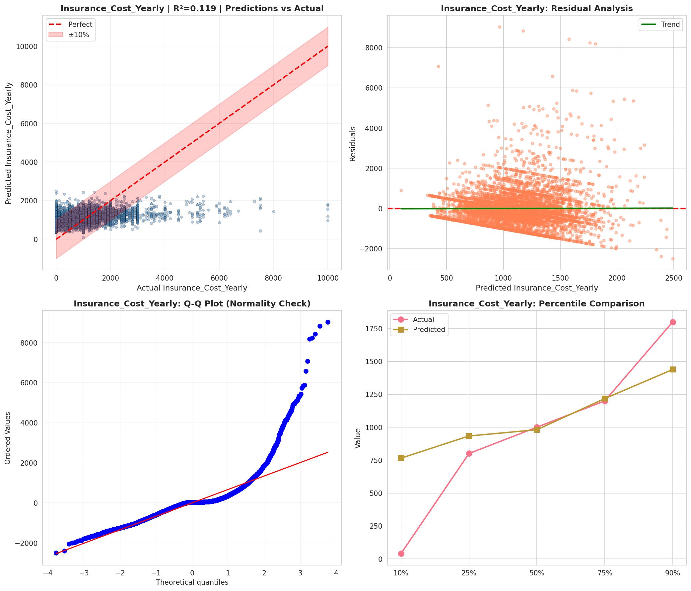
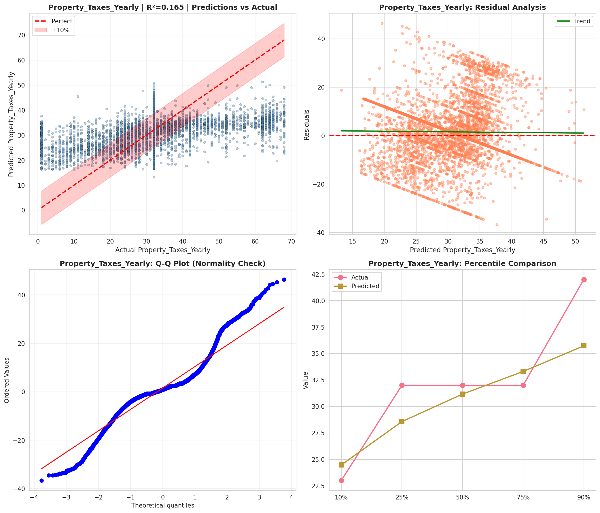
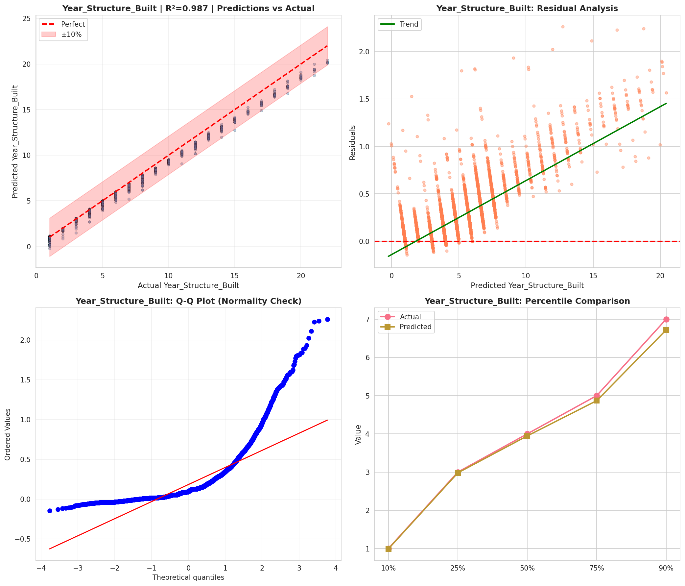
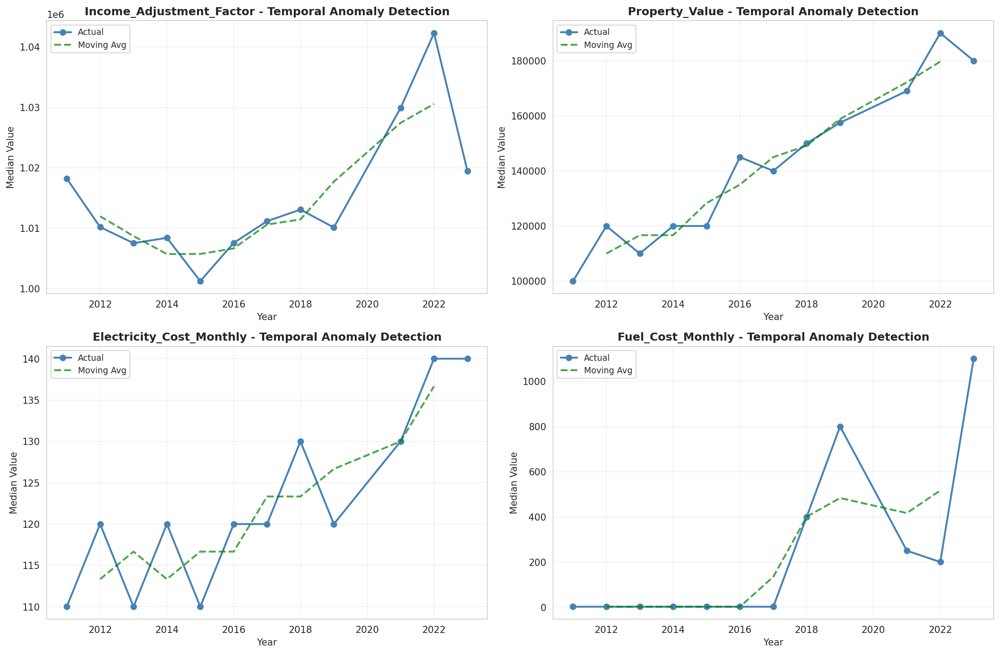
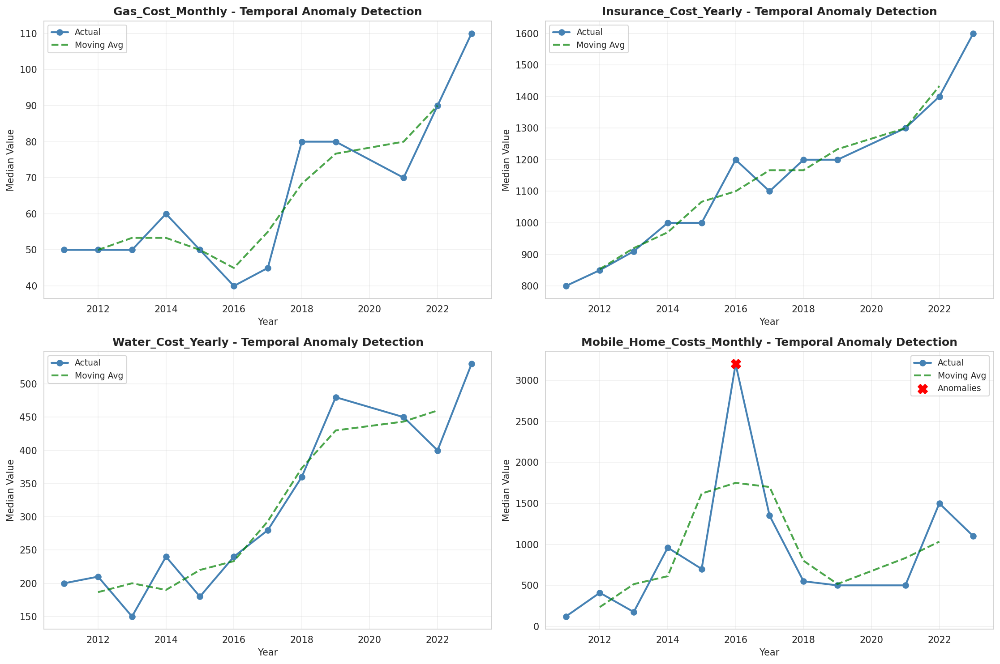
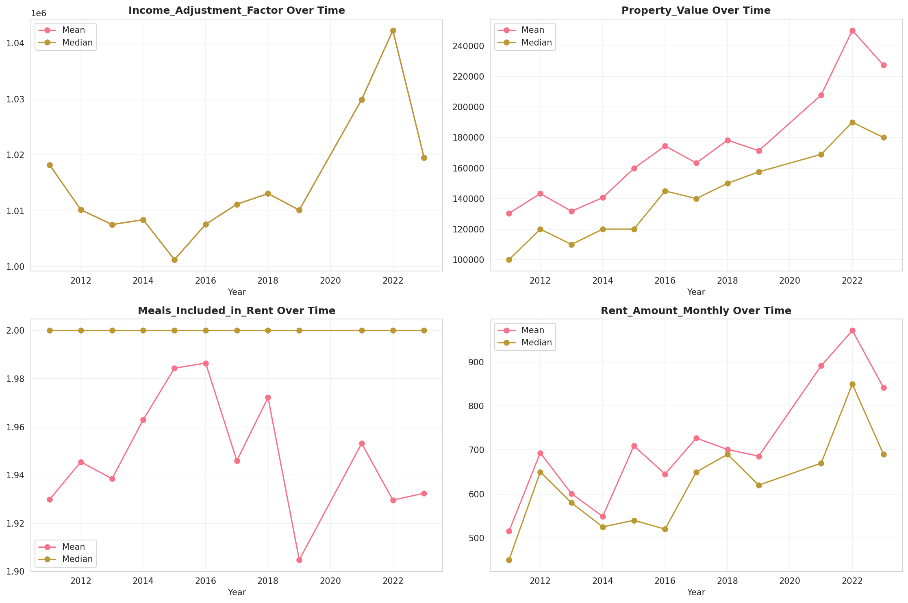
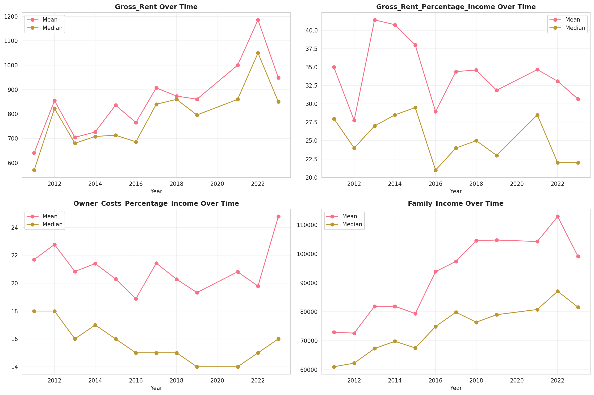
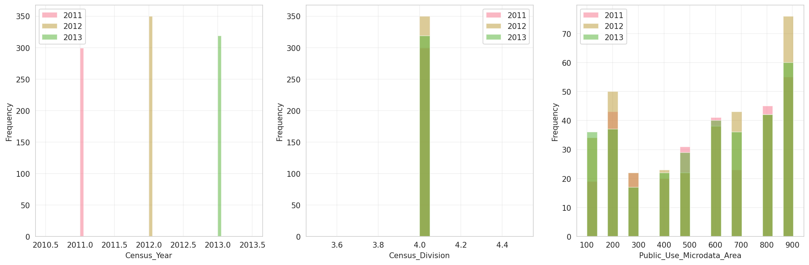
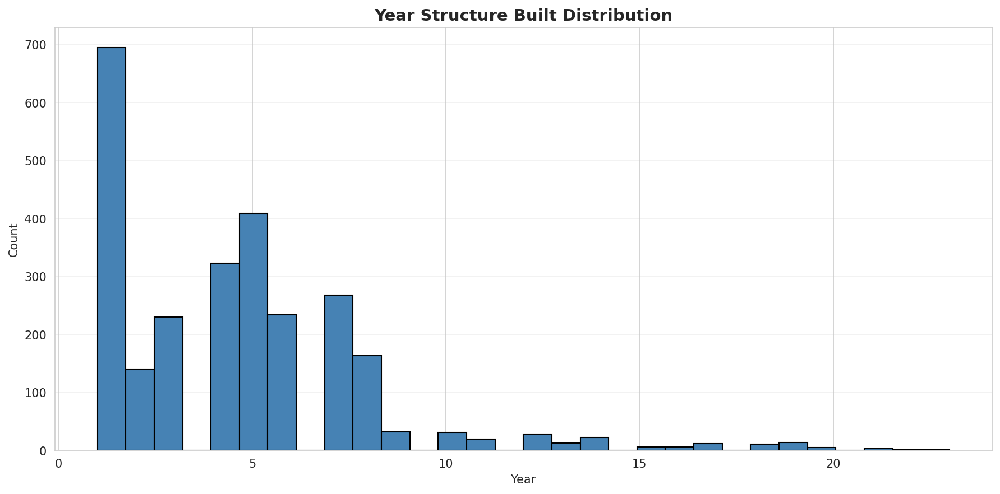
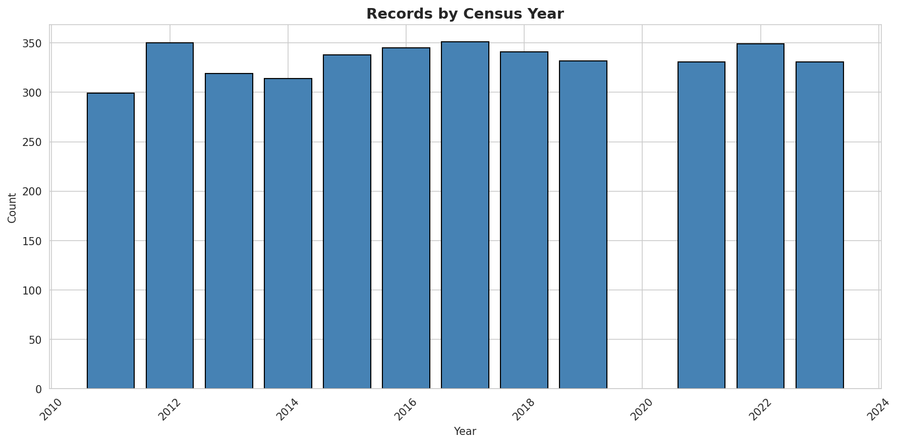
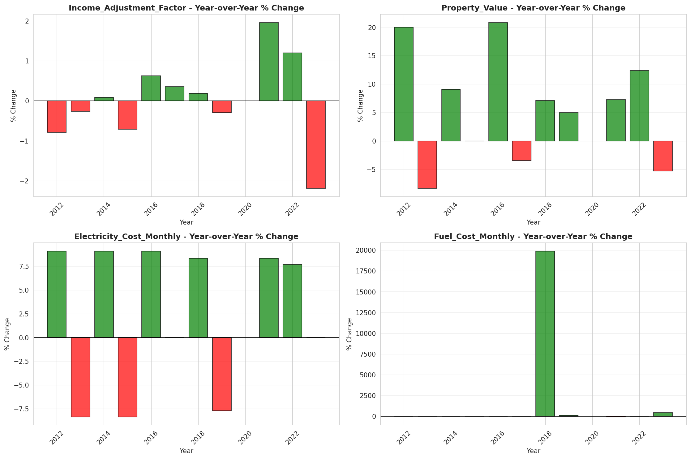
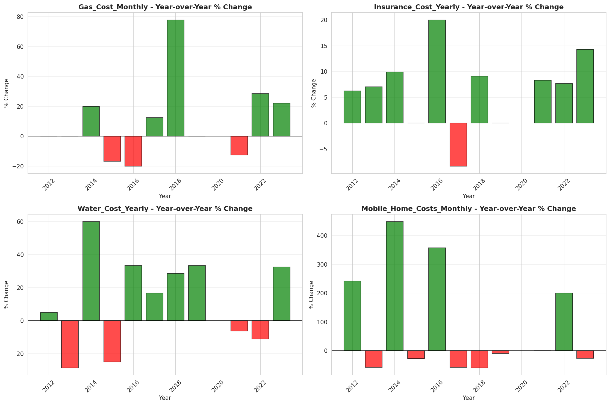
