# Temporal Analysis

## Year Distribution

- 2011: 42,723 records

- 2012: 43,453 records

- 2013: 44,081 records

- 2014: 44,707 records

- 2015: 45,408 records

- 2016: 45,591 records

- 2017: 45,876 records

- 2018: 46,236 records

- 2019: 46,621 records

- 2020: 47,239 records

- 2021: 47,402 records

- 2022: 47,621 records

- 2023: 47,893 records

## Temporal Trends

- Census_Year: {np.int64(2011): {'mean': 2011.0, 'median': 2011.0, 'std': 0.0}, np.int64(2012): {'mean': 2012.0, 'median': 2012.0, 'std': 0.0}, np.int64(2013): {'mean': 2013.0, 'median': 2013.0, 'std': 0.0}, np.int64(2014): {'mean': 2014.0, 'median': 2014.0, 'std': 0.0}, np.int64(2015): {'mean': 2015.0, 'median': 2015.0, 'std': 0.0}, np.int64(2016): {'mean': 2016.0, 'median': 2016.0, 'std': 0.0}, np.int64(2017): {'mean': 2017.0, 'median': 2017.0, 'std': 0.0}, np.int64(2018): {'mean': 2018.0, 'median': 2018.0, 'std': 0.0}, np.int64(2019): {'mean': 2019.0, 'median': 2019.0, 'std': 0.0}, np.int64(2020): {'mean': 2020.0, 'median': 2020.0, 'std': 0.0}, np.int64(2021): {'mean': 2021.0, 'median': 2021.0, 'std': 0.0}, np.int64(2022): {'mean': 2022.0, 'median': 2022.0, 'std': 0.0}, np.int64(2023): {'mean': 2023.0, 'median': 2023.0, 'std': 0.0}}

- Census_Division: {np.int64(2011): {'mean': 4.0, 'median': 4.0, 'std': 0.0}, np.int64(2012): {'mean': 4.0, 'median': 4.0, 'std': 0.0}, np.int64(2013): {'mean': 4.0, 'median': 4.0, 'std': 0.0}, np.int64(2014): {'mean': 4.0, 'median': 4.0, 'std': 0.0}, np.int64(2015): {'mean': 4.0, 'median': 4.0, 'std': 0.0}, np.int64(2016): {'mean': 4.0, 'median': 4.0, 'std': 0.0}, np.int64(2017): {'mean': 4.0, 'median': 4.0, 'std': 0.0}, np.int64(2018): {'mean': 4.0, 'median': 4.0, 'std': 0.0}, np.int64(2019): {'mean': 4.0, 'median': 4.0, 'std': 0.0}, np.int64(2020): {'mean': 4.0, 'median': 4.0, 'std': 0.0}, np.int64(2021): {'mean': 4.0, 'median': 4.0, 'std': 0.0}, np.int64(2022): {'mean': 4.0, 'median': 4.0, 'std': 0.0}, np.int64(2023): {'mean': 4.0, 'median': 4.0, 'std': 0.0}}

- Public_Use_Microdata_Area: {np.int64(2011): {'mean': 546.1786157339138, 'median': 600.0, 'std': 274.49496112830735}, np.int64(2012): {'mean': None, 'median': None, 'std': None}, np.int64(2013): {'mean': None, 'median': None, 'std': None}, np.int64(2014): {'mean': None, 'median': None, 'std': None}, np.int64(2015): {'mean': None, 'median': None, 'std': None}, np.int64(2016): {'mean': 560.5978592266017, 'median': 600.0, 'std': 273.03317669635794}, np.int64(2017): {'mean': 562.9839131572064, 'median': 600.0, 'std': 272.7421177667244}, np.int64(2018): {'mean': 563.8057141621248, 'median': 600.0, 'std': 272.5740896748436}, np.int64(2019): {'mean': 564.6710066279145, 'median': 600.0, 'std': 272.3618640390619}, np.int64(2020): {'mean': 564.4243315904232, 'median': 600.0, 'std': 272.45144992614536}, np.int64(2021): {'mean': 564.6415763047972, 'median': 600.0, 'std': 272.1441972394109}, np.int64(2022): {'mean': None, 'median': None, 'std': None}, np.int64(2023): {'mean': 563.1913014427996, 'median': 600.0, 'std': 271.85777376096496}}

- Census_Region: {np.int64(2011): {'mean': 2.0, 'median': 2.0, 'std': 0.0}, np.int64(2012): {'mean': 2.0, 'median': 2.0, 'std': 0.0}, np.int64(2013): {'mean': 2.0, 'median': 2.0, 'std': 0.0}, np.int64(2014): {'mean': 2.0, 'median': 2.0, 'std': 0.0}, np.int64(2015): {'mean': 2.0, 'median': 2.0, 'std': 0.0}, np.int64(2016): {'mean': 2.0, 'median': 2.0, 'std': 0.0}, np.int64(2017): {'mean': 2.0, 'median': 2.0, 'std': 0.0}, np.int64(2018): {'mean': 2.0, 'median': 2.0, 'std': 0.0}, np.int64(2019): {'mean': 2.0, 'median': 2.0, 'std': 0.0}, np.int64(2020): {'mean': 2.0, 'median': 2.0, 'std': 0.0}, np.int64(2021): {'mean': 2.0, 'median': 2.0, 'std': 0.0}, np.int64(2022): {'mean': 2.0, 'median': 2.0, 'std': 0.0}, np.int64(2023): {'mean': 2.0, 'median': 2.0, 'std': 0.0}}

- State_Code: {np.int64(2011): {'mean': 31.0, 'median': 31.0, 'std': 0.0}, np.int64(2012): {'mean': 31.0, 'median': 31.0, 'std': 0.0}, np.int64(2013): {'mean': 31.0, 'median': 31.0, 'std': 0.0}, np.int64(2014): {'mean': 31.0, 'median': 31.0, 'std': 0.0}, np.int64(2015): {'mean': 31.0, 'median': 31.0, 'std': 0.0}, np.int64(2016): {'mean': 31.0, 'median': 31.0, 'std': 0.0}, np.int64(2017): {'mean': 31.0, 'median': 31.0, 'std': 0.0}, np.int64(2018): {'mean': 31.0, 'median': 31.0, 'std': 0.0}, np.int64(2019): {'mean': 31.0, 'median': 31.0, 'std': 0.0}, np.int64(2020): {'mean': 31.0, 'median': 31.0, 'std': 0.0}, np.int64(2021): {'mean': 31.0, 'median': 31.0, 'std': 0.0}, np.int64(2022): {'mean': 31.0, 'median': 31.0, 'std': 0.0}, np.int64(2023): {'mean': None, 'median': None, 'std': None}}

- Housing_Adjustment_Factor: {np.int64(2011): {'mean': 1041179.4378671909, 'median': 1044592.0, 'std': 27581.23640757089}, np.int64(2012): {'mean': 1041266.2574735922, 'median': 1053092.0, 'std': 27520.064985121746}, np.int64(2013): {'mean': 1039996.3138767269, 'median': 1035725.0, 'std': 32038.65521999123}, np.int64(2014): {'mean': 1036573.8872659763, 'median': 1031130.0, 'std': 29559.639931693786}, np.int64(2015): {'mean': 1020898.5189393939, 'median': 1017534.0, 'std': 20280.321716681116}, np.int64(2016): {'mean': 1020332.9698186045, 'median': 1013801.0, 'std': 15771.287854384243}, np.int64(2017): {'mean': 1029114.8770381027, 'median': 1034680.0, 'std': 17980.644042205757}, np.int64(2018): {'mean': 1038225.9850116792, 'median': 1046406.0, 'std': 23464.322099495013}, np.int64(2019): {'mean': 1040791.3996696768, 'median': 1042936.0, 'std': 29175.627698348417}, np.int64(2020): {'mean': 1035070.0865386651, 'median': 1030827.0, 'std': 28615.012556446254}, np.int64(2021): {'mean': 1057996.4564997258, 'median': 1059761.0, 'std': 34946.64598178677}, np.int64(2022): {'mean': 1106153.3986266563, 'median': 1133141.0, 'std': 60598.34733308642}, np.int64(2023): {'mean': 1108356.4733677155, 'median': 1125501.0, 'std': 76657.30531305491}}

- Income_Adjustment_Factor: {np.int64(2011): {'mean': 1053822.9573765888, 'median': 1048026.0, 'std': 28397.57718572512}, np.int64(2012): {'mean': 1052520.2402826042, 'median': 1061121.0, 'std': 26440.604289581453}, np.int64(2013): {'mean': 1049007.701798961, 'median': 1054614.0, 'std': 29647.037394584288}, np.int64(2014): {'mean': 1047424.5154002729, 'median': 1041654.0, 'std': 31004.701883912152}, np.int64(2015): {'mean': 1030300.4671203312, 'median': 1025215.0, 'std': 25648.98697913392}, np.int64(2016): {'mean': 1027489.9052444561, 'median': 1022342.0, 'std': 17526.569073842653}, np.int64(2017): {'mean': 1036510.8679919784, 'median': 1035988.0, 'std': 16845.7692694405}, np.int64(2018): {'mean': 1046810.074292759, 'median': 1054346.0, 'std': 20483.852280423485}, np.int64(2019): {'mean': 1049745.224555458, 'median': 1054606.0, 'std': 26227.27582866938}, np.int64(2020): {'mean': 1045025.1648637778, 'median': 1044328.0, 'std': 29282.385880869773}, np.int64(2021): {'mean': 1072641.7076916585, 'median': 1070512.0, 'std': 30385.41584563344}, np.int64(2022): {'mean': 1127804.8385586191, 'median': 1140108.0, 'std': 48753.220461028235}, np.int64(2023): {'mean': 1131584.7330298792, 'median': 1159185.0, 'std': 69905.63261773199}}

- Housing_Unit_Weight: {np.int64(2011): {'mean': 18.567118413969055, 'median': 15.0, 'std': 17.898947476605485}, np.int64(2012): {'mean': 18.34648931028928, 'median': 15.0, 'std': 18.00805514485058}, np.int64(2013): {'mean': 18.15469249790159, 'median': 14.0, 'std': 18.128502635373508}, np.int64(2014): {'mean': 18.011854966783726, 'median': 14.0, 'std': 18.224112531644582}, np.int64(2015): {'mean': 17.834104122621564, 'median': 13.0, 'std': 18.531557425564426}, np.int64(2016): {'mean': 17.87646684652673, 'median': 14.0, 'std': 18.300915215500478}, np.int64(2017): {'mean': 17.965297759176913, 'median': 14.0, 'std': 18.426699473695688}, np.int64(2018): {'mean': 17.96757937537849, 'median': 14.0, 'std': 18.379845414310665}, np.int64(2019): {'mean': 17.963492846571288, 'median': 14.0, 'std': 18.69656312967611}, np.int64(2020): {'mean': 17.871843180422957, 'median': 13.0, 'std': 20.66436973038577}, np.int64(2021): {'mean': 17.73769039281043, 'median': 12.0, 'std': 20.51120396356442}, np.int64(2022): {'mean': 17.807752882131833, 'median': 12.0, 'std': 21.02264682424095}, np.int64(2023): {'mean': 17.865470945649676, 'median': 12.0, 'std': 21.487807892504915}}

- Number_of_Persons: {np.int64(2011): {'mean': 2.1240081454954005, 'median': 2.0, 'std': 1.437125412733897}, np.int64(2012): {'mean': 2.109566658228431, 'median': 2.0, 'std': 1.436682223713516}, np.int64(2013): {'mean': 2.0995667067444024, 'median': 2.0, 'std': 1.4343308332788676}, np.int64(2014): {'mean': 2.0941463305522623, 'median': 2.0, 'std': 1.4363323273591584}, np.int64(2015): {'mean': 2.0855576109936576, 'median': 2.0, 'std': 1.439240107845962}, np.int64(2016): {'mean': 2.083854269483012, 'median': 2.0, 'std': 1.4428076465607047}, np.int64(2017): {'mean': 2.0853387392100444, 'median': 2.0, 'std': 1.452783845262972}, np.int64(2018): {'mean': 2.0824249502552123, 'median': 2.0, 'std': 1.4567101667407807}, np.int64(2019): {'mean': 2.077776109478561, 'median': 2.0, 'std': 1.4505134804886017}, np.int64(2020): {'mean': 2.061559304811702, 'median': 2.0, 'std': 1.4501977418422176}, np.int64(2021): {'mean': 2.0633095649972577, 'median': 2.0, 'std': 1.4450477035953457}, np.int64(2022): {'mean': 2.0631444110791457, 'median': 2.0, 'std': 1.430770658694134}, np.int64(2023): {'mean': 2.070219029920865, 'median': 2.0, 'std': 1.4300474734706161}}

- Housing_Unit_Type: {np.int64(2011): {'mean': 1.106312758935468, 'median': 1.0, 'std': 0.4006901333361366}, np.int64(2012): {'mean': 1.1220629185556807, 'median': 1.0, 'std': 0.4287754013931274}, np.int64(2013): {'mean': 1.136430661736349, 'median': 1.0, 'std': 0.4544473219508034}, np.int64(2014): {'mean': 1.1485002348625495, 'median': 1.0, 'std': 0.47349813759392567}, np.int64(2015): {'mean': 1.1628567653276956, 'median': 1.0, 'std': 0.4952407276694644}, np.int64(2016): {'mean': 1.160009651027615, 'median': 1.0, 'std': 0.4918223472223675}, np.int64(2017): {'mean': 1.1579911064608945, 'median': 1.0, 'std': 0.48978403649559166}, np.int64(2018): {'mean': 1.1562851457738559, 'median': 1.0, 'std': 0.487647425510226}, np.int64(2019): {'mean': 1.1559597606228953, 'median': 1.0, 'std': 0.4875326074633383}, np.int64(2020): {'mean': None, 'median': None, 'std': None}, np.int64(2021): {'mean': None, 'median': None, 'std': None}, np.int64(2022): {'mean': None, 'median': None, 'std': None}, np.int64(2023): {'mean': None, 'median': None, 'std': None}}

- Number_of_Bedrooms: {np.int64(2011): {'mean': 2.847654177509411, 'median': 3.0, 'std': 1.0376606542653328}, np.int64(2012): {'mean': None, 'median': None, 'std': None}, np.int64(2013): {'mean': None, 'median': None, 'std': None}, np.int64(2014): {'mean': None, 'median': None, 'std': None}, np.int64(2015): {'mean': None, 'median': None, 'std': None}, np.int64(2016): {'mean': None, 'median': None, 'std': None}, np.int64(2017): {'mean': None, 'median': None, 'std': None}, np.int64(2018): {'mean': None, 'median': None, 'std': None}, np.int64(2019): {'mean': None, 'median': None, 'std': None}, np.int64(2020): {'mean': None, 'median': None, 'std': None}, np.int64(2021): {'mean': None, 'median': None, 'std': None}, np.int64(2022): {'mean': None, 'median': None, 'std': None}, np.int64(2023): {'mean': None, 'median': None, 'std': None}}

- Number_of_Rooms: {np.int64(2011): {'mean': 6.209822894823274, 'median': 6.0, 'std': 1.9403068894188278}, np.int64(2012): {'mean': None, 'median': None, 'std': None}, np.int64(2013): {'mean': None, 'median': None, 'std': None}, np.int64(2014): {'mean': None, 'median': None, 'std': None}, np.int64(2015): {'mean': None, 'median': None, 'std': None}, np.int64(2016): {'mean': None, 'median': None, 'std': None}, np.int64(2017): {'mean': None, 'median': None, 'std': None}, np.int64(2018): {'mean': None, 'median': None, 'std': None}, np.int64(2019): {'mean': None, 'median': None, 'std': None}, np.int64(2020): {'mean': None, 'median': None, 'std': None}, np.int64(2021): {'mean': None, 'median': None, 'std': None}, np.int64(2022): {'mean': None, 'median': None, 'std': None}, np.int64(2023): {'mean': None, 'median': None, 'std': None}}

- Building_Type: {np.int64(2011): {'mean': 2.554432682347591, 'median': 2.0, 'std': 1.6307583462542132}, np.int64(2012): {'mean': 2.564611327389175, 'median': 2.0, 'std': 1.6430586624431704}, np.int64(2013): {'mean': 2.573859377342462, 'median': 2.0, 'std': 1.656438590136339}, np.int64(2014): {'mean': 2.575832857178347, 'median': 2.0, 'std': 1.6581683463443062}, np.int64(2015): {'mean': 2.5817813565183028, 'median': 2.0, 'std': 1.6648308174404547}, np.int64(2016): {'mean': 2.58795955431208, 'median': 2.0, 'std': 1.6682761293528303}, np.int64(2017): {'mean': 2.600282382725967, 'median': 2.0, 'std': 1.6827805112078946}, np.int64(2018): {'mean': 2.6053209194626015, 'median': 2.0, 'std': 1.6874766537134074}, np.int64(2019): {'mean': 2.6147243077805937, 'median': 2.0, 'std': 1.6991161920073425}, np.int64(2020): {'mean': 2.6129361016306407, 'median': 2.0, 'std': 1.7015459711794263}, np.int64(2021): {'mean': 2.6204549736247174, 'median': 2.0, 'std': 1.717364591337033}, np.int64(2022): {'mean': 2.612736378955252, 'median': 2.0, 'std': 1.7082809526262948}, np.int64(2023): {'mean': 2.6162179755428463, 'median': 2.0, 'std': 1.7148075964623477}}

- Year_Structure_Built: {np.int64(2011): {'mean': 6.036381091938051, 'median': 6.0, 'std': 2.46725708729466}, np.int64(2012): {'mean': 4.076754991837247, 'median': 4.0, 'std': 2.6699690137167704}, np.int64(2013): {'mean': 4.152016390984958, 'median': 4.0, 'std': 2.768556344416563}, np.int64(2014): {'mean': 4.227734578789159, 'median': 4.0, 'std': 2.8784777975504348}, np.int64(2015): {'mean': 4.3054636170528084, 'median': 4.0, 'std': 2.989815702718318}, np.int64(2016): {'mean': 4.413169390860452, 'median': 4.0, 'std': 3.1434758633157283}, np.int64(2017): {'mean': 4.525718737067601, 'median': 4.0, 'std': 3.311507003563978}, np.int64(2018): {'mean': 4.616392098217516, 'median': 4.0, 'std': 3.489013306552237}, np.int64(2019): {'mean': 4.727105351250538, 'median': 4.0, 'std': 3.6914497435685822}, np.int64(2020): {'mean': 4.85215206674251, 'median': 4.0, 'std': 3.9328936486718264}, np.int64(2021): {'mean': None, 'median': None, 'std': None}, np.int64(2022): {'mean': None, 'median': None, 'std': None}, np.int64(2023): {'mean': None, 'median': None, 'std': None}}

- Bathtub_or_Shower: {np.int64(2011): {'mean': None, 'median': None, 'std': None}, np.int64(2012): {'mean': 1.0094687931684039, 'median': 1.0, 'std': 0.09684715121331205}, np.int64(2013): {'mean': 1.0092199290390285, 'median': 1.0, 'std': 0.09557797968548792}, np.int64(2014): {'mean': 1.0081733038531289, 'median': 1.0, 'std': 0.09003722758390938}, np.int64(2015): {'mean': 1.0080027663883813, 'median': 1.0, 'std': 0.0891006072312097}, np.int64(2016): {'mean': 1.008467088793992, 'median': 1.0, 'std': 0.09162752451444836}, np.int64(2017): {'mean': 1.0089340052094744, 'median': 1.0, 'std': 0.09409784432255718}, np.int64(2018): {'mean': 1.0088521189609012, 'median': 1.0, 'std': 0.0936694751819464}, np.int64(2019): {'mean': 1.0091578594997848, 'median': 1.0, 'std': 0.09525864832831005}, np.int64(2020): {'mean': 1.0091012514220705, 'median': 1.0, 'std': 0.09496648038551656}, np.int64(2021): {'mean': 1.0090665033911077, 'median': 1.0, 'std': 0.09478667357231454}, np.int64(2022): {'mean': 1.0090104849279162, 'median': 1.0, 'std': 0.09449605851113253}, np.int64(2023): {'mean': 1.00843911284698, 'median': 1.0, 'std': 0.09147725818317771}}

- Refrigerator: {np.int64(2011): {'mean': None, 'median': None, 'std': None}, np.int64(2012): {'mean': 1.0184854954163003, 'median': 1.0, 'std': 0.134700547842722}, np.int64(2013): {'mean': 1.0180400779571235, 'median': 1.0, 'std': 0.13309799464259525}, np.int64(2014): {'mean': 1.0175887511489827, 'median': 1.0, 'std': 0.1314527149290233}, np.int64(2015): {'mean': 1.0169935286271798, 'median': 1.0, 'std': 0.1292484476801414}, np.int64(2016): {'mean': 1.0175968193196878, 'median': 1.0, 'std': 0.1314823012676553}, np.int64(2017): {'mean': 1.0178436670805033, 'median': 1.0, 'std': 0.1323846564357197}, np.int64(2018): {'mean': 1.0179213198581731, 'median': 1.0, 'std': 0.1326671424364974}, np.int64(2019): {'mean': 1.0174310171679977, 'median': 1.0, 'std': 0.13087240482168552}, np.int64(2020): {'mean': 1.0179891922639364, 'median': 1.0, 'std': 0.13291350544844366}, np.int64(2021): {'mean': 1.017662019593067, 'median': 1.0, 'std': 0.1317212255093341}, np.int64(2022): {'mean': 1.0167103538663171, 'median': 1.0, 'std': 0.12818542234011526}, np.int64(2023): {'mean': 1.0150183661133585, 'median': 1.0, 'std': 0.12162712981739676}}

- Hot_and_Cold_Running_Water: {np.int64(2011): {'mean': None, 'median': None, 'std': None}, np.int64(2012): {'mean': 1.0160994600025117, 'median': 1.0, 'std': 0.12585970461930016}, np.int64(2013): {'mean': 1.0161411223826895, 'median': 1.0, 'std': 0.1260197736756298}, np.int64(2014): {'mean': 1.0152286786078055, 'median': 1.0, 'std': 0.12246280466987276}, np.int64(2015): {'mean': 1.014795237860001, 'median': 1.0, 'std': 0.12073400034628227}, np.int64(2016): {'mean': 1.016001570706327, 'median': 1.0, 'std': 0.12548269554728708}, np.int64(2017): {'mean': 1.0176732637113854, 'median': 1.0, 'std': 0.1317624456899601}, np.int64(2018): {'mean': 1.0184760848066765, 'median': 1.0, 'std': 0.13466683526677994}, np.int64(2019): {'mean': 1.0191286882502033, 'median': 1.0, 'std': 0.13697894064784405}, np.int64(2020): {'mean': 1.020122298065984, 'median': 1.0, 'std': 0.14042029241870493}, np.int64(2021): {'mean': 1.0198285606631499, 'median': 1.0, 'std': 0.13941250498758764}, np.int64(2022): {'mean': 1.018723085564501, 'median': 1.0, 'std': 0.13554689826628724}, np.int64(2023): {'mean': 1.0175524247919283, 'median': 1.0, 'std': 0.13131922207256494}}

- Running_Water: {np.int64(2011): {'mean': None, 'median': None, 'std': None}, np.int64(2012): {'mean': None, 'median': None, 'std': None}, np.int64(2013): {'mean': 9.0, 'median': 9.0, 'std': 0.0}, np.int64(2014): {'mean': 9.0, 'median': 9.0, 'std': 0.0}, np.int64(2015): {'mean': 9.0, 'median': 9.0, 'std': 0.0}, np.int64(2016): {'mean': 9.0, 'median': 9.0, 'std': 0.0}, np.int64(2017): {'mean': 9.0, 'median': 9.0, 'std': 0.0}, np.int64(2018): {'mean': 9.0, 'median': 9.0, 'std': 0.0}, np.int64(2019): {'mean': 9.0, 'median': 9.0, 'std': 0.0}, np.int64(2020): {'mean': 9.0, 'median': 9.0, 'std': 0.0}, np.int64(2021): {'mean': 9.0, 'median': 9.0, 'std': 0.0}, np.int64(2022): {'mean': 9.0, 'median': 9.0, 'std': 0.0}, np.int64(2023): {'mean': 9.0, 'median': 9.0, 'std': 0.0}}

- Sink_with_Faucet: {np.int64(2011): {'mean': None, 'median': None, 'std': None}, np.int64(2012): {'mean': 1.0086901921386413, 'median': 1.0, 'std': 0.09281642673679291}, np.int64(2013): {'mean': 1.0083454100244866, 'median': 1.0, 'std': 0.09097236361418297}, np.int64(2014): {'mean': 1.0075025463940577, 'median': 1.0, 'std': 0.08629277595879092}, np.int64(2015): {'mean': 1.0071876698117868, 'median': 1.0, 'std': 0.08447593430945351}, np.int64(2016): {'mean': 1.0076571933441318, 'median': 1.0, 'std': 0.08717079341644723}, np.int64(2017): {'mean': 1.0079602716716571, 'median': 1.0, 'std': 0.08886561758238988}, np.int64(2018): {'mean': 1.007935550785113, 'median': 1.0, 'std': 0.08872861833535396}, np.int64(2019): {'mean': 1.0081057816460237, 'median': 1.0, 'std': 0.0896675537734143}, np.int64(2020): {'mean': 1.0081058020477816, 'median': 1.0, 'std': 0.08966765629386815}, np.int64(2021): {'mean': 1.0079361341371516, 'median': 1.0, 'std': 0.0887318281348885}, np.int64(2022): {'mean': 1.0079105036510017, 'median': 1.0, 'std': 0.08858956631038717}, np.int64(2023): {'mean': 1.0074394383224066, 'median': 1.0, 'std': 0.08593174472247181}}

- Stove_or_Range: {np.int64(2011): {'mean': None, 'median': None, 'std': None}, np.int64(2012): {'mean': 1.0220268742936078, 'median': 1.0, 'std': 0.14677272280863263}, np.int64(2013): {'mean': 1.0215381540152917, 'median': 1.0, 'std': 0.14517158302160563}, np.int64(2014): {'mean': 1.021464238690284, 'median': 1.0, 'std': 0.144927730088187}, np.int64(2015): {'mean': 1.0214148100577978, 'median': 1.0, 'std': 0.14476440721783793}, np.int64(2016): {'mean': 1.0221371422961762, 'median': 1.0, 'std': 0.14713130363466714}, np.int64(2017): {'mean': 1.022468901385136, 'median': 1.0, 'std': 0.14820453618899973}, np.int64(2018): {'mean': 1.0230348054704648, 'median': 1.0, 'std': 0.15001581925489973}, np.int64(2019): {'mean': 1.0230978910621205, 'median': 1.0, 'std': 0.1502162375950286}, np.int64(2020): {'mean': 1.0229664391353812, 'median': 1.0, 'std': 0.14979824315283183}, np.int64(2021): {'mean': 1.0220422004521477, 'median': 1.0, 'std': 0.14682251019980788}, np.int64(2022): {'mean': 1.0209932596891969, 'median': 1.0, 'std': 0.14336325804349825}, np.int64(2023): {'mean': 1.0192727949039848, 'median': 1.0, 'std': 0.13748379436901098}}

- Telephone_Service: {np.int64(2011): {'mean': 1.024663555459084, 'median': 1.0, 'std': 0.1550997008100381}, np.int64(2012): {'mean': 1.019776903594331, 'median': 1.0, 'std': 0.13923469403571828}, np.int64(2013): {'mean': 1.0211842845282413, 'median': 1.0, 'std': 0.14400022903909684}, np.int64(2014): {'mean': 1.0223624311157256, 'median': 1.0, 'std': 0.1478612012128223}, np.int64(2015): {'mean': 1.023053305806998, 'median': 1.0, 'std': 0.15007480472805365}, np.int64(2016): {'mean': 1.0244127251659116, 'median': 1.0, 'std': 0.15432877648379825}, np.int64(2017): {'mean': 1.0230062553982255, 'median': 1.0, 'std': 0.14992516773599343}, np.int64(2018): {'mean': 1.0212097611630322, 'median': 1.0, 'std': 0.1440848574515423}, np.int64(2019): {'mean': 1.0184127963791596, 'median': 1.0, 'std': 0.13444043331194747}, np.int64(2020): {'mean': 1.0151929815586873, 'median': 1.0, 'std': 0.12232145181039712}, np.int64(2021): {'mean': 1.0105615923631563, 'median': 1.0, 'std': 0.10222675993605475}, np.int64(2022): {'mean': 1.0093777498428662, 'median': 1.0, 'std': 0.09638485988776123}, np.int64(2023): {'mean': 1.0080338266384778, 'median': 1.0, 'std': 0.08927195802265861}}

- Lot_Acreage: {np.int64(2011): {'mean': 1.3269064249841251, 'median': 1.0, 'std': 0.6567138927864866}, np.int64(2012): {'mean': 1.3126490960825454, 'median': 1.0, 'std': 0.6430510796988083}, np.int64(2013): {'mean': 1.2968606782768102, 'median': 1.0, 'std': 0.6263785959965359}, np.int64(2014): {'mean': 1.2958689458689459, 'median': 1.0, 'std': 0.6253156927346752}, np.int64(2015): {'mean': 1.29509498157074, 'median': 1.0, 'std': 0.623084866583815}, np.int64(2016): {'mean': 1.2854764055091443, 'median': 1.0, 'std': 0.6134955526774457}, np.int64(2017): {'mean': 1.2762722325085563, 'median': 1.0, 'std': 0.6031030028023587}, np.int64(2018): {'mean': 1.2769992214436658, 'median': 1.0, 'std': 0.6031858840259443}, np.int64(2019): {'mean': 1.2785980405685111, 'median': 1.0, 'std': 0.6033098707506706}, np.int64(2020): {'mean': 1.283880482875403, 'median': 1.0, 'std': 0.6063544790528237}, np.int64(2021): {'mean': 1.288990203261961, 'median': 1.0, 'std': 0.6089848538791539}, np.int64(2022): {'mean': 1.2948693803976432, 'median': 1.0, 'std': 0.6123335865289389}, np.int64(2023): {'mean': 1.2967279726261762, 'median': 1.0, 'std': 0.612867596927672}}

- Agricultural_Sales: {np.int64(2011): {'mean': 2.4271642619311877, 'median': 1.0, 'std': 2.1356054165053013}, np.int64(2012): {'mean': 2.3739429554249676, 'median': 1.0, 'std': 2.1115461457801983}, np.int64(2013): {'mean': 2.344617668893838, 'median': 1.0, 'std': 2.096397634007424}, np.int64(2014): {'mean': 2.3624389521977207, 'median': 1.0, 'std': 2.11143756521009}, np.int64(2015): {'mean': 2.329707481993238, 'median': 1.0, 'std': 2.0964492361767517}, np.int64(2016): {'mean': 2.2805690072639226, 'median': 1.0, 'std': 2.072758035967325}, np.int64(2017): {'mean': 2.226617031177292, 'median': 1.0, 'std': 2.0441114551149995}, np.int64(2018): {'mean': 2.1842793416397477, 'median': 1.0, 'std': 2.0169753954761673}, np.int64(2019): {'mean': 2.1184150599666007, 'median': 1.0, 'std': 1.9700781851121814}, np.int64(2020): {'mean': 2.1132576316177554, 'median': 1.0, 'std': 1.9591332944256443}, np.int64(2021): {'mean': 2.1216795201371035, 'median': 1.0, 'std': 1.965795538588593}, np.int64(2022): {'mean': 2.1187371310912835, 'median': 1.0, 'std': 1.9631521984582985}, np.int64(2023): {'mean': 2.131299556511222, 'median': 1.0, 'std': 1.972619033480224}}

- Business_On_Property: {np.int64(2011): {'mean': 1.9796224672400855, 'median': 2.0, 'std': 0.14129000358805496}, np.int64(2012): {'mean': 1.980858218607191, 'median': 2.0, 'std': 0.1370252284953591}, np.int64(2013): {'mean': 1.982011915673694, 'median': 2.0, 'std': 0.1329098157985491}, np.int64(2014): {'mean': 1.983019943019943, 'median': 2.0, 'std': 0.1291983367019688}, np.int64(2015): {'mean': 1.9831584916359513, 'median': 2.0, 'std': 0.128679219122152}, np.int64(2016): {'mean': 3.4065816211334385, 'median': 2.0, 'std': 2.8238571305750337}, np.int64(2017): {'mean': 4.822392414296134, 'median': 2.0, 'std': 3.4451498995963807}, np.int64(2018): {'mean': 6.231370259148037, 'median': 9.0, 'std': 3.430375605912964}, np.int64(2019): {'mean': 7.624506692424451, 'median': 9.0, 'std': 2.7862482446305323}, np.int64(2020): {'mean': None, 'median': None, 'std': None}, np.int64(2021): {'mean': None, 'median': None, 'std': None}, np.int64(2022): {'mean': None, 'median': None, 'std': None}, np.int64(2023): {'mean': None, 'median': None, 'std': None}}

- Tenure: {np.int64(2011): {'mean': 1.8414912090297373, 'median': 2.0, 'std': 0.854302582861455}, np.int64(2012): {'mean': 1.8505146305976181, 'median': 2.0, 'std': 0.8536142065709689}, np.int64(2013): {'mean': 1.8596105948204291, 'median': 2.0, 'std': 0.8511237028835299}, np.int64(2014): {'mean': 1.8699784362271383, 'median': 2.0, 'std': 0.8503198764576516}, np.int64(2015): {'mean': 1.875999153035837, 'median': 2.0, 'std': 0.8489294374703251}, np.int64(2016): {'mean': 1.8816233013799641, 'median': 2.0, 'std': 0.8470024812397098}, np.int64(2017): {'mean': 1.8827439997906144, 'median': 2.0, 'std': 0.8477315159958567}, np.int64(2018): {'mean': 1.8887071651090344, 'median': 2.0, 'std': 0.8477354580643283}, np.int64(2019): {'mean': 1.890320423802911, 'median': 2.0, 'std': 0.8454617802706447}, np.int64(2020): {'mean': 1.8888149985932425, 'median': 2.0, 'std': 0.8423344268462597}, np.int64(2021): {'mean': 1.8835685995734741, 'median': 2.0, 'std': 0.8394947623448096}, np.int64(2022): {'mean': 1.8834695160276556, 'median': 2.0, 'std': 0.836946677336543}, np.int64(2023): {'mean': 1.8801641586867306, 'median': 2.0, 'std': 0.8326045270066806}}

- Vacancy_Status: {np.int64(2011): {'mean': 4.990091743119266, 'median': 5.0, 'std': 2.1747054484385973}, np.int64(2012): {'mean': 5.0359126249537205, 'median': 5.0, 'std': 2.163289374264853}, np.int64(2013): {'mean': 5.064480059634737, 'median': 5.0, 'std': 2.1650609219042196}, np.int64(2014): {'mean': 5.071003717472119, 'median': 5.0, 'std': 2.147883170941673}, np.int64(2015): {'mean': 5.109837278106509, 'median': 5.0, 'std': 2.1422220190351897}, np.int64(2016): {'mean': 5.169790915645278, 'median': 5.0, 'std': 2.122384984714917}, np.int64(2017): {'mean': 5.208217270194986, 'median': 5.0, 'std': 2.108638257770366}, np.int64(2018): {'mean': 5.254508336168765, 'median': 5.0, 'std': 2.100084909021695}, np.int64(2019): {'mean': 5.329019073569483, 'median': 7.0, 'std': 2.0824706509100737}, np.int64(2020): {'mean': 5.334410339256866, 'median': 7.0, 'std': 2.0878326135633887}, np.int64(2021): {'mean': 5.322496749024707, 'median': 7.0, 'std': 2.1082943612813088}, np.int64(2022): {'mean': 5.348797832712496, 'median': 7.0, 'std': 2.0945420614678936}, np.int64(2023): {'mean': 5.346386614453542, 'median': 7.0, 'std': 2.097173330284518}}

- Property_Value: {np.int64(2011): {'mean': 12.953149272701596, 'median': 14.0, 'std': 4.843505941310717}}

- Vehicles_Available: {np.int64(2011): {'mean': 2.0745333188626005, 'median': 2.0, 'std': 1.1344347753302573}, np.int64(2012): {'mean': 2.0673869698765963, 'median': 2.0, 'std': 1.137425648243527}, np.int64(2013): {'mean': 2.0597498593963417, 'median': 2.0, 'std': 1.1338189912619845}, np.int64(2014): {'mean': 2.0691371828661183, 'median': 2.0, 'std': 1.1341921582199637}, np.int64(2015): {'mean': 2.075273939971415, 'median': 2.0, 'std': 1.1428028164566855}, np.int64(2016): {'mean': 2.0782681976192983, 'median': 2.0, 'std': 1.144476113870409}, np.int64(2017): {'mean': 2.090454628732955, 'median': 2.0, 'std': 1.1522050717333858}, np.int64(2018): {'mean': 2.103348909657321, 'median': 2.0, 'std': 1.15727087994902}, np.int64(2019): {'mean': 2.108059455845291, 'median': 2.0, 'std': 1.1595152486464255}, np.int64(2020): {'mean': 2.122822722971072, 'median': 2.0, 'std': 1.1654405255909521}, np.int64(2021): {'mean': 2.131080532141769, 'median': 2.0, 'std': 1.1669729046071018}, np.int64(2022): {'mean': 2.1359396605908234, 'median': 2.0, 'std': 1.1664634392797675}, np.int64(2023): {'mean': 2.1443601542096755, 'median': 2.0, 'std': 1.1775954370901518}}

- Condo_Fee_Monthly: {np.int64(2011): {'mean': 185.6786469344609, 'median': 130.0, 'std': 196.0194513995458}, np.int64(2012): {'mean': 190.36514522821577, 'median': 130.0, 'std': 197.52585943203886}, np.int64(2013): {'mean': 197.49137931034483, 'median': 130.0, 'std': 209.47916470112665}, np.int64(2014): {'mean': 207.83451536643025, 'median': 140.0, 'std': 211.18348761429607}, np.int64(2015): {'mean': 217.9173126614987, 'median': 150.0, 'std': 206.30776693933578}, np.int64(2016): {'mean': 221.22615803814713, 'median': 160.0, 'std': 197.11545692208756}, np.int64(2017): {'mean': 220.93557422969187, 'median': 160.0, 'std': 190.3533343681602}, np.int64(2018): {'mean': 220.23618090452263, 'median': 170.0, 'std': 182.8581768579575}, np.int64(2019): {'mean': 218.92610837438423, 'median': 170.0, 'std': 182.59979705511986}, np.int64(2020): {'mean': 215.05515587529976, 'median': 170.0, 'std': 176.94941511123687}, np.int64(2021): {'mean': 227.64334085778782, 'median': 180.0, 'std': 192.2858663732542}, np.int64(2022): {'mean': 243.87214611872147, 'median': 180.0, 'std': 214.3652053899665}, np.int64(2023): {'mean': 270.77669902912623, 'median': 195.0, 'std': 249.4335746570738}}

- Electricity_Cost_Monthly: {np.int64(2011): {'mean': 112.04726503147384, 'median': 100.0, 'std': 73.11475688983323}, np.int64(2012): {'mean': 117.28345098884517, 'median': 100.0, 'std': 76.34445348008177}, np.int64(2013): {'mean': 122.6981975950079, 'median': 110.0, 'std': 79.62180040278736}, np.int64(2014): {'mean': 128.82389585496367, 'median': 110.0, 'std': 83.6604199507139}, np.int64(2015): {'mean': 132.35681012122174, 'median': 120.0, 'std': 85.75535377120777}, np.int64(2016): {'mean': 134.28160223322448, 'median': 120.0, 'std': 86.76028513161481}, np.int64(2017): {'mean': 136.36684377208366, 'median': 120.0, 'std': 88.27178533133078}, np.int64(2018): {'mean': 146.42468768917507, 'median': 130.0, 'std': 85.36510376181808}, np.int64(2019): {'mean': 147.7654179617209, 'median': 130.0, 'std': 85.84656409489394}, np.int64(2020): {'mean': 149.87482396273427, 'median': 130.0, 'std': 86.6476704641109}, np.int64(2021): {'mean': 151.92661584711186, 'median': 130.0, 'std': 88.8752914501602}, np.int64(2022): {'mean': 158.08166189111748, 'median': 130.0, 'std': 128.85540207511235}, np.int64(2023): {'mean': 164.9839465758806, 'median': 140.0, 'std': 184.63684714791853}}

- Fuel_Cost_Monthly: {np.int64(2011): {'mean': 94.03174517039288, 'median': 2.0, 'std': 361.53460539154725}, np.int64(2012): {'mean': 93.0672791938352, 'median': 2.0, 'std': 363.1930392548903}, np.int64(2013): {'mean': 80.86927877018667, 'median': 2.0, 'std': 332.7786112845804}, np.int64(2014): {'mean': 74.10095040332241, 'median': 2.0, 'std': 321.321019499051}, np.int64(2015): {'mean': 67.85879519347837, 'median': 2.0, 'std': 315.1167233186171}, np.int64(2016): {'mean': 57.722769409038236, 'median': 2.0, 'std': 286.575207623659}, np.int64(2017): {'mean': 49.2595335933206, 'median': 2.0, 'std': 264.05741921490477}, np.int64(2018): {'mean': 767.8370960602036, 'median': 600.0, 'std': 733.5250645988532}, np.int64(2019): {'mean': 762.738475177305, 'median': 600.0, 'std': 743.961391155543}, np.int64(2020): {'mean': 730.6862116353642, 'median': 570.0, 'std': 691.6228156892521}, np.int64(2021): {'mean': 734.0586617781852, 'median': 580.0, 'std': 674.4348562185774}, np.int64(2022): {'mean': 752.1419953596288, 'median': 600.0, 'std': 700.8274909194936}, np.int64(2023): {'mean': 796.3395696913003, 'median': 600.0, 'std': 750.3149953002353}}

- Gas_Cost_Monthly: {np.int64(2011): {'mean': 74.40753201649663, 'median': 50.0, 'std': 81.30320052531125}, np.int64(2012): {'mean': 71.83391712022417, 'median': 50.0, 'std': 79.313882101961}, np.int64(2013): {'mean': 68.73108546024264, 'median': 50.0, 'std': 75.26514291768429}, np.int64(2014): {'mean': 68.5755663818119, 'median': 50.0, 'std': 76.4859687077234}, np.int64(2015): {'mean': 68.1097877296067, 'median': 50.0, 'std': 75.71331095082405}, np.int64(2016): {'mean': 66.35449805119562, 'median': 50.0, 'std': 73.47524840190738}, np.int64(2017): {'mean': 66.77279032637998, 'median': 50.0, 'std': 74.07182957492014}, np.int64(2018): {'mean': 96.26964439614794, 'median': 80.0, 'std': 73.89002455038737}, np.int64(2019): {'mean': 95.60776279520226, 'median': 80.0, 'std': 72.31305922092072}, np.int64(2020): {'mean': 95.62808997104892, 'median': 80.0, 'std': 73.1380761589771}, np.int64(2021): {'mean': 98.13444075304541, 'median': 80.0, 'std': 77.49605593876142}, np.int64(2022): {'mean': 106.420125509193, 'median': 90.0, 'std': 113.47704815570279}, np.int64(2023): {'mean': 116.25177163208198, 'median': 90.0, 'std': 143.0080057632802}}

- House_Heating_Fuel: {np.int64(2011): {'mean': 1.8669958758411114, 'median': 1.0, 'std': 1.3301550824251318}, np.int64(2012): {'mean': 1.8746025758473892, 'median': 1.0, 'std': 1.3297083843299415}, np.int64(2013): {'mean': 1.8809555692439541, 'median': 1.0, 'std': 1.330187859045746}, np.int64(2014): {'mean': 1.8956686100684184, 'median': 1.0, 'std': 1.3291260043087778}, np.int64(2015): {'mean': 1.9075485681012123, 'median': 1.0, 'std': 1.3257468858279413}, np.int64(2016): {'mean': 1.9148846518487306, 'median': 1.0, 'std': 1.3254577710277204}, np.int64(2017): {'mean': 1.9147800141335358, 'median': 1.0, 'std': 1.3113899470830346}, np.int64(2018): {'mean': 1.913447559709242, 'median': 1.0, 'std': 1.3087605907749469}, np.int64(2019): {'mean': 1.9159851874710694, 'median': 1.0, 'std': 1.3066778723316232}, np.int64(2020): {'mean': 1.9164386014272194, 'median': 1.0, 'std': 1.3037110474189542}, np.int64(2021): {'mean': 1.918350766730984, 'median': 1.0, 'std': 1.2983328802159924}, np.int64(2022): {'mean': 1.9214330609679446, 'median': 1.0, 'std': 1.3017338225327821}, np.int64(2023): {'mean': 1.924536749160552, 'median': 1.0, 'std': 1.298337070550303}}

- Insurance_Cost_Yearly: {np.int64(2013): {'mean': 912.0131918312122, 'median': 800.0, 'std': 593.8242327872947}, np.int64(2014): {'mean': 960.1694685005943, 'median': 850.0, 'std': 639.8845274822784}, np.int64(2015): {'mean': 1017.5535555837241, 'median': 900.0, 'std': 692.7914265778759}}

- Water_Cost_Yearly: {np.int64(2011): {'mean': 280.14160516605165, 'median': 170.0, 'std': 357.34854753368927}, np.int64(2012): {'mean': 293.41563830360514, 'median': 180.0, 'std': 368.8512322683984}, np.int64(2013): {'mean': 305.6728353732023, 'median': 180.0, 'std': 377.4333062592148}, np.int64(2014): {'mean': 316.4681734685728, 'median': 180.0, 'std': 387.13643212498914}, np.int64(2015): {'mean': 326.6896670372135, 'median': 180.0, 'std': 400.76506353350817}, np.int64(2016): {'mean': 337.24389023490994, 'median': 180.0, 'std': 410.82880944122155}, np.int64(2017): {'mean': 347.3689899756589, 'median': 180.0, 'std': 422.9835681021787}, np.int64(2018): {'mean': 484.53222704935547, 'median': 420.0, 'std': 440.36694094154205}, np.int64(2019): {'mean': 489.75573430749233, 'median': 420.0, 'std': 453.7890277562582}, np.int64(2020): {'mean': 500.96002780674314, 'median': 420.0, 'std': 470.29792967294935}, np.int64(2021): {'mean': 512.8314521679284, 'median': 420.0, 'std': 495.6503371332003}, np.int64(2022): {'mean': 521.8712807463952, 'median': 420.0, 'std': 514.010643962005}, np.int64(2023): {'mean': 541.3582423453204, 'median': 440.0, 'std': 546.4490321382104}}

- Mobile_Home_Costs_Monthly: {np.int64(2011): {'mean': 1602.0715350223547, 'median': 1100.0, 'std': 1522.0196620252725}, np.int64(2012): {'mean': 1596.6910197869101, 'median': 1100.0, 'std': 1541.8414959369252}, np.int64(2013): {'mean': 1606.862015503876, 'median': 1100.0, 'std': 1565.1450792592593}, np.int64(2014): {'mean': 1557.1746031746031, 'median': 1000.0, 'std': 1621.9840109037536}, np.int64(2015): {'mean': 1500.4278606965174, 'median': 800.0, 'std': 1613.2168300893788}, np.int64(2016): {'mean': 1540.1226575809198, 'median': 900.0, 'std': 1612.1458995114856}, np.int64(2017): {'mean': 1540.84375, 'median': 875.0, 'std': 1618.9753893112934}, np.int64(2018): {'mean': 1622.630849220104, 'median': 900.0, 'std': 1682.1981002725454}, np.int64(2019): {'mean': 1744.538053097345, 'median': 1000.0, 'std': 1819.6885890309354}, np.int64(2020): {'mean': 1970.56993006993, 'median': 1200.0, 'std': 2040.0278741111008}, np.int64(2021): {'mean': 1984.3874345549739, 'median': 1000.0, 'std': 2123.756619366582}, np.int64(2022): {'mean': 2081.2270363951475, 'median': 1000.0, 'std': 2360.4007292997658}, np.int64(2023): {'mean': 2324.605752961083, 'median': 1200.0, 'std': 2991.2766990147434}}

- First_Mortgage_Includes_Insurance: {np.int64(2011): {'mean': 1.402545592705167, 'median': 1.0, 'std': 0.49042621143278664}, np.int64(2012): {'mean': 1.388358170933639, 'median': 1.0, 'std': 0.4873922760232561}, np.int64(2013): {'mean': 1.3770080966456755, 'median': 1.0, 'std': 0.48465254090381765}, np.int64(2014): {'mean': 1.3688727083604213, 'median': 1.0, 'std': 0.48251504568290904}, np.int64(2015): {'mean': 1.3651883830455258, 'median': 1.0, 'std': 0.4814986945301373}, np.int64(2016): {'mean': 1.3563868253237787, 'median': 1.0, 'std': 0.47894711254518574}, np.int64(2017): {'mean': 1.3467267738141906, 'median': 1.0, 'std': 0.4759433975779184}, np.int64(2018): {'mean': 1.3436290904321595, 'median': 1.0, 'std': 0.474934659319296}, np.int64(2019): {'mean': 1.3348797699947725, 'median': 1.0, 'std': 0.4719638382889874}, np.int64(2020): {'mean': 1.3213699888458763, 'median': 1.0, 'std': 0.4670178043384302}, np.int64(2021): {'mean': 1.3105228758169936, 'median': 1.0, 'std': 0.46272282598413267}, np.int64(2022): {'mean': 1.3025617506387996, 'median': 1.0, 'std': 0.45938215470819543}, np.int64(2023): {'mean': 1.2959243560482556, 'median': 1.0, 'std': 0.45647203550997906}}

- First_Mortgage_Payment_Monthly: {np.int64(2011): {'mean': 882.6061296859169, 'median': 780.0, 'std': 550.9652583047525}, np.int64(2012): {'mean': 895.505668067762, 'median': 800.0, 'std': 560.3944569032707}, np.int64(2013): {'mean': 902.8576018506619, 'median': 800.0, 'std': 565.6204101063539}, np.int64(2014): {'mean': 910.7097906644129, 'median': 800.0, 'std': 572.7719764278353}, np.int64(2015): {'mean': 923.5518053375196, 'median': 800.0, 'std': 584.3376292032463}, np.int64(2016): {'mean': 939.0541055814871, 'median': 820.0, 'std': 591.641738979347}, np.int64(2017): {'mean': 956.0083627335686, 'median': 840.0, 'std': 590.9131501812633}, np.int64(2018): {'mean': 975.7072594924257, 'median': 860.0, 'std': 600.749985819491}, np.int64(2019): {'mean': 1006.6887088342917, 'median': 890.0, 'std': 618.8028132735645}, np.int64(2020): {'mean': 1041.4442621875205, 'median': 910.0, 'std': 632.2010428568503}, np.int64(2021): {'mean': 1083.2675816993465, 'median': 960.0, 'std': 649.9275194531724}, np.int64(2022): {'mean': 1125.7417283627071, 'median': 1000.0, 'std': 680.3554788761709}, np.int64(2023): {'mean': 1182.3975220084774, 'median': 1000.0, 'std': 712.9054651292516}}

- First_Mortgage_Includes_Taxes: {np.int64(2011): {'mean': 1.3335233029381965, 'median': 1.0, 'std': 0.47148657038870234}, np.int64(2012): {'mean': 1.319003948541587, 'median': 1.0, 'std': 0.4661054231021213}, np.int64(2013): {'mean': 1.3090862357023518, 'median': 1.0, 'std': 0.46213164589445327}, np.int64(2014): {'mean': 1.298400728123781, 'median': 1.0, 'std': 0.4575711365791683}, np.int64(2015): {'mean': 1.293432757718472, 'median': 1.0, 'std': 0.45534990602680586}, np.int64(2016): {'mean': 1.2805206758267043, 'median': 1.0, 'std': 0.4492684005611397}, np.int64(2017): {'mean': 1.2683261466091729, 'median': 1.0, 'std': 0.4431027570528256}, np.int64(2018): {'mean': 1.2605416748639255, 'median': 1.0, 'std': 0.43894458147211124}, np.int64(2019): {'mean': 1.2505227391531626, 'median': 1.0, 'std': 0.43332824265404485}, np.int64(2020): {'mean': 1.2377140607571682, 'median': 1.0, 'std': 0.42569704748639403}, np.int64(2021): {'mean': 1.2268627450980392, 'median': 1.0, 'std': 0.4188167911239979}, np.int64(2022): {'mean': 1.2202712441852848, 'median': 1.0, 'std': 0.41444309226928344}, np.int64(2023): {'mean': 1.214411477013368, 'median': 1.0, 'std': 0.41042682688348414}}

- First_Mortgage_Status: {np.int64(2011): {'mean': 1.8805596307295953, 'median': 1.0, 'std': 0.987456361258318}, np.int64(2012): {'mean': 1.887907608695652, 'median': 1.0, 'std': 0.98828534258958}, np.int64(2013): {'mean': 1.8979978548444763, 'median': 1.0, 'std': 0.9893781022833573}, np.int64(2014): {'mean': 1.912675754764114, 'median': 1.0, 'std': 0.9908996281945639}, np.int64(2015): {'mean': 1.9240528822233278, 'median': 1.0, 'std': 0.9917508320183862}, np.int64(2016): {'mean': 1.9308350189857695, 'median': 1.0, 'std': 0.9923798933125965}, np.int64(2017): {'mean': 1.9284603970889564, 'median': 1.0, 'std': 0.9924664524385042}, np.int64(2018): {'mean': 1.941188840600028, 'median': 1.0, 'std': 0.993217948129362}, np.int64(2019): {'mean': 1.9477557538098378, 'median': 1.0, 'std': 0.9934935943209028}, np.int64(2020): {'mean': 1.9617593452319544, 'median': 1.0, 'std': 0.9942657725355525}, np.int64(2021): {'mean': 1.9704314763893132, 'median': 1.0, 'std': 0.9949500036560094}, np.int64(2022): {'mean': 1.9869486647480088, 'median': 1.0, 'std': 0.9956720033072137}, np.int64(2023): {'mean': 1.996571955962819, 'median': 2.0, 'std': 0.9962457709494985}}

- Second_Mortgage_Payment_Monthly: {np.int64(2011): {'mean': 355.97792494481234, 'median': 280.0, 'std': 315.89098190086435}, np.int64(2012): {'mean': 351.5722744688262, 'median': 280.0, 'std': 309.4572177222005}, np.int64(2013): {'mean': 351.2319873317498, 'median': 270.0, 'std': 318.1283221105605}, np.int64(2014): {'mean': 347.03357531760435, 'median': 260.0, 'std': 311.07413043105095}, np.int64(2015): {'mean': 345.9166666666667, 'median': 250.0, 'std': 321.3126205570855}, np.int64(2016): {'mean': 335.19435736677116, 'median': 250.0, 'std': 310.23572113068803}, np.int64(2017): {'mean': 340.1498622589532, 'median': 250.0, 'std': 336.32101209098715}, np.int64(2018): {'mean': 335.59604190919674, 'median': 250.0, 'std': 334.10375739658247}, np.int64(2019): {'mean': 353.6073765615705, 'median': 250.0, 'std': 386.71705916640906}, np.int64(2020): {'mean': 367.5919364691509, 'median': 250.0, 'std': 414.236800370157}, np.int64(2021): {'mean': 383.4777975133215, 'median': 270.0, 'std': 429.2823335868171}, np.int64(2022): {'mean': 396.5249406175772, 'median': 290.0, 'std': 432.81931391541866}, np.int64(2023): {'mean': 422.49885583524025, 'median': 300.0, 'std': 466.65858287349323}}

- Second_Mortgage_Status: {np.int64(2011): {'mean': 2.7520263424518743, 'median': 3.0, 'std': 0.5789532150524139}, np.int64(2012): {'mean': 2.772704114125589, 'median': 3.0, 'std': 0.5564601115638802}, np.int64(2013): {'mean': 2.7959131217067217, 'median': 3.0, 'std': 0.5301657958876075}, np.int64(2014): {'mean': 2.8195293199843974, 'median': 3.0, 'std': 0.5030957664851646}, np.int64(2015): {'mean': 2.831043956043956, 'median': 3.0, 'std': 0.48599046266422224}, np.int64(2016): {'mean': 2.8451120899349154, 'median': 3.0, 'std': 0.4641722630682334}, np.int64(2017): {'mean': 2.8556121782307593, 'median': 3.0, 'std': 0.4448627165566475}, np.int64(2018): {'mean': 2.865696111220408, 'median': 3.0, 'std': 0.42798130584083394}, np.int64(2019): {'mean': 2.8720595922634606, 'median': 3.0, 'std': 0.41294266141456487}, np.int64(2020): {'mean': 2.877063621533442, 'median': 3.0, 'std': 0.40004468744840316}, np.int64(2021): {'mean': 2.8748546323814446, 'median': 3.0, 'std': 0.39775435920394425}, np.int64(2022): {'mean': 2.8762481479095534, 'median': 3.0, 'std': 0.3911856349786823}, np.int64(2023): {'mean': 2.873619005045022, 'median': 3.0, 'std': 0.3892878441576313}}

- Property_Taxes_Yearly: {np.int64(2011): {'mean': 30.753139871900384, 'median': 30.0, 'std': 16.24785207520556}, np.int64(2012): {'mean': 30.941897883295194, 'median': 30.0, 'std': 16.461134485467912}, np.int64(2013): {'mean': 31.198712906685735, 'median': 30.0, 'std': 16.662855104577428}, np.int64(2014): {'mean': 31.43230319035044, 'median': 30.0, 'std': 16.94465521611444}, np.int64(2015): {'mean': 31.844942782002985, 'median': 31.0, 'std': 17.126912946554572}, np.int64(2016): {'mean': 32.34213421342134, 'median': 31.0, 'std': 17.304380004026225}, np.int64(2017): {'mean': 32.74139758355119, 'median': 32.0, 'std': 17.49035217974599}}

- Meals_Included_in_Rent: {np.int64(2011): {'mean': 1.964084084084084, 'median': 2.0, 'std': 0.18609170501215808}, np.int64(2012): {'mean': 1.9611752360965373, 'median': 2.0, 'std': 0.19318838729960927}, np.int64(2013): {'mean': 1.9604653789675817, 'median': 2.0, 'std': 0.19487412445739966}, np.int64(2014): {'mean': 1.9590545938748336, 'median': 2.0, 'std': 0.19817476561101782}, np.int64(2015): {'mean': 1.959705753184014, 'median': 2.0, 'std': 0.19665926558874722}, np.int64(2016): {'mean': 1.9604003013020552, 'median': 2.0, 'std': 0.19502731987368133}, np.int64(2017): {'mean': 1.961092803231636, 'median': 2.0, 'std': 0.19338407973402522}, np.int64(2018): {'mean': 1.960101598052704, 'median': 2.0, 'std': 0.19573087116594107}, np.int64(2019): {'mean': 1.9586872182027892, 'median': 2.0, 'std': 0.1990230870399347}, np.int64(2020): {'mean': 1.9571669122290045, 'median': 2.0, 'std': 0.2024913072981999}, np.int64(2021): {'mean': 1.957670273711012, 'median': 2.0, 'std': 0.2013509912240739}, np.int64(2022): {'mean': 1.9589408233276158, 'median': 2.0, 'std': 0.19843775376169806}, np.int64(2023): {'mean': 1.9597979146511877, 'median': 2.0, 'std': 0.19644344175730147}}

- Rent_Amount_Monthly: {np.int64(2011): {'mean': 531.6605405405405, 'median': 470.0, 'std': 346.8874265169973}, np.int64(2012): {'mean': 546.1557654191442, 'median': 490.0, 'std': 358.1022416477043}, np.int64(2013): {'mean': 561.1921382582176, 'median': 500.0, 'std': 369.0527398384807}, np.int64(2014): {'mean': 580.9576120727918, 'median': 500.0, 'std': 387.48129080996426}, np.int64(2015): {'mean': 598.491875274484, 'median': 510.0, 'std': 400.0858286635988}, np.int64(2016): {'mean': 613.8764661573227, 'median': 530.0, 'std': 407.42711532612094}, np.int64(2017): {'mean': 635.6149675773361, 'median': 550.0, 'std': 419.0682151852893}, np.int64(2018): {'mean': 656.3922108159594, 'median': 580.0, 'std': 427.22808278881155}, np.int64(2019): {'mean': 678.5204991087344, 'median': 600.0, 'std': 435.4015234270576}, np.int64(2020): {'mean': 703.0183119343296, 'median': 610.0, 'std': 452.05215857181514}, np.int64(2021): {'mean': 731.5054105665181, 'median': 650.0, 'std': 477.94582761562}, np.int64(2022): {'mean': 758.8078902229846, 'median': 660.0, 'std': 488.67750758113056}, np.int64(2023): {'mean': 795.906481780071, 'median': 700.0, 'std': 513.1274468159855}}

- Gross_Rent: {np.int64(2011): {'mean': 671.684417895272, 'median': 620.0, 'std': 358.82945607141363}, np.int64(2012): {'mean': 688.0970754485131, 'median': 633.0, 'std': 369.51122822319593}, np.int64(2013): {'mean': 707.1558564979805, 'median': 650.0, 'std': 382.5707561381212}, np.int64(2014): {'mean': 730.6978098788444, 'median': 665.0, 'std': 395.6134297514433}, np.int64(2015): {'mean': 750.8332757628094, 'median': 680.0, 'std': 406.9677575800466}, np.int64(2016): {'mean': 767.0396843291995, 'median': 700.0, 'std': 415.1215771108094}, np.int64(2017): {'mean': 790.3448083778966, 'median': 720.0, 'std': 425.6539512553401}, np.int64(2018): {'mean': 812.7244286665187, 'median': 740.0, 'std': 432.5814531140414}, np.int64(2019): {'mean': 835.4490623971926, 'median': 760.0, 'std': 441.58688919320974}, np.int64(2020): {'mean': 861.2170457054538, 'median': 790.0, 'std': 457.5219972542633}, np.int64(2021): {'mean': 891.266889632107, 'median': 810.0, 'std': 478.3581609702314}, np.int64(2022): {'mean': 925.9181838615419, 'median': 840.0, 'std': 501.3100583271342}, np.int64(2023): {'mean': 971.517485662881, 'median': 876.0, 'std': 538.4155501126646}}

- Gross_Rent_Percentage_Income: {np.int64(2011): {'mean': 33.686549858283946, 'median': 25.0, 'std': 25.416890939560783}, np.int64(2012): {'mean': 33.90154729223858, 'median': 25.0, 'std': 25.46696869570572}, np.int64(2013): {'mean': 34.408037653874004, 'median': 25.5, 'std': 25.77291253393503}, np.int64(2014): {'mean': 34.55029585798817, 'median': 26.0, 'std': 25.774266872058433}, np.int64(2015): {'mean': 34.45385514018692, 'median': 26.0, 'std': 25.83369519726745}, np.int64(2016): {'mean': 34.2638570774164, 'median': 26.0, 'std': 25.86413332951025}, np.int64(2017): {'mean': 34.152557718424625, 'median': 25.5, 'std': 25.850285842145155}, np.int64(2018): {'mean': 33.90474580092436, 'median': 25.0, 'std': 25.68385652370574}, np.int64(2019): {'mean': 33.74211874791133, 'median': 25.0, 'std': 25.536149285515954}, np.int64(2020): {'mean': 33.67521846291732, 'median': 25.0, 'std': 25.613375047517998}, np.int64(2021): {'mean': 33.82472011760715, 'median': 25.0, 'std': 25.61423736650595}, np.int64(2022): {'mean': 34.10729760547321, 'median': 26.0, 'std': 25.82222977975834}, np.int64(2023): {'mean': 34.18769265897934, 'median': 26.0, 'std': 26.022386223273415}}

- Selected_Monthly_Owner_Costs: {np.int64(2011): {'mean': 923.0451746849943, 'median': 747.0, 'std': 683.7599270485683}, np.int64(2012): {'mean': 927.3009406631138, 'median': 751.0, 'std': 687.5469586128494}, np.int64(2013): {'mean': 927.937455299671, 'median': 752.0, 'std': 686.686205825391}, np.int64(2014): {'mean': 931.8050974512744, 'median': 756.0, 'std': 687.2497836715653}, np.int64(2015): {'mean': 941.7650655953354, 'median': 761.0, 'std': 698.2724428543207}, np.int64(2016): {'mean': 950.1982887168928, 'median': 770.0, 'std': 698.600728451973}, np.int64(2017): {'mean': 966.4590372517141, 'median': 788.0, 'std': 703.4230519635549}, np.int64(2018): {'mean': 979.9786100007013, 'median': 803.0, 'std': 709.4367572728144}, np.int64(2019): {'mean': 999.6431895533792, 'median': 815.0, 'std': 729.9019756862556}, np.int64(2020): {'mean': 1018.0683843005056, 'median': 830.0, 'std': 739.8611296924981}, np.int64(2021): {'mean': 1045.9166440309657, 'median': 850.0, 'std': 763.3048103377882}, np.int64(2022): {'mean': 1081.6288994510644, 'median': 870.0, 'std': 798.2372647268487}, np.int64(2023): {'mean': 1137.3697708917093, 'median': 906.0, 'std': 856.8911797943567}}

- Owner_Costs_Percentage_Income: {np.int64(2011): {'mean': 22.14331931413782, 'median': 18.0, 'std': 18.084013586910125}, np.int64(2012): {'mean': 21.839584680606453, 'median': 17.0, 'std': 18.003790809502863}, np.int64(2013): {'mean': 21.46266939861246, 'median': 17.0, 'std': 17.916998523287525}, np.int64(2014): {'mean': 21.225594661500377, 'median': 17.0, 'std': 17.966062475121007}, np.int64(2015): {'mean': 20.8291236468865, 'median': 16.0, 'std': 17.918093687683694}, np.int64(2016): {'mean': 20.41590268611993, 'median': 16.0, 'std': 17.809063485875825}, np.int64(2017): {'mean': 20.22215513567268, 'median': 16.0, 'std': 17.74574410485711}, np.int64(2018): {'mean': 20.206897766504614, 'median': 15.0, 'std': 17.901940528949225}, np.int64(2019): {'mean': 20.025341198645677, 'median': 15.0, 'std': 17.955329863502442}, np.int64(2020): {'mean': 20.01459904518093, 'median': 15.0, 'std': 18.09087158314126}, np.int64(2021): {'mean': 20.06524265208476, 'median': 15.0, 'std': 18.189842773227607}, np.int64(2022): {'mean': 20.18325807103862, 'median': 15.0, 'std': 18.57459514030065}, np.int64(2023): {'mean': 20.46195724339397, 'median': 15.0, 'std': 19.054501913973514}}

- Satellite_Internet: {np.int64(2011): {'mean': None, 'median': None, 'std': None}, np.int64(2012): {'mean': None, 'median': None, 'std': None}, np.int64(2013): {'mean': None, 'median': None, 'std': None}, np.int64(2014): {'mean': None, 'median': None, 'std': None}, np.int64(2015): {'mean': None, 'median': None, 'std': None}, np.int64(2016): {'mean': None, 'median': None, 'std': None}, np.int64(2017): {'mean': 1.9046566904355395, 'median': 2.0, 'std': 0.29369346349127856}, np.int64(2018): {'mean': 1.9022949549724024, 'median': 2.0, 'std': 0.2969202163392244}, np.int64(2019): {'mean': 1.899482930475953, 'median': 2.0, 'std': 0.3006928742281588}, np.int64(2020): {'mean': 1.898292254587295, 'median': 2.0, 'std': 0.3022681697171995}, np.int64(2021): {'mean': 1.8991413142907727, 'median': 2.0, 'std': 0.3011459567767535}, np.int64(2022): {'mean': 1.8989123849637943, 'median': 2.0, 'std': 0.301449051572458}, np.int64(2023): {'mean': 1.8989500942944804, 'median': 2.0, 'std': 0.3013990365442141}}

- Smartphone: {np.int64(2011): {'mean': None, 'median': None, 'std': None}, np.int64(2012): {'mean': None, 'median': None, 'std': None}, np.int64(2013): {'mean': None, 'median': None, 'std': None}, np.int64(2014): {'mean': None, 'median': None, 'std': None}, np.int64(2015): {'mean': None, 'median': None, 'std': None}, np.int64(2016): {'mean': None, 'median': None, 'std': None}, np.int64(2017): {'mean': 1.3494647577669014, 'median': 1.0, 'std': 0.47680718450713205}, np.int64(2018): {'mean': 1.2976116303219107, 'median': 1.0, 'std': 0.4572137079352434}, np.int64(2019): {'mean': 1.254153165663735, 'median': 1.0, 'std': 0.43538972072983073}, np.int64(2020): {'mean': 1.2185589687188276, 'median': 1.0, 'std': 0.4132738975705825}, np.int64(2021): {'mean': 1.184980197014319, 'median': 1.0, 'std': 0.38828642964931204}, np.int64(2022): {'mean': 1.1614330609679446, 'median': 1.0, 'std': 0.3679345476238454}, np.int64(2023): {'mean': 1.1400572068150727, 'median': 1.0, 'std': 0.34705068993670224}}

- Tablet_Computer: {np.int64(2011): {'mean': None, 'median': None, 'std': None}, np.int64(2012): {'mean': None, 'median': None, 'std': None}, np.int64(2013): {'mean': None, 'median': None, 'std': None}, np.int64(2014): {'mean': None, 'median': None, 'std': None}, np.int64(2015): {'mean': None, 'median': None, 'std': None}, np.int64(2016): {'mean': None, 'median': None, 'std': None}, np.int64(2017): {'mean': 1.4926322401654146, 'median': 1.0, 'std': 0.49995225588954323}, np.int64(2018): {'mean': 1.448546209761163, 'median': 1.0, 'std': 0.49735191669624357}, np.int64(2019): {'mean': 1.4158308902947077, 'median': 1.0, 'std': 0.4928709851434349}, np.int64(2020): {'mean': 1.388316239097629, 'median': 1.0, 'std': 0.4873733815308933}, np.int64(2021): {'mean': 1.377145323448766, 'median': 1.0, 'std': 0.48467792658324865}, np.int64(2022): {'mean': 1.3771213073538655, 'median': 1.0, 'std': 0.48467177840526554}, np.int64(2023): {'mean': 1.3799029971396592, 'median': 1.0, 'std': 0.4853684883035634}}

- Food_Stamp_SNAP: {np.int64(2011): {'mean': 1.9373218660933047, 'median': 2.0, 'std': 0.24238616768798954}, np.int64(2012): {'mean': 1.932567726737338, 'median': 2.0, 'std': 0.25077221724420923}, np.int64(2013): {'mean': 1.9265906565534567, 'median': 2.0, 'std': 0.2608103810538845}, np.int64(2014): {'mean': 1.9241735488016756, 'median': 2.0, 'std': 0.26472338082773805}, np.int64(2015): {'mean': 1.9246206444361185, 'median': 2.0, 'std': 0.26400556899324845}, np.int64(2016): {'mean': 1.926127472732793, 'median': 2.0, 'std': 0.26156638712788655}, np.int64(2017): {'mean': 1.9258673611757047, 'median': 2.0, 'std': 0.26198966922947875}, np.int64(2018): {'mean': 1.9284015058780053, 'median': 2.0, 'std': 0.25782491162969484}, np.int64(2019): {'mean': 1.9304795696463317, 'median': 2.0, 'std': 0.2543399711385891}, np.int64(2020): {'mean': 1.9318367162015222, 'median': 2.0, 'std': 0.25202874723573565}, np.int64(2021): {'mean': 1.9325452330460677, 'median': 2.0, 'std': 0.25081076638995764}, np.int64(2022): {'mean': 1.9348079161816065, 'median': 2.0, 'std': 0.2468672525679813}, np.int64(2023): {'mean': 1.9350767456303788, 'median': 2.0, 'std': 0.2463931249033689}}

- Family_Type_Employment_Status: {np.int64(2011): {'mean': 2.554399319755436, 'median': 1.0, 'std': 2.1049477835426424}, np.int64(2012): {'mean': 2.571474839075341, 'median': 1.0, 'std': 2.1166877070208385}, np.int64(2013): {'mean': 2.6147084912507057, 'median': 1.0, 'std': 2.1353174082440054}, np.int64(2014): {'mean': 2.6381318285508466, 'median': 2.0, 'std': 2.1432713179712115}, np.int64(2015): {'mean': 2.640917996081724, 'median': 2.0, 'std': 2.138787884636118}, np.int64(2016): {'mean': 2.661303844464849, 'median': 2.0, 'std': 2.1520798528602167}, np.int64(2017): {'mean': 2.6613089317684504, 'median': 2.0, 'std': 2.1437156869818215}, np.int64(2018): {'mean': 2.6658460072270977, 'median': 2.0, 'std': 2.136504877487137}, np.int64(2019): {'mean': 2.667983721205895, 'median': 2.0, 'std': 2.1279881621370826}, np.int64(2020): {'mean': 2.6830833431754657, 'median': 2.0, 'std': 2.1268143797723367}, np.int64(2021): {'mean': None, 'median': None, 'std': None}, np.int64(2022): {'mean': None, 'median': None, 'std': None}, np.int64(2023): {'mean': None, 'median': None, 'std': None}}

- Family_Income: {np.int64(2011): {'mean': 72475.51654068113, 'median': 60000.0, 'std': 58328.37992648161}, np.int64(2012): {'mean': 74254.64318523637, 'median': 61000.0, 'std': 60172.61183099134}, np.int64(2013): {'mean': 76155.41813398097, 'median': 62000.0, 'std': 62972.89901269681}, np.int64(2014): {'mean': 77659.61264409366, 'median': 63560.0, 'std': 63952.00069720255}, np.int64(2015): {'mean': 81140.92502606046, 'median': 66000.0, 'std': 68481.51230949881}, np.int64(2016): {'mean': 83697.8671012638, 'median': 68000.0, 'std': 71100.57271631777}, np.int64(2017): {'mean': 85970.66531262445, 'median': 70000.0, 'std': 73298.62389956335}, np.int64(2018): {'mean': 88042.42844659809, 'median': 71980.0, 'std': 76429.89209252369}, np.int64(2019): {'mean': 91144.28872293346, 'median': 74000.0, 'std': 79323.58657981489}, np.int64(2020): {'mean': 93796.03610236221, 'median': 75500.0, 'std': 81933.03936434942}, np.int64(2021): {'mean': 97236.96003134796, 'median': 78000.0, 'std': 86396.26865934108}, np.int64(2022): {'mean': 101195.1638828465, 'median': 80200.0, 'std': 90853.57641410182}, np.int64(2023): {'mean': 106166.04015399422, 'median': 84400.0, 'std': 96510.19496507406}}

- Family_Presence_Children: {np.int64(2011): {'mean': 3.151070980281006, 'median': 4.0, 'std': 1.059406363829539}, np.int64(2012): {'mean': 3.158698028419902, 'median': 4.0, 'std': 1.057341860929686}, np.int64(2013): {'mean': 3.165692871821735, 'median': 4.0, 'std': 1.056790675830424}, np.int64(2014): {'mean': 3.164481049096434, 'median': 4.0, 'std': 1.0567694277591362}, np.int64(2015): {'mean': 3.1686886423497485, 'median': 4.0, 'std': 1.0537298203303356}, np.int64(2016): {'mean': 3.16928099370969, 'median': 4.0, 'std': 1.0540630813032104}, np.int64(2017): {'mean': 3.165854045268958, 'median': 4.0, 'std': 1.0558431849989607}, np.int64(2018): {'mean': 3.1655856995966145, 'median': 4.0, 'std': 1.057000967415461}, np.int64(2019): {'mean': 3.1739848914069877, 'median': 4.0, 'std': 1.0541252131455316}, np.int64(2020): {'mean': 3.184655192692202, 'median': 4.0, 'std': 1.0499609616327237}, np.int64(2021): {'mean': 3.1907715110383026, 'median': 4.0, 'std': 1.0486458751045848}, np.int64(2022): {'mean': 3.201338387745629, 'median': 4.0, 'std': 1.0456863632480522}, np.int64(2023): {'mean': 3.2073338953176487, 'median': 4.0, 'std': 1.0410790127019358}}

- Household_Family_Type: {np.int64(2011): {'mean': 2.5834328196223137, 'median': 1.0, 'std': 2.028406623550012}, np.int64(2012): {'mean': 2.6058630166513983, 'median': 1.0, 'std': 2.0351805997242187}, np.int64(2013): {'mean': 2.6128980422614423, 'median': 1.0, 'std': 2.0305056626611657}, np.int64(2014): {'mean': 2.6109735644117884, 'median': 1.0, 'std': 2.0267115433403826}, np.int64(2015): {'mean': 2.617357471811974, 'median': 1.0, 'std': 2.027974188423382}, np.int64(2016): {'mean': 2.625171178763299, 'median': 1.0, 'std': 2.0261651384691968}, np.int64(2017): {'mean': 2.6263250189755802, 'median': 1.0, 'std': 2.025449517823591}, np.int64(2018): {'mean': 2.6417964693665628, 'median': 1.0, 'std': 2.033568516384813}, np.int64(2019): {'mean': 2.6498482744432446, 'median': 1.0, 'std': 2.036962885955685}, np.int64(2020): {'mean': 2.6548328516254442, 'median': 1.0, 'std': 2.0385014761284794}, np.int64(2021): {'mean': 2.656925967299685, 'median': 1.0, 'std': 2.042823834842991}, np.int64(2022): {'mean': 2.659937146448774, 'median': 1.0, 'std': 2.043748338753904}, np.int64(2023): {'mean': 2.6591219997512745, 'median': 1.0, 'std': 2.041659367524971}}

- Household_Income: {np.int64(2011): {'mean': 60792.849811547494, 'median': 48000.0, 'std': 55031.455295992346}, np.int64(2012): {'mean': 62097.091182935765, 'median': 49000.0, 'std': 56659.53495349743}, np.int64(2013): {'mean': 63649.16426007395, 'median': 50000.0, 'std': 59002.84760209655}, np.int64(2014): {'mean': 65019.26961257781, 'median': 50500.0, 'std': 59974.952321079385}, np.int64(2015): {'mean': 67687.31249833338, 'median': 52100.0, 'std': 63864.618729482754}, np.int64(2016): {'mean': 69803.93245753716, 'median': 54000.0, 'std': 66163.22095853218}, np.int64(2017): {'mean': 71821.07610530758, 'median': 55275.0, 'std': 68361.72872817265}, np.int64(2018): {'mean': 73437.71384462412, 'median': 56800.0, 'std': 70933.70614635338}, np.int64(2019): {'mean': 75858.88204942048, 'median': 59000.0, 'std': 73586.97826259465}, np.int64(2020): {'mean': 78182.62533852622, 'median': 60000.0, 'std': 76134.44359238505}, np.int64(2021): {'mean': 80909.76503138209, 'median': 62000.0, 'std': 80121.88237207937}, np.int64(2022): {'mean': 84056.89619385943, 'median': 64000.0, 'std': 83881.56297919175}, np.int64(2023): {'mean': 88115.21963895654, 'median': 66830.0, 'std': 89149.8246774021}}

- Number_Persons_Family: {np.int64(2011): {'mean': 2.9227031623274082, 'median': 2.0, 'std': 1.2388054009994154}, np.int64(2012): {'mean': 2.9257115096554793, 'median': 2.0, 'std': 1.2458299774858288}, np.int64(2013): {'mean': 2.9214248297537977, 'median': 2.0, 'std': 1.249028933224687}, np.int64(2014): {'mean': 2.921877498800576, 'median': 2.0, 'std': 1.25729805297427}, np.int64(2015): {'mean': 2.9288450794157552, 'median': 2.0, 'std': 1.2642945804169523}, np.int64(2016): {'mean': 2.9277808742734295, 'median': 2.0, 'std': 1.2659146470183233}, np.int64(2017): {'mean': 2.931541602251556, 'median': 2.0, 'std': 1.2765343135250729}, np.int64(2018): {'mean': 2.931780431859527, 'median': 2.0, 'std': 1.281734927109296}, np.int64(2019): {'mean': 2.9250472143531634, 'median': 2.0, 'std': 1.2753541583145216}, np.int64(2020): {'mean': 2.920492413847179, 'median': 2.0, 'std': 1.2774203140694262}, np.int64(2021): {'mean': 2.9174662610188, 'median': 2.0, 'std': 1.2748043499011146}, np.int64(2022): {'mean': 2.9063128578059723, 'median': 2.0, 'std': 1.2620252832730905}, np.int64(2023): {'mean': 2.908766955322247, 'median': 2.0, 'std': 1.2680361300481273}}

- Workers_In_Family: {np.int64(2011): {'mean': 1.6276065918937523, 'median': 2.0, 'std': 0.8472620642833302}, np.int64(2012): {'mean': 1.6197319946560869, 'median': 2.0, 'std': 0.8492707666303025}, np.int64(2013): {'mean': 1.6057138252004675, 'median': 2.0, 'std': 0.8500319944007643}, np.int64(2014): {'mean': 1.5988725411802336, 'median': 2.0, 'std': 0.8506122325193792}, np.int64(2015): {'mean': 1.5939819618485114, 'median': 2.0, 'std': 0.852987689569526}, np.int64(2016): {'mean': 1.59109005494068, 'median': 2.0, 'std': 0.8488294555510245}, np.int64(2017): {'mean': 1.587465810441194, 'median': 2.0, 'std': 0.844900586038301}, np.int64(2018): {'mean': 1.5832871944949776, 'median': 2.0, 'std': 0.8465892478023249}, np.int64(2019): {'mean': 1.5740084985835694, 'median': 2.0, 'std': 0.8488987905325077}, np.int64(2020): {'mean': 1.5645509075939938, 'median': 2.0, 'std': 0.8543794249522859}, np.int64(2021): {'mean': 1.5564396598798658, 'median': 2.0, 'std': 0.858199902286377}, np.int64(2022): {'mean': 1.5454123472071792, 'median': 2.0, 'std': 0.8696678834758518}, np.int64(2023): {'mean': 1.5382021610851406, 'median': 2.0, 'std': 0.8758731583575852}}

- Work_Experience_Householder_Spouse: {np.int64(2011): {'mean': 5.081062477223955, 'median': 3.0, 'std': 4.332425490425167}, np.int64(2012): {'mean': 5.099874499008138, 'median': 3.0, 'std': 4.358781027882241}, np.int64(2013): {'mean': 5.197485594552122, 'median': 4.0, 'std': 4.38416132585849}, np.int64(2014): {'mean': 5.251319366703982, 'median': 4.0, 'std': 4.395951038035246}, np.int64(2015): {'mean': 5.25325245430601, 'median': 4.0, 'std': 4.38923561789223}, np.int64(2016): {'mean': 5.293773389601083, 'median': 4.0, 'std': 4.402976540819226}, np.int64(2017): {'mean': 5.297300511356879, 'median': 4.0, 'std': 4.389034821184772}, np.int64(2018): {'mean': 5.301985288301827, 'median': 4.0, 'std': 4.381347381563407}, np.int64(2019): {'mean': 5.307129367327668, 'median': 4.0, 'std': 4.371165099435748}, np.int64(2020): {'mean': 5.337907241149488, 'median': 4.0, 'std': 4.369861142721846}, np.int64(2021): {'mean': 5.326468523285747, 'median': 4.0, 'std': 4.3441017093791325}, np.int64(2022): {'mean': 5.366277270617361, 'median': 4.0, 'std': 4.351721165295461}, np.int64(2023): {'mean': 5.381178634378113, 'median': 4.0, 'std': 4.35557927383229}}

- Work_Status_Householder_Spouse: {np.int64(2011): {'mean': 4.592582094991294, 'median': 2.0, 'std': 4.530663269665414}, np.int64(2012): {'mean': 4.629893526577871, 'median': 2.0, 'std': 4.548757389692545}, np.int64(2013): {'mean': 4.727280058059834, 'median': 3.0, 'std': 4.57957575598249}, np.int64(2014): {'mean': 4.777004042101893, 'median': 3.0, 'std': 4.595480931316988}, np.int64(2015): {'mean': 4.77861740834033, 'median': 3.0, 'std': 4.591472044713349}, np.int64(2016): {'mean': 4.8165196215417785, 'median': 3.0, 'std': 4.612009253986291}, np.int64(2017): {'mean': 4.818142033021683, 'median': 3.0, 'std': 4.59968985721463}, np.int64(2018): {'mean': 4.828773378866696, 'median': 3.0, 'std': 4.592762392832501}, np.int64(2019): {'mean': 4.837251570587538, 'median': 3.0, 'std': 4.58228527703946}, np.int64(2020): {'mean': 4.877288295736388, 'median': 3.0, 'std': 4.584647899556285}, np.int64(2021): {'mean': 4.867141905918295, 'median': 3.0, 'std': 4.556686290158708}, np.int64(2022): {'mean': 4.916760536026413, 'median': 3.0, 'std': 4.561985124360607}, np.int64(2023): {'mean': 4.923955688899146, 'median': 3.0, 'std': 4.565570120640131}}

- Complete_Kitchen_Facilities: {np.int64(2011): {'mean': 1.0251130592961268, 'median': 1.0, 'std': 0.1564704831704008}, np.int64(2012): {'mean': 1.0258696471179203, 'median': 1.0, 'std': 0.15874835882414678}, np.int64(2013): {'mean': 1.025560941482185, 'median': 1.0, 'std': 0.15782332563814072}, np.int64(2014): {'mean': 1.0254142548381486, 'median': 1.0, 'std': 0.157381656560848}, np.int64(2015): {'mean': 1.025218594081905, 'median': 1.0, 'std': 0.15679038171238252}, np.int64(2016): {'mean': 1.0258184852500858, 'median': 1.0, 'std': 0.15859542354538442}, np.int64(2017): {'mean': 1.0262421188441784, 'median': 1.0, 'std': 0.159856473483745}, np.int64(2018): {'mean': 1.0266528377433126, 'median': 1.0, 'std': 0.16106858705671742}, np.int64(2019): {'mean': 1.0266845201090335, 'median': 1.0, 'std': 0.16116165032107607}, np.int64(2020): {'mean': 1.026806029579067, 'median': 1.0, 'std': 0.1615180630008567}, np.int64(2021): {'mean': 1.0260926902788243, 'median': 1.0, 'std': 0.15941286096171417}, np.int64(2022): {'mean': 1.0247144729451414, 'median': 1.0, 'std': 0.1552553764099029}, np.int64(2023): {'mean': 1.0227600316176129, 'median': 1.0, 'std': 0.14913929622387231}}

- Complete_Plumbing_Facilities: {np.int64(2011): {'mean': 1.0175841944367248, 'median': 1.0, 'std': 0.13143601865662294}, np.int64(2012): {'mean': 1.0177571267110386, 'median': 1.0, 'std': 0.13206910783513517}, np.int64(2013): {'mean': 1.0177652291239818, 'median': 1.0, 'std': 0.13209868193851154}, np.int64(2014): {'mean': 1.01674409360793, 'median': 1.0, 'std': 0.1283126570280531}, np.int64(2015): {'mean': 1.016326631428148, 'median': 1.0, 'std': 0.12672990659777633}, np.int64(2016): {'mean': 1.0176213616060472, 'median': 1.0, 'std': 0.1315723150189349}, np.int64(2017): {'mean': 1.0192312373718933, 'median': 1.0, 'std': 0.13733847254715054}, np.int64(2018): {'mean': 1.0198991775006634, 'median': 1.0, 'std': 0.13965554291968993}, np.int64(2019): {'mean': 1.0205872507292812, 'median': 1.0, 'std': 0.14199964074897675}, np.int64(2020): {'mean': 1.0214732650739478, 'median': 1.0, 'std': 0.14495744888001724}, np.int64(2021): {'mean': 1.0212886209495102, 'median': 1.0, 'std': 0.14434647983177115}, np.int64(2022): {'mean': 1.0203379516944393, 'median': 1.0, 'std': 0.14115518315722306}, np.int64(2023): {'mean': 1.0191333054354397, 'median': 1.0, 'std': 0.13699510346603325}}

- Plumbing_Facilities_for_Project: {np.int64(2011): {'mean': None, 'median': None, 'std': None}, np.int64(2012): {'mean': None, 'median': None, 'std': None}, np.int64(2013): {'mean': None, 'median': None, 'std': None}, np.int64(2014): {'mean': None, 'median': None, 'std': None}, np.int64(2015): {'mean': None, 'median': None, 'std': None}, np.int64(2016): {'mean': None, 'median': None, 'std': None}, np.int64(2017): {'mean': 9.0, 'median': 9.0, 'std': 0.0}, np.int64(2018): {'mean': 9.0, 'median': 9.0, 'std': 0.0}, np.int64(2019): {'mean': 9.0, 'median': 9.0, 'std': 0.0}, np.int64(2020): {'mean': 9.0, 'median': 9.0, 'std': 0.0}, np.int64(2021): {'mean': 9.0, 'median': 9.0, 'std': 0.0}, np.int64(2022): {'mean': 9.0, 'median': 9.0, 'std': 0.0}, np.int64(2023): {'mean': 9.0, 'median': 9.0, 'std': 0.0}}

- Response_Mode: {np.int64(2011): {'mean': 1.313357418963644, 'median': 1.0, 'std': 0.46386418609092295}, np.int64(2012): {'mean': 1.3056888107497175, 'median': 1.0, 'std': 0.46070434402088994}, np.int64(2013): {'mean': 1.4506271550647145, 'median': 1.0, 'std': 0.6342612085236362}, np.int64(2014): {'mean': 1.599259682508136, 'median': 1.0, 'std': 0.7421566081013463}, np.int64(2015): {'mean': 1.758212715506595, 'median': 2.0, 'std': 0.8107610245048873}, np.int64(2016): {'mean': 1.919746723604771, 'median': 2.0, 'std': 0.8474452781607388}, np.int64(2017): {'mean': 2.0910197424474792, 'median': 2.0, 'std': 0.8538265893953415}, np.int64(2018): {'mean': 2.117658409513013, 'median': 2.0, 'std': 0.8600802887532195}, np.int64(2019): {'mean': 2.146597484577495, 'median': 2.0, 'std': 0.8676041275660265}, np.int64(2020): {'mean': 2.2010333712552144, 'median': 2.0, 'std': 0.8617671517882024}, np.int64(2021): {'mean': 2.2495996608892237, 'median': 3.0, 'std': 0.8611200602401078}, np.int64(2022): {'mean': 2.294912001497847, 'median': 3.0, 'std': 0.8597540099592238}, np.int64(2023): {'mean': 2.3375877621239596, 'median': 3.0, 'std': 0.8546370485971048}}

- Specified_Rent_Unit: {np.int64(2011): {'mean': 0.2220004547636492, 'median': 0.0, 'std': 0.4155966994260437}, np.int64(2012): {'mean': 0.2277784754489514, 'median': 0.0, 'std': 0.419404172011336}, np.int64(2013): {'mean': 0.23347159062515616, 'median': 0.0, 'std': 0.4230450079053522}, np.int64(2014): {'mean': 0.2360072541177055, 'median': 0.0, 'std': 0.42463196958847393}, np.int64(2015): {'mean': 0.23719310378896408, 'median': 0.0, 'std': 0.4253669056581161}, np.int64(2016): {'mean': 0.2401217297403426, 'median': 0.0, 'std': 0.4271624548376601}, np.int64(2017): {'mean': 0.2417536941016091, 'median': 0.0, 'std': 0.42815103403790944}, np.int64(2018): {'mean': 0.2414915941050194, 'median': 0.0, 'std': 0.42799278308181965}, np.int64(2019): {'mean': 0.24193008464444551, 'median': 0.0, 'std': 0.4282572873204536}, np.int64(2020): {'mean': 0.23893155100492985, 'median': 0.0, 'std': 0.4264358978095189}, np.int64(2021): {'mean': 0.23568198944988697, 'median': 0.0, 'std': 0.4244293009276026}, np.int64(2022): {'mean': 0.23233008799850216, 'median': 0.0, 'std': 0.4223233269080079}, np.int64(2023): {'mean': 0.23011112660994096, 'median': 0.0, 'std': 0.42090867747641814}}

- Specified_Value_Unit: {np.int64(2011): {'mean': 0.6026123645183294, 'median': 1.0, 'std': 0.48936362037204023}, np.int64(2012): {'mean': 0.6047218385030767, 'median': 1.0, 'std': 0.48891649623569705}, np.int64(2013): {'mean': 0.6054420068962071, 'median': 1.0, 'std': 0.4887616516233628}, np.int64(2014): {'mean': 0.6043027848855986, 'median': 1.0, 'std': 0.48900600166314034}, np.int64(2015): {'mean': 0.6044064614928617, 'median': 1.0, 'std': 0.4889838409110219}, np.int64(2016): {'mean': 0.6064398959407058, 'median': 1.0, 'std': 0.4885451936278163}, np.int64(2017): {'mean': 0.6095085079967867, 'median': 1.0, 'std': 0.48786645787951155}, np.int64(2018): {'mean': 0.6114956945415954, 'median': 1.0, 'std': 0.48741608554222604}, np.int64(2019): {'mean': 0.6144373774568409, 'median': 1.0, 'std': 0.4867337581848717}, np.int64(2020): {'mean': 0.6166571861964354, 'median': 1.0, 'std': 0.48620644153333925}, np.int64(2021): {'mean': 0.6201723813112283, 'median': 1.0, 'std': 0.485349509276297}, np.int64(2022): {'mean': 0.6246957498595769, 'median': 1.0, 'std': 0.4842070395526509}, np.int64(2023): {'mean': 0.6292369926070581, 'median': 1.0, 'std': 0.48301472403264145}}

- Moved_When: {np.int64(2011): {'mean': 4.301565078253913, 'median': 4.0, 'std': 1.8874931120195193}, np.int64(2012): {'mean': 4.3377993718099725, 'median': 4.0, 'std': 1.883804433654982}, np.int64(2013): {'mean': 4.3279948579233505, 'median': 4.0, 'std': 1.8629315265453539}, np.int64(2014): {'mean': 4.3325346750792, 'median': 4.0, 'std': 1.8668421336675023}, np.int64(2015): {'mean': 4.330898311365201, 'median': 5.0, 'std': 1.8701042455962513}, np.int64(2016): {'mean': 4.308332455493521, 'median': 5.0, 'std': 1.8789024061122064}, np.int64(2017): {'mean': 4.287669798727982, 'median': 4.0, 'std': 1.880403249500038}, np.int64(2018): {'mean': 4.291614745586708, 'median': 4.0, 'std': 1.8773726150919479}, np.int64(2019): {'mean': 4.286401275523325, 'median': 4.0, 'std': 1.8786740540813895}, np.int64(2020): {'mean': 4.30600813361639, 'median': 4.0, 'std': 1.875614070984043}, np.int64(2021): {'mean': 4.322940997258048, 'median': 4.0, 'std': 1.8684909141502875}, np.int64(2022): {'mean': 4.344035197988687, 'median': 4.0, 'std': 1.8684297893087631}, np.int64(2023): {'mean': 4.361447581146623, 'median': 4.0, 'std': 1.864365632538122}}

- Household_Language: {np.int64(2011): {'mean': 1.1251356631213372, 'median': 1.0, 'std': 0.500193269435268}, np.int64(2012): {'mean': 1.1281726572183004, 'median': 1.0, 'std': 0.5078343115853847}, np.int64(2013): {'mean': 1.1258201880071774, 'median': 1.0, 'std': 0.5031609537019821}, np.int64(2014): {'mean': 1.1242179804594947, 'median': 1.0, 'std': 0.5019635292283312}, np.int64(2015): {'mean': 1.1258800487004395, 'median': 1.0, 'std': 0.507932222598434}, np.int64(2016): {'mean': 1.1255398714842515, 'median': 1.0, 'std': 0.5090255276216731}, np.int64(2017): {'mean': 1.1247677127227995, 'median': 1.0, 'std': 0.5080164648020066}, np.int64(2018): {'mean': 1.1283229491173417, 'median': 1.0, 'std': 0.5172759756836012}, np.int64(2019): {'mean': 1.1289924394383584, 'median': 1.0, 'std': 0.520752907514466}, np.int64(2020): {'mean': 1.129830933319692, 'median': 1.0, 'std': 0.5222435648908572}, np.int64(2021): {'mean': 1.1322484005280795, 'median': 1.0, 'std': 0.5257267421868583}, np.int64(2022): {'mean': 1.1339283469516028, 'median': 1.0, 'std': 0.5323913329470299}, np.int64(2023): {'mean': 1.1353314264394976, 'median': 1.0, 'std': 0.5348900774963458}}

- Household_Language_Detailed: {np.int64(2011): {'mean': None, 'median': None, 'std': None}, np.int64(2012): {'mean': None, 'median': None, 'std': None}, np.int64(2013): {'mean': None, 'median': None, 'std': None}, np.int64(2014): {'mean': None, 'median': None, 'std': None}, np.int64(2015): {'mean': None, 'median': None, 'std': None}, np.int64(2016): {'mean': None, 'median': None, 'std': None}, np.int64(2017): {'mean': None, 'median': None, 'std': None}, np.int64(2018): {'mean': None, 'median': None, 'std': None}, np.int64(2019): {'mean': None, 'median': None, 'std': None}, np.int64(2020): {'mean': None, 'median': None, 'std': None}, np.int64(2021): {'mean': 8887.48819437392, 'median': 9500.0, 'std': 2131.18936099162}, np.int64(2022): {'mean': 8888.906599622878, 'median': 9500.0, 'std': 2127.148122962917}, np.int64(2023): {'mean': 8881.356398457903, 'median': 9500.0, 'std': 2139.5739706881604}}

- Limited_English_Speaking_Household: {np.int64(2011): {'mean': 1.013403516388105, 'median': 1.0, 'std': 0.11499661275166762}, np.int64(2012): {'mean': 1.0139300533491404, 'median': 1.0, 'std': 0.11720229125711062}, np.int64(2013): {'mean': 1.0137122043975468, 'median': 1.0, 'std': 0.11629506463151332}, np.int64(2014): {'mean': 1.0140830072145461, 'median': 1.0, 'std': 0.11783482409382096}, np.int64(2015): {'mean': 1.0143454555079139, 'median': 1.0, 'std': 0.11891189035361718}, np.int64(2016): {'mean': 1.0146423680606762, 'median': 1.0, 'std': 0.12011806313635558}, np.int64(2017): {'mean': 1.0151281178841574, 'median': 1.0, 'std': 0.12206411391198696}, np.int64(2018): {'mean': 1.0146677050882658, 'median': 1.0, 'std': 0.12022037565156403}, np.int64(2019): {'mean': 1.013938178264671, 'median': 1.0, 'std': 0.11723591131300107}, np.int64(2020): {'mean': 1.0137606465969256, 'median': 1.0, 'std': 0.11649737477522194}, np.int64(2021): {'mean': 1.0137859246471006, 'median': 1.0, 'std': 0.11660282207363691}, np.int64(2022): {'mean': 1.0126461345065996, 'median': 1.0, 'std': 0.11174311485538539}, np.int64(2023): {'mean': 1.0130829498818554, 'median': 1.0, 'std': 0.11363145454055627}}

- Household_Grandchildren: {np.int64(2011): {'mean': 0.01996961146082049, 'median': 0.0, 'std': 0.13989766653237246}, np.int64(2012): {'mean': 0.02055827989437948, 'median': 0.0, 'std': 0.1419020069329344}, np.int64(2013): {'mean': 0.02094324968531562, 'median': 0.0, 'std': 0.14319629583354784}, np.int64(2014): {'mean': 0.021217687618134865, 'median': 0.0, 'std': 0.14411124257357233}, np.int64(2015): {'mean': 0.020565348578688265, 'median': 0.0, 'std': 0.1419258544192213}, np.int64(2016): {'mean': 0.020541451595912776, 'median': 0.0, 'std': 0.14184509236188597}, np.int64(2017): {'mean': 0.02109561075195645, 'median': 0.0, 'std': 0.1437049980526688}, np.int64(2018): {'mean': 0.021287642782969886, 'median': 0.0, 'std': 0.14434340974247006}, np.int64(2019): {'mean': 0.021112996965488864, 'median': 0.0, 'std': 0.14376289445140256}, np.int64(2020): {'mean': 0.02148502442642658, 'median': 0.0, 'std': 0.14499639957655056}, np.int64(2021): {'mean': 0.021986391794455162, 'median': 0.0, 'std': 0.1466408412128961}, np.int64(2022): {'mean': 0.02066624764299183, 'median': 0.0, 'std': 0.14226616851950785}, np.int64(2023): {'mean': 0.02079343365253078, 'median': 0.0, 'std': 0.1426939845027618}}

- Household_Children_Present: {np.int64(2011): {'mean': 3.4186563924462776, 'median': 4.0, 'std': 0.974009442092812}, np.int64(2012): {'mean': 3.4265775718057876, 'median': 4.0, 'std': 0.9700944711893319}, np.int64(2013): {'mean': 3.4305953560620264, 'median': 4.0, 'std': 0.9700491963753026}, np.int64(2014): {'mean': 3.430210579559673, 'median': 4.0, 'std': 0.9697215369790806}, np.int64(2015): {'mean': 3.4346249536816473, 'median': 4.0, 'std': 0.966718389147582}, np.int64(2016): {'mean': 3.436558516801854, 'median': 4.0, 'std': 0.9657450997369813}, np.int64(2017): {'mean': 3.4349726489910224, 'median': 4.0, 'std': 0.9672189375100144}, np.int64(2018): {'mean': 3.4381619937694703, 'median': 4.0, 'std': 0.9655492810775262}, np.int64(2019): {'mean': 3.4459188396852336, 'median': 4.0, 'std': 0.9602323788638323}, np.int64(2020): {'mean': 3.454178069928639, 'median': 4.0, 'std': 0.9542448219293468}, np.int64(2021): {'mean': 3.4598354828881894, 'median': 4.0, 'std': 0.9509708668026714}, np.int64(2022): {'mean': 3.4680326838466375, 'median': 4.0, 'std': 0.945663932101288}, np.int64(2023): {'mean': 3.4731749782365378, 'median': 4.0, 'std': 0.9401066946386661}}

- Household_Own_Children_Present: {np.int64(2011): {'mean': 3.4569133926633384, 'median': 4.0, 'std': 0.9517113015548565}, np.int64(2012): {'mean': 3.466212211025489, 'median': 4.0, 'std': 0.9462436761320157}, np.int64(2013): {'mean': 3.47100886472589, 'median': 4.0, 'std': 0.9456459519464663}, np.int64(2014): {'mean': 3.471421345472939, 'median': 4.0, 'std': 0.944834696412665}, np.int64(2015): {'mean': 3.4750145571965487, 'median': 4.0, 'std': 0.9425676120241462}, np.int64(2016): {'mean': 3.477694090382387, 'median': 4.0, 'std': 0.9412169849878521}, np.int64(2017): {'mean': 3.476273981207632, 'median': 4.0, 'std': 0.9428278287202515}, np.int64(2018): {'mean': 3.4788940809968847, 'median': 4.0, 'std': 0.9423370905842688}, np.int64(2019): {'mean': 3.487013320989559, 'median': 4.0, 'std': 0.9364937209171336}, np.int64(2020): {'mean': 3.494743842238535, 'median': 4.0, 'std': 0.9302892822391182}, np.int64(2021): {'mean': 3.5013201990453946, 'median': 4.0, 'std': 0.9254449496205706}, np.int64(2022): {'mean': 3.507932118164676, 'median': 4.0, 'std': 0.9209359808502606}, np.int64(2023): {'mean': 3.5139659246362394, 'median': 4.0, 'std': 0.9137162190501178}}

- Household_Related_Children_Present: {np.int64(2011): {'mean': 3.4237844584328196, 'median': 4.0, 'std': 0.9727519651311323}, np.int64(2012): {'mean': 3.4323974780406314, 'median': 4.0, 'std': 0.9682381527150314}, np.int64(2013): {'mean': 3.436621227135167, 'median': 4.0, 'std': 0.9680022413884141}, np.int64(2014): {'mean': 3.435907675105822, 'median': 4.0, 'std': 0.9675041669561497}, np.int64(2015): {'mean': 3.439918479699328, 'median': 4.0, 'std': 0.9648971825287354}, np.int64(2016): {'mean': 3.4423785947540293, 'median': 4.0, 'std': 0.9635713447990849}, np.int64(2017): {'mean': 3.441201874002146, 'median': 4.0, 'std': 0.9647731915605384}, np.int64(2018): {'mean': 3.4442367601246104, 'median': 4.0, 'std': 0.963739651653845}, np.int64(2019): {'mean': 3.45203929434758, 'median': 4.0, 'std': 0.9587620774741109}, np.int64(2020): {'mean': 3.4601631838760007, 'median': 4.0, 'std': 0.9527431795439715}, np.int64(2021): {'mean': 3.465877932365187, 'median': 4.0, 'std': 0.9491493846189172}, np.int64(2022): {'mean': 3.473664362036455, 'median': 4.0, 'std': 0.9441081280075754}, np.int64(2023): {'mean': 3.479094639970153, 'median': 4.0, 'std': 0.9378465968920194}}

- Number_Own_Children: {np.int64(2011): {'mean': 0.5298187540698936, 'median': 0.0, 'std': 1.010690773760639}, np.int64(2012): {'mean': 0.525111817642938, 'median': 0.0, 'std': 1.0119739004640638}, np.int64(2013): {'mean': 0.5216797450386995, 'median': 0.0, 'std': 1.014031932297541}, np.int64(2014): {'mean': 0.5223757420866278, 'median': 0.0, 'std': 1.016318888742987}, np.int64(2015): {'mean': 0.5244031549415066, 'median': 0.0, 'std': 1.02568842527788}, np.int64(2016): {'mean': 0.5236753397240071, 'median': 0.0, 'std': 1.0280585445180022}, np.int64(2017): {'mean': 0.5249823330803256, 'median': 0.0, 'std': 1.0310560578032084}, np.int64(2018): {'mean': 0.519730010384216, 'median': 0.0, 'std': 1.0256580741719223}, np.int64(2019): {'mean': 0.5151468394795042, 'median': 0.0, 'std': 1.0260159444724033}, np.int64(2020): {'mean': 0.5099368237972223, 'median': 0.0, 'std': 1.0218904123908956}, np.int64(2021): {'mean': 0.5047730273179649, 'median': 0.0, 'std': 1.0192015226364617}, np.int64(2022): {'mean': 0.4959396605908234, 'median': 0.0, 'std': 1.0082763840017093}, np.int64(2023): {'mean': 0.4958587240392986, 'median': 0.0, 'std': 1.0146984703406654}}

- Number_Related_Children: {np.int64(2011): {'mean': 0.5614825265899718, 'median': 0.0, 'std': 1.03616179902983}, np.int64(2012): {'mean': 0.55712130193458, 'median': 0.0, 'std': 1.0371199470654524}, np.int64(2013): {'mean': 0.5545676102734406, 'median': 0.0, 'std': 1.0394949743272475}, np.int64(2014): {'mean': 0.5570641322578069, 'median': 0.0, 'std': 1.0448444558741845}, np.int64(2015): {'mean': 0.5596051029590811, 'median': 0.0, 'std': 1.0552015889251056}, np.int64(2016): {'mean': 0.5586484778257663, 'median': 0.0, 'std': 1.0572158482869825}, np.int64(2017): {'mean': 0.5607349438584552, 'median': 0.0, 'std': 1.0619803656820008}, np.int64(2018): {'mean': 0.5559190031152648, 'median': 0.0, 'std': 1.0590885417904126}, np.int64(2019): {'mean': 0.5505837576505683, 'median': 0.0, 'std': 1.0567052537392863}, np.int64(2020): {'mean': 0.544159398419316, 'median': 0.0, 'std': 1.051906499931261}, np.int64(2021): {'mean': 0.5386158220777902, 'median': 0.0, 'std': 1.0472167845029139}, np.int64(2022): {'mean': 0.5273915776241358, 'median': 0.0, 'std': 1.0336996150022864}, np.int64(2023): {'mean': 0.5266509140654148, 'median': 0.0, 'std': 1.0376780725015398}}

- Multigenerational_Household: {np.int64(2011): {'mean': None, 'median': None, 'std': None}, np.int64(2012): {'mean': 1.017082502559681, 'median': 1.0, 'std': 0.12958064317911278}, np.int64(2013): {'mean': 1.017461635287501, 'median': 1.0, 'std': 0.13098544223815975}, np.int64(2014): {'mean': 1.0178899448925804, 'median': 1.0, 'std': 0.13255324410020822}, np.int64(2015): {'mean': 1.0177333121592294, 'median': 1.0, 'std': 0.13198220655359863}, np.int64(2016): {'mean': 1.017855261771832, 'median': 1.0, 'std': 0.13242701097929238}, np.int64(2017): {'mean': 1.0187661946763682, 'median': 1.0, 'std': 0.13570006109270766}, np.int64(2018): {'mean': 1.0190031152647976, 'median': 1.0, 'std': 0.13653747047568848}, np.int64(2019): {'mean': 1.018541377359461, 'median': 1.0, 'std': 0.13490019521862334}, np.int64(2020): {'mean': 1.0185436222728086, 'median': 1.0, 'std': 0.13490819789897585}, np.int64(2021): {'mean': 1.0186097288514269, 'median': 1.0, 'std': 0.13514388826263155}, np.int64(2022): {'mean': 1.0174230043997485, 'median': 1.0, 'std': 0.13084293536671873}, np.int64(2023): {'mean': 1.0174853873896281, 'median': 1.0, 'std': 0.1310727886686913}}

- Grandparent_Grandchildren: {np.int64(2011): {'mean': 0.0038257000217060996, 'median': 0.0, 'std': 0.0617346535425962}, np.int64(2012): {'mean': 0.004230209624400496, 'median': 0.0, 'std': 0.06490322373079653}, np.int64(2013): {'mean': 0.004124373978949623, 'median': 0.0, 'std': 0.0640895742156743}, np.int64(2014): {'mean': 0.004153022921491893, 'median': 0.0, 'std': 0.06431084999754422}, np.int64(2015): {'mean': 0.004049547403525489, 'median': 0.0, 'std': 0.06350791541266289}, np.int64(2016): {'mean': 0.004187295902243759, 'median': 0.0, 'std': 0.06457454815689752}, np.int64(2017): {'mean': 0.003873635721202921, 'median': 0.0, 'std': 0.06211869012554279}, np.int64(2018): {'mean': 0.0038681204569055035, 'median': 0.0, 'std': 0.06207461746719176}, np.int64(2019): {'mean': 0.003908861801162372, 'median': 0.0, 'std': 0.06239938085662615}, np.int64(2020): {'mean': 0.004066808195002174, 'median': 0.0, 'std': 0.06364253973683617}, np.int64(2021): {'mean': 0.004341423783893571, 'median': 0.0, 'std': 0.06574713354724429}, np.int64(2022): {'mean': 0.004173475801382778, 'median': 0.0, 'std': 0.06446830533637744}, np.int64(2023): {'mean': 0.004302947394602661, 'median': 0.0, 'std': 0.0654563870499256}}

- Nonrelative_Present: {np.int64(2011): {'mean': 0.0714401996961146, 'median': 0.0, 'std': 0.2575622206294898}, np.int64(2012): {'mean': 0.07331465215282643, 'median': 0.0, 'std': 0.26065579707254055}, np.int64(2013): {'mean': 0.07539034253729344, 'median': 0.0, 'std': 0.2640236839720063}, np.int64(2014): {'mean': 0.07669781433857785, 'median': 0.0, 'std': 0.2661149092106146}, np.int64(2015): {'mean': 0.0786088613625536, 'median': 0.0, 'std': 0.2691308703326514}, np.int64(2016): {'mean': 0.07979563889181503, 'median': 0.0, 'std': 0.2709801260332702}, np.int64(2017): {'mean': 0.08226241264689717, 'median': 0.0, 'std': 0.27476769118476546}, np.int64(2018): {'mean': 0.08548805815160955, 'median': 0.0, 'std': 0.2796102281907636}, np.int64(2019): {'mean': 0.0870750398601039, 'median': 0.0, 'std': 0.28194861518196224}, np.int64(2020): {'mean': 0.0867841522367445, 'median': 0.0, 'std': 0.2815220955573548}, np.int64(2021): {'mean': 0.087844013405098, 'median': 0.0, 'std': 0.2830715052361491}, np.int64(2022): {'mean': 0.08729101194217473, 'median': 0.0, 'std': 0.2822645820433005}, np.int64(2023): {'mean': 0.08615843800522323, 'median': 0.0, 'std': 0.2806013541609639}}

- Unmarried_Partner_Household: {np.int64(2011): {'mean': 0.12532559149120903, 'median': 0.0, 'std': 0.6278941098930791}, np.int64(2012): {'mean': 0.13065150617017837, 'median': 0.0, 'std': 0.6429400338423522}, np.int64(2013): {'mean': 0.13326548648865796, 'median': 0.0, 'std': 0.6499498519828005}, np.int64(2014): {'mean': 0.1367569150493837, 'median': 0.0, 'std': 0.6590003394567128}, np.int64(2015): {'mean': 0.1388227198136679, 'median': 0.0, 'std': 0.6639877036440032}, np.int64(2016): {'mean': 0.14120931212472349, 'median': 0.0, 'std': 0.6690885074778888}, np.int64(2017): {'mean': 0.14502578061611746, 'median': 0.0, 'std': 0.6775119638216321}, np.int64(2018): {'mean': 0.15020768431983386, 'median': 0.0, 'std': 0.6886819137532451}, np.int64(2019): {'mean': 0.15352569047986422, 'median': 0.0, 'std': 0.694093296411454}, np.int64(2020): {'mean': 0.15566411745146685, 'median': 0.0, 'std': 0.6988588029698128}, np.int64(2021): {'mean': 0.16058190311770082, 'median': 0.0, 'std': 0.708179893523453}, np.int64(2022): {'mean': 0.16236329352608422, 'median': 0.0, 'std': 0.711474845822365}, np.int64(2023): {'mean': 0.16403432408904364, 'median': 0.0, 'std': 0.7160064581068816}}

- Subfamilies_Present: {np.int64(2011): {'mean': 0.01489581072281311, 'median': 0.0, 'std': 0.12113762296922691}, np.int64(2012): {'mean': 0.015223365845772484, 'median': 0.0, 'std': 0.1224419001943827}, np.int64(2013): {'mean': 0.01585473633466349, 'median': 0.0, 'std': 0.124915097427917}, np.int64(2014): {'mean': 0.01669195751138088, 'median': 0.0, 'std': 0.1281162481199383}, np.int64(2015): {'mean': 0.016065851463659943, 'median': 0.0, 'std': 0.12573049862659988}, np.int64(2016): {'mean': 0.01598546297271674, 'median': 0.0, 'std': 0.12542066100879795}, np.int64(2017): {'mean': 0.0163059125291177, 'median': 0.0, 'std': 0.12665089646676556}, np.int64(2018): {'mean': 0.016355140186915886, 'median': 0.0, 'std': 0.12683874499258782}, np.int64(2019): {'mean': 0.015481150028287816, 'median': 0.0, 'std': 0.12345799279577063}, np.int64(2020): {'mean': 0.015218558968718827, 'median': 0.0, 'std': 0.12242278288340708}, np.int64(2021): {'mean': 0.014852239260688535, 'median': 0.0, 'std': 0.12096289403732083}, np.int64(2022): {'mean': 0.013978629792583281, 'median': 0.0, 'std': 0.11740346775262267}, np.int64(2023): {'mean': 0.013505782862828006, 'median': 0.0, 'std': 0.11542836777151634}}

- Persons_Under_18: {np.int64(2011): {'mean': 0.29116019101367485, 'median': 0.0, 'std': 0.4543033503359853}, np.int64(2012): {'mean': 0.2874387023764617, 'median': 0.0, 'std': 0.45257398678158817}, np.int64(2013): {'mean': 0.2847424944428078, 'median': 0.0, 'std': 0.4512977519451084}, np.int64(2014): {'mean': 0.284987887016479, 'median': 0.0, 'std': 0.45141468314877153}, np.int64(2015): {'mean': 0.28317717431581174, 'median': 0.0, 'std': 0.45054770558973956}, np.int64(2016): {'mean': 0.28218160750026333, 'median': 0.0, 'std': 0.45006719760331476}, np.int64(2017): {'mean': 0.2828015808621457, 'median': 0.0, 'std': 0.4503666899773439}, np.int64(2018): {'mean': 0.2809968847352025, 'median': 0.0, 'std': 0.4494918026467152}, np.int64(2019): {'mean': 0.2778892146273723, 'median': 0.0, 'std': 0.44796423913143957}, np.int64(2020): {'mean': 0.27465022891781976, 'median': 0.0, 'std': 0.4463435630439085}, np.int64(2021): {'mean': 0.27185944957855185, 'median': 0.0, 'std': 0.4449234935034214}, np.int64(2022): {'mean': 0.26732872407291014, 'median': 0.0, 'std': 0.44257090028988055}, np.int64(2023): {'mean': 0.26551423952244746, 'median': 0.0, 'std': 0.4416121361619715}}

- Persons_60_And_Over: {np.int64(2011): {'mean': 0.5559746038636857, 'median': 0.0, 'std': 0.7638651792032192}, np.int64(2012): {'mean': 0.56682114565932, 'median': 0.0, 'std': 0.7667472662983633}, np.int64(2013): {'mean': 0.5749484453252631, 'median': 0.0, 'std': 0.7699879404625768}, np.int64(2014): {'mean': 0.5854431222213349, 'median': 0.0, 'std': 0.7745506176247205}, np.int64(2015): {'mean': 0.5960774972208989, 'median': 0.0, 'std': 0.7788586222308668}, np.int64(2016): {'mean': 0.6044190456125567, 'median': 0.0, 'std': 0.7815755584310531}, np.int64(2017): {'mean': 0.6114062868060827, 'median': 0.0, 'std': 0.7835993101532757}, np.int64(2018): {'mean': 0.6251817237798546, 'median': 0.0, 'std': 0.7876413339161169}, np.int64(2019): {'mean': 0.6402047009206399, 'median': 0.0, 'std': 0.7921614173983913}, np.int64(2020): {'mean': 0.656034989896923, 'median': 0.0, 'std': 0.7965863348256247}, np.int64(2021): {'mean': 0.668655428049152, 'median': 0.0, 'std': 0.7998562529769924}, np.int64(2022): {'mean': 0.6867127592708988, 'median': 0.0, 'std': 0.8053837752435306}, np.int64(2023): {'mean': 0.6977241636612361, 'median': 0.0, 'std': 0.8085492621275516}}

- Persons_65_And_Over: {np.int64(2011): {'mean': 0.4061753852832646, 'median': 0.0, 'std': 0.68274376190904}, np.int64(2012): {'mean': 0.4120816942393706, 'median': 0.0, 'std': 0.6864003860315813}, np.int64(2013): {'mean': 0.4154369426069257, 'median': 0.0, 'std': 0.6888952229971476}, np.int64(2014): {'mean': 0.42294278944706226, 'median': 0.0, 'std': 0.6929345921305654}, np.int64(2015): {'mean': 0.4323752051241332, 'median': 0.0, 'std': 0.6982969343594646}, np.int64(2016): {'mean': 0.4370325503002212, 'median': 0.0, 'std': 0.7005012338008224}, np.int64(2017): {'mean': 0.4405737168581674, 'median': 0.0, 'std': 0.7022377060100103}, np.int64(2018): {'mean': 0.4512201453790239, 'median': 0.0, 'std': 0.7078561470079983}, np.int64(2019): {'mean': 0.46286581288895745, 'median': 0.0, 'std': 0.7145843470796227}, np.int64(2020): {'mean': 0.4763792618359465, 'median': 0.0, 'std': 0.7218638952953118}, np.int64(2021): {'mean': 0.48870214278460444, 'median': 0.0, 'std': 0.7271187415715274}, np.int64(2022): {'mean': 0.5046888749214331, 'median': 0.0, 'std': 0.7352046376521995}, np.int64(2023): {'mean': 0.5160303444845169, 'median': 0.0, 'std': 0.741262882319693}}

- Same_Sex_Married_Couple: {np.int64(2011): {'mean': None, 'median': None, 'std': None}, np.int64(2012): {'mean': None, 'median': None, 'std': None}, np.int64(2013): {'mean': None, 'median': None, 'std': None}, np.int64(2014): {'mean': None, 'median': None, 'std': None}, np.int64(2015): {'mean': None, 'median': None, 'std': None}, np.int64(2016): {'mean': None, 'median': None, 'std': None}, np.int64(2017): {'mean': 0.004658832151176486, 'median': 0.0, 'std': 0.09559895135683129}, np.int64(2018): {'mean': 0.005192107995846314, 'median': 0.0, 'std': 0.10100376037338825}, np.int64(2019): {'mean': None, 'median': None, 'std': None}, np.int64(2020): {'mean': None, 'median': None, 'std': None}, np.int64(2021): {'mean': None, 'median': None, 'std': None}, np.int64(2022): {'mean': None, 'median': None, 'std': None}, np.int64(2023): {'mean': None, 'median': None, 'std': None}}

- Flag_Lot_Acreage: {np.int64(2011): {'mean': 0.034865213107298954, 'median': 0.0, 'std': 0.1834406721253247}, np.int64(2012): {'mean': 0.037046339319352, 'median': 0.0, 'std': 0.18887774902448048}, np.int64(2013): {'mean': 0.03520563689970516, 'median': 0.0, 'std': 0.18430151583646778}, np.int64(2014): {'mean': 0.03572404541276426, 'median': 0.0, 'std': 0.18560359316697833}, np.int64(2015): {'mean': 0.03482685372721435, 'median': 0.0, 'std': 0.1833433234893354}, np.int64(2016): {'mean': 0.034727335198547093, 'median': 0.0, 'std': 0.1830906062561712}, np.int64(2017): {'mean': 0.03476228730008033, 'median': 0.0, 'std': 0.1831793861624745}, np.int64(2018): {'mean': 0.03707277068911455, 'median': 0.0, 'std': 0.1889424288928541}, np.int64(2019): {'mean': 0.03797044617665343, 'median': 0.0, 'std': 0.1911270908247222}, np.int64(2020): {'mean': 0.03977057262040197, 'median': 0.0, 'std': 0.19542205432476709}, np.int64(2021): {'mean': 0.0401516578749058, 'median': 0.0, 'std': 0.19631711552171732}, np.int64(2022): {'mean': 0.04119078824190227, 'median': 0.0, 'std': 0.1987335692377653}, np.int64(2023): {'mean': 0.03935927837448273, 'median': 0.0, 'std': 0.194450519721118}}

- Flag_Agricultural_Sales: {np.int64(2011): {'mean': 0.013415527652156338, 'median': 0.0, 'std': 0.11504731926451799}, np.int64(2012): {'mean': 0.013160869019213864, 'median': 0.0, 'std': 0.11396484876599247}, np.int64(2013): {'mean': 0.011868472340212884, 'median': 0.0, 'std': 0.10829545115548968}, np.int64(2014): {'mean': 0.011700991230467294, 'median': 0.0, 'std': 0.10753773908123182}, np.int64(2015): {'mean': 0.012053549375092624, 'median': 0.0, 'std': 0.10912632799943096}, np.int64(2016): {'mean': 0.011510332302557305, 'median': 0.0, 'std': 0.10666828862419449}, np.int64(2017): {'mean': 0.010540665546873098, 'median': 0.0, 'std': 0.10212645990726212}, np.int64(2018): {'mean': 0.010347572300344918, 'median': 0.0, 'std': 0.10119657630995439}, np.int64(2019): {'mean': 0.010257759074171488, 'median': 0.0, 'std': 0.10076100542698688}, np.int64(2020): {'mean': 0.009835987864998104, 'median': 0.0, 'std': 0.09868876351771087}, np.int64(2021): {'mean': 0.009490391861341372, 'median': 0.0, 'std': 0.09695641134287776}, np.int64(2022): {'mean': 0.010250889346564315, 'median': 0.0, 'std': 0.10072758346540324}, np.int64(2023): {'mean': 0.01034546891709676, 'median': 0.0, 'std': 0.10118635392818283}}

- Flag_Bedrooms: {np.int64(2011): {'mean': 0.030014400848892144, 'median': 0.0, 'std': 0.17062904838387852}, np.int64(2012): {'mean': 0.03154589978651262, 'median': 0.0, 'std': 0.17478994058637579}, np.int64(2013): {'mean': 0.03165758832642047, 'median': 0.0, 'std': 0.1750889814073704}, np.int64(2014): {'mean': 0.033463344347005194, 'median': 0.0, 'std': 0.1798453570671919}, np.int64(2015): {'mean': 0.036086548436496564, 'median': 0.0, 'std': 0.18650782463074783}, np.int64(2016): {'mean': 0.04108378736563098, 'median': 0.0, 'std': 0.19848646470415912}, np.int64(2017): {'mean': 0.04661749312300689, 'median': 0.0, 'std': 0.21082073998297285}, np.int64(2018): {'mean': 0.05222026580477098, 'median': 0.0, 'std': 0.2224736017196696}, np.int64(2019): {'mean': 0.05554492850652767, 'median': 0.0, 'std': 0.22904354129735252}, np.int64(2020): {'mean': 0.06001137656427759, 'median': 0.0, 'std': 0.23751073294149852}, np.int64(2021): {'mean': 0.06221740768651093, 'median': 0.0, 'std': 0.2415528429144027}, np.int64(2022): {'mean': 0.06436060662797229, 'median': 0.0, 'std': 0.2453970829418298}, np.int64(2023): {'mean': 0.06332821871948668, 'median': 0.0, 'std': 0.24355519805387194}}

- Flag_Building_Type: {np.int64(2011): {'mean': 0.008185745686061494, 'median': 0.0, 'std': 0.09010518506661931}, np.int64(2012): {'mean': 0.008665075976390808, 'median': 0.0, 'std': 0.09268337600549942}, np.int64(2013): {'mean': 0.00892009394832842, 'median': 0.0, 'std': 0.0940252453836585}, np.int64(2014): {'mean': 0.009788090328671156, 'median': 0.0, 'std': 0.09845061912706098}, np.int64(2015): {'mean': 0.009855258607913846, 'median': 0.0, 'std': 0.09878448013984065}, np.int64(2016): {'mean': 0.010037795120993473, 'median': 0.0, 'std': 0.09968591512202152}, np.int64(2017): {'mean': 0.010248545485527885, 'median': 0.0, 'std': 0.10071623371599676}, np.int64(2018): {'mean': 0.010540534021563472, 'median': 0.0, 'std': 0.10212581813770316}, np.int64(2019): {'mean': 0.010807708861364831, 'median': 0.0, 'std': 0.1033980557134246}, np.int64(2020): {'mean': 0.012490519529768677, 'median': 0.0, 'std': 0.11106213936746065}, np.int64(2021): {'mean': 0.013258289374529013, 'median': 0.0, 'std': 0.11438013476696372}, np.int64(2022): {'mean': 0.01444017974162142, 'median': 0.0, 'std': 0.11929792133228331}, np.int64(2023): {'mean': 0.015111359092388525, 'median': 0.0, 'std': 0.12199734394886604}}

- Flag_Kitchen: {np.int64(2011): {'mean': 0.021020186453096182, 'median': 0.0, 'std': 0.14345333085071066}, np.int64(2012): {'mean': 0.022478965214115285, 'median': 0.0, 'std': 0.14823701712097137}, np.int64(2013): {'mean': 0.02298735695367548, 'median': 0.0, 'std': 0.14986493770325487}, np.int64(2014): {'mean': 0.02529004049387623, 'median': 0.0, 'std': 0.15700658186494137}, np.int64(2015): {'mean': 0.027021686508916662, 'median': 0.0, 'std': 0.16214858735389276}, np.int64(2016): {'mean': 0.030481519658371373, 'median': 0.0, 'std': 0.1719102147019445}, np.int64(2017): {'mean': 0.03356946371625405, 'median': 0.0, 'std': 0.18012036142917057}, np.int64(2018): {'mean': 0.03685568875274368, 'median': 0.0, 'std': 0.18840966849820362}, np.int64(2019): {'mean': 0.03754005069102386, 'median': 0.0, 'std': 0.19008329548962466}, np.int64(2020): {'mean': 0.03969946909366705, 'median': 0.0, 'std': 0.19525451297899526}, np.int64(2021): {'mean': 0.03998681235870384, 'median': 0.0, 'std': 0.19593052653189777}, np.int64(2022): {'mean': 0.03990357610934282, 'median': 0.0, 'std': 0.19573496717691458}, np.int64(2023): {'mean': 0.03722043985679081, 'median': 0.0, 'std': 0.18930375547174821}}

- Flag_Plumbing: {np.int64(2011): {'mean': 0.016371491372122987, 'median': 0.0, 'std': 0.12690103427881308}, np.int64(2012): {'mean': 0.017355268115032022, 'median': 0.0, 'std': 0.13059284485397268}, np.int64(2013): {'mean': 0.017815201639098496, 'median': 0.0, 'std': 0.1322809791528019}, np.int64(2014): {'mean': 0.01957618065734231, 'median': 0.0, 'std': 0.1385403573984607}, np.int64(2015): {'mean': 0.02077261275502643, 'median': 0.0, 'std': 0.14262402935727783}, np.int64(2016): {'mean': 0.023241545182349187, 'median': 0.0, 'std': 0.1506716062077544}, np.int64(2017): {'mean': 0.025609192044596996, 'median': 0.0, 'std': 0.1579682524760197}, np.int64(2018): {'mean': 0.028606575170650524, 'median': 0.0, 'std': 0.166700057894794}, np.int64(2019): {'mean': 0.030175505714695613, 'median': 0.0, 'std': 0.17107204428629386}, np.int64(2020): {'mean': 0.03311054228289723, 'median': 0.0, 'std': 0.17892734018478387}, np.int64(2021): {'mean': 0.034711755840241144, 'median': 0.0, 'std': 0.18305091895470646}, np.int64(2022): {'mean': 0.03533982400299569, 'median': 0.0, 'std': 0.18463942894230778}, np.int64(2023): {'mean': 0.03359371367461757, 'median': 0.0, 'std': 0.18018304818176503}}

- Flag_Rooms: {np.int64(2011): {'mean': 0.0389833505975089, 'median': 0.0, 'std': 0.19355773170681564}, np.int64(2012): {'mean': 0.03629285445183976, 'median': 0.0, 'std': 0.18702021720812537}, np.int64(2013): {'mean': 0.03630503223227225, 'median': 0.0, 'std': 0.1870503971723777}, np.int64(2014): {'mean': 0.03825801803592279, 'median': 0.0, 'std': 0.19182089612868025}, np.int64(2015): {'mean': 0.03890233661018624, 'median': 0.0, 'std': 0.19336459950653664}, np.int64(2016): {'mean': 0.04169734452461591, 'median': 0.0, 'std': 0.199899116270053}, np.int64(2017): {'mean': 0.0439397258940091, 'median': 0.0, 'std': 0.20496353101761952}, np.int64(2018): {'mean': 0.04674497696519453, 'median': 0.0, 'std': 0.21109466813170252}, np.int64(2019): {'mean': 0.047415236000191284, 'median': 0.0, 'std': 0.21252790735251614}, np.int64(2020): {'mean': 0.05088642396662874, 'median': 0.0, 'std': 0.219768379311553}, np.int64(2021): {'mean': 0.05199698568198945, 'median': 0.0, 'std': 0.22202355734231133}, np.int64(2022): {'mean': 0.05387567871185171, 'median': 0.0, 'std': 0.22577485012732385}, np.int64(2023): {'mean': 0.05282001208908727, 'median': 0.0, 'std': 0.2236766003632931}}

- Flag_Condo_Fee: {np.int64(2011): {'mean': 0.00141482024203532, 'median': 0.0, 'std': 0.03758795313636335}, np.int64(2012): {'mean': 0.0015572020595253045, 'median': 0.0, 'std': 0.03943115814033206}, np.int64(2013): {'mean': 0.0014741891959422317, 'median': 0.0, 'std': 0.03836733953828164}, np.int64(2014): {'mean': 0.0014657292624152237, 'median': 0.0, 'std': 0.03825725108520193}, np.int64(2015): {'mean': 0.0015560934644074495, 'median': 0.0, 'std': 0.03941713350845696}, np.int64(2016): {'mean': 0.0013989103224856427, 'median': 0.0, 'std': 0.03737629807333016}, np.int64(2017): {'mean': 0.00143625696828063, 'median': 0.0, 'std': 0.0378712166179648}, np.int64(2018): {'mean': 0.0016160544152053835, 'median': 0.0, 'std': 0.04016816775580219}, np.int64(2019): {'mean': 0.0016259385012672757, 'median': 0.0, 'std': 0.04029061479502749}, np.int64(2020): {'mean': 0.0016590822904816078, 'median': 0.0, 'std': 0.04069851341667624}, np.int64(2021): {'mean': 0.0017191032403918614, 'median': 0.0, 'std': 0.04142690357215748}, np.int64(2022): {'mean': 0.0017084815577607189, 'median': 0.0, 'std': 0.04129894146592588}, np.int64(2023): {'mean': 0.0016506253777839772, 'median': 0.0, 'std': 0.0405948164836143}}

- Flag_Electricity: {np.int64(2011): {'mean': 0.04060028801697784, 'median': 0.0, 'std': 0.1973648620218586}, np.int64(2012): {'mean': 0.042396081878688936, 'median': 0.0, 'std': 0.20149360741229383}, np.int64(2013): {'mean': 0.04385088201489181, 'median': 0.0, 'std': 0.20476579258007416}, np.int64(2014): {'mean': 0.04794673688917596, 'median': 0.0, 'std': 0.21365622238192128}, np.int64(2015): {'mean': 0.0507088870226745, 'median': 0.0, 'std': 0.21940529806756526}, np.int64(2016): {'mean': 0.05443479114514308, 'median': 0.0, 'std': 0.2268764155239024}, np.int64(2017): {'mean': 0.05598967842449914, 'median': 0.0, 'std': 0.22990459114350914}, np.int64(2018): {'mean': 0.05622422152005596, 'median': 0.0, 'std': 0.23035698026710152}, np.int64(2019): {'mean': 0.05609487829372101, 'median': 0.0, 'std': 0.23010760307136047}, np.int64(2020): {'mean': 0.0565036025786879, 'median': 0.0, 'std': 0.23089436770164967}, np.int64(2021): {'mean': 0.05677750565184627, 'median': 0.0, 'std': 0.23141970895252212}, np.int64(2022): {'mean': 0.05930537352555701, 'median': 0.0, 'std': 0.23619811999091614}, np.int64(2023): {'mean': 0.059724740782070955, 'median': 0.0, 'std': 0.23697890564099353}}

- Flag_Food_Stamp: {np.int64(2011): {'mean': 0.009807363715094913, 'median': 0.0, 'std': 0.09854646945997841}, np.int64(2012): {'mean': 0.00991876280118749, 'median': 0.0, 'std': 0.09909897552926658}, np.int64(2013): {'mean': 0.01125201333908033, 'median': 0.0, 'std': 0.10547823437150547}, np.int64(2014): {'mean': 0.011944438231149485, 'median': 0.0, 'std': 0.10863716036755912}, np.int64(2015): {'mean': 0.012861169837914023, 'median': 0.0, 'std': 0.11267670454667301}, np.int64(2016): {'mean': 0.015836458950231405, 'median': 0.0, 'std': 0.1248439321073722}, np.int64(2017): {'mean': 0.018070450780364462, 'median': 0.0, 'std': 0.13320771890989935}, np.int64(2018): {'mean': 0.019724889696340515, 'median': 0.0, 'std': 0.13905479722106742}, np.int64(2019): {'mean': 0.021900002144956136, 'median': 0.0, 'std': 0.1463586400554346}, np.int64(2020): {'mean': 0.02735028260547429, 'median': 0.0, 'std': 0.16310367194017042}, np.int64(2021): {'mean': 0.030926965106957513, 'median': 0.0, 'std': 0.1731216919154449}, np.int64(2022): {'mean': 0.03416559921043237, 'median': 0.0, 'std': 0.18165627980253624}, np.int64(2023): {'mean': 0.037855218925521475, 'median': 0.0, 'std': 0.19084800714868327}}

- Flag_Fuel: {np.int64(2011): {'mean': 0.12377150653091129, 'median': 0.0, 'std': 0.32932485599446}, np.int64(2012): {'mean': 0.13246263970865252, 'median': 0.0, 'std': 0.3389973084239983}, np.int64(2013): {'mean': 0.12520613662485633, 'median': 0.0, 'std': 0.33095663881921594}, np.int64(2014): {'mean': 0.12135741435420963, 'median': 0.0, 'std': 0.32654623162919455}, np.int64(2015): {'mean': 0.11468161833720299, 'median': 0.0, 'std': 0.3186412600227223}, np.int64(2016): {'mean': 0.10793697540862907, 'median': 0.0, 'std': 0.310304605024158}, np.int64(2017): {'mean': 0.09776284719686458, 'median': 0.0, 'std': 0.29699734033810754}, np.int64(2018): {'mean': 0.09558841264864082, 'median': 0.0, 'std': 0.2940295109158862}, np.int64(2019): {'mean': 0.09370666156568314, 'median': 0.0, 'std': 0.2914236672604956}, np.int64(2020): {'mean': 0.09013557072430793, 'median': 0.0, 'std': 0.28637928245813876}, np.int64(2021): {'mean': 0.08920497362471741, 'median': 0.0, 'std': 0.2850427330694607}, np.int64(2022): {'mean': 0.09033888784871746, 'median': 0.0, 'std': 0.286670013278049}, np.int64(2023): {'mean': 0.09024968614869577, 'median': 0.0, 'std': 0.2865424735232778}}

- Flag_Gas: {np.int64(2011): {'mean': 0.08185745686061494, 'median': 0.0, 'std': 0.27415089362480793}, np.int64(2012): {'mean': 0.08491774456862991, 'median': 0.0, 'std': 0.27876275391387073}, np.int64(2013): {'mean': 0.0842036879716156, 'median': 0.0, 'std': 0.2776965137117943}, np.int64(2014): {'mean': 0.08786922713834994, 'median': 0.0, 'std': 0.28310813697559795}, np.int64(2015): {'mean': 0.09059921948327818, 'median': 0.0, 'std': 0.2870418715305162}, np.int64(2016): {'mean': 0.0942669219064448, 'median': 0.0, 'std': 0.29220329366554704}, np.int64(2017): {'mean': 0.09394094306093137, 'median': 0.0, 'std': 0.291750088837723}, np.int64(2018): {'mean': 0.09573313393955474, 'median': 0.0, 'std': 0.2942284641262252}, np.int64(2019): {'mean': 0.09566735211132897, 'median': 0.0, 'std': 0.2941380263609355}, np.int64(2020): {'mean': 0.09354854000758438, 'median': 0.0, 'std': 0.29120305718046274}, np.int64(2021): {'mean': 0.09071213262999246, 'median': 0.0, 'std': 0.2872026881867074}, np.int64(2022): {'mean': 0.09155588841041004, 'median': 0.0, 'std': 0.28840137713243486}, np.int64(2023): {'mean': 0.09048216859627098, 'median': 0.0, 'std': 0.286874639911858}}

- Flag_House_Heating_Fuel: {np.int64(2011): {'mean': 0.02349612187665799, 'median': 0.0, 'std': 0.15147486201179844}, np.int64(2012): {'mean': 0.027728243124450585, 'median': 0.0, 'std': 0.16419520331314036}, np.int64(2013): {'mean': 0.027759732147318975, 'median': 0.0, 'std': 0.16428573825082032}, np.int64(2014): {'mean': 0.028146970412143195, 'median': 0.0, 'std': 0.16539467360023205}, np.int64(2015): {'mean': 0.029639875512522847, 'median': 0.0, 'std': 0.16959381979339638}, np.int64(2016): {'mean': 0.030064300790261622, 'median': 0.0, 'std': 0.17076637341600162}, np.int64(2017): {'mean': 0.028822512719394337, 'median': 0.0, 'std': 0.1673094644955496}, np.int64(2018): {'mean': 0.02896837839793531, 'median': 0.0, 'std': 0.16771967669276933}, np.int64(2019): {'mean': 0.029171249581559946, 'median': 0.0, 'std': 0.16828833874647223}, np.int64(2020): {'mean': 0.027422260144103146, 'median': 0.0, 'std': 0.16331231406314348}, np.int64(2021): {'mean': 0.027858892238131122, 'median': 0.0, 'std': 0.16457038663867715}, np.int64(2022): {'mean': 0.029582475191911626, 'median': 0.0, 'std': 0.16943442457754634}, np.int64(2023): {'mean': 0.030873669037987633, 'median': 0.0, 'std': 0.17297740087382749}}

- Flag_Insurance: {np.int64(2011): {'mean': 0.17397236047598597, 'median': 0.0, 'std': 0.3790905024383592}, np.int64(2012): {'mean': 0.1765415044581188, 'median': 0.0, 'std': 0.38128500233496365}, np.int64(2013): {'mean': 0.17750237369446803, 'median': 0.0, 'std': 0.382098062013066}, np.int64(2014): {'mean': 0.1824957146051226, 'median': 0.0, 'std': 0.3862573432067369}, np.int64(2015): {'mean': 0.1862866175962061, 'median': 0.0, 'std': 0.3893425970789691}, np.int64(2016): {'mean': 0.1887301821037648, 'median': 0.0, 'std': 0.39129893720216075}, np.int64(2017): {'mean': 0.18797925947564448, 'median': 0.0, 'std': 0.3907003627010091}, np.int64(2018): {'mean': 0.18816179840324176, 'median': 0.0, 'std': 0.3908460318897166}, np.int64(2019): {'mean': 0.1857395629094735, 'median': 0.0, 'std': 0.3889010080389176}, np.int64(2020): {'mean': 0.18522468714448237, 'median': 0.0, 'std': 0.38848433610637234}, np.int64(2021): {'mean': 0.18450923134890732, 'median': 0.0, 'std': 0.3879034910223144}, np.int64(2022): {'mean': 0.18538195094551582, 'median': 0.0, 'std': 0.3886116540154663}, np.int64(2023): {'mean': 0.17410610498907333, 'median': 0.0, 'std': 0.3792051057292335}}

- Flag_Mobile_Home: {np.int64(2011): {'mean': 0.006063515323008514, 'median': 0.0, 'std': 0.07763312033193644}, np.int64(2012): {'mean': 0.006103227426849178, 'median': 0.0, 'std': 0.07788536704504061}, np.int64(2013): {'mean': 0.006146619359352356, 'median': 0.0, 'std': 0.07816003499633241}, np.int64(2014): {'mean': 0.006136188607060344, 'median': 0.0, 'std': 0.07809409264040326}, np.int64(2015): {'mean': 0.005977374895025441, 'median': 0.0, 'std': 0.07708302437016668}, np.int64(2016): {'mean': 0.005595641289942571, 'median': 0.0, 'std': 0.07459535275894148}, np.int64(2017): {'mean': 0.005112101073541225, 'median': 0.0, 'std': 0.07131683748314464}, np.int64(2018): {'mean': 0.005185846257748619, 'median': 0.0, 'std': 0.07182671991956424}, np.int64(2019): {'mean': 0.005021280665678351, 'median': 0.0, 'std': 0.0706837100701512}, np.int64(2020): {'mean': 0.004882442169131589, 'median': 0.0, 'std': 0.0697045126584414}, np.int64(2021): {'mean': 0.0052279577995478525, 'median': 0.0, 'std': 0.0721162168384847}, np.int64(2022): {'mean': 0.005265867815015915, 'median': 0.0, 'std': 0.07237583192394355}, np.int64(2023): {'mean': 0.0052076068256846604, 'median': 0.0, 'std': 0.0719764412629493}}

- Flag_First_Mortgage_Insurance: {np.int64(2011): {'mean': 0.032894570627321186, 'median': 0.0, 'std': 0.17836289301004085}, np.int64(2012): {'mean': 0.032550546276528945, 'median': 0.0, 'std': 0.17745928875876285}, np.int64(2013): {'mean': 0.033081805007246015, 'median': 0.0, 'std': 0.17885244882325127}, np.int64(2014): {'mean': 0.03405957319951308, 'median': 0.0, 'std': 0.18138449771607562}, np.int64(2015): {'mean': 0.033690658499234305, 'median': 0.0, 'std': 0.18043392743294848}, np.int64(2016): {'mean': 0.03318117115790507, 'median': 0.0, 'std': 0.17911160872151174}, np.int64(2017): {'mean': 0.03364249373159035, 'median': 0.0, 'std': 0.1803093668802978}, np.int64(2018): {'mean': 0.032176367013193756, 'median': 0.0, 'std': 0.1764703928876805}, np.int64(2019): {'mean': 0.03129931614939505, 'median': 0.0, 'std': 0.17412752207700993}, np.int64(2020): {'mean': 0.028536215396283655, 'median': 0.0, 'std': 0.1665009215119493}, np.int64(2021): {'mean': 0.027929540316503392, 'median': 0.0, 'std': 0.1647729360731255}, np.int64(2022): {'mean': 0.02672720464332522, 'median': 0.0, 'std': 0.16128691822590457}, np.int64(2023): {'mean': 0.026944715673966616, 'median': 0.0, 'std': 0.16192377071972547}}

- Flag_First_Mortgage_Payment: {np.int64(2011): {'mean': 0.03006493014325055, 'median': 0.0, 'std': 0.17076816705839334}, np.int64(2012): {'mean': 0.031068692703754865, 'median': 0.0, 'std': 0.17350557667992422}, np.int64(2013): {'mean': 0.03213232722002898, 'median': 0.0, 'std': 0.1763536726453469}, np.int64(2014): {'mean': 0.033239758527314735, 'median': 0.0, 'std': 0.17926426114183555}, np.int64(2015): {'mean': 0.03243096378995208, 'median': 0.0, 'std': 0.17714392865590103}, np.int64(2016): {'mean': 0.03239581799440436, 'median': 0.0, 'std': 0.17705111776077784}, np.int64(2017): {'mean': 0.03208452007108255, 'median': 0.0, 'std': 0.17622672795632546}, np.int64(2018): {'mean': 0.02988494657372344, 'median': 0.0, 'std': 0.1702719467446458}, np.int64(2019): {'mean': 0.028716943235617617, 'median': 0.0, 'std': 0.16701181799857154}, np.int64(2020): {'mean': 0.028204398938187335, 'median': 0.0, 'std': 0.1655583294719042}, np.int64(2021): {'mean': 0.02929540316503391, 'median': 0.0, 'std': 0.1686352638437046}, np.int64(2022): {'mean': 0.029910129189290396, 'median': 0.0, 'std': 0.17034139970068307}, np.int64(2023): {'mean': 0.03143162691216813, 'median': 0.0, 'std': 0.1744832012555785}}

- Flag_First_Mortgage_Taxes: {np.int64(2011): {'mean': 0.022258154164877086, 'median': 0.0, 'std': 0.14752382376960158}, np.int64(2012): {'mean': 0.02549290468416426, 'median': 0.0, 'std': 0.1576186552151532}, np.int64(2013): {'mean': 0.029258907600819548, 'median': 0.0, 'std': 0.16853347924027764}, np.int64(2014): {'mean': 0.030482200084465755, 'median': 0.0, 'std': 0.17191209894275244}, np.int64(2015): {'mean': 0.030306772711554613, 'median': 0.0, 'std': 0.17143219693094525}, np.int64(2016): {'mean': 0.030726942521965346, 'median': 0.0, 'std': 0.1725790499484274}, np.int64(2017): {'mean': 0.031475936609946686, 'median': 0.0, 'std': 0.17460224555866896}, np.int64(2018): {'mean': 0.030246749801008225, 'median': 0.0, 'std': 0.1712676018279573}, np.int64(2019): {'mean': 0.029577734206876764, 'median': 0.0, 'std': 0.16942130377645062}, np.int64(2020): {'mean': 0.027066742510428517, 'median': 0.0, 'std': 0.162279875908965}, np.int64(2021): {'mean': 0.026092690278824417, 'median': 0.0, 'std': 0.15941286096171303}, np.int64(2022): {'mean': 0.024503838232540723, 'median': 0.0, 'std': 0.15460905403392516}, np.int64(2023): {'mean': 0.02450364997442693, 'median': 0.0, 'std': 0.15460846300643452}}

- Flag_First_Mortgage_Status: {np.int64(2011): {'mean': 0.008438392157853516, 'median': 0.0, 'std': 0.09147347754939276}, np.int64(2012): {'mean': 0.00971995479090795, 'median': 0.0, 'std': 0.09811074880405107}, np.int64(2013): {'mean': 0.010494228174504024, 'median': 0.0, 'std': 0.10190367420161733}, np.int64(2014): {'mean': 0.0116761483616128, 'median': 0.0, 'std': 0.10742486960804784}, np.int64(2015): {'mean': 0.011781850516227831, 'median': 0.0, 'std': 0.10790424506750398}, np.int64(2016): {'mean': 0.0124429391842144, 'median': 0.0, 'std': 0.11085311919133584}, np.int64(2017): {'mean': 0.012609849314735022, 'median': 0.0, 'std': 0.11158469481703134}, np.int64(2018): {'mean': 0.012446031018596686, 'median': 0.0, 'std': 0.11086669383664036}, np.int64(2019): {'mean': 0.012887953708574434, 'median': 0.0, 'std': 0.1127925465424742}, np.int64(2020): {'mean': 0.014149601820250284, 'median': 0.0, 'std': 0.11810893790636859}, np.int64(2021): {'mean': 0.015401281085154483, 'median': 0.0, 'std': 0.12314397565008778}, np.int64(2022): {'mean': 0.017178431005429696, 'median': 0.0, 'std': 0.12993739899647203}, np.int64(2023): {'mean': 0.01897056772213698, 'median': 0.0, 'std': 0.13642257129325205}}

- Flag_Meals_Included_Rent: {np.int64(2011): {'mean': 0.0038654910184179278, 'median': 0.0, 'std': 0.06205357590682566}, np.int64(2012): {'mean': 0.004370212231571016, 'median': 0.0, 'std': 0.06596379887968026}, np.int64(2013): {'mean': 0.004597471390735096, 'median': 0.0, 'std': 0.06764945673011573}, np.int64(2014): {'mean': 0.005192159590589521, 'median': 0.0, 'std': 0.07187022603955005}, np.int64(2015): {'mean': 0.0052610779034728055, 'median': 0.0, 'std': 0.0723431284253782}, np.int64(2016): {'mean': 0.005816521867177146, 'median': 0.0, 'std': 0.0760449331938778}, np.int64(2017): {'mean': 0.006085834611358602, 'median': 0.0, 'std': 0.07777496049465096}, np.int64(2018): {'mean': 0.006174775078993704, 'median': 0.0, 'std': 0.07833770007180026}, np.int64(2019): {'mean': 0.006336377982879824, 'median': 0.0, 'std': 0.07934972494453306}, np.int64(2020): {'mean': 0.007323663253697384, 'median': 0.0, 'std': 0.08526546500500189}, np.int64(2021): {'mean': 0.00803033157498116, 'median': 0.0, 'std': 0.08925263550590655}, np.int64(2022): {'mean': 0.008495600074892343, 'median': 0.0, 'std': 0.09178029199944927}, np.int64(2023): {'mean': 0.008811084763100385, 'median': 0.0, 'std': 0.09345401323908432}}

- Flag_Rent_Amount: {np.int64(2011): {'mean': 0.013592380182410753, 'median': 0.0, 'std': 0.11579277236045978}, np.int64(2012): {'mean': 0.014190631671480597, 'median': 0.0, 'std': 0.11827767756231368}, np.int64(2013): {'mean': 0.015541452201289292, 'median': 0.0, 'std': 0.12369437239399805}, np.int64(2014): {'mean': 0.016843465083347824, 'median': 0.0, 'std': 0.12868634026021916}, np.int64(2015): {'mean': 0.017215827693523686, 'median': 0.0, 'std': 0.1300763656055907}, np.int64(2016): {'mean': 0.018308545624110342, 'median': 0.0, 'std': 0.13406634140973445}, np.int64(2017): {'mean': 0.019085177341220574, 'median': 0.0, 'std': 0.13682612721328355}, np.int64(2018): {'mean': 0.018669046527895028, 'median': 0.0, 'std': 0.13535492283258155}, np.int64(2019): {'mean': 0.019033044808952227, 'median': 0.0, 'std': 0.1366427256004937}, np.int64(2020): {'mean': 0.019932688661357605, 'median': 0.0, 'std': 0.13977066790443396}, np.int64(2021): {'mean': 0.0204879427279578, 'median': 0.0, 'std': 0.14166389637028556}, np.int64(2022): {'mean': 0.02050177869312863, 'median': 0.0, 'std': 0.14171071151491804}, np.int64(2023): {'mean': 0.020342214162830705, 'median': 0.0, 'std': 0.1411696560776197}}

- Flag_Second_Mortgage_Payment: {np.int64(2011): {'mean': 0.025744675475606982, 'median': 0.0, 'std': 0.1583746218978994}, np.int64(2012): {'mean': 0.025718950144417933, 'median': 0.0, 'std': 0.15829755244971985}, np.int64(2013): {'mean': 0.026060666633351656, 'median': 0.0, 'std': 0.15931774067167367}, np.int64(2014): {'mean': 0.026482498198892007, 'median': 0.0, 'std': 0.16056716969016735}, np.int64(2015): {'mean': 0.026132490243540977, 'median': 0.0, 'std': 0.1595312252031049}, np.int64(2016): {'mean': 0.026898345849899377, 'median': 0.0, 'std': 0.16178834088478355}, np.int64(2017): {'mean': 0.02702110567443219, 'median': 0.0, 'std': 0.16214686413253754}, np.int64(2018): {'mean': 0.025663908922067585, 'median': 0.0, 'std': 0.15813246297965827}, np.int64(2019): {'mean': 0.025417244512457558, 'median': 0.0, 'std': 0.15739059854042534}, np.int64(2020): {'mean': 0.024032992036405007, 'median': 0.0, 'std': 0.15315339782089926}, np.int64(2021): {'mean': 0.023784853051996985, 'median': 0.0, 'std': 0.15238005324154916}, np.int64(2022): {'mean': 0.023216626099981277, 'median': 0.0, 'std': 0.15059264632969122}, np.int64(2023): {'mean': 0.023410982470823453, 'median': 0.0, 'std': 0.15120661329922477}}

- Flag_Second_Mortgage_Home_Equity: {np.int64(2011): {'mean': 0.008665773982466336, 'median': 0.0, 'std': 0.09268708318688286}, np.int64(2012): {'mean': 0.009544141655155092, 'median': 0.0, 'std': 0.09722802294373654}, np.int64(2013): {'mean': 0.009569736644845336, 'median': 0.0, 'std': 0.09735704193830945}, np.int64(2014): {'mean': 0.010260104836906566, 'median': 0.0, 'std': 0.10077245341434303}, np.int64(2015): {'mean': 0.009855258607913846, 'median': 0.0, 'std': 0.09878448013983983}, np.int64(2016): {'mean': 0.010283217984587444, 'median': 0.0, 'std': 0.10088470249282656}, np.int64(2017): {'mean': 0.010321575500864188, 'median': 0.0, 'std': 0.10107071412772277}, np.int64(2018): {'mean': 0.010178730794278685, 'median': 0.0, 'std': 0.10037612890384928}, np.int64(2019): {'mean': 0.010353402515422504, 'median': 0.0, 'std': 0.10122477252787547}, np.int64(2020): {'mean': 0.01080773606370876, 'median': 0.0, 'std': 0.1033981735741727}, np.int64(2021): {'mean': 0.01170403165033911, 'median': 0.0, 'std': 0.10755147463627157}, np.int64(2022): {'mean': 0.012521063471260063, 'median': 0.0, 'std': 0.11119611422874699}, np.int64(2023): {'mean': 0.013414237225089505, 'median': 0.0, 'std': 0.1150417452321196}}

- Flag_Second_Mortgage_Status: {np.int64(2011): {'mean': 0.007528864859402238, 'median': 0.0, 'std': 0.08644287038338522}, np.int64(2012): {'mean': 0.008439030516137135, 'median': 0.0, 'std': 0.0914769011976224}, np.int64(2013): {'mean': 0.008520313827394932, 'median': 0.0, 'std': 0.09191261698924384}, np.int64(2014): {'mean': 0.00934091868929024, 'median': 0.0, 'std': 0.0961971715834232}, np.int64(2015): {'mean': 0.009237761201402954, 'median': 0.0, 'std': 0.0956694885473939}, np.int64(2016): {'mean': 0.009718745398321307, 'median': 0.0, 'std': 0.09810467671888136}, np.int64(2017): {'mean': 0.009688648701282894, 'median': 0.0, 'std': 0.09795413397227985}, np.int64(2018): {'mean': 0.009551605200318386, 'median': 0.0, 'std': 0.0972656168958419}, np.int64(2019): {'mean': 0.009755631007603653, 'median': 0.0, 'std': 0.09828880743323865}, np.int64(2020): {'mean': 0.010286310200985969, 'median': 0.0, 'std': 0.10089966956843786}, np.int64(2021): {'mean': 0.011256593820648078, 'median': 0.0, 'std': 0.10549950248219644}, np.int64(2022): {'mean': 0.012240217187792548, 'median': 0.0, 'std': 0.10995761565016192}, np.int64(2023): {'mean': 0.013274747756544381, 'median': 0.0, 'std': 0.11445013478990898}}

- Flag_Property_Taxes: {np.int64(2011): {'mean': 0.09959323918041485, 'median': 0.0, 'std': 0.29946066776780467}, np.int64(2012): {'mean': 0.09880698229310561, 'median': 0.0, 'std': 0.2984064326502384}, np.int64(2013): {'mean': 0.09867073109789616, 'median': 0.0, 'std': 0.29822313814708207}, np.int64(2014): {'mean': 0.10061361886070604, 'median': 0.0, 'std': 0.30082015667237605}, np.int64(2015): {'mean': 0.10203527145185991, 'median': 0.0, 'std': 0.3026984274697313}, np.int64(2016): {'mean': 0.10251313012320228, 'median': 0.0, 'std': 0.30332564402651163}, np.int64(2017): {'mean': 0.10058667445653496, 'median': 0.0, 'std': 0.3007843043599459}, np.int64(2018): {'mean': 0.09894112255481319, 'median': 0.0, 'std': 0.2985865489842316}, np.int64(2019): {'mean': 0.09657596480321362, 'median': 0.0, 'std': 0.2953830294299605}, np.int64(2020): {'mean': 0.09613196814562003, 'median': 0.0, 'std': 0.2947756304455191}, np.int64(2021): {'mean': 0.09817727957799548, 'median': 0.0, 'std': 0.2975577026842964}, np.int64(2022): {'mean': 0.10150252761655121, 'median': 0.0, 'std': 0.30199652147036404}, np.int64(2023): {'mean': 0.102803738317757, 'median': 0.0, 'std': 0.3037059006018399}}

- Flag_Property_Value: {np.int64(2011): {'mean': 0.06576387660746318, 'median': 0.0, 'std': 0.24787202628498256}, np.int64(2012): {'mean': 0.07072711289714932, 'median': 0.0, 'std': 0.25637168173239017}, np.int64(2013): {'mean': 0.0692868922092849, 'median': 0.0, 'std': 0.25394454136050276}, np.int64(2014): {'mean': 0.07077733336645715, 'median': 0.0, 'std': 0.2564557200609054}, np.int64(2015): {'mean': 0.06977720693573088, 'median': 0.0, 'std': 0.2547743150261628}, np.int64(2016): {'mean': 0.06908653610170323, 'median': 0.0, 'std': 0.2536043475028966}, np.int64(2017): {'mean': 0.06667640400204485, 'median': 0.0, 'std': 0.2494637771106773}, np.int64(2018): {'mean': 0.06452157553245375, 'median': 0.0, 'std': 0.24568271758386973}, np.int64(2019): {'mean': 0.06295729520348142, 'median': 0.0, 'std': 0.24288903805518824}, np.int64(2020): {'mean': 0.06309252938945771, 'median': 0.0, 'std': 0.2431321928057392}, np.int64(2021): {'mean': 0.06438394875659383, 'median': 0.0, 'std': 0.24543853510455524}, np.int64(2022): {'mean': 0.0662329151844224, 'median': 0.0, 'std': 0.24869170392702528}, np.int64(2023): {'mean': 0.06909378341935184, 'median': 0.0, 'std': 0.25361649763003313}}

- Flag_Water_Cost: {np.int64(2011): {'mean': 0.07837093554988504, 'median': 0.0, 'std': 0.26875780341323974}, np.int64(2012): {'mean': 0.08298380007534849, 'median': 0.0, 'std': 0.275861197570969}, np.int64(2013): {'mean': 0.08412872919894059, 'median': 0.0, 'std': 0.2775842419675506}, np.int64(2014): {'mean': 0.0880679700891859, 'median': 0.0, 'std': 0.28339724410035233}, np.int64(2015): {'mean': 0.09040162031319468, 'median': 0.0, 'std': 0.286759827137651}, np.int64(2016): {'mean': 0.09380061846561626, 'median': 0.0, 'std': 0.2915547095096252}, np.int64(2017): {'mean': 0.0938192263687042, 'median': 0.0, 'std': 0.29158060426686316}, np.int64(2018): {'mean': 0.09204274102124992, 'median': 0.0, 'std': 0.28908976225845184}, np.int64(2019): {'mean': 0.0911721103725312, 'median': 0.0, 'std': 0.287857148527168}, np.int64(2020): {'mean': 0.08819207432688661, 'median': 0.0, 'std': 0.28357739386245245}, np.int64(2021): {'mean': 0.08835719668425018, 'median': 0.0, 'std': 0.2838170175107473}, np.int64(2022): {'mean': 0.08895806028833551, 'median': 0.0, 'std': 0.28468653041004005}, np.int64(2023): {'mean': 0.09124936067326916, 'median': 0.0, 'std': 0.28796673889015223}}

- Flag_Moved_When: {np.int64(2011): {'mean': 0.019457742807034176, 'median': 0.0, 'std': 0.13812889357117372}, np.int64(2012): {'mean': 0.031068050537362207, 'median': 0.0, 'std': 0.17350365862605657}, np.int64(2013): {'mean': 0.032462965903677324, 'median': 0.0, 'std': 0.17722819836738252}, np.int64(2014): {'mean': 0.024495068690532383, 'median': 0.0, 'std': 0.1545821915259836}, np.int64(2015): {'mean': 0.02363780072123697, 'median': 0.0, 'std': 0.15191979845512935}, np.int64(2016): {'mean': 0.023266087468708584, 'median': 0.0, 'std': 0.15074924336218348}, np.int64(2017): {'mean': 0.023320918230726163, 'median': 0.0, 'std': 0.15092252146916396}, np.int64(2018): {'mean': 0.023661931064425094, 'median': 0.0, 'std': 0.15199539901734574}, np.int64(2019): {'mean': 0.023336999665247955, 'median': 0.0, 'std': 0.15097327283468526}, np.int64(2020): {'mean': 0.023132347364429276, 'median': 0.0, 'std': 0.15032557155631204}, np.int64(2021): {'mean': 0.024302938960060288, 'median': 0.0, 'std': 0.15398981960095512}, np.int64(2022): {'mean': 0.026891031642014604, 'median': 0.0, 'std': 0.16176685848300357}, np.int64(2023): {'mean': 0.02931603663923374, 'median': 0.0, 'std': 0.16869282206584085}}

- Flag_Telephone: {np.int64(2011): {'mean': 0.008034157802986282, 'median': 0.0, 'std': 0.08927380055681382}, np.int64(2012): {'mean': 0.009092050734647746, 'median': 0.0, 'std': 0.09491897405131389}, np.int64(2013): {'mean': 0.00934486032682025, 'median': 0.0, 'std': 0.0962172813438361}, np.int64(2014): {'mean': 0.010583062132015006, 'median': 0.0, 'std': 0.10232947310321111}, np.int64(2015): {'mean': 0.011287852591019118, 'median': 0.0, 'std': 0.10564427406796374}, np.int64(2016): {'mean': 0.012663819761448977, 'median': 0.0, 'std': 0.11182018735996267}, np.int64(2017): {'mean': 0.013048029406752842, 'median': 0.0, 'std': 0.11348168059692024}, np.int64(2018): {'mean': 0.01379676306712656, 'median': 0.0, 'std': 0.11664793437308149}, np.int64(2019): {'mean': 0.013150973172014729, 'median': 0.0, 'std': 0.11392249733835935}, np.int64(2020): {'mean': 0.012395714827455441, 'median': 0.0, 'std': 0.11064515913264387}, np.int64(2021): {'mean': 0.011492087415222306, 'median': 0.0, 'std': 0.1065846465000576}, np.int64(2022): {'mean': 0.01191256319041378, 'median': 0.0, 'std': 0.1084939146394798}, np.int64(2023): {'mean': 0.011763611847305528, 'median': 0.0, 'std': 0.10782160987515713}}

- Flag_Tenure: {np.int64(2011): {'mean': 0.006922513327101387, 'median': 0.0, 'std': 0.08291420761769644}, np.int64(2012): {'mean': 0.007811126459876931, 'median': 0.0, 'std': 0.08803583032654033}, np.int64(2013): {'mean': 0.008570286342511618, 'median': 0.0, 'std': 0.09217943829276623}, np.int64(2014): {'mean': 0.009663875984398678, 'median': 0.0, 'std': 0.09783007333933366}, np.int64(2015): {'mean': 0.009954058192955589, 'median': 0.0, 'std': 0.09927345234914219}, np.int64(2016): {'mean': 0.010381387130025033, 'median': 0.0, 'std': 0.10136008127189339}, np.int64(2017): {'mean': 0.010589352223763967, 'median': 0.0, 'std': 0.10235952764600774}, np.int64(2018): {'mean': 0.011095298970066813, 'median': 0.0, 'std': 0.1047495010435786}, np.int64(2019): {'mean': 0.011548945531060208, 'median': 0.0, 'std': 0.10684493600889454}, np.int64(2020): {'mean': 0.01260902540766022, 'median': 0.0, 'std': 0.1115810601018697}, np.int64(2021): {'mean': 0.013988319517709118, 'median': 0.0, 'std': 0.11744348108949089}, np.int64(2022): {'mean': 0.016172065156337765, 'median': 0.0, 'std': 0.12613842333479364}, np.int64(2023): {'mean': 0.01759892128144325, 'median': 0.0, 'std': 0.1314899281468102}}

- Flag_Vacancy_Status: {np.int64(2011): {'mean': 0.0017179960081857458, 'median': 0.0, 'std': 0.041413618883049536}, np.int64(2012): {'mean': 0.0017330151952781616, 'median': 0.0, 'std': 0.041593933523542306}, np.int64(2013): {'mean': 0.0018989555744340612, 'median': 0.0, 'std': 0.043536156250127925}, np.int64(2014): {'mean': 0.0021364867214865974, 'median': 0.0, 'std': 0.046173315999109024}, np.int64(2015): {'mean': 0.0023217902484809565, 'median': 0.0, 'std': 0.04812958294816757}, np.int64(2016): {'mean': 0.002650566926814902, 'median': 0.0, 'std': 0.05141601211611304}, np.int64(2017): {'mean': 0.0026534238905523504, 'median': 0.0, 'std': 0.05144363571502655}, np.int64(2018): {'mean': 0.0029185460334306182, 'median': 0.0, 'std': 0.053945327088440284}, np.int64(2019): {'mean': 0.0029171249581559943, 'median': 0.0, 'std': 0.053932224961451364}, np.int64(2020): {'mean': 0.004811338642396663, 'median': 0.0, 'std': 0.06919756607915137}, np.int64(2021): {'mean': 0.005369253956292389, 'median': 0.0, 'std': 0.07307907248177506}, np.int64(2022): {'mean': 0.00655307994757536, 'median': 0.0, 'std': 0.08068636475055285}, np.int64(2023): {'mean': 0.006974473427256242, 'median': 0.0, 'std': 0.08322254000453508}}

- Flag_Vehicles: {np.int64(2011): {'mean': 0.008008893155807079, 'median': 0.0, 'std': 0.08913445749328833}, np.int64(2012): {'mean': 0.00901670224789652, 'median': 0.0, 'std': 0.0945284388800299}, np.int64(2013): {'mean': 0.009669681675078706, 'median': 0.0, 'std': 0.09785917540135554}, np.int64(2014): {'mean': 0.010682433607432986, 'median': 0.0, 'std': 0.10280360778468242}, np.int64(2015): {'mean': 0.010472756014424739, 'median': 0.0, 'std': 0.10180045859005839}, np.int64(2016): {'mean': 0.010847690570853582, 'median': 0.0, 'std': 0.103587072194239}, np.int64(2017): {'mean': 0.010589352223763967, 'median': 0.0, 'std': 0.10235952764600842}, np.int64(2018): {'mean': 0.010805856388238983, 'median': 0.0, 'std': 0.10338930159993238}, np.int64(2019): {'mean': 0.010951174023241356, 'median': 0.0, 'std': 0.10407451561910958}, np.int64(2020): {'mean': 0.011732081911262798, 'median': 0.0, 'std': 0.1076787582286569}, np.int64(2021): {'mean': 0.012787302185380557, 'median': 0.0, 'std': 0.11235695072981079}, np.int64(2022): {'mean': 0.01455719902639955, 'median': 0.0, 'std': 0.11977321372413681}, np.int64(2023): {'mean': 0.01585530292462919, 'median': 0.0, 'std': 0.12491707275550208}}

- Flag_Year_Built: {np.int64(2011): {'mean': 0.09699098052095702, 'median': 0.0, 'std': 0.2959492237639589}, np.int64(2012): {'mean': 0.1005902298128846, 'median': 0.0, 'std': 0.3007891418277043}, np.int64(2013): {'mean': 0.10116935685373045, 'median': 0.0, 'std': 0.30155661201108014}, np.int64(2014): {'mean': 0.10021613295903412, 'median': 0.0, 'std': 0.30029169129689764}, np.int64(2015): {'mean': 0.10215877093316209, 'median': 0.0, 'std': 0.3028607304409671}, np.int64(2016): {'mean': 0.10621901536347127, 'median': 0.0, 'std': 0.30812151199733806}, np.int64(2017): {'mean': 0.10900946955865527, 'median': 0.0, 'std': 0.31165488852849044}, np.int64(2018): {'mean': 0.11211076002797946, 'median': 0.0, 'std': 0.31550647940223114}, np.int64(2019): {'mean': 0.11235713260963129, 'median': 0.0, 'std': 0.3158091070890822}, np.int64(2020): {'mean': 0.11250948047023132, 'median': 0.0, 'std': 0.3159959871881757}, np.int64(2021): {'mean': None, 'median': None, 'std': None}, np.int64(2022): {'mean': None, 'median': None, 'std': None}, np.int64(2023): {'mean': None, 'median': None, 'std': None}}

- Flag_Business_On_Property: {np.int64(2011): {'mean': 0.027033172481746293, 'median': 0.0, 'std': 0.16218213404829881}, np.int64(2012): {'mean': 0.02858219264096446, 'median': 0.0, 'std': 0.16663117439081204}, np.int64(2013): {'mean': 0.027085103193243715, 'median': 0.0, 'std': 0.16233348028081673}, np.int64(2014): {'mean': 0.02700419844483641, 'median': 0.0, 'std': 0.1620975770117526}, np.int64(2015): {'mean': 0.025786691695894877, 'median': 0.0, 'std': 0.15850034304988372}, np.int64(2016): {'mean': 0.020173759387424533, 'median': 0.0, 'std': 0.14059610219865742}, np.int64(2017): {'mean': 0.01458165972881521, 'median': 0.0, 'std': 0.11987236848900569}, np.int64(2018): {'mean': 0.00974456692153694, 'median': 0.0, 'std': 0.09823361488482586}, np.int64(2019): {'mean': 0.00478217206255081, 'median': 0.0, 'std': 0.06898852581888339}, np.int64(2020): {'mean': None, 'median': None, 'std': None}, np.int64(2021): {'mean': None, 'median': None, 'std': None}, np.int64(2022): {'mean': None, 'median': None, 'std': None}, np.int64(2023): {'mean': None, 'median': None, 'std': None}}

- Weight_Replicate_1: {np.int64(2011): {'mean': 18.56796105142429, 'median': 11.0, 'std': 21.688748086840707}, np.int64(2012): {'mean': 18.348974754332268, 'median': 11.0, 'std': 21.697632656208317}, np.int64(2013): {'mean': 18.15537306322452, 'median': 11.0, 'std': 21.730341288835483}, np.int64(2014): {'mean': 18.015746974746683, 'median': 11.0, 'std': 21.679923392211794}, np.int64(2015): {'mean': 17.841635835095136, 'median': 10.0, 'std': 21.875278479601953}, np.int64(2016): {'mean': 17.882235528942115, 'median': 11.0, 'std': 21.745820091128472}, np.int64(2017): {'mean': 17.96682361147441, 'median': 11.0, 'std': 21.792725584562973}, np.int64(2018): {'mean': 17.975127606194306, 'median': 11.0, 'std': 21.78503935736721}, np.int64(2019): {'mean': 17.962055725960404, 'median': 11.0, 'std': 22.144359779079053}, np.int64(2020): {'mean': 17.87313448633544, 'median': 10.0, 'std': 23.934423185308596}, np.int64(2021): {'mean': 17.74218387409814, 'median': 10.0, 'std': 23.78199982613247}, np.int64(2022): {'mean': 17.806303941538395, 'median': 10.0, 'std': 24.205187966140613}, np.int64(2023): {'mean': 17.864468711502724, 'median': 9.0, 'std': 24.737304050625788}}

- Weight_Replicate_2: {np.int64(2011): {'mean': 18.56632258970578, 'median': 11.0, 'std': 21.676456169004446}, np.int64(2012): {'mean': 18.34706464455849, 'median': 11.0, 'std': 21.6768298334183}, np.int64(2013): {'mean': 18.15782309838706, 'median': 11.0, 'std': 21.831347564800296}, np.int64(2014): {'mean': 18.018207439550853, 'median': 11.0, 'std': 21.9345907965414}, np.int64(2015): {'mean': 17.838684813248765, 'median': 10.0, 'std': 22.12519578361713}, np.int64(2016): {'mean': 17.878353183742405, 'median': 11.0, 'std': 21.843218571445185}, np.int64(2017): {'mean': 17.961417734763273, 'median': 11.0, 'std': 21.952291947097}, np.int64(2018): {'mean': 17.969742192231163, 'median': 11.0, 'std': 21.87616803750924}, np.int64(2019): {'mean': 17.96276356148517, 'median': 11.0, 'std': 22.174089562133975}, np.int64(2020): {'mean': 17.875949956603655, 'median': 10.0, 'std': 24.046173259501472}, np.int64(2021): {'mean': 17.74024302772035, 'median': 10.0, 'std': 23.87214039839541}, np.int64(2022): {'mean': 17.803931038827407, 'median': 9.0, 'std': 24.34625206446592}, np.int64(2023): {'mean': 17.865408306015492, 'median': 9.0, 'std': 24.862493476109602}}

- Weight_Replicate_3: {np.int64(2011): {'mean': 18.56536291927065, 'median': 11.0, 'std': 21.69653268491176}, np.int64(2012): {'mean': 18.348146272984604, 'median': 11.0, 'std': 21.728209730956962}, np.int64(2013): {'mean': 18.15841292166693, 'median': 11.0, 'std': 21.83006614092278}, np.int64(2014): {'mean': 18.018520589616838, 'median': 11.0, 'std': 21.92943802240548}, np.int64(2015): {'mean': 17.840490662438338, 'median': 10.0, 'std': 22.14735300914516}, np.int64(2016): {'mean': 17.879537628040623, 'median': 11.0, 'std': 21.909255922532598}, np.int64(2017): {'mean': 17.965777312756124, 'median': 11.0, 'std': 22.017648739820064}, np.int64(2018): {'mean': 17.973375724543647, 'median': 11.0, 'std': 21.906059068952906}, np.int64(2019): {'mean': 17.966796079020185, 'median': 11.0, 'std': 22.213999841065984}, np.int64(2020): {'mean': 17.876627362983974, 'median': 10.0, 'std': 24.12095834252561}, np.int64(2021): {'mean': 17.74034850850175, 'median': 10.0, 'std': 23.886612266135113}, np.int64(2022): {'mean': 17.80504399319628, 'median': 10.0, 'std': 24.244533335355364}, np.int64(2023): {'mean': 17.863633516380265, 'median': 9.0, 'std': 24.753427989791316}}

- Weight_Replicate_4: {np.int64(2011): {'mean': 18.566392809493717, 'median': 11.0, 'std': 21.432944427885612}, np.int64(2012): {'mean': 18.349342968264562, 'median': 11.0, 'std': 21.593149003856254}, np.int64(2013): {'mean': 18.155100837095347, 'median': 11.0, 'std': 21.584147456084693}, np.int64(2014): {'mean': 18.015075938891002, 'median': 11.0, 'std': 21.734453684334863}, np.int64(2015): {'mean': 17.840666842847074, 'median': 10.0, 'std': 21.980377846026776}, np.int64(2016): {'mean': 17.877760961593296, 'median': 11.0, 'std': 21.865448160217966}, np.int64(2017): {'mean': 17.963880896329236, 'median': 11.0, 'std': 22.016582876094827}, np.int64(2018): {'mean': 17.96837961761398, 'median': 11.0, 'std': 22.07376162130554}, np.int64(2019): {'mean': 17.963921837798416, 'median': 10.0, 'std': 22.39004369253549}, np.int64(2020): {'mean': 17.873219162132983, 'median': 10.0, 'std': 24.278940430382807}, np.int64(2021): {'mean': 17.74231045103582, 'median': 10.0, 'std': 23.897448901722758}, np.int64(2022): {'mean': 17.805274983725667, 'median': 9.0, 'std': 24.289618768144788}, np.int64(2023): {'mean': 17.866139101747645, 'median': 9.0, 'std': 24.8048715124934}}

- Weight_Replicate_5: {np.int64(2011): {'mean': 18.568850502071484, 'median': 11.0, 'std': 21.635945519650434}, np.int64(2012): {'mean': 18.344510160403193, 'median': 11.0, 'std': 21.673129430897262}, np.int64(2013): {'mean': 18.15659808080579, 'median': 11.0, 'std': 21.781043100681}, np.int64(2014): {'mean': 18.01621669984566, 'median': 11.0, 'std': 21.83699635397754}, np.int64(2015): {'mean': 17.83890503875969, 'median': 10.0, 'std': 22.165812529710394}, np.int64(2016): {'mean': 17.881029150490228, 'median': 11.0, 'std': 21.950555967055234}, np.int64(2017): {'mean': 17.96296538495074, 'median': 11.0, 'std': 22.0206373742733}, np.int64(2018): {'mean': 17.969634051388528, 'median': 11.0, 'std': 22.035530441605864}, np.int64(2019): {'mean': 17.964715471568606, 'median': 11.0, 'std': 22.28645984702109}, np.int64(2020): {'mean': 17.872393573106965, 'median': 10.0, 'std': 24.02918578556724}, np.int64(2021): {'mean': 17.737289565841103, 'median': 10.0, 'std': 24.017262005093237}, np.int64(2022): {'mean': 17.804624010415573, 'median': 10.0, 'std': 24.47121933713425}, np.int64(2023): {'mean': 17.864468711502724, 'median': 9.0, 'std': 24.813160193414838}}

- Weight_Replicate_6: {np.int64(2011): {'mean': 18.562858413500926, 'median': 11.0, 'std': 21.77400077553954}, np.int64(2012): {'mean': 18.347801072423078, 'median': 11.0, 'std': 21.773465188204373}, np.int64(2013): {'mean': 18.15623511263356, 'median': 11.0, 'std': 21.83065547224795}, np.int64(2014): {'mean': 18.013689131455923, 'median': 11.0, 'std': 21.852838262159434}, np.int64(2015): {'mean': 17.839323467230443, 'median': 10.0, 'std': 22.04100357051244}, np.int64(2016): {'mean': 17.878923471737842, 'median': 11.0, 'std': 21.906989801976533}, np.int64(2017): {'mean': 17.962921789170807, 'median': 11.0, 'std': 21.996673481458156}, np.int64(2018): {'mean': 17.967947054243446, 'median': 11.0, 'std': 21.86282553616212}, np.int64(2019): {'mean': 17.96615259217949, 'median': 11.0, 'std': 22.262412889095764}, np.int64(2020): {'mean': 17.873049810537903, 'median': 10.0, 'std': 24.04479924106408}, np.int64(2021): {'mean': 17.739589046875658, 'median': 10.0, 'std': 23.801339794673126}, np.int64(2022): {'mean': 17.806219944982256, 'median': 10.0, 'std': 24.257141207749612}, np.int64(2023): {'mean': 17.865805023698663, 'median': 9.0, 'std': 24.74108746981757}}

- Weight_Replicate_7: {np.int64(2011): {'mean': 18.565994897362078, 'median': 11.0, 'std': 21.577900563743317}, np.int64(2012): {'mean': 18.347501898603088, 'median': 11.0, 'std': 21.641958338017382}, np.int64(2013): {'mean': 18.15777772736553, 'median': 11.0, 'std': 21.614434861261962}, np.int64(2014): {'mean': 18.014337799449752, 'median': 11.0, 'std': 21.754272546603627}, np.int64(2015): {'mean': 17.83872885835095, 'median': 10.0, 'std': 21.894876149243604}, np.int64(2016): {'mean': 17.88019565265074, 'median': 11.0, 'std': 21.744464836191817}, np.int64(2017): {'mean': 17.965210567617056, 'median': 11.0, 'std': 21.83181513449656}, np.int64(2018): {'mean': 17.970109871096117, 'median': 11.0, 'std': 21.829311548729798}, np.int64(2019): {'mean': 17.963492846571288, 'median': 11.0, 'std': 22.117645869096243}, np.int64(2020): {'mean': 17.87296513474036, 'median': 10.0, 'std': 23.827844570726285}, np.int64(2021): {'mean': 17.74047508543943, 'median': 10.0, 'std': 23.97464753628219}, np.int64(2022): {'mean': 17.803952037966443, 'median': 10.0, 'std': 24.50533703889598}, np.int64(2023): {'mean': 17.865742384064475, 'median': 9.0, 'std': 24.832883655665952}}

- Weight_Replicate_8: {np.int64(2011): {'mean': 18.56653324906959, 'median': 11.0, 'std': 21.636424457023352}, np.int64(2012): {'mean': 18.349412008376866, 'median': 11.0, 'std': 21.764317936596406}, np.int64(2013): {'mean': 18.157755041854767, 'median': 11.0, 'std': 21.72551345592906}, np.int64(2014): {'mean': 18.017849553761156, 'median': 11.0, 'std': 21.78962821465984}, np.int64(2015): {'mean': 17.841239429175477, 'median': 10.0, 'std': 22.148642105241255}, np.int64(2016): {'mean': 17.882827751091224, 'median': 10.0, 'std': 22.009194705551764}, np.int64(2017): {'mean': 17.963728311099487, 'median': 11.0, 'std': 22.051335520379762}, np.int64(2018): {'mean': 17.970650575309282, 'median': 11.0, 'std': 22.14616113869751}, np.int64(2019): {'mean': 17.963621543939425, 'median': 11.0, 'std': 22.350154205514198}, np.int64(2020): {'mean': 17.87021317132031, 'median': 10.0, 'std': 24.007483660480286}, np.int64(2021): {'mean': 17.740432893126872, 'median': 10.0, 'std': 24.06053695017577}, np.int64(2022): {'mean': 17.80548497511602, 'median': 10.0, 'std': 24.585962132142303}, np.int64(2023): {'mean': 17.866786377967554, 'median': 9.0, 'std': 25.107451409578967}}

- Weight_Replicate_9: {np.int64(2011): {'mean': 18.56681412822133, 'median': 11.0, 'std': 21.964561784174894}, np.int64(2012): {'mean': 18.347018617816953, 'median': 11.0, 'std': 21.989198758952284}, np.int64(2013): {'mean': 18.156507338762733, 'median': 10.0, 'std': 22.11963083819662}, np.int64(2014): {'mean': 18.01382333862706, 'median': 10.0, 'std': 22.035698119547398}, np.int64(2015): {'mean': 17.841261451726567, 'median': 10.0, 'std': 22.26576334301642}, np.int64(2016): {'mean': 17.882169726481102, 'median': 10.0, 'std': 21.939500362406154}, np.int64(2017): {'mean': 17.964033481558985, 'median': 11.0, 'std': 22.067071727128507}, np.int64(2018): {'mean': 17.97151570205035, 'median': 11.0, 'std': 22.006060829457827}, np.int64(2019): {'mean': 17.961798331224127, 'median': 10.0, 'std': 22.370745553130572}, np.int64(2020): {'mean': 17.872774614195897, 'median': 10.0, 'std': 24.17325275519374}, np.int64(2021): {'mean': 17.743217585755875, 'median': 10.0, 'std': 24.032158877911794}, np.int64(2022): {'mean': 17.80651393292875, 'median': 9.0, 'std': 24.48043352913566}, np.int64(2023): {'mean': 17.863612636502204, 'median': 9.0, 'std': 24.95977349882121}}

- Weight_Replicate_10: {np.int64(2011): {'mean': 18.566299183109802, 'median': 11.0, 'std': 21.821471213167914}, np.int64(2012): {'mean': 18.346949577704645, 'median': 11.0, 'std': 21.85559577856896}, np.int64(2013): {'mean': 18.159910165377372, 'median': 11.0, 'std': 21.99717220794963}, np.int64(2014): {'mean': 18.016149596260092, 'median': 10.0, 'std': 22.036241637595094}, np.int64(2015): {'mean': 17.840754933051446, 'median': 10.0, 'std': 22.240727884942253}, np.int64(2016): {'mean': 17.87920861573556, 'median': 10.0, 'std': 22.03830032761765}, np.int64(2017): {'mean': 17.968022495422442, 'median': 11.0, 'std': 22.183949368169408}, np.int64(2018): {'mean': 17.968206592265766, 'median': 10.0, 'std': 22.137163603500547}, np.int64(2019): {'mean': 17.962849359730594, 'median': 10.0, 'std': 22.58173469059541}, np.int64(2020): {'mean': 17.873388513728063, 'median': 10.0, 'std': 24.28322731540815}, np.int64(2021): {'mean': 17.741867431753935, 'median': 9.0, 'std': 24.25510045974172}, np.int64(2022): {'mean': 17.805841960479622, 'median': 9.0, 'std': 24.723530857272916}, np.int64(2023): {'mean': 17.864489591380785, 'median': 9.0, 'std': 25.189742056031655}}

- Weight_Replicate_11: {np.int64(2011): {'mean': 18.564005336703882, 'median': 11.0, 'std': 21.822136668652085}, np.int64(2012): {'mean': 18.346535337030815, 'median': 11.0, 'std': 21.84127267149282}, np.int64(2013): {'mean': 18.156461967741205, 'median': 11.0, 'std': 21.886525681183663}, np.int64(2014): {'mean': 18.015568031851835, 'median': 10.0, 'std': 21.797384245143505}, np.int64(2015): {'mean': 17.839697850599013, 'median': 10.0, 'std': 22.035862393163782}, np.int64(2016): {'mean': 17.878068039744687, 'median': 10.0, 'std': 21.83093585897997}, np.int64(2017): {'mean': 17.96590810009591, 'median': 11.0, 'std': 22.017131145430017}, np.int64(2018): {'mean': 17.973786659745652, 'median': 11.0, 'std': 22.01473607627617}, np.int64(2019): {'mean': 17.964543875077755, 'median': 10.0, 'std': 22.48819814939722}, np.int64(2020): {'mean': 17.8748915091344, 'median': 10.0, 'std': 24.22964274679822}, np.int64(2021): {'mean': 17.74091810472132, 'median': 10.0, 'std': 24.126304051547102}, np.int64(2022): {'mean': 17.805421977698913, 'median': 9.0, 'std': 24.569547911739477}, np.int64(2023): {'mean': 17.865700624308353, 'median': 9.0, 'std': 24.95589786877646}}

- Weight_Replicate_12: {np.int64(2011): {'mean': 18.565854457786205, 'median': 11.0, 'std': 21.617756745023854}, np.int64(2012): {'mean': 18.34729477826617, 'median': 11.0, 'std': 21.680541716722853}, np.int64(2013): {'mean': 18.15575871690751, 'median': 11.0, 'std': 21.715534555499044}, np.int64(2014): {'mean': 18.012190484711567, 'median': 11.0, 'std': 21.716661649416277}, np.int64(2015): {'mean': 17.84097515856237, 'median': 10.0, 'std': 22.025891203617245}, np.int64(2016): {'mean': 17.88168717510035, 'median': 11.0, 'std': 21.846832572599485}, np.int64(2017): {'mean': 17.968393059551836, 'median': 11.0, 'std': 21.999501688652487}, np.int64(2018): {'mean': 17.972943161173113, 'median': 11.0, 'std': 21.88646794764788}, np.int64(2019): {'mean': 17.962849359730594, 'median': 11.0, 'std': 22.198829327010145}, np.int64(2020): {'mean': 17.87379072376638, 'median': 10.0, 'std': 24.155318974986265}, np.int64(2021): {'mean': 17.742521412598624, 'median': 10.0, 'std': 24.012253326610704}, np.int64(2022): {'mean': 17.80781587954894, 'median': 10.0, 'std': 24.597300608106945}, np.int64(2023): {'mean': 17.863215918819034, 'median': 9.0, 'std': 24.99645215261715}}

- Weight_Replicate_13: {np.int64(2011): {'mean': 18.56555017203848, 'median': 11.0, 'std': 21.337301730247937}, np.int64(2012): {'mean': 18.346742457367732, 'median': 11.0, 'std': 21.311373583301943}, np.int64(2013): {'mean': 18.15755087225789, 'median': 11.0, 'std': 21.452308990108303}, np.int64(2014): {'mean': 18.014091752969335, 'median': 11.0, 'std': 21.536273056819912}, np.int64(2015): {'mean': 17.841789992952783, 'median': 11.0, 'std': 21.59579456680283}, np.int64(2016): {'mean': 17.879581496347964, 'median': 11.0, 'std': 21.47085891298704}, np.int64(2017): {'mean': 17.96523236550702, 'median': 11.0, 'std': 21.551291101311666}, np.int64(2018): {'mean': 17.97199152175794, 'median': 11.0, 'std': 21.58334309676405}, np.int64(2019): {'mean': 17.9658522983205, 'median': 11.0, 'std': 21.8539012421952}, np.int64(2020): {'mean': 17.872816952094666, 'median': 10.0, 'std': 23.839299566560523}, np.int64(2021): {'mean': 17.743133201130753, 'median': 10.0, 'std': 23.425704275574514}, np.int64(2022): {'mean': 17.804896999223033, 'median': 10.0, 'std': 23.994102898815264}, np.int64(2023): {'mean': 17.863195038940972, 'median': 10.0, 'std': 24.421640265913666}}

- Weight_Replicate_14: {np.int64(2011): {'mean': 18.5659714907661, 'median': 11.0, 'std': 21.49170264005718}, np.int64(2012): {'mean': 18.34791613927692, 'median': 11.0, 'std': 21.608543863596246}, np.int64(2013): {'mean': 18.157482815725597, 'median': 11.0, 'std': 21.674800510835343}, np.int64(2014): {'mean': 18.013353613528082, 'median': 11.0, 'std': 21.727989142770653}, np.int64(2015): {'mean': 17.839257399577168, 'median': 10.0, 'std': 21.936888425524167}, np.int64(2016): {'mean': 17.879274418196573, 'median': 11.0, 'std': 21.766424177177043}, np.int64(2017): {'mean': 17.963314151190165, 'median': 11.0, 'std': 21.831458070319325}, np.int64(2018): {'mean': 17.969893589410848, 'median': 11.0, 'std': 21.840128184884517}, np.int64(2019): {'mean': 17.963921837798416, 'median': 11.0, 'std': 22.149974030705796}, np.int64(2020): {'mean': 17.874997353881326, 'median': 10.0, 'std': 24.02529770712647}, np.int64(2021): {'mean': 17.740559470064554, 'median': 10.0, 'std': 23.789291047975336}, np.int64(2022): {'mean': 17.806177946704185, 'median': 10.0, 'std': 24.270997751323968}, np.int64(2023): {'mean': 17.86622262125989, 'median': 9.0, 'std': 24.85806190421876}}

- Weight_Replicate_15: {np.int64(2011): {'mean': 18.566790721625352, 'median': 11.0, 'std': 21.112294898853726}, np.int64(2012): {'mean': 18.348238326467676, 'median': 11.0, 'std': 21.194536522093536}, np.int64(2013): {'mean': 18.15405730360019, 'median': 11.0, 'std': 21.211610351919823}, np.int64(2014): {'mean': 18.01216811684971, 'median': 11.0, 'std': 21.180997758663928}, np.int64(2015): {'mean': 17.839631782945737, 'median': 11.0, 'std': 21.60120117978677}, np.int64(2016): {'mean': 17.87624750499002, 'median': 11.0, 'std': 21.45239621908845}, np.int64(2017): {'mean': 17.963619321649663, 'median': 11.0, 'std': 21.460567364861323}, np.int64(2018): {'mean': 17.970564062635177, 'median': 11.0, 'std': 21.38548081319509}, np.int64(2019): {'mean': 17.96360009437807, 'median': 11.0, 'std': 21.770746565866435}, np.int64(2020): {'mean': 17.871377463536486, 'median': 10.0, 'std': 23.510416183280622}, np.int64(2021): {'mean': 17.74292223956795, 'median': 10.0, 'std': 23.677471813335693}, np.int64(2022): {'mean': 17.808109867495432, 'median': 10.0, 'std': 24.211238113453287}, np.int64(2023): {'mean': 17.865742384064475, 'median': 10.0, 'std': 24.745313707422977}}

- Weight_Replicate_16: {np.int64(2011): {'mean': 18.565152259906842, 'median': 11.0, 'std': 21.43171302256131}, np.int64(2012): {'mean': 18.347271764895403, 'median': 11.0, 'std': 21.45184094669926}, np.int64(2013): {'mean': 18.160499988657243, 'median': 11.0, 'std': 21.559316238339047}, np.int64(2014): {'mean': 18.01353255642293, 'median': 11.0, 'std': 21.549284121531244}, np.int64(2015): {'mean': 17.839389534883722, 'median': 10.0, 'std': 21.77806441930267}, np.int64(2016): {'mean': 17.87980083788467, 'median': 11.0, 'std': 21.708589302336364}, np.int64(2017): {'mean': 17.968850815241083, 'median': 11.0, 'std': 21.908022985290813}, np.int64(2018): {'mean': 17.970261268275802, 'median': 11.0, 'std': 21.739813471235557}, np.int64(2019): {'mean': 17.964736921129962, 'median': 11.0, 'std': 22.064534276379145}, np.int64(2020): {'mean': 17.87249941785389, 'median': 10.0, 'std': 24.107065802748497}, np.int64(2021): {'mean': 17.741107970127842, 'median': 10.0, 'std': 23.71485695846657}, np.int64(2022): {'mean': 17.806303941538395, 'median': 10.0, 'std': 24.195424152671773}, np.int64(2023): {'mean': 17.864197273087925, 'median': 9.0, 'std': 24.613688932182495}}

- Weight_Replicate_17: {np.int64(2011): {'mean': 18.56203918264167, 'median': 11.0, 'std': 21.46134445067469}, np.int64(2012): {'mean': 18.34630520332313, 'median': 11.0, 'std': 21.46197298991453}, np.int64(2013): {'mean': 18.159705995780495, 'median': 11.0, 'std': 21.468757990189676}, np.int64(2014): {'mean': 18.017581139418883, 'median': 11.0, 'std': 21.637104180217992}, np.int64(2015): {'mean': 17.83947762508809, 'median': 11.0, 'std': 21.789214263591642}, np.int64(2016): {'mean': 17.883376104932992, 'median': 11.0, 'std': 21.63376843329331}, np.int64(2017): {'mean': 17.96647484523498, 'median': 11.0, 'std': 21.809018177342665}, np.int64(2018): {'mean': 17.969655679557054, 'median': 11.0, 'std': 21.759987521246593}, np.int64(2019): {'mean': 17.963986186482487, 'median': 11.0, 'std': 22.066393193143792}, np.int64(2020): {'mean': 17.87601346345181, 'median': 10.0, 'std': 23.809126036837807}, np.int64(2021): {'mean': 17.741044681659, 'median': 10.0, 'std': 23.769123924882845}, np.int64(2022): {'mean': 17.807710883853762, 'median': 10.0, 'std': 24.18325068694364}, np.int64(2023): {'mean': 17.86284008101393, 'median': 9.0, 'std': 24.594747648370046}}

- Weight_Replicate_18: {np.int64(2011): {'mean': 18.565901270978163, 'median': 11.0, 'std': 21.56481993547755}, np.int64(2012): {'mean': 18.35125307803834, 'median': 11.0, 'std': 21.530337048637058}, np.int64(2013): {'mean': 18.160363875592658, 'median': 11.0, 'std': 21.67740057593761}, np.int64(2014): {'mean': 18.015232513923994, 'median': 11.0, 'std': 21.81689448869396}, np.int64(2015): {'mean': 17.83670278365046, 'median': 10.0, 'std': 22.037609301717016}, np.int64(2016): {'mean': 17.882213594788446, 'median': 11.0, 'std': 21.939376625121415}, np.int64(2017): {'mean': 17.963423140639986, 'median': 11.0, 'std': 21.953170185141108}, np.int64(2018): {'mean': 17.97125616402803, 'median': 11.0, 'std': 21.76532761774599}, np.int64(2019): {'mean': 17.96469402200725, 'median': 11.0, 'std': 22.08656572169633}, np.int64(2020): {'mean': 17.874573974893625, 'median': 10.0, 'std': 23.866758586675186}, np.int64(2021): {'mean': 17.73969452765706, 'median': 10.0, 'std': 23.776538699995978}, np.int64(2022): {'mean': 17.80571596564541, 'median': 10.0, 'std': 24.207285273511964}, np.int64(2023): {'mean': 17.86507422796651, 'median': 9.0, 'std': 24.754469611719824}}

- Weight_Replicate_19: {np.int64(2011): {'mean': 18.56349039159235, 'median': 11.0, 'std': 21.159770467767387}, np.int64(2012): {'mean': 18.3480772328723, 'median': 11.0, 'std': 21.252181379366533}, np.int64(2013): {'mean': 18.15777772736553, 'median': 11.0, 'std': 21.404699337257153}, np.int64(2014): {'mean': 18.016887735701346, 'median': 11.0, 'std': 21.475656593058368}, np.int64(2015): {'mean': 17.840578752642706, 'median': 11.0, 'std': 21.87641847171645}, np.int64(2016): {'mean': 17.882608409554518, 'median': 11.0, 'std': 21.636545757349772}, np.int64(2017): {'mean': 17.967630133403087, 'median': 11.0, 'std': 21.762267137639416}, np.int64(2018): {'mean': 17.971277792196556, 'median': 11.0, 'std': 21.59366982095167}, np.int64(2019): {'mean': 17.963642993500784, 'median': 11.0, 'std': 21.773977091866374}, np.int64(2020): {'mean': 17.872181883613116, 'median': 10.0, 'std': 23.539150921615967}, np.int64(2021): {'mean': 17.741951816379057, 'median': 10.0, 'std': 23.428708024773467}, np.int64(2022): {'mean': 17.80766888557569, 'median': 10.0, 'std': 23.863980649387397}, np.int64(2023): {'mean': 17.86603470235734, 'median': 10.0, 'std': 24.392057067411088}}

- Weight_Replicate_20: {np.int64(2011): {'mean': 18.567539732696673, 'median': 11.0, 'std': 21.784178644466277}, np.int64(2012): {'mean': 18.345062481301635, 'median': 11.0, 'std': 21.76553617892114}, np.int64(2013): {'mean': 18.160114334974253, 'median': 11.0, 'std': 21.758364013878246}, np.int64(2014): {'mean': 18.01194443823115, 'median': 11.0, 'std': 21.910150719501846}, np.int64(2015): {'mean': 17.837341437632134, 'median': 10.0, 'std': 22.289277029581495}, np.int64(2016): {'mean': 17.87690552960014, 'median': 11.0, 'std': 21.94929109454882}, np.int64(2017): {'mean': 17.961308745313453, 'median': 11.0, 'std': 22.089180812079146}, np.int64(2018): {'mean': 17.96844450211956, 'median': 11.0, 'std': 21.946927618508273}, np.int64(2019): {'mean': 17.965316059286586, 'median': 11.0, 'std': 22.264185831591263}, np.int64(2020): {'mean': 17.873706047968838, 'median': 10.0, 'std': 24.03614974502852}, np.int64(2021): {'mean': 17.74165647019113, 'median': 10.0, 'std': 23.849117642711693}, np.int64(2022): {'mean': 17.80655593120682, 'median': 10.0, 'std': 24.4038152536446}, np.int64(2023): {'mean': 17.863529116989955, 'median': 9.0, 'std': 24.91706615889046}}

- Weight_Replicate_21: {np.int64(2011): {'mean': 18.567352479928843, 'median': 11.0, 'std': 21.513643909989494}, np.int64(2012): {'mean': 18.349112834556877, 'median': 11.0, 'std': 21.581617729912974}, np.int64(2013): {'mean': 18.155100837095347, 'median': 11.0, 'std': 21.602454244633577}, np.int64(2014): {'mean': 18.017961393070436, 'median': 11.0, 'std': 21.641687752908222}, np.int64(2015): {'mean': 17.84071088794926, 'median': 11.0, 'std': 21.862965758080332}, np.int64(2016): {'mean': 17.88083174310719, 'median': 11.0, 'std': 21.610924523486304}, np.int64(2017): {'mean': 17.965581131746447, 'median': 11.0, 'std': 21.67349523489823}, np.int64(2018): {'mean': 17.97322432736396, 'median': 11.0, 'std': 21.655716630030692}, np.int64(2019): {'mean': 17.961927028592264, 'median': 11.0, 'std': 21.94043915814072}, np.int64(2020): {'mean': 17.873769554816995, 'median': 10.0, 'std': 23.733624800782785}, np.int64(2021): {'mean': 17.741044681659, 'median': 10.0, 'std': 23.58940702305235}, np.int64(2022): {'mean': 17.80437202074715, 'median': 10.0, 'std': 24.26090575996046}, np.int64(2023): {'mean': 17.864468711502724, 'median': 9.0, 'std': 24.81922920226183}}

- Weight_Replicate_22: {np.int64(2011): {'mean': 18.564520281815415, 'median': 11.0, 'std': 21.475713837133693}, np.int64(2012): {'mean': 18.34952707523071, 'median': 11.0, 'std': 21.612544400360353}, np.int64(2013): {'mean': 18.156348540187384, 'median': 11.0, 'std': 21.633486158348422}, np.int64(2014): {'mean': 18.013465452837362, 'median': 11.0, 'std': 21.73570102610582}, np.int64(2015): {'mean': 17.840314482029598, 'median': 10.0, 'std': 22.020853499879475}, np.int64(2016): {'mean': 17.878418986203418, 'median': 11.0, 'std': 21.912811075709985}, np.int64(2017): {'mean': 17.964186066788734, 'median': 11.0, 'std': 21.961813853663106}, np.int64(2018): {'mean': 17.970520806298122, 'median': 11.0, 'std': 21.904578308616518}, np.int64(2019): {'mean': 17.964307929902834, 'median': 11.0, 'std': 22.163898767782115}, np.int64(2020): {'mean': 17.8753148881221, 'median': 10.0, 'std': 24.119422704626434}, np.int64(2021): {'mean': 17.74224716256698, 'median': 10.0, 'std': 23.65486329389907}, np.int64(2022): {'mean': 17.804225026773903, 'median': 10.0, 'std': 24.18994110210706}, np.int64(2023): {'mean': 17.8646983901614, 'median': 9.0, 'std': 24.728967326916763}}

- Weight_Replicate_23: {np.int64(2011): {'mean': 18.565667205018375, 'median': 11.0, 'std': 21.646954086913983}, np.int64(2012): {'mean': 18.34616712309852, 'median': 11.0, 'std': 21.608643311379083}, np.int64(2013): {'mean': 18.158322179623873, 'median': 11.0, 'std': 21.803151292773315}, np.int64(2014): {'mean': 18.012772049119825, 'median': 11.0, 'std': 21.85737745897187}, np.int64(2015): {'mean': 17.84187808315715, 'median': 10.0, 'std': 22.103738524978233}, np.int64(2016): {'mean': 17.881467833563644, 'median': 11.0, 'std': 21.786687171958224}, np.int64(2017): {'mean': 17.964120673118842, 'median': 11.0, 'std': 21.852229482464534}, np.int64(2018): {'mean': 17.970044986590537, 'median': 11.0, 'std': 21.716663779708774}, np.int64(2019): {'mean': 17.965380407970656, 'median': 11.0, 'std': 22.08341704846993}, np.int64(2020): {'mean': 17.874404623298545, 'median': 10.0, 'std': 23.791000914522307}, np.int64(2021): {'mean': 17.740580566220835, 'median': 10.0, 'std': 23.679256269344954}, np.int64(2022): {'mean': 17.807605888158587, 'median': 10.0, 'std': 24.070279504421748}, np.int64(2023): {'mean': 17.86505334808845, 'median': 10.0, 'std': 24.55990603355635}}

- Weight_Replicate_24: {np.int64(2011): {'mean': 18.564660721391288, 'median': 11.0, 'std': 21.661949741139246}, np.int64(2012): {'mean': 18.348123259613836, 'median': 11.0, 'std': 21.696598904423197}, np.int64(2013): {'mean': 18.158753204328395, 'median': 11.0, 'std': 21.559666418711505}, np.int64(2014): {'mean': 18.011206298789897, 'median': 11.0, 'std': 21.751365332589994}, np.int64(2015): {'mean': 17.83872885835095, 'median': 10.0, 'std': 21.973253788004637}, np.int64(2016): {'mean': 17.882871619398564, 'median': 11.0, 'std': 21.853644137918263}, np.int64(2017): {'mean': 17.965559333856483, 'median': 11.0, 'std': 22.074750187284362}, np.int64(2018): {'mean': 17.97413271044208, 'median': 11.0, 'std': 22.020132486648944}, np.int64(2019): {'mean': 17.964972866304883, 'median': 10.0, 'std': 22.284106892721397}, np.int64(2020): {'mean': 17.877135417769217, 'median': 10.0, 'std': 24.19660591127902}, np.int64(2021): {'mean': 17.743829374288005, 'median': 10.0, 'std': 23.74469894619963}, np.int64(2022): {'mean': 17.805547972533127, 'median': 10.0, 'std': 24.245654699828243}, np.int64(2023): {'mean': 17.866097341991523, 'median': 9.0, 'std': 24.67590572348522}}

- Weight_Replicate_25: {np.int64(2011): {'mean': 18.563256325632562, 'median': 11.0, 'std': 21.419984460240716}, np.int64(2012): {'mean': 18.344072906358594, 'median': 11.0, 'std': 21.55025167554271}, np.int64(2013): {'mean': 18.162473628093736, 'median': 11.0, 'std': 21.610736205082834}, np.int64(2014): {'mean': 18.01532198537142, 'median': 11.0, 'std': 21.78716984875148}, np.int64(2015): {'mean': 17.83978594080338, 'median': 11.0, 'std': 21.970433948974573}, np.int64(2016): {'mean': 17.878967340045186, 'median': 11.0, 'std': 21.721496939665677}, np.int64(2017): {'mean': 17.963248757520272, 'median': 11.0, 'std': 21.862623866801975}, np.int64(2018): {'mean': 17.96911497534389, 'median': 11.0, 'std': 21.804303721523954}, np.int64(2019): {'mean': 17.962398918942107, 'median': 11.0, 'std': 22.056122151282846}, np.int64(2020): {'mean': 17.87702957302229, 'median': 10.0, 'std': 24.05918663089476}, np.int64(2021): {'mean': 17.74159318172229, 'median': 10.0, 'std': 23.886427485197263}, np.int64(2022): {'mean': 17.806261943260328, 'median': 10.0, 'std': 24.41269342851079}, np.int64(2023): {'mean': 17.86411375357568, 'median': 9.0, 'std': 24.75661180782247}}

- Weight_Replicate_26: {np.int64(2011): {'mean': 18.563420171804413, 'median': 11.0, 'std': 21.377983658787787}, np.int64(2012): {'mean': 18.346351230064666, 'median': 11.0, 'std': 21.442637283802128}, np.int64(2013): {'mean': 18.15730133163948, 'median': 11.0, 'std': 21.616048850089122}, np.int64(2014): {'mean': 18.013241774218802, 'median': 11.0, 'std': 21.749492996325788}, np.int64(2015): {'mean': 17.83890503875969, 'median': 10.0, 'std': 22.11146480991761}, np.int64(2016): {'mean': 17.87885766927683, 'median': 11.0, 'std': 22.04327929589546}, np.int64(2017): {'mean': 17.96527596128695, 'median': 11.0, 'std': 22.087798885582625}, np.int64(2018): {'mean': 17.967687516221126, 'median': 11.0, 'std': 22.07810575817926}, np.int64(2019): {'mean': 17.962720662362454, 'median': 11.0, 'std': 22.37134781589534}, np.int64(2020): {'mean': 17.876203983996273, 'median': 10.0, 'std': 23.891892278281304}, np.int64(2021): {'mean': 17.742036201004176, 'median': 10.0, 'std': 24.08840318681732}, np.int64(2022): {'mean': 17.80414103021776, 'median': 10.0, 'std': 24.617231983489862}, np.int64(2023): {'mean': 17.864239032844047, 'median': 9.0, 'std': 25.040384688058786}}

- Weight_Replicate_27: {np.int64(2011): {'mean': 18.566884348009268, 'median': 11.0, 'std': 21.4953143198311}, np.int64(2012): {'mean': 18.3480772328723, 'median': 11.0, 'std': 21.503540280343213}, np.int64(2013): {'mean': 18.157165218574896, 'median': 11.0, 'std': 21.511037958896733}, np.int64(2014): {'mean': 18.016887735701346, 'median': 11.0, 'std': 21.53940698109203}, np.int64(2015): {'mean': 17.84097515856237, 'median': 10.0, 'std': 21.998456672412733}, np.int64(2016): {'mean': 17.875786887762935, 'median': 11.0, 'std': 21.945192643817908}, np.int64(2017): {'mean': 17.96518876972709, 'median': 11.0, 'std': 21.969829898158405}, np.int64(2018): {'mean': 17.970780344320442, 'median': 11.0, 'std': 21.96017095432414}, np.int64(2019): {'mean': 17.9645224255164, 'median': 11.0, 'std': 22.255823795978817}, np.int64(2020): {'mean': 17.875357226020874, 'median': 10.0, 'std': 23.95786506592372}, np.int64(2021): {'mean': 17.741107970127842, 'median': 10.0, 'std': 23.861618237211214}, np.int64(2022): {'mean': 17.801894122340983, 'median': 10.0, 'std': 24.32434009344826}, np.int64(2023): {'mean': 17.86425991272211, 'median': 9.0, 'std': 24.762104797352915}}

- Weight_Replicate_28: {np.int64(2011): {'mean': 18.565690611614354, 'median': 11.0, 'std': 21.815073664967773}, np.int64(2012): {'mean': 18.3480772328723, 'median': 11.0, 'std': 21.78981230686768}, np.int64(2013): {'mean': 18.161293981533994, 'median': 11.0, 'std': 21.82153484371279}, np.int64(2014): {'mean': 18.019348200505515, 'median': 11.0, 'std': 21.815640352749277}, np.int64(2015): {'mean': 17.840997181113462, 'median': 10.0, 'std': 22.18234484924248}, np.int64(2016): {'mean': 17.879778903731, 'median': 10.0, 'std': 21.98560021880615}, np.int64(2017): {'mean': 17.96283459761095, 'median': 11.0, 'std': 22.05647822708279}, np.int64(2018): {'mean': 17.97116965135392, 'median': 11.0, 'std': 22.023304589565594}, np.int64(2019): {'mean': 17.963407048325863, 'median': 11.0, 'std': 22.357070489379975}, np.int64(2020): {'mean': 17.872901627892208, 'median': 10.0, 'std': 23.913290916970425}, np.int64(2021): {'mean': 17.74220497025442, 'median': 10.0, 'std': 23.87193852299666}, np.int64(2022): {'mean': 17.80239810167783, 'median': 10.0, 'std': 24.259787862690178}, np.int64(2023): {'mean': 17.866139101747645, 'median': 9.0, 'std': 24.72610457783821}}

- Weight_Replicate_29: {np.int64(2011): {'mean': 18.563022259672774, 'median': 11.0, 'std': 21.6223708154292}, np.int64(2012): {'mean': 18.346857524221573, 'median': 11.0, 'std': 21.660735790664685}, np.int64(2013): {'mean': 18.158480978199226, 'median': 11.0, 'std': 21.712771323892905}, np.int64(2014): {'mean': 18.014986467443578, 'median': 11.0, 'std': 21.722316489405}, np.int64(2015): {'mean': 17.838927061310784, 'median': 10.0, 'std': 21.883964900347753}, np.int64(2016): {'mean': 17.880678204031497, 'median': 11.0, 'std': 21.70206084273771}, np.int64(2017): {'mean': 17.96527596128695, 'median': 11.0, 'std': 21.957496561545316}, np.int64(2018): {'mean': 17.97216454710615, 'median': 11.0, 'std': 21.920056475025945}, np.int64(2019): {'mean': 17.96602389481135, 'median': 11.0, 'std': 22.182826277966758}, np.int64(2020): {'mean': 17.87203370096742, 'median': 10.0, 'std': 24.025114688945322}, np.int64(2021): {'mean': 17.74288004725539, 'median': 10.0, 'std': 24.024260354675874}, np.int64(2022): {'mean': 17.80659792948489, 'median': 10.0, 'std': 24.477764540219074}, np.int64(2023): {'mean': 17.865867663332846, 'median': 9.0, 'std': 24.857548017302474}}

- Weight_Replicate_30: {np.int64(2011): {'mean': 18.563045666268753, 'median': 11.0, 'std': 21.846152154233643}, np.int64(2012): {'mean': 18.346535337030815, 'median': 11.0, 'std': 21.795808211969845}, np.int64(2013): {'mean': 18.162518999115264, 'median': 11.0, 'std': 21.806614633756602}, np.int64(2014): {'mean': 18.01661932135907, 'median': 11.0, 'std': 21.84901943849535}, np.int64(2015): {'mean': 17.83833245243129, 'median': 10.0, 'std': 22.20840700102037}, np.int64(2016): {'mean': 17.881467833563644, 'median': 11.0, 'std': 21.843142306172187}, np.int64(2017): {'mean': 17.96196268201238, 'median': 11.0, 'std': 21.992931549580366}, np.int64(2018): {'mean': 17.970023358422008, 'median': 11.0, 'std': 22.003873373531423}, np.int64(2019): {'mean': 17.964543875077755, 'median': 11.0, 'std': 22.307222866141043}, np.int64(2020): {'mean': 17.875124367577637, 'median': 10.0, 'std': 24.236419841084885}, np.int64(2021): {'mean': 17.7394413737817, 'median': 10.0, 'std': 23.956635806312544}, np.int64(2022): {'mean': 17.806051951869975, 'median': 9.0, 'std': 24.434354664255377}, np.int64(2023): {'mean': 17.863779675526693, 'median': 9.0, 'std': 24.885935097836104}}

- Weight_Replicate_31: {np.int64(2011): {'mean': 18.563420171804413, 'median': 11.0, 'std': 21.446952985360582}, np.int64(2012): {'mean': 18.346052056244677, 'median': 11.0, 'std': 21.48976891201254}, np.int64(2013): {'mean': 18.15739207368254, 'median': 11.0, 'std': 21.629959023415868}, np.int64(2014): {'mean': 18.01532198537142, 'median': 11.0, 'std': 21.804244991251892}, np.int64(2015): {'mean': 17.840468639887245, 'median': 10.0, 'std': 21.993907962549255}, np.int64(2016): {'mean': 17.879230549889233, 'median': 11.0, 'std': 21.67842861552926}, np.int64(2017): {'mean': 17.962398639811667, 'median': 11.0, 'std': 21.81281584025167}, np.int64(2018): {'mean': 17.97205640626352, 'median': 11.0, 'std': 21.869117196276132}, np.int64(2019): {'mean': 17.962570515432958, 'median': 11.0, 'std': 22.242378844863925}, np.int64(2020): {'mean': 17.87379072376638, 'median': 10.0, 'std': 23.934526158011842}, np.int64(2021): {'mean': 17.742500316442346, 'median': 10.0, 'std': 24.114618814967532}, np.int64(2022): {'mean': 17.80485500094496, 'median': 9.0, 'std': 24.63268398866816}, np.int64(2023): {'mean': 17.863362077965466, 'median': 9.0, 'std': 25.076273791267695}}

- Weight_Replicate_32: {np.int64(2011): {'mean': 18.56281160030897, 'median': 11.0, 'std': 21.525151612414273}, np.int64(2012): {'mean': 18.350999930959887, 'median': 11.0, 'std': 21.598572999969736}, np.int64(2013): {'mean': 18.15798189696241, 'median': 11.0, 'std': 21.708316239798517}, np.int64(2014): {'mean': 18.013331245666226, 'median': 11.0, 'std': 21.79257952820469}, np.int64(2015): {'mean': 17.840732910500353, 'median': 10.0, 'std': 22.189377941102705}, np.int64(2016): {'mean': 17.882147792327434, 'median': 10.0, 'std': 21.91638569280235}, np.int64(2017): {'mean': 17.962529427151452, 'median': 11.0, 'std': 22.044129428196687}, np.int64(2018): {'mean': 17.973765031577127, 'median': 11.0, 'std': 22.03577671255742}, np.int64(2019): {'mean': 17.961498037365136, 'median': 10.0, 'std': 22.276222088779456}, np.int64(2020): {'mean': 17.875886449755498, 'median': 10.0, 'std': 23.954441372943588}, np.int64(2021): {'mean': 17.73851314290536, 'median': 10.0, 'std': 24.05626718451236}, np.int64(2022): {'mean': 17.807857877827008, 'median': 9.0, 'std': 24.543763850810333}, np.int64(2023): {'mean': 17.864865429185894, 'median': 9.0, 'std': 24.867506341607992}}

- Weight_Replicate_33: {np.int64(2011): {'mean': 18.564754347775203, 'median': 11.0, 'std': 21.662158009492565}, np.int64(2012): {'mean': 18.34515453478471, 'median': 11.0, 'std': 21.760807828480242}, np.int64(2013): {'mean': 18.15310451214809, 'median': 11.0, 'std': 21.792199241214213}, np.int64(2014): {'mean': 18.019348200505515, 'median': 11.0, 'std': 21.80751099934069}, np.int64(2015): {'mean': 17.84375, 'median': 10.0, 'std': 22.08757269155677}, np.int64(2016): {'mean': 17.882235528942115, 'median': 11.0, 'std': 21.806605108948062}, np.int64(2017): {'mean': 17.96632226000523, 'median': 11.0, 'std': 21.913003601070496}, np.int64(2018): {'mean': 17.969871961242323, 'median': 11.0, 'std': 21.877780702196052}, np.int64(2019): {'mean': 17.965380407970656, 'median': 11.0, 'std': 22.068218461525284}, np.int64(2020): {'mean': 17.87514553652702, 'median': 10.0, 'std': 23.894516420962024}, np.int64(2021): {'mean': 17.741825239441372, 'median': 10.0, 'std': 23.689031131096318}, np.int64(2022): {'mean': 17.80873984166649, 'median': 10.0, 'std': 24.186773245971363}, np.int64(2023): {'mean': 17.86440607186854, 'median': 9.0, 'std': 24.6868533889572}}

- Weight_Replicate_34: {np.int64(2011): {'mean': 18.566018303958057, 'median': 11.0, 'std': 21.604652874481136}, np.int64(2012): {'mean': 18.350194462982994, 'median': 11.0, 'std': 21.570633569698224}, np.int64(2013): {'mean': 18.152083664163698, 'median': 11.0, 'std': 21.709102416903956}, np.int64(2014): {'mean': 18.014986467443578, 'median': 11.0, 'std': 21.825477103401298}, np.int64(2015): {'mean': 17.839631782945737, 'median': 10.0, 'std': 21.9511909580031}, np.int64(2016): {'mean': 17.88236713386414, 'median': 11.0, 'std': 21.81213137510368}, np.int64(2017): {'mean': 17.961047170633883, 'median': 11.0, 'std': 21.94035282530912}, np.int64(2018): {'mean': 17.971407561207716, 'median': 11.0, 'std': 21.90261792121334}, np.int64(2019): {'mean': 17.96396473692113, 'median': 11.0, 'std': 22.143083835577535}, np.int64(2020): {'mean': 17.875463070767797, 'median': 10.0, 'std': 23.883251870565967}, np.int64(2021): {'mean': 17.740538373908272, 'median': 10.0, 'std': 24.098845818209835}, np.int64(2022): {'mean': 17.80384704227127, 'median': 10.0, 'std': 24.47286368651034}, np.int64(2023): {'mean': 17.864468711502724, 'median': 9.0, 'std': 24.929150113851488}}

- Weight_Replicate_35: {np.int64(2011): {'mean': 18.564941600543033, 'median': 11.0, 'std': 21.677882455220622}, np.int64(2012): {'mean': 18.349895289163005, 'median': 11.0, 'std': 21.701887647408206}, np.int64(2013): {'mean': 18.155781402418274, 'median': 11.0, 'std': 21.72780865597567}, np.int64(2014): {'mean': 18.015948285503388, 'median': 11.0, 'std': 21.724497201597096}, np.int64(2015): {'mean': 17.83881694855532, 'median': 10.0, 'std': 21.955035716345805}, np.int64(2016): {'mean': 17.882213594788446, 'median': 11.0, 'std': 21.67488819796938}, np.int64(2017): {'mean': 17.967019792484088, 'median': 11.0, 'std': 21.8152545687811}, np.int64(2018): {'mean': 17.969634051388528, 'median': 11.0, 'std': 21.746544453249243}, np.int64(2019): {'mean': 17.961669633855987, 'median': 11.0, 'std': 22.015693139070816}, np.int64(2020): {'mean': 17.873430851626832, 'median': 10.0, 'std': 23.917024346290546}, np.int64(2021): {'mean': 17.741276739378087, 'median': 10.0, 'std': 23.89789634143636}, np.int64(2022): {'mean': 17.807353898490163, 'median': 10.0, 'std': 24.318236375723288}, np.int64(2023): {'mean': 17.86329943833128, 'median': 9.0, 'std': 24.731273512115852}}

- Weight_Replicate_36: {np.int64(2011): {'mean': 18.565994897362078, 'median': 11.0, 'std': 21.77541045485014}, np.int64(2012): {'mean': 18.350769797252205, 'median': 11.0, 'std': 21.877088578375325}, np.int64(2013): {'mean': 18.154964724030762, 'median': 11.0, 'std': 21.82967728239256}, np.int64(2014): {'mean': 18.016149596260092, 'median': 10.0, 'std': 21.846499636541854}, np.int64(2015): {'mean': 17.8406007751938, 'median': 10.0, 'std': 22.050023646491102}, np.int64(2016): {'mean': 17.874426970235355, 'median': 11.0, 'std': 21.89358202428314}, np.int64(2017): {'mean': 17.964905397157555, 'median': 11.0, 'std': 22.03072785853615}, np.int64(2018): {'mean': 17.9679903105805, 'median': 11.0, 'std': 21.96018528535347}, np.int64(2019): {'mean': 17.96621694086356, 'median': 11.0, 'std': 22.214406933597132}, np.int64(2020): {'mean': 17.87249941785389, 'median': 10.0, 'std': 24.266897631833753}, np.int64(2021): {'mean': 17.740095354626387, 'median': 10.0, 'std': 23.9907332758196}, np.int64(2022): {'mean': 17.807878876966043, 'median': 10.0, 'std': 24.434138340003447}, np.int64(2023): {'mean': 17.867120456016536, 'median': 9.0, 'std': 24.99450050368086}}

- Weight_Replicate_37: {np.int64(2011): {'mean': 18.565245886290757, 'median': 11.0, 'std': 21.542647095063693}, np.int64(2012): {'mean': 18.347501898603088, 'median': 11.0, 'std': 21.66873501552935}, np.int64(2013): {'mean': 18.15877588983916, 'median': 11.0, 'std': 21.76616976569869}, np.int64(2014): {'mean': 18.017357460800323, 'median': 11.0, 'std': 21.843952153010285}, np.int64(2015): {'mean': 17.839896053558846, 'median': 10.0, 'std': 22.22076741596851}, np.int64(2016): {'mean': 17.879669232962645, 'median': 11.0, 'std': 22.017822580711773}, np.int64(2017): {'mean': 17.96754294184323, 'median': 11.0, 'std': 22.02808050449699}, np.int64(2018): {'mean': 17.969352885197683, 'median': 11.0, 'std': 21.98634394977202}, np.int64(2019): {'mean': 17.963921837798416, 'median': 11.0, 'std': 22.209735651554908}, np.int64(2020): {'mean': 17.873219162132983, 'median': 10.0, 'std': 23.761415064711755}, np.int64(2021): {'mean': 17.74028522003291, 'median': 10.0, 'std': 24.033006516768836}, np.int64(2022): {'mean': 17.806492933789716, 'median': 10.0, 'std': 24.521582704216343}, np.int64(2023): {'mean': 17.864844549307833, 'median': 9.0, 'std': 24.91913260977501}}

- Weight_Replicate_38: {np.int64(2011): {'mean': 18.56721204035297, 'median': 11.0, 'std': 21.689982866280143}, np.int64(2012): {'mean': 18.34955008860148, 'median': 11.0, 'std': 21.680415243484052}, np.int64(2013): {'mean': 18.155350377713756, 'median': 11.0, 'std': 21.82868465341243}, np.int64(2014): {'mean': 18.01720088576733, 'median': 11.0, 'std': 21.88122352241913}, np.int64(2015): {'mean': 17.838574700493304, 'median': 10.0, 'std': 22.10403746146871}, np.int64(2016): {'mean': 17.877782895746968, 'median': 11.0, 'std': 21.98970077687564}, np.int64(2017): {'mean': 17.96651844101491, 'median': 11.0, 'std': 21.982885873591457}, np.int64(2018): {'mean': 17.970131499264642, 'median': 11.0, 'std': 21.846284935743277}, np.int64(2019): {'mean': 17.963407048325863, 'median': 11.0, 'std': 22.09671788961986}, np.int64(2020): {'mean': 17.87110226719448, 'median': 10.0, 'std': 23.981408776949568}, np.int64(2021): {'mean': 17.73764820049787, 'median': 10.0, 'std': 23.647638476853928}, np.int64(2022): {'mean': 17.80374204657609, 'median': 10.0, 'std': 24.13095475063025}, np.int64(2023): {'mean': 17.865888543210907, 'median': 9.0, 'std': 24.729698688103657}}

- Weight_Replicate_39: {np.int64(2011): {'mean': 18.564286215855628, 'median': 11.0, 'std': 21.520718778261603}, np.int64(2012): {'mean': 18.34879064736612, 'median': 11.0, 'std': 21.583696920902362}, np.int64(2013): {'mean': 18.157868469408587, 'median': 11.0, 'std': 21.657164346783453}, np.int64(2014): {'mean': 18.01948240767665, 'median': 11.0, 'std': 21.768422651422657}, np.int64(2015): {'mean': 17.840292459478505, 'median': 11.0, 'std': 21.95432576261791}, np.int64(2016): {'mean': 17.883880590467417, 'median': 11.0, 'std': 21.768670154690348}, np.int64(2017): {'mean': 17.964818205597698, 'median': 11.0, 'std': 21.870927397155214}, np.int64(2018): {'mean': 17.970888485163076, 'median': 11.0, 'std': 21.739578033497686}, np.int64(2019): {'mean': 17.964972866304883, 'median': 11.0, 'std': 21.954450428619566}, np.int64(2020): {'mean': 17.875441901818412, 'median': 10.0, 'std': 23.799467370286294}, np.int64(2021): {'mean': 17.740496181595713, 'median': 10.0, 'std': 23.70540578972244}, np.int64(2022): {'mean': 17.80414103021776, 'median': 10.0, 'std': 24.204181081861122}, np.int64(2023): {'mean': 17.86313239930679, 'median': 9.0, 'std': 24.761120416719223}}

- Weight_Replicate_40: {np.int64(2011): {'mean': 18.562554127753202, 'median': 11.0, 'std': 21.81534576291278}, np.int64(2012): {'mean': 18.349458035118403, 'median': 11.0, 'std': 21.825590583123656}, np.int64(2013): {'mean': 18.156530024273497, 'median': 11.0, 'std': 21.822688134058545}, np.int64(2014): {'mean': 18.016127228398236, 'median': 11.0, 'std': 21.94307276890995}, np.int64(2015): {'mean': 17.838750880902044, 'median': 10.0, 'std': 22.239448412530695}, np.int64(2016): {'mean': 17.883529644008686, 'median': 11.0, 'std': 21.96674366418321}, np.int64(2017): {'mean': 17.96242043770163, 'median': 11.0, 'std': 22.07759474955439}, np.int64(2018): {'mean': 17.97235920062289, 'median': 11.0, 'std': 21.99217232228759}, np.int64(2019): {'mean': 17.962162973767185, 'median': 11.0, 'std': 22.395897334252698}, np.int64(2020): {'mean': 17.87580177395796, 'median': 10.0, 'std': 24.09001561614187}, np.int64(2021): {'mean': 17.740622758533394, 'median': 10.0, 'std': 24.043718030249266}, np.int64(2022): {'mean': 17.804624010415573, 'median': 9.0, 'std': 24.41092035948239}, np.int64(2023): {'mean': 17.86453135113691, 'median': 9.0, 'std': 24.849782167125248}}

- Weight_Replicate_41: {np.int64(2011): {'mean': 18.564169182875734, 'median': 11.0, 'std': 21.728134111132}, np.int64(2012): {'mean': 18.34759395208616, 'median': 11.0, 'std': 21.78941286183649}, np.int64(2013): {'mean': 18.156507338762733, 'median': 11.0, 'std': 21.823320860741592}, np.int64(2014): {'mean': 18.010020802111526, 'median': 10.0, 'std': 22.00332730187898}, np.int64(2015): {'mean': 17.841635835095136, 'median': 10.0, 'std': 22.27265747552088}, np.int64(2016): {'mean': 17.879033142506195, 'median': 10.0, 'std': 22.0442255569927}, np.int64(2017): {'mean': 17.96538495073677, 'median': 11.0, 'std': 22.191193496570076}, np.int64(2018): {'mean': 17.970845228826022, 'median': 11.0, 'std': 22.1103051347487}, np.int64(2019): {'mean': 17.963943287359772, 'median': 11.0, 'std': 22.338794924047388}, np.int64(2020): {'mean': 17.875759436059187, 'median': 10.0, 'std': 24.134446826199156}, np.int64(2021): {'mean': 17.73912493143749, 'median': 10.0, 'std': 23.95646196257701}, np.int64(2022): {'mean': 17.807059910543668, 'median': 10.0, 'std': 24.382324717722074}, np.int64(2023): {'mean': 17.862359843818513, 'median': 9.0, 'std': 24.795327166884423}}

- Weight_Replicate_42: {np.int64(2011): {'mean': 18.565058633522927, 'median': 11.0, 'std': 21.523803004371302}, np.int64(2012): {'mean': 18.34736381837848, 'median': 11.0, 'std': 21.585691360094707}, np.int64(2013): {'mean': 18.158390236156166, 'median': 11.0, 'std': 21.62657425811624}, np.int64(2014): {'mean': 18.015187778200282, 'median': 11.0, 'std': 21.736517501027798}, np.int64(2015): {'mean': 17.839037174066245, 'median': 10.0, 'std': 21.97281404522898}, np.int64(2016): {'mean': 17.88050273080213, 'median': 11.0, 'std': 21.887013188721237}, np.int64(2017): {'mean': 17.965123376057196, 'median': 11.0, 'std': 21.954493533656947}, np.int64(2018): {'mean': 17.97112639501687, 'median': 11.0, 'std': 21.9352697823558}, np.int64(2019): {'mean': 17.96355719525536, 'median': 11.0, 'std': 22.321463394960208}, np.int64(2020): {'mean': 17.87379072376638, 'median': 10.0, 'std': 24.0790537309186}, np.int64(2021): {'mean': 17.739863296907302, 'median': 10.0, 'std': 23.899929403214955}, np.int64(2022): {'mean': 17.808634845971316, 'median': 9.0, 'std': 24.366078403404284}, np.int64(2023): {'mean': 17.864510471258846, 'median': 9.0, 'std': 24.918773837762377}}

- Weight_Replicate_43: {np.int64(2011): {'mean': 18.564122369683776, 'median': 11.0, 'std': 21.663607784091145}, np.int64(2012): {'mean': 18.345936989390836, 'median': 11.0, 'std': 21.677749738582403}, np.int64(2013): {'mean': 18.16031850457113, 'median': 11.0, 'std': 21.766289782522392}, np.int64(2014): {'mean': 18.016306171293085, 'median': 11.0, 'std': 21.775037634056883}, np.int64(2015): {'mean': 17.840732910500353, 'median': 10.0, 'std': 22.00108820157806}, np.int64(2016): {'mean': 17.88140203110263, 'median': 11.0, 'std': 21.821350729987426}, np.int64(2017): {'mean': 17.963423140639986, 'median': 11.0, 'std': 21.90958613384816}, np.int64(2018): {'mean': 17.97315944285838, 'median': 11.0, 'std': 21.843200721869877}, np.int64(2019): {'mean': 17.963299800519078, 'median': 10.0, 'std': 22.187567780312786}, np.int64(2020): {'mean': 17.873896568513306, 'median': 10.0, 'std': 24.229885281190057}, np.int64(2021): {'mean': 17.741740854816253, 'median': 10.0, 'std': 23.826770515035918}, np.int64(2022): {'mean': 17.806177946704185, 'median': 9.0, 'std': 24.332714518760447}, np.int64(2023): {'mean': 17.86730837491909, 'median': 9.0, 'std': 24.84150028995559}}

- Weight_Replicate_44: {np.int64(2011): {'mean': 18.56501182033097, 'median': 11.0, 'std': 21.54799513356701}, np.int64(2012): {'mean': 18.347732032310773, 'median': 11.0, 'std': 21.670669530709773}, np.int64(2013): {'mean': 18.15675687938114, 'median': 11.0, 'std': 21.790833964585463}, np.int64(2014): {'mean': 18.01348782069922, 'median': 11.0, 'std': 21.83350905242357}, np.int64(2015): {'mean': 17.839918076109935, 'median': 10.0, 'std': 22.053286953825584}, np.int64(2016): {'mean': 17.881029150490228, 'median': 10.0, 'std': 21.888182557949257}, np.int64(2017): {'mean': 17.96614787688552, 'median': 11.0, 'std': 22.01687360227578}, np.int64(2018): {'mean': 17.96837961761398, 'median': 11.0, 'std': 22.08232567442898}, np.int64(2019): {'mean': 17.964822719375388, 'median': 10.0, 'std': 22.451968996605597}, np.int64(2020): {'mean': 17.873388513728063, 'median': 10.0, 'std': 24.285957546653243}, np.int64(2021): {'mean': 17.741255643221805, 'median': 10.0, 'std': 24.019427161625558}, np.int64(2022): {'mean': 17.80540097855988, 'median': 9.0, 'std': 24.407624260173243}, np.int64(2023): {'mean': 17.863779675526693, 'median': 9.0, 'std': 24.878667104447416}}

- Weight_Replicate_45: {np.int64(2011): {'mean': 18.566743908433395, 'median': 11.0, 'std': 21.62083862042058}, np.int64(2012): {'mean': 18.344625227257037, 'median': 11.0, 'std': 21.654171952917885}, np.int64(2013): {'mean': 18.158821260860687, 'median': 11.0, 'std': 21.777839627206514}, np.int64(2014): {'mean': 18.017916657346724, 'median': 11.0, 'std': 21.855159144410777}, np.int64(2015): {'mean': 17.837429527836505, 'median': 10.0, 'std': 22.059019603482326}, np.int64(2016): {'mean': 17.881029150490228, 'median': 11.0, 'std': 21.811426711876244}, np.int64(2017): {'mean': 17.965668323306303, 'median': 11.0, 'std': 21.981313306119393}, np.int64(2018): {'mean': 17.97132104853361, 'median': 11.0, 'std': 21.93793262576295}, np.int64(2019): {'mean': 17.96625983998627, 'median': 11.0, 'std': 22.24732855360274}, np.int64(2020): {'mean': 17.873113317386057, 'median': 10.0, 'std': 24.04521732948235}, np.int64(2021): {'mean': 17.741825239441372, 'median': 10.0, 'std': 23.91561928950875}, np.int64(2022): {'mean': 17.80571596564541, 'median': 9.0, 'std': 24.2634655367117}, np.int64(2023): {'mean': 17.864761029795584, 'median': 9.0, 'std': 24.71940548013232}}

- Weight_Replicate_46: {np.int64(2011): {'mean': 18.565316106078694, 'median': 11.0, 'std': 21.597156367927266}, np.int64(2012): {'mean': 18.34660437714312, 'median': 11.0, 'std': 21.58324432079041}, np.int64(2013): {'mean': 18.15877588983916, 'median': 11.0, 'std': 21.661197570944807}, np.int64(2014): {'mean': 18.01907978616324, 'median': 11.0, 'std': 21.818176097803}, np.int64(2015): {'mean': 17.841041226215644, 'median': 10.0, 'std': 21.96764470664893}, np.int64(2016): {'mean': 17.88070013818517, 'median': 11.0, 'std': 21.815514002575476}, np.int64(2017): {'mean': 17.960959979074026, 'median': 11.0, 'std': 22.025553195202978}, np.int64(2018): {'mean': 17.97145081754477, 'median': 11.0, 'std': 21.847917725117938}, np.int64(2019): {'mean': 17.959181484738636, 'median': 11.0, 'std': 22.100559596975643}, np.int64(2020): {'mean': 17.87332500687991, 'median': 10.0, 'std': 24.025780172411537}, np.int64(2021): {'mean': 17.741234547065524, 'median': 10.0, 'std': 23.98314404197896}, np.int64(2022): {'mean': 17.80445601730329, 'median': 9.0, 'std': 24.46753718247044}, np.int64(2023): {'mean': 17.86302799991648, 'median': 9.0, 'std': 25.06575644490919}}

- Weight_Replicate_47: {np.int64(2011): {'mean': 18.567071600777098, 'median': 11.0, 'std': 21.554613022455747}, np.int64(2012): {'mean': 18.348146272984604, 'median': 11.0, 'std': 21.611367645869922}, np.int64(2013): {'mean': 18.159433769651322, 'median': 11.0, 'std': 21.639579576620203}, np.int64(2014): {'mean': 18.020041604223053, 'median': 11.0, 'std': 21.668408597918603}, np.int64(2015): {'mean': 17.839896053558846, 'median': 11.0, 'std': 21.924296723083245}, np.int64(2016): {'mean': 17.88043692834112, 'median': 11.0, 'std': 21.76515326171024}, np.int64(2017): {'mean': 17.962769203941058, 'median': 11.0, 'std': 21.88465696710502}, np.int64(2018): {'mean': 17.97158058655593, 'median': 11.0, 'std': 21.876407291791132}, np.int64(2019): {'mean': 17.96282791016924, 'median': 11.0, 'std': 22.1267557506924}, np.int64(2020): {'mean': 17.875082029678868, 'median': 10.0, 'std': 24.202138512866576}, np.int64(2021): {'mean': 17.742711278005146, 'median': 10.0, 'std': 23.95660818415783}, np.int64(2022): {'mean': 17.807164906238846, 'median': 10.0, 'std': 24.36048146980818}, np.int64(2023): {'mean': 17.866076462113462, 'median': 9.0, 'std': 24.72433291117339}}

- Weight_Replicate_48: {np.int64(2011): {'mean': 18.567750392060482, 'median': 11.0, 'std': 21.711434163800625}, np.int64(2012): {'mean': 18.34660437714312, 'median': 11.0, 'std': 21.793606007420728}, np.int64(2013): {'mean': 18.158594405753046, 'median': 11.0, 'std': 21.904073506384133}, np.int64(2014): {'mean': 18.014158856554904, 'median': 10.0, 'std': 22.006469624896436}, np.int64(2015): {'mean': 17.83637244538407, 'median': 10.0, 'std': 22.269610819275712}, np.int64(2016): {'mean': 17.881489767717312, 'median': 10.0, 'std': 22.07335906212463}, np.int64(2017): {'mean': 17.965820908536053, 'median': 11.0, 'std': 22.050448181539288}, np.int64(2018): {'mean': 17.971212907690976, 'median': 11.0, 'std': 21.952099747936522}, np.int64(2019): {'mean': 17.965208811479805, 'median': 11.0, 'std': 22.229979240215812}, np.int64(2020): {'mean': 17.871843180422957, 'median': 10.0, 'std': 24.011762071588972}, np.int64(2021): {'mean': 17.741340027846928, 'median': 10.0, 'std': 23.937098735941422}, np.int64(2022): {'mean': 17.80611494928708, 'median': 10.0, 'std': 24.418249753564226}, np.int64(2023): {'mean': 17.864280792600173, 'median': 9.0, 'std': 24.95743634046867}}

- Weight_Replicate_49: {np.int64(2011): {'mean': 18.564145776279755, 'median': 11.0, 'std': 21.939055393283365}, np.int64(2012): {'mean': 18.34577589579546, 'median': 11.0, 'std': 21.903636733504168}, np.int64(2013): {'mean': 18.157641614300946, 'median': 11.0, 'std': 21.92750571763409}, np.int64(2014): {'mean': 18.01274968125797, 'median': 11.0, 'std': 21.940254691525364}, np.int64(2015): {'mean': 17.836196264975335, 'median': 10.0, 'std': 22.18346652089112}, np.int64(2016): {'mean': 17.882915487705908, 'median': 11.0, 'std': 22.006450331023913}, np.int64(2017): {'mean': 17.96579911064609, 'median': 11.0, 'std': 22.1138443271996}, np.int64(2018): {'mean': 17.972402456959944, 'median': 11.0, 'std': 22.045530706905804}, np.int64(2019): {'mean': 17.96299950666009, 'median': 10.0, 'std': 22.30278418044891}, np.int64(2020): {'mean': 17.875357226020874, 'median': 10.0, 'std': 24.101789811960998}, np.int64(2021): {'mean': 17.737563815872747, 'median': 10.0, 'std': 24.079669744576996}, np.int64(2022): {'mean': 17.806534932067784, 'median': 9.0, 'std': 24.575901595549382}, np.int64(2023): {'mean': 17.86411375357568, 'median': 9.0, 'std': 25.11105445413707}}

- Weight_Replicate_50: {np.int64(2011): {'mean': 18.565901270978163, 'median': 11.0, 'std': 21.718423754109832}, np.int64(2012): {'mean': 18.34805421950153, 'median': 11.0, 'std': 21.62213469423671}, np.int64(2013): {'mean': 18.156053628547447, 'median': 11.0, 'std': 21.722939602417224}, np.int64(2014): {'mean': 18.018095600241573, 'median': 11.0, 'std': 21.7918180675726}, np.int64(2015): {'mean': 17.840865045806908, 'median': 10.0, 'std': 21.972919068534956}, np.int64(2016): {'mean': 17.8785067228181, 'median': 10.0, 'std': 21.824497912186917}, np.int64(2017): {'mean': 17.96196268201238, 'median': 11.0, 'std': 22.072144588935682}, np.int64(2018): {'mean': 17.972402456959944, 'median': 11.0, 'std': 22.112806331659236}, np.int64(2019): {'mean': 17.964350829025545, 'median': 10.0, 'std': 22.487793891609215}, np.int64(2020): {'mean': 17.87237240415758, 'median': 10.0, 'std': 24.41505246115059}, np.int64(2021): {'mean': 17.743407451162398, 'median': 10.0, 'std': 24.282553695503115}, np.int64(2022): {'mean': 17.80525398458663, 'median': 9.0, 'std': 24.683006652718923}, np.int64(2023): {'mean': 17.864510471258846, 'median': 9.0, 'std': 25.25410318932553}}

- Weight_Replicate_51: {np.int64(2011): {'mean': 18.565339512674672, 'median': 11.0, 'std': 21.744908070226373}, np.int64(2012): {'mean': 18.34837640669229, 'median': 11.0, 'std': 21.7806226561374}, np.int64(2013): {'mean': 18.154034618089426, 'median': 11.0, 'std': 21.83925254133131}, np.int64(2014): {'mean': 18.017044310734338, 'median': 11.0, 'std': 21.89656805266557}, np.int64(2015): {'mean': 17.839125264270614, 'median': 10.0, 'std': 22.239907138077808}, np.int64(2016): {'mean': 17.87852865697177, 'median': 11.0, 'std': 21.92289389775969}, np.int64(2017): {'mean': 17.968131484872263, 'median': 11.0, 'std': 22.073490040707995}, np.int64(2018): {'mean': 17.969461026040314, 'median': 11.0, 'std': 22.095531193751626}, np.int64(2019): {'mean': 17.96128354175157, 'median': 10.0, 'std': 22.409703035738694}, np.int64(2020): {'mean': 17.875738267109803, 'median': 10.0, 'std': 24.222999096840176}, np.int64(2021): {'mean': 17.743196489599594, 'median': 10.0, 'std': 23.956868327688582}, np.int64(2022): {'mean': 17.805967955313832, 'median': 9.0, 'std': 24.406797212806193}, np.int64(2023): {'mean': 17.862568642599125, 'median': 9.0, 'std': 24.770562227899198}}

- Weight_Replicate_52: {np.int64(2011): {'mean': 18.566907754605246, 'median': 11.0, 'std': 21.477194242474745}, np.int64(2012): {'mean': 18.348836674107655, 'median': 11.0, 'std': 21.625197890007065}, np.int64(2013): {'mean': 18.161089811937117, 'median': 11.0, 'std': 21.671890797856335}, np.int64(2014): {'mean': 18.016306171293085, 'median': 11.0, 'std': 21.859850519890692}, np.int64(2015): {'mean': 17.840556730091613, 'median': 10.0, 'std': 22.077772841028413}, np.int64(2016): {'mean': 17.881292360334278, 'median': 11.0, 'std': 21.80223357307786}, np.int64(2017): {'mean': 17.96747754817334, 'median': 11.0, 'std': 21.85758685285303}, np.int64(2018): {'mean': 17.97235920062289, 'median': 11.0, 'std': 21.791109251596474}, np.int64(2019): {'mean': 17.965873747881854, 'median': 11.0, 'std': 21.930060577952343}, np.int64(2020): {'mean': 17.871292787738945, 'median': 10.0, 'std': 23.616355307961367}, np.int64(2021): {'mean': 17.73844985443652, 'median': 10.0, 'std': 23.86192698164023}, np.int64(2022): {'mean': 17.807962873522186, 'median': 10.0, 'std': 24.388195905971703}, np.int64(2023): {'mean': 17.862965360282296, 'median': 9.0, 'std': 24.76962831365324}}

- Weight_Replicate_53: {np.int64(2011): {'mean': 18.564473468623458, 'median': 11.0, 'std': 21.402527624195063}, np.int64(2012): {'mean': 18.34791613927692, 'median': 11.0, 'std': 21.4294527330959}, np.int64(2013): {'mean': 18.15972868129126, 'median': 11.0, 'std': 21.426771607582022}, np.int64(2014): {'mean': 18.01720088576733, 'median': 11.0, 'std': 21.603943313057457}, np.int64(2015): {'mean': 17.842318534179, 'median': 11.0, 'std': 21.9221846305224}, np.int64(2016): {'mean': 17.875194665613826, 'median': 11.0, 'std': 21.654924896357514}, np.int64(2017): {'mean': 17.966169674775482, 'median': 11.0, 'std': 21.68368564915936}, np.int64(2018): {'mean': 17.970715459814862, 'median': 11.0, 'std': 21.63061924070861}, np.int64(2019): {'mean': 17.96432937946419, 'median': 11.0, 'std': 21.930660628095303}, np.int64(2020): {'mean': 17.871589153030335, 'median': 10.0, 'std': 23.778247104206585}, np.int64(2021): {'mean': 17.738196700561158, 'median': 10.0, 'std': 23.544441629657896}, np.int64(2022): {'mean': 17.805862959618654, 'median': 10.0, 'std': 24.1813332867876}, np.int64(2023): {'mean': 17.866180861503768, 'median': 10.0, 'std': 24.66952259807997}}

- Weight_Replicate_54: {np.int64(2011): {'mean': 18.56243709477331, 'median': 11.0, 'std': 21.585625766090814}, np.int64(2012): {'mean': 18.347547925344625, 'median': 11.0, 'std': 21.542287041478016}, np.int64(2013): {'mean': 18.153671649917197, 'median': 11.0, 'std': 21.668886249926164}, np.int64(2014): {'mean': 18.014158856554904, 'median': 11.0, 'std': 21.75073629871323}, np.int64(2015): {'mean': 17.842494714587737, 'median': 10.0, 'std': 22.0395845915623}, np.int64(2016): {'mean': 17.87655458314141, 'median': 11.0, 'std': 21.76778644311121}, np.int64(2017): {'mean': 17.962747406051093, 'median': 11.0, 'std': 21.862012309969177}, np.int64(2018): {'mean': 17.972813392161953, 'median': 11.0, 'std': 21.772524947156334}, np.int64(2019): {'mean': 17.96051135754274, 'median': 11.0, 'std': 22.138088089538595}, np.int64(2020): {'mean': 17.873515527424374, 'median': 10.0, 'std': 23.770880729064945}, np.int64(2021): {'mean': 17.74150879709717, 'median': 10.0, 'std': 23.729595993707335}, np.int64(2022): {'mean': 17.806618928623926, 'median': 10.0, 'std': 24.32525824866428}, np.int64(2023): {'mean': 17.86595118284509, 'median': 9.0, 'std': 24.76796158602026}}

- Weight_Replicate_55: {np.int64(2011): {'mean': 18.566041710554035, 'median': 11.0, 'std': 21.226039214286097}, np.int64(2012): {'mean': 18.347985179389227, 'median': 11.0, 'std': 21.32480126398187}, np.int64(2013): {'mean': 18.158276808602345, 'median': 11.0, 'std': 21.36872550562429}, np.int64(2014): {'mean': 18.013733867179635, 'median': 11.0, 'std': 21.3308336451252}, np.int64(2015): {'mean': 17.839543692741366, 'median': 11.0, 'std': 21.661533518787653}, np.int64(2016): {'mean': 17.881160755412253, 'median': 11.0, 'std': 21.47688409237848}, np.int64(2017): {'mean': 17.965319557066877, 'median': 11.0, 'std': 21.460127312544813}, np.int64(2018): {'mean': 17.97106151051129, 'median': 11.0, 'std': 21.409637066588772}, np.int64(2019): {'mean': 17.96518736191845, 'median': 11.0, 'std': 21.657631270719264}, np.int64(2020): {'mean': 17.873811892715764, 'median': 10.0, 'std': 23.19335061198474}, np.int64(2021): {'mean': 17.73967343150078, 'median': 10.0, 'std': 23.349592451505707}, np.int64(2022): {'mean': 17.80571596564541, 'median': 10.0, 'std': 23.82909737377321}, np.int64(2023): {'mean': 17.864051113941496, 'median': 10.0, 'std': 24.373734309281936}}

- Weight_Replicate_56: {np.int64(2011): {'mean': 18.56459050160335, 'median': 11.0, 'std': 21.57071482014318}, np.int64(2012): {'mean': 18.347732032310773, 'median': 11.0, 'std': 21.642828732776298}, np.int64(2013): {'mean': 18.157641614300946, 'median': 11.0, 'std': 21.79138611497107}, np.int64(2014): {'mean': 18.014762788825017, 'median': 11.0, 'std': 21.809966426898075}, np.int64(2015): {'mean': 17.83690098661029, 'median': 10.0, 'std': 22.169041111175602}, np.int64(2016): {'mean': 17.879318286503914, 'median': 10.0, 'std': 22.06138915901787}, np.int64(2017): {'mean': 17.968807219461155, 'median': 11.0, 'std': 22.128994314858765}, np.int64(2018): {'mean': 17.969331257029154, 'median': 11.0, 'std': 21.990643876858147}, np.int64(2019): {'mean': 17.962484717187532, 'median': 11.0, 'std': 22.35419480622807}, np.int64(2020): {'mean': 17.87567476026165, 'median': 10.0, 'std': 24.105175870426027}, np.int64(2021): {'mean': 17.74214168178558, 'median': 10.0, 'std': 24.06494556367246}, np.int64(2022): {'mean': 17.80619894584322, 'median': 9.0, 'std': 24.584731815310253}, np.int64(2023): {'mean': 17.862923600526173, 'median': 9.0, 'std': 25.048893595424733}}

- Weight_Replicate_57: {np.int64(2011): {'mean': 18.563818083936052, 'median': 11.0, 'std': 21.4610589316013}, np.int64(2012): {'mean': 18.350424596690676, 'median': 11.0, 'std': 21.523533062267195}, np.int64(2013): {'mean': 18.160000907420432, 'median': 11.0, 'std': 21.685798978831112}, np.int64(2014): {'mean': 18.01697720714877, 'median': 11.0, 'std': 21.79773158347874}, np.int64(2015): {'mean': 17.836196264975335, 'median': 11.0, 'std': 21.978587005992626}, np.int64(2016): {'mean': 17.87876993266215, 'median': 11.0, 'std': 21.686040160077162}, np.int64(2017): {'mean': 17.96261661871131, 'median': 11.0, 'std': 21.838627821423156}, np.int64(2018): {'mean': 17.969136603512414, 'median': 11.0, 'std': 21.872369323099367}, np.int64(2019): {'mean': 17.964415177709615, 'median': 11.0, 'std': 22.222639082480967}, np.int64(2020): {'mean': 17.873727216918223, 'median': 10.0, 'std': 23.997012187025398}, np.int64(2021): {'mean': 17.739589046875658, 'median': 10.0, 'std': 24.029001506127145}, np.int64(2022): {'mean': 17.803595052602844, 'median': 10.0, 'std': 24.54402314889768}, np.int64(2023): {'mean': 17.863675276136387, 'median': 9.0, 'std': 24.982722224624215}}

- Weight_Replicate_58: {np.int64(2011): {'mean': 18.56573742480631, 'median': 11.0, 'std': 21.556604321857158}, np.int64(2012): {'mean': 18.349158861298413, 'median': 11.0, 'std': 21.627587046255236}, np.int64(2013): {'mean': 18.16056804518954, 'median': 11.0, 'std': 21.650881069249404}, np.int64(2014): {'mean': 18.016239067707517, 'median': 11.0, 'std': 21.761841254033044}, np.int64(2015): {'mean': 17.838552677942214, 'median': 10.0, 'std': 21.90227265924328}, np.int64(2016): {'mean': 17.879976311114035, 'median': 11.0, 'std': 21.72232450981124}, np.int64(2017): {'mean': 17.964229662568663, 'median': 11.0, 'std': 21.804206928964803}, np.int64(2018): {'mean': 17.97231594428584, 'median': 11.0, 'std': 21.786042662730562}, np.int64(2019): {'mean': 17.963342699641792, 'median': 11.0, 'std': 22.075847351979167}, np.int64(2020): {'mean': 17.872584093651433, 'median': 10.0, 'std': 23.76998250583301}, np.int64(2021): {'mean': 17.743217585755875, 'median': 10.0, 'std': 23.655345632324668}, np.int64(2022): {'mean': 17.807290901073056, 'median': 10.0, 'std': 24.102693332573082}, np.int64(2023): {'mean': 17.86567974443029, 'median': 9.0, 'std': 24.638895841624272}}

- Weight_Replicate_59: {np.int64(2011): {'mean': 18.56798445802027, 'median': 11.0, 'std': 21.543578471366956}, np.int64(2012): {'mean': 18.350470623432216, 'median': 11.0, 'std': 21.60712278000159}, np.int64(2013): {'mean': 18.159547197205146, 'median': 11.0, 'std': 21.572772266900223}, np.int64(2014): {'mean': 18.015098306752858, 'median': 11.0, 'std': 21.69987551436936}, np.int64(2015): {'mean': 17.840446617336152, 'median': 10.0, 'std': 22.023305564100827}, np.int64(2016): {'mean': 17.88300322432059, 'median': 11.0, 'std': 21.86069975743203}, np.int64(2017): {'mean': 17.966562036794837, 'median': 11.0, 'std': 22.02907402926164}, np.int64(2018): {'mean': 17.968466130288085, 'median': 11.0, 'std': 21.96093744132979}, np.int64(2019): {'mean': 17.966388537354412, 'median': 11.0, 'std': 22.18035174798809}, np.int64(2020): {'mean': 17.87118694299202, 'median': 10.0, 'std': 24.038075230096343}, np.int64(2021): {'mean': 17.741994008691616, 'median': 10.0, 'std': 23.794526729105353}, np.int64(2022): {'mean': 17.806135948426114, 'median': 10.0, 'std': 24.161081930058398}, np.int64(2023): {'mean': 17.863779675526693, 'median': 10.0, 'std': 24.56210299262379}}

- Weight_Replicate_60: {np.int64(2011): {'mean': 18.565620391826418, 'median': 11.0, 'std': 21.756777146245312}, np.int64(2012): {'mean': 18.35065473039836, 'median': 11.0, 'std': 21.879202137846335}, np.int64(2013): {'mean': 18.15618974161203, 'median': 11.0, 'std': 21.774316587022227}, np.int64(2014): {'mean': 18.01720088576733, 'median': 11.0, 'std': 22.02181753732586}, np.int64(2015): {'mean': 17.842935165609585, 'median': 10.0, 'std': 22.396082454213953}, np.int64(2016): {'mean': 17.880239520958085, 'median': 11.0, 'std': 22.12025207421511}, np.int64(2017): {'mean': 17.966649228354694, 'median': 11.0, 'std': 22.149414332589444}, np.int64(2018): {'mean': 17.970174755601697, 'median': 11.0, 'std': 22.077709071102056}, np.int64(2019): {'mean': 17.96299950666009, 'median': 11.0, 'std': 22.339787180087207}, np.int64(2020): {'mean': 17.87396007536146, 'median': 10.0, 'std': 24.202314193620094}, np.int64(2021): {'mean': 17.737943546685795, 'median': 10.0, 'std': 24.112407877267895}, np.int64(2022): {'mean': 17.808718842527455, 'median': 9.0, 'std': 24.514875880491008}, np.int64(2023): {'mean': 17.86342471759965, 'median': 9.0, 'std': 24.97160989736287}}

- Weight_Replicate_61: {np.int64(2011): {'mean': 18.56536291927065, 'median': 11.0, 'std': 21.405316865097234}, np.int64(2012): {'mean': 18.344510160403193, 'median': 11.0, 'std': 21.393768543187587}, np.int64(2013): {'mean': 18.156030943036683, 'median': 11.0, 'std': 21.392592907078182}, np.int64(2014): {'mean': 18.015612767575547, 'median': 11.0, 'std': 21.47880859127453}, np.int64(2015): {'mean': 17.839389534883722, 'median': 11.0, 'std': 21.671456543466302}, np.int64(2016): {'mean': 17.879274418196573, 'median': 11.0, 'std': 21.551770755303075}, np.int64(2017): {'mean': 17.965014386607375, 'median': 11.0, 'std': 21.809209287996666}, np.int64(2018): {'mean': 17.971018254174236, 'median': 11.0, 'std': 21.756534584159503}, np.int64(2019): {'mean': 17.964050535166557, 'median': 11.0, 'std': 22.117716609156123}, np.int64(2020): {'mean': 17.873642541120685, 'median': 10.0, 'std': 23.993353111416198}, np.int64(2021): {'mean': 17.739209316062613, 'median': 10.0, 'std': 23.928307804373052}, np.int64(2022): {'mean': 17.805988954452868, 'median': 10.0, 'std': 24.408403261335323}, np.int64(2023): {'mean': 17.866494059674693, 'median': 10.0, 'std': 24.933519040291976}}

- Weight_Replicate_62: {np.int64(2011): {'mean': 18.5659714907661, 'median': 11.0, 'std': 21.607378757122316}, np.int64(2012): {'mean': 18.349135847927645, 'median': 11.0, 'std': 21.625050988394076}, np.int64(2013): {'mean': 18.156938363467255, 'median': 11.0, 'std': 21.698314216679893}, np.int64(2014): {'mean': 18.015523296128123, 'median': 11.0, 'std': 21.834643325424185}, np.int64(2015): {'mean': 17.84013830162086, 'median': 10.0, 'std': 22.02884856281122}, np.int64(2016): {'mean': 17.881029150490228, 'median': 11.0, 'std': 21.837659375784156}, np.int64(2017): {'mean': 17.963968087889093, 'median': 11.0, 'std': 21.99840541124705}, np.int64(2018): {'mean': 17.96911497534389, 'median': 11.0, 'std': 22.029553326669387}, np.int64(2019): {'mean': 17.964972866304883, 'median': 10.0, 'std': 22.29241425186037}, np.int64(2020): {'mean': 17.877008404072907, 'median': 10.0, 'std': 24.133840530464667}, np.int64(2021): {'mean': 17.74226825872326, 'median': 10.0, 'std': 23.96862655624589}, np.int64(2022): {'mean': 17.805568971672162, 'median': 10.0, 'std': 24.350267048128508}, np.int64(2023): {'mean': 17.865491825527737, 'median': 9.0, 'std': 24.840119138188275}}

- Weight_Replicate_63: {np.int64(2011): {'mean': 18.56461390819933, 'median': 11.0, 'std': 21.468149160589448}, np.int64(2012): {'mean': 18.344510160403193, 'median': 11.0, 'std': 21.55046734952711}, np.int64(2013): {'mean': 18.158276808602345, 'median': 11.0, 'std': 21.66037697368538}, np.int64(2014): {'mean': 18.016731160668353, 'median': 11.0, 'std': 21.67682613799996}, np.int64(2015): {'mean': 17.840688865398167, 'median': 11.0, 'std': 21.951069232870598}, np.int64(2016): {'mean': 17.87949375973328, 'median': 11.0, 'std': 21.70175108077309}, np.int64(2017): {'mean': 17.966278664225303, 'median': 11.0, 'std': 21.844511133496173}, np.int64(2018): {'mean': 17.969763820399688, 'median': 11.0, 'std': 21.78113639522203}, np.int64(2019): {'mean': 17.96196992771498, 'median': 11.0, 'std': 21.958929514632757}, np.int64(2020): {'mean': 17.872986303689746, 'median': 10.0, 'std': 23.848393673631897}, np.int64(2021): {'mean': 17.74041179697059, 'median': 10.0, 'std': 23.780682710446488}, np.int64(2022): {'mean': 17.80495999664014, 'median': 10.0, 'std': 24.277368968332354}, np.int64(2023): {'mean': 17.86313239930679, 'median': 9.0, 'std': 24.80585512253962}}

- Weight_Replicate_64: {np.int64(2011): {'mean': 18.56555017203848, 'median': 11.0, 'std': 21.52860011756313}, np.int64(2012): {'mean': 18.346857524221573, 'median': 11.0, 'std': 21.52646102885547}, np.int64(2013): {'mean': 18.156983734488783, 'median': 11.0, 'std': 21.62288231847358}, np.int64(2014): {'mean': 18.015858814055964, 'median': 11.0, 'std': 21.705765228973092}, np.int64(2015): {'mean': 17.839037174066245, 'median': 10.0, 'std': 22.032033471319515}, np.int64(2016): {'mean': 17.88050273080213, 'median': 11.0, 'std': 21.870929372832805}, np.int64(2017): {'mean': 17.966169674775482, 'median': 11.0, 'std': 21.926302866454744}, np.int64(2018): {'mean': 17.96937451336621, 'median': 11.0, 'std': 21.95568875040395}, np.int64(2019): {'mean': 17.967418116299523, 'median': 11.0, 'std': 22.246903152435582}, np.int64(2020): {'mean': 17.8731979931836, 'median': 10.0, 'std': 24.297281730417083}, np.int64(2021): {'mean': 17.74281675878655, 'median': 10.0, 'std': 23.830339929160665}, np.int64(2022): {'mean': 17.805106990613385, 'median': 9.0, 'std': 24.38078513304901}, np.int64(2023): {'mean': 17.864197273087925, 'median': 9.0, 'std': 24.654640655164673}}

- Weight_Replicate_65: {np.int64(2011): {'mean': 18.565877864382184, 'median': 11.0, 'std': 21.469774195073093}, np.int64(2012): {'mean': 18.34704163118772, 'median': 11.0, 'std': 21.567573736136968}, np.int64(2013): {'mean': 18.157278646128717, 'median': 11.0, 'std': 21.694490562376277}, np.int64(2014): {'mean': 18.016731160668353, 'median': 11.0, 'std': 21.72628965293445}, np.int64(2015): {'mean': 17.83624031007752, 'median': 11.0, 'std': 21.902772822845346}, np.int64(2016): {'mean': 17.881160755412253, 'median': 11.0, 'std': 21.6437537329355}, np.int64(2017): {'mean': 17.966126078995554, 'median': 11.0, 'std': 21.782594536453793}, np.int64(2018): {'mean': 17.97060731897223, 'median': 11.0, 'std': 21.62058118493187}, np.int64(2019): {'mean': 17.96104759657665, 'median': 11.0, 'std': 22.02563308301833}, np.int64(2020): {'mean': 17.87353669637376, 'median': 10.0, 'std': 23.760033571390633}, np.int64(2021): {'mean': 17.74298552803679, 'median': 10.0, 'std': 23.70194761815613}, np.int64(2022): {'mean': 17.806135948426114, 'median': 10.0, 'std': 24.288322312102423}, np.int64(2023): {'mean': 17.867391894431336, 'median': 9.0, 'std': 24.67564193476446}}

- Weight_Replicate_66: {np.int64(2011): {'mean': 18.564520281815415, 'median': 11.0, 'std': 21.54666696404725}, np.int64(2012): {'mean': 18.34994131590454, 'median': 11.0, 'std': 21.53671691902348}, np.int64(2013): {'mean': 18.159297656586737, 'median': 11.0, 'std': 21.566768087729294}, np.int64(2014): {'mean': 18.017066678596194, 'median': 11.0, 'std': 21.647386873094145}, np.int64(2015): {'mean': 17.842450669485554, 'median': 10.0, 'std': 22.02243048559598}, np.int64(2016): {'mean': 17.877168739444187, 'median': 11.0, 'std': 21.80784200487124}, np.int64(2017): {'mean': 17.967215973493765, 'median': 11.0, 'std': 21.988215170474597}, np.int64(2018): {'mean': 17.969828704905268, 'median': 11.0, 'std': 22.04565929080877}, np.int64(2019): {'mean': 17.96287080929195, 'median': 11.0, 'std': 22.408280442194638}, np.int64(2020): {'mean': 17.87332500687991, 'median': 10.0, 'std': 24.080698779383386}, np.int64(2021): {'mean': 17.73963123918822, 'median': 10.0, 'std': 23.83985962540055}, np.int64(2022): {'mean': 17.80750089246341, 'median': 10.0, 'std': 24.269472912034974}, np.int64(2023): {'mean': 17.863967594429248, 'median': 9.0, 'std': 24.746644368854124}}

- Weight_Replicate_67: {np.int64(2011): {'mean': 18.56370105095616, 'median': 11.0, 'std': 21.718733166053457}, np.int64(2012): {'mean': 18.34678848410927, 'median': 11.0, 'std': 21.774301532421703}, np.int64(2013): {'mean': 18.159184229032917, 'median': 11.0, 'std': 21.868142432641225}, np.int64(2014): {'mean': 18.01565750329926, 'median': 11.0, 'std': 21.803213214289254}, np.int64(2015): {'mean': 17.8406007751938, 'median': 10.0, 'std': 22.13151600975337}, np.int64(2016): {'mean': 17.879581496347964, 'median': 10.0, 'std': 21.915006062758778}, np.int64(2017): {'mean': 17.96431685412852, 'median': 11.0, 'std': 21.96714047720585}, np.int64(2018): {'mean': 17.97086685699455, 'median': 11.0, 'std': 22.02407805616873}, np.int64(2019): {'mean': 17.964929967182172, 'median': 10.0, 'std': 22.315474169240485}, np.int64(2020): {'mean': 17.875695929211034, 'median': 10.0, 'std': 23.872029446259187}, np.int64(2021): {'mean': 17.741171258596683, 'median': 10.0, 'std': 24.005923647395594}, np.int64(2022): {'mean': 17.806492933789716, 'median': 10.0, 'std': 24.452738287396013}, np.int64(2023): {'mean': 17.86373791577057, 'median': 9.0, 'std': 24.868114814354207}}

- Weight_Replicate_68: {np.int64(2011): {'mean': 18.56798445802027, 'median': 11.0, 'std': 21.6835271504116}, np.int64(2012): {'mean': 18.348537500287666, 'median': 11.0, 'std': 21.760208712843358}, np.int64(2013): {'mean': 18.15666613733808, 'median': 11.0, 'std': 21.893774061178128}, np.int64(2014): {'mean': 18.01576934260854, 'median': 11.0, 'std': 21.86759972932179}, np.int64(2015): {'mean': 17.841437632135307, 'median': 10.0, 'std': 22.041790238127312}, np.int64(2016): {'mean': 17.880327257572766, 'median': 10.0, 'std': 21.91638033105544}, np.int64(2017): {'mean': 17.96231144825181, 'median': 11.0, 'std': 21.983963358257263}, np.int64(2018): {'mean': 17.97158058655593, 'median': 11.0, 'std': 21.87274988072785}, np.int64(2019): {'mean': 17.963857489114346, 'median': 11.0, 'std': 22.213180748546435}, np.int64(2020): {'mean': 17.87580177395796, 'median': 10.0, 'std': 23.89305841851079}, np.int64(2021): {'mean': 17.741340027846928, 'median': 10.0, 'std': 23.978036110018884}, np.int64(2022): {'mean': 17.807878876966043, 'median': 10.0, 'std': 24.37728926513596}, np.int64(2023): {'mean': 17.866452299918567, 'median': 9.0, 'std': 24.824686324987393}}

- Weight_Replicate_69: {np.int64(2011): {'mean': 18.56653324906959, 'median': 11.0, 'std': 21.853069807622987}, np.int64(2012): {'mean': 18.34678848410927, 'median': 11.0, 'std': 21.890509451351342}, np.int64(2013): {'mean': 18.156416596719676, 'median': 11.0, 'std': 21.875334847095186}, np.int64(2014): {'mean': 18.018923211130247, 'median': 11.0, 'std': 21.87485707705602}, np.int64(2015): {'mean': 17.840622797744892, 'median': 10.0, 'std': 22.127639423042226}, np.int64(2016): {'mean': 17.87951569388695, 'median': 11.0, 'std': 21.942190682617078}, np.int64(2017): {'mean': 17.966017089545733, 'median': 11.0, 'std': 22.02775461099062}, np.int64(2018): {'mean': 17.97216454710615, 'median': 11.0, 'std': 22.020760172435185}, np.int64(2019): {'mean': 17.96306385534416, 'median': 11.0, 'std': 22.35863661769095}, np.int64(2020): {'mean': 17.875611253413492, 'median': 10.0, 'std': 24.247018954658813}, np.int64(2021): {'mean': 17.741129066284124, 'median': 10.0, 'std': 23.92027379050114}, np.int64(2022): {'mean': 17.80495999664014, 'median': 9.0, 'std': 24.322366214812526}, np.int64(2023): {'mean': 17.86329943833128, 'median': 9.0, 'std': 24.830041181454323}}

- Weight_Replicate_70: {np.int64(2011): {'mean': 18.56423940266367, 'median': 11.0, 'std': 21.924318184248914}, np.int64(2012): {'mean': 18.34761696545693, 'median': 11.0, 'std': 21.990199254334772}, np.int64(2013): {'mean': 18.159388398629794, 'median': 11.0, 'std': 22.121549090083874}, np.int64(2014): {'mean': 18.01664168922093, 'median': 10.0, 'std': 22.173029023825922}, np.int64(2015): {'mean': 17.844080338266384, 'median': 10.0, 'std': 22.350423671553674}, np.int64(2016): {'mean': 17.877739027439628, 'median': 10.0, 'std': 22.084218607439627}, np.int64(2017): {'mean': 17.96708518615398, 'median': 10.0, 'std': 22.25637895817361}, np.int64(2018): {'mean': 17.971018254174236, 'median': 10.0, 'std': 22.143473281891545}, np.int64(2019): {'mean': 17.96724651980867, 'median': 10.0, 'std': 22.243281145126755}, np.int64(2020): {'mean': 17.877685810453226, 'median': 10.0, 'std': 24.078167399528617}, np.int64(2021): {'mean': 17.739905489219865, 'median': 10.0, 'std': 23.858491516661683}, np.int64(2022): {'mean': 17.80758488901955, 'median': 9.0, 'std': 24.431723470211157}, np.int64(2023): {'mean': 17.861670807842483, 'median': 9.0, 'std': 25.016976015760612}}

- Weight_Replicate_71: {np.int64(2011): {'mean': 18.567258853544928, 'median': 11.0, 'std': 21.728538435867346}, np.int64(2012): {'mean': 18.348813660736887, 'median': 11.0, 'std': 21.661998961525235}, np.int64(2013): {'mean': 18.15884394637145, 'median': 11.0, 'std': 21.81190409026272}, np.int64(2014): {'mean': 18.018431118169413, 'median': 11.0, 'std': 21.799279363986493}, np.int64(2015): {'mean': 17.839940098661028, 'median': 10.0, 'std': 21.96476630344338}, np.int64(2016): {'mean': 17.883858656313745, 'median': 11.0, 'std': 21.75630146572569}, np.int64(2017): {'mean': 17.961570319993026, 'median': 11.0, 'std': 21.85980360366309}, np.int64(2018): {'mean': 17.97103988234276, 'median': 11.0, 'std': 21.776395548887265}, np.int64(2019): {'mean': 17.96523026104116, 'median': 11.0, 'std': 22.152205750460826}, np.int64(2020): {'mean': 17.87408708905777, 'median': 10.0, 'std': 23.937114657073447}, np.int64(2021): {'mean': 17.743639508881483, 'median': 10.0, 'std': 23.775460452351943}, np.int64(2022): {'mean': 17.801264148169924, 'median': 10.0, 'std': 24.247115704542438}, np.int64(2023): {'mean': 17.86770509260226, 'median': 9.0, 'std': 24.80423804672593}}

- Weight_Replicate_72: {np.int64(2011): {'mean': 18.563045666268753, 'median': 11.0, 'std': 21.651532109040996}, np.int64(2012): {'mean': 18.34648931028928, 'median': 11.0, 'std': 21.752770753702517}, np.int64(2013): {'mean': 18.158753204328395, 'median': 11.0, 'std': 21.7625858223685}, np.int64(2014): {'mean': 18.01496409958172, 'median': 11.0, 'std': 21.7684765767813}, np.int64(2015): {'mean': 17.83546952078929, 'median': 10.0, 'std': 21.928010936643087}, np.int64(2016): {'mean': 17.87942795727227, 'median': 10.0, 'std': 21.860527313639594}, np.int64(2017): {'mean': 17.967215973493765, 'median': 11.0, 'std': 22.043627137820582}, np.int64(2018): {'mean': 17.96911497534389, 'median': 11.0, 'std': 22.057162921987068}, np.int64(2019): {'mean': 17.963921837798416, 'median': 10.0, 'std': 22.27929906452981}, np.int64(2020): {'mean': 17.872393573106965, 'median': 10.0, 'std': 24.078583923146176}, np.int64(2021): {'mean': 17.739462469937976, 'median': 10.0, 'std': 23.9696968568219}, np.int64(2022): {'mean': 17.806639927762962, 'median': 9.0, 'std': 24.50717846496457}, np.int64(2023): {'mean': 17.86386319503894, 'median': 9.0, 'std': 25.06525867811209}}

- Weight_Replicate_73: {np.int64(2011): {'mean': 18.564965007139012, 'median': 11.0, 'std': 21.32938057072223}, np.int64(2012): {'mean': 18.344510160403193, 'median': 11.0, 'std': 21.375643434960214}, np.int64(2013): {'mean': 18.159751366802023, 'median': 11.0, 'std': 21.382609624373234}, np.int64(2014): {'mean': 18.020265282841613, 'median': 11.0, 'std': 21.591828969237184}, np.int64(2015): {'mean': 17.841789992952783, 'median': 11.0, 'std': 21.783364613564526}, np.int64(2016): {'mean': 17.878462854510758, 'median': 11.0, 'std': 21.613431378182177}, np.int64(2017): {'mean': 17.965319557066877, 'median': 11.0, 'std': 21.789213551971404}, np.int64(2018): {'mean': 17.970477549961068, 'median': 11.0, 'std': 21.72010907788601}, np.int64(2019): {'mean': 17.961369339996995, 'median': 11.0, 'std': 21.83339248922674}, np.int64(2020): {'mean': 17.869154723851054, 'median': 10.0, 'std': 23.680500959440995}, np.int64(2021): {'mean': 17.74079152778364, 'median': 10.0, 'std': 23.564483224411973}, np.int64(2022): {'mean': 17.806534932067784, 'median': 10.0, 'std': 24.092727648450484}, np.int64(2023): {'mean': 17.867663332846135, 'median': 9.0, 'std': 24.531599342210047}}

- Weight_Replicate_74: {np.int64(2011): {'mean': 18.567563139292652, 'median': 11.0, 'std': 21.59042988965387}, np.int64(2012): {'mean': 18.346834510850805, 'median': 11.0, 'std': 21.704641299758688}, np.int64(2013): {'mean': 18.156847621424195, 'median': 11.0, 'std': 21.780372099481358}, np.int64(2014): {'mean': 18.013443084975506, 'median': 10.0, 'std': 21.837806421566793}, np.int64(2015): {'mean': 17.841041226215644, 'median': 10.0, 'std': 22.212760148274707}, np.int64(2016): {'mean': 17.880042113575048, 'median': 10.0, 'std': 22.031171435329508}, np.int64(2017): {'mean': 17.963052576510595, 'median': 11.0, 'std': 22.125132552009017}, np.int64(2018): {'mean': 17.97080197248897, 'median': 11.0, 'std': 21.9839538514341}, np.int64(2019): {'mean': 17.96214152420583, 'median': 11.0, 'std': 22.22791452288496}, np.int64(2020): {'mean': 17.87501852283071, 'median': 10.0, 'std': 23.945357845638924}, np.int64(2021): {'mean': 17.740622758533394, 'median': 10.0, 'std': 23.67885313604079}, np.int64(2022): {'mean': 17.80575796392348, 'median': 10.0, 'std': 24.132848083004177}, np.int64(2023): {'mean': 17.866577579186938, 'median': 9.0, 'std': 24.66936012134675}}

- Weight_Replicate_75: {np.int64(2011): {'mean': 18.56819511738408, 'median': 11.0, 'std': 21.4867908094162}, np.int64(2012): {'mean': 18.346535337030815, 'median': 11.0, 'std': 21.59862698056989}, np.int64(2013): {'mean': 18.15564528935369, 'median': 11.0, 'std': 21.63587730784178}, np.int64(2014): {'mean': 18.015232513923994, 'median': 11.0, 'std': 21.666145973111814}, np.int64(2015): {'mean': 17.841041226215644, 'median': 10.0, 'std': 22.023705355494446}, np.int64(2016): {'mean': 17.87857252527911, 'median': 11.0, 'std': 21.824946022013165}, np.int64(2017): {'mean': 17.96416426889877, 'median': 11.0, 'std': 21.86382382079268}, np.int64(2018): {'mean': 17.97238082879142, 'median': 11.0, 'std': 21.84738878887722}, np.int64(2019): {'mean': 17.964093434289268, 'median': 11.0, 'std': 22.04674545712256}, np.int64(2020): {'mean': 17.873113317386057, 'median': 10.0, 'std': 23.782182004544012}, np.int64(2021): {'mean': 17.742036201004176, 'median': 10.0, 'std': 23.583217165344713}, np.int64(2022): {'mean': 17.807920875244115, 'median': 10.0, 'std': 23.989014728425396}, np.int64(2023): {'mean': 17.86647317979663, 'median': 9.0, 'std': 24.521098822847353}}

- Weight_Replicate_76: {np.int64(2011): {'mean': 18.56557357863446, 'median': 11.0, 'std': 21.647200908811406}, np.int64(2012): {'mean': 18.347985179389227, 'median': 11.0, 'std': 21.696683855117236}, np.int64(2013): {'mean': 18.159592568226675, 'median': 11.0, 'std': 21.761748327085623}, np.int64(2014): {'mean': 18.017290357214755, 'median': 11.0, 'std': 21.71039791826223}, np.int64(2015): {'mean': 17.84079897815363, 'median': 10.0, 'std': 21.98999733355653}, np.int64(2016): {'mean': 17.877344212673552, 'median': 11.0, 'std': 21.691638467386667}, np.int64(2017): {'mean': 17.96560292963641, 'median': 11.0, 'std': 21.714414766264625}, np.int64(2018): {'mean': 17.968076823254606, 'median': 11.0, 'std': 21.672418284903014}, np.int64(2019): {'mean': 17.959481778597628, 'median': 11.0, 'std': 22.13905609613857}, np.int64(2020): {'mean': 17.874150595905924, 'median': 10.0, 'std': 24.023103579573526}, np.int64(2021): {'mean': 17.74150879709717, 'median': 10.0, 'std': 23.66578457288138}, np.int64(2022): {'mean': 17.80651393292875, 'median': 10.0, 'std': 24.13471362827608}, np.int64(2023): {'mean': 17.86382143528282, 'median': 9.0, 'std': 24.657624613634628}}

- Weight_Replicate_77: {np.int64(2011): {'mean': 18.563935116915946, 'median': 11.0, 'std': 21.50030135736843}, np.int64(2012): {'mean': 18.345844935907763, 'median': 11.0, 'std': 21.489607858998273}, np.int64(2013): {'mean': 18.159229600054445, 'median': 11.0, 'std': 21.652326930649636}, np.int64(2014): {'mean': 18.01532198537142, 'median': 11.0, 'std': 21.600226346155804}, np.int64(2015): {'mean': 17.842274489076814, 'median': 10.0, 'std': 21.771278239169806}, np.int64(2016): {'mean': 17.87916474742822, 'median': 11.0, 'std': 21.540628332885472}, np.int64(2017): {'mean': 17.967564739733195, 'median': 11.0, 'std': 21.75791189308634}, np.int64(2018): {'mean': 17.966627735963318, 'median': 11.0, 'std': 21.660292743809325}, np.int64(2019): {'mean': 17.962742111923813, 'median': 11.0, 'std': 22.125716368486597}, np.int64(2020): {'mean': 17.873684879019454, 'median': 10.0, 'std': 23.933707007582377}, np.int64(2021): {'mean': 17.741614277878572, 'median': 10.0, 'std': 24.01066956022752}, np.int64(2022): {'mean': 17.805190987169524, 'median': 10.0, 'std': 24.543178554137526}, np.int64(2023): {'mean': 17.865992942601217, 'median': 9.0, 'std': 24.980274496009184}}

- Weight_Replicate_78: {np.int64(2011): {'mean': 18.56704819418112, 'median': 11.0, 'std': 21.543329335697884}, np.int64(2012): {'mean': 18.346259176581594, 'median': 11.0, 'std': 21.504098858300694}, np.int64(2013): {'mean': 18.16031850457113, 'median': 11.0, 'std': 21.53192246111181}, np.int64(2014): {'mean': 18.017133782181762, 'median': 11.0, 'std': 21.605357136019872}, np.int64(2015): {'mean': 17.83881694855532, 'median': 10.0, 'std': 21.939863643479754}, np.int64(2016): {'mean': 17.878331249588733, 'median': 11.0, 'std': 21.778846209382195}, np.int64(2017): {'mean': 17.964120673118842, 'median': 11.0, 'std': 21.829841307289126}, np.int64(2018): {'mean': 17.966476338783632, 'median': 11.0, 'std': 21.71807326027683}, np.int64(2019): {'mean': 17.96505866455031, 'median': 11.0, 'std': 22.06235658028592}, np.int64(2020): {'mean': 17.87425644065285, 'median': 10.0, 'std': 23.907445819350457}, np.int64(2021): {'mean': 17.74047508543943, 'median': 10.0, 'std': 23.79447208592966}, np.int64(2022): {'mean': 17.80441401902522, 'median': 10.0, 'std': 24.339972840372706}, np.int64(2023): {'mean': 17.863403837721588, 'median': 9.0, 'std': 24.851625341873547}}

- Weight_Replicate_79: {np.int64(2011): {'mean': 18.562928633288863, 'median': 11.0, 'std': 21.469681649891456}, np.int64(2012): {'mean': 18.348744620624583, 'median': 11.0, 'std': 21.436149257350525}, np.int64(2013): {'mean': 18.157051791021075, 'median': 11.0, 'std': 21.42069307675706}, np.int64(2014): {'mean': 18.018252175274565, 'median': 11.0, 'std': 21.599105115573746}, np.int64(2015): {'mean': 17.841129316420012, 'median': 11.0, 'std': 21.951298161592074}, np.int64(2016): {'mean': 17.881665240946678, 'median': 11.0, 'std': 21.721218452951266}, np.int64(2017): {'mean': 17.968371261661872, 'median': 11.0, 'std': 21.853802620468656}, np.int64(2018): {'mean': 17.971083138679816, 'median': 11.0, 'std': 21.871727239319632}, np.int64(2019): {'mean': 17.96061860534952, 'median': 11.0, 'std': 22.121905773525697}, np.int64(2020): {'mean': 17.87302864158852, 'median': 10.0, 'std': 23.768287797891336}, np.int64(2021): {'mean': 17.7394413737817, 'median': 10.0, 'std': 23.628296231115307}, np.int64(2022): {'mean': 17.80548497511602, 'median': 10.0, 'std': 24.048919941294873}, np.int64(2023): {'mean': 17.863236798697095, 'median': 9.0, 'std': 24.510866944435403}}

- Weight_Replicate_80: {np.int64(2011): {'mean': 18.56819511738408, 'median': 11.0, 'std': 21.875128154285942}, np.int64(2012): {'mean': 18.348698593883046, 'median': 11.0, 'std': 22.004653817494287}, np.int64(2013): {'mean': 18.1593203420975, 'median': 11.0, 'std': 22.02284023765632}, np.int64(2014): {'mean': 18.01668642494464, 'median': 10.0, 'std': 22.087191712758674}, np.int64(2015): {'mean': 17.83853065539112, 'median': 10.0, 'std': 22.394085339207226}, np.int64(2016): {'mean': 17.880656269877825, 'median': 10.0, 'std': 22.19491693137863}, np.int64(2017): {'mean': 17.965123376057196, 'median': 11.0, 'std': 22.21864803221227}, np.int64(2018): {'mean': 17.969288000692103, 'median': 10.0, 'std': 22.308459381727317}, np.int64(2019): {'mean': 17.96439372814826, 'median': 10.0, 'std': 22.555433831231767}, np.int64(2020): {'mean': 17.869832130231377, 'median': 10.0, 'std': 24.260535367356997}, np.int64(2021): {'mean': 17.743913758913127, 'median': 10.0, 'std': 24.163596992457833}, np.int64(2022): {'mean': 17.805610969950234, 'median': 9.0, 'std': 24.56614789590091}, np.int64(2023): {'mean': 17.865888543210907, 'median': 9.0, 'std': 24.94879731183709}}

- Property_Value_is_zero: {np.int64(2011): {'mean': 0.0, 'median': 0.0, 'std': 0.0}, np.int64(2012): {'mean': 0.0, 'median': 0.0, 'std': 0.0}, np.int64(2013): {'mean': 0.0, 'median': 0.0, 'std': 0.0}, np.int64(2014): {'mean': 0.0, 'median': 0.0, 'std': 0.0}, np.int64(2015): {'mean': 0.0, 'median': 0.0, 'std': 0.0}, np.int64(2016): {'mean': 0.0, 'median': 0.0, 'std': 0.0}, np.int64(2017): {'mean': 0.0, 'median': 0.0, 'std': 0.0}, np.int64(2018): {'mean': 0.0, 'median': 0.0, 'std': 0.0}, np.int64(2019): {'mean': 0.0, 'median': 0.0, 'std': 0.0}, np.int64(2020): {'mean': 0.0, 'median': 0.0, 'std': 0.0}, np.int64(2021): {'mean': 0.0, 'median': 0.0, 'std': 0.0}, np.int64(2022): {'mean': 0.0, 'median': 0.0, 'std': 0.0}, np.int64(2023): {'mean': 0.0, 'median': 0.0, 'std': 0.0}}

- Gross_Rent_is_zero: {np.int64(2011): {'mean': 0.0, 'median': 0.0, 'std': 0.0}, np.int64(2012): {'mean': 0.0, 'median': 0.0, 'std': 0.0}, np.int64(2013): {'mean': 0.0, 'median': 0.0, 'std': 0.0}, np.int64(2014): {'mean': 0.0, 'median': 0.0, 'std': 0.0}, np.int64(2015): {'mean': 0.0, 'median': 0.0, 'std': 0.0}, np.int64(2016): {'mean': 0.0, 'median': 0.0, 'std': 0.0}, np.int64(2017): {'mean': 0.0, 'median': 0.0, 'std': 0.0}, np.int64(2018): {'mean': 0.0, 'median': 0.0, 'std': 0.0}, np.int64(2019): {'mean': 0.0, 'median': 0.0, 'std': 0.0}, np.int64(2020): {'mean': 0.0, 'median': 0.0, 'std': 0.0}, np.int64(2021): {'mean': 0.0, 'median': 0.0, 'std': 0.0}, np.int64(2022): {'mean': 0.0, 'median': 0.0, 'std': 0.0}, np.int64(2023): {'mean': 0.0, 'median': 0.0, 'std': 0.0}}

- Annual_Rent_to_Value_Ratio: {}

- Total_Monthly_Utility_Cost: {np.int64(2011): {'mean': 186.4547970479705, 'median': 170.0, 'std': 110.54536073056092}, np.int64(2012): {'mean': 189.11736810906936, 'median': 173.0, 'std': 111.87255885297662}, np.int64(2013): {'mean': 191.42928305525055, 'median': 180.0, 'std': 111.61334367739077}, np.int64(2014): {'mean': 197.39946223677555, 'median': 180.0, 'std': 115.69313056422277}, np.int64(2015): {'mean': 200.46659785082844, 'median': 190.0, 'std': 117.02709413832207}, np.int64(2016): {'mean': 200.6361002844201, 'median': 190.0, 'std': 116.73934638742317}, np.int64(2017): {'mean': 203.13963409846363, 'median': 190.0, 'std': 118.48893008280034}, np.int64(2018): {'mean': 215.15280580247588, 'median': 200.0, 'std': 114.55296860401387}, np.int64(2019): {'mean': 215.6686559909265, 'median': 200.0, 'std': 114.5180145322876}, np.int64(2020): {'mean': 217.62343028871953, 'median': 200.0, 'std': 115.33970974528576}, np.int64(2021): {'mean': 221.28750798042137, 'median': 200.0, 'std': 119.73949411248533}, np.int64(2022): {'mean': 232.90361255718568, 'median': 200.0, 'std': 178.0050225221492}, np.int64(2023): {'mean': 246.56228423101882, 'median': 210.0, 'std': 249.08589438091374}}

- Property_Tax_Rate: {np.int64(2011): {'mean': 239.79457508605353, 'median': 237.5, 'std': 103.9412910971428}}

- Years_Since_Start: {np.int64(2011): {'mean': 0.0, 'median': 0.0, 'std': 0.0}, np.int64(2012): {'mean': 1.0, 'median': 1.0, 'std': 0.0}, np.int64(2013): {'mean': 2.0, 'median': 2.0, 'std': 0.0}, np.int64(2014): {'mean': 3.0, 'median': 3.0, 'std': 0.0}, np.int64(2015): {'mean': 4.0, 'median': 4.0, 'std': 0.0}, np.int64(2016): {'mean': 5.0, 'median': 5.0, 'std': 0.0}, np.int64(2017): {'mean': 6.0, 'median': 6.0, 'std': 0.0}, np.int64(2018): {'mean': 7.0, 'median': 7.0, 'std': 0.0}, np.int64(2019): {'mean': 8.0, 'median': 8.0, 'std': 0.0}, np.int64(2020): {'mean': 9.0, 'median': 9.0, 'std': 0.0}, np.int64(2021): {'mean': 10.0, 'median': 10.0, 'std': 0.0}, np.int64(2022): {'mean': 11.0, 'median': 11.0, 'std': 0.0}, np.int64(2023): {'mean': 12.0, 'median': 12.0, 'std': 0.0}}

- Decade: {np.int64(2011): {'mean': 2010.0, 'median': 2010.0, 'std': 0.0}, np.int64(2012): {'mean': 2010.0, 'median': 2010.0, 'std': 0.0}, np.int64(2013): {'mean': 2010.0, 'median': 2010.0, 'std': 0.0}, np.int64(2014): {'mean': 2010.0, 'median': 2010.0, 'std': 0.0}, np.int64(2015): {'mean': 2010.0, 'median': 2010.0, 'std': 0.0}, np.int64(2016): {'mean': 2010.0, 'median': 2010.0, 'std': 0.0}, np.int64(2017): {'mean': 2010.0, 'median': 2010.0, 'std': 0.0}, np.int64(2018): {'mean': 2010.0, 'median': 2010.0, 'std': 0.0}, np.int64(2019): {'mean': 2010.0, 'median': 2010.0, 'std': 0.0}, np.int64(2020): {'mean': 2020.0, 'median': 2020.0, 'std': 0.0}, np.int64(2021): {'mean': 2020.0, 'median': 2020.0, 'std': 0.0}, np.int64(2022): {'mean': 2020.0, 'median': 2020.0, 'std': 0.0}, np.int64(2023): {'mean': 2020.0, 'median': 2020.0, 'std': 0.0}}

## Growth Rates

- sample_growth: 1210.12%

## Visualizations

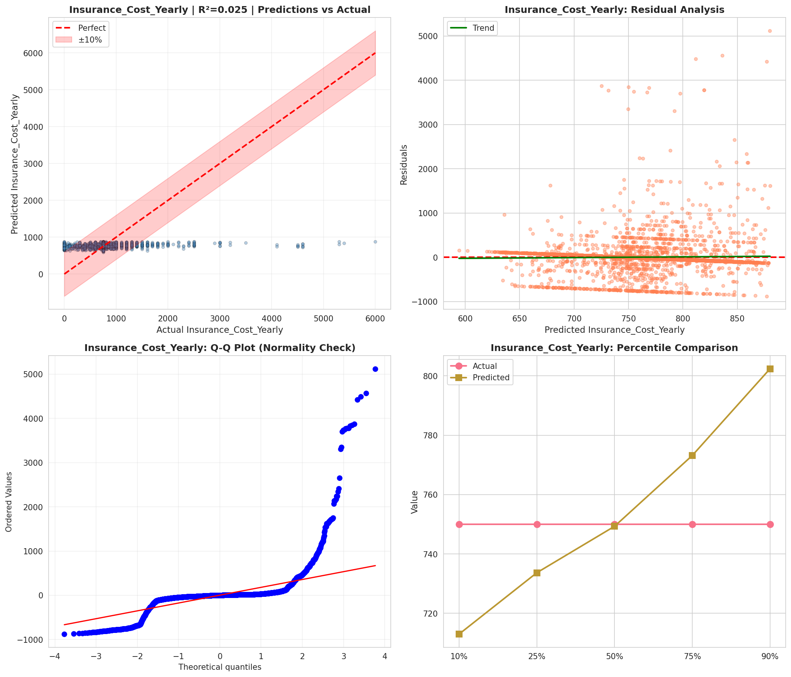
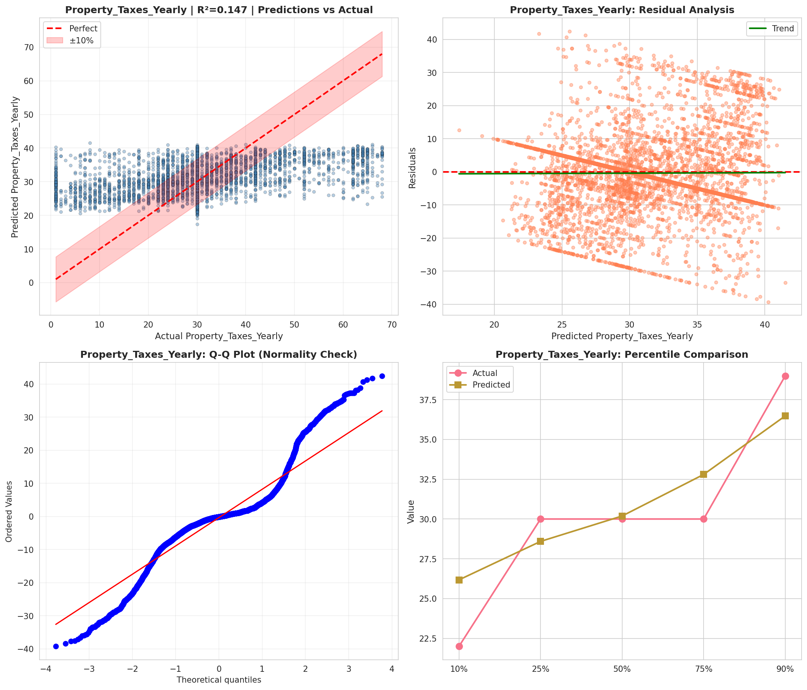
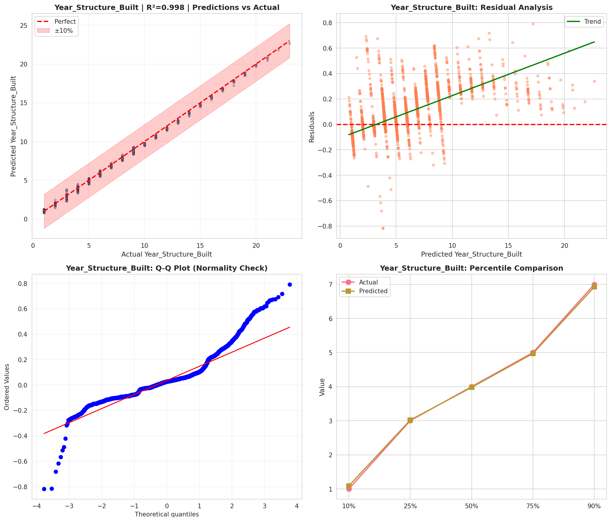
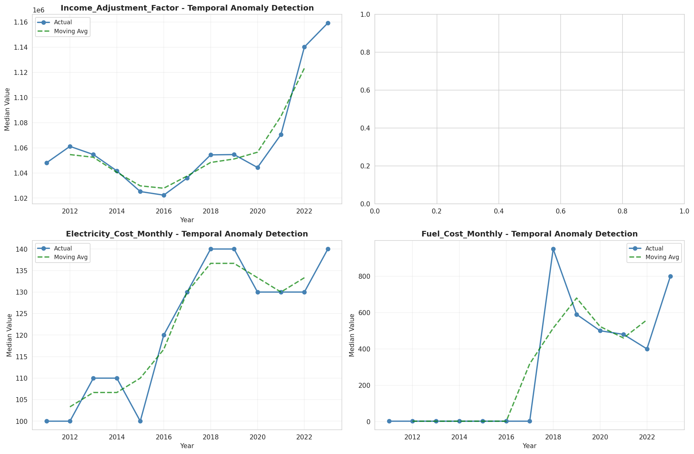
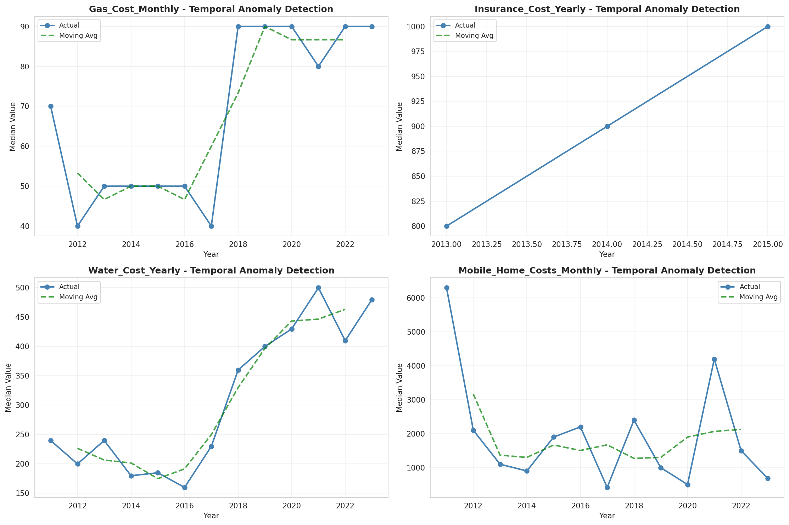
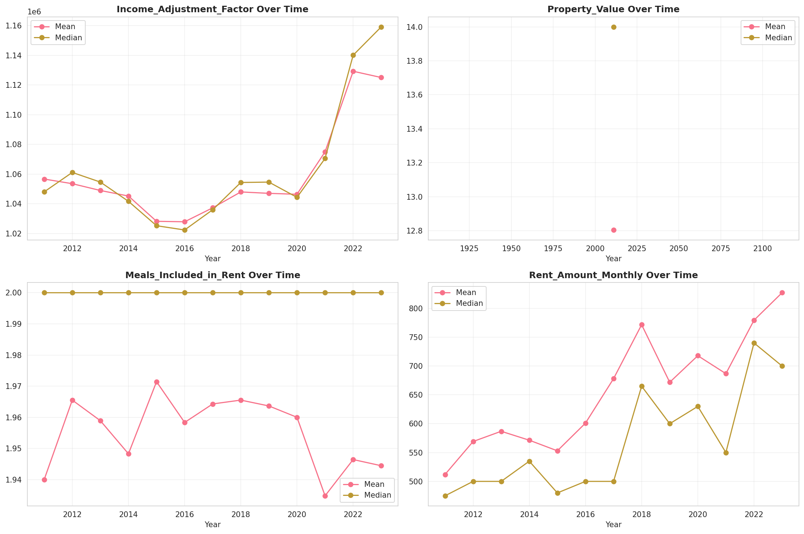
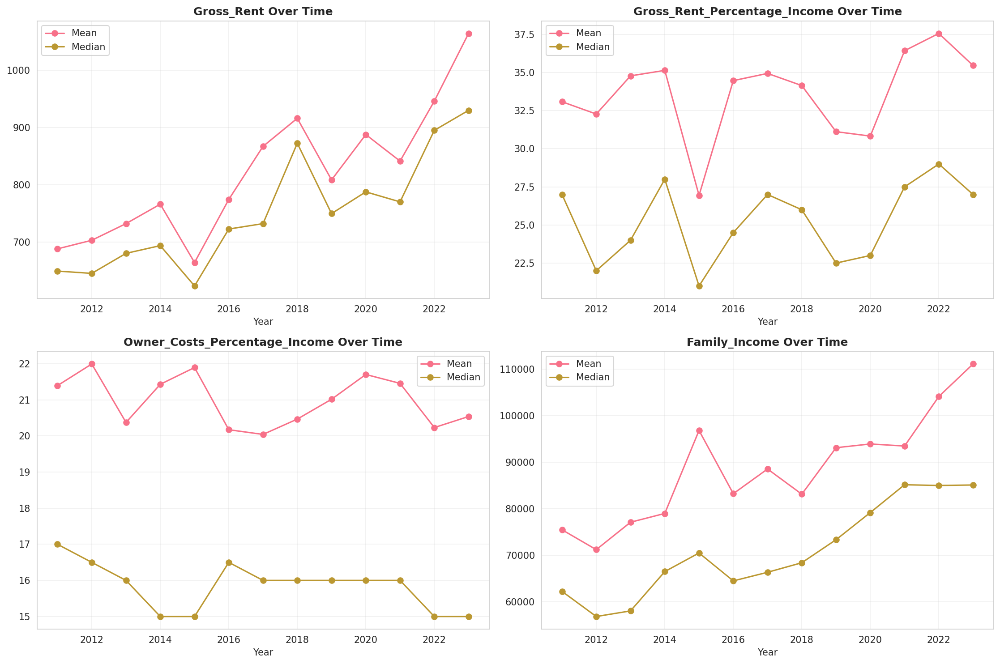
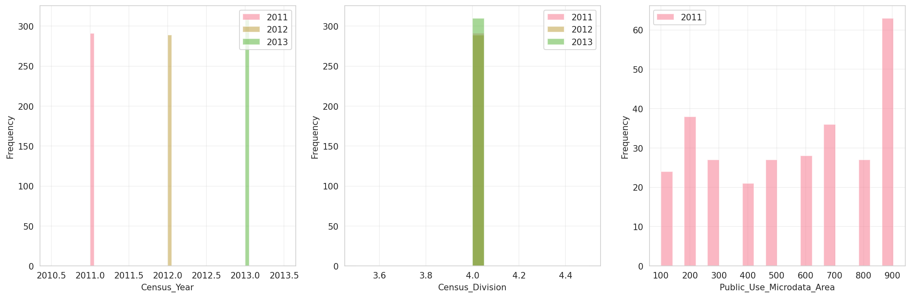
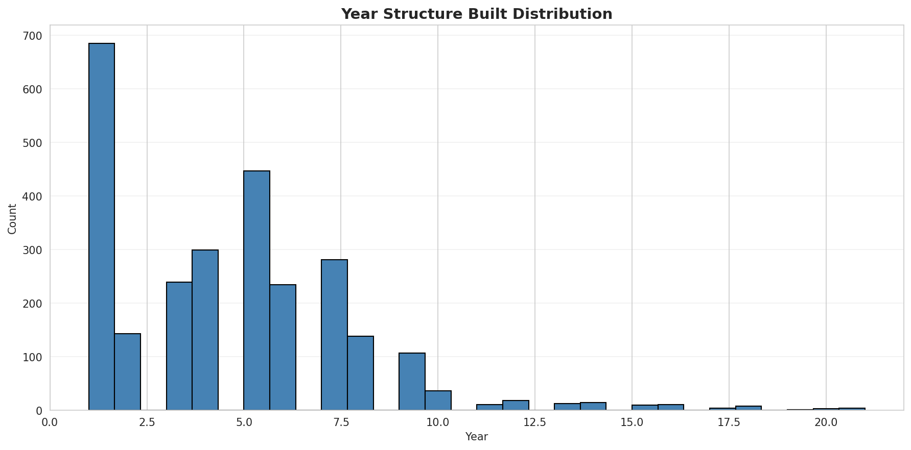
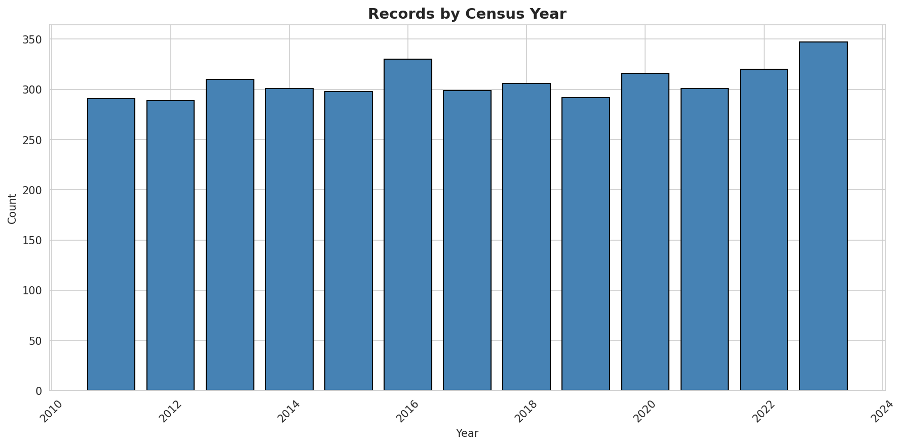
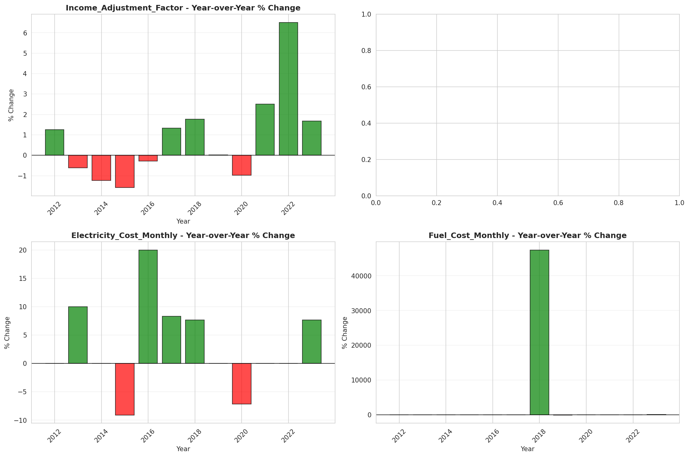

