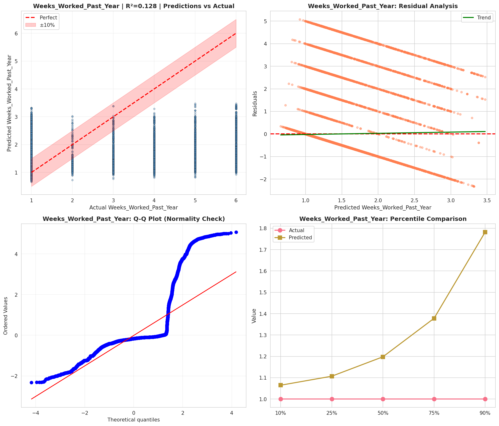
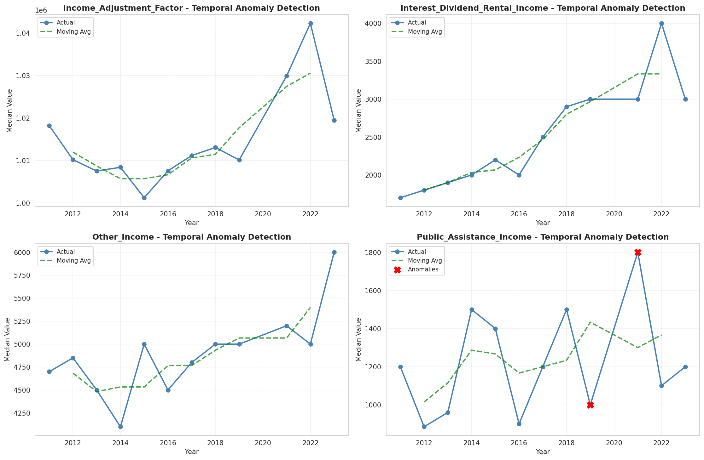
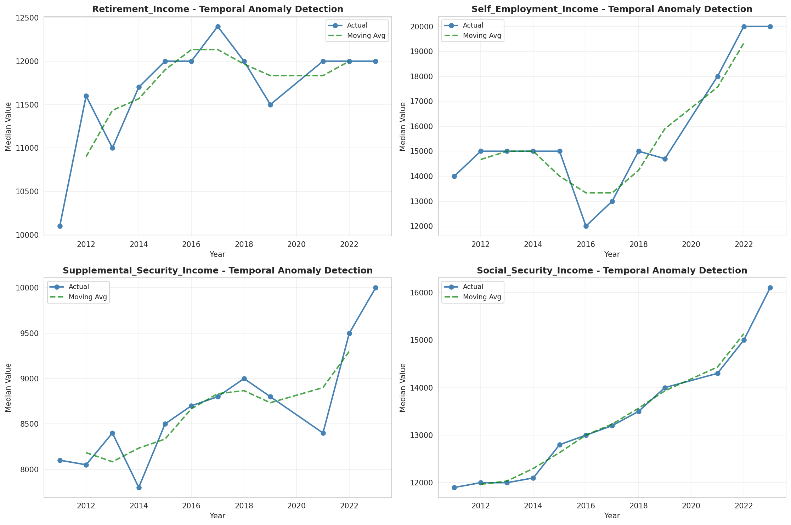
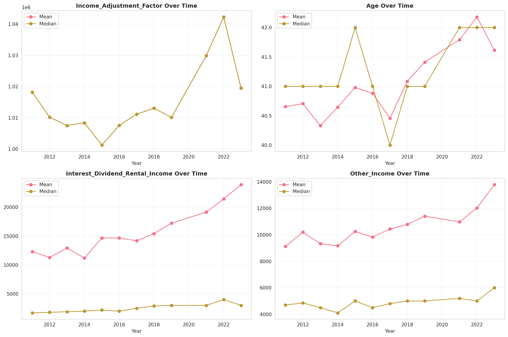
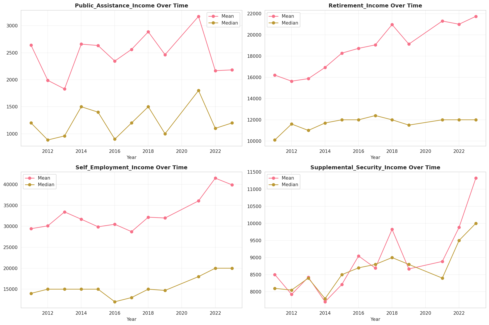
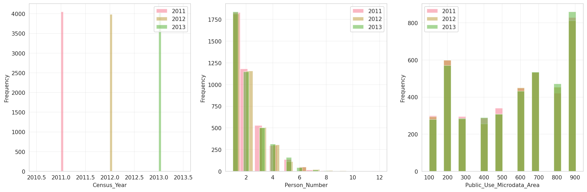
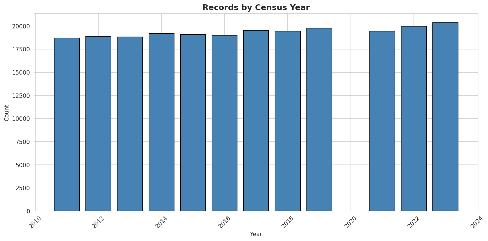
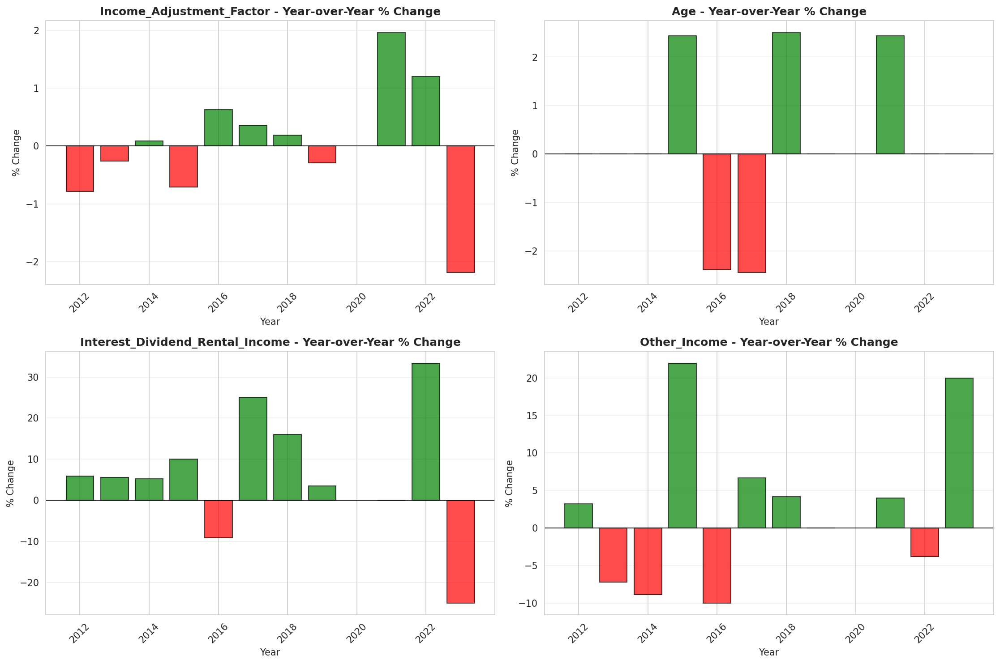
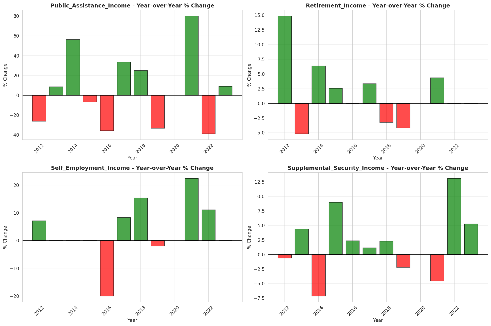

# Temporal Analysis

## Year Distribution

- 2011: 18,713 records

- 2012: 18,883 records

- 2013: 18,835 records

- 2014: 19,181 records

- 2015: 19,089 records

- 2016: 19,017 records

- 2017: 19,545 records

- 2018: 19,451 records

- 2019: 19,766 records

- 2021: 19,436 records

- 2022: 19,989 records

- 2023: 20,351 records

## Temporal Trends

- Census_Year: {np.int64(2011): {'mean': 2011.0, 'median': 2011.0, 'std': 0.0}, np.int64(2012): {'mean': 2012.0, 'median': 2012.0, 'std': 0.0}, np.int64(2013): {'mean': 2013.0, 'median': 2013.0, 'std': 0.0}, np.int64(2014): {'mean': 2014.0, 'median': 2014.0, 'std': 0.0}, np.int64(2015): {'mean': 2015.0, 'median': 2015.0, 'std': 0.0}, np.int64(2016): {'mean': 2016.0, 'median': 2016.0, 'std': 0.0}, np.int64(2017): {'mean': 2017.0, 'median': 2017.0, 'std': 0.0}, np.int64(2018): {'mean': 2018.0, 'median': 2018.0, 'std': 0.0}, np.int64(2019): {'mean': 2019.0, 'median': 2019.0, 'std': 0.0}, np.int64(2021): {'mean': 2021.0, 'median': 2021.0, 'std': 0.0}, np.int64(2022): {'mean': 2022.0, 'median': 2022.0, 'std': 0.0}, np.int64(2023): {'mean': 2023.0, 'median': 2023.0, 'std': 0.0}}

- Person_Number: {np.int64(2011): {'mean': 2.02313899428205, 'median': 2.0, 'std': 1.2803598457974381}, np.int64(2012): {'mean': 2.0415188264576605, 'median': 2.0, 'std': 1.3033945975663785}, np.int64(2013): {'mean': 2.0347756835678257, 'median': 2.0, 'std': 1.281960465866463}, np.int64(2014): {'mean': 2.0579219018820707, 'median': 2.0, 'std': 1.318921589353921}, np.int64(2015): {'mean': 2.039080098486039, 'median': 2.0, 'std': 1.2887100480466396}, np.int64(2016): {'mean': 2.0334963453751906, 'median': 2.0, 'std': 1.3057843310377235}, np.int64(2017): {'mean': 2.0773087746226655, 'median': 2.0, 'std': 1.3768186804197653}, np.int64(2018): {'mean': 2.045087656161637, 'median': 2.0, 'std': 1.3185147468118101}, np.int64(2019): {'mean': 2.0306587068703834, 'median': 2.0, 'std': 1.2844281491418483}, np.int64(2021): {'mean': 2.017699115044248, 'median': 2.0, 'std': 1.2604267779971552}, np.int64(2022): {'mean': 2.0273150232627946, 'median': 2.0, 'std': 1.293506163410824}, np.int64(2023): {'mean': 2.050857451722274, 'median': 2.0, 'std': 1.3306140633650831}}

- Public_Use_Microdata_Area: {np.int64(2011): {'mean': 555.2004488858013, 'median': 600.0, 'std': 272.55321121847317}, np.int64(2012): {'mean': 564.1089339617646, 'median': 600.0, 'std': 273.00531762025764}, np.int64(2013): {'mean': 568.0559065569419, 'median': 600.0, 'std': 272.36680222905784}, np.int64(2014): {'mean': 565.7985506490799, 'median': 600.0, 'std': 272.3996425391544}, np.int64(2015): {'mean': 571.7008224631987, 'median': 600.0, 'std': 271.42307388571095}, np.int64(2016): {'mean': 572.6640374401851, 'median': 600.0, 'std': 272.4083731407957}, np.int64(2017): {'mean': 577.7724737784599, 'median': 600.0, 'std': 272.2711153112899}, np.int64(2018): {'mean': 576.5284047092695, 'median': 600.0, 'std': 271.05082810569195}, np.int64(2019): {'mean': 573.2724881108975, 'median': 600.0, 'std': 269.3138134177276}, np.int64(2021): {'mean': 576.8864478287713, 'median': 600.0, 'std': 269.65313839176054}, np.int64(2022): {'mean': 572.3074691080094, 'median': 600.0, 'std': 269.5921311259697}, np.int64(2023): {'mean': 567.7799125350106, 'median': 600.0, 'std': 269.69703588657956}}

- State_Code: {np.int64(2011): {'mean': 31.0, 'median': 31.0, 'std': 0.0}, np.int64(2012): {'mean': 31.0, 'median': 31.0, 'std': 0.0}, np.int64(2013): {'mean': 31.0, 'median': 31.0, 'std': 0.0}, np.int64(2014): {'mean': 31.0, 'median': 31.0, 'std': 0.0}, np.int64(2015): {'mean': 31.0, 'median': 31.0, 'std': 0.0}, np.int64(2016): {'mean': 31.0, 'median': 31.0, 'std': 0.0}, np.int64(2017): {'mean': 31.0, 'median': 31.0, 'std': 0.0}, np.int64(2018): {'mean': 31.0, 'median': 31.0, 'std': 0.0}, np.int64(2019): {'mean': 31.0, 'median': 31.0, 'std': 0.0}, np.int64(2021): {'mean': 31.0, 'median': 31.0, 'std': 0.0}, np.int64(2022): {'mean': 31.0, 'median': 31.0, 'std': 0.0}, np.int64(2023): {'mean': None, 'median': None, 'std': None}}

- Income_Adjustment_Factor: {np.int64(2011): {'mean': 1018237.0, 'median': 1018237.0, 'std': 0.0}, np.int64(2012): {'mean': 1010207.0, 'median': 1010207.0, 'std': 0.0}, np.int64(2013): {'mean': 1007549.0, 'median': 1007549.0, 'std': 0.0}, np.int64(2014): {'mean': 1008425.0, 'median': 1008425.0, 'std': 0.0}, np.int64(2015): {'mean': 1001264.0, 'median': 1001264.0, 'std': 0.0}, np.int64(2016): {'mean': 1007588.0, 'median': 1007588.0, 'std': 0.0}, np.int64(2017): {'mean': 1011189.0, 'median': 1011189.0, 'std': 0.0}, np.int64(2018): {'mean': 1013097.0, 'median': 1013097.0, 'std': 0.0}, np.int64(2019): {'mean': 1010145.0, 'median': 1010145.0, 'std': 0.0}, np.int64(2021): {'mean': 1029928.0, 'median': 1029928.0, 'std': 0.0}, np.int64(2022): {'mean': 1042311.0, 'median': 1042311.0, 'std': 0.0}, np.int64(2023): {'mean': 1019518.0, 'median': 1019518.0, 'std': 0.0}}

- Person_Weight: {np.int64(2011): {'mean': 98.46849783572917, 'median': 74.0, 'std': 97.77623295812269}, np.int64(2012): {'mean': 98.26431181485992, 'median': 77.0, 'std': 89.01427314196182}, np.int64(2013): {'mean': 99.20445978232014, 'median': 80.0, 'std': 90.86053200465874}, np.int64(2014): {'mean': 98.09201814295396, 'median': 80.0, 'std': 88.50037456192221}, np.int64(2015): {'mean': 99.33417151238933, 'median': 80.0, 'std': 92.01249428850907}, np.int64(2016): {'mean': 100.28479781248356, 'median': 80.0, 'std': 93.90046767715208}, np.int64(2017): {'mean': 98.23873113328217, 'median': 81.0, 'std': 88.48861371088498}, np.int64(2018): {'mean': 99.18605727211968, 'median': 82.0, 'std': 90.27854572338684}, np.int64(2019): {'mean': 97.8654254780937, 'median': 78.0, 'std': 94.1947248755072}, np.int64(2021): {'mean': 101.03375180078206, 'median': 79.0, 'std': 96.24612237370512}, np.int64(2022): {'mean': 98.45029766371505, 'median': 77.0, 'std': 100.33328088868996}, np.int64(2023): {'mean': 97.21286423271583, 'median': 73.0, 'std': 102.13739021633369}}

- Age: {np.int64(2011): {'mean': 40.655907657778016, 'median': 41.0, 'std': 24.282314397683173}, np.int64(2012): {'mean': 40.70550230365938, 'median': 41.0, 'std': 24.518579707852194}, np.int64(2013): {'mean': 40.331245022564374, 'median': 41.0, 'std': 24.28088434344057}, np.int64(2014): {'mean': 40.645430373807415, 'median': 41.0, 'std': 24.327157946683627}, np.int64(2015): {'mean': 40.98208392267798, 'median': 42.0, 'std': 24.384233343393266}, np.int64(2016): {'mean': 40.87984434979229, 'median': 41.0, 'std': 24.482322622018884}, np.int64(2017): {'mean': 40.45663852647736, 'median': 40.0, 'std': 24.50785072779547}, np.int64(2018): {'mean': 41.0866793481055, 'median': 41.0, 'std': 24.447219111670787}, np.int64(2019): {'mean': 41.41121117069716, 'median': 41.0, 'std': 24.723670590303975}, np.int64(2021): {'mean': 41.79327022020992, 'median': 42.0, 'std': 24.53014438444517}, np.int64(2022): {'mean': 42.180449247085896, 'median': 42.0, 'std': 24.56539193798729}, np.int64(2023): {'mean': 41.617119551864775, 'median': 42.0, 'std': 24.55804395962265}}

- Citizenship_Status: {np.int64(2011): {'mean': 1.138940843264041, 'median': 1.0, 'std': 0.6865825258082754}, np.int64(2012): {'mean': 1.1588730604247206, 'median': 1.0, 'std': 0.736829808327744}, np.int64(2013): {'mean': 1.1484470400849482, 'median': 1.0, 'std': 0.7080800848780854}, np.int64(2014): {'mean': 1.1579688233147385, 'median': 1.0, 'std': 0.7328631150702446}, np.int64(2015): {'mean': 1.1616113992351615, 'median': 1.0, 'std': 0.7368016119193028}, np.int64(2016): {'mean': 1.1769995267392332, 'median': 1.0, 'std': 0.7712158279163082}, np.int64(2017): {'mean': 1.1878229726272704, 'median': 1.0, 'std': 0.7909091887420068}, np.int64(2018): {'mean': 1.1728445838260244, 'median': 1.0, 'std': 0.7614387852007952}, np.int64(2019): {'mean': 1.1511686734797126, 'median': 1.0, 'std': 0.7123750907021565}, np.int64(2021): {'mean': 1.1791006379913562, 'median': 1.0, 'std': 0.7670722450529293}, np.int64(2022): {'mean': 1.1743458902396318, 'median': 1.0, 'std': 0.753532292058441}, np.int64(2023): {'mean': 1.1865264606161858, 'median': 1.0, 'std': 0.7852430586792709}}

- Class_of_Worker: {np.int64(2011): {'mean': 2.299616858237548, 'median': 1.0, 'std': 2.00379936030298}, np.int64(2012): {'mean': 2.290201433936497, 'median': 1.0, 'std': 1.9870540271349988}, np.int64(2013): {'mean': 2.236092380310182, 'median': 1.0, 'std': 1.9607482921553714}, np.int64(2014): {'mean': 2.2314845566257056, 'median': 1.0, 'std': 1.9504069086225682}, np.int64(2015): {'mean': 2.201926270342079, 'median': 1.0, 'std': 1.9190829298778571}, np.int64(2016): {'mean': 2.2000834028356966, 'median': 1.0, 'std': 1.9236186236556647}, np.int64(2017): {'mean': 2.155928885989235, 'median': 1.0, 'std': 1.8939303109334809}, np.int64(2018): {'mean': 2.2383086198468307, 'median': 1.0, 'std': 1.959833510151579}, np.int64(2019): {'mean': 2.263696959843928, 'median': 1.0, 'std': 1.9543311843703093}, np.int64(2021): {'mean': 2.2495107632093934, 'median': 1.0, 'std': 1.92835249553238}, np.int64(2022): {'mean': 2.2863057324840765, 'median': 1.0, 'std': 1.9502214464672796}, np.int64(2023): {'mean': 2.269637403085598, 'median': 1.0, 'std': 1.9420778931371259}}

- English_Speaking_Ability: {np.int64(2011): {'mean': 1.633696563285834, 'median': 1.0, 'std': 0.9209189850233482}, np.int64(2012): {'mean': 1.665470208183776, 'median': 1.0, 'std': 0.9223085716303965}, np.int64(2013): {'mean': 1.6904761904761905, 'median': 1.0, 'std': 0.9527018960758576}, np.int64(2014): {'mean': 1.751407884151247, 'median': 1.0, 'std': 0.9772719251171448}, np.int64(2015): {'mean': 1.6367961934972244, 'median': 1.0, 'std': 0.9066126807376935}, np.int64(2016): {'mean': 1.7052954719877207, 'median': 1.0, 'std': 0.9119590588790963}, np.int64(2017): {'mean': 1.6694045174537988, 'median': 1.0, 'std': 0.9048281385026409}, np.int64(2018): {'mean': 1.588715664439495, 'median': 1.0, 'std': 0.8524714869321454}, np.int64(2019): {'mean': 1.5840500390930414, 'median': 1.0, 'std': 0.8688283896012328}, np.int64(2021): {'mean': 1.6711173576950105, 'median': 1.0, 'std': 0.9383540829301396}, np.int64(2022): {'mean': 1.577656675749319, 'median': 1.0, 'std': 0.8877516690376066}, np.int64(2023): {'mean': 1.6609611586570112, 'median': 1.0, 'std': 0.9549796667152134}}

- Fertility_Status: {np.int64(2011): {'mean': 1.9411473788328388, 'median': 2.0, 'std': 0.23537776046548048}, np.int64(2012): {'mean': 1.9425, 'median': 2.0, 'std': 0.23282461602127952}, np.int64(2013): {'mean': 1.9332490518331227, 'median': 2.0, 'std': 0.24962174200766246}, np.int64(2014): {'mean': 1.9384731290808639, 'median': 2.0, 'std': 0.24032440429109106}, np.int64(2015): {'mean': 1.936768149882904, 'median': 2.0, 'std': 0.24341117605870644}, np.int64(2016): {'mean': 1.9351351351351351, 'median': 2.0, 'std': 0.24631896277963175}, np.int64(2017): {'mean': 1.9321652065081352, 'median': 2.0, 'std': 0.2514936705772868}, np.int64(2018): {'mean': 1.9383248730964466, 'median': 2.0, 'std': 0.24059509035415202}, np.int64(2019): {'mean': 1.9421906693711968, 'median': 2.0, 'std': 0.2334121368293262}, np.int64(2021): {'mean': 1.939903234020881, 'median': 2.0, 'std': 0.2376963023524867}, np.int64(2022): {'mean': 1.939227895392279, 'median': 2.0, 'std': 0.23894157414196848}, np.int64(2023): {'mean': 1.9422655298416565, 'median': 2.0, 'std': 0.2332690651740426}}

- Marital_Status: {np.int64(2011): {'mean': 2.811361085876129, 'median': 2.0, 'std': 1.853236665676926}, np.int64(2012): {'mean': 2.829317375417042, 'median': 2.0, 'std': 1.855563149358926}, np.int64(2013): {'mean': 2.8314839394743827, 'median': 2.0, 'std': 1.861156088843421}, np.int64(2014): {'mean': 2.8234711433189092, 'median': 2.0, 'std': 1.8601001421021603}, np.int64(2015): {'mean': 2.8391743936298393, 'median': 2.0, 'std': 1.8579063708372825}, np.int64(2016): {'mean': 2.8462428353578377, 'median': 2.0, 'std': 1.8588497984310621}, np.int64(2017): {'mean': 2.8632386799693017, 'median': 2.0, 'std': 1.8627902635789757}, np.int64(2018): {'mean': 2.853889260192278, 'median': 2.0, 'std': 1.8577532008153501}, np.int64(2019): {'mean': 2.8389659010421937, 'median': 2.0, 'std': 1.861813913355584}, np.int64(2021): {'mean': 2.834791109281745, 'median': 2.0, 'std': 1.8604036765075527}, np.int64(2022): {'mean': 2.8373105207864326, 'median': 2.0, 'std': 1.8602749970148478}, np.int64(2023): {'mean': 2.8520465824775196, 'median': 2.0, 'std': 1.865179602972184}}

- Mobility_Status: {np.int64(2011): {'mean': 1.2674914906261818, 'median': 1.0, 'std': 0.6782716194656241}, np.int64(2012): {'mean': 1.2596581471360446, 'median': 1.0, 'std': 0.6694529242756145}, np.int64(2013): {'mean': 1.2851686481252353, 'median': 1.0, 'std': 0.697274081423457}, np.int64(2014): {'mean': 1.2756765310966924, 'median': 1.0, 'std': 0.6866416911398765}, np.int64(2015): {'mean': 1.2775923276638583, 'median': 1.0, 'std': 0.6883752009655929}, np.int64(2016): {'mean': 1.2869458783460168, 'median': 1.0, 'std': 0.6984658861702558}, np.int64(2017): {'mean': 1.2778785836487117, 'median': 1.0, 'std': 0.6884034839249091}, np.int64(2018): {'mean': 1.25318429945412, 'median': 1.0, 'std': 0.6623850068891061}, np.int64(2019): {'mean': 1.252237508310745, 'median': 1.0, 'std': 0.6614364594610952}, np.int64(2021): {'mean': 1.2187337561077034, 'median': 1.0, 'std': 0.6212925952955747}, np.int64(2022): {'mean': 1.217329760881654, 'median': 1.0, 'std': 0.6180917238308872}, np.int64(2023): {'mean': 1.2193087008343266, 'median': 1.0, 'std': 0.6215056885817247}}

- Military_Service: {np.int64(2011): {'mean': 4.7435095827103435, 'median': 5.0, 'std': 0.6772313993930379}, np.int64(2012): {'mean': 4.750610086767896, 'median': 5.0, 'std': 0.673721795832967}, np.int64(2013): {'mean': 3.769288287675889, 'median': 4.0, 'std': 0.6288424750992235}, np.int64(2014): {'mean': 3.772031416400426, 'median': 4.0, 'std': 0.6265874522076113}, np.int64(2015): {'mean': 3.7839834908800425, 'median': 4.0, 'std': 0.6129782942178233}, np.int64(2016): {'mean': 3.78050739674677, 'median': 4.0, 'std': 0.61876336761041}, np.int64(2017): {'mean': 3.7966960642358827, 'median': 4.0, 'std': 0.5944628183628401}, np.int64(2018): {'mean': 3.8004174276024, 'median': 4.0, 'std': 0.5913558462577554}, np.int64(2019): {'mean': 3.7938489254922145, 'median': 4.0, 'std': 0.6003608698184817}, np.int64(2021): {'mean': 3.8208848869599015, 'median': 4.0, 'std': 0.5627130164418032}, np.int64(2022): {'mean': 3.8174349325807464, 'median': 4.0, 'std': 0.5675380304459077}, np.int64(2023): {'mean': 3.8381786557336315, 'median': 4.0, 'std': 0.5365127180582605}}

- Travel_Time_To_Work_Minutes: {np.int64(2011): {'mean': 18.939376376492408, 'median': 15.0, 'std': 18.82500622779636}, np.int64(2012): {'mean': 18.939196152524907, 'median': 15.0, 'std': 18.5297816306245}, np.int64(2013): {'mean': 19.167455487942302, 'median': 15.0, 'std': 18.429365557082363}, np.int64(2014): {'mean': 18.996349153667442, 'median': 15.0, 'std': 18.696771105759304}, np.int64(2015): {'mean': 19.36511067280298, 'median': 15.0, 'std': 19.09608136302755}, np.int64(2016): {'mean': 19.254683318465656, 'median': 15.0, 'std': 19.30051562382906}, np.int64(2017): {'mean': 19.19657378293397, 'median': 15.0, 'std': 18.63265233984349}, np.int64(2018): {'mean': 19.81165919282511, 'median': 15.0, 'std': 18.971595243146915}, np.int64(2019): {'mean': 20.193920448420826, 'median': 15.0, 'std': 19.65182088104382}, np.int64(2021): {'mean': 19.969598136284215, 'median': 15.0, 'std': 20.11544924576605}, np.int64(2022): {'mean': 19.7501127141569, 'median': 15.0, 'std': 18.87593356589649}, np.int64(2023): {'mean': 19.912280701754387, 'median': 15.0, 'std': 20.36074435225947}}

- Vehicle_Occupancy: {np.int64(2011): {'mean': 1.1449346807986196, 'median': 1.0, 'std': 0.5152137310215631}, np.int64(2012): {'mean': 1.1591408347571395, 'median': 1.0, 'std': 0.5625177867431205}, np.int64(2013): {'mean': 1.1621686457958498, 'median': 1.0, 'std': 0.5909128716985772}, np.int64(2014): {'mean': 1.1526019690576652, 'median': 1.0, 'std': 0.5595802213989167}, np.int64(2015): {'mean': 1.133924405039664, 'median': 1.0, 'std': 0.5353292322372267}, np.int64(2016): {'mean': 1.1571075256153573, 'median': 1.0, 'std': 0.6354671042752041}, np.int64(2017): {'mean': 1.1360082777650033, 'median': 1.0, 'std': 0.5124754101801611}, np.int64(2018): {'mean': 1.141173752310536, 'median': 1.0, 'std': 0.5444415489230291}, np.int64(2019): {'mean': 1.1397142209117714, 'median': 1.0, 'std': 0.5251821332549732}, np.int64(2021): {'mean': 1.132347504621072, 'median': 1.0, 'std': 0.5330879321566137}, np.int64(2022): {'mean': 1.154240725277347, 'median': 1.0, 'std': 0.5704451143759893}, np.int64(2023): {'mean': 1.1474001857010214, 'median': 1.0, 'std': 0.5320599990777861}}

- Transportation_To_Work: {np.int64(2011): {'mean': 2.0844840708926826, 'median': 1.0, 'std': 3.0337623852554767}, np.int64(2012): {'mean': 2.043445369069491, 'median': 1.0, 'std': 2.9775521113915255}, np.int64(2013): {'mean': 1.9785958904109588, 'median': 1.0, 'std': 2.8975462530505167}, np.int64(2014): {'mean': 1.9539010815919353, 'median': 1.0, 'std': 2.8692863752462188}, np.int64(2015): {'mean': 1.8993803171935721, 'median': 1.0, 'std': 2.7870424661977937}, np.int64(2016): {'mean': 1.9302966101694916, 'median': 1.0, 'std': 2.8364713983379968}, np.int64(2017): {'mean': 1.965942998250849, 'median': 1.0, 'std': 2.8867227182944806}, np.int64(2018): {'mean': 1.9623266404471125, 'median': 1.0, 'std': 2.8863919255186565}, np.int64(2019): {'mean': None, 'median': None, 'std': None}, np.int64(2021): {'mean': None, 'median': None, 'std': None}, np.int64(2022): {'mean': None, 'median': None, 'std': None}, np.int64(2023): {'mean': None, 'median': None, 'std': None}}

- Language_Other_Than_English: {np.int64(2011): {'mean': 1.9324270744831493, 'median': 2.0, 'std': 0.25101871292178435}, np.int64(2012): {'mean': 1.9216579494966537, 'median': 2.0, 'std': 0.26871664374563536}, np.int64(2013): {'mean': 1.9358996099711718, 'median': 2.0, 'std': 0.2449386071956191}, np.int64(2014): {'mean': 1.9311738648947951, 'median': 2.0, 'std': 0.2531652565118786}, np.int64(2015): {'mean': 1.9299755664149267, 'median': 2.0, 'std': 0.2551952756494333}, np.int64(2016): {'mean': 1.9272717124358116, 'median': 2.0, 'std': 0.25969722396102995}, np.int64(2017): {'mean': 1.920311988654958, 'median': 2.0, 'std': 0.27081697234671215}, np.int64(2018): {'mean': 1.9264175680104885, 'median': 2.0, 'std': 0.26109726483631723}, np.int64(2019): {'mean': 1.931251343797033, 'median': 2.0, 'std': 0.25303304127357507}, np.int64(2021): {'mean': 1.9224692165195598, 'median': 2.0, 'std': 0.26743907341844925}, np.int64(2022): {'mean': 1.9223937407485727, 'median': 2.0, 'std': 0.26755805400157584}, np.int64(2023): {'mean': 1.921205519244735, 'median': 2.0, 'std': 0.2694247129961609}}

- Grandparents_Living_With_Grandchildren: {np.int64(2011): {'mean': 1.9800969635110999, 'median': 2.0, 'std': 0.13967306448379022}, np.int64(2012): {'mean': 1.9812336951948162, 'median': 2.0, 'std': 0.13570438592483366}, np.int64(2013): {'mean': 1.9823904721395151, 'median': 2.0, 'std': 0.13153290151174601}, np.int64(2014): {'mean': 1.9797084644691072, 'median': 2.0, 'std': 0.14100154519994632}, np.int64(2015): {'mean': 1.9802805280528053, 'median': 2.0, 'std': 0.13904031588033758}, np.int64(2016): {'mean': 1.9799414960300878, 'median': 2.0, 'std': 0.14020628848448102}, np.int64(2017): {'mean': 1.9789257892578926, 'median': 2.0, 'std': 0.14363766987319074}, np.int64(2018): {'mean': 1.9821674637270001, 'median': 2.0, 'std': 0.13234786252024894}, np.int64(2019): {'mean': 1.982124414078017, 'median': 2.0, 'std': 0.13250450647828296}, np.int64(2021): {'mean': 1.977974622935121, 'median': 2.0, 'std': 0.1467718601264818}, np.int64(2022): {'mean': 1.985449226268381, 'median': 2.0, 'std': 0.11975037677717609}, np.int64(2023): {'mean': 1.980658530969376, 'median': 2.0, 'std': 0.13772738471183227}}

- Months_Responsible_For_Grandchildren: {np.int64(2011): {'mean': 3.5982142857142856, 'median': 4.0, 'std': 1.4423443218791907}, np.int64(2012): {'mean': 3.566371681415929, 'median': 4.0, 'std': 1.4197340432195786}, np.int64(2013): {'mean': 3.6363636363636362, 'median': 4.0, 'std': 1.4102724114803353}, np.int64(2014): {'mean': 3.611111111111111, 'median': 4.0, 'std': 1.3912424503139469}, np.int64(2015): {'mean': 3.7529411764705882, 'median': 4.0, 'std': 1.40497315982617}, np.int64(2016): {'mean': 3.7333333333333334, 'median': 4.0, 'std': 1.3676669260140868}, np.int64(2017): {'mean': 3.5982142857142856, 'median': 4.0, 'std': 1.2976751313255352}, np.int64(2018): {'mean': 3.7701149425287355, 'median': 4.0, 'std': 1.3614386151838278}, np.int64(2019): {'mean': 3.784313725490196, 'median': 4.0, 'std': 1.3469985040484478}, np.int64(2021): {'mean': 3.7851239669421486, 'median': 4.0, 'std': 1.324176546450963}, np.int64(2022): {'mean': 3.691358024691358, 'median': 4.0, 'std': 1.5218572149567942}, np.int64(2023): {'mean': 3.4375, 'median': 3.5, 'std': 1.4640427086091372}}

- Grandparents_Responsible_For_Grandchildren: {np.int64(2011): {'mean': 1.5213675213675213, 'median': 2.0, 'std': 0.5006140538098602}, np.int64(2012): {'mean': 1.493273542600897, 'median': 1.0, 'std': 0.5010795117440401}, np.int64(2013): {'mean': 1.5217391304347827, 'median': 2.0, 'std': 0.5007381634304949}, np.int64(2014): {'mean': 1.4857142857142858, 'median': 1.0, 'std': 0.5008190013679069}, np.int64(2015): {'mean': 1.6443514644351465, 'median': 2.0, 'std': 0.47971400126799746}, np.int64(2016): {'mean': 1.5625, 'median': 2.0, 'std': 0.4971151083625834}, np.int64(2017): {'mean': 1.5642023346303502, 'median': 2.0, 'std': 0.4968284627522644}, np.int64(2018): {'mean': 1.6045454545454545, 'median': 2.0, 'std': 0.4900631519524997}, np.int64(2019): {'mean': 1.5466666666666666, 'median': 2.0, 'std': 0.4989274210028663}, np.int64(2021): {'mean': 1.5615942028985508, 'median': 2.0, 'std': 0.49709299861832923}, np.int64(2022): {'mean': 1.5714285714285714, 'median': 2.0, 'std': 0.4961860617779741}, np.int64(2023): {'mean': 1.619047619047619, 'median': 2.0, 'std': 0.48658731677562067}}

- Interest_Dividend_Rental_Income: {np.int64(2011): {'mean': 12309.686536901865, 'median': 1700.0, 'std': 35834.016064813986}, np.int64(2012): {'mean': 11295.553490293267, 'median': 1800.0, 'std': 27975.98748939426}, np.int64(2013): {'mean': 12936.283995186523, 'median': 1900.0, 'std': 38065.9675013967}, np.int64(2014): {'mean': 11201.976228847703, 'median': 2000.0, 'std': 27013.879768507148}, np.int64(2015): {'mean': 14681.873759428345, 'median': 2200.0, 'std': 38516.13013589113}, np.int64(2016): {'mean': 14653.895192724123, 'median': 2000.0, 'std': 37393.17439577476}, np.int64(2017): {'mean': 14186.136162687886, 'median': 2500.0, 'std': 35287.836591886975}, np.int64(2018): {'mean': 15421.456745853877, 'median': 2900.0, 'std': 38029.870521904406}, np.int64(2019): {'mean': 17237.992988606486, 'median': 3000.0, 'std': 42441.057237255496}, np.int64(2021): {'mean': 19150.709645177412, 'median': 3000.0, 'std': 49825.18197855528}, np.int64(2022): {'mean': 21431.00697906281, 'median': 4000.0, 'std': 53026.93939056}, np.int64(2023): {'mean': 23890.467608377985, 'median': 3000.0, 'std': 72779.48285428784}}

- Military_Service_Period_1: {np.int64(2011): {'mean': 0.11370262390670553, 'median': 0.0, 'std': 0.3175423311192085}, np.int64(2012): {'mean': 0.1362810417928528, 'median': 0.0, 'std': 0.34319070199721063}, np.int64(2013): {'mean': 0.15614617940199335, 'median': 0.0, 'std': 0.3631145266557627}, np.int64(2014): {'mean': 0.1539961013645224, 'median': 0.0, 'std': 0.36106233587555453}, np.int64(2015): {'mean': 0.17334254143646408, 'median': 0.0, 'std': 0.3786739147664732}, np.int64(2016): {'mean': 0.18200270635994586, 'median': 0.0, 'std': 0.385977355050128}, np.int64(2017): {'mean': 0.18494152046783627, 'median': 0.0, 'std': 0.3883921005768755}, np.int64(2018): {'mean': 0.187039764359352, 'median': 0.0, 'std': 0.3900870978199285}, np.int64(2019): {'mean': 0.19357092941998602, 'median': 0.0, 'std': 0.39523459666262256}, np.int64(2021): {'mean': 0.21903199343724364, 'median': 0.0, 'std': 0.4137600997653656}, np.int64(2022): {'mean': 0.21539657853810265, 'median': 0.0, 'std': 0.4112571102077818}, np.int64(2023): {'mean': 0.2502210433244916, 'median': 0.0, 'std': 0.4333318587055143}}

- Military_Service_Period_2: {np.int64(2011): {'mean': 0.1422740524781341, 'median': 0.0, 'std': 0.3494328887706071}, np.int64(2012): {'mean': 0.16353725015142337, 'median': 0.0, 'std': 0.3699671913866071}, np.int64(2013): {'mean': 0.17209302325581396, 'median': 0.0, 'std': 0.3775867405776707}, np.int64(2014): {'mean': 0.16764132553606237, 'median': 0.0, 'std': 0.37366888850836105}, np.int64(2015): {'mean': 0.1712707182320442, 'median': 0.0, 'std': 0.3768755097926193}, np.int64(2016): {'mean': 0.17794316644113667, 'median': 0.0, 'std': 0.3825943467183139}, np.int64(2017): {'mean': 0.1871345029239766, 'median': 0.0, 'std': 0.39016209117431105}, np.int64(2018): {'mean': 0.19808541973490426, 'median': 0.0, 'std': 0.3987037046919493}, np.int64(2019): {'mean': 0.1761006289308176, 'median': 0.0, 'std': 0.3810389197945608}, np.int64(2021): {'mean': 0.19606234618539786, 'median': 0.0, 'std': 0.3971791951030844}, np.int64(2022): {'mean': 0.19984447900466562, 'median': 0.0, 'std': 0.40003887835942525}, np.int64(2023): {'mean': 0.21043324491600354, 'median': 0.0, 'std': 0.4077966781581308}}

- Military_Service_Period_3: {np.int64(2011): {'mean': 0.16268221574344024, 'median': 0.0, 'std': 0.36918313263021396}, np.int64(2012): {'mean': 0.1956390066626287, 'median': 0.0, 'std': 0.39681199337933265}, np.int64(2013): {'mean': None, 'median': None, 'std': None}, np.int64(2014): {'mean': None, 'median': None, 'std': None}, np.int64(2015): {'mean': None, 'median': None, 'std': None}, np.int64(2016): {'mean': None, 'median': None, 'std': None}, np.int64(2017): {'mean': None, 'median': None, 'std': None}, np.int64(2018): {'mean': None, 'median': None, 'std': None}, np.int64(2019): {'mean': None, 'median': None, 'std': None}, np.int64(2021): {'mean': None, 'median': None, 'std': None}, np.int64(2022): {'mean': None, 'median': None, 'std': None}, np.int64(2023): {'mean': None, 'median': None, 'std': None}}

- Military_Service_Period_4: {np.int64(2011): {'mean': 0.10145772594752187, 'median': 0.0, 'std': 0.30202192584359666}, np.int64(2012): {'mean': 0.10539067231980617, 'median': 0.0, 'std': 0.30714918201081237}, np.int64(2013): {'mean': None, 'median': None, 'std': None}, np.int64(2014): {'mean': None, 'median': None, 'std': None}, np.int64(2015): {'mean': None, 'median': None, 'std': None}, np.int64(2016): {'mean': None, 'median': None, 'std': None}, np.int64(2017): {'mean': None, 'median': None, 'std': None}, np.int64(2018): {'mean': None, 'median': None, 'std': None}, np.int64(2019): {'mean': None, 'median': None, 'std': None}, np.int64(2021): {'mean': None, 'median': None, 'std': None}, np.int64(2022): {'mean': None, 'median': None, 'std': None}, np.int64(2023): {'mean': None, 'median': None, 'std': None}}

- Military_Service_Period_5: {np.int64(2011): {'mean': 0.33702623906705537, 'median': 0.0, 'std': 0.4728318038305761}, np.int64(2012): {'mean': 0.34039975772259234, 'median': 0.0, 'std': 0.47398717292444864}, np.int64(2013): {'mean': 0.3521594684385382, 'median': 0.0, 'std': 0.4778021223999851}, np.int64(2014): {'mean': 0.36712150747238464, 'median': 0.0, 'std': 0.48217670484291847}, np.int64(2015): {'mean': 0.3763812154696133, 'median': 0.0, 'std': 0.48464482507793005}, np.int64(2016): {'mean': 0.36738836265223274, 'median': 0.0, 'std': 0.4822566839290075}, np.int64(2017): {'mean': 0.3757309941520468, 'median': 0.0, 'std': 0.48448818310187997}, np.int64(2018): {'mean': 0.3630338733431517, 'median': 0.0, 'std': 0.4810516455235225}, np.int64(2019): {'mean': 0.3920335429769392, 'median': 0.0, 'std': 0.4883747718250818}, np.int64(2021): {'mean': 0.391304347826087, 'median': 0.0, 'std': 0.4882425724936345}, np.int64(2022): {'mean': 0.39813374805598756, 'median': 0.0, 'std': 0.48970373080592394}, np.int64(2023): {'mean': 0.3916887709991158, 'median': 0.0, 'std': 0.4883436647579206}}

- Military_Service_Period_6: {np.int64(2011): {'mean': 0.09446064139941691, 'median': 0.0, 'std': 0.2925538138703546}, np.int64(2012): {'mean': 0.07450030284675954, 'median': 0.0, 'std': 0.26266289346987876}, np.int64(2013): {'mean': None, 'median': None, 'std': None}, np.int64(2014): {'mean': None, 'median': None, 'std': None}, np.int64(2015): {'mean': None, 'median': None, 'std': None}, np.int64(2016): {'mean': None, 'median': None, 'std': None}, np.int64(2017): {'mean': None, 'median': None, 'std': None}, np.int64(2018): {'mean': None, 'median': None, 'std': None}, np.int64(2019): {'mean': None, 'median': None, 'std': None}, np.int64(2021): {'mean': None, 'median': None, 'std': None}, np.int64(2022): {'mean': None, 'median': None, 'std': None}, np.int64(2023): {'mean': None, 'median': None, 'std': None}}

- Military_Service_Period_7: {np.int64(2011): {'mean': 0.11370262390670553, 'median': 0.0, 'std': 0.31754233111920865}, np.int64(2012): {'mean': 0.1096305269533616, 'median': 0.0, 'std': 0.3125233320952278}, np.int64(2013): {'mean': None, 'median': None, 'std': None}, np.int64(2014): {'mean': None, 'median': None, 'std': None}, np.int64(2015): {'mean': None, 'median': None, 'std': None}, np.int64(2016): {'mean': None, 'median': None, 'std': None}, np.int64(2017): {'mean': None, 'median': None, 'std': None}, np.int64(2018): {'mean': None, 'median': None, 'std': None}, np.int64(2019): {'mean': None, 'median': None, 'std': None}, np.int64(2021): {'mean': None, 'median': None, 'std': None}, np.int64(2022): {'mean': None, 'median': None, 'std': None}, np.int64(2023): {'mean': None, 'median': None, 'std': None}}

- Military_Service_Period_8: {np.int64(2011): {'mean': 0.1446064139941691, 'median': 0.0, 'std': 0.3518061493255825}, np.int64(2012): {'mean': 0.15687462144155057, 'median': 0.0, 'std': 0.36379270908002115}, np.int64(2013): {'mean': 0.14551495016611296, 'median': 0.0, 'std': 0.3527364774856012}, np.int64(2014): {'mean': 0.14359974009096815, 'median': 0.0, 'std': 0.3507973987651935}, np.int64(2015): {'mean': 0.12016574585635359, 'median': 0.0, 'std': 0.3252675898246258}, np.int64(2016): {'mean': 0.11434370771312584, 'median': 0.0, 'std': 0.31833596773282036}, np.int64(2017): {'mean': 0.10964912280701754, 'median': 0.0, 'std': 0.3125661674838749}, np.int64(2018): {'mean': 0.10235640648011782, 'median': 0.0, 'std': 0.3032280996170935}, np.int64(2019): {'mean': 0.08106219426974144, 'median': 0.0, 'std': 0.2730260182082988}, np.int64(2021): {'mean': 0.07465135356849877, 'median': 0.0, 'std': 0.26293581669088983}, np.int64(2022): {'mean': 0.05909797822706065, 'median': 0.0, 'std': 0.23589972421976207}, np.int64(2023): {'mean': 0.04155614500442087, 'median': 0.0, 'std': 0.19966090985617313}}

- Military_Service_Period_9: {np.int64(2011): {'mean': 0.018658892128279883, 'median': 0.0, 'std': 0.1353566434169067}, np.int64(2012): {'mean': 0.025439127801332527, 'median': 0.0, 'std': 0.15750239369483388}, np.int64(2013): {'mean': 0.019933554817275746, 'median': 0.0, 'std': 0.1398184455276263}, np.int64(2014): {'mean': 0.01299545159194282, 'median': 0.0, 'std': 0.11329126004324162}, np.int64(2015): {'mean': 0.012430939226519336, 'median': 0.0, 'std': 0.11083724563515637}, np.int64(2016): {'mean': 0.011502029769959404, 'median': 0.0, 'std': 0.10666504083800873}, np.int64(2017): {'mean': 0.019736842105263157, 'median': 0.0, 'std': 0.13914543570439158}, np.int64(2018): {'mean': 0.010309278350515464, 'median': 0.0, 'std': 0.10104709753250778}, np.int64(2019): {'mean': 0.004891684136967156, 'median': 0.0, 'std': 0.06979369303984938}, np.int64(2021): {'mean': None, 'median': None, 'std': None}, np.int64(2022): {'mean': None, 'median': None, 'std': None}, np.int64(2023): {'mean': None, 'median': None, 'std': None}}

- Military_Service_Period_10: {np.int64(2011): {'mean': 0.11603498542274053, 'median': 0.0, 'std': 0.3203602824330815}, np.int64(2012): {'mean': 0.08237431859479104, 'median': 0.0, 'std': 0.2750174569347436}, np.int64(2013): {'mean': 0.05913621262458472, 'median': 0.0, 'std': 0.23595786716573264}, np.int64(2014): {'mean': 0.057829759584145546, 'median': 0.0, 'std': 0.23349711921019717}, np.int64(2015): {'mean': 0.04488950276243094, 'median': 0.0, 'std': 0.20713296498491737}, np.int64(2016): {'mean': 0.060216508795669824, 'median': 0.0, 'std': 0.23796805529314982}, np.int64(2017): {'mean': 0.04093567251461988, 'median': 0.0, 'std': 0.19821368018706528}, np.int64(2018): {'mean': 0.036818851251840944, 'median': 0.0, 'std': 0.1883861910848498}, np.int64(2019): {'mean': 0.026554856743535988, 'median': 0.0, 'std': 0.16083461392867004}, np.int64(2021): {'mean': 0.009023789991796555, 'median': 0.0, 'std': 0.09460287017871659}, np.int64(2022): {'mean': 0.005443234836702955, 'median': 0.0, 'std': 0.07360583505536056}, np.int64(2023): {'mean': 0.00618921308576481, 'median': 0.0, 'std': 0.07846241143014485}}

- Military_Service_Period_11: {np.int64(2011): {'mean': 0.0023323615160349854, 'median': 0.0, 'std': 0.048252245574650916}, np.int64(2012): {'mean': 0.0018170805572380376, 'median': 0.0, 'std': 0.04260138536891114}, np.int64(2013): {'mean': 0.0026578073089701, 'median': 0.0, 'std': 0.051502483742292264}, np.int64(2014): {'mean': 0.001299545159194282, 'median': 0.0, 'std': 0.036037483282735684}, np.int64(2015): {'mean': 0.0006906077348066298, 'median': 0.0, 'std': 0.02627941656138184}, np.int64(2016): {'mean': 0.005412719891745603, 'median': 0.0, 'std': 0.0733966429125805}, np.int64(2017): {'mean': 0.0, 'median': 0.0, 'std': 0.0}, np.int64(2018): {'mean': 0.0, 'median': 0.0, 'std': 0.0}, np.int64(2019): {'mean': 0.0, 'median': 0.0, 'std': 0.0}, np.int64(2021): {'mean': None, 'median': None, 'std': None}, np.int64(2022): {'mean': None, 'median': None, 'std': None}, np.int64(2023): {'mean': None, 'median': None, 'std': None}}

- Temporary_Absence_From_Work: {np.int64(2011): {'mean': 2.5769333511419794, 'median': 3.0, 'std': 0.5246143806766762}, np.int64(2012): {'mean': 2.579882838503528, 'median': 3.0, 'std': 0.5247131782531409}, np.int64(2013): {'mean': 2.6422661150407047, 'median': 3.0, 'std': 0.5049761483733411}, np.int64(2014): {'mean': 2.644044502617801, 'median': 3.0, 'std': 0.5063222291526994}, np.int64(2015): {'mean': 2.6450789077336125, 'median': 3.0, 'std': 0.5056541912163955}, np.int64(2016): {'mean': 2.6420540469458875, 'median': 3.0, 'std': 0.5093382463640372}, np.int64(2017): {'mean': 2.6518365235385413, 'median': 3.0, 'std': 0.5035916941027092}, np.int64(2018): {'mean': 2.650233689736859, 'median': 3.0, 'std': 0.5008781280480313}, np.int64(2019): {'mean': 2.651821862348178, 'median': 3.0, 'std': 0.4984716015171757}, np.int64(2021): {'mean': 2.646185225317101, 'median': 3.0, 'std': 0.4998070883419017}, np.int64(2022): {'mean': 2.6348383913150752, 'median': 3.0, 'std': 0.5032889960014011}, np.int64(2023): {'mean': 2.6378351963838496, 'median': 3.0, 'std': 0.5021471843069341}}

- Available_For_Work: {np.int64(2011): {'mean': 4.625751302257246, 'median': 5.0, 'std': 1.078273387792347}, np.int64(2012): {'mean': 4.603714551990414, 'median': 5.0, 'std': 1.0904110480813967}, np.int64(2013): {'mean': 4.758574669691712, 'median': 5.0, 'std': 0.8811420363849346}, np.int64(2014): {'mean': 4.7665575916230365, 'median': 5.0, 'std': 0.8588562558918289}, np.int64(2015): {'mean': 4.779058345884356, 'median': 5.0, 'std': 0.8397672853732124}, np.int64(2016): {'mean': 4.767769084094944, 'median': 5.0, 'std': 0.858772857600331}, np.int64(2017): {'mean': 4.7801345059493014, 'median': 5.0, 'std': 0.8381411499400895}, np.int64(2018): {'mean': 4.782316409501249, 'median': 5.0, 'std': 0.8323355196255838}, np.int64(2019): {'mean': 4.7959261133603235, 'median': 5.0, 'std': 0.8021787265236181}, np.int64(2021): {'mean': 4.815412072152464, 'median': 5.0, 'std': 0.7631823553758016}, np.int64(2022): {'mean': 4.829323957562299, 'median': 5.0, 'std': 0.7266077042108569}, np.int64(2023): {'mean': 4.801478223688229, 'median': 5.0, 'std': 0.7889278167229192}}

- On_Layoff_From_Work: {np.int64(2011): {'mean': 2.554694804327501, 'median': 3.0, 'std': 0.517812350520617}, np.int64(2012): {'mean': 2.5599786979097323, 'median': 3.0, 'std': 0.5119866181157223}, np.int64(2013): {'mean': 2.6327238756172426, 'median': 3.0, 'std': 0.49302862457583385}, np.int64(2014): {'mean': 2.63782722513089, 'median': 3.0, 'std': 0.49061723660094536}, np.int64(2015): {'mean': 2.63715539257416, 'median': 3.0, 'std': 0.4888057985810783}, np.int64(2016): {'mean': 2.635084489447038, 'median': 3.0, 'std': 0.4915594057928298}, np.int64(2017): {'mean': 2.644076564924987, 'median': 3.0, 'std': 0.48870032043298683}, np.int64(2018): {'mean': 2.6399257314808886, 'median': 3.0, 'std': 0.48810556518181875}, np.int64(2019): {'mean': 2.644294028340081, 'median': 3.0, 'std': 0.48543441300270246}, np.int64(2021): {'mean': 2.635604563707056, 'median': 3.0, 'std': 0.49188670443982335}, np.int64(2022): {'mean': 2.6303355539106836, 'median': 3.0, 'std': 0.4883189837897742}, np.int64(2023): {'mean': 2.631726834035795, 'median': 3.0, 'std': 0.4897658225403635}}

- Looking_For_Work: {np.int64(2011): {'mean': 2.5542273273674367, 'median': 3.0, 'std': 0.5736638298573592}, np.int64(2012): {'mean': 2.5605112501664227, 'median': 3.0, 'std': 0.56567220117755}, np.int64(2013): {'mean': 2.624849859869211, 'median': 3.0, 'std': 0.544631696191848}, np.int64(2014): {'mean': 2.6345549738219893, 'median': 3.0, 'std': 0.534395518490504}, np.int64(2015): {'mean': 2.6380721629231876, 'median': 3.0, 'std': 0.5254881937898043}, np.int64(2016): {'mean': 2.637320007890065, 'median': 3.0, 'std': 0.5298467543381704}, np.int64(2017): {'mean': 2.644917227108122, 'median': 3.0, 'std': 0.524953873680093}, np.int64(2018): {'mean': 2.639541583968244, 'median': 3.0, 'std': 0.5253601364794831}, np.int64(2019): {'mean': 2.6339195344129553, 'median': 3.0, 'std': 0.5213535013554426}, np.int64(2021): {'mean': 2.625342596723819, 'median': 3.0, 'std': 0.5238914490171642}, np.int64(2022): {'mean': 2.6225018504811253, 'median': 3.0, 'std': 0.5189465209807783}, np.int64(2023): {'mean': 2.616700262659581, 'median': 3.0, 'std': 0.5275428078001149}}

- Informed_Of_Recall: {np.int64(2011): {'mean': 2.8986910645118207, 'median': 3.0, 'std': 0.3245672637424742}, np.int64(2012): {'mean': 2.8913593396352018, 'median': 3.0, 'std': 0.3302935534565271}, np.int64(2013): {'mean': 2.944614973975711, 'median': 3.0, 'std': 0.24480323496740508}, np.int64(2014): {'mean': 2.944109947643979, 'median': 3.0, 'std': 0.245952894773121}, np.int64(2015): {'mean': 2.94466636107655, 'median': 3.0, 'std': 0.24334536420676342}, np.int64(2016): {'mean': 2.944440791636531, 'median': 3.0, 'std': 0.2427340311910726}, np.int64(2017): {'mean': 2.9476202793585102, 'median': 3.0, 'std': 0.2374132007516016}, np.int64(2018): {'mean': 2.946347397400602, 'median': 3.0, 'std': 0.24125625228976202}, np.int64(2019): {'mean': 2.936361336032389, 'median': 3.0, 'std': 0.25327356395817235}, np.int64(2021): {'mean': 2.9477340812033908, 'median': 3.0, 'std': 0.2359166735532966}, np.int64(2022): {'mean': 2.9525660004934617, 'median': 3.0, 'std': 0.22277394619001537}, np.int64(2023): {'mean': 2.9493005925111477, 'median': 3.0, 'std': 0.23131710890854834}}

- Other_Income: {np.int64(2011): {'mean': 9116.550680786688, 'median': 4700.0, 'std': 12669.088211762295}, np.int64(2012): {'mean': 10199.496865203762, 'median': 4850.0, 'std': 13814.494627418357}, np.int64(2013): {'mean': 9331.064297800338, 'median': 4500.0, 'std': 12511.299445419983}, np.int64(2014): {'mean': 9168.658803706823, 'median': 4100.0, 'std': 12617.81456908622}, np.int64(2015): {'mean': 10251.614661654135, 'median': 5000.0, 'std': 14080.758097362368}, np.int64(2016): {'mean': 9827.873857404022, 'median': 4500.0, 'std': 13843.755457598952}, np.int64(2017): {'mean': 10439.73102785783, 'median': 4800.0, 'std': 14606.812212269575}, np.int64(2018): {'mean': 10783.389210019268, 'median': 5000.0, 'std': 14269.054719666074}, np.int64(2019): {'mean': 11408.860927152318, 'median': 5000.0, 'std': 15515.81703885111}, np.int64(2021): {'mean': 10975.284926470587, 'median': 5200.0, 'std': 14554.035935652291}, np.int64(2022): {'mean': 12027.623645320196, 'median': 5000.0, 'std': 16187.572369907675}, np.int64(2023): {'mean': 13783.489406779661, 'median': 6000.0, 'std': 17710.361442382367}}

- Public_Assistance_Income: {np.int64(2011): {'mean': 2639.37106918239, 'median': 1200.0, 'std': 4562.1743768712395}, np.int64(2012): {'mean': 1988.219512195122, 'median': 885.0, 'std': 2586.6420329712237}, np.int64(2013): {'mean': 1829.421052631579, 'median': 960.0, 'std': 2640.428893648072}, np.int64(2014): {'mean': 2658.853503184713, 'median': 1500.0, 'std': 2936.6822305576247}, np.int64(2015): {'mean': 2632.936507936508, 'median': 1400.0, 'std': 4411.047416196805}, np.int64(2016): {'mean': 2345.7522123893805, 'median': 900.0, 'std': 3890.914968898182}, np.int64(2017): {'mean': 2561.027397260274, 'median': 1200.0, 'std': 3775.3059212789913}, np.int64(2018): {'mean': 2886.0714285714284, 'median': 1500.0, 'std': 3269.326090861301}, np.int64(2019): {'mean': 2463.4108527131784, 'median': 1000.0, 'std': 3469.7175443678116}, np.int64(2021): {'mean': 3172.114285714286, 'median': 1800.0, 'std': 3982.0953573639563}, np.int64(2022): {'mean': 2166.9281045751636, 'median': 1100.0, 'std': 2697.1045100659508}, np.int64(2023): {'mean': 2182.032520325203, 'median': 1200.0, 'std': 3031.5191126036625}}

- Retirement_Income: {np.int64(2011): {'mean': 16206.80089153046, 'median': 10100.0, 'std': 20797.735629902836}, np.int64(2012): {'mean': 15638.314773570899, 'median': 11600.0, 'std': 14898.485140803405}, np.int64(2013): {'mean': 15876.205357142857, 'median': 11000.0, 'std': 16073.759106995632}, np.int64(2014): {'mean': 16932.543103448275, 'median': 11700.0, 'std': 17343.63803531662}, np.int64(2015): {'mean': 18277.70190413657, 'median': 12000.0, 'std': 21380.240213520094}, np.int64(2016): {'mean': 18728.50136239782, 'median': 12000.0, 'std': 19868.480522441034}, np.int64(2017): {'mean': 19055.072463768116, 'median': 12400.0, 'std': 19252.81105016445}, np.int64(2018): {'mean': 20969.120805369126, 'median': 12000.0, 'std': 28155.90002010973}, np.int64(2019): {'mean': 19128.241666666665, 'median': 11500.0, 'std': 23424.553239018587}, np.int64(2021): {'mean': 21301.779929577464, 'median': 12000.0, 'std': 29078.77033961541}, np.int64(2022): {'mean': 21001.813787638668, 'median': 12000.0, 'std': 27351.098247750455}, np.int64(2023): {'mean': 21740.893599334995, 'median': 12000.0, 'std': 29154.16653504119}}

- Self_Employment_Income: {np.int64(2011): {'mean': 29429.40471092077, 'median': 14000.0, 'std': 45866.78270242089}, np.int64(2012): {'mean': 30096.897324656544, 'median': 15000.0, 'std': 45970.39315329139}, np.int64(2013): {'mean': 33428.47985074627, 'median': 15000.0, 'std': 57122.250562828405}, np.int64(2014): {'mean': 31681.958079268294, 'median': 15000.0, 'std': 54717.777830573636}, np.int64(2015): {'mean': 29882.896500372302, 'median': 15000.0, 'std': 45241.09662102465}, np.int64(2016): {'mean': 30476.17142857143, 'median': 12000.0, 'std': 53510.57571604345}, np.int64(2017): {'mean': 28728.08448415922, 'median': 13000.0, 'std': 48179.84365270774}, np.int64(2018): {'mean': 32173.956790123455, 'median': 15000.0, 'std': 53856.94321271341}, np.int64(2019): {'mean': 31974.187997107736, 'median': 14700.0, 'std': 56083.74367906177}, np.int64(2021): {'mean': 36058.56194331984, 'median': 18000.0, 'std': 59451.531480274636}, np.int64(2022): {'mean': 41480.380809595204, 'median': 20000.0, 'std': 78217.7050975455}, np.int64(2023): {'mean': 39883.181818181816, 'median': 20000.0, 'std': 65399.02816464095}}

- Supplemental_Security_Income: {np.int64(2011): {'mean': 8503.550295857987, 'median': 8100.0, 'std': 4818.662945314695}, np.int64(2012): {'mean': 7924.7191011235955, 'median': 8050.0, 'std': 4200.59770123659}, np.int64(2013): {'mean': 8425.655976676384, 'median': 8400.0, 'std': 4489.238017177209}, np.int64(2014): {'mean': 7708.638743455497, 'median': 7800.0, 'std': 4397.679384503684}, np.int64(2015): {'mean': 8212.398921832884, 'median': 8500.0, 'std': 4268.667418166676}, np.int64(2016): {'mean': 9046.385542168675, 'median': 8700.0, 'std': 5503.068537758793}, np.int64(2017): {'mean': 8692.265193370165, 'median': 8800.0, 'std': 4904.669701660474}, np.int64(2018): {'mean': 9824.173027989822, 'median': 9000.0, 'std': 5627.207130756245}, np.int64(2019): {'mean': 8667.783505154639, 'median': 8800.0, 'std': 5003.483875102365}, np.int64(2021): {'mean': 8887.185929648242, 'median': 8400.0, 'std': 5952.969465868676}, np.int64(2022): {'mean': 9882.038834951456, 'median': 9500.0, 'std': 5996.326346438242}, np.int64(2023): {'mean': 11320.319634703197, 'median': 10000.0, 'std': 7395.550204458194}}

- Social_Security_Income: {np.int64(2011): {'mean': 12129.077771939044, 'median': 11900.0, 'std': 6237.927164709082}, np.int64(2012): {'mean': 12234.080021058173, 'median': 12000.0, 'std': 6215.275156931943}, np.int64(2013): {'mean': 12487.820408163265, 'median': 12000.0, 'std': 6350.73755658728}, np.int64(2014): {'mean': 12947.784924105994, 'median': 12100.0, 'std': 6675.404768900981}, np.int64(2015): {'mean': 13425.635443037974, 'median': 12800.0, 'std': 6778.469234613983}, np.int64(2016): {'mean': 13717.057172026543, 'median': 13000.0, 'std': 7360.173554572753}, np.int64(2017): {'mean': 13930.460186142709, 'median': 13200.0, 'std': 7213.477547954996}, np.int64(2018): {'mean': 14392.506185056902, 'median': 13500.0, 'std': 7501.472720412421}, np.int64(2019): {'mean': 14545.406494429959, 'median': 14000.0, 'std': 7635.5259705104845}, np.int64(2021): {'mean': 15157.734014101628, 'median': 14300.0, 'std': 8276.811730517076}, np.int64(2022): {'mean': 16037.174458380843, 'median': 15000.0, 'std': 8802.364320474879}, np.int64(2023): {'mean': 17013.639046538025, 'median': 16100.0, 'std': 9521.76556975723}}

- Wage_Income: {np.int64(2011): {'mean': 33128.687107727135, 'median': 26000.0, 'std': 35380.472498100964}, np.int64(2012): {'mean': 35228.035769349364, 'median': 28000.0, 'std': 38346.84364981462}, np.int64(2013): {'mean': 36623.01701438121, 'median': 29000.0, 'std': 40245.18481586672}, np.int64(2014): {'mean': 36724.53989071038, 'median': 30000.0, 'std': 38898.07107757748}, np.int64(2015): {'mean': 39466.63980099503, 'median': 30000.0, 'std': 47032.188270041406}, np.int64(2016): {'mean': 39861.84066752756, 'median': 30000.0, 'std': 46199.48406976401}, np.int64(2017): {'mean': 41045.55782511429, 'median': 32000.0, 'std': 46838.54031889616}, np.int64(2018): {'mean': 41883.260719566286, 'median': 33000.0, 'std': 48458.42969729684}, np.int64(2019): {'mean': 43339.653642254074, 'median': 35000.0, 'std': 47623.552910280945}, np.int64(2021): {'mean': 48215.988101140305, 'median': 38000.0, 'std': 57979.69028350131}, np.int64(2022): {'mean': 48914.2044022108, 'median': 40000.0, 'std': 55988.171507286745}, np.int64(2023): {'mean': 52711.65965146176, 'median': 40000.0, 'std': 64253.14168724126}}

- Relationship_To_Householder: {np.int64(2011): {'mean': 2.3712392454443436, 'median': 1.0, 'std': 4.329201289515929}, np.int64(2012): {'mean': 2.3600593126092253, 'median': 1.0, 'std': 4.311935121224587}, np.int64(2013): {'mean': 2.319830103530661, 'median': 1.0, 'std': 4.249838951882043}, np.int64(2014): {'mean': 2.335019029247693, 'median': 1.0, 'std': 4.222273032120421}, np.int64(2015): {'mean': 2.374980355178375, 'median': 1.0, 'std': 4.30508219944852}, np.int64(2016): {'mean': 2.3524741021191566, 'median': 1.0, 'std': 4.27460069366934}, np.int64(2017): {'mean': 2.4033768227168073, 'median': 1.0, 'std': 4.318198320367035}, np.int64(2018): {'mean': 2.387383682072901, 'median': 1.0, 'std': 4.3117944537742}, np.int64(2019): {'mean': None, 'median': None, 'std': None}, np.int64(2021): {'mean': None, 'median': None, 'std': None}, np.int64(2022): {'mean': None, 'median': None, 'std': None}, np.int64(2023): {'mean': None, 'median': None, 'std': None}}

- School_Enrollment: {np.int64(2011): {'mean': 1.3137276600453716, 'median': 1.0, 'std': 0.553829087562727}, np.int64(2012): {'mean': 1.3162107340606326, 'median': 1.0, 'std': 0.560393056272603}, np.int64(2013): {'mean': 1.3099250936329587, 'median': 1.0, 'std': 0.5467437720785249}, np.int64(2014): {'mean': 1.296480241848413, 'median': 1.0, 'std': 0.5298278154241363}, np.int64(2015): {'mean': 1.30412147505423, 'median': 1.0, 'std': 0.5500339816595938}, np.int64(2016): {'mean': 1.3038671023965143, 'median': 1.0, 'std': 0.548121463769799}, np.int64(2017): {'mean': 1.310212969355781, 'median': 1.0, 'std': 0.5559347251534555}, np.int64(2018): {'mean': 1.2952233878268278, 'median': 1.0, 'std': 0.5398824707451759}, np.int64(2019): {'mean': 1.3007014972254214, 'median': 1.0, 'std': 0.5499389860040527}, np.int64(2021): {'mean': 1.2902402721667021, 'median': 1.0, 'std': 0.5448024825945545}, np.int64(2022): {'mean': 1.2847265221878226, 'median': 1.0, 'std': 0.5338473421338915}, np.int64(2023): {'mean': 1.2952516233766234, 'median': 1.0, 'std': 0.5447661017571334}}

- School_Grade_Attending: {np.int64(2011): {'mean': 9.711808422791082, 'median': 10.0, 'std': 4.831235790618189}, np.int64(2012): {'mean': 9.441140278917144, 'median': 10.0, 'std': 4.932989050912273}, np.int64(2013): {'mean': 9.654582904222451, 'median': 10.0, 'std': 4.920081022325832}, np.int64(2014): {'mean': 9.437396351575456, 'median': 10.0, 'std': 4.908347071270074}, np.int64(2015): {'mean': 9.527253668763104, 'median': 10.0, 'std': 4.875229928242512}, np.int64(2016): {'mean': 9.56120092378753, 'median': 10.0, 'std': 4.899170444884452}, np.int64(2017): {'mean': 9.435301253538213, 'median': 10.0, 'std': 4.898108349110118}, np.int64(2018): {'mean': 9.540222642302037, 'median': 10.0, 'std': 4.898262154610956}, np.int64(2019): {'mean': 9.473067434210526, 'median': 10.0, 'std': 4.938662884064367}, np.int64(2021): {'mean': 9.41923577941815, 'median': 10.0, 'std': 4.907426526822981}, np.int64(2022): {'mean': 9.559619450317125, 'median': 10.0, 'std': 4.841966209741272}, np.int64(2023): {'mean': 9.327537403962799, 'median': 10.0, 'std': 4.822792812966443}}

- Educational_Attainment: {np.int64(2011): {'mean': 15.82448957007691, 'median': 17.0, 'std': 5.462543391814162}, np.int64(2012): {'mean': 15.745792445589606, 'median': 17.0, 'std': 5.6463204112911205}, np.int64(2013): {'mean': 15.87695527649262, 'median': 17.0, 'std': 5.613813853446244}, np.int64(2014): {'mean': 15.800583027423883, 'median': 17.0, 'std': 5.647605368822177}, np.int64(2015): {'mean': 15.946366594360088, 'median': 17.0, 'std': 5.551781381653192}, np.int64(2016): {'mean': 15.970860566448803, 'median': 18.0, 'std': 5.626903320903112}, np.int64(2017): {'mean': 15.907376918583036, 'median': 18.0, 'std': 5.682888645395019}, np.int64(2018): {'mean': 16.091591671548006, 'median': 18.0, 'std': 5.579327812117655}, np.int64(2019): {'mean': 16.10485813003874, 'median': 18.0, 'std': 5.644332331645217}, np.int64(2021): {'mean': 16.182862002976822, 'median': 18.0, 'std': 5.642989804891423}, np.int64(2022): {'mean': 16.283694530443757, 'median': 18.0, 'std': 5.533325555296182}, np.int64(2023): {'mean': 16.16533076298701, 'median': 18.0, 'std': 5.608569270681839}}

- Sex: {np.int64(2011): {'mean': 1.509057874205098, 'median': 2.0, 'std': 0.4999313062218567}, np.int64(2012): {'mean': 1.5132659005454643, 'median': 2.0, 'std': 0.49983722018811366}, np.int64(2013): {'mean': 1.5060260153968674, 'median': 2.0, 'std': 0.4999769585458915}, np.int64(2014): {'mean': 1.504509671028622, 'median': 2.0, 'std': 0.4999926961643825}, np.int64(2015): {'mean': 1.5042170883755042, 'median': 2.0, 'std': 0.4999953124458481}, np.int64(2016): {'mean': 1.506809696587264, 'median': 2.0, 'std': 0.4999667713133931}, np.int64(2017): {'mean': 1.5056536198516244, 'median': 2.0, 'std': 0.4999808262290931}, np.int64(2018): {'mean': 1.5040357822219936, 'median': 2.0, 'std': 0.4999965650830893}, np.int64(2019): {'mean': 1.5017201254679753, 'median': 2.0, 'std': 0.5000096895460858}, np.int64(2021): {'mean': 1.505813953488372, 'median': 2.0, 'std': 0.49997905915787044}, np.int64(2022): {'mean': 1.5023262794536996, 'median': 2.0, 'std': 0.5000070956073169}, np.int64(2023): {'mean': 1.496437521497715, 'median': 1.0, 'std': 0.4999995931353924}}

- Hours_Worked_Per_Week: {np.int64(2011): {'mean': 38.694060058363924, 'median': 40.0, 'std': 14.493428526631307}, np.int64(2012): {'mean': 38.858491456622296, 'median': 40.0, 'std': 14.355827154523265}, np.int64(2013): {'mean': 38.50641445828261, 'median': 40.0, 'std': 14.386177415760033}, np.int64(2014): {'mean': 38.75474304660158, 'median': 40.0, 'std': 14.392713944062434}, np.int64(2015): {'mean': 38.596439442855825, 'median': 40.0, 'std': 14.397671188798114}, np.int64(2016): {'mean': 38.52051615298923, 'median': 40.0, 'std': 14.149363275433787}, np.int64(2017): {'mean': 38.39524936294139, 'median': 40.0, 'std': 14.353265840410554}, np.int64(2018): {'mean': 38.92401243599122, 'median': 40.0, 'std': 14.414536477126799}, np.int64(2019): {'mean': 38.59779438570908, 'median': 40.0, 'std': 14.500331015064898}, np.int64(2021): {'mean': 38.865846893491124, 'median': 40.0, 'std': 13.90624556215639}, np.int64(2022): {'mean': 38.85167851678517, 'median': 40.0, 'std': 14.331605647995456}, np.int64(2023): {'mean': 38.32404458598726, 'median': 40.0, 'std': 14.258523636766625}}

- When_Last_Worked: {np.int64(2011): {'mean': 1.5102844931214106, 'median': 1.0, 'std': 0.8302822468097708}, np.int64(2012): {'mean': 1.518506190919984, 'median': 1.0, 'std': 0.8348938964419216}, np.int64(2013): {'mean': 1.4985986921126384, 'median': 1.0, 'std': 0.820022647234577}, np.int64(2014): {'mean': 1.5046465968586387, 'median': 1.0, 'std': 0.8249365599894743}, np.int64(2015): {'mean': 1.5038962739833672, 'median': 1.0, 'std': 0.8231871460287155}, np.int64(2016): {'mean': 1.5058846735485567, 'median': 1.0, 'std': 0.8235951695275805}, np.int64(2017): {'mean': 1.4996766683911018, 'median': 1.0, 'std': 0.8188428901043106}, np.int64(2018): {'mean': 1.517254625776298, 'median': 1.0, 'std': 0.8274062445404303}, np.int64(2019): {'mean': 1.5305541497975708, 'median': 1.0, 'std': 0.835689426137209}, np.int64(2021): {'mean': 1.5307540314870292, 'median': 1.0, 'std': 0.8303051414893502}, np.int64(2022): {'mean': 1.5422526523562794, 'median': 1.0, 'std': 0.8387350371077544}, np.int64(2023): {'mean': 1.5312442734102987, 'median': 1.0, 'std': 0.8321857991370168}}

- Weeks_Worked_Past_Year: {np.int64(2011): {'mean': 1.894003577143933, 'median': 1.0, 'std': 1.6471519050219048}, np.int64(2012): {'mean': 1.8730293590106675, 'median': 1.0, 'std': 1.6348101650244968}, np.int64(2013): {'mean': 1.8630021537597152, 'median': 1.0, 'std': 1.6323594899112381}, np.int64(2014): {'mean': 1.837170749677657, 'median': 1.0, 'std': 1.5992571582385475}, np.int64(2015): {'mean': 1.8381145650770223, 'median': 1.0, 'std': 1.5984566778866038}, np.int64(2016): {'mean': 1.8439472707018196, 'median': 1.0, 'std': 1.6092838123918534}, np.int64(2017): {'mean': 1.8032398980706226, 'median': 1.0, 'std': 1.5688618316948784}, np.int64(2018): {'mean': 1.8133686905632773, 'median': 1.0, 'std': 1.5739676215983378}}

- Year_Of_Entry: {np.int64(2011): {'mean': 1991.5673575129533, 'median': 1997.0, 'std': 16.317198577038283}, np.int64(2012): {'mean': 1994.004550625711, 'median': 1999.0, 'std': 15.243579693268632}, np.int64(2013): {'mean': 1992.7427884615386, 'median': 1998.0, 'std': 16.284288335921342}, np.int64(2014): {'mean': 1995.290033594625, 'median': 1999.0, 'std': 14.877597798518218}, np.int64(2015): {'mean': 1995.2383531960998, 'median': 1998.0, 'std': 16.03046050793225}, np.int64(2016): {'mean': 1997.516549648947, 'median': 2001.0, 'std': 15.676414667842444}, np.int64(2017): {'mean': 1998.1115173674589, 'median': 2001.0, 'std': 15.475281913522348}, np.int64(2018): {'mean': 1999.2085828343313, 'median': 2002.0, 'std': 16.04039002255081}, np.int64(2019): {'mean': 1999.2919463087248, 'median': 2003.0, 'std': 16.67826105900496}, np.int64(2021): {'mean': 2000.6698292220115, 'median': 2004.0, 'std': 16.316466102305178}, np.int64(2022): {'mean': 2000.875932835821, 'median': 2004.0, 'std': 16.802985903209525}, np.int64(2023): {'mean': 2002.0043706293707, 'median': 2005.0, 'std': 17.695266756121473}}

- Ancestry_Recode: {np.int64(2011): {'mean': 1.6710842729653181, 'median': 1.0, 'std': 0.9229776576522906}, np.int64(2012): {'mean': 1.7173118678176138, 'median': 1.0, 'std': 0.9692062766047382}, np.int64(2013): {'mean': 1.8263870453942128, 'median': 2.0, 'std': 1.0500455255541923}, np.int64(2014): {'mean': 1.8313435170220531, 'median': 1.0, 'std': 1.0599692156577694}, np.int64(2015): {'mean': 1.8337262297658337, 'median': 1.0, 'std': 1.0682946751012972}, np.int64(2016): {'mean': 1.9078193195561866, 'median': 2.0, 'std': 1.0949219054948247}, np.int64(2017): {'mean': 1.9512407265285239, 'median': 2.0, 'std': 1.1186866882585962}, np.int64(2018): {'mean': 1.9921340805099994, 'median': 2.0, 'std': 1.1379817184303356}, np.int64(2019): {'mean': 1.9860872204796114, 'median': 2.0, 'std': 1.1413435123513542}, np.int64(2021): {'mean': 2.0079748919530767, 'median': 2.0, 'std': 1.1583582655879787}, np.int64(2022): {'mean': 2.0141077592675973, 'median': 2.0, 'std': 1.1603486225914568}, np.int64(2023): {'mean': 2.0240774409119946, 'median': 2.0, 'std': 1.1658153404620604}}

- First_Ancestry_Code: {np.int64(2011): {'mean': 297.2624378774114, 'median': 50.0, 'std': 393.5673820473535}, np.int64(2012): {'mean': 314.76015463644546, 'median': 51.0, 'std': 401.19316053118786}, np.int64(2013): {'mean': 335.4854791611362, 'median': 68.0, 'std': 414.18835709922473}, np.int64(2014): {'mean': 342.3444033157812, 'median': 82.0, 'std': 415.4058853413243}, np.int64(2015): {'mean': 347.95583844098695, 'median': 87.0, 'std': 417.8340677108114}, np.int64(2016): {'mean': 371.0808750065731, 'median': 89.0, 'std': 426.3758213840326}, np.int64(2017): {'mean': 392.23110770017905, 'median': 111.0, 'std': 430.949667593682}, np.int64(2018): {'mean': 400.81204051205594, 'median': 111.0, 'std': 434.5371510837539}, np.int64(2019): {'mean': 402.2297885257513, 'median': 111.0, 'std': 434.4157114873632}, np.int64(2021): {'mean': 396.77140358098376, 'median': 94.0, 'std': 436.385801329585}, np.int64(2022): {'mean': 407.15663614988244, 'median': 111.0, 'std': 437.92966965707103}, np.int64(2023): {'mean': 411.7131344897057, 'median': 111.0, 'std': 440.0891333260826}}

- Second_Ancestry_Code: {np.int64(2011): {'mean': 697.598835034468, 'median': 999.0, 'std': 437.4211205661261}, np.int64(2012): {'mean': 704.45511836043, 'median': 999.0, 'std': 434.446856608091}, np.int64(2013): {'mean': 707.3840191133528, 'median': 999.0, 'std': 433.537992696459}, np.int64(2014): {'mean': 716.292841874772, 'median': 999.0, 'std': 428.8312671536349}, np.int64(2015): {'mean': 719.3191366755723, 'median': 999.0, 'std': 428.2505554397566}, np.int64(2016): {'mean': 711.8090655729085, 'median': 999.0, 'std': 430.79669957779026}, np.int64(2017): {'mean': 716.5595804553594, 'median': 999.0, 'std': 428.2716091057315}, np.int64(2018): {'mean': 716.5122615803815, 'median': 999.0, 'std': 428.60725305217085}, np.int64(2019): {'mean': 721.1397854902358, 'median': 999.0, 'std': 426.65620950795727}, np.int64(2021): {'mean': 735.7395040131714, 'median': 999.0, 'std': 419.83475488611276}, np.int64(2022): {'mean': 738.077642703487, 'median': 999.0, 'std': 418.3236637910159}, np.int64(2023): {'mean': 740.4048449707631, 'median': 999.0, 'std': 417.5373872522435}}

- Decade_Of_Entry: {np.int64(2011): {'mean': 5.66580310880829, 'median': 6.0, 'std': 1.5820725550632904}, np.int64(2012): {'mean': 5.8839590443686, 'median': 6.0, 'std': 1.4477080395565975}, np.int64(2013): {'mean': 5.699519230769231, 'median': 6.0, 'std': 1.5290527052138103}, np.int64(2014): {'mean': 5.944008958566629, 'median': 6.0, 'std': 1.3630289930130215}, np.int64(2015): {'mean': 5.8894907908992415, 'median': 6.0, 'std': 1.4068040658483092}, np.int64(2016): {'mean': 6.051153460381143, 'median': 7.0, 'std': 1.3593315646785697}, np.int64(2017): {'mean': 6.36745886654479, 'median': 7.0, 'std': 1.570625115395072}, np.int64(2018): {'mean': 6.454091816367265, 'median': 7.0, 'std': 1.6099057199493907}, np.int64(2019): {'mean': 6.434004474272931, 'median': 7.0, 'std': 1.6399294852722448}, np.int64(2021): {'mean': 6.538899430740038, 'median': 7.0, 'std': 1.575544682897297}, np.int64(2022): {'mean': 6.5559701492537314, 'median': 7.0, 'std': 1.5897200662162814}, np.int64(2023): {'mean': 6.625, 'median': 7.0, 'std': 1.6453027069130255}}

- Drives_Alone_To_Work: {np.int64(2011): {'mean': 1.1411141237367513, 'median': 1.0, 'std': 0.4648927527711331}, np.int64(2012): {'mean': 1.154015133024164, 'median': 1.0, 'std': 0.5013874198876728}, np.int64(2013): {'mean': 1.1568909679740913, 'median': 1.0, 'std': 0.5314922377487514}, np.int64(2014): {'mean': 1.1495546179090483, 'median': 1.0, 'std': 0.5263169490282206}, np.int64(2015): {'mean': 1.1296080261315913, 'median': 1.0, 'std': 0.48342078750897954}, np.int64(2016): {'mean': 1.1476857849487694, 'median': 1.0, 'std': 0.5279917310353689}, np.int64(2017): {'mean': 1.1339388365141412, 'median': 1.0, 'std': 0.4879791339950503}, np.int64(2018): {'mean': 1.1373613678373382, 'median': 1.0, 'std': 0.499529221885171}, np.int64(2019): {'mean': 1.1364254933091404, 'median': 1.0, 'std': 0.4890638103895711}, np.int64(2021): {'mean': 1.1288971041281577, 'median': 1.0, 'std': 0.4903774118462682}, np.int64(2022): {'mean': 1.1500656089705357, 'median': 1.0, 'std': 0.5230567271009688}, np.int64(2023): {'mean': 1.145078922934076, 'median': 1.0, 'std': 0.5054148289406479}}

- Employment_Status_Parents: {np.int64(2011): {'mean': 2.667822640574684, 'median': 1.0, 'std': 2.4280299780039605}, np.int64(2012): {'mean': 2.5546724470134876, 'median': 1.0, 'std': 2.3390925024741516}, np.int64(2013): {'mean': 2.7019277108433735, 'median': 1.0, 'std': 2.4164159282652244}, np.int64(2014): {'mean': 2.5803108808290154, 'median': 1.0, 'std': 2.382015161248705}, np.int64(2015): {'mean': 2.5230918813806515, 'median': 1.0, 'std': 2.319292246776777}, np.int64(2016): {'mean': 2.6988069150231313, 'median': 1.0, 'std': 2.4429398733919316}, np.int64(2017): {'mean': 2.6242535599448784, 'median': 1.0, 'std': 2.400956947211644}, np.int64(2018): {'mean': 2.6164813919768, 'median': 1.0, 'std': 2.3765816187823545}, np.int64(2019): {'mean': 2.4836710369487487, 'median': 1.0, 'std': 2.332394633683753}, np.int64(2021): {'mean': 2.4814353351607275, 'median': 1.0, 'std': 2.288722782948122}, np.int64(2022): {'mean': 2.4873219029219995, 'median': 1.0, 'std': 2.294321092467008}, np.int64(2023): {'mean': 2.507531865585168, 'median': 1.0, 'std': 2.340632263165151}}

- Employment_Status_Recode: {np.int64(2011): {'mean': 2.7953118739147857, 'median': 1.0, 'std': 2.344241291745433}, np.int64(2012): {'mean': 2.802822526960458, 'median': 1.0, 'std': 2.3514512475277587}, np.int64(2013): {'mean': 2.772454290671293, 'median': 1.0, 'std': 2.3458419063658744}, np.int64(2014): {'mean': 2.7774214659685863, 'median': 1.0, 'std': 2.35116572381982}, np.int64(2015): {'mean': 2.7892737869163775, 'median': 1.0, 'std': 2.359196402403669}, np.int64(2016): {'mean': 2.793083042935104, 'median': 1.0, 'std': 2.355947518996212}, np.int64(2017): {'mean': 2.7606052767718574, 'median': 1.0, 'std': 2.349715752293377}, np.int64(2018): {'mean': 2.8186183494461874, 'median': 1.0, 'std': 2.3687353200638905}, np.int64(2019): {'mean': 2.83685475708502, 'median': 1.0, 'std': 2.377913497568469}, np.int64(2021): {'mean': 2.837975651730512, 'median': 1.0, 'std': 2.3797459104568746}, np.int64(2022): {'mean': 2.882000986923267, 'median': 1.0, 'std': 2.3958056089643396}, np.int64(2023): {'mean': 2.8498564534848208, 'median': 1.0, 'std': 2.3836511365008195}}

- Hispanic_Origin: {np.int64(2011): {'mean': 1.1806765350291242, 'median': 1.0, 'std': 1.4797357984058965}, np.int64(2012): {'mean': 1.1724302282476302, 'median': 1.0, 'std': 1.4321605886714537}, np.int64(2013): {'mean': 1.1973984603132466, 'median': 1.0, 'std': 1.5579505663924904}, np.int64(2014): {'mean': 1.1934205724414786, 'median': 1.0, 'std': 1.4130039897646582}, np.int64(2015): {'mean': 1.218031326942218, 'median': 1.0, 'std': 1.7052037119195793}, np.int64(2016): {'mean': 1.244886154493348, 'median': 1.0, 'std': 1.797554858587663}, np.int64(2017): {'mean': 1.2687643898695318, 'median': 1.0, 'std': 1.8438198242259798}, np.int64(2018): {'mean': 1.2508868438640688, 'median': 1.0, 'std': 1.778675053548386}, np.int64(2019): {'mean': 1.2148639077203278, 'median': 1.0, 'std': 1.600475406602516}, np.int64(2021): {'mean': 1.2992899773615971, 'median': 1.0, 'std': 2.020833480227331}, np.int64(2022): {'mean': 1.3409375156335985, 'median': 1.0, 'std': 2.219421330025457}, np.int64(2023): {'mean': 1.3370350351334086, 'median': 1.0, 'std': 2.145188052030854}}

- Time_Of_Arrival_At_Work: {np.int64(2011): {'mean': 102.40153007998146, 'median': 91.0, 'std': 41.95818292398689}, np.int64(2012): {'mean': 103.06515515859384, 'median': 91.0, 'std': 43.36715374189596}, np.int64(2013): {'mean': 102.95571331981068, 'median': 91.0, 'std': 43.61922934227167}, np.int64(2014): {'mean': 102.02544529262086, 'median': 91.0, 'std': 41.86060513130084}, np.int64(2015): {'mean': 102.11505588428665, 'median': 91.0, 'std': 42.640068867457664}, np.int64(2016): {'mean': 101.7399643175736, 'median': 91.0, 'std': 41.64445300151681}, np.int64(2017): {'mean': 101.93429469803752, 'median': 91.0, 'std': 42.37046569634821}, np.int64(2018): {'mean': 101.25833971344198, 'median': 90.0, 'std': 41.70329378468149}, np.int64(2019): {'mean': 100.5017785922173, 'median': 91.0, 'std': 39.898130876250555}, np.int64(2021): {'mean': 100.26208503203262, 'median': 91.0, 'std': 40.183879991476324}, np.int64(2022): {'mean': 100.48985572587917, 'median': 91.0, 'std': 40.530498997718894}, np.int64(2023): {'mean': 99.89276315789473, 'median': 91.0, 'std': 39.53206269548008}}

- Time_Of_Departure_For_Work: {np.int64(2011): {'mean': 54.6185232409876, 'median': 49.0, 'std': 28.13891371577595}, np.int64(2012): {'mean': 54.99862590175198, 'median': 49.0, 'std': 28.861509205873663}, np.int64(2013): {'mean': 54.714672075726845, 'median': 49.0, 'std': 28.974461000178145}, np.int64(2014): {'mean': 54.37327137957739, 'median': 49.0, 'std': 28.26009461796753}, np.int64(2015): {'mean': 54.336401490247646, 'median': 49.0, 'std': 28.639314385734302}, np.int64(2016): {'mean': 54.16826494201606, 'median': 49.0, 'std': 28.089902286821093}, np.int64(2017): {'mean': 54.363005529654124, 'median': 49.0, 'std': 28.594227907111833}, np.int64(2018): {'mean': 53.65252105435852, 'median': 49.0, 'std': 28.301558947002224}, np.int64(2019): {'mean': 53.2528834752614, 'median': 49.0, 'std': 27.073627780386737}, np.int64(2021): {'mean': 53.15515433896331, 'median': 49.0, 'std': 27.354216938990437}, np.int64(2022): {'mean': 53.375338142470696, 'median': 49.0, 'std': 27.678114476343453}, np.int64(2023): {'mean': 53.03103070175439, 'median': 49.0, 'std': 27.240136319075337}}

- Language_Spoken_At_Home: {np.int64(2011): {'mean': 651.7971500419111, 'median': 625.0, 'std': 71.62353170491072}, np.int64(2012): {'mean': 664.7020818377603, 'median': 625.0, 'std': 87.00227637711994}, np.int64(2013): {'mean': 655.0670194003527, 'median': 625.0, 'std': 78.05445915243719}, np.int64(2014): {'mean': 658.9372485921158, 'median': 625.0, 'std': 80.47239304871736}, np.int64(2015): {'mean': 655.3917525773196, 'median': 625.0, 'std': 69.05694954986343}, np.int64(2016): {'mean': 1586.0, 'median': 1200.0, 'std': 1010.4681444596579}, np.int64(2017): {'mean': 1655.1882272416153, 'median': 1200.0, 'std': 1108.5520190454756}, np.int64(2018): {'mean': 1547.2115812917596, 'median': 1200.0, 'std': 873.789263264792}, np.int64(2019): {'mean': 1766.9741985926505, 'median': 1200.0, 'std': 1280.4248066802875}, np.int64(2021): {'mean': 1644.648629655657, 'median': 1200.0, 'std': 1173.4076873721197}, np.int64(2022): {'mean': 1805.7704359673025, 'median': 1200.0, 'std': 1371.4021259876856}, np.int64(2023): {'mean': 1607.8189598420013, 'median': 1200.0, 'std': 1077.0134654461283}}

- Migration_PUMA: {np.int64(2011): {'mean': 756.8061428001596, 'median': 700.0, 'std': 846.4270311069872}, np.int64(2012): {'mean': 976.3783563873068, 'median': 702.0, 'std': 2960.9437639358016}, np.int64(2013): {'mean': 1124.9320134478894, 'median': 701.0, 'std': 3598.318732222672}, np.int64(2014): {'mean': 1103.0584905660378, 'median': 701.0, 'std': 4070.9391511841627}, np.int64(2015): {'mean': 1234.6300751879699, 'median': 701.0, 'std': 4481.610925817594}, np.int64(2016): {'mean': 1116.1746612962286, 'median': 701.0, 'std': 3922.169676227177}, np.int64(2017): {'mean': 1269.2477064220184, 'median': 701.0, 'std': 4658.897806045972}, np.int64(2018): {'mean': 1005.257189145403, 'median': 702.0, 'std': 3122.3331701338393}, np.int64(2019): {'mean': 1192.000800320128, 'median': 702.0, 'std': 4518.991648101581}, np.int64(2021): {'mean': 1034.840579710145, 'median': 701.0, 'std': 3297.996830336285}, np.int64(2022): {'mean': 1033.4085338175216, 'median': 702.0, 'std': 2916.7701523864816}, np.int64(2023): {'mean': 1211.250999555753, 'median': 702.0, 'std': 3371.693633847359}}

- Migration_State_Or_Country: {np.int64(2011): {'mean': 34.893897088153174, 'median': 31.0, 'std': 35.4440522040333}, np.int64(2012): {'mean': 36.982912937347436, 'median': 31.0, 'std': 44.95060049065242}, np.int64(2013): {'mean': 33.55958162121778, 'median': 31.0, 'std': 28.636619199325825}, np.int64(2014): {'mean': 36.29207547169811, 'median': 31.0, 'std': 39.375619182773086}, np.int64(2015): {'mean': 36.954135338345864, 'median': 31.0, 'std': 42.70532070937166}, np.int64(2016): {'mean': 35.09373855730502, 'median': 31.0, 'std': 37.6676812868436}, np.int64(2017): {'mean': 37.89247706422018, 'median': 31.0, 'std': 44.69618231544572}, np.int64(2018): {'mean': 35.61239368165249, 'median': 31.0, 'std': 37.30769199496019}, np.int64(2019): {'mean': 35.21528611444578, 'median': 31.0, 'std': 34.051991144555664}, np.int64(2021): {'mean': 36.83683964469378, 'median': 31.0, 'std': 41.61307842599405}, np.int64(2022): {'mean': 40.14798002723559, 'median': 31.0, 'std': 51.18808152796582}, np.int64(2023): {'mean': 39.33940470901821, 'median': 31.0, 'std': 51.05825298313602}}

- Place_Of_Birth: {np.int64(2011): {'mean': 39.11419868540587, 'median': 31.0, 'std': 49.70525080877567}, np.int64(2012): {'mean': 40.471164539532914, 'median': 31.0, 'std': 53.772973994225524}, np.int64(2013): {'mean': 39.52551101672418, 'median': 31.0, 'std': 51.54409262717981}, np.int64(2014): {'mean': 40.484177050205936, 'median': 31.0, 'std': 53.425739271162364}, np.int64(2015): {'mean': 40.902090209020905, 'median': 31.0, 'std': 54.291852034427556}, np.int64(2016): {'mean': 41.82520902350529, 'median': 31.0, 'std': 56.664657536187576}, np.int64(2017): {'mean': 42.823177283192635, 'median': 31.0, 'std': 59.116559840667}, np.int64(2018): {'mean': 41.36363168988741, 'median': 31.0, 'std': 55.53836675351758}, np.int64(2019): {'mean': 40.61064454113124, 'median': 31.0, 'std': 55.275652869698845}, np.int64(2021): {'mean': 42.107480963161144, 'median': 31.0, 'std': 57.76496048428819}, np.int64(2022): {'mean': 42.09350142578418, 'median': 31.0, 'std': 57.439804238509794}, np.int64(2023): {'mean': 42.32455407596678, 'median': 31.0, 'std': 57.56482482827512}}

- Place_Of_Work_PUMA: {np.int64(2011): {'mean': 581.6653256496684, 'median': 600.0, 'std': 318.2425505730703}, np.int64(2012): {'mean': 613.4175942937426, 'median': 600.0, 'std': 645.7752172852382}, np.int64(2013): {'mean': 620.3440710616438, 'median': 600.0, 'std': 642.4486583254189}, np.int64(2014): {'mean': 605.5635829045469, 'median': 600.0, 'std': 350.4495846615768}, np.int64(2015): {'mean': 607.8006511921017, 'median': 600.0, 'std': 375.3041284442626}, np.int64(2016): {'mean': 644.2943855932203, 'median': 600.0, 'std': 1383.2213293577774}, np.int64(2017): {'mean': 618.4286449223171, 'median': 701.0, 'std': 351.17367119639954}, np.int64(2018): {'mean': 636.3571724280687, 'median': 701.0, 'std': 822.6895542803945}, np.int64(2019): {'mean': 625.9375960651706, 'median': 701.0, 'std': 810.2299004580299}, np.int64(2021): {'mean': 613.6604026845638, 'median': 701.0, 'std': 483.08045878902965}, np.int64(2022): {'mean': 647.0505050505051, 'median': 701.0, 'std': 1158.0577248937234}, np.int64(2023): {'mean': 624.0685992256527, 'median': 600.0, 'std': 797.2963152908009}}

- Place_Of_Work_State_Or_Country: {np.int64(2011): {'mean': 31.00467543764271, 'median': 31.0, 'std': 5.317648103879815}, np.int64(2012): {'mean': 30.862747217118773, 'median': 31.0, 'std': 4.052557984490133}, np.int64(2013): {'mean': 30.96072345890411, 'median': 31.0, 'std': 7.340983160967264}, np.int64(2014): {'mean': 30.892050824320066, 'median': 31.0, 'std': 4.29436978755124}, np.int64(2015): {'mean': 30.857683016489865, 'median': 31.0, 'std': 2.331915947019676}, np.int64(2016): {'mean': 30.965783898305084, 'median': 31.0, 'std': 5.197976374064466}, np.int64(2017): {'mean': 30.82724560139932, 'median': 31.0, 'std': 2.261167328451294}, np.int64(2018): {'mean': 30.792796522459117, 'median': 31.0, 'std': 2.405983523735185}, np.int64(2019): {'mean': 30.86535505687058, 'median': 31.0, 'std': 2.256576473121551}, np.int64(2021): {'mean': 30.926277749096542, 'median': 31.0, 'std': 4.300770829837133}, np.int64(2022): {'mean': 30.93020202020202, 'median': 31.0, 'std': 5.7844814144799805}, np.int64(2023): {'mean': 30.931003673185746, 'median': 31.0, 'std': 2.543447864728929}}

- Married_Spouse_Present: {np.int64(2011): {'mean': 2.767939131575495, 'median': 1.0, 'std': 2.1354735319076537}, np.int64(2012): {'mean': 2.7713630406290957, 'median': 1.0, 'std': 2.133177905118087}, np.int64(2013): {'mean': 2.7714716882094352, 'median': 1.0, 'std': 2.1463060479756737}, np.int64(2014): {'mean': 2.767528624726618, 'median': 1.0, 'std': 2.1420426315922945}, np.int64(2015): {'mean': 2.8024214322514167, 'median': 1.0, 'std': 2.15171083839127}, np.int64(2016): {'mean': 2.8163713953187637, 'median': 1.0, 'std': 2.1529683831603683}, np.int64(2017): {'mean': 2.8001909611712286, 'median': 1.0, 'std': 2.1521151650033272}, np.int64(2018): {'mean': 2.8349624771394337, 'median': 1.0, 'std': 2.158325478234708}, np.int64(2019): {'mean': 2.800932545850171, 'median': 1.0, 'std': 2.1577403568636755}, np.int64(2021): {'mean': 2.818729222856426, 'median': 1.0, 'std': 2.1654980894795965}, np.int64(2022): {'mean': 2.845585563764079, 'median': 1.0, 'std': 2.174797190557511}, np.int64(2023): {'mean': 2.83441519413391, 'median': 1.0, 'std': 2.1730841023366994}}

- Nativity: {np.int64(2011): {'mean': 1.0360711804627798, 'median': 1.0, 'std': 0.18647227292918836}, np.int64(2012): {'mean': 1.0408303765291531, 'median': 1.0, 'std': 0.1979023268862012}, np.int64(2013): {'mean': 1.037961242367932, 'median': 1.0, 'std': 0.19110762805843218}, np.int64(2014): {'mean': 1.0409780511964966, 'median': 1.0, 'std': 0.1982445446061185}, np.int64(2015): {'mean': 1.0416994080360418, 'median': 1.0, 'std': 0.1999066304479974}, np.int64(2016): {'mean': 1.045380449071883, 'median': 1.0, 'std': 0.20814260028038745}, np.int64(2017): {'mean': 1.0487592734714761, 'median': 1.0, 'std': 0.21536986771897634}, np.int64(2018): {'mean': 1.0451390674001337, 'median': 1.0, 'std': 0.20761442149197895}, np.int64(2019): {'mean': 1.0394111099868462, 'median': 1.0, 'std': 0.19457592296097898}, np.int64(2021): {'mean': 1.047746449886808, 'median': 1.0, 'std': 0.2132347669473569}, np.int64(2022): {'mean': 1.0459752864075242, 'median': 1.0, 'std': 0.20943675379903945}, np.int64(2023): {'mean': 1.0482531570930176, 'median': 1.0, 'std': 0.21430596508265318}}

- Nativity_Of_Parent: {np.int64(2011): {'mean': 2.590289819172653, 'median': 1.0, 'std': 2.4643312447544536}, np.int64(2012): {'mean': 2.515414258188825, 'median': 1.0, 'std': 2.395240074616907}, np.int64(2013): {'mean': 2.6263868789194404, 'median': 1.0, 'std': 2.4686342769052043}, np.int64(2014): {'mean': 2.522609514837494, 'median': 1.0, 'std': 2.418388987981657}, np.int64(2015): {'mean': 2.4436071949440934, 'median': 1.0, 'std': 2.3646135509067396}, np.int64(2016): {'mean': 2.6608229851473095, 'median': 1.0, 'std': 2.4785748471343574}, np.int64(2017): {'mean': 2.6237942122186495, 'median': 1.0, 'std': 2.431311130988917}, np.int64(2018): {'mean': 2.5903818269695504, 'median': 1.0, 'std': 2.4189395110088197}, np.int64(2019): {'mean': 2.462455303933254, 'median': 1.0, 'std': 2.3621174067747037}, np.int64(2021): {'mean': 2.4251183653127337, 'median': 1.0, 'std': 2.331283416936661}, np.int64(2022): {'mean': 2.4535136440473315, 'median': 1.0, 'std': 2.3458412876781813}, np.int64(2023): {'mean': 2.497798377752028, 'median': 1.0, 'std': 2.3877065520532077}}

- Own_Child: {np.int64(2011): {'mean': 0.2053652541014268, 'median': 0.0, 'std': 0.4039790683567457}, np.int64(2012): {'mean': 0.2122544087274268, 'median': 0.0, 'std': 0.4089148197711021}, np.int64(2013): {'mean': 0.21199893814706663, 'median': 0.0, 'std': 0.4087349486589296}, np.int64(2014): {'mean': 0.21031228820186643, 'median': 0.0, 'std': 0.4075410270226256}, np.int64(2015): {'mean': 0.20613966158520614, 'median': 0.0, 'std': 0.40454254998923433}, np.int64(2016): {'mean': 0.2058684335068623, 'median': 0.0, 'std': 0.4043454202924478}, np.int64(2017): {'mean': 0.2251723395088324, 'median': 0.0, 'std': 0.4177070190876579}, np.int64(2018): {'mean': 0.21355291576673865, 'median': 0.0, 'std': 0.4098257396676519}, np.int64(2019): {'mean': 0.21508691722928075, 'median': 0.0, 'std': 0.410893551325019}, np.int64(2021): {'mean': 0.20764968529775674, 'median': 0.0, 'std': 0.405635482881612}, np.int64(2022): {'mean': 0.21120847982368685, 'median': 0.0, 'std': 0.40817667804400276}, np.int64(2023): {'mean': 0.21431511783472265, 'median': 0.0, 'std': 0.4103569336057169}}

- Presence_And_Age_Own_Children: {np.int64(2011): {'mean': 3.4628476546284768, 'median': 4.0, 'std': 0.9525683518184993}, np.int64(2012): {'mean': 3.4719349055302717, 'median': 4.0, 'std': 0.9465027280704924}, np.int64(2013): {'mean': 3.4605883985567583, 'median': 4.0, 'std': 0.9565368880540913}, np.int64(2014): {'mean': 3.4558145838980754, 'median': 4.0, 'std': 0.9592550226619644}, np.int64(2015): {'mean': 3.4755043227665707, 'median': 4.0, 'std': 0.9441861281735942}, np.int64(2016): {'mean': 3.4754722108982197, 'median': 4.0, 'std': 0.945031983080036}, np.int64(2017): {'mean': 3.4707228429129087, 'median': 4.0, 'std': 0.9452487412669008}, np.int64(2018): {'mean': 3.4830067972810874, 'median': 4.0, 'std': 0.9472619318378157}, np.int64(2019): {'mean': 3.499210110584518, 'median': 4.0, 'std': 0.9246101440362365}, np.int64(2021): {'mean': 3.512118018967334, 'median': 4.0, 'std': 0.9202765117914594}, np.int64(2022): {'mean': 3.507303946694003, 'median': 4.0, 'std': 0.9209832430222468}, np.int64(2023): {'mean': 3.4974352398050783, 'median': 4.0, 'std': 0.9240386721288232}}

- Total_Person_Earnings: {np.int64(2011): {'mean': 34285.48951445305, 'median': 26300.0, 'std': 38259.637532022454}, np.int64(2012): {'mean': 36356.22099186068, 'median': 28000.0, 'std': 41501.82951295957}, np.int64(2013): {'mean': 38139.973988167905, 'median': 29000.0, 'std': 44482.77085202042}, np.int64(2014): {'mean': 37923.680077512225, 'median': 30000.0, 'std': 43274.148033866746}, np.int64(2015): {'mean': 40331.07834441981, 'median': 30000.0, 'std': 48860.51401496209}, np.int64(2016): {'mean': 40768.74709329365, 'median': 30000.0, 'std': 49219.42816782938}, np.int64(2017): {'mean': 41696.05045620438, 'median': 32000.0, 'std': 49591.48195080781}, np.int64(2018): {'mean': 42716.84133382191, 'median': 33000.0, 'std': 52032.358888863164}, np.int64(2019): {'mean': 44345.25852142923, 'median': 35000.0, 'std': 50879.850124748285}, np.int64(2021): {'mean': 49110.99009350986, 'median': 38000.0, 'std': 61572.07973385822}, np.int64(2022): {'mean': 50417.1152563756, 'median': 40000.0, 'std': 62779.25484147135}, np.int64(2023): {'mean': 54029.77558077673, 'median': 40000.0, 'std': 68316.61484943217}}

- Total_Person_Income: {np.int64(2011): {'mean': 33944.3992162451, 'median': 24500.0, 'std': 39880.18405322016}, np.int64(2012): {'mean': 35226.98057354301, 'median': 25100.0, 'std': 41231.2160226613}, np.int64(2013): {'mean': 37122.81407142857, 'median': 26000.0, 'std': 45027.98960889398}, np.int64(2014): {'mean': 36704.86578397213, 'median': 26500.0, 'std': 42141.04339468522}, np.int64(2015): {'mean': 39734.960508841825, 'median': 28400.0, 'std': 49274.33828537463}, np.int64(2016): {'mean': 39911.57117725706, 'median': 29000.0, 'std': 48718.51603955293}, np.int64(2017): {'mean': 40735.92225535752, 'median': 30000.0, 'std': 48948.45951224461}, np.int64(2018): {'mean': 41646.47206934507, 'median': 30000.0, 'std': 51999.44815276817}, np.int64(2019): {'mean': 43805.55832994993, 'median': 31900.0, 'std': 51538.05251075254}, np.int64(2021): {'mean': 47590.68637919233, 'median': 34550.0, 'std': 61600.58621140445}, np.int64(2022): {'mean': 48788.71821170283, 'median': 35300.0, 'std': 62012.4232316602}, np.int64(2023): {'mean': 52482.82079414838, 'median': 38000.0, 'std': 69238.89486851521}}

- Poverty_Status: {np.int64(2011): {'mean': 306.79147400473664, 'median': 306.0, 'std': 155.29555736609362}, np.int64(2012): {'mean': 306.18747556002455, 'median': 306.0, 'std': 154.63762376392467}, np.int64(2013): {'mean': 311.73436366679687, 'median': 318.0, 'std': 157.21610370584472}, np.int64(2014): {'mean': 309.9035202798732, 'median': 314.0, 'std': 154.98807143052608}, np.int64(2015): {'mean': 318.9529107231371, 'median': 325.0, 'std': 155.6201331425936}, np.int64(2016): {'mean': 318.3257898522658, 'median': 324.0, 'std': 156.52130589210907}, np.int64(2017): {'mean': 319.8391243545611, 'median': 328.0, 'std': 154.39292116828648}, np.int64(2018): {'mean': 318.4514338076757, 'median': 325.0, 'std': 155.8961940579501}, np.int64(2019): {'mean': 326.4087048832272, 'median': 338.0, 'std': 154.89509385018903}, np.int64(2021): {'mean': 331.681452478009, 'median': 350.0, 'std': 156.18517328524436}, np.int64(2022): {'mean': 329.2961492240974, 'median': 345.0, 'std': 154.56692207871725}, np.int64(2023): {'mean': 325.2094324130145, 'median': 332.0, 'std': 154.46292796423603}}

- Quarter_Of_Birth: {np.int64(2011): {'mean': 2.528723347405547, 'median': 3.0, 'std': 1.1180055762908518}, np.int64(2012): {'mean': 2.52512842239051, 'median': 3.0, 'std': 1.113817905891804}, np.int64(2013): {'mean': 2.5245022564374833, 'median': 3.0, 'std': 1.1106233572752224}, np.int64(2014): {'mean': 2.5173869975496586, 'median': 3.0, 'std': 1.115990781417302}, np.int64(2015): {'mean': 2.5127036513175125, 'median': 3.0, 'std': 1.1085558767331767}, np.int64(2016): {'mean': 2.5122259031392966, 'median': 3.0, 'std': 1.1143451991370166}, np.int64(2017): {'mean': 2.515528268099258, 'median': 3.0, 'std': 1.1196240353291365}, np.int64(2018): {'mean': 2.5185337514780732, 'median': 3.0, 'std': 1.1222010272827936}, np.int64(2019): {'mean': 2.52038854598806, 'median': 3.0, 'std': 1.1124774342832169}, np.int64(2021): {'mean': 2.5145091582630172, 'median': 3.0, 'std': 1.1123394810208793}, np.int64(2022): {'mean': 2.51618390114563, 'median': 3.0, 'std': 1.1061350940580217}, np.int64(2023): {'mean': 2.513979657019311, 'median': 3.0, 'std': 1.1125765917941355}}

- Race_Recode: {np.int64(2011): {'mean': 1.3269384919574627, 'median': 1.0, 'std': 1.3717394063141837}, np.int64(2012): {'mean': 1.3583117089445533, 'median': 1.0, 'std': 1.4259919991789378}, np.int64(2013): {'mean': 1.3550836209185029, 'median': 1.0, 'std': 1.4414928743019555}, np.int64(2014): {'mean': 1.4030029716907357, 'median': 1.0, 'std': 1.5325591645166685}, np.int64(2015): {'mean': 1.3367384357483367, 'median': 1.0, 'std': 1.3815984199458031}, np.int64(2016): {'mean': 1.4136824946100857, 'median': 1.0, 'std': 1.5572539794813047}, np.int64(2017): {'mean': 1.432898439498593, 'median': 1.0, 'std': 1.581272252110571}, np.int64(2018): {'mean': 1.4566860315665004, 'median': 1.0, 'std': 1.6450636290206881}, np.int64(2019): {'mean': 1.4221896185368814, 'median': 1.0, 'std': 1.574843783920994}, np.int64(2021): {'mean': 1.8987960485696644, 'median': 1.0, 'std': 2.355731116503208}, np.int64(2022): {'mean': 1.8952924108259543, 'median': 1.0, 'std': 2.3489578354113676}, np.int64(2023): {'mean': 1.9158763697115622, 'median': 1.0, 'std': 2.3778666170330642}}

- Race_Two_Categories: {np.int64(2011): {'mean': 3.748463634906215, 'median': 1.0, 'std': 12.150419604934108}, np.int64(2012): {'mean': 4.0106444950484565, 'median': 1.0, 'std': 12.77945714686534}, np.int64(2013): {'mean': 4.019538093973985, 'median': 1.0, 'std': 12.926678341875226}, np.int64(2014): {'mean': 4.433606172775142, 'median': 1.0, 'std': 13.65875774213919}, np.int64(2015): {'mean': 3.8165959453088165, 'median': 1.0, 'std': 12.30145100786129}, np.int64(2016): {'mean': 4.493295472471999, 'median': 1.0, 'std': 13.828912454970906}, np.int64(2017): {'mean': 4.711537477615758, 'median': 1.0, 'std': 14.143900473516014}, np.int64(2018): {'mean': 4.925145236748754, 'median': 1.0, 'std': 14.649647971177254}, np.int64(2019): {'mean': 4.602600424972175, 'median': 1.0, 'std': 14.052216284679691}, np.int64(2021): {'mean': 8.66165877752624, 'median': 1.0, 'std': 20.550438140097793}, np.int64(2022): {'mean': 8.628495672619941, 'median': 1.0, 'std': 20.49659304955892}, np.int64(2023): {'mean': 1923.9573485332417, 'median': 1000.0, 'std': 2353.585391678052}}

- Race_Three_Categories: {np.int64(2011): {'mean': 66.2901191684925, 'median': 69.0, 'std': 10.745565773268336}, np.int64(2012): {'mean': 1.7413016999417466, 'median': 1.0, 'std': 4.160107699393693}, np.int64(2013): {'mean': 1.733209450491107, 'median': 1.0, 'std': 3.9580226594963763}, np.int64(2014): {'mean': 1.832959699702831, 'median': 1.0, 'std': 4.353374171568192}, np.int64(2015): {'mean': 1.670962334328671, 'median': 1.0, 'std': 3.9493619601372734}, np.int64(2016): {'mean': 1.9589840668875216, 'median': 1.0, 'std': 5.3475447775483325}, np.int64(2017): {'mean': 2.001637247377846, 'median': 1.0, 'std': 5.544465197938796}, np.int64(2018): {'mean': 2.0393295974500028, 'median': 1.0, 'std': 5.2448378972597505}, np.int64(2019): {'mean': 1.9358494384296265, 'median': 1.0, 'std': 4.977117673243512}, np.int64(2021): {'mean': 3.3290286067091994, 'median': 1.0, 'std': 7.50059722194708}, np.int64(2022): {'mean': 3.3943168742808543, 'median': 1.0, 'std': 7.90155430634502}, np.int64(2023): {'mean': 3.4433197385877845, 'median': 1.0, 'std': 7.9222771442802005}}

- Number_Of_Races: {np.int64(2011): {'mean': 1.0162988296905895, 'median': 1.0, 'std': 0.12995807380954957}, np.int64(2012): {'mean': 1.0175289943335275, 'median': 1.0, 'std': 0.13715485958069024}, np.int64(2013): {'mean': 1.0179984072205999, 'median': 1.0, 'std': 0.13610632036170445}, np.int64(2014): {'mean': 1.0220530733538398, 'median': 1.0, 'std': 0.15514659722473212}, np.int64(2015): {'mean': 1.0168159673110169, 'median': 1.0, 'std': 0.13455751474506863}, np.int64(2016): {'mean': 1.0240311300415417, 'median': 1.0, 'std': 0.17130278813711522}, np.int64(2017): {'mean': 1.0233307751343055, 'median': 1.0, 'std': 0.15920410137086666}, np.int64(2018): {'mean': 1.0259626754408513, 'median': 1.0, 'std': 0.17117300571939248}, np.int64(2019): {'mean': 1.0243347161792977, 'median': 1.0, 'std': 0.16395303318851887}, np.int64(2021): {'mean': 1.070076147355423, 'median': 1.0, 'std': 0.26729416123226646}, np.int64(2022): {'mean': 1.071789484216319, 'median': 1.0, 'std': 0.27375914770113025}, np.int64(2023): {'mean': 1.0735099012333547, 'median': 1.0, 'std': 0.28110253165866117}}

- Race_American_Indian_Alaska_Native: {np.int64(2011): {'mean': 0.01704697269278042, 'median': 0.0, 'std': 0.12944987023128549}, np.int64(2012): {'mean': 0.018694063443308796, 'median': 0.0, 'std': 0.1354458082558348}, np.int64(2013): {'mean': 0.019378816033979295, 'median': 0.0, 'std': 0.13785603545354572}, np.int64(2014): {'mean': 0.021740263802721444, 'median': 0.0, 'std': 0.14583803885250013}, np.int64(2015): {'mean': 0.01864948399601865, 'median': 0.0, 'std': 0.13528724828405703}, np.int64(2016): {'mean': 0.021401903559972655, 'median': 0.0, 'std': 0.14472374879415667}, np.int64(2017): {'mean': 0.02251215144538245, 'median': 0.0, 'std': 0.14834581363091806}, np.int64(2018): {'mean': 0.020410261683203947, 'median': 0.0, 'std': 0.14140265504606175}, np.int64(2019): {'mean': 0.021906303753920876, 'median': 0.0, 'std': 0.14638135696983617}, np.int64(2021): {'mean': 0.029892982095081292, 'median': 0.0, 'std': 0.17029645867891}, np.int64(2022): {'mean': 0.029216068837860824, 'median': 0.0, 'std': 0.1684158814821684}, np.int64(2023): {'mean': 0.029777406515650338, 'median': 0.0, 'std': 0.16997685803628576}}

- Race_Asian: {np.int64(2011): {'mean': 0.014695666114465879, 'median': 0.0, 'std': 0.12033485501318977}, np.int64(2012): {'mean': 0.019117724937774718, 'median': 0.0, 'std': 0.13694243556580316}, np.int64(2013): {'mean': 0.015821608707194054, 'median': 0.0, 'std': 0.12478826935958254}, np.int64(2014): {'mean': 0.01986340649601168, 'median': 0.0, 'std': 0.1395344639808615}, np.int64(2015): {'mean': 0.01843993923201844, 'median': 0.0, 'std': 0.13453942213360065}, np.int64(2016): {'mean': 0.020507966556239154, 'median': 0.0, 'std': 0.14173371583875882}, np.int64(2017): {'mean': 0.023279611153747763, 'median': 0.0, 'std': 0.15079401270459145}, np.int64(2018): {'mean': 0.025242918101897074, 'median': 0.0, 'std': 0.15686611572556422}, np.int64(2019): {'mean': 0.020540321764646364, 'median': 0.0, 'std': 0.14184299357881408}, np.int64(2021): {'mean': 0.02500514509158263, 'median': 0.0, 'std': 0.15614461964034768}, np.int64(2022): {'mean': 0.02556406023312822, 'median': 0.0, 'std': 0.1578346772171535}, np.int64(2023): {'mean': 0.026976561348336692, 'median': 0.0, 'std': 0.16201887653844374}}

- Race_Black: {np.int64(2011): {'mean': 0.03660556832148774, 'median': 0.0, 'std': 0.1877963933118689}, np.int64(2012): {'mean': 0.03876502674363184, 'median': 0.0, 'std': 0.19303956297839417}, np.int64(2013): {'mean': 0.03451022033448367, 'median': 0.0, 'std': 0.1825404999687485}, np.int64(2014): {'mean': 0.037902090610499976, 'median': 0.0, 'std': 0.1909644557613854}, np.int64(2015): {'mean': 0.036984650846036984, 'median': 0.0, 'std': 0.18872904485891953}, np.int64(2016): {'mean': 0.04001682704948204, 'median': 0.0, 'std': 0.19600382845388875}, np.int64(2017): {'mean': 0.039140445126630855, 'median': 0.0, 'std': 0.19393399645095138}, np.int64(2018): {'mean': 0.03362294997686494, 'median': 0.0, 'std': 0.1802612486769046}, np.int64(2019): {'mean': 0.038348679550743704, 'median': 0.0, 'std': 0.19204146467321692}, np.int64(2021): {'mean': 0.03889689236468409, 'median': 0.0, 'std': 0.1933542026053628}, np.int64(2022): {'mean': 0.04217319525739156, 'median': 0.0, 'std': 0.20098914846971885}, np.int64(2023): {'mean': 0.03646012480959167, 'median': 0.0, 'std': 0.18743668380794154}}

- Race_Native_Hawaiian_Pacific_Islander: {np.int64(2011): {'mean': 0.0009084593598033452, 'median': 0.0, 'std': 0.03012777069166028}, np.int64(2012): {'mean': None, 'median': None, 'std': None}, np.int64(2013): {'mean': None, 'median': None, 'std': None}, np.int64(2014): {'mean': None, 'median': None, 'std': None}, np.int64(2015): {'mean': None, 'median': None, 'std': None}, np.int64(2016): {'mean': None, 'median': None, 'std': None}, np.int64(2017): {'mean': None, 'median': None, 'std': None}, np.int64(2018): {'mean': None, 'median': None, 'std': None}, np.int64(2019): {'mean': None, 'median': None, 'std': None}, np.int64(2021): {'mean': None, 'median': None, 'std': None}, np.int64(2022): {'mean': None, 'median': None, 'std': None}, np.int64(2023): {'mean': None, 'median': None, 'std': None}}

- Race_Some_Other: {np.int64(2011): {'mean': 0.013573451611179394, 'median': 0.0, 'std': 0.11571485887328248}, np.int64(2012): {'mean': 0.014086744690991897, 'median': 0.0, 'std': 0.11785178762597026}, np.int64(2013): {'mean': 0.016405627820546855, 'median': 0.0, 'std': 0.1270328302859137}, np.int64(2014): {'mean': 0.016057556957405766, 'median': 0.0, 'std': 0.12570018131134858}, np.int64(2015): {'mean': 0.012205982503012205, 'median': 0.0, 'std': 0.10980723176257368}, np.int64(2016): {'mean': 0.01714255665983068, 'median': 0.0, 'std': 0.12980591449542683}, np.int64(2017): {'mean': 0.016116653875671526, 'median': 0.0, 'std': 0.125927434213256}, np.int64(2018): {'mean': 0.020821551591177833, 'median': 0.0, 'std': 0.14279027560546434}, np.int64(2019): {'mean': 0.017251846605281798, 'median': 0.0, 'std': 0.1302116668507184}, np.int64(2021): {'mean': 0.06565136859436098, 'median': 0.0, 'std': 0.24767806245764462}, np.int64(2022): {'mean': 0.06533593476412027, 'median': 0.0, 'std': 0.24712386688309362}, np.int64(2023): {'mean': 0.0685470001474129, 'median': 0.0, 'std': 0.25268843746250236}}

- Race_White: {np.int64(2011): {'mean': 0.9334687115908726, 'median': 1.0, 'std': 0.2492151581631522}, np.int64(2012): {'mean': 0.9256474077212308, 'median': 1.0, 'std': 0.26235077523826394}, np.int64(2013): {'mean': 0.9308733740376958, 'median': 1.0, 'std': 0.25367607719214014}, np.int64(2014): {'mean': 0.9254991919086596, 'median': 1.0, 'std': 0.2625909987002763}, np.int64(2015): {'mean': 0.9296453454869297, 'median': 1.0, 'std': 0.25575047134521983}, np.int64(2016): {'mean': 0.9231740022085503, 'median': 1.0, 'std': 0.26632216119520297}, np.int64(2017): {'mean': 0.9202353543105654, 'median': 1.0, 'std': 0.27093542169817875}, np.int64(2018): {'mean': 0.9240656007403218, 'median': 1.0, 'std': 0.2648999318550986}, np.int64(2019): {'mean': 0.9244662551856724, 'median': 1.0, 'std': 0.26425731993742657}, np.int64(2021): {'mean': 0.9088289771557934, 'median': 1.0, 'std': 0.2878595678828776}, np.int64(2022): {'mean': 0.9079493721546851, 'median': 1.0, 'std': 0.28910463699655675}, np.int64(2023): {'mean': 0.9098815783008206, 'median': 1.0, 'std': 0.2863583788031136}}

- Related_Child: {np.int64(2011): {'mean': 0.22016779778763426, 'median': 0.0, 'std': 0.41437074487822145}, np.int64(2012): {'mean': 0.22485833818778797, 'median': 0.0, 'std': 0.41750005604010265}, np.int64(2013): {'mean': 0.2247942659941598, 'median': 0.0, 'std': 0.4174578499464736}, np.int64(2014): {'mean': 0.225796360982222, 'median': 0.0, 'std': 0.4181165850024586}, np.int64(2015): {'mean': 0.22065063649222066, 'median': 0.0, 'std': 0.41469620460668705}, np.int64(2016): {'mean': 0.22032917915549247, 'median': 0.0, 'std': 0.41447951172069586}, np.int64(2017): {'mean': 0.24003662214562688, 'median': 0.0, 'std': 0.4271169243675743}, np.int64(2018): {'mean': 0.22807775377969763, 'median': 0.0, 'std': 0.4196043361442949}, np.int64(2019): {'mean': 0.23002498538089416, 'median': 0.0, 'std': 0.4208597241401726}, np.int64(2021): {'mean': 0.222174404217548, 'median': 0.0, 'std': 0.4157189379188661}, np.int64(2022): {'mean': 0.22138846618040614, 'median': 0.0, 'std': 0.41519231563488895}, np.int64(2023): {'mean': 0.22748790779047032, 'median': 0.0, 'std': 0.41922094751245265}}

- Subfamily_Number: {np.int64(2011): {'mean': 1.0055096418732783, 'median': 1.0, 'std': 0.07412436757304192}, np.int64(2012): {'mean': 1.010909090909091, 'median': 1.0, 'std': 0.10406470346997883}, np.int64(2013): {'mean': 1.012779552715655, 'median': 1.0, 'std': 0.11250187732247563}, np.int64(2014): {'mean': 1.020671834625323, 'median': 1.0, 'std': 0.14246738853270982}, np.int64(2015): {'mean': 1.012158054711246, 'median': 1.0, 'std': 0.10975815683276699}, np.int64(2016): {'mean': 1.0194444444444444, 'median': 1.0, 'std': 0.13827316318458951}, np.int64(2017): {'mean': 1.0211480362537764, 'median': 1.0, 'std': 0.14409554643953354}, np.int64(2018): {'mean': 1.0119402985074626, 'median': 1.0, 'std': 0.10877982495516303}, np.int64(2019): {'mean': 1.01067615658363, 'median': 1.0, 'std': 0.1029558076182119}, np.int64(2021): {'mean': 1.0, 'median': 1.0, 'std': 0.0}, np.int64(2022): {'mean': 1.021097046413502, 'median': 1.0, 'std': 0.14401204586994154}, np.int64(2023): {'mean': 1.0, 'median': 1.0, 'std': 0.0}}

- Subfamily_Relationship: {np.int64(2011): {'mean': 3.7548209366391183, 'median': 4.0, 'std': 1.4652315482363827}, np.int64(2012): {'mean': 3.810909090909091, 'median': 4.0, 'std': 1.5237382871142224}, np.int64(2013): {'mean': 3.63258785942492, 'median': 4.0, 'std': 1.4986613726002032}, np.int64(2014): {'mean': 3.8036175710594313, 'median': 4.0, 'std': 1.5142457684113233}, np.int64(2015): {'mean': 3.857142857142857, 'median': 4.0, 'std': 1.4694923155652175}, np.int64(2016): {'mean': 3.7777777777777777, 'median': 4.0, 'std': 1.4513678326245283}, np.int64(2017): {'mean': 3.719033232628399, 'median': 4.0, 'std': 1.5343245386166957}, np.int64(2018): {'mean': 3.9134328358208954, 'median': 4.0, 'std': 1.5188334164162884}, np.int64(2019): {'mean': 3.7829181494661923, 'median': 4.0, 'std': 1.4925505580303007}, np.int64(2021): {'mean': 3.6538461538461537, 'median': 3.0, 'std': 1.584303415976824}, np.int64(2022): {'mean': 3.5949367088607596, 'median': 3.0, 'std': 1.5959614339073591}, np.int64(2023): {'mean': 3.7586206896551726, 'median': 4.0, 'std': 1.5597704651866973}}

- Veteran_Period_Of_Service: {np.int64(2011): {'mean': 7.709037900874636, 'median': 6.0, 'std': 3.6633262356540217}, np.int64(2012): {'mean': 7.4506359781950335, 'median': 6.0, 'std': 3.7088531946585657}, np.int64(2013): {'mean': 7.148172757475083, 'median': 6.0, 'std': 3.7480453660380975}, np.int64(2014): {'mean': 7.113060428849902, 'median': 6.0, 'std': 3.7104505249937767}, np.int64(2015): {'mean': 6.903314917127072, 'median': 6.0, 'std': 3.7769958122638796}, np.int64(2016): {'mean': 6.893775372124493, 'median': 6.0, 'std': 3.8406233567038672}, np.int64(2017): {'mean': 6.771929824561403, 'median': 6.0, 'std': 3.7997460841189095}, np.int64(2018): {'mean': 6.74300441826215, 'median': 6.0, 'std': 3.8040924073238194}, np.int64(2019): {'mean': 6.622641509433962, 'median': 6.0, 'std': 3.8328928269836746}, np.int64(2021): {'mean': 6.272354388843314, 'median': 6.0, 'std': 3.7819876381335615}, np.int64(2022): {'mean': 6.387247278382581, 'median': 6.0, 'std': 3.8542665080997582}, np.int64(2023): {'mean': 5.9292661361626875, 'median': 6.0, 'std': 3.8080424082579682}}

- World_Area_Of_Birth: {np.int64(2011): {'mean': 1.1142521241917385, 'median': 1.0, 'std': 0.5896412775353143}, np.int64(2012): {'mean': 1.1348832283005879, 'median': 1.0, 'std': 0.6551051996914462}, np.int64(2013): {'mean': 1.128962038757632, 'median': 1.0, 'std': 0.6446844928737638}, np.int64(2014): {'mean': 1.1296074240133465, 'median': 1.0, 'std': 0.6275644342036196}, np.int64(2015): {'mean': 1.1396091990151396, 'median': 1.0, 'std': 0.6664853473109924}, np.int64(2016): {'mean': 1.1536519955828994, 'median': 1.0, 'std': 0.699969531344037}, np.int64(2017): {'mean': 1.164645689434638, 'median': 1.0, 'std': 0.7267395243387772}, np.int64(2018): {'mean': 1.1507891625109248, 'median': 1.0, 'std': 0.6968432451390394}, np.int64(2019): {'mean': 1.1365981989274512, 'median': 1.0, 'std': 0.676413544155285}, np.int64(2021): {'mean': 1.1578514097550936, 'median': 1.0, 'std': 0.7083504237766}, np.int64(2022): {'mean': 1.156285957276502, 'median': 1.0, 'std': 0.7037650919562592}, np.int64(2023): {'mean': 1.160041275612992, 'median': 1.0, 'std': 0.7014812536028232}}

- Flag_Age: {np.int64(2011): {'mean': 0.006145460375140277, 'median': 0.0, 'std': 0.07815382330440351}, np.int64(2012): {'mean': 0.008949849070592597, 'median': 0.0, 'std': 0.09418184017360744}, np.int64(2013): {'mean': 0.012795327847093177, 'median': 0.0, 'std': 0.11239340778469646}, np.int64(2014): {'mean': 0.011365413690631354, 'median': 0.0, 'std': 0.10600390036881462}, np.int64(2015): {'mean': 0.011839279166011839, 'median': 0.0, 'std': 0.10816526031398942}, np.int64(2016): {'mean': 0.011095335752221696, 'median': 0.0, 'std': 0.1047511636051073}, np.int64(2017): {'mean': 0.012637503197748786, 'median': 0.0, 'std': 0.11170691633506576}, np.int64(2018): {'mean': 0.013881034394118554, 'median': 0.0, 'std': 0.11700023525421556}, np.int64(2019): {'mean': 0.012799757158757462, 'median': 0.0, 'std': 0.11241246676179854}, np.int64(2021): {'mean': 0.01116484873430747, 'median': 0.0, 'std': 0.10507503482946082}, np.int64(2022): {'mean': 0.009105007754264845, 'median': 0.0, 'std': 0.09498714631051292}, np.int64(2023): {'mean': 0.009237875288683603, 'median': 0.0, 'std': 0.09567124283163544}}

- Flag_Ancestry: {np.int64(2011): {'mean': 0.0, 'median': 0.0, 'std': 0.0}, np.int64(2012): {'mean': 0.0, 'median': 0.0, 'std': 0.0}, np.int64(2013): {'mean': 0.0, 'median': 0.0, 'std': 0.0}, np.int64(2014): {'mean': 0.0, 'median': 0.0, 'std': 0.0}, np.int64(2015): {'mean': 0.0, 'median': 0.0, 'std': 0.0}, np.int64(2016): {'mean': 0.0, 'median': 0.0, 'std': 0.0}, np.int64(2017): {'mean': 0.0, 'median': 0.0, 'std': 0.0}, np.int64(2018): {'mean': 0.0, 'median': 0.0, 'std': 0.0}, np.int64(2019): {'mean': 0.0, 'median': 0.0, 'std': 0.0}, np.int64(2021): {'mean': 0.0, 'median': 0.0, 'std': 0.0}, np.int64(2022): {'mean': 0.0, 'median': 0.0, 'std': 0.0}, np.int64(2023): {'mean': 0.0, 'median': 0.0, 'std': 0.0}}

- Flag_Citizenship: {np.int64(2011): {'mean': 0.01790199326671298, 'median': 0.0, 'std': 0.13259883667910397}, np.int64(2012): {'mean': 0.022771805327543294, 'median': 0.0, 'std': 0.1491791833760188}, np.int64(2013): {'mean': 0.04826121582160871, 'median': 0.0, 'std': 0.21432337635852894}, np.int64(2014): {'mean': 0.052499869662687035, 'median': 0.0, 'std': 0.22303862191087892}, np.int64(2015): {'mean': 0.058515375347058515, 'median': 0.0, 'std': 0.23472156349808132}, np.int64(2016): {'mean': 0.0554240942314771, 'median': 0.0, 'std': 0.22881218733722236}, np.int64(2017): {'mean': 0.05674085443847531, 'median': 0.0, 'std': 0.23135269261554084}, np.int64(2018): {'mean': 0.06940517197059277, 'median': 0.0, 'std': 0.25414841097074736}, np.int64(2019): {'mean': 0.06926034604877061, 'median': 0.0, 'std': 0.2539027609223831}, np.int64(2021): {'mean': 0.08278452356451944, 'median': 0.0, 'std': 0.27556333782977815}, np.int64(2022): {'mean': 0.07899344639551753, 'median': 0.0, 'std': 0.2697352807477762}, np.int64(2023): {'mean': 0.07862021522283917, 'median': 0.0, 'std': 0.26915169819444923}}

- Flag_English_Ability: {np.int64(2011): {'mean': 0.003366643509859456, 'median': 0.0, 'std': 0.05792657882673779}, np.int64(2012): {'mean': 0.0033363342689191338, 'median': 0.0, 'std': 0.05766610136776938}, np.int64(2013): {'mean': 0.004035041146801168, 'median': 0.0, 'std': 0.06339537023834277}, np.int64(2014): {'mean': 0.005317762369011001, 'median': 0.0, 'std': 0.07273073321242078}, np.int64(2015): {'mean': 0.006181570538006181, 'median': 0.0, 'std': 0.07838163412250031}, np.int64(2016): {'mean': 0.006257559026134511, 'median': 0.0, 'std': 0.07885891826615317}, np.int64(2017): {'mean': 0.007214121258633922, 'median': 0.0, 'std': 0.084631224570214}, np.int64(2018): {'mean': 0.008534265590458074, 'median': 0.0, 'std': 0.09198840653228417}, np.int64(2019): {'mean': 0.007791156531417586, 'median': 0.0, 'std': 0.08792522692425571}, np.int64(2021): {'mean': 0.008952459353776497, 'median': 0.0, 'std': 0.09419537853527521}, np.int64(2022): {'mean': 0.008804842663464907, 'median': 0.0, 'std': 0.09342244932019124}, np.int64(2023): {'mean': 0.00953270109576925, 'median': 0.0, 'std': 0.09717146020058823}}

- Flag_Fertility: {np.int64(2011): {'mean': 0.005343878587078502, 'median': 0.0, 'std': 0.07290819986966444}, np.int64(2012): {'mean': 0.006037176296139385, 'median': 0.0, 'std': 0.07746642240387178}, np.int64(2013): {'mean': 0.013432439607114415, 'median': 0.0, 'std': 0.11512042735723932}, np.int64(2014): {'mean': 0.013242270997341118, 'median': 0.0, 'std': 0.11431357983300817}, np.int64(2015): {'mean': 0.016606422547016605, 'median': 0.0, 'std': 0.12779477619424634}, np.int64(2016): {'mean': 0.014671083767155703, 'median': 0.0, 'std': 0.12023561561340898}, np.int64(2017): {'mean': 0.014428242517267844, 'median': 0.0, 'std': 0.1192509787282985}, np.int64(2018): {'mean': 0.017736877281373707, 'median': 0.0, 'std': 0.1319968795568552}, np.int64(2019): {'mean': 0.018668420520084994, 'median': 0.0, 'std': 0.13535448822191193}, np.int64(2021): {'mean': 0.02166083556287302, 'median': 0.0, 'std': 0.14557724462007093}, np.int64(2022): {'mean': 0.02256240932512882, 'median': 0.0, 'std': 0.14850740836713267}, np.int64(2023): {'mean': 0.02147314628273795, 'median': 0.0, 'std': 0.14495890039815026}}

- Flag_Hispanic_Origin: {np.int64(2011): {'mean': 0.01694009512103885, 'median': 0.0, 'std': 0.12905044854182093}, np.int64(2012): {'mean': 0.018799978816925276, 'median': 0.0, 'std': 0.1358216350630943}, np.int64(2013): {'mean': 0.02091850278736395, 'median': 0.0, 'std': 0.14311536071446576}, np.int64(2014): {'mean': 0.0221573432042125, 'median': 0.0, 'std': 0.1471989299592119}, np.int64(2015): {'mean': 0.019801980198019802, 'median': 0.0, 'std': 0.13932292934134327}, np.int64(2016): {'mean': 0.020245043908082242, 'median': 0.0, 'std': 0.14084113455881045}, np.int64(2017): {'mean': 0.0170376055257099, 'median': 0.0, 'std': 0.12941476896915688}, np.int64(2018): {'mean': 0.02107860778366151, 'median': 0.0, 'std': 0.1436501338914386}, np.int64(2019): {'mean': 0.01836486896691288, 'median': 0.0, 'std': 0.13427029698302761}, np.int64(2021): {'mean': 0.007151677299855937, 'median': 0.0, 'std': 0.08426681529086806}, np.int64(2022): {'mean': 0.009805392966131372, 'median': 0.0, 'std': 0.09853797739311045}, np.int64(2023): {'mean': 0.007075819370055526, 'median': 0.0, 'std': 0.08382181933186482}}

- Flag_Marital_Status: {np.int64(2011): {'mean': 0.02271148399508363, 'median': 0.0, 'std': 0.14898610224783282}, np.int64(2012): {'mean': 0.028226447068792036, 'median': 0.0, 'std': 0.16562357152844837}, np.int64(2013): {'mean': 0.03456331298115211, 'median': 0.0, 'std': 0.18267583885964}, np.int64(2014): {'mean': 0.03315781241853918, 'median': 0.0, 'std': 0.17905318579158924}, np.int64(2015): {'mean': 0.04117554612604118, 'median': 0.0, 'std': 0.1987012552772369}, np.int64(2016): {'mean': 0.04006941157911342, 'median': 0.0, 'std': 0.19612719481204455}, np.int64(2017): {'mean': 0.038577641340496294, 'median': 0.0, 'std': 0.19259102956236349}, np.int64(2018): {'mean': 0.04760680684797697, 'median': 0.0, 'std': 0.21293832420590217}, np.int64(2019): {'mean': 0.044773854092886776, 'median': 0.0, 'std': 0.20681228195150858}, np.int64(2021): {'mean': 0.04620292241201893, 'median': 0.0, 'std': 0.20992970213658782}, np.int64(2022): {'mean': 0.04997748761819001, 'median': 0.0, 'std': 0.21790390946866592}, np.int64(2023): {'mean': 0.048351432362046094, 'median': 0.0, 'std': 0.21451301233198328}}

- Flag_Mobility_Status: {np.int64(2011): {'mean': 0.03580398653342596, 'median': 0.0, 'std': 0.1858060978476223}, np.int64(2012): {'mean': 0.043478260869565216, 'median': 0.0, 'std': 0.20393652006699683}, np.int64(2013): {'mean': 0.0666312715688877, 'median': 0.0, 'std': 0.24938894784463433}, np.int64(2014): {'mean': 0.0712163078045983, 'median': 0.0, 'std': 0.25719252307948953}, np.int64(2015): {'mean': 0.07485986693907486, 'median': 0.0, 'std': 0.2631719884450067}, np.int64(2016): {'mean': 0.07230372824315086, 'median': 0.0, 'std': 0.25899696227056374}, np.int64(2017): {'mean': 0.07510872345868509, 'median': 0.0, 'std': 0.26357343858934645}, np.int64(2018): {'mean': 0.08652511439000565, 'median': 0.0, 'std': 0.281145127375294}, np.int64(2019): {'mean': 0.08595568147323687, 'median': 0.0, 'std': 0.28030568557901536}, np.int64(2021): {'mean': 0.09549289977361597, 'median': 0.0, 'std': 0.2939021097522241}, np.int64(2022): {'mean': 0.09760368202511381, 'median': 0.0, 'std': 0.29678546087084656}, np.int64(2023): {'mean': 0.09788216795243478, 'median': 0.0, 'std': 0.2971625620381683}}

- Flag_Race: {np.int64(2011): {'mean': 0.010580879602415433, 'median': 0.0, 'std': 0.10232049680182247}, np.int64(2012): {'mean': 0.012921675581210613, 'median': 0.0, 'std': 0.11293972452984202}, np.int64(2013): {'mean': 0.013007698433766923, 'median': 0.0, 'std': 0.11331010493889787}, np.int64(2014): {'mean': 0.014024294875136855, 'median': 0.0, 'std': 0.11759394103269548}, np.int64(2015): {'mean': 0.01231075488501231, 'median': 0.0, 'std': 0.11027165187267235}, np.int64(2016): {'mean': 0.017405479307987592, 'median': 0.0, 'std': 0.13078007483466994}, np.int64(2017): {'mean': 0.011818879508825786, 'median': 0.0, 'std': 0.10807308259039575}, np.int64(2018): {'mean': 0.013212688293660995, 'median': 0.0, 'std': 0.11418749275522191}, np.int64(2019): {'mean': 0.01224324597794192, 'median': 0.0, 'std': 0.10997254549489974}, np.int64(2021): {'mean': 0.013480139946491047, 'median': 0.0, 'std': 0.11532176735076757}, np.int64(2022): {'mean': 0.017359547751263193, 'median': 0.0, 'std': 0.13061028778346845}, np.int64(2023): {'mean': 0.014741290354282345, 'median': 0.0, 'std': 0.12051845677030358}}

- Flag_Sex: {np.int64(2011): {'mean': 0.0015497247902527655, 'median': 0.0, 'std': 0.03933707964270229}, np.int64(2012): {'mean': 0.0013768998570142456, 'median': 0.0, 'std': 0.0370820283248614}, np.int64(2013): {'mean': 0.0007432970533581099, 'median': 0.0, 'std': 0.02725406390278342}, np.int64(2014): {'mean': 0.000573484177050206, 'median': 0.0, 'std': 0.023941286012141082}, np.int64(2015): {'mean': 0.0007334066740007334, 'median': 0.0, 'std': 0.027072258547578467}, np.int64(2016): {'mean': 0.0006310143555765894, 'median': 0.0, 'std': 0.02511273260436812}, np.int64(2017): {'mean': 0.0008697876694806856, 'median': 0.0, 'std': 0.02948008826747339}, np.int64(2018): {'mean': 0.0008739910544445016, 'median': 0.0, 'std': 0.029551177473680332}, np.int64(2019): {'mean': 0.000404735404229485, 'median': 0.0, 'std': 0.020114473957166992}, np.int64(2021): {'mean': 0.0005145091582630171, 'median': 0.0, 'std': 0.02267754171637171}, np.int64(2022): {'mean': 0.0009004952723998199, 'median': 0.0, 'std': 0.029995489525759953}, np.int64(2023): {'mean': 0.00024568817257137243, 'median': 0.0, 'std': 0.015672902732291796}}

- Flag_Education: {np.int64(2011): {'mean': 0.03884999732806071, 'median': 0.0, 'std': 0.19324251753340332}, np.int64(2012): {'mean': 0.045649526028703064, 'median': 0.0, 'std': 0.20872937996392424}, np.int64(2013): {'mean': 0.06700292009556677, 'median': 0.0, 'std': 0.25003369368777884}, np.int64(2014): {'mean': 0.07111203795422553, 'median': 0.0, 'std': 0.2570185984910502}, np.int64(2015): {'mean': 0.07926030698307926, 'median': 0.0, 'std': 0.2701516869567168}, np.int64(2016): {'mean': 0.07403901772098649, 'median': 0.0, 'std': 0.2618412626302035}, np.int64(2017): {'mean': 0.0746482476336659, 'median': 0.0, 'std': 0.262829642805085}, np.int64(2018): {'mean': 0.08503418847360032, 'median': 0.0, 'std': 0.2789397344190535}, np.int64(2019): {'mean': 0.08711929576039663, 'median': 0.0, 'std': 0.2820169282542054}, np.int64(2021): {'mean': 0.09924881662893599, 'median': 0.0, 'std': 0.299003493119217}, np.int64(2022): {'mean': 0.09665315923758067, 'median': 0.0, 'std': 0.2954922913278621}, np.int64(2023): {'mean': 0.09365633138420716, 'median': 0.0, 'std': 0.2913571592053826}}

- Flag_School_Enrollment: {np.int64(2011): {'mean': 0.02687970929300486, 'median': 0.0, 'std': 0.16173616912902586}, np.int64(2012): {'mean': 0.03632897315045279, 'median': 0.0, 'std': 0.18711235385084815}, np.int64(2013): {'mean': 0.05574727900185824, 'median': 0.0, 'std': 0.22943913093796184}, np.int64(2014): {'mean': 0.06120640216881289, 'median': 0.0, 'std': 0.23971477705944189}, np.int64(2015): {'mean': 0.06516842160406516, 'median': 0.0, 'std': 0.24682927306571392}, np.int64(2016): {'mean': 0.06147131513908608, 'median': 0.0, 'std': 0.24019913915652516}, np.int64(2017): {'mean': 0.06257354822205168, 'median': 0.0, 'std': 0.2422005380265819}, np.int64(2018): {'mean': 0.07449488458176957, 'median': 0.0, 'std': 0.26258130455802536}, np.int64(2019): {'mean': 0.07330770009106546, 'median': 0.0, 'std': 0.2606474981043401}, np.int64(2021): {'mean': 0.0815497015846882, 'median': 0.0, 'std': 0.273684492791347}, np.int64(2022): {'mean': 0.08029416178898394, 'median': 0.0, 'std': 0.2717548600095264}, np.int64(2023): {'mean': 0.08156847329369564, 'median': 0.0, 'std': 0.27371287654737053}}

- Flag_School_Grade: {np.int64(2011): {'mean': 0.012397798322022124, 'median': 0.0, 'std': 0.11065598611559904}, np.int64(2012): {'mean': 0.013504210136101254, 'median': 0.0, 'std': 0.11542335975111985}, np.int64(2013): {'mean': 0.021927263074064243, 'median': 0.0, 'std': 0.1464499809417195}, np.int64(2014): {'mean': 0.02606746259319118, 'median': 0.0, 'std': 0.15934011941449736}, np.int64(2015): {'mean': 0.02682172979202682, 'median': 0.0, 'std': 0.16156637049828473}, np.int64(2016): {'mean': 0.024872482515643897, 'median': 0.0, 'std': 0.15574054569411794}, np.int64(2017): {'mean': 0.024149398823228446, 'median': 0.0, 'std': 0.15351681068297263}, np.int64(2018): {'mean': 0.029458639658629375, 'median': 0.0, 'std': 0.16909257279240011}, np.int64(2019): {'mean': 0.031366993827785086, 'median': 0.0, 'std': 0.1743119122251134}, np.int64(2021): {'mean': 0.03575838649927969, 'median': 0.0, 'std': 0.18569194489508573}, np.int64(2022): {'mean': 0.03321827004852669, 'median': 0.0, 'std': 0.1792105557392252}, np.int64(2023): {'mean': 0.03518254631222053, 'median': 0.0, 'std': 0.1842454959914695}}

- Flag_Interest_Dividend_Income: {np.int64(2011): {'mean': 0.060492705605728635, 'median': 0.0, 'std': 0.23840380752228732}, np.int64(2012): {'mean': 0.07482921146004343, 'median': 0.0, 'std': 0.2631225323239629}, np.int64(2013): {'mean': 0.10273427130342448, 'median': 0.0, 'std': 0.3036195565836617}, np.int64(2014): {'mean': 0.10166310411344559, 'median': 0.0, 'std': 0.3022126386957096}, np.int64(2015): {'mean': 0.13211797370213213, 'median': 0.0, 'std': 0.33862785146791274}, np.int64(2016): {'mean': 0.13324919808592312, 'median': 0.0, 'std': 0.33985279578737476}, np.int64(2017): {'mean': 0.12826809925812227, 'median': 0.0, 'std': 0.33439664350019066}, np.int64(2018): {'mean': 0.14302606549791785, 'median': 0.0, 'std': 0.35010842872678916}, np.int64(2019): {'mean': 0.14196094303349185, 'median': 0.0, 'std': 0.34901890565024046}, np.int64(2021): {'mean': 0.1633566577485079, 'median': 0.0, 'std': 0.36970027365564495}, np.int64(2022): {'mean': 0.16138876382010106, 'median': 0.0, 'std': 0.36789835813301375}, np.int64(2023): {'mean': 0.15527492506510737, 'median': 0.0, 'std': 0.36217546596523825}}

- Flag_Other_Income: {np.int64(2011): {'mean': 0.042109763266178594, 'median': 0.0, 'std': 0.20084493211004587}, np.int64(2012): {'mean': 0.053169517555473174, 'median': 0.0, 'std': 0.22437732978843997}, np.int64(2013): {'mean': 0.08314308468277144, 'median': 0.0, 'std': 0.27610570373703863}, np.int64(2014): {'mean': 0.08325947552265263, 'median': 0.0, 'std': 0.2762812240919227}, np.int64(2015): {'mean': 0.10927759442610928, 'median': 0.0, 'std': 0.3119953543116748}, np.int64(2016): {'mean': 0.10995425145922069, 'median': 0.0, 'std': 0.3128409507478322}, np.int64(2017): {'mean': 0.1067280634433359, 'median': 0.0, 'std': 0.30877509937878256}, np.int64(2018): {'mean': 0.1262660017479821, 'median': 0.0, 'std': 0.33215744862793767}, np.int64(2019): {'mean': 0.12445613680056664, 'median': 0.0, 'std': 0.33010955746954757}, np.int64(2021): {'mean': 0.14951636139123275, 'median': 0.0, 'std': 0.3566058916582498}, np.int64(2022): {'mean': 0.14793136224923709, 'median': 0.0, 'std': 0.3550408152307821}, np.int64(2023): {'mean': 0.13792934008156849, 'median': 0.0, 'std': 0.3448342793513656}}

- Flag_Public_Assistance: {np.int64(2011): {'mean': 0.039277507615026984, 'median': 0.0, 'std': 0.1942596242646409}, np.int64(2012): {'mean': 0.05152782926441773, 'median': 0.0, 'std': 0.22107758909162625}, np.int64(2013): {'mean': 0.08170958322272365, 'median': 0.0, 'std': 0.2739290257550697}, np.int64(2014): {'mean': 0.08153902299150201, 'median': 0.0, 'std': 0.27366825780608933}, np.int64(2015): {'mean': 0.11006338729111007, 'median': 0.0, 'std': 0.3129769472914989}, np.int64(2016): {'mean': 0.1111111111111111, 'median': 0.0, 'std': 0.31427794371490686}, np.int64(2017): {'mean': 0.10683039140445126, 'median': 0.0, 'std': 0.3089053917850241}, np.int64(2018): {'mean': 0.1278597501413809, 'median': 0.0, 'std': 0.33394216217954736}, np.int64(2019): {'mean': 0.12415258524739452, 'median': 0.0, 'std': 0.3297638888710898}, np.int64(2021): {'mean': 0.14925910681210125, 'median': 0.0, 'std': 0.3563528580798785}, np.int64(2022): {'mean': 0.14808144479463706, 'median': 0.0, 'std': 0.355189585933438}, np.int64(2023): {'mean': 0.1411724239595106, 'median': 0.0, 'std': 0.34820788122702706}}

- Flag_Retirement_Income: {np.int64(2011): {'mean': 0.04414043712926842, 'median': 0.0, 'std': 0.20541254526489688}, np.int64(2012): {'mean': 0.05650585182439231, 'median': 0.0, 'std': 0.2309020658494089}, np.int64(2013): {'mean': 0.08521369790284046, 'median': 0.0, 'std': 0.2792068453807737}, np.int64(2014): {'mean': 0.08466711850268495, 'median': 0.0, 'std': 0.27839295634296873}, np.int64(2015): {'mean': 0.11210644874011211, 'median': 0.0, 'std': 0.31550563800336623}, np.int64(2016): {'mean': 0.11279381605931535, 'median': 0.0, 'std': 0.3163489111737187}, np.int64(2017): {'mean': 0.1091327705295472, 'median': 0.0, 'std': 0.311813699966047}, np.int64(2018): {'mean': 0.1277055164258907, 'median': 0.0, 'std': 0.3337701976556467}, np.int64(2019): {'mean': 0.12992006475766468, 'median': 0.0, 'std': 0.33622397412173516}, np.int64(2021): {'mean': 0.15435274747890512, 'median': 0.0, 'std': 0.36129585238986134}, np.int64(2022): {'mean': 0.1537345540047026, 'median': 0.0, 'std': 0.36070313254402636}, np.int64(2023): {'mean': 0.14426809493390988, 'median': 0.0, 'std': 0.35137000198304497}}

- Flag_Self_Employment_Income: {np.int64(2011): {'mean': 0.039117191257414634, 'median': 0.0, 'std': 0.19387894501077027}, np.int64(2012): {'mean': 0.04935656410527988, 'median': 0.0, 'std': 0.21661712447866818}, np.int64(2013): {'mean': 0.07608176267586939, 'median': 0.0, 'std': 0.265135928008612}, np.int64(2014): {'mean': 0.07684687972472759, 'median': 0.0, 'std': 0.2663552806321543}, np.int64(2015): {'mean': 0.08481324322908482, 'median': 0.0, 'std': 0.2786108817490198}, np.int64(2016): {'mean': 0.08581795235841616, 'median': 0.0, 'std': 0.280102404585612}, np.int64(2017): {'mean': 0.08119723714504988, 'median': 0.0, 'std': 0.2731447657754935}, np.int64(2018): {'mean': 0.09783558685928744, 'median': 0.0, 'std': 0.2970998532261178}, np.int64(2019): {'mean': 0.09410098148335526, 'median': 0.0, 'std': 0.2919765397151643}, np.int64(2021): {'mean': 0.1053714756122659, 'median': 0.0, 'std': 0.3070393756196673}, np.int64(2022): {'mean': 0.10660863474911202, 'median': 0.0, 'std': 0.30862274505736287}, np.int64(2023): {'mean': 0.1045648862463761, 'median': 0.0, 'std': 0.3059994638003127}}

- Flag_Social_Security_Income: {np.int64(2011): {'mean': 0.060225511676374716, 'median': 0.0, 'std': 0.23791053808328372}, np.int64(2012): {'mean': 0.07641794206429063, 'median': 0.0, 'std': 0.2656726897015146}, np.int64(2013): {'mean': 0.09694717281656491, 'median': 0.0, 'std': 0.2958936750312284}, np.int64(2014): {'mean': 0.09676242114592566, 'median': 0.0, 'std': 0.2956416949645655}, np.int64(2015): {'mean': 0.12185028026612185, 'median': 0.0, 'std': 0.3271213769037731}, np.int64(2016): {'mean': 0.12241678498185833, 'median': 0.0, 'std': 0.32777517483453805}, np.int64(2017): {'mean': 0.11655154771041187, 'median': 0.0, 'std': 0.32089336690311143}, np.int64(2018): {'mean': 0.13418333247647937, 'median': 0.0, 'std': 0.3408579453855542}, np.int64(2019): {'mean': 0.13214610948092684, 'median': 0.0, 'std': 0.3386581131220627}, np.int64(2021): {'mean': 0.1531693764149002, 'median': 0.0, 'std': 0.3601599540607227}, np.int64(2022): {'mean': 0.155035269398169, 'median': 0.0, 'std': 0.361947356033826}, np.int64(2023): {'mean': 0.14525084762419538, 'median': 0.0, 'std': 0.35236222807656287}}

- Flag_Supplemental_Security_Income: {np.int64(2011): {'mean': 0.03868968097044835, 'median': 0.0, 'std': 0.19285947526784278}, np.int64(2012): {'mean': 0.050733463962294126, 'median': 0.0, 'std': 0.21945872083762274}, np.int64(2013): {'mean': 0.07979824794265994, 'median': 0.0, 'std': 0.2709877974999472}, np.int64(2014): {'mean': 0.08023564986184245, 'median': 0.0, 'std': 0.27166475296066644}, np.int64(2015): {'mean': 0.10592487820210593, 'median': 0.0, 'std': 0.3077495083075593}, np.int64(2016): {'mean': 0.10553715097018457, 'median': 0.0, 'std': 0.30725237985494375}, np.int64(2017): {'mean': 0.10202097723202865, 'median': 0.0, 'std': 0.3026836383862743}, np.int64(2018): {'mean': 0.12153616780628246, 'median': 0.0, 'std': 0.32675773430922317}, np.int64(2019): {'mean': 0.11939694424769806, 'median': 0.0, 'std': 0.32426321641941414}, np.int64(2021): {'mean': 0.14308499691294504, 'median': 0.0, 'std': 0.35016851568811574}, np.int64(2022): {'mean': 0.14267847316023813, 'median': 0.0, 'std': 0.3497534076961471}, np.int64(2023): {'mean': 0.13448970566556925, 'median': 0.0, 'std': 0.34118608521831767}}

- Flag_Wage_Income: {np.int64(2011): {'mean': 0.09073905840859296, 'median': 0.0, 'std': 0.28724534968578286}, np.int64(2012): {'mean': 0.09813059365566912, 'median': 0.0, 'std': 0.2974990206704287}, np.int64(2013): {'mean': 0.12243164321741438, 'median': 0.0, 'std': 0.32779237429619434}, np.int64(2014): {'mean': 0.12288201866430322, 'median': 0.0, 'std': 0.3283102917275599}, np.int64(2015): {'mean': 0.12656503745612657, 'median': 0.0, 'std': 0.3324937896477734}, np.int64(2016): {'mean': 0.1315139086080875, 'median': 0.0, 'std': 0.3379704230644814}, np.int64(2017): {'mean': 0.1188539268355078, 'median': 0.0, 'std': 0.32362482826565003}, np.int64(2018): {'mean': 0.13300087399105445, 'median': 0.0, 'std': 0.33958440795738876}, np.int64(2019): {'mean': 0.1329555802893858, 'median': 0.0, 'std': 0.3395353095191952}, np.int64(2021): {'mean': 0.144782877135213, 'median': 0.0, 'std': 0.3518908447868316}, np.int64(2022): {'mean': 0.14107759267597178, 'median': 0.0, 'std': 0.3481102812233857}, np.int64(2023): {'mean': 0.14338361751265294, 'median': 0.0, 'std': 0.350472240492982}}

- Flag_Class_Worker: {np.int64(2011): {'mean': 0.035216159888847326, 'median': 0.0, 'std': 0.18433067488561536}, np.int64(2012): {'mean': 0.0441137531112641, 'median': 0.0, 'std': 0.2053532642092703}, np.int64(2013): {'mean': 0.0629678789487656, 'median': 0.0, 'std': 0.24291162581738562}, np.int64(2014): {'mean': 0.06819248214378812, 'median': 0.0, 'std': 0.2520824874261224}, np.int64(2015): {'mean': 0.07145476452407146, 'median': 0.0, 'std': 0.257589706904939}, np.int64(2016): {'mean': 0.07388126413209234, 'median': 0.0, 'std': 0.26158444356174}, np.int64(2017): {'mean': 0.07081094909183934, 'median': 0.0, 'std': 0.2565153507626347}, np.int64(2018): {'mean': 0.08529124466608401, 'median': 0.0, 'std': 0.27932178466442914}, np.int64(2019): {'mean': 0.08216128705858546, 'median': 0.0, 'std': 0.2746172342344358}, np.int64(2021): {'mean': 0.09605885984770529, 'median': 0.0, 'std': 0.2946795260709149}, np.int64(2022): {'mean': 0.10375706638651258, 'median': 0.0, 'std': 0.30495276671916993}, np.int64(2023): {'mean': 0.09979853569849148, 'median': 0.0, 'std': 0.29973855716838416}}

- Flag_Employment_Status: {np.int64(2011): {'mean': 0.03275797573879122, 'median': 0.0, 'std': 0.17800725843871723}, np.int64(2012): {'mean': 0.04003601122702961, 'median': 0.0, 'std': 0.19604888285695807}, np.int64(2013): {'mean': 0.06434828776214495, 'median': 0.0, 'std': 0.24537885478178334}, np.int64(2014): {'mean': 0.06376101350294562, 'median': 0.0, 'std': 0.24433309036056894}, np.int64(2015): {'mean': 0.0668971659070669, 'median': 0.0, 'std': 0.24985036585804368}, np.int64(2016): {'mean': 0.06757112057632644, 'median': 0.0, 'std': 0.2510150942011203}, np.int64(2017): {'mean': 0.06467127142491685, 'median': 0.0, 'std': 0.24595120062394565}, np.int64(2018): {'mean': 0.07835072746902473, 'median': 0.0, 'std': 0.26872961070139356}, np.int64(2019): {'mean': 0.07492664170798341, 'median': 0.0, 'std': 0.26327959835066833}, np.int64(2021): {'mean': 0.07661041366536324, 'median': 0.0, 'std': 0.2659791308978599}, np.int64(2022): {'mean': 0.07619190554805143, 'median': 0.0, 'std': 0.26531155369646187}, np.int64(2023): {'mean': 0.07665470984226819, 'median': 0.0, 'std': 0.2660493250757665}}

- Flag_Grandparents_Living_Grandchildren: {np.int64(2011): {'mean': 0.002351306578314541, 'median': 0.0, 'std': 0.04843452588715341}, np.int64(2012): {'mean': 0.0035481650161520947, 'median': 0.0, 'std': 0.05946228037158139}, np.int64(2013): {'mean': 0.004565967613485532, 'median': 0.0, 'std': 0.06741929158985029}, np.int64(2014): {'mean': 0.0038579844637922946, 'median': 0.0, 'std': 0.06199436095217526}, np.int64(2015): {'mean': 0.0041385090890041385, 'median': 0.0, 'std': 0.06419967092073871}, np.int64(2016): {'mean': 0.004417100489036125, 'median': 0.0, 'std': 0.06631606871379642}, np.int64(2017): {'mean': 0.0062931696085955485, 'median': 0.0, 'std': 0.0790815123689109}, np.int64(2018): {'mean': 0.002262094493856357, 'median': 0.0, 'std': 0.04750887772119577}, np.int64(2019): {'mean': 0.0023272285743195387, 'median': 0.0, 'std': 0.04818640941587894}, np.int64(2021): {'mean': 0.0011319201481786376, 'median': 0.0, 'std': 0.03362583947438475}, np.int64(2022): {'mean': 0.0022512381809995496, 'median': 0.0, 'std': 0.04739496263932386}, np.int64(2023): {'mean': 0.0017689548425138815, 'median': 0.0, 'std': 0.042022760666546026}}

- Flag_Months_Responsible_Grandchildren: {np.int64(2011): {'mean': 0.0002671939293539251, 'median': 0.0, 'std': 0.01634432048832099}, np.int64(2012): {'mean': 0.0005825345548906423, 'median': 0.0, 'std': 0.02412936057435774}, np.int64(2013): {'mean': 0.0009556676400318556, 'median': 0.0, 'std': 0.030899919619958187}, np.int64(2014): {'mean': 0.0008862937281685001, 'median': 0.0, 'std': 0.029758265740920754}, np.int64(2015): {'mean': 0.0007857928650007858, 'median': 0.0, 'std': 0.028021715312899185}, np.int64(2016): {'mean': 0.0009991060629962664, 'median': 0.0, 'std': 0.03159367559912931}, np.int64(2017): {'mean': 0.0005116398055768739, 'median': 0.0, 'std': 0.022614247627558783}, np.int64(2018): {'mean': 0.0007711685774510308, 'median': 0.0, 'std': 0.027759926056644117}, np.int64(2019): {'mean': 0.0008600627339876556, 'median': 0.0, 'std': 0.0293149535747097}, np.int64(2021): {'mean': 0.0013377238114838444, 'median': 0.0, 'std': 0.03655137541965078}, np.int64(2022): {'mean': 0.0007003852118665266, 'median': 0.0, 'std': 0.026456184308486206}, np.int64(2023): {'mean': 0.0007862021522283917, 'median': 0.0, 'std': 0.028028960773501314}}

- Flag_Grandparents_Responsible: {np.int64(2011): {'mean': 0.0006412654304494202, 'median': 0.0, 'std': 0.02531577487256059}, np.int64(2012): {'mean': 0.0010591537361648044, 'median': 0.0, 'std': 0.03252826407017375}, np.int64(2013): {'mean': 0.0022298911600743296, 'median': 0.0, 'std': 0.047170296570886235}, np.int64(2014): {'mean': 0.0014076429800323237, 'median': 0.0, 'std': 0.03749313015943335}, np.int64(2015): {'mean': 0.0015191995390015191, 'median': 0.0, 'std': 0.038948312416545956}, np.int64(2016): {'mean': 0.0022085502445180626, 'median': 0.0, 'std': 0.04694452508561353}, np.int64(2017): {'mean': 0.0016372473778459963, 'median': 0.0, 'std': 0.04043081045555187}, np.int64(2018): {'mean': 0.00200503830137268, 'median': 0.0, 'std': 0.044733890987615384}, np.int64(2019): {'mean': 0.0017707173935039967, 'median': 0.0, 'std': 0.042043684226234536}, np.int64(2021): {'mean': 0.0024181930438361803, 'median': 0.0, 'std': 0.04911689638000994}, np.int64(2022): {'mean': 0.0016008804842663465, 'median': 0.0, 'std': 0.039979965355200764}, np.int64(2023): {'mean': 0.002358606456685175, 'median': 0.0, 'std': 0.048509370856954656}}

- Flag_Industry: {np.int64(2011): {'mean': 0.03585742531929675, 'median': 0.0, 'std': 0.18593955452132754}, np.int64(2012): {'mean': 0.04173065720489329, 'median': 0.0, 'std': 0.19997831708044536}, np.int64(2013): {'mean': 0.06397663923546588, 'median': 0.0, 'std': 0.24471781385252778}, np.int64(2014): {'mean': 0.07882800688181013, 'median': 0.0, 'std': 0.2694771569978131}, np.int64(2015): {'mean': 0.07412646026507412, 'median': 0.0, 'std': 0.26198344164626314}, np.int64(2016): {'mean': 0.07703633590997529, 'median': 0.0, 'std': 0.26665610420099334}, np.int64(2017): {'mean': 0.07280634433358915, 'median': 0.0, 'std': 0.25982500762879157}, np.int64(2018): {'mean': 0.0926944630096139, 'median': 0.0, 'std': 0.2900112472948507}, np.int64(2019): {'mean': 0.08560153799453607, 'median': 0.0, 'std': 0.2797818344995339}, np.int64(2021): {'mean': 0.10084379501955135, 'median': 0.0, 'std': 0.3011295228679256}, np.int64(2022): {'mean': 0.10190604832657962, 'median': 0.0, 'std': 0.30253228662178716}, np.int64(2023): {'mean': 0.09950370989140583, 'median': 0.0, 'std': 0.29934449166703603}}

- Flag_Departure_Time_Work: {np.int64(2011): {'mean': 0.04189600812269545, 'median': 0.0, 'std': 0.20035687613039496}, np.int64(2012): {'mean': 0.04443149923211354, 'median': 0.0, 'std': 0.20605724852514123}, np.int64(2013): {'mean': 0.07491372444916379, 'median': 0.0, 'std': 0.26325907000925464}, np.int64(2014): {'mean': 0.07689901464991397, 'median': 0.0, 'std': 0.2664380926508072}, np.int64(2015): {'mean': 0.078003038399078, 'median': 0.0, 'std': 0.26818339273082975}, np.int64(2016): {'mean': 0.08303097228795288, 'median': 0.0, 'std': 0.2759362856871107}, np.int64(2017): {'mean': 0.08262982860066513, 'median': 0.0, 'std': 0.2753289279457387}, np.int64(2018): {'mean': 0.09192329443216288, 'median': 0.0, 'std': 0.28892506652164907}, np.int64(2019): {'mean': 0.0970859050895477, 'median': 0.0, 'std': 0.2960821967744914}, np.int64(2021): {'mean': 0.0996089730397201, 'median': 0.0, 'std': 0.29948562611037854}, np.int64(2022): {'mean': 0.1061583871129121, 'median': 0.0, 'std': 0.30804793660413776}, np.int64(2023): {'mean': 0.11085450346420324, 'median': 0.0, 'std': 0.3139595930264037}}

- Flag_Travel_Time_Work: {np.int64(2011): {'mean': 0.028375995297386842, 'median': 0.0, 'std': 0.16604900366153502}, np.int64(2012): {'mean': 0.03145686596409469, 'median': 0.0, 'std': 0.17455355943854095}, np.int64(2013): {'mean': 0.05288027608176268, 'median': 0.0, 'std': 0.2238003836325079}, np.int64(2014): {'mean': 0.05364683801678745, 'median': 0.0, 'std': 0.22532532426701127}, np.int64(2015): {'mean': 0.0549007281680549, 'median': 0.0, 'std': 0.22779235391121544}, np.int64(2016): {'mean': 0.059052426776042485, 'median': 0.0, 'std': 0.23572899629329125}, np.int64(2017): {'mean': 0.05617805065234075, 'median': 0.0, 'std': 0.2302711233233135}, np.int64(2018): {'mean': 0.066834610045756, 'median': 0.0, 'std': 0.24974176966148634}, np.int64(2019): {'mean': 0.06855205909136902, 'median': 0.0, 'std': 0.25269725934185766}, np.int64(2021): {'mean': 0.07429512245317967, 'median': 0.0, 'std': 0.2622573087066102}, np.int64(2022): {'mean': 0.07639201560858472, 'median': 0.0, 'std': 0.2656309573291096}, np.int64(2023): {'mean': 0.07984865608569604, 'median': 0.0, 'std': 0.27106541399886425}}

- Flag_Vehicle_Occupancy: {np.int64(2011): {'mean': 0.021856463421151072, 'median': 0.0, 'std': 0.14621867508570707}, np.int64(2012): {'mean': 0.025737435788804747, 'median': 0.0, 'std': 0.1583551330813585}, np.int64(2013): {'mean': 0.042845765861428194, 'median': 0.0, 'std': 0.20251465046892708}, np.int64(2014): {'mean': 0.04207288462541056, 'median': 0.0, 'std': 0.20076069908096905}, np.int64(2015): {'mean': 0.04321860757504322, 'median': 0.0, 'std': 0.20335418819535012}, np.int64(2016): {'mean': 0.047588999316401114, 'median': 0.0, 'std': 0.21290061047841813}, np.int64(2017): {'mean': 0.045126630851880276, 'median': 0.0, 'std': 0.20758714512156498}, np.int64(2018): {'mean': 0.05413603413706236, 'median': 0.0, 'std': 0.22629175108572402}, np.int64(2019): {'mean': 0.05534756652838207, 'median': 0.0, 'std': 0.22866319927052042}, np.int64(2021): {'mean': 0.05927145503189957, 'median': 0.0, 'std': 0.23613813460783195}, np.int64(2022): {'mean': 0.062034118765320924, 'median': 0.0, 'std': 0.24122354345150235}, np.int64(2023): {'mean': 0.06466512702078522, 'median': 0.0, 'std': 0.2459400750847855}}

- Flag_Transportation_Work: {np.int64(2011): {'mean': 0.019932667129802812, 'median': 0.0, 'std': 0.1397726722660296}, np.int64(2012): {'mean': 0.02255997458031033, 'median': 0.0, 'std': 0.14849979784570533}, np.int64(2013): {'mean': 0.04098752322803292, 'median': 0.0, 'std': 0.1982665711110467}, np.int64(2014): {'mean': 0.04066524164537824, 'median': 0.0, 'std': 0.19751864149779597}, np.int64(2015): {'mean': 0.04358531091204359, 'median': 0.0, 'std': 0.20417594238941703}, np.int64(2016): {'mean': 0.0443287584792554, 'median': 0.0, 'std': 0.20582989929639017}, np.int64(2017): {'mean': 0.04384753133793809, 'median': 0.0, 'std': 0.2047610082250181}, np.int64(2018): {'mean': 0.05079430363477456, 'median': 0.0, 'std': 0.2195830622666232}, np.int64(2019): {'mean': None, 'median': None, 'std': None}, np.int64(2021): {'mean': None, 'median': None, 'std': None}, np.int64(2022): {'mean': None, 'median': None, 'std': None}, np.int64(2023): {'mean': None, 'median': None, 'std': None}}

- Flag_Language_Home: {np.int64(2011): {'mean': 0.008069256666488537, 'median': 0.0, 'std': 0.08946827101225449}, np.int64(2012): {'mean': 0.008261399142085474, 'median': 0.0, 'std': 0.09051840884299737}, np.int64(2013): {'mean': 0.006424210246880807, 'median': 0.0, 'std': 0.07989542336544672}, np.int64(2014): {'mean': 0.008289453104634794, 'median': 0.0, 'std': 0.09067064950561868}, np.int64(2015): {'mean': 0.008748493897008748, 'median': 0.0, 'std': 0.09312578625803757}, np.int64(2016): {'mean': 0.008518693800283956, 'median': 0.0, 'std': 0.09190522191432683}, np.int64(2017): {'mean': 0.008749040675364543, 'median': 0.0, 'std': 0.0931286137805811}, np.int64(2018): {'mean': 0.011516117423268727, 'median': 0.0, 'std': 0.10669621236249786}, np.int64(2019): {'mean': 0.010472528584437923, 'median': 0.0, 'std': 0.1018006828699413}, np.int64(2021): {'mean': 0.01147355422926528, 'median': 0.0, 'std': 0.10650115193925197}, np.int64(2022): {'mean': 0.0120066036319976, 'median': 0.0, 'std': 0.10891757700005866}, np.int64(2023): {'mean': 0.012480959166625718, 'median': 0.0, 'std': 0.11102157666460492}}

- Flag_Language_Other: {np.int64(2011): {'mean': 0.0238871372842409, 'median': 0.0, 'std': 0.15270163074075654}, np.int64(2012): {'mean': 0.030397712227929884, 'median': 0.0, 'std': 0.17168358180215065}, np.int64(2013): {'mean': 0.05489779665516326, 'median': 0.0, 'std': 0.22778670589880506}, np.int64(2014): {'mean': 0.06037224336583077, 'median': 0.0, 'std': 0.2381814292332937}, np.int64(2015): {'mean': 0.06443501493006444, 'median': 0.0, 'std': 0.24553269018759208}, np.int64(2016): {'mean': 0.06352211179471, 'median': 0.0, 'std': 0.24390609129551424}, np.int64(2017): {'mean': 0.06313635200818624, 'median': 0.0, 'std': 0.24321426680072555}, np.int64(2018): {'mean': 0.07721968022209655, 'median': 0.0, 'std': 0.26694655794230593}, np.int64(2019): {'mean': 0.07467368208033998, 'median': 0.0, 'std': 0.2628707272377876}, np.int64(2021): {'mean': 0.08762090965219181, 'median': 0.0, 'std': 0.2827500649356466}, np.int64(2022): {'mean': 0.08744809645304917, 'median': 0.0, 'std': 0.2824976448071673}, np.int64(2023): {'mean': 0.0885951550292369, 'median': 0.0, 'std': 0.28416548242110734}}

- Flag_Migration_State: {np.int64(2011): {'mean': 0.011222145032864853, 'median': 0.0, 'std': 0.10534135699394152}, np.int64(2012): {'mean': 0.011597733411004608, 'median': 0.0, 'std': 0.10706929106337726}, np.int64(2013): {'mean': 0.019325723387310857, 'median': 0.0, 'std': 0.13767078877113126}, np.int64(2014): {'mean': 0.019811271570825295, 'median': 0.0, 'std': 0.13935493367392507}, np.int64(2015): {'mean': 0.019749594007019748, 'median': 0.0, 'std': 0.13914223575055928}, np.int64(2016): {'mean': 0.0227691013303886, 'median': 0.0, 'std': 0.1491705046499021}, np.int64(2017): {'mean': 0.022409823484267077, 'median': 0.0, 'std': 0.14801602695058094}, np.int64(2018): {'mean': 0.02436892704745257, 'median': 0.0, 'std': 0.15419567053353256}, np.int64(2019): {'mean': 0.02367702114742487, 'median': 0.0, 'std': 0.15204469533781717}, np.int64(2021): {'mean': 0.020426013583041778, 'median': 0.0, 'std': 0.14145607472203914}, np.int64(2022): {'mean': 0.023362849567261996, 'median': 0.0, 'std': 0.15105683818888457}, np.int64(2023): {'mean': 0.0236843398358803, 'median': 0.0, 'std': 0.15206751187230008}}

- Flag_Military_Periods: {np.int64(2011): {'mean': 0.004328541655533587, 'median': 0.0, 'std': 0.065650862185847}, np.int64(2012): {'mean': 0.0038129534501932954, 'median': 0.0, 'std': 0.061632913302037864}, np.int64(2013): {'mean': 0.006742766126891425, 'median': 0.0, 'std': 0.08183921326709447}, np.int64(2014): {'mean': 0.007403159376466295, 'median': 0.0, 'std': 0.08572476732835514}, np.int64(2015): {'mean': 0.006967363403006967, 'median': 0.0, 'std': 0.08318161888177306}, np.int64(2016): {'mean': 0.00794026397433875, 'median': 0.0, 'std': 0.08875601626845878}, np.int64(2017): {'mean': 0.006548989511383985, 'median': 0.0, 'std': 0.08066246427417512}, np.int64(2018): {'mean': 0.006426404812091923, 'median': 0.0, 'std': 0.07990891324736389}, np.int64(2019): {'mean': 0.007639380754831529, 'median': 0.0, 'std': 0.08707125917517024}, np.int64(2021): {'mean': 0.007048775468203334, 'median': 0.0, 'std': 0.08366271786604569}, np.int64(2022): {'mean': 0.00765420981539847, 'median': 0.0, 'std': 0.08715505089580401}, np.int64(2023): {'mean': 0.005994791410741487, 'median': 0.0, 'std': 0.07719550961717929}}

- Flag_Military_Service: {np.int64(2011): {'mean': 0.019237962913482606, 'median': 0.0, 'std': 0.1373640128491954}, np.int64(2012): {'mean': 0.02917968543134036, 'median': 0.0, 'std': 0.16831438342139787}, np.int64(2013): {'mean': 0.04953543934165118, 'median': 0.0, 'std': 0.21698889237604205}, np.int64(2014): {'mean': 0.049423909076690475, 'median': 0.0, 'std': 0.21675708933413387}, np.int64(2015): {'mean': 0.0549007281680549, 'median': 0.0, 'std': 0.22779235391121555}, np.int64(2016): {'mean': 0.05679129200189304, 'median': 0.0, 'std': 0.2314494719109379}, np.int64(2017): {'mean': 0.054950115118956255, 'median': 0.0, 'std': 0.22788869449695262}, np.int64(2018): {'mean': 0.0649323942213768, 'median': 0.0, 'std': 0.24641286503848145}, np.int64(2019): {'mean': 0.06182333299605383, 'median': 0.0, 'std': 0.2408404929296518}, np.int64(2021): {'mean': 0.06642313233175551, 'median': 0.0, 'std': 0.24902668635115247}, np.int64(2022): {'mean': 0.06728700785431987, 'median': 0.0, 'std': 0.2505246620306443}, np.int64(2023): {'mean': 0.06805562380227016, 'median': 0.0, 'std': 0.251847518416156}}

- Flag_Occupation: {np.int64(2011): {'mean': 0.03703307860845401, 'median': 0.0, 'std': 0.1888479163593599}, np.int64(2012): {'mean': 0.04337234549594874, 'median': 0.0, 'std': 0.20369924529974479}, np.int64(2013): {'mean': 0.06572869657552428, 'median': 0.0, 'std': 0.2478138324054146}, np.int64(2014): {'mean': 0.08252958657004328, 'median': 0.0, 'std': 0.2751770370004886}, np.int64(2015): {'mean': 0.0769029283880769, 'median': 0.0, 'std': 0.2664443413259858}, np.int64(2016): {'mean': 0.080296576747121, 'median': 0.0, 'std': 0.2717589373523463}, np.int64(2017): {'mean': 0.07710411870043489, 'median': 0.0, 'std': 0.2667634055630716}, np.int64(2018): {'mean': 0.09870957791373194, 'median': 0.0, 'std': 0.29827935099346303}, np.int64(2019): {'mean': 0.09015481129211778, 'median': 0.0, 'std': 0.2864106691498346}, np.int64(2021): {'mean': 0.10624614118131302, 'median': 0.0, 'std': 0.3081603228639762}, np.int64(2022): {'mean': 0.10815948771824503, 'median': 0.0, 'std': 0.3105895022066688}, np.int64(2023): {'mean': 0.10515453786054739, 'median': 0.0, 'std': 0.3067599794009721}}

- Flag_Place_Birth: {np.int64(2011): {'mean': 0.05840859295676802, 'median': 0.0, 'std': 0.2345207205282947}, np.int64(2012): {'mean': 0.06905682359794524, 'median': 0.0, 'std': 0.25355745588614764}, np.int64(2013): {'mean': 0.0921157419697372, 'median': 0.0, 'std': 0.2891969440499563}, np.int64(2014): {'mean': 0.09358219070955633, 'median': 0.0, 'std': 0.2912541619349657}, np.int64(2015): {'mean': 0.09738592906909739, 'median': 0.0, 'std': 0.29649032863810226}, np.int64(2016): {'mean': 0.09549350581059052, 'median': 0.0, 'std': 0.2939031104968021}, np.int64(2017): {'mean': 0.09281146073164492, 'median': 0.0, 'std': 0.2901754668951928}, np.int64(2018): {'mean': 0.12636882422497558, 'median': 0.0, 'std': 0.3322731114134585}, np.int64(2019): {'mean': 0.10396640696144896, 'median': 0.0, 'std': 0.3052246818907774}, np.int64(2021): {'mean': 0.12281333607738218, 'median': 0.0, 'std': 0.32823126551660814}, np.int64(2022): {'mean': 0.11876532092650958, 'median': 0.0, 'std': 0.32352025534639156}, np.int64(2023): {'mean': 0.12230357230602919, 'median': 0.0, 'std': 0.32764414151005616}}

- Flag_Place_Work: {np.int64(2011): {'mean': 0.025223106931010528, 'median': 0.0, 'std': 0.15680630016729272}, np.int64(2012): {'mean': 0.02743208176666843, 'median': 0.0, 'std': 0.16334312235097595}, np.int64(2013): {'mean': 0.04911069816830369, 'median': 0.0, 'std': 0.2161048749802919}, np.int64(2014): {'mean': 0.04952817892706324, 'median': 0.0, 'std': 0.2169737145508897}, np.int64(2015): {'mean': 0.05123369479805123, 'median': 0.0, 'std': 0.22047981739572142}, np.int64(2016): {'mean': 0.05573960140926539, 'median': 0.0, 'std': 0.2294242054693138}, np.int64(2017): {'mean': 0.05643387055512919, 'median': 0.0, 'std': 0.23076354431330948}, np.int64(2018): {'mean': 0.07444347334327284, 'median': 0.0, 'std': 0.2624979716507696}, np.int64(2019): {'mean': 0.06900738642112719, 'median': 0.0, 'std': 0.25347311001706724}, np.int64(2021): {'mean': 0.07491253344309529, 'median': 0.0, 'std': 0.2632569306616384}, np.int64(2022): {'mean': 0.07924358397118415, 'median': 0.0, 'std': 0.2701253204768851}, np.int64(2023): {'mean': 0.0814701980246671, 'median': 0.0, 'std': 0.2735625744618524}}

- Flag_Relationship: {np.int64(2011): {'mean': 0.008069256666488537, 'median': 0.0, 'std': 0.08946827101225416}, np.int64(2012): {'mean': 0.008049568394852514, 'median': 0.0, 'std': 0.08935992234219503}, np.int64(2013): {'mean': 0.007379877886912662, 'median': 0.0, 'std': 0.08559091210883768}, np.int64(2014): {'mean': 0.006360460872738648, 'median': 0.0, 'std': 0.07950053408885538}, np.int64(2015): {'mean': 0.0062339567290062336, 'median': 0.0, 'std': 0.07871098441077748}, np.int64(2016): {'mean': 0.00836094021138981, 'median': 0.0, 'std': 0.0910575142054089}, np.int64(2017): {'mean': 0.007930416986441546, 'median': 0.0, 'std': 0.08870134174509048}, np.int64(2018): {'mean': 0.008945555498431958, 'median': 0.0, 'std': 0.09415937736995625}, np.int64(2019): {'mean': None, 'median': None, 'std': None}, np.int64(2021): {'mean': None, 'median': None, 'std': None}, np.int64(2022): {'mean': None, 'median': None, 'std': None}, np.int64(2023): {'mean': None, 'median': None, 'std': None}}

- Flag_Hours_Worked: {np.int64(2011): {'mean': 0.03168920002137551, 'median': 0.0, 'std': 0.17517601000099822}, np.int64(2012): {'mean': 0.035428692474712704, 'median': 0.0, 'std': 0.18486565411025438}, np.int64(2013): {'mean': 0.054632333421821076, 'median': 0.0, 'std': 0.22726720797837668}, np.int64(2014): {'mean': 0.05620144935092018, 'median': 0.0, 'std': 0.2303163302303762}, np.int64(2015): {'mean': 0.05992980250405993, 'median': 0.0, 'std': 0.2373629557772704}, np.int64(2016): {'mean': 0.06220749855392543, 'median': 0.0, 'std': 0.24153838928992974}, np.int64(2017): {'mean': 0.058992069583013555, 'median': 0.0, 'std': 0.23561588586046364}, np.int64(2018): {'mean': 0.06863400339314174, 'median': 0.0, 'std': 0.2528372273228689}, np.int64(2019): {'mean': 0.06936152989982798, 'median': 0.0, 'std': 0.2540743473267398}, np.int64(2021): {'mean': 0.08010907594155176, 'median': 0.0, 'std': 0.2714689735298481}, np.int64(2022): {'mean': 0.08014407924358397, 'median': 0.0, 'std': 0.27152291628706104}, np.int64(2023): {'mean': 0.07842366468478207, 'median': 0.0, 'std': 0.26884371858070133}}

- Flag_When_Last_Worked: {np.int64(2011): {'mean': 0.035216159888847326, 'median': 0.0, 'std': 0.18433067488561522}, np.int64(2012): {'mean': 0.0449081184133877, 'median': 0.0, 'std': 0.2071078242425552}, np.int64(2013): {'mean': 0.07279001858242633, 'median': 0.0, 'std': 0.25979841276807797}, np.int64(2014): {'mean': 0.07189406183202127, 'median': 0.0, 'std': 0.25831915261069577}, np.int64(2015): {'mean': 0.07747917648907748, 'median': 0.0, 'std': 0.26735724837612773}, np.int64(2016): {'mean': 0.07661565967292422, 'median': 0.0, 'std': 0.2659876325899675}, np.int64(2017): {'mean': 0.0734203121002814, 'median': 0.0, 'std': 0.26083184376777346}, np.int64(2018): {'mean': 0.08842733021438487, 'median': 0.0, 'std': 0.28392266878941996}, np.int64(2019): {'mean': 0.08722047961145402, 'median': 0.0, 'std': 0.2821650147165114}, np.int64(2021): {'mean': 0.10429100637991356, 'median': 0.0, 'std': 0.30564554449806003}, np.int64(2022): {'mean': 0.09380159087498124, 'median': 0.0, 'std': 0.2915597796654094}, np.int64(2023): {'mean': 0.09350891848066434, 'median': 0.0, 'std': 0.29115144856506914}}

- Flag_Weeks_Worked: {np.int64(2011): {'mean': 0.027734729866937424, 'median': 0.0, 'std': 0.16421618588774126}, np.int64(2012): {'mean': 0.03193348514536885, 'median': 0.0, 'std': 0.17582768518802602}, np.int64(2013): {'mean': 0.051287496681709586, 'median': 0.0, 'std': 0.22058937607384874}, np.int64(2014): {'mean': 0.05057087743079089, 'median': 0.0, 'std': 0.21912545971548653}, np.int64(2015): {'mean': 0.05427209387605427, 'median': 0.0, 'std': 0.22655975514213314}, np.int64(2016): {'mean': 0.05616027764631645, 'median': 0.0, 'std': 0.23023702638581078}, np.int64(2017): {'mean': 0.054336147352264004, 'median': 0.0, 'std': 0.22668559630880658}, np.int64(2018): {'mean': 0.06513803917536373, 'median': 0.0, 'std': 0.24677561848760224}, np.int64(2019): {'mean': None, 'median': None, 'std': None}, np.int64(2021): {'mean': None, 'median': None, 'std': None}, np.int64(2022): {'mean': None, 'median': None, 'std': None}, np.int64(2023): {'mean': None, 'median': None, 'std': None}}

- Flag_Year_Entry: {np.int64(2011): {'mean': 0.0028856944370223908, 'median': 0.0, 'std': 0.0536425295438776}, np.int64(2012): {'mean': 0.0030715458348779326, 'median': 0.0, 'std': 0.055337813581574115}, np.int64(2013): {'mean': 0.00504380143350146, 'median': 0.0, 'std': 0.0708422751811484}, np.int64(2014): {'mean': 0.005004952817892707, 'median': 0.0, 'std': 0.07057026927540995}, np.int64(2015): {'mean': 0.006129184347006129, 'median': 0.0, 'std': 0.07805085892928904}, np.int64(2016): {'mean': 0.007151496029868013, 'median': 0.0, 'std': 0.08426580280703695}, np.int64(2017): {'mean': 0.007469941161422359, 'median': 0.0, 'std': 0.08610760998221798}, np.int64(2018): {'mean': 0.01069353760732096, 'median': 0.0, 'std': 0.10285781340166911}, np.int64(2019): {'mean': 0.009207730446220783, 'median': 0.0, 'std': 0.09551654158895956}, np.int64(2021): {'mean': 0.01116484873430747, 'median': 0.0, 'std': 0.10507503482946084}, np.int64(2022): {'mean': 0.011906548601730953, 'median': 0.0, 'std': 0.10846829626400513}, np.int64(2023): {'mean': 0.010712004324111837, 'median': 0.0, 'std': 0.10294551003912658}}

- Person_Weight_Replicate_1: {np.int64(2011): {'mean': None, 'median': None, 'std': None}, np.int64(2012): {'mean': None, 'median': None, 'std': None}, np.int64(2013): {'mean': None, 'median': None, 'std': None}, np.int64(2014): {'mean': None, 'median': None, 'std': None}, np.int64(2015): {'mean': None, 'median': None, 'std': None}, np.int64(2016): {'mean': None, 'median': None, 'std': None}, np.int64(2017): {'mean': 98.23873113328217, 'median': 66.0, 'std': 107.10500452116095}, np.int64(2018): {'mean': 99.18605727211968, 'median': 66.0, 'std': 106.99783907164534}, np.int64(2019): {'mean': 97.8654254780937, 'median': 62.0, 'std': 112.45951595418785}, np.int64(2021): {'mean': 101.03375180078206, 'median': 64.0, 'std': 115.1440153396036}, np.int64(2022): {'mean': 98.45029766371505, 'median': 61.0, 'std': 115.71628428447615}, np.int64(2023): {'mean': 97.21286423271583, 'median': 58.0, 'std': 119.14682822787955}}

- Person_Weight_Replicate_2: {np.int64(2011): {'mean': None, 'median': None, 'std': None}, np.int64(2012): {'mean': None, 'median': None, 'std': None}, np.int64(2013): {'mean': None, 'median': None, 'std': None}, np.int64(2014): {'mean': None, 'median': None, 'std': None}, np.int64(2015): {'mean': None, 'median': None, 'std': None}, np.int64(2016): {'mean': None, 'median': None, 'std': None}, np.int64(2017): {'mean': 98.23873113328217, 'median': 66.0, 'std': 105.87893877752197}, np.int64(2018): {'mean': 99.18605727211968, 'median': 64.0, 'std': 110.9720726485001}, np.int64(2019): {'mean': 97.8654254780937, 'median': 63.0, 'std': 113.10604218492837}, np.int64(2021): {'mean': 101.03375180078206, 'median': 63.0, 'std': 116.61226905652285}, np.int64(2022): {'mean': 98.45029766371505, 'median': 60.0, 'std': 119.24216624190709}, np.int64(2023): {'mean': 97.21286423271583, 'median': 57.0, 'std': 119.68104209301062}}

- Person_Weight_Replicate_3: {np.int64(2011): {'mean': None, 'median': None, 'std': None}, np.int64(2012): {'mean': None, 'median': None, 'std': None}, np.int64(2013): {'mean': None, 'median': None, 'std': None}, np.int64(2014): {'mean': None, 'median': None, 'std': None}, np.int64(2015): {'mean': None, 'median': None, 'std': None}, np.int64(2016): {'mean': None, 'median': None, 'std': None}, np.int64(2017): {'mean': 98.23873113328217, 'median': 66.0, 'std': 106.99938362733586}, np.int64(2018): {'mean': 99.18605727211968, 'median': 65.0, 'std': 107.34265525866726}, np.int64(2019): {'mean': 97.8654254780937, 'median': 62.0, 'std': 113.4066129239534}, np.int64(2021): {'mean': 101.03375180078206, 'median': 65.0, 'std': 115.25859246298491}, np.int64(2022): {'mean': 98.45029766371505, 'median': 61.0, 'std': 115.99630416131338}, np.int64(2023): {'mean': 97.21286423271583, 'median': 58.0, 'std': 119.06310136536531}}

- Person_Weight_Replicate_4: {np.int64(2011): {'mean': None, 'median': None, 'std': None}, np.int64(2012): {'mean': None, 'median': None, 'std': None}, np.int64(2013): {'mean': None, 'median': None, 'std': None}, np.int64(2014): {'mean': None, 'median': None, 'std': None}, np.int64(2015): {'mean': None, 'median': None, 'std': None}, np.int64(2016): {'mean': None, 'median': None, 'std': None}, np.int64(2017): {'mean': 98.23873113328217, 'median': 64.0, 'std': 107.78583406647581}, np.int64(2018): {'mean': 99.18605727211968, 'median': 65.0, 'std': 107.73919420076419}, np.int64(2019): {'mean': 97.8654254780937, 'median': 61.0, 'std': 113.50581103613813}, np.int64(2021): {'mean': 101.03375180078206, 'median': 64.0, 'std': 116.0802561759666}, np.int64(2022): {'mean': 98.45029766371505, 'median': 59.0, 'std': 117.0252512887705}, np.int64(2023): {'mean': 97.21286423271583, 'median': 57.0, 'std': 120.25230148888298}}

- Person_Weight_Replicate_5: {np.int64(2011): {'mean': None, 'median': None, 'std': None}, np.int64(2012): {'mean': None, 'median': None, 'std': None}, np.int64(2013): {'mean': None, 'median': None, 'std': None}, np.int64(2014): {'mean': None, 'median': None, 'std': None}, np.int64(2015): {'mean': None, 'median': None, 'std': None}, np.int64(2016): {'mean': None, 'median': None, 'std': None}, np.int64(2017): {'mean': 98.23873113328217, 'median': 67.0, 'std': 105.9350612992269}, np.int64(2018): {'mean': 99.18605727211968, 'median': 63.0, 'std': 110.72663521461423}, np.int64(2019): {'mean': 97.8654254780937, 'median': 63.0, 'std': 110.06059688959482}, np.int64(2021): {'mean': 101.03375180078206, 'median': 63.0, 'std': 117.4801501899158}, np.int64(2022): {'mean': 98.45029766371505, 'median': 61.0, 'std': 116.49695454297122}, np.int64(2023): {'mean': 97.21286423271583, 'median': 58.0, 'std': 118.63638744562971}}

- Person_Weight_Replicate_6: {np.int64(2011): {'mean': None, 'median': None, 'std': None}, np.int64(2012): {'mean': None, 'median': None, 'std': None}, np.int64(2013): {'mean': None, 'median': None, 'std': None}, np.int64(2014): {'mean': None, 'median': None, 'std': None}, np.int64(2015): {'mean': None, 'median': None, 'std': None}, np.int64(2016): {'mean': None, 'median': None, 'std': None}, np.int64(2017): {'mean': 98.23873113328217, 'median': 67.0, 'std': 107.3552848625112}, np.int64(2018): {'mean': 99.18605727211968, 'median': 66.0, 'std': 107.10224019094758}, np.int64(2019): {'mean': 97.8654254780937, 'median': 60.0, 'std': 114.52129427308208}, np.int64(2021): {'mean': 101.03375180078206, 'median': 63.5, 'std': 116.53640380509835}, np.int64(2022): {'mean': 98.45029766371505, 'median': 60.0, 'std': 117.49149136794027}, np.int64(2023): {'mean': 97.21286423271583, 'median': 58.0, 'std': 119.37010846396947}}

- Person_Weight_Replicate_7: {np.int64(2011): {'mean': None, 'median': None, 'std': None}, np.int64(2012): {'mean': None, 'median': None, 'std': None}, np.int64(2013): {'mean': None, 'median': None, 'std': None}, np.int64(2014): {'mean': None, 'median': None, 'std': None}, np.int64(2015): {'mean': None, 'median': None, 'std': None}, np.int64(2016): {'mean': None, 'median': None, 'std': None}, np.int64(2017): {'mean': 98.23873113328217, 'median': 66.0, 'std': 106.27747822681323}, np.int64(2018): {'mean': 99.18605727211968, 'median': 66.0, 'std': 107.52157998468327}, np.int64(2019): {'mean': 97.8654254780937, 'median': 61.0, 'std': 113.05278078712662}, np.int64(2021): {'mean': 101.03375180078206, 'median': 64.0, 'std': 116.70564271651098}, np.int64(2022): {'mean': 98.45029766371505, 'median': 61.0, 'std': 116.6868681071252}, np.int64(2023): {'mean': 97.21286423271583, 'median': 59.0, 'std': 119.08742310845217}}

- Person_Weight_Replicate_8: {np.int64(2011): {'mean': None, 'median': None, 'std': None}, np.int64(2012): {'mean': None, 'median': None, 'std': None}, np.int64(2013): {'mean': None, 'median': None, 'std': None}, np.int64(2014): {'mean': None, 'median': None, 'std': None}, np.int64(2015): {'mean': None, 'median': None, 'std': None}, np.int64(2016): {'mean': None, 'median': None, 'std': None}, np.int64(2017): {'mean': 98.23873113328217, 'median': 65.0, 'std': 107.43042472406205}, np.int64(2018): {'mean': 99.18605727211968, 'median': 63.0, 'std': 111.39845841717911}, np.int64(2019): {'mean': 97.8654254780937, 'median': 62.0, 'std': 112.02618140009932}, np.int64(2021): {'mean': 101.03375180078206, 'median': 64.0, 'std': 115.81579633482552}, np.int64(2022): {'mean': 98.45029766371505, 'median': 61.0, 'std': 119.4105921903617}, np.int64(2023): {'mean': 97.21286423271583, 'median': 58.0, 'std': 120.21574951337942}}

- Person_Weight_Replicate_9: {np.int64(2011): {'mean': None, 'median': None, 'std': None}, np.int64(2012): {'mean': None, 'median': None, 'std': None}, np.int64(2013): {'mean': None, 'median': None, 'std': None}, np.int64(2014): {'mean': None, 'median': None, 'std': None}, np.int64(2015): {'mean': None, 'median': None, 'std': None}, np.int64(2016): {'mean': None, 'median': None, 'std': None}, np.int64(2017): {'mean': 98.23873113328217, 'median': 63.0, 'std': 109.75106122521098}, np.int64(2018): {'mean': 99.18605727211968, 'median': 65.0, 'std': 109.86318522742425}, np.int64(2019): {'mean': 97.8654254780937, 'median': 61.0, 'std': 113.48436517857174}, np.int64(2021): {'mean': 101.03375180078206, 'median': 63.0, 'std': 118.0891614715453}, np.int64(2022): {'mean': 98.45029766371505, 'median': 59.0, 'std': 120.38553733774012}, np.int64(2023): {'mean': 97.21286423271583, 'median': 56.0, 'std': 119.56517243975193}}

- Person_Weight_Replicate_10: {np.int64(2011): {'mean': None, 'median': None, 'std': None}, np.int64(2012): {'mean': None, 'median': None, 'std': None}, np.int64(2013): {'mean': None, 'median': None, 'std': None}, np.int64(2014): {'mean': None, 'median': None, 'std': None}, np.int64(2015): {'mean': None, 'median': None, 'std': None}, np.int64(2016): {'mean': None, 'median': None, 'std': None}, np.int64(2017): {'mean': 98.23873113328217, 'median': 65.0, 'std': 107.97986124236343}, np.int64(2018): {'mean': 99.18605727211968, 'median': 64.0, 'std': 108.94889999544542}, np.int64(2019): {'mean': 97.8654254780937, 'median': 60.0, 'std': 113.64272329161656}, np.int64(2021): {'mean': 101.03375180078206, 'median': 64.0, 'std': 116.26455373544952}, np.int64(2022): {'mean': 98.45029766371505, 'median': 59.0, 'std': 118.75153872816394}, np.int64(2023): {'mean': 97.21286423271583, 'median': 57.0, 'std': 119.55028053512346}}

- Person_Weight_Replicate_11: {np.int64(2011): {'mean': None, 'median': None, 'std': None}, np.int64(2012): {'mean': None, 'median': None, 'std': None}, np.int64(2013): {'mean': None, 'median': None, 'std': None}, np.int64(2014): {'mean': None, 'median': None, 'std': None}, np.int64(2015): {'mean': None, 'median': None, 'std': None}, np.int64(2016): {'mean': None, 'median': None, 'std': None}, np.int64(2017): {'mean': 98.23873113328217, 'median': 66.0, 'std': 108.13224535113119}, np.int64(2018): {'mean': 99.18605727211968, 'median': 64.0, 'std': 110.37330897748404}, np.int64(2019): {'mean': 97.8654254780937, 'median': 60.0, 'std': 114.37187494964668}, np.int64(2021): {'mean': 101.03375180078206, 'median': 64.0, 'std': 116.3299804914592}, np.int64(2022): {'mean': 98.45029766371505, 'median': 61.0, 'std': 118.74121643062347}, np.int64(2023): {'mean': 97.21286423271583, 'median': 58.0, 'std': 120.28149740419718}}

- Person_Weight_Replicate_12: {np.int64(2011): {'mean': None, 'median': None, 'std': None}, np.int64(2012): {'mean': None, 'median': None, 'std': None}, np.int64(2013): {'mean': None, 'median': None, 'std': None}, np.int64(2014): {'mean': None, 'median': None, 'std': None}, np.int64(2015): {'mean': None, 'median': None, 'std': None}, np.int64(2016): {'mean': None, 'median': None, 'std': None}, np.int64(2017): {'mean': 98.23873113328217, 'median': 66.0, 'std': 107.9021071139681}, np.int64(2018): {'mean': 99.18605727211968, 'median': 66.0, 'std': 108.4435502066665}, np.int64(2019): {'mean': 97.8654254780937, 'median': 61.0, 'std': 114.77115144378561}, np.int64(2021): {'mean': 101.03375180078206, 'median': 65.0, 'std': 116.08072203974162}, np.int64(2022): {'mean': 98.45029766371505, 'median': 60.0, 'std': 119.28298391508932}, np.int64(2023): {'mean': 97.21286423271583, 'median': 58.0, 'std': 119.07821142416262}}

- Person_Weight_Replicate_13: {np.int64(2011): {'mean': None, 'median': None, 'std': None}, np.int64(2012): {'mean': None, 'median': None, 'std': None}, np.int64(2013): {'mean': None, 'median': None, 'std': None}, np.int64(2014): {'mean': None, 'median': None, 'std': None}, np.int64(2015): {'mean': None, 'median': None, 'std': None}, np.int64(2016): {'mean': None, 'median': None, 'std': None}, np.int64(2017): {'mean': 98.23873113328217, 'median': 67.0, 'std': 105.80931063462067}, np.int64(2018): {'mean': 99.18605727211968, 'median': 67.0, 'std': 109.26632910710171}, np.int64(2019): {'mean': 97.8654254780937, 'median': 65.0, 'std': 108.9520502576195}, np.int64(2021): {'mean': 101.03375180078206, 'median': 67.0, 'std': 113.10966373750493}, np.int64(2022): {'mean': 98.45029766371505, 'median': 62.0, 'std': 118.19934197872264}, np.int64(2023): {'mean': 97.21286423271583, 'median': 58.0, 'std': 117.08614142844425}}

- Person_Weight_Replicate_14: {np.int64(2011): {'mean': None, 'median': None, 'std': None}, np.int64(2012): {'mean': None, 'median': None, 'std': None}, np.int64(2013): {'mean': None, 'median': None, 'std': None}, np.int64(2014): {'mean': None, 'median': None, 'std': None}, np.int64(2015): {'mean': None, 'median': None, 'std': None}, np.int64(2016): {'mean': None, 'median': None, 'std': None}, np.int64(2017): {'mean': 98.23873113328217, 'median': 65.0, 'std': 107.46520586105954}, np.int64(2018): {'mean': 99.18605727211968, 'median': 65.0, 'std': 107.84438604763542}, np.int64(2019): {'mean': 97.8654254780937, 'median': 63.0, 'std': 113.40614626738885}, np.int64(2021): {'mean': 101.03375180078206, 'median': 64.0, 'std': 116.46810350246615}, np.int64(2022): {'mean': 98.45029766371505, 'median': 61.0, 'std': 118.190466135419}, np.int64(2023): {'mean': 97.21286423271583, 'median': 58.0, 'std': 119.87281340741367}}

- Person_Weight_Replicate_15: {np.int64(2011): {'mean': None, 'median': None, 'std': None}, np.int64(2012): {'mean': None, 'median': None, 'std': None}, np.int64(2013): {'mean': None, 'median': None, 'std': None}, np.int64(2014): {'mean': None, 'median': None, 'std': None}, np.int64(2015): {'mean': None, 'median': None, 'std': None}, np.int64(2016): {'mean': None, 'median': None, 'std': None}, np.int64(2017): {'mean': 98.23873113328217, 'median': 68.0, 'std': 103.98865665189761}, np.int64(2018): {'mean': 99.18605727211968, 'median': 68.0, 'std': 103.67239424985702}, np.int64(2019): {'mean': 97.8654254780937, 'median': 64.0, 'std': 112.10064458853621}, np.int64(2021): {'mean': 101.03375180078206, 'median': 66.0, 'std': 113.74163281621814}, np.int64(2022): {'mean': 98.45029766371505, 'median': 62.0, 'std': 116.9448355006181}, np.int64(2023): {'mean': 97.21286423271583, 'median': 59.0, 'std': 116.5243731023114}}

- Person_Weight_Replicate_16: {np.int64(2011): {'mean': None, 'median': None, 'std': None}, np.int64(2012): {'mean': None, 'median': None, 'std': None}, np.int64(2013): {'mean': None, 'median': None, 'std': None}, np.int64(2014): {'mean': None, 'median': None, 'std': None}, np.int64(2015): {'mean': None, 'median': None, 'std': None}, np.int64(2016): {'mean': None, 'median': None, 'std': None}, np.int64(2017): {'mean': 98.23873113328217, 'median': 66.0, 'std': 108.0366826092915}, np.int64(2018): {'mean': 99.18605727211968, 'median': 65.0, 'std': 108.23085952803133}, np.int64(2019): {'mean': 97.8654254780937, 'median': 62.0, 'std': 112.10772033113199}, np.int64(2021): {'mean': 101.03375180078206, 'median': 66.0, 'std': 114.9336283137195}, np.int64(2022): {'mean': 98.45029766371505, 'median': 60.0, 'std': 119.57037358007744}, np.int64(2023): {'mean': 97.21286423271583, 'median': 58.0, 'std': 118.67946711665405}}

- Person_Weight_Replicate_17: {np.int64(2011): {'mean': None, 'median': None, 'std': None}, np.int64(2012): {'mean': None, 'median': None, 'std': None}, np.int64(2013): {'mean': None, 'median': None, 'std': None}, np.int64(2014): {'mean': None, 'median': None, 'std': None}, np.int64(2015): {'mean': None, 'median': None, 'std': None}, np.int64(2016): {'mean': None, 'median': None, 'std': None}, np.int64(2017): {'mean': 98.23873113328217, 'median': 65.0, 'std': 107.49057828861729}, np.int64(2018): {'mean': 99.18605727211968, 'median': 66.0, 'std': 109.69352108749335}, np.int64(2019): {'mean': 97.8654254780937, 'median': 62.0, 'std': 112.39779876538701}, np.int64(2021): {'mean': 101.03375180078206, 'median': 64.0, 'std': 114.23596057228825}, np.int64(2022): {'mean': 98.45029766371505, 'median': 62.0, 'std': 115.97814169552457}, np.int64(2023): {'mean': 97.21286423271583, 'median': 58.0, 'std': 118.70018926813935}}

- Person_Weight_Replicate_18: {np.int64(2011): {'mean': None, 'median': None, 'std': None}, np.int64(2012): {'mean': None, 'median': None, 'std': None}, np.int64(2013): {'mean': None, 'median': None, 'std': None}, np.int64(2014): {'mean': None, 'median': None, 'std': None}, np.int64(2015): {'mean': None, 'median': None, 'std': None}, np.int64(2016): {'mean': None, 'median': None, 'std': None}, np.int64(2017): {'mean': 98.23873113328217, 'median': 66.0, 'std': 105.43009104353632}, np.int64(2018): {'mean': 99.18605727211968, 'median': 67.0, 'std': 105.77143171251764}, np.int64(2019): {'mean': 97.8654254780937, 'median': 62.0, 'std': 111.98800530973992}, np.int64(2021): {'mean': 101.03375180078206, 'median': 65.0, 'std': 115.66973020706581}, np.int64(2022): {'mean': 98.45029766371505, 'median': 60.0, 'std': 118.22802211262831}, np.int64(2023): {'mean': 97.21286423271583, 'median': 59.0, 'std': 118.9884560444829}}

- Person_Weight_Replicate_19: {np.int64(2011): {'mean': None, 'median': None, 'std': None}, np.int64(2012): {'mean': None, 'median': None, 'std': None}, np.int64(2013): {'mean': None, 'median': None, 'std': None}, np.int64(2014): {'mean': None, 'median': None, 'std': None}, np.int64(2015): {'mean': None, 'median': None, 'std': None}, np.int64(2016): {'mean': None, 'median': None, 'std': None}, np.int64(2017): {'mean': 98.23873113328217, 'median': 67.0, 'std': 105.20807163966177}, np.int64(2018): {'mean': 99.18605727211968, 'median': 69.0, 'std': 105.24339464370297}, np.int64(2019): {'mean': 97.8654254780937, 'median': 64.0, 'std': 109.87306661832037}, np.int64(2021): {'mean': 101.03375180078206, 'median': 67.0, 'std': 112.58321173989984}, np.int64(2022): {'mean': 98.45029766371505, 'median': 62.0, 'std': 116.48262494760864}, np.int64(2023): {'mean': 97.21286423271583, 'median': 59.0, 'std': 118.0147023431702}}

- Person_Weight_Replicate_20: {np.int64(2011): {'mean': None, 'median': None, 'std': None}, np.int64(2012): {'mean': None, 'median': None, 'std': None}, np.int64(2013): {'mean': None, 'median': None, 'std': None}, np.int64(2014): {'mean': None, 'median': None, 'std': None}, np.int64(2015): {'mean': None, 'median': None, 'std': None}, np.int64(2016): {'mean': None, 'median': None, 'std': None}, np.int64(2017): {'mean': 98.23873113328217, 'median': 66.0, 'std': 106.61183616438873}, np.int64(2018): {'mean': 99.18605727211968, 'median': 66.0, 'std': 109.71723264495144}, np.int64(2019): {'mean': 97.8654254780937, 'median': 62.0, 'std': 111.82681263847658}, np.int64(2021): {'mean': 101.03375180078206, 'median': 64.0, 'std': 114.77783550616033}, np.int64(2022): {'mean': 98.45029766371505, 'median': 60.0, 'std': 118.2569478591709}, np.int64(2023): {'mean': 97.21286423271583, 'median': 58.0, 'std': 121.82463811035768}}

- Person_Weight_Replicate_21: {np.int64(2011): {'mean': None, 'median': None, 'std': None}, np.int64(2012): {'mean': None, 'median': None, 'std': None}, np.int64(2013): {'mean': None, 'median': None, 'std': None}, np.int64(2014): {'mean': None, 'median': None, 'std': None}, np.int64(2015): {'mean': None, 'median': None, 'std': None}, np.int64(2016): {'mean': None, 'median': None, 'std': None}, np.int64(2017): {'mean': 98.23873113328217, 'median': 66.0, 'std': 106.91751971175056}, np.int64(2018): {'mean': 99.18605727211968, 'median': 66.0, 'std': 108.51320407228071}, np.int64(2019): {'mean': 97.8654254780937, 'median': 62.0, 'std': 111.9770349842501}, np.int64(2021): {'mean': 101.03375180078206, 'median': 65.0, 'std': 114.4724420892694}, np.int64(2022): {'mean': 98.45029766371505, 'median': 61.0, 'std': 119.28299188412447}, np.int64(2023): {'mean': 97.21286423271583, 'median': 59.0, 'std': 119.65339580994879}}

- Person_Weight_Replicate_22: {np.int64(2011): {'mean': None, 'median': None, 'std': None}, np.int64(2012): {'mean': None, 'median': None, 'std': None}, np.int64(2013): {'mean': None, 'median': None, 'std': None}, np.int64(2014): {'mean': None, 'median': None, 'std': None}, np.int64(2015): {'mean': None, 'median': None, 'std': None}, np.int64(2016): {'mean': None, 'median': None, 'std': None}, np.int64(2017): {'mean': 98.23873113328217, 'median': 67.0, 'std': 107.00983646522324}, np.int64(2018): {'mean': 99.18605727211968, 'median': 65.0, 'std': 108.52252953604332}, np.int64(2019): {'mean': 97.8654254780937, 'median': 62.0, 'std': 112.0059632216325}, np.int64(2021): {'mean': 101.03375180078206, 'median': 64.0, 'std': 116.5143233296809}, np.int64(2022): {'mean': 98.45029766371505, 'median': 61.0, 'std': 118.0800687462434}, np.int64(2023): {'mean': 97.21286423271583, 'median': 58.0, 'std': 119.51913972373593}}

- Person_Weight_Replicate_23: {np.int64(2011): {'mean': None, 'median': None, 'std': None}, np.int64(2012): {'mean': None, 'median': None, 'std': None}, np.int64(2013): {'mean': None, 'median': None, 'std': None}, np.int64(2014): {'mean': None, 'median': None, 'std': None}, np.int64(2015): {'mean': None, 'median': None, 'std': None}, np.int64(2016): {'mean': None, 'median': None, 'std': None}, np.int64(2017): {'mean': 98.23873113328217, 'median': 64.0, 'std': 109.96681952230868}, np.int64(2018): {'mean': 99.18605727211968, 'median': 67.0, 'std': 107.18222900190369}, np.int64(2019): {'mean': 97.8654254780937, 'median': 63.0, 'std': 110.93420699403312}, np.int64(2021): {'mean': 101.03375180078206, 'median': 66.0, 'std': 112.67218212857398}, np.int64(2022): {'mean': 98.45029766371505, 'median': 62.0, 'std': 115.02967090559542}, np.int64(2023): {'mean': 97.21286423271583, 'median': 58.0, 'std': 120.05591569339732}}

- Person_Weight_Replicate_24: {np.int64(2011): {'mean': None, 'median': None, 'std': None}, np.int64(2012): {'mean': None, 'median': None, 'std': None}, np.int64(2013): {'mean': None, 'median': None, 'std': None}, np.int64(2014): {'mean': None, 'median': None, 'std': None}, np.int64(2015): {'mean': None, 'median': None, 'std': None}, np.int64(2016): {'mean': None, 'median': None, 'std': None}, np.int64(2017): {'mean': 98.23873113328217, 'median': 65.0, 'std': 108.02002420085397}, np.int64(2018): {'mean': 99.18605727211968, 'median': 65.0, 'std': 109.21519185330548}, np.int64(2019): {'mean': 97.8654254780937, 'median': 62.0, 'std': 111.80968752630169}, np.int64(2021): {'mean': 101.03375180078206, 'median': 64.0, 'std': 113.38923445500302}, np.int64(2022): {'mean': 98.45029766371505, 'median': 60.0, 'std': 120.06540765268463}, np.int64(2023): {'mean': 97.21286423271583, 'median': 58.0, 'std': 119.24716508967205}}

- Person_Weight_Replicate_25: {np.int64(2011): {'mean': None, 'median': None, 'std': None}, np.int64(2012): {'mean': None, 'median': None, 'std': None}, np.int64(2013): {'mean': None, 'median': None, 'std': None}, np.int64(2014): {'mean': None, 'median': None, 'std': None}, np.int64(2015): {'mean': None, 'median': None, 'std': None}, np.int64(2016): {'mean': None, 'median': None, 'std': None}, np.int64(2017): {'mean': 98.23873113328217, 'median': 66.0, 'std': 105.66696104165368}, np.int64(2018): {'mean': 99.18605727211968, 'median': 65.0, 'std': 110.22657517352579}, np.int64(2019): {'mean': 97.8654254780937, 'median': 63.0, 'std': 110.78490839799184}, np.int64(2021): {'mean': 101.03375180078206, 'median': 64.0, 'std': 115.65847141353487}, np.int64(2022): {'mean': 98.45029766371505, 'median': 62.0, 'std': 119.05143359002608}, np.int64(2023): {'mean': 97.21286423271583, 'median': 59.0, 'std': 117.32920188656682}}

- Person_Weight_Replicate_26: {np.int64(2011): {'mean': None, 'median': None, 'std': None}, np.int64(2012): {'mean': None, 'median': None, 'std': None}, np.int64(2013): {'mean': None, 'median': None, 'std': None}, np.int64(2014): {'mean': None, 'median': None, 'std': None}, np.int64(2015): {'mean': None, 'median': None, 'std': None}, np.int64(2016): {'mean': None, 'median': None, 'std': None}, np.int64(2017): {'mean': 98.23873113328217, 'median': 66.0, 'std': 106.78146859081458}, np.int64(2018): {'mean': 99.18605727211968, 'median': 66.0, 'std': 110.16748354099246}, np.int64(2019): {'mean': 97.8654254780937, 'median': 61.0, 'std': 112.72244501207489}, np.int64(2021): {'mean': 101.03375180078206, 'median': 64.0, 'std': 114.74291346448106}, np.int64(2022): {'mean': 98.45029766371505, 'median': 60.0, 'std': 118.56616783564198}, np.int64(2023): {'mean': 97.21286423271583, 'median': 57.0, 'std': 119.99689141594875}}

- Person_Weight_Replicate_27: {np.int64(2011): {'mean': None, 'median': None, 'std': None}, np.int64(2012): {'mean': None, 'median': None, 'std': None}, np.int64(2013): {'mean': None, 'median': None, 'std': None}, np.int64(2014): {'mean': None, 'median': None, 'std': None}, np.int64(2015): {'mean': None, 'median': None, 'std': None}, np.int64(2016): {'mean': None, 'median': None, 'std': None}, np.int64(2017): {'mean': 98.23873113328217, 'median': 66.0, 'std': 105.8249497026133}, np.int64(2018): {'mean': 99.18605727211968, 'median': 66.0, 'std': 108.60689749260055}, np.int64(2019): {'mean': 97.8654254780937, 'median': 61.0, 'std': 112.64916131845419}, np.int64(2021): {'mean': 101.03375180078206, 'median': 65.0, 'std': 116.25826794421168}, np.int64(2022): {'mean': 98.45029766371505, 'median': 61.0, 'std': 116.24687692739828}, np.int64(2023): {'mean': 97.21286423271583, 'median': 59.0, 'std': 117.88668524828324}}

- Person_Weight_Replicate_28: {np.int64(2011): {'mean': None, 'median': None, 'std': None}, np.int64(2012): {'mean': None, 'median': None, 'std': None}, np.int64(2013): {'mean': None, 'median': None, 'std': None}, np.int64(2014): {'mean': None, 'median': None, 'std': None}, np.int64(2015): {'mean': None, 'median': None, 'std': None}, np.int64(2016): {'mean': None, 'median': None, 'std': None}, np.int64(2017): {'mean': 98.23873113328217, 'median': 66.0, 'std': 106.41264034214734}, np.int64(2018): {'mean': 99.18605727211968, 'median': 65.0, 'std': 109.85670443558018}, np.int64(2019): {'mean': 97.8654254780937, 'median': 62.0, 'std': 113.15249030766779}, np.int64(2021): {'mean': 101.03375180078206, 'median': 63.0, 'std': 117.13345179383685}, np.int64(2022): {'mean': 98.45029766371505, 'median': 61.0, 'std': 115.99890620726245}, np.int64(2023): {'mean': 97.21286423271583, 'median': 58.0, 'std': 119.3657126641086}}

- Person_Weight_Replicate_29: {np.int64(2011): {'mean': None, 'median': None, 'std': None}, np.int64(2012): {'mean': None, 'median': None, 'std': None}, np.int64(2013): {'mean': None, 'median': None, 'std': None}, np.int64(2014): {'mean': None, 'median': None, 'std': None}, np.int64(2015): {'mean': None, 'median': None, 'std': None}, np.int64(2016): {'mean': None, 'median': None, 'std': None}, np.int64(2017): {'mean': 98.23873113328217, 'median': 66.0, 'std': 107.21971239172834}, np.int64(2018): {'mean': 99.18605727211968, 'median': 65.0, 'std': 108.34166503927482}, np.int64(2019): {'mean': 97.8654254780937, 'median': 62.0, 'std': 112.24892651719982}, np.int64(2021): {'mean': 101.03375180078206, 'median': 63.0, 'std': 117.4856076902455}, np.int64(2022): {'mean': 98.45029766371505, 'median': 59.0, 'std': 119.5825279132606}, np.int64(2023): {'mean': 97.21286423271583, 'median': 58.0, 'std': 118.22580524427892}}

- Person_Weight_Replicate_30: {np.int64(2011): {'mean': None, 'median': None, 'std': None}, np.int64(2012): {'mean': None, 'median': None, 'std': None}, np.int64(2013): {'mean': None, 'median': None, 'std': None}, np.int64(2014): {'mean': None, 'median': None, 'std': None}, np.int64(2015): {'mean': None, 'median': None, 'std': None}, np.int64(2016): {'mean': None, 'median': None, 'std': None}, np.int64(2017): {'mean': 98.23873113328217, 'median': 66.0, 'std': 107.54363603335958}, np.int64(2018): {'mean': 99.18605727211968, 'median': 65.0, 'std': 110.73658864492926}, np.int64(2019): {'mean': 97.8654254780937, 'median': 61.0, 'std': 112.77395573186558}, np.int64(2021): {'mean': 101.03375180078206, 'median': 63.0, 'std': 115.48483359191104}, np.int64(2022): {'mean': 98.45029766371505, 'median': 59.0, 'std': 119.14728758649932}, np.int64(2023): {'mean': 97.21286423271583, 'median': 57.0, 'std': 120.01581752266452}}

- Person_Weight_Replicate_31: {np.int64(2011): {'mean': None, 'median': None, 'std': None}, np.int64(2012): {'mean': None, 'median': None, 'std': None}, np.int64(2013): {'mean': None, 'median': None, 'std': None}, np.int64(2014): {'mean': None, 'median': None, 'std': None}, np.int64(2015): {'mean': None, 'median': None, 'std': None}, np.int64(2016): {'mean': None, 'median': None, 'std': None}, np.int64(2017): {'mean': 98.23873113328217, 'median': 66.0, 'std': 105.24676140359954}, np.int64(2018): {'mean': 99.18605727211968, 'median': 64.0, 'std': 108.95043132686605}, np.int64(2019): {'mean': 97.8654254780937, 'median': 62.0, 'std': 112.46524111692314}, np.int64(2021): {'mean': 101.03375180078206, 'median': 66.0, 'std': 112.81553750885703}, np.int64(2022): {'mean': 98.45029766371505, 'median': 61.0, 'std': 119.09383316610229}, np.int64(2023): {'mean': 97.21286423271583, 'median': 59.0, 'std': 118.90848500836714}}

- Person_Weight_Replicate_32: {np.int64(2011): {'mean': None, 'median': None, 'std': None}, np.int64(2012): {'mean': None, 'median': None, 'std': None}, np.int64(2013): {'mean': None, 'median': None, 'std': None}, np.int64(2014): {'mean': None, 'median': None, 'std': None}, np.int64(2015): {'mean': None, 'median': None, 'std': None}, np.int64(2016): {'mean': None, 'median': None, 'std': None}, np.int64(2017): {'mean': 98.23873113328217, 'median': 66.0, 'std': 106.85979680294038}, np.int64(2018): {'mean': 99.18605727211968, 'median': 65.0, 'std': 108.32570843718537}, np.int64(2019): {'mean': 97.8654254780937, 'median': 62.0, 'std': 112.08847875520918}, np.int64(2021): {'mean': 101.03375180078206, 'median': 65.0, 'std': 115.40984381024661}, np.int64(2022): {'mean': 98.45029766371505, 'median': 60.0, 'std': 118.84189047004723}, np.int64(2023): {'mean': 97.21286423271583, 'median': 59.0, 'std': 118.16106649397966}}

- Person_Weight_Replicate_33: {np.int64(2011): {'mean': None, 'median': None, 'std': None}, np.int64(2012): {'mean': None, 'median': None, 'std': None}, np.int64(2013): {'mean': None, 'median': None, 'std': None}, np.int64(2014): {'mean': None, 'median': None, 'std': None}, np.int64(2015): {'mean': None, 'median': None, 'std': None}, np.int64(2016): {'mean': None, 'median': None, 'std': None}, np.int64(2017): {'mean': 98.23873113328217, 'median': 67.0, 'std': 106.63846723128108}, np.int64(2018): {'mean': 99.18605727211968, 'median': 65.0, 'std': 109.99384690870437}, np.int64(2019): {'mean': 97.8654254780937, 'median': 63.0, 'std': 112.59755037165553}, np.int64(2021): {'mean': 101.03375180078206, 'median': 64.0, 'std': 114.94040599914702}, np.int64(2022): {'mean': 98.45029766371505, 'median': 59.0, 'std': 120.5550824738739}, np.int64(2023): {'mean': 97.21286423271583, 'median': 57.0, 'std': 119.17811044172124}}

- Person_Weight_Replicate_34: {np.int64(2011): {'mean': None, 'median': None, 'std': None}, np.int64(2012): {'mean': None, 'median': None, 'std': None}, np.int64(2013): {'mean': None, 'median': None, 'std': None}, np.int64(2014): {'mean': None, 'median': None, 'std': None}, np.int64(2015): {'mean': None, 'median': None, 'std': None}, np.int64(2016): {'mean': None, 'median': None, 'std': None}, np.int64(2017): {'mean': 98.23873113328217, 'median': 66.0, 'std': 106.24414700127669}, np.int64(2018): {'mean': 99.18605727211968, 'median': 65.0, 'std': 109.37774916911776}, np.int64(2019): {'mean': 97.8654254780937, 'median': 63.0, 'std': 113.16944172987088}, np.int64(2021): {'mean': 101.03375180078206, 'median': 65.0, 'std': 115.78424348682188}, np.int64(2022): {'mean': 98.45029766371505, 'median': 60.0, 'std': 116.5624071920217}, np.int64(2023): {'mean': 97.21286423271583, 'median': 57.0, 'std': 119.84595146340716}}

- Person_Weight_Replicate_35: {np.int64(2011): {'mean': None, 'median': None, 'std': None}, np.int64(2012): {'mean': None, 'median': None, 'std': None}, np.int64(2013): {'mean': None, 'median': None, 'std': None}, np.int64(2014): {'mean': None, 'median': None, 'std': None}, np.int64(2015): {'mean': None, 'median': None, 'std': None}, np.int64(2016): {'mean': None, 'median': None, 'std': None}, np.int64(2017): {'mean': 98.23873113328217, 'median': 64.0, 'std': 108.24261818788362}, np.int64(2018): {'mean': 99.18605727211968, 'median': 66.0, 'std': 107.83604465781059}, np.int64(2019): {'mean': 97.8654254780937, 'median': 63.0, 'std': 112.26140351221039}, np.int64(2021): {'mean': 101.03375180078206, 'median': 65.0, 'std': 116.20689609138188}, np.int64(2022): {'mean': 98.45029766371505, 'median': 63.0, 'std': 114.35298621728491}, np.int64(2023): {'mean': 97.21286423271583, 'median': 58.0, 'std': 119.3648958952987}}

- Person_Weight_Replicate_36: {np.int64(2011): {'mean': None, 'median': None, 'std': None}, np.int64(2012): {'mean': None, 'median': None, 'std': None}, np.int64(2013): {'mean': None, 'median': None, 'std': None}, np.int64(2014): {'mean': None, 'median': None, 'std': None}, np.int64(2015): {'mean': None, 'median': None, 'std': None}, np.int64(2016): {'mean': None, 'median': None, 'std': None}, np.int64(2017): {'mean': 98.23873113328217, 'median': 66.0, 'std': 106.25324489531802}, np.int64(2018): {'mean': 99.18605727211968, 'median': 65.0, 'std': 109.56263076238594}, np.int64(2019): {'mean': 97.8654254780937, 'median': 63.0, 'std': 111.11947338623723}, np.int64(2021): {'mean': 101.03375180078206, 'median': 64.0, 'std': 114.85410301154259}, np.int64(2022): {'mean': 98.45029766371505, 'median': 60.0, 'std': 120.25902225195529}, np.int64(2023): {'mean': 97.21286423271583, 'median': 58.0, 'std': 120.09797185564784}}

- Person_Weight_Replicate_37: {np.int64(2011): {'mean': None, 'median': None, 'std': None}, np.int64(2012): {'mean': None, 'median': None, 'std': None}, np.int64(2013): {'mean': None, 'median': None, 'std': None}, np.int64(2014): {'mean': None, 'median': None, 'std': None}, np.int64(2015): {'mean': None, 'median': None, 'std': None}, np.int64(2016): {'mean': None, 'median': None, 'std': None}, np.int64(2017): {'mean': 98.23873113328217, 'median': 65.0, 'std': 106.98610666850423}, np.int64(2018): {'mean': 99.18605727211968, 'median': 65.0, 'std': 111.51598399702316}, np.int64(2019): {'mean': 97.8654254780937, 'median': 63.0, 'std': 112.15264029260587}, np.int64(2021): {'mean': 101.03375180078206, 'median': 65.5, 'std': 113.75928798892342}, np.int64(2022): {'mean': 98.45029766371505, 'median': 60.0, 'std': 120.63407993714684}, np.int64(2023): {'mean': 97.21286423271583, 'median': 58.0, 'std': 119.17212993780768}}

- Person_Weight_Replicate_38: {np.int64(2011): {'mean': None, 'median': None, 'std': None}, np.int64(2012): {'mean': None, 'median': None, 'std': None}, np.int64(2013): {'mean': None, 'median': None, 'std': None}, np.int64(2014): {'mean': None, 'median': None, 'std': None}, np.int64(2015): {'mean': None, 'median': None, 'std': None}, np.int64(2016): {'mean': None, 'median': None, 'std': None}, np.int64(2017): {'mean': 98.23873113328217, 'median': 66.0, 'std': 105.04191658911644}, np.int64(2018): {'mean': 99.18605727211968, 'median': 66.0, 'std': 108.71704167033407}, np.int64(2019): {'mean': 97.8654254780937, 'median': 61.0, 'std': 113.44174004798107}, np.int64(2021): {'mean': 101.03375180078206, 'median': 65.5, 'std': 112.61125096558914}, np.int64(2022): {'mean': 98.45029766371505, 'median': 60.0, 'std': 116.9875217349329}, np.int64(2023): {'mean': 97.21286423271583, 'median': 59.0, 'std': 119.3931930185794}}

- Person_Weight_Replicate_39: {np.int64(2011): {'mean': None, 'median': None, 'std': None}, np.int64(2012): {'mean': None, 'median': None, 'std': None}, np.int64(2013): {'mean': None, 'median': None, 'std': None}, np.int64(2014): {'mean': None, 'median': None, 'std': None}, np.int64(2015): {'mean': None, 'median': None, 'std': None}, np.int64(2016): {'mean': None, 'median': None, 'std': None}, np.int64(2017): {'mean': 98.23873113328217, 'median': 66.0, 'std': 105.98632172590337}, np.int64(2018): {'mean': 99.18605727211968, 'median': 65.0, 'std': 109.2561744406479}, np.int64(2019): {'mean': 97.8654254780937, 'median': 63.0, 'std': 112.52120019078201}, np.int64(2021): {'mean': 101.03375180078206, 'median': 66.0, 'std': 113.15986852934456}, np.int64(2022): {'mean': 98.45029766371505, 'median': 62.0, 'std': 117.88280708933263}, np.int64(2023): {'mean': 97.21286423271583, 'median': 59.0, 'std': 119.75776449098935}}

- Person_Weight_Replicate_40: {np.int64(2011): {'mean': None, 'median': None, 'std': None}, np.int64(2012): {'mean': None, 'median': None, 'std': None}, np.int64(2013): {'mean': None, 'median': None, 'std': None}, np.int64(2014): {'mean': None, 'median': None, 'std': None}, np.int64(2015): {'mean': None, 'median': None, 'std': None}, np.int64(2016): {'mean': None, 'median': None, 'std': None}, np.int64(2017): {'mean': 98.23873113328217, 'median': 66.0, 'std': 107.38861664860266}, np.int64(2018): {'mean': 99.18605727211968, 'median': 64.0, 'std': 110.21295387096345}, np.int64(2019): {'mean': 97.8654254780937, 'median': 62.0, 'std': 112.65870679236484}, np.int64(2021): {'mean': 101.03375180078206, 'median': 65.0, 'std': 113.21973368928207}, np.int64(2022): {'mean': 98.45029766371505, 'median': 60.0, 'std': 118.67611809517588}, np.int64(2023): {'mean': 97.21286423271583, 'median': 58.0, 'std': 120.09547918835803}}

- Person_Weight_Replicate_41: {np.int64(2011): {'mean': None, 'median': None, 'std': None}, np.int64(2012): {'mean': None, 'median': None, 'std': None}, np.int64(2013): {'mean': None, 'median': None, 'std': None}, np.int64(2014): {'mean': None, 'median': None, 'std': None}, np.int64(2015): {'mean': None, 'median': None, 'std': None}, np.int64(2016): {'mean': None, 'median': None, 'std': None}, np.int64(2017): {'mean': 98.23873113328217, 'median': 65.0, 'std': 107.06721564326926}, np.int64(2018): {'mean': 99.18605727211968, 'median': 65.0, 'std': 108.31816546452707}, np.int64(2019): {'mean': 97.8654254780937, 'median': 61.0, 'std': 112.9718415631798}, np.int64(2021): {'mean': 101.03375180078206, 'median': 63.0, 'std': 116.31252176689581}, np.int64(2022): {'mean': 98.45029766371505, 'median': 61.0, 'std': 116.33543378278378}, np.int64(2023): {'mean': 97.21286423271583, 'median': 58.0, 'std': 119.59814159439343}}

- Person_Weight_Replicate_42: {np.int64(2011): {'mean': None, 'median': None, 'std': None}, np.int64(2012): {'mean': None, 'median': None, 'std': None}, np.int64(2013): {'mean': None, 'median': None, 'std': None}, np.int64(2014): {'mean': None, 'median': None, 'std': None}, np.int64(2015): {'mean': None, 'median': None, 'std': None}, np.int64(2016): {'mean': None, 'median': None, 'std': None}, np.int64(2017): {'mean': 98.23873113328217, 'median': 65.0, 'std': 108.12041980165917}, np.int64(2018): {'mean': 99.18605727211968, 'median': 64.0, 'std': 109.88163570043078}, np.int64(2019): {'mean': 97.8654254780937, 'median': 62.0, 'std': 113.90477203534793}, np.int64(2021): {'mean': 101.03375180078206, 'median': 64.0, 'std': 115.01669767454547}, np.int64(2022): {'mean': 98.45029766371505, 'median': 61.0, 'std': 118.09087969465139}, np.int64(2023): {'mean': 97.21286423271583, 'median': 58.0, 'std': 119.06412821510845}}

- Person_Weight_Replicate_43: {np.int64(2011): {'mean': None, 'median': None, 'std': None}, np.int64(2012): {'mean': None, 'median': None, 'std': None}, np.int64(2013): {'mean': None, 'median': None, 'std': None}, np.int64(2014): {'mean': None, 'median': None, 'std': None}, np.int64(2015): {'mean': None, 'median': None, 'std': None}, np.int64(2016): {'mean': None, 'median': None, 'std': None}, np.int64(2017): {'mean': 98.23873113328217, 'median': 65.0, 'std': 108.8813147985744}, np.int64(2018): {'mean': 99.18605727211968, 'median': 64.0, 'std': 108.93286101390711}, np.int64(2019): {'mean': 97.8654254780937, 'median': 62.0, 'std': 113.3478651290264}, np.int64(2021): {'mean': 101.03375180078206, 'median': 64.0, 'std': 113.91042609923595}, np.int64(2022): {'mean': 98.45029766371505, 'median': 60.0, 'std': 120.53521865786225}, np.int64(2023): {'mean': 97.21286423271583, 'median': 57.0, 'std': 119.38554476311337}}

- Person_Weight_Replicate_44: {np.int64(2011): {'mean': None, 'median': None, 'std': None}, np.int64(2012): {'mean': None, 'median': None, 'std': None}, np.int64(2013): {'mean': None, 'median': None, 'std': None}, np.int64(2014): {'mean': None, 'median': None, 'std': None}, np.int64(2015): {'mean': None, 'median': None, 'std': None}, np.int64(2016): {'mean': None, 'median': None, 'std': None}, np.int64(2017): {'mean': 98.23873113328217, 'median': 64.0, 'std': 107.59661815818161}, np.int64(2018): {'mean': 99.18605727211968, 'median': 65.0, 'std': 109.16617027768638}, np.int64(2019): {'mean': 97.8654254780937, 'median': 61.0, 'std': 112.94880850798364}, np.int64(2021): {'mean': 101.03375180078206, 'median': 64.0, 'std': 115.8906042404329}, np.int64(2022): {'mean': 98.45029766371505, 'median': 58.0, 'std': 119.15429048297335}, np.int64(2023): {'mean': 97.21286423271583, 'median': 57.0, 'std': 119.59274091357197}}

- Person_Weight_Replicate_45: {np.int64(2011): {'mean': None, 'median': None, 'std': None}, np.int64(2012): {'mean': None, 'median': None, 'std': None}, np.int64(2013): {'mean': None, 'median': None, 'std': None}, np.int64(2014): {'mean': None, 'median': None, 'std': None}, np.int64(2015): {'mean': None, 'median': None, 'std': None}, np.int64(2016): {'mean': None, 'median': None, 'std': None}, np.int64(2017): {'mean': 98.23873113328217, 'median': 67.0, 'std': 105.68811665690328}, np.int64(2018): {'mean': 99.18605727211968, 'median': 64.0, 'std': 110.33390864251932}, np.int64(2019): {'mean': 97.8654254780937, 'median': 62.0, 'std': 112.86539424868344}, np.int64(2021): {'mean': 101.03375180078206, 'median': 63.0, 'std': 115.33771172859171}, np.int64(2022): {'mean': 98.45029766371505, 'median': 60.0, 'std': 118.03649080446803}, np.int64(2023): {'mean': 97.21286423271583, 'median': 58.0, 'std': 118.22054388376937}}

- Person_Weight_Replicate_46: {np.int64(2011): {'mean': None, 'median': None, 'std': None}, np.int64(2012): {'mean': None, 'median': None, 'std': None}, np.int64(2013): {'mean': None, 'median': None, 'std': None}, np.int64(2014): {'mean': None, 'median': None, 'std': None}, np.int64(2015): {'mean': None, 'median': None, 'std': None}, np.int64(2016): {'mean': None, 'median': None, 'std': None}, np.int64(2017): {'mean': 98.23873113328217, 'median': 67.0, 'std': 107.19191019839056}, np.int64(2018): {'mean': 99.18605727211968, 'median': 66.0, 'std': 107.72202388441687}, np.int64(2019): {'mean': 97.8654254780937, 'median': 61.0, 'std': 112.82983433876126}, np.int64(2021): {'mean': 101.03375180078206, 'median': 64.0, 'std': 115.68474897451073}, np.int64(2022): {'mean': 98.45029766371505, 'median': 60.0, 'std': 119.71336377872228}, np.int64(2023): {'mean': 97.21286423271583, 'median': 57.0, 'std': 120.66085675329619}}

- Person_Weight_Replicate_47: {np.int64(2011): {'mean': None, 'median': None, 'std': None}, np.int64(2012): {'mean': None, 'median': None, 'std': None}, np.int64(2013): {'mean': None, 'median': None, 'std': None}, np.int64(2014): {'mean': None, 'median': None, 'std': None}, np.int64(2015): {'mean': None, 'median': None, 'std': None}, np.int64(2016): {'mean': None, 'median': None, 'std': None}, np.int64(2017): {'mean': 98.23873113328217, 'median': 65.0, 'std': 106.67773419323233}, np.int64(2018): {'mean': 99.18605727211968, 'median': 66.0, 'std': 109.28986896337884}, np.int64(2019): {'mean': 97.8654254780937, 'median': 61.0, 'std': 113.40978265792681}, np.int64(2021): {'mean': 101.03375180078206, 'median': 65.0, 'std': 115.08539303573144}, np.int64(2022): {'mean': 98.45029766371505, 'median': 60.0, 'std': 117.83919271082802}, np.int64(2023): {'mean': 97.21286423271583, 'median': 59.0, 'std': 117.21836819109434}}

- Person_Weight_Replicate_48: {np.int64(2011): {'mean': None, 'median': None, 'std': None}, np.int64(2012): {'mean': None, 'median': None, 'std': None}, np.int64(2013): {'mean': None, 'median': None, 'std': None}, np.int64(2014): {'mean': None, 'median': None, 'std': None}, np.int64(2015): {'mean': None, 'median': None, 'std': None}, np.int64(2016): {'mean': None, 'median': None, 'std': None}, np.int64(2017): {'mean': 98.23873113328217, 'median': 66.0, 'std': 105.26470932800076}, np.int64(2018): {'mean': 99.18605727211968, 'median': 64.0, 'std': 108.42030080984959}, np.int64(2019): {'mean': 97.8654254780937, 'median': 61.0, 'std': 111.88811992480346}, np.int64(2021): {'mean': 101.03375180078206, 'median': 64.0, 'std': 114.30879149325442}, np.int64(2022): {'mean': 98.45029766371505, 'median': 61.0, 'std': 116.2560504881425}, np.int64(2023): {'mean': 97.21286423271583, 'median': 57.0, 'std': 121.59581370334688}}

- Person_Weight_Replicate_49: {np.int64(2011): {'mean': None, 'median': None, 'std': None}, np.int64(2012): {'mean': None, 'median': None, 'std': None}, np.int64(2013): {'mean': None, 'median': None, 'std': None}, np.int64(2014): {'mean': None, 'median': None, 'std': None}, np.int64(2015): {'mean': None, 'median': None, 'std': None}, np.int64(2016): {'mean': None, 'median': None, 'std': None}, np.int64(2017): {'mean': 98.23873113328217, 'median': 65.0, 'std': 109.03333113516628}, np.int64(2018): {'mean': 99.18605727211968, 'median': 65.0, 'std': 109.34860780424496}, np.int64(2019): {'mean': 97.8654254780937, 'median': 62.0, 'std': 111.3817978126378}, np.int64(2021): {'mean': 101.03375180078206, 'median': 63.0, 'std': 116.3199901168677}, np.int64(2022): {'mean': 98.45029766371505, 'median': 60.0, 'std': 118.92386776981172}, np.int64(2023): {'mean': 97.21286423271583, 'median': 56.0, 'std': 120.93520791978546}}

- Person_Weight_Replicate_50: {np.int64(2011): {'mean': None, 'median': None, 'std': None}, np.int64(2012): {'mean': None, 'median': None, 'std': None}, np.int64(2013): {'mean': None, 'median': None, 'std': None}, np.int64(2014): {'mean': None, 'median': None, 'std': None}, np.int64(2015): {'mean': None, 'median': None, 'std': None}, np.int64(2016): {'mean': None, 'median': None, 'std': None}, np.int64(2017): {'mean': 98.23873113328217, 'median': 65.0, 'std': 107.59594479008406}, np.int64(2018): {'mean': 99.18605727211968, 'median': 64.0, 'std': 110.51280367811957}, np.int64(2019): {'mean': 97.8654254780937, 'median': 60.5, 'std': 113.97718715644702}, np.int64(2021): {'mean': 101.03375180078206, 'median': 64.0, 'std': 115.31526162264235}, np.int64(2022): {'mean': 98.45029766371505, 'median': 60.0, 'std': 119.02293043072605}, np.int64(2023): {'mean': 97.21286423271583, 'median': 57.0, 'std': 121.40432252142705}}

- Person_Weight_Replicate_51: {np.int64(2011): {'mean': None, 'median': None, 'std': None}, np.int64(2012): {'mean': None, 'median': None, 'std': None}, np.int64(2013): {'mean': None, 'median': None, 'std': None}, np.int64(2014): {'mean': None, 'median': None, 'std': None}, np.int64(2015): {'mean': None, 'median': None, 'std': None}, np.int64(2016): {'mean': None, 'median': None, 'std': None}, np.int64(2017): {'mean': 98.23873113328217, 'median': 66.0, 'std': 107.21055715420852}, np.int64(2018): {'mean': 99.18605727211968, 'median': 64.0, 'std': 109.82363980064017}, np.int64(2019): {'mean': 97.8654254780937, 'median': 60.0, 'std': 115.09061884227678}, np.int64(2021): {'mean': 101.03375180078206, 'median': 65.0, 'std': 115.13725142742831}, np.int64(2022): {'mean': 98.45029766371505, 'median': 61.0, 'std': 116.53057546647406}, np.int64(2023): {'mean': 97.21286423271583, 'median': 58.0, 'std': 117.51658398772771}}

- Person_Weight_Replicate_52: {np.int64(2011): {'mean': None, 'median': None, 'std': None}, np.int64(2012): {'mean': None, 'median': None, 'std': None}, np.int64(2013): {'mean': None, 'median': None, 'std': None}, np.int64(2014): {'mean': None, 'median': None, 'std': None}, np.int64(2015): {'mean': None, 'median': None, 'std': None}, np.int64(2016): {'mean': None, 'median': None, 'std': None}, np.int64(2017): {'mean': 98.23873113328217, 'median': 68.0, 'std': 105.82886986602921}, np.int64(2018): {'mean': 99.18605727211968, 'median': 66.0, 'std': 107.41672488263038}, np.int64(2019): {'mean': 97.8654254780937, 'median': 64.5, 'std': 110.2796830856935}, np.int64(2021): {'mean': 101.03375180078206, 'median': 66.0, 'std': 115.44783994880913}, np.int64(2022): {'mean': 98.45029766371505, 'median': 61.0, 'std': 117.61389335568599}, np.int64(2023): {'mean': 97.21286423271583, 'median': 59.0, 'std': 119.54617087805092}}

- Person_Weight_Replicate_53: {np.int64(2011): {'mean': None, 'median': None, 'std': None}, np.int64(2012): {'mean': None, 'median': None, 'std': None}, np.int64(2013): {'mean': None, 'median': None, 'std': None}, np.int64(2014): {'mean': None, 'median': None, 'std': None}, np.int64(2015): {'mean': None, 'median': None, 'std': None}, np.int64(2016): {'mean': None, 'median': None, 'std': None}, np.int64(2017): {'mean': 98.23873113328217, 'median': 68.0, 'std': 103.77382550742142}, np.int64(2018): {'mean': 99.18605727211968, 'median': 66.0, 'std': 107.18862207458655}, np.int64(2019): {'mean': 97.8654254780937, 'median': 64.0, 'std': 110.42126954812589}, np.int64(2021): {'mean': 101.03375180078206, 'median': 65.0, 'std': 115.03271910893002}, np.int64(2022): {'mean': 98.45029766371505, 'median': 61.0, 'std': 117.1999491910756}, np.int64(2023): {'mean': 97.21286423271583, 'median': 59.0, 'std': 118.8760421992196}}

- Person_Weight_Replicate_54: {np.int64(2011): {'mean': None, 'median': None, 'std': None}, np.int64(2012): {'mean': None, 'median': None, 'std': None}, np.int64(2013): {'mean': None, 'median': None, 'std': None}, np.int64(2014): {'mean': None, 'median': None, 'std': None}, np.int64(2015): {'mean': None, 'median': None, 'std': None}, np.int64(2016): {'mean': None, 'median': None, 'std': None}, np.int64(2017): {'mean': 98.23873113328217, 'median': 68.0, 'std': 104.66602199608822}, np.int64(2018): {'mean': 99.18605727211968, 'median': 66.0, 'std': 108.55179841325676}, np.int64(2019): {'mean': 97.8654254780937, 'median': 62.0, 'std': 112.01691987401195}, np.int64(2021): {'mean': 101.03375180078206, 'median': 65.0, 'std': 115.25659115166114}, np.int64(2022): {'mean': 98.45029766371505, 'median': 60.0, 'std': 120.47157811789883}, np.int64(2023): {'mean': 97.21286423271583, 'median': 59.0, 'std': 119.78739599564454}}

- Person_Weight_Replicate_55: {np.int64(2011): {'mean': None, 'median': None, 'std': None}, np.int64(2012): {'mean': None, 'median': None, 'std': None}, np.int64(2013): {'mean': None, 'median': None, 'std': None}, np.int64(2014): {'mean': None, 'median': None, 'std': None}, np.int64(2015): {'mean': None, 'median': None, 'std': None}, np.int64(2016): {'mean': None, 'median': None, 'std': None}, np.int64(2017): {'mean': 98.23873113328217, 'median': 67.0, 'std': 103.69659312698082}, np.int64(2018): {'mean': 99.18605727211968, 'median': 68.0, 'std': 106.40368193822945}, np.int64(2019): {'mean': 97.8654254780937, 'median': 63.0, 'std': 110.37991748616959}, np.int64(2021): {'mean': 101.03375180078206, 'median': 66.0, 'std': 113.89436515535077}, np.int64(2022): {'mean': 98.45029766371505, 'median': 62.0, 'std': 116.81202730614}, np.int64(2023): {'mean': 97.21286423271583, 'median': 59.0, 'std': 117.0577181541929}}

- Person_Weight_Replicate_56: {np.int64(2011): {'mean': None, 'median': None, 'std': None}, np.int64(2012): {'mean': None, 'median': None, 'std': None}, np.int64(2013): {'mean': None, 'median': None, 'std': None}, np.int64(2014): {'mean': None, 'median': None, 'std': None}, np.int64(2015): {'mean': None, 'median': None, 'std': None}, np.int64(2016): {'mean': None, 'median': None, 'std': None}, np.int64(2017): {'mean': 98.23873113328217, 'median': 65.0, 'std': 106.51203670181438}, np.int64(2018): {'mean': 99.18605727211968, 'median': 65.0, 'std': 108.65039939349818}, np.int64(2019): {'mean': 97.8654254780937, 'median': 61.0, 'std': 114.98585709881205}, np.int64(2021): {'mean': 101.03375180078206, 'median': 64.0, 'std': 116.37378452054242}, np.int64(2022): {'mean': 98.45029766371505, 'median': 61.0, 'std': 119.53490975579764}, np.int64(2023): {'mean': 97.21286423271583, 'median': 58.0, 'std': 118.24233182530773}}

- Person_Weight_Replicate_57: {np.int64(2011): {'mean': None, 'median': None, 'std': None}, np.int64(2012): {'mean': None, 'median': None, 'std': None}, np.int64(2013): {'mean': None, 'median': None, 'std': None}, np.int64(2014): {'mean': None, 'median': None, 'std': None}, np.int64(2015): {'mean': None, 'median': None, 'std': None}, np.int64(2016): {'mean': None, 'median': None, 'std': None}, np.int64(2017): {'mean': 98.23873113328217, 'median': 65.0, 'std': 105.5211328605537}, np.int64(2018): {'mean': 99.18605727211968, 'median': 65.0, 'std': 110.7369261831858}, np.int64(2019): {'mean': 97.8654254780937, 'median': 63.0, 'std': 112.22318481177496}, np.int64(2021): {'mean': 101.03375180078206, 'median': 63.0, 'std': 114.76682322356221}, np.int64(2022): {'mean': 98.45029766371505, 'median': 60.0, 'std': 121.01519987463105}, np.int64(2023): {'mean': 97.21286423271583, 'median': 58.0, 'std': 118.2927800497519}}

- Person_Weight_Replicate_58: {np.int64(2011): {'mean': None, 'median': None, 'std': None}, np.int64(2012): {'mean': None, 'median': None, 'std': None}, np.int64(2013): {'mean': None, 'median': None, 'std': None}, np.int64(2014): {'mean': None, 'median': None, 'std': None}, np.int64(2015): {'mean': None, 'median': None, 'std': None}, np.int64(2016): {'mean': None, 'median': None, 'std': None}, np.int64(2017): {'mean': 98.23873113328217, 'median': 65.0, 'std': 107.32202377315103}, np.int64(2018): {'mean': 99.18605727211968, 'median': 66.0, 'std': 109.69192982309734}, np.int64(2019): {'mean': 97.8654254780937, 'median': 62.0, 'std': 110.38425859239292}, np.int64(2021): {'mean': 101.03375180078206, 'median': 64.0, 'std': 115.21189968760987}, np.int64(2022): {'mean': 98.45029766371505, 'median': 61.0, 'std': 116.44636296082635}, np.int64(2023): {'mean': 97.21286423271583, 'median': 59.0, 'std': 119.03848857726193}}

- Person_Weight_Replicate_59: {np.int64(2011): {'mean': None, 'median': None, 'std': None}, np.int64(2012): {'mean': None, 'median': None, 'std': None}, np.int64(2013): {'mean': None, 'median': None, 'std': None}, np.int64(2014): {'mean': None, 'median': None, 'std': None}, np.int64(2015): {'mean': None, 'median': None, 'std': None}, np.int64(2016): {'mean': None, 'median': None, 'std': None}, np.int64(2017): {'mean': 98.23873113328217, 'median': 66.0, 'std': 107.85289915029365}, np.int64(2018): {'mean': 99.18605727211968, 'median': 66.0, 'std': 110.41174718124893}, np.int64(2019): {'mean': 97.8654254780937, 'median': 63.0, 'std': 110.44371745193438}, np.int64(2021): {'mean': 101.03375180078206, 'median': 66.0, 'std': 113.48967325542127}, np.int64(2022): {'mean': 98.45029766371505, 'median': 62.0, 'std': 115.9002373273842}, np.int64(2023): {'mean': 97.21286423271583, 'median': 59.0, 'std': 117.66782710968464}}

- Person_Weight_Replicate_60: {np.int64(2011): {'mean': None, 'median': None, 'std': None}, np.int64(2012): {'mean': None, 'median': None, 'std': None}, np.int64(2013): {'mean': None, 'median': None, 'std': None}, np.int64(2014): {'mean': None, 'median': None, 'std': None}, np.int64(2015): {'mean': None, 'median': None, 'std': None}, np.int64(2016): {'mean': None, 'median': None, 'std': None}, np.int64(2017): {'mean': 98.23873113328217, 'median': 65.0, 'std': 108.73507775643358}, np.int64(2018): {'mean': 99.18605727211968, 'median': 64.0, 'std': 109.93758866501143}, np.int64(2019): {'mean': 97.8654254780937, 'median': 63.0, 'std': 110.90187786109713}, np.int64(2021): {'mean': 101.03375180078206, 'median': 64.0, 'std': 113.6879869062825}, np.int64(2022): {'mean': 98.45029766371505, 'median': 60.0, 'std': 118.79312512718465}, np.int64(2023): {'mean': 97.21286423271583, 'median': 58.0, 'std': 118.7307936873941}}

- Person_Weight_Replicate_61: {np.int64(2011): {'mean': None, 'median': None, 'std': None}, np.int64(2012): {'mean': None, 'median': None, 'std': None}, np.int64(2013): {'mean': None, 'median': None, 'std': None}, np.int64(2014): {'mean': None, 'median': None, 'std': None}, np.int64(2015): {'mean': None, 'median': None, 'std': None}, np.int64(2016): {'mean': None, 'median': None, 'std': None}, np.int64(2017): {'mean': 98.23873113328217, 'median': 66.0, 'std': 108.04488464456679}, np.int64(2018): {'mean': 99.18605727211968, 'median': 67.0, 'std': 106.42168673075308}, np.int64(2019): {'mean': 97.8654254780937, 'median': 62.0, 'std': 115.12907087866596}, np.int64(2021): {'mean': 101.03375180078206, 'median': 66.0, 'std': 114.8824035735097}, np.int64(2022): {'mean': 98.45029766371505, 'median': 62.0, 'std': 116.82647023695144}, np.int64(2023): {'mean': 97.21286423271583, 'median': 58.0, 'std': 120.54324290042365}}

- Person_Weight_Replicate_62: {np.int64(2011): {'mean': None, 'median': None, 'std': None}, np.int64(2012): {'mean': None, 'median': None, 'std': None}, np.int64(2013): {'mean': None, 'median': None, 'std': None}, np.int64(2014): {'mean': None, 'median': None, 'std': None}, np.int64(2015): {'mean': None, 'median': None, 'std': None}, np.int64(2016): {'mean': None, 'median': None, 'std': None}, np.int64(2017): {'mean': 98.23873113328217, 'median': 66.0, 'std': 107.99133498703782}, np.int64(2018): {'mean': 99.18605727211968, 'median': 64.0, 'std': 109.1507524897859}, np.int64(2019): {'mean': 97.8654254780937, 'median': 63.0, 'std': 110.99402399954236}, np.int64(2021): {'mean': 101.03375180078206, 'median': 64.0, 'std': 115.3129074522885}, np.int64(2022): {'mean': 98.45029766371505, 'median': 60.0, 'std': 117.5829964330159}, np.int64(2023): {'mean': 97.21286423271583, 'median': 58.0, 'std': 119.79160239159172}}

- Person_Weight_Replicate_63: {np.int64(2011): {'mean': None, 'median': None, 'std': None}, np.int64(2012): {'mean': None, 'median': None, 'std': None}, np.int64(2013): {'mean': None, 'median': None, 'std': None}, np.int64(2014): {'mean': None, 'median': None, 'std': None}, np.int64(2015): {'mean': None, 'median': None, 'std': None}, np.int64(2016): {'mean': None, 'median': None, 'std': None}, np.int64(2017): {'mean': 98.23873113328217, 'median': 67.0, 'std': 107.0025674040331}, np.int64(2018): {'mean': 99.18605727211968, 'median': 66.0, 'std': 107.68499181953736}, np.int64(2019): {'mean': 97.8654254780937, 'median': 63.0, 'std': 110.932410950225}, np.int64(2021): {'mean': 101.03375180078206, 'median': 65.0, 'std': 113.50569490723156}, np.int64(2022): {'mean': 98.45029766371505, 'median': 63.0, 'std': 117.22053482990083}, np.int64(2023): {'mean': 97.21286423271583, 'median': 58.0, 'std': 119.78578830442393}}

- Person_Weight_Replicate_64: {np.int64(2011): {'mean': None, 'median': None, 'std': None}, np.int64(2012): {'mean': None, 'median': None, 'std': None}, np.int64(2013): {'mean': None, 'median': None, 'std': None}, np.int64(2014): {'mean': None, 'median': None, 'std': None}, np.int64(2015): {'mean': None, 'median': None, 'std': None}, np.int64(2016): {'mean': None, 'median': None, 'std': None}, np.int64(2017): {'mean': 98.23873113328217, 'median': 66.0, 'std': 105.39473734040538}, np.int64(2018): {'mean': 99.18605727211968, 'median': 65.0, 'std': 110.08221551497527}, np.int64(2019): {'mean': 97.8654254780937, 'median': 63.0, 'std': 113.39466528653412}, np.int64(2021): {'mean': 101.03375180078206, 'median': 64.0, 'std': 115.25700097019319}, np.int64(2022): {'mean': 98.45029766371505, 'median': 60.0, 'std': 117.8761649685681}, np.int64(2023): {'mean': 97.21286423271583, 'median': 58.0, 'std': 118.51529470794999}}

- Person_Weight_Replicate_65: {np.int64(2011): {'mean': None, 'median': None, 'std': None}, np.int64(2012): {'mean': None, 'median': None, 'std': None}, np.int64(2013): {'mean': None, 'median': None, 'std': None}, np.int64(2014): {'mean': None, 'median': None, 'std': None}, np.int64(2015): {'mean': None, 'median': None, 'std': None}, np.int64(2016): {'mean': None, 'median': None, 'std': None}, np.int64(2017): {'mean': 98.23873113328217, 'median': 67.0, 'std': 105.71886304006112}, np.int64(2018): {'mean': 99.18605727211968, 'median': 66.0, 'std': 107.40321204110805}, np.int64(2019): {'mean': 97.8654254780937, 'median': 62.0, 'std': 113.12378415010137}, np.int64(2021): {'mean': 101.03375180078206, 'median': 63.0, 'std': 116.19636065702201}, np.int64(2022): {'mean': 98.45029766371505, 'median': 60.0, 'std': 120.29071704624964}, np.int64(2023): {'mean': 97.21286423271583, 'median': 59.0, 'std': 118.92455971248334}}

- Person_Weight_Replicate_66: {np.int64(2011): {'mean': None, 'median': None, 'std': None}, np.int64(2012): {'mean': None, 'median': None, 'std': None}, np.int64(2013): {'mean': None, 'median': None, 'std': None}, np.int64(2014): {'mean': None, 'median': None, 'std': None}, np.int64(2015): {'mean': None, 'median': None, 'std': None}, np.int64(2016): {'mean': None, 'median': None, 'std': None}, np.int64(2017): {'mean': 98.23873113328217, 'median': 65.0, 'std': 106.18819410152803}, np.int64(2018): {'mean': 99.18605727211968, 'median': 65.0, 'std': 109.42132802226396}, np.int64(2019): {'mean': 97.8654254780937, 'median': 61.0, 'std': 113.81607115745899}, np.int64(2021): {'mean': 101.03375180078206, 'median': 63.0, 'std': 117.15862162902425}, np.int64(2022): {'mean': 98.45029766371505, 'median': 61.0, 'std': 117.21450523582425}, np.int64(2023): {'mean': 97.21286423271583, 'median': 57.0, 'std': 121.54200816185674}}

- Person_Weight_Replicate_67: {np.int64(2011): {'mean': None, 'median': None, 'std': None}, np.int64(2012): {'mean': None, 'median': None, 'std': None}, np.int64(2013): {'mean': None, 'median': None, 'std': None}, np.int64(2014): {'mean': None, 'median': None, 'std': None}, np.int64(2015): {'mean': None, 'median': None, 'std': None}, np.int64(2016): {'mean': None, 'median': None, 'std': None}, np.int64(2017): {'mean': 98.23873113328217, 'median': 65.0, 'std': 107.6452526284987}, np.int64(2018): {'mean': 99.18605727211968, 'median': 65.0, 'std': 109.38588415972693}, np.int64(2019): {'mean': 97.8654254780937, 'median': 61.0, 'std': 112.7832914659206}, np.int64(2021): {'mean': 101.03375180078206, 'median': 63.0, 'std': 117.32893691258442}, np.int64(2022): {'mean': 98.45029766371505, 'median': 60.0, 'std': 117.37124690185395}, np.int64(2023): {'mean': 97.21286423271583, 'median': 58.0, 'std': 120.23403669901774}}

- Person_Weight_Replicate_68: {np.int64(2011): {'mean': None, 'median': None, 'std': None}, np.int64(2012): {'mean': None, 'median': None, 'std': None}, np.int64(2013): {'mean': None, 'median': None, 'std': None}, np.int64(2014): {'mean': None, 'median': None, 'std': None}, np.int64(2015): {'mean': None, 'median': None, 'std': None}, np.int64(2016): {'mean': None, 'median': None, 'std': None}, np.int64(2017): {'mean': 98.23873113328217, 'median': 65.0, 'std': 107.73117820812863}, np.int64(2018): {'mean': 99.18605727211968, 'median': 66.0, 'std': 107.08444584936387}, np.int64(2019): {'mean': 97.8654254780937, 'median': 62.0, 'std': 113.58898172190732}, np.int64(2021): {'mean': 101.03375180078206, 'median': 65.0, 'std': 115.17066806057413}, np.int64(2022): {'mean': 98.45029766371505, 'median': 62.0, 'std': 115.5582429688478}, np.int64(2023): {'mean': 97.21286423271583, 'median': 58.0, 'std': 118.9931734403805}}

- Person_Weight_Replicate_69: {np.int64(2011): {'mean': None, 'median': None, 'std': None}, np.int64(2012): {'mean': None, 'median': None, 'std': None}, np.int64(2013): {'mean': None, 'median': None, 'std': None}, np.int64(2014): {'mean': None, 'median': None, 'std': None}, np.int64(2015): {'mean': None, 'median': None, 'std': None}, np.int64(2016): {'mean': None, 'median': None, 'std': None}, np.int64(2017): {'mean': 98.23873113328217, 'median': 65.0, 'std': 106.8846465822713}, np.int64(2018): {'mean': 99.18605727211968, 'median': 63.0, 'std': 110.92220708039176}, np.int64(2019): {'mean': 97.8654254780937, 'median': 63.0, 'std': 111.1188122652951}, np.int64(2021): {'mean': 101.03375180078206, 'median': 64.0, 'std': 116.22534065372982}, np.int64(2022): {'mean': 98.45029766371505, 'median': 60.0, 'std': 118.48033443287065}, np.int64(2023): {'mean': 97.21286423271583, 'median': 58.0, 'std': 118.2926471183548}}

- Person_Weight_Replicate_70: {np.int64(2011): {'mean': None, 'median': None, 'std': None}, np.int64(2012): {'mean': None, 'median': None, 'std': None}, np.int64(2013): {'mean': None, 'median': None, 'std': None}, np.int64(2014): {'mean': None, 'median': None, 'std': None}, np.int64(2015): {'mean': None, 'median': None, 'std': None}, np.int64(2016): {'mean': None, 'median': None, 'std': None}, np.int64(2017): {'mean': 98.23873113328217, 'median': 64.0, 'std': 107.72789674942253}, np.int64(2018): {'mean': 99.18605727211968, 'median': 65.0, 'std': 108.20086425789704}, np.int64(2019): {'mean': 97.8654254780937, 'median': 62.0, 'std': 110.87445400114353}, np.int64(2021): {'mean': 101.03375180078206, 'median': 63.0, 'std': 115.77824982008927}, np.int64(2022): {'mean': 98.45029766371505, 'median': 60.0, 'std': 121.0105806527447}, np.int64(2023): {'mean': 97.21286423271583, 'median': 57.0, 'std': 123.79551536774989}}

- Person_Weight_Replicate_71: {np.int64(2011): {'mean': None, 'median': None, 'std': None}, np.int64(2012): {'mean': None, 'median': None, 'std': None}, np.int64(2013): {'mean': None, 'median': None, 'std': None}, np.int64(2014): {'mean': None, 'median': None, 'std': None}, np.int64(2015): {'mean': None, 'median': None, 'std': None}, np.int64(2016): {'mean': None, 'median': None, 'std': None}, np.int64(2017): {'mean': 98.23873113328217, 'median': 66.0, 'std': 106.01615391794782}, np.int64(2018): {'mean': 99.18605727211968, 'median': 64.0, 'std': 107.33204651302964}, np.int64(2019): {'mean': 97.8654254780937, 'median': 62.0, 'std': 112.28283963044126}, np.int64(2021): {'mean': 101.03375180078206, 'median': 64.0, 'std': 116.71379833080435}, np.int64(2022): {'mean': 98.45029766371505, 'median': 61.0, 'std': 115.73594549224498}, np.int64(2023): {'mean': 97.21286423271583, 'median': 57.0, 'std': 120.4068953007993}}

- Person_Weight_Replicate_72: {np.int64(2011): {'mean': None, 'median': None, 'std': None}, np.int64(2012): {'mean': None, 'median': None, 'std': None}, np.int64(2013): {'mean': None, 'median': None, 'std': None}, np.int64(2014): {'mean': None, 'median': None, 'std': None}, np.int64(2015): {'mean': None, 'median': None, 'std': None}, np.int64(2016): {'mean': None, 'median': None, 'std': None}, np.int64(2017): {'mean': 98.23873113328217, 'median': 65.0, 'std': 107.4867953699696}, np.int64(2018): {'mean': 99.18605727211968, 'median': 65.0, 'std': 109.4376909874982}, np.int64(2019): {'mean': 97.8654254780937, 'median': 62.0, 'std': 113.10322403992379}, np.int64(2021): {'mean': 101.03375180078206, 'median': 64.0, 'std': 117.76449615923165}, np.int64(2022): {'mean': 98.45029766371505, 'median': 59.0, 'std': 119.19534433694723}, np.int64(2023): {'mean': 97.21286423271583, 'median': 57.0, 'std': 118.8363183493485}}

- Person_Weight_Replicate_73: {np.int64(2011): {'mean': None, 'median': None, 'std': None}, np.int64(2012): {'mean': None, 'median': None, 'std': None}, np.int64(2013): {'mean': None, 'median': None, 'std': None}, np.int64(2014): {'mean': None, 'median': None, 'std': None}, np.int64(2015): {'mean': None, 'median': None, 'std': None}, np.int64(2016): {'mean': None, 'median': None, 'std': None}, np.int64(2017): {'mean': 98.23873113328217, 'median': 66.0, 'std': 105.23011499542847}, np.int64(2018): {'mean': 99.18605727211968, 'median': 67.0, 'std': 108.0916001289823}, np.int64(2019): {'mean': 97.8654254780937, 'median': 64.0, 'std': 110.39559297467589}, np.int64(2021): {'mean': 101.03375180078206, 'median': 65.0, 'std': 115.46318347550366}, np.int64(2022): {'mean': 98.45029766371505, 'median': 61.0, 'std': 117.05023514741586}, np.int64(2023): {'mean': 97.21286423271583, 'median': 59.0, 'std': 118.7371279193779}}

- Person_Weight_Replicate_74: {np.int64(2011): {'mean': None, 'median': None, 'std': None}, np.int64(2012): {'mean': None, 'median': None, 'std': None}, np.int64(2013): {'mean': None, 'median': None, 'std': None}, np.int64(2014): {'mean': None, 'median': None, 'std': None}, np.int64(2015): {'mean': None, 'median': None, 'std': None}, np.int64(2016): {'mean': None, 'median': None, 'std': None}, np.int64(2017): {'mean': 98.23873113328217, 'median': 65.0, 'std': 109.43577621540611}, np.int64(2018): {'mean': 99.18605727211968, 'median': 64.0, 'std': 107.14046174469004}, np.int64(2019): {'mean': 97.8654254780937, 'median': 63.0, 'std': 111.0943430149584}, np.int64(2021): {'mean': 101.03375180078206, 'median': 65.0, 'std': 113.86873947952955}, np.int64(2022): {'mean': 98.45029766371505, 'median': 60.0, 'std': 118.8716996687002}, np.int64(2023): {'mean': 97.21286423271583, 'median': 58.0, 'std': 118.05144921610169}}

- Person_Weight_Replicate_75: {np.int64(2011): {'mean': None, 'median': None, 'std': None}, np.int64(2012): {'mean': None, 'median': None, 'std': None}, np.int64(2013): {'mean': None, 'median': None, 'std': None}, np.int64(2014): {'mean': None, 'median': None, 'std': None}, np.int64(2015): {'mean': None, 'median': None, 'std': None}, np.int64(2016): {'mean': None, 'median': None, 'std': None}, np.int64(2017): {'mean': 98.23873113328217, 'median': 65.0, 'std': 109.63279051294593}, np.int64(2018): {'mean': 99.18605727211968, 'median': 66.0, 'std': 108.06782542681192}, np.int64(2019): {'mean': 97.8654254780937, 'median': 63.0, 'std': 110.92100005665284}, np.int64(2021): {'mean': 101.03375180078206, 'median': 66.0, 'std': 114.23667087416162}, np.int64(2022): {'mean': 98.45029766371505, 'median': 61.0, 'std': 117.58988443777682}, np.int64(2023): {'mean': 97.21286423271583, 'median': 58.0, 'std': 117.54548993908429}}

- Person_Weight_Replicate_76: {np.int64(2011): {'mean': None, 'median': None, 'std': None}, np.int64(2012): {'mean': None, 'median': None, 'std': None}, np.int64(2013): {'mean': None, 'median': None, 'std': None}, np.int64(2014): {'mean': None, 'median': None, 'std': None}, np.int64(2015): {'mean': None, 'median': None, 'std': None}, np.int64(2016): {'mean': None, 'median': None, 'std': None}, np.int64(2017): {'mean': 98.23873113328217, 'median': 66.0, 'std': 105.87651812215562}, np.int64(2018): {'mean': 99.18605727211968, 'median': 65.0, 'std': 109.11866837109666}, np.int64(2019): {'mean': 97.8654254780937, 'median': 63.0, 'std': 113.67243471908411}, np.int64(2021): {'mean': 101.03375180078206, 'median': 65.0, 'std': 112.81076538234184}, np.int64(2022): {'mean': 98.45029766371505, 'median': 60.0, 'std': 117.1329768856787}, np.int64(2023): {'mean': 97.21286423271583, 'median': 57.0, 'std': 117.68807226069903}}

- Person_Weight_Replicate_77: {np.int64(2011): {'mean': None, 'median': None, 'std': None}, np.int64(2012): {'mean': None, 'median': None, 'std': None}, np.int64(2013): {'mean': None, 'median': None, 'std': None}, np.int64(2014): {'mean': None, 'median': None, 'std': None}, np.int64(2015): {'mean': None, 'median': None, 'std': None}, np.int64(2016): {'mean': None, 'median': None, 'std': None}, np.int64(2017): {'mean': 98.23873113328217, 'median': 65.0, 'std': 107.38536236361917}, np.int64(2018): {'mean': 99.18605727211968, 'median': 66.0, 'std': 108.11336991169165}, np.int64(2019): {'mean': 97.8654254780937, 'median': 62.0, 'std': 114.73644808291372}, np.int64(2021): {'mean': 101.03375180078206, 'median': 66.0, 'std': 113.73761025066514}, np.int64(2022): {'mean': 98.45029766371505, 'median': 61.0, 'std': 118.62491186662974}, np.int64(2023): {'mean': 97.21286423271583, 'median': 58.0, 'std': 118.27684591131688}}

- Person_Weight_Replicate_78: {np.int64(2011): {'mean': None, 'median': None, 'std': None}, np.int64(2012): {'mean': None, 'median': None, 'std': None}, np.int64(2013): {'mean': None, 'median': None, 'std': None}, np.int64(2014): {'mean': None, 'median': None, 'std': None}, np.int64(2015): {'mean': None, 'median': None, 'std': None}, np.int64(2016): {'mean': None, 'median': None, 'std': None}, np.int64(2017): {'mean': 98.23873113328217, 'median': 66.0, 'std': 106.68736918770759}, np.int64(2018): {'mean': 99.18605727211968, 'median': 67.0, 'std': 105.69831046863753}, np.int64(2019): {'mean': 97.8654254780937, 'median': 61.0, 'std': 112.6445984812447}, np.int64(2021): {'mean': 101.03375180078206, 'median': 65.0, 'std': 115.28900829632488}, np.int64(2022): {'mean': 98.45029766371505, 'median': 60.0, 'std': 117.71198817806504}, np.int64(2023): {'mean': 97.21286423271583, 'median': 58.0, 'std': 119.47739392690467}}

- Person_Weight_Replicate_79: {np.int64(2011): {'mean': None, 'median': None, 'std': None}, np.int64(2012): {'mean': None, 'median': None, 'std': None}, np.int64(2013): {'mean': None, 'median': None, 'std': None}, np.int64(2014): {'mean': None, 'median': None, 'std': None}, np.int64(2015): {'mean': None, 'median': None, 'std': None}, np.int64(2016): {'mean': None, 'median': None, 'std': None}, np.int64(2017): {'mean': 98.23873113328217, 'median': 67.0, 'std': 105.15113240841984}, np.int64(2018): {'mean': 99.18605727211968, 'median': 66.0, 'std': 110.2093986490148}, np.int64(2019): {'mean': 97.8654254780937, 'median': 62.0, 'std': 113.15279212366713}, np.int64(2021): {'mean': 101.03375180078206, 'median': 65.0, 'std': 114.18002202814759}, np.int64(2022): {'mean': 98.45029766371505, 'median': 63.0, 'std': 114.52829795363128}, np.int64(2023): {'mean': 97.21286423271583, 'median': 59.0, 'std': 118.98381817014476}}

- Person_Weight_Replicate_80: {np.int64(2011): {'mean': None, 'median': None, 'std': None}, np.int64(2012): {'mean': None, 'median': None, 'std': None}, np.int64(2013): {'mean': None, 'median': None, 'std': None}, np.int64(2014): {'mean': None, 'median': None, 'std': None}, np.int64(2015): {'mean': None, 'median': None, 'std': None}, np.int64(2016): {'mean': None, 'median': None, 'std': None}, np.int64(2017): {'mean': 98.23873113328217, 'median': 64.0, 'std': 107.04691811100226}, np.int64(2018): {'mean': 99.18605727211968, 'median': 65.0, 'std': 111.44537012500707}, np.int64(2019): {'mean': 97.8654254780937, 'median': 61.0, 'std': 115.79956514696089}, np.int64(2021): {'mean': 101.03375180078206, 'median': 64.0, 'std': 114.54363219669116}, np.int64(2022): {'mean': 98.45029766371505, 'median': 59.0, 'std': 118.48479726043112}, np.int64(2023): {'mean': 97.21286423271583, 'median': 58.0, 'std': 118.49077051154578}}

- Total_Person_Income_is_zero: {np.int64(2011): {'mean': 0.06343183882862181, 'median': 0.0, 'std': 0.24374457024794285}, np.int64(2012): {'mean': 0.06301964730180586, 'median': 0.0, 'std': 0.2430047295340923}, np.int64(2013): {'mean': 0.0651446774621715, 'median': 0.0, 'std': 0.24678752403520735}, np.int64(2014): {'mean': 0.06188415619623586, 'median': 0.0, 'std': 0.24095131091845023}, np.int64(2015): {'mean': 0.06343967730106344, 'median': 0.0, 'std': 0.24375848157148244}, np.int64(2016): {'mean': 0.06520481674291423, 'median': 0.0, 'std': 0.24689340610400928}, np.int64(2017): {'mean': 0.06477359938603224, 'median': 0.0, 'std': 0.24613224042737325}, np.int64(2018): {'mean': 0.06652614261477559, 'median': 0.0, 'std': 0.24920595455760206}, np.int64(2019): {'mean': 0.06506121622988971, 'median': 0.0, 'std': 0.24664008584735952}, np.int64(2021): {'mean': 0.06760650339576045, 'median': 0.0, 'std': 0.2510758999071281}, np.int64(2022): {'mean': 0.06438541197658712, 'median': 0.0, 'std': 0.24544438169575195}, np.int64(2023): {'mean': 0.0645177141172424, 'median': 0.0, 'std': 0.2456789460633017}}

- Wage_Income_is_zero: {np.int64(2011): {'mean': 0.2953561695078288, 'median': 0.0, 'std': 0.45621488902074125}, np.int64(2012): {'mean': 0.29290896573637665, 'median': 0.0, 'std': 0.4551090774198734}, np.int64(2013): {'mean': 0.28494823466949826, 'median': 0.0, 'std': 0.4514017684665719}, np.int64(2014): {'mean': 0.2857515249465617, 'median': 0.0, 'std': 0.4517833906914747}, np.int64(2015): {'mean': 0.28697155429828697, 'median': 0.0, 'std': 0.45236003480334014}, np.int64(2016): {'mean': 0.2839038754798338, 'median': 0.0, 'std': 0.45090260156052203}, np.int64(2017): {'mean': 0.27776925044768486, 'median': 0.0, 'std': 0.44791043598414176}, np.int64(2018): {'mean': 0.2936609942933525, 'median': 0.0, 'std': 0.45545019399275566}, np.int64(2019): {'mean': 0.29844176869371647, 'median': 0.0, 'std': 0.4575859182454827}, np.int64(2021): {'mean': 0.3013994649104754, 'median': 0.0, 'std': 0.45887761049394105}, np.int64(2022): {'mean': 0.31022062134173795, 'median': 0.0, 'std': 0.46259538805399303}, np.int64(2023): {'mean': 0.30155766301410253, 'median': 0.0, 'std': 0.45894551833537034}}

- Income_Per_Hour: {np.int64(2011): {'mean': 20.652213538539577, 'median': 14.335664335664335, 'std': 78.82666381635933}, np.int64(2012): {'mean': 20.66945191473902, 'median': 14.648492533107918, 'std': 41.81246848261479}, np.int64(2013): {'mean': 22.036008731321417, 'median': 15.384615384615385, 'std': 38.16048773486042}, np.int64(2014): {'mean': 21.409373773983205, 'median': 15.384615384615385, 'std': 35.50273341778848}, np.int64(2015): {'mean': 23.251293702867233, 'median': 16.153846153846153, 'std': 38.74260283142655}, np.int64(2016): {'mean': 23.081582676441606, 'median': 16.346153846153847, 'std': 41.572440578195895}, np.int64(2017): {'mean': 25.154307217368068, 'median': 17.307692307692307, 'std': 57.18492828601571}, np.int64(2018): {'mean': 25.164703914624283, 'median': 17.307692307692307, 'std': 83.4950016490194}, np.int64(2019): {'mean': 26.14943950796862, 'median': 18.423076923076923, 'std': 41.63131614918887}, np.int64(2021): {'mean': 30.1969283183316, 'median': 19.23076923076923, 'std': 95.82442744066047}, np.int64(2022): {'mean': 29.336319139962477, 'median': 20.192307692307693, 'std': 52.526840915774216}, np.int64(2023): {'mean': 31.667004378139946, 'median': 21.826923076923077, 'std': 54.71575934678612}}

- Income_Per_Week_Worked: {np.int64(2011): {'mean': 34519.71704706216, 'median': 26000.0, 'std': 41523.05397690569}, np.int64(2012): {'mean': 36509.510810172054, 'median': 28000.0, 'std': 44610.10127085526}, np.int64(2013): {'mean': 38417.30843721686, 'median': 28800.0, 'std': 47681.98198476701}, np.int64(2014): {'mean': 37999.461499708166, 'median': 29100.0, 'std': 45384.25291413511}, np.int64(2015): {'mean': 40492.53766309699, 'median': 30000.0, 'std': 52020.502964116866}, np.int64(2016): {'mean': 40770.66825773068, 'median': 30000.0, 'std': 51149.39533733977}, np.int64(2017): {'mean': 41703.86412406209, 'median': 32000.0, 'std': 52041.92147740914}, np.int64(2018): {'mean': 42828.381046110655, 'median': 32050.0, 'std': 55405.29231599034}}

- Total_Annual_Hours: {np.int64(2011): {'mean': 63.9020050833098, 'median': 42.0, 'std': 54.10478632388301}, np.int64(2012): {'mean': 63.342490323798735, 'median': 42.0, 'std': 52.69422195717778}, np.int64(2013): {'mean': 62.02341043168836, 'median': 42.0, 'std': 52.60697424505696}, np.int64(2014): {'mean': 61.872904770676, 'median': 40.0, 'std': 52.06375935421604}, np.int64(2015): {'mean': 61.3301355963472, 'median': 42.0, 'std': 50.08354776661903}, np.int64(2016): {'mean': 61.70423319717787, 'median': 42.0, 'std': 51.14477593795659}, np.int64(2017): {'mean': 59.77257007644703, 'median': 40.0, 'std': 49.266510948046665}, np.int64(2018): {'mean': 60.699524506218, 'median': 42.0, 'std': 48.899503746187946}}

- Years_Since_Start: {np.int64(2011): {'mean': 0.0, 'median': 0.0, 'std': 0.0}, np.int64(2012): {'mean': 1.0, 'median': 1.0, 'std': 0.0}, np.int64(2013): {'mean': 2.0, 'median': 2.0, 'std': 0.0}, np.int64(2014): {'mean': 3.0, 'median': 3.0, 'std': 0.0}, np.int64(2015): {'mean': 4.0, 'median': 4.0, 'std': 0.0}, np.int64(2016): {'mean': 5.0, 'median': 5.0, 'std': 0.0}, np.int64(2017): {'mean': 6.0, 'median': 6.0, 'std': 0.0}, np.int64(2018): {'mean': 7.0, 'median': 7.0, 'std': 0.0}, np.int64(2019): {'mean': 8.0, 'median': 8.0, 'std': 0.0}, np.int64(2021): {'mean': 10.0, 'median': 10.0, 'std': 0.0}, np.int64(2022): {'mean': 11.0, 'median': 11.0, 'std': 0.0}, np.int64(2023): {'mean': 12.0, 'median': 12.0, 'std': 0.0}}

- Decade: {np.int64(2011): {'mean': 2010.0, 'median': 2010.0, 'std': 0.0}, np.int64(2012): {'mean': 2010.0, 'median': 2010.0, 'std': 0.0}, np.int64(2013): {'mean': 2010.0, 'median': 2010.0, 'std': 0.0}, np.int64(2014): {'mean': 2010.0, 'median': 2010.0, 'std': 0.0}, np.int64(2015): {'mean': 2010.0, 'median': 2010.0, 'std': 0.0}, np.int64(2016): {'mean': 2010.0, 'median': 2010.0, 'std': 0.0}, np.int64(2017): {'mean': 2010.0, 'median': 2010.0, 'std': 0.0}, np.int64(2018): {'mean': 2010.0, 'median': 2010.0, 'std': 0.0}, np.int64(2019): {'mean': 2010.0, 'median': 2010.0, 'std': 0.0}, np.int64(2021): {'mean': 2020.0, 'median': 2020.0, 'std': 0.0}, np.int64(2022): {'mean': 2020.0, 'median': 2020.0, 'std': 0.0}, np.int64(2023): {'mean': 2020.0, 'median': 2020.0, 'std': 0.0}}

## Growth Rates

- sample_growth: 875.33%

## Visualizations

