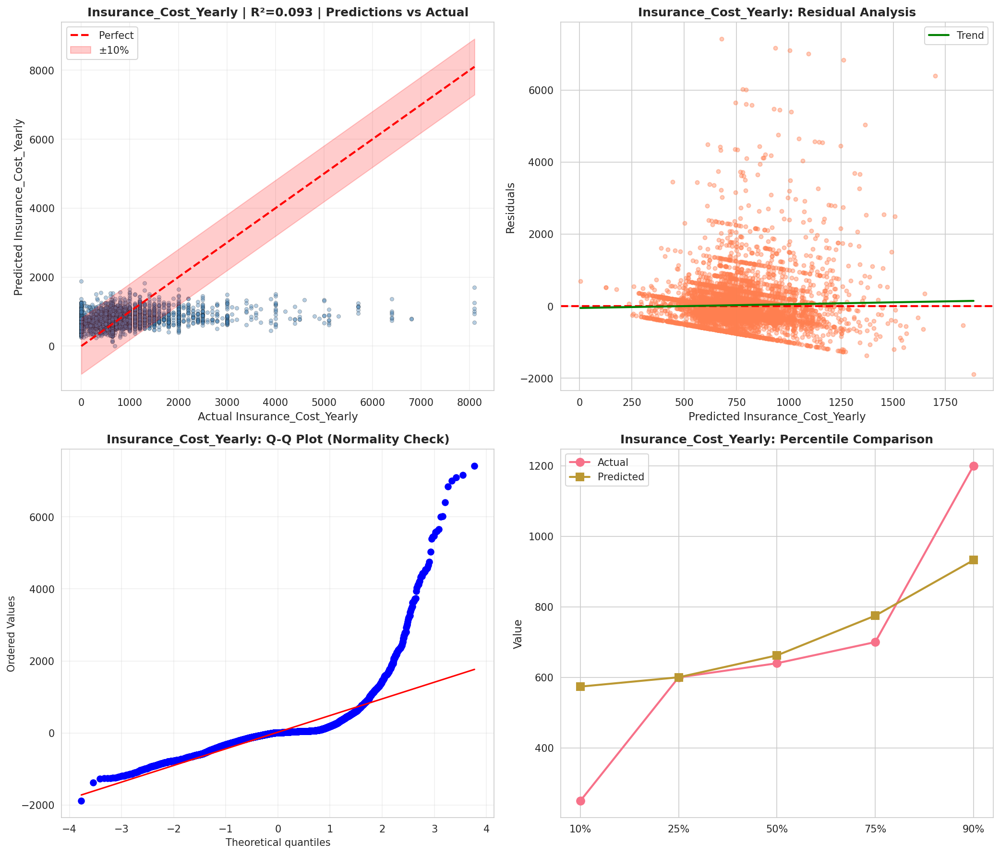
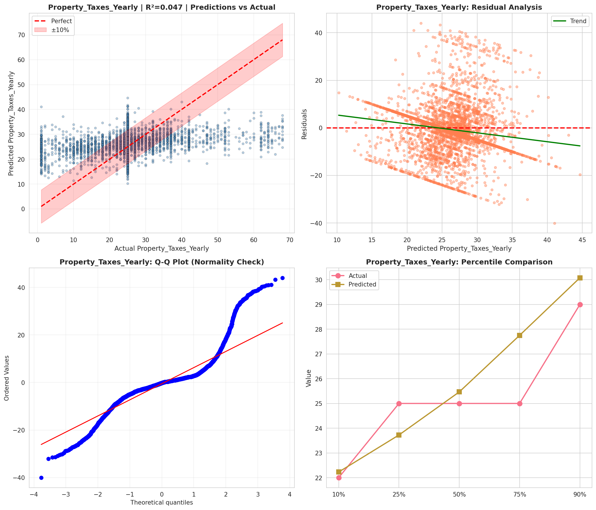
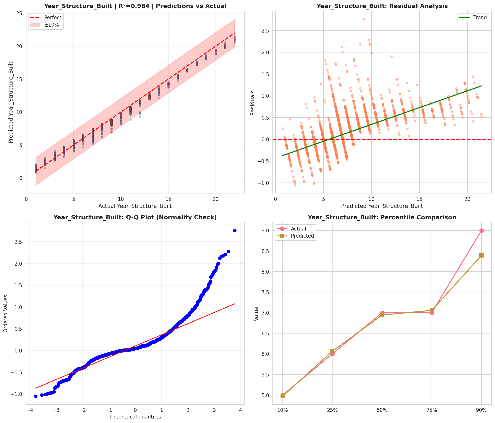
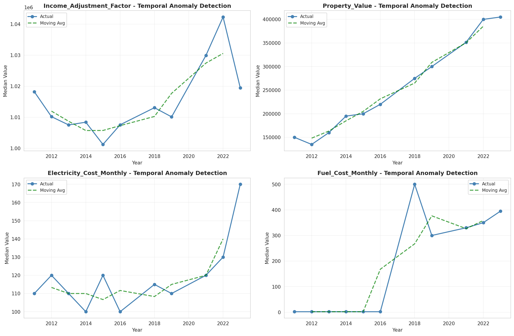
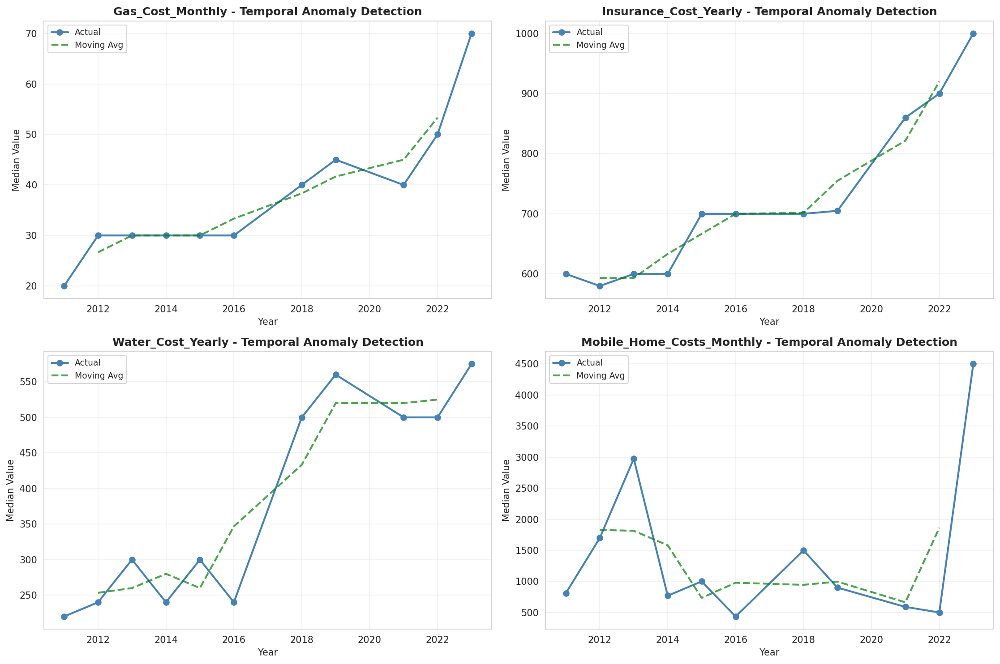
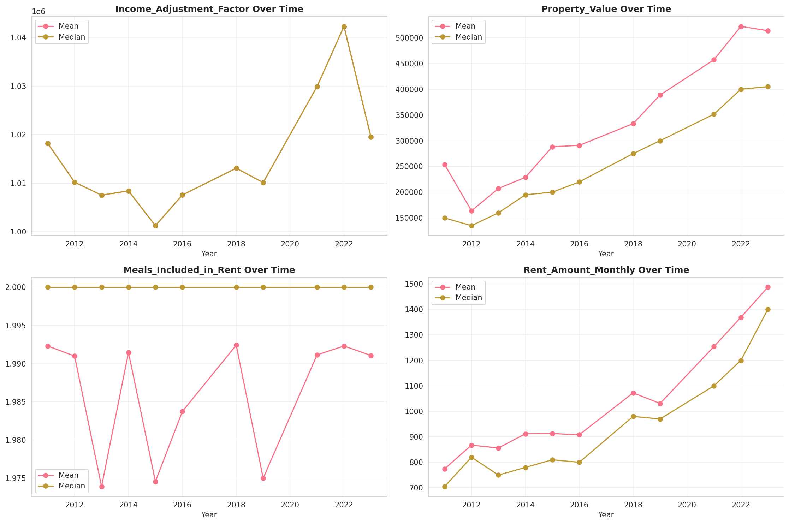
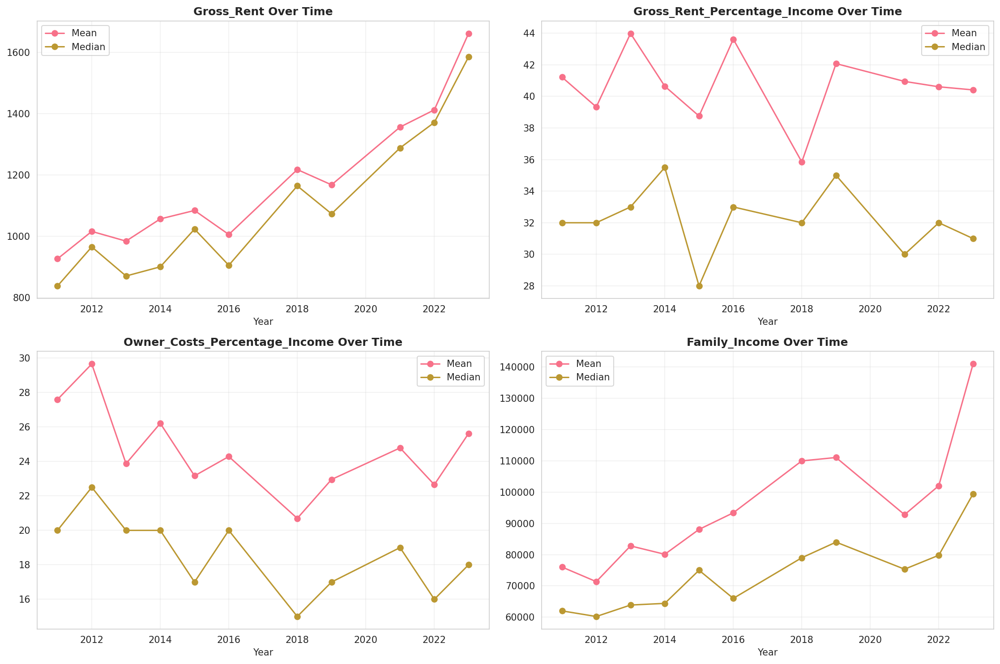
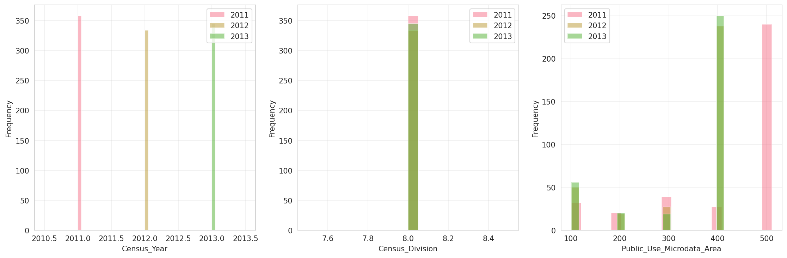
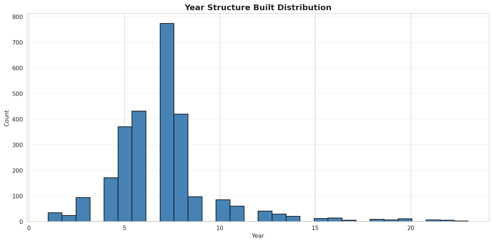
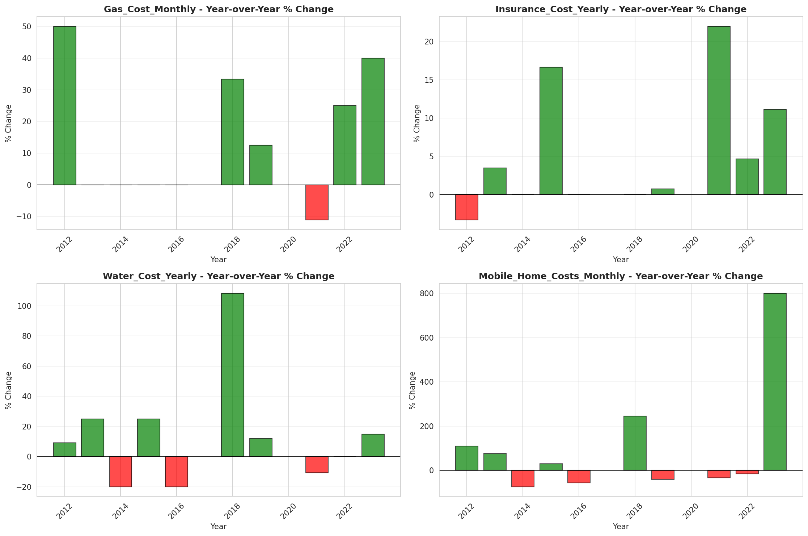

# Temporal Analysis

## Year Distribution

- 2011: 12,407 records

- 2012: 12,342 records

- 2013: 12,417 records

- 2014: 12,488 records

- 2015: 12,603 records

- 2016: 12,774 records

- 2018: 13,233 records

- 2019: 13,386 records

- 2021: 13,598 records

- 2022: 13,806 records

- 2023: 13,980 records

## Temporal Trends

- Census_Year: {np.int64(2011): {'mean': 2011.0, 'median': 2011.0, 'std': 0.0}, np.int64(2012): {'mean': 2012.0, 'median': 2012.0, 'std': 0.0}, np.int64(2013): {'mean': 2013.0, 'median': 2013.0, 'std': 0.0}, np.int64(2014): {'mean': 2014.0, 'median': 2014.0, 'std': 0.0}, np.int64(2015): {'mean': 2015.0, 'median': 2015.0, 'std': 0.0}, np.int64(2016): {'mean': 2016.0, 'median': 2016.0, 'std': 0.0}, np.int64(2018): {'mean': 2018.0, 'median': 2018.0, 'std': 0.0}, np.int64(2019): {'mean': 2019.0, 'median': 2019.0, 'std': 0.0}, np.int64(2021): {'mean': 2021.0, 'median': 2021.0, 'std': 0.0}, np.int64(2022): {'mean': 2022.0, 'median': 2022.0, 'std': 0.0}, np.int64(2023): {'mean': 2023.0, 'median': 2023.0, 'std': 0.0}}

- Census_Division: {np.int64(2011): {'mean': 8.0, 'median': 8.0, 'std': 0.0}, np.int64(2012): {'mean': 8.0, 'median': 8.0, 'std': 0.0}, np.int64(2013): {'mean': 8.0, 'median': 8.0, 'std': 0.0}, np.int64(2014): {'mean': 8.0, 'median': 8.0, 'std': 0.0}, np.int64(2015): {'mean': 8.0, 'median': 8.0, 'std': 0.0}, np.int64(2016): {'mean': 8.0, 'median': 8.0, 'std': 0.0}, np.int64(2018): {'mean': 8.0, 'median': 8.0, 'std': 0.0}, np.int64(2019): {'mean': 8.0, 'median': 8.0, 'std': 0.0}, np.int64(2021): {'mean': 8.0, 'median': 8.0, 'std': 0.0}, np.int64(2022): {'mean': 8.0, 'median': 8.0, 'std': 0.0}, np.int64(2023): {'mean': 8.0, 'median': 8.0, 'std': 0.0}}

- Public_Use_Microdata_Area: {np.int64(2011): {'mean': 423.650761666801, 'median': 503.0, 'std': 134.02957250489206}, np.int64(2012): {'mean': 336.2976016853022, 'median': 405.0, 'std': 116.83962134497327}, np.int64(2013): {'mean': 335.67826367077396, 'median': 405.0, 'std': 117.38145947422612}, np.int64(2014): {'mean': 336.3975016015375, 'median': 405.0, 'std': 117.10282207504432}, np.int64(2015): {'mean': 338.23327779100214, 'median': 405.0, 'std': 115.85423372810403}, np.int64(2016): {'mean': 337.5697510568342, 'median': 405.0, 'std': 116.15218238356975}, np.int64(2018): {'mean': 336.95594347464674, 'median': 405.0, 'std': 116.91756819894708}, np.int64(2019): {'mean': 337.5453458837591, 'median': 405.0, 'std': 116.90081584506054}, np.int64(2021): {'mean': 335.76886306809826, 'median': 405.0, 'std': 118.20780735692145}, np.int64(2022): {'mean': 330.2313486889758, 'median': 404.0, 'std': 121.05335914545049}, np.int64(2023): {'mean': 329.6476394849785, 'median': 404.0, 'std': 121.70669343486247}}

- Census_Region: {np.int64(2011): {'mean': 4.0, 'median': 4.0, 'std': 0.0}, np.int64(2012): {'mean': 4.0, 'median': 4.0, 'std': 0.0}, np.int64(2013): {'mean': 4.0, 'median': 4.0, 'std': 0.0}, np.int64(2014): {'mean': 4.0, 'median': 4.0, 'std': 0.0}, np.int64(2015): {'mean': 4.0, 'median': 4.0, 'std': 0.0}, np.int64(2016): {'mean': 4.0, 'median': 4.0, 'std': 0.0}, np.int64(2018): {'mean': 4.0, 'median': 4.0, 'std': 0.0}, np.int64(2019): {'mean': 4.0, 'median': 4.0, 'std': 0.0}, np.int64(2021): {'mean': 4.0, 'median': 4.0, 'std': 0.0}, np.int64(2022): {'mean': 4.0, 'median': 4.0, 'std': 0.0}, np.int64(2023): {'mean': 4.0, 'median': 4.0, 'std': 0.0}}

- State_Code: {np.int64(2011): {'mean': 32.0, 'median': 32.0, 'std': 0.0}, np.int64(2012): {'mean': 32.0, 'median': 32.0, 'std': 0.0}, np.int64(2013): {'mean': 32.0, 'median': 32.0, 'std': 0.0}, np.int64(2014): {'mean': 32.0, 'median': 32.0, 'std': 0.0}, np.int64(2015): {'mean': 32.0, 'median': 32.0, 'std': 0.0}, np.int64(2016): {'mean': 32.0, 'median': 32.0, 'std': 0.0}, np.int64(2018): {'mean': 32.0, 'median': 32.0, 'std': 0.0}, np.int64(2019): {'mean': 32.0, 'median': 32.0, 'std': 0.0}, np.int64(2021): {'mean': 32.0, 'median': 32.0, 'std': 0.0}, np.int64(2022): {'mean': 32.0, 'median': 32.0, 'std': 0.0}, np.int64(2023): {'mean': None, 'median': None, 'std': None}}

- Housing_Adjustment_Factor: {np.int64(2011): {'mean': 1000000.0, 'median': 1000000.0, 'std': 0.0}, np.int64(2012): {'mean': 1000000.0, 'median': 1000000.0, 'std': 0.0}, np.int64(2013): {'mean': 1000000.0, 'median': 1000000.0, 'std': 0.0}, np.int64(2014): {'mean': 1000000.0, 'median': 1000000.0, 'std': 0.0}, np.int64(2015): {'mean': 1000000.0, 'median': 1000000.0, 'std': 0.0}, np.int64(2016): {'mean': 1000000.0, 'median': 1000000.0, 'std': 0.0}, np.int64(2018): {'mean': 1000000.0, 'median': 1000000.0, 'std': 0.0}, np.int64(2019): {'mean': 1000000.0, 'median': 1000000.0, 'std': 0.0}, np.int64(2021): {'mean': 1000000.0, 'median': 1000000.0, 'std': 0.0}, np.int64(2022): {'mean': 1000000.0, 'median': 1000000.0, 'std': 0.0}, np.int64(2023): {'mean': 1000000.0, 'median': 1000000.0, 'std': 0.0}}

- Income_Adjustment_Factor: {np.int64(2011): {'mean': 1018237.0, 'median': 1018237.0, 'std': 0.0}, np.int64(2012): {'mean': 1010207.0, 'median': 1010207.0, 'std': 0.0}, np.int64(2013): {'mean': 1007549.0, 'median': 1007549.0, 'std': 0.0}, np.int64(2014): {'mean': 1008425.0, 'median': 1008425.0, 'std': 0.0}, np.int64(2015): {'mean': 1001264.0, 'median': 1001264.0, 'std': 0.0}, np.int64(2016): {'mean': 1007588.0, 'median': 1007588.0, 'std': 0.0}, np.int64(2018): {'mean': 1013097.0, 'median': 1013097.0, 'std': 0.0}, np.int64(2019): {'mean': 1010145.0, 'median': 1010145.0, 'std': 0.0}, np.int64(2021): {'mean': 1029928.0, 'median': 1029928.0, 'std': 0.0}, np.int64(2022): {'mean': 1042311.0, 'median': 1042311.0, 'std': 0.0}, np.int64(2023): {'mean': 1019518.0, 'median': 1019518.0, 'std': 0.0}}

- Housing_Unit_Weight: {np.int64(2011): {'mean': 95.42330942210043, 'median': 67.0, 'std': 92.65005900556612}, np.int64(2012): {'mean': 95.83876195106141, 'median': 71.0, 'std': 74.57843661887065}, np.int64(2013): {'mean': 95.58959491020376, 'median': 72.0, 'std': 70.9293679632315}, np.int64(2014): {'mean': 96.00968930172967, 'median': 73.0, 'std': 70.12855053651091}, np.int64(2015): {'mean': 95.99809569150203, 'median': 74.0, 'std': 68.87605507639478}, np.int64(2016): {'mean': 95.64419915453264, 'median': 74.0, 'std': 69.07750959526727}, np.int64(2018): {'mean': 95.87523615204414, 'median': 74.0, 'std': 71.32202071571368}, np.int64(2019): {'mean': 96.04669057223965, 'median': 71.0, 'std': 76.80067775078778}, np.int64(2021): {'mean': 96.00926606853949, 'median': 70.0, 'std': 76.44996375145695}, np.int64(2022): {'mean': 96.24713892510502, 'median': 70.0, 'std': 77.29701543772842}, np.int64(2023): {'mean': 96.44120171673819, 'median': 69.0, 'std': 78.98606180159196}}

- Number_of_Persons: {np.int64(2011): {'mean': 2.104698960264367, 'median': 2.0, 'std': 1.573934161587394}, np.int64(2012): {'mean': 2.165451304488738, 'median': 2.0, 'std': 1.5811298215321214}, np.int64(2013): {'mean': 2.1541435129258275, 'median': 2.0, 'std': 1.570327540799894}, np.int64(2014): {'mean': 2.147021140294683, 'median': 2.0, 'std': 1.5608136082178088}, np.int64(2015): {'mean': 2.141394905974768, 'median': 2.0, 'std': 1.5318145005143775}, np.int64(2016): {'mean': 2.1359793330201975, 'median': 2.0, 'std': 1.5376687758146257}, np.int64(2018): {'mean': 2.1859744577949067, 'median': 2.0, 'std': 1.5406453302130116}, np.int64(2019): {'mean': 2.1923651576273717, 'median': 2.0, 'std': 1.5218900748766915}, np.int64(2021): {'mean': 2.212090013237241, 'median': 2.0, 'std': 1.5415677107976447}, np.int64(2022): {'mean': 2.2272200492539476, 'median': 2.0, 'std': 1.533596018498011}, np.int64(2023): {'mean': 2.205722460658083, 'median': 2.0, 'std': 1.4810808749710374}}

- Housing_Unit_Type: {np.int64(2011): {'mean': 1.0589989522044008, 'median': 1.0, 'std': 0.2862889639295176}, np.int64(2012): {'mean': 1.056230756765516, 'median': 1.0, 'std': 0.2870649338004734}, np.int64(2013): {'mean': 1.0591930417975357, 'median': 1.0, 'std': 0.29294390855559155}, np.int64(2014): {'mean': 1.0532511210762332, 'median': 1.0, 'std': 0.277790018439941}, np.int64(2015): {'mean': 1.0557803697532333, 'median': 1.0, 'std': 0.28999428110088177}, np.int64(2016): {'mean': 1.0589478628464069, 'median': 1.0, 'std': 0.29354231630984107}, np.int64(2018): {'mean': 1.0552406861633794, 'median': 1.0, 'std': 0.2831176646423521}, np.int64(2019): {'mean': 1.052816375317496, 'median': 1.0, 'std': 0.2768166906329253}, np.int64(2021): {'mean': None, 'median': None, 'std': None}, np.int64(2022): {'mean': None, 'median': None, 'std': None}, np.int64(2023): {'mean': None, 'median': None, 'std': None}}

- Number_of_Bedrooms: {np.int64(2011): {'mean': 2.701157192330433, 'median': 3.0, 'std': 1.1757494346595707}, np.int64(2012): {'mean': 2.7660833544678334, 'median': 3.0, 'std': 1.1460682756904914}, np.int64(2013): {'mean': 2.7635015586822815, 'median': 3.0, 'std': 1.1706135585264228}, np.int64(2014): {'mean': 2.7633861551292744, 'median': 3.0, 'std': 1.1904941747821878}, np.int64(2015): {'mean': 2.743511324185816, 'median': 3.0, 'std': 1.149095112826154}, np.int64(2016): {'mean': 2.742080707211263, 'median': 3.0, 'std': 1.1033784632237402}, np.int64(2018): {'mean': 2.745172223535903, 'median': 3.0, 'std': 1.1436732380280896}, np.int64(2019): {'mean': 2.7637862642918254, 'median': 3.0, 'std': 1.1176728090727188}, np.int64(2021): {'mean': 2.7928155637254903, 'median': 3.0, 'std': 1.145305509822325}, np.int64(2022): {'mean': 2.8249548464780254, 'median': 3.0, 'std': 1.1615514837469545}, np.int64(2023): {'mean': 2.831714010235111, 'median': 3.0, 'std': 1.1419486896366688}}

- Number_of_Rooms: {np.int64(2011): {'mean': 5.427992229073402, 'median': 5.0, 'std': 2.114047725265579}, np.int64(2012): {'mean': 5.523290218953419, 'median': 5.0, 'std': 2.1434604863002713}, np.int64(2013): {'mean': 5.541663156120987, 'median': 5.0, 'std': 2.217805044515513}, np.int64(2014): {'mean': 5.5374478732276895, 'median': 5.0, 'std': 2.3177175530057488}, np.int64(2015): {'mean': 5.545710034716482, 'median': 5.0, 'std': 2.283517398934016}, np.int64(2016): {'mean': 5.568060898747647, 'median': 5.0, 'std': 2.2584277395651147}, np.int64(2018): {'mean': 5.545834318593836, 'median': 5.0, 'std': 2.2955772744899}, np.int64(2019): {'mean': 5.567395193279926, 'median': 5.0, 'std': 2.2877180131321064}, np.int64(2021): {'mean': 5.6334252450980395, 'median': 5.0, 'std': 2.349826190807345}, np.int64(2022): {'mean': 5.6697019867549665, 'median': 5.0, 'std': 2.384998050534045}, np.int64(2023): {'mean': 5.6815990506563825, 'median': 5.0, 'std': 2.3316496042939847}}

- Building_Type: {np.int64(2011): {'mean': 3.2783174254582312, 'median': 2.0, 'std': 2.3031000080680286}, np.int64(2012): {'mean': 3.230366049539268, 'median': 2.0, 'std': 2.281308170651141}, np.int64(2013): {'mean': 3.233549582947173, 'median': 2.0, 'std': 2.2672140543532073}, np.int64(2014): {'mean': 3.258215179316097, 'median': 2.0, 'std': 2.293767658890061}, np.int64(2015): {'mean': 3.277814514795834, 'median': 2.0, 'std': 2.3045265902793854}, np.int64(2016): {'mean': 3.2381926823279037, 'median': 2.0, 'std': 2.292267605219322}, np.int64(2018): {'mean': 3.2519114053755813, 'median': 2.0, 'std': 2.2934437457147183}, np.int64(2019): {'mean': 3.271058567317415, 'median': 2.0, 'std': 2.3190312860213766}, np.int64(2021): {'mean': 3.2381280637254903, 'median': 2.0, 'std': 2.3160582054144623}, np.int64(2022): {'mean': 3.178506923540036, 'median': 2.0, 'std': 2.2731806263710306}, np.int64(2023): {'mean': 3.142253207743084, 'median': 2.0, 'std': 2.2424469534607403}}

- Year_Structure_Built: {np.int64(2011): {'mean': 6.396486189711969, 'median': 7.0, 'std': 2.0735930878778053}, np.int64(2012): {'mean': 6.686871248626257, 'median': 7.0, 'std': 2.1599110360244107}, np.int64(2013): {'mean': 6.788777487572668, 'median': 7.0, 'std': 2.266784104270739}, np.int64(2014): {'mean': 6.816013344453712, 'median': 7.0, 'std': 2.333738687470171}, np.int64(2015): {'mean': 6.969664407340056, 'median': 7.0, 'std': 2.5458978773916745}, np.int64(2016): {'mean': 7.144388966194647, 'median': 7.0, 'std': 2.90364946993258}, np.int64(2018): {'mean': 7.475289666587845, 'median': 7.0, 'std': 3.5117649084733595}, np.int64(2019): {'mean': 7.665862954032822, 'median': 7.0, 'std': 3.843048533723573}, np.int64(2021): {'mean': None, 'median': None, 'std': None}, np.int64(2022): {'mean': None, 'median': None, 'std': None}, np.int64(2023): {'mean': None, 'median': None, 'std': None}}

- Bathtub_or_Shower: {np.int64(2011): {'mean': 1.0057437283554354, 'median': 1.0, 'std': 0.07557261638544518}, np.int64(2012): {'mean': 1.0043114379913771, 'median': 1.0, 'std': 0.06552261009312434}, np.int64(2013): {'mean': 1.0052236919706798, 'median': 1.0, 'std': 0.07208913137899214}, np.int64(2014): {'mean': 1.0045871559633028, 'median': 1.0, 'std': 0.06757584496022558}, np.int64(2015): {'mean': 1.0059513969251115, 'median': 1.0, 'std': 0.07691857282079097}, np.int64(2016): {'mean': 1.0045019235491528, 'median': 1.0, 'std': 0.06694791334495803}, np.int64(2018): {'mean': 1.0059115630172617, 'median': 1.0, 'std': 0.07666211369583371}, np.int64(2019): {'mean': 1.0063000700007778, 'median': 1.0, 'std': 0.07912563478686575}, np.int64(2021): {'mean': 1.0067401960784315, 'median': 1.0, 'std': 0.08182468238650295}, np.int64(2022): {'mean': 1.0044400963275135, 'median': 1.0, 'std': 0.06648845431227716}, np.int64(2023): {'mean': 1.0048950530297411, 'median': 1.0, 'std': 0.06979579349005573}}

- Refrigerator: {np.int64(2011): {'mean': 1.0157107863839852, 'median': 1.0, 'std': 0.12435941409213185}, np.int64(2012): {'mean': 1.0119198579761604, 'median': 1.0, 'std': 0.10853004522115162}, np.int64(2013): {'mean': 1.0100261184598534, 'median': 1.0, 'std': 0.09963147966928813}, np.int64(2014): {'mean': 1.0081734778982485, 'median': 1.0, 'std': 0.09004081481826105}, np.int64(2015): {'mean': 1.0116548189783434, 'median': 1.0, 'std': 0.10733096659946657}, np.int64(2016): {'mean': 1.0099860849635753, 'median': 1.0, 'std': 0.09943426153460506}, np.int64(2018): {'mean': 1.0086702924253172, 'median': 1.0, 'std': 0.09271351564059319}, np.int64(2019): {'mean': 1.0083223146923854, 'median': 1.0, 'std': 0.09084985267897673}, np.int64(2021): {'mean': 1.0107996323529411, 'median': 1.0, 'std': 0.10336255899099528}, np.int64(2022): {'mean': 1.0074503311258278, 'median': 1.0, 'std': 0.08599639665542272}, np.int64(2023): {'mean': 1.0068234072535787, 'median': 1.0, 'std': 0.08232466839295663}}

- Hot_and_Cold_Running_Water: {np.int64(2011): {'mean': 1.0084466593462285, 'median': 1.0, 'std': 0.09152060306870771}, np.int64(2012): {'mean': 1.0069321159861357, 'median': 1.0, 'std': 0.08297375348930659}, np.int64(2013): {'mean': 1.0080040441486224, 'median': 1.0, 'std': 0.08911031618229144}, np.int64(2014): {'mean': 1.005838198498749, 'median': 1.0, 'std': 0.07618791280102252}, np.int64(2015): {'mean': 1.0083484873532815, 'median': 1.0, 'std': 0.0909916176326228}, np.int64(2016): {'mean': 1.00859458132111, 'median': 1.0, 'std': 0.09231149439525678}, np.int64(2018): {'mean': 1.0087491132655475, 'median': 1.0, 'std': 0.09313028463104744}, np.int64(2019): {'mean': 1.0092556583962045, 'median': 1.0, 'std': 0.09576379518793515}, np.int64(2021): {'mean': 1.0096507352941178, 'median': 1.0, 'std': 0.09776671573156234}, np.int64(2022): {'mean': 1.0051926550270922, 'median': 1.0, 'std': 0.07187544878967263}, np.int64(2023): {'mean': 1.006749239783431, 'median': 1.0, 'std': 0.08187908632978962}}

- Running_Water: {np.int64(2011): {'mean': None, 'median': None, 'std': None}, np.int64(2012): {'mean': None, 'median': None, 'std': None}, np.int64(2013): {'mean': 9.0, 'median': 9.0, 'std': 0.0}, np.int64(2014): {'mean': 9.0, 'median': 9.0, 'std': 0.0}, np.int64(2015): {'mean': 9.0, 'median': 9.0, 'std': 0.0}, np.int64(2016): {'mean': 9.0, 'median': 9.0, 'std': 0.0}, np.int64(2018): {'mean': 9.0, 'median': 9.0, 'std': 0.0}, np.int64(2019): {'mean': 9.0, 'median': 9.0, 'std': 0.0}, np.int64(2021): {'mean': 9.0, 'median': 9.0, 'std': 0.0}, np.int64(2022): {'mean': 9.0, 'median': 9.0, 'std': 0.0}, np.int64(2023): {'mean': 9.0, 'median': 9.0, 'std': 0.0}}

- Sink_with_Faucet: {np.int64(2011): {'mean': 1.005321395388124, 'median': 1.0, 'std': 0.07275661664270683}, np.int64(2012): {'mean': 1.0036351339927296, 'median': 1.0, 'std': 0.06018493174646297}, np.int64(2013): {'mean': 1.0053921981632825, 'median': 1.0, 'std': 0.07323642713833765}, np.int64(2014): {'mean': 1.0039199332777315, 'median': 1.0, 'std': 0.06248914369700984}, np.int64(2015): {'mean': 1.0055381054719787, 'median': 1.0, 'std': 0.07421516106930832}, np.int64(2016): {'mean': 1.0044200703937136, 'median': 1.0, 'std': 0.0663392312169509}, np.int64(2018): {'mean': 1.0052809962954206, 'median': 1.0, 'std': 0.07248118004367722}, np.int64(2019): {'mean': 1.0059111767908533, 'median': 1.0, 'std': 0.07665958427302359}, np.int64(2021): {'mean': 1.006204044117647, 'median': 1.0, 'std': 0.07852404873366278}, np.int64(2022): {'mean': 1.0039133052378086, 'median': 1.0, 'std': 0.06243624467188012}, np.int64(2023): {'mean': 1.0044500482088556, 'median': 1.0, 'std': 0.06656255617275168}}

- Stove_or_Range: {np.int64(2011): {'mean': 1.0152039868232114, 'median': 1.0, 'std': 0.12236866599868984}, np.int64(2012): {'mean': 1.0128497759743005, 'median': 1.0, 'std': 0.1126309533746897}, np.int64(2013): {'mean': 1.0112056618080714, 'median': 1.0, 'std': 0.10526646456721703}, np.int64(2014): {'mean': 1.0106755629691409, 'median': 1.0, 'std': 0.10277390848316183}, np.int64(2015): {'mean': 1.0130600099189948, 'median': 1.0, 'std': 0.11353638873754131}, np.int64(2016): {'mean': 1.012687239093067, 'median': 1.0, 'std': 0.11192541470180131}, np.int64(2018): {'mean': 1.0118231260345236, 'median': 1.0, 'std': 0.10809375878625115}, np.int64(2019): {'mean': 1.0143112701252237, 'median': 1.0, 'std': 0.11877522864255602}, np.int64(2021): {'mean': 1.0160079656862746, 'median': 1.0, 'std': 0.12551062618845277}, np.int64(2022): {'mean': 1.0108368452739314, 'median': 1.0, 'std': 0.10353847022982561}, np.int64(2023): {'mean': 1.0102351108803678, 'median': 1.0, 'std': 0.10065338933213364}}

- Telephone_Service: {np.int64(2011): {'mean': 1.0246145005267695, 'median': 1.0, 'std': 0.1549545951803055}, np.int64(2012): {'mean': 1.028003017160098, 'median': 1.0, 'std': 0.16498913538543528}, np.int64(2013): {'mean': 1.0267042783262812, 'median': 1.0, 'std': 0.16122532059766037}, np.int64(2014): {'mean': 1.0337371854613233, 'median': 1.0, 'std': 0.18056031174632245}, np.int64(2015): {'mean': 1.0312071016747506, 'median': 1.0, 'std': 0.1738849779859789}, np.int64(2016): {'mean': 1.0364280523255813, 'median': 1.0, 'std': 0.18736125080838592}, np.int64(2018): {'mean': 1.018450184501845, 'median': 1.0, 'std': 0.1345783393195766}, np.int64(2019): {'mean': 1.01162301019119, 'median': 1.0, 'std': 0.10718620934234951}, np.int64(2021): {'mean': 1.0098477325388944, 'median': 1.0, 'std': 0.09874999586839597}, np.int64(2022): {'mean': 1.0108836907082521, 'median': 1.0, 'std': 0.10375986904982651}, np.int64(2023): {'mean': 1.008697027197976, 'median': 1.0, 'std': 0.09285510546157884}}

- Lot_Acreage: {np.int64(2011): {'mean': 1.1284382284382284, 'median': 1.0, 'std': 0.3817831477012067}, np.int64(2012): {'mean': 1.1131644992014602, 'median': 1.0, 'std': 0.3555028763982879}, np.int64(2013): {'mean': 1.1094498972837252, 'median': 1.0, 'std': 0.3511095053882601}, np.int64(2014): {'mean': 1.1034287011807449, 'median': 1.0, 'std': 0.34144751167268944}, np.int64(2015): {'mean': 1.1093450569270658, 'median': 1.0, 'std': 0.3476341840288194}, np.int64(2016): {'mean': 1.1103645775966515, 'median': 1.0, 'std': 0.35365692447628344}, np.int64(2018): {'mean': 1.1144777552544542, 'median': 1.0, 'std': 0.36082216436205483}, np.int64(2019): {'mean': 1.1053633767058078, 'median': 1.0, 'std': 0.34592392197848376}, np.int64(2021): {'mean': 1.1074168797953965, 'median': 1.0, 'std': 0.3461637927563681}, np.int64(2022): {'mean': 1.1182412358882947, 'median': 1.0, 'std': 0.363047520940531}, np.int64(2023): {'mean': 1.112463768115942, 'median': 1.0, 'std': 0.35018487917135416}}

- Agricultural_Sales: {np.int64(2011): {'mean': 1.1873563218390804, 'median': 1.0, 'std': 0.8717935954793387}, np.int64(2012): {'mean': 1.1279212792127922, 'median': 1.0, 'std': 0.7129141152111713}, np.int64(2013): {'mean': 1.1641221374045803, 'median': 1.0, 'std': 0.7866952924434107}, np.int64(2014): {'mean': 1.1490514905149052, 'median': 1.0, 'std': 0.7705610707109445}, np.int64(2015): {'mean': 1.1459119496855346, 'median': 1.0, 'std': 0.7686179604091842}, np.int64(2016): {'mean': 1.1792929292929293, 'median': 1.0, 'std': 0.8297109331978343}, np.int64(2018): {'mean': 1.196078431372549, 'median': 1.0, 'std': 0.90077376711509}, np.int64(2019): {'mean': 1.1813664596273292, 'median': 1.0, 'std': 0.8721224873567044}, np.int64(2021): {'mean': 1.1131639722863742, 'median': 1.0, 'std': 0.6530585494699261}, np.int64(2022): {'mean': 1.1455633100697906, 'median': 1.0, 'std': 0.7318991760631829}, np.int64(2023): {'mean': 1.1875, 'median': 1.0, 'std': 0.8392227784056339}}

- Tenure: {np.int64(2011): {'mean': 1.9655205440091945, 'median': 2.0, 'std': 0.9200609776895137}, np.int64(2012): {'mean': 1.9636997925702433, 'median': 2.0, 'std': 0.9223008158519761}, np.int64(2013): {'mean': 1.9922896097790315, 'median': 2.0, 'std': 0.9151190606920263}, np.int64(2014): {'mean': 2.0282385834109973, 'median': 2.0, 'std': 0.9150945595229684}, np.int64(2015): {'mean': 2.0149171776333854, 'median': 2.0, 'std': 0.9145521765839639}, np.int64(2016): {'mean': 1.9900981104651163, 'median': 2.0, 'std': 0.904644180497481}, np.int64(2018): {'mean': 1.980520037758517, 'median': 2.0, 'std': 0.9030680649973845}, np.int64(2019): {'mean': 1.9811336646171986, 'median': 2.0, 'std': 0.9036172227864115}, np.int64(2021): {'mean': 1.95696789142668, 'median': 2.0, 'std': 0.8920749266242914}, np.int64(2022): {'mean': 1.9203216374269005, 'median': 2.0, 'std': 0.883463708906356}, np.int64(2023): {'mean': 1.9211733080328905, 'median': 2.0, 'std': 0.8811930150442003}}

- Vacancy_Status: {np.int64(2011): {'mean': 4.025035765379113, 'median': 5.0, 'std': 2.356872669837423}, np.int64(2012): {'mean': 3.911692559280458, 'median': 5.0, 'std': 2.3527785566218142}, np.int64(2013): {'mean': 4.125607779578607, 'median': 5.0, 'std': 2.353842916466105}, np.int64(2014): {'mean': 4.332539682539682, 'median': 5.0, 'std': 2.3236303579788578}, np.int64(2015): {'mean': 4.0333048676345005, 'median': 5.0, 'std': 2.301189047932984}, np.int64(2016): {'mean': 4.1033912324234905, 'median': 5.0, 'std': 2.290578908279634}, np.int64(2018): {'mean': 3.9129593810444874, 'median': 5.0, 'std': 2.4040475598827333}, np.int64(2019): {'mean': 4.038617886178862, 'median': 5.0, 'std': 2.3698110892009283}, np.int64(2021): {'mean': 4.173868312757202, 'median': 5.0, 'std': 2.371652067112666}, np.int64(2022): {'mean': 4.343237704918033, 'median': 5.0, 'std': 2.350780638230512}, np.int64(2023): {'mean': 4.41437125748503, 'median': 5.0, 'std': 2.3776102770194925}}

- Property_Value: {np.int64(2011): {'mean': 191709.75864123958, 'median': 150000.0, 'std': 216780.61213326253}, np.int64(2012): {'mean': 193074.996301228, 'median': 150000.0, 'std': 220370.04701130654}, np.int64(2013): {'mean': 208622.0159831122, 'median': 155000.0, 'std': 257637.2085540254}, np.int64(2014): {'mean': 237523.39107772498, 'median': 183000.0, 'std': 260605.1914476644}, np.int64(2015): {'mean': 275196.09062638826, 'median': 200000.0, 'std': 326117.178365383}, np.int64(2016): {'mean': 285348.93617021275, 'median': 230000.0, 'std': 289619.5038538101}, np.int64(2018): {'mean': 336316.4690026954, 'median': 280000.0, 'std': 311267.56859167555}, np.int64(2019): {'mean': 373231.53592617007, 'median': 300000.0, 'std': 399411.18812106724}, np.int64(2021): {'mean': 434148.34194931283, 'median': 350000.0, 'std': 417088.0388594344}, np.int64(2022): {'mean': 511348.7105673504, 'median': 420000.0, 'std': 542590.1491021264}, np.int64(2023): {'mean': 500180.7424593968, 'median': 420000.0, 'std': 475778.40116254915}}

- Vehicles_Available: {np.int64(2011): {'mean': 1.7107556747437984, 'median': 2.0, 'std': 1.0332815215841946}, np.int64(2012): {'mean': 1.7375070714689798, 'median': 2.0, 'std': 1.0259811916672013}, np.int64(2013): {'mean': 1.7627644569816643, 'median': 2.0, 'std': 1.0336839067742163}, np.int64(2014): {'mean': 1.7511649580615098, 'median': 2.0, 'std': 1.0468390404932957}, np.int64(2015): {'mean': 1.769927702022513, 'median': 2.0, 'std': 1.043866627695469}, np.int64(2016): {'mean': 1.793422965116279, 'median': 2.0, 'std': 1.0657602028174766}, np.int64(2018): {'mean': 1.8415858577190423, 'median': 2.0, 'std': 1.0922741315033069}, np.int64(2019): {'mean': 1.8457845531879054, 'median': 2.0, 'std': 1.102199754549585}, np.int64(2021): {'mean': 1.8407811982787157, 'median': 2.0, 'std': 1.0970328955887443}, np.int64(2022): {'mean': 1.8723196881091617, 'median': 2.0, 'std': 1.0952258494277707}, np.int64(2023): {'mean': 1.881166982922201, 'median': 2.0, 'std': 1.1051463523603435}}

- Condo_Fee_Monthly: {np.int64(2011): {'mean': 190.14093959731542, 'median': 160.0, 'std': 147.95913676777542}, np.int64(2012): {'mean': 201.49830508474577, 'median': 160.0, 'std': 189.86945518987596}, np.int64(2013): {'mean': 238.61570247933884, 'median': 170.0, 'std': 232.49467377706156}, np.int64(2014): {'mean': 213.82151029748283, 'median': 170.0, 'std': 183.41759441208362}, np.int64(2015): {'mean': 223.31932773109244, 'median': 170.0, 'std': 187.02521902665467}, np.int64(2016): {'mean': 243.21681415929203, 'median': 180.0, 'std': 197.61728534801847}, np.int64(2018): {'mean': 243.32053742802304, 'median': 190.0, 'std': 200.13243437519415}, np.int64(2019): {'mean': 269.1921005385996, 'median': 200.0, 'std': 239.38822073204884}, np.int64(2021): {'mean': 305.1954887218045, 'median': 220.0, 'std': 308.21231605613553}, np.int64(2022): {'mean': 294.2631578947368, 'median': 210.0, 'std': 278.0086750815343}, np.int64(2023): {'mean': 351.056, 'median': 250.0, 'std': 373.80429680207305}}

- Electricity_Cost_Monthly: {np.int64(2011): {'mean': 135.9382243080165, 'median': 110.0, 'std': 97.30852657561863}, np.int64(2012): {'mean': 136.03083160475202, 'median': 110.0, 'std': 96.54699134988283}, np.int64(2013): {'mean': 133.88688293370944, 'median': 110.0, 'std': 97.19085135637613}, np.int64(2014): {'mean': 139.90605778191986, 'median': 120.0, 'std': 98.66734690350019}, np.int64(2015): {'mean': 138.70513407156585, 'median': 110.0, 'std': 101.16817950244237}, np.int64(2016): {'mean': 132.63635537790697, 'median': 110.0, 'std': 97.02337140578084}, np.int64(2018): {'mean': 140.02312035128597, 'median': 110.0, 'std': 96.74537274609959}, np.int64(2019): {'mean': 135.74997797550876, 'median': 110.0, 'std': 93.75302752820491}, np.int64(2021): {'mean': 140.9479049676026, 'median': 120.0, 'std': 103.15388002454145}, np.int64(2022): {'mean': 167.08257659339728, 'median': 130.0, 'std': 224.05033116620498}, np.int64(2023): {'mean': 198.17245647330637, 'median': 150.0, 'std': 251.14463355871004}}

- Fuel_Cost_Monthly: {np.int64(2011): {'mean': 62.689110238482904, 'median': 2.0, 'std': 316.50173334127226}, np.int64(2012): {'mean': 57.45295115972091, 'median': 2.0, 'std': 295.81029160715497}, np.int64(2013): {'mean': 38.12317818523742, 'median': 2.0, 'std': 227.87588074282}, np.int64(2014): {'mean': 38.78471575023299, 'median': 2.0, 'std': 236.3666019918595}, np.int64(2015): {'mean': 37.559531435892744, 'median': 2.0, 'std': 222.4563709957427}, np.int64(2016): {'mean': 31.91433502906977, 'median': 2.0, 'std': 199.61206453422673}, np.int64(2018): {'mean': 638.5208333333334, 'median': 430.0, 'std': 692.460178418696}, np.int64(2019): {'mean': 623.1595744680851, 'median': 400.0, 'std': 681.9388273069704}, np.int64(2021): {'mean': 674.1196911196911, 'median': 450.0, 'std': 755.5630492749708}, np.int64(2022): {'mean': 634.5570093457944, 'median': 430.0, 'std': 662.8128432593479}, np.int64(2023): {'mean': 765.3556338028169, 'median': 500.0, 'std': 824.414298171698}}

- Gas_Cost_Monthly: {np.int64(2011): {'mean': 48.103629920505696, 'median': 30.0, 'std': 62.655412807384856}, np.int64(2012): {'mean': 45.50961719781256, 'median': 30.0, 'std': 56.21307255083517}, np.int64(2013): {'mean': 42.33690644099671, 'median': 30.0, 'std': 54.9502808975408}, np.int64(2014): {'mean': 42.65144454799627, 'median': 30.0, 'std': 55.165500074017224}, np.int64(2015): {'mean': 42.055184405600805, 'median': 30.0, 'std': 53.30503241068506}, np.int64(2016): {'mean': 42.30677688953488, 'median': 30.0, 'std': 53.88223517970234}, np.int64(2018): {'mean': 56.064411434277865, 'median': 40.0, 'std': 55.49672051551805}, np.int64(2019): {'mean': 57.605861169750405, 'median': 40.0, 'std': 53.21996575078514}, np.int64(2021): {'mean': 59.801626416954164, 'median': 40.0, 'std': 62.04823975347055}, np.int64(2022): {'mean': 83.62310964083176, 'median': 50.0, 'std': 151.0741788181676}, np.int64(2023): {'mean': 104.57441913963653, 'median': 70.0, 'std': 152.56450938487836}}

- House_Heating_Fuel: {np.int64(2011): {'mean': 1.9183028445551193, 'median': 1.0, 'std': 1.3099717878277954}, np.int64(2012): {'mean': 1.836790495945691, 'median': 1.0, 'std': 1.271694691300304}, np.int64(2013): {'mean': 1.8669487541137753, 'median': 1.0, 'std': 1.313001652327077}, np.int64(2014): {'mean': 1.8718546132339235, 'median': 1.0, 'std': 1.282488148040571}, np.int64(2015): {'mean': 1.8895396723711906, 'median': 1.0, 'std': 1.2981941012938283}, np.int64(2016): {'mean': 1.900799418604651, 'median': 1.0, 'std': 1.337472213531672}, np.int64(2018): {'mean': 1.9499699648159272, 'median': 1.0, 'std': 1.3830366201260393}, np.int64(2019): {'mean': 1.9204918723153372, 'median': 1.0, 'std': 1.3563562157181435}, np.int64(2021): {'mean': 1.9206388613042038, 'median': 1.0, 'std': 1.3348843154847232}, np.int64(2022): {'mean': 1.922270955165692, 'median': 1.0, 'std': 1.37544679839798}, np.int64(2023): {'mean': 1.896584440227704, 'median': 1.0, 'std': 1.3778148354797217}}

- Insurance_Cost_Yearly: {np.int64(2011): {'mean': 729.994459833795, 'median': 600.0, 'std': 523.1188109396485}, np.int64(2012): {'mean': 732.9707300275483, 'median': 600.0, 'std': 564.0936531862641}, np.int64(2013): {'mean': 750.0599549471495, 'median': 600.0, 'std': 606.8879880397743}, np.int64(2014): {'mean': 775.9890381895333, 'median': 600.0, 'std': 596.5532124925381}, np.int64(2015): {'mean': 840.9133163698049, 'median': 650.0, 'std': 678.5723224492282}, np.int64(2016): {'mean': 855.9154605263158, 'median': 670.0, 'std': 688.6677011377438}, np.int64(2018): {'mean': 904.6591714153705, 'median': 700.0, 'std': 743.2458474995858}, np.int64(2019): {'mean': 924.4492885255828, 'median': 730.0, 'std': 762.657006782337}, np.int64(2021): {'mean': 1029.1089678998128, 'median': 800.0, 'std': 907.6240173252908}, np.int64(2022): {'mean': 1086.4014277869303, 'median': 860.0, 'std': 908.8503031699101}, np.int64(2023): {'mean': 1181.7486048365665, 'median': 940.0, 'std': 1049.5074565924888}}

- Water_Cost_Yearly: {np.int64(2011): {'mean': 378.55013887558664, 'median': 240.0, 'std': 466.2694171279949}, np.int64(2012): {'mean': 407.3596077691873, 'median': 260.0, 'std': 492.5490813076661}, np.int64(2013): {'mean': 418.00188058298073, 'median': 260.0, 'std': 505.3694592926851}, np.int64(2014): {'mean': 421.5044734389562, 'median': 250.0, 'std': 513.0376458767898}, np.int64(2015): {'mean': 425.9319117781642, 'median': 250.0, 'std': 533.4463050777418}, np.int64(2016): {'mean': 436.2982376453488, 'median': 250.0, 'std': 536.0452652359893}, np.int64(2018): {'mean': 617.894126006632, 'median': 510.0, 'std': 566.7960874349529}, np.int64(2019): {'mean': 615.7386876518922, 'median': 550.0, 'std': 544.3737335696362}, np.int64(2021): {'mean': 636.1667032243913, 'median': 515.0, 'std': 616.9206871324953}, np.int64(2022): {'mean': 655.1674285106835, 'median': 530.0, 'std': 653.5978178639295}, np.int64(2023): {'mean': 678.9289595079447, 'median': 550.0, 'std': 699.5547089623115}}

- Mobile_Home_Costs_Monthly: {np.int64(2011): {'mean': 2625.378313253012, 'median': 1000.0, 'std': 2764.491271352402}, np.int64(2012): {'mean': 2570.7450980392155, 'median': 800.0, 'std': 2785.3650063412406}, np.int64(2013): {'mean': 2600.7082152974504, 'median': 850.0, 'std': 2816.2949159887994}, np.int64(2014): {'mean': 2570.750716332378, 'median': 720.0, 'std': 3129.85405599319}, np.int64(2015): {'mean': 2539.8133333333335, 'median': 800.0, 'std': 2989.3171475300637}, np.int64(2016): {'mean': 2418.364238410596, 'median': 750.0, 'std': 3035.3188494872193}, np.int64(2018): {'mean': 3002.902857142857, 'median': 1000.0, 'std': 3317.3528796424475}, np.int64(2019): {'mean': 3013.768115942029, 'median': 850.0, 'std': 3460.4367168978642}, np.int64(2021): {'mean': 3465.4210526315787, 'median': 1000.0, 'std': 4622.02716055483}, np.int64(2022): {'mean': 3886.1153846153848, 'median': 880.0, 'std': 7350.162718379077}, np.int64(2023): {'mean': 3493.1493670886075, 'median': 1000.0, 'std': 4381.819053629395}}

- First_Mortgage_Includes_Insurance: {np.int64(2011): {'mean': 1.2974312753492565, 'median': 1.0, 'std': 0.45717940462108236}, np.int64(2012): {'mean': 1.2828816920026438, 'median': 1.0, 'std': 0.450449045692438}, np.int64(2013): {'mean': 1.2879556991232117, 'median': 1.0, 'std': 0.4528625998975069}, np.int64(2014): {'mean': 1.267065868263473, 'median': 1.0, 'std': 0.44248003993602814}, np.int64(2015): {'mean': 1.2674849467345994, 'median': 1.0, 'std': 0.44269869804764256}, np.int64(2016): {'mean': 1.262991414369634, 'median': 1.0, 'std': 0.4403075436937405}, np.int64(2018): {'mean': 1.2557794273594909, 'median': 1.0, 'std': 0.43634469511854307}, np.int64(2019): {'mean': 1.2580442958629336, 'median': 1.0, 'std': 0.43760421528949917}, np.int64(2021): {'mean': 1.2427506213753108, 'median': 1.0, 'std': 0.428789971189406}, np.int64(2022): {'mean': 1.2507830853563038, 'median': 1.0, 'std': 0.43350630943151514}, np.int64(2023): {'mean': 1.256702025072324, 'median': 1.0, 'std': 0.4368556994334138}}

- First_Mortgage_Payment_Monthly: {np.int64(2011): {'mean': 1231.3853086976114, 'median': 1100.0, 'std': 729.0611675051459}, np.int64(2012): {'mean': 1241.8466622604099, 'median': 1100.0, 'std': 747.4406322503866}, np.int64(2013): {'mean': 1151.8680203045685, 'median': 1000.0, 'std': 690.8307211448744}, np.int64(2014): {'mean': 1130.445508982036, 'median': 1000.0, 'std': 673.2361204115949}, np.int64(2015): {'mean': 1178.2644742936545, 'median': 1000.0, 'std': 670.9730517852386}, np.int64(2016): {'mean': 1214.8450067781293, 'median': 1100.0, 'std': 685.7193574740407}, np.int64(2018): {'mean': 1311.158854718982, 'median': 1200.0, 'std': 720.7366070111904}, np.int64(2019): {'mean': 1381.049310488926, 'median': 1300.0, 'std': 755.9066965089727}, np.int64(2021): {'mean': 538.8376225490196, 'median': 4.0, 'std': 861.9394773646158}, np.int64(2022): {'mean': 659.0876830318691, 'median': 4.0, 'std': 897.5005486323133}, np.int64(2023): {'mean': 1605.8981677917068, 'median': 1400.0, 'std': 902.0246827046624}}

- First_Mortgage_Includes_Taxes: {np.int64(2011): {'mean': 1.1980621901757549, 'median': 1.0, 'std': 0.3985841899902002}, np.int64(2012): {'mean': 1.1844018506278917, 'median': 1.0, 'std': 0.3878542896286596}, np.int64(2013): {'mean': 1.1917397323488694, 'median': 1.0, 'std': 0.39371483810064417}, np.int64(2014): {'mean': 1.1597604790419163, 'median': 1.0, 'std': 0.36642765817075884}, np.int64(2015): {'mean': 1.167901806391848, 'median': 1.0, 'std': 0.3738223545175769}, np.int64(2016): {'mean': 1.1633529145955717, 'median': 1.0, 'std': 0.3697291244676824}, np.int64(2018): {'mean': 1.1459172852598092, 'median': 1.0, 'std': 0.3530607149230673}, np.int64(2019): {'mean': 1.1389469285415796, 'median': 1.0, 'std': 0.3459272797384765}, np.int64(2021): {'mean': 1.1367025683512841, 'median': 1.0, 'std': 0.3435686613845795}, np.int64(2022): {'mean': 1.1268598277212216, 'median': 1.0, 'std': 0.3328484654713663}, np.int64(2023): {'mean': 1.126711668273867, 'median': 1.0, 'std': 0.33268178044744245}}

- First_Mortgage_Status: {np.int64(2011): {'mean': 1.6494640122511486, 'median': 1.0, 'std': 0.93194880967959}, np.int64(2012): {'mean': 1.6401932658915899, 'median': 1.0, 'std': 0.9272527852038674}, np.int64(2013): {'mean': 1.6872994039431453, 'median': 1.0, 'std': 0.9435467297025223}, np.int64(2014): {'mean': 1.7108377452507006, 'median': 1.0, 'std': 0.951562104983345}, np.int64(2015): {'mean': 1.7053045186640472, 'median': 1.0, 'std': 0.9501912086734642}, np.int64(2016): {'mean': 1.712485345838218, 'median': 1.0, 'std': 0.9527836096667299}, np.int64(2018): {'mean': 1.7224272242722427, 'median': 1.0, 'std': 0.9549194725649797}, np.int64(2019): {'mean': 1.7309644670050761, 'median': 1.0, 'std': 0.9581881725533559}, np.int64(2021): {'mean': 1.7812460186010957, 'median': 1.0, 'std': 0.969948518838502}, np.int64(2022): {'mean': 1.7708610875620685, 'median': 1.0, 'std': 0.9692754062630835}, np.int64(2023): {'mean': 1.7969133637320238, 'median': 1.0, 'std': 0.9744297769352261}}

- Second_Mortgage_Payment_Monthly: {np.int64(2011): {'mean': 390.5264227642276, 'median': 300.0, 'std': 378.55351846311197}, np.int64(2012): {'mean': 420.4841849148419, 'median': 300.0, 'std': 409.0906991303842}, np.int64(2013): {'mean': 394.46283309957926, 'median': 300.0, 'std': 397.42780290056027}, np.int64(2014): {'mean': 377.4332129963899, 'median': 250.0, 'std': 371.34037560564053}, np.int64(2015): {'mean': 364.4856115107914, 'median': 260.0, 'std': 339.8506531688076}, np.int64(2016): {'mean': 420.73333333333335, 'median': 300.0, 'std': 393.6911161779408}, np.int64(2018): {'mean': 515.0421286031042, 'median': 320.0, 'std': 555.2336249014792}, np.int64(2019): {'mean': 458.68702290076334, 'median': 310.0, 'std': 453.9465785565589}, np.int64(2021): {'mean': 503.77886977886976, 'median': 300.0, 'std': 554.7544615028706}, np.int64(2022): {'mean': 618.8091954022989, 'median': 380.0, 'std': 713.011803670398}, np.int64(2023): {'mean': 674.5816733067729, 'median': 500.0, 'std': 631.6939526409784}}

- Second_Mortgage_Status: {np.int64(2011): {'mean': 2.721045515998197, 'median': 3.0, 'std': 0.5923131577975502}, np.int64(2012): {'mean': 2.7717558933685833, 'median': 3.0, 'std': 0.5545475099930969}, np.int64(2013): {'mean': 2.792339640055376, 'median': 3.0, 'std': 0.5238607755634851}, np.int64(2014): {'mean': 2.8421556886227544, 'median': 3.0, 'std': 0.4588951019730462}, np.int64(2015): {'mean': 2.8427512737378415, 'median': 3.0, 'std': 0.46018903037809544}, np.int64(2016): {'mean': 2.8646633529145955, 'median': 3.0, 'std': 0.43098451173446206}, np.int64(2018): {'mean': 2.88441145281018, 'median': 3.0, 'std': 0.3967422070124449}, np.int64(2019): {'mean': 2.9032595068951106, 'median': 3.0, 'std': 0.3541688289394736}, np.int64(2021): {'mean': 2.9103111653447225, 'median': 3.0, 'std': 0.32941228576175735}, np.int64(2022): {'mean': 2.9089681774349083, 'median': 3.0, 'std': 0.3318930050070694}, np.int64(2023): {'mean': 2.89449715370019, 'median': 3.0, 'std': 0.3499696100076216}}

- Property_Taxes_Yearly: {np.int64(2011): {'mean': 25.86416539050536, 'median': 25.0, 'std': 13.991707687413067}, np.int64(2012): {'mean': 26.30227993356485, 'median': 25.0, 'std': 14.251594598202459}, np.int64(2013): {'mean': 25.465077181720922, 'median': 24.0, 'std': 14.524553948428105}, np.int64(2014): {'mean': 25.623637496107133, 'median': 25.0, 'std': 14.65909838713707}, np.int64(2015): {'mean': 27.21520326431918, 'median': 26.0, 'std': 14.76099159325499}, np.int64(2016): {'mean': 27.547772567409144, 'median': 26.0, 'std': 15.008397796495647}}

- Meals_Included_in_Rent: {np.int64(2011): {'mean': 1.9859490354846392, 'median': 2.0, 'std': 0.11771505827074961}, np.int64(2012): {'mean': 1.9856132075471697, 'median': 2.0, 'std': 0.11909306335854339}, np.int64(2013): {'mean': 1.9880018458698663, 'median': 2.0, 'std': 0.10888955056524784}, np.int64(2014): {'mean': 1.989113530326594, 'median': 2.0, 'std': 0.10378028391858903}, np.int64(2015): {'mean': 1.9838567005749668, 'median': 2.0, 'std': 0.12604049508659895}, np.int64(2016): {'mean': 1.985781990521327, 'median': 2.0, 'std': 0.11840194903645224}, np.int64(2018): {'mean': 1.9870642402981802, 'median': 2.0, 'std': 0.11300984875725982}, np.int64(2019): {'mean': 1.9857017157941048, 'median': 2.0, 'std': 0.11873055306145393}, np.int64(2021): {'mean': 1.982232346241458, 'median': 2.0, 'std': 0.13212093147835463}, np.int64(2022): {'mean': 1.9842744817726947, 'median': 2.0, 'std': 0.12442634411133657}, np.int64(2023): {'mean': 1.985099735640471, 'median': 2.0, 'std': 0.12116837419962392}}

- Rent_Amount_Monthly: {np.int64(2011): {'mean': 827.9437961419386, 'median': 750.0, 'std': 440.00255822805616}, np.int64(2012): {'mean': 874.1349056603774, 'median': 780.0, 'std': 483.38403590710624}, np.int64(2013): {'mean': 876.5080756806645, 'median': 800.0, 'std': 471.60179420813813}, np.int64(2014): {'mean': 901.0864252388358, 'median': 800.0, 'std': 526.6315742276215}, np.int64(2015): {'mean': 931.343210968598, 'median': 820.0, 'std': 521.963420446429}, np.int64(2016): {'mean': 945.1681336041526, 'median': 850.0, 'std': 525.5683389895039}, np.int64(2018): {'mean': 1018.2709932032449, 'median': 950.0, 'std': 484.5830458249285}, np.int64(2019): {'mean': 1101.0831500219974, 'median': 1000.0, 'std': 539.0661530804764}, np.int64(2021): {'mean': 1320.1544419134395, 'median': 1100.0, 'std': 1017.17686893879}, np.int64(2022): {'mean': 1393.3371455801764, 'median': 1300.0, 'std': 787.3326753311995}, np.int64(2023): {'mean': 1464.647921172795, 'median': 1400.0, 'std': 715.9308742020427}}

- Gross_Rent: {np.int64(2011): {'mean': 969.8904914529915, 'median': 900.0, 'std': 436.6832710500062}, np.int64(2012): {'mean': 1014.6324763903463, 'median': 930.0, 'std': 456.3723833911007}, np.int64(2013): {'mean': 1014.457527975585, 'median': 935.0, 'std': 454.8459949719156}, np.int64(2014): {'mean': 1035.7220879652007, 'median': 950.0, 'std': 477.3695232076445}, np.int64(2015): {'mean': 1058.0188451316744, 'median': 972.0, 'std': 458.13689528479364}, np.int64(2016): {'mean': 1057.4843248580598, 'median': 990.0, 'std': 454.7203893955133}, np.int64(2018): {'mean': 1145.4055927342256, 'median': 1087.0, 'std': 458.641980049803}, np.int64(2019): {'mean': 1210.3532763532764, 'median': 1150.5, 'std': 494.0307427781898}, np.int64(2021): {'mean': 1342.1676896636386, 'median': 1275.0, 'std': 640.2062456364004}, np.int64(2022): {'mean': 1529.936507936508, 'median': 1447.0, 'std': 748.4072446911949}, np.int64(2023): {'mean': 1669.4799591524124, 'median': 1595.0, 'std': 761.089477973732}}

- Gross_Rent_Percentage_Income: {np.int64(2011): {'mean': 40.166164796058034, 'median': 31.0, 'std': 26.623280264042258}, np.int64(2012): {'mean': 39.695141484249866, 'median': 30.0, 'std': 26.630176783253788}, np.int64(2013): {'mean': 37.683186299948105, 'median': 29.0, 'std': 25.781218155272374}, np.int64(2014): {'mean': 37.656303972366146, 'median': 29.0, 'std': 25.593547470423193}, np.int64(2015): {'mean': 38.5644323522137, 'median': 30.0, 'std': 26.411766067074222}, np.int64(2016): {'mean': 37.831273644388396, 'median': 29.0, 'std': 25.928850302687863}, np.int64(2018): {'mean': 38.24730127576055, 'median': 30.0, 'std': 26.211872551455556}, np.int64(2019): {'mean': 38.7632920611799, 'median': 30.0, 'std': 26.407444688167626}, np.int64(2021): {'mean': 41.453302961275625, 'median': 32.0, 'std': 28.249481386060094}, np.int64(2022): {'mean': 41.488737558931376, 'median': 32.0, 'std': 27.610420967610338}, np.int64(2023): {'mean': 42.08634590377113, 'median': 33.0, 'std': 28.052237456508255}}

- Selected_Monthly_Owner_Costs: {np.int64(2011): {'mean': 1269.0506968907948, 'median': 1116.0, 'std': 930.4671159988214}, np.int64(2012): {'mean': 1272.756266988825, 'median': 1108.0, 'std': 948.8972522142573}, np.int64(2013): {'mean': 1170.7838788620372, 'median': 1025.0, 'std': 870.6594594840121}, np.int64(2014): {'mean': 1139.1953271028037, 'median': 997.0, 'std': 834.4557068507097}, np.int64(2015): {'mean': 1177.257371843339, 'median': 1048.0, 'std': 849.5805491481042}, np.int64(2016): {'mean': 1193.226506377364, 'median': 1062.0, 'std': 869.8332840775282}, np.int64(2018): {'mean': 1262.1632708874606, 'median': 1135.0, 'std': 918.166430873602}, np.int64(2019): {'mean': 1284.983970077478, 'median': 1152.0, 'std': 931.3039731783447}, np.int64(2021): {'mean': 1321.7431519938846, 'median': 1176.0, 'std': 993.5506289145077}, np.int64(2022): {'mean': 1420.8902749182512, 'median': 1262.0, 'std': 1028.5444691989755}, np.int64(2023): {'mean': 1540.6458479532164, 'median': 1332.5, 'std': 1140.9412091024208}}

- Owner_Costs_Percentage_Income: {np.int64(2011): {'mean': 28.31865925239419, 'median': 22.0, 'std': 23.340558000224195}, np.int64(2012): {'mean': 26.697745277269956, 'median': 20.0, 'std': 22.44723043704466}, np.int64(2013): {'mean': 24.90382834208089, 'median': 19.0, 'std': 22.072420994863975}, np.int64(2014): {'mean': 23.978786926461346, 'median': 18.0, 'std': 21.36445799487806}, np.int64(2015): {'mean': 23.59957238851558, 'median': 18.0, 'std': 20.884343623501696}, np.int64(2016): {'mean': 23.23963883955003, 'median': 17.0, 'std': 20.98939503371612}, np.int64(2018): {'mean': 23.16354109211252, 'median': 17.0, 'std': 21.362789665056546}, np.int64(2019): {'mean': 22.416070222822416, 'median': 17.0, 'std': 20.73476440283556}, np.int64(2021): {'mean': 23.492276004119464, 'median': 17.0, 'std': 22.824320343553136}, np.int64(2022): {'mean': 23.95598872134363, 'median': 17.0, 'std': 23.092026483085192}, np.int64(2023): {'mean': 23.829282680509674, 'median': 17.0, 'std': 22.729062061322644}}

- Satellite_Internet: {np.int64(2011): {'mean': None, 'median': None, 'std': None}, np.int64(2012): {'mean': None, 'median': None, 'std': None}, np.int64(2013): {'mean': 1.9217265841048454, 'median': 2.0, 'std': 0.26861750484135877}, np.int64(2014): {'mean': 1.9211057064895005, 'median': 2.0, 'std': 0.2695897001167792}, np.int64(2015): {'mean': 1.9265408232886059, 'median': 2.0, 'std': 0.26090355813782135}, np.int64(2016): {'mean': 1.9080121924667972, 'median': 2.0, 'std': 0.2890244704930027}, np.int64(2018): {'mean': 1.8947059972650908, 'median': 2.0, 'std': 0.3069468656600897}, np.int64(2019): {'mean': 1.9044659080042077, 'median': 2.0, 'std': 0.2939652924436107}, np.int64(2021): {'mean': 1.9114947751022262, 'median': 2.0, 'std': 0.28404116113765243}, np.int64(2022): {'mean': 1.9063896923481463, 'median': 2.0, 'std': 0.2912985676068736}, np.int64(2023): {'mean': 1.9068693315418206, 'median': 2.0, 'std': 0.29062766581033583}}

- Smartphone: {np.int64(2011): {'mean': None, 'median': None, 'std': None}, np.int64(2012): {'mean': None, 'median': None, 'std': None}, np.int64(2013): {'mean': None, 'median': None, 'std': None}, np.int64(2014): {'mean': None, 'median': None, 'std': None}, np.int64(2015): {'mean': None, 'median': None, 'std': None}, np.int64(2016): {'mean': 1.2282885174418605, 'median': 1.0, 'std': 0.4197485863897551}, np.int64(2018): {'mean': 1.137561143053291, 'median': 1.0, 'std': 0.344453562549392}, np.int64(2019): {'mean': 1.1270108649877875, 'median': 1.0, 'std': 0.3329991662303511}, np.int64(2021): {'mean': 1.100380668652764, 'median': 1.0, 'std': 0.30051932331635206}, np.int64(2022): {'mean': 1.078378817413905, 'median': 1.0, 'std': 0.2687776887290672}, np.int64(2023): {'mean': 1.0697343453510437, 'median': 1.0, 'std': 0.2547088452039439}}

- Tablet_Computer: {np.int64(2011): {'mean': None, 'median': None, 'std': None}, np.int64(2012): {'mean': None, 'median': None, 'std': None}, np.int64(2013): {'mean': None, 'median': None, 'std': None}, np.int64(2014): {'mean': None, 'median': None, 'std': None}, np.int64(2015): {'mean': None, 'median': None, 'std': None}, np.int64(2016): {'mean': 1.4074309593023255, 'median': 1.0, 'std': 0.4913785781007957}, np.int64(2018): {'mean': 1.344718098343774, 'median': 1.0, 'std': 0.4752966622832223}, np.int64(2019): {'mean': 1.3627558325612734, 'median': 1.0, 'std': 0.4808154634248774}, np.int64(2021): {'mean': 1.3540218470705065, 'median': 1.0, 'std': 0.478235617127925}, np.int64(2022): {'mean': 1.339993502274204, 'median': 1.0, 'std': 0.473725815338323}, np.int64(2023): {'mean': 1.334203036053131, 'median': 1.0, 'std': 0.47172975393741484}}

- Food_Stamp_SNAP: {np.int64(2011): {'mean': 1.893723317285857, 'median': 2.0, 'std': 0.3082054150608991}, np.int64(2012): {'mean': 1.8807446712833888, 'median': 2.0, 'std': 0.32410328978065334}, np.int64(2013): {'mean': 1.8902798891174104, 'median': 2.0, 'std': 0.3125545452589571}, np.int64(2014): {'mean': 1.8848414677591736, 'median': 2.0, 'std': 0.31922738097408093}, np.int64(2015): {'mean': 1.8792862141357594, 'median': 2.0, 'std': 0.32580861439744724}, np.int64(2016): {'mean': 1.8828361435365326, 'median': 2.0, 'std': 0.32162933930230125}, np.int64(2018): {'mean': 1.8949094188048201, 'median': 2.0, 'std': 0.30668267139970096}, np.int64(2019): {'mean': 1.897677793904209, 'median': 2.0, 'std': 0.30308378229052146}, np.int64(2021): {'mean': 1.8780294630128307, 'median': 2.0, 'std': 0.3272647365139203}, np.int64(2022): {'mean': 1.8839438815276695, 'median': 2.0, 'std': 0.32030468672384393}, np.int64(2023): {'mean': 1.890604792696843, 'median': 2.0, 'std': 0.3121462930578956}}

- Family_Type_Employment_Status: {np.int64(2011): {'mean': 3.360925678682688, 'median': 3.0, 'std': 2.371031521996997}, np.int64(2012): {'mean': 3.3044434667839857, 'median': 2.0, 'std': 2.3684508245155715}, np.int64(2013): {'mean': 3.2497798649838567, 'median': 2.0, 'std': 2.343873616470483}, np.int64(2014): {'mean': 3.3211156542056073, 'median': 3.0, 'std': 2.3365469885009884}, np.int64(2015): {'mean': 3.360156024270442, 'median': 3.0, 'std': 2.359936615278232}, np.int64(2016): {'mean': 3.336290784201488, 'median': 3.0, 'std': 2.3384000069286603}, np.int64(2018): {'mean': 3.3799043062200957, 'median': 3.0, 'std': 2.3303600122833172}, np.int64(2019): {'mean': 3.384933885401362, 'median': 3.0, 'std': 2.3324603817235743}, np.int64(2021): {'mean': None, 'median': None, 'std': None}, np.int64(2022): {'mean': None, 'median': None, 'std': None}, np.int64(2023): {'mean': None, 'median': None, 'std': None}}

- Family_Income: {np.int64(2011): {'mean': 72782.172398258, 'median': 56300.0, 'std': 66216.86665510324}, np.int64(2012): {'mean': 78544.1223042836, 'median': 60500.0, 'std': 74795.07404070825}, np.int64(2013): {'mean': 80039.49276646, 'median': 62000.0, 'std': 74643.5098479853}, np.int64(2014): {'mean': 81165.36788021139, 'median': 63400.0, 'std': 73179.33242628342}, np.int64(2015): {'mean': 84459.1018303312, 'median': 65850.0, 'std': 79512.38453205017}, np.int64(2016): {'mean': 89612.093069874, 'median': 68000.0, 'std': 86151.88925680082}, np.int64(2018): {'mean': 98213.93936083038, 'median': 74000.0, 'std': 100619.38998227278}, np.int64(2019): {'mean': 102597.24886515354, 'median': 78000.0, 'std': 104515.73221936228}, np.int64(2021): {'mean': 104351.38529334386, 'median': 79625.0, 'std': 101476.71168737616}, np.int64(2022): {'mean': 114282.52397868561, 'median': 85600.0, 'std': 117968.85941205757}, np.int64(2023): {'mean': 122700.67145557656, 'median': 94600.0, 'std': 116150.0272996217}}

- Family_Presence_Children: {np.int64(2011): {'mean': 3.13825841863225, 'median': 4.0, 'std': 1.057342783441843}, np.int64(2012): {'mean': 3.1167326587476167, 'median': 4.0, 'std': 1.0596108366770398}, np.int64(2013): {'mean': 3.1092928112215077, 'median': 4.0, 'std': 1.0654628173841474}, np.int64(2014): {'mean': 3.139991277802006, 'median': 4.0, 'std': 1.0609643272944267}, np.int64(2015): {'mean': 3.160281245515856, 'median': 4.0, 'std': 1.0548916894983733}, np.int64(2016): {'mean': 3.1776548986246986, 'median': 4.0, 'std': 1.046318019081093}, np.int64(2018): {'mean': 3.1900501558899284, 'median': 4.0, 'std': 1.0361909378254317}, np.int64(2019): {'mean': 3.1983613056693536, 'median': 4.0, 'std': 1.0403731919656072}, np.int64(2021): {'mean': 3.2201118771952646, 'median': 4.0, 'std': 1.0329952547970405}, np.int64(2022): {'mean': 3.225122349102773, 'median': 4.0, 'std': 1.0305408146679533}, np.int64(2023): {'mean': 3.2581613508442775, 'median': 4.0, 'std': 1.02661327801618}}

- Household_Family_Type: {np.int64(2011): {'mean': 2.787951345656546, 'median': 2.0, 'std': 1.9839520014336758}, np.int64(2012): {'mean': 2.8002074297567416, 'median': 2.0, 'std': 2.0003215098404215}, np.int64(2013): {'mean': 2.775270333803479, 'median': 2.0, 'std': 1.9985629616733698}, np.int64(2014): {'mean': 2.806430568499534, 'median': 2.0, 'std': 2.014509681822765}, np.int64(2015): {'mean': 2.8034227143772306, 'median': 2.0, 'std': 1.988152535022224}, np.int64(2016): {'mean': 2.7994186046511627, 'median': 2.0, 'std': 2.0042454322762033}, np.int64(2018): {'mean': 2.838324894876856, 'median': 2.0, 'std': 2.0124356798234246}, np.int64(2019): {'mean': 2.8184957466520677, 'median': 2.0, 'std': 2.0124247305999936}, np.int64(2021): {'mean': 2.835319430652102, 'median': 2.0, 'std': 2.021450099251878}, np.int64(2022): {'mean': 2.789473684210526, 'median': 2.0, 'std': 2.0122748127376173}, np.int64(2023): {'mean': 2.84005376344086, 'median': 2.0, 'std': 2.032810428591279}}

- Household_Income: {np.int64(2011): {'mean': 64122.70900602995, 'median': 48000.0, 'std': 63020.4154008408}, np.int64(2012): {'mean': 68911.24940299932, 'median': 51200.0, 'std': 69921.12473177032}, np.int64(2013): {'mean': 70433.1286722625, 'median': 53000.0, 'std': 70616.50539602335}, np.int64(2014): {'mean': 70339.23339317774, 'median': 52900.0, 'std': 67885.42219013479}, np.int64(2015): {'mean': 73778.82993956299, 'median': 55000.0, 'std': 75232.28944242584}, np.int64(2016): {'mean': 77236.41476225581, 'median': 57650.0, 'std': 79183.7732311253}, np.int64(2018): {'mean': 84991.09312870596, 'median': 60250.0, 'std': 93734.67084325409}, np.int64(2019): {'mean': 89040.30438874156, 'median': 65000.0, 'std': 97798.20293541045}, np.int64(2021): {'mean': 91247.83369839932, 'median': 67400.0, 'std': 94872.01326331207}, np.int64(2022): {'mean': 100054.07033184746, 'median': 72600.0, 'std': 110303.19214309333}, np.int64(2023): {'mean': 106777.7359276163, 'median': 80000.0, 'std': 110573.45197408008}}

- Number_Persons_Family: {np.int64(2011): {'mean': 3.0200267022696927, 'median': 2.0, 'std': 1.3402187913853592}, np.int64(2012): {'mean': 3.0579263821674734, 'median': 3.0, 'std': 1.3579248766134473}, np.int64(2013): {'mean': 3.0388661601402687, 'median': 3.0, 'std': 1.3439404331939397}, np.int64(2014): {'mean': 3.0229684547172555, 'median': 3.0, 'std': 1.325174580397151}, np.int64(2015): {'mean': 2.992825369493471, 'median': 2.0, 'std': 1.3117438102899177}, np.int64(2016): {'mean': 2.991634765348079, 'median': 2.0, 'std': 1.3012334592526664}, np.int64(2018): {'mean': 3.0135556459265285, 'median': 3.0, 'std': 1.3287373332148327}, np.int64(2019): {'mean': 2.9828201400819347, 'median': 2.0, 'std': 1.302702949505817}, np.int64(2021): {'mean': 2.9958371276180564, 'median': 2.0, 'std': 1.3254974070209355}, np.int64(2022): {'mean': 2.99836867862969, 'median': 2.0, 'std': 1.3217831865596799}, np.int64(2023): {'mean': 2.9619762351469667, 'median': 2.0, 'std': 1.2820053628001231}}

- Workers_In_Family: {np.int64(2011): {'mean': 1.3572170301142263, 'median': 1.0, 'std': 0.8774982471839028}, np.int64(2012): {'mean': 1.396392432908051, 'median': 1.0, 'std': 0.880140996952147}, np.int64(2013): {'mean': 1.4145236703682058, 'median': 1.0, 'std': 0.8965972619730735}, np.int64(2014): {'mean': 1.4009303677860154, 'median': 1.0, 'std': 0.888706078841078}, np.int64(2015): {'mean': 1.3958961113502655, 'median': 1.0, 'std': 0.9008481324549127}, np.int64(2016): {'mean': 1.40890401247696, 'median': 1.0, 'std': 0.8968907681079396}, np.int64(2018): {'mean': 1.43432289548597, 'median': 1.0, 'std': 0.9004419741222914}, np.int64(2019): {'mean': 1.4095414298929563, 'median': 1.0, 'std': 0.922723324279639}, np.int64(2021): {'mean': 1.37491869389879, 'median': 1.0, 'std': 0.9291506257167369}, np.int64(2022): {'mean': 1.4068264525034508, 'median': 1.0, 'std': 0.9393685288826729}, np.int64(2023): {'mean': 1.441400875547217, 'median': 1.0, 'std': 0.9445004497611084}}

- Work_Experience_Householder_Spouse: {np.int64(2011): {'mean': 6.9942145082332, 'median': 7.0, 'std': 4.5856629621081595}, np.int64(2012): {'mean': 6.826807449772694, 'median': 7.0, 'std': 4.616257756020325}, np.int64(2013): {'mean': 6.694330800701344, 'median': 6.0, 'std': 4.582313239769438}, np.int64(2014): {'mean': 6.840093036778602, 'median': 7.0, 'std': 4.554923176520492}, np.int64(2015): {'mean': 6.848328311091978, 'median': 7.0, 'std': 4.6164714556100925}, np.int64(2016): {'mean': 6.776548986246987, 'median': 7.0, 'std': 4.59413176586415}, np.int64(2018): {'mean': 6.8352989019926795, 'median': 7.0, 'std': 4.6024857733234}, np.int64(2019): {'mean': 6.832298136645963, 'median': 7.0, 'std': 4.592604393123494}, np.int64(2021): {'mean': 7.109275400026018, 'median': 7.0, 'std': 4.504085066669273}, np.int64(2022): {'mean': 6.928849291002635, 'median': 7.0, 'std': 4.584884607156809}, np.int64(2023): {'mean': 6.826016260162602, 'median': 7.0, 'std': 4.56566068826584}}

- Work_Status_Householder_Spouse: {np.int64(2011): {'mean': 6.452010087524107, 'median': 7.0, 'std': 4.8533956002085565}, np.int64(2012): {'mean': 6.27907317788532, 'median': 6.0, 'std': 4.879960094356476}, np.int64(2013): {'mean': 6.166715585559143, 'median': 4.0, 'std': 4.846152257850368}, np.int64(2014): {'mean': 6.307242990654205, 'median': 7.0, 'std': 4.842239673075495}, np.int64(2015): {'mean': 6.372002311470673, 'median': 7.0, 'std': 4.8806458835304065}, np.int64(2016): {'mean': 6.302947910704064, 'median': 7.0, 'std': 4.860935128247483}, np.int64(2018): {'mean': 6.396582365003417, 'median': 7.0, 'std': 4.851366337468584}, np.int64(2019): {'mean': 6.4034993989581945, 'median': 7.0, 'std': 4.858703892534332}, np.int64(2021): {'mean': 6.637427669647554, 'median': 7.0, 'std': 4.799345993265084}, np.int64(2022): {'mean': 6.526858452138493, 'median': 7.0, 'std': 4.853714057143932}, np.int64(2023): {'mean': 6.440877949758945, 'median': 7.0, 'std': 4.819399810322128}}

- Complete_Kitchen_Facilities: {np.int64(2011): {'mean': 1.0219613143001942, 'median': 1.0, 'std': 0.14656339715933636}, np.int64(2012): {'mean': 1.0172457519655085, 'median': 1.0, 'std': 0.1301912781418684}, np.int64(2013): {'mean': 1.0153340635268346, 'median': 1.0, 'std': 0.12288288026159236}, np.int64(2014): {'mean': 1.0131776480400334, 'median': 1.0, 'std': 0.11403982766081372}, np.int64(2015): {'mean': 1.0167796329971897, 'median': 1.0, 'std': 0.1284501488097084}, np.int64(2016): {'mean': 1.0158795121551936, 'median': 1.0, 'std': 0.12501452916278166}, np.int64(2018): {'mean': 1.0139512887207378, 'median': 1.0, 'std': 0.11729337005975184}, np.int64(2019): {'mean': 1.0164112934588163, 'median': 1.0, 'std': 0.12705596602850758}, np.int64(2021): {'mean': 1.0183057598039216, 'median': 1.0, 'std': 0.13405982058955693}, np.int64(2022): {'mean': 1.012567730282962, 'median': 1.0, 'std': 0.11140339500103925}, np.int64(2023): {'mean': 1.011866795223615, 'median': 1.0, 'std': 0.10829055427459376}}

- Complete_Plumbing_Facilities: {np.int64(2011): {'mean': 1.009713658248163, 'median': 1.0, 'std': 0.09808218834222705}, np.int64(2012): {'mean': 1.0082847239834305, 'median': 1.0, 'std': 0.09064646690445839}, np.int64(2013): {'mean': 1.0095205998820456, 'median': 1.0, 'std': 0.09711206222731132}, np.int64(2014): {'mean': 1.0070892410341952, 'median': 1.0, 'std': 0.08390215024611941}, np.int64(2015): {'mean': 1.0098363365845595, 'median': 1.0, 'std': 0.09869340500252584}, np.int64(2016): {'mean': 1.0094131128755013, 'median': 1.0, 'std': 0.09656743490549526}, np.int64(2018): {'mean': 1.0099314258689998, 'median': 1.0, 'std': 0.09916434711770164}, np.int64(2019): {'mean': 1.010422338025978, 'median': 1.0, 'std': 0.10156040146154913}, np.int64(2021): {'mean': 1.0106464460784315, 'median': 1.0, 'std': 0.10263481908809209}, np.int64(2022): {'mean': 1.0065472606863335, 'median': 1.0, 'std': 0.0806528585638016}, np.int64(2023): {'mean': 1.0075650819550546, 'median': 1.0, 'std': 0.0866510725249343}}

- Plumbing_Facilities_for_Project: {np.int64(2011): {'mean': None, 'median': None, 'std': None}, np.int64(2012): {'mean': None, 'median': None, 'std': None}, np.int64(2013): {'mean': None, 'median': None, 'std': None}, np.int64(2014): {'mean': 9.0, 'median': 9.0, 'std': 0.0}, np.int64(2015): {'mean': 9.0, 'median': 9.0, 'std': 0.0}, np.int64(2016): {'mean': 9.0, 'median': 9.0, 'std': 0.0}, np.int64(2018): {'mean': 9.0, 'median': 9.0, 'std': 0.0}, np.int64(2019): {'mean': 9.0, 'median': 9.0, 'std': 0.0}, np.int64(2021): {'mean': 9.0, 'median': 9.0, 'std': 0.0}, np.int64(2022): {'mean': 9.0, 'median': 9.0, 'std': 0.0}, np.int64(2023): {'mean': 9.0, 'median': 9.0, 'std': 0.0}}

- Response_Mode: {np.int64(2011): {'mean': 1.4176873046710026, 'median': 1.0, 'std': 0.49319891147309736}, np.int64(2012): {'mean': 1.383887057232226, 'median': 1.0, 'std': 0.4863514993836184}, np.int64(2013): {'mean': 2.107506950880445, 'median': 2.0, 'std': 0.7922367856856791}, np.int64(2014): {'mean': 2.1319432860717265, 'median': 2.0, 'std': 0.7922631197396063}, np.int64(2015): {'mean': 2.1779632997189617, 'median': 2.0, 'std': 0.7993676210050096}, np.int64(2016): {'mean': 2.213554882540722, 'median': 2.0, 'std': 0.792784013728815}, np.int64(2018): {'mean': 2.2932923464964134, 'median': 3.0, 'std': 0.7999319683101503}, np.int64(2019): {'mean': 2.3055145057167303, 'median': 3.0, 'std': 0.8057209790076953}, np.int64(2021): {'mean': 2.4636948529411766, 'median': 3.0, 'std': 0.7441224495079233}, np.int64(2022): {'mean': 2.4925496688741724, 'median': 3.0, 'std': 0.7492633253808606}, np.int64(2023): {'mean': 2.5071571608692427, 'median': 3.0, 'std': 0.763935429018996}}

- Specified_Rent_Unit: {np.int64(2011): {'mean': 0.36785201452825406, 'median': 0.0, 'std': 0.482241177416025}, np.int64(2012): {'mean': 0.3719671992560656, 'median': 0.0, 'std': 0.48335013429473184}, np.int64(2013): {'mean': 0.37720111214087115, 'median': 0.0, 'std': 0.48470633127923946}, np.int64(2014): {'mean': 0.38832360300250207, 'median': 0.0, 'std': 0.4873891612938233}, np.int64(2015): {'mean': 0.3866754835510002, 'median': 0.0, 'std': 0.48700837634491434}, np.int64(2016): {'mean': 0.3724318572480969, 'median': 0.0, 'std': 0.4834723381556788}, np.int64(2018): {'mean': 0.37037912824150704, 'median': 0.0, 'std': 0.48292526538755703}, np.int64(2019): {'mean': 0.36625962510694565, 'median': 0.0, 'std': 0.4818003393538749}, np.int64(2021): {'mean': 0.34719669117647056, 'median': 0.0, 'std': 0.47609716452094436}, np.int64(2022): {'mean': 0.326158940397351, 'median': 0.0, 'std': 0.46882387622901345}, np.int64(2023): {'mean': 0.32099681079878367, 'median': 0.0, 'std': 0.4668768840259431}}

- Specified_Value_Unit: {np.int64(2011): {'mean': 0.4763071205338289, 'median': 0.0, 'std': 0.4994594262552539}, np.int64(2012): {'mean': 0.4892214050215572, 'median': 0.0, 'std': 0.49990493931823804}, np.int64(2013): {'mean': 0.48378127896200185, 'median': 0.0, 'std': 0.4997579373780657}, np.int64(2014): {'mean': 0.4732276897414512, 'median': 0.0, 'std': 0.49930355102580576}, np.int64(2015): {'mean': 0.4847082162340883, 'median': 0.0, 'std': 0.4997867628297603}, np.int64(2016): {'mean': 0.5016779896865025, 'median': 1.0, 'std': 0.500017648772626}, np.int64(2018): {'mean': 0.515094190904075, 'median': 1.0, 'std': 0.49979181086206614}, np.int64(2019): {'mean': 0.5180835342614918, 'median': 1.0, 'std': 0.49969231185291096}, np.int64(2021): {'mean': 0.5376072303921569, 'median': 1.0, 'std': 0.4986027854304708}, np.int64(2022): {'mean': 0.555162552679109, 'median': 1.0, 'std': 0.4969664768890526}, np.int64(2023): {'mean': 0.5655269598753987, 'median': 1.0, 'std': 0.49570600388710756}}

- Moved_When: {np.int64(2011): {'mean': 3.668907257698247, 'median': 4.0, 'std': 1.7040842843092094}, np.int64(2012): {'mean': 3.550229337170609, 'median': 4.0, 'std': 1.6846047692457147}, np.int64(2013): {'mean': 3.5418899858956276, 'median': 4.0, 'std': 1.7045251705703006}, np.int64(2014): {'mean': 3.5309412861136997, 'median': 4.0, 'std': 1.7023399677322617}, np.int64(2015): {'mean': 3.5639242243982796, 'median': 4.0, 'std': 1.6959832090349178}, np.int64(2016): {'mean': 3.6233648255813953, 'median': 4.0, 'std': 1.7027831302189493}, np.int64(2018): {'mean': 3.584827941302669, 'median': 4.0, 'std': 1.6884789014638284}, np.int64(2019): {'mean': 3.5934473174429375, 'median': 4.0, 'std': 1.7017454324767847}, np.int64(2021): {'mean': 3.736345580933466, 'median': 4.0, 'std': 1.691902447635796}, np.int64(2022): {'mean': 3.749269005847953, 'median': 4.0, 'std': 1.6906138177914987}, np.int64(2023): {'mean': 3.790559772296015, 'median': 4.0, 'std': 1.6747510512907533}}

- Household_Language: {np.int64(2011): {'mean': 1.4648979982760273, 'median': 1.0, 'std': 0.9125238209439004}, np.int64(2012): {'mean': 1.4798227418442391, 'median': 1.0, 'std': 0.931667304723461}, np.int64(2013): {'mean': 1.4754113775270334, 'median': 1.0, 'std': 0.9343868636226639}, np.int64(2014): {'mean': 1.4779123951537745, 'median': 1.0, 'std': 0.9280814557580052}, np.int64(2015): {'mean': 1.4746957078795644, 'median': 1.0, 'std': 0.9250096280241947}, np.int64(2016): {'mean': 1.4851925872093024, 'median': 1.0, 'std': 0.9349510175734682}, np.int64(2018): {'mean': 1.5021882776967304, 'median': 1.0, 'std': 0.9554617509229325}, np.int64(2019): {'mean': 1.4965888991830203, 'median': 1.0, 'std': 0.9483863374607887}, np.int64(2021): {'mean': 1.5321085733200928, 'median': 1.0, 'std': 0.9860628495126118}, np.int64(2022): {'mean': 1.5163255360623782, 'median': 1.0, 'std': 0.9738151896832503}, np.int64(2023): {'mean': 1.5204775458570525, 'median': 1.0, 'std': 0.9706166332087955}}

- Household_Language_Detailed: {np.int64(2011): {'mean': None, 'median': None, 'std': None}, np.int64(2012): {'mean': None, 'median': None, 'std': None}, np.int64(2013): {'mean': None, 'median': None, 'std': None}, np.int64(2014): {'mean': None, 'median': None, 'std': None}, np.int64(2015): {'mean': None, 'median': None, 'std': None}, np.int64(2016): {'mean': 7349.101744186047, 'median': 9500.0, 'std': 3524.555654161913}, np.int64(2018): {'mean': 7301.302497211019, 'median': 9500.0, 'std': 3540.8908013478535}, np.int64(2019): {'mean': 7315.3710098542915, 'median': 9500.0, 'std': 3536.654313787869}, np.int64(2021): {'mean': 7228.877855014895, 'median': 9500.0, 'std': 3565.766293091692}, np.int64(2022): {'mean': 7289.383528265107, 'median': 9500.0, 'std': 3540.135261329163}, np.int64(2023): {'mean': 7246.85096457938, 'median': 9500.0, 'std': 3564.0770902193512}}

- Limited_English_Speaking_Household: {np.int64(2011): {'mean': 1.0610094818503975, 'median': 1.0, 'std': 0.2393591700069327}, np.int64(2012): {'mean': 1.054403168018103, 'median': 1.0, 'std': 0.22682220834051706}, np.int64(2013): {'mean': 1.0505876821814764, 'median': 1.0, 'std': 0.21916451606749734}, np.int64(2014): {'mean': 1.0580615097856476, 'median': 1.0, 'std': 0.2338706229974102}, np.int64(2015): {'mean': 1.0514322320856593, 'median': 1.0, 'std': 0.22088780592200907}, np.int64(2016): {'mean': 1.0539607558139534, 'median': 1.0, 'std': 0.22595050456257953}, np.int64(2018): {'mean': 1.0502016648073458, 'median': 1.0, 'std': 0.21837021267652076}, np.int64(2019): {'mean': 1.0484292091299587, 'median': 1.0, 'std': 0.21468046617346942}, np.int64(2021): {'mean': 1.0472525653757034, 'median': 1.0, 'std': 0.2121873849152658}, np.int64(2022): {'mean': 1.041341780376868, 'median': 1.0, 'std': 0.19908756078358714}, np.int64(2023): {'mean': 1.0456198608475649, 'median': 1.0, 'std': 0.20866751485042231}}

- Household_Grandchildren: {np.int64(2011): {'mean': 0.043386648788430224, 'median': 0.0, 'std': 0.20373566942971288}, np.int64(2012): {'mean': 0.04412596643409391, 'median': 0.0, 'std': 0.2053846215823876}, np.int64(2013): {'mean': 0.04532204983544899, 'median': 0.0, 'std': 0.20801930310998573}, np.int64(2014): {'mean': 0.04100652376514446, 'median': 0.0, 'std': 0.19831453318517026}, np.int64(2015): {'mean': 0.039901162258625424, 'median': 0.0, 'std': 0.19573595923633802}, np.int64(2016): {'mean': 0.03878997093023256, 'median': 0.0, 'std': 0.19310281329744478}, np.int64(2018): {'mean': 0.0431648502531537, 'median': 0.0, 'std': 0.20323678444839505}, np.int64(2019): {'mean': 0.043628400572728036, 'median': 0.0, 'std': 0.2042754948719975}, np.int64(2021): {'mean': 0.04319761668321748, 'median': 0.0, 'std': 0.203310115919588}, np.int64(2022): {'mean': 0.04329109811565952, 'median': 0.0, 'std': 0.20351988395486859}, np.int64(2023): {'mean': 0.0400853889943074, 'median': 0.0, 'std': 0.1961672579399528}}

- Household_Children_Present: {np.int64(2011): {'mean': 3.4248635188200365, 'median': 4.0, 'std': 0.9720867386421345}, np.int64(2012): {'mean': 3.4191023948708277, 'median': 4.0, 'std': 0.9718377607260129}, np.int64(2013): {'mean': 3.4072402444757874, 'median': 4.0, 'std': 0.9822212365693094}, np.int64(2014): {'mean': 3.4319664492078283, 'median': 4.0, 'std': 0.9713404334559028}, np.int64(2015): {'mean': 3.4478813947103504, 'median': 4.0, 'std': 0.9582187073862751}, np.int64(2016): {'mean': 3.4587572674418605, 'median': 4.0, 'std': 0.9481552812199203}, np.int64(2018): {'mean': 3.4747275379730542, 'median': 4.0, 'std': 0.9328560059489193}, np.int64(2019): {'mean': 3.4741009012044133, 'median': 4.0, 'std': 0.9390221706942221}, np.int64(2021): {'mean': 3.4883316782522344, 'median': 4.0, 'std': 0.9308347125866202}, np.int64(2022): {'mean': 3.4865172189733595, 'median': 4.0, 'std': 0.9275502315675602}, np.int64(2023): {'mean': 3.5196869070208727, 'median': 4.0, 'std': 0.9107867665978859}}

- Household_Own_Children_Present: {np.int64(2011): {'mean': 3.4932477732018006, 'median': 4.0, 'std': 0.9293930561794528}, np.int64(2012): {'mean': 3.4843484819913257, 'median': 4.0, 'std': 0.9332711224641603}, np.int64(2013): {'mean': 3.48490832157969, 'median': 4.0, 'std': 0.9345885126330183}, np.int64(2014): {'mean': 3.49878844361603, 'median': 4.0, 'std': 0.928744997793355}, np.int64(2015): {'mean': 3.513956255147799, 'median': 4.0, 'std': 0.9134032404637747}, np.int64(2016): {'mean': 3.524890988372093, 'median': 4.0, 'std': 0.9057110557492436}, np.int64(2018): {'mean': 3.5499871277782544, 'median': 4.0, 'std': 0.8823775586621944}, np.int64(2019): {'mean': 3.550155815716331, 'median': 4.0, 'std': 0.8854726669868864}, np.int64(2021): {'mean': 3.5593346573982125, 'median': 4.0, 'std': 0.8793123385625166}, np.int64(2022): {'mean': 3.557910981156595, 'median': 4.0, 'std': 0.8793107245862849}, np.int64(2023): {'mean': 3.5851518026565463, 'median': 4.0, 'std': 0.862688334345295}}

- Household_Related_Children_Present: {np.int64(2011): {'mean': 3.43367493535102, 'median': 4.0, 'std': 0.9672966582048098}, np.int64(2012): {'mean': 3.4239109937771075, 'median': 4.0, 'std': 0.970964425848781}, np.int64(2013): {'mean': 3.4170192759755524, 'median': 4.0, 'std': 0.9774358331291814}, np.int64(2014): {'mean': 3.4384902143522833, 'median': 4.0, 'std': 0.9675460493328936}, np.int64(2015): {'mean': 3.4579482017022056, 'median': 4.0, 'std': 0.9524877683248985}, np.int64(2016): {'mean': 3.465661337209302, 'median': 4.0, 'std': 0.9454562521868616}, np.int64(2018): {'mean': 3.481163648845791, 'median': 4.0, 'std': 0.9307057175007243}, np.int64(2019): {'mean': 3.482102248799798, 'median': 4.0, 'std': 0.9341729701341209}, np.int64(2021): {'mean': 3.495945051307514, 'median': 4.0, 'std': 0.9260857420249464}, np.int64(2022): {'mean': 3.49317738791423, 'median': 4.0, 'std': 0.9239380467004212}, np.int64(2023): {'mean': 3.5265654648956355, 'median': 4.0, 'std': 0.9067834292366381}}

- Number_Own_Children: {np.int64(2011): {'mean': 0.48185039747150654, 'median': 0.0, 'std': 0.9707805175471564}, np.int64(2012): {'mean': 0.49537997359984914, 'median': 0.0, 'std': 0.9842356492088855}, np.int64(2013): {'mean': 0.4762576398683592, 'median': 0.0, 'std': 0.9512647142216059}, np.int64(2014): {'mean': 0.4723205964585275, 'median': 0.0, 'std': 0.9710258268513557}, np.int64(2015): {'mean': 0.4596870138189805, 'median': 0.0, 'std': 0.9479397648017587}, np.int64(2016): {'mean': 0.44812863372093026, 'median': 0.0, 'std': 0.9369309944531216}, np.int64(2018): {'mean': 0.43293572470608427, 'median': 0.0, 'std': 0.9242155202734552}, np.int64(2019): {'mean': 0.4237345237092563, 'median': 0.0, 'std': 0.911109536333776}, np.int64(2021): {'mean': 0.4126117179741807, 'median': 0.0, 'std': 0.9111263824493465}, np.int64(2022): {'mean': 0.4126868096166342, 'median': 0.0, 'std': 0.894578764364371}, np.int64(2023): {'mean': 0.36993991144845034, 'median': 0.0, 'std': 0.8449895654537283}}

- Number_Related_Children: {np.int64(2011): {'mean': 0.5461162723877023, 'median': 0.0, 'std': 1.030662334698062}, np.int64(2012): {'mean': 0.5585517631529323, 'median': 0.0, 'std': 1.0424800587078793}, np.int64(2013): {'mean': 0.538787023977433, 'median': 0.0, 'std': 1.004819604093061}, np.int64(2014): {'mean': 0.5345759552656104, 'median': 0.0, 'std': 1.0284277119152054}, np.int64(2015): {'mean': 0.5150544522741832, 'median': 0.0, 'std': 0.9989594413481577}, np.int64(2016): {'mean': 0.5051780523255814, 'median': 0.0, 'std': 0.9871392893876773}, np.int64(2018): {'mean': 0.49866987041963445, 'median': 0.0, 'std': 0.9844843954080129}, np.int64(2019): {'mean': 0.4847974395687695, 'median': 0.0, 'std': 0.9637773290793644}, np.int64(2021): {'mean': 0.472277391592188, 'median': 0.0, 'std': 0.9666161827936065}, np.int64(2022): {'mean': 0.4759584145549058, 'median': 0.0, 'std': 0.9520586645005112}, np.int64(2023): {'mean': 0.42212207463630613, 'median': 0.0, 'std': 0.890426412088104}}

- Multigenerational_Household: {np.int64(2011): {'mean': 1.0429077674552245, 'median': 1.0, 'std': 0.20265888714369237}, np.int64(2012): {'mean': 1.0434659626626437, 'median': 1.0, 'std': 0.20391320023674123}, np.int64(2013): {'mean': 1.0446638457921955, 'median': 1.0, 'std': 0.2065744397960362}, np.int64(2014): {'mean': 1.0399813606710158, 'median': 1.0, 'std': 0.1959245491414983}, np.int64(2015): {'mean': 1.0406332936762148, 'median': 1.0, 'std': 0.19744821336767512}, np.int64(2016): {'mean': 1.0384265988372092, 'median': 1.0, 'std': 0.19223254743475485}, np.int64(2018): {'mean': 1.0413627392087874, 'median': 1.0, 'std': 0.19913630011406158}, np.int64(2019): {'mean': 1.0440495241303798, 'median': 1.0, 'std': 0.20521381650648998}, np.int64(2021): {'mean': 1.0447699437272426, 'median': 1.0, 'std': 0.2068069998459076}, np.int64(2022): {'mean': 1.0446718648473035, 'median': 1.0, 'std': 0.2065907932489976}, np.int64(2023): {'mean': 1.0435641998734977, 'median': 1.0, 'std': 0.20413146481526837}}

- Grandparent_Grandchildren: {np.int64(2011): {'mean': 0.0059381285317498325, 'median': 0.0, 'std': 0.07683379835737765}, np.int64(2012): {'mean': 0.004054308881765039, 'median': 0.0, 'std': 0.06354724394437848}, np.int64(2013): {'mean': 0.005641748942172073, 'median': 0.0, 'std': 0.07490291821162544}, np.int64(2014): {'mean': 0.004939422180801492, 'median': 0.0, 'std': 0.07011050132318798}, np.int64(2015): {'mean': 0.004941887068728837, 'median': 0.0, 'std': 0.0701278467581092}, np.int64(2016): {'mean': 0.005813953488372093, 'median': 0.0, 'std': 0.07603076066529246}, np.int64(2018): {'mean': 0.005663777568008239, 'median': 0.0, 'std': 0.07504786816659177}, np.int64(2019): {'mean': 0.004716583845700328, 'median': 0.0, 'std': 0.06851812238428207}, np.int64(2021): {'mean': 0.003889440582588547, 'median': 0.0, 'std': 0.06224655393011456}, np.int64(2022): {'mean': 0.003898635477582846, 'median': 0.0, 'std': 0.06231975259421984}, np.int64(2023): {'mean': 0.0039531941808981655, 'median': 0.0, 'std': 0.06275251214554538}}

- Nonrelative_Present: {np.int64(2011): {'mean': 0.12173163490087156, 'median': 0.0, 'std': 0.3269912608591478}, np.int64(2012): {'mean': 0.1255892890816519, 'median': 0.0, 'std': 0.3314015309613844}, np.int64(2013): {'mean': 0.12675129290079926, 'median': 0.0, 'std': 0.3327098003992545}, np.int64(2014): {'mean': 0.1325256290773532, 'median': 0.0, 'std': 0.3390771325834176}, np.int64(2015): {'mean': 0.1272993502333669, 'median': 0.0, 'std': 0.3333232568253711}, np.int64(2016): {'mean': 0.12581758720930233, 'median': 0.0, 'std': 0.3316587319292175}, np.int64(2018): {'mean': 0.13000943962928002, 'median': 0.0, 'std': 0.33632825085651896}, np.int64(2019): {'mean': 0.13366461719868608, 'median': 0.0, 'std': 0.34030595236507577}, np.int64(2021): {'mean': 0.14217146640185369, 'median': 0.0, 'std': 0.3492403670233268}, np.int64(2022): {'mean': 0.13588369070825213, 'median': 0.0, 'std': 0.3426789329148937}, np.int64(2023): {'mean': 0.13219481340923467, 'median': 0.0, 'std': 0.33871583309764347}}

- Unmarried_Partner_Household: {np.int64(2011): {'mean': 0.19854420074705487, 'median': 0.0, 'std': 0.7870733577525345}, np.int64(2012): {'mean': 0.19479539883085045, 'median': 0.0, 'std': 0.7712143602400051}, np.int64(2013): {'mean': 0.19576868829337093, 'median': 0.0, 'std': 0.7743544084916554}, np.int64(2014): {'mean': 0.23457595526561043, 'median': 0.0, 'std': 0.8543132257912248}, np.int64(2015): {'mean': 0.21332479180012812, 'median': 0.0, 'std': 0.8017770345748833}, np.int64(2016): {'mean': 0.20830305232558138, 'median': 0.0, 'std': 0.8062714738614862}, np.int64(2018): {'mean': 0.2014931777224749, 'median': 0.0, 'std': 0.7807597734143188}, np.int64(2019): {'mean': 0.21746820517139728, 'median': 0.0, 'std': 0.8164878341258744}, np.int64(2021): {'mean': 0.24048328368090036, 'median': 0.0, 'std': 0.8575217230806392}, np.int64(2022): {'mean': 0.23773554256010396, 'median': 0.0, 'std': 0.8615067125970497}, np.int64(2023): {'mean': 0.23679633143580012, 'median': 0.0, 'std': 0.8594515651002133}}

- Subfamilies_Present: {np.int64(2011): {'mean': 0.03620342879034575, 'median': 0.0, 'std': 0.18680493235108714}, np.int64(2012): {'mean': 0.037525928719592684, 'median': 0.0, 'std': 0.19005562112231464}, np.int64(2013): {'mean': 0.03563704748472026, 'median': 0.0, 'std': 0.1853922332232012}, np.int64(2014): {'mean': 0.03420316868592731, 'median': 0.0, 'std': 0.18175915607900991}, np.int64(2015): {'mean': 0.03074951953875721, 'median': 0.0, 'std': 0.1726462116320551}, np.int64(2016): {'mean': 0.03261264534883721, 'median': 0.0, 'std': 0.17762862096133292}, np.int64(2018): {'mean': 0.037329443061872476, 'median': 0.0, 'std': 0.18957594743135983}, np.int64(2019): {'mean': 0.03385833403520593, 'median': 0.0, 'std': 0.1808720615185184}, np.int64(2021): {'mean': 0.03483945713339954, 'median': 0.0, 'std': 0.18338062125217908}, np.int64(2022): {'mean': 0.03776803118908382, 'median': 0.0, 'std': 0.19064248994233593}, np.int64(2023): {'mean': 0.03265338393421885, 'median': 0.0, 'std': 0.17773474069896897}}

- Persons_Under_18: {np.int64(2011): {'mean': 0.28876544392299586, 'median': 0.0, 'std': 0.4532103647635778}, np.int64(2012): {'mean': 0.29407882330756174, 'median': 0.0, 'std': 0.4556490363519906}, np.int64(2013): {'mean': 0.29487541137752704, 'median': 0.0, 'std': 0.4560081752432363}, np.int64(2014): {'mean': 0.2833178005591799, 'median': 0.0, 'std': 0.4506303914278867}, np.int64(2015): {'mean': 0.27573899514962935, 'median': 0.0, 'std': 0.44690634348545044}, np.int64(2016): {'mean': 0.2714389534883721, 'median': 0.0, 'std': 0.44472217704105305}, np.int64(2018): {'mean': 0.26654080494293314, 'median': 0.0, 'std': 0.44216917826159824}, np.int64(2019): {'mean': 0.26387602122462733, 'median': 0.0, 'std': 0.44075143595198646}, np.int64(2021): {'mean': 0.2555445216815624, 'median': 0.0, 'std': 0.436184896208198}, np.int64(2022): {'mean': 0.2586094866796621, 'median': 0.0, 'std': 0.437888335088219}, np.int64(2023): {'mean': 0.2390101201771031, 'median': 0.0, 'std': 0.4264957962803974}}

- Persons_60_And_Over: {np.int64(2011): {'mean': 0.5820323723781247, 'median': 0.0, 'std': 0.7527719702418612}, np.int64(2012): {'mean': 0.5720346973411277, 'median': 0.0, 'std': 0.7519558336684171}, np.int64(2013): {'mean': 0.5834508697696286, 'median': 0.0, 'std': 0.7600302495068586}, np.int64(2014): {'mean': 0.5998136067101585, 'median': 0.0, 'std': 0.7673551762770476}, np.int64(2015): {'mean': 0.6051981330648851, 'median': 0.0, 'std': 0.7674282172603772}, np.int64(2016): {'mean': 0.635719476744186, 'median': 0.0, 'std': 0.776999415297813}, np.int64(2018): {'mean': 0.6419806058525701, 'median': 0.0, 'std': 0.778417632293736}, np.int64(2019): {'mean': 0.6648698728206855, 'median': 0.0, 'std': 0.7822963867924577}, np.int64(2021): {'mean': 0.70506454816286, 'median': 0.0, 'std': 0.7895729718749588}, np.int64(2022): {'mean': 0.702485380116959, 'median': 0.0, 'std': 0.7934835293777356}, np.int64(2023): {'mean': 0.7263598987982289, 'median': 1.0, 'std': 0.7986077278465656}}

- Persons_65_And_Over: {np.int64(2011): {'mean': 0.4078153433579159, 'median': 0.0, 'std': 0.6656257871387055}, np.int64(2012): {'mean': 0.4059966056948897, 'median': 0.0, 'std': 0.6664152248041808}, np.int64(2013): {'mean': 0.41701927597555244, 'median': 0.0, 'std': 0.676419752584115}, np.int64(2014): {'mean': 0.434762348555452, 'median': 0.0, 'std': 0.6888344043454937}, np.int64(2015): {'mean': 0.43991946554406514, 'median': 0.0, 'std': 0.6881696315604855}, np.int64(2016): {'mean': 0.4682957848837209, 'median': 0.0, 'std': 0.7060418326158221}, np.int64(2018): {'mean': 0.46949283446322837, 'median': 0.0, 'std': 0.7059166302994797}, np.int64(2019): {'mean': 0.49962098879811334, 'median': 0.0, 'std': 0.7164701945139235}, np.int64(2021): {'mean': 0.5325223435948362, 'median': 0.0, 'std': 0.7301806922474038}, np.int64(2022): {'mean': 0.5337069525666017, 'median': 0.0, 'std': 0.7370583042927907}, np.int64(2023): {'mean': 0.551865907653384, 'median': 0.0, 'std': 0.7395980630709811}}

- Same_Sex_Married_Couple: {np.int64(2011): {'mean': None, 'median': None, 'std': None}, np.int64(2012): {'mean': None, 'median': None, 'std': None}, np.int64(2013): {'mean': 0.005641748942172073, 'median': 0.0, 'std': 0.10607886989182977}, np.int64(2014): {'mean': 0.005591798695246971, 'median': 0.0, 'std': 0.1047232446579657}, np.int64(2015): {'mean': 0.008327994875080076, 'median': 0.0, 'std': 0.1277246175578217}, np.int64(2016): {'mean': 0.01171875, 'median': 0.0, 'std': 0.15235299955119022}, np.int64(2018): {'mean': 0.010641036642924569, 'median': 0.0, 'std': 0.14550140336462122}, np.int64(2019): {'mean': None, 'median': None, 'std': None}, np.int64(2021): {'mean': None, 'median': None, 'std': None}, np.int64(2022): {'mean': None, 'median': None, 'std': None}, np.int64(2023): {'mean': None, 'median': None, 'std': None}}

- Flag_Access: {np.int64(2011): {'mean': None, 'median': None, 'std': None}, np.int64(2012): {'mean': None, 'median': None, 'std': None}, np.int64(2013): {'mean': 0.04347459769146516, 'median': 0.0, 'std': 0.2039315104880464}, np.int64(2014): {'mean': 0.025688073394495414, 'median': 0.0, 'std': 0.1582096200501982}, np.int64(2015): {'mean': 0.02124318069102331, 'median': 0.0, 'std': 0.144199953990261}, np.int64(2016): {'mean': 0.02750266022755177, 'median': 0.0, 'std': 0.16354954403259486}, np.int64(2018): {'mean': 0.025222668873650194, 'median': 0.0, 'std': 0.15680696390394946}, np.int64(2019): {'mean': 0.02465582950921677, 'median': 0.0, 'std': 0.1550799475768751}, np.int64(2021): {'mean': 0.025045955882352942, 'median': 0.0, 'std': 0.1562706831783372}, np.int64(2022): {'mean': 0.022275737507525588, 'median': 0.0, 'std': 0.147584444257456}, np.int64(2023): {'mean': 0.02365942297708225, 'median': 0.0, 'std': 0.15199134202808748}}

- Flag_Lot_Acreage: {np.int64(2011): {'mean': 0.0300701072725737, 'median': 0.0, 'std': 0.17078746930957203}, np.int64(2012): {'mean': 0.039056555921886886, 'median': 0.0, 'std': 0.19373774654742665}, np.int64(2013): {'mean': 0.026708231527508636, 'median': 0.0, 'std': 0.16123613810711598}, np.int64(2014): {'mean': 0.028190158465387822, 'median': 0.0, 'std': 0.165522682680753}, np.int64(2015): {'mean': 0.029343693172425193, 'median': 0.0, 'std': 0.1687749844155023}, np.int64(2016): {'mean': 0.029794548579847754, 'median': 0.0, 'std': 0.17002705597637335}, np.int64(2018): {'mean': 0.028611965003546937, 'median': 0.0, 'std': 0.1667198588283356}, np.int64(2019): {'mean': 0.028700318892432138, 'median': 0.0, 'std': 0.16696939528390425}, np.int64(2021): {'mean': 0.02734375, 'median': 0.0, 'std': 0.16308925951258912}, np.int64(2022): {'mean': 0.027844671884406983, 'median': 0.0, 'std': 0.16453383667977395}, np.int64(2023): {'mean': 0.03129867240228436, 'median': 0.0, 'std': 0.17413016500111864}}

- Flag_Agricultural_Sales: {np.int64(2011): {'mean': 0.0026184643973308558, 'median': 0.0, 'std': 0.051106053005489295}, np.int64(2012): {'mean': 0.002367063995265872, 'median': 0.0, 'std': 0.04859692020463961}, np.int64(2013): {'mean': 0.002106327407532227, 'median': 0.0, 'std': 0.045848314016041614}, np.int64(2014): {'mean': 0.0022518765638031694, 'median': 0.0, 'std': 0.0474024579672229}, np.int64(2015): {'mean': 0.002066457265663746, 'median': 0.0, 'std': 0.04541318631166275}, np.int64(2016): {'mean': 0.002210035196856839, 'median': 0.0, 'std': 0.04696095670473347}, np.int64(2018): {'mean': 0.0019705210057539215, 'median': 0.0, 'std': 0.04434854086666996}, np.int64(2019): {'mean': 0.0024111379015322393, 'median': 0.0, 'std': 0.049046013221902336}, np.int64(2021): {'mean': 0.001608455882352941, 'median': 0.0, 'std': 0.04007482701116459}, np.int64(2022): {'mean': 0.003160746538229982, 'median': 0.0, 'std': 0.056133709571850245}, np.int64(2023): {'mean': 0.0029666988059037307, 'median': 0.0, 'std': 0.05438857324977061}}

- Flag_Bathtub: {np.int64(2011): {'mean': 0.012585522425880563, 'median': 0.0, 'std': 0.11148173310864369}, np.int64(2012): {'mean': 0.012088933975822133, 'median': 0.0, 'std': 0.10928769993108756}, np.int64(2013): {'mean': 0.019630971438200355, 'median': 0.0, 'std': 0.1387343433916335}, np.int64(2014): {'mean': 0.021184320266889073, 'median': 0.0, 'std': 0.14400442489454174}, np.int64(2015): {'mean': 0.017440899322202018, 'median': 0.0, 'std': 0.1309126844948368}, np.int64(2016): {'mean': 0.019317344683637553, 'median': 0.0, 'std': 0.13764350927761132}, np.int64(2018): {'mean': 0.020414597619610626, 'median': 0.0, 'std': 0.14141929922958255}, np.int64(2019): {'mean': 0.021233569261880688, 'median': 0.0, 'std': 0.14416768491785084}, np.int64(2021): {'mean': 0.026424632352941176, 'median': 0.0, 'std': 0.1604005666210872}, np.int64(2022): {'mean': 0.021146899458157738, 'median': 0.0, 'std': 0.14387934526277854}, np.int64(2023): {'mean': 0.02158273381294964, 'median': 0.0, 'std': 0.14532200700089445}}

- Flag_Bedrooms: {np.int64(2011): {'mean': 0.028803108370639412, 'median': 0.0, 'std': 0.16725983481928736}, np.int64(2012): {'mean': 0.028404767943190464, 'median': 0.0, 'std': 0.1661332909832829}, np.int64(2013): {'mean': 0.037408374757772346, 'median': 0.0, 'std': 0.1897683387189337}, np.int64(2014): {'mean': 0.03678065054211843, 'median': 0.0, 'std': 0.18823068112323485}, np.int64(2015): {'mean': 0.033972557447511986, 'median': 0.0, 'std': 0.18116604463023178}, np.int64(2016): {'mean': 0.04207252189571908, 'median': 0.0, 'std': 0.20076285499997412}, np.int64(2018): {'mean': 0.0471348624576338, 'median': 0.0, 'std': 0.2119356212894967}, np.int64(2019): {'mean': 0.046511627906976744, 'median': 0.0, 'std': 0.21059854224327632}, np.int64(2021): {'mean': 0.05951286764705882, 'median': 0.0, 'std': 0.23659115275291362}, np.int64(2022): {'mean': 0.05358217940999398, 'median': 0.0, 'std': 0.22519979142320337}, np.int64(2023): {'mean': 0.04998887487947786, 'median': 0.0, 'std': 0.21793005699358606}}

- Flag_Building_Type: {np.int64(2011): {'mean': 0.014190387701663991, 'median': 0.0, 'std': 0.118280185590279}, np.int64(2012): {'mean': 0.012849775974300448, 'median': 0.0, 'std': 0.11263095337468977}, np.int64(2013): {'mean': 0.01710337854916168, 'median': 0.0, 'std': 0.12966213586519792}, np.int64(2014): {'mean': 0.024353628023352794, 'median': 0.0, 'std': 0.15415093475625624}, np.int64(2015): {'mean': 0.018598115390973714, 'median': 0.0, 'std': 0.13510638148271908}, np.int64(2016): {'mean': 0.017434722108537283, 'median': 0.0, 'std': 0.1308898578747529}, np.int64(2018): {'mean': 0.019389926696618588, 'median': 0.0, 'std': 0.13789654184771125}, np.int64(2019): {'mean': 0.019989110990122114, 'median': 0.0, 'std': 0.13996810421943193}, np.int64(2021): {'mean': 0.017769607843137254, 'median': 0.0, 'std': 0.13211807532537811}, np.int64(2022): {'mean': 0.013470800722456351, 'median': 0.0, 'std': 0.11528373010244167}, np.int64(2023): {'mean': 0.0132018096862716, 'median': 0.0, 'std': 0.11414240315188942}}

- Flag_Kitchen: {np.int64(2011): {'mean': 0.022468113860967986, 'median': 0.0, 'std': 0.1482064541177303}, np.int64(2012): {'mean': 0.020373657959252684, 'median': 0.0, 'std': 0.1412807822069923}, np.int64(2013): {'mean': 0.03210042969079114, 'median': 0.0, 'std': 0.1762742467522302}, np.int64(2014): {'mean': 0.030108423686405338, 'median': 0.0, 'std': 0.17089277993666754}, np.int64(2015): {'mean': 0.027111919325508348, 'median': 0.0, 'std': 0.1624162664348868}, np.int64(2016): {'mean': 0.028648604403699762, 'median': 0.0, 'std': 0.1668236789373245}, np.int64(2018): {'mean': 0.028217860802396154, 'median': 0.0, 'std': 0.16560125210606574}, np.int64(2019): {'mean': 0.02613362370693008, 'median': 0.0, 'std': 0.15953882627881688}, np.int64(2021): {'mean': 0.03002450980392157, 'median': 0.0, 'std': 0.1706612709747387}, np.int64(2022): {'mean': 0.025586995785671283, 'median': 0.0, 'std': 0.15790559798684475}, np.int64(2023): {'mean': 0.02662612178298598, 'median': 0.0, 'std': 0.16099407993897596}}

- Flag_Plumbing: {np.int64(2011): {'mean': 0.014190387701663991, 'median': 0.0, 'std': 0.11828018559027928}, np.int64(2012): {'mean': 0.01352607997294784, 'median': 0.0, 'std': 0.11551732870002887}, np.int64(2013): {'mean': 0.023338107675457073, 'median': 0.0, 'std': 0.15098132661137334}, np.int64(2014): {'mean': 0.02535446205170976, 'median': 0.0, 'std': 0.1572058348036472}, np.int64(2015): {'mean': 0.022235080178541908, 'median': 0.0, 'std': 0.14745330984453806}, np.int64(2016): {'mean': 0.02054514201522469, 'median': 0.0, 'std': 0.14186150437622236}, np.int64(2018): {'mean': 0.022069835264443918, 'median': 0.0, 'std': 0.14691650329705577}, np.int64(2019): {'mean': 0.022866920743563817, 'median': 0.0, 'std': 0.14948499156219144}, np.int64(2021): {'mean': 0.02772671568627451, 'median': 0.0, 'std': 0.1641950360859417}, np.int64(2022): {'mean': 0.022125225767609873, 'median': 0.0, 'std': 0.14709632384366755}, np.int64(2023): {'mean': 0.022621078395015946, 'median': 0.0, 'std': 0.14869769710582284}}

- Flag_Plumbing_Project: {np.int64(2011): {'mean': None, 'median': None, 'std': None}, np.int64(2012): {'mean': None, 'median': None, 'std': None}, np.int64(2013): {'mean': None, 'median': None, 'std': None}, np.int64(2014): {'mean': 0.0, 'median': 0.0, 'std': 0.0}, np.int64(2015): {'mean': 0.0, 'median': 0.0, 'std': 0.0}, np.int64(2016): {'mean': 0.0, 'median': 0.0, 'std': 0.0}, np.int64(2018): {'mean': 0.0, 'median': 0.0, 'std': 0.0}, np.int64(2019): {'mean': 0.0, 'median': 0.0, 'std': 0.0}, np.int64(2021): {'mean': 0.0, 'median': 0.0, 'std': 0.0}, np.int64(2022): {'mean': 0.0, 'median': 0.0, 'std': 0.0}, np.int64(2023): {'mean': 0.0, 'median': 0.0, 'std': 0.0}}

- Flag_Refrigerator: {np.int64(2011): {'mean': 0.020778781991722273, 'median': 0.0, 'std': 0.14264902032493987}, np.int64(2012): {'mean': 0.018936511962126975, 'median': 0.0, 'std': 0.13630660713940052}, np.int64(2013): {'mean': 0.027129497009015083, 'median': 0.0, 'std': 0.16246757006079962}, np.int64(2014): {'mean': 0.02510425354462052, 'median': 0.0, 'std': 0.15644830255502}, np.int64(2015): {'mean': 0.022483055050421558, 'median': 0.0, 'std': 0.14825445714829982}, np.int64(2016): {'mean': 0.024228534009986084, 'median': 0.0, 'std': 0.15376425930784965}, np.int64(2018): {'mean': 0.023882714589737526, 'median': 0.0, 'std': 0.15268977757494936}, np.int64(2019): {'mean': 0.023800264447382747, 'median': 0.0, 'std': 0.15243234267869882}, np.int64(2021): {'mean': 0.0274203431372549, 'median': 0.0, 'std': 0.16331108565427074}, np.int64(2022): {'mean': 0.022802528597230583, 'median': 0.0, 'std': 0.14927910204528377}, np.int64(2023): {'mean': 0.023362753096491877, 'median': 0.0, 'std': 0.15105835714749646}}

- Flag_Rooms: {np.int64(2011): {'mean': 0.05262268772700397, 'median': 0.0, 'std': 0.22328849450394975}, np.int64(2012): {'mean': 0.05469608589060783, 'median': 0.0, 'std': 0.22739568033934804}, np.int64(2013): {'mean': 0.06276855674446036, 'median': 0.0, 'std': 0.24255643043113315}, np.int64(2014): {'mean': 0.0652210175145955, 'median': 0.0, 'std': 0.2469257411722822}, np.int64(2015): {'mean': 0.03289799966936684, 'median': 0.0, 'std': 0.17837699217571026}, np.int64(2016): {'mean': 0.03830727674551854, 'median': 0.0, 'std': 0.1919449009402939}, np.int64(2018): {'mean': 0.03893749507369749, 'median': 0.0, 'std': 0.19345365431323427}, np.int64(2019): {'mean': 0.04176713074589718, 'median': 0.0, 'std': 0.20006436635164446}, np.int64(2021): {'mean': 0.050551470588235295, 'median': 0.0, 'std': 0.2190883288924699}, np.int64(2022): {'mean': 0.046207104154124025, 'median': 0.0, 'std': 0.20994124084302934}, np.int64(2023): {'mean': 0.041830453163242604, 'median': 0.0, 'std': 0.20020898894284983}}

- Flag_Running_Water: {np.int64(2011): {'mean': 0.011656389897795423, 'median': 0.0, 'std': 0.10733821152552138}, np.int64(2012): {'mean': 0.01183531997632936, 'median': 0.0, 'std': 0.10814912830721873}, np.int64(2013): {'mean': 0.017777403319571995, 'median': 0.0, 'std': 0.13214703382597467}, np.int64(2014): {'mean': 0.01859883236030025, 'median': 0.0, 'std': 0.13510898662579482}, np.int64(2015): {'mean': 0.014878492312778971, 'median': 0.0, 'std': 0.12107160861301644}, np.int64(2016): {'mean': 0.017762134730293852, 'median': 0.0, 'std': 0.1320911408068688}, np.int64(2018): {'mean': 0.019074643335697958, 'median': 0.0, 'std': 0.1367928223067622}, np.int64(2019): {'mean': 0.02053356148401649, 'median': 0.0, 'std': 0.14182206717368073}, np.int64(2021): {'mean': 0.023667279411764705, 'median': 0.0, 'std': 0.15201614809246594}, np.int64(2022): {'mean': 0.01903973509933775, 'median': 0.0, 'std': 0.1366697818216579}, np.int64(2023): {'mean': 0.018986872357783877, 'median': 0.0, 'std': 0.13648352504657352}}

- Flag_Running_Water_Project: {np.int64(2011): {'mean': None, 'median': None, 'std': None}, np.int64(2012): {'mean': None, 'median': None, 'std': None}, np.int64(2013): {'mean': 0.0, 'median': 0.0, 'std': 0.0}, np.int64(2014): {'mean': 0.0, 'median': 0.0, 'std': 0.0}, np.int64(2015): {'mean': 0.0, 'median': 0.0, 'std': 0.0}, np.int64(2016): {'mean': 0.0, 'median': 0.0, 'std': 0.0}, np.int64(2018): {'mean': 0.0, 'median': 0.0, 'std': 0.0}, np.int64(2019): {'mean': 0.0, 'median': 0.0, 'std': 0.0}, np.int64(2021): {'mean': 0.0, 'median': 0.0, 'std': 0.0}, np.int64(2022): {'mean': 0.0, 'median': 0.0, 'std': 0.0}, np.int64(2023): {'mean': 0.0, 'median': 0.0, 'std': 0.0}}

- Flag_Sink: {np.int64(2011): {'mean': 0.012585522425880563, 'median': 0.0, 'std': 0.11148173310864389}, np.int64(2012): {'mean': 0.012427085975145828, 'median': 0.0, 'std': 0.11078669190208962}, np.int64(2013): {'mean': 0.020304996208610666, 'median': 0.0, 'std': 0.1410474370580725}, np.int64(2014): {'mean': 0.02043369474562135, 'median': 0.0, 'std': 0.14148437513845055}, np.int64(2015): {'mean': 0.01636634154405687, 'median': 0.0, 'std': 0.12688504715577506}, np.int64(2016): {'mean': 0.020954407792420398, 'median': 0.0, 'std': 0.14323756479246927}, np.int64(2018): {'mean': 0.021439268542602665, 'median': 0.0, 'std': 0.14484916316321944}, np.int64(2019): {'mean': 0.022400248891654352, 'median': 0.0, 'std': 0.1479870977740695}, np.int64(2021): {'mean': 0.02665441176470588, 'median': 0.0, 'std': 0.16107743907584549}, np.int64(2022): {'mean': 0.021673690547862733, 'median': 0.0, 'std': 0.14562121249005108}, np.int64(2023): {'mean': 0.022546910924868352, 'median': 0.0, 'std': 0.1484593627804741}}

- Flag_Stove: {np.int64(2011): {'mean': 0.016639918912070277, 'median': 0.0, 'std': 0.1279234703132943}, np.int64(2012): {'mean': 0.016146757967706486, 'median': 0.0, 'std': 0.12604516358211573}, np.int64(2013): {'mean': 0.024938916505181565, 'median': 0.0, 'std': 0.15594555428455714}, np.int64(2014): {'mean': 0.02360300250208507, 'median': 0.0, 'std': 0.15181509486467012}, np.int64(2015): {'mean': 0.020085964622251613, 'median': 0.0, 'std': 0.14030019852188974}, np.int64(2016): {'mean': 0.02210035196856839, 'median': 0.0, 'std': 0.14701597042708023}, np.int64(2018): {'mean': 0.022069835264443918, 'median': 0.0, 'std': 0.14691650329705597}, np.int64(2019): {'mean': 0.023255813953488372, 'median': 0.0, 'std': 0.15072076150502525}, np.int64(2021): {'mean': 0.027496936274509803, 'median': 0.0, 'std': 0.16353257502061325}, np.int64(2022): {'mean': 0.023028296207104153, 'median': 0.0, 'std': 0.14999895671111202}, np.int64(2023): {'mean': 0.023288585626344286, 'median': 0.0, 'std': 0.15082411796905348}}

- Flag_Condo_Fee: {np.int64(2011): {'mean': 0.003800996705802855, 'median': 0.0, 'std': 0.06153754133672489}, np.int64(2012): {'mean': 0.004818665990362668, 'median': 0.0, 'std': 0.06925208935592801}, np.int64(2013): {'mean': 0.00454966720026961, 'median': 0.0, 'std': 0.06730044086291372}, np.int64(2014): {'mean': 0.00475396163469558, 'median': 0.0, 'std': 0.06878776145034872}, np.int64(2015): {'mean': 0.004215572821954042, 'median': 0.0, 'std': 0.06479312293398702}, np.int64(2016): {'mean': 0.004993042481787673, 'median': 0.0, 'std': 0.07048772018937752}, np.int64(2018): {'mean': 0.00701505478048396, 'median': 0.0, 'std': 0.08346492007934372}, np.int64(2019): {'mean': 0.00661118456871743, 'median': 0.0, 'std': 0.08104312220340644}, np.int64(2021): {'mean': 0.0062040441176470585, 'median': 0.0, 'std': 0.07852404873366266}, np.int64(2022): {'mean': 0.005644190246839253, 'median': 0.0, 'std': 0.07491832723782652}, np.int64(2023): {'mean': 0.006378402432693021, 'median': 0.0, 'std': 0.07961274083026011}}

- Flag_Electricity: {np.int64(2011): {'mean': 0.04983529014274854, 'median': 0.0, 'std': 0.2176137265354986}, np.int64(2012): {'mean': 0.05055372389889255, 'median': 0.0, 'std': 0.21909382214159726}, np.int64(2013): {'mean': 0.0625157974555565, 'median': 0.0, 'std': 0.24210020819811356}, np.int64(2014): {'mean': 0.062051709758131776, 'median': 0.0, 'std': 0.24125950682234001}, np.int64(2015): {'mean': 0.06232435113241858, 'median': 0.0, 'std': 0.2417537121542197}, np.int64(2016): {'mean': 0.0644184333306049, 'median': 0.0, 'std': 0.24550688863010373}, np.int64(2018): {'mean': 0.06345077638527627, 'median': 0.0, 'std': 0.24378158183366663}, np.int64(2019): {'mean': 0.0604340048222758, 'median': 0.0, 'std': 0.2382984528553474}, np.int64(2021): {'mean': 0.07199754901960784, 'median': 0.0, 'std': 0.2584937520195295}, np.int64(2022): {'mean': 0.057645996387718244, 'median': 0.0, 'std': 0.23308158210298965}, np.int64(2023): {'mean': 0.05888897129718905, 'median': 0.0, 'std': 0.23542551072785456}}

- Flag_Family_Income: {np.int64(2011): {'mean': 0.16749725483571248, 'median': 0.0, 'std': 0.3734350059079952}, np.int64(2012): {'mean': 0.15698706568602586, 'median': 0.0, 'std': 0.3638039523945609}, np.int64(2013): {'mean': 0.17878507035133542, 'median': 0.0, 'std': 0.3831883872644749}, np.int64(2014): {'mean': 0.18198498748957465, 'median': 0.0, 'std': 0.38584824573635434}, np.int64(2015): {'mean': 0.20284344519755332, 'median': 0.0, 'std': 0.4021334961447513}, np.int64(2016): {'mean': 0.2088073995252517, 'median': 0.0, 'std': 0.40647311502642225}, np.int64(2018): {'mean': 0.2111610309765902, 'median': 0.0, 'std': 0.40814847832299883}, np.int64(2019): {'mean': 0.2189468771875243, 'median': 0.0, 'std': 0.41354859938198546}, np.int64(2021): {'mean': 0.24034926470588236, 'median': 0.0, 'std': 0.42731192497048076}, np.int64(2022): {'mean': 0.2277242624924744, 'median': 0.0, 'std': 0.4193794924693232}, np.int64(2023): {'mean': 0.22517243936809314, 'median': 0.0, 'std': 0.4177113271883823}}

- Flag_Food_Stamp: {np.int64(2011): {'mean': 0.007818167163697912, 'median': 0.0, 'std': 0.08807762877921269}, np.int64(2012): {'mean': 0.0106951871657754, 'median': 0.0, 'std': 0.10286718381981058}, np.int64(2013): {'mean': 0.014093581380365627, 'median': 0.0, 'std': 0.11788159933124466}, np.int64(2014): {'mean': 0.013853299167200513, 'median': 0.0, 'std': 0.11688660880535762}, np.int64(2015): {'mean': 0.013171467111005317, 'median': 0.0, 'std': 0.11401320531899407}, np.int64(2016): {'mean': 0.01510881478002192, 'median': 0.0, 'std': 0.12199058773305312}, np.int64(2018): {'mean': 0.01798533968110028, 'median': 0.0, 'std': 0.1329029797335634}, np.int64(2019): {'mean': 0.019796802629613027, 'median': 0.0, 'std': 0.1393066365403053}, np.int64(2021): {'mean': 0.02860714811001618, 'median': 0.0, 'std': 0.16670579753098244}, np.int64(2022): {'mean': 0.030059394466174127, 'median': 0.0, 'std': 0.17075695958408005}, np.int64(2023): {'mean': 0.029971387696709584, 'median': 0.0, 'std': 0.17051446679433505}}

- Flag_Fuel: {np.int64(2011): {'mean': 0.11276290227215137, 'median': 0.0, 'std': 0.31631611012210725}, np.int64(2012): {'mean': 0.12376363175247274, 'median': 0.0, 'std': 0.329325619725277}, np.int64(2013): {'mean': 0.08745471396073806, 'median': 0.0, 'std': 0.28251214393110596}, np.int64(2014): {'mean': 0.0853211009174312, 'median': 0.0, 'std': 0.27937057839637097}, np.int64(2015): {'mean': 0.07100347164820632, 'median': 0.0, 'std': 0.2568412572333864}, np.int64(2016): {'mean': 0.07342228042891054, 'median': 0.0, 'std': 0.26083906572857546}, np.int64(2018): {'mean': 0.07487979821864901, 'median': 0.0, 'std': 0.2632076644195563}, np.int64(2019): {'mean': 0.07420082445360504, 'median': 0.0, 'std': 0.2621076220338814}, np.int64(2021): {'mean': 0.0700827205882353, 'median': 0.0, 'std': 0.2552961513753541}, np.int64(2022): {'mean': 0.07066526189042745, 'median': 0.0, 'std': 0.25627451142076185}, np.int64(2023): {'mean': 0.07757917377438256, 'median': 0.0, 'std': 0.26751813664980084}}

- Flag_Gas: {np.int64(2011): {'mean': 0.06622180927443196, 'median': 0.0, 'std': 0.24867992441890396}, np.int64(2012): {'mean': 0.06500972186998055, 'median': 0.0, 'std': 0.24655343615281589}, np.int64(2013): {'mean': 0.07144662566349314, 'median': 0.0, 'std': 0.25758026969302755}, np.int64(2014): {'mean': 0.06730608840700583, 'median': 0.0, 'std': 0.2505617987677171}, np.int64(2015): {'mean': 0.06844106463878327, 'median': 0.0, 'std': 0.2525116943444333}, np.int64(2016): {'mean': 0.06932962265695343, 'median': 0.0, 'std': 0.25402422704304584}, np.int64(2018): {'mean': 0.07022936864506976, 'median': 0.0, 'std': 0.2555432480246885}, np.int64(2019): {'mean': 0.06992299914443494, 'median': 0.0, 'std': 0.25502712006198286}, np.int64(2021): {'mean': 0.0743719362745098, 'median': 0.0, 'std': 0.26238525968943943}, np.int64(2022): {'mean': 0.06825707405177604, 'median': 0.0, 'std': 0.25219601975477124}, np.int64(2023): {'mean': 0.0671957279537195, 'median': 0.0, 'std': 0.2503699488648942}}

- Flag_Gross_Rent: {np.int64(2011): {'mean': 0.19818376068376067, 'median': 0.0, 'std': 0.39868460231365976}, np.int64(2012): {'mean': 0.20330535152151102, 'median': 0.0, 'std': 0.4025106046055808}, np.int64(2013): {'mean': 0.18362156663275686, 'median': 0.0, 'std': 0.38722450966205596}, np.int64(2014): {'mean': 0.13078918117821414, 'median': 0.0, 'std': 0.3372008829220766}, np.int64(2015): {'mean': 0.1271186440677966, 'median': 0.0, 'std': 0.3331372009560165}, np.int64(2016): {'mean': 0.12870722433460077, 'median': 0.0, 'std': 0.3349074476667502}, np.int64(2018): {'mean': 0.05769685504847482, 'median': 0.0, 'std': 0.23317850164531378}, np.int64(2019): {'mean': 0.056856187290969896, 'median': 0.0, 'std': 0.23157662306437354}, np.int64(2021): {'mean': 0.05284926470588235, 'median': 0.0, 'std': 0.22374104268669773}, np.int64(2022): {'mean': 0.047034918723660446, 'median': 0.0, 'std': 0.21172153542941827}, np.int64(2023): {'mean': 0.0407179411110287, 'median': 0.0, 'std': 0.19764333426213915}}

- Flag_House_Heating_Fuel: {np.int64(2011): {'mean': 0.032857504856829124, 'median': 0.0, 'std': 0.17827106783829286}, np.int64(2012): {'mean': 0.03871840392256319, 'median': 0.0, 'std': 0.19293116863411758}, np.int64(2013): {'mean': 0.03277445446120145, 'median': 0.0, 'std': 0.17805325233920966}, np.int64(2014): {'mean': 0.03753127606338615, 'median': 0.0, 'std': 0.1900675994629931}, np.int64(2015): {'mean': 0.040089270953876675, 'median': 0.0, 'std': 0.19617671227130193}, np.int64(2016): {'mean': 0.034542031595318, 'median': 0.0, 'std': 0.182624230547508}, np.int64(2018): {'mean': 0.037439899109324506, 'median': 0.0, 'std': 0.1898446571421642}, np.int64(2019): {'mean': 0.03997822198024423, 'median': 0.0, 'std': 0.19591566839127642}, np.int64(2021): {'mean': 0.03936887254901961, 'median': 0.0, 'std': 0.19447843406983178}, np.int64(2022): {'mean': 0.036800120409391936, 'median': 0.0, 'std': 0.1882778246578895}, np.int64(2023): {'mean': 0.03923459170807684, 'median': 0.0, 'std': 0.19415981687626596}}

- Flag_Household_Income: {np.int64(2011): {'mean': 0.2493453839006673, 'median': 0.0, 'std': 0.43265237150291086}, np.int64(2012): {'mean': 0.24076422351847154, 'median': 0.0, 'std': 0.4275655116767445}, np.int64(2013): {'mean': 0.2709579577049457, 'median': 0.0, 'std': 0.44447315734323034}, np.int64(2014): {'mean': 0.2755629691409508, 'median': 0.0, 'std': 0.4468161479969064}, np.int64(2015): {'mean': 0.3055050421557282, 'median': 0.0, 'std': 0.4606400444749636}, np.int64(2016): {'mean': 0.3134975853319145, 'median': 0.0, 'std': 0.46393368808834323}, np.int64(2018): {'mean': 0.32269251990226216, 'median': 0.0, 'std': 0.46752463689561585}, np.int64(2019): {'mean': 0.3306370070778564, 'median': 0.0, 'std': 0.47046082901670083}, np.int64(2021): {'mean': 0.36220894607843135, 'median': 0.0, 'std': 0.4806571760338688}, np.int64(2022): {'mean': 0.33616797110174595, 'median': 0.0, 'std': 0.4724149252518389}, np.int64(2023): {'mean': 0.3336794481940221, 'median': 0.0, 'std': 0.4715442349112658}}

- Flag_Insurance: {np.int64(2011): {'mean': 0.12458822535687136, 'median': 0.0, 'std': 0.33026536704738196}, np.int64(2012): {'mean': 0.1282441457435117, 'median': 0.0, 'std': 0.33437559236475994}, np.int64(2013): {'mean': 0.12823321257056197, 'median': 0.0, 'std': 0.334363387896748}, np.int64(2014): {'mean': 0.132860717264387, 'median': 0.0, 'std': 0.33943829573288486}, np.int64(2015): {'mean': 0.11001818482393784, 'median': 0.0, 'std': 0.3129253551888866}, np.int64(2016): {'mean': 0.12073340427273471, 'median': 0.0, 'std': 0.3258305377797561}, np.int64(2018): {'mean': 0.11429021833372743, 'median': 0.0, 'std': 0.31817596362564976}, np.int64(2019): {'mean': 0.11371237458193979, 'median': 0.0, 'std': 0.31747395127100664}, np.int64(2021): {'mean': 0.12461703431372549, 'median': 0.0, 'std': 0.3302968136030627}, np.int64(2022): {'mean': 0.12108669476219146, 'median': 0.0, 'std': 0.3262402746450146}, np.int64(2023): {'mean': 0.11414373655714603, 'median': 0.0, 'std': 0.31799755338329716}}

- Flag_Mobile_Home: {np.int64(2011): {'mean': 0.008024326378917139, 'median': 0.0, 'std': 0.08922224481934647}, np.int64(2012): {'mean': 0.010060021979879956, 'median': 0.0, 'std': 0.09979809571014811}, np.int64(2013): {'mean': 0.008509562726430196, 'median': 0.0, 'std': 0.09185783028435433}, np.int64(2014): {'mean': 0.010008340283569641, 'median': 0.0, 'std': 0.09954395936983844}, np.int64(2015): {'mean': 0.007852537609522234, 'median': 0.0, 'std': 0.08826958307525731}, np.int64(2016): {'mean': 0.008103462388475076, 'median': 0.0, 'std': 0.08965742723633979}, np.int64(2018): {'mean': 0.007566800662095058, 'median': 0.0, 'std': 0.08666104168007906}, np.int64(2019): {'mean': 0.007388970988566539, 'median': 0.0, 'std': 0.08564429110178069}, np.int64(2021): {'mean': 0.008042279411764705, 'median': 0.0, 'std': 0.08932083872161176}, np.int64(2022): {'mean': 0.01031005418422637, 'median': 0.0, 'std': 0.1010174485786731}, np.int64(2023): {'mean': 0.00815842171623526, 'median': 0.0, 'std': 0.08995811285689688}}

- Flag_First_Mortgage_Insurance: {np.int64(2011): {'mean': 0.031252639581045696, 'median': 0.0, 'std': 0.17400709646289406}, np.int64(2012): {'mean': 0.030771831938456336, 'median': 0.0, 'std': 0.17270624728245662}, np.int64(2013): {'mean': 0.03496503496503497, 'median': 0.0, 'std': 0.18369900501363307}, np.int64(2014): {'mean': 0.03135946622185154, 'median': 0.0, 'std': 0.17429453164159214}, np.int64(2015): {'mean': 0.03116217556620929, 'median': 0.0, 'std': 0.17376302866472507}, np.int64(2016): {'mean': 0.031840877465826305, 'median': 0.0, 'std': 0.17558348294972695}, np.int64(2018): {'mean': 0.033498857097816664, 'median': 0.0, 'std': 0.17994231250467738}, np.int64(2019): {'mean': 0.034378159757330634, 'median': 0.0, 'std': 0.18220560928014068}, np.int64(2021): {'mean': 0.03232230392156863, 'median': 0.0, 'std': 0.17686143848132935}, np.int64(2022): {'mean': 0.03409090909090909, 'median': 0.0, 'std': 0.1814695491650435}, np.int64(2023): {'mean': 0.03189201216346511, 'median': 0.0, 'std': 0.17571909915422895}}

- Flag_First_Mortgage_Payment: {np.int64(2011): {'mean': 0.03800996705802855, 'median': 0.0, 'std': 0.1912283929280878}, np.int64(2012): {'mean': 0.03491419393017161, 'median': 0.0, 'std': 0.18357026381586541}, np.int64(2013): {'mean': 0.04153677647653551, 'median': 0.0, 'std': 0.1995365309885492}, np.int64(2014): {'mean': 0.03694745621351126, 'median': 0.0, 'std': 0.18864068916485777}, np.int64(2015): {'mean': 0.03116217556620929, 'median': 0.0, 'std': 0.17376302866472507}, np.int64(2016): {'mean': 0.03413276581812229, 'median': 0.0, 'std': 0.1815775835518975}, np.int64(2018): {'mean': 0.035232915582880116, 'median': 0.0, 'std': 0.18437526053326472}, np.int64(2019): {'mean': 0.03546706074511939, 'median': 0.0, 'std': 0.1849643460110305}, np.int64(2021): {'mean': 0.042356004901960786, 'median': 0.0, 'std': 0.20140774751112245}, np.int64(2022): {'mean': 0.040638169777242626, 'median': 0.0, 'std': 0.19745795282518286}, np.int64(2023): {'mean': 0.040347103760290735, 'median': 0.0, 'std': 0.19677928472700365}}

- Flag_First_Mortgage_Taxes: {np.int64(2011): {'mean': 0.027620576062167414, 'median': 0.0, 'std': 0.16389005036462964}, np.int64(2012): {'mean': 0.02857384394285231, 'median': 0.0, 'std': 0.16661250294292282}, np.int64(2013): {'mean': 0.033195719942707896, 'median': 0.0, 'std': 0.17915487251825413}, np.int64(2014): {'mean': 0.029357798165137616, 'median': 0.0, 'std': 0.1688143793953063}, np.int64(2015): {'mean': 0.029095718300545546, 'median': 0.0, 'std': 0.16808180358746413}, np.int64(2016): {'mean': 0.029958254890726038, 'median': 0.0, 'std': 0.17047913879439738}, np.int64(2018): {'mean': 0.03144951525183259, 'median': 0.0, 'std': 0.17453608322992856}, np.int64(2019): {'mean': 0.031500350003888934, 'median': 0.0, 'std': 0.17467241057181196}, np.int64(2021): {'mean': 0.02971813725490196, 'median': 0.0, 'std': 0.16981512978223254}, np.int64(2022): {'mean': 0.030704394942805538, 'median': 0.0, 'std': 0.17252209997651494}, np.int64(2023): {'mean': 0.029666988059037305, 'median': 0.0, 'std': 0.16967319495231842}}

- Flag_First_Mortgage_Status: {np.int64(2011): {'mean': 0.00836219275276628, 'median': 0.0, 'std': 0.09106572881057404}, np.int64(2012): {'mean': 0.010229097979541805, 'median': 0.0, 'std': 0.10062464662459993}, np.int64(2013): {'mean': 0.014744291852725588, 'median': 0.0, 'std': 0.12053265843632606}, np.int64(2014): {'mean': 0.014178482068390326, 'median': 0.0, 'std': 0.11823120810959584}, np.int64(2015): {'mean': 0.012150768722102826, 'median': 0.0, 'std': 0.10956331403159743}, np.int64(2016): {'mean': 0.013342064336580176, 'median': 0.0, 'std': 0.11473940588722954}, np.int64(2018): {'mean': 0.015842988886261528, 'median': 0.0, 'std': 0.12487280592638739}, np.int64(2019): {'mean': 0.0149334992611029, 'median': 0.0, 'std': 0.12129152530924897}, np.int64(2021): {'mean': 0.019301470588235295, 'median': 0.0, 'std': 0.1375876947916577}, np.int64(2022): {'mean': 0.020093317278747743, 'median': 0.0, 'std': 0.14032482940365346}, np.int64(2023): {'mean': 0.020989394051768893, 'median': 0.0, 'std': 0.14335397991539714}}

- Flag_Meals_Included_Rent: {np.int64(2011): {'mean': 0.007095193850831996, 'median': 0.0, 'std': 0.08393716209149431}, np.int64(2012): {'mean': 0.007016653985966692, 'median': 0.0, 'std': 0.08347460460765026}, np.int64(2013): {'mean': 0.009773359170949533, 'median': 0.0, 'std': 0.0983801609990946}, np.int64(2014): {'mean': 0.00909090909090909, 'median': 0.0, 'std': 0.09491583556118467}, np.int64(2015): {'mean': 0.008761778806414284, 'median': 0.0, 'std': 0.09319725310324298}, np.int64(2016): {'mean': 0.011623148072358189, 'median': 0.0, 'std': 0.10718671051676659}, np.int64(2018): {'mean': 0.010719634271301333, 'median': 0.0, 'std': 0.10298329792502144}, np.int64(2019): {'mean': 0.0099556661740686, 'median': 0.0, 'std': 0.09928402476669454}, np.int64(2021): {'mean': 0.012791053921568627, 'median': 0.0, 'std': 0.11237619904006818}, np.int64(2022): {'mean': 0.011589403973509934, 'median': 0.0, 'std': 0.10703248019488723}, np.int64(2023): {'mean': 0.010086775940072684, 'median': 0.0, 'std': 0.09992884223669479}}

- Flag_Rent_Amount: {np.int64(2011): {'mean': 0.025593377819072557, 'median': 0.0, 'std': 0.15792549973601847}, np.int64(2012): {'mean': 0.026544931946910134, 'median': 0.0, 'std': 0.16075597409329792}, np.int64(2013): {'mean': 0.027635015586822815, 'median': 0.0, 'std': 0.16393164942481767}, np.int64(2014): {'mean': 0.030442035029190993, 'median': 0.0, 'std': 0.17180739040849702}, np.int64(2015): {'mean': 0.03091420069432964, 'median': 0.0, 'std': 0.17309243026178464}, np.int64(2016): {'mean': 0.031349758533191455, 'median': 0.0, 'std': 0.1742682903093679}, np.int64(2018): {'mean': 0.03602112398518168, 'median': 0.0, 'std': 0.1863500463410316}, np.int64(2019): {'mean': 0.032044800497783306, 'median': 0.0, 'std': 0.17612593215954683}, np.int64(2021): {'mean': 0.03163296568627451, 'median': 0.0, 'std': 0.1750276194589405}, np.int64(2022): {'mean': 0.026490066225165563, 'median': 0.0, 'std': 0.16059353500926568}, np.int64(2023): {'mean': 0.022101906103982792, 'median': 0.0, 'std': 0.14702045769732872}}

- Flag_Selected_Monthly_Owner_Costs: {np.int64(2011): {'mean': 0.32756508422664626, 'median': 0.0, 'std': 0.4693612003700399}, np.int64(2012): {'mean': 0.329608938547486, 'median': 0.0, 'std': 0.4701066419224992}, np.int64(2013): {'mean': 0.28901115696163837, 'median': 0.0, 'std': 0.45333775271323684}, np.int64(2014): {'mean': 0.24069252798750326, 'median': 0.0, 'std': 0.42753178675721376}, np.int64(2015): {'mean': 0.21571648690292758, 'median': 0.0, 'std': 0.4113448802465922}, np.int64(2016): {'mean': 0.21772687663388524, 'median': 0.0, 'std': 0.41272640966984525}, np.int64(2018): {'mean': 0.14936549223614723, 'median': 0.0, 'std': 0.35646242070001594}, np.int64(2019): {'mean': 0.14560161779575329, 'median': 0.0, 'std': 0.35272009192229375}, np.int64(2021): {'mean': 0.15870098039215685, 'median': 0.0, 'std': 0.36541101013677796}, np.int64(2022): {'mean': 0.15675797712221554, 'median': 0.0, 'std': 0.36358611383016765}, np.int64(2023): {'mean': 0.1596083957576207, 'median': 0.0, 'std': 0.3662560645855439}}

- Flag_Second_Mortgage_Payment: {np.int64(2011): {'mean': 0.028127375622941125, 'median': 0.0, 'std': 0.16534368919458534}, np.int64(2012): {'mean': 0.02561501394876997, 'median': 0.0, 'std': 0.15799049073212973}, np.int64(2013): {'mean': 0.030499620861066643, 'median': 0.0, 'std': 0.17196477985714315}, np.int64(2014): {'mean': 0.027773144286905756, 'median': 0.0, 'std': 0.16432908737525134}, np.int64(2015): {'mean': 0.02628533641924285, 'median': 0.0, 'std': 0.1599891661152611}, np.int64(2016): {'mean': 0.02742080707211263, 'median': 0.0, 'std': 0.16331285780508306}, np.int64(2018): {'mean': 0.02806021912193584, 'median': 0.0, 'std': 0.16515142464609625}, np.int64(2019): {'mean': 0.027922532472583028, 'median': 0.0, 'std': 0.16475732442676677}, np.int64(2021): {'mean': 0.026348039215686275, 'median': 0.0, 'std': 0.16017423357782806}, np.int64(2022): {'mean': 0.025737507525586997, 'median': 0.0, 'std': 0.15835711358053567}, np.int64(2023): {'mean': 0.025587777200919676, 'median': 0.0, 'std': 0.15790785989528808}}

- Flag_Second_Mortgage_Home_Equity: {np.int64(2011): {'mean': 0.01131852352394628, 'median': 0.0, 'std': 0.10578922367248252}, np.int64(2012): {'mean': 0.01183531997632936, 'median': 0.0, 'std': 0.10814912830721904}, np.int64(2013): {'mean': 0.013227736119302384, 'median': 0.0, 'std': 0.11425350298713942}, np.int64(2014): {'mean': 0.012593828190158465, 'median': 0.0, 'std': 0.11151798465314795}, np.int64(2015): {'mean': 0.011241527525210779, 'median': 0.0, 'std': 0.10543279575075645}, np.int64(2016): {'mean': 0.012850945403945322, 'median': 0.0, 'std': 0.1126358604699958}, np.int64(2018): {'mean': 0.013793647040277449, 'median': 0.0, 'std': 0.11663813551387305}, np.int64(2019): {'mean': 0.012600140001555573, 'median': 0.0, 'std': 0.11154525638561917}, np.int64(2021): {'mean': 0.016467524509803922, 'median': 0.0, 'std': 0.1272697362699909}, np.int64(2022): {'mean': 0.016556291390728478, 'median': 0.0, 'std': 0.12760644978997068}, np.int64(2023): {'mean': 0.015575168730994586, 'median': 0.0, 'std': 0.12382939922823025}}

- Flag_Second_Mortgage_Status: {np.int64(2011): {'mean': 0.008868992313539995, 'median': 0.0, 'std': 0.09376073720439454}, np.int64(2012): {'mean': 0.01014455997971088, 'median': 0.0, 'std': 0.10021225900620305}, np.int64(2013): {'mean': 0.012637964445193361, 'median': 0.0, 'std': 0.11171077709580157}, np.int64(2014): {'mean': 0.011175979983319434, 'median': 0.0, 'std': 0.1051284891112165}, np.int64(2015): {'mean': 0.010084311456439081, 'median': 0.0, 'std': 0.09991718237244823}, np.int64(2016): {'mean': 0.011950560694114758, 'median': 0.0, 'std': 0.10866789486089533}, np.int64(2018): {'mean': 0.013241901158666351, 'median': 0.0, 'std': 0.1143135303026676}, np.int64(2019): {'mean': 0.01228902543361593, 'median': 0.0, 'std': 0.11017690065758005}, np.int64(2021): {'mean': 0.01639093137254902, 'median': 0.0, 'std': 0.12697835914446454}, np.int64(2022): {'mean': 0.01670680313064419, 'median': 0.0, 'std': 0.12817535735324936}, np.int64(2023): {'mean': 0.015501001260846992, 'median': 0.0, 'std': 0.12353886899968872}}

- Flag_Property_Taxes: {np.int64(2011): {'mean': 0.10879297237942394, 'median': 0.0, 'std': 0.3113924402820063}, np.int64(2012): {'mean': 0.1081241017837518, 'median': 0.0, 'std': 0.3105502106956078}, np.int64(2013): {'mean': 0.1126463897548235, 'median': 0.0, 'std': 0.3161733749726683}, np.int64(2014): {'mean': 0.11592994161801501, 'median': 0.0, 'std': 0.32015424242065227}, np.int64(2015): {'mean': 0.09902463217060671, 'median': 0.0, 'std': 0.29870743156714546}, np.int64(2016): {'mean': 0.10035196856838831, 'median': 0.0, 'std': 0.300481016703896}, np.int64(2018): {'mean': 0.09962954205091826, 'median': 0.0, 'std': 0.2995172239854451}, np.int64(2019): {'mean': 0.09776775297503305, 'median': 0.0, 'std': 0.29701192026619166}, np.int64(2021): {'mean': 0.10814950980392157, 'median': 0.0, 'std': 0.31058103862221664}, np.int64(2022): {'mean': 0.10806742925948223, 'median': 0.0, 'std': 0.31047723647020653}, np.int64(2023): {'mean': 0.09968107987836534, 'median': 0.0, 'std': 0.2995854115746053}}

- Flag_Property_Value: {np.int64(2011): {'mean': 0.06757327476982854, 'median': 0.0, 'std': 0.2510228072380797}, np.int64(2012): {'mean': 0.06957477386085045, 'median': 0.0, 'std': 0.25443977216456953}, np.int64(2013): {'mean': 0.06369534080377454, 'median': 0.0, 'std': 0.24421971561238415}, np.int64(2014): {'mean': 0.06630525437864887, 'median': 0.0, 'std': 0.24882530302648456}, np.int64(2015): {'mean': 0.054802446685402545, 'median': 0.0, 'std': 0.22760364782859666}, np.int64(2016): {'mean': 0.05533273307686011, 'median': 0.0, 'std': 0.22863792473124975}, np.int64(2018): {'mean': 0.05635690076456215, 'median': 0.0, 'std': 0.23061871690428434}, np.int64(2019): {'mean': 0.05428949210546784, 'median': 0.0, 'std': 0.2265968596101645}, np.int64(2021): {'mean': 0.06372549019607843, 'median': 0.0, 'std': 0.2442726393614837}, np.int64(2022): {'mean': 0.06336544250451535, 'median': 0.0, 'std': 0.24362826189209671}, np.int64(2023): {'mean': 0.06252317733442113, 'median': 0.0, 'std': 0.24211232353428677}}

- Flag_Water_Cost: {np.int64(2011): {'mean': 0.06056254751245882, 'median': 0.0, 'std': 0.2385362267263657}, np.int64(2012): {'mean': 0.06365711387268577, 'median': 0.0, 'std': 0.24415143872178494}, np.int64(2013): {'mean': 0.06698121155952481, 'median': 0.0, 'std': 0.24999998935122647}, np.int64(2014): {'mean': 0.06688907422852378, 'median': 0.0, 'std': 0.24984021292295475}, np.int64(2015): {'mean': 0.06273764258555133, 'median': 0.0, 'std': 0.24250049821069433}, np.int64(2016): {'mean': 0.06613734959482688, 'median': 0.0, 'std': 0.2485322041710086}, np.int64(2018): {'mean': 0.06754946007724442, 'median': 0.0, 'std': 0.25098106614468885}, np.int64(2019): {'mean': 0.07054522828031423, 'median': 0.0, 'std': 0.2560736208211854}, np.int64(2021): {'mean': 0.08716299019607843, 'median': 0.0, 'std': 0.2820845582128561}, np.int64(2022): {'mean': 0.07969596628537026, 'median': 0.0, 'std': 0.2708321237671546}, np.int64(2023): {'mean': 0.07772750871467775, 'median': 0.0, 'std': 0.26775223670978565}}

- Flag_Broadband: {np.int64(2011): {'mean': None, 'median': None, 'std': None}, np.int64(2012): {'mean': None, 'median': None, 'std': None}, np.int64(2013): {'mean': 0.21568792653130003, 'median': 0.0, 'std': 0.4113160571804797}, np.int64(2014): {'mean': 0.21367806505421183, 'median': 0.0, 'std': 0.4099192165065158}, np.int64(2015): {'mean': 0.22251611836667218, 'median': 0.0, 'std': 0.41595311841949234}, np.int64(2016): {'mean': 0.07031186052222313, 'median': 0.0, 'std': 0.25568232988535455}, np.int64(2018): {'mean': 0.06329313470481596, 'median': 0.0, 'std': 0.24349904975695957}, np.int64(2019): {'mean': 0.06564517383526483, 'median': 0.0, 'std': 0.24767045843281973}, np.int64(2021): {'mean': 0.07192095588235294, 'median': 0.0, 'std': 0.25836688031379834}, np.int64(2022): {'mean': 0.06991270319084888, 'median': 0.0, 'std': 0.2550094331557106}, np.int64(2023): {'mean': 0.07134910628198472, 'median': 0.0, 'std': 0.25741663873571285}}

- Flag_Computer_Other: {np.int64(2011): {'mean': None, 'median': None, 'std': None}, np.int64(2012): {'mean': None, 'median': None, 'std': None}, np.int64(2013): {'mean': 0.037576880950374925, 'median': 0.0, 'std': 0.19017861663841854}, np.int64(2014): {'mean': 0.01859883236030025, 'median': 0.0, 'std': 0.135108986625795}, np.int64(2015): {'mean': 0.016779632997189618, 'median': 0.0, 'std': 0.12845014880970795}, np.int64(2016): {'mean': 0.015879512155193582, 'median': 0.0, 'std': 0.1250145291627819}, np.int64(2018): {'mean': 0.015291243004650429, 'median': 0.0, 'std': 0.12271351932099606}, np.int64(2019): {'mean': 0.017733530372559696, 'median': 0.0, 'std': 0.1319863902404362}, np.int64(2021): {'mean': 0.021216299019607844, 'median': 0.0, 'std': 0.14411022983564933}, np.int64(2022): {'mean': 0.01813666465984347, 'median': 0.0, 'std': 0.13345061368025551}, np.int64(2023): {'mean': 0.019654379589112217, 'median': 0.0, 'std': 0.13881467546045984}}

- Flag_Dialup: {np.int64(2011): {'mean': None, 'median': None, 'std': None}, np.int64(2012): {'mean': None, 'median': None, 'std': None}, np.int64(2013): {'mean': 0.04103125789872778, 'median': 0.0, 'std': 0.19837088803134675}, np.int64(2014): {'mean': 0.028857381150959132, 'median': 0.0, 'std': 0.1674125748946618}, np.int64(2015): {'mean': 0.025624070094230452, 'median': 0.0, 'std': 0.15801753404486085}, np.int64(2016): {'mean': 0.02750266022755177, 'median': 0.0, 'std': 0.16354954403259472}, np.int64(2018): {'mean': 0.027587294080554898, 'median': 0.0, 'std': 0.16379361989696173}, np.int64(2019): {'mean': 0.027455860620673563, 'median': 0.0, 'std': 0.16341393253919131}, np.int64(2021): {'mean': 0.028952205882352942, 'median': 0.0, 'std': 0.1676786484900166}, np.int64(2022): {'mean': 0.026264298615291993, 'median': 0.0, 'std': 0.15992626428615278}, np.int64(2023): {'mean': 0.026181116962100424, 'median': 0.0, 'std': 0.15967954523365616}}

- Flag_High_Speed: {np.int64(2011): {'mean': None, 'median': None, 'std': None}, np.int64(2012): {'mean': None, 'median': None, 'std': None}, np.int64(2013): {'mean': None, 'median': None, 'std': None}, np.int64(2014): {'mean': None, 'median': None, 'std': None}, np.int64(2015): {'mean': None, 'median': None, 'std': None}, np.int64(2016): {'mean': 0.027584513382990915, 'median': 0.0, 'std': 0.16378584731624782}, np.int64(2018): {'mean': 0.02774493576101521, 'median': 0.0, 'std': 0.16424761999055573}, np.int64(2019): {'mean': 0.027455860620673563, 'median': 0.0, 'std': 0.16341393253919131}, np.int64(2021): {'mean': 0.029028799019607844, 'median': 0.0, 'std': 0.1678936772973083}, np.int64(2022): {'mean': 0.026264298615291993, 'median': 0.0, 'std': 0.15992626428615278}, np.int64(2023): {'mean': 0.026181116962100424, 'median': 0.0, 'std': 0.15967954523365616}}

- Flag_Hot_Water: {np.int64(2011): {'mean': None, 'median': None, 'std': None}, np.int64(2012): {'mean': None, 'median': None, 'std': None}, np.int64(2013): {'mean': None, 'median': None, 'std': None}, np.int64(2014): {'mean': 0.0, 'median': 0.0, 'std': 0.0}, np.int64(2015): {'mean': 0.0, 'median': 0.0, 'std': 0.0}, np.int64(2016): {'mean': 0.0, 'median': 0.0, 'std': 0.0}, np.int64(2018): {'mean': 0.0, 'median': 0.0, 'std': 0.0}, np.int64(2019): {'mean': 0.0, 'median': 0.0, 'std': 0.0}, np.int64(2021): {'mean': 0.0, 'median': 0.0, 'std': 0.0}, np.int64(2022): {'mean': 0.0, 'median': 0.0, 'std': 0.0}, np.int64(2023): {'mean': 0.0, 'median': 0.0, 'std': 0.0}}

- Flag_Laptop: {np.int64(2011): {'mean': None, 'median': None, 'std': None}, np.int64(2012): {'mean': None, 'median': None, 'std': None}, np.int64(2013): {'mean': 0.03370123852051563, 'median': 0.0, 'std': 0.18046664238897284}, np.int64(2014): {'mean': 0.014929107589658049, 'median': 0.0, 'std': 0.12127430057423128}, np.int64(2015): {'mean': 0.011324185815837329, 'median': 0.0, 'std': 0.10581528313964378}, np.int64(2016): {'mean': 0.013014651714823607, 'median': 0.0, 'std': 0.1133416166620295}, np.int64(2018): {'mean': 0.012926617797745723, 'median': 0.0, 'std': 0.11296249884563174}, np.int64(2019): {'mean': 0.015400171113012368, 'median': 0.0, 'std': 0.12314294658014785}, np.int64(2021): {'mean': 0.01838235294117647, 'median': 0.0, 'std': 0.1343347469116403}, np.int64(2022): {'mean': 0.016104756170981338, 'median': 0.0, 'std': 0.1258832218694608}, np.int64(2023): {'mean': 0.01772602536527479, 'median': 0.0, 'std': 0.13195872413736212}}

- Flag_Moved_When: {np.int64(2011): {'mean': 0.028209881518497622, 'median': 0.0, 'std': 0.16557866362310442}, np.int64(2012): {'mean': 0.02098525360557446, 'median': 0.0, 'std': 0.14334063451206716}, np.int64(2013): {'mean': 0.026415398244342435, 'median': 0.0, 'std': 0.16037361475400788}, np.int64(2014): {'mean': 0.026939115929941616, 'median': 0.0, 'std': 0.1619122800071118}, np.int64(2015): {'mean': 0.025706728384857002, 'median': 0.0, 'std': 0.15826548240978844}, np.int64(2016): {'mean': 0.025783743963329785, 'median': 0.0, 'std': 0.15849605276970874}, np.int64(2018): {'mean': 0.027350831559864428, 'median': 0.0, 'std': 0.16310996471802153}, np.int64(2019): {'mean': 0.026600295558839544, 'median': 0.0, 'std': 0.16091840756190287}, np.int64(2021): {'mean': 0.03546262254901961, 'median': 0.0, 'std': 0.1849530887058007}, np.int64(2022): {'mean': 0.03348886213124624, 'median': 0.0, 'std': 0.17991607560590084}, np.int64(2023): {'mean': 0.030705332641103613, 'median': 0.0, 'std': 0.17252455698447583}}

- Flag_Other_Service: {np.int64(2011): {'mean': None, 'median': None, 'std': None}, np.int64(2012): {'mean': None, 'median': None, 'std': None}, np.int64(2013): {'mean': 0.04111551099502907, 'median': 0.0, 'std': 0.1985657264258448}, np.int64(2014): {'mean': 0.028857381150959132, 'median': 0.0, 'std': 0.1674125748946618}, np.int64(2015): {'mean': 0.025624070094230452, 'median': 0.0, 'std': 0.15801753404486085}, np.int64(2016): {'mean': 0.027584513382990915, 'median': 0.0, 'std': 0.16378584731624782}, np.int64(2018): {'mean': 0.02774493576101521, 'median': 0.0, 'std': 0.16424761999055573}, np.int64(2019): {'mean': 0.027455860620673563, 'median': 0.0, 'std': 0.16341393253919131}, np.int64(2021): {'mean': 0.029028799019607844, 'median': 0.0, 'std': 0.1678936772973083}, np.int64(2022): {'mean': 0.026264298615291993, 'median': 0.0, 'std': 0.15992626428615278}, np.int64(2023): {'mean': 0.026181116962100424, 'median': 0.0, 'std': 0.15967954523365616}}

- Flag_Satellite: {np.int64(2011): {'mean': None, 'median': None, 'std': None}, np.int64(2012): {'mean': None, 'median': None, 'std': None}, np.int64(2013): {'mean': 0.04111551099502907, 'median': 0.0, 'std': 0.1985657264258448}, np.int64(2014): {'mean': 0.028857381150959132, 'median': 0.0, 'std': 0.1674125748946618}, np.int64(2015): {'mean': 0.025624070094230452, 'median': 0.0, 'std': 0.15801753404486085}, np.int64(2016): {'mean': 0.027584513382990915, 'median': 0.0, 'std': 0.16378584731624782}, np.int64(2018): {'mean': 0.02774493576101521, 'median': 0.0, 'std': 0.16424761999055573}, np.int64(2019): {'mean': 0.027455860620673563, 'median': 0.0, 'std': 0.16341393253919131}, np.int64(2021): {'mean': 0.029028799019607844, 'median': 0.0, 'std': 0.1678936772973083}, np.int64(2022): {'mean': 0.026264298615291993, 'median': 0.0, 'std': 0.15992626428615278}, np.int64(2023): {'mean': 0.026181116962100424, 'median': 0.0, 'std': 0.15967954523365616}}

- Flag_Smartphone: {np.int64(2011): {'mean': None, 'median': None, 'std': None}, np.int64(2012): {'mean': None, 'median': None, 'std': None}, np.int64(2013): {'mean': None, 'median': None, 'std': None}, np.int64(2014): {'mean': None, 'median': None, 'std': None}, np.int64(2015): {'mean': None, 'median': None, 'std': None}, np.int64(2016): {'mean': 0.015224686911680446, 'median': 0.0, 'std': 0.12245049259359295}, np.int64(2018): {'mean': 0.013714826200047292, 'median': 0.0, 'std': 0.11630905388059062}, np.int64(2019): {'mean': 0.016722408026755852, 'median': 0.0, 'std': 0.12823434833254302}, np.int64(2021): {'mean': 0.01953125, 'median': 0.0, 'std': 0.13838803101257452}, np.int64(2022): {'mean': 0.016782059000602048, 'median': 0.0, 'std': 0.1284588001786294}, np.int64(2023): {'mean': 0.018319365126455538, 'median': 0.0, 'std': 0.1341085377490145}}

- Flag_Tablet: {np.int64(2011): {'mean': None, 'median': None, 'std': None}, np.int64(2012): {'mean': None, 'median': None, 'std': None}, np.int64(2013): {'mean': None, 'median': None, 'std': None}, np.int64(2014): {'mean': None, 'median': None, 'std': None}, np.int64(2015): {'mean': None, 'median': None, 'std': None}, np.int64(2016): {'mean': 0.015633952688876157, 'median': 0.0, 'std': 0.12405963081150878}, np.int64(2018): {'mean': 0.013478363679356823, 'median': 0.0, 'std': 0.11531585117129305}, np.int64(2019): {'mean': 0.016177957532861477, 'median': 0.0, 'std': 0.1261644532428585}, np.int64(2021): {'mean': 0.019378063725490197, 'median': 0.0, 'std': 0.13785503236546476}, np.int64(2022): {'mean': 0.016782059000602048, 'median': 0.0, 'std': 0.12845880017862932}, np.int64(2023): {'mean': 0.01794852777571757, 'median': 0.0, 'std': 0.1327692943689994}}

- Flag_Telephone: {np.int64(2011): {'mean': 0.008868992313539995, 'median': 0.0, 'std': 0.09376073720439443}, np.int64(2012): {'mean': 0.009975483980049032, 'median': 0.0, 'std': 0.09938213453665636}, np.int64(2013): {'mean': 0.01179543348218047, 'median': 0.0, 'std': 0.10796890012113801}, np.int64(2014): {'mean': 0.012593828190158465, 'median': 0.0, 'std': 0.11151798465314851}, np.int64(2015): {'mean': 0.01553975863779137, 'median': 0.0, 'std': 0.12369130597186714}, np.int64(2016): {'mean': 0.017271015797659, 'median': 0.0, 'std': 0.13028475427320457}, np.int64(2018): {'mean': 0.014975959643729803, 'median': 0.0, 'std': 0.12146128234120031}, np.int64(2019): {'mean': 0.013844598273314149, 'median': 0.0, 'std': 0.11685027753736545}, np.int64(2021): {'mean': 0.017769607843137254, 'median': 0.0, 'std': 0.13211807532537817}, np.int64(2022): {'mean': 0.013320288982540639, 'median': 0.0, 'std': 0.11464662243468295}, np.int64(2023): {'mean': 0.015352666320551807, 'median': 0.0, 'std': 0.12295561486726868}}

- Flag_Tenure: {np.int64(2011): {'mean': 0.007939859785454853, 'median': 0.0, 'std': 0.0887551902497174}, np.int64(2012): {'mean': 0.008707413982585172, 'median': 0.0, 'std': 0.09291030450807752}, np.int64(2013): {'mean': 0.012300952059988204, 'median': 0.0, 'std': 0.11023004295260351}, np.int64(2014): {'mean': 0.011676396997497914, 'median': 0.0, 'std': 0.10742914550790385}, np.int64(2015): {'mean': 0.010249628037692181, 'median': 0.0, 'std': 0.10072443479700116}, np.int64(2016): {'mean': 0.011623148072358189, 'median': 0.0, 'std': 0.10718671051676674}, np.int64(2018): {'mean': 0.015133601324190116, 'median': 0.0, 'std': 0.12208910810926164}, np.int64(2019): {'mean': 0.013300147779419772, 'median': 0.0, 'std': 0.11456122658527917}, np.int64(2021): {'mean': 0.020067401960784315, 'median': 0.0, 'std': 0.1402362564954918}, np.int64(2022): {'mean': 0.0173841059602649, 'median': 0.0, 'std': 0.13070265655346536}, np.int64(2023): {'mean': 0.019728547059259808, 'median': 0.0, 'std': 0.13907108234953539}}

- Flag_Vacancy_Status: {np.int64(2011): {'mean': 0.003969929892727426, 'median': 0.0, 'std': 0.06288484374489525}, np.int64(2012): {'mean': 0.00253613999492772, 'median': 0.0, 'std': 0.05029832863413975}, np.int64(2013): {'mean': 0.004718173392872188, 'median': 0.0, 'std': 0.0685296133885905}, np.int64(2014): {'mean': 0.005421184320266889, 'median': 0.0, 'std': 0.07343190593563843}, np.int64(2015): {'mean': 0.004380889403207142, 'median': 0.0, 'std': 0.06604587626402572}, np.int64(2016): {'mean': 0.005975280347057379, 'median': 0.0, 'std': 0.07707180148859569}, np.int64(2018): {'mean': 0.005438637975880823, 'median': 0.0, 'std': 0.07354920511498551}, np.int64(2019): {'mean': 0.004822275803064479, 'median': 0.0, 'std': 0.06927766414617077}, np.int64(2021): {'mean': 0.004978553921568627, 'median': 0.0, 'std': 0.07038570434476471}, np.int64(2022): {'mean': 0.006697772426249247, 'median': 0.0, 'std': 0.08156845578504807}, np.int64(2023): {'mean': 0.004895053029741156, 'median': 0.0, 'std': 0.06979579349005557}}

- Flag_Vehicles: {np.int64(2011): {'mean': 0.00819325956584171, 'median': 0.0, 'std': 0.09014885749711175}, np.int64(2012): {'mean': 0.010060021979879956, 'median': 0.0, 'std': 0.09979809571014792}, np.int64(2013): {'mean': 0.011542674193276602, 'median': 0.0, 'std': 0.10681948430629214}, np.int64(2014): {'mean': 0.013094245204336948, 'median': 0.0, 'std': 0.11368317304578342}, np.int64(2015): {'mean': 0.010249628037692181, 'median': 0.0, 'std': 0.10072443479700122}, np.int64(2016): {'mean': 0.011786854383236473, 'median': 0.0, 'std': 0.10792996777726724}, np.int64(2018): {'mean': 0.013872467880507606, 'median': 0.0, 'std': 0.11696623816844674}, np.int64(2019): {'mean': 0.016877965310725676, 'median': 0.0, 'std': 0.12881921551863568}, np.int64(2021): {'mean': 0.02106311274509804, 'median': 0.0, 'std': 0.14360026969521208}, np.int64(2022): {'mean': 0.017233594220349188, 'median': 0.0, 'std': 0.13014558050467767}, np.int64(2023): {'mean': 0.019209374768226657, 'median': 0.0, 'std': 0.13726533479292174}}

- Flag_Year_Built: {np.int64(2011): {'mean': 0.13387955063772278, 'median': 0.0, 'std': 0.34053723992971896}, np.int64(2012): {'mean': 0.1254543917490912, 'median': 0.0, 'std': 0.3312474351001507}, np.int64(2013): {'mean': 0.13851209031931924, 'median': 0.0, 'std': 0.34545122033097925}, np.int64(2014): {'mean': 0.1487072560467056, 'median': 0.0, 'std': 0.35581451231735683}, np.int64(2015): {'mean': 0.12324351132418582, 'median': 0.0, 'std': 0.32873010294655897}, np.int64(2016): {'mean': 0.13694032904968487, 'median': 0.0, 'std': 0.3437984149985632}, np.int64(2018): {'mean': 0.13651769527863167, 'median': 0.0, 'std': 0.34335099582775974}, np.int64(2019): {'mean': 0.14311270125223613, 'median': 0.0, 'std': 0.3502013632791205}, np.int64(2021): {'mean': None, 'median': None, 'std': None}, np.int64(2022): {'mean': None, 'median': None, 'std': None}, np.int64(2023): {'mean': None, 'median': None, 'std': None}}

- Weight_Replicate_1: {np.int64(2011): {'mean': None, 'median': None, 'std': None}, np.int64(2012): {'mean': None, 'median': None, 'std': None}, np.int64(2013): {'mean': None, 'median': None, 'std': None}, np.int64(2014): {'mean': None, 'median': None, 'std': None}, np.int64(2015): {'mean': None, 'median': None, 'std': None}, np.int64(2016): {'mean': None, 'median': None, 'std': None}, np.int64(2018): {'mean': 95.87591626993124, 'median': 71.0, 'std': 92.98609094222032}, np.int64(2019): {'mean': 96.04997758852532, 'median': 68.0, 'std': 97.23259858065028}, np.int64(2021): {'mean': 96.00125018385057, 'median': 67.0, 'std': 97.02255692409078}, np.int64(2022): {'mean': 96.24228596262495, 'median': 68.0, 'std': 97.72848155340095}, np.int64(2023): {'mean': 96.44055793991416, 'median': 67.0, 'std': 100.17696538623251}}

- Weight_Replicate_2: {np.int64(2011): {'mean': None, 'median': None, 'std': None}, np.int64(2012): {'mean': None, 'median': None, 'std': None}, np.int64(2013): {'mean': None, 'median': None, 'std': None}, np.int64(2014): {'mean': None, 'median': None, 'std': None}, np.int64(2015): {'mean': None, 'median': None, 'std': None}, np.int64(2016): {'mean': None, 'median': None, 'std': None}, np.int64(2018): {'mean': 95.872062268571, 'median': 71.0, 'std': 92.74753163970686}, np.int64(2019): {'mean': 96.04766173614223, 'median': 69.0, 'std': 97.64164986676887}, np.int64(2021): {'mean': 96.01206059714664, 'median': 67.0, 'std': 97.84216404693117}, np.int64(2022): {'mean': 96.24677676372592, 'median': 67.0, 'std': 99.09098334091111}, np.int64(2023): {'mean': 96.4379113018598, 'median': 67.0, 'std': 100.09701893098732}}

- Weight_Replicate_3: {np.int64(2011): {'mean': None, 'median': None, 'std': None}, np.int64(2012): {'mean': None, 'median': None, 'std': None}, np.int64(2013): {'mean': None, 'median': None, 'std': None}, np.int64(2014): {'mean': None, 'median': None, 'std': None}, np.int64(2015): {'mean': None, 'median': None, 'std': None}, np.int64(2016): {'mean': None, 'median': None, 'std': None}, np.int64(2018): {'mean': 95.87349807299933, 'median': 71.0, 'std': 93.35888720154807}, np.int64(2019): {'mean': 96.04728821156432, 'median': 68.0, 'std': 98.19164365828394}, np.int64(2021): {'mean': 96.00764818355641, 'median': 67.0, 'std': 98.02601189210657}, np.int64(2022): {'mean': 96.24945675793134, 'median': 67.0, 'std': 98.89119387891172}, np.int64(2023): {'mean': 96.44527896995709, 'median': 67.0, 'std': 100.48390292127267}}

- Weight_Replicate_4: {np.int64(2011): {'mean': None, 'median': None, 'std': None}, np.int64(2012): {'mean': None, 'median': None, 'std': None}, np.int64(2013): {'mean': None, 'median': None, 'std': None}, np.int64(2014): {'mean': None, 'median': None, 'std': None}, np.int64(2015): {'mean': None, 'median': None, 'std': None}, np.int64(2016): {'mean': None, 'median': None, 'std': None}, np.int64(2018): {'mean': 95.87402705357817, 'median': 71.0, 'std': 92.42847695766174}, np.int64(2019): {'mean': 96.05528163753175, 'median': 68.0, 'std': 97.98371903655074}, np.int64(2021): {'mean': 96.00316222973967, 'median': 67.0, 'std': 96.00647595892484}, np.int64(2022): {'mean': 96.24496595683037, 'median': 68.0, 'std': 97.67663223977002}, np.int64(2023): {'mean': 96.4434191702432, 'median': 67.0, 'std': 99.34394432954954}}

- Weight_Replicate_5: {np.int64(2011): {'mean': None, 'median': None, 'std': None}, np.int64(2012): {'mean': None, 'median': None, 'std': None}, np.int64(2013): {'mean': None, 'median': None, 'std': None}, np.int64(2014): {'mean': None, 'median': None, 'std': None}, np.int64(2015): {'mean': None, 'median': None, 'std': None}, np.int64(2016): {'mean': None, 'median': None, 'std': None}, np.int64(2018): {'mean': 95.87531172069825, 'median': 71.0, 'std': 92.97294461235836}, np.int64(2019): {'mean': 96.05371283430449, 'median': 68.0, 'std': 97.98035465174588}, np.int64(2021): {'mean': 96.01103103397558, 'median': 67.0, 'std': 97.04753043151283}, np.int64(2022): {'mean': 96.24699406055338, 'median': 67.0, 'std': 98.4462302474189}, np.int64(2023): {'mean': 96.43969957081545, 'median': 67.0, 'std': 99.29375264563727}}

- Weight_Replicate_6: {np.int64(2011): {'mean': None, 'median': None, 'std': None}, np.int64(2012): {'mean': None, 'median': None, 'std': None}, np.int64(2013): {'mean': None, 'median': None, 'std': None}, np.int64(2014): {'mean': None, 'median': None, 'std': None}, np.int64(2015): {'mean': None, 'median': None, 'std': None}, np.int64(2016): {'mean': None, 'median': None, 'std': None}, np.int64(2018): {'mean': 95.87644525051009, 'median': 71.0, 'std': 91.89632707330338}, np.int64(2019): {'mean': 96.05177050649932, 'median': 68.0, 'std': 97.36513698887346}, np.int64(2021): {'mean': 96.00889836740697, 'median': 66.0, 'std': 99.0322095772004}, np.int64(2022): {'mean': 96.24626973779516, 'median': 68.0, 'std': 98.18541200687208}, np.int64(2023): {'mean': 96.44635193133047, 'median': 66.0, 'std': 101.48759711119666}}

- Weight_Replicate_7: {np.int64(2011): {'mean': None, 'median': None, 'std': None}, np.int64(2012): {'mean': None, 'median': None, 'std': None}, np.int64(2013): {'mean': None, 'median': None, 'std': None}, np.int64(2014): {'mean': None, 'median': None, 'std': None}, np.int64(2015): {'mean': None, 'median': None, 'std': None}, np.int64(2016): {'mean': None, 'median': None, 'std': None}, np.int64(2018): {'mean': 95.8713821506839, 'median': 71.0, 'std': 90.6497442941795}, np.int64(2019): {'mean': 96.04721350664873, 'median': 69.0, 'std': 96.24958534558941}, np.int64(2021): {'mean': 96.00956022944551, 'median': 67.0, 'std': 96.63432335908341}, np.int64(2022): {'mean': 96.24808054469071, 'median': 67.5, 'std': 97.69210824492545}, np.int64(2023): {'mean': 96.43497854077253, 'median': 67.0, 'std': 100.31621507535995}}

- Weight_Replicate_8: {np.int64(2011): {'mean': None, 'median': None, 'std': None}, np.int64(2012): {'mean': None, 'median': None, 'std': None}, np.int64(2013): {'mean': None, 'median': None, 'std': None}, np.int64(2014): {'mean': None, 'median': None, 'std': None}, np.int64(2015): {'mean': None, 'median': None, 'std': None}, np.int64(2016): {'mean': None, 'median': None, 'std': None}, np.int64(2018): {'mean': 95.87508501473589, 'median': 71.0, 'std': 92.37907898896567}, np.int64(2019): {'mean': 96.05759748991484, 'median': 69.0, 'std': 97.53702575318833}, np.int64(2021): {'mean': 96.01213413737314, 'median': 68.0, 'std': 97.06325818844728}, np.int64(2022): {'mean': 96.24938432565551, 'median': 67.0, 'std': 97.72967631175572}, np.int64(2023): {'mean': 96.4359799713877, 'median': 66.0, 'std': 99.85593732783448}}

- Weight_Replicate_9: {np.int64(2011): {'mean': None, 'median': None, 'std': None}, np.int64(2012): {'mean': None, 'median': None, 'std': None}, np.int64(2013): {'mean': None, 'median': None, 'std': None}, np.int64(2014): {'mean': None, 'median': None, 'std': None}, np.int64(2015): {'mean': None, 'median': None, 'std': None}, np.int64(2016): {'mean': None, 'median': None, 'std': None}, np.int64(2018): {'mean': 95.88052595783269, 'median': 70.0, 'std': 94.12721897431906}, np.int64(2019): {'mean': 96.0555057522785, 'median': 68.0, 'std': 97.79963804271937}, np.int64(2021): {'mean': 96.00956022944551, 'median': 66.0, 'std': 97.65201742844408}, np.int64(2022): {'mean': 96.24235839490076, 'median': 68.0, 'std': 99.35900578011643}, np.int64(2023): {'mean': 96.44155937052933, 'median': 67.0, 'std': 99.91518588489525}}

- Weight_Replicate_10: {np.int64(2011): {'mean': None, 'median': None, 'std': None}, np.int64(2012): {'mean': None, 'median': None, 'std': None}, np.int64(2013): {'mean': None, 'median': None, 'std': None}, np.int64(2014): {'mean': None, 'median': None, 'std': None}, np.int64(2015): {'mean': None, 'median': None, 'std': None}, np.int64(2016): {'mean': None, 'median': None, 'std': None}, np.int64(2018): {'mean': 95.87674752512658, 'median': 71.0, 'std': 94.28773752050796}, np.int64(2019): {'mean': 96.04796055580458, 'median': 68.0, 'std': 96.37889182228794}, np.int64(2021): {'mean': 96.00066186203854, 'median': 66.0, 'std': 98.10296795407146}, np.int64(2022): {'mean': 96.24858757062147, 'median': 68.0, 'std': 98.56081388962762}, np.int64(2023): {'mean': 96.43712446351931, 'median': 67.0, 'std': 102.11376546894935}}

- Weight_Replicate_11: {np.int64(2011): {'mean': None, 'median': None, 'std': None}, np.int64(2012): {'mean': None, 'median': None, 'std': None}, np.int64(2013): {'mean': None, 'median': None, 'std': None}, np.int64(2014): {'mean': None, 'median': None, 'std': None}, np.int64(2015): {'mean': None, 'median': None, 'std': None}, np.int64(2016): {'mean': None, 'median': None, 'std': None}, np.int64(2018): {'mean': 95.86790599259427, 'median': 70.0, 'std': 93.03113106219129}, np.int64(2019): {'mean': 96.05431047362916, 'median': 68.0, 'std': 97.5628129292256}, np.int64(2021): {'mean': 96.00683924106487, 'median': 68.0, 'std': 95.42307382705393}, np.int64(2022): {'mean': 96.24815297696654, 'median': 68.0, 'std': 97.84346086646882}, np.int64(2023): {'mean': 96.44198855507868, 'median': 66.0, 'std': 99.5757507362204}}

- Weight_Replicate_12: {np.int64(2011): {'mean': None, 'median': None, 'std': None}, np.int64(2012): {'mean': None, 'median': None, 'std': None}, np.int64(2013): {'mean': None, 'median': None, 'std': None}, np.int64(2014): {'mean': None, 'median': None, 'std': None}, np.int64(2015): {'mean': None, 'median': None, 'std': None}, np.int64(2016): {'mean': None, 'median': None, 'std': None}, np.int64(2018): {'mean': 95.87689866243483, 'median': 71.0, 'std': 93.5073310192688}, np.int64(2019): {'mean': 96.0464664574929, 'median': 68.0, 'std': 96.7210041348641}, np.int64(2021): {'mean': 96.01191351669362, 'median': 67.0, 'std': 96.09833533638611}, np.int64(2022): {'mean': 96.24315514993481, 'median': 68.0, 'std': 96.57864991585797}, np.int64(2023): {'mean': 96.44277539341917, 'median': 66.0, 'std': 100.10817213287625}}

- Weight_Replicate_13: {np.int64(2011): {'mean': None, 'median': None, 'std': None}, np.int64(2012): {'mean': None, 'median': None, 'std': None}, np.int64(2013): {'mean': None, 'median': None, 'std': None}, np.int64(2014): {'mean': None, 'median': None, 'std': None}, np.int64(2015): {'mean': None, 'median': None, 'std': None}, np.int64(2016): {'mean': None, 'median': None, 'std': None}, np.int64(2018): {'mean': 95.87198669991687, 'median': 72.0, 'std': 89.62540154265974}, np.int64(2019): {'mean': 96.05304049006425, 'median': 69.0, 'std': 95.47771962704864}, np.int64(2021): {'mean': 96.00455949404324, 'median': 68.0, 'std': 94.68386051737322}, np.int64(2022): {'mean': 96.24793568013907, 'median': 69.0, 'std': 95.26891287274216}, np.int64(2023): {'mean': 96.44492131616595, 'median': 67.0, 'std': 96.93778867388028}}

- Weight_Replicate_14: {np.int64(2011): {'mean': None, 'median': None, 'std': None}, np.int64(2012): {'mean': None, 'median': None, 'std': None}, np.int64(2013): {'mean': None, 'median': None, 'std': None}, np.int64(2014): {'mean': None, 'median': None, 'std': None}, np.int64(2015): {'mean': None, 'median': None, 'std': None}, np.int64(2016): {'mean': None, 'median': None, 'std': None}, np.int64(2018): {'mean': 95.87077760145092, 'median': 70.0, 'std': 92.77158854574661}, np.int64(2019): {'mean': 96.04997758852532, 'median': 68.0, 'std': 97.4472528852498}, np.int64(2021): {'mean': 96.00485365494926, 'median': 67.0, 'std': 96.79124341852858}, np.int64(2022): {'mean': 96.24301028538316, 'median': 68.0, 'std': 97.2254677312062}, np.int64(2023): {'mean': 96.44005722460658, 'median': 65.0, 'std': 100.31165355765106}}

- Weight_Replicate_15: {np.int64(2011): {'mean': None, 'median': None, 'std': None}, np.int64(2012): {'mean': None, 'median': None, 'std': None}, np.int64(2013): {'mean': None, 'median': None, 'std': None}, np.int64(2014): {'mean': None, 'median': None, 'std': None}, np.int64(2015): {'mean': None, 'median': None, 'std': None}, np.int64(2016): {'mean': None, 'median': None, 'std': None}, np.int64(2018): {'mean': 95.87221340587924, 'median': 71.0, 'std': 90.96440370441104}, np.int64(2019): {'mean': 96.04982817869416, 'median': 69.0, 'std': 95.44528979675133}, np.int64(2021): {'mean': 96.00978085012501, 'median': 68.0, 'std': 94.21298147906857}, np.int64(2022): {'mean': 96.24554541503694, 'median': 68.0, 'std': 95.90263443533023}, np.int64(2023): {'mean': 96.43991416309012, 'median': 66.0, 'std': 98.75974880470568}}

- Weight_Replicate_16: {np.int64(2011): {'mean': None, 'median': None, 'std': None}, np.int64(2012): {'mean': None, 'median': None, 'std': None}, np.int64(2013): {'mean': None, 'median': None, 'std': None}, np.int64(2014): {'mean': None, 'median': None, 'std': None}, np.int64(2015): {'mean': None, 'median': None, 'std': None}, np.int64(2016): {'mean': None, 'median': None, 'std': None}, np.int64(2018): {'mean': 95.87047532683442, 'median': 71.0, 'std': 91.52201137819412}, np.int64(2019): {'mean': 96.04967876886299, 'median': 69.0, 'std': 95.13937006200537}, np.int64(2021): {'mean': 96.00978085012501, 'median': 67.0, 'std': 95.9445810423917}, np.int64(2022): {'mean': 96.24322758221064, 'median': 68.0, 'std': 97.63874209613257}, np.int64(2023): {'mean': 96.44463519313305, 'median': 67.0, 'std': 98.7381775669998}}

- Weight_Replicate_17: {np.int64(2011): {'mean': None, 'median': None, 'std': None}, np.int64(2012): {'mean': None, 'median': None, 'std': None}, np.int64(2013): {'mean': None, 'median': None, 'std': None}, np.int64(2014): {'mean': None, 'median': None, 'std': None}, np.int64(2015): {'mean': None, 'median': None, 'std': None}, np.int64(2016): {'mean': None, 'median': None, 'std': None}, np.int64(2018): {'mean': 95.86715030605305, 'median': 70.0, 'std': 91.02370585721343}, np.int64(2019): {'mean': 96.04915583445391, 'median': 68.0, 'std': 96.62410738997816}, np.int64(2021): {'mean': 96.00720694219739, 'median': 67.0, 'std': 97.20547219118447}, np.int64(2022): {'mean': 96.24670433145009, 'median': 67.0, 'std': 97.63854122212503}, np.int64(2023): {'mean': 96.44384835479256, 'median': 66.0, 'std': 98.45034382699603}}

- Weight_Replicate_18: {np.int64(2011): {'mean': None, 'median': None, 'std': None}, np.int64(2012): {'mean': None, 'median': None, 'std': None}, np.int64(2013): {'mean': None, 'median': None, 'std': None}, np.int64(2014): {'mean': None, 'median': None, 'std': None}, np.int64(2015): {'mean': None, 'median': None, 'std': None}, np.int64(2016): {'mean': None, 'median': None, 'std': None}, np.int64(2018): {'mean': 95.87493387742764, 'median': 70.0, 'std': 91.91430641125912}, np.int64(2019): {'mean': 96.05371283430449, 'median': 69.0, 'std': 97.35589769819272}, np.int64(2021): {'mean': 96.00242682747462, 'median': 67.0, 'std': 96.3552808240019}, np.int64(2022): {'mean': 96.24503838910618, 'median': 68.0, 'std': 96.614607967244}, np.int64(2023): {'mean': 96.43991416309012, 'median': 66.0, 'std': 99.88859254089495}}

- Weight_Replicate_19: {np.int64(2011): {'mean': None, 'median': None, 'std': None}, np.int64(2012): {'mean': None, 'median': None, 'std': None}, np.int64(2013): {'mean': None, 'median': None, 'std': None}, np.int64(2014): {'mean': None, 'median': None, 'std': None}, np.int64(2015): {'mean': None, 'median': None, 'std': None}, np.int64(2016): {'mean': None, 'median': None, 'std': None}, np.int64(2018): {'mean': 95.87100430741329, 'median': 71.0, 'std': 89.75410062794303}, np.int64(2019): {'mean': 96.04960406394741, 'median': 69.0, 'std': 94.79177229249403}, np.int64(2021): {'mean': 96.00786880423591, 'median': 67.0, 'std': 95.24662180010972}, np.int64(2022): {'mean': 96.24663189917428, 'median': 68.0, 'std': 95.47484758148967}, np.int64(2023): {'mean': 96.44356223175966, 'median': 67.0, 'std': 97.82778536722701}}

- Weight_Replicate_20: {np.int64(2011): {'mean': None, 'median': None, 'std': None}, np.int64(2012): {'mean': None, 'median': None, 'std': None}, np.int64(2013): {'mean': None, 'median': None, 'std': None}, np.int64(2014): {'mean': None, 'median': None, 'std': None}, np.int64(2015): {'mean': None, 'median': None, 'std': None}, np.int64(2016): {'mean': None, 'median': None, 'std': None}, np.int64(2018): {'mean': 95.87387591626994, 'median': 71.0, 'std': 91.69652121339097}, np.int64(2019): {'mean': 96.05184521141491, 'median': 69.0, 'std': 96.35815862894579}, np.int64(2021): {'mean': 96.00911898808648, 'median': 67.0, 'std': 98.05414722481635}, np.int64(2022): {'mean': 96.24655946689845, 'median': 67.5, 'std': 98.26489884448407}, np.int64(2023): {'mean': 96.44420600858369, 'median': 67.0, 'std': 100.97888000504857}}

- Weight_Replicate_21: {np.int64(2011): {'mean': None, 'median': None, 'std': None}, np.int64(2012): {'mean': None, 'median': None, 'std': None}, np.int64(2013): {'mean': None, 'median': None, 'std': None}, np.int64(2014): {'mean': None, 'median': None, 'std': None}, np.int64(2015): {'mean': None, 'median': None, 'std': None}, np.int64(2016): {'mean': None, 'median': None, 'std': None}, np.int64(2018): {'mean': 95.87833446686315, 'median': 71.0, 'std': 90.85969063668792}, np.int64(2019): {'mean': 96.05333930972658, 'median': 69.0, 'std': 95.43592057398332}, np.int64(2021): {'mean': 96.00831004559494, 'median': 66.0, 'std': 96.24450521951862}, np.int64(2022): {'mean': 96.24960162248298, 'median': 68.0, 'std': 95.77589511057062}, np.int64(2023): {'mean': 96.44070100143061, 'median': 67.0, 'std': 97.40286205438366}}

- Weight_Replicate_22: {np.int64(2011): {'mean': None, 'median': None, 'std': None}, np.int64(2012): {'mean': None, 'median': None, 'std': None}, np.int64(2013): {'mean': None, 'median': None, 'std': None}, np.int64(2014): {'mean': None, 'median': None, 'std': None}, np.int64(2015): {'mean': None, 'median': None, 'std': None}, np.int64(2016): {'mean': None, 'median': None, 'std': None}, np.int64(2018): {'mean': 95.87621854454773, 'median': 71.0, 'std': 92.09596358644573}, np.int64(2019): {'mean': 96.05206932616166, 'median': 68.0, 'std': 96.51944307687425}, np.int64(2021): {'mean': 96.01720841300191, 'median': 66.0, 'std': 97.66698012448293}, np.int64(2022): {'mean': 96.24612487324352, 'median': 68.0, 'std': 97.70252201573291}, np.int64(2023): {'mean': 96.4434191702432, 'median': 68.0, 'std': 98.2460723860862}}

- Weight_Replicate_23: {np.int64(2011): {'mean': None, 'median': None, 'std': None}, np.int64(2012): {'mean': None, 'median': None, 'std': None}, np.int64(2013): {'mean': None, 'median': None, 'std': None}, np.int64(2014): {'mean': None, 'median': None, 'std': None}, np.int64(2015): {'mean': None, 'median': None, 'std': None}, np.int64(2016): {'mean': None, 'median': None, 'std': None}, np.int64(2018): {'mean': 95.87191113126275, 'median': 71.0, 'std': 91.69618469647754}, np.int64(2019): {'mean': 96.04945465411625, 'median': 69.0, 'std': 96.26078436971335}, np.int64(2021): {'mean': 96.00404471245771, 'median': 67.0, 'std': 96.17166321064929}, np.int64(2022): {'mean': 96.23989569752281, 'median': 67.0, 'std': 98.30069674460329}, np.int64(2023): {'mean': 96.43776824034335, 'median': 67.0, 'std': 98.10307820691038}}

- Weight_Replicate_24: {np.int64(2011): {'mean': None, 'median': None, 'std': None}, np.int64(2012): {'mean': None, 'median': None, 'std': None}, np.int64(2013): {'mean': None, 'median': None, 'std': None}, np.int64(2014): {'mean': None, 'median': None, 'std': None}, np.int64(2015): {'mean': None, 'median': None, 'std': None}, np.int64(2016): {'mean': None, 'median': None, 'std': None}, np.int64(2018): {'mean': 95.87213783722513, 'median': 71.0, 'std': 91.45795598475647}, np.int64(2019): {'mean': 96.04833408038249, 'median': 67.0, 'std': 100.30487173525124}, np.int64(2021): {'mean': 96.01764965436094, 'median': 67.0, 'std': 96.09241837582988}, np.int64(2022): {'mean': 96.24750108648414, 'median': 67.0, 'std': 99.39906992729512}, np.int64(2023): {'mean': 96.43869814020029, 'median': 67.0, 'std': 100.10221418390365}}

- Weight_Replicate_25: {np.int64(2011): {'mean': None, 'median': None, 'std': None}, np.int64(2012): {'mean': None, 'median': None, 'std': None}, np.int64(2013): {'mean': None, 'median': None, 'std': None}, np.int64(2014): {'mean': None, 'median': None, 'std': None}, np.int64(2015): {'mean': None, 'median': None, 'std': None}, np.int64(2016): {'mean': None, 'median': None, 'std': None}, np.int64(2018): {'mean': 95.87047532683442, 'median': 72.0, 'std': 92.09974434113145}, np.int64(2019): {'mean': 96.04542058867473, 'median': 68.0, 'std': 98.16754615827003}, np.int64(2021): {'mean': 96.00463303426974, 'median': 68.0, 'std': 96.81765216474432}, np.int64(2022): {'mean': 96.24496595683037, 'median': 67.0, 'std': 98.19300286328932}, np.int64(2023): {'mean': 96.44198855507868, 'median': 67.0, 'std': 98.71097382044267}}

- Weight_Replicate_26: {np.int64(2011): {'mean': None, 'median': None, 'std': None}, np.int64(2012): {'mean': None, 'median': None, 'std': None}, np.int64(2013): {'mean': None, 'median': None, 'std': None}, np.int64(2014): {'mean': None, 'median': None, 'std': None}, np.int64(2015): {'mean': None, 'median': None, 'std': None}, np.int64(2016): {'mean': None, 'median': None, 'std': None}, np.int64(2018): {'mean': 95.87576513262299, 'median': 71.0, 'std': 91.34412115847668}, np.int64(2019): {'mean': 96.05289108023308, 'median': 69.0, 'std': 96.54648439917663}, np.int64(2021): {'mean': 96.0094131489925, 'median': 67.0, 'std': 96.70957014279936}, np.int64(2022): {'mean': 96.24301028538316, 'median': 68.0, 'std': 98.5831858248698}, np.int64(2023): {'mean': 96.43447782546495, 'median': 67.0, 'std': 99.33617963762265}}

- Weight_Replicate_27: {np.int64(2011): {'mean': None, 'median': None, 'std': None}, np.int64(2012): {'mean': None, 'median': None, 'std': None}, np.int64(2013): {'mean': None, 'median': None, 'std': None}, np.int64(2014): {'mean': None, 'median': None, 'std': None}, np.int64(2015): {'mean': None, 'median': None, 'std': None}, np.int64(2016): {'mean': None, 'median': None, 'std': None}, np.int64(2018): {'mean': 95.87032418952619, 'median': 71.0, 'std': 91.3565992429392}, np.int64(2019): {'mean': 96.04766173614223, 'median': 68.0, 'std': 97.18059454467343}, np.int64(2021): {'mean': 96.01411972348875, 'median': 67.0, 'std': 97.51011710625504}, np.int64(2022): {'mean': 96.2434448790381, 'median': 67.0, 'std': 97.96291191176714}, np.int64(2023): {'mean': 96.44206008583691, 'median': 68.0, 'std': 99.79222712686737}}

- Weight_Replicate_28: {np.int64(2011): {'mean': None, 'median': None, 'std': None}, np.int64(2012): {'mean': None, 'median': None, 'std': None}, np.int64(2013): {'mean': None, 'median': None, 'std': None}, np.int64(2014): {'mean': None, 'median': None, 'std': None}, np.int64(2015): {'mean': None, 'median': None, 'std': None}, np.int64(2016): {'mean': None, 'median': None, 'std': None}, np.int64(2018): {'mean': 95.87425375954054, 'median': 70.0, 'std': 92.41828180527442}, np.int64(2019): {'mean': 96.05304049006425, 'median': 69.0, 'std': 96.74950705570188}, np.int64(2021): {'mean': 96.00801588468893, 'median': 68.0, 'std': 97.2676163894138}, np.int64(2022): {'mean': 96.24445893089961, 'median': 67.0, 'std': 98.05455464396233}, np.int64(2023): {'mean': 96.44084406294706, 'median': 66.0, 'std': 100.30244416066134}}

- Weight_Replicate_29: {np.int64(2011): {'mean': None, 'median': None, 'std': None}, np.int64(2012): {'mean': None, 'median': None, 'std': None}, np.int64(2013): {'mean': None, 'median': None, 'std': None}, np.int64(2014): {'mean': None, 'median': None, 'std': None}, np.int64(2015): {'mean': None, 'median': None, 'std': None}, np.int64(2016): {'mean': None, 'median': None, 'std': None}, np.int64(2018): {'mean': 95.87689866243483, 'median': 71.0, 'std': 91.44760265712428}, np.int64(2019): {'mean': 96.05871806364858, 'median': 68.0, 'std': 97.62010861929849}, np.int64(2021): {'mean': 96.00867774672746, 'median': 67.0, 'std': 96.41794524075891}, np.int64(2022): {'mean': 96.2454005504853, 'median': 68.0, 'std': 96.53354187640082}, np.int64(2023): {'mean': 96.44034334763948, 'median': 67.0, 'std': 98.74028261699942}}

- Weight_Replicate_30: {np.int64(2011): {'mean': None, 'median': None, 'std': None}, np.int64(2012): {'mean': None, 'median': None, 'std': None}, np.int64(2013): {'mean': None, 'median': None, 'std': None}, np.int64(2014): {'mean': None, 'median': None, 'std': None}, np.int64(2015): {'mean': None, 'median': None, 'std': None}, np.int64(2016): {'mean': None, 'median': None, 'std': None}, np.int64(2018): {'mean': 95.87561399531474, 'median': 70.0, 'std': 92.5416199630232}, np.int64(2019): {'mean': 96.05035111310325, 'median': 68.0, 'std': 97.51573460514373}, np.int64(2021): {'mean': 96.01294307986468, 'median': 66.0, 'std': 98.0731834974384}, np.int64(2022): {'mean': 96.24069245255686, 'median': 68.0, 'std': 98.06703912954089}, np.int64(2023): {'mean': 96.44048640915594, 'median': 66.0, 'std': 99.88959120081675}}

- Weight_Replicate_31: {np.int64(2011): {'mean': None, 'median': None, 'std': None}, np.int64(2012): {'mean': None, 'median': None, 'std': None}, np.int64(2013): {'mean': None, 'median': None, 'std': None}, np.int64(2014): {'mean': None, 'median': None, 'std': None}, np.int64(2015): {'mean': None, 'median': None, 'std': None}, np.int64(2016): {'mean': None, 'median': None, 'std': None}, np.int64(2018): {'mean': 95.87168442530039, 'median': 71.0, 'std': 92.23782419498258}, np.int64(2019): {'mean': 96.04818467055132, 'median': 69.0, 'std': 96.19373037383501}, np.int64(2021): {'mean': 96.01029563171055, 'median': 68.0, 'std': 94.76636695188512}, np.int64(2022): {'mean': 96.24634217007099, 'median': 69.0, 'std': 97.78775188122866}, np.int64(2023): {'mean': 96.44356223175966, 'median': 67.0, 'std': 98.54587385176734}}

- Weight_Replicate_32: {np.int64(2011): {'mean': None, 'median': None, 'std': None}, np.int64(2012): {'mean': None, 'median': None, 'std': None}, np.int64(2013): {'mean': None, 'median': None, 'std': None}, np.int64(2014): {'mean': None, 'median': None, 'std': None}, np.int64(2015): {'mean': None, 'median': None, 'std': None}, np.int64(2016): {'mean': None, 'median': None, 'std': None}, np.int64(2018): {'mean': 95.86987077760145, 'median': 71.0, 'std': 92.18084418617542}, np.int64(2019): {'mean': 96.04713880173315, 'median': 68.0, 'std': 98.18602230523307}, np.int64(2021): {'mean': 96.00808942491543, 'median': 67.0, 'std': 97.79580812110724}, np.int64(2022): {'mean': 96.24634217007099, 'median': 68.0, 'std': 98.14824332002941}, np.int64(2023): {'mean': 96.44098712446352, 'median': 68.0, 'std': 97.94305342186027}}

- Weight_Replicate_33: {np.int64(2011): {'mean': None, 'median': None, 'std': None}, np.int64(2012): {'mean': None, 'median': None, 'std': None}, np.int64(2013): {'mean': None, 'median': None, 'std': None}, np.int64(2014): {'mean': None, 'median': None, 'std': None}, np.int64(2015): {'mean': None, 'median': None, 'std': None}, np.int64(2016): {'mean': None, 'median': None, 'std': None}, np.int64(2018): {'mean': 95.8707020327968, 'median': 71.0, 'std': 91.41237923953672}, np.int64(2019): {'mean': 96.04982817869416, 'median': 69.0, 'std': 95.95790532269305}, np.int64(2021): {'mean': 96.00720694219739, 'median': 67.0, 'std': 98.29339636914315}, np.int64(2022): {'mean': 96.24264812400406, 'median': 68.0, 'std': 97.82610769753595}, np.int64(2023): {'mean': 96.43783977110158, 'median': 66.0, 'std': 99.16075149911045}}

- Weight_Replicate_34: {np.int64(2011): {'mean': None, 'median': None, 'std': None}, np.int64(2012): {'mean': None, 'median': None, 'std': None}, np.int64(2013): {'mean': None, 'median': None, 'std': None}, np.int64(2014): {'mean': None, 'median': None, 'std': None}, np.int64(2015): {'mean': None, 'median': None, 'std': None}, np.int64(2016): {'mean': None, 'median': None, 'std': None}, np.int64(2018): {'mean': 95.87145771933803, 'median': 72.0, 'std': 90.16504094852294}, np.int64(2019): {'mean': 96.05849394890184, 'median': 69.0, 'std': 97.31121765629625}, np.int64(2021): {'mean': 96.01022209148404, 'median': 67.0, 'std': 95.24916194925646}, np.int64(2022): {'mean': 96.25373026220484, 'median': 67.0, 'std': 98.65418042308443}, np.int64(2023): {'mean': 96.437339055794, 'median': 66.5, 'std': 101.49808766911532}}

- Weight_Replicate_35: {np.int64(2011): {'mean': None, 'median': None, 'std': None}, np.int64(2012): {'mean': None, 'median': None, 'std': None}, np.int64(2013): {'mean': None, 'median': None, 'std': None}, np.int64(2014): {'mean': None, 'median': None, 'std': None}, np.int64(2015): {'mean': None, 'median': None, 'std': None}, np.int64(2016): {'mean': None, 'median': None, 'std': None}, np.int64(2018): {'mean': 95.87856117282551, 'median': 71.0, 'std': 90.75940689609182}, np.int64(2019): {'mean': 96.05490811295384, 'median': 69.0, 'std': 96.45278860161469}, np.int64(2021): {'mean': 96.01147227533461, 'median': 67.0, 'std': 95.75335362139373}, np.int64(2022): {'mean': 96.24880486744894, 'median': 68.0, 'std': 97.17942062975858}, np.int64(2023): {'mean': 96.44062947067239, 'median': 67.0, 'std': 98.67971681121047}}

- Weight_Replicate_36: {np.int64(2011): {'mean': None, 'median': None, 'std': None}, np.int64(2012): {'mean': None, 'median': None, 'std': None}, np.int64(2013): {'mean': None, 'median': None, 'std': None}, np.int64(2014): {'mean': None, 'median': None, 'std': None}, np.int64(2015): {'mean': None, 'median': None, 'std': None}, np.int64(2016): {'mean': None, 'median': None, 'std': None}, np.int64(2018): {'mean': 95.87516058339001, 'median': 71.0, 'std': 91.95477067151337}, np.int64(2019): {'mean': 96.04317944120723, 'median': 68.0, 'std': 97.3381986637808}, np.int64(2021): {'mean': 96.00860420650096, 'median': 67.0, 'std': 97.71880459332577}, np.int64(2022): {'mean': 96.24590757641604, 'median': 67.0, 'std': 98.0497121079943}, np.int64(2023): {'mean': 96.44563662374821, 'median': 66.0, 'std': 100.14719608170263}}

- Weight_Replicate_37: {np.int64(2011): {'mean': None, 'median': None, 'std': None}, np.int64(2012): {'mean': None, 'median': None, 'std': None}, np.int64(2013): {'mean': None, 'median': None, 'std': None}, np.int64(2014): {'mean': None, 'median': None, 'std': None}, np.int64(2015): {'mean': None, 'median': None, 'std': None}, np.int64(2016): {'mean': None, 'median': None, 'std': None}, np.int64(2018): {'mean': 95.86783042394015, 'median': 70.0, 'std': 91.94276740718858}, np.int64(2019): {'mean': 96.05490811295384, 'median': 68.0, 'std': 98.0735068649465}, np.int64(2021): {'mean': 96.01345786145022, 'median': 68.0, 'std': 96.72015533857193}, np.int64(2022): {'mean': 96.24894973200058, 'median': 67.0, 'std': 96.72432190701406}, np.int64(2023): {'mean': 96.44227467811159, 'median': 67.0, 'std': 98.50603122129532}}

- Weight_Replicate_38: {np.int64(2011): {'mean': None, 'median': None, 'std': None}, np.int64(2012): {'mean': None, 'median': None, 'std': None}, np.int64(2013): {'mean': None, 'median': None, 'std': None}, np.int64(2014): {'mean': None, 'median': None, 'std': None}, np.int64(2015): {'mean': None, 'median': None, 'std': None}, np.int64(2016): {'mean': None, 'median': None, 'std': None}, np.int64(2018): {'mean': 95.87417819088643, 'median': 71.0, 'std': 91.61826456364567}, np.int64(2019): {'mean': 96.04743762139549, 'median': 69.0, 'std': 96.63434304269897}, np.int64(2021): {'mean': 96.009339608766, 'median': 68.0, 'std': 95.6962416765714}, np.int64(2022): {'mean': 96.24395190496885, 'median': 67.0, 'std': 96.85723235948525}, np.int64(2023): {'mean': 96.43762517882689, 'median': 66.0, 'std': 100.19909953246837}}

- Weight_Replicate_39: {np.int64(2011): {'mean': None, 'median': None, 'std': None}, np.int64(2012): {'mean': None, 'median': None, 'std': None}, np.int64(2013): {'mean': None, 'median': None, 'std': None}, np.int64(2014): {'mean': None, 'median': None, 'std': None}, np.int64(2015): {'mean': None, 'median': None, 'std': None}, np.int64(2016): {'mean': None, 'median': None, 'std': None}, np.int64(2018): {'mean': 95.87591626993124, 'median': 71.0, 'std': 91.69344275170626}, np.int64(2019): {'mean': 96.05348871955775, 'median': 69.0, 'std': 96.18277710710012}, np.int64(2021): {'mean': 96.00080894249155, 'median': 67.0, 'std': 97.14829642083365}, np.int64(2022): {'mean': 96.24503838910618, 'median': 68.0, 'std': 97.97789372705907}, np.int64(2023): {'mean': 96.4379113018598, 'median': 67.0, 'std': 98.51307979571531}}

- Weight_Replicate_40: {np.int64(2011): {'mean': None, 'median': None, 'std': None}, np.int64(2012): {'mean': None, 'median': None, 'std': None}, np.int64(2013): {'mean': None, 'median': None, 'std': None}, np.int64(2014): {'mean': None, 'median': None, 'std': None}, np.int64(2015): {'mean': None, 'median': None, 'std': None}, np.int64(2016): {'mean': None, 'median': None, 'std': None}, np.int64(2018): {'mean': 95.87160885664626, 'median': 71.0, 'std': 91.0452058541643}, np.int64(2019): {'mean': 96.04923053936949, 'median': 69.0, 'std': 98.66840606876403}, np.int64(2021): {'mean': 95.9982350345639, 'median': 66.0, 'std': 97.9755640269703}, np.int64(2022): {'mean': 96.24634217007099, 'median': 68.0, 'std': 98.56395662265474}, np.int64(2023): {'mean': 96.437339055794, 'median': 66.0, 'std': 100.44432730539133}}

- Weight_Replicate_41: {np.int64(2011): {'mean': None, 'median': None, 'std': None}, np.int64(2012): {'mean': None, 'median': None, 'std': None}, np.int64(2013): {'mean': None, 'median': None, 'std': None}, np.int64(2014): {'mean': None, 'median': None, 'std': None}, np.int64(2015): {'mean': None, 'median': None, 'std': None}, np.int64(2016): {'mean': None, 'median': None, 'std': None}, np.int64(2018): {'mean': 95.87833446686315, 'median': 71.0, 'std': 91.45484912536786}, np.int64(2019): {'mean': 96.05191991633049, 'median': 69.0, 'std': 97.081898162017}, np.int64(2021): {'mean': 96.00588321812032, 'median': 67.0, 'std': 97.16425306633356}, np.int64(2022): {'mean': 96.24952919020716, 'median': 67.0, 'std': 98.2061102217802}, np.int64(2023): {'mean': 96.44842632331903, 'median': 67.0, 'std': 99.08563938690536}}

- Weight_Replicate_42: {np.int64(2011): {'mean': None, 'median': None, 'std': None}, np.int64(2012): {'mean': None, 'median': None, 'std': None}, np.int64(2013): {'mean': None, 'median': None, 'std': None}, np.int64(2014): {'mean': None, 'median': None, 'std': None}, np.int64(2015): {'mean': None, 'median': None, 'std': None}, np.int64(2016): {'mean': None, 'median': None, 'std': None}, np.int64(2018): {'mean': 95.87735207435955, 'median': 70.0, 'std': 92.60982236017344}, np.int64(2019): {'mean': 96.05050052293441, 'median': 68.0, 'std': 96.61370572081213}, np.int64(2021): {'mean': 96.01639947051036, 'median': 66.0, 'std': 97.48640483658913}, np.int64(2022): {'mean': 96.24192380124583, 'median': 68.0, 'std': 96.9378073751229}, np.int64(2023): {'mean': 96.4381974248927, 'median': 67.0, 'std': 98.61155271623197}}

- Weight_Replicate_43: {np.int64(2011): {'mean': None, 'median': None, 'std': None}, np.int64(2012): {'mean': None, 'median': None, 'std': None}, np.int64(2013): {'mean': None, 'median': None, 'std': None}, np.int64(2014): {'mean': None, 'median': None, 'std': None}, np.int64(2015): {'mean': None, 'median': None, 'std': None}, np.int64(2016): {'mean': None, 'median': None, 'std': None}, np.int64(2018): {'mean': 95.87463160281115, 'median': 70.0, 'std': 93.65046792795503}, np.int64(2019): {'mean': 96.04885701479158, 'median': 68.0, 'std': 97.15484871137117}, np.int64(2021): {'mean': 96.00610383879982, 'median': 67.0, 'std': 98.31595323143597}, np.int64(2022): {'mean': 96.24496595683037, 'median': 67.0, 'std': 99.13052339338198}, np.int64(2023): {'mean': 96.4414878397711, 'median': 66.0, 'std': 99.95769658792963}}

- Weight_Replicate_44: {np.int64(2011): {'mean': None, 'median': None, 'std': None}, np.int64(2012): {'mean': None, 'median': None, 'std': None}, np.int64(2013): {'mean': None, 'median': None, 'std': None}, np.int64(2014): {'mean': None, 'median': None, 'std': None}, np.int64(2015): {'mean': None, 'median': None, 'std': None}, np.int64(2016): {'mean': None, 'median': None, 'std': None}, np.int64(2018): {'mean': 95.87357364165344, 'median': 70.0, 'std': 92.61433156470777}, np.int64(2019): {'mean': 96.04519647392799, 'median': 68.0, 'std': 98.16429842338698}, np.int64(2021): {'mean': 96.00845712604794, 'median': 67.0, 'std': 97.31143401055725}, np.int64(2022): {'mean': 96.24489352455454, 'median': 68.0, 'std': 98.92036938637011}, np.int64(2023): {'mean': 96.44141630901288, 'median': 68.0, 'std': 100.11257166919917}}

- Weight_Replicate_45: {np.int64(2011): {'mean': None, 'median': None, 'std': None}, np.int64(2012): {'mean': None, 'median': None, 'std': None}, np.int64(2013): {'mean': None, 'median': None, 'std': None}, np.int64(2014): {'mean': None, 'median': None, 'std': None}, np.int64(2015): {'mean': None, 'median': None, 'std': None}, np.int64(2016): {'mean': None, 'median': None, 'std': None}, np.int64(2018): {'mean': 95.87689866243483, 'median': 71.0, 'std': 92.83832473496602}, np.int64(2019): {'mean': 96.04803526072016, 'median': 69.0, 'std': 96.97484976907455}, np.int64(2021): {'mean': 96.00220620679512, 'median': 67.0, 'std': 97.32984142319275}, np.int64(2022): {'mean': 96.2408373171085, 'median': 68.0, 'std': 97.65445671736403}, np.int64(2023): {'mean': 96.44141630901288, 'median': 66.0, 'std': 100.70780020201607}}

- Weight_Replicate_46: {np.int64(2011): {'mean': None, 'median': None, 'std': None}, np.int64(2012): {'mean': None, 'median': None, 'std': None}, np.int64(2013): {'mean': None, 'median': None, 'std': None}, np.int64(2014): {'mean': None, 'median': None, 'std': None}, np.int64(2015): {'mean': None, 'median': None, 'std': None}, np.int64(2016): {'mean': None, 'median': None, 'std': None}, np.int64(2018): {'mean': 95.86911509106022, 'median': 71.0, 'std': 92.76137998943116}, np.int64(2019): {'mean': 96.04728821156432, 'median': 68.0, 'std': 96.89031537666057}, np.int64(2021): {'mean': 96.00705986174438, 'median': 66.0, 'std': 97.85900965448326}, np.int64(2022): {'mean': 96.24503838910618, 'median': 68.0, 'std': 97.74570857454344}, np.int64(2023): {'mean': 96.4349070100143, 'median': 67.0, 'std': 101.58038683024074}}

- Weight_Replicate_47: {np.int64(2011): {'mean': None, 'median': None, 'std': None}, np.int64(2012): {'mean': None, 'median': None, 'std': None}, np.int64(2013): {'mean': None, 'median': None, 'std': None}, np.int64(2014): {'mean': None, 'median': None, 'std': None}, np.int64(2015): {'mean': None, 'median': None, 'std': None}, np.int64(2016): {'mean': None, 'median': None, 'std': None}, np.int64(2018): {'mean': 95.87825889820903, 'median': 71.0, 'std': 90.18030477682281}, np.int64(2019): {'mean': 96.05587927685642, 'median': 69.0, 'std': 95.9089688726789}, np.int64(2021): {'mean': 96.01625239005736, 'median': 66.0, 'std': 97.0867936984411}, np.int64(2022): {'mean': 96.24511082138201, 'median': 68.0, 'std': 97.51801012904087}, np.int64(2023): {'mean': 96.43805436337625, 'median': 67.0, 'std': 99.19845634010088}}

- Weight_Replicate_48: {np.int64(2011): {'mean': None, 'median': None, 'std': None}, np.int64(2012): {'mean': None, 'median': None, 'std': None}, np.int64(2013): {'mean': None, 'median': None, 'std': None}, np.int64(2014): {'mean': None, 'median': None, 'std': None}, np.int64(2015): {'mean': None, 'median': None, 'std': None}, np.int64(2016): {'mean': None, 'median': None, 'std': None}, np.int64(2018): {'mean': 95.87319579838282, 'median': 70.0, 'std': 93.18348956991946}, np.int64(2019): {'mean': 96.04937994920066, 'median': 69.0, 'std': 97.65563762881986}, np.int64(2021): {'mean': 96.01485512575378, 'median': 66.0, 'std': 99.44170216308648}, np.int64(2022): {'mean': 96.24518325365783, 'median': 67.0, 'std': 98.2575410436468}, np.int64(2023): {'mean': 96.4447782546495, 'median': 66.0, 'std': 100.3748238138221}}

- Weight_Replicate_49: {np.int64(2011): {'mean': None, 'median': None, 'std': None}, np.int64(2012): {'mean': None, 'median': None, 'std': None}, np.int64(2013): {'mean': None, 'median': None, 'std': None}, np.int64(2014): {'mean': None, 'median': None, 'std': None}, np.int64(2015): {'mean': None, 'median': None, 'std': None}, np.int64(2016): {'mean': None, 'median': None, 'std': None}, np.int64(2018): {'mean': 95.87395148492405, 'median': 70.0, 'std': 94.87485383013434}, np.int64(2019): {'mean': 96.05079934259675, 'median': 68.0, 'std': 97.72063107399947}, np.int64(2021): {'mean': 96.01066333284307, 'median': 66.0, 'std': 95.70393884633022}, np.int64(2022): {'mean': 96.24438649862378, 'median': 68.0, 'std': 98.58985148035651}, np.int64(2023): {'mean': 96.44470672389127, 'median': 67.5, 'std': 98.9114724406504}}

- Weight_Replicate_50: {np.int64(2011): {'mean': None, 'median': None, 'std': None}, np.int64(2012): {'mean': None, 'median': None, 'std': None}, np.int64(2013): {'mean': None, 'median': None, 'std': None}, np.int64(2014): {'mean': None, 'median': None, 'std': None}, np.int64(2015): {'mean': None, 'median': None, 'std': None}, np.int64(2016): {'mean': None, 'median': None, 'std': None}, np.int64(2018): {'mean': 95.87735207435955, 'median': 71.0, 'std': 93.913685778714}, np.int64(2019): {'mean': 96.04758703122666, 'median': 68.0, 'std': 97.82964033071234}, np.int64(2021): {'mean': 96.01581114869833, 'median': 67.0, 'std': 97.9405411797137}, np.int64(2022): {'mean': 96.24648703462263, 'median': 68.0, 'std': 98.29370287543126}, np.int64(2023): {'mean': 96.44105865522175, 'median': 67.0, 'std': 100.13618969703188}}

- Weight_Replicate_51: {np.int64(2011): {'mean': None, 'median': None, 'std': None}, np.int64(2012): {'mean': None, 'median': None, 'std': None}, np.int64(2013): {'mean': None, 'median': None, 'std': None}, np.int64(2014): {'mean': None, 'median': None, 'std': None}, np.int64(2015): {'mean': None, 'median': None, 'std': None}, np.int64(2016): {'mean': None, 'median': None, 'std': None}, np.int64(2018): {'mean': 95.87319579838282, 'median': 71.0, 'std': 91.76206401488855}, np.int64(2019): {'mean': 96.0555057522785, 'median': 68.0, 'std': 97.81052626445916}, np.int64(2021): {'mean': 96.01117811442859, 'median': 67.0, 'std': 97.00729412624683}, np.int64(2022): {'mean': 96.24489352455454, 'median': 68.0, 'std': 97.74668419582325}, np.int64(2023): {'mean': 96.44220314735337, 'median': 67.0, 'std': 99.00874841492532}}

- Weight_Replicate_52: {np.int64(2011): {'mean': None, 'median': None, 'std': None}, np.int64(2012): {'mean': None, 'median': None, 'std': None}, np.int64(2013): {'mean': None, 'median': None, 'std': None}, np.int64(2014): {'mean': None, 'median': None, 'std': None}, np.int64(2015): {'mean': None, 'median': None, 'std': None}, np.int64(2016): {'mean': None, 'median': None, 'std': None}, np.int64(2018): {'mean': 95.87727650570544, 'median': 71.0, 'std': 91.24646748104487}, np.int64(2019): {'mean': 96.05244285073958, 'median': 68.0, 'std': 96.16194129145535}, np.int64(2021): {'mean': 96.00801588468893, 'median': 67.0, 'std': 96.62695718770966}, np.int64(2022): {'mean': 96.2385194842822, 'median': 69.0, 'std': 95.9302254413582}, np.int64(2023): {'mean': 96.439556509299, 'median': 67.0, 'std': 99.2572141354278}}

- Weight_Replicate_53: {np.int64(2011): {'mean': None, 'median': None, 'std': None}, np.int64(2012): {'mean': None, 'median': None, 'std': None}, np.int64(2013): {'mean': None, 'median': None, 'std': None}, np.int64(2014): {'mean': None, 'median': None, 'std': None}, np.int64(2015): {'mean': None, 'median': None, 'std': None}, np.int64(2016): {'mean': None, 'median': None, 'std': None}, np.int64(2018): {'mean': 95.87349807299933, 'median': 71.0, 'std': 89.97400884095148}, np.int64(2019): {'mean': 96.04728821156432, 'median': 68.0, 'std': 96.7823706792938}, np.int64(2021): {'mean': 96.01088395352258, 'median': 68.0, 'std': 95.14293230600539}, np.int64(2022): {'mean': 96.24735622193249, 'median': 68.0, 'std': 95.96659757785646}, np.int64(2023): {'mean': 96.4381974248927, 'median': 67.0, 'std': 98.4065301081988}}

- Weight_Replicate_54: {np.int64(2011): {'mean': None, 'median': None, 'std': None}, np.int64(2012): {'mean': None, 'median': None, 'std': None}, np.int64(2013): {'mean': None, 'median': None, 'std': None}, np.int64(2014): {'mean': None, 'median': None, 'std': None}, np.int64(2015): {'mean': None, 'median': None, 'std': None}, np.int64(2016): {'mean': None, 'median': None, 'std': None}, np.int64(2018): {'mean': 95.87183556260862, 'median': 71.0, 'std': 92.71097571278946}, np.int64(2019): {'mean': 96.04990288360975, 'median': 68.0, 'std': 97.62813143852946}, np.int64(2021): {'mean': 96.0111045742021, 'median': 67.0, 'std': 96.3368384744196}, np.int64(2022): {'mean': 96.25025351296537, 'median': 68.0, 'std': 96.83556162873057}, np.int64(2023): {'mean': 96.44141630901288, 'median': 67.0, 'std': 99.14716637134693}}

- Weight_Replicate_55: {np.int64(2011): {'mean': None, 'median': None, 'std': None}, np.int64(2012): {'mean': None, 'median': None, 'std': None}, np.int64(2013): {'mean': None, 'median': None, 'std': None}, np.int64(2014): {'mean': None, 'median': None, 'std': None}, np.int64(2015): {'mean': None, 'median': None, 'std': None}, np.int64(2016): {'mean': None, 'median': None, 'std': None}, np.int64(2018): {'mean': 95.87561399531474, 'median': 72.0, 'std': 89.19592837230883}, np.int64(2019): {'mean': 96.05789630957717, 'median': 69.0, 'std': 95.26563539539738}, np.int64(2021): {'mean': 96.01434034416826, 'median': 67.0, 'std': 94.89775494590542}, np.int64(2022): {'mean': 96.24677676372592, 'median': 68.0, 'std': 95.43462721584142}, np.int64(2023): {'mean': 96.4453505007153, 'median': 67.0, 'std': 97.45552774229898}}

- Weight_Replicate_56: {np.int64(2011): {'mean': None, 'median': None, 'std': None}, np.int64(2012): {'mean': None, 'median': None, 'std': None}, np.int64(2013): {'mean': None, 'median': None, 'std': None}, np.int64(2014): {'mean': None, 'median': None, 'std': None}, np.int64(2015): {'mean': None, 'median': None, 'std': None}, np.int64(2016): {'mean': None, 'median': None, 'std': None}, np.int64(2018): {'mean': 95.87553842666063, 'median': 72.0, 'std': 91.1375344315908}, np.int64(2019): {'mean': 96.04937994920066, 'median': 68.0, 'std': 97.52981531611798}, np.int64(2021): {'mean': 96.01404618326224, 'median': 67.0, 'std': 95.38212527028658}, np.int64(2022): {'mean': 96.24981891931044, 'median': 68.0, 'std': 97.63138451291444}, np.int64(2023): {'mean': 96.44170243204577, 'median': 66.0, 'std': 100.29805552390279}}

- Weight_Replicate_57: {np.int64(2011): {'mean': None, 'median': None, 'std': None}, np.int64(2012): {'mean': None, 'median': None, 'std': None}, np.int64(2013): {'mean': None, 'median': None, 'std': None}, np.int64(2014): {'mean': None, 'median': None, 'std': None}, np.int64(2015): {'mean': None, 'median': None, 'std': None}, np.int64(2016): {'mean': None, 'median': None, 'std': None}, np.int64(2018): {'mean': 95.86745258066954, 'median': 70.0, 'std': 90.6725648690855}, np.int64(2019): {'mean': 96.04923053936949, 'median': 68.0, 'std': 97.2375325327879}, np.int64(2021): {'mean': 96.01036917193704, 'median': 68.0, 'std': 95.23028279720005}, np.int64(2022): {'mean': 96.24590757641604, 'median': 67.0, 'std': 97.42466889681663}, np.int64(2023): {'mean': 96.43977110157368, 'median': 66.0, 'std': 98.79672527058337}}

- Weight_Replicate_58: {np.int64(2011): {'mean': None, 'median': None, 'std': None}, np.int64(2012): {'mean': None, 'median': None, 'std': None}, np.int64(2013): {'mean': None, 'median': None, 'std': None}, np.int64(2014): {'mean': None, 'median': None, 'std': None}, np.int64(2015): {'mean': None, 'median': None, 'std': None}, np.int64(2016): {'mean': None, 'median': None, 'std': None}, np.int64(2018): {'mean': 95.87652081916421, 'median': 71.0, 'std': 91.15216270084169}, np.int64(2019): {'mean': 96.05206932616166, 'median': 69.0, 'std': 96.92318171292538}, np.int64(2021): {'mean': 96.00970730989852, 'median': 67.0, 'std': 96.63969027201394}, np.int64(2022): {'mean': 96.24387947269304, 'median': 68.0, 'std': 97.41614615232456}, np.int64(2023): {'mean': 96.44134477825465, 'median': 66.0, 'std': 99.484158090856}}

- Weight_Replicate_59: {np.int64(2011): {'mean': None, 'median': None, 'std': None}, np.int64(2012): {'mean': None, 'median': None, 'std': None}, np.int64(2013): {'mean': None, 'median': None, 'std': None}, np.int64(2014): {'mean': None, 'median': None, 'std': None}, np.int64(2015): {'mean': None, 'median': None, 'std': None}, np.int64(2016): {'mean': None, 'median': None, 'std': None}, np.int64(2018): {'mean': 95.87538728935237, 'median': 72.0, 'std': 90.58734165812005}, np.int64(2019): {'mean': 96.04952935903182, 'median': 69.0, 'std': 95.83849186587562}, np.int64(2021): {'mean': 96.00647153993235, 'median': 67.0, 'std': 95.21019871545019}, np.int64(2022): {'mean': 96.24721135738085, 'median': 68.0, 'std': 96.57870562086387}, np.int64(2023): {'mean': 96.44635193133047, 'median': 66.0, 'std': 98.67845652760452}}

- Weight_Replicate_60: {np.int64(2011): {'mean': None, 'median': None, 'std': None}, np.int64(2012): {'mean': None, 'median': None, 'std': None}, np.int64(2013): {'mean': None, 'median': None, 'std': None}, np.int64(2014): {'mean': None, 'median': None, 'std': None}, np.int64(2015): {'mean': None, 'median': None, 'std': None}, np.int64(2016): {'mean': None, 'median': None, 'std': None}, np.int64(2018): {'mean': 95.87107987606741, 'median': 72.0, 'std': 92.07234963977174}, np.int64(2019): {'mean': 96.04908112953832, 'median': 69.0, 'std': 95.91716976452531}, np.int64(2021): {'mean': 96.0075011031034, 'median': 67.0, 'std': 96.99526272462559}, np.int64(2022): {'mean': 96.24815297696654, 'median': 67.0, 'std': 99.19641918064157}, np.int64(2023): {'mean': 96.44327610872675, 'median': 66.0, 'std': 101.35192452985582}}

- Weight_Replicate_61: {np.int64(2011): {'mean': None, 'median': None, 'std': None}, np.int64(2012): {'mean': None, 'median': None, 'std': None}, np.int64(2013): {'mean': None, 'median': None, 'std': None}, np.int64(2014): {'mean': None, 'median': None, 'std': None}, np.int64(2015): {'mean': None, 'median': None, 'std': None}, np.int64(2016): {'mean': None, 'median': None, 'std': None}, np.int64(2018): {'mean': 95.87599183858535, 'median': 71.0, 'std': 90.97009317557931}, np.int64(2019): {'mean': 96.05005229344091, 'median': 69.0, 'std': 95.14667145859492}, np.int64(2021): {'mean': 96.00676570083836, 'median': 67.0, 'std': 94.93570414841847}, np.int64(2022): {'mean': 96.24684919600173, 'median': 68.0, 'std': 95.83262707082562}, np.int64(2023): {'mean': 96.439556509299, 'median': 67.0, 'std': 98.15122984003243}}

- Weight_Replicate_62: {np.int64(2011): {'mean': None, 'median': None, 'std': None}, np.int64(2012): {'mean': None, 'median': None, 'std': None}, np.int64(2013): {'mean': None, 'median': None, 'std': None}, np.int64(2014): {'mean': None, 'median': None, 'std': None}, np.int64(2015): {'mean': None, 'median': None, 'std': None}, np.int64(2016): {'mean': None, 'median': None, 'std': None}, np.int64(2018): {'mean': 95.87349807299933, 'median': 71.0, 'std': 91.03713275465398}, np.int64(2019): {'mean': 96.04654116240849, 'median': 68.0, 'std': 96.83437215058883}, np.int64(2021): {'mean': 96.00713340197088, 'median': 67.0, 'std': 97.57096006949452}, np.int64(2022): {'mean': 96.24315514993481, 'median': 68.0, 'std': 97.57469105896547}, np.int64(2023): {'mean': 96.44155937052933, 'median': 67.0, 'std': 99.451414381337}}

- Weight_Replicate_63: {np.int64(2011): {'mean': None, 'median': None, 'std': None}, np.int64(2012): {'mean': None, 'median': None, 'std': None}, np.int64(2013): {'mean': None, 'median': None, 'std': None}, np.int64(2014): {'mean': None, 'median': None, 'std': None}, np.int64(2015): {'mean': None, 'median': None, 'std': None}, np.int64(2016): {'mean': None, 'median': None, 'std': None}, np.int64(2018): {'mean': 95.86488324642939, 'median': 71.0, 'std': 92.25358711614098}, np.int64(2019): {'mean': 96.04631704766173, 'median': 68.0, 'std': 96.74622317396114}, np.int64(2021): {'mean': 96.01492866598029, 'median': 67.0, 'std': 95.82087489382162}, np.int64(2022): {'mean': 96.24561784731276, 'median': 68.0, 'std': 97.66824750551714}, np.int64(2023): {'mean': 96.44084406294706, 'median': 66.0, 'std': 99.83225363945043}}

- Weight_Replicate_64: {np.int64(2011): {'mean': None, 'median': None, 'std': None}, np.int64(2012): {'mean': None, 'median': None, 'std': None}, np.int64(2013): {'mean': None, 'median': None, 'std': None}, np.int64(2014): {'mean': None, 'median': None, 'std': None}, np.int64(2015): {'mean': None, 'median': None, 'std': None}, np.int64(2016): {'mean': None, 'median': None, 'std': None}, np.int64(2018): {'mean': 95.87266681780397, 'median': 71.0, 'std': 92.01442718304413}, np.int64(2019): {'mean': 96.04818467055132, 'median': 69.0, 'std': 97.00587765904973}, np.int64(2021): {'mean': 96.00360347109869, 'median': 68.0, 'std': 95.54129121146296}, np.int64(2022): {'mean': 96.24206866579748, 'median': 68.0, 'std': 99.48175417496549}, np.int64(2023): {'mean': 96.44377682403433, 'median': 67.0, 'std': 98.72968701808847}}

- Weight_Replicate_65: {np.int64(2011): {'mean': None, 'median': None, 'std': None}, np.int64(2012): {'mean': None, 'median': None, 'std': None}, np.int64(2013): {'mean': None, 'median': None, 'std': None}, np.int64(2014): {'mean': None, 'median': None, 'std': None}, np.int64(2015): {'mean': None, 'median': None, 'std': None}, np.int64(2016): {'mean': None, 'median': None, 'std': None}, np.int64(2018): {'mean': 95.87757878032193, 'median': 71.0, 'std': 91.1844170898401}, np.int64(2019): {'mean': 96.05214403107725, 'median': 69.0, 'std': 96.74881718891227}, np.int64(2021): {'mean': 96.01066333284307, 'median': 66.0, 'std': 97.0889655144622}, np.int64(2022): {'mean': 96.24721135738085, 'median': 68.0, 'std': 96.73447427203271}, np.int64(2023): {'mean': 96.44012875536481, 'median': 67.0, 'std': 98.30731253480549}}

- Weight_Replicate_66: {np.int64(2011): {'mean': None, 'median': None, 'std': None}, np.int64(2012): {'mean': None, 'median': None, 'std': None}, np.int64(2013): {'mean': None, 'median': None, 'std': None}, np.int64(2014): {'mean': None, 'median': None, 'std': None}, np.int64(2015): {'mean': None, 'median': None, 'std': None}, np.int64(2016): {'mean': None, 'median': None, 'std': None}, np.int64(2018): {'mean': 95.87259124914985, 'median': 71.0, 'std': 91.97455551683082}, np.int64(2019): {'mean': 96.05304049006425, 'median': 68.0, 'std': 98.24451985265972}, np.int64(2021): {'mean': 96.00794234446242, 'median': 66.0, 'std': 97.80657363920794}, np.int64(2022): {'mean': 96.2425032594524, 'median': 68.0, 'std': 98.76448049620224}, np.int64(2023): {'mean': 96.44077253218884, 'median': 67.0, 'std': 99.32751633761683}}

- Weight_Replicate_67: {np.int64(2011): {'mean': None, 'median': None, 'std': None}, np.int64(2012): {'mean': None, 'median': None, 'std': None}, np.int64(2013): {'mean': None, 'median': None, 'std': None}, np.int64(2014): {'mean': None, 'median': None, 'std': None}, np.int64(2015): {'mean': None, 'median': None, 'std': None}, np.int64(2016): {'mean': None, 'median': None, 'std': None}, np.int64(2018): {'mean': 95.86994634625557, 'median': 71.0, 'std': 91.3168570308758}, np.int64(2019): {'mean': 96.04893171970716, 'median': 68.0, 'std': 97.5735780531016}, np.int64(2021): {'mean': 96.01757611413443, 'median': 66.0, 'std': 97.38856995983893}, np.int64(2022): {'mean': 96.24822540924235, 'median': 67.0, 'std': 98.07714528620653}, np.int64(2023): {'mean': 96.43876967095851, 'median': 66.0, 'std': 102.29500064489024}}

- Weight_Replicate_68: {np.int64(2011): {'mean': None, 'median': None, 'std': None}, np.int64(2012): {'mean': None, 'median': None, 'std': None}, np.int64(2013): {'mean': None, 'median': None, 'std': None}, np.int64(2014): {'mean': None, 'median': None, 'std': None}, np.int64(2015): {'mean': None, 'median': None, 'std': None}, np.int64(2016): {'mean': None, 'median': None, 'std': None}, np.int64(2018): {'mean': 95.87780548628429, 'median': 70.0, 'std': 92.41773009446028}, np.int64(2019): {'mean': 96.05012699835649, 'median': 68.0, 'std': 97.28165108980532}, np.int64(2021): {'mean': 96.01485512575378, 'median': 67.0, 'std': 97.60770551481605}, np.int64(2022): {'mean': 96.25039837751702, 'median': 67.0, 'std': 99.12123826348487}, np.int64(2023): {'mean': 96.43776824034335, 'median': 67.0, 'std': 98.44699912089139}}

- Weight_Replicate_69: {np.int64(2011): {'mean': None, 'median': None, 'std': None}, np.int64(2012): {'mean': None, 'median': None, 'std': None}, np.int64(2013): {'mean': None, 'median': None, 'std': None}, np.int64(2014): {'mean': None, 'median': None, 'std': None}, np.int64(2015): {'mean': None, 'median': None, 'std': None}, np.int64(2016): {'mean': None, 'median': None, 'std': None}, np.int64(2018): {'mean': 95.87198669991687, 'median': 70.0, 'std': 92.11796952966502}, np.int64(2019): {'mean': 96.05318989989541, 'median': 68.0, 'std': 98.54665300626247}, np.int64(2021): {'mean': 96.0055155169878, 'median': 66.0, 'std': 96.92586708463254}, np.int64(2022): {'mean': 96.24192380124583, 'median': 68.0, 'std': 96.9164282166665}, np.int64(2023): {'mean': 96.43755364806867, 'median': 66.0, 'std': 100.05379284416641}}

- Weight_Replicate_70: {np.int64(2011): {'mean': None, 'median': None, 'std': None}, np.int64(2012): {'mean': None, 'median': None, 'std': None}, np.int64(2013): {'mean': None, 'median': None, 'std': None}, np.int64(2014): {'mean': None, 'median': None, 'std': None}, np.int64(2015): {'mean': None, 'median': None, 'std': None}, np.int64(2016): {'mean': None, 'median': None, 'std': None}, np.int64(2018): {'mean': 95.87175999395451, 'median': 71.0, 'std': 92.17433823376398}, np.int64(2019): {'mean': 96.05229344090841, 'median': 69.0, 'std': 97.84906515308631}, np.int64(2021): {'mean': 96.01360494190322, 'median': 67.0, 'std': 97.40791933596971}, np.int64(2022): {'mean': 96.24894973200058, 'median': 68.0, 'std': 97.9138543828161}, np.int64(2023): {'mean': 96.44062947067239, 'median': 67.0, 'std': 101.36060912729809}}

- Weight_Replicate_71: {np.int64(2011): {'mean': None, 'median': None, 'std': None}, np.int64(2012): {'mean': None, 'median': None, 'std': None}, np.int64(2013): {'mean': None, 'median': None, 'std': None}, np.int64(2014): {'mean': None, 'median': None, 'std': None}, np.int64(2015): {'mean': None, 'median': None, 'std': None}, np.int64(2016): {'mean': None, 'median': None, 'std': None}, np.int64(2018): {'mean': 95.87810776090078, 'median': 70.0, 'std': 92.55273684896048}, np.int64(2019): {'mean': 96.04654116240849, 'median': 68.0, 'std': 97.34476277315437}, np.int64(2021): {'mean': 96.0074275628769, 'median': 67.0, 'std': 97.3577098297537}, np.int64(2022): {'mean': 96.24619730551935, 'median': 68.0, 'std': 98.04970177668814}, np.int64(2023): {'mean': 96.43919885550787, 'median': 67.0, 'std': 97.60173424546355}}

- Weight_Replicate_72: {np.int64(2011): {'mean': None, 'median': None, 'std': None}, np.int64(2012): {'mean': None, 'median': None, 'std': None}, np.int64(2013): {'mean': None, 'median': None, 'std': None}, np.int64(2014): {'mean': None, 'median': None, 'std': None}, np.int64(2015): {'mean': None, 'median': None, 'std': None}, np.int64(2016): {'mean': None, 'median': None, 'std': None}, np.int64(2018): {'mean': 95.87644525051009, 'median': 71.0, 'std': 92.87890018109653}, np.int64(2019): {'mean': 96.04967876886299, 'median': 69.0, 'std': 97.50986960520221}, np.int64(2021): {'mean': 96.01338432122371, 'median': 66.0, 'std': 99.17938932065715}, np.int64(2022): {'mean': 96.24742865420832, 'median': 68.0, 'std': 97.61042569037646}, np.int64(2023): {'mean': 96.44248927038626, 'median': 66.0, 'std': 101.49580854948397}}

- Weight_Replicate_73: {np.int64(2011): {'mean': None, 'median': None, 'std': None}, np.int64(2012): {'mean': None, 'median': None, 'std': None}, np.int64(2013): {'mean': None, 'median': None, 'std': None}, np.int64(2014): {'mean': None, 'median': None, 'std': None}, np.int64(2015): {'mean': None, 'median': None, 'std': None}, np.int64(2016): {'mean': None, 'median': None, 'std': None}, np.int64(2018): {'mean': 95.87130658202977, 'median': 71.0, 'std': 90.66985779901854}, np.int64(2019): {'mean': 96.05064993276558, 'median': 69.0, 'std': 96.74918555441369}, np.int64(2021): {'mean': 96.00735402265039, 'median': 67.0, 'std': 96.61203680700197}, np.int64(2022): {'mean': 96.24264812400406, 'median': 68.0, 'std': 97.54267823212426}, np.int64(2023): {'mean': 96.43805436337625, 'median': 67.0, 'std': 98.35939250926002}}

- Weight_Replicate_74: {np.int64(2011): {'mean': None, 'median': None, 'std': None}, np.int64(2012): {'mean': None, 'median': None, 'std': None}, np.int64(2013): {'mean': None, 'median': None, 'std': None}, np.int64(2014): {'mean': None, 'median': None, 'std': None}, np.int64(2015): {'mean': None, 'median': None, 'std': None}, np.int64(2016): {'mean': None, 'median': None, 'std': None}, np.int64(2018): {'mean': 95.87085317010504, 'median': 70.0, 'std': 93.27186387164008}, np.int64(2019): {'mean': 96.04982817869416, 'median': 69.0, 'std': 96.66445271516736}, np.int64(2021): {'mean': 96.0017649654361, 'median': 68.0, 'std': 95.31896726340375}, np.int64(2022): {'mean': 96.24938432565551, 'median': 67.0, 'std': 98.85072519963146}, np.int64(2023): {'mean': 96.43891273247496, 'median': 66.0, 'std': 100.24446077383107}}

- Weight_Replicate_75: {np.int64(2011): {'mean': None, 'median': None, 'std': None}, np.int64(2012): {'mean': None, 'median': None, 'std': None}, np.int64(2013): {'mean': None, 'median': None, 'std': None}, np.int64(2014): {'mean': None, 'median': None, 'std': None}, np.int64(2015): {'mean': None, 'median': None, 'std': None}, np.int64(2016): {'mean': None, 'median': None, 'std': None}, np.int64(2018): {'mean': 95.87432932819466, 'median': 72.0, 'std': 90.53259966944276}, np.int64(2019): {'mean': 96.04594352308382, 'median': 69.0, 'std': 96.36356211480606}, np.int64(2021): {'mean': 96.01757611413443, 'median': 67.0, 'std': 96.93280294653253}, np.int64(2022): {'mean': 96.24764595103578, 'median': 67.0, 'std': 97.39945132456461}, np.int64(2023): {'mean': 96.43834048640916, 'median': 67.0, 'std': 97.89850002204807}}

- Weight_Replicate_76: {np.int64(2011): {'mean': None, 'median': None, 'std': None}, np.int64(2012): {'mean': None, 'median': None, 'std': None}, np.int64(2013): {'mean': None, 'median': None, 'std': None}, np.int64(2014): {'mean': None, 'median': None, 'std': None}, np.int64(2015): {'mean': None, 'median': None, 'std': None}, np.int64(2016): {'mean': None, 'median': None, 'std': None}, np.int64(2018): {'mean': 95.87304466107459, 'median': 70.0, 'std': 93.29295513196276}, np.int64(2019): {'mean': 96.05445988346032, 'median': 68.0, 'std': 97.57535685370829}, np.int64(2021): {'mean': 96.01309016031769, 'median': 67.0, 'std': 96.57262296433204}, np.int64(2022): {'mean': 96.24373460814138, 'median': 67.0, 'std': 97.99151588058001}, np.int64(2023): {'mean': 96.44527896995709, 'median': 67.0, 'std': 98.64313493159653}}

- Weight_Replicate_77: {np.int64(2011): {'mean': None, 'median': None, 'std': None}, np.int64(2012): {'mean': None, 'median': None, 'std': None}, np.int64(2013): {'mean': None, 'median': None, 'std': None}, np.int64(2014): {'mean': None, 'median': None, 'std': None}, np.int64(2015): {'mean': None, 'median': None, 'std': None}, np.int64(2016): {'mean': None, 'median': None, 'std': None}, np.int64(2018): {'mean': 95.87584070127711, 'median': 71.0, 'std': 91.75836181179649}, np.int64(2019): {'mean': 96.05102345734349, 'median': 69.0, 'std': 96.56807785643981}, np.int64(2021): {'mean': 96.00853066627445, 'median': 67.0, 'std': 96.09178053746612}, np.int64(2022): {'mean': 96.24713892510502, 'median': 68.0, 'std': 96.69900756039105}, np.int64(2023): {'mean': 96.44005722460658, 'median': 67.0, 'std': 98.63453429069887}}

- Weight_Replicate_78: {np.int64(2011): {'mean': None, 'median': None, 'std': None}, np.int64(2012): {'mean': None, 'median': None, 'std': None}, np.int64(2013): {'mean': None, 'median': None, 'std': None}, np.int64(2014): {'mean': None, 'median': None, 'std': None}, np.int64(2015): {'mean': None, 'median': None, 'std': None}, np.int64(2016): {'mean': None, 'median': None, 'std': None}, np.int64(2018): {'mean': 95.87493387742764, 'median': 71.0, 'std': 91.54587494824567}, np.int64(2019): {'mean': 96.04803526072016, 'median': 69.0, 'std': 95.89645537845598}, np.int64(2021): {'mean': 96.01213413737314, 'median': 67.0, 'std': 96.95694198353638}, np.int64(2022): {'mean': 96.24619730551935, 'median': 67.5, 'std': 98.71202071352411}, np.int64(2023): {'mean': 96.43690987124464, 'median': 67.0, 'std': 99.3575720833751}}

- Weight_Replicate_79: {np.int64(2011): {'mean': None, 'median': None, 'std': None}, np.int64(2012): {'mean': None, 'median': None, 'std': None}, np.int64(2013): {'mean': None, 'median': None, 'std': None}, np.int64(2014): {'mean': None, 'median': None, 'std': None}, np.int64(2015): {'mean': None, 'median': None, 'std': None}, np.int64(2016): {'mean': None, 'median': None, 'std': None}, np.int64(2018): {'mean': 95.87568956396886, 'median': 71.0, 'std': 92.32078889105716}, np.int64(2019): {'mean': 96.04579411325265, 'median': 69.0, 'std': 94.56004131839109}, np.int64(2021): {'mean': 96.00735402265039, 'median': 68.0, 'std': 95.22702047216433}, np.int64(2022): {'mean': 96.24467622772707, 'median': 68.0, 'std': 96.71886301618717}, np.int64(2023): {'mean': 96.43547925608011, 'median': 66.5, 'std': 97.93754709289816}}

- Weight_Replicate_80: {np.int64(2011): {'mean': None, 'median': None, 'std': None}, np.int64(2012): {'mean': None, 'median': None, 'std': None}, np.int64(2013): {'mean': None, 'median': None, 'std': None}, np.int64(2014): {'mean': None, 'median': None, 'std': None}, np.int64(2015): {'mean': None, 'median': None, 'std': None}, np.int64(2016): {'mean': None, 'median': None, 'std': None}, np.int64(2018): {'mean': 95.86873724778961, 'median': 70.0, 'std': 91.97004343976015}, np.int64(2019): {'mean': 96.04676527715523, 'median': 69.0, 'std': 98.63724293999162}, np.int64(2021): {'mean': 96.01235475805265, 'median': 66.0, 'std': 99.5757699702534}, np.int64(2022): {'mean': 96.24482109227871, 'median': 67.0, 'std': 99.36332363424727}, np.int64(2023): {'mean': 96.43876967095851, 'median': 67.0, 'std': 100.77133829399962}}

- Property_Value_is_zero: {np.int64(2011): {'mean': 0.0, 'median': 0.0, 'std': 0.0}, np.int64(2012): {'mean': 0.0, 'median': 0.0, 'std': 0.0}, np.int64(2013): {'mean': 0.0, 'median': 0.0, 'std': 0.0}, np.int64(2014): {'mean': 0.0, 'median': 0.0, 'std': 0.0}, np.int64(2015): {'mean': 0.0, 'median': 0.0, 'std': 0.0}, np.int64(2016): {'mean': 0.0, 'median': 0.0, 'std': 0.0}, np.int64(2018): {'mean': 0.0, 'median': 0.0, 'std': 0.0}, np.int64(2019): {'mean': 0.0, 'median': 0.0, 'std': 0.0}, np.int64(2021): {'mean': 0.0, 'median': 0.0, 'std': 0.0}, np.int64(2022): {'mean': 0.0, 'median': 0.0, 'std': 0.0}, np.int64(2023): {'mean': 0.0, 'median': 0.0, 'std': 0.0}}

- Gross_Rent_is_zero: {np.int64(2011): {'mean': 0.0, 'median': 0.0, 'std': 0.0}, np.int64(2012): {'mean': 0.0, 'median': 0.0, 'std': 0.0}, np.int64(2013): {'mean': 0.0, 'median': 0.0, 'std': 0.0}, np.int64(2014): {'mean': 0.0, 'median': 0.0, 'std': 0.0}, np.int64(2015): {'mean': 0.0, 'median': 0.0, 'std': 0.0}, np.int64(2016): {'mean': 0.0, 'median': 0.0, 'std': 0.0}, np.int64(2018): {'mean': 0.0, 'median': 0.0, 'std': 0.0}, np.int64(2019): {'mean': 0.0, 'median': 0.0, 'std': 0.0}, np.int64(2021): {'mean': 0.0, 'median': 0.0, 'std': 0.0}, np.int64(2022): {'mean': 0.0, 'median': 0.0, 'std': 0.0}, np.int64(2023): {'mean': 0.0, 'median': 0.0, 'std': 0.0}}

- Annual_Rent_to_Value_Ratio: {}

- Total_Monthly_Utility_Cost: {np.int64(2011): {'mean': 184.04185422852217, 'median': 160.0, 'std': 118.41360184734643}, np.int64(2012): {'mean': 181.54044880256458, 'median': 160.0, 'std': 114.84431383947629}, np.int64(2013): {'mean': 176.22378937470617, 'median': 150.0, 'std': 116.46380503944674}, np.int64(2014): {'mean': 182.55750232991613, 'median': 160.0, 'std': 117.90562148785826}, np.int64(2015): {'mean': 180.76031847716666, 'median': 153.0, 'std': 119.35536830133671}, np.int64(2016): {'mean': 174.94313226744185, 'median': 150.0, 'std': 117.02458759597415}, np.int64(2018): {'mean': 178.4485052780981, 'median': 150.0, 'std': 115.19073744609085}, np.int64(2019): {'mean': 174.78622493461202, 'median': 150.0, 'std': 111.63073359917708}, np.int64(2021): {'mean': 181.25027827724978, 'median': 150.0, 'std': 124.25591497366398}, np.int64(2022): {'mean': 224.74766982954068, 'median': 170.0, 'std': 289.16886893675644}, np.int64(2023): {'mean': 269.87463319204437, 'median': 210.0, 'std': 307.348833922247}}

- Property_Tax_Rate: {np.int64(2011): {'mean': 0.020669939522986812, 'median': 0.016666666666666666, 'std': 0.03501391175036107}, np.int64(2012): {'mean': 0.020040910225811028, 'median': 0.016666666666666666, 'std': 0.02738376087478772}, np.int64(2013): {'mean': 0.08481370918359638, 'median': 0.015, 'std': 0.7953137096458333}, np.int64(2014): {'mean': 0.05986917841950301, 'median': 0.012799999999999999, 'std': 0.523483891215664}, np.int64(2015): {'mean': 0.019994129751942234, 'median': 0.011785714285714285, 'std': 0.11380257904372958}, np.int64(2016): {'mean': 0.0212889448027308, 'median': 0.011000000000000001, 'std': 0.13325341345264133}}

- Years_Since_Start: {np.int64(2011): {'mean': 0.0, 'median': 0.0, 'std': 0.0}, np.int64(2012): {'mean': 1.0, 'median': 1.0, 'std': 0.0}, np.int64(2013): {'mean': 2.0, 'median': 2.0, 'std': 0.0}, np.int64(2014): {'mean': 3.0, 'median': 3.0, 'std': 0.0}, np.int64(2015): {'mean': 4.0, 'median': 4.0, 'std': 0.0}, np.int64(2016): {'mean': 5.0, 'median': 5.0, 'std': 0.0}, np.int64(2018): {'mean': 7.0, 'median': 7.0, 'std': 0.0}, np.int64(2019): {'mean': 8.0, 'median': 8.0, 'std': 0.0}, np.int64(2021): {'mean': 10.0, 'median': 10.0, 'std': 0.0}, np.int64(2022): {'mean': 11.0, 'median': 11.0, 'std': 0.0}, np.int64(2023): {'mean': 12.0, 'median': 12.0, 'std': 0.0}}

- Decade: {np.int64(2011): {'mean': 2010.0, 'median': 2010.0, 'std': 0.0}, np.int64(2012): {'mean': 2010.0, 'median': 2010.0, 'std': 0.0}, np.int64(2013): {'mean': 2010.0, 'median': 2010.0, 'std': 0.0}, np.int64(2014): {'mean': 2010.0, 'median': 2010.0, 'std': 0.0}, np.int64(2015): {'mean': 2010.0, 'median': 2010.0, 'std': 0.0}, np.int64(2016): {'mean': 2010.0, 'median': 2010.0, 'std': 0.0}, np.int64(2018): {'mean': 2010.0, 'median': 2010.0, 'std': 0.0}, np.int64(2019): {'mean': 2010.0, 'median': 2010.0, 'std': 0.0}, np.int64(2021): {'mean': 2020.0, 'median': 2020.0, 'std': 0.0}, np.int64(2022): {'mean': 2020.0, 'median': 2020.0, 'std': 0.0}, np.int64(2023): {'mean': 2020.0, 'median': 2020.0, 'std': 0.0}}

## Growth Rates

- sample_growth: 1267.83%

## Visualizations

