# Temporal Analysis

## Year Distribution

- 2011: 59,196 records

- 2012: 60,180 records

- 2013: 60,992 records

- 2014: 61,766 records

- 2015: 62,257 records

- 2016: 62,624 records

- 2018: 64,157 records

- 2019: 65,055 records

- 2020: 63,229 records

- 2021: 64,053 records

- 2022: 64,800 records

- 2023: 65,547 records

## Temporal Trends

- Census_Year: {np.int64(2011): {'mean': 2011.0, 'median': 2011.0, 'std': 0.0}, np.int64(2012): {'mean': 2012.0, 'median': 2012.0, 'std': 0.0}, np.int64(2013): {'mean': 2013.0, 'median': 2013.0, 'std': 0.0}, np.int64(2014): {'mean': 2014.0, 'median': 2014.0, 'std': 0.0}, np.int64(2015): {'mean': 2015.0, 'median': 2015.0, 'std': 0.0}, np.int64(2016): {'mean': 2016.0, 'median': 2016.0, 'std': 0.0}, np.int64(2018): {'mean': 2018.0, 'median': 2018.0, 'std': 0.0}, np.int64(2019): {'mean': 2019.0, 'median': 2019.0, 'std': 0.0}, np.int64(2020): {'mean': 2020.0, 'median': 2020.0, 'std': 0.0}, np.int64(2021): {'mean': 2021.0, 'median': 2021.0, 'std': 0.0}, np.int64(2022): {'mean': 2022.0, 'median': 2022.0, 'std': 0.0}, np.int64(2023): {'mean': 2023.0, 'median': 2023.0, 'std': 0.0}}

- Census_Division: {np.int64(2011): {'mean': 8.0, 'median': 8.0, 'std': 0.0}, np.int64(2012): {'mean': 8.0, 'median': 8.0, 'std': 0.0}, np.int64(2013): {'mean': 8.0, 'median': 8.0, 'std': 0.0}, np.int64(2014): {'mean': 8.0, 'median': 8.0, 'std': 0.0}, np.int64(2015): {'mean': 8.0, 'median': 8.0, 'std': 0.0}, np.int64(2016): {'mean': 8.0, 'median': 8.0, 'std': 0.0}, np.int64(2018): {'mean': 8.0, 'median': 8.0, 'std': 0.0}, np.int64(2019): {'mean': 8.0, 'median': 8.0, 'std': 0.0}, np.int64(2020): {'mean': 8.0, 'median': 8.0, 'std': 0.0}, np.int64(2021): {'mean': 8.0, 'median': 8.0, 'std': 0.0}, np.int64(2022): {'mean': 8.0, 'median': 8.0, 'std': 0.0}, np.int64(2023): {'mean': 8.0, 'median': 8.0, 'std': 0.0}}

- Public_Use_Microdata_Area: {np.int64(2011): {'mean': 426.7534123927292, 'median': 504.0, 'std': 134.7908114233717}, np.int64(2012): {'mean': None, 'median': None, 'std': None}, np.int64(2013): {'mean': None, 'median': None, 'std': None}, np.int64(2014): {'mean': None, 'median': None, 'std': None}, np.int64(2015): {'mean': None, 'median': None, 'std': None}, np.int64(2016): {'mean': 336.84376596831885, 'median': 405.0, 'std': 116.66240943302651}, np.int64(2018): {'mean': 337.2890409464283, 'median': 405.0, 'std': 116.49251271298625}, np.int64(2019): {'mean': 337.51291983706096, 'median': 405.0, 'std': 116.45839750677467}, np.int64(2020): {'mean': 336.8818896392478, 'median': 405.0, 'std': 116.80462421114754}, np.int64(2021): {'mean': 336.50842271244125, 'median': 405.0, 'std': 117.23336397846009}, np.int64(2022): {'mean': None, 'median': None, 'std': None}, np.int64(2023): {'mean': 333.8466596488016, 'median': 405.0, 'std': 119.25244933418209}}

- Census_Region: {np.int64(2011): {'mean': 4.0, 'median': 4.0, 'std': 0.0}, np.int64(2012): {'mean': 4.0, 'median': 4.0, 'std': 0.0}, np.int64(2013): {'mean': 4.0, 'median': 4.0, 'std': 0.0}, np.int64(2014): {'mean': 4.0, 'median': 4.0, 'std': 0.0}, np.int64(2015): {'mean': 4.0, 'median': 4.0, 'std': 0.0}, np.int64(2016): {'mean': 4.0, 'median': 4.0, 'std': 0.0}, np.int64(2018): {'mean': 4.0, 'median': 4.0, 'std': 0.0}, np.int64(2019): {'mean': 4.0, 'median': 4.0, 'std': 0.0}, np.int64(2020): {'mean': 4.0, 'median': 4.0, 'std': 0.0}, np.int64(2021): {'mean': 4.0, 'median': 4.0, 'std': 0.0}, np.int64(2022): {'mean': 4.0, 'median': 4.0, 'std': 0.0}, np.int64(2023): {'mean': 4.0, 'median': 4.0, 'std': 0.0}}

- State_Code: {np.int64(2011): {'mean': 32.0, 'median': 32.0, 'std': 0.0}, np.int64(2012): {'mean': 32.0, 'median': 32.0, 'std': 0.0}, np.int64(2013): {'mean': 32.0, 'median': 32.0, 'std': 0.0}, np.int64(2014): {'mean': 32.0, 'median': 32.0, 'std': 0.0}, np.int64(2015): {'mean': 32.0, 'median': 32.0, 'std': 0.0}, np.int64(2016): {'mean': 32.0, 'median': 32.0, 'std': 0.0}, np.int64(2018): {'mean': 32.0, 'median': 32.0, 'std': 0.0}, np.int64(2019): {'mean': 32.0, 'median': 32.0, 'std': 0.0}, np.int64(2020): {'mean': 32.0, 'median': 32.0, 'std': 0.0}, np.int64(2021): {'mean': 32.0, 'median': 32.0, 'std': 0.0}, np.int64(2022): {'mean': 32.0, 'median': 32.0, 'std': 0.0}, np.int64(2023): {'mean': None, 'median': None, 'std': None}}

- Housing_Adjustment_Factor: {np.int64(2011): {'mean': 1041064.457936347, 'median': 1044592.0, 'std': 27411.759405298853}, np.int64(2012): {'mean': 1041517.4953140578, 'median': 1053092.0, 'std': 27403.69316740341}, np.int64(2013): {'mean': 1040312.8404544858, 'median': 1035725.0, 'std': 32057.84926774436}, np.int64(2014): {'mean': 1036924.8533173591, 'median': 1031130.0, 'std': 29776.52673324176}, np.int64(2015): {'mean': 1020870.3812583324, 'median': 1017534.0, 'std': 20284.129843350685}, np.int64(2016): {'mean': 1020260.7463592233, 'median': 1013801.0, 'std': 15756.443297253616}, np.int64(2018): {'mean': 1037984.1055535639, 'median': 1046406.0, 'std': 23527.054457927847}, np.int64(2019): {'mean': 1040464.2555683652, 'median': 1042936.0, 'std': 29167.564187152}, np.int64(2020): {'mean': 1036543.5871040188, 'median': 1030827.0, 'std': 28165.26183054483}, np.int64(2021): {'mean': 1058119.47018875, 'median': 1059761.0, 'std': 35812.14946674822}, np.int64(2022): {'mean': 1104263.9764660494, 'median': 1133141.0, 'std': 61852.764650171455}, np.int64(2023): {'mean': 1104242.113445314, 'median': 1125501.0, 'std': 76757.9479726866}}

- Income_Adjustment_Factor: {np.int64(2011): {'mean': 1053647.560916278, 'median': 1048026.0, 'std': 28230.119081015986}, np.int64(2012): {'mean': 1052738.443037554, 'median': 1061121.0, 'std': 26312.295259564977}, np.int64(2013): {'mean': 1049296.6307548531, 'median': 1054614.0, 'std': 29661.62165137832}, np.int64(2014): {'mean': 1047753.2486481236, 'median': 1041654.0, 'std': 31174.5688540768}, np.int64(2015): {'mean': 1030269.3507396758, 'median': 1025215.0, 'std': 25653.558428940516}, np.int64(2016): {'mean': 1027414.3859542668, 'median': 1022342.0, 'std': 17501.533355257496}, np.int64(2018): {'mean': 1046603.3978677307, 'median': 1054346.0, 'std': 20541.635616157415}, np.int64(2019): {'mean': 1049458.242656214, 'median': 1054606.0, 'std': 26241.67112673872}, np.int64(2020): {'mean': 1046685.6860301443, 'median': 1044328.0, 'std': 28639.236602526624}, np.int64(2021): {'mean': 1073243.3641203379, 'median': 1070512.0, 'std': 30838.551075491865}, np.int64(2022): {'mean': 1126758.6478240741, 'median': 1140108.0, 'std': 49915.30838382501}, np.int64(2023): {'mean': 1128342.4432849712, 'median': 1159185.0, 'std': 70485.76473000972}}

- Housing_Unit_Weight: {np.int64(2011): {'mean': 19.607405905804445, 'median': 15.0, 'std': 13.979588920331892}, np.int64(2012): {'mean': 19.463276836158194, 'median': 15.0, 'std': 14.420541155193419}, np.int64(2013): {'mean': 19.30992589192025, 'median': 15.0, 'std': 14.641833129187624}, np.int64(2014): {'mean': 19.18906841951883, 'median': 14.0, 'std': 14.807807871173857}, np.int64(2015): {'mean': 19.14777454744045, 'median': 14.0, 'std': 14.96832648967897}, np.int64(2016): {'mean': 19.17023824731732, 'median': 14.0, 'std': 14.129502762490967}, np.int64(2018): {'mean': 19.251149523824367, 'median': 15.0, 'std': 14.050132814937456}, np.int64(2019): {'mean': 19.228237645069555, 'median': 15.0, 'std': 14.388509064270712}, np.int64(2020): {'mean': 20.062518780939126, 'median': 15.0, 'std': 18.79627431827682}, np.int64(2021): {'mean': 19.82492623296333, 'median': 14.0, 'std': 18.554987440086666}, np.int64(2022): {'mean': 19.882052469135804, 'median': 14.0, 'std': 18.818606855893606}, np.int64(2023): {'mean': 19.945047065464475, 'median': 14.0, 'std': 18.990235788761336}}

- Number_of_Persons: {np.int64(2011): {'mean': 2.204523954321238, 'median': 2.0, 'std': 1.5733807963798758}, np.int64(2012): {'mean': 2.185726154868727, 'median': 2.0, 'std': 1.5784020746758434}, np.int64(2013): {'mean': 2.173104669464848, 'median': 2.0, 'std': 1.5790264733773887}, np.int64(2014): {'mean': 2.156671955444743, 'median': 2.0, 'std': 1.5768445347436044}, np.int64(2015): {'mean': 2.1425221260259892, 'median': 2.0, 'std': 1.5636623210923504}, np.int64(2016): {'mean': 2.1486810168625445, 'median': 2.0, 'std': 1.556245417030799}, np.int64(2018): {'mean': 2.1575977679754352, 'median': 2.0, 'std': 1.5445638708367586}, np.int64(2019): {'mean': 2.166781953731458, 'median': 2.0, 'std': 1.536824283247379}, np.int64(2020): {'mean': 2.167676224517231, 'median': 2.0, 'std': 1.5384524181091586}, np.int64(2021): {'mean': 2.183426225157292, 'median': 2.0, 'std': 1.5392607826347195}, np.int64(2022): {'mean': 2.1943055555555557, 'median': 2.0, 'std': 1.535670808078489}, np.int64(2023): {'mean': 2.1984225059880695, 'median': 2.0, 'std': 1.5231776430310313}}

- Housing_Unit_Type: {np.int64(2011): {'mean': 1.0404926008514088, 'median': 1.0, 'std': 0.23359022425382212}, np.int64(2012): {'mean': 1.0444167497507477, 'median': 1.0, 'std': 0.24722908238727945}, np.int64(2013): {'mean': 1.0493179433368311, 'median': 1.0, 'std': 0.2632170199551788}, np.int64(2014): {'mean': 1.0529417478871872, 'median': 1.0, 'std': 0.27464364979140166}, np.int64(2015): {'mean': 1.056684388904059, 'median': 1.0, 'std': 0.28685994399105447}, np.int64(2016): {'mean': 1.0566875319366378, 'median': 1.0, 'std': 0.2883479144559374}, np.int64(2018): {'mean': 1.05639291113986, 'median': 1.0, 'std': 0.28780009175795157}, np.int64(2019): {'mean': 1.0562600876181691, 'median': 1.0, 'std': 0.2874724200318904}, np.int64(2020): {'mean': None, 'median': None, 'std': None}, np.int64(2021): {'mean': None, 'median': None, 'std': None}, np.int64(2022): {'mean': None, 'median': None, 'std': None}, np.int64(2023): {'mean': None, 'median': None, 'std': None}}

- Number_of_Bedrooms: {np.int64(2011): {'mean': 2.743626012852752, 'median': 3.0, 'std': 1.0647707990082576}, np.int64(2012): {'mean': None, 'median': None, 'std': None}, np.int64(2013): {'mean': None, 'median': None, 'std': None}, np.int64(2014): {'mean': None, 'median': None, 'std': None}, np.int64(2015): {'mean': None, 'median': None, 'std': None}, np.int64(2016): {'mean': None, 'median': None, 'std': None}, np.int64(2018): {'mean': None, 'median': None, 'std': None}, np.int64(2019): {'mean': None, 'median': None, 'std': None}, np.int64(2020): {'mean': None, 'median': None, 'std': None}, np.int64(2021): {'mean': None, 'median': None, 'std': None}, np.int64(2022): {'mean': None, 'median': None, 'std': None}, np.int64(2023): {'mean': None, 'median': None, 'std': None}}

- Number_of_Rooms: {np.int64(2011): {'mean': 5.475080329701034, 'median': 5.0, 'std': 1.8408104729604808}, np.int64(2012): {'mean': None, 'median': None, 'std': None}, np.int64(2013): {'mean': None, 'median': None, 'std': None}, np.int64(2014): {'mean': None, 'median': None, 'std': None}, np.int64(2015): {'mean': None, 'median': None, 'std': None}, np.int64(2016): {'mean': None, 'median': None, 'std': None}, np.int64(2018): {'mean': None, 'median': None, 'std': None}, np.int64(2019): {'mean': None, 'median': None, 'std': None}, np.int64(2020): {'mean': None, 'median': None, 'std': None}, np.int64(2021): {'mean': None, 'median': None, 'std': None}, np.int64(2022): {'mean': None, 'median': None, 'std': None}, np.int64(2023): {'mean': None, 'median': None, 'std': None}}

- Building_Type: {np.int64(2011): {'mean': 3.168989242805253, 'median': 2.0, 'std': 2.1952113215031237}, np.int64(2012): {'mean': 3.1924434724207407, 'median': 2.0, 'std': 2.222721579632454}, np.int64(2013): {'mean': 3.211447662229192, 'median': 2.0, 'std': 2.245318435302332}, np.int64(2014): {'mean': 3.2367191322097946, 'median': 2.0, 'std': 2.268836832800435}, np.int64(2015): {'mean': 3.255748427672956, 'median': 2.0, 'std': 2.290105732312069}, np.int64(2016): {'mean': 3.247720947285969, 'median': 2.0, 'std': 2.2879518001648678}, np.int64(2018): {'mean': 3.2537689668070713, 'median': 2.0, 'std': 2.292168488956387}, np.int64(2019): {'mean': 3.256478927448842, 'median': 2.0, 'std': 2.2974367413183425}, np.int64(2020): {'mean': 3.2481105377060095, 'median': 2.0, 'std': 2.2965635213999223}, np.int64(2021): {'mean': 3.2479600715821966, 'median': 2.0, 'std': 2.3016153375679447}, np.int64(2022): {'mean': 3.233938411669368, 'median': 2.0, 'std': 2.300597574809262}, np.int64(2023): {'mean': 3.2105094726062466, 'median': 2.0, 'std': 2.289896960193046}}

- Year_Structure_Built: {np.int64(2011): {'mean': 3.581063146130204, 'median': 3.0, 'std': 1.7241113733936988}, np.int64(2012): {'mean': 6.582806661041175, 'median': 7.0, 'std': 2.041752117136627}, np.int64(2013): {'mean': 6.632467997340925, 'median': 7.0, 'std': 2.1221649966438436}, np.int64(2014): {'mean': 6.669298378797848, 'median': 7.0, 'std': 2.1874742963392944}, np.int64(2015): {'mean': 6.732846960167715, 'median': 7.0, 'std': 2.2909347102688526}, np.int64(2016): {'mean': 6.883005849707515, 'median': 7.0, 'std': 2.4643746832945483}, np.int64(2018): {'mean': 7.145847224706858, 'median': 7.0, 'std': 2.9482759191224996}, np.int64(2019): {'mean': 7.316489191096286, 'median': 7.0, 'std': 3.2519248774791554}, np.int64(2020): {'mean': 7.455352089229232, 'median': 7.0, 'std': 3.523622794768966}, np.int64(2021): {'mean': None, 'median': None, 'std': None}, np.int64(2022): {'mean': None, 'median': None, 'std': None}, np.int64(2023): {'mean': None, 'median': None, 'std': None}}

- Bathtub_or_Shower: {np.int64(2011): {'mean': None, 'median': None, 'std': None}, np.int64(2012): {'mean': 1.0060789750124852, 'median': 1.0, 'std': 0.07773110784022892}, np.int64(2013): {'mean': 1.0059147391208005, 'median': 1.0, 'std': 0.07668021391577182}, np.int64(2014): {'mean': 1.0054152538083911, 'median': 1.0, 'std': 0.07338950671902858}, np.int64(2015): {'mean': 1.0051656184486373, 'median': 1.0, 'std': 0.0716869655077701}, np.int64(2016): {'mean': 1.0049164208456245, 'median': 1.0, 'std': 0.06994520131123676}, np.int64(2018): {'mean': 1.0051553936476443, 'median': 1.0, 'std': 0.0716163317661029}, np.int64(2019): {'mean': 1.0055006735518635, 'median': 1.0, 'std': 0.07396285468078985}, np.int64(2020): {'mean': 1.005460296320959, 'median': 1.0, 'std': 0.07369241405400043}, np.int64(2021): {'mean': 1.0059268745177232, 'median': 1.0, 'std': 0.07675834422443084}, np.int64(2022): {'mean': 1.005834683954619, 'median': 1.0, 'std': 0.07616255269431059}, np.int64(2023): {'mean': 1.0056163594470047, 'median': 1.0, 'std': 0.0747322240922285}}

- Refrigerator: {np.int64(2011): {'mean': None, 'median': None, 'std': None}, np.int64(2012): {'mean': 1.0133634124920354, 'median': 1.0, 'std': 0.1148262111065282}, np.int64(2013): {'mean': 1.0134999232958903, 'median': 1.0, 'std': 0.11540321648595922}, np.int64(2014): {'mean': 1.0125343725222262, 'median': 1.0, 'std': 0.11125408232963338}, np.int64(2015): {'mean': 1.011488469601677, 'median': 1.0, 'std': 0.10656770212514928}, np.int64(2016): {'mean': 1.0103494825258736, 'median': 1.0, 'std': 0.10120544174010221}, np.int64(2018): {'mean': 1.009692790580429, 'median': 1.0, 'std': 0.097974468614833}, np.int64(2019): {'mean': 1.0097023542241323, 'median': 1.0, 'std': 0.09802230682668579}, np.int64(2020): {'mean': 1.0091559846845346, 'median': 1.0, 'std': 0.09524864123887485}, np.int64(2021): {'mean': 1.0093418049877687, 'median': 1.0, 'std': 0.09620128694668434}, np.int64(2022): {'mean': 1.0088006482982173, 'median': 1.0, 'std': 0.09339881300565057}, np.int64(2023): {'mean': 1.0084005376344085, 'median': 1.0, 'std': 0.09126939186837134}}

- Hot_and_Cold_Running_Water: {np.int64(2011): {'mean': None, 'median': None, 'std': None}, np.int64(2012): {'mean': 1.0077494015739896, 'median': 1.0, 'std': 0.08768968450710415}, np.int64(2013): {'mean': 1.007977227402117, 'median': 1.0, 'std': 0.08895912621752008}, np.int64(2014): {'mean': 1.0074902576041298, 'median': 1.0, 'std': 0.08622226546006721}, np.int64(2015): {'mean': 1.0075136268343816, 'median': 1.0, 'std': 0.08635564437922577}, np.int64(2016): {'mean': 1.007549622518874, 'median': 1.0, 'std': 0.08656067578080431}, np.int64(2018): {'mean': 1.007806274292963, 'median': 1.0, 'std': 0.08800830835570837}, np.int64(2019): {'mean': 1.0084835460901918, 'median': 1.0, 'std': 0.09171537730446133}, np.int64(2020): {'mean': 1.0084900948892959, 'median': 1.0, 'std': 0.09175049491488474}, np.int64(2021): {'mean': 1.0087179234595873, 'median': 1.0, 'std': 0.09296269765325661}, np.int64(2022): {'mean': 1.0082171799027553, 'median': 1.0, 'std': 0.0902761870293508}, np.int64(2023): {'mean': 1.007792498719918, 'median': 1.0, 'std': 0.08793121972272738}}

- Running_Water: {np.int64(2011): {'mean': None, 'median': None, 'std': None}, np.int64(2012): {'mean': None, 'median': None, 'std': None}, np.int64(2013): {'mean': 9.0, 'median': 9.0, 'std': 0.0}, np.int64(2014): {'mean': 9.0, 'median': 9.0, 'std': 0.0}, np.int64(2015): {'mean': 9.0, 'median': 9.0, 'std': 0.0}, np.int64(2016): {'mean': 9.0, 'median': 9.0, 'std': 0.0}, np.int64(2018): {'mean': 9.0, 'median': 9.0, 'std': 0.0}, np.int64(2019): {'mean': 9.0, 'median': 9.0, 'std': 0.0}, np.int64(2020): {'mean': 9.0, 'median': 9.0, 'std': 0.0}, np.int64(2021): {'mean': 9.0, 'median': 9.0, 'std': 0.0}, np.int64(2022): {'mean': 9.0, 'median': 9.0, 'std': 0.0}, np.int64(2023): {'mean': 9.0, 'median': 9.0, 'std': 0.0}}

- Sink_with_Faucet: {np.int64(2011): {'mean': None, 'median': None, 'std': None}, np.int64(2012): {'mean': 1.005700115379979, 'median': 1.0, 'std': 0.07528427238048387}, np.int64(2013): {'mean': 1.0056931494707417, 'median': 1.0, 'std': 0.07523851414525633}, np.int64(2014): {'mean': 1.0051115947163318, 'median': 1.0, 'std': 0.07131305707088481}, np.int64(2015): {'mean': 1.004763102725367, 'median': 1.0, 'std': 0.06885125331432343}, np.int64(2016): {'mean': 1.0045831041781244, 'median': 1.0, 'std': 0.06754387734407437}, np.int64(2018): {'mean': 1.0048789214331018, 'median': 1.0, 'std': 0.06967924023092777}, np.int64(2019): {'mean': 1.0052761562640324, 'median': 1.0, 'std': 0.07244585983667745}, np.int64(2020): {'mean': 1.0052438821375063, 'median': 1.0, 'std': 0.07222513881952047}, np.int64(2021): {'mean': 1.0056149337536324, 'median': 1.0, 'std': 0.07472280737553139}, np.int64(2022): {'mean': 1.0053322528363047, 'median': 1.0, 'std': 0.07282791963809344}, np.int64(2023): {'mean': 1.0051523297491038, 'median': 1.0, 'std': 0.07159514834368275}}

- Stove_or_Range: {np.int64(2011): {'mean': None, 'median': None, 'std': None}, np.int64(2012): {'mean': 1.0134322960615818, 'median': 1.0, 'std': 0.11511775578530091}, np.int64(2013): {'mean': 1.0135851500843744, 'median': 1.0, 'std': 0.11576192035106976}, np.int64(2014): {'mean': 1.013023601059433, 'median': 1.0, 'std': 0.11337638080590692}, np.int64(2015): {'mean': 1.0125953878406708, 'median': 1.0, 'std': 0.11152108604215458}, np.int64(2016): {'mean': 1.0120993950302486, 'median': 1.0, 'std': 0.10933068590369027}, np.int64(2018): {'mean': 1.011774463725219, 'median': 1.0, 'std': 0.10787036185415094}, np.int64(2019): {'mean': 1.0125088203220218, 'median': 1.0, 'std': 0.1111420165075052}, np.int64(2020): {'mean': 1.0128350258032295, 'median': 1.0, 'std': 0.11256331038467685}, np.int64(2021): {'mean': 1.0135447963355169, 'median': 1.0, 'std': 0.11559218916896535}, np.int64(2022): {'mean': 1.01354943273906, 'median': 1.0, 'std': 0.1156116873043888}, np.int64(2023): {'mean': 1.013184843830005, 'median': 1.0, 'std': 0.11406669941704523}}

- Telephone_Service: {np.int64(2011): {'mean': 1.0283410227581127, 'median': 1.0, 'std': 0.16594680780537477}, np.int64(2012): {'mean': 1.024847461529606, 'median': 1.0, 'std': 0.1556615883956932}, np.int64(2013): {'mean': 1.0251398774407185, 'median': 1.0, 'std': 0.15655136671283293}, np.int64(2014): {'mean': 1.0276896942242355, 'median': 1.0, 'std': 0.16408376897189025}, np.int64(2015): {'mean': 1.0288906803652111, 'median': 1.0, 'std': 0.16750085061691108}, np.int64(2016): {'mean': 1.0312581159796683, 'median': 1.0, 'std': 0.17401611394766014}, np.int64(2018): {'mean': 1.0271891387112995, 'median': 1.0, 'std': 0.16263568014361982}, np.int64(2019): {'mean': 1.0227004768859873, 'median': 1.0, 'std': 0.14894816427309335}, np.int64(2020): {'mean': 1.0189239940930885, 'median': 1.0, 'std': 0.1362578989460235}, np.int64(2021): {'mean': 1.0135176211847587, 'median': 1.0, 'std': 0.11547784870038896}, np.int64(2022): {'mean': 1.0122202099414486, 'median': 1.0, 'std': 0.10986850621001705}, np.int64(2023): {'mean': 1.0101956176124973, 'median': 1.0, 'std': 0.10045815739978274}}

- Lot_Acreage: {np.int64(2011): {'mean': 1.109880829501736, 'median': 1.0, 'std': 0.3509207630057027}, np.int64(2012): {'mean': 1.111002808141289, 'median': 1.0, 'std': 0.3530960081263954}, np.int64(2013): {'mean': 1.1116613308151184, 'median': 1.0, 'std': 0.3540633159192833}, np.int64(2014): {'mean': 1.1116511531936357, 'median': 1.0, 'std': 0.3539465943067072}, np.int64(2015): {'mean': 1.1126818462100623, 'median': 1.0, 'std': 0.3557036605269374}, np.int64(2016): {'mean': 1.1091541344894549, 'median': 1.0, 'std': 0.34991729256748044}, np.int64(2018): {'mean': 1.1088504353576545, 'median': 1.0, 'std': 0.34928777818992873}, np.int64(2019): {'mean': 1.1091719191480114, 'median': 1.0, 'std': 0.35007845256807324}, np.int64(2020): {'mean': 1.109636494511427, 'median': 1.0, 'std': 0.3507028701193014}, np.int64(2021): {'mean': 1.1090095676824947, 'median': 1.0, 'std': 0.34912746858670357}, np.int64(2022): {'mean': 1.1115698887343533, 'median': 1.0, 'std': 0.3536555714278434}, np.int64(2023): {'mean': 1.1111867724980315, 'median': 1.0, 'std': 0.3514419296221375}}

- Agricultural_Sales: {np.int64(2011): {'mean': 1.153664302600473, 'median': 1.0, 'std': 0.7886321834027329}, np.int64(2012): {'mean': 1.1555899021123133, 'median': 1.0, 'std': 0.7906343851801271}, np.int64(2013): {'mean': 1.1586978636826042, 'median': 1.0, 'std': 0.7944369880443934}, np.int64(2014): {'mean': 1.1565989847715736, 'median': 1.0, 'std': 0.7896863785002973}, np.int64(2015): {'mean': 1.1554222888555723, 'median': 1.0, 'std': 0.7852882685146859}, np.int64(2016): {'mean': 1.1531600407747196, 'median': 1.0, 'std': 0.7741277175260947}, np.int64(2018): {'mean': 1.1652542372881356, 'median': 1.0, 'std': 0.8136574858518264}, np.int64(2019): {'mean': 1.171365530767345, 'median': 1.0, 'std': 0.8329317234961603}, np.int64(2020): {'mean': 1.1648185483870968, 'median': 1.0, 'std': 0.8061724117631337}, np.int64(2021): {'mean': 1.1509153884215735, 'median': 1.0, 'std': 0.7712897012679928}, np.int64(2022): {'mean': 1.1493491124260355, 'median': 1.0, 'std': 0.7601523580803183}, np.int64(2023): {'mean': 1.148592524227042, 'median': 1.0, 'std': 0.7479962331023039}}

- Business_On_Property: {np.int64(2011): {'mean': 1.9885052078446093, 'median': 2.0, 'std': 0.10659703780547254}, np.int64(2012): {'mean': 1.98828007147996, 'median': 2.0, 'std': 0.10762360618160384}, np.int64(2013): {'mean': 1.9886680332588618, 'median': 2.0, 'std': 0.10584805771562676}, np.int64(2014): {'mean': 1.9892017057178228, 'median': 2.0, 'std': 0.1033534519026852}, np.int64(2015): {'mean': 1.9887409505104254, 'median': 2.0, 'std': 0.10551084085130692}, np.int64(2016): {'mean': 3.4263424106941245, 'median': 2.0, 'std': 2.8319346526741596}, np.int64(2018): {'mean': 6.267981924391051, 'median': 9.0, 'std': 3.4195154319415173}, np.int64(2019): {'mean': 7.648098239513149, 'median': 9.0, 'std': 2.766572488170799}, np.int64(2020): {'mean': None, 'median': None, 'std': None}, np.int64(2021): {'mean': None, 'median': None, 'std': None}, np.int64(2022): {'mean': None, 'median': None, 'std': None}, np.int64(2023): {'mean': None, 'median': None, 'std': None}}

- Tenure: {np.int64(2011): {'mean': 1.885162641026635, 'median': 2.0, 'std': 0.9254011176583776}, np.int64(2012): {'mean': 1.9118154956061246, 'median': 2.0, 'std': 0.9253950338335212}, np.int64(2013): {'mean': 1.9400905872949417, 'median': 2.0, 'std': 0.9241003542997492}, np.int64(2014): {'mean': 1.9723103057757645, 'median': 2.0, 'std': 0.9218544204799504}, np.int64(2015): {'mean': 1.9932319691032827, 'median': 2.0, 'std': 0.9177277615227193}, np.int64(2016): {'mean': 1.997959410826253, 'median': 2.0, 'std': 0.9145250676416581}, np.int64(2018): {'mean': 1.996659722721069, 'median': 2.0, 'std': 0.9089760327377382}, np.int64(2019): {'mean': 1.9874531472715435, 'median': 2.0, 'std': 0.906575017086663}, np.int64(2020): {'mean': 1.9753514065377114, 'median': 2.0, 'std': 0.9026111731185501}, np.int64(2021): {'mean': 1.9684767643535324, 'median': 2.0, 'std': 0.899934082463638}, np.int64(2022): {'mean': 1.9573083888664218, 'median': 2.0, 'std': 0.8951812273165117}, np.int64(2023): {'mean': 1.9447362963987005, 'median': 2.0, 'std': 0.8905514231337018}}

- Vacancy_Status: {np.int64(2011): {'mean': 3.919513913349771, 'median': 5.0, 'std': 2.2896716062661233}, np.int64(2012): {'mean': 3.933120483952277, 'median': 5.0, 'std': 2.3208728419149387}, np.int64(2013): {'mean': 3.988400588139193, 'median': 5.0, 'std': 2.3412392828099002}, np.int64(2014): {'mean': 4.092107352707639, 'median': 5.0, 'std': 2.3433303706658073}, np.int64(2015): {'mean': 4.085905186127904, 'median': 5.0, 'std': 2.342020804307854}, np.int64(2016): {'mean': 4.103329506314581, 'median': 5.0, 'std': 2.3282507828506747}, np.int64(2018): {'mean': 4.15176571920758, 'median': 5.0, 'std': 2.315534034252107}, np.int64(2019): {'mean': 4.090432266232591, 'median': 5.0, 'std': 2.321515169483606}, np.int64(2020): {'mean': 4.098486300057482, 'median': 5.0, 'std': 2.332440658496246}, np.int64(2021): {'mean': 4.112003211561622, 'median': 5.0, 'std': 2.3503386971149745}, np.int64(2022): {'mean': 4.1046198466956705, 'median': 5.0, 'std': 2.375720144158545}, np.int64(2023): {'mean': 4.203327571305099, 'median': 5.0, 'std': 2.369556426050148}}

- Property_Value: {np.int64(2011): {'mean': 16.84091960670908, 'median': 18.0, 'std': 4.608015787909098}}

- Vehicles_Available: {np.int64(2011): {'mean': 1.7737758306517273, 'median': 2.0, 'std': 1.0249382796776108}, np.int64(2012): {'mean': 1.7594113358148815, 'median': 2.0, 'std': 1.0260368751292066}, np.int64(2013): {'mean': 1.7510371864651924, 'median': 2.0, 'std': 1.0283179402070348}, np.int64(2014): {'mean': 1.7426953567383918, 'median': 2.0, 'std': 1.030045831420051}, np.int64(2015): {'mean': 1.746695663585744, 'median': 2.0, 'std': 1.037005183254938}, np.int64(2016): {'mean': 1.7631989017920082, 'median': 2.0, 'std': 1.0436199688985557}, np.int64(2018): {'mean': 1.7986674807844265, 'median': 2.0, 'std': 1.0643996058662515}, np.int64(2019): {'mean': 1.8174811269291007, 'median': 2.0, 'std': 1.075518536954516}, np.int64(2020): {'mean': 1.8373593918068951, 'median': 2.0, 'std': 1.08895242187472}, np.int64(2021): {'mean': 1.8467466518854936, 'median': 2.0, 'std': 1.0949901484127098}, np.int64(2022): {'mean': 1.8551861164348638, 'median': 2.0, 'std': 1.1004650040089796}, np.int64(2023): {'mean': 1.8636033731941661, 'median': 2.0, 'std': 1.1031481117945658}}

- Condo_Fee_Monthly: {np.int64(2011): {'mean': 186.78087127415657, 'median': 150.0, 'std': 180.74464656458574}, np.int64(2012): {'mean': 189.9297900262467, 'median': 150.0, 'std': 180.68631600090475}, np.int64(2013): {'mean': 198.0313152400835, 'median': 160.0, 'std': 185.75684938703367}, np.int64(2014): {'mean': 202.04510166358594, 'median': 160.0, 'std': 181.5671164819578}, np.int64(2015): {'mean': 211.9388308168796, 'median': 160.0, 'std': 189.17772488807978}, np.int64(2016): {'mean': 222.83812654067378, 'median': 170.0, 'std': 198.6898168754161}, np.int64(2018): {'mean': 235.01421404682273, 'median': 180.0, 'std': 199.1810244908902}, np.int64(2019): {'mean': 246.2794585987261, 'median': 190.0, 'std': 211.37367544957914}, np.int64(2020): {'mean': 262.985, 'median': 190.0, 'std': 246.33702640774106}, np.int64(2021): {'mean': 275.64274193548385, 'median': 200.0, 'std': 268.54709820994236}, np.int64(2022): {'mean': 285.2256289308176, 'median': 200.0, 'std': 278.77449811249613}, np.int64(2023): {'mean': 309.0083081570997, 'median': 210.0, 'std': 315.9824251718147}}

- Electricity_Cost_Monthly: {np.int64(2011): {'mean': 140.1914666770054, 'median': 110.0, 'std': 99.73749979151675}, np.int64(2012): {'mean': 139.04384281822018, 'median': 110.0, 'std': 98.29076733490565}, np.int64(2013): {'mean': 137.26757507707532, 'median': 110.0, 'std': 97.48381635104725}, np.int64(2014): {'mean': 137.15694601736504, 'median': 110.0, 'std': 97.78626473164277}, np.int64(2015): {'mean': 136.9126530306155, 'median': 110.0, 'std': 98.23155164021543}, np.int64(2016): {'mean': 136.2281378696249, 'median': 110.0, 'std': 98.17996669166617}, np.int64(2018): {'mean': 141.20289719451256, 'median': 120.0, 'std': 97.08398005757817}, np.int64(2019): {'mean': 139.3245407788391, 'median': 110.0, 'std': 96.46926967398036}, np.int64(2020): {'mean': 138.13568288644885, 'median': 110.0, 'std': 95.92020608978191}, np.int64(2021): {'mean': 138.73961911874534, 'median': 110.0, 'std': 97.6838775543761}, np.int64(2022): {'mean': 144.94810107985015, 'median': 120.0, 'std': 135.95643479172358}, np.int64(2023): {'mean': 157.58045188767775, 'median': 120.0, 'std': 174.7227711200145}}

- Fuel_Cost_Monthly: {np.int64(2011): {'mean': 55.36184236033032, 'median': 2.0, 'std': 284.99879982710195}, np.int64(2012): {'mean': 55.912199240185736, 'median': 2.0, 'std': 287.94069469901353}, np.int64(2013): {'mean': 52.192555094583795, 'median': 2.0, 'std': 277.04780267960706}, np.int64(2014): {'mean': 49.68129482823707, 'median': 2.0, 'std': 269.7902672558681}, np.int64(2015): {'mean': 46.793078235437484, 'median': 2.0, 'std': 262.39418538353397}, np.int64(2016): {'mean': 40.67584313434497, 'median': 2.0, 'std': 238.3703309697599}, np.int64(2018): {'mean': 637.7494795281054, 'median': 420.0, 'std': 719.0249382995271}, np.int64(2019): {'mean': 626.881509961552, 'median': 400.0, 'std': 700.3108173163587}, np.int64(2020): {'mean': 630.9821693907875, 'median': 400.0, 'std': 706.9247491391308}, np.int64(2021): {'mean': 644.4037523452157, 'median': 400.0, 'std': 722.5288374915815}, np.int64(2022): {'mean': 646.7550322825674, 'median': 430.0, 'std': 707.1846067382484}, np.int64(2023): {'mean': 674.2247619047619, 'median': 480.0, 'std': 738.7140914549099}}

- Gas_Cost_Monthly: {np.int64(2011): {'mean': 54.24281781878804, 'median': 40.0, 'std': 64.62719604488997}, np.int64(2012): {'mean': 51.925073870831575, 'median': 30.0, 'std': 63.095252798258834}, np.int64(2013): {'mean': 49.08097666806227, 'median': 30.0, 'std': 60.81294893127409}, np.int64(2014): {'mean': 46.610872027180065, 'median': 30.0, 'std': 59.08398419753212}, np.int64(2015): {'mean': 44.10215789572358, 'median': 30.0, 'std': 56.55349971753809}, np.int64(2016): {'mean': 42.960486773271995, 'median': 30.0, 'std': 54.71229636951035}, np.int64(2018): {'mean': 58.38038415240488, 'median': 40.0, 'std': 55.999949235643065}, np.int64(2019): {'mean': 57.74070646305723, 'median': 40.0, 'std': 55.02662700967945}, np.int64(2020): {'mean': 58.48813377926422, 'median': 40.0, 'std': 55.756987133025454}, np.int64(2021): {'mean': 58.474176172370086, 'median': 40.0, 'std': 57.0326929939369}, np.int64(2022): {'mean': 64.68920844668999, 'median': 40.0, 'std': 87.78432466873369}, np.int64(2023): {'mean': 75.27669433270533, 'median': 50.0, 'std': 110.99730461430958}}

- House_Heating_Fuel: {np.int64(2011): {'mean': 1.8005272748420114, 'median': 1.0, 'std': 1.2295624025705092}, np.int64(2012): {'mean': 1.8168578993821711, 'median': 1.0, 'std': 1.2448324303309384}, np.int64(2013): {'mean': 1.8364670954972786, 'median': 1.0, 'std': 1.27224529222083}, np.int64(2014): {'mean': 1.8545677614194036, 'median': 1.0, 'std': 1.284781080483019}, np.int64(2015): {'mean': 1.8766193591930858, 'median': 1.0, 'std': 1.2953464910331525}, np.int64(2016): {'mean': 1.8734834712276927, 'median': 1.0, 'std': 1.3011390219188448}, np.int64(2018): {'mean': 1.9052869765103082, 'median': 1.0, 'std': 1.3251898525452008}, np.int64(2019): {'mean': 1.9147764266985763, 'median': 1.0, 'std': 1.3395369765280685}, np.int64(2020): {'mean': 1.9235200816758127, 'median': 1.0, 'std': 1.3503783644979306}, np.int64(2021): {'mean': 1.927369606808876, 'median': 1.0, 'std': 1.3495352871399326}, np.int64(2022): {'mean': 1.9296326903803211, 'median': 1.0, 'std': 1.3615631068282321}, np.int64(2023): {'mean': 1.9183140941452963, 'median': 1.0, 'std': 1.3607880112879767}}

- Insurance_Cost_Yearly: {np.int64(2013): {'mean': 741.3777489856456, 'median': 600.0, 'std': 579.9780363407876}, np.int64(2014): {'mean': 745.8710413497441, 'median': 600.0, 'std': 576.0067228814487}, np.int64(2015): {'mean': 766.218639728776, 'median': 600.0, 'std': 597.7724314653483}}

- Water_Cost_Yearly: {np.int64(2011): {'mean': 369.23859186601015, 'median': 240.0, 'std': 455.73885759055827}, np.int64(2012): {'mean': 381.63569208334934, 'median': 250.0, 'std': 467.7251024009314}, np.int64(2013): {'mean': 392.1388497697256, 'median': 250.0, 'std': 477.31713356819336}, np.int64(2014): {'mean': 401.13922234805585, 'median': 250.0, 'std': 489.9346325656549}, np.int64(2015): {'mean': 410.4923039427061, 'median': 250.0, 'std': 503.22057404982803}, np.int64(2016): {'mean': 421.94891106741363, 'median': 250.0, 'std': 516.6642372170969}, np.int64(2018): {'mean': 603.5521598002497, 'median': 500.0, 'std': 548.2433634583471}, np.int64(2019): {'mean': 608.6191450991861, 'median': 500.0, 'std': 552.6696646231037}, np.int64(2020): {'mean': 620.6264498835083, 'median': 530.0, 'std': 565.6048337962494}, np.int64(2021): {'mean': 627.4405063291139, 'median': 540.0, 'std': 581.1514911269433}, np.int64(2022): {'mean': 637.8861565406736, 'median': 540.0, 'std': 601.7729033686252}, np.int64(2023): {'mean': 650.9522519627199, 'median': 550.0, 'std': 631.4064200842548}}

- Mobile_Home_Costs_Monthly: {np.int64(2011): {'mean': 2464.8283433133734, 'median': 825.0, 'std': 2774.4993930710834}, np.int64(2012): {'mean': 2502.0051519835138, 'median': 850.0, 'std': 2797.5345187286953}, np.int64(2013): {'mean': 2542.370680628272, 'median': 870.0, 'std': 2793.5888678313972}, np.int64(2014): {'mean': 2527.3931398416885, 'median': 810.0, 'std': 2840.371705722487}, np.int64(2015): {'mean': 2584.2581736189404, 'median': 820.0, 'std': 2889.210489581148}, np.int64(2016): {'mean': 2543.82179409994, 'median': 800.0, 'std': 2946.7441672972973}, np.int64(2018): {'mean': 2637.9621720561317, 'median': 800.0, 'std': 3123.226024799833}, np.int64(2019): {'mean': 2731.607339449541, 'median': 850.0, 'std': 3198.934037564747}, np.int64(2020): {'mean': 2837.139318885449, 'median': 900.0, 'std': 3340.156188021745}, np.int64(2021): {'mean': 3052.8611931482574, 'median': 1000.0, 'std': 3714.7509482857427}, np.int64(2022): {'mean': 3315.8336242001164, 'median': 980.0, 'std': 4813.797789417614}, np.int64(2023): {'mean': 3417.6281179138323, 'median': 1000.0, 'std': 4966.976890706333}}

- First_Mortgage_Includes_Insurance: {np.int64(2011): {'mean': 1.3022661855920865, 'median': 1.0, 'std': 0.45924926665706634}, np.int64(2012): {'mean': 1.297926276856585, 'median': 1.0, 'std': 0.4573564290761866}, np.int64(2013): {'mean': 1.2942589891015188, 'median': 1.0, 'std': 0.45571871524559054}, np.int64(2014): {'mean': 1.2878085732109437, 'median': 1.0, 'std': 0.4527515127964686}, np.int64(2015): {'mean': 1.2807741698770867, 'median': 1.0, 'std': 0.44938769168358916}, np.int64(2016): {'mean': 1.2737701908957415, 'median': 1.0, 'std': 0.44590267707906467}, np.int64(2018): {'mean': 1.2623471992119286, 'median': 1.0, 'std': 0.43992023358887444}, np.int64(2019): {'mean': 1.2605910041841004, 'median': 1.0, 'std': 0.4389666628252418}, np.int64(2020): {'mean': 1.2539447066756575, 'median': 1.0, 'std': 0.435276130560678}, np.int64(2021): {'mean': 1.2497902591954784, 'median': 1.0, 'std': 0.4329010979214669}, np.int64(2022): {'mean': 1.2480482303955587, 'median': 1.0, 'std': 0.4318893330767677}, np.int64(2023): {'mean': 1.2484060188727366, 'median': 1.0, 'std': 0.4320976798346653}}

- First_Mortgage_Payment_Monthly: {np.int64(2011): {'mean': 1414.7810434994121, 'median': 1300.0, 'std': 860.84651109116}, np.int64(2012): {'mean': 1372.3613846984997, 'median': 1200.0, 'std': 836.4624603960663}, np.int64(2013): {'mean': 1300.3908864670043, 'median': 1200.0, 'std': 793.7393640430773}, np.int64(2014): {'mean': 1229.7201675429997, 'median': 1100.0, 'std': 734.4827195518429}, np.int64(2015): {'mean': 1187.909649605577, 'median': 1000.0, 'std': 705.0554927820324}, np.int64(2016): {'mean': 1184.526339941263, 'median': 1000.0, 'std': 695.9766167754477}, np.int64(2018): {'mean': 1222.4490216271884, 'median': 1100.0, 'std': 705.1703696824793}, np.int64(2019): {'mean': 1272.2736227336122, 'median': 1100.0, 'std': 722.4668074398656}, np.int64(2020): {'mean': 1312.4008990784446, 'median': 1200.0, 'std': 735.5394710469275}, np.int64(2021): {'mean': 1360.869254205855, 'median': 1200.0, 'std': 765.9105385736615}, np.int64(2022): {'mean': 1410.0896079111728, 'median': 1300.0, 'std': 768.9092579268458}, np.int64(2023): {'mean': 1473.0720904531156, 'median': 1300.0, 'std': 810.6399839513491}}

- First_Mortgage_Includes_Taxes: {np.int64(2011): {'mean': 1.209145822353752, 'median': 1.0, 'std': 0.406706962183264}, np.int64(2012): {'mean': 1.2021776170884761, 'median': 1.0, 'std': 0.40163233414255994}, np.int64(2013): {'mean': 1.1975886037930146, 'median': 1.0, 'std': 0.3981885867166781}, np.int64(2014): {'mean': 1.1864807058194458, 'median': 1.0, 'std': 0.3895027758266992}, np.int64(2015): {'mean': 1.180654925701706, 'median': 1.0, 'std': 0.38474083801549636}, np.int64(2016): {'mean': 1.1735958149779735, 'median': 1.0, 'std': 0.378770235718336}, np.int64(2018): {'mean': 1.1569426409349393, 'median': 1.0, 'std': 0.3637548255998675}, np.int64(2019): {'mean': 1.152676080892608, 'median': 1.0, 'std': 0.35968282389155853}, np.int64(2020): {'mean': 1.1463699707799506, 'median': 1.0, 'std': 0.3534846807009068}, np.int64(2021): {'mean': 1.140989976597342, 'median': 1.0, 'std': 0.3480188948036651}, np.int64(2022): {'mean': 1.136146773074254, 'median': 1.0, 'std': 0.34295179044763585}, np.int64(2023): {'mean': 1.132109155827595, 'median': 1.0, 'std': 0.33861659820782997}}

- First_Mortgage_Status: {np.int64(2011): {'mean': 1.5434368110588095, 'median': 1.0, 'std': 0.8822558388000947}, np.int64(2012): {'mean': 1.571488444497665, 'median': 1.0, 'std': 0.896765195188912}, np.int64(2013): {'mean': 1.6064605556559994, 'median': 1.0, 'std': 0.9133033961789331}, np.int64(2014): {'mean': 1.642865846228829, 'median': 1.0, 'std': 0.9286377913899505}, np.int64(2015): {'mean': 1.6784786925309303, 'median': 1.0, 'std': 0.9412865089955897}, np.int64(2016): {'mean': 1.6912410306094645, 'median': 1.0, 'std': 0.9454555934692693}, np.int64(2018): {'mean': 1.7086090784525232, 'median': 1.0, 'std': 0.9509631106807436}, np.int64(2019): {'mean': 1.712936519157359, 'median': 1.0, 'std': 0.9524335202041567}, np.int64(2020): {'mean': 1.7241219829455123, 'median': 1.0, 'std': 0.9559140956485463}, np.int64(2021): {'mean': 1.7389387984278495, 'median': 1.0, 'std': 0.9598672416582964}, np.int64(2022): {'mean': 1.7552508433997172, 'median': 1.0, 'std': 0.9645355576580749}, np.int64(2023): {'mean': 1.7709517793219625, 'median': 1.0, 'std': 0.9685755361514811}}

- Second_Mortgage_Payment_Monthly: {np.int64(2011): {'mean': 467.4575717045623, 'median': 360.0, 'std': 429.4251736988529}, np.int64(2012): {'mean': 449.2756922031595, 'median': 340.0, 'std': 428.0752217059432}, np.int64(2013): {'mean': 424.0564547966838, 'median': 300.0, 'std': 421.6428874671248}, np.int64(2014): {'mean': 406.4088973024136, 'median': 300.0, 'std': 394.84626546940905}, np.int64(2015): {'mean': 392.0969964177459, 'median': 300.0, 'std': 383.03807224577963}, np.int64(2016): {'mean': 397.2158478605388, 'median': 300.0, 'std': 386.29472815028805}, np.int64(2018): {'mean': 432.4907734589713, 'median': 300.0, 'std': 466.30235334400993}, np.int64(2019): {'mean': 449.5892707460184, 'median': 300.0, 'std': 482.8344323806885}, np.int64(2020): {'mean': 476.7930402930403, 'median': 300.0, 'std': 523.5020916575819}, np.int64(2021): {'mean': 495.8097068716963, 'median': 300.0, 'std': 555.6779213111264}, np.int64(2022): {'mean': 518.6362745098039, 'median': 330.0, 'std': 578.7544328417113}, np.int64(2023): {'mean': 556.8503108560498, 'median': 360.0, 'std': 600.3647902818669}}

- Second_Mortgage_Status: {np.int64(2011): {'mean': 2.6572343616978147, 'median': 3.0, 'std': 0.6569957512645875}, np.int64(2012): {'mean': 2.691684328637327, 'median': 3.0, 'std': 0.6304417667807649}, np.int64(2013): {'mean': 2.72457736205269, 'median': 3.0, 'std': 0.598039494828435}, np.int64(2014): {'mean': 2.7659745120755725, 'median': 3.0, 'std': 0.5553414958930936}, np.int64(2015): {'mean': 2.793065492570171, 'median': 3.0, 'std': 0.5237255670580427}, np.int64(2016): {'mean': 2.82227422907489, 'median': 3.0, 'std': 0.48974936387002066}, np.int64(2018): {'mean': 2.864057672502575, 'median': 3.0, 'std': 0.42749824648599805}, np.int64(2019): {'mean': 2.8762203626220364, 'median': 3.0, 'std': 0.40721310054490795}, np.int64(2020): {'mean': 2.8849565451124453, 'median': 3.0, 'std': 0.3904330819501089}, np.int64(2021): {'mean': 2.894358479814141, 'median': 3.0, 'std': 0.3694333121625206}, np.int64(2022): {'mean': 2.900081548564316, 'median': 3.0, 'std': 0.35688474344976967}, np.int64(2023): {'mean': 2.9019451664291105, 'median': 3.0, 'std': 0.34685099281043824}}

- Property_Taxes_Yearly: {np.int64(2011): {'mean': 28.655305964368708, 'median': 27.0, 'std': 14.571729014064918}, np.int64(2012): {'mean': 28.129864686863847, 'median': 27.0, 'std': 14.515086704143764}, np.int64(2013): {'mean': 27.26215874163804, 'median': 26.0, 'std': 14.47177009024491}, np.int64(2014): {'mean': 26.41260509321311, 'median': 25.0, 'std': 14.374235462801146}, np.int64(2015): {'mean': 26.098946082175043, 'median': 25.0, 'std': 14.452777157698904}, np.int64(2016): {'mean': 26.44470011202277, 'median': 25.0, 'std': 14.668339188246184}}

- Meals_Included_in_Rent: {np.int64(2011): {'mean': 1.9886417168280555, 'median': 2.0, 'std': 0.105971035534535}, np.int64(2012): {'mean': 1.9878967456809964, 'median': 2.0, 'std': 0.10934974194959408}, np.int64(2013): {'mean': 1.9872685747606784, 'median': 2.0, 'std': 0.11211577438062582}, np.int64(2014): {'mean': 1.9872023251453217, 'median': 2.0, 'std': 0.11240323238933808}, np.int64(2015): {'mean': 1.9865112864745824, 'median': 2.0, 'std': 0.11535761212458984}, np.int64(2016): {'mean': 1.9864717632104594, 'median': 2.0, 'std': 0.11552415096605141}, np.int64(2018): {'mean': 1.9867124448209748, 'median': 2.0, 'std': 0.11450581072644686}, np.int64(2019): {'mean': 1.9860270558917765, 'median': 2.0, 'std': 0.11738106352259628}, np.int64(2020): {'mean': 1.9868098737516489, 'median': 2.0, 'std': 0.11409101632532688}, np.int64(2021): {'mean': 1.9860763675838957, 'median': 2.0, 'std': 0.11717684470417888}, np.int64(2022): {'mean': 1.9853614342933434, 'median': 2.0, 'std': 0.12010397962158086}, np.int64(2023): {'mean': 1.9849309741396073, 'median': 2.0, 'std': 0.1218305044672263}}

- Rent_Amount_Monthly: {np.int64(2011): {'mean': 868.7126930123004, 'median': 800.0, 'std': 398.1318408879762}, np.int64(2012): {'mean': 868.4092004821214, 'median': 800.0, 'std': 422.9815004203856}, np.int64(2013): {'mean': 863.1282375236892, 'median': 800.0, 'std': 436.53032972254283}, np.int64(2014): {'mean': 866.9139321207575, 'median': 790.0, 'std': 463.9667186634707}, np.int64(2015): {'mean': 883.1426867315104, 'median': 800.0, 'std': 491.8219762824798}, np.int64(2016): {'mean': 906.141365534774, 'median': 800.0, 'std': 507.6028160552265}, np.int64(2018): {'mean': 955.1838409060507, 'median': 850.0, 'std': 509.02783508058184}, np.int64(2019): {'mean': 995.5340868636525, 'median': 900.0, 'std': 513.7295882939977}, np.int64(2020): {'mean': 1043.2799133220276, 'median': 950.0, 'std': 571.2367231074131}, np.int64(2021): {'mean': 1121.1678859678104, 'median': 1000.0, 'std': 700.9512194153666}, np.int64(2022): {'mean': 1205.4076864390615, 'median': 1100.0, 'std': 759.1118446758323}, np.int64(2023): {'mean': 1299.3328796422322, 'median': 1200.0, 'std': 797.5352224300129}}

- Gross_Rent: {np.int64(2011): {'mean': 1031.3275134416372, 'median': 958.0, 'std': 443.14370775591124}, np.int64(2012): {'mean': 1026.5752463671288, 'median': 950.0, 'std': 449.312825642671}, np.int64(2013): {'mean': 1014.8077793341234, 'median': 936.0, 'std': 447.0649311293502}, np.int64(2014): {'mean': 1012.1863521134047, 'median': 930.0, 'std': 452.9761750780183}, np.int64(2015): {'mean': 1019.6232734631925, 'median': 940.0, 'std': 458.15971933384424}, np.int64(2016): {'mean': 1036.5411020326824, 'median': 955.0, 'std': 460.87139608496193}, np.int64(2018): {'mean': 1081.527135166594, 'median': 1008.0, 'std': 463.80940368155683}, np.int64(2019): {'mean': 1116.9090030445077, 'median': 1048.0, 'std': 469.2177348536369}, np.int64(2020): {'mean': 1152.8271415412958, 'median': 1090.0, 'std': 484.5199497485327}, np.int64(2021): {'mean': 1211.9877325700265, 'median': 1141.5, 'std': 528.2830598391173}, np.int64(2022): {'mean': 1297.7563394102153, 'median': 1220.0, 'std': 600.5729223490217}, np.int64(2023): {'mean': 1407.3854210305824, 'median': 1325.0, 'std': 670.5853637697318}}

- Gross_Rent_Percentage_Income: {np.int64(2011): {'mean': 39.12260153031195, 'median': 31.0, 'std': 25.967467230125845}, np.int64(2012): {'mean': 39.472263187748155, 'median': 31.0, 'std': 26.263808160212683}, np.int64(2013): {'mean': 39.31136014062843, 'median': 31.0, 'std': 26.279350308473028}, np.int64(2014): {'mean': 39.00638724662162, 'median': 30.0, 'std': 26.224458646086937}, np.int64(2015): {'mean': 38.719985528967904, 'median': 30.0, 'std': 26.217681091566817}, np.int64(2016): {'mean': 38.27206144143228, 'median': 30.0, 'std': 26.075252767413833}, np.int64(2018): {'mean': 37.960694789081884, 'median': 29.0, 'std': 26.086003348766273}, np.int64(2019): {'mean': 38.185249307479225, 'median': 30.0, 'std': 26.250341850329125}, np.int64(2020): {'mean': 38.17651062938528, 'median': 29.5, 'std': 26.255666117651238}, np.int64(2021): {'mean': 38.92664011737581, 'median': 30.0, 'std': 26.777464591996}, np.int64(2022): {'mean': 39.74831912753454, 'median': 31.0, 'std': 27.057247407856167}, np.int64(2023): {'mean': 40.55804480651731, 'median': 31.0, 'std': 27.44461172300683}}

- Selected_Monthly_Owner_Costs: {np.int64(2011): {'mean': 1517.483681559417, 'median': 1362.0, 'std': 1108.51486906015}, np.int64(2012): {'mean': 1448.486897667036, 'median': 1288.0, 'std': 1072.4151037901831}, np.int64(2013): {'mean': 1353.7877600241181, 'median': 1190.0, 'std': 1010.559683871777}, np.int64(2014): {'mean': 1265.4748148825304, 'median': 1110.0, 'std': 933.6858684448025}, np.int64(2015): {'mean': 1206.137950003056, 'median': 1056.5, 'std': 889.8314227199472}, np.int64(2016): {'mean': 1191.0284121887685, 'median': 1045.0, 'std': 876.884776672845}, np.int64(2018): {'mean': 1203.3638696882201, 'median': 1068.0, 'std': 886.4679591400145}, np.int64(2019): {'mean': 1232.2997482533308, 'median': 1097.0, 'std': 905.0744352409728}, np.int64(2020): {'mean': 1253.1351703001214, 'median': 1118.0, 'std': 920.0276752077341}, np.int64(2021): {'mean': 1279.7297972707363, 'median': 1140.0, 'std': 945.675735738768}, np.int64(2022): {'mean': 1320.1514516611792, 'median': 1178.0, 'std': 966.9437877564652}, np.int64(2023): {'mean': 1380.9415604927872, 'median': 1218.0, 'std': 1020.6960920052666}}

- Owner_Costs_Percentage_Income: {np.int64(2011): {'mean': 30.087781447012908, 'median': 24.0, 'std': 23.4699103235527}, np.int64(2012): {'mean': 29.33640260838063, 'median': 23.0, 'std': 23.44023398355308}, np.int64(2013): {'mean': 28.13032375740994, 'median': 22.0, 'std': 23.136745702540352}, np.int64(2014): {'mean': 26.825969314023922, 'median': 20.0, 'std': 22.734996151455235}, np.int64(2015): {'mean': 25.503793018379177, 'median': 19.0, 'std': 22.108763835921906}, np.int64(2016): {'mean': 24.47902782023846, 'median': 18.0, 'std': 21.591566871742007}, np.int64(2018): {'mean': 23.478738118360262, 'median': 18.0, 'std': 21.192771075511832}, np.int64(2019): {'mean': 23.163183142025012, 'median': 17.0, 'std': 21.06750901926029}, np.int64(2020): {'mean': 22.98567594375401, 'median': 17.0, 'std': 21.15619436737003}, np.int64(2021): {'mean': 23.048568999716633, 'median': 17.0, 'std': 21.566590367465505}, np.int64(2022): {'mean': 23.170505139339305, 'median': 17.0, 'std': 21.964621187835732}, np.int64(2023): {'mean': 23.32031374634406, 'median': 17.0, 'std': 22.2541323933408}}

- Satellite_Internet: {np.int64(2011): {'mean': None, 'median': None, 'std': None}, np.int64(2012): {'mean': None, 'median': None, 'std': None}, np.int64(2013): {'mean': None, 'median': None, 'std': None}, np.int64(2014): {'mean': None, 'median': None, 'std': None}, np.int64(2015): {'mean': None, 'median': None, 'std': None}, np.int64(2016): {'mean': None, 'median': None, 'std': None}, np.int64(2018): {'mean': 1.909222150398621, 'median': 2.0, 'std': 0.2872960321651052}, np.int64(2019): {'mean': 1.9061274206201742, 'median': 2.0, 'std': 0.29165437477714834}, np.int64(2020): {'mean': 1.9032373044827442, 'median': 2.0, 'std': 0.29563746180202943}, np.int64(2021): {'mean': 1.9041867792296971, 'median': 2.0, 'std': 0.29433789636117236}, np.int64(2022): {'mean': 1.9055298188002112, 'median': 2.0, 'std': 0.2924845948890619}, np.int64(2023): {'mean': 1.9079293569819606, 'median': 2.0, 'std': 0.28912838339744396}}

- Smartphone: {np.int64(2011): {'mean': None, 'median': None, 'std': None}, np.int64(2012): {'mean': None, 'median': None, 'std': None}, np.int64(2013): {'mean': None, 'median': None, 'std': None}, np.int64(2014): {'mean': None, 'median': None, 'std': None}, np.int64(2015): {'mean': None, 'median': None, 'std': None}, np.int64(2016): {'mean': None, 'median': None, 'std': None}, np.int64(2018): {'mean': 1.2233136987285396, 'median': 1.0, 'std': 0.41647065388531784}, np.int64(2019): {'mean': 1.184419378112517, 'median': 1.0, 'std': 0.3878292380946003}, np.int64(2020): {'mean': 1.153433848061111, 'median': 1.0, 'std': 0.3604084772307074}, np.int64(2021): {'mean': 1.1272372914692368, 'median': 1.0, 'std': 0.33324157716588976}, np.int64(2022): {'mean': 1.1091554867863485, 'median': 1.0, 'std': 0.31183693864777956}, np.int64(2023): {'mean': 1.0948192437962259, 'median': 1.0, 'std': 0.2929676398613803}}

- Tablet_Computer: {np.int64(2011): {'mean': None, 'median': None, 'std': None}, np.int64(2012): {'mean': None, 'median': None, 'std': None}, np.int64(2013): {'mean': None, 'median': None, 'std': None}, np.int64(2014): {'mean': None, 'median': None, 'std': None}, np.int64(2015): {'mean': None, 'median': None, 'std': None}, np.int64(2016): {'mean': None, 'median': None, 'std': None}, np.int64(2018): {'mean': 1.4106206450686014, 'median': 1.0, 'std': 0.491950888957163}, np.int64(2019): {'mean': 1.384834673658648, 'median': 1.0, 'std': 0.4865604932644335}, np.int64(2020): {'mean': 1.366410822045177, 'median': 1.0, 'std': 0.48182794030356424}, np.int64(2021): {'mean': 1.3556600568598351, 'median': 1.0, 'std': 0.47871711738637646}, np.int64(2022): {'mean': 1.3510101454117067, 'median': 1.0, 'std': 0.477290298195281}, np.int64(2023): {'mean': 1.3486037188083224, 'median': 1.0, 'std': 0.4765323600741737}}

- Food_Stamp_SNAP: {np.int64(2011): {'mean': 1.9312754587241676, 'median': 2.0, 'std': 0.2529874989235074}, np.int64(2012): {'mean': 1.9147135296612514, 'median': 2.0, 'std': 0.2793100909763346}, np.int64(2013): {'mean': 1.9021523208981064, 'median': 2.0, 'std': 0.2971112915588204}, np.int64(2014): {'mean': 1.8919756981376985, 'median': 2.0, 'std': 0.31041389981461176}, np.int64(2015): {'mean': 1.8857265369566383, 'median': 2.0, 'std': 0.3181459524614743}, np.int64(2016): {'mean': 1.8835777593008651, 'median': 2.0, 'std': 0.3207334132993665}, np.int64(2018): {'mean': 1.8852652865368795, 'median': 2.0, 'std': 0.31870425110715617}, np.int64(2019): {'mean': 1.8879313241272722, 'median': 2.0, 'std': 0.31545357738256985}, np.int64(2020): {'mean': 1.88872608171005, 'median': 2.0, 'std': 0.31447374798045613}, np.int64(2021): {'mean': 1.887592896683652, 'median': 2.0, 'std': 0.315869332925778}, np.int64(2022): {'mean': 1.887549397228753, 'median': 2.0, 'std': 0.3159226628601832}, np.int64(2023): {'mean': 1.8867348446297543, 'median': 2.0, 'std': 0.3169192462756483}}

- Family_Type_Employment_Status: {np.int64(2011): {'mean': 3.151665485471297, 'median': 2.0, 'std': 2.3254214367712973}, np.int64(2012): {'mean': 3.1946639150943397, 'median': 2.0, 'std': 2.3428630282408602}, np.int64(2013): {'mean': 3.2391789510777, 'median': 2.0, 'std': 2.3499449846353633}, np.int64(2014): {'mean': 3.2863848387948487, 'median': 2.0, 'std': 2.351574813077112}, np.int64(2015): {'mean': 3.3193240393626993, 'median': 2.0, 'std': 2.3561903851785475}, np.int64(2016): {'mean': 3.314617196359513, 'median': 2.0, 'std': 2.349598234174337}, np.int64(2018): {'mean': 3.3512487965112987, 'median': 3.0, 'std': 2.3409150014186624}, np.int64(2019): {'mean': 3.3640030039217867, 'median': 3.0, 'std': 2.3399674390733036}, np.int64(2020): {'mean': 3.382616693492757, 'median': 3.0, 'std': 2.3359737782050027}, np.int64(2021): {'mean': None, 'median': None, 'std': None}, np.int64(2022): {'mean': None, 'median': None, 'std': None}, np.int64(2023): {'mean': None, 'median': None, 'std': None}}

- Family_Income: {np.int64(2011): {'mean': 79977.1273155042, 'median': 63000.0, 'std': 74930.28312634351}, np.int64(2012): {'mean': 78917.80949973232, 'median': 62005.5, 'std': 73447.54960637355}, np.int64(2013): {'mean': 77989.41282066473, 'median': 61000.0, 'std': 72392.60270433735}, np.int64(2014): {'mean': 77971.65929386717, 'median': 60800.0, 'std': 72107.59861441498}, np.int64(2015): {'mean': 79439.0, 'median': 61600.0, 'std': 73932.057021576}, np.int64(2016): {'mean': 82810.22186185133, 'median': 64000.0, 'std': 77952.49476452672}, np.int64(2018): {'mean': 89439.68710089399, 'median': 68500.0, 'std': 87804.78828091225}, np.int64(2019): {'mean': 93753.30055968591, 'median': 71000.0, 'std': 93973.11773838865}, np.int64(2020): {'mean': 97548.19574895878, 'median': 74000.0, 'std': 98679.33927511268}, np.int64(2021): {'mean': 100572.03194761946, 'median': 76000.0, 'std': 101500.90539192678}, np.int64(2022): {'mean': 105100.17604345657, 'median': 79500.0, 'std': 106678.98879783221}, np.int64(2023): {'mean': 110280.19937321161, 'median': 83200.0, 'std': 110081.95191302193}}

- Family_Presence_Children: {np.int64(2011): {'mean': 3.091099692889204, 'median': 4.0, 'std': 1.0708581004779343}, np.int64(2012): {'mean': 3.099616745283019, 'median': 4.0, 'std': 1.067856024848294}, np.int64(2013): {'mean': 3.1033622814223683, 'median': 4.0, 'std': 1.0678209619317596}, np.int64(2014): {'mean': 3.115790090195619, 'median': 4.0, 'std': 1.0632908080441905}, np.int64(2015): {'mean': 3.133014130561719, 'median': 4.0, 'std': 1.0597460728689783}, np.int64(2016): {'mean': 3.1411005670639973, 'median': 4.0, 'std': 1.0576481907832533}, np.int64(2018): {'mean': 3.166048446018097, 'median': 4.0, 'std': 1.0510881403758778}, np.int64(2019): {'mean': 3.177730605943651, 'median': 4.0, 'std': 1.046952362263198}, np.int64(2020): {'mean': 3.1886706518645034, 'median': 4.0, 'std': 1.0430060508001904}, np.int64(2021): {'mean': 3.1976009394922267, 'median': 4.0, 'std': 1.0402593322093774}, np.int64(2022): {'mean': 3.2110363761153056, 'median': 4.0, 'std': 1.0345551158562725}, np.int64(2023): {'mean': 3.225386712739249, 'median': 4.0, 'std': 1.0326096886835354}}

- Household_Family_Type: {np.int64(2011): {'mean': 2.7219788314659015, 'median': 2.0, 'std': 1.9889420991226863}, np.int64(2012): {'mean': 2.7537127288077055, 'median': 2.0, 'std': 1.9955274384970172}, np.int64(2013): {'mean': 2.764587218817798, 'median': 2.0, 'std': 1.9945875182852328}, np.int64(2014): {'mean': 2.7844092110230276, 'median': 2.0, 'std': 1.9972589325638481}, np.int64(2015): {'mean': 2.794746808151634, 'median': 2.0, 'std': 1.9971148339850302}, np.int64(2016): {'mean': 2.7970170296441954, 'median': 2.0, 'std': 2.0011079406744523}, np.int64(2018): {'mean': 2.8066769628618635, 'median': 2.0, 'std': 2.002673524675059}, np.int64(2019): {'mean': 2.80919281327538, 'median': 2.0, 'std': 2.0024800626212693}, np.int64(2020): {'mean': 2.8061293321908445, 'median': 2.0, 'std': 2.005536454140935}, np.int64(2021): {'mean': 2.8137572192322136, 'median': 2.0, 'std': 2.009268012074674}, np.int64(2022): {'mean': 2.814323141033531, 'median': 2.0, 'std': 2.012992562228305}, np.int64(2023): {'mean': 2.8151137070574412, 'median': 2.0, 'std': 2.017459269447512}}

- Household_Income: {np.int64(2011): {'mean': 70568.92984899, 'median': 54000.0, 'std': 70090.06057781308}, np.int64(2012): {'mean': 69555.84321688105, 'median': 53000.0, 'std': 68962.63129829906}, np.int64(2013): {'mean': 68817.01504310429, 'median': 52000.0, 'std': 68431.67556243253}, np.int64(2014): {'mean': 68494.04968325965, 'median': 51400.0, 'std': 67842.8725409022}, np.int64(2015): {'mean': 69561.44614155556, 'median': 52000.0, 'std': 69567.86456343507}, np.int64(2016): {'mean': 72180.97937639953, 'median': 54000.0, 'std': 72795.24270594405}, np.int64(2018): {'mean': 77679.3818420429, 'median': 57200.0, 'std': 82001.5821233258}, np.int64(2019): {'mean': 81440.01030927835, 'median': 60000.0, 'std': 87863.9045105941}, np.int64(2020): {'mean': 84733.1481008677, 'median': 61500.0, 'std': 91910.8250090276}, np.int64(2021): {'mean': 87614.69431077376, 'median': 64000.0, 'std': 94792.70553477529}, np.int64(2022): {'mean': 91570.32289470863, 'median': 66705.0, 'std': 99461.81499554071}, np.int64(2023): {'mean': 96226.1236688363, 'median': 70000.0, 'std': 103183.68918865215}}

- Number_Persons_Family: {np.int64(2011): {'mean': 3.0437337585636666, 'median': 3.0, 'std': 1.3360253866555496}, np.int64(2012): {'mean': 3.047818396226415, 'median': 3.0, 'std': 1.3470601849497486}, np.int64(2013): {'mean': 3.046972186363103, 'median': 3.0, 'std': 1.3477544813922395}, np.int64(2014): {'mean': 3.042696497598688, 'median': 3.0, 'std': 1.3464250924822638}, np.int64(2015): {'mean': 3.0263926194090858, 'median': 3.0, 'std': 1.335865246669109}, np.int64(2016): {'mean': 3.020541603981021, 'median': 3.0, 'std': 1.3280943510336944}, np.int64(2018): {'mean': 3.006772326195695, 'median': 2.0, 'std': 1.3191275348210822}, np.int64(2019): {'mean': 2.9987043061145724, 'median': 2.0, 'std': 1.3145676417998382}, np.int64(2020): {'mean': 3.000910902362653, 'median': 2.0, 'std': 1.3190205747387505}, np.int64(2021): {'mean': 3.0016497036125713, 'median': 2.0, 'std': 1.3238861833628648}, np.int64(2022): {'mean': 2.9987371310912834, 'median': 2.0, 'std': 1.3226052283471965}, np.int64(2023): {'mean': 2.9878519558351107, 'median': 2.0, 'std': 1.3127663431205874}}

- Workers_In_Family: {np.int64(2011): {'mean': 1.4637963619182612, 'median': 2.0, 'std': 0.8679050307598882}, np.int64(2012): {'mean': 1.439563679245283, 'median': 1.0, 'std': 0.8713343832823222}, np.int64(2013): {'mean': 1.4150921253374018, 'median': 1.0, 'std': 0.8783547708999296}, np.int64(2014): {'mean': 1.3978856741243997, 'median': 1.0, 'std': 0.881022564877244}, np.int64(2015): {'mean': 1.3931157304682937, 'median': 1.0, 'std': 0.8890396080905847}, np.int64(2016): {'mean': 1.4033387339428307, 'median': 1.0, 'std': 0.892705520556048}, np.int64(2018): {'mean': 1.412296970718822, 'median': 1.0, 'std': 0.8994522999858257}, np.int64(2019): {'mean': 1.4138777085515797, 'median': 1.0, 'std': 0.9063539687406449}, np.int64(2020): {'mean': 1.4153430116709365, 'median': 1.0, 'std': 0.9108818033190027}, np.int64(2021): {'mean': 1.407924169555978, 'median': 1.0, 'std': 0.917717533812074}, np.int64(2022): {'mean': 1.4053260123541524, 'median': 1.0, 'std': 0.924146021784755}, np.int64(2023): {'mean': 1.4073374186755931, 'median': 1.0, 'std': 0.933260843956136}}

- Work_Experience_Householder_Spouse: {np.int64(2011): {'mean': 6.487095440585873, 'median': 6.0, 'std': 4.5708690133733505}, np.int64(2012): {'mean': 6.596963443396226, 'median': 6.0, 'std': 4.5945844526443524}, np.int64(2013): {'mean': 6.712915150803896, 'median': 6.0, 'std': 4.589091652042522}, np.int64(2014): {'mean': 6.808070750849245, 'median': 7.0, 'std': 4.578979909262735}, np.int64(2015): {'mean': 6.840330491650122, 'median': 7.0, 'std': 4.59194687487624}, np.int64(2016): {'mean': 6.797303552829534, 'median': 7.0, 'std': 4.593003125408401}, np.int64(2018): {'mean': 6.812988253807677, 'median': 7.0, 'std': 4.597096776528851}, np.int64(2019): {'mean': 6.811876275017919, 'median': 7.0, 'std': 4.604108192560216}, np.int64(2020): {'mean': 6.846996868773128, 'median': 7.0, 'std': 4.59489475617337}, np.int64(2021): {'mean': 6.917263169667822, 'median': 7.0, 'std': 4.576650643308718}, np.int64(2022): {'mean': 6.950061770761839, 'median': 7.0, 'std': 4.569887551900426}, np.int64(2023): {'mean': 6.94614367086899, 'median': 7.0, 'std': 4.562530284103776}}

- Work_Status_Householder_Spouse: {np.int64(2011): {'mean': 5.957270257500591, 'median': 3.0, 'std': 4.8197194155307415}, np.int64(2012): {'mean': 6.062647405660377, 'median': 4.0, 'std': 4.837693726142513}, np.int64(2013): {'mean': 6.174135197039996, 'median': 4.0, 'std': 4.840392606980836}, np.int64(2014): {'mean': 6.269046850705547, 'median': 6.0, 'std': 4.8434252502774156}, np.int64(2015): {'mean': 6.315282333645736, 'median': 6.0, 'std': 4.861214127810461}, np.int64(2016): {'mean': 6.285975982088337, 'median': 6.0, 'std': 4.862226373807884}, np.int64(2018): {'mean': 6.34402786430311, 'median': 7.0, 'std': 4.861452024230224}, np.int64(2019): {'mean': 6.363418908018803, 'median': 7.0, 'std': 4.8645412856711925}, np.int64(2020): {'mean': 6.409203265118418, 'median': 7.0, 'std': 4.857591341943579}, np.int64(2021): {'mean': 6.479185494803434, 'median': 7.0, 'std': 4.844900482570658}, np.int64(2022): {'mean': 6.517835827110457, 'median': 7.0, 'std': 4.840737920450532}, np.int64(2023): {'mean': 6.52549877015578, 'median': 7.0, 'std': 4.833842264487626}}

- Complete_Kitchen_Facilities: {np.int64(2011): {'mean': 1.0170264040234702, 'median': 1.0, 'std': 0.12937077669953378}, np.int64(2012): {'mean': 1.0185813428851882, 'median': 1.0, 'std': 0.1350421809239319}, np.int64(2013): {'mean': 1.018886256328089, 'median': 1.0, 'std': 0.1361245073396298}, np.int64(2014): {'mean': 1.0178315366837054, 'median': 1.0, 'std': 0.13233997295330055}, np.int64(2015): {'mean': 1.016888888888889, 'median': 1.0, 'std': 0.1288562485627102}, np.int64(2016): {'mean': 1.015682549205873, 'median': 1.0, 'std': 0.12424517746972645}, np.int64(2018): {'mean': 1.0147668688708549, 'median': 1.0, 'std': 0.12061942242758937}, np.int64(2019): {'mean': 1.0154115081146962, 'median': 1.0, 'std': 0.1231837525032904}, np.int64(2020): {'mean': 1.0153321125353754, 'median': 1.0, 'std': 0.12287103071458581}, np.int64(2021): {'mean': 1.0158597251637689, 'median': 1.0, 'std': 0.12493378462219216}, np.int64(2022): {'mean': 1.0155105348460292, 'median': 1.0, 'std': 0.12357267354070102}, np.int64(2023): {'mean': 1.0150409626216077, 'median': 1.0, 'std': 0.12171675776038575}}

- Complete_Plumbing_Facilities: {np.int64(2011): {'mean': 1.008294914780665, 'median': 1.0, 'std': 0.09069869251716116}, np.int64(2012): {'mean': 1.008937643148668, 'median': 1.0, 'std': 0.09411649284159873}, np.int64(2013): {'mean': 1.0091363117255017, 'median': 1.0, 'std': 0.09514722195142783}, np.int64(2014): {'mean': 1.0087555038210436, 'median': 1.0, 'std': 0.09316110448051884}, np.int64(2015): {'mean': 1.008888888888889, 'median': 1.0, 'std': 0.09386172969017156}, np.int64(2016): {'mean': 1.0088328916887488, 'median': 1.0, 'std': 0.09356825114764478}, np.int64(2018): {'mean': 1.0089121631511326, 'median': 1.0, 'std': 0.09398340358202202}, np.int64(2019): {'mean': 1.009574058631086, 'median': 1.0, 'std': 0.09737837595460333}, np.int64(2020): {'mean': 1.0094722823372733, 'median': 1.0, 'std': 0.09686441245855229}, np.int64(2021): {'mean': 1.00973583542662, 'median': 1.0, 'std': 0.098189649270576}, np.int64(2022): {'mean': 1.0093517017828202, 'median': 1.0, 'std': 0.0962517408096943}, np.int64(2023): {'mean': 1.0088485663082438, 'median': 1.0, 'std': 0.09365046459076483}}

- Plumbing_Facilities_for_Project: {np.int64(2011): {'mean': None, 'median': None, 'std': None}, np.int64(2012): {'mean': None, 'median': None, 'std': None}, np.int64(2013): {'mean': None, 'median': None, 'std': None}, np.int64(2014): {'mean': None, 'median': None, 'std': None}, np.int64(2015): {'mean': None, 'median': None, 'std': None}, np.int64(2016): {'mean': None, 'median': None, 'std': None}, np.int64(2018): {'mean': 9.0, 'median': 9.0, 'std': 0.0}, np.int64(2019): {'mean': 9.0, 'median': 9.0, 'std': 0.0}, np.int64(2020): {'mean': 9.0, 'median': 9.0, 'std': 0.0}, np.int64(2021): {'mean': 9.0, 'median': 9.0, 'std': 0.0}, np.int64(2022): {'mean': 9.0, 'median': 9.0, 'std': 0.0}, np.int64(2023): {'mean': 9.0, 'median': 9.0, 'std': 0.0}}

- Response_Mode: {np.int64(2011): {'mean': 1.3985226320201174, 'median': 1.0, 'std': 0.489598335146114}, np.int64(2012): {'mean': 1.39356627460435, 'median': 1.0, 'std': 0.4885447495487383}, np.int64(2013): {'mean': 1.5387867114391396, 'median': 1.0, 'std': 0.6321062897490025}, np.int64(2014): {'mean': 1.6870793056328761, 'median': 2.0, 'std': 0.7222687014306601}, np.int64(2015): {'mean': 1.846188679245283, 'median': 2.0, 'std': 0.7792379612399986}, np.int64(2016): {'mean': 2.005533056680499, 'median': 2.0, 'std': 0.8057384252593267}, np.int64(2018): {'mean': 2.2160061149148627, 'median': 2.0, 'std': 0.796788526025508}, np.int64(2019): {'mean': 2.2506254410161013, 'median': 2.0, 'std': 0.7989370856380371}, np.int64(2020): {'mean': 2.294722823372732, 'median': 3.0, 'std': 0.7884724747342545}, np.int64(2021): {'mean': 2.347222906302845, 'median': 3.0, 'std': 0.7796121345647237}, np.int64(2022): {'mean': 2.396709886547812, 'median': 3.0, 'std': 0.771465666753646}, np.int64(2023): {'mean': 2.441532258064516, 'median': 3.0, 'std': 0.7629130388451031}}

- Specified_Rent_Unit: {np.int64(2011): {'mean': 0.34513830678960605, 'median': 0.0, 'std': 0.47541750387411563}, np.int64(2012): {'mean': 0.3548364876267888, 'median': 0.0, 'std': 0.4784678642084033}, np.int64(2013): {'mean': 0.36325361787717114, 'median': 0.0, 'std': 0.4809411290813398}, np.int64(2014): {'mean': 0.3726571857550146, 'median': 0.0, 'std': 0.48351603039376523}, np.int64(2015): {'mean': 0.37846540880503143, 'median': 0.0, 'std': 0.48500854462107557}, np.int64(2016): {'mean': 0.3793310334483276, 'median': 0.0, 'std': 0.4852246122816717}, np.int64(2018): {'mean': 0.3760347379206037, 'median': 0.0, 'std': 0.4843928464651454}, np.int64(2019): {'mean': 0.37165629610622875, 'median': 0.0, 'std': 0.4832511136105537}, np.int64(2020): {'mean': 0.36424171799567173, 'median': 0.0, 'std': 0.481220888915608}, np.int64(2021): {'mean': 0.3589453118586744, 'median': 0.0, 'std': 0.47969506234784465}, np.int64(2022): {'mean': 0.3510210696920584, 'median': 0.0, 'std': 0.4772933799331793}, np.int64(2023): {'mean': 0.3406137992831541, 'median': 0.0, 'std': 0.4739194370831175}}

- Specified_Value_Unit: {np.int64(2011): {'mean': 0.5144244202291143, 'median': 1.0, 'std': 0.4997962567771372}, np.int64(2012): {'mean': 0.5046754722829737, 'median': 1.0, 'std': 0.49998244457152}, np.int64(2013): {'mean': 0.49596877290469943, 'median': 0.0, 'std': 0.49998801019940575}, np.int64(2014): {'mean': 0.485129139463873, 'median': 0.0, 'std': 0.49978302425625465}, np.int64(2015): {'mean': 0.48144234800838576, 'median': 0.0, 'std': 0.49965968490466367}, np.int64(2016): {'mean': 0.4865756712164392, 'median': 0.0, 'std': 0.4998239199168528}, np.int64(2018): {'mean': 0.4977313015336076, 'median': 0.0, 'std': 0.49999891875637864}, np.int64(2019): {'mean': 0.5066392969401501, 'median': 1.0, 'std': 0.4999599267249293}, np.int64(2020): {'mean': 0.5151323455968038, 'median': 1.0, 'std': 0.4997751196139747}, np.int64(2021): {'mean': 0.5226485412664795, 'median': 1.0, 'std': 0.49949088050514234}, np.int64(2022): {'mean': 0.5317341977309562, 'median': 1.0, 'std': 0.49899596822195624}, np.int64(2023): {'mean': 0.5424027137736815, 'median': 1.0, 'std': 0.4982027513116618}}

- Moved_When: {np.int64(2011): {'mean': 3.4892746365708733, 'median': 4.0, 'std': 1.6513431845727553}, np.int64(2012): {'mean': 3.5164211030998174, 'median': 4.0, 'std': 1.6493566700651396}, np.int64(2013): {'mean': 3.523446123396643, 'median': 4.0, 'std': 1.6833193059356155}, np.int64(2014): {'mean': 3.5381653454133635, 'median': 4.0, 'std': 1.6991921610298308}, np.int64(2015): {'mean': 3.561127880162733, 'median': 4.0, 'std': 1.7061022402178676}, np.int64(2016): {'mean': 3.559344043334694, 'median': 4.0, 'std': 1.7008030120849689}, np.int64(2018): {'mean': 3.578927519574743, 'median': 4.0, 'std': 1.7018489811878788}, np.int64(2019): {'mean': 3.5910218734052477, 'median': 4.0, 'std': 1.7015768365499382}, np.int64(2020): {'mean': 3.621957667134601, 'median': 4.0, 'std': 1.7011922152563845}, np.int64(2021): {'mean': 3.6463961950399626, 'median': 4.0, 'std': 1.6995318335324354}, np.int64(2022): {'mean': 3.680023912928806, 'median': 4.0, 'std': 1.6939020980852693}, np.int64(2023): {'mean': 3.7233531485449642, 'median': 4.0, 'std': 1.6905225513243267}}

- Household_Language: {np.int64(2011): {'mean': 1.4558213468770598, 'median': 1.0, 'std': 0.9096833688328728}, np.int64(2012): {'mean': 1.4643501285544342, 'median': 1.0, 'std': 0.9188254044865635}, np.int64(2013): {'mean': 1.469265024930537, 'median': 1.0, 'std': 0.9243830502062794}, np.int64(2014): {'mean': 1.4719328048320122, 'median': 1.0, 'std': 0.9245826799213336}, np.int64(2015): {'mean': 1.4745870751232681, 'median': 1.0, 'std': 0.9263871141354635}, np.int64(2016): {'mean': 1.4786294661076689, 'median': 1.0, 'std': 0.9307920428375313}, np.int64(2018): {'mean': 1.4859025932045111, 'median': 1.0, 'std': 0.9386658484151682}, np.int64(2019): {'mean': 1.4896440072500747, 'median': 1.0, 'std': 0.9426844954549257}, np.int64(2020): {'mean': 1.4942480538185265, 'median': 1.0, 'std': 0.9498350407179872}, np.int64(2021): {'mean': 1.50421084628176, 'median': 1.0, 'std': 0.9607573686112012}, np.int64(2022): {'mean': 1.5100311219735199, 'median': 1.0, 'std': 0.966146327607203}, np.int64(2023): {'mean': 1.513893689085505, 'median': 1.0, 'std': 0.9692583182820635}}

- Household_Language_Detailed: {np.int64(2011): {'mean': None, 'median': None, 'std': None}, np.int64(2012): {'mean': None, 'median': None, 'std': None}, np.int64(2013): {'mean': None, 'median': None, 'std': None}, np.int64(2014): {'mean': None, 'median': None, 'std': None}, np.int64(2015): {'mean': None, 'median': None, 'std': None}, np.int64(2016): {'mean': None, 'median': None, 'std': None}, np.int64(2018): {'mean': None, 'median': None, 'std': None}, np.int64(2019): {'mean': None, 'median': None, 'std': None}, np.int64(2020): {'mean': None, 'median': None, 'std': None}, np.int64(2021): {'mean': 7313.18572424768, 'median': 9500.0, 'std': 3531.940978493549}, np.int64(2022): {'mean': 7295.475023297523, 'median': 9500.0, 'std': 3539.913035677753}, np.int64(2023): {'mean': 7283.673947604894, 'median': 9500.0, 'std': 3545.0638829058703}}

- Limited_English_Speaking_Household: {np.int64(2011): {'mean': 1.059744892024968, 'median': 1.0, 'std': 0.23701588320147468}, np.int64(2012): {'mean': 1.058252427184466, 'median': 1.0, 'std': 0.23422240397867028}, np.int64(2013): {'mean': 1.0566170593384843, 'median': 1.0, 'std': 0.2311116276223816}, np.int64(2014): {'mean': 1.0562665156662892, 'median': 1.0, 'std': 0.2304378379872018}, np.int64(2015): {'mean': 1.0550628995669211, 'median': 1.0, 'std': 0.22810513399233454}, np.int64(2016): {'mean': 1.0536860460802138, 'median': 1.0, 'std': 0.22539919477819223}, np.int64(2018): {'mean': 1.052331010703254, 'median': 1.0, 'std': 0.22269568169031223}, np.int64(2019): {'mean': 1.0504337726784803, 'median': 1.0, 'std': 0.21884023853848372}, np.int64(2020): {'mean': 1.0498076607536782, 'median': 1.0, 'std': 0.21754935193066005}, np.int64(2021): {'mean': 1.0484381425787186, 'median': 1.0, 'std': 0.21469213558198744}, np.int64(2022): {'mean': 1.0469115397464526, 'median': 1.0, 'std': 0.21145125526069392}, np.int64(2023): {'mean': 1.0459666827953273, 'median': 1.0, 'std': 0.20941467165650834}}

- Household_Grandchildren: {np.int64(2011): {'mean': 0.042666614973054705, 'median': 0.0, 'std': 0.20210632538966847}, np.int64(2012): {'mean': 0.043957941594074984, 'median': 0.0, 'std': 0.20500353005730163}, np.int64(2013): {'mean': 0.04485593575153199, 'median': 0.0, 'std': 0.20698960397665708}, np.int64(2014): {'mean': 0.044035485088712724, 'median': 0.0, 'std': 0.20517591410181596}, np.int64(2015): {'mean': 0.042726710287032, 'median': 0.0, 'std': 0.20224219476738592}, np.int64(2016): {'mean': 0.04179497644047045, 'median': 0.0, 'std': 0.20012221097209576}, np.int64(2018): {'mean': 0.04069391566697795, 'median': 0.0, 'std': 0.19758193735505786}, np.int64(2019): {'mean': 0.041247998310662184, 'median': 0.0, 'std': 0.1988650217369643}, np.int64(2020): {'mean': 0.04271572077081548, 'median': 0.0, 'std': 0.20221729272585623}, np.int64(2021): {'mean': 0.04359254027571656, 'median': 0.0, 'std': 0.2041885799873671}, np.int64(2022): {'mean': 0.04415100311219735, 'median': 0.0, 'std': 0.20543231022236308}, np.int64(2023): {'mean': 0.043460980161747424, 'median': 0.0, 'std': 0.20389419259326444}}

- Household_Children_Present: {np.int64(2011): {'mean': 3.3855891133253206, 'median': 4.0, 'std': 0.993955239662228}, np.int64(2012): {'mean': 3.397214014352047, 'median': 4.0, 'std': 0.9872537578764293}, np.int64(2013): {'mean': 3.401838389220873, 'median': 4.0, 'std': 0.9853256016570511}, np.int64(2014): {'mean': 3.4132691581728953, 'median': 4.0, 'std': 0.978703289634715}, np.int64(2015): {'mean': 3.426348450477137, 'median': 4.0, 'std': 0.9711559660024758}, np.int64(2016): {'mean': 3.433254183207806, 'median': 4.0, 'std': 0.9664087146496031}, np.int64(2018): {'mean': 3.452140650815315, 'median': 4.0, 'std': 0.9536560627611127}, np.int64(2019): {'mean': 3.4605381244830804, 'median': 4.0, 'std': 0.9472061359866956}, np.int64(2020): {'mean': 3.466427230132541, 'median': 4.0, 'std': 0.9426482386395197}, np.int64(2021): {'mean': 3.47266973018399, 'median': 4.0, 'std': 0.9390461483608364}, np.int64(2022): {'mean': 3.4810542788317833, 'median': 4.0, 'std': 0.9325417930760409}, np.int64(2023): {'mean': 3.490772102025299, 'median': 4.0, 'std': 0.9278876831831888}}

- Household_Own_Children_Present: {np.int64(2011): {'mean': 3.45229325786066, 'median': 4.0, 'std': 0.9576178574925243}, np.int64(2012): {'mean': 3.4647146859050615, 'median': 4.0, 'std': 0.9486358711683343}, np.int64(2013): {'mean': 3.4723290069653254, 'median': 4.0, 'std': 0.9443378788467796}, np.int64(2014): {'mean': 3.483389958474896, 'median': 4.0, 'std': 0.9363799837512681}, np.int64(2015): {'mean': 3.495172387933782, 'median': 4.0, 'std': 0.9278552818655921}, np.int64(2016): {'mean': 3.501613920528327, 'median': 4.0, 'std': 0.9231520028810165}, np.int64(2018): {'mean': 3.5220350549529487, 'median': 4.0, 'std': 0.907518604919143}, np.int64(2019): {'mean': 3.5322997870730464, 'median': 4.0, 'std': 0.8988495928626172}, np.int64(2020): {'mean': 3.540336548103043, 'median': 4.0, 'std': 0.8925448890587567}, np.int64(2021): {'mean': 3.54748153843403, 'median': 4.0, 'std': 0.8870687353011715}, np.int64(2022): {'mean': 3.555166775095388, 'median': 4.0, 'std': 0.8810133306207726}, np.int64(2023): {'mean': 3.5627635307942214, 'median': 4.0, 'std': 0.8768409196531983}}

- Household_Related_Children_Present: {np.int64(2011): {'mean': 3.3940216337766063, 'median': 4.0, 'std': 0.9907306782187215}, np.int64(2012): {'mean': 3.405004029318086, 'median': 4.0, 'std': 0.9841616090577466}, np.int64(2013): {'mean': 3.4095078597800024, 'median': 4.0, 'std': 0.9821531425293205}, np.int64(2014): {'mean': 3.420649301623254, 'median': 4.0, 'std': 0.975312098780994}, np.int64(2015): {'mean': 3.434353849903448, 'median': 4.0, 'std': 0.9671658798991054}, np.int64(2016): {'mean': 3.4408785663933514, 'median': 4.0, 'std': 0.962829056511012}, np.int64(2018): {'mean': 3.4600423820127864, 'median': 4.0, 'std': 0.9498316146869409}, np.int64(2019): {'mean': 3.468720854523378, 'median': 4.0, 'std': 0.9431556934793984}, np.int64(2020): {'mean': 3.4742666496508723, 'median': 4.0, 'std': 0.938747855646547}, np.int64(2021): {'mean': 3.4806444114649455, 'median': 4.0, 'std': 0.9347216135225281}, np.int64(2022): {'mean': 3.488421570868426, 'median': 4.0, 'std': 0.9284675949716261}, np.int64(2023): {'mean': 3.4982200870947673, 'median': 4.0, 'std': 0.9234327776963788}}

- Number_Own_Children: {np.int64(2011): {'mean': 0.5143643624239135, 'median': 0.0, 'std': 0.9820908279029577}, np.int64(2012): {'mean': 0.5047968072450977, 'median': 0.0, 'std': 0.9797565417872115}, np.int64(2013): {'mean': 0.49472842842461845, 'median': 0.0, 'std': 0.9703476933612442}, np.int64(2014): {'mean': 0.4886560966402416, 'median': 0.0, 'std': 0.9739251593483115}, np.int64(2015): {'mean': 0.4769680721423349, 'median': 0.0, 'std': 0.9650658232125847}, np.int64(2016): {'mean': 0.47013319482061366, 'median': 0.0, 'std': 0.9583324884412634}, np.int64(2018): {'mean': 0.45330795201494145, 'median': 0.0, 'std': 0.9456011873043744}, np.int64(2019): {'mean': 0.44353916272194555, 'median': 0.0, 'std': 0.9335957084375246}, np.int64(2020): {'mean': 0.4364551238810596, 'median': 0.0, 'std': 0.9275413667063389}, np.int64(2021): {'mean': 0.4290056681030629, 'median': 0.0, 'std': 0.9221751957230412}, np.int64(2022): {'mean': 0.42025214073461925, 'median': 0.0, 'std': 0.9107421626480381}, np.int64(2023): {'mean': 0.40670145849173983, 'median': 0.0, 'std': 0.8941922311326583}}

- Number_Related_Children: {np.int64(2011): {'mean': 0.5762416159423099, 'median': 0.0, 'std': 1.0368479320918798}, np.int64(2012): {'mean': 0.5670593652864653, 'median': 0.0, 'std': 1.0342219535399577}, np.int64(2013): {'mean': 0.5588817417120238, 'median': 0.0, 'std': 1.026477150728451}, np.int64(2014): {'mean': 0.5521328803322009, 'median': 0.0, 'std': 1.0299778979896463}, np.int64(2015): {'mean': 0.5384427904535143, 'median': 0.0, 'std': 1.021112052485524}, np.int64(2016): {'mean': 0.5301636181501131, 'median': 0.0, 'std': 1.012467077354515}, np.int64(2018): {'mean': 0.5138459880755692, 'median': 0.0, 'std': 1.0010708913444712}, np.int64(2019): {'mean': 0.5038626005243986, 'median': 0.0, 'std': 0.9881027945695687}, np.int64(2020): {'mean': 0.49915224881952924, 'median': 0.0, 'std': 0.9843322339312367}, np.int64(2021): {'mean': 0.4921594221038139, 'median': 0.0, 'std': 0.9800271994371739}, np.int64(2022): {'mean': 0.4836741511789426, 'median': 0.0, 'std': 0.9684600232299865}, np.int64(2023): {'mean': 0.4672012165618304, 'median': 0.0, 'std': 0.9489059407937142}}

- Multigenerational_Household: {np.int64(2011): {'mean': None, 'median': None, 'std': None}, np.int64(2012): {'mean': 1.0423462143597222, 'median': 1.0, 'std': 0.20137971745930486}, np.int64(2013): {'mean': 1.0435998934267119, 'median': 1.0, 'std': 0.20420513290623024}, np.int64(2014): {'mean': 1.0430917327293319, 'median': 1.0, 'std': 0.20306554021760634}, np.int64(2015): {'mean': 1.0423142541105008, 'median': 1.0, 'std': 0.20130702363195582}, np.int64(2016): {'mean': 1.0414054094163916, 'median': 1.0, 'std': 0.19922785397972342}, np.int64(2018): {'mean': 1.0400294519071906, 'median': 1.0, 'std': 0.1960300614492795}, np.int64(2019): {'mean': 1.040878455663681, 'median': 1.0, 'std': 0.19801034690557953}, np.int64(2020): {'mean': 1.0423875590235365, 'median': 1.0, 'std': 0.20147355632281325}, np.int64(2021): {'mean': 1.0436819425322295, 'median': 1.0, 'std': 0.20438830048986845}, np.int64(2022): {'mean': 1.0446960772246936, 'median': 1.0, 'std': 0.20663757810482267}, np.int64(2023): {'mean': 1.0451199281122554, 'median': 1.0, 'std': 0.20756893971969717}}

- Grandparent_Grandchildren: {np.int64(2011): {'mean': 0.0057379909277711005, 'median': 0.0, 'std': 0.07553262198107381}, np.int64(2012): {'mean': 0.005238113511646648, 'median': 0.0, 'std': 0.07218570259290606}, np.int64(2013): {'mean': 0.005385757241274312, 'median': 0.0, 'std': 0.07319052401902758}, np.int64(2014): {'mean': 0.005285013212533031, 'median': 0.0, 'std': 0.07250642093923401}, np.int64(2015): {'mean': 0.005099458182568102, 'median': 0.0, 'std': 0.07122884828316724}, np.int64(2016): {'mean': 0.0050829221236968055, 'median': 0.0, 'std': 0.07111385126096731}, np.int64(2018): {'mean': 0.005100208318367934, 'median': 0.0, 'std': 0.07123403203500762}, np.int64(2019): {'mean': 0.005050416175409576, 'median': 0.0, 'std': 0.0708872195681564}, np.int64(2020): {'mean': 0.0049588886255492156, 'median': 0.0, 'std': 0.07024519918829773}, np.int64(2021): {'mean': 0.004559515082160673, 'median': 0.0, 'std': 0.06737066913943247}, np.int64(2022): {'mean': 0.004501257187065919, 'median': 0.0, 'std': 0.0669408295563957}, np.int64(2023): {'mean': 0.004147369876270132, 'median': 0.0, 'std': 0.06426694774812365}}

- Nonrelative_Present: {np.int64(2011): {'mean': 0.12435544527585003, 'median': 0.0, 'std': 0.32998981713637027}, np.int64(2012): {'mean': 0.12546529030277448, 'median': 0.0, 'std': 0.33124893443926806}, np.int64(2013): {'mean': 0.12606097514558673, 'median': 0.0, 'std': 0.3319212291530359}, np.int64(2014): {'mean': 0.1274254435636089, 'median': 0.0, 'std': 0.3334520934382626}, np.int64(2015): {'mean': 0.12681152627533324, 'median': 0.0, 'std': 0.3327648405281279}, np.int64(2016): {'mean': 0.12759247579119207, 'median': 0.0, 'std': 0.3336385782408977}, np.int64(2018): {'mean': 0.1291035126786869, 'median': 0.0, 'std': 0.3353174837448249}, np.int64(2019): {'mean': 0.12941031551903145, 'median': 0.0, 'std': 0.33565647373068835}, np.int64(2020): {'mean': 0.13064483783340322, 'median': 0.0, 'std': 0.33701459146492574}, np.int64(2021): {'mean': 0.134085504318129, 'median': 0.0, 'std': 0.3407472053078156}, np.int64(2022): {'mean': 0.1353190441861692, 'median': 0.0, 'std': 0.3420670370778814}, np.int64(2023): {'mean': 0.13570539849312227, 'median': 0.0, 'std': 0.34247842295912717}}

- Unmarried_Partner_Household: {np.int64(2011): {'mean': 0.1962354127088745, 'median': 0.0, 'std': 0.7719331307209851}, np.int64(2012): {'mean': 0.19793545416170996, 'median': 0.0, 'std': 0.7764015901982582}, np.int64(2013): {'mean': 0.19894949187378677, 'median': 0.0, 'std': 0.7799488091313322}, np.int64(2014): {'mean': 0.20530388825972065, 'median': 0.0, 'std': 0.7941193382988615}, np.int64(2015): {'mean': 0.20752170081928795, 'median': 0.0, 'std': 0.7986116779774871}, np.int64(2016): {'mean': 0.20942010165844246, 'median': 0.0, 'std': 0.802380935127844}, np.int64(2018): {'mean': 0.21345449321169457, 'median': 0.0, 'std': 0.8099253189087192}, np.int64(2019): {'mean': 0.210304960670104, 'median': 0.0, 'std': 0.8026024678589545}, np.int64(2020): {'mean': 0.21337806056407357, 'median': 0.0, 'std': 0.811074477584422}, np.int64(2021): {'mean': 0.22023351869401184, 'median': 0.0, 'std': 0.8223271004539531}, np.int64(2022): {'mean': 0.22588926203998383, 'median': 0.0, 'std': 0.8339087030614986}, np.int64(2023): {'mean': 0.23318587129328816, 'median': 0.0, 'std': 0.8496998913427712}}

- Subfamilies_Present: {np.int64(2011): {'mean': 0.03332299461094095, 'median': 0.0, 'std': 0.17948035295622666}, np.int64(2012): {'mean': 0.03534287578187958, 'median': 0.0, 'std': 0.18464671968550914}, np.int64(2013): {'mean': 0.03692003197198645, 'median': 0.0, 'std': 0.1885672821733886}, np.int64(2014): {'mean': 0.03622121555303888, 'median': 0.0, 'std': 0.18684190649549726}, np.int64(2015): {'mean': 0.03483379890886593, 'median': 0.0, 'std': 0.18336039836859394}, np.int64(2016): {'mean': 0.03411494082291396, 'median': 0.0, 'std': 0.18152609431356168}, np.int64(2018): {'mean': 0.03394152718913871, 'median': 0.0, 'std': 0.18108033792038555}, np.int64(2019): {'mean': 0.03387474263994228, 'median': 0.0, 'std': 0.18090832034839022}, np.int64(2020): {'mean': 0.03516800058339866, 'median': 0.0, 'std': 0.18420594707185356}, np.int64(2021): {'mean': 0.035599978543458435, 'median': 0.0, 'std': 0.18529229332295918}, np.int64(2022): {'mean': 0.03627380303483199, 'median': 0.0, 'std': 0.18697226780207024}, np.int64(2023): {'mean': 0.035269924656113914, 'median': 0.0, 'std': 0.18446285553912886}}

- Persons_Under_18: {np.int64(2011): {'mean': 0.3080293102779824, 'median': 0.0, 'std': 0.46168320984149913}, np.int64(2012): {'mean': 0.30265934993668214, 'median': 0.0, 'std': 0.4594134494144714}, np.int64(2013): {'mean': 0.2996802801355003, 'median': 0.0, 'std': 0.4581222587606421}, np.int64(2014): {'mean': 0.29426198565496414, 'median': 0.0, 'std': 0.45571459198020264}, np.int64(2015): {'mean': 0.28727572695401116, 'median': 0.0, 'std': 0.4524955495398418}, np.int64(2016): {'mean': 0.28375320001484067, 'median': 0.0, 'std': 0.4508226833059666}, np.int64(2018): {'mean': 0.27496228719201204, 'median': 0.0, 'std': 0.44649928112550996}, np.int64(2019): {'mean': 0.2710683301951537, 'median': 0.0, 'std': 0.44451520521915655}, np.int64(2020): {'mean': 0.2686003901478551, 'median': 0.0, 'std': 0.4432356057712041}, np.int64(2021): {'mean': 0.26522073417133046, 'median': 0.0, 'std': 0.4414546193192441}, np.int64(2022): {'mean': 0.26116083202925816, 'median': 0.0, 'std': 0.43927126545264533}, np.int64(2023): {'mean': 0.25523605446879105, 'median': 0.0, 'std': 0.43599758706335473}}

- Persons_60_And_Over: {np.int64(2011): {'mean': 0.5290195014151127, 'median': 0.0, 'std': 0.7404859419263754}, np.int64(2012): {'mean': 0.5459534134080356, 'median': 0.0, 'std': 0.7450927598171727}, np.int64(2013): {'mean': 0.5608799908651467, 'median': 0.0, 'std': 0.7505476784757157}, np.int64(2014): {'mean': 0.5753114382785957, 'median': 0.0, 'std': 0.7557640408230398}, np.int64(2015): {'mean': 0.5886499559421812, 'median': 0.0, 'std': 0.7600929946022037}, np.int64(2016): {'mean': 0.5995436500575075, 'median': 0.0, 'std': 0.7651914912297842}, np.int64(2018): {'mean': 0.6220458300409454, 'median': 0.0, 'std': 0.7739214277711809}, np.int64(2019): {'mean': 0.6351910183539514, 'median': 0.0, 'std': 0.7769846087323831}, np.int64(2020): {'mean': 0.6517109988878963, 'median': 0.0, 'std': 0.7822819962485361}, np.int64(2021): {'mean': 0.6663865395962594, 'median': 0.0, 'std': 0.7851189004663235}, np.int64(2022): {'mean': 0.6823624567017741, 'median': 0.0, 'std': 0.788162323660009}, np.int64(2023): {'mean': 0.7001105965300338, 'median': 0.0, 'std': 0.792259973248237}}

- Persons_65_And_Over: {np.int64(2011): {'mean': 0.3673089597952933, 'median': 0.0, 'std': 0.6437301311304952}, np.int64(2012): {'mean': 0.3808856824897348, 'median': 0.0, 'std': 0.6516010164674104}, np.int64(2013): {'mean': 0.39371217599817304, 'median': 0.0, 'std': 0.6601482041198058}, np.int64(2014): {'mean': 0.40721026802567006, 'median': 0.0, 'std': 0.6691059570889594}, np.int64(2015): {'mean': 0.421286488310617, 'median': 0.0, 'std': 0.67741415279186}, np.int64(2016): {'mean': 0.4334953437465217, 'median': 0.0, 'std': 0.6857917874959487}, np.int64(2018): {'mean': 0.4553552187342863, 'median': 0.0, 'std': 0.6987076084750541}, np.int64(2019): {'mean': 0.4684920900276277, 'median': 0.0, 'std': 0.7044055807365869}, np.int64(2020): {'mean': 0.4839656524037848, 'median': 0.0, 'std': 0.7129310612599148}, np.int64(2021): {'mean': 0.4975414379458937, 'median': 0.0, 'std': 0.7182267950066397}, np.int64(2022): {'mean': 0.5123520827106008, 'median': 0.0, 'std': 0.725245248146297}, np.int64(2023): {'mean': 0.5296191331996959, 'median': 0.0, 'std': 0.7319965225161128}}

- Same_Sex_Married_Couple: {np.int64(2011): {'mean': None, 'median': None, 'std': None}, np.int64(2012): {'mean': None, 'median': None, 'std': None}, np.int64(2013): {'mean': None, 'median': None, 'std': None}, np.int64(2014): {'mean': None, 'median': None, 'std': None}, np.int64(2015): {'mean': None, 'median': None, 'std': None}, np.int64(2016): {'mean': None, 'median': None, 'std': None}, np.int64(2018): {'mean': 0.009661662236908269, 'median': 0.0, 'std': 0.1382843783257851}, np.int64(2019): {'mean': None, 'median': None, 'std': None}, np.int64(2020): {'mean': None, 'median': None, 'std': None}, np.int64(2021): {'mean': None, 'median': None, 'std': None}, np.int64(2022): {'mean': None, 'median': None, 'std': None}, np.int64(2023): {'mean': None, 'median': None, 'std': None}}

- Flag_Lot_Acreage: {np.int64(2011): {'mean': 0.030507823414361552, 'median': 0.0, 'std': 0.1719814310851397}, np.int64(2012): {'mean': 0.034011262463620864, 'median': 0.0, 'std': 0.1812596543159656}, np.int64(2013): {'mean': 0.032556633200947725, 'median': 0.0, 'std': 0.17747460583761288}, np.int64(2014): {'mean': 0.03230595340519932, 'median': 0.0, 'std': 0.17681291293834805}, np.int64(2015): {'mean': 0.030658280922431867, 'median': 0.0, 'std': 0.172391557689608}, np.int64(2016): {'mean': 0.030598470076496177, 'median': 0.0, 'std': 0.17222862148625998}, np.int64(2018): {'mean': 0.028801899526744622, 'median': 0.0, 'std': 0.16725072506306973}, np.int64(2019): {'mean': 0.028898582333696837, 'median': 0.0, 'std': 0.16752284719465999}, np.int64(2020): {'mean': 0.02816713833860496, 'median': 0.0, 'std': 0.16545152269331206}, np.int64(2021): {'mean': 0.0276642203943588, 'median': 0.0, 'std': 0.16401022204776697}, np.int64(2022): {'mean': 0.027617504051863858, 'median': 0.0, 'std': 0.1638756015289449}, np.int64(2023): {'mean': 0.028209805427547363, 'median': 0.0, 'std': 0.16557309855341035}}

- Flag_Agricultural_Sales: {np.int64(2011): {'mean': 0.0021304833752444816, 'median': 0.0, 'std': 0.04610836737298543}, np.int64(2012): {'mean': 0.0023420413645835127, 'median': 0.0, 'std': 0.04833835376909336}, np.int64(2013): {'mean': 0.002403395435253209, 'median': 0.0, 'std': 0.04896590645140033}, np.int64(2014): {'mean': 0.0022943131400037114, 'median': 0.0, 'std': 0.04784441329995025}, np.int64(2015): {'mean': 0.002280922431865828, 'median': 0.0, 'std': 0.047704905330317716}, np.int64(2016): {'mean': 0.002199890005499725, 'median': 0.0, 'std': 0.04685175634294652}, np.int64(2018): {'mean': 0.0020654100733464523, 'median': 0.0, 'std': 0.045400194665388444}, np.int64(2019): {'mean': 0.0021008403361344537, 'median': 0.0, 'std': 0.04578712075295581}, np.int64(2020): {'mean': 0.002247378058931247, 'median': 0.0, 'std': 0.04735361316716426}, np.int64(2021): {'mean': 0.002117913608826282, 'median': 0.0, 'std': 0.04597241291759425}, np.int64(2022): {'mean': 0.0023987034035656404, 'median': 0.0, 'std': 0.04891818076952957}, np.int64(2023): {'mean': 0.002608166922683052, 'median': 0.0, 'std': 0.051003980365719376}}

- Flag_Bedrooms: {np.int64(2011): {'mean': 0.031311120424699634, 'median': 0.0, 'std': 0.17415873172671414}, np.int64(2012): {'mean': 0.03132480325130448, 'median': 0.0, 'std': 0.17419552951999392}, np.int64(2013): {'mean': 0.03199413639695229, 'median': 0.0, 'std': 0.17598590723581584}, np.int64(2014): {'mean': 0.03254213269902323, 'median': 0.0, 'std': 0.1774363926211447}, np.int64(2015): {'mean': 0.03309014675052411, 'median': 0.0, 'std': 0.1788734903625884}, np.int64(2016): {'mean': 0.035764878422745526, 'median': 0.0, 'std': 0.18570494510789168}, np.int64(2018): {'mean': 0.04114557075249232, 'median': 0.0, 'std': 0.19862843298742183}, np.int64(2019): {'mean': 0.0430912823144525, 'median': 0.0, 'std': 0.20306423857466718}, np.int64(2020): {'mean': 0.04676211087065091, 'median': 0.0, 'std': 0.21113066553153342}, np.int64(2021): {'mean': 0.05043589617297936, 'median': 0.0, 'std': 0.21884447183507266}, np.int64(2022): {'mean': 0.052155591572123176, 'median': 0.0, 'std': 0.22234249947925597}, np.int64(2023): {'mean': 0.0527073732718894, 'median': 0.0, 'std': 0.22345045313778}}

- Flag_Building_Type: {np.int64(2011): {'mean': 0.013690975132718636, 'median': 0.0, 'std': 0.11620571478480098}, np.int64(2012): {'mean': 0.013897260156021284, 'median': 0.0, 'std': 0.11706563252093094}, np.int64(2013): {'mean': 0.015034005488605178, 'median': 0.0, 'std': 0.12168909802962272}, np.int64(2014): {'mean': 0.01729169829782209, 'median': 0.0, 'std': 0.13035713305588886}, np.int64(2015): {'mean': 0.017442348008385743, 'median': 0.0, 'std': 0.1309137118136103}, np.int64(2016): {'mean': 0.01808242921187274, 'median': 0.0, 'std': 0.13325070686512722}, np.int64(2018): {'mean': 0.01972710566117517, 'median': 0.0, 'std': 0.13906207773126186}, np.int64(2019): {'mean': 0.018891526076079287, 'median': 0.0, 'std': 0.13614306285074823}, np.int64(2020): {'mean': 0.020159813550857334, 'median': 0.0, 'std': 0.14054794311386387}, np.int64(2021): {'mean': 0.020194059991134314, 'median': 0.0, 'std': 0.14066479583417782}, np.int64(2022): {'mean': 0.01899513776337115, 'median': 0.0, 'std': 0.1365086976150902}, np.int64(2023): {'mean': 0.017665130568356373, 'median': 0.0, 'std': 0.13173211985598912}}

- Flag_Kitchen: {np.int64(2011): {'mean': 0.01732327465772562, 'median': 0.0, 'std': 0.13047404375374974}, np.int64(2012): {'mean': 0.020045118738053005, 'median': 0.0, 'std': 0.14015580699356386}, np.int64(2013): {'mean': 0.023283958613871513, 'median': 0.0, 'std': 0.15080518404263568}, np.int64(2014): {'mean': 0.0257604129763652, 'median': 0.0, 'std': 0.15842107652955423}, np.int64(2015): {'mean': 0.026448637316561843, 'median': 0.0, 'std': 0.16046662817779644}, np.int64(2016): {'mean': 0.02768194923587154, 'median': 0.0, 'std': 0.16406129190560795}, np.int64(2018): {'mean': 0.02846037502642749, 'median': 0.0, 'std': 0.1662853925251263}, np.int64(2019): {'mean': 0.02766373725062544, 'median': 0.0, 'std': 0.16400879936157267}, np.int64(2020): {'mean': 0.02785084068586649, 'median': 0.0, 'std': 0.16454671705466598}, np.int64(2021): {'mean': 0.02815675844292305, 'median': 0.0, 'std': 0.1654218989853685}, np.int64(2022): {'mean': 0.02758508914100486, 'median': 0.0, 'std': 0.16378213198142796}, np.int64(2023): {'mean': 0.02724974398361495, 'median': 0.0, 'std': 0.16281160764976557}}

- Flag_Plumbing: {np.int64(2011): {'mean': 0.011211232187761945, 'median': 0.0, 'std': 0.10528881256111294}, np.int64(2012): {'mean': 0.012915669289982607, 'median': 0.0, 'std': 0.1129117988839578}, np.int64(2013): {'mean': 0.015477184788722792, 'median': 0.0, 'std': 0.12344189432772118}, np.int64(2014): {'mean': 0.018185805624441182, 'median': 0.0, 'std': 0.1336240372000755}, np.int64(2015): {'mean': 0.019756813417190777, 'median': 0.0, 'std': 0.13916467422073003}, np.int64(2016): {'mean': 0.021015615885872373, 'median': 0.0, 'std': 0.1434374520922263}, np.int64(2018): {'mean': 0.02224788173494446, 'median': 0.0, 'std': 0.14748988869814766}, np.int64(2019): {'mean': 0.02177817691962281, 'median': 0.0, 'std': 0.1459596847918178}, np.int64(2020): {'mean': 0.02219077742633594, 'median': 0.0, 'std': 0.14730481338794438}, np.int64(2021): {'mean': 0.023707498070892643, 'median': 0.0, 'std': 0.15213754504686097}, np.int64(2022): {'mean': 0.023889789303079417, 'median': 0.0, 'std': 0.15270705687361927}, np.int64(2023): {'mean': 0.02398553507424475, 'median': 0.0, 'std': 0.15300524100527116}}

- Flag_Rooms: {np.int64(2011): {'mean': 0.06251746297848561, 'median': 0.0, 'std': 0.2420951327625551}, np.int64(2012): {'mean': 0.0541080438788338, 'median': 0.0, 'std': 0.22623272277270012}, np.int64(2013): {'mean': 0.0556019568070636, 'median': 0.0, 'std': 0.22915338592249143}, np.int64(2014): {'mean': 0.057813317138181754, 'median': 0.0, 'std': 0.23339206592584127}, np.int64(2015): {'mean': 0.05358490566037736, 'median': 0.0, 'std': 0.22519861034641703}, np.int64(2016): {'mean': 0.05066413345999367, 'median': 0.0, 'std': 0.219312746176183}, np.int64(2018): {'mean': 0.04275561482541593, 'median': 0.0, 'std': 0.20230728569473952}, np.int64(2019): {'mean': 0.0382320867278209, 'median': 0.0, 'std': 0.19175761775391578}, np.int64(2020): {'mean': 0.040902280672548696, 'median': 0.0, 'std': 0.19806548709632366}, np.int64(2021): {'mean': 0.043491109688223416, 'median': 0.0, 'std': 0.20396155534216012}, np.int64(2022): {'mean': 0.04499189627228525, 'median': 0.0, 'std': 0.20728801689743706}, np.int64(2023): {'mean': 0.045538914490527396, 'median': 0.0, 'std': 0.20848457318262126}}

- Flag_Condo_Fee: {np.int64(2011): {'mean': 0.004383207599888237, 'median': 0.0, 'std': 0.06606111791899828}, np.int64(2012): {'mean': 0.004201897742341008, 'median': 0.0, 'std': 0.0646862725415721}, np.int64(2013): {'mean': 0.004329520854995142, 'median': 0.0, 'std': 0.06565706042867304}, np.int64(2014): {'mean': 0.004504276532213168, 'median': 0.0, 'std': 0.06696315159147222}, np.int64(2015): {'mean': 0.004427672955974842, 'median': 0.0, 'std': 0.06639384458880641}, np.int64(2016): {'mean': 0.004666433344999416, 'median': 0.0, 'std': 0.06815229382213203}, np.int64(2018): {'mean': 0.005155393647644294, 'median': 0.0, 'std': 0.07161633176610349}, np.int64(2019): {'mean': 0.005532747450125088, 'median': 0.0, 'std': 0.07417698022075983}, np.int64(2020): {'mean': 0.005959713667388047, 'median': 0.0, 'std': 0.07696943616504838}, np.int64(2021): {'mean': 0.00620597941190957, 'median': 0.0, 'std': 0.07853385569392328}, np.int64(2022): {'mean': 0.006385737439222042, 'median': 0.0, 'std': 0.07965590143799223}, np.int64(2023): {'mean': 0.006256400409626216, 'median': 0.0, 'std': 0.07885022097385101}}

- Flag_Electricity: {np.int64(2011): {'mean': 0.04819782062028499, 'median': 0.0, 'std': 0.21418588149598783}, np.int64(2012): {'mean': 0.04920008954864041, 'median': 0.0, 'std': 0.2162874160339291}, np.int64(2013): {'mean': 0.05232924812927199, 'median': 0.0, 'std': 0.22269203674244523}, np.int64(2014): {'mean': 0.055164735057442175, 'median': 0.0, 'std': 0.22830345237613586}, np.int64(2015): {'mean': 0.05749266247379455, 'median': 0.0, 'std': 0.23278351542077497}, np.int64(2016): {'mean': 0.06041364598436745, 'median': 0.0, 'std': 0.23825361150602722}, np.int64(2018): {'mean': 0.062124932914830296, 'median': 0.0, 'std': 0.24138428535293838}, np.int64(2019): {'mean': 0.061790365000962216, 'median': 0.0, 'std': 0.24077633917808286}, np.int64(2020): {'mean': 0.06279340769102713, 'median': 0.0, 'std': 0.2425930241264835}, np.int64(2021): {'mean': 0.06444039468715625, 'median': 0.0, 'std': 0.24553781793777701}, np.int64(2022): {'mean': 0.06419773095623987, 'median': 0.0, 'std': 0.24510682568500575}, np.int64(2023): {'mean': 0.06320404505888377, 'median': 0.0, 'std': 0.24333154577976904}}

- Flag_Food_Stamp: {np.int64(2011): {'mean': 0.00986553145482803, 'median': 0.0, 'std': 0.09883505330247845}, np.int64(2012): {'mean': 0.009388501163177135, 'median': 0.0, 'std': 0.09643916089421745}, np.int64(2013): {'mean': 0.010607948583420776, 'median': 0.0, 'std': 0.10244799701178635}, np.int64(2014): {'mean': 0.011592138069488068, 'median': 0.0, 'std': 0.10704179515581566}, np.int64(2015): {'mean': 0.011934400950897088, 'median': 0.0, 'std': 0.10859171439772561}, np.int64(2016): {'mean': 0.013397419519672969, 'median': 0.0, 'std': 0.11497016891940702}, np.int64(2018): {'mean': 0.01476066524307558, 'median': 0.0, 'std': 0.12059442227230503}, np.int64(2019): {'mean': 0.015971101375758974, 'median': 0.0, 'std': 0.12536453597771555}, np.int64(2020): {'mean': 0.01736544939821917, 'median': 0.0, 'std': 0.1306298604612243}, np.int64(2021): {'mean': 0.020202020202020204, 'median': 0.0, 'std': 0.1406918889288114}, np.int64(2022): {'mean': 0.023641975308641976, 'median': 0.0, 'std': 0.1519321840074678}, np.int64(2023): {'mean': 0.026133919172502174, 'median': 0.0, 'std': 0.15953471638619826}}

- Flag_Fuel: {np.int64(2011): {'mean': 0.11230441464096116, 'median': 0.0, 'std': 0.3157433673809941}, np.int64(2012): {'mean': 0.12028793332070468, 'median': 0.0, 'std': 0.3253007358472537}, np.int64(2013): {'mean': 0.11144254862188283, 'median': 0.0, 'std': 0.3146820536535114}, np.int64(2014): {'mean': 0.10590954333046544, 'median': 0.0, 'std': 0.3077244050286258}, np.int64(2015): {'mean': 0.09591614255765199, 'median': 0.0, 'std': 0.2944786758650947}, np.int64(2016): {'mean': 0.088012266053364, 'median': 0.0, 'std': 0.283315098082286}, np.int64(2018): {'mean': 0.07435476264047228, 'median': 0.0, 'std': 0.2623494830481967}, np.int64(2019): {'mean': 0.0722143819359805, 'median': 0.0, 'std': 0.25884462417022935}, np.int64(2020): {'mean': 0.06990178125520226, 'median': 0.0, 'std': 0.2549835378605635}, np.int64(2021): {'mean': 0.06923443169318164, 'median': 0.0, 'std': 0.2538544527228806}, np.int64(2022): {'mean': 0.06990275526742301, 'median': 0.0, 'std': 0.25498512474315566}, np.int64(2023): {'mean': 0.07054851510496672, 'median': 0.0, 'std': 0.25607122319413944}}

- Flag_Gas: {np.int64(2011): {'mean': 0.06208088851634535, 'median': 0.0, 'std': 0.2413045143162139}, np.int64(2012): {'mean': 0.06442335841843325, 'median': 0.0, 'std': 0.24550769291625169}, np.int64(2013): {'mean': 0.06569280856358771, 'median': 0.0, 'std': 0.2477464625012016}, np.int64(2014): {'mean': 0.0670917893955497, 'median': 0.0, 'std': 0.25018300723135967}, np.int64(2015): {'mean': 0.06768972746331237, 'median': 0.0, 'std': 0.25121482179445537}, np.int64(2016): {'mean': 0.06831325100411646, 'median': 0.0, 'std': 0.2522847825015463}, np.int64(2018): {'mean': 0.06797963863455252, 'median': 0.0, 'std': 0.25171300678497366}, np.int64(2019): {'mean': 0.06850984668676631, 'median': 0.0, 'std': 0.2526208048202898}, np.int64(2020): {'mean': 0.0680872315631763, 'median': 0.0, 'std': 0.25189763152749034}, np.int64(2021): {'mean': 0.0691851778883252, 'median': 0.0, 'std': 0.253770854035862}, np.int64(2022): {'mean': 0.06991896272285252, 'median': 0.0, 'std': 0.25501246120024496}, np.int64(2023): {'mean': 0.0692684331797235, 'median': 0.0, 'std': 0.2539120890232605}}

- Flag_House_Heating_Fuel: {np.int64(2011): {'mean': 0.03014110086616373, 'median': 0.0, 'std': 0.17097697330979855}, np.int64(2012): {'mean': 0.03502729511443283, 'median': 0.0, 'std': 0.18385038970367648}, np.int64(2013): {'mean': 0.0343975318322055, 'median': 0.0, 'std': 0.1822495755716389}, np.int64(2014): {'mean': 0.03525819457799821, 'median': 0.0, 'std': 0.18443326200831922}, np.int64(2015): {'mean': 0.03641090146750524, 'median': 0.0, 'std': 0.18731186871591565}, np.int64(2016): {'mean': 0.03673149675849541, 'median': 0.0, 'std': 0.18810338537522}, np.int64(2018): {'mean': 0.036933435248581045, 'median': 0.0, 'std': 0.18859993394939303}, np.int64(2019): {'mean': 0.03744627622041183, 'median': 0.0, 'std': 0.18985423530578538}, np.int64(2020): {'mean': 0.036407524554686196, 'median': 0.0, 'std': 0.18730349900397472}, np.int64(2021): {'mean': 0.037416473755930976, 'median': 0.0, 'std': 0.18978164445898724}, np.int64(2022): {'mean': 0.03774716369529984, 'median': 0.0, 'std': 0.1905856868448105}, np.int64(2023): {'mean': 0.03813044034818228, 'median': 0.0, 'std': 0.19151265425068892}}

- Flag_Insurance: {np.int64(2011): {'mean': 0.1308326348141939, 'median': 0.0, 'std': 0.33722016892086726}, np.int64(2012): {'mean': 0.12600526959307032, 'median': 0.0, 'std': 0.33185815970372123}, np.int64(2013): {'mean': 0.12623791910273238, 'median': 0.0, 'std': 0.33212013948396724}, np.int64(2014): {'mean': 0.12762116841270646, 'median': 0.0, 'std': 0.333670322348914}, np.int64(2015): {'mean': 0.12474633123689728, 'median': 0.0, 'std': 0.3304338289282954}, np.int64(2016): {'mean': 0.12396046864323451, 'median': 0.0, 'std': 0.3295391944840107}, np.int64(2018): {'mean': 0.11824879246694531, 'median': 0.0, 'std': 0.3229051118522167}, np.int64(2019): {'mean': 0.11450381679389313, 'median': 0.0, 'std': 0.31842474588049413}, np.int64(2020): {'mean': 0.11797902447144998, 'median': 0.0, 'std': 0.322585967761971}, np.int64(2021): {'mean': 0.11884943111855391, 'median': 0.0, 'std': 0.3236139107414929}, np.int64(2022): {'mean': 0.12035656401944894, 'median': 0.0, 'std': 0.3253806654396677}, np.int64(2023): {'mean': 0.12024769585253456, 'median': 0.0, 'std': 0.325253562995257}}

- Flag_Mobile_Home: {np.int64(2011): {'mean': 0.009936434758312377, 'median': 0.0, 'std': 0.09918605658652431}, np.int64(2012): {'mean': 0.009867571337546711, 'median': 0.0, 'std': 0.09884518515307801}, np.int64(2013): {'mean': 0.009391992090954029, 'median': 0.0, 'std': 0.09645693943165863}, np.int64(2014): {'mean': 0.009379691954721055, 'median': 0.0, 'std': 0.09639434675817485}, np.int64(2015): {'mean': 0.008888888888888889, 'median': 0.0, 'std': 0.09386172969017169}, np.int64(2016): {'mean': 0.008899555022248887, 'median': 0.0, 'std': 0.09391751670288788}, np.int64(2018): {'mean': 0.008245377221942136, 'median': 0.0, 'std': 0.0904296630982701}, np.int64(2019): {'mean': 0.007729809481044326, 'median': 0.0, 'std': 0.08757957828602661}, np.int64(2020): {'mean': 0.007774263359414017, 'median': 0.0, 'std': 0.08782911023510653}, np.int64(2021): {'mean': 0.007765683232363033, 'median': 0.0, 'std': 0.08778099967965489}, np.int64(2022): {'mean': 0.008314424635332253, 'median': 0.0, 'std': 0.09080434249380638}, np.int64(2023): {'mean': 0.008432539682539682, 'median': 0.0, 'std': 0.09144159748526291}}

- Flag_First_Mortgage_Insurance: {np.int64(2011): {'mean': 0.03251606594020676, 'median': 0.0, 'std': 0.17736775572076371}, np.int64(2012): {'mean': 0.03242694036404967, 'median': 0.0, 'std': 0.17713264584754446}, np.int64(2013): {'mean': 0.032505497127857226, 'median': 0.0, 'std': 0.1773398597355963}, np.int64(2014): {'mean': 0.03254213269902323, 'median': 0.0, 'std': 0.1774363926211458}, np.int64(2015): {'mean': 0.03189937106918239, 'median': 0.0, 'std': 0.175733659658679}, np.int64(2016): {'mean': 0.032015065913371, 'median': 0.0, 'std': 0.17604152337561801}, np.int64(2018): {'mean': 0.03164793702938737, 'median': 0.0, 'std': 0.17506239894099837}, np.int64(2019): {'mean': 0.03226634165116428, 'median': 0.0, 'std': 0.17670802362368238}, np.int64(2020): {'mean': 0.03309472282337273, 'median': 0.0, 'std': 0.17888542382309178}, np.int64(2021): {'mean': 0.033180646538278416, 'median': 0.0, 'std': 0.17910951377442663}, np.int64(2022): {'mean': 0.03395461912479741, 'median': 0.0, 'std': 0.18111387193045939}, np.int64(2023): {'mean': 0.033602150537634407, 'median': 0.0, 'std': 0.18020423310007325}}

- Flag_First_Mortgage_Payment: {np.int64(2011): {'mean': 0.03628806929309863, 'median': 0.0, 'std': 0.18700763629554687}, np.int64(2012): {'mean': 0.037283232017083126, 'median': 0.0, 'std': 0.18945661970724545}, np.int64(2013): {'mean': 0.0387611434025943, 'median': 0.0, 'std': 0.19302681747287093}, np.int64(2014): {'mean': 0.03881775393491573, 'median': 0.0, 'std': 0.1931620184161205}, np.int64(2015): {'mean': 0.03649475890985325, 'median': 0.0, 'std': 0.1875192822775426}, np.int64(2016): {'mean': 0.03571488092262053, 'median': 0.0, 'std': 0.18557990778361444}, np.int64(2018): {'mean': 0.033973556245832585, 'median': 0.0, 'std': 0.1811625995453215}, np.int64(2019): {'mean': 0.033709667072936045, 'median': 0.0, 'std': 0.18048226451346489}, np.int64(2020): {'mean': 0.035558515065756614, 'median': 0.0, 'std': 0.1851882231244132}, np.int64(2021): {'mean': 0.03730154821126599, 'median': 0.0, 'std': 0.18950127253497745}, np.int64(2022): {'mean': 0.03901134521880065, 'median': 0.0, 'std': 0.19362352073449804}, np.int64(2023): {'mean': 0.040066564260112646, 'median': 0.0, 'std': 0.19611692970646968}}

- Flag_First_Mortgage_Taxes: {np.int64(2011): {'mean': 0.023016205644034646, 'median': 0.0, 'std': 0.1499561689601649}, np.int64(2012): {'mean': 0.026141314642924796, 'median': 0.0, 'std': 0.15955683854905128}, np.int64(2013): {'mean': 0.029761194538667393, 'median': 0.0, 'std': 0.16992927363857147}, np.int64(2014): {'mean': 0.029994770315636757, 'median': 0.0, 'std': 0.17057425043138844}, np.int64(2015): {'mean': 0.029568134171907758, 'median': 0.0, 'std': 0.16939404021484003}, np.int64(2016): {'mean': 0.030031831741746246, 'median': 0.0, 'std': 0.1706763202863226}, np.int64(2018): {'mean': 0.029517474670266226, 'median': 0.0, 'std': 0.16925323997496233}, np.int64(2019): {'mean': 0.029957020976329463, 'median': 0.0, 'std': 0.170470126137455}, np.int64(2020): {'mean': 0.030447810887298154, 'median': 0.0, 'std': 0.1718174413343038}, np.int64(2021): {'mean': 0.03038959759641432, 'median': 0.0, 'std': 0.17165824691608816}, np.int64(2022): {'mean': 0.03100486223662885, 'median': 0.0, 'std': 0.17333218885100446}, np.int64(2023): {'mean': 0.030625960061443934, 'median': 0.0, 'std': 0.17230346972110694}}

- Flag_First_Mortgage_Status: {np.int64(2011): {'mean': 0.008556859457949147, 'median': 0.0, 'std': 0.09210747942685932}, np.int64(2012): {'mean': 0.009144293857307686, 'median': 0.0, 'std': 0.0951884015138816}, np.int64(2013): {'mean': 0.01049994034124806, 'median': 0.0, 'std': 0.10193070534979391}, np.int64(2014): {'mean': 0.011589655346930513, 'median': 0.0, 'std': 0.10703050261517875}, np.int64(2015): {'mean': 0.011941299790356394, 'median': 0.0, 'std': 0.10862275560323227}, np.int64(2016): {'mean': 0.012932686698998384, 'median': 0.0, 'std': 0.1129851541745975}, np.int64(2018): {'mean': 0.013449560083917449, 'median': 0.0, 'std': 0.1151906472344635}, np.int64(2019): {'mean': 0.013615369812046956, 'median': 0.0, 'std': 0.11588876950107431}, np.int64(2020): {'mean': 0.014816047944065257, 'median': 0.0, 'std': 0.12081711659977401}, np.int64(2021): {'mean': 0.016073158318146742, 'median': 0.0, 'std': 0.12575798801922042}, np.int64(2022): {'mean': 0.017828200972447326, 'median': 0.0, 'std': 0.13232777495843823}, np.int64(2023): {'mean': 0.01891321044546851, 'median': 0.0, 'std': 0.13621966755164797}}

- Flag_Meals_Included_Rent: {np.int64(2011): {'mean': 0.005605616093880972, 'median': 0.0, 'std': 0.0746611713396201}, np.int64(2012): {'mean': 0.00638895107544473, 'median': 0.0, 'std': 0.07967585394576915}, np.int64(2013): {'mean': 0.007295413094243783, 'median': 0.0, 'std': 0.08510178311793579}, np.int64(2014): {'mean': 0.008148185636924946, 'median': 0.0, 'std': 0.0898995497735476}, np.int64(2015): {'mean': 0.008352201257861635, 'median': 0.0, 'std': 0.09100868586689945}, np.int64(2016): {'mean': 0.009266203356498841, 'median': 0.0, 'std': 0.09581489358359375}, np.int64(2018): {'mean': 0.00974157979476004, 'median': 0.0, 'std': 0.09821831960017896}, np.int64(2019): {'mean': 0.009910834562832767, 'median': 0.0, 'std': 0.09905941291947365}, np.int64(2020): {'mean': 0.010354586315964708, 'median': 0.0, 'std': 0.10123013114428271}, np.int64(2021): {'mean': 0.010622403914035693, 'median': 0.0, 'std': 0.10251702784107064}, np.int64(2022): {'mean': 0.01126418152350081, 'median': 0.0, 'std': 0.10553426101660589}, np.int64(2023): {'mean': 0.011120711725550436, 'median': 0.0, 'std': 0.10486761875340173}}

- Flag_Rent_Amount: {np.int64(2011): {'mean': 0.019890332495110366, 'median': 0.0, 'std': 0.13962466691076206}, np.int64(2012): {'mean': 0.022042742254903647, 'median': 0.0, 'std': 0.1468238093891541}, np.int64(2013): {'mean': 0.023965772921744764, 'median': 0.0, 'std': 0.1529438242356784}, np.int64(2014): {'mean': 0.02616529176577762, 'median': 0.0, 'std': 0.15962800236000704}, np.int64(2015): {'mean': 0.028243186582809224, 'median': 0.0, 'std': 0.16566825074290925}, np.int64(2016): {'mean': 0.029398530073496326, 'median': 0.0, 'std': 0.16892226631828042}, np.int64(2018): {'mean': 0.03164793702938737, 'median': 0.0, 'std': 0.17506239894099748}, np.int64(2019): {'mean': 0.03196163961767913, 'median': 0.0, 'std': 0.17589937294739658}, np.int64(2020): {'mean': 0.031579823539204264, 'median': 0.0, 'std': 0.17488009437301982}, np.int64(2021): {'mean': 0.03163736065277709, 'median': 0.0, 'std': 0.17503411398641358}, np.int64(2022): {'mean': 0.030988654781199353, 'median': 0.0, 'std': 0.1732883283640685}, np.int64(2023): {'mean': 0.028049795186891963, 'median': 0.0, 'std': 0.1651164450314735}}

- Flag_Second_Mortgage_Payment: {np.int64(2011): {'mean': 0.03153813914501257, 'median': 0.0, 'std': 0.17476847059414696}, np.int64(2012): {'mean': 0.030188224353786014, 'median': 0.0, 'std': 0.17110639861530688}, np.int64(2013): {'mean': 0.029658922392486405, 'median': 0.0, 'std': 0.1696459880938187}, np.int64(2014): {'mean': 0.029185012736811917, 'median': 0.0, 'std': 0.16832624797365497}, np.int64(2015): {'mean': 0.027656184486373164, 'median': 0.0, 'std': 0.16398710608171368}, np.int64(2016): {'mean': 0.02751529090212156, 'median': 0.0, 'std': 0.16358070064595903}, np.int64(2018): {'mean': 0.026720226381954496, 'median': 0.0, 'std': 0.1612658638166409}, np.int64(2019): {'mean': 0.02676566809930079, 'median': 0.0, 'std': 0.1613991476680408}, np.int64(2020): {'mean': 0.026668886299317462, 'median': 0.0, 'std': 0.16111514185058684}, np.int64(2021): {'mean': 0.02644929320790031, 'median': 0.0, 'std': 0.16046853542363018}, np.int64(2022): {'mean': 0.026774716369529983, 'median': 0.0, 'std': 0.16142568962479198}, np.int64(2023): {'mean': 0.026257680491551458, 'median': 0.0, 'std': 0.15990191940974424}}

- Flag_Second_Mortgage_Home_Equity: {np.int64(2011): {'mean': 0.01175258452081587, 'median': 0.0, 'std': 0.10777135103786264}, np.int64(2012): {'mean': 0.011899636639170642, 'median': 0.0, 'std': 0.10843540830546854}, np.int64(2013): {'mean': 0.012306748257112176, 'median': 0.0, 'std': 0.1102519813848416}, np.int64(2014): {'mean': 0.012618722270020413, 'median': 0.0, 'std': 0.11162302769952209}, np.int64(2015): {'mean': 0.012041928721174005, 'median': 0.0, 'std': 0.10907392083473755}, np.int64(2016): {'mean': 0.012349382530873457, 'median': 0.0, 'std': 0.11044038462654207}, np.int64(2018): {'mean': 0.012132251296979948, 'median': 0.0, 'std': 0.10947718800051591}, np.int64(2019): {'mean': 0.0121399704920136, 'median': 0.0, 'std': 0.10951156987338177}, np.int64(2020): {'mean': 0.013084734476444149, 'median': 0.0, 'std': 0.1136386341800329}, np.int64(2021): {'mean': 0.013856737099607611, 'median': 0.0, 'std': 0.1168971868218298}, np.int64(2022): {'mean': 0.015186385737439223, 'median': 0.0, 'std': 0.12229473342873776}, np.int64(2023): {'mean': 0.01555299539170507, 'median': 0.0, 'std': 0.12373901859658536}}

- Flag_Second_Mortgage_Status: {np.int64(2011): {'mean': 0.009761804973456273, 'median': 0.0, 'std': 0.09831928064300467}, np.int64(2012): {'mean': 0.009953675799479929, 'median': 0.0, 'std': 0.0992711934323838}, np.int64(2013): {'mean': 0.010636303202822711, 'median': 0.0, 'std': 0.10258338867132959}, np.int64(2014): {'mean': 0.010881117465458778, 'median': 0.0, 'std': 0.10374439897048493}, np.int64(2015): {'mean': 0.010582809224318658, 'median': 0.0, 'std': 0.1023278504968783}, np.int64(2016): {'mean': 0.0111994400279986, 'median': 0.0, 'std': 0.10523401128809015}, np.int64(2018): {'mean': 0.01123778236757794, 'median': 0.0, 'std': 0.10541193160646732}, np.int64(2019): {'mean': 0.01146641862852011, 'median': 0.0, 'std': 0.10646652832287286}, np.int64(2020): {'mean': 0.012635258864657899, 'median': 0.0, 'std': 0.11169519589515982}, np.int64(2021): {'mean': 0.013577632205421202, 'median': 0.0, 'std': 0.11573028991032275}, np.int64(2022): {'mean': 0.015040518638573743, 'median': 0.0, 'std': 0.12171500130911601}, np.int64(2023): {'mean': 0.015504992319508448, 'median': 0.0, 'std': 0.12355092790271198}}

- Flag_Property_Taxes: {np.int64(2011): {'mean': 0.11445236099469125, 'median': 0.0, 'std': 0.3183626674312095}, np.int64(2012): {'mean': 0.10923212040847957, 'median': 0.0, 'std': 0.311932909307799}, np.int64(2013): {'mean': 0.1094141510559599, 'median': 0.0, 'std': 0.31216078481859255}, np.int64(2014): {'mean': 0.11059938930782597, 'median': 0.0, 'std': 0.3136380459537032}, np.int64(2015): {'mean': 0.10888050314465408, 'median': 0.0, 'std': 0.3114918401332924}, np.int64(2016): {'mean': 0.1071613086012366, 'median': 0.0, 'std': 0.30932079968267606}, np.int64(2018): {'mean': 0.10278261152401243, 'median': 0.0, 'std': 0.3036772070311876}, np.int64(2019): {'mean': 0.09922060427224325, 'median': 0.0, 'std': 0.2989603808190253}, np.int64(2020): {'mean': 0.1011320126519061, 'median': 0.0, 'std': 0.30150595682455994}, np.int64(2021): {'mean': 0.10279269073535931, 'median': 0.0, 'std': 0.3036904141685665}, np.int64(2022): {'mean': 0.1046191247974068, 'median': 0.0, 'std': 0.30606450588924333}, np.int64(2023): {'mean': 0.10456669226830517, 'median': 0.0, 'std': 0.30599672772141867}}

- Flag_Property_Value: {np.int64(2011): {'mean': 0.061364906398435316, 'median': 0.0, 'std': 0.24000054277700497}, np.int64(2012): {'mean': 0.06633487747335066, 'median': 0.0, 'std': 0.2488686964861845}, np.int64(2013): {'mean': 0.06577803535207186, 'median': 0.0, 'std': 0.2478958105621975}, np.int64(2014): {'mean': 0.06651821111054879, 'median': 0.0, 'std': 0.2491878533029625}, np.int64(2015): {'mean': 0.06435220125786163, 'median': 0.0, 'std': 0.24538134667509087}, np.int64(2016): {'mean': 0.06188023932136726, 'median': 0.0, 'std': 0.24093991530788378}, np.int64(2018): {'mean': 0.05791279741091902, 'median': 0.0, 'std': 0.23358037720828786}, np.int64(2019): {'mean': 0.055551991789082045, 'median': 0.0, 'std': 0.2290563454805407}, np.int64(2020): {'mean': 0.05695022473780589, 'median': 0.0, 'std': 0.23174941364945098}, np.int64(2021): {'mean': 0.05872695332381093, 'median': 0.0, 'std': 0.2351148779729516}, np.int64(2022): {'mean': 0.06008103727714749, 'median': 0.0, 'std': 0.2376388467987984}, np.int64(2023): {'mean': 0.06136392729134665, 'median': 0.0, 'std': 0.23999857784327194}}

- Flag_Water_Cost: {np.int64(2011): {'mean': 0.05975831237775915, 'median': 0.0, 'std': 0.23704058237674747}, np.int64(2012): {'mean': 0.061840224560436724, 'median': 0.0, 'std': 0.24086720468225195}, np.int64(2013): {'mean': 0.06284623382821689, 'median': 0.0, 'std': 0.24268825404681738}, np.int64(2014): {'mean': 0.06400458862628, 'median': 0.0, 'std': 0.24476317517769983}, np.int64(2015): {'mean': 0.06416771488469601, 'median': 0.0, 'std': 0.2450535174194083}, np.int64(2016): {'mean': 0.06528006932986684, 'median': 0.0, 'std': 0.2470214541707278}, np.int64(2018): {'mean': 0.0652962318463465, 'median': 0.0, 'std': 0.24704984628055093}, np.int64(2019): {'mean': 0.06607223041888512, 'median': 0.0, 'std': 0.24841030652791038}, np.int64(2020): {'mean': 0.06782087564508074, 'median': 0.0, 'std': 0.2514403645960783}, np.int64(2021): {'mean': 0.07230458552923213, 'median': 0.0, 'std': 0.2589936943605898}, np.int64(2022): {'mean': 0.07575364667747164, 'median': 0.0, 'std': 0.26460568111141003}, np.int64(2023): {'mean': 0.07784498207885304, 'median': 0.0, 'std': 0.26792963534880054}}

- Flag_Moved_When: {np.int64(2011): {'mean': 0.025942033909822977, 'median': 0.0, 'std': 0.1589637508576781}, np.int64(2012): {'mean': 0.025772681954137587, 'median': 0.0, 'std': 0.15845778001876165}, np.int64(2013): {'mean': 0.026659233997901363, 'median': 0.0, 'std': 0.1610867613706314}, np.int64(2014): {'mean': 0.028476474855340182, 'median': 0.0, 'std': 0.16633109138016622}, np.int64(2015): {'mean': 0.026348008385744234, 'median': 0.0, 'std': 0.16016935131079907}, np.int64(2016): {'mean': 0.0255987200639968, 'median': 0.0, 'std': 0.15793619377769313}, np.int64(2018): {'mean': 0.02646001723885573, 'median': 0.0, 'std': 0.16050016719067367}, np.int64(2019): {'mean': 0.02639681826929245, 'median': 0.0, 'std': 0.1603135627798647}, np.int64(2020): {'mean': 0.027368070584318296, 'median': 0.0, 'std': 0.1631548419084938}, np.int64(2021): {'mean': 0.02942093943423796, 'median': 0.0, 'std': 0.16898466375557275}, np.int64(2022): {'mean': 0.030891410048622368, 'median': 0.0, 'std': 0.1730249000762843}, np.int64(2023): {'mean': 0.0315700204813108, 'median': 0.0, 'std': 0.17485377748543543}}

- Flag_Telephone: {np.int64(2011): {'mean': 0.008731489242805254, 'median': 0.0, 'std': 0.09303441023351518}, np.int64(2012): {'mean': 0.009936454907093285, 'median': 0.0, 'std': 0.09918614413433917}, np.int64(2013): {'mean': 0.010568121772035387, 'median': 0.0, 'std': 0.10225759048103275}, np.int64(2014): {'mean': 0.011083556860164987, 'median': 0.0, 'std': 0.10469430040486556}, np.int64(2015): {'mean': 0.011773584905660377, 'median': 0.0, 'std': 0.10786641156137297}, np.int64(2016): {'mean': 0.013465993366998316, 'median': 0.0, 'std': 0.11526006157062617}, np.int64(2018): {'mean': 0.01528728715705248, 'median': 0.0, 'std': 0.12269405376772197}, np.int64(2019): {'mean': 0.015507729809481044, 'median': 0.0, 'std': 0.12356166464367925}, np.int64(2020): {'mean': 0.014816047944065257, 'median': 0.0, 'std': 0.12081711659977522}, np.int64(2021): {'mean': 0.014956738741401106, 'median': 0.0, 'std': 0.12138070933059968}, np.int64(2022): {'mean': 0.01439222042139384, 'median': 0.0, 'std': 0.11910211719606548}, np.int64(2023): {'mean': 0.014480926779313875, 'median': 0.0, 'std': 0.11946320729357364}}

- Flag_Tenure: {np.int64(2011): {'mean': 0.0071074322436434755, 'median': 0.0, 'std': 0.08400618957839467}, np.int64(2012): {'mean': 0.007869947820696069, 'median': 0.0, 'std': 0.08836371543366209}, np.int64(2013): {'mean': 0.009170402440895222, 'median': 0.0, 'std': 0.09532293030507355}, np.int64(2014): {'mean': 0.01008822983619279, 'median': 0.0, 'std': 0.09993310727101724}, np.int64(2015): {'mean': 0.010180293501048219, 'median': 0.0, 'std': 0.10038338572005039}, np.int64(2016): {'mean': 0.010916120860623636, 'median': 0.0, 'std': 0.10390928307567693}, np.int64(2018): {'mean': 0.011872042153881181, 'median': 0.0, 'std': 0.10831106848215209}, np.int64(2019): {'mean': 0.012204118288536788, 'median': 0.0, 'std': 0.1097969540411278}, np.int64(2020): {'mean': 0.013334443149658731, 'median': 0.0, 'std': 0.11470333387016708}, np.int64(2021): {'mean': 0.015120918090922524, 'median': 0.0, 'std': 0.12203491480491059}, np.int64(2022): {'mean': 0.01653160453808752, 'median': 0.0, 'std': 0.12750911379034416}, np.int64(2023): {'mean': 0.017505120327700973, 'median': 0.0, 'std': 0.13114482944854175}}

- Flag_Vacancy_Status: {np.int64(2011): {'mean': 0.0028115395361832914, 'median': 0.0, 'std': 0.05294982287306199}, np.int64(2012): {'mean': 0.0030480979524358954, 'median': 0.0, 'std': 0.055125850407759434}, np.int64(2013): {'mean': 0.00363066118942506, 'median': 0.0, 'std': 0.060145998628633124}, np.int64(2014): {'mean': 0.004217487389712705, 'median': 0.0, 'std': 0.06480564049337005}, np.int64(2015): {'mean': 0.004209643605870021, 'median': 0.0, 'std': 0.06474560071959096}, np.int64(2016): {'mean': 0.004616435844874423, 'median': 0.0, 'std': 0.06778791151686193}, np.int64(2018): {'mean': 0.005171656719087967, 'median': 0.0, 'std': 0.0717286160418476}, np.int64(2019): {'mean': 0.005051638976201167, 'median': 0.0, 'std': 0.07089570173697024}, np.int64(2020): {'mean': 0.00552688530048277, 'median': 0.0, 'std': 0.07413791432040666}, np.int64(2021): {'mean': 0.005319410924493917, 'median': 0.0, 'std': 0.07274064656376794}, np.int64(2022): {'mean': 0.005753646677471637, 'median': 0.0, 'std': 0.07563487915187223}, np.int64(2023): {'mean': 0.0056323604710701485, 'median': 0.0, 'std': 0.07483800240489663}}

- Flag_Vehicles: {np.int64(2011): {'mean': 0.008906119027661358, 'median': 0.0, 'std': 0.09395187180912376}, np.int64(2012): {'mean': 0.009815908660386782, 'median': 0.0, 'std': 0.09858866050352065}, np.int64(2013): {'mean': 0.010397668195067074, 'median': 0.0, 'std': 0.10143831664285566}, np.int64(2014): {'mean': 0.011049816961047286, 'median': 0.0, 'std': 0.10453661013895896}, np.int64(2015): {'mean': 0.010633123689727464, 'median': 0.0, 'std': 0.10256820565046865}, np.int64(2016): {'mean': 0.01134943252837358, 'median': 0.0, 'std': 0.10592832441705949}, np.int64(2018): {'mean': 0.012181040511310966, 'median': 0.0, 'std': 0.10969438661394386}, np.int64(2019): {'mean': 0.012973891846815062, 'median': 0.0, 'std': 0.11316260576148823}, np.int64(2020): {'mean': 0.01468286998501748, 'median': 0.0, 'std': 0.12028102160539694}, np.int64(2021): {'mean': 0.01663136810651956, 'median': 0.0, 'std': 0.12788680235783884}, np.int64(2022): {'mean': 0.01773095623987034, 'median': 0.0, 'std': 0.13197292037966776}, np.int64(2023): {'mean': 0.01883320532514081, 'median': 0.0, 'std': 0.13593679186382032}}

- Flag_Year_Built: {np.int64(2011): {'mean': 0.10956272701872032, 'median': 0.0, 'std': 0.31234666568221625}, np.int64(2012): {'mean': 0.11529387452857807, 'median': 0.0, 'std': 0.31937901247053363}, np.int64(2013): {'mean': 0.12316975471730274, 'median': 0.0, 'std': 0.32863476254433605}, np.int64(2014): {'mean': 0.13236162423874354, 'median': 0.0, 'std': 0.338886355699773}, np.int64(2015): {'mean': 0.13395387840670858, 'median': 0.0, 'std': 0.34060561146800156}, np.int64(2016): {'mean': 0.13457660450310818, 'median': 0.0, 'std': 0.34127361904272924}, np.int64(2018): {'mean': 0.13787831969945843, 'median': 0.0, 'std': 0.3447750307732824}, np.int64(2019): {'mean': 0.13687536083135543, 'median': 0.0, 'std': 0.3437184764777095}, np.int64(2020): {'mean': 0.14294989179290826, 'median': 0.0, 'std': 0.3500246559945883}, np.int64(2021): {'mean': None, 'median': None, 'std': None}, np.int64(2022): {'mean': None, 'median': None, 'std': None}, np.int64(2023): {'mean': None, 'median': None, 'std': None}}

- Flag_Business_On_Property: {np.int64(2011): {'mean': 0.026508801341156747, 'median': 0.0, 'std': 0.16064412672608172}, np.int64(2012): {'mean': 0.028862215640014465, 'median': 0.0, 'std': 0.1674206404369219}, np.int64(2013): {'mean': 0.026693030153237766, 'median': 0.0, 'std': 0.16118608857202837}, np.int64(2014): {'mean': 0.025676063228570946, 'median': 0.0, 'std': 0.15816834400403335}, np.int64(2015): {'mean': 0.02510691823899371, 'median': 0.0, 'std': 0.15645117900092056}, np.int64(2016): {'mean': 0.019649017549122544, 'median': 0.0, 'std': 0.138792127646598}, np.int64(2018): {'mean': 0.009448844508773927, 'median': 0.0, 'std': 0.09674562555461577}, np.int64(2019): {'mean': 0.0050997498235935594, 'median': 0.0, 'std': 0.07123077806667243}, np.int64(2020): {'mean': None, 'median': None, 'std': None}, np.int64(2021): {'mean': None, 'median': None, 'std': None}, np.int64(2022): {'mean': None, 'median': None, 'std': None}, np.int64(2023): {'mean': None, 'median': None, 'std': None}}

- Weight_Replicate_1: {np.int64(2011): {'mean': 19.606578147172105, 'median': 15.0, 'std': 18.290756673393}, np.int64(2012): {'mean': 19.46385842472582, 'median': 14.0, 'std': 18.695703891313045}, np.int64(2013): {'mean': 19.309942287513117, 'median': 14.0, 'std': 18.94372106370473}, np.int64(2014): {'mean': 19.188971278697018, 'median': 14.0, 'std': 19.049783878080817}, np.int64(2015): {'mean': 19.14905954350515, 'median': 14.0, 'std': 19.218140988782057}, np.int64(2016): {'mean': 19.173208354624425, 'median': 14.0, 'std': 18.435550117954033}, np.int64(2018): {'mean': 19.249045310722135, 'median': 14.0, 'std': 18.213835195733356}, np.int64(2019): {'mean': 19.228237645069555, 'median': 14.0, 'std': 18.57016265892145}, np.int64(2020): {'mean': 20.06038368470164, 'median': 14.0, 'std': 22.786265248194866}, np.int64(2021): {'mean': 19.82417685354316, 'median': 13.0, 'std': 22.754164720131023}, np.int64(2022): {'mean': 19.8804475308642, 'median': 13.0, 'std': 23.043276455591478}, np.int64(2023): {'mean': 19.941080446092116, 'median': 13.0, 'std': 23.19903179053177}}

- Weight_Replicate_2: {np.int64(2011): {'mean': 19.607574836137577, 'median': 15.0, 'std': 18.370042655324273}, np.int64(2012): {'mean': 19.465021601861082, 'median': 14.0, 'std': 18.662285092346217}, np.int64(2013): {'mean': 19.311942549842602, 'median': 14.0, 'std': 18.879247351832362}, np.int64(2014): {'mean': 19.18871223650552, 'median': 14.0, 'std': 18.92459799134869}, np.int64(2015): {'mean': 19.14891498144787, 'median': 14.0, 'std': 19.117756198092785}, np.int64(2016): {'mean': 19.17105263157895, 'median': 14.0, 'std': 18.337986380032135}, np.int64(2018): {'mean': 19.25239646492199, 'median': 14.0, 'std': 18.33311291739356}, np.int64(2019): {'mean': 19.23015909614941, 'median': 14.0, 'std': 18.6579841963549}, np.int64(2020): {'mean': 20.06051020892312, 'median': 14.0, 'std': 23.239935156289096}, np.int64(2021): {'mean': 19.824426646683214, 'median': 13.0, 'std': 22.812051789197348}, np.int64(2022): {'mean': 19.879814814814814, 'median': 13.0, 'std': 23.02020915956505}, np.int64(2023): {'mean': 19.94196530733672, 'median': 13.0, 'std': 23.17218111583333}}

- Weight_Replicate_3: {np.int64(2011): {'mean': 19.60970335833502, 'median': 15.0, 'std': 18.369935346797238}, np.int64(2012): {'mean': 19.4642073778664, 'median': 14.0, 'std': 18.726079266046124}, np.int64(2013): {'mean': 19.30889296956978, 'median': 14.0, 'std': 18.83291092274105}, np.int64(2014): {'mean': 19.18759511705469, 'median': 14.0, 'std': 18.944087413056373}, np.int64(2015): {'mean': 19.149188043111618, 'median': 14.0, 'std': 19.210725764801975}, np.int64(2016): {'mean': 19.172633495145632, 'median': 14.0, 'std': 18.532617445544027}, np.int64(2018): {'mean': 19.25008962389139, 'median': 14.0, 'std': 18.50058358179941}, np.int64(2019): {'mean': 19.22749980785489, 'median': 14.0, 'std': 18.80822836801006}, np.int64(2020): {'mean': 20.05896028720998, 'median': 14.0, 'std': 23.102026903626495}, np.int64(2021): {'mean': 19.82297472405664, 'median': 13.0, 'std': 22.96711382535899}, np.int64(2022): {'mean': 19.88175925925926, 'median': 13.0, 'std': 23.244623814895366}, np.int64(2023): {'mean': 19.943277342975268, 'median': 13.0, 'std': 23.39159353120495}}

- Weight_Replicate_4: {np.int64(2011): {'mean': 19.607929589837152, 'median': 15.0, 'std': 18.319026888499728}, np.int64(2012): {'mean': 19.46395812562313, 'median': 14.0, 'std': 18.71126438002132}, np.int64(2013): {'mean': 19.30959798006296, 'median': 14.0, 'std': 18.8719004398805}, np.int64(2014): {'mean': 19.186898941165044, 'median': 14.0, 'std': 18.957610320111264}, np.int64(2015): {'mean': 19.14583099089259, 'median': 14.0, 'std': 19.021687074599708}, np.int64(2016): {'mean': 19.171819110884005, 'median': 14.0, 'std': 18.28405185747657}, np.int64(2018): {'mean': 19.250370185638356, 'median': 14.0, 'std': 18.340473991054235}, np.int64(2019): {'mean': 19.226761970640226, 'median': 14.0, 'std': 18.698565327426564}, np.int64(2020): {'mean': 20.060367869173955, 'median': 14.0, 'std': 22.842136837036332}, np.int64(2021): {'mean': 19.82409879318689, 'median': 13.0, 'std': 22.55394773235059}, np.int64(2022): {'mean': 19.880061728395063, 'median': 13.0, 'std': 22.772186445252842}, np.int64(2023): {'mean': 19.943643492455795, 'median': 13.0, 'std': 22.973424414326956}}

- Weight_Replicate_5: {np.int64(2011): {'mean': 19.607321440637882, 'median': 15.0, 'std': 18.262627436655112}, np.int64(2012): {'mean': 19.464240611498838, 'median': 14.0, 'std': 18.599120526651536}, np.int64(2013): {'mean': 19.30967995802728, 'median': 14.0, 'std': 18.784622470680258}, np.int64(2014): {'mean': 19.188663666094616, 'median': 14.0, 'std': 18.9323132784402}, np.int64(2015): {'mean': 19.148690107136545, 'median': 14.0, 'std': 18.940394411755435}, np.int64(2016): {'mean': 19.172968829841594, 'median': 14.0, 'std': 18.27477579952469}, np.int64(2018): {'mean': 19.24982464890815, 'median': 14.0, 'std': 18.265512966787572}, np.int64(2019): {'mean': 19.226085619860118, 'median': 14.0, 'std': 18.579992987154114}, np.int64(2020): {'mean': 20.059213335652945, 'median': 14.0, 'std': 23.049012551216162}, np.int64(2021): {'mean': 19.824832560535807, 'median': 13.0, 'std': 22.547076912162662}, np.int64(2022): {'mean': 19.88317901234568, 'median': 13.0, 'std': 22.867360621861646}, np.int64(2023): {'mean': 19.94429951027507, 'median': 13.0, 'std': 23.006364923305224}}

- Weight_Replicate_6: {np.int64(2011): {'mean': 19.607000473004934, 'median': 15.0, 'std': 18.38614412499761}, np.int64(2012): {'mean': 19.46453971419076, 'median': 14.0, 'std': 18.71746059675601}, np.int64(2013): {'mean': 19.310434155299056, 'median': 14.0, 'std': 18.81596488358312}, np.int64(2014): {'mean': 19.187530356506816, 'median': 14.0, 'std': 18.91883879950319}, np.int64(2015): {'mean': 19.147967296850155, 'median': 14.0, 'std': 19.052985020676132}, np.int64(2016): {'mean': 19.172521716913643, 'median': 14.0, 'std': 18.309834001548968}, np.int64(2018): {'mean': 19.249699954798384, 'median': 14.0, 'std': 18.31287943481732}, np.int64(2019): {'mean': 19.226408423641534, 'median': 14.0, 'std': 18.644429579983534}, np.int64(2020): {'mean': 20.06038368470164, 'median': 14.0, 'std': 22.78535805112292}, np.int64(2021): {'mean': 19.823302577552965, 'median': 13.0, 'std': 22.580454261861664}, np.int64(2022): {'mean': 19.880663580246914, 'median': 13.0, 'std': 22.840332075620633}, np.int64(2023): {'mean': 19.944909759409278, 'median': 13.0, 'std': 23.086332180492864}}

- Weight_Replicate_7: {np.int64(2011): {'mean': 19.609922967768092, 'median': 15.0, 'std': 18.108623702735557}, np.int64(2012): {'mean': 19.463841807909606, 'median': 14.0, 'std': 18.474194776575537}, np.int64(2013): {'mean': 19.310073452256034, 'median': 14.0, 'std': 18.60117214855833}, np.int64(2014): {'mean': 19.190590292393875, 'median': 14.0, 'std': 18.74281464462278}, np.int64(2015): {'mean': 19.14891498144787, 'median': 14.0, 'std': 19.010192186934262}, np.int64(2016): {'mean': 19.17011050076648, 'median': 14.0, 'std': 18.29059023337705}, np.int64(2018): {'mean': 19.250339012110917, 'median': 14.0, 'std': 18.243572133832707}, np.int64(2019): {'mean': 19.228130043809085, 'median': 14.0, 'std': 18.501067615291305}, np.int64(2020): {'mean': 20.061063752392098, 'median': 14.0, 'std': 23.004284725279025}, np.int64(2021): {'mean': 19.82400512075937, 'median': 13.0, 'std': 22.39986878986151}, np.int64(2022): {'mean': 19.882638888888888, 'median': 13.0, 'std': 22.601127088583784}, np.int64(2023): {'mean': 19.943994385707967, 'median': 13.0, 'std': 22.88315558303738}}

- Weight_Replicate_8: {np.int64(2011): {'mean': 19.608115413203596, 'median': 15.0, 'std': 18.310968836113823}, np.int64(2012): {'mean': 19.463592555666335, 'median': 14.0, 'std': 18.60446570561273}, np.int64(2013): {'mean': 19.308991343126966, 'median': 14.0, 'std': 18.846639702053324}, np.int64(2014): {'mean': 19.188971278697018, 'median': 14.0, 'std': 18.91925448727637}, np.int64(2015): {'mean': 19.149316542718086, 'median': 14.0, 'std': 19.05473724119377}, np.int64(2016): {'mean': 19.170749233520695, 'median': 14.0, 'std': 18.36247911794266}, np.int64(2018): {'mean': 19.252037969356422, 'median': 14.0, 'std': 18.32780283917942}, np.int64(2019): {'mean': 19.227438321420337, 'median': 14.0, 'std': 18.628158328116974}, np.int64(2020): {'mean': 20.062075946163944, 'median': 14.0, 'std': 23.091099093379682}, np.int64(2021): {'mean': 19.82364604312054, 'median': 13.0, 'std': 22.485619204980694}, np.int64(2022): {'mean': 19.881666666666668, 'median': 13.0, 'std': 22.720176091791068}, np.int64(2023): {'mean': 19.943872335881125, 'median': 13.0, 'std': 22.8825485685536}}

- Weight_Replicate_9: {np.int64(2011): {'mean': 19.609939860801404, 'median': 15.0, 'std': 18.421863083556772}, np.int64(2012): {'mean': 19.465819209039548, 'median': 14.0, 'std': 18.744470346805777}, np.int64(2013): {'mean': 19.308810991605455, 'median': 14.0, 'std': 18.88718234628285}, np.int64(2014): {'mean': 19.188874137875207, 'median': 14.0, 'std': 19.03726085781013}, np.int64(2015): {'mean': 19.146055865203913, 'median': 14.0, 'std': 19.251808915640037}, np.int64(2016): {'mean': 19.171020694941237, 'median': 14.0, 'std': 18.569613119499863}, np.int64(2018): {'mean': 19.25054164003928, 'median': 14.0, 'std': 18.586241067815724}, np.int64(2019): {'mean': 19.224886634386287, 'median': 14.0, 'std': 18.90604633638624}, np.int64(2020): {'mean': 20.05839092821332, 'median': 14.0, 'std': 23.27762367545909}, np.int64(2021): {'mean': 19.824957457105835, 'median': 13.0, 'std': 22.910783628659367}, np.int64(2022): {'mean': 19.88111111111111, 'median': 13.0, 'std': 23.22091479934811}, np.int64(2023): {'mean': 19.944467328786978, 'median': 13.0, 'std': 23.348769609485398}}

- Weight_Replicate_10: {np.int64(2011): {'mean': 19.60759172917089, 'median': 15.0, 'std': 18.541269090492477}, np.int64(2012): {'mean': 19.464340312396146, 'median': 14.0, 'std': 18.87677098089661}, np.int64(2013): {'mean': 19.310188221406086, 'median': 14.0, 'std': 19.034517982723735}, np.int64(2014): {'mean': 19.18672084965839, 'median': 14.0, 'std': 19.139599107664665}, np.int64(2015): {'mean': 19.14979841624235, 'median': 14.0, 'std': 19.278556247324918}, np.int64(2016): {'mean': 19.172681400102196, 'median': 14.0, 'std': 18.585545203520482}, np.int64(2018): {'mean': 19.247112552020823, 'median': 14.0, 'std': 18.571931644696434}, np.int64(2019): {'mean': 19.231019906233186, 'median': 14.0, 'std': 18.705893697746955}, np.int64(2020): {'mean': 20.059371490929795, 'median': 14.0, 'std': 23.28233400246863}, np.int64(2021): {'mean': 19.823817775904327, 'median': 13.0, 'std': 22.66308768382598}, np.int64(2022): {'mean': 19.882175925925925, 'median': 13.0, 'std': 22.90346218294641}, np.int64(2023): {'mean': 19.944894503180922, 'median': 13.0, 'std': 23.18747314117227}}

- Weight_Replicate_11: {np.int64(2011): {'mean': 19.608115413203596, 'median': 15.0, 'std': 18.43424864551068}, np.int64(2012): {'mean': 19.462329677633765, 'median': 14.0, 'std': 18.777533101307483}, np.int64(2013): {'mean': 19.308745409234, 'median': 14.0, 'std': 18.849921029057477}, np.int64(2014): {'mean': 19.190007447463007, 'median': 14.0, 'std': 18.9486569438911}, np.int64(2015): {'mean': 19.150232102414186, 'median': 14.0, 'std': 19.15341183445358}, np.int64(2016): {'mean': 19.171723300970875, 'median': 14.0, 'std': 18.347176856657697}, np.int64(2018): {'mean': 19.250416945929516, 'median': 14.0, 'std': 18.361277828490625}, np.int64(2019): {'mean': 19.229067711936054, 'median': 14.0, 'std': 18.746147853626514}, np.int64(2020): {'mean': 20.060209713897105, 'median': 14.0, 'std': 22.994773935719145}, np.int64(2021): {'mean': 19.82398950868812, 'median': 13.0, 'std': 22.84614862214342}, np.int64(2022): {'mean': 19.87993827160494, 'median': 13.0, 'std': 23.05004526666626}, np.int64(2023): {'mean': 19.94564205837033, 'median': 13.0, 'std': 23.216058536632644}}

- Weight_Replicate_12: {np.int64(2011): {'mean': 19.61002432596797, 'median': 15.0, 'std': 18.3107009864497}, np.int64(2012): {'mean': 19.464689265536723, 'median': 14.0, 'std': 18.59382256385635}, np.int64(2013): {'mean': 19.31035217733473, 'median': 14.0, 'std': 18.74931000840473}, np.int64(2014): {'mean': 19.187837969109218, 'median': 14.0, 'std': 18.86696887239278}, np.int64(2015): {'mean': 19.14801548420258, 'median': 14.0, 'std': 18.98173173782256}, np.int64(2016): {'mean': 19.173272227899847, 'median': 14.0, 'std': 18.224602307498575}, np.int64(2018): {'mean': 19.250151970946273, 'median': 14.0, 'std': 18.238497247003448}, np.int64(2019): {'mean': 19.225578356775035, 'median': 14.0, 'std': 18.538540334962065}, np.int64(2020): {'mean': 20.05935567540211, 'median': 14.0, 'std': 22.96883426185334}, np.int64(2021): {'mean': 19.825144801960874, 'median': 13.0, 'std': 22.842615326773167}, np.int64(2022): {'mean': 19.88020061728395, 'median': 13.0, 'std': 23.076702996027688}, np.int64(2023): {'mean': 19.945153859062962, 'median': 13.0, 'std': 23.27003219285575}}

- Weight_Replicate_13: {np.int64(2011): {'mean': 19.608115413203596, 'median': 15.0, 'std': 17.82798828633274}, np.int64(2012): {'mean': 19.465935526753075, 'median': 14.0, 'std': 18.200466189216435}, np.int64(2013): {'mean': 19.309466815320043, 'median': 14.0, 'std': 18.322648033593264}, np.int64(2014): {'mean': 19.190120778421786, 'median': 14.0, 'std': 18.470173002062598}, np.int64(2015): {'mean': 19.147453298424274, 'median': 14.0, 'std': 18.66787608293894}, np.int64(2016): {'mean': 19.173767245784365, 'median': 14.0, 'std': 17.95573972116661}, np.int64(2018): {'mean': 19.24938821952398, 'median': 14.0, 'std': 17.888102824290954}, np.int64(2019): {'mean': 19.228529705633694, 'median': 14.0, 'std': 18.14046361979338}, np.int64(2020): {'mean': 20.05864397665628, 'median': 14.0, 'std': 22.615019042508305}, np.int64(2021): {'mean': 19.82208483599519, 'median': 14.0, 'std': 22.074938677390477}, np.int64(2022): {'mean': 19.880370370370372, 'median': 14.0, 'std': 22.31076194987755}, np.int64(2023): {'mean': 19.944848734495856, 'median': 13.0, 'std': 22.587520234976385}}

- Weight_Replicate_14: {np.int64(2011): {'mean': 19.60500709507399, 'median': 15.0, 'std': 18.208371626681245}, np.int64(2012): {'mean': 19.46512130275839, 'median': 14.0, 'std': 18.58583744831443}, np.int64(2013): {'mean': 19.309040529905563, 'median': 14.0, 'std': 18.76128895949547}, np.int64(2014): {'mean': 19.189651264449697, 'median': 14.0, 'std': 18.910247190327492}, np.int64(2015): {'mean': 19.14851342017765, 'median': 14.0, 'std': 19.04022867090847}, np.int64(2016): {'mean': 19.173272227899847, 'median': 14.0, 'std': 18.257604656618394}, np.int64(2018): {'mean': 19.24870240192029, 'median': 14.0, 'std': 18.181673584271746}, np.int64(2019): {'mean': 19.22871416493736, 'median': 14.0, 'std': 18.493079905613964}, np.int64(2020): {'mean': 20.061459140584226, 'median': 14.0, 'std': 22.600510119482763}, np.int64(2021): {'mean': 19.823833387975583, 'median': 14.0, 'std': 22.702813844259534}, np.int64(2022): {'mean': 19.881851851851852, 'median': 13.0, 'std': 23.016230587176953}, np.int64(2023): {'mean': 19.94298747463652, 'median': 13.0, 'std': 23.09660465428849}}

- Weight_Replicate_15: {np.int64(2011): {'mean': 19.608824920602743, 'median': 15.0, 'std': 17.77144549134801}, np.int64(2012): {'mean': 19.463393153871717, 'median': 14.0, 'std': 18.22736038295595}, np.int64(2013): {'mean': 19.311139165792234, 'median': 14.0, 'std': 18.43039525619532}, np.int64(2014): {'mean': 19.1868179904802, 'median': 14.0, 'std': 18.4750350882565}, np.int64(2015): {'mean': 19.148336733218756, 'median': 14.0, 'std': 18.596583057417085}, np.int64(2016): {'mean': 19.171851047521717, 'median': 14.0, 'std': 17.884717665998462}, np.int64(2018): {'mean': 19.250853375313685, 'median': 14.0, 'std': 17.771593975533776}, np.int64(2019): {'mean': 19.22646991007609, 'median': 14.0, 'std': 18.084867047572267}, np.int64(2020): {'mean': 20.059656170428127, 'median': 14.0, 'std': 22.52554168279768}, np.int64(2021): {'mean': 19.822521973990288, 'median': 14.0, 'std': 22.20533945522153}, np.int64(2022): {'mean': 19.88313271604938, 'median': 14.0, 'std': 22.4522772597424}, np.int64(2023): {'mean': 19.944635147298886, 'median': 13.0, 'std': 22.682413893899255}}

- Weight_Replicate_16: {np.int64(2011): {'mean': 19.608774241502804, 'median': 15.0, 'std': 18.116171466344813}, np.int64(2012): {'mean': 19.464938517779995, 'median': 14.0, 'std': 18.4908701446525}, np.int64(2013): {'mean': 19.308532266526758, 'median': 14.0, 'std': 18.67710158777398}, np.int64(2014): {'mean': 19.188679856231584, 'median': 14.0, 'std': 18.82024411856}, np.int64(2015): {'mean': 19.14968597908669, 'median': 14.0, 'std': 18.950914931998597}, np.int64(2016): {'mean': 19.170813106796118, 'median': 14.0, 'std': 18.260541846684283}, np.int64(2018): {'mean': 19.250479292984398, 'median': 14.0, 'std': 18.20954725994606}, np.int64(2019): {'mean': 19.228176158635, 'median': 14.0, 'std': 18.403976497632417}, np.int64(2020): {'mean': 20.05913425801452, 'median': 14.0, 'std': 22.779624049960812}, np.int64(2021): {'mean': 19.824910620892073, 'median': 14.0, 'std': 22.49670326070647}, np.int64(2022): {'mean': 19.8816512345679, 'median': 14.0, 'std': 22.6937149304805}, np.int64(2023): {'mean': 19.943094268235008, 'median': 13.0, 'std': 22.870999651336238}}

- Weight_Replicate_17: {np.int64(2011): {'mean': 19.606848435705114, 'median': 15.0, 'std': 18.159339786520015}, np.int64(2012): {'mean': 19.462097042206715, 'median': 14.0, 'std': 18.54109100771086}, np.int64(2013): {'mean': 19.310466946484784, 'median': 14.0, 'std': 18.796580959157204}, np.int64(2014): {'mean': 19.18759511705469, 'median': 14.0, 'std': 18.954707627261847}, np.int64(2015): {'mean': 19.147694235186403, 'median': 14.0, 'std': 19.109081089218606}, np.int64(2016): {'mean': 19.174869059785387, 'median': 14.0, 'std': 18.397888004057872}, np.int64(2018): {'mean': 19.25121187087925, 'median': 14.0, 'std': 18.18285254304132}, np.int64(2019): {'mean': 19.22657751133656, 'median': 14.0, 'std': 18.438113615203015}, np.int64(2020): {'mean': 20.058865394043874, 'median': 14.0, 'std': 22.70509906914166}, np.int64(2021): {'mean': 19.82431736218444, 'median': 13.0, 'std': 22.55531445425817}, np.int64(2022): {'mean': 19.879074074074072, 'median': 13.0, 'std': 22.764910547745657}, np.int64(2023): {'mean': 19.944787709582435, 'median': 13.0, 'std': 23.038055008190597}}

- Weight_Replicate_18: {np.int64(2011): {'mean': 19.609720251368337, 'median': 15.0, 'std': 18.099751926433015}, np.int64(2012): {'mean': 19.463841807909606, 'median': 14.0, 'std': 18.486872137078397}, np.int64(2013): {'mean': 19.309909496327386, 'median': 14.0, 'std': 18.653342167578547}, np.int64(2014): {'mean': 19.186979891849884, 'median': 14.0, 'std': 18.82089723953086}, np.int64(2015): {'mean': 19.149316542718086, 'median': 14.0, 'std': 19.002044061405954}, np.int64(2016): {'mean': 19.170876980071537, 'median': 14.0, 'std': 18.31698249741172}, np.int64(2018): {'mean': 19.24994934301791, 'median': 14.0, 'std': 18.259373737620184}, np.int64(2019): {'mean': 19.22768426715856, 'median': 14.0, 'std': 18.568898780376372}, np.int64(2020): {'mean': 20.057568520773696, 'median': 14.0, 'std': 22.755308859048842}, np.int64(2021): {'mean': 19.822849827486614, 'median': 14.0, 'std': 22.50373203191595}, np.int64(2022): {'mean': 19.880941358024693, 'median': 13.0, 'std': 22.717840029353006}, np.int64(2023): {'mean': 19.942712862526125, 'median': 13.0, 'std': 22.827832493071266}}

- Weight_Replicate_19: {np.int64(2011): {'mean': 19.608706669369553, 'median': 15.0, 'std': 17.945360789323374}, np.int64(2012): {'mean': 19.465337321369226, 'median': 14.0, 'std': 18.27414596460023}, np.int64(2013): {'mean': 19.310811253934943, 'median': 14.0, 'std': 18.52109750958636}, np.int64(2014): {'mean': 19.18715798335654, 'median': 14.0, 'std': 18.640979697391394}, np.int64(2015): {'mean': 19.149477167226177, 'median': 14.0, 'std': 18.76411186820938}, np.int64(2016): {'mean': 19.172649463464488, 'median': 14.0, 'std': 17.965957991479375}, np.int64(2018): {'mean': 19.251009242950886, 'median': 14.0, 'std': 17.821828000044338}, np.int64(2019): {'mean': 19.22487126277765, 'median': 14.0, 'std': 18.072400686938323}, np.int64(2020): {'mean': 20.059925034398773, 'median': 14.0, 'std': 22.142053025382662}, np.int64(2021): {'mean': 19.82631570730489, 'median': 14.0, 'std': 22.129505043670974}, np.int64(2022): {'mean': 19.880648148148147, 'median': 14.0, 'std': 22.432101987276}, np.int64(2023): {'mean': 19.94407066684974, 'median': 13.0, 'std': 22.600527220377206}}

- Weight_Replicate_20: {np.int64(2011): {'mean': 19.6086390972363, 'median': 15.0, 'std': 18.23532961734795}, np.int64(2012): {'mean': 19.462994350282486, 'median': 14.0, 'std': 18.57638952454946}, np.int64(2013): {'mean': 19.309024134312697, 'median': 14.0, 'std': 18.743006221625222}, np.int64(2014): {'mean': 19.188776997053395, 'median': 14.0, 'std': 18.979192405291293}, np.int64(2015): {'mean': 19.148979231251104, 'median': 14.0, 'std': 18.945673160621364}, np.int64(2016): {'mean': 19.16996678589678, 'median': 14.0, 'std': 18.30065984951006}, np.int64(2018): {'mean': 19.252240597284786, 'median': 14.0, 'std': 18.25204081882947}, np.int64(2019): {'mean': 19.227960956114057, 'median': 14.0, 'std': 18.511975294444696}, np.int64(2020): {'mean': 20.06051020892312, 'median': 14.0, 'std': 22.91227604078409}, np.int64(2021): {'mean': 19.824301750113186, 'median': 14.0, 'std': 22.80156631740056}, np.int64(2022): {'mean': 19.88023148148148, 'median': 13.0, 'std': 23.01683336328515}, np.int64(2023): {'mean': 19.944863990724212, 'median': 13.0, 'std': 23.355079735797425}}

- Weight_Replicate_21: {np.int64(2011): {'mean': 19.60610514223934, 'median': 15.0, 'std': 18.034336029175087}, np.int64(2012): {'mean': 19.464788966434032, 'median': 14.0, 'std': 18.412073300095624}, np.int64(2013): {'mean': 19.309401232948584, 'median': 14.0, 'std': 18.525835371319328}, np.int64(2014): {'mean': 19.187643687465595, 'median': 14.0, 'std': 18.6810642516618}, np.int64(2015): {'mean': 19.149766291340732, 'median': 14.0, 'std': 18.824259090991628}, np.int64(2016): {'mean': 19.172920924885027, 'median': 14.0, 'std': 18.117589267131397}, np.int64(2018): {'mean': 19.249637607743505, 'median': 14.0, 'std': 18.134975246842785}, np.int64(2019): {'mean': 19.228253016678195, 'median': 14.0, 'std': 18.398338024224042}, np.int64(2020): {'mean': 20.05945056856822, 'median': 14.0, 'std': 22.7349313590077}, np.int64(2021): {'mean': 19.82213167220895, 'median': 14.0, 'std': 22.358585255703634}, np.int64(2022): {'mean': 19.881512345679013, 'median': 14.0, 'std': 22.565943651091644}, np.int64(2023): {'mean': 19.943262086746916, 'median': 13.0, 'std': 22.70487134646167}}

- Weight_Replicate_22: {np.int64(2011): {'mean': 19.60975403743496, 'median': 15.0, 'std': 18.083579889232457}, np.int64(2012): {'mean': 19.464190761050183, 'median': 14.0, 'std': 18.54000263269307}, np.int64(2013): {'mean': 19.31097520986359, 'median': 14.0, 'std': 18.7581106102363}, np.int64(2014): {'mean': 19.189036039244893, 'median': 14.0, 'std': 18.900839125990423}, np.int64(2015): {'mean': 19.149766291340732, 'median': 14.0, 'std': 19.096758682032487}, np.int64(2016): {'mean': 19.17023824731732, 'median': 14.0, 'std': 18.344766161603975}, np.int64(2018): {'mean': 19.250806615022523, 'median': 14.0, 'std': 18.292595283071513}, np.int64(2019): {'mean': 19.22885250941511, 'median': 14.0, 'std': 18.51468522805558}, np.int64(2020): {'mean': 20.061142830030523, 'median': 14.0, 'std': 22.693524188065627}, np.int64(2021): {'mean': 19.822865439557866, 'median': 13.0, 'std': 22.570706789103415}, np.int64(2022): {'mean': 19.880108024691356, 'median': 13.0, 'std': 22.84248037187308}, np.int64(2023): {'mean': 19.94251453155751, 'median': 13.0, 'std': 23.050238849997736}}

- Weight_Replicate_23: {np.int64(2011): {'mean': 19.60924724643557, 'median': 15.0, 'std': 18.15024274585269}, np.int64(2012): {'mean': 19.46773014290462, 'median': 14.0, 'std': 18.498753937464564}, np.int64(2013): {'mean': 19.308778200419727, 'median': 14.0, 'std': 18.65811953915186}, np.int64(2014): {'mean': 19.18874461677946, 'median': 14.0, 'std': 18.738232062072235}, np.int64(2015): {'mean': 19.146393176670898, 'median': 14.0, 'std': 18.873722183190424}, np.int64(2016): {'mean': 19.170956821665815, 'median': 14.0, 'std': 18.130150510700112}, np.int64(2018): {'mean': 19.250931309132284, 'median': 14.0, 'std': 18.1176271660753}, np.int64(2019): {'mean': 19.227960956114057, 'median': 14.0, 'std': 18.393843172197897}, np.int64(2020): {'mean': 20.059529646206645, 'median': 14.0, 'std': 22.813122767792223}, np.int64(2021): {'mean': 19.82373971554806, 'median': 14.0, 'std': 22.35359398426652}, np.int64(2022): {'mean': 19.88087962962963, 'median': 13.0, 'std': 22.706967548542575}, np.int64(2023): {'mean': 19.943475673943887, 'median': 13.0, 'std': 22.87266586616617}}

- Weight_Replicate_24: {np.int64(2011): {'mean': 19.609652679235083, 'median': 15.0, 'std': 18.323250788558557}, np.int64(2012): {'mean': 19.466001994017947, 'median': 14.0, 'std': 18.79950664269698}, np.int64(2013): {'mean': 19.308319123819516, 'median': 14.0, 'std': 18.888871805941772}, np.int64(2014): {'mean': 19.190104588284818, 'median': 14.0, 'std': 19.045594035903232}, np.int64(2015): {'mean': 19.15055335143036, 'median': 14.0, 'std': 19.111137420203903}, np.int64(2016): {'mean': 19.173799182422076, 'median': 14.0, 'std': 18.41543248769023}, np.int64(2018): {'mean': 19.24994934301791, 'median': 14.0, 'std': 18.24737780478765}, np.int64(2019): {'mean': 19.227853354853586, 'median': 14.0, 'std': 18.630991295539943}, np.int64(2020): {'mean': 20.058817947460817, 'median': 14.0, 'std': 22.695630431128624}, np.int64(2021): {'mean': 19.821600861786333, 'median': 13.0, 'std': 22.60755237435228}, np.int64(2022): {'mean': 19.881203703703704, 'median': 13.0, 'std': 22.84773725363744}, np.int64(2023): {'mean': 19.944116435534806, 'median': 13.0, 'std': 23.084762037849075}}

- Weight_Replicate_25: {np.int64(2011): {'mean': 19.606916007838368, 'median': 15.0, 'std': 18.304331182960926}, np.int64(2012): {'mean': 19.465187770023263, 'median': 14.0, 'std': 18.634112924479744}, np.int64(2013): {'mean': 19.309302859391394, 'median': 14.0, 'std': 18.781769498572118}, np.int64(2014): {'mean': 19.190379820613284, 'median': 14.0, 'std': 18.87215284642973}, np.int64(2015): {'mean': 19.14995904075044, 'median': 14.0, 'std': 18.98990824051615}, np.int64(2016): {'mean': 19.17052567705672, 'median': 14.0, 'std': 18.20216766460474}, np.int64(2018): {'mean': 19.25060398709416, 'median': 14.0, 'std': 18.197275216853278}, np.int64(2019): {'mean': 19.228806394589192, 'median': 14.0, 'std': 18.57497804413747}, np.int64(2020): {'mean': 20.057188948109253, 'median': 14.0, 'std': 23.017428986477327}, np.int64(2021): {'mean': 19.82373971554806, 'median': 14.0, 'std': 22.81637963176563}, np.int64(2022): {'mean': 19.879537037037036, 'median': 14.0, 'std': 22.983389030591642}, np.int64(2023): {'mean': 19.94407066684974, 'median': 13.0, 'std': 23.197966567583524}}

- Weight_Replicate_26: {np.int64(2011): {'mean': 19.60907831610244, 'median': 15.0, 'std': 18.227963359048577}, np.int64(2012): {'mean': 19.46470588235294, 'median': 14.0, 'std': 18.536006663201}, np.int64(2013): {'mean': 19.30935204616999, 'median': 14.0, 'std': 18.756419392911067}, np.int64(2014): {'mean': 19.187902729657093, 'median': 14.0, 'std': 18.88087003593015}, np.int64(2015): {'mean': 19.147533610678316, 'median': 14.0, 'std': 19.00186990478405}, np.int64(2016): {'mean': 19.17065342360756, 'median': 14.0, 'std': 18.28726030370374}, np.int64(2018): {'mean': 19.25130539146157, 'median': 14.0, 'std': 18.22493145367806}, np.int64(2019): {'mean': 19.22620859272923, 'median': 14.0, 'std': 18.440393169901178}, np.int64(2020): {'mean': 20.060241344952473, 'median': 14.0, 'std': 22.800809510916192}, np.int64(2021): {'mean': 19.8248013363933, 'median': 14.0, 'std': 22.531070271808275}, np.int64(2022): {'mean': 19.879475308641975, 'median': 14.0, 'std': 22.779983507636004}, np.int64(2023): {'mean': 19.942651837612704, 'median': 13.0, 'std': 23.016524581524862}}

- Weight_Replicate_27: {np.int64(2011): {'mean': 19.606696398405298, 'median': 15.0, 'std': 18.371102543359527}, np.int64(2012): {'mean': 19.464373546028582, 'median': 14.0, 'std': 18.70213970894215}, np.int64(2013): {'mean': 19.31023740818468, 'median': 14.0, 'std': 18.857051550252137}, np.int64(2014): {'mean': 19.187417025548037, 'median': 14.0, 'std': 18.95442452374502}, np.int64(2015): {'mean': 19.14905954350515, 'median': 14.0, 'std': 19.097624660148952}, np.int64(2016): {'mean': 19.174469851814003, 'median': 14.0, 'std': 18.356097774575623}, np.int64(2018): {'mean': 19.252006795828983, 'median': 14.0, 'std': 18.258648869180956}, np.int64(2019): {'mean': 19.228391361155946, 'median': 14.0, 'std': 18.57571180101537}, np.int64(2020): {'mean': 20.058691423239335, 'median': 14.0, 'std': 23.01111759137214}, np.int64(2021): {'mean': 19.824051956973133, 'median': 13.0, 'std': 22.596622909489884}, np.int64(2022): {'mean': 19.880972222222223, 'median': 13.0, 'std': 22.851521254022806}, np.int64(2023): {'mean': 19.943201061833495, 'median': 13.0, 'std': 22.967076054983043}}

- Weight_Replicate_28: {np.int64(2011): {'mean': 19.60548010000676, 'median': 15.0, 'std': 18.523598900601108}, np.int64(2012): {'mean': 19.463775340644734, 'median': 14.0, 'std': 18.66471248690754}, np.int64(2013): {'mean': 19.30910611227702, 'median': 14.0, 'std': 18.798609955626915}, np.int64(2014): {'mean': 19.187999870478905, 'median': 14.0, 'std': 18.917275268339836}, np.int64(2015): {'mean': 19.149107730857573, 'median': 14.0, 'std': 18.97204081213549}, np.int64(2016): {'mean': 19.173655467552376, 'median': 14.0, 'std': 18.180576401740105}, np.int64(2018): {'mean': 19.251492432626215, 'median': 14.0, 'std': 18.254735025666104}, np.int64(2019): {'mean': 19.225578356775035, 'median': 14.0, 'std': 18.58423916390036}, np.int64(2020): {'mean': 20.06079488842145, 'median': 14.0, 'std': 22.87125001091045}, np.int64(2021): {'mean': 19.824520319110736, 'median': 13.0, 'std': 22.64944664812707}, np.int64(2022): {'mean': 19.882484567901233, 'median': 13.0, 'std': 22.859040899830305}, np.int64(2023): {'mean': 19.94429951027507, 'median': 13.0, 'std': 23.067354053241747}}

- Weight_Replicate_29: {np.int64(2011): {'mean': 19.609162781269006, 'median': 15.0, 'std': 18.388759016002663}, np.int64(2012): {'mean': 19.463409770687935, 'median': 14.0, 'std': 18.697033533000983}, np.int64(2013): {'mean': 19.310221012591814, 'median': 14.0, 'std': 18.882207840211294}, np.int64(2014): {'mean': 19.189311271573356, 'median': 14.0, 'std': 18.9977478601069}, np.int64(2015): {'mean': 19.148240358513902, 'median': 14.0, 'std': 19.07335412226162}, np.int64(2016): {'mean': 19.17065342360756, 'median': 14.0, 'std': 18.291908669948583}, np.int64(2018): {'mean': 19.25133656498901, 'median': 14.0, 'std': 18.266636115586923}, np.int64(2019): {'mean': 19.22768426715856, 'median': 14.0, 'std': 18.541848854810503}, np.int64(2020): {'mean': 20.059181704597574, 'median': 14.0, 'std': 22.89613795246249}, np.int64(2021): {'mean': 19.82292788784288, 'median': 13.0, 'std': 22.522198313007454}, np.int64(2022): {'mean': 19.880972222222223, 'median': 13.0, 'std': 22.744413317261113}, np.int64(2023): {'mean': 19.943780798510993, 'median': 13.0, 'std': 22.970880142407925}}

- Weight_Replicate_30: {np.int64(2011): {'mean': 19.606341644705722, 'median': 15.0, 'std': 18.41686373020677}, np.int64(2012): {'mean': 19.4650382186773, 'median': 14.0, 'std': 18.758540460288234}, np.int64(2013): {'mean': 19.30723701469045, 'median': 14.0, 'std': 18.98381931987346}, np.int64(2014): {'mean': 19.187659877602563, 'median': 14.0, 'std': 19.017772510038203}, np.int64(2015): {'mean': 19.14595949049906, 'median': 14.0, 'std': 19.147522368660493}, np.int64(2016): {'mean': 19.17204266734798, 'median': 14.0, 'std': 18.37207352164157}, np.int64(2018): {'mean': 19.249154418068176, 'median': 14.0, 'std': 18.281492111998404}, np.int64(2019): {'mean': 19.22856044885097, 'median': 14.0, 'std': 18.573821629375377}, np.int64(2020): {'mean': 20.058438374796374, 'median': 14.0, 'std': 23.227345980276922}, np.int64(2021): {'mean': 19.824504707039484, 'median': 13.0, 'std': 22.584606519819907}, np.int64(2022): {'mean': 19.880941358024693, 'median': 13.0, 'std': 22.856302610659387}, np.int64(2023): {'mean': 19.94365874868415, 'median': 13.0, 'std': 23.04302706250989}}

- Weight_Replicate_31: {np.int64(2011): {'mean': 19.60693290087168, 'median': 15.0, 'std': 18.32344019072198}, np.int64(2012): {'mean': 19.46168162180126, 'median': 14.0, 'std': 18.601471268223005}, np.int64(2013): {'mean': 19.308696222455403, 'median': 14.0, 'std': 18.74760973763796}, np.int64(2014): {'mean': 19.187692257876503, 'median': 14.0, 'std': 18.85620409813273}, np.int64(2015): {'mean': 19.14721236166214, 'median': 14.0, 'std': 19.028245905247047}, np.int64(2016): {'mean': 19.170892948390392, 'median': 14.0, 'std': 18.193495848286393}, np.int64(2018): {'mean': 19.249637607743505, 'median': 14.0, 'std': 18.154259903095245}, np.int64(2019): {'mean': 19.226823457074783, 'median': 14.0, 'std': 18.4573290222681}, np.int64(2020): {'mean': 20.059577092789702, 'median': 14.0, 'std': 22.674944449616376}, np.int64(2021): {'mean': 19.82408318111564, 'median': 14.0, 'std': 22.463564234646842}, np.int64(2022): {'mean': 19.880432098765432, 'median': 14.0, 'std': 22.77406685422236}, np.int64(2023): {'mean': 19.943201061833495, 'median': 13.0, 'std': 22.864925142699317}}

- Weight_Replicate_32: {np.int64(2011): {'mean': 19.609787823501588, 'median': 15.0, 'std': 18.403431727034476}, np.int64(2012): {'mean': 19.46286141575274, 'median': 14.0, 'std': 18.68303998029784}, np.int64(2013): {'mean': 19.30992589192025, 'median': 14.0, 'std': 18.97971762041551}, np.int64(2014): {'mean': 19.188971278697018, 'median': 14.0, 'std': 19.117273819698713}, np.int64(2015): {'mean': 19.14840098302199, 'median': 14.0, 'std': 19.24188638155786}, np.int64(2016): {'mean': 19.170030659172202, 'median': 14.0, 'std': 18.44714090870159}, np.int64(2018): {'mean': 19.250962482659727, 'median': 14.0, 'std': 18.321368729120785}, np.int64(2019): {'mean': 19.226685112597032, 'median': 14.0, 'std': 18.611636084312256}, np.int64(2020): {'mean': 20.05864397665628, 'median': 14.0, 'std': 22.895264124188508}, np.int64(2021): {'mean': 19.82409879318689, 'median': 13.0, 'std': 22.62491471298941}, np.int64(2022): {'mean': 19.88141975308642, 'median': 13.0, 'std': 22.901646698977036}, np.int64(2023): {'mean': 19.945382702488292, 'median': 13.0, 'std': 23.076976833280188}}

- Weight_Replicate_33: {np.int64(2011): {'mean': 19.606189607405906, 'median': 15.0, 'std': 18.261885695716128}, np.int64(2012): {'mean': 19.466001994017947, 'median': 14.0, 'std': 18.553972041866956}, np.int64(2013): {'mean': 19.309368441762853, 'median': 14.0, 'std': 18.753643938511676}, np.int64(2014): {'mean': 19.186413237055987, 'median': 14.0, 'std': 18.8881910204688}, np.int64(2015): {'mean': 19.147308736366995, 'median': 14.0, 'std': 19.00467791277728}, np.int64(2016): {'mean': 19.169711292795096, 'median': 14.0, 'std': 18.259474285984325}, np.int64(2018): {'mean': 19.25010521065511, 'median': 14.0, 'std': 18.264421064175334}, np.int64(2019): {'mean': 19.227715010375835, 'median': 14.0, 'std': 18.479470573864496}, np.int64(2020): {'mean': 20.05941893751285, 'median': 14.0, 'std': 23.23601124732002}, np.int64(2021): {'mean': 19.8241300173294, 'median': 14.0, 'std': 22.508482765959258}, np.int64(2022): {'mean': 19.882716049382715, 'median': 13.0, 'std': 22.69912772715486}, np.int64(2023): {'mean': 19.942392481730668, 'median': 13.0, 'std': 22.941278031669007}}

- Weight_Replicate_34: {np.int64(2011): {'mean': 19.607338333671194, 'median': 15.0, 'std': 18.37187581518169}, np.int64(2012): {'mean': 19.464788966434032, 'median': 14.0, 'std': 18.717222251464406}, np.int64(2013): {'mean': 19.309876705141658, 'median': 14.0, 'std': 18.860848039350483}, np.int64(2014): {'mean': 19.187514166369848, 'median': 14.0, 'std': 18.920412249503627}, np.int64(2015): {'mean': 19.14801548420258, 'median': 14.0, 'std': 19.087494609919396}, np.int64(2016): {'mean': 19.17212250894226, 'median': 14.0, 'std': 18.278993728641918}, np.int64(2018): {'mean': 19.248577707810526, 'median': 14.0, 'std': 18.1919478906959}, np.int64(2019): {'mean': 19.22793021289678, 'median': 14.0, 'std': 18.513645477814748}, np.int64(2020): {'mean': 20.06044694681238, 'median': 14.0, 'std': 22.62252894573672}, np.int64(2021): {'mean': 19.82324012926795, 'median': 13.0, 'std': 22.582018376056315}, np.int64(2022): {'mean': 19.88223765432099, 'median': 13.0, 'std': 22.903968518104058}, np.int64(2023): {'mean': 19.942911193494744, 'median': 13.0, 'std': 23.16613531363736}}

- Weight_Replicate_35: {np.int64(2011): {'mean': 19.60830123657004, 'median': 15.0, 'std': 18.01836712525585}, np.int64(2012): {'mean': 19.46271186440678, 'median': 14.0, 'std': 18.29047675239497}, np.int64(2013): {'mean': 19.308450288562433, 'median': 14.0, 'std': 18.562363286110543}, np.int64(2014): {'mean': 19.189019849107922, 'median': 14.0, 'std': 18.729264988466618}, np.int64(2015): {'mean': 19.150456976725508, 'median': 14.0, 'std': 18.95286243379223}, np.int64(2016): {'mean': 19.172553653551354, 'median': 14.0, 'std': 18.194416664063564}, np.int64(2018): {'mean': 19.25116511058809, 'median': 14.0, 'std': 18.177998438857117}, np.int64(2019): {'mean': 19.227561294289448, 'median': 14.0, 'std': 18.42975177097371}, np.int64(2020): {'mean': 20.05889702509924, 'median': 14.0, 'std': 22.955476291041563}, np.int64(2021): {'mean': 19.82256881020405, 'median': 14.0, 'std': 22.349066498372007}, np.int64(2022): {'mean': 19.88141975308642, 'median': 14.0, 'std': 22.51113701760076}, np.int64(2023): {'mean': 19.944238485361648, 'median': 13.0, 'std': 22.783492472435082}}

- Weight_Replicate_36: {np.int64(2011): {'mean': 19.60803094803703, 'median': 15.0, 'std': 18.334768404457456}, np.int64(2012): {'mean': 19.46596876038551, 'median': 14.0, 'std': 18.64823978663188}, np.int64(2013): {'mean': 19.309024134312697, 'median': 14.0, 'std': 18.802399256162584}, np.int64(2014): {'mean': 19.187999870478905, 'median': 14.0, 'std': 18.889721568082493}, np.int64(2015): {'mean': 19.14788698459611, 'median': 14.0, 'std': 19.03901827445757}, np.int64(2016): {'mean': 19.172298160449667, 'median': 14.0, 'std': 18.275525727028473}, np.int64(2018): {'mean': 19.250806615022523, 'median': 14.0, 'std': 18.255303731434143}, np.int64(2019): {'mean': 19.228960110675583, 'median': 14.0, 'std': 18.618888191745516}, np.int64(2020): {'mean': 20.05984595676035, 'median': 14.0, 'std': 23.08402001092806}, np.int64(2021): {'mean': 19.82319329305419, 'median': 14.0, 'std': 22.694728885059703}, np.int64(2022): {'mean': 19.883117283950618, 'median': 13.0, 'std': 22.93886296174042}, np.int64(2023): {'mean': 19.944284254046714, 'median': 13.0, 'std': 23.14605418507806}}

- Weight_Replicate_37: {np.int64(2011): {'mean': 19.606949793904995, 'median': 15.0, 'std': 18.250795687287372}, np.int64(2012): {'mean': 19.46277833167165, 'median': 14.0, 'std': 18.64963441858688}, np.int64(2013): {'mean': 19.308778200419727, 'median': 14.0, 'std': 18.85036756930352}, np.int64(2014): {'mean': 19.187077032671695, 'median': 14.0, 'std': 18.939162325311717}, np.int64(2015): {'mean': 19.148577669980885, 'median': 14.0, 'std': 19.118712003827895}, np.int64(2016): {'mean': 19.170685360245272, 'median': 14.0, 'std': 18.350884744997106}, np.int64(2018): {'mean': 19.25132097822529, 'median': 14.0, 'std': 18.251026557243772}, np.int64(2019): {'mean': 19.226285450772423, 'median': 14.0, 'std': 18.582744956517217}, np.int64(2020): {'mean': 20.060051558620252, 'median': 14.0, 'std': 22.684511579655243}, np.int64(2021): {'mean': 19.823318189624217, 'median': 13.0, 'std': 22.60191345411205}, np.int64(2022): {'mean': 19.88104938271605, 'median': 13.0, 'std': 22.906248077777047}, np.int64(2023): {'mean': 19.94716768120585, 'median': 13.0, 'std': 23.006837208775195}}

- Weight_Replicate_38: {np.int64(2011): {'mean': 19.605868639772957, 'median': 15.0, 'std': 18.159520417482412}, np.int64(2012): {'mean': 19.464273845131274, 'median': 14.0, 'std': 18.563690764821754}, np.int64(2013): {'mean': 19.311237539349424, 'median': 14.0, 'std': 18.716986108403052}, np.int64(2014): {'mean': 19.19005601787391, 'median': 14.0, 'std': 18.907736520331785}, np.int64(2015): {'mean': 19.14748542332589, 'median': 14.0, 'std': 19.078011888042187}, np.int64(2016): {'mean': 19.16945579969341, 'median': 14.0, 'std': 18.32985314182777}, np.int64(2018): {'mean': 19.248827096030052, 'median': 14.0, 'std': 18.315773931992037}, np.int64(2019): {'mean': 19.22673122742295, 'median': 14.0, 'std': 18.520744603506092}, np.int64(2020): {'mean': 20.05929241329137, 'median': 14.0, 'std': 22.634593782912084}, np.int64(2021): {'mean': 19.822553198132795, 'median': 14.0, 'std': 22.383176159001014}, np.int64(2022): {'mean': 19.87993827160494, 'median': 14.0, 'std': 22.62638709790207}, np.int64(2023): {'mean': 19.944284254046714, 'median': 13.0, 'std': 22.85374107913841}}

- Weight_Replicate_39: {np.int64(2011): {'mean': 19.60990607473478, 'median': 15.0, 'std': 18.108305687655342}, np.int64(2012): {'mean': 19.465154536390827, 'median': 14.0, 'std': 18.44907945386908}, np.int64(2013): {'mean': 19.30949960650577, 'median': 14.0, 'std': 18.673249380545094}, np.int64(2014): {'mean': 19.185150406372436, 'median': 14.0, 'std': 18.762922310286324}, np.int64(2015): {'mean': 19.148497357726843, 'median': 14.0, 'std': 18.963090147414157}, np.int64(2016): {'mean': 19.173128513030147, 'median': 14.0, 'std': 18.220863188534402}, np.int64(2018): {'mean': 19.24885826955749, 'median': 14.0, 'std': 18.23111029308632}, np.int64(2019): {'mean': 19.227038659595728, 'median': 14.0, 'std': 18.489454043532344}, np.int64(2020): {'mean': 20.059624539372756, 'median': 14.0, 'std': 22.396809057982598}, np.int64(2021): {'mean': 19.824613991538257, 'median': 13.0, 'std': 22.70069897857184}, np.int64(2022): {'mean': 19.880092592592593, 'median': 13.0, 'std': 22.9621190931121}, np.int64(2023): {'mean': 19.943201061833495, 'median': 13.0, 'std': 23.15119588868122}}

- Weight_Replicate_40: {np.int64(2011): {'mean': 19.606916007838368, 'median': 15.0, 'std': 18.505412183124715}, np.int64(2012): {'mean': 19.464091060152874, 'median': 14.0, 'std': 18.842343419229852}, np.int64(2013): {'mean': 19.308630640083944, 'median': 14.0, 'std': 18.970808187672212}, np.int64(2014): {'mean': 19.18558754007059, 'median': 14.0, 'std': 19.014360829468572}, np.int64(2015): {'mean': 19.147260549014568, 'median': 14.0, 'std': 19.2546300573242}, np.int64(2016): {'mean': 19.172058635666836, 'median': 14.0, 'std': 18.520716178845426}, np.int64(2018): {'mean': 19.249263525414218, 'median': 14.0, 'std': 18.3977416165992}, np.int64(2019): {'mean': 19.226946429943894, 'median': 14.0, 'std': 18.703508110785155}, np.int64(2020): {'mean': 20.060067374147938, 'median': 14.0, 'std': 22.81261040850373}, np.int64(2021): {'mean': 19.824770112250793, 'median': 13.0, 'std': 22.667763519197866}, np.int64(2022): {'mean': 19.881003086419753, 'median': 13.0, 'std': 22.99175376714896}, np.int64(2023): {'mean': 19.94410117930645, 'median': 13.0, 'std': 23.208045778731336}}

- Weight_Replicate_41: {np.int64(2011): {'mean': 19.608284343536724, 'median': 15.0, 'std': 18.39966658225086}, np.int64(2012): {'mean': 19.465237620471918, 'median': 14.0, 'std': 18.712810219398367}, np.int64(2013): {'mean': 19.309237277019935, 'median': 14.0, 'std': 18.916526294647486}, np.int64(2014): {'mean': 19.18589515267299, 'median': 14.0, 'std': 19.097199068287953}, np.int64(2015): {'mean': 19.147903047046917, 'median': 14.0, 'std': 19.15497256563795}, np.int64(2016): {'mean': 19.170605518650998, 'median': 14.0, 'std': 18.414374073497658}, np.int64(2018): {'mean': 19.24985582243559, 'median': 14.0, 'std': 18.23822056134979}, np.int64(2019): {'mean': 19.227837983244946, 'median': 14.0, 'std': 18.523088845717172}, np.int64(2020): {'mean': 20.061459140584226, 'median': 14.0, 'std': 22.8133596031009}, np.int64(2021): {'mean': 19.825816121024776, 'median': 13.0, 'std': 22.497717929491152}, np.int64(2022): {'mean': 19.882484567901233, 'median': 13.0, 'std': 22.73011435138864}, np.int64(2023): {'mean': 19.944452072558622, 'median': 13.0, 'std': 23.001670438914697}}

- Weight_Replicate_42: {np.int64(2011): {'mean': 19.60853773903642, 'median': 15.0, 'std': 18.212539361648698}, np.int64(2012): {'mean': 19.46279494848787, 'median': 14.0, 'std': 18.464072620396053}, np.int64(2013): {'mean': 19.30733538824764, 'median': 14.0, 'std': 18.700680901666416}, np.int64(2014): {'mean': 19.189651264449697, 'median': 14.0, 'std': 18.82065071852199}, np.int64(2015): {'mean': 19.147790609891256, 'median': 14.0, 'std': 18.98371353987873}, np.int64(2016): {'mean': 19.171196346448646, 'median': 14.0, 'std': 18.230594938915267}, np.int64(2018): {'mean': 19.25167947379086, 'median': 14.0, 'std': 18.291691982046444}, np.int64(2019): {'mean': 19.227868726462223, 'median': 14.0, 'std': 18.56906373808163}, np.int64(2020): {'mean': 20.059308228819056, 'median': 14.0, 'std': 22.892056240438272}, np.int64(2021): {'mean': 19.82328696548171, 'median': 13.0, 'std': 22.36647369306285}, np.int64(2022): {'mean': 19.879783950617284, 'median': 13.0, 'std': 22.561150962545213}, np.int64(2023): {'mean': 19.94382656719606, 'median': 13.0, 'std': 22.768503271879283}}

- Weight_Replicate_43: {np.int64(2011): {'mean': 19.60720318940469, 'median': 15.0, 'std': 18.478605224991167}, np.int64(2012): {'mean': 19.464157527417747, 'median': 14.0, 'std': 18.85555597226515}, np.int64(2013): {'mean': 19.310204616998952, 'median': 14.0, 'std': 18.989986362482956}, np.int64(2014): {'mean': 19.18942460253214, 'median': 14.0, 'std': 19.147946507512152}, np.int64(2015): {'mean': 19.14843310792361, 'median': 14.0, 'std': 19.286498394725896}, np.int64(2016): {'mean': 19.170685360245272, 'median': 14.0, 'std': 18.459342836240744}, np.int64(2018): {'mean': 19.249029723958415, 'median': 14.0, 'std': 18.488991983183315}, np.int64(2019): {'mean': 19.22728460533395, 'median': 14.0, 'std': 18.711448975836078}, np.int64(2020): {'mean': 20.058596530073228, 'median': 14.0, 'std': 23.0892293474589}, np.int64(2021): {'mean': 19.825800508953524, 'median': 13.0, 'std': 22.877273473333798}, np.int64(2022): {'mean': 19.88141975308642, 'median': 13.0, 'std': 23.187796287175495}, np.int64(2023): {'mean': 19.944009641936322, 'median': 13.0, 'std': 23.327655591259084}}

- Weight_Replicate_44: {np.int64(2011): {'mean': 19.608267450503412, 'median': 15.0, 'std': 18.283951494005642}, np.int64(2012): {'mean': 19.46322698570954, 'median': 14.0, 'std': 18.69523513541966}, np.int64(2013): {'mean': 19.309860309548792, 'median': 14.0, 'std': 18.898620545867054}, np.int64(2014): {'mean': 19.188550335135837, 'median': 14.0, 'std': 19.03910181931518}, np.int64(2015): {'mean': 19.1471320494081, 'median': 14.0, 'std': 19.138037854157105}, np.int64(2016): {'mean': 19.170126469085336, 'median': 14.0, 'std': 18.410376036686895}, np.int64(2018): {'mean': 19.251024829714606, 'median': 14.0, 'std': 18.3234623156033}, np.int64(2019): {'mean': 19.226685112597032, 'median': 14.0, 'std': 18.587182504063584}, np.int64(2020): {'mean': 20.06041531575701, 'median': 14.0, 'std': 22.903201515878603}, np.int64(2021): {'mean': 19.82600346587982, 'median': 14.0, 'std': 22.58215494833443}, np.int64(2022): {'mean': 19.88287037037037, 'median': 13.0, 'std': 22.876931996982908}, np.int64(2023): {'mean': 19.94289593726639, 'median': 13.0, 'std': 23.094059849537263}}

- Weight_Replicate_45: {np.int64(2011): {'mean': 19.610108791134536, 'median': 15.0, 'std': 18.269935549794738}, np.int64(2012): {'mean': 19.463526088401462, 'median': 14.0, 'std': 18.622331267885862}, np.int64(2013): {'mean': 19.309188090241342, 'median': 14.0, 'std': 18.765677025043054}, np.int64(2014): {'mean': 19.18850176472493, 'median': 14.0, 'std': 18.97245263376332}, np.int64(2015): {'mean': 19.149188043111618, 'median': 14.0, 'std': 19.070587213546688}, np.int64(2016): {'mean': 19.173240291262136, 'median': 14.0, 'std': 18.44266501057974}, np.int64(2018): {'mean': 19.250042863600232, 'median': 14.0, 'std': 18.4511937074468}, np.int64(2019): {'mean': 19.225639843209592, 'median': 14.0, 'std': 18.72096776036956}, np.int64(2020): {'mean': 20.05835929715795, 'median': 14.0, 'std': 23.08833705300127}, np.int64(2021): {'mean': 19.82163208592884, 'median': 14.0, 'std': 22.823996601677266}, np.int64(2022): {'mean': 19.88013888888889, 'median': 13.0, 'std': 23.064314267138133}, np.int64(2023): {'mean': 19.945138602834607, 'median': 13.0, 'std': 23.20651191100151}}

- Weight_Replicate_46: {np.int64(2011): {'mean': 19.607034259071558, 'median': 15.0, 'std': 18.36417223037309}, np.int64(2012): {'mean': 19.464406779661015, 'median': 14.0, 'std': 18.788385218577325}, np.int64(2013): {'mean': 19.308483079748164, 'median': 14.0, 'std': 19.009062114495194}, np.int64(2014): {'mean': 19.18746559595894, 'median': 14.0, 'std': 19.077222669170524}, np.int64(2015): {'mean': 19.146425301572513, 'median': 14.0, 'std': 19.28108906611712}, np.int64(2016): {'mean': 19.169296116504853, 'median': 14.0, 'std': 18.514241667989236}, np.int64(2018): {'mean': 19.249029723958415, 'median': 14.0, 'std': 18.351268807323653}, np.int64(2019): {'mean': 19.22610099146876, 'median': 14.0, 'std': 18.636204896481885}, np.int64(2020): {'mean': 20.058122064242674, 'median': 14.0, 'std': 22.778299124630962}, np.int64(2021): {'mean': 19.82400512075937, 'median': 13.0, 'std': 22.539819885019195}, np.int64(2022): {'mean': 19.881172839506174, 'median': 13.0, 'std': 22.823915319775917}, np.int64(2023): {'mean': 19.943582467542374, 'median': 13.0, 'std': 23.02658439828691}}

- Weight_Replicate_47: {np.int64(2011): {'mean': 19.60688222177174, 'median': 15.0, 'std': 18.05922662030517}, np.int64(2012): {'mean': 19.46364240611499, 'median': 14.0, 'std': 18.448435225936947}, np.int64(2013): {'mean': 19.310745671563485, 'median': 14.0, 'std': 18.61126348960291}, np.int64(2014): {'mean': 19.18736845513713, 'median': 14.0, 'std': 18.78303160102571}, np.int64(2015): {'mean': 19.148834669193825, 'median': 14.0, 'std': 18.911442337322452}, np.int64(2016): {'mean': 19.17204266734798, 'median': 14.0, 'std': 18.198624146694044}, np.int64(2018): {'mean': 19.24945056657886, 'median': 14.0, 'std': 18.04989058973325}, np.int64(2019): {'mean': 19.227299976942586, 'median': 14.0, 'std': 18.31326867497769}, np.int64(2020): {'mean': 20.05910262695915, 'median': 14.0, 'std': 22.952635971292477}, np.int64(2021): {'mean': 19.824301750113186, 'median': 14.0, 'std': 22.65368790132748}, np.int64(2022): {'mean': 19.881743827160495, 'median': 13.0, 'std': 22.904256372966312}, np.int64(2023): {'mean': 19.944406303873556, 'median': 13.0, 'std': 23.051516909470276}}

- Weight_Replicate_48: {np.int64(2011): {'mean': 19.608960064869247, 'median': 15.0, 'std': 18.372372917559264}, np.int64(2012): {'mean': 19.462911266201395, 'median': 14.0, 'std': 18.78490617696039}, np.int64(2013): {'mean': 19.306941894018887, 'median': 14.0, 'std': 18.935767963568864}, np.int64(2014): {'mean': 19.18725512417835, 'median': 14.0, 'std': 19.021700299484046}, np.int64(2015): {'mean': 19.14979841624235, 'median': 14.0, 'std': 19.14141774689429}, np.int64(2016): {'mean': 19.172873019928463, 'median': 14.0, 'std': 18.45395178547805}, np.int64(2018): {'mean': 19.250868962077405, 'median': 14.0, 'std': 18.38006998775505}, np.int64(2019): {'mean': 19.226024133425565, 'median': 14.0, 'std': 18.686122081368033}, np.int64(2020): {'mean': 20.0585174524348, 'median': 14.0, 'std': 23.214937953263632}, np.int64(2021): {'mean': 19.824504707039484, 'median': 13.0, 'std': 22.819157635273932}, np.int64(2022): {'mean': 19.881219135802468, 'median': 13.0, 'std': 23.18261913373842}, np.int64(2023): {'mean': 19.943704517369216, 'median': 13.0, 'std': 23.31930757381577}}

- Weight_Replicate_49: {np.int64(2011): {'mean': 19.60897695790256, 'median': 14.0, 'std': 18.52860030611869}, np.int64(2012): {'mean': 19.463509471585244, 'median': 14.0, 'std': 18.8665798896816}, np.int64(2013): {'mean': 19.308417497376706, 'median': 14.0, 'std': 19.050149318359033}, np.int64(2014): {'mean': 19.188679856231584, 'median': 14.0, 'std': 19.109415860982644}, np.int64(2015): {'mean': 19.150232102414186, 'median': 14.0, 'std': 19.344900235228234}, np.int64(2016): {'mean': 19.171276188042924, 'median': 14.0, 'std': 18.437119005600973}, np.int64(2018): {'mean': 19.248047757844038, 'median': 14.0, 'std': 18.514115418505618}, np.int64(2019): {'mean': 19.227299976942586, 'median': 14.0, 'std': 18.77688884334266}, np.int64(2020): {'mean': 20.057030792832403, 'median': 14.0, 'std': 23.098135329078236}, np.int64(2021): {'mean': 19.823973896616863, 'median': 13.0, 'std': 22.803025241920597}, np.int64(2022): {'mean': 19.88074074074074, 'median': 13.0, 'std': 23.008170093568012}, np.int64(2023): {'mean': 19.940287122217644, 'median': 13.0, 'std': 23.095401873669367}}

- Weight_Replicate_50: {np.int64(2011): {'mean': 19.606696398405298, 'median': 15.0, 'std': 18.460393613582706}, np.int64(2012): {'mean': 19.463891658358257, 'median': 14.0, 'std': 18.85714523363965}, np.int64(2013): {'mean': 19.30974554039874, 'median': 14.0, 'std': 19.027131005651466}, np.int64(2014): {'mean': 19.188420814040086, 'median': 14.0, 'std': 19.079950470961943}, np.int64(2015): {'mean': 19.147935171948536, 'median': 14.0, 'std': 19.252358160384258}, np.int64(2016): {'mean': 19.172793178334185, 'median': 14.0, 'std': 18.438354172865218}, np.int64(2018): {'mean': 19.248671228392848, 'median': 14.0, 'std': 18.428075574378298}, np.int64(2019): {'mean': 19.22909845515333, 'median': 14.0, 'std': 18.721012380653725}, np.int64(2020): {'mean': 20.059308228819056, 'median': 14.0, 'std': 23.202784934787907}, np.int64(2021): {'mean': 19.82372410347681, 'median': 14.0, 'std': 22.703699056888045}, np.int64(2022): {'mean': 19.881743827160495, 'median': 14.0, 'std': 22.939492007639075}, np.int64(2023): {'mean': 19.94407066684974, 'median': 13.0, 'std': 23.05646283559945}}

- Weight_Replicate_51: {np.int64(2011): {'mean': 19.607439691871072, 'median': 15.0, 'std': 18.3622508376555}, np.int64(2012): {'mean': 19.46470588235294, 'median': 14.0, 'std': 18.64275559349565}, np.int64(2013): {'mean': 19.309614375655823, 'median': 14.0, 'std': 18.765351087533908}, np.int64(2014): {'mean': 19.189036039244893, 'median': 14.0, 'std': 18.84772229955805}, np.int64(2015): {'mean': 19.146489551375748, 'median': 14.0, 'std': 18.946940962093418}, np.int64(2016): {'mean': 19.172074603985692, 'median': 14.0, 'std': 18.240456954306765}, np.int64(2018): {'mean': 19.249512913633744, 'median': 14.0, 'std': 18.243522362574428}, np.int64(2019): {'mean': 19.22806855737453, 'median': 14.0, 'std': 18.546910089585182}, np.int64(2020): {'mean': 20.056983346249346, 'median': 14.0, 'std': 23.082942311123347}, np.int64(2021): {'mean': 19.82364604312054, 'median': 13.0, 'std': 22.581720805964512}, np.int64(2022): {'mean': 19.88114197530864, 'median': 13.0, 'std': 22.84690612297823}, np.int64(2023): {'mean': 19.943063755778297, 'median': 13.0, 'std': 23.04039531387642}}

- Weight_Replicate_52: {np.int64(2011): {'mean': 19.60659504020542, 'median': 15.0, 'std': 17.914442413464094}, np.int64(2012): {'mean': 19.463991359255566, 'median': 14.0, 'std': 18.212808462312147}, np.int64(2013): {'mean': 19.310647298006295, 'median': 14.0, 'std': 18.524139084972713}, np.int64(2014): {'mean': 19.18761130719166, 'median': 14.0, 'std': 18.647983794665908}, np.int64(2015): {'mean': 19.150392726922274, 'median': 14.0, 'std': 18.74953904723295}, np.int64(2016): {'mean': 19.170637455288706, 'median': 14.0, 'std': 18.07203848752707}, np.int64(2018): {'mean': 19.249715541562104, 'median': 14.0, 'std': 18.032535449453054}, np.int64(2019): {'mean': 19.227299976942586, 'median': 14.0, 'std': 18.36099507261475}, np.int64(2020): {'mean': 20.058865394043874, 'median': 14.0, 'std': 22.61383723688906}, np.int64(2021): {'mean': 19.82292788784288, 'median': 13.0, 'std': 22.400141530800312}, np.int64(2022): {'mean': 19.880972222222223, 'median': 13.0, 'std': 22.63700175249725}, np.int64(2023): {'mean': 19.94458937861382, 'median': 13.0, 'std': 22.84813288127941}}

- Weight_Replicate_53: {np.int64(2011): {'mean': 19.609314818568823, 'median': 15.0, 'std': 18.122647925507298}, np.int64(2012): {'mean': 19.464174144233965, 'median': 14.0, 'std': 18.39996817438211}, np.int64(2013): {'mean': 19.310007869884576, 'median': 14.0, 'std': 18.59773265403793}, np.int64(2014): {'mean': 19.188874137875207, 'median': 14.0, 'std': 18.717410748790947}, np.int64(2015): {'mean': 19.14814398380905, 'median': 14.0, 'std': 18.74502704036064}, np.int64(2016): {'mean': 19.172058635666836, 'median': 14.0, 'std': 17.965980102828162}, np.int64(2018): {'mean': 19.24999610330907, 'median': 14.0, 'std': 17.880576825929108}, np.int64(2019): {'mean': 19.22803781415725, 'median': 14.0, 'std': 18.251109343499486}, np.int64(2020): {'mean': 20.059814325704977, 'median': 14.0, 'std': 22.85637745479062}, np.int64(2021): {'mean': 19.8216789221426, 'median': 14.0, 'std': 22.52127480644185}, np.int64(2022): {'mean': 19.881203703703704, 'median': 14.0, 'std': 22.756445078745585}, np.int64(2023): {'mean': 19.944848734495856, 'median': 13.0, 'std': 22.968604531664262}}

- Weight_Replicate_54: {np.int64(2011): {'mean': 19.608335022636666, 'median': 15.0, 'std': 18.234363306534608}, np.int64(2012): {'mean': 19.46385842472582, 'median': 14.0, 'std': 18.607131275058865}, np.int64(2013): {'mean': 19.30822075026233, 'median': 14.0, 'std': 18.722157220639453}, np.int64(2014): {'mean': 19.186542758151734, 'median': 14.0, 'std': 18.82902259464994}, np.int64(2015): {'mean': 19.149653854185072, 'median': 14.0, 'std': 19.047322118189715}, np.int64(2016): {'mean': 19.17248978027593, 'median': 14.0, 'std': 18.16459879634597}, np.int64(2018): {'mean': 19.24945056657886, 'median': 14.0, 'std': 18.138027068962906}, np.int64(2019): {'mean': 19.227899469679503, 'median': 14.0, 'std': 18.47538604090775}, np.int64(2020): {'mean': 20.061332616362744, 'median': 14.0, 'std': 22.891371755936838}, np.int64(2021): {'mean': 19.823099620626667, 'median': 13.0, 'std': 22.55338198024113}, np.int64(2022): {'mean': 19.88047839506173, 'median': 13.0, 'std': 22.830228406255088}, np.int64(2023): {'mean': 19.94368926114086, 'median': 13.0, 'std': 23.018369786975377}}

- Weight_Replicate_55: {np.int64(2011): {'mean': 19.607912696803837, 'median': 15.0, 'std': 17.84984136591864}, np.int64(2012): {'mean': 19.46430707876371, 'median': 14.0, 'std': 18.197384159155455}, np.int64(2013): {'mean': 19.309401232948584, 'median': 14.0, 'std': 18.339860487016615}, np.int64(2014): {'mean': 19.18740083541107, 'median': 14.0, 'std': 18.516497480617865}, np.int64(2015): {'mean': 19.147710297637214, 'median': 14.0, 'std': 18.680638714657768}, np.int64(2016): {'mean': 19.172681400102196, 'median': 14.0, 'std': 17.95410930936315}, np.int64(2018): {'mean': 19.24984023567187, 'median': 14.0, 'std': 17.897597502628077}, np.int64(2019): {'mean': 19.228145415417725, 'median': 14.0, 'std': 18.23577992156321}, np.int64(2020): {'mean': 20.0574578120799, 'median': 14.0, 'std': 22.325413508189413}, np.int64(2021): {'mean': 19.82386461211809, 'median': 14.0, 'std': 22.1317336263247}, np.int64(2022): {'mean': 19.882716049382715, 'median': 14.0, 'std': 22.335647172533296}, np.int64(2023): {'mean': 19.945397958716647, 'median': 13.0, 'std': 22.513826608126507}}

- Weight_Replicate_56: {np.int64(2011): {'mean': 19.607118724238124, 'median': 15.0, 'std': 18.093474740851033}, np.int64(2012): {'mean': 19.4623629112662, 'median': 14.0, 'std': 18.50871653158996}, np.int64(2013): {'mean': 19.30882738719832, 'median': 14.0, 'std': 18.713763135291256}, np.int64(2014): {'mean': 19.189262701162452, 'median': 14.0, 'std': 18.785578088717816}, np.int64(2015): {'mean': 19.146537738728174, 'median': 14.0, 'std': 18.967584913174136}, np.int64(2016): {'mean': 19.17044583546244, 'median': 14.0, 'std': 18.32525837396325}, np.int64(2018): {'mean': 19.248827096030052, 'median': 14.0, 'std': 18.24335316219728}, np.int64(2019): {'mean': 19.227576665898088, 'median': 14.0, 'std': 18.556140964699267}, np.int64(2020): {'mean': 20.06044694681238, 'median': 14.0, 'std': 22.965772214826842}, np.int64(2021): {'mean': 19.8241300173294, 'median': 14.0, 'std': 22.422901562177053}, np.int64(2022): {'mean': 19.88171296296296, 'median': 14.0, 'std': 22.666361004809403}, np.int64(2023): {'mean': 19.945138602834607, 'median': 13.0, 'std': 22.845797688212464}}

- Weight_Replicate_57: {np.int64(2011): {'mean': 19.608892492735997, 'median': 15.0, 'std': 18.311544524610447}, np.int64(2012): {'mean': 19.465187770023263, 'median': 14.0, 'std': 18.65059154167734}, np.int64(2013): {'mean': 19.30967995802728, 'median': 14.0, 'std': 18.86910092451881}, np.int64(2014): {'mean': 19.188550335135837, 'median': 14.0, 'std': 18.96309228432978}, np.int64(2015): {'mean': 19.148352795669563, 'median': 14.0, 'std': 19.05835236847487}, np.int64(2016): {'mean': 19.171324092999487, 'median': 14.0, 'std': 18.361889362110794}, np.int64(2018): {'mean': 19.250042863600232, 'median': 14.0, 'std': 18.23768469836633}, np.int64(2019): {'mean': 19.22699254476981, 'median': 14.0, 'std': 18.539004822391316}, np.int64(2020): {'mean': 20.05842255926869, 'median': 14.0, 'std': 22.994682597730847}, np.int64(2021): {'mean': 19.82517602610338, 'median': 14.0, 'std': 22.39145299705612}, np.int64(2022): {'mean': 19.880092592592593, 'median': 13.0, 'std': 22.690121021962476}, np.int64(2023): {'mean': 19.9448334782675, 'median': 13.0, 'std': 22.891349037733843}}

- Weight_Replicate_58: {np.int64(2011): {'mean': 19.60774376647071, 'median': 15.0, 'std': 18.236328009391357}, np.int64(2012): {'mean': 19.46561980724493, 'median': 14.0, 'std': 18.496480936438722}, np.int64(2013): {'mean': 19.307040267576074, 'median': 14.0, 'std': 18.66130003289416}, np.int64(2014): {'mean': 19.186413237055987, 'median': 14.0, 'std': 18.761587806191837}, np.int64(2015): {'mean': 19.149252292914852, 'median': 14.0, 'std': 18.942932746434813}, np.int64(2016): {'mean': 19.171691364333164, 'median': 14.0, 'std': 18.162681021337868}, np.int64(2018): {'mean': 19.2507130944402, 'median': 14.0, 'std': 18.22088096516305}, np.int64(2019): {'mean': 19.228007070939974, 'median': 14.0, 'std': 18.476181352940074}, np.int64(2020): {'mean': 20.059909218871088, 'median': 14.0, 'std': 22.542101596844585}, np.int64(2021): {'mean': 19.823755327619317, 'median': 14.0, 'std': 22.560602542431823}, np.int64(2022): {'mean': 19.882654320987655, 'median': 13.0, 'std': 22.821342660326273}, np.int64(2023): {'mean': 19.94301798709323, 'median': 13.0, 'std': 23.00262866147368}}

- Weight_Replicate_59: {np.int64(2011): {'mean': 19.61078451246706, 'median': 15.0, 'std': 17.998153125384206}, np.int64(2012): {'mean': 19.46530408773679, 'median': 14.0, 'std': 18.244152745629417}, np.int64(2013): {'mean': 19.30959798006296, 'median': 14.0, 'std': 18.409483052972572}, np.int64(2014): {'mean': 19.189327461710327, 'median': 14.0, 'std': 18.583981408920046}, np.int64(2015): {'mean': 19.147196299211334, 'median': 14.0, 'std': 18.79074733430135}, np.int64(2016): {'mean': 19.172649463464488, 'median': 14.0, 'std': 17.970349134013855}, np.int64(2018): {'mean': 19.24984023567187, 'median': 14.0, 'std': 18.11088229400068}, np.int64(2019): {'mean': 19.228391361155946, 'median': 14.0, 'std': 18.27009307411991}, np.int64(2020): {'mean': 20.058928656154613, 'median': 14.0, 'std': 22.47372323615294}, np.int64(2021): {'mean': 19.822724930916586, 'median': 14.0, 'std': 22.354396467556214}, np.int64(2022): {'mean': 19.882731481481482, 'median': 14.0, 'std': 22.597448957828213}, np.int64(2023): {'mean': 19.941568645399485, 'median': 13.0, 'std': 22.770256451999384}}

- Weight_Replicate_60: {np.int64(2011): {'mean': 19.607118724238124, 'median': 15.0, 'std': 18.379792463842673}, np.int64(2012): {'mean': 19.464473246925888, 'median': 14.0, 'std': 18.744544083463023}, np.int64(2013): {'mean': 19.310876836306402, 'median': 14.0, 'std': 18.88207461987607}, np.int64(2014): {'mean': 19.18916556034064, 'median': 14.0, 'std': 18.998046310439}, np.int64(2015): {'mean': 19.146682300785454, 'median': 14.0, 'std': 19.0606239137846}, np.int64(2016): {'mean': 19.17146780786919, 'median': 14.0, 'std': 18.396519519186132}, np.int64(2018): {'mean': 19.248951790139813, 'median': 14.0, 'std': 18.297070133048898}, np.int64(2019): {'mean': 19.228729536546, 'median': 14.0, 'std': 18.59042098330371}, np.int64(2020): {'mean': 20.059023549320724, 'median': 14.0, 'std': 22.7713103737786}, np.int64(2021): {'mean': 19.82676845737124, 'median': 14.0, 'std': 22.620979259536558}, np.int64(2022): {'mean': 19.881975308641977, 'median': 13.0, 'std': 22.86503481819588}, np.int64(2023): {'mean': 19.942789143667902, 'median': 13.0, 'std': 23.148894547205593}}

- Weight_Replicate_61: {np.int64(2011): {'mean': 19.607186296371378, 'median': 15.0, 'std': 17.966246897611498}, np.int64(2012): {'mean': 19.464157527417747, 'median': 14.0, 'std': 18.39812029761451}, np.int64(2013): {'mean': 19.3105981112277, 'median': 14.0, 'std': 18.44676015626249}, np.int64(2014): {'mean': 19.190217919243597, 'median': 14.0, 'std': 18.676577338413527}, np.int64(2015): {'mean': 19.149220168013237, 'median': 14.0, 'std': 18.795313507036713}, np.int64(2016): {'mean': 19.17201073071027, 'median': 14.0, 'std': 18.053546861371306}, np.int64(2018): {'mean': 19.250229904764872, 'median': 14.0, 'std': 17.998158391491216}, np.int64(2019): {'mean': 19.228637306894168, 'median': 14.0, 'std': 18.28311139651576}, np.int64(2020): {'mean': 20.062012684053204, 'median': 14.0, 'std': 22.666428910645795}, np.int64(2021): {'mean': 19.825894181381045, 'median': 14.0, 'std': 22.33137873149154}, np.int64(2022): {'mean': 19.88111111111111, 'median': 13.0, 'std': 22.627501595495314}, np.int64(2023): {'mean': 19.946069232764277, 'median': 13.0, 'std': 22.746507420575234}}

- Weight_Replicate_62: {np.int64(2011): {'mean': 19.606899114805053, 'median': 14.0, 'std': 18.42549370258489}, np.int64(2012): {'mean': 19.463343303423063, 'median': 14.0, 'std': 18.769272324672723}, np.int64(2013): {'mean': 19.31048334207765, 'median': 14.0, 'std': 18.84774740429881}, np.int64(2014): {'mean': 19.190671243078718, 'median': 14.0, 'std': 18.941596025195725}, np.int64(2015): {'mean': 19.14828854586633, 'median': 14.0, 'std': 19.024770726201634}, np.int64(2016): {'mean': 19.171723300970875, 'median': 14.0, 'std': 18.368604691313816}, np.int64(2018): {'mean': 19.249263525414218, 'median': 14.0, 'std': 18.204209862373784}, np.int64(2019): {'mean': 19.2271462608562, 'median': 14.0, 'std': 18.504652081893436}, np.int64(2020): {'mean': 20.05941893751285, 'median': 14.0, 'std': 22.789114427015775}, np.int64(2021): {'mean': 19.82261564641781, 'median': 13.0, 'std': 22.610666717421946}, np.int64(2022): {'mean': 19.880941358024693, 'median': 13.0, 'std': 22.874528163053757}, np.int64(2023): {'mean': 19.944513097472043, 'median': 13.0, 'std': 23.031047565328482}}

- Weight_Replicate_63: {np.int64(2011): {'mean': 19.607017366038246, 'median': 15.0, 'std': 18.2278050474398}, np.int64(2012): {'mean': 19.464506480558324, 'median': 14.0, 'std': 18.562636706859905}, np.int64(2013): {'mean': 19.31023740818468, 'median': 14.0, 'std': 18.812464854176504}, np.int64(2014): {'mean': 19.189149370203673, 'median': 14.0, 'std': 18.79567096734172}, np.int64(2015): {'mean': 19.148963168800297, 'median': 14.0, 'std': 19.01451451731795}, np.int64(2016): {'mean': 19.172793178334185, 'median': 14.0, 'std': 18.21205872067286}, np.int64(2018): {'mean': 19.25069750767648, 'median': 14.0, 'std': 18.110184071064243}, np.int64(2019): {'mean': 19.227469064637614, 'median': 14.0, 'std': 18.44742354796104}, np.int64(2020): {'mean': 20.059181704597574, 'median': 14.0, 'std': 22.769976391227274}, np.int64(2021): {'mean': 19.825144801960874, 'median': 14.0, 'std': 22.765583772422435}, np.int64(2022): {'mean': 19.8816512345679, 'median': 14.0, 'std': 23.002794553750043}, np.int64(2023): {'mean': 19.943735029825927, 'median': 13.0, 'std': 23.10434980681294}}

- Weight_Replicate_64: {np.int64(2011): {'mean': 19.609331711602135, 'median': 15.0, 'std': 18.274010077074777}, np.int64(2012): {'mean': 19.466334330342306, 'median': 14.0, 'std': 18.663210839243234}, np.int64(2013): {'mean': 19.307860047219307, 'median': 14.0, 'std': 18.655827846576496}, np.int64(2014): {'mean': 19.190541721982967, 'median': 14.0, 'std': 18.877779906122083}, np.int64(2015): {'mean': 19.14788698459611, 'median': 14.0, 'std': 18.871790867951063}, np.int64(2016): {'mean': 19.171324092999487, 'median': 14.0, 'std': 18.19277864158544}, np.int64(2018): {'mean': 19.249746715089547, 'median': 14.0, 'std': 18.10137442400875}, np.int64(2019): {'mean': 19.22657751133656, 'median': 14.0, 'std': 18.414549883812313}, np.int64(2020): {'mean': 20.058122064242674, 'median': 14.0, 'std': 22.72060873438594}, np.int64(2021): {'mean': 19.82256881020405, 'median': 14.0, 'std': 22.539216396160498}, np.int64(2022): {'mean': 19.88222222222222, 'median': 13.0, 'std': 22.870924786832582}, np.int64(2023): {'mean': 19.94295696217981, 'median': 13.0, 'std': 23.09699628175093}}

- Weight_Replicate_65: {np.int64(2011): {'mean': 19.607034259071558, 'median': 15.0, 'std': 18.192755330013995}, np.int64(2012): {'mean': 19.46380857427717, 'median': 14.0, 'std': 18.483145925753476}, np.int64(2013): {'mean': 19.310286594963273, 'median': 14.0, 'std': 18.67585094199575}, np.int64(2014): {'mean': 19.18984554609332, 'median': 14.0, 'std': 18.7960726735643}, np.int64(2015): {'mean': 19.1469553624492, 'median': 14.0, 'std': 18.900252729051086}, np.int64(2016): {'mean': 19.17141990291262, 'median': 14.0, 'std': 18.105009458882506}, np.int64(2018): {'mean': 19.252084729647585, 'median': 14.0, 'std': 18.17011889890525}, np.int64(2019): {'mean': 19.23005149488894, 'median': 14.0, 'std': 18.491303120701303}, np.int64(2020): {'mean': 20.059671985955813, 'median': 14.0, 'std': 23.032915849410994}, np.int64(2021): {'mean': 19.82363043104929, 'median': 14.0, 'std': 22.50233046937817}, np.int64(2022): {'mean': 19.880956790123456, 'median': 13.0, 'std': 22.68442600977462}, np.int64(2023): {'mean': 19.942773887439547, 'median': 13.0, 'std': 22.88359925567116}}

- Weight_Replicate_66: {np.int64(2011): {'mean': 19.607051152104873, 'median': 15.0, 'std': 18.381040986289495}, np.int64(2012): {'mean': 19.466367563974742, 'median': 14.0, 'std': 18.823202397647222}, np.int64(2013): {'mean': 19.3081879590766, 'median': 14.0, 'std': 19.032793191064275}, np.int64(2014): {'mean': 19.18948936308001, 'median': 14.0, 'std': 19.064399043239266}, np.int64(2015): {'mean': 19.149348667619705, 'median': 14.0, 'std': 19.177330465740468}, np.int64(2016): {'mean': 19.171451839550333, 'median': 14.0, 'std': 18.450980749067874}, np.int64(2018): {'mean': 19.247704849042194, 'median': 14.0, 'std': 18.319463457143506}, np.int64(2019): {'mean': 19.22977480593344, 'median': 14.0, 'std': 18.656975127599612}, np.int64(2020): {'mean': 20.059086811431463, 'median': 14.0, 'std': 22.60160740379507}, np.int64(2021): {'mean': 19.82314645684043, 'median': 13.0, 'std': 22.567073780342284}, np.int64(2022): {'mean': 19.882654320987655, 'median': 13.0, 'std': 22.828201244763704}, np.int64(2023): {'mean': 19.94404015439303, 'median': 13.0, 'std': 23.01859168379092}}

- Weight_Replicate_67: {np.int64(2011): {'mean': 19.607659301304142, 'median': 15.0, 'std': 18.30644479119838}, np.int64(2012): {'mean': 19.464423396477233, 'median': 14.0, 'std': 18.58051652453399}, np.int64(2013): {'mean': 19.30977833158447, 'median': 14.0, 'std': 18.759678760107366}, np.int64(2014): {'mean': 19.187854159246186, 'median': 14.0, 'std': 18.958143608215067}, np.int64(2015): {'mean': 19.149252292914852, 'median': 14.0, 'std': 19.07729426427856}, np.int64(2016): {'mean': 19.171196346448646, 'median': 14.0, 'std': 18.314609834626474}, np.int64(2018): {'mean': 19.248453013700765, 'median': 14.0, 'std': 18.31299257452911}, np.int64(2019): {'mean': 19.227592037506724, 'median': 14.0, 'std': 18.57694713355705}, np.int64(2020): {'mean': 20.05929241329137, 'median': 14.0, 'std': 22.822600918461294}, np.int64(2021): {'mean': 19.82530092267341, 'median': 13.0, 'std': 22.582648332371523}, np.int64(2022): {'mean': 19.880972222222223, 'median': 13.0, 'std': 22.740833210927775}, np.int64(2023): {'mean': 19.94461989107053, 'median': 13.0, 'std': 23.056002290172653}}

- Weight_Replicate_68: {np.int64(2011): {'mean': 19.60727076153794, 'median': 15.0, 'std': 18.18386624126172}, np.int64(2012): {'mean': 19.46395812562313, 'median': 14.0, 'std': 18.65988236770212}, np.int64(2013): {'mean': 19.309450419727177, 'median': 14.0, 'std': 18.78645824283552}, np.int64(2014): {'mean': 19.188631285820676, 'median': 14.0, 'std': 18.95649527140516}, np.int64(2015): {'mean': 19.146521676277366, 'median': 14.0, 'std': 19.097671214868733}, np.int64(2016): {'mean': 19.171403934593766, 'median': 14.0, 'std': 18.396979292036423}, np.int64(2018): {'mean': 19.249263525414218, 'median': 14.0, 'std': 18.31243681913583}, np.int64(2019): {'mean': 19.228130043809085, 'median': 14.0, 'std': 18.559527801569537}, np.int64(2020): {'mean': 20.059671985955813, 'median': 14.0, 'std': 22.977232528679238}, np.int64(2021): {'mean': 19.822584422275302, 'median': 14.0, 'std': 22.577424207122675}, np.int64(2022): {'mean': 19.880648148148147, 'median': 13.0, 'std': 22.873911681799246}, np.int64(2023): {'mean': 19.94494027186599, 'median': 13.0, 'std': 23.009619604693274}}

- Weight_Replicate_69: {np.int64(2011): {'mean': 19.605378741806877, 'median': 15.0, 'std': 18.325472765079375}, np.int64(2012): {'mean': 19.463675639747425, 'median': 14.0, 'std': 18.625895148200527}, np.int64(2013): {'mean': 19.31041775970619, 'median': 14.0, 'std': 18.79641821852871}, np.int64(2014): {'mean': 19.189036039244893, 'median': 14.0, 'std': 18.91867105666792}, np.int64(2015): {'mean': 19.149766291340732, 'median': 14.0, 'std': 19.09529843796062}, np.int64(2016): {'mean': 19.17126021972407, 'median': 14.0, 'std': 18.417188283452408}, np.int64(2018): {'mean': 19.249419393051422, 'median': 14.0, 'std': 18.283173607631316}, np.int64(2019): {'mean': 19.227177004073475, 'median': 14.0, 'std': 18.519099442580423}, np.int64(2020): {'mean': 20.06016226731405, 'median': 14.0, 'std': 23.193885040315145}, np.int64(2021): {'mean': 19.82247513777653, 'median': 13.0, 'std': 22.691752615102597}, np.int64(2022): {'mean': 19.880725308641974, 'median': 13.0, 'std': 22.92441641851116}, np.int64(2023): {'mean': 19.94269760629777, 'median': 13.0, 'std': 23.150803532727082}}

- Weight_Replicate_70: {np.int64(2011): {'mean': 19.607676194337454, 'median': 15.0, 'std': 18.538148663140497}, np.int64(2012): {'mean': 19.464157527417747, 'median': 14.0, 'std': 18.855837099639466}, np.int64(2013): {'mean': 19.30931925498426, 'median': 14.0, 'std': 19.04919008980259}, np.int64(2014): {'mean': 19.18850176472493, 'median': 14.0, 'std': 19.112295923926464}, np.int64(2015): {'mean': 19.14917198066081, 'median': 14.0, 'std': 19.28513593752012}, np.int64(2016): {'mean': 19.171164409810935, 'median': 14.0, 'std': 18.509711755245437}, np.int64(2018): {'mean': 19.24993375625419, 'median': 14.0, 'std': 18.378455271977966}, np.int64(2019): {'mean': 19.228314503112752, 'median': 14.0, 'std': 18.655227726182947}, np.int64(2020): {'mean': 20.059403121985167, 'median': 14.0, 'std': 23.19000669427891}, np.int64(2021): {'mean': 19.823661655191795, 'median': 13.0, 'std': 22.823037608692797}, np.int64(2022): {'mean': 19.880293209876545, 'median': 13.0, 'std': 23.092622045950723}, np.int64(2023): {'mean': 19.94251453155751, 'median': 13.0, 'std': 23.40635326930764}}

- Weight_Replicate_71: {np.int64(2011): {'mean': 19.60698357997162, 'median': 15.0, 'std': 18.28703182449839}, np.int64(2012): {'mean': 19.463509471585244, 'median': 14.0, 'std': 18.60301853881167}, np.int64(2013): {'mean': 19.31094241867786, 'median': 14.0, 'std': 18.765949030798}, np.int64(2014): {'mean': 19.19141598937927, 'median': 14.0, 'std': 18.906345844698468}, np.int64(2015): {'mean': 19.146971424900013, 'median': 14.0, 'std': 19.157876761902898}, np.int64(2016): {'mean': 19.169743229432804, 'median': 14.0, 'std': 18.39437314614143}, np.int64(2018): {'mean': 19.25066633414904, 'median': 14.0, 'std': 18.461617741526286}, np.int64(2019): {'mean': 19.227561294289448, 'median': 14.0, 'std': 18.759221785110384}, np.int64(2020): {'mean': 20.057695044995175, 'median': 14.0, 'std': 22.952424909058788}, np.int64(2021): {'mean': 19.822943499914132, 'median': 13.0, 'std': 22.799437580722405}, np.int64(2022): {'mean': 19.880077160493826, 'median': 13.0, 'std': 23.041073085470224}, np.int64(2023): {'mean': 19.94475719712573, 'median': 13.0, 'std': 23.176316698729575}}

- Weight_Replicate_72: {np.int64(2011): {'mean': 19.60885870666937, 'median': 15.0, 'std': 18.480015259969093}, np.int64(2012): {'mean': 19.462728481222996, 'median': 14.0, 'std': 18.817614545732607}, np.int64(2013): {'mean': 19.309893100734524, 'median': 14.0, 'std': 19.08517229989538}, np.int64(2014): {'mean': 19.18761130719166, 'median': 14.0, 'std': 19.131806008218934}, np.int64(2015): {'mean': 19.14905954350515, 'median': 14.0, 'std': 19.230456877582967}, np.int64(2016): {'mean': 19.171930889115995, 'median': 14.0, 'std': 18.45052278492698}, np.int64(2018): {'mean': 19.249045310722135, 'median': 14.0, 'std': 18.35092077571822}, np.int64(2019): {'mean': 19.226900315117977, 'median': 14.0, 'std': 18.622251024742624}, np.int64(2020): {'mean': 20.059244966708313, 'median': 14.0, 'std': 22.91072548521847}, np.int64(2021): {'mean': 19.82297472405664, 'median': 14.0, 'std': 22.885823990222054}, np.int64(2022): {'mean': 19.881466049382716, 'median': 13.0, 'std': 23.096707583839272}, np.int64(2023): {'mean': 19.94216363830534, 'median': 13.0, 'std': 23.306416587182778}}

- Weight_Replicate_73: {np.int64(2011): {'mean': 19.609297925535508, 'median': 15.0, 'std': 18.203854444092563}, np.int64(2012): {'mean': 19.462229976736456, 'median': 14.0, 'std': 18.591447516229564}, np.int64(2013): {'mean': 19.310860440713537, 'median': 14.0, 'std': 18.82130300669781}, np.int64(2014): {'mean': 19.188226532396463, 'median': 14.0, 'std': 18.92248615069157}, np.int64(2015): {'mean': 19.14942897987375, 'median': 14.0, 'std': 19.00932628231219}, np.int64(2016): {'mean': 19.170621486969853, 'median': 14.0, 'std': 18.24280746220711}, np.int64(2018): {'mean': 19.249637607743505, 'median': 14.0, 'std': 18.01737710134268}, np.int64(2019): {'mean': 19.228099300591808, 'median': 14.0, 'std': 18.391178286920578}, np.int64(2020): {'mean': 20.061063752392098, 'median': 14.0, 'std': 22.64011965332641}, np.int64(2021): {'mean': 19.824910620892073, 'median': 14.0, 'std': 22.32184454391497}, np.int64(2022): {'mean': 19.879953703703702, 'median': 14.0, 'std': 22.626285213017}, np.int64(2023): {'mean': 19.944146947991516, 'median': 13.0, 'std': 22.824304333448453}}

- Weight_Replicate_74: {np.int64(2011): {'mean': 19.608233664436785, 'median': 15.0, 'std': 18.213664418048065}, np.int64(2012): {'mean': 19.46445663010967, 'median': 14.0, 'std': 18.527731655690808}, np.int64(2013): {'mean': 19.309434024134312, 'median': 14.0, 'std': 18.705805277569137}, np.int64(2014): {'mean': 19.190331250202377, 'median': 14.0, 'std': 18.880705937006535}, np.int64(2015): {'mean': 19.14817610871067, 'median': 14.0, 'std': 19.07379085249008}, np.int64(2016): {'mean': 19.172633495145632, 'median': 14.0, 'std': 18.38516918928358}, np.int64(2018): {'mean': 19.248390666645886, 'median': 14.0, 'std': 18.382795543449657}, np.int64(2019): {'mean': 19.22634693720698, 'median': 14.0, 'std': 18.655749389786575}, np.int64(2020): {'mean': 20.060304607063216, 'median': 14.0, 'std': 22.98454797196657}, np.int64(2021): {'mean': 19.823177680982937, 'median': 13.0, 'std': 22.651592931008302}, np.int64(2022): {'mean': 19.881311728395062, 'median': 13.0, 'std': 22.86391130648048}, np.int64(2023): {'mean': 19.942911193494744, 'median': 13.0, 'std': 23.078429218283585}}

- Weight_Replicate_75: {np.int64(2011): {'mean': 19.60939928373539, 'median': 15.0, 'std': 18.046499113443478}, np.int64(2012): {'mean': 19.46488866733134, 'median': 14.0, 'std': 18.435388628761018}, np.int64(2013): {'mean': 19.308237145855195, 'median': 14.0, 'std': 18.63225283549279}, np.int64(2014): {'mean': 19.18827510280737, 'median': 14.0, 'std': 18.74523628147362}, np.int64(2015): {'mean': 19.148079734005815, 'median': 14.0, 'std': 18.849636260468206}, np.int64(2016): {'mean': 19.17159555442003, 'median': 14.0, 'std': 18.175792175468366}, np.int64(2018): {'mean': 19.251149523824367, 'median': 14.0, 'std': 18.10698484670577}, np.int64(2019): {'mean': 19.2263161939897, 'median': 14.0, 'std': 18.391012254218317}, np.int64(2020): {'mean': 20.06025716048016, 'median': 14.0, 'std': 22.802797729698728}, np.int64(2021): {'mean': 19.822756155059093, 'median': 14.0, 'std': 22.515563824928012}, np.int64(2022): {'mean': 19.883302469135803, 'median': 13.0, 'std': 22.779677578964428}, np.int64(2023): {'mean': 19.942651837612704, 'median': 13.0, 'std': 22.975139569469942}}

- Weight_Replicate_76: {np.int64(2011): {'mean': 19.607608622204204, 'median': 15.0, 'std': 18.279404401503378}, np.int64(2012): {'mean': 19.462927883017613, 'median': 14.0, 'std': 18.665227186645687}, np.int64(2013): {'mean': 19.308597848898216, 'median': 14.0, 'std': 18.8409661830446}, np.int64(2014): {'mean': 19.188696046368552, 'median': 14.0, 'std': 18.974107008918132}, np.int64(2015): {'mean': 19.150232102414186, 'median': 14.0, 'std': 19.132452119192592}, np.int64(2016): {'mean': 19.170892948390392, 'median': 14.0, 'std': 18.311937909050762}, np.int64(2018): {'mean': 19.252988761943357, 'median': 14.0, 'std': 18.194694205761685}, np.int64(2019): {'mean': 19.225778187687343, 'median': 14.0, 'std': 18.486209335384263}, np.int64(2020): {'mean': 20.060573471033862, 'median': 14.0, 'std': 22.756682055065525}, np.int64(2021): {'mean': 19.822724930916586, 'median': 14.0, 'std': 22.526739123644226}, np.int64(2022): {'mean': 19.88091049382716, 'median': 13.0, 'std': 22.750818594018813}, np.int64(2023): {'mean': 19.942651837612704, 'median': 13.0, 'std': 22.88706485316107}}

- Weight_Replicate_77: {np.int64(2011): {'mean': 19.608554632069733, 'median': 15.0, 'std': 18.242232391369487}, np.int64(2012): {'mean': 19.46312728481223, 'median': 14.0, 'std': 18.542506386781316}, np.int64(2013): {'mean': 19.308810991605455, 'median': 14.0, 'std': 18.70957017192841}, np.int64(2014): {'mean': 19.188696046368552, 'median': 14.0, 'std': 18.79413098896896}, np.int64(2015): {'mean': 19.147694235186403, 'median': 14.0, 'std': 19.04252659681054}, np.int64(2016): {'mean': 19.169615482881962, 'median': 14.0, 'std': 18.251967487732824}, np.int64(2018): {'mean': 19.250775441495083, 'median': 14.0, 'std': 18.25069372558766}, np.int64(2019): {'mean': 19.22537852586273, 'median': 14.0, 'std': 18.538601222790692}, np.int64(2020): {'mean': 20.058849578516188, 'median': 14.0, 'std': 22.987500083023974}, np.int64(2021): {'mean': 19.825082353675864, 'median': 14.0, 'std': 22.432164309493313}, np.int64(2022): {'mean': 19.88111111111111, 'median': 14.0, 'std': 22.663654389041106}, np.int64(2023): {'mean': 19.943002730864876, 'median': 13.0, 'std': 22.833826324175547}}

- Weight_Replicate_78: {np.int64(2011): {'mean': 19.608267450503412, 'median': 15.0, 'std': 18.209391614401387}, np.int64(2012): {'mean': 19.463891658358257, 'median': 14.0, 'std': 18.48194313324891}, np.int64(2013): {'mean': 19.31002426547744, 'median': 14.0, 'std': 18.662615998469974}, np.int64(2014): {'mean': 19.189003658970954, 'median': 14.0, 'std': 18.76313930568749}, np.int64(2015): {'mean': 19.14862585733331, 'median': 14.0, 'std': 18.88090718032123}, np.int64(2016): {'mean': 19.17330416453756, 'median': 14.0, 'std': 18.25915237573016}, np.int64(2018): {'mean': 19.250042863600232, 'median': 14.0, 'std': 18.192262820463114}, np.int64(2019): {'mean': 19.22514795173315, 'median': 14.0, 'std': 18.456004050103765}, np.int64(2020): {'mean': 20.060431131284695, 'median': 14.0, 'std': 22.678957343002757}, np.int64(2021): {'mean': 19.823099620626667, 'median': 14.0, 'std': 22.308787183581863}, np.int64(2022): {'mean': 19.88077160493827, 'median': 14.0, 'std': 22.68394881840895}, np.int64(2023): {'mean': 19.9445283537004, 'median': 13.0, 'std': 22.868767061154696}}

- Weight_Replicate_79: {np.int64(2011): {'mean': 19.6082505574701, 'median': 15.0, 'std': 18.093540830619684}, np.int64(2012): {'mean': 19.463276836158194, 'median': 14.0, 'std': 18.332363150262253}, np.int64(2013): {'mean': 19.308483079748164, 'median': 14.0, 'std': 18.526849850491878}, np.int64(2014): {'mean': 19.188080821163748, 'median': 14.0, 'std': 18.618996028675916}, np.int64(2015): {'mean': 19.147565735579935, 'median': 14.0, 'std': 18.804400784014586}, np.int64(2016): {'mean': 19.171723300970875, 'median': 14.0, 'std': 17.935623473802448}, np.int64(2018): {'mean': 19.249170004831896, 'median': 14.0, 'std': 18.06981423328192}, np.int64(2019): {'mean': 19.229083083544694, 'median': 14.0, 'std': 18.346368810867705}, np.int64(2020): {'mean': 20.060668364199973, 'median': 14.0, 'std': 22.640531822809102}, np.int64(2021): {'mean': 19.826065914164833, 'median': 14.0, 'std': 22.440486318742312}, np.int64(2022): {'mean': 19.881172839506174, 'median': 14.0, 'std': 22.60402017279445}, np.int64(2023): {'mean': 19.945413214945003, 'median': 13.0, 'std': 22.82514191714289}}

- Weight_Replicate_80: {np.int64(2011): {'mean': 19.60576728157308, 'median': 15.0, 'std': 18.694156546762205}, np.int64(2012): {'mean': 19.46380857427717, 'median': 14.0, 'std': 18.98126381276339}, np.int64(2013): {'mean': 19.310122639034628, 'median': 14.0, 'std': 19.169491751648987}, np.int64(2014): {'mean': 19.18829129294434, 'median': 14.0, 'std': 19.268740352401952}, np.int64(2015): {'mean': 19.147694235186403, 'median': 14.0, 'std': 19.357080321909386}, np.int64(2016): {'mean': 19.170908916709248, 'median': 14.0, 'std': 18.54148989897009}, np.int64(2018): {'mean': 19.248811509266332, 'median': 14.0, 'std': 18.362109067558134}, np.int64(2019): {'mean': 19.22551687034048, 'median': 14.0, 'std': 18.63386351410295}, np.int64(2020): {'mean': 20.06038368470164, 'median': 14.0, 'std': 22.94798547942545}, np.int64(2021): {'mean': 19.825722448597254, 'median': 13.0, 'std': 22.70810198513739}, np.int64(2022): {'mean': 19.880293209876545, 'median': 13.0, 'std': 23.01978562052208}, np.int64(2023): {'mean': 19.943323111660334, 'median': 13.0, 'std': 23.263745394392405}}

- Property_Value_is_zero: {np.int64(2011): {'mean': 0.0, 'median': 0.0, 'std': 0.0}, np.int64(2012): {'mean': 0.0, 'median': 0.0, 'std': 0.0}, np.int64(2013): {'mean': 0.0, 'median': 0.0, 'std': 0.0}, np.int64(2014): {'mean': 0.0, 'median': 0.0, 'std': 0.0}, np.int64(2015): {'mean': 0.0, 'median': 0.0, 'std': 0.0}, np.int64(2016): {'mean': 0.0, 'median': 0.0, 'std': 0.0}, np.int64(2018): {'mean': 0.0, 'median': 0.0, 'std': 0.0}, np.int64(2019): {'mean': 0.0, 'median': 0.0, 'std': 0.0}, np.int64(2020): {'mean': 0.0, 'median': 0.0, 'std': 0.0}, np.int64(2021): {'mean': 0.0, 'median': 0.0, 'std': 0.0}, np.int64(2022): {'mean': 0.0, 'median': 0.0, 'std': 0.0}, np.int64(2023): {'mean': 0.0, 'median': 0.0, 'std': 0.0}}

- Gross_Rent_is_zero: {np.int64(2011): {'mean': 0.0, 'median': 0.0, 'std': 0.0}, np.int64(2012): {'mean': 0.0, 'median': 0.0, 'std': 0.0}, np.int64(2013): {'mean': 0.0, 'median': 0.0, 'std': 0.0}, np.int64(2014): {'mean': 0.0, 'median': 0.0, 'std': 0.0}, np.int64(2015): {'mean': 0.0, 'median': 0.0, 'std': 0.0}, np.int64(2016): {'mean': 0.0, 'median': 0.0, 'std': 0.0}, np.int64(2018): {'mean': 0.0, 'median': 0.0, 'std': 0.0}, np.int64(2019): {'mean': 0.0, 'median': 0.0, 'std': 0.0}, np.int64(2020): {'mean': 0.0, 'median': 0.0, 'std': 0.0}, np.int64(2021): {'mean': 0.0, 'median': 0.0, 'std': 0.0}, np.int64(2022): {'mean': 0.0, 'median': 0.0, 'std': 0.0}, np.int64(2023): {'mean': 0.0, 'median': 0.0, 'std': 0.0}}

- Annual_Rent_to_Value_Ratio: {}

- Total_Monthly_Utility_Cost: {np.int64(2011): {'mean': 194.43428449579343, 'median': 170.0, 'std': 122.02861483483422}, np.int64(2012): {'mean': 190.96891668905178, 'median': 170.0, 'std': 119.98777317172494}, np.int64(2013): {'mean': 186.3485517451376, 'median': 160.0, 'std': 118.43339909588902}, np.int64(2014): {'mean': 183.76781804454512, 'median': 160.0, 'std': 117.97307155861652}, np.int64(2015): {'mean': 181.01481092633907, 'median': 153.0, 'std': 117.44159861104802}, np.int64(2016): {'mean': 179.18862464289688, 'median': 152.0, 'std': 117.17756811931963}, np.int64(2018): {'mean': 181.21009898787676, 'median': 150.0, 'std': 115.6164096883781}, np.int64(2019): {'mean': 178.74554082801507, 'median': 150.0, 'std': 114.75851458822187}, np.int64(2020): {'mean': 177.8898933966173, 'median': 150.0, 'std': 114.59068280396158}, np.int64(2021): {'mean': 178.2723962665188, 'median': 150.0, 'std': 116.66442412818445}, np.int64(2022): {'mean': 188.90494199789083, 'median': 150.0, 'std': 170.91630754629674}, np.int64(2023): {'mean': 208.75048666797636, 'median': 170.0, 'std': 218.49054523496702}}

- Property_Tax_Rate: {np.int64(2011): {'mean': 171.20894889638444, 'median': 163.1578947368421, 'std': 92.2166057458735}}

- Years_Since_Start: {np.int64(2011): {'mean': 0.0, 'median': 0.0, 'std': 0.0}, np.int64(2012): {'mean': 1.0, 'median': 1.0, 'std': 0.0}, np.int64(2013): {'mean': 2.0, 'median': 2.0, 'std': 0.0}, np.int64(2014): {'mean': 3.0, 'median': 3.0, 'std': 0.0}, np.int64(2015): {'mean': 4.0, 'median': 4.0, 'std': 0.0}, np.int64(2016): {'mean': 5.0, 'median': 5.0, 'std': 0.0}, np.int64(2018): {'mean': 7.0, 'median': 7.0, 'std': 0.0}, np.int64(2019): {'mean': 8.0, 'median': 8.0, 'std': 0.0}, np.int64(2020): {'mean': 9.0, 'median': 9.0, 'std': 0.0}, np.int64(2021): {'mean': 10.0, 'median': 10.0, 'std': 0.0}, np.int64(2022): {'mean': 11.0, 'median': 11.0, 'std': 0.0}, np.int64(2023): {'mean': 12.0, 'median': 12.0, 'std': 0.0}}

- Decade: {np.int64(2011): {'mean': 2010.0, 'median': 2010.0, 'std': 0.0}, np.int64(2012): {'mean': 2010.0, 'median': 2010.0, 'std': 0.0}, np.int64(2013): {'mean': 2010.0, 'median': 2010.0, 'std': 0.0}, np.int64(2014): {'mean': 2010.0, 'median': 2010.0, 'std': 0.0}, np.int64(2015): {'mean': 2010.0, 'median': 2010.0, 'std': 0.0}, np.int64(2016): {'mean': 2010.0, 'median': 2010.0, 'std': 0.0}, np.int64(2018): {'mean': 2010.0, 'median': 2010.0, 'std': 0.0}, np.int64(2019): {'mean': 2010.0, 'median': 2010.0, 'std': 0.0}, np.int64(2020): {'mean': 2020.0, 'median': 2020.0, 'std': 0.0}, np.int64(2021): {'mean': 2020.0, 'median': 2020.0, 'std': 0.0}, np.int64(2022): {'mean': 2020.0, 'median': 2020.0, 'std': 0.0}, np.int64(2023): {'mean': 2020.0, 'median': 2020.0, 'std': 0.0}}

## Growth Rates

- sample_growth: 1072.88%

## Visualizations

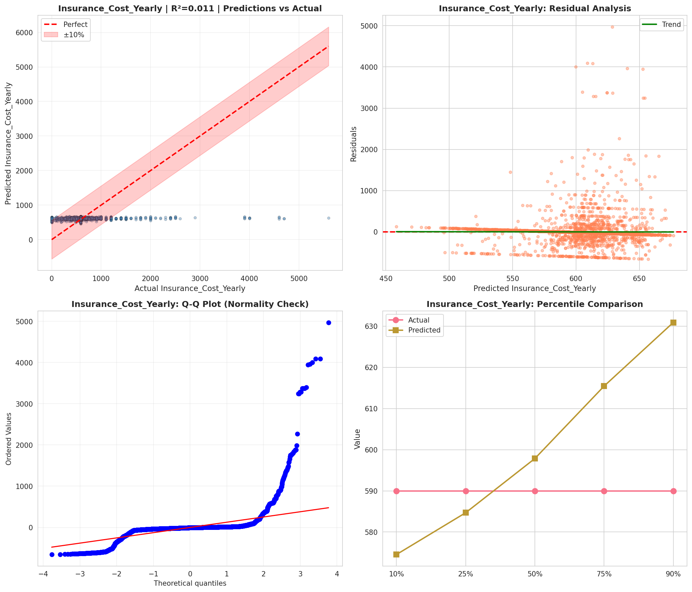
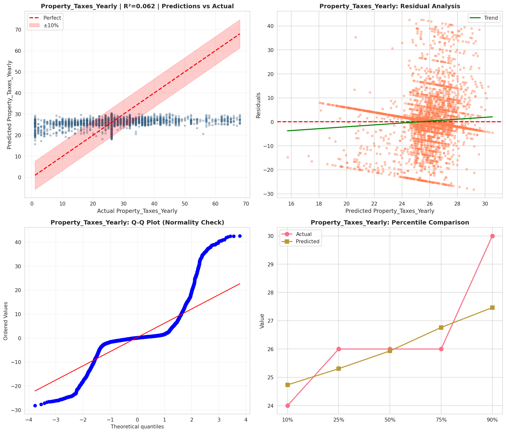
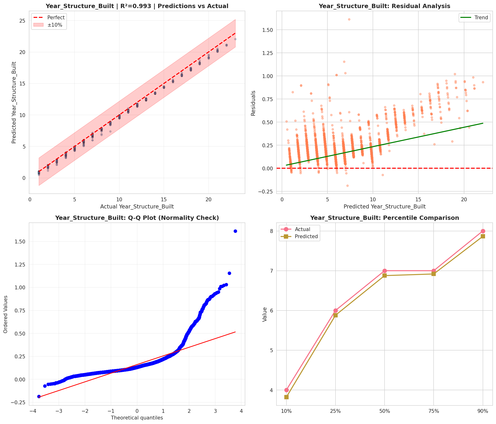
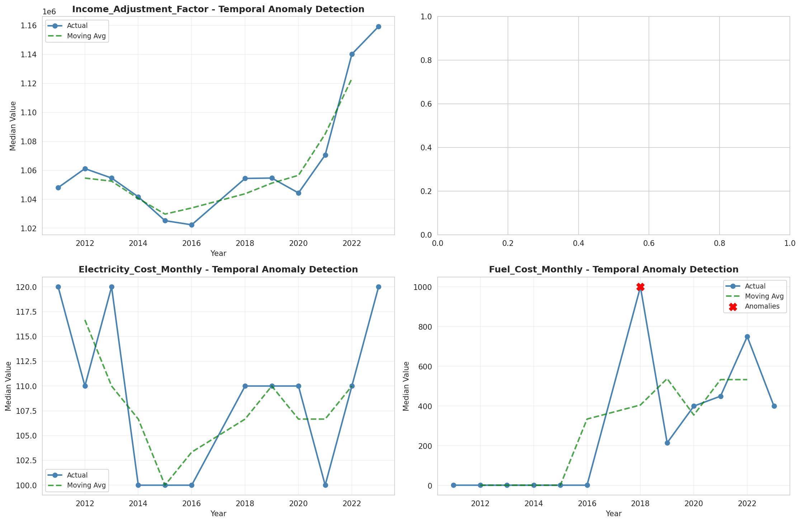
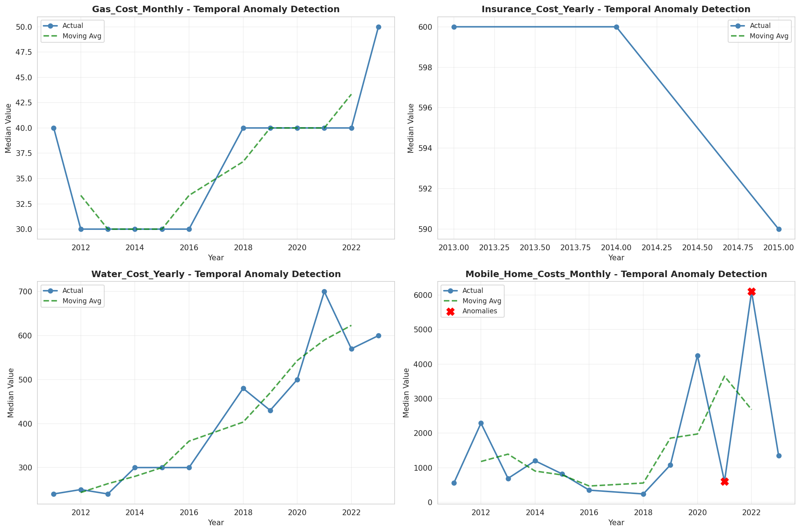
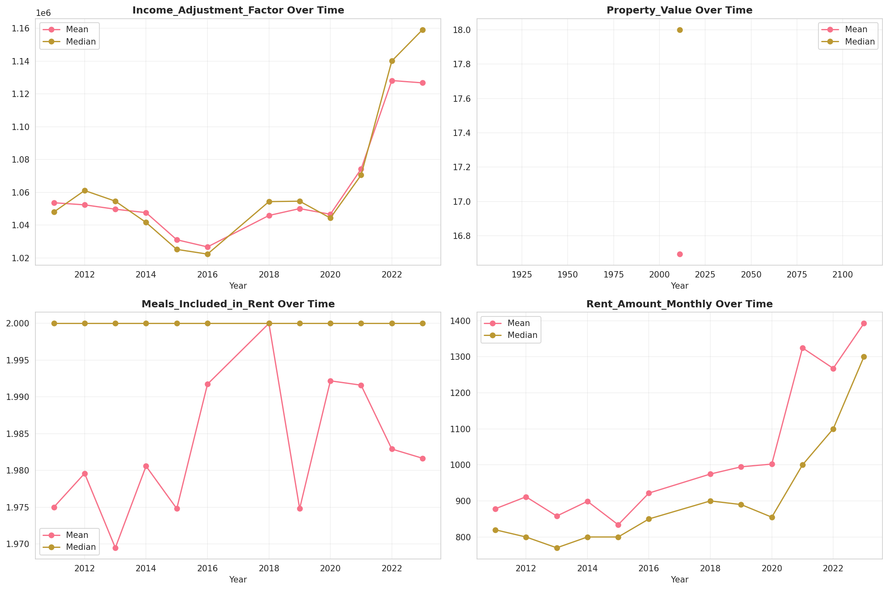
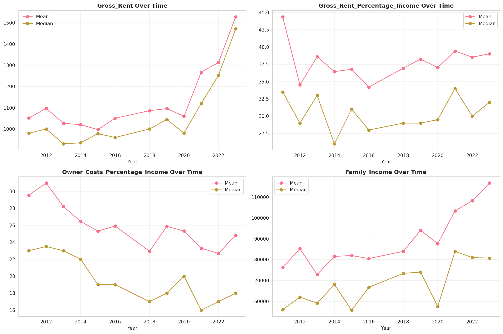

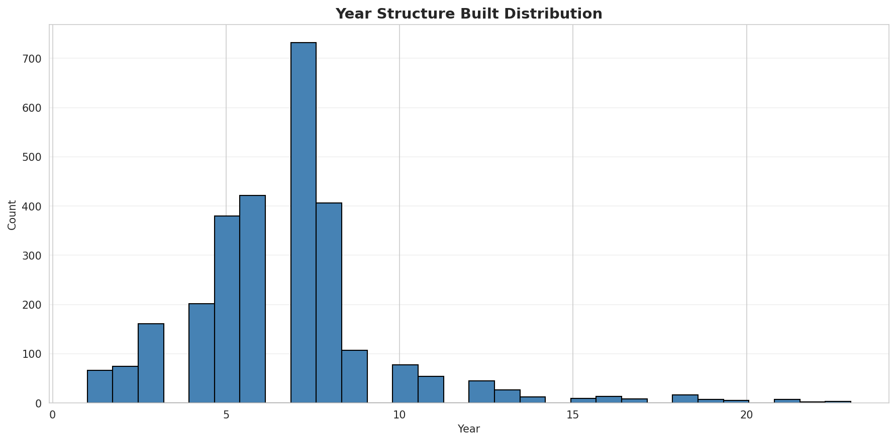
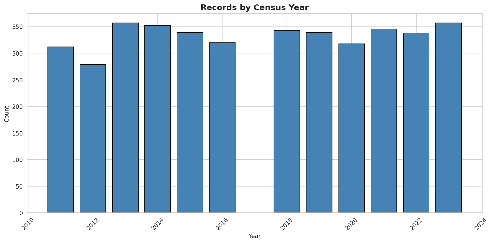
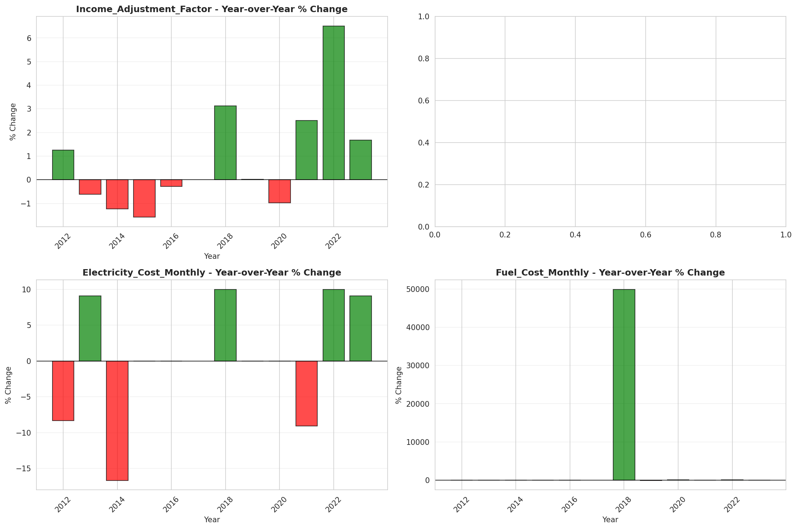
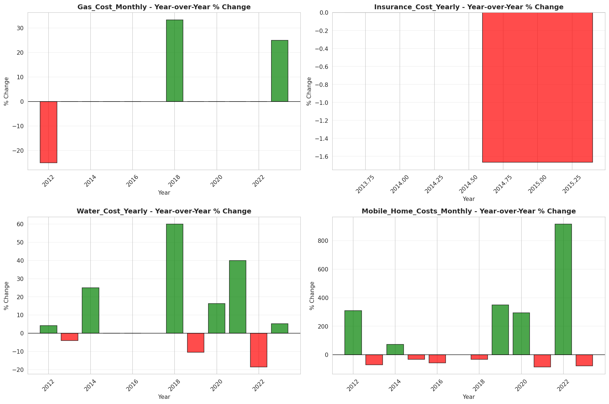
