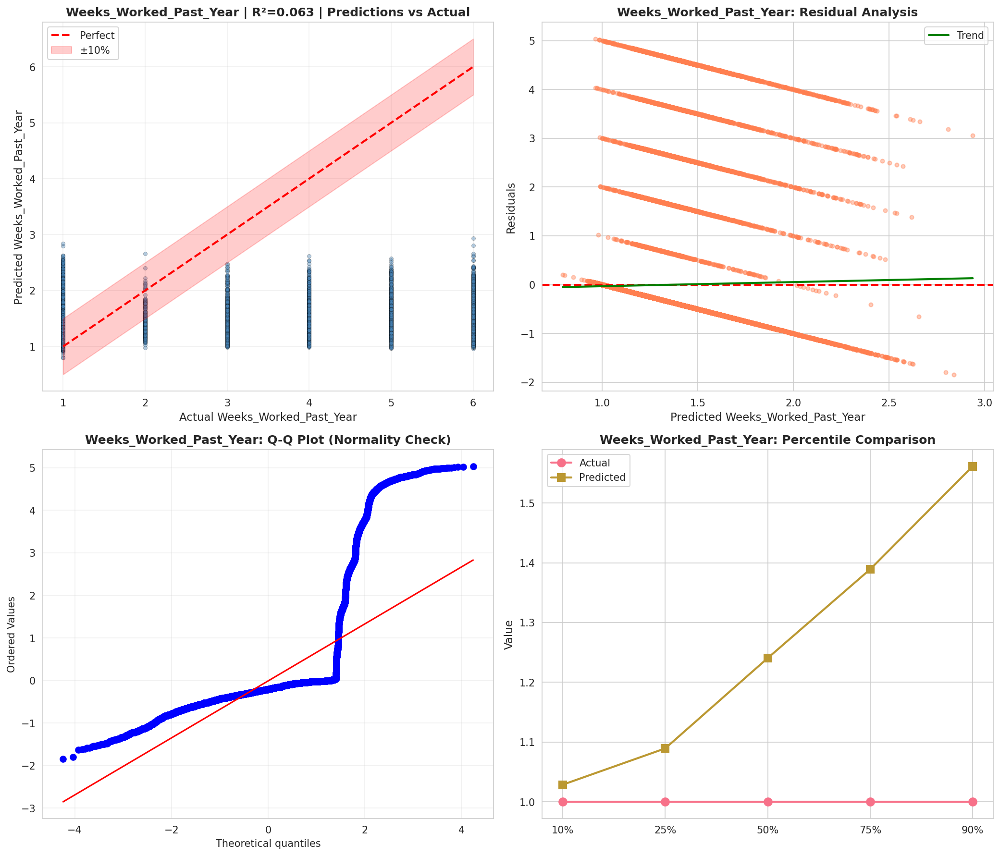
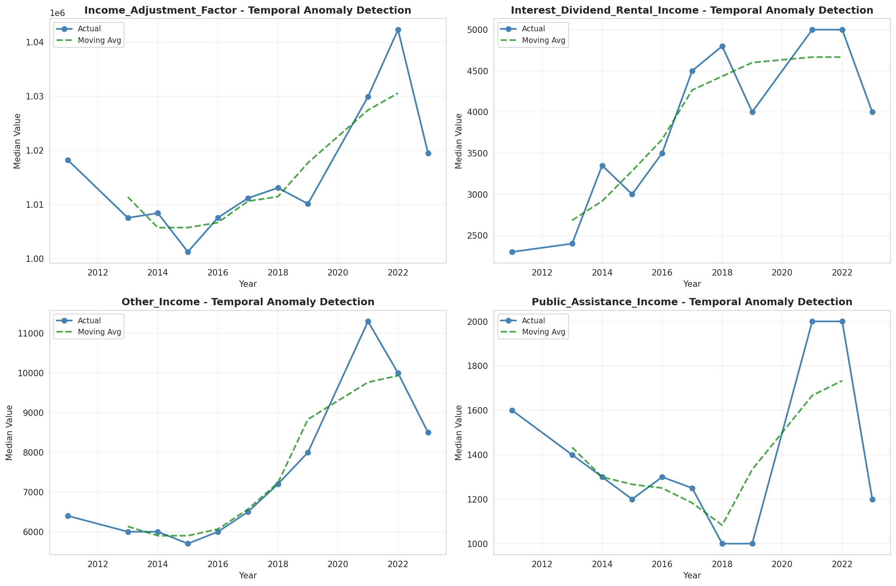
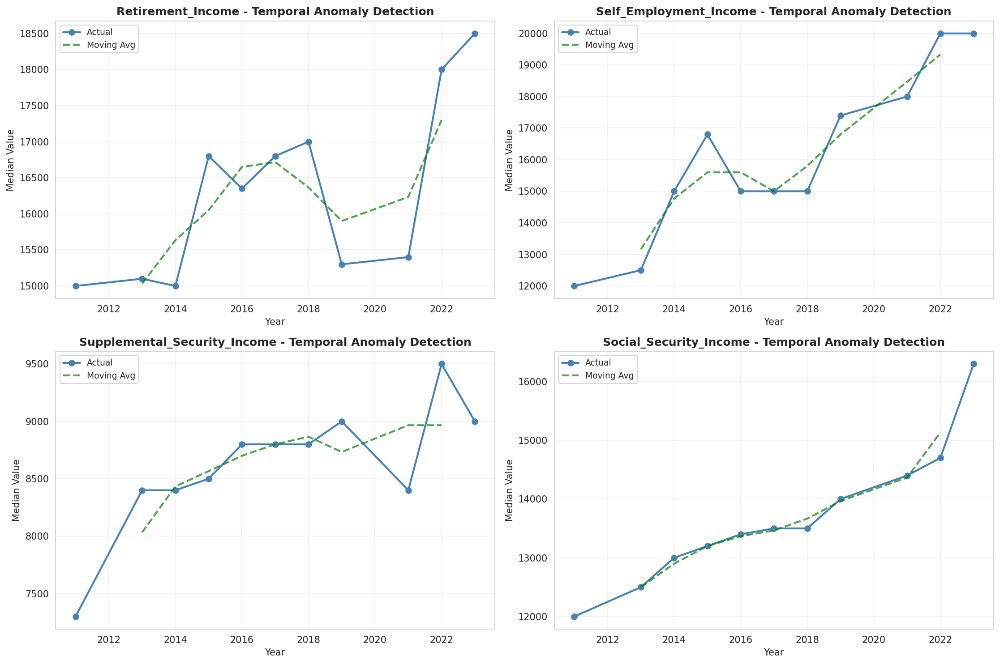
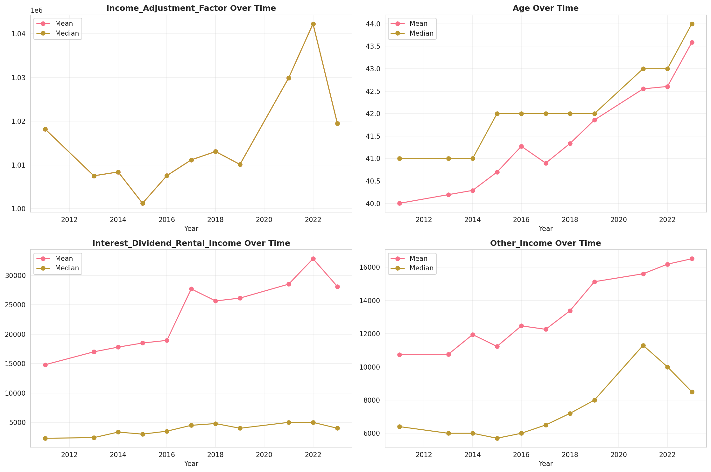
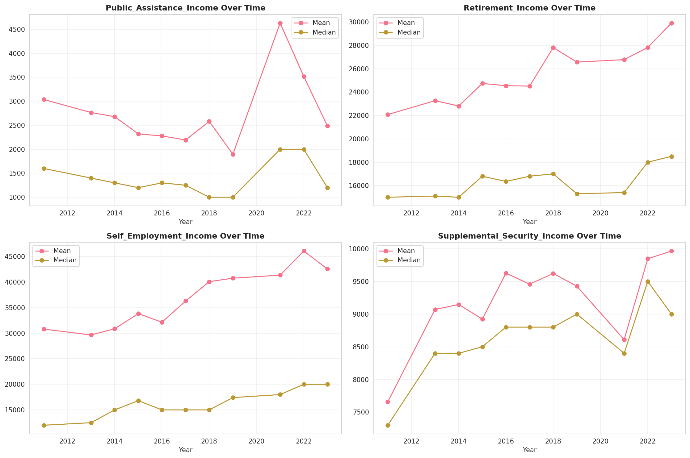
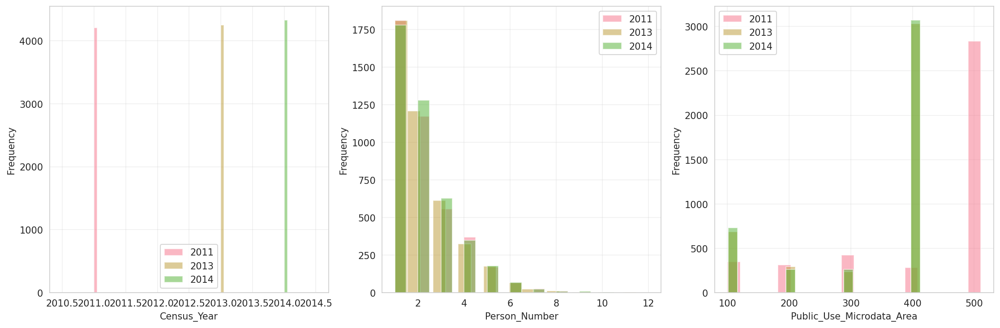
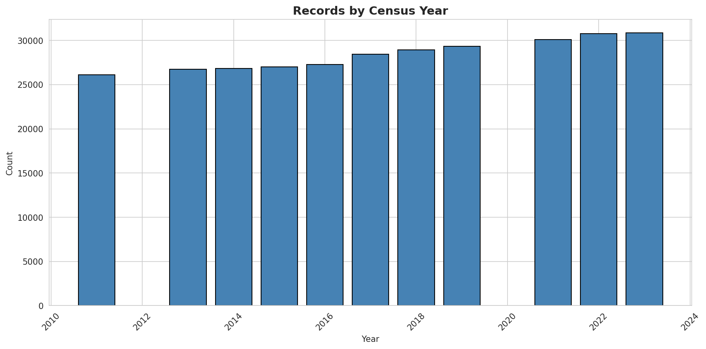
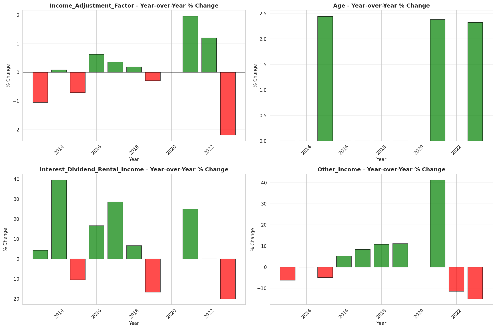
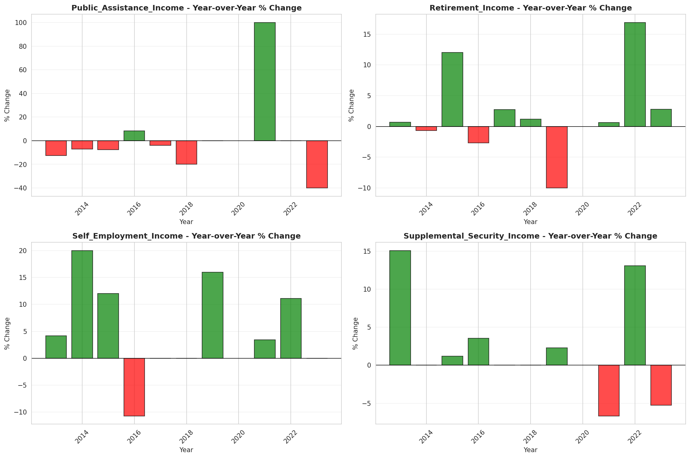

# Temporal Analysis

## Year Distribution

- 2011: 26,113 records

- 2013: 26,748 records

- 2014: 26,812 records

- 2015: 26,988 records

- 2016: 27,285 records

- 2017: 28,413 records

- 2018: 28,927 records

- 2019: 29,347 records

- 2021: 30,080 records

- 2022: 30,749 records

- 2023: 30,836 records

## Temporal Trends

- Census_Year: {np.int64(2011): {'mean': 2011.0, 'median': 2011.0, 'std': 0.0}, np.int64(2013): {'mean': 2013.0, 'median': 2013.0, 'std': 0.0}, np.int64(2014): {'mean': 2014.0, 'median': 2014.0, 'std': 0.0}, np.int64(2015): {'mean': 2015.0, 'median': 2015.0, 'std': 0.0}, np.int64(2016): {'mean': 2016.0, 'median': 2016.0, 'std': 0.0}, np.int64(2017): {'mean': 2017.0, 'median': 2017.0, 'std': 0.0}, np.int64(2018): {'mean': 2018.0, 'median': 2018.0, 'std': 0.0}, np.int64(2019): {'mean': 2019.0, 'median': 2019.0, 'std': 0.0}, np.int64(2021): {'mean': 2021.0, 'median': 2021.0, 'std': 0.0}, np.int64(2022): {'mean': 2022.0, 'median': 2022.0, 'std': 0.0}, np.int64(2023): {'mean': 2023.0, 'median': 2023.0, 'std': 0.0}}

- Person_Number: {np.int64(2011): {'mean': 2.1408110902615554, 'median': 2.0, 'std': 1.3767985900000177}, np.int64(2013): {'mean': 2.149394347240915, 'median': 2.0, 'std': 1.3862446441728042}, np.int64(2014): {'mean': 2.140795166343428, 'median': 2.0, 'std': 1.3693999997152881}, np.int64(2015): {'mean': 2.118534163331851, 'median': 2.0, 'std': 1.3472799254501973}, np.int64(2016): {'mean': 2.121422026754627, 'median': 2.0, 'std': 1.3646038634705964}, np.int64(2017): {'mean': 2.140991799528385, 'median': 2.0, 'std': 1.3827183363124254}, np.int64(2018): {'mean': 2.1358592318595084, 'median': 2.0, 'std': 1.3847690524878868}, np.int64(2019): {'mean': 2.1243738712645244, 'median': 2.0, 'std': 1.3751704214614904}, np.int64(2021): {'mean': 2.1431515957446807, 'median': 2.0, 'std': 1.3948224782959826}, np.int64(2022): {'mean': 2.141565579368435, 'median': 2.0, 'std': 1.3749979603448732}, np.int64(2023): {'mean': 2.100077831106499, 'median': 2.0, 'std': 1.3388600100770782}}

- Public_Use_Microdata_Area: {np.int64(2011): {'mean': 425.17811051966453, 'median': 503.0, 'std': 134.5060004128366}, np.int64(2013): {'mean': 338.5010841932107, 'median': 404.0, 'std': 116.53257223686246}, np.int64(2014): {'mean': 337.02290019394303, 'median': 404.0, 'std': 117.46614861415469}, np.int64(2015): {'mean': 339.2143915814436, 'median': 404.0, 'std': 116.15655878713231}, np.int64(2016): {'mean': 338.7799157045996, 'median': 405.0, 'std': 116.60995872144596}, np.int64(2017): {'mean': 339.4607749973604, 'median': 405.0, 'std': 116.1756062544413}, np.int64(2018): {'mean': 337.3328032633871, 'median': 404.0, 'std': 117.71935970466731}, np.int64(2019): {'mean': 338.2750195931441, 'median': 405.0, 'std': 117.39627918588117}, np.int64(2021): {'mean': 338.13454122340426, 'median': 405.0, 'std': 117.68192451384141}, np.int64(2022): {'mean': 333.920745390094, 'median': 404.0, 'std': 119.7354116910179}, np.int64(2023): {'mean': 334.4577766247244, 'median': 404.0, 'std': 119.5849763339257}}

- State_Code: {np.int64(2011): {'mean': 32.0, 'median': 32.0, 'std': 0.0}, np.int64(2013): {'mean': 32.0, 'median': 32.0, 'std': 0.0}, np.int64(2014): {'mean': 32.0, 'median': 32.0, 'std': 0.0}, np.int64(2015): {'mean': 32.0, 'median': 32.0, 'std': 0.0}, np.int64(2016): {'mean': 32.0, 'median': 32.0, 'std': 0.0}, np.int64(2017): {'mean': 32.0, 'median': 32.0, 'std': 0.0}, np.int64(2018): {'mean': 32.0, 'median': 32.0, 'std': 0.0}, np.int64(2019): {'mean': 32.0, 'median': 32.0, 'std': 0.0}, np.int64(2021): {'mean': 32.0, 'median': 32.0, 'std': 0.0}, np.int64(2022): {'mean': 32.0, 'median': 32.0, 'std': 0.0}, np.int64(2023): {'mean': None, 'median': None, 'std': None}}

- Income_Adjustment_Factor: {np.int64(2011): {'mean': 1018237.0, 'median': 1018237.0, 'std': 0.0}, np.int64(2013): {'mean': 1007549.0, 'median': 1007549.0, 'std': 0.0}, np.int64(2014): {'mean': 1008425.0, 'median': 1008425.0, 'std': 0.0}, np.int64(2015): {'mean': 1001264.0, 'median': 1001264.0, 'std': 0.0}, np.int64(2016): {'mean': 1007588.0, 'median': 1007588.0, 'std': 0.0}, np.int64(2017): {'mean': 1011189.0, 'median': 1011189.0, 'std': 0.0}, np.int64(2018): {'mean': 1013097.0, 'median': 1013097.0, 'std': 0.0}, np.int64(2019): {'mean': 1010145.0, 'median': 1010145.0, 'std': 0.0}, np.int64(2021): {'mean': 1029928.0, 'median': 1029928.0, 'std': 0.0}, np.int64(2022): {'mean': 1042311.0, 'median': 1042311.0, 'std': 0.0}, np.int64(2023): {'mean': 1019518.0, 'median': 1019518.0, 'std': 0.0}}

- Person_Weight: {np.int64(2011): {'mean': 104.2898939225673, 'median': 73.0, 'std': 98.07756977503391}, np.int64(2013): {'mean': 104.31194855690146, 'median': 78.0, 'std': 75.44510091450556}, np.int64(2014): {'mean': 105.88911681336715, 'median': 80.0, 'std': 77.14024119690171}, np.int64(2015): {'mean': 107.11594041796354, 'median': 82.0, 'std': 77.0125695341209}, np.int64(2016): {'mean': 107.75363752977826, 'median': 82.0, 'std': 77.51139067950545}, np.int64(2017): {'mean': 105.51645373596592, 'median': 81.0, 'std': 74.56423444488216}, np.int64(2018): {'mean': 104.89826114011132, 'median': 81.0, 'std': 76.51417641980551}, np.int64(2019): {'mean': 104.95641803250759, 'median': 78.0, 'std': 82.40812708145467}, np.int64(2021): {'mean': 104.52097739361702, 'median': 77.0, 'std': 79.57602436551167}, np.int64(2022): {'mean': 103.34553969234771, 'median': 75.0, 'std': 80.31141531869596}, np.int64(2023): {'mean': 103.58593851342586, 'median': 74.0, 'std': 81.55895327420558}}

- Age: {np.int64(2011): {'mean': 40.003599739593305, 'median': 41.0, 'std': 23.2738664117538}, np.int64(2013): {'mean': 40.195603409600714, 'median': 41.0, 'std': 23.1389309305907}, np.int64(2014): {'mean': 40.290093987766674, 'median': 41.0, 'std': 23.275873278195117}, np.int64(2015): {'mean': 40.698162146139026, 'median': 42.0, 'std': 23.227179763180118}, np.int64(2016): {'mean': 41.273043796958035, 'median': 42.0, 'std': 23.423862055174638}, np.int64(2017): {'mean': 40.897370921761166, 'median': 42.0, 'std': 23.359697015532166}, np.int64(2018): {'mean': 41.33695163687904, 'median': 42.0, 'std': 23.33711168359393}, np.int64(2019): {'mean': 41.85794118649266, 'median': 42.0, 'std': 23.37895722363151}, np.int64(2021): {'mean': 42.55106382978723, 'median': 43.0, 'std': 23.55760292994513}, np.int64(2022): {'mean': 42.604117207063645, 'median': 43.0, 'std': 23.55229251246547}, np.int64(2023): {'mean': 43.585062913477756, 'median': 44.0, 'std': 23.440978727494898}}

- Citizenship_Status: {np.int64(2011): {'mean': 1.6498678818979053, 'median': 1.0, 'std': 1.3753862821401432}, np.int64(2013): {'mean': 1.6378794676237476, 'median': 1.0, 'std': 1.3496135119081942}, np.int64(2014): {'mean': 1.644897806952111, 'median': 1.0, 'std': 1.356326197277689}, np.int64(2015): {'mean': 1.6379131465836667, 'median': 1.0, 'std': 1.341793887816427}, np.int64(2016): {'mean': 1.6503939893714494, 'median': 1.0, 'std': 1.3538634908575815}, np.int64(2017): {'mean': 1.6491042832506246, 'median': 1.0, 'std': 1.3535241608295534}, np.int64(2018): {'mean': 1.6448992290939262, 'median': 1.0, 'std': 1.3452126490597602}, np.int64(2019): {'mean': 1.6522983609909019, 'median': 1.0, 'std': 1.3503655435945194}, np.int64(2021): {'mean': 1.6495678191489362, 'median': 1.0, 'std': 1.3429397961841176}, np.int64(2022): {'mean': 1.650427656183941, 'median': 1.0, 'std': 1.3383769977260453}, np.int64(2023): {'mean': 1.6611103904527176, 'median': 1.0, 'std': 1.3455462399971667}}

- Class_of_Worker: {np.int64(2011): {'mean': 2.015331419624217, 'median': 1.0, 'std': 1.917448751844869}, np.int64(2013): {'mean': 2.038574738555952, 'median': 1.0, 'std': 1.933064496922987}, np.int64(2014): {'mean': 2.051984877126654, 'median': 1.0, 'std': 1.9363511299098133}, np.int64(2015): {'mean': 2.0275425058033756, 'median': 1.0, 'std': 1.9087429340804585}, np.int64(2016): {'mean': 2.003621152525442, 'median': 1.0, 'std': 1.8825031355264226}, np.int64(2017): {'mean': 2.0382738095238095, 'median': 1.0, 'std': 1.9081284600158304}, np.int64(2018): {'mean': 2.045611166267593, 'median': 1.0, 'std': 1.9137667247325223}, np.int64(2019): {'mean': 2.047695852534562, 'median': 1.0, 'std': 1.91420490428344}, np.int64(2021): {'mean': 2.106095570439579, 'median': 1.0, 'std': 1.9368769108045776}, np.int64(2022): {'mean': 2.1047154827756174, 'median': 1.0, 'std': 1.945046653594862}, np.int64(2023): {'mean': 2.1048146570089474, 'median': 1.0, 'std': 1.9291819500171585}}

- English_Speaking_Ability: {np.int64(2011): {'mean': 1.7005395683453237, 'median': 1.0, 'std': 0.9201094596359614}, np.int64(2013): {'mean': 1.6266547672170162, 'median': 1.0, 'std': 0.8863492066076215}, np.int64(2014): {'mean': 1.6545239152969051, 'median': 1.0, 'std': 0.9159755998520038}, np.int64(2015): {'mean': 1.636257138673305, 'median': 1.0, 'std': 0.9153113002053503}, np.int64(2016): {'mean': 1.6307066007560338, 'median': 1.0, 'std': 0.9113692857330196}, np.int64(2017): {'mean': 1.580849889624724, 'median': 1.0, 'std': 0.8742219995017582}, np.int64(2018): {'mean': 1.572745490981964, 'median': 1.0, 'std': 0.8623641017314829}, np.int64(2019): {'mean': 1.5796365579903795, 'median': 1.0, 'std': 0.8602415843902982}, np.int64(2021): {'mean': 1.612053222019306, 'median': 1.0, 'std': 0.8798865996350188}, np.int64(2022): {'mean': 1.5707947775383446, 'median': 1.0, 'std': 0.8545836854570736}, np.int64(2023): {'mean': 1.6138527054108216, 'median': 1.0, 'std': 0.8927525561383115}}

- Fertility_Status: {np.int64(2011): {'mean': 1.942379815888169, 'median': 2.0, 'std': 0.23304368007642637}, np.int64(2013): {'mean': 1.9462686567164178, 'median': 2.0, 'std': 0.22550547514264463}, np.int64(2014): {'mean': 1.946781972393148, 'median': 2.0, 'std': 0.2244866366347437}, np.int64(2015): {'mean': 1.9492122024807241, 'median': 2.0, 'std': 0.21958251073242882}, np.int64(2016): {'mean': 1.9472693032015065, 'median': 2.0, 'std': 0.2235144816896905}, np.int64(2017): {'mean': 1.9435146443514644, 'median': 2.0, 'std': 0.23087515714960846}, np.int64(2018): {'mean': 1.9496093127092968, 'median': 2.0, 'std': 0.21876722272274027}, np.int64(2019): {'mean': 1.9525984251968505, 'median': 2.0, 'std': 0.21251300572033618}, np.int64(2021): {'mean': 1.9512459371614301, 'median': 2.0, 'std': 0.21537010775313967}, np.int64(2022): {'mean': 1.9452920326706735, 'median': 2.0, 'std': 0.22742685969380644}, np.int64(2023): {'mean': 1.9528772088808337, 'median': 2.0, 'std': 0.21191747566224994}}

- Marital_Status: {np.int64(2011): {'mean': 2.9958258338758474, 'median': 3.0, 'std': 1.826817028487495}, np.int64(2013): {'mean': 2.9642590100194406, 'median': 3.0, 'std': 1.8322949557275956}, np.int64(2014): {'mean': 2.9899671788751307, 'median': 3.0, 'std': 1.8329421818288347}, np.int64(2015): {'mean': 2.98584556099007, 'median': 3.0, 'std': 1.829998265752899}, np.int64(2016): {'mean': 2.978339747113799, 'median': 3.0, 'std': 1.8278839158111968}, np.int64(2017): {'mean': 2.9851124485270826, 'median': 3.0, 'std': 1.8324386179050238}, np.int64(2018): {'mean': 2.9911847063297268, 'median': 3.0, 'std': 1.8284547117145353}, np.int64(2019): {'mean': 2.97096807169387, 'median': 3.0, 'std': 1.825529677693483}, np.int64(2021): {'mean': 2.9973071808510636, 'median': 3.0, 'std': 1.8332782119331388}, np.int64(2022): {'mean': 2.9731698591824123, 'median': 3.0, 'std': 1.8319084802572878}, np.int64(2023): {'mean': 2.951063691788818, 'median': 3.0, 'std': 1.8314333320239733}}

- Mobility_Status: {np.int64(2011): {'mean': 1.3699012202208019, 'median': 1.0, 'std': 0.7731052247562566}, np.int64(2013): {'mean': 1.3762462235649546, 'median': 1.0, 'std': 0.7781248364244331}, np.int64(2014): {'mean': 1.3694988120828149, 'median': 1.0, 'std': 0.7731359033358063}, np.int64(2015): {'mean': 1.3631023645615086, 'median': 1.0, 'std': 0.7672412215214602}, np.int64(2016): {'mean': 1.3204810360777057, 'median': 1.0, 'std': 0.7302590881291756}, np.int64(2017): {'mean': 1.3270236612702366, 'median': 1.0, 'std': 0.7356978076674563}, np.int64(2018): {'mean': 1.3103099612984206, 'median': 1.0, 'std': 0.721029050777911}, np.int64(2019): {'mean': 1.3143897746014293, 'median': 1.0, 'std': 0.7240531393313919}, np.int64(2021): {'mean': 1.2566413185487924, 'median': 1.0, 'std': 0.665967913337094}, np.int64(2022): {'mean': 1.2483919663953793, 'median': 1.0, 'std': 0.6559537966653589}, np.int64(2023): {'mean': 1.24203197018731, 'median': 1.0, 'std': 0.6473219226556526}}

- Military_Service: {np.int64(2011): {'mean': 4.713496218731821, 'median': 5.0, 'std': 0.7214034069012174}, np.int64(2013): {'mean': 3.749776333757122, 'median': 4.0, 'std': 0.6592829114402079}, np.int64(2014): {'mean': 3.75018779342723, 'median': 4.0, 'std': 0.6597831683459762}, np.int64(2015): {'mean': 3.7589227774172613, 'median': 4.0, 'std': 0.6518005031128128}, np.int64(2016): {'mean': 3.7622371242187858, 'median': 4.0, 'std': 0.6459722165356363}, np.int64(2017): {'mean': 3.774708599076314, 'median': 4.0, 'std': 0.6313576943740452}, np.int64(2018): {'mean': 3.768448601338596, 'median': 4.0, 'std': 0.6392879715971196}, np.int64(2019): {'mean': 3.776742624533132, 'median': 4.0, 'std': 0.6288310738938984}, np.int64(2021): {'mean': 3.7938555442522888, 'median': 4.0, 'std': 0.6097226475817686}, np.int64(2022): {'mean': 3.788971494453942, 'median': 4.0, 'std': 0.6190833396878564}, np.int64(2023): {'mean': 3.7970660146699267, 'median': 4.0, 'std': 0.6072685236336601}}

- Travel_Time_To_Work_Minutes: {np.int64(2011): {'mean': 23.935654307010097, 'median': 20.0, 'std': 21.257864049426352}, np.int64(2013): {'mean': 23.713702520411786, 'median': 20.0, 'std': 19.595248517796428}, np.int64(2014): {'mean': 24.014624262179545, 'median': 20.0, 'std': 20.20022587297381}, np.int64(2015): {'mean': 24.019477683640492, 'median': 20.0, 'std': 18.78394355111924}, np.int64(2016): {'mean': 24.183364517775132, 'median': 20.0, 'std': 19.00540623609061}, np.int64(2017): {'mean': 24.439531123686336, 'median': 20.0, 'std': 19.055784151680065}, np.int64(2018): {'mean': 25.083853138570866, 'median': 20.0, 'std': 20.414217675928345}, np.int64(2019): {'mean': 25.77789951479105, 'median': 20.0, 'std': 22.38520178701532}, np.int64(2021): {'mean': 24.521410130864417, 'median': 20.0, 'std': 19.899965955244753}, np.int64(2022): {'mean': 24.67510271158587, 'median': 20.0, 'std': 19.470223448322034}, np.int64(2023): {'mean': 25.577173827664755, 'median': 20.0, 'std': 20.71761838258755}}

- Vehicle_Occupancy: {np.int64(2011): {'mean': 1.1975955610357583, 'median': 1.0, 'std': 0.6760144628747606}, np.int64(2013): {'mean': 1.178861013068778, 'median': 1.0, 'std': 0.6052334564256644}, np.int64(2014): {'mean': 1.1743952576728176, 'median': 1.0, 'std': 0.5686646840219409}, np.int64(2015): {'mean': 1.179121398205007, 'median': 1.0, 'std': 0.6319164414570047}, np.int64(2016): {'mean': 1.1776381680779386, 'median': 1.0, 'std': 0.6348717158751677}, np.int64(2017): {'mean': 1.1782316487736755, 'median': 1.0, 'std': 0.6001375375709801}, np.int64(2018): {'mean': 1.1842105263157894, 'median': 1.0, 'std': 0.6096439199081952}, np.int64(2019): {'mean': 1.1911305960711576, 'median': 1.0, 'std': 0.6495365411368802}, np.int64(2021): {'mean': 1.187446177399292, 'median': 1.0, 'std': 0.6357599482633124}, np.int64(2022): {'mean': 1.2101077928962714, 'median': 1.0, 'std': 0.6600454160641945}, np.int64(2023): {'mean': 1.2119831223628692, 'median': 1.0, 'std': 0.633382159093985}}

- Transportation_To_Work: {np.int64(2011): {'mean': 1.7647703406081636, 'median': 1.0, 'std': 2.5417796303497417}, np.int64(2013): {'mean': 1.7482900136798905, 'median': 1.0, 'std': 2.527369900670661}, np.int64(2014): {'mean': 1.7870299635005518, 'median': 1.0, 'std': 2.59260830862886}, np.int64(2015): {'mean': 1.7915651516424431, 'median': 1.0, 'std': 2.5997794902358935}, np.int64(2016): {'mean': 1.7988141650422351, 'median': 1.0, 'std': 2.6308446803593903}, np.int64(2017): {'mean': 1.879703886489821, 'median': 1.0, 'std': 2.751785780842132}, np.int64(2018): {'mean': 1.8466586212098355, 'median': 1.0, 'std': 2.7231412007670546}, np.int64(2019): {'mean': None, 'median': None, 'std': None}, np.int64(2021): {'mean': None, 'median': None, 'std': None}, np.int64(2022): {'mean': None, 'median': None, 'std': None}, np.int64(2023): {'mean': None, 'median': None, 'std': None}}

- Language_Other_Than_English: {np.int64(2011): {'mean': 1.7283166381627169, 'median': 2.0, 'std': 0.44483656592056364}, np.int64(2013): {'mean': 1.733837444079338, 'median': 2.0, 'std': 0.44195902835432466}, np.int64(2014): {'mean': 1.7330196884636673, 'median': 2.0, 'std': 0.442390734734656}, np.int64(2015): {'mean': 1.7327515360231676, 'median': 2.0, 'std': 0.4425317913211706}, np.int64(2016): {'mean': 1.7342349304482225, 'median': 2.0, 'std': 0.4417482740235653}, np.int64(2017): {'mean': 1.7300860239079432, 'median': 2.0, 'std': 0.4439231469113212}, np.int64(2018): {'mean': 1.7277983853371155, 'median': 2.0, 'std': 0.4451012248323403}, np.int64(2019): {'mean': 1.7317851127118948, 'median': 2.0, 'std': 0.4430380299599768}, np.int64(2021): {'mean': 1.7330501096911237, 'median': 2.0, 'std': 0.4423736666651543}, np.int64(2022): {'mean': 1.7308978032473734, 'median': 2.0, 'std': 0.44350074843277404}, np.int64(2023): {'mean': 1.729749856141895, 'median': 2.0, 'std': 0.44409647527612783}}

- Grandparents_Living_With_Grandchildren: {np.int64(2011): {'mean': 1.9612930411750542, 'median': 2.0, 'std': 0.19290145196161107}, np.int64(2013): {'mean': 1.9591789129927688, 'median': 2.0, 'std': 0.19788130112927577}, np.int64(2014): {'mean': 1.9634203168685926, 'median': 2.0, 'std': 0.18773295603827012}, np.int64(2015): {'mean': 1.9644207631488484, 'median': 2.0, 'std': 0.18524394942777728}, np.int64(2016): {'mean': 1.9654304413492196, 'median': 2.0, 'std': 0.18269201204802787}, np.int64(2017): {'mean': 1.9647141848976712, 'median': 2.0, 'std': 0.18450629904054697}, np.int64(2018): {'mean': 1.9619691527572365, 'median': 2.0, 'std': 0.19127580719723472}, np.int64(2019): {'mean': 1.963160869341828, 'median': 2.0, 'std': 0.18837152718371358}, np.int64(2021): {'mean': 1.9629978204874183, 'median': 2.0, 'std': 0.18877177588476826}, np.int64(2022): {'mean': 1.9637858894820373, 'median': 2.0, 'std': 0.18682699851721216}, np.int64(2023): {'mean': 1.9666037735849056, 'median': 2.0, 'std': 0.17967315111888055}}

- Months_Responsible_For_Grandchildren: {np.int64(2011): {'mean': 3.522033898305085, 'median': 4.0, 'std': 1.4257195100355384}, np.int64(2013): {'mean': 3.8819188191881917, 'median': 5.0, 'std': 1.3692677175315855}, np.int64(2014): {'mean': 3.601503759398496, 'median': 4.0, 'std': 1.4611437733504893}, np.int64(2015): {'mean': 3.8151260504201683, 'median': 4.0, 'std': 1.3404853743687668}, np.int64(2016): {'mean': 3.7738095238095237, 'median': 4.0, 'std': 1.4087194926572864}, np.int64(2017): {'mean': 3.68609865470852, 'median': 4.0, 'std': 1.3423572546950444}, np.int64(2018): {'mean': 3.8045112781954886, 'median': 4.0, 'std': 1.3733784077288091}, np.int64(2019): {'mean': 3.991596638655462, 'median': 5.0, 'std': 1.179972096640176}, np.int64(2021): {'mean': 3.816326530612245, 'median': 4.0, 'std': 1.383766237672854}, np.int64(2022): {'mean': 3.7688888888888887, 'median': 4.0, 'std': 1.3660132003359502}, np.int64(2023): {'mean': 3.89237668161435, 'median': 4.0, 'std': 1.3312208045417537}}

- Grandparents_Responsible_For_Grandchildren: {np.int64(2011): {'mean': 1.5412130637636081, 'median': 2.0, 'std': 0.49868652058219953}, np.int64(2013): {'mean': 1.6128571428571428, 'median': 2.0, 'std': 0.4874450715018596}, np.int64(2014): {'mean': 1.5764331210191083, 'median': 2.0, 'std': 0.49451732494905903}, np.int64(2015): {'mean': 1.6167471819645733, 'median': 2.0, 'std': 0.48657099953948385}, np.int64(2016): {'mean': 1.5922330097087378, 'median': 2.0, 'std': 0.49181751772383575}, np.int64(2017): {'mean': 1.656923076923077, 'median': 2.0, 'std': 0.47510252912401985}, np.int64(2018): {'mean': 1.6305555555555555, 'median': 2.0, 'std': 0.4829899024474238}, np.int64(2019): {'mean': 1.6680613668061366, 'median': 2.0, 'std': 0.471237828703217}, np.int64(2021): {'mean': 1.7376171352074967, 'median': 2.0, 'std': 0.44022441038888044}, np.int64(2022): {'mean': 1.701195219123506, 'median': 2.0, 'std': 0.45803831877526885}, np.int64(2023): {'mean': 1.6850282485875707, 'median': 2.0, 'std': 0.4648330135217691}}

- Interest_Dividend_Rental_Income: {np.int64(2011): {'mean': 14801.918518518518, 'median': 2300.0, 'std': 39249.29274883968}, np.int64(2013): {'mean': 16999.79487179487, 'median': 2400.0, 'std': 49804.71073566271}, np.int64(2014): {'mean': 17801.417142857143, 'median': 3350.0, 'std': 43994.33006158695}, np.int64(2015): {'mean': 18494.951171875, 'median': 3000.0, 'std': 51854.11868485852}, np.int64(2016): {'mean': 18946.72363356428, 'median': 3500.0, 'std': 46122.020170268566}, np.int64(2017): {'mean': 27699.912559618442, 'median': 4500.0, 'std': 78377.66714206613}, np.int64(2018): {'mean': 25652.34100663285, 'median': 4800.0, 'std': 66971.23213577409}, np.int64(2019): {'mean': 26137.255121042832, 'median': 4000.0, 'std': 77470.11037308797}, np.int64(2021): {'mean': 28511.385725132877, 'median': 5000.0, 'std': 72688.16171228515}, np.int64(2022): {'mean': 32832.13114754098, 'median': 5000.0, 'std': 87218.25316326626}, np.int64(2023): {'mean': 28114.016, 'median': 4000.0, 'std': 72711.54098279797}}

- Military_Service_Period_1: {np.int64(2011): {'mean': 0.11038251366120219, 'median': 0.0, 'std': 0.3134230381773129}, np.int64(2013): {'mean': 0.15343915343915343, 'median': 0.0, 'std': 0.3604836594225648}, np.int64(2014): {'mean': 0.16122448979591836, 'median': 0.0, 'std': 0.36781295873522635}, np.int64(2015): {'mean': 0.17271589486858574, 'median': 0.0, 'std': 0.3780803477888564}, np.int64(2016): {'mean': 0.17924135056273446, 'median': 0.0, 'std': 0.3836342494990086}, np.int64(2017): {'mean': 0.18747355057130766, 'median': 0.0, 'std': 0.39037380699250546}, np.int64(2018): {'mean': 0.20553994379767163, 'median': 0.0, 'std': 0.4041767619865807}, np.int64(2019): {'mean': 0.21886484279297672, 'median': 0.0, 'std': 0.41356119404331443}, np.int64(2021): {'mean': 0.2540025962786672, 'median': 0.0, 'std': 0.4353932769588459}, np.int64(2022): {'mean': 0.2723543888433142, 'median': 0.0, 'std': 0.4452626146241806}, np.int64(2023): {'mean': 0.28756802009208876, 'median': 0.0, 'std': 0.45272336639613003}}

- Military_Service_Period_2: {np.int64(2011): {'mean': 0.15045537340619308, 'median': 0.0, 'std': 0.3575823473342723}, np.int64(2013): {'mean': 0.18477818477818478, 'median': 0.0, 'std': 0.3881965233766104}, np.int64(2014): {'mean': 0.19020408163265307, 'median': 0.0, 'std': 0.3925422048499736}, np.int64(2015): {'mean': 0.18773466833541927, 'median': 0.0, 'std': 0.390581625738312}, np.int64(2016): {'mean': 0.18841183826594415, 'median': 0.0, 'std': 0.39112221143799486}, np.int64(2017): {'mean': 0.18197206940330088, 'median': 0.0, 'std': 0.38590317111325595}, np.int64(2018): {'mean': 0.2095543958249699, 'median': 0.0, 'std': 0.40707231992157317}, np.int64(2019): {'mean': 0.21314822376480197, 'median': 0.0, 'std': 0.40961514856326525}, np.int64(2021): {'mean': 0.22111639982691475, 'median': 0.0, 'std': 0.4150885367865777}, np.int64(2022): {'mean': 0.22313371616078753, 'median': 0.0, 'std': 0.4164326973069578}, np.int64(2023): {'mean': 0.24487233151946422, 'median': 0.0, 'std': 0.43010150629907606}}

- Military_Service_Period_3: {np.int64(2011): {'mean': 0.1806921675774135, 'median': 0.0, 'std': 0.3848330280848531}, np.int64(2013): {'mean': None, 'median': None, 'std': None}, np.int64(2014): {'mean': None, 'median': None, 'std': None}, np.int64(2015): {'mean': None, 'median': None, 'std': None}, np.int64(2016): {'mean': None, 'median': None, 'std': None}, np.int64(2017): {'mean': None, 'median': None, 'std': None}, np.int64(2018): {'mean': None, 'median': None, 'std': None}, np.int64(2019): {'mean': None, 'median': None, 'std': None}, np.int64(2021): {'mean': None, 'median': None, 'std': None}, np.int64(2022): {'mean': None, 'median': None, 'std': None}, np.int64(2023): {'mean': None, 'median': None, 'std': None}}

- Military_Service_Period_4: {np.int64(2011): {'mean': 0.14389799635701275, 'median': 0.0, 'std': 0.35105022121206453}, np.int64(2013): {'mean': None, 'median': None, 'std': None}, np.int64(2014): {'mean': None, 'median': None, 'std': None}, np.int64(2015): {'mean': None, 'median': None, 'std': None}, np.int64(2016): {'mean': None, 'median': None, 'std': None}, np.int64(2017): {'mean': None, 'median': None, 'std': None}, np.int64(2018): {'mean': None, 'median': None, 'std': None}, np.int64(2019): {'mean': None, 'median': None, 'std': None}, np.int64(2021): {'mean': None, 'median': None, 'std': None}, np.int64(2022): {'mean': None, 'median': None, 'std': None}, np.int64(2023): {'mean': None, 'median': None, 'std': None}}

- Military_Service_Period_5: {np.int64(2011): {'mean': 0.3766848816029144, 'median': 0.0, 'std': 0.48464311371964197}, np.int64(2013): {'mean': 0.37932437932437935, 'median': 0.0, 'std': 0.48531768637243733}, np.int64(2014): {'mean': 0.40244897959183673, 'median': 0.0, 'std': 0.4904915851979931}, np.int64(2015): {'mean': 0.39632874426366294, 'median': 0.0, 'std': 0.4892362676713322}, np.int64(2016): {'mean': 0.4118382659441434, 'median': 0.0, 'std': 0.49226874870723697}, np.int64(2017): {'mean': 0.3948370715192552, 'median': 0.0, 'std': 0.48891913321973607}, np.int64(2018): {'mean': 0.3809714973906062, 'median': 0.0, 'std': 0.48572309735045993}, np.int64(2019): {'mean': 0.38260514495712533, 'median': 0.0, 'std': 0.4861223533983176}, np.int64(2021): {'mean': 0.3859800951968845, 'median': 0.0, 'std': 0.4869312666876981}, np.int64(2022): {'mean': 0.3580803937653815, 'median': 0.0, 'std': 0.47953430093221283}, np.int64(2023): {'mean': 0.3830054416073671, 'median': 0.0, 'std': 0.48622138120913166}}

- Military_Service_Period_6: {np.int64(2011): {'mean': 0.122040072859745, 'median': 0.0, 'std': 0.32739172402365085}, np.int64(2013): {'mean': None, 'median': None, 'std': None}, np.int64(2014): {'mean': None, 'median': None, 'std': None}, np.int64(2015): {'mean': None, 'median': None, 'std': None}, np.int64(2016): {'mean': None, 'median': None, 'std': None}, np.int64(2017): {'mean': None, 'median': None, 'std': None}, np.int64(2018): {'mean': None, 'median': None, 'std': None}, np.int64(2019): {'mean': None, 'median': None, 'std': None}, np.int64(2021): {'mean': None, 'median': None, 'std': None}, np.int64(2022): {'mean': None, 'median': None, 'std': None}, np.int64(2023): {'mean': None, 'median': None, 'std': None}}

- Military_Service_Period_7: {np.int64(2011): {'mean': 0.14061930783242257, 'median': 0.0, 'std': 0.34769175717723905}, np.int64(2013): {'mean': None, 'median': None, 'std': None}, np.int64(2014): {'mean': None, 'median': None, 'std': None}, np.int64(2015): {'mean': None, 'median': None, 'std': None}, np.int64(2016): {'mean': None, 'median': None, 'std': None}, np.int64(2017): {'mean': None, 'median': None, 'std': None}, np.int64(2018): {'mean': None, 'median': None, 'std': None}, np.int64(2019): {'mean': None, 'median': None, 'std': None}, np.int64(2021): {'mean': None, 'median': None, 'std': None}, np.int64(2022): {'mean': None, 'median': None, 'std': None}, np.int64(2023): {'mean': None, 'median': None, 'std': None}}

- Military_Service_Period_8: {np.int64(2011): {'mean': 0.1307832422586521, 'median': 0.0, 'std': 0.3372245750309283}, np.int64(2013): {'mean': 0.10337810337810338, 'median': 0.0, 'std': 0.304514058434395}, np.int64(2014): {'mean': 0.10693877551020409, 'median': 0.0, 'std': 0.3090984802363363}, np.int64(2015): {'mean': 0.09136420525657071, 'median': 0.0, 'std': 0.28818645930928155}, np.int64(2016): {'mean': 0.07919966652771988, 'median': 0.0, 'std': 0.2701064437878186}, np.int64(2017): {'mean': 0.0732120186203978, 'median': 0.0, 'std': 0.2605393357267015}, np.int64(2018): {'mean': 0.06985146527498996, 'median': 0.0, 'std': 0.2549477031515081}, np.int64(2019): {'mean': 0.06369946917109025, 'median': 0.0, 'std': 0.24426667864840018}, np.int64(2021): {'mean': 0.053223712678494156, 'median': 0.0, 'std': 0.22452786764872965}, np.int64(2022): {'mean': 0.03568498769483183, 'median': 0.0, 'std': 0.1855416120752129}, np.int64(2023): {'mean': 0.022185014650481373, 'median': 0.0, 'std': 0.1473157285533282}}

- Military_Service_Period_9: {np.int64(2011): {'mean': 0.02622950819672131, 'median': 0.0, 'std': 0.15984626749158007}, np.int64(2013): {'mean': 0.01628001628001628, 'median': 0.0, 'std': 0.12657605660704033}, np.int64(2014): {'mean': 0.010612244897959184, 'median': 0.0, 'std': 0.1024885967676214}, np.int64(2015): {'mean': 0.015018773466833541, 'median': 0.0, 'std': 0.1216527189916481}, np.int64(2016): {'mean': 0.007503126302626094, 'median': 0.0, 'std': 0.08631300499783774}, np.int64(2017): {'mean': 0.00973338975878121, 'median': 0.0, 'std': 0.0981974113633035}, np.int64(2018): {'mean': 0.009634684865515858, 'median': 0.0, 'std': 0.09770204595825392}, np.int64(2019): {'mean': 0.009391588403429971, 'median': 0.0, 'std': 0.09647376261792927}, np.int64(2021): {'mean': None, 'median': None, 'std': None}, np.int64(2022): {'mean': None, 'median': None, 'std': None}, np.int64(2023): {'mean': None, 'median': None, 'std': None}}

- Military_Service_Period_10: {np.int64(2011): {'mean': 0.06484517304189436, 'median': 0.0, 'std': 0.24629733210333069}, np.int64(2013): {'mean': 0.04884004884004884, 'median': 0.0, 'std': 0.21557739503217296}, np.int64(2014): {'mean': 0.03306122448979592, 'median': 0.0, 'std': 0.17883297651641572}, np.int64(2015): {'mean': 0.03254067584480601, 'median': 0.0, 'std': 0.1774680804191462}, np.int64(2016): {'mean': 0.02417674030846186, 'median': 0.0, 'std': 0.15362963200199944}, np.int64(2017): {'mean': 0.021159542953872196, 'median': 0.0, 'std': 0.14394646733496463}, np.int64(2018): {'mean': 0.01686069851465275, 'median': 0.0, 'std': 0.1287752792859503}, np.int64(2019): {'mean': 0.015924867292772562, 'median': 0.0, 'std': 0.12521049299233972}, np.int64(2021): {'mean': 0.009519688446559932, 'median': 0.0, 'std': 0.0971243832635166}, np.int64(2022): {'mean': 0.004101722723543888, 'median': 0.0, 'std': 0.06392632316903905}, np.int64(2023): {'mean': 0.0033486814566764337, 'median': 0.0, 'std': 0.057782916063096504}}

- Military_Service_Period_11: {np.int64(2011): {'mean': 0.0014571948998178506, 'median': 0.0, 'std': 0.03815234929471324}, np.int64(2013): {'mean': 0.003256003256003256, 'median': 0.0, 'std': 0.05698002383669172}, np.int64(2014): {'mean': 0.0, 'median': 0.0, 'std': 0.0}, np.int64(2015): {'mean': 0.001668752607425949, 'median': 0.0, 'std': 0.040824786396193004}, np.int64(2016): {'mean': 0.0012505210504376823, 'median': 0.0, 'std': 0.035347957231226766}, np.int64(2017): {'mean': 0.0008463817181548879, 'median': 0.0, 'std': 0.029086481146838167}, np.int64(2018): {'mean': 0.0008028904054596548, 'median': 0.0, 'std': 0.028329630416115328}, np.int64(2019): {'mean': 0.0, 'median': 0.0, 'std': 0.0}, np.int64(2021): {'mean': None, 'median': None, 'std': None}, np.int64(2022): {'mean': None, 'median': None, 'std': None}, np.int64(2023): {'mean': None, 'median': None, 'std': None}}

- Temporary_Absence_From_Work: {np.int64(2011): {'mean': 2.49739968509948, 'median': 3.0, 'std': 0.5293021026337962}, np.int64(2013): {'mean': 2.5659531184983124, 'median': 3.0, 'std': 0.5183505103182302}, np.int64(2014): {'mean': 2.5651611711462086, 'median': 3.0, 'std': 0.5210906567651138}, np.int64(2015): {'mean': 2.562808106627716, 'median': 3.0, 'std': 0.5221429156128221}, np.int64(2016): {'mean': 2.5811126065500223, 'median': 3.0, 'std': 0.5167501823169135}, np.int64(2017): {'mean': 2.582120582120582, 'median': 3.0, 'std': 0.5173935436575016}, np.int64(2018): {'mean': 2.582311141189409, 'median': 3.0, 'std': 0.5166457447494122}, np.int64(2019): {'mean': 2.591445000620527, 'median': 3.0, 'std': 0.5147626542323203}, np.int64(2021): {'mean': 2.574282047168298, 'median': 3.0, 'std': 0.5183809892074489}, np.int64(2022): {'mean': 2.5863907180934462, 'median': 3.0, 'std': 0.5147502806313573}, np.int64(2023): {'mean': 2.5833588487446417, 'median': 3.0, 'std': 0.5145877646367476}}

- Available_For_Work: {np.int64(2011): {'mean': 4.39415048427883, 'median': 5.0, 'std': 1.3540402804513136}, np.int64(2013): {'mean': 4.606315594803274, 'median': 5.0, 'std': 1.1326561663645012}, np.int64(2014): {'mean': 4.640528308857486, 'median': 5.0, 'std': 1.0817478334181707}, np.int64(2015): {'mean': 4.662406426876027, 'median': 5.0, 'std': 1.0447852000159739}, np.int64(2016): {'mean': 4.706819201435621, 'median': 5.0, 'std': 0.9749213759252737}, np.int64(2017): {'mean': 4.7238392238392235, 'median': 5.0, 'std': 0.949479660239725}, np.int64(2018): {'mean': 4.728153286523983, 'median': 5.0, 'std': 0.9428004935911368}, np.int64(2019): {'mean': 4.741736648326645, 'median': 5.0, 'std': 0.9170156318286004}, np.int64(2021): {'mean': 4.700986683779881, 'median': 5.0, 'std': 1.0010194099588228}, np.int64(2022): {'mean': 4.783356851677642, 'median': 5.0, 'std': 0.847411610253647}, np.int64(2023): {'mean': 4.781230863441519, 'median': 5.0, 'std': 0.8449135820029158}}

- On_Layoff_From_Work: {np.int64(2011): {'mean': 2.445345674889069, 'median': 2.0, 'std': 0.5463157480642008}, np.int64(2013): {'mean': 2.5353922973785195, 'median': 3.0, 'std': 0.5296008210036747}, np.int64(2014): {'mean': 2.5437332594439828, 'median': 3.0, 'std': 0.5231483811177057}, np.int64(2015): {'mean': 2.545828008033595, 'median': 3.0, 'std': 0.5176833144466139}, np.int64(2016): {'mean': 2.5654104979811576, 'median': 3.0, 'std': 0.5112196922833214}, np.int64(2017): {'mean': 2.5685204435204434, 'median': 3.0, 'std': 0.511639573744905}, np.int64(2018): {'mean': 2.569664157008713, 'median': 3.0, 'std': 0.5091175443583374}, np.int64(2019): {'mean': 2.5829230960162164, 'median': 3.0, 'std': 0.5046954217402931}, np.int64(2021): {'mean': 2.5398684421626827, 'median': 3.0, 'std': 0.5377480340050558}, np.int64(2022): {'mean': 2.581255879586077, 'median': 3.0, 'std': 0.5039748929319939}, np.int64(2023): {'mean': 2.5767375995101043, 'median': 3.0, 'std': 0.5038277760017517}}

- Looking_For_Work: {np.int64(2011): {'mean': 2.411470012882294, 'median': 2.0, 'std': 0.6470101470603342}, np.int64(2013): {'mean': 2.5011789726755747, 'median': 3.0, 'std': 0.6209470004531613}, np.int64(2014): {'mean': 2.5141313383208646, 'median': 3.0, 'std': 0.6071198057438737}, np.int64(2015): {'mean': 2.5199014058791307, 'median': 3.0, 'std': 0.598392689988616}, np.int64(2016): {'mean': 2.5481830417227456, 'median': 3.0, 'std': 0.5756024690664036}, np.int64(2017): {'mean': 2.5515419265419266, 'median': 3.0, 'std': 0.5756597232077287}, np.int64(2018): {'mean': 2.5540986380170883, 'median': 3.0, 'std': 0.571569112208416}, np.int64(2019): {'mean': 2.557191908327473, 'median': 3.0, 'std': 0.5673337116792856}, np.int64(2021): {'mean': 2.5149606930851918, 'median': 3.0, 'std': 0.6042055644431745}, np.int64(2022): {'mean': 2.5552289118846034, 'median': 3.0, 'std': 0.567230741350806}, np.int64(2023): {'mean': 2.5545391916717697, 'median': 3.0, 'std': 0.5622800247119425}}

- Informed_Of_Recall: {np.int64(2011): {'mean': 2.8679326303735864, 'median': 3.0, 'std': 0.3617374335625872}, np.int64(2013): {'mean': 2.9318507559295393, 'median': 3.0, 'std': 0.2680119506457291}, np.int64(2014): {'mean': 2.9341922970351897, 'median': 3.0, 'std': 0.26644620778145633}, np.int64(2015): {'mean': 2.9358225305824357, 'median': 3.0, 'std': 0.26164977583525}, np.int64(2016): {'mean': 2.9442799461641993, 'median': 3.0, 'std': 0.2441652271176755}, np.int64(2017): {'mean': 2.947678447678448, 'median': 3.0, 'std': 0.23791404146179174}, np.int64(2018): {'mean': 2.943701886473226, 'median': 3.0, 'std': 0.24936510141688986}, np.int64(2019): {'mean': 2.941339511024697, 'median': 3.0, 'std': 0.2470092016481713}, np.int64(2021): {'mean': 2.942443446173592, 'median': 3.0, 'std': 0.25541398946605404}, np.int64(2022): {'mean': 2.9589604891815617, 'median': 3.0, 'std': 0.2091580146024606}, np.int64(2023): {'mean': 2.9539957134109, 'median': 3.0, 'std': 0.22105489733497236}}

- Other_Income: {np.int64(2011): {'mean': 10737.822633297063, 'median': 6400.0, 'std': 12826.139723041379}, np.int64(2013): {'mean': 10756.531187122737, 'median': 6000.0, 'std': 13904.730987923132}, np.int64(2014): {'mean': 11948.727272727272, 'median': 6000.0, 'std': 15593.226806593724}, np.int64(2015): {'mean': 11232.728220402085, 'median': 5700.0, 'std': 15444.975602795206}, np.int64(2016): {'mean': 12472.637114951165, 'median': 6000.0, 'std': 15836.98735410019}, np.int64(2017): {'mean': 12263.562653562654, 'median': 6500.0, 'std': 14724.322306274853}, np.int64(2018): {'mean': 13387.593447505584, 'median': 7200.0, 'std': 16492.358032824715}, np.int64(2019): {'mean': 15132.5, 'median': 8000.0, 'std': 17954.175447849062}, np.int64(2021): {'mean': 15611.003015941405, 'median': 11300.0, 'std': 15105.843815776347}, np.int64(2022): {'mean': 16189.563085796684, 'median': 10000.0, 'std': 17552.337201074497}, np.int64(2023): {'mean': 16517.237145049883, 'median': 8500.0, 'std': 19098.01258858859}}

- Public_Assistance_Income: {np.int64(2011): {'mean': 3037.1796116504856, 'median': 1600.0, 'std': 3816.996250511689}, np.int64(2013): {'mean': 2765.6164383561645, 'median': 1400.0, 'std': 3959.3436526990936}, np.int64(2014): {'mean': 2679.1959798994976, 'median': 1300.0, 'std': 3477.5235632242343}, np.int64(2015): {'mean': 2319.7442455242967, 'median': 1200.0, 'std': 2961.9352537222085}, np.int64(2016): {'mean': 2278.6324786324785, 'median': 1300.0, 'std': 2835.613082406264}, np.int64(2017): {'mean': 2193.11797752809, 'median': 1250.0, 'std': 2807.16710443808}, np.int64(2018): {'mean': 2579.8214285714284, 'median': 1000.0, 'std': 4430.734060610815}, np.int64(2019): {'mean': 1896.1725067385444, 'median': 1000.0, 'std': 2669.6786753503593}, np.int64(2021): {'mean': 4630.256849315068, 'median': 2000.0, 'std': 6598.80672479541}, np.int64(2022): {'mean': 3517.639902676399, 'median': 2000.0, 'std': 4693.0096980627695}, np.int64(2023): {'mean': 2485.8840579710145, 'median': 1200.0, 'std': 3756.565552996545}}

- Retirement_Income: {np.int64(2011): {'mean': 22074.589497891913, 'median': 15000.0, 'std': 23366.331423060343}, np.int64(2013): {'mean': 23264.827407407407, 'median': 15100.0, 'std': 24148.813449162168}, np.int64(2014): {'mean': 22806.389088298634, 'median': 15000.0, 'std': 24518.66722308719}, np.int64(2015): {'mean': 24736.637803590285, 'median': 16800.0, 'std': 26221.703144561616}, np.int64(2016): {'mean': 24547.082930200413, 'median': 16350.0, 'std': 26396.228161419298}, np.int64(2017): {'mean': 24509.283095723014, 'median': 16800.0, 'std': 25920.260813981422}, np.int64(2018): {'mean': 27805.795615731786, 'median': 17000.0, 'std': 33300.70735869766}, np.int64(2019): {'mean': 26564.56031857578, 'median': 15300.0, 'std': 31376.51595822259}, np.int64(2021): {'mean': 26773.471301913207, 'median': 15400.0, 'std': 31943.805979179564}, np.int64(2022): {'mean': 27818.325847846012, 'median': 18000.0, 'std': 31221.514579886727}, np.int64(2023): {'mean': 29904.393036912752, 'median': 18500.0, 'std': 34256.7635804433}}

- Self_Employment_Income: {np.int64(2011): {'mean': 30801.837690631808, 'median': 12000.0, 'std': 62464.911615277924}, np.int64(2013): {'mean': 29649.379554655872, 'median': 12500.0, 'std': 52629.433832202114}, np.int64(2014): {'mean': 30866.877810361682, 'median': 15000.0, 'std': 45987.11133988748}, np.int64(2015): {'mean': 33821.39923954372, 'median': 16800.0, 'std': 53450.66670471222}, np.int64(2016): {'mean': 32146.175925925927, 'median': 15000.0, 'std': 54409.70455085203}, np.int64(2017): {'mean': 36280.0132780083, 'median': 15000.0, 'std': 66253.39600462756}, np.int64(2018): {'mean': 40072.97541633624, 'median': 15000.0, 'std': 72842.23635028859}, np.int64(2019): {'mean': 40752.862566438875, 'median': 17400.0, 'std': 77992.91863356481}, np.int64(2021): {'mean': 41347.96134453781, 'median': 18000.0, 'std': 73075.3416878831}, np.int64(2022): {'mean': 46056.16507936508, 'median': 20000.0, 'std': 80287.31962638469}, np.int64(2023): {'mean': 42556.1709770115, 'median': 20000.0, 'std': 71990.9052066577}}

- Supplemental_Security_Income: {np.int64(2011): {'mean': 7657.786885245901, 'median': 7300.0, 'std': 4695.865281168432}, np.int64(2013): {'mean': 9070.057581573896, 'median': 8400.0, 'std': 5190.126146805578}, np.int64(2014): {'mean': 9146.456692913385, 'median': 8400.0, 'std': 5509.472499520518}, np.int64(2015): {'mean': 8922.770398481973, 'median': 8500.0, 'std': 5291.467907347005}, np.int64(2016): {'mean': 9625.174825174825, 'median': 8800.0, 'std': 5629.9296332336135}, np.int64(2017): {'mean': 9457.090239410682, 'median': 8800.0, 'std': 5470.223017131522}, np.int64(2018): {'mean': 9620.904836193447, 'median': 8800.0, 'std': 5648.088708137663}, np.int64(2019): {'mean': 9425.671140939598, 'median': 9000.0, 'std': 5628.850835977692}, np.int64(2021): {'mean': 8609.006211180124, 'median': 8400.0, 'std': 5453.688489447327}, np.int64(2022): {'mean': 9845.441176470587, 'median': 9500.0, 'std': 6280.313335574911}, np.int64(2023): {'mean': 9963.18407960199, 'median': 9000.0, 'std': 6449.028705172953}}

- Social_Security_Income: {np.int64(2011): {'mean': 12274.448362720403, 'median': 12000.0, 'std': 6385.178672214811}, np.int64(2013): {'mean': 12962.478350515465, 'median': 12500.0, 'std': 6729.317422581261}, np.int64(2014): {'mean': 13400.978391356542, 'median': 13000.0, 'std': 7067.464598895936}, np.int64(2015): {'mean': 13822.363955529549, 'median': 13200.0, 'std': 7347.037200664463}, np.int64(2016): {'mean': 13840.10472166085, 'median': 13400.0, 'std': 7464.299646310166}, np.int64(2017): {'mean': 13947.736947425868, 'median': 13500.0, 'std': 7616.29556196897}, np.int64(2018): {'mean': 14292.965996083318, 'median': 13500.0, 'std': 7884.173004948346}, np.int64(2019): {'mean': 14601.733310742122, 'median': 14000.0, 'std': 7936.547720839999}, np.int64(2021): {'mean': 15126.782233583639, 'median': 14400.0, 'std': 8679.101324867455}, np.int64(2022): {'mean': 15628.555643251775, 'median': 14700.0, 'std': 9291.255743654378}, np.int64(2023): {'mean': 17106.631088394468, 'median': 16300.0, 'std': 10111.054382164779}}

- Wage_Income: {np.int64(2011): {'mean': 38216.758214404246, 'median': 28650.0, 'std': 42357.72694132474}, np.int64(2013): {'mean': 41136.90139739362, 'median': 30000.0, 'std': 46414.0925749694}, np.int64(2014): {'mean': 41026.765099614146, 'median': 30000.0, 'std': 44195.48578386995}, np.int64(2015): {'mean': 42956.25745488343, 'median': 31000.0, 'std': 49149.07455740897}, np.int64(2016): {'mean': 44933.29602558246, 'median': 32000.0, 'std': 53709.969468585456}, np.int64(2017): {'mean': 45919.925958188156, 'median': 33300.0, 'std': 53562.06716531528}, np.int64(2018): {'mean': 47865.49900341686, 'median': 35000.0, 'std': 58395.33519980503}, np.int64(2019): {'mean': 49132.47053024435, 'median': 36000.0, 'std': 59349.66442048323}, np.int64(2021): {'mean': 50799.93249607535, 'median': 36000.0, 'std': 60237.38508100027}, np.int64(2022): {'mean': 55456.809478672985, 'median': 40000.0, 'std': 65724.89301411374}, np.int64(2023): {'mean': 59604.23590213267, 'median': 42150.0, 'std': 70918.35195660658}}

- Relationship_To_Householder: {np.int64(2011): {'mean': 2.3542296940221346, 'median': 1.0, 'std': 3.9053277113676543}, np.int64(2013): {'mean': 2.3867205024674742, 'median': 1.0, 'std': 3.9355092193686123}, np.int64(2014): {'mean': 2.3721840966731316, 'median': 1.0, 'std': 3.908806114640657}, np.int64(2015): {'mean': 2.332999851785979, 'median': 1.0, 'std': 3.8887440637816364}, np.int64(2016): {'mean': 2.3679677478468024, 'median': 1.0, 'std': 3.932726711347531}, np.int64(2017): {'mean': 2.40009854644001, 'median': 1.0, 'std': 3.9545125840869524}, np.int64(2018): {'mean': 2.4311197151450203, 'median': 1.0, 'std': 3.97718075322755}, np.int64(2019): {'mean': None, 'median': None, 'std': None}, np.int64(2021): {'mean': None, 'median': None, 'std': None}, np.int64(2022): {'mean': None, 'median': None, 'std': None}, np.int64(2023): {'mean': None, 'median': None, 'std': None}}

- School_Enrollment: {np.int64(2011): {'mean': 1.2676771684786923, 'median': 1.0, 'std': 0.4975336903990822}, np.int64(2013): {'mean': 1.2639527248850952, 'median': 1.0, 'std': 0.49493951619017973}, np.int64(2014): {'mean': 1.2672652998304301, 'median': 1.0, 'std': 0.5027198980146581}, np.int64(2015): {'mean': 1.2680688336520076, 'median': 1.0, 'std': 0.5047041502203656}, np.int64(2016): {'mean': 1.2603159008464329, 'median': 1.0, 'std': 0.49848365311887943}, np.int64(2017): {'mean': 1.259517835715065, 'median': 1.0, 'std': 0.49977526609473}, np.int64(2018): {'mean': 1.255425887710809, 'median': 1.0, 'std': 0.49467175397231716}, np.int64(2019): {'mean': 1.248230677597926, 'median': 1.0, 'std': 0.4919835145681918}, np.int64(2021): {'mean': 1.2419575165630763, 'median': 1.0, 'std': 0.4961079693113715}, np.int64(2022): {'mean': 1.2428222868411378, 'median': 1.0, 'std': 0.49977921745264503}, np.int64(2023): {'mean': 1.2305109537581862, 'median': 1.0, 'std': 0.4871908814910249}}

- School_Grade_Attending: {np.int64(2011): {'mean': 9.52730851238314, 'median': 10.0, 'std': 4.767282813304548}, np.int64(2013): {'mean': 9.538523794108126, 'median': 10.0, 'std': 4.743976717293296}, np.int64(2014): {'mean': 9.501210263030499, 'median': 10.0, 'std': 4.767601700234955}, np.int64(2015): {'mean': 9.661168935148119, 'median': 10.0, 'std': 4.740799671885702}, np.int64(2016): {'mean': 9.604651162790697, 'median': 10.0, 'std': 4.763330214536574}, np.int64(2017): {'mean': 9.506382978723405, 'median': 10.0, 'std': 4.7578168157962635}, np.int64(2018): {'mean': 9.537657882426322, 'median': 10.0, 'std': 4.710326248337997}, np.int64(2019): {'mean': 9.619478868763903, 'median': 10.0, 'std': 4.735086851974275}, np.int64(2021): {'mean': 9.747040700502675, 'median': 10.0, 'std': 4.641325732598298}, np.int64(2022): {'mean': 9.556617295747731, 'median': 10.0, 'std': 4.714662023728417}, np.int64(2023): {'mean': 9.951757294429708, 'median': 11.0, 'std': 4.711595418040428}}

- Educational_Attainment: {np.int64(2011): {'mean': 15.367391476866915, 'median': 16.0, 'std': 5.621944376609869}, np.int64(2013): {'mean': 15.610984511992584, 'median': 16.0, 'std': 5.59329675231647}, np.int64(2014): {'mean': 15.671882225990442, 'median': 17.0, 'std': 5.646715625824208}, np.int64(2015): {'mean': 15.775525812619502, 'median': 17.0, 'std': 5.617154444325057}, np.int64(2016): {'mean': 15.80101269649335, 'median': 17.0, 'std': 5.594539761332511}, np.int64(2017): {'mean': 15.861786844114759, 'median': 17.0, 'std': 5.5722026061007135}, np.int64(2018): {'mean': 15.891873621290827, 'median': 17.0, 'std': 5.5894097767296325}, np.int64(2019): {'mean': 16.04761404246374, 'median': 17.0, 'std': 5.519043392440002}, np.int64(2021): {'mean': 16.039819684447785, 'median': 17.0, 'std': 5.593011009053813}, np.int64(2022): {'mean': 16.12954978441793, 'median': 18.0, 'std': 5.581009387886106}, np.int64(2023): {'mean': 16.3444699311858, 'median': 18.0, 'std': 5.4860758298689545}}

- Sex: {np.int64(2011): {'mean': 1.4992915406119558, 'median': 1.0, 'std': 0.5000090721259256}, np.int64(2013): {'mean': 1.503402123523254, 'median': 2.0, 'std': 0.4999977719604669}, np.int64(2014): {'mean': 1.507235566164404, 'median': 2.0, 'std': 0.49995696730876027}, np.int64(2015): {'mean': 1.5038535645472062, 'median': 2.0, 'std': 0.4999944131783736}, np.int64(2016): {'mean': 1.4985889682975995, 'median': 1.0, 'std': 0.5000071717444722}, np.int64(2017): {'mean': 1.5033259423503327, 'median': 2.0, 'std': 0.49999773681199533}, np.int64(2018): {'mean': 1.5037508210322537, 'median': 2.0, 'std': 0.499994573569325}, np.int64(2019): {'mean': 1.5038675162708284, 'median': 2.0, 'std': 0.49999356081532326}, np.int64(2021): {'mean': 1.5035904255319148, 'median': 2.0, 'std': 0.499995419841472}, np.int64(2022): {'mean': 1.500569124199161, 'median': 2.0, 'std': 0.50000780663629}, np.int64(2023): {'mean': 1.5032429627707873, 'median': 2.0, 'std': 0.49999759051545045}}

- Hours_Worked_Per_Week: {np.int64(2011): {'mean': 37.78256418333596, 'median': 40.0, 'std': 12.299723155706882}, np.int64(2013): {'mean': 37.78906949000895, 'median': 40.0, 'std': 12.296077365296338}, np.int64(2014): {'mean': 37.994636871508376, 'median': 40.0, 'std': 12.315829221900955}, np.int64(2015): {'mean': 38.04755604557148, 'median': 40.0, 'std': 12.359186965301959}, np.int64(2016): {'mean': 38.078593139383415, 'median': 40.0, 'std': 12.023687291322616}, np.int64(2017): {'mean': 38.393166506256016, 'median': 40.0, 'std': 12.089645902059157}, np.int64(2018): {'mean': 38.314326012492444, 'median': 40.0, 'std': 12.20802185338167}, np.int64(2019): {'mean': 38.29166944129986, 'median': 40.0, 'std': 12.444620231740576}, np.int64(2021): {'mean': 38.04086603518268, 'median': 40.0, 'std': 12.217006525941015}, np.int64(2022): {'mean': 38.17849572869163, 'median': 40.0, 'std': 12.530402289004051}, np.int64(2023): {'mean': 38.08507471941465, 'median': 40.0, 'std': 12.590669001045802}}

- When_Last_Worked: {np.int64(2011): {'mean': 1.6741256739348251, 'median': 1.0, 'std': 0.8829880116151724}, np.int64(2013): {'mean': 1.6528734569328216, 'median': 1.0, 'std': 0.8789761810255337}, np.int64(2014): {'mean': 1.6566454234783412, 'median': 1.0, 'std': 0.882465119841368}, np.int64(2015): {'mean': 1.6596677012963301, 'median': 1.0, 'std': 0.886504117537832}, np.int64(2016): {'mean': 1.6683266038582323, 'median': 1.0, 'std': 0.8934168479738477}, np.int64(2017): {'mean': 1.6496448371448371, 'median': 1.0, 'std': 0.8871181956778973}, np.int64(2018): {'mean': 1.6515946197445224, 'median': 1.0, 'std': 0.8886955759383665}, np.int64(2019): {'mean': 1.6666115087080626, 'median': 1.0, 'std': 0.893284517600265}, np.int64(2021): {'mean': 1.6997433017808439, 'median': 1.0, 'std': 0.8917656717332866}, np.int64(2022): {'mean': 1.6788178112260896, 'median': 1.0, 'std': 0.8923086334854945}, np.int64(2023): {'mean': 1.6680189834660135, 'median': 1.0, 'std': 0.890111805557902}}

- Weeks_Worked_Past_Year: {np.int64(2011): {'mean': 1.9794455819814143, 'median': 1.0, 'std': 1.6917637791153863}, np.int64(2013): {'mean': 1.9235759021771548, 'median': 1.0, 'std': 1.6474949021675527}, np.int64(2014): {'mean': 1.885437616387337, 'median': 1.0, 'std': 1.614976721299714}, np.int64(2015): {'mean': 1.8859242925395074, 'median': 1.0, 'std': 1.6094526186558387}, np.int64(2016): {'mean': 1.8215371254884933, 'median': 1.0, 'std': 1.5660856755955876}, np.int64(2017): {'mean': 1.8014574453457994, 'median': 1.0, 'std': 1.551335580504266}, np.int64(2018): {'mean': 1.7961582376250924, 'median': 1.0, 'std': 1.5430491965230384}}

- Year_Of_Entry: {np.int64(2011): {'mean': 1988.7796165489406, 'median': 1991.0, 'std': 15.215497786297643}, np.int64(2013): {'mean': 1990.076605774897, 'median': 1993.0, 'std': 15.003759343893382}, np.int64(2014): {'mean': 1990.5316997277323, 'median': 1993.0, 'std': 15.52316810120112}, np.int64(2015): {'mean': 1991.0949720670392, 'median': 1994.0, 'std': 15.781078025765154}, np.int64(2016): {'mean': 1991.851900393185, 'median': 1995.0, 'std': 15.757109169049924}, np.int64(2017): {'mean': 1993.0985381700054, 'median': 1996.0, 'std': 15.827010444032641}, np.int64(2018): {'mean': 1993.4906699840058, 'median': 1996.0, 'std': 15.793224056175076}, np.int64(2019): {'mean': 1993.7940566689704, 'median': 1996.0, 'std': 16.640739374735215}, np.int64(2021): {'mean': 1994.3369272237196, 'median': 1996.0, 'std': 15.989782676790186}, np.int64(2022): {'mean': 1995.6209033099624, 'median': 1999.0, 'std': 16.6675387909246}, np.int64(2023): {'mean': 1996.0043165467625, 'median': 1998.0, 'std': 17.179719729370735}}

- Ancestry_Recode: {np.int64(2011): {'mean': 1.5269406042967104, 'median': 1.0, 'std': 0.8569411230779335}, np.int64(2013): {'mean': 1.6375056078959174, 'median': 1.0, 'std': 0.9757836215482202}, np.int64(2014): {'mean': 1.6374384603908698, 'median': 1.0, 'std': 0.9791481454438768}, np.int64(2015): {'mean': 1.652808655698829, 'median': 1.0, 'std': 0.9861533872209518}, np.int64(2016): {'mean': 1.7150082462891698, 'median': 1.0, 'std': 1.0236877798877002}, np.int64(2017): {'mean': 1.7272375321155808, 'median': 1.0, 'std': 1.0332037000266823}, np.int64(2018): {'mean': 1.7633352922874823, 'median': 1.0, 'std': 1.0631026041225164}, np.int64(2019): {'mean': 1.8057041605615565, 'median': 1.0, 'std': 1.0953972886179095}, np.int64(2021): {'mean': 1.8668218085106383, 'median': 1.0, 'std': 1.1391805141946534}, np.int64(2022): {'mean': 1.8805489609418193, 'median': 1.0, 'std': 1.1472255480489086}, np.int64(2023): {'mean': 1.8612984822934233, 'median': 1.0, 'std': 1.128256037732443}}

- First_Ancestry_Code: {np.int64(2011): {'mean': 405.9206908436411, 'median': 210.0, 'std': 386.26064559296975}, np.int64(2013): {'mean': 433.4522207267833, 'median': 210.0, 'std': 395.0177435026325}, np.int64(2014): {'mean': 436.31224824705356, 'median': 210.0, 'std': 396.3551535871341}, np.int64(2015): {'mean': 432.6230546909738, 'median': 211.0, 'std': 394.77691144459953}, np.int64(2016): {'mean': 449.8465457210922, 'median': 211.0, 'std': 398.5461315874664}, np.int64(2017): {'mean': 457.245978953296, 'median': 212.0, 'std': 398.49035363542424}, np.int64(2018): {'mean': 463.1783800601514, 'median': 219.0, 'std': 400.3249082993695}, np.int64(2019): {'mean': 470.6835110914233, 'median': 226.0, 'std': 401.78850236006247}, np.int64(2021): {'mean': 480.4260970744681, 'median': 237.0, 'std': 407.5199977252094}, np.int64(2022): {'mean': 488.3689225665875, 'median': 271.0, 'std': 408.6867104965482}, np.int64(2023): {'mean': 483.800395641458, 'median': 261.0, 'std': 407.59903355645724}}

- Second_Ancestry_Code: {np.int64(2011): {'mean': 789.2285451690728, 'median': 999.0, 'std': 382.6025321556549}, np.int64(2013): {'mean': 793.8402497382982, 'median': 999.0, 'std': 379.39730578729274}, np.int64(2014): {'mean': 795.5346859615098, 'median': 999.0, 'std': 378.1911267048777}, np.int64(2015): {'mean': 797.9176671113087, 'median': 999.0, 'std': 374.64020466727413}, np.int64(2016): {'mean': 786.2424042514202, 'median': 999.0, 'std': 383.1381600448257}, np.int64(2017): {'mean': 790.6767676767677, 'median': 999.0, 'std': 379.2328128964963}, np.int64(2018): {'mean': 791.9245341722267, 'median': 999.0, 'std': 379.01535122018265}, np.int64(2019): {'mean': 792.4318328960371, 'median': 999.0, 'std': 379.1764938388452}, np.int64(2021): {'mean': 802.8475066489361, 'median': 999.0, 'std': 371.29900423691583}, np.int64(2022): {'mean': 802.0146346222641, 'median': 999.0, 'std': 372.7529895948959}, np.int64(2023): {'mean': 798.1490465689454, 'median': 999.0, 'std': 374.7812466973452}}

- Decade_Of_Entry: {np.int64(2011): {'mean': 5.414934409687184, 'median': 6.0, 'std': 1.4959840503503146}, np.int64(2013): {'mean': 5.521508544490277, 'median': 6.0, 'std': 1.450858076460651}, np.int64(2014): {'mean': 5.544146246596655, 'median': 6.0, 'std': 1.4854202151987757}, np.int64(2015): {'mean': 5.564245810055866, 'median': 6.0, 'std': 1.4677210272867172}, np.int64(2016): {'mean': 5.623104287586594, 'median': 6.0, 'std': 1.449416060315702}, np.int64(2017): {'mean': 5.877278469590327, 'median': 6.0, 'std': 1.5935649791702269}, np.int64(2018): {'mean': 5.909543273502755, 'median': 6.0, 'std': 1.6034621672585618}, np.int64(2019): {'mean': 5.915860400829302, 'median': 6.0, 'std': 1.657675280718807}, np.int64(2021): {'mean': 5.9735512129380055, 'median': 6.0, 'std': 1.5841914662025847}, np.int64(2022): {'mean': 6.069949453774662, 'median': 6.0, 'std': 1.6340409933935123}, np.int64(2023): {'mean': 6.098800959232614, 'median': 6.0, 'std': 1.64604268139843}}

- Drives_Alone_To_Work: {np.int64(2011): {'mean': 1.187422934648582, 'median': 1.0, 'std': 0.5750740474276035}, np.int64(2013): {'mean': 1.1728512830296671, 'median': 1.0, 'std': 0.5391373637931268}, np.int64(2014): {'mean': 1.1706664117028396, 'median': 1.0, 'std': 0.5286187610385564}, np.int64(2015): {'mean': 1.171846953235711, 'median': 1.0, 'std': 0.5607812948252404}, np.int64(2016): {'mean': 1.1698989347172903, 'median': 1.0, 'std': 0.5553475557256702}, np.int64(2017): {'mean': 1.173780221698525, 'median': 1.0, 'std': 0.5578449200590971}, np.int64(2018): {'mean': 1.1798104586224403, 'median': 1.0, 'std': 0.5641471980343031}, np.int64(2019): {'mean': 1.184301492285642, 'median': 1.0, 'std': 0.5816993290627082}, np.int64(2021): {'mean': 1.1802698306382164, 'median': 1.0, 'std': 0.5643619964788789}, np.int64(2022): {'mean': 1.2042763739176532, 'median': 1.0, 'std': 0.6074347930356494}, np.int64(2023): {'mean': 1.2070886075949367, 'median': 1.0, 'std': 0.5825988609463042}}

- Employment_Status_Parents: {np.int64(2011): {'mean': 3.4696363636363636, 'median': 2.0, 'std': 2.6464704824193017}, np.int64(2013): {'mean': 3.3075121599711763, 'median': 2.0, 'std': 2.6351086526628396}, np.int64(2014): {'mean': 3.397136124705456, 'median': 2.0, 'std': 2.6413236798058186}, np.int64(2015): {'mean': 3.3125345113197127, 'median': 2.0, 'std': 2.6023000334083064}, np.int64(2016): {'mean': 3.314269746646796, 'median': 2.0, 'std': 2.6065098498624506}, np.int64(2017): {'mean': 3.3088598658665727, 'median': 2.0, 'std': 2.604412551216573}, np.int64(2018): {'mean': 3.3403722261989977, 'median': 2.0, 'std': 2.592295313612681}, np.int64(2019): {'mean': 3.33207343412527, 'median': 2.0, 'std': 2.5998796799009725}, np.int64(2021): {'mean': 3.3963192419825075, 'median': 2.0, 'std': 2.5894954572126063}, np.int64(2022): {'mean': 3.297364231381567, 'median': 2.0, 'std': 2.5673907327551193}, np.int64(2023): {'mean': 3.2617709746173222, 'median': 2.0, 'std': 2.580462799264872}}

- Employment_Status_Recode: {np.int64(2011): {'mean': 3.123860871224772, 'median': 1.0, 'std': 2.3619076097378824}, np.int64(2013): {'mean': 3.0779046650330573, 'median': 1.0, 'std': 2.3725096512911565}, np.int64(2014): {'mean': 3.086727625380992, 'median': 1.0, 'std': 2.384593222000876}, np.int64(2015): {'mean': 3.110964031404053, 'median': 1.0, 'std': 2.3963351916689555}, np.int64(2016): {'mean': 3.097936294302378, 'median': 1.0, 'std': 2.4078997683333347}, np.int64(2017): {'mean': 3.058905058905059, 'median': 1.0, 'std': 2.4051450128885032}, np.int64(2018): {'mean': 3.0646307419000083, 'median': 1.0, 'std': 2.406117545410496}, np.int64(2019): {'mean': 3.081495883837339, 'median': 1.0, 'std': 2.4134655645586984}, np.int64(2021): {'mean': 3.209048612225253, 'median': 1.0, 'std': 2.4002162423897393}, np.int64(2022): {'mean': 3.1312323612417687, 'median': 1.0, 'std': 2.4196113311741336}, np.int64(2023): {'mean': 3.111719228413962, 'median': 1.0, 'std': 2.422771965559504}}

- Hispanic_Origin: {np.int64(2011): {'mean': 1.7794585072569218, 'median': 1.0, 'std': 2.968707439989646}, np.int64(2013): {'mean': 1.7605428443248092, 'median': 1.0, 'std': 3.021856035213273}, np.int64(2014): {'mean': 1.738438012830076, 'median': 1.0, 'std': 2.915764839455859}, np.int64(2015): {'mean': 1.7985771453979547, 'median': 1.0, 'std': 3.0030250269269776}, np.int64(2016): {'mean': 1.7830309693971047, 'median': 1.0, 'std': 3.0489551526789582}, np.int64(2017): {'mean': 1.792665329250695, 'median': 1.0, 'std': 3.0222996322978126}, np.int64(2018): {'mean': 1.8335465136377778, 'median': 1.0, 'std': 3.185942416819112}, np.int64(2019): {'mean': 1.8158244454288344, 'median': 1.0, 'std': 3.091130089289086}, np.int64(2021): {'mean': 2.008244680851064, 'median': 1.0, 'std': 3.544176545244431}, np.int64(2022): {'mean': 1.9251357767732284, 'median': 1.0, 'std': 3.3793370321847798}, np.int64(2023): {'mean': 1.9860552600856143, 'median': 1.0, 'std': 3.510848639989361}}

- Time_Of_Arrival_At_Work: {np.int64(2011): {'mean': 109.02434191904896, 'median': 93.0, 'std': 50.76726061087527}, np.int64(2013): {'mean': 108.088569400071, 'median': 93.0, 'std': 50.235483115912466}, np.int64(2014): {'mean': 107.672716060259, 'median': 92.0, 'std': 49.90129035274615}, np.int64(2015): {'mean': 109.08367543016857, 'median': 93.0, 'std': 50.91038583973077}, np.int64(2016): {'mean': 109.54762714747406, 'median': 93.0, 'std': 50.99533492181564}, np.int64(2017): {'mean': 107.53880355699272, 'median': 93.0, 'std': 49.65029283383874}, np.int64(2018): {'mean': 107.60426371891039, 'median': 93.0, 'std': 49.52568181590555}, np.int64(2019): {'mean': 106.98591328846454, 'median': 93.0, 'std': 48.87029108346354}, np.int64(2021): {'mean': 106.57883023235111, 'median': 92.0, 'std': 49.33965154828761}, np.int64(2022): {'mean': 106.01741988496302, 'median': 92.0, 'std': 48.79388604686694}, np.int64(2023): {'mean': 105.34035032597596, 'median': 92.0, 'std': 47.53072538495079}}

- Time_Of_Departure_For_Work: {np.int64(2011): {'mean': 58.22436078875366, 'median': 49.0, 'std': 33.68706726126049}, np.int64(2013): {'mean': 57.88622648207313, 'median': 49.0, 'std': 33.5942513455978}, np.int64(2014): {'mean': 57.575544004933484, 'median': 49.0, 'std': 33.34107409961369}, np.int64(2015): {'mean': 58.338020787841735, 'median': 49.0, 'std': 33.737590388198704}, np.int64(2016): {'mean': 58.597380506888925, 'median': 49.0, 'std': 33.797363823560254}, np.int64(2017): {'mean': 57.27073565076799, 'median': 49.0, 'std': 33.204694345818105}, np.int64(2018): {'mean': 57.20410580339519, 'median': 49.0, 'std': 33.25954067152055}, np.int64(2019): {'mean': 56.92354046016591, 'median': 49.0, 'std': 32.961648067567275}, np.int64(2021): {'mean': 56.71325558621918, 'median': 49.0, 'std': 33.2406074017122}, np.int64(2022): {'mean': 56.191043549712404, 'median': 49.0, 'std': 32.710667087191645}, np.int64(2023): {'mean': 55.747702458565705, 'median': 49.0, 'std': 32.32743615054108}}

- Language_Spoken_At_Home: {np.int64(2011): {'mean': 653.6864508393286, 'median': 625.0, 'std': 62.810083497719795}, np.int64(2013): {'mean': 656.9123903019486, 'median': 625.0, 'std': 59.03641783717484}, np.int64(2014): {'mean': 656.2418184510587, 'median': 625.0, 'std': 59.48442350383651}, np.int64(2015): {'mean': 655.729389368868, 'median': 625.0, 'std': 59.18599349956892}, np.int64(2016): {'mean': 1637.123727827857, 'median': 1200.0, 'std': 940.6800626816931}, np.int64(2017): {'mean': 1671.960678807947, 'median': 1200.0, 'std': 962.7428744940432}, np.int64(2018): {'mean': 1678.7333333333333, 'median': 1200.0, 'std': 989.1164938974136}, np.int64(2019): {'mean': 1689.4187600213788, 'median': 1200.0, 'std': 1017.6186727571092}, np.int64(2021): {'mean': 1703.0512653274197, 'median': 1200.0, 'std': 997.5557968135871}, np.int64(2022): {'mean': 1703.1879832678412, 'median': 1200.0, 'std': 1037.7358052259135}, np.int64(2023): {'mean': 1667.0916833667334, 'median': 1200.0, 'std': 916.2185688201833}}

- Migration_PUMA: {np.int64(2011): {'mean': 831.5872393144745, 'median': 500.0, 'std': 1304.402073713222}, np.int64(2013): {'mean': 1533.5870597546498, 'median': 400.0, 'std': 5265.610569717101}, np.int64(2014): {'mean': 1656.3863361547762, 'median': 400.0, 'std': 5710.577948440902}, np.int64(2015): {'mean': 1769.0610671535808, 'median': 400.0, 'std': 5865.095945178419}, np.int64(2016): {'mean': 1531.724420190996, 'median': 400.0, 'std': 4593.847601247572}, np.int64(2017): {'mean': 1536.1990166737921, 'median': 400.0, 'std': 5058.929462520686}, np.int64(2018): {'mean': 1925.6242800177226, 'median': 400.0, 'std': 6176.236259593569}, np.int64(2019): {'mean': 1880.5661227994847, 'median': 400.0, 'std': 6149.525409135098}, np.int64(2021): {'mean': 1837.6891231679094, 'median': 400.0, 'std': 5229.270007221209}, np.int64(2022): {'mean': 1969.736910316226, 'median': 400.0, 'std': 5245.534518546623}, np.int64(2023): {'mean': 1884.6608787161274, 'median': 400.0, 'std': 5053.661755803579}}

- Migration_State_Or_Country: {np.int64(2011): {'mean': 35.66301879000619, 'median': 32.0, 'std': 40.4642463756734}, np.int64(2013): {'mean': 36.49663632766126, 'median': 32.0, 'std': 46.70614488990139}, np.int64(2014): {'mean': 35.222893994357115, 'median': 32.0, 'std': 41.91542602396945}, np.int64(2015): {'mean': 36.215053763440864, 'median': 32.0, 'std': 45.412168247745996}, np.int64(2016): {'mean': 36.171668940427466, 'median': 32.0, 'std': 47.320072998761724}, np.int64(2017): {'mean': 36.849722103463016, 'median': 32.0, 'std': 47.25160761952573}, np.int64(2018): {'mean': 36.26229508196721, 'median': 32.0, 'std': 45.52425359196897}, np.int64(2019): {'mean': 37.825032202662086, 'median': 32.0, 'std': 48.753525502524596}, np.int64(2021): {'mean': 35.176137824633585, 'median': 32.0, 'std': 49.08631314601914}, np.int64(2022): {'mean': 37.40124416796267, 'median': 32.0, 'std': 51.56397355661072}, np.int64(2023): {'mean': 41.638253091291766, 'median': 32.0, 'std': 60.82651689328072}}

- Place_Of_Birth: {np.int64(2011): {'mean': 71.63730708842338, 'median': 32.0, 'std': 101.00732801678815}, np.int64(2013): {'mean': 70.19208912815911, 'median': 32.0, 'std': 99.18439877337113}, np.int64(2014): {'mean': 71.25089512158735, 'median': 32.0, 'std': 100.32690612080424}, np.int64(2015): {'mean': 71.24058840966356, 'median': 32.0, 'std': 100.82527413637297}, np.int64(2016): {'mean': 71.64409015942826, 'median': 32.0, 'std': 100.7483741345813}, np.int64(2017): {'mean': 71.50343152782177, 'median': 32.0, 'std': 100.49693347430308}, np.int64(2018): {'mean': 71.48812528087946, 'median': 32.0, 'std': 100.49789754180925}, np.int64(2019): {'mean': 71.76716529798617, 'median': 32.0, 'std': 101.2510619795295}, np.int64(2021): {'mean': 72.12160904255319, 'median': 32.0, 'std': 102.0499254220057}, np.int64(2022): {'mean': 71.86240202933429, 'median': 32.0, 'std': 100.7353344710715}, np.int64(2023): {'mean': 73.1779413672331, 'median': 32.0, 'std': 102.57528554669145}}

- Place_Of_Work_PUMA: {np.int64(2011): {'mean': 457.9933339421057, 'median': 500.0, 'std': 364.014720776318}, np.int64(2013): {'mean': 461.15731874145007, 'median': 400.0, 'std': 1774.611768429249}, np.int64(2014): {'mean': 427.76504541210426, 'median': 400.0, 'std': 1301.0567173661339}, np.int64(2015): {'mean': 414.5910274720659, 'median': 400.0, 'std': 1030.857228411047}, np.int64(2016): {'mean': 459.0448343079922, 'median': 400.0, 'std': 1919.7744328594433}, np.int64(2017): {'mean': 451.86713448488587, 'median': 400.0, 'std': 1649.3633396214386}, np.int64(2018): {'mean': 447.7440036204556, 'median': 400.0, 'std': 1645.6783595121524}, np.int64(2019): {'mean': 466.2462653453631, 'median': 400.0, 'std': 2006.9046825514688}, np.int64(2021): {'mean': 408.93857683690027, 'median': 400.0, 'std': 1365.2312062421283}, np.int64(2022): {'mean': 474.1706674264549, 'median': 400.0, 'std': 2009.0324264616013}, np.int64(2023): {'mean': 429.4986952341711, 'median': 400.0, 'std': 1303.752852318884}}

- Place_Of_Work_State_Or_Country: {np.int64(2011): {'mean': 31.864761209022006, 'median': 32.0, 'std': 8.839351157775232}, np.int64(2013): {'mean': 31.749572503419973, 'median': 32.0, 'std': 6.799564266039111}, np.int64(2014): {'mean': 31.915796621678975, 'median': 32.0, 'std': 11.45577778560081}, np.int64(2015): {'mean': 31.96337057884567, 'median': 32.0, 'std': 10.632129620631142}, np.int64(2016): {'mean': 31.858105912930473, 'median': 32.0, 'std': 8.954152262760056}, np.int64(2017): {'mean': 31.767196175200493, 'median': 32.0, 'std': 6.984510428239173}, np.int64(2018): {'mean': 31.85276813999095, 'median': 32.0, 'std': 8.039854164754198}, np.int64(2019): {'mean': 31.774515604200563, 'median': 32.0, 'std': 7.330297853975745}, np.int64(2021): {'mean': 31.797883025573668, 'median': 32.0, 'std': 5.770659819964933}, np.int64(2022): {'mean': 31.73837167889451, 'median': 32.0, 'std': 5.122742183165197}, np.int64(2023): {'mean': 32.09634665567916, 'median': 32.0, 'std': 12.302791793626298}}

- Married_Spouse_Present: {np.int64(2011): {'mean': 3.0799362011540086, 'median': 3.0, 'std': 2.16023736638699}, np.int64(2013): {'mean': 3.044959686603198, 'median': 2.0, 'std': 2.163259851392058}, np.int64(2014): {'mean': 3.079950855478704, 'median': 3.0, 'std': 2.1704660100209785}, np.int64(2015): {'mean': 3.0924528301886793, 'median': 3.0, 'std': 2.171452113290166}, np.int64(2016): {'mean': 3.095680240527037, 'median': 3.0, 'std': 2.171410246863324}, np.int64(2017): {'mean': 3.0913471789841784, 'median': 3.0, 'std': 2.175476809646523}, np.int64(2018): {'mean': 3.1224421754532194, 'median': 3.0, 'std': 2.1719861305479746}, np.int64(2019): {'mean': 3.112886787068368, 'median': 3.0, 'std': 2.171000387214846}, np.int64(2021): {'mean': 3.1691426313709994, 'median': 3.0, 'std': 2.1917710424370407}, np.int64(2022): {'mean': 3.1361355565848386, 'median': 3.0, 'std': 2.1867217545809505}, np.int64(2023): {'mean': 3.1629442390402174, 'median': 3.0, 'std': 2.194961249987953}}

- Nativity: {np.int64(2011): {'mean': 1.1751617968061885, 'median': 1.0, 'std': 0.3801127133357672}, np.int64(2013): {'mean': 1.1747046508150143, 'median': 1.0, 'std': 0.3797213799873087}, np.int64(2014): {'mean': 1.1766373265701924, 'median': 1.0, 'std': 0.3813685959068489}, np.int64(2015): {'mean': 1.1748184378242181, 'median': 1.0, 'std': 0.37981876868409364}, np.int64(2016): {'mean': 1.1785596481583287, 'median': 1.0, 'std': 0.38299017756273707}, np.int64(2017): {'mean': 1.177735543589202, 'median': 1.0, 'std': 0.3822966962103607}, np.int64(2018): {'mean': 1.1778269436858297, 'median': 1.0, 'std': 0.3823736081608381}, np.int64(2019): {'mean': 1.179882100385048, 'median': 1.0, 'std': 0.3840957659499537}, np.int64(2021): {'mean': 1.1799534574468085, 'median': 1.0, 'std': 0.3841550685431648}, np.int64(2022): {'mean': 1.1793229048099125, 'median': 1.0, 'std': 0.3836287095935974}, np.int64(2023): {'mean': 1.1836165520819821, 'median': 1.0, 'std': 0.3871774467753084}}

- Nativity_Of_Parent: {np.int64(2011): {'mean': 3.8676363636363638, 'median': 4.0, 'std': 2.5582729982072845}, np.int64(2013): {'mean': 3.692515779981966, 'median': 4.0, 'std': 2.5574474404551744}, np.int64(2014): {'mean': 3.7351821642196845, 'median': 4.0, 'std': 2.5947631319657845}, np.int64(2015): {'mean': 3.7088164918093134, 'median': 4.0, 'std': 2.551651537506452}, np.int64(2016): {'mean': 3.6779061102831596, 'median': 4.0, 'std': 2.584733225637363}, np.int64(2017): {'mean': 3.642252029650547, 'median': 4.0, 'std': 2.57285184440479}, np.int64(2018): {'mean': 3.715998568360773, 'median': 4.0, 'std': 2.556758232486176}, np.int64(2019): {'mean': 3.683585313174946, 'median': 4.0, 'std': 2.5727836399640944}, np.int64(2021): {'mean': 3.6528790087463556, 'median': 3.0, 'std': 2.571653473485731}, np.int64(2022): {'mean': 3.5669555987970987, 'median': 3.0, 'std': 2.5509634645833263}, np.int64(2023): {'mean': 3.5446618872311566, 'median': 3.0, 'std': 2.5676111509115835}}

- Own_Child: {np.int64(2011): {'mean': 0.19266265844598476, 'median': 0.0, 'std': 0.39439791490160314}, np.int64(2013): {'mean': 0.18935995214595483, 'median': 0.0, 'std': 0.3918016076202719}, np.int64(2014): {'mean': 0.1890198418618529, 'median': 0.0, 'std': 0.39153168291188295}, np.int64(2015): {'mean': 0.18611975692900548, 'median': 0.0, 'std': 0.38921049067664076}, np.int64(2016): {'mean': 0.18079530877771668, 'median': 0.0, 'std': 0.384855548872565}, np.int64(2017): {'mean': 0.18573839359448494, 'median': 0.0, 'std': 0.388902395527777}, np.int64(2018): {'mean': 0.17775976885944822, 'median': 0.0, 'std': 0.38231712436621745}, np.int64(2019): {'mean': 0.17457838850718302, 'median': 0.0, 'std': 0.37961266485831474}, np.int64(2021): {'mean': 0.1687995124923827, 'median': 0.0, 'std': 0.37458108235799376}, np.int64(2022): {'mean': 0.16807250835235354, 'median': 0.0, 'std': 0.3739368471175444}, np.int64(2023): {'mean': 0.15422393618774516, 'median': 0.0, 'std': 0.3611692307174112}}

- Presence_And_Age_Own_Children: {np.int64(2011): {'mean': 3.4936781609195404, 'median': 4.0, 'std': 0.9373303855184271}, np.int64(2013): {'mean': 3.4886068914412744, 'median': 4.0, 'std': 0.9368973386763504}, np.int64(2014): {'mean': 3.5096056622851366, 'median': 4.0, 'std': 0.9269486963513756}, np.int64(2015): {'mean': 3.520393299344501, 'median': 4.0, 'std': 0.9151089411205675}, np.int64(2016): {'mean': 3.5254713560551125, 'median': 4.0, 'std': 0.9130865244231631}, np.int64(2017): {'mean': 3.51601920558708, 'median': 4.0, 'std': 0.9192473859478297}, np.int64(2018): {'mean': 3.5574921736187495, 'median': 4.0, 'std': 0.8806644165188168}, np.int64(2019): {'mean': 3.5570153693604363, 'median': 4.0, 'std': 0.884456088757115}, np.int64(2021): {'mean': 3.5740696278511406, 'median': 4.0, 'std': 0.8730531204883661}, np.int64(2022): {'mean': 3.568092775427049, 'median': 4.0, 'std': 0.8746052599880886}, np.int64(2023): {'mean': 3.601313177584364, 'median': 4.0, 'std': 0.8516814754799894}}

- Total_Person_Earnings: {np.int64(2011): {'mean': 38544.018690851735, 'median': 28000.0, 'std': 45281.60746474866}, np.int64(2013): {'mean': 41294.07667612364, 'median': 30000.0, 'std': 48805.82135625958}, np.int64(2014): {'mean': 41196.733497426714, 'median': 30000.0, 'std': 45750.92841505384}, np.int64(2015): {'mean': 43438.67348891997, 'median': 30400.0, 'std': 52197.95729431599}, np.int64(2016): {'mean': 45269.497898550726, 'median': 32000.0, 'std': 55895.5472456451}, np.int64(2017): {'mean': 46531.44009359301, 'median': 33000.0, 'std': 57624.17904111962}, np.int64(2018): {'mean': 48566.538947509915, 'median': 35000.0, 'std': 63086.90685091948}, np.int64(2019): {'mean': 50070.04026129849, 'median': 35000.0, 'std': 64766.8480179697}, np.int64(2021): {'mean': 51542.72923723073, 'median': 36000.0, 'std': 63920.06265193395}, np.int64(2022): {'mean': 56402.51421587547, 'median': 40000.0, 'std': 70594.42430762787}, np.int64(2023): {'mean': 60231.438062713445, 'median': 42000.0, 'std': 74003.75361378868}}

- Total_Person_Income: {np.int64(2011): {'mean': 36716.33289036545, 'median': 25000.0, 'std': 44619.60177941748}, np.int64(2013): {'mean': 39581.47600788198, 'median': 27000.0, 'std': 49683.02392779645}, np.int64(2014): {'mean': 39645.2161346673, 'median': 27700.0, 'std': 46350.22836011208}, np.int64(2015): {'mean': 41778.744260237436, 'median': 29000.0, 'std': 52810.69340141793}, np.int64(2016): {'mean': 43151.91026362938, 'median': 29900.0, 'std': 54736.79708254348}, np.int64(2017): {'mean': 45109.528855157456, 'median': 30000.0, 'std': 60908.45977985186}, np.int64(2018): {'mean': 46855.05548115554, 'median': 30500.0, 'std': 63882.13705906126}, np.int64(2019): {'mean': 48917.3938997006, 'median': 33000.0, 'std': 66976.41418124214}, np.int64(2021): {'mean': 49652.84947363624, 'median': 33000.0, 'std': 64847.04414674462}, np.int64(2022): {'mean': 54182.80078316202, 'median': 36000.0, 'std': 73646.04860870562}, np.int64(2023): {'mean': 57717.108782822404, 'median': 39200.0, 'std': 74453.62771939849}}

- Poverty_Status: {np.int64(2011): {'mean': 282.25221705668633, 'median': 268.0, 'std': 162.88466938738011}, np.int64(2013): {'mean': 292.6346014699722, 'median': 285.0, 'std': 162.68555451825156}, np.int64(2014): {'mean': 291.2460248187925, 'median': 282.0, 'std': 162.18121286774303}, np.int64(2015): {'mean': 296.44703885326294, 'median': 289.0, 'std': 162.24251187169943}, np.int64(2016): {'mean': 305.90886662679424, 'median': 306.0, 'std': 161.93943940543238}, np.int64(2017): {'mean': 308.57249964126845, 'median': 312.0, 'std': 161.29060917822883}, np.int64(2018): {'mean': 310.1581061086451, 'median': 308.0, 'std': 161.92084092350683}, np.int64(2019): {'mean': 317.6419256381798, 'median': 326.0, 'std': 160.92928075072126}, np.int64(2021): {'mean': 312.2994819003759, 'median': 319.0, 'std': 164.57547264547287}, np.int64(2022): {'mean': 318.38787658322036, 'median': 330.0, 'std': 161.97204032751677}, np.int64(2023): {'mean': 326.6336901037379, 'median': 344.0, 'std': 159.72662974595238}}

- Quarter_Of_Birth: {np.int64(2011): {'mean': 2.514992532455099, 'median': 3.0, 'std': 1.112993880369466}, np.int64(2013): {'mean': 2.5168610737251385, 'median': 3.0, 'std': 1.1164217681628144}, np.int64(2014): {'mean': 2.525212591376995, 'median': 3.0, 'std': 1.1142948058791922}, np.int64(2015): {'mean': 2.5173039869571663, 'median': 3.0, 'std': 1.1134370491427794}, np.int64(2016): {'mean': 2.5131024372365767, 'median': 3.0, 'std': 1.1128352121070624}, np.int64(2017): {'mean': 2.51131524302256, 'median': 3.0, 'std': 1.1102724524521403}, np.int64(2018): {'mean': 2.5213468385937015, 'median': 3.0, 'std': 1.1136511017528503}, np.int64(2019): {'mean': 2.5170886291614134, 'median': 3.0, 'std': 1.1112115526382345}, np.int64(2021): {'mean': 2.523603723404255, 'median': 3.0, 'std': 1.1125564642954715}, np.int64(2022): {'mean': 2.5158216527366744, 'median': 3.0, 'std': 1.110365333393905}, np.int64(2023): {'mean': 2.520300946945129, 'median': 3.0, 'std': 1.1118754231543384}}

- Race_Recode: {np.int64(2011): {'mean': 2.2633171217401293, 'median': 1.0, 'std': 2.4938299433021434}, np.int64(2013): {'mean': 2.4165171227755344, 'median': 1.0, 'std': 2.6051203548450332}, np.int64(2014): {'mean': 2.44248843801283, 'median': 1.0, 'std': 2.6224537563376566}, np.int64(2015): {'mean': 2.4546465095598045, 'median': 1.0, 'std': 2.648708216565317}, np.int64(2016): {'mean': 2.4732636980025653, 'median': 1.0, 'std': 2.639966537700139}, np.int64(2017): {'mean': 2.5805089219723367, 'median': 1.0, 'std': 2.714687823992411}, np.int64(2018): {'mean': 2.589691291872645, 'median': 1.0, 'std': 2.7282801572498467}, np.int64(2019): {'mean': 2.5181108801581082, 'median': 1.0, 'std': 2.673726793925346}, np.int64(2021): {'mean': 3.7095744680851066, 'median': 1.0, 'std': 3.3587578233529096}, np.int64(2022): {'mean': 3.5734170216917622, 'median': 1.0, 'std': 3.3061921352713397}, np.int64(2023): {'mean': 3.6248216370476065, 'median': 1.0, 'std': 3.3208441527395647}}

- Race_Two_Categories: {np.int64(2011): {'mean': 11.86979665300808, 'median': 1.0, 'std': 22.42825853963177}, np.int64(2013): {'mean': 13.405675190668461, 'median': 1.0, 'std': 23.85544023033049}, np.int64(2014): {'mean': 13.59152618230643, 'median': 1.0, 'std': 23.97949311838734}, np.int64(2015): {'mean': 13.647584111456943, 'median': 1.0, 'std': 24.095600448258185}, np.int64(2016): {'mean': 13.838922484881802, 'median': 1.0, 'std': 24.109950904186718}, np.int64(2017): {'mean': 14.807834441980784, 'median': 1.0, 'std': 24.845445654873767}, np.int64(2018): {'mean': 14.91243474954195, 'median': 1.0, 'std': 24.965703639142458}, np.int64(2019): {'mean': 14.225167819538624, 'median': 1.0, 'std': 24.40824639395102}, np.int64(2021): {'mean': 24.510505319148937, 'median': 1.0, 'std': 29.889287094854556}, np.int64(2022): {'mean': 23.31298578815571, 'median': 1.0, 'std': 29.42798172692215}, np.int64(2023): {'mean': 3542.527857050201, 'median': 1000.0, 'std': 3222.105042048873}}

- Race_Three_Categories: {np.int64(2011): {'mean': 57.70401715620572, 'median': 69.0, 'std': 21.439123220537603}, np.int64(2013): {'mean': 4.134028712427098, 'median': 1.0, 'std': 9.071259678875155}, np.int64(2014): {'mean': 4.245860062658511, 'median': 1.0, 'std': 9.414315805118859}, np.int64(2015): {'mean': 4.35412034978509, 'median': 1.0, 'std': 9.68930136438996}, np.int64(2016): {'mean': 4.388125343595382, 'median': 1.0, 'std': 9.74854229328602}, np.int64(2017): {'mean': 4.584415584415584, 'median': 1.0, 'std': 9.861102063967193}, np.int64(2018): {'mean': 4.693711757181871, 'median': 1.0, 'std': 10.144462793079887}, np.int64(2019): {'mean': 4.451698640406175, 'median': 1.0, 'std': 9.743084724719846}, np.int64(2021): {'mean': 8.395910904255318, 'median': 1.0, 'std': 13.33950604500374}, np.int64(2022): {'mean': 8.070734007610003, 'median': 1.0, 'std': 13.179662283358764}, np.int64(2023): {'mean': 8.248897392657932, 'median': 1.0, 'std': 13.693788901092878}}

- Number_Of_Races: {np.int64(2011): {'mean': 1.0442691379772526, 'median': 1.0, 'std': 0.224053776672894}, np.int64(2013): {'mean': 1.04804097502617, 'median': 1.0, 'std': 0.2400498561059965}, np.int64(2014): {'mean': 1.049007906907355, 'median': 1.0, 'std': 0.2380721817923688}, np.int64(2015): {'mean': 1.0572106121239069, 'median': 1.0, 'std': 0.26433530655607174}, np.int64(2016): {'mean': 1.0521898479017775, 'median': 1.0, 'std': 0.24484732927445224}, np.int64(2017): {'mean': 1.0528631260338577, 'median': 1.0, 'std': 0.2514633775266745}, np.int64(2018): {'mean': 1.056763577280741, 'median': 1.0, 'std': 0.2622108945264479}, np.int64(2019): {'mean': 1.051759975465976, 'median': 1.0, 'std': 0.2443651479630208}, np.int64(2021): {'mean': 1.178058510638298, 'median': 1.0, 'std': 0.4206479124868051}, np.int64(2022): {'mean': 1.167875378061075, 'median': 1.0, 'std': 0.41295163426923476}, np.int64(2023): {'mean': 1.1668180049293033, 'median': 1.0, 'std': 0.4173117805517183}}

- Race_American_Indian_Alaska_Native: {np.int64(2011): {'mean': 0.041282120016849846, 'median': 0.0, 'std': 0.1989457772403822}, np.int64(2013): {'mean': 0.032525796321220275, 'median': 0.0, 'std': 0.17739516734050412}, np.int64(2014): {'mean': 0.03364165299119797, 'median': 0.0, 'std': 0.18030836013120563}, np.int64(2015): {'mean': 0.030680302356602934, 'median': 0.0, 'std': 0.17245324983811863}, np.int64(2016): {'mean': 0.03093274693054792, 'median': 0.0, 'std': 0.1731387038202081}, np.int64(2017): {'mean': 0.029880688417273784, 'median': 0.0, 'std': 0.1702611322182058}, np.int64(2018): {'mean': 0.03332526705154354, 'median': 0.0, 'std': 0.1794876244224916}, np.int64(2019): {'mean': 0.030497154734725865, 'median': 0.0, 'std': 0.17195373162952526}, np.int64(2021): {'mean': 0.047805851063829785, 'median': 0.0, 'std': 0.21335877069174367}, np.int64(2022): {'mean': 0.04670070571400696, 'median': 0.0, 'std': 0.21100046846093407}, np.int64(2023): {'mean': 0.0456284861849786, 'median': 0.0, 'std': 0.2086814310783707}}

- Race_Asian: {np.int64(2011): {'mean': 0.07624554819438593, 'median': 0.0, 'std': 0.2653956704340666}, np.int64(2013): {'mean': 0.09514730073276506, 'median': 0.0, 'std': 0.2934237732959401}, np.int64(2014): {'mean': 0.09671042816649261, 'median': 0.0, 'std': 0.2955685699156766}, np.int64(2015): {'mean': 0.10186008596413221, 'median': 0.0, 'std': 0.30246983122711035}, np.int64(2016): {'mean': 0.10452629649990837, 'median': 0.0, 'std': 0.305947675987415}, np.int64(2017): {'mean': 0.10678210678210678, 'median': 0.0, 'std': 0.3088414568586237}, np.int64(2018): {'mean': 0.10574895426418225, 'median': 0.0, 'std': 0.3075213523950264}, np.int64(2019): {'mean': 0.10716597948683, 'median': 0.0, 'std': 0.30932942437883953}, np.int64(2021): {'mean': 0.12027925531914893, 'median': 0.0, 'std': 0.325293212144561}, np.int64(2022): {'mean': 0.12371134020618557, 'median': 0.0, 'std': 0.32925730085409405}, np.int64(2023): {'mean': 0.1291672071604618, 'median': 0.0, 'std': 0.3353903511674584}}

- Race_Black: {np.int64(2011): {'mean': 0.0817600428905143, 'median': 0.0, 'std': 0.27400403903026727}, np.int64(2013): {'mean': 0.08400628084342755, 'median': 0.0, 'std': 0.277402419873177}, np.int64(2014): {'mean': 0.08865433388035208, 'median': 0.0, 'std': 0.28424946166513115}, np.int64(2015): {'mean': 0.08770564695420187, 'median': 0.0, 'std': 0.2828715809905628}, np.int64(2016): {'mean': 0.08982957669048929, 'median': 0.0, 'std': 0.2859426874014468}, np.int64(2017): {'mean': 0.08943089430894309, 'median': 0.0, 'std': 0.2853697173851579}, np.int64(2018): {'mean': 0.08894804162201403, 'median': 0.0, 'std': 0.28467365353511037}, np.int64(2019): {'mean': 0.08770913551640713, 'median': 0.0, 'std': 0.2828762445176742}, np.int64(2021): {'mean': 0.09288563829787234, 'median': 0.0, 'std': 0.29027693280016653}, np.int64(2022): {'mean': 0.09112491463137012, 'median': 0.0, 'std': 0.28779134474683493}, np.int64(2023): {'mean': 0.09274873524451939, 'median': 0.0, 'std': 0.29008470535383757}}

- Race_Native_Hawaiian_Pacific_Islander: {np.int64(2011): {'mean': 0.010071611840845556, 'median': 0.0, 'std': 0.09985267296995058}, np.int64(2013): {'mean': None, 'median': None, 'std': None}, np.int64(2014): {'mean': None, 'median': None, 'std': None}, np.int64(2015): {'mean': None, 'median': None, 'std': None}, np.int64(2016): {'mean': None, 'median': None, 'std': None}, np.int64(2017): {'mean': None, 'median': None, 'std': None}, np.int64(2018): {'mean': None, 'median': None, 'std': None}, np.int64(2019): {'mean': None, 'median': None, 'std': None}, np.int64(2021): {'mean': None, 'median': None, 'std': None}, np.int64(2022): {'mean': None, 'median': None, 'std': None}, np.int64(2023): {'mean': None, 'median': None, 'std': None}}

- Race_Some_Other: {np.int64(2011): {'mean': 0.07436908819362004, 'median': 0.0, 'std': 0.2623756146950011}, np.int64(2013): {'mean': 0.08314640346941828, 'median': 0.0, 'std': 0.27610854607181934}, np.int64(2014): {'mean': 0.08473817693570043, 'median': 0.0, 'std': 0.27849687800578926}, np.int64(2015): {'mean': 0.08262931673336298, 'median': 0.0, 'std': 0.27532620938221525}, np.int64(2016): {'mean': 0.08213304013194063, 'median': 0.0, 'std': 0.2745723345605626}, np.int64(2017): {'mean': 0.09689226762397495, 'median': 0.0, 'std': 0.29581621985546935}, np.int64(2018): {'mean': 0.0975213468385937, 'median': 0.0, 'std': 0.2966714957206057}, np.int64(2019): {'mean': 0.08774321054963029, 'median': 0.0, 'std': 0.28292590400765016}, np.int64(2021): {'mean': 0.2192154255319149, 'median': 0.0, 'std': 0.4137217822284451}, np.int64(2022): {'mean': 0.20433184819018504, 'median': 0.0, 'std': 0.4032190862483179}, np.int64(2023): {'mean': 0.20245816578025685, 'median': 0.0, 'std': 0.40183839218507306}}

- Race_White: {np.int64(2011): {'mean': 0.760540726841037, 'median': 1.0, 'std': 0.4267616479627874}, np.int64(2013): {'mean': 0.740354419021983, 'median': 1.0, 'std': 0.43844833244251447}, np.int64(2014): {'mean': 0.7322467551842459, 'median': 1.0, 'std': 0.44279651921672386}, np.int64(2015): {'mean': 0.7432562620423893, 'median': 1.0, 'std': 0.4368448947004576}, np.int64(2016): {'mean': 0.7297416162726773, 'median': 1.0, 'std': 0.4441013601874206}, np.int64(2017): {'mean': 0.7146024707000317, 'median': 1.0, 'std': 0.4516115119500827}, np.int64(2018): {'mean': 0.7170117882946728, 'median': 1.0, 'std': 0.45045854237124}, np.int64(2019): {'mean': 0.7247418816233345, 'median': 1.0, 'std': 0.44665186055970474}, np.int64(2021): {'mean': 0.682845744680851, 'median': 1.0, 'std': 0.4653757982605885}, np.int64(2022): {'mean': 0.6885101954535107, 'median': 1.0, 'std': 0.4631100097165954}, np.int64(2023): {'mean': 0.6808276040991049, 'median': 1.0, 'std': 0.466163517263086}}

- Related_Child: {np.int64(2011): {'mean': 0.21835867192586067, 'median': 0.0, 'std': 0.41314004733091625}, np.int64(2013): {'mean': 0.2142216240466577, 'median': 0.0, 'std': 0.41028893877420974}, np.int64(2014): {'mean': 0.21393405937639862, 'median': 0.0, 'std': 0.41008846594581705}, np.int64(2015): {'mean': 0.2085371276122721, 'median': 0.0, 'std': 0.4062702424553145}, np.int64(2016): {'mean': 0.203811618105186, 'median': 0.0, 'std': 0.4028379202132975}, np.int64(2017): {'mean': 0.21101576245018133, 'median': 0.0, 'std': 0.40803687146733797}, np.int64(2018): {'mean': 0.20474965646030796, 'median': 0.0, 'std': 0.40352567704353504}, np.int64(2019): {'mean': 0.19973627593864945, 'median': 0.0, 'std': 0.3998090078994641}, np.int64(2021): {'mean': 0.193208748053355, 'median': 0.0, 'std': 0.39482199172298343}, np.int64(2022): {'mean': 0.19384075948529655, 'median': 0.0, 'std': 0.39531214084632155}, np.int64(2023): {'mean': 0.17597811397870727, 'median': 0.0, 'std': 0.3808078218567463}}

- Subfamily_Number: {np.int64(2011): {'mean': 1.0101626016260163, 'median': 1.0, 'std': 0.10034717954818421}, np.int64(2013): {'mean': 1.011822660098522, 'median': 1.0, 'std': 0.10814067869847402}, np.int64(2014): {'mean': 1.0125260960334028, 'median': 1.0, 'std': 0.11127496536991793}, np.int64(2015): {'mean': 1.0137614678899083, 'median': 1.0, 'std': 0.11656617041054569}, np.int64(2016): {'mean': 1.0268528464017186, 'median': 1.0, 'std': 0.1745306419778518}, np.int64(2017): {'mean': 1.0353390639923592, 'median': 1.0, 'std': 0.19479963386515586}, np.int64(2018): {'mean': 1.0363007778738116, 'median': 1.0, 'std': 0.24338189502231647}, np.int64(2019): {'mean': 1.0296296296296297, 'median': 1.0, 'std': 0.16964186189877137}, np.int64(2021): {'mean': 1.0210430009149132, 'median': 1.0, 'std': 0.14359337614610768}, np.int64(2022): {'mean': 1.0163800163800163, 'median': 1.0, 'std': 0.12698392718868806}, np.int64(2023): {'mean': 1.0168697282099344, 'median': 1.0, 'std': 0.12884369900461026}}

- Subfamily_Relationship: {np.int64(2011): {'mean': 3.5203252032520327, 'median': 3.0, 'std': 1.614908132569095}, np.int64(2013): {'mean': 3.4669950738916255, 'median': 3.0, 'std': 1.6331877128788315}, np.int64(2014): {'mean': 3.465553235908142, 'median': 3.0, 'std': 1.6515605668398623}, np.int64(2015): {'mean': 3.477064220183486, 'median': 3.0, 'std': 1.6120745896725193}, np.int64(2016): {'mean': 3.4532760472610096, 'median': 3.0, 'std': 1.5959348586888928}, np.int64(2017): {'mean': 3.4536771728748805, 'median': 3.0, 'std': 1.5987277873767092}, np.int64(2018): {'mean': 3.462402765773552, 'median': 3.0, 'std': 1.6358903167073389}, np.int64(2019): {'mean': 3.5481481481481483, 'median': 3.0, 'std': 1.6084508910880606}, np.int64(2021): {'mean': 3.433668801463861, 'median': 3.0, 'std': 1.66257032903823}, np.int64(2022): {'mean': 3.484848484848485, 'median': 3.0, 'std': 1.651866727687417}, np.int64(2023): {'mean': 3.373945641986879, 'median': 3.0, 'std': 1.6470439974391156}}

- Veteran_Period_Of_Service: {np.int64(2011): {'mean': 7.605464480874317, 'median': 6.0, 'std': 3.702183877638122}, np.int64(2013): {'mean': 7.146113146113146, 'median': 6.0, 'std': 3.8070602047383226}, np.int64(2014): {'mean': 6.906530612244898, 'median': 6.0, 'std': 3.7244622748131495}, np.int64(2015): {'mean': 6.8360450563204, 'median': 6.0, 'std': 3.799358839412711}, np.int64(2016): {'mean': 6.721967486452689, 'median': 6.0, 'std': 3.8032048463363024}, np.int64(2017): {'mean': 6.688954718578079, 'median': 6.0, 'std': 3.8658923296856904}, np.int64(2018): {'mean': 6.518265756724207, 'median': 6.0, 'std': 3.8709046973454804}, np.int64(2019): {'mean': 6.354022049816251, 'median': 6.0, 'std': 3.8538487088141666}, np.int64(2021): {'mean': 5.98572046733016, 'median': 6.0, 'std': 3.8364016766832347}, np.int64(2022): {'mean': 5.993847415914684, 'median': 6.0, 'std': 3.9775172275608273}, np.int64(2023): {'mean': 5.683549602344077, 'median': 6.0, 'std': 3.8357593826533365}}

- World_Area_Of_Birth: {np.int64(2011): {'mean': 1.5076398728602611, 'median': 1.0, 'std': 1.1411008416087278}, np.int64(2013): {'mean': 1.5234783909077314, 'median': 1.0, 'std': 1.168757684632016}, np.int64(2014): {'mean': 1.5253990750410265, 'median': 1.0, 'std': 1.1671613463934871}, np.int64(2015): {'mean': 1.5313472654513116, 'median': 1.0, 'std': 1.1795254359075777}, np.int64(2016): {'mean': 1.5386109584020524, 'median': 1.0, 'std': 1.1853664346298156}, np.int64(2017): {'mean': 1.5319044099531904, 'median': 1.0, 'std': 1.1666733001148797}, np.int64(2018): {'mean': 1.53424136619767, 'median': 1.0, 'std': 1.1733788295246412}, np.int64(2019): {'mean': 1.5456094319691962, 'median': 1.0, 'std': 1.1911567566198198}, np.int64(2021): {'mean': 1.5470412234042554, 'median': 1.0, 'std': 1.1955823228135039}, np.int64(2022): {'mean': 1.5533513284984877, 'median': 1.0, 'std': 1.1980824509639834}, np.int64(2023): {'mean': 1.5617784407834998, 'median': 1.0, 'std': 1.2053245483073478}}

- Flag_Age: {np.int64(2011): {'mean': 0.012445908168345269, 'median': 0.0, 'std': 0.11086693935355157}, np.int64(2013): {'mean': 0.012860774637356064, 'median': 0.0, 'std': 0.11267586147785505}, np.int64(2014): {'mean': 0.012830076085334924, 'median': 0.0, 'std': 0.11254304790199635}, np.int64(2015): {'mean': 0.011745961167926486, 'median': 0.0, 'std': 0.10774239507713113}, np.int64(2016): {'mean': 0.013230712845886018, 'median': 0.0, 'std': 0.11426346569776702}, np.int64(2017): {'mean': 0.01337415971562313, 'median': 0.0, 'std': 0.11487278178154314}, np.int64(2018): {'mean': 0.013274795174058837, 'median': 0.0, 'std': 0.11445098434545559}, np.int64(2019): {'mean': 0.01489078951851978, 'median': 0.0, 'std': 0.12111793331941843}, np.int64(2021): {'mean': 0.015558510638297872, 'median': 0.0, 'std': 0.12376167658938796}, np.int64(2022): {'mean': 0.013593938014244366, 'median': 0.0, 'std': 0.11579973644857756}, np.int64(2023): {'mean': 0.013133999221688935, 'median': 0.0, 'std': 0.11385041781344968}}

- Flag_Ancestry: {np.int64(2011): {'mean': 0.0, 'median': 0.0, 'std': 0.0}, np.int64(2013): {'mean': 0.0, 'median': 0.0, 'std': 0.0}, np.int64(2014): {'mean': 0.0, 'median': 0.0, 'std': 0.0}, np.int64(2015): {'mean': 0.0, 'median': 0.0, 'std': 0.0}, np.int64(2016): {'mean': 0.0, 'median': 0.0, 'std': 0.0}, np.int64(2017): {'mean': 0.0, 'median': 0.0, 'std': 0.0}, np.int64(2018): {'mean': 0.0, 'median': 0.0, 'std': 0.0}, np.int64(2019): {'mean': 0.0, 'median': 0.0, 'std': 0.0}, np.int64(2021): {'mean': 0.0, 'median': 0.0, 'std': 0.0}, np.int64(2022): {'mean': 0.0, 'median': 0.0, 'std': 0.0}, np.int64(2023): {'mean': 0.0, 'median': 0.0, 'std': 0.0}}

- Flag_Citizenship: {np.int64(2011): {'mean': 0.02320683184620687, 'median': 0.0, 'std': 0.15056275408948389}, np.int64(2013): {'mean': 0.057985643786451324, 'median': 0.0, 'std': 0.23372066901113556}, np.int64(2014): {'mean': 0.06165149932865881, 'median': 0.0, 'std': 0.24052598545216383}, np.int64(2015): {'mean': 0.061545872239513855, 'median': 0.0, 'std': 0.24033334779973842}, np.int64(2016): {'mean': 0.06758292101887484, 'median': 0.0, 'std': 0.2510334229102127}, np.int64(2017): {'mean': 0.06398479569211277, 'median': 0.0, 'std': 0.2447301566023344}, np.int64(2018): {'mean': 0.07335707124831473, 'median': 0.0, 'std': 0.2607262191192224}, np.int64(2019): {'mean': 0.08712985995161346, 'median': 0.0, 'std': 0.28203006544906895}, np.int64(2021): {'mean': 0.10684840425531915, 'median': 0.0, 'std': 0.3089255500430116}, np.int64(2022): {'mean': 0.10094637223974763, 'median': 0.0, 'std': 0.3012625993789555}, np.int64(2023): {'mean': 0.09427292774678947, 'median': 0.0, 'std': 0.29221278540133205}}

- Flag_English_Ability: {np.int64(2011): {'mean': 0.00773561061540229, 'median': 0.0, 'std': 0.08761315483132628}, np.int64(2013): {'mean': 0.016973231643487362, 'median': 0.0, 'std': 0.1291733906987626}, np.int64(2014): {'mean': 0.0187229598687155, 'median': 0.0, 'std': 0.1355473935526555}, np.int64(2015): {'mean': 0.019416036757077218, 'median': 0.0, 'std': 0.13798463596923968}, np.int64(2016): {'mean': 0.018361737218251788, 'median': 0.0, 'std': 0.13425812620816216}, np.int64(2017): {'mean': 0.021046703973533244, 'median': 0.0, 'std': 0.14354255606885868}, np.int64(2018): {'mean': 0.02267777508901718, 'median': 0.0, 'std': 0.14887665975429107}, np.int64(2019): {'mean': 0.026374075714723822, 'median': 0.0, 'std': 0.16024780457130894}, np.int64(2021): {'mean': 0.03410904255319149, 'median': 0.0, 'std': 0.181512289039036}, np.int64(2022): {'mean': 0.0341799733324661, 'median': 0.0, 'std': 0.18169418366198747}, np.int64(2023): {'mean': 0.03246205733558179, 'median': 0.0, 'std': 0.17722666492582118}}

- Flag_Fertility: {np.int64(2011): {'mean': 0.006165511431087964, 'median': 0.0, 'std': 0.078279834964216}, np.int64(2013): {'mean': 0.016001196351129055, 'median': 0.0, 'std': 0.1254820574286243}, np.int64(2014): {'mean': 0.017305684022079666, 'median': 0.0, 'std': 0.1304102435465193}, np.int64(2015): {'mean': 0.018526752630798872, 'median': 0.0, 'std': 0.13484875177613767}, np.int64(2016): {'mean': 0.01938794209272494, 'median': 0.0, 'std': 0.13788671659955984}, np.int64(2017): {'mean': 0.01738640763031007, 'median': 0.0, 'std': 0.1307085374391811}, np.int64(2018): {'mean': 0.020707297680367824, 'median': 0.0, 'std': 0.14240507909072364}, np.int64(2019): {'mean': 0.02470439908678911, 'median': 0.0, 'std': 0.15522536128965364}, np.int64(2021): {'mean': 0.02759308510638298, 'median': 0.0, 'std': 0.16380658961677533}, np.int64(2022): {'mean': 0.02874890240333019, 'median': 0.0, 'std': 0.16710269632362035}, np.int64(2023): {'mean': 0.028959657543131404, 'median': 0.0, 'std': 0.16769587878393225}}

- Flag_Hispanic_Origin: {np.int64(2011): {'mean': 0.02156014245777965, 'median': 0.0, 'std': 0.145245001954243}, np.int64(2013): {'mean': 0.02288021534320323, 'median': 0.0, 'std': 0.14952440251575472}, np.int64(2014): {'mean': 0.022564523347754738, 'median': 0.0, 'std': 0.1485132595346408}, np.int64(2015): {'mean': 0.019156662220246035, 'median': 0.0, 'std': 0.1370780097692477}, np.int64(2016): {'mean': 0.018984790177753345, 'median': 0.0, 'std': 0.1364736257707125}, np.int64(2017): {'mean': 0.018090310773237604, 'median': 0.0, 'std': 0.13328044351950338}, np.int64(2018): {'mean': 0.019877622981989144, 'median': 0.0, 'std': 0.13958215006112523}, np.int64(2019): {'mean': 0.020445019933894436, 'median': 0.0, 'std': 0.14151926914191065}, np.int64(2021): {'mean': 0.0076795212765957445, 'median': 0.0, 'std': 0.08729719113813429}, np.int64(2022): {'mean': 0.006764447624312986, 'median': 0.0, 'std': 0.08196894766216306}, np.int64(2023): {'mean': 0.008269555065507849, 'median': 0.0, 'std': 0.0905617772243131}}

- Flag_Marital_Status: {np.int64(2011): {'mean': 0.02990847470608509, 'median': 0.0, 'std': 0.17033810196743565}, np.int64(2013): {'mean': 0.045012711230746225, 'median': 0.0, 'std': 0.20733589706829586}, np.int64(2014): {'mean': 0.04792630165597494, 'median': 0.0, 'std': 0.2136143093416234}, np.int64(2015): {'mean': 0.04876241292426264, 'median': 0.0, 'std': 0.21537492608763814}, np.int64(2016): {'mean': 0.04903793293018142, 'median': 0.0, 'std': 0.21595120569742512}, np.int64(2017): {'mean': 0.048710097490585295, 'median': 0.0, 'std': 0.2152650803157788}, np.int64(2018): {'mean': 0.05797351954921008, 'median': 0.0, 'std': 0.23369740818149418}, np.int64(2019): {'mean': 0.05891573244283913, 'median': 0.0, 'std': 0.23547092868733877}, np.int64(2021): {'mean': 0.07001329787234042, 'median': 0.0, 'std': 0.2551736676741024}, np.int64(2022): {'mean': 0.06875020325864256, 'median': 0.0, 'std': 0.25303299194902407}, np.int64(2023): {'mean': 0.0672590478661305, 'median': 0.0, 'std': 0.25047415613920837}}

- Flag_Mobility_Status: {np.int64(2011): {'mean': 0.03925247960785815, 'median': 0.0, 'std': 0.19419878136090268}, np.int64(2013): {'mean': 0.07196799760729775, 'median': 0.0, 'std': 0.2584397453527887}, np.int64(2014): {'mean': 0.07384753095628822, 'median': 0.0, 'std': 0.26152748249192126}, np.int64(2015): {'mean': 0.07492218763895064, 'median': 0.0, 'std': 0.26327062439526394}, np.int64(2016): {'mean': 0.07942092724940443, 'median': 0.0, 'std': 0.2703995622695529}, np.int64(2017): {'mean': 0.07577517333614894, 'median': 0.0, 'std': 0.26464270509812376}, np.int64(2018): {'mean': 0.08293290005876862, 'median': 0.0, 'std': 0.2757855388580675}, np.int64(2019): {'mean': 0.09612566872252701, 'median': 0.0, 'std': 0.2947685282780311}, np.int64(2021): {'mean': 0.11329787234042553, 'median': 0.0, 'std': 0.31696183427017927}, np.int64(2022): {'mean': 0.11392240398061726, 'median': 0.0, 'std': 0.3177221629034551}, np.int64(2023): {'mean': 0.10886626021533273, 'median': 0.0, 'std': 0.3114763937201168}}

- Flag_Race: {np.int64(2011): {'mean': 0.024011028989392256, 'median': 0.0, 'std': 0.1530862401954534}, np.int64(2013): {'mean': 0.020524899057873486, 'median': 0.0, 'std': 0.14178991218810674}, np.int64(2014): {'mean': 0.026256899895569147, 'median': 0.0, 'std': 0.15990130932014807}, np.int64(2015): {'mean': 0.022639691714836225, 'median': 0.0, 'std': 0.14875468393374144}, np.int64(2016): {'mean': 0.026571376214037018, 'median': 0.0, 'std': 0.16082999155636618}, np.int64(2017): {'mean': 0.024495829373878154, 'median': 0.0, 'std': 0.1545853316541639}, np.int64(2018): {'mean': 0.023438310229197637, 'median': 0.0, 'std': 0.15129357929634507}, np.int64(2019): {'mean': 0.026578525914062765, 'median': 0.0, 'std': 0.16085082995519573}, np.int64(2021): {'mean': 0.014228723404255319, 'median': 0.0, 'std': 0.11843450995722263}, np.int64(2022): {'mean': 0.012293082701876484, 'median': 0.0, 'std': 0.11019236682195543}, np.int64(2023): {'mean': 0.013523154754183421, 'median': 0.0, 'std': 0.11550199857141277}}

- Flag_Sex: {np.int64(2011): {'mean': 0.0013403285719756444, 'median': 0.0, 'std': 0.03658665538800834}, np.int64(2013): {'mean': 0.0006355615373112008, 'median': 0.0, 'std': 0.025202804322455693}, np.int64(2014): {'mean': 0.0005594509920930926, 'median': 0.0, 'std': 0.02364654015874603}, np.int64(2015): {'mean': 0.0007410701052319549, 'median': 0.0, 'std': 0.027213018212679956}, np.int64(2016): {'mean': 0.0009529045262965, 'median': 0.0, 'std': 0.030855005937067973}, np.int64(2017): {'mean': 0.0009150740858057931, 'median': 0.0, 'std': 0.030236879849961405}, np.int64(2018): {'mean': 0.000933384035676012, 'median': 0.0, 'std': 0.030537600884728254}, np.int64(2019): {'mean': 0.0005452005315705183, 'median': 0.0, 'std': 0.023343561343146545}, np.int64(2021): {'mean': 0.0008976063829787234, 'median': 0.0, 'std': 0.029947128419996038}, np.int64(2022): {'mean': 0.000617906273374744, 'median': 0.0, 'std': 0.024850443630139378}, np.int64(2023): {'mean': 0.00035672590478661305, 'median': 0.0, 'std': 0.018884126036224556}}

- Flag_Education: {np.int64(2011): {'mean': 0.04936238655076016, 'median': 0.0, 'std': 0.21662764929631395}, np.int64(2013): {'mean': 0.08337071930611635, 'median': 0.0, 'std': 0.2764469200641268}, np.int64(2014): {'mean': 0.08630463971356109, 'median': 0.0, 'std': 0.2808186070471208}, np.int64(2015): {'mean': 0.08511190158589002, 'median': 0.0, 'std': 0.2790533124308188}, np.int64(2016): {'mean': 0.08843687007513286, 'median': 0.0, 'std': 0.2839344022436829}, np.int64(2017): {'mean': 0.08263822897969239, 'median': 0.0, 'std': 0.2753394637528768}, np.int64(2018): {'mean': 0.08846406471462648, 'median': 0.0, 'std': 0.283973522901389}, np.int64(2019): {'mean': 0.1023613998023648, 'median': 0.0, 'std': 0.3031281489310374}, np.int64(2021): {'mean': 0.12124335106382979, 'median': 0.0, 'std': 0.32641529223637455}, np.int64(2022): {'mean': 0.12068685160493024, 'median': 0.0, 'std': 0.3257683023038616}, np.int64(2023): {'mean': 0.11418471915942405, 'median': 0.0, 'std': 0.3180406409908389}}

- Flag_School_Enrollment: {np.int64(2011): {'mean': 0.03044460613487535, 'median': 0.0, 'std': 0.17181054251710173}, np.int64(2013): {'mean': 0.06284582024824285, 'median': 0.0, 'std': 0.24268997733834474}, np.int64(2014): {'mean': 0.06776816350887663, 'median': 0.0, 'std': 0.25135233409765934}, np.int64(2015): {'mean': 0.06825255669186304, 'median': 0.0, 'std': 0.2521834682729948}, np.int64(2016): {'mean': 0.07275059556532894, 'median': 0.0, 'std': 0.2597314359994066}, np.int64(2017): {'mean': 0.06887692253545911, 'median': 0.0, 'std': 0.2532491842517223}, np.int64(2018): {'mean': 0.07588066512254987, 'median': 0.0, 'std': 0.26481165759132674}, np.int64(2019): {'mean': 0.08910621187855658, 'median': 0.0, 'std': 0.28490184401237295}, np.int64(2021): {'mean': 0.10701462765957447, 'median': 0.0, 'std': 0.3091369828681041}, np.int64(2022): {'mean': 0.10595466519236398, 'median': 0.0, 'std': 0.3077845917374618}, np.int64(2023): {'mean': 0.10166688286418472, 'median': 0.0, 'std': 0.3022146417869588}}

- Flag_School_Grade: {np.int64(2011): {'mean': 0.013786236740320913, 'median': 0.0, 'std': 0.11660487598622951}, np.int64(2013): {'mean': 0.024039180499476596, 'median': 0.0, 'std': 0.15317367742743188}, np.int64(2014): {'mean': 0.02681635088766224, 'median': 0.0, 'std': 0.1615493967509853}, np.int64(2015): {'mean': 0.02734548688305914, 'median': 0.0, 'std': 0.16309106905388632}, np.int64(2016): {'mean': 0.02807403335165842, 'median': 0.0, 'std': 0.1651874149928094}, np.int64(2017): {'mean': 0.02794495477422307, 'median': 0.0, 'std': 0.1648180522667163}, np.int64(2018): {'mean': 0.028727486431361703, 'median': 0.0, 'std': 0.16704245736205828}, np.int64(2019): {'mean': 0.03373428289092582, 'median': 0.0, 'std': 0.18054747798285534}, np.int64(2021): {'mean': 0.03889627659574468, 'median': 0.0, 'std': 0.1933509738837583}, np.int64(2022): {'mean': 0.04006634362093076, 'median': 0.0, 'std': 0.19611803225709779}, np.int64(2023): {'mean': 0.03586716824490855, 'median': 0.0, 'std': 0.18596192073396656}}

- Flag_Interest_Dividend_Income: {np.int64(2011): {'mean': 0.06242101635200858, 'median': 0.0, 'std': 0.2419232819763692}, np.int64(2013): {'mean': 0.0964931957529535, 'median': 0.0, 'std': 0.29527193981439465}, np.int64(2014): {'mean': 0.1026779054154856, 'median': 0.0, 'std': 0.3035433900175281}, np.int64(2015): {'mean': 0.12735289758411145, 'median': 0.0, 'std': 0.33337404686472455}, np.int64(2016): {'mean': 0.12966831592450065, 'median': 0.0, 'std': 0.33594431094514937}, np.int64(2017): {'mean': 0.12212719529792701, 'median': 0.0, 'std': 0.3274384170307969}, np.int64(2018): {'mean': 0.13243682372869636, 'median': 0.0, 'std': 0.33897091845959465}, np.int64(2019): {'mean': 0.14461444099907997, 'median': 0.0, 'std': 0.3517176704638008}, np.int64(2021): {'mean': 0.16788563829787234, 'median': 0.0, 'std': 0.3737709127115081}, np.int64(2022): {'mean': 0.1673875573189372, 'median': 0.0, 'std': 0.3733275982197691}, np.int64(2023): {'mean': 0.16694772344013492, 'median': 0.0, 'std': 0.3729352375591974}}

- Flag_Other_Income: {np.int64(2011): {'mean': 0.05269406042967104, 'median': 0.0, 'std': 0.2234262922981608}, np.int64(2013): {'mean': 0.08542694780918199, 'median': 0.0, 'std': 0.2795212074994607}, np.int64(2014): {'mean': 0.09268238102342234, 'median': 0.0, 'std': 0.2899922305138755}, np.int64(2015): {'mean': 0.10964132206906774, 'median': 0.0, 'std': 0.31244794744890286}, np.int64(2016): {'mean': 0.1131390874106652, 'median': 0.0, 'std': 0.3167685462190733}, np.int64(2017): {'mean': 0.10854186463942561, 'median': 0.0, 'std': 0.31106901787526264}, np.int64(2018): {'mean': 0.12002627303211533, 'median': 0.0, 'std': 0.3249978741457917}, np.int64(2019): {'mean': 0.13060960234436228, 'median': 0.0, 'std': 0.3369786395258563}, np.int64(2021): {'mean': 0.15897606382978724, 'median': 0.0, 'std': 0.3656598419426262}, np.int64(2022): {'mean': 0.15782627077303327, 'median': 0.0, 'std': 0.36458395715754377}, np.int64(2023): {'mean': 0.15744584252172786, 'median': 0.0, 'std': 0.3642265110334699}}

- Flag_Public_Assistance: {np.int64(2011): {'mean': 0.04829012369317964, 'median': 0.0, 'std': 0.2143827131271641}, np.int64(2013): {'mean': 0.08325856138776731, 'median': 0.0, 'std': 0.2762778076380497}, np.int64(2014): {'mean': 0.09081754438311204, 'median': 0.0, 'std': 0.2873548289326395}, np.int64(2015): {'mean': 0.11190158589002519, 'median': 0.0, 'std': 0.31525117520015744}, np.int64(2016): {'mean': 0.11596115081546637, 'median': 0.0, 'std': 0.3201841963879839}, np.int64(2017): {'mean': 0.10966810966810966, 'median': 0.0, 'std': 0.3124811226326567}, np.int64(2018): {'mean': 0.12106336640508868, 'median': 0.0, 'std': 0.32620653934948496}, np.int64(2019): {'mean': 0.1325178042048591, 'median': 0.0, 'std': 0.33905862776968493}, np.int64(2021): {'mean': 0.15638297872340426, 'median': 0.0, 'std': 0.3632240750793041}, np.int64(2022): {'mean': 0.15772870662460567, 'median': 0.0, 'std': 0.36449236253880246}, np.int64(2023): {'mean': 0.1571215462446491, 'median': 0.0, 'std': 0.3639212289586941}}

- Flag_Retirement_Income: {np.int64(2011): {'mean': 0.05391950369547735, 'median': 0.0, 'std': 0.22586310988866112}, np.int64(2013): {'mean': 0.09002542246149245, 'median': 0.0, 'std': 0.28622352904179266}, np.int64(2014): {'mean': 0.09607638370878711, 'median': 0.0, 'std': 0.29470146145610276}, np.int64(2015): {'mean': 0.11453238476359863, 'median': 0.0, 'std': 0.3184626752289464}, np.int64(2016): {'mean': 0.11713395638629283, 'median': 0.0, 'std': 0.32158573182384037}, np.int64(2017): {'mean': 0.11160384331116038, 'median': 0.0, 'std': 0.31488397091083237}, np.int64(2018): {'mean': 0.1241400767449096, 'median': 0.0, 'std': 0.3297469893253445}, np.int64(2019): {'mean': 0.13814018468668007, 'median': 0.0, 'std': 0.3450529395426688}, np.int64(2021): {'mean': 0.16236702127659575, 'median': 0.0, 'std': 0.36879329337355454}, np.int64(2022): {'mean': 0.16394029074116231, 'median': 0.0, 'std': 0.37022740236843604}, np.int64(2023): {'mean': 0.16380204955247113, 'median': 0.0, 'std': 0.3701018510835433}}

- Flag_Self_Employment_Income: {np.int64(2011): {'mean': 0.04197143185386589, 'median': 0.0, 'std': 0.2005277304029183}, np.int64(2013): {'mean': 0.07608045461342904, 'median': 0.0, 'std': 0.265131754191162}, np.int64(2014): {'mean': 0.08313441742503357, 'median': 0.0, 'std': 0.27609043634748026}, np.int64(2015): {'mean': 0.08503779457536682, 'median': 0.0, 'std': 0.2789430966606319}, np.int64(2016): {'mean': 0.08851017042330951, 'median': 0.0, 'std': 0.28404062571604966}, np.int64(2017): {'mean': 0.08661528173723296, 'median': 0.0, 'std': 0.28127541521062605}, np.int64(2018): {'mean': 0.09351125246309676, 'median': 0.0, 'std': 0.2911525864561887}, np.int64(2019): {'mean': 0.10392885133063005, 'median': 0.0, 'std': 0.3051734238551336}, np.int64(2021): {'mean': 0.12067819148936171, 'median': 0.0, 'std': 0.3257583359849244}, np.int64(2022): {'mean': 0.11841035480828645, 'median': 0.0, 'std': 0.32309865007246064}, np.int64(2023): {'mean': 0.11840057076144767, 'median': 0.0, 'std': 0.3230870792525708}}

- Flag_Social_Security_Income: {np.int64(2011): {'mean': 0.06173170451499253, 'median': 0.0, 'std': 0.24067222387394985}, np.int64(2013): {'mean': 0.09724091520861373, 'median': 0.0, 'std': 0.296291075925011}, np.int64(2014): {'mean': 0.10361032373564076, 'median': 0.0, 'std': 0.3047600508968827}, np.int64(2015): {'mean': 0.1168297020898177, 'median': 0.0, 'std': 0.321223202993081}, np.int64(2016): {'mean': 0.1221183800623053, 'median': 0.0, 'std': 0.32742848159074994}, np.int64(2017): {'mean': 0.11734065392601978, 'median': 0.0, 'std': 0.3218314313692558}, np.int64(2018): {'mean': 0.12821931067860476, 'median': 0.0, 'std': 0.33433962278011625}, np.int64(2019): {'mean': 0.13998023648073057, 'median': 0.0, 'std': 0.3469724371825856}, np.int64(2021): {'mean': 0.1633311170212766, 'median': 0.0, 'std': 0.3696736485139476}, np.int64(2022): {'mean': 0.1639077693583531, 'median': 0.0, 'std': 0.37019787876623067}, np.int64(2023): {'mean': 0.16393176806330265, 'median': 0.0, 'std': 0.37021964881898867}}

- Flag_Supplemental_Security_Income: {np.int64(2011): {'mean': 0.046337073488300844, 'median': 0.0, 'std': 0.21021808065021164}, np.int64(2013): {'mean': 0.08082847315687154, 'median': 0.0, 'std': 0.2725766108589197}, np.int64(2014): {'mean': 0.08902730120841414, 'median': 0.0, 'std': 0.2847884579465095}, np.int64(2015): {'mean': 0.10486141989032162, 'median': 0.0, 'std': 0.3063804508836635}, np.int64(2016): {'mean': 0.108631115997801, 'median': 0.0, 'std': 0.3111815316111146}, np.int64(2017): {'mean': 0.10333298138176188, 'median': 0.0, 'std': 0.30439864893311613}, np.int64(2018): {'mean': 0.11587789954022194, 'median': 0.0, 'std': 0.32008397920233744}, np.int64(2019): {'mean': 0.12464647153030974, 'median': 0.0, 'std': 0.3303232457906578}, np.int64(2021): {'mean': 0.1485372340425532, 'median': 0.0, 'std': 0.3556376370275924}, np.int64(2022): {'mean': 0.15171225080490422, 'median': 0.0, 'std': 0.3587475843222199}, np.int64(2023): {'mean': 0.14976002075496173, 'median': 0.0, 'std': 0.356841822661401}}

- Flag_Wage_Income: {np.int64(2011): {'mean': 0.12185501474361429, 'median': 0.0, 'std': 0.3271245452457599}, np.int64(2013): {'mean': 0.14726334679228353, 'median': 0.0, 'std': 0.35437486997834944}, np.int64(2014): {'mean': 0.1510144711323288, 'median': 0.0, 'std': 0.35806966165799786}, np.int64(2015): {'mean': 0.14250778123610494, 'median': 0.0, 'std': 0.34957666055381115}, np.int64(2016): {'mean': 0.14843320505772403, 'median': 0.0, 'std': 0.3555354011553829}, np.int64(2017): {'mean': 0.1453208038573892, 'median': 0.0, 'std': 0.35243019069015535}, np.int64(2018): {'mean': 0.15120821377951396, 'median': 0.0, 'std': 0.3582579054986199}, np.int64(2019): {'mean': 0.15766517872354927, 'median': 0.0, 'std': 0.36443297832981747}, np.int64(2021): {'mean': 0.17878989361702127, 'median': 0.0, 'std': 0.3831826572784569}, np.int64(2022): {'mean': 0.1685258057172591, 'median': 0.0, 'std': 0.3743386377693049}, np.int64(2023): {'mean': 0.16461279024516798, 'median': 0.0, 'std': 0.37083672856306077}}

- Flag_Class_Worker: {np.int64(2011): {'mean': 0.040707693486003144, 'median': 0.0, 'std': 0.19761597273540762}, np.int64(2013): {'mean': 0.0671078211455062, 'median': 0.0, 'std': 0.2502133131931017}, np.int64(2014): {'mean': 0.07172161718633448, 'median': 0.0, 'std': 0.2580312191094049}, np.int64(2015): {'mean': 0.0706239810286053, 'median': 0.0, 'std': 0.25620044198820185}, np.int64(2016): {'mean': 0.07264064504306396, 'median': 0.0, 'std': 0.259550478178982}, np.int64(2017): {'mean': 0.07742934572202866, 'median': 0.0, 'std': 0.2672761799411134}, np.int64(2018): {'mean': 0.08289833027966952, 'median': 0.0, 'std': 0.2757332504726484}, np.int64(2019): {'mean': 0.08815211094830817, 'median': 0.0, 'std': 0.2835208199992074}, np.int64(2021): {'mean': 0.10628324468085107, 'median': 0.0, 'std': 0.3082049229040982}, np.int64(2022): {'mean': 0.10930436762171128, 'median': 0.0, 'std': 0.3120257827892708}, np.int64(2023): {'mean': 0.108541963938254, 'median': 0.0, 'std': 0.31106871269041947}}

- Flag_Employment_Status: {np.int64(2011): {'mean': 0.040554513077777354, 'median': 0.0, 'std': 0.1972595616448883}, np.int64(2013): {'mean': 0.06781815462838343, 'median': 0.0, 'std': 0.2514382948515382}, np.int64(2014): {'mean': 0.07168432045352827, 'median': 0.0, 'std': 0.2579693018240979}, np.int64(2015): {'mean': 0.0707351415443901, 'median': 0.0, 'std': 0.25638665521928833}, np.int64(2016): {'mean': 0.07322704782847718, 'median': 0.0, 'std': 0.26051359781100303}, np.int64(2017): {'mean': 0.06975680146411854, 'median': 0.0, 'std': 0.25474119030017983}, np.int64(2018): {'mean': 0.07556953711065786, 'median': 0.0, 'std': 0.26431268841600386}, np.int64(2019): {'mean': 0.08409718199475244, 'median': 0.0, 'std': 0.2775382328417421}, np.int64(2021): {'mean': 0.09823803191489362, 'median': 0.0, 'std': 0.2976411701285727}, np.int64(2022): {'mean': 0.0957754723730853, 'median': 0.0, 'std': 0.294287865516855}, np.int64(2023): {'mean': 0.09482423141782333, 'median': 0.0, 'std': 0.292976757035887}}

- Flag_Grandparents_Living_Grandchildren: {np.int64(2011): {'mean': 0.004557117144717191, 'median': 0.0, 'std': 0.06735371967960672}, np.int64(2013): {'mean': 0.006766861073725139, 'median': 0.0, 'std': 0.08198366878893278}, np.int64(2014): {'mean': 0.006228554378636431, 'median': 0.0, 'std': 0.07867649175837192}, np.int64(2015): {'mean': 0.0058915073365940415, 'median': 0.0, 'std': 0.07653113419265721}, np.int64(2016): {'mean': 0.006926882902693787, 'median': 0.0, 'std': 0.08294066142799233}, np.int64(2017): {'mean': 0.012987012987012988, 'median': 0.0, 'std': 0.11322014679563998}, np.int64(2018): {'mean': 0.0025927334324333667, 'median': 0.0, 'std': 0.05085371733420313}, np.int64(2019): {'mean': 0.003032677956861008, 'median': 0.0, 'std': 0.05498712440190996}, np.int64(2021): {'mean': 0.0015625, 'median': 0.0, 'std': 0.03949823362030651}, np.int64(2022): {'mean': 0.0018537188201242316, 'median': 0.0, 'std': 0.0430156102172706}, np.int64(2023): {'mean': 0.0024646517057984175, 'median': 0.0, 'std': 0.04958484578070704}}

- Flag_Months_Responsible_Grandchildren: {np.int64(2011): {'mean': 0.0011105579596369624, 'median': 0.0, 'std': 0.03330716295306044}, np.int64(2013): {'mean': 0.001794526693584567, 'median': 0.0, 'std': 0.042324618601536246}, np.int64(2014): {'mean': 0.0017902431746978965, 'median': 0.0, 'std': 0.04227416299875994}, np.int64(2015): {'mean': 0.001593300726248703, 'median': 0.0, 'std': 0.039885098276688784}, np.int64(2016): {'mean': 0.0016859080080630384, 'median': 0.0, 'std': 0.04102593581094708}, np.int64(2017): {'mean': 0.0010910498715376764, 'median': 0.0, 'std': 0.03301360084633725}, np.int64(2018): {'mean': 0.0014519307221626855, 'median': 0.0, 'std': 0.03807719450171075}, np.int64(2019): {'mean': 0.0007155756976863052, 'median': 0.0, 'std': 0.02674112966490164}, np.int64(2021): {'mean': 0.0009973404255319148, 'median': 0.0, 'std': 0.031565469454845604}, np.int64(2022): {'mean': 0.0014959836092230641, 'median': 0.0, 'std': 0.03864963418349191}, np.int64(2023): {'mean': 0.0015566221299779478, 'median': 0.0, 'std': 0.039423970642919734}}

- Flag_Grandparents_Responsible: {np.int64(2011): {'mean': 0.002336001225443266, 'median': 0.0, 'std': 0.0482766359180986}, np.int64(2013): {'mean': 0.004187228951697323, 'median': 0.0, 'std': 0.06457439089434232}, np.int64(2014): {'mean': 0.004065343875876473, 'median': 0.0, 'std': 0.0636315005977395}, np.int64(2015): {'mean': 0.00377945753668297, 'median': 0.0, 'std': 0.06136214431917585}, np.int64(2016): {'mean': 0.00428807036833425, 'median': 0.0, 'std': 0.06534400746208129}, np.int64(2017): {'mean': 0.0030619786717347693, 'median': 0.0, 'std': 0.05525133843601276}, np.int64(2018): {'mean': 0.003491547689010267, 'median': 0.0, 'std': 0.05898709238892259}, np.int64(2019): {'mean': 0.0035438034552083687, 'median': 0.0, 'std': 0.059425291279616176}, np.int64(2021): {'mean': 0.004055851063829787, 'median': 0.0, 'std': 0.06355733969451467}, np.int64(2022): {'mean': 0.004195258382386419, 'median': 0.0, 'std': 0.0646358573636279}, np.int64(2023): {'mean': 0.004507718251394474, 'median': 0.0, 'std': 0.06698913536499851}}

- Flag_Industry: {np.int64(2011): {'mean': 0.04365641634434956, 'median': 0.0, 'std': 0.20433338581469182}, np.int64(2013): {'mean': 0.07125766412442051, 'median': 0.0, 'std': 0.25725956488435375}, np.int64(2014): {'mean': 0.08552140832463076, 'median': 0.0, 'std': 0.279661248720158}, np.int64(2015): {'mean': 0.07551504372313621, 'median': 0.0, 'std': 0.26422548853040195}, np.int64(2016): {'mean': 0.07850467289719626, 'median': 0.0, 'std': 0.2689690329074702}, np.int64(2017): {'mean': 0.08552423186569529, 'median': 0.0, 'std': 0.2796651396471958}, np.int64(2018): {'mean': 0.09385695025408787, 'median': 0.0, 'std': 0.29163464013931883}, np.int64(2019): {'mean': 0.0984427709817017, 'median': 0.0, 'std': 0.2979174653263133}, np.int64(2021): {'mean': 0.1148936170212766, 'median': 0.0, 'std': 0.31889881570056533}, np.int64(2022): {'mean': 0.1134996260040977, 'median': 0.0, 'std': 0.3172077130626106}, np.int64(2023): {'mean': 0.11613049682189648, 'median': 0.0, 'std': 0.3203865374061265}}

- Flag_Departure_Time_Work: {np.int64(2011): {'mean': 0.05334507716463065, 'median': 0.0, 'std': 0.2247249738233355}, np.int64(2013): {'mean': 0.0841932107073426, 'median': 0.0, 'std': 0.27768254666191017}, np.int64(2014): {'mean': 0.09432343726689542, 'median': 0.0, 'std': 0.2922836168830227}, np.int64(2015): {'mean': 0.08837261004891063, 'median': 0.0, 'std': 0.2838412885578928}, np.int64(2016): {'mean': 0.09697636063771303, 'median': 0.0, 'std': 0.2959309983085276}, np.int64(2017): {'mean': 0.10393129905325027, 'median': 0.0, 'std': 0.3051767716522119}, np.int64(2018): {'mean': 0.10820340858021918, 'median': 0.0, 'std': 0.3106425065777328}, np.int64(2019): {'mean': 0.11452618666303199, 'median': 0.0, 'std': 0.31845469834225537}, np.int64(2021): {'mean': 0.11605718085106383, 'median': 0.0, 'std': 0.32029880149593665}, np.int64(2022): {'mean': 0.11928843214413477, 'median': 0.0, 'std': 0.324132872239326}, np.int64(2023): {'mean': 0.12449734077052796, 'median': 0.0, 'std': 0.330153430669406}}

- Flag_Travel_Time_Work: {np.int64(2011): {'mean': 0.037107953892697124, 'median': 0.0, 'std': 0.18902995007012283}, np.int64(2013): {'mean': 0.059107222969941677, 'median': 0.0, 'std': 0.23582968092983306}, np.int64(2014): {'mean': 0.06273310458003879, 'median': 0.0, 'std': 0.24248681451220686}, np.int64(2015): {'mean': 0.06124944419742107, 'median': 0.0, 'std': 0.23979174373288734}, np.int64(2016): {'mean': 0.06465090709180868, 'median': 0.0, 'std': 0.2459133661760863}, np.int64(2017): {'mean': 0.07102382712138809, 'median': 0.0, 'std': 0.2568691599647948}, np.int64(2018): {'mean': 0.07536211843606319, 'median': 0.0, 'std': 0.2639793146037464}, np.int64(2019): {'mean': 0.08235935530037142, 'median': 0.0, 'std': 0.27491610947212813}, np.int64(2021): {'mean': 0.08650265957446808, 'median': 0.0, 'std': 0.281109545446876}, np.int64(2022): {'mean': 0.08715730592864808, 'median': 0.0, 'std': 0.28207002227614797}, np.int64(2023): {'mean': 0.08921390582436113, 'median': 0.0, 'std': 0.2850568714832203}}

- Flag_Vehicle_Occupancy: {np.int64(2011): {'mean': 0.024125914295561598, 'median': 0.0, 'std': 0.15344300636981356}, np.int64(2013): {'mean': 0.043405114401076715, 'median': 0.0, 'std': 0.20377110396238102}, np.int64(2014): {'mean': 0.047478740862300466, 'median': 0.0, 'std': 0.21266451706340062}, np.int64(2015): {'mean': 0.045131169408626055, 'median': 0.0, 'std': 0.20759562570588255}, np.int64(2016): {'mean': 0.049514385193329666, 'median': 0.0, 'std': 0.21694339301306356}, np.int64(2017): {'mean': 0.050892197233660647, 'median': 0.0, 'std': 0.21978144042910597}, np.int64(2018): {'mean': 0.055000518546686486, 'median': 0.0, 'std': 0.22798521519743656}, np.int64(2019): {'mean': 0.06130098476846015, 'median': 0.0, 'std': 0.23988567045003026}, np.int64(2021): {'mean': 0.0658909574468085, 'median': 0.0, 'std': 0.248095516746506}, np.int64(2022): {'mean': 0.06777456177436665, 'median': 0.0, 'std': 0.25136273661089575}, np.int64(2023): {'mean': 0.07040472175379427, 'median': 0.0, 'std': 0.25583201408019435}}

- Flag_Transportation_Work: {np.int64(2011): {'mean': 0.02232604449890859, 'median': 0.0, 'std': 0.14774446912769762}, np.int64(2013): {'mean': 0.042171377299237325, 'median': 0.0, 'std': 0.20098373671069839}, np.int64(2014): {'mean': 0.04624794867969566, 'median': 0.0, 'std': 0.2100255248973201}, np.int64(2015): {'mean': 0.04483474136653327, 'median': 0.0, 'std': 0.206944857855904}, np.int64(2016): {'mean': 0.04665567161444017, 'median': 0.0, 'std': 0.2109041254706796}, np.int64(2017): {'mean': 0.049695561890683845, 'median': 0.0, 'std': 0.21731906313295196}, np.int64(2018): {'mean': 0.05347944826632558, 'median': 0.0, 'std': 0.2249914372622196}, np.int64(2019): {'mean': None, 'median': None, 'std': None}, np.int64(2021): {'mean': None, 'median': None, 'std': None}, np.int64(2022): {'mean': None, 'median': None, 'std': None}, np.int64(2023): {'mean': None, 'median': None, 'std': None}}

- Flag_Language_Home: {np.int64(2011): {'mean': 0.012024662045724352, 'median': 0.0, 'std': 0.10899781885115509}, np.int64(2013): {'mean': 0.01921639001046807, 'median': 0.0, 'std': 0.13728738110149252}, np.int64(2014): {'mean': 0.020923467104281664, 'median': 0.0, 'std': 0.14313084819802321}, np.int64(2015): {'mean': 0.02186156810434267, 'median': 0.0, 'std': 0.14623416944249779}, np.int64(2016): {'mean': 0.02235660619387942, 'median': 0.0, 'std': 0.1478431244185175}, np.int64(2017): {'mean': 0.02347516981663323, 'median': 0.0, 'std': 0.1514096861628317}, np.int64(2018): {'mean': 0.025443357416946106, 'median': 0.0, 'std': 0.15747015654381463}, np.int64(2019): {'mean': 0.02930452857191536, 'median': 0.0, 'std': 0.1686616213036889}, np.int64(2021): {'mean': 0.036502659574468084, 'median': 0.0, 'std': 0.18754035480375328}, np.int64(2022): {'mean': 0.03808253926956974, 'median': 0.0, 'std': 0.19139866990872728}, np.int64(2023): {'mean': 0.03596445712803217, 'median': 0.0, 'std': 0.18620456319889}}

- Flag_Language_Other: {np.int64(2011): {'mean': 0.025504537969593687, 'median': 0.0, 'std': 0.1576547123863802}, np.int64(2013): {'mean': 0.05925676686107373, 'median': 0.0, 'std': 0.23610905661635143}, np.int64(2014): {'mean': 0.06116664180217813, 'median': 0.0, 'std': 0.23964020027568445}, np.int64(2015): {'mean': 0.06350970801837853, 'median': 0.0, 'std': 0.2438819978802792}, np.int64(2016): {'mean': 0.06659336631849001, 'median': 0.0, 'std': 0.24932101413872756}, np.int64(2017): {'mean': 0.06412557632069828, 'median': 0.0, 'std': 0.2449808136174665}, np.int64(2018): {'mean': 0.07200884986344937, 'median': 0.0, 'std': 0.2585070319370344}, np.int64(2019): {'mean': 0.08464238252632296, 'median': 0.0, 'std': 0.27835353377255423}, np.int64(2021): {'mean': 0.10565159574468085, 'median': 0.0, 'std': 0.3073962872800164}, np.int64(2022): {'mean': 0.1035155614816742, 'median': 0.0, 'std': 0.3046360256079583}, np.int64(2023): {'mean': 0.10001297185108315, 'median': 0.0, 'std': 0.3000221598653813}}

- Flag_Migration_State: {np.int64(2011): {'mean': 0.015318040822578791, 'median': 0.0, 'std': 0.12281683960410458}, np.int64(2013): {'mean': 0.02329146104381636, 'median': 0.0, 'std': 0.1508304326400678}, np.int64(2014): {'mean': 0.02319856780546024, 'median': 0.0, 'std': 0.1505365053647399}, np.int64(2015): {'mean': 0.024974062546316882, 'median': 0.0, 'std': 0.15604890594242776}, np.int64(2016): {'mean': 0.025765072384093826, 'median': 0.0, 'std': 0.15843659118849168}, np.int64(2017): {'mean': 0.02537570830253757, 'median': 0.0, 'std': 0.15726618263397613}, np.int64(2018): {'mean': 0.028762056210460817, 'median': 0.0, 'std': 0.167139959513783}, np.int64(2019): {'mean': 0.02978157903703956, 'median': 0.0, 'std': 0.16998712070728406}, np.int64(2021): {'mean': 0.026496010638297873, 'median': 0.0, 'std': 0.16060768848168733}, np.int64(2022): {'mean': 0.02575693518488406, 'median': 0.0, 'std': 0.1584119047834772}, np.int64(2023): {'mean': 0.02587884291088338, 'median': 0.0, 'std': 0.15877640237024812}}

- Flag_Military_Periods: {np.int64(2011): {'mean': 0.005629380002297706, 'median': 0.0, 'std': 0.07481914497914195}, np.int64(2013): {'mean': 0.00863615971287573, 'median': 0.0, 'std': 0.09253051687481778}, np.int64(2014): {'mean': 0.008242577950171566, 'median': 0.0, 'std': 0.0904153900481697}, np.int64(2015): {'mean': 0.006966058989180376, 'median': 0.0, 'std': 0.08317324894269396}, np.int64(2016): {'mean': 0.007623236210372, 'median': 0.0, 'std': 0.0869793064657959}, np.int64(2017): {'mean': 0.007285397529299968, 'median': 0.0, 'std': 0.08504454752514103}, np.int64(2018): {'mean': 0.007225083831714316, 'median': 0.0, 'std': 0.08469433256633835}, np.int64(2019): {'mean': 0.007769107574879886, 'median': 0.0, 'std': 0.0878009750924413}, np.int64(2021): {'mean': 0.010206117021276596, 'median': 0.0, 'std': 0.10051013901078064}, np.int64(2022): {'mean': 0.009171029952193568, 'median': 0.0, 'std': 0.09532689909304061}, np.int64(2023): {'mean': 0.009145155013620444, 'median': 0.0, 'std': 0.09519356608870655}}

- Flag_Military_Service: {np.int64(2011): {'mean': 0.025657718377819477, 'median': 0.0, 'std': 0.15811501274925324}, np.int64(2013): {'mean': 0.056078959174517724, 'median': 0.0, 'std': 0.23007844005814063}, np.int64(2014): {'mean': 0.05784723258242578, 'median': 0.0, 'std': 0.23345869666266464}, np.int64(2015): {'mean': 0.059174447902771606, 'median': 0.0, 'std': 0.23595528298431762}, np.int64(2016): {'mean': 0.06186549386109584, 'median': 0.0, 'std': 0.2409155074229294}, np.int64(2017): {'mean': 0.059339034948791045, 'median': 0.0, 'std': 0.2362623086095877}, np.int64(2018): {'mean': 0.06474919625263595, 'median': 0.0, 'std': 0.2460870401762258}, np.int64(2019): {'mean': 0.07339762156268102, 'median': 0.0, 'std': 0.26079250036685725}, np.int64(2021): {'mean': 0.08753324468085107, 'median': 0.0, 'std': 0.2826195873192763}, np.int64(2022): {'mean': 0.08611662167875378, 'median': 0.0, 'std': 0.2805407433570348}, np.int64(2023): {'mean': 0.08691140225710209, 'median': 0.0, 'std': 0.2817097514153792}}

- Flag_Occupation: {np.int64(2011): {'mean': 0.04472867920193007, 'median': 0.0, 'std': 0.206711540063689}, np.int64(2013): {'mean': 0.07222969941677883, 'median': 0.0, 'std': 0.2588727010766558}, np.int64(2014): {'mean': 0.08839325675070864, 'median': 0.0, 'std': 0.2838712637629834}, np.int64(2015): {'mean': 0.07773825403883207, 'median': 0.0, 'std': 0.26776421446486615}, np.int64(2016): {'mean': 0.0816932380428807, 'median': 0.0, 'std': 0.2739018117459824}, np.int64(2017): {'mean': 0.08918452820891845, 'median': 0.0, 'std': 0.2850149244568098}, np.int64(2018): {'mean': 0.0981090330832786, 'median': 0.0, 'std': 0.29746715730774453}, np.int64(2019): {'mean': 0.10144137390533955, 'median': 0.0, 'std': 0.30191741858571963}, np.int64(2021): {'mean': 0.12081117021276595, 'median': 0.0, 'std': 0.3259131212353953}, np.int64(2022): {'mean': 0.11857296172233243, 'median': 0.0, 'std': 0.32329060224823847}, np.int64(2023): {'mean': 0.11940588922039175, 'median': 0.0, 'std': 0.3242707709074977}}

- Flag_Place_Birth: {np.int64(2011): {'mean': 0.05292383104200973, 'median': 0.0, 'std': 0.2238857268449546}, np.int64(2013): {'mean': 0.08662329893823838, 'median': 0.0, 'std': 0.2812875061159844}, np.int64(2014): {'mean': 0.08917648813963897, 'median': 0.0, 'std': 0.28500363437525855}, np.int64(2015): {'mean': 0.08840966355417222, 'median': 0.0, 'std': 0.2838950181367231}, np.int64(2016): {'mean': 0.09045262964999083, 'median': 0.0, 'std': 0.2868343891422336}, np.int64(2017): {'mean': 0.08506669482279239, 'median': 0.0, 'std': 0.278985826884823}, np.int64(2018): {'mean': 0.10820340858021918, 'median': 0.0, 'std': 0.31064250657773157}, np.int64(2019): {'mean': 0.11473063686237094, 'median': 0.0, 'std': 0.3187020220550926}, np.int64(2021): {'mean': 0.12220744680851064, 'median': 0.0, 'std': 0.3275306903500467}, np.int64(2022): {'mean': 0.12130475787830498, 'median': 0.0, 'std': 0.3264864164992352}, np.int64(2023): {'mean': 0.11911402257102088, 'median': 0.0, 'std': 0.32392788551666224}}

- Flag_Place_Work: {np.int64(2011): {'mean': 0.026308735112779074, 'median': 0.0, 'std': 0.16005488620117767}, np.int64(2013): {'mean': 0.049648571855839686, 'median': 0.0, 'std': 0.2172219032209267}, np.int64(2014): {'mean': 0.054192152767417574, 'median': 0.0, 'std': 0.2264006958353776}, np.int64(2015): {'mean': 0.0542463317029791, 'median': 0.0, 'std': 0.22650732493871548}, np.int64(2016): {'mean': 0.05860362836723475, 'median': 0.0, 'std': 0.2348856426985311}, np.int64(2017): {'mean': 0.06310491676345335, 'median': 0.0, 'std': 0.24315584950644697}, np.int64(2018): {'mean': 0.07733259584471255, 'median': 0.0, 'std': 0.2671230656120131}, np.int64(2019): {'mean': 0.07619177428697993, 'median': 0.0, 'std': 0.2653092277419492}, np.int64(2021): {'mean': 0.08244680851063829, 'median': 0.0, 'std': 0.2750488089386473}, np.int64(2022): {'mean': 0.08832807570977919, 'median': 0.0, 'std': 0.28377604842657744}, np.int64(2023): {'mean': 0.09119211311454145, 'median': 0.0, 'std': 0.2878867821711405}}

- Flag_Relationship: {np.int64(2011): {'mean': 0.011641711025159882, 'median': 0.0, 'std': 0.10726892484237682}, np.int64(2013): {'mean': 0.010056826678630178, 'median': 0.0, 'std': 0.09978005378201535}, np.int64(2014): {'mean': 0.010405788452931523, 'median': 0.0, 'std': 0.1014785302284892}, np.int64(2015): {'mean': 0.011264265599525715, 'median': 0.0, 'std': 0.10553575040885631}, np.int64(2016): {'mean': 0.012387758841854498, 'median': 0.0, 'std': 0.11061080724085161}, np.int64(2017): {'mean': 0.012388695315524584, 'median': 0.0, 'std': 0.11061485514791282}, np.int64(2018): {'mean': 0.013309364953157949, 'median': 0.0, 'std': 0.11459790465597347}, np.int64(2019): {'mean': None, 'median': None, 'std': None}, np.int64(2021): {'mean': None, 'median': None, 'std': None}, np.int64(2022): {'mean': None, 'median': None, 'std': None}, np.int64(2023): {'mean': None, 'median': None, 'std': None}}

- Flag_Hours_Worked: {np.int64(2011): {'mean': 0.03396775552406847, 'median': 0.0, 'std': 0.18114967228869935}, np.int64(2013): {'mean': 0.057985643786451324, 'median': 0.0, 'std': 0.23372066901113406}, np.int64(2014): {'mean': 0.060234223482022974, 'median': 0.0, 'std': 0.2379247215054537}, np.int64(2015): {'mean': 0.05969319697643397, 'median': 0.0, 'std': 0.23692192616659707}, np.int64(2016): {'mean': 0.062195345427890784, 'median': 0.0, 'std': 0.24151443478836712}, np.int64(2017): {'mean': 0.0672579453067258, 'median': 0.0, 'std': 0.2504725975463155}, np.int64(2018): {'mean': 0.07180143118885471, 'median': 0.0, 'std': 0.25816330042191943}, np.int64(2019): {'mean': 0.07772515078202201, 'median': 0.0, 'std': 0.26774315011631217}, np.int64(2021): {'mean': 0.09474734042553191, 'median': 0.0, 'std': 0.292870506210963}, np.int64(2022): {'mean': 0.09375914663891509, 'median': 0.0, 'std': 0.2914980830797751}, np.int64(2023): {'mean': 0.09427292774678947, 'median': 0.0, 'std': 0.292212785401333}}

- Flag_When_Last_Worked: {np.int64(2011): {'mean': 0.04338835062995443, 'median': 0.0, 'std': 0.20373362802774644}, np.int64(2013): {'mean': 0.07566920891281591, 'median': 0.0, 'std': 0.26447305105507374}, np.int64(2014): {'mean': 0.08220199910487841, 'median': 0.0, 'std': 0.2746773459873847}, np.int64(2015): {'mean': 0.07962798280717356, 'median': 0.0, 'std': 0.2707214118161029}, np.int64(2016): {'mean': 0.0826461425691772, 'median': 0.0, 'std': 0.2753516596103469}, np.int64(2017): {'mean': 0.07876676169359097, 'median': 0.0, 'std': 0.26937912481565274}, np.int64(2018): {'mean': 0.08625159885228334, 'median': 0.0, 'std': 0.2807400669023479}, np.int64(2019): {'mean': 0.0983746209152554, 'median': 0.0, 'std': 0.29782558206627896}, np.int64(2021): {'mean': 0.11569148936170212, 'median': 0.0, 'std': 0.31985992235128374}, np.int64(2022): {'mean': 0.1091092393248561, 'median': 0.0, 'std': 0.3117812928056328}, np.int64(2023): {'mean': 0.11016344532364769, 'median': 0.0, 'std': 0.31309845054746377}}

- Flag_Weeks_Worked: {np.int64(2011): {'mean': 0.0317083445027381, 'median': 0.0, 'std': 0.1752258577046294}, np.int64(2013): {'mean': 0.052190818005084495, 'median': 0.0, 'std': 0.22241579521187446}, np.int64(2014): {'mean': 0.05560942861405341, 'median': 0.0, 'std': 0.22917019625072}, np.int64(2015): {'mean': 0.054024010671409516, 'median': 0.0, 'std': 0.22606926073084108}, np.int64(2016): {'mean': 0.054901960784313725, 'median': 0.0, 'std': 0.22779297015182354}, np.int64(2017): {'mean': 0.059479815577376555, 'median': 0.0, 'std': 0.23652470499269024}, np.int64(2018): {'mean': 0.06654682476578974, 'median': 0.0, 'std': 0.24923982902232983}, np.int64(2019): {'mean': None, 'median': None, 'std': None}, np.int64(2021): {'mean': None, 'median': None, 'std': None}, np.int64(2022): {'mean': None, 'median': None, 'std': None}, np.int64(2023): {'mean': None, 'median': None, 'std': None}}

- Flag_Year_Entry: {np.int64(2011): {'mean': 0.016313713476046415, 'median': 0.0, 'std': 0.12668145403243555}, np.int64(2013): {'mean': 0.02329146104381636, 'median': 0.0, 'std': 0.1508304326400682}, np.int64(2014): {'mean': 0.026480680292406387, 'median': 0.0, 'std': 0.1605628082369082}, np.int64(2015): {'mean': 0.027604861419890322, 'median': 0.0, 'std': 0.16384086091018318}, np.int64(2016): {'mean': 0.02712112882536192, 'median': 0.0, 'std': 0.16243934334973884}, np.int64(2017): {'mean': 0.03054939640305494, 'median': 0.0, 'std': 0.17209640659679043}, np.int64(2018): {'mean': 0.03214989456217375, 'median': 0.0, 'std': 0.17640111836915404}, np.int64(2019): {'mean': 0.04330936722663305, 'median': 0.0, 'std': 0.2035560803285317}, np.int64(2021): {'mean': 0.04810505319148936, 'median': 0.0, 'std': 0.2139917741533452}, np.int64(2022): {'mean': 0.04601775667501382, 'median': 0.0, 'std': 0.2095269683948646}, np.int64(2023): {'mean': 0.04248281229731483, 'median': 0.0, 'std': 0.20169120499552626}}

- Person_Weight_Replicate_1: {np.int64(2011): {'mean': 104.2898939225673, 'median': 69.0, 'std': 119.19185396166904}, np.int64(2013): {'mean': 104.31194855690146, 'median': 75.0, 'std': 98.8751664572}, np.int64(2014): {'mean': 105.88911681336715, 'median': 77.0, 'std': 99.88777622652123}, np.int64(2015): {'mean': 107.11594041796354, 'median': 78.0, 'std': 101.37726346133542}, np.int64(2016): {'mean': 107.75363752977826, 'median': 80.0, 'std': 100.70500056801059}, np.int64(2017): {'mean': None, 'median': None, 'std': None}, np.int64(2018): {'mean': None, 'median': None, 'std': None}, np.int64(2019): {'mean': None, 'median': None, 'std': None}, np.int64(2021): {'mean': None, 'median': None, 'std': None}, np.int64(2022): {'mean': None, 'median': None, 'std': None}, np.int64(2023): {'mean': None, 'median': None, 'std': None}}

- Person_Weight_Replicate_2: {np.int64(2011): {'mean': 104.2898939225673, 'median': 68.0, 'std': 119.56168121583951}, np.int64(2013): {'mean': 104.31194855690146, 'median': 76.0, 'std': 98.16538903777005}, np.int64(2014): {'mean': 105.88911681336715, 'median': 77.0, 'std': 98.86295629592645}, np.int64(2015): {'mean': 107.11594041796354, 'median': 80.0, 'std': 98.20758658807317}, np.int64(2016): {'mean': 107.75363752977826, 'median': 80.0, 'std': 101.53332699859794}, np.int64(2017): {'mean': None, 'median': None, 'std': None}, np.int64(2018): {'mean': None, 'median': None, 'std': None}, np.int64(2019): {'mean': None, 'median': None, 'std': None}, np.int64(2021): {'mean': None, 'median': None, 'std': None}, np.int64(2022): {'mean': None, 'median': None, 'std': None}, np.int64(2023): {'mean': None, 'median': None, 'std': None}}

- Person_Weight_Replicate_3: {np.int64(2011): {'mean': 104.2898939225673, 'median': 68.0, 'std': 120.69646388086257}, np.int64(2013): {'mean': 104.31194855690146, 'median': 75.0, 'std': 97.71338457908315}, np.int64(2014): {'mean': 105.88911681336715, 'median': 77.0, 'std': 99.76354748925998}, np.int64(2015): {'mean': 107.11594041796354, 'median': 79.0, 'std': 101.75101796341633}, np.int64(2016): {'mean': 107.75363752977826, 'median': 78.0, 'std': 101.9513859790279}, np.int64(2017): {'mean': None, 'median': None, 'std': None}, np.int64(2018): {'mean': None, 'median': None, 'std': None}, np.int64(2019): {'mean': None, 'median': None, 'std': None}, np.int64(2021): {'mean': None, 'median': None, 'std': None}, np.int64(2022): {'mean': None, 'median': None, 'std': None}, np.int64(2023): {'mean': None, 'median': None, 'std': None}}

- Person_Weight_Replicate_4: {np.int64(2011): {'mean': 104.2898939225673, 'median': 68.0, 'std': 120.37221358465924}, np.int64(2013): {'mean': 104.31194855690146, 'median': 75.0, 'std': 97.2372737969217}, np.int64(2014): {'mean': 105.88911681336715, 'median': 77.0, 'std': 99.43734127562148}, np.int64(2015): {'mean': 107.11594041796354, 'median': 78.0, 'std': 100.20013622695869}, np.int64(2016): {'mean': 107.75363752977826, 'median': 79.0, 'std': 100.41589296309657}, np.int64(2017): {'mean': None, 'median': None, 'std': None}, np.int64(2018): {'mean': None, 'median': None, 'std': None}, np.int64(2019): {'mean': None, 'median': None, 'std': None}, np.int64(2021): {'mean': None, 'median': None, 'std': None}, np.int64(2022): {'mean': None, 'median': None, 'std': None}, np.int64(2023): {'mean': None, 'median': None, 'std': None}}

- Person_Weight_Replicate_5: {np.int64(2011): {'mean': 104.2898939225673, 'median': 69.0, 'std': 119.3786593319069}, np.int64(2013): {'mean': 104.31194855690146, 'median': 75.0, 'std': 97.56537882017497}, np.int64(2014): {'mean': 105.88911681336715, 'median': 76.0, 'std': 100.41459825362708}, np.int64(2015): {'mean': 107.11594041796354, 'median': 81.0, 'std': 97.97362287173603}, np.int64(2016): {'mean': 107.75363752977826, 'median': 81.0, 'std': 99.15551462680912}, np.int64(2017): {'mean': None, 'median': None, 'std': None}, np.int64(2018): {'mean': None, 'median': None, 'std': None}, np.int64(2019): {'mean': None, 'median': None, 'std': None}, np.int64(2021): {'mean': None, 'median': None, 'std': None}, np.int64(2022): {'mean': None, 'median': None, 'std': None}, np.int64(2023): {'mean': None, 'median': None, 'std': None}}

- Person_Weight_Replicate_6: {np.int64(2011): {'mean': 104.2898939225673, 'median': 68.0, 'std': 119.83819154655212}, np.int64(2013): {'mean': 104.31194855690146, 'median': 75.0, 'std': 99.16601671413346}, np.int64(2014): {'mean': 105.88911681336715, 'median': 77.0, 'std': 99.46158012450879}, np.int64(2015): {'mean': 107.11594041796354, 'median': 78.0, 'std': 100.18351453763502}, np.int64(2016): {'mean': 107.75363752977826, 'median': 80.0, 'std': 100.97766295741859}, np.int64(2017): {'mean': None, 'median': None, 'std': None}, np.int64(2018): {'mean': None, 'median': None, 'std': None}, np.int64(2019): {'mean': None, 'median': None, 'std': None}, np.int64(2021): {'mean': None, 'median': None, 'std': None}, np.int64(2022): {'mean': None, 'median': None, 'std': None}, np.int64(2023): {'mean': None, 'median': None, 'std': None}}

- Person_Weight_Replicate_7: {np.int64(2011): {'mean': 104.2898939225673, 'median': 68.0, 'std': 118.33509811823876}, np.int64(2013): {'mean': 104.31194855690146, 'median': 75.0, 'std': 97.68494812233826}, np.int64(2014): {'mean': 105.88911681336715, 'median': 78.0, 'std': 99.4938163026323}, np.int64(2015): {'mean': 107.11594041796354, 'median': 79.0, 'std': 98.81075638233587}, np.int64(2016): {'mean': 107.75363752977826, 'median': 79.0, 'std': 101.15270903471692}, np.int64(2017): {'mean': None, 'median': None, 'std': None}, np.int64(2018): {'mean': None, 'median': None, 'std': None}, np.int64(2019): {'mean': None, 'median': None, 'std': None}, np.int64(2021): {'mean': None, 'median': None, 'std': None}, np.int64(2022): {'mean': None, 'median': None, 'std': None}, np.int64(2023): {'mean': None, 'median': None, 'std': None}}

- Person_Weight_Replicate_8: {np.int64(2011): {'mean': 104.2898939225673, 'median': 68.0, 'std': 117.78998515537371}, np.int64(2013): {'mean': 104.31194855690146, 'median': 76.0, 'std': 98.07436790063305}, np.int64(2014): {'mean': 105.88911681336715, 'median': 76.0, 'std': 100.21001804780639}, np.int64(2015): {'mean': 107.11594041796354, 'median': 79.0, 'std': 100.41970733091124}, np.int64(2016): {'mean': 107.75363752977826, 'median': 79.0, 'std': 100.84912037091792}, np.int64(2017): {'mean': None, 'median': None, 'std': None}, np.int64(2018): {'mean': None, 'median': None, 'std': None}, np.int64(2019): {'mean': None, 'median': None, 'std': None}, np.int64(2021): {'mean': None, 'median': None, 'std': None}, np.int64(2022): {'mean': None, 'median': None, 'std': None}, np.int64(2023): {'mean': None, 'median': None, 'std': None}}

- Person_Weight_Replicate_9: {np.int64(2011): {'mean': 104.2898939225673, 'median': 67.0, 'std': 119.76826031500786}, np.int64(2013): {'mean': 104.31194855690146, 'median': 75.0, 'std': 98.71288789039487}, np.int64(2014): {'mean': 105.88911681336715, 'median': 78.0, 'std': 99.29598801448181}, np.int64(2015): {'mean': 107.11594041796354, 'median': 78.0, 'std': 102.56894434167965}, np.int64(2016): {'mean': 107.75363752977826, 'median': 79.0, 'std': 102.01309883370885}, np.int64(2017): {'mean': None, 'median': None, 'std': None}, np.int64(2018): {'mean': None, 'median': None, 'std': None}, np.int64(2019): {'mean': None, 'median': None, 'std': None}, np.int64(2021): {'mean': None, 'median': None, 'std': None}, np.int64(2022): {'mean': None, 'median': None, 'std': None}, np.int64(2023): {'mean': None, 'median': None, 'std': None}}

- Person_Weight_Replicate_10: {np.int64(2011): {'mean': 104.2898939225673, 'median': 67.0, 'std': 122.03813232252797}, np.int64(2013): {'mean': 104.31194855690146, 'median': 75.0, 'std': 99.08648115368673}, np.int64(2014): {'mean': 105.88911681336715, 'median': 76.0, 'std': 101.7165524101806}, np.int64(2015): {'mean': 107.11594041796354, 'median': 78.0, 'std': 101.44590800240744}, np.int64(2016): {'mean': 107.75363752977826, 'median': 79.0, 'std': 101.03257793607119}, np.int64(2017): {'mean': None, 'median': None, 'std': None}, np.int64(2018): {'mean': None, 'median': None, 'std': None}, np.int64(2019): {'mean': None, 'median': None, 'std': None}, np.int64(2021): {'mean': None, 'median': None, 'std': None}, np.int64(2022): {'mean': None, 'median': None, 'std': None}, np.int64(2023): {'mean': None, 'median': None, 'std': None}}

- Person_Weight_Replicate_11: {np.int64(2011): {'mean': 104.2898939225673, 'median': 68.0, 'std': 118.83780060097737}, np.int64(2013): {'mean': 104.31194855690146, 'median': 76.0, 'std': 96.93044575088227}, np.int64(2014): {'mean': 105.88911681336715, 'median': 77.0, 'std': 99.91417661850875}, np.int64(2015): {'mean': 107.11594041796354, 'median': 79.0, 'std': 99.86809884479682}, np.int64(2016): {'mean': 107.75363752977826, 'median': 80.0, 'std': 99.53940693460964}, np.int64(2017): {'mean': None, 'median': None, 'std': None}, np.int64(2018): {'mean': None, 'median': None, 'std': None}, np.int64(2019): {'mean': None, 'median': None, 'std': None}, np.int64(2021): {'mean': None, 'median': None, 'std': None}, np.int64(2022): {'mean': None, 'median': None, 'std': None}, np.int64(2023): {'mean': None, 'median': None, 'std': None}}

- Person_Weight_Replicate_12: {np.int64(2011): {'mean': 104.2898939225673, 'median': 68.0, 'std': 121.1401803781272}, np.int64(2013): {'mean': 104.31194855690146, 'median': 76.0, 'std': 96.43972248677186}, np.int64(2014): {'mean': 105.88911681336715, 'median': 78.0, 'std': 98.79043972332333}, np.int64(2015): {'mean': 107.11594041796354, 'median': 79.0, 'std': 98.79126188997526}, np.int64(2016): {'mean': 107.75363752977826, 'median': 80.0, 'std': 100.68024933592208}, np.int64(2017): {'mean': None, 'median': None, 'std': None}, np.int64(2018): {'mean': None, 'median': None, 'std': None}, np.int64(2019): {'mean': None, 'median': None, 'std': None}, np.int64(2021): {'mean': None, 'median': None, 'std': None}, np.int64(2022): {'mean': None, 'median': None, 'std': None}, np.int64(2023): {'mean': None, 'median': None, 'std': None}}

- Person_Weight_Replicate_13: {np.int64(2011): {'mean': 104.2898939225673, 'median': 68.0, 'std': 117.36924721733496}, np.int64(2013): {'mean': 104.31194855690146, 'median': 76.0, 'std': 95.62729341729315}, np.int64(2014): {'mean': 105.88911681336715, 'median': 76.0, 'std': 99.28559991829253}, np.int64(2015): {'mean': 107.11594041796354, 'median': 79.0, 'std': 98.11548007870823}, np.int64(2016): {'mean': 107.75363752977826, 'median': 80.0, 'std': 97.40052570918328}, np.int64(2017): {'mean': None, 'median': None, 'std': None}, np.int64(2018): {'mean': None, 'median': None, 'std': None}, np.int64(2019): {'mean': None, 'median': None, 'std': None}, np.int64(2021): {'mean': None, 'median': None, 'std': None}, np.int64(2022): {'mean': None, 'median': None, 'std': None}, np.int64(2023): {'mean': None, 'median': None, 'std': None}}

- Person_Weight_Replicate_14: {np.int64(2011): {'mean': 104.2898939225673, 'median': 68.0, 'std': 121.02400157688757}, np.int64(2013): {'mean': 104.31194855690146, 'median': 76.0, 'std': 96.75236685510164}, np.int64(2014): {'mean': 105.88911681336715, 'median': 77.0, 'std': 99.36913333345268}, np.int64(2015): {'mean': 107.11594041796354, 'median': 77.0, 'std': 101.1670635712888}, np.int64(2016): {'mean': 107.75363752977826, 'median': 80.0, 'std': 100.1769311383987}, np.int64(2017): {'mean': None, 'median': None, 'std': None}, np.int64(2018): {'mean': None, 'median': None, 'std': None}, np.int64(2019): {'mean': None, 'median': None, 'std': None}, np.int64(2021): {'mean': None, 'median': None, 'std': None}, np.int64(2022): {'mean': None, 'median': None, 'std': None}, np.int64(2023): {'mean': None, 'median': None, 'std': None}}

- Person_Weight_Replicate_15: {np.int64(2011): {'mean': 104.2898939225673, 'median': 70.0, 'std': 116.76810762487897}, np.int64(2013): {'mean': 104.31194855690146, 'median': 76.0, 'std': 95.9682667228624}, np.int64(2014): {'mean': 105.88911681336715, 'median': 79.0, 'std': 96.34868996887239}, np.int64(2015): {'mean': 107.11594041796354, 'median': 79.0, 'std': 97.39314424528317}, np.int64(2016): {'mean': 107.75363752977826, 'median': 79.0, 'std': 98.57680000325254}, np.int64(2017): {'mean': None, 'median': None, 'std': None}, np.int64(2018): {'mean': None, 'median': None, 'std': None}, np.int64(2019): {'mean': None, 'median': None, 'std': None}, np.int64(2021): {'mean': None, 'median': None, 'std': None}, np.int64(2022): {'mean': None, 'median': None, 'std': None}, np.int64(2023): {'mean': None, 'median': None, 'std': None}}

- Person_Weight_Replicate_16: {np.int64(2011): {'mean': 104.2898939225673, 'median': 68.0, 'std': 118.53155467640666}, np.int64(2013): {'mean': 104.31194855690146, 'median': 75.0, 'std': 97.64246265904353}, np.int64(2014): {'mean': 105.88911681336715, 'median': 77.0, 'std': 99.265394974907}, np.int64(2015): {'mean': 107.11594041796354, 'median': 79.0, 'std': 97.9591816427025}, np.int64(2016): {'mean': 107.75363752977826, 'median': 80.0, 'std': 99.2558782310509}, np.int64(2017): {'mean': None, 'median': None, 'std': None}, np.int64(2018): {'mean': None, 'median': None, 'std': None}, np.int64(2019): {'mean': None, 'median': None, 'std': None}, np.int64(2021): {'mean': None, 'median': None, 'std': None}, np.int64(2022): {'mean': None, 'median': None, 'std': None}, np.int64(2023): {'mean': None, 'median': None, 'std': None}}

- Person_Weight_Replicate_17: {np.int64(2011): {'mean': 104.2898939225673, 'median': 68.0, 'std': 118.7664871009291}, np.int64(2013): {'mean': 104.31194855690146, 'median': 75.0, 'std': 97.33867142723349}, np.int64(2014): {'mean': 105.88911681336715, 'median': 78.0, 'std': 99.66445276969984}, np.int64(2015): {'mean': 107.11594041796354, 'median': 79.0, 'std': 99.78856593652165}, np.int64(2016): {'mean': 107.75363752977826, 'median': 78.0, 'std': 102.19675607252611}, np.int64(2017): {'mean': None, 'median': None, 'std': None}, np.int64(2018): {'mean': None, 'median': None, 'std': None}, np.int64(2019): {'mean': None, 'median': None, 'std': None}, np.int64(2021): {'mean': None, 'median': None, 'std': None}, np.int64(2022): {'mean': None, 'median': None, 'std': None}, np.int64(2023): {'mean': None, 'median': None, 'std': None}}

- Person_Weight_Replicate_18: {np.int64(2011): {'mean': 104.2898939225673, 'median': 69.0, 'std': 116.48203103170415}, np.int64(2013): {'mean': 104.31194855690146, 'median': 76.0, 'std': 98.81949389175595}, np.int64(2014): {'mean': 105.88911681336715, 'median': 78.0, 'std': 98.53298695686223}, np.int64(2015): {'mean': 107.11594041796354, 'median': 79.0, 'std': 99.36810921781101}, np.int64(2016): {'mean': 107.75363752977826, 'median': 79.0, 'std': 100.75084883855884}, np.int64(2017): {'mean': None, 'median': None, 'std': None}, np.int64(2018): {'mean': None, 'median': None, 'std': None}, np.int64(2019): {'mean': None, 'median': None, 'std': None}, np.int64(2021): {'mean': None, 'median': None, 'std': None}, np.int64(2022): {'mean': None, 'median': None, 'std': None}, np.int64(2023): {'mean': None, 'median': None, 'std': None}}

- Person_Weight_Replicate_19: {np.int64(2011): {'mean': 104.2898939225673, 'median': 69.0, 'std': 119.67993363924167}, np.int64(2013): {'mean': 104.31194855690146, 'median': 76.0, 'std': 96.42112077131985}, np.int64(2014): {'mean': 105.88911681336715, 'median': 77.0, 'std': 98.08410302608263}, np.int64(2015): {'mean': 107.11594041796354, 'median': 79.0, 'std': 97.74226243330449}, np.int64(2016): {'mean': 107.75363752977826, 'median': 80.0, 'std': 98.322311491781}, np.int64(2017): {'mean': None, 'median': None, 'std': None}, np.int64(2018): {'mean': None, 'median': None, 'std': None}, np.int64(2019): {'mean': None, 'median': None, 'std': None}, np.int64(2021): {'mean': None, 'median': None, 'std': None}, np.int64(2022): {'mean': None, 'median': None, 'std': None}, np.int64(2023): {'mean': None, 'median': None, 'std': None}}

- Person_Weight_Replicate_20: {np.int64(2011): {'mean': 104.2898939225673, 'median': 68.0, 'std': 119.28164490497437}, np.int64(2013): {'mean': 104.31194855690146, 'median': 75.0, 'std': 97.1821798651663}, np.int64(2014): {'mean': 105.88911681336715, 'median': 78.0, 'std': 100.29783392511882}, np.int64(2015): {'mean': 107.11594041796354, 'median': 78.0, 'std': 99.22429758034087}, np.int64(2016): {'mean': 107.75363752977826, 'median': 80.0, 'std': 100.55858249349942}, np.int64(2017): {'mean': None, 'median': None, 'std': None}, np.int64(2018): {'mean': None, 'median': None, 'std': None}, np.int64(2019): {'mean': None, 'median': None, 'std': None}, np.int64(2021): {'mean': None, 'median': None, 'std': None}, np.int64(2022): {'mean': None, 'median': None, 'std': None}, np.int64(2023): {'mean': None, 'median': None, 'std': None}}

- Person_Weight_Replicate_21: {np.int64(2011): {'mean': 104.2898939225673, 'median': 68.0, 'std': 119.26658174356803}, np.int64(2013): {'mean': 104.31194855690146, 'median': 76.0, 'std': 95.29566403959556}, np.int64(2014): {'mean': 105.88911681336715, 'median': 78.0, 'std': 96.90660790029723}, np.int64(2015): {'mean': 107.11594041796354, 'median': 78.0, 'std': 99.26086199837874}, np.int64(2016): {'mean': 107.75363752977826, 'median': 80.0, 'std': 100.4151808510811}, np.int64(2017): {'mean': None, 'median': None, 'std': None}, np.int64(2018): {'mean': None, 'median': None, 'std': None}, np.int64(2019): {'mean': None, 'median': None, 'std': None}, np.int64(2021): {'mean': None, 'median': None, 'std': None}, np.int64(2022): {'mean': None, 'median': None, 'std': None}, np.int64(2023): {'mean': None, 'median': None, 'std': None}}

- Person_Weight_Replicate_22: {np.int64(2011): {'mean': 104.2898939225673, 'median': 68.0, 'std': 118.79819511913838}, np.int64(2013): {'mean': 104.31194855690146, 'median': 75.0, 'std': 97.99708433329205}, np.int64(2014): {'mean': 105.88911681336715, 'median': 76.0, 'std': 99.51162857456173}, np.int64(2015): {'mean': 107.11594041796354, 'median': 79.0, 'std': 99.97081840168018}, np.int64(2016): {'mean': 107.75363752977826, 'median': 80.0, 'std': 99.93857223993112}, np.int64(2017): {'mean': None, 'median': None, 'std': None}, np.int64(2018): {'mean': None, 'median': None, 'std': None}, np.int64(2019): {'mean': None, 'median': None, 'std': None}, np.int64(2021): {'mean': None, 'median': None, 'std': None}, np.int64(2022): {'mean': None, 'median': None, 'std': None}, np.int64(2023): {'mean': None, 'median': None, 'std': None}}

- Person_Weight_Replicate_23: {np.int64(2011): {'mean': 104.2898939225673, 'median': 69.0, 'std': 119.72091530147766}, np.int64(2013): {'mean': 104.31194855690146, 'median': 76.0, 'std': 95.27876134625153}, np.int64(2014): {'mean': 105.88911681336715, 'median': 78.0, 'std': 98.09805592235055}, np.int64(2015): {'mean': 107.11594041796354, 'median': 79.0, 'std': 99.04520060452523}, np.int64(2016): {'mean': 107.75363752977826, 'median': 79.0, 'std': 99.5129669686726}, np.int64(2017): {'mean': None, 'median': None, 'std': None}, np.int64(2018): {'mean': None, 'median': None, 'std': None}, np.int64(2019): {'mean': None, 'median': None, 'std': None}, np.int64(2021): {'mean': None, 'median': None, 'std': None}, np.int64(2022): {'mean': None, 'median': None, 'std': None}, np.int64(2023): {'mean': None, 'median': None, 'std': None}}

- Person_Weight_Replicate_24: {np.int64(2011): {'mean': 104.2898939225673, 'median': 69.0, 'std': 118.09918821096733}, np.int64(2013): {'mean': 104.31194855690146, 'median': 75.0, 'std': 99.12007246335894}, np.int64(2014): {'mean': 105.88911681336715, 'median': 78.0, 'std': 101.33934625251969}, np.int64(2015): {'mean': 107.11594041796354, 'median': 79.0, 'std': 100.26104849700869}, np.int64(2016): {'mean': 107.75363752977826, 'median': 79.0, 'std': 100.90135851466724}, np.int64(2017): {'mean': None, 'median': None, 'std': None}, np.int64(2018): {'mean': None, 'median': None, 'std': None}, np.int64(2019): {'mean': None, 'median': None, 'std': None}, np.int64(2021): {'mean': None, 'median': None, 'std': None}, np.int64(2022): {'mean': None, 'median': None, 'std': None}, np.int64(2023): {'mean': None, 'median': None, 'std': None}}

- Person_Weight_Replicate_25: {np.int64(2011): {'mean': 104.2898939225673, 'median': 69.0, 'std': 121.5748509123052}, np.int64(2013): {'mean': 104.31194855690146, 'median': 76.0, 'std': 96.52046215677032}, np.int64(2014): {'mean': 105.88911681336715, 'median': 77.0, 'std': 100.7981162614245}, np.int64(2015): {'mean': 107.11594041796354, 'median': 79.0, 'std': 99.17952516806493}, np.int64(2016): {'mean': 107.75363752977826, 'median': 80.0, 'std': 99.97915739974387}, np.int64(2017): {'mean': None, 'median': None, 'std': None}, np.int64(2018): {'mean': None, 'median': None, 'std': None}, np.int64(2019): {'mean': None, 'median': None, 'std': None}, np.int64(2021): {'mean': None, 'median': None, 'std': None}, np.int64(2022): {'mean': None, 'median': None, 'std': None}, np.int64(2023): {'mean': None, 'median': None, 'std': None}}

- Person_Weight_Replicate_26: {np.int64(2011): {'mean': 104.2898939225673, 'median': 68.0, 'std': 120.50556312400894}, np.int64(2013): {'mean': 104.31194855690146, 'median': 76.0, 'std': 98.08694526638638}, np.int64(2014): {'mean': 105.88911681336715, 'median': 77.0, 'std': 101.00803176594951}, np.int64(2015): {'mean': 107.11594041796354, 'median': 79.0, 'std': 99.26482869039926}, np.int64(2016): {'mean': 107.75363752977826, 'median': 80.0, 'std': 100.19842649474592}, np.int64(2017): {'mean': None, 'median': None, 'std': None}, np.int64(2018): {'mean': None, 'median': None, 'std': None}, np.int64(2019): {'mean': None, 'median': None, 'std': None}, np.int64(2021): {'mean': None, 'median': None, 'std': None}, np.int64(2022): {'mean': None, 'median': None, 'std': None}, np.int64(2023): {'mean': None, 'median': None, 'std': None}}

- Person_Weight_Replicate_27: {np.int64(2011): {'mean': 104.2898939225673, 'median': 67.0, 'std': 122.18025552451377}, np.int64(2013): {'mean': 104.31194855690146, 'median': 75.0, 'std': 98.64407595978162}, np.int64(2014): {'mean': 105.88911681336715, 'median': 77.0, 'std': 99.90597372530561}, np.int64(2015): {'mean': 107.11594041796354, 'median': 79.0, 'std': 100.31765426315512}, np.int64(2016): {'mean': 107.75363752977826, 'median': 79.0, 'std': 102.23359111660785}, np.int64(2017): {'mean': None, 'median': None, 'std': None}, np.int64(2018): {'mean': None, 'median': None, 'std': None}, np.int64(2019): {'mean': None, 'median': None, 'std': None}, np.int64(2021): {'mean': None, 'median': None, 'std': None}, np.int64(2022): {'mean': None, 'median': None, 'std': None}, np.int64(2023): {'mean': None, 'median': None, 'std': None}}

- Person_Weight_Replicate_28: {np.int64(2011): {'mean': 104.2898939225673, 'median': 68.0, 'std': 121.07299490111235}, np.int64(2013): {'mean': 104.31194855690146, 'median': 76.0, 'std': 96.68945291371493}, np.int64(2014): {'mean': 105.88911681336715, 'median': 78.0, 'std': 99.31461992998412}, np.int64(2015): {'mean': 107.11594041796354, 'median': 79.0, 'std': 99.40598095876126}, np.int64(2016): {'mean': 107.75363752977826, 'median': 79.0, 'std': 100.54285252538153}, np.int64(2017): {'mean': None, 'median': None, 'std': None}, np.int64(2018): {'mean': None, 'median': None, 'std': None}, np.int64(2019): {'mean': None, 'median': None, 'std': None}, np.int64(2021): {'mean': None, 'median': None, 'std': None}, np.int64(2022): {'mean': None, 'median': None, 'std': None}, np.int64(2023): {'mean': None, 'median': None, 'std': None}}

- Person_Weight_Replicate_29: {np.int64(2011): {'mean': 104.2898939225673, 'median': 68.0, 'std': 122.94756852899675}, np.int64(2013): {'mean': 104.31194855690146, 'median': 76.0, 'std': 97.93928796765911}, np.int64(2014): {'mean': 105.88911681336715, 'median': 77.0, 'std': 99.08534960550213}, np.int64(2015): {'mean': 107.11594041796354, 'median': 78.0, 'std': 100.62553937498868}, np.int64(2016): {'mean': 107.75363752977826, 'median': 79.0, 'std': 101.15520768991433}, np.int64(2017): {'mean': None, 'median': None, 'std': None}, np.int64(2018): {'mean': None, 'median': None, 'std': None}, np.int64(2019): {'mean': None, 'median': None, 'std': None}, np.int64(2021): {'mean': None, 'median': None, 'std': None}, np.int64(2022): {'mean': None, 'median': None, 'std': None}, np.int64(2023): {'mean': None, 'median': None, 'std': None}}

- Person_Weight_Replicate_30: {np.int64(2011): {'mean': 104.2898939225673, 'median': 67.0, 'std': 121.23083243467828}, np.int64(2013): {'mean': 104.31194855690146, 'median': 76.0, 'std': 98.78461159431384}, np.int64(2014): {'mean': 105.88911681336715, 'median': 77.0, 'std': 99.63791246582707}, np.int64(2015): {'mean': 107.11594041796354, 'median': 80.0, 'std': 98.27070263937706}, np.int64(2016): {'mean': 107.75363752977826, 'median': 80.0, 'std': 100.5928038240598}, np.int64(2017): {'mean': None, 'median': None, 'std': None}, np.int64(2018): {'mean': None, 'median': None, 'std': None}, np.int64(2019): {'mean': None, 'median': None, 'std': None}, np.int64(2021): {'mean': None, 'median': None, 'std': None}, np.int64(2022): {'mean': None, 'median': None, 'std': None}, np.int64(2023): {'mean': None, 'median': None, 'std': None}}

- Person_Weight_Replicate_31: {np.int64(2011): {'mean': 104.2898939225673, 'median': 68.0, 'std': 119.57410756139491}, np.int64(2013): {'mean': 104.31194855690146, 'median': 75.0, 'std': 98.44179407649112}, np.int64(2014): {'mean': 105.88911681336715, 'median': 78.0, 'std': 99.03980460770383}, np.int64(2015): {'mean': 107.11594041796354, 'median': 79.0, 'std': 100.10115723685847}, np.int64(2016): {'mean': 107.75363752977826, 'median': 80.0, 'std': 98.70754019380226}, np.int64(2017): {'mean': None, 'median': None, 'std': None}, np.int64(2018): {'mean': None, 'median': None, 'std': None}, np.int64(2019): {'mean': None, 'median': None, 'std': None}, np.int64(2021): {'mean': None, 'median': None, 'std': None}, np.int64(2022): {'mean': None, 'median': None, 'std': None}, np.int64(2023): {'mean': None, 'median': None, 'std': None}}

- Person_Weight_Replicate_32: {np.int64(2011): {'mean': 104.2898939225673, 'median': 68.0, 'std': 120.46761637697524}, np.int64(2013): {'mean': 104.31194855690146, 'median': 76.0, 'std': 97.98458777140063}, np.int64(2014): {'mean': 105.88911681336715, 'median': 77.0, 'std': 100.90396639348276}, np.int64(2015): {'mean': 107.11594041796354, 'median': 79.0, 'std': 99.36951431442911}, np.int64(2016): {'mean': 107.75363752977826, 'median': 79.0, 'std': 100.26917261387149}, np.int64(2017): {'mean': None, 'median': None, 'std': None}, np.int64(2018): {'mean': None, 'median': None, 'std': None}, np.int64(2019): {'mean': None, 'median': None, 'std': None}, np.int64(2021): {'mean': None, 'median': None, 'std': None}, np.int64(2022): {'mean': None, 'median': None, 'std': None}, np.int64(2023): {'mean': None, 'median': None, 'std': None}}

- Person_Weight_Replicate_33: {np.int64(2011): {'mean': 104.2898939225673, 'median': 69.0, 'std': 118.55013390433787}, np.int64(2013): {'mean': 104.31194855690146, 'median': 76.0, 'std': 96.98104932389383}, np.int64(2014): {'mean': 105.88911681336715, 'median': 77.0, 'std': 99.93459786316372}, np.int64(2015): {'mean': 107.11594041796354, 'median': 80.0, 'std': 97.40002474809653}, np.int64(2016): {'mean': 107.75363752977826, 'median': 80.0, 'std': 99.97649957545487}, np.int64(2017): {'mean': None, 'median': None, 'std': None}, np.int64(2018): {'mean': None, 'median': None, 'std': None}, np.int64(2019): {'mean': None, 'median': None, 'std': None}, np.int64(2021): {'mean': None, 'median': None, 'std': None}, np.int64(2022): {'mean': None, 'median': None, 'std': None}, np.int64(2023): {'mean': None, 'median': None, 'std': None}}

- Person_Weight_Replicate_34: {np.int64(2011): {'mean': 104.2898939225673, 'median': 68.0, 'std': 120.91307346657563}, np.int64(2013): {'mean': 104.31194855690146, 'median': 75.0, 'std': 97.4251501968321}, np.int64(2014): {'mean': 105.88911681336715, 'median': 77.0, 'std': 99.3227282117424}, np.int64(2015): {'mean': 107.11594041796354, 'median': 78.0, 'std': 101.21630263970079}, np.int64(2016): {'mean': 107.75363752977826, 'median': 79.0, 'std': 100.91787772951197}, np.int64(2017): {'mean': None, 'median': None, 'std': None}, np.int64(2018): {'mean': None, 'median': None, 'std': None}, np.int64(2019): {'mean': None, 'median': None, 'std': None}, np.int64(2021): {'mean': None, 'median': None, 'std': None}, np.int64(2022): {'mean': None, 'median': None, 'std': None}, np.int64(2023): {'mean': None, 'median': None, 'std': None}}

- Person_Weight_Replicate_35: {np.int64(2011): {'mean': 104.2898939225673, 'median': 69.0, 'std': 115.71434404273924}, np.int64(2013): {'mean': 104.31194855690146, 'median': 75.0, 'std': 98.5822668915065}, np.int64(2014): {'mean': 105.88911681336715, 'median': 78.0, 'std': 97.5598913044834}, np.int64(2015): {'mean': 107.11594041796354, 'median': 79.0, 'std': 99.5233041325242}, np.int64(2016): {'mean': 107.75363752977826, 'median': 79.0, 'std': 99.96289480776147}, np.int64(2017): {'mean': None, 'median': None, 'std': None}, np.int64(2018): {'mean': None, 'median': None, 'std': None}, np.int64(2019): {'mean': None, 'median': None, 'std': None}, np.int64(2021): {'mean': None, 'median': None, 'std': None}, np.int64(2022): {'mean': None, 'median': None, 'std': None}, np.int64(2023): {'mean': None, 'median': None, 'std': None}}

- Person_Weight_Replicate_36: {np.int64(2011): {'mean': 104.2898939225673, 'median': 68.0, 'std': 121.46700428707628}, np.int64(2013): {'mean': 104.31194855690146, 'median': 75.0, 'std': 98.84315017583316}, np.int64(2014): {'mean': 105.88911681336715, 'median': 79.0, 'std': 97.99121348958994}, np.int64(2015): {'mean': 107.11594041796354, 'median': 79.0, 'std': 99.51798497494224}, np.int64(2016): {'mean': 107.75363752977826, 'median': 79.0, 'std': 101.5254894556877}, np.int64(2017): {'mean': None, 'median': None, 'std': None}, np.int64(2018): {'mean': None, 'median': None, 'std': None}, np.int64(2019): {'mean': None, 'median': None, 'std': None}, np.int64(2021): {'mean': None, 'median': None, 'std': None}, np.int64(2022): {'mean': None, 'median': None, 'std': None}, np.int64(2023): {'mean': None, 'median': None, 'std': None}}

- Person_Weight_Replicate_37: {np.int64(2011): {'mean': 104.2898939225673, 'median': 69.0, 'std': 118.60039426397292}, np.int64(2013): {'mean': 104.31194855690146, 'median': 76.0, 'std': 95.68418291145352}, np.int64(2014): {'mean': 105.88911681336715, 'median': 78.0, 'std': 99.7075375937611}, np.int64(2015): {'mean': 107.11594041796354, 'median': 78.0, 'std': 99.97419243492598}, np.int64(2016): {'mean': 107.75363752977826, 'median': 78.0, 'std': 100.5467004967116}, np.int64(2017): {'mean': None, 'median': None, 'std': None}, np.int64(2018): {'mean': None, 'median': None, 'std': None}, np.int64(2019): {'mean': None, 'median': None, 'std': None}, np.int64(2021): {'mean': None, 'median': None, 'std': None}, np.int64(2022): {'mean': None, 'median': None, 'std': None}, np.int64(2023): {'mean': None, 'median': None, 'std': None}}

- Person_Weight_Replicate_38: {np.int64(2011): {'mean': 104.2898939225673, 'median': 69.0, 'std': 118.59618933058726}, np.int64(2013): {'mean': 104.31194855690146, 'median': 76.0, 'std': 98.3769685045788}, np.int64(2014): {'mean': 105.88911681336715, 'median': 76.0, 'std': 100.31706278511925}, np.int64(2015): {'mean': 107.11594041796354, 'median': 79.0, 'std': 99.58678405563764}, np.int64(2016): {'mean': 107.75363752977826, 'median': 80.0, 'std': 100.26855632626744}, np.int64(2017): {'mean': None, 'median': None, 'std': None}, np.int64(2018): {'mean': None, 'median': None, 'std': None}, np.int64(2019): {'mean': None, 'median': None, 'std': None}, np.int64(2021): {'mean': None, 'median': None, 'std': None}, np.int64(2022): {'mean': None, 'median': None, 'std': None}, np.int64(2023): {'mean': None, 'median': None, 'std': None}}

- Person_Weight_Replicate_39: {np.int64(2011): {'mean': 104.2898939225673, 'median': 68.0, 'std': 118.62672934631121}, np.int64(2013): {'mean': 104.31194855690146, 'median': 75.0, 'std': 96.07584597418489}, np.int64(2014): {'mean': 105.88911681336715, 'median': 77.0, 'std': 99.79896605631986}, np.int64(2015): {'mean': 107.11594041796354, 'median': 79.0, 'std': 100.44953987565418}, np.int64(2016): {'mean': 107.75363752977826, 'median': 79.0, 'std': 101.05364538039322}, np.int64(2017): {'mean': None, 'median': None, 'std': None}, np.int64(2018): {'mean': None, 'median': None, 'std': None}, np.int64(2019): {'mean': None, 'median': None, 'std': None}, np.int64(2021): {'mean': None, 'median': None, 'std': None}, np.int64(2022): {'mean': None, 'median': None, 'std': None}, np.int64(2023): {'mean': None, 'median': None, 'std': None}}

- Person_Weight_Replicate_40: {np.int64(2011): {'mean': 104.2898939225673, 'median': 68.0, 'std': 120.67152846140597}, np.int64(2013): {'mean': 104.31194855690146, 'median': 74.0, 'std': 98.77004344855547}, np.int64(2014): {'mean': 105.88911681336715, 'median': 78.0, 'std': 99.72722771985853}, np.int64(2015): {'mean': 107.11594041796354, 'median': 78.0, 'std': 101.15287714581252}, np.int64(2016): {'mean': 107.75363752977826, 'median': 79.0, 'std': 102.8721121296719}, np.int64(2017): {'mean': None, 'median': None, 'std': None}, np.int64(2018): {'mean': None, 'median': None, 'std': None}, np.int64(2019): {'mean': None, 'median': None, 'std': None}, np.int64(2021): {'mean': None, 'median': None, 'std': None}, np.int64(2022): {'mean': None, 'median': None, 'std': None}, np.int64(2023): {'mean': None, 'median': None, 'std': None}}

- Person_Weight_Replicate_41: {np.int64(2011): {'mean': 104.2898939225673, 'median': 69.0, 'std': 118.91928392836617}, np.int64(2013): {'mean': 104.31194855690146, 'median': 75.0, 'std': 99.93672898401253}, np.int64(2014): {'mean': 105.88911681336715, 'median': 77.0, 'std': 99.09475863460771}, np.int64(2015): {'mean': 107.11594041796354, 'median': 79.0, 'std': 100.69700586841408}, np.int64(2016): {'mean': 107.75363752977826, 'median': 80.0, 'std': 100.37648999206385}, np.int64(2017): {'mean': None, 'median': None, 'std': None}, np.int64(2018): {'mean': None, 'median': None, 'std': None}, np.int64(2019): {'mean': None, 'median': None, 'std': None}, np.int64(2021): {'mean': None, 'median': None, 'std': None}, np.int64(2022): {'mean': None, 'median': None, 'std': None}, np.int64(2023): {'mean': None, 'median': None, 'std': None}}

- Person_Weight_Replicate_42: {np.int64(2011): {'mean': 104.2898939225673, 'median': 67.0, 'std': 120.0420198564315}, np.int64(2013): {'mean': 104.31194855690146, 'median': 76.0, 'std': 97.94266821944628}, np.int64(2014): {'mean': 105.88911681336715, 'median': 77.0, 'std': 99.0070913521539}, np.int64(2015): {'mean': 107.11594041796354, 'median': 79.0, 'std': 99.55822121954452}, np.int64(2016): {'mean': 107.75363752977826, 'median': 80.0, 'std': 101.05860146784143}, np.int64(2017): {'mean': None, 'median': None, 'std': None}, np.int64(2018): {'mean': None, 'median': None, 'std': None}, np.int64(2019): {'mean': None, 'median': None, 'std': None}, np.int64(2021): {'mean': None, 'median': None, 'std': None}, np.int64(2022): {'mean': None, 'median': None, 'std': None}, np.int64(2023): {'mean': None, 'median': None, 'std': None}}

- Person_Weight_Replicate_43: {np.int64(2011): {'mean': 104.2898939225673, 'median': 67.0, 'std': 121.27297663322013}, np.int64(2013): {'mean': 104.31194855690146, 'median': 75.0, 'std': 97.71924044584154}, np.int64(2014): {'mean': 105.88911681336715, 'median': 78.0, 'std': 99.1255123276646}, np.int64(2015): {'mean': 107.11594041796354, 'median': 79.0, 'std': 101.5776952384217}, np.int64(2016): {'mean': 107.75363752977826, 'median': 80.0, 'std': 100.8631746533574}, np.int64(2017): {'mean': None, 'median': None, 'std': None}, np.int64(2018): {'mean': None, 'median': None, 'std': None}, np.int64(2019): {'mean': None, 'median': None, 'std': None}, np.int64(2021): {'mean': None, 'median': None, 'std': None}, np.int64(2022): {'mean': None, 'median': None, 'std': None}, np.int64(2023): {'mean': None, 'median': None, 'std': None}}

- Person_Weight_Replicate_44: {np.int64(2011): {'mean': 104.2898939225673, 'median': 68.0, 'std': 120.34073603969148}, np.int64(2013): {'mean': 104.31194855690146, 'median': 76.0, 'std': 96.72957949358214}, np.int64(2014): {'mean': 105.88911681336715, 'median': 77.0, 'std': 100.1443040247223}, np.int64(2015): {'mean': 107.11594041796354, 'median': 78.0, 'std': 100.41382234547413}, np.int64(2016): {'mean': 107.75363752977826, 'median': 79.0, 'std': 100.28002611180433}, np.int64(2017): {'mean': None, 'median': None, 'std': None}, np.int64(2018): {'mean': None, 'median': None, 'std': None}, np.int64(2019): {'mean': None, 'median': None, 'std': None}, np.int64(2021): {'mean': None, 'median': None, 'std': None}, np.int64(2022): {'mean': None, 'median': None, 'std': None}, np.int64(2023): {'mean': None, 'median': None, 'std': None}}

- Person_Weight_Replicate_45: {np.int64(2011): {'mean': 104.2898939225673, 'median': 68.0, 'std': 119.93083904640123}, np.int64(2013): {'mean': 104.31194855690146, 'median': 75.0, 'std': 97.17208328432066}, np.int64(2014): {'mean': 105.88911681336715, 'median': 77.0, 'std': 101.10557428046776}, np.int64(2015): {'mean': 107.11594041796354, 'median': 80.0, 'std': 98.92067699945564}, np.int64(2016): {'mean': 107.75363752977826, 'median': 80.0, 'std': 101.7591152295823}, np.int64(2017): {'mean': None, 'median': None, 'std': None}, np.int64(2018): {'mean': None, 'median': None, 'std': None}, np.int64(2019): {'mean': None, 'median': None, 'std': None}, np.int64(2021): {'mean': None, 'median': None, 'std': None}, np.int64(2022): {'mean': None, 'median': None, 'std': None}, np.int64(2023): {'mean': None, 'median': None, 'std': None}}

- Person_Weight_Replicate_46: {np.int64(2011): {'mean': 104.2898939225673, 'median': 68.0, 'std': 119.49623301690974}, np.int64(2013): {'mean': 104.31194855690146, 'median': 75.0, 'std': 98.92983266953927}, np.int64(2014): {'mean': 105.88911681336715, 'median': 78.0, 'std': 98.36616607065505}, np.int64(2015): {'mean': 107.11594041796354, 'median': 79.0, 'std': 99.66095490871669}, np.int64(2016): {'mean': 107.75363752977826, 'median': 80.0, 'std': 101.09534727309716}, np.int64(2017): {'mean': None, 'median': None, 'std': None}, np.int64(2018): {'mean': None, 'median': None, 'std': None}, np.int64(2019): {'mean': None, 'median': None, 'std': None}, np.int64(2021): {'mean': None, 'median': None, 'std': None}, np.int64(2022): {'mean': None, 'median': None, 'std': None}, np.int64(2023): {'mean': None, 'median': None, 'std': None}}

- Person_Weight_Replicate_47: {np.int64(2011): {'mean': 104.2898939225673, 'median': 68.0, 'std': 119.40002777350949}, np.int64(2013): {'mean': 104.31194855690146, 'median': 75.0, 'std': 98.10438128109551}, np.int64(2014): {'mean': 105.88911681336715, 'median': 79.0, 'std': 98.14734115625792}, np.int64(2015): {'mean': 107.11594041796354, 'median': 79.0, 'std': 99.51585440243112}, np.int64(2016): {'mean': 107.75363752977826, 'median': 79.0, 'std': 99.74419340418785}, np.int64(2017): {'mean': None, 'median': None, 'std': None}, np.int64(2018): {'mean': None, 'median': None, 'std': None}, np.int64(2019): {'mean': None, 'median': None, 'std': None}, np.int64(2021): {'mean': None, 'median': None, 'std': None}, np.int64(2022): {'mean': None, 'median': None, 'std': None}, np.int64(2023): {'mean': None, 'median': None, 'std': None}}

- Person_Weight_Replicate_48: {np.int64(2011): {'mean': 104.2898939225673, 'median': 68.0, 'std': 119.9023106091904}, np.int64(2013): {'mean': 104.31194855690146, 'median': 76.0, 'std': 97.39672171370681}, np.int64(2014): {'mean': 105.88911681336715, 'median': 78.0, 'std': 100.65123097819493}, np.int64(2015): {'mean': 107.11594041796354, 'median': 78.5, 'std': 99.80263404401539}, np.int64(2016): {'mean': 107.75363752977826, 'median': 79.0, 'std': 101.89532056770165}, np.int64(2017): {'mean': None, 'median': None, 'std': None}, np.int64(2018): {'mean': None, 'median': None, 'std': None}, np.int64(2019): {'mean': None, 'median': None, 'std': None}, np.int64(2021): {'mean': None, 'median': None, 'std': None}, np.int64(2022): {'mean': None, 'median': None, 'std': None}, np.int64(2023): {'mean': None, 'median': None, 'std': None}}

- Person_Weight_Replicate_49: {np.int64(2011): {'mean': 104.2898939225673, 'median': 68.0, 'std': 120.2233626226831}, np.int64(2013): {'mean': 104.31194855690146, 'median': 76.0, 'std': 98.06228265656543}, np.int64(2014): {'mean': 105.88911681336715, 'median': 77.0, 'std': 100.31785137489351}, np.int64(2015): {'mean': 107.11594041796354, 'median': 78.0, 'std': 101.15796491272698}, np.int64(2016): {'mean': 107.75363752977826, 'median': 80.0, 'std': 99.77026975727844}, np.int64(2017): {'mean': None, 'median': None, 'std': None}, np.int64(2018): {'mean': None, 'median': None, 'std': None}, np.int64(2019): {'mean': None, 'median': None, 'std': None}, np.int64(2021): {'mean': None, 'median': None, 'std': None}, np.int64(2022): {'mean': None, 'median': None, 'std': None}, np.int64(2023): {'mean': None, 'median': None, 'std': None}}

- Person_Weight_Replicate_50: {np.int64(2011): {'mean': 104.2898939225673, 'median': 68.0, 'std': 121.59829755176017}, np.int64(2013): {'mean': 104.31194855690146, 'median': 75.0, 'std': 99.43626518609115}, np.int64(2014): {'mean': 105.88911681336715, 'median': 77.0, 'std': 101.59919367896188}, np.int64(2015): {'mean': 107.11594041796354, 'median': 79.0, 'std': 99.72658331117842}, np.int64(2016): {'mean': 107.75363752977826, 'median': 80.0, 'std': 100.98921370831025}, np.int64(2017): {'mean': None, 'median': None, 'std': None}, np.int64(2018): {'mean': None, 'median': None, 'std': None}, np.int64(2019): {'mean': None, 'median': None, 'std': None}, np.int64(2021): {'mean': None, 'median': None, 'std': None}, np.int64(2022): {'mean': None, 'median': None, 'std': None}, np.int64(2023): {'mean': None, 'median': None, 'std': None}}

- Person_Weight_Replicate_51: {np.int64(2011): {'mean': 104.2898939225673, 'median': 68.0, 'std': 117.98722764701947}, np.int64(2013): {'mean': 104.31194855690146, 'median': 76.0, 'std': 96.77572912039648}, np.int64(2014): {'mean': 105.88911681336715, 'median': 78.0, 'std': 99.25935737760204}, np.int64(2015): {'mean': 107.11594041796354, 'median': 79.0, 'std': 99.47815635328656}, np.int64(2016): {'mean': 107.75363752977826, 'median': 79.0, 'std': 100.39111645309448}, np.int64(2017): {'mean': None, 'median': None, 'std': None}, np.int64(2018): {'mean': None, 'median': None, 'std': None}, np.int64(2019): {'mean': None, 'median': None, 'std': None}, np.int64(2021): {'mean': None, 'median': None, 'std': None}, np.int64(2022): {'mean': None, 'median': None, 'std': None}, np.int64(2023): {'mean': None, 'median': None, 'std': None}}

- Person_Weight_Replicate_52: {np.int64(2011): {'mean': 104.2898939225673, 'median': 69.0, 'std': 118.43530695092537}, np.int64(2013): {'mean': 104.31194855690146, 'median': 75.0, 'std': 97.83871992090025}, np.int64(2014): {'mean': 105.88911681336715, 'median': 77.0, 'std': 97.97093880538213}, np.int64(2015): {'mean': 107.11594041796354, 'median': 79.0, 'std': 98.72274092721656}, np.int64(2016): {'mean': 107.75363752977826, 'median': 80.0, 'std': 100.63845337439894}, np.int64(2017): {'mean': None, 'median': None, 'std': None}, np.int64(2018): {'mean': None, 'median': None, 'std': None}, np.int64(2019): {'mean': None, 'median': None, 'std': None}, np.int64(2021): {'mean': None, 'median': None, 'std': None}, np.int64(2022): {'mean': None, 'median': None, 'std': None}, np.int64(2023): {'mean': None, 'median': None, 'std': None}}

- Person_Weight_Replicate_53: {np.int64(2011): {'mean': 104.2898939225673, 'median': 68.0, 'std': 120.12566335419532}, np.int64(2013): {'mean': 104.31194855690146, 'median': 75.0, 'std': 96.45263046000649}, np.int64(2014): {'mean': 105.88911681336715, 'median': 78.0, 'std': 97.66198080449944}, np.int64(2015): {'mean': 107.11594041796354, 'median': 79.0, 'std': 98.06773866023882}, np.int64(2016): {'mean': 107.75363752977826, 'median': 80.0, 'std': 98.82741601827496}, np.int64(2017): {'mean': None, 'median': None, 'std': None}, np.int64(2018): {'mean': None, 'median': None, 'std': None}, np.int64(2019): {'mean': None, 'median': None, 'std': None}, np.int64(2021): {'mean': None, 'median': None, 'std': None}, np.int64(2022): {'mean': None, 'median': None, 'std': None}, np.int64(2023): {'mean': None, 'median': None, 'std': None}}

- Person_Weight_Replicate_54: {np.int64(2011): {'mean': 104.2898939225673, 'median': 69.0, 'std': 118.13640323613075}, np.int64(2013): {'mean': 104.31194855690146, 'median': 76.0, 'std': 96.61387408798674}, np.int64(2014): {'mean': 105.88911681336715, 'median': 78.0, 'std': 98.76025997443377}, np.int64(2015): {'mean': 107.11594041796354, 'median': 78.0, 'std': 98.72577402646657}, np.int64(2016): {'mean': 107.75363752977826, 'median': 80.0, 'std': 99.87463883079506}, np.int64(2017): {'mean': None, 'median': None, 'std': None}, np.int64(2018): {'mean': None, 'median': None, 'std': None}, np.int64(2019): {'mean': None, 'median': None, 'std': None}, np.int64(2021): {'mean': None, 'median': None, 'std': None}, np.int64(2022): {'mean': None, 'median': None, 'std': None}, np.int64(2023): {'mean': None, 'median': None, 'std': None}}

- Person_Weight_Replicate_55: {np.int64(2011): {'mean': 104.2898939225673, 'median': 69.0, 'std': 117.02384152232977}, np.int64(2013): {'mean': 104.31194855690146, 'median': 76.0, 'std': 94.79047998386311}, np.int64(2014): {'mean': 105.88911681336715, 'median': 78.0, 'std': 97.75946137154094}, np.int64(2015): {'mean': 107.11594041796354, 'median': 79.0, 'std': 98.23340980633841}, np.int64(2016): {'mean': 107.75363752977826, 'median': 80.0, 'std': 98.18125065877886}, np.int64(2017): {'mean': None, 'median': None, 'std': None}, np.int64(2018): {'mean': None, 'median': None, 'std': None}, np.int64(2019): {'mean': None, 'median': None, 'std': None}, np.int64(2021): {'mean': None, 'median': None, 'std': None}, np.int64(2022): {'mean': None, 'median': None, 'std': None}, np.int64(2023): {'mean': None, 'median': None, 'std': None}}

- Person_Weight_Replicate_56: {np.int64(2011): {'mean': 104.2898939225673, 'median': 69.0, 'std': 118.08463711262638}, np.int64(2013): {'mean': 104.31194855690146, 'median': 76.0, 'std': 97.34294785543678}, np.int64(2014): {'mean': 105.88911681336715, 'median': 78.0, 'std': 98.9716671435808}, np.int64(2015): {'mean': 107.11594041796354, 'median': 79.0, 'std': 98.46651616156757}, np.int64(2016): {'mean': 107.75363752977826, 'median': 79.0, 'std': 100.73460531413674}, np.int64(2017): {'mean': None, 'median': None, 'std': None}, np.int64(2018): {'mean': None, 'median': None, 'std': None}, np.int64(2019): {'mean': None, 'median': None, 'std': None}, np.int64(2021): {'mean': None, 'median': None, 'std': None}, np.int64(2022): {'mean': None, 'median': None, 'std': None}, np.int64(2023): {'mean': None, 'median': None, 'std': None}}

- Person_Weight_Replicate_57: {np.int64(2011): {'mean': 104.2898939225673, 'median': 68.0, 'std': 122.07594380685566}, np.int64(2013): {'mean': 104.31194855690146, 'median': 76.0, 'std': 97.14773991269168}, np.int64(2014): {'mean': 105.88911681336715, 'median': 77.0, 'std': 99.02049495787843}, np.int64(2015): {'mean': 107.11594041796354, 'median': 79.0, 'std': 100.85527097195376}, np.int64(2016): {'mean': 107.75363752977826, 'median': 78.0, 'std': 101.42854536551309}, np.int64(2017): {'mean': None, 'median': None, 'std': None}, np.int64(2018): {'mean': None, 'median': None, 'std': None}, np.int64(2019): {'mean': None, 'median': None, 'std': None}, np.int64(2021): {'mean': None, 'median': None, 'std': None}, np.int64(2022): {'mean': None, 'median': None, 'std': None}, np.int64(2023): {'mean': None, 'median': None, 'std': None}}

- Person_Weight_Replicate_58: {np.int64(2011): {'mean': 104.2898939225673, 'median': 69.0, 'std': 118.50127420288395}, np.int64(2013): {'mean': 104.31194855690146, 'median': 77.0, 'std': 96.0440406134748}, np.int64(2014): {'mean': 105.88911681336715, 'median': 78.0, 'std': 98.79650861954127}, np.int64(2015): {'mean': 107.11594041796354, 'median': 79.0, 'std': 99.6569601086292}, np.int64(2016): {'mean': 107.75363752977826, 'median': 80.0, 'std': 99.17696675967692}, np.int64(2017): {'mean': None, 'median': None, 'std': None}, np.int64(2018): {'mean': None, 'median': None, 'std': None}, np.int64(2019): {'mean': None, 'median': None, 'std': None}, np.int64(2021): {'mean': None, 'median': None, 'std': None}, np.int64(2022): {'mean': None, 'median': None, 'std': None}, np.int64(2023): {'mean': None, 'median': None, 'std': None}}

- Person_Weight_Replicate_59: {np.int64(2011): {'mean': 104.2898939225673, 'median': 69.0, 'std': 117.39897218328771}, np.int64(2013): {'mean': 104.31194855690146, 'median': 75.0, 'std': 97.04715754235455}, np.int64(2014): {'mean': 105.88911681336715, 'median': 76.0, 'std': 99.16837733712568}, np.int64(2015): {'mean': 107.11594041796354, 'median': 80.0, 'std': 97.09265773378114}, np.int64(2016): {'mean': 107.75363752977826, 'median': 79.0, 'std': 99.41538944296052}, np.int64(2017): {'mean': None, 'median': None, 'std': None}, np.int64(2018): {'mean': None, 'median': None, 'std': None}, np.int64(2019): {'mean': None, 'median': None, 'std': None}, np.int64(2021): {'mean': None, 'median': None, 'std': None}, np.int64(2022): {'mean': None, 'median': None, 'std': None}, np.int64(2023): {'mean': None, 'median': None, 'std': None}}

- Person_Weight_Replicate_60: {np.int64(2011): {'mean': 104.2898939225673, 'median': 69.0, 'std': 119.49237305153169}, np.int64(2013): {'mean': 104.31194855690146, 'median': 75.0, 'std': 97.41611925994557}, np.int64(2014): {'mean': 105.88911681336715, 'median': 78.0, 'std': 100.59244877152642}, np.int64(2015): {'mean': 107.11594041796354, 'median': 79.0, 'std': 99.73530541115545}, np.int64(2016): {'mean': 107.75363752977826, 'median': 80.0, 'std': 100.93534670575997}, np.int64(2017): {'mean': None, 'median': None, 'std': None}, np.int64(2018): {'mean': None, 'median': None, 'std': None}, np.int64(2019): {'mean': None, 'median': None, 'std': None}, np.int64(2021): {'mean': None, 'median': None, 'std': None}, np.int64(2022): {'mean': None, 'median': None, 'std': None}, np.int64(2023): {'mean': None, 'median': None, 'std': None}}

- Person_Weight_Replicate_61: {np.int64(2011): {'mean': 104.2898939225673, 'median': 68.0, 'std': 118.3906542953104}, np.int64(2013): {'mean': 104.31194855690146, 'median': 76.0, 'std': 95.3611265721385}, np.int64(2014): {'mean': 105.88911681336715, 'median': 77.0, 'std': 98.74371429306234}, np.int64(2015): {'mean': 107.11594041796354, 'median': 79.0, 'std': 98.77032368850621}, np.int64(2016): {'mean': 107.75363752977826, 'median': 80.0, 'std': 99.06188284171758}, np.int64(2017): {'mean': None, 'median': None, 'std': None}, np.int64(2018): {'mean': None, 'median': None, 'std': None}, np.int64(2019): {'mean': None, 'median': None, 'std': None}, np.int64(2021): {'mean': None, 'median': None, 'std': None}, np.int64(2022): {'mean': None, 'median': None, 'std': None}, np.int64(2023): {'mean': None, 'median': None, 'std': None}}

- Person_Weight_Replicate_62: {np.int64(2011): {'mean': 104.2898939225673, 'median': 68.0, 'std': 121.77475255925965}, np.int64(2013): {'mean': 104.31194855690146, 'median': 75.0, 'std': 98.20404910224197}, np.int64(2014): {'mean': 105.88911681336715, 'median': 77.0, 'std': 99.00264141493689}, np.int64(2015): {'mean': 107.11594041796354, 'median': 79.0, 'std': 99.88033159565148}, np.int64(2016): {'mean': 107.75363752977826, 'median': 79.0, 'std': 101.07201523312578}, np.int64(2017): {'mean': None, 'median': None, 'std': None}, np.int64(2018): {'mean': None, 'median': None, 'std': None}, np.int64(2019): {'mean': None, 'median': None, 'std': None}, np.int64(2021): {'mean': None, 'median': None, 'std': None}, np.int64(2022): {'mean': None, 'median': None, 'std': None}, np.int64(2023): {'mean': None, 'median': None, 'std': None}}

- Person_Weight_Replicate_63: {np.int64(2011): {'mean': 104.2898939225673, 'median': 68.0, 'std': 120.14306497864051}, np.int64(2013): {'mean': 104.31194855690146, 'median': 75.0, 'std': 96.75337696037995}, np.int64(2014): {'mean': 105.88911681336715, 'median': 77.0, 'std': 99.00280077526814}, np.int64(2015): {'mean': 107.11594041796354, 'median': 79.0, 'std': 97.97914802674347}, np.int64(2016): {'mean': 107.75363752977826, 'median': 80.0, 'std': 100.0208085576913}, np.int64(2017): {'mean': None, 'median': None, 'std': None}, np.int64(2018): {'mean': None, 'median': None, 'std': None}, np.int64(2019): {'mean': None, 'median': None, 'std': None}, np.int64(2021): {'mean': None, 'median': None, 'std': None}, np.int64(2022): {'mean': None, 'median': None, 'std': None}, np.int64(2023): {'mean': None, 'median': None, 'std': None}}

- Person_Weight_Replicate_64: {np.int64(2011): {'mean': 104.2898939225673, 'median': 68.0, 'std': 120.87823278961088}, np.int64(2013): {'mean': 104.31194855690146, 'median': 76.0, 'std': 97.55034804757932}, np.int64(2014): {'mean': 105.88911681336715, 'median': 77.0, 'std': 100.00343124624723}, np.int64(2015): {'mean': 107.11594041796354, 'median': 79.0, 'std': 98.54295124735829}, np.int64(2016): {'mean': 107.75363752977826, 'median': 80.0, 'std': 99.77385915856173}, np.int64(2017): {'mean': None, 'median': None, 'std': None}, np.int64(2018): {'mean': None, 'median': None, 'std': None}, np.int64(2019): {'mean': None, 'median': None, 'std': None}, np.int64(2021): {'mean': None, 'median': None, 'std': None}, np.int64(2022): {'mean': None, 'median': None, 'std': None}, np.int64(2023): {'mean': None, 'median': None, 'std': None}}

- Person_Weight_Replicate_65: {np.int64(2011): {'mean': 104.2898939225673, 'median': 68.0, 'std': 122.31227949657452}, np.int64(2013): {'mean': 104.31194855690146, 'median': 76.0, 'std': 96.75918582708435}, np.int64(2014): {'mean': 105.88911681336715, 'median': 77.0, 'std': 98.58491500515136}, np.int64(2015): {'mean': 107.11594041796354, 'median': 79.0, 'std': 98.81643272368314}, np.int64(2016): {'mean': 107.75363752977826, 'median': 79.0, 'std': 100.70312839526083}, np.int64(2017): {'mean': None, 'median': None, 'std': None}, np.int64(2018): {'mean': None, 'median': None, 'std': None}, np.int64(2019): {'mean': None, 'median': None, 'std': None}, np.int64(2021): {'mean': None, 'median': None, 'std': None}, np.int64(2022): {'mean': None, 'median': None, 'std': None}, np.int64(2023): {'mean': None, 'median': None, 'std': None}}

- Person_Weight_Replicate_66: {np.int64(2011): {'mean': 104.2898939225673, 'median': 68.0, 'std': 120.00088616384868}, np.int64(2013): {'mean': 104.31194855690146, 'median': 77.0, 'std': 97.95837846510673}, np.int64(2014): {'mean': 105.88911681336715, 'median': 77.0, 'std': 99.61664450434976}, np.int64(2015): {'mean': 107.11594041796354, 'median': 78.0, 'std': 101.75565995883535}, np.int64(2016): {'mean': 107.75363752977826, 'median': 79.0, 'std': 99.83322700029586}, np.int64(2017): {'mean': None, 'median': None, 'std': None}, np.int64(2018): {'mean': None, 'median': None, 'std': None}, np.int64(2019): {'mean': None, 'median': None, 'std': None}, np.int64(2021): {'mean': None, 'median': None, 'std': None}, np.int64(2022): {'mean': None, 'median': None, 'std': None}, np.int64(2023): {'mean': None, 'median': None, 'std': None}}

- Person_Weight_Replicate_67: {np.int64(2011): {'mean': 104.2898939225673, 'median': 69.0, 'std': 122.00575494436788}, np.int64(2013): {'mean': 104.31194855690146, 'median': 75.0, 'std': 98.5058361192423}, np.int64(2014): {'mean': 105.88911681336715, 'median': 77.0, 'std': 100.31504796772401}, np.int64(2015): {'mean': 107.11594041796354, 'median': 80.0, 'std': 99.33514788672771}, np.int64(2016): {'mean': 107.75363752977826, 'median': 79.0, 'std': 100.19548952900514}, np.int64(2017): {'mean': None, 'median': None, 'std': None}, np.int64(2018): {'mean': None, 'median': None, 'std': None}, np.int64(2019): {'mean': None, 'median': None, 'std': None}, np.int64(2021): {'mean': None, 'median': None, 'std': None}, np.int64(2022): {'mean': None, 'median': None, 'std': None}, np.int64(2023): {'mean': None, 'median': None, 'std': None}}

- Person_Weight_Replicate_68: {np.int64(2011): {'mean': 104.2898939225673, 'median': 69.0, 'std': 119.52599934049603}, np.int64(2013): {'mean': 104.31194855690146, 'median': 76.0, 'std': 97.23218985413634}, np.int64(2014): {'mean': 105.88911681336715, 'median': 77.0, 'std': 100.31969176538509}, np.int64(2015): {'mean': 107.11594041796354, 'median': 79.0, 'std': 98.78988045129039}, np.int64(2016): {'mean': 107.75363752977826, 'median': 79.0, 'std': 100.40931841873198}, np.int64(2017): {'mean': None, 'median': None, 'std': None}, np.int64(2018): {'mean': None, 'median': None, 'std': None}, np.int64(2019): {'mean': None, 'median': None, 'std': None}, np.int64(2021): {'mean': None, 'median': None, 'std': None}, np.int64(2022): {'mean': None, 'median': None, 'std': None}, np.int64(2023): {'mean': None, 'median': None, 'std': None}}

- Person_Weight_Replicate_69: {np.int64(2011): {'mean': 104.2898939225673, 'median': 68.0, 'std': 118.1491460925064}, np.int64(2013): {'mean': 104.31194855690146, 'median': 75.0, 'std': 99.00079912373054}, np.int64(2014): {'mean': 105.88911681336715, 'median': 77.0, 'std': 100.70589640413344}, np.int64(2015): {'mean': 107.11594041796354, 'median': 79.0, 'std': 98.81797203335456}, np.int64(2016): {'mean': 107.75363752977826, 'median': 79.0, 'std': 101.75943146643391}, np.int64(2017): {'mean': None, 'median': None, 'std': None}, np.int64(2018): {'mean': None, 'median': None, 'std': None}, np.int64(2019): {'mean': None, 'median': None, 'std': None}, np.int64(2021): {'mean': None, 'median': None, 'std': None}, np.int64(2022): {'mean': None, 'median': None, 'std': None}, np.int64(2023): {'mean': None, 'median': None, 'std': None}}

- Person_Weight_Replicate_70: {np.int64(2011): {'mean': 104.2898939225673, 'median': 68.0, 'std': 122.55896119801884}, np.int64(2013): {'mean': 104.31194855690146, 'median': 75.0, 'std': 99.86816881384503}, np.int64(2014): {'mean': 105.88911681336715, 'median': 77.0, 'std': 100.99884935450011}, np.int64(2015): {'mean': 107.11594041796354, 'median': 78.0, 'std': 100.76076906805407}, np.int64(2016): {'mean': 107.75363752977826, 'median': 79.0, 'std': 101.05245682625132}, np.int64(2017): {'mean': None, 'median': None, 'std': None}, np.int64(2018): {'mean': None, 'median': None, 'std': None}, np.int64(2019): {'mean': None, 'median': None, 'std': None}, np.int64(2021): {'mean': None, 'median': None, 'std': None}, np.int64(2022): {'mean': None, 'median': None, 'std': None}, np.int64(2023): {'mean': None, 'median': None, 'std': None}}

- Person_Weight_Replicate_71: {np.int64(2011): {'mean': 104.2898939225673, 'median': 69.0, 'std': 119.63522246654152}, np.int64(2013): {'mean': 104.31194855690146, 'median': 76.0, 'std': 96.46889806208503}, np.int64(2014): {'mean': 105.88911681336715, 'median': 78.0, 'std': 99.18405946832371}, np.int64(2015): {'mean': 107.11594041796354, 'median': 79.0, 'std': 102.286774753938}, np.int64(2016): {'mean': 107.75363752977826, 'median': 80.0, 'std': 99.63278566249924}, np.int64(2017): {'mean': None, 'median': None, 'std': None}, np.int64(2018): {'mean': None, 'median': None, 'std': None}, np.int64(2019): {'mean': None, 'median': None, 'std': None}, np.int64(2021): {'mean': None, 'median': None, 'std': None}, np.int64(2022): {'mean': None, 'median': None, 'std': None}, np.int64(2023): {'mean': None, 'median': None, 'std': None}}

- Person_Weight_Replicate_72: {np.int64(2011): {'mean': 104.2898939225673, 'median': 67.0, 'std': 121.2419666934974}, np.int64(2013): {'mean': 104.31194855690146, 'median': 75.0, 'std': 99.65622576764633}, np.int64(2014): {'mean': 105.88911681336715, 'median': 77.0, 'std': 100.45675690003917}, np.int64(2015): {'mean': 107.11594041796354, 'median': 79.0, 'std': 99.06678390567834}, np.int64(2016): {'mean': 107.75363752977826, 'median': 80.0, 'std': 101.82326165741048}, np.int64(2017): {'mean': None, 'median': None, 'std': None}, np.int64(2018): {'mean': None, 'median': None, 'std': None}, np.int64(2019): {'mean': None, 'median': None, 'std': None}, np.int64(2021): {'mean': None, 'median': None, 'std': None}, np.int64(2022): {'mean': None, 'median': None, 'std': None}, np.int64(2023): {'mean': None, 'median': None, 'std': None}}

- Person_Weight_Replicate_73: {np.int64(2011): {'mean': 104.2898939225673, 'median': 68.0, 'std': 120.12952783681122}, np.int64(2013): {'mean': 104.31194855690146, 'median': 76.0, 'std': 97.53526704346956}, np.int64(2014): {'mean': 105.88911681336715, 'median': 77.0, 'std': 99.7921698718906}, np.int64(2015): {'mean': 107.11594041796354, 'median': 79.0, 'std': 99.24231245495585}, np.int64(2016): {'mean': 107.75363752977826, 'median': 80.0, 'std': 99.47311016735587}, np.int64(2017): {'mean': None, 'median': None, 'std': None}, np.int64(2018): {'mean': None, 'median': None, 'std': None}, np.int64(2019): {'mean': None, 'median': None, 'std': None}, np.int64(2021): {'mean': None, 'median': None, 'std': None}, np.int64(2022): {'mean': None, 'median': None, 'std': None}, np.int64(2023): {'mean': None, 'median': None, 'std': None}}

- Person_Weight_Replicate_74: {np.int64(2011): {'mean': 104.2898939225673, 'median': 69.0, 'std': 115.95664637353606}, np.int64(2013): {'mean': 104.31194855690146, 'median': 75.0, 'std': 98.43742409687134}, np.int64(2014): {'mean': 105.88911681336715, 'median': 76.0, 'std': 101.8265371431507}, np.int64(2015): {'mean': 107.11594041796354, 'median': 79.0, 'std': 100.5181540473315}, np.int64(2016): {'mean': 107.75363752977826, 'median': 79.0, 'std': 100.48639041595848}, np.int64(2017): {'mean': None, 'median': None, 'std': None}, np.int64(2018): {'mean': None, 'median': None, 'std': None}, np.int64(2019): {'mean': None, 'median': None, 'std': None}, np.int64(2021): {'mean': None, 'median': None, 'std': None}, np.int64(2022): {'mean': None, 'median': None, 'std': None}, np.int64(2023): {'mean': None, 'median': None, 'std': None}}

- Person_Weight_Replicate_75: {np.int64(2011): {'mean': 104.2898939225673, 'median': 69.0, 'std': 116.95471446357374}, np.int64(2013): {'mean': 104.31194855690146, 'median': 75.0, 'std': 98.57349671364672}, np.int64(2014): {'mean': 105.88911681336715, 'median': 77.0, 'std': 99.05585463770561}, np.int64(2015): {'mean': 107.11594041796354, 'median': 79.0, 'std': 99.63654895501764}, np.int64(2016): {'mean': 107.75363752977826, 'median': 80.0, 'std': 98.82566960490891}, np.int64(2017): {'mean': None, 'median': None, 'std': None}, np.int64(2018): {'mean': None, 'median': None, 'std': None}, np.int64(2019): {'mean': None, 'median': None, 'std': None}, np.int64(2021): {'mean': None, 'median': None, 'std': None}, np.int64(2022): {'mean': None, 'median': None, 'std': None}, np.int64(2023): {'mean': None, 'median': None, 'std': None}}

- Person_Weight_Replicate_76: {np.int64(2011): {'mean': 104.2898939225673, 'median': 69.0, 'std': 118.32223287638755}, np.int64(2013): {'mean': 104.31194855690146, 'median': 76.0, 'std': 97.92547257624814}, np.int64(2014): {'mean': 105.88911681336715, 'median': 78.0, 'std': 99.75153223195234}, np.int64(2015): {'mean': 107.11594041796354, 'median': 79.0, 'std': 100.0389171359261}, np.int64(2016): {'mean': 107.75363752977826, 'median': 80.0, 'std': 99.88499029828685}, np.int64(2017): {'mean': None, 'median': None, 'std': None}, np.int64(2018): {'mean': None, 'median': None, 'std': None}, np.int64(2019): {'mean': None, 'median': None, 'std': None}, np.int64(2021): {'mean': None, 'median': None, 'std': None}, np.int64(2022): {'mean': None, 'median': None, 'std': None}, np.int64(2023): {'mean': None, 'median': None, 'std': None}}

- Person_Weight_Replicate_77: {np.int64(2011): {'mean': 104.2898939225673, 'median': 68.0, 'std': 119.31927266374876}, np.int64(2013): {'mean': 104.31194855690146, 'median': 76.0, 'std': 97.04402926585936}, np.int64(2014): {'mean': 105.88911681336715, 'median': 78.0, 'std': 99.44015704933682}, np.int64(2015): {'mean': 107.11594041796354, 'median': 78.0, 'std': 100.60373873504149}, np.int64(2016): {'mean': 107.75363752977826, 'median': 78.0, 'std': 102.68663320885345}, np.int64(2017): {'mean': None, 'median': None, 'std': None}, np.int64(2018): {'mean': None, 'median': None, 'std': None}, np.int64(2019): {'mean': None, 'median': None, 'std': None}, np.int64(2021): {'mean': None, 'median': None, 'std': None}, np.int64(2022): {'mean': None, 'median': None, 'std': None}, np.int64(2023): {'mean': None, 'median': None, 'std': None}}

- Person_Weight_Replicate_78: {np.int64(2011): {'mean': 104.2898939225673, 'median': 69.0, 'std': 117.97331977303509}, np.int64(2013): {'mean': 104.31194855690146, 'median': 76.0, 'std': 97.06878689240382}, np.int64(2014): {'mean': 105.88911681336715, 'median': 77.0, 'std': 98.70170442910808}, np.int64(2015): {'mean': 107.11594041796354, 'median': 79.0, 'std': 100.04821163798748}, np.int64(2016): {'mean': 107.75363752977826, 'median': 79.0, 'std': 101.08534672572851}, np.int64(2017): {'mean': None, 'median': None, 'std': None}, np.int64(2018): {'mean': None, 'median': None, 'std': None}, np.int64(2019): {'mean': None, 'median': None, 'std': None}, np.int64(2021): {'mean': None, 'median': None, 'std': None}, np.int64(2022): {'mean': None, 'median': None, 'std': None}, np.int64(2023): {'mean': None, 'median': None, 'std': None}}

- Person_Weight_Replicate_79: {np.int64(2011): {'mean': 104.2898939225673, 'median': 68.0, 'std': 122.05694775415277}, np.int64(2013): {'mean': 104.31194855690146, 'median': 76.0, 'std': 95.21053547284382}, np.int64(2014): {'mean': 105.88911681336715, 'median': 78.0, 'std': 97.74948920644593}, np.int64(2015): {'mean': 107.11594041796354, 'median': 79.0, 'std': 100.12603874333867}, np.int64(2016): {'mean': 107.75363752977826, 'median': 80.0, 'std': 99.7267300393324}, np.int64(2017): {'mean': None, 'median': None, 'std': None}, np.int64(2018): {'mean': None, 'median': None, 'std': None}, np.int64(2019): {'mean': None, 'median': None, 'std': None}, np.int64(2021): {'mean': None, 'median': None, 'std': None}, np.int64(2022): {'mean': None, 'median': None, 'std': None}, np.int64(2023): {'mean': None, 'median': None, 'std': None}}

- Person_Weight_Replicate_80: {np.int64(2011): {'mean': 104.2898939225673, 'median': 69.0, 'std': 122.43087527728832}, np.int64(2013): {'mean': 104.31194855690146, 'median': 74.0, 'std': 99.07976348732514}, np.int64(2014): {'mean': 105.88911681336715, 'median': 77.0, 'std': 101.69244172454923}, np.int64(2015): {'mean': 107.11594041796354, 'median': 78.0, 'std': 100.8054129809753}, np.int64(2016): {'mean': 107.75363752977826, 'median': 80.0, 'std': 101.37956441466564}, np.int64(2017): {'mean': None, 'median': None, 'std': None}, np.int64(2018): {'mean': None, 'median': None, 'std': None}, np.int64(2019): {'mean': None, 'median': None, 'std': None}, np.int64(2021): {'mean': None, 'median': None, 'std': None}, np.int64(2022): {'mean': None, 'median': None, 'std': None}, np.int64(2023): {'mean': None, 'median': None, 'std': None}}

- Total_Person_Income_is_zero: {np.int64(2011): {'mean': 0.1241527208670011, 'median': 0.0, 'std': 0.3297620158418944}, np.int64(2013): {'mean': 0.11806490204875131, 'median': 0.0, 'std': 0.3226909883071556}, np.int64(2014): {'mean': 0.11461285991347157, 'median': 0.0, 'std': 0.31856009974321303}, np.int64(2015): {'mean': 0.11571809693196976, 'median': 0.0, 'std': 0.3198924986686433}, np.int64(2016): {'mean': 0.11236943375481033, 'median': 0.0, 'std': 0.31582621776543945}, np.int64(2017): {'mean': 0.1103720128110372, 'median': 0.0, 'std': 0.31335840109099045}, np.int64(2018): {'mean': 0.10595637293877692, 'median': 0.0, 'std': 0.30778709340660243}, np.int64(2019): {'mean': 0.10658670392203633, 'median': 0.0, 'std': 0.3085923255818658}, np.int64(2021): {'mean': 0.11100398936170212, 'median': 0.0, 'std': 0.3141422997171837}, np.int64(2022): {'mean': 0.11086539399655274, 'median': 0.0, 'std': 0.3139704831445038}, np.int64(2023): {'mean': 0.10672590478661305, 'median': 0.0, 'std': 0.30876945740904616}}

- Wage_Income_is_zero: {np.int64(2011): {'mean': 0.3548041205529813, 'median': 0.0, 'std': 0.47846308464864956}, np.int64(2013): {'mean': 0.34451173919545386, 'median': 0.0, 'std': 0.47521768032675177}, np.int64(2014): {'mean': 0.3460017902431747, 'median': 0.0, 'std': 0.4757026291507426}, np.int64(2015): {'mean': 0.3464132206906773, 'median': 0.0, 'std': 0.47583557123988396}, np.int64(2016): {'mean': 0.3475536008796042, 'median': 0.0, 'std': 0.47620206477586857}, np.int64(2017): {'mean': 0.3404427550769014, 'median': 0.0, 'std': 0.4738664248958471}, np.int64(2018): {'mean': 0.34386559269886263, 'median': 0.0, 'std': 0.475005101899639}, np.int64(2019): {'mean': 0.35192694312876954, 'median': 0.0, 'std': 0.47757946117412375}, np.int64(2021): {'mean': 0.37553191489361704, 'median': 0.0, 'std': 0.48426799624034905}, np.int64(2022): {'mean': 0.36222316172883673, 'median': 0.0, 'std': 0.48065065909690385}, np.int64(2023): {'mean': 0.3638604228823453, 'median': 0.0, 'std': 0.48111695266574583}}

- Income_Per_Hour: {np.int64(2011): {'mean': 22.868908190851577, 'median': 15.384615384615385, 'std': 43.58296244751931}, np.int64(2013): {'mean': 24.018927287955307, 'median': 16.346153846153847, 'std': 49.36359125296341}, np.int64(2014): {'mean': 23.967276879600163, 'median': 16.483516483516482, 'std': 59.179001883481675}, np.int64(2015): {'mean': 25.254997666702856, 'median': 16.826923076923077, 'std': 61.11868317429399}, np.int64(2016): {'mean': 26.514002257235855, 'median': 17.307692307692307, 'std': 75.99799850557214}, np.int64(2017): {'mean': 28.154366809470286, 'median': 17.628205128205128, 'std': 117.13383732017057}, np.int64(2018): {'mean': 27.692172146419463, 'median': 18.376068376068375, 'std': 47.47837024997689}, np.int64(2019): {'mean': 29.45469510529995, 'median': 19.23076923076923, 'std': 61.46351446449725}, np.int64(2021): {'mean': 31.3055179602816, 'median': 19.23076923076923, 'std': 80.6596702331818}, np.int64(2022): {'mean': 34.480619276252256, 'median': 21.367521367521366, 'std': 74.68208215093674}, np.int64(2023): {'mean': 36.49807724352699, 'median': 22.98076923076923, 'std': 104.35999162135582}}

- Income_Per_Week_Worked: {np.int64(2011): {'mean': 37193.17083070618, 'median': 26000.0, 'std': 47520.448348916514}, np.int64(2013): {'mean': 40167.47290998184, 'median': 28400.0, 'std': 52103.78635816125}, np.int64(2014): {'mean': 40054.055307096, 'median': 29000.0, 'std': 48733.97875603761}, np.int64(2015): {'mean': 42223.841949246045, 'median': 30000.0, 'std': 56078.53976002847}, np.int64(2016): {'mean': 44212.61263793312, 'median': 30000.0, 'std': 57522.93423136568}, np.int64(2017): {'mean': 45438.91907381935, 'median': 31950.0, 'std': 60941.15474044588}, np.int64(2018): {'mean': 47573.667564783085, 'median': 32300.0, 'std': 66060.00660813153}}

- Total_Annual_Hours: {np.int64(2011): {'mean': 68.01425421326194, 'median': 40.0, 'std': 59.52670062206288}, np.int64(2013): {'mean': 64.74589919475098, 'median': 40.0, 'std': 54.1150138094092}, np.int64(2014): {'mean': 64.10964618249534, 'median': 40.0, 'std': 53.405198357673406}, np.int64(2015): {'mean': 64.23741271591327, 'median': 40.0, 'std': 53.39914853960732}, np.int64(2016): {'mean': 62.36162975828629, 'median': 40.0, 'std': 51.80597884299233}, np.int64(2017): {'mean': 62.01842430908841, 'median': 40.0, 'std': 50.83162714766813}, np.int64(2018): {'mean': 61.50876485996373, 'median': 40.0, 'std': 50.12233362412002}}

- Years_Since_Start: {np.int64(2011): {'mean': 0.0, 'median': 0.0, 'std': 0.0}, np.int64(2013): {'mean': 2.0, 'median': 2.0, 'std': 0.0}, np.int64(2014): {'mean': 3.0, 'median': 3.0, 'std': 0.0}, np.int64(2015): {'mean': 4.0, 'median': 4.0, 'std': 0.0}, np.int64(2016): {'mean': 5.0, 'median': 5.0, 'std': 0.0}, np.int64(2017): {'mean': 6.0, 'median': 6.0, 'std': 0.0}, np.int64(2018): {'mean': 7.0, 'median': 7.0, 'std': 0.0}, np.int64(2019): {'mean': 8.0, 'median': 8.0, 'std': 0.0}, np.int64(2021): {'mean': 10.0, 'median': 10.0, 'std': 0.0}, np.int64(2022): {'mean': 11.0, 'median': 11.0, 'std': 0.0}, np.int64(2023): {'mean': 12.0, 'median': 12.0, 'std': 0.0}}

- Decade: {np.int64(2011): {'mean': 2010.0, 'median': 2010.0, 'std': 0.0}, np.int64(2013): {'mean': 2010.0, 'median': 2010.0, 'std': 0.0}, np.int64(2014): {'mean': 2010.0, 'median': 2010.0, 'std': 0.0}, np.int64(2015): {'mean': 2010.0, 'median': 2010.0, 'std': 0.0}, np.int64(2016): {'mean': 2010.0, 'median': 2010.0, 'std': 0.0}, np.int64(2017): {'mean': 2010.0, 'median': 2010.0, 'std': 0.0}, np.int64(2018): {'mean': 2010.0, 'median': 2010.0, 'std': 0.0}, np.int64(2019): {'mean': 2010.0, 'median': 2010.0, 'std': 0.0}, np.int64(2021): {'mean': 2020.0, 'median': 2020.0, 'std': 0.0}, np.int64(2022): {'mean': 2020.0, 'median': 2020.0, 'std': 0.0}, np.int64(2023): {'mean': 2020.0, 'median': 2020.0, 'std': 0.0}}

## Growth Rates

- sample_growth: 1808.68%

## Visualizations

