# Temporal Analysis

## Year Distribution

- 2011: 6,937 records

- 2014: 6,888 records

- 2015: 7,039 records

- 2016: 7,000 records

- 2018: 7,170 records

- 2019: 7,145 records

- 2021: 7,121 records

- 2022: 7,252 records

- 2023: 7,389 records

## Temporal Trends

- Census_Year: {np.int64(2011): {'mean': 2011.0, 'median': 2011.0, 'std': 0.0}, np.int64(2014): {'mean': 2014.0, 'median': 2014.0, 'std': 0.0}, np.int64(2015): {'mean': 2015.0, 'median': 2015.0, 'std': 0.0}, np.int64(2016): {'mean': 2016.0, 'median': 2016.0, 'std': 0.0}, np.int64(2018): {'mean': 2018.0, 'median': 2018.0, 'std': 0.0}, np.int64(2019): {'mean': 2019.0, 'median': 2019.0, 'std': 0.0}, np.int64(2021): {'mean': 2021.0, 'median': 2021.0, 'std': 0.0}, np.int64(2022): {'mean': 2022.0, 'median': 2022.0, 'std': 0.0}, np.int64(2023): {'mean': 2023.0, 'median': 2023.0, 'std': 0.0}}

- Census_Division: {np.int64(2011): {'mean': 1.0, 'median': 1.0, 'std': 0.0}, np.int64(2014): {'mean': 1.0, 'median': 1.0, 'std': 0.0}, np.int64(2015): {'mean': 1.0, 'median': 1.0, 'std': 0.0}, np.int64(2016): {'mean': 1.0, 'median': 1.0, 'std': 0.0}, np.int64(2018): {'mean': 1.0, 'median': 1.0, 'std': 0.0}, np.int64(2019): {'mean': 1.0, 'median': 1.0, 'std': 0.0}, np.int64(2021): {'mean': 1.0, 'median': 1.0, 'std': 0.0}, np.int64(2022): {'mean': 1.0, 'median': 1.0, 'std': 0.0}, np.int64(2023): {'mean': 1.0, 'median': 1.0, 'std': 0.0}}

- Public_Use_Microdata_Area: {np.int64(2011): {'mean': 494.69511316130894, 'median': 500.0, 'std': 322.8568723143815}, np.int64(2014): {'mean': 488.719512195122, 'median': 500.0, 'std': 305.97683672335864}, np.int64(2015): {'mean': 491.3339963062935, 'median': 500.0, 'std': 305.56814575245045}, np.int64(2016): {'mean': 494.27142857142854, 'median': 500.0, 'std': 305.1541538640369}, np.int64(2018): {'mean': 486.03905160390514, 'median': 500.0, 'std': 305.80301600140797}, np.int64(2019): {'mean': 493.2400279916025, 'median': 500.0, 'std': 306.1710152166431}, np.int64(2021): {'mean': 494.0457800870664, 'median': 500.0, 'std': 305.51750650379023}, np.int64(2022): {'mean': 415.01103143960285, 'median': 401.0, 'std': 242.82879602383878}, np.int64(2023): {'mean': 415.96454188658817, 'median': 401.0, 'std': 243.08337047472045}}

- Census_Region: {np.int64(2011): {'mean': 1.0, 'median': 1.0, 'std': 0.0}, np.int64(2014): {'mean': 1.0, 'median': 1.0, 'std': 0.0}, np.int64(2015): {'mean': 1.0, 'median': 1.0, 'std': 0.0}, np.int64(2016): {'mean': 1.0, 'median': 1.0, 'std': 0.0}, np.int64(2018): {'mean': 1.0, 'median': 1.0, 'std': 0.0}, np.int64(2019): {'mean': 1.0, 'median': 1.0, 'std': 0.0}, np.int64(2021): {'mean': 1.0, 'median': 1.0, 'std': 0.0}, np.int64(2022): {'mean': 1.0, 'median': 1.0, 'std': 0.0}, np.int64(2023): {'mean': 1.0, 'median': 1.0, 'std': 0.0}}

- State_Code: {np.int64(2011): {'mean': 33.0, 'median': 33.0, 'std': 0.0}, np.int64(2014): {'mean': 33.0, 'median': 33.0, 'std': 0.0}, np.int64(2015): {'mean': 33.0, 'median': 33.0, 'std': 0.0}, np.int64(2016): {'mean': 33.0, 'median': 33.0, 'std': 0.0}, np.int64(2018): {'mean': 33.0, 'median': 33.0, 'std': 0.0}, np.int64(2019): {'mean': 33.0, 'median': 33.0, 'std': 0.0}, np.int64(2021): {'mean': 33.0, 'median': 33.0, 'std': 0.0}, np.int64(2022): {'mean': 33.0, 'median': 33.0, 'std': 0.0}, np.int64(2023): {'mean': None, 'median': None, 'std': None}}

- Housing_Adjustment_Factor: {np.int64(2011): {'mean': 1000000.0, 'median': 1000000.0, 'std': 0.0}, np.int64(2014): {'mean': 1000000.0, 'median': 1000000.0, 'std': 0.0}, np.int64(2015): {'mean': 1000000.0, 'median': 1000000.0, 'std': 0.0}, np.int64(2016): {'mean': 1000000.0, 'median': 1000000.0, 'std': 0.0}, np.int64(2018): {'mean': 1000000.0, 'median': 1000000.0, 'std': 0.0}, np.int64(2019): {'mean': 1000000.0, 'median': 1000000.0, 'std': 0.0}, np.int64(2021): {'mean': 1000000.0, 'median': 1000000.0, 'std': 0.0}, np.int64(2022): {'mean': 1000000.0, 'median': 1000000.0, 'std': 0.0}, np.int64(2023): {'mean': 1000000.0, 'median': 1000000.0, 'std': 0.0}}

- Income_Adjustment_Factor: {np.int64(2011): {'mean': 1018237.0, 'median': 1018237.0, 'std': 0.0}, np.int64(2014): {'mean': 1008425.0, 'median': 1008425.0, 'std': 0.0}, np.int64(2015): {'mean': 1001264.0, 'median': 1001264.0, 'std': 0.0}, np.int64(2016): {'mean': 1007588.0, 'median': 1007588.0, 'std': 0.0}, np.int64(2018): {'mean': 1013097.0, 'median': 1013097.0, 'std': 0.0}, np.int64(2019): {'mean': 1010145.0, 'median': 1010145.0, 'std': 0.0}, np.int64(2021): {'mean': 1029928.0, 'median': 1029928.0, 'std': 0.0}, np.int64(2022): {'mean': 1042311.0, 'median': 1042311.0, 'std': 0.0}, np.int64(2023): {'mean': 1019518.0, 'median': 1019518.0, 'std': 0.0}}

- Housing_Unit_Weight: {np.int64(2011): {'mean': 89.04454375090097, 'median': 73.0, 'std': 83.05283580106905}, np.int64(2014): {'mean': 89.99201509872242, 'median': 75.0, 'std': 82.67808027092954}, np.int64(2015): {'mean': 88.45063219207273, 'median': 71.0, 'std': 84.66268475332018}, np.int64(2016): {'mean': 89.32528571428571, 'median': 73.0, 'std': 83.22261740010994}, np.int64(2018): {'mean': 88.9997210599721, 'median': 74.0, 'std': 81.72373331471002}, np.int64(2019): {'mean': 89.89475157452765, 'median': 72.0, 'std': 87.76799532907826}, np.int64(2021): {'mean': 90.4337873894116, 'median': 70.0, 'std': 84.97412943277915}, np.int64(2022): {'mean': 89.43339768339769, 'median': 70.0, 'std': 89.91846076536808}, np.int64(2023): {'mean': 88.3840844498579, 'median': 69.0, 'std': 89.90979053619515}}

- Number_of_Persons: {np.int64(2011): {'mean': 1.9581951852385757, 'median': 2.0, 'std': 1.403872784560825}, np.int64(2014): {'mean': 1.9491869918699187, 'median': 2.0, 'std': 1.394788753983165}, np.int64(2015): {'mean': 1.9005540559738598, 'median': 2.0, 'std': 1.3797539348013632}, np.int64(2016): {'mean': 1.9182857142857144, 'median': 2.0, 'std': 1.4032222337589797}, np.int64(2018): {'mean': 1.9218967921896792, 'median': 2.0, 'std': 1.3890482005893956}, np.int64(2019): {'mean': 1.9448565430370888, 'median': 2.0, 'std': 1.3843163200100301}, np.int64(2021): {'mean': 1.9106867013059963, 'median': 2.0, 'std': 1.3591758874339377}, np.int64(2022): {'mean': 1.941119691119691, 'median': 2.0, 'std': 1.3346355233379583}, np.int64(2023): {'mean': 1.9660305860062255, 'median': 2.0, 'std': 1.34093810734391}}

- Housing_Unit_Type: {np.int64(2011): {'mean': 1.1797607034741242, 'median': 1.0, 'std': 0.5368269374034788}, np.int64(2014): {'mean': 1.1675377468060395, 'median': 1.0, 'std': 0.523952409588458}, np.int64(2015): {'mean': 1.193493393948004, 'median': 1.0, 'std': 0.5586466715585819}, np.int64(2016): {'mean': 1.177857142857143, 'median': 1.0, 'std': 0.5374352710278423}, np.int64(2018): {'mean': 1.1832635983263597, 'median': 1.0, 'std': 0.5442084824211408}, np.int64(2019): {'mean': 1.1680895731280616, 'median': 1.0, 'std': 0.52367312496209}, np.int64(2021): {'mean': None, 'median': None, 'std': None}, np.int64(2022): {'mean': None, 'median': None, 'std': None}, np.int64(2023): {'mean': None, 'median': None, 'std': None}}

- Number_of_Bedrooms: {np.int64(2011): {'mean': 2.724020718679184, 'median': 3.0, 'std': 1.1085240341536384}, np.int64(2014): {'mean': 2.722374576544604, 'median': 3.0, 'std': 1.0946794561361572}, np.int64(2015): {'mean': 2.737552200449727, 'median': 3.0, 'std': 1.0800238206159936}, np.int64(2016): {'mean': 2.7128237927726255, 'median': 3.0, 'std': 1.0664947668737097}, np.int64(2018): {'mean': 2.7293527660241343, 'median': 3.0, 'std': 1.105528443332079}, np.int64(2019): {'mean': 2.7227584059775842, 'median': 3.0, 'std': 1.0578202894437458}, np.int64(2021): {'mean': 2.7099378881987577, 'median': 3.0, 'std': 1.0822778558311341}, np.int64(2022): {'mean': 2.7351218008017266, 'median': 3.0, 'std': 1.085897491564548}, np.int64(2023): {'mean': 2.7554738937375594, 'median': 3.0, 'std': 1.0741635021953246}}

- Number_of_Rooms: {np.int64(2011): {'mean': 5.963904176108773, 'median': 6.0, 'std': 2.3007959653190007}, np.int64(2014): {'mean': 6.048556218744959, 'median': 6.0, 'std': 2.4638851446762815}, np.int64(2015): {'mean': 6.091230324445872, 'median': 6.0, 'std': 2.4182765005363933}, np.int64(2016): {'mean': 6.012631915574032, 'median': 6.0, 'std': 2.379613897816591}, np.int64(2018): {'mean': 6.076163610719323, 'median': 6.0, 'std': 2.441573843787924}, np.int64(2019): {'mean': 6.100560398505604, 'median': 6.0, 'std': 2.430828455166476}, np.int64(2021): {'mean': 6.065527950310559, 'median': 6.0, 'std': 2.486314371900708}, np.int64(2022): {'mean': 6.114708603145236, 'median': 6.0, 'std': 2.531670081199383}, np.int64(2023): {'mean': 6.150972286020518, 'median': 6.0, 'std': 2.4688919502209528}}

- Building_Type: {np.int64(2011): {'mean': 2.7020071220459694, 'median': 2.0, 'std': 1.7058401864574881}, np.int64(2014): {'mean': 2.7665752540732376, 'median': 2.0, 'std': 1.7632197583414992}, np.int64(2015): {'mean': 2.7778670093157727, 'median': 2.0, 'std': 1.7802932872354742}, np.int64(2016): {'mean': 2.7318516149664216, 'median': 2.0, 'std': 1.7398038696719311}, np.int64(2018): {'mean': 2.8037925090111266, 'median': 2.0, 'std': 1.8398390033355252}, np.int64(2019): {'mean': 2.791562889165629, 'median': 2.0, 'std': 1.8135881802631872}, np.int64(2021): {'mean': 2.7928571428571427, 'median': 2.0, 'std': 1.8150067021547067}, np.int64(2022): {'mean': 2.7971014492753623, 'median': 2.0, 'std': 1.8476677043247483}, np.int64(2023): {'mean': 2.7795130914101973, 'median': 2.0, 'std': 1.8191805557952647}}

- Year_Structure_Built: {np.int64(2011): {'mean': 4.737131757850437, 'median': 5.0, 'std': 2.688125031504422}, np.int64(2014): {'mean': 4.940958219067592, 'median': 5.0, 'std': 2.926506217799103}, np.int64(2015): {'mean': 5.011564407324125, 'median': 5.0, 'std': 3.0679890818012723}, np.int64(2016): {'mean': 5.143428205948193, 'median': 5.0, 'std': 3.302111641368617}, np.int64(2018): {'mean': 5.265632346027268, 'median': 5.0, 'std': 3.6188455088826976}, np.int64(2019): {'mean': 5.39321295143213, 'median': 5.0, 'std': 3.782806965162441}, np.int64(2021): {'mean': None, 'median': None, 'std': None}, np.int64(2022): {'mean': None, 'median': None, 'std': None}, np.int64(2023): {'mean': None, 'median': None, 'std': None}}

- Bathtub_or_Shower: {np.int64(2011): {'mean': 1.0182907089673032, 'median': 1.0, 'std': 0.13401143932980983}, np.int64(2014): {'mean': 1.0143571543797387, 'median': 1.0, 'std': 0.1189676832504818}, np.int64(2015): {'mean': 1.013973658849984, 'median': 1.0, 'std': 0.11739083910267056}, np.int64(2016): {'mean': 1.0145506875599617, 'median': 1.0, 'std': 0.11975499231847521}, np.int64(2018): {'mean': 1.0147312333490048, 'median': 1.0, 'std': 0.1204844349689186}, np.int64(2019): {'mean': 1.0144769613947695, 'median': 1.0, 'std': 0.11945543218594333}, np.int64(2021): {'mean': 1.0127329192546584, 'median': 1.0, 'std': 0.11212824939060677}, np.int64(2022): {'mean': 1.0123342584027135, 'median': 1.0, 'std': 0.11038117131278731}, np.int64(2023): {'mean': 1.0082682590721177, 'median': 1.0, 'std': 0.09056020478485373}}

- Refrigerator: {np.int64(2011): {'mean': 1.0095500161864681, 'median': 1.0, 'std': 0.09726430317943036}, np.int64(2014): {'mean': 1.0090337151153412, 'median': 1.0, 'std': 0.09462320783359497}, np.int64(2015): {'mean': 1.0102794731769997, 'median': 1.0, 'std': 0.10087338575900705}, np.int64(2016): {'mean': 1.0087943716021746, 'median': 1.0, 'std': 0.0933725049789902}, np.int64(2018): {'mean': 1.0106566368907695, 'median': 1.0, 'std': 0.10268751384771062}, np.int64(2019): {'mean': 1.0099626400996264, 'median': 1.0, 'std': 0.09932231137679666}, np.int64(2021): {'mean': 1.0110248447204968, 'median': 1.0, 'std': 0.10442696414693366}, np.int64(2022): {'mean': 1.0078630897317298, 'median': 1.0, 'std': 0.08833156016832563}, np.int64(2023): {'mean': 1.007502679528403, 'median': 1.0, 'std': 0.08629907104696666}}

- Hot_and_Cold_Running_Water: {np.int64(2011): {'mean': 1.0163483327937843, 'median': 1.0, 'std': 0.12682140271448805}, np.int64(2014): {'mean': 1.0129053073076302, 'median': 1.0, 'std': 0.11287522160639477}, np.int64(2015): {'mean': 1.0138130420815934, 'median': 1.0, 'std': 0.1167237347843414}, np.int64(2016): {'mean': 1.0188679245283019, 'median': 1.0, 'std': 0.136069417722774}, np.int64(2018): {'mean': 1.0162983858329415, 'median': 1.0, 'std': 0.12663041270626463}, np.int64(2019): {'mean': 1.016189290161893, 'median': 1.0, 'std': 0.1262128232748817}, np.int64(2021): {'mean': 1.0127329192546584, 'median': 1.0, 'std': 0.1121282493906065}, np.int64(2022): {'mean': 1.011563367252544, 'median': 1.0, 'std': 0.10691781079951905}, np.int64(2023): {'mean': 1.0105649977032614, 'median': 1.0, 'std': 0.10224959339995247}}

- Running_Water: {np.int64(2011): {'mean': None, 'median': None, 'std': None}, np.int64(2014): {'mean': 9.0, 'median': 9.0, 'std': 0.0}, np.int64(2015): {'mean': 9.0, 'median': 9.0, 'std': 0.0}, np.int64(2016): {'mean': 9.0, 'median': 9.0, 'std': 0.0}, np.int64(2018): {'mean': 9.0, 'median': 9.0, 'std': 0.0}, np.int64(2019): {'mean': 9.0, 'median': 9.0, 'std': 0.0}, np.int64(2021): {'mean': 9.0, 'median': 9.0, 'std': 0.0}, np.int64(2022): {'mean': 9.0, 'median': 9.0, 'std': 0.0}, np.int64(2023): {'mean': 9.0, 'median': 9.0, 'std': 0.0}}

- Sink_with_Faucet: {np.int64(2011): {'mean': 1.0103593395921011, 'median': 1.0, 'std': 0.10126047296209882}, np.int64(2014): {'mean': 1.0075818680432327, 'median': 1.0, 'std': 0.08675020070313517}, np.int64(2015): {'mean': 1.0075489881143591, 'median': 1.0, 'std': 0.08656329722860814}, np.int64(2016): {'mean': 1.0089542692676687, 'median': 1.0, 'std': 0.094209922528364}, np.int64(2018): {'mean': 1.0081491929164708, 'median': 1.0, 'std': 0.08991134781137249}, np.int64(2019): {'mean': 1.0080946450809465, 'median': 1.0, 'std': 0.0896123421178465}, np.int64(2021): {'mean': 1.0074534161490682, 'median': 1.0, 'std': 0.08601750782038434}, np.int64(2022): {'mean': 1.007400555041628, 'median': 1.0, 'std': 0.08571417363399231}, np.int64(2023): {'mean': 1.005665288623488, 'median': 1.0, 'std': 0.07506034766688088}}

- Stove_or_Range: {np.int64(2011): {'mean': 1.011977986403367, 'median': 1.0, 'std': 0.10879535902362121}, np.int64(2014): {'mean': 1.011130827552831, 'median': 1.0, 'std': 0.10492239091507763}, np.int64(2015): {'mean': 1.0110825570189528, 'median': 1.0, 'std': 0.10469715635443783}, np.int64(2016): {'mean': 1.011512631915574, 'median': 1.0, 'std': 0.10668604015040742}, np.int64(2018): {'mean': 1.0126939351198871, 'median': 1.0, 'std': 0.11195875811939776}, np.int64(2019): {'mean': 1.013854296388543, 'median': 1.0, 'std': 0.11689517508779948}, np.int64(2021): {'mean': 1.0116459627329193, 'median': 1.0, 'std': 0.10729455662571215}, np.int64(2022): {'mean': 1.0106382978723405, 'median': 1.0, 'std': 0.10259993901565032}, np.int64(2023): {'mean': 1.0099525340682898, 'median': 1.0, 'std': 0.09927230273179143}}

- Telephone_Service: {np.int64(2011): {'mean': 1.017244611059044, 'median': 1.0, 'std': 0.13019374661547403}, np.int64(2014): {'mean': 1.0175536881419234, 'median': 1.0, 'std': 0.1313346002952536}, np.int64(2015): {'mean': 1.0188679245283019, 'median': 1.0, 'std': 0.13607124910256427}, np.int64(2016): {'mean': 1.0194211017740429, 'median': 1.0, 'std': 0.13801260642498886}, np.int64(2018): {'mean': 1.011756194610237, 'median': 1.0, 'std': 0.10779651274663529}, np.int64(2019): {'mean': 1.0065696022727273, 'median': 1.0, 'std': 0.08079357411873343}, np.int64(2021): {'mean': 1.0066308243727597, 'median': 1.0, 'std': 0.08116672466426221}, np.int64(2022): {'mean': 1.0043425395171095, 'median': 1.0, 'std': 0.06576042144409175}, np.int64(2023): {'mean': 1.005598914149983, 'median': 1.0, 'std': 0.07462245698549422}}

- Lot_Acreage: {np.int64(2011): {'mean': 1.6596713522074837, 'median': 2.0, 'std': 0.665109989332466}, np.int64(2014): {'mean': 1.680064308681672, 'median': 2.0, 'std': 0.6519645425234277}, np.int64(2015): {'mean': 1.6820267305006982, 'median': 2.0, 'std': 0.66210121163531}, np.int64(2016): {'mean': 1.6406188797493146, 'median': 2.0, 'std': 0.6578890118238402}, np.int64(2018): {'mean': 1.6650457109511767, 'median': 2.0, 'std': 0.6588530173671213}, np.int64(2019): {'mean': 1.6732558139534883, 'median': 2.0, 'std': 0.6632006515022808}, np.int64(2021): {'mean': 1.6668592335836703, 'median': 2.0, 'std': 0.6626257583491906}, np.int64(2022): {'mean': 1.6799012158054711, 'median': 2.0, 'std': 0.6505867137686459}, np.int64(2023): {'mean': 1.6848826291079813, 'median': 2.0, 'std': 0.654010492423821}}

- Agricultural_Sales: {np.int64(2011): {'mean': 1.062423996757195, 'median': 1.0, 'std': 0.45315274083750745}, np.int64(2014): {'mean': 1.0553390491036634, 'median': 1.0, 'std': 0.4189199214592578}, np.int64(2015): {'mean': 1.075426756649464, 'median': 1.0, 'std': 0.4984761991734557}, np.int64(2016): {'mean': 1.0425092860090797, 'median': 1.0, 'std': 0.32039247681468513}, np.int64(2018): {'mean': 1.0669781931464175, 'median': 1.0, 'std': 0.46559868877251254}, np.int64(2019): {'mean': 1.0625719769673705, 'median': 1.0, 'std': 0.4420316729666008}, np.int64(2021): {'mean': 1.0644159875824601, 'median': 1.0, 'std': 0.43135410169447286}, np.int64(2022): {'mean': 1.088139281828074, 'median': 1.0, 'std': 0.5725906024465292}, np.int64(2023): {'mean': 1.0681497175141244, 'median': 1.0, 'std': 0.4572301170177654}}

- Tenure: {np.int64(2011): {'mean': 1.714526710402999, 'median': 1.0, 'std': 0.835362080186687}, np.int64(2014): {'mean': 1.742110177404295, 'median': 2.0, 'std': 0.8316280322197703}, np.int64(2015): {'mean': 1.7620026153558752, 'median': 2.0, 'std': 0.8335714904787986}, np.int64(2016): {'mean': 1.7492063492063492, 'median': 2.0, 'std': 0.8431516873221371}, np.int64(2018): {'mean': 1.7643335141978658, 'median': 2.0, 'std': 0.8260333800147927}, np.int64(2019): {'mean': 1.7491122159090908, 'median': 2.0, 'std': 0.818071457419257}, np.int64(2021): {'mean': 1.7661290322580645, 'median': 2.0, 'std': 0.8103779262908086}, np.int64(2022): {'mean': 1.7597707139134966, 'median': 2.0, 'std': 0.7937782401932556}, np.int64(2023): {'mean': 1.7517814726840855, 'median': 2.0, 'std': 0.7989744290157724}}

- Vacancy_Status: {np.int64(2011): {'mean': 4.918149466192171, 'median': 5.0, 'std': 1.200431589631952}, np.int64(2014): {'mean': 4.941943127962086, 'median': 5.0, 'std': 1.2804558858188144}, np.int64(2015): {'mean': 4.9942726231386025, 'median': 5.0, 'std': 1.1548518328628221}, np.int64(2016): {'mean': 5.015572858731924, 'median': 5.0, 'std': 1.1587672871678834}, np.int64(2018): {'mean': 4.916666666666667, 'median': 5.0, 'std': 1.2402775045481909}, np.int64(2019): {'mean': 4.96969696969697, 'median': 5.0, 'std': 1.222044010741031}, np.int64(2021): {'mean': 4.984883720930233, 'median': 5.0, 'std': 1.1340858623390326}, np.int64(2022): {'mean': 5.030178326474623, 'median': 5.0, 'std': 1.1407391550237667}, np.int64(2023): {'mean': 4.92778649921507, 'median': 5.0, 'std': 1.3119421120191013}}

- Property_Value: {np.int64(2011): {'mean': 255986.76784443916, 'median': 225000.0, 'std': 192305.57072949607}, np.int64(2014): {'mean': 262854.67222884385, 'median': 225000.0, 'std': 209900.48759919248}, np.int64(2015): {'mean': 272408.41076959734, 'median': 230000.0, 'std': 221733.60192442243}, np.int64(2016): {'mean': 282764.8862275449, 'median': 240000.0, 'std': 265282.5153306983}, np.int64(2018): {'mean': 301226.9587389893, 'median': 250000.0, 'std': 270368.5201323855}, np.int64(2019): {'mean': 310950.28134143597, 'median': 275000.0, 'std': 246396.92211934135}, np.int64(2021): {'mean': 366048.33898305084, 'median': 310000.0, 'std': 307840.0972975006}, np.int64(2022): {'mean': 446681.7569036747, 'median': 350000.0, 'std': 586877.6222975192}, np.int64(2023): {'mean': 456282.05236486485, 'median': 400000.0, 'std': 423508.93402430794}}

- Vehicles_Available: {np.int64(2011): {'mean': 1.952389878163074, 'median': 2.0, 'std': 1.0235241168361897}, np.int64(2014): {'mean': 1.9833800186741364, 'median': 2.0, 'std': 1.065953637629711}, np.int64(2015): {'mean': 1.9725387633102933, 'median': 2.0, 'std': 1.0462906218803243}, np.int64(2016): {'mean': 1.9994397759103641, 'median': 2.0, 'std': 1.0708029865988538}, np.int64(2018): {'mean': 2.00488334237656, 'median': 2.0, 'std': 1.0755529111657165}, np.int64(2019): {'mean': 2.010830965909091, 'median': 2.0, 'std': 1.0790410009048463}, np.int64(2021): {'mean': 1.982616487455197, 'median': 2.0, 'std': 1.0423299179601129}, np.int64(2022): {'mean': 1.9803717213826646, 'median': 2.0, 'std': 1.0480782576416292}, np.int64(2023): {'mean': 2.010688836104513, 'median': 2.0, 'std': 1.0917774692256386}}

- Condo_Fee_Monthly: {np.int64(2011): {'mean': 258.5772357723577, 'median': 240.0, 'std': 124.52361521005128}, np.int64(2014): {'mean': 272.0, 'median': 260.0, 'std': 114.17755975459957}, np.int64(2015): {'mean': 277.0242214532872, 'median': 260.0, 'std': 109.86798944974173}, np.int64(2016): {'mean': 288.17164179104475, 'median': 270.0, 'std': 113.71170762602686}, np.int64(2018): {'mean': 314.81605351170566, 'median': 300.0, 'std': 145.83323291334133}, np.int64(2019): {'mean': 313.59223300970876, 'median': 300.0, 'std': 123.5554534180832}, np.int64(2021): {'mean': 333.6697247706422, 'median': 310.0, 'std': 148.14803914973612}, np.int64(2022): {'mean': 341.39364303178485, 'median': 320.0, 'std': 153.44176917683583}, np.int64(2023): {'mean': 353.01837270341207, 'median': 340.0, 'std': 145.38179202028414}}

- Electricity_Cost_Monthly: {np.int64(2011): {'mean': 114.22680412371135, 'median': 100.0, 'std': 72.80577987781243}, np.int64(2014): {'mean': 118.19439775910364, 'median': 100.0, 'std': 77.64307846747215}, np.int64(2015): {'mean': 124.93909957033439, 'median': 110.0, 'std': 85.57459458348485}, np.int64(2016): {'mean': 120.87282913165267, 'median': 110.0, 'std': 77.96072926514331}, np.int64(2018): {'mean': 136.98415728192404, 'median': 120.0, 'std': 82.03644884739418}, np.int64(2019): {'mean': 137.25597014925373, 'median': 120.0, 'std': 83.66123945593127}, np.int64(2021): {'mean': 142.4406779661017, 'median': 120.0, 'std': 92.81987938046899}, np.int64(2022): {'mean': 187.37648131267093, 'median': 150.0, 'std': 194.8579629921391}, np.int64(2023): {'mean': 209.90442225392297, 'median': 170.0, 'std': 206.30068423304357}}

- Fuel_Cost_Monthly: {np.int64(2011): {'mean': 1075.9135895032803, 'median': 650.0, 'std': 1266.9792465415508}, np.int64(2014): {'mean': 946.5929038281979, 'median': 100.0, 'std': 1313.7396199559105}, np.int64(2015): {'mean': 866.9575938725948, 'median': 2.0, 'std': 1238.0575059943988}, np.int64(2016): {'mean': 680.5163398692811, 'median': 2.0, 'std': 993.2747107296256}, np.int64(2018): {'mean': 1459.2497059976479, 'median': 1200.0, 'std': 1073.2416002580337}, np.int64(2019): {'mean': 1549.233284883721, 'median': 1300.0, 'std': 1143.654337001043}, np.int64(2021): {'mean': 1409.0180032733224, 'median': 1200.0, 'std': 1054.9766907055298}, np.int64(2022): {'mean': 1853.5769078687229, 'median': 1500.0, 'std': 1374.776881680534}, np.int64(2023): {'mean': 2035.56006006006, 'median': 1800.0, 'std': 1533.1631027579633}}

- Gas_Cost_Monthly: {np.int64(2011): {'mean': 58.98612933458294, 'median': 3.0, 'std': 103.48586988998139}, np.int64(2014): {'mean': 67.85079365079365, 'median': 3.0, 'std': 115.89621046253167}, np.int64(2015): {'mean': 65.615916308612, 'median': 3.0, 'std': 114.07912996298253}, np.int64(2016): {'mean': 57.513352007469656, 'median': 3.0, 'std': 97.32369747919525}, np.int64(2018): {'mean': 143.77263969171483, 'median': 100.0, 'std': 131.26043059103148}, np.int64(2019): {'mean': 145.86229996278377, 'median': 100.0, 'std': 135.5458684224038}, np.int64(2021): {'mean': 144.31675201170447, 'median': 100.0, 'std': 144.4158042339372}, np.int64(2022): {'mean': 209.02080443828018, 'median': 130.0, 'std': 257.8847887266416}, np.int64(2023): {'mean': 208.61501706484643, 'median': 130.0, 'std': 237.8479304360612}}

- House_Heating_Fuel: {np.int64(2011): {'mean': 3.5111527647610123, 'median': 4.0, 'std': 1.600237047172151}, np.int64(2014): {'mean': 3.5124183006535947, 'median': 4.0, 'std': 1.7117626951933749}, np.int64(2015): {'mean': 3.4580609004296656, 'median': 4.0, 'std': 1.6800750632824513}, np.int64(2016): {'mean': 3.372362278244631, 'median': 4.0, 'std': 1.6603390439831909}, np.int64(2018): {'mean': 3.3472599023331524, 'median': 4.0, 'std': 1.6584902482908652}, np.int64(2019): {'mean': 3.358487215909091, 'median': 4.0, 'std': 1.6751452416814576}, np.int64(2021): {'mean': 3.2698924731182797, 'median': 4.0, 'std': 1.649821530837272}, np.int64(2022): {'mean': 3.260899774187945, 'median': 4.0, 'std': 1.626639790548257}, np.int64(2023): {'mean': 3.3179504580929757, 'median': 4.0, 'std': 1.6503325820415735}}

- Insurance_Cost_Yearly: {np.int64(2011): {'mean': 822.8191517043977, 'median': 700.0, 'std': 549.6982309025327}, np.int64(2014): {'mean': 928.9241668853319, 'median': 800.0, 'std': 649.6136281678305}, np.int64(2015): {'mean': 964.1097400892622, 'median': 800.0, 'std': 712.453223831029}, np.int64(2016): {'mean': 974.9926121372032, 'median': 800.0, 'std': 670.524270246409}, np.int64(2018): {'mean': 1038.6047966631909, 'median': 900.0, 'std': 745.5640366135274}, np.int64(2019): {'mean': 1052.788302924269, 'median': 900.0, 'std': 722.1975902917039}, np.int64(2021): {'mean': 1079.6609410007468, 'median': 950.0, 'std': 716.7797393699992}, np.int64(2022): {'mean': 1158.7875150060024, 'median': 1000.0, 'std': 890.7653317844292}, np.int64(2023): {'mean': 1268.7113689095127, 'median': 1000.0, 'std': 1006.334064545462}}

- Water_Cost_Yearly: {np.int64(2011): {'mean': 159.57094657919401, 'median': 2.0, 'std': 311.5295769802093}, np.int64(2014): {'mean': 159.38057889822596, 'median': 2.0, 'std': 321.41288594840165}, np.int64(2015): {'mean': 169.25051373061834, 'median': 2.0, 'std': 335.05842948635035}, np.int64(2016): {'mean': 173.87544351073763, 'median': 2.0, 'std': 336.92995604197955}, np.int64(2018): {'mean': 520.0988056460369, 'median': 410.0, 'std': 426.36498380136095}, np.int64(2019): {'mean': 521.227495908347, 'median': 410.0, 'std': 421.0972995196916}, np.int64(2021): {'mean': 574.3095975232198, 'median': 480.0, 'std': 468.1554519905104}, np.int64(2022): {'mean': 580.9665653495441, 'median': 480.0, 'std': 525.7977829567631}, np.int64(2023): {'mean': 607.8143502257902, 'median': 500.0, 'std': 537.4809305058379}}

- Mobile_Home_Costs_Monthly: {np.int64(2011): {'mean': 3690.278350515464, 'median': 3750.0, 'std': 2094.4614614051156}, np.int64(2014): {'mean': 3563.8477157360408, 'median': 3900.0, 'std': 2004.4224770459705}, np.int64(2015): {'mean': 3646.1134020618556, 'median': 3850.0, 'std': 2205.274686525896}, np.int64(2016): {'mean': 3573.3023255813955, 'median': 3900.0, 'std': 2319.6046198167614}, np.int64(2018): {'mean': 3568.777777777778, 'median': 3800.0, 'std': 2351.175228570331}, np.int64(2019): {'mean': 3981.972972972973, 'median': 4000.0, 'std': 2662.129576414186}, np.int64(2021): {'mean': 4127.278048780488, 'median': 3500.0, 'std': 3748.9561352038327}, np.int64(2022): {'mean': 4432.223175965665, 'median': 4200.0, 'std': 3447.624807319782}, np.int64(2023): {'mean': 4781.572093023256, 'median': 4700.0, 'std': 4776.614235455672}}

- First_Mortgage_Includes_Insurance: {np.int64(2011): {'mean': 1.558164739884393, 'median': 2.0, 'std': 0.49669506834784866}, np.int64(2014): {'mean': 1.5361990950226245, 'median': 2.0, 'std': 0.49878195161948946}, np.int64(2015): {'mean': 1.5401402961808262, 'median': 2.0, 'std': 0.4984832939471449}, np.int64(2016): {'mean': 1.5007535795026374, 'median': 2.0, 'std': 0.5000936560762571}, np.int64(2018): {'mean': 1.4916158536585367, 'median': 1.0, 'std': 0.5000249893795289}, np.int64(2019): {'mean': 1.4586884031122638, 'median': 1.0, 'std': 0.49838276518424807}, np.int64(2021): {'mean': 1.4144329896907217, 'median': 1.0, 'std': 0.4927254829532319}, np.int64(2022): {'mean': 1.4325730292116847, 'median': 1.0, 'std': 0.49553189973986045}, np.int64(2023): {'mean': 1.4287937743190662, 'median': 1.0, 'std': 0.4950000140369792}}

- First_Mortgage_Payment_Monthly: {np.int64(2011): {'mean': 1274.14161849711, 'median': 1200.0, 'std': 728.3305604650888}, np.int64(2014): {'mean': 1282.8559577677224, 'median': 1200.0, 'std': 758.8534018294148}, np.int64(2015): {'mean': 1306.7412314886983, 'median': 1200.0, 'std': 738.9599989115172}, np.int64(2016): {'mean': 1334.6073850791258, 'median': 1300.0, 'std': 755.3156300869326}, np.int64(2018): {'mean': 1382.1692073170732, 'median': 1300.0, 'std': 771.4598063998966}, np.int64(2019): {'mean': 1458.8188217858467, 'median': 1400.0, 'std': 800.5254117866463}, np.int64(2021): {'mean': 590.773602484472, 'median': 4.0, 'std': 910.0506133995913}, np.int64(2022): {'mean': 754.6696312766352, 'median': 4.0, 'std': 995.8718334526291}, np.int64(2023): {'mean': 1691.9128404669261, 'median': 1600.0, 'std': 912.4668185793273}}

- First_Mortgage_Includes_Taxes: {np.int64(2011): {'mean': 1.3999277456647399, 'median': 1.0, 'std': 0.48997170859710126}, np.int64(2014): {'mean': 1.3782051282051282, 'median': 1.0, 'std': 0.4850306357539317}, np.int64(2015): {'mean': 1.3671083398285269, 'median': 1.0, 'std': 0.48211034782317086}, np.int64(2016): {'mean': 1.3394875659382064, 'median': 1.0, 'std': 0.4736246193918878}, np.int64(2018): {'mean': 1.3319359756097562, 'median': 1.0, 'std': 0.470997904472514}, np.int64(2019): {'mean': 1.3045572434234902, 'median': 1.0, 'std': 0.46030493402239014}, np.int64(2021): {'mean': 1.2564948453608247, 'median': 1.0, 'std': 0.436788179147388}, np.int64(2022): {'mean': 1.2581032412965185, 'median': 1.0, 'std': 0.4376786650461361}, np.int64(2023): {'mean': 1.2443579766536965, 'median': 1.0, 'std': 0.42978951942637006}}

- First_Mortgage_Status: {np.int64(2011): {'mean': 1.6720326765977895, 'median': 1.0, 'std': 0.943657231123903}, np.int64(2014): {'mean': 1.7247109826589595, 'median': 1.0, 'std': 0.9603491311334653}, np.int64(2015): {'mean': 1.7646632874728458, 'median': 1.0, 'std': 0.9702910285967214}, np.int64(2016): {'mean': 1.7190902492136462, 'median': 1.0, 'std': 0.9580837324410177}, np.int64(2018): {'mean': 1.7745029239766081, 'median': 1.0, 'std': 0.9732766248923654}, np.int64(2019): {'mean': 1.7805209513023783, 'median': 1.0, 'std': 0.9741010519937058}, np.int64(2021): {'mean': 1.8994540491355778, 'median': 1.0, 'std': 0.9936726661224239}, np.int64(2022): {'mean': 1.90976622241643, 'median': 1.0, 'std': 0.9951514285728804}, np.int64(2023): {'mean': 1.91424941774296, 'median': 1.0, 'std': 0.9951460993441076}}

- Second_Mortgage_Payment_Monthly: {np.int64(2011): {'mean': 354.1134969325153, 'median': 255.0, 'std': 329.7630196929773}, np.int64(2014): {'mean': 345.9548254620123, 'median': 250.0, 'std': 349.7557378290777}, np.int64(2015): {'mean': 347.8004073319756, 'median': 250.0, 'std': 340.01267815473625}, np.int64(2016): {'mean': 353.6909871244635, 'median': 250.0, 'std': 353.70497244383847}, np.int64(2018): {'mean': 385.9030612244898, 'median': 290.0, 'std': 368.5778860675471}, np.int64(2019): {'mean': 408.987012987013, 'median': 300.0, 'std': 431.13677539932917}, np.int64(2021): {'mean': 483.8128078817734, 'median': 315.0, 'std': 551.1941016666417}, np.int64(2022): {'mean': 452.41362530413625, 'median': 250.0, 'std': 614.1074301894565}, np.int64(2023): {'mean': 563.8045738045738, 'median': 360.0, 'std': 657.2975252722595}}

- Second_Mortgage_Status: {np.int64(2011): {'mean': 2.7333815028901736, 'median': 3.0, 'std': 0.5526934243961832}, np.int64(2014): {'mean': 2.7975113122171944, 'median': 3.0, 'std': 0.48057851103245935}, np.int64(2015): {'mean': 2.7926734216679656, 'median': 3.0, 'std': 0.48594365115354254}, np.int64(2016): {'mean': 2.809344385832705, 'median': 3.0, 'std': 0.4600628692477978}, np.int64(2018): {'mean': 2.8342225609756095, 'median': 3.0, 'std': 0.42459947893084576}, np.int64(2019): {'mean': 2.8447573175250094, 'median': 3.0, 'std': 0.40655913728974286}, np.int64(2021): {'mean': 2.829106515801795, 'median': 3.0, 'std': 0.4130712891245041}, np.int64(2022): {'mean': 2.8364539549102026, 'median': 3.0, 'std': 0.40164145842337057}, np.int64(2023): {'mean': 2.816138540899042, 'median': 3.0, 'std': 0.42379167659213607}}

- Property_Taxes_Yearly: {np.int64(2011): {'mean': 50.99663623258049, 'median': 57.0, 'std': 16.08511930149553}, np.int64(2014): {'mean': 52.189547206165706, 'median': 60.0, 'std': 16.519713855881673}, np.int64(2015): {'mean': 53.44798455225682, 'median': 62.0, 'std': 15.259691023353062}, np.int64(2016): {'mean': 53.98233728526494, 'median': 62.0, 'std': 15.164631484779754}}

- Meals_Included_in_Rent: {np.int64(2011): {'mean': 1.980819529206626, 'median': 2.0, 'std': 0.137218789521275}, np.int64(2014): {'mean': 1.9806560134566862, 'median': 2.0, 'std': 0.13778884051435153}, np.int64(2015): {'mean': 1.9759656652360515, 'median': 2.0, 'std': 0.15322153017146017}, np.int64(2016): {'mean': 1.9752559726962458, 'median': 2.0, 'std': 0.15541032217737366}, np.int64(2018): {'mean': 1.9751004016064257, 'median': 2.0, 'std': 0.15588176854110994}, np.int64(2019): {'mean': 1.9807692307692308, 'median': 2.0, 'std': 0.1373926124818801}, np.int64(2021): {'mean': 1.9749351771823682, 'median': 2.0, 'std': 0.15638963003537873}, np.int64(2022): {'mean': 1.9724849527085124, 'median': 2.0, 'std': 0.1636490054246657}, np.int64(2023): {'mean': 1.9816272965879265, 'median': 2.0, 'std': 0.1343537858775773}}

- Rent_Amount_Monthly: {np.int64(2011): {'mean': 822.9468177855275, 'median': 800.0, 'std': 398.77653178199205}, np.int64(2014): {'mean': 898.376787216148, 'median': 850.0, 'std': 399.81979021291386}, np.int64(2015): {'mean': 933.5021459227468, 'median': 890.0, 'std': 443.998846052643}, np.int64(2016): {'mean': 954.2150170648464, 'median': 900.0, 'std': 442.489056555517}, np.int64(2018): {'mean': 995.5935742971888, 'median': 930.0, 'std': 489.2603367626434}, np.int64(2019): {'mean': 1046.2408026755852, 'median': 1000.0, 'std': 475.28693350669795}, np.int64(2021): {'mean': 1165.5021607605877, 'median': 1100.0, 'std': 664.6466769862699}, np.int64(2022): {'mean': 1298.5468615649183, 'median': 1200.0, 'std': 743.5037326825916}, np.int64(2023): {'mean': 1305.9667541557305, 'median': 1200.0, 'std': 726.0492779833343}}

- Gross_Rent: {np.int64(2011): {'mean': 956.1316984559492, 'median': 920.0, 'std': 461.51426640386165}, np.int64(2014): {'mean': 1032.1444933920704, 'median': 980.0, 'std': 450.5372848771206}, np.int64(2015): {'mean': 1075.2216312056737, 'median': 1010.0, 'std': 504.18895715630845}, np.int64(2016): {'mean': 1076.1571050308914, 'median': 1000.0, 'std': 482.2920925905351}, np.int64(2018): {'mean': 1134.3892165122156, 'median': 1050.0, 'std': 542.2705498420006}, np.int64(2019): {'mean': 1185.0357142857142, 'median': 1150.0, 'std': 520.5773666929014}, np.int64(2021): {'mean': 1290.009009009009, 'median': 1220.0, 'std': 670.667184538285}, np.int64(2022): {'mean': 1484.4129662522203, 'median': 1400.0, 'std': 805.7698447079142}, np.int64(2023): {'mean': 1497.076076993584, 'median': 1440.0, 'std': 805.6008611080241}}

- Gross_Rent_Percentage_Income: {np.int64(2011): {'mean': 38.484736355226644, 'median': 29.0, 'std': 25.975700862997805}, np.int64(2014): {'mean': 37.398040961709704, 'median': 28.0, 'std': 26.296354974193687}, np.int64(2015): {'mean': 35.582811101163834, 'median': 28.0, 'std': 24.209872204584514}, np.int64(2016): {'mean': 35.689068100358426, 'median': 27.0, 'std': 25.40698513872326}, np.int64(2018): {'mean': 35.92188841201717, 'median': 28.0, 'std': 24.700576183255098}, np.int64(2019): {'mean': 36.34713656387665, 'median': 28.0, 'std': 24.691415230026415}, np.int64(2021): {'mean': 34.78276810265811, 'median': 27.0, 'std': 24.1733327184296}, np.int64(2022): {'mean': 37.151841868823, 'median': 29.0, 'std': 25.812364911141056}, np.int64(2023): {'mean': 38.225, 'median': 30.0, 'std': 26.284963034829513}}

- Selected_Monthly_Owner_Costs: {np.int64(2011): {'mean': 1523.3366170110523, 'median': 1390.0, 'std': 904.3048111097246}, np.int64(2014): {'mean': 1514.0455421686747, 'median': 1350.0, 'std': 925.2086500513261}, np.int64(2015): {'mean': 1513.5445329471397, 'median': 1340.0, 'std': 901.4466793845644}, np.int64(2016): {'mean': 1523.267602225986, 'median': 1372.0, 'std': 896.1782533456104}, np.int64(2018): {'mean': 1558.0807395272643, 'median': 1410.0, 'std': 910.8964902766552}, np.int64(2019): {'mean': 1602.8095130237825, 'median': 1431.0, 'std': 960.0393928823544}, np.int64(2021): {'mean': 1596.475659690628, 'median': 1400.0, 'std': 985.7645864430466}, np.int64(2022): {'mean': 1752.4833916083917, 'median': 1535.5, 'std': 1074.1307297727467}, np.int64(2023): {'mean': 1846.2957865763285, 'median': 1607.0, 'std': 1133.4399679310172}}

- Owner_Costs_Percentage_Income: {np.int64(2011): {'mean': 28.416023166023166, 'median': 23.0, 'std': 21.43701108781022}, np.int64(2014): {'mean': 25.961743341404357, 'median': 21.0, 'std': 20.095955062970713}, np.int64(2015): {'mean': 25.693203883495144, 'median': 20.0, 'std': 20.29207828928698}, np.int64(2016): {'mean': 24.67759961127308, 'median': 20.0, 'std': 19.085617511414696}, np.int64(2018): {'mean': 25.26491310474401, 'median': 19.0, 'std': 20.53152739338786}, np.int64(2019): {'mean': 24.530403097244363, 'median': 19.0, 'std': 19.925440127620483}, np.int64(2021): {'mean': 23.911630036630036, 'median': 18.0, 'std': 20.774415583662424}, np.int64(2022): {'mean': 24.927599824484425, 'median': 19.0, 'std': 21.116062794779168}, np.int64(2023): {'mean': 24.622226962457336, 'median': 18.0, 'std': 20.873193317363587}}

- Satellite_Internet: {np.int64(2011): {'mean': None, 'median': None, 'std': None}, np.int64(2014): {'mean': 1.946341463414634, 'median': 2.0, 'std': 0.2253676103653885}, np.int64(2015): {'mean': 1.9481922398589064, 'median': 2.0, 'std': 0.22166314141441576}, np.int64(2016): {'mean': 1.9423850879051048, 'median': 2.0, 'std': 0.2330384888148473}, np.int64(2018): {'mean': 1.9448787332130688, 'median': 2.0, 'std': 0.22823968624501778}, np.int64(2019): {'mean': 1.9557643374437268, 'median': 2.0, 'std': 0.20563838577761567}, np.int64(2021): {'mean': 1.9500580720092915, 'median': 2.0, 'std': 0.21784608836193897}, np.int64(2022): {'mean': 1.9521178637200736, 'median': 2.0, 'std': 0.2135364949990644}, np.int64(2023): {'mean': 1.9489592760180996, 'median': 2.0, 'std': 0.22010074212287029}}

- Smartphone: {np.int64(2011): {'mean': None, 'median': None, 'std': None}, np.int64(2014): {'mean': None, 'median': None, 'std': None}, np.int64(2015): {'mean': None, 'median': None, 'std': None}, np.int64(2016): {'mean': 1.292997198879552, 'median': 1.0, 'std': 0.45517966891877826}, np.int64(2018): {'mean': 1.1967806113221198, 'median': 1.0, 'std': 0.3976010495305963}, np.int64(2019): {'mean': 1.1670809659090908, 'median': 1.0, 'std': 0.3730812656887852}, np.int64(2021): {'mean': 1.128853046594982, 'median': 1.0, 'std': 0.33506724557981227}, np.int64(2022): {'mean': 1.10578426263679, 'median': 1.0, 'std': 0.3075880140526373}, np.int64(2023): {'mean': 1.1119782829996607, 'median': 1.0, 'std': 0.3153664872001739}}

- Tablet_Computer: {np.int64(2011): {'mean': None, 'median': None, 'std': None}, np.int64(2014): {'mean': None, 'median': None, 'std': None}, np.int64(2015): {'mean': None, 'median': None, 'std': None}, np.int64(2016): {'mean': 1.3779645191409897, 'median': 1.0, 'std': 0.4849239671095047}, np.int64(2018): {'mean': 1.3143425574244891, 'median': 1.0, 'std': 0.46429549108126483}, np.int64(2019): {'mean': 1.3251065340909092, 'median': 1.0, 'std': 0.46845623130271286}, np.int64(2021): {'mean': 1.32168458781362, 'median': 1.0, 'std': 0.4671645592040679}, np.int64(2022): {'mean': 1.324127149557061, 'median': 1.0, 'std': 0.468088452831853}, np.int64(2023): {'mean': 1.324397692568714, 'median': 1.0, 'std': 0.468189085905442}}

- Food_Stamp_SNAP: {np.int64(2011): {'mean': 1.9305874630784379, 'median': 2.0, 'std': 0.2541752113349062}, np.int64(2014): {'mean': 1.934645929847783, 'median': 2.0, 'std': 0.2471700299625983}, np.int64(2015): {'mean': 1.9315601686668828, 'median': 2.0, 'std': 0.25251962774601716}, np.int64(2016): {'mean': 1.9450909686936568, 'median': 2.0, 'std': 0.22782128259955692}, np.int64(2018): {'mean': 1.9433364988920545, 'median': 2.0, 'std': 0.23121680406101391}, np.int64(2019): {'mean': 1.950417125767354, 'median': 2.0, 'std': 0.2170986679973156}, np.int64(2021): {'mean': 1.9551189905765851, 'median': 2.0, 'std': 0.20705929617602437}, np.int64(2022): {'mean': 1.94726352905105, 'median': 2.0, 'std': 0.22352403694578896}, np.int64(2023): {'mean': 1.9440165876777251, 'median': 2.0, 'std': 0.2299067163628186}}

- Family_Type_Employment_Status: {np.int64(2011): {'mean': 2.6493083807973963, 'median': 2.0, 'std': 2.1389316693010456}, np.int64(2014): {'mean': 2.7166758091058694, 'median': 2.0, 'std': 2.11288594080454}, np.int64(2015): {'mean': 2.762381747356706, 'median': 2.0, 'std': 2.1670478309823427}, np.int64(2016): {'mean': 2.6693638392857144, 'median': 2.0, 'std': 2.070970503141553}, np.int64(2018): {'mean': 2.703008556444935, 'median': 2.0, 'std': 2.0685676619175846}, np.int64(2019): {'mean': 2.781476510067114, 'median': 2.0, 'std': 2.0926526035692614}, np.int64(2021): {'mean': None, 'median': None, 'std': None}, np.int64(2022): {'mean': None, 'median': None, 'std': None}, np.int64(2023): {'mean': None, 'median': None, 'std': None}}

- Family_Income: {np.int64(2011): {'mean': 93606.24149196842, 'median': 76000.0, 'std': 76814.92297192437}, np.int64(2014): {'mean': 102368.57525266321, 'median': 82000.0, 'std': 87044.6814546478}, np.int64(2015): {'mean': 106937.9087641692, 'median': 85800.0, 'std': 88251.51695467887}, np.int64(2016): {'mean': 109017.77246336744, 'median': 88730.0, 'std': 86443.44900114418}, np.int64(2018): {'mean': 115591.80125923899, 'median': 93320.0, 'std': 98519.14976726992}, np.int64(2019): {'mean': 122281.27606382979, 'median': 98505.0, 'std': 101036.97410921085}, np.int64(2021): {'mean': 129152.51756503084, 'median': 104400.0, 'std': 108810.61339572021}, np.int64(2022): {'mean': 136839.390625, 'median': 107050.0, 'std': 118239.56434633084}, np.int64(2023): {'mean': 145908.9492476409, 'median': 113300.0, 'std': 125207.29598279075}}

- Family_Presence_Children: {np.int64(2011): {'mean': 3.196908055329536, 'median': 4.0, 'std': 1.0558270156032101}, np.int64(2014): {'mean': 3.232861806311208, 'median': 4.0, 'std': 1.0464933727762706}, np.int64(2015): {'mean': 3.28091434866428, 'median': 4.0, 'std': 1.0276437201320514}, np.int64(2016): {'mean': 3.2537931034482757, 'median': 4.0, 'std': 1.0422252822013627}, np.int64(2018): {'mean': 3.310692853246045, 'median': 4.0, 'std': 1.0076272346313084}, np.int64(2019): {'mean': 3.2953037941098433, 'median': 4.0, 'std': 1.0189716931039183}, np.int64(2021): {'mean': 3.31636460554371, 'median': 4.0, 'std': 1.0222107151950435}, np.int64(2022): {'mean': 3.325201141967298, 'median': 4.0, 'std': 1.0151401860737639}, np.int64(2023): {'mean': 3.3432343234323434, 'median': 4.0, 'std': 1.0070784514092783}}

- Household_Family_Type: {np.int64(2011): {'mean': 2.5373945641986877, 'median': 1.0, 'std': 2.041576187757057}, np.int64(2014): {'mean': 2.544911297852474, 'median': 1.0, 'std': 2.028465197093892}, np.int64(2015): {'mean': 2.5845320381094714, 'median': 1.0, 'std': 2.036476009926248}, np.int64(2016): {'mean': 2.56078431372549, 'median': 1.0, 'std': 2.0384318642159376}, np.int64(2018): {'mean': 2.6142159522517634, 'median': 1.0, 'std': 2.056462521343859}, np.int64(2019): {'mean': 2.6129261363636362, 'median': 1.0, 'std': 2.0583815592477075}, np.int64(2021): {'mean': 2.5955197132616488, 'median': 1.0, 'std': 2.0474776928747707}, np.int64(2022): {'mean': 2.6114295640090326, 'median': 1.0, 'std': 2.05153241656089}, np.int64(2023): {'mean': 2.6111299626739055, 'median': 1.0, 'std': 2.061695204431623}}

- Household_Income: {np.int64(2011): {'mean': 80054.60370230449, 'median': 63090.0, 'std': 72198.33401031383}, np.int64(2014): {'mean': 88746.56415555139, 'median': 69750.0, 'std': 82133.60550243226}, np.int64(2015): {'mean': 91527.69857089131, 'median': 70150.0, 'std': 83124.85884799756}, np.int64(2016): {'mean': 93432.71568258744, 'median': 72725.0, 'std': 82494.06050107411}, np.int64(2018): {'mean': 98548.63203936578, 'median': 75540.0, 'std': 93326.20559229652}, np.int64(2019): {'mean': 103409.8616621984, 'median': 79000.0, 'std': 95854.38460463323}, np.int64(2021): {'mean': 109616.60647729329, 'median': 85000.0, 'std': 102081.04996811428}, np.int64(2022): {'mean': 117501.71793079343, 'median': 89300.0, 'std': 112599.7701204829}, np.int64(2023): {'mean': 123751.20143761767, 'median': 95000.0, 'std': 117250.91986187444}}

- Number_Persons_Family: {np.int64(2011): {'mean': 2.8597775969623, 'median': 2.0, 'std': 1.128059836869808}, np.int64(2014): {'mean': 2.818552774755169, 'median': 2.0, 'std': 1.1102459984516992}, np.int64(2015): {'mean': 2.8041861746075463, 'median': 2.0, 'std': 1.1300767143010708}, np.int64(2016): {'mean': 2.812413793103448, 'median': 2.0, 'std': 1.1146279756458015}, np.int64(2018): {'mean': 2.8164211674849975, 'median': 2.0, 'std': 1.1326063394888413}, np.int64(2019): {'mean': 2.7957017776598567, 'median': 2.0, 'std': 1.142766687899105}, np.int64(2021): {'mean': 2.7553304904051172, 'median': 2.0, 'std': 1.0986277995329736}, np.int64(2022): {'mean': 2.761744095509992, 'median': 2.0, 'std': 1.0759430502940945}, np.int64(2023): {'mean': 2.7758314292967756, 'median': 2.0, 'std': 1.1162790926620176}}

- Workers_In_Family: {np.int64(2011): {'mean': 1.578519121236778, 'median': 2.0, 'std': 0.8726598369937718}, np.int64(2014): {'mean': 1.5674646354733406, 'median': 2.0, 'std': 0.8769565135399626}, np.int64(2015): {'mean': 1.5601762599834756, 'median': 2.0, 'std': 0.8923614456262181}, np.int64(2016): {'mean': 1.5862068965517242, 'median': 2.0, 'std': 0.8810787501837005}, np.int64(2018): {'mean': 1.565466448445172, 'median': 2.0, 'std': 0.8978962911296199}, np.int64(2019): {'mean': 1.5372777925179093, 'median': 2.0, 'std': 0.914470318499148}, np.int64(2021): {'mean': 1.4933368869936035, 'median': 2.0, 'std': 0.9108243623086167}, np.int64(2022): {'mean': 1.5112899039709318, 'median': 2.0, 'std': 0.9251250777293504}, np.int64(2023): {'mean': 1.4856562579334855, 'median': 2.0, 'std': 0.9386919649283992}}

- Work_Experience_Householder_Spouse: {np.int64(2011): {'mean': 5.4553837808516406, 'median': 4.0, 'std': 4.319585631790584}, np.int64(2014): {'mean': 5.5949401523394995, 'median': 4.0, 'std': 4.266237198416419}, np.int64(2015): {'mean': 5.621867254199945, 'median': 4.0, 'std': 4.370380638528452}, np.int64(2016): {'mean': 5.477241379310345, 'median': 4.0, 'std': 4.187004638216991}, np.int64(2018): {'mean': 5.495090016366612, 'median': 4.0, 'std': 4.220149536034518}, np.int64(2019): {'mean': 5.726983284690899, 'median': 5.0, 'std': 4.2468942629985404}, np.int64(2021): {'mean': 5.832356076759062, 'median': 5.0, 'std': 4.252104469706276}, np.int64(2022): {'mean': 5.7695302361796, 'median': 5.0, 'std': 4.291595751454982}, np.int64(2023): {'mean': 5.8250825082508255, 'median': 5.0, 'std': 4.260573196587539}}

- Work_Status_Householder_Spouse: {np.int64(2011): {'mean': 4.861404936262544, 'median': 3.0, 'std': 4.570428490012682}, np.int64(2014): {'mean': 5.016456390565002, 'median': 3.0, 'std': 4.542710364210393}, np.int64(2015): {'mean': 5.080133555926544, 'median': 3.0, 'std': 4.643449774699485}, np.int64(2016): {'mean': 4.8984375, 'median': 3.0, 'std': 4.486374423772089}, np.int64(2018): {'mean': 4.986751311068176, 'median': 3.0, 'std': 4.494102032884874}, np.int64(2019): {'mean': 5.162684563758389, 'median': 3.0, 'std': 4.538693094257053}, np.int64(2021): {'mean': 5.324556689951639, 'median': 3.0, 'std': 4.537992016838587}, np.int64(2022): {'mean': 5.307773109243698, 'median': 3.0, 'std': 4.559252663310392}, np.int64(2023): {'mean': 5.367530135932291, 'median': 3.0, 'std': 4.534298041188242}}

- Complete_Kitchen_Facilities: {np.int64(2011): {'mean': 1.0157008740692781, 'median': 1.0, 'std': 0.12432561498829563}, np.int64(2014): {'mean': 1.0146797870624293, 'median': 1.0, 'std': 0.12027728221566189}, np.int64(2015): {'mean': 1.0144555091551557, 'median': 1.0, 'std': 0.11936848835523822}, np.int64(2016): {'mean': 1.0148704828909498, 'median': 1.0, 'std': 0.12104418367385546}, np.int64(2018): {'mean': 1.0156715248393668, 'median': 1.0, 'std': 0.12421089326485271}, np.int64(2019): {'mean': 1.0172789539227896, 'median': 1.0, 'std': 0.13031897543941234}, np.int64(2021): {'mean': 1.014751552795031, 'median': 1.0, 'std': 0.1205661712892019}, np.int64(2022): {'mean': 1.013105149552883, 'median': 1.0, 'std': 0.11373389540940244}, np.int64(2023): {'mean': 1.011330577246976, 'median': 1.0, 'std': 0.10584852744938995}}

- Complete_Plumbing_Facilities: {np.int64(2011): {'mean': 1.0213661379087082, 'median': 1.0, 'std': 0.14461331590643198}, np.int64(2014): {'mean': 1.0174221648653008, 'median': 1.0, 'std': 0.13084874855155018}, np.int64(2015): {'mean': 1.0184709283649214, 'median': 1.0, 'std': 0.134657586419804}, np.int64(2016): {'mean': 1.020786696514231, 'median': 1.0, 'std': 0.1426809901049683}, np.int64(2018): {'mean': 1.0192759755524212, 'median': 1.0, 'std': 0.1375040922771206}, np.int64(2019): {'mean': 1.0189912826899128, 'median': 1.0, 'std': 0.13650463172016267}, np.int64(2021): {'mean': 1.0153726708074535, 'median': 1.0, 'std': 0.12303943485690091}, np.int64(2022): {'mean': 1.0149552883132902, 'median': 1.0, 'std': 0.12138327442969171}, np.int64(2023): {'mean': 1.0125555045169192, 'median': 1.0, 'std': 0.11135422050437392}}

- Plumbing_Facilities_for_Project: {np.int64(2011): {'mean': None, 'median': None, 'std': None}, np.int64(2014): {'mean': 9.0, 'median': 9.0, 'std': 0.0}, np.int64(2015): {'mean': 9.0, 'median': 9.0, 'std': 0.0}, np.int64(2016): {'mean': 9.0, 'median': 9.0, 'std': 0.0}, np.int64(2018): {'mean': 9.0, 'median': 9.0, 'std': 0.0}, np.int64(2019): {'mean': 9.0, 'median': 9.0, 'std': 0.0}, np.int64(2021): {'mean': 9.0, 'median': 9.0, 'std': 0.0}, np.int64(2022): {'mean': 9.0, 'median': 9.0, 'std': 0.0}, np.int64(2023): {'mean': 9.0, 'median': 9.0, 'std': 0.0}}

- Response_Mode: {np.int64(2011): {'mean': 1.3739074134023956, 'median': 1.0, 'std': 0.48387866079030145}, np.int64(2014): {'mean': 2.1153411840619456, 'median': 2.0, 'std': 0.8098031038597763}, np.int64(2015): {'mean': 2.128975265017668, 'median': 2.0, 'std': 0.8203665418595155}, np.int64(2016): {'mean': 2.175887432043492, 'median': 2.0, 'std': 0.8147178681372512}, np.int64(2018): {'mean': 2.256386146372042, 'median': 3.0, 'std': 0.8368990628882427}, np.int64(2019): {'mean': 2.2590286425902866, 'median': 3.0, 'std': 0.8450731219615852}, np.int64(2021): {'mean': 2.422981366459627, 'median': 3.0, 'std': 0.779831851548489}, np.int64(2022): {'mean': 2.4671600370027753, 'median': 3.0, 'std': 0.7818789112781835}, np.int64(2023): {'mean': 2.4565916398713825, 'median': 3.0, 'std': 0.8035567688986308}}

- Specified_Rent_Unit: {np.int64(2011): {'mean': 0.1906765943671091, 'median': 0.0, 'std': 0.39286640677488693}, np.int64(2014): {'mean': 0.19777383448943378, 'median': 0.0, 'std': 0.39835278755804937}, np.int64(2015): {'mean': 0.19498875682621267, 'median': 0.0, 'std': 0.39622387270745024}, np.int64(2016): {'mean': 0.19491525423728814, 'median': 0.0, 'std': 0.3961671283494354}, np.int64(2018): {'mean': 0.2007522331922896, 'median': 0.0, 'std': 0.40059446212440963}, np.int64(2019): {'mean': 0.19146948941469488, 'median': 0.0, 'std': 0.3934882797680182}, np.int64(2021): {'mean': 0.18571428571428572, 'median': 0.0, 'std': 0.38890612685634124}, np.int64(2022): {'mean': 0.18254702436016035, 'median': 0.0, 'std': 0.3863244994003641}, np.int64(2023): {'mean': 0.1815954677691012, 'median': 0.0, 'std': 0.38554028739493695}}

- Specified_Value_Unit: {np.int64(2011): {'mean': 0.5270314017481386, 'median': 1.0, 'std': 0.4993091805162243}, np.int64(2014): {'mean': 0.522826262300371, 'median': 1.0, 'std': 0.4995189818975605}, np.int64(2015): {'mean': 0.5168647606810151, 'median': 1.0, 'std': 0.4997556350855476}, np.int64(2016): {'mean': 0.5377358490566038, 'median': 1.0, 'std': 0.4986138373284585}, np.int64(2018): {'mean': 0.5347124275191976, 'median': 1.0, 'std': 0.4988326808306123}, np.int64(2019): {'mean': 0.5429638854296388, 'median': 1.0, 'std': 0.49818946173344003}, np.int64(2021): {'mean': 0.5448757763975155, 'median': 1.0, 'std': 0.49802076045226523}, np.int64(2022): {'mean': 0.5683009559050262, 'median': 1.0, 'std': 0.49535119921939297}, np.int64(2023): {'mean': 0.5793905986832032, 'median': 1.0, 'std': 0.49369469559931856}}

- Moved_When: {np.int64(2011): {'mean': 4.603052182474565, 'median': 5.0, 'std': 1.7413962013995565}, np.int64(2014): {'mean': 4.388795518207283, 'median': 5.0, 'std': 1.773214546100424}, np.int64(2015): {'mean': 4.419577806837287, 'median': 5.0, 'std': 1.7939249462008011}, np.int64(2016): {'mean': 4.363585434173669, 'median': 5.0, 'std': 1.8122100277963649}, np.int64(2018): {'mean': 4.341653101826732, 'median': 5.0, 'std': 1.8556645243194927}, np.int64(2019): {'mean': 4.316051136363637, 'median': 5.0, 'std': 1.8335760794366693}, np.int64(2021): {'mean': 4.38584229390681, 'median': 5.0, 'std': 1.816372213940952}, np.int64(2022): {'mean': 4.362341497307625, 'median': 4.0, 'std': 1.7932657033090234}, np.int64(2023): {'mean': 4.452324397692569, 'median': 5.0, 'std': 1.7765036558911076}}

- Household_Language: {np.int64(2011): {'mean': 1.1992502343017808, 'median': 1.0, 'std': 0.6397642342232825}, np.int64(2014): {'mean': 1.1813258636788049, 'median': 1.0, 'std': 0.6143795194685853}, np.int64(2015): {'mean': 1.1815804221931627, 'median': 1.0, 'std': 0.6206317947615595}, np.int64(2016): {'mean': 1.1708683473389356, 'median': 1.0, 'std': 0.6020534314859468}, np.int64(2018): {'mean': 1.1835775004521614, 'median': 1.0, 'std': 0.6202487767427216}, np.int64(2019): {'mean': 1.1708096590909092, 'median': 1.0, 'std': 0.5988921738512641}, np.int64(2021): {'mean': 1.167921146953405, 'median': 1.0, 'std': 0.5893324694174825}, np.int64(2022): {'mean': 1.169011638005906, 'median': 1.0, 'std': 0.6052457268682954}, np.int64(2023): {'mean': 1.1881574482524602, 'median': 1.0, 'std': 0.6384816472130858}}

- Household_Language_Detailed: {np.int64(2011): {'mean': None, 'median': None, 'std': None}, np.int64(2014): {'mean': None, 'median': None, 'std': None}, np.int64(2015): {'mean': None, 'median': None, 'std': None}, np.int64(2016): {'mean': 8821.245564892624, 'median': 9500.0, 'std': 2242.8703709642336}, np.int64(2018): {'mean': 8767.564116476758, 'median': 9500.0, 'std': 2323.831513071336}, np.int64(2019): {'mean': 8814.680930397728, 'median': 9500.0, 'std': 2255.0334557680635}, np.int64(2021): {'mean': 8812.576523297492, 'median': 9500.0, 'std': 2258.4419656623177}, np.int64(2022): {'mean': 8836.770887615077, 'median': 9500.0, 'std': 2219.105541012955}, np.int64(2023): {'mean': 8773.420936545639, 'median': 9500.0, 'std': 2304.4798534564516}}

- Limited_English_Speaking_Household: {np.int64(2011): {'mean': 1.0095595126522963, 'median': 1.0, 'std': 0.0973134287872677}, np.int64(2014): {'mean': 1.0093370681605975, 'median': 1.0, 'std': 0.09618531581252315}, np.int64(2015): {'mean': 1.0095273678311227, 'median': 1.0, 'std': 0.09715122379116208}, np.int64(2016): {'mean': 1.0095238095238095, 'median': 1.0, 'std': 0.09713325103259407}, np.int64(2018): {'mean': 1.0083197684933984, 'median': 1.0, 'std': 0.09084075323011047}, np.int64(2019): {'mean': 1.0085227272727273, 'median': 1.0, 'std': 0.0919325352101957}, np.int64(2021): {'mean': 1.0082437275985663, 'median': 1.0, 'std': 0.09042805984853503}, np.int64(2022): {'mean': 1.0092061837762725, 'median': 1.0, 'std': 0.09551447345095501}, np.int64(2023): {'mean': 1.009670851713607, 'median': 1.0, 'std': 0.09787211832079362}}

- Household_Grandchildren: {np.int64(2011): {'mean': 0.02286785379568885, 'median': 0.0, 'std': 0.1494961678652594}, np.int64(2014): {'mean': 0.02875816993464052, 'median': 0.0, 'std': 0.16714171971583777}, np.int64(2015): {'mean': 0.026527181019988792, 'median': 0.0, 'std': 0.16071189969594427}, np.int64(2016): {'mean': 0.026517273576097105, 'median': 0.0, 'std': 0.16068269738907978}, np.int64(2018): {'mean': 0.024959305480195332, 'median': 0.0, 'std': 0.1560151945384463}, np.int64(2019): {'mean': 0.028231534090909092, 'median': 0.0, 'std': 0.16564838249727887}, np.int64(2021): {'mean': 0.02956989247311828, 'median': 0.0, 'std': 0.1694126837613971}, np.int64(2022): {'mean': 0.02675004342539517, 'median': 0.0, 'std': 0.16136604852903563}, np.int64(2023): {'mean': 0.025958601968103154, 'median': 0.0, 'std': 0.15902529230881704}}

- Household_Children_Present: {np.int64(2011): {'mean': 3.430552952202437, 'median': 4.0, 'std': 0.9760940684403874}, np.int64(2014): {'mean': 3.4593837535014007, 'median': 4.0, 'std': 0.9617173468376999}, np.int64(2015): {'mean': 3.498785727629367, 'median': 4.0, 'std': 0.9315354213668587}, np.int64(2016): {'mean': 3.4857142857142858, 'median': 4.0, 'std': 0.942268654468611}, np.int64(2018): {'mean': 3.5274009766684755, 'median': 4.0, 'std': 0.9070493694485368}, np.int64(2019): {'mean': 3.5142045454545454, 'median': 4.0, 'std': 0.9194965572143877}, np.int64(2021): {'mean': 3.5236559139784944, 'median': 4.0, 'std': 0.9230937464691974}, np.int64(2022): {'mean': 3.5332638527010594, 'median': 4.0, 'std': 0.9136521467962161}, np.int64(2023): {'mean': 3.546996946046827, 'median': 4.0, 'std': 0.904434260408582}}

- Household_Own_Children_Present: {np.int64(2011): {'mean': 3.4740393626991564, 'median': 4.0, 'std': 0.9486392729279788}, np.int64(2014): {'mean': 3.5027077497665733, 'median': 4.0, 'std': 0.9338116763292166}, np.int64(2015): {'mean': 3.5481038669904725, 'median': 4.0, 'std': 0.8929912337026172}, np.int64(2016): {'mean': 3.537628384687208, 'median': 4.0, 'std': 0.9043917956702958}, np.int64(2018): {'mean': 3.5751492132392837, 'median': 4.0, 'std': 0.8702996038653903}, np.int64(2019): {'mean': 3.5669389204545454, 'median': 4.0, 'std': 0.881624808399878}, np.int64(2021): {'mean': 3.5836917562724016, 'median': 4.0, 'std': 0.8756649024015212}, np.int64(2022): {'mean': 3.587111342713219, 'median': 4.0, 'std': 0.8690856566937653}, np.int64(2023): {'mean': 3.5951815405497114, 'median': 4.0, 'std': 0.8658640437714323}}

- Household_Related_Children_Present: {np.int64(2011): {'mean': 3.435988753514527, 'median': 4.0, 'std': 0.9737740371303044}, np.int64(2014): {'mean': 3.4629318394024278, 'median': 4.0, 'std': 0.9601114337837512}, np.int64(2015): {'mean': 3.5055109284513355, 'median': 4.0, 'std': 0.928103752101927}, np.int64(2016): {'mean': 3.4911297852474323, 'median': 4.0, 'std': 0.9393574156182709}, np.int64(2018): {'mean': 3.536082474226804, 'median': 4.0, 'std': 0.9017441238936916}, np.int64(2019): {'mean': 3.520774147727273, 'median': 4.0, 'std': 0.9160819165941619}, np.int64(2021): {'mean': 3.5336917562724013, 'median': 4.0, 'std': 0.9151750812037446}, np.int64(2022): {'mean': 3.5383011985409065, 'median': 4.0, 'std': 0.9115509034820476}, np.int64(2023): {'mean': 3.5524261961316594, 'median': 4.0, 'std': 0.9005626675436357}}

- Number_Own_Children: {np.int64(2011): {'mean': 0.45248359887535144, 'median': 0.0, 'std': 0.884786276574541}, np.int64(2014): {'mean': 0.4102707749766573, 'median': 0.0, 'std': 0.8359716170558815}, np.int64(2015): {'mean': 0.3909957033439193, 'median': 0.0, 'std': 0.8411419644469849}, np.int64(2016): {'mean': 0.39477124183006534, 'median': 0.0, 'std': 0.8316953439105039}, np.int64(2018): {'mean': 0.3819858925664677, 'median': 0.0, 'std': 0.8480041472832713}, np.int64(2019): {'mean': 0.3760653409090909, 'median': 0.0, 'std': 0.8385463239921976}, np.int64(2021): {'mean': 0.3525089605734767, 'median': 0.0, 'std': 0.8041404409786556}, np.int64(2022): {'mean': 0.350356088240403, 'median': 0.0, 'std': 0.7902212208205657}, np.int64(2023): {'mean': 0.34679334916864607, 'median': 0.0, 'std': 0.7982624090044619}}

- Number_Related_Children: {np.int64(2011): {'mean': 0.4830365510777882, 'median': 0.0, 'std': 0.906194034422317}, np.int64(2014): {'mean': 0.4444444444444444, 'median': 0.0, 'std': 0.8641602406935226}, np.int64(2015): {'mean': 0.422940407248272, 'median': 0.0, 'std': 0.8673688067132118}, np.int64(2016): {'mean': 0.43137254901960786, 'median': 0.0, 'std': 0.8604028875077427}, np.int64(2018): {'mean': 0.4143606438777356, 'median': 0.0, 'std': 0.8726529162930591}, np.int64(2019): {'mean': 0.416015625, 'median': 0.0, 'std': 0.8763223907043746}, np.int64(2021): {'mean': 0.38835125448028673, 'median': 0.0, 'std': 0.8300075294429118}, np.int64(2022): {'mean': 0.3850964043772798, 'median': 0.0, 'std': 0.8164867865444811}, np.int64(2023): {'mean': 0.37885985748218526, 'median': 0.0, 'std': 0.8225365792919195}}

- Multigenerational_Household: {np.int64(2011): {'mean': 1.0230552952202436, 'median': 1.0, 'std': 0.15009320856579733}, np.int64(2014): {'mean': 1.026890756302521, 'median': 1.0, 'std': 0.16177926635425566}, np.int64(2015): {'mean': 1.0263403698860452, 'median': 1.0, 'std': 0.16016037823845988}, np.int64(2016): {'mean': 1.0270774976657329, 'median': 1.0, 'std': 0.16232445064289078}, np.int64(2018): {'mean': 1.026767950804847, 'median': 1.0, 'std': 0.16141914460862414}, np.int64(2019): {'mean': 1.0280539772727273, 'median': 1.0, 'std': 0.16514173889378783}, np.int64(2021): {'mean': 1.0288530465949821, 'median': 1.0, 'std': 0.1674083952521426}, np.int64(2022): {'mean': 1.02536043077992, 'median': 1.0, 'std': 0.15723095594370776}, np.int64(2023): {'mean': 1.0279945707499152, 'median': 1.0, 'std': 0.16497118611895012}}

- Grandparent_Grandchildren: {np.int64(2011): {'mean': 0.0022492970946579195, 'median': 0.0, 'std': 0.04737782708424495}, np.int64(2014): {'mean': 0.0035480859010270775, 'median': 0.0, 'std': 0.05946559790590824}, np.int64(2015): {'mean': 0.0026153558752101624, 'median': 0.0, 'std': 0.051078402282164564}, np.int64(2016): {'mean': 0.0033613445378151263, 'median': 0.0, 'std': 0.057884986047310266}, np.int64(2018): {'mean': 0.00253210345451257, 'median': 0.0, 'std': 0.050260807766383774}, np.int64(2019): {'mean': 0.00390625, 'median': 0.0, 'std': 0.06238334878513102}, np.int64(2021): {'mean': 0.0035842293906810036, 'median': 0.0, 'std': 0.05976640224923986}, np.int64(2022): {'mean': 0.003821434775056453, 'median': 0.0, 'std': 0.06170488456216874}, np.int64(2023): {'mean': 0.0033932813030200203, 'median': 0.0, 'std': 0.05815789548040402}}

- Nonrelative_Present: {np.int64(2011): {'mean': 0.10046860356138707, 'median': 0.0, 'std': 0.30065196887976875}, np.int64(2014): {'mean': 0.11241830065359477, 'median': 0.0, 'std': 0.31590989687696436}, np.int64(2015): {'mean': 0.10498785727629367, 'median': 0.0, 'std': 0.30656641069258267}, np.int64(2016): {'mean': 0.11503267973856209, 'median': 0.0, 'std': 0.3190911722102149}, np.int64(2018): {'mean': 0.11937059142702117, 'median': 0.0, 'std': 0.32425340318193474}, np.int64(2019): {'mean': 0.11558948863636363, 'median': 0.0, 'std': 0.31976039991568733}, np.int64(2021): {'mean': 0.11469534050179211, 'median': 0.0, 'std': 0.31868247491908175}, np.int64(2022): {'mean': 0.11516414799374675, 'median': 0.0, 'std': 0.3192476632870964}, np.int64(2023): {'mean': 0.11384458771632168, 'median': 0.0, 'std': 0.31764936149422157}}

- Unmarried_Partner_Household: {np.int64(2011): {'mean': 0.19737582005623241, 'median': 0.0, 'std': 0.7900253755518842}, np.int64(2014): {'mean': 0.2184873949579832, 'median': 0.0, 'std': 0.8207217488276539}, np.int64(2015): {'mean': 0.20026153558752102, 'median': 0.0, 'std': 0.7901343798135446}, np.int64(2016): {'mean': 0.1934640522875817, 'median': 0.0, 'std': 0.7742555490142253}, np.int64(2018): {'mean': 0.21866521975040695, 'median': 0.0, 'std': 0.8048147611748607}, np.int64(2019): {'mean': 0.22709517045454544, 'median': 0.0, 'std': 0.8316404695155687}, np.int64(2021): {'mean': 0.22831541218637993, 'median': 0.0, 'std': 0.8353549653070789}, np.int64(2022): {'mean': 0.23710265763418448, 'median': 0.0, 'std': 0.8579994824826342}, np.int64(2023): {'mean': 0.22056328469630132, 'median': 0.0, 'std': 0.8279099449546595}}

- Subfamilies_Present: {np.int64(2011): {'mean': 0.020618556701030927, 'median': 0.0, 'std': 0.14211691530510803}, np.int64(2014): {'mean': 0.022035480859010272, 'median': 0.0, 'std': 0.14681261340602156}, np.int64(2015): {'mean': 0.02409863627872221, 'median': 0.0, 'std': 0.15336976961967516}, np.int64(2016): {'mean': 0.02296918767507003, 'median': 0.0, 'std': 0.14981920988676894}, np.int64(2018): {'mean': 0.021161150298426478, 'median': 0.0, 'std': 0.14393437048051774}, np.int64(2019): {'mean': 0.022017045454545456, 'median': 0.0, 'std': 0.1467518962356949}, np.int64(2021): {'mean': 0.023476702508960574, 'median': 0.0, 'std': 0.15142541466230472}, np.int64(2022): {'mean': 0.02049678652075734, 'median': 0.0, 'std': 0.14170446788282753}, np.int64(2023): {'mean': 0.021377672209026127, 'median': 0.0, 'std': 0.1446520564241601}}

- Persons_Under_18: {np.int64(2011): {'mean': 0.2761012183692596, 'median': 0.0, 'std': 0.44710938974801184}, np.int64(2014): {'mean': 0.2605042016806723, 'median': 0.0, 'std': 0.4389507301416279}, np.int64(2015): {'mean': 0.24285447412665795, 'median': 0.0, 'std': 0.42884791600160616}, np.int64(2016): {'mean': 0.24948646125116714, 'median': 0.0, 'std': 0.43275621248140056}, np.int64(2018): {'mean': 0.23367697594501718, 'median': 0.0, 'std': 0.4232073256680496}, np.int64(2019): {'mean': 0.23810369318181818, 'median': 0.0, 'std': 0.42596072686954434}, np.int64(2021): {'mean': 0.22939068100358423, 'median': 0.0, 'std': 0.4204786337841381}, np.int64(2022): {'mean': 0.22494354698627758, 'median': 0.0, 'std': 0.4175814133029168}, np.int64(2023): {'mean': 0.2186969799796403, 'median': 0.0, 'std': 0.41339763679779584}}

- Persons_60_And_Over: {np.int64(2011): {'mean': 0.5885660731021556, 'median': 0.0, 'std': 0.7755040610096917}, np.int64(2014): {'mean': 0.6515406162464986, 'median': 0.0, 'std': 0.799441202617821}, np.int64(2015): {'mean': 0.6796189052867551, 'median': 0.0, 'std': 0.8023631975474365}, np.int64(2016): {'mean': 0.6881419234360411, 'median': 0.0, 'std': 0.8068159646244699}, np.int64(2018): {'mean': 0.7200217037438958, 'median': 0.0, 'std': 0.8161930261701614}, np.int64(2019): {'mean': 0.7528409090909091, 'median': 1.0, 'std': 0.8223432162910793}, np.int64(2021): {'mean': 0.7951612903225806, 'median': 1.0, 'std': 0.830377433024274}, np.int64(2022): {'mean': 0.7931214174048984, 'median': 1.0, 'std': 0.8286696984312872}, np.int64(2023): {'mean': 0.8444180522565321, 'median': 1.0, 'std': 0.8420409612789729}}

- Persons_65_And_Over: {np.int64(2011): {'mean': 0.40112464854732893, 'median': 0.0, 'std': 0.6768430174062591}, np.int64(2014): {'mean': 0.4530345471521942, 'median': 0.0, 'std': 0.7113123750129863}, np.int64(2015): {'mean': 0.48514851485148514, 'median': 0.0, 'std': 0.725763000767479}, np.int64(2016): {'mean': 0.48179271708683474, 'median': 0.0, 'std': 0.7225198183569483}, np.int64(2018): {'mean': 0.518176885512751, 'median': 0.0, 'std': 0.7450297470491078}, np.int64(2019): {'mean': 0.5376420454545454, 'median': 0.0, 'std': 0.7484097728722153}, np.int64(2021): {'mean': 0.5768817204301075, 'median': 0.0, 'std': 0.7660592016759493}, np.int64(2022): {'mean': 0.5839847142608998, 'median': 0.0, 'std': 0.7650100253530652}, np.int64(2023): {'mean': 0.6257210722768918, 'median': 0.0, 'std': 0.7853162740820836}}

- Same_Sex_Married_Couple: {np.int64(2011): {'mean': None, 'median': None, 'std': None}, np.int64(2014): {'mean': 0.010830999066293184, 'median': 0.0, 'std': 0.14551686893097}, np.int64(2015): {'mean': 0.013637212777881562, 'median': 0.0, 'std': 0.164032519076255}, np.int64(2016): {'mean': 0.015312791783380018, 'median': 0.0, 'std': 0.17434671866822676}, np.int64(2018): {'mean': 0.015373485259540604, 'median': 0.0, 'std': 0.1741701711204574}, np.int64(2019): {'mean': None, 'median': None, 'std': None}, np.int64(2021): {'mean': None, 'median': None, 'std': None}, np.int64(2022): {'mean': None, 'median': None, 'std': None}, np.int64(2023): {'mean': None, 'median': None, 'std': None}}

- Flag_Access: {np.int64(2011): {'mean': None, 'median': None, 'std': None}, np.int64(2014): {'mean': 0.01774479754799161, 'median': 0.0, 'std': 0.13203307120756116}, np.int64(2015): {'mean': 0.014937359460327659, 'median': 0.0, 'std': 0.12131198821703884}, np.int64(2016): {'mean': 0.020147105852254557, 'median': 0.0, 'std': 0.1405146150926385}, np.int64(2018): {'mean': 0.022566995768688293, 'median': 0.0, 'std': 0.14853007707047924}, np.int64(2019): {'mean': 0.026307596513075966, 'median': 0.0, 'std': 0.1600609101858721}, np.int64(2021): {'mean': 0.01987577639751553, 'median': 0.0, 'std': 0.13958422309831098}, np.int64(2022): {'mean': 0.01742213999383287, 'median': 0.0, 'std': 0.13084818973030246}, np.int64(2023): {'mean': 0.018833256775378962, 'median': 0.0, 'std': 0.1359462945806303}}

- Flag_Lot_Acreage: {np.int64(2011): {'mean': 0.030754289414049854, 'median': 0.0, 'std': 0.17266525074598568}, np.int64(2014): {'mean': 0.022906920471043715, 'median': 0.0, 'std': 0.14961886465844848}, np.int64(2015): {'mean': 0.025698682942499197, 'median': 0.0, 'std': 0.15824753662558008}, np.int64(2016): {'mean': 0.02494403581707707, 'median': 0.0, 'std': 0.15596704946929035}, np.int64(2018): {'mean': 0.02288042626547563, 'median': 0.0, 'std': 0.1495339980660716}, np.int64(2019): {'mean': 0.019925280199252802, 'median': 0.0, 'std': 0.13975444097802553}, np.int64(2021): {'mean': 0.017701863354037266, 'median': 0.0, 'std': 0.131875728949459}, np.int64(2022): {'mean': 0.022201665124884366, 'median': 0.0, 'std': 0.1473502586476129}, np.int64(2023): {'mean': 0.02388608176389527, 'median': 0.0, 'std': 0.15270595072944132}}

- Flag_Agricultural_Sales: {np.int64(2011): {'mean': 0.01165425704111363, 'median': 0.0, 'std': 0.10733266074979007}, np.int64(2014): {'mean': 0.010646878528794966, 'median': 0.0, 'std': 0.10264122958079742}, np.int64(2015): {'mean': 0.007388371345968519, 'median': 0.0, 'std': 0.08564438938204996}, np.int64(2016): {'mean': 0.009753757595139112, 'median': 0.0, 'std': 0.0982861457478998}, np.int64(2018): {'mean': 0.008149192916470772, 'median': 0.0, 'std': 0.08991134781137264}, np.int64(2019): {'mean': 0.010429638854296389, 'median': 0.0, 'std': 0.1015995489538208}, np.int64(2021): {'mean': 0.0068322981366459624, 'median': 0.0, 'std': 0.08238125800097122}, np.int64(2022): {'mean': 0.010021584952204749, 'median': 0.0, 'std': 0.09961266309510301}, np.int64(2023): {'mean': 0.011483693155718878, 'median': 0.0, 'std': 0.10655306826799169}}

- Flag_Bathtub: {np.int64(2011): {'mean': 0.016510197474910976, 'median': 0.0, 'std': 0.1274371985546242}, np.int64(2014): {'mean': 0.02097112437489918, 'median': 0.0, 'std': 0.14329915872670612}, np.int64(2015): {'mean': 0.023450048185030516, 'median': 0.0, 'std': 0.1513400877594892}, np.int64(2016): {'mean': 0.024304445155100735, 'median': 0.0, 'std': 0.1540049722532303}, np.int64(2018): {'mean': 0.020216267042783263, 'median': 0.0, 'std': 0.1407503968888546}, np.int64(2019): {'mean': 0.021481942714819426, 'median': 0.0, 'std': 0.1449956604145645}, np.int64(2021): {'mean': 0.02406832298136646, 'median': 0.0, 'std': 0.15327324209709672}, np.int64(2022): {'mean': 0.028677150786308975, 'median': 0.0, 'std': 0.16691035639150606}, np.int64(2023): {'mean': 0.026182820395039046, 'median': 0.0, 'std': 0.15969090440068143}}

- Flag_Bedrooms: {np.int64(2011): {'mean': 0.04839753965684688, 'median': 0.0, 'std': 0.2146221650529281}, np.int64(2014): {'mean': 0.0690433940958219, 'median': 0.0, 'std': 0.2535483668548929}, np.int64(2015): {'mean': 0.08191455187921619, 'median': 0.0, 'std': 0.2742565206574836}, np.int64(2016): {'mean': 0.08682443236328749, 'median': 0.0, 'std': 0.2816001242433857}, np.int64(2018): {'mean': 0.07412631249020529, 'median': 0.0, 'std': 0.2619968694302349}, np.int64(2019): {'mean': 0.0660024906600249, 'median': 0.0, 'std': 0.24830577844199148}, np.int64(2021): {'mean': 0.0781055900621118, 'median': 0.0, 'std': 0.26835850930576655}, np.int64(2022): {'mean': 0.0666049953746531, 'median': 0.0, 'std': 0.24935588325674113}, np.int64(2023): {'mean': 0.06920839075179912, 'median': 0.0, 'std': 0.2538276076842178}}

- Flag_Building_Type: {np.int64(2011): {'mean': 0.009711880867594691, 'median': 0.0, 'std': 0.09807709841217759}, np.int64(2014): {'mean': 0.008388449749959672, 'median': 0.0, 'std': 0.09121088597350274}, np.int64(2015): {'mean': 0.009315772566655958, 'median': 0.0, 'std': 0.0960753429171502}, np.int64(2016): {'mean': 0.008314678605692356, 'median': 0.0, 'std': 0.09081224245429935}, np.int64(2018): {'mean': 0.006895470929321423, 'median': 0.0, 'std': 0.0827586657227602}, np.int64(2019): {'mean': 0.007783312577833126, 'median': 0.0, 'std': 0.08788592025548993}, np.int64(2021): {'mean': 0.008540372670807454, 'median': 0.0, 'std': 0.09202581012249199}, np.int64(2022): {'mean': 0.011255010792476103, 'median': 0.0, 'std': 0.10549905940899844}, np.int64(2023): {'mean': 0.010871229520747205, 'median': 0.0, 'std': 0.10370483404348017}}

- Flag_Kitchen: {np.int64(2011): {'mean': 0.02492716089349304, 'median': 0.0, 'std': 0.15591578634112405}, np.int64(2014): {'mean': 0.03403774802387482, 'median': 0.0, 'std': 0.18134079667319955}, np.int64(2015): {'mean': 0.037905557340186316, 'median': 0.0, 'std': 0.1909832047401182}, np.int64(2016): {'mean': 0.03517748640869843, 'median': 0.0, 'std': 0.18424293380821377}, np.int64(2018): {'mean': 0.03870866635323617, 'median': 0.0, 'std': 0.19291484608156934}, np.int64(2019): {'mean': 0.03284557907845579, 'median': 0.0, 'std': 0.1782461578654069}, np.int64(2021): {'mean': 0.03369565217391304, 'median': 0.0, 'std': 0.18045861554368006}, np.int64(2022): {'mean': 0.036077705827937095, 'median': 0.0, 'std': 0.18649790217380313}, np.int64(2023): {'mean': 0.03935078854693003, 'median': 0.0, 'std': 0.19444303280957045}}

- Flag_Plumbing: {np.int64(2011): {'mean': 0.017481385561670445, 'median': 0.0, 'std': 0.13106703370350906}, np.int64(2014): {'mean': 0.024036134860461366, 'median': 0.0, 'std': 0.15317370503810432}, np.int64(2015): {'mean': 0.028107934468358495, 'median': 0.0, 'std': 0.16529448539650654}, np.int64(2016): {'mean': 0.025263831148065238, 'median': 0.0, 'std': 0.15693791187806838}, np.int64(2018): {'mean': 0.024917724494593323, 'median': 0.0, 'std': 0.15588662476750328}, np.int64(2019): {'mean': 0.023349937733499377, 'median': 0.0, 'std': 0.15102406635705948}, np.int64(2021): {'mean': 0.02577639751552795, 'median': 0.0, 'std': 0.15847988776880373}, np.int64(2022): {'mean': 0.03114400246685168, 'median': 0.0, 'std': 0.17372019593802487}, np.int64(2023): {'mean': 0.031082529474812434, 'median': 0.0, 'std': 0.17355407757606636}}

- Flag_Plumbing_Project: {np.int64(2011): {'mean': None, 'median': None, 'std': None}, np.int64(2014): {'mean': 0.0, 'median': 0.0, 'std': 0.0}, np.int64(2015): {'mean': 0.0, 'median': 0.0, 'std': 0.0}, np.int64(2016): {'mean': 0.0, 'median': 0.0, 'std': 0.0}, np.int64(2018): {'mean': 0.0, 'median': 0.0, 'std': 0.0}, np.int64(2019): {'mean': 0.0, 'median': 0.0, 'std': 0.0}, np.int64(2021): {'mean': 0.0, 'median': 0.0, 'std': 0.0}, np.int64(2022): {'mean': 0.0, 'median': 0.0, 'std': 0.0}, np.int64(2023): {'mean': 0.0, 'median': 0.0, 'std': 0.0}}

- Flag_Refrigerator: {np.int64(2011): {'mean': 0.024441566850113304, 'median': 0.0, 'std': 0.1544280959375568}, np.int64(2014): {'mean': 0.02919825778351347, 'median': 0.0, 'std': 0.16837545216404395}, np.int64(2015): {'mean': 0.032123353678123995, 'median': 0.0, 'std': 0.17634182270818288}, np.int64(2016): {'mean': 0.03213943076431084, 'median': 0.0, 'std': 0.1763844165584522}, np.int64(2018): {'mean': 0.03510421564018179, 'median': 0.0, 'std': 0.18405765064572163}, np.int64(2019): {'mean': 0.029887920298879204, 'median': 0.0, 'std': 0.17029135828794512}, np.int64(2021): {'mean': 0.030590062111801243, 'median': 0.0, 'std': 0.17221764030865036}, np.int64(2022): {'mean': 0.03330249768732655, 'median': 0.0, 'std': 0.1794391418512189}, np.int64(2023): {'mean': 0.035829122645842905, 'median': 0.0, 'std': 0.18587815061510238}}

- Flag_Rooms: {np.int64(2011): {'mean': 0.05066364519261897, 'median': 0.0, 'std': 0.2193276696827716}, np.int64(2014): {'mean': 0.07114050653331183, 'median': 0.0, 'std': 0.25708013593461504}, np.int64(2015): {'mean': 0.07854159974301317, 'median': 0.0, 'std': 0.26904357083591296}, np.int64(2016): {'mean': 0.07675087943716022, 'median': 0.0, 'std': 0.2662170432794311}, np.int64(2018): {'mean': 0.06801441780285222, 'median': 0.0, 'std': 0.25179037366147156}, np.int64(2019): {'mean': 0.06055417185554172, 'median': 0.0, 'std': 0.2385292874006752}, np.int64(2021): {'mean': 0.06754658385093168, 'median': 0.0, 'std': 0.2509857057897311}, np.int64(2022): {'mean': 0.05750847980265186, 'median': 0.0, 'std': 0.23282957822309713}, np.int64(2023): {'mean': 0.05558107487367937, 'median': 0.0, 'std': 0.22912847390266425}}

- Flag_Running_Water: {np.int64(2011): {'mean': 0.014729685982518614, 'median': 0.0, 'std': 0.12047851182200574}, np.int64(2014): {'mean': 0.017422164865300856, 'median': 0.0, 'std': 0.1308487485515502}, np.int64(2015): {'mean': 0.018952778670093158, 'median': 0.0, 'std': 0.13636919655768232}, np.int64(2016): {'mean': 0.020466901183242726, 'median': 0.0, 'std': 0.14160230676578742}, np.int64(2018): {'mean': 0.021626704278326282, 'median': 0.0, 'std': 0.145472699832263}, np.int64(2019): {'mean': 0.01852428393524284, 'median': 0.0, 'std': 0.13484793461404}, np.int64(2021): {'mean': 0.021894409937888198, 'median': 0.0, 'std': 0.14635016428177253}, np.int64(2022): {'mean': 0.02543940795559667, 'median': 0.0, 'std': 0.15746767126068484}, np.int64(2023): {'mean': 0.02740774766498239, 'median': 0.0, 'std': 0.16328087824920817}}

- Flag_Running_Water_Project: {np.int64(2011): {'mean': None, 'median': None, 'std': None}, np.int64(2014): {'mean': 0.0, 'median': 0.0, 'std': 0.0}, np.int64(2015): {'mean': 0.0, 'median': 0.0, 'std': 0.0}, np.int64(2016): {'mean': 0.0, 'median': 0.0, 'std': 0.0}, np.int64(2018): {'mean': 0.0, 'median': 0.0, 'std': 0.0}, np.int64(2019): {'mean': 0.0, 'median': 0.0, 'std': 0.0}, np.int64(2021): {'mean': 0.0, 'median': 0.0, 'std': 0.0}, np.int64(2022): {'mean': 0.0, 'median': 0.0, 'std': 0.0}, np.int64(2023): {'mean': 0.0, 'median': 0.0, 'std': 0.0}}

- Flag_Sink: {np.int64(2011): {'mean': 0.018128844286176757, 'median': 0.0, 'std': 0.13342814912690432}, np.int64(2014): {'mean': 0.022261655105662203, 'median': 0.0, 'std': 0.1475451985241184}, np.int64(2015): {'mean': 0.023128814648249278, 'median': 0.0, 'std': 0.15032465572546713}, np.int64(2016): {'mean': 0.026383114806523826, 'median': 0.0, 'std': 0.1602846031756652}, np.int64(2018): {'mean': 0.024604293997805986, 'median': 0.0, 'std': 0.15492799715128286}, np.int64(2019): {'mean': 0.02459526774595268, 'median': 0.0, 'std': 0.15490021180834035}, np.int64(2021): {'mean': 0.02562111801242236, 'median': 0.0, 'std': 0.15801440892774815}, np.int64(2022): {'mean': 0.028985507246376812, 'median': 0.0, 'std': 0.16777868662339157}, np.int64(2023): {'mean': 0.026948399938753635, 'median': 0.0, 'std': 0.1619450503344809}}

- Flag_Stove: {np.int64(2011): {'mean': 0.021851731952088053, 'median': 0.0, 'std': 0.14621112836037406}, np.int64(2014): {'mean': 0.025004032908533636, 'median': 0.0, 'std': 0.15614981455390015}, np.int64(2015): {'mean': 0.028268551236749116, 'median': 0.0, 'std': 0.16575238462601374}, np.int64(2016): {'mean': 0.02830188679245283, 'median': 0.0, 'std': 0.1658471827550425}, np.int64(2018): {'mean': 0.03040275818837173, 'median': 0.0, 'std': 0.17170629262365608}, np.int64(2019): {'mean': 0.028019925280199254, 'median': 0.0, 'std': 0.16504256804893339}, np.int64(2021): {'mean': 0.0281055900621118, 'median': 0.0, 'std': 0.16528735006383755}, np.int64(2022): {'mean': 0.031914893617021274, 'median': 0.0, 'std': 0.17578707989766446}, np.int64(2023): {'mean': 0.03628847037207166, 'median': 0.0, 'std': 0.18702131648853682}}

- Flag_Condo_Fee: {np.int64(2011): {'mean': 0.005017805114923924, 'median': 0.0, 'std': 0.07066424136377453}, np.int64(2014): {'mean': 0.0035489595095983223, 'median': 0.0, 'std': 0.05947213600842919}, np.int64(2015): {'mean': 0.004979119820109219, 'median': 0.0, 'std': 0.0703926421008617}, np.int64(2016): {'mean': 0.003997441637352095, 'median': 0.0, 'std': 0.0631038733043711}, np.int64(2018): {'mean': 0.00485817270020373, 'median': 0.0, 'std': 0.06953652729282445}, np.int64(2019): {'mean': 0.00560398505603985, 'median': 0.0, 'std': 0.07465552896665294}, np.int64(2021): {'mean': 0.0037267080745341614, 'median': 0.0, 'std': 0.0609376430115181}, np.int64(2022): {'mean': 0.006012950971322849, 'median': 0.0, 'std': 0.07731569714986722}, np.int64(2023): {'mean': 0.005512172714745062, 'median': 0.0, 'std': 0.07404477121511338}}

- Flag_Electricity: {np.int64(2011): {'mean': 0.03981871155713823, 'median': 0.0, 'std': 0.19554889764639657}, np.int64(2014): {'mean': 0.04823358606226811, 'median': 0.0, 'std': 0.214276722952482}, np.int64(2015): {'mean': 0.05123674911660778, 'median': 0.0, 'std': 0.2204979676551432}, np.int64(2016): {'mean': 0.04764950431723697, 'median': 0.0, 'std': 0.21304057410918242}, np.int64(2018): {'mean': 0.0535966149506347, 'median': 0.0, 'std': 0.22523758187629336}, np.int64(2019): {'mean': 0.05136986301369863, 'median': 0.0, 'std': 0.2207681751086848}, np.int64(2021): {'mean': 0.05885093167701863, 'median': 0.0, 'std': 0.23536376398431544}, np.int64(2022): {'mean': 0.05920444033302498, 'median': 0.0, 'std': 0.23602513323304014}, np.int64(2023): {'mean': 0.05527484305619354, 'median': 0.0, 'std': 0.22853343660671666}}

- Flag_Family_Income: {np.int64(2011): {'mean': 0.15911298154742634, 'median': 0.0, 'std': 0.3658110181637748}, np.int64(2014): {'mean': 0.1500241974512018, 'median': 0.0, 'std': 0.3571239441917419}, np.int64(2015): {'mean': 0.18342434950208802, 'median': 0.0, 'std': 0.38704511175457385}, np.int64(2016): {'mean': 0.1744483530540454, 'median': 0.0, 'std': 0.3795249091899921}, np.int64(2018): {'mean': 0.17364049522018493, 'median': 0.0, 'std': 0.3788297297638923}, np.int64(2019): {'mean': 0.1790161892901619, 'median': 0.0, 'std': 0.38339571593674254}, np.int64(2021): {'mean': 0.19829192546583851, 'median': 0.0, 'std': 0.39874418707319775}, np.int64(2022): {'mean': 0.19642306506321308, 'median': 0.0, 'std': 0.3973227705277804}, np.int64(2023): {'mean': 0.1956821313734497, 'median': 0.0, 'std': 0.39675526150913354}}

- Flag_Food_Stamp: {np.int64(2011): {'mean': 0.010955744558166355, 'median': 0.0, 'std': 0.10410225003411513}, np.int64(2014): {'mean': 0.01713124274099884, 'median': 0.0, 'std': 0.12976982748294985}, np.int64(2015): {'mean': 0.02571387981247336, 'median': 0.0, 'std': 0.1582916164157143}, np.int64(2016): {'mean': 0.01842857142857143, 'median': 0.0, 'std': 0.13450480917021096}, np.int64(2018): {'mean': 0.020502092050209204, 'median': 0.0, 'std': 0.14171999670224317}, np.int64(2019): {'mean': 0.01609517144856543, 'median': 0.0, 'std': 0.12585044142275018}, np.int64(2021): {'mean': 0.03257969386322146, 'median': 0.0, 'std': 0.1775462872958679}, np.int64(2022): {'mean': 0.035852178709321565, 'median': 0.0, 'std': 0.1859343087438581}, np.int64(2023): {'mean': 0.042224928948436866, 'median': 0.0, 'std': 0.2011155347891499}}

- Flag_Fuel: {np.int64(2011): {'mean': 0.061994172871479444, 'median': 0.0, 'std': 0.24116448640173443}, np.int64(2014): {'mean': 0.062268107759316016, 'median': 0.0, 'std': 0.24166135691051432}, np.int64(2015): {'mean': 0.06264053967234179, 'median': 0.0, 'std': 0.24233475785347314}, np.int64(2016): {'mean': 0.06507834985609211, 'median': 0.0, 'std': 0.2466837823427096}, np.int64(2018): {'mean': 0.05673091991850807, 'median': 0.0, 'std': 0.23134586701828455}, np.int64(2019): {'mean': 0.05697384806973848, 'median': 0.0, 'std': 0.23181068486525383}, np.int64(2021): {'mean': 0.06335403726708075, 'median': 0.0, 'std': 0.24361756708591603}, np.int64(2022): {'mean': 0.07092198581560284, 'median': 0.0, 'std': 0.2567142739135619}, np.int64(2023): {'mean': 0.06783034757311285, 'median': 0.0, 'std': 0.25147380465880076}}

- Flag_Gas: {np.int64(2011): {'mean': 0.1179993525412755, 'median': 0.0, 'std': 0.3226334672919692}, np.int64(2014): {'mean': 0.11163090821100177, 'median': 0.0, 'std': 0.31493721402320796}, np.int64(2015): {'mean': 0.10568583360102794, 'median': 0.0, 'std': 0.3074597884676662}, np.int64(2016): {'mean': 0.10713143588103613, 'median': 0.0, 'std': 0.30930500912689857}, np.int64(2018): {'mean': 0.10985738912396176, 'median': 0.0, 'std': 0.3127364234751707}, np.int64(2019): {'mean': 0.10927770859277709, 'median': 0.0, 'std': 0.3120116108431377}, np.int64(2021): {'mean': 0.1015527950310559, 'median': 0.0, 'std': 0.30208276138732865}, np.int64(2022): {'mean': 0.10252852297255627, 'median': 0.0, 'std': 0.3033654793591521}, np.int64(2023): {'mean': 0.1024345429490124, 'median': 0.0, 'std': 0.30324212644975473}}

- Flag_Gross_Rent: {np.int64(2011): {'mean': 0.19981834695731154, 'median': 0.0, 'std': 0.40004541068300936}, np.int64(2014): {'mean': 0.11419909044972208, 'median': 0.0, 'std': 0.3181333047238236}, np.int64(2015): {'mean': 0.10694652673663169, 'median': 0.0, 'std': 0.30912250264123536}, np.int64(2016): {'mean': 0.10137795275590551, 'median': 0.0, 'std': 0.301902829450917}, np.int64(2018): {'mean': 0.03588779188215013, 'median': 0.0, 'std': 0.18602494846458656}, np.int64(2019): {'mean': 0.0323785803237858, 'median': 0.0, 'std': 0.17701719033848437}, np.int64(2021): {'mean': 0.03183229813664596, 'median': 0.0, 'std': 0.1755670505381403}, np.int64(2022): {'mean': 0.028522972556275054, 'median': 0.0, 'std': 0.16647427861323746}, np.int64(2023): {'mean': 0.027254631756239472, 'median': 0.0, 'std': 0.1628369638830345}}

- Flag_House_Heating_Fuel: {np.int64(2011): {'mean': 0.038847523470378766, 'median': 0.0, 'std': 0.19324709088668793}, np.int64(2014): {'mean': 0.03242458461042103, 'median': 0.0, 'std': 0.17713919034095058}, np.int64(2015): {'mean': 0.041278509476389336, 'median': 0.0, 'std': 0.19894962049804493}, np.int64(2016): {'mean': 0.0414134953629677, 'median': 0.0, 'std': 0.19926054919189515}, np.int64(2018): {'mean': 0.036671368124118475, 'median': 0.0, 'std': 0.18796839086759656}, np.int64(2019): {'mean': 0.03658156911581569, 'median': 0.0, 'std': 0.18774675755498166}, np.int64(2021): {'mean': 0.036490683229813664, 'median': 0.0, 'std': 0.18752219496569256}, np.int64(2022): {'mean': 0.035923527597903175, 'median': 0.0, 'std': 0.18611385828339932}, np.int64(2023): {'mean': 0.03965702036441586, 'median': 0.0, 'std': 0.19516703951162717}}

- Flag_Household_Income: {np.int64(2011): {'mean': 0.22418258336031077, 'median': 0.0, 'std': 0.4170766230687565}, np.int64(2014): {'mean': 0.2192289078883691, 'median': 0.0, 'std': 0.41375742944319693}, np.int64(2015): {'mean': 0.27465467394796017, 'median': 0.0, 'std': 0.4463759482280193}, np.int64(2016): {'mean': 0.26798848736808445, 'median': 0.0, 'std': 0.4429469835689741}, np.int64(2018): {'mean': 0.26312490205296973, 'median': 0.0, 'std': 0.4403641428229368}, np.int64(2019): {'mean': 0.2646326276463263, 'median': 0.0, 'std': 0.44117173271038285}, np.int64(2021): {'mean': 0.29487577639751555, 'median': 0.0, 'std': 0.456022306745274}, np.int64(2022): {'mean': 0.28754239901325934, 'median': 0.0, 'std': 0.4526514750646704}, np.int64(2023): {'mean': 0.28739856071045783, 'median': 0.0, 'std': 0.45258368402811977}}

- Flag_Insurance: {np.int64(2011): {'mean': 0.09598575590806085, 'median': 0.0, 'std': 0.29459555028234685}, np.int64(2014): {'mean': 0.10792063236005807, 'median': 0.0, 'std': 0.31030517641356703}, np.int64(2015): {'mean': 0.10183103115965307, 'median': 0.0, 'std': 0.30245026840556666}, np.int64(2016): {'mean': 0.09162136232811001, 'median': 0.0, 'std': 0.288513774725956}, np.int64(2018): {'mean': 0.08854411534242282, 'median': 0.0, 'std': 0.28410685405151487}, np.int64(2019): {'mean': 0.09184308841843089, 'median': 0.0, 'std': 0.28882680164819063}, np.int64(2021): {'mean': 0.10434782608695652, 'median': 0.0, 'std': 0.3057349699564273}, np.int64(2022): {'mean': 0.10222016651248844, 'median': 0.0, 'std': 0.3029609799533303}, np.int64(2023): {'mean': 0.09722860205175318, 'median': 0.0, 'std': 0.29629148288912993}}

- Flag_Mobile_Home: {np.int64(2011): {'mean': 0.006960181288442862, 'median': 0.0, 'std': 0.08314358731811575}, np.int64(2014): {'mean': 0.00758186804323278, 'median': 0.0, 'std': 0.08675020070313509}, np.int64(2015): {'mean': 0.00546097012528108, 'median': 0.0, 'std': 0.07370224151364058}, np.int64(2016): {'mean': 0.007675087943716022, 'median': 0.0, 'std': 0.08727771177732142}, np.int64(2018): {'mean': 0.006895470929321423, 'median': 0.0, 'std': 0.08275866572276029}, np.int64(2019): {'mean': 0.007783312577833126, 'median': 0.0, 'std': 0.08788592025549002}, np.int64(2021): {'mean': 0.008385093167701863, 'median': 0.0, 'std': 0.09119251447469473}, np.int64(2022): {'mean': 0.008325624421831638, 'median': 0.0, 'std': 0.09087123603827713}, np.int64(2023): {'mean': 0.007502679528403001, 'median': 0.0, 'std': 0.08629907104696684}}

- Flag_First_Mortgage_Insurance: {np.int64(2011): {'mean': 0.047102622207834254, 'median': 0.0, 'std': 0.21187550942440622}, np.int64(2014): {'mean': 0.03952250362961768, 'median': 0.0, 'std': 0.1948501987924698}, np.int64(2015): {'mean': 0.038387407645358175, 'median': 0.0, 'std': 0.19214511315586527}, np.int64(2016): {'mean': 0.03901503038055645, 'median': 0.0, 'std': 0.1936462077194808}, np.int64(2018): {'mean': 0.038551951104842504, 'median': 0.0, 'std': 0.19253962667828134}, np.int64(2019): {'mean': 0.03284557907845579, 'median': 0.0, 'std': 0.17824615786540687}, np.int64(2021): {'mean': 0.02748447204968944, 'median': 0.0, 'std': 0.16350298764254828}, np.int64(2022): {'mean': 0.02682701202590194, 'median': 0.0, 'std': 0.16159006545352872}, np.int64(2023): {'mean': 0.02740774766498239, 'median': 0.0, 'std': 0.16328087824920834}}

- Flag_First_Mortgage_Payment: {np.int64(2011): {'mean': 0.04240854645516348, 'median': 0.0, 'std': 0.2015356942121296}, np.int64(2014): {'mean': 0.04436199386997903, 'median': 0.0, 'std': 0.2059146602828916}, np.int64(2015): {'mean': 0.039190491487311276, 'median': 0.0, 'std': 0.1940635096959688}, np.int64(2016): {'mean': 0.03965462104253278, 'median': 0.0, 'std': 0.19516204111028568}, np.int64(2018): {'mean': 0.03588779188215013, 'median': 0.0, 'std': 0.18602494846458642}, np.int64(2019): {'mean': 0.03346824408468244, 'median': 0.0, 'std': 0.17986983353872726}, np.int64(2021): {'mean': 0.03944099378881988, 'median': 0.0, 'std': 0.1946568404597193}, np.int64(2022): {'mean': 0.034073388837496145, 'median': 0.0, 'std': 0.18143171764497001}, np.int64(2023): {'mean': 0.03628847037207166, 'median': 0.0, 'std': 0.1870213164885373}}

- Flag_First_Mortgage_Taxes: {np.int64(2011): {'mean': 0.03431531239883458, 'median': 0.0, 'std': 0.18205256503827616}, np.int64(2014): {'mean': 0.03823197289885465, 'median': 0.0, 'std': 0.1917712745764016}, np.int64(2015): {'mean': 0.0353356890459364, 'median': 0.0, 'std': 0.18464169074569467}, np.int64(2016): {'mean': 0.03581707707067477, 'median': 0.0, 'std': 0.18584869352266828}, np.int64(2018): {'mean': 0.03620122237893747, 'median': 0.0, 'std': 0.1868051461764479}, np.int64(2019): {'mean': 0.03097758405977584, 'median': 0.0, 'std': 0.17327044427280017}, np.int64(2021): {'mean': 0.02546583850931677, 'median': 0.0, 'std': 0.15754740175395154}, np.int64(2022): {'mean': 0.024514338575393153, 'median': 0.0, 'std': 0.15465145738604844}, np.int64(2023): {'mean': 0.024039197672638186, 'median': 0.0, 'std': 0.1531825952859175}}

- Flag_First_Mortgage_Status: {np.int64(2011): {'mean': 0.011816121722240207, 'median': 0.0, 'std': 0.1080666058908611}, np.int64(2014): {'mean': 0.009840296822068075, 'median': 0.0, 'std': 0.09871695606279414}, np.int64(2015): {'mean': 0.010761323482171539, 'median': 0.0, 'std': 0.10318540363036136}, np.int64(2016): {'mean': 0.011032938919091781, 'median': 0.0, 'std': 0.10446510486487197}, np.int64(2018): {'mean': 0.013477511361855508, 'median': 0.0, 'std': 0.11531674657743256}, np.int64(2019): {'mean': 0.01105230386052304, 'median': 0.0, 'std': 0.10455549799195675}, np.int64(2021): {'mean': 0.016770186335403725, 'median': 0.0, 'std': 0.12841926638493126}, np.int64(2022): {'mean': 0.01958063521430774, 'median': 0.0, 'std': 0.1385647653296776}, np.int64(2023): {'mean': 0.01898637268412188, 'median': 0.0, 'std': 0.13648715211802068}}

- Flag_Meals_Included_Rent: {np.int64(2011): {'mean': 0.004370346390417611, 'median': 0.0, 'std': 0.06596931779235303}, np.int64(2014): {'mean': 0.004194224874979836, 'median': 0.0, 'std': 0.06463209125964767}, np.int64(2015): {'mean': 0.004497269514937359, 'median': 0.0, 'std': 0.06691609138104172}, np.int64(2016): {'mean': 0.004956827630316597, 'median': 0.0, 'std': 0.07023564816204599}, np.int64(2018): {'mean': 0.004544742203416392, 'median': 0.0, 'std': 0.06726660855393332}, np.int64(2019): {'mean': 0.005448318804483188, 'median': 0.0, 'std': 0.07361710573333823}, np.int64(2021): {'mean': 0.0055900621118012426, 'median': 0.0, 'std': 0.07456323907402776}, np.int64(2022): {'mean': 0.006012950971322849, 'median': 0.0, 'std': 0.07731569714986727}, np.int64(2023): {'mean': 0.008115143163374675, 'median': 0.0, 'std': 0.08972469157116546}}

- Flag_Rent_Amount: {np.int64(2011): {'mean': 0.013434768533505989, 'median': 0.0, 'std': 0.11513653318716685}, np.int64(2014): {'mean': 0.016131634134537828, 'median': 0.0, 'std': 0.1259919253154075}, np.int64(2015): {'mean': 0.015097976228718278, 'median': 0.0, 'std': 0.12195251576711225}, np.int64(2016): {'mean': 0.01566997121842021, 'median': 0.0, 'std': 0.12420503187923591}, np.int64(2018): {'mean': 0.018492399310452906, 'median': 0.0, 'std': 0.13473409135499068}, np.int64(2019): {'mean': 0.014943960149439602, 'median': 0.0, 'std': 0.12133808168842597}, np.int64(2021): {'mean': 0.018788819875776398, 'median': 0.0, 'std': 0.135789039579498}, np.int64(2022): {'mean': 0.01557200123342584, 'median': 0.0, 'std': 0.12382196030108095}, np.int64(2023): {'mean': 0.015924054509263513, 'median': 0.0, 'std': 0.12519136856957877}}

- Flag_Selected_Monthly_Owner_Costs: {np.int64(2011): {'mean': 0.31715521383950024, 'median': 0.0, 'std': 0.46542435607315874}, np.int64(2014): {'mean': 0.2524019215372298, 'median': 0.0, 'std': 0.4344340782635123}, np.int64(2015): {'mean': 0.23564593301435408, 'median': 0.0, 'std': 0.42444415758340515}, np.int64(2016): {'mean': 0.24304451510333863, 'median': 0.0, 'std': 0.42896438877294296}, np.int64(2018): {'mean': 0.18915530481115814, 'median': 0.0, 'std': 0.3916626297361126}, np.int64(2019): {'mean': 0.18462017434620173, 'median': 0.0, 'std': 0.3880193326706041}, np.int64(2021): {'mean': 0.19130434782608696, 'median': 0.0, 'std': 0.3933586415536856}, np.int64(2022): {'mean': 0.19318532223250076, 'median': 0.0, 'std': 0.39482754230659517}, np.int64(2023): {'mean': 0.1990506813657939, 'median': 0.0, 'std': 0.3993168197632808}}

- Flag_Second_Mortgage_Payment: {np.int64(2011): {'mean': 0.039333117513758495, 'median': 0.0, 'std': 0.19440200768817617}, np.int64(2014): {'mean': 0.03581222777867398, 'median': 0.0, 'std': 0.185836711189527}, np.int64(2015): {'mean': 0.034693221972373914, 'median': 0.0, 'std': 0.18301634401698716}, np.int64(2016): {'mean': 0.03165973776782859, 'median': 0.0, 'std': 0.17510654357489297}, np.int64(2018): {'mean': 0.031969910672308414, 'median': 0.0, 'std': 0.17593375526551402}, np.int64(2019): {'mean': 0.02895392278953923, 'median': 0.0, 'std': 0.16769010249574784}, np.int64(2021): {'mean': 0.02468944099378882, 'median': 0.0, 'std': 0.15518895640005057}, np.int64(2022): {'mean': 0.026672833795868024, 'median': 0.0, 'std': 0.1611378199930809}, np.int64(2023): {'mean': 0.028020211299954065, 'median': 0.0, 'std': 0.1650431756273182}}

- Flag_Second_Mortgage_Home_Equity: {np.int64(2011): {'mean': 0.016833926837164132, 'median': 0.0, 'std': 0.12865933750378136}, np.int64(2014): {'mean': 0.012743990966284884, 'median': 0.0, 'std': 0.11217669812719916}, np.int64(2015): {'mean': 0.011885640860905879, 'median': 0.0, 'std': 0.10838015984671963}, np.int64(2016): {'mean': 0.010873041253597697, 'median': 0.0, 'std': 0.10371373184317448}, np.int64(2018): {'mean': 0.013790941858642845, 'median': 0.0, 'std': 0.1166314004055961}, np.int64(2019): {'mean': 0.0112079701120797, 'median': 0.0, 'std': 0.10528094288500084}, np.int64(2021): {'mean': 0.011956521739130435, 'median': 0.0, 'std': 0.10869865691978477}, np.int64(2022): {'mean': 0.014338575393154487, 'median': 0.0, 'std': 0.11889137892545738}, np.int64(2023): {'mean': 0.013933547695605574, 'median': 0.0, 'std': 0.11722417834091585}}

- Flag_Second_Mortgage_Status: {np.int64(2011): {'mean': 0.012139851084493364, 'median': 0.0, 'std': 0.10951902379291713}, np.int64(2014): {'mean': 0.009678980480722698, 'median': 0.0, 'std': 0.09791243195952799}, np.int64(2015): {'mean': 0.008994539029874718, 'median': 0.0, 'std': 0.09441964418022772}, np.int64(2016): {'mean': 0.009114166933162776, 'median': 0.0, 'std': 0.09503969263862674}, np.int64(2018): {'mean': 0.01206707412631249, 'median': 0.0, 'std': 0.1091939944123159}, np.int64(2019): {'mean': 0.009962640099626401, 'median': 0.0, 'std': 0.0993223113767965}, np.int64(2021): {'mean': 0.012111801242236025, 'median': 0.0, 'std': 0.10939361835631614}, np.int64(2022): {'mean': 0.014338575393154487, 'median': 0.0, 'std': 0.11889137892545738}, np.int64(2023): {'mean': 0.013627315878119736, 'median': 0.0, 'std': 0.11594684376866564}}

- Flag_Property_Taxes: {np.int64(2011): {'mean': 0.05260602136613791, 'median': 0.0, 'std': 0.22326373709531414}, np.int64(2014): {'mean': 0.06291337312469754, 'median': 0.0, 'std': 0.24282667191101379}, np.int64(2015): {'mean': 0.05830388692579505, 'median': 0.0, 'std': 0.2343360059874674}, np.int64(2016): {'mean': 0.05468500159897666, 'median': 0.0, 'std': 0.22738253969733813}, np.int64(2018): {'mean': 0.0540667606958157, 'median': 0.0, 'std': 0.22616711147616195}, np.int64(2019): {'mean': 0.05759651307596513, 'median': 0.0, 'std': 0.23299700750333768}, np.int64(2021): {'mean': 0.06940993788819876, 'median': 0.0, 'std': 0.25416968704528886}, np.int64(2022): {'mean': 0.07400555041628122, 'median': 0.0, 'std': 0.26180010731708847}, np.int64(2023): {'mean': 0.07594549073648751, 'median': 0.0, 'std': 0.2649311611576261}}

- Flag_Property_Value: {np.int64(2011): {'mean': 0.061184849465846555, 'median': 0.0, 'std': 0.2396884704751752}, np.int64(2014): {'mean': 0.0527504436199387, 'median': 0.0, 'std': 0.22355289362156863}, np.int64(2015): {'mean': 0.052682300032123354, 'median': 0.0, 'std': 0.22341641046299818}, np.int64(2016): {'mean': 0.04956827630316597, 'median': 0.0, 'std': 0.21706864461053743}, np.int64(2018): {'mean': 0.051089170976335994, 'median': 0.0, 'std': 0.22019688050747133}, np.int64(2019): {'mean': 0.046232876712328765, 'median': 0.0, 'std': 0.21000538816231984}, np.int64(2021): {'mean': 0.06086956521739131, 'median': 0.0, 'std': 0.23910947094442456}, np.int64(2022): {'mean': 0.06413814369411039, 'median': 0.0, 'std': 0.24501775059554462}, np.int64(2023): {'mean': 0.07119889756545705, 'median': 0.0, 'std': 0.2571764794796741}}

- Flag_Water_Cost: {np.int64(2011): {'mean': 0.06474587245063128, 'median': 0.0, 'std': 0.24609682559256804}, np.int64(2014): {'mean': 0.05468623971608324, 'median': 0.0, 'std': 0.22738512616528292}, np.int64(2015): {'mean': 0.056858336010279474, 'median': 0.0, 'std': 0.23159032831500914}, np.int64(2016): {'mean': 0.0582027502398465, 'median': 0.0, 'std': 0.23414516080199957}, np.int64(2018): {'mean': 0.05422347594420937, 'median': 0.0, 'std': 0.22647588996195617}, np.int64(2019): {'mean': 0.0547945205479452, 'median': 0.0, 'std': 0.22759645120301386}, np.int64(2021): {'mean': 0.06847826086956521, 'median': 0.0, 'std': 0.25258443205908176}, np.int64(2022): {'mean': 0.07493061979648474, 'median': 0.0, 'std': 0.2632996594812586}, np.int64(2023): {'mean': 0.0757923748277446, 'median': 0.0, 'std': 0.2646858852199156}}

- Flag_Broadband: {np.int64(2011): {'mean': None, 'median': None, 'std': None}, np.int64(2014): {'mean': 0.23810291982577836, 'median': 0.0, 'std': 0.425956791825512}, np.int64(2015): {'mean': 0.24638612271121105, 'median': 0.0, 'std': 0.43094063321900555}, np.int64(2016): {'mean': 0.07595139110968979, 'median': 0.0, 'std': 0.26494150515747666}, np.int64(2018): {'mean': 0.07694718696129134, 'median': 0.0, 'std': 0.26652851635737285}, np.int64(2019): {'mean': 0.07783312577833126, 'median': 0.0, 'std': 0.2679296643056166}, np.int64(2021): {'mean': 0.08649068322981367, 'median': 0.0, 'std': 0.2811090811235691}, np.int64(2022): {'mean': 0.09281529448041936, 'median': 0.0, 'std': 0.29019579510159527}, np.int64(2023): {'mean': 0.09416628387689481, 'median': 0.0, 'std': 0.2920822786321009}}

- Flag_Computer_Other: {np.int64(2011): {'mean': None, 'median': None, 'std': None}, np.int64(2014): {'mean': 0.013873205355702533, 'median': 0.0, 'std': 0.116974128813937}, np.int64(2015): {'mean': 0.0136524253132027, 'median': 0.0, 'std': 0.11605257349581018}, np.int64(2016): {'mean': 0.01311160857051487, 'median': 0.0, 'std': 0.11376187256283787}, np.int64(2018): {'mean': 0.012223789374706159, 'median': 0.0, 'std': 0.10989204194232094}, np.int64(2019): {'mean': 0.014943960149439602, 'median': 0.0, 'std': 0.12133808168842583}, np.int64(2021): {'mean': 0.013975155279503106, 'median': 0.0, 'std': 0.11739672216477821}, np.int64(2022): {'mean': 0.01773049645390071, 'median': 0.0, 'std': 0.13198034532055583}, np.int64(2023): {'mean': 0.015005359056806002, 'median': 0.0, 'std': 0.12158314721390007}}

- Flag_Dialup: {np.int64(2011): {'mean': None, 'median': None, 'std': None}, np.int64(2014): {'mean': 0.02355218583642523, 'median': 0.0, 'std': 0.15166143493553574}, np.int64(2015): {'mean': 0.023450048185030516, 'median': 0.0, 'std': 0.1513400877594893}, np.int64(2016): {'mean': 0.02078669651423089, 'median': 0.0, 'std': 0.1426809901049683}, np.int64(2018): {'mean': 0.02648487697853001, 'median': 0.0, 'std': 0.16058477374788566}, np.int64(2019): {'mean': 0.02708592777085928, 'median': 0.0, 'std': 0.1623464908367617}, np.int64(2021): {'mean': 0.02220496894409938, 'median': 0.0, 'std': 0.14736105400076324}, np.int64(2022): {'mean': 0.022664199814986123, 'median': 0.0, 'std': 0.14884202873670277}, np.int64(2023): {'mean': 0.022201806767723167, 'median': 0.0, 'std': 0.14735063973018353}}

- Flag_High_Speed: {np.int64(2011): {'mean': None, 'median': None, 'std': None}, np.int64(2014): {'mean': None, 'median': None, 'std': None}, np.int64(2015): {'mean': None, 'median': None, 'std': None}, np.int64(2016): {'mean': 0.020946594179724977, 'median': 0.0, 'std': 0.14321701732422842}, np.int64(2018): {'mean': 0.02648487697853001, 'median': 0.0, 'std': 0.16058477374788566}, np.int64(2019): {'mean': 0.02708592777085928, 'median': 0.0, 'std': 0.1623464908367617}, np.int64(2021): {'mean': 0.02220496894409938, 'median': 0.0, 'std': 0.14736105400076324}, np.int64(2022): {'mean': 0.022664199814986123, 'median': 0.0, 'std': 0.14884202873670277}, np.int64(2023): {'mean': 0.022201806767723167, 'median': 0.0, 'std': 0.14735063973018353}}

- Flag_Hot_Water: {np.int64(2011): {'mean': None, 'median': None, 'std': None}, np.int64(2014): {'mean': 0.0, 'median': 0.0, 'std': 0.0}, np.int64(2015): {'mean': 0.0, 'median': 0.0, 'std': 0.0}, np.int64(2016): {'mean': 0.0, 'median': 0.0, 'std': 0.0}, np.int64(2018): {'mean': 0.0, 'median': 0.0, 'std': 0.0}, np.int64(2019): {'mean': 0.0, 'median': 0.0, 'std': 0.0}, np.int64(2021): {'mean': 0.0, 'median': 0.0, 'std': 0.0}, np.int64(2022): {'mean': 0.0, 'median': 0.0, 'std': 0.0}, np.int64(2023): {'mean': 0.0, 'median': 0.0, 'std': 0.0}}

- Flag_Laptop: {np.int64(2011): {'mean': None, 'median': None, 'std': None}, np.int64(2014): {'mean': 0.00935634779803194, 'median': 0.0, 'std': 0.09628240755775073}, np.int64(2015): {'mean': 0.0088339222614841, 'median': 0.0, 'std': 0.093580396700835}, np.int64(2016): {'mean': 0.009753757595139112, 'median': 0.0, 'std': 0.09828614574789957}, np.int64(2018): {'mean': 0.009246199655226453, 'median': 0.0, 'std': 0.09571908532118549}, np.int64(2019): {'mean': 0.0112079701120797, 'median': 0.0, 'std': 0.10528094288500096}, np.int64(2021): {'mean': 0.011801242236024845, 'median': 0.0, 'std': 0.10799900029308307}, np.int64(2022): {'mean': 0.015263644773358002, 'median': 0.0, 'std': 0.12260906850802954}, np.int64(2023): {'mean': 0.013014852243148063, 'median': 0.0, 'std': 0.1133465174172437}}

- Flag_Moved_When: {np.int64(2011): {'mean': 0.017442698572870115, 'median': 0.0, 'std': 0.1309233431476296}, np.int64(2014): {'mean': 0.01887401193740926, 'median': 0.0, 'std': 0.13609104053486815}, np.int64(2015): {'mean': 0.0176678445229682, 'median': 0.0, 'std': 0.1317515838835305}, np.int64(2016): {'mean': 0.022065877838183562, 'median': 0.0, 'std': 0.1469095839382968}, np.int64(2018): {'mean': 0.020999843284751605, 'median': 0.0, 'std': 0.14339481251784775}, np.int64(2019): {'mean': 0.01976961394769614, 'median': 0.0, 'std': 0.1392185095566774}, np.int64(2021): {'mean': 0.02360248447204969, 'median': 0.0, 'std': 0.1518189258094186}, np.int64(2022): {'mean': 0.027906259636139377, 'median': 0.0, 'std': 0.16471697976889946}, np.int64(2023): {'mean': 0.028020211299954065, 'median': 0.0, 'std': 0.1650431756273183}}

- Flag_Other_Service: {np.int64(2011): {'mean': None, 'median': None, 'std': None}, np.int64(2014): {'mean': 0.02355218583642523, 'median': 0.0, 'std': 0.15166143493553574}, np.int64(2015): {'mean': 0.023450048185030516, 'median': 0.0, 'std': 0.1513400877594893}, np.int64(2016): {'mean': 0.020946594179724977, 'median': 0.0, 'std': 0.14321701732422842}, np.int64(2018): {'mean': 0.02648487697853001, 'median': 0.0, 'std': 0.16058477374788566}, np.int64(2019): {'mean': 0.02708592777085928, 'median': 0.0, 'std': 0.1623464908367617}, np.int64(2021): {'mean': 0.02220496894409938, 'median': 0.0, 'std': 0.14736105400076324}, np.int64(2022): {'mean': 0.022664199814986123, 'median': 0.0, 'std': 0.14884202873670277}, np.int64(2023): {'mean': 0.022201806767723167, 'median': 0.0, 'std': 0.14735063973018353}}

- Flag_Satellite: {np.int64(2011): {'mean': None, 'median': None, 'std': None}, np.int64(2014): {'mean': 0.02355218583642523, 'median': 0.0, 'std': 0.15166143493553574}, np.int64(2015): {'mean': 0.023450048185030516, 'median': 0.0, 'std': 0.1513400877594893}, np.int64(2016): {'mean': 0.020946594179724977, 'median': 0.0, 'std': 0.14321701732422842}, np.int64(2018): {'mean': 0.02648487697853001, 'median': 0.0, 'std': 0.16058477374788566}, np.int64(2019): {'mean': 0.02708592777085928, 'median': 0.0, 'std': 0.1623464908367617}, np.int64(2021): {'mean': 0.02220496894409938, 'median': 0.0, 'std': 0.14736105400076324}, np.int64(2022): {'mean': 0.022664199814986123, 'median': 0.0, 'std': 0.14884202873670277}, np.int64(2023): {'mean': 0.022201806767723167, 'median': 0.0, 'std': 0.14735063973018353}}

- Flag_Smartphone: {np.int64(2011): {'mean': None, 'median': None, 'std': None}, np.int64(2014): {'mean': None, 'median': None, 'std': None}, np.int64(2015): {'mean': None, 'median': None, 'std': None}, np.int64(2016): {'mean': 0.011672529581068116, 'median': 0.0, 'std': 0.10741567182561071}, np.int64(2018): {'mean': 0.009873060648801129, 'median': 0.0, 'std': 0.09887929786015613}, np.int64(2019): {'mean': 0.012453300124533, 'median': 0.0, 'std': 0.11090595184973749}, np.int64(2021): {'mean': 0.013354037267080746, 'median': 0.0, 'std': 0.11479439529314002}, np.int64(2022): {'mean': 0.016034535923527597, 'median': 0.0, 'std': 0.12561792265641863}, np.int64(2023): {'mean': 0.013933547695605574, 'median': 0.0, 'std': 0.11722417834091597}}

- Flag_Tablet: {np.int64(2011): {'mean': None, 'median': None, 'std': None}, np.int64(2014): {'mean': None, 'median': None, 'std': None}, np.int64(2015): {'mean': None, 'median': None, 'std': None}, np.int64(2016): {'mean': 0.012312120243044452, 'median': 0.0, 'std': 0.11028361931762391}, np.int64(2018): {'mean': 0.010029775897194797, 'median': 0.0, 'std': 0.09965307717463108}, np.int64(2019): {'mean': 0.012608966376089664, 'median': 0.0, 'std': 0.11158816553077171}, np.int64(2021): {'mean': 0.012577639751552796, 'median': 0.0, 'std': 0.11145120687650532}, np.int64(2022): {'mean': 0.016034535923527597, 'median': 0.0, 'std': 0.1256179226564184}, np.int64(2023): {'mean': 0.013014852243148063, 'median': 0.0, 'std': 0.11334651741724373}}

- Flag_Telephone: {np.int64(2011): {'mean': 0.007769504694075753, 'median': 0.0, 'std': 0.08780881237269669}, np.int64(2014): {'mean': 0.009840296822068075, 'median': 0.0, 'std': 0.09871695606279417}, np.int64(2015): {'mean': 0.011564407324124639, 'median': 0.0, 'std': 0.106922907086674}, np.int64(2016): {'mean': 0.014070994563479372, 'median': 0.0, 'std': 0.11779312497258321}, np.int64(2018): {'mean': 0.010186491145588466, 'median': 0.0, 'std': 0.10042064981064065}, np.int64(2019): {'mean': 0.007938978829389789, 'median': 0.0, 'std': 0.08875346559574283}, np.int64(2021): {'mean': 0.009006211180124223, 'median': 0.0, 'std': 0.09448007959631977}, np.int64(2022): {'mean': 0.01156336725254394, 'median': 0.0, 'std': 0.10691781079951936}, np.int64(2023): {'mean': 0.01133057724697596, 'median': 0.0, 'std': 0.10584852744938994}}

- Flag_Tenure: {np.int64(2011): {'mean': 0.009064422143088379, 'median': 0.0, 'std': 0.0947824484810658}, np.int64(2014): {'mean': 0.007743184384578158, 'median': 0.0, 'std': 0.08766109234023942}, np.int64(2015): {'mean': 0.009958239640218438, 'median': 0.0, 'std': 0.09930084033043413}, np.int64(2016): {'mean': 0.009114166933162776, 'median': 0.0, 'std': 0.09503969263862677}, np.int64(2018): {'mean': 0.010343206393982134, 'median': 0.0, 'std': 0.10118215702075443}, np.int64(2019): {'mean': 0.010429638854296389, 'median': 0.0, 'std': 0.10159954895382074}, np.int64(2021): {'mean': 0.014285714285714285, 'median': 0.0, 'std': 0.11867526946069105}, np.int64(2022): {'mean': 0.01942645698427382, 'median': 0.0, 'std': 0.1380290083933602}, np.int64(2023): {'mean': 0.016536518144235186, 'median': 0.0, 'std': 0.12753647410333618}}

- Flag_Vacancy_Status: {np.int64(2011): {'mean': 0.0012949174490126255, 'median': 0.0, 'std': 0.035964565918205446}, np.int64(2014): {'mean': 0.0017744797547991611, 'median': 0.0, 'std': 0.0420905781278199}, np.int64(2015): {'mean': 0.004015419209765499, 'median': 0.0, 'std': 0.0632450636450213}, np.int64(2016): {'mean': 0.0031979533098816758, 'median': 0.0, 'std': 0.05646446843842837}, np.int64(2018): {'mean': 0.004074596458235386, 'median': 0.0, 'std': 0.06370737925211922}, np.int64(2019): {'mean': 0.003424657534246575, 'median': 0.0, 'std': 0.05842482876002774}, np.int64(2021): {'mean': 0.0035714285714285713, 'median': 0.0, 'std': 0.05965925028237341}, np.int64(2022): {'mean': 0.011255010792476103, 'median': 0.0, 'std': 0.10549905940899842}, np.int64(2023): {'mean': 0.007962027254631757, 'median': 0.0, 'std': 0.0888810607962307}}

- Flag_Vehicles: {np.int64(2011): {'mean': 0.008740692780835222, 'median': 0.0, 'std': 0.09308971876971182}, np.int64(2014): {'mean': 0.007904500725923537, 'median': 0.0, 'std': 0.08856232180906612}, np.int64(2015): {'mean': 0.009637006103437198, 'median': 0.0, 'std': 0.09770193146018756}, np.int64(2016): {'mean': 0.007834985609210105, 'median': 0.0, 'std': 0.08817506330457155}, np.int64(2018): {'mean': 0.011283497884344146, 'median': 0.0, 'std': 0.10563109948060156}, np.int64(2019): {'mean': 0.010896637608966376, 'median': 0.0, 'std': 0.10382475097214654}, np.int64(2021): {'mean': 0.011801242236024845, 'median': 0.0, 'std': 0.10799900029308282}, np.int64(2022): {'mean': 0.014955288313290164, 'median': 0.0, 'std': 0.12138327442969163}, np.int64(2023): {'mean': 0.01607717041800643, 'median': 0.0, 'std': 0.12578202365257193}}

- Flag_Year_Built: {np.int64(2011): {'mean': 0.07672385885399806, 'median': 0.0, 'std': 0.26617433432080956}, np.int64(2014): {'mean': 0.06404258751411518, 'median': 0.0, 'std': 0.24484853592215497}, np.int64(2015): {'mean': 0.0714744619338259, 'median': 0.0, 'std': 0.2576364190248407}, np.int64(2016): {'mean': 0.07771026543012471, 'median': 0.0, 'std': 0.2677365159928607}, np.int64(2018): {'mean': 0.06942485503839524, 'median': 0.0, 'std': 0.25419514299809687}, np.int64(2019): {'mean': 0.06662515566625156, 'median': 0.0, 'std': 0.24939111071844136}, np.int64(2021): {'mean': None, 'median': None, 'std': None}, np.int64(2022): {'mean': None, 'median': None, 'std': None}, np.int64(2023): {'mean': None, 'median': None, 'std': None}}

- Weight_Replicate_1: {np.int64(2011): {'mean': None, 'median': None, 'std': None}, np.int64(2014): {'mean': None, 'median': None, 'std': None}, np.int64(2015): {'mean': None, 'median': None, 'std': None}, np.int64(2016): {'mean': None, 'median': None, 'std': None}, np.int64(2018): {'mean': 89.00683403068341, 'median': 58.0, 'std': 101.08834083320755}, np.int64(2019): {'mean': 89.88775367389783, 'median': 59.0, 'std': 106.01309896724126}, np.int64(2021): {'mean': 90.42957449796377, 'median': 58.0, 'std': 104.49645640167492}, np.int64(2022): {'mean': 89.43146718146718, 'median': 59.0, 'std': 110.32937919125517}, np.int64(2023): {'mean': 88.38719718500474, 'median': 57.0, 'std': 109.64609556902576}}

- Weight_Replicate_2: {np.int64(2011): {'mean': None, 'median': None, 'std': None}, np.int64(2014): {'mean': None, 'median': None, 'std': None}, np.int64(2015): {'mean': None, 'median': None, 'std': None}, np.int64(2016): {'mean': None, 'median': None, 'std': None}, np.int64(2018): {'mean': 89.00418410041841, 'median': 60.0, 'std': 99.83906695589218}, np.int64(2019): {'mean': 89.89699090272919, 'median': 59.0, 'std': 104.86861626661326}, np.int64(2021): {'mean': 90.43196180311755, 'median': 59.0, 'std': 104.51099834970708}, np.int64(2022): {'mean': 89.44084390512963, 'median': 59.0, 'std': 108.25647080034945}, np.int64(2023): {'mean': 88.38665583976181, 'median': 56.0, 'std': 107.44464731495883}}

- Weight_Replicate_3: {np.int64(2011): {'mean': None, 'median': None, 'std': None}, np.int64(2014): {'mean': None, 'median': None, 'std': None}, np.int64(2015): {'mean': None, 'median': None, 'std': None}, np.int64(2016): {'mean': None, 'median': None, 'std': None}, np.int64(2018): {'mean': 89.0142259414226, 'median': 58.0, 'std': 99.7277662474868}, np.int64(2019): {'mean': 89.88985304408678, 'median': 57.0, 'std': 107.29476379299403}, np.int64(2021): {'mean': 90.43659598371015, 'median': 57.0, 'std': 104.17727006765026}, np.int64(2022): {'mean': 89.42815774958632, 'median': 59.0, 'std': 108.09781677095917}, np.int64(2023): {'mean': 88.38124238733252, 'median': 57.0, 'std': 108.13073800942406}}

- Weight_Replicate_4: {np.int64(2011): {'mean': None, 'median': None, 'std': None}, np.int64(2014): {'mean': None, 'median': None, 'std': None}, np.int64(2015): {'mean': None, 'median': None, 'std': None}, np.int64(2016): {'mean': None, 'median': None, 'std': None}, np.int64(2018): {'mean': 89.00655509065551, 'median': 59.0, 'std': 100.49718965868793}, np.int64(2019): {'mean': 89.90090972708188, 'median': 58.0, 'std': 106.01975998770641}, np.int64(2021): {'mean': 90.42929363853392, 'median': 59.0, 'std': 103.63838157817932}, np.int64(2022): {'mean': 89.43353557639271, 'median': 59.0, 'std': 107.68606779219391}, np.int64(2023): {'mean': 88.3765056164569, 'median': 57.0, 'std': 106.91371936971451}}

- Weight_Replicate_5: {np.int64(2011): {'mean': None, 'median': None, 'std': None}, np.int64(2014): {'mean': None, 'median': None, 'std': None}, np.int64(2015): {'mean': None, 'median': None, 'std': None}, np.int64(2016): {'mean': None, 'median': None, 'std': None}, np.int64(2018): {'mean': 89.00836820083683, 'median': 59.0, 'std': 98.76479673616025}, np.int64(2019): {'mean': 89.89811056682996, 'median': 60.0, 'std': 104.93373357161352}, np.int64(2021): {'mean': 90.43800028085943, 'median': 60.0, 'std': 103.83642662369533}, np.int64(2022): {'mean': 89.43353557639271, 'median': 60.0, 'std': 105.62546598963998}, np.int64(2023): {'mean': 88.38381377723643, 'median': 56.0, 'std': 108.9873488881509}}

- Weight_Replicate_6: {np.int64(2011): {'mean': None, 'median': None, 'std': None}, np.int64(2014): {'mean': None, 'median': None, 'std': None}, np.int64(2015): {'mean': None, 'median': None, 'std': None}, np.int64(2016): {'mean': None, 'median': None, 'std': None}, np.int64(2018): {'mean': 89.00292887029289, 'median': 60.0, 'std': 99.74562075680801}, np.int64(2019): {'mean': 89.89181245626312, 'median': 57.0, 'std': 106.62493484953167}, np.int64(2021): {'mean': 90.4403875860132, 'median': 58.0, 'std': 104.54922295406698}, np.int64(2022): {'mean': 89.42843353557639, 'median': 59.0, 'std': 107.7220316983783}, np.int64(2023): {'mean': 88.3840844498579, 'median': 57.0, 'std': 108.2767814102973}}

- Weight_Replicate_7: {np.int64(2011): {'mean': None, 'median': None, 'std': None}, np.int64(2014): {'mean': None, 'median': None, 'std': None}, np.int64(2015): {'mean': None, 'median': None, 'std': None}, np.int64(2016): {'mean': None, 'median': None, 'std': None}, np.int64(2018): {'mean': 89.00683403068341, 'median': 58.0, 'std': 101.16152922842653}, np.int64(2019): {'mean': 89.90104968509448, 'median': 58.0, 'std': 107.18648065514698}, np.int64(2021): {'mean': 90.42788934138464, 'median': 59.0, 'std': 103.49139573770515}, np.int64(2022): {'mean': 89.43477661334803, 'median': 59.0, 'std': 107.186649433414}, np.int64(2023): {'mean': 88.38462579510083, 'median': 58.0, 'std': 107.13487424538111}}

- Weight_Replicate_8: {np.int64(2011): {'mean': None, 'median': None, 'std': None}, np.int64(2014): {'mean': None, 'median': None, 'std': None}, np.int64(2015): {'mean': None, 'median': None, 'std': None}, np.int64(2016): {'mean': None, 'median': None, 'std': None}, np.int64(2018): {'mean': 89.00013947001395, 'median': 58.0, 'std': 100.52853004787437}, np.int64(2019): {'mean': 89.89307207837649, 'median': 59.0, 'std': 106.30949576386466}, np.int64(2021): {'mean': 90.4297149276787, 'median': 60.0, 'std': 102.23497463318223}, np.int64(2022): {'mean': 89.43932708218422, 'median': 59.0, 'std': 108.26185730977032}, np.int64(2023): {'mean': 88.38218974150764, 'median': 57.0, 'std': 106.36668165320195}}

- Weight_Replicate_9: {np.int64(2011): {'mean': None, 'median': None, 'std': None}, np.int64(2014): {'mean': None, 'median': None, 'std': None}, np.int64(2015): {'mean': None, 'median': None, 'std': None}, np.int64(2016): {'mean': None, 'median': None, 'std': None}, np.int64(2018): {'mean': 88.997350069735, 'median': 58.0, 'std': 100.98362312632565}, np.int64(2019): {'mean': 89.8965710286914, 'median': 59.0, 'std': 105.60930540050276}, np.int64(2021): {'mean': 90.42999578710855, 'median': 57.0, 'std': 103.8666735010386}, np.int64(2022): {'mean': 89.43215664644237, 'median': 58.0, 'std': 107.48574656772537}, np.int64(2023): {'mean': 88.3836784409257, 'median': 56.0, 'std': 109.32485954688369}}

- Weight_Replicate_10: {np.int64(2011): {'mean': None, 'median': None, 'std': None}, np.int64(2014): {'mean': None, 'median': None, 'std': None}, np.int64(2015): {'mean': None, 'median': None, 'std': None}, np.int64(2016): {'mean': None, 'median': None, 'std': None}, np.int64(2018): {'mean': 89.01673640167364, 'median': 57.0, 'std': 99.58111878108058}, np.int64(2019): {'mean': 89.8964310706788, 'median': 56.0, 'std': 108.8684967027973}, np.int64(2021): {'mean': 90.43013621682348, 'median': 58.0, 'std': 103.38147252454749}, np.int64(2022): {'mean': 89.43712079426365, 'median': 57.0, 'std': 110.03598684611016}, np.int64(2023): {'mean': 88.38435512247936, 'median': 54.0, 'std': 110.96619669921104}}

- Weight_Replicate_11: {np.int64(2011): {'mean': None, 'median': None, 'std': None}, np.int64(2014): {'mean': None, 'median': None, 'std': None}, np.int64(2015): {'mean': None, 'median': None, 'std': None}, np.int64(2016): {'mean': None, 'median': None, 'std': None}, np.int64(2018): {'mean': 89.01645746164574, 'median': 59.0, 'std': 102.29040167073364}, np.int64(2019): {'mean': 89.88803358992303, 'median': 59.0, 'std': 107.02927121763705}, np.int64(2021): {'mean': 90.43055750596827, 'median': 59.0, 'std': 105.02914383575501}, np.int64(2022): {'mean': 89.434638720353, 'median': 59.0, 'std': 107.13031903730152}, np.int64(2023): {'mean': 88.37745297063202, 'median': 57.0, 'std': 108.48993169564919}}

- Weight_Replicate_12: {np.int64(2011): {'mean': None, 'median': None, 'std': None}, np.int64(2014): {'mean': None, 'median': None, 'std': None}, np.int64(2015): {'mean': None, 'median': None, 'std': None}, np.int64(2016): {'mean': None, 'median': None, 'std': None}, np.int64(2018): {'mean': 89.00013947001395, 'median': 59.0, 'std': 101.09659239136381}, np.int64(2019): {'mean': 89.90090972708188, 'median': 59.0, 'std': 106.47379654673719}, np.int64(2021): {'mean': 90.4413705940177, 'median': 60.0, 'std': 102.4395133754212}, np.int64(2022): {'mean': 89.43822393822394, 'median': 61.0, 'std': 105.81578550113652}, np.int64(2023): {'mean': 88.37555826228177, 'median': 58.0, 'std': 107.4529743316623}}

- Weight_Replicate_13: {np.int64(2011): {'mean': None, 'median': None, 'std': None}, np.int64(2014): {'mean': None, 'median': None, 'std': None}, np.int64(2015): {'mean': None, 'median': None, 'std': None}, np.int64(2016): {'mean': None, 'median': None, 'std': None}, np.int64(2018): {'mean': 89.00488145048814, 'median': 62.0, 'std': 95.71567781245345}, np.int64(2019): {'mean': 89.89349195241428, 'median': 60.0, 'std': 106.33234043306425}, np.int64(2021): {'mean': 90.4343491082713, 'median': 61.0, 'std': 101.3448235114025}, np.int64(2022): {'mean': 89.4380860452289, 'median': 62.0, 'std': 103.53888285142118}, np.int64(2023): {'mean': 88.38597915820814, 'median': 58.0, 'std': 106.12021560817543}}

- Weight_Replicate_14: {np.int64(2011): {'mean': None, 'median': None, 'std': None}, np.int64(2014): {'mean': None, 'median': None, 'std': None}, np.int64(2015): {'mean': None, 'median': None, 'std': None}, np.int64(2016): {'mean': None, 'median': None, 'std': None}, np.int64(2018): {'mean': 88.99511854951186, 'median': 59.0, 'std': 101.39355190746848}, np.int64(2019): {'mean': 89.90090972708188, 'median': 58.0, 'std': 105.0493404069962}, np.int64(2021): {'mean': 90.42760848195478, 'median': 60.0, 'std': 101.70884097840413}, np.int64(2022): {'mean': 89.43215664644237, 'median': 60.0, 'std': 105.58645623787656}, np.int64(2023): {'mean': 88.38489646772229, 'median': 58.0, 'std': 105.87553433266902}}

- Weight_Replicate_15: {np.int64(2011): {'mean': None, 'median': None, 'std': None}, np.int64(2014): {'mean': None, 'median': None, 'std': None}, np.int64(2015): {'mean': None, 'median': None, 'std': None}, np.int64(2016): {'mean': None, 'median': None, 'std': None}, np.int64(2018): {'mean': 88.98507670850768, 'median': 61.0, 'std': 99.73691114208131}, np.int64(2019): {'mean': 89.90314905528342, 'median': 62.0, 'std': 102.72991242814942}, np.int64(2021): {'mean': 90.42915320881899, 'median': 61.0, 'std': 100.71645906950437}, np.int64(2022): {'mean': 89.4400165471594, 'median': 62.0, 'std': 107.22848370908196}, np.int64(2023): {'mean': 88.38584382189741, 'median': 60.0, 'std': 105.62924413726147}}

- Weight_Replicate_16: {np.int64(2011): {'mean': None, 'median': None, 'std': None}, np.int64(2014): {'mean': None, 'median': None, 'std': None}, np.int64(2015): {'mean': None, 'median': None, 'std': None}, np.int64(2016): {'mean': None, 'median': None, 'std': None}, np.int64(2018): {'mean': 89.00683403068341, 'median': 59.0, 'std': 101.88628323417862}, np.int64(2019): {'mean': 89.89783065080476, 'median': 59.0, 'std': 107.17378393571073}, np.int64(2021): {'mean': 90.42817020081449, 'median': 59.0, 'std': 101.99501496207967}, np.int64(2022): {'mean': 89.43836183121897, 'median': 60.0, 'std': 106.65550217896568}, np.int64(2023): {'mean': 88.37542292597104, 'median': 57.0, 'std': 106.49731929439686}}

- Weight_Replicate_17: {np.int64(2011): {'mean': None, 'median': None, 'std': None}, np.int64(2014): {'mean': None, 'median': None, 'std': None}, np.int64(2015): {'mean': None, 'median': None, 'std': None}, np.int64(2016): {'mean': None, 'median': None, 'std': None}, np.int64(2018): {'mean': 88.9910739191074, 'median': 59.0, 'std': 100.31649832714595}, np.int64(2019): {'mean': 89.9070678796361, 'median': 59.0, 'std': 105.09895772310874}, np.int64(2021): {'mean': 90.4343491082713, 'median': 60.0, 'std': 100.44575340029456}, np.int64(2022): {'mean': 89.43408714837287, 'median': 60.0, 'std': 110.24514720803158}, np.int64(2023): {'mean': 88.37880633373935, 'median': 58.0, 'std': 106.96456709636918}}

- Weight_Replicate_18: {np.int64(2011): {'mean': None, 'median': None, 'std': None}, np.int64(2014): {'mean': None, 'median': None, 'std': None}, np.int64(2015): {'mean': None, 'median': None, 'std': None}, np.int64(2016): {'mean': None, 'median': None, 'std': None}, np.int64(2018): {'mean': 89.0047419804742, 'median': 60.0, 'std': 97.10718002946841}, np.int64(2019): {'mean': 89.89965010496852, 'median': 60.0, 'std': 106.24250388491639}, np.int64(2021): {'mean': 90.43561297570567, 'median': 61.0, 'std': 103.18576893793588}, np.int64(2022): {'mean': 89.43822393822394, 'median': 60.0, 'std': 107.41220372636334}, np.int64(2023): {'mean': 88.37799431587494, 'median': 58.0, 'std': 107.40831528040371}}

- Weight_Replicate_19: {np.int64(2011): {'mean': None, 'median': None, 'std': None}, np.int64(2014): {'mean': None, 'median': None, 'std': None}, np.int64(2015): {'mean': None, 'median': None, 'std': None}, np.int64(2016): {'mean': None, 'median': None, 'std': None}, np.int64(2018): {'mean': 89.00083682008368, 'median': 61.0, 'std': 98.97406494355964}, np.int64(2019): {'mean': 89.89741077676698, 'median': 60.0, 'std': 105.57770724888397}, np.int64(2021): {'mean': 90.4302766465384, 'median': 60.0, 'std': 102.93929952436396}, np.int64(2022): {'mean': 89.44208494208495, 'median': 60.0, 'std': 104.83687683972461}, np.int64(2023): {'mean': 88.37745297063202, 'median': 58.0, 'std': 105.69615196794868}}

- Weight_Replicate_20: {np.int64(2011): {'mean': None, 'median': None, 'std': None}, np.int64(2014): {'mean': None, 'median': None, 'std': None}, np.int64(2015): {'mean': None, 'median': None, 'std': None}, np.int64(2016): {'mean': None, 'median': None, 'std': None}, np.int64(2018): {'mean': 89.0115760111576, 'median': 57.0, 'std': 101.91710002140833}, np.int64(2019): {'mean': 89.89321203638909, 'median': 58.0, 'std': 105.95970356463346}, np.int64(2021): {'mean': 90.42999578710855, 'median': 59.0, 'std': 103.96187675887498}, np.int64(2022): {'mean': 89.43725868725869, 'median': 58.5, 'std': 107.44243981030213}, np.int64(2023): {'mean': 88.38421978616863, 'median': 55.0, 'std': 109.65536416471231}}

- Weight_Replicate_21: {np.int64(2011): {'mean': None, 'median': None, 'std': None}, np.int64(2014): {'mean': None, 'median': None, 'std': None}, np.int64(2015): {'mean': None, 'median': None, 'std': None}, np.int64(2016): {'mean': None, 'median': None, 'std': None}, np.int64(2018): {'mean': 88.99428172942817, 'median': 60.0, 'std': 100.72213716036462}, np.int64(2019): {'mean': 89.89111266620014, 'median': 59.0, 'std': 104.20435716563503}, np.int64(2021): {'mean': 90.4312596545429, 'median': 60.0, 'std': 102.98678640671415}, np.int64(2022): {'mean': 89.43836183121897, 'median': 61.0, 'std': 108.43435226073558}, np.int64(2023): {'mean': 88.37880633373935, 'median': 59.0, 'std': 106.70047786360973}}

- Weight_Replicate_22: {np.int64(2011): {'mean': None, 'median': None, 'std': None}, np.int64(2014): {'mean': None, 'median': None, 'std': None}, np.int64(2015): {'mean': None, 'median': None, 'std': None}, np.int64(2016): {'mean': None, 'median': None, 'std': None}, np.int64(2018): {'mean': 89.00488145048814, 'median': 60.0, 'std': 100.47813356939531}, np.int64(2019): {'mean': 89.89363191042688, 'median': 58.0, 'std': 107.23534517757855}, np.int64(2021): {'mean': 90.43266395169218, 'median': 59.0, 'std': 104.6800032699742}, np.int64(2022): {'mean': 89.43436293436294, 'median': 59.0, 'std': 106.91932247888174}, np.int64(2023): {'mean': 88.38462579510083, 'median': 58.0, 'std': 105.66123483840147}}

- Weight_Replicate_23: {np.int64(2011): {'mean': None, 'median': None, 'std': None}, np.int64(2014): {'mean': None, 'median': None, 'std': None}, np.int64(2015): {'mean': None, 'median': None, 'std': None}, np.int64(2016): {'mean': None, 'median': None, 'std': None}, np.int64(2018): {'mean': 88.99916317991632, 'median': 59.0, 'std': 100.24329449436348}, np.int64(2019): {'mean': 89.89587123862842, 'median': 60.0, 'std': 105.67070259237617}, np.int64(2021): {'mean': 90.42550203623087, 'median': 60.0, 'std': 102.87521808298746}, np.int64(2022): {'mean': 89.43725868725869, 'median': 59.0, 'std': 107.99777707345142}, np.int64(2023): {'mean': 88.38002436053593, 'median': 57.0, 'std': 108.01164794839397}}

- Weight_Replicate_24: {np.int64(2011): {'mean': None, 'median': None, 'std': None}, np.int64(2014): {'mean': None, 'median': None, 'std': None}, np.int64(2015): {'mean': None, 'median': None, 'std': None}, np.int64(2016): {'mean': None, 'median': None, 'std': None}, np.int64(2018): {'mean': 88.9860529986053, 'median': 57.5, 'std': 102.27068432755999}, np.int64(2019): {'mean': 89.89307207837649, 'median': 59.0, 'std': 105.63137793718627}, np.int64(2021): {'mean': 90.42606375509058, 'median': 58.0, 'std': 103.73515686604735}, np.int64(2022): {'mean': 89.43394925537783, 'median': 59.0, 'std': 108.44243195523049}, np.int64(2023): {'mean': 88.37785897956422, 'median': 58.0, 'std': 109.95000403031123}}

- Weight_Replicate_25: {np.int64(2011): {'mean': None, 'median': None, 'std': None}, np.int64(2014): {'mean': None, 'median': None, 'std': None}, np.int64(2015): {'mean': None, 'median': None, 'std': None}, np.int64(2016): {'mean': None, 'median': None, 'std': None}, np.int64(2018): {'mean': 88.98619246861925, 'median': 59.0, 'std': 100.33007294168605}, np.int64(2019): {'mean': 89.90174947515746, 'median': 59.0, 'std': 107.27847760132217}, np.int64(2021): {'mean': 90.43884285914899, 'median': 58.0, 'std': 104.63025027170337}, np.int64(2022): {'mean': 89.43836183121897, 'median': 60.0, 'std': 105.71721506513457}, np.int64(2023): {'mean': 88.38503180403302, 'median': 57.0, 'std': 108.29477332579658}}

- Weight_Replicate_26: {np.int64(2011): {'mean': None, 'median': None, 'std': None}, np.int64(2014): {'mean': None, 'median': None, 'std': None}, np.int64(2015): {'mean': None, 'median': None, 'std': None}, np.int64(2016): {'mean': None, 'median': None, 'std': None}, np.int64(2018): {'mean': 88.9976290097629, 'median': 61.0, 'std': 100.70745080967559}, np.int64(2019): {'mean': 89.8964310706788, 'median': 58.0, 'std': 107.48070958916074}, np.int64(2021): {'mean': 90.43041707625333, 'median': 59.0, 'std': 103.81318014791921}, np.int64(2022): {'mean': 89.44070601213458, 'median': 59.0, 'std': 107.60595065135576}, np.int64(2023): {'mean': 88.38462579510083, 'median': 57.0, 'std': 106.78333016522885}}

- Weight_Replicate_27: {np.int64(2011): {'mean': None, 'median': None, 'std': None}, np.int64(2014): {'mean': None, 'median': None, 'std': None}, np.int64(2015): {'mean': None, 'median': None, 'std': None}, np.int64(2016): {'mean': None, 'median': None, 'std': None}, np.int64(2018): {'mean': 88.99511854951186, 'median': 57.0, 'std': 100.51920092390255}, np.int64(2019): {'mean': 89.90062981105669, 'median': 59.0, 'std': 103.57086624485505}, np.int64(2021): {'mean': 90.4297149276787, 'median': 59.0, 'std': 103.58261037972937}, np.int64(2022): {'mean': 89.43491450634308, 'median': 59.0, 'std': 107.3341541291557}, np.int64(2023): {'mean': 88.38218974150764, 'median': 56.0, 'std': 106.20334811104561}}

- Weight_Replicate_28: {np.int64(2011): {'mean': None, 'median': None, 'std': None}, np.int64(2014): {'mean': None, 'median': None, 'std': None}, np.int64(2015): {'mean': None, 'median': None, 'std': None}, np.int64(2016): {'mean': None, 'median': None, 'std': None}, np.int64(2018): {'mean': 89.00181311018132, 'median': 59.0, 'std': 100.72879427113816}, np.int64(2019): {'mean': 89.90314905528342, 'median': 59.0, 'std': 104.26522689312202}, np.int64(2021): {'mean': 90.43561297570567, 'median': 59.0, 'std': 105.72477567822979}, np.int64(2022): {'mean': 89.43257032542746, 'median': 59.5, 'std': 107.40021782556742}, np.int64(2023): {'mean': 88.36581404790905, 'median': 56.0, 'std': 108.89830384328432}}

- Weight_Replicate_29: {np.int64(2011): {'mean': None, 'median': None, 'std': None}, np.int64(2014): {'mean': None, 'median': None, 'std': None}, np.int64(2015): {'mean': None, 'median': None, 'std': None}, np.int64(2016): {'mean': None, 'median': None, 'std': None}, np.int64(2018): {'mean': 88.99428172942817, 'median': 59.0, 'std': 100.23673524143184}, np.int64(2019): {'mean': 89.89349195241428, 'median': 59.0, 'std': 107.03698167531283}, np.int64(2021): {'mean': 90.43294481112203, 'median': 59.0, 'std': 103.95802566363139}, np.int64(2022): {'mean': 89.43643132928847, 'median': 60.0, 'std': 108.60242532889399}, np.int64(2023): {'mean': 88.37867099742861, 'median': 57.0, 'std': 106.32119416647873}}

- Weight_Replicate_30: {np.int64(2011): {'mean': None, 'median': None, 'std': None}, np.int64(2014): {'mean': None, 'median': None, 'std': None}, np.int64(2015): {'mean': None, 'median': None, 'std': None}, np.int64(2016): {'mean': None, 'median': None, 'std': None}, np.int64(2018): {'mean': 88.98591352859135, 'median': 58.0, 'std': 100.44403271100148}, np.int64(2019): {'mean': 89.89615115465361, 'median': 58.0, 'std': 104.3015181246786}, np.int64(2021): {'mean': 90.43055750596827, 'median': 58.0, 'std': 105.00229258511519}, np.int64(2022): {'mean': 89.44139547710977, 'median': 60.0, 'std': 107.81677665868492}, np.int64(2023): {'mean': 88.38218974150764, 'median': 55.0, 'std': 108.85401521832485}}

- Weight_Replicate_31: {np.int64(2011): {'mean': None, 'median': None, 'std': None}, np.int64(2014): {'mean': None, 'median': None, 'std': None}, np.int64(2015): {'mean': None, 'median': None, 'std': None}, np.int64(2016): {'mean': None, 'median': None, 'std': None}, np.int64(2018): {'mean': 88.99358437935844, 'median': 60.0, 'std': 98.77668806887577}, np.int64(2019): {'mean': 89.89111266620014, 'median': 59.0, 'std': 104.68732659770995}, np.int64(2021): {'mean': 90.42817020081449, 'median': 59.0, 'std': 105.31429120042245}, np.int64(2022): {'mean': 89.4400165471594, 'median': 60.0, 'std': 108.38928479305667}, np.int64(2023): {'mean': 88.38909189335499, 'median': 58.0, 'std': 108.46735239246266}}

- Weight_Replicate_32: {np.int64(2011): {'mean': None, 'median': None, 'std': None}, np.int64(2014): {'mean': None, 'median': None, 'std': None}, np.int64(2015): {'mean': None, 'median': None, 'std': None}, np.int64(2016): {'mean': None, 'median': None, 'std': None}, np.int64(2018): {'mean': 89.00306834030684, 'median': 59.0, 'std': 99.53759595118423}, np.int64(2019): {'mean': 89.89545136459063, 'median': 57.0, 'std': 105.65295622346939}, np.int64(2021): {'mean': 90.42550203623087, 'median': 59.0, 'std': 104.67003043327693}, np.int64(2022): {'mean': 89.43243243243244, 'median': 60.0, 'std': 107.61167839365143}, np.int64(2023): {'mean': 88.37677628907836, 'median': 57.0, 'std': 108.21927314220669}}

- Weight_Replicate_33: {np.int64(2011): {'mean': None, 'median': None, 'std': None}, np.int64(2014): {'mean': None, 'median': None, 'std': None}, np.int64(2015): {'mean': None, 'median': None, 'std': None}, np.int64(2016): {'mean': None, 'median': None, 'std': None}, np.int64(2018): {'mean': 88.99135285913529, 'median': 59.0, 'std': 101.74065713632693}, np.int64(2019): {'mean': 89.8926522043387, 'median': 58.0, 'std': 107.22267586960503}, np.int64(2021): {'mean': 90.43701727285493, 'median': 60.0, 'std': 103.90238774970904}, np.int64(2022): {'mean': 89.43670711527854, 'median': 60.0, 'std': 108.56674998033088}, np.int64(2023): {'mean': 88.38151305995399, 'median': 58.0, 'std': 109.14531716551718}}

- Weight_Replicate_34: {np.int64(2011): {'mean': None, 'median': None, 'std': None}, np.int64(2014): {'mean': None, 'median': None, 'std': None}, np.int64(2015): {'mean': None, 'median': None, 'std': None}, np.int64(2016): {'mean': None, 'median': None, 'std': None}, np.int64(2018): {'mean': 88.99623430962343, 'median': 60.0, 'std': 100.65679892626834}, np.int64(2019): {'mean': 89.89769069279217, 'median': 59.0, 'std': 105.45712112968963}, np.int64(2021): {'mean': 90.4262041848055, 'median': 59.0, 'std': 104.22233652735757}, np.int64(2022): {'mean': 89.43174296745725, 'median': 60.0, 'std': 108.09063605949834}, np.int64(2023): {'mean': 88.38990391121938, 'median': 57.0, 'std': 107.45377727683676}}

- Weight_Replicate_35: {np.int64(2011): {'mean': None, 'median': None, 'std': None}, np.int64(2014): {'mean': None, 'median': None, 'std': None}, np.int64(2015): {'mean': None, 'median': None, 'std': None}, np.int64(2016): {'mean': None, 'median': None, 'std': None}, np.int64(2018): {'mean': 89.0139470013947, 'median': 59.0, 'std': 100.52253949477138}, np.int64(2019): {'mean': 89.89741077676698, 'median': 61.0, 'std': 103.09996467438465}, np.int64(2021): {'mean': 90.42339559050696, 'median': 60.0, 'std': 102.61977412982884}, np.int64(2022): {'mean': 89.43546607832322, 'median': 60.0, 'std': 107.3280652209596}, np.int64(2023): {'mean': 88.38462579510083, 'median': 57.0, 'std': 109.09080307389488}}

- Weight_Replicate_36: {np.int64(2011): {'mean': None, 'median': None, 'std': None}, np.int64(2014): {'mean': None, 'median': None, 'std': None}, np.int64(2015): {'mean': None, 'median': None, 'std': None}, np.int64(2016): {'mean': None, 'median': None, 'std': None}, np.int64(2018): {'mean': 88.99539748953976, 'median': 58.0, 'std': 101.20733498369049}, np.int64(2019): {'mean': 89.88999300209937, 'median': 57.0, 'std': 107.37228248343538}, np.int64(2021): {'mean': 90.43168094368768, 'median': 59.0, 'std': 102.27622944035636}, np.int64(2022): {'mean': 89.43063982349696, 'median': 59.0, 'std': 107.80692305782661}, np.int64(2023): {'mean': 88.3828664230613, 'median': 57.0, 'std': 106.66178595174566}}

- Weight_Replicate_37: {np.int64(2011): {'mean': None, 'median': None, 'std': None}, np.int64(2014): {'mean': None, 'median': None, 'std': None}, np.int64(2015): {'mean': None, 'median': None, 'std': None}, np.int64(2016): {'mean': None, 'median': None, 'std': None}, np.int64(2018): {'mean': 89.0094839609484, 'median': 60.0, 'std': 99.22915154320417}, np.int64(2019): {'mean': 89.90174947515746, 'median': 58.0, 'std': 105.5012266399155}, np.int64(2021): {'mean': 90.44305575059683, 'median': 59.0, 'std': 103.03685331144369}, np.int64(2022): {'mean': 89.43325979040264, 'median': 59.0, 'std': 107.13261862001467}, np.int64(2023): {'mean': 88.38083637840033, 'median': 57.0, 'std': 106.50321117752719}}

- Weight_Replicate_38: {np.int64(2011): {'mean': None, 'median': None, 'std': None}, np.int64(2014): {'mean': None, 'median': None, 'std': None}, np.int64(2015): {'mean': None, 'median': None, 'std': None}, np.int64(2016): {'mean': None, 'median': None, 'std': None}, np.int64(2018): {'mean': 88.98688981868898, 'median': 60.0, 'std': 98.010549937034}, np.int64(2019): {'mean': 89.90118964310707, 'median': 59.0, 'std': 106.42776035732597}, np.int64(2021): {'mean': 90.42648504423536, 'median': 60.0, 'std': 104.81433274607873}, np.int64(2022): {'mean': 89.43753447324876, 'median': 59.0, 'std': 106.80431835560991}, np.int64(2023): {'mean': 88.3840844498579, 'median': 57.0, 'std': 107.80556600047932}}

- Weight_Replicate_39: {np.int64(2011): {'mean': None, 'median': None, 'std': None}, np.int64(2014): {'mean': None, 'median': None, 'std': None}, np.int64(2015): {'mean': None, 'median': None, 'std': None}, np.int64(2016): {'mean': None, 'median': None, 'std': None}, np.int64(2018): {'mean': 89.00125523012552, 'median': 61.0, 'std': 98.08006910977028}, np.int64(2019): {'mean': 89.89755073477957, 'median': 59.0, 'std': 108.3810809486882}, np.int64(2021): {'mean': 90.42859148995927, 'median': 60.0, 'std': 103.82463197567229}, np.int64(2022): {'mean': 89.43298400441257, 'median': 59.0, 'std': 109.19225909204765}, np.int64(2023): {'mean': 88.37894167005007, 'median': 57.0, 'std': 105.8264948736084}}

- Weight_Replicate_40: {np.int64(2011): {'mean': None, 'median': None, 'std': None}, np.int64(2014): {'mean': None, 'median': None, 'std': None}, np.int64(2015): {'mean': None, 'median': None, 'std': None}, np.int64(2016): {'mean': None, 'median': None, 'std': None}, np.int64(2018): {'mean': 89.00432357043236, 'median': 57.0, 'std': 100.9644072484563}, np.int64(2019): {'mean': 89.89573128061582, 'median': 57.0, 'std': 107.41964060683915}, np.int64(2021): {'mean': 90.42648504423536, 'median': 59.0, 'std': 106.47420941408298}, np.int64(2022): {'mean': 89.42746828461114, 'median': 59.0, 'std': 107.0455823576656}, np.int64(2023): {'mean': 88.38760319393694, 'median': 57.0, 'std': 109.01224822555781}}

- Weight_Replicate_41: {np.int64(2011): {'mean': None, 'median': None, 'std': None}, np.int64(2014): {'mean': None, 'median': None, 'std': None}, np.int64(2015): {'mean': None, 'median': None, 'std': None}, np.int64(2016): {'mean': None, 'median': None, 'std': None}, np.int64(2018): {'mean': 88.99818688981868, 'median': 59.0, 'std': 99.57022234538297}, np.int64(2019): {'mean': 89.90286913925823, 'median': 57.0, 'std': 105.61460169744926}, np.int64(2021): {'mean': 90.43266395169218, 'median': 58.0, 'std': 104.45447906605696}, np.int64(2022): {'mean': 89.42939878654164, 'median': 59.0, 'std': 108.00097103167249}, np.int64(2023): {'mean': 88.37745297063202, 'median': 56.0, 'std': 108.7603029761957}}

- Weight_Replicate_42: {np.int64(2011): {'mean': None, 'median': None, 'std': None}, np.int64(2014): {'mean': None, 'median': None, 'std': None}, np.int64(2015): {'mean': None, 'median': None, 'std': None}, np.int64(2016): {'mean': None, 'median': None, 'std': None}, np.int64(2018): {'mean': 88.99721059972106, 'median': 58.0, 'std': 99.10307481127948}, np.int64(2019): {'mean': 89.89391182645207, 'median': 59.0, 'std': 107.73327614306028}, np.int64(2021): {'mean': 90.43519168656087, 'median': 60.0, 'std': 103.78275463798259}, np.int64(2022): {'mean': 89.43698290126862, 'median': 60.0, 'std': 107.01505403568896}, np.int64(2023): {'mean': 88.37393422655299, 'median': 57.0, 'std': 108.14999398615677}}

- Weight_Replicate_43: {np.int64(2011): {'mean': None, 'median': None, 'std': None}, np.int64(2014): {'mean': None, 'median': None, 'std': None}, np.int64(2015): {'mean': None, 'median': None, 'std': None}, np.int64(2016): {'mean': None, 'median': None, 'std': None}, np.int64(2018): {'mean': 88.99470013947001, 'median': 57.0, 'std': 102.32150869794779}, np.int64(2019): {'mean': 89.89615115465361, 'median': 58.0, 'std': 107.11718927148866}, np.int64(2021): {'mean': 90.43041707625333, 'median': 57.0, 'std': 105.05977282864463}, np.int64(2022): {'mean': 89.43767236624379, 'median': 60.0, 'std': 110.39068346803387}, np.int64(2023): {'mean': 88.38313709568277, 'median': 56.0, 'std': 110.21418234802897}}

- Weight_Replicate_44: {np.int64(2011): {'mean': None, 'median': None, 'std': None}, np.int64(2014): {'mean': None, 'median': None, 'std': None}, np.int64(2015): {'mean': None, 'median': None, 'std': None}, np.int64(2016): {'mean': None, 'median': None, 'std': None}, np.int64(2018): {'mean': 88.98926080892608, 'median': 58.0, 'std': 102.2199853124502}, np.int64(2019): {'mean': 89.89209237228832, 'median': 58.0, 'std': 106.55066759663319}, np.int64(2021): {'mean': 90.42957449796377, 'median': 59.0, 'std': 104.59351423836887}, np.int64(2022): {'mean': 89.43987865416437, 'median': 60.0, 'std': 106.48800812603643}, np.int64(2023): {'mean': 88.37555826228177, 'median': 57.0, 'std': 109.11214932190475}}

- Weight_Replicate_45: {np.int64(2011): {'mean': None, 'median': None, 'std': None}, np.int64(2014): {'mean': None, 'median': None, 'std': None}, np.int64(2015): {'mean': None, 'median': None, 'std': None}, np.int64(2016): {'mean': None, 'median': None, 'std': None}, np.int64(2018): {'mean': 89.0, 'median': 58.0, 'std': 99.82417518126935}, np.int64(2019): {'mean': 89.90146955913227, 'median': 59.0, 'std': 105.53099924738433}, np.int64(2021): {'mean': 90.43350652998174, 'median': 58.0, 'std': 104.89279088384465}, np.int64(2022): {'mean': 89.43863761720904, 'median': 59.0, 'std': 108.52222821391746}, np.int64(2023): {'mean': 88.37488158072811, 'median': 57.0, 'std': 107.36591439893132}}

- Weight_Replicate_46: {np.int64(2011): {'mean': None, 'median': None, 'std': None}, np.int64(2014): {'mean': None, 'median': None, 'std': None}, np.int64(2015): {'mean': None, 'median': None, 'std': None}, np.int64(2016): {'mean': None, 'median': None, 'std': None}, np.int64(2018): {'mean': 88.99986052998605, 'median': 59.0, 'std': 98.88626343052852}, np.int64(2019): {'mean': 89.90062981105669, 'median': 59.0, 'std': 106.66455714136342}, np.int64(2021): {'mean': 90.43336610026681, 'median': 58.0, 'std': 102.66955736800705}, np.int64(2022): {'mean': 89.4419470490899, 'median': 60.0, 'std': 105.8844881575986}, np.int64(2023): {'mean': 88.379483015293, 'median': 56.0, 'std': 106.1418868915566}}

- Weight_Replicate_47: {np.int64(2011): {'mean': None, 'median': None, 'std': None}, np.int64(2014): {'mean': None, 'median': None, 'std': None}, np.int64(2015): {'mean': None, 'median': None, 'std': None}, np.int64(2016): {'mean': None, 'median': None, 'std': None}, np.int64(2018): {'mean': 88.99623430962343, 'median': 60.0, 'std': 99.86218072900981}, np.int64(2019): {'mean': 89.90076976906929, 'median': 58.0, 'std': 105.41184006288465}, np.int64(2021): {'mean': 90.43757899171464, 'median': 60.0, 'std': 104.25224683259121}, np.int64(2022): {'mean': 89.43574186431329, 'median': 61.0, 'std': 104.86407266287438}, np.int64(2023): {'mean': 88.37826498849641, 'median': 58.0, 'std': 105.3682675776322}}

- Weight_Replicate_48: {np.int64(2011): {'mean': None, 'median': None, 'std': None}, np.int64(2014): {'mean': None, 'median': None, 'std': None}, np.int64(2015): {'mean': None, 'median': None, 'std': None}, np.int64(2016): {'mean': None, 'median': None, 'std': None}, np.int64(2018): {'mean': 88.98493723849373, 'median': 58.0, 'std': 100.67802251343647}, np.int64(2019): {'mean': 89.89419174247726, 'median': 58.0, 'std': 106.63488323021963}, np.int64(2021): {'mean': 90.44108973458783, 'median': 60.0, 'std': 103.60714717734498}, np.int64(2022): {'mean': 89.43946497517926, 'median': 58.0, 'std': 108.93805068192474}, np.int64(2023): {'mean': 88.38340776830424, 'median': 56.0, 'std': 107.76011252980081}}

- Weight_Replicate_49: {np.int64(2011): {'mean': None, 'median': None, 'std': None}, np.int64(2014): {'mean': None, 'median': None, 'std': None}, np.int64(2015): {'mean': None, 'median': None, 'std': None}, np.int64(2016): {'mean': None, 'median': None, 'std': None}, np.int64(2018): {'mean': 88.99721059972106, 'median': 57.0, 'std': 102.35189242032347}, np.int64(2019): {'mean': 89.89167249825053, 'median': 58.0, 'std': 106.94073391528923}, np.int64(2021): {'mean': 90.42592332537565, 'median': 59.0, 'std': 103.58925558585024}, np.int64(2022): {'mean': 89.45049641478212, 'median': 59.0, 'std': 108.07409796384266}, np.int64(2023): {'mean': 88.3832724319935, 'median': 56.0, 'std': 108.34963943420152}}

- Weight_Replicate_50: {np.int64(2011): {'mean': None, 'median': None, 'std': None}, np.int64(2014): {'mean': None, 'median': None, 'std': None}, np.int64(2015): {'mean': None, 'median': None, 'std': None}, np.int64(2016): {'mean': None, 'median': None, 'std': None}, np.int64(2018): {'mean': 89.00306834030684, 'median': 58.0, 'std': 100.46265546622259}, np.int64(2019): {'mean': 89.89307207837649, 'median': 58.0, 'std': 105.6639504453704}, np.int64(2021): {'mean': 90.4363151242803, 'median': 58.0, 'std': 104.31610840690601}, np.int64(2022): {'mean': 89.43491450634308, 'median': 58.0, 'std': 110.4864223395646}, np.int64(2023): {'mean': 88.37758830694276, 'median': 56.0, 'std': 108.48269788405669}}

- Weight_Replicate_51: {np.int64(2011): {'mean': None, 'median': None, 'std': None}, np.int64(2014): {'mean': None, 'median': None, 'std': None}, np.int64(2015): {'mean': None, 'median': None, 'std': None}, np.int64(2016): {'mean': None, 'median': None, 'std': None}, np.int64(2018): {'mean': 88.99553695955369, 'median': 59.0, 'std': 100.79953482450881}, np.int64(2019): {'mean': 89.88425472358293, 'median': 58.0, 'std': 108.05620406110042}, np.int64(2021): {'mean': 90.42746805223986, 'median': 59.0, 'std': 104.09455834413663}, np.int64(2022): {'mean': 89.42719249862107, 'median': 60.0, 'std': 106.17340388183301}, np.int64(2023): {'mean': 88.38340776830424, 'median': 58.0, 'std': 108.27766073634983}}

- Weight_Replicate_52: {np.int64(2011): {'mean': None, 'median': None, 'std': None}, np.int64(2014): {'mean': None, 'median': None, 'std': None}, np.int64(2015): {'mean': None, 'median': None, 'std': None}, np.int64(2016): {'mean': None, 'median': None, 'std': None}, np.int64(2018): {'mean': 88.9997210599721, 'median': 60.0, 'std': 100.0572091896246}, np.int64(2019): {'mean': 89.88985304408678, 'median': 59.0, 'std': 105.213214914827}, np.int64(2021): {'mean': 90.43266395169218, 'median': 60.0, 'std': 102.90725613629351}, np.int64(2022): {'mean': 89.43243243243244, 'median': 61.0, 'std': 105.94069939169073}, np.int64(2023): {'mean': 88.37988902422519, 'median': 59.0, 'std': 107.21899640694684}}

- Weight_Replicate_53: {np.int64(2011): {'mean': None, 'median': None, 'std': None}, np.int64(2014): {'mean': None, 'median': None, 'std': None}, np.int64(2015): {'mean': None, 'median': None, 'std': None}, np.int64(2016): {'mean': None, 'median': None, 'std': None}, np.int64(2018): {'mean': 88.9994421199442, 'median': 61.0, 'std': 97.01148275328477}, np.int64(2019): {'mean': 89.89153254023793, 'median': 61.0, 'std': 104.37195049740376}, np.int64(2021): {'mean': 90.43111922482797, 'median': 61.0, 'std': 103.34453697991329}, np.int64(2022): {'mean': 89.43160507446221, 'median': 61.0, 'std': 107.7184259311294}, np.int64(2023): {'mean': 88.38530247665449, 'median': 57.0, 'std': 107.20212381168551}}

- Weight_Replicate_54: {np.int64(2011): {'mean': None, 'median': None, 'std': None}, np.int64(2014): {'mean': None, 'median': None, 'std': None}, np.int64(2015): {'mean': None, 'median': None, 'std': None}, np.int64(2016): {'mean': None, 'median': None, 'std': None}, np.int64(2018): {'mean': 88.99595536959553, 'median': 61.0, 'std': 99.29190708454094}, np.int64(2019): {'mean': 89.89503149055284, 'median': 58.0, 'std': 106.4480111117882}, np.int64(2021): {'mean': 90.43505125684595, 'median': 60.0, 'std': 103.36645852869756}, np.int64(2022): {'mean': 89.4361555432984, 'median': 61.0, 'std': 106.86839382215237}, np.int64(2023): {'mean': 88.387061848694, 'median': 58.0, 'std': 107.3241734574557}}

- Weight_Replicate_55: {np.int64(2011): {'mean': None, 'median': None, 'std': None}, np.int64(2014): {'mean': None, 'median': None, 'std': None}, np.int64(2015): {'mean': None, 'median': None, 'std': None}, np.int64(2016): {'mean': None, 'median': None, 'std': None}, np.int64(2018): {'mean': 88.98758716875872, 'median': 62.0, 'std': 99.56144866861287}, np.int64(2019): {'mean': 89.90216934919525, 'median': 62.0, 'std': 103.82426618942486}, np.int64(2021): {'mean': 90.43140008425783, 'median': 61.0, 'std': 102.56544275536501}, np.int64(2022): {'mean': 89.43008825151682, 'median': 61.0, 'std': 104.68568947497069}, np.int64(2023): {'mean': 88.38895655704425, 'median': 59.0, 'std': 105.01631356683211}}

- Weight_Replicate_56: {np.int64(2011): {'mean': None, 'median': None, 'std': None}, np.int64(2014): {'mean': None, 'median': None, 'std': None}, np.int64(2015): {'mean': None, 'median': None, 'std': None}, np.int64(2016): {'mean': None, 'median': None, 'std': None}, np.int64(2018): {'mean': 88.98716875871688, 'median': 59.0, 'std': 100.64644646698292}, np.int64(2019): {'mean': 89.8965710286914, 'median': 59.0, 'std': 106.29897498896774}, np.int64(2021): {'mean': 90.4287319196742, 'median': 59.0, 'std': 104.61566369378536}, np.int64(2022): {'mean': 89.43712079426365, 'median': 59.0, 'std': 107.76842496675681}, np.int64(2023): {'mean': 88.3840844498579, 'median': 57.0, 'std': 107.55762734883623}}

- Weight_Replicate_57: {np.int64(2011): {'mean': None, 'median': None, 'std': None}, np.int64(2014): {'mean': None, 'median': None, 'std': None}, np.int64(2015): {'mean': None, 'median': None, 'std': None}, np.int64(2016): {'mean': None, 'median': None, 'std': None}, np.int64(2018): {'mean': 88.99149232914924, 'median': 59.0, 'std': 101.02340353915655}, np.int64(2019): {'mean': 89.90902729181245, 'median': 60.0, 'std': 104.77595469082839}, np.int64(2021): {'mean': 90.43252352197725, 'median': 58.0, 'std': 104.46539386373676}, np.int64(2022): {'mean': 89.4391891891892, 'median': 59.0, 'std': 110.4611253335838}, np.int64(2023): {'mean': 88.3765056164569, 'median': 58.0, 'std': 107.92129805097261}}

- Weight_Replicate_58: {np.int64(2011): {'mean': None, 'median': None, 'std': None}, np.int64(2014): {'mean': None, 'median': None, 'std': None}, np.int64(2015): {'mean': None, 'median': None, 'std': None}, np.int64(2016): {'mean': None, 'median': None, 'std': None}, np.int64(2018): {'mean': 88.98884239888424, 'median': 60.0, 'std': 98.78680815045387}, np.int64(2019): {'mean': 89.89979006298111, 'median': 60.0, 'std': 107.23463839696731}, np.int64(2021): {'mean': 90.43603426485045, 'median': 60.0, 'std': 102.94458741358797}, np.int64(2022): {'mean': 89.43822393822394, 'median': 61.0, 'std': 106.37467792550319}, np.int64(2023): {'mean': 88.38313709568277, 'median': 57.0, 'std': 107.39567931448595}}

- Weight_Replicate_59: {np.int64(2011): {'mean': None, 'median': None, 'std': None}, np.int64(2014): {'mean': None, 'median': None, 'std': None}, np.int64(2015): {'mean': None, 'median': None, 'std': None}, np.int64(2016): {'mean': None, 'median': None, 'std': None}, np.int64(2018): {'mean': 88.99860529986053, 'median': 61.0, 'std': 98.13172474017593}, np.int64(2019): {'mean': 89.89713086074178, 'median': 60.0, 'std': 105.337721017167}, np.int64(2021): {'mean': 90.42142957449796, 'median': 60.0, 'std': 102.87195480621865}, np.int64(2022): {'mean': 89.4342250413679, 'median': 59.0, 'std': 107.39041562832448}, np.int64(2023): {'mean': 88.37488158072811, 'median': 58.0, 'std': 105.14109913796837}}

- Weight_Replicate_60: {np.int64(2011): {'mean': None, 'median': None, 'std': None}, np.int64(2014): {'mean': None, 'median': None, 'std': None}, np.int64(2015): {'mean': None, 'median': None, 'std': None}, np.int64(2016): {'mean': None, 'median': None, 'std': None}, np.int64(2018): {'mean': 89.01227336122733, 'median': 57.0, 'std': 102.28803627860674}, np.int64(2019): {'mean': 89.89475157452765, 'median': 55.0, 'std': 110.02491627942001}, np.int64(2021): {'mean': 90.42746805223986, 'median': 59.0, 'std': 105.19834582587909}, np.int64(2022): {'mean': 89.44663541092112, 'median': 58.0, 'std': 108.07400169555693}, np.int64(2023): {'mean': 88.38597915820814, 'median': 55.0, 'std': 110.76167437069181}}

- Weight_Replicate_61: {np.int64(2011): {'mean': None, 'median': None, 'std': None}, np.int64(2014): {'mean': None, 'median': None, 'std': None}, np.int64(2015): {'mean': None, 'median': None, 'std': None}, np.int64(2016): {'mean': None, 'median': None, 'std': None}, np.int64(2018): {'mean': 88.99930264993027, 'median': 61.0, 'std': 98.65576004273585}, np.int64(2019): {'mean': 89.8926522043387, 'median': 61.0, 'std': 104.94339423915436}, np.int64(2021): {'mean': 90.42943406824884, 'median': 61.0, 'std': 102.01163239920187}, np.int64(2022): {'mean': 89.43725868725869, 'median': 62.0, 'std': 105.21844831740424}, np.int64(2023): {'mean': 88.38015969684666, 'median': 58.0, 'std': 107.54891556005799}}

- Weight_Replicate_62: {np.int64(2011): {'mean': None, 'median': None, 'std': None}, np.int64(2014): {'mean': None, 'median': None, 'std': None}, np.int64(2015): {'mean': None, 'median': None, 'std': None}, np.int64(2016): {'mean': None, 'median': None, 'std': None}, np.int64(2018): {'mean': 89.01980474198048, 'median': 60.0, 'std': 101.42150574897703}, np.int64(2019): {'mean': 89.89685094471659, 'median': 59.0, 'std': 105.54932094341588}, np.int64(2021): {'mean': 90.42985535739362, 'median': 60.0, 'std': 103.5232178354418}, np.int64(2022): {'mean': 89.43367346938776, 'median': 58.0, 'std': 108.05540796164952}, np.int64(2023): {'mean': 88.38435512247936, 'median': 56.0, 'std': 109.1619156421869}}

- Weight_Replicate_63: {np.int64(2011): {'mean': None, 'median': None, 'std': None}, np.int64(2014): {'mean': None, 'median': None, 'std': None}, np.int64(2015): {'mean': None, 'median': None, 'std': None}, np.int64(2016): {'mean': None, 'median': None, 'std': None}, np.int64(2018): {'mean': 89.00767085076708, 'median': 58.0, 'std': 98.90737481680284}, np.int64(2019): {'mean': 89.88719384184745, 'median': 61.0, 'std': 104.19278117628505}, np.int64(2021): {'mean': 90.42802977109956, 'median': 61.0, 'std': 100.96971495362907}, np.int64(2022): {'mean': 89.43587975730833, 'median': 59.0, 'std': 109.39936642488989}, np.int64(2023): {'mean': 88.38462579510083, 'median': 57.0, 'std': 108.2226337388303}}

- Weight_Replicate_64: {np.int64(2011): {'mean': None, 'median': None, 'std': None}, np.int64(2014): {'mean': None, 'median': None, 'std': None}, np.int64(2015): {'mean': None, 'median': None, 'std': None}, np.int64(2016): {'mean': None, 'median': None, 'std': None}, np.int64(2018): {'mean': 88.99442119944212, 'median': 58.0, 'std': 100.97927386564102}, np.int64(2019): {'mean': 89.89153254023793, 'median': 58.0, 'std': 105.88717276584335}, np.int64(2021): {'mean': 90.4322426625474, 'median': 59.0, 'std': 102.82413777211701}, np.int64(2022): {'mean': 89.43794815223387, 'median': 61.0, 'std': 107.08739670596194}, np.int64(2023): {'mean': 88.39044525646231, 'median': 58.0, 'std': 107.35792450066666}}

- Weight_Replicate_65: {np.int64(2011): {'mean': None, 'median': None, 'std': None}, np.int64(2014): {'mean': None, 'median': None, 'std': None}, np.int64(2015): {'mean': None, 'median': None, 'std': None}, np.int64(2016): {'mean': None, 'median': None, 'std': None}, np.int64(2018): {'mean': 88.99637377963738, 'median': 60.0, 'std': 101.69496446717493}, np.int64(2019): {'mean': 89.90076976906929, 'median': 60.0, 'std': 104.83249493400525}, np.int64(2021): {'mean': 90.43238309226233, 'median': 60.0, 'std': 101.94914854666699}, np.int64(2022): {'mean': 89.43394925537783, 'median': 59.0, 'std': 108.89892459233795}, np.int64(2023): {'mean': 88.38300175937204, 'median': 59.0, 'std': 106.45007809432877}}

- Weight_Replicate_66: {np.int64(2011): {'mean': None, 'median': None, 'std': None}, np.int64(2014): {'mean': None, 'median': None, 'std': None}, np.int64(2015): {'mean': None, 'median': None, 'std': None}, np.int64(2016): {'mean': None, 'median': None, 'std': None}, np.int64(2018): {'mean': 88.99330543933054, 'median': 60.0, 'std': 101.08878447199821}, np.int64(2019): {'mean': 89.89825052484255, 'median': 59.0, 'std': 106.25284728951635}, np.int64(2021): {'mean': 90.43617469456537, 'median': 60.0, 'std': 101.64722485351541}, np.int64(2022): {'mean': 89.44332597904027, 'median': 59.0, 'std': 108.47829222990255}, np.int64(2023): {'mean': 88.38733252131547, 'median': 58.0, 'std': 107.05119446748112}}

- Weight_Replicate_67: {np.int64(2011): {'mean': None, 'median': None, 'std': None}, np.int64(2014): {'mean': None, 'median': None, 'std': None}, np.int64(2015): {'mean': None, 'median': None, 'std': None}, np.int64(2016): {'mean': None, 'median': None, 'std': None}, np.int64(2018): {'mean': 89.00251046025105, 'median': 58.0, 'std': 102.06986846867954}, np.int64(2019): {'mean': 89.89615115465361, 'median': 59.0, 'std': 106.09984346782281}, np.int64(2021): {'mean': 90.44080887515798, 'median': 59.0, 'std': 104.4652093186881}, np.int64(2022): {'mean': 89.42705460562604, 'median': 60.0, 'std': 107.33742291100766}, np.int64(2023): {'mean': 88.38137772364325, 'median': 57.0, 'std': 106.02028929897992}}

- Weight_Replicate_68: {np.int64(2011): {'mean': None, 'median': None, 'std': None}, np.int64(2014): {'mean': None, 'median': None, 'std': None}, np.int64(2015): {'mean': None, 'median': None, 'std': None}, np.int64(2016): {'mean': None, 'median': None, 'std': None}, np.int64(2018): {'mean': 89.00571827057183, 'median': 58.0, 'std': 101.17210336505654}, np.int64(2019): {'mean': 89.9037088873338, 'median': 60.0, 'std': 104.58615703314254}, np.int64(2021): {'mean': 90.44024715629827, 'median': 60.0, 'std': 104.9231077640205}, np.int64(2022): {'mean': 89.42801985659129, 'median': 60.0, 'std': 108.44320013257864}, np.int64(2023): {'mean': 88.38394911354716, 'median': 58.0, 'std': 106.69469504262567}}

- Weight_Replicate_69: {np.int64(2011): {'mean': None, 'median': None, 'std': None}, np.int64(2014): {'mean': None, 'median': None, 'std': None}, np.int64(2015): {'mean': None, 'median': None, 'std': None}, np.int64(2016): {'mean': None, 'median': None, 'std': None}, np.int64(2018): {'mean': 88.99776847977685, 'median': 58.0, 'std': 100.01024355701576}, np.int64(2019): {'mean': 89.89531140657803, 'median': 59.0, 'std': 106.05417973264574}, np.int64(2021): {'mean': 90.42662547395028, 'median': 59.0, 'std': 105.18105571820344}, np.int64(2022): {'mean': 89.42926089354661, 'median': 60.0, 'std': 106.50135318719893}, np.int64(2023): {'mean': 88.38043036946813, 'median': 56.0, 'std': 108.04098563217268}}

- Weight_Replicate_70: {np.int64(2011): {'mean': None, 'median': None, 'std': None}, np.int64(2014): {'mean': None, 'median': None, 'std': None}, np.int64(2015): {'mean': None, 'median': None, 'std': None}, np.int64(2016): {'mean': None, 'median': None, 'std': None}, np.int64(2018): {'mean': 89.00571827057183, 'median': 56.0, 'std': 102.19290026188293}, np.int64(2019): {'mean': 89.8962911126662, 'median': 57.0, 'std': 106.55444469983557}, np.int64(2021): {'mean': 90.42479988765623, 'median': 58.0, 'std': 103.55795477527924}, np.int64(2022): {'mean': 89.4338113623828, 'median': 59.0, 'std': 109.83819372190253}, np.int64(2023): {'mean': 88.38137772364325, 'median': 56.0, 'std': 109.50238584816071}}

- Weight_Replicate_71: {np.int64(2011): {'mean': None, 'median': None, 'std': None}, np.int64(2014): {'mean': None, 'median': None, 'std': None}, np.int64(2015): {'mean': None, 'median': None, 'std': None}, np.int64(2016): {'mean': None, 'median': None, 'std': None}, np.int64(2018): {'mean': 88.99721059972106, 'median': 60.0, 'std': 100.22381143661916}, np.int64(2019): {'mean': 89.88327501749475, 'median': 59.0, 'std': 106.70361580251638}, np.int64(2021): {'mean': 90.42859148995927, 'median': 58.0, 'std': 104.45349883257582}, np.int64(2022): {'mean': 89.43132928847214, 'median': 60.0, 'std': 109.27188517928018}, np.int64(2023): {'mean': 88.38597915820814, 'median': 58.0, 'std': 109.60282135895545}}

- Weight_Replicate_72: {np.int64(2011): {'mean': None, 'median': None, 'std': None}, np.int64(2014): {'mean': None, 'median': None, 'std': None}, np.int64(2015): {'mean': None, 'median': None, 'std': None}, np.int64(2016): {'mean': None, 'median': None, 'std': None}, np.int64(2018): {'mean': 89.00139470013947, 'median': 59.0, 'std': 101.37107639692928}, np.int64(2019): {'mean': 89.88971308607418, 'median': 57.0, 'std': 106.9890923721001}, np.int64(2021): {'mean': 90.42423816879652, 'median': 57.0, 'std': 106.5550863604484}, np.int64(2022): {'mean': 89.43491450634308, 'median': 60.0, 'std': 109.1192471846446}, np.int64(2023): {'mean': 88.38624983082961, 'median': 56.0, 'std': 109.35877090856614}}

- Weight_Replicate_73: {np.int64(2011): {'mean': None, 'median': None, 'std': None}, np.int64(2014): {'mean': None, 'median': None, 'std': None}, np.int64(2015): {'mean': None, 'median': None, 'std': None}, np.int64(2016): {'mean': None, 'median': None, 'std': None}, np.int64(2018): {'mean': 88.99093444909344, 'median': 60.0, 'std': 99.15078418252101}, np.int64(2019): {'mean': 89.89321203638909, 'median': 58.0, 'std': 106.73347350953645}, np.int64(2021): {'mean': 90.43687684314001, 'median': 58.0, 'std': 103.23385002794778}, np.int64(2022): {'mean': 89.43367346938776, 'median': 62.0, 'std': 106.81285478042321}, np.int64(2023): {'mean': 88.38137772364325, 'median': 58.0, 'std': 107.89607113025826}}

- Weight_Replicate_74: {np.int64(2011): {'mean': None, 'median': None, 'std': None}, np.int64(2014): {'mean': None, 'median': None, 'std': None}, np.int64(2015): {'mean': None, 'median': None, 'std': None}, np.int64(2016): {'mean': None, 'median': None, 'std': None}, np.int64(2018): {'mean': 88.99260808926081, 'median': 59.0, 'std': 101.9121840792674}, np.int64(2019): {'mean': 89.90118964310707, 'median': 58.0, 'std': 106.78619642493494}, np.int64(2021): {'mean': 90.42662547395028, 'median': 59.0, 'std': 103.45010868826475}, np.int64(2022): {'mean': 89.43629343629344, 'median': 58.0, 'std': 109.3849869873971}, np.int64(2023): {'mean': 88.3832724319935, 'median': 57.0, 'std': 107.46402211592986}}

- Weight_Replicate_75: {np.int64(2011): {'mean': None, 'median': None, 'std': None}, np.int64(2014): {'mean': None, 'median': None, 'std': None}, np.int64(2015): {'mean': None, 'median': None, 'std': None}, np.int64(2016): {'mean': None, 'median': None, 'std': None}, np.int64(2018): {'mean': 89.01032078103208, 'median': 60.0, 'std': 99.2908326227334}, np.int64(2019): {'mean': 89.89335199440168, 'median': 60.0, 'std': 106.07911640921921}, np.int64(2021): {'mean': 90.41749754247999, 'median': 61.0, 'std': 102.42737066433342}, np.int64(2022): {'mean': 89.43601765030337, 'median': 60.0, 'std': 106.5933576039491}, np.int64(2023): {'mean': 88.38056570577886, 'median': 57.0, 'std': 107.67246641043747}}

- Weight_Replicate_76: {np.int64(2011): {'mean': None, 'median': None, 'std': None}, np.int64(2014): {'mean': None, 'median': None, 'std': None}, np.int64(2015): {'mean': None, 'median': None, 'std': None}, np.int64(2016): {'mean': None, 'median': None, 'std': None}, np.int64(2018): {'mean': 89.00767085076708, 'median': 60.0, 'std': 98.80832046335406}, np.int64(2019): {'mean': 89.88999300209937, 'median': 60.0, 'std': 103.64717852798138}, np.int64(2021): {'mean': 90.42746805223986, 'median': 59.0, 'std': 102.61858499790934}, np.int64(2022): {'mean': 89.43546607832322, 'median': 61.0, 'std': 106.05012358796324}, np.int64(2023): {'mean': 88.3807010420896, 'median': 57.0, 'std': 107.86110080371968}}

- Weight_Replicate_77: {np.int64(2011): {'mean': None, 'median': None, 'std': None}, np.int64(2014): {'mean': None, 'median': None, 'std': None}, np.int64(2015): {'mean': None, 'median': None, 'std': None}, np.int64(2016): {'mean': None, 'median': None, 'std': None}, np.int64(2018): {'mean': 89.00962343096235, 'median': 61.0, 'std': 98.92310533652679}, np.int64(2019): {'mean': 89.90944716585024, 'median': 59.0, 'std': 104.64549846442732}, np.int64(2021): {'mean': 90.43954500772364, 'median': 59.0, 'std': 102.85005600505231}, np.int64(2022): {'mean': 89.43063982349696, 'median': 60.0, 'std': 107.88256927570815}, np.int64(2023): {'mean': 88.38151305995399, 'median': 57.0, 'std': 107.68458895176371}}

- Weight_Replicate_78: {np.int64(2011): {'mean': None, 'median': None, 'std': None}, np.int64(2014): {'mean': None, 'median': None, 'std': None}, np.int64(2015): {'mean': None, 'median': None, 'std': None}, np.int64(2016): {'mean': None, 'median': None, 'std': None}, np.int64(2018): {'mean': 89.01269177126917, 'median': 60.0, 'std': 99.28211412208852}, np.int64(2019): {'mean': 89.90146955913227, 'median': 59.0, 'std': 106.88149411490414}, np.int64(2021): {'mean': 90.44347703974161, 'median': 60.0, 'std': 102.88529086207438}, np.int64(2022): {'mean': 89.43491450634308, 'median': 59.0, 'std': 108.0772569052512}, np.int64(2023): {'mean': 88.38124238733252, 'median': 57.0, 'std': 108.96872799878099}}

- Weight_Replicate_79: {np.int64(2011): {'mean': None, 'median': None, 'std': None}, np.int64(2014): {'mean': None, 'median': None, 'std': None}, np.int64(2015): {'mean': None, 'median': None, 'std': None}, np.int64(2016): {'mean': None, 'median': None, 'std': None}, np.int64(2018): {'mean': 88.99470013947001, 'median': 62.0, 'std': 98.34425161504163}, np.int64(2019): {'mean': 89.89167249825053, 'median': 59.0, 'std': 104.19220287147017}, np.int64(2021): {'mean': 90.42760848195478, 'median': 61.0, 'std': 101.29679313513569}, np.int64(2022): {'mean': 89.4361555432984, 'median': 60.0, 'std': 108.57359507183807}, np.int64(2023): {'mean': 88.37880633373935, 'median': 59.0, 'std': 105.76698930258495}}

- Weight_Replicate_80: {np.int64(2011): {'mean': None, 'median': None, 'std': None}, np.int64(2014): {'mean': None, 'median': None, 'std': None}, np.int64(2015): {'mean': None, 'median': None, 'std': None}, np.int64(2016): {'mean': None, 'median': None, 'std': None}, np.int64(2018): {'mean': 88.99372384937239, 'median': 57.5, 'std': 100.40308266824434}, np.int64(2019): {'mean': 89.87935619314206, 'median': 58.0, 'std': 107.35472097177194}, np.int64(2021): {'mean': 90.42817020081449, 'median': 59.0, 'std': 104.76780875475139}, np.int64(2022): {'mean': 89.42636514065086, 'median': 59.0, 'std': 108.33896382405243}, np.int64(2023): {'mean': 88.3832724319935, 'median': 57.0, 'std': 108.26753830253566}}

- Property_Value_is_zero: {np.int64(2011): {'mean': 0.0, 'median': 0.0, 'std': 0.0}, np.int64(2014): {'mean': 0.0, 'median': 0.0, 'std': 0.0}, np.int64(2015): {'mean': 0.0, 'median': 0.0, 'std': 0.0}, np.int64(2016): {'mean': 0.0, 'median': 0.0, 'std': 0.0}, np.int64(2018): {'mean': 0.0, 'median': 0.0, 'std': 0.0}, np.int64(2019): {'mean': 0.0, 'median': 0.0, 'std': 0.0}, np.int64(2021): {'mean': 0.0, 'median': 0.0, 'std': 0.0}, np.int64(2022): {'mean': 0.0, 'median': 0.0, 'std': 0.0}, np.int64(2023): {'mean': 0.0, 'median': 0.0, 'std': 0.0}}

- Gross_Rent_is_zero: {np.int64(2011): {'mean': 0.0, 'median': 0.0, 'std': 0.0}, np.int64(2014): {'mean': 0.0, 'median': 0.0, 'std': 0.0}, np.int64(2015): {'mean': 0.0, 'median': 0.0, 'std': 0.0}, np.int64(2016): {'mean': 0.0, 'median': 0.0, 'std': 0.0}, np.int64(2018): {'mean': 0.0, 'median': 0.0, 'std': 0.0}, np.int64(2019): {'mean': 0.0, 'median': 0.0, 'std': 0.0}, np.int64(2021): {'mean': 0.0, 'median': 0.0, 'std': 0.0}, np.int64(2022): {'mean': 0.0, 'median': 0.0, 'std': 0.0}, np.int64(2023): {'mean': 0.0, 'median': 0.0, 'std': 0.0}}

- Annual_Rent_to_Value_Ratio: {}

- Total_Monthly_Utility_Cost: {np.int64(2011): {'mean': 173.2129334582943, 'median': 133.0, 'std': 133.30223116875803}, np.int64(2014): {'mean': 186.04519140989728, 'median': 140.0, 'std': 148.5567833109698}, np.int64(2015): {'mean': 190.5550158789464, 'median': 150.0, 'std': 151.59756144720237}, np.int64(2016): {'mean': 178.38618113912233, 'median': 143.0, 'std': 132.0648600692514}, np.int64(2018): {'mean': 206.89491654021245, 'median': 160.0, 'std': 147.85092361716772}, np.int64(2019): {'mean': 209.12908011869436, 'median': 160.0, 'std': 151.9950539082884}, np.int64(2021): {'mean': 215.44777236989893, 'median': 170.0, 'std': 164.3162197038353}, np.int64(2022): {'mean': 294.96671490593343, 'median': 210.0, 'std': 306.072294236173}, np.int64(2023): {'mean': 316.0809473312124, 'median': 230.0, 'std': 306.3436124042769}}

- Property_Tax_Rate: {np.int64(2011): {'mean': 0.025994434440890914, 'median': 0.023594871794871797, 'std': 0.020887404873312247}, np.int64(2014): {'mean': 0.053185654010969786, 'median': 0.024, 'std': 0.2706585500797479}, np.int64(2015): {'mean': 0.036420210473688354, 'median': 0.023703703703703703, 'std': 0.19868167641681206}, np.int64(2016): {'mean': 0.03917100194736239, 'median': 0.023333333333333334, 'std': 0.22598314692821142}}

- Years_Since_Start: {np.int64(2011): {'mean': 0.0, 'median': 0.0, 'std': 0.0}, np.int64(2014): {'mean': 3.0, 'median': 3.0, 'std': 0.0}, np.int64(2015): {'mean': 4.0, 'median': 4.0, 'std': 0.0}, np.int64(2016): {'mean': 5.0, 'median': 5.0, 'std': 0.0}, np.int64(2018): {'mean': 7.0, 'median': 7.0, 'std': 0.0}, np.int64(2019): {'mean': 8.0, 'median': 8.0, 'std': 0.0}, np.int64(2021): {'mean': 10.0, 'median': 10.0, 'std': 0.0}, np.int64(2022): {'mean': 11.0, 'median': 11.0, 'std': 0.0}, np.int64(2023): {'mean': 12.0, 'median': 12.0, 'std': 0.0}}

- Decade: {np.int64(2011): {'mean': 2010.0, 'median': 2010.0, 'std': 0.0}, np.int64(2014): {'mean': 2010.0, 'median': 2010.0, 'std': 0.0}, np.int64(2015): {'mean': 2010.0, 'median': 2010.0, 'std': 0.0}, np.int64(2016): {'mean': 2010.0, 'median': 2010.0, 'std': 0.0}, np.int64(2018): {'mean': 2010.0, 'median': 2010.0, 'std': 0.0}, np.int64(2019): {'mean': 2010.0, 'median': 2010.0, 'std': 0.0}, np.int64(2021): {'mean': 2020.0, 'median': 2020.0, 'std': 0.0}, np.int64(2022): {'mean': 2020.0, 'median': 2020.0, 'std': 0.0}, np.int64(2023): {'mean': 2020.0, 'median': 2020.0, 'std': 0.0}}

## Growth Rates

- sample_growth: 651.58%

## Visualizations

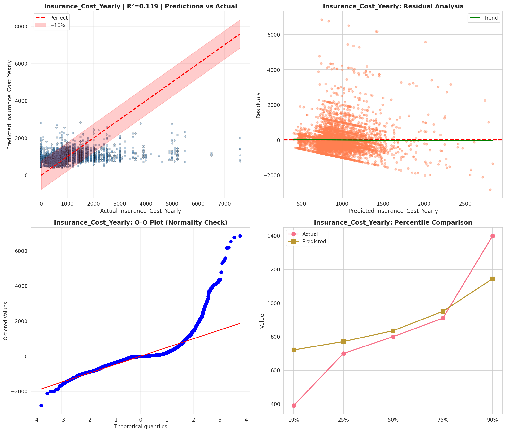
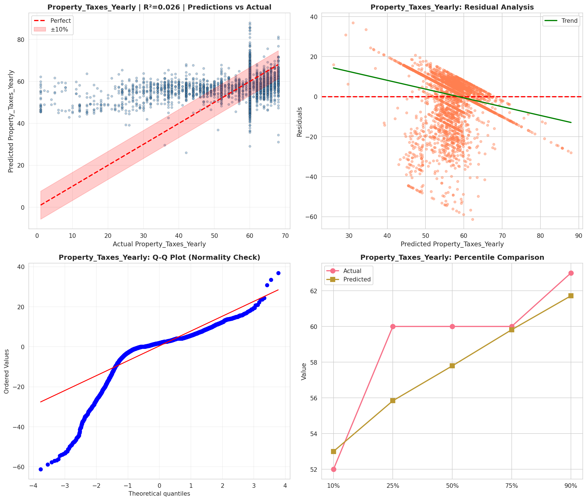
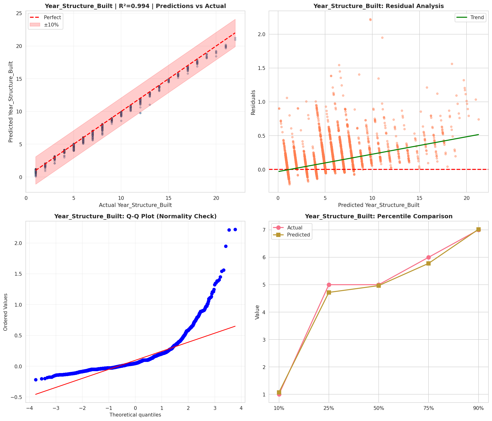
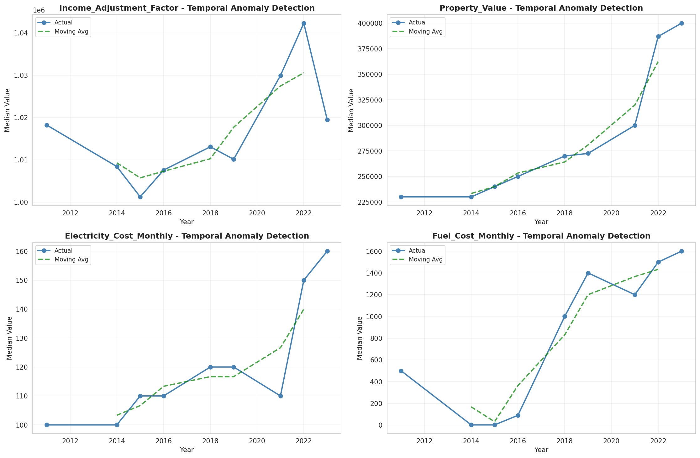
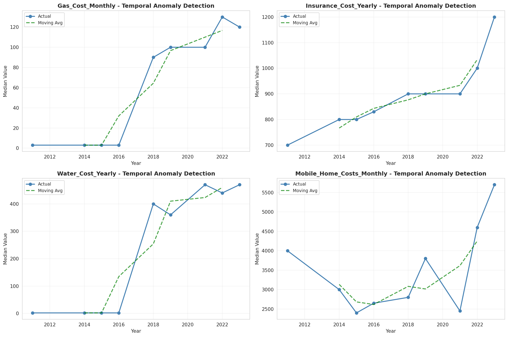
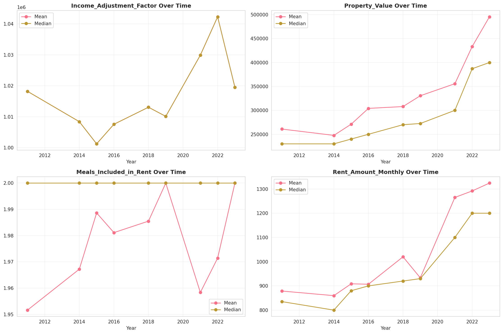
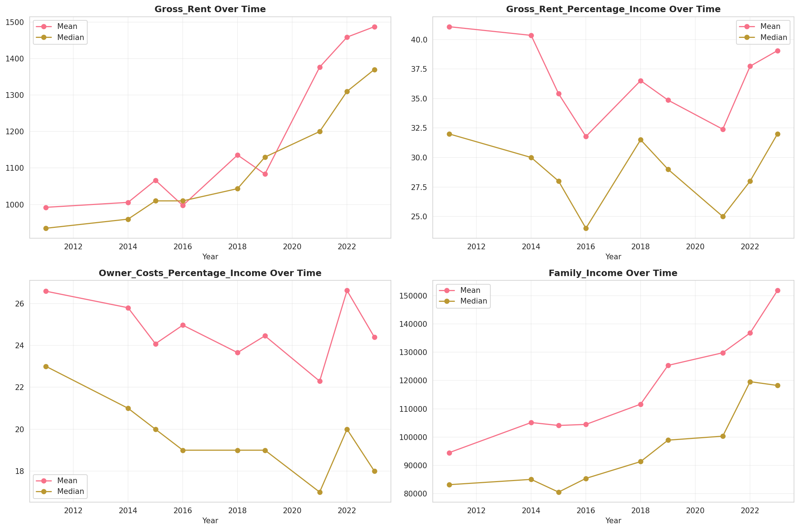
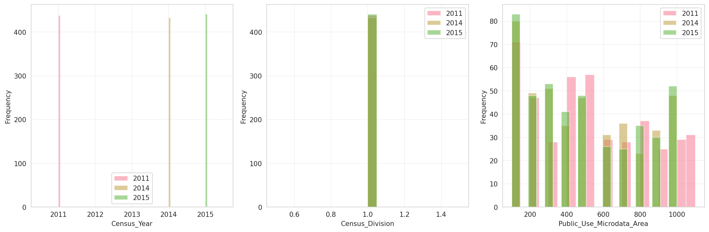
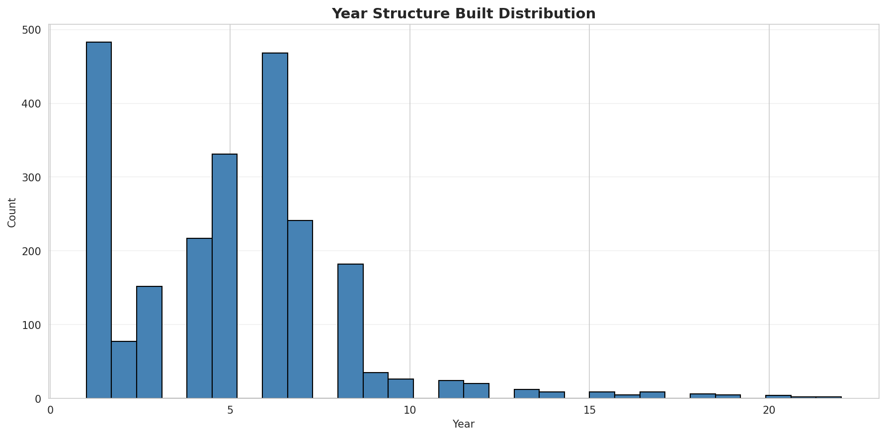
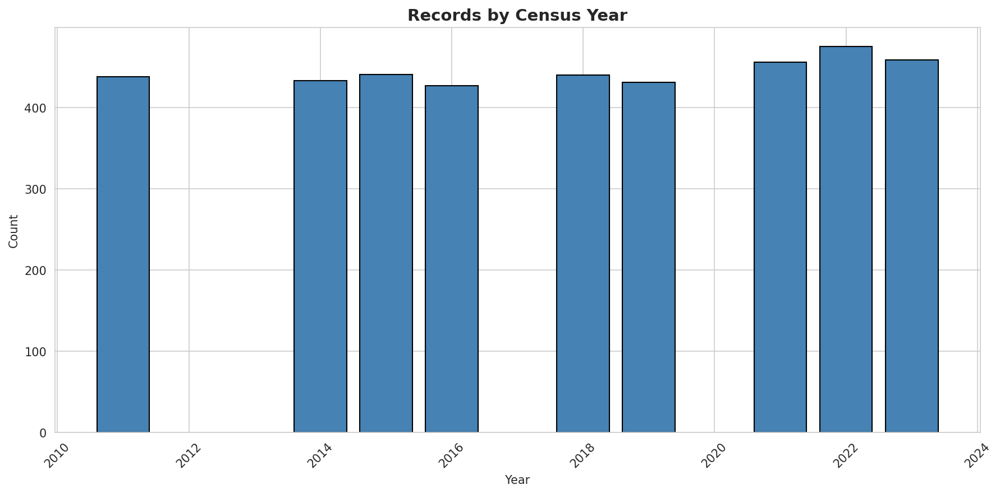

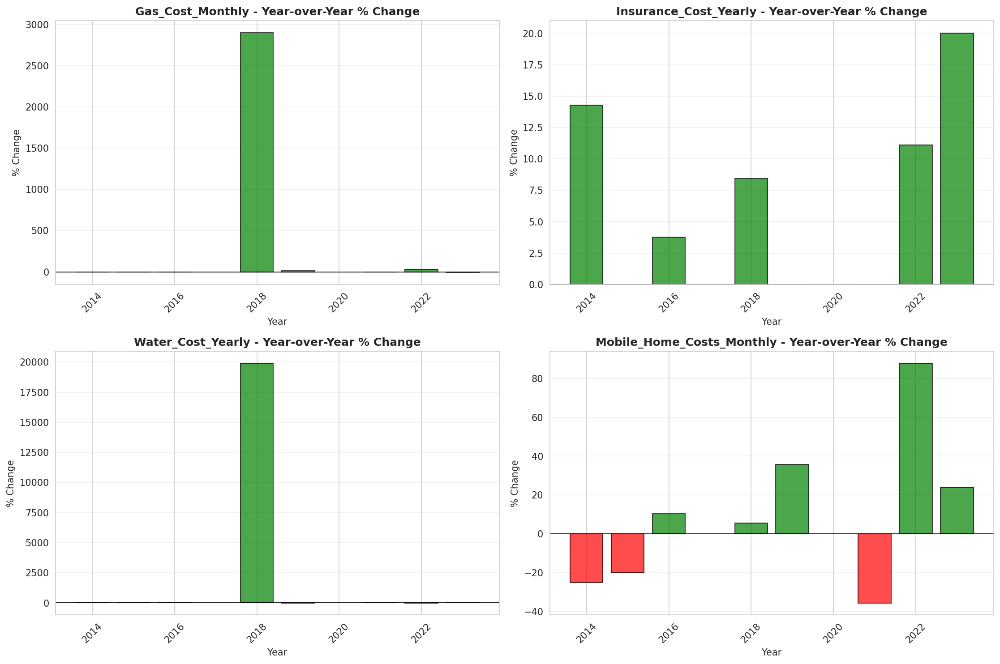
