# Temporal Analysis

## Year Distribution

- 2011: 32,582 records

- 2012: 33,147 records

- 2014: 34,128 records

- 2015: 34,615 records

- 2016: 34,678 records

- 2017: 34,900 records

- 2018: 35,223 records

- 2019: 35,480 records

- 2020: 35,258 records

- 2021: 35,379 records

- 2022: 35,505 records

- 2023: 35,724 records

## Temporal Trends

- Census_Year: {np.int64(2011): {'mean': 2011.0, 'median': 2011.0, 'std': 0.0}, np.int64(2012): {'mean': 2012.0, 'median': 2012.0, 'std': 0.0}, np.int64(2014): {'mean': 2014.0, 'median': 2014.0, 'std': 0.0}, np.int64(2015): {'mean': 2015.0, 'median': 2015.0, 'std': 0.0}, np.int64(2016): {'mean': 2016.0, 'median': 2016.0, 'std': 0.0}, np.int64(2017): {'mean': 2017.0, 'median': 2017.0, 'std': 0.0}, np.int64(2018): {'mean': 2018.0, 'median': 2018.0, 'std': 0.0}, np.int64(2019): {'mean': 2019.0, 'median': 2019.0, 'std': 0.0}, np.int64(2020): {'mean': 2020.0, 'median': 2020.0, 'std': 0.0}, np.int64(2021): {'mean': 2021.0, 'median': 2021.0, 'std': 0.0}, np.int64(2022): {'mean': 2022.0, 'median': 2022.0, 'std': 0.0}, np.int64(2023): {'mean': 2023.0, 'median': 2023.0, 'std': 0.0}}

- Census_Division: {np.int64(2011): {'mean': 1.0, 'median': 1.0, 'std': 0.0}, np.int64(2012): {'mean': 1.0, 'median': 1.0, 'std': 0.0}, np.int64(2014): {'mean': 1.0, 'median': 1.0, 'std': 0.0}, np.int64(2015): {'mean': 1.0, 'median': 1.0, 'std': 0.0}, np.int64(2016): {'mean': 1.0, 'median': 1.0, 'std': 0.0}, np.int64(2017): {'mean': 1.0, 'median': 1.0, 'std': 0.0}, np.int64(2018): {'mean': 1.0, 'median': 1.0, 'std': 0.0}, np.int64(2019): {'mean': 1.0, 'median': 1.0, 'std': 0.0}, np.int64(2020): {'mean': 1.0, 'median': 1.0, 'std': 0.0}, np.int64(2021): {'mean': 1.0, 'median': 1.0, 'std': 0.0}, np.int64(2022): {'mean': 1.0, 'median': 1.0, 'std': 0.0}, np.int64(2023): {'mean': 1.0, 'median': 1.0, 'std': 0.0}}

- Public_Use_Microdata_Area: {np.int64(2011): {'mean': 510.2019519980357, 'median': 500.0, 'std': 325.5822035244381}, np.int64(2012): {'mean': None, 'median': None, 'std': None}, np.int64(2014): {'mean': None, 'median': None, 'std': None}, np.int64(2015): {'mean': None, 'median': None, 'std': None}, np.int64(2016): {'mean': 490.3541150008651, 'median': 500.0, 'std': 305.6278955136927}, np.int64(2017): {'mean': 492.2750716332378, 'median': 500.0, 'std': 305.6343289412585}, np.int64(2018): {'mean': 491.6304687278199, 'median': 500.0, 'std': 305.7013494172326}, np.int64(2019): {'mean': 492.5197294250282, 'median': 500.0, 'std': 305.7393598562673}, np.int64(2020): {'mean': 490.2008054909524, 'median': 500.0, 'std': 305.62158711099494}, np.int64(2021): {'mean': 490.1693094773736, 'median': 500.0, 'std': 305.69254246246226}, np.int64(2022): {'mean': None, 'median': None, 'std': None}, np.int64(2023): {'mean': 415.2513716269175, 'median': 401.0, 'std': 243.18768356611986}}

- Census_Region: {np.int64(2011): {'mean': 1.0, 'median': 1.0, 'std': 0.0}, np.int64(2012): {'mean': 1.0, 'median': 1.0, 'std': 0.0}, np.int64(2014): {'mean': 1.0, 'median': 1.0, 'std': 0.0}, np.int64(2015): {'mean': 1.0, 'median': 1.0, 'std': 0.0}, np.int64(2016): {'mean': 1.0, 'median': 1.0, 'std': 0.0}, np.int64(2017): {'mean': 1.0, 'median': 1.0, 'std': 0.0}, np.int64(2018): {'mean': 1.0, 'median': 1.0, 'std': 0.0}, np.int64(2019): {'mean': 1.0, 'median': 1.0, 'std': 0.0}, np.int64(2020): {'mean': 1.0, 'median': 1.0, 'std': 0.0}, np.int64(2021): {'mean': 1.0, 'median': 1.0, 'std': 0.0}, np.int64(2022): {'mean': 1.0, 'median': 1.0, 'std': 0.0}, np.int64(2023): {'mean': 1.0, 'median': 1.0, 'std': 0.0}}

- State_Code: {np.int64(2011): {'mean': 33.0, 'median': 33.0, 'std': 0.0}, np.int64(2012): {'mean': 33.0, 'median': 33.0, 'std': 0.0}, np.int64(2014): {'mean': 33.0, 'median': 33.0, 'std': 0.0}, np.int64(2015): {'mean': 33.0, 'median': 33.0, 'std': 0.0}, np.int64(2016): {'mean': 33.0, 'median': 33.0, 'std': 0.0}, np.int64(2017): {'mean': 33.0, 'median': 33.0, 'std': 0.0}, np.int64(2018): {'mean': 33.0, 'median': 33.0, 'std': 0.0}, np.int64(2019): {'mean': 33.0, 'median': 33.0, 'std': 0.0}, np.int64(2020): {'mean': 33.0, 'median': 33.0, 'std': 0.0}, np.int64(2021): {'mean': 33.0, 'median': 33.0, 'std': 0.0}, np.int64(2022): {'mean': 33.0, 'median': 33.0, 'std': 0.0}, np.int64(2023): {'mean': None, 'median': None, 'std': None}}

- Housing_Adjustment_Factor: {np.int64(2011): {'mean': 1041063.7450125837, 'median': 1044592.0, 'std': 27599.02397453591}, np.int64(2012): {'mean': 1041204.131897306, 'median': 1053092.0, 'std': 27480.40508047315}, np.int64(2014): {'mean': 1036768.3711322082, 'median': 1031130.0, 'std': 29610.89293185295}, np.int64(2015): {'mean': 1020938.9916510184, 'median': 1017534.0, 'std': 20312.09091799157}, np.int64(2016): {'mean': 1020337.5499163734, 'median': 1013801.0, 'std': 15768.288463052455}, np.int64(2017): {'mean': 1029101.586504298, 'median': 1034680.0, 'std': 17979.13282361965}, np.int64(2018): {'mean': 1038196.4109530704, 'median': 1046406.0, 'std': 23483.59492007156}, np.int64(2019): {'mean': 1040875.1445885006, 'median': 1042936.0, 'std': 29159.851812465367}, np.int64(2020): {'mean': 1035725.5397640251, 'median': 1030827.0, 'std': 28458.905484843635}, np.int64(2021): {'mean': 1058271.1167076514, 'median': 1059761.0, 'std': 35231.9495448708}, np.int64(2022): {'mean': 1105758.828728348, 'median': 1133141.0, 'std': 61027.92514955735}, np.int64(2023): {'mean': 1106834.4708319337, 'median': 1125501.0, 'std': 76792.5367391811}}

- Income_Adjustment_Factor: {np.int64(2011): {'mean': 1053712.6494383402, 'median': 1048026.0, 'std': 28403.756429130415}, np.int64(2012): {'mean': 1052468.27562072, 'median': 1061121.0, 'std': 26395.878066879595}, np.int64(2014): {'mean': 1047628.656352555, 'median': 1041654.0, 'std': 31043.710083422622}, np.int64(2015): {'mean': 1030347.2242380471, 'median': 1025215.0, 'std': 25698.11442879283}, np.int64(2016): {'mean': 1027485.5392467848, 'median': 1022342.0, 'std': 17530.30431353113}, np.int64(2017): {'mean': 1036489.1101146132, 'median': 1035988.0, 'std': 16840.304189292547}, np.int64(2018): {'mean': 1046775.8890497686, 'median': 1054346.0, 'std': 20493.71042656055}, np.int64(2019): {'mean': 1049822.1688556934, 'median': 1054606.0, 'std': 26197.82040297944}, np.int64(2020): {'mean': 1045754.5270293267, 'median': 1044328.0, 'std': 29054.511302505976}, np.int64(2021): {'mean': 1073061.0742248227, 'median': 1070512.0, 'std': 30557.558287962172}, np.int64(2022): {'mean': 1127662.8595690748, 'median': 1140108.0, 'std': 49167.88749974152}, np.int64(2023): {'mean': 1130339.9429795095, 'median': 1159185.0, 'std': 70220.1642568683}}

- Housing_Unit_Weight: {np.int64(2011): {'mean': 18.7807992142901, 'median': 16.0, 'std': 15.636807836231034}, np.int64(2012): {'mean': 18.523395782423748, 'median': 16.0, 'std': 15.862739966198273}, np.int64(2014): {'mean': 18.08737693389592, 'median': 15.0, 'std': 16.55290768873292}, np.int64(2015): {'mean': 17.880976455293947, 'median': 15.0, 'std': 16.806411560763674}, np.int64(2016): {'mean': 17.899561681757888, 'median': 15.0, 'std': 16.836894472160374}, np.int64(2017): {'mean': 17.98318051575931, 'median': 15.0, 'std': 16.877052426910147}, np.int64(2018): {'mean': 17.913238508928824, 'median': 15.0, 'std': 16.621488719565775}, np.int64(2019): {'mean': 17.889740698985342, 'median': 15.0, 'std': 16.765742703594235}, np.int64(2020): {'mean': 18.112740370979637, 'median': 14.0, 'std': 19.6016711390957}, np.int64(2021): {'mean': 17.990644167443964, 'median': 14.0, 'std': 19.29454714494506}, np.int64(2022): {'mean': 18.03526263906492, 'median': 14.0, 'std': 19.737956216182315}, np.int64(2023): {'mean': 18.034178703392676, 'median': 13.0, 'std': 20.038683628949855}}

- Number_of_Persons: {np.int64(2011): {'mean': 2.0264256337855255, 'median': 2.0, 'std': 1.4386596162188}, np.int64(2012): {'mean': 2.000512866926117, 'median': 2.0, 'std': 1.422816539559943}, np.int64(2014): {'mean': 1.9705520393811533, 'median': 2.0, 'std': 1.402953120285581}, np.int64(2015): {'mean': 1.9472483027589196, 'median': 2.0, 'std': 1.3934870192117148}, np.int64(2016): {'mean': 1.9392121806332545, 'median': 2.0, 'std': 1.3934026874187266}, np.int64(2017): {'mean': 1.9337249283667621, 'median': 2.0, 'std': 1.397107713052334}, np.int64(2018): {'mean': 1.9226073872185787, 'median': 2.0, 'std': 1.3960796255466417}, np.int64(2019): {'mean': 1.9219278466741827, 'median': 2.0, 'std': 1.3939562254773143}, np.int64(2020): {'mean': 1.9093822678541041, 'median': 2.0, 'std': 1.3889326726020943}, np.int64(2021): {'mean': 1.907883207552503, 'median': 2.0, 'std': 1.380132395729492}, np.int64(2022): {'mean': 1.9115054217715814, 'median': 2.0, 'std': 1.3642364161643712}, np.int64(2023): {'mean': 1.920697570260889, 'median': 2.0, 'std': 1.3545869101217844}}

- Housing_Unit_Type: {np.int64(2011): {'mean': 1.1135903259468418, 'median': 1.0, 'std': 0.4292275374733906}, np.int64(2012): {'mean': 1.1294234772377592, 'median': 1.0, 'std': 0.4583929492241892}, np.int64(2014): {'mean': 1.1575246132208157, 'median': 1.0, 'std': 0.5064459140570869}, np.int64(2015): {'mean': 1.1767441860465115, 'median': 1.0, 'std': 0.5354125883766722}, np.int64(2016): {'mean': 1.1763654189976354, 'median': 1.0, 'std': 0.5355367230925749}, np.int64(2017): {'mean': 1.177621776504298, 'median': 1.0, 'std': 0.5374302497216272}, np.int64(2018): {'mean': 1.1807909604519775, 'median': 1.0, 'std': 0.5413125027127542}, np.int64(2019): {'mean': 1.1808060879368658, 'median': 1.0, 'std': 0.5411328301545283}, np.int64(2020): {'mean': None, 'median': None, 'std': None}, np.int64(2021): {'mean': None, 'median': None, 'std': None}, np.int64(2022): {'mean': None, 'median': None, 'std': None}, np.int64(2023): {'mean': None, 'median': None, 'std': None}}

- Number_of_Bedrooms: {np.int64(2011): {'mean': 2.725712585146485, 'median': 3.0, 'std': 1.0143930617600367}, np.int64(2012): {'mean': None, 'median': None, 'std': None}, np.int64(2014): {'mean': None, 'median': None, 'std': None}, np.int64(2015): {'mean': None, 'median': None, 'std': None}, np.int64(2016): {'mean': None, 'median': None, 'std': None}, np.int64(2017): {'mean': None, 'median': None, 'std': None}, np.int64(2018): {'mean': None, 'median': None, 'std': None}, np.int64(2019): {'mean': None, 'median': None, 'std': None}, np.int64(2020): {'mean': None, 'median': None, 'std': None}, np.int64(2021): {'mean': None, 'median': None, 'std': None}, np.int64(2022): {'mean': None, 'median': None, 'std': None}, np.int64(2023): {'mean': None, 'median': None, 'std': None}}

- Number_of_Rooms: {np.int64(2011): {'mean': 5.852655247668805, 'median': 6.0, 'std': 1.9389293015820879}, np.int64(2012): {'mean': None, 'median': None, 'std': None}, np.int64(2014): {'mean': None, 'median': None, 'std': None}, np.int64(2015): {'mean': None, 'median': None, 'std': None}, np.int64(2016): {'mean': None, 'median': None, 'std': None}, np.int64(2017): {'mean': None, 'median': None, 'std': None}, np.int64(2018): {'mean': None, 'median': None, 'std': None}, np.int64(2019): {'mean': None, 'median': None, 'std': None}, np.int64(2020): {'mean': None, 'median': None, 'std': None}, np.int64(2021): {'mean': None, 'median': None, 'std': None}, np.int64(2022): {'mean': None, 'median': None, 'std': None}, np.int64(2023): {'mean': None, 'median': None, 'std': None}}

- Building_Type: {np.int64(2011): {'mean': 2.7271013821837182, 'median': 2.0, 'std': 1.7423086087024882}, np.int64(2012): {'mean': 2.723680756103964, 'median': 2.0, 'std': 1.7349510652820799}, np.int64(2014): {'mean': 2.7357763089683775, 'median': 2.0, 'std': 1.742023315614128}, np.int64(2015): {'mean': 2.7487071751777634, 'median': 2.0, 'std': 1.7546344307071948}, np.int64(2016): {'mean': 2.7546105236007223, 'median': 2.0, 'std': 1.7611105187905267}, np.int64(2017): {'mean': 2.7710310335983586, 'median': 2.0, 'std': 1.7780819922661486}, np.int64(2018): {'mean': 2.777183430445442, 'median': 2.0, 'std': 1.7901135306090261}, np.int64(2019): {'mean': 2.7821825998988365, 'median': 2.0, 'std': 1.8001123872306648}, np.int64(2020): {'mean': 2.7802436069128245, 'median': 2.0, 'std': 1.803272492439393}, np.int64(2021): {'mean': 2.7924115633320654, 'median': 2.0, 'std': 1.8178147892254066}, np.int64(2022): {'mean': 2.790892163978919, 'median': 2.0, 'std': 1.8228740407130104}, np.int64(2023): {'mean': 2.78597229638471, 'median': 2.0, 'std': 1.8186882813080727}}

- Year_Structure_Built: {np.int64(2011): {'mean': 5.394385291978044, 'median': 5.0, 'std': 2.4273796106432965}, np.int64(2012): {'mean': 4.705729850354424, 'median': 5.0, 'std': 2.5792819418403004}, np.int64(2014): {'mean': 4.81152799377916, 'median': 5.0, 'std': 2.7332844709171993}, np.int64(2015): {'mean': 4.8768584356819655, 'median': 5.0, 'std': 2.83819688156223}, np.int64(2016): {'mean': 4.958440804745938, 'median': 5.0, 'std': 2.9662480416678476}, np.int64(2017): {'mean': 5.047159528084124, 'median': 5.0, 'std': 3.130821995936695}, np.int64(2018): {'mean': 5.124940299933136, 'median': 5.0, 'std': 3.297897793470253}, np.int64(2019): {'mean': 5.215477996965099, 'median': 5.0, 'std': 3.467865561824568}, np.int64(2020): {'mean': 5.303105669281296, 'median': 5.0, 'std': 3.649308713077854}, np.int64(2021): {'mean': None, 'median': None, 'std': None}, np.int64(2022): {'mean': None, 'median': None, 'std': None}, np.int64(2023): {'mean': None, 'median': None, 'std': None}}

- Bathtub_or_Shower: {np.int64(2011): {'mean': None, 'median': None, 'std': None}, np.int64(2012): {'mean': 1.0152927277500656, 'median': 1.0, 'std': 0.12271656135602968}, np.int64(2014): {'mean': 1.0159733022291342, 'median': 1.0, 'std': 0.1253741007267483}, np.int64(2015): {'mean': 1.015481577246283, 'median': 1.0, 'std': 0.123460077173859}, np.int64(2016): {'mean': 1.0147343306680423, 'median': 1.0, 'std': 0.12048941131513775}, np.int64(2017): {'mean': 1.0147794306232367, 'median': 1.0, 'std': 0.1206708990893862}, np.int64(2018): {'mean': 1.014519056261343, 'median': 1.0, 'std': 0.11961901544663867}, np.int64(2019): {'mean': 1.0145422357106728, 'median': 1.0, 'std': 0.11971304085931614}, np.int64(2020): {'mean': 1.0153370320770359, 'median': 1.0, 'std': 0.12289137102127383}, np.int64(2021): {'mean': 1.0149613287688601, 'median': 1.0, 'std': 0.12139997763608354}, np.int64(2022): {'mean': 1.0144223183008805, 'median': 1.0, 'std': 0.11922568362116208}, np.int64(2023): {'mean': 1.0130979677733454, 'median': 1.0, 'std': 0.11369616108210587}}

- Refrigerator: {np.int64(2011): {'mean': None, 'median': None, 'std': None}, np.int64(2012): {'mean': 1.0100748227881333, 'median': 1.0, 'std': 0.0998681532784695}, np.int64(2014): {'mean': 1.009622861586314, 'median': 1.0, 'std': 0.09762464296313039}, np.int64(2015): {'mean': 1.009469941822883, 'median': 1.0, 'std': 0.09685331801462974}, np.int64(2016): {'mean': 1.0093177714727883, 'median': 1.0, 'std': 0.09607938507377907}, np.int64(2017): {'mean': 1.0104834572967427, 'median': 1.0, 'std': 0.10185228029605323}, np.int64(2018): {'mean': 1.0106664119463813, 'median': 1.0, 'std': 0.10272767694098406}, np.int64(2019): {'mean': 1.010843449671219, 'median': 1.0, 'std': 0.10356740975825474}, np.int64(2020): {'mean': 1.0112237739940055, 'median': 1.0, 'std': 0.10534778006208667}, np.int64(2021): {'mean': 1.01166476480284, 'median': 1.0, 'std': 0.10737347675325548}, np.int64(2022): {'mean': 1.0103196894625557, 'median': 1.0, 'std': 0.10106194039826867}, np.int64(2023): {'mean': 1.0096742783553727, 'median': 1.0, 'std': 0.09788251954483924}}

- Hot_and_Cold_Running_Water: {np.int64(2011): {'mean': None, 'median': None, 'std': None}, np.int64(2012): {'mean': 1.0150958256760305, 'median': 1.0, 'std': 0.12193617043613006}, np.int64(2014): {'mean': 1.0155844997407983, 'median': 1.0, 'std': 0.12386331255260045}, np.int64(2015): {'mean': 1.0152230122818358, 'median': 1.0, 'std': 0.12244082947196738}, np.int64(2016): {'mean': 1.0157338148052617, 'median': 1.0, 'std': 0.12444581629032801}, np.int64(2017): {'mean': 1.016574762759682, 'median': 1.0, 'std': 0.12767365659002666}, np.int64(2018): {'mean': 1.016111058044385, 'median': 1.0, 'std': 0.12590471230741085}, np.int64(2019): {'mean': 1.0167551846231664, 'median': 1.0, 'std': 0.12835485672062036}, np.int64(2020): {'mean': 1.0177284611950768, 'median': 1.0, 'std': 0.131964836754286}, np.int64(2021): {'mean': 1.0164828198301001, 'median': 1.0, 'std': 0.12732497929735367}, np.int64(2022): {'mean': 1.0150534919683152, 'median': 1.0, 'std': 0.12176761589023026}, np.int64(2023): {'mean': 1.013883217639853, 'median': 1.0, 'std': 0.11700813620871468}}

- Running_Water: {np.int64(2011): {'mean': None, 'median': None, 'std': None}, np.int64(2012): {'mean': None, 'median': None, 'std': None}, np.int64(2014): {'mean': 9.0, 'median': 9.0, 'std': 0.0}, np.int64(2015): {'mean': 9.0, 'median': 9.0, 'std': 0.0}, np.int64(2016): {'mean': 9.0, 'median': 9.0, 'std': 0.0}, np.int64(2017): {'mean': 9.0, 'median': 9.0, 'std': 0.0}, np.int64(2018): {'mean': 9.0, 'median': 9.0, 'std': 0.0}, np.int64(2019): {'mean': 9.0, 'median': 9.0, 'std': 0.0}, np.int64(2020): {'mean': 9.0, 'median': 9.0, 'std': 0.0}, np.int64(2021): {'mean': 9.0, 'median': 9.0, 'std': 0.0}, np.int64(2022): {'mean': 9.0, 'median': 9.0, 'std': 0.0}, np.int64(2023): {'mean': 9.0, 'median': 9.0, 'std': 0.0}}

- Sink_with_Faucet: {np.int64(2011): {'mean': None, 'median': None, 'std': None}, np.int64(2012): {'mean': 1.010501443948543, 'median': 1.0, 'std': 0.10193872984138333}, np.int64(2014): {'mean': 1.009201658890617, 'median': 1.0, 'std': 0.09548446871697118}, np.int64(2015): {'mean': 1.0085326438267614, 'median': 1.0, 'std': 0.09197886307262518}, np.int64(2016): {'mean': 1.0082538044880063, 'median': 1.0, 'std': 0.09047620198671766}, np.int64(2017): {'mean': 1.0087843036676072, 'median': 1.0, 'std': 0.09331355117129345}, np.int64(2018): {'mean': 1.0085649695927659, 'median': 1.0, 'std': 0.09215140406116103}, np.int64(2019): {'mean': 1.0086621143146182, 'median': 1.0, 'std': 0.09266797487266329}, np.int64(2020): {'mean': 1.0091193163701295, 'median': 1.0, 'std': 0.09506020498906345}, np.int64(2021): {'mean': 1.008811969063015, 'median': 1.0, 'std': 0.09345905590733053}, np.int64(2022): {'mean': 1.008173698993278, 'median': 1.0, 'std': 0.09003968840951611}, np.int64(2023): {'mean': 1.0076640386971134, 'median': 1.0, 'std': 0.08720974772315565}}

- Stove_or_Range: {np.int64(2011): {'mean': None, 'median': None, 'std': None}, np.int64(2012): {'mean': 1.0124704646888947, 'median': 1.0, 'std': 0.11097457525279923}, np.int64(2014): {'mean': 1.012085277345775, 'median': 1.0, 'std': 0.10926852366120389}, np.int64(2015): {'mean': 1.011764705882353, 'median': 1.0, 'std': 0.10782705300226204}, np.int64(2016): {'mean': 1.0116713954088212, 'median': 1.0, 'std': 0.1074036585059126}, np.int64(2017): {'mean': 1.0121184919210053, 'median': 1.0, 'std': 0.10941671669129355}, np.int64(2018): {'mean': 1.0120673735154584, 'median': 1.0, 'std': 0.10918851410744876}, np.int64(2019): {'mean': 1.012613808801214, 'median': 1.0, 'std': 0.11160239414350674}, np.int64(2020): {'mean': 1.0131050315668644, 'median': 1.0, 'std': 0.11372643542695084}, np.int64(2021): {'mean': 1.0131228604031952, 'median': 1.0, 'std': 0.11380273044742126}, np.int64(2022): {'mean': 1.0124656799318332, 'median': 1.0, 'std': 0.11095348243463568}, np.int64(2023): {'mean': 1.0119043879762541, 'median': 1.0, 'std': 0.10845756313085168}}

- Telephone_Service: {np.int64(2011): {'mean': 1.0156632965686274, 'median': 1.0, 'std': 0.12417144674489144}, np.int64(2012): {'mean': 1.0157020405067132, 'median': 1.0, 'std': 0.12432245429891674}, np.int64(2014): {'mean': 1.0174985978687605, 'median': 1.0, 'std': 0.13112223225680109}, np.int64(2015): {'mean': 1.0183332088716301, 'median': 1.0, 'std': 0.13415578382683757}, np.int64(2016): {'mean': 1.0187672561749124, 'median': 1.0, 'std': 0.13570458125476645}, np.int64(2017): {'mean': 1.0167280026764804, 'median': 1.0, 'std': 0.128252828660094}, np.int64(2018): {'mean': 1.0156359738291503, 'median': 1.0, 'std': 0.12406473758075416}, np.int64(2019): {'mean': 1.0133918770581778, 'median': 1.0, 'std': 0.114947893191212}, np.int64(2020): {'mean': 1.01082965545377, 'median': 1.0, 'std': 0.1035025184732141}, np.int64(2021): {'mean': 1.0082757098720023, 'median': 1.0, 'std': 0.09059538828505082}, np.int64(2022): {'mean': 1.0069494978896814, 'median': 1.0, 'std': 0.0830749870707565}, np.int64(2023): {'mean': 1.0057093611978887, 'median': 1.0, 'std': 0.07534565840704144}}

- Lot_Acreage: {np.int64(2011): {'mean': 1.6513296578563321, 'median': 2.0, 'std': 0.6575119651535151}, np.int64(2012): {'mean': 1.654520592020592, 'median': 2.0, 'std': 0.6572522565314153}, np.int64(2014): {'mean': 1.6651493371665869, 'median': 2.0, 'std': 0.6574300609865722}, np.int64(2015): {'mean': 1.6692110942370715, 'median': 2.0, 'std': 0.6578745002196502}, np.int64(2016): {'mean': 1.6653108426047774, 'median': 2.0, 'std': 0.6565119131343528}, np.int64(2017): {'mean': 1.6666666666666667, 'median': 2.0, 'std': 0.6579511715085944}, np.int64(2018): {'mean': 1.6658771514290225, 'median': 2.0, 'std': 0.6583770601334649}, np.int64(2019): {'mean': 1.66460260228876, 'median': 2.0, 'std': 0.6605738356113012}, np.int64(2020): {'mean': 1.6637985475213135, 'median': 2.0, 'std': 0.6618009537463443}, np.int64(2021): {'mean': 1.6690791802698344, 'median': 2.0, 'std': 0.6626510465932832}, np.int64(2022): {'mean': 1.6726583564534407, 'median': 2.0, 'std': 0.6606466881632772}, np.int64(2023): {'mean': 1.6767022308438408, 'median': 2.0, 'std': 0.659641463220204}}

- Agricultural_Sales: {np.int64(2011): {'mean': 1.0645027049521432, 'median': 1.0, 'std': 0.46098041917977667}, np.int64(2012): {'mean': 1.0661855162798326, 'median': 1.0, 'std': 0.46582592248172666}, np.int64(2014): {'mean': 1.0649568552253117, 'median': 1.0, 'std': 0.45423299417869833}, np.int64(2015): {'mean': 1.0648037576626064, 'median': 1.0, 'std': 0.45648631575322757}, np.int64(2016): {'mean': 1.060957098346249, 'median': 1.0, 'std': 0.4342784516491467}, np.int64(2017): {'mean': 1.0644645285131569, 'median': 1.0, 'std': 0.45304578921289185}, np.int64(2018): {'mean': 1.06524506683641, 'median': 1.0, 'std': 0.45489644388952527}, np.int64(2019): {'mean': 1.0667089712064726, 'median': 1.0, 'std': 0.4592637496593627}, np.int64(2020): {'mean': 1.068904593639576, 'median': 1.0, 'std': 0.4702096227030737}, np.int64(2021): {'mean': 1.073060447405997, 'median': 1.0, 'std': 0.48636394519206555}, np.int64(2022): {'mean': 1.0738870328645793, 'median': 1.0, 'std': 0.49619636622760516}, np.int64(2023): {'mean': 1.074000761324705, 'median': 1.0, 'std': 0.4939154111570489}}

- Business_On_Property: {np.int64(2011): {'mean': 1.974177071509648, 'median': 2.0, 'std': 0.15860997661824788}, np.int64(2012): {'mean': 1.9747828185328185, 'median': 2.0, 'std': 0.1567873205809307}, np.int64(2014): {'mean': 1.9759223766171539, 'median': 2.0, 'std': 0.15329328014253663}, np.int64(2015): {'mean': 1.9751418751498682, 'median': 2.0, 'std': 0.1556957522645345}, np.int64(2016): {'mean': 3.4055110260397976, 'median': 2.0, 'std': 2.8322550137515488}, np.int64(2017): {'mean': 4.826372315035799, 'median': 2.0, 'std': 3.4512229399189525}, np.int64(2018): {'mean': 6.23030159482078, 'median': 9.0, 'std': 3.4340359286558892}, np.int64(2019): {'mean': 7.619493651042483, 'median': 9.0, 'std': 2.7928596833662946}, np.int64(2020): {'mean': None, 'median': None, 'std': None}, np.int64(2021): {'mean': None, 'median': None, 'std': None}, np.int64(2022): {'mean': None, 'median': None, 'std': None}, np.int64(2023): {'mean': None, 'median': None, 'std': None}}

- Tenure: {np.int64(2011): {'mean': 1.686734068627451, 'median': 1.0, 'std': 0.8304524575107776}, np.int64(2012): {'mean': 1.701206098763559, 'median': 1.0, 'std': 0.8338582702536724}, np.int64(2014): {'mean': 1.7258553000560852, 'median': 1.0, 'std': 0.8335968761157855}, np.int64(2015): {'mean': 1.7383317153311926, 'median': 2.0, 'std': 0.8338330601494754}, np.int64(2016): {'mean': 1.7452428923214685, 'median': 2.0, 'std': 0.8353170082451823}, np.int64(2017): {'mean': 1.7543957473699863, 'median': 2.0, 'std': 0.8363998950821572}, np.int64(2018): {'mean': 1.7591394669722398, 'median': 2.0, 'std': 0.8344070536076074}, np.int64(2019): {'mean': 1.7604098060739115, 'median': 2.0, 'std': 0.8315903092669342}, np.int64(2020): {'mean': 1.7582242332084708, 'median': 2.0, 'std': 0.8274207925091674}, np.int64(2021): {'mean': 1.7616227747535678, 'median': 2.0, 'std': 0.820796676222117}, np.int64(2022): {'mean': 1.7580774268665404, 'median': 2.0, 'std': 0.811769319931917}, np.int64(2023): {'mean': 1.755502890588531, 'median': 2.0, 'std': 0.8062039317628159}}

- Vacancy_Status: {np.int64(2011): {'mean': 4.870702179176756, 'median': 5.0, 'std': 1.2339504855718124}, np.int64(2012): {'mean': 4.884072089624939, 'median': 5.0, 'std': 1.2477329810013655}, np.int64(2014): {'mean': 4.916484583636805, 'median': 5.0, 'std': 1.2601478031802058}, np.int64(2015): {'mean': 4.935786435786436, 'median': 5.0, 'std': 1.236702664539827}, np.int64(2016): {'mean': 4.956336022781206, 'median': 5.0, 'std': 1.2280801390622345}, np.int64(2017): {'mean': 4.968538802144022, 'median': 5.0, 'std': 1.2024404805055315}, np.int64(2018): {'mean': 4.97060174552136, 'median': 5.0, 'std': 1.19884286650422}, np.int64(2019): {'mean': 4.9760576476057645, 'median': 5.0, 'std': 1.1864669297254384}, np.int64(2020): {'mean': 4.972266424187315, 'median': 5.0, 'std': 1.1862307370285567}, np.int64(2021): {'mean': 4.965825688073394, 'median': 5.0, 'std': 1.1815966687761874}, np.int64(2022): {'mean': 4.973828217939567, 'median': 5.0, 'std': 1.179420664661145}, np.int64(2023): {'mean': 4.978686058174524, 'median': 5.0, 'std': 1.1882279694085986}}

- Property_Value: {np.int64(2011): {'mean': 17.74006130855446, 'median': 18.0, 'std': 3.761666164515748}}

- Vehicles_Available: {np.int64(2011): {'mean': 1.9809283088235294, 'median': 2.0, 'std': 1.0438382736854377}, np.int64(2012): {'mean': 1.962565425168778, 'median': 2.0, 'std': 1.0367064084420554}, np.int64(2014): {'mean': 1.9545709478407178, 'median': 2.0, 'std': 1.035595245270138}, np.int64(2015): {'mean': 1.9588529609439176, 'median': 2.0, 'std': 1.0383529819322384}, np.int64(2016): {'mean': 1.9682486381613313, 'median': 2.0, 'std': 1.0479347390501619}, np.int64(2017): {'mean': 1.9827887439128657, 'median': 2.0, 'std': 1.0540245263617858}, np.int64(2018): {'mean': 1.992791926958193, 'median': 2.0, 'std': 1.0634462964801943}, np.int64(2019): {'mean': 1.9983534577387487, 'median': 2.0, 'std': 1.0661965440962724}, np.int64(2020): {'mean': 2.0097541074806218, 'median': 2.0, 'std': 1.0697511069490209}, np.int64(2021): {'mean': 2.006215977637193, 'median': 2.0, 'std': 1.0640286156073682}, np.int64(2022): {'mean': 2.0014190074225002, 'median': 2.0, 'std': 1.0619384639736067}, np.int64(2023): {'mean': 2.0026930949046644, 'median': 2.0, 'std': 1.0656219114192829}}

- Condo_Fee_Monthly: {np.int64(2011): {'mean': 244.5225988700565, 'median': 230.0, 'std': 125.68099523450263}, np.int64(2012): {'mean': 251.52561403508773, 'median': 230.0, 'std': 128.8818576328237}, np.int64(2014): {'mean': 259.10557184750735, 'median': 250.0, 'std': 118.18357705405903}, np.int64(2015): {'mean': 265.79646017699116, 'median': 250.0, 'std': 113.70006449614344}, np.int64(2016): {'mean': 271.4098837209302, 'median': 260.0, 'std': 111.98722273084682}, np.int64(2017): {'mean': 277.9625629949604, 'median': 260.0, 'std': 112.58405138508446}, np.int64(2018): {'mean': 289.5753715498938, 'median': 280.0, 'std': 122.11296383643808}, np.int64(2019): {'mean': 297.86547700754977, 'median': 290.0, 'std': 123.78991651017927}, np.int64(2020): {'mean': 307.43565037852716, 'median': 290.0, 'std': 132.05955235155713}, np.int64(2021): {'mean': 316.5238095238095, 'median': 300.0, 'std': 138.5988912023695}, np.int64(2022): {'mean': 326.914671577655, 'median': 300.0, 'std': 145.63334766775512}, np.int64(2023): {'mean': 334.8416130917592, 'median': 310.0, 'std': 145.7600930415397}}

- Electricity_Cost_Monthly: {np.int64(2011): {'mean': 111.42221966911765, 'median': 100.0, 'std': 71.77860975818383}, np.int64(2012): {'mean': 112.23723735113404, 'median': 100.0, 'std': 71.9306309422856}, np.int64(2014): {'mean': 113.94081136661057, 'median': 100.0, 'std': 72.99383558778547}, np.int64(2015): {'mean': 116.07714136360242, 'median': 100.0, 'std': 75.85237348450593}, np.int64(2016): {'mean': 117.40362659503022, 'median': 100.0, 'std': 76.88080154297202}, np.int64(2017): {'mean': 119.94918404520278, 'median': 100.0, 'std': 79.14179584056413}, np.int64(2018): {'mean': 129.91522322992486, 'median': 110.0, 'std': 78.83209471719479}, np.int64(2019): {'mean': 132.52977428549417, 'median': 120.0, 'std': 80.60290073066153}, np.int64(2020): {'mean': 134.60954387607788, 'median': 120.0, 'std': 83.45215937333418}, np.int64(2021): {'mean': 137.63859242072698, 'median': 120.0, 'std': 86.98669591186008}, np.int64(2022): {'mean': 149.71755258126194, 'median': 120.0, 'std': 120.72713491410555}, np.int64(2023): {'mean': 164.96089596138617, 'median': 130.0, 'std': 150.14489399942576}}

- Fuel_Cost_Monthly: {np.int64(2011): {'mean': 1015.5754825367648, 'median': 600.0, 'std': 1215.4479972366482}, np.int64(2012): {'mean': 1049.0510885230979, 'median': 600.0, 'std': 1259.8331585026638}, np.int64(2014): {'mean': 985.7052533183772, 'median': 400.0, 'std': 1256.574674843348}, np.int64(2015): {'mean': 978.3985886042865, 'median': 330.0, 'std': 1279.6751666617683}, np.int64(2016): {'mean': 899.4715692858742, 'median': 200.0, 'std': 1234.3282041455857}, np.int64(2017): {'mean': 805.425337348054, 'median': 2.0, 'std': 1162.3152723403473}, np.int64(2018): {'mean': 1548.3518910741302, 'median': 1200.0, 'std': 1151.8206751117991}, np.int64(2019): {'mean': 1484.6568538647343, 'median': 1200.0, 'std': 1105.6598250956356}, np.int64(2020): {'mean': 1435.7476759628155, 'median': 1200.0, 'std': 1066.883613504819}, np.int64(2021): {'mean': 1442.9223932709094, 'median': 1200.0, 'std': 1073.7592443634726}, np.int64(2022): {'mean': 1556.6926337678958, 'median': 1300.0, 'std': 1169.5461393018313}, np.int64(2023): {'mean': 1677.5137920101458, 'median': 1400.0, 'std': 1284.8587928663735}}

- Gas_Cost_Monthly: {np.int64(2011): {'mean': 59.40341605392157, 'median': 3.0, 'std': 102.74430861973327}, np.int64(2012): {'mean': 59.48005006447698, 'median': 3.0, 'std': 103.3921592436856}, np.int64(2014): {'mean': 59.7540848756777, 'median': 3.0, 'std': 103.70179280657517}, np.int64(2015): {'mean': 61.64834590396535, 'median': 3.0, 'std': 107.11132164035575}, np.int64(2016): {'mean': 61.35210058950825, 'median': 3.0, 'std': 105.95746704437343}, np.int64(2017): {'mean': 62.5635106501617, 'median': 3.0, 'std': 106.61724696786118}, np.int64(2018): {'mean': 135.80955414012737, 'median': 100.0, 'std': 127.69938437442742}, np.int64(2019): {'mean': 135.84206423448705, 'median': 100.0, 'std': 127.86624117122322}, np.int64(2020): {'mean': 135.36623457754177, 'median': 100.0, 'std': 126.83058408960423}, np.int64(2021): {'mean': 140.29593246354565, 'median': 100.0, 'std': 132.78009490245236}, np.int64(2022): {'mean': 157.2923169267707, 'median': 100.0, 'std': 171.86711052217572}, np.int64(2023): {'mean': 170.86613481665813, 'median': 100.0, 'std': 194.97952592323009}}

- House_Heating_Fuel: {np.int64(2011): {'mean': 3.4558823529411766, 'median': 4.0, 'std': 1.543308093832881}, np.int64(2012): {'mean': 3.479329439429568, 'median': 4.0, 'std': 1.5829816829970929}, np.int64(2014): {'mean': 3.499831744251262, 'median': 4.0, 'std': 1.6472296702057876}, np.int64(2015): {'mean': 3.502165633634531, 'median': 4.0, 'std': 1.6693944414590303}, np.int64(2016): {'mean': 3.474442205805537, 'median': 4.0, 'std': 1.6817963529619113}, np.int64(2017): {'mean': 3.4371584699453552, 'median': 4.0, 'std': 1.6834755206870453}, np.int64(2018): {'mean': 3.4056481721066056, 'median': 4.0, 'std': 1.6782702099199929}, np.int64(2019): {'mean': 3.375009147457007, 'median': 4.0, 'std': 1.6701718069334512}, np.int64(2020): {'mean': 3.3534102288321033, 'median': 4.0, 'std': 1.6640933888960483}, np.int64(2021): {'mean': 3.332536413123437, 'median': 4.0, 'std': 1.6621926494556745}, np.int64(2022): {'mean': 3.3157837287148886, 'median': 4.0, 'std': 1.6525543746226403}, np.int64(2023): {'mean': 3.3099931774929083, 'median': 4.0, 'std': 1.6508338505980504}}

- Insurance_Cost_Yearly: {np.int64(2014): {'mean': 859.7308479915988, 'median': 720.0, 'std': 592.5419210347167}, np.int64(2015): {'mean': 895.8149275666597, 'median': 770.0, 'std': 634.4980252339258}}

- Water_Cost_Yearly: {np.int64(2011): {'mean': 152.62021292892157, 'median': 2.0, 'std': 304.7567660921419}, np.int64(2012): {'mean': 157.22544185693695, 'median': 2.0, 'std': 308.87469787325324}, np.int64(2014): {'mean': 161.29841091792858, 'median': 2.0, 'std': 318.56701268537824}, np.int64(2015): {'mean': 163.02639832723472, 'median': 2.0, 'std': 322.82640876467804}, np.int64(2016): {'mean': 165.88183717633012, 'median': 2.0, 'std': 327.8947126835249}, np.int64(2017): {'mean': 167.73506561094382, 'median': 2.0, 'std': 334.15203064490316}, np.int64(2018): {'mean': 509.75467682312086, 'median': 410.0, 'std': 412.25929740016693}, np.int64(2019): {'mean': 514.5155162893429, 'median': 410.0, 'std': 416.86205644982005}, np.int64(2020): {'mean': 527.3593151610723, 'median': 420.0, 'std': 437.7577144727983}, np.int64(2021): {'mean': 541.892288861689, 'median': 440.0, 'std': 450.6855998086398}, np.int64(2022): {'mean': 554.5682881706388, 'median': 450.0, 'std': 473.3990048634908}, np.int64(2023): {'mean': 572.728051391863, 'median': 460.0, 'std': 496.2935466289949}}

- Mobile_Home_Costs_Monthly: {np.int64(2011): {'mean': 3394.7082906857727, 'median': 3600.0, 'std': 2002.1006954026082}, np.int64(2012): {'mean': 3476.3791374122366, 'median': 3600.0, 'std': 2167.495618846075}, np.int64(2014): {'mean': 3563.583250249252, 'median': 3700.0, 'std': 2232.270318811348}, np.int64(2015): {'mean': 3582.8443113772455, 'median': 3800.0, 'std': 2174.3777581362197}, np.int64(2016): {'mean': 3559.9020408163265, 'median': 3800.0, 'std': 2215.033039317136}, np.int64(2017): {'mean': 3615.600414078675, 'median': 3900.0, 'std': 2185.757250542782}, np.int64(2018): {'mean': 3637.3742203742204, 'median': 3900.0, 'std': 2241.6418938146103}, np.int64(2019): {'mean': 3729.5582573454913, 'median': 3900.0, 'std': 2388.409305276982}, np.int64(2020): {'mean': 3751.6738906088754, 'median': 4000.0, 'std': 2469.971323684507}, np.int64(2021): {'mean': 3859.1377245508984, 'median': 3900.0, 'std': 2802.9682352937853}, np.int64(2022): {'mean': 3995.222437137331, 'median': 4000.0, 'std': 3047.7082051622983}, np.int64(2023): {'mean': 4236.422454804948, 'median': 4000.0, 'std': 3575.6386826665002}}

- First_Mortgage_Includes_Insurance: {np.int64(2011): {'mean': 1.5925424212177386, 'median': 2.0, 'std': 0.49137878968887744}, np.int64(2012): {'mean': 1.5822493711821775, 'median': 2.0, 'std': 0.49320636883242286}, np.int64(2014): {'mean': 1.5575143234905244, 'median': 2.0, 'std': 0.49669932997368416}, np.int64(2015): {'mean': 1.5490650710546, 'median': 2.0, 'std': 0.4976054046210403}, np.int64(2016): {'mean': 1.5374924562462282, 'median': 2.0, 'std': 0.49861114155472525}, np.int64(2017): {'mean': 1.5257755474452555, 'median': 2.0, 'std': 0.4993541634910565}, np.int64(2018): {'mean': 1.5126833740831296, 'median': 2.0, 'std': 0.4998582025497215}, np.int64(2019): {'mean': 1.4968405024743052, 'median': 1.0, 'std': 0.5000090513001876}, np.int64(2020): {'mean': 1.47625, 'median': 1.0, 'std': 0.49945512932111746}, np.int64(2021): {'mean': 1.4591520165460186, 'median': 1.0, 'std': 0.4983484705807588}, np.int64(2022): {'mean': 1.4463856387241545, 'median': 1.0, 'std': 0.4971371106132946}, np.int64(2023): {'mean': 1.4331938184159692, 'median': 1.0, 'std': 0.4955367784609673}}

- First_Mortgage_Payment_Monthly: {np.int64(2011): {'mean': 1294.4331954940824, 'median': 1200.0, 'std': 756.8281321863936}, np.int64(2012): {'mean': 1301.699748472871, 'median': 1200.0, 'std': 754.9868955256679}, np.int64(2014): {'mean': 1284.648009402086, 'median': 1200.0, 'std': 741.7436882487532}, np.int64(2015): {'mean': 1278.6094240837697, 'median': 1200.0, 'std': 735.293637005776}, np.int64(2016): {'mean': 1290.753771876886, 'median': 1200.0, 'std': 741.1031525939683}, np.int64(2017): {'mean': 1306.7553223844282, 'median': 1200.0, 'std': 750.2724185571254}, np.int64(2018): {'mean': 1335.58847799511, 'median': 1200.0, 'std': 760.4940178487981}, np.int64(2019): {'mean': 1371.5569090216977, 'median': 1300.0, 'std': 770.0365643472677}, np.int64(2020): {'mean': 1417.38078125, 'median': 1300.0, 'std': 789.0827386335477}, np.int64(2021): {'mean': 1462.807095696444, 'median': 1400.0, 'std': 803.9359607915684}, np.int64(2022): {'mean': 1514.2024362878667, 'median': 1400.0, 'std': 821.0993010873955}, np.int64(2023): {'mean': 1578.8491629104958, 'median': 1500.0, 'std': 849.8950190309903}}

- First_Mortgage_Includes_Taxes: {np.int64(2011): {'mean': 1.427206616284044, 'median': 1.0, 'std': 0.4946903787042999}, np.int64(2012): {'mean': 1.4179662234998203, 'median': 1.0, 'std': 0.4932422765491415}, np.int64(2014): {'mean': 1.3988541207580432, 'median': 1.0, 'std': 0.4896806350952269}, np.int64(2015): {'mean': 1.3888556469708302, 'median': 1.0, 'std': 0.4875086755730288}, np.int64(2016): {'mean': 1.376659625829813, 'median': 1.0, 'std': 0.4845666777652313}, np.int64(2017): {'mean': 1.3660279805352797, 'median': 1.0, 'std': 0.48173555314140576}, np.int64(2018): {'mean': 1.3510085574572128, 'median': 1.0, 'std': 0.4773038411265411}, np.int64(2019): {'mean': 1.3359725923106205, 'median': 1.0, 'std': 0.4723473251688028}, np.int64(2020): {'mean': 1.31765625, 'median': 1.0, 'std': 0.4655831738925482}, np.int64(2021): {'mean': 1.3012489062127117, 'median': 1.0, 'std': 0.4588188627123187}, np.int64(2022): {'mean': 1.2849014265106589, 'median': 1.0, 'std': 0.4513855694811997}, np.int64(2023): {'mean': 1.266580811332904, 'median': 1.0, 'std': 0.4421891230546142}}

- First_Mortgage_Status: {np.int64(2011): {'mean': 1.6414746543778802, 'median': 1.0, 'std': 0.932346694378665}, np.int64(2012): {'mean': 1.657083494395052, 'median': 1.0, 'std': 0.938436485562666}, np.int64(2014): {'mean': 1.69320584278301, 'median': 1.0, 'std': 0.9510159183868093}, np.int64(2015): {'mean': 1.7152687551128434, 'median': 1.0, 'std': 0.9575756710236626}, np.int64(2016): {'mean': 1.724701233616037, 'median': 1.0, 'std': 0.9602031952996837}, np.int64(2017): {'mean': 1.7335488228483211, 'median': 1.0, 'std': 0.9625443054489979}, np.int64(2018): {'mean': 1.7473744784923033, 'median': 1.0, 'std': 0.9662233725359946}, np.int64(2019): {'mean': 1.758761129001705, 'median': 1.0, 'std': 0.9690236472080704}, np.int64(2020): {'mean': 1.7786701085137913, 'median': 1.0, 'std': 0.9739714838749723}, np.int64(2021): {'mean': 1.8153620998961382, 'median': 1.0, 'std': 0.9816522064223718}, np.int64(2022): {'mean': 1.847332130130964, 'median': 1.0, 'std': 0.9871759329184537}, np.int64(2023): {'mean': 1.875776397515528, 'median': 1.0, 'std': 0.9911109121070105}}

- Second_Mortgage_Payment_Monthly: {np.int64(2011): {'mean': 389.4767676767677, 'median': 300.0, 'std': 360.22721207584493}, np.int64(2012): {'mean': 376.7990275526742, 'median': 290.0, 'std': 363.0296458569293}, np.int64(2014): {'mean': 349.4137022397892, 'median': 250.0, 'std': 332.4939044615917}, np.int64(2015): {'mean': 342.9760696156635, 'median': 250.0, 'std': 326.29188253482937}, np.int64(2016): {'mean': 342.0940902021773, 'median': 250.0, 'std': 330.52955708945507}, np.int64(2017): {'mean': 340.96389588581025, 'median': 250.0, 'std': 325.27710597582166}, np.int64(2018): {'mean': 357.06845637583893, 'median': 250.0, 'std': 345.49476966617783}, np.int64(2019): {'mean': 368.977027660572, 'median': 270.0, 'std': 361.9222314664056}, np.int64(2020): {'mean': 379.2247244849066, 'median': 270.0, 'std': 376.9075952813062}, np.int64(2021): {'mean': 406.0434139121855, 'median': 300.0, 'std': 423.8015727203762}, np.int64(2022): {'mean': 424.8592447278078, 'median': 300.0, 'std': 484.7509030213342}, np.int64(2023): {'mean': 463.44172932330827, 'median': 300.0, 'std': 547.9721512105529}}

- Second_Mortgage_Status: {np.int64(2011): {'mean': 2.6830172536717525, 'median': 3.0, 'std': 0.581024647178763}, np.int64(2012): {'mean': 2.702263744160977, 'median': 3.0, 'std': 0.5648589162189643}, np.int64(2014): {'mean': 2.7522403408256206, 'median': 3.0, 'std': 0.5266222392331896}, np.int64(2015): {'mean': 2.7725504861630514, 'median': 3.0, 'std': 0.5061759372679201}, np.int64(2016): {'mean': 2.7880959565479784, 'median': 3.0, 'std': 0.4865417376368794}, np.int64(2017): {'mean': 2.8039081508515813, 'median': 3.0, 'std': 0.4719554321870005}, np.int64(2018): {'mean': 2.8139517114914425, 'median': 3.0, 'std': 0.4567295156863585}, np.int64(2019): {'mean': 2.823601065854587, 'median': 3.0, 'std': 0.44185983630240905}, np.int64(2020): {'mean': 2.8247678018575852, 'median': 3.0, 'std': 0.4338129686002919}, np.int64(2021): {'mean': 2.8288253176397227, 'median': 3.0, 'std': 0.423993920751806}, np.int64(2022): {'mean': 2.8289248482962503, 'median': 3.0, 'std': 0.41884401324412124}, np.int64(2023): {'mean': 2.825169962917182, 'median': 3.0, 'std': 0.4187301054240183}}

- Property_Taxes_Yearly: {np.int64(2011): {'mean': 50.6302692214407, 'median': 55.0, 'std': 15.83002808196081}, np.int64(2012): {'mean': 51.02155005798222, 'median': 56.0, 'std': 15.927597097355239}, np.int64(2014): {'mean': 51.52368825677494, 'median': 57.0, 'std': 16.221295486462008}, np.int64(2015): {'mean': 51.95900101053847, 'median': 58.0, 'std': 16.154644068169624}, np.int64(2016): {'mean': 52.55498265227448, 'median': 60.0, 'std': 15.985064930835685}, np.int64(2017): {'mean': 53.180287533770745, 'median': 62.0, 'std': 15.769928911097349}}

- Meals_Included_in_Rent: {np.int64(2011): {'mean': 1.9785264716771567, 'median': 2.0, 'std': 0.14497001887247174}, np.int64(2012): {'mean': 1.9775220284121562, 'median': 2.0, 'std': 0.14824528426842853}, np.int64(2014): {'mean': 1.9777511552284786, 'median': 2.0, 'std': 0.14750443171015554}, np.int64(2015): {'mean': 1.977906186267845, 'median': 2.0, 'std': 0.1470011894103367}, np.int64(2016): {'mean': 1.9768150279235066, 'median': 2.0, 'std': 0.15050336373601933}, np.int64(2017): {'mean': 1.9787763223346047, 'median': 2.0, 'std': 0.14414117438253493}, np.int64(2018): {'mean': 1.9783899703068295, 'median': 2.0, 'std': 0.1454184468493514}, np.int64(2019): {'mean': 1.9784148953699128, 'median': 2.0, 'std': 0.14533639705209708}, np.int64(2020): {'mean': 1.9794370470251137, 'median': 2.0, 'std': 0.14192784471236505}, np.int64(2021): {'mean': 1.9793849273403177, 'median': 2.0, 'std': 0.14210384814107388}, np.int64(2022): {'mean': 1.9768566493955095, 'median': 2.0, 'std': 0.15037167691883085}, np.int64(2023): {'mean': 1.9781997187060478, 'median': 2.0, 'std': 0.14604375650729376}}

- Rent_Amount_Monthly: {np.int64(2011): {'mean': 818.6952980377638, 'median': 800.0, 'std': 398.8269627374303}, np.int64(2012): {'mean': 835.7500449559432, 'median': 800.0, 'std': 402.4483613513716}, np.int64(2014): {'mean': 864.8649666267329, 'median': 830.0, 'std': 397.2780876000327}, np.int64(2015): {'mean': 882.93813732155, 'median': 850.0, 'std': 410.028202966506}, np.int64(2016): {'mean': 908.7202572347267, 'median': 860.0, 'std': 418.35115269868845}, np.int64(2017): {'mean': 932.0998176090201, 'median': 890.0, 'std': 428.18541571823437}, np.int64(2018): {'mean': 954.5074232926427, 'median': 900.0, 'std': 448.35026478746136}, np.int64(2019): {'mean': 983.5818091942659, 'median': 920.0, 'std': 462.78740302017286}, np.int64(2020): {'mean': 1014.757795381763, 'median': 950.0, 'std': 495.5971300687968}, np.int64(2021): {'mean': 1056.2189929030078, 'median': 1000.0, 'std': 543.8691144814787}, np.int64(2022): {'mean': 1120.5948186528497, 'median': 1000.0, 'std': 611.7057991410646}, np.int64(2023): {'mean': 1185.2056962025317, 'median': 1100.0, 'std': 658.5585710307085}}

- Gross_Rent: {np.int64(2011): {'mean': 944.9947552447552, 'median': 900.0, 'std': 453.6957229106833}, np.int64(2012): {'mean': 964.8853479162738, 'median': 920.0, 'std': 458.4112149603464}, np.int64(2014): {'mean': 997.0922277936962, 'median': 950.0, 'std': 453.93525422492144}, np.int64(2015): {'mean': 1018.5244680851064, 'median': 970.0, 'std': 467.40133115624025}, np.int64(2016): {'mean': 1042.1479196050775, 'median': 981.5, 'std': 470.847365835475}, np.int64(2017): {'mean': 1066.462334080331, 'median': 1002.0, 'std': 478.66445846391315}, np.int64(2018): {'mean': 1089.5497597803706, 'median': 1025.0, 'std': 498.23960644953473}, np.int64(2019): {'mean': 1119.4714946070878, 'median': 1050.0, 'std': 511.62206752986674}, np.int64(2020): {'mean': 1149.1812906629154, 'median': 1080.0, 'std': 539.3825155500813}, np.int64(2021): {'mean': 1191.3873587570622, 'median': 1130.0, 'std': 578.5687810340539}, np.int64(2022): {'mean': 1265.9532912533814, 'median': 1198.0, 'std': 654.7371988711005}, np.int64(2023): {'mean': 1340.8884198935584, 'median': 1270.0, 'std': 709.4898549575483}}

- Gross_Rent_Percentage_Income: {np.int64(2011): {'mean': 37.2684748427673, 'median': 29.0, 'std': 25.248259241475367}, np.int64(2012): {'mean': 37.73300229182582, 'median': 29.0, 'std': 25.344325031636952}, np.int64(2014): {'mean': 37.8749319295698, 'median': 29.0, 'std': 25.72068286906818}, np.int64(2015): {'mean': 37.46443965517241, 'median': 29.0, 'std': 25.51093468661674}, np.int64(2016): {'mean': 36.91397465643405, 'median': 28.0, 'std': 25.402066865366653}, np.int64(2017): {'mean': 36.70312227455084, 'median': 28.0, 'std': 25.419312274652025}, np.int64(2018): {'mean': 36.4064347826087, 'median': 28.0, 'std': 25.27664696666427}, np.int64(2019): {'mean': 36.201492537313435, 'median': 28.0, 'std': 24.953506731637905}, np.int64(2020): {'mean': 36.062566844919786, 'median': 28.0, 'std': 25.084414584778553}, np.int64(2021): {'mean': 35.88719785138765, 'median': 28.0, 'std': 24.84908220794226}, np.int64(2022): {'mean': 35.81367708904736, 'median': 28.0, 'std': 24.857358749626517}, np.int64(2023): {'mean': 36.27395988112927, 'median': 28.0, 'std': 25.202287333920296}}

- Selected_Monthly_Owner_Costs: {np.int64(2011): {'mean': 1564.0443031832299, 'median': 1410.0, 'std': 969.870691922579}, np.int64(2012): {'mean': 1563.192818827623, 'median': 1409.0, 'std': 961.3210575322786}, np.int64(2014): {'mean': 1519.4569396386005, 'median': 1367.0, 'std': 919.2903433614454}, np.int64(2015): {'mean': 1508.0357589758398, 'median': 1350.0, 'std': 903.7449346940647}, np.int64(2016): {'mean': 1508.0006265362185, 'median': 1347.0, 'std': 902.1301511799766}, np.int64(2017): {'mean': 1512.9105824446267, 'median': 1358.0, 'std': 899.7173701070031}, np.int64(2018): {'mean': 1530.5796997169857, 'median': 1375.0, 'std': 907.66296874136}, np.int64(2019): {'mean': 1548.9347290640394, 'median': 1397.0, 'std': 915.7978269769093}, np.int64(2020): {'mean': 1567.878699497968, 'median': 1410.0, 'std': 937.4988211464494}, np.int64(2021): {'mean': 1582.5207762772689, 'median': 1417.0, 'std': 955.2590777985305}, np.int64(2022): {'mean': 1626.087290567435, 'median': 1447.0, 'std': 992.9302963698922}, np.int64(2023): {'mean': 1686.4172107363077, 'median': 1488.5, 'std': 1042.1029352795636}}

- Owner_Costs_Percentage_Income: {np.int64(2011): {'mean': 28.80041883796815, 'median': 23.0, 'std': 21.407642728079495}, np.int64(2012): {'mean': 28.773960304750812, 'median': 23.0, 'std': 21.57399603719903}, np.int64(2014): {'mean': 27.605456301303718, 'median': 22.0, 'std': 21.02293377318669}, np.int64(2015): {'mean': 27.028434643841578, 'median': 21.0, 'std': 20.870592857290596}, np.int64(2016): {'mean': 26.281439155488837, 'median': 21.0, 'std': 20.41368561928763}, np.int64(2017): {'mean': 25.475682490423313, 'median': 20.0, 'std': 19.858806667282902}, np.int64(2018): {'mean': 25.168056291869487, 'median': 20.0, 'std': 19.830721575491324}, np.int64(2019): {'mean': 24.878772013326987, 'median': 20.0, 'std': 19.794962884192397}, np.int64(2020): {'mean': 24.586602641056423, 'median': 19.0, 'std': 19.746815202177093}, np.int64(2021): {'mean': 24.428950989229968, 'median': 19.0, 'std': 20.090933501062725}, np.int64(2022): {'mean': 24.57117619711762, 'median': 19.0, 'std': 20.507447915854613}, np.int64(2023): {'mean': 24.447447584320877, 'median': 19.0, 'std': 20.578845303302646}}

- Satellite_Internet: {np.int64(2011): {'mean': None, 'median': None, 'std': None}, np.int64(2012): {'mean': None, 'median': None, 'std': None}, np.int64(2014): {'mean': None, 'median': None, 'std': None}, np.int64(2015): {'mean': None, 'median': None, 'std': None}, np.int64(2016): {'mean': None, 'median': None, 'std': None}, np.int64(2017): {'mean': 1.9463983694002343, 'median': 2.0, 'std': 0.22523475716607694}, np.int64(2018): {'mean': 1.9455206835293122, 'median': 2.0, 'std': 0.2269658552409929}, np.int64(2019): {'mean': 1.9475269172063858, 'median': 2.0, 'std': 0.2229836530258906}, np.int64(2020): {'mean': 1.9489198548812665, 'median': 2.0, 'std': 0.2201657609256667}, np.int64(2021): {'mean': 1.9504068661187806, 'median': 2.0, 'std': 0.21710726196559726}, np.int64(2022): {'mean': 1.9516339869281045, 'median': 2.0, 'std': 0.2145426883534823}, np.int64(2023): {'mean': 1.952368022962647, 'median': 2.0, 'std': 0.2129904491459429}}

- Smartphone: {np.int64(2011): {'mean': None, 'median': None, 'std': None}, np.int64(2012): {'mean': None, 'median': None, 'std': None}, np.int64(2014): {'mean': None, 'median': None, 'std': None}, np.int64(2015): {'mean': None, 'median': None, 'std': None}, np.int64(2016): {'mean': None, 'median': None, 'std': None}, np.int64(2017): {'mean': 1.324374558566596, 'median': 1.0, 'std': 0.46814939001725625}, np.int64(2018): {'mean': 1.2761246442169076, 'median': 1.0, 'std': 0.44708747891138345}, np.int64(2019): {'mean': 1.2369557263080864, 'median': 1.0, 'std': 0.4252226781851931}, np.int64(2020): {'mean': 1.2048733449541964, 'median': 1.0, 'std': 0.40361652509242474}, np.int64(2021): {'mean': 1.1719140797410623, 'median': 1.0, 'std': 0.37731268894695585}, np.int64(2022): {'mean': 1.149177703391064, 'median': 1.0, 'std': 0.3562700302647145}, np.int64(2023): {'mean': 1.131853926532371, 'median': 1.0, 'std': 0.33833796574425173}}

- Tablet_Computer: {np.int64(2011): {'mean': None, 'median': None, 'std': None}, np.int64(2012): {'mean': None, 'median': None, 'std': None}, np.int64(2014): {'mean': None, 'median': None, 'std': None}, np.int64(2015): {'mean': None, 'median': None, 'std': None}, np.int64(2016): {'mean': None, 'median': None, 'std': None}, np.int64(2017): {'mean': 1.4527712724434036, 'median': 1.0, 'std': 0.4977737016491594}, np.int64(2018): {'mean': 1.4006949321701845, 'median': 1.0, 'std': 0.49004834498819533}, np.int64(2019): {'mean': 1.3628613245517747, 'median': 1.0, 'std': 0.4808341120567025}, np.int64(2020): {'mean': 1.333197344509142, 'median': 1.0, 'std': 0.47136516045617044}, np.int64(2021): {'mean': 1.3220170663528028, 'median': 1.0, 'std': 0.4672580718567387}, np.int64(2022): {'mean': 1.3226968417988647, 'median': 1.0, 'std': 0.46751635562300786}, np.int64(2023): {'mean': 1.3247154296384072, 'median': 1.0, 'std': 0.46827683414745574}}

- Food_Stamp_SNAP: {np.int64(2011): {'mean': 1.9463658090819627, 'median': 2.0, 'std': 0.22529835444820037}, np.int64(2012): {'mean': 1.9388106470162874, 'median': 2.0, 'std': 0.23968144318281354}, np.int64(2014): {'mean': 1.9302209337198841, 'median': 2.0, 'std': 0.25477855340924427}, np.int64(2015): {'mean': 1.9301966707160916, 'median': 2.0, 'std': 0.25481945855819094}, np.int64(2016): {'mean': 1.9331013655462186, 'median': 2.0, 'std': 0.24985046790106882}, np.int64(2017): {'mean': 1.9358031951386847, 'median': 2.0, 'std': 0.24510719664642022}, np.int64(2018): {'mean': 1.9391622663513557, 'median': 2.0, 'std': 0.23903630437199758}, np.int64(2019): {'mean': 1.9423311309256528, 'median': 2.0, 'std': 0.23311995553204976}, np.int64(2020): {'mean': 1.9462069412489063, 'median': 2.0, 'std': 0.22561253301169568}, np.int64(2021): {'mean': 1.948225281279216, 'median': 2.0, 'std': 0.221575449866857}, np.int64(2022): {'mean': 1.9494600983962687, 'median': 2.0, 'std': 0.21905970187950316}, np.int64(2023): {'mean': 1.9495210486513739, 'median': 2.0, 'std': 0.2189345499578797}}

- Family_Type_Employment_Status: {np.int64(2011): {'mean': 2.6042182939589185, 'median': 2.0, 'std': 2.119054232512325}, np.int64(2012): {'mean': 2.633551294027144, 'median': 2.0, 'std': 2.138684785392333}, np.int64(2014): {'mean': 2.675328929409838, 'median': 2.0, 'std': 2.126874661488658}, np.int64(2015): {'mean': 2.7039715146535195, 'median': 2.0, 'std': 2.1351080601375543}, np.int64(2016): {'mean': 2.7082415160863818, 'median': 2.0, 'std': 2.1217273661094835}, np.int64(2017): {'mean': 2.7031456953642383, 'median': 2.0, 'std': 2.1020414663756335}, np.int64(2018): {'mean': 2.7091864969562813, 'median': 2.0, 'std': 2.100243563293046}, np.int64(2019): {'mean': 2.722519147060444, 'median': 2.0, 'std': 2.09634860016557}, np.int64(2020): {'mean': 2.728145584459082, 'median': 2.0, 'std': 2.0764443438128506}, np.int64(2021): {'mean': None, 'median': None, 'std': None}, np.int64(2022): {'mean': None, 'median': None, 'std': None}, np.int64(2023): {'mean': None, 'median': None, 'std': None}}

- Family_Income: {np.int64(2011): {'mean': 92262.76643828048, 'median': 75600.0, 'std': 74953.71159826555}, np.int64(2012): {'mean': 93539.2944257595, 'median': 76300.0, 'std': 75981.65487096322}, np.int64(2014): {'mean': 96632.20899355262, 'median': 78100.0, 'std': 80827.51762547516}, np.int64(2015): {'mean': 99398.34584450402, 'median': 80000.0, 'std': 83345.75510905801}, np.int64(2016): {'mean': 102475.44728609845, 'median': 82600.0, 'std': 85228.15814062503}, np.int64(2017): {'mean': 106084.75636523266, 'median': 85000.0, 'std': 89000.40692307247}, np.int64(2018): {'mean': 109547.85218777484, 'median': 88000.0, 'std': 91619.4133948021}, np.int64(2019): {'mean': 113602.360231808, 'median': 91200.0, 'std': 94536.44571790702}, np.int64(2020): {'mean': 117256.68470614302, 'median': 94500.0, 'std': 98161.54952799203}, np.int64(2021): {'mean': 121339.24492155244, 'median': 97700.0, 'std': 102555.1718881081}, np.int64(2022): {'mean': 126073.5264963782, 'median': 100000.0, 'std': 107226.56844146762}, np.int64(2023): {'mean': 132303.83595469428, 'median': 104500.0, 'std': 112918.97287502694}}

- Family_Presence_Children: {np.int64(2011): {'mean': 3.149622776584614, 'median': 4.0, 'std': 1.066375072135425}, np.int64(2012): {'mean': 3.171108302653992, 'median': 4.0, 'std': 1.0604637673097899}, np.int64(2014): {'mean': 3.212190476190476, 'median': 4.0, 'std': 1.0480891020983765}, np.int64(2015): {'mean': 3.231607629427793, 'median': 4.0, 'std': 1.0423917727665193}, np.int64(2016): {'mean': 3.2430008748906385, 'median': 4.0, 'std': 1.0394973386789859}, np.int64(2017): {'mean': 3.254360544589644, 'median': 4.0, 'std': 1.0372205572550353}, np.int64(2018): {'mean': 3.271447354004602, 'median': 4.0, 'std': 1.0309933903245203}, np.int64(2019): {'mean': 3.284079141003979, 'median': 4.0, 'std': 1.0252289940268728}, np.int64(2020): {'mean': 3.2872452079765786, 'median': 4.0, 'std': 1.0242967281726247}, np.int64(2021): {'mean': 3.2998902907295666, 'median': 4.0, 'std': 1.0201626286723524}, np.int64(2022): {'mean': 3.3093287024474956, 'median': 4.0, 'std': 1.0172405704473102}, np.int64(2023): {'mean': 3.31620320855615, 'median': 4.0, 'std': 1.0170820400207694}}

- Household_Family_Type: {np.int64(2011): {'mean': 2.5134037990196076, 'median': 1.0, 'std': 2.023258243955016}, np.int64(2012): {'mean': 2.537434574831222, 'median': 1.0, 'std': 2.0291499078566337}, np.int64(2014): {'mean': 2.548663301551692, 'median': 1.0, 'std': 2.0341177841450784}, np.int64(2015): {'mean': 2.5560077664102754, 'median': 1.0, 'std': 2.033819291012409}, np.int64(2016): {'mean': 2.560667114394448, 'median': 1.0, 'std': 2.033173769621835}, np.int64(2017): {'mean': 2.5666703840005947, 'median': 1.0, 'std': 2.041281001934454}, np.int64(2018): {'mean': 2.5833733781835657, 'median': 1.0, 'std': 2.0464371052453103}, np.int64(2019): {'mean': 2.59699963410172, 'median': 1.0, 'std': 2.052330081715941}, np.int64(2020): {'mean': 2.5925156696213327, 'median': 1.0, 'std': 2.0534361487857438}, np.int64(2021): {'mean': 2.599382080329557, 'median': 1.0, 'std': 2.055099237677814}, np.int64(2022): {'mean': 2.5996215980206667, 'median': 1.0, 'std': 2.051161618137775}, np.int64(2023): {'mean': 2.5991597543897447, 'median': 1.0, 'std': 2.0523388989462674}}

- Household_Income: {np.int64(2011): {'mean': 79900.61705569678, 'median': 63000.0, 'std': 71235.26110237972}, np.int64(2012): {'mean': 80612.91153009426, 'median': 63400.0, 'std': 72089.29045870645}, np.int64(2014): {'mean': 83274.75352006625, 'median': 65000.0, 'std': 76478.70207715053}, np.int64(2015): {'mean': 85442.94583317671, 'median': 66260.0, 'std': 78693.66038508182}, np.int64(2016): {'mean': 88109.99354039133, 'median': 68200.0, 'std': 80682.81207371301}, np.int64(2017): {'mean': 91128.43840281416, 'median': 70000.0, 'std': 83862.7982260877}, np.int64(2018): {'mean': 93916.65770762759, 'median': 72404.0, 'std': 86453.7734911439}, np.int64(2019): {'mean': 96888.2768011793, 'median': 75000.0, 'std': 89302.50544293005}, np.int64(2020): {'mean': 99974.26929539599, 'median': 77000.0, 'std': 93184.06589630267}, np.int64(2021): {'mean': 103237.74390515006, 'median': 79600.0, 'std': 96999.54423358066}, np.int64(2022): {'mean': 107441.00201502106, 'median': 82000.0, 'std': 101849.95909641446}, np.int64(2023): {'mean': 112652.13106216774, 'median': 86000.0, 'std': 106910.28717878551}}

- Number_Persons_Family: {np.int64(2011): {'mean': 2.8908530205407788, 'median': 2.0, 'std': 1.1380547256529006}, np.int64(2012): {'mean': 2.8693334798615306, 'median': 2.0, 'std': 1.130297786330994}, np.int64(2014): {'mean': 2.843809523809524, 'median': 2.0, 'std': 1.1213934688262959}, np.int64(2015): {'mean': 2.8313351498637602, 'median': 2.0, 'std': 1.1220417664676134}, np.int64(2016): {'mean': 2.8218503937007875, 'median': 2.0, 'std': 1.119276569717526}, np.int64(2017): {'mean': 2.8203291596041336, 'median': 2.0, 'std': 1.1208085528014964}, np.int64(2018): {'mean': 2.8146159745809136, 'median': 2.0, 'std': 1.1227383069870307}, np.int64(2019): {'mean': 2.8099416798386656, 'median': 2.0, 'std': 1.1293790009601479}, np.int64(2020): {'mean': 2.8033475114621886, 'median': 2.0, 'std': 1.1178960545682253}, np.int64(2021): {'mean': 2.7916620954470655, 'median': 2.0, 'std': 1.1147535835602103}, np.int64(2022): {'mean': 2.7795083301676886, 'median': 2.0, 'std': 1.1043253510275586}, np.int64(2023): {'mean': 2.7714973262032085, 'median': 2.0, 'std': 1.1010889231426952}}

- Workers_In_Family: {np.int64(2011): {'mean': 1.619802852579988, 'median': 2.0, 'std': 0.863306364741792}, np.int64(2012): {'mean': 1.6070113742513326, 'median': 2.0, 'std': 0.8682068458566211}, np.int64(2014): {'mean': 1.580734693877551, 'median': 2.0, 'std': 0.8761308785201798}, np.int64(2015): {'mean': 1.5713896457765668, 'median': 2.0, 'std': 0.8826131183131694}, np.int64(2016): {'mean': 1.5728893263342083, 'median': 2.0, 'std': 0.8843201462532752}, np.int64(2017): {'mean': 1.575045109081962, 'median': 2.0, 'std': 0.8861617974038911}, np.int64(2018): {'mean': 1.5746685657937987, 'median': 2.0, 'std': 0.8895543850965115}, np.int64(2019): {'mean': 1.5684308061263421, 'median': 2.0, 'std': 0.8973486851582734}, np.int64(2020): {'mean': 1.5627244103187317, 'median': 2.0, 'std': 0.902755037311071}, np.int64(2021): {'mean': 1.5437739989029073, 'median': 2.0, 'std': 0.9089484601100954}, np.int64(2022): {'mean': 1.526998426222391, 'median': 2.0, 'std': 0.913949871656849}, np.int64(2023): {'mean': 1.5107486631016043, 'median': 2.0, 'std': 0.9222064329616266}}

- Work_Experience_Householder_Spouse: {np.int64(2011): {'mean': 5.384822952805771, 'median': 4.0, 'std': 4.269186473432437}, np.int64(2012): {'mean': 5.42293532611682, 'median': 4.0, 'std': 4.31138820949095}, np.int64(2014): {'mean': 5.521578231292517, 'median': 4.0, 'std': 4.293653786752847}, np.int64(2015): {'mean': 5.564741144414169, 'median': 4.0, 'std': 4.310023573676604}, np.int64(2016): {'mean': 5.569444444444445, 'median': 4.0, 'std': 4.2838773639162415}, np.int64(2017): {'mean': 5.554923724643229, 'median': 4.0, 'std': 4.25292009660771}, np.int64(2018): {'mean': 5.539169497096527, 'median': 4.0, 'std': 4.255389290792702}, np.int64(2019): {'mean': 5.566577642121327, 'median': 4.0, 'std': 4.252159245322613}, np.int64(2020): {'mean': 5.586974534607523, 'median': 4.0, 'std': 4.219745718343824}, np.int64(2021): {'mean': 5.659297860669226, 'median': 5.0, 'std': 4.233456207715905}, np.int64(2022): {'mean': 5.7126499158843, 'median': 5.0, 'std': 4.245488991580338}, np.int64(2023): {'mean': 5.778983957219252, 'median': 5.0, 'std': 4.252320052001383}}

- Work_Status_Householder_Spouse: {np.int64(2011): {'mean': 4.7461313949006, 'median': 3.0, 'std': 4.532267745387171}, np.int64(2012): {'mean': 4.8153744711247874, 'median': 3.0, 'std': 4.568233576300243}, np.int64(2014): {'mean': 4.915925096904515, 'median': 3.0, 'std': 4.557909908100161}, np.int64(2015): {'mean': 4.972884141331142, 'median': 3.0, 'std': 4.578530755988239}, np.int64(2016): {'mean': 4.980828558836492, 'median': 3.0, 'std': 4.561973116804181}, np.int64(2017): {'mean': 4.97742825607064, 'median': 3.0, 'std': 4.53250652950058}, np.int64(2018): {'mean': 4.990426120641948, 'median': 3.0, 'std': 4.5344765822254125}, np.int64(2019): {'mean': 5.020552096534244, 'median': 3.0, 'std': 4.534243463951827}, np.int64(2020): {'mean': 5.049123590487887, 'median': 3.0, 'std': 4.506474319609435}, np.int64(2021): {'mean': 5.135829824950144, 'median': 3.0, 'std': 4.517362863563995}, np.int64(2022): {'mean': 5.204693754455229, 'median': 3.0, 'std': 4.528182315813924}, np.int64(2023): {'mean': 5.281639928698752, 'median': 3.0, 'std': 4.5350450982783395}}

- Complete_Kitchen_Facilities: {np.int64(2011): {'mean': 1.0167978308312942, 'median': 1.0, 'std': 0.12851540703549094}, np.int64(2012): {'mean': 1.0162772381202416, 'median': 1.0, 'std': 0.12654175252528443}, np.int64(2014): {'mean': 1.0160705028512182, 'median': 1.0, 'std': 0.12574877385422037}, np.int64(2015): {'mean': 1.0155785391079508, 'median': 1.0, 'std': 0.12383999316604066}, np.int64(2016): {'mean': 1.015411400567449, 'median': 1.0, 'std': 0.12318432750787754}, np.int64(2017): {'mean': 1.0163503462426262, 'median': 1.0, 'std': 0.12682085021903652}, np.int64(2018): {'mean': 1.0159836979017416, 'median': 1.0, 'std': 0.12541419419721422}, np.int64(2019): {'mean': 1.0165022761760243, 'median': 1.0, 'std': 0.12739883892610782}, np.int64(2020): {'mean': 1.017154518206747, 'median': 1.0, 'std': 0.1298490597960752}, np.int64(2021): {'mean': 1.0171167744389502, 'median': 1.0, 'std': 0.12970861098876915}, np.int64(2022): {'mean': 1.0156846656357497, 'median': 1.0, 'std': 0.12425435259461033}, np.int64(2023): {'mean': 1.0147941074850018, 'median': 1.0, 'std': 0.1207298624673008}}

- Complete_Plumbing_Facilities: {np.int64(2011): {'mean': 1.0180874280801535, 'median': 1.0, 'std': 0.13326987775485374}, np.int64(2012): {'mean': 1.0181478078235757, 'median': 1.0, 'std': 0.1334880131800116}, np.int64(2014): {'mean': 1.019602125453603, 'median': 1.0, 'std': 0.13863082202326196}, np.int64(2015): {'mean': 1.0195862960568842, 'median': 1.0, 'std': 0.13857594930588174}, np.int64(2016): {'mean': 1.0194738199638895, 'median': 1.0, 'std': 0.13818540428182363}, np.int64(2017): {'mean': 1.0197807130033343, 'median': 1.0, 'std': 0.13924818861308982}, np.int64(2018): {'mean': 1.0191358614321648, 'median': 1.0, 'std': 0.13700466373715556}, np.int64(2019): {'mean': 1.0194423368740515, 'median': 1.0, 'std': 0.13807583105424207}, np.int64(2020): {'mean': 1.020279318920987, 'median': 1.0, 'std': 0.14095638216475903}, np.int64(2021): {'mean': 1.0191771269177128, 'median': 1.0, 'std': 0.13714941105949588}, np.int64(2022): {'mean': 1.018209360305488, 'median': 1.0, 'std': 0.13370992378930457}, np.int64(2023): {'mean': 1.0168357571379212, 'median': 1.0, 'std': 0.12865781882168106}}

- Plumbing_Facilities_for_Project: {np.int64(2011): {'mean': None, 'median': None, 'std': None}, np.int64(2012): {'mean': None, 'median': None, 'std': None}, np.int64(2014): {'mean': None, 'median': None, 'std': None}, np.int64(2015): {'mean': None, 'median': None, 'std': None}, np.int64(2016): {'mean': None, 'median': None, 'std': None}, np.int64(2017): {'mean': 9.0, 'median': 9.0, 'std': 0.0}, np.int64(2018): {'mean': 9.0, 'median': 9.0, 'std': 0.0}, np.int64(2019): {'mean': 9.0, 'median': 9.0, 'std': 0.0}, np.int64(2020): {'mean': 9.0, 'median': 9.0, 'std': 0.0}, np.int64(2021): {'mean': 9.0, 'median': 9.0, 'std': 0.0}, np.int64(2022): {'mean': 9.0, 'median': 9.0, 'std': 0.0}, np.int64(2023): {'mean': 9.0, 'median': 9.0, 'std': 0.0}}

- Response_Mode: {np.int64(2011): {'mean': 1.3875405065802526, 'median': 1.0, 'std': 0.4871967888343883}, np.int64(2012): {'mean': 1.376837752690995, 'median': 1.0, 'std': 0.48460165862750293}, np.int64(2014): {'mean': 1.665111456713323, 'median': 2.0, 'std': 0.7299489399712396}, np.int64(2015): {'mean': 1.8157724628312863, 'median': 2.0, 'std': 0.7901405895597684}, np.int64(2016): {'mean': 1.9763992777921073, 'median': 2.0, 'std': 0.8194146743592853}, np.int64(2017): {'mean': 2.1495896383688127, 'median': 2.0, 'std': 0.8171641190757017}, np.int64(2018): {'mean': 2.181010602731875, 'median': 2.0, 'std': 0.8234208316504786}, np.int64(2019): {'mean': 2.209724329792615, 'median': 2.0, 'std': 0.830230276209412}, np.int64(2020): {'mean': 2.2604106880938715, 'median': 2.0, 'std': 0.8185032531048212}, np.int64(2021): {'mean': 2.3103524787625207, 'median': 3.0, 'std': 0.8124295703885581}, np.int64(2022): {'mean': 2.3594534036040016, 'median': 3.0, 'std': 0.8042646879108666}, np.int64(2023): {'mean': 2.4000376919935924, 'median': 3.0, 'std': 0.7962627864058126}}

- Specified_Rent_Unit: {np.int64(2011): {'mean': 0.1840486740294954, 'median': 0.0, 'std': 0.3875302898481754}, np.int64(2012): {'mean': 0.18827119978997112, 'median': 0.0, 'std': 0.3909349952987172}, np.int64(2014): {'mean': 0.19440124416796267, 'median': 0.0, 'std': 0.39574546715707143}, np.int64(2015): {'mean': 0.1960245636716225, 'median': 0.0, 'std': 0.39699373794678117}, np.int64(2016): {'mean': 0.19686613360846014, 'median': 0.0, 'std': 0.3976367147256978}, np.int64(2017): {'mean': 0.19947422416004104, 'median': 0.0, 'std': 0.3996115333893425}, np.int64(2018): {'mean': 0.19925494316553635, 'median': 0.0, 'std': 0.39944648090306273}, np.int64(2019): {'mean': 0.19796408700050583, 'median': 0.0, 'std': 0.39847123715230326}, np.int64(2020): {'mean': 0.19510873031056694, 'median': 0.0, 'std': 0.39629070289679735}, np.int64(2021): {'mean': 0.19322936477748193, 'median': 0.0, 'std': 0.39483758551757236}, np.int64(2022): {'mean': 0.18815287026225266, 'median': 0.0, 'std': 0.390840361859562}, np.int64(2023): {'mean': 0.18428243867198543, 'median': 0.0, 'std': 0.38772044470708267}}

- Specified_Value_Unit: {np.int64(2011): {'mean': 0.5331988625090933, 'median': 1.0, 'std': 0.49890486668748935}, np.int64(2012): {'mean': 0.5313402467839328, 'median': 1.0, 'std': 0.49902501061526655}, np.int64(2014): {'mean': 0.5265681700362882, 'median': 1.0, 'std': 0.49930172219232}, np.int64(2015): {'mean': 0.5231738849385908, 'median': 1.0, 'std': 0.4994707540141734}, np.int64(2016): {'mean': 0.5253417590920815, 'median': 1.0, 'std': 0.49936543247974885}, np.int64(2017): {'mean': 0.5243011028468838, 'median': 1.0, 'std': 0.49941711284241586}, np.int64(2018): {'mean': 0.5268252300442576, 'median': 1.0, 'std': 0.4992878372070023}, np.int64(2019): {'mean': 0.5308864441072332, 'median': 1.0, 'std': 0.4990530042488798}, np.int64(2020): {'mean': 0.5328741789426694, 'median': 1.0, 'std': 0.4989260722622648}, np.int64(2021): {'mean': 0.5343603397996703, 'median': 1.0, 'std': 0.49882587574030873}, np.int64(2022): {'mean': 0.5438192318616467, 'median': 1.0, 'std': 0.4980840333120119}, np.int64(2023): {'mean': 0.5529415459999372, 'median': 1.0, 'std': 0.49719710117168797}}

- Moved_When: {np.int64(2011): {'mean': 4.462006185856882, 'median': 5.0, 'std': 1.772379249036473}, np.int64(2012): {'mean': 4.472194483661031, 'median': 5.0, 'std': 1.7583507667482394}, np.int64(2014): {'mean': 4.395513180033651, 'median': 5.0, 'std': 1.7574492279217775}, np.int64(2015): {'mean': 4.410536927787319, 'median': 5.0, 'std': 1.7640933039329494}, np.int64(2016): {'mean': 4.404074322811731, 'median': 5.0, 'std': 1.7814414500445714}, np.int64(2017): {'mean': 4.383926248094866, 'median': 5.0, 'std': 1.802484960774138}, np.int64(2018): {'mean': 4.367870476472111, 'median': 5.0, 'std': 1.8181904980096848}, np.int64(2019): {'mean': 4.35309184046835, 'median': 5.0, 'std': 1.8301057278171717}, np.int64(2020): {'mean': 4.3567110484738345, 'median': 5.0, 'std': 1.8370204298350314}, np.int64(2021): {'mean': 4.361335883478005, 'median': 5.0, 'std': 1.8376989594943716}, np.int64(2022): {'mean': 4.368287003347402, 'median': 5.0, 'std': 1.8255843980372848}, np.int64(2023): {'mean': 4.391360551545836, 'median': 5.0, 'std': 1.8094714873841793}}

- Household_Language: {np.int64(2011): {'mean': 1.198452818627451, 'median': 1.0, 'std': 0.6303087886749981}, np.int64(2012): {'mean': 1.1996510657665176, 'median': 1.0, 'std': 0.6348210709651106}, np.int64(2014): {'mean': 1.1949149373714714, 'median': 1.0, 'std': 0.6309552780887463}, np.int64(2015): {'mean': 1.1913972070793817, 'median': 1.0, 'std': 0.6283239653501758}, np.int64(2016): {'mean': 1.1857324080292515, 'median': 1.0, 'std': 0.6208756030114031}, np.int64(2017): {'mean': 1.181963495780826, 'median': 1.0, 'std': 0.6196979924044193}, np.int64(2018): {'mean': 1.1799430747052082, 'median': 1.0, 'std': 0.6186047077315072}, np.int64(2019): {'mean': 1.1777899743871203, 'median': 1.0, 'std': 0.6154344035593498}, np.int64(2020): {'mean': 1.1796165115157808, 'median': 1.0, 'std': 0.6200874656464934}, np.int64(2021): {'mean': 1.178939237899073, 'median': 1.0, 'std': 0.6174370823739387}, np.int64(2022): {'mean': 1.176211614029981, 'median': 1.0, 'std': 0.6113460796917631}, np.int64(2023): {'mean': 1.1772774605910445, 'median': 1.0, 'std': 0.615436926496045}}

- Household_Language_Detailed: {np.int64(2011): {'mean': None, 'median': None, 'std': None}, np.int64(2012): {'mean': None, 'median': None, 'std': None}, np.int64(2014): {'mean': None, 'median': None, 'std': None}, np.int64(2015): {'mean': None, 'median': None, 'std': None}, np.int64(2016): {'mean': None, 'median': None, 'std': None}, np.int64(2017): {'mean': None, 'median': None, 'std': None}, np.int64(2018): {'mean': None, 'median': None, 'std': None}, np.int64(2019): {'mean': None, 'median': None, 'std': None}, np.int64(2020): {'mean': None, 'median': None, 'std': None}, np.int64(2021): {'mean': 8792.987862292188, 'median': 9500.0, 'std': 2283.0555804101195}, np.int64(2022): {'mean': 8797.506767573861, 'median': 9500.0, 'std': 2278.274392391684}, np.int64(2023): {'mean': 8798.353872670474, 'median': 9500.0, 'std': 2274.7028391683552}}

- Limited_English_Speaking_Household: {np.int64(2011): {'mean': 1.0103783700980393, 'median': 1.0, 'std': 0.10134620307751405}, np.int64(2012): {'mean': 1.0106197375407722, 'median': 1.0, 'std': 0.10250540100178877}, np.int64(2014): {'mean': 1.0103570760889886, 'median': 1.0, 'std': 0.10124322357667749}, np.int64(2015): {'mean': 1.0103054290194906, 'median': 1.0, 'std': 0.10099310862821002}, np.int64(2016): {'mean': 1.0102977389747034, 'median': 1.0, 'std': 0.10095581122288219}, np.int64(2017): {'mean': 1.009962454927326, 'median': 1.0, 'std': 0.09931551279141347}, np.int64(2018): {'mean': 1.0093520127157802, 'median': 1.0, 'std': 0.0962543248168368}, np.int64(2019): {'mean': 1.00918404683498, 'median': 1.0, 'std': 0.09539409356641759}, np.int64(2020): {'mean': 1.0090494381189037, 'median': 1.0, 'std': 0.09469888271814092}, np.int64(2021): {'mean': 1.0087906429307048, 'median': 1.0, 'std': 0.09334713720914531}, np.int64(2022): {'mean': 1.0086231989521175, 'median': 1.0, 'std': 0.09246161609623678}, np.int64(2023): {'mean': 1.0089051671514238, 'median': 1.0, 'std': 0.09394776250329485}}

- Household_Grandchildren: {np.int64(2011): {'mean': 0.02416513480392157, 'median': 0.0, 'std': 0.1535645928485306}, np.int64(2012): {'mean': 0.024008192368960023, 'median': 0.0, 'std': 0.15307739158525047}, np.int64(2014): {'mean': 0.024752290147691158, 'median': 0.0, 'std': 0.15537218830305308}, np.int64(2015): {'mean': 0.02516615637368382, 'median': 0.0, 'std': 0.1566324902447329}, np.int64(2016): {'mean': 0.025893590030594733, 'median': 0.0, 'std': 0.15882082090110886}, np.int64(2017): {'mean': 0.027285231032303632, 'median': 0.0, 'std': 0.16291634001749059}, np.int64(2018): {'mean': 0.0274276420360034, 'median': 0.0, 'std': 0.16332897038116911}, np.int64(2019): {'mean': 0.027332601536772777, 'median': 0.0, 'std': 0.16305368203627107}, np.int64(2020): {'mean': 0.027890071579572007, 'median': 0.0, 'std': 0.16466092753970504}, np.int64(2021): {'mean': 0.028505222892452553, 'median': 0.0, 'std': 0.1664142234311482}, np.int64(2022): {'mean': 0.02776160675301994, 'median': 0.0, 'std': 0.16429206322246437}, np.int64(2023): {'mean': 0.027936371144385796, 'median': 0.0, 'std': 0.16479352371979056}}

- Household_Children_Present: {np.int64(2011): {'mean': 3.393190870098039, 'median': 4.0, 'std': 0.9937206497976698}, np.int64(2012): {'mean': 3.413487066676781, 'median': 4.0, 'std': 0.982844770134396}, np.int64(2014): {'mean': 3.444008225836605, 'median': 4.0, 'std': 0.9655369120336593}, np.int64(2015): {'mean': 3.459114330520499, 'median': 4.0, 'std': 0.9567927571408794}, np.int64(2016): {'mean': 3.4701141705842846, 'median': 4.0, 'std': 0.9499343864870726}, np.int64(2017): {'mean': 3.478904129957994, 'median': 4.0, 'std': 0.9454111061432487}, np.int64(2018): {'mean': 3.494252023805123, 'median': 4.0, 'std': 0.9356090756115069}, np.int64(2019): {'mean': 3.505195755579949, 'median': 4.0, 'std': 0.9269439463553668}, np.int64(2020): {'mean': 3.5075102918814673, 'median': 4.0, 'std': 0.9252779854806782}, np.int64(2021): {'mean': 3.515116963366191, 'median': 4.0, 'std': 0.9213924776353202}, np.int64(2022): {'mean': 3.522158346674429, 'median': 4.0, 'std': 0.9171061996828691}, np.int64(2023): {'mean': 3.5263743760996804, 'median': 4.0, 'std': 0.9164868900578446}}

- Household_Own_Children_Present: {np.int64(2011): {'mean': 3.436657475490196, 'median': 4.0, 'std': 0.9698300437869285}, np.int64(2012): {'mean': 3.4567624971554274, 'median': 4.0, 'std': 0.9570366672732483}, np.int64(2014): {'mean': 3.488352963170686, 'median': 4.0, 'std': 0.9364854555871706}, np.int64(2015): {'mean': 3.5046299753565826, 'median': 4.0, 'std': 0.92545266602793}, np.int64(2016): {'mean': 3.5173121408850085, 'median': 4.0, 'std': 0.9165075497922197}, np.int64(2017): {'mean': 3.5290509646481545, 'median': 4.0, 'std': 0.9089915706466156}, np.int64(2018): {'mean': 3.5449672864377333, 'median': 4.0, 'std': 0.8979939547067947}, np.int64(2019): {'mean': 3.5577753384559094, 'median': 4.0, 'std': 0.8871992847813508}, np.int64(2020): {'mean': 3.561658569150317, 'median': 4.0, 'std': 0.8844745216607091}, np.int64(2021): {'mean': 3.570913638369869, 'median': 4.0, 'std': 0.878633515924976}, np.int64(2022): {'mean': 3.576480861592199, 'median': 4.0, 'std': 0.8749701702242568}, np.int64(2023): {'mean': 3.580703077309778, 'median': 4.0, 'std': 0.8740092645659135}}

- Household_Related_Children_Present: {np.int64(2011): {'mean': 3.400390625, 'median': 4.0, 'std': 0.99142113141431}, np.int64(2012): {'mean': 3.41982098156717, 'median': 4.0, 'std': 0.980678145312248}, np.int64(2014): {'mean': 3.4499906524584034, 'median': 4.0, 'std': 0.9629962329121632}, np.int64(2015): {'mean': 3.464640430139646, 'median': 4.0, 'std': 0.9544734396344997}, np.int64(2016): {'mean': 3.4756361465562273, 'median': 4.0, 'std': 0.9474965571940579}, np.int64(2017): {'mean': 3.4858555444035537, 'median': 4.0, 'std': 0.9414824195221875}, np.int64(2018): {'mean': 3.501534025801205, 'median': 4.0, 'std': 0.9312296237908683}, np.int64(2019): {'mean': 3.5130625686059274, 'median': 4.0, 'std': 0.9221565712427522}, np.int64(2020): {'mean': 3.515892148499796, 'median': 4.0, 'std': 0.9198650057211587}, np.int64(2021): {'mean': 3.524422539355598, 'median': 4.0, 'std': 0.9149426612302117}, np.int64(2022): {'mean': 3.5300538495124436, 'median': 4.0, 'std': 0.9120669282397618}, np.int64(2023): {'mean': 3.533591870444181, 'median': 4.0, 'std': 0.911732568859215}}

- Number_Own_Children: {np.int64(2011): {'mean': 0.4834558823529412, 'median': 0.0, 'std': 0.9027817329703117}, np.int64(2012): {'mean': 0.4642342410680422, 'median': 0.0, 'std': 0.885986158548578}, np.int64(2014): {'mean': 0.43574499906524583, 'median': 0.0, 'std': 0.8630373830618707}, np.int64(2015): {'mean': 0.4237174221492047, 'median': 0.0, 'std': 0.859097009430462}, np.int64(2016): {'mean': 0.41220804417580775, 'median': 0.0, 'std': 0.8483787387616992}, np.int64(2017): {'mean': 0.40295899780677297, 'median': 0.0, 'std': 0.8436935185837156}, np.int64(2018): {'mean': 0.3914907773629542, 'median': 0.0, 'std': 0.8376385674582534}, np.int64(2019): {'mean': 0.3846322722283205, 'median': 0.0, 'std': 0.8381117588770353}, np.int64(2020): {'mean': 0.3789266772985202, 'median': 0.0, 'std': 0.828375965685399}, np.int64(2021): {'mean': 0.3703839929380609, 'median': 0.0, 'std': 0.8228142724811601}, np.int64(2022): {'mean': 0.364284674719837, 'median': 0.0, 'std': 0.8144615342387063}, np.int64(2023): {'mean': 0.3570684764264426, 'median': 0.0, 'std': 0.8041768089638283}}

- Number_Related_Children: {np.int64(2011): {'mean': 0.5140931372549019, 'median': 0.0, 'std': 0.925074302459979}, np.int64(2012): {'mean': 0.49503147993628155, 'median': 0.0, 'std': 0.9094578408820267}, np.int64(2014): {'mean': 0.4677509814918676, 'median': 0.0, 'std': 0.8889598399120163}, np.int64(2015): {'mean': 0.45590321857964305, 'median': 0.0, 'std': 0.88419530678762}, np.int64(2016): {'mean': 0.44560107454667564, 'median': 0.0, 'std': 0.8749503360873351}, np.int64(2017): {'mean': 0.4373071633024795, 'median': 0.0, 'std': 0.8710016139812717}, np.int64(2018): {'mean': 0.426089527963627, 'median': 0.0, 'std': 0.8652666965321022}, np.int64(2019): {'mean': 0.42041712403951703, 'median': 0.0, 'std': 0.8677276892580041}, np.int64(2020): {'mean': 0.4153098690798502, 'median': 0.0, 'std': 0.8580628142029361}, np.int64(2021): {'mean': 0.40661321171104897, 'median': 0.0, 'std': 0.8519296034067513}, np.int64(2022): {'mean': 0.3998690146994615, 'median': 0.0, 'std': 0.8427123378038109}, np.int64(2023): {'mean': 0.3925455133038888, 'median': 0.0, 'std': 0.8323805528000733}}

- Multigenerational_Household: {np.int64(2011): {'mean': None, 'median': None, 'std': None}, np.int64(2012): {'mean': 1.0237047712963665, 'median': 1.0, 'std': 0.15213064418842742}, np.int64(2014): {'mean': 1.0241166573191252, 'median': 1.0, 'std': 0.1534142241482115}, np.int64(2015): {'mean': 1.024606078709581, 'median': 1.0, 'std': 0.15492422593312635}, np.int64(2016): {'mean': 1.0254085516006268, 'median': 1.0, 'std': 0.15736543795460903}, np.int64(2017): {'mean': 1.0266904576038065, 'median': 1.0, 'std': 0.16118015636075758}, np.int64(2018): {'mean': 1.0274276420360033, 'median': 1.0, 'std': 0.16332897038116867}, np.int64(2019): {'mean': 1.027661909989023, 'median': 1.0, 'std': 0.1640052221957336}, np.int64(2020): {'mean': 1.0283351259132887, 'median': 1.0, 'std': 0.165931515098175}, np.int64(2021): {'mean': 1.0286891275562748, 'median': 1.0, 'std': 0.16693437780687748}, np.int64(2022): {'mean': 1.0277252219473147, 'median': 1.0, 'std': 0.16418743818948928}, np.int64(2023): {'mean': 1.027972279076448, 'median': 1.0, 'std': 0.1648963524319731}}

- Grandparent_Grandchildren: {np.int64(2011): {'mean': 0.0028722426470588237, 'median': 0.0, 'std': 0.05351731079319354}, np.int64(2012): {'mean': 0.0026170067511188653, 'median': 0.0, 'std': 0.05109067456646917}, np.int64(2014): {'mean': 0.0029912133108992334, 'median': 0.0, 'std': 0.05461114781267286}, np.int64(2015): {'mean': 0.002949742364274513, 'median': 0.0, 'std': 0.0542323814935805}, np.int64(2016): {'mean': 0.0031714051190209684, 'median': 0.0, 'std': 0.056226908726259774}, np.int64(2017): {'mean': 0.0036801605888256944, 'median': 0.0, 'std': 0.06055372253075044}, np.int64(2018): {'mean': 0.0035116253280597347, 'median': 0.0, 'std': 0.059155922526513}, np.int64(2019): {'mean': 0.0035858031467252104, 'median': 0.0, 'std': 0.05977521142372404}, np.int64(2020): {'mean': 0.0038571375588769795, 'median': 0.0, 'std': 0.06198711604213655}, np.int64(2021): {'mean': 0.00389877887303222, 'median': 0.0, 'std': 0.062319509330717164}, np.int64(2022): {'mean': 0.003565710959103478, 'median': 0.0, 'std': 0.05960810300837225}, np.int64(2023): {'mean': 0.003734424934468024, 'median': 0.0, 'std': 0.060996824543425796}}

- Nonrelative_Present: {np.int64(2011): {'mean': 0.10378370098039216, 'median': 0.0, 'std': 0.30498558423758865}, np.int64(2012): {'mean': 0.10418721080179018, 'median': 0.0, 'std': 0.30550904391243106}, np.int64(2014): {'mean': 0.10734716769489624, 'median': 0.0, 'std': 0.30955990742153405}, np.int64(2015): {'mean': 0.1065267717123441, 'median': 0.0, 'std': 0.30851640570470595}, np.int64(2016): {'mean': 0.10943213193045295, 'median': 0.0, 'std': 0.3121864454800432}, np.int64(2017): {'mean': 0.11174305787888926, 'median': 0.0, 'std': 0.31505592635153096}, np.int64(2018): {'mean': 0.11436809226333494, 'median': 0.0, 'std': 0.318263689309535}, np.int64(2019): {'mean': 0.11500182949140139, 'median': 0.0, 'std': 0.3190299873406701}, np.int64(2020): {'mean': 0.11690093832288692, 'median': 0.0, 'std': 0.32130816649053134}, np.int64(2021): {'mean': 0.11681624245990878, 'median': 0.0, 'std': 0.3212071026511026}, np.int64(2022): {'mean': 0.11588560617086305, 'median': 0.0, 'std': 0.32009351826519217}, np.int64(2023): {'mean': 0.11476175087076736, 'median': 0.0, 'std': 0.318739924514031}}

- Unmarried_Partner_Household: {np.int64(2011): {'mean': 0.19600183823529413, 'median': 0.0, 'std': 0.7754926086208034}, np.int64(2012): {'mean': 0.20006826974133354, 'median': 0.0, 'std': 0.7849243254877778}, np.int64(2014): {'mean': 0.21028229575621613, 'median': 0.0, 'std': 0.8075643622939247}, np.int64(2015): {'mean': 0.2062579344335748, 'median': 0.0, 'std': 0.7996449860640098}, np.int64(2016): {'mean': 0.20546974106409968, 'median': 0.0, 'std': 0.7965607889890337}, np.int64(2017): {'mean': 0.20854243336678935, 'median': 0.0, 'std': 0.8049123563735603}, np.int64(2018): {'mean': 0.21176948952057073, 'median': 0.0, 'std': 0.8078283208598017}, np.int64(2019): {'mean': 0.21361141602634467, 'median': 0.0, 'std': 0.8102795727140796}, np.int64(2020): {'mean': 0.22119200385713755, 'median': 0.0, 'std': 0.8237357413077944}, np.int64(2021): {'mean': 0.22811534500514932, 'median': 0.0, 'std': 0.8353913545189432}, np.int64(2022): {'mean': 0.2301338960849949, 'median': 0.0, 'std': 0.8379919944761917}, np.int64(2023): {'mean': 0.23038529211102732, 'median': 0.0, 'std': 0.842311663656777}}

- Subfamilies_Present: {np.int64(2011): {'mean': 0.018573835784313725, 'median': 0.0, 'std': 0.1350168379782723}, np.int64(2012): {'mean': 0.01945687628005765, 'median': 0.0, 'std': 0.1381268615003742}, np.int64(2014): {'mean': 0.02045242101327351, 'median': 0.0, 'std': 0.14154458165199993}, np.int64(2015): {'mean': 0.021394966768725262, 'median': 0.0, 'std': 0.14469970269347604}, np.int64(2016): {'mean': 0.02186403999701515, 'median': 0.0, 'std': 0.14624227059049724}, np.int64(2017): {'mean': 0.02278725697929445, 'median': 0.0, 'std': 0.14922742946679524}, np.int64(2018): {'mean': 0.022917975825231952, 'median': 0.0, 'std': 0.14964481272637378}, np.int64(2019): {'mean': 0.022905232345407978, 'median': 0.0, 'std': 0.1496041497026292}, np.int64(2020): {'mean': 0.0226977710195453, 'median': 0.0, 'std': 0.14894094448919035}, np.int64(2021): {'mean': 0.02280417831396204, 'median': 0.0, 'std': 0.14928150396909762}, np.int64(2022): {'mean': 0.022012807451608208, 'median': 0.0, 'std': 0.14672773115254747}, np.int64(2023): {'mean': 0.02204747028618622, 'median': 0.0, 'std': 0.14684057202460135}}

- Persons_Under_18: {np.int64(2011): {'mean': 0.2958409926470588, 'median': 0.0, 'std': 0.45642861208396923}, np.int64(2012): {'mean': 0.2858226503830691, 'median': 0.0, 'std': 0.4518139056062699}, np.int64(2014): {'mean': 0.27074219480276684, 'median': 0.0, 'std': 0.4443514840514733}, np.int64(2015): {'mean': 0.26293779404077366, 'median': 0.0, 'std': 0.44023714863215074}, np.int64(2016): {'mean': 0.25763002760987985, 'median': 0.0, 'std': 0.43733732137214976}, np.int64(2017): {'mean': 0.25300174714694623, 'median': 0.0, 'std': 0.4347400243908482}, np.int64(2018): {'mean': 0.24581377296418142, 'median': 0.0, 'std': 0.430576607654721}, np.int64(2019): {'mean': 0.24134650567142335, 'median': 0.0, 'std': 0.4279077817177743}, np.int64(2020): {'mean': 0.2404406037903794, 'median': 0.0, 'std': 0.42735897487537766}, np.int64(2021): {'mean': 0.23639105487715167, 'median': 0.0, 'std': 0.4248728793810212}, np.int64(2022): {'mean': 0.23268083248435453, 'median': 0.0, 'std': 0.4225481736739108}, np.int64(2023): {'mean': 0.2295235017415347, 'median': 0.0, 'std': 0.42053396315285185}}

- Persons_60_And_Over: {np.int64(2011): {'mean': 0.5446920955882353, 'median': 0.0, 'std': 0.7591965946707078}, np.int64(2012): {'mean': 0.5678146097246454, 'median': 0.0, 'std': 0.7667529018097134}, np.int64(2014): {'mean': 0.6137595812301365, 'median': 0.0, 'std': 0.7857573514733273}, np.int64(2015): {'mean': 0.635165409603465, 'median': 0.0, 'std': 0.7913737440171155}, np.int64(2016): {'mean': 0.6550257443474368, 'median': 0.0, 'std': 0.797424308547373}, np.int64(2017): {'mean': 0.6718709341660162, 'median': 0.0, 'std': 0.8027046458977609}, np.int64(2018): {'mean': 0.6865412338742468, 'median': 0.0, 'std': 0.8066399198806273}, np.int64(2019): {'mean': 0.707061836809367, 'median': 0.0, 'std': 0.8114483514967705}, np.int64(2020): {'mean': 0.7260319697363053, 'median': 0.0, 'std': 0.8174166311210277}, np.int64(2021): {'mean': 0.7476828012358393, 'median': 1.0, 'std': 0.8222971379558425}, np.int64(2022): {'mean': 0.768228787658274, 'median': 1.0, 'std': 0.8263220837277785}, np.int64(2023): {'mean': 0.793924377895077, 'median': 1.0, 'std': 0.8317254142913257}}

- Persons_65_And_Over: {np.int64(2011): {'mean': 0.37320006127450983, 'median': 0.0, 'std': 0.6601802605668454}, np.int64(2012): {'mean': 0.38841690055374345, 'median': 0.0, 'std': 0.6688093851062971}, np.int64(2014): {'mean': 0.423331463825014, 'median': 0.0, 'std': 0.6921162269581635}, np.int64(2015): {'mean': 0.4427227242177582, 'median': 0.0, 'std': 0.7034838561230616}, np.int64(2016): {'mean': 0.4588090441011865, 'median': 0.0, 'std': 0.7122729502579083}, np.int64(2017): {'mean': 0.4728820489944612, 'median': 0.0, 'std': 0.7207871434232298}, np.int64(2018): {'mean': 0.48604590988060475, 'median': 0.0, 'std': 0.7278185797796392}, np.int64(2019): {'mean': 0.5031467252103915, 'median': 0.0, 'std': 0.7353091019036683}, np.int64(2020): {'mean': 0.518933353113526, 'median': 0.0, 'std': 0.743766831967602}, np.int64(2021): {'mean': 0.5381418272767398, 'median': 0.0, 'std': 0.7525155988601822}, np.int64(2022): {'mean': 0.557124144957066, 'median': 0.0, 'std': 0.7588772880313098}, np.int64(2023): {'mean': 0.5793744838234766, 'median': 0.0, 'std': 0.7673772731371191}}

- Same_Sex_Married_Couple: {np.int64(2011): {'mean': None, 'median': None, 'std': None}, np.int64(2012): {'mean': None, 'median': None, 'std': None}, np.int64(2014): {'mean': None, 'median': None, 'std': None}, np.int64(2015): {'mean': None, 'median': None, 'std': None}, np.int64(2016): {'mean': None, 'median': None, 'std': None}, np.int64(2017): {'mean': 0.012341548641314449, 'median': 0.0, 'std': 0.15591230566463032}, np.int64(2018): {'mean': 0.013455069678039404, 'median': 0.0, 'std': 0.16304056288403107}, np.int64(2019): {'mean': None, 'median': None, 'std': None}, np.int64(2020): {'mean': None, 'median': None, 'std': None}, np.int64(2021): {'mean': None, 'median': None, 'std': None}, np.int64(2022): {'mean': None, 'median': None, 'std': None}, np.int64(2023): {'mean': None, 'median': None, 'std': None}}

- Flag_Lot_Acreage: {np.int64(2011): {'mean': 0.0300244692811322, 'median': 0.0, 'std': 0.17065744506425462}, np.int64(2012): {'mean': 0.0312417957469152, 'median': 0.0, 'std': 0.17397338649741065}, np.int64(2014): {'mean': 0.028414981855883877, 'median': 0.0, 'std': 0.16615795250908214}, np.int64(2015): {'mean': 0.02718164188752424, 'median': 0.0, 'std': 0.1626150512934114}, np.int64(2016): {'mean': 0.026018828991488264, 'median': 0.0, 'std': 0.15919380205602823}, np.int64(2017): {'mean': 0.023980507822518593, 'median': 0.0, 'std': 0.1529908280192282}, np.int64(2018): {'mean': 0.023529786353360716, 'median': 0.0, 'std': 0.15158122275464525}, np.int64(2019): {'mean': 0.022919828022255943, 'median': 0.0, 'std': 0.149650317400753}, np.int64(2020): {'mean': 0.02187360499968114, 'median': 0.0, 'std': 0.1462731438971655}, np.int64(2021): {'mean': 0.020413338404970203, 'median': 0.0, 'std': 0.14141169643329204}, np.int64(2022): {'mean': 0.020607820241739516, 'median': 0.0, 'std': 0.1420696130774867}, np.int64(2023): {'mean': 0.0208248264597795, 'median': 0.0, 'std': 0.14279983742577113}}

- Flag_Agricultural_Sales: {np.int64(2011): {'mean': 0.011374909066860657, 'median': 0.0, 'std': 0.10604665187530679}, np.int64(2012): {'mean': 0.012175111577841954, 'median': 0.0, 'std': 0.10966892419948926}, np.int64(2014): {'mean': 0.011728875064800415, 'median': 0.0, 'std': 0.10766468375230652}, np.int64(2015): {'mean': 0.010536522301228184, 'median': 0.0, 'std': 0.10210700744157437}, np.int64(2016): {'mean': 0.010156048491101367, 'median': 0.0, 'std': 0.100265783298738}, np.int64(2017): {'mean': 0.0091048986919723, 'median': 0.0, 'std': 0.09498572925376539}, np.int64(2018): {'mean': 0.008660489699748464, 'median': 0.0, 'std': 0.09265937075537135}, np.int64(2019): {'mean': 0.008630500758725342, 'median': 0.0, 'std': 0.09250019302680139}, np.int64(2020): {'mean': 0.008832344875964543, 'median': 0.0, 'std': 0.09356609272130452}, np.int64(2021): {'mean': 0.008241409915050082, 'median': 0.0, 'std': 0.09040878368238515}, np.int64(2022): {'mean': 0.008773313977340866, 'median': 0.0, 'std': 0.09325565609114816}, np.int64(2023): {'mean': 0.009454408392750573, 'median': 0.0, 'std': 0.09677456648955778}}

- Flag_Bedrooms: {np.int64(2011): {'mean': 0.04556576945969182, 'median': 0.0, 'std': 0.20854488296651855}, np.int64(2012): {'mean': 0.05096482016277238, 'median': 0.0, 'std': 0.21992952188017198}, np.int64(2014): {'mean': 0.058352773457750126, 'median': 0.0, 'std': 0.23441311324877084}, np.int64(2015): {'mean': 0.06383322559793148, 'median': 0.0, 'std': 0.2444595598527027}, np.int64(2016): {'mean': 0.07154371937064741, 'median': 0.0, 'std': 0.25773505252844253}, np.int64(2017): {'mean': 0.07588484226724801, 'median': 0.0, 'std': 0.2648180153780036}, np.int64(2018): {'mean': 0.07705288629923265, 'median': 0.0, 'std': 0.26667958941762826}, np.int64(2019): {'mean': 0.07637835103692463, 'median': 0.0, 'std': 0.26560671823031895}, np.int64(2020): {'mean': 0.07694024615777055, 'median': 0.0, 'std': 0.2665008617045842}, np.int64(2021): {'mean': 0.07521871434005326, 'median': 0.0, 'std': 0.2637481077550043}, np.int64(2022): {'mean': 0.07381576040647585, 'median': 0.0, 'std': 0.26147495398698634}, np.int64(2023): {'mean': 0.0728083676225775, 'median': 0.0, 'std': 0.2598257679629553}}

- Flag_Building_Type: {np.int64(2011): {'mean': 0.0067125190132927715, 'median': 0.0, 'std': 0.0816558729016035}, np.int64(2012): {'mean': 0.007383827776319244, 'median': 0.0, 'std': 0.08561277590135898}, np.int64(2014): {'mean': 0.008553654743390357, 'median': 0.0, 'std': 0.09209106640956023}, np.int64(2015): {'mean': 0.008791208791208791, 'median': 0.0, 'std': 0.09334990673650541}, np.int64(2016): {'mean': 0.008511735878256384, 'median': 0.0, 'std': 0.09186706882214077}, np.int64(2017): {'mean': 0.008271351628622723, 'median': 0.0, 'std': 0.09057151517639725}, np.int64(2018): {'mean': 0.007960008915209985, 'median': 0.0, 'std': 0.08886449578326047}, np.int64(2019): {'mean': 0.00784016186140617, 'median': 0.0, 'std': 0.08819829728138959}, np.int64(2020): {'mean': 0.008417830495504113, 'median': 0.0, 'std': 0.09136321351025814}, np.int64(2021): {'mean': 0.008463294028147585, 'median': 0.0, 'std': 0.09160749252960085}, np.int64(2022): {'mean': 0.009341370278032, 'median': 0.0, 'std': 0.09619979800434064}, np.int64(2023): {'mean': 0.010145428275277193, 'median': 0.0, 'std': 0.10021384138492404}}

- Flag_Kitchen: {np.int64(2011): {'mean': 0.02017062363600291, 'median': 0.0, 'std': 0.14058599901958402}, np.int64(2012): {'mean': 0.023661065896560775, 'median': 0.0, 'std': 0.15199334852254653}, np.int64(2014): {'mean': 0.028414981855883877, 'median': 0.0, 'std': 0.1661579525090825}, np.int64(2015): {'mean': 0.03118939883645766, 'median': 0.0, 'std': 0.17383209395322008}, np.int64(2016): {'mean': 0.033240907918493684, 'median': 0.0, 'std': 0.17926791710017623}, np.int64(2017): {'mean': 0.03481661964606309, 'median': 0.0, 'std': 0.18331802971364924}, np.int64(2018): {'mean': 0.03607476040373165, 'median': 0.0, 'std': 0.18647916582343832}, np.int64(2019): {'mean': 0.035818158826504805, 'median': 0.0, 'std': 0.18583947411773127}, np.int64(2020): {'mean': 0.036349722594222304, 'median': 0.0, 'std': 0.18716179418785095}, np.int64(2021): {'mean': 0.03604031951312286, 'median': 0.0, 'std': 0.18639344447009504}, np.int64(2022): {'mean': 0.03635560324423265, 'median': 0.0, 'std': 0.18717633134237358}, np.int64(2023): {'mean': 0.036498413795269656, 'median': 0.0, 'std': 0.18752968883099197}}

- Flag_Plumbing: {np.int64(2011): {'mean': 0.01593809933205476, 'median': 0.0, 'std': 0.12523815296427546}, np.int64(2012): {'mean': 0.017425833552113416, 'median': 0.0, 'std': 0.13085387191122524}, np.int64(2014): {'mean': 0.019569725246241575, 'median': 0.0, 'std': 0.13851849253758483}, np.int64(2015): {'mean': 0.02142857142857143, 'median': 0.0, 'std': 0.1448104468629005}, np.int64(2016): {'mean': 0.02298813515604849, 'median': 0.0, 'std': 0.1498679583951483}, np.int64(2017): {'mean': 0.02449345986150295, 'median': 0.0, 'std': 0.15457780023265724}, np.int64(2018): {'mean': 0.025217308243385233, 'median': 0.0, 'std': 0.15678704763397158}, np.int64(2019): {'mean': 0.025069549822964086, 'median': 0.0, 'std': 0.15633886333256566}, np.int64(2020): {'mean': 0.0253172629296601, 'median': 0.0, 'std': 0.15708942031245543}, np.int64(2021): {'mean': 0.025421579814885253, 'median': 0.0, 'std': 0.15740428342649176}, np.int64(2022): {'mean': 0.02691955691608546, 'median': 0.0, 'std': 0.16185092237609977}, np.int64(2023): {'mean': 0.028174765210289915, 'median': 0.0, 'std': 0.1654744931343626}}

- Flag_Rooms: {np.int64(2011): {'mean': 0.05446068381720786, 'median': 0.0, 'std': 0.22692822774328977}, np.int64(2012): {'mean': 0.05381990023628249, 'median': 0.0, 'std': 0.22566565928571652}, np.int64(2014): {'mean': 0.06087998963193365, 'median': 0.0, 'std': 0.2391139247124695}, np.int64(2015): {'mean': 0.06531997414350356, 'median': 0.0, 'std': 0.24709360263858327}, np.int64(2016): {'mean': 0.07054423523342791, 'median': 0.0, 'std': 0.2560661246131705}, np.int64(2017): {'mean': 0.07303154655039754, 'median': 0.0, 'std': 0.2601924483737022}, np.int64(2018): {'mean': 0.07256344127105423, 'median': 0.0, 'std': 0.2594226880990388}, np.int64(2019): {'mean': 0.0704033889731917, 'median': 0.0, 'std': 0.2558296715868544}, np.int64(2020): {'mean': 0.07027613034882979, 'median': 0.0, 'std': 0.25561588223048265}, np.int64(2021): {'mean': 0.06843540002535818, 'median': 0.0, 'std': 0.2524955779936942}, np.int64(2022): {'mean': 0.06617855903051725, 'median': 0.0, 'std': 0.24859788355985657}, np.int64(2023): {'mean': 0.06363664918176964, 'median': 0.0, 'std': 0.24410837296095825}}

- Flag_Condo_Fee: {np.int64(2011): {'mean': 0.004166391111698962, 'median': 0.0, 'std': 0.06441404734772758}, np.int64(2012): {'mean': 0.0041677605670779735, 'median': 0.0, 'std': 0.0644245802998698}, np.int64(2014): {'mean': 0.0043092275790565055, 'median': 0.0, 'std': 0.06550417665650116}, np.int64(2015): {'mean': 0.004363283775048481, 'median': 0.0, 'std': 0.06591195599431492}, np.int64(2016): {'mean': 0.004159143667784369, 'median': 0.0, 'std': 0.06435820643108983}, np.int64(2017): {'mean': 0.004328032828930495, 'median': 0.0, 'std': 0.06564631839818694}, np.int64(2018): {'mean': 0.004393924921195912, 'median': 0.0, 'std': 0.0661419506623597}, np.int64(2019): {'mean': 0.0048052604957005566, 'median': 0.0, 'std': 0.06915432852284893}, np.int64(2020): {'mean': 0.0048785154008035205, 'median': 0.0, 'std': 0.0696768992516888}, np.int64(2021): {'mean': 0.004818055027260048, 'median': 0.0, 'std': 0.06924589058869454}, np.int64(2022): {'mean': 0.005112506706220216, 'median': 0.0, 'std': 0.0713199096015494}, np.int64(2023): {'mean': 0.005245469108270251, 'median': 0.0, 'std': 0.072236542436394}}

- Flag_Electricity: {np.int64(2011): {'mean': 0.041366311751868265, 'median': 0.0, 'std': 0.1991392761555954}, np.int64(2012): {'mean': 0.0419401417694933, 'median': 0.0, 'std': 0.2004556932265898}, np.int64(2014): {'mean': 0.04584629341627786, 'median': 0.0, 'std': 0.20915503381503944}, np.int64(2015): {'mean': 0.04676793794440853, 'median': 0.0, 'std': 0.21114482908001705}, np.int64(2016): {'mean': 0.048329894248129994, 'median': 0.0, 'std': 0.2144658446785381}, np.int64(2017): {'mean': 0.049628109771736345, 'median': 0.0, 'std': 0.21717889545781588}, np.int64(2018): {'mean': 0.050020696023179545, 'median': 0.0, 'std': 0.21799114439687178}, np.int64(2019): {'mean': 0.05064491654021244, 'median': 0.0, 'std': 0.2192750076888645}, np.int64(2020): {'mean': 0.050347554365155284, 'median': 0.0, 'std': 0.2186645895543177}, np.int64(2021): {'mean': 0.05261823253455052, 'median': 0.0, 'std': 0.22327367580462368}, np.int64(2022): {'mean': 0.054628080916464164, 'median': 0.0, 'std': 0.22725642687350212}, np.int64(2023): {'mean': 0.054967490655526585, 'median': 0.0, 'std': 0.22792037491952313}}

- Flag_Food_Stamp: {np.int64(2011): {'mean': 0.012399484377877355, 'median': 0.0, 'std': 0.11066215712792737}, np.int64(2012): {'mean': 0.011886445228829154, 'median': 0.0, 'std': 0.10837671334196292}, np.int64(2014): {'mean': 0.014328410689170182, 'median': 0.0, 'std': 0.11884242161782729}, np.int64(2015): {'mean': 0.017044633829264768, 'median': 0.0, 'std': 0.12943955467320742}, np.int64(2016): {'mean': 0.018542015110444662, 'median': 0.0, 'std': 0.13490268187842192}, np.int64(2017): {'mean': 0.019426934097421203, 'median': 0.0, 'std': 0.13802200613088167}, np.int64(2018): {'mean': 0.02007211197229083, 'median': 0.0, 'std': 0.1402489954650819}, np.int64(2019): {'mean': 0.01984216459977452, 'median': 0.0, 'std': 0.13945967614973034}, np.int64(2020): {'mean': 0.02002382438028249, 'median': 0.0, 'std': 0.1400836443134354}, np.int64(2021): {'mean': 0.0228666723197377, 'median': 0.0, 'std': 0.14948049769017918}, np.int64(2022): {'mean': 0.026390649204337417, 'median': 0.0, 'std': 0.16029630855751428}, np.int64(2023): {'mean': 0.03084760945022954, 'median': 0.0, 'std': 0.172907117627355}}

- Flag_Fuel: {np.int64(2011): {'mean': 0.06034653792738576, 'median': 0.0, 'std': 0.23813170386445373}, np.int64(2012): {'mean': 0.06402599107377265, 'median': 0.0, 'std': 0.244803247975575}, np.int64(2014): {'mean': 0.06499481596682219, 'median': 0.0, 'std': 0.24652070684737892}, np.int64(2015): {'mean': 0.06454427925016161, 'median': 0.0, 'std': 0.24572396463090632}, np.int64(2016): {'mean': 0.06515991746195512, 'median': 0.0, 'std': 0.24681180409175296}, np.int64(2017): {'mean': 0.062259553731726085, 'median': 0.0, 'std': 0.24163024127882818}, np.int64(2018): {'mean': 0.060559747826917566, 'median': 0.0, 'std': 0.2385247917501974}, np.int64(2019): {'mean': 0.05949671219018715, 'median': 0.0, 'std': 0.23655574920044653}, np.int64(2020): {'mean': 0.05742618455455647, 'median': 0.0, 'std': 0.23265885725834415}, np.int64(2021): {'mean': 0.05711931025738557, 'median': 0.0, 'std': 0.2320741300580694}, np.int64(2022): {'mean': 0.06011929182314514, 'median': 0.0, 'std': 0.23771147606358675}, np.int64(2023): {'mean': 0.0623802493953576, 'median': 0.0, 'std': 0.24184869459264333}}

- Flag_Gas: {np.int64(2011): {'mean': 0.11001256530652735, 'median': 0.0, 'std': 0.31291059175442043}, np.int64(2012): {'mean': 0.11459700708847466, 'median': 0.0, 'std': 0.3185402061387981}, np.int64(2014): {'mean': 0.11346552617936755, 'median': 0.0, 'std': 0.31716613915474234}, np.int64(2015): {'mean': 0.11228183581124758, 'median': 0.0, 'std': 0.31571798619649194}, np.int64(2016): {'mean': 0.11010446221305133, 'median': 0.0, 'std': 0.31302496510305183}, np.int64(2017): {'mean': 0.10788022569889716, 'median': 0.0, 'std': 0.31023405385975256}, np.int64(2018): {'mean': 0.10774668067628236, 'median': 0.0, 'std': 0.3100651457244392}, np.int64(2019): {'mean': 0.10729640870005058, 'median': 0.0, 'std': 0.3094946163428268}, np.int64(2020): {'mean': 0.10531853835852305, 'median': 0.0, 'std': 0.30696831825726234}, np.int64(2021): {'mean': 0.10419043996449855, 'median': 0.0, 'std': 0.30551227598799857}, np.int64(2022): {'mean': 0.10379650960961909, 'median': 0.0, 'std': 0.30500119667312287}, np.int64(2023): {'mean': 0.10230235260860006, 'median': 0.0, 'std': 0.3030502696525452}}

- Flag_House_Heating_Fuel: {np.int64(2011): {'mean': 0.031049533760994643, 'median': 0.0, 'std': 0.17345447549970586}, np.int64(2012): {'mean': 0.034917301128905225, 'median': 0.0, 'std': 0.1835733889143076}, np.int64(2014): {'mean': 0.03570502851218248, 'median': 0.0, 'std': 0.185556716483736}, np.int64(2015): {'mean': 0.037459599224305105, 'median': 0.0, 'std': 0.1898882383204048}, np.int64(2016): {'mean': 0.03798039721434099, 'median': 0.0, 'std': 0.19115194143207656}, np.int64(2017): {'mean': 0.03715696332392921, 'median': 0.0, 'std': 0.18914933361863323}, np.int64(2018): {'mean': 0.03687076129525265, 'median': 0.0, 'std': 0.18844744353289766}, np.int64(2019): {'mean': 0.03768335862417805, 'median': 0.0, 'std': 0.19043232277062305}, np.int64(2020): {'mean': 0.03599897965690964, 'median': 0.0, 'std': 0.1862905249542885}, np.int64(2021): {'mean': 0.03502599213896285, 'median': 0.0, 'std': 0.18384842508068538}, np.int64(2022): {'mean': 0.03569287089342633, 'median': 0.0, 'std': 0.18552621407752365}, np.int64(2023): {'mean': 0.036309953827307846, 'median': 0.0, 'std': 0.1870631984090101}}

- Flag_Insurance: {np.int64(2011): {'mean': 0.09685206004893857, 'median': 0.0, 'std': 0.2957611046123383}, np.int64(2012): {'mean': 0.09434891047519034, 'median': 0.0, 'std': 0.29231831584929086}, np.int64(2014): {'mean': 0.1012182477967859, 'median': 0.0, 'std': 0.3016223827122251}, np.int64(2015): {'mean': 0.10213316095669037, 'median': 0.0, 'std': 0.3028282390239218}, np.int64(2016): {'mean': 0.10123807067320093, 'median': 0.0, 'std': 0.30164856609406315}, np.int64(2017): {'mean': 0.0991279815337266, 'median': 0.0, 'std': 0.2988385648945305}, np.int64(2018): {'mean': 0.09497882637628555, 'median': 0.0, 'std': 0.29319035779607233}, np.int64(2019): {'mean': 0.09180576631259484, 'median': 0.0, 'std': 0.2887561315815037}, np.int64(2020): {'mean': 0.09192653529749378, 'median': 0.0, 'std': 0.2889268232348313}, np.int64(2021): {'mean': 0.09452263217953595, 'median': 0.0, 'std': 0.2925590832977849}, np.int64(2022): {'mean': 0.09792659450247736, 'median': 0.0, 'std': 0.2972200606928829}, np.int64(2023): {'mean': 0.09966391305713478, 'median': 0.0, 'std': 0.2995560649203832}}

- Flag_Mobile_Home: {np.int64(2011): {'mean': 0.006018120494676278, 'median': 0.0, 'std': 0.07734404002953248}, np.int64(2012): {'mean': 0.006202415332108165, 'median': 0.0, 'std': 0.07851208610823017}, np.int64(2014): {'mean': 0.00673924313115604, 'median': 0.0, 'std': 0.08181712914508928}, np.int64(2015): {'mean': 0.006593406593406593, 'median': 0.0, 'std': 0.08093296786638314}, np.int64(2016): {'mean': 0.006738457570286304, 'median': 0.0, 'std': 0.08181238635013259}, np.int64(2017): {'mean': 0.006924852526288792, 'median': 0.0, 'std': 0.08292839936237024}, np.int64(2018): {'mean': 0.007195848059349827, 'median': 0.0, 'std': 0.08452393332467341}, np.int64(2019): {'mean': 0.007239504299443602, 'median': 0.0, 'std': 0.08477806965081854}, np.int64(2020): {'mean': 0.007525030291435495, 'median': 0.0, 'std': 0.0864213072893433}, np.int64(2021): {'mean': 0.007670850767085077, 'median': 0.0, 'std': 0.08724820976184051}, np.int64(2022): {'mean': 0.007668760059330325, 'median': 0.0, 'std': 0.08723640493549835}, np.int64(2023): {'mean': 0.007789678675754625, 'median': 0.0, 'std': 0.08791610977144211}}

- Flag_First_Mortgage_Insurance: {np.int64(2011): {'mean': 0.046524700747305074, 'median': 0.0, 'std': 0.2106219833147667}, np.int64(2012): {'mean': 0.046600157521659226, 'median': 0.0, 'std': 0.2107843469089106}, np.int64(2014): {'mean': 0.043772680145152926, 'median': 0.0, 'std': 0.2045922501601186}, np.int64(2015): {'mean': 0.0418552036199095, 'median': 0.0, 'std': 0.20026143352316803}, np.int64(2016): {'mean': 0.04023729687903018, 'median': 0.0, 'std': 0.1965184519749428}, np.int64(2017): {'mean': 0.03853552192869967, 'median': 0.0, 'std': 0.19248824207778764}, np.int64(2018): {'mean': 0.03798516254338205, 'median': 0.0, 'std': 0.19116342096436303}, np.int64(2019): {'mean': 0.036640111279716746, 'median': 0.0, 'std': 0.18787956100513648}, np.int64(2020): {'mean': 0.0342133792487724, 'median': 0.0, 'std': 0.18177975012919112}, np.int64(2021): {'mean': 0.03188791682515532, 'median': 0.0, 'std': 0.17570445685816166}, np.int64(2022): {'mean': 0.03032789472023227, 'median': 0.0, 'std': 0.17149064590438712}, np.int64(2023): {'mean': 0.02808053522630901, 'median': 0.0, 'std': 0.16520555691865718}}

- Flag_First_Mortgage_Payment: {np.int64(2011): {'mean': 0.0378612525626612, 'median': 0.0, 'std': 0.1908637804810166}, np.int64(2012): {'mean': 0.040758729325282225, 'median': 0.0, 'std': 0.19773400924689588}, np.int64(2014): {'mean': 0.04331907724209435, 'median': 0.0, 'std': 0.20357769420841512}, np.int64(2015): {'mean': 0.0425016160310278, 'median': 0.0, 'std': 0.2017338444667518}, np.int64(2016): {'mean': 0.04194609233943771, 'median': 0.0, 'std': 0.20046923303199302}, np.int64(2017): {'mean': 0.04049115157732752, 'median': 0.0, 'std': 0.19711129806470196}, np.int64(2018): {'mean': 0.03852644314961633, 'median': 0.0, 'std': 0.19246645367177168}, np.int64(2019): {'mean': 0.03635558927668184, 'median': 0.0, 'std': 0.18717630187859252}, np.int64(2020): {'mean': 0.03507429373126714, 'median': 0.0, 'std': 0.18397055967758993}, np.int64(2021): {'mean': 0.03505768986940535, 'median': 0.0, 'std': 0.18392857465818033}, np.int64(2022): {'mean': 0.03512481459273519, 'median': 0.0, 'std': 0.18409815746935268}, np.int64(2023): {'mean': 0.035210604014197316, 'median': 0.0, 'std': 0.18431463435077916}}

- Flag_First_Mortgage_Taxes: {np.int64(2011): {'mean': 0.026486343495800542, 'median': 0.0, 'std': 0.1605791697212013}, np.int64(2012): {'mean': 0.03035573641375689, 'median': 0.0, 'std': 0.17156698883204727}, np.int64(2014): {'mean': 0.03567262830482115, 'median': 0.0, 'std': 0.18547562238976742}, np.int64(2015): {'mean': 0.0356819650937298, 'median': 0.0, 'std': 0.18549898816241617}, np.int64(2016): {'mean': 0.035981428939901985, 'median': 0.0, 'std': 0.18624683647814297}, np.int64(2017): {'mean': 0.03606694024108746, 'median': 0.0, 'std': 0.18645972938640135}, np.int64(2018): {'mean': 0.03572452001146241, 'median': 0.0, 'std': 0.18560542974481942}, np.int64(2019): {'mean': 0.03426909458775923, 'median': 0.0, 'std': 0.18192242857567043}, np.int64(2020): {'mean': 0.03220457878961801, 'median': 0.0, 'std': 0.17654585161574463}, np.int64(2021): {'mean': 0.0301128439203753, 'median': 0.0, 'std': 0.17090051593422054}, np.int64(2022): {'mean': 0.02837125635118503, 'median': 0.0, 'std': 0.16603372593758858}, np.int64(2023): {'mean': 0.02591324559474825, 'median': 0.0, 'std': 0.15887901738621432}}

- Flag_First_Mortgage_Status: {np.int64(2011): {'mean': 0.009126380530388202, 'median': 0.0, 'std': 0.09509673360786816}, np.int64(2012): {'mean': 0.010238907849829351, 'median': 0.0, 'std': 0.10066978293794246}, np.int64(2014): {'mean': 0.011275272161741835, 'median': 0.0, 'std': 0.10558646510412449}, np.int64(2015): {'mean': 0.011215255332902392, 'median': 0.0, 'std': 0.10530827038255887}, np.int64(2016): {'mean': 0.011058808356977043, 'median': 0.0, 'std': 0.1045794613428429}, np.int64(2017): {'mean': 0.0105475763016158, 'median': 0.0, 'std': 0.10215997029115124}, np.int64(2018): {'mean': 0.01066641194638138, 'median': 0.0, 'std': 0.10272767694098445}, np.int64(2019): {'mean': 0.010906676783004552, 'median': 0.0, 'std': 0.103865596968217}, np.int64(2020): {'mean': 0.011702059817613672, 'median': 0.0, 'std': 0.10754296995919814}, np.int64(2021): {'mean': 0.01286927855965513, 'median': 0.0, 'std': 0.11271230154233838}, np.int64(2022): {'mean': 0.015179726701802001, 'median': 0.0, 'std': 0.1222692700324047}, np.int64(2023): {'mean': 0.01630178722869617, 'median': 0.0, 'std': 0.12663547160873273}}

- Flag_Meals_Included_Rent: {np.int64(2011): {'mean': 0.0039018583427022024, 'median': 0.0, 'std': 0.062343904001731176}, np.int64(2012): {'mean': 0.004069309530060384, 'median': 0.0, 'std': 0.0636622592556114}, np.int64(2014): {'mean': 0.004050025920165889, 'median': 0.0, 'std': 0.06351184066514537}, np.int64(2015): {'mean': 0.004298642533936652, 'median': 0.0, 'std': 0.06542402118745537}, np.int64(2016): {'mean': 0.004417075058034563, 'median': 0.0, 'std': 0.06631520409588244}, np.int64(2017): {'mean': 0.004712746858168761, 'median': 0.0, 'std': 0.06848859216190041}, np.int64(2018): {'mean': 0.004744165313465151, 'median': 0.0, 'std': 0.06871541713106553}, np.int64(2019): {'mean': 0.004994941831057157, 'median': 0.0, 'std': 0.07049928731030483}, np.int64(2020): {'mean': 0.00529302978126395, 'median': 0.0, 'std': 0.07256157041513106}, np.int64(2021): {'mean': 0.0054203119056675545, 'median': 0.0, 'std': 0.07342413098050841}, np.int64(2022): {'mean': 0.005522769590052703, 'median': 0.0, 'std': 0.07411101092512522}, np.int64(2023): {'mean': 0.0062505889373998804, 'median': 0.0, 'std': 0.07881442878841996}}

- Flag_Rent_Amount: {np.int64(2011): {'mean': 0.013259705045962569, 'median': 0.0, 'std': 0.11438670343144332}, np.int64(2012): {'mean': 0.013947230244158572, 'median': 0.0, 'std': 0.11727385194567747}, np.int64(2014): {'mean': 0.01435329186106791, 'median': 0.0, 'std': 0.11894424434713197}, np.int64(2015): {'mean': 0.014576599870717518, 'median': 0.0, 'std': 0.11985235450039526}, np.int64(2016): {'mean': 0.015024503482073768, 'median': 0.0, 'std': 0.1216521472310223}, np.int64(2017): {'mean': 0.015388561169530648, 'median': 0.0, 'std': 0.12309443175021996}, np.int64(2018): {'mean': 0.016333938294010888, 'median': 0.0, 'std': 0.1267582437099936}, np.int64(2019): {'mean': 0.01609129994941831, 'median': 0.0, 'std': 0.12582873498805497}, np.int64(2020): {'mean': 0.016389260888973918, 'median': 0.0, 'std': 0.12696915787517485}, np.int64(2021): {'mean': 0.01702168124762267, 'median': 0.0, 'std': 0.12935406447644912}, np.int64(2022): {'mean': 0.016883895603875407, 'median': 0.0, 'std': 0.1288384784404685}, np.int64(2023): {'mean': 0.016364607218016775, 'median': 0.0, 'std': 0.1268751845914534}}

- Flag_Second_Mortgage_Payment: {np.int64(2011): {'mean': 0.03908471661927121, 'median': 0.0, 'std': 0.19379975096123697}, np.int64(2012): {'mean': 0.039511682856392755, 'median': 0.0, 'std': 0.19481210238963118}, np.int64(2014): {'mean': 0.03852384655261794, 'median': 0.0, 'std': 0.19246028144578536}, np.int64(2015): {'mean': 0.03661926308985133, 'median': 0.0, 'std': 0.18782820052849397}, np.int64(2016): {'mean': 0.035078669074026306, 'median': 0.0, 'std': 0.18398164962286678}, np.int64(2017): {'mean': 0.03347012054372916, 'median': 0.0, 'std': 0.1798635836642715}, np.int64(2018): {'mean': 0.03254051644537842, 'median': 0.0, 'std': 0.17743346257970724}, np.int64(2019): {'mean': 0.031170966110268084, 'median': 0.0, 'std': 0.17378231129959862}, np.int64(2020): {'mean': 0.02927109240482112, 'median': 0.0, 'std': 0.1685680918603995}, np.int64(2021): {'mean': 0.02786230505895778, 'median': 0.0, 'std': 0.1645808482406349}, np.int64(2022): {'mean': 0.027456054533404866, 'median': 0.0, 'std': 0.16341071665087434}, np.int64(2023): {'mean': 0.02666708546659547, 'median': 0.0, 'std': 0.161111040345582}}

- Flag_Second_Mortgage_Home_Equity: {np.int64(2011): {'mean': 0.014747701871569341, 'median': 0.0, 'std': 0.12054330193526443}, np.int64(2012): {'mean': 0.01503019165135206, 'median': 0.0, 'std': 0.12167485705199356}, np.int64(2014): {'mean': 0.014871695178849145, 'median': 0.0, 'std': 0.1210413258225363}, np.int64(2015): {'mean': 0.013897866839043309, 'median': 0.0, 'std': 0.11706903559701158}, np.int64(2016): {'mean': 0.012703120969822027, 'median': 0.0, 'std': 0.11199176784218069}, np.int64(2017): {'mean': 0.011701718389330597, 'median': 0.0, 'std': 0.10754142899045478}, np.int64(2018): {'mean': 0.011621613016206579, 'median': 0.0, 'std': 0.10717703518455268}, np.int64(2019): {'mean': 0.011317653009610521, 'median': 0.0, 'std': 0.105782406349292}, np.int64(2020): {'mean': 0.011478859766596518, 'median': 0.0, 'std': 0.10652444492660564}, np.int64(2021): {'mean': 0.011696462533282617, 'median': 0.0, 'std': 0.10751754147088133}, np.int64(2022): {'mean': 0.01281282544892227, 'median': 0.0, 'std': 0.11246802274644756}, np.int64(2023): {'mean': 0.012846687816063072, 'median': 0.0, 'std': 0.11261460283330897}}

- Flag_Second_Mortgage_Status: {np.int64(2011): {'mean': 0.010085311818001454, 'median': 0.0, 'std': 0.09991960987746355}, np.int64(2012): {'mean': 0.010402992911525334, 'median': 0.0, 'std': 0.10146481412150211}, np.int64(2014): {'mean': 0.011048470710212544, 'median': 0.0, 'std': 0.10453112471574884}, np.int64(2015): {'mean': 0.010536522301228184, 'median': 0.0, 'std': 0.10210700744157472}, np.int64(2016): {'mean': 0.009930358524632447, 'median': 0.0, 'std': 0.09915676227030991}, np.int64(2017): {'mean': 0.009489612721210567, 'median': 0.0, 'std': 0.0969528819916617}, np.int64(2018): {'mean': 0.009456490591269462, 'median': 0.0, 'std': 0.09678514159807242}, np.int64(2019): {'mean': 0.009515680323722813, 'median': 0.0, 'std': 0.09708465441593507}, np.int64(2020): {'mean': 0.010203430903641349, 'median': 0.0, 'std': 0.10049697973490816}, np.int64(2021): {'mean': 0.010808926080892609, 'median': 0.0, 'std': 0.10340421714660199}, np.int64(2022): {'mean': 0.012213210464859407, 'median': 0.0, 'std': 0.10983819323207045}, np.int64(2023): {'mean': 0.012532587869460063, 'median': 0.0, 'std': 0.11124707114368333}}

- Flag_Property_Taxes: {np.int64(2011): {'mean': 0.053534819125719196, 'median': 0.0, 'std': 0.225101127870213}, np.int64(2012): {'mean': 0.05352454712522972, 'median': 0.0, 'std': 0.22508072448311472}, np.int64(2014): {'mean': 0.05909797822706065, 'median': 0.0, 'std': 0.23581180818956723}, np.int64(2015): {'mean': 0.05992243051066581, 'median': 0.0, 'std': 0.23734690553653764}, np.int64(2016): {'mean': 0.06032370389476399, 'median': 0.0, 'std': 0.23808944180560293}, np.int64(2017): {'mean': 0.05931007950756604, 'median': 0.0, 'std': 0.23620792262349846}, np.int64(2018): {'mean': 0.056547903333651735, 'median': 0.0, 'std': 0.2309803816123483}, np.int64(2019): {'mean': 0.055513404147698536, 'median': 0.0, 'std': 0.22898323893124278}, np.int64(2020): {'mean': 0.05605509852687966, 'median': 0.0, 'std': 0.23003176232119893}, np.int64(2021): {'mean': 0.05905287181437809, 'median': 0.0, 'std': 0.23572736689881793}, np.int64(2022): {'mean': 0.06333827752706157, 'median': 0.0, 'std': 0.24357424423273943}, np.int64(2023): {'mean': 0.06778276847692936, 'median': 0.0, 'std': 0.2513767085072406}}

- Flag_Property_Value: {np.int64(2011): {'mean': 0.05260895443423054, 'median': 0.0, 'std': 0.2232552361818809}, np.int64(2012): {'mean': 0.05795484379102127, 'median': 0.0, 'std': 0.23366187453499135}, np.int64(2014): {'mean': 0.060944790046656296, 'median': 0.0, 'std': 0.23923289270856235}, np.int64(2015): {'mean': 0.05895281189398836, 'median': 0.0, 'std': 0.23554016851699608}, np.int64(2016): {'mean': 0.056615940159917465, 'median': 0.0, 'std': 0.2311110070252975}, np.int64(2017): {'mean': 0.05299435752757117, 'median': 0.0, 'std': 0.22402581232117058}, np.int64(2018): {'mean': 0.050402776451109625, 'median': 0.0, 'std': 0.2187781080550717}, np.int64(2019): {'mean': 0.04909585230146687, 'median': 0.0, 'std': 0.2160715750115893}, np.int64(2020): {'mean': 0.04827498246285313, 'median': 0.0, 'std': 0.21435011908460555}, np.int64(2021): {'mean': 0.05058957778623051, 'median': 0.0, 'std': 0.21916157260005367}, np.int64(2022): {'mean': 0.05428093539937514, 'median': 0.0, 'std': 0.2265747901960671}, np.int64(2023): {'mean': 0.05839118007349939, 'median': 0.0, 'std': 0.23448534536449778}}

- Flag_Water_Cost: {np.int64(2011): {'mean': 0.05918920706302493, 'median': 0.0, 'std': 0.2359823854284574}, np.int64(2012): {'mean': 0.06330401680231032, 'median': 0.0, 'std': 0.24351296528258637}, np.int64(2014): {'mean': 0.06181959564541213, 'median': 0.0, 'std': 0.2408315021869026}, np.int64(2015): {'mean': 0.06050420168067227, 'median': 0.0, 'std': 0.2384224832820921}, np.int64(2016): {'mean': 0.0591952540624194, 'median': 0.0, 'std': 0.23599358376787072}, np.int64(2017): {'mean': 0.056392664785842525, 'median': 0.0, 'std': 0.2306821149681787}, np.int64(2018): {'mean': 0.05521062183589646, 'median': 0.0, 'std': 0.22839454892409017}, np.int64(2019): {'mean': 0.055228882144663635, 'median': 0.0, 'std': 0.22843008192140205}, np.int64(2020): {'mean': 0.05337669791467381, 'median': 0.0, 'std': 0.2247870930360282}, np.int64(2021): {'mean': 0.05550272600481806, 'median': 0.0, 'std': 0.2289625190450329}, np.int64(2022): {'mean': 0.06015085050651687, 'median': 0.0, 'std': 0.23776986740240127}, np.int64(2023): {'mean': 0.06454753902691837, 'median': 0.0, 'std': 0.24572962960089306}}

- Flag_Moved_When: {np.int64(2011): {'mean': 0.016436738752174995, 'median': 0.0, 'std': 0.12714981204877732}, np.int64(2012): {'mean': 0.015567019639786406, 'median': 0.0, 'std': 0.12379478938263945}, np.int64(2014): {'mean': 0.01921332296526698, 'median': 0.0, 'std': 0.13727629715553955}, np.int64(2015): {'mean': 0.017970265029088557, 'median': 0.0, 'std': 0.13284541766697788}, np.int64(2016): {'mean': 0.018474335826670105, 'median': 0.0, 'std': 0.13466112800708727}, np.int64(2017): {'mean': 0.018594511413182867, 'median': 0.0, 'std': 0.13509012037624346}, np.int64(2018): {'mean': 0.019008501289521446, 'median': 0.0, 'std': 0.13655684499127288}, np.int64(2019): {'mean': 0.019189428426909457, 'median': 0.0, 'std': 0.13719252635346268}, np.int64(2020): {'mean': 0.019482175881640203, 'median': 0.0, 'std': 0.13821443421301652}, np.int64(2021): {'mean': 0.019811081526562697, 'median': 0.0, 'std': 0.13935285472659598}, np.int64(2022): {'mean': 0.02234354782718465, 'median': 0.0, 'std': 0.14780055174868317}, np.int64(2023): {'mean': 0.02377736595784779, 'median': 0.0, 'std': 0.15235725101793066}}

- Flag_Telephone: {np.int64(2011): {'mean': 0.0068117188016665565, 'median': 0.0, 'std': 0.08225292093361568}, np.int64(2012): {'mean': 0.0078104489367288, 'median': 0.0, 'std': 0.0880323812363432}, np.int64(2014): {'mean': 0.008942457231726283, 'median': 0.0, 'std': 0.0941423222902039}, np.int64(2015): {'mean': 0.00953458306399483, 'median': 0.0, 'std': 0.09718014213349138}, np.int64(2016): {'mean': 0.01080087696672685, 'median': 0.0, 'std': 0.10336615746454096}, np.int64(2017): {'mean': 0.01099640933572711, 'median': 0.0, 'std': 0.10428728106231708}, np.int64(2018): {'mean': 0.010793772089024739, 'median': 0.0, 'std': 0.10333250480119165}, np.int64(2019): {'mean': 0.010400859888720283, 'median': 0.0, 'std': 0.10145445973864473}, np.int64(2020): {'mean': 0.009948345131050315, 'median': 0.0, 'std': 0.0992456025457287}, np.int64(2021): {'mean': 0.00893875998478509, 'median': 0.0, 'std': 0.09412300127668703}, np.int64(2022): {'mean': 0.009593839745005838, 'median': 0.0, 'std': 0.09747870463670859}, np.int64(2023): {'mean': 0.009831328328674184, 'median': 0.0, 'std': 0.09866599762638166}}

- Flag_Tenure: {np.int64(2011): {'mean': 0.007175451359037101, 'median': 0.0, 'std': 0.08440497514880085}, np.int64(2012): {'mean': 0.00761354686269362, 'median': 0.0, 'std': 0.08692427006646539}, np.int64(2014): {'mean': 0.008748055987558321, 'median': 0.0, 'std': 0.09312254545699185}, np.int64(2015): {'mean': 0.008888170652876535, 'median': 0.0, 'std': 0.0938587012609923}, np.int64(2016): {'mean': 0.008898632963631675, 'median': 0.0, 'std': 0.0939134263868388}, np.int64(2017): {'mean': 0.009040779687099256, 'median': 0.0, 'std': 0.09465374383218884}, np.int64(2018): {'mean': 0.009138090234661063, 'median': 0.0, 'std': 0.0951571008860117}, np.int64(2019): {'mean': 0.009673748103186646, 'median': 0.0, 'std': 0.09787987317897945}, np.int64(2020): {'mean': 0.01017154518206747, 'median': 0.0, 'std': 0.10034144651669853}, np.int64(2021): {'mean': 0.011220996576645112, 'median': 0.0, 'std': 0.10533488269637631}, np.int64(2022): {'mean': 0.013443999116356865, 'median': 0.0, 'std': 0.11516803631340625}, np.int64(2023): {'mean': 0.014699877501020826, 'median': 0.0, 'std': 0.12035051330412774}}

- Flag_Vacancy_Status: {np.int64(2011): {'mean': 0.0009258646914886582, 'median': 0.0, 'std': 0.030414438247671885}, np.int64(2012): {'mean': 0.0010829614071934891, 'median': 0.0, 'std': 0.03289109460049926}, np.int64(2014): {'mean': 0.0018468118195956453, 'median': 0.0, 'std': 0.04293554278464323}, np.int64(2015): {'mean': 0.002391725921137686, 'median': 0.0, 'std': 0.04884754536237236}, np.int64(2016): {'mean': 0.0027727624451895794, 'median': 0.0, 'std': 0.05258482087462789}, np.int64(2017): {'mean': 0.0033983072582713515, 'median': 0.0, 'std': 0.05819679842853652}, np.int64(2018): {'mean': 0.003566083994014073, 'median': 0.0, 'std': 0.059611074322624136}, np.int64(2019): {'mean': 0.0038884673748103187, 'median': 0.0, 'std': 0.062237204712572235}, np.int64(2020): {'mean': 0.0041451438046042986, 'median': 0.0, 'std': 0.06425023902425833}, np.int64(2021): {'mean': 0.004215798148852542, 'median': 0.0, 'std': 0.06479319614673883}, np.int64(2022): {'mean': 0.005554328273424433, 'median': 0.0, 'std': 0.07432127575627955}, np.int64(2023): {'mean': 0.006344818921380784, 'median': 0.0, 'std': 0.07940252027940117}}

- Flag_Vehicles: {np.int64(2011): {'mean': 0.007406917531909266, 'median': 0.0, 'std': 0.08574554344139756}, np.int64(2012): {'mean': 0.008040168023103176, 'median': 0.0, 'std': 0.08930725313608844}, np.int64(2014): {'mean': 0.009136858475894245, 'median': 0.0, 'std': 0.09515077316480046}, np.int64(2015): {'mean': 0.009082094376212024, 'median': 0.0, 'std': 0.0948678070808696}, np.int64(2016): {'mean': 0.008898632963631675, 'median': 0.0, 'std': 0.09391342638683904}, np.int64(2017): {'mean': 0.00878430366760708, 'median': 0.0, 'std': 0.09331355117129361}, np.int64(2018): {'mean': 0.008851529913713503, 'median': 0.0, 'std': 0.09366674799078446}, np.int64(2019): {'mean': 0.009452453211937278, 'median': 0.0, 'std': 0.09676466478314169}, np.int64(2020): {'mean': 0.00978891652318092, 'median': 0.0, 'std': 0.09845507969436218}, np.int64(2021): {'mean': 0.010587041967795106, 'median': 0.0, 'std': 0.10234885711643305}, np.int64(2022): {'mean': 0.012086975731372487, 'median': 0.0, 'std': 0.10927606141973314}, np.int64(2023): {'mean': 0.013066557778685178, 'median': 0.0, 'std': 0.1135615600322203}}

- Flag_Year_Built: {np.int64(2011): {'mean': 0.07029958336088883, 'median': 0.0, 'std': 0.2556554579182938}, np.int64(2012): {'mean': 0.06976896823313206, 'median': 0.0, 'std': 0.2547614359359394}, np.int64(2014): {'mean': 0.06956324520476931, 'median': 0.0, 'std': 0.25441363419990615}, np.int64(2015): {'mean': 0.06936005171299289, 'median': 0.0, 'std': 0.25406952056105714}, np.int64(2016): {'mean': 0.06957699251998968, 'median': 0.0, 'std': 0.2544368720942096}, np.int64(2017): {'mean': 0.0695050012823801, 'median': 0.0, 'std': 0.2543150203264641}, np.int64(2018): {'mean': 0.0700799184895087, 'median': 0.0, 'std': 0.2552857194489393}, np.int64(2019): {'mean': 0.07056145675265554, 'median': 0.0, 'std': 0.25609492563571484}, np.int64(2020): {'mean': 0.06916013009374403, 'median': 0.0, 'std': 0.25373028844014545}, np.int64(2021): {'mean': None, 'median': None, 'std': None}, np.int64(2022): {'mean': None, 'median': None, 'std': None}, np.int64(2023): {'mean': None, 'median': None, 'std': None}}

- Flag_Business_On_Property: {np.int64(2011): {'mean': 0.020269823424376696, 'median': 0.0, 'std': 0.14092414403702802}, np.int64(2012): {'mean': 0.021724862168548176, 'median': 0.0, 'std': 0.14578611048941376}, np.int64(2014): {'mean': 0.019342923794712287, 'median': 0.0, 'std': 0.1377294075567894}, np.int64(2015): {'mean': 0.017679379444085326, 'median': 0.0, 'std': 0.13178535696755722}, np.int64(2016): {'mean': 0.013541397988135155, 'median': 0.0, 'std': 0.11557880092995897}, np.int64(2017): {'mean': 0.00923313670171839, 'median': 0.0, 'std': 0.09564611426732543}, np.int64(2018): {'mean': 0.005890406597255389, 'median': 0.0, 'std': 0.07652382739589648}, np.int64(2019): {'mean': 0.0029084471421345474, 'median': 0.0, 'std': 0.053852388611736454}, np.int64(2020): {'mean': None, 'median': None, 'std': None}, np.int64(2021): {'mean': None, 'median': None, 'std': None}, np.int64(2022): {'mean': None, 'median': None, 'std': None}, np.int64(2023): {'mean': None, 'median': None, 'std': None}}

- Weight_Replicate_1: {np.int64(2011): {'mean': 18.776839972991223, 'median': 14.0, 'std': 19.793853650072386}, np.int64(2012): {'mean': 18.520529761366035, 'median': 14.0, 'std': 19.859660261418135}, np.int64(2014): {'mean': 18.08553094233474, 'median': 13.0, 'std': 20.31650644473622}, np.int64(2015): {'mean': 17.879560884009823, 'median': 12.0, 'std': 20.471073615042574}, np.int64(2016): {'mean': 17.901724436242, 'median': 12.0, 'std': 20.510045547528687}, np.int64(2017): {'mean': 17.985902578796562, 'median': 12.0, 'std': 20.535376398606694}, np.int64(2018): {'mean': 17.91704284132527, 'median': 12.0, 'std': 20.37000007483373}, np.int64(2019): {'mean': 17.889740698985342, 'median': 12.0, 'std': 20.47577962827622}, np.int64(2020): {'mean': 18.110131034091555, 'median': 11.0, 'std': 22.974365369696336}, np.int64(2021): {'mean': 17.991237739902203, 'median': 11.0, 'std': 23.014017758524027}, np.int64(2022): {'mean': 18.03154485283763, 'median': 11.0, 'std': 23.571766447142345}, np.int64(2023): {'mean': 18.035270406449445, 'median': 11.0, 'std': 23.970036511723755}}

- Weight_Replicate_2: {np.int64(2011): {'mean': 18.777177582714383, 'median': 14.0, 'std': 19.60497546671674}, np.int64(2012): {'mean': 18.52146498929013, 'median': 14.0, 'std': 19.79598128021042}, np.int64(2014): {'mean': 18.08975035161744, 'median': 12.0, 'std': 20.471876464664863}, np.int64(2015): {'mean': 17.88392315470172, 'median': 12.0, 'std': 20.722451399490858}, np.int64(2016): {'mean': 17.899244477766885, 'median': 12.0, 'std': 20.780020867255462}, np.int64(2017): {'mean': 17.98621776504298, 'median': 12.0, 'std': 20.85230721120323}, np.int64(2018): {'mean': 17.918973398063766, 'median': 12.0, 'std': 20.593679082150672}, np.int64(2019): {'mean': 17.887993235625704, 'median': 12.0, 'std': 20.568905537237928}, np.int64(2020): {'mean': 18.110386295308867, 'median': 11.0, 'std': 23.10626520305623}, np.int64(2021): {'mean': 17.993866417931542, 'median': 11.0, 'std': 23.01758813822515}, np.int64(2022): {'mean': 18.032136318828336, 'median': 11.0, 'std': 23.55097422637987}, np.int64(2023): {'mean': 18.03370283282947, 'median': 11.0, 'std': 23.73082532708975}}

- Weight_Replicate_3: {np.int64(2011): {'mean': 18.774507396722118, 'median': 14.0, 'std': 19.80959850501108}, np.int64(2012): {'mean': 18.521374483361992, 'median': 13.0, 'std': 19.874939053560546}, np.int64(2014): {'mean': 18.093413033286453, 'median': 12.0, 'std': 20.418734735508917}, np.int64(2015): {'mean': 17.882854253936156, 'median': 12.0, 'std': 20.459277066532746}, np.int64(2016): {'mean': 17.902041640233, 'median': 12.0, 'std': 20.51029241423511}, np.int64(2017): {'mean': 17.983151862464183, 'median': 12.0, 'std': 20.68197160551324}, np.int64(2018): {'mean': 17.91514067512705, 'median': 12.0, 'std': 20.322389806309918}, np.int64(2019): {'mean': 17.890727170236755, 'median': 12.0, 'std': 20.518000413514745}, np.int64(2020): {'mean': 18.110017584661637, 'median': 11.0, 'std': 23.113112381780226}, np.int64(2021): {'mean': 17.992340088753217, 'median': 11.0, 'std': 22.955546565059908}, np.int64(2022): {'mean': 18.032530629488804, 'median': 11.0, 'std': 23.318281806860128}, np.int64(2023): {'mean': 18.035746277012652, 'median': 11.0, 'std': 23.727056125806495}}

- Weight_Replicate_4: {np.int64(2011): {'mean': 18.77438462955006, 'median': 14.0, 'std': 19.568646049501528}, np.int64(2012): {'mean': 18.52167616978912, 'median': 14.0, 'std': 19.75886675121077}, np.int64(2014): {'mean': 18.088285278949837, 'median': 13.0, 'std': 20.34854882790137}, np.int64(2015): {'mean': 17.880572006355628, 'median': 12.0, 'std': 20.592001265327152}, np.int64(2016): {'mean': 17.90460810888748, 'median': 12.0, 'std': 20.676020786345877}, np.int64(2017): {'mean': 17.985988538681948, 'median': 12.0, 'std': 20.775263393117868}, np.int64(2018): {'mean': 17.91661698322119, 'median': 12.0, 'std': 20.43602977419244}, np.int64(2019): {'mean': 17.891488162344984, 'median': 12.0, 'std': 20.61446388707131}, np.int64(2020): {'mean': 18.1092518010097, 'median': 11.0, 'std': 23.242295593420835}, np.int64(2021): {'mean': 17.990785494219736, 'median': 11.0, 'std': 22.860595922929644}, np.int64(2022): {'mean': 18.034586677932687, 'median': 11.0, 'std': 23.304437793108157}, np.int64(2023): {'mean': 18.03370283282947, 'median': 11.0, 'std': 23.560837171593263}}

- Weight_Replicate_5: {np.int64(2011): {'mean': 18.77432324596403, 'median': 14.0, 'std': 19.607089866060956}, np.int64(2012): {'mean': 18.522520891785078, 'median': 14.0, 'std': 19.837215355995415}, np.int64(2014): {'mean': 18.090248476324426, 'median': 12.0, 'std': 20.38287661105263}, np.int64(2015): {'mean': 17.88126534739275, 'median': 12.0, 'std': 20.551804505122234}, np.int64(2016): {'mean': 17.89881192687006, 'median': 12.0, 'std': 20.532806842927183}, np.int64(2017): {'mean': 17.986131805157594, 'median': 12.0, 'std': 20.531988356099333}, np.int64(2018): {'mean': 17.915935610254664, 'median': 12.0, 'std': 20.202628983786017}, np.int64(2019): {'mean': 17.8836809470124, 'median': 12.0, 'std': 20.32921422952579}, np.int64(2020): {'mean': 18.11055646945374, 'median': 11.0, 'std': 22.96140608273739}, np.int64(2021): {'mean': 17.99070069815427, 'median': 11.0, 'std': 22.985743258390688}, np.int64(2022): {'mean': 18.032305309111393, 'median': 11.0, 'std': 23.347266671377465}, np.int64(2023): {'mean': 18.03736983540477, 'median': 11.0, 'std': 23.71840529640641}}

- Weight_Replicate_6: {np.int64(2011): {'mean': 18.778190411883863, 'median': 14.0, 'std': 19.68621124788358}, np.int64(2012): {'mean': 18.517693908951035, 'median': 13.0, 'std': 19.801198009289692}, np.int64(2014): {'mean': 18.08919362400375, 'median': 12.0, 'std': 20.367834152210236}, np.int64(2015): {'mean': 17.883229813664595, 'median': 12.0, 'std': 20.62974156923601}, np.int64(2016): {'mean': 17.89886960032297, 'median': 12.0, 'std': 20.63438501950872}, np.int64(2017): {'mean': 17.986991404011462, 'median': 12.0, 'std': 20.59606625865085}, np.int64(2018): {'mean': 17.91675893592255, 'median': 12.0, 'std': 20.347373625544435}, np.int64(2019): {'mean': 17.88923337091319, 'median': 12.0, 'std': 20.585624557405076}, np.int64(2020): {'mean': 18.110698281241138, 'median': 11.0, 'std': 23.11975317281006}, np.int64(2021): {'mean': 17.991859577715594, 'median': 11.0, 'std': 22.835541865405457}, np.int64(2022): {'mean': 18.032615124630333, 'median': 11.0, 'std': 23.321147223764743}, np.int64(2023): {'mean': 18.03846153846154, 'median': 11.0, 'std': 23.56436428523453}}

- Weight_Replicate_7: {np.int64(2011): {'mean': 18.774722239273217, 'median': 14.0, 'std': 19.483300102413445}, np.int64(2012): {'mean': 18.52046942408061, 'median': 14.0, 'std': 19.68990341651003}, np.int64(2014): {'mean': 18.092621894045944, 'median': 13.0, 'std': 20.26022593966391}, np.int64(2015): {'mean': 17.88218980210891, 'median': 12.0, 'std': 20.449083292700113}, np.int64(2016): {'mean': 17.901782109694906, 'median': 12.0, 'std': 20.554776009266526}, np.int64(2017): {'mean': 17.985243553008598, 'median': 12.0, 'std': 20.650486054766585}, np.int64(2018): {'mean': 17.914970331885417, 'median': 12.0, 'std': 20.45908174340752}, np.int64(2019): {'mean': 17.88762683201804, 'median': 12.0, 'std': 20.662050874750506}, np.int64(2020): {'mean': 18.111038629530885, 'median': 11.0, 'std': 23.081867787926708}, np.int64(2021): {'mean': 17.993527233669692, 'median': 11.0, 'std': 23.24504127942344}, np.int64(2022): {'mean': 18.034136037177863, 'median': 11.0, 'std': 23.576784456272037}, np.int64(2023): {'mean': 18.03597021610122, 'median': 11.0, 'std': 23.89904654315239}}

- Weight_Replicate_8: {np.int64(2011): {'mean': 18.771438217420663, 'median': 14.0, 'std': 19.67995898741788}, np.int64(2012): {'mean': 18.521404652004705, 'median': 13.0, 'std': 19.876089608730883}, np.int64(2014): {'mean': 18.090570792311297, 'median': 12.0, 'std': 20.520228123285868}, np.int64(2015): {'mean': 17.880629784775387, 'median': 12.0, 'std': 20.672849210176853}, np.int64(2016): {'mean': 17.899388661399158, 'median': 12.0, 'std': 20.738014119143166}, np.int64(2017): {'mean': 17.987707736389684, 'median': 12.0, 'std': 20.757605437976068}, np.int64(2018): {'mean': 17.913834710274536, 'median': 12.0, 'std': 20.49627969551297}, np.int64(2019): {'mean': 17.890783540022547, 'median': 12.0, 'std': 20.642113263810646}, np.int64(2020): {'mean': 18.111350615463156, 'median': 11.0, 'std': 23.320875982408587}, np.int64(2021): {'mean': 17.99101161706097, 'median': 11.0, 'std': 23.013939065444486}, np.int64(2022): {'mean': 18.032220813969865, 'median': 11.0, 'std': 23.405328574569356}, np.int64(2023): {'mean': 18.03487851304445, 'median': 11.0, 'std': 23.63295345772683}}

- Weight_Replicate_9: {np.int64(2011): {'mean': 18.77291142348536, 'median': 14.0, 'std': 19.894388886687274}, np.int64(2012): {'mean': 18.522792409569494, 'median': 13.0, 'std': 20.079017509232774}, np.int64(2014): {'mean': 18.08934013127051, 'median': 12.0, 'std': 20.6767449464077}, np.int64(2015): {'mean': 17.87982088689874, 'median': 12.0, 'std': 20.823634112380923}, np.int64(2016): {'mean': 17.904636945613934, 'median': 12.0, 'std': 20.83790650343342}, np.int64(2017): {'mean': 17.987936962750716, 'median': 12.0, 'std': 20.92458402477058}, np.int64(2018): {'mean': 17.914970331885417, 'median': 12.0, 'std': 20.60808885415285}, np.int64(2019): {'mean': 17.887429537767755, 'median': 12.0, 'std': 20.646695606027336}, np.int64(2020): {'mean': 18.1078904078507, 'median': 11.0, 'std': 23.349169073564855}, np.int64(2021): {'mean': 17.991266005257355, 'median': 11.0, 'std': 23.05123635429511}, np.int64(2022): {'mean': 18.03106604703563, 'median': 11.0, 'std': 23.48616154429869}, np.int64(2023): {'mean': 18.033282947038405, 'median': 11.0, 'std': 23.720659614334934}}

- Weight_Replicate_10: {np.int64(2011): {'mean': 18.77622613713093, 'median': 14.0, 'std': 19.914774574757235}, np.int64(2012): {'mean': 18.521615832503695, 'median': 13.0, 'std': 20.056379279259673}, np.int64(2014): {'mean': 18.08863689639006, 'median': 12.0, 'std': 20.613576403462083}, np.int64(2015): {'mean': 17.880225335837064, 'median': 12.0, 'std': 20.767650254957026}, np.int64(2016): {'mean': 17.90042678355153, 'median': 12.0, 'std': 20.75550645161625}, np.int64(2017): {'mean': 17.983954154727794, 'median': 12.0, 'std': 20.856586305220986}, np.int64(2018): {'mean': 17.916702154842007, 'median': 12.0, 'std': 20.53381605099498}, np.int64(2019): {'mean': 17.887852311161218, 'median': 12.0, 'std': 20.636823516712784}, np.int64(2020): {'mean': 18.113846502921323, 'median': 11.0, 'std': 23.67987316993537}, np.int64(2021): {'mean': 17.990022329630573, 'median': 11.0, 'std': 23.051948279066295}, np.int64(2022): {'mean': 18.033572736234333, 'median': 11.0, 'std': 23.4658177547304}, np.int64(2023): {'mean': 18.03904937856903, 'median': 11.0, 'std': 23.90192998442946}}

- Weight_Replicate_11: {np.int64(2011): {'mean': 18.777484500644526, 'median': 14.0, 'std': 19.541580928432037}, np.int64(2012): {'mean': 18.52188735028811, 'median': 14.0, 'std': 19.722832723929535}, np.int64(2014): {'mean': 18.09215307079231, 'median': 12.0, 'std': 20.26585917648336}, np.int64(2015): {'mean': 17.88360537339304, 'median': 12.0, 'std': 20.50864584514016}, np.int64(2016): {'mean': 17.899359824672704, 'median': 12.0, 'std': 20.586166658373045}, np.int64(2017): {'mean': 17.98756446991404, 'median': 12.0, 'std': 20.57850164662974}, np.int64(2018): {'mean': 17.91531101836868, 'median': 12.0, 'std': 20.4009344246284}, np.int64(2019): {'mean': 17.88176437429538, 'median': 12.0, 'std': 20.569403031943015}, np.int64(2020): {'mean': 18.111095354245844, 'median': 11.0, 'std': 23.247644077273325}, np.int64(2021): {'mean': 17.993074987987224, 'median': 11.0, 'std': 23.186851649509503}, np.int64(2022): {'mean': 18.03185466835657, 'median': 11.0, 'std': 23.49600069306131}, np.int64(2023): {'mean': 18.034710558728026, 'median': 11.0, 'std': 23.91072408991696}}

- Weight_Replicate_12: {np.int64(2011): {'mean': 18.778957706709225, 'median': 14.0, 'std': 19.74333796304346}, np.int64(2012): {'mean': 18.52110296557758, 'median': 14.0, 'std': 19.78783103472781}, np.int64(2014): {'mean': 18.088285278949837, 'median': 12.0, 'std': 20.209046815618123}, np.int64(2015): {'mean': 17.879387548750543, 'median': 12.0, 'std': 20.456739034487352}, np.int64(2016): {'mean': 17.90276255839437, 'median': 12.0, 'std': 20.51105015208794}, np.int64(2017): {'mean': 17.98329512893983, 'median': 12.0, 'std': 20.54129198424814}, np.int64(2018): {'mean': 17.918206853476423, 'median': 12.0, 'std': 20.34823272514754}, np.int64(2019): {'mean': 17.88835963923337, 'median': 12.0, 'std': 20.511670394069366}, np.int64(2020): {'mean': 18.111464064893074, 'median': 11.0, 'std': 23.14205962609728}, np.int64(2021): {'mean': 17.993301110828458, 'median': 11.0, 'std': 22.642178601123245}, np.int64(2022): {'mean': 18.027432755949867, 'median': 11.0, 'std': 22.977602934314657}, np.int64(2023): {'mean': 18.035186429291233, 'median': 11.0, 'std': 23.191328490956387}}

- Weight_Replicate_13: {np.int64(2011): {'mean': 18.775520225891597, 'median': 15.0, 'std': 19.275616047732125}, np.int64(2012): {'mean': 18.520559930008748, 'median': 14.0, 'std': 19.434811628810706}, np.int64(2014): {'mean': 18.088138771683074, 'median': 13.0, 'std': 19.888730591790942}, np.int64(2015): {'mean': 17.879878665318504, 'median': 12.0, 'std': 20.143667368481182}, np.int64(2016): {'mean': 17.89910029413461, 'median': 13.0, 'std': 20.21326867922218}, np.int64(2017): {'mean': 17.98567335243553, 'median': 13.0, 'std': 20.234533357630106}, np.int64(2018): {'mean': 17.91621951565738, 'median': 13.0, 'std': 20.00308857234005}, np.int64(2019): {'mean': 17.890050732807214, 'median': 12.0, 'std': 20.17827342590527}, np.int64(2020): {'mean': 18.112456747404845, 'median': 12.0, 'std': 22.82216488293839}, np.int64(2021): {'mean': 17.991520393453744, 'median': 11.0, 'std': 22.481024124893807}, np.int64(2022): {'mean': 18.02946063934657, 'median': 11.0, 'std': 22.672259564670117}, np.int64(2023): {'mean': 18.037789721195836, 'median': 11.0, 'std': 23.081856059711107}}

- Weight_Replicate_14: {np.int64(2011): {'mean': 18.775581609477626, 'median': 14.0, 'std': 19.592458544239772}, np.int64(2012): {'mean': 18.523184601924758, 'median': 14.0, 'std': 19.771665366419107}, np.int64(2014): {'mean': 18.087025316455698, 'median': 12.0, 'std': 20.32930289030608}, np.int64(2015): {'mean': 17.883085367615195, 'median': 12.0, 'std': 20.56109971459389}, np.int64(2016): {'mean': 17.902906742026644, 'median': 12.0, 'std': 20.586117154108138}, np.int64(2017): {'mean': 17.98618911174785, 'median': 12.0, 'std': 20.587150117695572}, np.int64(2018): {'mean': 17.911648638673594, 'median': 12.0, 'std': 20.4454045251305}, np.int64(2019): {'mean': 17.891995490417138, 'median': 12.0, 'std': 20.545164474209944}, np.int64(2020): {'mean': 18.1099324975892, 'median': 11.0, 'std': 23.101437839643978}, np.int64(2021): {'mean': 17.99406427541762, 'median': 11.0, 'std': 22.760346556244087}, np.int64(2022): {'mean': 18.031882833403746, 'median': 11.0, 'std': 23.027523544644666}, np.int64(2023): {'mean': 18.038433546075467, 'median': 11.0, 'std': 23.220455383368154}}

- Weight_Replicate_15: {np.int64(2011): {'mean': 18.778896323123195, 'median': 15.0, 'std': 19.174787691523658}, np.int64(2012): {'mean': 18.521947687573537, 'median': 14.0, 'std': 19.324811594952052}, np.int64(2014): {'mean': 18.08412447257384, 'median': 13.0, 'std': 20.034659128697967}, np.int64(2015): {'mean': 17.880514227935866, 'median': 12.0, 'std': 20.200806078262133}, np.int64(2016): {'mean': 17.900109579560528, 'median': 13.0, 'std': 20.325237099003434}, np.int64(2017): {'mean': 17.988538681948423, 'median': 13.0, 'std': 20.31255064983713}, np.int64(2018): {'mean': 17.915367799449225, 'median': 13.0, 'std': 19.952717027929022}, np.int64(2019): {'mean': 17.885456595264937, 'median': 13.0, 'std': 20.054613064352196}, np.int64(2020): {'mean': 18.108769640932554, 'median': 12.0, 'std': 22.812256923778186}, np.int64(2021): {'mean': 17.99016365640634, 'median': 11.0, 'std': 22.67706603128924}, np.int64(2022): {'mean': 18.030446415997748, 'median': 11.0, 'std': 23.207193998760204}, np.int64(2023): {'mean': 18.03303101556377, 'median': 11.0, 'std': 23.518877844768983}}

- Weight_Replicate_16: {np.int64(2011): {'mean': 18.776901356577252, 'median': 14.0, 'std': 19.344923392904576}, np.int64(2012): {'mean': 18.52285274685492, 'median': 14.0, 'std': 19.493713616029744}, np.int64(2014): {'mean': 18.08638068448195, 'median': 13.0, 'std': 20.149862934692013}, np.int64(2015): {'mean': 17.879560884009823, 'median': 12.0, 'std': 20.342043158508893}, np.int64(2016): {'mean': 17.90016725301344, 'median': 12.0, 'std': 20.417843252117123}, np.int64(2017): {'mean': 17.986676217765044, 'median': 12.0, 'std': 20.482258957849957}, np.int64(2018): {'mean': 17.916844107543366, 'median': 12.0, 'std': 20.30729614341553}, np.int64(2019): {'mean': 17.88838782412627, 'median': 12.0, 'std': 20.474402596783744}, np.int64(2020): {'mean': 18.110386295308867, 'median': 11.0, 'std': 23.1807629600104}, np.int64(2021): {'mean': 17.99276406908053, 'median': 11.0, 'std': 22.888338271272914}, np.int64(2022): {'mean': 18.028165047176454, 'median': 11.0, 'std': 23.165148262949135}, np.int64(2023): {'mean': 18.035802261784795, 'median': 11.0, 'std': 23.515785501668173}}

- Weight_Replicate_17: {np.int64(2011): {'mean': 18.77318764962249, 'median': 14.0, 'std': 19.470431186244255}, np.int64(2012): {'mean': 18.521253808791144, 'median': 14.0, 'std': 19.498045283759076}, np.int64(2014): {'mean': 18.09115682137834, 'median': 13.0, 'std': 20.224497784557737}, np.int64(2015): {'mean': 17.880369781886465, 'median': 12.0, 'std': 20.396562199545215}, np.int64(2016): {'mean': 17.900686314089626, 'median': 12.0, 'std': 20.340587023311684}, np.int64(2017): {'mean': 17.987707736389684, 'median': 12.0, 'std': 20.490618156537057}, np.int64(2018): {'mean': 17.915964000794936, 'median': 12.0, 'std': 20.17369865611056}, np.int64(2019): {'mean': 17.88728861330327, 'median': 12.0, 'std': 20.28759392155791}, np.int64(2020): {'mean': 18.109705598729366, 'median': 11.0, 'std': 23.18845379595878}, np.int64(2021): {'mean': 17.992057435201673, 'median': 11.0, 'std': 22.693185930206713}, np.int64(2022): {'mean': 18.03295310519645, 'median': 11.0, 'std': 23.214026770323038}, np.int64(2023): {'mean': 18.03675400291121, 'median': 11.0, 'std': 23.4112082583501}}

- Weight_Replicate_18: {np.int64(2011): {'mean': 18.775489534098583, 'median': 14.0, 'std': 19.486483788164026}, np.int64(2012): {'mean': 18.522038193501675, 'median': 14.0, 'std': 19.775124060816907}, np.int64(2014): {'mean': 18.090101969057667, 'median': 12.0, 'std': 20.49204408377175}, np.int64(2015): {'mean': 17.879734219269103, 'median': 12.0, 'std': 20.65563727909751}, np.int64(2016): {'mean': 17.903252782744104, 'median': 12.0, 'std': 20.690969703503}, np.int64(2017): {'mean': 17.98756446991404, 'median': 12.0, 'std': 20.704502562100316}, np.int64(2018): {'mean': 17.914998722425686, 'median': 12.0, 'std': 20.180716041091113}, np.int64(2019): {'mean': 17.889487034949266, 'median': 12.0, 'std': 20.323938560517337}, np.int64(2020): {'mean': 18.11049974473878, 'median': 11.0, 'std': 23.036279005292798}, np.int64(2021): {'mean': 17.99027671782696, 'median': 11.0, 'std': 22.744156250363133}, np.int64(2022): {'mean': 18.03326292071539, 'median': 11.0, 'std': 23.29049853251409}, np.int64(2023): {'mean': 18.03314298510805, 'median': 11.0, 'std': 23.610024809929886}}

- Weight_Replicate_19: {np.int64(2011): {'mean': 18.77668651402615, 'median': 15.0, 'std': 19.24703601640631}, np.int64(2012): {'mean': 18.523033758711197, 'median': 14.0, 'std': 19.44021958012601}, np.int64(2014): {'mean': 18.089779653070792, 'median': 13.0, 'std': 19.855391083478686}, np.int64(2015): {'mean': 17.880745341614908, 'median': 12.0, 'std': 20.06520810559552}, np.int64(2016): {'mean': 17.90400253763193, 'median': 13.0, 'std': 20.056619846496105}, np.int64(2017): {'mean': 17.98243553008596, 'median': 13.0, 'std': 20.194810578664526}, np.int64(2018): {'mean': 17.91673054538228, 'median': 13.0, 'std': 19.98747178068787}, np.int64(2019): {'mean': 17.885822998872605, 'median': 12.0, 'std': 20.178668992033217}, np.int64(2020): {'mean': 18.112343297974927, 'median': 12.0, 'std': 22.782871875111425}, np.int64(2021): {'mean': 17.989767941434184, 'median': 11.0, 'std': 22.58125340064838}, np.int64(2022): {'mean': 18.033206590621038, 'median': 11.0, 'std': 22.928231588604767}, np.int64(2023): {'mean': 18.035466353151943, 'median': 11.0, 'std': 23.18760038429227}}

- Weight_Replicate_20: {np.int64(2011): {'mean': 18.775704376649685, 'median': 14.0, 'std': 19.506409476588026}, np.int64(2012): {'mean': 18.521253808791144, 'median': 14.0, 'std': 19.670071610218958}, np.int64(2014): {'mean': 18.089545241443975, 'median': 13.0, 'std': 20.277181113085597}, np.int64(2015): {'mean': 17.882392026578074, 'median': 12.0, 'std': 20.442052551240028}, np.int64(2016): {'mean': 17.90241651767691, 'median': 12.0, 'std': 20.581523117877143}, np.int64(2017): {'mean': 17.986676217765044, 'median': 12.0, 'std': 20.578822043218917}, np.int64(2018): {'mean': 17.91474320756324, 'median': 12.0, 'std': 20.396393321798694}, np.int64(2019): {'mean': 17.888951521984218, 'median': 12.0, 'std': 20.587987499080295}, np.int64(2020): {'mean': 18.110386295308867, 'median': 11.0, 'std': 23.443742296311164}, np.int64(2021): {'mean': 17.98982447214449, 'median': 11.0, 'std': 22.89716664070349}, np.int64(2022): {'mean': 18.02962962962963, 'median': 11.0, 'std': 23.34473486076948}, np.int64(2023): {'mean': 18.037453812562983, 'median': 11.0, 'std': 23.62636160773468}}

- Weight_Replicate_21: {np.int64(2011): {'mean': 18.775642993063656, 'median': 14.0, 'std': 19.493391836470597}, np.int64(2012): {'mean': 18.523757806136302, 'median': 14.0, 'std': 19.55915364176774}, np.int64(2014): {'mean': 18.09030707923113, 'median': 13.0, 'std': 20.16079447698597}, np.int64(2015): {'mean': 17.880485338725986, 'median': 12.0, 'std': 20.298613307242974}, np.int64(2016): {'mean': 17.901205375165812, 'median': 12.0, 'std': 20.398071191877772}, np.int64(2017): {'mean': 17.98383954154728, 'median': 12.0, 'std': 20.408388766132777}, np.int64(2018): {'mean': 17.91832041563751, 'median': 12.0, 'std': 20.26165927076067}, np.int64(2019): {'mean': 17.88869785794814, 'median': 12.0, 'std': 20.338148373421618}, np.int64(2020): {'mean': 18.112797095694596, 'median': 11.0, 'std': 23.227600210088625}, np.int64(2021): {'mean': 17.991605189519206, 'median': 11.0, 'std': 22.775017248547563}, np.int64(2022): {'mean': 18.0328967751021, 'median': 11.0, 'std': 23.306499610212903}, np.int64(2023): {'mean': 18.036138170417647, 'median': 11.0, 'std': 23.484377951555743}}

- Weight_Replicate_22: {np.int64(2011): {'mean': 18.77533607513351, 'median': 14.0, 'std': 19.557079090798972}, np.int64(2012): {'mean': 18.522913084140345, 'median': 14.0, 'std': 19.56758863981138}, np.int64(2014): {'mean': 18.087230426629162, 'median': 13.0, 'std': 20.127775760837512}, np.int64(2015): {'mean': 17.87950310559006, 'median': 12.0, 'std': 20.37574638718123}, np.int64(2016): {'mean': 17.903454639829288, 'median': 12.0, 'std': 20.47039516852351}, np.int64(2017): {'mean': 17.987191977077362, 'median': 12.0, 'std': 20.631942403255778}, np.int64(2018): {'mean': 17.914430911620247, 'median': 12.0, 'std': 20.451361656231942}, np.int64(2019): {'mean': 17.89143179255919, 'median': 12.0, 'std': 20.61618492046725}, np.int64(2020): {'mean': 18.11160587668047, 'median': 11.0, 'std': 23.266321551736667}, np.int64(2021): {'mean': 17.990785494219736, 'median': 11.0, 'std': 22.96948487578841}, np.int64(2022): {'mean': 18.030446415997748, 'median': 11.0, 'std': 23.346487417750808}, np.int64(2023): {'mean': 18.033198969880193, 'median': 11.0, 'std': 23.694379885553026}}

- Weight_Replicate_23: {np.int64(2011): {'mean': 18.778282487262906, 'median': 14.0, 'std': 19.619668991460042}, np.int64(2012): {'mean': 18.517120704739494, 'median': 14.0, 'std': 19.7647748117015}, np.int64(2014): {'mean': 18.0870839193624, 'median': 13.0, 'std': 20.19783710274792}, np.int64(2015): {'mean': 17.880774230824787, 'median': 12.0, 'std': 20.44617091261544}, np.int64(2016): {'mean': 17.900484457004442, 'median': 12.0, 'std': 20.42777629192189}, np.int64(2017): {'mean': 17.986532951289398, 'median': 12.0, 'std': 20.463566357828235}, np.int64(2018): {'mean': 17.914232177838343, 'median': 12.0, 'std': 20.2494507569862}, np.int64(2019): {'mean': 17.886809470124014, 'median': 12.0, 'std': 20.4438374523462}, np.int64(2020): {'mean': 18.113903227636282, 'median': 11.0, 'std': 23.18267053387423}, np.int64(2021): {'mean': 17.99075722886458, 'median': 11.0, 'std': 22.80763458627996}, np.int64(2022): {'mean': 18.03368539642304, 'median': 11.0, 'std': 23.213700549516542}, np.int64(2023): {'mean': 18.03487851304445, 'median': 11.0, 'std': 23.598191323654476}}

- Weight_Replicate_24: {np.int64(2011): {'mean': 18.779817076913634, 'median': 14.0, 'std': 19.81010677635188}, np.int64(2012): {'mean': 18.52243038585694, 'median': 14.0, 'std': 19.781633943721154}, np.int64(2014): {'mean': 18.091068917018283, 'median': 12.0, 'std': 20.272331256979893}, np.int64(2015): {'mean': 17.88138090423227, 'median': 12.0, 'std': 20.55559182814048}, np.int64(2016): {'mean': 17.90065747736317, 'median': 12.0, 'std': 20.592994533450085}, np.int64(2017): {'mean': 17.98412607449857, 'median': 12.0, 'std': 20.652044108692134}, np.int64(2018): {'mean': 17.91502711296596, 'median': 12.0, 'std': 20.45103026834229}, np.int64(2019): {'mean': 17.88847237880496, 'median': 12.0, 'std': 20.617207457872247}, np.int64(2020): {'mean': 18.111208803675762, 'median': 11.0, 'std': 23.421334178384043}, np.int64(2021): {'mean': 17.99400774470731, 'median': 11.0, 'std': 22.946122273268355}, np.int64(2022): {'mean': 18.03207998873398, 'median': 11.0, 'std': 23.3913501768089}, np.int64(2023): {'mean': 18.03625013996193, 'median': 11.0, 'std': 23.683364911624793}}

- Weight_Replicate_25: {np.int64(2011): {'mean': 18.778620096986067, 'median': 14.0, 'std': 19.61488285247866}, np.int64(2012): {'mean': 18.51739222252391, 'median': 14.0, 'std': 19.675795568544785}, np.int64(2014): {'mean': 18.087113220815752, 'median': 13.0, 'std': 20.26591327733525}, np.int64(2015): {'mean': 17.88117867976311, 'median': 12.0, 'std': 20.591316604852842}, np.int64(2016): {'mean': 17.900455620277985, 'median': 12.0, 'std': 20.59310488679507}, np.int64(2017): {'mean': 17.986045845272205, 'median': 12.0, 'std': 20.595580786085534}, np.int64(2018): {'mean': 17.91922891292621, 'median': 12.0, 'std': 20.31442357223852}, np.int64(2019): {'mean': 17.891488162344984, 'median': 12.0, 'std': 20.45012385947429}, np.int64(2020): {'mean': 18.109535424584493, 'median': 11.0, 'std': 23.032896224381865}, np.int64(2021): {'mean': 17.99109641312643, 'median': 11.0, 'std': 22.69968407395175}, np.int64(2022): {'mean': 18.032784114913394, 'median': 11.0, 'std': 23.083508194994828}, np.int64(2023): {'mean': 18.032947038405553, 'median': 11.0, 'std': 23.355262874376674}}

- Weight_Replicate_26: {np.int64(2011): {'mean': 18.775857835614758, 'median': 14.0, 'std': 19.61195957271024}, np.int64(2012): {'mean': 18.52285274685492, 'median': 14.0, 'std': 19.81306733173295}, np.int64(2014): {'mean': 18.08942803563057, 'median': 13.0, 'std': 20.379093252160907}, np.int64(2015): {'mean': 17.882132023689152, 'median': 12.0, 'std': 20.569602396433044}, np.int64(2016): {'mean': 17.900859334448352, 'median': 12.0, 'std': 20.537496666820747}, np.int64(2017): {'mean': 17.987965616045845, 'median': 12.0, 'std': 20.51228417982632}, np.int64(2018): {'mean': 17.91462964540215, 'median': 12.0, 'std': 20.261219476825286}, np.int64(2019): {'mean': 17.887457722660653, 'median': 12.0, 'std': 20.515115614513686}, np.int64(2020): {'mean': 18.11364796641897, 'median': 11.0, 'std': 23.171336681213287}, np.int64(2021): {'mean': 17.989683145368723, 'median': 11.0, 'std': 23.23493510046558}, np.int64(2022): {'mean': 18.029488804393747, 'median': 11.0, 'std': 23.64983212695876}, np.int64(2023): {'mean': 18.035718284626583, 'median': 11.0, 'std': 23.944717717641144}}

- Weight_Replicate_27: {np.int64(2011): {'mean': 18.77364802651771, 'median': 14.0, 'std': 19.424159831269876}, np.int64(2012): {'mean': 18.52218903671524, 'median': 14.0, 'std': 19.570572653951768}, np.int64(2014): {'mean': 18.09001406469761, 'median': 12.0, 'std': 20.086986294509042}, np.int64(2015): {'mean': 17.88149646107179, 'median': 12.0, 'std': 20.274152313986125}, np.int64(2016): {'mean': 17.900196089739893, 'median': 12.0, 'std': 20.440779411473976}, np.int64(2017): {'mean': 17.984527220630373, 'median': 12.0, 'std': 20.56908182166675}, np.int64(2018): {'mean': 17.91704284132527, 'median': 12.0, 'std': 20.39161731871815}, np.int64(2019): {'mean': 17.888444193912065, 'median': 12.0, 'std': 20.424342485118572}, np.int64(2020): {'mean': 18.108996539792386, 'median': 11.0, 'std': 23.101946267122806}, np.int64(2021): {'mean': 17.99276406908053, 'median': 11.0, 'std': 22.760871499139768}, np.int64(2022): {'mean': 18.03154485283763, 'median': 11.0, 'std': 23.220084786160395}, np.int64(2023): {'mean': 18.03479453588624, 'median': 11.0, 'std': 23.517047613125996}}

- Weight_Replicate_28: {np.int64(2011): {'mean': 18.775857835614758, 'median': 14.0, 'std': 19.753301933798}, np.int64(2012): {'mean': 18.520861616435877, 'median': 14.0, 'std': 19.859289242588392}, np.int64(2014): {'mean': 18.085413736521332, 'median': 12.0, 'std': 20.38871958403705}, np.int64(2015): {'mean': 17.880918676874188, 'median': 12.0, 'std': 20.655904988572082}, np.int64(2016): {'mean': 17.90316627256474, 'median': 12.0, 'std': 20.767904234797356}, np.int64(2017): {'mean': 17.984097421203437, 'median': 12.0, 'std': 20.86935326161314}, np.int64(2018): {'mean': 17.91531101836868, 'median': 12.0, 'std': 20.57006842135246}, np.int64(2019): {'mean': 17.8891206313416, 'median': 12.0, 'std': 20.69158417432463}, np.int64(2020): {'mean': 18.1125134721198, 'median': 11.0, 'std': 23.44572047108878}, np.int64(2021): {'mean': 17.989146103620794, 'median': 11.0, 'std': 23.13573531643255}, np.int64(2022): {'mean': 18.030390085903395, 'median': 11.0, 'std': 23.509549401355873}, np.int64(2023): {'mean': 18.035466353151943, 'median': 11.0, 'std': 23.765518690432014}}

- Weight_Replicate_29: {np.int64(2011): {'mean': 18.776655822233135, 'median': 14.0, 'std': 19.663876769658135}, np.int64(2012): {'mean': 18.52119347150572, 'median': 14.0, 'std': 19.841310540938743}, np.int64(2014): {'mean': 18.09071729957806, 'median': 12.0, 'std': 20.477713403820886}, np.int64(2015): {'mean': 17.880774230824787, 'median': 12.0, 'std': 20.792773452329815}, np.int64(2016): {'mean': 17.90005190610762, 'median': 12.0, 'std': 20.6914401971841}, np.int64(2017): {'mean': 17.98355300859599, 'median': 12.0, 'std': 20.703637541524934}, np.int64(2018): {'mean': 17.913238508928824, 'median': 12.0, 'std': 20.39757082043286}, np.int64(2019): {'mean': 17.890558060879368, 'median': 12.0, 'std': 20.48478665530264}, np.int64(2020): {'mean': 18.112456747404845, 'median': 11.0, 'std': 23.259431154221335}, np.int64(2021): {'mean': 17.990050594985725, 'median': 11.0, 'std': 22.9722938479113}, np.int64(2022): {'mean': 18.032530629488804, 'median': 11.0, 'std': 23.37017406203}, np.int64(2023): {'mean': 18.035438360765873, 'median': 11.0, 'std': 23.661884031085673}}

- Weight_Replicate_30: {np.int64(2011): {'mean': 18.77048677183721, 'median': 14.0, 'std': 19.750540330500577}, np.int64(2012): {'mean': 18.519202341086675, 'median': 13.0, 'std': 19.96717160906133}, np.int64(2014): {'mean': 18.087289029535864, 'median': 12.0, 'std': 20.521751655987078}, np.int64(2015): {'mean': 17.879560884009823, 'median': 12.0, 'std': 20.600726339940064}, np.int64(2016): {'mean': 17.902964415479556, 'median': 12.0, 'std': 20.7524574139435}, np.int64(2017): {'mean': 17.98942693409742, 'median': 12.0, 'std': 20.78371156723892}, np.int64(2018): {'mean': 17.914544473781337, 'median': 12.0, 'std': 20.459202781319725}, np.int64(2019): {'mean': 17.887655016910937, 'median': 12.0, 'std': 20.51327215430686}, np.int64(2020): {'mean': 18.110386295308867, 'median': 11.0, 'std': 23.18612277706173}, np.int64(2021): {'mean': 17.99250968088414, 'median': 11.0, 'std': 22.927336455445307}, np.int64(2022): {'mean': 18.032586959583156, 'median': 11.0, 'std': 23.256117116810945}, np.int64(2023): {'mean': 18.03398275669018, 'median': 11.0, 'std': 23.538278962521098}}

- Weight_Replicate_31: {np.int64(2011): {'mean': 18.777944877539746, 'median': 14.0, 'std': 19.469875170093975}, np.int64(2012): {'mean': 18.52034874950976, 'median': 14.0, 'std': 19.55844330570776}, np.int64(2014): {'mean': 18.088724800750118, 'median': 13.0, 'std': 20.164338840746627}, np.int64(2015): {'mean': 17.88198757763975, 'median': 12.0, 'std': 20.419213226063302}, np.int64(2016): {'mean': 17.902560701309188, 'median': 12.0, 'std': 20.5645399031376}, np.int64(2017): {'mean': 17.98378223495702, 'median': 12.0, 'std': 20.67103375397368}, np.int64(2018): {'mean': 17.91590721971439, 'median': 12.0, 'std': 20.377652814636164}, np.int64(2019): {'mean': 17.886471251409244, 'median': 12.0, 'std': 20.50801482506744}, np.int64(2020): {'mean': 18.111776050825345, 'median': 11.0, 'std': 23.038544987484787}, np.int64(2021): {'mean': 17.990813759574888, 'median': 11.0, 'std': 22.992502111100418}, np.int64(2022): {'mean': 18.032108153781156, 'median': 11.0, 'std': 23.38887615614949}, np.int64(2023): {'mean': 18.037285858246555, 'median': 11.0, 'std': 23.802911002963807}}

- Weight_Replicate_32: {np.int64(2011): {'mean': 18.777177582714383, 'median': 14.0, 'std': 19.611252351277905}, np.int64(2012): {'mean': 18.52176667571726, 'median': 14.0, 'std': 19.729829886066245}, np.int64(2014): {'mean': 18.08623417721519, 'median': 12.0, 'std': 20.361889273619003}, np.int64(2015): {'mean': 17.883374259713996, 'median': 12.0, 'std': 20.557609428682884}, np.int64(2016): {'mean': 17.89982121229598, 'median': 12.0, 'std': 20.548356815428296}, np.int64(2017): {'mean': 17.98401146131805, 'median': 12.0, 'std': 20.66889353424495}, np.int64(2018): {'mean': 17.915396189989494, 'median': 12.0, 'std': 20.417389497611335}, np.int64(2019): {'mean': 17.889825253664036, 'median': 12.0, 'std': 20.587857343032898}, np.int64(2020): {'mean': 18.11058483181122, 'median': 11.0, 'std': 23.365529677966613}, np.int64(2021): {'mean': 17.992029169846518, 'median': 11.0, 'std': 22.830708987848723}, np.int64(2022): {'mean': 18.030390085903395, 'median': 11.0, 'std': 23.14292872776712}, np.int64(2023): {'mean': 18.033506886126972, 'median': 11.0, 'std': 23.48068758292657}}

- Weight_Replicate_33: {np.int64(2011): {'mean': 18.769842244183906, 'median': 14.0, 'std': 19.683166923984285}, np.int64(2012): {'mean': 18.521374483361992, 'median': 14.0, 'std': 19.94070859408596}, np.int64(2014): {'mean': 18.08342123769339, 'median': 13.0, 'std': 20.37167860191157}, np.int64(2015): {'mean': 17.879849776108625, 'median': 12.0, 'std': 20.541003850236848}, np.int64(2016): {'mean': 17.903339292923466, 'median': 12.0, 'std': 20.522073987722578}, np.int64(2017): {'mean': 17.98567335243553, 'median': 12.0, 'std': 20.545259943421573}, np.int64(2018): {'mean': 17.915339408908952, 'median': 12.0, 'std': 20.372326124981054}, np.int64(2019): {'mean': 17.884357384441937, 'median': 12.0, 'std': 20.554067745906295}, np.int64(2020): {'mean': 18.109620511656928, 'median': 11.0, 'std': 23.444783303774553}, np.int64(2021): {'mean': 17.99149212809859, 'median': 11.0, 'std': 22.80316169670845}, np.int64(2022): {'mean': 18.03255879453598, 'median': 11.0, 'std': 23.201108033507136}, np.int64(2023): {'mean': 18.039161348113314, 'median': 11.0, 'std': 23.5586573354642}}

- Weight_Replicate_34: {np.int64(2011): {'mean': 18.77628752071696, 'median': 14.0, 'std': 19.691985594854295}, np.int64(2012): {'mean': 18.51992638851178, 'median': 14.0, 'std': 19.867097180305496}, np.int64(2014): {'mean': 18.09174285044538, 'median': 12.0, 'std': 20.53454476570836}, np.int64(2015): {'mean': 17.882709807886755, 'median': 12.0, 'std': 20.73703610385453}, np.int64(2016): {'mean': 17.9011477017129, 'median': 12.0, 'std': 20.734211386616103}, np.int64(2017): {'mean': 17.986590257879655, 'median': 12.0, 'std': 20.74067187691255}, np.int64(2018): {'mean': 17.916418249439285, 'median': 12.0, 'std': 20.510329379280133}, np.int64(2019): {'mean': 17.888218714768882, 'median': 12.0, 'std': 20.54737758851914}, np.int64(2020): {'mean': 18.1106131941687, 'median': 11.0, 'std': 23.00137841363202}, np.int64(2021): {'mean': 17.99075722886458, 'median': 11.0, 'std': 22.852936629213023}, np.int64(2022): {'mean': 18.028869173355865, 'median': 11.0, 'std': 23.217503838340605}, np.int64(2023): {'mean': 18.03457059679767, 'median': 11.0, 'std': 23.48334683258794}}

- Weight_Replicate_35: {np.int64(2011): {'mean': 18.776379596096003, 'median': 14.0, 'std': 19.377447936407798}, np.int64(2012): {'mean': 18.521495157932844, 'median': 14.0, 'std': 19.5912212144251}, np.int64(2014): {'mean': 18.089896858884202, 'median': 13.0, 'std': 20.230966444899796}, np.int64(2015): {'mean': 17.880138668207426, 'median': 12.0, 'std': 20.456662950975186}, np.int64(2016): {'mean': 17.903512313282196, 'median': 12.0, 'std': 20.41555562987039}, np.int64(2017): {'mean': 17.98733524355301, 'median': 12.0, 'std': 20.484505303058647}, np.int64(2018): {'mean': 17.91573687647276, 'median': 12.0, 'std': 20.240618540248864}, np.int64(2019): {'mean': 17.89030439684329, 'median': 12.0, 'std': 20.276887043233582}, np.int64(2020): {'mean': 18.111974587327698, 'median': 11.0, 'std': 23.0608072653733}, np.int64(2021): {'mean': 17.99067243279912, 'median': 11.0, 'std': 22.607737874480048}, np.int64(2022): {'mean': 18.03486832840445, 'median': 11.0, 'std': 23.020425145738088}, np.int64(2023): {'mean': 18.03510245213302, 'median': 11.0, 'std': 23.407077434225727}}

- Weight_Replicate_36: {np.int64(2011): {'mean': 18.780001227671722, 'median': 14.0, 'std': 19.65249421317788}, np.int64(2012): {'mean': 18.52472320270311, 'median': 14.0, 'std': 19.848889474304688}, np.int64(2014): {'mean': 18.0891643225504, 'median': 12.5, 'std': 20.352114491463453}, np.int64(2015): {'mean': 17.880109778997543, 'median': 12.0, 'std': 20.518386226217086}, np.int64(2016): {'mean': 17.89970586539016, 'median': 12.0, 'std': 20.719830912821376}, np.int64(2017): {'mean': 17.98759312320917, 'median': 12.0, 'std': 20.711878441809194}, np.int64(2018): {'mean': 17.919030179144308, 'median': 12.0, 'std': 20.425604028478446}, np.int64(2019): {'mean': 17.888416009019167, 'median': 12.0, 'std': 20.614522002803884}, np.int64(2020): {'mean': 18.109507062227014, 'median': 11.0, 'std': 23.342475267975843}, np.int64(2021): {'mean': 17.989767941434184, 'median': 11.0, 'std': 22.915458045239085}, np.int64(2022): {'mean': 18.033798056611744, 'median': 11.0, 'std': 23.349016769717483}, np.int64(2023): {'mean': 18.036054193259435, 'median': 11.0, 'std': 23.608563337514408}}

- Weight_Replicate_37: {np.int64(2011): {'mean': 18.77791418574673, 'median': 14.0, 'std': 19.63057182417771}, np.int64(2012): {'mean': 18.519956557154494, 'median': 14.0, 'std': 19.67399445223141}, np.int64(2014): {'mean': 18.08934013127051, 'median': 13.0, 'std': 20.248229964919762}, np.int64(2015): {'mean': 17.88172757475083, 'median': 12.0, 'std': 20.478927829015596}, np.int64(2016): {'mean': 17.901897456600725, 'median': 12.0, 'std': 20.55699592524031}, np.int64(2017): {'mean': 17.984785100286533, 'median': 12.0, 'std': 20.586903465840212}, np.int64(2018): {'mean': 17.917553871050167, 'median': 12.0, 'std': 20.377465879713313}, np.int64(2019): {'mean': 17.891037204058623, 'median': 12.0, 'std': 20.495471228369816}, np.int64(2020): {'mean': 18.114045039423676, 'median': 11.0, 'std': 23.452343915189633}, np.int64(2021): {'mean': 17.99103988241612, 'median': 11.0, 'std': 22.757411380251916}, np.int64(2022): {'mean': 18.031263202365864, 'median': 11.0, 'std': 23.178555117976348}, np.int64(2023): {'mean': 18.035998208487293, 'median': 11.0, 'std': 23.34653047067515}}

- Weight_Replicate_38: {np.int64(2011): {'mean': 18.774415321343074, 'median': 14.0, 'std': 19.58326452584778}, np.int64(2012): {'mean': 18.520982291006728, 'median': 14.0, 'std': 19.70736108052934}, np.int64(2014): {'mean': 18.08960384435068, 'median': 12.0, 'std': 20.329829317383783}, np.int64(2015): {'mean': 17.880745341614908, 'median': 12.0, 'std': 20.568201089931758}, np.int64(2016): {'mean': 17.90233000749755, 'median': 12.0, 'std': 20.45487719562746}, np.int64(2017): {'mean': 17.99080229226361, 'median': 12.0, 'std': 20.603434318171214}, np.int64(2018): {'mean': 17.916446639979558, 'median': 12.0, 'std': 20.19784117424668}, np.int64(2019): {'mean': 17.886555806087937, 'median': 12.0, 'std': 20.324199772645844}, np.int64(2020): {'mean': 18.109762323444325, 'median': 11.0, 'std': 23.059651899587806}, np.int64(2021): {'mean': 17.99070069815427, 'median': 11.0, 'std': 22.839001469924042}, np.int64(2022): {'mean': 18.030699901422334, 'median': 11.0, 'std': 23.201647143681516}, np.int64(2023): {'mean': 18.036054193259435, 'median': 11.0, 'std': 23.540333213515762}}

- Weight_Replicate_39: {np.int64(2011): {'mean': 18.776011294579828, 'median': 14.0, 'std': 19.447443086019117}, np.int64(2012): {'mean': 18.519534196156513, 'median': 14.0, 'std': 19.58931825404139}, np.int64(2014): {'mean': 18.086703000468823, 'median': 13.0, 'std': 20.19499576799316}, np.int64(2015): {'mean': 17.882565361837354, 'median': 12.0, 'std': 20.552442429527108}, np.int64(2016): {'mean': 17.900628640636715, 'median': 12.0, 'std': 20.638266507106774}, np.int64(2017): {'mean': 17.985616045845273, 'median': 12.0, 'std': 20.55508866989117}, np.int64(2018): {'mean': 17.918774664281862, 'median': 12.0, 'std': 20.231840491271644}, np.int64(2019): {'mean': 17.886245772266065, 'median': 12.0, 'std': 20.455748238777666}, np.int64(2020): {'mean': 18.11299563219695, 'median': 11.0, 'std': 23.018228332384112}, np.int64(2021): {'mean': 17.990107125696035, 'median': 11.0, 'std': 22.738396370408974}, np.int64(2022): {'mean': 18.031235037318687, 'median': 11.0, 'std': 23.420566541899184}, np.int64(2023): {'mean': 18.038013660284403, 'median': 11.0, 'std': 23.70216524212738}}

- Weight_Replicate_40: {np.int64(2011): {'mean': 18.77459947210116, 'median': 14.0, 'std': 19.65165521840104}, np.int64(2012): {'mean': 18.52285274685492, 'median': 13.0, 'std': 19.8762170160079}, np.int64(2014): {'mean': 18.08693741209564, 'median': 12.0, 'std': 20.48522295463787}, np.int64(2015): {'mean': 17.88152535028167, 'median': 12.0, 'std': 20.70102876389661}, np.int64(2016): {'mean': 17.901724436242, 'median': 12.0, 'std': 20.77825356828217}, np.int64(2017): {'mean': 17.982263610315186, 'median': 12.0, 'std': 20.813230867247682}, np.int64(2018): {'mean': 17.9148851602646, 'median': 12.0, 'std': 20.4415199684624}, np.int64(2019): {'mean': 17.889599774520857, 'median': 12.0, 'std': 20.645079328899257}, np.int64(2020): {'mean': 18.109138351579784, 'median': 11.0, 'std': 22.892797017970164}, np.int64(2021): {'mean': 17.990248452471807, 'median': 11.0, 'std': 23.426814504878944}, np.int64(2022): {'mean': 18.033065765385157, 'median': 11.0, 'std': 23.73524492489271}, np.int64(2023): {'mean': 18.032751091703055, 'median': 11.0, 'std': 24.132436339918307}}

- Weight_Replicate_41: {np.int64(2011): {'mean': 18.77579645202873, 'median': 14.0, 'std': 19.619281708553594}, np.int64(2012): {'mean': 18.521253808791144, 'median': 13.0, 'std': 19.892926572679237}, np.int64(2014): {'mean': 18.088255977496484, 'median': 12.0, 'std': 20.47192804906266}, np.int64(2015): {'mean': 17.883316481294237, 'median': 12.0, 'std': 20.669151793999713}, np.int64(2016): {'mean': 17.902906742026644, 'median': 12.0, 'std': 20.809538335715313}, np.int64(2017): {'mean': 17.985472779369626, 'median': 12.0, 'std': 20.812191147109523}, np.int64(2018): {'mean': 17.91573687647276, 'median': 12.0, 'std': 20.560358677791587}, np.int64(2019): {'mean': 17.88869785794814, 'median': 12.0, 'std': 20.699149481346712}, np.int64(2020): {'mean': 18.110755005956094, 'median': 11.0, 'std': 23.344012491105534}, np.int64(2021): {'mean': 17.992651007659912, 'median': 11.0, 'std': 22.826229397853503}, np.int64(2022): {'mean': 18.032981270243628, 'median': 11.0, 'std': 23.237011846423535}, np.int64(2023): {'mean': 18.03706191915799, 'median': 11.0, 'std': 23.614578544841464}}

- Weight_Replicate_42: {np.int64(2011): {'mean': 18.77487569823829, 'median': 14.0, 'std': 19.578793905191084}, np.int64(2012): {'mean': 18.521796844359972, 'median': 14.0, 'std': 19.640899904718147}, np.int64(2014): {'mean': 18.087289029535864, 'median': 13.0, 'std': 20.18527666753274}, np.int64(2015): {'mean': 17.882420915787954, 'median': 12.0, 'std': 20.524865556607395}, np.int64(2016): {'mean': 17.899648191937253, 'median': 12.0, 'std': 20.532207721826406}, np.int64(2017): {'mean': 17.985816618911176, 'median': 12.0, 'std': 20.66592856451223}, np.int64(2018): {'mean': 17.916986060244728, 'median': 12.0, 'std': 20.3316849708505}, np.int64(2019): {'mean': 17.886555806087937, 'median': 12.0, 'std': 20.561405516196437}, np.int64(2020): {'mean': 18.109053264507345, 'median': 11.0, 'std': 23.48269296729345}, np.int64(2021): {'mean': 17.99183131236044, 'median': 11.0, 'std': 22.853420650161613}, np.int64(2022): {'mean': 18.031601182931983, 'median': 11.0, 'std': 23.150371143398164}, np.int64(2023): {'mean': 18.036138170417647, 'median': 11.0, 'std': 23.51908454270732}}

- Weight_Replicate_43: {np.int64(2011): {'mean': 18.77521330796145, 'median': 14.0, 'std': 19.687074719977417}, np.int64(2012): {'mean': 18.518900654659546, 'median': 13.0, 'std': 19.87879834616065}, np.int64(2014): {'mean': 18.089838255977497, 'median': 12.0, 'std': 20.520314879705086}, np.int64(2015): {'mean': 17.8793008811209, 'median': 12.0, 'std': 20.658730435588275}, np.int64(2016): {'mean': 17.902387680950458, 'median': 12.0, 'std': 20.647604563078808}, np.int64(2017): {'mean': 17.986647564469916, 'median': 12.0, 'std': 20.697315245122287}, np.int64(2018): {'mean': 17.91616273457684, 'median': 12.0, 'std': 20.536199502186836}, np.int64(2019): {'mean': 17.88762683201804, 'median': 12.0, 'std': 20.588670978186624}, np.int64(2020): {'mean': 18.111719326110386, 'median': 11.0, 'std': 23.19043234147775}, np.int64(2021): {'mean': 17.991661720229516, 'median': 11.0, 'std': 23.28488430219677}, np.int64(2022): {'mean': 18.0324179693001, 'median': 11.0, 'std': 23.780356235587654}, np.int64(2023): {'mean': 18.035774269398722, 'median': 11.0, 'std': 24.053208683721152}}

- Weight_Replicate_44: {np.int64(2011): {'mean': 18.775704376649685, 'median': 14.0, 'std': 19.77902141380294}, np.int64(2012): {'mean': 18.520258243581623, 'median': 13.0, 'std': 20.0346959249951}, np.int64(2014): {'mean': 18.088988513830287, 'median': 12.0, 'std': 20.537366409765212}, np.int64(2015): {'mean': 17.880167557417305, 'median': 12.0, 'std': 20.696468745716967}, np.int64(2016): {'mean': 17.898956110502336, 'median': 12.0, 'std': 20.750283599609773}, np.int64(2017): {'mean': 17.985186246418337, 'median': 12.0, 'std': 20.7708060273997}, np.int64(2018): {'mean': 17.91763904267098, 'median': 12.0, 'std': 20.55216440900869}, np.int64(2019): {'mean': 17.891488162344984, 'median': 12.0, 'std': 20.693077363154302}, np.int64(2020): {'mean': 18.110811730671053, 'median': 11.0, 'std': 23.44087339932866}, np.int64(2021): {'mean': 17.99149212809859, 'median': 11.0, 'std': 23.218375299043544}, np.int64(2022): {'mean': 18.029854950007042, 'median': 11.0, 'std': 23.611572913376442}, np.int64(2023): {'mean': 18.035998208487293, 'median': 11.0, 'std': 23.844182074290494}}

- Weight_Replicate_45: {np.int64(2011): {'mean': 18.77444601313609, 'median': 14.0, 'std': 19.747249965791664}, np.int64(2012): {'mean': 18.52218903671524, 'median': 13.0, 'std': 19.937286601496663}, np.int64(2014): {'mean': 18.091860056258792, 'median': 12.0, 'std': 20.4908651264357}, np.int64(2015): {'mean': 17.878463094034377, 'median': 12.0, 'std': 20.618075452579244}, np.int64(2016): {'mean': 17.900570967183807, 'median': 12.0, 'std': 20.675876239100603}, np.int64(2017): {'mean': 17.98888252148997, 'median': 12.0, 'std': 20.614098318811912}, np.int64(2018): {'mean': 17.91763904267098, 'median': 12.0, 'std': 20.36200688735768}, np.int64(2019): {'mean': 17.88858511837655, 'median': 12.0, 'std': 20.414416539097537}, np.int64(2020): {'mean': 18.10891145271995, 'median': 11.0, 'std': 23.17194880679466}, np.int64(2021): {'mean': 17.993244580118148, 'median': 11.0, 'std': 23.066899258709675}, np.int64(2022): {'mean': 18.03207998873398, 'median': 11.0, 'std': 23.590344434129495}, np.int64(2023): {'mean': 18.03795767551226, 'median': 11.0, 'std': 23.878921862452277}}

- Weight_Replicate_46: {np.int64(2011): {'mean': 18.776041986372842, 'median': 14.0, 'std': 19.642324228278383}, np.int64(2012): {'mean': 18.522279542643375, 'median': 13.0, 'std': 19.825589838556663}, np.int64(2014): {'mean': 18.08793366150961, 'median': 12.0, 'std': 20.362708018361925}, np.int64(2015): {'mean': 17.87883865376282, 'median': 12.0, 'std': 20.49859656471801}, np.int64(2016): {'mean': 17.902560701309188, 'median': 12.0, 'std': 20.539788518391493}, np.int64(2017): {'mean': 17.987793696275073, 'median': 12.0, 'std': 20.605677990457377}, np.int64(2018): {'mean': 17.91556653323113, 'median': 12.0, 'std': 20.31518642744374}, np.int64(2019): {'mean': 17.889853438556933, 'median': 12.0, 'std': 20.495011074354313}, np.int64(2020): {'mean': 18.112428385047366, 'median': 11.0, 'std': 23.127796710480897}, np.int64(2021): {'mean': 17.991746516294977, 'median': 11.0, 'std': 22.828097635673146}, np.int64(2022): {'mean': 18.03255879453598, 'median': 11.0, 'std': 23.125998487653785}, np.int64(2023): {'mean': 18.034094726234464, 'median': 11.0, 'std': 23.63971000829902}}

- Weight_Replicate_47: {np.int64(2011): {'mean': 18.776379596096003, 'median': 14.0, 'std': 19.38294184905468}, np.int64(2012): {'mean': 18.520107400368058, 'median': 14.0, 'std': 19.47922210406701}, np.int64(2014): {'mean': 18.085443037974684, 'median': 13.0, 'std': 20.04472600866576}, np.int64(2015): {'mean': 17.880803120034667, 'median': 12.0, 'std': 20.28732208797884}, np.int64(2016): {'mean': 17.899244477766885, 'median': 12.0, 'std': 20.48142069286737}, np.int64(2017): {'mean': 17.987163323782234, 'median': 12.0, 'std': 20.537948701431496}, np.int64(2018): {'mean': 17.91675893592255, 'median': 12.0, 'std': 20.416000332897514}, np.int64(2019): {'mean': 17.88556933483653, 'median': 12.0, 'std': 20.51065393847251}, np.int64(2020): {'mean': 18.113903227636282, 'median': 11.0, 'std': 23.029062243625923}, np.int64(2021): {'mean': 17.993018457276914, 'median': 11.0, 'std': 22.689173881853414}, np.int64(2022): {'mean': 18.029404309252218, 'median': 11.0, 'std': 22.96798824816865}, np.int64(2023): {'mean': 18.03622214757586, 'median': 11.0, 'std': 23.213572481029413}}

- Weight_Replicate_48: {np.int64(2011): {'mean': 18.77696274016328, 'median': 14.0, 'std': 19.866724063894726}, np.int64(2012): {'mean': 18.523999155278005, 'median': 13.0, 'std': 20.099758491032063}, np.int64(2014): {'mean': 18.09215307079231, 'median': 12.0, 'std': 20.761253795781855}, np.int64(2015): {'mean': 17.880543117145745, 'median': 12.0, 'std': 20.717314354225753}, np.int64(2016): {'mean': 17.902906742026644, 'median': 12.0, 'std': 20.652903838819512}, np.int64(2017): {'mean': 17.98776504297994, 'median': 12.0, 'std': 20.71902981285445}, np.int64(2018): {'mean': 17.91849075887914, 'median': 12.0, 'std': 20.472458156841103}, np.int64(2019): {'mean': 17.888613303269448, 'median': 12.0, 'std': 20.5093211904782}, np.int64(2020): {'mean': 18.113165806341822, 'median': 11.0, 'std': 22.979815975435418}, np.int64(2021): {'mean': 17.992651007659912, 'median': 11.0, 'std': 22.902719751801648}, np.int64(2022): {'mean': 18.029967610195747, 'median': 11.0, 'std': 23.283626360409876}, np.int64(2023): {'mean': 18.03742582017691, 'median': 11.0, 'std': 23.69828319566949}}

- Weight_Replicate_49: {np.int64(2011): {'mean': 18.77628752071696, 'median': 14.0, 'std': 19.697332566003034}, np.int64(2012): {'mean': 18.520710773222312, 'median': 14.0, 'std': 19.828625672686655}, np.int64(2014): {'mean': 18.086029067041725, 'median': 12.0, 'std': 20.38251245357973}, np.int64(2015): {'mean': 17.880716452405025, 'median': 12.0, 'std': 20.552479574468048}, np.int64(2016): {'mean': 17.900138416286982, 'median': 12.0, 'std': 20.652189685754404}, np.int64(2017): {'mean': 17.988825214899713, 'median': 12.0, 'std': 20.71602150861955}, np.int64(2018): {'mean': 17.91505550350623, 'median': 12.0, 'std': 20.514484403846062}, np.int64(2019): {'mean': 17.887852311161218, 'median': 12.0, 'std': 20.62888535045106}, np.int64(2020): {'mean': 18.11293890748199, 'median': 11.0, 'std': 23.374784021347775}, np.int64(2021): {'mean': 17.990813759574888, 'median': 11.0, 'std': 22.933466022976226}, np.int64(2022): {'mean': 18.031263202365864, 'median': 11.0, 'std': 23.47122043856641}, np.int64(2023): {'mean': 18.036642033366924, 'median': 11.0, 'std': 23.594624316988188}}

- Weight_Replicate_50: {np.int64(2011): {'mean': 18.775366766926524, 'median': 14.0, 'std': 19.727976442645236}, np.int64(2012): {'mean': 18.520740941865025, 'median': 13.0, 'std': 19.91868651809449}, np.int64(2014): {'mean': 18.091918659165493, 'median': 12.0, 'std': 20.422860468969407}, np.int64(2015): {'mean': 17.88435649284992, 'median': 12.0, 'std': 20.674109227931236}, np.int64(2016): {'mean': 17.903569986735107, 'median': 12.0, 'std': 20.704482437089197}, np.int64(2017): {'mean': 17.987707736389684, 'median': 12.0, 'std': 20.84581016797684}, np.int64(2018): {'mean': 17.915935610254664, 'median': 12.0, 'std': 20.54900208580839}, np.int64(2019): {'mean': 17.883455467869222, 'median': 12.0, 'std': 20.567934106849656}, np.int64(2020): {'mean': 18.111889500255263, 'median': 11.0, 'std': 23.386425790390412}, np.int64(2021): {'mean': 17.9942621329037, 'median': 11.0, 'std': 22.953377396919226}, np.int64(2022): {'mean': 18.030446415997748, 'median': 11.0, 'std': 23.38800107256612}, np.int64(2023): {'mean': 18.03370283282947, 'median': 11.0, 'std': 23.762098651024527}}

- Weight_Replicate_51: {np.int64(2011): {'mean': 18.776533055061076, 'median': 14.0, 'std': 19.601677832026887}, np.int64(2012): {'mean': 18.52490421455939, 'median': 14.0, 'std': 19.752933153744}, np.int64(2014): {'mean': 18.088783403656823, 'median': 12.0, 'std': 20.31155997554798}, np.int64(2015): {'mean': 17.883345370504117, 'median': 12.0, 'std': 20.468260818832967}, np.int64(2016): {'mean': 17.902301170771093, 'median': 12.0, 'std': 20.552174421977067}, np.int64(2017): {'mean': 17.98209169054441, 'median': 12.0, 'std': 20.60518363363713}, np.int64(2018): {'mean': 17.91372114811345, 'median': 12.0, 'std': 20.39122691229292}, np.int64(2019): {'mean': 17.891798196166853, 'median': 12.0, 'std': 20.577531671655745}, np.int64(2020): {'mean': 18.111577514322992, 'median': 11.0, 'std': 23.15390647943652}, np.int64(2021): {'mean': 17.98979620678934, 'median': 11.0, 'std': 22.86496163537365}, np.int64(2022): {'mean': 18.029742289818337, 'median': 11.0, 'std': 23.25452159639663}, np.int64(2023): {'mean': 18.036082185645505, 'median': 11.0, 'std': 23.536279577418558}}

- Weight_Replicate_52: {np.int64(2011): {'mean': 18.77309557424345, 'median': 14.0, 'std': 19.5598583154672}, np.int64(2012): {'mean': 18.520197906296197, 'median': 14.0, 'std': 19.71167390967641}, np.int64(2014): {'mean': 18.093559540553212, 'median': 13.0, 'std': 20.202424681998465}, np.int64(2015): {'mean': 17.88218980210891, 'median': 12.0, 'std': 20.33573975769848}, np.int64(2016): {'mean': 17.899619355210795, 'median': 12.0, 'std': 20.367201484235213}, np.int64(2017): {'mean': 17.984097421203437, 'median': 12.0, 'std': 20.43429174013966}, np.int64(2018): {'mean': 17.918008119694516, 'median': 12.0, 'std': 20.125658008034613}, np.int64(2019): {'mean': 17.88934611048478, 'median': 12.0, 'std': 20.299543513658712}, np.int64(2020): {'mean': 18.11257019683476, 'median': 11.0, 'std': 22.969191282244303}, np.int64(2021): {'mean': 17.991068147771276, 'median': 11.0, 'std': 22.722919849378584}, np.int64(2022): {'mean': 18.03351640613998, 'median': 11.0, 'std': 23.19621378656717}, np.int64(2023): {'mean': 18.03487851304445, 'median': 11.0, 'std': 23.44406012006961}}

- Weight_Replicate_53: {np.int64(2011): {'mean': 18.77459947210116, 'median': 14.0, 'std': 19.319150374101785}, np.int64(2012): {'mean': 18.522792409569494, 'median': 14.0, 'std': 19.491032963051843}, np.int64(2014): {'mean': 18.08764064697609, 'median': 13.0, 'std': 19.935757627305527}, np.int64(2015): {'mean': 17.88158312870143, 'median': 12.0, 'std': 20.14765625327858}, np.int64(2016): {'mean': 17.900743987542533, 'median': 12.0, 'std': 20.116165193897427}, np.int64(2017): {'mean': 17.987965616045845, 'median': 13.0, 'std': 20.255582720626748}, np.int64(2018): {'mean': 17.917525480509894, 'median': 12.0, 'std': 20.013388718488027}, np.int64(2019): {'mean': 17.88954340473506, 'median': 12.0, 'std': 20.132252576521957}, np.int64(2020): {'mean': 18.113109081626863, 'median': 12.0, 'std': 22.863788862867768}, np.int64(2021): {'mean': 17.990304983182114, 'median': 11.0, 'std': 22.654458294083547}, np.int64(2022): {'mean': 18.033431910998452, 'median': 11.0, 'std': 23.112023974919637}, np.int64(2023): {'mean': 18.036362109506214, 'median': 11.0, 'std': 23.583994391710544}}

- Weight_Replicate_54: {np.int64(2011): {'mean': 18.776440979682032, 'median': 14.0, 'std': 19.34987478877745}, np.int64(2012): {'mean': 18.520107400368058, 'median': 14.0, 'std': 19.499561258919275}, np.int64(2014): {'mean': 18.087318330989216, 'median': 13.0, 'std': 20.188689848565044}, np.int64(2015): {'mean': 17.87895421060234, 'median': 12.0, 'std': 20.427448727835575}, np.int64(2016): {'mean': 17.89886960032297, 'median': 12.0, 'std': 20.469656669853688}, np.int64(2017): {'mean': 17.983696275071633, 'median': 12.0, 'std': 20.48357459235267}, np.int64(2018): {'mean': 17.915651704851943, 'median': 12.0, 'std': 20.201710099483826}, np.int64(2019): {'mean': 17.887880496054116, 'median': 12.0, 'std': 20.288267530559768}, np.int64(2020): {'mean': 18.110726643598618, 'median': 11.0, 'std': 22.799352392132143}, np.int64(2021): {'mean': 17.9919161084259, 'median': 11.0, 'std': 22.73244930613307}, np.int64(2022): {'mean': 18.030052105337276, 'median': 11.0, 'std': 23.170038649775737}, np.int64(2023): {'mean': 18.036362109506214, 'median': 11.0, 'std': 23.586724233108225}}

- Weight_Replicate_55: {np.int64(2011): {'mean': 18.773371800380577, 'median': 15.0, 'std': 19.042966137794526}, np.int64(2012): {'mean': 18.52131414607657, 'median': 14.0, 'std': 19.19044570001755}, np.int64(2014): {'mean': 18.089779653070792, 'median': 13.0, 'std': 19.911378740425103}, np.int64(2015): {'mean': 17.880658673985266, 'median': 12.0, 'std': 20.213317525305257}, np.int64(2016): {'mean': 17.89797566180287, 'median': 13.0, 'std': 20.3789424627249}, np.int64(2017): {'mean': 17.984813753581662, 'median': 13.0, 'std': 20.34286748244261}, np.int64(2018): {'mean': 17.917383527808536, 'median': 13.0, 'std': 20.063409210143348}, np.int64(2019): {'mean': 17.888641488162346, 'median': 13.0, 'std': 20.12400536248996}, np.int64(2020): {'mean': 18.10854274207272, 'median': 12.0, 'std': 22.73362859264789}, np.int64(2021): {'mean': 17.99109641312643, 'median': 11.0, 'std': 22.572778630592268}, np.int64(2022): {'mean': 18.02931981411069, 'median': 11.0, 'std': 23.046918364342186}, np.int64(2023): {'mean': 18.038909416638674, 'median': 11.0, 'std': 23.289745062206855}}

- Weight_Replicate_56: {np.int64(2011): {'mean': 18.775949910993802, 'median': 14.0, 'std': 19.678592372682015}, np.int64(2012): {'mean': 18.521917518930824, 'median': 13.0, 'std': 19.869791878738088}, np.int64(2014): {'mean': 18.08682020628223, 'median': 13.0, 'std': 20.25268464762456}, np.int64(2015): {'mean': 17.88106312292359, 'median': 12.0, 'std': 20.476200403042217}, np.int64(2016): {'mean': 17.902185823865274, 'median': 12.0, 'std': 20.465101441998826}, np.int64(2017): {'mean': 17.9880229226361, 'median': 12.0, 'std': 20.474915966441024}, np.int64(2018): {'mean': 17.914175396757802, 'median': 12.0, 'std': 20.363123353080244}, np.int64(2019): {'mean': 17.884188275084554, 'median': 12.0, 'std': 20.522594792741014}, np.int64(2020): {'mean': 18.113903227636282, 'median': 11.0, 'std': 23.116528701676}, np.int64(2021): {'mean': 17.989343961106872, 'median': 11.0, 'std': 22.904165486124747}, np.int64(2022): {'mean': 18.02962962962963, 'median': 11.0, 'std': 23.344047135436764}, np.int64(2023): {'mean': 18.034346657709104, 'median': 11.0, 'std': 23.618120267680407}}

- Weight_Replicate_57: {np.int64(2011): {'mean': 18.772358971211098, 'median': 14.0, 'std': 19.60721117372459}, np.int64(2012): {'mean': 18.52243038585694, 'median': 14.0, 'std': 19.665407060882686}, np.int64(2014): {'mean': 18.089515939990623, 'median': 13.0, 'std': 20.186621275452957}, np.int64(2015): {'mean': 17.88372093023256, 'median': 12.0, 'std': 20.37592969444697}, np.int64(2016): {'mean': 17.902243497318185, 'median': 12.0, 'std': 20.47494479472057}, np.int64(2017): {'mean': 17.985329512893983, 'median': 12.0, 'std': 20.522269441865287}, np.int64(2018): {'mean': 17.914970331885417, 'median': 12.0, 'std': 20.279415176973128}, np.int64(2019): {'mean': 17.88706313416009, 'median': 12.0, 'std': 20.354249074715288}, np.int64(2020): {'mean': 18.108798003290033, 'median': 11.0, 'std': 23.112615633332517}, np.int64(2021): {'mean': 17.99061590208881, 'median': 11.0, 'std': 22.741730342179316}, np.int64(2022): {'mean': 18.030953386846925, 'median': 11.0, 'std': 23.233312554453544}, np.int64(2023): {'mean': 18.03756578210727, 'median': 11.0, 'std': 23.62204352292095}}

- Weight_Replicate_58: {np.int64(2011): {'mean': 18.776318212509974, 'median': 14.0, 'std': 19.572984966453078}, np.int64(2012): {'mean': 18.523606962922738, 'median': 14.0, 'std': 19.791128802219035}, np.int64(2014): {'mean': 18.090424285044538, 'median': 13.0, 'std': 20.304813034717892}, np.int64(2015): {'mean': 17.884500938899322, 'median': 12.0, 'std': 20.42328001942883}, np.int64(2016): {'mean': 17.901176538439355, 'median': 12.0, 'std': 20.48213338323226}, np.int64(2017): {'mean': 17.98830945558739, 'median': 12.0, 'std': 20.557107419833706}, np.int64(2018): {'mean': 17.91531101836868, 'median': 12.0, 'std': 20.277169465210513}, np.int64(2019): {'mean': 17.887993235625704, 'median': 12.0, 'std': 20.435470862683477}, np.int64(2020): {'mean': 18.111577514322992, 'median': 11.0, 'std': 23.28472046814494}, np.int64(2021): {'mean': 17.99041804460273, 'median': 11.0, 'std': 22.889187662696422}, np.int64(2022): {'mean': 18.03185466835657, 'median': 11.0, 'std': 23.253189470214423}, np.int64(2023): {'mean': 18.039217332885457, 'median': 11.0, 'std': 23.679380135464413}}

- Weight_Replicate_59: {np.int64(2011): {'mean': 18.772819348106317, 'median': 14.0, 'std': 19.39397699918771}, np.int64(2012): {'mean': 18.52372763749359, 'median': 14.0, 'std': 19.66239992171922}, np.int64(2014): {'mean': 18.087962962962962, 'median': 13.0, 'std': 20.10325554771279}, np.int64(2015): {'mean': 17.882276469738553, 'median': 12.0, 'std': 20.26927076340247}, np.int64(2016): {'mean': 17.90215698713882, 'median': 12.0, 'std': 20.402226801390654}, np.int64(2017): {'mean': 17.985501432664755, 'median': 12.0, 'std': 20.412698546445302}, np.int64(2018): {'mean': 17.91661698322119, 'median': 12.0, 'std': 20.167645357286343}, np.int64(2019): {'mean': 17.88706313416009, 'median': 12.0, 'std': 20.376882805179356}, np.int64(2020): {'mean': 18.11359124170401, 'median': 11.0, 'std': 23.146635679053677}, np.int64(2021): {'mean': 17.990813759574888, 'median': 11.0, 'std': 22.692531522459944}, np.int64(2022): {'mean': 18.032389804252922, 'median': 11.0, 'std': 23.11171896235096}, np.int64(2023): {'mean': 18.031351472399507, 'median': 11.0, 'std': 23.37721575015006}}

- Weight_Replicate_60: {np.int64(2011): {'mean': 18.774507396722118, 'median': 14.0, 'std': 19.70012465249624}, np.int64(2012): {'mean': 18.523818143421728, 'median': 14.0, 'std': 19.718259283150157}, np.int64(2014): {'mean': 18.093325128926395, 'median': 13.0, 'std': 20.269844092282298}, np.int64(2015): {'mean': 17.88175646396071, 'median': 12.0, 'std': 20.629908927264516}, np.int64(2016): {'mean': 17.90100351808063, 'median': 12.0, 'std': 20.65370324310594}, np.int64(2017): {'mean': 17.98868194842407, 'median': 12.0, 'std': 20.699970943992742}, np.int64(2018): {'mean': 17.91604917241575, 'median': 12.0, 'std': 20.52496036526388}, np.int64(2019): {'mean': 17.88486471251409, 'median': 12.0, 'std': 20.800398466154775}, np.int64(2020): {'mean': 18.11030120823643, 'median': 11.0, 'std': 23.395864624118705}, np.int64(2021): {'mean': 17.993866417931542, 'median': 11.0, 'std': 23.06718739939908}, np.int64(2022): {'mean': 18.032615124630333, 'median': 11.0, 'std': 23.479601614369795}, np.int64(2023): {'mean': 18.033590863285188, 'median': 11.0, 'std': 23.847030029371307}}

- Weight_Replicate_61: {np.int64(2011): {'mean': 18.77380148548278, 'median': 14.0, 'std': 19.493257188306437}, np.int64(2012): {'mean': 18.519654870727365, 'median': 14.0, 'std': 19.593020189320917}, np.int64(2014): {'mean': 18.08778715424285, 'median': 13.0, 'std': 20.150192777887252}, np.int64(2015): {'mean': 17.885136501516683, 'median': 12.0, 'std': 20.362848881483167}, np.int64(2016): {'mean': 17.901839783147818, 'median': 12.0, 'std': 20.46739227718265}, np.int64(2017): {'mean': 17.987793696275073, 'median': 12.0, 'std': 20.588627825841517}, np.int64(2018): {'mean': 17.915538142690856, 'median': 12.0, 'std': 20.30191020436291}, np.int64(2019): {'mean': 17.89010710259301, 'median': 12.0, 'std': 20.404622404033763}, np.int64(2020): {'mean': 18.10825911849793, 'median': 11.0, 'std': 23.219054234279504}, np.int64(2021): {'mean': 17.990474575313037, 'median': 11.0, 'std': 22.55199066724134}, np.int64(2022): {'mean': 18.034333192508097, 'median': 11.0, 'std': 22.850590370477427}, np.int64(2023): {'mean': 18.035998208487293, 'median': 11.0, 'std': 23.22165213685902}}

- Weight_Replicate_62: {np.int64(2011): {'mean': 18.775059848996378, 'median': 14.0, 'std': 19.51876325054986}, np.int64(2012): {'mean': 18.520167737653484, 'median': 14.0, 'std': 19.666452701227534}, np.int64(2014): {'mean': 18.08761134552274, 'median': 12.0, 'std': 20.273656014638064}, np.int64(2015): {'mean': 17.883489816553517, 'median': 12.0, 'std': 20.56010718798949}, np.int64(2016): {'mean': 17.89832170252033, 'median': 12.0, 'std': 20.605112966081634}, np.int64(2017): {'mean': 17.985616045845273, 'median': 12.0, 'std': 20.71339130802823}, np.int64(2018): {'mean': 17.91621951565738, 'median': 12.0, 'std': 20.525093853789087}, np.int64(2019): {'mean': 17.88881059751973, 'median': 12.0, 'std': 20.543984774223812}, np.int64(2020): {'mean': 18.111038629530885, 'median': 11.0, 'std': 23.35890360727439}, np.int64(2021): {'mean': 17.992735803725374, 'median': 11.0, 'std': 22.744454814384838}, np.int64(2022): {'mean': 18.03272778481904, 'median': 11.0, 'std': 23.063189576673558}, np.int64(2023): {'mean': 18.03395476430411, 'median': 11.0, 'std': 23.323947889741245}}

- Weight_Replicate_63: {np.int64(2011): {'mean': 18.776870664784237, 'median': 14.0, 'std': 19.474715301413617}, np.int64(2012): {'mean': 18.52285274685492, 'median': 14.0, 'std': 19.68917296948791}, np.int64(2014): {'mean': 18.090248476324426, 'median': 13.0, 'std': 20.317269906717762}, np.int64(2015): {'mean': 17.880514227935866, 'median': 12.0, 'std': 20.545930439094143}, np.int64(2016): {'mean': 17.901205375165812, 'median': 12.0, 'std': 20.52430358854958}, np.int64(2017): {'mean': 17.98621776504298, 'median': 12.0, 'std': 20.62920005660322}, np.int64(2018): {'mean': 17.91556653323113, 'median': 12.0, 'std': 20.31238835369041}, np.int64(2019): {'mean': 17.88649943630214, 'median': 12.0, 'std': 20.39587624735316}, np.int64(2020): {'mean': 18.110414657666347, 'median': 11.0, 'std': 23.15068951059562}, np.int64(2021): {'mean': 17.988382939031627, 'median': 11.0, 'std': 22.63719375893465}, np.int64(2022): {'mean': 18.031601182931983, 'median': 11.0, 'std': 23.118464475712074}, np.int64(2023): {'mean': 18.035550330310155, 'median': 11.0, 'std': 23.479807714201968}}

- Weight_Replicate_64: {np.int64(2011): {'mean': 18.77634890430299, 'median': 14.0, 'std': 19.399099839089015}, np.int64(2012): {'mean': 18.52264156635593, 'median': 14.0, 'std': 19.574132855637753}, np.int64(2014): {'mean': 18.09045358649789, 'median': 13.0, 'std': 20.333929372692783}, np.int64(2015): {'mean': 17.880456449516107, 'median': 12.0, 'std': 20.595760222291165}, np.int64(2016): {'mean': 17.901926293327183, 'median': 12.0, 'std': 20.671105860789403}, np.int64(2017): {'mean': 17.98676217765043, 'median': 12.0, 'std': 20.684418044411743}, np.int64(2018): {'mean': 17.91633307781847, 'median': 12.0, 'std': 20.444897236142676}, np.int64(2019): {'mean': 17.889487034949266, 'median': 12.0, 'std': 20.69168080594068}, np.int64(2020): {'mean': 18.111038629530885, 'median': 11.0, 'std': 23.279211090482477}, np.int64(2021): {'mean': 17.989711410723874, 'median': 11.0, 'std': 22.61817744176811}, np.int64(2022): {'mean': 18.03233347415857, 'median': 11.0, 'std': 22.975321371016754}, np.int64(2023): {'mean': 18.036418094278357, 'median': 11.0, 'std': 23.24856684554409}}

- Weight_Replicate_65: {np.int64(2011): {'mean': 18.777208274507398, 'median': 14.0, 'std': 19.460246624866095}, np.int64(2012): {'mean': 18.522490723142365, 'median': 14.0, 'std': 19.545323482628937}, np.int64(2014): {'mean': 18.090248476324426, 'median': 13.0, 'std': 19.95491742143389}, np.int64(2015): {'mean': 17.88140979344215, 'median': 12.0, 'std': 20.21970971840901}, np.int64(2016): {'mean': 17.90186861987427, 'median': 12.0, 'std': 20.25761150426426}, np.int64(2017): {'mean': 17.98487106017192, 'median': 12.0, 'std': 20.30089284680285}, np.int64(2018): {'mean': 17.915339408908952, 'median': 12.0, 'std': 20.149011595580568}, np.int64(2019): {'mean': 17.892700112739572, 'median': 12.0, 'std': 20.344467603813452}, np.int64(2020): {'mean': 18.112740370979637, 'median': 11.0, 'std': 23.018163661046582}, np.int64(2021): {'mean': 17.991124678481587, 'median': 11.0, 'std': 22.814620377435674}, np.int64(2022): {'mean': 18.03326292071539, 'median': 11.0, 'std': 23.252815636112867}, np.int64(2023): {'mean': 18.035354383607658, 'median': 11.0, 'std': 23.490132180725848}}

- Weight_Replicate_66: {np.int64(2011): {'mean': 18.773371800380577, 'median': 14.0, 'std': 19.642730338264247}, np.int64(2012): {'mean': 18.520559930008748, 'median': 14.0, 'std': 19.73874096087599}, np.int64(2014): {'mean': 18.086732301922176, 'median': 12.0, 'std': 20.309637048947746}, np.int64(2015): {'mean': 17.881785353170592, 'median': 12.0, 'std': 20.52171012931363}, np.int64(2016): {'mean': 17.90100351808063, 'median': 12.0, 'std': 20.63177200356489}, np.int64(2017): {'mean': 17.984756446991405, 'median': 12.0, 'std': 20.65810555570307}, np.int64(2018): {'mean': 17.919143741305398, 'median': 12.0, 'std': 20.506673110988793}, np.int64(2019): {'mean': 17.88683765501691, 'median': 12.0, 'std': 20.582177987551795}, np.int64(2020): {'mean': 18.11055646945374, 'median': 11.0, 'std': 23.13181437878717}, np.int64(2021): {'mean': 17.994459990389778, 'median': 11.0, 'std': 23.086651296625472}, np.int64(2022): {'mean': 18.03120687227151, 'median': 11.0, 'std': 23.45601018216135}, np.int64(2023): {'mean': 18.034094726234464, 'median': 11.0, 'std': 23.75934598515236}}

- Weight_Replicate_67: {np.int64(2011): {'mean': 18.775520225891597, 'median': 14.0, 'std': 19.73278112894642}, np.int64(2012): {'mean': 18.52321477056747, 'median': 13.0, 'std': 19.821395905975923}, np.int64(2014): {'mean': 18.09071729957806, 'median': 12.0, 'std': 20.456364146576853}, np.int64(2015): {'mean': 17.883980933121478, 'median': 12.0, 'std': 20.611727301385137}, np.int64(2016): {'mean': 17.906626679739315, 'median': 12.0, 'std': 20.629811259128743}, np.int64(2017): {'mean': 17.984355300859598, 'median': 12.0, 'std': 20.76892157350918}, np.int64(2018): {'mean': 17.912642307583113, 'median': 12.0, 'std': 20.526474593301945}, np.int64(2019): {'mean': 17.884413754227733, 'median': 12.0, 'std': 20.626710199998914}, np.int64(2020): {'mean': 18.114158488853594, 'median': 11.0, 'std': 23.36867688766059}, np.int64(2021): {'mean': 17.991774781650133, 'median': 11.0, 'std': 22.68075777654899}, np.int64(2022): {'mean': 18.031939163498098, 'median': 11.0, 'std': 22.990464364498227}, np.int64(2023): {'mean': 18.03459858918374, 'median': 11.0, 'std': 23.230405583772747}}

- Weight_Replicate_68: {np.int64(2011): {'mean': 18.778834939537166, 'median': 14.0, 'std': 19.744791627989276}, np.int64(2012): {'mean': 18.521857181645398, 'median': 14.0, 'std': 19.884510058193218}, np.int64(2014): {'mean': 18.093647444913266, 'median': 13.0, 'std': 20.29751656575861}, np.int64(2015): {'mean': 17.882074245269393, 'median': 12.0, 'std': 20.48537580612054}, np.int64(2016): {'mean': 17.903252782744104, 'median': 12.0, 'std': 20.565533167327395}, np.int64(2017): {'mean': 17.98839541547278, 'median': 12.0, 'std': 20.648974165932977}, np.int64(2018): {'mean': 17.916446639979558, 'median': 12.0, 'std': 20.498030240108932}, np.int64(2019): {'mean': 17.886245772266065, 'median': 12.0, 'std': 20.597794589943966}, np.int64(2020): {'mean': 18.11027284587895, 'median': 11.0, 'std': 23.433300801246613}, np.int64(2021): {'mean': 17.9898810028548, 'median': 11.0, 'std': 22.941673418874032}, np.int64(2022): {'mean': 18.03281227996057, 'median': 11.0, 'std': 23.378151965985065}, np.int64(2023): {'mean': 18.037285858246555, 'median': 11.0, 'std': 23.45205035198847}}

- Weight_Replicate_69: {np.int64(2011): {'mean': 18.777300349886442, 'median': 14.0, 'std': 19.72271650978228}, np.int64(2012): {'mean': 18.523033758711197, 'median': 14.0, 'std': 19.908060539038736}, np.int64(2014): {'mean': 18.088255977496484, 'median': 12.0, 'std': 20.463491417578993}, np.int64(2015): {'mean': 17.880514227935866, 'median': 12.0, 'std': 20.545653431579456}, np.int64(2016): {'mean': 17.90316627256474, 'median': 12.0, 'std': 20.665927690339508}, np.int64(2017): {'mean': 17.986303724928366, 'median': 12.0, 'std': 20.755084457822143}, np.int64(2018): {'mean': 17.914686426482696, 'median': 12.0, 'std': 20.36808564819818}, np.int64(2019): {'mean': 17.890248027057496, 'median': 12.0, 'std': 20.446734698485347}, np.int64(2020): {'mean': 18.1078904078507, 'median': 11.0, 'std': 23.51174263467198}, np.int64(2021): {'mean': 17.99149212809859, 'median': 11.0, 'std': 23.160327500824675}, np.int64(2022): {'mean': 18.029516969440923, 'median': 11.0, 'std': 23.563400918340395}, np.int64(2023): {'mean': 18.035522337924085, 'median': 11.0, 'std': 23.95628262840063}}

- Weight_Replicate_70: {np.int64(2011): {'mean': 18.774139095205943, 'median': 14.0, 'std': 19.91824616210159}, np.int64(2012): {'mean': 18.523003590068484, 'median': 13.0, 'std': 20.058042857188383}, np.int64(2014): {'mean': 18.091186122831694, 'median': 12.0, 'std': 20.52464521011597}, np.int64(2015): {'mean': 17.88190091001011, 'median': 12.0, 'std': 20.806009268817416}, np.int64(2016): {'mean': 17.90299325220601, 'median': 12.0, 'std': 20.82959178742201}, np.int64(2017): {'mean': 17.985616045845273, 'median': 12.0, 'std': 20.886561553209432}, np.int64(2018): {'mean': 17.914941941345145, 'median': 12.0, 'std': 20.669108826463972}, np.int64(2019): {'mean': 17.890417136414882, 'median': 12.0, 'std': 20.728599766302324}, np.int64(2020): {'mean': 18.1131941686993, 'median': 11.0, 'std': 23.487307371628457}, np.int64(2021): {'mean': 17.990728963509426, 'median': 11.0, 'std': 22.91616647066999}, np.int64(2022): {'mean': 18.032361639205746, 'median': 11.0, 'std': 23.350010962647033}, np.int64(2023): {'mean': 18.033870787145897, 'median': 11.0, 'std': 23.594358545666413}}

- Weight_Replicate_71: {np.int64(2011): {'mean': 18.777208274507398, 'median': 14.0, 'std': 19.582032438959466}, np.int64(2012): {'mean': 18.51992638851178, 'median': 14.0, 'std': 19.66586079051109}, np.int64(2014): {'mean': 18.090072667604314, 'median': 13.0, 'std': 20.0942873122971}, np.int64(2015): {'mean': 17.883027589195436, 'median': 12.0, 'std': 20.489699787593285}, np.int64(2016): {'mean': 17.898523559605515, 'median': 12.0, 'std': 20.610006850987038}, np.int64(2017): {'mean': 17.98865329512894, 'median': 12.0, 'std': 20.63730411320516}, np.int64(2018): {'mean': 17.91360758595236, 'median': 12.0, 'std': 20.434611273780366}, np.int64(2019): {'mean': 17.88819052987599, 'median': 12.0, 'std': 20.621431190166952}, np.int64(2020): {'mean': 18.11356287934653, 'median': 11.0, 'std': 23.23215011566569}, np.int64(2021): {'mean': 17.9892026343311, 'median': 11.0, 'std': 23.00441639324785}, np.int64(2022): {'mean': 18.034107872130686, 'median': 11.0, 'std': 23.42930028285575}, np.int64(2023): {'mean': 18.03515843690516, 'median': 11.0, 'std': 23.75128656276159}}

- Weight_Replicate_72: {np.int64(2011): {'mean': 18.773709410103738, 'median': 14.0, 'std': 19.805075524406487}, np.int64(2012): {'mean': 18.524210335776992, 'median': 13.0, 'std': 20.052631918516752}, np.int64(2014): {'mean': 18.088109470229725, 'median': 12.0, 'std': 20.590111890782737}, np.int64(2015): {'mean': 17.880803120034667, 'median': 12.0, 'std': 20.793049417428218}, np.int64(2016): {'mean': 17.90342580310283, 'median': 12.0, 'std': 20.73545504756259}, np.int64(2017): {'mean': 17.987507163323784, 'median': 12.0, 'std': 20.720794964661515}, np.int64(2018): {'mean': 17.915850438633846, 'median': 12.0, 'std': 20.332097824354808}, np.int64(2019): {'mean': 17.888951521984218, 'median': 12.0, 'std': 20.579841494887468}, np.int64(2020): {'mean': 18.111208803675762, 'median': 11.0, 'std': 23.412454677273704}, np.int64(2021): {'mean': 17.992679273015064, 'median': 11.0, 'std': 23.105349468489845}, np.int64(2022): {'mean': 18.031516687790454, 'median': 11.0, 'std': 23.588770312561486}, np.int64(2023): {'mean': 18.036726010525136, 'median': 11.0, 'std': 23.98206239754968}}

- Weight_Replicate_73: {np.int64(2011): {'mean': 18.777238966300413, 'median': 14.0, 'std': 19.515662705442896}, np.int64(2012): {'mean': 18.521585663860982, 'median': 14.0, 'std': 19.63681226341237}, np.int64(2014): {'mean': 18.086849507735582, 'median': 13.0, 'std': 20.287097937397775}, np.int64(2015): {'mean': 17.880629784775387, 'median': 12.0, 'std': 20.384701320046684}, np.int64(2016): {'mean': 17.902964415479556, 'median': 12.0, 'std': 20.32795570014703}, np.int64(2017): {'mean': 17.985472779369626, 'median': 12.0, 'std': 20.389576364938144}, np.int64(2018): {'mean': 17.915367799449225, 'median': 12.0, 'std': 20.07017295277993}, np.int64(2019): {'mean': 17.88988162344983, 'median': 12.0, 'std': 20.324897586979716}, np.int64(2020): {'mean': 18.112797095694596, 'median': 11.0, 'std': 22.903730898486096}, np.int64(2021): {'mean': 17.992113965911983, 'median': 11.0, 'std': 22.983444085089946}, np.int64(2022): {'mean': 18.033178425573862, 'median': 11.0, 'std': 23.27101004737006}, np.int64(2023): {'mean': 18.03457059679767, 'median': 11.0, 'std': 23.70479404544888}}

- Weight_Replicate_74: {np.int64(2011): {'mean': 18.777392425265482, 'median': 14.0, 'std': 19.74303044303395}, np.int64(2012): {'mean': 18.52001689443992, 'median': 14.0, 'std': 19.821318723599486}, np.int64(2014): {'mean': 18.084212376933895, 'median': 12.0, 'std': 20.40741878184529}, np.int64(2015): {'mean': 17.882507583417592, 'median': 12.0, 'std': 20.661981166320636}, np.int64(2016): {'mean': 17.9002537631928, 'median': 12.0, 'std': 20.823703096649492}, np.int64(2017): {'mean': 17.98810888252149, 'median': 12.0, 'std': 20.917507238950694}, np.int64(2018): {'mean': 17.911989325156856, 'median': 12.0, 'std': 20.718779411648708}, np.int64(2019): {'mean': 17.886583990980835, 'median': 12.0, 'std': 20.79568026694162}, np.int64(2020): {'mean': 18.11086845538601, 'median': 11.0, 'std': 23.600909103078198}, np.int64(2021): {'mean': 17.99347070295938, 'median': 11.0, 'std': 23.222339470341552}, np.int64(2022): {'mean': 18.031910998450922, 'median': 11.0, 'std': 23.627728855920164}, np.int64(2023): {'mean': 18.03569029224051, 'median': 11.0, 'std': 23.892569917479204}}

- Weight_Replicate_75: {np.int64(2011): {'mean': 18.77444601313609, 'median': 14.0, 'std': 19.520499962331122}, np.int64(2012): {'mean': 18.520559930008748, 'median': 14.0, 'std': 19.67838367648574}, np.int64(2014): {'mean': 18.09115682137834, 'median': 13.0, 'std': 20.191251170264017}, np.int64(2015): {'mean': 17.87982088689874, 'median': 12.0, 'std': 20.441502668407328}, np.int64(2016): {'mean': 17.902531864582734, 'median': 12.0, 'std': 20.423216740688797}, np.int64(2017): {'mean': 17.98593123209169, 'median': 12.0, 'std': 20.450562597080822}, np.int64(2018): {'mean': 17.91661698322119, 'median': 12.0, 'std': 20.166136174556833}, np.int64(2019): {'mean': 17.888134160090193, 'median': 12.0, 'std': 20.314269642995153}, np.int64(2020): {'mean': 18.111747688467865, 'median': 11.0, 'std': 23.046186021454922}, np.int64(2021): {'mean': 17.99397947935216, 'median': 11.0, 'std': 22.820231200628108}, np.int64(2022): {'mean': 18.032671454724685, 'median': 11.0, 'std': 23.201462356589598}, np.int64(2023): {'mean': 18.035438360765873, 'median': 11.0, 'std': 23.54272185626382}}

- Weight_Replicate_76: {np.int64(2011): {'mean': 18.776041986372842, 'median': 14.0, 'std': 19.65766903645167}, np.int64(2012): {'mean': 18.521615832503695, 'median': 14.0, 'std': 19.732242877741633}, np.int64(2014): {'mean': 18.088607594936708, 'median': 12.0, 'std': 20.30907924734558}, np.int64(2015): {'mean': 17.88216091289903, 'median': 12.0, 'std': 20.591990076387873}, np.int64(2016): {'mean': 17.900801660995445, 'median': 12.0, 'std': 20.606177476969215}, np.int64(2017): {'mean': 17.985272206303726, 'median': 12.0, 'std': 20.71371338721218}, np.int64(2018): {'mean': 17.9177242142918, 'median': 12.0, 'std': 20.341044549695393}, np.int64(2019): {'mean': 17.88838782412627, 'median': 12.0, 'std': 20.35109404498591}, np.int64(2020): {'mean': 18.11461228657326, 'median': 11.0, 'std': 23.040356728352254}, np.int64(2021): {'mean': 17.991124678481587, 'median': 11.0, 'std': 22.697922649656434}, np.int64(2022): {'mean': 18.032840445007746, 'median': 11.0, 'std': 23.039827350110983}, np.int64(2023): {'mean': 18.036026200873362, 'median': 11.0, 'std': 23.391900170729773}}

- Weight_Replicate_77: {np.int64(2011): {'mean': 18.77459947210116, 'median': 14.0, 'std': 19.501789074990356}, np.int64(2012): {'mean': 18.520921953721302, 'median': 14.0, 'std': 19.676630847357995}, np.int64(2014): {'mean': 18.088959212376935, 'median': 12.0, 'std': 20.303047276560452}, np.int64(2015): {'mean': 17.88149646107179, 'median': 12.0, 'std': 20.546217350004635}, np.int64(2016): {'mean': 17.899965395928255, 'median': 12.0, 'std': 20.5968516079647}, np.int64(2017): {'mean': 17.98618911174785, 'median': 12.0, 'std': 20.66905591892121}, np.int64(2018): {'mean': 17.91573687647276, 'median': 12.0, 'std': 20.309071963992977}, np.int64(2019): {'mean': 17.886048478015784, 'median': 12.0, 'std': 20.45091501270436}, np.int64(2020): {'mean': 18.111464064893074, 'median': 11.0, 'std': 23.039554146861942}, np.int64(2021): {'mean': 17.9885242658074, 'median': 11.0, 'std': 22.75720096202233}, np.int64(2022): {'mean': 18.032051823686803, 'median': 11.0, 'std': 23.144927819779564}, np.int64(2023): {'mean': 18.035998208487293, 'median': 11.0, 'std': 23.57945974766048}}

- Weight_Replicate_78: {np.int64(2011): {'mean': 18.774353937757045, 'median': 14.0, 'std': 19.552202058252583}, np.int64(2012): {'mean': 18.519292847014814, 'median': 14.0, 'std': 19.628398108759388}, np.int64(2014): {'mean': 18.08834388185654, 'median': 12.0, 'std': 20.356190763349897}, np.int64(2015): {'mean': 17.883460927343638, 'median': 12.0, 'std': 20.532131820356305}, np.int64(2016): {'mean': 17.901118864986447, 'median': 12.0, 'std': 20.501523893365288}, np.int64(2017): {'mean': 17.987679083094555, 'median': 12.0, 'std': 20.561455493686378}, np.int64(2018): {'mean': 17.91599239133521, 'median': 12.0, 'std': 20.273708000458246}, np.int64(2019): {'mean': 17.888754227733934, 'median': 12.0, 'std': 20.37014365229526}, np.int64(2020): {'mean': 18.11101026717341, 'median': 11.0, 'std': 23.00291166781075}, np.int64(2021): {'mean': 17.993809887221232, 'median': 11.0, 'std': 22.96391861494474}, np.int64(2022): {'mean': 18.03143219264892, 'median': 11.0, 'std': 23.439434265488238}, np.int64(2023): {'mean': 18.034682566341957, 'median': 11.0, 'std': 23.806510408028736}}

- Weight_Replicate_79: {np.int64(2011): {'mean': 18.77134614204162, 'median': 14.0, 'std': 19.476739353798703}, np.int64(2012): {'mean': 18.52418016713428, 'median': 14.0, 'std': 19.577660267770764}, np.int64(2014): {'mean': 18.090219174871073, 'median': 13.0, 'std': 20.23264434768972}, np.int64(2015): {'mean': 17.883114256825078, 'median': 12.0, 'std': 20.449850071621203}, np.int64(2016): {'mean': 17.899907722475344, 'median': 12.0, 'std': 20.36265458230112}, np.int64(2017): {'mean': 17.986647564469916, 'median': 12.0, 'std': 20.437723897688343}, np.int64(2018): {'mean': 17.918263634556965, 'median': 12.0, 'std': 20.038066154105195}, np.int64(2019): {'mean': 17.88835963923337, 'median': 12.0, 'std': 20.201389445574076}, np.int64(2020): {'mean': 18.111123716603323, 'median': 11.0, 'std': 23.136330822612255}, np.int64(2021): {'mean': 17.990022329630573, 'median': 11.0, 'std': 22.56374784655421}, np.int64(2022): {'mean': 18.033291085762567, 'median': 11.0, 'std': 23.071663885758902}, np.int64(2023): {'mean': 18.035326391221588, 'median': 11.0, 'std': 23.297237732247762}}

- Weight_Replicate_80: {np.int64(2011): {'mean': 18.7761647535449, 'median': 14.0, 'std': 19.60690277819112}, np.int64(2012): {'mean': 18.521857181645398, 'median': 13.0, 'std': 19.89289103709638}, np.int64(2014): {'mean': 18.09086380684482, 'median': 12.0, 'std': 20.615165839729606}, np.int64(2015): {'mean': 17.880052000577784, 'median': 12.0, 'std': 20.908510902484483}, np.int64(2016): {'mean': 17.901407232250996, 'median': 12.0, 'std': 20.97915033358009}, np.int64(2017): {'mean': 17.987994269340973, 'median': 12.0, 'std': 20.882756393440378}, np.int64(2018): {'mean': 17.916191125117113, 'median': 12.0, 'std': 20.601760378588004}, np.int64(2019): {'mean': 17.890360766629087, 'median': 12.0, 'std': 20.7576926322654}, np.int64(2020): {'mean': 18.11021612116399, 'median': 11.0, 'std': 23.532840573902856}, np.int64(2021): {'mean': 17.990446309957886, 'median': 11.0, 'std': 22.96455197911973}, np.int64(2022): {'mean': 18.029263484016337, 'median': 11.0, 'std': 23.26586412794233}, np.int64(2023): {'mean': 18.0354103683798, 'median': 11.0, 'std': 23.669851158645066}}

- Property_Value_is_zero: {np.int64(2011): {'mean': 0.0, 'median': 0.0, 'std': 0.0}, np.int64(2012): {'mean': 0.0, 'median': 0.0, 'std': 0.0}, np.int64(2014): {'mean': 0.0, 'median': 0.0, 'std': 0.0}, np.int64(2015): {'mean': 0.0, 'median': 0.0, 'std': 0.0}, np.int64(2016): {'mean': 0.0, 'median': 0.0, 'std': 0.0}, np.int64(2017): {'mean': 0.0, 'median': 0.0, 'std': 0.0}, np.int64(2018): {'mean': 0.0, 'median': 0.0, 'std': 0.0}, np.int64(2019): {'mean': 0.0, 'median': 0.0, 'std': 0.0}, np.int64(2020): {'mean': 0.0, 'median': 0.0, 'std': 0.0}, np.int64(2021): {'mean': 0.0, 'median': 0.0, 'std': 0.0}, np.int64(2022): {'mean': 0.0, 'median': 0.0, 'std': 0.0}, np.int64(2023): {'mean': 0.0, 'median': 0.0, 'std': 0.0}}

- Gross_Rent_is_zero: {np.int64(2011): {'mean': 0.0, 'median': 0.0, 'std': 0.0}, np.int64(2012): {'mean': 0.0, 'median': 0.0, 'std': 0.0}, np.int64(2014): {'mean': 0.0, 'median': 0.0, 'std': 0.0}, np.int64(2015): {'mean': 0.0, 'median': 0.0, 'std': 0.0}, np.int64(2016): {'mean': 0.0, 'median': 0.0, 'std': 0.0}, np.int64(2017): {'mean': 0.0, 'median': 0.0, 'std': 0.0}, np.int64(2018): {'mean': 0.0, 'median': 0.0, 'std': 0.0}, np.int64(2019): {'mean': 0.0, 'median': 0.0, 'std': 0.0}, np.int64(2020): {'mean': 0.0, 'median': 0.0, 'std': 0.0}, np.int64(2021): {'mean': 0.0, 'median': 0.0, 'std': 0.0}, np.int64(2022): {'mean': 0.0, 'median': 0.0, 'std': 0.0}, np.int64(2023): {'mean': 0.0, 'median': 0.0, 'std': 0.0}}

- Annual_Rent_to_Value_Ratio: {}

- Total_Monthly_Utility_Cost: {np.int64(2011): {'mean': 170.82563572303923, 'median': 133.0, 'std': 132.95677236363184}, np.int64(2012): {'mean': 171.71728741561103, 'median': 133.0, 'std': 133.5239482019042}, np.int64(2014): {'mean': 173.69489624228828, 'median': 133.0, 'std': 134.96443016868903}, np.int64(2015): {'mean': 177.72548726756776, 'median': 140.0, 'std': 139.60744141237907}, np.int64(2016): {'mean': 178.75572718453847, 'median': 140.0, 'std': 139.3496693620965}, np.int64(2017): {'mean': 182.51269469536447, 'median': 143.0, 'std': 141.55559036688592}, np.int64(2018): {'mean': 195.04292675380927, 'median': 150.0, 'std': 143.55636144380225}, np.int64(2019): {'mean': 198.35144650237257, 'median': 150.0, 'std': 144.71827454482263}, np.int64(2020): {'mean': 200.85279187817258, 'median': 160.0, 'std': 146.58175940161064}, np.int64(2021): {'mean': 207.00826128722383, 'median': 160.0, 'std': 153.19048567390766}, np.int64(2022): {'mean': 228.35730294396961, 'median': 170.0, 'std': 200.18002413028216}, np.int64(2023): {'mean': 251.1752461532702, 'median': 190.0, 'std': 236.79874498418624}}

- Property_Tax_Rate: {np.int64(2011): {'mean': 284.7079662669036, 'median': 300.0, 'std': 79.52709208332134}}

- Years_Since_Start: {np.int64(2011): {'mean': 0.0, 'median': 0.0, 'std': 0.0}, np.int64(2012): {'mean': 1.0, 'median': 1.0, 'std': 0.0}, np.int64(2014): {'mean': 3.0, 'median': 3.0, 'std': 0.0}, np.int64(2015): {'mean': 4.0, 'median': 4.0, 'std': 0.0}, np.int64(2016): {'mean': 5.0, 'median': 5.0, 'std': 0.0}, np.int64(2017): {'mean': 6.0, 'median': 6.0, 'std': 0.0}, np.int64(2018): {'mean': 7.0, 'median': 7.0, 'std': 0.0}, np.int64(2019): {'mean': 8.0, 'median': 8.0, 'std': 0.0}, np.int64(2020): {'mean': 9.0, 'median': 9.0, 'std': 0.0}, np.int64(2021): {'mean': 10.0, 'median': 10.0, 'std': 0.0}, np.int64(2022): {'mean': 11.0, 'median': 11.0, 'std': 0.0}, np.int64(2023): {'mean': 12.0, 'median': 12.0, 'std': 0.0}}

- Decade: {np.int64(2011): {'mean': 2010.0, 'median': 2010.0, 'std': 0.0}, np.int64(2012): {'mean': 2010.0, 'median': 2010.0, 'std': 0.0}, np.int64(2014): {'mean': 2010.0, 'median': 2010.0, 'std': 0.0}, np.int64(2015): {'mean': 2010.0, 'median': 2010.0, 'std': 0.0}, np.int64(2016): {'mean': 2010.0, 'median': 2010.0, 'std': 0.0}, np.int64(2017): {'mean': 2010.0, 'median': 2010.0, 'std': 0.0}, np.int64(2018): {'mean': 2010.0, 'median': 2010.0, 'std': 0.0}, np.int64(2019): {'mean': 2010.0, 'median': 2010.0, 'std': 0.0}, np.int64(2020): {'mean': 2020.0, 'median': 2020.0, 'std': 0.0}, np.int64(2021): {'mean': 2020.0, 'median': 2020.0, 'std': 0.0}, np.int64(2022): {'mean': 2020.0, 'median': 2020.0, 'std': 0.0}, np.int64(2023): {'mean': 2020.0, 'median': 2020.0, 'std': 0.0}}

## Growth Rates

- sample_growth: 964.34%

## Visualizations

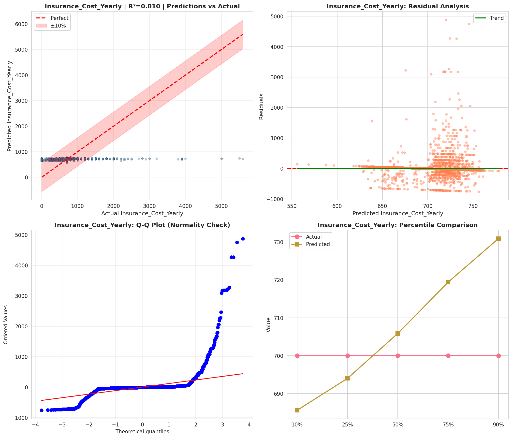
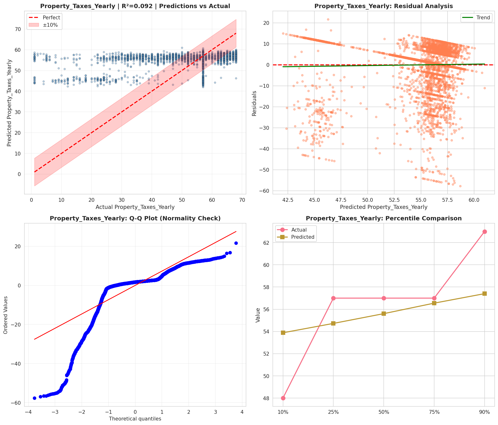
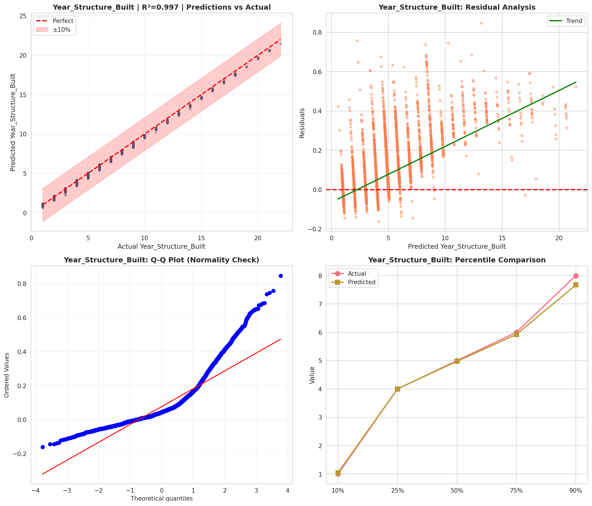
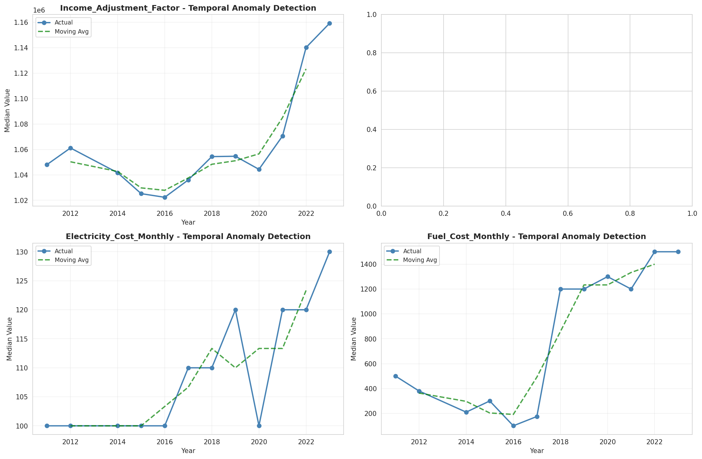
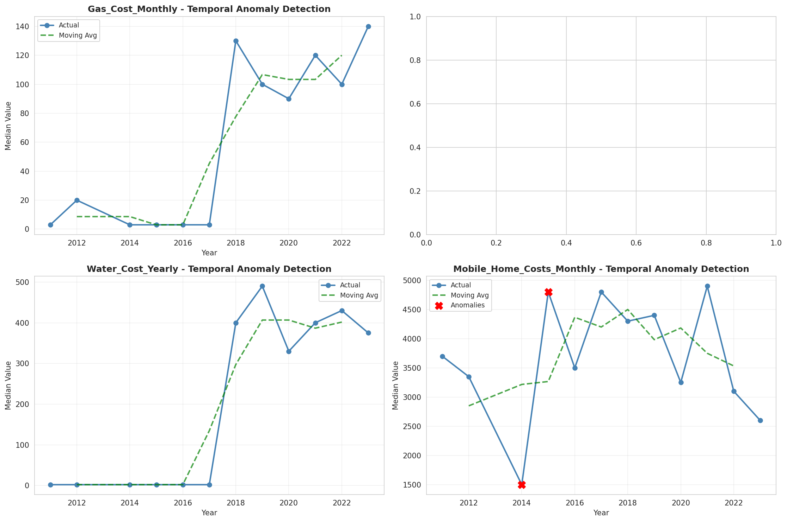
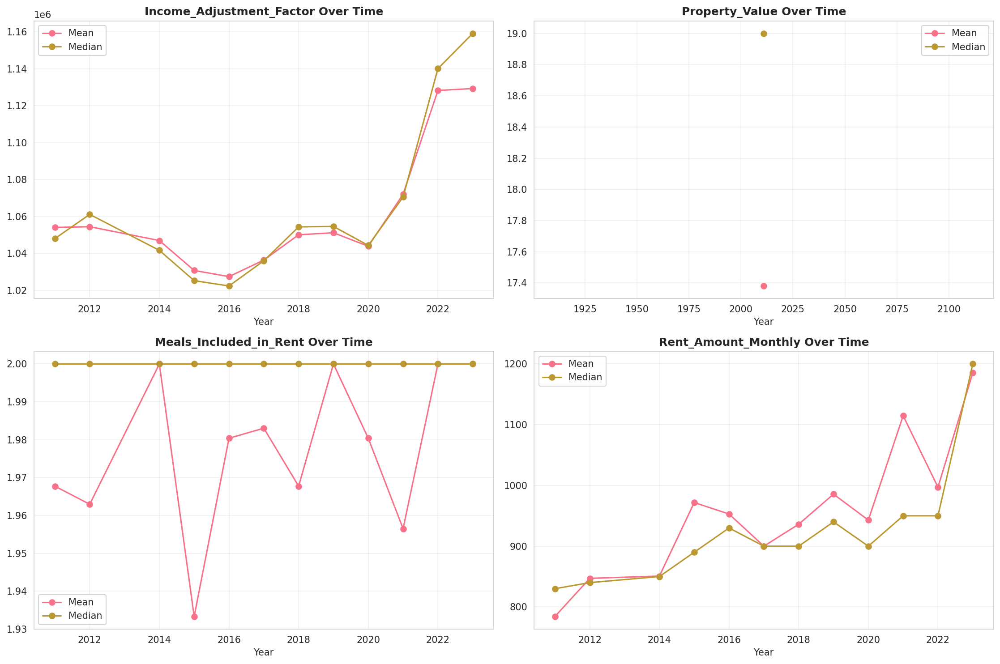
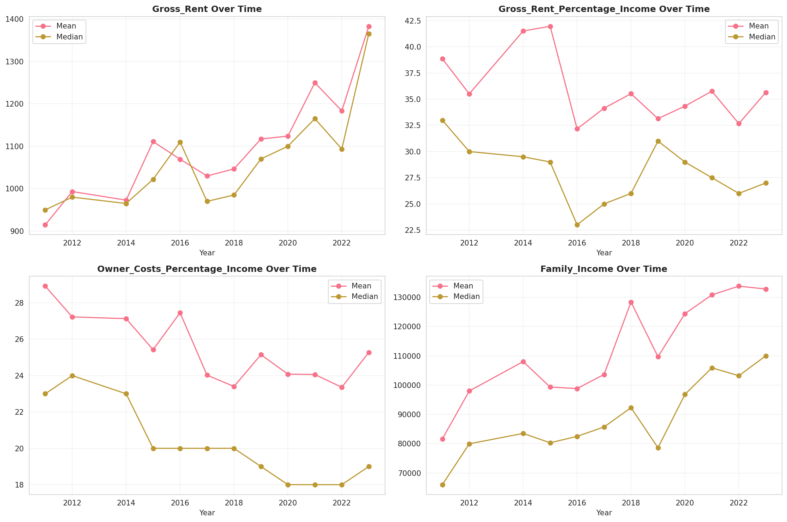
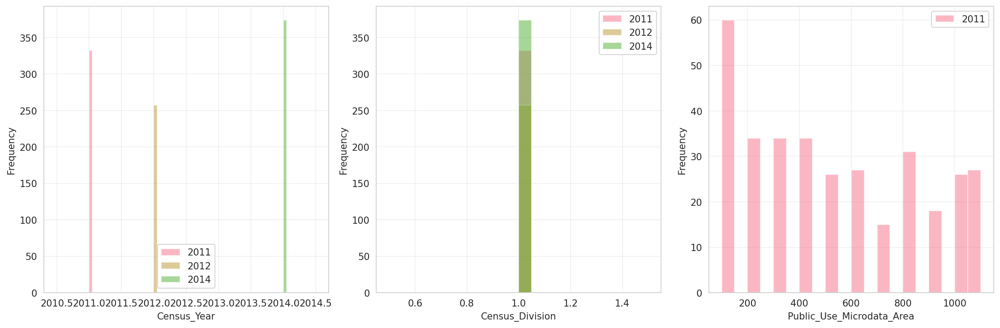
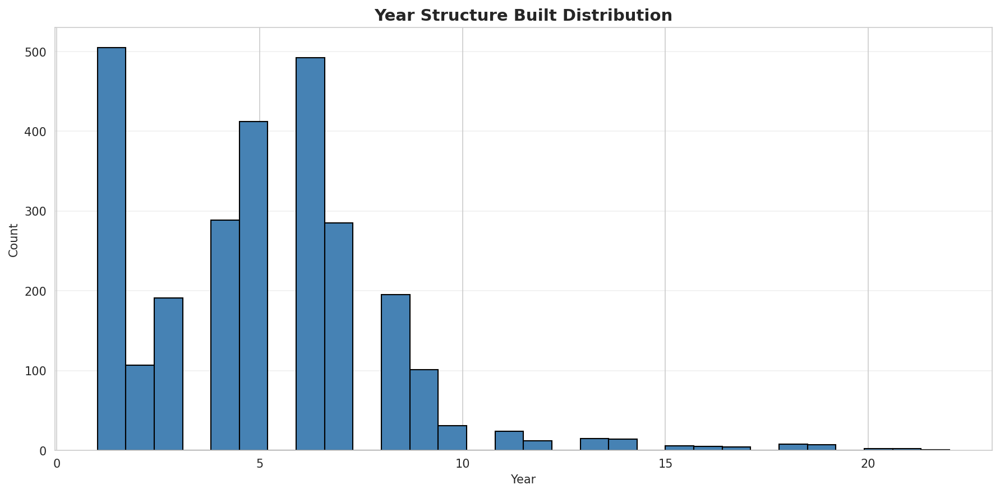
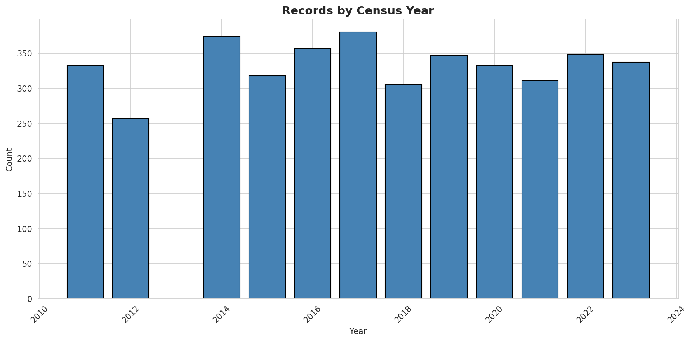
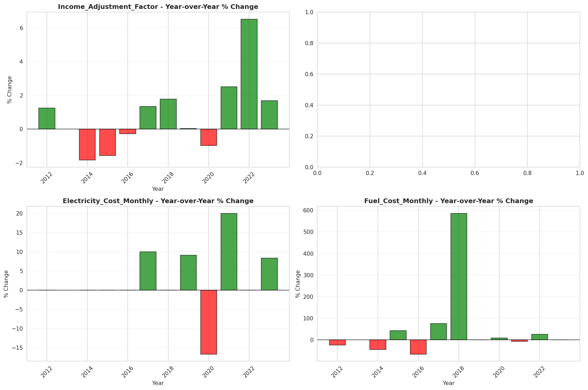
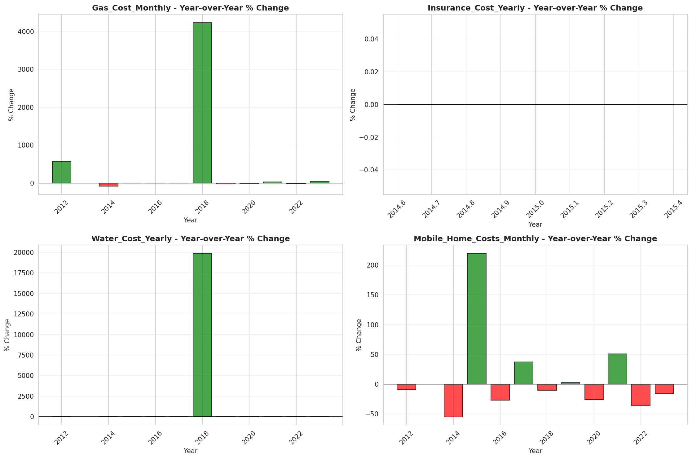
