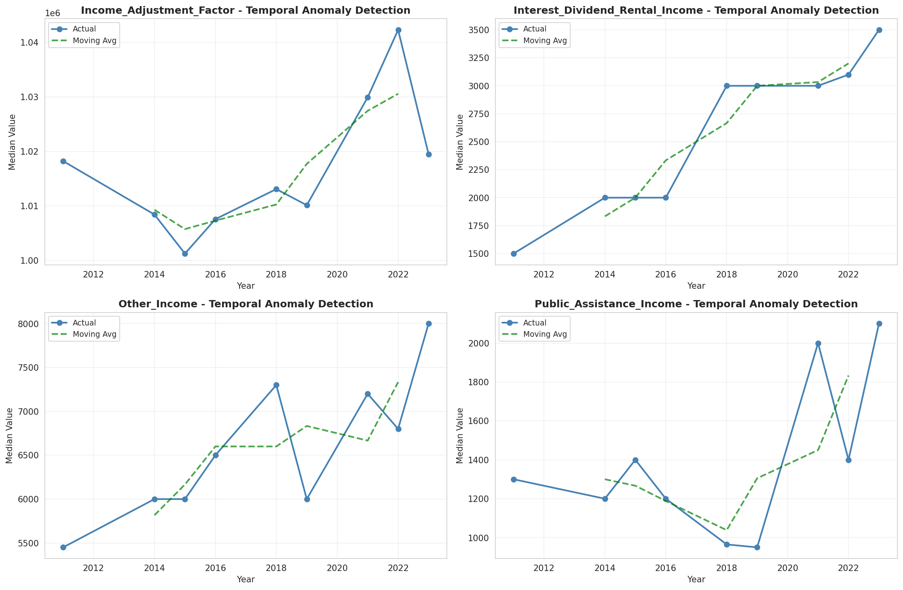
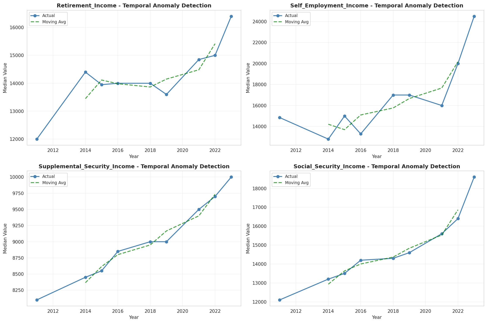
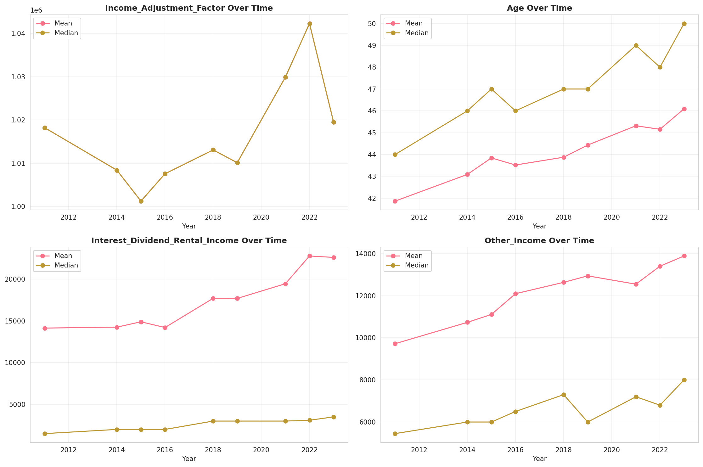
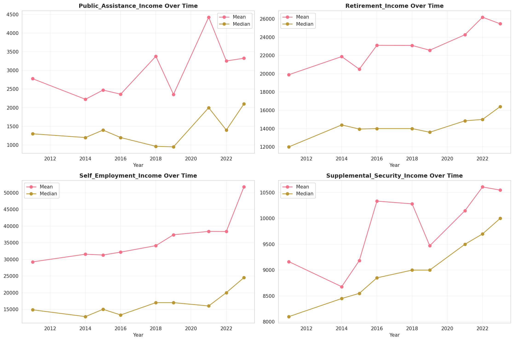
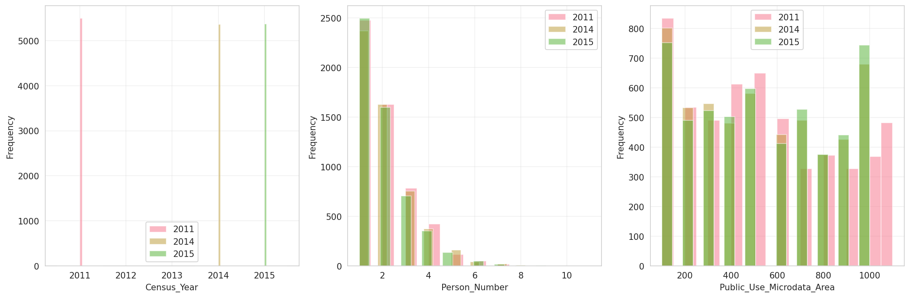
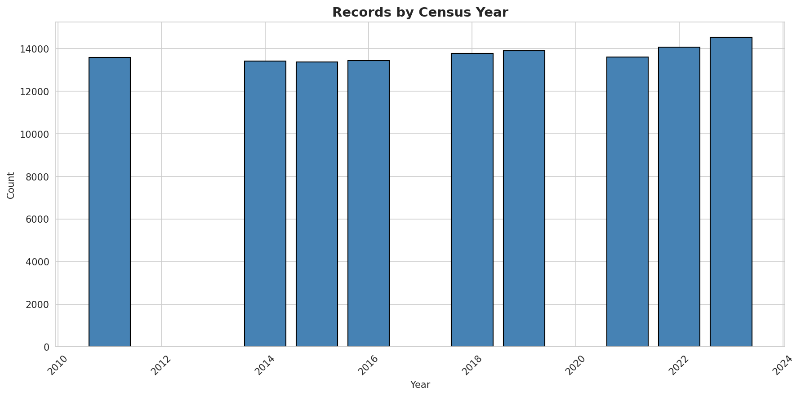
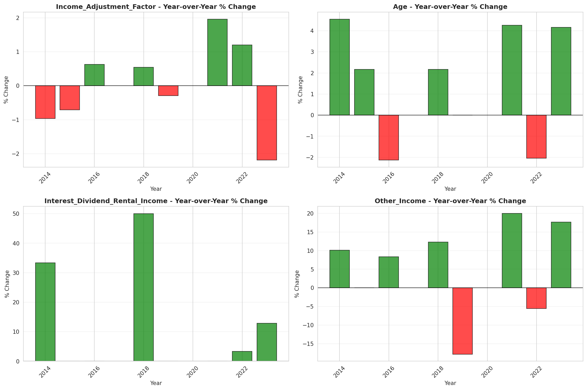
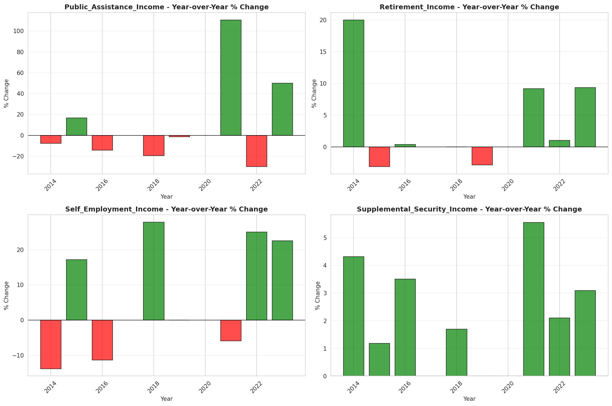

# Temporal Analysis

## Year Distribution

- 2011: 13,584 records

- 2014: 13,426 records

- 2015: 13,378 records

- 2016: 13,428 records

- 2018: 13,780 records

- 2019: 13,896 records

- 2021: 13,606 records

- 2022: 14,077 records

- 2023: 14,527 records

## Temporal Trends

- Census_Year: {np.int64(2011): {'mean': 2011.0, 'median': 2011.0, 'std': 0.0}, np.int64(2014): {'mean': 2014.0, 'median': 2014.0, 'std': 0.0}, np.int64(2015): {'mean': 2015.0, 'median': 2015.0, 'std': 0.0}, np.int64(2016): {'mean': 2016.0, 'median': 2016.0, 'std': 0.0}, np.int64(2018): {'mean': 2018.0, 'median': 2018.0, 'std': 0.0}, np.int64(2019): {'mean': 2019.0, 'median': 2019.0, 'std': 0.0}, np.int64(2021): {'mean': 2021.0, 'median': 2021.0, 'std': 0.0}, np.int64(2022): {'mean': 2022.0, 'median': 2022.0, 'std': 0.0}, np.int64(2023): {'mean': 2023.0, 'median': 2023.0, 'std': 0.0}}

- Person_Number: {np.int64(2011): {'mean': 1.9822585394581862, 'median': 2.0, 'std': 1.1911698823350148}, np.int64(2014): {'mean': 1.9735587665723224, 'median': 2.0, 'std': 1.1888248540017272}, np.int64(2015): {'mean': 1.951039019285394, 'median': 2.0, 'std': 1.1854608291341246}, np.int64(2016): {'mean': 1.9722966934763182, 'median': 2.0, 'std': 1.2044854963587759}, np.int64(2018): {'mean': 1.9628447024673439, 'median': 2.0, 'std': 1.2021516044686387}, np.int64(2019): {'mean': 1.9650259067357514, 'median': 2.0, 'std': 1.2074794671531734}, np.int64(2021): {'mean': 1.9387035131559607, 'median': 2.0, 'std': 1.1797905846344992}, np.int64(2022): {'mean': 1.9293173261348298, 'median': 2.0, 'std': 1.156258245425902}, np.int64(2023): {'mean': 1.9402491911612858, 'median': 2.0, 'std': 1.183499162215425}}

- Public_Use_Microdata_Area: {np.int64(2011): {'mean': 536.4252061248528, 'median': 500.0, 'std': 321.88760892112305}, np.int64(2014): {'mean': 526.2922687323104, 'median': 500.0, 'std': 301.5513988000203}, np.int64(2015): {'mean': 534.0633876513679, 'median': 500.0, 'std': 302.6937093269187}, np.int64(2016): {'mean': 538.9261245159369, 'median': 500.0, 'std': 298.9372345916963}, np.int64(2018): {'mean': 524.3759071117562, 'median': 500.0, 'std': 301.8704701339458}, np.int64(2019): {'mean': 531.2248128957973, 'median': 500.0, 'std': 300.63403716577375}, np.int64(2021): {'mean': 532.8825518153756, 'median': 500.0, 'std': 302.06788792777786}, np.int64(2022): {'mean': 443.78731263763586, 'median': 501.0, 'std': 238.54763245074838}, np.int64(2023): {'mean': 441.8487643697942, 'median': 501.0, 'std': 239.45854992402516}}

- State_Code: {np.int64(2011): {'mean': 33.0, 'median': 33.0, 'std': 0.0}, np.int64(2014): {'mean': 33.0, 'median': 33.0, 'std': 0.0}, np.int64(2015): {'mean': 33.0, 'median': 33.0, 'std': 0.0}, np.int64(2016): {'mean': 33.0, 'median': 33.0, 'std': 0.0}, np.int64(2018): {'mean': 33.0, 'median': 33.0, 'std': 0.0}, np.int64(2019): {'mean': 33.0, 'median': 33.0, 'std': 0.0}, np.int64(2021): {'mean': 33.0, 'median': 33.0, 'std': 0.0}, np.int64(2022): {'mean': 33.0, 'median': 33.0, 'std': 0.0}, np.int64(2023): {'mean': None, 'median': None, 'std': None}}

- Income_Adjustment_Factor: {np.int64(2011): {'mean': 1018237.0, 'median': 1018237.0, 'std': 0.0}, np.int64(2014): {'mean': 1008425.0, 'median': 1008425.0, 'std': 0.0}, np.int64(2015): {'mean': 1001264.0, 'median': 1001264.0, 'std': 0.0}, np.int64(2016): {'mean': 1007588.0, 'median': 1007588.0, 'std': 0.0}, np.int64(2018): {'mean': 1013097.0, 'median': 1013097.0, 'std': 0.0}, np.int64(2019): {'mean': 1010145.0, 'median': 1010145.0, 'std': 0.0}, np.int64(2021): {'mean': 1029928.0, 'median': 1029928.0, 'std': 0.0}, np.int64(2022): {'mean': 1042311.0, 'median': 1042311.0, 'std': 0.0}, np.int64(2023): {'mean': 1019518.0, 'median': 1019518.0, 'std': 0.0}}

- Person_Weight: {np.int64(2011): {'mean': 97.04019434628975, 'median': 80.0, 'std': 78.47966673783891}, np.int64(2014): {'mean': 98.82414717711902, 'median': 80.0, 'std': 81.75307592729648}, np.int64(2015): {'mean': 99.46240095679474, 'median': 80.0, 'std': 81.92332258435897}, np.int64(2016): {'mean': 99.395963658028, 'median': 81.0, 'std': 79.47178510691704}, np.int64(2018): {'mean': 98.433236574746, 'median': 82.0, 'std': 78.76787559732564}, np.int64(2019): {'mean': 97.84909326424871, 'median': 80.0, 'std': 83.6240737932657}, np.int64(2021): {'mean': 102.08672644421578, 'median': 80.0, 'std': 88.63702795222797}, np.int64(2022): {'mean': 99.11422888399517, 'median': 77.0, 'std': 91.2360568395502}, np.int64(2023): {'mean': 96.5136642114683, 'median': 74.0, 'std': 88.19235086002165}}

- Age: {np.int64(2011): {'mean': 41.865650765606595, 'median': 44.0, 'std': 23.015974806009634}, np.int64(2014): {'mean': 43.087814687918964, 'median': 46.0, 'std': 23.148909046747633}, np.int64(2015): {'mean': 43.84339961130214, 'median': 47.0, 'std': 23.13483028777544}, np.int64(2016): {'mean': 43.519809353589515, 'median': 46.0, 'std': 23.21508828385333}, np.int64(2018): {'mean': 43.8766328011611, 'median': 47.0, 'std': 23.51991630833995}, np.int64(2019): {'mean': 44.43242659758204, 'median': 47.0, 'std': 23.614619907530205}, np.int64(2021): {'mean': 45.31655152138762, 'median': 49.0, 'std': 23.651356569816596}, np.int64(2022): {'mean': 45.15543084464019, 'median': 48.0, 'std': 23.623250520199218}, np.int64(2023): {'mean': 46.09313691746403, 'median': 50.0, 'std': 23.977014363743557}}

- Citizenship_Status: {np.int64(2011): {'mean': 1.1809481743227326, 'median': 1.0, 'std': 0.7547356875092441}, np.int64(2014): {'mean': 1.1996126917920453, 'median': 1.0, 'std': 0.791342257679552}, np.int64(2015): {'mean': 1.19322768724772, 'median': 1.0, 'std': 0.7802366710166759}, np.int64(2016): {'mean': 1.1842418826333037, 'median': 1.0, 'std': 0.7624826070813207}, np.int64(2018): {'mean': 1.2015239477503628, 'median': 1.0, 'std': 0.7882477366348604}, np.int64(2019): {'mean': 1.20048934945308, 'median': 1.0, 'std': 0.7866937968976688}, np.int64(2021): {'mean': 1.189769219462002, 'median': 1.0, 'std': 0.7744550727508998}, np.int64(2022): {'mean': 1.177949847268594, 'median': 1.0, 'std': 0.7386171168353707}, np.int64(2023): {'mean': 1.2158738899979349, 'median': 1.0, 'std': 0.8122283903391124}}

- Class_of_Worker: {np.int64(2011): {'mean': 2.1745283018867925, 'median': 1.0, 'std': 1.883203392767028}, np.int64(2014): {'mean': 2.1110484144001807, 'median': 1.0, 'std': 1.8598990348646756}, np.int64(2015): {'mean': 2.1439754935330155, 'median': 1.0, 'std': 1.8788416553929057}, np.int64(2016): {'mean': 2.135284186831739, 'median': 1.0, 'std': 1.8492057632699688}, np.int64(2018): {'mean': 2.1236619090098126, 'median': 1.0, 'std': 1.8517564035135385}, np.int64(2019): {'mean': 2.1013445938437605, 'median': 1.0, 'std': 1.8257491750120456}, np.int64(2021): {'mean': 2.094774237909695, 'median': 1.0, 'std': 1.8028510278671939}, np.int64(2022): {'mean': 2.1596300326441784, 'median': 1.0, 'std': 1.8512193362828213}, np.int64(2023): {'mean': 2.1023176332372104, 'median': 1.0, 'std': 1.815983878759033}}

- English_Speaking_Ability: {np.int64(2011): {'mean': 1.3949843260188088, 'median': 1.0, 'std': 0.7222523498522104}, np.int64(2014): {'mean': 1.3781902552204177, 'median': 1.0, 'std': 0.6872912854325499}, np.int64(2015): {'mean': 1.3881952326901248, 'median': 1.0, 'std': 0.7286641189220996}, np.int64(2016): {'mean': 1.4072289156626505, 'median': 1.0, 'std': 0.6719941575457795}, np.int64(2018): {'mean': 1.3934782608695653, 'median': 1.0, 'std': 0.7358094367935545}, np.int64(2019): {'mean': 1.3908571428571428, 'median': 1.0, 'std': 0.7397869514752632}, np.int64(2021): {'mean': 1.3776137761377614, 'median': 1.0, 'std': 0.7184004628559614}, np.int64(2022): {'mean': 1.36, 'median': 1.0, 'std': 0.6933106170040129}, np.int64(2023): {'mean': 1.380801687763713, 'median': 1.0, 'std': 0.7233695869772027}}

- Fertility_Status: {np.int64(2011): {'mean': 1.9606759831004226, 'median': 2.0, 'std': 0.1943962962904065}, np.int64(2014): {'mean': 1.9495768688293371, 'median': 2.0, 'std': 0.21885503907358303}, np.int64(2015): {'mean': 1.9573304157549234, 'median': 2.0, 'std': 0.2021479501274365}, np.int64(2016): {'mean': 1.9516605166051662, 'median': 2.0, 'std': 0.21452216482432382}, np.int64(2018): {'mean': 1.9532908704883227, 'median': 2.0, 'std': 0.21105247839991445}, np.int64(2019): {'mean': 1.9610389610389611, 'median': 2.0, 'std': 0.19353704782823106}, np.int64(2021): {'mean': 1.9582366589327147, 'median': 2.0, 'std': 0.2000865955322734}, np.int64(2022): {'mean': 1.9584237165582068, 'median': 2.0, 'std': 0.19965497128868834}, np.int64(2023): {'mean': 1.9530516431924883, 'median': 2.0, 'std': 0.21156647516993854}}

- Marital_Status: {np.int64(2011): {'mean': 2.752208480565371, 'median': 2.0, 'std': 1.8420660209718385}, np.int64(2014): {'mean': 2.7408014300610755, 'median': 2.0, 'std': 1.8354260406199032}, np.int64(2015): {'mean': 2.729780236208701, 'median': 2.0, 'std': 1.8271775568258088}, np.int64(2016): {'mean': 2.7475424486148348, 'median': 2.0, 'std': 1.8400347629488067}, np.int64(2018): {'mean': 2.7768505079825836, 'median': 2.0, 'std': 1.8418259310112883}, np.int64(2019): {'mean': 2.75748416810593, 'median': 2.0, 'std': 1.8361591726008113}, np.int64(2021): {'mean': 2.7135087461414082, 'median': 2.0, 'std': 1.8295877094332793}, np.int64(2022): {'mean': 2.7312637635859915, 'median': 2.0, 'std': 1.8312273965552992}, np.int64(2023): {'mean': 2.71356783919598, 'median': 2.0, 'std': 1.829379834314716}}

- Mobility_Status: {np.int64(2011): {'mean': 1.2105263157894737, 'median': 1.0, 'std': 0.6091938134392623}, np.int64(2014): {'mean': 1.2285606914693725, 'median': 1.0, 'std': 0.634256287771745}, np.int64(2015): {'mean': 1.249792968455921, 'median': 1.0, 'std': 0.657688645228794}, np.int64(2016): {'mean': 1.2575075075075075, 'median': 1.0, 'std': 0.667409197088096}, np.int64(2018): {'mean': 1.249305047549378, 'median': 1.0, 'std': 0.6577878003214956}, np.int64(2019): {'mean': 1.2378331402085747, 'median': 1.0, 'std': 0.6447135291713165}, np.int64(2021): {'mean': 1.204516845612736, 'median': 1.0, 'std': 0.6035492177165678}, np.int64(2022): {'mean': 1.2027181688125894, 'median': 1.0, 'std': 0.6014918566787446}, np.int64(2023): {'mean': 1.184404051616484, 'median': 1.0, 'std': 0.57491286829709}}

- Military_Service: {np.int64(2011): {'mean': 4.744914491449145, 'median': 5.0, 'std': 0.6694796851049964}, np.int64(2014): {'mean': 3.7668189554779183, 'median': 4.0, 'std': 0.628991802925993}, np.int64(2015): {'mean': 3.774538646696978, 'median': 4.0, 'std': 0.6222520358084969}, np.int64(2016): {'mean': 3.7744696024246744, 'median': 4.0, 'std': 0.6198269445718676}, np.int64(2018): {'mean': 3.794166017484636, 'median': 4.0, 'std': 0.5957872935015128}, np.int64(2019): {'mean': 3.7948894433450917, 'median': 4.0, 'std': 0.5959058700548381}, np.int64(2021): {'mean': 3.8045158488927484, 'median': 4.0, 'std': 0.580722476226329}, np.int64(2022): {'mean': 3.81384447978572, 'median': 4.0, 'std': 0.5707877048180796}, np.int64(2023): {'mean': 3.8087771761092704, 'median': 4.0, 'std': 0.5768997769325628}}

- Travel_Time_To_Work_Minutes: {np.int64(2011): {'mean': 27.38114167594212, 'median': 20.0, 'std': 24.507701843513743}, np.int64(2014): {'mean': 27.756162662898415, 'median': 20.0, 'std': 24.816950209173392}, np.int64(2015): {'mean': 28.001897233201582, 'median': 20.0, 'std': 25.686974899973897}, np.int64(2016): {'mean': 28.158956845700093, 'median': 20.0, 'std': 25.506382871302176}, np.int64(2018): {'mean': 28.56833976833977, 'median': 20.0, 'std': 25.216732795100892}, np.int64(2019): {'mean': 28.9983185570162, 'median': 20.0, 'std': 25.59496282922969}, np.int64(2021): {'mean': 26.370967741935484, 'median': 20.0, 'std': 22.521355362120712}, np.int64(2022): {'mean': 28.059652173913044, 'median': 20.0, 'std': 24.6395639692396}, np.int64(2023): {'mean': 27.73963624446993, 'median': 20.0, 'std': 23.72966977151533}}

- Vehicle_Occupancy: {np.int64(2011): {'mean': 1.129467296021578, 'median': 1.0, 'std': 0.4921520527273876}, np.int64(2014): {'mean': 1.1071012805587892, 'median': 1.0, 'std': 0.397728659239682}, np.int64(2015): {'mean': 1.1123255422902303, 'median': 1.0, 'std': 0.42440012030795965}, np.int64(2016): {'mean': 1.1235342691990091, 'median': 1.0, 'std': 0.5023230419694243}, np.int64(2018): {'mean': 1.123448726322665, 'median': 1.0, 'std': 0.5322634565815707}, np.int64(2019): {'mean': 1.1258673551718574, 'median': 1.0, 'std': 0.5188231367417229}, np.int64(2021): {'mean': 1.11176702085793, 'median': 1.0, 'std': 0.4746094702102824}, np.int64(2022): {'mean': 1.130338733431517, 'median': 1.0, 'std': 0.5501410369260995}, np.int64(2023): {'mean': 1.1191809590479525, 'median': 1.0, 'std': 0.507572237085549}}

- Transportation_To_Work: {np.int64(2011): {'mean': 2.0810288432946775, 'median': 1.0, 'std': 3.0432041244075396}, np.int64(2014): {'mean': 2.1079420798595874, 'median': 1.0, 'std': 3.083448773809227}, np.int64(2015): {'mean': 2.164150666862084, 'median': 1.0, 'std': 3.1386916713754616}, np.int64(2016): {'mean': 2.1584943755408132, 'median': 1.0, 'std': 3.138534494199397}, np.int64(2018): {'mean': 2.163102366695181, 'median': 1.0, 'std': 3.14947753442383}, np.int64(2019): {'mean': None, 'median': None, 'std': None}, np.int64(2021): {'mean': None, 'median': None, 'std': None}, np.int64(2022): {'mean': None, 'median': None, 'std': None}, np.int64(2023): {'mean': None, 'median': None, 'std': None}}

- Language_Other_Than_English: {np.int64(2011): {'mean': 1.9262143407864303, 'median': 2.0, 'std': 0.26143183681365606}, np.int64(2014): {'mean': 1.9329548106090069, 'median': 2.0, 'std': 0.25010997063945134}, np.int64(2015): {'mean': 1.9316259216142802, 'median': 2.0, 'std': 0.25239652896720327}, np.int64(2016): {'mean': 1.9355740122642242, 'median': 2.0, 'std': 0.24551977287224655}, np.int64(2018): {'mean': 1.9304400423408439, 'median': 2.0, 'std': 0.2544135684569818}, np.int64(2019): {'mean': 1.9343832020997376, 'median': 2.0, 'std': 0.24762033811099346}, np.int64(2021): {'mean': 1.9376772709850518, 'median': 2.0, 'std': 0.24175004979737927}, np.int64(2022): {'mean': 1.9389747762408462, 'median': 2.0, 'std': 0.23938543126469217}, np.int64(2023): {'mean': 1.9320381389346906, 'median': 2.0, 'std': 0.25168946715570234}}

- Grandparents_Living_With_Grandchildren: {np.int64(2011): {'mean': 1.9787187120961518, 'median': 2.0, 'std': 0.14432841577677927}, np.int64(2014): {'mean': 1.9749890782000874, 'median': 2.0, 'std': 0.15616670324840567}, np.int64(2015): {'mean': 1.9763693781988456, 'median': 2.0, 'std': 0.15190368093051063}, np.int64(2016): {'mean': 1.976990185387132, 'median': 2.0, 'std': 0.1499427051359998}, np.int64(2018): {'mean': 1.978332799658448, 'median': 2.0, 'std': 0.14560218251094204}, np.int64(2019): {'mean': 1.9752048967735243, 'median': 2.0, 'std': 0.15550824715583178}, np.int64(2021): {'mean': 1.9742337662337663, 'median': 2.0, 'std': 0.15844539522981327}, np.int64(2022): {'mean': 1.977605164934934, 'median': 2.0, 'std': 0.1479713323427008}, np.int64(2023): {'mean': 1.9781373398825002, 'median': 2.0, 'std': 0.1462420732714561}}

- Months_Responsible_For_Grandchildren: {np.int64(2011): {'mean': 3.7666666666666666, 'median': 4.0, 'std': 1.3066539835657949}, np.int64(2014): {'mean': 3.707692307692308, 'median': 4.0, 'std': 1.3546572089817237}, np.int64(2015): {'mean': 3.3728813559322033, 'median': 3.0, 'std': 1.4129732052605728}, np.int64(2016): {'mean': 4.027777777777778, 'median': 5.0, 'std': 1.2668272692847447}, np.int64(2018): {'mean': 3.8, 'median': 4.0, 'std': 1.3014415084820374}, np.int64(2019): {'mean': 3.554054054054054, 'median': 3.0, 'std': 1.3359301504574062}, np.int64(2021): {'mean': 4.0701754385964914, 'median': 5.0, 'std': 1.3739885776558778}, np.int64(2022): {'mean': 3.9393939393939394, 'median': 5.0, 'std': 1.3798415503102899}, np.int64(2023): {'mean': 4.107142857142857, 'median': 5.0, 'std': 1.3304622768533763}}

- Grandparents_Responsible_For_Grandchildren: {np.int64(2011): {'mean': 1.689119170984456, 'median': 2.0, 'std': 0.4640579068743924}, np.int64(2014): {'mean': 1.7161572052401746, 'median': 2.0, 'std': 0.45184911674244416}, np.int64(2015): {'mean': 1.728110599078341, 'median': 2.0, 'std': 0.445961951051082}, np.int64(2016): {'mean': 1.6587677725118484, 'median': 2.0, 'std': 0.4752507088787733}, np.int64(2018): {'mean': 1.6798029556650247, 'median': 2.0, 'std': 0.4677055439406346}, np.int64(2019): {'mean': 1.6903765690376569, 'median': 2.0, 'std': 0.46330864401255284}, np.int64(2021): {'mean': 1.7701612903225807, 'median': 2.0, 'std': 0.4215798009107886}, np.int64(2022): {'mean': 1.7027027027027026, 'median': 2.0, 'std': 0.45810142516616204}, np.int64(2023): {'mean': 1.7533039647577093, 'median': 2.0, 'std': 0.43204095812490445}}

- Interest_Dividend_Rental_Income: {np.int64(2011): {'mean': 14132.890418210693, 'median': 1500.0, 'std': 40959.47143287554}, np.int64(2014): {'mean': 14243.018499486125, 'median': 2000.0, 'std': 39546.24633923632}, np.int64(2015): {'mean': 14885.517393434591, 'median': 2000.0, 'std': 37886.24076171613}, np.int64(2016): {'mean': 14200.553180396246, 'median': 2000.0, 'std': 38022.642554213206}, np.int64(2018): {'mean': 17694.9417989418, 'median': 3000.0, 'std': 43611.17369269264}, np.int64(2019): {'mean': 17683.96694214876, 'median': 3000.0, 'std': 45160.424282914595}, np.int64(2021): {'mean': 19442.453954496206, 'median': 3000.0, 'std': 50473.52583786874}, np.int64(2022): {'mean': 22763.134962805525, 'median': 3100.0, 'std': 56836.29932769425}, np.int64(2023): {'mean': 22594.580113343636, 'median': 3500.0, 'std': 63068.85958025579}}

- Military_Service_Period_1: {np.int64(2011): {'mean': 0.07826747720364742, 'median': 0.0, 'std': 0.26869413802385705}, np.int64(2014): {'mean': 0.09159663865546218, 'median': 0.0, 'std': 0.28857698252201164}, np.int64(2015): {'mean': 0.10188356164383562, 'median': 0.0, 'std': 0.3026247024109667}, np.int64(2016): {'mean': 0.12641673931996514, 'median': 0.0, 'std': 0.3324634016502088}, np.int64(2018): {'mean': 0.13468634686346864, 'median': 0.0, 'std': 0.341545822411805}, np.int64(2019): {'mean': 0.14285714285714285, 'median': 0.0, 'std': 0.35008743927315333}, np.int64(2021): {'mean': 0.17588932806324112, 'median': 0.0, 'std': 0.38091422588613894}, np.int64(2022): {'mean': 0.20039486673247778, 'median': 0.0, 'std': 0.4004935715379071}, np.int64(2023): {'mean': 0.18047882136279927, 'median': 0.0, 'std': 0.3847629601400742}}

- Military_Service_Period_2: {np.int64(2011): {'mean': 0.11322188449848024, 'median': 0.0, 'std': 0.3169842917624255}, np.int64(2014): {'mean': 0.1319327731092437, 'median': 0.0, 'std': 0.33855994772229486}, np.int64(2015): {'mean': 0.1481164383561644, 'median': 0.0, 'std': 0.3553675290305446}, np.int64(2016): {'mean': 0.16564952048823017, 'median': 0.0, 'std': 0.37192789453376307}, np.int64(2018): {'mean': 0.19280442804428044, 'median': 0.0, 'std': 0.3946828905103821}, np.int64(2019): {'mean': 0.16575091575091574, 'median': 0.0, 'std': 0.3720272752597573}, np.int64(2021): {'mean': 0.18774703557312253, 'median': 0.0, 'std': 0.39070311627294124}, np.int64(2022): {'mean': 0.1885488647581441, 'median': 0.0, 'std': 0.39134303921128455}, np.int64(2023): {'mean': 0.16206261510128914, 'median': 0.0, 'std': 0.36867802163044544}}

- Military_Service_Period_3: {np.int64(2011): {'mean': 0.18085106382978725, 'median': 0.0, 'std': 0.3850410543599133}, np.int64(2014): {'mean': None, 'median': None, 'std': None}, np.int64(2015): {'mean': None, 'median': None, 'std': None}, np.int64(2016): {'mean': None, 'median': None, 'std': None}, np.int64(2018): {'mean': None, 'median': None, 'std': None}, np.int64(2019): {'mean': None, 'median': None, 'std': None}, np.int64(2021): {'mean': None, 'median': None, 'std': None}, np.int64(2022): {'mean': None, 'median': None, 'std': None}, np.int64(2023): {'mean': None, 'median': None, 'std': None}}

- Military_Service_Period_4: {np.int64(2011): {'mean': 0.14893617021276595, 'median': 0.0, 'std': 0.3561608884088281}, np.int64(2014): {'mean': None, 'median': None, 'std': None}, np.int64(2015): {'mean': None, 'median': None, 'std': None}, np.int64(2016): {'mean': None, 'median': None, 'std': None}, np.int64(2018): {'mean': None, 'median': None, 'std': None}, np.int64(2019): {'mean': None, 'median': None, 'std': None}, np.int64(2021): {'mean': None, 'median': None, 'std': None}, np.int64(2022): {'mean': None, 'median': None, 'std': None}, np.int64(2023): {'mean': None, 'median': None, 'std': None}}

- Military_Service_Period_5: {np.int64(2011): {'mean': 0.3905775075987842, 'median': 0.0, 'std': 0.48806528975932334}, np.int64(2014): {'mean': 0.38823529411764707, 'median': 0.0, 'std': 0.48755348986713315}, np.int64(2015): {'mean': 0.4075342465753425, 'median': 0.0, 'std': 0.4915861903523169}, np.int64(2016): {'mean': 0.4097646033129904, 'median': 0.0, 'std': 0.4920046932576125}, np.int64(2018): {'mean': 0.3874538745387454, 'median': 0.0, 'std': 0.4873935925197372}, np.int64(2019): {'mean': 0.41117216117216115, 'median': 0.0, 'std': 0.4922718053779104}, np.int64(2021): {'mean': 0.40019762845849804, 'median': 0.0, 'std': 0.49018049167192995}, np.int64(2022): {'mean': 0.39585389930898324, 'median': 0.0, 'std': 0.4892748792726338}, np.int64(2023): {'mean': 0.4171270718232044, 'median': 0.0, 'std': 0.4933114256123741}}

- Military_Service_Period_6: {np.int64(2011): {'mean': 0.11398176291793313, 'median': 0.0, 'std': 0.317909922869342}, np.int64(2014): {'mean': None, 'median': None, 'std': None}, np.int64(2015): {'mean': None, 'median': None, 'std': None}, np.int64(2016): {'mean': None, 'median': None, 'std': None}, np.int64(2018): {'mean': None, 'median': None, 'std': None}, np.int64(2019): {'mean': None, 'median': None, 'std': None}, np.int64(2021): {'mean': None, 'median': None, 'std': None}, np.int64(2022): {'mean': None, 'median': None, 'std': None}, np.int64(2023): {'mean': None, 'median': None, 'std': None}}

- Military_Service_Period_7: {np.int64(2011): {'mean': 0.11398176291793313, 'median': 0.0, 'std': 0.31790992286934217}, np.int64(2014): {'mean': None, 'median': None, 'std': None}, np.int64(2015): {'mean': None, 'median': None, 'std': None}, np.int64(2016): {'mean': None, 'median': None, 'std': None}, np.int64(2018): {'mean': None, 'median': None, 'std': None}, np.int64(2019): {'mean': None, 'median': None, 'std': None}, np.int64(2021): {'mean': None, 'median': None, 'std': None}, np.int64(2022): {'mean': None, 'median': None, 'std': None}, np.int64(2023): {'mean': None, 'median': None, 'std': None}}

- Military_Service_Period_8: {np.int64(2011): {'mean': 0.12613981762917933, 'median': 0.0, 'std': 0.3321330878439048}, np.int64(2014): {'mean': 0.12100840336134454, 'median': 0.0, 'std': 0.32627416004877086}, np.int64(2015): {'mean': 0.0958904109589041, 'median': 0.0, 'std': 0.29456701987280604}, np.int64(2016): {'mean': 0.09241499564080209, 'median': 0.0, 'std': 0.2897372138822831}, np.int64(2018): {'mean': 0.1014760147601476, 'median': 0.0, 'std': 0.30209737500610734}, np.int64(2019): {'mean': 0.07417582417582418, 'median': 0.0, 'std': 0.26217688112264115}, np.int64(2021): {'mean': 0.04940711462450593, 'median': 0.0, 'std': 0.2168236765095737}, np.int64(2022): {'mean': 0.03356367226061204, 'median': 0.0, 'std': 0.18019213269978357}, np.int64(2023): {'mean': 0.03406998158379374, 'median': 0.0, 'std': 0.18149255911776338}}

- Military_Service_Period_9: {np.int64(2011): {'mean': 0.018996960486322188, 'median': 0.0, 'std': 0.13656591045901464}, np.int64(2014): {'mean': 0.014285714285714285, 'median': 0.0, 'std': 0.1187159463177907}, np.int64(2015): {'mean': 0.010273972602739725, 'median': 0.0, 'std': 0.10088176934966181}, np.int64(2016): {'mean': 0.013949433304272014, 'median': 0.0, 'std': 0.11733221679793975}, np.int64(2018): {'mean': 0.01014760147601476, 'median': 0.0, 'std': 0.10026915018131423}, np.int64(2019): {'mean': 0.005494505494505495, 'median': 0.0, 'std': 0.07395488112858628}, np.int64(2021): {'mean': None, 'median': None, 'std': None}, np.int64(2022): {'mean': None, 'median': None, 'std': None}, np.int64(2023): {'mean': None, 'median': None, 'std': None}}

- Military_Service_Period_10: {np.int64(2011): {'mean': 0.08738601823708207, 'median': 0.0, 'std': 0.28250725338477256}, np.int64(2014): {'mean': 0.07394957983193277, 'median': 0.0, 'std': 0.26179884447067675}, np.int64(2015): {'mean': 0.06164383561643835, 'median': 0.0, 'std': 0.24061055556194758}, np.int64(2016): {'mean': 0.037489102005231034, 'median': 0.0, 'std': 0.19003987965277844}, np.int64(2018): {'mean': 0.03136531365313653, 'median': 0.0, 'std': 0.17438343922010513}, np.int64(2019): {'mean': 0.0347985347985348, 'median': 0.0, 'std': 0.18335316424671022}, np.int64(2021): {'mean': 0.007905138339920948, 'median': 0.0, 'std': 0.08860250811569793}, np.int64(2022): {'mean': 0.017769002961500493, 'median': 0.0, 'std': 0.13217606366143816}, np.int64(2023): {'mean': 0.010128913443830571, 'median': 0.0, 'std': 0.10017763923587751}}

- Military_Service_Period_11: {np.int64(2011): {'mean': 0.004559270516717325, 'median': 0.0, 'std': 0.0673938787085013}, np.int64(2014): {'mean': 0.012605042016806723, 'median': 0.0, 'std': 0.11160924102741138}, np.int64(2015): {'mean': 0.0017123287671232876, 'median': 0.0, 'std': 0.04136256128405867}, np.int64(2016): {'mean': 0.0008718395815170009, 'median': 0.0, 'std': 0.02952692976787464}, np.int64(2018): {'mean': 0.0, 'median': 0.0, 'std': 0.0}, np.int64(2019): {'mean': 0.0009157509157509158, 'median': 0.0, 'std': 0.030261376633440144}, np.int64(2021): {'mean': None, 'median': None, 'std': None}, np.int64(2022): {'mean': None, 'median': None, 'std': None}, np.int64(2023): {'mean': None, 'median': None, 'std': None}}

- Temporary_Absence_From_Work: {np.int64(2011): {'mean': 2.550173010380623, 'median': 3.0, 'std': 0.5381107609082935}, np.int64(2014): {'mean': 2.602436225615677, 'median': 3.0, 'std': 0.5286105300969669}, np.int64(2015): {'mean': 2.61136982690449, 'median': 3.0, 'std': 0.51957201060125}, np.int64(2016): {'mean': 2.6194830314752946, 'median': 3.0, 'std': 0.5194809142918226}, np.int64(2018): {'mean': 2.6029725805073887, 'median': 3.0, 'std': 0.5241980323855394}, np.int64(2019): {'mean': 2.612355736591989, 'median': 3.0, 'std': 0.5105391017177549}, np.int64(2021): {'mean': 2.5995364408962143, 'median': 3.0, 'std': 0.5144576568571066}, np.int64(2022): {'mean': 2.5972073039742214, 'median': 3.0, 'std': 0.5203974942744501}, np.int64(2023): {'mean': 2.6022536561975547, 'median': 3.0, 'std': 0.511958687905012}}

- Available_For_Work: {np.int64(2011): {'mean': 4.571821488776506, 'median': 5.0, 'std': 1.1478775794613023}, np.int64(2014): {'mean': 4.7328978727160385, 'median': 5.0, 'std': 0.9337967802494671}, np.int64(2015): {'mean': 4.75169141551709, 'median': 5.0, 'std': 0.8934579621195432}, np.int64(2016): {'mean': 4.766484965711271, 'median': 5.0, 'std': 0.8678527451789383}, np.int64(2018): {'mean': 4.780985735030324, 'median': 5.0, 'std': 0.8354465308522215}, np.int64(2019): {'mean': 4.786575016972166, 'median': 5.0, 'std': 0.8224464991012995}, np.int64(2021): {'mean': 4.8256502704094775, 'median': 5.0, 'std': 0.759718156603271}, np.int64(2022): {'mean': 4.82905064859952, 'median': 5.0, 'std': 0.7401256437904973}, np.int64(2023): {'mean': 4.817789498921122, 'median': 5.0, 'std': 0.7629194193389126}}

- On_Layoff_From_Work: {np.int64(2011): {'mean': 2.520273267678112, 'median': 3.0, 'std': 0.5316193438333928}, np.int64(2014): {'mean': 2.5897254832730163, 'median': 3.0, 'std': 0.5122996409935909}, np.int64(2015): {'mean': 2.6026711185308846, 'median': 3.0, 'std': 0.502128929696717}, np.int64(2016): {'mean': 2.6106910497626163, 'median': 3.0, 'std': 0.5018334421782388}, np.int64(2018): {'mean': 2.600068335184078, 'median': 3.0, 'std': 0.49957439132709064}, np.int64(2019): {'mean': 2.6033604887983706, 'median': 3.0, 'std': 0.4986706357988489}, np.int64(2021): {'mean': 2.58434200360546, 'median': 3.0, 'std': 0.5128319065173044}, np.int64(2022): {'mean': 2.5966289349747997, 'median': 3.0, 'std': 0.49795005823678157}, np.int64(2023): {'mean': 2.594341884440182, 'median': 3.0, 'std': 0.5010283068288615}}

- Looking_For_Work: {np.int64(2011): {'mean': 2.52666134327034, 'median': 3.0, 'std': 0.5914008354845518}, np.int64(2014): {'mean': 2.5951098949598377, 'median': 3.0, 'std': 0.5593145118623335}, np.int64(2015): {'mean': 2.6039891046480976, 'median': 3.0, 'std': 0.5502978019972818}, np.int64(2016): {'mean': 2.6182521540355195, 'median': 3.0, 'std': 0.5398439917820085}, np.int64(2018): {'mean': 2.6038267703083626, 'median': 3.0, 'std': 0.5357976788213}, np.int64(2019): {'mean': 2.598523421588595, 'median': 3.0, 'std': 0.5350813031484157}, np.int64(2021): {'mean': 2.5827968065928406, 'median': 3.0, 'std': 0.5398279258837742}, np.int64(2022): {'mean': 2.5884491448401223, 'median': 3.0, 'std': 0.5336987358444201}, np.int64(2023): {'mean': 2.5855510269319906, 'median': 3.0, 'std': 0.5331608762412982}}

- Informed_Of_Recall: {np.int64(2011): {'mean': 2.886611658237956, 'median': 3.0, 'std': 0.343411779545781}, np.int64(2014): {'mean': 2.9380351310795305, 'median': 3.0, 'std': 0.26046267876302376}, np.int64(2015): {'mean': 2.945171777523943, 'median': 3.0, 'std': 0.24476723801651576}, np.int64(2016): {'mean': 2.948303147529453, 'median': 3.0, 'std': 0.23972826925472587}, np.int64(2018): {'mean': 2.9491757068420603, 'median': 3.0, 'std': 0.23322949513422586}, np.int64(2019): {'mean': 2.944755600814664, 'median': 3.0, 'std': 0.24146921789374812}, np.int64(2021): {'mean': 2.951841359773371, 'median': 3.0, 'std': 0.22884065692024536}, np.int64(2022): {'mean': 2.9539783524745933, 'median': 3.0, 'std': 0.21993034276976672}, np.int64(2023): {'mean': 2.946615519859346, 'median': 3.0, 'std': 0.2365869796043768}}

- Other_Income: {np.int64(2011): {'mean': 9720.748663101604, 'median': 5450.0, 'std': 12442.25832434922}, np.int64(2014): {'mean': 10734.226771653543, 'median': 6000.0, 'std': 14276.246868666789}, np.int64(2015): {'mean': 11110.533751962323, 'median': 6000.0, 'std': 14485.716778784685}, np.int64(2016): {'mean': 12094.744408945688, 'median': 6500.0, 'std': 14861.20145932249}, np.int64(2018): {'mean': 12635.370242214532, 'median': 7300.0, 'std': 16009.55721422172}, np.int64(2019): {'mean': 12943.968253968254, 'median': 6000.0, 'std': 16757.136877918023}, np.int64(2021): {'mean': 12548.16091954023, 'median': 7200.0, 'std': 14661.942111656988}, np.int64(2022): {'mean': 13401.573926868045, 'median': 6800.0, 'std': 16410.175999679755}, np.int64(2023): {'mean': 13887.112676056338, 'median': 8000.0, 'std': 15783.750493964108}}

- Public_Assistance_Income: {np.int64(2011): {'mean': 2776.7638888888887, 'median': 1300.0, 'std': 3396.262824728223}, np.int64(2014): {'mean': 2225.723270440252, 'median': 1200.0, 'std': 2693.5479541236905}, np.int64(2015): {'mean': 2472.1546961325967, 'median': 1400.0, 'std': 2853.312168601906}, np.int64(2016): {'mean': 2362.2772277227723, 'median': 1200.0, 'std': 2854.9479438995445}, np.int64(2018): {'mean': 3378.3561643835615, 'median': 965.0, 'std': 4846.191967876785}, np.int64(2019): {'mean': 2356.0509554140126, 'median': 950.0, 'std': 3396.7231112975337}, np.int64(2021): {'mean': 4425.808383233533, 'median': 2000.0, 'std': 4901.6858827532305}, np.int64(2022): {'mean': 3252.734375, 'median': 1400.0, 'std': 4415.88840632061}, np.int64(2023): {'mean': 3325.185185185185, 'median': 2100.0, 'std': 4341.884495574845}}

- Retirement_Income: {np.int64(2011): {'mean': 19893.15586419753, 'median': 12000.0, 'std': 25771.229841856373}, np.int64(2014): {'mean': 21875.53420669578, 'median': 14400.0, 'std': 25478.23225224076}, np.int64(2015): {'mean': 20497.658839779004, 'median': 13950.0, 'std': 22891.52258659818}, np.int64(2016): {'mean': 23106.57487579844, 'median': 14000.0, 'std': 30123.767523665643}, np.int64(2018): {'mean': 23092.849108367627, 'median': 14000.0, 'std': 28611.615794652087}, np.int64(2019): {'mean': 22568.897884084636, 'median': 13600.0, 'std': 27052.789729130454}, np.int64(2021): {'mean': 24261.80300187617, 'median': 14850.0, 'std': 28557.750701132827}, np.int64(2022): {'mean': 26182.767658818302, 'median': 15000.0, 'std': 32376.320377416356}, np.int64(2023): {'mean': 25460.743108270075, 'median': 16400.0, 'std': 28170.298786845247}}

- Self_Employment_Income: {np.int64(2011): {'mean': 29244.744131455398, 'median': 14850.0, 'std': 47046.21625248873}, np.int64(2014): {'mean': 31541.762246117083, 'median': 12800.0, 'std': 49367.885811935426}, np.int64(2015): {'mean': 31304.610859728506, 'median': 15000.0, 'std': 51030.10906707592}, np.int64(2016): {'mean': 32169.194285714286, 'median': 13300.0, 'std': 54270.32590623608}, np.int64(2018): {'mean': 34117.14318975553, 'median': 17000.0, 'std': 55581.99609893428}, np.int64(2019): {'mean': 37384.10103329506, 'median': 17000.0, 'std': 67279.06634924836}, np.int64(2021): {'mean': 38398.24086603518, 'median': 16000.0, 'std': 66918.50097004126}, np.int64(2022): {'mean': 38365.1775486827, 'median': 20000.0, 'std': 55892.262444312444}, np.int64(2023): {'mean': 51744.74637681159, 'median': 24500.0, 'std': 90784.14634519638}}

- Supplemental_Security_Income: {np.int64(2011): {'mean': 9163.793103448275, 'median': 8100.0, 'std': 4972.411718285809}, np.int64(2014): {'mean': 8679.527559055117, 'median': 8450.0, 'std': 4735.240661649989}, np.int64(2015): {'mean': 9183.95061728395, 'median': 8550.0, 'std': 5098.848453497454}, np.int64(2016): {'mean': 10334.827586206897, 'median': 8850.0, 'std': 5686.296963188049}, np.int64(2018): {'mean': 10281.625441696113, 'median': 9000.0, 'std': 5499.008438116003}, np.int64(2019): {'mean': 9470.967741935483, 'median': 9000.0, 'std': 5135.504330413923}, np.int64(2021): {'mean': 10149.23076923077, 'median': 9500.0, 'std': 5640.876034017154}, np.int64(2022): {'mean': 10609.027777777777, 'median': 9700.0, 'std': 6789.907587332975}, np.int64(2023): {'mean': 10547.552447552447, 'median': 10000.0, 'std': 6639.6769332506965}}

- Social_Security_Income: {np.int64(2011): {'mean': 12579.954250857796, 'median': 12100.0, 'std': 5832.417120850534}, np.int64(2014): {'mean': 13940.264014466546, 'median': 13200.0, 'std': 6742.425323491663}, np.int64(2015): {'mean': 14189.79639519359, 'median': 13500.0, 'std': 7071.878409045283}, np.int64(2016): {'mean': 14703.545138888889, 'median': 14200.0, 'std': 7191.2554502722605}, np.int64(2018): {'mean': 15075.888, 'median': 14300.0, 'std': 7660.47027831967}, np.int64(2019): {'mean': 15354.21052631579, 'median': 14600.0, 'std': 7662.047295817559}, np.int64(2021): {'mean': 16332.834501676318, 'median': 15600.0, 'std': 8409.94079760662}, np.int64(2022): {'mean': 17247.853587115667, 'median': 16400.0, 'std': 9293.767569277261}, np.int64(2023): {'mean': 18779.937988676193, 'median': 18600.0, 'std': 10261.52030901115}}

- Wage_Income: {np.int64(2011): {'mean': 42954.445991091314, 'median': 33000.0, 'std': 45346.5479329823}, np.int64(2014): {'mean': 47459.07551549911, 'median': 35000.0, 'std': 56244.94737287037}, np.int64(2015): {'mean': 48646.84014869889, 'median': 36000.0, 'std': 55871.6757122883}, np.int64(2016): {'mean': 48808.28559903187, 'median': 36000.0, 'std': 54493.25036183378}, np.int64(2018): {'mean': 52166.51486988847, 'median': 38250.0, 'std': 62405.25402367203}, np.int64(2019): {'mean': 54962.38280725319, 'median': 40000.0, 'std': 62161.532123742836}, np.int64(2021): {'mean': 60105.83180987203, 'median': 45000.0, 'std': 65493.611637074326}, np.int64(2022): {'mean': 64117.51923336483, 'median': 48000.0, 'std': 74939.06046423197}, np.int64(2023): {'mean': 65914.02069688236, 'median': 50000.0, 'std': 75275.48851001343}}

- Relationship_To_Householder: {np.int64(2011): {'mean': 2.528342167255595, 'median': 1.0, 'std': 4.513928384052008}, np.int64(2014): {'mean': 2.538805303143155, 'median': 1.0, 'std': 4.502283984311339}, np.int64(2015): {'mean': 2.644565704888623, 'median': 1.0, 'std': 4.673706311004564}, np.int64(2016): {'mean': 2.6390378313970806, 'median': 1.0, 'std': 4.641279710304028}, np.int64(2018): {'mean': 2.6906386066763424, 'median': 1.0, 'std': 4.707437467917385}, np.int64(2019): {'mean': None, 'median': None, 'std': None}, np.int64(2021): {'mean': None, 'median': None, 'std': None}, np.int64(2022): {'mean': None, 'median': None, 'std': None}, np.int64(2023): {'mean': None, 'median': None, 'std': None}}

- School_Enrollment: {np.int64(2011): {'mean': 1.306367550419216, 'median': 1.0, 'std': 0.5749053677456782}, np.int64(2014): {'mean': 1.2841559234113968, 'median': 1.0, 'std': 0.5565735544841797}, np.int64(2015): {'mean': 1.2878648937796118, 'median': 1.0, 'std': 0.5646992189490898}, np.int64(2016): {'mean': 1.2857251850156406, 'median': 1.0, 'std': 0.5623737582953705}, np.int64(2018): {'mean': 1.2720309362683127, 'median': 1.0, 'std': 0.5501011248785358}, np.int64(2019): {'mean': 1.2731890459363957, 'median': 1.0, 'std': 0.5490848570706561}, np.int64(2021): {'mean': 1.25434308490637, 'median': 1.0, 'std': 0.5471050938053552}, np.int64(2022): {'mean': 1.2551213133807932, 'median': 1.0, 'std': 0.5433622805450511}, np.int64(2023): {'mean': 1.2509519108729374, 'median': 1.0, 'std': 0.5419996659686301}}

- School_Grade_Attending: {np.int64(2011): {'mean': 10.076030534351146, 'median': 11.0, 'std': 4.866202128064034}, np.int64(2014): {'mean': 10.0723249669749, 'median': 11.0, 'std': 4.893958467209196}, np.int64(2015): {'mean': 10.399404367968232, 'median': 12.0, 'std': 4.7584110421893}, np.int64(2016): {'mean': 10.14717607973422, 'median': 11.0, 'std': 4.881915713030952}, np.int64(2018): {'mean': 10.076142131979696, 'median': 11.0, 'std': 4.896210105671979}, np.int64(2019): {'mean': 9.961155378486056, 'median': 11.0, 'std': 4.8987237365991545}, np.int64(2021): {'mean': 10.125895212966453, 'median': 11.0, 'std': 4.842152107093626}, np.int64(2022): {'mean': 10.234218077474893, 'median': 11.0, 'std': 4.825332908025309}, np.int64(2023): {'mean': 10.19757920968316, 'median': 11.0, 'std': 4.863351505893956}}

- Educational_Attainment: {np.int64(2011): {'mean': 16.43711760707002, 'median': 18.0, 'std': 5.337622132778092}, np.int64(2014): {'mean': 16.755358913723395, 'median': 18.0, 'std': 5.248002919026191}, np.int64(2015): {'mean': 16.855800091701056, 'median': 18.0, 'std': 5.112646960557415}, np.int64(2016): {'mean': 16.90028229190509, 'median': 19.0, 'std': 5.197508096502521}, np.int64(2018): {'mean': 16.924518479958355, 'median': 18.0, 'std': 5.232568194827246}, np.int64(2019): {'mean': 16.961719670200235, 'median': 19.0, 'std': 5.250986131261072}, np.int64(2021): {'mean': 17.095886290140633, 'median': 19.0, 'std': 5.225457972692283}, np.int64(2022): {'mean': 17.250472177829433, 'median': 19.0, 'std': 5.112226691549686}, np.int64(2023): {'mean': 17.241855873642645, 'median': 19.0, 'std': 5.10895624519704}}

- Sex: {np.int64(2011): {'mean': 1.5139134275618376, 'median': 2.0, 'std': 0.49982477693810773}, np.int64(2014): {'mean': 1.5092358111127662, 'median': 2.0, 'std': 0.49993331096575866}, np.int64(2015): {'mean': 1.511137688742712, 'median': 2.0, 'std': 0.4998946203055515}, np.int64(2016): {'mean': 1.5006702412868633, 'median': 2.0, 'std': 0.5000181696131456}, np.int64(2018): {'mean': 1.5104499274310594, 'median': 2.0, 'std': 0.49990892634888334}, np.int64(2019): {'mean': 1.5135290731145654, 'median': 2.0, 'std': 0.4998349158385792}, np.int64(2021): {'mean': 1.5070557107158606, 'median': 2.0, 'std': 0.499968587897606}, np.int64(2022): {'mean': 1.5066420402074305, 'median': 2.0, 'std': 0.4999736402003436}, np.int64(2023): {'mean': 1.5109107179734287, 'median': 2.0, 'std': 0.49989814818336165}}

- Hours_Worked_Per_Week: {np.int64(2011): {'mean': 37.33093709884467, 'median': 40.0, 'std': 13.646561317373223}, np.int64(2014): {'mean': 37.3453529710513, 'median': 40.0, 'std': 13.755445166758982}, np.int64(2015): {'mean': 37.04996166624073, 'median': 40.0, 'std': 13.826314056244955}, np.int64(2016): {'mean': 37.34514271407111, 'median': 40.0, 'std': 13.143788032123481}, np.int64(2018): {'mean': 37.5160009923096, 'median': 40.0, 'std': 13.259125943122529}, np.int64(2019): {'mean': 37.37868565717142, 'median': 40.0, 'std': 13.655217907657129}, np.int64(2021): {'mean': 37.4041095890411, 'median': 40.0, 'std': 12.401466164637426}, np.int64(2022): {'mean': 37.581293157564346, 'median': 40.0, 'std': 13.333476431784991}, np.int64(2023): {'mean': 36.826524352840146, 'median': 40.0, 'std': 12.969424664455364}}

- When_Last_Worked: {np.int64(2011): {'mean': 1.5420991926182237, 'median': 1.0, 'std': 0.8454572975490494}, np.int64(2014): {'mean': 1.526524847735899, 'median': 1.0, 'std': 0.8323588555494965}, np.int64(2015): {'mean': 1.542131622880239, 'median': 1.0, 'std': 0.841323330306807}, np.int64(2016): {'mean': 1.5198698786706524, 'median': 1.0, 'std': 0.8330744031435581}, np.int64(2018): {'mean': 1.547364824463996, 'median': 1.0, 'std': 0.8484358229742688}, np.int64(2019): {'mean': 1.5594874405974202, 'median': 1.0, 'std': 0.850852336818764}, np.int64(2021): {'mean': 1.5999656622886085, 'median': 1.0, 'std': 0.8622421569851231}, np.int64(2022): {'mean': 1.5836569445592001, 'median': 1.0, 'std': 0.8523954669228124}, np.int64(2023): {'mean': 1.6020139055382403, 'median': 1.0, 'std': 0.8639940472487646}}

- Weeks_Worked_Past_Year: {np.int64(2011): {'mean': 1.9771501925545572, 'median': 1.0, 'std': 1.6779452956625844}, np.int64(2014): {'mean': 1.9136617572371761, 'median': 1.0, 'std': 1.6093887233503144}, np.int64(2015): {'mean': 1.950805008944544, 'median': 1.0, 'std': 1.6371119247364245}, np.int64(2016): {'mean': 1.9157486229344016, 'median': 1.0, 'std': 1.6191966447246526}, np.int64(2018): {'mean': 1.9018853882411313, 'median': 1.0, 'std': 1.6264236401079297}}

- Year_Of_Entry: {np.int64(2011): {'mean': 1985.2133838383838, 'median': 1990.0, 'std': 20.696681856341}, np.int64(2014): {'mean': 1988.1125439624852, 'median': 1994.0, 'std': 20.199160832392646}, np.int64(2015): {'mean': 1988.110705596107, 'median': 1995.0, 'std': 20.769570574869864}, np.int64(2016): {'mean': 1990.006329113924, 'median': 1996.5, 'std': 20.599228711686955}, np.int64(2018): {'mean': 1991.8168701442842, 'median': 1998.0, 'std': 20.34275146837885}, np.int64(2019): {'mean': 1991.7508269018742, 'median': 1997.0, 'std': 20.497878178024386}, np.int64(2021): {'mean': 1993.2326431181486, 'median': 1998.0, 'std': 20.813239371307805}, np.int64(2022): {'mean': 1992.6407766990292, 'median': 1997.0, 'std': 21.092450259802046}, np.int64(2023): {'mean': 1993.5929203539822, 'median': 1999.0, 'std': 21.26458436589998}}

- Ancestry_Recode: {np.int64(2011): {'mean': 1.7314487632508835, 'median': 2.0, 'std': 0.8990217383438599}, np.int64(2014): {'mean': 1.773946074780277, 'median': 2.0, 'std': 0.9528522833518714}, np.int64(2015): {'mean': 1.817087756017342, 'median': 2.0, 'std': 0.9917584334075857}, np.int64(2016): {'mean': 1.8782394995531724, 'median': 2.0, 'std': 1.0070845190708329}, np.int64(2018): {'mean': 1.9437590711175616, 'median': 2.0, 'std': 1.0600454907317842}, np.int64(2019): {'mean': 1.9080310880829014, 'median': 2.0, 'std': 1.0335315119294273}, np.int64(2021): {'mean': 1.9811847714243715, 'median': 2.0, 'std': 1.0928649455249595}, np.int64(2022): {'mean': 2.0014917951268028, 'median': 2.0, 'std': 1.0982227715997035}, np.int64(2023): {'mean': 1.9984167412404488, 'median': 2.0, 'std': 1.1058828953286148}}

- First_Ancestry_Code: {np.int64(2011): {'mean': 352.1718934040047, 'median': 51.0, 'std': 418.75470314767506}, np.int64(2014): {'mean': 363.0913153582601, 'median': 82.0, 'std': 421.4594407410381}, np.int64(2015): {'mean': 373.2897294064883, 'median': 87.0, 'std': 425.7881373863199}, np.int64(2016): {'mean': 379.7424784033363, 'median': 88.0, 'std': 428.4068902977649}, np.int64(2018): {'mean': 407.32924528301885, 'median': 94.0, 'std': 433.6764456837679}, np.int64(2019): {'mean': 402.7769142199194, 'median': 89.0, 'std': 433.67228789468084}, np.int64(2021): {'mean': 400.7219608996031, 'median': 88.0, 'std': 438.0595470823685}, np.int64(2022): {'mean': 405.04667187610994, 'median': 88.0, 'std': 439.1961456542267}, np.int64(2023): {'mean': 415.58201968747846, 'median': 89.0, 'std': 440.421570603577}}

- Second_Ancestry_Code: {np.int64(2011): {'mean': 660.6015164899882, 'median': 999.0, 'std': 448.8054564906762}, np.int64(2014): {'mean': 672.6234172501117, 'median': 999.0, 'std': 445.1863199169122}, np.int64(2015): {'mean': 679.518836896397, 'median': 999.0, 'std': 442.6620930464354}, np.int64(2016): {'mean': 662.7862675007447, 'median': 999.0, 'std': 447.2017990397654}, np.int64(2018): {'mean': 677.6747460087083, 'median': 999.0, 'std': 441.78601866919223}, np.int64(2019): {'mean': 670.2392055267703, 'median': 999.0, 'std': 445.00697229262505}, np.int64(2021): {'mean': 690.4015875349111, 'median': 999.0, 'std': 438.87493643310194}, np.int64(2022): {'mean': 686.2507636570292, 'median': 999.0, 'std': 441.29289568114683}, np.int64(2023): {'mean': 697.1615612308116, 'median': 999.0, 'std': 435.87255830840377}}

- Decade_Of_Entry: {np.int64(2011): {'mean': 5.027777777777778, 'median': 6.0, 'std': 1.9394725027664652}, np.int64(2014): {'mean': 5.253223915592028, 'median': 6.0, 'std': 1.8510571888072191}, np.int64(2015): {'mean': 5.223844282238443, 'median': 6.0, 'std': 1.9099115322402564}, np.int64(2016): {'mean': 5.3632911392405065, 'median': 6.0, 'std': 1.8197394773906819}, np.int64(2018): {'mean': 5.720310765815761, 'median': 6.0, 'std': 2.038931722737173}, np.int64(2019): {'mean': 5.713340683572216, 'median': 6.0, 'std': 2.0136040025712183}, np.int64(2021): {'mean': 5.841656516443361, 'median': 6.0, 'std': 2.0150093345839695}, np.int64(2022): {'mean': 5.723300970873787, 'median': 6.0, 'std': 2.037591024395353}, np.int64(2023): {'mean': 5.834808259587021, 'median': 6.0, 'std': 2.0419439816082625}}

- Drives_Alone_To_Work: {np.int64(2011): {'mean': 1.125590020229265, 'median': 1.0, 'std': 0.4406115052457376}, np.int64(2014): {'mean': 1.1059371362048893, 'median': 1.0, 'std': 0.3794273016250636}, np.int64(2015): {'mean': 1.1108121742054817, 'median': 1.0, 'std': 0.4034777292929765}, np.int64(2016): {'mean': 1.1192402972749793, 'median': 1.0, 'std': 0.44221947229046304}, np.int64(2018): {'mean': 1.118060091443501, 'median': 1.0, 'std': 0.46106668141511437}, np.int64(2019): {'mean': 1.1219945134742617, 'median': 1.0, 'std': 0.4688096246242453}, np.int64(2021): {'mean': 1.1080283353010625, 'median': 1.0, 'std': 0.42405815476448794}, np.int64(2022): {'mean': 1.1242636229749632, 'median': 1.0, 'std': 0.47184045066153624}, np.int64(2023): {'mean': 1.114980749037452, 'median': 1.0, 'std': 0.45011184557947753}}

- Employment_Status_Parents: {np.int64(2011): {'mean': 2.7039810800157666, 'median': 1.0, 'std': 2.4091284232880277}, np.int64(2014): {'mean': 2.7155727155727156, 'median': 1.0, 'std': 2.3920850091853776}, np.int64(2015): {'mean': 2.744279946164199, 'median': 1.0, 'std': 2.456099245771211}, np.int64(2016): {'mean': 2.56631299734748, 'median': 1.0, 'std': 2.3004675265067562}, np.int64(2018): {'mean': 2.6636891469405986, 'median': 1.0, 'std': 2.396728289012382}, np.int64(2019): {'mean': 2.610989010989011, 'median': 1.0, 'std': 2.357152448821586}, np.int64(2021): {'mean': 2.6972998578872573, 'median': 1.0, 'std': 2.39545131834764}, np.int64(2022): {'mean': 2.6329935125115846, 'median': 1.0, 'std': 2.359577968235481}, np.int64(2023): {'mean': 2.5427526291723823, 'median': 1.0, 'std': 2.3002796907363443}}

- Employment_Status_Recode: {np.int64(2011): {'mean': 2.8347972673232187, 'median': 1.0, 'std': 2.3425085430655366}, np.int64(2014): {'mean': 2.814988083679054, 'median': 1.0, 'std': 2.3469804013207174}, np.int64(2015): {'mean': 2.8627537123275637, 'median': 1.0, 'std': 2.3703948285286964}, np.int64(2016): {'mean': 2.8224898892210306, 'median': 1.0, 'std': 2.3622259442725566}, np.int64(2018): {'mean': 2.887503203211754, 'median': 1.0, 'std': 2.3857606537600775}, np.int64(2019): {'mean': 2.894772572980312, 'median': 1.0, 'std': 2.394325486163539}, np.int64(2021): {'mean': 3.0099579363035454, 'median': 1.0, 'std': 2.4129566142391057}, np.int64(2022): {'mean': 3.0019829794265886, 'median': 1.0, 'std': 2.418322891258913}, np.int64(2023): {'mean': 3.0084711899624392, 'median': 1.0, 'std': 2.4243526513199893}}

- Hispanic_Origin: {np.int64(2011): {'mean': 1.1415636042402826, 'median': 1.0, 'std': 1.4612915955990657}, np.int64(2014): {'mean': 1.136153731565619, 'median': 1.0, 'std': 1.3366934656577254}, np.int64(2015): {'mean': 1.1872477201375393, 'median': 1.0, 'std': 1.644078322576486}, np.int64(2016): {'mean': 1.1624218051831994, 'median': 1.0, 'std': 1.5172786030728782}, np.int64(2018): {'mean': 1.1917271407837446, 'median': 1.0, 'std': 1.6272824752201023}, np.int64(2019): {'mean': 1.161413356361543, 'median': 1.0, 'std': 1.4724274005610838}, np.int64(2021): {'mean': 1.2393061884462737, 'median': 1.0, 'std': 1.8371561970474315}, np.int64(2022): {'mean': 1.239042409604319, 'median': 1.0, 'std': 1.9191646180511532}, np.int64(2023): {'mean': 1.247676739863702, 'median': 1.0, 'std': 1.9860254428765223}}

- Time_Of_Arrival_At_Work: {np.int64(2011): {'mean': 101.30131976466846, 'median': 91.0, 'std': 39.20943066118762}, np.int64(2014): {'mean': 101.76181504160779, 'median': 91.0, 'std': 40.75070072427195}, np.int64(2015): {'mean': 102.02102766798419, 'median': 92.0, 'std': 40.38779484812853}, np.int64(2016): {'mean': 102.41679602607886, 'median': 92.0, 'std': 40.786633027651774}, np.int64(2018): {'mean': 102.04, 'median': 92.0, 'std': 40.06300768154851}, np.int64(2019): {'mean': 100.4877713237542, 'median': 92.0, 'std': 37.621077068526965}, np.int64(2021): {'mean': 100.6384096024006, 'median': 92.0, 'std': 40.01758864310945}, np.int64(2022): {'mean': 99.72330434782609, 'median': 91.0, 'std': 37.9445924870929}, np.int64(2023): {'mean': 100.26364083237752, 'median': 92.0, 'std': 38.20977222124029}}

- Time_Of_Departure_For_Work: {np.int64(2011): {'mean': 52.78422642709493, 'median': 46.0, 'std': 27.383863592479482}, np.int64(2014): {'mean': 52.96577170670435, 'median': 47.0, 'std': 28.07904128341528}, np.int64(2015): {'mean': 53.4401581027668, 'median': 49.0, 'std': 28.177502228791653}, np.int64(2016): {'mean': 53.43356100589879, 'median': 49.0, 'std': 27.999340334541237}, np.int64(2018): {'mean': 53.09034749034749, 'median': 49.0, 'std': 27.794309771177698}, np.int64(2019): {'mean': 52.32069703454601, 'median': 49.0, 'std': 26.567458848877973}, np.int64(2021): {'mean': 52.5285071267817, 'median': 48.0, 'std': 27.645234460107087}, np.int64(2022): {'mean': 51.75460869565217, 'median': 47.0, 'std': 26.64601042897612}, np.int64(2023): {'mean': 52.3229559233164, 'median': 49.0, 'std': 26.852006041061966}}

- Language_Spoken_At_Home: {np.int64(2011): {'mean': 649.5914315569488, 'median': 625.0, 'std': 57.26777053079462}, np.int64(2014): {'mean': 651.9860788863109, 'median': 625.0, 'std': 51.87550800665455}, np.int64(2015): {'mean': 654.9284903518728, 'median': 625.0, 'std': 54.8431699453103}, np.int64(2016): {'mean': 1638.766265060241, 'median': 1200.0, 'std': 1041.3789889465436}, np.int64(2018): {'mean': 1610.0489130434783, 'median': 1200.0, 'std': 1138.073997184441}, np.int64(2019): {'mean': 1602.92, 'median': 1200.0, 'std': 1018.2248599627806}, np.int64(2021): {'mean': 1564.490774907749, 'median': 1200.0, 'std': 930.0857309793785}, np.int64(2022): {'mean': 1557.7272727272727, 'median': 1200.0, 'std': 959.9830763301229}, np.int64(2023): {'mean': 1720.1962025316457, 'median': 1200.0, 'std': 1218.7636678382669}}

- Migration_PUMA: {np.int64(2011): {'mean': 812.0782967032967, 'median': 600.0, 'std': 926.1281657699564}, np.int64(2014): {'mean': 967.51755526658, 'median': 290.0, 'std': 3777.872419872951}, np.int64(2015): {'mean': 977.5988165680474, 'median': 290.0, 'std': 4134.7867372979745}, np.int64(2016): {'mean': 813.1024755325274, 'median': 290.0, 'std': 2936.582336882443}, np.int64(2018): {'mean': 742.4364161849711, 'median': 290.0, 'std': 2517.843755991803}, np.int64(2019): {'mean': 937.0762304921968, 'median': 290.0, 'std': 3872.5679116345345}, np.int64(2021): {'mean': 1069.3147751605995, 'median': 290.0, 'std': 4612.149830779581}, np.int64(2022): {'mean': 1635.8996515679441, 'median': 290.0, 'std': 5789.7470342620345}, np.int64(2023): {'mean': 1232.3580882352942, 'median': 290.0, 'std': 3711.30443526165}}

- Migration_State_Or_Country: {np.int64(2011): {'mean': 39.28708791208791, 'median': 33.0, 'std': 35.96082248955938}, np.int64(2014): {'mean': 36.85760728218465, 'median': 33.0, 'std': 41.12538404378408}, np.int64(2015): {'mean': 38.437869822485204, 'median': 33.0, 'std': 43.47475653856206}, np.int64(2016): {'mean': 37.33678756476684, 'median': 33.0, 'std': 40.89781564419967}, np.int64(2018): {'mean': 37.638728323699425, 'median': 33.0, 'std': 40.89183071332847}, np.int64(2019): {'mean': 38.547418967587035, 'median': 33.0, 'std': 45.50911042277586}, np.int64(2021): {'mean': 35.34546752319772, 'median': 33.0, 'std': 34.22088745737831}, np.int64(2022): {'mean': 36.48432055749129, 'median': 33.0, 'std': 43.2503528835947}, np.int64(2023): {'mean': 39.88308823529412, 'median': 33.0, 'std': 47.07363082377019}}

- Place_Of_Birth: {np.int64(2011): {'mean': 41.364767373380445, 'median': 33.0, 'std': 52.47620705031704}, np.int64(2014): {'mean': 43.059064501713095, 'median': 33.0, 'std': 56.34348117155052}, np.int64(2015): {'mean': 42.21916579458813, 'median': 33.0, 'std': 54.453897813280136}, np.int64(2016): {'mean': 41.82179028894846, 'median': 33.0, 'std': 53.31924068556716}, np.int64(2018): {'mean': 42.62431059506531, 'median': 33.0, 'std': 55.18299890909162}, np.int64(2019): {'mean': 42.85830454807139, 'median': 33.0, 'std': 56.170299580783414}, np.int64(2021): {'mean': 42.11480229310598, 'median': 33.0, 'std': 55.16715615186688}, np.int64(2022): {'mean': 41.26617887333949, 'median': 33.0, 'std': 52.02181217539478}, np.int64(2023): {'mean': 44.444138500722794, 'median': 33.0, 'std': 61.579304706751664}}

- Place_Of_Work_PUMA: {np.int64(2011): {'mean': 642.0126375260185, 'median': 500.0, 'std': 581.8234517958168}, np.int64(2014): {'mean': 362.4297206377066, 'median': 290.0, 'std': 941.7550890073616}, np.int64(2015): {'mean': 354.59152865308516, 'median': 290.0, 'std': 428.02677081384377}, np.int64(2016): {'mean': 371.02437265647535, 'median': 290.0, 'std': 974.0007588678068}, np.int64(2018): {'mean': 352.1736526946108, 'median': 290.0, 'std': 436.658994522785}, np.int64(2019): {'mean': 389.2322734946539, 'median': 290.0, 'std': 1213.5792395376986}, np.int64(2021): {'mean': 340.1, 'median': 290.0, 'std': 808.2619397376676}, np.int64(2022): {'mean': 334.58290598290597, 'median': 290.0, 'std': 759.5400345445239}, np.int64(2023): {'mean': 335.2943033630748, 'median': 290.0, 'std': 716.3972747914452}}

- Place_Of_Work_State_Or_Country: {np.int64(2011): {'mean': 32.504906333630686, 'median': 33.0, 'std': 7.9892431221041065}, np.int64(2014): {'mean': 32.34444931987714, 'median': 33.0, 'std': 4.895631342255636}, np.int64(2015): {'mean': 32.30279935512238, 'median': 33.0, 'std': 4.9246509047458815}, np.int64(2016): {'mean': 32.29925007210845, 'median': 33.0, 'std': 4.751734234422691}, np.int64(2018): {'mean': 32.538066723695465, 'median': 33.0, 'std': 9.503032126117148}, np.int64(2019): {'mean': 32.41896454698931, 'median': 33.0, 'std': 8.047088828071661}, np.int64(2021): {'mean': 32.66527570789866, 'median': 33.0, 'std': 8.077709929833404}, np.int64(2022): {'mean': 32.76324786324786, 'median': 33.0, 'std': 11.873655279318212}, np.int64(2023): {'mean': 32.44763212079616, 'median': 33.0, 'std': 4.903786986186035}}

- Married_Spouse_Present: {np.int64(2011): {'mean': 2.7854583588219874, 'median': 1.0, 'std': 2.146738526765482}, np.int64(2014): {'mean': 2.8162091503267974, 'median': 1.0, 'std': 2.1543496320903213}, np.int64(2015): {'mean': 2.8401593211533465, 'median': 1.0, 'std': 2.1502880424019866}, np.int64(2016): {'mean': 2.8350560236254667, 'median': 1.0, 'std': 2.1656506377820257}, np.int64(2018): {'mean': 2.888542281426524, 'median': 1.0, 'std': 2.1816854743389302}, np.int64(2019): {'mean': 2.8529485781394177, 'median': 1.0, 'std': 2.164563963590131}, np.int64(2021): {'mean': 2.8193323706786715, 'median': 1.0, 'std': 2.1535263724732863}, np.int64(2022): {'mean': 2.8695262170757565, 'median': 1.0, 'std': 2.1664401420754658}, np.int64(2023): {'mean': 2.8410098132320356, 'median': 1.0, 'std': 2.1568416413431164}}

- Nativity: {np.int64(2011): {'mean': 1.045789163722026, 'median': 1.0, 'std': 0.20903524323319567}, np.int64(2014): {'mean': 1.0528824668553554, 'median': 1.0, 'std': 0.22380715437359178}, np.int64(2015): {'mean': 1.0509792196142922, 'median': 1.0, 'std': 0.2199635321197328}, np.int64(2016): {'mean': 1.0475126601131963, 'median': 1.0, 'std': 0.2127406348237315}, np.int64(2018): {'mean': 1.053701015965167, 'median': 1.0, 'std': 0.22543492379996707}, np.int64(2019): {'mean': 1.052461139896373, 'median': 1.0, 'std': 0.22296310494968694}, np.int64(2021): {'mean': 1.050786417756872, 'median': 1.0, 'std': 0.21956935321108315}, np.int64(2022): {'mean': 1.0470981032890532, 'median': 1.0, 'std': 0.21185622566336704}, np.int64(2023): {'mean': 1.0583052247539064, 'median': 1.0, 'std': 0.2343277733100525}}

- Nativity_Of_Parent: {np.int64(2011): {'mean': 2.5333070555774535, 'median': 1.0, 'std': 2.4344267452520145}, np.int64(2014): {'mean': 2.613899613899614, 'median': 1.0, 'std': 2.4344196418229544}, np.int64(2015): {'mean': 2.6500672947510093, 'median': 1.0, 'std': 2.4667494811291033}, np.int64(2016): {'mean': 2.4553492484526966, 'median': 1.0, 'std': 2.309432064194649}, np.int64(2018): {'mean': 2.60786065207682, 'median': 1.0, 'std': 2.3941115628538046}, np.int64(2019): {'mean': 2.5406593406593405, 'median': 1.0, 'std': 2.3861028503022093}, np.int64(2021): {'mean': 2.5907153008053054, 'median': 1.0, 'std': 2.387604047994138}, np.int64(2022): {'mean': 2.5236329935125115, 'median': 1.0, 'std': 2.3850771103107675}, np.int64(2023): {'mean': 2.482395976223137, 'median': 1.0, 'std': 2.3249386109894274}}

- Own_Child: {np.int64(2011): {'mean': 0.1777090694935218, 'median': 0.0, 'std': 0.38228172112695163}, np.int64(2014): {'mean': 0.16363771786086698, 'median': 0.0, 'std': 0.36996028110931756}, np.int64(2015): {'mean': 0.15645088952010763, 'median': 0.0, 'std': 0.36329584972695006}, np.int64(2016): {'mean': 0.15743223115877272, 'median': 0.0, 'std': 0.3642213652429081}, np.int64(2018): {'mean': 0.16257408975444537, 'median': 0.0, 'std': 0.36899083424056783}, np.int64(2019): {'mean': 0.16075901328273245, 'median': 0.0, 'std': 0.36732246593160645}, np.int64(2021): {'mean': 0.15218568665377177, 'median': 0.0, 'std': 0.35921468067371143}, np.int64(2022): {'mean': 0.1515288107580197, 'median': 0.0, 'std': 0.35857703462388674}, np.int64(2023): {'mean': 0.14953544516789816, 'median': 0.0, 'std': 0.356628518709322}}

- Presence_And_Age_Own_Children: {np.int64(2011): {'mean': 3.4882654932159882, 'median': 4.0, 'std': 0.9439402020256107}, np.int64(2014): {'mean': 3.525324556591699, 'median': 4.0, 'std': 0.9197641460138674}, np.int64(2015): {'mean': 3.557452276064611, 'median': 4.0, 'std': 0.8901494087043694}, np.int64(2016): {'mean': 3.554714892046503, 'median': 4.0, 'std': 0.8944402980373166}, np.int64(2018): {'mean': 3.5884146341463414, 'median': 4.0, 'std': 0.8622019558210684}, np.int64(2019): {'mean': 3.57923305900893, 'median': 4.0, 'std': 0.8742168915777543}, np.int64(2021): {'mean': 3.582124305928712, 'median': 4.0, 'std': 0.8811591342505101}, np.int64(2022): {'mean': 3.5922464520595363, 'median': 4.0, 'std': 0.8706684016596982}, np.int64(2023): {'mean': 3.6085219707057257, 'median': 4.0, 'std': 0.8571367929262473}}

- Total_Person_Earnings: {np.int64(2011): {'mean': 42971.17837350174, 'median': 32000.0, 'std': 46554.85646244241}, np.int64(2014): {'mean': 47576.86967035764, 'median': 35000.0, 'std': 56969.691920984325}, np.int64(2015): {'mean': 48788.314077110284, 'median': 35000.0, 'std': 57090.31006491114}, np.int64(2016): {'mean': 49053.53970643583, 'median': 35000.0, 'std': 56305.3260464542}, np.int64(2018): {'mean': 52479.37299515106, 'median': 38000.0, 'std': 63679.381059876745}, np.int64(2019): {'mean': 55261.27168064072, 'median': 40000.0, 'std': 64989.144403400205}, np.int64(2021): {'mean': 60107.236876813506, 'median': 45000.0, 'std': 67556.918515387}, np.int64(2022): {'mean': 63902.513826043236, 'median': 47550.0, 'std': 75166.91168331959}, np.int64(2023): {'mean': 67075.0405505038, 'median': 50000.0, 'std': 79900.7457287256}}

- Total_Person_Income: {np.int64(2011): {'mean': 41412.221214168516, 'median': 29000.0, 'std': 48397.47931952528}, np.int64(2014): {'mean': 45470.47306014039, 'median': 30600.0, 'std': 55909.4096014603}, np.int64(2015): {'mean': 46521.520538910874, 'median': 32000.0, 'std': 56142.52416512686}, np.int64(2016): {'mean': 47461.820237422275, 'median': 32700.0, 'std': 55668.90124502744}, np.int64(2018): {'mean': 50274.44571113359, 'median': 34900.0, 'std': 62631.528826191316}, np.int64(2019): {'mean': 53001.105205877015, 'median': 36300.0, 'std': 63995.964974768525}, np.int64(2021): {'mean': 56880.7706780924, 'median': 40000.0, 'std': 67004.96638989517}, np.int64(2022): {'mean': 60577.36963872575, 'median': 41700.0, 'std': 74374.93855513571}, np.int64(2023): {'mean': 62649.06774744028, 'median': 44000.0, 'std': 77858.37936736338}}

- Poverty_Status: {np.int64(2011): {'mean': 349.4075395594167, 'median': 387.0, 'std': 154.1382778635808}, np.int64(2014): {'mean': 356.4011873144821, 'median': 395.0, 'std': 151.78791946162534}, np.int64(2015): {'mean': 361.53118568940954, 'median': 410.0, 'std': 151.89742333382245}, np.int64(2016): {'mean': 367.4406527025967, 'median': 423.0, 'std': 148.60677886859614}, np.int64(2018): {'mean': 365.5833717181023, 'median': 424.0, 'std': 152.1028654755035}, np.int64(2019): {'mean': 371.7597245345845, 'median': 442.0, 'std': 149.9379220481917}, np.int64(2021): {'mean': 376.0230247959341, 'median': 451.0, 'std': 150.49629157768604}, np.int64(2022): {'mean': 373.7321375186846, 'median': 441.0, 'std': 148.74224056459525}, np.int64(2023): {'mean': 376.43094564191887, 'median': 450.0, 'std': 148.3792638485955}}

- Quarter_Of_Birth: {np.int64(2011): {'mean': 2.518698468786808, 'median': 3.0, 'std': 1.102934938286175}, np.int64(2014): {'mean': 2.501787576344406, 'median': 3.0, 'std': 1.1016986071937158}, np.int64(2015): {'mean': 2.5041112273882495, 'median': 3.0, 'std': 1.101497613948029}, np.int64(2016): {'mean': 2.4912868632707776, 'median': 2.0, 'std': 1.1089452113901301}, np.int64(2018): {'mean': 2.5081277213352684, 'median': 3.0, 'std': 1.1047893577587937}, np.int64(2019): {'mean': 2.5026626367299944, 'median': 3.0, 'std': 1.1029712719105687}, np.int64(2021): {'mean': 2.5005144789063647, 'median': 3.0, 'std': 1.1073738480286963}, np.int64(2022): {'mean': 2.496838815088442, 'median': 3.0, 'std': 1.104291318295553}, np.int64(2023): {'mean': 2.520066083843877, 'median': 3.0, 'std': 1.1043547391225137}}

- Race_Recode: {np.int64(2011): {'mean': 1.2589075382803299, 'median': 1.0, 'std': 1.2798859676170091}, np.int64(2014): {'mean': 1.3023238492477283, 'median': 1.0, 'std': 1.37516865384232}, np.int64(2015): {'mean': 1.3203767379279414, 'median': 1.0, 'std': 1.407294862289594}, np.int64(2016): {'mean': 1.3077152219243373, 'median': 1.0, 'std': 1.388665581857469}, np.int64(2018): {'mean': 1.3285921625544268, 'median': 1.0, 'std': 1.4179070705436505}, np.int64(2019): {'mean': 1.29828727691422, 'median': 1.0, 'std': 1.3622314958304635}, np.int64(2021): {'mean': 1.6719829486991034, 'median': 1.0, 'std': 2.1041437198606556}, np.int64(2022): {'mean': 1.6673296867230234, 'median': 1.0, 'std': 2.106484408813087}, np.int64(2023): {'mean': 1.6642114683004061, 'median': 1.0, 'std': 2.0880392705794275}}

- Race_Two_Categories: {np.int64(2011): {'mean': 3.1685806831566548, 'median': 1.0, 'std': 10.940611065893284}, np.int64(2014): {'mean': 3.5244302100402205, 'median': 1.0, 'std': 11.812295102862212}, np.int64(2015): {'mean': 3.690686201225893, 'median': 1.0, 'std': 12.161702553838786}, np.int64(2016): {'mean': 3.596589216562407, 'median': 1.0, 'std': 12.072377135379117}, np.int64(2018): {'mean': 3.7759796806966617, 'median': 1.0, 'std': 12.366307915833836}, np.int64(2019): {'mean': 3.502230857800806, 'median': 1.0, 'std': 11.847185592615682}, np.int64(2021): {'mean': 6.703586652947229, 'median': 1.0, 'std': 18.04343969178719}, np.int64(2022): {'mean': 6.6504226752859275, 'median': 1.0, 'std': 18.04651785304133}, np.int64(2023): {'mean': 1635.327734563227, 'median': 1000.0, 'std': 2026.6232112930688}}

- Race_Three_Categories: {np.int64(2011): {'mean': 67.50912838633687, 'median': 69.0, 'std': 8.223139913891995}, np.int64(2014): {'mean': 1.6351109786980487, 'median': 1.0, 'std': 3.977866217121193}, np.int64(2015): {'mean': 1.6764090297503365, 'median': 1.0, 'std': 4.373752769728428}, np.int64(2016): {'mean': 1.6832737563300566, 'median': 1.0, 'std': 4.311267030350972}, np.int64(2018): {'mean': 1.6865021770682147, 'median': 1.0, 'std': 4.159387845647652}, np.int64(2019): {'mean': 1.7008491652274036, 'median': 1.0, 'std': 4.78955795640532}, np.int64(2021): {'mean': 2.838527120388064, 'median': 1.0, 'std': 7.253909433140428}, np.int64(2022): {'mean': 2.8743340200326775, 'median': 1.0, 'std': 7.298806074347295}, np.int64(2023): {'mean': 2.8572313622909067, 'median': 1.0, 'std': 7.373504827682132}}

- Number_Of_Races: {np.int64(2011): {'mean': 1.017667844522968, 'median': 1.0, 'std': 0.1419668419359537}, np.int64(2014): {'mean': 1.0205571279606733, 'median': 1.0, 'std': 0.14756275253399198}, np.int64(2015): {'mean': 1.0207803857078785, 'median': 1.0, 'std': 0.151793507116286}, np.int64(2016): {'mean': 1.0207774798927614, 'median': 1.0, 'std': 0.15272970742278508}, np.int64(2018): {'mean': 1.0201015965166909, 'median': 1.0, 'std': 0.15033934997633874}, np.int64(2019): {'mean': 1.0189263097294186, 'median': 1.0, 'std': 0.143473182843059}, np.int64(2021): {'mean': 1.0633544024694987, 'median': 1.0, 'std': 0.26192801458988074}, np.int64(2022): {'mean': 1.0645023797684166, 'median': 1.0, 'std': 0.266995726105524}, np.int64(2023): {'mean': 1.061058718248778, 'median': 1.0, 'std': 0.25932172472174847}}

- Race_American_Indian_Alaska_Native: {np.int64(2011): {'mean': 0.009643698468786807, 'median': 0.0, 'std': 0.0977312676921913}, np.int64(2014): {'mean': 0.009980634589602265, 'median': 0.0, 'std': 0.09940702962714372}, np.int64(2015): {'mean': 0.011885184631484526, 'median': 0.0, 'std': 0.10837345125583363}, np.int64(2016): {'mean': 0.009159964253798034, 'median': 0.0, 'std': 0.09527190175768217}, np.int64(2018): {'mean': 0.006821480406386067, 'median': 0.0, 'std': 0.08231305788219191}, np.int64(2019): {'mean': 0.007700057570523892, 'median': 0.0, 'std': 0.08741462450404233}, np.int64(2021): {'mean': 0.018594737615757754, 'median': 0.0, 'std': 0.13509372558299532}, np.int64(2022): {'mean': 0.020174753143425445, 'median': 0.0, 'std': 0.1406027625484829}, np.int64(2023): {'mean': 0.015488400908652854, 'median': 0.0, 'std': 0.12348910917590276}}

- Race_Asian: {np.int64(2011): {'mean': 0.022526501766784453, 'median': 0.0, 'std': 0.148393664149441}, np.int64(2014): {'mean': 0.026292268732310442, 'median': 0.0, 'std': 0.16000903818454887}, np.int64(2015): {'mean': 0.02735834952907759, 'median': 0.0, 'std': 0.16313141777621132}, np.int64(2016): {'mean': 0.025767053917187966, 'median': 0.0, 'std': 0.15844551886735012}, np.int64(2018): {'mean': 0.029317851959361395, 'median': 0.0, 'std': 0.1687020475736298}, np.int64(2019): {'mean': 0.026194588370754175, 'median': 0.0, 'std': 0.15971934043874236}, np.int64(2021): {'mean': 0.031236219315008085, 'median': 0.0, 'std': 0.17396189852455315}, np.int64(2022): {'mean': 0.02642608510336009, 'median': 0.0, 'std': 0.16040441048640688}, np.int64(2023): {'mean': 0.031045639154677496, 'median': 0.0, 'std': 0.17344704764923938}}

- Race_Black: {np.int64(2011): {'mean': 0.010379858657243815, 'median': 0.0, 'std': 0.10135518457160544}, np.int64(2014): {'mean': 0.015119916579770595, 'median': 0.0, 'std': 0.12203447842451384}, np.int64(2015): {'mean': 0.016295410375242937, 'median': 0.0, 'std': 0.12661385505429276}, np.int64(2016): {'mean': 0.016830503425677688, 'median': 0.0, 'std': 0.12864085651700077}, np.int64(2018): {'mean': 0.020827285921625544, 'median': 0.0, 'std': 0.1428110294255634}, np.int64(2019): {'mean': 0.01763097294185377, 'median': 0.0, 'std': 0.1316106691544502}, np.int64(2021): {'mean': 0.020285168308099368, 'median': 0.0, 'std': 0.14097922193637258}, np.int64(2022): {'mean': 0.017049087163458123, 'median': 0.0, 'std': 0.1294588983306062}, np.int64(2023): {'mean': 0.0194809664762167, 'median': 0.0, 'std': 0.13821278307532486}}

- Race_Native_Hawaiian_Pacific_Islander: {np.int64(2011): {'mean': 0.0007361601884570083, 'median': 0.0, 'std': 0.027123281768772455}, np.int64(2014): {'mean': None, 'median': None, 'std': None}, np.int64(2015): {'mean': None, 'median': None, 'std': None}, np.int64(2016): {'mean': None, 'median': None, 'std': None}, np.int64(2018): {'mean': None, 'median': None, 'std': None}, np.int64(2019): {'mean': None, 'median': None, 'std': None}, np.int64(2021): {'mean': None, 'median': None, 'std': None}, np.int64(2022): {'mean': None, 'median': None, 'std': None}, np.int64(2023): {'mean': None, 'median': None, 'std': None}}

- Race_Some_Other: {np.int64(2011): {'mean': 0.005153121319199058, 'median': 0.0, 'std': 0.07160268210815185}, np.int64(2014): {'mean': 0.0052882466855355284, 'median': 0.0, 'std': 0.07253049675688773}, np.int64(2015): {'mean': 0.006278965465689939, 'median': 0.0, 'std': 0.07899371175157419}, np.int64(2016): {'mean': 0.0074471254095918975, 'median': 0.0, 'std': 0.08597799858300773}, np.int64(2018): {'mean': 0.007910014513788099, 'median': 0.0, 'std': 0.0885890270087926}, np.int64(2019): {'mean': 0.006476683937823834, 'median': 0.0, 'std': 0.08021969583748617}, np.int64(2021): {'mean': 0.037703954137880344, 'median': 0.0, 'std': 0.19048630612414352}, np.int64(2022): {'mean': 0.04347517226681821, 'median': 0.0, 'std': 0.20393144923821666}, np.int64(2023): {'mean': 0.04254147449576651, 'median': 0.0, 'std': 0.20182790069292977}}

- Race_White: {np.int64(2011): {'mean': 0.9692285041224971, 'median': 1.0, 'std': 0.17270439093932755}, np.int64(2014): {'mean': 0.9627588261582005, 'median': 1.0, 'std': 0.189359286864206}, np.int64(2015): {'mean': 0.9579907310509792, 'median': 1.0, 'std': 0.20061779271882885}, np.int64(2016): {'mean': 0.9611260053619303, 'median': 1.0, 'std': 0.1933018102379914}, np.int64(2018): {'mean': 0.9544992743105951, 'median': 1.0, 'std': 0.20840720135995405}, np.int64(2019): {'mean': 0.959412780656304, 'median': 1.0, 'std': 0.197339046843627}, np.int64(2021): {'mean': 0.9541378803469058, 'median': 1.0, 'std': 0.20919369495588483}, np.int64(2022): {'mean': 0.9565248277331818, 'median': 1.0, 'std': 0.2039314492382163}, np.int64(2023): {'mean': 0.9511943278034005, 'median': 1.0, 'std': 0.2154689640306875}}

- Related_Child: {np.int64(2011): {'mean': 0.189708480565371, 'median': 0.0, 'std': 0.3920847994931669}, np.int64(2014): {'mean': 0.1772679874869656, 'median': 0.0, 'std': 0.3819095596021816}, np.int64(2015): {'mean': 0.16923306921811931, 'median': 0.0, 'std': 0.3749716623605847}, np.int64(2016): {'mean': 0.17202859696157283, 'median': 0.0, 'std': 0.3774193514833555}, np.int64(2018): {'mean': 0.17635285967208067, 'median': 0.0, 'std': 0.3811347667563641}, np.int64(2019): {'mean': 0.1778368121442125, 'median': 0.0, 'std': 0.3823898257446365}, np.int64(2021): {'mean': 0.1676595744680851, 'median': 0.0, 'std': 0.37357815686365203}, np.int64(2022): {'mean': 0.16655397791300428, 'median': 0.0, 'std': 0.37259116956374516}, np.int64(2023): {'mean': 0.16336235276903943, 'median': 0.0, 'std': 0.3697094725698777}}

- Subfamily_Number: {np.int64(2011): {'mean': 1.0072463768115942, 'median': 1.0, 'std': 0.08497073820122508}, np.int64(2014): {'mean': 1.0193548387096774, 'median': 1.0, 'std': 0.13799149835148478}, np.int64(2015): {'mean': 1.0, 'median': 1.0, 'std': 0.0}, np.int64(2016): {'mean': 1.00920245398773, 'median': 1.0, 'std': 0.09563379895022323}, np.int64(2018): {'mean': 1.0299003322259137, 'median': 1.0, 'std': 0.17059598480979138}, np.int64(2019): {'mean': 1.0237388724035608, 'median': 1.0, 'std': 0.15246085583460434}, np.int64(2021): {'mean': 1.0, 'median': 1.0, 'std': 0.0}, np.int64(2022): {'mean': 1.0067114093959733, 'median': 1.0, 'std': 0.08178515793186178}, np.int64(2023): {'mean': 1.0061349693251533, 'median': 1.0, 'std': 0.07820545055468059}}

- Subfamily_Relationship: {np.int64(2011): {'mean': 3.369565217391304, 'median': 3.0, 'std': 1.6026164377792704}, np.int64(2014): {'mean': 3.1870967741935483, 'median': 3.0, 'std': 1.6241984700818117}, np.int64(2015): {'mean': 3.279503105590062, 'median': 3.0, 'std': 1.7047164923543643}, np.int64(2016): {'mean': 3.361963190184049, 'median': 3.0, 'std': 1.6241337038161725}, np.int64(2018): {'mean': 3.272425249169435, 'median': 3.0, 'std': 1.7297987643731922}, np.int64(2019): {'mean': 3.391691394658754, 'median': 3.0, 'std': 1.5738721735785959}, np.int64(2021): {'mean': 3.3172205438066467, 'median': 3.0, 'std': 1.6438054914244808}, np.int64(2022): {'mean': 3.577181208053691, 'median': 3.0, 'std': 1.5835059259624302}, np.int64(2023): {'mean': 3.3098159509202456, 'median': 3.0, 'std': 1.6803924348950392}}

- Veteran_Period_Of_Service: {np.int64(2011): {'mean': 8.009878419452887, 'median': 6.0, 'std': 3.5205935790296805}, np.int64(2014): {'mean': 7.711764705882353, 'median': 6.0, 'std': 3.6003148276175363}, np.int64(2015): {'mean': 7.591609589041096, 'median': 6.0, 'std': 3.6215812438851196}, np.int64(2016): {'mean': 7.2685265911072365, 'median': 6.0, 'std': 3.682572253614056}, np.int64(2018): {'mean': 7.194649446494465, 'median': 6.0, 'std': 3.733990630221675}, np.int64(2019): {'mean': 7.0989010989010985, 'median': 6.0, 'std': 3.763800598016626}, np.int64(2021): {'mean': 6.780632411067193, 'median': 6.0, 'std': 3.8412231704703106}, np.int64(2022): {'mean': 6.628825271470879, 'median': 6.0, 'std': 3.920458942803326}, np.int64(2023): {'mean': 6.7845303867403315, 'median': 6.0, 'std': 3.864714547676257}}

- World_Area_Of_Birth: {np.int64(2011): {'mean': 1.215768551236749, 'median': 1.0, 'std': 0.9282823882435415}, np.int64(2014): {'mean': 1.2343214658126025, 'median': 1.0, 'std': 0.9662777616924755}, np.int64(2015): {'mean': 1.218941545821498, 'median': 1.0, 'std': 0.9147614626089883}, np.int64(2016): {'mean': 1.2130622579684243, 'median': 1.0, 'std': 0.911248478803024}, np.int64(2018): {'mean': 1.2286647314949202, 'median': 1.0, 'std': 0.9258164155749}, np.int64(2019): {'mean': 1.2315774323546345, 'median': 1.0, 'std': 0.9437883826198774}, np.int64(2021): {'mean': 1.2198294869910333, 'median': 1.0, 'std': 0.9337279316692088}, np.int64(2022): {'mean': 1.206009803225119, 'median': 1.0, 'std': 0.8873207614773422}, np.int64(2023): {'mean': 1.254560473600881, 'median': 1.0, 'std': 0.9987130424685307}}

- Flag_Age: {np.int64(2011): {'mean': 0.009864546525323911, 'median': 0.0, 'std': 0.09883297185266927}, np.int64(2014): {'mean': 0.011395799195590644, 'median': 0.0, 'std': 0.10614506174133856}, np.int64(2015): {'mean': 0.010539692031693826, 'median': 0.0, 'std': 0.10212436788507011}, np.int64(2016): {'mean': 0.013702710753649091, 'median': 0.0, 'std': 0.11625813099143954}, np.int64(2018): {'mean': 0.009216255442670537, 'median': 0.0, 'std': 0.09556138747585434}, np.int64(2019): {'mean': 0.00885146804835924, 'median': 0.0, 'std': 0.0936683027952699}, np.int64(2021): {'mean': 0.011759517859767749, 'median': 0.0, 'std': 0.1078057780814984}, np.int64(2022): {'mean': 0.008666619308091213, 'median': 0.0, 'std': 0.09269368578096912}, np.int64(2023): {'mean': 0.00915536587044813, 'median': 0.0, 'std': 0.09524793777415501}}

- Flag_Ancestry: {np.int64(2011): {'mean': 0.0, 'median': 0.0, 'std': 0.0}, np.int64(2014): {'mean': 0.0, 'median': 0.0, 'std': 0.0}, np.int64(2015): {'mean': 0.0, 'median': 0.0, 'std': 0.0}, np.int64(2016): {'mean': 0.0, 'median': 0.0, 'std': 0.0}, np.int64(2018): {'mean': 0.0, 'median': 0.0, 'std': 0.0}, np.int64(2019): {'mean': 0.0, 'median': 0.0, 'std': 0.0}, np.int64(2021): {'mean': 0.0, 'median': 0.0, 'std': 0.0}, np.int64(2022): {'mean': 0.0, 'median': 0.0, 'std': 0.0}, np.int64(2023): {'mean': 0.0, 'median': 0.0, 'std': 0.0}}

- Flag_Citizenship: {np.int64(2011): {'mean': 0.020906949352179034, 'median': 0.0, 'std': 0.14307814592271523}, np.int64(2014): {'mean': 0.04461492626247579, 'median': 0.0, 'std': 0.20646454809848164}, np.int64(2015): {'mean': 0.05210046344745104, 'median': 0.0, 'std': 0.22223792884104726}, np.int64(2016): {'mean': 0.05227882037533512, 'median': 0.0, 'std': 0.2225970245175947}, np.int64(2018): {'mean': 0.05333817126269957, 'median': 0.0, 'std': 0.22471509796581532}, np.int64(2019): {'mean': 0.054404145077720206, 'median': 0.0, 'std': 0.22682159605975802}, np.int64(2021): {'mean': 0.07577539320887844, 'median': 0.0, 'std': 0.26464812604894083}, np.int64(2022): {'mean': 0.07870995240463168, 'median': 0.0, 'std': 0.2692950936279639}, np.int64(2023): {'mean': 0.07895642596544365, 'median': 0.0, 'std': 0.2696800235815295}}

- Flag_English_Ability: {np.int64(2011): {'mean': 0.003975265017667844, 'median': 0.0, 'std': 0.06292657456922757}, np.int64(2014): {'mean': 0.004394458513332341, 'median': 0.0, 'std': 0.06614735930646702}, np.int64(2015): {'mean': 0.005680968754671849, 'median': 0.0, 'std': 0.07516061214425944}, np.int64(2016): {'mean': 0.004989574024426571, 'median': 0.0, 'std': 0.07046309621942004}, np.int64(2018): {'mean': 0.0052975326560232225, 'median': 0.0, 'std': 0.07259374099260925}, np.int64(2019): {'mean': 0.004677605066206103, 'median': 0.0, 'std': 0.0682353291325524}, np.int64(2021): {'mean': 0.005732764956636778, 'median': 0.0, 'std': 0.07550045906404473}, np.int64(2022): {'mean': 0.006748597002202174, 'median': 0.0, 'std': 0.08187508561904434}, np.int64(2023): {'mean': 0.007985131135127693, 'median': 0.0, 'std': 0.08900513546621203}}

- Flag_Fertility: {np.int64(2011): {'mean': 0.008613074204946997, 'median': 0.0, 'std': 0.09240951143140301}, np.int64(2014): {'mean': 0.013481304930731417, 'median': 0.0, 'std': 0.1153280104930537}, np.int64(2015): {'mean': 0.014949917775452235, 'median': 0.0, 'std': 0.1213569883027789}, np.int64(2016): {'mean': 0.013702710753649091, 'median': 0.0, 'std': 0.11625813099143956}, np.int64(2018): {'mean': 0.016037735849056604, 'median': 0.0, 'std': 0.12562512542130536}, np.int64(2019): {'mean': 0.013241220495106506, 'median': 0.0, 'std': 0.11431023972191856}, np.int64(2021): {'mean': 0.020505659267970013, 'median': 0.0, 'std': 0.141727391546097}, np.int64(2022): {'mean': 0.021737586133409106, 'median': 0.0, 'std': 0.14583063537710797}, np.int64(2023): {'mean': 0.02072003854890893, 'median': 0.0, 'std': 0.14245039630213313}}

- Flag_Hispanic_Origin: {np.int64(2011): {'mean': 0.022600117785630154, 'median': 0.0, 'std': 0.14863034249981097}, np.int64(2014): {'mean': 0.018173692834798152, 'median': 0.0, 'std': 0.1335842013173236}, np.int64(2015): {'mean': 0.021826879952160264, 'median': 0.0, 'std': 0.14612345233284546}, np.int64(2016): {'mean': 0.02033065236818588, 'median': 0.0, 'std': 0.14113398003496433}, np.int64(2018): {'mean': 0.015602322206095792, 'median': 0.0, 'std': 0.12393548485852927}, np.int64(2019): {'mean': 0.015472078295912493, 'median': 0.0, 'std': 0.12342523794046605}, np.int64(2021): {'mean': 0.007129207702484198, 'median': 0.0, 'std': 0.08413621323789441}, np.int64(2022): {'mean': 0.012715777509412517, 'median': 0.0, 'std': 0.11204899995350616}, np.int64(2023): {'mean': 0.01500653954705032, 'median': 0.0, 'std': 0.12158273272236189}}

- Flag_Marital_Status: {np.int64(2011): {'mean': 0.028931095406360425, 'median': 0.0, 'std': 0.16761907842503437}, np.int64(2014): {'mean': 0.03180396246089677, 'median': 0.0, 'std': 0.17548436995644107}, np.int64(2015): {'mean': 0.039841530871580204, 'median': 0.0, 'std': 0.19559407707705315}, np.int64(2016): {'mean': 0.037607983318439085, 'median': 0.0, 'std': 0.19025330087646536}, np.int64(2018): {'mean': 0.04346879535558781, 'median': 0.0, 'std': 0.20391732826733977}, np.int64(2019): {'mean': 0.034830166954519286, 'median': 0.0, 'std': 0.18335606285537162}, np.int64(2021): {'mean': 0.049536968984271644, 'median': 0.0, 'std': 0.21699428196460915}, np.int64(2022): {'mean': 0.052212829438090504, 'median': 0.0, 'std': 0.2224638522451889}, np.int64(2023): {'mean': 0.05761685138018861, 'median': 0.0, 'std': 0.23302550878766676}}

- Flag_Mobility_Status: {np.int64(2011): {'mean': 0.0354093050647821, 'median': 0.0, 'std': 0.18481883225374618}, np.int64(2014): {'mean': 0.058617607626992405, 'median': 0.0, 'std': 0.23491635546111508}, np.int64(2015): {'mean': 0.06323815219016296, 'median': 0.0, 'std': 0.24339991110568535}, np.int64(2016): {'mean': 0.06508787607983318, 'median': 0.0, 'std': 0.24669004132339364}, np.int64(2018): {'mean': 0.0671988388969521, 'median': 0.0, 'std': 0.2503751268159921}, np.int64(2019): {'mean': 0.06404720782959125, 'median': 0.0, 'std': 0.2448458232282772}, np.int64(2021): {'mean': 0.0889313538144936, 'median': 0.0, 'std': 0.2846550956429927}, np.int64(2022): {'mean': 0.09128365418768203, 'median': 0.0, 'std': 0.28802229382913996}, np.int64(2023): {'mean': 0.09410064018723756, 'median': 0.0, 'std': 0.2919787290116176}}

- Flag_Race: {np.int64(2011): {'mean': 0.01516489988221437, 'median': 0.0, 'std': 0.122213032138521}, np.int64(2014): {'mean': 0.011246834500223447, 'median': 0.0, 'std': 0.10545696536935657}, np.int64(2015): {'mean': 0.014875168186574974, 'median': 0.0, 'std': 0.12105780855731223}, np.int64(2016): {'mean': 0.015415549597855228, 'median': 0.0, 'std': 0.12320325008155406}, np.int64(2018): {'mean': 0.012917271407837445, 'median': 0.0, 'std': 0.11292183517154554}, np.int64(2019): {'mean': 0.014824409902130109, 'median': 0.0, 'std': 0.12085403528753062}, np.int64(2021): {'mean': 0.014258415404968396, 'median': 0.0, 'std': 0.11855861874822995}, np.int64(2022): {'mean': 0.02074305604887405, 'median': 0.0, 'std': 0.14252797884536908}, np.int64(2023): {'mean': 0.02429958009224203, 'median': 0.0, 'std': 0.1539829298460591}}

- Flag_Sex: {np.int64(2011): {'mean': 0.0016195524146054182, 'median': 0.0, 'std': 0.04021254164132139}, np.int64(2014): {'mean': 0.0005213764337851929, 'median': 0.0, 'std': 0.02282856579780294}, np.int64(2015): {'mean': 0.0006727462998953505, 'median': 0.0, 'std': 0.025929596405394585}, np.int64(2016): {'mean': 0.00044682752457551384, 'median': 0.0, 'std': 0.021134359066542242}, np.int64(2018): {'mean': 0.0004354136429608128, 'median': 0.0, 'std': 0.02086278130933801}, np.int64(2019): {'mean': 0.0004317789291882556, 'median': 0.0, 'std': 0.02077555190933447}, np.int64(2021): {'mean': 0.000514478906364839, 'median': 0.0, 'std': 0.022677125342360372}, np.int64(2022): {'mean': 0.000994530084535057, 'median': 0.0, 'std': 0.03152160494786683}, np.int64(2023): {'mean': 0.00020651201211537137, 'median': 0.0, 'std': 0.014369536481180984}}

- Flag_Education: {np.int64(2011): {'mean': 0.04019434628975265, 'median': 0.0, 'std': 0.19642199734235832}, np.int64(2014): {'mean': 0.06033070162371518, 'median': 0.0, 'std': 0.23810739352601634}, np.int64(2015): {'mean': 0.06458364478995365, 'median': 0.0, 'std': 0.24579892955424854}, np.int64(2016): {'mean': 0.0655347036044087, 'median': 0.0, 'std': 0.24747619517878552}, np.int64(2018): {'mean': 0.06734397677793905, 'median': 0.0, 'std': 0.25062586431977346}, np.int64(2019): {'mean': 0.06735751295336788, 'median': 0.0, 'std': 0.2506491561670857}, np.int64(2021): {'mean': 0.09260620314567103, 'median': 0.0, 'std': 0.28989044605156944}, np.int64(2022): {'mean': 0.09107054059813881, 'median': 0.0, 'std': 0.2877196168681355}, np.int64(2023): {'mean': 0.09265505610242995, 'median': 0.0, 'std': 0.2899584181242095}}

- Flag_School_Enrollment: {np.int64(2011): {'mean': 0.032832744405182565, 'median': 0.0, 'std': 0.1782051995054376}, np.int64(2014): {'mean': 0.04990317294801132, 'median': 0.0, 'std': 0.21775302055512682}, np.int64(2015): {'mean': 0.055763193302436835, 'median': 0.0, 'std': 0.22947242908197574}, np.int64(2016): {'mean': 0.05741733690795353, 'median': 0.0, 'std': 0.23264697947418517}, np.int64(2018): {'mean': 0.060014513788098696, 'median': 0.0, 'std': 0.23752234849603354}, np.int64(2019): {'mean': 0.059657455382843984, 'median': 0.0, 'std': 0.2368596223749331}, np.int64(2021): {'mean': 0.08121417021902103, 'median': 0.0, 'std': 0.2731737787698936}, np.int64(2022): {'mean': 0.08183561838459899, 'median': 0.0, 'std': 0.2741238552359953}, np.int64(2023): {'mean': 0.08253596750877676, 'median': 0.0, 'std': 0.27518901605717166}}

- Flag_School_Grade: {np.int64(2011): {'mean': 0.012367491166077738, 'median': 0.0, 'std': 0.1105234616724914}, np.int64(2014): {'mean': 0.018099210487114555, 'median': 0.0, 'std': 0.1333152385817552}, np.int64(2015): {'mean': 0.023620870085214532, 'median': 0.0, 'std': 0.1518704996193681}, np.int64(2016): {'mean': 0.020554066130473638, 'median': 0.0, 'std': 0.1418911407836065}, np.int64(2018): {'mean': 0.022568940493468796, 'median': 0.0, 'std': 0.14853007902525092}, np.int64(2019): {'mean': 0.02475532527345999, 'median': 0.0, 'std': 0.15538415826430202}, np.int64(2021): {'mean': 0.026973394090842276, 'median': 0.0, 'std': 0.16201160215636334}, np.int64(2022): {'mean': 0.02770476664061945, 'median': 0.0, 'std': 0.16413142978714507}, np.int64(2023): {'mean': 0.030494940455703175, 'median': 0.0, 'std': 0.17195067425929655}}

- Flag_Interest_Dividend_Income: {np.int64(2011): {'mean': 0.0805359246171967, 'median': 0.0, 'std': 0.2721311101705158}, np.int64(2014): {'mean': 0.09876359302845225, 'median': 0.0, 'std': 0.29835545216976495}, np.int64(2015): {'mean': 0.13021378382418897, 'median': 0.0, 'std': 0.3365510673875907}, np.int64(2016): {'mean': 0.13017575215966637, 'median': 0.0, 'std': 0.3365092253109327}, np.int64(2018): {'mean': 0.13193033381712627, 'median': 0.0, 'std': 0.33842729260040344}, np.int64(2019): {'mean': 0.12284110535405872, 'median': 0.0, 'std': 0.32826654240343456}, np.int64(2021): {'mean': 0.1599294428928414, 'median': 0.0, 'std': 0.36655407702405995}, np.int64(2022): {'mean': 0.16544718334872488, 'median': 0.0, 'std': 0.3715968542369189}, np.int64(2023): {'mean': 0.1593584360156949, 'median': 0.0, 'std': 0.3660226047660944}}

- Flag_Other_Income: {np.int64(2011): {'mean': 0.05683156654888104, 'median': 0.0, 'std': 0.2315290172519619}, np.int64(2014): {'mean': 0.07679130046179056, 'median': 0.0, 'std': 0.2662699333563617}, np.int64(2015): {'mean': 0.10472417401704291, 'median': 0.0, 'std': 0.3062091282378782}, np.int64(2016): {'mean': 0.10507893952934168, 'median': 0.0, 'std': 0.3066665283302532}, np.int64(2018): {'mean': 0.11110304789550073, 'median': 0.0, 'std': 0.31427110591272994}, np.int64(2019): {'mean': 0.10449050086355786, 'median': 0.0, 'std': 0.3059068000727916}, np.int64(2021): {'mean': 0.14493605762163753, 'median': 0.0, 'std': 0.352049294764452}, np.int64(2022): {'mean': 0.14406478653122115, 'median': 0.0, 'std': 0.35116788595051357}, np.int64(2023): {'mean': 0.14166724031114478, 'median': 0.0, 'std': 0.3487205247290709}}

- Flag_Public_Assistance: {np.int64(2011): {'mean': 0.054328621908127206, 'median': 0.0, 'std': 0.22667334470558004}, np.int64(2014): {'mean': 0.07820646506777894, 'median': 0.0, 'std': 0.2685062080059145}, np.int64(2015): {'mean': 0.10846165346090597, 'median': 0.0, 'std': 0.3109741980371114}, np.int64(2016): {'mean': 0.10627047959487637, 'median': 0.0, 'std': 0.3081949680793853}, np.int64(2018): {'mean': 0.1113933236574746, 'median': 0.0, 'std': 0.3146299967407781}, np.int64(2019): {'mean': 0.1063615428900403, 'median': 0.0, 'std': 0.3083108911234828}, np.int64(2021): {'mean': 0.14545053652800236, 'median': 0.0, 'std': 0.35256746008028894}, np.int64(2022): {'mean': 0.1462669602898345, 'median': 0.0, 'std': 0.3533862022691233}, np.int64(2023): {'mean': 0.1428374750464652, 'median': 0.0, 'std': 0.3499190755641352}}

- Flag_Retirement_Income: {np.int64(2011): {'mean': 0.06073321554770318, 'median': 0.0, 'std': 0.23884909836386772}, np.int64(2014): {'mean': 0.08528228809772084, 'median': 0.0, 'std': 0.2793117079127549}, np.int64(2015): {'mean': 0.11025564359396023, 'median': 0.0, 'std': 0.31321984305419737}, np.int64(2016): {'mean': 0.10798331843908252, 'median': 0.0, 'std': 0.3103708994106305}, np.int64(2018): {'mean': 0.11393323657474601, 'median': 0.0, 'std': 0.3177416886759882}, np.int64(2019): {'mean': 0.11154289004029937, 'median': 0.0, 'std': 0.31481455789230006}, np.int64(2021): {'mean': 0.15169778039100396, 'median': 0.0, 'std': 0.3587408849180631}, np.int64(2022): {'mean': 0.15429423882929602, 'median': 0.0, 'std': 0.3612434039632952}, np.int64(2023): {'mean': 0.1515109795553108, 'median': 0.0, 'std': 0.35855857631680554}}

- Flag_Self_Employment_Income: {np.int64(2011): {'mean': 0.04247644287396938, 'median': 0.0, 'std': 0.20168090891362345}, np.int64(2014): {'mean': 0.06710859526292269, 'median': 0.0, 'std': 0.25021929386406794}, np.int64(2015): {'mean': 0.07886081626551054, 'median': 0.0, 'std': 0.2695314791877685}, np.int64(2016): {'mean': 0.07916294310396187, 'median': 0.0, 'std': 0.27000296408873836}, np.int64(2018): {'mean': 0.07851959361393324, 'median': 0.0, 'std': 0.2689972454992766}, np.int64(2019): {'mean': 0.07592112838226828, 'median': 0.0, 'std': 0.264881406931099}, np.int64(2021): {'mean': 0.10421872703219168, 'median': 0.0, 'std': 0.3055553075042505}, np.int64(2022): {'mean': 0.10229452298074874, 'median': 0.0, 'std': 0.3030459988919584}, np.int64(2023): {'mean': 0.10160390996076271, 'median': 0.0, 'std': 0.3021371201696475}}

- Flag_Social_Security_Income: {np.int64(2011): {'mean': 0.07449941107184924, 'median': 0.0, 'std': 0.2625915553948431}, np.int64(2014): {'mean': 0.0957098167734247, 'median': 0.0, 'std': 0.29420383177800374}, np.int64(2015): {'mean': 0.12027208850351323, 'median': 0.0, 'std': 0.3252915966176654}, np.int64(2016): {'mean': 0.11751563896336015, 'median': 0.0, 'std': 0.3220457067438265}, np.int64(2018): {'mean': 0.12329462989840348, 'median': 0.0, 'std': 0.3287870266677876}, np.int64(2019): {'mean': 0.1141335636154289, 'median': 0.0, 'std': 0.3179848577855918}, np.int64(2021): {'mean': 0.15574011465529913, 'median': 0.0, 'std': 0.36262211158960267}, np.int64(2022): {'mean': 0.16033245719968744, 'median': 0.0, 'std': 0.3669271379824235}, np.int64(2023): {'mean': 0.154402147724926, 'median': 0.0, 'std': 0.36134625038955304}}

- Flag_Supplemental_Security_Income: {np.int64(2011): {'mean': 0.0530771495877503, 'median': 0.0, 'std': 0.22419559761594937}, np.int64(2014): {'mean': 0.07522717116043498, 'median': 0.0, 'std': 0.26376737072054796}, np.int64(2015): {'mean': 0.1030049334728659, 'median': 0.0, 'std': 0.30397668356550533}, np.int64(2016): {'mean': 0.10001489425081918, 'median': 0.0, 'std': 0.3000310300256686}, np.int64(2018): {'mean': 0.10529753265602322, 'median': 0.0, 'std': 0.30694755168577625}, np.int64(2019): {'mean': 0.09822970639032816, 'median': 0.0, 'std': 0.2976356937150561}, np.int64(2021): {'mean': 0.1385418197853888, 'median': 0.0, 'std': 0.3454804716881472}, np.int64(2022): {'mean': 0.14108119627761598, 'median': 0.0, 'std': 0.34811765413715523}, np.int64(2023): {'mean': 0.13905142149101674, 'median': 0.0, 'std': 0.3460120881975979}}

- Flag_Wage_Income: {np.int64(2011): {'mean': 0.10674322732626619, 'median': 0.0, 'std': 0.30879787966392697}, np.int64(2014): {'mean': 0.11723521525398481, 'median': 0.0, 'std': 0.3217123379574643}, np.int64(2015): {'mean': 0.12214082822544477, 'median': 0.0, 'std': 0.32746062624196176}, np.int64(2016): {'mean': 0.12042001787310098, 'median': 0.0, 'std': 0.3254641695786817}, np.int64(2018): {'mean': 0.12075471698113208, 'median': 0.0, 'std': 0.3258538333829186}, np.int64(2019): {'mean': 0.10995970063327576, 'median': 0.0, 'std': 0.31285077642140185}, np.int64(2021): {'mean': 0.14956636777892107, 'median': 0.0, 'std': 0.35665896685488446}, np.int64(2022): {'mean': 0.140157704056262, 'median': 0.0, 'std': 0.34716290654565984}, np.int64(2023): {'mean': 0.13333792248915813, 'median': 0.0, 'std': 0.339951285085793}}

- Flag_Class_Worker: {np.int64(2011): {'mean': 0.04012073027090695, 'median': 0.0, 'std': 0.19624956691130072}, np.int64(2014): {'mean': 0.06159690153433636, 'median': 0.0, 'std': 0.24043092325848503}, np.int64(2015): {'mean': 0.0685453730004485, 'median': 0.0, 'std': 0.25268889514052023}, np.int64(2016): {'mean': 0.06694965743223116, 'median': 0.0, 'std': 0.24994410009856935}, np.int64(2018): {'mean': 0.07285921625544267, 'median': 0.0, 'std': 0.2599147039016263}, np.int64(2019): {'mean': 0.06613413932066782, 'median': 0.0, 'std': 0.24852537039736675}, np.int64(2021): {'mean': 0.09275319711891812, 'median': 0.0, 'std': 0.2900969265128652}, np.int64(2022): {'mean': 0.09973715990623003, 'median': 0.0, 'std': 0.2996598701172945}, np.int64(2023): {'mean': 0.09602808563364769, 'median': 0.0, 'std': 0.2946398960699723}}

- Flag_Employment_Status: {np.int64(2011): {'mean': 0.04107773851590106, 'median': 0.0, 'std': 0.1984773485542757}, np.int64(2014): {'mean': 0.05586176076269924, 'median': 0.0, 'std': 0.22966312945272}, np.int64(2015): {'mean': 0.06398564807893557, 'median': 0.0, 'std': 0.24473651570086075}, np.int64(2016): {'mean': 0.06270479594876378, 'median': 0.0, 'std': 0.24244026425425005}, np.int64(2018): {'mean': 0.06313497822931785, 'median': 0.0, 'std': 0.2432144022085244}, np.int64(2019): {'mean': 0.06066493955094991, 'median': 0.0, 'std': 0.23872328280769686}, np.int64(2021): {'mean': 0.08121417021902103, 'median': 0.0, 'std': 0.27317377876989307}, np.int64(2022): {'mean': 0.07856787667826952, 'median': 0.0, 'std': 0.26907268271146634}, np.int64(2023): {'mean': 0.07840572726646933, 'median': 0.0, 'std': 0.2688182352586322}}

- Flag_Grandparents_Living_Grandchildren: {np.int64(2011): {'mean': 0.0034599528857479386, 'median': 0.0, 'std': 0.058721677914912514}, np.int64(2014): {'mean': 0.004468940861015939, 'median': 0.0, 'std': 0.06670307956134805}, np.int64(2015): {'mean': 0.004559724921512931, 'median': 0.0, 'std': 0.06737412811275569}, np.int64(2016): {'mean': 0.005883229073577599, 'median': 0.0, 'std': 0.07647909698410202}, np.int64(2018): {'mean': 0.00181422351233672, 'median': 0.0, 'std': 0.04255659211386317}, np.int64(2019): {'mean': 0.0015831894070236039, 'median': 0.0, 'std': 0.03975923386386127}, np.int64(2021): {'mean': 0.0016169337057180655, 'median': 0.0, 'std': 0.04018006828552178}, np.int64(2022): {'mean': 0.0019180223058890388, 'median': 0.0, 'std': 0.04375476541881714}, np.int64(2023): {'mean': 0.0019274454464101329, 'median': 0.0, 'std': 0.04386186081388036}}

- Flag_Months_Responsible_Grandchildren: {np.int64(2011): {'mean': 0.00014723203769140164, 'median': 0.0, 'std': 0.012133474286328053}, np.int64(2014): {'mean': 0.00044689408610159393, 'median': 0.0, 'std': 0.02113593255811497}, np.int64(2015): {'mean': 0.0003737479443863059, 'median': 0.0, 'std': 0.01932967113045811}, np.int64(2016): {'mean': 0.0010425975573428656, 'median': 0.0, 'std': 0.03227364429452522}, np.int64(2018): {'mean': 0.0009433962264150943, 'median': 0.0, 'std': 0.030701378334163355}, np.int64(2019): {'mean': 0.0007915947035118019, 'median': 0.0, 'std': 0.028125166772699932}, np.int64(2021): {'mean': 0.0006614728796119359, 'median': 0.0, 'std': 0.02571155228525818}, np.int64(2022): {'mean': 0.0007814164949918307, 'median': 0.0, 'std': 0.02794389654245113}, np.int64(2023): {'mean': 0.0006195360363461141, 'median': 0.0, 'std': 0.024883625844509656}}

- Flag_Grandparents_Responsible: {np.int64(2011): {'mean': 0.0009570082449941107, 'median': 0.0, 'std': 0.030921881720062765}, np.int64(2014): {'mean': 0.0024579174735587664, 'median': 0.0, 'std': 0.04951826683502091}, np.int64(2015): {'mean': 0.0023919868440723576, 'median': 0.0, 'std': 0.0488512397866244}, np.int64(2016): {'mean': 0.002755436401549002, 'median': 0.0, 'std': 0.05242183345146614}, np.int64(2018): {'mean': 0.002104499274310595, 'median': 0.0, 'std': 0.04582818748386302}, np.int64(2019): {'mean': 0.002374784110535406, 'median': 0.0, 'std': 0.04867561005623928}, np.int64(2021): {'mean': 0.0033073643980596795, 'median': 0.0, 'std': 0.05741661809933187}, np.int64(2022): {'mean': 0.0029835902536051715, 'median': 0.0, 'std': 0.05454264178903367}, np.int64(2023): {'mean': 0.002546981482756247, 'median': 0.0, 'std': 0.05040505193916398}}

- Flag_Industry: {np.int64(2011): {'mean': 0.03975265017667844, 'median': 0.0, 'std': 0.19538471610112126}, np.int64(2014): {'mean': 0.07254580664382541, 'median': 0.0, 'std': 0.2593991602623225}, np.int64(2015): {'mean': 0.07063836148901181, 'median': 0.0, 'std': 0.25622937174847105}, np.int64(2016): {'mean': 0.06963062257968425, 'median': 0.0, 'std': 0.25453295218842964}, np.int64(2018): {'mean': 0.08040638606676342, 'median': 0.0, 'std': 0.27193117763571756}, np.int64(2019): {'mean': 0.06973229706390328, 'median': 0.0, 'std': 0.2547044804761016}, np.int64(2021): {'mean': 0.0965015434367191, 'median': 0.0, 'std': 0.29528867934701225}, np.int64(2022): {'mean': 0.09760602401079775, 'median': 0.0, 'std': 0.2967917544041982}, np.int64(2023): {'mean': 0.09768018173057066, 'median': 0.0, 'std': 0.29689195254023926}}

- Flag_Departure_Time_Work: {np.int64(2011): {'mean': 0.0536660777385159, 'median': 0.0, 'std': 0.22536585539796156}, np.int64(2014): {'mean': 0.08595262922687323, 'median': 0.0, 'std': 0.28030452525888655}, np.int64(2015): {'mean': 0.08214979817611003, 'median': 0.0, 'std': 0.27460306893119635}, np.int64(2016): {'mean': 0.08996127494787012, 'median': 0.0, 'std': 0.28613692743596436}, np.int64(2018): {'mean': 0.10312046444121915, 'median': 0.0, 'std': 0.3041271878652045}, np.int64(2019): {'mean': 0.09484743811168682, 'median': 0.0, 'std': 0.29301464157559637}, np.int64(2021): {'mean': 0.10443921799206232, 'median': 0.0, 'std': 0.30584071432410465}, np.int64(2022): {'mean': 0.10634368118207005, 'median': 0.0, 'std': 0.3082879404007492}, np.int64(2023): {'mean': 0.11426998003717216, 'median': 0.0, 'std': 0.318149837919041}}

- Flag_Travel_Time_Work: {np.int64(2011): {'mean': 0.038059481743227326, 'median': 0.0, 'std': 0.19134694391086918}, np.int64(2014): {'mean': 0.0514673022493669, 'median': 0.0, 'std': 0.22095713482448684}, np.int64(2015): {'mean': 0.05060547166990582, 'median': 0.0, 'std': 0.21919888112486488}, np.int64(2016): {'mean': 0.05585344057193923, 'median': 0.0, 'std': 0.2296470361128802}, np.int64(2018): {'mean': 0.062409288824383166, 'median': 0.0, 'std': 0.24190621349355432}, np.int64(2019): {'mean': 0.057354634427173284, 'median': 0.0, 'std': 0.2325273560479587}, np.int64(2021): {'mean': 0.06982213729237101, 'median': 0.0, 'std': 0.2548563913195362}, np.int64(2022): {'mean': 0.07046956027562691, 'median': 0.0, 'std': 0.2559458046474618}, np.int64(2023): {'mean': 0.07372478832518758, 'median': 0.0, 'std': 0.26133148508876713}}

- Flag_Vehicle_Occupancy: {np.int64(2011): {'mean': 0.02848939929328622, 'median': 0.0, 'std': 0.1663724469292222}, np.int64(2014): {'mean': 0.038358409057053476, 'median': 0.0, 'std': 0.19206714750255124}, np.int64(2015): {'mean': 0.039019285393930334, 'median': 0.0, 'std': 0.1936480927862506}, np.int64(2016): {'mean': 0.041629431039618706, 'median': 0.0, 'std': 0.19974832381965293}, np.int64(2018): {'mean': 0.048113207547169815, 'median': 0.0, 'std': 0.21401320189172557}, np.int64(2019): {'mean': 0.04706390328151986, 'median': 0.0, 'std': 0.2117831909984467}, np.int64(2021): {'mean': 0.057401146552991326, 'median': 0.0, 'std': 0.23261606106711744}, np.int64(2022): {'mean': 0.0551253818285146, 'median': 0.0, 'std': 0.2282329390963699}, np.int64(2023): {'mean': 0.05589591794589385, 'median': 0.0, 'std': 0.22972852937093952}}

- Flag_Transportation_Work: {np.int64(2011): {'mean': 0.02429328621908127, 'median': 0.0, 'std': 0.15396385134742974}, np.int64(2014): {'mean': 0.03858185610010428, 'median': 0.0, 'std': 0.1926033734947939}, np.int64(2015): {'mean': 0.03939303333831664, 'median': 0.0, 'std': 0.19453547514523772}, np.int64(2016): {'mean': 0.041108132260947276, 'median': 0.0, 'std': 0.19854770073808825}, np.int64(2018): {'mean': 0.04724238026124818, 'median': 0.0, 'std': 0.21216456907926579}, np.int64(2019): {'mean': None, 'median': None, 'std': None}, np.int64(2021): {'mean': None, 'median': None, 'std': None}, np.int64(2022): {'mean': None, 'median': None, 'std': None}, np.int64(2023): {'mean': None, 'median': None, 'std': None}}

- Flag_Language_Home: {np.int64(2011): {'mean': 0.007950530035335688, 'median': 0.0, 'std': 0.08881384905110236}, np.int64(2014): {'mean': 0.0073737524206763, 'median': 0.0, 'std': 0.08555656258372919}, np.int64(2015): {'mean': 0.009044700254148602, 'median': 0.0, 'std': 0.09467609874810401}, np.int64(2016): {'mean': 0.007893952934167411, 'median': 0.0, 'std': 0.08849984020671538}, np.int64(2018): {'mean': 0.006894049346879536, 'median': 0.0, 'std': 0.08274671178570611}, np.int64(2019): {'mean': 0.00683649971214738, 'median': 0.0, 'std': 0.08240297708026674}, np.int64(2021): {'mean': 0.007790680582096134, 'median': 0.0, 'std': 0.08792356936903516}, np.int64(2022): {'mean': 0.00824039212900476, 'median': 0.0, 'std': 0.09040502565620183}, np.int64(2023): {'mean': 0.01053211261788394, 'median': 0.0, 'std': 0.10208773010432616}}

- Flag_Language_Other: {np.int64(2011): {'mean': 0.02937279151943463, 'median': 0.0, 'std': 0.16885535107677102}, np.int64(2014): {'mean': 0.0515417845970505, 'median': 0.0, 'std': 0.22110827753714737}, np.int64(2015): {'mean': 0.05800568096875467, 'median': 0.0, 'std': 0.23376292829138062}, np.int64(2016): {'mean': 0.0565236818588025, 'median': 0.0, 'std': 0.2309387949284221}, np.int64(2018): {'mean': 0.061683599419448475, 'median': 0.0, 'std': 0.24058872268929257}, np.int64(2019): {'mean': 0.0582181922855498, 'median': 0.0, 'std': 0.23416400302440582}, np.int64(2021): {'mean': 0.0869469351756578, 'median': 0.0, 'std': 0.2817676361570545}, np.int64(2022): {'mean': 0.08780279889180934, 'median': 0.0, 'std': 0.2830179454938559}, np.int64(2023): {'mean': 0.08962621325807117, 'median': 0.0, 'std': 0.28565533814558663}}

- Flag_Migration_State: {np.int64(2011): {'mean': 0.007950530035335688, 'median': 0.0, 'std': 0.08881384905110255}, np.int64(2014): {'mean': 0.011991657977059436, 'median': 0.0, 'std': 0.10885192069063579}, np.int64(2015): {'mean': 0.01592166243085663, 'median': 0.0, 'std': 0.12517721187419392}, np.int64(2016): {'mean': 0.017649687220732797, 'median': 0.0, 'std': 0.13167941013537382}, np.int64(2018): {'mean': 0.01981132075471698, 'median': 0.0, 'std': 0.13935652704853868}, np.int64(2019): {'mean': 0.015256188831318365, 'median': 0.0, 'std': 0.12257454362725898}, np.int64(2021): {'mean': 0.01874173158900485, 'median': 0.0, 'std': 0.1356164843601068}, np.int64(2022): {'mean': 0.0174042764793635, 'median': 0.0, 'std': 0.13077684263857267}, np.int64(2023): {'mean': 0.020169339849934603, 'median': 0.0, 'std': 0.14058413165813546}}

- Flag_Military_Periods: {np.int64(2011): {'mean': 0.004269729093050648, 'median': 0.0, 'std': 0.0652059162036597}, np.int64(2014): {'mean': 0.007150305377625503, 'median': 0.0, 'std': 0.08425976093901998}, np.int64(2015): {'mean': 0.007175960532217073, 'median': 0.0, 'std': 0.08440970745940138}, np.int64(2016): {'mean': 0.007223711647304141, 'median': 0.0, 'std': 0.084688037820714}, np.int64(2018): {'mean': 0.006240928882438317, 'median': 0.0, 'std': 0.0787555064289553}, np.int64(2019): {'mean': 0.007196315486470927, 'median': 0.0, 'std': 0.08452835447176964}, np.int64(2021): {'mean': 0.007349698662354844, 'median': 0.0, 'std': 0.08541789532573996}, np.int64(2022): {'mean': 0.007032748454926476, 'median': 0.0, 'std': 0.08356904341477614}, np.int64(2023): {'mean': 0.00750326977352516, 'median': 0.0, 'std': 0.08629880289527167}}

- Flag_Military_Service: {np.int64(2011): {'mean': 0.027900471142520613, 'median': 0.0, 'std': 0.1646937509918594}, np.int64(2014): {'mean': 0.04632802025919857, 'median': 0.0, 'std': 0.21020234490251583}, np.int64(2015): {'mean': 0.05239946180296008, 'median': 0.0, 'std': 0.22283956130183405}, np.int64(2016): {'mean': 0.05324694667858207, 'median': 0.0, 'std': 0.22453388129814417}, np.int64(2018): {'mean': 0.05428156748911466, 'median': 0.0, 'std': 0.22658067994136155}, np.int64(2019): {'mean': 0.05080598733448474, 'median': 0.0, 'std': 0.21960922029726326}, np.int64(2021): {'mean': 0.07195354990445392, 'median': 0.0, 'std': 0.25842048056124617}, np.int64(2022): {'mean': 0.07331107480286993, 'median': 0.0, 'std': 0.26065568768992875}, np.int64(2023): {'mean': 0.07689130584428994, 'median': 0.0, 'std': 0.26642807523579237}}

- Flag_Occupation: {np.int64(2011): {'mean': 0.04188751472320377, 'median': 0.0, 'std': 0.2003394755885402}, np.int64(2014): {'mean': 0.07507820646506778, 'median': 0.0, 'std': 0.2635273077462489}, np.int64(2015): {'mean': 0.07400209298848856, 'median': 0.0, 'std': 0.2617840825544049}, np.int64(2016): {'mean': 0.07313077152219244, 'median': 0.0, 'std': 0.260360730553858}, np.int64(2018): {'mean': 0.08679245283018867, 'median': 0.0, 'std': 0.2815408942923644}, np.int64(2019): {'mean': 0.07354634427173287, 'median': 0.0, 'std': 0.2610405777699742}, np.int64(2021): {'mean': 0.10230780537997942, 'median': 0.0, 'std': 0.3030638032909928}, np.int64(2022): {'mean': 0.10208140939120551, 'median': 0.0, 'std': 0.302766093044664}, np.int64(2023): {'mean': 0.10064018723755765, 'median': 0.0, 'std': 0.3008620464040822}}

- Flag_Place_Birth: {np.int64(2011): {'mean': 0.06706419316843346, 'median': 0.0, 'std': 0.2501423462855764}, np.int64(2014): {'mean': 0.08699538209444362, 'median': 0.0, 'std': 0.28183878716848554}, np.int64(2015): {'mean': 0.08543878008670952, 'median': 0.0, 'std': 0.2795439790773295}, np.int64(2016): {'mean': 0.08973786118558237, 'median': 0.0, 'std': 0.28581648148976185}, np.int64(2018): {'mean': 0.10841799709724238, 'median': 0.0, 'std': 0.3109188805493732}, np.int64(2019): {'mean': 0.09009786989061601, 'median': 0.0, 'std': 0.2863322261173995}, np.int64(2021): {'mean': 0.11311186241364105, 'median': 0.0, 'std': 0.3167411286459669}, np.int64(2022): {'mean': 0.11827804219649073, 'median': 0.0, 'std': 0.32294853441112226}, np.int64(2023): {'mean': 0.11433881737454395, 'median': 0.0, 'std': 0.31823328477693874}}

- Flag_Place_Work: {np.int64(2011): {'mean': 0.031065959952885747, 'median': 0.0, 'std': 0.17350239812220047}, np.int64(2014): {'mean': 0.05012661999106212, 'median': 0.0, 'std': 0.2182143180950259}, np.int64(2015): {'mean': 0.052623710569591864, 'median': 0.0, 'std': 0.22328945907526906}, np.int64(2016): {'mean': 0.0537682454572535, 'median': 0.0, 'std': 0.22556819458947888}, np.int64(2018): {'mean': 0.07307692307692308, 'median': 0.0, 'std': 0.26027216971247735}, np.int64(2019): {'mean': 0.061600460564191134, 'median': 0.0, 'std': 0.24043711030692058}, np.int64(2021): {'mean': 0.07210054387770101, 'median': 0.0, 'std': 0.2586638221923079}, np.int64(2022): {'mean': 0.07430560488740498, 'median': 0.0, 'std': 0.2622768930067416}, np.int64(2023): {'mean': 0.07813037791698217, 'median': 0.0, 'std': 0.2683858796293679}}

- Flag_Relationship: {np.int64(2011): {'mean': 0.008465842167255594, 'median': 0.0, 'std': 0.09162308483482558}, np.int64(2014): {'mean': 0.006479964248473112, 'median': 0.0, 'std': 0.08023997671342366}, np.int64(2015): {'mean': 0.00829720436537599, 'median': 0.0, 'std': 0.09071370281087034}, np.int64(2016): {'mean': 0.008564194221030682, 'median': 0.0, 'std': 0.09214923314725405}, np.int64(2018): {'mean': 0.007547169811320755, 'median': 0.0, 'std': 0.08654914000274436}, np.int64(2019): {'mean': None, 'median': None, 'std': None}, np.int64(2021): {'mean': None, 'median': None, 'std': None}, np.int64(2022): {'mean': None, 'median': None, 'std': None}, np.int64(2023): {'mean': None, 'median': None, 'std': None}}

- Flag_Hours_Worked: {np.int64(2011): {'mean': 0.0354829210836278, 'median': 0.0, 'std': 0.18500379187067933}, np.int64(2014): {'mean': 0.051094890510948905, 'median': 0.0, 'std': 0.22019948719480673}, np.int64(2015): {'mean': 0.05882792644640455, 'median': 0.0, 'std': 0.23531115677196268}, np.int64(2016): {'mean': 0.058981233243967826, 'median': 0.0, 'std': 0.23559834679744066}, np.int64(2018): {'mean': 0.06335268505079826, 'median': 0.0, 'std': 0.24360506734755885}, np.int64(2019): {'mean': 0.056347150259067356, 'median': 0.0, 'std': 0.23059916658071175}, np.int64(2021): {'mean': 0.08261061296486844, 'median': 0.0, 'std': 0.27530286967228823}, np.int64(2022): {'mean': 0.0803438232577964, 'median': 0.0, 'std': 0.27183440288142363}, np.int64(2023): {'mean': 0.08109038342396917, 'median': 0.0, 'std': 0.27298326485164864}}

- Flag_When_Last_Worked: {np.int64(2011): {'mean': 0.042329210836277976, 'median': 0.0, 'std': 0.20134654993703863}, np.int64(2014): {'mean': 0.06465067778936393, 'median': 0.0, 'std': 0.24591761223196637}, np.int64(2015): {'mean': 0.07220810285543429, 'median': 0.0, 'std': 0.2588418453277987}, np.int64(2016): {'mean': 0.07126899016979446, 'median': 0.0, 'std': 0.25728321128404824}, np.int64(2018): {'mean': 0.07148040638606676, 'median': 0.0, 'std': 0.25763496406465136}, np.int64(2019): {'mean': 0.07311456534254462, 'median': 0.0, 'std': 0.26033382970100555}, np.int64(2021): {'mean': 0.10436572100543878, 'median': 0.0, 'std': 0.3057456259887723}, np.int64(2022): {'mean': 0.09412516871492506, 'median': 0.0, 'std': 0.2920131484148736}, np.int64(2023): {'mean': 0.095270874922558, 'median': 0.0, 'std': 0.2935988234156512}}

- Flag_Weeks_Worked: {np.int64(2011): {'mean': 0.032464664310954065, 'median': 0.0, 'std': 0.1772371924393381}, np.int64(2014): {'mean': 0.04632802025919857, 'median': 0.0, 'std': 0.21020234490251502}, np.int64(2015): {'mean': 0.0521752130363283, 'median': 0.0, 'std': 0.22238852723493557}, np.int64(2016): {'mean': 0.05235329162943104, 'median': 0.0, 'std': 0.22274676082860084}, np.int64(2018): {'mean': 0.0590711175616836, 'median': 0.0, 'std': 0.23576631318108857}, np.int64(2019): {'mean': None, 'median': None, 'std': None}, np.int64(2021): {'mean': None, 'median': None, 'std': None}, np.int64(2022): {'mean': None, 'median': None, 'std': None}, np.int64(2023): {'mean': None, 'median': None, 'std': None}}

- Flag_Year_Entry: {np.int64(2011): {'mean': 0.00449057714958775, 'median': 0.0, 'std': 0.06686359984777905}, np.int64(2014): {'mean': 0.005735140771637122, 'median': 0.0, 'std': 0.07551604915837702}, np.int64(2015): {'mean': 0.007699207654357901, 'median': 0.0, 'std': 0.08740995927330049}, np.int64(2016): {'mean': 0.006702412868632708, 'median': 0.0, 'std': 0.08159648496697006}, np.int64(2018): {'mean': 0.006966618287373005, 'median': 0.0, 'std': 0.08317804152244596}, np.int64(2019): {'mean': 0.010218767990788717, 'median': 0.0, 'std': 0.10057371766063516}, np.int64(2021): {'mean': 0.009481111274437747, 'median': 0.0, 'std': 0.09691186759385569}, np.int64(2022): {'mean': 0.010229452298074874, 'median': 0.0, 'std': 0.1006256920461368}, np.int64(2023): {'mean': 0.013560955462242721, 'median': 0.0, 'std': 0.11566320440615403}}

- Person_Weight_Replicate_1: {np.int64(2011): {'mean': None, 'median': None, 'std': None}, np.int64(2014): {'mean': None, 'median': None, 'std': None}, np.int64(2015): {'mean': None, 'median': None, 'std': None}, np.int64(2016): {'mean': None, 'median': None, 'std': None}, np.int64(2018): {'mean': 98.43744557329462, 'median': 70.0, 'std': 100.71285186588149}, np.int64(2019): {'mean': 97.84909326424871, 'median': 67.0, 'std': 104.06396382863554}, np.int64(2021): {'mean': 102.08672644421578, 'median': 69.0, 'std': 111.62698609743208}, np.int64(2022): {'mean': 99.11422888399517, 'median': 67.0, 'std': 114.80145961308529}, np.int64(2023): {'mean': 96.5136642114683, 'median': 65.0, 'std': 109.8401336139819}}

- Person_Weight_Replicate_2: {np.int64(2011): {'mean': None, 'median': None, 'std': None}, np.int64(2014): {'mean': None, 'median': None, 'std': None}, np.int64(2015): {'mean': None, 'median': None, 'std': None}, np.int64(2016): {'mean': None, 'median': None, 'std': None}, np.int64(2018): {'mean': 98.43817126269957, 'median': 70.0, 'std': 98.72656939695933}, np.int64(2019): {'mean': 97.84909326424871, 'median': 69.0, 'std': 102.49393931425952}, np.int64(2021): {'mean': 102.08672644421578, 'median': 70.0, 'std': 107.86531124643352}, np.int64(2022): {'mean': 99.11422888399517, 'median': 67.0, 'std': 110.90364905997966}, np.int64(2023): {'mean': 96.5136642114683, 'median': 65.0, 'std': 106.78814819109509}}

- Person_Weight_Replicate_3: {np.int64(2011): {'mean': None, 'median': None, 'std': None}, np.int64(2014): {'mean': None, 'median': None, 'std': None}, np.int64(2015): {'mean': None, 'median': None, 'std': None}, np.int64(2016): {'mean': None, 'median': None, 'std': None}, np.int64(2018): {'mean': 98.43831640058055, 'median': 70.0, 'std': 99.00742998908242}, np.int64(2019): {'mean': 97.84909326424871, 'median': 68.5, 'std': 103.88445658594256}, np.int64(2021): {'mean': 102.08672644421578, 'median': 67.0, 'std': 108.65317735062457}, np.int64(2022): {'mean': 99.11422888399517, 'median': 68.0, 'std': 110.4666881724576}, np.int64(2023): {'mean': 96.5136642114683, 'median': 65.0, 'std': 108.76341630718866}}

- Person_Weight_Replicate_4: {np.int64(2011): {'mean': None, 'median': None, 'std': None}, np.int64(2014): {'mean': None, 'median': None, 'std': None}, np.int64(2015): {'mean': None, 'median': None, 'std': None}, np.int64(2016): {'mean': None, 'median': None, 'std': None}, np.int64(2018): {'mean': 98.44332365747461, 'median': 71.0, 'std': 98.53016561558489}, np.int64(2019): {'mean': 97.84909326424871, 'median': 68.0, 'std': 103.59151536005942}, np.int64(2021): {'mean': 102.08672644421578, 'median': 69.0, 'std': 109.80915175810415}, np.int64(2022): {'mean': 99.11422888399517, 'median': 69.0, 'std': 109.91951650176605}, np.int64(2023): {'mean': 96.5136642114683, 'median': 66.0, 'std': 106.52045335605115}}

- Person_Weight_Replicate_5: {np.int64(2011): {'mean': None, 'median': None, 'std': None}, np.int64(2014): {'mean': None, 'median': None, 'std': None}, np.int64(2015): {'mean': None, 'median': None, 'std': None}, np.int64(2016): {'mean': None, 'median': None, 'std': None}, np.int64(2018): {'mean': 98.4399854862119, 'median': 71.0, 'std': 95.69004675195205}, np.int64(2019): {'mean': 97.84909326424871, 'median': 69.0, 'std': 101.55087446325378}, np.int64(2021): {'mean': 102.08672644421578, 'median': 69.0, 'std': 109.410862852667}, np.int64(2022): {'mean': 99.11422888399517, 'median': 69.0, 'std': 108.58318172884229}, np.int64(2023): {'mean': 96.5136642114683, 'median': 65.0, 'std': 107.39887482922933}}

- Person_Weight_Replicate_6: {np.int64(2011): {'mean': None, 'median': None, 'std': None}, np.int64(2014): {'mean': None, 'median': None, 'std': None}, np.int64(2015): {'mean': None, 'median': None, 'std': None}, np.int64(2016): {'mean': None, 'median': None, 'std': None}, np.int64(2018): {'mean': 98.43940493468796, 'median': 71.0, 'std': 97.70168898595173}, np.int64(2019): {'mean': 97.84909326424871, 'median': 68.0, 'std': 103.64363076682537}, np.int64(2021): {'mean': 102.08672644421578, 'median': 69.0, 'std': 109.46305408868471}, np.int64(2022): {'mean': 99.11422888399517, 'median': 68.0, 'std': 111.19796033422455}, np.int64(2023): {'mean': 96.5136642114683, 'median': 65.0, 'std': 107.49258898713808}}

- Person_Weight_Replicate_7: {np.int64(2011): {'mean': None, 'median': None, 'std': None}, np.int64(2014): {'mean': None, 'median': None, 'std': None}, np.int64(2015): {'mean': None, 'median': None, 'std': None}, np.int64(2016): {'mean': None, 'median': None, 'std': None}, np.int64(2018): {'mean': 98.43642960812772, 'median': 70.0, 'std': 101.31185075447725}, np.int64(2019): {'mean': 97.84909326424871, 'median': 70.0, 'std': 103.74640259996653}, np.int64(2021): {'mean': 102.08672644421578, 'median': 70.0, 'std': 108.0760086373658}, np.int64(2022): {'mean': 99.11422888399517, 'median': 69.0, 'std': 109.05427901518898}, np.int64(2023): {'mean': 96.5136642114683, 'median': 68.0, 'std': 106.46905067868371}}

- Person_Weight_Replicate_8: {np.int64(2011): {'mean': None, 'median': None, 'std': None}, np.int64(2014): {'mean': None, 'median': None, 'std': None}, np.int64(2015): {'mean': None, 'median': None, 'std': None}, np.int64(2016): {'mean': None, 'median': None, 'std': None}, np.int64(2018): {'mean': 98.43265602322207, 'median': 69.0, 'std': 99.87565551203622}, np.int64(2019): {'mean': 97.84909326424871, 'median': 71.0, 'std': 102.29596744211021}, np.int64(2021): {'mean': 102.08672644421578, 'median': 70.0, 'std': 109.25008472124125}, np.int64(2022): {'mean': 99.11422888399517, 'median': 68.0, 'std': 111.37285031566906}, np.int64(2023): {'mean': 96.5136642114683, 'median': 66.0, 'std': 105.28320907183713}}

- Person_Weight_Replicate_9: {np.int64(2011): {'mean': None, 'median': None, 'std': None}, np.int64(2014): {'mean': None, 'median': None, 'std': None}, np.int64(2015): {'mean': None, 'median': None, 'std': None}, np.int64(2016): {'mean': None, 'median': None, 'std': None}, np.int64(2018): {'mean': 98.4322931785196, 'median': 69.0, 'std': 99.9209753178943}, np.int64(2019): {'mean': 97.84909326424871, 'median': 69.0, 'std': 102.67366476203003}, np.int64(2021): {'mean': 102.08672644421578, 'median': 68.5, 'std': 109.44032477436198}, np.int64(2022): {'mean': 99.11422888399517, 'median': 68.0, 'std': 108.96833643824166}, np.int64(2023): {'mean': 96.5136642114683, 'median': 66.0, 'std': 107.08307076750695}}

- Person_Weight_Replicate_10: {np.int64(2011): {'mean': None, 'median': None, 'std': None}, np.int64(2014): {'mean': None, 'median': None, 'std': None}, np.int64(2015): {'mean': None, 'median': None, 'std': None}, np.int64(2016): {'mean': None, 'median': None, 'std': None}, np.int64(2018): {'mean': 98.44426705370101, 'median': 70.0, 'std': 97.82076968920893}, np.int64(2019): {'mean': 97.84909326424871, 'median': 68.0, 'std': 104.39262344999246}, np.int64(2021): {'mean': 102.08672644421578, 'median': 69.0, 'std': 108.63254797115837}, np.int64(2022): {'mean': 99.11422888399517, 'median': 67.0, 'std': 112.83868356240082}, np.int64(2023): {'mean': 96.5136642114683, 'median': 63.0, 'std': 112.30435986172813}}

- Person_Weight_Replicate_11: {np.int64(2011): {'mean': None, 'median': None, 'std': None}, np.int64(2014): {'mean': None, 'median': None, 'std': None}, np.int64(2015): {'mean': None, 'median': None, 'std': None}, np.int64(2016): {'mean': None, 'median': None, 'std': None}, np.int64(2018): {'mean': 98.43860667634253, 'median': 70.0, 'std': 99.97893568017591}, np.int64(2019): {'mean': 97.84909326424871, 'median': 67.0, 'std': 105.87412072146988}, np.int64(2021): {'mean': 102.08672644421578, 'median': 69.0, 'std': 110.31180413616075}, np.int64(2022): {'mean': 99.11422888399517, 'median': 68.0, 'std': 109.31280552408063}, np.int64(2023): {'mean': 96.5136642114683, 'median': 65.0, 'std': 107.99296801117767}}

- Person_Weight_Replicate_12: {np.int64(2011): {'mean': None, 'median': None, 'std': None}, np.int64(2014): {'mean': None, 'median': None, 'std': None}, np.int64(2015): {'mean': None, 'median': None, 'std': None}, np.int64(2016): {'mean': None, 'median': None, 'std': None}, np.int64(2018): {'mean': 98.43287373004354, 'median': 73.0, 'std': 98.44086785430581}, np.int64(2019): {'mean': 97.84909326424871, 'median': 70.0, 'std': 103.08680179570744}, np.int64(2021): {'mean': 102.08672644421578, 'median': 70.0, 'std': 108.24409769921778}, np.int64(2022): {'mean': 99.11422888399517, 'median': 69.0, 'std': 107.25134155000751}, np.int64(2023): {'mean': 96.5136642114683, 'median': 67.0, 'std': 105.56148237811539}}

- Person_Weight_Replicate_13: {np.int64(2011): {'mean': None, 'median': None, 'std': None}, np.int64(2014): {'mean': None, 'median': None, 'std': None}, np.int64(2015): {'mean': None, 'median': None, 'std': None}, np.int64(2016): {'mean': None, 'median': None, 'std': None}, np.int64(2018): {'mean': 98.43991291727141, 'median': 73.0, 'std': 94.78197687394616}, np.int64(2019): {'mean': 97.84909326424871, 'median': 70.0, 'std': 103.13531762810854}, np.int64(2021): {'mean': 102.08672644421578, 'median': 71.0, 'std': 105.77657788688134}, np.int64(2022): {'mean': 99.11422888399517, 'median': 70.0, 'std': 105.4171217570028}, np.int64(2023): {'mean': 96.5136642114683, 'median': 66.0, 'std': 106.29730719080491}}

- Person_Weight_Replicate_14: {np.int64(2011): {'mean': None, 'median': None, 'std': None}, np.int64(2014): {'mean': None, 'median': None, 'std': None}, np.int64(2015): {'mean': None, 'median': None, 'std': None}, np.int64(2016): {'mean': None, 'median': None, 'std': None}, np.int64(2018): {'mean': 98.433236574746, 'median': 72.0, 'std': 98.12976252036584}, np.int64(2019): {'mean': 97.84909326424871, 'median': 69.0, 'std': 103.12230902586066}, np.int64(2021): {'mean': 102.08672644421578, 'median': 69.0, 'std': 106.37172851804138}, np.int64(2022): {'mean': 99.11422888399517, 'median': 68.0, 'std': 108.69019664284352}, np.int64(2023): {'mean': 96.5136642114683, 'median': 66.0, 'std': 106.79272518091496}}

- Person_Weight_Replicate_15: {np.int64(2011): {'mean': None, 'median': None, 'std': None}, np.int64(2014): {'mean': None, 'median': None, 'std': None}, np.int64(2015): {'mean': None, 'median': None, 'std': None}, np.int64(2016): {'mean': None, 'median': None, 'std': None}, np.int64(2018): {'mean': 98.42641509433962, 'median': 72.0, 'std': 97.98083053091591}, np.int64(2019): {'mean': 97.84909326424871, 'median': 71.0, 'std': 100.8196136568589}, np.int64(2021): {'mean': 102.08672644421578, 'median': 72.0, 'std': 105.75398064427294}, np.int64(2022): {'mean': 99.11422888399517, 'median': 70.0, 'std': 109.04586787908501}, np.int64(2023): {'mean': 96.5136642114683, 'median': 68.0, 'std': 105.23709488840743}}

- Person_Weight_Replicate_16: {np.int64(2011): {'mean': None, 'median': None, 'std': None}, np.int64(2014): {'mean': None, 'median': None, 'std': None}, np.int64(2015): {'mean': None, 'median': None, 'std': None}, np.int64(2016): {'mean': None, 'median': None, 'std': None}, np.int64(2018): {'mean': 98.43171262699565, 'median': 70.0, 'std': 100.62469972073421}, np.int64(2019): {'mean': 97.84909326424871, 'median': 69.0, 'std': 104.59573766377359}, np.int64(2021): {'mean': 102.08672644421578, 'median': 69.0, 'std': 106.59120826315882}, np.int64(2022): {'mean': 99.11422888399517, 'median': 69.0, 'std': 108.13868746223665}, np.int64(2023): {'mean': 96.5136642114683, 'median': 66.0, 'std': 105.17791128371776}}

- Person_Weight_Replicate_17: {np.int64(2011): {'mean': None, 'median': None, 'std': None}, np.int64(2014): {'mean': None, 'median': None, 'std': None}, np.int64(2015): {'mean': None, 'median': None, 'std': None}, np.int64(2016): {'mean': None, 'median': None, 'std': None}, np.int64(2018): {'mean': 98.42793904208999, 'median': 71.0, 'std': 97.94939287763252}, np.int64(2019): {'mean': 97.84909326424871, 'median': 69.0, 'std': 103.01097058600395}, np.int64(2021): {'mean': 102.08672644421578, 'median': 70.0, 'std': 106.57742005451094}, np.int64(2022): {'mean': 99.11422888399517, 'median': 69.0, 'std': 114.42559958458722}, np.int64(2023): {'mean': 96.5136642114683, 'median': 66.0, 'std': 106.0654359649438}}

- Person_Weight_Replicate_18: {np.int64(2011): {'mean': None, 'median': None, 'std': None}, np.int64(2014): {'mean': None, 'median': None, 'std': None}, np.int64(2015): {'mean': None, 'median': None, 'std': None}, np.int64(2016): {'mean': None, 'median': None, 'std': None}, np.int64(2018): {'mean': 98.4367198838897, 'median': 71.0, 'std': 96.80452560817257}, np.int64(2019): {'mean': 97.84909326424871, 'median': 69.0, 'std': 104.29743243031604}, np.int64(2021): {'mean': 102.08672644421578, 'median': 71.0, 'std': 108.20299897233654}, np.int64(2022): {'mean': 99.11422888399517, 'median': 69.0, 'std': 110.2136704897678}, np.int64(2023): {'mean': 96.5136642114683, 'median': 67.0, 'std': 105.97041489799743}}

- Person_Weight_Replicate_19: {np.int64(2011): {'mean': None, 'median': None, 'std': None}, np.int64(2014): {'mean': None, 'median': None, 'std': None}, np.int64(2015): {'mean': None, 'median': None, 'std': None}, np.int64(2016): {'mean': None, 'median': None, 'std': None}, np.int64(2018): {'mean': 98.43309143686503, 'median': 72.0, 'std': 98.07385615997565}, np.int64(2019): {'mean': 97.84909326424871, 'median': 70.0, 'std': 101.2789692802276}, np.int64(2021): {'mean': 102.08672644421578, 'median': 70.0, 'std': 109.1854252479277}, np.int64(2022): {'mean': 99.11422888399517, 'median': 69.0, 'std': 107.54579980895109}, np.int64(2023): {'mean': 96.5136642114683, 'median': 66.0, 'std': 104.32194837861539}}

- Person_Weight_Replicate_20: {np.int64(2011): {'mean': None, 'median': None, 'std': None}, np.int64(2014): {'mean': None, 'median': None, 'std': None}, np.int64(2015): {'mean': None, 'median': None, 'std': None}, np.int64(2016): {'mean': None, 'median': None, 'std': None}, np.int64(2018): {'mean': 98.4399854862119, 'median': 68.0, 'std': 102.07041727449358}, np.int64(2019): {'mean': 97.84909326424871, 'median': 69.0, 'std': 102.79017940574504}, np.int64(2021): {'mean': 102.08672644421578, 'median': 69.0, 'std': 110.47284215726171}, np.int64(2022): {'mean': 99.11422888399517, 'median': 69.0, 'std': 109.84826727981972}, np.int64(2023): {'mean': 96.5136642114683, 'median': 64.0, 'std': 109.82462865612476}}

- Person_Weight_Replicate_21: {np.int64(2011): {'mean': None, 'median': None, 'std': None}, np.int64(2014): {'mean': None, 'median': None, 'std': None}, np.int64(2015): {'mean': None, 'median': None, 'std': None}, np.int64(2016): {'mean': None, 'median': None, 'std': None}, np.int64(2018): {'mean': 98.42960812772134, 'median': 72.0, 'std': 99.31386085595646}, np.int64(2019): {'mean': 97.84909326424871, 'median': 69.0, 'std': 102.2364828238557}, np.int64(2021): {'mean': 102.08672644421578, 'median': 71.0, 'std': 108.94528317987962}, np.int64(2022): {'mean': 99.11422888399517, 'median': 70.0, 'std': 111.35217140041041}, np.int64(2023): {'mean': 96.5136642114683, 'median': 66.0, 'std': 107.00599714698322}}

- Person_Weight_Replicate_22: {np.int64(2011): {'mean': None, 'median': None, 'std': None}, np.int64(2014): {'mean': None, 'median': None, 'std': None}, np.int64(2015): {'mean': None, 'median': None, 'std': None}, np.int64(2016): {'mean': None, 'median': None, 'std': None}, np.int64(2018): {'mean': 98.42975326560233, 'median': 69.0, 'std': 101.404316484963}, np.int64(2019): {'mean': 97.84909326424871, 'median': 69.0, 'std': 103.50085624529987}, np.int64(2021): {'mean': 102.08672644421578, 'median': 70.0, 'std': 108.12867899442837}, np.int64(2022): {'mean': 99.11422888399517, 'median': 68.0, 'std': 110.734388886495}, np.int64(2023): {'mean': 96.5136642114683, 'median': 66.0, 'std': 104.61791809647667}}

- Person_Weight_Replicate_23: {np.int64(2011): {'mean': None, 'median': None, 'std': None}, np.int64(2014): {'mean': None, 'median': None, 'std': None}, np.int64(2015): {'mean': None, 'median': None, 'std': None}, np.int64(2016): {'mean': None, 'median': None, 'std': None}, np.int64(2018): {'mean': 98.42939042089985, 'median': 70.0, 'std': 99.42980493328062}, np.int64(2019): {'mean': 97.84909326424871, 'median': 71.0, 'std': 103.48392262429483}, np.int64(2021): {'mean': 102.08672644421578, 'median': 71.0, 'std': 107.06814203484727}, np.int64(2022): {'mean': 99.11422888399517, 'median': 67.0, 'std': 110.78059219845306}, np.int64(2023): {'mean': 96.5136642114683, 'median': 65.0, 'std': 107.2409067356873}}

- Person_Weight_Replicate_24: {np.int64(2011): {'mean': None, 'median': None, 'std': None}, np.int64(2014): {'mean': None, 'median': None, 'std': None}, np.int64(2015): {'mean': None, 'median': None, 'std': None}, np.int64(2016): {'mean': None, 'median': None, 'std': None}, np.int64(2018): {'mean': 98.42373004354137, 'median': 70.0, 'std': 102.02340421866941}, np.int64(2019): {'mean': 97.84909326424871, 'median': 69.0, 'std': 102.31178580608821}, np.int64(2021): {'mean': 102.08672644421578, 'median': 68.0, 'std': 110.43673937644601}, np.int64(2022): {'mean': 99.11422888399517, 'median': 67.0, 'std': 113.35513252562929}, np.int64(2023): {'mean': 96.5136642114683, 'median': 67.0, 'std': 108.06193534075415}}

- Person_Weight_Replicate_25: {np.int64(2011): {'mean': None, 'median': None, 'std': None}, np.int64(2014): {'mean': None, 'median': None, 'std': None}, np.int64(2015): {'mean': None, 'median': None, 'std': None}, np.int64(2016): {'mean': None, 'median': None, 'std': None}, np.int64(2018): {'mean': 98.42590711175617, 'median': 70.0, 'std': 99.13377250801044}, np.int64(2019): {'mean': 97.84909326424871, 'median': 70.0, 'std': 102.7709361383801}, np.int64(2021): {'mean': 102.08672644421578, 'median': 70.0, 'std': 108.62553666242593}, np.int64(2022): {'mean': 99.11422888399517, 'median': 68.0, 'std': 107.38923208034178}, np.int64(2023): {'mean': 96.5136642114683, 'median': 65.0, 'std': 106.3216296563701}}

- Person_Weight_Replicate_26: {np.int64(2011): {'mean': None, 'median': None, 'std': None}, np.int64(2014): {'mean': None, 'median': None, 'std': None}, np.int64(2015): {'mean': None, 'median': None, 'std': None}, np.int64(2016): {'mean': None, 'median': None, 'std': None}, np.int64(2018): {'mean': 98.427648766328, 'median': 71.5, 'std': 99.5174812319262}, np.int64(2019): {'mean': 97.84909326424871, 'median': 68.0, 'std': 104.56671118849593}, np.int64(2021): {'mean': 102.08672644421578, 'median': 70.0, 'std': 106.36253027885574}, np.int64(2022): {'mean': 99.11422888399517, 'median': 69.0, 'std': 110.88185238789484}, np.int64(2023): {'mean': 96.5136642114683, 'median': 65.0, 'std': 105.87667725242872}}

- Person_Weight_Replicate_27: {np.int64(2011): {'mean': None, 'median': None, 'std': None}, np.int64(2014): {'mean': None, 'median': None, 'std': None}, np.int64(2015): {'mean': None, 'median': None, 'std': None}, np.int64(2016): {'mean': None, 'median': None, 'std': None}, np.int64(2018): {'mean': 98.42924528301887, 'median': 69.0, 'std': 102.07453992053632}, np.int64(2019): {'mean': 97.84909326424871, 'median': 69.0, 'std': 102.29309207251343}, np.int64(2021): {'mean': 102.08672644421578, 'median': 68.0, 'std': 108.53067305924509}, np.int64(2022): {'mean': 99.11422888399517, 'median': 68.0, 'std': 110.89295082027495}, np.int64(2023): {'mean': 96.5136642114683, 'median': 65.0, 'std': 106.22946757984569}}

- Person_Weight_Replicate_28: {np.int64(2011): {'mean': None, 'median': None, 'std': None}, np.int64(2014): {'mean': None, 'median': None, 'std': None}, np.int64(2015): {'mean': None, 'median': None, 'std': None}, np.int64(2016): {'mean': None, 'median': None, 'std': None}, np.int64(2018): {'mean': 98.4355587808418, 'median': 71.0, 'std': 98.14800618500858}, np.int64(2019): {'mean': 97.84909326424871, 'median': 69.0, 'std': 102.50734710626689}, np.int64(2021): {'mean': 102.08672644421578, 'median': 68.0, 'std': 111.38198645422855}, np.int64(2022): {'mean': 99.11422888399517, 'median': 68.0, 'std': 109.57693655213839}, np.int64(2023): {'mean': 96.5136642114683, 'median': 64.0, 'std': 109.20741300536876}}

- Person_Weight_Replicate_29: {np.int64(2011): {'mean': None, 'median': None, 'std': None}, np.int64(2014): {'mean': None, 'median': None, 'std': None}, np.int64(2015): {'mean': None, 'median': None, 'std': None}, np.int64(2016): {'mean': None, 'median': None, 'std': None}, np.int64(2018): {'mean': 98.43359941944847, 'median': 71.0, 'std': 98.84990731493713}, np.int64(2019): {'mean': 97.84909326424871, 'median': 69.0, 'std': 103.41482773662224}, np.int64(2021): {'mean': 102.08672644421578, 'median': 69.0, 'std': 110.9746151540288}, np.int64(2022): {'mean': 99.11422888399517, 'median': 69.0, 'std': 110.68541023902293}, np.int64(2023): {'mean': 96.5136642114683, 'median': 66.0, 'std': 105.68264519346778}}

- Person_Weight_Replicate_30: {np.int64(2011): {'mean': None, 'median': None, 'std': None}, np.int64(2014): {'mean': None, 'median': None, 'std': None}, np.int64(2015): {'mean': None, 'median': None, 'std': None}, np.int64(2016): {'mean': None, 'median': None, 'std': None}, np.int64(2018): {'mean': 98.42256894049346, 'median': 70.0, 'std': 99.1547668190231}, np.int64(2019): {'mean': 97.84909326424871, 'median': 68.0, 'std': 101.76445173977392}, np.int64(2021): {'mean': 102.08672644421578, 'median': 69.0, 'std': 110.21438787464453}, np.int64(2022): {'mean': 99.11422888399517, 'median': 68.0, 'std': 108.82108649591736}, np.int64(2023): {'mean': 96.5136642114683, 'median': 65.0, 'std': 106.18427782037233}}

- Person_Weight_Replicate_31: {np.int64(2011): {'mean': None, 'median': None, 'std': None}, np.int64(2014): {'mean': None, 'median': None, 'std': None}, np.int64(2015): {'mean': None, 'median': None, 'std': None}, np.int64(2016): {'mean': None, 'median': None, 'std': None}, np.int64(2018): {'mean': 98.42880986937591, 'median': 72.0, 'std': 96.15393845135475}, np.int64(2019): {'mean': 97.84909326424871, 'median': 69.0, 'std': 101.40819311071571}, np.int64(2021): {'mean': 102.08672644421578, 'median': 69.0, 'std': 109.21779207305885}, np.int64(2022): {'mean': 99.11422888399517, 'median': 67.0, 'std': 112.09499429731757}, np.int64(2023): {'mean': 96.5136642114683, 'median': 66.0, 'std': 108.7656227572232}}

- Person_Weight_Replicate_32: {np.int64(2011): {'mean': None, 'median': None, 'std': None}, np.int64(2014): {'mean': None, 'median': None, 'std': None}, np.int64(2015): {'mean': None, 'median': None, 'std': None}, np.int64(2016): {'mean': None, 'median': None, 'std': None}, np.int64(2018): {'mean': 98.43403483309143, 'median': 70.0, 'std': 98.41095956917407}, np.int64(2019): {'mean': 97.84909326424871, 'median': 68.0, 'std': 103.53598861789176}, np.int64(2021): {'mean': 102.08672644421578, 'median': 70.0, 'std': 108.49926985556719}, np.int64(2022): {'mean': 99.11422888399517, 'median': 69.0, 'std': 108.49183444625756}, np.int64(2023): {'mean': 96.5136642114683, 'median': 65.0, 'std': 107.74429287672154}}

- Person_Weight_Replicate_33: {np.int64(2011): {'mean': None, 'median': None, 'std': None}, np.int64(2014): {'mean': None, 'median': None, 'std': None}, np.int64(2015): {'mean': None, 'median': None, 'std': None}, np.int64(2016): {'mean': None, 'median': None, 'std': None}, np.int64(2018): {'mean': 98.42685050798258, 'median': 70.0, 'std': 100.81857768297093}, np.int64(2019): {'mean': 97.84909326424871, 'median': 69.0, 'std': 102.26075953074017}, np.int64(2021): {'mean': 102.08672644421578, 'median': 71.0, 'std': 107.57282488796511}, np.int64(2022): {'mean': 99.11422888399517, 'median': 69.0, 'std': 110.84727246024208}, np.int64(2023): {'mean': 96.5136642114683, 'median': 65.0, 'std': 109.40782395497092}}

- Person_Weight_Replicate_34: {np.int64(2011): {'mean': None, 'median': None, 'std': None}, np.int64(2014): {'mean': None, 'median': None, 'std': None}, np.int64(2015): {'mean': None, 'median': None, 'std': None}, np.int64(2016): {'mean': None, 'median': None, 'std': None}, np.int64(2018): {'mean': 98.43352685050799, 'median': 72.0, 'std': 98.35153662160563}, np.int64(2019): {'mean': 97.84909326424871, 'median': 69.0, 'std': 103.40061191993715}, np.int64(2021): {'mean': 102.08672644421578, 'median': 69.0, 'std': 109.63233321785762}, np.int64(2022): {'mean': 99.11422888399517, 'median': 69.0, 'std': 110.30899866343267}, np.int64(2023): {'mean': 96.5136642114683, 'median': 66.0, 'std': 106.03173957567022}}

- Person_Weight_Replicate_35: {np.int64(2011): {'mean': None, 'median': None, 'std': None}, np.int64(2014): {'mean': None, 'median': None, 'std': None}, np.int64(2015): {'mean': None, 'median': None, 'std': None}, np.int64(2016): {'mean': None, 'median': None, 'std': None}, np.int64(2018): {'mean': 98.43991291727141, 'median': 72.0, 'std': 99.03450567876342}, np.int64(2019): {'mean': 97.84909326424871, 'median': 71.0, 'std': 101.12818317040825}, np.int64(2021): {'mean': 102.08672644421578, 'median': 71.0, 'std': 108.77515040347747}, np.int64(2022): {'mean': 99.11422888399517, 'median': 70.0, 'std': 110.34195354501779}, np.int64(2023): {'mean': 96.5136642114683, 'median': 65.0, 'std': 107.24313744908136}}

- Person_Weight_Replicate_36: {np.int64(2011): {'mean': None, 'median': None, 'std': None}, np.int64(2014): {'mean': None, 'median': None, 'std': None}, np.int64(2015): {'mean': None, 'median': None, 'std': None}, np.int64(2016): {'mean': None, 'median': None, 'std': None}, np.int64(2018): {'mean': 98.43577648766328, 'median': 70.0, 'std': 98.96715038230042}, np.int64(2019): {'mean': 97.84909326424871, 'median': 67.0, 'std': 104.15836426790125}, np.int64(2021): {'mean': 102.08672644421578, 'median': 68.0, 'std': 109.65012335869024}, np.int64(2022): {'mean': 99.11422888399517, 'median': 68.0, 'std': 111.34196545244005}, np.int64(2023): {'mean': 96.5136642114683, 'median': 66.0, 'std': 105.43296878669894}}

- Person_Weight_Replicate_37: {np.int64(2011): {'mean': None, 'median': None, 'std': None}, np.int64(2014): {'mean': None, 'median': None, 'std': None}, np.int64(2015): {'mean': None, 'median': None, 'std': None}, np.int64(2016): {'mean': None, 'median': None, 'std': None}, np.int64(2018): {'mean': 98.4399854862119, 'median': 71.0, 'std': 99.48428867492613}, np.int64(2019): {'mean': 97.84909326424871, 'median': 68.0, 'std': 103.81619256497682}, np.int64(2021): {'mean': 102.08672644421578, 'median': 71.0, 'std': 108.59826051846582}, np.int64(2022): {'mean': 99.11422888399517, 'median': 69.0, 'std': 110.97082963479521}, np.int64(2023): {'mean': 96.5136642114683, 'median': 66.0, 'std': 106.02780888796688}}

- Person_Weight_Replicate_38: {np.int64(2011): {'mean': None, 'median': None, 'std': None}, np.int64(2014): {'mean': None, 'median': None, 'std': None}, np.int64(2015): {'mean': None, 'median': None, 'std': None}, np.int64(2016): {'mean': None, 'median': None, 'std': None}, np.int64(2018): {'mean': 98.42793904208999, 'median': 71.0, 'std': 96.08389746778347}, np.int64(2019): {'mean': 97.84909326424871, 'median': 70.0, 'std': 102.63770011357524}, np.int64(2021): {'mean': 102.08672644421578, 'median': 71.0, 'std': 109.72294120529136}, np.int64(2022): {'mean': 99.11422888399517, 'median': 69.0, 'std': 108.86481025129761}, np.int64(2023): {'mean': 96.5136642114683, 'median': 66.0, 'std': 107.43031805218182}}

- Person_Weight_Replicate_39: {np.int64(2011): {'mean': None, 'median': None, 'std': None}, np.int64(2014): {'mean': None, 'median': None, 'std': None}, np.int64(2015): {'mean': None, 'median': None, 'std': None}, np.int64(2016): {'mean': None, 'median': None, 'std': None}, np.int64(2018): {'mean': 98.43200290275762, 'median': 71.0, 'std': 97.04788875903371}, np.int64(2019): {'mean': 97.84909326424871, 'median': 69.0, 'std': 105.90588289062974}, np.int64(2021): {'mean': 102.08672644421578, 'median': 70.0, 'std': 109.09875214085328}, np.int64(2022): {'mean': 99.11422888399517, 'median': 68.0, 'std': 111.01648659336684}, np.int64(2023): {'mean': 96.5136642114683, 'median': 66.0, 'std': 105.05062115705702}}

- Person_Weight_Replicate_40: {np.int64(2011): {'mean': None, 'median': None, 'std': None}, np.int64(2014): {'mean': None, 'median': None, 'std': None}, np.int64(2015): {'mean': None, 'median': None, 'std': None}, np.int64(2016): {'mean': None, 'median': None, 'std': None}, np.int64(2018): {'mean': 98.42656023222061, 'median': 69.0, 'std': 100.40179555908419}, np.int64(2019): {'mean': 97.84909326424871, 'median': 67.0, 'std': 104.7079526451769}, np.int64(2021): {'mean': 102.08672644421578, 'median': 69.0, 'std': 111.63653144673539}, np.int64(2022): {'mean': 99.11422888399517, 'median': 68.0, 'std': 109.93336686005266}, np.int64(2023): {'mean': 96.5136642114683, 'median': 66.0, 'std': 108.0484217887027}}

- Person_Weight_Replicate_41: {np.int64(2011): {'mean': None, 'median': None, 'std': None}, np.int64(2014): {'mean': None, 'median': None, 'std': None}, np.int64(2015): {'mean': None, 'median': None, 'std': None}, np.int64(2016): {'mean': None, 'median': None, 'std': None}, np.int64(2018): {'mean': 98.42946298984035, 'median': 71.0, 'std': 98.2169154570364}, np.int64(2019): {'mean': 97.84909326424871, 'median': 68.0, 'std': 104.05519010197946}, np.int64(2021): {'mean': 102.08672644421578, 'median': 68.0, 'std': 110.92854481751888}, np.int64(2022): {'mean': 99.11422888399517, 'median': 67.0, 'std': 110.44054305055079}, np.int64(2023): {'mean': 96.5136642114683, 'median': 65.0, 'std': 106.47907432841967}}

- Person_Weight_Replicate_42: {np.int64(2011): {'mean': None, 'median': None, 'std': None}, np.int64(2014): {'mean': None, 'median': None, 'std': None}, np.int64(2015): {'mean': None, 'median': None, 'std': None}, np.int64(2016): {'mean': None, 'median': None, 'std': None}, np.int64(2018): {'mean': 98.42931785195937, 'median': 70.0, 'std': 98.04127424096772}, np.int64(2019): {'mean': 97.84909326424871, 'median': 69.0, 'std': 104.13105291879708}, np.int64(2021): {'mean': 102.08672644421578, 'median': 72.0, 'std': 106.8991417625844}, np.int64(2022): {'mean': 99.11422888399517, 'median': 70.0, 'std': 107.98246818642308}, np.int64(2023): {'mean': 96.5136642114683, 'median': 65.0, 'std': 107.04628565398924}}

- Person_Weight_Replicate_43: {np.int64(2011): {'mean': None, 'median': None, 'std': None}, np.int64(2014): {'mean': None, 'median': None, 'std': None}, np.int64(2015): {'mean': None, 'median': None, 'std': None}, np.int64(2016): {'mean': None, 'median': None, 'std': None}, np.int64(2018): {'mean': 98.42851959361393, 'median': 69.0, 'std': 100.18066291378209}, np.int64(2019): {'mean': 97.84909326424871, 'median': 69.0, 'std': 104.66216751530351}, np.int64(2021): {'mean': 102.08672644421578, 'median': 68.0, 'std': 109.26301767498462}, np.int64(2022): {'mean': 99.11422888399517, 'median': 68.0, 'std': 113.01841128832092}, np.int64(2023): {'mean': 96.5136642114683, 'median': 64.0, 'std': 109.95560074181574}}

- Person_Weight_Replicate_44: {np.int64(2011): {'mean': None, 'median': None, 'std': None}, np.int64(2014): {'mean': None, 'median': None, 'std': None}, np.int64(2015): {'mean': None, 'median': None, 'std': None}, np.int64(2016): {'mean': None, 'median': None, 'std': None}, np.int64(2018): {'mean': 98.43599419448476, 'median': 70.0, 'std': 101.54189841547239}, np.int64(2019): {'mean': 97.84909326424871, 'median': 67.0, 'std': 104.1564026393227}, np.int64(2021): {'mean': 102.08672644421578, 'median': 69.0, 'std': 111.00950214858366}, np.int64(2022): {'mean': 99.11422888399517, 'median': 69.0, 'std': 108.12910263213033}, np.int64(2023): {'mean': 96.5136642114683, 'median': 65.0, 'std': 110.27649934834919}}

- Person_Weight_Replicate_45: {np.int64(2011): {'mean': None, 'median': None, 'std': None}, np.int64(2014): {'mean': None, 'median': None, 'std': None}, np.int64(2015): {'mean': None, 'median': None, 'std': None}, np.int64(2016): {'mean': None, 'median': None, 'std': None}, np.int64(2018): {'mean': 98.43947750362845, 'median': 70.0, 'std': 98.333299945836}, np.int64(2019): {'mean': 97.84909326424871, 'median': 69.0, 'std': 103.10069650542934}, np.int64(2021): {'mean': 102.08672644421578, 'median': 69.0, 'std': 111.03325937176581}, np.int64(2022): {'mean': 99.11422888399517, 'median': 68.0, 'std': 111.26715963269497}, np.int64(2023): {'mean': 96.5136642114683, 'median': 65.0, 'std': 107.32080538745032}}

- Person_Weight_Replicate_46: {np.int64(2011): {'mean': None, 'median': None, 'std': None}, np.int64(2014): {'mean': None, 'median': None, 'std': None}, np.int64(2015): {'mean': None, 'median': None, 'std': None}, np.int64(2016): {'mean': None, 'median': None, 'std': None}, np.int64(2018): {'mean': 98.43947750362845, 'median': 71.5, 'std': 97.45140700477778}, np.int64(2019): {'mean': 97.84909326424871, 'median': 68.0, 'std': 104.87085927350117}, np.int64(2021): {'mean': 102.08672644421578, 'median': 70.0, 'std': 106.26081012964269}, np.int64(2022): {'mean': 99.11422888399517, 'median': 68.0, 'std': 110.35080796446864}, np.int64(2023): {'mean': 96.5136642114683, 'median': 66.0, 'std': 105.99863972303915}}

- Person_Weight_Replicate_47: {np.int64(2011): {'mean': None, 'median': None, 'std': None}, np.int64(2014): {'mean': None, 'median': None, 'std': None}, np.int64(2015): {'mean': None, 'median': None, 'std': None}, np.int64(2016): {'mean': None, 'median': None, 'std': None}, np.int64(2018): {'mean': 98.42866473149492, 'median': 71.0, 'std': 98.38854995515581}, np.int64(2019): {'mean': 97.84909326424871, 'median': 70.0, 'std': 101.75833776847472}, np.int64(2021): {'mean': 102.08672644421578, 'median': 71.0, 'std': 107.72701069022875}, np.int64(2022): {'mean': 99.11422888399517, 'median': 69.0, 'std': 107.69005032716898}, np.int64(2023): {'mean': 96.5136642114683, 'median': 66.0, 'std': 103.81305980616251}}

- Person_Weight_Replicate_48: {np.int64(2011): {'mean': None, 'median': None, 'std': None}, np.int64(2014): {'mean': None, 'median': None, 'std': None}, np.int64(2015): {'mean': None, 'median': None, 'std': None}, np.int64(2016): {'mean': None, 'median': None, 'std': None}, np.int64(2018): {'mean': 98.42242380261249, 'median': 69.0, 'std': 100.09297661528379}, np.int64(2019): {'mean': 97.84909326424871, 'median': 68.0, 'std': 104.06375013085594}, np.int64(2021): {'mean': 102.08672644421578, 'median': 69.0, 'std': 108.57704935171158}, np.int64(2022): {'mean': 99.11422888399517, 'median': 68.0, 'std': 111.25489357384997}, np.int64(2023): {'mean': 96.5136642114683, 'median': 65.0, 'std': 107.77769592447835}}

- Person_Weight_Replicate_49: {np.int64(2011): {'mean': None, 'median': None, 'std': None}, np.int64(2014): {'mean': None, 'median': None, 'std': None}, np.int64(2015): {'mean': None, 'median': None, 'std': None}, np.int64(2016): {'mean': None, 'median': None, 'std': None}, np.int64(2018): {'mean': 98.433236574746, 'median': 69.0, 'std': 100.18650855253223}, np.int64(2019): {'mean': 97.84909326424871, 'median': 68.0, 'std': 103.5494053511849}, np.int64(2021): {'mean': 102.08672644421578, 'median': 69.0, 'std': 110.35929416394572}, np.int64(2022): {'mean': 99.11422888399517, 'median': 68.0, 'std': 111.78068205610892}, np.int64(2023): {'mean': 96.5136642114683, 'median': 66.0, 'std': 106.49583951012028}}

- Person_Weight_Replicate_50: {np.int64(2011): {'mean': None, 'median': None, 'std': None}, np.int64(2014): {'mean': None, 'median': None, 'std': None}, np.int64(2015): {'mean': None, 'median': None, 'std': None}, np.int64(2016): {'mean': None, 'median': None, 'std': None}, np.int64(2018): {'mean': 98.43599419448476, 'median': 70.0, 'std': 99.34385233958305}, np.int64(2019): {'mean': 97.84909326424871, 'median': 69.0, 'std': 104.12639458291024}, np.int64(2021): {'mean': 102.08672644421578, 'median': 69.0, 'std': 110.33824167242145}, np.int64(2022): {'mean': 99.11422888399517, 'median': 67.0, 'std': 112.8640238898183}, np.int64(2023): {'mean': 96.5136642114683, 'median': 66.0, 'std': 107.3434202666651}}

- Person_Weight_Replicate_51: {np.int64(2011): {'mean': None, 'median': None, 'std': None}, np.int64(2014): {'mean': None, 'median': None, 'std': None}, np.int64(2015): {'mean': None, 'median': None, 'std': None}, np.int64(2016): {'mean': None, 'median': None, 'std': None}, np.int64(2018): {'mean': 98.42924528301887, 'median': 72.0, 'std': 97.73937642479717}, np.int64(2019): {'mean': 97.84909326424871, 'median': 68.0, 'std': 105.07693870567627}, np.int64(2021): {'mean': 102.08672644421578, 'median': 70.0, 'std': 108.2836487981678}, np.int64(2022): {'mean': 99.11422888399517, 'median': 68.0, 'std': 109.80028316190695}, np.int64(2023): {'mean': 96.5136642114683, 'median': 66.0, 'std': 109.15737717495392}}

- Person_Weight_Replicate_52: {np.int64(2011): {'mean': None, 'median': None, 'std': None}, np.int64(2014): {'mean': None, 'median': None, 'std': None}, np.int64(2015): {'mean': None, 'median': None, 'std': None}, np.int64(2016): {'mean': None, 'median': None, 'std': None}, np.int64(2018): {'mean': 98.43374455732946, 'median': 71.0, 'std': 100.64481002849817}, np.int64(2019): {'mean': 97.84909326424871, 'median': 69.0, 'std': 103.12091881370476}, np.int64(2021): {'mean': 102.08672644421578, 'median': 70.0, 'std': 107.37680860890706}, np.int64(2022): {'mean': 99.11422888399517, 'median': 68.0, 'std': 109.28570178639205}, np.int64(2023): {'mean': 96.5136642114683, 'median': 68.0, 'std': 106.58923351059154}}

- Person_Weight_Replicate_53: {np.int64(2011): {'mean': None, 'median': None, 'std': None}, np.int64(2014): {'mean': None, 'median': None, 'std': None}, np.int64(2015): {'mean': None, 'median': None, 'std': None}, np.int64(2016): {'mean': None, 'median': None, 'std': None}, np.int64(2018): {'mean': 98.44005805515239, 'median': 72.0, 'std': 96.58202691379816}, np.int64(2019): {'mean': 97.84909326424871, 'median': 72.0, 'std': 100.99536525714409}, np.int64(2021): {'mean': 102.08672644421578, 'median': 71.0, 'std': 109.3149930598084}, np.int64(2022): {'mean': 99.11422888399517, 'median': 69.0, 'std': 109.75304317389221}, np.int64(2023): {'mean': 96.5136642114683, 'median': 65.0, 'std': 106.81494013425376}}

- Person_Weight_Replicate_54: {np.int64(2011): {'mean': None, 'median': None, 'std': None}, np.int64(2014): {'mean': None, 'median': None, 'std': None}, np.int64(2015): {'mean': None, 'median': None, 'std': None}, np.int64(2016): {'mean': None, 'median': None, 'std': None}, np.int64(2018): {'mean': 98.43258345428157, 'median': 72.0, 'std': 98.61911531572177}, np.int64(2019): {'mean': 97.84909326424871, 'median': 69.0, 'std': 103.3428404908533}, np.int64(2021): {'mean': 102.08672644421578, 'median': 70.0, 'std': 108.5524952437886}, np.int64(2022): {'mean': 99.11422888399517, 'median': 69.0, 'std': 110.04668024481181}, np.int64(2023): {'mean': 96.5136642114683, 'median': 66.0, 'std': 107.23279553487724}}

- Person_Weight_Replicate_55: {np.int64(2011): {'mean': None, 'median': None, 'std': None}, np.int64(2014): {'mean': None, 'median': None, 'std': None}, np.int64(2015): {'mean': None, 'median': None, 'std': None}, np.int64(2016): {'mean': None, 'median': None, 'std': None}, np.int64(2018): {'mean': 98.42634252539914, 'median': 73.0, 'std': 98.4085543857205}, np.int64(2019): {'mean': 97.84909326424871, 'median': 72.0, 'std': 103.11026268969432}, np.int64(2021): {'mean': 102.08672644421578, 'median': 71.0, 'std': 108.30100894379082}, np.int64(2022): {'mean': 99.11422888399517, 'median': 71.0, 'std': 107.16275978340501}, np.int64(2023): {'mean': 96.5136642114683, 'median': 68.0, 'std': 103.77258609074345}}

- Person_Weight_Replicate_56: {np.int64(2011): {'mean': None, 'median': None, 'std': None}, np.int64(2014): {'mean': None, 'median': None, 'std': None}, np.int64(2015): {'mean': None, 'median': None, 'std': None}, np.int64(2016): {'mean': None, 'median': None, 'std': None}, np.int64(2018): {'mean': 98.42380261248186, 'median': 71.0, 'std': 98.65116852434522}, np.int64(2019): {'mean': 97.84909326424871, 'median': 69.0, 'std': 104.60572922034292}, np.int64(2021): {'mean': 102.08672644421578, 'median': 69.0, 'std': 109.11112167608677}, np.int64(2022): {'mean': 99.11422888399517, 'median': 68.0, 'std': 110.39960686944356}, np.int64(2023): {'mean': 96.5136642114683, 'median': 65.0, 'std': 107.09246225941203}}

- Person_Weight_Replicate_57: {np.int64(2011): {'mean': None, 'median': None, 'std': None}, np.int64(2014): {'mean': None, 'median': None, 'std': None}, np.int64(2015): {'mean': None, 'median': None, 'std': None}, np.int64(2016): {'mean': None, 'median': None, 'std': None}, np.int64(2018): {'mean': 98.42757619738752, 'median': 71.0, 'std': 98.08273844508635}, np.int64(2019): {'mean': 97.84909326424871, 'median': 71.0, 'std': 100.24867121923194}, np.int64(2021): {'mean': 102.08672644421578, 'median': 68.0, 'std': 110.5642690976046}, np.int64(2022): {'mean': 99.11422888399517, 'median': 67.0, 'std': 112.99818692008357}, np.int64(2023): {'mean': 96.5136642114683, 'median': 66.0, 'std': 106.92818939243625}}

- Person_Weight_Replicate_58: {np.int64(2011): {'mean': None, 'median': None, 'std': None}, np.int64(2014): {'mean': None, 'median': None, 'std': None}, np.int64(2015): {'mean': None, 'median': None, 'std': None}, np.int64(2016): {'mean': None, 'median': None, 'std': None}, np.int64(2018): {'mean': 98.42822931785196, 'median': 70.0, 'std': 96.29307449434077}, np.int64(2019): {'mean': 97.84909326424871, 'median': 69.0, 'std': 104.2844155863684}, np.int64(2021): {'mean': 102.08672644421578, 'median': 71.0, 'std': 107.1705800816888}, np.int64(2022): {'mean': 99.11422888399517, 'median': 69.0, 'std': 109.9482079627088}, np.int64(2023): {'mean': 96.5136642114683, 'median': 66.0, 'std': 105.80797002381213}}

- Person_Weight_Replicate_59: {np.int64(2011): {'mean': None, 'median': None, 'std': None}, np.int64(2014): {'mean': None, 'median': None, 'std': None}, np.int64(2015): {'mean': None, 'median': None, 'std': None}, np.int64(2016): {'mean': None, 'median': None, 'std': None}, np.int64(2018): {'mean': 98.43200290275762, 'median': 71.0, 'std': 97.0698437225751}, np.int64(2019): {'mean': 97.84909326424871, 'median': 69.0, 'std': 103.0629235679015}, np.int64(2021): {'mean': 102.08672644421578, 'median': 71.0, 'std': 108.11998169605329}, np.int64(2022): {'mean': 99.11422888399517, 'median': 68.0, 'std': 111.28058114887895}, np.int64(2023): {'mean': 96.5136642114683, 'median': 68.0, 'std': 103.68511128372037}}

- Person_Weight_Replicate_60: {np.int64(2011): {'mean': None, 'median': None, 'std': None}, np.int64(2014): {'mean': None, 'median': None, 'std': None}, np.int64(2015): {'mean': None, 'median': None, 'std': None}, np.int64(2016): {'mean': None, 'median': None, 'std': None}, np.int64(2018): {'mean': 98.43991291727141, 'median': 69.0, 'std': 100.92170169055152}, np.int64(2019): {'mean': 97.84909326424871, 'median': 66.0, 'std': 107.790688694186}, np.int64(2021): {'mean': 102.08672644421578, 'median': 69.0, 'std': 110.74888629227588}, np.int64(2022): {'mean': 99.11422888399517, 'median': 67.0, 'std': 112.61739362031805}, np.int64(2023): {'mean': 96.5136642114683, 'median': 65.0, 'std': 109.84514434938436}}

- Person_Weight_Replicate_61: {np.int64(2011): {'mean': None, 'median': None, 'std': None}, np.int64(2014): {'mean': None, 'median': None, 'std': None}, np.int64(2015): {'mean': None, 'median': None, 'std': None}, np.int64(2016): {'mean': None, 'median': None, 'std': None}, np.int64(2018): {'mean': 98.43693759071118, 'median': 72.0, 'std': 97.65888674810925}, np.int64(2019): {'mean': 97.84909326424871, 'median': 70.0, 'std': 103.46952989313405}, np.int64(2021): {'mean': 102.08672644421578, 'median': 71.0, 'std': 108.06975494583725}, np.int64(2022): {'mean': 99.11422888399517, 'median': 70.0, 'std': 106.416903851793}, np.int64(2023): {'mean': 96.5136642114683, 'median': 66.0, 'std': 108.59834932360906}}

- Person_Weight_Replicate_62: {np.int64(2011): {'mean': None, 'median': None, 'std': None}, np.int64(2014): {'mean': None, 'median': None, 'std': None}, np.int64(2015): {'mean': None, 'median': None, 'std': None}, np.int64(2016): {'mean': None, 'median': None, 'std': None}, np.int64(2018): {'mean': 98.43788098693759, 'median': 71.0, 'std': 99.33829619874862}, np.int64(2019): {'mean': 97.84909326424871, 'median': 70.0, 'std': 101.44331807917666}, np.int64(2021): {'mean': 102.08672644421578, 'median': 71.0, 'std': 108.49205955894904}, np.int64(2022): {'mean': 99.11422888399517, 'median': 67.0, 'std': 110.85071023774616}, np.int64(2023): {'mean': 96.5136642114683, 'median': 65.0, 'std': 108.55627587024806}}

- Person_Weight_Replicate_63: {np.int64(2011): {'mean': None, 'median': None, 'std': None}, np.int64(2014): {'mean': None, 'median': None, 'std': None}, np.int64(2015): {'mean': None, 'median': None, 'std': None}, np.int64(2016): {'mean': None, 'median': None, 'std': None}, np.int64(2018): {'mean': 98.4365747460087, 'median': 70.0, 'std': 96.98760793557047}, np.int64(2019): {'mean': 97.84909326424871, 'median': 70.0, 'std': 102.49682941184105}, np.int64(2021): {'mean': 102.08672644421578, 'median': 71.0, 'std': 105.98454799997515}, np.int64(2022): {'mean': 99.11422888399517, 'median': 68.0, 'std': 109.65527577612572}, np.int64(2023): {'mean': 96.5136642114683, 'median': 65.0, 'std': 108.44404759097486}}

- Person_Weight_Replicate_64: {np.int64(2011): {'mean': None, 'median': None, 'std': None}, np.int64(2014): {'mean': None, 'median': None, 'std': None}, np.int64(2015): {'mean': None, 'median': None, 'std': None}, np.int64(2016): {'mean': None, 'median': None, 'std': None}, np.int64(2018): {'mean': 98.43091436865022, 'median': 71.0, 'std': 98.75588129114837}, np.int64(2019): {'mean': 97.84909326424871, 'median': 69.0, 'std': 103.03710645957631}, np.int64(2021): {'mean': 102.08672644421578, 'median': 69.0, 'std': 108.21198371160948}, np.int64(2022): {'mean': 99.11422888399517, 'median': 69.0, 'std': 108.53818860613922}, np.int64(2023): {'mean': 96.5136642114683, 'median': 66.0, 'std': 105.48557073777462}}

- Person_Weight_Replicate_65: {np.int64(2011): {'mean': None, 'median': None, 'std': None}, np.int64(2014): {'mean': None, 'median': None, 'std': None}, np.int64(2015): {'mean': None, 'median': None, 'std': None}, np.int64(2016): {'mean': None, 'median': None, 'std': None}, np.int64(2018): {'mean': 98.42728592162554, 'median': 70.0, 'std': 98.6389929402157}, np.int64(2019): {'mean': 97.84909326424871, 'median': 69.0, 'std': 102.14563351461068}, np.int64(2021): {'mean': 102.08672644421578, 'median': 71.0, 'std': 107.08549194241708}, np.int64(2022): {'mean': 99.11422888399517, 'median': 69.0, 'std': 112.799757043049}, np.int64(2023): {'mean': 96.5136642114683, 'median': 67.0, 'std': 103.78791333286176}}

- Person_Weight_Replicate_66: {np.int64(2011): {'mean': None, 'median': None, 'std': None}, np.int64(2014): {'mean': None, 'median': None, 'std': None}, np.int64(2015): {'mean': None, 'median': None, 'std': None}, np.int64(2016): {'mean': None, 'median': None, 'std': None}, np.int64(2018): {'mean': 98.4267053701016, 'median': 71.0, 'std': 100.8464160747799}, np.int64(2019): {'mean': 97.84909326424871, 'median': 69.0, 'std': 105.07223052310948}, np.int64(2021): {'mean': 102.08672644421578, 'median': 71.0, 'std': 105.69350044107081}, np.int64(2022): {'mean': 99.11422888399517, 'median': 69.0, 'std': 110.73330528398316}, np.int64(2023): {'mean': 96.5136642114683, 'median': 65.0, 'std': 105.60596278029195}}

- Person_Weight_Replicate_67: {np.int64(2011): {'mean': None, 'median': None, 'std': None}, np.int64(2014): {'mean': None, 'median': None, 'std': None}, np.int64(2015): {'mean': None, 'median': None, 'std': None}, np.int64(2016): {'mean': None, 'median': None, 'std': None}, np.int64(2018): {'mean': 98.43766328011611, 'median': 70.0, 'std': 100.3221024319}, np.int64(2019): {'mean': 97.84909326424871, 'median': 69.0, 'std': 101.94896964087796}, np.int64(2021): {'mean': 102.08672644421578, 'median': 68.0, 'std': 109.89797736579126}, np.int64(2022): {'mean': 99.11422888399517, 'median': 68.0, 'std': 109.32113113658951}, np.int64(2023): {'mean': 96.5136642114683, 'median': 65.0, 'std': 106.57550157185378}}

- Person_Weight_Replicate_68: {np.int64(2011): {'mean': None, 'median': None, 'std': None}, np.int64(2014): {'mean': None, 'median': None, 'std': None}, np.int64(2015): {'mean': None, 'median': None, 'std': None}, np.int64(2016): {'mean': None, 'median': None, 'std': None}, np.int64(2018): {'mean': 98.44426705370101, 'median': 70.0, 'std': 99.34183737457853}, np.int64(2019): {'mean': 97.84909326424871, 'median': 71.0, 'std': 99.56822457845337}, np.int64(2021): {'mean': 102.08672644421578, 'median': 69.0, 'std': 109.86233999675423}, np.int64(2022): {'mean': 99.11422888399517, 'median': 68.0, 'std': 110.06764509228188}, np.int64(2023): {'mean': 96.5136642114683, 'median': 66.0, 'std': 105.9935309327445}}

- Person_Weight_Replicate_69: {np.int64(2011): {'mean': None, 'median': None, 'std': None}, np.int64(2014): {'mean': None, 'median': None, 'std': None}, np.int64(2015): {'mean': None, 'median': None, 'std': None}, np.int64(2016): {'mean': None, 'median': None, 'std': None}, np.int64(2018): {'mean': 98.43374455732946, 'median': 70.0, 'std': 99.10555221758621}, np.int64(2019): {'mean': 97.84909326424871, 'median': 68.0, 'std': 103.01733087444455}, np.int64(2021): {'mean': 102.08672644421578, 'median': 68.0, 'std': 110.94984966624584}, np.int64(2022): {'mean': 99.11422888399517, 'median': 69.0, 'std': 109.05823647427235}, np.int64(2023): {'mean': 96.5136642114683, 'median': 65.0, 'std': 106.8268704255452}}

- Person_Weight_Replicate_70: {np.int64(2011): {'mean': None, 'median': None, 'std': None}, np.int64(2014): {'mean': None, 'median': None, 'std': None}, np.int64(2015): {'mean': None, 'median': None, 'std': None}, np.int64(2016): {'mean': None, 'median': None, 'std': None}, np.int64(2018): {'mean': 98.42939042089985, 'median': 69.0, 'std': 99.86531328062968}, np.int64(2019): {'mean': 97.84909326424871, 'median': 67.0, 'std': 105.48689917569091}, np.int64(2021): {'mean': 102.08672644421578, 'median': 70.0, 'std': 108.60579741818829}, np.int64(2022): {'mean': 99.11422888399517, 'median': 68.0, 'std': 112.33494928016816}, np.int64(2023): {'mean': 96.5136642114683, 'median': 65.0, 'std': 108.50296668418086}}

- Person_Weight_Replicate_71: {np.int64(2011): {'mean': None, 'median': None, 'std': None}, np.int64(2014): {'mean': None, 'median': None, 'std': None}, np.int64(2015): {'mean': None, 'median': None, 'std': None}, np.int64(2016): {'mean': None, 'median': None, 'std': None}, np.int64(2018): {'mean': 98.43650217706822, 'median': 70.0, 'std': 98.87801793721778}, np.int64(2019): {'mean': 97.84909326424871, 'median': 69.0, 'std': 102.08797388309875}, np.int64(2021): {'mean': 102.08672644421578, 'median': 70.0, 'std': 109.36279160835076}, np.int64(2022): {'mean': 99.11422888399517, 'median': 68.0, 'std': 113.33382049440047}, np.int64(2023): {'mean': 96.5136642114683, 'median': 66.0, 'std': 108.7986578235878}}

- Person_Weight_Replicate_72: {np.int64(2011): {'mean': None, 'median': None, 'std': None}, np.int64(2014): {'mean': None, 'median': None, 'std': None}, np.int64(2015): {'mean': None, 'median': None, 'std': None}, np.int64(2016): {'mean': None, 'median': None, 'std': None}, np.int64(2018): {'mean': 98.43309143686503, 'median': 70.0, 'std': 101.32623178557016}, np.int64(2019): {'mean': 97.84909326424871, 'median': 69.0, 'std': 101.81568221503822}, np.int64(2021): {'mean': 102.08672644421578, 'median': 67.0, 'std': 111.6480951264853}, np.int64(2022): {'mean': 99.11422888399517, 'median': 69.0, 'std': 111.88193559951885}, np.int64(2023): {'mean': 96.5136642114683, 'median': 63.0, 'std': 109.62542492635166}}

- Person_Weight_Replicate_73: {np.int64(2011): {'mean': None, 'median': None, 'std': None}, np.int64(2014): {'mean': None, 'median': None, 'std': None}, np.int64(2015): {'mean': None, 'median': None, 'std': None}, np.int64(2016): {'mean': None, 'median': None, 'std': None}, np.int64(2018): {'mean': 98.42380261248186, 'median': 71.0, 'std': 98.61855552027397}, np.int64(2019): {'mean': 97.84909326424871, 'median': 68.0, 'std': 103.18521047575837}, np.int64(2021): {'mean': 102.08672644421578, 'median': 70.0, 'std': 108.15903927778398}, np.int64(2022): {'mean': 99.11422888399517, 'median': 70.0, 'std': 107.83523774523108}, np.int64(2023): {'mean': 96.5136642114683, 'median': 66.0, 'std': 106.04443313061532}}

- Person_Weight_Replicate_74: {np.int64(2011): {'mean': None, 'median': None, 'std': None}, np.int64(2014): {'mean': None, 'median': None, 'std': None}, np.int64(2015): {'mean': None, 'median': None, 'std': None}, np.int64(2016): {'mean': None, 'median': None, 'std': None}, np.int64(2018): {'mean': 98.43417997097242, 'median': 71.0, 'std': 99.79602438909689}, np.int64(2019): {'mean': 97.84909326424871, 'median': 68.0, 'std': 103.3693951297171}, np.int64(2021): {'mean': 102.08672644421578, 'median': 71.0, 'std': 107.23452495173426}, np.int64(2022): {'mean': 99.11422888399517, 'median': 68.0, 'std': 112.84943090297821}, np.int64(2023): {'mean': 96.5136642114683, 'median': 65.0, 'std': 107.38301738032325}}

- Person_Weight_Replicate_75: {np.int64(2011): {'mean': None, 'median': None, 'std': None}, np.int64(2014): {'mean': None, 'median': None, 'std': None}, np.int64(2015): {'mean': None, 'median': None, 'std': None}, np.int64(2016): {'mean': None, 'median': None, 'std': None}, np.int64(2018): {'mean': 98.44063860667634, 'median': 72.0, 'std': 98.39745551922782}, np.int64(2019): {'mean': 97.84909326424871, 'median': 71.0, 'std': 103.96411293958377}, np.int64(2021): {'mean': 102.08672644421578, 'median': 71.0, 'std': 108.13743676745597}, np.int64(2022): {'mean': 99.11422888399517, 'median': 69.0, 'std': 109.33477399606639}, np.int64(2023): {'mean': 96.5136642114683, 'median': 67.0, 'std': 106.64576901783232}}

- Person_Weight_Replicate_76: {np.int64(2011): {'mean': None, 'median': None, 'std': None}, np.int64(2014): {'mean': None, 'median': None, 'std': None}, np.int64(2015): {'mean': None, 'median': None, 'std': None}, np.int64(2016): {'mean': None, 'median': None, 'std': None}, np.int64(2018): {'mean': 98.44492017416546, 'median': 70.0, 'std': 99.7361812073139}, np.int64(2019): {'mean': 97.84909326424871, 'median': 70.0, 'std': 101.52824126634177}, np.int64(2021): {'mean': 102.08672644421578, 'median': 69.0, 'std': 109.28248082234202}, np.int64(2022): {'mean': 99.11422888399517, 'median': 70.0, 'std': 108.20633132696433}, np.int64(2023): {'mean': 96.5136642114683, 'median': 66.0, 'std': 107.34655694402164}}

- Person_Weight_Replicate_77: {np.int64(2011): {'mean': None, 'median': None, 'std': None}, np.int64(2014): {'mean': None, 'median': None, 'std': None}, np.int64(2015): {'mean': None, 'median': None, 'std': None}, np.int64(2016): {'mean': None, 'median': None, 'std': None}, np.int64(2018): {'mean': 98.44005805515239, 'median': 71.0, 'std': 98.53617463442924}, np.int64(2019): {'mean': 97.84909326424871, 'median': 70.0, 'std': 99.83670962786229}, np.int64(2021): {'mean': 102.08672644421578, 'median': 69.0, 'std': 109.28382397787178}, np.int64(2022): {'mean': 99.11422888399517, 'median': 69.0, 'std': 109.41519360769965}, np.int64(2023): {'mean': 96.5136642114683, 'median': 65.0, 'std': 107.60100680350686}}

- Person_Weight_Replicate_78: {np.int64(2011): {'mean': None, 'median': None, 'std': None}, np.int64(2014): {'mean': None, 'median': None, 'std': None}, np.int64(2015): {'mean': None, 'median': None, 'std': None}, np.int64(2016): {'mean': None, 'median': None, 'std': None}, np.int64(2018): {'mean': 98.43875181422351, 'median': 71.0, 'std': 98.41367569828968}, np.int64(2019): {'mean': 97.84909326424871, 'median': 69.0, 'std': 102.42172220509869}, np.int64(2021): {'mean': 102.08672644421578, 'median': 70.0, 'std': 109.85199814620651}, np.int64(2022): {'mean': 99.11422888399517, 'median': 68.0, 'std': 110.47860897310997}, np.int64(2023): {'mean': 96.5136642114683, 'median': 65.0, 'std': 108.09433396956939}}

- Person_Weight_Replicate_79: {np.int64(2011): {'mean': None, 'median': None, 'std': None}, np.int64(2014): {'mean': None, 'median': None, 'std': None}, np.int64(2015): {'mean': None, 'median': None, 'std': None}, np.int64(2016): {'mean': None, 'median': None, 'std': None}, np.int64(2018): {'mean': 98.43367198838897, 'median': 72.0, 'std': 96.23889689657106}, np.int64(2019): {'mean': 97.84909326424871, 'median': 71.0, 'std': 101.49032770360813}, np.int64(2021): {'mean': 102.08672644421578, 'median': 71.0, 'std': 108.37514563455808}, np.int64(2022): {'mean': 99.11422888399517, 'median': 68.0, 'std': 112.01212050783487}, np.int64(2023): {'mean': 96.5136642114683, 'median': 66.0, 'std': 106.28382447490624}}

- Person_Weight_Replicate_80: {np.int64(2011): {'mean': None, 'median': None, 'std': None}, np.int64(2014): {'mean': None, 'median': None, 'std': None}, np.int64(2015): {'mean': None, 'median': None, 'std': None}, np.int64(2016): {'mean': None, 'median': None, 'std': None}, np.int64(2018): {'mean': 98.42750362844703, 'median': 68.0, 'std': 98.67813931103719}, np.int64(2019): {'mean': 97.84909326424871, 'median': 68.0, 'std': 103.63431381669513}, np.int64(2021): {'mean': 102.08672644421578, 'median': 69.0, 'std': 111.49933894220871}, np.int64(2022): {'mean': 99.11422888399517, 'median': 68.0, 'std': 111.83031369995514}, np.int64(2023): {'mean': 96.5136642114683, 'median': 65.0, 'std': 108.00402178045384}}

- Total_Person_Income_is_zero: {np.int64(2011): {'mean': 0.07825382803297998, 'median': 0.0, 'std': 0.2685804846927289}, np.int64(2014): {'mean': 0.06844927752122747, 'median': 0.0, 'std': 0.2525246989351538}, np.int64(2015): {'mean': 0.06929286888922111, 'median': 0.0, 'std': 0.2539609975446622}, np.int64(2016): {'mean': 0.06627941614536789, 'median': 0.0, 'std': 0.24877914753043237}, np.int64(2018): {'mean': 0.0706821480406386, 'median': 0.0, 'std': 0.25630245631202453}, np.int64(2019): {'mean': 0.06325561312607944, 'median': 0.0, 'std': 0.2434309038932599}, np.int64(2021): {'mean': 0.0749669263560194, 'median': 0.0, 'std': 0.26334764755082196}, np.int64(2022): {'mean': 0.0719613554024295, 'median': 0.0, 'std': 0.2584330922771969}, np.int64(2023): {'mean': 0.062160115646726785, 'median': 0.0, 'std': 0.24145444477875128}}

- Wage_Income_is_zero: {np.int64(2011): {'mean': 0.3135306242638398, 'median': 0.0, 'std': 0.46394505859403734}, np.int64(2014): {'mean': 0.309250707582303, 'median': 0.0, 'std': 0.4622019246522018}, np.int64(2015): {'mean': 0.3203767379279414, 'median': 0.0, 'std': 0.4666387902619885}, np.int64(2016): {'mean': 0.30354483169496577, 'median': 0.0, 'std': 0.4598055150186512}, np.int64(2018): {'mean': 0.3141509433962264, 'median': 0.0, 'std': 0.4641936718735577}, np.int64(2019): {'mean': 0.3221070811744387, 'median': 0.0, 'std': 0.46730057138119024}, np.int64(2021): {'mean': 0.3426429516389828, 'median': 0.0, 'std': 0.4746106982759402}, np.int64(2022): {'mean': 0.34481778788094053, 'median': 0.0, 'std': 0.4753257103798736}, np.int64(2023): {'mean': 0.3443243615336959, 'median': 0.0, 'std': 0.47516380094241195}}

- Income_Per_Hour: {np.int64(2011): {'mean': 25.07009745423326, 'median': 17.994391025641026, 'std': 59.07317763952368}, np.int64(2014): {'mean': 28.110725350829295, 'median': 19.23076923076923, 'std': 58.39748155595698}, np.int64(2015): {'mean': 28.99175338038833, 'median': 19.287167159763314, 'std': 45.62881234703989}, np.int64(2016): {'mean': 28.926951472528255, 'median': 19.23076923076923, 'std': 52.059616166251246}, np.int64(2018): {'mean': 35.34572782787165, 'median': 20.9508547008547, 'std': 186.7872802899285}, np.int64(2019): {'mean': 33.42503936951892, 'median': 22.394230769230766, 'std': 65.90225442141232}, np.int64(2021): {'mean': 35.20892600876679, 'median': 24.471153846153847, 'std': 48.63239610482797}, np.int64(2022): {'mean': 39.75223935120595, 'median': 25.91826923076923, 'std': 83.3089393153973}, np.int64(2023): {'mean': 41.04487240093323, 'median': 27.151583710407238, 'std': 67.71092098946211}}

- Income_Per_Week_Worked: {np.int64(2011): {'mean': 42328.843306749, 'median': 30000.0, 'std': 50585.181725873306}, np.int64(2014): {'mean': 46876.876678535096, 'median': 33700.0, 'std': 59456.13287589509}, np.int64(2015): {'mean': 48267.34134910486, 'median': 34950.0, 'std': 60143.16245980988}, np.int64(2016): {'mean': 47954.327014158625, 'median': 35000.0, 'std': 58464.675393742575}, np.int64(2018): {'mean': 52109.322764126744, 'median': 37460.0, 'std': 66765.35798017321}}

- Total_Annual_Hours: {np.int64(2011): {'mean': 64.29627727856226, 'median': 40.0, 'std': 54.554381452202705}, np.int64(2014): {'mean': 61.94781615033012, 'median': 40.0, 'std': 50.29684776949416}, np.int64(2015): {'mean': 62.04804497827754, 'median': 40.0, 'std': 50.18003871694672}, np.int64(2016): {'mean': 62.2613920881322, 'median': 40.0, 'std': 50.946376399365846}, np.int64(2018): {'mean': 62.13569833788142, 'median': 40.0, 'std': 51.21858257841642}}

- Years_Since_Start: {np.int64(2011): {'mean': 0.0, 'median': 0.0, 'std': 0.0}, np.int64(2014): {'mean': 3.0, 'median': 3.0, 'std': 0.0}, np.int64(2015): {'mean': 4.0, 'median': 4.0, 'std': 0.0}, np.int64(2016): {'mean': 5.0, 'median': 5.0, 'std': 0.0}, np.int64(2018): {'mean': 7.0, 'median': 7.0, 'std': 0.0}, np.int64(2019): {'mean': 8.0, 'median': 8.0, 'std': 0.0}, np.int64(2021): {'mean': 10.0, 'median': 10.0, 'std': 0.0}, np.int64(2022): {'mean': 11.0, 'median': 11.0, 'std': 0.0}, np.int64(2023): {'mean': 12.0, 'median': 12.0, 'std': 0.0}}

- Decade: {np.int64(2011): {'mean': 2010.0, 'median': 2010.0, 'std': 0.0}, np.int64(2014): {'mean': 2010.0, 'median': 2010.0, 'std': 0.0}, np.int64(2015): {'mean': 2010.0, 'median': 2010.0, 'std': 0.0}, np.int64(2016): {'mean': 2010.0, 'median': 2010.0, 'std': 0.0}, np.int64(2018): {'mean': 2010.0, 'median': 2010.0, 'std': 0.0}, np.int64(2019): {'mean': 2010.0, 'median': 2010.0, 'std': 0.0}, np.int64(2021): {'mean': 2020.0, 'median': 2020.0, 'std': 0.0}, np.int64(2022): {'mean': 2020.0, 'median': 2020.0, 'std': 0.0}, np.int64(2023): {'mean': 2020.0, 'median': 2020.0, 'std': 0.0}}

## Growth Rates

- sample_growth: 694.20%

## Visualizations

