# Temporal Analysis

## Year Distribution

- 2011: 39,076 records

- 2012: 39,169 records

- 2013: 39,127 records

- 2014: 39,194 records

- 2015: 39,396 records

- 2016: 39,478 records

- 2017: 39,563 records

- 2018: 40,511 records

- 2019: 39,859 records

- 2021: 41,388 records

- 2022: 41,674 records

- 2023: 41,391 records

## Temporal Trends

- Census_Year: {np.int64(2011): {'mean': 2011.0, 'median': 2011.0, 'std': 0.0}, np.int64(2012): {'mean': 2012.0, 'median': 2012.0, 'std': 0.0}, np.int64(2013): {'mean': 2013.0, 'median': 2013.0, 'std': 0.0}, np.int64(2014): {'mean': 2014.0, 'median': 2014.0, 'std': 0.0}, np.int64(2015): {'mean': 2015.0, 'median': 2015.0, 'std': 0.0}, np.int64(2016): {'mean': 2016.0, 'median': 2016.0, 'std': 0.0}, np.int64(2017): {'mean': 2017.0, 'median': 2017.0, 'std': 0.0}, np.int64(2018): {'mean': 2018.0, 'median': 2018.0, 'std': 0.0}, np.int64(2019): {'mean': 2019.0, 'median': 2019.0, 'std': 0.0}, np.int64(2021): {'mean': 2021.0, 'median': 2021.0, 'std': 0.0}, np.int64(2022): {'mean': 2022.0, 'median': 2022.0, 'std': 0.0}, np.int64(2023): {'mean': 2023.0, 'median': 2023.0, 'std': 0.0}}

- Census_Division: {np.int64(2011): {'mean': 2.0, 'median': 2.0, 'std': 0.0}, np.int64(2012): {'mean': 2.0, 'median': 2.0, 'std': 0.0}, np.int64(2013): {'mean': 2.0, 'median': 2.0, 'std': 0.0}, np.int64(2014): {'mean': 2.0, 'median': 2.0, 'std': 0.0}, np.int64(2015): {'mean': 2.0, 'median': 2.0, 'std': 0.0}, np.int64(2016): {'mean': 2.0, 'median': 2.0, 'std': 0.0}, np.int64(2017): {'mean': 2.0, 'median': 2.0, 'std': 0.0}, np.int64(2018): {'mean': 2.0, 'median': 2.0, 'std': 0.0}, np.int64(2019): {'mean': 2.0, 'median': 2.0, 'std': 0.0}, np.int64(2021): {'mean': 2.0, 'median': 2.0, 'std': 0.0}, np.int64(2022): {'mean': 2.0, 'median': 2.0, 'std': 0.0}, np.int64(2023): {'mean': 2.0, 'median': 2.0, 'std': 0.0}}

- Public_Use_Microdata_Area: {np.int64(2011): {'mean': 1251.842691165933, 'median': 1202.0, 'std': 663.981444907644}, np.int64(2012): {'mean': 1305.0453675100207, 'median': 1204.0, 'std': 687.8093634094698}, np.int64(2013): {'mean': 1299.981061670969, 'median': 1204.0, 'std': 686.7457210643245}, np.int64(2014): {'mean': 1304.6179006990867, 'median': 1204.0, 'std': 687.6555387072814}, np.int64(2015): {'mean': 1299.99202964768, 'median': 1204.0, 'std': 688.1402710613311}, np.int64(2016): {'mean': 1299.8044480470135, 'median': 1204.0, 'std': 689.7836851457187}, np.int64(2017): {'mean': 1297.1825190202967, 'median': 1203.0, 'std': 687.3557547577942}, np.int64(2018): {'mean': 1304.2613611117968, 'median': 1203.0, 'std': 689.871799786682}, np.int64(2019): {'mean': 1303.540304573622, 'median': 1204.0, 'std': 686.9733757120745}, np.int64(2021): {'mean': 1305.424591669083, 'median': 1204.0, 'std': 684.3721750381709}, np.int64(2022): {'mean': 1290.312688966742, 'median': 1202.0, 'std': 689.9340066024549}, np.int64(2023): {'mean': 1292.2171728153464, 'median': 1202.0, 'std': 686.743616252265}}

- Census_Region: {np.int64(2011): {'mean': 1.0, 'median': 1.0, 'std': 0.0}, np.int64(2012): {'mean': 1.0, 'median': 1.0, 'std': 0.0}, np.int64(2013): {'mean': 1.0, 'median': 1.0, 'std': 0.0}, np.int64(2014): {'mean': 1.0, 'median': 1.0, 'std': 0.0}, np.int64(2015): {'mean': 1.0, 'median': 1.0, 'std': 0.0}, np.int64(2016): {'mean': 1.0, 'median': 1.0, 'std': 0.0}, np.int64(2017): {'mean': 1.0, 'median': 1.0, 'std': 0.0}, np.int64(2018): {'mean': 1.0, 'median': 1.0, 'std': 0.0}, np.int64(2019): {'mean': 1.0, 'median': 1.0, 'std': 0.0}, np.int64(2021): {'mean': 1.0, 'median': 1.0, 'std': 0.0}, np.int64(2022): {'mean': 1.0, 'median': 1.0, 'std': 0.0}, np.int64(2023): {'mean': 1.0, 'median': 1.0, 'std': 0.0}}

- State_Code: {np.int64(2011): {'mean': 34.0, 'median': 34.0, 'std': 0.0}, np.int64(2012): {'mean': 34.0, 'median': 34.0, 'std': 0.0}, np.int64(2013): {'mean': 34.0, 'median': 34.0, 'std': 0.0}, np.int64(2014): {'mean': 34.0, 'median': 34.0, 'std': 0.0}, np.int64(2015): {'mean': 34.0, 'median': 34.0, 'std': 0.0}, np.int64(2016): {'mean': 34.0, 'median': 34.0, 'std': 0.0}, np.int64(2017): {'mean': 34.0, 'median': 34.0, 'std': 0.0}, np.int64(2018): {'mean': 34.0, 'median': 34.0, 'std': 0.0}, np.int64(2019): {'mean': 34.0, 'median': 34.0, 'std': 0.0}, np.int64(2021): {'mean': 34.0, 'median': 34.0, 'std': 0.0}, np.int64(2022): {'mean': 34.0, 'median': 34.0, 'std': 0.0}, np.int64(2023): {'mean': None, 'median': None, 'std': None}}

- Housing_Adjustment_Factor: {np.int64(2011): {'mean': 1000000.0, 'median': 1000000.0, 'std': 0.0}, np.int64(2012): {'mean': 1000000.0, 'median': 1000000.0, 'std': 0.0}, np.int64(2013): {'mean': 1000000.0, 'median': 1000000.0, 'std': 0.0}, np.int64(2014): {'mean': 1000000.0, 'median': 1000000.0, 'std': 0.0}, np.int64(2015): {'mean': 1000000.0, 'median': 1000000.0, 'std': 0.0}, np.int64(2016): {'mean': 1000000.0, 'median': 1000000.0, 'std': 0.0}, np.int64(2017): {'mean': 1000000.0, 'median': 1000000.0, 'std': 0.0}, np.int64(2018): {'mean': 1000000.0, 'median': 1000000.0, 'std': 0.0}, np.int64(2019): {'mean': 1000000.0, 'median': 1000000.0, 'std': 0.0}, np.int64(2021): {'mean': 1000000.0, 'median': 1000000.0, 'std': 0.0}, np.int64(2022): {'mean': 1000000.0, 'median': 1000000.0, 'std': 0.0}, np.int64(2023): {'mean': 1000000.0, 'median': 1000000.0, 'std': 0.0}}

- Income_Adjustment_Factor: {np.int64(2011): {'mean': 1018237.0, 'median': 1018237.0, 'std': 0.0}, np.int64(2012): {'mean': 1010207.0, 'median': 1010207.0, 'std': 0.0}, np.int64(2013): {'mean': 1007549.0, 'median': 1007549.0, 'std': 0.0}, np.int64(2014): {'mean': 1008425.0, 'median': 1008425.0, 'std': 0.0}, np.int64(2015): {'mean': 1001264.0, 'median': 1001264.0, 'std': 0.0}, np.int64(2016): {'mean': 1007588.0, 'median': 1007588.0, 'std': 0.0}, np.int64(2017): {'mean': 1011189.0, 'median': 1011189.0, 'std': 0.0}, np.int64(2018): {'mean': 1013097.0, 'median': 1013097.0, 'std': 0.0}, np.int64(2019): {'mean': 1010145.0, 'median': 1010145.0, 'std': 0.0}, np.int64(2021): {'mean': 1029928.0, 'median': 1029928.0, 'std': 0.0}, np.int64(2022): {'mean': 1042311.0, 'median': 1042311.0, 'std': 0.0}, np.int64(2023): {'mean': 1019518.0, 'median': 1019518.0, 'std': 0.0}}

- Housing_Unit_Weight: {np.int64(2011): {'mean': 91.1741222233596, 'median': 73.0, 'std': 74.79818345076353}, np.int64(2012): {'mean': 91.26510761061043, 'median': 74.0, 'std': 70.88006840634279}, np.int64(2013): {'mean': 91.45244971503054, 'median': 73.0, 'std': 72.13731412533093}, np.int64(2014): {'mean': 91.64277695565647, 'median': 73.0, 'std': 71.63717444943985}, np.int64(2015): {'mean': 91.22047923647071, 'median': 73.0, 'std': 72.10965809192676}, np.int64(2016): {'mean': 91.3087795734333, 'median': 74.0, 'std': 71.69122247329015}, np.int64(2017): {'mean': 91.39577382908273, 'median': 74.0, 'std': 72.36502542975626}, np.int64(2018): {'mean': 89.56081064402261, 'median': 74.0, 'std': 73.16389320488649}, np.int64(2019): {'mean': 91.36842369351966, 'median': 72.0, 'std': 78.5680951419854}, np.int64(2021): {'mean': 91.32093843626171, 'median': 73.0, 'std': 76.69001938645812}, np.int64(2022): {'mean': 90.82634256370879, 'median': 71.0, 'std': 80.22162511691245}, np.int64(2023): {'mean': 91.89562948467058, 'median': 70.0, 'std': 81.67159961753688}}

- Number_of_Persons: {np.int64(2011): {'mean': 2.2614136554406796, 'median': 2.0, 'std': 1.5233617697387418}, np.int64(2012): {'mean': 2.2467512573719013, 'median': 2.0, 'std': 1.5257705005473778}, np.int64(2013): {'mean': 2.262120786157896, 'median': 2.0, 'std': 1.5414802483518921}, np.int64(2014): {'mean': 2.2491197632290656, 'median': 2.0, 'std': 1.5229354539517848}, np.int64(2015): {'mean': 2.2290334044065387, 'median': 2.0, 'std': 1.5263180193128836}, np.int64(2016): {'mean': 2.2108262829930596, 'median': 2.0, 'std': 1.5212379922021901}, np.int64(2017): {'mean': 2.227181962945176, 'median': 2.0, 'std': 1.5194847628784542}, np.int64(2018): {'mean': 2.1867147194589123, 'median': 2.0, 'std': 1.5009064147082873}, np.int64(2019): {'mean': 2.2192980255400285, 'median': 2.0, 'std': 1.5026037912282435}, np.int64(2021): {'mean': 2.250749009374698, 'median': 2.0, 'std': 1.5001689387127382}, np.int64(2022): {'mean': 2.2355905360656525, 'median': 2.0, 'std': 1.4898932592482363}, np.int64(2023): {'mean': 2.2786112923099227, 'median': 2.0, 'std': 1.5057195825093106}}

- Housing_Unit_Type: {np.int64(2011): {'mean': 1.1339441089159585, 'median': 1.0, 'std': 0.45532146185518896}, np.int64(2012): {'mean': 1.1319155454568663, 'median': 1.0, 'std': 0.4511862648212219}, np.int64(2013): {'mean': 1.1307281416924375, 'median': 1.0, 'std': 0.45179433351767556}, np.int64(2014): {'mean': 1.127953258151758, 'median': 1.0, 'std': 0.4474621169346307}, np.int64(2015): {'mean': 1.1353436897146918, 'median': 1.0, 'std': 0.4605615649476467}, np.int64(2016): {'mean': 1.134479963523988, 'median': 1.0, 'std': 0.45982685267841333}, np.int64(2017): {'mean': 1.1342415893637996, 'median': 1.0, 'std': 0.4611175170318794}, np.int64(2018): {'mean': 1.162030065908025, 'median': 1.0, 'std': 0.5011572548707609}, np.int64(2019): {'mean': 1.1350259665320255, 'median': 1.0, 'std': 0.46286371450757663}, np.int64(2021): {'mean': None, 'median': None, 'std': None}, np.int64(2022): {'mean': None, 'median': None, 'std': None}, np.int64(2023): {'mean': None, 'median': None, 'std': None}}

- Number_of_Bedrooms: {np.int64(2011): {'mean': 2.802503789367316, 'median': 3.0, 'std': 1.294267161465823}, np.int64(2012): {'mean': 2.820119733676495, 'median': 3.0, 'std': 1.3024973579225207}, np.int64(2013): {'mean': 2.8468503716952656, 'median': 3.0, 'std': 1.2860463473084773}, np.int64(2014): {'mean': 2.836479563425771, 'median': 3.0, 'std': 1.2909978040157715}, np.int64(2015): {'mean': 2.803239001586109, 'median': 3.0, 'std': 1.185533803418833}, np.int64(2016): {'mean': 2.8036066028575393, 'median': 3.0, 'std': 1.1885165589314262}, np.int64(2017): {'mean': 2.8232805110760806, 'median': 3.0, 'std': 1.1870379933140773}, np.int64(2018): {'mean': 2.8280233711828906, 'median': 3.0, 'std': 1.1888704950254676}, np.int64(2019): {'mean': 2.847497185535023, 'median': 3.0, 'std': 1.1984782597838934}, np.int64(2021): {'mean': 2.8465649056903257, 'median': 3.0, 'std': 1.2046215728092182}, np.int64(2022): {'mean': 2.858588260157447, 'median': 3.0, 'std': 1.2119791370733692}, np.int64(2023): {'mean': 2.8515811887174363, 'median': 3.0, 'std': 1.2014496522384095}}

- Number_of_Rooms: {np.int64(2011): {'mean': 6.1585078313591195, 'median': 6.0, 'std': 2.5811402690396217}, np.int64(2012): {'mean': 6.150590275835058, 'median': 6.0, 'std': 2.541882339655475}, np.int64(2013): {'mean': 6.2534514560393495, 'median': 6.0, 'std': 2.62020987923061}, np.int64(2014): {'mean': 6.230370865352489, 'median': 6.0, 'std': 2.65447652475867}, np.int64(2015): {'mean': 6.216378662659654, 'median': 6.0, 'std': 2.539686332041637}, np.int64(2016): {'mean': 6.211069496462755, 'median': 6.0, 'std': 2.5356091393269744}, np.int64(2017): {'mean': 6.246494648635195, 'median': 6.0, 'std': 2.548647179335457}, np.int64(2018): {'mean': 6.2901003197001435, 'median': 6.0, 'std': 2.5910448330278024}, np.int64(2019): {'mean': 6.2962190065625085, 'median': 6.0, 'std': 2.614695000483713}, np.int64(2021): {'mean': 6.307081823232189, 'median': 6.0, 'std': 2.6378973619069344}, np.int64(2022): {'mean': 6.326094996565753, 'median': 6.0, 'std': 2.663751472288807}, np.int64(2023): {'mean': 6.305696485371047, 'median': 6.0, 'std': 2.6648491550616673}}

- Building_Type: {np.int64(2011): {'mean': 3.363414360298658, 'median': 2.0, 'std': 2.1573855150188086}, np.int64(2012): {'mean': 3.378615789179209, 'median': 2.0, 'std': 2.1692275164591113}, np.int64(2013): {'mean': 3.357106925269689, 'median': 2.0, 'std': 2.1522815081071727}, np.int64(2014): {'mean': 3.395339124624123, 'median': 2.0, 'std': 2.1819987961021745}, np.int64(2015): {'mean': 3.3839218632607064, 'median': 2.0, 'std': 2.1716472073479434}, np.int64(2016): {'mean': 3.3897905396032737, 'median': 2.0, 'std': 2.1855032489535953}, np.int64(2017): {'mean': 3.3631184490721537, 'median': 2.0, 'std': 2.173437430927427}, np.int64(2018): {'mean': 3.3581192812258847, 'median': 2.0, 'std': 2.1845546400286615}, np.int64(2019): {'mean': 3.3544029215519373, 'median': 2.0, 'std': 2.20210585170078}, np.int64(2021): {'mean': 3.3438797915399063, 'median': 2.0, 'std': 2.19846571432987}, np.int64(2022): {'mean': 3.3367939979922863, 'median': 2.0, 'std': 2.194401228979628}, np.int64(2023): {'mean': 3.35396020083594, 'median': 2.0, 'std': 2.2198258633765975}}

- Year_Structure_Built: {np.int64(2011): {'mean': 4.174535451636445, 'median': 4.0, 'std': 2.5045011468783613}, np.int64(2012): {'mean': 4.2647848710345215, 'median': 4.0, 'std': 2.5850902496244816}, np.int64(2013): {'mean': 4.344530769660723, 'median': 4.0, 'std': 2.648800357719611}, np.int64(2014): {'mean': 4.382336563091658, 'median': 4.0, 'std': 2.7587369181748804}, np.int64(2015): {'mean': 4.443331385480146, 'median': 4.0, 'std': 2.911372882805884}, np.int64(2016): {'mean': 4.539076154806492, 'median': 4.0, 'std': 3.1636644769921136}, np.int64(2017): {'mean': 4.6403661605685995, 'median': 4.0, 'std': 3.3764136743107755}, np.int64(2018): {'mean': 4.785773343622533, 'median': 4.0, 'std': 3.5822333512975595}, np.int64(2019): {'mean': 4.886295614926275, 'median': 4.0, 'std': 3.7754250947532864}, np.int64(2021): {'mean': None, 'median': None, 'std': None}, np.int64(2022): {'mean': None, 'median': None, 'std': None}, np.int64(2023): {'mean': None, 'median': None, 'std': None}}

- Bathtub_or_Shower: {np.int64(2011): {'mean': 1.006287542805816, 'median': 1.0, 'std': 0.07904546156489267}, np.int64(2012): {'mean': 1.004392099815364, 'median': 1.0, 'std': 0.066128145354522}, np.int64(2013): {'mean': 1.005840925605053, 'median': 1.0, 'std': 0.07620348732593202}, np.int64(2014): {'mean': 1.005624234324535, 'median': 1.0, 'std': 0.0747847446377192}, np.int64(2015): {'mean': 1.005259203606311, 'median': 1.0, 'std': 0.07233042211423694}, np.int64(2016): {'mean': 1.0045498682202803, 'median': 1.0, 'std': 0.06730001913870606}, np.int64(2017): {'mean': 1.0053651926214773, 'median': 1.0, 'std': 0.07305172766889952}, np.int64(2018): {'mean': 1.0054569507220814, 'median': 1.0, 'std': 0.07367036032103193}, np.int64(2019): {'mean': 1.0041736456245367, 'median': 1.0, 'std': 0.06446968615049287}, np.int64(2021): {'mean': 1.0033332451522448, 'median': 1.0, 'std': 0.057638724102457274}, np.int64(2022): {'mean': 1.0036455856712634, 'median': 1.0, 'std': 0.060269323327069434}, np.int64(2023): {'mean': 1.0032333534870272, 'median': 1.0, 'std': 0.05677132758885648}}

- Refrigerator: {np.int64(2011): {'mean': 1.0127435019367876, 'median': 1.0, 'std': 0.11216709967277395}, np.int64(2012): {'mean': 1.0105746097465451, 'median': 1.0, 'std': 0.1022891982643938}, np.int64(2013): {'mean': 1.0130512548208597, 'median': 1.0, 'std': 0.11349572486107598}, np.int64(2014): {'mean': 1.0136151019044437, 'median': 1.0, 'std': 0.11588832916022408}, np.int64(2015): {'mean': 1.0138297576314106, 'median': 1.0, 'std': 0.11678559396204558}, np.int64(2016): {'mean': 1.0123456790123457, 'median': 1.0, 'std': 0.11042464177149268}, np.int64(2017): {'mean': 1.0127215907519567, 'median': 1.0, 'std': 0.11207184855341504}, np.int64(2018): {'mean': 1.0127328850181898, 'median': 1.0, 'std': 0.11212093970998809}, np.int64(2019): {'mean': 1.010873445179714, 'median': 1.0, 'std': 0.10370876865767796}, np.int64(2021): {'mean': 1.0071955768365917, 'median': 1.0, 'std': 0.08452212432264017}, np.int64(2022): {'mean': 1.0066835737306494, 'median': 1.0, 'std': 0.081480543440098}, np.int64(2023): {'mean': 1.0060461081464735, 'median': 1.0, 'std': 0.07752232389824519}}

- Hot_and_Cold_Running_Water: {np.int64(2011): {'mean': 1.007887497894796, 'median': 1.0, 'std': 0.08846188404553679}, np.int64(2012): {'mean': 1.0069378391987915, 'median': 1.0, 'std': 0.08300541146237427}, np.int64(2013): {'mean': 1.0093063551506345, 'median': 1.0, 'std': 0.0960208549015654}, np.int64(2014): {'mean': 1.0088818353936964, 'median': 1.0, 'std': 0.09382533505828924}, np.int64(2015): {'mean': 1.0094610011965384, 'median': 1.0, 'std': 0.09680780668776741}, np.int64(2016): {'mean': 1.0091552226383687, 'median': 1.0, 'std': 0.09524524246735952}, np.int64(2017): {'mean': 1.0095411930639675, 'median': 1.0, 'std': 0.09721327098819148}, np.int64(2018): {'mean': 1.0093980817991401, 'median': 1.0, 'std': 0.09648841611799927}, np.int64(2019): {'mean': 1.0063977594112963, 'median': 1.0, 'std': 0.07973081360194985}, np.int64(2021): {'mean': 1.0047088701357108, 'median': 1.0, 'std': 0.06846035834291506}, np.int64(2022): {'mean': 1.0043852697205051, 'median': 1.0, 'std': 0.06607688303742364}, np.int64(2023): {'mean': 1.0040745511421887, 'median': 1.0, 'std': 0.06370287160736288}}

- Running_Water: {np.int64(2011): {'mean': None, 'median': None, 'std': None}, np.int64(2012): {'mean': None, 'median': None, 'std': None}, np.int64(2013): {'mean': 9.0, 'median': 9.0, 'std': 0.0}, np.int64(2014): {'mean': 9.0, 'median': 9.0, 'std': 0.0}, np.int64(2015): {'mean': 9.0, 'median': 9.0, 'std': 0.0}, np.int64(2016): {'mean': 9.0, 'median': 9.0, 'std': 0.0}, np.int64(2017): {'mean': 9.0, 'median': 9.0, 'std': 0.0}, np.int64(2018): {'mean': 9.0, 'median': 9.0, 'std': 0.0}, np.int64(2019): {'mean': 9.0, 'median': 9.0, 'std': 0.0}, np.int64(2021): {'mean': 9.0, 'median': 9.0, 'std': 0.0}, np.int64(2022): {'mean': 9.0, 'median': 9.0, 'std': 0.0}, np.int64(2023): {'mean': 9.0, 'median': 9.0, 'std': 0.0}}

- Sink_with_Faucet: {np.int64(2011): {'mean': 1.006231404030764, 'median': 1.0, 'std': 0.07869401159680318}, np.int64(2012): {'mean': 1.0042801991831254, 'median': 1.0, 'std': 0.06528398201821392}, np.int64(2013): {'mean': 1.0059527136549102, 'median': 1.0, 'std': 0.07692492593392987}, np.int64(2014): {'mean': 1.005846976277982, 'median': 1.0, 'std': 0.07624271109354767}, np.int64(2015): {'mean': 1.0055374683473857, 'median': 1.0, 'std': 0.07420888107842939}, np.int64(2016): {'mean': 1.0047163268137052, 'median': 1.0, 'std': 0.06851432921014028}, np.int64(2017): {'mean': 1.0054205038856163, 'median': 1.0, 'std': 0.07342527577239902}, np.int64(2018): {'mean': 1.005539631793628, 'median': 1.0, 'std': 0.07422328546942311}, np.int64(2019): {'mean': 1.0047502677174003, 'median': 1.0, 'std': 0.06875923568335598}, np.int64(2021): {'mean': 1.0035184254384804, 'median': 1.0, 'std': 0.05921265805093689}, np.int64(2022): {'mean': 1.0036191683837903, 'median': 1.0, 'std': 0.06005135526451259}, np.int64(2023): {'mean': 1.0034436529008175, 'median': 1.0, 'std': 0.05858228717731278}}

- Stove_or_Range: {np.int64(2011): {'mean': 1.0111154774602817, 'median': 1.0, 'std': 0.10484384658307931}, np.int64(2012): {'mean': 1.0099871314272926, 'median': 1.0, 'std': 0.09943673990102758}, np.int64(2013): {'mean': 1.0125761556089654, 'median': 1.0, 'std': 0.11143761920756509}, np.int64(2014): {'mean': 1.0123621784163046, 'median': 1.0, 'std': 0.11049748826339968}, np.int64(2015): {'mean': 1.0116036397028132, 'median': 1.0, 'std': 0.10709488502744062}, np.int64(2016): {'mean': 1.0107643223748093, 'median': 1.0, 'std': 0.10319276703270604}, np.int64(2017): {'mean': 1.011560054205039, 'median': 1.0, 'std': 0.10689590902089928}, np.int64(2018): {'mean': 1.0120989968029985, 'median': 1.0, 'std': 0.1093295042825558}, np.int64(2019): {'mean': 1.010681237815426, 'median': 1.0, 'std': 0.10279805025855186}, np.int64(2021): {'mean': 1.007936297981535, 'median': 1.0, 'std': 0.08873286563946366}, np.int64(2022): {'mean': 1.0077138479420933, 'median': 1.0, 'std': 0.08749026634077874}, np.int64(2023): {'mean': 1.0072027549223206, 'median': 1.0, 'std': 0.08456395938519076}}

- Telephone_Service: {np.int64(2011): {'mean': 1.0200743719200653, 'median': 1.0, 'std': 0.14025685810385463}, np.int64(2012): {'mean': 1.0177074189545054, 'median': 1.0, 'std': 0.1318878037612068}, np.int64(2013): {'mean': 1.0151911040894452, 'median': 1.0, 'std': 0.12231430410133749}, np.int64(2014): {'mean': 1.015980145879362, 'median': 1.0, 'std': 0.1254003857596098}, np.int64(2015): {'mean': 1.0196685485339647, 'median': 1.0, 'std': 0.13886065678161333}, np.int64(2016): {'mean': 1.024867484476753, 'median': 1.0, 'std': 0.1557235602018265}, np.int64(2017): {'mean': 1.0091718207874492, 'median': 1.0, 'std': 0.09533085900817494}, np.int64(2018): {'mean': 1.009973863670502, 'median': 1.0, 'std': 0.09937143637284641}, np.int64(2019): {'mean': 1.0078728461081403, 'median': 1.0, 'std': 0.08838040767622744}, np.int64(2021): {'mean': 1.0067870733231101, 'median': 1.0, 'std': 0.0821048134645749}, np.int64(2022): {'mean': 1.0071313808946643, 'median': 1.0, 'std': 0.08414703730684615}, np.int64(2023): {'mean': 1.0077956914135628, 'median': 1.0, 'std': 0.0879496147835384}}

- Lot_Acreage: {np.int64(2011): {'mean': 1.1427645700862663, 'median': 1.0, 'std': 0.37649418215407515}, np.int64(2012): {'mean': 1.140582476948698, 'median': 1.0, 'std': 0.37154693097113756}, np.int64(2013): {'mean': 1.148471791567672, 'median': 1.0, 'std': 0.38231611671446625}, np.int64(2014): {'mean': 1.146958912973148, 'median': 1.0, 'std': 0.382195200705574}, np.int64(2015): {'mean': 1.1418731117824774, 'median': 1.0, 'std': 0.371841781999282}, np.int64(2016): {'mean': 1.1420365535248043, 'median': 1.0, 'std': 0.3743052130195695}, np.int64(2017): {'mean': 1.1431120628122768, 'median': 1.0, 'std': 0.3740665539488157}, np.int64(2018): {'mean': 1.146995413743091, 'median': 1.0, 'std': 0.3799547724464029}, np.int64(2019): {'mean': 1.1446226561289323, 'median': 1.0, 'std': 0.3782635615817138}, np.int64(2021): {'mean': 1.14611329720098, 'median': 1.0, 'std': 0.38005838039286527}, np.int64(2022): {'mean': 1.148901606055012, 'median': 1.0, 'std': 0.3815296877414977}, np.int64(2023): {'mean': 1.1526894371116585, 'median': 1.0, 'std': 0.38392207580961685}}

- Agricultural_Sales: {np.int64(2011): {'mean': 1.1302839116719243, 'median': 1.0, 'std': 0.6553883137054825}, np.int64(2012): {'mean': 1.1316950220541904, 'median': 1.0, 'std': 0.6182821072876369}, np.int64(2013): {'mean': 1.1219658375786634, 'median': 1.0, 'std': 0.6015965728646228}, np.int64(2014): {'mean': 1.1495726495726495, 'median': 1.0, 'std': 0.6655559351489769}, np.int64(2015): {'mean': 1.13179981349083, 'median': 1.0, 'std': 0.6522342196832641}, np.int64(2016): {'mean': 1.1413857677902621, 'median': 1.0, 'std': 0.6392686871115039}, np.int64(2017): {'mean': 1.1474514563106797, 'median': 1.0, 'std': 0.6716316716377309}, np.int64(2018): {'mean': 1.1418481459682166, 'median': 1.0, 'std': 0.6482759894562964}, np.int64(2019): {'mean': 1.176279207335108, 'median': 1.0, 'std': 0.7254742567232343}, np.int64(2021): {'mean': 1.148282602624965, 'median': 1.0, 'std': 0.6694160587991986}, np.int64(2022): {'mean': 1.14397622906537, 'median': 1.0, 'std': 0.658792232904793}, np.int64(2023): {'mean': 1.1636788776305533, 'median': 1.0, 'std': 0.7182073554187071}}

- Tenure: {np.int64(2011): {'mean': 1.823230643649666, 'median': 2.0, 'std': 0.881431060902291}, np.int64(2012): {'mean': 1.8277385961195023, 'median': 2.0, 'std': 0.8821915363023244}, np.int64(2013): {'mean': 1.8346600230904782, 'median': 2.0, 'std': 0.879799597765964}, np.int64(2014): {'mean': 1.8576011621924275, 'median': 2.0, 'std': 0.8853634543912025}, np.int64(2015): {'mean': 1.8560067990044316, 'median': 2.0, 'std': 0.8801429307357478}, np.int64(2016): {'mean': 1.857458730879903, 'median': 2.0, 'std': 0.8783317564372001}, np.int64(2017): {'mean': 1.8503545029416202, 'median': 2.0, 'std': 0.8720967201595277}, np.int64(2018): {'mean': 1.8447742361883017, 'median': 2.0, 'std': 0.8663106579357951}, np.int64(2019): {'mean': 1.8400772430184196, 'median': 2.0, 'std': 0.86068960084371}, np.int64(2021): {'mean': 1.8522746634861136, 'median': 2.0, 'std': 0.856492521506227}, np.int64(2022): {'mean': 1.8457874115624207, 'median': 2.0, 'std': 0.8476736706730094}, np.int64(2023): {'mean': 1.8461538461538463, 'median': 2.0, 'std': 0.851938844856946}}

- Vacancy_Status: {np.int64(2011): {'mean': 4.37504903883876, 'median': 5.0, 'std': 2.1789499868244957}, np.int64(2012): {'mean': 4.610926541159099, 'median': 5.0, 'std': 2.0641410327889087}, np.int64(2013): {'mean': 4.610878661087866, 'median': 5.0, 'std': 2.0845186979788033}, np.int64(2014): {'mean': 4.6041739130434784, 'median': 5.0, 'std': 2.0864701434180435}, np.int64(2015): {'mean': 4.721497826813775, 'median': 5.0, 'std': 2.058428118161382}, np.int64(2016): {'mean': 4.791089108910891, 'median': 5.0, 'std': 1.9686180560210518}, np.int64(2017): {'mean': 4.849701393497014, 'median': 5.0, 'std': 1.933418332678794}, np.int64(2018): {'mean': 4.836169502836169, 'median': 5.0, 'std': 1.9076263942163132}, np.int64(2019): {'mean': 4.745197535338891, 'median': 5.0, 'std': 1.934184845843579}, np.int64(2021): {'mean': 4.751836103594898, 'median': 5.0, 'std': 1.8342659631451868}, np.int64(2022): {'mean': 4.751367269667648, 'median': 5.0, 'std': 1.7884847310373833}, np.int64(2023): {'mean': 4.820159857904085, 'median': 5.0, 'std': 1.7629592189451726}}

- Property_Value: {np.int64(2011): {'mean': 377697.31886505656, 'median': 300000.0, 'std': 351844.0094220277}, np.int64(2012): {'mean': 370094.8085576025, 'median': 300000.0, 'std': 337901.7032601962}, np.int64(2013): {'mean': 372496.07389120624, 'median': 300000.0, 'std': 374133.03952772357}, np.int64(2014): {'mean': 377562.51850576693, 'median': 300000.0, 'std': 372878.8028927064}, np.int64(2015): {'mean': 395296.7614635611, 'median': 300000.0, 'std': 386747.7238388606}, np.int64(2016): {'mean': 405367.0327322451, 'median': 309000.0, 'std': 412658.3849451227}, np.int64(2017): {'mean': 409619.37534200447, 'median': 320000.0, 'std': 398773.5212908289}, np.int64(2018): {'mean': 425478.0177256273, 'median': 330000.0, 'std': 426255.5978589481}, np.int64(2019): {'mean': 425123.6007042542, 'median': 350000.0, 'std': 395962.62113057036}, np.int64(2021): {'mean': 473982.76931532664, 'median': 385000.0, 'std': 445876.0411323803}, np.int64(2022): {'mean': 520892.5594664405, 'median': 400000.0, 'std': 514098.5093756611}, np.int64(2023): {'mean': 557149.16855486, 'median': 450000.0, 'std': 570553.538747764}}

- Vehicles_Available: {np.int64(2011): {'mean': 1.7003658131027601, 'median': 2.0, 'std': 1.066754355930819}, np.int64(2012): {'mean': 1.7026061688409964, 'median': 2.0, 'std': 1.0609969566310453}, np.int64(2013): {'mean': 1.7306313422859574, 'median': 2.0, 'std': 1.0602110941722187}, np.int64(2014): {'mean': 1.728519112617657, 'median': 2.0, 'std': 1.0654833339251688}, np.int64(2015): {'mean': 1.7424877071571663, 'median': 2.0, 'std': 1.071453365616911}, np.int64(2016): {'mean': 1.7567166439497197, 'median': 2.0, 'std': 1.0711348480046374}, np.int64(2017): {'mean': 1.772846583195052, 'median': 2.0, 'std': 1.0753469418208605}, np.int64(2018): {'mean': 1.7899179860005408, 'median': 2.0, 'std': 1.0847616417382142}, np.int64(2019): {'mean': 1.7985739750445633, 'median': 2.0, 'std': 1.0933484271596483}, np.int64(2021): {'mean': 1.7684159709206566, 'median': 2.0, 'std': 1.0684737278944647}, np.int64(2022): {'mean': 1.757363925923838, 'median': 2.0, 'std': 1.0499879015345}, np.int64(2023): {'mean': 1.7779205901254576, 'median': 2.0, 'std': 1.0634412851696973}}

- Condo_Fee_Monthly: {np.int64(2011): {'mean': 289.7929936305732, 'median': 240.0, 'std': 205.52241557586112}, np.int64(2012): {'mean': 311.6815642458101, 'median': 250.0, 'std': 242.59619561537446}, np.int64(2013): {'mean': 318.1565934065934, 'median': 250.0, 'std': 224.45876721379437}, np.int64(2014): {'mean': 334.56040892193306, 'median': 280.0, 'std': 228.15281133844599}, np.int64(2015): {'mean': 337.9937106918239, 'median': 280.0, 'std': 241.86005417001672}, np.int64(2016): {'mean': 360.4499777678968, 'median': 290.0, 'std': 255.3062781260536}, np.int64(2017): {'mean': 353.2382623957876, 'median': 300.0, 'std': 232.26137756443606}, np.int64(2018): {'mean': 359.3319292333614, 'median': 300.0, 'std': 234.18936625443013}, np.int64(2019): {'mean': 368.5181741335588, 'median': 300.0, 'std': 243.0832261783306}, np.int64(2021): {'mean': 413.9639097744361, 'median': 320.0, 'std': 356.24200236351265}, np.int64(2022): {'mean': 414.43732193732194, 'median': 330.0, 'std': 329.38289666346407}, np.int64(2023): {'mean': 435.6678832116788, 'median': 340.0, 'std': 362.9266044991407}}

- Electricity_Cost_Monthly: {np.int64(2011): {'mean': 157.74704477431447, 'median': 130.0, 'std': 115.29862148546162}, np.int64(2012): {'mean': 148.07349335593426, 'median': 120.0, 'std': 108.9811745332911}, np.int64(2013): {'mean': 157.51795588503373, 'median': 130.0, 'std': 115.42752988979798}, np.int64(2014): {'mean': 154.66172331345905, 'median': 130.0, 'std': 115.13754645184298}, np.int64(2015): {'mean': 154.63877253687852, 'median': 130.0, 'std': 116.85763183132096}, np.int64(2016): {'mean': 147.53402998636983, 'median': 120.0, 'std': 111.95981523609571}, np.int64(2017): {'mean': 145.83297631618646, 'median': 120.0, 'std': 108.92810078942368}, np.int64(2018): {'mean': 156.53322029640793, 'median': 130.0, 'std': 112.20007631361838}, np.int64(2019): {'mean': 156.98822356533117, 'median': 130.0, 'std': 112.17113436344457}, np.int64(2021): {'mean': 167.1269065600474, 'median': 140.0, 'std': 131.40228864853066}, np.int64(2022): {'mean': 190.77995016854757, 'median': 140.0, 'std': 258.12032893969064}, np.int64(2023): {'mean': 191.93075131042517, 'median': 150.0, 'std': 259.38900577831805}}

- Fuel_Cost_Monthly: {np.int64(2011): {'mean': 297.7635214801826, 'median': 2.0, 'std': 847.2703860245924}, np.int64(2012): {'mean': 276.05064019130066, 'median': 2.0, 'std': 828.6020970834971}, np.int64(2013): {'mean': 220.5305341192198, 'median': 2.0, 'std': 756.5247499702648}, np.int64(2014): {'mean': 225.96250113495356, 'median': 2.0, 'std': 783.4340023468841}, np.int64(2015): {'mean': 203.87640381229892, 'median': 2.0, 'std': 732.7270268513879}, np.int64(2016): {'mean': 149.34408602150538, 'median': 2.0, 'std': 571.614868049404}, np.int64(2017): {'mean': 135.62320108613667, 'median': 2.0, 'std': 528.6685920141144}, np.int64(2018): {'mean': 1463.6475823197864, 'median': 1200.0, 'std': 1182.9051364409324}, np.int64(2019): {'mean': 1535.2940074906367, 'median': 1200.0, 'std': 1271.7746310407742}, np.int64(2021): {'mean': 1420.9622827156445, 'median': 1200.0, 'std': 1188.939183519124}, np.int64(2022): {'mean': 1675.6233766233765, 'median': 1300.0, 'std': 1398.2686863771623}, np.int64(2023): {'mean': 1859.4162453656893, 'median': 1500.0, 'std': 1562.8189018799196}}

- Gas_Cost_Monthly: {np.int64(2011): {'mean': 83.18852979411676, 'median': 40.0, 'std': 105.41268466846545}, np.int64(2012): {'mean': 72.17834549141871, 'median': 40.0, 'std': 90.05195846982589}, np.int64(2013): {'mean': 72.09473172510178, 'median': 30.0, 'std': 96.47304094616878}, np.int64(2014): {'mean': 70.92221785054932, 'median': 30.0, 'std': 97.81065956268922}, np.int64(2015): {'mean': 67.08735506586535, 'median': 30.0, 'std': 93.53317343634794}, np.int64(2016): {'mean': 56.91930940481599, 'median': 30.0, 'std': 78.38917654074153}, np.int64(2017): {'mean': 60.48043445466888, 'median': 30.0, 'std': 81.98185240573652}, np.int64(2018): {'mean': 108.76574129953731, 'median': 80.0, 'std': 95.15183228711916}, np.int64(2019): {'mean': 110.59722634967805, 'median': 90.0, 'std': 94.8067869066455}, np.int64(2021): {'mean': 111.05047128197985, 'median': 80.0, 'std': 103.56299499745778}, np.int64(2022): {'mean': 137.0888919201564, 'median': 100.0, 'std': 182.9806470832309}, np.int64(2023): {'mean': 145.19983716301792, 'median': 100.0, 'std': 211.52442720595892}}

- House_Heating_Fuel: {np.int64(2011): {'mean': 1.7290866765426127, 'median': 1.0, 'std': 1.2843343116780057}, np.int64(2012): {'mean': 1.7190120168296152, 'median': 1.0, 'std': 1.2937651271184745}, np.int64(2013): {'mean': 1.7173239351036034, 'median': 1.0, 'std': 1.3143991254505352}, np.int64(2014): {'mean': 1.7050936714990466, 'median': 1.0, 'std': 1.311252667245086}, np.int64(2015): {'mean': 1.6964730164511626, 'median': 1.0, 'std': 1.3169307409853361}, np.int64(2016): {'mean': 1.6890807208844465, 'median': 1.0, 'std': 1.3217178499031095}, np.int64(2017): {'mean': 1.6702368381354653, 'median': 1.0, 'std': 1.2887218575366908}, np.int64(2018): {'mean': 1.6713131252440894, 'median': 1.0, 'std': 1.2922989433612753}, np.int64(2019): {'mean': 1.6613784907902556, 'median': 1.0, 'std': 1.310908917561827}, np.int64(2021): {'mean': 1.6949792696086783, 'median': 1.0, 'std': 1.340321136310767}, np.int64(2022): {'mean': 1.6770865631254053, 'median': 1.0, 'std': 1.3213374151792725}, np.int64(2023): {'mean': 1.6844840593478443, 'median': 1.0, 'std': 1.3147629437467359}}

- Insurance_Cost_Yearly: {np.int64(2011): {'mean': 1016.7663282807213, 'median': 800.0, 'std': 837.2399441278727}, np.int64(2012): {'mean': 1049.682492165209, 'median': 850.0, 'std': 829.859923367033}, np.int64(2013): {'mean': 1116.4742530797187, 'median': 900.0, 'std': 897.5534171473704}, np.int64(2014): {'mean': 1195.1648173722558, 'median': 980.0, 'std': 1056.2621943666559}, np.int64(2015): {'mean': 1205.7909108087679, 'median': 1000.0, 'std': 953.2227589222439}, np.int64(2016): {'mean': 1248.8518623024831, 'median': 1000.0, 'std': 1027.5375819226201}, np.int64(2017): {'mean': 1256.9641326625676, 'median': 1000.0, 'std': 1000.1177436710492}, np.int64(2018): {'mean': 1289.6023928770173, 'median': 1000.0, 'std': 1045.6761986264287}, np.int64(2019): {'mean': 1318.3813005529407, 'median': 1100.0, 'std': 1051.0365641466558}, np.int64(2021): {'mean': 1374.5410114562007, 'median': 1100.0, 'std': 1122.159471021748}, np.int64(2022): {'mean': 1452.4932662105762, 'median': 1200.0, 'std': 1224.230324243954}, np.int64(2023): {'mean': 1627.5159895543475, 'median': 1200.0, 'std': 1457.9528929491598}}

- Water_Cost_Yearly: {np.int64(2011): {'mean': 413.07890679324004, 'median': 300.0, 'std': 497.72836130637313}, np.int64(2012): {'mean': 416.5019220873566, 'median': 300.0, 'std': 493.700083700456}, np.int64(2013): {'mean': 421.7682445160114, 'median': 300.0, 'std': 501.73120298390444}, np.int64(2014): {'mean': 426.67855089131683, 'median': 300.0, 'std': 515.7335665920123}, np.int64(2015): {'mean': 431.3292053663571, 'median': 300.0, 'std': 522.011844099187}, np.int64(2016): {'mean': 444.45748902014236, 'median': 300.0, 'std': 533.6352756155521}, np.int64(2017): {'mean': 449.51235480464624, 'median': 300.0, 'std': 532.2135378350455}, np.int64(2018): {'mean': 672.6585519223859, 'median': 600.0, 'std': 526.7382135291352}, np.int64(2019): {'mean': 675.0328953170474, 'median': 600.0, 'std': 527.6434437341755}, np.int64(2021): {'mean': 708.0040631866992, 'median': 600.0, 'std': 591.0363668009292}, np.int64(2022): {'mean': 731.3943535188216, 'median': 600.0, 'std': 623.0383195482831}, np.int64(2023): {'mean': 759.7555950553445, 'median': 600.0, 'std': 660.2774330425246}}

- Mobile_Home_Costs_Monthly: {np.int64(2011): {'mean': 4682.200873362445, 'median': 5100.0, 'std': 2355.1474669438144}, np.int64(2012): {'mean': 4852.648401826484, 'median': 5200.0, 'std': 2291.825184992072}, np.int64(2013): {'mean': 4464.5, 'median': 5150.0, 'std': 2618.518564930531}, np.int64(2014): {'mean': 4508.214285714285, 'median': 5400.0, 'std': 2633.30510371107}, np.int64(2015): {'mean': 5038.877551020408, 'median': 5700.0, 'std': 2604.95912961809}, np.int64(2016): {'mean': 5291.603773584906, 'median': 5900.0, 'std': 2835.4045113060156}, np.int64(2017): {'mean': 4779.100917431193, 'median': 5600.0, 'std': 2782.645526835495}, np.int64(2018): {'mean': 5035.367924528302, 'median': 5900.0, 'std': 2892.9429933146253}, np.int64(2019): {'mean': 4783.694444444444, 'median': 5900.0, 'std': 3003.542794793349}, np.int64(2021): {'mean': 6181.827586206897, 'median': 6300.0, 'std': 4563.863708835836}, np.int64(2022): {'mean': 5914.3011583011585, 'median': 6500.0, 'std': 3604.3470978771443}, np.int64(2023): {'mean': 6121.144144144144, 'median': 6700.0, 'std': 4098.472547053043}}

- First_Mortgage_Includes_Insurance: {np.int64(2011): {'mean': 1.4482412060301508, 'median': 1.0, 'std': 0.4973294315271174}, np.int64(2012): {'mean': 1.4442969145169449, 'median': 1.0, 'std': 0.49690318760244767}, np.int64(2013): {'mean': 1.4570508692852544, 'median': 1.0, 'std': 0.49816799605811507}, np.int64(2014): {'mean': 1.4517613038906414, 'median': 1.0, 'std': 0.49768394228848983}, np.int64(2015): {'mean': 1.443736730360934, 'median': 1.0, 'std': 0.49684084231886344}, np.int64(2016): {'mean': 1.4465057517122148, 'median': 1.0, 'std': 0.49714665809768704}, np.int64(2017): {'mean': 1.436103189866702, 'median': 1.0, 'std': 0.4959168350886569}, np.int64(2018): {'mean': 1.4353750496097368, 'median': 1.0, 'std': 0.495822425056765}, np.int64(2019): {'mean': 1.4183820637209912, 'median': 1.0, 'std': 0.4933097059281666}, np.int64(2021): {'mean': 1.3823269714052842, 'median': 1.0, 'std': 0.4859723234594408}, np.int64(2022): {'mean': 1.376669152036874, 'median': 1.0, 'std': 0.48456724787686517}, np.int64(2023): {'mean': 1.3777881350289634, 'median': 1.0, 'std': 0.4848504019059586}}

- First_Mortgage_Payment_Monthly: {np.int64(2011): {'mean': 1830.0517587939698, 'median': 1700.0, 'std': 1120.2505410791084}, np.int64(2012): {'mean': 1801.552478502782, 'median': 1700.0, 'std': 1082.0393760317293}, np.int64(2013): {'mean': 1769.7612363168062, 'median': 1600.0, 'std': 1106.5513408038387}, np.int64(2014): {'mean': 1785.6526025236592, 'median': 1600.0, 'std': 1105.934231228342}, np.int64(2015): {'mean': 1833.812898089172, 'median': 1700.0, 'std': 1095.4191463191291}, np.int64(2016): {'mean': 1870.3816743134516, 'median': 1700.0, 'std': 1109.0159993642797}, np.int64(2017): {'mean': 1900.4021486835998, 'median': 1700.0, 'std': 1133.184591217278}, np.int64(2018): {'mean': 1941.7442783436964, 'median': 1800.0, 'std': 1185.137764577597}, np.int64(2019): {'mean': 2002.3372230234693, 'median': 1800.0, 'std': 1174.909837125249}, np.int64(2021): {'mean': 837.111346260681, 'median': 4.0, 'std': 1283.9839597922585}, np.int64(2022): {'mean': 1018.8096244715244, 'median': 4.0, 'std': 1393.8485787496777}, np.int64(2023): {'mean': 2303.256808043145, 'median': 2100.0, 'std': 1268.2161412323856}}

- First_Mortgage_Includes_Taxes: {np.int64(2011): {'mean': 1.2816582914572865, 'median': 1.0, 'std': 0.44982175145831543}, np.int64(2012): {'mean': 1.2835103692463328, 'median': 1.0, 'std': 0.4507161901386273}, np.int64(2013): {'mean': 1.2786864133934321, 'median': 1.0, 'std': 0.4483673061401257}, np.int64(2014): {'mean': 1.275959516298633, 'median': 1.0, 'std': 0.4470111786364684}, np.int64(2015): {'mean': 1.282046178343949, 'median': 1.0, 'std': 0.4500106307298543}, np.int64(2016): {'mean': 1.2772125806237118, 'median': 1.0, 'std': 0.4476372300550195}, np.int64(2017): {'mean': 1.2646064062603621, 'median': 1.0, 'std': 0.4411380300705829}, np.int64(2018): {'mean': 1.2697446752215902, 'median': 1.0, 'std': 0.4438417690334802}, np.int64(2019): {'mean': 1.2487216467811721, 'median': 1.0, 'std': 0.4322862938554217}, np.int64(2021): {'mean': 1.2096719418596753, 'median': 1.0, 'std': 0.4070882884265412}, np.int64(2022): {'mean': 1.2045685623263065, 'median': 1.0, 'std': 0.4033996728070385}, np.int64(2023): {'mean': 1.2008123044144083, 'median': 1.0, 'std': 0.4006212788925314}}

- First_Mortgage_Status: {np.int64(2011): {'mean': 1.640354254909511, 'median': 1.0, 'std': 0.9317093052303053}, np.int64(2012): {'mean': 1.6446515223085842, 'median': 1.0, 'std': 0.9331446205682445}, np.int64(2013): {'mean': 1.6643826761473821, 'median': 1.0, 'std': 0.9404848858195003}, np.int64(2014): {'mean': 1.677399677573962, 'median': 1.0, 'std': 0.944781959209087}, np.int64(2015): {'mean': 1.6936576889661163, 'median': 1.0, 'std': 0.9502977970416532}, np.int64(2016): {'mean': 1.7020289603745773, 'median': 1.0, 'std': 0.9514338226416144}, np.int64(2017): {'mean': 1.7172463891975045, 'median': 1.0, 'std': 0.9561118110312004}, np.int64(2018): {'mean': 1.7268813573629342, 'median': 1.0, 'std': 0.9604198386110888}, np.int64(2019): {'mean': 1.7388907312220196, 'median': 1.0, 'std': 0.9635024491561005}, np.int64(2021): {'mean': 1.8380518709166502, 'median': 1.0, 'std': 0.9847903310860452}, np.int64(2022): {'mean': 1.8576198796350223, 'median': 1.0, 'std': 0.9881823282367819}, np.int64(2023): {'mean': 1.843715002896312, 'median': 1.0, 'std': 0.9858525512609572}}

- Second_Mortgage_Payment_Monthly: {np.int64(2011): {'mean': 499.76917349218166, 'median': 350.0, 'std': 511.1907466655688}, np.int64(2012): {'mean': 468.2387562465297, 'median': 330.0, 'std': 465.3827187245221}, np.int64(2013): {'mean': 454.8922155688623, 'median': 300.0, 'std': 449.56900634251167}, np.int64(2014): {'mean': 472.0329924117453, 'median': 330.0, 'std': 482.4062010438207}, np.int64(2015): {'mean': 489.15338715338714, 'median': 330.0, 'std': 505.5709136464997}, np.int64(2016): {'mean': 484.91816513761466, 'median': 320.0, 'std': 512.8490411828351}, np.int64(2017): {'mean': 518.3492063492064, 'median': 350.0, 'std': 578.9417884856357}, np.int64(2018): {'mean': 529.9027027027028, 'median': 360.0, 'std': 557.0583919961697}, np.int64(2019): {'mean': 604.1303587051618, 'median': 400.0, 'std': 668.2480930407222}, np.int64(2021): {'mean': 527.0999206978588, 'median': 350.0, 'std': 587.3459330491786}, np.int64(2022): {'mean': 634.800668616799, 'median': 400.0, 'std': 784.3605606457677}, np.int64(2023): {'mean': 694.0063492063492, 'median': 500.0, 'std': 739.0331483782785}}

- Second_Mortgage_Status: {np.int64(2011): {'mean': 2.7266959798994974, 'median': 3.0, 'std': 0.5423142940687379}, np.int64(2012): {'mean': 2.7534774911482045, 'median': 3.0, 'std': 0.5228759170771807}, np.int64(2013): {'mean': 2.7719896973599485, 'median': 3.0, 'std': 0.4986694588670402}, np.int64(2014): {'mean': 2.7900236593059935, 'median': 3.0, 'std': 0.4837229370428939}, np.int64(2015): {'mean': 2.796974522292994, 'median': 3.0, 'std': 0.4737654710918375}, np.int64(2016): {'mean': 2.8084314116630096, 'median': 3.0, 'std': 0.4564481562431295}, np.int64(2017): {'mean': 2.8149744678029047, 'median': 3.0, 'std': 0.449150556777505}, np.int64(2018): {'mean': 2.8316576266701943, 'median': 3.0, 'std': 0.4321051585217947}, np.int64(2019): {'mean': 2.8408286351121017, 'median': 3.0, 'std': 0.41725171308282794}, np.int64(2021): {'mean': 2.8269911789324578, 'median': 3.0, 'std': 0.41958840545588705}, np.int64(2022): {'mean': 2.836506303061487, 'median': 3.0, 'std': 0.4050240083173546}, np.int64(2023): {'mean': 2.8309466480800913, 'median': 3.0, 'std': 0.4133999770625001}}

- Property_Taxes_Yearly: {np.int64(2011): {'mean': 58.90630214349891, 'median': 64.0, 'std': 14.118330760560324}, np.int64(2012): {'mean': 59.28848713874694, 'median': 65.0, 'std': 13.934698108072972}, np.int64(2013): {'mean': 58.24559362206421, 'median': 65.0, 'std': 16.523034234514522}, np.int64(2014): {'mean': 58.50498888937301, 'median': 65.0, 'std': 16.33843481592042}, np.int64(2015): {'mean': 60.762380538662036, 'median': 65.0, 'std': 12.709689958570062}, np.int64(2016): {'mean': 61.07656290644238, 'median': 65.0, 'std': 12.692393296796851}, np.int64(2017): {'mean': 61.206862661311, 'median': 66.0, 'std': 12.953849336562351}}

- Meals_Included_in_Rent: {np.int64(2011): {'mean': 1.9871473039461793, 'median': 2.0, 'std': 0.11264447771471763}, np.int64(2012): {'mean': 1.9836578230606274, 'median': 2.0, 'std': 0.1267940533895882}, np.int64(2013): {'mean': 1.9857705116560702, 'median': 2.0, 'std': 0.11844165538811276}, np.int64(2014): {'mean': 1.9839055793991416, 'median': 2.0, 'std': 0.12584488464690113}, np.int64(2015): {'mean': 1.9848093725178713, 'median': 2.0, 'std': 0.1223166291206207}, np.int64(2016): {'mean': 1.9849691419470437, 'median': 2.0, 'std': 0.12168157304995189}, np.int64(2017): {'mean': 1.9846985616647965, 'median': 2.0, 'std': 0.12275520961003118}, np.int64(2018): {'mean': 1.984992755123163, 'median': 2.0, 'std': 0.12158765377388851}, np.int64(2019): {'mean': 1.9834976647638818, 'median': 2.0, 'std': 0.12740366096475417}, np.int64(2021): {'mean': 1.9871730634332097, 'median': 2.0, 'std': 0.11253299648369701}, np.int64(2022): {'mean': 1.9854758961681087, 'median': 2.0, 'std': 0.11964375770844572}, np.int64(2023): {'mean': 1.9867671009771988, 'median': 2.0, 'std': 0.11427650114498757}}

- Rent_Amount_Monthly: {np.int64(2011): {'mean': 1006.7868259865448, 'median': 950.0, 'std': 502.98620793189843}, np.int64(2012): {'mean': 1044.7432664178352, 'median': 980.0, 'std': 536.995773179769}, np.int64(2013): {'mean': 1087.6050055505095, 'median': 1000.0, 'std': 556.1270634101702}, np.int64(2014): {'mean': 1120.7149824424503, 'median': 1000.0, 'std': 578.1799236506249}, np.int64(2015): {'mean': 1151.0182684670374, 'median': 1100.0, 'std': 592.7110784052923}, np.int64(2016): {'mean': 1188.440772446745, 'median': 1100.0, 'std': 618.1670073737656}, np.int64(2017): {'mean': 1234.9401203713148, 'median': 1100.0, 'std': 635.8912656093769}, np.int64(2018): {'mean': 1289.6379631546263, 'median': 1200.0, 'std': 655.4871703182511}, np.int64(2019): {'mean': 1337.7974052932018, 'median': 1200.0, 'std': 695.3778735467399}, np.int64(2021): {'mean': 1440.16995690951, 'median': 1300.0, 'std': 810.3316975086682}, np.int64(2022): {'mean': 1520.9074989699218, 'median': 1400.0, 'std': 857.3703741538885}, np.int64(2023): {'mean': 1640.0832654723126, 'median': 1500.0, 'std': 938.1938144657885}}

- Gross_Rent: {np.int64(2011): {'mean': 1164.3808248527048, 'median': 1100.0, 'std': 554.7282958652071}, np.int64(2012): {'mean': 1187.5829333333334, 'median': 1104.0, 'std': 578.716317179794}, np.int64(2013): {'mean': 1238.6308681672026, 'median': 1154.0, 'std': 599.549640598196}, np.int64(2014): {'mean': 1272.8329713517426, 'median': 1190.0, 'std': 622.9050700033729}, np.int64(2015): {'mean': 1299.2585048299034, 'median': 1210.0, 'std': 632.5279193737316}, np.int64(2016): {'mean': 1326.6863565081026, 'median': 1240.0, 'std': 653.7933634842774}, np.int64(2017): {'mean': 1371.1125226860254, 'median': 1290.0, 'std': 668.6108813949562}, np.int64(2018): {'mean': 1430.5037349788893, 'median': 1350.0, 'std': 688.8249309703639}, np.int64(2019): {'mean': 1481.7660036952504, 'median': 1390.0, 'std': 727.400074207565}, np.int64(2021): {'mean': 1580.996767129002, 'median': 1470.0, 'std': 826.7068193088514}, np.int64(2022): {'mean': 1692.0595708337783, 'median': 1555.0, 'std': 914.4752079256621}, np.int64(2023): {'mean': 1816.4934819175778, 'median': 1660.0, 'std': 996.8663321824388}}

- Gross_Rent_Percentage_Income: {np.int64(2011): {'mean': 42.207526528826165, 'median': 32.0, 'std': 28.295574423690585}, np.int64(2012): {'mean': 41.60994992379708, 'median': 31.0, 'std': 28.344688888672692}, np.int64(2013): {'mean': 41.1228281062179, 'median': 31.0, 'std': 28.403451535834172}, np.int64(2014): {'mean': 40.77267932489451, 'median': 31.0, 'std': 27.963186060497247}, np.int64(2015): {'mean': 40.49989272688264, 'median': 31.0, 'std': 28.019378284998037}, np.int64(2016): {'mean': 39.537027171017584, 'median': 29.0, 'std': 27.808483266578957}, np.int64(2017): {'mean': 39.36961970142748, 'median': 30.0, 'std': 27.574991374424}, np.int64(2018): {'mean': 39.293657784628934, 'median': 29.0, 'std': 27.817553799391657}, np.int64(2019): {'mean': 37.87361664453298, 'median': 28.0, 'std': 27.11110932910292}, np.int64(2021): {'mean': 39.860925039872406, 'median': 30.0, 'std': 28.131497009307978}, np.int64(2022): {'mean': 40.03860793909733, 'median': 30.0, 'std': 28.136668259365994}, np.int64(2023): {'mean': 39.602736797092156, 'median': 30.0, 'std': 28.062956688657785}}

- Selected_Monthly_Owner_Costs: {np.int64(2011): {'mean': 2087.0591457673545, 'median': 1843.0, 'std': 1329.7177054603997}, np.int64(2012): {'mean': 2034.251417282254, 'median': 1815.0, 'std': 1262.9426070147854}, np.int64(2013): {'mean': 2000.4504655975168, 'median': 1765.0, 'std': 1264.5346612017772}, np.int64(2014): {'mean': 2009.8409308811993, 'median': 1779.0, 'std': 1264.0609228630658}, np.int64(2015): {'mean': 2044.504540517054, 'median': 1800.0, 'std': 1246.030259901162}, np.int64(2016): {'mean': 2050.483563188481, 'median': 1778.5, 'std': 1240.6060336789621}, np.int64(2017): {'mean': 2055.906300760879, 'median': 1770.5, 'std': 1257.1175588519409}, np.int64(2018): {'mean': 2106.726274907126, 'median': 1818.0, 'std': 1325.0601155886695}, np.int64(2019): {'mean': 2117.0392701637984, 'median': 1847.0, 'std': 1349.942096937121}, np.int64(2021): {'mean': 2156.7627004553556, 'median': 1858.0, 'std': 1425.0008976982417}, np.int64(2022): {'mean': 2250.9757688723207, 'median': 1906.0, 'std': 1496.4376131572683}, np.int64(2023): {'mean': 2349.0520583919056, 'median': 2017.0, 'std': 1518.1110316136846}}

- Owner_Costs_Percentage_Income: {np.int64(2011): {'mean': 32.46062822719449, 'median': 25.0, 'std': 23.889887156027324}, np.int64(2012): {'mean': 31.235482198409954, 'median': 24.0, 'std': 23.572627812959958}, np.int64(2013): {'mean': 29.941477149664284, 'median': 23.0, 'std': 23.5066159163707}, np.int64(2014): {'mean': 29.738919060967064, 'median': 23.0, 'std': 23.70472172201389}, np.int64(2015): {'mean': 29.38957805538569, 'median': 22.0, 'std': 23.202763849708134}, np.int64(2016): {'mean': 28.98668819832402, 'median': 22.0, 'std': 23.33745039957756}, np.int64(2017): {'mean': 27.797284523502622, 'median': 21.0, 'std': 22.505909113320833}, np.int64(2018): {'mean': 27.52046361552178, 'median': 21.0, 'std': 22.42461118298736}, np.int64(2019): {'mean': 25.968556078464037, 'median': 20.0, 'std': 21.805804205215736}, np.int64(2021): {'mean': 26.742907236212943, 'median': 20.0, 'std': 23.231037456698488}, np.int64(2022): {'mean': 26.221144444009855, 'median': 19.0, 'std': 22.540932240564146}, np.int64(2023): {'mean': 26.2632008709853, 'median': 19.0, 'std': 22.940027741500597}}

- Satellite_Internet: {np.int64(2011): {'mean': None, 'median': None, 'std': None}, np.int64(2012): {'mean': None, 'median': None, 'std': None}, np.int64(2013): {'mean': 1.966849796314983, 'median': 2.0, 'std': 0.17903202392365483}, np.int64(2014): {'mean': 1.9692318989572624, 'median': 2.0, 'std': 0.17269198003357183}, np.int64(2015): {'mean': 1.967508104760864, 'median': 2.0, 'std': 0.1773057165327956}, np.int64(2016): {'mean': 1.9573975294778214, 'median': 2.0, 'std': 0.20196269808818365}, np.int64(2017): {'mean': 1.9565054750731143, 'median': 2.0, 'std': 0.2039709931515269}, np.int64(2018): {'mean': 1.9551634074470934, 'median': 2.0, 'std': 0.20694856030566247}, np.int64(2019): {'mean': 1.9579266899500605, 'median': 2.0, 'std': 0.20075971254206318}, np.int64(2021): {'mean': 1.9591189212276527, 'median': 2.0, 'std': 0.1980177073668455}, np.int64(2022): {'mean': 1.9599531334494984, 'median': 2.0, 'std': 0.19607210407945014}, np.int64(2023): {'mean': 1.9591559285967608, 'median': 2.0, 'std': 0.19793178391509061}}

- Smartphone: {np.int64(2011): {'mean': None, 'median': None, 'std': None}, np.int64(2012): {'mean': None, 'median': None, 'std': None}, np.int64(2013): {'mean': None, 'median': None, 'std': None}, np.int64(2014): {'mean': None, 'median': None, 'std': None}, np.int64(2015): {'mean': None, 'median': None, 'std': None}, np.int64(2016): {'mean': 1.2283507496592458, 'median': 1.0, 'std': 0.4197761571617577}, np.int64(2017): {'mean': 1.170915673555589, 'median': 1.0, 'std': 0.3764409402257168}, np.int64(2018): {'mean': 1.1490672034127438, 'median': 1.0, 'std': 0.35616005261110817}, np.int64(2019): {'mean': 1.1325906120023768, 'median': 1.0, 'std': 0.33913678440724326}, np.int64(2021): {'mean': 1.1031123984778781, 'median': 1.0, 'std': 0.30410994404554575}, np.int64(2022): {'mean': 1.0934126335372214, 'median': 1.0, 'std': 0.291013918203129}, np.int64(2023): {'mean': 1.0838805219480847, 'median': 1.0, 'std': 0.27721242252501366}}

- Tablet_Computer: {np.int64(2011): {'mean': None, 'median': None, 'std': None}, np.int64(2012): {'mean': None, 'median': None, 'std': None}, np.int64(2013): {'mean': None, 'median': None, 'std': None}, np.int64(2014): {'mean': None, 'median': None, 'std': None}, np.int64(2015): {'mean': None, 'median': None, 'std': None}, np.int64(2016): {'mean': 1.3653490837498108, 'median': 1.0, 'std': 0.4815352054737779}, np.int64(2017): {'mean': 1.3130487252979333, 'median': 1.0, 'std': 0.46374099367816934}, np.int64(2018): {'mean': 1.307477393577072, 'median': 1.0, 'std': 0.46145578677857674}, np.int64(2019): {'mean': 1.3210932857991682, 'median': 1.0, 'std': 0.46690348479115096}, np.int64(2021): {'mean': 1.308172885784063, 'median': 1.0, 'std': 0.46174496521420966}, np.int64(2022): {'mean': 1.3069876257857203, 'median': 1.0, 'std': 0.4612507130680404}, np.int64(2023): {'mean': 1.3091452680991367, 'median': 1.0, 'std': 0.46214763775093926}}

- Food_Stamp_SNAP: {np.int64(2011): {'mean': 1.9278068278259917, 'median': 2.0, 'std': 0.25881103505028413}, np.int64(2012): {'mean': 1.9162369720241361, 'median': 2.0, 'std': 0.27703589683705093}, np.int64(2013): {'mean': 1.9187512065969827, 'median': 2.0, 'std': 0.27322058077418676}, np.int64(2014): {'mean': 1.918031884137779, 'median': 2.0, 'std': 0.27431991506538633}, np.int64(2015): {'mean': 1.9228128004395, 'median': 2.0, 'std': 0.266891911491107}, np.int64(2016): {'mean': 1.9209833187006147, 'median': 2.0, 'std': 0.26976849715482465}, np.int64(2017): {'mean': 1.9287531806615776, 'median': 2.0, 'std': 0.2572402001783456}, np.int64(2018): {'mean': 1.9371168097243696, 'median': 2.0, 'std': 0.2427559794299693}, np.int64(2019): {'mean': 1.9431536388140163, 'median': 2.0, 'std': 0.23155193281231784}, np.int64(2021): {'mean': 1.9299760315455787, 'median': 2.0, 'std': 0.25519069470223993}, np.int64(2022): {'mean': 1.9285696109117745, 'median': 2.0, 'std': 0.2575456784967506}, np.int64(2023): {'mean': 1.9280002043997035, 'median': 2.0, 'std': 0.2584908745377378}}

- Family_Type_Employment_Status: {np.int64(2011): {'mean': 2.9917509660052968, 'median': 2.0, 'std': 2.376531084363004}, np.int64(2012): {'mean': 3.003098948103531, 'median': 2.0, 'std': 2.354104117719035}, np.int64(2013): {'mean': 3.006123246623529, 'median': 2.0, 'std': 2.3586611095598595}, np.int64(2014): {'mean': 3.031921852514064, 'median': 2.0, 'std': 2.3702310736548378}, np.int64(2015): {'mean': 2.9785745518146043, 'median': 2.0, 'std': 2.323873757336283}, np.int64(2016): {'mean': 2.9847930532904305, 'median': 2.0, 'std': 2.32765035324211}, np.int64(2017): {'mean': 2.976566568304114, 'median': 2.0, 'std': 2.31444434015865}, np.int64(2018): {'mean': 2.9338533269423506, 'median': 2.0, 'std': 2.290399411555616}, np.int64(2019): {'mean': 2.932094507200138, 'median': 2.0, 'std': 2.2849073253223997}, np.int64(2021): {'mean': None, 'median': None, 'std': None}, np.int64(2022): {'mean': None, 'median': None, 'std': None}, np.int64(2023): {'mean': None, 'median': None, 'std': None}}

- Family_Income: {np.int64(2011): {'mean': 110454.37759916128, 'median': 85400.0, 'std': 102660.75211098582}, np.int64(2012): {'mean': 113983.73260879131, 'median': 88700.0, 'std': 106666.33414722135}, np.int64(2013): {'mean': 119385.86379475564, 'median': 91200.0, 'std': 114874.70448528255}, np.int64(2014): {'mean': 121075.8988170588, 'median': 93500.0, 'std': 112750.91635501088}, np.int64(2015): {'mean': 126510.93287533366, 'median': 96800.0, 'std': 119867.46171402202}, np.int64(2016): {'mean': 130929.40224570673, 'median': 100000.0, 'std': 121726.05149358437}, np.int64(2017): {'mean': 136328.52988116923, 'median': 103500.0, 'std': 129026.6497238378}, np.int64(2018): {'mean': 143932.5556716288, 'median': 108900.0, 'std': 138667.90902061964}, np.int64(2019): {'mean': 152409.54312865497, 'median': 115700.0, 'std': 143813.73318194883}, np.int64(2021): {'mean': 154736.97589815425, 'median': 116200.0, 'std': 149343.96703005765}, np.int64(2022): {'mean': 164301.318701662, 'median': 123000.0, 'std': 156302.29149089553}, np.int64(2023): {'mean': 172826.15106365705, 'median': 131000.0, 'std': 160851.79577935883}}

- Family_Presence_Children: {np.int64(2011): {'mean': 3.074632049667868, 'median': 4.0, 'std': 1.0783541481112515}, np.int64(2012): {'mean': 3.089083846187421, 'median': 4.0, 'std': 1.0768217917099068}, np.int64(2013): {'mean': 3.1034751374042497, 'median': 4.0, 'std': 1.0689788518909626}, np.int64(2014): {'mean': 3.111997571868361, 'median': 4.0, 'std': 1.0675256719472428}, np.int64(2015): {'mean': 3.122659135346513, 'median': 4.0, 'std': 1.0696345496992623}, np.int64(2016): {'mean': 3.1423198040587823, 'median': 4.0, 'std': 1.0636665732661674}, np.int64(2017): {'mean': 3.1434666436821237, 'median': 4.0, 'std': 1.063622746818214}, np.int64(2018): {'mean': 3.163688286962918, 'median': 4.0, 'std': 1.0602728845943925}, np.int64(2019): {'mean': 3.1783038657476776, 'median': 4.0, 'std': 1.0584098320183422}, np.int64(2021): {'mean': 3.1812973194188663, 'median': 4.0, 'std': 1.0532373273698488}, np.int64(2022): {'mean': 3.2013664443808043, 'median': 4.0, 'std': 1.0499136766655133}, np.int64(2023): {'mean': 3.1791135152591634, 'median': 4.0, 'std': 1.061970532094412}}

- Household_Family_Type: {np.int64(2011): {'mean': 2.6053148713607643, 'median': 1.0, 'std': 1.9903654870927368}, np.int64(2012): {'mean': 2.611011895753246, 'median': 1.0, 'std': 1.9974262549677648}, np.int64(2013): {'mean': 2.5808470559640275, 'median': 1.0, 'std': 1.9865510043850962}, np.int64(2014): {'mean': 2.5958052117066677, 'median': 1.0, 'std': 1.985167293423813}, np.int64(2015): {'mean': 2.573453530018819, 'median': 1.0, 'std': 1.9850002280906516}, np.int64(2016): {'mean': 2.5979706194154173, 'median': 1.0, 'std': 1.996049773364747}, np.int64(2017): {'mean': 2.563885955649419, 'median': 1.0, 'std': 1.9848187665659889}, np.int64(2018): {'mean': 2.5867455763511282, 'median': 1.0, 'std': 2.009002093431655}, np.int64(2019): {'mean': 2.5803327391562685, 'median': 1.0, 'std': 2.00250726907695}, np.int64(2021): {'mean': 2.5849946044186973, 'median': 1.0, 'std': 1.9994966505792306}, np.int64(2022): {'mean': 2.6152718662795613, 'median': 1.0, 'std': 2.0189082915181054}, np.int64(2023): {'mean': 2.5963005392718435, 'median': 1.0, 'std': 2.0100017473775247}}

- Household_Income: {np.int64(2011): {'mean': 94017.28853380587, 'median': 70000.0, 'std': 95509.99716522013}, np.int64(2012): {'mean': 97117.01373550735, 'median': 71684.0, 'std': 98922.38579349608}, np.int64(2013): {'mean': 102397.63580038647, 'median': 74900.0, 'std': 106734.72200792696}, np.int64(2014): {'mean': 103555.41251069552, 'median': 76000.0, 'std': 105486.87268492211}, np.int64(2015): {'mean': 107972.54362827787, 'median': 79000.0, 'std': 111674.57005692256}, np.int64(2016): {'mean': 111226.19130700949, 'median': 81000.0, 'std': 113233.5279546998}, np.int64(2017): {'mean': 116842.51664228237, 'median': 85000.0, 'std': 120659.72009654554}, np.int64(2018): {'mean': 122315.66987053152, 'median': 88800.0, 'std': 128525.86431577444}, np.int64(2019): {'mean': 129836.73078997842, 'median': 95000.0, 'std': 133869.85445465372}, np.int64(2021): {'mean': 131800.2237683987, 'median': 94700.0, 'std': 138526.05281738233}, np.int64(2022): {'mean': 139894.81836310288, 'median': 100000.0, 'std': 145098.66581982982}, np.int64(2023): {'mean': 147555.19756221434, 'median': 106700.0, 'std': 150711.60116102133}}

- Number_Persons_Family: {np.int64(2011): {'mean': 3.1172231146615723, 'median': 3.0, 'std': 1.257307531801483}, np.int64(2012): {'mean': 3.106630003055301, 'median': 3.0, 'std': 1.2613950779468457}, np.int64(2013): {'mean': 3.1132124464448, 'median': 3.0, 'std': 1.266077873879581}, np.int64(2014): {'mean': 3.098122533928804, 'median': 3.0, 'std': 1.2453181544377427}, np.int64(2015): {'mean': 3.090810341081903, 'median': 3.0, 'std': 1.2559791194861285}, np.int64(2016): {'mean': 3.074965010496851, 'median': 3.0, 'std': 1.2609752609614835}, np.int64(2017): {'mean': 3.072616790208585, 'median': 3.0, 'std': 1.252651210903505}, np.int64(2018): {'mean': 3.0587598978841246, 'median': 3.0, 'std': 1.24769287838218}, np.int64(2019): {'mean': 3.0478188278607816, 'median': 3.0, 'std': 1.2480927545605813}, np.int64(2021): {'mean': 3.065807243707796, 'median': 3.0, 'std': 1.2493459359787027}, np.int64(2022): {'mean': 3.0392750480710222, 'median': 3.0, 'std': 1.2469797561087934}, np.int64(2023): {'mean': 3.05788793799451, 'median': 3.0, 'std': 1.2615137442482707}}

- Workers_In_Family: {np.int64(2011): {'mean': 1.5597186645248122, 'median': 2.0, 'std': 0.8890838453700779}, np.int64(2012): {'mean': 1.5541879446554057, 'median': 2.0, 'std': 0.8962912981185017}, np.int64(2013): {'mean': 1.5793915263772882, 'median': 2.0, 'std': 0.8947732434194227}, np.int64(2014): {'mean': 1.5868273858561333, 'median': 2.0, 'std': 0.8884021841020707}, np.int64(2015): {'mean': 1.5857484249402563, 'median': 2.0, 'std': 0.8947508124600185}, np.int64(2016): {'mean': 1.5942529741077676, 'median': 2.0, 'std': 0.8909112303210697}, np.int64(2017): {'mean': 1.597612480606792, 'median': 2.0, 'std': 0.8981659383506141}, np.int64(2018): {'mean': 1.607070226299165, 'median': 2.0, 'std': 0.895123688781727}, np.int64(2019): {'mean': 1.611841260327925, 'median': 2.0, 'std': 0.8934972791986142}, np.int64(2021): {'mean': 1.5565377532228362, 'median': 2.0, 'std': 0.910513634121446}, np.int64(2022): {'mean': 1.578529640387841, 'median': 2.0, 'std': 0.9101257016851233}, np.int64(2023): {'mean': 1.599224931374132, 'median': 2.0, 'std': 0.9093396482533945}}

- Work_Experience_Householder_Spouse: {np.int64(2011): {'mean': 6.173099465983589, 'median': 5.0, 'std': 4.674108792305382}, np.int64(2012): {'mean': 6.16786696346733, 'median': 5.0, 'std': 4.656429842315661}, np.int64(2013): {'mean': 6.177738347686848, 'median': 5.0, 'std': 4.642322347925651}, np.int64(2014): {'mean': 6.18935090838139, 'median': 5.0, 'std': 4.657575121149789}, np.int64(2015): {'mean': 6.06830328046926, 'median': 5.0, 'std': 4.603089648423509}, np.int64(2016): {'mean': 6.038663400979706, 'median': 5.0, 'std': 4.610801931065244}, np.int64(2017): {'mean': 6.0179710394759525, 'median': 5.0, 'std': 4.600927569865435}, np.int64(2018): {'mean': 5.925490026394358, 'median': 4.0, 'std': 4.567621138586478}, np.int64(2019): {'mean': 5.880816815788347, 'median': 4.0, 'std': 4.580539523296128}, np.int64(2021): {'mean': 6.1469204010640475, 'median': 5.0, 'std': 4.573271652826902}, np.int64(2022): {'mean': 6.078427361616823, 'median': 5.0, 'std': 4.606328006320854}, np.int64(2023): {'mean': 5.985951881156144, 'median': 5.0, 'std': 4.608122738597498}}

- Work_Status_Householder_Spouse: {np.int64(2011): {'mean': 5.5501671514783135, 'median': 3.0, 'std': 4.907605344367803}, np.int64(2012): {'mean': 5.574483872375715, 'median': 3.0, 'std': 4.884795191458551}, np.int64(2013): {'mean': 5.556042906153646, 'median': 3.0, 'std': 4.896871066779579}, np.int64(2014): {'mean': 5.597575334699751, 'median': 3.0, 'std': 4.915183029382008}, np.int64(2015): {'mean': 5.482990817665064, 'median': 3.0, 'std': 4.853653825787643}, np.int64(2016): {'mean': 5.485740732578129, 'median': 3.0, 'std': 4.856901125695788}, np.int64(2017): {'mean': 5.474657177573338, 'median': 3.0, 'std': 4.845207091307602}, np.int64(2018): {'mean': 5.3773149156826, 'median': 3.0, 'std': 4.807583224906495}, np.int64(2019): {'mean': 5.376649133396568, 'median': 3.0, 'std': 4.803272470839319}, np.int64(2021): {'mean': 5.601073271413829, 'median': 3.0, 'std': 4.813071030537829}, np.int64(2022): {'mean': 5.579635433850214, 'median': 3.0, 'std': 4.835958027016592}, np.int64(2023): {'mean': 5.499613050384913, 'median': 3.0, 'std': 4.830941289260728}}

- Complete_Kitchen_Facilities: {np.int64(2011): {'mean': 1.0167854937405265, 'median': 1.0, 'std': 0.12846868958355895}, np.int64(2012): {'mean': 1.014966709561909, 'median': 1.0, 'std': 0.12142124858483298}, np.int64(2013): {'mean': 1.017410988765301, 'median': 1.0, 'std': 0.1307987934274235}, np.int64(2014): {'mean': 1.0180142554850207, 'median': 1.0, 'std': 0.13300464138148843}, np.int64(2015): {'mean': 1.0175863316359184, 'median': 1.0, 'std': 0.13144403123894366}, np.int64(2016): {'mean': 1.0162297128589264, 'median': 1.0, 'std': 0.12635961477715082}, np.int64(2017): {'mean': 1.017091180618933, 'median': 1.0, 'std': 0.1296130269910848}, np.int64(2018): {'mean': 1.0168669385955242, 'median': 1.0, 'std': 0.12877461709763086}, np.int64(2019): {'mean': 1.0150745489991488, 'median': 1.0, 'std': 0.121851198857722}, np.int64(2021): {'mean': 1.0112166344805693, 'median': 1.0, 'std': 0.10531436274068852}, np.int64(2022): {'mean': 1.0106461668515876, 'median': 1.0, 'std': 0.10263091268715516}, np.int64(2023): {'mean': 1.0100680844352146, 'median': 1.0, 'std': 0.09983476407183776}}

- Complete_Plumbing_Facilities: {np.int64(2011): {'mean': 1.0092067591085163, 'median': 1.0, 'std': 0.09551047456287473}, np.int64(2012): {'mean': 1.0080288703631175, 'median': 1.0, 'std': 0.08924477808591702}, np.int64(2013): {'mean': 1.0105360236990666, 'median': 1.0, 'std': 0.10210439393028682}, np.int64(2014): {'mean': 1.0101626016260163, 'median': 1.0, 'std': 0.10029757345602508}, np.int64(2015): {'mean': 1.0104627542644071, 'median': 1.0, 'std': 0.10175250926166243}, np.int64(2016): {'mean': 1.0099875156054932, 'median': 1.0, 'std': 0.09943862158326605}, np.int64(2017): {'mean': 1.0108133521391631, 'median': 1.0, 'std': 0.10342494563311641}, np.int64(2018): {'mean': 1.0107760996582515, 'median': 1.0, 'std': 0.10324857933759625}, np.int64(2019): {'mean': 1.0069743815041599, 'median': 1.0, 'std': 0.08322217060568303}, np.int64(2021): {'mean': 1.0056347715668899, 'median': 1.0, 'std': 0.07485431947687005}, np.int64(2022): {'mean': 1.005389126644476, 'median': 1.0, 'std': 0.07321356131964536}, np.int64(2023): {'mean': 1.0049946110775216, 'median': 1.0, 'std': 0.07049677709543256}}

- Plumbing_Facilities_for_Project: {np.int64(2011): {'mean': None, 'median': None, 'std': None}, np.int64(2012): {'mean': None, 'median': None, 'std': None}, np.int64(2013): {'mean': None, 'median': None, 'std': None}, np.int64(2014): {'mean': 9.0, 'median': 9.0, 'std': 0.0}, np.int64(2015): {'mean': 9.0, 'median': 9.0, 'std': 0.0}, np.int64(2016): {'mean': 9.0, 'median': 9.0, 'std': 0.0}, np.int64(2017): {'mean': 9.0, 'median': 9.0, 'std': 0.0}, np.int64(2018): {'mean': 9.0, 'median': 9.0, 'std': 0.0}, np.int64(2019): {'mean': 9.0, 'median': 9.0, 'std': 0.0}, np.int64(2021): {'mean': 9.0, 'median': 9.0, 'std': 0.0}, np.int64(2022): {'mean': 9.0, 'median': 9.0, 'std': 0.0}, np.int64(2023): {'mean': 9.0, 'median': 9.0, 'std': 0.0}}

- Response_Mode: {np.int64(2011): {'mean': 1.333043282995565, 'median': 1.0, 'std': 0.47130848681896303}, np.int64(2012): {'mean': 1.329631287416774, 'median': 1.0, 'std': 0.470085825932127}, np.int64(2013): {'mean': 2.1283326812363756, 'median': 2.0, 'std': 0.8265780188560813}, np.int64(2014): {'mean': 2.148819467646731, 'median': 2.0, 'std': 0.8190880241444801}, np.int64(2015): {'mean': 2.188496535603974, 'median': 2.0, 'std': 0.818365353520468}, np.int64(2016): {'mean': 2.2284921625745597, 'median': 2.0, 'std': 0.820509938669918}, np.int64(2017): {'mean': 2.2683425979700766, 'median': 3.0, 'std': 0.8261596310240862}, np.int64(2018): {'mean': 2.2999393672141992, 'median': 3.0, 'std': 0.8387107756198845}, np.int64(2019): {'mean': 2.324500947307724, 'median': 3.0, 'std': 0.8382412274151688}, np.int64(2021): {'mean': 2.510171688579667, 'median': 3.0, 'std': 0.7638031233655654}, np.int64(2022): {'mean': 2.529877952131875, 'median': 3.0, 'std': 0.7661936815658886}, np.int64(2023): {'mean': 2.548566020872217, 'median': 3.0, 'std': 0.7593532494332135}}

- Specified_Rent_Unit: {np.int64(2011): {'mean': 0.28897434457980126, 'median': 0.0, 'std': 0.45329233424152865}, np.int64(2012): {'mean': 0.2869691713758183, 'median': 0.0, 'std': 0.45235339109260586}, np.int64(2013): {'mean': 0.28640098373483874, 'median': 0.0, 'std': 0.4520853593003416}, np.int64(2014): {'mean': 0.296079741619334, 'median': 0.0, 'std': 0.4565329465346555}, np.int64(2015): {'mean': 0.29064752205248073, 'median': 0.0, 'std': 0.4540674808482731}, np.int64(2016): {'mean': 0.28875017339436815, 'median': 0.0, 'std': 0.45318782928801915}, np.int64(2017): {'mean': 0.2805663873447828, 'median': 0.0, 'std': 0.44928217419578437}, np.int64(2018): {'mean': 0.2752728475361041, 'median': 0.0, 'std': 0.4466578168184959}, np.int64(2019): {'mean': 0.27274224992449, 'median': 0.0, 'std': 0.44537552876267167}, np.int64(2021): {'mean': 0.273035104891405, 'median': 0.0, 'std': 0.4455246203808455}, np.int64(2022): {'mean': 0.26507106250330215, 'median': 0.0, 'std': 0.4413768693214255}, np.int64(2023): {'mean': 0.2672379800741305, 'median': 0.0, 'std': 0.4425234342582048}}

- Specified_Value_Unit: {np.int64(2011): {'mean': 0.5794644360860046, 'median': 1.0, 'std': 0.49365194589868533}, np.int64(2012): {'mean': 0.573742516645219, 'median': 1.0, 'std': 0.4945390612398491}, np.int64(2013): {'mean': 0.5729137555195349, 'median': 1.0, 'std': 0.4946619276054397}, np.int64(2014): {'mean': 0.5645394810112485, 'median': 1.0, 'std': 0.4958240618332287}, np.int64(2015): {'mean': 0.5664357069315747, 'median': 1.0, 'std': 0.49557353726303605}, np.int64(2016): {'mean': 0.5697600221944791, 'median': 1.0, 'std': 0.4951164916018546}, np.int64(2017): {'mean': 0.5791089355347216, 'median': 1.0, 'std': 0.49370893990070563}, np.int64(2018): {'mean': 0.583370080476243, 'median': 1.0, 'std': 0.4930072295566264}, np.int64(2019): {'mean': 0.5917515582525604, 'median': 1.0, 'std': 0.491516312177375}, np.int64(2021): {'mean': 0.599322769238909, 'median': 1.0, 'std': 0.49004218215186535}, np.int64(2022): {'mean': 0.6054049770169599, 'median': 1.0, 'std': 0.4887699886521787}, np.int64(2023): {'mean': 0.60776530585421, 'median': 1.0, 'std': 0.4882549596165785}}

- Moved_When: {np.int64(2011): {'mean': 4.394228926547485, 'median': 5.0, 'std': 1.7039166551949445}, np.int64(2012): {'mean': 4.481459133296764, 'median': 5.0, 'std': 1.7214199389350957}, np.int64(2013): {'mean': 4.46223491523364, 'median': 5.0, 'std': 1.7546943690728407}, np.int64(2014): {'mean': 4.435912956629642, 'median': 5.0, 'std': 1.7677031383010287}, np.int64(2015): {'mean': 4.45947914769623, 'median': 5.0, 'std': 1.7790743717850088}, np.int64(2016): {'mean': 4.461258859877628, 'median': 5.0, 'std': 1.8087449174855972}, np.int64(2017): {'mean': 4.447367627093076, 'median': 5.0, 'std': 1.8249355050737401}, np.int64(2018): {'mean': 4.422687535674588, 'median': 5.0, 'std': 1.8371216927775242}, np.int64(2019): {'mean': 4.4382055852644084, 'median': 5.0, 'std': 1.83604433067366}, np.int64(2021): {'mean': 4.421536888737434, 'median': 5.0, 'std': 1.846913597548554}, np.int64(2022): {'mean': 4.444907968542999, 'median': 5.0, 'std': 1.8395712081362237}, np.int64(2023): {'mean': 4.45159127106094, 'median': 5.0, 'std': 1.8022050211711278}}

- Household_Language: {np.int64(2011): {'mean': 1.514163920549022, 'median': 1.0, 'std': 0.9478577631666454}, np.int64(2012): {'mean': 1.511941156884705, 'median': 1.0, 'std': 0.9422824473621926}, np.int64(2013): {'mean': 1.5131554961414595, 'median': 1.0, 'std': 0.9537476618277572}, np.int64(2014): {'mean': 1.5176296116945613, 'median': 1.0, 'std': 0.9573214237914041}, np.int64(2015): {'mean': 1.5208523037698052, 'median': 1.0, 'std': 0.963189144084453}, np.int64(2016): {'mean': 1.5389974254126912, 'median': 1.0, 'std': 0.9784362615237513}, np.int64(2017): {'mean': 1.5339568562377432, 'median': 1.0, 'std': 0.9690483877947091}, np.int64(2018): {'mean': 1.5387388469973262, 'median': 1.0, 'std': 0.9804891725606986}, np.int64(2019): {'mean': 1.549881164587047, 'median': 1.0, 'std': 0.9888599245317216}, np.int64(2021): {'mean': 1.5809337195433635, 'median': 1.0, 'std': 1.0193209039340825}, np.int64(2022): {'mean': 1.5791921526622883, 'median': 1.0, 'std': 1.0172538976891259}, np.int64(2023): {'mean': 1.5951549358741512, 'median': 1.0, 'std': 1.0254010965436418}}

- Household_Language_Detailed: {np.int64(2011): {'mean': None, 'median': None, 'std': None}, np.int64(2012): {'mean': None, 'median': None, 'std': None}, np.int64(2013): {'mean': None, 'median': None, 'std': None}, np.int64(2014): {'mean': None, 'median': None, 'std': None}, np.int64(2015): {'mean': None, 'median': None, 'std': None}, np.int64(2016): {'mean': 7221.970679993942, 'median': 9500.0, 'std': 3611.4303763003327}, np.int64(2017): {'mean': 7222.903786393121, 'median': 9500.0, 'std': 3614.1637537241213}, np.int64(2018): {'mean': 7244.552257638117, 'median': 9500.0, 'std': 3599.6343393045286}, np.int64(2019): {'mean': 7211.627807486631, 'median': 9500.0, 'std': 3614.8406734656423}, np.int64(2021): {'mean': 7124.301442608054, 'median': 9500.0, 'std': 3645.1442399222087}, np.int64(2022): {'mean': 7130.935028328213, 'median': 9500.0, 'std': 3643.100420940381}, np.int64(2023): {'mean': 7051.714437396966, 'median': 9500.0, 'std': 3678.989235875112}}

- Limited_English_Speaking_Household: {np.int64(2011): {'mean': 1.0635486894216526, 'median': 1.0, 'std': 0.2439509227116215}, np.int64(2012): {'mean': 1.0623845990858733, 'median': 1.0, 'std': 0.24185642736784038}, np.int64(2013): {'mean': 1.0569666403354196, 'median': 1.0, 'std': 0.23178238597862988}, np.int64(2014): {'mean': 1.056959535123029, 'median': 1.0, 'std': 0.23176879048458968}, np.int64(2015): {'mean': 1.0565774297335033, 'median': 1.0, 'std': 0.2310368895781208}, np.int64(2016): {'mean': 1.0591549295774647, 'median': 1.0, 'std': 0.23591801479117985}, np.int64(2017): {'mean': 1.0572635389953235, 'median': 1.0, 'std': 0.23234899371706416}, np.int64(2018): {'mean': 1.0549764172199356, 'median': 1.0, 'std': 0.22793764850569612}, np.int64(2019): {'mean': 1.0543077837195485, 'median': 1.0, 'std': 0.2266273906502807}, np.int64(2021): {'mean': 1.053785426250923, 'median': 1.0, 'std': 0.2255969845794935}, np.int64(2022): {'mean': 1.0538095103870113, 'median': 1.0, 'std': 0.22564459255138947}, np.int64(2023): {'mean': 1.0580625331805862, 'median': 1.0, 'std': 0.2338649260208619}}

- Household_Grandchildren: {np.int64(2011): {'mean': 0.03899990930253651, 'median': 0.0, 'std': 0.19359764846730615}, np.int64(2012): {'mean': 0.03862336168538306, 'median': 0.0, 'std': 0.19269852514038072}, np.int64(2013): {'mean': 0.03989183933888315, 'median': 0.0, 'std': 0.19570805855040999}, np.int64(2014): {'mean': 0.03837656245271027, 'median': 0.0, 'std': 0.19210652995195246}, np.int64(2015): {'mean': 0.03845686881563771, 'median': 0.0, 'std': 0.19229940319928776}, np.int64(2016): {'mean': 0.038043313645312736, 'median': 0.0, 'std': 0.19130375958727344}, np.int64(2017): {'mean': 0.0406094433549555, 'median': 0.0, 'std': 0.19738665596137014}, np.int64(2018): {'mean': 0.03605010965241686, 'median': 0.0, 'std': 0.18641765807969862}, np.int64(2019): {'mean': 0.036125965537730245, 'median': 0.0, 'std': 0.18660630930075545}, np.int64(2021): {'mean': 0.03546884761742489, 'median': 0.0, 'std': 0.18496426683356282}, np.int64(2022): {'mean': 0.03433210248893649, 'median': 0.0, 'std': 0.18208334289075584}, np.int64(2023): {'mean': 0.03537399759702702, 'median': 0.0, 'std': 0.1847258275338279}}

- Household_Children_Present: {np.int64(2011): {'mean': 3.3421712972760527, 'median': 4.0, 'std': 1.019155410108057}, np.int64(2012): {'mean': 3.357296364682023, 'median': 4.0, 'std': 1.0103064015644823}, np.int64(2013): {'mean': 3.357477061432825, 'median': 4.0, 'std': 1.0060420406043462}, np.int64(2014): {'mean': 3.3675130897975243, 'median': 4.0, 'std': 1.0023321556851685}, np.int64(2015): {'mean': 3.372882899289747, 'median': 4.0, 'std': 1.003773931720528}, np.int64(2016): {'mean': 3.3912464031500833, 'median': 4.0, 'std': 0.9945217090504037}, np.int64(2017): {'mean': 3.3869965303967415, 'median': 4.0, 'std': 0.9945390885077909}, np.int64(2018): {'mean': 3.405533691831646, 'median': 4.0, 'std': 0.9873729723198447}, np.int64(2019): {'mean': 3.4162804515745693, 'median': 4.0, 'std': 0.9827091591303899}, np.int64(2021): {'mean': 3.4197194297722495, 'median': 4.0, 'std': 0.9771848081703309}, np.int64(2022): {'mean': 3.4371846548468024, 'median': 4.0, 'std': 0.9688354184125564}, np.int64(2023): {'mean': 3.418257006342731, 'median': 4.0, 'std': 0.983689932506374}}

- Household_Own_Children_Present: {np.int64(2011): {'mean': 3.3973758200562325, 'median': 4.0, 'std': 0.9905053585496953}, np.int64(2012): {'mean': 3.413899567151981, 'median': 4.0, 'std': 0.9792362019104364}, np.int64(2013): {'mean': 3.416448927508051, 'median': 4.0, 'std': 0.9751373209246335}, np.int64(2014): {'mean': 3.4266820011500863, 'median': 4.0, 'std': 0.9701762955383504}, np.int64(2015): {'mean': 3.4333151217143203, 'median': 4.0, 'std': 0.9690301209949841}, np.int64(2016): {'mean': 3.452188399212479, 'median': 4.0, 'std': 0.9583669956561612}, np.int64(2017): {'mean': 3.4480012068185246, 'median': 4.0, 'std': 0.9581300629214197}, np.int64(2018): {'mean': 3.4615315288250668, 'median': 4.0, 'std': 0.9535648481806364}, np.int64(2019): {'mean': 3.473469994058229, 'median': 4.0, 'std': 0.9468998313818433}, np.int64(2021): {'mean': 3.4706934741864033, 'median': 4.0, 'std': 0.9462187963994957}, np.int64(2022): {'mean': 3.486343264650337, 'median': 4.0, 'std': 0.9382597205374902}, np.int64(2023): {'mean': 3.470619464081142, 'median': 4.0, 'std': 0.9527268806843503}}

- Household_Related_Children_Present: {np.int64(2011): {'mean': 3.345375940986184, 'median': 4.0, 'std': 1.0183113835341446}, np.int64(2012): {'mean': 3.361080001210764, 'median': 4.0, 'std': 1.0087652638728495}, np.int64(2013): {'mean': 3.3631281521540988, 'median': 4.0, 'std': 1.0040463259050214}, np.int64(2014): {'mean': 3.3717502496897795, 'median': 4.0, 'std': 1.0009195482061737}, np.int64(2015): {'mean': 3.377344745947915, 'median': 4.0, 'std': 1.0022716665158937}, np.int64(2016): {'mean': 3.396183552930486, 'median': 4.0, 'std': 0.9925499293234329}, np.int64(2017): {'mean': 3.391974656810982, 'median': 4.0, 'std': 0.9924203642713421}, np.int64(2018): {'mean': 3.4101901643284167, 'median': 4.0, 'std': 0.9850663988474028}, np.int64(2019): {'mean': 3.421776589423648, 'median': 4.0, 'std': 0.9794379937913346}, np.int64(2021): {'mean': 3.4241210882035555, 'median': 4.0, 'std': 0.9750348557154185}, np.int64(2022): {'mean': 3.4411872480762185, 'median': 4.0, 'std': 0.9670483853344914}, np.int64(2023): {'mean': 3.423342367766632, 'median': 4.0, 'std': 0.9814551224718177}}

- Number_Own_Children: {np.int64(2011): {'mean': 0.5370499138374096, 'median': 0.0, 'std': 0.9657930617247749}, np.int64(2012): {'mean': 0.5193570844810365, 'median': 0.0, 'std': 0.9426731874623382}, np.int64(2013): {'mean': 0.5199914929817099, 'median': 0.0, 'std': 0.951364072372852}, np.int64(2014): {'mean': 0.5083683907872037, 'median': 0.0, 'std': 0.937481818063355}, np.int64(2015): {'mean': 0.5001517634917744, 'median': 0.0, 'std': 0.9364784745299456}, np.int64(2016): {'mean': 0.4839315462668484, 'median': 0.0, 'std': 0.92630273817254}, np.int64(2017): {'mean': 0.48652888821843415, 'median': 0.0, 'std': 0.9222789456962345}, np.int64(2018): {'mean': 0.4701835551416469, 'median': 0.0, 'std': 0.9060963250868103}, np.int64(2019): {'mean': 0.46378490790255494, 'median': 0.0, 'std': 0.9169574099544542}, np.int64(2021): {'mean': 0.46515590390185724, 'median': 0.0, 'std': 0.9098885987893154}, np.int64(2022): {'mean': 0.4502353637568002, 'median': 0.0, 'std': 0.9058664016975405}, np.int64(2023): {'mean': 0.4598060856687809, 'median': 0.0, 'std': 0.9088230243259374}}

- Number_Related_Children: {np.int64(2011): {'mean': 0.5817335308522539, 'median': 0.0, 'std': 0.9949425168843311}, np.int64(2012): {'mean': 0.5661531010684989, 'median': 0.0, 'std': 0.9787157410011645}, np.int64(2013): {'mean': 0.5693929634805858, 'median': 0.0, 'std': 0.9871413187637308}, np.int64(2014): {'mean': 0.5554008655912351, 'median': 0.0, 'std': 0.969805007664686}, np.int64(2015): {'mean': 0.5450737570570023, 'median': 0.0, 'std': 0.9663886280608315}, np.int64(2016): {'mean': 0.5297894896259276, 'median': 0.0, 'std': 0.9591911265655794}, np.int64(2017): {'mean': 0.5329612309548951, 'median': 0.0, 'std': 0.954874934709237}, np.int64(2018): {'mean': 0.5134436867245471, 'median': 0.0, 'std': 0.9389163110508489}, np.int64(2019): {'mean': 0.5058229352346999, 'median': 0.0, 'std': 0.9467201879093597}, np.int64(2021): {'mean': 0.5046288408019538, 'median': 0.0, 'std': 0.9396153120426347}, np.int64(2022): {'mean': 0.48955661414437524, 'median': 0.0, 'std': 0.937519582620153}, np.int64(2023): {'mean': 0.49993014613428705, 'median': 0.0, 'std': 0.9395684747701288}}

- Multigenerational_Household: {np.int64(2011): {'mean': 1.0430812951597788, 'median': 1.0, 'std': 0.20304320611168222}, np.int64(2012): {'mean': 1.041438387262766, 'median': 1.0, 'std': 0.19930491636264314}, np.int64(2013): {'mean': 1.0440542018593912, 'median': 1.0, 'std': 0.20521868505516266}, np.int64(2014): {'mean': 1.0426137223449654, 'median': 1.0, 'std': 0.20198769223123964}, np.int64(2015): {'mean': 1.044132823408001, 'median': 1.0, 'std': 0.20539327588079775}, np.int64(2016): {'mean': 1.0424655459639558, 'median': 1.0, 'std': 0.20165181634689186}, np.int64(2017): {'mean': 1.0450746718962136, 'median': 1.0, 'std': 0.20747106910230667}, np.int64(2018): {'mean': 1.0422086700513713, 'median': 1.0, 'std': 0.20106793071361717}, np.int64(2019): {'mean': 1.0402554961378492, 'median': 1.0, 'std': 0.19656077687048293}, np.int64(2021): {'mean': 1.042341114329528, 'median': 1.0, 'std': 0.20136905393626786}, np.int64(2022): {'mean': 1.0407869887532768, 'median': 1.0, 'std': 0.19779917369690117}, np.int64(2023): {'mean': 1.042219676436894, 'median': 1.0, 'std': 0.20109277776000897}}

- Grandparent_Grandchildren: {np.int64(2011): {'mean': 0.003446503612782296, 'median': 0.0, 'std': 0.05860656162951469}, np.int64(2012): {'mean': 0.003874443805430275, 'median': 0.0, 'std': 0.062125271151787204}, np.int64(2013): {'mean': 0.0034028073160357296, 'median': 0.0, 'std': 0.058235137627877714}, np.int64(2014): {'mean': 0.003117339063587664, 'median': 0.0, 'std': 0.055746886164913835}, np.int64(2015): {'mean': 0.003035269835488375, 'median': 0.0, 'std': 0.05501044286584677}, np.int64(2016): {'mean': 0.002483719521429653, 'median': 0.0, 'std': 0.04977575418036134}, np.int64(2017): {'mean': 0.002805853069844622, 'median': 0.0, 'std': 0.05289673597966326}, np.int64(2018): {'mean': 0.002223090095232373, 'median': 0.0, 'std': 0.047097925694528295}, np.int64(2019): {'mean': 0.0022578728461081403, 'median': 0.0, 'std': 0.0474641105011452}, np.int64(2021): {'mean': 0.002215028113818368, 'median': 0.0, 'std': 0.04701259967969712}, np.int64(2022): {'mean': 0.002283169377343067, 'median': 0.0, 'std': 0.04772861538047137}, np.int64(2023): {'mean': 0.002039732878817514, 'median': 0.0, 'std': 0.04511794817175791}}

- Nonrelative_Present: {np.int64(2011): {'mean': 0.07685098406747891, 'median': 0.0, 'std': 0.2663588842545382}, np.int64(2012): {'mean': 0.08148439628295548, 'median': 0.0, 'std': 0.2735817153881843}, np.int64(2013): {'mean': 0.08400680561463207, 'median': 0.0, 'std': 0.2774022353852745}, np.int64(2014): {'mean': 0.08392603129445235, 'median': 0.0, 'std': 0.27728104788527935}, np.int64(2015): {'mean': 0.08128452619437868, 'median': 0.0, 'std': 0.27327571923548966}, np.int64(2016): {'mean': 0.08353778585491443, 'median': 0.0, 'std': 0.2766975662741702}, np.int64(2017): {'mean': 0.08423593302157188, 'median': 0.0, 'std': 0.2777455094804608}, np.int64(2018): {'mean': 0.08612972031123262, 'median': 0.0, 'std': 0.2805597196497798}, np.int64(2019): {'mean': 0.08591800356506239, 'median': 0.0, 'std': 0.2802470936785083}, np.int64(2021): {'mean': 0.09163968876015222, 'median': 0.0, 'std': 0.2885207447593739}, np.int64(2022): {'mean': 0.09344082081348479, 'median': 0.0, 'std': 0.29105329687248555}, np.int64(2023): {'mean': 0.09583950375813798, 'median': 0.0, 'std': 0.2943751256477594}}

- Unmarried_Partner_Household: {np.int64(2011): {'mean': 0.13634852011972065, 'median': 0.0, 'std': 0.6590181172720949}, np.int64(2012): {'mean': 0.1363319914035778, 'median': 0.0, 'std': 0.653489166158786}, np.int64(2013): {'mean': 0.14325211156346843, 'median': 0.0, 'std': 0.6716513649061251}, np.int64(2014): {'mean': 0.14494113374292544, 'median': 0.0, 'std': 0.6775292697256001}, np.int64(2015): {'mean': 0.13883324227523827, 'median': 0.0, 'std': 0.6628483529316191}, np.int64(2016): {'mean': 0.14126912009692563, 'median': 0.0, 'std': 0.6683509131519468}, np.int64(2017): {'mean': 0.14180117664806155, 'median': 0.0, 'std': 0.668223226659098}, np.int64(2018): {'mean': 0.1505092077988404, 'median': 0.0, 'std': 0.6897928110101244}, np.int64(2019): {'mean': 0.14625668449197862, 'median': 0.0, 'std': 0.6794986106475063}, np.int64(2021): {'mean': 0.1783949565513716, 'median': 0.0, 'std': 0.753626450303163}, np.int64(2022): {'mean': 0.1825126138061279, 'median': 0.0, 'std': 0.7643325676911202}, np.int64(2023): {'mean': 0.1827377127050211, 'median': 0.0, 'std': 0.7598482609375781}}

- Subfamilies_Present: {np.int64(2011): {'mean': 0.0319557396378148, 'median': 0.0, 'std': 0.1758849214665983}, np.int64(2012): {'mean': 0.03084420498229258, 'median': 0.0, 'std': 0.17289807650122438}, np.int64(2013): {'mean': 0.03220514066962387, 'median': 0.0, 'std': 0.17654720775074662}, np.int64(2014): {'mean': 0.031778699191913076, 'median': 0.0, 'std': 0.17541306886623467}, np.int64(2015): {'mean': 0.03117222121046561, 'median': 0.0, 'std': 0.17378558780917977}, np.int64(2016): {'mean': 0.03092533696804483, 'median': 0.0, 'std': 0.17311807608295393}, np.int64(2017): {'mean': 0.03225222507165485, 'median': 0.0, 'std': 0.1766719014418068}, np.int64(2018): {'mean': 0.029621173431069184, 'median': 0.0, 'std': 0.1695423930898896}, np.int64(2019): {'mean': 0.030184194890077242, 'median': 0.0, 'std': 0.17109640254914701}, np.int64(2021): {'mean': 0.02842619412733572, 'median': 0.0, 'std': 0.16618943989170223}, np.int64(2022): {'mean': 0.02886377089381853, 'median': 0.0, 'std': 0.16742593512851245}, np.int64(2023): {'mean': 0.02970186370113722, 'median': 0.0, 'std': 0.1697659220287295}}

- Persons_Under_18: {np.int64(2011): {'mean': 0.3232155274057502, 'median': 0.0, 'std': 0.4677113038222348}, np.int64(2012): {'mean': 0.316342282894936, 'median': 0.0, 'std': 0.46505525417710947}, np.int64(2013): {'mean': 0.3178890441757307, 'median': 0.0, 'std': 0.4656631700202052}, np.int64(2014): {'mean': 0.31188523349777547, 'median': 0.0, 'std': 0.46327025608132505}, np.int64(2015): {'mean': 0.30723001274813333, 'median': 0.0, 'std': 0.46135256851045103}, np.int64(2016): {'mean': 0.2985612600333182, 'median': 0.0, 'std': 0.45763389022650275}, np.int64(2017): {'mean': 0.3011012219037562, 'median': 0.0, 'std': 0.45874352890672954}, np.int64(2018): {'mean': 0.29086430137891667, 'median': 0.0, 'std': 0.45416787229979616}, np.int64(2019): {'mean': 0.28556149732620323, 'median': 0.0, 'std': 0.45168815551917374}, np.int64(2021): {'mean': 0.2850286817742943, 'median': 0.0, 'std': 0.45143451309775484}, np.int64(2022): {'mean': 0.2760943710009302, 'median': 0.0, 'std': 0.44707035592519667}, np.int64(2023): {'mean': 0.2833831624242086, 'median': 0.0, 'std': 0.4506471126354644}}

- Persons_60_And_Over: {np.int64(2011): {'mean': 0.5712428575747498, 'median': 0.0, 'std': 0.7530196037194751}, np.int64(2012): {'mean': 0.5925477494929927, 'median': 0.0, 'std': 0.7610486034882734}, np.int64(2013): {'mean': 0.5912985355775657, 'median': 0.0, 'std': 0.7638202541353496}, np.int64(2014): {'mean': 0.6043703277745831, 'median': 0.0, 'std': 0.7674982337974771}, np.int64(2015): {'mean': 0.6200752746919201, 'median': 0.0, 'std': 0.7736258500956541}, np.int64(2016): {'mean': 0.6402847190670907, 'median': 0.0, 'std': 0.7801612149313203}, np.int64(2017): {'mean': 0.6588022326142706, 'median': 0.0, 'std': 0.787000542713331}, np.int64(2018): {'mean': 0.675579054886292, 'median': 0.0, 'std': 0.7934868674477376}, np.int64(2019): {'mean': 0.6894236482471776, 'median': 0.0, 'std': 0.7959692795920964}, np.int64(2021): {'mean': 0.7105696597943999, 'median': 0.0, 'std': 0.8030789791663575}, np.int64(2022): {'mean': 0.7270062293880543, 'median': 1.0, 'std': 0.8071282823352377}, np.int64(2023): {'mean': 0.7358406214199894, 'median': 1.0, 'std': 0.809450115936479}}

- Persons_65_And_Over: {np.int64(2011): {'mean': 0.40771533089457934, 'median': 0.0, 'std': 0.666374244096315}, np.int64(2012): {'mean': 0.4255228985682719, 'median': 0.0, 'std': 0.6779079887338902}, np.int64(2013): {'mean': 0.42553320775353953, 'median': 0.0, 'std': 0.6813170551281392}, np.int64(2014): {'mean': 0.43512605550679456, 'median': 0.0, 'std': 0.6855741284446031}, np.int64(2015): {'mean': 0.44739877375098647, 'median': 0.0, 'std': 0.6932088690964447}, np.int64(2016): {'mean': 0.4622141450855672, 'median': 0.0, 'std': 0.7015507005285322}, np.int64(2017): {'mean': 0.4758485442751546, 'median': 0.0, 'std': 0.7107862802023913}, np.int64(2018): {'mean': 0.4899209901763451, 'median': 0.0, 'std': 0.7193927589315856}, np.int64(2019): {'mean': 0.4952762923351159, 'median': 0.0, 'std': 0.721842603016852}, np.int64(2021): {'mean': 0.5211563582665986, 'median': 0.0, 'std': 0.7342422280682617}, np.int64(2022): {'mean': 0.5357273726639795, 'median': 0.0, 'std': 0.7396439057520657}, np.int64(2023): {'mean': 0.5463410545139568, 'median': 0.0, 'std': 0.7447216248065285}}

- Same_Sex_Married_Couple: {np.int64(2011): {'mean': None, 'median': None, 'std': None}, np.int64(2012): {'mean': None, 'median': None, 'std': None}, np.int64(2013): {'mean': 0.004739624475906909, 'median': 0.0, 'std': 0.09662059673401305}, np.int64(2014): {'mean': 0.007869011228473714, 'median': 0.0, 'std': 0.1247217310744086}, np.int64(2015): {'mean': 0.008620166332786984, 'median': 0.0, 'std': 0.13032430598687464}, np.int64(2016): {'mean': 0.010661820384673634, 'median': 0.0, 'std': 0.14543049353310383}, np.int64(2017): {'mean': 0.009473525418615176, 'median': 0.0, 'std': 0.1366632498651434}, np.int64(2018): {'mean': 0.00964340433202151, 'median': 0.0, 'std': 0.13821816837311907}, np.int64(2019): {'mean': None, 'median': None, 'std': None}, np.int64(2021): {'mean': None, 'median': None, 'std': None}, np.int64(2022): {'mean': None, 'median': None, 'std': None}, np.int64(2023): {'mean': None, 'median': None, 'std': None}}

- Flag_Access: {np.int64(2011): {'mean': None, 'median': None, 'std': None}, np.int64(2012): {'mean': None, 'median': None, 'std': None}, np.int64(2013): {'mean': 0.04236767089598122, 'median': 0.0, 'std': 0.20142935554410715}, np.int64(2014): {'mean': 0.02191223967034191, 'median': 0.0, 'std': 0.1463990784393152}, np.int64(2015): {'mean': 0.020786376158276984, 'median': 0.0, 'std': 0.1426704914434741}, np.int64(2016): {'mean': 0.02441392703564988, 'median': 0.0, 'std': 0.15433258891977714}, np.int64(2017): {'mean': 0.0238944661080229, 'median': 0.0, 'std': 0.15272251190305447}, np.int64(2018): {'mean': 0.02284753610406791, 'median': 0.0, 'std': 0.14941934785855437}, np.int64(2019): {'mean': 0.019797358521650786, 'median': 0.0, 'std': 0.13930526181640415}, np.int64(2021): {'mean': 0.023332716065712546, 'median': 0.0, 'std': 0.15095993936074573}, np.int64(2022): {'mean': 0.02411898346277804, 'median': 0.0, 'std': 0.15342059805137048}, np.int64(2023): {'mean': 0.024999342814331905, 'median': 0.0, 'std': 0.1561250025769148}}

- Flag_Lot_Acreage: {np.int64(2011): {'mean': 0.03500252624487734, 'median': 0.0, 'std': 0.18378873071403984}, np.int64(2012): {'mean': 0.03860571812230739, 'median': 0.0, 'std': 0.19265605359413362}, np.int64(2013): {'mean': 0.029148734000335363, 'median': 0.0, 'std': 0.1682256704653195}, np.int64(2014): {'mean': 0.02803764339013253, 'median': 0.0, 'std': 0.1650826845004493}, np.int64(2015): {'mean': 0.024737735481537133, 'median': 0.0, 'std': 0.15532691743176494}, np.int64(2016): {'mean': 0.027160493827160494, 'median': 0.0, 'std': 0.16255317429369187}, np.int64(2017): {'mean': 0.029895738267098095, 'median': 0.0, 'std': 0.17030204106504232}, np.int64(2018): {'mean': 0.02877301289824716, 'median': 0.0, 'std': 0.16717026298329118}, np.int64(2019): {'mean': 0.02932535215134957, 'median': 0.0, 'std': 0.16871916755914207}, np.int64(2021): {'mean': 0.028729398693156265, 'median': 0.0, 'std': 0.16704717461089308}, np.int64(2022): {'mean': 0.02998362128176679, 'median': 0.0, 'std': 0.17054434054882683}, np.int64(2023): {'mean': 0.028521857995320837, 'median': 0.0, 'std': 0.16646047582681206}}

- Flag_Agricultural_Sales: {np.int64(2011): {'mean': 0.004463032616628305, 'median': 0.0, 'std': 0.06665762278599095}, np.int64(2012): {'mean': 0.004056397918648241, 'median': 0.0, 'std': 0.06356143937793661}, np.int64(2013): {'mean': 0.003409535520652842, 'median': 0.0, 'std': 0.05829241419164054}, np.int64(2014): {'mean': 0.0030905446040761777, 'median': 0.0, 'std': 0.05550746727980529}, np.int64(2015): {'mean': 0.0029217797812839136, 'median': 0.0, 'std': 0.05397521701419907}, np.int64(2016): {'mean': 0.0032459425717852684, 'median': 0.0, 'std': 0.056881422198260846}, np.int64(2017): {'mean': 0.003042119527641804, 'median': 0.0, 'std': 0.055072215449721726}, np.int64(2018): {'mean': 0.003031639290045199, 'median': 0.0, 'std': 0.054977556832902286}, np.int64(2019): {'mean': 0.0028556522694198083, 'median': 0.0, 'std': 0.053362680862422886}, np.int64(2021): {'mean': 0.003200973519219068, 'median': 0.0, 'std': 0.056487270234302736}, np.int64(2022): {'mean': 0.0033285782215882074, 'median': 0.0, 'std': 0.05759849329839648}, np.int64(2023): {'mean': 0.003180778633579559, 'median': 0.0, 'std': 0.05630936539849197}}

- Flag_Bathtub: {np.int64(2011): {'mean': 0.014399595800819625, 'median': 0.0, 'std': 0.11913289142998308}, np.int64(2012): {'mean': 0.017624349577575114, 'median': 0.0, 'std': 0.1315834953460301}, np.int64(2013): {'mean': 0.0209323123358113, 'median': 0.0, 'std': 0.14315978276868757}, np.int64(2014): {'mean': 0.01960129190332999, 'median': 0.0, 'std': 0.1386276174873741}, np.int64(2015): {'mean': 0.020786376158276984, 'median': 0.0, 'std': 0.14267049144347424}, np.int64(2016): {'mean': 0.02305451518934665, 'median': 0.0, 'std': 0.15007874397798257}, np.int64(2017): {'mean': 0.02654940678669211, 'median': 0.0, 'std': 0.1607645811511569}, np.int64(2018): {'mean': 0.027780840039686915, 'median': 0.0, 'std': 0.16434661349224627}, np.int64(2019): {'mean': 0.027403278508470852, 'median': 0.0, 'std': 0.16325768184274658}, np.int64(2021): {'mean': 0.034417078913256266, 'median': 0.0, 'std': 0.18230036412512937}, np.int64(2022): {'mean': 0.031225233792994134, 'median': 0.0, 'std': 0.17392819701646492}, np.int64(2023): {'mean': 0.029468205357377566, 'median': 0.0, 'std': 0.16911706615861824}}

- Flag_Bedrooms: {np.int64(2011): {'mean': 0.02725537528771122, 'median': 0.0, 'std': 0.16282894096787465}, np.int64(2012): {'mean': 0.030129245230235552, 'median': 0.0, 'std': 0.17094528747616913}, np.int64(2013): {'mean': 0.03431893130624336, 'median': 0.0, 'std': 0.18204963191954565}, np.int64(2014): {'mean': 0.035555184318966475, 'median': 0.0, 'std': 0.18518090606080972}, np.int64(2015): {'mean': 0.04029273450761054, 'median': 0.0, 'std': 0.19664766998818287}, np.int64(2016): {'mean': 0.0478568456096546, 'median': 0.0, 'std': 0.2134662318279437}, np.int64(2017): {'mean': 0.05279460162062004, 'median': 0.0, 'std': 0.22362628352444136}, np.int64(2018): {'mean': 0.055093154007275935, 'median': 0.0, 'std': 0.22816514449543715}, np.int64(2019): {'mean': 0.05002883110464318, 'median': 0.0, 'std': 0.21800745899051163}, np.int64(2021): {'mean': 0.06166503531652602, 'median': 0.0, 'std': 0.24054934938347833}, np.int64(2022): {'mean': 0.06004649442595234, 'median': 0.0, 'std': 0.23757610146712604}, np.int64(2023): {'mean': 0.058042638206146004, 'median': 0.0, 'std': 0.23382713192576132}}

- Flag_Building_Type: {np.int64(2011): {'mean': 0.012911918261943524, 'median': 0.0, 'std': 0.11289622840802954}, np.int64(2012): {'mean': 0.014910759245789738, 'median': 0.0, 'std': 0.12119752236373711}, np.int64(2013): {'mean': 0.015510591917723995, 'median': 0.0, 'std': 0.1235736226679017}, np.int64(2014): {'mean': 0.014032743067156699, 'median': 0.0, 'std': 0.11762742208870818}, np.int64(2015): {'mean': 0.015109775440353954, 'median': 0.0, 'std': 0.1219913285314269}, np.int64(2016): {'mean': 0.015119988902760438, 'median': 0.0, 'std': 0.12203191378769673}, np.int64(2017): {'mean': 0.014629829364750132, 'median': 0.0, 'std': 0.12006746497917291}, np.int64(2018): {'mean': 0.013008488590012126, 'median': 0.0, 'std': 0.11331205443012328}, np.int64(2019): {'mean': 0.012658227848101266, 'median': 0.0, 'std': 0.11179597621430994}, np.int64(2021): {'mean': 0.015687415676833946, 'median': 0.0, 'std': 0.12426475432222454}, np.int64(2022): {'mean': 0.015427695884186611, 'median': 0.0, 'std': 0.1232480562308824}, np.int64(2023): {'mean': 0.0157987434610026, 'median': 0.0, 'std': 0.12469784249842815}}

- Flag_Kitchen: {np.int64(2011): {'mean': 0.020574861056531748, 'median': 0.0, 'std': 0.1419580987692894}, np.int64(2012): {'mean': 0.02439433782800873, 'median': 0.0, 'std': 0.154272226652963}, np.int64(2013): {'mean': 0.03093734279805489, 'median': 0.0, 'std': 0.173150401384894}, np.int64(2014): {'mean': 0.03062701859895311, 'median': 0.0, 'std': 0.17230737354234477}, np.int64(2015): {'mean': 0.03172218048251106, 'median': 0.0, 'std': 0.17526191396442747}, np.int64(2016): {'mean': 0.03387432376196421, 'median': 0.0, 'std': 0.1809081588021115}, np.int64(2017): {'mean': 0.0359799773223817, 'median': 0.0, 'std': 0.18624279268730243}, np.int64(2018): {'mean': 0.03839157755484511, 'median': 0.0, 'std': 0.1921423478043124}, np.int64(2019): {'mean': 0.031659298717702296, 'median': 0.0, 'std': 0.1750937729648273}, np.int64(2021): {'mean': 0.0398402158673051, 'median': 0.0, 'std': 0.19558625987110145}, np.int64(2022): {'mean': 0.03619168383790353, 'median': 0.0, 'std': 0.18676928914298008}, np.int64(2023): {'mean': 0.0342788044478326, 'median': 0.0, 'std': 0.18194680060174703}}

- Flag_Plumbing: {np.int64(2011): {'mean': 0.015999550889799586, 'median': 0.0, 'std': 0.12547512576508207}, np.int64(2012): {'mean': 0.018631455267722263, 'median': 0.0, 'std': 0.13522143196807634}, np.int64(2013): {'mean': 0.02450952993125035, 'median': 0.0, 'std': 0.15462690927637757}, np.int64(2014): {'mean': 0.02347143334447043, 'median': 0.0, 'std': 0.15139736903035686}, np.int64(2015): {'mean': 0.026796894565489608, 'median': 0.0, 'std': 0.16149163046104492}, np.int64(2016): {'mean': 0.02466361492578721, 'median': 0.0, 'std': 0.1550999304069653}, np.int64(2017): {'mean': 0.0288448242484582, 'median': 0.0, 'std': 0.16737256374824316}, np.int64(2018): {'mean': 0.02971006504244295, 'median': 0.0, 'std': 0.1697886085469891}, np.int64(2019): {'mean': 0.02883110464318076, 'median': 0.0, 'std': 0.16733392033682098}, np.int64(2021): {'mean': 0.035898521203142776, 'median': 0.0, 'std': 0.18603960057526545}, np.int64(2022): {'mean': 0.03278385375389655, 'median': 0.0, 'std': 0.17807276708345346}, np.int64(2023): {'mean': 0.030782576693567466, 'median': 0.0, 'std': 0.17273040835915296}}

- Flag_Plumbing_Project: {np.int64(2011): {'mean': None, 'median': None, 'std': None}, np.int64(2012): {'mean': None, 'median': None, 'std': None}, np.int64(2013): {'mean': None, 'median': None, 'std': None}, np.int64(2014): {'mean': 0.0, 'median': 0.0, 'std': 0.0}, np.int64(2015): {'mean': 0.0, 'median': 0.0, 'std': 0.0}, np.int64(2016): {'mean': 0.0, 'median': 0.0, 'std': 0.0}, np.int64(2017): {'mean': 0.0, 'median': 0.0, 'std': 0.0}, np.int64(2018): {'mean': 0.0, 'median': 0.0, 'std': 0.0}, np.int64(2019): {'mean': 0.0, 'median': 0.0, 'std': 0.0}, np.int64(2021): {'mean': 0.0, 'median': 0.0, 'std': 0.0}, np.int64(2022): {'mean': 0.0, 'median': 0.0, 'std': 0.0}, np.int64(2023): {'mean': 0.0, 'median': 0.0, 'std': 0.0}}

- Flag_Refrigerator: {np.int64(2011): {'mean': 0.01877842025487004, 'median': 0.0, 'std': 0.13574353908305445}, np.int64(2012): {'mean': 0.022715828344430145, 'median': 0.0, 'std': 0.14899812263209852}, np.int64(2013): {'mean': 0.025347940305181376, 'median': 0.0, 'std': 0.15718178230795607}, np.int64(2014): {'mean': 0.024251030181534693, 'median': 0.0, 'std': 0.15382969991382656}, np.int64(2015): {'mean': 0.025210785541364054, 'median': 0.0, 'std': 0.15676697896559202}, np.int64(2016): {'mean': 0.02901928145373838, 'median': 0.0, 'std': 0.16786287410010717}, np.int64(2017): {'mean': 0.031001963549876933, 'median': 0.0, 'std': 0.17332533752274717}, np.int64(2018): {'mean': 0.03232829897475471, 'median': 0.0, 'std': 0.1768729551388013}, np.int64(2019): {'mean': 0.028886021032977292, 'median': 0.0, 'std': 0.1674884744984768}, np.int64(2021): {'mean': 0.03568688659030184, 'median': 0.0, 'std': 0.18551076281828024}, np.int64(2022): {'mean': 0.03244042901674856, 'median': 0.0, 'std': 0.1771690627365282}, np.int64(2023): {'mean': 0.03073000184011987, 'median': 0.0, 'std': 0.17258751935234504}}

- Flag_Rooms: {np.int64(2011): {'mean': 0.036911244596642905, 'median': 0.0, 'std': 0.18854655255440725}, np.int64(2012): {'mean': 0.03902534549320204, 'median': 0.0, 'std': 0.19365798993679187}, np.int64(2013): {'mean': 0.041165949360013415, 'median': 0.0, 'std': 0.19867666473301526}, np.int64(2014): {'mean': 0.04382447934068382, 'median': 0.0, 'std': 0.20470725708459453}, np.int64(2015): {'mean': 0.035200489745944294, 'median': 0.0, 'std': 0.18428879597069894}, np.int64(2016): {'mean': 0.03914551255375225, 'median': 0.0, 'std': 0.1939437674551802}, np.int64(2017): {'mean': 0.043889488094250396, 'median': 0.0, 'std': 0.20485204778087138}, np.int64(2018): {'mean': 0.04575019292250027, 'median': 0.0, 'std': 0.20894572503125652}, np.int64(2019): {'mean': 0.04137949971168895, 'median': 0.0, 'std': 0.19916908880628098}, np.int64(2021): {'mean': 0.050845215735033464, 'median': 0.0, 'std': 0.21968444753994973}, np.int64(2022): {'mean': 0.04723411000158504, 'median': 0.0, 'std': 0.21214202257881162}, np.int64(2023): {'mean': 0.045871559633027525, 'median': 0.0, 'std': 0.20920924982267475}}

- Flag_Running_Water: {np.int64(2011): {'mean': 0.013810138662774378, 'median': 0.0, 'std': 0.11670390324390374}, np.int64(2012): {'mean': 0.016197616516533318, 'median': 0.0, 'std': 0.12623668064168245}, np.int64(2013): {'mean': 0.018053770051981444, 'median': 0.0, 'std': 0.13314776337837742}, np.int64(2014): {'mean': 0.016649961020158147, 'median': 0.0, 'std': 0.12795778871520286}, np.int64(2015): {'mean': 0.017864596376993072, 'median': 0.0, 'std': 0.13246109170223538}, np.int64(2016): {'mean': 0.02108475516715217, 'median': 0.0, 'std': 0.14366892811378737}, np.int64(2017): {'mean': 0.024973035758732266, 'median': 0.0, 'std': 0.15604504689330223}, np.int64(2018): {'mean': 0.026016977180024253, 'median': 0.0, 'std': 0.15918791562091067}, np.int64(2019): {'mean': 0.025206622916609463, 'median': 0.0, 'std': 0.15675434213578066}, np.int64(2021): {'mean': 0.03179810057934975, 'median': 0.0, 'std': 0.17546451450165657}, np.int64(2022): {'mean': 0.02871559148306652, 'median': 0.0, 'std': 0.16700821271135127}, np.int64(2023): {'mean': 0.027128624378959545, 'median': 0.0, 'std': 0.16246032109926067}}

- Flag_Running_Water_Project: {np.int64(2011): {'mean': None, 'median': None, 'std': None}, np.int64(2012): {'mean': None, 'median': None, 'std': None}, np.int64(2013): {'mean': 0.0, 'median': 0.0, 'std': 0.0}, np.int64(2014): {'mean': 0.0, 'median': 0.0, 'std': 0.0}, np.int64(2015): {'mean': 0.0, 'median': 0.0, 'std': 0.0}, np.int64(2016): {'mean': 0.0, 'median': 0.0, 'std': 0.0}, np.int64(2017): {'mean': 0.0, 'median': 0.0, 'std': 0.0}, np.int64(2018): {'mean': 0.0, 'median': 0.0, 'std': 0.0}, np.int64(2019): {'mean': 0.0, 'median': 0.0, 'std': 0.0}, np.int64(2021): {'mean': 0.0, 'median': 0.0, 'std': 0.0}, np.int64(2022): {'mean': 0.0, 'median': 0.0, 'std': 0.0}, np.int64(2023): {'mean': 0.0, 'median': 0.0, 'std': 0.0}}

- Flag_Sink: {np.int64(2011): {'mean': 0.015017122326390839, 'median': 0.0, 'std': 0.12162246324781736}, np.int64(2012): {'mean': 0.017820175683992613, 'median': 0.0, 'std': 0.1322993071590328}, np.int64(2013): {'mean': 0.02107204739813314, 'median': 0.0, 'std': 0.1436265738786593}, np.int64(2014): {'mean': 0.01993540483350039, 'median': 0.0, 'std': 0.13978028642793242}, np.int64(2015): {'mean': 0.02067507026184712, 'median': 0.0, 'std': 0.14229608275295774}, np.int64(2016): {'mean': 0.024691358024691357, 'median': 0.0, 'std': 0.15518493155898266}, np.int64(2017): {'mean': 0.027627976437401478, 'median': 0.0, 'std': 0.16390672449716676}, np.int64(2018): {'mean': 0.029820306471171867, 'median': 0.0, 'std': 0.17009365997986073}, np.int64(2019): {'mean': 0.02754056948296219, 'median': 0.0, 'std': 0.16365458112579748}, np.int64(2021): {'mean': 0.0354487976508558, 'median': 0.0, 'std': 0.18491372299264766}, np.int64(2022): {'mean': 0.032255508004438105, 'median': 0.0, 'std': 0.17668026162424022}, np.int64(2023): {'mean': 0.030388265292710496, 'median': 0.0, 'std': 0.17165544908284308}}

- Flag_Stove: {np.int64(2011): {'mean': 0.01571885701453994, 'median': 0.0, 'std': 0.12438733393767384}, np.int64(2012): {'mean': 0.019442734851451912, 'median': 0.0, 'std': 0.1380769650096702}, np.int64(2013): {'mean': 0.02232966295902968, 'median': 0.0, 'std': 0.1477554034234232}, np.int64(2014): {'mean': 0.021550283995990644, 'median': 0.0, 'std': 0.14521176385022258}, np.int64(2015): {'mean': 0.023875114784205693, 'median': 0.0, 'std': 0.1526621832507263}, np.int64(2016): {'mean': 0.02602302677209044, 'median': 0.0, 'std': 0.15920594222909829}, np.int64(2017): {'mean': 0.029232003097430792, 'median': 0.0, 'std': 0.16845853469490693}, np.int64(2018): {'mean': 0.03095028111564326, 'median': 0.0, 'std': 0.1731854146210812}, np.int64(2019): {'mean': 0.02836431532991021, 'median': 0.0, 'std': 0.16601366723373015}, np.int64(2021): {'mean': 0.0356075236104865, 'median': 0.0, 'std': 0.1853119972602395}, np.int64(2022): {'mean': 0.0323611771543298, 'median': 0.0, 'std': 0.1769597655358313}, np.int64(2023): {'mean': 0.03046712757288189, 'median': 0.0, 'std': 0.17187105117482934}}

- Flag_Condo_Fee: {np.int64(2011): {'mean': 0.00482793465446584, 'median': 0.0, 'std': 0.06931638022952745}, np.int64(2012): {'mean': 0.006378336037598613, 'median': 0.0, 'std': 0.0796104903187439}, np.int64(2013): {'mean': 0.007182382203342463, 'median': 0.0, 'std': 0.08444521821411982}, np.int64(2014): {'mean': 0.0068771578126740176, 'median': 0.0, 'std': 0.08264413276514615}, np.int64(2015): {'mean': 0.007262709742048585, 'median': 0.0, 'std': 0.08491268116528347}, np.int64(2016): {'mean': 0.007046747121653488, 'median': 0.0, 'std': 0.08364977347856792}, np.int64(2017): {'mean': 0.0073563981304792725, 'median': 0.0, 'std': 0.0854545697538863}, np.int64(2018): {'mean': 0.007634218939477456, 'median': 0.0, 'std': 0.08704106181546466}, np.int64(2019): {'mean': 0.00810016749498888, 'median': 0.0, 'std': 0.08963690870378663}, np.int64(2021): {'mean': 0.00793629798153488, 'median': 0.0, 'std': 0.08873286563946302}, np.int64(2022): {'mean': 0.0077402652295662285, 'median': 0.0, 'std': 0.08763878378440199}, np.int64(2023): {'mean': 0.00870113824557714, 'median': 0.0, 'std': 0.09287440543598177}}

- Flag_Electricity: {np.int64(2011): {'mean': 0.0636333015213608, 'median': 0.0, 'std': 0.24410198072755956}, np.int64(2012): {'mean': 0.06213282605046719, 'median': 0.0, 'std': 0.24140001698616514}, np.int64(2013): {'mean': 0.07014700128556257, 'median': 0.0, 'std': 0.2553981645003566}, np.int64(2014): {'mean': 0.07155585254482681, 'median': 0.0, 'std': 0.25775465526868135}, np.int64(2015): {'mean': 0.06781311739989426, 'median': 0.0, 'std': 0.25142843433859596}, np.int64(2016): {'mean': 0.06960743515050631, 'median': 0.0, 'std': 0.2544877931794667}, np.int64(2017): {'mean': 0.06515666915567356, 'median': 0.0, 'std': 0.24680551494381747}, np.int64(2018): {'mean': 0.06782603902546577, 'median': 0.0, 'std': 0.25145061150370335}, np.int64(2019): {'mean': 0.0657623767813504, 'median': 0.0, 'std': 0.2478696705845905}, np.int64(2021): {'mean': 0.07576519139705298, 'median': 0.0, 'std': 0.2646255461558388}, np.int64(2022): {'mean': 0.07182860463887568, 'median': 0.0, 'std': 0.25820731488852533}, np.int64(2023): {'mean': 0.07447227990851976, 'median': 0.0, 'std': 0.2625413707832422}}

- Flag_Family_Income: {np.int64(2011): {'mean': 0.187307022960759, 'median': 0.0, 'std': 0.39016326715814686}, np.int64(2012): {'mean': 0.19090247859900408, 'median': 0.0, 'std': 0.39301786650458204}, np.int64(2013): {'mean': 0.20138617181823262, 'median': 0.0, 'std': 0.40104148969422043}, np.int64(2014): {'mean': 0.20453279875264507, 'median': 0.0, 'std': 0.40336542130371567}, np.int64(2015): {'mean': 0.2422851100537051, 'median': 0.0, 'std': 0.42847187085117583}, np.int64(2016): {'mean': 0.23082258288250798, 'median': 0.0, 'std': 0.42136497701872894}, np.int64(2017): {'mean': 0.23048203766697087, 'median': 0.0, 'std': 0.4211472107473724}, np.int64(2018): {'mean': 0.23456619997795172, 'median': 0.0, 'std': 0.42373322534791813}, np.int64(2019): {'mean': 0.23196683050056288, 'median': 0.0, 'std': 0.4220937242906393}, np.int64(2021): {'mean': 0.2612364752255231, 'median': 0.0, 'std': 0.4393143348960756}, np.int64(2022): {'mean': 0.24977545305648016, 'median': 0.0, 'std': 0.4328886999123376}, np.int64(2023): {'mean': 0.2549880392208407, 'median': 0.0, 'std': 0.4358602218673466}}

- Flag_Food_Stamp: {np.int64(2011): {'mean': 0.015533831507830893, 'median': 0.0, 'std': 0.12366455818094942}, np.int64(2012): {'mean': 0.016467104087416067, 'median': 0.0, 'std': 0.12726488938288924}, np.int64(2013): {'mean': 0.02013954558233445, 'median': 0.0, 'std': 0.14047935312757842}, np.int64(2014): {'mean': 0.019288666632647854, 'median': 0.0, 'std': 0.13753943661747836}, np.int64(2015): {'mean': 0.018402883541476293, 'median': 0.0, 'std': 0.13440489559424976}, np.int64(2016): {'mean': 0.0186939561274634, 'median': 0.0, 'std': 0.1354435558447436}, np.int64(2017): {'mean': 0.021282511437454188, 'median': 0.0, 'std': 0.1443263408000953}, np.int64(2018): {'mean': 0.020957270864703413, 'median': 0.0, 'std': 0.14324304575232377}, np.int64(2019): {'mean': 0.036403321709024314, 'median': 0.0, 'std': 0.18729388659228746}, np.int64(2021): {'mean': 0.04825070068618923, 'median': 0.0, 'std': 0.21429811048802416}, np.int64(2022): {'mean': 0.053102653932907806, 'median': 0.0, 'std': 0.22424087201283305}, np.int64(2023): {'mean': 0.05353820878935034, 'median': 0.0, 'std': 0.22510684850284032}}

- Flag_Fuel: {np.int64(2011): {'mean': 0.11612305619491382, 'median': 0.0, 'std': 0.3203769234750594}, np.int64(2012): {'mean': 0.12353829799138365, 'median': 0.0, 'std': 0.3290586817881412}, np.int64(2013): {'mean': 0.08842434743725895, 'median': 0.0, 'std': 0.2839150136271897}, np.int64(2014): {'mean': 0.0828600066822586, 'median': 0.0, 'std': 0.2756743403394323}, np.int64(2015): {'mean': 0.07618888610624147, 'median': 0.0, 'std': 0.26530378500329405}, np.int64(2016): {'mean': 0.07587737550284367, 'median': 0.0, 'std': 0.26480548481799604}, np.int64(2017): {'mean': 0.07677203462485135, 'median': 0.0, 'std': 0.2662330737473913}, np.int64(2018): {'mean': 0.07915334582736193, 'median': 0.0, 'std': 0.269981670764808}, np.int64(2019): {'mean': 0.07655344737636947, 'median': 0.0, 'std': 0.2658852350678842}, np.int64(2021): {'mean': 0.07531546784476602, 'median': 0.0, 'std': 0.263903184059553}, np.int64(2022): {'mean': 0.07676863739631215, 'median': 0.0, 'std': 0.26622750813727697}, np.int64(2023): {'mean': 0.07846796877053705, 'median': 0.0, 'std': 0.2689101105592478}}

- Flag_Gas: {np.int64(2011): {'mean': 0.07575927693257734, 'median': 0.0, 'std': 0.2646162775785927}, np.int64(2012): {'mean': 0.07972920046998265, 'median': 0.0, 'std': 0.2708772927468288}, np.int64(2013): {'mean': 0.07864289307473031, 'median': 0.0, 'std': 0.2691843485235654}, np.int64(2014): {'mean': 0.08085532910123622, 'median': 0.0, 'std': 0.2726166064727888}, np.int64(2015): {'mean': 0.0781367392937641, 'median': 0.0, 'std': 0.26839037557570333}, np.int64(2016): {'mean': 0.079511721459287, 'median': 0.0, 'std': 0.2705395316265705}, np.int64(2017): {'mean': 0.07527863049309992, 'median': 0.0, 'std': 0.26384405146715223}, np.int64(2018): {'mean': 0.08022819975746885, 'median': 0.0, 'std': 0.27164990244988724}, np.int64(2019): {'mean': 0.07778906614679151, 'median': 0.0, 'std': 0.2678430457989916}, np.int64(2021): {'mean': 0.08946853257850322, 'median': 0.0, 'std': 0.28542261540872954}, np.int64(2022): {'mean': 0.08469382363818884, 'median': 0.0, 'std': 0.27842921509525587}, np.int64(2023): {'mean': 0.08748455613679977, 'median': 0.0, 'std': 0.28254753083561235}}

- Flag_Gross_Rent: {np.int64(2011): {'mean': 0.20064274236743437, 'median': 0.0, 'std': 0.4005027031212044}, np.int64(2012): {'mean': 0.20181333333333334, 'median': 0.0, 'std': 0.40137500672621007}, np.int64(2013): {'mean': 0.19539121114683816, 'median': 0.0, 'std': 0.39652280877606133}, np.int64(2014): {'mean': 0.15353954081632654, 'median': 0.0, 'std': 0.36052116691043407}, np.int64(2015): {'mean': 0.14998002397123453, 'median': 0.0, 'std': 0.3570661057173656}, np.int64(2016): {'mean': 0.15021834061135372, 'median': 0.0, 'std': 0.3572994916815038}, np.int64(2017): {'mean': 0.05116291932852125, 'median': 0.0, 'std': 0.22033296984722714}, np.int64(2018): {'mean': 0.051455186859221694, 'median': 0.0, 'std': 0.22092735411239972}, np.int64(2019): {'mean': 0.049699332765863975, 'median': 0.0, 'std': 0.21732603607408615}, np.int64(2021): {'mean': 0.049072775852490674, 'median': 0.0, 'std': 0.21602285304307156}, np.int64(2022): {'mean': 0.04710202356422043, 'median': 0.0, 'std': 0.21185987980263413}, np.int64(2023): {'mean': 0.049814673641597224, 'median': 0.0, 'std': 0.21756474032245252}}

- Flag_House_Heating_Fuel: {np.int64(2011): {'mean': 0.03483410991972155, 'median': 0.0, 'std': 0.18336204199512296}, np.int64(2012): {'mean': 0.03681530800649024, 'median': 0.0, 'std': 0.1883107355624906}, np.int64(2013): {'mean': 0.033368732882454864, 'median': 0.0, 'std': 0.17960000560032158}, np.int64(2014): {'mean': 0.030682704087314844, 'median': 0.0, 'std': 0.17245899181832844}, np.int64(2015): {'mean': 0.03803879010490581, 'median': 0.0, 'std': 0.19129259996795117}, np.int64(2016): {'mean': 0.03276459980579831, 'median': 0.0, 'std': 0.17802235825464793}, np.int64(2017): {'mean': 0.03409939434165768, 'median': 0.0, 'std': 0.1814870148401311}, np.int64(2018): {'mean': 0.03356851504795502, 'median': 0.0, 'std': 0.18011819445597774}, np.int64(2019): {'mean': 0.03231829539526072, 'median': 0.0, 'std': 0.17684649254174314}, np.int64(2021): {'mean': 0.03698314859395254, 'median': 0.0, 'std': 0.18872291201720914}, np.int64(2022): {'mean': 0.0375918000739684, 'median': 0.0, 'std': 0.1902093909574097}, np.int64(2023): {'mean': 0.03774874477537394, 'median': 0.0, 'std': 0.19059048225708}}

- Flag_Household_Income: {np.int64(2011): {'mean': 0.26399258968169315, 'median': 0.0, 'std': 0.44080149310549455}, np.int64(2012): {'mean': 0.2705477535948078, 'median': 0.0, 'std': 0.4442490154385612}, np.int64(2013): {'mean': 0.2821250908277905, 'median': 0.0, 'std': 0.45004020290910285}, np.int64(2014): {'mean': 0.2874484909232654, 'median': 0.0, 'std': 0.45257878756137837}, np.int64(2015): {'mean': 0.3367838161226591, 'median': 0.0, 'std': 0.47261685626732836}, np.int64(2016): {'mean': 0.3262588431127757, 'median': 0.0, 'std': 0.46884977220268836}, np.int64(2017): {'mean': 0.32169031223208605, 'median': 0.0, 'std': 0.4671313413059786}, np.int64(2018): {'mean': 0.3265626722522324, 'median': 0.0, 'std': 0.468962210173218}, np.int64(2019): {'mean': 0.32422636535874133, 'median': 0.0, 'std': 0.46809149289466484}, np.int64(2021): {'mean': 0.36173646199835985, 'median': 0.0, 'std': 0.48050941934604696}, np.int64(2022): {'mean': 0.3461193004702277, 'median': 0.0, 'std': 0.47573806790078316}, np.int64(2023): {'mean': 0.35006966168081805, 'median': 0.0, 'std': 0.47699777226685536}}

- Flag_Insurance: {np.int64(2011): {'mean': 0.10309886038286645, 'median': 0.0, 'std': 0.3040922245064783}, np.int64(2012): {'mean': 0.10255692944665137, 'median': 0.0, 'std': 0.30338355352077073}, np.int64(2013): {'mean': 0.1125985132189369, 'median': 0.0, 'std': 0.316105805998263}, np.int64(2014): {'mean': 0.11209488807216839, 'median': 0.0, 'std': 0.31548755188640887}, np.int64(2015): {'mean': 0.09845006539221415, 'median': 0.0, 'std': 0.297926366570098}, np.int64(2016): {'mean': 0.09879317519766959, 'median': 0.0, 'std': 0.29838826024863757}, np.int64(2017): {'mean': 0.09505240742277164, 'median': 0.0, 'std': 0.2932913674122905}, np.int64(2018): {'mean': 0.09323668834748099, 'median': 0.0, 'std': 0.2907678428054539}, np.int64(2019): {'mean': 0.09212224388368709, 'median': 0.0, 'std': 0.289202407692124}, np.int64(2021): {'mean': 0.10872728234702786, 'median': 0.0, 'std': 0.31130085779237354}, np.int64(2022): {'mean': 0.10883922438843979, 'median': 0.0, 'std': 0.3114415033182933}, np.int64(2023): {'mean': 0.09855156278751873, 'median': 0.0, 'std': 0.29806289214485254}}

- Flag_Mobile_Home: {np.int64(2011): {'mean': 0.0015718857014539944, 'median': 0.0, 'std': 0.0396163972433951}, np.int64(2012): {'mean': 0.0011190063223857215, 'median': 0.0, 'std': 0.033433298034443275}, np.int64(2013): {'mean': 0.0012296685484321727, 'median': 0.0, 'std': 0.03504555304109822}, np.int64(2014): {'mean': 0.001197237999777258, 'median': 0.0, 'std': 0.03458088946742614}, np.int64(2015): {'mean': 0.001252191334835963, 'median': 0.0, 'std': 0.03536464552492572}, np.int64(2016): {'mean': 0.0012484394506866417, 'median': 0.0, 'std': 0.035311689890503366}, np.int64(2017): {'mean': 0.0011891921789872507, 'median': 0.0, 'std': 0.03446463187977687}, np.int64(2018): {'mean': 0.0011575350016536214, 'median': 0.0, 'std': 0.034003337783255}, np.int64(2019): {'mean': 0.0010983277959306956, 'median': 0.0, 'std': 0.03312327878978429}, np.int64(2021): {'mean': 0.0012433533504404646, 'median': 0.0, 'std': 0.03523975418379991}, np.int64(2022): {'mean': 0.0016642891107941037, 'median': 0.0, 'std': 0.040762276022581125}, np.int64(2023): {'mean': 0.0015772456034278805, 'median': 0.0, 'std': 0.0396837409672461}}

- Flag_First_Mortgage_Insurance: {np.int64(2011): {'mean': 0.05465109751305226, 'median': 0.0, 'std': 0.22730113347975503}, np.int64(2012): {'mean': 0.057041347283612154, 'median': 0.0, 'std': 0.2319248514999734}, np.int64(2013): {'mean': 0.04611257056620647, 'median': 0.0, 'std': 0.20973180664662655}, np.int64(2014): {'mean': 0.04605189887515314, 'median': 0.0, 'std': 0.20960044055817276}, np.int64(2015): {'mean': 0.044188440882655756, 'median': 0.0, 'std': 0.2055164175479509}, np.int64(2016): {'mean': 0.04178110694964628, 'median': 0.0, 'std': 0.2000913711029612}, np.int64(2017): {'mean': 0.04256201775491579, 'median': 0.0, 'std': 0.20187030344094442}, np.int64(2018): {'mean': 0.042057105060081576, 'median': 0.0, 'std': 0.2007222343556517}, np.int64(2019): {'mean': 0.039045553145336226, 'median': 0.0, 'std': 0.19370603555923163}, np.int64(2021): {'mean': 0.03240655009126742, 'median': 0.0, 'std': 0.17707962936467603}, np.int64(2022): {'mean': 0.030776139905954458, 'median': 0.0, 'std': 0.17271293275175673}, np.int64(2023): {'mean': 0.033805630766804234, 'median': 0.0, 'std': 0.18073092911580266}}

- Flag_First_Mortgage_Payment: {np.int64(2011): {'mean': 0.0414584853758491, 'median': 0.0, 'std': 0.1993509339480536}, np.int64(2012): {'mean': 0.04392099815363957, 'median': 0.0, 'std': 0.20492222631760737}, np.int64(2013): {'mean': 0.053406740819406405, 'median': 0.0, 'std': 0.22484633361495693}, np.int64(2014): {'mean': 0.052344359060028954, 'median': 0.0, 'std': 0.2227236141419549}, np.int64(2015): {'mean': 0.04421626735676323, 'median': 0.0, 'std': 0.20557812400740905}, np.int64(2016): {'mean': 0.043528922180607575, 'median': 0.0, 'std': 0.20404732344956406}, np.int64(2017): {'mean': 0.04220249453801267, 'median': 0.0, 'std': 0.20105362942329782}, np.int64(2018): {'mean': 0.04100981148715687, 'median': 0.0, 'std': 0.19831563421156145}, np.int64(2019): {'mean': 0.040391004695351326, 'median': 0.0, 'std': 0.19687720978351347}, np.int64(2021): {'mean': 0.042776646120473, 'median': 0.0, 'std': 0.20235584477834465}, np.int64(2022): {'mean': 0.04239974639404026, 'median': 0.0, 'std': 0.2015020608406069}, np.int64(2023): {'mean': 0.04271706842617176, 'median': 0.0, 'std': 0.20222115486116354}}

- Flag_First_Mortgage_Taxes: {np.int64(2011): {'mean': 0.03455341604446191, 'median': 0.0, 'std': 0.1826483339384886}, np.int64(2012): {'mean': 0.03765456274827953, 'median': 0.0, 'std': 0.19036205086148808}, np.int64(2013): {'mean': 0.04214409479626628, 'median': 0.0, 'std': 0.2009206267802335}, np.int64(2014): {'mean': 0.041569217062033634, 'median': 0.0, 'std': 0.19960542721727156}, np.int64(2015): {'mean': 0.039958816818320954, 'median': 0.0, 'std': 0.19586520183218006}, np.int64(2016): {'mean': 0.0385906505756693, 'median': 0.0, 'std': 0.19261994081746217}, np.int64(2017): {'mean': 0.03907740811416245, 'median': 0.0, 'std': 0.19378184331103132}, np.int64(2018): {'mean': 0.04032080255760115, 'median': 0.0, 'std': 0.1967132479450794}, np.int64(2019): {'mean': 0.03632719185040775, 'median': 0.0, 'std': 0.18710555377263685}, np.int64(2021): {'mean': 0.029205576572048357, 'median': 0.0, 'std': 0.16838456264816365}, np.int64(2022): {'mean': 0.02824008030855392, 'median': 0.0, 'std': 0.16566020388237193}, np.int64(2023): {'mean': 0.03073000184011987, 'median': 0.0, 'std': 0.17258751935234506}}

- Flag_First_Mortgage_Status: {np.int64(2011): {'mean': 0.009768146859035536, 'median': 0.0, 'std': 0.0983514193146626}, np.int64(2012): {'mean': 0.010910311643260784, 'median': 0.0, 'std': 0.10388252326173997}, np.int64(2013): {'mean': 0.011234699010675758, 'median': 0.0, 'std': 0.10539824954113824}, np.int64(2014): {'mean': 0.011805323532687382, 'median': 0.0, 'std': 0.10801056749365098}, np.int64(2015): {'mean': 0.011436680858168461, 'median': 0.0, 'std': 0.10633060613359234}, np.int64(2016): {'mean': 0.01151338604522125, 'median': 0.0, 'std': 0.10668244342529483}, np.int64(2017): {'mean': 0.012445034431261926, 'median': 0.0, 'std': 0.11086250696555083}, np.int64(2018): {'mean': 0.015158196450225994, 'median': 0.0, 'std': 0.12218361991151529}, np.int64(2019): {'mean': 0.014525385101183449, 'median': 0.0, 'std': 0.11964443717606145}, np.int64(2021): {'mean': 0.021295732917118594, 'median': 0.0, 'std': 0.14437027415034748}, np.int64(2022): {'mean': 0.021239499128229512, 'median': 0.0, 'std': 0.14418367449959132}, np.int64(2023): {'mean': 0.022107725874714126, 'median': 0.0, 'std': 0.14703585499294428}}

- Flag_Meals_Included_Rent: {np.int64(2011): {'mean': 0.007017346881491046, 'median': 0.0, 'std': 0.083476339882208}, np.int64(2012): {'mean': 0.0072735410955071895, 'median': 0.0, 'std': 0.0849755182363901}, np.int64(2013): {'mean': 0.007992845564809122, 'median': 0.0, 'std': 0.0890459520782537}, np.int64(2014): {'mean': 0.007795968370642611, 'median': 0.0, 'std': 0.08795116044006618}, np.int64(2015): {'mean': 0.007735759801875504, 'median': 0.0, 'std': 0.08761353446720126}, np.int64(2016): {'mean': 0.00749063670411985, 'median': 0.0, 'std': 0.08622489970089126}, np.int64(2017): {'mean': 0.008517934677397051, 'median': 0.0, 'std': 0.09190001651248687}, np.int64(2018): {'mean': 0.008268107154668724, 'median': 0.0, 'std': 0.09055369430836344}, np.int64(2019): {'mean': 0.008566956808259425, 'median': 0.0, 'std': 0.09216179948137998}, np.int64(2021): {'mean': 0.010925636887913018, 'median': 0.0, 'std': 0.1039545728989106}, np.int64(2022): {'mean': 0.012151952237544249, 'median': 0.0, 'std': 0.10956550288897814}, np.int64(2023): {'mean': 0.013222575642070397, 'median': 0.0, 'std': 0.1142282020166789}}

- Flag_Rent_Amount: {np.int64(2011): {'mean': 0.02461685286027059, 'median': 0.0, 'std': 0.15495656618767428}, np.int64(2012): {'mean': 0.025093716779499804, 'median': 0.0, 'std': 0.15641197704051732}, np.int64(2013): {'mean': 0.027527807277402047, 'median': 0.0, 'std': 0.16361777185590315}, np.int64(2014): {'mean': 0.02945762334335672, 'median': 0.0, 'std': 0.1690877518123874}, np.int64(2015): {'mean': 0.02966302139855859, 'median': 0.0, 'std': 0.16965826686395438}, np.int64(2016): {'mean': 0.028658621167984465, 'median': 0.0, 'std': 0.1668474660138879}, np.int64(2017): {'mean': 0.028734201720180316, 'median': 0.0, 'std': 0.167060824915802}, np.int64(2018): {'mean': 0.02877301289824716, 'median': 0.0, 'std': 0.1671702629832912}, np.int64(2019): {'mean': 0.029242977566654768, 'median': 0.0, 'std': 0.16848918460705095}, np.int64(2021): {'mean': 0.028120949181238593, 'median': 0.0, 'std': 0.1653205505027362}, np.int64(2022): {'mean': 0.026945633222380725, 'median': 0.0, 'std': 0.1619267079290461}, np.int64(2023): {'mean': 0.029652217344444152, 'median': 0.0, 'std': 0.16962818084873513}}

- Flag_Selected_Monthly_Owner_Costs: {np.int64(2011): {'mean': 0.34150515552132804, 'median': 0.0, 'std': 0.47422463666175796}, np.int64(2012): {'mean': 0.3490788852149268, 'median': 0.0, 'std': 0.4766891807324695}, np.int64(2013): {'mean': 0.3065287653522948, 'median': 0.0, 'std': 0.46106186378425923}, np.int64(2014): {'mean': 0.265894834662743, 'median': 0.0, 'std': 0.4418170774508826}, np.int64(2015): {'mean': 0.2436276959747799, 'median': 0.0, 'std': 0.4292788446176759}, np.int64(2016): {'mean': 0.24934855916615573, 'median': 0.0, 'std': 0.43264422796807683}, np.int64(2017): {'mean': 0.17118836251002517, 'median': 0.0, 'std': 0.3766786840546674}, np.int64(2018): {'mean': 0.17442950060632786, 'median': 0.0, 'std': 0.37948362129541124}, np.int64(2019): {'mean': 0.17081743046212142, 'median': 0.0, 'std': 0.3763545205866316}, np.int64(2021): {'mean': 0.16885796672045714, 'median': 0.0, 'std': 0.37463137432008525}, np.int64(2022): {'mean': 0.1677761927405294, 'median': 0.0, 'std': 0.37367235723705416}, np.int64(2023): {'mean': 0.1676874950711075, 'median': 0.0, 'std': 0.37359345291158086}}

- Flag_Second_Mortgage_Payment: {np.int64(2011): {'mean': 0.03766911805984394, 'median': 0.0, 'std': 0.19039740847150396}, np.int64(2012): {'mean': 0.0373748111676831, 'median': 0.0, 'std': 0.18968115661401205}, np.int64(2013): {'mean': 0.03837124811357666, 'median': 0.0, 'std': 0.19209353626422185}, np.int64(2014): {'mean': 0.038061031295244456, 'median': 0.0, 'std': 0.1913463054510236}, np.int64(2015): {'mean': 0.03762139299329382, 'median': 0.0, 'std': 0.190281452844351}, np.int64(2016): {'mean': 0.036260230267720905, 'median': 0.0, 'std': 0.18693955036310414}, np.int64(2017): {'mean': 0.03462485135097763, 'median': 0.0, 'std': 0.18283023672746976}, np.int64(2018): {'mean': 0.033706316833866164, 'median': 0.0, 'std': 0.1804746483871774}, np.int64(2019): {'mean': 0.03237321178505725, 'median': 0.0, 'std': 0.1769916582793768}, np.int64(2021): {'mean': 0.030634110208724637, 'median': 0.0, 'std': 0.17232657107931798}, np.int64(2022): {'mean': 0.03003645585671263, 'median': 0.0, 'std': 0.17068988501057752}, np.int64(2023): {'mean': 0.03049341499960569, 'median': 0.0, 'std': 0.17194285042359056}}

- Flag_Second_Mortgage_Home_Equity: {np.int64(2011): {'mean': 0.01462415090102734, 'median': 0.0, 'std': 0.12004453178167833}, np.int64(2012): {'mean': 0.01530241145862474, 'median': 0.0, 'std': 0.12275450790328869}, np.int64(2013): {'mean': 0.014588340506399866, 'median': 0.0, 'std': 0.11989963549467954}, np.int64(2014): {'mean': 0.01425548502060363, 'median': 0.0, 'std': 0.11854390508152168}, np.int64(2015): {'mean': 0.014024542950162784, 'median': 0.0, 'std': 0.11759353696680142}, np.int64(2016): {'mean': 0.013288944375086697, 'median': 0.0, 'std': 0.1145107511098925}, np.int64(2017): {'mean': 0.013578915346110235, 'median': 0.0, 'std': 0.11573633331209193}, np.int64(2018): {'mean': 0.013642376805203395, 'median': 0.0, 'std': 0.11600272940722797}, np.int64(2019): {'mean': 0.013811472033828496, 'median': 0.0, 'std': 0.11670942243285883}, np.int64(2021): {'mean': 0.017486309885981852, 'median': 0.0, 'std': 0.13107628833684293}, np.int64(2022): {'mean': 0.017752417181803773, 'median': 0.0, 'std': 0.13205199553024818}, np.int64(2023): {'mean': 0.017507426198049472, 'median': 0.0, 'std': 0.13115398738002915}}

- Flag_Second_Mortgage_Status: {np.int64(2011): {'mean': 0.010104979509347106, 'median': 0.0, 'std': 0.1000157471638724}, np.int64(2012): {'mean': 0.012029317965646507, 'median': 0.0, 'std': 0.10901809922287901}, np.int64(2013): {'mean': 0.01112291096081829, 'median': 0.0, 'std': 0.10487849739445029}, np.int64(2014): {'mean': 0.01119278316070832, 'median': 0.0, 'std': 0.10520367352953772}, np.int64(2015): {'mean': 0.01076884547958928, 'median': 0.0, 'std': 0.10321421358947276}, np.int64(2016): {'mean': 0.010542377583576085, 'median': 0.0, 'std': 0.10213483862668216}, np.int64(2017): {'mean': 0.01197488868608092, 'median': 0.0, 'std': 0.10877416027458264}, np.int64(2018): {'mean': 0.012402160732003087, 'median': 0.0, 'std': 0.11067377611388574}, np.int64(2019): {'mean': 0.012383645899118592, 'median': 0.0, 'std': 0.11059216538392251}, np.int64(2021): {'mean': 0.017565672865797202, 'median': 0.0, 'std': 0.13136809559453583}, np.int64(2022): {'mean': 0.01762033074443916, 'median': 0.0, 'std': 0.1315686588074208}, np.int64(2023): {'mean': 0.017612575904944666, 'median': 0.0, 'std': 0.13154021408587752}}

- Flag_Property_Taxes: {np.int64(2011): {'mean': 0.059198338292258464, 'median': 0.0, 'std': 0.23599885248258806}, np.int64(2012): {'mean': 0.06353158395344934, 'median': 0.0, 'std': 0.2439200406514575}, np.int64(2013): {'mean': 0.07978872058576938, 'median': 0.0, 'std': 0.2709696157309615}, np.int64(2014): {'mean': 0.07776478449716004, 'median': 0.0, 'std': 0.26780481633967096}, np.int64(2015): {'mean': 0.06110693713999499, 'median': 0.0, 'std': 0.23952969732943738}, np.int64(2016): {'mean': 0.06142322097378277, 'median': 0.0, 'std': 0.24010832627036846}, np.int64(2017): {'mean': 0.0613955031942255, 'median': 0.0, 'std': 0.24005767871892963}, np.int64(2018): {'mean': 0.060191820085988314, 'median': 0.0, 'std': 0.23784516808011663}, np.int64(2019): {'mean': 0.05983140668332464, 'median': 0.0, 'std': 0.2371774737779444}, np.int64(2021): {'mean': 0.07759053993280601, 'median': 0.0, 'std': 0.267529701974468}, np.int64(2022): {'mean': 0.07954245258096898, 'median': 0.0, 'std': 0.27058711170911687}, np.int64(2023): {'mean': 0.07539233984385268, 'median': 0.0, 'std': 0.2640268309048157}}

- Flag_Property_Value: {np.int64(2011): {'mean': 0.06815247291304104, 'median': 0.0, 'std': 0.2520109045686975}, np.int64(2012): {'mean': 0.07161640463268618, 'median': 0.0, 'std': 0.2578552990931084}, np.int64(2013): {'mean': 0.06316024816947069, 'median': 0.0, 'std': 0.24325436259275}, np.int64(2014): {'mean': 0.06119835170954449, 'median': 0.0, 'std': 0.23969712796456272}, np.int64(2015): {'mean': 0.054985112836352504, 'median': 0.0, 'std': 0.22795437296805413}, np.int64(2016): {'mean': 0.05604105978637814, 'median': 0.0, 'std': 0.2300041892396582}, np.int64(2017): {'mean': 0.05608562183688708, 'median': 0.0, 'std': 0.2300901757798404}, np.int64(2018): {'mean': 0.053990739719986774, 'median': 0.0, 'std': 0.22600253858951097}, np.int64(2019): {'mean': 0.054504516873060765, 'median': 0.0, 'std': 0.22701363301963778}, np.int64(2021): {'mean': 0.0674849871696516, 'median': 0.0, 'std': 0.2508633662203035}, np.int64(2022): {'mean': 0.0700850636656628, 'median': 0.0, 'std': 0.25529369216629655}, np.int64(2023): {'mean': 0.07079204016718803, 'median': 0.0, 'std': 0.2564805186800768}}

- Flag_Water_Cost: {np.int64(2011): {'mean': 0.06169651378206927, 'median': 0.0, 'std': 0.24060689714382494}, np.int64(2012): {'mean': 0.06350360879538969, 'median': 0.0, 'std': 0.24386997400199914}, np.int64(2013): {'mean': 0.06637415460287295, 'median': 0.0, 'std': 0.24893846245607804}, np.int64(2014): {'mean': 0.06651631584809, 'median': 0.0, 'std': 0.2491859234206204}, np.int64(2015): {'mean': 0.06703397612488522, 'median': 0.0, 'std': 0.2500843107786633}, np.int64(2016): {'mean': 0.06464142044666389, 'median': 0.0, 'std': 0.2458954751195195}, np.int64(2017): {'mean': 0.06197627146768439, 'median': 0.0, 'std': 0.2411157835007507}, np.int64(2018): {'mean': 0.06432587366332268, 'median': 0.0, 'std': 0.2453359217293762}, np.int64(2019): {'mean': 0.06183585491089816, 'median': 0.0, 'std': 0.24086048848218125}, np.int64(2021): {'mean': 0.07777572021904182, 'median': 0.0, 'std': 0.2678218719486416}, np.int64(2022): {'mean': 0.08247477149046335, 'median': 0.0, 'std': 0.2750903173103421}, np.int64(2023): {'mean': 0.08406719066270603, 'median': 0.0, 'std': 0.2774922022312993}}

- Flag_Broadband: {np.int64(2011): {'mean': None, 'median': None, 'std': None}, np.int64(2012): {'mean': None, 'median': None, 'std': None}, np.int64(2013): {'mean': 0.2604382091554413, 'median': 0.0, 'std': 0.4388798598660059}, np.int64(2014): {'mean': 0.2554571778594498, 'median': 0.0, 'std': 0.43612395479237437}, np.int64(2015): {'mean': 0.25689400896012465, 'median': 0.0, 'std': 0.4369265262349011}, np.int64(2016): {'mean': 0.07340823970037454, 'median': 0.0, 'std': 0.26080904349294765}, np.int64(2017): {'mean': 0.0716833983240687, 'median': 0.0, 'std': 0.2579665271321813}, np.int64(2018): {'mean': 0.07071987652959982, 'median': 0.0, 'std': 0.2563598776536113}, np.int64(2019): {'mean': 0.07290150745489991, 'median': 0.0, 'std': 0.25997833280933585}, np.int64(2021): {'mean': 0.08174386920980926, 'median': 0.0, 'std': 0.27397772686582267}, np.int64(2022): {'mean': 0.07882918581920008, 'median': 0.0, 'std': 0.26947553437766475}, np.int64(2023): {'mean': 0.07717988486107095, 'median': 0.0, 'std': 0.2668801651611905}}

- Flag_Computer_Other: {np.int64(2011): {'mean': None, 'median': None, 'std': None}, np.int64(2012): {'mean': None, 'median': None, 'std': None}, np.int64(2013): {'mean': 0.03800793695153988, 'median': 0.0, 'std': 0.19121808372831178}, np.int64(2014): {'mean': 0.016510747299253815, 'median': 0.0, 'std': 0.1274307445238821}, np.int64(2015): {'mean': 0.016028049085900324, 'median': 0.0, 'std': 0.12558498953350164}, np.int64(2016): {'mean': 0.01453738382577334, 'median': 0.0, 'std': 0.11969313162114649}, np.int64(2017): {'mean': 0.015542465223042673, 'median': 0.0, 'std': 0.12369850510622125}, np.int64(2018): {'mean': 0.015323558593319369, 'median': 0.0, 'std': 0.12283795426527813}, np.int64(2019): {'mean': 0.015294214558334934, 'median': 0.0, 'std': 0.12272210517844406}, np.int64(2021): {'mean': 0.021480913203354407, 'median': 0.0, 'std': 0.14498289430928904}, np.int64(2022): {'mean': 0.02166217572779627, 'median': 0.0, 'std': 0.14557982602318184}, np.int64(2023): {'mean': 0.022633474409190085, 'median': 0.0, 'std': 0.148733929451474}}

- Flag_Dialup: {np.int64(2011): {'mean': None, 'median': None, 'std': None}, np.int64(2012): {'mean': None, 'median': None, 'std': None}, np.int64(2013): {'mean': 0.04122184338494215, 'median': 0.0, 'std': 0.19880570309334153}, np.int64(2014): {'mean': 0.02631139325091881, 'median': 0.0, 'std': 0.16006191665142983}, np.int64(2015): {'mean': 0.025656009127083507, 'median': 0.0, 'std': 0.1581090571161006}, np.int64(2016): {'mean': 0.026300457761131917, 'median': 0.0, 'std': 0.1600295415487618}, np.int64(2017): {'mean': 0.026300506098066872, 'median': 0.0, 'std': 0.16002967763480339}, np.int64(2018): {'mean': 0.025079925035828465, 'median': 0.0, 'std': 0.1563700620027794}, np.int64(2019): {'mean': 0.02449270984925451, 'median': 0.0, 'std': 0.15457513734470837}, np.int64(2021): {'mean': 0.028226766487659056, 'median': 0.0, 'std': 0.16562228655320796}, np.int64(2022): {'mean': 0.028926929782849897, 'median': 0.0, 'std': 0.16760341464806086}, np.int64(2023): {'mean': 0.030020241318577324, 'median': 0.0, 'std': 0.17064522235957189}}

- Flag_High_Speed: {np.int64(2011): {'mean': None, 'median': None, 'std': None}, np.int64(2012): {'mean': None, 'median': None, 'std': None}, np.int64(2013): {'mean': None, 'median': None, 'std': None}, np.int64(2014): {'mean': None, 'median': None, 'std': None}, np.int64(2015): {'mean': None, 'median': None, 'std': None}, np.int64(2016): {'mean': 0.026300457761131917, 'median': 0.0, 'std': 0.1600295415487618}, np.int64(2017): {'mean': 0.026300506098066872, 'median': 0.0, 'std': 0.16002967763480339}, np.int64(2018): {'mean': 0.025190166464557382, 'median': 0.0, 'std': 0.15670449501660788}, np.int64(2019): {'mean': 0.024520168044152777, 'median': 0.0, 'std': 0.1546595816362471}, np.int64(2021): {'mean': 0.028253220814264172, 'median': 0.0, 'std': 0.1656976241531835}, np.int64(2022): {'mean': 0.028953347070322818, 'median': 0.0, 'std': 0.16767764760619616}, np.int64(2023): {'mean': 0.030046528745301122, 'median': 0.0, 'std': 0.17071760597429061}}

- Flag_Hot_Water: {np.int64(2011): {'mean': None, 'median': None, 'std': None}, np.int64(2012): {'mean': None, 'median': None, 'std': None}, np.int64(2013): {'mean': None, 'median': None, 'std': None}, np.int64(2014): {'mean': 0.0, 'median': 0.0, 'std': 0.0}, np.int64(2015): {'mean': 0.0, 'median': 0.0, 'std': 0.0}, np.int64(2016): {'mean': 0.0, 'median': 0.0, 'std': 0.0}, np.int64(2017): {'mean': 0.0, 'median': 0.0, 'std': 0.0}, np.int64(2018): {'mean': 0.0, 'median': 0.0, 'std': 0.0}, np.int64(2019): {'mean': 0.0, 'median': 0.0, 'std': 0.0}, np.int64(2021): {'mean': 0.0, 'median': 0.0, 'std': 0.0}, np.int64(2022): {'mean': 0.0, 'median': 0.0, 'std': 0.0}, np.int64(2023): {'mean': 0.0, 'median': 0.0, 'std': 0.0}}

- Flag_Laptop: {np.int64(2011): {'mean': None, 'median': None, 'std': None}, np.int64(2012): {'mean': None, 'median': None, 'std': None}, np.int64(2013): {'mean': 0.0322229053714158, 'median': 0.0, 'std': 0.17659405788790225}, np.int64(2014): {'mean': 0.010830827486357055, 'median': 0.0, 'std': 0.10350757926083677}, np.int64(2015): {'mean': 0.010351448367977294, 'median': 0.0, 'std': 0.10121551736383667}, np.int64(2016): {'mean': 0.010903037869330005, 'median': 0.0, 'std': 0.10384825867058826}, np.int64(2017): {'mean': 0.01225144500677563, 'median': 0.0, 'std': 0.11000764419657517}, np.int64(2018): {'mean': 0.012788005732554293, 'median': 0.0, 'std': 0.11236022688880241}, np.int64(2019): {'mean': 0.012109063950135918, 'median': 0.0, 'std': 0.10937441655279927}, np.int64(2021): {'mean': 0.01878257188963255, 'median': 0.0, 'std': 0.13575814687650573}, np.int64(2022): {'mean': 0.018465683943572675, 'median': 0.0, 'std': 0.1346297934269866}, np.int64(2023): {'mean': 0.019873294603191295, 'median': 0.0, 'std': 0.13956668232024386}}

- Flag_Moved_When: {np.int64(2011): {'mean': 0.02669157539154468, 'median': 0.0, 'std': 0.16118250540232362}, np.int64(2012): {'mean': 0.023487962419260128, 'median': 0.0, 'std': 0.15144921138063264}, np.int64(2013): {'mean': 0.07005392695581057, 'median': 0.0, 'std': 0.25524113954136085}, np.int64(2014): {'mean': 0.02522552622786502, 'median': 0.0, 'std': 0.15681161852437378}, np.int64(2015): {'mean': 0.02732559757353146, 'median': 0.0, 'std': 0.1630326620916586}, np.int64(2016): {'mean': 0.027049521431543905, 'median': 0.0, 'std': 0.1622300064128}, np.int64(2017): {'mean': 0.02657706241876158, 'median': 0.0, 'std': 0.16084600605209842}, np.int64(2018): {'mean': 0.02662330503803329, 'median': 0.0, 'std': 0.16098204527081436}, np.int64(2019): {'mean': 0.026991405584996842, 'median': 0.0, 'std': 0.16206045402977515}, np.int64(2021): {'mean': 0.03798841300494696, 'median': 0.0, 'std': 0.19117076211863226}, np.int64(2022): {'mean': 0.03500290590162202, 'median': 0.0, 'std': 0.18378953947086724}, np.int64(2023): {'mean': 0.0381956310296785, 'median': 0.0, 'std': 0.19167078686975536}}

- Flag_Other_Service: {np.int64(2011): {'mean': None, 'median': None, 'std': None}, np.int64(2012): {'mean': None, 'median': None, 'std': None}, np.int64(2013): {'mean': 0.04124979039740652, 'median': 0.0, 'std': 0.1988701849844945}, np.int64(2014): {'mean': 0.026339235995099675, 'median': 0.0, 'std': 0.1601442933817255}, np.int64(2015): {'mean': 0.025711662075298437, 'median': 0.0, 'std': 0.15827592867245785}, np.int64(2016): {'mean': 0.026300457761131917, 'median': 0.0, 'std': 0.1600295415487618}, np.int64(2017): {'mean': 0.026300506098066872, 'median': 0.0, 'std': 0.16002967763480339}, np.int64(2018): {'mean': 0.025190166464557382, 'median': 0.0, 'std': 0.15670449501660788}, np.int64(2019): {'mean': 0.024520168044152777, 'median': 0.0, 'std': 0.1546595816362471}, np.int64(2021): {'mean': 0.028253220814264172, 'median': 0.0, 'std': 0.1656976241531835}, np.int64(2022): {'mean': 0.028953347070322818, 'median': 0.0, 'std': 0.16767764760619616}, np.int64(2023): {'mean': 0.030046528745301122, 'median': 0.0, 'std': 0.17071760597429061}}

- Flag_Satellite: {np.int64(2011): {'mean': None, 'median': None, 'std': None}, np.int64(2012): {'mean': None, 'median': None, 'std': None}, np.int64(2013): {'mean': 0.04124979039740652, 'median': 0.0, 'std': 0.1988701849844945}, np.int64(2014): {'mean': 0.026339235995099675, 'median': 0.0, 'std': 0.1601442933817255}, np.int64(2015): {'mean': 0.025711662075298437, 'median': 0.0, 'std': 0.15827592867245785}, np.int64(2016): {'mean': 0.026300457761131917, 'median': 0.0, 'std': 0.1600295415487618}, np.int64(2017): {'mean': 0.026300506098066872, 'median': 0.0, 'std': 0.16002967763480339}, np.int64(2018): {'mean': 0.025190166464557382, 'median': 0.0, 'std': 0.15670449501660788}, np.int64(2019): {'mean': 0.024520168044152777, 'median': 0.0, 'std': 0.1546595816362471}, np.int64(2021): {'mean': 0.028253220814264172, 'median': 0.0, 'std': 0.1656976241531835}, np.int64(2022): {'mean': 0.028953347070322818, 'median': 0.0, 'std': 0.16767764760619616}, np.int64(2023): {'mean': 0.030046528745301122, 'median': 0.0, 'std': 0.17071760597429061}}

- Flag_Smartphone: {np.int64(2011): {'mean': None, 'median': None, 'std': None}, np.int64(2012): {'mean': None, 'median': None, 'std': None}, np.int64(2013): {'mean': None, 'median': None, 'std': None}, np.int64(2014): {'mean': None, 'median': None, 'std': None}, np.int64(2015): {'mean': None, 'median': None, 'std': None}, np.int64(2016): {'mean': 0.013150228880565959, 'median': 0.0, 'std': 0.11391953476674105}, np.int64(2017): {'mean': 0.013606570978179706, 'median': 0.0, 'std': 0.11585250706330004}, np.int64(2018): {'mean': 0.013862859662661228, 'median': 0.0, 'std': 0.11692329778048556}, np.int64(2019): {'mean': 0.01345451550015102, 'median': 0.0, 'std': 0.11521222152589504}, np.int64(2021): {'mean': 0.0198407449538372, 'median': 0.0, 'std': 0.1394546674256151}, np.int64(2022): {'mean': 0.01925820256776034, 'median': 0.0, 'std': 0.1374329769985125}, np.int64(2023): {'mean': 0.020661917404905233, 'median': 0.0, 'std': 0.14225165909116452}}

- Flag_Tablet: {np.int64(2011): {'mean': None, 'median': None, 'std': None}, np.int64(2012): {'mean': None, 'median': None, 'std': None}, np.int64(2013): {'mean': None, 'median': None, 'std': None}, np.int64(2014): {'mean': None, 'median': None, 'std': None}, np.int64(2015): {'mean': None, 'median': None, 'std': None}, np.int64(2016): {'mean': 0.013455402968511583, 'median': 0.0, 'std': 0.11521598578943053}, np.int64(2017): {'mean': 0.01341298155369341, 'median': 0.0, 'std': 0.11503668744651167}, np.int64(2018): {'mean': 0.013697497519567853, 'median': 0.0, 'std': 0.11623359423394607}, np.int64(2019): {'mean': 0.01356434827974409, 'median': 0.0, 'std': 0.11567508005625714}, np.int64(2021): {'mean': 0.020025925240073014, 'median': 0.0, 'std': 0.14009070895413325}, np.int64(2022): {'mean': 0.019363871717652033, 'median': 0.0, 'std': 0.13780208212708012}, np.int64(2023): {'mean': 0.020872216818695617, 'median': 0.0, 'std': 0.14295840172112761}}

- Flag_Telephone: {np.int64(2011): {'mean': 0.010245326446976927, 'median': 0.0, 'std': 0.10070076650477187}, np.int64(2012): {'mean': 0.011273988698036143, 'median': 0.0, 'std': 0.10558029040256894}, np.int64(2013): {'mean': 0.012408473534179195, 'median': 0.0, 'std': 0.11070160705725625}, np.int64(2014): {'mean': 0.012362178416304711, 'median': 0.0, 'std': 0.11049748826339954}, np.int64(2015): {'mean': 0.013495839942120934, 'median': 0.0, 'std': 0.11538662283851465}, np.int64(2016): {'mean': 0.015869052573172424, 'median': 0.0, 'std': 0.12497063265368104}, np.int64(2017): {'mean': 0.01781022705273929, 'median': 0.0, 'std': 0.13226302075430224}, np.int64(2018): {'mean': 0.016949619667070884, 'median': 0.0, 'std': 0.12908442699503717}, np.int64(2019): {'mean': 0.011010736154205223, 'median': 0.0, 'std': 0.10435419904233442}, np.int64(2021): {'mean': 0.015846141636464642, 'median': 0.0, 'std': 0.12488176007302029}, np.int64(2022): {'mean': 0.01563903418396999, 'median': 0.0, 'std': 0.1240760310625867}, np.int64(2023): {'mean': 0.01648221655582135, 'median': 0.0, 'std': 0.12732234382918578}}

- Flag_Tenure: {np.int64(2011): {'mean': 0.008645371357996968, 'median': 0.0, 'std': 0.09257899054934907}, np.int64(2012): {'mean': 0.009287752475801488, 'median': 0.0, 'std': 0.0959257397682805}, np.int64(2013): {'mean': 0.009697613325135543, 'median': 0.0, 'std': 0.09799917356545682}, np.int64(2014): {'mean': 0.009912016928388463, 'median': 0.0, 'std': 0.09906584728685969}, np.int64(2015): {'mean': 0.010462754264407157, 'median': 0.0, 'std': 0.10175250926166292}, np.int64(2016): {'mean': 0.00990428630878069, 'median': 0.0, 'std': 0.09902758950505013}, np.int64(2017): {'mean': 0.011753643629525154, 'median': 0.0, 'std': 0.10777669847285674}, np.int64(2018): {'mean': 0.013421893947745563, 'median': 0.0, 'std': 0.11507437450591868}, np.int64(2019): {'mean': 0.013289766330761416, 'median': 0.0, 'std': 0.11451422843868651}, np.int64(2021): {'mean': 0.022380360307928362, 'median': 0.0, 'std': 0.14791909478708945}, np.int64(2022): {'mean': 0.022401859777038093, 'median': 0.0, 'std': 0.14798849620792257}, np.int64(2023): {'mean': 0.023658684051418206, 'median': 0.0, 'std': 0.151985387285457}}

- Flag_Vacancy_Status: {np.int64(2011): {'mean': 0.002778869365070454, 'median': 0.0, 'std': 0.052642426204648055}, np.int64(2012): {'mean': 0.002377888435069658, 'median': 0.0, 'std': 0.04870626702119549}, np.int64(2013): {'mean': 0.0043597339444413396, 'median': 0.0, 'std': 0.06588511196095478}, np.int64(2014): {'mean': 0.004148568882949104, 'median': 0.0, 'std': 0.0642765376379783}, np.int64(2015): {'mean': 0.004813980020591591, 'median': 0.0, 'std': 0.06921660878641107}, np.int64(2016): {'mean': 0.004716326813705091, 'median': 0.0, 'std': 0.0685143292101402}, np.int64(2017): {'mean': 0.005586437678033131, 'median': 0.0, 'std': 0.07453444190259693}, np.int64(2018): {'mean': 0.006834968581192812, 'median': 0.0, 'std': 0.08239198308990452}, np.int64(2019): {'mean': 0.007056756088854719, 'median': 0.0, 'std': 0.08370872526843516}, np.int64(2021): {'mean': 0.006190312425597207, 'median': 0.0, 'std': 0.07843567561252925}, np.int64(2022): {'mean': 0.008532783853753896, 'median': 0.0, 'std': 0.09197933979414469}, np.int64(2023): {'mean': 0.009332036486948293, 'median': 0.0, 'std': 0.09615192465196862}}

- Flag_Vehicles: {np.int64(2011): {'mean': 0.00878571829562679, 'median': 0.0, 'std': 0.09332081171746258}, np.int64(2012): {'mean': 0.009735355004755777, 'median': 0.0, 'std': 0.09818781783868018}, np.int64(2013): {'mean': 0.00950198423788497, 'median': 0.0, 'std': 0.09701525431384113}, np.int64(2014): {'mean': 0.009188105579685933, 'median': 0.0, 'std': 0.09541455745405378}, np.int64(2015): {'mean': 0.009683612989398113, 'median': 0.0, 'std': 0.09792909418424832}, np.int64(2016): {'mean': 0.009293938132889444, 'median': 0.0, 'std': 0.09595736709721546}, np.int64(2017): {'mean': 0.01167067673331674, 'median': 0.0, 'std': 0.10740014450567677}, np.int64(2018): {'mean': 0.012677764303825377, 'median': 0.0, 'std': 0.11188111359672981}, np.int64(2019): {'mean': 0.012658227848101266, 'median': 0.0, 'std': 0.11179597621431032}, np.int64(2021): {'mean': 0.020158196873098597, 'median': 0.0, 'std': 0.14054311262911023}, np.int64(2022): {'mean': 0.019760131029745866, 'median': 0.0, 'std': 0.13917679389555362}, np.int64(2023): {'mean': 0.021319103073000185, 'median': 0.0, 'std': 0.144447732443942}}

- Flag_Year_Built: {np.int64(2011): {'mean': 0.15356761915455006, 'median': 0.0, 'std': 0.36053883867405223}, np.int64(2012): {'mean': 0.15383539416997705, 'median': 0.0, 'std': 0.36079593581494535}, np.int64(2013): {'mean': 0.14437426639092282, 'median': 0.0, 'std': 0.3514737401220387}, np.int64(2014): {'mean': 0.1473716449493262, 'median': 0.0, 'std': 0.35448094708005706}, np.int64(2015): {'mean': 0.15159863093747392, 'median': 0.0, 'std': 0.35863639675619674}, np.int64(2016): {'mean': 0.14437508669718407, 'median': 0.0, 'std': 0.35147453430370595}, np.int64(2017): {'mean': 0.13863768356425787, 'median': 0.0, 'std': 0.3455728272184989}, np.int64(2018): {'mean': 0.12589571160842244, 'median': 0.0, 'std': 0.33173636279005664}, np.int64(2019): {'mean': 0.11603833164007799, 'median': 0.0, 'std': 0.32027527814215256}, np.int64(2021): {'mean': None, 'median': None, 'std': None}, np.int64(2022): {'mean': None, 'median': None, 'std': None}, np.int64(2023): {'mean': None, 'median': None, 'std': None}}

- Weight_Replicate_1: {np.int64(2011): {'mean': None, 'median': None, 'std': None}, np.int64(2012): {'mean': None, 'median': None, 'std': None}, np.int64(2013): {'mean': None, 'median': None, 'std': None}, np.int64(2014): {'mean': None, 'median': None, 'std': None}, np.int64(2015): {'mean': None, 'median': None, 'std': None}, np.int64(2016): {'mean': None, 'median': None, 'std': None}, np.int64(2017): {'mean': 91.39668377018931, 'median': 68.0, 'std': 91.68779525277202}, np.int64(2018): {'mean': 89.56155118362913, 'median': 66.0, 'std': 92.81505171860682}, np.int64(2019): {'mean': 91.35547806016207, 'median': 66.0, 'std': 97.38453784834896}, np.int64(2021): {'mean': 91.31757997487195, 'median': 66.0, 'std': 96.05116962099375}, np.int64(2022): {'mean': 90.82867015405289, 'median': 65.0, 'std': 97.98340299935305}, np.int64(2023): {'mean': 91.88533739218671, 'median': 65.0, 'std': 100.69072056695833}}

- Weight_Replicate_2: {np.int64(2011): {'mean': None, 'median': None, 'std': None}, np.int64(2012): {'mean': None, 'median': None, 'std': None}, np.int64(2013): {'mean': None, 'median': None, 'std': None}, np.int64(2014): {'mean': None, 'median': None, 'std': None}, np.int64(2015): {'mean': None, 'median': None, 'std': None}, np.int64(2016): {'mean': None, 'median': None, 'std': None}, np.int64(2017): {'mean': 91.39701236003336, 'median': 68.0, 'std': 91.97798391721511}, np.int64(2018): {'mean': 89.56095875194391, 'median': 66.0, 'std': 92.8877979444566}, np.int64(2019): {'mean': 91.36149928497956, 'median': 66.0, 'std': 97.4737439936881}, np.int64(2021): {'mean': 91.29445733062724, 'median': 65.0, 'std': 96.53778396200867}, np.int64(2022): {'mean': 90.825574698853, 'median': 64.0, 'std': 99.31466512679732}, np.int64(2023): {'mean': 91.88432267884323, 'median': 65.0, 'std': 100.40649539925965}}

- Weight_Replicate_3: {np.int64(2011): {'mean': None, 'median': None, 'std': None}, np.int64(2012): {'mean': None, 'median': None, 'std': None}, np.int64(2013): {'mean': None, 'median': None, 'std': None}, np.int64(2014): {'mean': None, 'median': None, 'std': None}, np.int64(2015): {'mean': None, 'median': None, 'std': None}, np.int64(2016): {'mean': None, 'median': None, 'std': None}, np.int64(2017): {'mean': 91.3979475772818, 'median': 68.0, 'std': 93.09274790055635}, np.int64(2018): {'mean': 89.55960109599862, 'median': 66.0, 'std': 92.95467289551212}, np.int64(2019): {'mean': 91.36383250959632, 'median': 66.0, 'std': 98.2413879539261}, np.int64(2021): {'mean': 91.30286556489804, 'median': 66.0, 'std': 96.91793938013213}, np.int64(2022): {'mean': 90.82636655948554, 'median': 65.0, 'std': 99.49289867581209}, np.int64(2023): {'mean': 91.89835954676137, 'median': 64.0, 'std': 101.27581716656064}}

- Weight_Replicate_4: {np.int64(2011): {'mean': None, 'median': None, 'std': None}, np.int64(2012): {'mean': None, 'median': None, 'std': None}, np.int64(2013): {'mean': None, 'median': None, 'std': None}, np.int64(2014): {'mean': None, 'median': None, 'std': None}, np.int64(2015): {'mean': None, 'median': None, 'std': None}, np.int64(2016): {'mean': None, 'median': None, 'std': None}, np.int64(2017): {'mean': 91.39670904633117, 'median': 68.0, 'std': 91.49660513435818}, np.int64(2018): {'mean': 89.5620201920466, 'median': 66.0, 'std': 93.0950149314768}, np.int64(2019): {'mean': 91.36834842820944, 'median': 65.0, 'std': 98.23280575427982}, np.int64(2021): {'mean': 91.31219193969267, 'median': 66.0, 'std': 96.85630724042655}, np.int64(2022): {'mean': 90.8269664539041, 'median': 65.0, 'std': 99.17596330575476}, np.int64(2023): {'mean': 91.88171341596, 'median': 65.0, 'std': 100.08789745002731}}

- Weight_Replicate_5: {np.int64(2011): {'mean': None, 'median': None, 'std': None}, np.int64(2012): {'mean': None, 'median': None, 'std': None}, np.int64(2013): {'mean': None, 'median': None, 'std': None}, np.int64(2014): {'mean': None, 'median': None, 'std': None}, np.int64(2015): {'mean': None, 'median': None, 'std': None}, np.int64(2016): {'mean': None, 'median': None, 'std': None}, np.int64(2017): {'mean': 91.397745368147, 'median': 68.0, 'std': 91.77475942651367}, np.int64(2018): {'mean': 89.56434054948039, 'median': 66.0, 'std': 92.32381969566758}, np.int64(2019): {'mean': 91.36415865927394, 'median': 66.0, 'std': 97.0574702038999}, np.int64(2021): {'mean': 91.32014110370156, 'median': 65.5, 'std': 96.33486326035597}, np.int64(2022): {'mean': 90.82576666506695, 'median': 65.0, 'std': 98.58774562174024}, np.int64(2023): {'mean': 91.89983329709356, 'median': 65.0, 'std': 100.73849308531487}}

- Weight_Replicate_6: {np.int64(2011): {'mean': None, 'median': None, 'std': None}, np.int64(2012): {'mean': None, 'median': None, 'std': None}, np.int64(2013): {'mean': None, 'median': None, 'std': None}, np.int64(2014): {'mean': None, 'median': None, 'std': None}, np.int64(2015): {'mean': None, 'median': None, 'std': None}, np.int64(2016): {'mean': None, 'median': None, 'std': None}, np.int64(2017): {'mean': 91.39686070318227, 'median': 68.0, 'std': 92.10422113527301}, np.int64(2018): {'mean': 89.56007010441608, 'median': 66.0, 'std': 92.50997471946974}, np.int64(2019): {'mean': 91.38141950375072, 'median': 66.0, 'std': 97.23083395449176}, np.int64(2021): {'mean': 91.3017058084469, 'median': 65.5, 'std': 96.0870844776038}, np.int64(2022): {'mean': 90.82631856793205, 'median': 64.0, 'std': 99.78540515593726}, np.int64(2023): {'mean': 91.89265782416467, 'median': 64.0, 'std': 101.69444520484375}}

- Weight_Replicate_7: {np.int64(2011): {'mean': None, 'median': None, 'std': None}, np.int64(2012): {'mean': None, 'median': None, 'std': None}, np.int64(2013): {'mean': None, 'median': None, 'std': None}, np.int64(2014): {'mean': None, 'median': None, 'std': None}, np.int64(2015): {'mean': None, 'median': None, 'std': None}, np.int64(2016): {'mean': None, 'median': None, 'std': None}, np.int64(2017): {'mean': 91.39536941081313, 'median': 68.0, 'std': 91.62980835555045}, np.int64(2018): {'mean': 89.56021821233739, 'median': 66.0, 'std': 91.73919932266746}, np.int64(2019): {'mean': 91.35668230512557, 'median': 66.0, 'std': 97.70954868718475}, np.int64(2021): {'mean': 91.32026191166521, 'median': 66.0, 'std': 96.19736292706177}, np.int64(2022): {'mean': 90.82449488889955, 'median': 65.0, 'std': 99.24380660724371}, np.int64(2023): {'mean': 91.88688362204344, 'median': 65.0, 'std': 100.04788107012972}}

- Weight_Replicate_8: {np.int64(2011): {'mean': None, 'median': None, 'std': None}, np.int64(2012): {'mean': None, 'median': None, 'std': None}, np.int64(2013): {'mean': None, 'median': None, 'std': None}, np.int64(2014): {'mean': None, 'median': None, 'std': None}, np.int64(2015): {'mean': None, 'median': None, 'std': None}, np.int64(2016): {'mean': None, 'median': None, 'std': None}, np.int64(2017): {'mean': 91.3982003387003, 'median': 68.0, 'std': 91.85581055964386}, np.int64(2018): {'mean': 89.55920614154181, 'median': 66.0, 'std': 92.58216066588543}, np.int64(2019): {'mean': 91.3588649991219, 'median': 66.0, 'std': 97.68729850550412}, np.int64(2021): {'mean': 91.31849811539577, 'median': 66.0, 'std': 96.29098900948436}, np.int64(2022): {'mean': 90.82857417094591, 'median': 65.0, 'std': 99.10856933040061}, np.int64(2023): {'mean': 91.89710323500277, 'median': 64.0, 'std': 100.29594367196268}}

- Weight_Replicate_9: {np.int64(2011): {'mean': None, 'median': None, 'std': None}, np.int64(2012): {'mean': None, 'median': None, 'std': None}, np.int64(2013): {'mean': None, 'median': None, 'std': None}, np.int64(2014): {'mean': None, 'median': None, 'std': None}, np.int64(2015): {'mean': None, 'median': None, 'std': None}, np.int64(2016): {'mean': None, 'median': None, 'std': None}, np.int64(2017): {'mean': 91.39627935191972, 'median': 67.0, 'std': 92.98271575272939}, np.int64(2018): {'mean': 89.56118091382588, 'median': 66.0, 'std': 92.95427830484273}, np.int64(2019): {'mean': 91.35700845480318, 'median': 65.0, 'std': 98.78998675222675}, np.int64(2021): {'mean': 91.32581907799361, 'median': 65.0, 'std': 97.49469069168744}, np.int64(2022): {'mean': 90.82763833565292, 'median': 64.0, 'std': 100.10643616095177}, np.int64(2023): {'mean': 91.89442149259501, 'median': 64.0, 'std': 101.13330253153777}}

- Weight_Replicate_10: {np.int64(2011): {'mean': None, 'median': None, 'std': None}, np.int64(2012): {'mean': None, 'median': None, 'std': None}, np.int64(2013): {'mean': None, 'median': None, 'std': None}, np.int64(2014): {'mean': None, 'median': None, 'std': None}, np.int64(2015): {'mean': None, 'median': None, 'std': None}, np.int64(2016): {'mean': None, 'median': None, 'std': None}, np.int64(2017): {'mean': 91.39683542704041, 'median': 67.0, 'std': 93.07261517308388}, np.int64(2018): {'mean': 89.55886055639209, 'median': 66.0, 'std': 93.19849331233875}, np.int64(2019): {'mean': 91.36275370681653, 'median': 65.0, 'std': 99.19763760666322}, np.int64(2021): {'mean': 91.31533294674784, 'median': 65.0, 'std': 97.2775872308193}, np.int64(2022): {'mean': 90.82792628497384, 'median': 64.0, 'std': 99.26064389656378}, np.int64(2023): {'mean': 91.83532652025802, 'median': 64.0, 'std': 101.04082760135563}}

- Weight_Replicate_11: {np.int64(2011): {'mean': None, 'median': None, 'std': None}, np.int64(2012): {'mean': None, 'median': None, 'std': None}, np.int64(2013): {'mean': None, 'median': None, 'std': None}, np.int64(2014): {'mean': None, 'median': None, 'std': None}, np.int64(2015): {'mean': None, 'median': None, 'std': None}, np.int64(2016): {'mean': None, 'median': None, 'std': None}, np.int64(2017): {'mean': 91.39572327679903, 'median': 68.0, 'std': 91.490135177794}, np.int64(2018): {'mean': 89.55947767273086, 'median': 67.0, 'std': 92.36740073105679}, np.int64(2019): {'mean': 91.35131337966331, 'median': 66.0, 'std': 98.83349610227059}, np.int64(2021): {'mean': 91.31741084372281, 'median': 65.0, 'std': 96.01413825860226}, np.int64(2022): {'mean': 90.82631856793205, 'median': 65.0, 'std': 99.12781416067318}, np.int64(2023): {'mean': 91.9007272112295, 'median': 64.0, 'std': 100.47463214880993}}

- Weight_Replicate_12: {np.int64(2011): {'mean': None, 'median': None, 'std': None}, np.int64(2012): {'mean': None, 'median': None, 'std': None}, np.int64(2013): {'mean': None, 'median': None, 'std': None}, np.int64(2014): {'mean': None, 'median': None, 'std': None}, np.int64(2015): {'mean': None, 'median': None, 'std': None}, np.int64(2016): {'mean': None, 'median': None, 'std': None}, np.int64(2017): {'mean': 91.39630462806157, 'median': 68.0, 'std': 91.85801644809058}, np.int64(2018): {'mean': 89.56357532522031, 'median': 66.0, 'std': 92.45678702822244}, np.int64(2019): {'mean': 91.36859931257683, 'median': 66.0, 'std': 97.28237594162127}, np.int64(2021): {'mean': 91.31277181791823, 'median': 66.0, 'std': 95.42457656175252}, np.int64(2022): {'mean': 90.82927004847147, 'median': 64.0, 'std': 99.08210004963482}, np.int64(2023): {'mean': 91.88528907250368, 'median': 65.0, 'std': 100.37959764273111}}

- Weight_Replicate_13: {np.int64(2011): {'mean': None, 'median': None, 'std': None}, np.int64(2012): {'mean': None, 'median': None, 'std': None}, np.int64(2013): {'mean': None, 'median': None, 'std': None}, np.int64(2014): {'mean': None, 'median': None, 'std': None}, np.int64(2015): {'mean': None, 'median': None, 'std': None}, np.int64(2016): {'mean': None, 'median': None, 'std': None}, np.int64(2017): {'mean': 91.39466167884135, 'median': 69.0, 'std': 89.99663780975607}, np.int64(2018): {'mean': 89.56063785144775, 'median': 67.0, 'std': 89.94457861782445}, np.int64(2019): {'mean': 91.36501166612308, 'median': 67.0, 'std': 96.05070290924962}, np.int64(2021): {'mean': 91.3261815018846, 'median': 67.0, 'std': 93.81741527736085}, np.int64(2022): {'mean': 90.8269664539041, 'median': 66.0, 'std': 96.77199728002292}, np.int64(2023): {'mean': 91.89555700514605, 'median': 65.0, 'std': 98.82707991681005}}

- Weight_Replicate_14: {np.int64(2011): {'mean': None, 'median': None, 'std': None}, np.int64(2012): {'mean': None, 'median': None, 'std': None}, np.int64(2013): {'mean': None, 'median': None, 'std': None}, np.int64(2014): {'mean': None, 'median': None, 'std': None}, np.int64(2015): {'mean': None, 'median': None, 'std': None}, np.int64(2016): {'mean': None, 'median': None, 'std': None}, np.int64(2017): {'mean': 91.39529358238758, 'median': 68.0, 'std': 91.80034034429156}, np.int64(2018): {'mean': 89.55883587173854, 'median': 67.0, 'std': 91.2768704687272}, np.int64(2019): {'mean': 91.36420883614743, 'median': 66.0, 'std': 97.38954596625648}, np.int64(2021): {'mean': 91.30040108243935, 'median': 66.0, 'std': 95.36195461265109}, np.int64(2022): {'mean': 90.82833421317848, 'median': 65.0, 'std': 98.30760956804934}, np.int64(2023): {'mean': 91.89227126670049, 'median': 65.0, 'std': 99.01003566335042}}

- Weight_Replicate_15: {np.int64(2011): {'mean': None, 'median': None, 'std': None}, np.int64(2012): {'mean': None, 'median': None, 'std': None}, np.int64(2013): {'mean': None, 'median': None, 'std': None}, np.int64(2014): {'mean': None, 'median': None, 'std': None}, np.int64(2015): {'mean': None, 'median': None, 'std': None}, np.int64(2016): {'mean': None, 'median': None, 'std': None}, np.int64(2017): {'mean': 91.39673432247302, 'median': 69.0, 'std': 90.35889113009533}, np.int64(2018): {'mean': 89.56160055293624, 'median': 67.0, 'std': 90.05992437494398}, np.int64(2019): {'mean': 91.35357133896987, 'median': 67.0, 'std': 95.18575163828888}, np.int64(2021): {'mean': 91.29730839856964, 'median': 67.0, 'std': 93.99076170592399}, np.int64(2022): {'mean': 90.8225752267601, 'median': 65.0, 'std': 96.48127181099035}, np.int64(2023): {'mean': 91.89932594042183, 'median': 66.0, 'std': 97.79105132641924}}

- Weight_Replicate_16: {np.int64(2011): {'mean': None, 'median': None, 'std': None}, np.int64(2012): {'mean': None, 'median': None, 'std': None}, np.int64(2013): {'mean': None, 'median': None, 'std': None}, np.int64(2014): {'mean': None, 'median': None, 'std': None}, np.int64(2015): {'mean': None, 'median': None, 'std': None}, np.int64(2016): {'mean': None, 'median': None, 'std': None}, np.int64(2017): {'mean': 91.39913555594875, 'median': 68.0, 'std': 90.86608010520663}, np.int64(2018): {'mean': 89.55895929500629, 'median': 67.0, 'std': 91.29234062650261}, np.int64(2019): {'mean': 91.36686821044181, 'median': 66.0, 'std': 96.68956304244358}, np.int64(2021): {'mean': 91.31414902870397, 'median': 66.0, 'std': 94.86926954074708}, np.int64(2022): {'mean': 90.82727839900177, 'median': 65.0, 'std': 98.4167952659925}, np.int64(2023): {'mean': 91.89935010026335, 'median': 65.0, 'std': 99.6133075140336}}

- Weight_Replicate_17: {np.int64(2011): {'mean': None, 'median': None, 'std': None}, np.int64(2012): {'mean': None, 'median': None, 'std': None}, np.int64(2013): {'mean': None, 'median': None, 'std': None}, np.int64(2014): {'mean': None, 'median': None, 'std': None}, np.int64(2015): {'mean': None, 'median': None, 'std': None}, np.int64(2016): {'mean': None, 'median': None, 'std': None}, np.int64(2017): {'mean': 91.39562217223163, 'median': 69.0, 'std': 91.53044326578151}, np.int64(2018): {'mean': 89.56115622917233, 'median': 66.0, 'std': 92.15034995418313}, np.int64(2019): {'mean': 91.37017988409143, 'median': 66.0, 'std': 97.34611687615931}, np.int64(2021): {'mean': 91.30158500048323, 'median': 66.0, 'std': 95.12757337277638}, np.int64(2022): {'mean': 90.82701444545759, 'median': 65.0, 'std': 98.74547471695696}, np.int64(2023): {'mean': 91.88369452296394, 'median': 64.0, 'std': 100.11686094029353}}

- Weight_Replicate_18: {np.int64(2011): {'mean': None, 'median': None, 'std': None}, np.int64(2012): {'mean': None, 'median': None, 'std': None}, np.int64(2013): {'mean': None, 'median': None, 'std': None}, np.int64(2014): {'mean': None, 'median': None, 'std': None}, np.int64(2015): {'mean': None, 'median': None, 'std': None}, np.int64(2016): {'mean': None, 'median': None, 'std': None}, np.int64(2017): {'mean': 91.39670904633117, 'median': 68.0, 'std': 91.7230315694212}, np.int64(2018): {'mean': 89.55794722421071, 'median': 67.0, 'std': 91.57446149175065}, np.int64(2019): {'mean': 91.37201133997341, 'median': 67.0, 'std': 96.03482303352625}, np.int64(2021): {'mean': 91.321904899971, 'median': 66.0, 'std': 95.08659176422799}, np.int64(2022): {'mean': 90.82214330277871, 'median': 65.0, 'std': 98.33942285691147}, np.int64(2023): {'mean': 91.89819042787079, 'median': 65.0, 'std': 99.71622201498538}}

- Weight_Replicate_19: {np.int64(2011): {'mean': None, 'median': None, 'std': None}, np.int64(2012): {'mean': None, 'median': None, 'std': None}, np.int64(2013): {'mean': None, 'median': None, 'std': None}, np.int64(2014): {'mean': None, 'median': None, 'std': None}, np.int64(2015): {'mean': None, 'median': None, 'std': None}, np.int64(2016): {'mean': None, 'median': None, 'std': None}, np.int64(2017): {'mean': 91.39759371129591, 'median': 69.0, 'std': 89.4450409150394}, np.int64(2018): {'mean': 89.55945298807731, 'median': 67.0, 'std': 89.92661350938772}, np.int64(2019): {'mean': 91.36026995157931, 'median': 67.0, 'std': 94.70761295437256}, np.int64(2021): {'mean': 91.32659224896105, 'median': 67.0, 'std': 93.06161125730223}, np.int64(2022): {'mean': 90.8279022891971, 'median': 66.0, 'std': 96.73296650372262}, np.int64(2023): {'mean': 91.89449397211955, 'median': 65.0, 'std': 98.32498666187504}}

- Weight_Replicate_20: {np.int64(2011): {'mean': None, 'median': None, 'std': None}, np.int64(2012): {'mean': None, 'median': None, 'std': None}, np.int64(2013): {'mean': None, 'median': None, 'std': None}, np.int64(2014): {'mean': None, 'median': None, 'std': None}, np.int64(2015): {'mean': None, 'median': None, 'std': None}, np.int64(2016): {'mean': None, 'median': None, 'std': None}, np.int64(2017): {'mean': 91.3984531001188, 'median': 68.0, 'std': 92.27207627166861}, np.int64(2018): {'mean': 89.56421712621264, 'median': 66.0, 'std': 92.65940672768089}, np.int64(2019): {'mean': 91.35337063147595, 'median': 65.0, 'std': 97.37143184343492}, np.int64(2021): {'mean': 91.3274620662994, 'median': 66.0, 'std': 95.23300996569824}, np.int64(2022): {'mean': 90.82699044968085, 'median': 64.0, 'std': 99.2829356084388}, np.int64(2023): {'mean': 91.89613684134233, 'median': 65.0, 'std': 101.22435527721187}}

- Weight_Replicate_21: {np.int64(2011): {'mean': None, 'median': None, 'std': None}, np.int64(2012): {'mean': None, 'median': None, 'std': None}, np.int64(2013): {'mean': None, 'median': None, 'std': None}, np.int64(2014): {'mean': None, 'median': None, 'std': None}, np.int64(2015): {'mean': None, 'median': None, 'std': None}, np.int64(2016): {'mean': None, 'median': None, 'std': None}, np.int64(2017): {'mean': 91.39486388797614, 'median': 69.0, 'std': 90.24697189048052}, np.int64(2018): {'mean': 89.55895929500629, 'median': 67.0, 'std': 90.42495288259435}, np.int64(2019): {'mean': 91.36320529867784, 'median': 66.0, 'std': 96.45458387181152}, np.int64(2021): {'mean': 91.3247559679134, 'median': 66.0, 'std': 95.32703791531243}, np.int64(2022): {'mean': 90.82495080865768, 'median': 65.0, 'std': 97.71116833085259}, np.int64(2023): {'mean': 91.89971249788601, 'median': 65.0, 'std': 100.03948274755173}}

- Weight_Replicate_22: {np.int64(2011): {'mean': None, 'median': None, 'std': None}, np.int64(2012): {'mean': None, 'median': None, 'std': None}, np.int64(2013): {'mean': None, 'median': None, 'std': None}, np.int64(2014): {'mean': None, 'median': None, 'std': None}, np.int64(2015): {'mean': None, 'median': None, 'std': None}, np.int64(2016): {'mean': None, 'median': None, 'std': None}, np.int64(2017): {'mean': 91.39723984531001, 'median': 68.0, 'std': 91.59633068976682}, np.int64(2018): {'mean': 89.56219298462146, 'median': 67.0, 'std': 91.30610854042159}, np.int64(2019): {'mean': 91.35407310770466, 'median': 66.0, 'std': 96.7563647429752}, np.int64(2021): {'mean': 91.32267807093844, 'median': 66.0, 'std': 94.67436533495008}, np.int64(2022): {'mean': 90.827350386332, 'median': 65.0, 'std': 98.6794513689561}, np.int64(2023): {'mean': 91.9007272112295, 'median': 65.0, 'std': 100.32334063759919}}

- Weight_Replicate_23: {np.int64(2011): {'mean': None, 'median': None, 'std': None}, np.int64(2012): {'mean': None, 'median': None, 'std': None}, np.int64(2013): {'mean': None, 'median': None, 'std': None}, np.int64(2014): {'mean': None, 'median': None, 'std': None}, np.int64(2015): {'mean': None, 'median': None, 'std': None}, np.int64(2016): {'mean': None, 'median': None, 'std': None}, np.int64(2017): {'mean': 91.39574855294087, 'median': 69.0, 'std': 91.00917233771393}, np.int64(2018): {'mean': 89.5629828935351, 'median': 66.0, 'std': 91.58727562149451}, np.int64(2019): {'mean': 91.37366717679821, 'median': 67.0, 'std': 96.60123082656303}, np.int64(2021): {'mean': 91.32040688122161, 'median': 66.0, 'std': 94.97389860381945}, np.int64(2022): {'mean': 90.82619858904833, 'median': 65.0, 'std': 98.42396091292325}, np.int64(2023): {'mean': 91.89297190210432, 'median': 64.0, 'std': 100.25944356905799}}

- Weight_Replicate_24: {np.int64(2011): {'mean': None, 'median': None, 'std': None}, np.int64(2012): {'mean': None, 'median': None, 'std': None}, np.int64(2013): {'mean': None, 'median': None, 'std': None}, np.int64(2014): {'mean': None, 'median': None, 'std': None}, np.int64(2015): {'mean': None, 'median': None, 'std': None}, np.int64(2016): {'mean': None, 'median': None, 'std': None}, np.int64(2017): {'mean': 91.39466167884135, 'median': 68.0, 'std': 91.57940332136764}, np.int64(2018): {'mean': 89.56490829651206, 'median': 66.0, 'std': 93.25173790554905}, np.int64(2019): {'mean': 91.35871446850146, 'median': 66.0, 'std': 97.34098894798936}, np.int64(2021): {'mean': 91.30750459070262, 'median': 66.0, 'std': 96.23605430120001}, np.int64(2022): {'mean': 90.82754235254595, 'median': 65.0, 'std': 98.8930756594332}, np.int64(2023): {'mean': 91.86108091130922, 'median': 64.0, 'std': 101.12188698988103}}

- Weight_Replicate_25: {np.int64(2011): {'mean': None, 'median': None, 'std': None}, np.int64(2012): {'mean': None, 'median': None, 'std': None}, np.int64(2013): {'mean': None, 'median': None, 'std': None}, np.int64(2014): {'mean': None, 'median': None, 'std': None}, np.int64(2015): {'mean': None, 'median': None, 'std': None}, np.int64(2016): {'mean': None, 'median': None, 'std': None}, np.int64(2017): {'mean': 91.39481333569243, 'median': 68.0, 'std': 91.12996387218395}, np.int64(2018): {'mean': 89.56105749055811, 'median': 67.0, 'std': 91.00779515337815}, np.int64(2019): {'mean': 91.36782157103791, 'median': 66.0, 'std': 97.0485854010468}, np.int64(2021): {'mean': 91.30533004735672, 'median': 66.0, 'std': 95.67686601177287}, np.int64(2022): {'mean': 90.82795028075058, 'median': 65.0, 'std': 98.0659834766509}, np.int64(2023): {'mean': 91.89864946485952, 'median': 65.0, 'std': 99.35874169618805}}

- Weight_Replicate_26: {np.int64(2011): {'mean': None, 'median': None, 'std': None}, np.int64(2012): {'mean': None, 'median': None, 'std': None}, np.int64(2013): {'mean': None, 'median': None, 'std': None}, np.int64(2014): {'mean': None, 'median': None, 'std': None}, np.int64(2015): {'mean': None, 'median': None, 'std': None}, np.int64(2016): {'mean': None, 'median': None, 'std': None}, np.int64(2017): {'mean': 91.39956525036018, 'median': 68.0, 'std': 91.63666399412067}, np.int64(2018): {'mean': 89.56300757818865, 'median': 66.0, 'std': 92.26883875856544}, np.int64(2019): {'mean': 91.38706440201712, 'median': 66.0, 'std': 96.78347096563188}, np.int64(2021): {'mean': 91.30924422537933, 'median': 66.0, 'std': 96.29322293003906}, np.int64(2022): {'mean': 90.82586264817392, 'median': 65.0, 'std': 99.7082001473236}, np.int64(2023): {'mean': 91.89403493513082, 'median': 64.0, 'std': 101.10537457640243}}

- Weight_Replicate_27: {np.int64(2011): {'mean': None, 'median': None, 'std': None}, np.int64(2012): {'mean': None, 'median': None, 'std': None}, np.int64(2013): {'mean': None, 'median': None, 'std': None}, np.int64(2014): {'mean': None, 'median': None, 'std': None}, np.int64(2015): {'mean': None, 'median': None, 'std': None}, np.int64(2016): {'mean': None, 'median': None, 'std': None}, np.int64(2017): {'mean': 91.39888279453024, 'median': 68.0, 'std': 91.97406074938179}, np.int64(2018): {'mean': 89.56118091382588, 'median': 66.0, 'std': 92.2212123897804}, np.int64(2019): {'mean': 91.35823778820341, 'median': 65.0, 'std': 97.87848151112112}, np.int64(2021): {'mean': 91.31646854160627, 'median': 66.0, 'std': 95.82316693727888}, np.int64(2022): {'mean': 90.82852617939243, 'median': 65.0, 'std': 98.6630979531119}, np.int64(2023): {'mean': 91.88736681887367, 'median': 64.0, 'std': 100.386337902623}}

- Weight_Replicate_28: {np.int64(2011): {'mean': None, 'median': None, 'std': None}, np.int64(2012): {'mean': None, 'median': None, 'std': None}, np.int64(2013): {'mean': None, 'median': None, 'std': None}, np.int64(2014): {'mean': None, 'median': None, 'std': None}, np.int64(2015): {'mean': None, 'median': None, 'std': None}, np.int64(2016): {'mean': None, 'median': None, 'std': None}, np.int64(2017): {'mean': 91.39640573262898, 'median': 68.0, 'std': 91.38595463382103}, np.int64(2018): {'mean': 89.56039100491225, 'median': 66.0, 'std': 92.5862901874195}, np.int64(2019): {'mean': 91.3557540329662, 'median': 66.0, 'std': 97.29966847666766}, np.int64(2021): {'mean': 91.31753165168648, 'median': 66.0, 'std': 96.12771973996335}, np.int64(2022): {'mean': 90.82821423429476, 'median': 65.0, 'std': 99.23078463192168}, np.int64(2023): {'mean': 91.89340677925153, 'median': 64.0, 'std': 100.61121779857659}}

- Weight_Replicate_29: {np.int64(2011): {'mean': None, 'median': None, 'std': None}, np.int64(2012): {'mean': None, 'median': None, 'std': None}, np.int64(2013): {'mean': None, 'median': None, 'std': None}, np.int64(2014): {'mean': None, 'median': None, 'std': None}, np.int64(2015): {'mean': None, 'median': None, 'std': None}, np.int64(2016): {'mean': None, 'median': None, 'std': None}, np.int64(2017): {'mean': 91.39582438136642, 'median': 68.0, 'std': 91.73197922806466}, np.int64(2018): {'mean': 89.5589099256992, 'median': 67.0, 'std': 92.54913512976428}, np.int64(2019): {'mean': 91.37043076845882, 'median': 66.0, 'std': 97.36025528051525}, np.int64(2021): {'mean': 91.32516671498985, 'median': 66.0, 'std': 95.41653230756177}, np.int64(2022): {'mean': 90.82339108316937, 'median': 65.0, 'std': 98.3804526486562}, np.int64(2023): {'mean': 91.86023531685632, 'median': 64.0, 'std': 101.29640918692698}}

- Weight_Replicate_30: {np.int64(2011): {'mean': None, 'median': None, 'std': None}, np.int64(2012): {'mean': None, 'median': None, 'std': None}, np.int64(2013): {'mean': None, 'median': None, 'std': None}, np.int64(2014): {'mean': None, 'median': None, 'std': None}, np.int64(2015): {'mean': None, 'median': None, 'std': None}, np.int64(2016): {'mean': None, 'median': None, 'std': None}, np.int64(2017): {'mean': 91.3939792230114, 'median': 68.0, 'std': 92.26212375865391}, np.int64(2018): {'mean': 89.56281010096023, 'median': 66.0, 'std': 92.95574949060232}, np.int64(2019): {'mean': 91.37712938106827, 'median': 66.0, 'std': 98.23344337923834}, np.int64(2021): {'mean': 91.32649560259013, 'median': 66.0, 'std': 95.80150979435545}, np.int64(2022): {'mean': 90.82819023851802, 'median': 65.0, 'std': 98.74612718972858}, np.int64(2023): {'mean': 91.8978038704066, 'median': 64.0, 'std': 100.84700888246809}}

- Weight_Replicate_31: {np.int64(2011): {'mean': None, 'median': None, 'std': None}, np.int64(2012): {'mean': None, 'median': None, 'std': None}, np.int64(2013): {'mean': None, 'median': None, 'std': None}, np.int64(2014): {'mean': None, 'median': None, 'std': None}, np.int64(2015): {'mean': None, 'median': None, 'std': None}, np.int64(2016): {'mean': None, 'median': None, 'std': None}, np.int64(2017): {'mean': 91.39686070318227, 'median': 68.0, 'std': 91.42792745691122}, np.int64(2018): {'mean': 89.55893461035275, 'median': 66.0, 'std': 92.20379034736885}, np.int64(2019): {'mean': 91.36666750294789, 'median': 66.0, 'std': 97.07797188177474}, np.int64(2021): {'mean': 91.32473180632067, 'median': 66.0, 'std': 95.14301542680555}, np.int64(2022): {'mean': 90.8290060949273, 'median': 64.0, 'std': 99.289397024634}, np.int64(2023): {'mean': 91.89625764054988, 'median': 65.0, 'std': 100.11493353226949}}

- Weight_Replicate_32: {np.int64(2011): {'mean': None, 'median': None, 'std': None}, np.int64(2012): {'mean': None, 'median': None, 'std': None}, np.int64(2013): {'mean': None, 'median': None, 'std': None}, np.int64(2014): {'mean': None, 'median': None, 'std': None}, np.int64(2015): {'mean': None, 'median': None, 'std': None}, np.int64(2016): {'mean': None, 'median': None, 'std': None}, np.int64(2017): {'mean': 91.39617824735232, 'median': 68.0, 'std': 92.14993484775786}, np.int64(2018): {'mean': 89.56320505541704, 'median': 66.0, 'std': 92.24795746099706}, np.int64(2019): {'mean': 91.37303996587973, 'median': 66.0, 'std': 97.18452402150542}, np.int64(2021): {'mean': 91.31576785541704, 'median': 67.0, 'std': 94.55655471987812}, np.int64(2022): {'mean': 90.83082977395978, 'median': 64.0, 'std': 98.7711997214461}, np.int64(2023): {'mean': 91.89703075547824, 'median': 64.0, 'std': 101.01163067873344}}

- Weight_Replicate_33: {np.int64(2011): {'mean': None, 'median': None, 'std': None}, np.int64(2012): {'mean': None, 'median': None, 'std': None}, np.int64(2013): {'mean': None, 'median': None, 'std': None}, np.int64(2014): {'mean': None, 'median': None, 'std': None}, np.int64(2015): {'mean': None, 'median': None, 'std': None}, np.int64(2016): {'mean': None, 'median': None, 'std': None}, np.int64(2017): {'mean': 91.39890807067209, 'median': 68.0, 'std': 91.59116783841911}, np.int64(2018): {'mean': 89.56424181086618, 'median': 67.0, 'std': 91.20074599001786}, np.int64(2019): {'mean': 91.36458516269852, 'median': 67.0, 'std': 96.42463282822233}, np.int64(2021): {'mean': 91.32615734029187, 'median': 66.0, 'std': 95.70497427107033}, np.int64(2022): {'mean': 90.82804626385756, 'median': 65.0, 'std': 98.16012536848325}, np.int64(2023): {'mean': 91.89642675944046, 'median': 65.0, 'std': 100.47226931938516}}

- Weight_Replicate_34: {np.int64(2011): {'mean': None, 'median': None, 'std': None}, np.int64(2012): {'mean': None, 'median': None, 'std': None}, np.int64(2013): {'mean': None, 'median': None, 'std': None}, np.int64(2014): {'mean': None, 'median': None, 'std': None}, np.int64(2015): {'mean': None, 'median': None, 'std': None}, np.int64(2016): {'mean': None, 'median': None, 'std': None}, np.int64(2017): {'mean': 91.39584965750828, 'median': 68.0, 'std': 91.48084525320643}, np.int64(2018): {'mean': 89.56034163560514, 'median': 66.0, 'std': 91.79582167474072}, np.int64(2019): {'mean': 91.36669259138463, 'median': 66.0, 'std': 97.9918337346355}, np.int64(2021): {'mean': 91.31772494442833, 'median': 66.0, 'std': 95.99416590509313}, np.int64(2022): {'mean': 90.82694245812736, 'median': 65.0, 'std': 97.91675042062096}, np.int64(2023): {'mean': 91.86402841197362, 'median': 64.0, 'std': 100.58129967209574}}

- Weight_Replicate_35: {np.int64(2011): {'mean': None, 'median': None, 'std': None}, np.int64(2012): {'mean': None, 'median': None, 'std': None}, np.int64(2013): {'mean': None, 'median': None, 'std': None}, np.int64(2014): {'mean': None, 'median': None, 'std': None}, np.int64(2015): {'mean': None, 'median': None, 'std': None}, np.int64(2016): {'mean': None, 'median': None, 'std': None}, np.int64(2017): {'mean': 91.39729039759371, 'median': 68.0, 'std': 90.41466961400526}, np.int64(2018): {'mean': 89.55799659351781, 'median': 67.0, 'std': 91.5198715004667}, np.int64(2019): {'mean': 91.3630547680574, 'median': 66.0, 'std': 97.6542209134974}, np.int64(2021): {'mean': 91.31354498888567, 'median': 66.0, 'std': 95.33145346846091}, np.int64(2022): {'mean': 90.8189758602486, 'median': 65.0, 'std': 98.53310551796861}, np.int64(2023): {'mean': 91.90154864584089, 'median': 65.0, 'std': 100.3471297841886}}

- Weight_Replicate_36: {np.int64(2011): {'mean': None, 'median': None, 'std': None}, np.int64(2012): {'mean': None, 'median': None, 'std': None}, np.int64(2013): {'mean': None, 'median': None, 'std': None}, np.int64(2014): {'mean': None, 'median': None, 'std': None}, np.int64(2015): {'mean': None, 'median': None, 'std': None}, np.int64(2016): {'mean': None, 'median': None, 'std': None}, np.int64(2017): {'mean': 91.39529358238758, 'median': 68.0, 'std': 91.86305576894401}, np.int64(2018): {'mean': 89.56132902174718, 'median': 66.0, 'std': 92.30030080642702}, np.int64(2019): {'mean': 91.34702325698086, 'median': 66.0, 'std': 97.89218878735198}, np.int64(2021): {'mean': 91.32052768918527, 'median': 66.0, 'std': 96.15293749682853}, np.int64(2022): {'mean': 90.8290060949273, 'median': 65.0, 'std': 99.18955701871424}, np.int64(2023): {'mean': 91.89263366432316, 'median': 65.0, 'std': 100.38559517374067}}

- Weight_Replicate_37: {np.int64(2011): {'mean': None, 'median': None, 'std': None}, np.int64(2012): {'mean': None, 'median': None, 'std': None}, np.int64(2013): {'mean': None, 'median': None, 'std': None}, np.int64(2014): {'mean': None, 'median': None, 'std': None}, np.int64(2015): {'mean': None, 'median': None, 'std': None}, np.int64(2016): {'mean': None, 'median': None, 'std': None}, np.int64(2017): {'mean': 91.3987058615373, 'median': 68.0, 'std': 92.57043778395214}, np.int64(2018): {'mean': 89.56441460344104, 'median': 67.0, 'std': 91.90118248902236}, np.int64(2019): {'mean': 91.36180034622042, 'median': 66.0, 'std': 97.99754014967823}, np.int64(2021): {'mean': 91.31354498888567, 'median': 66.0, 'std': 96.69654873213737}, np.int64(2022): {'mean': 90.82703844123434, 'median': 65.0, 'std': 98.05709876114146}, np.int64(2023): {'mean': 91.8956536445121, 'median': 64.0, 'std': 101.08524056251622}}

- Weight_Replicate_38: {np.int64(2011): {'mean': None, 'median': None, 'std': None}, np.int64(2012): {'mean': None, 'median': None, 'std': None}, np.int64(2013): {'mean': None, 'median': None, 'std': None}, np.int64(2014): {'mean': None, 'median': None, 'std': None}, np.int64(2015): {'mean': None, 'median': None, 'std': None}, np.int64(2016): {'mean': None, 'median': None, 'std': None}, np.int64(2017): {'mean': 91.39600131435938, 'median': 68.0, 'std': 91.73204996970054}, np.int64(2018): {'mean': 89.56384685640937, 'median': 66.0, 'std': 92.28189115666561}, np.int64(2019): {'mean': 91.35863920319125, 'median': 66.0, 'std': 97.31794456110866}, np.int64(2021): {'mean': 91.323620373055, 'median': 66.0, 'std': 95.8037070756245}, np.int64(2022): {'mean': 90.82459087200652, 'median': 65.0, 'std': 98.68538696165405}, np.int64(2023): {'mean': 91.89210214780991, 'median': 65.0, 'std': 101.30850838493937}}

- Weight_Replicate_39: {np.int64(2011): {'mean': None, 'median': None, 'std': None}, np.int64(2012): {'mean': None, 'median': None, 'std': None}, np.int64(2013): {'mean': None, 'median': None, 'std': None}, np.int64(2014): {'mean': None, 'median': None, 'std': None}, np.int64(2015): {'mean': None, 'median': None, 'std': None}, np.int64(2016): {'mean': None, 'median': None, 'std': None}, np.int64(2017): {'mean': 91.39648156105451, 'median': 68.0, 'std': 91.40103889608906}, np.int64(2018): {'mean': 89.56199550739305, 'median': 67.0, 'std': 91.5533203534605}, np.int64(2019): {'mean': 91.36313003336763, 'median': 66.0, 'std': 97.30675076628111}, np.int64(2021): {'mean': 91.31482555330048, 'median': 67.0, 'std': 94.36738790669104}, np.int64(2022): {'mean': 90.82240725632289, 'median': 65.0, 'std': 98.25093702239913}, np.int64(2023): {'mean': 91.89451813196105, 'median': 65.0, 'std': 99.77510994741942}}

- Weight_Replicate_40: {np.int64(2011): {'mean': None, 'median': None, 'std': None}, np.int64(2012): {'mean': None, 'median': None, 'std': None}, np.int64(2013): {'mean': None, 'median': None, 'std': None}, np.int64(2014): {'mean': None, 'median': None, 'std': None}, np.int64(2015): {'mean': None, 'median': None, 'std': None}, np.int64(2016): {'mean': None, 'median': None, 'std': None}, np.int64(2017): {'mean': 91.39673432247302, 'median': 68.0, 'std': 92.07717512561454}, np.int64(2018): {'mean': 89.561723976204, 'median': 66.0, 'std': 92.7058097101591}, np.int64(2019): {'mean': 91.36285406056349, 'median': 66.0, 'std': 97.73741845667112}, np.int64(2021): {'mean': 91.32243645501111, 'median': 66.0, 'std': 95.65528554517695}, np.int64(2022): {'mean': 90.82852617939243, 'median': 64.0, 'std': 98.53990654729849}, np.int64(2023): {'mean': 91.8897586431833, 'median': 64.0, 'std': 100.66864425162395}}

- Weight_Replicate_41: {np.int64(2011): {'mean': None, 'median': None, 'std': None}, np.int64(2012): {'mean': None, 'median': None, 'std': None}, np.int64(2013): {'mean': None, 'median': None, 'std': None}, np.int64(2014): {'mean': None, 'median': None, 'std': None}, np.int64(2015): {'mean': None, 'median': None, 'std': None}, np.int64(2016): {'mean': None, 'median': None, 'std': None}, np.int64(2017): {'mean': 91.39574855294087, 'median': 68.0, 'std': 92.55087845066326}, np.int64(2018): {'mean': 89.56110685986522, 'median': 66.0, 'std': 93.1738821504352}, np.int64(2019): {'mean': 91.3798138437994, 'median': 65.0, 'std': 98.21016221666076}, np.int64(2021): {'mean': 91.29102638445926, 'median': 65.0, 'std': 96.3869495445631}, np.int64(2022): {'mean': 90.82804626385756, 'median': 65.0, 'std': 98.88645428986064}, np.int64(2023): {'mean': 91.89591940276871, 'median': 65.0, 'std': 101.4090830101301}}

- Weight_Replicate_42: {np.int64(2011): {'mean': None, 'median': None, 'std': None}, np.int64(2012): {'mean': None, 'median': None, 'std': None}, np.int64(2013): {'mean': None, 'median': None, 'std': None}, np.int64(2014): {'mean': None, 'median': None, 'std': None}, np.int64(2015): {'mean': None, 'median': None, 'std': None}, np.int64(2016): {'mean': None, 'median': None, 'std': None}, np.int64(2017): {'mean': 91.39832671940955, 'median': 68.0, 'std': 90.90971790905334}, np.int64(2018): {'mean': 89.56063785144775, 'median': 66.0, 'std': 92.34768972962151}, np.int64(2019): {'mean': 91.37103289094057, 'median': 67.0, 'std': 97.03982702668372}, np.int64(2021): {'mean': 91.27976708224607, 'median': 65.0, 'std': 95.98232419074874}, np.int64(2022): {'mean': 90.82775831453664, 'median': 65.0, 'std': 98.97638897279052}, np.int64(2023): {'mean': 91.89289942257979, 'median': 65.0, 'std': 100.53054191643791}}

- Weight_Replicate_43: {np.int64(2011): {'mean': None, 'median': None, 'std': None}, np.int64(2012): {'mean': None, 'median': None, 'std': None}, np.int64(2013): {'mean': None, 'median': None, 'std': None}, np.int64(2014): {'mean': None, 'median': None, 'std': None}, np.int64(2015): {'mean': None, 'median': None, 'std': None}, np.int64(2016): {'mean': None, 'median': None, 'std': None}, np.int64(2017): {'mean': 91.39708818845891, 'median': 68.0, 'std': 92.19482327751867}, np.int64(2018): {'mean': 89.55557749746983, 'median': 66.0, 'std': 92.97173620427873}, np.int64(2019): {'mean': 91.36669259138463, 'median': 66.0, 'std': 98.19910354736051}, np.int64(2021): {'mean': 91.32318546438582, 'median': 66.0, 'std': 96.23194738931926}, np.int64(2022): {'mean': 90.82576666506695, 'median': 64.0, 'std': 99.79714359630712}, np.int64(2023): {'mean': 91.89009688096446, 'median': 64.0, 'std': 102.1587016132777}}

- Weight_Replicate_44: {np.int64(2011): {'mean': None, 'median': None, 'std': None}, np.int64(2012): {'mean': None, 'median': None, 'std': None}, np.int64(2013): {'mean': None, 'median': None, 'std': None}, np.int64(2014): {'mean': None, 'median': None, 'std': None}, np.int64(2015): {'mean': None, 'median': None, 'std': None}, np.int64(2016): {'mean': None, 'median': None, 'std': None}, np.int64(2017): {'mean': 91.39847837626064, 'median': 68.0, 'std': 92.88846591180734}, np.int64(2018): {'mean': 89.56019352768384, 'median': 66.0, 'std': 93.26141436167823}, np.int64(2019): {'mean': 91.3523169171329, 'median': 65.0, 'std': 98.47157914638048}, np.int64(2021): {'mean': 91.3234754034986, 'median': 66.0, 'std': 96.51758177273041}, np.int64(2022): {'mean': 90.82694245812736, 'median': 64.0, 'std': 100.10525163288276}, np.int64(2023): {'mean': 91.89678915706313, 'median': 64.0, 'std': 99.87204632039527}}

- Weight_Replicate_45: {np.int64(2011): {'mean': None, 'median': None, 'std': None}, np.int64(2012): {'mean': None, 'median': None, 'std': None}, np.int64(2013): {'mean': None, 'median': None, 'std': None}, np.int64(2014): {'mean': None, 'median': None, 'std': None}, np.int64(2015): {'mean': None, 'median': None, 'std': None}, np.int64(2016): {'mean': None, 'median': None, 'std': None}, np.int64(2017): {'mean': 91.3974926067285, 'median': 68.0, 'std': 92.27134297178578}, np.int64(2018): {'mean': 89.56508108908692, 'median': 66.0, 'std': 92.49724757408063}, np.int64(2019): {'mean': 91.36817280915226, 'median': 66.0, 'std': 97.25101928654108}, np.int64(2021): {'mean': 91.3264714409974, 'median': 65.0, 'std': 95.59431292365542}, np.int64(2022): {'mean': 90.82744636943897, 'median': 64.0, 'std': 99.41746123091953}, np.int64(2023): {'mean': 91.88309052692614, 'median': 64.0, 'std': 100.53863432245578}}

- Weight_Replicate_46: {np.int64(2011): {'mean': None, 'median': None, 'std': None}, np.int64(2012): {'mean': None, 'median': None, 'std': None}, np.int64(2013): {'mean': None, 'median': None, 'std': None}, np.int64(2014): {'mean': None, 'median': None, 'std': None}, np.int64(2015): {'mean': None, 'median': None, 'std': None}, np.int64(2016): {'mean': None, 'median': None, 'std': None}, np.int64(2017): {'mean': 91.39759371129591, 'median': 68.0, 'std': 92.82204834460313}, np.int64(2018): {'mean': 89.56140307570783, 'median': 66.0, 'std': 92.7437426582909}, np.int64(2019): {'mean': 91.36874984319726, 'median': 66.0, 'std': 97.25820048826725}, np.int64(2021): {'mean': 91.30914757900841, 'median': 65.0, 'std': 95.82885719414827}, np.int64(2022): {'mean': 90.82756634832269, 'median': 64.0, 'std': 99.00218314612098}, np.int64(2023): {'mean': 91.89797298929719, 'median': 64.0, 'std': 101.04823184606246}}

- Weight_Replicate_47: {np.int64(2011): {'mean': None, 'median': None, 'std': None}, np.int64(2012): {'mean': None, 'median': None, 'std': None}, np.int64(2013): {'mean': None, 'median': None, 'std': None}, np.int64(2014): {'mean': None, 'median': None, 'std': None}, np.int64(2015): {'mean': None, 'median': None, 'std': None}, np.int64(2016): {'mean': None, 'median': None, 'std': None}, np.int64(2017): {'mean': 91.39653211333822, 'median': 68.0, 'std': 90.9466327340781}, np.int64(2018): {'mean': 89.55957641134506, 'median': 67.0, 'std': 90.99115790093198}, np.int64(2019): {'mean': 91.36430918989437, 'median': 66.0, 'std': 97.12342238993493}, np.int64(2021): {'mean': 91.30694887406978, 'median': 66.0, 'std': 95.70618310719088}, np.int64(2022): {'mean': 90.80083505303067, 'median': 65.0, 'std': 98.82271739363746}, np.int64(2023): {'mean': 91.89761059167452, 'median': 65.0, 'std': 99.4740989079875}}

- Weight_Replicate_48: {np.int64(2011): {'mean': None, 'median': None, 'std': None}, np.int64(2012): {'mean': None, 'median': None, 'std': None}, np.int64(2013): {'mean': None, 'median': None, 'std': None}, np.int64(2014): {'mean': None, 'median': None, 'std': None}, np.int64(2015): {'mean': None, 'median': None, 'std': None}, np.int64(2016): {'mean': None, 'median': None, 'std': None}, np.int64(2017): {'mean': 91.39663321790562, 'median': 68.0, 'std': 91.68641566690276}, np.int64(2018): {'mean': 89.55898397965984, 'median': 66.0, 'std': 92.56415720678365}, np.int64(2019): {'mean': 91.3631802102411, 'median': 65.0, 'std': 98.50542088526065}, np.int64(2021): {'mean': 91.32509423021166, 'median': 66.0, 'std': 96.61675338296774}, np.int64(2022): {'mean': 90.82627057637856, 'median': 65.0, 'std': 99.62376734862062}, np.int64(2023): {'mean': 91.89937426010485, 'median': 64.0, 'std': 100.81986739049825}}

- Weight_Replicate_49: {np.int64(2011): {'mean': None, 'median': None, 'std': None}, np.int64(2012): {'mean': None, 'median': None, 'std': None}, np.int64(2013): {'mean': None, 'median': None, 'std': None}, np.int64(2014): {'mean': None, 'median': None, 'std': None}, np.int64(2015): {'mean': None, 'median': None, 'std': None}, np.int64(2016): {'mean': None, 'median': None, 'std': None}, np.int64(2017): {'mean': 91.39698708389152, 'median': 68.0, 'std': 92.53186353464523}, np.int64(2018): {'mean': 89.5606131667942, 'median': 66.0, 'std': 92.68146063402958}, np.int64(2019): {'mean': 91.38573471486991, 'median': 65.0, 'std': 98.28266541184456}, np.int64(2021): {'mean': 91.33082052768918, 'median': 66.0, 'std': 96.17206779993116}, np.int64(2022): {'mean': 90.82658252147623, 'median': 65.0, 'std': 99.02135405226656}, np.int64(2023): {'mean': 91.89437317291198, 'median': 64.0, 'std': 100.94912161986827}}

- Weight_Replicate_50: {np.int64(2011): {'mean': None, 'median': None, 'std': None}, np.int64(2012): {'mean': None, 'median': None, 'std': None}, np.int64(2013): {'mean': None, 'median': None, 'std': None}, np.int64(2014): {'mean': None, 'median': None, 'std': None}, np.int64(2015): {'mean': None, 'median': None, 'std': None}, np.int64(2016): {'mean': None, 'median': None, 'std': None}, np.int64(2017): {'mean': 91.39501554482723, 'median': 68.0, 'std': 92.55368271573064}, np.int64(2018): {'mean': 89.55873713312434, 'median': 66.0, 'std': 93.35937232814695}, np.int64(2019): {'mean': 91.35128829122657, 'median': 65.0, 'std': 97.98798688267264}, np.int64(2021): {'mean': 91.30951000289939, 'median': 65.0, 'std': 96.99211162246709}, np.int64(2022): {'mean': 90.82459087200652, 'median': 64.0, 'std': 99.72975984340259}, np.int64(2023): {'mean': 91.89756227199149, 'median': 65.0, 'std': 100.14398738238577}}

- Weight_Replicate_51: {np.int64(2011): {'mean': None, 'median': None, 'std': None}, np.int64(2012): {'mean': None, 'median': None, 'std': None}, np.int64(2013): {'mean': None, 'median': None, 'std': None}, np.int64(2014): {'mean': None, 'median': None, 'std': None}, np.int64(2015): {'mean': None, 'median': None, 'std': None}, np.int64(2016): {'mean': None, 'median': None, 'std': None}, np.int64(2017): {'mean': 91.39701236003336, 'median': 68.0, 'std': 92.15090817419126}, np.int64(2018): {'mean': 89.56384685640937, 'median': 67.0, 'std': 91.7393943741234}, np.int64(2019): {'mean': 91.36380742115959, 'median': 66.0, 'std': 97.26624414307898}, np.int64(2021): {'mean': 91.32282304049482, 'median': 66.0, 'std': 95.81902079172124}, np.int64(2022): {'mean': 90.82619858904833, 'median': 65.0, 'std': 98.53263498135702}, np.int64(2023): {'mean': 91.88983112270783, 'median': 64.0, 'std': 100.0328290676428}}

- Weight_Replicate_52: {np.int64(2011): {'mean': None, 'median': None, 'std': None}, np.int64(2012): {'mean': None, 'median': None, 'std': None}, np.int64(2013): {'mean': None, 'median': None, 'std': None}, np.int64(2014): {'mean': None, 'median': None, 'std': None}, np.int64(2015): {'mean': None, 'median': None, 'std': None}, np.int64(2016): {'mean': None, 'median': None, 'std': None}, np.int64(2017): {'mean': 91.40093016202007, 'median': 68.0, 'std': 90.56539518747799}, np.int64(2018): {'mean': 89.5632791093777, 'median': 67.0, 'std': 91.3033141505304}, np.int64(2019): {'mean': 91.36511201987004, 'median': 66.0, 'std': 96.65334200828333}, np.int64(2021): {'mean': 91.31463226055861, 'median': 66.0, 'std': 95.37437729932594}, np.int64(2022): {'mean': 90.82538273263906, 'median': 65.0, 'std': 98.01943368749724}, np.int64(2023): {'mean': 91.89775555072359, 'median': 65.0, 'std': 99.78974263418174}}

- Weight_Replicate_53: {np.int64(2011): {'mean': None, 'median': None, 'std': None}, np.int64(2012): {'mean': None, 'median': None, 'std': None}, np.int64(2013): {'mean': None, 'median': None, 'std': None}, np.int64(2014): {'mean': None, 'median': None, 'std': None}, np.int64(2015): {'mean': None, 'median': None, 'std': None}, np.int64(2016): {'mean': None, 'median': None, 'std': None}, np.int64(2017): {'mean': 91.3981497864166, 'median': 69.0, 'std': 90.9127191320832}, np.int64(2018): {'mean': 89.5633284786848, 'median': 67.0, 'std': 90.00004570623183}, np.int64(2019): {'mean': 91.36373215584936, 'median': 67.0, 'std': 96.42290158412732}, np.int64(2021): {'mean': 91.30673141973519, 'median': 67.0, 'std': 94.00229474188437}, np.int64(2022): {'mean': 90.82603061861113, 'median': 66.0, 'std': 96.45383619776331}, np.int64(2023): {'mean': 91.89951921915392, 'median': 65.0, 'std': 99.24499705017188}}

- Weight_Replicate_54: {np.int64(2011): {'mean': None, 'median': None, 'std': None}, np.int64(2012): {'mean': None, 'median': None, 'std': None}, np.int64(2013): {'mean': None, 'median': None, 'std': None}, np.int64(2014): {'mean': None, 'median': None, 'std': None}, np.int64(2015): {'mean': None, 'median': None, 'std': None}, np.int64(2016): {'mean': None, 'median': None, 'std': None}, np.int64(2017): {'mean': 91.40029825847382, 'median': 68.0, 'std': 91.813583006438}, np.int64(2018): {'mean': 89.56451334205525, 'median': 67.0, 'std': 91.13958429158387}, np.int64(2019): {'mean': 91.36764595198073, 'median': 66.0, 'std': 96.43628914117488}, np.int64(2021): {'mean': 91.31509133082052, 'median': 66.0, 'std': 95.33814718817867}, np.int64(2022): {'mean': 90.8286221624994, 'median': 65.0, 'std': 97.95304062226073}, np.int64(2023): {'mean': 91.88197917421661, 'median': 65.0, 'std': 99.79566396505072}}

- Weight_Replicate_55: {np.int64(2011): {'mean': None, 'median': None, 'std': None}, np.int64(2012): {'mean': None, 'median': None, 'std': None}, np.int64(2013): {'mean': None, 'median': None, 'std': None}, np.int64(2014): {'mean': None, 'median': None, 'std': None}, np.int64(2015): {'mean': None, 'median': None, 'std': None}, np.int64(2016): {'mean': None, 'median': None, 'std': None}, np.int64(2017): {'mean': 91.39526830624574, 'median': 69.0, 'std': 89.79520267583365}, np.int64(2018): {'mean': 89.56160055293624, 'median': 67.0, 'std': 90.22754498900277}, np.int64(2019): {'mean': 91.36297950274718, 'median': 67.0, 'std': 95.23971599468672}, np.int64(2021): {'mean': 91.31211945491447, 'median': 67.0, 'std': 94.01926967932627}, np.int64(2022): {'mean': 90.8286221624994, 'median': 66.0, 'std': 96.79090357909283}, np.int64(2023): {'mean': 91.88193085453359, 'median': 66.0, 'std': 98.825904306868}}

- Weight_Replicate_56: {np.int64(2011): {'mean': None, 'median': None, 'std': None}, np.int64(2012): {'mean': None, 'median': None, 'std': None}, np.int64(2013): {'mean': None, 'median': None, 'std': None}, np.int64(2014): {'mean': None, 'median': None, 'std': None}, np.int64(2015): {'mean': None, 'median': None, 'std': None}, np.int64(2016): {'mean': None, 'median': None, 'std': None}, np.int64(2017): {'mean': 91.39468695498319, 'median': 68.0, 'std': 91.19954361482971}, np.int64(2018): {'mean': 89.56251388511762, 'median': 66.0, 'std': 92.2976177656453}, np.int64(2019): {'mean': 91.35387240021075, 'median': 66.0, 'std': 97.609163447627}, np.int64(2021): {'mean': 91.32830772204504, 'median': 66.0, 'std': 96.04691563005005}, np.int64(2022): {'mean': 90.8266785045832, 'median': 66.0, 'std': 97.63411810620957}, np.int64(2023): {'mean': 91.89782803024812, 'median': 64.0, 'std': 101.01251491273696}}

- Weight_Replicate_57: {np.int64(2011): {'mean': None, 'median': None, 'std': None}, np.int64(2012): {'mean': None, 'median': None, 'std': None}, np.int64(2013): {'mean': None, 'median': None, 'std': None}, np.int64(2014): {'mean': None, 'median': None, 'std': None}, np.int64(2015): {'mean': None, 'median': None, 'std': None}, np.int64(2016): {'mean': None, 'median': None, 'std': None}, np.int64(2017): {'mean': 91.39627935191972, 'median': 68.0, 'std': 90.92892158969617}, np.int64(2018): {'mean': 89.56379748710226, 'median': 66.0, 'std': 91.57133598762849}, np.int64(2019): {'mean': 91.36245264557566, 'median': 66.0, 'std': 97.3112301032398}, np.int64(2021): {'mean': 91.32523919976805, 'median': 66.0, 'std': 96.2025333124734}, np.int64(2022): {'mean': 90.82840620050871, 'median': 65.0, 'std': 98.95419866030946}, np.int64(2023): {'mean': 91.88719769998309, 'median': 64.0, 'std': 100.88810973938293}}

- Weight_Replicate_58: {np.int64(2011): {'mean': None, 'median': None, 'std': None}, np.int64(2012): {'mean': None, 'median': None, 'std': None}, np.int64(2013): {'mean': None, 'median': None, 'std': None}, np.int64(2014): {'mean': None, 'median': None, 'std': None}, np.int64(2015): {'mean': None, 'median': None, 'std': None}, np.int64(2016): {'mean': None, 'median': None, 'std': None}, np.int64(2017): {'mean': 91.39741677830295, 'median': 68.0, 'std': 91.37047904563687}, np.int64(2018): {'mean': 89.56404433363778, 'median': 66.0, 'std': 91.73739602446891}, np.int64(2019): {'mean': 91.36631626483354, 'median': 67.0, 'std': 96.3306910993307}, np.int64(2021): {'mean': 91.3225814245675, 'median': 66.0, 'std': 95.0669614845627}, np.int64(2022): {'mean': 90.82516677064837, 'median': 65.0, 'std': 97.96142808713277}, np.int64(2023): {'mean': 91.89628180039139, 'median': 65.0, 'std': 100.3629614613258}}

- Weight_Replicate_59: {np.int64(2011): {'mean': None, 'median': None, 'std': None}, np.int64(2012): {'mean': None, 'median': None, 'std': None}, np.int64(2013): {'mean': None, 'median': None, 'std': None}, np.int64(2014): {'mean': None, 'median': None, 'std': None}, np.int64(2015): {'mean': None, 'median': None, 'std': None}, np.int64(2016): {'mean': None, 'median': None, 'std': None}, np.int64(2017): {'mean': 91.40057629603417, 'median': 69.0, 'std': 90.29999483363588}, np.int64(2018): {'mean': 89.56113154451877, 'median': 67.0, 'std': 91.30928779139529}, np.int64(2019): {'mean': 91.37065656438948, 'median': 67.0, 'std': 96.75142154705712}, np.int64(2021): {'mean': 91.32291968686576, 'median': 67.0, 'std': 93.91268453146039}, np.int64(2022): {'mean': 90.82691846235063, 'median': 65.0, 'std': 98.23540998922346}, np.int64(2023): {'mean': 91.88884056920587, 'median': 65.0, 'std': 99.22485070157312}}

- Weight_Replicate_60: {np.int64(2011): {'mean': None, 'median': None, 'std': None}, np.int64(2012): {'mean': None, 'median': None, 'std': None}, np.int64(2013): {'mean': None, 'median': None, 'std': None}, np.int64(2014): {'mean': None, 'median': None, 'std': None}, np.int64(2015): {'mean': None, 'median': None, 'std': None}, np.int64(2016): {'mean': None, 'median': None, 'std': None}, np.int64(2017): {'mean': 91.39410560372065, 'median': 68.0, 'std': 90.9505364387432}, np.int64(2018): {'mean': 89.56382217175582, 'median': 66.0, 'std': 92.60609369223702}, np.int64(2019): {'mean': 91.36102260468151, 'median': 66.0, 'std': 97.65823871676055}, np.int64(2021): {'mean': 91.31915047839954, 'median': 66.0, 'std': 95.73579166851056}, np.int64(2022): {'mean': 90.82802226808082, 'median': 64.0, 'std': 99.35954924319194}, np.int64(2023): {'mean': 91.8886956101568, 'median': 64.0, 'std': 99.84609299354557}}

- Weight_Replicate_61: {np.int64(2011): {'mean': None, 'median': None, 'std': None}, np.int64(2012): {'mean': None, 'median': None, 'std': None}, np.int64(2013): {'mean': None, 'median': None, 'std': None}, np.int64(2014): {'mean': None, 'median': None, 'std': None}, np.int64(2015): {'mean': None, 'median': None, 'std': None}, np.int64(2016): {'mean': None, 'median': None, 'std': None}, np.int64(2017): {'mean': 91.40022243004827, 'median': 68.0, 'std': 90.98199849586668}, np.int64(2018): {'mean': 89.56157586828269, 'median': 67.0, 'std': 91.19425964973563}, np.int64(2019): {'mean': 91.35266815524724, 'median': 67.0, 'std': 96.00138244251048}, np.int64(2021): {'mean': 91.31757997487195, 'median': 66.0, 'std': 94.27888585106076}, np.int64(2022): {'mean': 90.82691846235063, 'median': 65.0, 'std': 96.76566636567173}, np.int64(2023): {'mean': 91.89666835785557, 'median': 65.0, 'std': 99.02875832733308}}

- Weight_Replicate_62: {np.int64(2011): {'mean': None, 'median': None, 'std': None}, np.int64(2012): {'mean': None, 'median': None, 'std': None}, np.int64(2013): {'mean': None, 'median': None, 'std': None}, np.int64(2014): {'mean': None, 'median': None, 'std': None}, np.int64(2015): {'mean': None, 'median': None, 'std': None}, np.int64(2016): {'mean': None, 'median': None, 'std': None}, np.int64(2017): {'mean': 91.39716401688446, 'median': 68.0, 'std': 91.60523259144433}, np.int64(2018): {'mean': 89.56505640443336, 'median': 66.0, 'std': 92.1750227202276}, np.int64(2019): {'mean': 91.36443463207807, 'median': 66.0, 'std': 97.34170613404514}, np.int64(2021): {'mean': 91.33036145742727, 'median': 66.0, 'std': 95.63777319008443}, np.int64(2022): {'mean': 90.82747036521572, 'median': 65.0, 'std': 99.08931201264608}, np.int64(2023): {'mean': 91.89647507912348, 'median': 64.0, 'std': 101.0448680711239}}

- Weight_Replicate_63: {np.int64(2011): {'mean': None, 'median': None, 'std': None}, np.int64(2012): {'mean': None, 'median': None, 'std': None}, np.int64(2013): {'mean': None, 'median': None, 'std': None}, np.int64(2014): {'mean': None, 'median': None, 'std': None}, np.int64(2015): {'mean': None, 'median': None, 'std': None}, np.int64(2016): {'mean': None, 'median': None, 'std': None}, np.int64(2017): {'mean': 91.39445946970655, 'median': 69.0, 'std': 90.60483618193888}, np.int64(2018): {'mean': 89.55839154797462, 'median': 67.0, 'std': 91.33145243842439}, np.int64(2019): {'mean': 91.38493188489426, 'median': 66.0, 'std': 97.44245655543448}, np.int64(2021): {'mean': 91.31030733545956, 'median': 66.0, 'std': 94.98896293156622}, np.int64(2022): {'mean': 90.83186159235974, 'median': 65.0, 'std': 99.0206339680554}, np.int64(2023): {'mean': 91.89623348070836, 'median': 64.0, 'std': 100.34155265032182}}

- Weight_Replicate_64: {np.int64(2011): {'mean': None, 'median': None, 'std': None}, np.int64(2012): {'mean': None, 'median': None, 'std': None}, np.int64(2013): {'mean': None, 'median': None, 'std': None}, np.int64(2014): {'mean': None, 'median': None, 'std': None}, np.int64(2015): {'mean': None, 'median': None, 'std': None}, np.int64(2016): {'mean': None, 'median': None, 'std': None}, np.int64(2017): {'mean': 91.39670904633117, 'median': 68.0, 'std': 91.39178068488091}, np.int64(2018): {'mean': 89.55923082619536, 'median': 67.0, 'std': 91.72779103481778}, np.int64(2019): {'mean': 91.3572091622971, 'median': 66.0, 'std': 96.7146178083016}, np.int64(2021): {'mean': 91.31371412003479, 'median': 66.0, 'std': 94.99212862055379}, np.int64(2022): {'mean': 90.82675049191343, 'median': 65.0, 'std': 98.60488263289803}, np.int64(2023): {'mean': 91.89572612403663, 'median': 64.0, 'std': 100.26301169297695}}

- Weight_Replicate_65: {np.int64(2011): {'mean': None, 'median': None, 'std': None}, np.int64(2012): {'mean': None, 'median': None, 'std': None}, np.int64(2013): {'mean': None, 'median': None, 'std': None}, np.int64(2014): {'mean': None, 'median': None, 'std': None}, np.int64(2015): {'mean': None, 'median': None, 'std': None}, np.int64(2016): {'mean': None, 'median': None, 'std': None}, np.int64(2017): {'mean': 91.39294290119557, 'median': 69.0, 'std': 90.18548553657388}, np.int64(2018): {'mean': 89.56105749055811, 'median': 67.0, 'std': 91.10521080216647}, np.int64(2019): {'mean': 91.35592965202338, 'median': 66.0, 'std': 96.71389733294903}, np.int64(2021): {'mean': 91.32202570793467, 'median': 67.0, 'std': 94.38206373126823}, np.int64(2022): {'mean': 90.82636655948554, 'median': 65.0, 'std': 97.54402685388557}, np.int64(2023): {'mean': 91.89690995627069, 'median': 65.0, 'std': 99.61437668527734}}

- Weight_Replicate_66: {np.int64(2011): {'mean': None, 'median': None, 'std': None}, np.int64(2012): {'mean': None, 'median': None, 'std': None}, np.int64(2013): {'mean': None, 'median': None, 'std': None}, np.int64(2014): {'mean': None, 'median': None, 'std': None}, np.int64(2015): {'mean': None, 'median': None, 'std': None}, np.int64(2016): {'mean': None, 'median': None, 'std': None}, np.int64(2017): {'mean': 91.39607714278493, 'median': 68.0, 'std': 92.26660348018065}, np.int64(2018): {'mean': 89.5633778479919, 'median': 66.0, 'std': 91.72022422375466}, np.int64(2019): {'mean': 91.35251762462681, 'median': 66.0, 'std': 97.15189827596527}, np.int64(2021): {'mean': 91.31257852517638, 'median': 66.0, 'std': 95.41262861877813}, np.int64(2022): {'mean': 90.82876613715986, 'median': 65.0, 'std': 99.42964553458474}, np.int64(2023): {'mean': 91.883839482013, 'median': 64.0, 'std': 100.65602711052874}}

- Weight_Replicate_67: {np.int64(2011): {'mean': None, 'median': None, 'std': None}, np.int64(2012): {'mean': None, 'median': None, 'std': None}, np.int64(2013): {'mean': None, 'median': None, 'std': None}, np.int64(2014): {'mean': None, 'median': None, 'std': None}, np.int64(2015): {'mean': None, 'median': None, 'std': None}, np.int64(2016): {'mean': None, 'median': None, 'std': None}, np.int64(2017): {'mean': 91.40148623714076, 'median': 68.0, 'std': 92.33190399991283}, np.int64(2018): {'mean': 89.56221766927501, 'median': 66.0, 'std': 92.04686496587495}, np.int64(2019): {'mean': 91.36516219674353, 'median': 66.0, 'std': 97.40903627920835}, np.int64(2021): {'mean': 91.32304049482941, 'median': 66.0, 'std': 95.69915006813319}, np.int64(2022): {'mean': 90.82382300715074, 'median': 64.0, 'std': 100.58659123128412}, np.int64(2023): {'mean': 91.89048343842865, 'median': 64.0, 'std': 101.21107797060878}}

- Weight_Replicate_68: {np.int64(2011): {'mean': None, 'median': None, 'std': None}, np.int64(2012): {'mean': None, 'median': None, 'std': None}, np.int64(2013): {'mean': None, 'median': None, 'std': None}, np.int64(2014): {'mean': None, 'median': None, 'std': None}, np.int64(2015): {'mean': None, 'median': None, 'std': None}, np.int64(2016): {'mean': None, 'median': None, 'std': None}, np.int64(2017): {'mean': 91.39721456916816, 'median': 68.0, 'std': 91.88853368646369}, np.int64(2018): {'mean': 89.56189676877885, 'median': 66.0, 'std': 92.59184003396444}, np.int64(2019): {'mean': 91.36385759803306, 'median': 66.0, 'std': 96.76374807111993}, np.int64(2021): {'mean': 91.29363583647434, 'median': 66.0, 'std': 95.82284916604591}, np.int64(2022): {'mean': 90.82634256370879, 'median': 65.0, 'std': 99.02446322728032}, np.int64(2023): {'mean': 91.89669251769709, 'median': 64.0, 'std': 100.4818776573679}}

- Weight_Replicate_69: {np.int64(2011): {'mean': None, 'median': None, 'std': None}, np.int64(2012): {'mean': None, 'median': None, 'std': None}, np.int64(2013): {'mean': None, 'median': None, 'std': None}, np.int64(2014): {'mean': None, 'median': None, 'std': None}, np.int64(2015): {'mean': None, 'median': None, 'std': None}, np.int64(2016): {'mean': None, 'median': None, 'std': None}, np.int64(2017): {'mean': 91.39852892854435, 'median': 67.0, 'std': 92.80231727910167}, np.int64(2018): {'mean': 89.55767569302165, 'median': 66.0, 'std': 92.98609836970711}, np.int64(2019): {'mean': 91.35352116209638, 'median': 66.0, 'std': 97.82931836351162}, np.int64(2021): {'mean': 91.31523630037692, 'median': 66.0, 'std': 96.36283504176895}, np.int64(2022): {'mean': 90.82689446657389, 'median': 64.0, 'std': 99.65805564296427}, np.int64(2023): {'mean': 91.8948080500592, 'median': 64.0, 'std': 100.77689039625066}}

- Weight_Replicate_70: {np.int64(2011): {'mean': None, 'median': None, 'std': None}, np.int64(2012): {'mean': None, 'median': None, 'std': None}, np.int64(2013): {'mean': None, 'median': None, 'std': None}, np.int64(2014): {'mean': None, 'median': None, 'std': None}, np.int64(2015): {'mean': None, 'median': None, 'std': None}, np.int64(2016): {'mean': None, 'median': None, 'std': None}, np.int64(2017): {'mean': 91.39625407577788, 'median': 68.0, 'std': 93.18746084872215}, np.int64(2018): {'mean': 89.56288415492088, 'median': 66.0, 'std': 93.3409819833484}, np.int64(2019): {'mean': 91.36157455028977, 'median': 65.0, 'std': 98.34578713828778}, np.int64(2021): {'mean': 91.31678264231178, 'median': 65.0, 'std': 96.78444769212344}, np.int64(2022): {'mean': 90.82022364063924, 'median': 64.0, 'std': 99.98611968020768}, np.int64(2023): {'mean': 91.89739315310092, 'median': 64.0, 'std': 101.71868378661371}}

- Weight_Replicate_71: {np.int64(2011): {'mean': None, 'median': None, 'std': None}, np.int64(2012): {'mean': None, 'median': None, 'std': None}, np.int64(2013): {'mean': None, 'median': None, 'std': None}, np.int64(2014): {'mean': None, 'median': None, 'std': None}, np.int64(2015): {'mean': None, 'median': None, 'std': None}, np.int64(2016): {'mean': None, 'median': None, 'std': None}, np.int64(2017): {'mean': 91.3940297752951, 'median': 68.0, 'std': 91.68332797752123}, np.int64(2018): {'mean': 89.55708326133643, 'median': 66.0, 'std': 91.80979685707543}, np.int64(2019): {'mean': 91.36852404726662, 'median': 66.0, 'std': 97.96920956677654}, np.int64(2021): {'mean': 91.29324925099063, 'median': 66.0, 'std': 95.1207957406967}, np.int64(2022): {'mean': 90.82931804002496, 'median': 65.0, 'std': 99.26615782575466}, np.int64(2023): {'mean': 91.85726365635041, 'median': 64.0, 'std': 101.63771421476187}}

- Weight_Replicate_72: {np.int64(2011): {'mean': None, 'median': None, 'std': None}, np.int64(2012): {'mean': None, 'median': None, 'std': None}, np.int64(2013): {'mean': None, 'median': None, 'std': None}, np.int64(2014): {'mean': None, 'median': None, 'std': None}, np.int64(2015): {'mean': None, 'median': None, 'std': None}, np.int64(2016): {'mean': None, 'median': None, 'std': None}, np.int64(2017): {'mean': 91.39218461694007, 'median': 67.0, 'std': 92.61804107935751}, np.int64(2018): {'mean': 89.55992199649478, 'median': 66.0, 'std': 92.90327295701566}, np.int64(2019): {'mean': 91.37595022454151, 'median': 65.0, 'std': 98.8744465932355}, np.int64(2021): {'mean': 91.32864598434328, 'median': 65.0, 'std': 96.94573485084584}, np.int64(2022): {'mean': 90.82605461438787, 'median': 64.0, 'std': 99.17601784471528}, np.int64(2023): {'mean': 91.89446981227803, 'median': 64.0, 'std': 101.32631331302628}}

- Weight_Replicate_73: {np.int64(2011): {'mean': None, 'median': None, 'std': None}, np.int64(2012): {'mean': None, 'median': None, 'std': None}, np.int64(2013): {'mean': None, 'median': None, 'std': None}, np.int64(2014): {'mean': None, 'median': None, 'std': None}, np.int64(2015): {'mean': None, 'median': None, 'std': None}, np.int64(2016): {'mean': None, 'median': None, 'std': None}, np.int64(2017): {'mean': 91.39622879963602, 'median': 68.0, 'std': 90.85002409047115}, np.int64(2018): {'mean': 89.56712991533163, 'median': 67.0, 'std': 92.04538355439362}, np.int64(2019): {'mean': 91.37100780250383, 'median': 66.0, 'std': 97.03158710438686}, np.int64(2021): {'mean': 91.30330047356722, 'median': 66.0, 'std': 94.88709079095808}, np.int64(2022): {'mean': 90.82610260594136, 'median': 65.0, 'std': 98.59710599809075}, np.int64(2023): {'mean': 91.90123456790124, 'median': 65.0, 'std': 100.19125926507732}}

- Weight_Replicate_74: {np.int64(2011): {'mean': None, 'median': None, 'std': None}, np.int64(2012): {'mean': None, 'median': None, 'std': None}, np.int64(2013): {'mean': None, 'median': None, 'std': None}, np.int64(2014): {'mean': None, 'median': None, 'std': None}, np.int64(2015): {'mean': None, 'median': None, 'std': None}, np.int64(2016): {'mean': None, 'median': None, 'std': None}, np.int64(2017): {'mean': 91.39779592043071, 'median': 68.0, 'std': 91.97321225830218}, np.int64(2018): {'mean': 89.55824344005332, 'median': 67.0, 'std': 91.8869117453701}, np.int64(2019): {'mean': 91.3658395845355, 'median': 66.0, 'std': 98.15723061498095}, np.int64(2021): {'mean': 91.32349956509132, 'median': 66.0, 'std': 96.54811116460182}, np.int64(2022): {'mean': 90.82687047079715, 'median': 65.0, 'std': 99.45494437897283}, np.int64(2023): {'mean': 91.85929308303737, 'median': 64.0, 'std': 101.62758956686997}}

- Weight_Replicate_75: {np.int64(2011): {'mean': None, 'median': None, 'std': None}, np.int64(2012): {'mean': None, 'median': None, 'std': None}, np.int64(2013): {'mean': None, 'median': None, 'std': None}, np.int64(2014): {'mean': None, 'median': None, 'std': None}, np.int64(2015): {'mean': None, 'median': None, 'std': None}, np.int64(2016): {'mean': None, 'median': None, 'std': None}, np.int64(2017): {'mean': 91.39668377018931, 'median': 69.0, 'std': 91.50810035862835}, np.int64(2018): {'mean': 89.55735479252549, 'median': 67.0, 'std': 91.66629540517505}, np.int64(2019): {'mean': 91.36523746205374, 'median': 66.0, 'std': 96.89891636027961}, np.int64(2021): {'mean': 91.32577075480816, 'median': 66.0, 'std': 95.37280021411028}, np.int64(2022): {'mean': 90.83075778662955, 'median': 65.0, 'std': 98.35061223961445}, np.int64(2023): {'mean': 91.89364837766664, 'median': 65.0, 'std': 100.40361262126885}}

- Weight_Replicate_76: {np.int64(2011): {'mean': None, 'median': None, 'std': None}, np.int64(2012): {'mean': None, 'median': None, 'std': None}, np.int64(2013): {'mean': None, 'median': None, 'std': None}, np.int64(2014): {'mean': None, 'median': None, 'std': None}, np.int64(2015): {'mean': None, 'median': None, 'std': None}, np.int64(2016): {'mean': None, 'median': None, 'std': None}, np.int64(2017): {'mean': 91.39670904633117, 'median': 68.0, 'std': 91.37965976398347}, np.int64(2018): {'mean': 89.56118091382588, 'median': 66.0, 'std': 92.1291723706769}, np.int64(2019): {'mean': 91.36619082264984, 'median': 66.0, 'std': 97.32981045692813}, np.int64(2021): {'mean': 91.31886053928675, 'median': 66.0, 'std': 96.09067369247377}, np.int64(2022): {'mean': 90.82804626385756, 'median': 65.0, 'std': 98.78994781723773}, np.int64(2023): {'mean': 91.8912323935155, 'median': 65.0, 'std': 100.00252066504636}}

- Weight_Replicate_77: {np.int64(2011): {'mean': None, 'median': None, 'std': None}, np.int64(2012): {'mean': None, 'median': None, 'std': None}, np.int64(2013): {'mean': None, 'median': None, 'std': None}, np.int64(2014): {'mean': None, 'median': None, 'std': None}, np.int64(2015): {'mean': None, 'median': None, 'std': None}, np.int64(2016): {'mean': None, 'median': None, 'std': None}, np.int64(2017): {'mean': 91.39630462806157, 'median': 68.0, 'std': 91.9458042658297}, np.int64(2018): {'mean': 89.56315568610995, 'median': 67.0, 'std': 90.91134270915451}, np.int64(2019): {'mean': 91.35881482224842, 'median': 66.0, 'std': 97.34279921362383}, np.int64(2021): {'mean': 91.30542669372765, 'median': 66.0, 'std': 96.244480248387}, np.int64(2022): {'mean': 90.82895810337381, 'median': 65.0, 'std': 98.5487982673731}, np.int64(2023): {'mean': 91.89379333671572, 'median': 65.0, 'std': 100.61266766082281}}

- Weight_Replicate_78: {np.int64(2011): {'mean': None, 'median': None, 'std': None}, np.int64(2012): {'mean': None, 'median': None, 'std': None}, np.int64(2013): {'mean': None, 'median': None, 'std': None}, np.int64(2014): {'mean': None, 'median': None, 'std': None}, np.int64(2015): {'mean': None, 'median': None, 'std': None}, np.int64(2016): {'mean': None, 'median': None, 'std': None}, np.int64(2017): {'mean': 91.39635518034527, 'median': 68.0, 'std': 91.72620576522354}, np.int64(2018): {'mean': 89.55486164251684, 'median': 67.0, 'std': 92.1904227745234}, np.int64(2019): {'mean': 91.36651697232746, 'median': 66.0, 'std': 97.50006099260133}, np.int64(2021): {'mean': 91.32134918333817, 'median': 66.0, 'std': 96.11177736960768}, np.int64(2022): {'mean': 90.82857417094591, 'median': 65.0, 'std': 98.65667670641733}, np.int64(2023): {'mean': 91.89186054939479, 'median': 65.0, 'std': 100.5334226706632}}

- Weight_Replicate_79: {np.int64(2011): {'mean': None, 'median': None, 'std': None}, np.int64(2012): {'mean': None, 'median': None, 'std': None}, np.int64(2013): {'mean': None, 'median': None, 'std': None}, np.int64(2014): {'mean': None, 'median': None, 'std': None}, np.int64(2015): {'mean': None, 'median': None, 'std': None}, np.int64(2016): {'mean': None, 'median': None, 'std': None}, np.int64(2017): {'mean': 91.39701236003336, 'median': 68.0, 'std': 91.25270928467616}, np.int64(2018): {'mean': 89.55799659351781, 'median': 67.0, 'std': 90.78886989189765}, np.int64(2019): {'mean': 91.35991871346496, 'median': 67.0, 'std': 95.29856827841054}, np.int64(2021): {'mean': 91.32478012950614, 'median': 67.0, 'std': 94.26728656328781}, np.int64(2022): {'mean': 90.8266785045832, 'median': 66.0, 'std': 97.18277328660517}, np.int64(2023): {'mean': 91.8874392983982, 'median': 65.0, 'std': 98.37715152661535}}

- Weight_Replicate_80: {np.int64(2011): {'mean': None, 'median': None, 'std': None}, np.int64(2012): {'mean': None, 'median': None, 'std': None}, np.int64(2013): {'mean': None, 'median': None, 'std': None}, np.int64(2014): {'mean': None, 'median': None, 'std': None}, np.int64(2015): {'mean': None, 'median': None, 'std': None}, np.int64(2016): {'mean': None, 'median': None, 'std': None}, np.int64(2017): {'mean': 91.39622879963602, 'median': 68.0, 'std': 92.32844496739364}, np.int64(2018): {'mean': 89.55626866776925, 'median': 66.0, 'std': 92.22633491727177}, np.int64(2019): {'mean': 91.36247773401239, 'median': 65.0, 'std': 98.34345692081128}, np.int64(2021): {'mean': 91.32743790470668, 'median': 66.0, 'std': 95.54904065107637}, np.int64(2022): {'mean': 90.82598262705764, 'median': 63.0, 'std': 100.43985189017084}, np.int64(2023): {'mean': 91.89635427991593, 'median': 64.0, 'std': 101.4420484060918}}

- Property_Value_is_zero: {np.int64(2011): {'mean': 0.0, 'median': 0.0, 'std': 0.0}, np.int64(2012): {'mean': 0.0, 'median': 0.0, 'std': 0.0}, np.int64(2013): {'mean': 0.0, 'median': 0.0, 'std': 0.0}, np.int64(2014): {'mean': 0.0, 'median': 0.0, 'std': 0.0}, np.int64(2015): {'mean': 0.0, 'median': 0.0, 'std': 0.0}, np.int64(2016): {'mean': 0.0, 'median': 0.0, 'std': 0.0}, np.int64(2017): {'mean': 0.0, 'median': 0.0, 'std': 0.0}, np.int64(2018): {'mean': 0.0, 'median': 0.0, 'std': 0.0}, np.int64(2019): {'mean': 0.0, 'median': 0.0, 'std': 0.0}, np.int64(2021): {'mean': 0.0, 'median': 0.0, 'std': 0.0}, np.int64(2022): {'mean': 0.0, 'median': 0.0, 'std': 0.0}, np.int64(2023): {'mean': 0.0, 'median': 0.0, 'std': 0.0}}

- Gross_Rent_is_zero: {np.int64(2011): {'mean': 0.0, 'median': 0.0, 'std': 0.0}, np.int64(2012): {'mean': 0.0, 'median': 0.0, 'std': 0.0}, np.int64(2013): {'mean': 0.0, 'median': 0.0, 'std': 0.0}, np.int64(2014): {'mean': 0.0, 'median': 0.0, 'std': 0.0}, np.int64(2015): {'mean': 0.0, 'median': 0.0, 'std': 0.0}, np.int64(2016): {'mean': 0.0, 'median': 0.0, 'std': 0.0}, np.int64(2017): {'mean': 0.0, 'median': 0.0, 'std': 0.0}, np.int64(2018): {'mean': 0.0, 'median': 0.0, 'std': 0.0}, np.int64(2019): {'mean': 0.0, 'median': 0.0, 'std': 0.0}, np.int64(2021): {'mean': 0.0, 'median': 0.0, 'std': 0.0}, np.int64(2022): {'mean': 0.0, 'median': 0.0, 'std': 0.0}, np.int64(2023): {'mean': 0.0, 'median': 0.0, 'std': 0.0}}

- Annual_Rent_to_Value_Ratio: {}

- Total_Monthly_Utility_Cost: {np.int64(2011): {'mean': 240.93557456843124, 'median': 210.0, 'std': 166.498139564912}, np.int64(2012): {'mean': 220.25183884735296, 'median': 192.0, 'std': 152.4333719443813}, np.int64(2013): {'mean': 229.6126876101355, 'median': 201.0, 'std': 158.52877302118057}, np.int64(2014): {'mean': 225.58394116400837, 'median': 200.0, 'std': 159.78898629258197}, np.int64(2015): {'mean': 221.72612760274387, 'median': 192.0, 'std': 159.84312120973013}, np.int64(2016): {'mean': 204.45333939118584, 'median': 180.0, 'std': 146.82134131695307}, np.int64(2017): {'mean': 206.31341077085534, 'median': 180.0, 'std': 147.29090678110217}, np.int64(2018): {'mean': 222.85863939639583, 'median': 190.0, 'std': 152.84445533588644}, np.int64(2019): {'mean': 224.8667553109249, 'median': 200.0, 'std': 152.34383755306013}, np.int64(2021): {'mean': 236.28790730502294, 'median': 200.0, 'std': 176.22574850626447}, np.int64(2022): {'mean': 277.10236266294226, 'median': 210.0, 'std': 341.3282222902256}, np.int64(2023): {'mean': 283.28988062548774, 'median': 220.0, 'std': 353.642197487807}}

- Property_Tax_Rate: {np.int64(2011): {'mean': 0.021599975013459553, 'median': 0.0196969696969697, 'std': 0.012227115711920662}, np.int64(2012): {'mean': 0.02342687603070269, 'median': 0.020625, 'std': 0.03297015072070403}, np.int64(2013): {'mean': 0.03682465225219742, 'median': 0.020666666666666667, 'std': 0.12180719148161832}, np.int64(2014): {'mean': 0.04136312125356886, 'median': 0.020666666666666667, 'std': 0.2165686476750814}, np.int64(2015): {'mean': 0.03925923657856561, 'median': 0.02, 'std': 0.26274088162069287}, np.int64(2016): {'mean': 0.03782256059503961, 'median': 0.0196875, 'std': 0.2525951040976021}, np.int64(2017): {'mean': 0.0391480264029903, 'median': 0.019420289855072465, 'std': 0.26673242113579443}}

- Years_Since_Start: {np.int64(2011): {'mean': 0.0, 'median': 0.0, 'std': 0.0}, np.int64(2012): {'mean': 1.0, 'median': 1.0, 'std': 0.0}, np.int64(2013): {'mean': 2.0, 'median': 2.0, 'std': 0.0}, np.int64(2014): {'mean': 3.0, 'median': 3.0, 'std': 0.0}, np.int64(2015): {'mean': 4.0, 'median': 4.0, 'std': 0.0}, np.int64(2016): {'mean': 5.0, 'median': 5.0, 'std': 0.0}, np.int64(2017): {'mean': 6.0, 'median': 6.0, 'std': 0.0}, np.int64(2018): {'mean': 7.0, 'median': 7.0, 'std': 0.0}, np.int64(2019): {'mean': 8.0, 'median': 8.0, 'std': 0.0}, np.int64(2021): {'mean': 10.0, 'median': 10.0, 'std': 0.0}, np.int64(2022): {'mean': 11.0, 'median': 11.0, 'std': 0.0}, np.int64(2023): {'mean': 12.0, 'median': 12.0, 'std': 0.0}}

- Decade: {np.int64(2011): {'mean': 2010.0, 'median': 2010.0, 'std': 0.0}, np.int64(2012): {'mean': 2010.0, 'median': 2010.0, 'std': 0.0}, np.int64(2013): {'mean': 2010.0, 'median': 2010.0, 'std': 0.0}, np.int64(2014): {'mean': 2010.0, 'median': 2010.0, 'std': 0.0}, np.int64(2015): {'mean': 2010.0, 'median': 2010.0, 'std': 0.0}, np.int64(2016): {'mean': 2010.0, 'median': 2010.0, 'std': 0.0}, np.int64(2017): {'mean': 2010.0, 'median': 2010.0, 'std': 0.0}, np.int64(2018): {'mean': 2010.0, 'median': 2010.0, 'std': 0.0}, np.int64(2019): {'mean': 2010.0, 'median': 2010.0, 'std': 0.0}, np.int64(2021): {'mean': 2020.0, 'median': 2020.0, 'std': 0.0}, np.int64(2022): {'mean': 2020.0, 'median': 2020.0, 'std': 0.0}, np.int64(2023): {'mean': 2020.0, 'median': 2020.0, 'std': 0.0}}

## Growth Rates

- sample_growth: 592.44%

## Visualizations

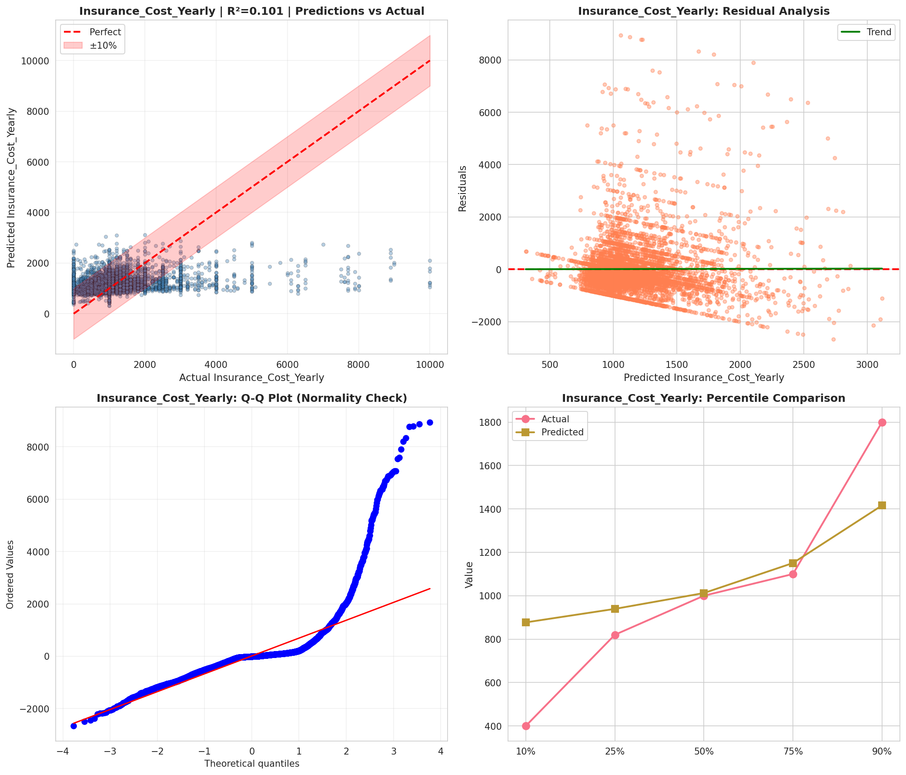
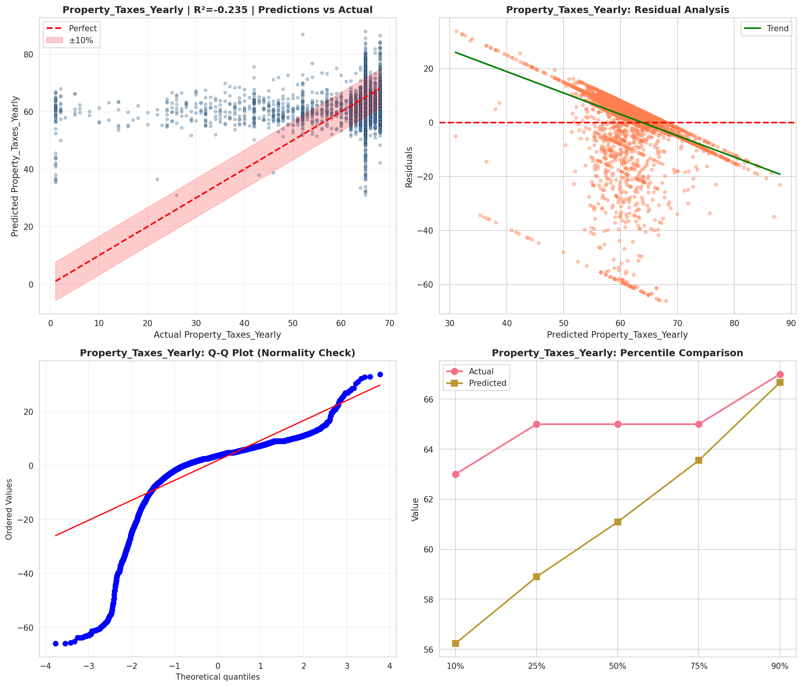
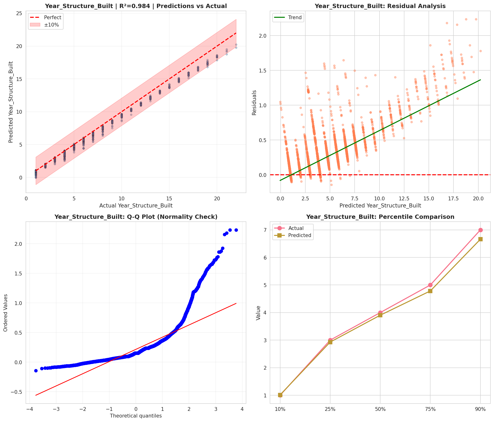
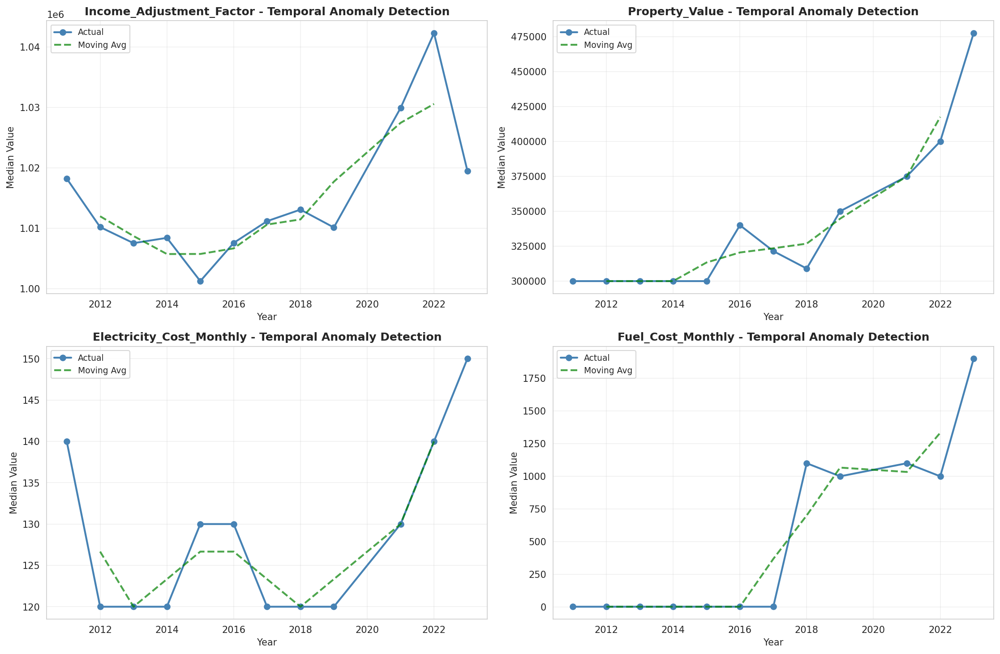
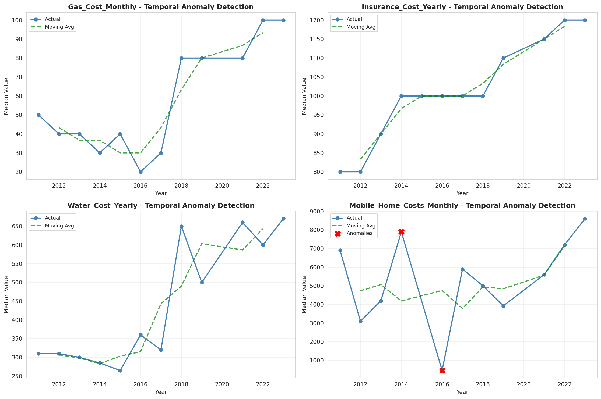
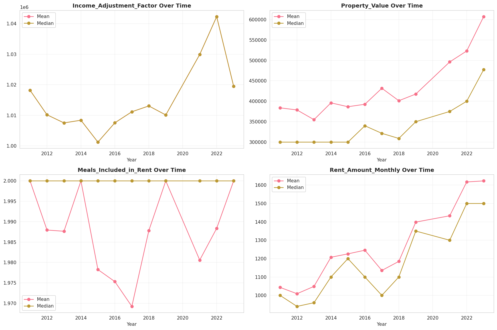
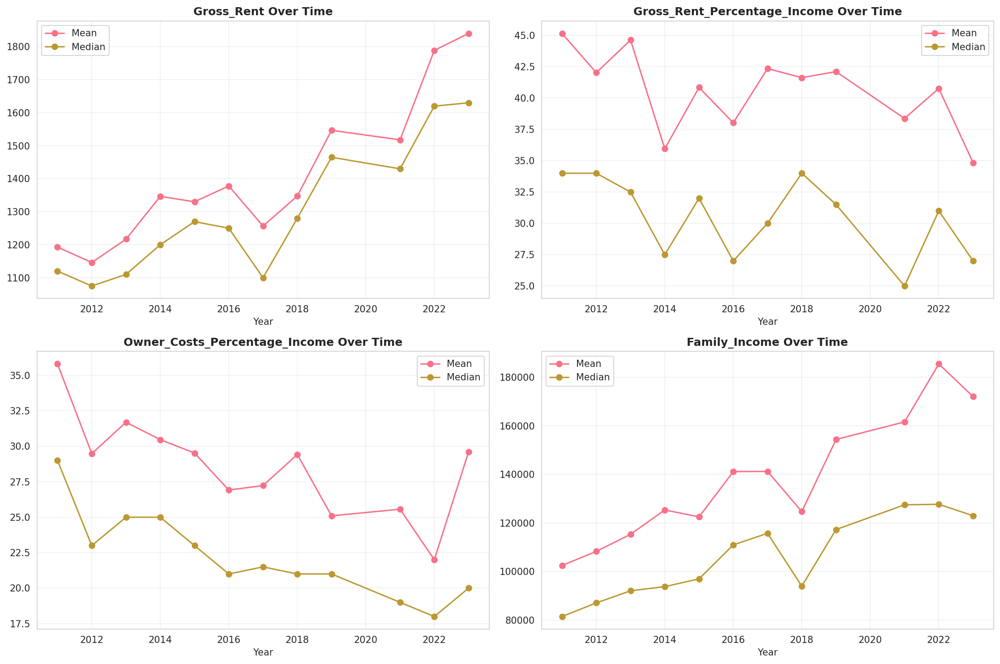
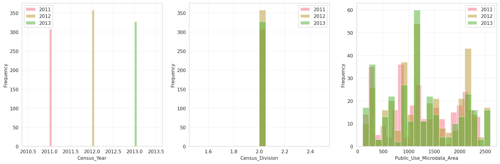
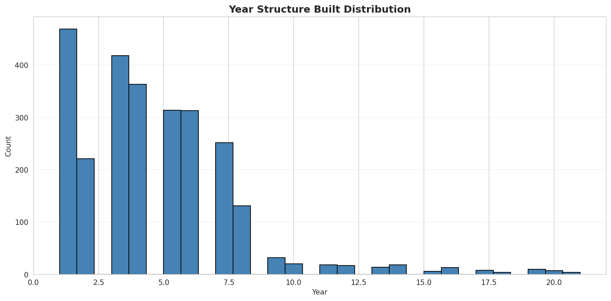
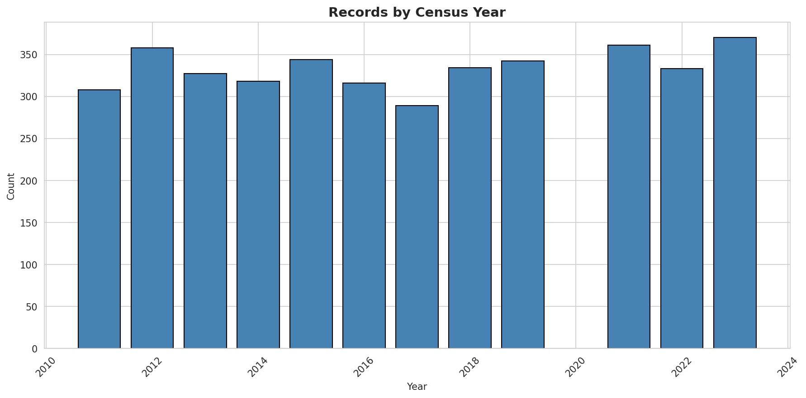
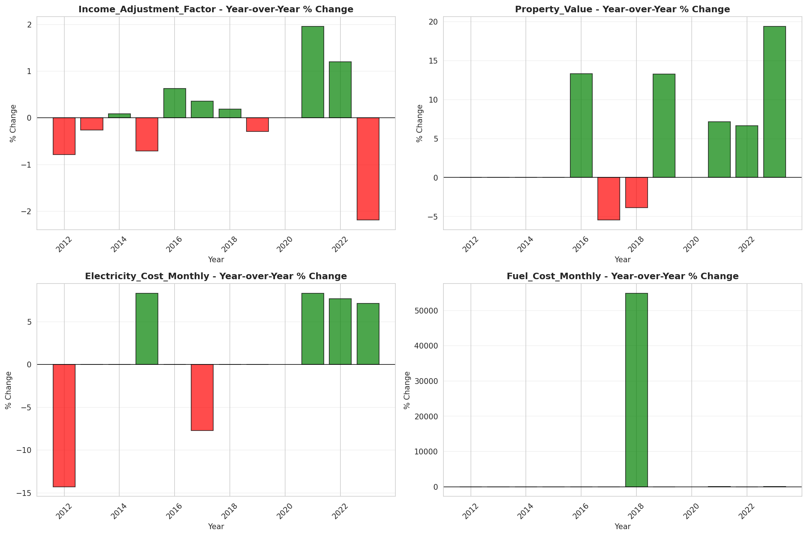
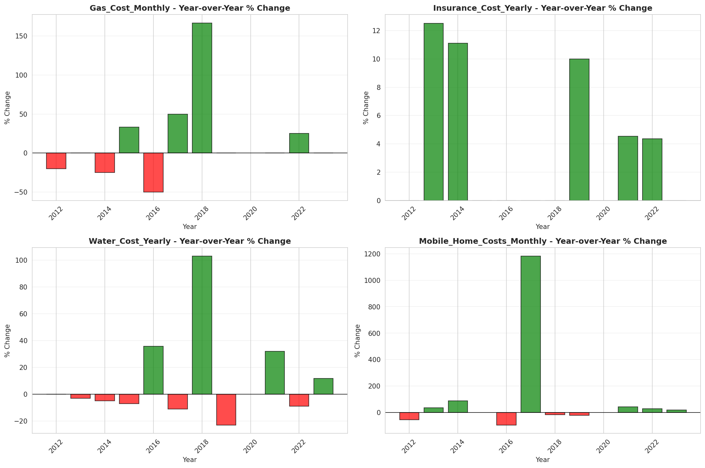
