# Temporal Analysis

## Year Distribution

- 2011: 187,801 records

- 2012: 190,012 records

- 2014: 193,984 records

- 2015: 195,962 records

- 2016: 196,364 records

- 2017: 196,758 records

- 2018: 198,142 records

- 2019: 198,807 records

- 2020: 191,652 records

- 2021: 193,562 records

- 2022: 195,673 records

- 2023: 196,553 records

## Temporal Trends

- Census_Year: {np.int64(2011): {'mean': 2011.0, 'median': 2011.0, 'std': 0.0}, np.int64(2012): {'mean': 2012.0, 'median': 2012.0, 'std': 0.0}, np.int64(2014): {'mean': 2014.0, 'median': 2014.0, 'std': 0.0}, np.int64(2015): {'mean': 2015.0, 'median': 2015.0, 'std': 0.0}, np.int64(2016): {'mean': 2016.0, 'median': 2016.0, 'std': 0.0}, np.int64(2017): {'mean': 2017.0, 'median': 2017.0, 'std': 0.0}, np.int64(2018): {'mean': 2018.0, 'median': 2018.0, 'std': 0.0}, np.int64(2019): {'mean': 2019.0, 'median': 2019.0, 'std': 0.0}, np.int64(2020): {'mean': 2020.0, 'median': 2020.0, 'std': 0.0}, np.int64(2021): {'mean': 2021.0, 'median': 2021.0, 'std': 0.0}, np.int64(2022): {'mean': 2022.0, 'median': 2022.0, 'std': 0.0}, np.int64(2023): {'mean': 2023.0, 'median': 2023.0, 'std': 0.0}}

- Census_Division: {np.int64(2011): {'mean': 2.0, 'median': 2.0, 'std': 0.0}, np.int64(2012): {'mean': 2.0, 'median': 2.0, 'std': 0.0}, np.int64(2014): {'mean': 2.0, 'median': 2.0, 'std': 0.0}, np.int64(2015): {'mean': 2.0, 'median': 2.0, 'std': 0.0}, np.int64(2016): {'mean': 2.0, 'median': 2.0, 'std': 0.0}, np.int64(2017): {'mean': 2.0, 'median': 2.0, 'std': 0.0}, np.int64(2018): {'mean': 2.0, 'median': 2.0, 'std': 0.0}, np.int64(2019): {'mean': 2.0, 'median': 2.0, 'std': 0.0}, np.int64(2020): {'mean': 2.0, 'median': 2.0, 'std': 0.0}, np.int64(2021): {'mean': 2.0, 'median': 2.0, 'std': 0.0}, np.int64(2022): {'mean': 2.0, 'median': 2.0, 'std': 0.0}, np.int64(2023): {'mean': 2.0, 'median': 2.0, 'std': 0.0}}

- Public_Use_Microdata_Area: {np.int64(2011): {'mean': 1239.6671689714112, 'median': 1201.0, 'std': 663.6021526305063}, np.int64(2012): {'mean': None, 'median': None, 'std': None}, np.int64(2014): {'mean': None, 'median': None, 'std': None}, np.int64(2015): {'mean': None, 'median': None, 'std': None}, np.int64(2016): {'mean': 1301.883446049174, 'median': 1204.0, 'std': 688.027958771591}, np.int64(2017): {'mean': 1300.3087599995933, 'median': 1204.0, 'std': 687.9363476014112}, np.int64(2018): {'mean': 1301.1815970364687, 'median': 1204.0, 'std': 688.5689738713571}, np.int64(2019): {'mean': 1300.977043061864, 'median': 1203.0, 'std': 688.4284797371868}, np.int64(2020): {'mean': 1301.6830818358274, 'median': 1203.0, 'std': 688.2799132447318}, np.int64(2021): {'mean': 1302.8662599063866, 'median': 1203.0, 'std': 687.1393954070787}, np.int64(2022): {'mean': None, 'median': None, 'std': None}, np.int64(2023): {'mean': 1299.529043057089, 'median': 1203.0, 'std': 689.086620055896}}

- Census_Region: {np.int64(2011): {'mean': 1.0, 'median': 1.0, 'std': 0.0}, np.int64(2012): {'mean': 1.0, 'median': 1.0, 'std': 0.0}, np.int64(2014): {'mean': 1.0, 'median': 1.0, 'std': 0.0}, np.int64(2015): {'mean': 1.0, 'median': 1.0, 'std': 0.0}, np.int64(2016): {'mean': 1.0, 'median': 1.0, 'std': 0.0}, np.int64(2017): {'mean': 1.0, 'median': 1.0, 'std': 0.0}, np.int64(2018): {'mean': 1.0, 'median': 1.0, 'std': 0.0}, np.int64(2019): {'mean': 1.0, 'median': 1.0, 'std': 0.0}, np.int64(2020): {'mean': 1.0, 'median': 1.0, 'std': 0.0}, np.int64(2021): {'mean': 1.0, 'median': 1.0, 'std': 0.0}, np.int64(2022): {'mean': 1.0, 'median': 1.0, 'std': 0.0}, np.int64(2023): {'mean': 1.0, 'median': 1.0, 'std': 0.0}}

- State_Code: {np.int64(2011): {'mean': 34.0, 'median': 34.0, 'std': 0.0}, np.int64(2012): {'mean': 34.0, 'median': 34.0, 'std': 0.0}, np.int64(2014): {'mean': 34.0, 'median': 34.0, 'std': 0.0}, np.int64(2015): {'mean': 34.0, 'median': 34.0, 'std': 0.0}, np.int64(2016): {'mean': 34.0, 'median': 34.0, 'std': 0.0}, np.int64(2017): {'mean': 34.0, 'median': 34.0, 'std': 0.0}, np.int64(2018): {'mean': 34.0, 'median': 34.0, 'std': 0.0}, np.int64(2019): {'mean': 34.0, 'median': 34.0, 'std': 0.0}, np.int64(2020): {'mean': 34.0, 'median': 34.0, 'std': 0.0}, np.int64(2021): {'mean': 34.0, 'median': 34.0, 'std': 0.0}, np.int64(2022): {'mean': 34.0, 'median': 34.0, 'std': 0.0}, np.int64(2023): {'mean': None, 'median': None, 'std': None}}

- Housing_Adjustment_Factor: {np.int64(2011): {'mean': 1041400.8845107321, 'median': 1044592.0, 'std': 27525.496748698934}, np.int64(2012): {'mean': 1041533.5017051555, 'median': 1053092.0, 'std': 27469.738345324036}, np.int64(2014): {'mean': 1036756.1290570357, 'median': 1031130.0, 'std': 29652.06717263202}, np.int64(2015): {'mean': 1020932.8980975903, 'median': 1017534.0, 'std': 20271.919657736107}, np.int64(2016): {'mean': 1020393.6458515817, 'median': 1013801.0, 'std': 15767.645131163472}, np.int64(2017): {'mean': 1029263.3763150673, 'median': 1034680.0, 'std': 17952.63542135444}, np.int64(2018): {'mean': 1038233.9389882004, 'median': 1046406.0, 'std': 23517.430598519164}, np.int64(2019): {'mean': 1040891.893705956, 'median': 1042936.0, 'std': 29156.20123263251}, np.int64(2020): {'mean': 1036867.2234779705, 'median': 1030827.0, 'std': 28197.584269969168}, np.int64(2021): {'mean': 1058125.3388836652, 'median': 1059761.0, 'std': 35913.1780285379}, np.int64(2022): {'mean': 1104245.1227302693, 'median': 1133141.0, 'std': 61893.46445607088}, np.int64(2023): {'mean': 1104341.8945678773, 'median': 1125501.0, 'std': 76519.41573945586}}

- Income_Adjustment_Factor: {np.int64(2011): {'mean': 1054036.2617398202, 'median': 1048026.0, 'std': 28388.861943185257}, np.int64(2012): {'mean': 1052771.2696934931, 'median': 1061121.0, 'std': 26402.3022361267}, np.int64(2014): {'mean': 1047595.0179344688, 'median': 1041654.0, 'std': 31072.559781576092}, np.int64(2015): {'mean': 1030346.4420193711, 'median': 1025215.0, 'std': 25634.991518738192}, np.int64(2016): {'mean': 1027558.9354871565, 'median': 1022342.0, 'std': 17523.93298589708}, np.int64(2017): {'mean': 1036651.997113205, 'median': 1035988.0, 'std': 16835.921218307954}, np.int64(2018): {'mean': 1046817.6870274853, 'median': 1054346.0, 'std': 20537.350702954085}, np.int64(2019): {'mean': 1049840.8730426996, 'median': 1054606.0, 'std': 26190.30168356085}, np.int64(2020): {'mean': 1047016.7906257175, 'median': 1044328.0, 'std': 28647.19571972528}, np.int64(2021): {'mean': 1073295.794918424, 'median': 1070512.0, 'std': 30907.123780047863}, np.int64(2022): {'mean': 1126789.5385924475, 'median': 1140108.0, 'std': 49972.01636404346}, np.int64(2023): {'mean': 1128535.9025708078, 'median': 1159185.0, 'std': 70224.08185154863}}

- Housing_Unit_Weight: {np.int64(2011): {'mean': 18.870863307437126, 'median': 16.0, 'std': 13.282404500418346}, np.int64(2012): {'mean': 18.713891754204997, 'median': 15.0, 'std': 13.499355043633303}, np.int64(2014): {'mean': 18.41460120422303, 'median': 15.0, 'std': 14.103819195544627}, np.int64(2015): {'mean': 18.25834600585828, 'median': 15.0, 'std': 14.401903245995566}, np.int64(2016): {'mean': 18.26425414027011, 'median': 15.0, 'std': 14.278036477588524}, np.int64(2017): {'mean': 18.271455290255034, 'median': 15.0, 'std': 14.33895664158476}, np.int64(2018): {'mean': 18.196046269846878, 'median': 15.0, 'std': 14.385116156183647}, np.int64(2019): {'mean': 18.191582791350406, 'median': 15.0, 'std': 14.702683883772085}, np.int64(2020): {'mean': 18.93396364243525, 'median': 14.0, 'std': 19.048224382369273}, np.int64(2021): {'mean': 19.313408623593475, 'median': 15.0, 'std': 19.51992273315496}, np.int64(2022): {'mean': 19.19702769416322, 'median': 14.0, 'std': 19.75169554330083}, np.int64(2023): {'mean': 19.210299512090888, 'median': 14.0, 'std': 19.884621081378608}}

- Number_of_Persons: {np.int64(2011): {'mean': 2.319407244902849, 'median': 2.0, 'std': 1.5288690795761561}, np.int64(2012): {'mean': 2.300186304022904, 'median': 2.0, 'std': 1.5296317683781564}, np.int64(2014): {'mean': 2.271269795447047, 'median': 2.0, 'std': 1.534132703364935}, np.int64(2015): {'mean': 2.249655545462896, 'median': 2.0, 'std': 1.5280175238301779}, np.int64(2016): {'mean': 2.239509278686521, 'median': 2.0, 'std': 1.527639089567221}, np.int64(2017): {'mean': 2.2355888960042285, 'median': 2.0, 'std': 1.5263766524211186}, np.int64(2018): {'mean': 2.220357117622715, 'median': 2.0, 'std': 1.5182322230074234}, np.int64(2019): {'mean': 2.214474339434728, 'median': 2.0, 'std': 1.5141157969867944}, np.int64(2020): {'mean': 2.203791246634525, 'median': 2.0, 'std': 1.5121824427198647}, np.int64(2021): {'mean': 2.2123970614066812, 'median': 2.0, 'std': 1.5078935008214087}, np.int64(2022): {'mean': 2.2143474061316586, 'median': 2.0, 'std': 1.501739729172421}, np.int64(2023): {'mean': 2.2335756767894663, 'median': 2.0, 'std': 1.502864260125787}}

- Housing_Unit_Type: {np.int64(2011): {'mean': 1.0835725049387384, 'median': 1.0, 'std': 0.3528925772991179}, np.int64(2012): {'mean': 1.0959518346209713, 'median': 1.0, 'std': 0.38140326771301647}, np.int64(2014): {'mean': 1.1190201253711647, 'median': 1.0, 'std': 0.42951182737814975}, np.int64(2015): {'mean': 1.1319796695277655, 'median': 1.0, 'std': 0.453296448908035}, np.int64(2016): {'mean': 1.1320914220529221, 'median': 1.0, 'std': 0.4542145152258909}, np.int64(2017): {'mean': 1.1325587777879425, 'median': 1.0, 'std': 0.45621026084440713}, np.int64(2018): {'mean': 1.1389458065427824, 'median': 1.0, 'std': 0.46674764273657326}, np.int64(2019): {'mean': 1.1403270508583703, 'median': 1.0, 'std': 0.4696622809475924}, np.int64(2020): {'mean': None, 'median': None, 'std': None}, np.int64(2021): {'mean': None, 'median': None, 'std': None}, np.int64(2022): {'mean': None, 'median': None, 'std': None}, np.int64(2023): {'mean': None, 'median': None, 'std': None}}

- Number_of_Bedrooms: {np.int64(2011): {'mean': 2.7736682369994563, 'median': 3.0, 'std': 1.161665001109883}, np.int64(2012): {'mean': None, 'median': None, 'std': None}, np.int64(2014): {'mean': None, 'median': None, 'std': None}, np.int64(2015): {'mean': None, 'median': None, 'std': None}, np.int64(2016): {'mean': None, 'median': None, 'std': None}, np.int64(2017): {'mean': None, 'median': None, 'std': None}, np.int64(2018): {'mean': None, 'median': None, 'std': None}, np.int64(2019): {'mean': None, 'median': None, 'std': None}, np.int64(2020): {'mean': None, 'median': None, 'std': None}, np.int64(2021): {'mean': None, 'median': None, 'std': None}, np.int64(2022): {'mean': None, 'median': None, 'std': None}, np.int64(2023): {'mean': None, 'median': None, 'std': None}}

- Number_of_Rooms: {np.int64(2011): {'mean': 5.976988584888566, 'median': 6.0, 'std': 2.086555688457276}, np.int64(2012): {'mean': None, 'median': None, 'std': None}, np.int64(2014): {'mean': None, 'median': None, 'std': None}, np.int64(2015): {'mean': None, 'median': None, 'std': None}, np.int64(2016): {'mean': None, 'median': None, 'std': None}, np.int64(2017): {'mean': None, 'median': None, 'std': None}, np.int64(2018): {'mean': None, 'median': None, 'std': None}, np.int64(2019): {'mean': None, 'median': None, 'std': None}, np.int64(2020): {'mean': None, 'median': None, 'std': None}, np.int64(2021): {'mean': None, 'median': None, 'std': None}, np.int64(2022): {'mean': None, 'median': None, 'std': None}, np.int64(2023): {'mean': None, 'median': None, 'std': None}}

- Building_Type: {np.int64(2011): {'mean': 3.349259376698677, 'median': 2.0, 'std': 2.1541612134906134}, np.int64(2012): {'mean': 3.362665554045749, 'median': 2.0, 'std': 2.163553836085696}, np.int64(2014): {'mean': 3.3716961801376115, 'median': 2.0, 'std': 2.1666796760372833}, np.int64(2015): {'mean': 3.375711564352232, 'median': 2.0, 'std': 2.166577449750567}, np.int64(2016): {'mean': 3.3809815745767056, 'median': 2.0, 'std': 2.1722057225615323}, np.int64(2017): {'mean': 3.3778601971763633, 'median': 2.0, 'std': 2.173057089874703}, np.int64(2018): {'mean': 3.378006110645943, 'median': 2.0, 'std': 2.1794676929533208}, np.int64(2019): {'mean': 3.3698104443608856, 'median': 2.0, 'std': 2.1835400942705094}, np.int64(2020): {'mean': 3.368578853845308, 'median': 2.0, 'std': 2.1901660547684556}, np.int64(2021): {'mean': 3.358848302535453, 'median': 2.0, 'std': 2.1929146591003423}, np.int64(2022): {'mean': 3.3532345931222336, 'median': 2.0, 'std': 2.197224384383443}, np.int64(2023): {'mean': 3.352393848643364, 'median': 2.0, 'std': 2.2046416984249038}}

- Year_Structure_Built: {np.int64(2011): {'mean': 5.872706785649574, 'median': 6.0, 'std': 2.2995719541493385}, np.int64(2012): {'mean': 4.201235911343659, 'median': 4.0, 'std': 2.464386428856641}, np.int64(2014): {'mean': 4.2800094054943765, 'median': 4.0, 'std': 2.598146060369593}, np.int64(2015): {'mean': 4.322194104141179, 'median': 4.0, 'std': 2.687478849898055}, np.int64(2016): {'mean': 4.395082095125567, 'median': 4.0, 'std': 2.823241407759177}, np.int64(2017): {'mean': 4.470298433598941, 'median': 4.0, 'std': 2.9865178756692843}, np.int64(2018): {'mean': 4.558724860126095, 'median': 4.0, 'std': 3.1769863619926904}, np.int64(2019): {'mean': 4.659723297427617, 'median': 4.0, 'std': 3.38073499110875}, np.int64(2020): {'mean': 4.751483194323056, 'median': 4.0, 'std': 3.568654699638183}, np.int64(2021): {'mean': None, 'median': None, 'std': None}, np.int64(2022): {'mean': None, 'median': None, 'std': None}, np.int64(2023): {'mean': None, 'median': None, 'std': None}}

- Bathtub_or_Shower: {np.int64(2011): {'mean': None, 'median': None, 'std': None}, np.int64(2012): {'mean': 1.0053394527483803, 'median': 1.0, 'std': 0.07287642237026801}, np.int64(2014): {'mean': 1.0055369249631898, 'median': 1.0, 'std': 0.07420443552914902}, np.int64(2015): {'mean': 1.0054802326166017, 'median': 1.0, 'std': 0.07382567381400475}, np.int64(2016): {'mean': 1.005133035346048, 'median': 1.0, 'std': 0.07146128851054641}, np.int64(2017): {'mean': 1.005326986916075, 'median': 1.0, 'std': 0.07279175495693688}, np.int64(2018): {'mean': 1.0052511630743979, 'median': 1.0, 'std': 0.07227459668505372}, np.int64(2019): {'mean': 1.0049600760876778, 'median': 1.0, 'std': 0.07025312110052886}, np.int64(2020): {'mean': 1.0048098906632557, 'median': 1.0, 'std': 0.06918658339104414}, np.int64(2021): {'mean': 1.0045437616387336, 'median': 1.0, 'std': 0.0672543068195218}, np.int64(2022): {'mean': 1.0041822721598002, 'median': 1.0, 'std': 0.06453529571870183}, np.int64(2023): {'mean': 1.0037195817437086, 'median': 1.0, 'std': 0.060875013568524615}}

- Refrigerator: {np.int64(2011): {'mean': None, 'median': None, 'std': None}, np.int64(2012): {'mean': 1.0117614555787977, 'median': 1.0, 'std': 0.10781089590705072}, np.int64(2014): {'mean': 1.0124846740828244, 'median': 1.0, 'std': 0.11103547189609164}, np.int64(2015): {'mean': 1.0127648639438682, 'median': 1.0, 'std': 0.11225859696167138}, np.int64(2016): {'mean': 1.012684895165695, 'median': 1.0, 'std': 0.11191093959492697}, np.int64(2017): {'mean': 1.013111727712009, 'median': 1.0, 'std': 0.11375360328801752}, np.int64(2018): {'mean': 1.0130475044499032, 'median': 1.0, 'std': 0.11347836129865689}, np.int64(2019): {'mean': 1.01249695870474, 'median': 1.0, 'std': 0.11108939178965206}, np.int64(2020): {'mean': 1.011732428850083, 'median': 1.0, 'std': 0.10767936698924457}, np.int64(2021): {'mean': 1.010623119896863, 'median': 1.0, 'std': 0.1025198977906534}, np.int64(2022): {'mean': 1.0093462717058224, 'median': 1.0, 'std': 0.09622354936884213}, np.int64(2023): {'mean': 1.0079504655095883, 'median': 1.0, 'std': 0.08881047192853639}}

- Hot_and_Cold_Running_Water: {np.int64(2011): {'mean': None, 'median': None, 'std': None}, np.int64(2012): {'mean': 1.0069801927164677, 'median': 1.0, 'std': 0.0832556827364186}, np.int64(2014): {'mean': 1.00802266276264, 'median': 1.0, 'std': 0.08920955217741577}, np.int64(2015): {'mean': 1.0084968744239051, 'median': 1.0, 'std': 0.09178629861035786}, np.int64(2016): {'mean': 1.0087501253998863, 'median': 1.0, 'std': 0.0931322127206434}, np.int64(2017): {'mean': 1.0092694020763016, 'median': 1.0, 'std': 0.09583074311901718}, np.int64(2018): {'mean': 1.009287960031274, 'median': 1.0, 'std': 0.09592572571460613}, np.int64(2019): {'mean': 1.0087865784875363, 'median': 1.0, 'std': 0.09332428775985344}, np.int64(2020): {'mean': 1.0083927093402172, 'median': 1.0, 'std': 0.0912267501359298}, np.int64(2021): {'mean': 1.0074373298954304, 'median': 1.0, 'std': 0.08591890547170747}, np.int64(2022): {'mean': 1.0063500170241744, 'median': 1.0, 'std': 0.0794338096401586}, np.int64(2023): {'mean': 1.005242250403142, 'median': 1.0, 'std': 0.07221356184443198}}

- Running_Water: {np.int64(2011): {'mean': None, 'median': None, 'std': None}, np.int64(2012): {'mean': None, 'median': None, 'std': None}, np.int64(2014): {'mean': 9.0, 'median': 9.0, 'std': 0.0}, np.int64(2015): {'mean': 9.0, 'median': 9.0, 'std': 0.0}, np.int64(2016): {'mean': 9.0, 'median': 9.0, 'std': 0.0}, np.int64(2017): {'mean': 9.0, 'median': 9.0, 'std': 0.0}, np.int64(2018): {'mean': 9.0, 'median': 9.0, 'std': 0.0}, np.int64(2019): {'mean': 9.0, 'median': 9.0, 'std': 0.0}, np.int64(2020): {'mean': 9.0, 'median': 9.0, 'std': 0.0}, np.int64(2021): {'mean': 9.0, 'median': 9.0, 'std': 0.0}, np.int64(2022): {'mean': 9.0, 'median': 9.0, 'std': 0.0}, np.int64(2023): {'mean': 9.0, 'median': 9.0, 'std': 0.0}}

- Sink_with_Faucet: {np.int64(2011): {'mean': None, 'median': None, 'std': None}, np.int64(2012): {'mean': 1.0053620058750896, 'median': 1.0, 'std': 0.0730293423128485}, np.int64(2014): {'mean': 1.005576114523091, 'median': 1.0, 'std': 0.07446510937305025}, np.int64(2015): {'mean': 1.0055696145960773, 'median': 1.0, 'std': 0.07442193850039927}, np.int64(2016): {'mean': 1.0052667952247722, 'median': 1.0, 'std': 0.0723815259025049}, np.int64(2017): {'mean': 1.0054938027902736, 'median': 1.0, 'std': 0.07391651575911395}, np.int64(2018): {'mean': 1.0054119695465813, 'median': 1.0, 'std': 0.07336695427512395}, np.int64(2019): {'mean': 1.0051923204529871, 'median': 1.0, 'std': 0.07187063951279438}, np.int64(2020): {'mean': 1.004989321000874, 'median': 1.0, 'std': 0.07045889873871325}, np.int64(2021): {'mean': 1.00472711645896, 'median': 1.0, 'std': 0.0685915285343112}, np.int64(2022): {'mean': 1.0043468391783, 'median': 1.0, 'std': 0.06578729913508602}, np.int64(2023): {'mean': 1.0039106176640802, 'median': 1.0, 'std': 0.06241271200936057}}

- Stove_or_Range: {np.int64(2011): {'mean': None, 'median': None, 'std': None}, np.int64(2012): {'mean': 1.0103406085961242, 'median': 1.0, 'std': 0.10116194003025038}, np.int64(2014): {'mean': 1.0114657455253921, 'median': 1.0, 'std': 0.10646288395666369}, np.int64(2015): {'mean': 1.0115302753523605, 'median': 1.0, 'std': 0.10675856767842552}, np.int64(2016): {'mean': 1.011458762944055, 'median': 1.0, 'std': 0.10643083588814953}, np.int64(2017): {'mean': 1.0117716401892805, 'median': 1.0, 'std': 0.10785700423668171}, np.int64(2018): {'mean': 1.0116778769109631, 'median': 1.0, 'std': 0.10743169039160042}, np.int64(2019): {'mean': 1.011341266505939, 'median': 1.0, 'std': 0.1058900570500377}, np.int64(2020): {'mean': 1.011101528630715, 'median': 1.0, 'std': 0.10477761324005977}, np.int64(2021): {'mean': 1.0104856037816932, 'median': 1.0, 'std': 0.10186125537315917}, np.int64(2022): {'mean': 1.0096697310180456, 'median': 1.0, 'std': 0.09785847772598552}, np.int64(2023): {'mean': 1.0086471847485912, 'median': 1.0, 'std': 0.09258757535771885}}

- Telephone_Service: {np.int64(2011): {'mean': 1.0212377130298045, 'median': 1.0, 'std': 0.14417627675792005}, np.int64(2012): {'mean': 1.0176780523255815, 'median': 1.0, 'std': 0.1317787690084996}, np.int64(2014): {'mean': 1.0172597498516787, 'median': 1.0, 'std': 0.1302380649932597}, np.int64(2015): {'mean': 1.017725661303518, 'median': 1.0, 'std': 0.13195289974051871}, np.int64(2016): {'mean': 1.0186841100192177, 'median': 1.0, 'std': 0.1354072568426085}, np.int64(2017): {'mean': 1.016969484008942, 'median': 1.0, 'std': 0.12915735242248905}, np.int64(2018): {'mean': 1.015915712610467, 'median': 1.0, 'std': 0.12514989963148176}, np.int64(2019): {'mean': 1.014272551534751, 'median': 1.0, 'std': 0.1186125226651096}, np.int64(2020): {'mean': 1.0117856895258623, 'median': 1.0, 'std': 0.10792062107257756}, np.int64(2021): {'mean': 1.0080066639314709, 'median': 1.0, 'std': 0.08912130294275174}, np.int64(2022): {'mean': 1.0075797497518353, 'median': 1.0, 'std': 0.08673144319616227}, np.int64(2023): {'mean': 1.0071454435727218, 'median': 1.0, 'std': 0.08422843358255788}}

- Lot_Acreage: {np.int64(2011): {'mean': 1.1475710208846803, 'median': 1.0, 'std': 0.3824158477259884}, np.int64(2012): {'mean': 1.1458343473675672, 'median': 1.0, 'std': 0.37982161834934364}, np.int64(2014): {'mean': 1.1450937262449659, 'median': 1.0, 'std': 0.3785998530860057}, np.int64(2015): {'mean': 1.1441356228172292, 'median': 1.0, 'std': 0.3769202125183638}, np.int64(2016): {'mean': 1.1439870863599677, 'median': 1.0, 'std': 0.3764818675494222}, np.int64(2017): {'mean': 1.144483088217576, 'median': 1.0, 'std': 0.37696017715054453}, np.int64(2018): {'mean': 1.1442038074087093, 'median': 1.0, 'std': 0.37649997269676877}, np.int64(2019): {'mean': 1.1437498514980873, 'median': 1.0, 'std': 0.3757345643100743}, np.int64(2020): {'mean': 1.1442883949311002, 'median': 1.0, 'std': 0.37678962758721396}, np.int64(2021): {'mean': 1.1451437211419653, 'median': 1.0, 'std': 0.37800627525062186}, np.int64(2022): {'mean': 1.1463690013852967, 'median': 1.0, 'std': 0.37956312853137736}, np.int64(2023): {'mean': 1.1476009512447558, 'median': 1.0, 'std': 0.3804344085000455}}

- Agricultural_Sales: {np.int64(2011): {'mean': 1.1297974575755734, 'median': 1.0, 'std': 0.6266104422382393}, np.int64(2012): {'mean': 1.131420496436471, 'median': 1.0, 'std': 0.6339058722530908}, np.int64(2014): {'mean': 1.1315319751338708, 'median': 1.0, 'std': 0.6316528798724597}, np.int64(2015): {'mean': 1.133053048101892, 'median': 1.0, 'std': 0.6388981154956145}, np.int64(2016): {'mean': 1.1352418558736426, 'median': 1.0, 'std': 0.635703218173318}, np.int64(2017): {'mean': 1.1383955909369259, 'median': 1.0, 'std': 0.6464204429718744}, np.int64(2018): {'mean': 1.1424562259776707, 'median': 1.0, 'std': 0.655495598073306}, np.int64(2019): {'mean': 1.1479752667313288, 'median': 1.0, 'std': 0.6686044957547688}, np.int64(2020): {'mean': 1.1522054647567364, 'median': 1.0, 'std': 0.6728953200637133}, np.int64(2021): {'mean': 1.1534763313609468, 'median': 1.0, 'std': 0.6785630076432658}, np.int64(2022): {'mean': 1.1525556223692122, 'median': 1.0, 'std': 0.6755956733611407}, np.int64(2023): {'mean': 1.1571922018617178, 'median': 1.0, 'std': 0.690642495984735}}

- Business_On_Property: {np.int64(2011): {'mean': 1.9870038266960695, 'median': 2.0, 'std': 0.11325800978362657}, np.int64(2012): {'mean': 1.9872393932019146, 'median': 2.0, 'std': 0.1122402597540191}, np.int64(2014): {'mean': 1.9876029047857802, 'median': 2.0, 'std': 0.11065037846976229}, np.int64(2015): {'mean': 1.9880270986935713, 'median': 2.0, 'std': 0.10876417873348958}, np.int64(2016): {'mean': 3.3969814366424536, 'median': 2.0, 'std': 2.8113168835140727}, np.int64(2017): {'mean': 4.8107856288002315, 'median': 2.0, 'std': 3.4394420680696896}, np.int64(2018): {'mean': 6.224554031491408, 'median': 9.0, 'std': 3.429333687735227}, np.int64(2019): {'mean': 7.6215854460205446, 'median': 9.0, 'std': 2.786705459292318}, np.int64(2020): {'mean': None, 'median': None, 'std': None}, np.int64(2021): {'mean': None, 'median': None, 'std': None}, np.int64(2022): {'mean': None, 'median': None, 'std': None}, np.int64(2023): {'mean': None, 'median': None, 'std': None}}

- Tenure: {np.int64(2011): {'mean': 1.7873435858828102, 'median': 2.0, 'std': 0.8732095793424726}, np.int64(2012): {'mean': 1.800484496124031, 'median': 2.0, 'std': 0.8769148835875253}, np.int64(2014): {'mean': 1.8284619389521861, 'median': 2.0, 'std': 0.8814582879252338}, np.int64(2015): {'mean': 1.839838802533103, 'median': 2.0, 'std': 0.8818960680285742}, np.int64(2016): {'mean': 1.8466957254490672, 'median': 2.0, 'std': 0.8812543358912343}, np.int64(2017): {'mean': 1.8512246987477357, 'median': 2.0, 'std': 0.8791840123711497}, np.int64(2018): {'mean': 1.8532224331153209, 'median': 2.0, 'std': 0.8764574914477187}, np.int64(2019): {'mean': 1.8496865458618634, 'median': 2.0, 'std': 0.8715056941232598}, np.int64(2020): {'mean': 1.8488028386494986, 'median': 2.0, 'std': 0.8686097378015573}, np.int64(2021): {'mean': 1.8477863563462757, 'median': 2.0, 'std': 0.8639489783197959}, np.int64(2022): {'mean': 1.8468302307626319, 'median': 2.0, 'std': 0.8587654574939126}, np.int64(2023): {'mean': 1.8470971635485818, 'median': 2.0, 'std': 0.8557688298474974}}

- Vacancy_Status: {np.int64(2011): {'mean': 4.3153516511217545, 'median': 5.0, 'std': 2.134933239531265}, np.int64(2012): {'mean': 4.366533213497835, 'median': 5.0, 'std': 2.139094615142622}, np.int64(2014): {'mean': 4.517898340403364, 'median': 5.0, 'std': 2.111842757868933}, np.int64(2015): {'mean': 4.590194396798171, 'median': 5.0, 'std': 2.0956707278413664}, np.int64(2016): {'mean': 4.670144406826505, 'median': 5.0, 'std': 2.053042972671564}, np.int64(2017): {'mean': 4.717620787657329, 'median': 5.0, 'std': 2.0280671106695594}, np.int64(2018): {'mean': 4.7619910109344605, 'median': 5.0, 'std': 1.9929357346047443}, np.int64(2019): {'mean': 4.789534176188223, 'median': 5.0, 'std': 1.9619059720854402}, np.int64(2020): {'mean': 4.784853212310311, 'median': 5.0, 'std': 1.9266980625320915}, np.int64(2021): {'mean': 4.7772164872977525, 'median': 5.0, 'std': 1.900071091972671}, np.int64(2022): {'mean': 4.75572108739057, 'median': 5.0, 'std': 1.8719049160328038}, np.int64(2023): {'mean': 4.747902582064022, 'median': 5.0, 'std': 1.8432540274915472}}

- Property_Value: {np.int64(2011): {'mean': 19.34485069071056, 'median': 20.0, 'std': 3.335627304194278}}

- Vehicles_Available: {np.int64(2011): {'mean': 1.7242618710801605, 'median': 2.0, 'std': 1.0549918898322133}, np.int64(2012): {'mean': 1.7143955910852713, 'median': 2.0, 'std': 1.05575347916347}, np.int64(2014): {'mean': 1.7162523761668946, 'median': 2.0, 'std': 1.0613224155743906}, np.int64(2015): {'mean': 1.7208981001727115, 'median': 2.0, 'std': 1.0651043501010342}, np.int64(2016): {'mean': 1.7321843191697028, 'median': 2.0, 'std': 1.0660042986890133}, np.int64(2017): {'mean': 1.7462695609501941, 'median': 2.0, 'std': 1.0688650654144645}, np.int64(2018): {'mean': 1.7581633763313467, 'median': 2.0, 'std': 1.0738806892003299}, np.int64(2019): {'mean': 1.772253437155607, 'median': 2.0, 'std': 1.0794925310206467}, np.int64(2020): {'mean': 1.7814983581967265, 'median': 2.0, 'std': 1.080658486024609}, np.int64(2021): {'mean': 1.7837206121865403, 'median': 2.0, 'std': 1.0799086829126785}, np.int64(2022): {'mean': 1.7801995122489247, 'median': 2.0, 'std': 1.074458368128866}, np.int64(2023): {'mean': 1.7777549788774893, 'median': 2.0, 'std': 1.0699910313076155}}

- Condo_Fee_Monthly: {np.int64(2011): {'mean': 276.4571301643714, 'median': 230.0, 'std': 210.52798591374062}, np.int64(2012): {'mean': 286.72441180878167, 'median': 230.0, 'std': 218.7115751852592}, np.int64(2014): {'mean': 305.1808615586978, 'median': 250.0, 'std': 223.16576423099139}, np.int64(2015): {'mean': 317.4642487046632, 'median': 250.0, 'std': 229.36854335576143}, np.int64(2016): {'mean': 331.9787403667287, 'median': 270.0, 'std': 239.55152605918866}, np.int64(2017): {'mean': 340.9846487267473, 'median': 280.0, 'std': 237.16259751507968}, np.int64(2018): {'mean': 349.2984915705413, 'median': 290.0, 'std': 238.78613254905142}, np.int64(2019): {'mean': 356.0988427738624, 'median': 290.0, 'std': 241.57259459133314}, np.int64(2020): {'mean': 364.9618417474848, 'median': 300.0, 'std': 253.06020161127174}, np.int64(2021): {'mean': 377.23837818944423, 'median': 300.0, 'std': 280.7621594322102}, np.int64(2022): {'mean': 390.53086110415103, 'median': 310.0, 'std': 300.92459839586763}, np.int64(2023): {'mean': 406.5566091255369, 'median': 320.0, 'std': 326.4502022924734}}

- Electricity_Cost_Monthly: {np.int64(2011): {'mean': 150.57418931800106, 'median': 120.0, 'std': 113.25104018080418}, np.int64(2012): {'mean': 152.73740915697675, 'median': 120.0, 'std': 113.72819003113051}, np.int64(2014): {'mean': 155.5644016902568, 'median': 130.0, 'std': 114.66404906994244}, np.int64(2015): {'mean': 154.5262915492531, 'median': 130.0, 'std': 114.42358670503502}, np.int64(2016): {'mean': 152.48096730583865, 'median': 130.0, 'std': 113.77319924221392}, np.int64(2017): {'mean': 152.02817746166568, 'median': 130.0, 'std': 113.78093763337696}, np.int64(2018): {'mean': 157.60748054185163, 'median': 130.0, 'std': 111.28824567622439}, np.int64(2019): {'mean': 156.55198516331706, 'median': 130.0, 'std': 111.17340781502477}, np.int64(2020): {'mean': 156.7537356777021, 'median': 130.0, 'std': 113.43436300109401}, np.int64(2021): {'mean': 159.4126311410408, 'median': 130.0, 'std': 118.39964554037637}, np.int64(2022): {'mean': 167.65372630070195, 'median': 130.0, 'std': 161.770489280415}, np.int64(2023): {'mean': 175.1350922386048, 'median': 140.0, 'std': 194.50535319788702}}

- Fuel_Cost_Monthly: {np.int64(2011): {'mean': 292.7231629499657, 'median': 2.0, 'std': 816.3013385048067}, np.int64(2012): {'mean': 292.94761385658916, 'median': 2.0, 'std': 832.462952206531}, np.int64(2014): {'mean': 259.0226235304089, 'median': 2.0, 'std': 799.5262468856005}, np.int64(2015): {'mean': 244.88979789716086, 'median': 2.0, 'std': 791.7470147613518}, np.int64(2016): {'mean': 215.1640831024595, 'median': 2.0, 'std': 740.8990498618767}, np.int64(2017): {'mean': 187.00545252967086, 'median': 2.0, 'std': 683.3836851105851}, np.int64(2018): {'mean': 1586.629266378972, 'median': 1200.0, 'std': 1284.5067910072587}, np.int64(2019): {'mean': 1506.2863143157158, 'median': 1200.0, 'std': 1237.0294146678966}, np.int64(2020): {'mean': 1432.6870219193931, 'median': 1200.0, 'std': 1186.1068389250074}, np.int64(2021): {'mean': 1435.3644403379092, 'median': 1200.0, 'std': 1192.386322163166}, np.int64(2022): {'mean': 1508.5719136221649, 'median': 1200.0, 'std': 1258.0916031802963}, np.int64(2023): {'mean': 1591.8280966345483, 'median': 1200.0, 'std': 1349.8553547405452}}

- Gas_Cost_Monthly: {np.int64(2011): {'mean': 91.6970924125872, 'median': 50.0, 'std': 112.84045312631001}, np.int64(2012): {'mean': 87.79484617248062, 'median': 50.0, 'std': 109.18686314185908}, np.int64(2014): {'mean': 77.5413967623591, 'median': 40.0, 'std': 100.70234532019653}, np.int64(2015): {'mean': 73.10068781625912, 'median': 30.0, 'std': 96.94458343724081}, np.int64(2016): {'mean': 67.83916630797863, 'median': 30.0, 'std': 91.6941637356915}, np.int64(2017): {'mean': 65.49301167447186, 'median': 30.0, 'std': 90.16900072935202}, np.int64(2018): {'mean': 107.61413384006985, 'median': 80.0, 'std': 93.99390516335845}, np.int64(2019): {'mean': 105.67137209467768, 'median': 80.0, 'std': 92.1217040933137}, np.int64(2020): {'mean': 105.34816356435223, 'median': 80.0, 'std': 92.15621438756703}, np.int64(2021): {'mean': 108.52703627652294, 'median': 80.0, 'std': 96.40263762204091}, np.int64(2022): {'mean': 116.57326970424633, 'median': 90.0, 'std': 123.13052624542844}, np.int64(2023): {'mean': 124.38255665322382, 'median': 90.0, 'std': 151.49535514440183}}

- House_Heating_Fuel: {np.int64(2011): {'mean': 1.7440849508521192, 'median': 1.0, 'std': 1.2984924430183302}, np.int64(2012): {'mean': 1.7341085271317829, 'median': 1.0, 'std': 1.294676359551497}, np.int64(2014): {'mean': 1.7188918889467375, 'median': 1.0, 'std': 1.2974294970139397}, np.int64(2015): {'mean': 1.7134078720116352, 'median': 1.0, 'std': 1.304213849936558}, np.int64(2016): {'mean': 1.7053948700538941, 'median': 1.0, 'std': 1.3116770503905222}, np.int64(2017): {'mean': 1.6956095019417063, 'median': 1.0, 'std': 1.310712113252494}, np.int64(2018): {'mean': 1.686400618977961, 'median': 1.0, 'std': 1.3062683843028464}, np.int64(2019): {'mean': 1.6776089561766423, 'median': 1.0, 'std': 1.3062094435698868}, np.int64(2020): {'mean': 1.6739145505996835, 'median': 1.0, 'std': 1.3083269339307575}, np.int64(2021): {'mean': 1.6754130767222408, 'median': 1.0, 'std': 1.3126648037337725}, np.int64(2022): {'mean': 1.6768281474037672, 'median': 1.0, 'std': 1.3193549175156134}, np.int64(2023): {'mean': 1.67958961979481, 'median': 1.0, 'std': 1.3237365148424631}}

- Insurance_Cost_Yearly: {np.int64(2014): {'mean': 1066.8186893862169, 'median': 850.0, 'std': 885.2225803589296}, np.int64(2015): {'mean': 1116.1369066656632, 'median': 900.0, 'std': 921.040526068459}}

- Water_Cost_Yearly: {np.int64(2011): {'mean': 387.2638624952188, 'median': 280.0, 'std': 463.9096397894446}, np.int64(2012): {'mean': 398.5197129360465, 'median': 290.0, 'std': 476.1447850781708}, np.int64(2014): {'mean': 415.36660774176363, 'median': 300.0, 'std': 496.8755282870262}, np.int64(2015): {'mean': 421.8642123443323, 'median': 300.0, 'std': 506.32717221019385}, np.int64(2016): {'mean': 428.1478724242663, 'median': 300.0, 'std': 513.643428722661}, np.int64(2017): {'mean': 434.7688975590842, 'median': 300.0, 'std': 521.3165944894662}, np.int64(2018): {'mean': 673.057154745943, 'median': 600.0, 'std': 519.4377807549121}, np.int64(2019): {'mean': 675.6187233576443, 'median': 600.0, 'std': 523.3563677557236}, np.int64(2020): {'mean': 682.3397121469436, 'median': 600.0, 'std': 536.4062035275117}, np.int64(2021): {'mean': 688.6246422054043, 'median': 600.0, 'std': 551.2204508787139}, np.int64(2022): {'mean': 699.415286658768, 'median': 600.0, 'std': 573.6158178055417}, np.int64(2023): {'mean': 717.8960170533447, 'median': 600.0, 'std': 602.4278453785307}}

- Mobile_Home_Costs_Monthly: {np.int64(2011): {'mean': 4140.291858678956, 'median': 4600.0, 'std': 2233.366985758814}, np.int64(2012): {'mean': 4363.335494327391, 'median': 4800.0, 'std': 2288.071258777485}, np.int64(2014): {'mean': 4526.9115281501345, 'median': 5000.0, 'std': 2469.9079278287004}, np.int64(2015): {'mean': 4706.01320754717, 'median': 5200.0, 'std': 2502.8350285594565}, np.int64(2016): {'mean': 4830.268456375839, 'median': 5400.0, 'std': 2614.356041061719}, np.int64(2017): {'mean': 4814.859884836852, 'median': 5500.0, 'std': 2712.1519197981047}, np.int64(2018): {'mean': 4934.615087040619, 'median': 5700.0, 'std': 2763.7027270684634}, np.int64(2019): {'mean': 4982.979127134725, 'median': 5800.0, 'std': 2831.8350195432445}, np.int64(2020): {'mean': 4998.371031746032, 'median': 5800.0, 'std': 2929.2390898856543}, np.int64(2021): {'mean': 5204.982490272374, 'median': 6000.0, 'std': 3420.889306767695}, np.int64(2022): {'mean': 5463.687558465856, 'median': 6000.0, 'std': 3582.7797479769265}, np.int64(2023): {'mean': 5683.112140871177, 'median': 6200.0, 'std': 3811.4968258251824}}

- First_Mortgage_Includes_Insurance: {np.int64(2011): {'mean': 1.476741641337386, 'median': 1.0, 'std': 0.4994617920581716}, np.int64(2012): {'mean': 1.468541257367387, 'median': 1.0, 'std': 0.4990124298473884}, np.int64(2014): {'mean': 1.4552660950738165, 'median': 1.0, 'std': 0.4979980152846991}, np.int64(2015): {'mean': 1.4490161693787555, 'median': 1.0, 'std': 0.49739706382327536}, np.int64(2016): {'mean': 1.448684673874767, 'median': 1.0, 'std': 0.4973630098860219}, np.int64(2017): {'mean': 1.4471001896333755, 'median': 1.0, 'std': 0.4971970087401929}, np.int64(2018): {'mean': 1.442706954080822, 'median': 1.0, 'std': 0.4967099492416796}, np.int64(2019): {'mean': 1.4359731081760674, 'median': 1.0, 'std': 0.49588689381255086}, np.int64(2020): {'mean': 1.4258996843212908, 'median': 1.0, 'std': 0.49448212684386733}, np.int64(2021): {'mean': 1.412491720571034, 'median': 1.0, 'std': 0.49228621382640675}, np.int64(2022): {'mean': 1.3999688530856682, 'median': 1.0, 'std': 0.4898950575910082}, np.int64(2023): {'mean': 1.3876570164743245, 'median': 1.0, 'std': 0.48721906731570835}}

- First_Mortgage_Payment_Monthly: {np.int64(2011): {'mean': 1798.5091306990882, 'median': 1600.0, 'std': 1107.6366739225277}, np.int64(2012): {'mean': 1813.0673870333987, 'median': 1600.0, 'std': 1110.305260065833}, np.int64(2014): {'mean': 1799.7792603115013, 'median': 1600.0, 'std': 1104.7389752425916}, np.int64(2015): {'mean': 1804.1866054620007, 'median': 1700.0, 'std': 1102.4051497164028}, np.int64(2016): {'mean': 1811.7999034862337, 'median': 1700.0, 'std': 1100.2689740661856}, np.int64(2017): {'mean': 1831.5284450063211, 'median': 1700.0, 'std': 1111.1357860098458}, np.int64(2018): {'mean': 1866.292066098194, 'median': 1700.0, 'std': 1127.459758251376}, np.int64(2019): {'mean': 1909.9944945872264, 'median': 1800.0, 'std': 1141.6724525242994}, np.int64(2020): {'mean': 1956.4609750964573, 'median': 1800.0, 'std': 1151.8230133056286}, np.int64(2021): {'mean': 2013.4080243520907, 'median': 1800.0, 'std': 1171.7568822823532}, np.int64(2022): {'mean': 2080.00033978452, 'median': 1900.0, 'std': 1199.1013025821542}, np.int64(2023): {'mean': 2157.1722573510647, 'median': 2000.0, 'std': 1217.3123305683332}}

- First_Mortgage_Includes_Taxes: {np.int64(2011): {'mean': 1.2904437689969606, 'median': 1.0, 'std': 0.45396992376741213}, np.int64(2012): {'mean': 1.2897470530451867, 'median': 1.0, 'std': 0.4536476884810711}, np.int64(2014): {'mean': 1.2834838415098169, 'median': 1.0, 'std': 0.4506920560442063}, np.int64(2015): {'mean': 1.2803981741754134, 'median': 1.0, 'std': 0.449196660566519}, np.int64(2016): {'mean': 1.2795116925123577, 'median': 1.0, 'std': 0.4487622230515467}, np.int64(2017): {'mean': 1.2757190265486726, 'median': 1.0, 'std': 0.4468788144483879}, np.int64(2018): {'mean': 1.2739129283406598, 'median': 1.0, 'std': 0.4459677897111602}, np.int64(2019): {'mean': 1.2684153410444403, 'median': 1.0, 'std': 0.44313783921555083}, np.int64(2020): {'mean': 1.2568923184847423, 'median': 1.0, 'std': 0.43692257159072867}, np.int64(2021): {'mean': 1.242788088896405, 'median': 1.0, 'std': 0.42877106204064613}, np.int64(2022): {'mean': 1.2301473815355428, 'median': 1.0, 'std': 0.4209300093797565}, np.int64(2023): {'mean': 1.2154138429693482, 'median': 1.0, 'std': 0.4111120472815994}}

- First_Mortgage_Status: {np.int64(2011): {'mean': 1.6238009793399517, 'median': 1.0, 'std': 0.9248716087569069}, np.int64(2012): {'mean': 1.6275827711118054, 'median': 1.0, 'std': 0.926493968717205}, np.int64(2014): {'mean': 1.650720001372248, 'median': 1.0, 'std': 0.9353459085508867}, np.int64(2015): {'mean': 1.6639645705998136, 'median': 1.0, 'std': 0.940261776301365}, np.int64(2016): {'mean': 1.6763410052887153, 'median': 1.0, 'std': 0.9442318795947319}, np.int64(2017): {'mean': 1.6909999654110892, 'median': 1.0, 'std': 0.9488177026442407}, np.int64(2018): {'mean': 1.7036389625598456, 'median': 1.0, 'std': 0.9528279585089601}, np.int64(2019): {'mean': 1.7160223349388346, 'median': 1.0, 'std': 0.9565784964544006}, np.int64(2020): {'mean': 1.7365757335871277, 'median': 1.0, 'std': 0.9623441693981588}, np.int64(2021): {'mean': 1.7658878341592796, 'median': 1.0, 'std': 0.9701070974021938}, np.int64(2022): {'mean': 1.7958176952867855, 'median': 1.0, 'std': 0.9771276015830458}, np.int64(2023): {'mean': 1.8199310234872579, 'median': 1.0, 'std': 0.9817880938959705}}

- Second_Mortgage_Payment_Monthly: {np.int64(2011): {'mean': 523.218539703903, 'median': 400.0, 'std': 520.6732437223941}, np.int64(2012): {'mean': 504.75624267556117, 'median': 360.0, 'std': 513.8754063753736}, np.int64(2014): {'mean': 477.8410875805665, 'median': 330.0, 'std': 482.4994520741071}, np.int64(2015): {'mean': 477.3506616817993, 'median': 330.0, 'std': 483.8591419562174}, np.int64(2016): {'mean': 472.8673055895028, 'median': 320.0, 'std': 481.6592954678154}, np.int64(2017): {'mean': 482.25783016928244, 'median': 330.0, 'std': 504.76415641495026}, np.int64(2018): {'mean': 497.34182776801407, 'median': 340.0, 'std': 526.7180956426362}, np.int64(2019): {'mean': 522.1911548292154, 'median': 350.0, 'std': 564.9002127512209}, np.int64(2020): {'mean': 539.7402661007264, 'median': 370.0, 'std': 580.5240071695066}, np.int64(2021): {'mean': 549.4938579017264, 'median': 370.0, 'std': 595.5375197727559}, np.int64(2022): {'mean': 573.7878762187368, 'median': 390.0, 'std': 642.3002832239762}, np.int64(2023): {'mean': 608.0863140218304, 'median': 400.0, 'std': 680.399603463841}}

- Second_Mortgage_Status: {np.int64(2011): {'mean': 2.686516717325228, 'median': 3.0, 'std': 0.5669034796568416}, np.int64(2012): {'mean': 2.7037082514734774, 'median': 3.0, 'std': 0.5561408101332587}, np.int64(2014): {'mean': 2.7478057937192433, 'median': 3.0, 'std': 0.5232609208879498}, np.int64(2015): {'mean': 2.76731051912216, 'median': 3.0, 'std': 0.5060576612203462}, np.int64(2016): {'mean': 2.783809163590834, 'median': 3.0, 'std': 0.48842001357211445}, np.int64(2017): {'mean': 2.796315318162663, 'median': 3.0, 'std': 0.47310783853001287}, np.int64(2018): {'mean': 2.808392034320216, 'median': 3.0, 'std': 0.4596483217629896}, np.int64(2019): {'mean': 2.8186389984383684, 'median': 3.0, 'std': 0.44636093421806944}, np.int64(2020): {'mean': 2.8196728147108288, 'median': 3.0, 'std': 0.4399950956956296}, np.int64(2021): {'mean': 2.8235756981736357, 'median': 3.0, 'std': 0.4321378371338365}, np.int64(2022): {'mean': 2.828112141328798, 'median': 3.0, 'std': 0.42284959469638983}, np.int64(2023): {'mean': 2.827991627249497, 'median': 3.0, 'std': 0.41890324841588233}}

- Property_Taxes_Yearly: {np.int64(2011): {'mean': 58.14867017708613, 'median': 64.0, 'std': 14.139286148979183}, np.int64(2012): {'mean': 58.598873586705956, 'median': 64.0, 'std': 14.066995479525541}, np.int64(2014): {'mean': 58.740525056390815, 'median': 65.0, 'std': 15.013657443051077}, np.int64(2015): {'mean': 59.14012051521116, 'median': 65.0, 'std': 14.822636156093816}, np.int64(2016): {'mean': 59.57404634334237, 'median': 65.0, 'std': 14.583599797243165}, np.int64(2017): {'mean': 59.96196949258068, 'median': 65.0, 'std': 14.411757411614541}}

- Meals_Included_in_Rent: {np.int64(2011): {'mean': 1.985595115239078, 'median': 2.0, 'std': 0.11915405701789816}, np.int64(2012): {'mean': 1.9851352483041622, 'median': 2.0, 'std': 0.12101279868524961}, np.int64(2014): {'mean': 1.9848640794333112, 'median': 2.0, 'std': 0.1220947391142389}, np.int64(2015): {'mean': 1.985051392076639, 'median': 2.0, 'std': 0.12134842782731398}, np.int64(2016): {'mean': 1.9846190627988525, 'median': 2.0, 'std': 0.12306366525751966}, np.int64(2017): {'mean': 1.9848248871850165, 'median': 2.0, 'std': 0.12225026453624535}, np.int64(2018): {'mean': 1.9846694090498647, 'median': 2.0, 'std': 0.1228652385673752}, np.int64(2019): {'mean': 1.9845991303994475, 'median': 2.0, 'std': 0.12314215734092804}, np.int64(2020): {'mean': 1.9848290048855748, 'median': 2.0, 'std': 0.12223402218755833}, np.int64(2021): {'mean': 1.9853007446192141, 'median': 2.0, 'std': 0.12034740574705517}, np.int64(2022): {'mean': 1.985464241173182, 'median': 2.0, 'std': 0.11968616696241907}, np.int64(2023): {'mean': 1.9858361189680296, 'median': 2.0, 'std': 0.1181675281825662}}

- Rent_Amount_Monthly: {np.int64(2011): {'mean': 996.3733230134159, 'median': 930.0, 'std': 513.8749347802144}, np.int64(2012): {'mean': 1014.2552550037685, 'median': 950.0, 'std': 521.8582582507191}, np.int64(2014): {'mean': 1055.808924138766, 'median': 990.0, 'std': 541.1888923590253}, np.int64(2015): {'mean': 1082.5832551641552, 'median': 1000.0, 'std': 556.9241923480183}, np.int64(2016): {'mean': 1118.8101689512273, 'median': 1000.0, 'std': 579.3967162028641}, np.int64(2017): {'mean': 1156.201789065932, 'median': 1100.0, 'std': 598.8846683326693}, np.int64(2018): {'mean': 1195.7118892344738, 'median': 1100.0, 'std': 619.0327358218893}, np.int64(2019): {'mean': 1239.1484822625869, 'median': 1200.0, 'std': 643.3701144671242}, np.int64(2020): {'mean': 1287.0222850775692, 'median': 1200.0, 'std': 687.1465888317509}, np.int64(2021): {'mean': 1341.0685607604987, 'median': 1200.0, 'std': 728.7549458595603}, np.int64(2022): {'mean': 1400.980260611534, 'median': 1300.0, 'std': 775.346991194747}, np.int64(2023): {'mean': 1474.3653895602984, 'median': 1300.0, 'std': 836.3528757903883}}

- Gross_Rent: {np.int64(2011): {'mean': 1145.1613989281298, 'median': 1060.0, 'std': 563.9317557264676}, np.int64(2012): {'mean': 1165.050505725616, 'median': 1080.0, 'std': 571.6846224755337}, np.int64(2014): {'mean': 1207.9967424615845, 'median': 1130.0, 'std': 587.7617917331526}, np.int64(2015): {'mean': 1233.0504308428428, 'median': 1150.0, 'std': 600.7712855767523}, np.int64(2016): {'mean': 1265.426353159303, 'median': 1180.0, 'std': 620.1488902865011}, np.int64(2017): {'mean': 1301.6658307870614, 'median': 1217.0, 'std': 637.5092420431304}, np.int64(2018): {'mean': 1339.2105274270511, 'median': 1250.0, 'std': 655.7329008128879}, np.int64(2019): {'mean': 1380.8674030792852, 'median': 1292.5, 'std': 677.8132564049936}, np.int64(2020): {'mean': 1425.8251465534668, 'median': 1330.0, 'std': 713.6340804476594}, np.int64(2021): {'mean': 1480.513525040968, 'median': 1380.0, 'std': 751.2735591835115}, np.int64(2022): {'mean': 1547.999797966193, 'median': 1440.0, 'std': 805.3491240876798}, np.int64(2023): {'mean': 1629.1925839989292, 'median': 1500.0, 'std': 873.823587422303}}

- Gross_Rent_Percentage_Income: {np.int64(2011): {'mean': 40.307616959746255, 'median': 30.0, 'std': 27.76412637637165}, np.int64(2012): {'mean': 40.865757032260994, 'median': 31.0, 'std': 27.999612910663267}, np.int64(2014): {'mean': 41.4463415167348, 'median': 31.0, 'std': 28.262040033455275}, np.int64(2015): {'mean': 41.23656006914434, 'median': 31.0, 'std': 28.208841901664613}, np.int64(2016): {'mean': 40.70294901556186, 'median': 31.0, 'std': 28.113430135964123}, np.int64(2017): {'mean': 40.260776093733206, 'median': 30.0, 'std': 27.961836005897908}, np.int64(2018): {'mean': 39.901821470094305, 'median': 30.0, 'std': 27.844110399241703}, np.int64(2019): {'mean': 39.32396417547063, 'median': 29.0, 'std': 27.682687507249543}, np.int64(2020): {'mean': 38.95808657078179, 'median': 29.0, 'std': 27.584765451682504}, np.int64(2021): {'mean': 39.02797522455603, 'median': 29.0, 'std': 27.656955702288595}, np.int64(2022): {'mean': 39.16865047634278, 'median': 29.0, 'std': 27.7785635956011}, np.int64(2023): {'mean': 39.23506573121722, 'median': 29.0, 'std': 27.831755035543424}}

- Selected_Monthly_Owner_Costs: {np.int64(2011): {'mean': 2073.900546833065, 'median': 1827.0, 'std': 1344.2683459677198}, np.int64(2012): {'mean': 2082.560711118618, 'median': 1842.0, 'std': 1333.6852551390232}, np.int64(2014): {'mean': 2044.2656086471648, 'median': 1809.0, 'std': 1290.4784044429782}, np.int64(2015): {'mean': 2035.3369399086412, 'median': 1800.0, 'std': 1274.2688923977141}, np.int64(2016): {'mean': 2027.8971333085135, 'median': 1785.0, 'std': 1255.8267089842225}, np.int64(2017): {'mean': 2032.2851421602124, 'median': 1778.0, 'std': 1254.7026681414236}, np.int64(2018): {'mean': 2053.833610390953, 'median': 1788.0, 'std': 1267.606129616873}, np.int64(2019): {'mean': 2075.4389698985246, 'median': 1801.5, 'std': 1285.6416457216405}, np.int64(2020): {'mean': 2094.262066817919, 'median': 1813.0, 'std': 1306.8107930289043}, np.int64(2021): {'mean': 2116.8456524015637, 'median': 1830.0, 'std': 1346.4064057843061}, np.int64(2022): {'mean': 2158.5706113723813, 'median': 1860.0, 'std': 1398.1065174989358}, np.int64(2023): {'mean': 2210.271031253147, 'median': 1900.0, 'std': 1440.4757694241937}}

- Owner_Costs_Percentage_Income: {np.int64(2011): {'mean': 31.75513469360258, 'median': 25.0, 'std': 23.46658234154686}, np.int64(2012): {'mean': 31.790396755362476, 'median': 25.0, 'std': 23.557265992754594}, np.int64(2014): {'mean': 31.06379878248573, 'median': 24.0, 'std': 23.6497405265596}, np.int64(2015): {'mean': 30.559850687963888, 'median': 23.0, 'std': 23.604385316630033}, np.int64(2016): {'mean': 29.86149198638425, 'median': 23.0, 'std': 23.477635065362826}, np.int64(2017): {'mean': 29.167195665973896, 'median': 22.0, 'std': 23.264934494275685}, np.int64(2018): {'mean': 28.676476192125822, 'median': 22.0, 'std': 23.051204807633727}, np.int64(2019): {'mean': 27.911097775301126, 'median': 21.0, 'std': 22.68437220027754}, np.int64(2020): {'mean': 27.366962137407313, 'median': 21.0, 'std': 22.529440917937553}, np.int64(2021): {'mean': 26.903976908837283, 'median': 20.0, 'std': 22.50641735502283}, np.int64(2022): {'mean': 26.575028380749252, 'median': 20.0, 'std': 22.51043866932441}, np.int64(2023): {'mean': 26.319300911854103, 'median': 19.0, 'std': 22.61646023906632}}

- Satellite_Internet: {np.int64(2011): {'mean': None, 'median': None, 'std': None}, np.int64(2012): {'mean': None, 'median': None, 'std': None}, np.int64(2014): {'mean': None, 'median': None, 'std': None}, np.int64(2015): {'mean': None, 'median': None, 'std': None}, np.int64(2016): {'mean': None, 'median': None, 'std': None}, np.int64(2017): {'mean': 1.9633292189338922, 'median': 2.0, 'std': 0.1879528887603993}, np.int64(2018): {'mean': 1.9609560913972834, 'median': 2.0, 'std': 0.19370014244540257}, np.int64(2019): {'mean': 1.9587744076349276, 'median': 2.0, 'std': 0.19881225790851464}, np.int64(2020): {'mean': 1.9568923011903923, 'median': 2.0, 'std': 0.2031002601310201}, np.int64(2021): {'mean': 1.957292891721139, 'median': 2.0, 'std': 0.20219666348070955}, np.int64(2022): {'mean': 1.9580369275037968, 'median': 2.0, 'std': 0.20050546332583064}, np.int64(2023): {'mean': 1.9588394850231012, 'median': 2.0, 'std': 0.19866198198773724}}

- Smartphone: {np.int64(2011): {'mean': None, 'median': None, 'std': None}, np.int64(2012): {'mean': None, 'median': None, 'std': None}, np.int64(2014): {'mean': None, 'median': None, 'std': None}, np.int64(2015): {'mean': None, 'median': None, 'std': None}, np.int64(2016): {'mean': None, 'median': None, 'std': None}, np.int64(2017): {'mean': 1.2650595840325698, 'median': 1.0, 'std': 0.4413662664274863}, np.int64(2018): {'mean': 1.2237266825440962, 'median': 1.0, 'std': 0.4167422511228289}, np.int64(2019): {'mean': 1.1893070284788592, 'median': 1.0, 'std': 0.39175349605993226}, np.int64(2020): {'mean': 1.1602223524740494, 'median': 1.0, 'std': 0.36681330163550796}, np.int64(2021): {'mean': 1.1337386396130942, 'median': 1.0, 'std': 0.34037234916027037}, np.int64(2022): {'mean': 1.117421782129683, 'median': 1.0, 'std': 0.3219231930671253}, np.int64(2023): {'mean': 1.1038201569100785, 'median': 1.0, 'std': 0.3050280207432756}}

- Tablet_Computer: {np.int64(2011): {'mean': None, 'median': None, 'std': None}, np.int64(2012): {'mean': None, 'median': None, 'std': None}, np.int64(2014): {'mean': None, 'median': None, 'std': None}, np.int64(2015): {'mean': None, 'median': None, 'std': None}, np.int64(2016): {'mean': None, 'median': None, 'std': None}, np.int64(2017): {'mean': 1.4242552753224564, 'median': 1.0, 'std': 0.4942309344078176}, np.int64(2018): {'mean': 1.3819045661714038, 'median': 1.0, 'std': 0.48585480896192373}, np.int64(2019): {'mean': 1.3511107899285169, 'median': 1.0, 'std': 0.47731894491675075}, np.int64(2020): {'mean': 1.3235014212155016, 'median': 1.0, 'std': 0.46781367122877965}, np.int64(2021): {'mean': 1.3115574453271668, 'median': 1.0, 'std': 0.4631314467175865}, np.int64(2022): {'mean': 1.310261155161215, 'median': 1.0, 'std': 0.46260186127249225}, np.int64(2023): {'mean': 1.3105793602896803, 'median': 1.0, 'std': 0.4627322265342005}}

- Food_Stamp_SNAP: {np.int64(2011): {'mean': 1.949874928936896, 'median': 2.0, 'std': 0.2182036181991485}, np.int64(2012): {'mean': 1.939608376975131, 'median': 2.0, 'std': 0.238211658176791}, np.int64(2014): {'mean': 1.9244573435172005, 'median': 2.0, 'std': 0.2642656813485063}, np.int64(2015): {'mean': 1.9207341869538934, 'median': 2.0, 'std': 0.2701539283457629}, np.int64(2016): {'mean': 1.9193637948001825, 'median': 2.0, 'std': 0.27227635811219164}, np.int64(2017): {'mean': 1.9218760303330036, 'median': 2.0, 'std': 0.26836730574679923}, np.int64(2018): {'mean': 1.9256146478565777, 'median': 2.0, 'std': 0.2623976891872618}, np.int64(2019): {'mean': 1.9306473350143465, 'median': 2.0, 'std': 0.25405358409778694}, np.int64(2020): {'mean': 1.9333765136581245, 'median': 2.0, 'std': 0.2493695002395663}, np.int64(2021): {'mean': 1.93515394406986, 'median': 2.0, 'std': 0.24625470967813268}, np.int64(2022): {'mean': 1.9350181493668253, 'median': 2.0, 'std': 0.24649450779931106}, np.int64(2023): {'mean': 1.9331003494757864, 'median': 2.0, 'std': 0.24984880635897416}}

- Family_Type_Employment_Status: {np.int64(2011): {'mean': 2.9239435640207594, 'median': 2.0, 'std': 2.3289370889756733}, np.int64(2012): {'mean': 2.939289287112348, 'median': 2.0, 'std': 2.3410949004780184}, np.int64(2014): {'mean': 2.991980377148424, 'median': 2.0, 'std': 2.360008113419138}, np.int64(2015): {'mean': 3.0023002125954066, 'median': 2.0, 'std': 2.356813229679628}, np.int64(2016): {'mean': 3.0009525807071817, 'median': 2.0, 'std': 2.3470692516042386}, np.int64(2017): {'mean': 2.9956179785088906, 'median': 2.0, 'std': 2.339149336453363}, np.int64(2018): {'mean': 2.9811235052104714, 'median': 2.0, 'std': 2.3256128034840975}, np.int64(2019): {'mean': 2.9610611448093147, 'median': 2.0, 'std': 2.308297656903712}, np.int64(2020): {'mean': 2.9598656713693856, 'median': 2.0, 'std': 2.306747065360754}, np.int64(2021): {'mean': None, 'median': None, 'std': None}, np.int64(2022): {'mean': None, 'median': None, 'std': None}, np.int64(2023): {'mean': None, 'median': None, 'std': None}}

- Family_Income: {np.int64(2011): {'mean': 112395.87056232411, 'median': 87800.0, 'std': 105618.2324650834}, np.int64(2012): {'mean': 113105.25518768434, 'median': 88100.0, 'std': 105752.1578903462}, np.int64(2014): {'mean': 115364.29877633075, 'median': 89600.0, 'std': 108059.04293716376}, np.int64(2015): {'mean': 118286.60980942636, 'median': 90900.0, 'std': 111673.726270731}, np.int64(2016): {'mean': 122372.32751386249, 'median': 94000.0, 'std': 115446.63501484935}, np.int64(2017): {'mean': 126848.33993955699, 'median': 97200.0, 'std': 119953.7094453175}, np.int64(2018): {'mean': 131772.32774400894, 'median': 100000.0, 'std': 124988.83184257869}, np.int64(2019): {'mean': 138084.71136516007, 'median': 105000.0, 'std': 131341.88004481408}, np.int64(2020): {'mean': 142625.3089020501, 'median': 108500.0, 'std': 135283.6459483342}, np.int64(2021): {'mean': 147652.51550596522, 'median': 111800.0, 'std': 140939.54818154496}, np.int64(2022): {'mean': 153567.5451662195, 'median': 115700.0, 'std': 146654.162400364}, np.int64(2023): {'mean': 159658.70458763788, 'median': 120000.0, 'std': 151431.3268200608}}

- Family_Presence_Children: {np.int64(2011): {'mean': 3.0547929724513834, 'median': 4.0, 'std': 1.0820840235315312}, np.int64(2012): {'mean': 3.065773563568353, 'median': 4.0, 'std': 1.0800134533082733}, np.int64(2014): {'mean': 3.087931932627192, 'median': 4.0, 'std': 1.074788754981586}, np.int64(2015): {'mean': 3.100383048580288, 'median': 4.0, 'std': 1.0723792056065733}, np.int64(2016): {'mean': 3.113883089770355, 'median': 4.0, 'std': 1.0694652730647085}, np.int64(2017): {'mean': 3.12476898649059, 'median': 4.0, 'std': 1.0667913489043641}, np.int64(2018): {'mean': 3.1368420139340776, 'median': 4.0, 'std': 1.0650793922789747}, np.int64(2019): {'mean': 3.1501821674902426, 'median': 4.0, 'std': 1.0632668387280184}, np.int64(2020): {'mean': 3.1585265313148336, 'median': 4.0, 'std': 1.0611676490479134}, np.int64(2021): {'mean': 3.1668066100937917, 'median': 4.0, 'std': 1.058925672159067}, np.int64(2022): {'mean': 3.179054501762539, 'median': 4.0, 'std': 1.0560171042016124}, np.int64(2023): {'mean': 3.1821593382673052, 'median': 4.0, 'std': 1.0564195635980345}}

- Household_Family_Type: {np.int64(2011): {'mean': 2.5778625073615573, 'median': 1.0, 'std': 1.9910095707621092}, np.int64(2012): {'mean': 2.5914244186046513, 'median': 1.0, 'std': 1.993879674485948}, np.int64(2014): {'mean': 2.596457241103752, 'median': 1.0, 'std': 1.991209465167083}, np.int64(2015): {'mean': 2.593309699118262, 'median': 1.0, 'std': 1.988938549923068}, np.int64(2016): {'mean': 2.591835250040921, 'median': 1.0, 'std': 1.9900710846067542}, np.int64(2017): {'mean': 2.5823846941433772, 'median': 1.0, 'std': 1.987539857203788}, np.int64(2018): {'mean': 2.58356806944159, 'median': 1.0, 'std': 1.992073494054807}, np.int64(2019): {'mean': 2.5804773174829725, 'median': 1.0, 'std': 1.9955533629392832}, np.int64(2020): {'mean': 2.580738275759925, 'median': 1.0, 'std': 1.996985823674713}, np.int64(2021): {'mean': 2.5781333532256663, 'median': 1.0, 'std': 1.9977117452156905}, np.int64(2022): {'mean': 2.5891003566220174, 'median': 1.0, 'std': 2.0049753548019607}, np.int64(2023): {'mean': 2.5911285455642727, 'median': 1.0, 'std': 2.005254082369043}}

- Household_Income: {np.int64(2011): {'mean': 96186.6730194686, 'median': 71800.0, 'std': 98298.27805981165}, np.int64(2012): {'mean': 96582.81441125425, 'median': 72000.0, 'std': 98348.26618492609}, np.int64(2014): {'mean': 98541.0281591979, 'median': 72700.0, 'std': 100510.6183304797}, np.int64(2015): {'mean': 101006.41655443459, 'median': 74000.0, 'std': 103933.33797612801}, np.int64(2016): {'mean': 104452.0515888812, 'median': 76300.0, 'std': 107434.5501132702}, np.int64(2017): {'mean': 108407.0202557983, 'median': 79600.0, 'std': 111819.51912775647}, np.int64(2018): {'mean': 112403.92561115588, 'median': 81700.0, 'std': 116400.67573927194}, np.int64(2019): {'mean': 117702.5085263209, 'median': 85300.0, 'std': 122213.92338434329}, np.int64(2020): {'mean': 121627.15625238568, 'median': 89000.0, 'std': 125813.83039424039}, np.int64(2021): {'mean': 125984.0433077536, 'median': 91300.0, 'std': 131003.4888222379}, np.int64(2022): {'mean': 130859.68285848602, 'median': 95000.0, 'std': 136148.67309200735}, np.int64(2023): {'mean': 136181.85729953024, 'median': 99000.0, 'std': 140929.62592047296}}

- Number_Persons_Family: {np.int64(2011): {'mean': 3.1239470412838055, 'median': 3.0, 'std': 1.26241233933502}, np.int64(2012): {'mean': 3.119472837197164, 'median': 3.0, 'std': 1.264893045683467}, np.int64(2014): {'mean': 3.1147508247959714, 'median': 3.0, 'std': 1.2645332852592568}, np.int64(2015): {'mean': 3.1052037279920786, 'median': 3.0, 'std': 1.2572483627403261}, np.int64(2016): {'mean': 3.0967814892136394, 'median': 3.0, 'std': 1.2580111820492443}, np.int64(2017): {'mean': 3.08995861279099, 'median': 3.0, 'std': 1.256280198040567}, np.int64(2018): {'mean': 3.079040752405494, 'median': 3.0, 'std': 1.2525740095580298}, np.int64(2019): {'mean': 3.068920754978235, 'median': 3.0, 'std': 1.2531223642087295}, np.int64(2020): {'mean': 3.065927395609672, 'median': 3.0, 'std': 1.2547153134780369}, np.int64(2021): {'mean': 3.064055381866905, 'median': 3.0, 'std': 1.2522538037748216}, np.int64(2022): {'mean': 3.056948996810644, 'median': 3.0, 'std': 1.2510620528517038}, np.int64(2023): {'mean': 3.0567871136264695, 'median': 3.0, 'std': 1.2539991124912608}}

- Workers_In_Family: {np.int64(2011): {'mean': 1.5982022550050854, 'median': 2.0, 'std': 0.8867318933855078}, np.int64(2012): {'mean': 1.5850898177547736, 'median': 2.0, 'std': 0.8889211451531118}, np.int64(2014): {'mean': 1.571218961625282, 'median': 2.0, 'std': 0.8916349591748414}, np.int64(2015): {'mean': 1.5732004968339863, 'median': 2.0, 'std': 0.892750203333413}, np.int64(2016): {'mean': 1.58008872651357, 'median': 2.0, 'std': 0.8931202134740643}, np.int64(2017): {'mean': 1.5887655852776066, 'median': 2.0, 'std': 0.8934251878420439}, np.int64(2018): {'mean': 1.5943153127358858, 'median': 2.0, 'std': 0.8935061225842342}, np.int64(2019): {'mean': 1.5993526779919172, 'median': 2.0, 'std': 0.8945337689395172}, np.int64(2020): {'mean': 1.6059576549887207, 'median': 2.0, 'std': 0.8956677691763298}, np.int64(2021): {'mean': 1.5975614113443501, 'median': 2.0, 'std': 0.9001351916161836}, np.int64(2022): {'mean': 1.5934410587601269, 'median': 2.0, 'std': 0.902738031183877}, np.int64(2023): {'mean': 1.5919460165433175, 'median': 2.0, 'std': 0.9056700908630095}}

- Work_Experience_Householder_Spouse: {np.int64(2011): {'mean': 5.986551685168604, 'median': 4.0, 'std': 4.601323709071189}, np.int64(2012): {'mean': 6.0226871384454785, 'median': 4.0, 'std': 4.630867416973532}, np.int64(2014): {'mean': 6.152457023788852, 'median': 5.0, 'std': 4.6497954771515335}, np.int64(2015): {'mean': 6.155295364330446, 'median': 5.0, 'std': 4.646891895181201}, np.int64(2016): {'mean': 6.1285316631871956, 'median': 5.0, 'std': 4.634463924381515}, np.int64(2017): {'mean': 6.098452968686281, 'median': 5.0, 'std': 4.623481612514216}, np.int64(2018): {'mean': 6.047875617099178, 'median': 5.0, 'std': 4.608776290200581}, np.int64(2019): {'mean': 5.985867956695196, 'median': 4.0, 'std': 4.593029665746823}, np.int64(2020): {'mean': 5.976209242700151, 'median': 4.0, 'std': 4.590549459004671}, np.int64(2021): {'mean': 6.000714604734257, 'median': 5.0, 'std': 4.583174998001027}, np.int64(2022): {'mean': 6.013958953608566, 'median': 5.0, 'std': 4.584657327198557}, np.int64(2023): {'mean': 6.025720505006531, 'median': 5.0, 'std': 4.592977089700159}}

- Work_Status_Householder_Spouse: {np.int64(2011): {'mean': 5.383646431893457, 'median': 3.0, 'std': 4.843195411520824}, np.int64(2012): {'mean': 5.427141055195511, 'median': 3.0, 'std': 4.859381553964145}, np.int64(2014): {'mean': 5.542333518892214, 'median': 3.0, 'std': 4.890314441343629}, np.int64(2015): {'mean': 5.55228627191301, 'median': 3.0, 'std': 4.891773995613961}, np.int64(2016): {'mean': 5.539518990439236, 'median': 3.0, 'std': 4.881755680057647}, np.int64(2017): {'mean': 5.519479045731893, 'median': 3.0, 'std': 4.873837591590077}, np.int64(2018): {'mean': 5.483626103894969, 'median': 3.0, 'std': 4.8562274574202196}, np.int64(2019): {'mean': 5.439229937948825, 'median': 3.0, 'std': 4.833443573766305}, np.int64(2020): {'mean': 5.4425361829497545, 'median': 3.0, 'std': 4.8305058147121755}, np.int64(2021): {'mean': 5.468277537796976, 'median': 3.0, 'std': 4.821759523242382}, np.int64(2022): {'mean': 5.491008154980236, 'median': 3.0, 'std': 4.820230004191764}, np.int64(2023): {'mean': 5.515764619138739, 'median': 3.0, 'std': 4.824750746426567}}

- Complete_Kitchen_Facilities: {np.int64(2011): {'mean': 1.0141216705924987, 'median': 1.0, 'std': 0.11799291438041203}, np.int64(2012): {'mean': 1.0154037855423181, 'median': 1.0, 'std': 0.12315272813387411}, np.int64(2014): {'mean': 1.0166947525179293, 'median': 1.0, 'std': 0.1281254450221995}, np.int64(2015): {'mean': 1.0169546442317898, 'median': 1.0, 'std': 0.12910181013604508}, np.int64(2016): {'mean': 1.0168425980627112, 'median': 1.0, 'std': 0.12868184503669572}, np.int64(2017): {'mean': 1.017265442979554, 'median': 1.0, 'std': 0.13025913329294195}, np.int64(2018): {'mean': 1.0171563870667235, 'median': 1.0, 'std': 0.12985429893136677}, np.int64(2019): {'mean': 1.0165667647253986, 'median': 1.0, 'std': 0.12764167471019447}, np.int64(2020): {'mean': 1.0158477504644932, 'median': 1.0, 'std': 0.12488670683673124}, np.int64(2021): {'mean': 1.0147657928663516, 'median': 1.0, 'std': 0.12061445843758169}, np.int64(2022): {'mean': 1.0134036999205538, 'median': 1.0, 'std': 0.1149961555540489}, np.int64(2023): {'mean': 1.011984694651556, 'median': 1.0, 'std': 0.10881694848439043}}

- Complete_Plumbing_Facilities: {np.int64(2011): {'mean': 1.0076780213806849, 'median': 1.0, 'std': 0.08728752780174774}, np.int64(2012): {'mean': 1.008023274826764, 'median': 1.0, 'std': 0.08921292934660155}, np.int64(2014): {'mean': 1.0092319406110213, 'median': 1.0, 'std': 0.0956387112617449}, np.int64(2015): {'mean': 1.0096811856519576, 'median': 1.0, 'std': 0.09791585089129073}, np.int64(2016): {'mean': 1.0098369244145218, 'median': 1.0, 'std': 0.09869252057776728}, np.int64(2017): {'mean': 1.010392628962572, 'median': 1.0, 'std': 0.10141340845311354}, np.int64(2018): {'mean': 1.0104413305903817, 'median': 1.0, 'std': 0.10164824887513123}, np.int64(2019): {'mean': 1.0097985003649554, 'median': 1.0, 'std': 0.09850148936440806}, np.int64(2020): {'mean': 1.0094056225364505, 'median': 1.0, 'std': 0.0965256998413922}, np.int64(2021): {'mean': 1.0084687007592035, 'median': 1.0, 'std': 0.09163530968069747}, np.int64(2022): {'mean': 1.0073260696856203, 'median': 1.0, 'std': 0.08527860023285515}, np.int64(2023): {'mean': 1.0061243868589762, 'median': 1.0, 'std': 0.078018670490704}}

- Plumbing_Facilities_for_Project: {np.int64(2011): {'mean': None, 'median': None, 'std': None}, np.int64(2012): {'mean': None, 'median': None, 'std': None}, np.int64(2014): {'mean': None, 'median': None, 'std': None}, np.int64(2015): {'mean': None, 'median': None, 'std': None}, np.int64(2016): {'mean': None, 'median': None, 'std': None}, np.int64(2017): {'mean': 9.0, 'median': 9.0, 'std': 0.0}, np.int64(2018): {'mean': 9.0, 'median': 9.0, 'std': 0.0}, np.int64(2019): {'mean': 9.0, 'median': 9.0, 'std': 0.0}, np.int64(2020): {'mean': 9.0, 'median': 9.0, 'std': 0.0}, np.int64(2021): {'mean': 9.0, 'median': 9.0, 'std': 0.0}, np.int64(2022): {'mean': 9.0, 'median': 9.0, 'std': 0.0}, np.int64(2023): {'mean': 9.0, 'median': 9.0, 'std': 0.0}}

- Response_Mode: {np.int64(2011): {'mean': 1.3274087244065953, 'median': 1.0, 'std': 0.4692691109529925}, np.int64(2012): {'mean': 1.3249961941598678, 'median': 1.0, 'std': 0.46837474829347414}, np.int64(2014): {'mean': 1.6532059859253494, 'median': 1.0, 'std': 0.7494532585314404}, np.int64(2015): {'mean': 1.826749791907579, 'median': 2.0, 'std': 0.8106072239153088}, np.int64(2016): {'mean': 2.0054841550276996, 'median': 2.0, 'std': 0.8359239588250491}, np.int64(2017): {'mean': 2.19267233469937, 'median': 2.0, 'std': 0.8237307605101971}, np.int64(2018): {'mean': 2.2270199233673984, 'median': 2.0, 'std': 0.8263923706164124}, np.int64(2019): {'mean': 2.2621817699232487, 'median': 3.0, 'std': 0.8299072926352327}, np.int64(2020): {'mean': 2.312480827000214, 'median': 3.0, 'std': 0.822241221296917}, np.int64(2021): {'mean': 2.3726457527574847, 'median': 3.0, 'std': 0.8123924527199138}, np.int64(2022): {'mean': 2.4278231755759845, 'median': 3.0, 'std': 0.7998255636741586}, np.int64(2023): {'mean': 2.479702433460503, 'median': 3.0, 'std': 0.7812391952446662}}

- Specified_Rent_Unit: {np.int64(2011): {'mean': 0.27243386483058524, 'median': 0.0, 'std': 0.4452131809225693}, np.int64(2012): {'mean': 0.27850292344904964, 'median': 0.0, 'std': 0.448263514059203}, np.int64(2014): {'mean': 0.2871810949563036, 'median': 0.0, 'std': 0.4524480740621513}, np.int64(2015): {'mean': 0.2898210684498372, 'median': 0.0, 'std': 0.4536804674583189}, np.int64(2016): {'mean': 0.2897740572715214, 'median': 0.0, 'std': 0.4536586823035948}, np.int64(2017): {'mean': 0.2884802517807595, 'median': 0.0, 'std': 0.45305688105409925}, np.int64(2018): {'mean': 0.28623552048619005, 'median': 0.0, 'std': 0.45200207984551327}, np.int64(2019): {'mean': 0.2815631151710867, 'median': 0.0, 'std': 0.4497626550915318}, np.int64(2020): {'mean': 0.27921096956051145, 'median': 0.0, 'std': 0.4486127159446858}, np.int64(2021): {'mean': 0.27590316573556795, 'median': 0.0, 'std': 0.4469695219920172}, np.int64(2022): {'mean': 0.2726194529565316, 'median': 0.0, 'std': 0.4453079969186067}, np.int64(2023): {'mean': 0.2709282660119004, 'median': 0.0, 'std': 0.4444403790552208}}

- Specified_Value_Unit: {np.int64(2011): {'mean': 0.5931611252038412, 'median': 1.0, 'std': 0.4912457340071233}, np.int64(2012): {'mean': 0.587272142941717, 'median': 1.0, 'std': 0.49232605019532116}, np.int64(2014): {'mean': 0.5760809320397047, 'median': 1.0, 'std': 0.49417917702881164}, np.int64(2015): {'mean': 0.5714022356667616, 'median': 1.0, 'std': 0.49487684211525634}, np.int64(2016): {'mean': 0.5694715370124731, 'median': 1.0, 'std': 0.4951515646610464}, np.int64(2017): {'mean': 0.5705603345214331, 'median': 1.0, 'std': 0.49499757741583245}, np.int64(2018): {'mean': 0.572670662799918, 'median': 1.0, 'std': 0.49469215857427823}, np.int64(2019): {'mean': 0.5781281104156069, 'median': 1.0, 'std': 0.4938596430408373}, np.int64(2020): {'mean': 0.5814411150148464, 'median': 1.0, 'std': 0.4933241869418477}, np.int64(2021): {'mean': 0.5877266867211002, 'median': 1.0, 'std': 0.49224528114320715}, np.int64(2022): {'mean': 0.5932924753149472, 'median': 1.0, 'std': 0.49122080915682903}, np.int64(2023): {'mean': 0.5984087831573742, 'median': 1.0, 'std': 0.49022144146070185}}

- Moved_When: {np.int64(2011): {'mean': 4.326315426561934, 'median': 4.0, 'std': 1.7258789423211254}, np.int64(2012): {'mean': 4.385272648717482, 'median': 4.0, 'std': 1.7205836861784132}, np.int64(2014): {'mean': 4.438159121453912, 'median': 5.0, 'std': 1.7549037305201507}, np.int64(2015): {'mean': 4.449953034572615, 'median': 5.0, 'std': 1.7605148099735397}, np.int64(2016): {'mean': 4.45681774091857, 'median': 5.0, 'std': 1.7707044430850392}, np.int64(2017): {'mean': 4.453235187204653, 'median': 5.0, 'std': 1.7872775218438546}, np.int64(2018): {'mean': 4.44529809651037, 'median': 5.0, 'std': 1.803823535758787}, np.int64(2019): {'mean': 4.445727844289741, 'median': 5.0, 'std': 1.8174744747978921}, np.int64(2020): {'mean': 4.43959638485876, 'median': 5.0, 'std': 1.8267017273031945}, np.int64(2021): {'mean': 4.43119739410441, 'median': 5.0, 'std': 1.8347735926912414}, np.int64(2022): {'mean': 4.430893760952953, 'median': 5.0, 'std': 1.8378046839801896}, np.int64(2023): {'mean': 4.437012673506337, 'median': 5.0, 'std': 1.830323522354764}}

- Household_Language: {np.int64(2011): {'mean': 1.4928023702696303, 'median': 1.0, 'std': 0.9334796557965122}, np.int64(2012): {'mean': 1.5000242248062015, 'median': 1.0, 'std': 0.9379064996348551}, np.int64(2014): {'mean': 1.5117809446549866, 'median': 1.0, 'std': 0.9482226833114724}, np.int64(2015): {'mean': 1.5155470714783505, 'median': 1.0, 'std': 0.9528940031052011}, np.int64(2016): {'mean': 1.5205179657235697, 'median': 1.0, 'std': 0.9591061539709338}, np.int64(2017): {'mean': 1.5249332065115322, 'median': 1.0, 'std': 0.9644368087665106}, np.int64(2018): {'mean': 1.5300542814657205, 'median': 1.0, 'std': 0.9697854826571859}, np.int64(2019): {'mean': 1.5365455607546987, 'median': 1.0, 'std': 0.9761367344241018}, np.int64(2020): {'mean': 1.5466606162592096, 'median': 1.0, 'std': 0.9845698556783391}, np.int64(2021): {'mean': 1.5557358298210933, 'median': 1.0, 'std': 0.9936070557289263}, np.int64(2022): {'mean': 1.5652581526734397, 'median': 1.0, 'std': 1.003649964534416}, np.int64(2023): {'mean': 1.5770428485214243, 'median': 1.0, 'std': 1.0129115076364503}}

- Household_Language_Detailed: {np.int64(2011): {'mean': None, 'median': None, 'std': None}, np.int64(2012): {'mean': None, 'median': None, 'std': None}, np.int64(2014): {'mean': None, 'median': None, 'std': None}, np.int64(2015): {'mean': None, 'median': None, 'std': None}, np.int64(2016): {'mean': None, 'median': None, 'std': None}, np.int64(2017): {'mean': None, 'median': None, 'std': None}, np.int64(2018): {'mean': None, 'median': None, 'std': None}, np.int64(2019): {'mean': None, 'median': None, 'std': None}, np.int64(2020): {'mean': None, 'median': None, 'std': None}, np.int64(2021): {'mean': 7183.206221327067, 'median': 9500.0, 'std': 3626.266642636217}, np.int64(2022): {'mean': 7163.781100258581, 'median': 9500.0, 'std': 3632.3684165074906}, np.int64(2023): {'mean': 7123.350301750151, 'median': 9500.0, 'std': 3648.978356566592}}

- Limited_English_Speaking_Household: {np.int64(2011): {'mean': 1.0593417401810488, 'median': 1.0, 'std': 0.23626391379566086}, np.int64(2012): {'mean': 1.060283430232558, 'median': 1.0, 'std': 0.23801193531804984}, np.int64(2014): {'mean': 1.0599157293167536, 'median': 1.0, 'std': 0.23733136263846283}, np.int64(2015): {'mean': 1.059291579553374, 'median': 1.0, 'std': 0.2361703329287104}, np.int64(2016): {'mean': 1.058410577558456, 'median': 1.0, 'std': 0.23451890203284315}, np.int64(2017): {'mean': 1.0573848456025348, 'median': 1.0, 'std': 0.2325771975232824}, np.int64(2018): {'mean': 1.0569834495931913, 'median': 1.0, 'std': 0.2318116927335695}, np.int64(2019): {'mean': 1.0564458335591649, 'median': 1.0, 'std': 0.23078132977794685}, np.int64(2020): {'mean': 1.0559725714861943, 'median': 1.0, 'std': 0.22986947546765787}, np.int64(2021): {'mean': 1.0548406748473884, 'median': 1.0, 'std': 0.22766971130354793}, np.int64(2022): {'mean': 1.0541244377994827, 'median': 1.0, 'std': 0.2262637768907975}, np.int64(2023): {'mean': 1.0548038624019311, 'median': 1.0, 'std': 0.22759769701210222}}

- Household_Grandchildren: {np.int64(2011): {'mean': 0.03739367482863509, 'median': 0.0, 'std': 0.18972508124841048}, np.int64(2012): {'mean': 0.03763323643410853, 'median': 0.0, 'std': 0.19030815875373588}, np.int64(2014): {'mean': 0.03887227421874054, 'median': 0.0, 'std': 0.19329109317122214}, np.int64(2015): {'mean': 0.038869193709662755, 'median': 0.0, 'std': 0.19328374449300115}, np.int64(2016): {'mean': 0.03867768394633623, 'median': 0.0, 'std': 0.19282620703685102}, np.int64(2017): {'mean': 0.039076462641084206, 'median': 0.0, 'std': 0.19377750178620576}, np.int64(2018): {'mean': 0.03830530604349771, 'median': 0.0, 'std': 0.19193288475068154}, np.int64(2019): {'mean': 0.03784936134848512, 'median': 0.0, 'std': 0.19083240422824682}, np.int64(2020): {'mean': 0.03766378642061676, 'median': 0.0, 'std': 0.19038238902360288}, np.int64(2021): {'mean': 0.03710541693086171, 'median': 0.0, 'std': 0.18902070539569252}, np.int64(2022): {'mean': 0.035790879790193506, 'median': 0.0, 'std': 0.18576895374523816}, np.int64(2023): {'mean': 0.03564876282438141, 'median': 0.0, 'std': 0.18541341916276388}}

- Household_Children_Present: {np.int64(2011): {'mean': 3.324752439179877, 'median': 4.0, 'std': 1.0271776997266384}, np.int64(2012): {'mean': 3.3354590600775196, 'median': 4.0, 'std': 1.0217375498759307}, np.int64(2014): {'mean': 3.351012822220339, 'median': 4.0, 'std': 1.0125555784286502}, np.int64(2015): {'mean': 3.359458231069903, 'median': 4.0, 'std': 1.008389474045101}, np.int64(2016): {'mean': 3.369287009026814, 'median': 4.0, 'std': 1.0034734097474116}, np.int64(2017): {'mean': 3.3752430919478256, 'median': 4.0, 'std': 1.0003095164125766}, np.int64(2018): {'mean': 3.3848725171367433, 'median': 4.0, 'std': 0.9965873049755725}, np.int64(2019): {'mean': 3.3946932605854756, 'median': 4.0, 'std': 0.9926615194444393}, np.int64(2020): {'mean': 3.400700838863784, 'median': 4.0, 'std': 0.9895023412080053}, np.int64(2021): {'mean': 3.4068044210709534, 'median': 4.0, 'std': 0.9857950847056894}, np.int64(2022): {'mean': 3.417431586171399, 'median': 4.0, 'std': 0.9803453706112485}, np.int64(2023): {'mean': 3.42, 'median': 4.0, 'std': 0.9796341356489483}}

- Household_Own_Children_Present: {np.int64(2011): {'mean': 3.3786602876623335, 'median': 4.0, 'std': 1.0005939585472814}, np.int64(2012): {'mean': 3.38969234496124, 'median': 4.0, 'std': 0.994004082429672}, np.int64(2014): {'mean': 3.4079318569819956, 'median': 4.0, 'std': 0.9825649308649614}, np.int64(2015): {'mean': 3.4175317395388296, 'median': 4.0, 'std': 0.9769219422518758}, np.int64(2016): {'mean': 3.428509939194801, 'median': 4.0, 'std': 0.970499443985773}, np.int64(2017): {'mean': 3.4353481440194837, 'median': 4.0, 'std': 0.9662589474678857}, np.int64(2018): {'mean': 3.444376609403146, 'median': 4.0, 'std': 0.9619298617951225}, np.int64(2019): {'mean': 3.45379487272136, 'median': 4.0, 'std': 0.9572585457205808}, np.int64(2020): {'mean': 3.4591061783483648, 'median': 4.0, 'std': 0.9543399902025094}, np.int64(2021): {'mean': 3.463062424626708, 'median': 4.0, 'std': 0.9517401557862047}, np.int64(2022): {'mean': 3.471182244880452, 'median': 4.0, 'std': 0.9475221280598769}, np.int64(2023): {'mean': 3.472999396499698, 'median': 4.0, 'std': 0.9474200170050042}}

- Household_Related_Children_Present: {np.int64(2011): {'mean': 3.329269551385187, 'median': 4.0, 'std': 1.0257149442066946}, np.int64(2012): {'mean': 3.339831637596899, 'median': 4.0, 'std': 1.0202025067962301}, np.int64(2014): {'mean': 3.3553534888789334, 'median': 4.0, 'std': 1.0110254251621669}, np.int64(2015): {'mean': 3.36372450989304, 'median': 4.0, 'std': 1.0069367288183404}, np.int64(2016): {'mean': 3.373900444369002, 'median': 4.0, 'std': 1.0017907852181152}, np.int64(2017): {'mean': 3.380095843354881, 'median': 4.0, 'std': 0.9985090268848994}, np.int64(2018): {'mean': 3.389526941257541, 'median': 4.0, 'std': 0.9947286741828598}, np.int64(2019): {'mean': 3.39960133210481, 'median': 4.0, 'std': 0.9904314624333819}, np.int64(2020): {'mean': 3.4057554500935923, 'median': 4.0, 'std': 0.9870445879805542}, np.int64(2021): {'mean': 3.411740206134298, 'median': 4.0, 'std': 0.983301311197236}, np.int64(2022): {'mean': 3.4221559087733917, 'median': 4.0, 'std': 0.9779224604311013}, np.int64(2023): {'mean': 3.424815932407966, 'median': 4.0, 'std': 0.9772280821622312}}

- Number_Own_Children: {np.int64(2011): {'mean': 0.5517312561093335, 'median': 0.0, 'std': 0.9712200847778519}, np.int64(2012): {'mean': 0.5420906007751938, 'median': 0.0, 'std': 0.9641603265191115}, np.int64(2014): {'mean': 0.5261105931639041, 'median': 0.0, 'std': 0.9540412917667918}, np.int64(2015): {'mean': 0.5169954246583643, 'median': 0.0, 'std': 0.9468977536450103}, np.int64(2016): {'mean': 0.5063563560529363, 'median': 0.0, 'std': 0.9389739907461604}, np.int64(2017): {'mean': 0.49977281126371464, 'median': 0.0, 'std': 0.9349017093306835}, np.int64(2018): {'mean': 0.489796535174148, 'median': 0.0, 'std': 0.9258447867200539}, np.int64(2019): {'mean': 0.4808284102063799, 'median': 0.0, 'std': 0.9217062524975964}, np.int64(2020): {'mean': 0.4747111875815387, 'median': 0.0, 'std': 0.9155100431754034}, np.int64(2021): {'mean': 0.4707271890890555, 'median': 0.0, 'std': 0.9120414272719561}, np.int64(2022): {'mean': 0.46306327283422594, 'median': 0.0, 'std': 0.9085963440860246}, np.int64(2023): {'mean': 0.4609293904646952, 'median': 0.0, 'std': 0.9091398157826754}}

- Number_Related_Children: {np.int64(2011): {'mean': 0.5959916700565246, 'median': 0.0, 'std': 1.001495711231532}, np.int64(2012): {'mean': 0.5867853682170543, 'median': 0.0, 'std': 0.9959321257703929}, np.int64(2014): {'mean': 0.5728892978653849, 'median': 0.0, 'std': 0.9871094905411846}, np.int64(2015): {'mean': 0.5635608884040845, 'median': 0.0, 'std': 0.9795288259649381}, np.int64(2016): {'mean': 0.5531575660945846, 'median': 0.0, 'std': 0.9723870149651985}, np.int64(2017): {'mean': 0.5465009905428903, 'median': 0.0, 'std': 0.9676217459583397}, np.int64(2018): {'mean': 0.5352950421316054, 'median': 0.0, 'std': 0.9579557058899592}, np.int64(2019): {'mean': 0.5253202290834854, 'median': 0.0, 'std': 0.9533060226663743}, np.int64(2020): {'mean': 0.5192194974380306, 'median': 0.0, 'std': 0.9481674258142635}, np.int64(2021): {'mean': 0.5138562530304726, 'median': 0.0, 'std': 0.944016534445458}, np.int64(2022): {'mean': 0.5046936849716296, 'median': 0.0, 'std': 0.9403683490172274}, np.int64(2023): {'mean': 0.5019070609535304, 'median': 0.0, 'std': 0.9404774204165137}}

- Multigenerational_Household: {np.int64(2011): {'mean': None, 'median': None, 'std': None}, np.int64(2012): {'mean': 1.04046753875969, 'median': 1.0, 'std': 0.19705367854889455}, np.int64(2014): {'mean': 1.042577278395951, 'median': 1.0, 'std': 0.2019027006924938}, np.int64(2015): {'mean': 1.043062751871042, 'median': 1.0, 'std': 0.20299901723587205}, np.int64(2016): {'mean': 1.0429395039799216, 'median': 1.0, 'std': 0.20272136570974297}, np.int64(2017): {'mean': 1.0436687042971993, 'median': 1.0, 'std': 0.204357533679836}, np.int64(2018): {'mean': 1.0432982337367167, 'median': 1.0, 'std': 0.20352824640918354}, np.int64(2019): {'mean': 1.042817654604253, 'median': 1.0, 'std': 0.20244641235280136}, np.int64(2020): {'mean': 1.0428507503135498, 'median': 1.0, 'std': 0.20252116434424716}, np.int64(2021): {'mean': 1.042818246242214, 'median': 1.0, 'std': 0.20244776810040954}, np.int64(2022): {'mean': 1.041918405862817, 'median': 1.0, 'std': 0.2004033412979208}, np.int64(2023): {'mean': 1.041925165962583, 'median': 1.0, 'std': 0.20041878363495944}}

- Grandparent_Grandchildren: {np.int64(2011): {'mean': 0.003412119703473441, 'median': 0.0, 'std': 0.058313787292045595}, np.int64(2012): {'mean': 0.0035125968992248064, 'median': 0.0, 'std': 0.059163162192770825}, np.int64(2014): {'mean': 0.0034567931130510586, 'median': 0.0, 'std': 0.05869296848335359}, np.int64(2015): {'mean': 0.003375450716601521, 'median': 0.0, 'std': 0.05800066754405591}, np.int64(2016): {'mean': 0.0031827247761483574, 'median': 0.0, 'std': 0.05632596446215106}, np.int64(2017): {'mean': 0.002968599487462211, 'median': 0.0, 'std': 0.05440408841371369}, np.int64(2018): {'mean': 0.002732207405974588, 'median': 0.0, 'std': 0.052199223356613915}, np.int64(2019): {'mean': 0.0025594237984258037, 'median': 0.0, 'std': 0.05052611722845789}, np.int64(2020): {'mean': 0.0023760454284759906, 'median': 0.0, 'std': 0.048686905592318565}, np.int64(2021): {'mean': 0.002318700036054853, 'median': 0.0, 'std': 0.048097172959809247}, np.int64(2022): {'mean': 0.0022120369122170616, 'median': 0.0, 'std': 0.046980393030818156}, np.int64(2023): {'mean': 0.0021726010863005432, 'median': 0.0, 'std': 0.04656064834242557}}

- Nonrelative_Present: {np.int64(2011): {'mean': 0.07662698003120694, 'median': 0.0, 'std': 0.2659994653149937}, np.int64(2012): {'mean': 0.07791303294573644, 'median': 0.0, 'std': 0.2680354964156549}, np.int64(2014): {'mean': 0.08136479761717379, 'median': 0.0, 'std': 0.2733953544354537}, np.int64(2015): {'mean': 0.08150774172044965, 'median': 0.0, 'std': 0.27361411411729725}, np.int64(2016): {'mean': 0.08284784150636848, 'median': 0.0, 'std': 0.27565292907506933}, np.int64(2017): {'mean': 0.0833994704987853, 'median': 0.0, 'std': 0.2764859163643983}, np.int64(2018): {'mean': 0.08382799182755661, 'median': 0.0, 'std': 0.2771305177261944}, np.int64(2019): {'mean': 0.08423214274960404, 'median': 0.0, 'std': 0.2777364819629508}, np.int64(2020): {'mean': 0.08604813855433077, 'median': 0.0, 'std': 0.2804360035058002}, np.int64(2021): {'mean': 0.08778735096291324, 'median': 0.0, 'std': 0.2829862713756613}, np.int64(2022): {'mean': 0.08973761933357026, 'median': 0.0, 'std': 0.28580636721142777}, np.int64(2023): {'mean': 0.09178032589016294, 'median': 0.0, 'std': 0.288716471179975}}

- Unmarried_Partner_Household: {np.int64(2011): {'mean': 0.13199803287049125, 'median': 0.0, 'std': 0.6451666702059913}, np.int64(2012): {'mean': 0.13425387596899224, 'median': 0.0, 'std': 0.6513639366053304}, np.int64(2014): {'mean': 0.14014238839583004, 'median': 0.0, 'std': 0.6655536214413498}, np.int64(2015): {'mean': 0.13993879344302032, 'median': 0.0, 'std': 0.6649599804634202}, np.int64(2016): {'mean': 0.1409249907549423, 'median': 0.0, 'std': 0.6668215013021536}, np.int64(2017): {'mean': 0.14202022282671256, 'median': 0.0, 'std': 0.6697346795516583}, np.int64(2018): {'mean': 0.1434832017602186, 'median': 0.0, 'std': 0.6734477547685813}, np.int64(2019): {'mean': 0.1437553070405232, 'median': 0.0, 'std': 0.6738658661126412}, np.int64(2020): {'mean': 0.14928750149684558, 'median': 0.0, 'std': 0.6875474411425281}, np.int64(2021): {'mean': 0.1573048375666704, 'median': 0.0, 'std': 0.7064114913226744}, np.int64(2022): {'mean': 0.16593340604664272, 'median': 0.0, 'std': 0.726781566957933}, np.int64(2023): {'mean': 0.17266143633071818, 'median': 0.0, 'std': 0.7411628047409452}}

- Subfamilies_Present: {np.int64(2011): {'mean': 0.029003017479524246, 'median': 0.0, 'std': 0.16781541478392026}, np.int64(2012): {'mean': 0.0297843992248062, 'median': 0.0, 'std': 0.16999254041424505}, np.int64(2014): {'mean': 0.03159545228899033, 'median': 0.0, 'std': 0.17492102480234084}, np.int64(2015): {'mean': 0.031591067478714055, 'median': 0.0, 'std': 0.1749092831472817}, np.int64(2016): {'mean': 0.03138469745927628, 'median': 0.0, 'std': 0.17435562084106754}, np.int64(2017): {'mean': 0.031667080655030565, 'median': 0.0, 'std': 0.1751127135143632}, np.int64(2018): {'mean': 0.03114837336944038, 'median': 0.0, 'std': 0.17371912567434364}, np.int64(2019): {'mean': 0.030827506880333387, 'median': 0.0, 'std': 0.17285066278865133}, np.int64(2020): {'mean': 0.030756237907063222, 'median': 0.0, 'std': 0.17265711574576592}, np.int64(2021): {'mean': 0.030211480362537766, 'median': 0.0, 'std': 0.17116929908530815}, np.int64(2022): {'mean': 0.02950403803968186, 'median': 0.0, 'std': 0.16921502661682583}, np.int64(2023): {'mean': 0.02952323476161738, 'median': 0.0, 'std': 0.1692683853660938}}

- Persons_Under_18: {np.int64(2011): {'mean': 0.3315766785868239, 'median': 0.0, 'std': 0.47078119167578397}, np.int64(2012): {'mean': 0.3266593992248062, 'median': 0.0, 'std': 0.46899292980905266}, np.int64(2014): {'mean': 0.3196050417115666, 'median': 0.0, 'std': 0.46632496770511983}, np.int64(2015): {'mean': 0.3153167893827834, 'median': 0.0, 'std': 0.4646433256188555}, np.int64(2016): {'mean': 0.3103793201699878, 'median': 0.0, 'std': 0.46265029492548926}, np.int64(2017): {'mean': 0.3073227473479502, 'median': 0.0, 'std': 0.46138570198466616}, np.int64(2018): {'mean': 0.30190891836019196, 'median': 0.0, 'std': 0.45908735265130163}, np.int64(2019): {'mean': 0.2966101184561556, 'median': 0.0, 'std': 0.4567645044381541}, np.int64(2020): {'mean': 0.2936527444270075, 'median': 0.0, 'std': 0.45543618367121186}, np.int64(2021): {'mean': 0.2907575248964977, 'median': 0.0, 'std': 0.4541132772140055}, np.int64(2022): {'mean': 0.28546918467138077, 'median': 0.0, 'std': 0.4516389920651181}, np.int64(2023): {'mean': 0.283934821967411, 'median': 0.0, 'std': 0.4509069370289782}}

- Persons_60_And_Over: {np.int64(2011): {'mean': 0.547942710388751, 'median': 0.0, 'std': 0.7465965112651849}, np.int64(2012): {'mean': 0.5610101744186047, 'median': 0.0, 'std': 0.7508875051503702}, np.int64(2014): {'mean': 0.5836350207649744, 'median': 0.0, 'std': 0.7593207625655998}, np.int64(2015): {'mean': 0.5958912826106717, 'median': 0.0, 'std': 0.7639857322593719}, np.int64(2016): {'mean': 0.609719132116421, 'median': 0.0, 'std': 0.7694741164739577}, np.int64(2017): {'mean': 0.623012098557503, 'median': 0.0, 'std': 0.7748529753671662}, np.int64(2018): {'mean': 0.6398986907165395, 'median': 0.0, 'std': 0.7808490858320717}, np.int64(2019): {'mean': 0.6570071001427256, 'median': 0.0, 'std': 0.7865268740321102}, np.int64(2020): {'mean': 0.6708326243012095, 'median': 0.0, 'std': 0.7912786046307304}, np.int64(2021): {'mean': 0.6858006042296072, 'median': 0.0, 'std': 0.7960877271312733}, np.int64(2022): {'mean': 0.7002414245272613, 'median': 0.0, 'std': 0.8003359133175374}, np.int64(2023): {'mean': 0.7128847314423657, 'median': 0.0, 'std': 0.8036734347210255}}

- Persons_65_And_Over: {np.int64(2011): {'mean': 0.3941666110122824, 'median': 0.0, 'std': 0.6601286909756473}, np.int64(2012): {'mean': 0.4033733042635659, 'median': 0.0, 'std': 0.6651665088321523}, np.int64(2014): {'mean': 0.41952512985676405, 'median': 0.0, 'std': 0.6755072412200733}, np.int64(2015): {'mean': 0.42824591703784504, 'median': 0.0, 'std': 0.6810404355709394}, np.int64(2016): {'mean': 0.4391614581123108, 'median': 0.0, 'std': 0.6880998514589991}, np.int64(2017): {'mean': 0.4492581530464495, 'median': 0.0, 'std': 0.6948175926822004}, np.int64(2018): {'mean': 0.46216013636858205, 'median': 0.0, 'std': 0.7025060361015267}, np.int64(2019): {'mean': 0.4742521965878364, 'median': 0.0, 'std': 0.7097215329721621}, np.int64(2020): {'mean': 0.48509772038294036, 'median': 0.0, 'std': 0.7160899406111089}, np.int64(2021): {'mean': 0.49768751631792923, 'median': 0.0, 'std': 0.7230465963844314}, np.int64(2022): {'mean': 0.5103922842191694, 'median': 0.0, 'std': 0.7291777441168831}, np.int64(2023): {'mean': 0.5222691611345806, 'median': 0.0, 'std': 0.734540390766132}}

- Same_Sex_Married_Couple: {np.int64(2011): {'mean': None, 'median': None, 'std': None}, np.int64(2012): {'mean': None, 'median': None, 'std': None}, np.int64(2014): {'mean': None, 'median': None, 'std': None}, np.int64(2015): {'mean': None, 'median': None, 'std': None}, np.int64(2016): {'mean': None, 'median': None, 'std': None}, np.int64(2017): {'mean': 0.008275728367088531, 'median': 0.0, 'std': 0.12786627408558945}, np.int64(2018): {'mean': 0.009254445881741359, 'median': 0.0, 'std': 0.135264255262544}, np.int64(2019): {'mean': None, 'median': None, 'std': None}, np.int64(2020): {'mean': None, 'median': None, 'std': None}, np.int64(2021): {'mean': None, 'median': None, 'std': None}, np.int64(2022): {'mean': None, 'median': None, 'std': None}, np.int64(2023): {'mean': None, 'median': None, 'std': None}}

- Flag_Lot_Acreage: {np.int64(2011): {'mean': 0.034030168508787824, 'median': 0.0, 'std': 0.18130720413567813}, np.int64(2012): {'mean': 0.03698712780293078, 'median': 0.0, 'std': 0.18873071030269745}, np.int64(2014): {'mean': 0.03356305880113538, 'median': 0.0, 'std': 0.1801020862803474}, np.int64(2015): {'mean': 0.03109375611009625, 'median': 0.0, 'std': 0.1735716069589626}, np.int64(2016): {'mean': 0.02952749322840614, 'median': 0.0, 'std': 0.16928018218362725}, np.int64(2017): {'mean': 0.027797085170624836, 'median': 0.0, 'std': 0.16439147635288523}, np.int64(2018): {'mean': 0.027725253824698766, 'median': 0.0, 'std': 0.16418499810092269}, np.int64(2019): {'mean': 0.02798544601977395, 'median': 0.0, 'std': 0.1649315350381982}, np.int64(2020): {'mean': 0.0284020860223767, 'median': 0.0, 'std': 0.1661191357345021}, np.int64(2021): {'mean': 0.028729408394212865, 'median': 0.0, 'std': 0.16704547097727615}, np.int64(2022): {'mean': 0.028759505163999544, 'median': 0.0, 'std': 0.16713035193010495}, np.int64(2023): {'mean': 0.02870595638762312, 'median': 0.0, 'std': 0.16697928349541868}}

- Flag_Agricultural_Sales: {np.int64(2011): {'mean': 0.0039522558434499, 'median': 0.0, 'std': 0.06274279088125272}, np.int64(2012): {'mean': 0.0041779667228615406, 'median': 0.0, 'std': 0.06450220752184527}, np.int64(2014): {'mean': 0.003840576870321746, 'median': 0.0, 'std': 0.06185344176898386}, np.int64(2015): {'mean': 0.0035864519264609766, 'median': 0.0, 'std': 0.05977967256983714}, np.int64(2016): {'mean': 0.0033439969681094157, 'median': 0.0, 'std': 0.05773069571173017}, np.int64(2017): {'mean': 0.0031416989640734214, 'median': 0.0, 'std': 0.055962899374622586}, np.int64(2018): {'mean': 0.0030664130730116835, 'median': 0.0, 'std': 0.05529038917613072}, np.int64(2019): {'mean': 0.0030191767490212558, 'median': 0.0, 'std': 0.05486417743291166}, np.int64(2020): {'mean': 0.003015587287071176, 'median': 0.0, 'std': 0.05483165985356559}, np.int64(2021): {'mean': 0.0030081650193382035, 'median': 0.0, 'std': 0.05476434193069495}, np.int64(2022): {'mean': 0.003070026103733969, 'median': 0.0, 'std': 0.05532285614123261}, np.int64(2023): {'mean': 0.003101524354270496, 'median': 0.0, 'std': 0.05560505618687034}}

- Flag_Bedrooms: {np.int64(2011): {'mean': 0.025134761732197863, 'median': 0.0, 'std': 0.15653480197061412}, np.int64(2012): {'mean': 0.027001730952474923, 'median': 0.0, 'std': 0.1620888201308507}, np.int64(2014): {'mean': 0.030914964253522862, 'median': 0.0, 'std': 0.17308783020959895}, np.int64(2015): {'mean': 0.03352382867709084, 'median': 0.0, 'std': 0.18000045163092648}, np.int64(2016): {'mean': 0.03764783253263184, 'median': 0.0, 'std': 0.19034357137469682}, np.int64(2017): {'mean': 0.04218773458482309, 'median': 0.0, 'std': 0.20101779604339223}, np.int64(2018): {'mean': 0.04634553429336646, 'median': 0.0, 'std': 0.21023289662625527}, np.int64(2019): {'mean': 0.049230275817831945, 'median': 0.0, 'std': 0.2163490572790776}, np.int64(2020): {'mean': 0.05308243955802256, 'median': 0.0, 'std': 0.2241985394825644}, np.int64(2021): {'mean': 0.05602062741727546, 'median': 0.0, 'std': 0.22996221370021122}, np.int64(2022): {'mean': 0.057547383951878334, 'median': 0.0, 'std': 0.23288621755374758}, np.int64(2023): {'mean': 0.05815358164257179, 'median': 0.0, 'std': 0.23403429306968368}}

- Flag_Building_Type: {np.int64(2011): {'mean': 0.013357265809023374, 'median': 0.0, 'std': 0.11479949425669575}, np.int64(2012): {'mean': 0.013610811968944345, 'median': 0.0, 'std': 0.11586903582922163}, np.int64(2014): {'mean': 0.014147431124348473, 'median': 0.0, 'std': 0.1180989390356294}, np.int64(2015): {'mean': 0.014496639796209087, 'median': 0.0, 'std': 0.11952642821121498}, np.int64(2016): {'mean': 0.014936519790888723, 'median': 0.0, 'std': 0.12129922576258766}, np.int64(2017): {'mean': 0.014879975978514115, 'median': 0.0, 'std': 0.12107288632558932}, np.int64(2018): {'mean': 0.01437831663348878, 'median': 0.0, 'std': 0.11904477824266771}, np.int64(2019): {'mean': 0.014100550750923448, 'median': 0.0, 'std': 0.11790590354700113}, np.int64(2020): {'mean': 0.014973751078029044, 'median': 0.0, 'std': 0.12144802686175421}, np.int64(2021): {'mean': 0.015098123478011746, 'median': 0.0, 'std': 0.12194365645498065}, np.int64(2022): {'mean': 0.015265009647032118, 'median': 0.0, 'std': 0.12260536052878505}, np.int64(2023): {'mean': 0.01583912528023284, 'median': 0.0, 'std': 0.12485325376946776}}

- Flag_Kitchen: {np.int64(2011): {'mean': 0.01814753578546838, 'median': 0.0, 'std': 0.1334852187405393}, np.int64(2012): {'mean': 0.020777067980762183, 'median': 0.0, 'std': 0.14263763928403697}, np.int64(2014): {'mean': 0.025719548312329595, 'median': 0.0, 'std': 0.1582977998439939}, np.int64(2015): {'mean': 0.027663722647717687, 'median': 0.0, 'std': 0.16400790030535664}, np.int64(2016): {'mean': 0.030318905844192036, 'median': 0.0, 'std': 0.1714637969004755}, np.int64(2017): {'mean': 0.03263474552238391, 'median': 0.0, 'std': 0.1776791896998364}, np.int64(2018): {'mean': 0.03412978745820418, 'median': 0.0, 'std': 0.1815630134679689}, np.int64(2019): {'mean': 0.03432792904381677, 'median': 0.0, 'std': 0.18207060618592938}, np.int64(2020): {'mean': 0.03603076940886386, 'median': 0.0, 'std': 0.18636725597719386}, np.int64(2021): {'mean': 0.03730124623979372, 'median': 0.0, 'std': 0.18949952249975272}, np.int64(2022): {'mean': 0.03733401430030644, 'median': 0.0, 'std': 0.18957950740612936}, np.int64(2023): {'mean': 0.0364653859768397, 'median': 0.0, 'std': 0.1874456161673979}}

- Flag_Plumbing: {np.int64(2011): {'mean': 0.01409335930422178, 'median': 0.0, 'std': 0.11787627074084052}, np.int64(2012): {'mean': 0.015798465259727446, 'median': 0.0, 'std': 0.1246954747558597}, np.int64(2014): {'mean': 0.01985231134425789, 'median': 0.0, 'std': 0.13949303214154127}, np.int64(2015): {'mean': 0.021892998597820196, 'median': 0.0, 'std': 0.14633459890192846}, np.int64(2016): {'mean': 0.02361976525141284, 'median': 0.0, 'std': 0.15186178081723045}, np.int64(2017): {'mean': 0.0256618419808829, 'median': 0.0, 'std': 0.15812479527084924}, np.int64(2018): {'mean': 0.02670496448394985, 'median': 0.0, 'std': 0.1612202018438206}, np.int64(2019): {'mean': 0.02777532016544646, 'median': 0.0, 'std': 0.16432894169082665}, np.int64(2020): {'mean': 0.029606005707042353, 'median': 0.0, 'std': 0.16949824902498364}, np.int64(2021): {'mean': 0.03198968629136227, 'median': 0.0, 'std': 0.17597307662114184}, np.int64(2022): {'mean': 0.032805583929179434, 'median': 0.0, 'std': 0.1781279249549376}, np.int64(2023): {'mean': 0.03300426459598712, 'median': 0.0, 'std': 0.1786481526249334}}

- Flag_Rooms: {np.int64(2011): {'mean': 0.037019840550824426, 'median': 0.0, 'std': 0.18881094728190007}, np.int64(2012): {'mean': 0.035019367497561446, 'median': 0.0, 'std': 0.18382927387449383}, np.int64(2014): {'mean': 0.039346318140847276, 'median': 0.0, 'std': 0.19441809844830496}, np.int64(2015): {'mean': 0.039227516242381584, 'median': 0.0, 'std': 0.19413636639299686}, np.int64(2016): {'mean': 0.03967095069833804, 'median': 0.0, 'std': 0.19518549817603245}, np.int64(2017): {'mean': 0.040647468013056125, 'median': 0.0, 'std': 0.19747270239863837}, np.int64(2018): {'mean': 0.04157124558475333, 'median': 0.0, 'std': 0.1996078607129386}, np.int64(2019): {'mean': 0.041085134148769104, 'median': 0.0, 'std': 0.19848769169271566}, np.int64(2020): {'mean': 0.04421510803442747, 'median': 0.0, 'std': 0.20557328829928087}, np.int64(2021): {'mean': 0.04669818077639307, 'median': 0.0, 'std': 0.21099221731588452}, np.int64(2022): {'mean': 0.04738962660310975, 'median': 0.0, 'std': 0.21247142413488}, np.int64(2023): {'mean': 0.04739938306635127, 'median': 0.0, 'std': 0.21249220045036313}}

- Flag_Condo_Fee: {np.int64(2011): {'mean': 0.0052489128465301686, 'median': 0.0, 'std': 0.07225919543783134}, np.int64(2012): {'mean': 0.005435303536894096, 'median': 0.0, 'std': 0.0735240878333828}, np.int64(2014): {'mean': 0.006180753447281644, 'median': 0.0, 'std': 0.07837465230179046}, np.int64(2015): {'mean': 0.00650812538057171, 'median': 0.0, 'std': 0.08041023445439102}, np.int64(2016): {'mean': 0.006949940365387402, 'median': 0.0, 'std': 0.08307633333036236}, np.int64(2017): {'mean': 0.007145279944839551, 'median': 0.0, 'std': 0.08422745613642466}, np.int64(2018): {'mean': 0.007236291248246378, 'median': 0.0, 'std': 0.08475828674931825}, np.int64(2019): {'mean': 0.007481586339607617, 'median': 0.0, 'std': 0.08617223025168341}, np.int64(2020): {'mean': 0.007559226481602602, 'median': 0.0, 'std': 0.08661482551783535}, np.int64(2021): {'mean': 0.007746741154562383, 'median': 0.0, 'std': 0.0876742447929414}, np.int64(2022): {'mean': 0.007825445465894905, 'median': 0.0, 'std': 0.08811499264681348}, np.int64(2023): {'mean': 0.008051602173314529, 'median': 0.0, 'std': 0.08936900330273298}}

- Flag_Electricity: {np.int64(2011): {'mean': 0.05820234643957239, 'median': 0.0, 'std': 0.2341263412902708}, np.int64(2012): {'mean': 0.059822168595898714, 'median': 0.0, 'std': 0.2371577404571351}, np.int64(2014): {'mean': 0.06577687703995655, 'median': 0.0, 'std': 0.24789236276793275}, np.int64(2015): {'mean': 0.06706441647533337, 'median': 0.0, 'std': 0.2501342240508602}, np.int64(2016): {'mean': 0.06825655144739336, 'median': 0.0, 'std': 0.25218633802042273}, np.int64(2017): {'mean': 0.06885047181089753, 'median': 0.0, 'std': 0.25320039658398796}, np.int64(2018): {'mean': 0.06838711108400197, 'median': 0.0, 'std': 0.25240972128757305}, np.int64(2019): {'mean': 0.06722921412930481, 'median': 0.0, 'std': 0.25041923580004044}, np.int64(2020): {'mean': 0.06760472075430199, 'median': 0.0, 'std': 0.25106709727791754}, np.int64(2021): {'mean': 0.06895860191949578, 'median': 0.0, 'std': 0.25338445299091195}, np.int64(2022): {'mean': 0.07035523777096811, 'median': 0.0, 'std': 0.255745477865761}, np.int64(2023): {'mean': 0.07175084421020694, 'median': 0.0, 'std': 0.25807563772669073}}

- Flag_Food_Stamp: {np.int64(2011): {'mean': 0.016490860006070255, 'median': 0.0, 'std': 0.12735382956555158}, np.int64(2012): {'mean': 0.015741111087720777, 'median': 0.0, 'std': 0.12447252728436949}, np.int64(2014): {'mean': 0.016728183767733423, 'median': 0.0, 'std': 0.128251457801906}, np.int64(2015): {'mean': 0.017967769261387413, 'median': 0.0, 'std': 0.13283455338209008}, np.int64(2016): {'mean': 0.01859811370719684, 'median': 0.0, 'std': 0.1351011355436071}, np.int64(2017): {'mean': 0.01956210166803891, 'median': 0.0, 'std': 0.1384901560548578}, np.int64(2018): {'mean': 0.019733322566644125, 'median': 0.0, 'std': 0.13908276735153538}, np.int64(2019): {'mean': 0.023163168298902956, 'median': 0.0, 'std': 0.15042190580464304}, np.int64(2020): {'mean': 0.03032058105315885, 'median': 0.0, 'std': 0.17146835517986928}, np.int64(2021): {'mean': 0.03652576435457373, 'median': 0.0, 'std': 0.18759481523879154}, np.int64(2022): {'mean': 0.0431382970568244, 'median': 0.0, 'std': 0.20316888377845418}, np.int64(2023): {'mean': 0.04990002696473725, 'median': 0.0, 'std': 0.21773896179178084}}

- Flag_Fuel: {np.int64(2011): {'mean': 0.11295637796702301, 'median': 0.0, 'std': 0.3165403639180392}, np.int64(2012): {'mean': 0.11940189107967455, 'median': 0.0, 'std': 0.3242617342937482}, np.int64(2014): {'mean': 0.1049776339583135, 'median': 0.0, 'std': 0.30652545791612573}, np.int64(2015): {'mean': 0.09737608026501757, 'median': 0.0, 'std': 0.2964700158002439}, np.int64(2016): {'mean': 0.08933487900304304, 'median': 0.0, 'std': 0.28522729850509326}, np.int64(2017): {'mean': 0.08001045379478311, 'median': 0.0, 'std': 0.271310136899424}, np.int64(2018): {'mean': 0.0781685806333557, 'median': 0.0, 'std': 0.26843742884331917}, np.int64(2019): {'mean': 0.07691159231160559, 'median': 0.0, 'std': 0.26645185656028536}, np.int64(2020): {'mean': 0.07488033154095931, 'median': 0.0, 'std': 0.2631989142274191}, np.int64(2021): {'mean': 0.07476865778541757, 'median': 0.0, 'std': 0.26301844418433595}, np.int64(2022): {'mean': 0.07478719782090569, 'median': 0.0, 'std': 0.2630484090857632}, np.int64(2023): {'mean': 0.07468380745826708, 'median': 0.0, 'std': 0.26288119873980864}}

- Flag_Gas: {np.int64(2011): {'mean': 0.07449266171407863, 'median': 0.0, 'std': 0.2625716958145536}, np.int64(2012): {'mean': 0.07641563157212208, 'median': 0.0, 'std': 0.26566271991899976}, np.int64(2014): {'mean': 0.07795363315212828, 'median': 0.0, 'std': 0.26809935963370646}, np.int64(2015): {'mean': 0.07862821006999726, 'median': 0.0, 'std': 0.2691583536932147}, np.int64(2016): {'mean': 0.07937534136635715, 'median': 0.0, 'std': 0.2703244417768942}, np.int64(2017): {'mean': 0.07848130828129604, 'median': 0.0, 'std': 0.2689282333310042}, np.int64(2018): {'mean': 0.07880071642055883, 'median': 0.0, 'std': 0.26942822056363064}, np.int64(2019): {'mean': 0.07818893632080688, 'median': 0.0, 'std': 0.2684694118709052}, np.int64(2020): {'mean': 0.07840526946385057, 'median': 0.0, 'std': 0.2688090426690444}, np.int64(2021): {'mean': 0.08057298381320728, 'median': 0.0, 'std': 0.2721789899442791}, np.int64(2022): {'mean': 0.08254454658949041, 'median': 0.0, 'std': 0.2751933396224025}, np.int64(2023): {'mean': 0.08407266107418375, 'median': 0.0, 'std': 0.2774975340461412}}

- Flag_House_Heating_Fuel: {np.int64(2011): {'mean': 0.03068943649211814, 'median': 0.0, 'std': 0.17247539946153395}, np.int64(2012): {'mean': 0.033587243951533334, 'median': 0.0, 'std': 0.18016471355425193}, np.int64(2014): {'mean': 0.03378699914342819, 'median': 0.0, 'std': 0.18068099125003628}, np.int64(2015): {'mean': 0.03474724452116398, 'median': 0.0, 'std': 0.1831394574816275}, np.int64(2016): {'mean': 0.03433170220592333, 'median': 0.0, 'std': 0.18208026033415076}, np.int64(2017): {'mean': 0.03379133558349413, 'median': 0.0, 'std': 0.18069217684332226}, np.int64(2018): {'mean': 0.03383035471689743, 'median': 0.0, 'std': 0.18079281806087985}, np.int64(2019): {'mean': 0.03415098095596204, 'median': 0.0, 'std': 0.1816173831156612}, np.int64(2020): {'mean': 0.032997817895571546, 'median': 0.0, 'std': 0.17863131473022797}, np.int64(2021): {'mean': 0.03390918206560665, 'median': 0.0, 'std': 0.1809959589164727}, np.int64(2022): {'mean': 0.03466121893088185, 'median': 0.0, 'std': 0.18292077167300555}, np.int64(2023): {'mean': 0.035543918596223106, 'median': 0.0, 'std': 0.18515059022419886}}

- Flag_Insurance: {np.int64(2011): {'mean': 0.10149596847254938, 'median': 0.0, 'std': 0.30198518709740707}, np.int64(2012): {'mean': 0.09866992935233058, 'median': 0.0, 'std': 0.2982191741533273}, np.int64(2014): {'mean': 0.10576142515633835, 'median': 0.0, 'std': 0.307532885383738}, np.int64(2015): {'mean': 0.1057612272145782, 'median': 0.0, 'std': 0.3075326297668309}, np.int64(2016): {'mean': 0.104890038233032, 'median': 0.0, 'std': 0.306412534640353}, np.int64(2017): {'mean': 0.10337579724086544, 'median': 0.0, 'std': 0.3044499255867516}, np.int64(2018): {'mean': 0.09950593597684387, 'median': 0.0, 'std': 0.29934094532238514}, np.int64(2019): {'mean': 0.09551878967507907, 'median': 0.0, 'std': 0.2939309922901035}, np.int64(2020): {'mean': 0.09535275425568245, 'median': 0.0, 'std': 0.2937024102681534}, np.int64(2021): {'mean': 0.09753903452227475, 'median': 0.0, 'std': 0.29669121260935377}, np.int64(2022): {'mean': 0.10047667688117126, 'median': 0.0, 'std': 0.3006353724613035}, np.int64(2023): {'mean': 0.10154121038111666, 'median': 0.0, 'std': 0.3020448734476222}}

- Flag_Mobile_Home: {np.int64(2011): {'mean': 0.0014438757021199493, 'median': 0.0, 'std': 0.0379710296004035}, np.int64(2012): {'mean': 0.0012968047857734877, 'median': 0.0, 'std': 0.03598791999311692}, np.int64(2014): {'mean': 0.0012652629339543946, 'median': 0.0, 'std': 0.03554812397757079}, np.int64(2015): {'mean': 0.0012736932075281973, 'median': 0.0, 'std': 0.03566620276178143}, np.int64(2016): {'mean': 0.001209412236799572, 'median': 0.0, 'std': 0.03475566559825903}, np.int64(2017): {'mean': 0.0012233164107896507, 'median': 0.0, 'std': 0.03495463777171364}, np.int64(2018): {'mean': 0.0012088210667568662, 'median': 0.0, 'std': 0.034747179932967956}, np.int64(2019): {'mean': 0.0011888699652739378, 'median': 0.0, 'std': 0.034459586760561}, np.int64(2020): {'mean': 0.0011807673830374662, 'median': 0.0, 'std': 0.0343421024074676}, np.int64(2021): {'mean': 0.0011803466552069903, 'median': 0.0, 'std': 0.03433598975173987}, np.int64(2022): {'mean': 0.0012824877993417318, 'median': 0.0, 'std': 0.03578896887113665}, np.int64(2023): {'mean': 0.0013709636638442046, 'median': 0.0, 'std': 0.037001240722408776}}

- Flag_First_Mortgage_Insurance: {np.int64(2011): {'mean': 0.05500317086428701, 'median': 0.0, 'std': 0.2279870969433351}, np.int64(2012): {'mean': 0.0558020737600009, 'median': 0.0, 'std': 0.22953975559080128}, np.int64(2014): {'mean': 0.05200454598894855, 'median': 0.0, 'std': 0.2220368194553774}, np.int64(2015): {'mean': 0.04959582586155849, 'median': 0.0, 'std': 0.21710905840129718}, np.int64(2016): {'mean': 0.047022170699898565, 'median': 0.0, 'std': 0.2116868817637358}, np.int64(2017): {'mean': 0.044133919783806624, 'median': 0.0, 'std': 0.20539316319381284}, np.int64(2018): {'mean': 0.04332348162647429, 'median': 0.0, 'std': 0.2035848407685969}, np.int64(2019): {'mean': 0.04192010793833359, 'median': 0.0, 'std': 0.20040717196598015}, np.int64(2020): {'mean': 0.039266303561402795, 'median': 0.0, 'std': 0.1942284204726872}, np.int64(2021): {'mean': 0.037261137372869214, 'median': 0.0, 'std': 0.1894015590240734}, np.int64(2022): {'mean': 0.034780388151174665, 'median': 0.0, 'std': 0.18322364273440672}, np.int64(2023): {'mean': 0.0330885451490923, 'median': 0.0, 'std': 0.17886831215477092}}

- Flag_First_Mortgage_Payment: {np.int64(2011): {'mean': 0.03910921362565682, 'median': 0.0, 'std': 0.1938553476752488}, np.int64(2012): {'mean': 0.041074882018955906, 'median': 0.0, 'std': 0.19846399715436416}, np.int64(2014): {'mean': 0.04684831960765652, 'median': 0.0, 'std': 0.21131446839320264}, np.int64(2015): {'mean': 0.04707637131508824, 'median': 0.0, 'std': 0.2118028261994147}, np.int64(2016): {'mean': 0.047479183618873516, 'median': 0.0, 'std': 0.2126620859402012}, np.int64(2017): {'mean': 0.04712548446110132, 'median': 0.0, 'std': 0.21190781691702543}, np.int64(2018): {'mean': 0.04464874875929489, 'median': 0.0, 'std': 0.20653201814802435}, np.int64(2019): {'mean': 0.04226294485855212, 'median': 0.0, 'std': 0.20118899615347716}, np.int64(2020): {'mean': 0.041425255688231105, 'median': 0.0, 'std': 0.19927226028876185}, np.int64(2021): {'mean': 0.041283483741584304, 'median': 0.0, 'std': 0.19894568227335063}, np.int64(2022): {'mean': 0.041334695267279536, 'median': 0.0, 'std': 0.19906371618942728}, np.int64(2023): {'mean': 0.04169639897290099, 'median': 0.0, 'std': 0.19989505696224621}}

- Flag_First_Mortgage_Taxes: {np.int64(2011): {'mean': 0.027422313824968292, 'median': 0.0, 'std': 0.16331099639825777}, np.int64(2012): {'mean': 0.032087461025377906, 'median': 0.0, 'std': 0.1762328884863723}, np.int64(2014): {'mean': 0.038618512028395634, 'median': 0.0, 'std': 0.19268453600324298}, np.int64(2015): {'mean': 0.03918282525264375, 'median': 0.0, 'std': 0.19403025993957676}, np.int64(2016): {'mean': 0.03998305708202825, 'median': 0.0, 'std': 0.19591994834249488}, np.int64(2017): {'mean': 0.040263791502399365, 'median': 0.0, 'std': 0.1965778051328598}, np.int64(2018): {'mean': 0.03990218530450646, 'median': 0.0, 'std': 0.19572995004472127}, np.int64(2019): {'mean': 0.038851164539603196, 'median': 0.0, 'std': 0.19324067387754193}, np.int64(2020): {'mean': 0.03654012004468394, 'median': 0.0, 'std': 0.1876303372107746}, np.int64(2021): {'mean': 0.03452800458387051, 'median': 0.0, 'std': 0.18258152286932672}, np.int64(2022): {'mean': 0.03224378617637045, 'median': 0.0, 'std': 0.1766473931457979}, np.int64(2023): {'mean': 0.030273574675379403, 'median': 0.0, 'std': 0.17133957599293684}}

- Flag_First_Mortgage_Status: {np.int64(2011): {'mean': 0.00867457872803044, 'median': 0.0, 'std': 0.09273283724669476}, np.int64(2012): {'mean': 0.009624546823110189, 'median': 0.0, 'std': 0.09763180150690769}, np.int64(2014): {'mean': 0.01068755283592451, 'median': 0.0, 'std': 0.10282698208888658}, np.int64(2015): {'mean': 0.011033088091527147, 'median': 0.0, 'std': 0.1044577427190614}, np.int64(2016): {'mean': 0.011380736348132378, 'median': 0.0, 'std': 0.10607204106347748}, np.int64(2017): {'mean': 0.011688232252181118, 'median': 0.0, 'std': 0.10747875005070952}, np.int64(2018): {'mean': 0.012476364221114445, 'median': 0.0, 'std': 0.11099897691532037}, np.int64(2019): {'mean': 0.013022273340558714, 'median': 0.0, 'std': 0.11337003487962477}, np.int64(2020): {'mean': 0.014169208596449594, 'median': 0.0, 'std': 0.11818850610386859}, np.int64(2021): {'mean': 0.016261280618822517, 'median': 0.0, 'std': 0.12647902209992218}, np.int64(2022): {'mean': 0.018113721484508002, 'median': 0.0, 'std': 0.13336309649798198}, np.int64(2023): {'mean': 0.019569944431021984, 'median': 0.0, 'std': 0.1385173978691629}}

- Flag_Meals_Included_Rent: {np.int64(2011): {'mean': 0.005973681826417829, 'median': 0.0, 'std': 0.0770586177822679}, np.int64(2012): {'mean': 0.006484023928867438, 'median': 0.0, 'std': 0.08026218091023646}, np.int64(2014): {'mean': 0.00746841041546532, 'median': 0.0, 'std': 0.08609689170495481}, np.int64(2015): {'mean': 0.007563950013127979, 'median': 0.0, 'std': 0.08664166785673974}, np.int64(2016): {'mean': 0.007657753056970562, 'median': 0.0, 'std': 0.08717312789885528}, np.int64(2017): {'mean': 0.007907072437013106, 'median': 0.0, 'std': 0.08856971413854718}, np.int64(2018): {'mean': 0.007962692898453486, 'median': 0.0, 'std': 0.088878187551596}, np.int64(2019): {'mean': 0.008117493530335538, 'median': 0.0, 'std': 0.08973095537057739}, np.int64(2020): {'mean': 0.00854319930080049, 'median': 0.0, 'std': 0.09203402671307462}, np.int64(2021): {'mean': 0.009276607935825814, 'median': 0.0, 'std': 0.09586764387274099}, np.int64(2022): {'mean': 0.010049937578027466, 'median': 0.0, 'std': 0.09974463790350362}, np.int64(2023): {'mean': 0.011091320788641229, 'median': 0.0, 'std': 0.10472996237847129}}

- Flag_Rent_Amount: {np.int64(2011): {'mean': 0.022615057075557166, 'median': 0.0, 'std': 0.14867327071839645}, np.int64(2012): {'mean': 0.02369769788959117, 'median': 0.0, 'std': 0.15210604015950613}, np.int64(2014): {'mean': 0.02627380065950431, 'median': 0.0, 'std': 0.15994883959750303}, np.int64(2015): {'mean': 0.02727826286122889, 'median': 0.0, 'std': 0.1628935464254505}, np.int64(2016): {'mean': 0.02808400120383891, 'median': 0.0, 'std': 0.16521332333284003}, np.int64(2017): {'mean': 0.028809101474096276, 'median': 0.0, 'std': 0.16727011904707884}, np.int64(2018): {'mean': 0.029056066008284306, 'median': 0.0, 'std': 0.16796418509074634}, np.int64(2019): {'mean': 0.02901395678042954, 'median': 0.0, 'std': 0.16784606898798707}, np.int64(2020): {'mean': 0.028969317412267246, 'median': 0.0, 'std': 0.16772077653348155}, np.int64(2021): {'mean': 0.02884973499498639, 'median': 0.0, 'std': 0.167384552220183}, np.int64(2022): {'mean': 0.02846441947565543, 'median': 0.0, 'std': 0.16629598080053773}, np.int64(2023): {'mean': 0.028655388055760015, 'median': 0.0, 'std': 0.16683648637048745}}

- Flag_Second_Mortgage_Payment: {np.int64(2011): {'mean': 0.037886165972096396, 'median': 0.0, 'std': 0.19092147808731802}, np.int64(2012): {'mean': 0.037590423942399316, 'median': 0.0, 'std': 0.19020406922476985}, np.int64(2014): {'mean': 0.03799707757853308, 'median': 0.0, 'std': 0.1911897076704977}, np.int64(2015): {'mean': 0.03781975006563989, 'median': 0.0, 'std': 0.19076063497647658}, np.int64(2016): {'mean': 0.03753636596702819, 'median': 0.0, 'std': 0.19007258757624076}, np.int64(2017): {'mean': 0.036983079309827124, 'median': 0.0, 'std': 0.188720770440826}, np.int64(2018): {'mean': 0.036048375022873336, 'median': 0.0, 'std': 0.18641105752210493}, np.int64(2019): {'mean': 0.03490853995709009, 'median': 0.0, 'std': 0.18354868588191314}, np.int64(2020): {'mean': 0.033269857439702726, 'median': 0.0, 'std': 0.17934090495043487}, np.int64(2021): {'mean': 0.032081363701475435, 'median': 0.0, 'std': 0.17621670672595446}, np.int64(2022): {'mean': 0.03112019067075247, 'median': 0.0, 'std': 0.17364301168511553}, np.int64(2023): {'mean': 0.030458991892210793, 'median': 0.0, 'std': 0.1718470472057798}}

- Flag_Second_Mortgage_Home_Equity: {np.int64(2011): {'mean': 0.013697001268345714, 'median': 0.0, 'std': 0.11623024528366163}, np.int64(2012): {'mean': 0.014208469826735603, 'median': 0.0, 'std': 0.11834977053403618}, np.int64(2014): {'mean': 0.014640099877392662, 'median': 0.0, 'std': 0.12010765219671374}, np.int64(2015): {'mean': 0.014558089907098604, 'median': 0.0, 'std': 0.11977575743350173}, np.int64(2016): {'mean': 0.014290013710387569, 'median': 0.0, 'std': 0.11868398259167423}, np.int64(2017): {'mean': 0.013945807083002018, 'median': 0.0, 'std': 0.11726635499091445}, np.int64(2018): {'mean': 0.013757270947815528, 'median': 0.0, 'std': 0.11648211742407791}, np.int64(2019): {'mean': 0.013669239786777554, 'median': 0.0, 'std': 0.1161140225099821}, np.int64(2020): {'mean': 0.0137582552425493, 'median': 0.0, 'std': 0.11648624036289149}, np.int64(2021): {'mean': 0.014662655779974216, 'median': 0.0, 'std': 0.12019877324121564}, np.int64(2022): {'mean': 0.015548745885824538, 'median': 0.0, 'std': 0.12372174122039986}, np.int64(2023): {'mean': 0.016356046005944588, 'median': 0.0, 'std': 0.12684090886681848}}

- Flag_Second_Mortgage_Status: {np.int64(2011): {'mean': 0.009320076100742888, 'median': 0.0, 'std': 0.09608987752797904}, np.int64(2012): {'mean': 0.010103800765678652, 'median': 0.0, 'std': 0.10000885145108371}, np.int64(2014): {'mean': 0.01087230361831608, 'median': 0.0, 'std': 0.1037022508896799}, np.int64(2015): {'mean': 0.011044260838961605, 'median': 0.0, 'std': 0.10451002898186383}, np.int64(2016): {'mean': 0.011129936575524172, 'median': 0.0, 'std': 0.10491006828747378}, np.int64(2017): {'mean': 0.011121058279905916, 'median': 0.0, 'std': 0.10486868691003375}, np.int64(2018): {'mean': 0.011378444169656374, 'median': 0.0, 'std': 0.10606148006896136}, np.int64(2019): {'mean': 0.011617747893211829, 'median': 0.0, 'std': 0.10715801100677638}, np.int64(2020): {'mean': 0.012270719862938375, 'median': 0.0, 'std': 0.11009186822707553}, np.int64(2021): {'mean': 0.013774530869502937, 'median': 0.0, 'std': 0.11655415482916033}, np.int64(2022): {'mean': 0.014969923958688004, 'median': 0.0, 'std': 0.12143273452547308}, np.int64(2023): {'mean': 0.016058254718306297, 'median': 0.0, 'std': 0.12569994412050647}}

- Flag_Property_Taxes: {np.int64(2011): {'mean': 0.05985006341728574, 'median': 0.0, 'std': 0.2372095106275001}, np.int64(2012): {'mean': 0.05822089659955232, 'median': 0.0, 'std': 0.23416133958090637}, np.int64(2014): {'mean': 0.06722689075630252, 'median': 0.0, 'std': 0.25041522914077}, np.int64(2015): {'mean': 0.06828783231940651, 'median': 0.0, 'std': 0.2522398852468137}, np.int64(2016): {'mean': 0.0687135643663683, 'median': 0.0, 'std': 0.2529671264984951}, np.int64(2017): {'mean': 0.06827217678034242, 'median': 0.0, 'std': 0.2522130852499218}, np.int64(2018): {'mean': 0.06436140422865572, 'median': 0.0, 'std': 0.2453963076203709}, np.int64(2019): {'mean': 0.06078719780584371, 'median': 0.0, 'std': 0.23894022283542768}, np.int64(2020): {'mean': 0.06142305621957643, 'median': 0.0, 'std': 0.24010538950684335}, np.int64(2021): {'mean': 0.06492479587451655, 'median': 0.0, 'std': 0.24639382016023123}, np.int64(2022): {'mean': 0.06878901373283396, 'median': 0.0, 'std': 0.2530957305663038}, np.int64(2023): {'mean': 0.07195311753765936, 'median': 0.0, 'std': 0.25841099359388264}}

- Flag_Property_Value: {np.int64(2011): {'mean': 0.059674533429969194, 'median': 0.0, 'std': 0.23688351825461737}, np.int64(2012): {'mean': 0.06548864168156113, 'median': 0.0, 'std': 0.24738679139430683}, np.int64(2014): {'mean': 0.06555293669766374, 'median': 0.0, 'std': 0.2474996810719798}, np.int64(2015): {'mean': 0.0638075605981889, 'median': 0.0, 'std': 0.24441049388079336}, np.int64(2016): {'mean': 0.061384637677928504, 'median': 0.0, 'std': 0.2400351746159153}, np.int64(2017): {'mean': 0.0582854664449869, 'median': 0.0, 'std': 0.23428311090602255}, np.int64(2018): {'mean': 0.056454161837851624, 'median': 0.0, 'std': 0.23079728078855238}, np.int64(2019): {'mean': 0.05511932936674703, 'median': 0.0, 'std': 0.22821366498982162}, np.int64(2020): {'mean': 0.05545555047491159, 'median': 0.0, 'std': 0.2288679435371536}, np.int64(2021): {'mean': 0.05794012319151984, 'median': 0.0, 'std': 0.2336308585568108}, np.int64(2022): {'mean': 0.060929519918283964, 'median': 0.0, 'std': 0.239201668501759}, np.int64(2023): {'mean': 0.06445214831129865, 'median': 0.0, 'std': 0.24555734093737497}}

- Flag_Water_Cost: {np.int64(2011): {'mean': 0.05883651929697409, 'median': 0.0, 'std': 0.23531913828258158}, np.int64(2012): {'mean': 0.06100620774812668, 'median': 0.0, 'std': 0.23934237684122506}, np.int64(2014): {'mean': 0.06413091552410438, 'median': 0.0, 'std': 0.2449866878263017}, np.int64(2015): {'mean': 0.06503097644226204, 'median': 0.0, 'std': 0.2465812000326312}, np.int64(2016): {'mean': 0.06561479384258692, 'median': 0.0, 'std': 0.247608227592332}, np.int64(2017): {'mean': 0.06530285421960753, 'median': 0.0, 'std': 0.24706017659271157}, np.int64(2018): {'mean': 0.06489372910208993, 'median': 0.0, 'std': 0.24633893219486633}, np.int64(2019): {'mean': 0.0639556745039924, 'median': 0.0, 'std': 0.24467463546032292}, np.int64(2020): {'mean': 0.06344888261204266, 'median': 0.0, 'std': 0.24376928816983182}, np.int64(2021): {'mean': 0.06630568686434608, 'median': 0.0, 'std': 0.24881639312104215}, np.int64(2022): {'mean': 0.07066734763363977, 'median': 0.0, 'std': 0.25626908961688655}, np.int64(2023): {'mean': 0.0748242750467757, 'median': 0.0, 'std': 0.263108327254813}}

- Flag_Moved_When: {np.int64(2011): {'mean': 0.024187733402210528, 'median': 0.0, 'std': 0.15363207335235438}, np.int64(2012): {'mean': 0.023472201755678587, 'median': 0.0, 'std': 0.1513980783617564}, np.int64(2014): {'mean': 0.027057591857529154, 'median': 0.0, 'std': 0.16225173639946752}, np.int64(2015): {'mean': 0.026395615813906717, 'median': 0.0, 'std': 0.16030917267612163}, np.int64(2016): {'mean': 0.025954989800809247, 'median': 0.0, 'std': 0.15900147548742027}, np.int64(2017): {'mean': 0.026123365899498995, 'median': 0.0, 'std': 0.15950259282980592}, np.int64(2018): {'mean': 0.026560793164061416, 'median': 0.0, 'std': 0.16079633329277201}, np.int64(2019): {'mean': 0.026912698237154673, 'median': 0.0, 'std': 0.16182876667540258}, np.int64(2020): {'mean': 0.027076616754163074, 'median': 0.0, 'std': 0.16230719656936154}, np.int64(2021): {'mean': 0.02944563816072196, 'median': 0.0, 'std': 0.1690525252863075}, np.int64(2022): {'mean': 0.03122801044149359, 'median': 0.0, 'std': 0.17393387675427563}, np.int64(2023): {'mean': 0.03365603420666716, 'median': 0.0, 'std': 0.18034269685236803}}

- Flag_Telephone: {np.int64(2011): {'mean': 0.008470737452437037, 'median': 0.0, 'std': 0.09164623078408679}, np.int64(2012): {'mean': 0.00986699293523306, 'median': 0.0, 'std': 0.09884174457139006}, np.int64(2014): {'mean': 0.011432154474048113, 'median': 0.0, 'std': 0.10630862424942808}, np.int64(2015): {'mean': 0.011960426128587151, 'median': 0.0, 'std': 0.10870805099921624}, np.int64(2016): {'mean': 0.01308617480186818, 'median': 0.0, 'std': 0.11364417631560068}, np.int64(2017): {'mean': 0.014396209943338208, 'median': 0.0, 'std': 0.11911774838857847}, np.int64(2018): {'mean': 0.015304340111233718, 'median': 0.0, 'std': 0.12276074637286191}, np.int64(2019): {'mean': 0.015023998584415298, 'median': 0.0, 'std': 0.12164850956905396}, np.int64(2020): {'mean': 0.014962174927214952, 'median': 0.0, 'std': 0.12140178563594446}, np.int64(2021): {'mean': 0.014966337200974072, 'median': 0.0, 'std': 0.12141841056240477}, np.int64(2022): {'mean': 0.014527295426171831, 'median': 0.0, 'std': 0.11965088530817361}, np.int64(2023): {'mean': 0.014451305505767599, 'median': 0.0, 'std': 0.11934213547438306}}

- Flag_Tenure: {np.int64(2011): {'mean': 0.007321299148396449, 'median': 0.0, 'std': 0.08525103447458084}, np.int64(2012): {'mean': 0.00826008265720939, 'median': 0.0, 'std': 0.0905091148997957}, np.int64(2014): {'mean': 0.009377501833511553, 'median': 0.0, 'std': 0.09638265560187814}, np.int64(2015): {'mean': 0.00960297641991654, 'median': 0.0, 'std': 0.09752339408955862}, np.int64(2016): {'mean': 0.009853644399362411, 'median': 0.0, 'std': 0.09877552565374134}, np.int64(2017): {'mean': 0.010348144729452455, 'median': 0.0, 'std': 0.10119840698421793}, np.int64(2018): {'mean': 0.011095646580644446, 'median': 0.0, 'std': 0.10475015060224517}, np.int64(2019): {'mean': 0.011772577470084714, 'median': 0.0, 'std': 0.1078612452262239}, np.int64(2020): {'mean': 0.013196811928065799, 'median': 0.0, 'std': 0.11411718301619915}, np.int64(2021): {'mean': 0.015865921787709496, 'median': 0.0, 'std': 0.12495712777130648}, np.int64(2022): {'mean': 0.018113721484508002, 'median': 0.0, 'std': 0.13336309649798272}, np.int64(2023): {'mean': 0.020255426262944087, 'median': 0.0, 'std': 0.1408731893387017}}

- Flag_Vacancy_Status: {np.int64(2011): {'mean': 0.002089373074832397, 'median': 0.0, 'std': 0.045662012668120776}, np.int64(2012): {'mean': 0.0022158446991694812, 'median': 0.0, 'std': 0.04702071030281997}, np.int64(2014): {'mean': 0.0032135439119018692, 'median': 0.0, 'std': 0.05659712873253005}, np.int64(2015): {'mean': 0.003698179400805555, 'median': 0.0, 'std': 0.060700275559917874}, np.int64(2016): {'mean': 0.0040852496293736695, 'median': 0.0, 'std': 0.06378544536481871}, np.int64(2017): {'mean': 0.004726449768960014, 'median': 0.0, 'std': 0.06858670861785213}, np.int64(2018): {'mean': 0.005223437820573247, 'median': 0.0, 'std': 0.07208454987722882}, np.int64(2019): {'mean': 0.005806109132733184, 'median': 0.0, 'std': 0.07597651050727415}, np.int64(2020): {'mean': 0.006708379396766781, 'median': 0.0, 'std': 0.08162974709618967}, np.int64(2021): {'mean': 0.007007592035524996, 'median': 0.0, 'std': 0.08341777724570308}, np.int64(2022): {'mean': 0.007626830098740211, 'median': 0.0, 'std': 0.08699830177480593}, np.int64(2023): {'mean': 0.008152738837040742, 'median': 0.0, 'std': 0.08992395187665153}}

- Flag_Vehicles: {np.int64(2011): {'mean': 0.007876200398622938, 'median': 0.0, 'std': 0.08839802097318039}, np.int64(2012): {'mean': 0.008570188149459571, 'median': 0.0, 'std': 0.0921780230414291}, np.int64(2014): {'mean': 0.009523063056001882, 'median': 0.0, 'std': 0.09712068334581084}, np.int64(2015): {'mean': 0.009379521471227382, 'median': 0.0, 'std': 0.09639293518996421}, np.int64(2016): {'mean': 0.009480231404590193, 'median': 0.0, 'std': 0.096904122476484}, np.int64(2017): {'mean': 0.0098699392234165, 'median': 0.0, 'std': 0.09885634963848648}, np.int64(2018): {'mean': 0.010507871199560832, 'median': 0.0, 'std': 0.10196819845988464}, np.int64(2019): {'mean': 0.011203025812302316, 'median': 0.0, 'std': 0.10525007971417837}, np.int64(2020): {'mean': 0.012444362125149766, 'median': 0.0, 'std': 0.11085833802385911}, np.int64(2021): {'mean': 0.014765792866351525, 'median': 0.0, 'std': 0.12061445843758169}, np.int64(2022): {'mean': 0.016473726024287823, 'median': 0.0, 'std': 0.12728878316458236}, np.int64(2023): {'mean': 0.01828326132028296, 'median': 0.0, 'std': 0.1339741935089066}}

- Flag_Year_Built: {np.int64(2011): {'mean': 0.13919527994201847, 'median': 0.0, 'std': 0.3461511699231641}, np.int64(2012): {'mean': 0.1439284163758253, 'median': 0.0, 'std': 0.3510181221091621}, np.int64(2014): {'mean': 0.1486460007054121, 'median': 0.0, 'std': 0.3557401800148222}, np.int64(2015): {'mean': 0.1501449663979621, 'median': 0.0, 'std': 0.357214457009677}, np.int64(2016): {'mean': 0.14830626553565257, 'median': 0.0, 'std': 0.35540430655521754}, np.int64(2017): {'mean': 0.14526326325213107, 'median': 0.0, 'std': 0.3523670501208676}, np.int64(2018): {'mean': 0.14154296582585213, 'median': 0.0, 'std': 0.34858173851467783}, np.int64(2019): {'mean': 0.13524916502621043, 'median': 0.0, 'std': 0.34199046056465177}, np.int64(2020): {'mean': 0.12963552489161828, 'median': 0.0, 'std': 0.33590297505517874}, np.int64(2021): {'mean': None, 'median': None, 'std': None}, np.int64(2022): {'mean': None, 'median': None, 'std': None}, np.int64(2023): {'mean': None, 'median': None, 'std': None}}

- Flag_Business_On_Property: {np.int64(2011): {'mean': 0.027507247689798876, 'median': 0.0, 'std': 0.1635565666183194}, np.int64(2012): {'mean': 0.029313426440158098, 'median': 0.0, 'std': 0.16868405349620202}, np.int64(2014): {'mean': 0.02498054518276331, 'median': 0.0, 'std': 0.15606618437724049}, np.int64(2015): {'mean': 0.023216969168803454, 'median': 0.0, 'std': 0.15059239090864568}, np.int64(2016): {'mean': 0.017706463946139357, 'median': 0.0, 'std': 0.13188268278207227}, np.int64(2017): {'mean': 0.011905092888639283, 'median': 0.0, 'std': 0.10845933368240564}, np.int64(2018): {'mean': 0.007879517136979389, 'median': 0.0, 'std': 0.0884164786391988}, np.int64(2019): {'mean': 0.004036628254185928, 'median': 0.0, 'std': 0.0634062782190876}, np.int64(2020): {'mean': None, 'median': None, 'std': None}, np.int64(2021): {'mean': None, 'median': None, 'std': None}, np.int64(2022): {'mean': None, 'median': None, 'std': None}, np.int64(2023): {'mean': None, 'median': None, 'std': None}}

- Weight_Replicate_1: {np.int64(2011): {'mean': 18.870133811854036, 'median': 15.0, 'std': 17.4799933856446}, np.int64(2012): {'mean': 18.714218049386353, 'median': 15.0, 'std': 17.656218869491894}, np.int64(2014): {'mean': 18.414327985813262, 'median': 14.0, 'std': 18.134063545331372}, np.int64(2015): {'mean': 18.25853992100509, 'median': 14.0, 'std': 18.39597884783467}, np.int64(2016): {'mean': 18.2642286773543, 'median': 14.0, 'std': 18.286866154582647}, np.int64(2017): {'mean': 18.27195844641641, 'median': 14.0, 'std': 18.28677064140445}, np.int64(2018): {'mean': 18.19609169181698, 'median': 14.0, 'std': 18.323343424302962}, np.int64(2019): {'mean': 18.192286991906723, 'median': 13.0, 'std': 18.591455843470886}, np.int64(2020): {'mean': 18.93469935090685, 'median': 13.0, 'std': 22.7529794741413}, np.int64(2021): {'mean': 19.3123598640229, 'median': 13.0, 'std': 23.41726884744922}, np.int64(2022): {'mean': 19.197942485677636, 'median': 13.0, 'std': 23.565609903668637}, np.int64(2023): {'mean': 19.209129344248115, 'median': 13.0, 'std': 23.66987338779633}}

- Weight_Replicate_2: {np.int64(2011): {'mean': 18.872279700321084, 'median': 15.0, 'std': 17.526500321792053}, np.int64(2012): {'mean': 18.71328126644633, 'median': 15.0, 'std': 17.71013617369283}, np.int64(2014): {'mean': 18.414420776971298, 'median': 14.0, 'std': 18.234260774118628}, np.int64(2015): {'mean': 18.257621375572814, 'median': 14.0, 'std': 18.463183293814026}, np.int64(2016): {'mean': 18.263408771465237, 'median': 14.0, 'std': 18.316264962366635}, np.int64(2017): {'mean': 18.275505951473384, 'median': 14.0, 'std': 18.343172572458318}, np.int64(2018): {'mean': 18.196621614801504, 'median': 14.0, 'std': 18.33922339203507}, np.int64(2019): {'mean': 18.192352381958383, 'median': 13.0, 'std': 18.613562814385304}, np.int64(2020): {'mean': 18.93407843382798, 'median': 13.0, 'std': 22.815677963356343}, np.int64(2021): {'mean': 19.31346028662651, 'median': 13.0, 'std': 23.461368822027854}, np.int64(2022): {'mean': 19.19859152770183, 'median': 13.0, 'std': 23.637005768098096}, np.int64(2023): {'mean': 19.21011635538506, 'median': 13.0, 'std': 23.80772848965283}}

- Weight_Replicate_3: {np.int64(2011): {'mean': 18.869942119584028, 'median': 15.0, 'std': 17.646918404076075}, np.int64(2012): {'mean': 18.713728606614318, 'median': 15.0, 'std': 17.754024896989613}, np.int64(2014): {'mean': 18.41490019795447, 'median': 14.0, 'std': 18.182459458977927}, np.int64(2015): {'mean': 18.2578969392025, 'median': 14.0, 'std': 18.45537279149197}, np.int64(2016): {'mean': 18.26414210344055, 'median': 14.0, 'std': 18.403726111386156}, np.int64(2017): {'mean': 18.272156659449678, 'median': 14.0, 'std': 18.46364151916114}, np.int64(2018): {'mean': 18.195733362941727, 'median': 14.0, 'std': 18.439966655240045}, np.int64(2019): {'mean': 18.19214615179546, 'median': 13.0, 'std': 18.75122589770673}, np.int64(2020): {'mean': 18.933671446162837, 'median': 13.0, 'std': 23.023425128227945}, np.int64(2021): {'mean': 19.313920087620502, 'median': 13.0, 'std': 23.503173014229287}, np.int64(2022): {'mean': 19.198944156833083, 'median': 13.0, 'std': 23.646122252516793}, np.int64(2023): {'mean': 19.20887495993447, 'median': 13.0, 'std': 23.813141348333144}}

- Weight_Replicate_4: {np.int64(2011): {'mean': 18.870602392958503, 'median': 15.0, 'std': 17.441913718015606}, np.int64(2012): {'mean': 18.71552323011178, 'median': 15.0, 'std': 17.59167098925698}, np.int64(2014): {'mean': 18.414766166281755, 'median': 14.0, 'std': 18.089639305535023}, np.int64(2015): {'mean': 18.25833579979792, 'median': 14.0, 'std': 18.33032672291738}, np.int64(2016): {'mean': 18.265104601658145, 'median': 14.0, 'std': 18.290663865019358}, np.int64(2017): {'mean': 18.274042224458473, 'median': 14.0, 'std': 18.338711734481603}, np.int64(2018): {'mean': 18.196505536433467, 'median': 14.0, 'std': 18.360424752965084}, np.int64(2019): {'mean': 18.19184938156101, 'median': 13.0, 'std': 18.68122635228471}, np.int64(2020): {'mean': 18.935309832404567, 'median': 13.0, 'std': 22.900106755540364}, np.int64(2021): {'mean': 19.31224103904692, 'median': 13.0, 'std': 23.486984556796276}, np.int64(2022): {'mean': 19.199864058914617, 'median': 13.0, 'std': 23.67363214138481}, np.int64(2023): {'mean': 19.2111237172671, 'median': 13.0, 'std': 23.756907733566393}}

- Weight_Replicate_5: {np.int64(2011): {'mean': 18.8707727860874, 'median': 15.0, 'std': 17.4932719129126}, np.int64(2012): {'mean': 18.714528556091196, 'median': 15.0, 'std': 17.623323925600168}, np.int64(2014): {'mean': 18.413626897063676, 'median': 14.0, 'std': 18.094190930646846}, np.int64(2015): {'mean': 18.258146987681286, 'median': 14.0, 'std': 18.344685418756537}, np.int64(2016): {'mean': 18.26481941700108, 'median': 14.0, 'std': 18.228262184129385}, np.int64(2017): {'mean': 18.2732646194818, 'median': 14.0, 'std': 18.285622049583502}, np.int64(2018): {'mean': 18.19631880166749, 'median': 14.0, 'std': 18.303797600250427}, np.int64(2019): {'mean': 18.192437892025936, 'median': 13.0, 'std': 18.593180078671313}, np.int64(2020): {'mean': 18.935315050195147, 'median': 13.0, 'std': 22.67824452727859}, np.int64(2021): {'mean': 19.314514212500388, 'median': 13.0, 'std': 23.4230395243433}, np.int64(2022): {'mean': 19.1978556060366, 'median': 13.0, 'std': 23.594282145170258}, np.int64(2023): {'mean': 19.210050215463514, 'median': 13.0, 'std': 23.72392710878825}}

- Weight_Replicate_6: {np.int64(2011): {'mean': 18.869580034185123, 'median': 15.0, 'std': 17.524184205705435}, np.int64(2012): {'mean': 18.71351809359409, 'median': 15.0, 'std': 17.694559717837794}, np.int64(2014): {'mean': 18.414410466842625, 'median': 14.0, 'std': 18.141349050509877}, np.int64(2015): {'mean': 18.25923903613966, 'median': 14.0, 'std': 18.398688306624862}, np.int64(2016): {'mean': 18.265104601658145, 'median': 14.0, 'std': 18.301616676103034}, np.int64(2017): {'mean': 18.274230272720803, 'median': 14.0, 'std': 18.357810215201372}, np.int64(2018): {'mean': 18.19769155454169, 'median': 14.0, 'std': 18.380055024938322}, np.int64(2019): {'mean': 18.192151181799435, 'median': 13.0, 'std': 18.655159408314884}, np.int64(2020): {'mean': 18.93437063010039, 'median': 13.0, 'std': 22.842411241093775}, np.int64(2021): {'mean': 19.31377543112801, 'median': 13.0, 'std': 23.45736676162117}, np.int64(2022): {'mean': 19.19786071660372, 'median': 13.0, 'std': 23.687872709611597}, np.int64(2023): {'mean': 19.21021810911052, 'median': 13.0, 'std': 23.797530420159383}}

- Weight_Replicate_7: {np.int64(2011): {'mean': 18.870953828786853, 'median': 15.0, 'std': 17.42908643997936}, np.int64(2012): {'mean': 18.714807485843, 'median': 15.0, 'std': 17.56503967677222}, np.int64(2014): {'mean': 18.4150806252062, 'median': 14.0, 'std': 18.092540170215166}, np.int64(2015): {'mean': 18.258055133138058, 'median': 14.0, 'std': 18.32809044116722}, np.int64(2016): {'mean': 18.26446802876291, 'median': 14.0, 'std': 18.22636335285541}, np.int64(2017): {'mean': 18.272629321298243, 'median': 14.0, 'std': 18.29116195323643}, np.int64(2018): {'mean': 18.195571862603586, 'median': 14.0, 'std': 18.28788380306587}, np.int64(2019): {'mean': 18.192734662260385, 'median': 13.0, 'std': 18.558929389228677}, np.int64(2020): {'mean': 18.934167136267817, 'median': 13.0, 'std': 22.883869835425752}, np.int64(2021): {'mean': 19.31426622994183, 'median': 13.0, 'std': 23.317391391235446}, np.int64(2022): {'mean': 19.198540422030632, 'median': 13.0, 'std': 23.506269524844818}, np.int64(2023): {'mean': 19.20943460542449, 'median': 13.0, 'std': 23.641122868989658}}

- Weight_Replicate_8: {np.int64(2011): {'mean': 18.87031485455349, 'median': 15.0, 'std': 17.51010152974298}, np.int64(2012): {'mean': 18.714091741574215, 'median': 15.0, 'std': 17.68420224334247}, np.int64(2014): {'mean': 18.41537446387331, 'median': 14.0, 'std': 18.184672710300557}, np.int64(2015): {'mean': 18.25832559373756, 'median': 14.0, 'std': 18.433194681115634}, np.int64(2016): {'mean': 18.263974048196207, 'median': 14.0, 'std': 18.322215731112756}, np.int64(2017): {'mean': 18.271683997601116, 'median': 14.0, 'std': 18.36089527330014}, np.int64(2018): {'mean': 18.196298614125222, 'median': 14.0, 'std': 18.367079914552605}, np.int64(2019): {'mean': 18.190918830825876, 'median': 13.0, 'std': 18.681670593843286}, np.int64(2020): {'mean': 18.935200258802414, 'median': 13.0, 'std': 22.970476929731973}, np.int64(2021): {'mean': 19.312618179188064, 'median': 13.0, 'std': 23.360679563297694}, np.int64(2022): {'mean': 19.199766958139346, 'median': 13.0, 'std': 23.54975780756448}, np.int64(2023): {'mean': 19.209617762130318, 'median': 13.0, 'std': 23.63613009069318}}

- Weight_Replicate_9: {np.int64(2011): {'mean': 18.870943179216297, 'median': 15.0, 'std': 17.64411540916873}, np.int64(2012): {'mean': 18.714728543460414, 'median': 15.0, 'std': 17.82242405302467}, np.int64(2014): {'mean': 18.41462182448037, 'median': 14.0, 'std': 18.327598236532015}, np.int64(2015): {'mean': 18.258437860401507, 'median': 14.0, 'std': 18.55184136508283}, np.int64(2016): {'mean': 18.263902752031942, 'median': 14.0, 'std': 18.459403223286472}, np.int64(2017): {'mean': 18.273178218928837, 'median': 14.0, 'std': 18.52577369318513}, np.int64(2018): {'mean': 18.19547092489225, 'median': 13.0, 'std': 18.512415731534904}, np.int64(2019): {'mean': 18.191507341290798, 'median': 13.0, 'std': 18.780702221088646}, np.int64(2020): {'mean': 18.9342454031265, 'median': 13.0, 'std': 23.023768304697903}, np.int64(2021): {'mean': 19.31456587553342, 'median': 13.0, 'std': 23.66876831663774}, np.int64(2022): {'mean': 19.199036147041237, 'median': 13.0, 'std': 23.883541774536596}, np.int64(2023): {'mean': 19.209856883385143, 'median': 13.0, 'std': 23.996709701863143}}

- Weight_Replicate_10: {np.int64(2011): {'mean': 18.869851598234302, 'median': 15.0, 'std': 17.668118509792073}, np.int64(2012): {'mean': 18.715181146453908, 'median': 15.0, 'std': 17.807894546827242}, np.int64(2014): {'mean': 18.41490019795447, 'median': 14.0, 'std': 18.312087696483175}, np.int64(2015): {'mean': 18.258468478582582, 'median': 14.0, 'std': 18.504018057896978}, np.int64(2016): {'mean': 18.263963863029883, 'median': 14.0, 'std': 18.41084512422495}, np.int64(2017): {'mean': 18.27318838369977, 'median': 14.0, 'std': 18.48760524887403}, np.int64(2018): {'mean': 18.19739883517881, 'median': 13.0, 'std': 18.52640172497421}, np.int64(2019): {'mean': 18.192503282077592, 'median': 13.0, 'std': 18.825337626584044}, np.int64(2020): {'mean': 18.933890593367146, 'median': 13.0, 'std': 23.016843005271845}, np.int64(2021): {'mean': 19.31278350089377, 'median': 13.0, 'std': 23.635488725642027}, np.int64(2022): {'mean': 19.198213345734978, 'median': 13.0, 'std': 23.797329201786425}, np.int64(2023): {'mean': 19.209551622208767, 'median': 13.0, 'std': 23.861629676359456}}

- Weight_Replicate_11: {np.int64(2011): {'mean': 18.871310589400483, 'median': 15.0, 'std': 17.437489425271853}, np.int64(2012): {'mean': 18.712691829989684, 'median': 15.0, 'std': 17.609767046119615}, np.int64(2014): {'mean': 18.41607039755856, 'median': 14.0, 'std': 18.112900348658737}, np.int64(2015): {'mean': 18.260341290658392, 'median': 14.0, 'std': 18.34416870601236}, np.int64(2016): {'mean': 18.26276201340368, 'median': 14.0, 'std': 18.241105380911232}, np.int64(2017): {'mean': 18.27245143780685, 'median': 14.0, 'std': 18.289292415745226}, np.int64(2018): {'mean': 18.196293567239657, 'median': 14.0, 'std': 18.31075253491126}, np.int64(2019): {'mean': 18.19253849210541, 'median': 14.0, 'std': 18.651996272213875}, np.int64(2020): {'mean': 18.934600212885854, 'median': 13.0, 'std': 22.943635363597142}, np.int64(2021): {'mean': 19.31340345729017, 'median': 13.0, 'std': 23.575129015501506}, np.int64(2022): {'mean': 19.199603419991515, 'median': 13.0, 'std': 23.75678370298197}, np.int64(2023): {'mean': 19.20952109609113, 'median': 13.0, 'std': 23.88590049231675}}

- Weight_Replicate_12: {np.int64(2011): {'mean': 18.870357452835716, 'median': 15.0, 'std': 17.384913310823126}, np.int64(2012): {'mean': 18.714760120413448, 'median': 15.0, 'std': 17.512311427618265}, np.int64(2014): {'mean': 18.4149775239195, 'median': 14.0, 'std': 17.968828775035547}, np.int64(2015): {'mean': 18.259361508863964, 'median': 14.0, 'std': 18.19265927489563}, np.int64(2016): {'mean': 18.264834694750565, 'median': 14.0, 'std': 18.107473774993935}, np.int64(2017): {'mean': 18.27234979009748, 'median': 14.0, 'std': 18.173945429696364}, np.int64(2018): {'mean': 18.19547092489225, 'median': 14.0, 'std': 18.261459306594862}, np.int64(2019): {'mean': 18.191824231541144, 'median': 13.0, 'std': 18.597202286225563}, np.int64(2020): {'mean': 18.93396364243525, 'median': 13.0, 'std': 22.639160827776767}, np.int64(2021): {'mean': 19.314137072359244, 'median': 13.0, 'std': 23.349802148947447}, np.int64(2022): {'mean': 19.198801060953734, 'median': 13.0, 'std': 23.587258787971976}, np.int64(2023): {'mean': 19.21130178628665, 'median': 13.0, 'std': 23.701010365275774}}

- Weight_Replicate_13: {np.int64(2011): {'mean': 18.87096447835741, 'median': 15.0, 'std': 17.020483819425078}, np.int64(2012): {'mean': 18.7138022861714, 'median': 15.0, 'std': 17.157137419363444}, np.int64(2014): {'mean': 18.415003299241175, 'median': 14.0, 'std': 17.672841616128768}, np.int64(2015): {'mean': 18.258769557363163, 'median': 14.0, 'std': 17.884736928924937}, np.int64(2016): {'mean': 18.26343932696421, 'median': 14.0, 'std': 17.801338814265684}, np.int64(2017): {'mean': 18.272466684963256, 'median': 14.0, 'std': 17.907049916623592}, np.int64(2018): {'mean': 18.196561052174705, 'median': 14.0, 'std': 17.927190337285392}, np.int64(2019): {'mean': 18.191688421433852, 'median': 14.0, 'std': 18.211575958110966}, np.int64(2020): {'mean': 18.933760148602676, 'median': 13.0, 'std': 22.481067280072327}, np.int64(2021): {'mean': 19.313486118143025, 'median': 13.0, 'std': 23.009082858204902}, np.int64(2022): {'mean': 19.198530200896393, 'median': 13.0, 'std': 23.20712217249337}, np.int64(2023): {'mean': 19.209678814365592, 'median': 13.0, 'std': 23.322356672188416}}

- Weight_Replicate_14: {np.int64(2011): {'mean': 18.87134253811215, 'median': 15.0, 'std': 17.39452886981434}, np.int64(2012): {'mean': 18.71427594046692, 'median': 15.0, 'std': 17.550317826612165}, np.int64(2014): {'mean': 18.414828027053776, 'median': 14.0, 'std': 18.00480917030541}, np.int64(2015): {'mean': 18.25765709678407, 'median': 14.0, 'std': 18.280008013740314}, np.int64(2016): {'mean': 18.265817563300807, 'median': 14.0, 'std': 18.141629882551893}, np.int64(2017): {'mean': 18.27235487248295, 'median': 14.0, 'std': 18.205359530519917}, np.int64(2018): {'mean': 18.196177488871616, 'median': 14.0, 'std': 18.205929784618498}, np.int64(2019): {'mean': 18.192276931898775, 'median': 13.0, 'std': 18.490818941007095}, np.int64(2020): {'mean': 18.934715004278587, 'median': 13.0, 'std': 22.734294161007703}, np.int64(2021): {'mean': 19.313222636674553, 'median': 13.0, 'std': 23.286563961612465}, np.int64(2022): {'mean': 19.1978556060366, 'median': 13.0, 'std': 23.443145686213047}, np.int64(2023): {'mean': 19.21079301765936, 'median': 13.0, 'std': 23.567702888435345}}

- Weight_Replicate_15: {np.int64(2011): {'mean': 18.871438384247156, 'median': 15.0, 'std': 17.025288152603608}, np.int64(2012): {'mean': 18.713439151211503, 'median': 15.0, 'std': 17.14714284811506}, np.int64(2014): {'mean': 18.41552396073903, 'median': 14.0, 'std': 17.608659537062994}, np.int64(2015): {'mean': 18.259550320980598, 'median': 14.0, 'std': 17.853602512669678}, np.int64(2016): {'mean': 18.26419812185533, 'median': 14.0, 'std': 17.723281274410997}, np.int64(2017): {'mean': 18.272507344047003, 'median': 14.0, 'std': 17.801819127791035}, np.int64(2018): {'mean': 18.195869628852037, 'median': 14.0, 'std': 17.848360813454637}, np.int64(2019): {'mean': 18.19172363146167, 'median': 14.0, 'std': 18.134927033601386}, np.int64(2020): {'mean': 18.932768768392712, 'median': 13.0, 'std': 22.379715746166795}, np.int64(2021): {'mean': 19.313108978001882, 'median': 13.0, 'std': 22.930846096353402}, np.int64(2022): {'mean': 19.198811282087973, 'median': 13.0, 'std': 23.04263991028015}, np.int64(2023): {'mean': 19.20847303271891, 'median': 13.0, 'std': 23.230164900883665}}

- Weight_Replicate_16: {np.int64(2011): {'mean': 18.870229657989043, 'median': 15.0, 'std': 17.339011271071175}, np.int64(2012): {'mean': 18.7130707534261, 'median': 15.0, 'std': 17.494293515332785}, np.int64(2014): {'mean': 18.415400239194984, 'median': 14.0, 'std': 17.93773589501113}, np.int64(2015): {'mean': 18.25932068462253, 'median': 14.0, 'std': 18.19714058635904}, np.int64(2016): {'mean': 18.263663400623333, 'median': 14.0, 'std': 18.056651440683}, np.int64(2017): {'mean': 18.272893605342603, 'median': 14.0, 'std': 18.110831348211274}, np.int64(2018): {'mean': 18.196036176075744, 'median': 14.0, 'std': 18.110658580753338}, np.int64(2019): {'mean': 18.19300125247099, 'median': 14.0, 'std': 18.40343174302659}, np.int64(2020): {'mean': 18.935951620645753, 'median': 13.0, 'std': 22.685705921200356}, np.int64(2021): {'mean': 19.31293848999287, 'median': 13.0, 'std': 23.239500014727398}, np.int64(2022): {'mean': 19.19860685940319, 'median': 13.0, 'std': 23.441384698869342}, np.int64(2023): {'mean': 19.210319862835977, 'median': 13.0, 'std': 23.609805893392757}}

- Weight_Replicate_17: {np.int64(2011): {'mean': 18.869761076884576, 'median': 15.0, 'std': 17.40189838930065}, np.int64(2012): {'mean': 18.71376544639286, 'median': 15.0, 'std': 17.519952811593335}, np.int64(2014): {'mean': 18.415740473441108, 'median': 14.0, 'std': 18.01608311053954}, np.int64(2015): {'mean': 18.25891244220818, 'median': 14.0, 'std': 18.231423809407204}, np.int64(2016): {'mean': 18.26522173107087, 'median': 14.0, 'std': 18.110561806451468}, np.int64(2017): {'mean': 18.272654733225586, 'median': 14.0, 'std': 18.161997394266205}, np.int64(2018): {'mean': 18.196636755458208, 'median': 14.0, 'std': 18.214728219943954}, np.int64(2019): {'mean': 18.193876473162415, 'median': 14.0, 'std': 18.508234055451176}, np.int64(2020): {'mean': 18.93457412393296, 'median': 13.0, 'std': 22.72796210023549}, np.int64(2021): {'mean': 19.312700840040918, 'median': 13.0, 'std': 23.210977804310104}, np.int64(2022): {'mean': 19.197937375110516, 'median': 13.0, 'std': 23.355041506571574}, np.int64(2023): {'mean': 19.209215834914755, 'median': 13.0, 'std': 23.559620189209916}}

- Weight_Replicate_18: {np.int64(2011): {'mean': 18.870996427069077, 'median': 15.0, 'std': 17.27153524949452}, np.int64(2012): {'mean': 18.71450750478917, 'median': 15.0, 'std': 17.441511224233537}, np.int64(2014): {'mean': 18.413281507753215, 'median': 14.0, 'std': 17.854169043664523}, np.int64(2015): {'mean': 18.25864708463886, 'median': 14.0, 'std': 18.082507555168565}, np.int64(2016): {'mean': 18.263215253305088, 'median': 14.0, 'std': 17.978339623896318}, np.int64(2017): {'mean': 18.27244635542138, 'median': 14.0, 'std': 18.08345501183914}, np.int64(2018): {'mean': 18.195359893409776, 'median': 14.0, 'std': 18.140890645294252}, np.int64(2019): {'mean': 18.192030461704064, 'median': 14.0, 'std': 18.402554270187863}, np.int64(2020): {'mean': 18.934735875440904, 'median': 13.0, 'std': 22.726463492731277}, np.int64(2021): {'mean': 19.313331129043924, 'median': 13.0, 'std': 23.116163009198246}, np.int64(2022): {'mean': 19.199163911219227, 'median': 13.0, 'std': 23.25282701745344}, np.int64(2023): {'mean': 19.21011635538506, 'median': 13.0, 'std': 23.38890771136953}}

- Weight_Replicate_19: {np.int64(2011): {'mean': 18.871470332958822, 'median': 15.0, 'std': 17.05162735572994}, np.int64(2012): {'mean': 18.71464433825232, 'median': 15.0, 'std': 17.203709680544822}, np.int64(2014): {'mean': 18.414951748597822, 'median': 14.0, 'std': 17.638018854695062}, np.int64(2015): {'mean': 18.259637072493646, 'median': 14.0, 'std': 17.894199381916618}, np.int64(2016): {'mean': 18.26350043796215, 'median': 14.0, 'std': 17.75259722321674}, np.int64(2017): {'mean': 18.273351020034763, 'median': 14.0, 'std': 17.806363613086226}, np.int64(2018): {'mean': 18.196101785588112, 'median': 14.0, 'std': 17.78532527821634}, np.int64(2019): {'mean': 18.190823260750378, 'median': 14.0, 'std': 18.080620410576135}, np.int64(2020): {'mean': 18.93403147371277, 'median': 13.0, 'std': 22.320612923583248}, np.int64(2021): {'mean': 19.313904588710596, 'median': 13.0, 'std': 22.872570568512586}, np.int64(2022): {'mean': 19.199051478742597, 'median': 13.0, 'std': 23.055553732517463}, np.int64(2023): {'mean': 19.20901232746384, 'median': 13.0, 'std': 23.170368056135434}}

- Weight_Replicate_20: {np.int64(2011): {'mean': 18.871118897130472, 'median': 15.0, 'std': 17.386740532238704}, np.int64(2012): {'mean': 18.714318043070964, 'median': 15.0, 'std': 17.553193151681253}, np.int64(2014): {'mean': 18.415121865720884, 'median': 14.0, 'std': 18.110811048605132}, np.int64(2015): {'mean': 18.258687908880294, 'median': 14.0, 'std': 18.342366842060397}, np.int64(2016): {'mean': 18.263943492697237, 'median': 14.0, 'std': 18.234080311375784}, np.int64(2017): {'mean': 18.27358989215178, 'median': 14.0, 'std': 18.281736371969238}, np.int64(2018): {'mean': 18.19563242523039, 'median': 14.0, 'std': 18.329230015378077}, np.int64(2019): {'mean': 18.1925787321372, 'median': 13.0, 'std': 18.63079144321074}, np.int64(2020): {'mean': 18.93343664558679, 'median': 13.0, 'std': 22.780216804438957}, np.int64(2021): {'mean': 19.312277203170044, 'median': 13.0, 'std': 23.36014737472177}, np.int64(2022): {'mean': 19.198683517909984, 'median': 13.0, 'std': 23.518442959305606}, np.int64(2023): {'mean': 19.20908355507166, 'median': 13.0, 'std': 23.67136255944221}}

- Weight_Replicate_21: {np.int64(2011): {'mean': 18.871512931241046, 'median': 15.0, 'std': 17.259348781985647}, np.int64(2012): {'mean': 18.714949582131656, 'median': 15.0, 'std': 17.36545007021264}, np.int64(2014): {'mean': 18.415956986143186, 'median': 14.0, 'std': 17.83983933063118}, np.int64(2015): {'mean': 18.257534624059765, 'median': 14.0, 'std': 18.085122394195672}, np.int64(2016): {'mean': 18.26449858426188, 'median': 14.0, 'std': 17.960074150579068}, np.int64(2017): {'mean': 18.274067636385816, 'median': 14.0, 'std': 17.990137971400515}, np.int64(2018): {'mean': 18.19682853710975, 'median': 14.0, 'std': 18.00744709551749}, np.int64(2019): {'mean': 18.191799081521275, 'median': 14.0, 'std': 18.312262864108252}, np.int64(2020): {'mean': 18.934887191367686, 'median': 13.0, 'std': 22.74542847653097}, np.int64(2021): {'mean': 19.313827094161045, 'median': 13.0, 'std': 23.0898574935481}, np.int64(2022): {'mean': 19.198499537493674, 'median': 13.0, 'std': 23.25296017263755}, np.int64(2023): {'mean': 19.209404079306854, 'median': 13.0, 'std': 23.433126368890342}}

- Weight_Replicate_22: {np.int64(2011): {'mean': 18.871470332958822, 'median': 15.0, 'std': 17.353422589330403}, np.int64(2012): {'mean': 18.71341809990948, 'median': 15.0, 'std': 17.549485918426036}, np.int64(2014): {'mean': 18.41411662817552, 'median': 14.0, 'std': 18.02978827095661}, np.int64(2015): {'mean': 18.257932660413754, 'median': 14.0, 'std': 18.231730474911956}, np.int64(2016): {'mean': 18.263749974537085, 'median': 14.0, 'std': 18.150826128315906}, np.int64(2017): {'mean': 18.272974923510098, 'median': 14.0, 'std': 18.181369547840905}, np.int64(2018): {'mean': 18.197020318761293, 'median': 14.0, 'std': 18.18535083603917}, np.int64(2019): {'mean': 18.19225178187891, 'median': 13.0, 'std': 18.459135696900034}, np.int64(2020): {'mean': 18.935111556362575, 'median': 13.0, 'std': 22.769254012777573}, np.int64(2021): {'mean': 19.312835163926803, 'median': 13.0, 'std': 23.155011006399068}, np.int64(2022): {'mean': 19.199189464054825, 'median': 13.0, 'std': 23.319251559870658}, np.int64(2023): {'mean': 19.2104470549928, 'median': 13.0, 'std': 23.48610243854362}}

- Weight_Replicate_23: {np.int64(2011): {'mean': 18.869899521301804, 'median': 15.0, 'std': 17.376274059371568}, np.int64(2012): {'mean': 18.714786434540976, 'median': 15.0, 'std': 17.500895321657516}, np.int64(2014): {'mean': 18.415152796106895, 'median': 14.0, 'std': 18.009979136549312}, np.int64(2015): {'mean': 18.259366611894144, 'median': 14.0, 'std': 18.223516596262304}, np.int64(2016): {'mean': 18.263805992951866, 'median': 14.0, 'std': 18.14743723422939}, np.int64(2017): {'mean': 18.27271063946574, 'median': 14.0, 'std': 18.19065213583532}, np.int64(2018): {'mean': 18.196732646283976, 'median': 14.0, 'std': 18.193319842381477}, np.int64(2019): {'mean': 18.191869501576907, 'median': 14.0, 'std': 18.436689574826424}, np.int64(2020): {'mean': 18.93433410556634, 'median': 13.0, 'std': 22.717859610523405}, np.int64(2021): {'mean': 19.31323296928116, 'median': 13.0, 'std': 23.16850008270324}, np.int64(2022): {'mean': 19.198785729252375, 'median': 13.0, 'std': 23.362744531472494}, np.int64(2023): {'mean': 19.208757943150193, 'median': 13.0, 'std': 23.50464454039849}}

- Weight_Replicate_24: {np.int64(2011): {'mean': 18.870037965719032, 'median': 15.0, 'std': 17.540750518037775}, np.int64(2012): {'mean': 18.715286402964022, 'median': 15.0, 'std': 17.69598759924008}, np.int64(2014): {'mean': 18.414348606070604, 'median': 14.0, 'std': 18.17488530740494}, np.int64(2015): {'mean': 18.25865218766904, 'median': 14.0, 'std': 18.453565661830435}, np.int64(2016): {'mean': 18.264620806257767, 'median': 14.0, 'std': 18.311185948391998}, np.int64(2017): {'mean': 18.273305278565548, 'median': 14.0, 'std': 18.349179743652687}, np.int64(2018): {'mean': 18.19579392556853, 'median': 14.0, 'std': 18.350359510113755}, np.int64(2019): {'mean': 18.19364006297565, 'median': 13.0, 'std': 18.650202616502018}, np.int64(2020): {'mean': 18.935408970425563, 'median': 13.0, 'std': 22.85403119991386}, np.int64(2021): {'mean': 19.31270600634422, 'median': 13.0, 'std': 23.479631906713415}, np.int64(2022): {'mean': 19.198535311463512, 'median': 13.0, 'std': 23.658639006962822}, np.int64(2023): {'mean': 19.20929723789512, 'median': 13.0, 'std': 23.758508068829943}}

- Weight_Replicate_25: {np.int64(2011): {'mean': 18.870676939952396, 'median': 15.0, 'std': 17.35421493440617}, np.int64(2012): {'mean': 18.712618150432604, 'median': 15.0, 'std': 17.49265820471393}, np.int64(2014): {'mean': 18.416281755196305, 'median': 14.0, 'std': 17.973668930094384}, np.int64(2015): {'mean': 18.258024514956983, 'median': 14.0, 'std': 18.162402512932292}, np.int64(2016): {'mean': 18.264269418019595, 'median': 14.0, 'std': 18.069201331658643}, np.int64(2017): {'mean': 18.272395531566698, 'median': 14.0, 'std': 18.115303370667522}, np.int64(2018): {'mean': 18.196227957727288, 'median': 14.0, 'std': 18.135187721444748}, np.int64(2019): {'mean': 18.192533462101434, 'median': 14.0, 'std': 18.447476086061478}, np.int64(2020): {'mean': 18.93450107486486, 'median': 13.0, 'std': 22.659215998534908}, np.int64(2021): {'mean': 19.314261063638526, 'median': 13.0, 'std': 23.17966226458068}, np.int64(2022): {'mean': 19.199189464054825, 'median': 13.0, 'std': 23.338803187084263}, np.int64(2023): {'mean': 19.20966355130677, 'median': 13.0, 'std': 23.518484049165014}}

- Weight_Replicate_26: {np.int64(2011): {'mean': 18.870676939952396, 'median': 15.0, 'std': 17.48758971653692}, np.int64(2012): {'mean': 18.71363913858072, 'median': 15.0, 'std': 17.57681429497407}, np.int64(2014): {'mean': 18.41421457439789, 'median': 14.0, 'std': 18.06477950495164}, np.int64(2015): {'mean': 18.259223727049122, 'median': 14.0, 'std': 18.3379433894138}, np.int64(2016): {'mean': 18.26533376790043, 'median': 14.0, 'std': 18.27262309872698}, np.int64(2017): {'mean': 18.273269701867267, 'median': 14.0, 'std': 18.344863677938896}, np.int64(2018): {'mean': 18.196520677090167, 'median': 14.0, 'std': 18.323622663185674}, np.int64(2019): {'mean': 18.190752840694746, 'median': 13.0, 'std': 18.554770656068072}, np.int64(2020): {'mean': 18.93482979567132, 'median': 13.0, 'std': 22.746434785576817}, np.int64(2021): {'mean': 19.312850662836713, 'median': 13.0, 'std': 23.275658052910877}, np.int64(2022): {'mean': 19.198611969970308, 'median': 13.0, 'std': 23.431878000155915}, np.int64(2023): {'mean': 19.209495657659765, 'median': 13.0, 'std': 23.635288233453885}}

- Weight_Replicate_27: {np.int64(2011): {'mean': 18.870554469891, 'median': 15.0, 'std': 17.443655403614816}, np.int64(2012): {'mean': 18.71417594678231, 'median': 15.0, 'std': 17.599245771473964}, np.int64(2014): {'mean': 18.414286745298583, 'median': 14.0, 'std': 18.08754577420942}, np.int64(2015): {'mean': 18.258463375552402, 'median': 14.0, 'std': 18.337183692083872}, np.int64(2016): {'mean': 18.264447658430264, 'median': 14.0, 'std': 18.23212778179032}, np.int64(2017): {'mean': 18.27264456845465, 'median': 14.0, 'std': 18.281108570593066}, np.int64(2018): {'mean': 18.19681339645305, 'median': 14.0, 'std': 18.294985548567023}, np.int64(2019): {'mean': 18.191391651199403, 'median': 13.0, 'std': 18.547325612171658}, np.int64(2020): {'mean': 18.93487675578653, 'median': 13.0, 'std': 22.837057168056887}, np.int64(2021): {'mean': 19.313646273545427, 'median': 13.0, 'std': 23.393398902937644}, np.int64(2022): {'mean': 19.198402436718403, 'median': 13.0, 'std': 23.579728712177065}, np.int64(2023): {'mean': 19.210599685580988, 'median': 13.0, 'std': 23.79828374983744}}

- Weight_Replicate_28: {np.int64(2011): {'mean': 18.87079941001379, 'median': 15.0, 'std': 17.55600153715995}, np.int64(2012): {'mean': 18.713375997305434, 'median': 15.0, 'std': 17.666203661123433}, np.int64(2014): {'mean': 18.415745628505444, 'median': 14.0, 'std': 18.138534201190033}, np.int64(2015): {'mean': 18.257703024055683, 'median': 14.0, 'std': 18.368213206777018}, np.int64(2016): {'mean': 18.26325090138722, 'median': 14.0, 'std': 18.238527989838563}, np.int64(2017): {'mean': 18.272598826985433, 'median': 14.0, 'std': 18.273529704416518}, np.int64(2018): {'mean': 18.197176772213865, 'median': 14.0, 'std': 18.321355555427584}, np.int64(2019): {'mean': 18.193338262737228, 'median': 13.0, 'std': 18.588951463478367}, np.int64(2020): {'mean': 18.934015820341035, 'median': 13.0, 'std': 22.7452322356136}, np.int64(2021): {'mean': 19.314545210320208, 'median': 13.0, 'std': 23.39430906679525}, np.int64(2022): {'mean': 19.19858130656759, 'median': 13.0, 'std': 23.645640846347007}, np.int64(2023): {'mean': 19.210406353502616, 'median': 13.0, 'std': 23.76681027141096}}

- Weight_Replicate_29: {np.int64(2011): {'mean': 18.87126799111826, 'median': 15.0, 'std': 17.43089868118159}, np.int64(2012): {'mean': 18.715591646843357, 'median': 15.0, 'std': 17.605879946482595}, np.int64(2014): {'mean': 18.41426612504124, 'median': 14.0, 'std': 18.05545583238861}, np.int64(2015): {'mean': 18.257830599810166, 'median': 14.0, 'std': 18.311781592985376}, np.int64(2016): {'mean': 18.26368886353914, 'median': 14.0, 'std': 18.210279597199538}, np.int64(2017): {'mean': 18.27362038646459, 'median': 14.0, 'std': 18.244461947354555}, np.int64(2018): {'mean': 18.19660142725924, 'median': 14.0, 'std': 18.30217320066813}, np.int64(2019): {'mean': 18.1904359504444, 'median': 13.0, 'std': 18.589653967336027}, np.int64(2020): {'mean': 18.933895811157722, 'median': 13.0, 'std': 22.83788851613023}, np.int64(2021): {'mean': 19.313610109422303, 'median': 13.0, 'std': 23.433308259101086}, np.int64(2022): {'mean': 19.198126466093942, 'median': 13.0, 'std': 23.57832133494507}, np.int64(2023): {'mean': 19.208584961816914, 'median': 13.0, 'std': 23.694762249871673}}

- Weight_Replicate_30: {np.int64(2011): {'mean': 18.870644991240727, 'median': 15.0, 'std': 17.60450775164406}, np.int64(2012): {'mean': 18.714739069111424, 'median': 15.0, 'std': 17.74329850226681}, np.int64(2014): {'mean': 18.41377123886506, 'median': 14.0, 'std': 18.19862715480843}, np.int64(2015): {'mean': 18.25827456343577, 'median': 14.0, 'std': 18.42788122921974}, np.int64(2016): {'mean': 18.26450367684504, 'median': 14.0, 'std': 18.329730583277403}, np.int64(2017): {'mean': 18.273605139308184, 'median': 14.0, 'std': 18.35757826420519}, np.int64(2018): {'mean': 18.19722219418397, 'median': 14.0, 'std': 18.417693806175464}, np.int64(2019): {'mean': 18.191280991111984, 'median': 13.0, 'std': 18.71192406898513}, np.int64(2020): {'mean': 18.93393755348235, 'median': 13.0, 'std': 22.886981566500907}, np.int64(2021): {'mean': 19.313346627953834, 'median': 13.0, 'std': 23.483499835973504}, np.int64(2022): {'mean': 19.198320667644488, 'median': 13.0, 'std': 23.635329424573467}, np.int64(2023): {'mean': 19.210665825502538, 'median': 13.0, 'std': 23.75451697259753}}

- Weight_Replicate_31: {np.int64(2011): {'mean': 18.87018705970682, 'median': 15.0, 'std': 17.450007138960622}, np.int64(2012): {'mean': 18.71416015830579, 'median': 15.0, 'std': 17.583956657588235}, np.int64(2014): {'mean': 18.414137248432862, 'median': 14.0, 'std': 18.0532711888925}, np.int64(2015): {'mean': 18.256799787713945, 'median': 14.0, 'std': 18.342865769989093}, np.int64(2016): {'mean': 18.26417775152268, 'median': 14.0, 'std': 18.215782855374243}, np.int64(2017): {'mean': 18.271267241992703, 'median': 14.0, 'std': 18.244739582476317}, np.int64(2018): {'mean': 18.197045553189128, 'median': 14.0, 'std': 18.23108030754807}, np.int64(2019): {'mean': 18.19241777201004, 'median': 14.0, 'std': 18.556069430177015}, np.int64(2020): {'mean': 18.93446455033081, 'median': 13.0, 'std': 22.8481248913578}, np.int64(2021): {'mean': 19.312948822599477, 'median': 13.0, 'std': 23.240067643641666}, np.int64(2022): {'mean': 19.198407547285523, 'median': 13.0, 'std': 23.469885206147794}, np.int64(2023): {'mean': 19.21034021358107, 'median': 13.0, 'std': 23.55678764198279}}

- Weight_Replicate_32: {np.int64(2011): {'mean': 18.870213683633207, 'median': 15.0, 'std': 17.518133095689144}, np.int64(2012): {'mean': 18.71404963897017, 'median': 15.0, 'std': 17.61011908472366}, np.int64(2014): {'mean': 18.41460120422303, 'median': 14.0, 'std': 18.104921823678286}, np.int64(2015): {'mean': 18.258116369500208, 'median': 14.0, 'std': 18.339762025236162}, np.int64(2016): {'mean': 18.2653643233994, 'median': 14.0, 'std': 18.22694238371731}, np.int64(2017): {'mean': 18.272959676353693, 'median': 14.0, 'std': 18.32281294833643}, np.int64(2018): {'mean': 18.19538512783761, 'median': 14.0, 'std': 18.30136101168757}, np.int64(2019): {'mean': 18.19205058171996, 'median': 13.0, 'std': 18.56801864341654}, np.int64(2020): {'mean': 18.93411495836203, 'median': 13.0, 'std': 22.761949034220432}, np.int64(2021): {'mean': 19.313413789896778, 'median': 13.0, 'std': 23.294492491694825}, np.int64(2022): {'mean': 19.198356441614326, 'median': 13.0, 'std': 23.41223840357995}, np.int64(2023): {'mean': 19.21084389452209, 'median': 13.0, 'std': 23.583449893380656}}

- Weight_Replicate_33: {np.int64(2011): {'mean': 18.87345115308225, 'median': 15.0, 'std': 17.42927660158776}, np.int64(2012): {'mean': 18.713302317748354, 'median': 15.0, 'std': 17.54810629469474}, np.int64(2014): {'mean': 18.415539425932035, 'median': 14.0, 'std': 18.062990986569492}, np.int64(2015): {'mean': 18.256662005899102, 'median': 14.0, 'std': 18.2858819039966}, np.int64(2016): {'mean': 18.263938400114075, 'median': 14.0, 'std': 18.18509108381261}, np.int64(2017): {'mean': 18.272629321298243, 'median': 14.0, 'std': 18.268380621453247}, np.int64(2018): {'mean': 18.196081598045847, 'median': 14.0, 'std': 18.209777704474615}, np.int64(2019): {'mean': 18.191406741211324, 'median': 14.0, 'std': 18.438213423497924}, np.int64(2020): {'mean': 18.933306200822322, 'median': 13.0, 'std': 22.79983953779068}, np.int64(2021): {'mean': 19.313987249563446, 'median': 13.0, 'std': 23.193334974732068}, np.int64(2022): {'mean': 19.19885727719205, 'median': 13.0, 'std': 23.348096225806152}, np.int64(2023): {'mean': 19.208971625973657, 'median': 13.0, 'std': 23.500714293045263}}

- Weight_Replicate_34: {np.int64(2011): {'mean': 18.870948504001575, 'median': 15.0, 'std': 17.4661983472889}, np.int64(2012): {'mean': 18.71436014567501, 'median': 15.0, 'std': 17.619378839234695}, np.int64(2014): {'mean': 18.414992989112505, 'median': 14.0, 'std': 18.0900832182062}, np.int64(2015): {'mean': 18.258361314948818, 'median': 14.0, 'std': 18.34287360987009}, np.int64(2016): {'mean': 18.265349045649916, 'median': 14.0, 'std': 18.255139504860974}, np.int64(2017): {'mean': 18.272065176511248, 'median': 14.0, 'std': 18.247876509981737}, np.int64(2018): {'mean': 18.197232287955103, 'median': 14.0, 'std': 18.247089062109854}, np.int64(2019): {'mean': 18.192070701735854, 'median': 13.0, 'std': 18.566457187527003}, np.int64(2020): {'mean': 18.93438106568155, 'median': 13.0, 'std': 22.717067683995417}, np.int64(2021): {'mean': 19.313951085440323, 'median': 13.0, 'std': 23.285772197027313}, np.int64(2022): {'mean': 19.198244009137692, 'median': 13.0, 'std': 23.485421905814874}, np.int64(2023): {'mean': 19.209928110992962, 'median': 13.0, 'std': 23.559549499845428}}

- Weight_Replicate_35: {np.int64(2011): {'mean': 18.869819649522633, 'median': 15.0, 'std': 17.29285363222125}, np.int64(2012): {'mean': 18.712391848935855, 'median': 15.0, 'std': 17.465560397288332}, np.int64(2014): {'mean': 18.414626979544703, 'median': 14.0, 'std': 17.959990999342207}, np.int64(2015): {'mean': 18.258534817974912, 'median': 14.0, 'std': 18.20650400230529}, np.int64(2016): {'mean': 18.263734696787598, 'median': 14.0, 'std': 18.109110843384105}, np.int64(2017): {'mean': 18.273223960398052, 'median': 14.0, 'std': 18.113804571496956}, np.int64(2018): {'mean': 18.195768691140696, 'median': 14.0, 'std': 18.16369664767948}, np.int64(2019): {'mean': 18.19156267133451, 'median': 14.0, 'std': 18.453760976079483}, np.int64(2020): {'mean': 18.934146265105504, 'median': 13.0, 'std': 22.894760956575052}, np.int64(2021): {'mean': 19.313243301887766, 'median': 13.0, 'std': 23.30830812178272}, np.int64(2022): {'mean': 19.199920275152934, 'median': 13.0, 'std': 23.539345848388812}, np.int64(2023): {'mean': 19.209505833032313, 'median': 13.0, 'std': 23.659190273109406}}

- Weight_Replicate_36: {np.int64(2011): {'mean': 18.87010186314237, 'median': 15.0, 'std': 17.55947055134061}, np.int64(2012): {'mean': 18.714481190661644, 'median': 15.0, 'std': 17.728453899207597}, np.int64(2014): {'mean': 18.415420859452325, 'median': 14.0, 'std': 18.18979081996499}, np.int64(2015): {'mean': 18.258090854349312, 'median': 14.0, 'std': 18.465679011773076}, np.int64(2016): {'mean': 18.264274510602757, 'median': 14.0, 'std': 18.317824449341305}, np.int64(2017): {'mean': 18.27222273046077, 'median': 14.0, 'std': 18.357200692715406}, np.int64(2018): {'mean': 18.196227957727288, 'median': 14.0, 'std': 18.353543852898092}, np.int64(2019): {'mean': 18.191607941370275, 'median': 13.0, 'std': 18.59550438438851}, np.int64(2020): {'mean': 18.934955022645212, 'median': 13.0, 'std': 22.84079765011234}, np.int64(2021): {'mean': 19.314405720131017, 'median': 13.0, 'std': 23.42681776145215}, np.int64(2022): {'mean': 19.199230348591783, 'median': 13.0, 'std': 23.584893371124842}, np.int64(2023): {'mean': 19.210614948639808, 'median': 13.0, 'std': 23.725067585304767}}

- Weight_Replicate_37: {np.int64(2011): {'mean': 18.87112954670103, 'median': 15.0, 'std': 17.471396840172783}, np.int64(2012): {'mean': 18.71297075974149, 'median': 15.0, 'std': 17.62794320689782}, np.int64(2014): {'mean': 18.414786786539096, 'median': 14.0, 'std': 18.113467548537727}, np.int64(2015): {'mean': 18.258667496759575, 'median': 14.0, 'std': 18.349260470318423}, np.int64(2016): {'mean': 18.263856918783485, 'median': 14.0, 'std': 18.24314746014441}, np.int64(2017): {'mean': 18.272812287175107, 'median': 14.0, 'std': 18.329773464569023}, np.int64(2018): {'mean': 18.195733362941727, 'median': 14.0, 'std': 18.321870170018006}, np.int64(2019): {'mean': 18.19271957224846, 'median': 13.0, 'std': 18.623555960830902}, np.int64(2020): {'mean': 18.93453759939891, 'median': 13.0, 'std': 22.739171198684996}, np.int64(2021): {'mean': 19.314018247383267, 'median': 13.0, 'std': 23.398950392683513}, np.int64(2022): {'mean': 19.197973149080354, 'median': 13.0, 'std': 23.558704903738672}, np.int64(2023): {'mean': 19.209302325581394, 'median': 13.0, 'std': 23.664876448078836}}

- Weight_Replicate_38: {np.int64(2011): {'mean': 18.87169929872578, 'median': 15.0, 'std': 17.387764784138085}, np.int64(2012): {'mean': 18.714675915205355, 'median': 15.0, 'std': 17.57258142420282}, np.int64(2014): {'mean': 18.415786869020124, 'median': 14.0, 'std': 18.053046806674875}, np.int64(2015): {'mean': 18.2576009634521, 'median': 14.0, 'std': 18.285462926758516}, np.int64(2016): {'mean': 18.264447658430264, 'median': 14.0, 'std': 18.18006013649788}, np.int64(2017): {'mean': 18.273208713241647, 'median': 14.0, 'std': 18.251383349280786}, np.int64(2018): {'mean': 18.197363506979844, 'median': 14.0, 'std': 18.26541561744065}, np.int64(2019): {'mean': 18.19197010165638, 'median': 14.0, 'std': 18.546126723375384}, np.int64(2020): {'mean': 18.93575334460376, 'median': 13.0, 'std': 22.888289614958094}, np.int64(2021): {'mean': 19.314571041836725, 'median': 13.0, 'std': 23.419074079561383}, np.int64(2022): {'mean': 19.199158800652107, 'median': 13.0, 'std': 23.615595978689417}, np.int64(2023): {'mean': 19.209734778914594, 'median': 13.0, 'std': 23.715736094311293}}

- Weight_Replicate_39: {np.int64(2011): {'mean': 18.86988887173125, 'median': 15.0, 'std': 17.324080290310157}, np.int64(2012): {'mean': 18.714144369829274, 'median': 15.0, 'std': 17.45363158467567}, np.int64(2014): {'mean': 18.41375061860772, 'median': 14.0, 'std': 17.94148524589737}, np.int64(2015): {'mean': 18.257611169512458, 'median': 14.0, 'std': 18.154395230671696}, np.int64(2016): {'mean': 18.26463099142409, 'median': 14.0, 'std': 18.062033789013697}, np.int64(2017): {'mean': 18.27381859949786, 'median': 14.0, 'std': 18.14011291546461}, np.int64(2018): {'mean': 18.19636927052316, 'median': 14.0, 'std': 18.203915597425137}, np.int64(2019): {'mean': 18.192126031779566, 'median': 14.0, 'std': 18.476511172762148}, np.int64(2020): {'mean': 18.934428025796755, 'median': 13.0, 'std': 22.738324030849455}, np.int64(2021): {'mean': 19.312576848761637, 'median': 13.0, 'std': 23.113849435228722}, np.int64(2022): {'mean': 19.197661404486055, 'median': 13.0, 'std': 23.272928174827527}, np.int64(2023): {'mean': 19.2103910904438, 'median': 13.0, 'std': 23.39169877064755}}

- Weight_Replicate_40: {np.int64(2011): {'mean': 18.870250957130153, 'median': 15.0, 'std': 17.488967069072164}, np.int64(2012): {'mean': 18.71458118434625, 'median': 15.0, 'std': 17.687917433380473}, np.int64(2014): {'mean': 18.415230122071925, 'median': 14.0, 'std': 18.109036728114386}, np.int64(2015): {'mean': 18.25864708463886, 'median': 14.0, 'std': 18.378343823178575}, np.int64(2016): {'mean': 18.264233769937462, 'median': 14.0, 'std': 18.25678129722792}, np.int64(2017): {'mean': 18.273661045548337, 'median': 14.0, 'std': 18.332787728192553}, np.int64(2018): {'mean': 18.197030412532428, 'median': 14.0, 'std': 18.339769804525368}, np.int64(2019): {'mean': 18.19299119246304, 'median': 13.0, 'std': 18.673782858923555}, np.int64(2020): {'mean': 18.933394903262162, 'median': 13.0, 'std': 22.90805975426268}, np.int64(2021): {'mean': 19.31303148345233, 'median': 13.0, 'std': 23.292108682130724}, np.int64(2022): {'mean': 19.200027597062444, 'median': 13.0, 'std': 23.473752658260885}, np.int64(2023): {'mean': 19.210106180012517, 'median': 13.0, 'std': 23.60726162695893}}

- Weight_Replicate_41: {np.int64(2011): {'mean': 18.86988887173125, 'median': 15.0, 'std': 17.53999351164685}, np.int64(2012): {'mean': 18.713675978359262, 'median': 15.0, 'std': 17.655765504576433}, np.int64(2014): {'mean': 18.4152558973936, 'median': 14.0, 'std': 18.10822182156333}, np.int64(2015): {'mean': 18.258391933129893, 'median': 14.0, 'std': 18.36440436243018}, np.int64(2016): {'mean': 18.264860157666373, 'median': 14.0, 'std': 18.303696473787408}, np.int64(2017): {'mean': 18.273808434726924, 'median': 14.0, 'std': 18.3691422464424}, np.int64(2018): {'mean': 18.19678311513965, 'median': 14.0, 'std': 18.40256733670544}, np.int64(2019): {'mean': 18.19199525167625, 'median': 13.0, 'std': 18.713165891827412}, np.int64(2020): {'mean': 18.93488197357711, 'median': 13.0, 'std': 22.91758167346383}, np.int64(2021): {'mean': 19.31244252487575, 'median': 13.0, 'std': 23.404908409807117}, np.int64(2022): {'mean': 19.19760007768062, 'median': 13.0, 'std': 23.53271164747721}, np.int64(2023): {'mean': 19.209053028954024, 'median': 13.0, 'std': 23.714986530896766}}

- Weight_Replicate_42: {np.int64(2011): {'mean': 18.869872897375412, 'median': 15.0, 'std': 17.44034896016472}, np.int64(2012): {'mean': 18.71387596572848, 'median': 15.0, 'std': 17.614524256466936}, np.int64(2014): {'mean': 18.415951831078853, 'median': 14.0, 'std': 18.072195986921955}, np.int64(2015): {'mean': 18.258437860401507, 'median': 14.0, 'std': 18.311257056273664}, np.int64(2016): {'mean': 18.26466154692306, 'median': 14.0, 'std': 18.15579555418846}, np.int64(2017): {'mean': 18.27260899175637, 'median': 14.0, 'std': 18.17517127935854}, np.int64(2018): {'mean': 18.196495442662332, 'median': 14.0, 'std': 18.25343722199217}, np.int64(2019): {'mean': 18.19145201124709, 'median': 13.0, 'std': 18.50227172810338}, np.int64(2020): {'mean': 18.933770584183833, 'median': 13.0, 'std': 22.75079007427616}, np.int64(2021): {'mean': 19.313842593070955, 'median': 13.0, 'std': 23.142939648675767}, np.int64(2022): {'mean': 19.19815201892954, 'median': 13.0, 'std': 23.33693654008554}, np.int64(2023): {'mean': 19.209683902051864, 'median': 13.0, 'std': 23.44772895962173}}

- Weight_Replicate_43: {np.int64(2011): {'mean': 18.870416025473773, 'median': 15.0, 'std': 17.635901404259545}, np.int64(2012): {'mean': 18.71505483864177, 'median': 15.0, 'std': 17.80744685404479}, np.int64(2014): {'mean': 18.414137248432862, 'median': 14.0, 'std': 18.2854144354093}, np.int64(2015): {'mean': 18.259152284626612, 'median': 14.0, 'std': 18.53028859520057}, np.int64(2016): {'mean': 18.26355136379377, 'median': 14.0, 'std': 18.44213867417471}, np.int64(2017): {'mean': 18.27395582390551, 'median': 14.0, 'std': 18.472602646572685}, np.int64(2018): {'mean': 18.196752833826245, 'median': 14.0, 'std': 18.486115148596525}, np.int64(2019): {'mean': 18.191960041648432, 'median': 13.0, 'std': 18.753759516850838}, np.int64(2020): {'mean': 18.93365057500052, 'median': 13.0, 'std': 22.86205660659641}, np.int64(2021): {'mean': 19.31402341368657, 'median': 13.0, 'std': 23.44608625139369}, np.int64(2022): {'mean': 19.199225238024663, 'median': 13.0, 'std': 23.658414924205662}, np.int64(2023): {'mean': 19.210243547541886, 'median': 13.0, 'std': 23.831099700031345}}

- Weight_Replicate_44: {np.int64(2011): {'mean': 18.870602392958503, 'median': 15.0, 'std': 17.556771524149273}, np.int64(2012): {'mean': 18.715033787339745, 'median': 15.0, 'std': 17.71121446342422}, np.int64(2014): {'mean': 18.415054849884527, 'median': 14.0, 'std': 18.178112450346653}, np.int64(2015): {'mean': 18.258284769496125, 'median': 14.0, 'std': 18.46726305465706}, np.int64(2016): {'mean': 18.264987472245423, 'median': 14.0, 'std': 18.394450206606102}, np.int64(2017): {'mean': 18.273412008660383, 'median': 14.0, 'std': 18.42835121715679}, np.int64(2018): {'mean': 18.19596047279224, 'median': 14.0, 'std': 18.474141743437027}, np.int64(2019): {'mean': 18.1916984814418, 'median': 13.0, 'std': 18.79381425891587}, np.int64(2020): {'mean': 18.934558470561225, 'median': 13.0, 'std': 23.092914779571863}, np.int64(2021): {'mean': 19.312680174827705, 'median': 13.0, 'std': 23.47740726609379}, np.int64(2022): {'mean': 19.197574524845024, 'median': 13.0, 'std': 23.67874895891319}, np.int64(2023): {'mean': 19.211006700482823, 'median': 13.0, 'std': 23.71984040909729}}

- Weight_Replicate_45: {np.int64(2011): {'mean': 18.869351068418165, 'median': 15.0, 'std': 17.608686741595836}, np.int64(2012): {'mean': 18.71397595941309, 'median': 15.0, 'std': 17.730344068459836}, np.int64(2014): {'mean': 18.41420426426922, 'median': 14.0, 'std': 18.147291782407823}, np.int64(2015): {'mean': 18.258983884630695, 'median': 14.0, 'std': 18.382480848061803}, np.int64(2016): {'mean': 18.264849972500052, 'median': 14.0, 'std': 18.274052972490026}, np.int64(2017): {'mean': 18.272100753209525, 'median': 14.0, 'std': 18.338350980012134}, np.int64(2018): {'mean': 18.196889099736552, 'median': 14.0, 'std': 18.374387752704653}, np.int64(2019): {'mean': 18.192820172327938, 'median': 13.0, 'std': 18.631274642237795}, np.int64(2020): {'mean': 18.934323669985183, 'median': 13.0, 'std': 22.7805966218956}, np.int64(2021): {'mean': 19.313300131224103, 'median': 13.0, 'std': 23.394278183899274}, np.int64(2022): {'mean': 19.19774828412709, 'median': 13.0, 'std': 23.607568442054806}, np.int64(2023): {'mean': 19.2102028460517, 'median': 13.0, 'std': 23.77940919999548}}

- Weight_Replicate_46: {np.int64(2011): {'mean': 18.870362777620993, 'median': 15.0, 'std': 17.520741679200288}, np.int64(2012): {'mean': 18.714491716312654, 'median': 15.0, 'std': 17.67064446553208}, np.int64(2014): {'mean': 18.41515795117123, 'median': 14.0, 'std': 18.174522072142366}, np.int64(2015): {'mean': 18.259626866433287, 'median': 14.0, 'std': 18.42404904943158}, np.int64(2016): {'mean': 18.263205068138763, 'median': 14.0, 'std': 18.33330672185943}, np.int64(2017): {'mean': 18.274159119324246, 'median': 14.0, 'std': 18.40848540990169}, np.int64(2018): {'mean': 18.196278426582957, 'median': 14.0, 'std': 18.419373857753317}, np.int64(2019): {'mean': 18.192221601855067, 'median': 13.0, 'std': 18.680790634543474}, np.int64(2020): {'mean': 18.934052344875084, 'median': 13.0, 'std': 22.79831348943093}, np.int64(2021): {'mean': 19.314901685248138, 'median': 13.0, 'std': 23.387063779708264}, np.int64(2022): {'mean': 19.199327449367058, 'median': 13.0, 'std': 23.52067778295477}, np.int64(2023): {'mean': 19.210701439306447, 'median': 13.0, 'std': 23.714481722882347}}

- Weight_Replicate_47: {np.int64(2011): {'mean': 18.870171085350982, 'median': 15.0, 'std': 17.406663999885687}, np.int64(2012): {'mean': 18.71414963265478, 'median': 15.0, 'std': 17.52857295625587}, np.int64(2014): {'mean': 18.414683685252392, 'median': 14.0, 'std': 18.027401079367248}, np.int64(2015): {'mean': 18.258835896755492, 'median': 14.0, 'std': 18.30128185895139}, np.int64(2016): {'mean': 18.26479395408527, 'median': 14.0, 'std': 18.113049445786853}, np.int64(2017): {'mean': 18.273046076906656, 'median': 14.0, 'std': 18.16836580054836}, np.int64(2018): {'mean': 18.19563747211596, 'median': 14.0, 'std': 18.1440785397762}, np.int64(2019): {'mean': 18.190848410770244, 'median': 14.0, 'std': 18.446078806982435}, np.int64(2020): {'mean': 18.93428714545113, 'median': 13.0, 'std': 22.606316099968527}, np.int64(2021): {'mean': 19.312292702079954, 'median': 13.0, 'std': 23.248386323404407}, np.int64(2022): {'mean': 19.197947596244756, 'median': 13.0, 'std': 23.48755120074567}, np.int64(2023): {'mean': 19.20955670989504, 'median': 13.0, 'std': 23.584789052660376}}

- Weight_Replicate_48: {np.int64(2011): {'mean': 18.871486307314658, 'median': 15.0, 'std': 17.627429148085014}, np.int64(2012): {'mean': 18.714812748668503, 'median': 15.0, 'std': 17.76263084568834}, np.int64(2014): {'mean': 18.414884732761465, 'median': 14.0, 'std': 18.232707101336096}, np.int64(2015): {'mean': 18.258504199793837, 'median': 14.0, 'std': 18.447565259771036}, np.int64(2016): {'mean': 18.26406571469312, 'median': 14.0, 'std': 18.314593457330894}, np.int64(2017): {'mean': 18.273076571219466, 'median': 14.0, 'std': 18.348340408720883}, np.int64(2018): {'mean': 18.196687224313877, 'median': 14.0, 'std': 18.387691808512468}, np.int64(2019): {'mean': 18.19198016166433, 'median': 13.0, 'std': 18.685636514370486}, np.int64(2020): {'mean': 18.9346628263728, 'median': 13.0, 'std': 22.885999999488842}, np.int64(2021): {'mean': 19.312933323689567, 'median': 13.0, 'std': 23.465273835412848}, np.int64(2022): {'mean': 19.198637522805907, 'median': 13.0, 'std': 23.659563750205766}, np.int64(2023): {'mean': 19.21009600463997, 'median': 13.0, 'std': 23.803588726162765}}

- Weight_Replicate_49: {np.int64(2011): {'mean': 18.871273315903537, 'median': 15.0, 'std': 17.596779862078005}, np.int64(2012): {'mean': 18.71482853714502, 'median': 15.0, 'std': 17.765519227262693}, np.int64(2014): {'mean': 18.41587966017816, 'median': 14.0, 'std': 18.24998225896416}, np.int64(2015): {'mean': 18.259448260377013, 'median': 14.0, 'std': 18.519028872466098}, np.int64(2016): {'mean': 18.265216638487708, 'median': 14.0, 'std': 18.41391050409668}, np.int64(2017): {'mean': 18.273310360951015, 'median': 14.0, 'std': 18.46421890503798}, np.int64(2018): {'mean': 18.195703081628327, 'median': 14.0, 'std': 18.494485082801653}, np.int64(2019): {'mean': 18.191728661465643, 'median': 13.0, 'std': 18.78180285329462}, np.int64(2020): {'mean': 18.934928933692316, 'median': 13.0, 'std': 23.04441117214842}, np.int64(2021): {'mean': 19.31349128444633, 'median': 13.0, 'std': 23.465498224834736}, np.int64(2022): {'mean': 19.198678407342864, 'median': 13.0, 'std': 23.60616104003739}, np.int64(2023): {'mean': 19.20972969122832, 'median': 13.0, 'std': 23.73529150886909}}

- Weight_Replicate_50: {np.int64(2011): {'mean': 18.870282905841822, 'median': 15.0, 'std': 17.543232914608776}, np.int64(2012): {'mean': 18.713686504010273, 'median': 15.0, 'std': 17.661189325330806}, np.int64(2014): {'mean': 18.414348606070604, 'median': 14.0, 'std': 18.197566178625987}, np.int64(2015): {'mean': 18.258606260397425, 'median': 14.0, 'std': 18.41768627113703}, np.int64(2016): {'mean': 18.263556456376932, 'median': 14.0, 'std': 18.366833536420042}, np.int64(2017): {'mean': 18.27319854847071, 'median': 14.0, 'std': 18.444543492181634}, np.int64(2018): {'mean': 18.196677130542742, 'median': 14.0, 'std': 18.486499940010663}, np.int64(2019): {'mean': 18.193494192860413, 'median': 13.0, 'std': 18.743090859114456}, np.int64(2020): {'mean': 18.934913280320583, 'median': 13.0, 'std': 22.872886293956974}, np.int64(2021): {'mean': 19.313124476911792, 'median': 13.0, 'std': 23.564566995343682}, np.int64(2022): {'mean': 19.199526761484723, 'median': 13.0, 'std': 23.775218586341644}, np.int64(2023): {'mean': 19.210121443071333, 'median': 13.0, 'std': 23.79704478613152}}

- Weight_Replicate_51: {np.int64(2011): {'mean': 18.87216255504497, 'median': 15.0, 'std': 17.42771819375694}, np.int64(2012): {'mean': 18.71540218512515, 'median': 15.0, 'std': 17.619225443846595}, np.int64(2014): {'mean': 18.41450325800066, 'median': 14.0, 'std': 18.09376061044851}, np.int64(2015): {'mean': 18.25712638164542, 'median': 14.0, 'std': 18.354108313860166}, np.int64(2016): {'mean': 18.264829602167403, 'median': 14.0, 'std': 18.212013046314464}, np.int64(2017): {'mean': 18.273899917665357, 'median': 14.0, 'std': 18.235605205265827}, np.int64(2018): {'mean': 18.19543559669328, 'median': 14.0, 'std': 18.261922459631357}, np.int64(2019): {'mean': 18.19340868279286, 'median': 14.0, 'std': 18.531292229635092}, np.int64(2020): {'mean': 18.93466804416338, 'median': 13.0, 'std': 22.830862087519908}, np.int64(2021): {'mean': 19.313181306248126, 'median': 13.0, 'std': 23.341821232656727}, np.int64(2022): {'mean': 19.19814690836242, 'median': 13.0, 'std': 23.54222443723182}, np.int64(2023): {'mean': 19.208905486052107, 'median': 13.0, 'std': 23.67382184854396}}

- Weight_Replicate_52: {np.int64(2011): {'mean': 18.8705065468235, 'median': 15.0, 'std': 17.274047128560973}, np.int64(2012): {'mean': 18.715296928615036, 'median': 15.0, 'std': 17.43972353631977}, np.int64(2014): {'mean': 18.413132010887495, 'median': 14.0, 'std': 17.94373103703823}, np.int64(2015): {'mean': 18.259330890682886, 'median': 14.0, 'std': 18.202796711839888}, np.int64(2016): {'mean': 18.263882381699293, 'median': 14.0, 'std': 18.06009706100922}, np.int64(2017): {'mean': 18.27410829546956, 'median': 14.0, 'std': 18.096143519803963}, np.int64(2018): {'mean': 18.196490395776767, 'median': 14.0, 'std': 18.1122174916243}, np.int64(2019): {'mean': 18.191547581322588, 'median': 14.0, 'std': 18.391532200148287}, np.int64(2020): {'mean': 18.93403669150335, 'median': 13.0, 'std': 22.559300313348096}, np.int64(2021): {'mean': 19.313098645395275, 'median': 13.0, 'std': 23.13058832524248}, np.int64(2022): {'mean': 19.198060028721386, 'median': 13.0, 'std': 23.338362693783118}, np.int64(2023): {'mean': 19.208818995385467, 'median': 13.0, 'std': 23.487842336026365}}

- Weight_Replicate_53: {np.int64(2011): {'mean': 18.870959153572134, 'median': 15.0, 'std': 17.175301883916326}, np.int64(2012): {'mean': 18.71516535797739, 'median': 15.0, 'std': 17.317339255159823}, np.int64(2014): {'mean': 18.414817716925107, 'median': 14.0, 'std': 17.82713921535776}, np.int64(2015): {'mean': 18.25825925434523, 'median': 14.0, 'std': 18.06675612334349}, np.int64(2016): {'mean': 18.264381454849158, 'median': 14.0, 'std': 17.919769858284056}, np.int64(2017): {'mean': 18.27300033543744, 'median': 14.0, 'std': 18.052033736128227}, np.int64(2018): {'mean': 18.195703081628327, 'median': 14.0, 'std': 18.00772239149004}, np.int64(2019): {'mean': 18.191990221672274, 'median': 14.0, 'std': 18.297808588105088}, np.int64(2020): {'mean': 18.934814142299583, 'median': 13.0, 'std': 22.541801561492143}, np.int64(2021): {'mean': 19.312137712980853, 'median': 13.0, 'std': 23.131595666687076}, np.int64(2022): {'mean': 19.1992610119945, 'median': 13.0, 'std': 23.314877904280692}, np.int64(2023): {'mean': 19.210782842286815, 'median': 13.0, 'std': 23.446106881336693}}

- Weight_Replicate_54: {np.int64(2011): {'mean': 18.871012401424913, 'median': 15.0, 'std': 17.308216637648727}, np.int64(2012): {'mean': 18.714886428225586, 'median': 15.0, 'std': 17.45845779000395}, np.int64(2014): {'mean': 18.41551365061036, 'median': 14.0, 'std': 17.92861155009085}, np.int64(2015): {'mean': 18.25796838162501, 'median': 14.0, 'std': 18.191293216920428}, np.int64(2016): {'mean': 18.26325090138722, 'median': 14.0, 'std': 18.08380477688901}, np.int64(2017): {'mean': 18.272390449181227, 'median': 14.0, 'std': 18.154812027766923}, np.int64(2018): {'mean': 18.19597561344894, 'median': 14.0, 'std': 18.13735155101531}, np.int64(2019): {'mean': 18.19100434089343, 'median': 14.0, 'std': 18.414734359658695}, np.int64(2020): {'mean': 18.93453759939891, 'median': 13.0, 'std': 22.724867660124332}, np.int64(2021): {'mean': 19.31346028662651, 'median': 13.0, 'std': 23.256734702107977}, np.int64(2022): {'mean': 19.199322338799938, 'median': 13.0, 'std': 23.436439391502375}, np.int64(2023): {'mean': 19.209368465502944, 'median': 13.0, 'std': 23.55937286437048}}

- Weight_Replicate_55: {np.int64(2011): {'mean': 18.870293555412378, 'median': 15.0, 'std': 17.059497693621015}, np.int64(2012): {'mean': 18.71422331221186, 'median': 15.0, 'std': 17.218431040149778}, np.int64(2014): {'mean': 18.415864194985154, 'median': 14.0, 'std': 17.69749752879425}, np.int64(2015): {'mean': 18.259040017962665, 'median': 14.0, 'std': 17.914241355079803}, np.int64(2016): {'mean': 18.264834694750565, 'median': 14.0, 'std': 17.773770992705064}, np.int64(2017): {'mean': 18.272532755974343, 'median': 14.0, 'std': 17.84938493841403}, np.int64(2018): {'mean': 18.19589486327987, 'median': 14.0, 'std': 17.83989010646679}, np.int64(2019): {'mean': 18.192141121791487, 'median': 14.0, 'std': 18.133856246213284}, np.int64(2020): {'mean': 18.933994949178718, 'median': 13.0, 'std': 22.36951993394271}, np.int64(2021): {'mean': 19.314090575629514, 'median': 13.0, 'std': 23.059793700952188}, np.int64(2022): {'mean': 19.198519979762153, 'median': 13.0, 'std': 23.18742235165271}, np.int64(2023): {'mean': 19.209897584875325, 'median': 13.0, 'std': 23.312817638463315}}

- Weight_Replicate_56: {np.int64(2011): {'mean': 18.87133721332687, 'median': 15.0, 'std': 17.407634554811164}, np.int64(2012): {'mean': 18.71487063974907, 'median': 15.0, 'std': 17.55645536415034}, np.int64(2014): {'mean': 18.415616751897062, 'median': 14.0, 'std': 18.045060771839843}, np.int64(2015): {'mean': 18.25886651493657, 'median': 14.0, 'std': 18.34166279859507}, np.int64(2016): {'mean': 18.26492636124748, 'median': 14.0, 'std': 18.231860224037327}, np.int64(2017): {'mean': 18.273162971772432, 'median': 14.0, 'std': 18.244371858143545}, np.int64(2018): {'mean': 18.195556721946886, 'median': 14.0, 'std': 18.261067182727313}, np.int64(2019): {'mean': 18.192674302212698, 'median': 13.0, 'std': 18.55250521870596}, np.int64(2020): {'mean': 18.93403147371277, 'median': 13.0, 'std': 22.77582057189794}, np.int64(2021): {'mean': 19.313196805158036, 'median': 13.0, 'std': 23.43303533219293}, np.int64(2022): {'mean': 19.198928825131723, 'median': 13.0, 'std': 23.5899417439617}, np.int64(2023): {'mean': 19.209928110992962, 'median': 13.0, 'std': 23.64768018272745}}

- Weight_Replicate_57: {np.int64(2011): {'mean': 18.871241367191868, 'median': 15.0, 'std': 17.479754832574844}, np.int64(2012): {'mean': 18.71362861292971, 'median': 15.0, 'std': 17.595808060933294}, np.int64(2014): {'mean': 18.41451356812933, 'median': 14.0, 'std': 18.047764754266154}, np.int64(2015): {'mean': 18.258499096763657, 'median': 14.0, 'std': 18.321949523266525}, np.int64(2016): {'mean': 18.264534232344015, 'median': 14.0, 'std': 18.22425287202608}, np.int64(2017): {'mean': 18.273213795627115, 'median': 14.0, 'std': 18.23202942806597}, np.int64(2018): {'mean': 18.19620777018502, 'median': 14.0, 'std': 18.262021546184272}, np.int64(2019): {'mean': 18.191623031382196, 'median': 13.0, 'std': 18.545104405272888}, np.int64(2020): {'mean': 18.934908062530003, 'median': 13.0, 'std': 22.592496434852052}, np.int64(2021): {'mean': 19.312468356392266, 'median': 13.0, 'std': 23.21850196255532}, np.int64(2022): {'mean': 19.199250790860262, 'median': 13.0, 'std': 23.400763441397334}, np.int64(2023): {'mean': 19.210274073659523, 'median': 13.0, 'std': 23.567872885009184}}

- Weight_Replicate_58: {np.int64(2011): {'mean': 18.870597068173225, 'median': 15.0, 'std': 17.27895776725657}, np.int64(2012): {'mean': 18.71567585205145, 'median': 15.0, 'std': 17.4716607440805}, np.int64(2014): {'mean': 18.41519403662158, 'median': 14.0, 'std': 17.99773918699575}, np.int64(2015): {'mean': 18.259223727049122, 'median': 14.0, 'std': 18.244216466732453}, np.int64(2016): {'mean': 18.262945346397508, 'median': 14.0, 'std': 18.152484121925355}, np.int64(2017): {'mean': 18.271704327142988, 'median': 14.0, 'std': 18.216724619819903}, np.int64(2018): {'mean': 18.197196959756134, 'median': 14.0, 'std': 18.21730809385181}, np.int64(2019): {'mean': 18.192126031779566, 'median': 14.0, 'std': 18.487169255190395}, np.int64(2020): {'mean': 18.933420992215055, 'median': 13.0, 'std': 22.59934865132471}, np.int64(2021): {'mean': 19.313971750653536, 'median': 13.0, 'std': 23.1923429206482}, np.int64(2022): {'mean': 19.19858641713471, 'median': 13.0, 'std': 23.329983317533134}, np.int64(2023): {'mean': 19.208590049503186, 'median': 13.0, 'std': 23.49431504068918}}

- Weight_Replicate_59: {np.int64(2011): {'mean': 18.871198768909643, 'median': 15.0, 'std': 17.133371678219465}, np.int64(2012): {'mean': 18.71403911331916, 'median': 15.0, 'std': 17.274946167612985}, np.int64(2014): {'mean': 18.415235277136258, 'median': 14.0, 'std': 17.747974917744777}, np.int64(2015): {'mean': 18.259642175523826, 'median': 14.0, 'std': 17.99968947721653}, np.int64(2016): {'mean': 18.26424904768695, 'median': 14.0, 'std': 17.895629574156462}, np.int64(2017): {'mean': 18.272166824220616, 'median': 14.0, 'std': 17.957116074956666}, np.int64(2018): {'mean': 18.195657659658224, 'median': 14.0, 'std': 17.979906108045018}, np.int64(2019): {'mean': 18.191844351557037, 'median': 14.0, 'std': 18.321776651162857}, np.int64(2020): {'mean': 18.933353160937532, 'median': 13.0, 'std': 22.60398400221547}, np.int64(2021): {'mean': 19.313274299707587, 'median': 13.0, 'std': 23.0554548724366}, np.int64(2022): {'mean': 19.19971074190103, 'median': 13.0, 'std': 23.300186615265705}, np.int64(2023): {'mean': 19.210055303149787, 'median': 13.0, 'std': 23.44290197590962}}

- Weight_Replicate_60: {np.int64(2011): {'mean': 18.870149786209872, 'median': 15.0, 'std': 17.552251443574907}, np.int64(2012): {'mean': 18.714607498473782, 'median': 15.0, 'std': 17.717247443633788}, np.int64(2014): {'mean': 18.414992989112505, 'median': 14.0, 'std': 18.152423358204445}, np.int64(2015): {'mean': 18.259657484614365, 'median': 14.0, 'std': 18.419661317934167}, np.int64(2016): {'mean': 18.264697195005194, 'median': 14.0, 'std': 18.320515856066642}, np.int64(2017): {'mean': 18.273279866638205, 'median': 14.0, 'std': 18.318390200996213}, np.int64(2018): {'mean': 18.196767974482945, 'median': 14.0, 'std': 18.339207374383307}, np.int64(2019): {'mean': 18.19248819206567, 'median': 13.0, 'std': 18.60873209607149}, np.int64(2020): {'mean': 18.93393755348235, 'median': 13.0, 'std': 22.769603885293026}, np.int64(2021): {'mean': 19.313052148665545, 'median': 13.0, 'std': 23.32272213798427}, np.int64(2022): {'mean': 19.199123026682273, 'median': 13.0, 'std': 23.588826534661308}, np.int64(2023): {'mean': 19.21035547663989, 'median': 13.0, 'std': 23.625313822803264}}

- Weight_Replicate_61: {np.int64(2011): {'mean': 18.869761076884576, 'median': 15.0, 'std': 17.18588956806991}, np.int64(2012): {'mean': 18.714249626339388, 'median': 15.0, 'std': 17.36382421669981}, np.int64(2014): {'mean': 18.414797096667765, 'median': 14.0, 'std': 17.82686526981582}, np.int64(2015): {'mean': 18.258391933129893, 'median': 14.0, 'std': 18.07124668920123}, np.int64(2016): {'mean': 18.265644415473304, 'median': 14.0, 'std': 17.948383156123963}, np.int64(2017): {'mean': 18.27274621616402, 'median': 14.0, 'std': 18.059340995254246}, np.int64(2018): {'mean': 18.194703798286078, 'median': 14.0, 'std': 18.056687018656902}, np.int64(2019): {'mean': 18.192055611723934, 'median': 14.0, 'std': 18.354010098415113}, np.int64(2020): {'mean': 18.935273307870514, 'median': 13.0, 'std': 22.61430468087334}, np.int64(2021): {'mean': 19.31462270486976, 'median': 13.0, 'std': 23.16474241845342}, np.int64(2022): {'mean': 19.197840274335242, 'median': 13.0, 'std': 23.30115008839389}, np.int64(2023): {'mean': 19.21016723224779, 'median': 13.0, 'std': 23.37499532875088}}

- Weight_Replicate_62: {np.int64(2011): {'mean': 18.871677999584666, 'median': 15.0, 'std': 17.388562361554225}, np.int64(2012): {'mean': 18.714739069111424, 'median': 15.0, 'std': 17.536863736333288}, np.int64(2014): {'mean': 18.415214656878916, 'median': 14.0, 'std': 18.059647177773133}, np.int64(2015): {'mean': 18.2590808422041, 'median': 14.0, 'std': 18.294991512051443}, np.int64(2016): {'mean': 18.263485160212667, 'median': 14.0, 'std': 18.156872482901843}, np.int64(2017): {'mean': 18.272461602577785, 'median': 14.0, 'std': 18.19371682132222}, np.int64(2018): {'mean': 18.19713639712933, 'median': 14.0, 'std': 18.250341229207745}, np.int64(2019): {'mean': 18.19085344077422, 'median': 13.0, 'std': 18.554328822521896}, np.int64(2020): {'mean': 18.93382276208962, 'median': 13.0, 'std': 22.690271383886973}, np.int64(2021): {'mean': 19.312266870563437, 'median': 13.0, 'std': 23.32555326395895}, np.int64(2022): {'mean': 19.19830533594313, 'median': 13.0, 'std': 23.460155587514212}, np.int64(2023): {'mean': 19.20869689091492, 'median': 13.0, 'std': 23.624533662541936}}

- Weight_Replicate_63: {np.int64(2011): {'mean': 18.870458623755997, 'median': 15.0, 'std': 17.328726529622255}, np.int64(2012): {'mean': 18.714960107782666, 'median': 15.0, 'std': 17.463256212899974}, np.int64(2014): {'mean': 18.415420859452325, 'median': 14.0, 'std': 17.958172010653094}, np.int64(2015): {'mean': 18.25826946040559, 'median': 14.0, 'std': 18.18635964624029}, np.int64(2016): {'mean': 18.265053675826525, 'median': 14.0, 'std': 18.13352942396652}, np.int64(2017): {'mean': 18.272603909370904, 'median': 14.0, 'std': 18.153468660908313}, np.int64(2018): {'mean': 18.197540147974685, 'median': 14.0, 'std': 18.146265389416154}, np.int64(2019): {'mean': 18.192779932296148, 'median': 14.0, 'std': 18.44797207809379}, np.int64(2020): {'mean': 18.934819360090163, 'median': 13.0, 'std': 22.73402753517137}, np.int64(2021): {'mean': 19.314152571269155, 'median': 13.0, 'std': 23.130038870239996}, np.int64(2022): {'mean': 19.199542093186082, 'median': 13.0, 'std': 23.357974103158416}, np.int64(2023): {'mean': 19.209673726679316, 'median': 13.0, 'std': 23.505984869159885}}

- Weight_Replicate_64: {np.int64(2011): {'mean': 18.87101772621019, 'median': 15.0, 'std': 17.46095578434932}, np.int64(2012): {'mean': 18.714723280634907, 'median': 15.0, 'std': 17.60510018134309}, np.int64(2014): {'mean': 18.414678530188056, 'median': 14.0, 'std': 18.055693619188318}, np.int64(2015): {'mean': 18.257937763443934, 'median': 14.0, 'std': 18.271902556164736}, np.int64(2016): {'mean': 18.26349534537899, 'median': 14.0, 'std': 18.246396560508405}, np.int64(2017): {'mean': 18.27224814238811, 'median': 14.0, 'std': 18.272229206337098}, np.int64(2018): {'mean': 18.19554662817575, 'median': 14.0, 'std': 18.297601575572386}, np.int64(2019): {'mean': 18.191768901497433, 'median': 14.0, 'std': 18.518929641339067}, np.int64(2020): {'mean': 18.933593179304154, 'median': 13.0, 'std': 22.92583150746337}, np.int64(2021): {'mean': 19.312974654115994, 'median': 13.0, 'std': 23.18457241291966}, np.int64(2022): {'mean': 19.19831044651025, 'median': 13.0, 'std': 23.41012120198195}, np.int64(2023): {'mean': 19.209088642757933, 'median': 13.0, 'std': 23.565078727366952}}

- Weight_Replicate_65: {np.int64(2011): {'mean': 18.87030952976821, 'median': 15.0, 'std': 17.23365692739343}, np.int64(2012): {'mean': 18.71391280550702, 'median': 15.0, 'std': 17.4125918017335}, np.int64(2014): {'mean': 18.414137248432862, 'median': 14.0, 'std': 17.921097353330687}, np.int64(2015): {'mean': 18.25857053918617, 'median': 14.0, 'std': 18.13604511597547}, np.int64(2016): {'mean': 18.264111547941578, 'median': 14.0, 'std': 18.06440708726959}, np.int64(2017): {'mean': 18.271709409528455, 'median': 14.0, 'std': 18.080856194338903}, np.int64(2018): {'mean': 18.195137830444832, 'median': 14.0, 'std': 18.09368007839437}, np.int64(2019): {'mean': 18.193539462896176, 'median': 14.0, 'std': 18.37230508749438}, np.int64(2020): {'mean': 18.93457934172354, 'median': 13.0, 'std': 22.520307279803287}, np.int64(2021): {'mean': 19.313584277905786, 'median': 13.0, 'std': 23.14473432383081}, np.int64(2022): {'mean': 19.198381994449925, 'median': 13.0, 'std': 23.342376003245505}, np.int64(2023): {'mean': 19.2103910904438, 'median': 13.0, 'std': 23.464824803499216}}

- Weight_Replicate_66: {np.int64(2011): {'mean': 18.871305264615206, 'median': 15.0, 'std': 17.44327251408823}, np.int64(2012): {'mean': 18.714307517419954, 'median': 15.0, 'std': 17.573654776220643}, np.int64(2014): {'mean': 18.41367329264269, 'median': 14.0, 'std': 18.068584747490988}, np.int64(2015): {'mean': 18.260188199753014, 'median': 14.0, 'std': 18.328452307075228}, np.int64(2016): {'mean': 18.263816178118187, 'median': 14.0, 'std': 18.213807086388464}, np.int64(2017): {'mean': 18.272365037253884, 'median': 14.0, 'std': 18.292994961480368}, np.int64(2018): {'mean': 18.195854488195334, 'median': 14.0, 'std': 18.28326514548741}, np.int64(2019): {'mean': 18.192332261942486, 'median': 13.0, 'std': 18.552935783070634}, np.int64(2020): {'mean': 18.93462108404817, 'median': 13.0, 'std': 22.87450666914572}, np.int64(2021): {'mean': 19.313868424587472, 'median': 13.0, 'std': 23.51741510453381}, np.int64(2022): {'mean': 19.19789138000644, 'median': 13.0, 'std': 23.62153913127727}, np.int64(2023): {'mean': 19.21000951397333, 'median': 13.0, 'std': 23.81096025052396}}

- Weight_Replicate_67: {np.int64(2011): {'mean': 18.87121474326548, 'median': 15.0, 'std': 17.49637741294015}, np.int64(2012): {'mean': 18.71574953160853, 'median': 15.0, 'std': 17.64923912120118}, np.int64(2014): {'mean': 18.415044539755858, 'median': 14.0, 'std': 18.121958376197544}, np.int64(2015): {'mean': 18.258305181616844, 'median': 14.0, 'std': 18.386716574249125}, np.int64(2016): {'mean': 18.26325090138722, 'median': 14.0, 'std': 18.22990495379564}, np.int64(2017): {'mean': 18.27296475873916, 'median': 14.0, 'std': 18.306253613272155}, np.int64(2018): {'mean': 18.19766127322829, 'median': 14.0, 'std': 18.318629904962755}, np.int64(2019): {'mean': 18.192674302212698, 'median': 13.0, 'std': 18.548818921810977}, np.int64(2020): {'mean': 18.93482979567132, 'median': 13.0, 'std': 22.843809114119523}, np.int64(2021): {'mean': 19.312034386914785, 'median': 13.0, 'std': 23.420172511847532}, np.int64(2022): {'mean': 19.198780618685255, 'median': 13.0, 'std': 23.63361968509978}, np.int64(2023): {'mean': 19.20957197295386, 'median': 13.0, 'std': 23.807447035082905}}

- Weight_Replicate_68: {np.int64(2011): {'mean': 18.870522521179332, 'median': 15.0, 'std': 17.36179806602222}, np.int64(2012): {'mean': 18.714144369829274, 'median': 15.0, 'std': 17.508022766437556}, np.int64(2014): {'mean': 18.414219729462225, 'median': 14.0, 'std': 18.00232173418444}, np.int64(2015): {'mean': 18.258075545258773, 'median': 14.0, 'std': 18.241029947819225}, np.int64(2016): {'mean': 18.265399971481536, 'median': 14.0, 'std': 18.169821916134726}, np.int64(2017): {'mean': 18.273833846654266, 'median': 14.0, 'std': 18.226179385654937}, np.int64(2018): {'mean': 18.19692442793552, 'median': 14.0, 'std': 18.297864689489852}, np.int64(2019): {'mean': 18.19168339142988, 'median': 13.0, 'std': 18.57992145109702}, np.int64(2020): {'mean': 18.935320267985723, 'median': 13.0, 'std': 22.862127121636707}, np.int64(2021): {'mean': 19.31387875719408, 'median': 13.0, 'std': 23.394368700084392}, np.int64(2022): {'mean': 19.198341109912967, 'median': 13.0, 'std': 23.5810066397532}, np.int64(2023): {'mean': 19.20924127334612, 'median': 13.0, 'std': 23.703491872622084}}

- Weight_Replicate_69: {np.int64(2011): {'mean': 18.871220068050757, 'median': 15.0, 'std': 17.60547106992461}, np.int64(2012): {'mean': 18.714591709997265, 'median': 15.0, 'std': 17.717074455692526}, np.int64(2014): {'mean': 18.41426612504124, 'median': 14.0, 'std': 18.192538493106316}, np.int64(2015): {'mean': 18.257009011951297, 'median': 14.0, 'std': 18.410391192366976}, np.int64(2016): {'mean': 18.264126825691065, 'median': 14.0, 'std': 18.30719071380933}, np.int64(2017): {'mean': 18.273147724616027, 'median': 14.0, 'std': 18.388506573949428}, np.int64(2018): {'mean': 18.197085928273662, 'median': 14.0, 'std': 18.42092121700976}, np.int64(2019): {'mean': 18.19130614113185, 'median': 13.0, 'std': 18.699704236449932}, np.int64(2020): {'mean': 18.936040323085592, 'median': 13.0, 'std': 23.053265212077914}, np.int64(2021): {'mean': 19.3134447877166, 'median': 13.0, 'std': 23.50742754061059}, np.int64(2022): {'mean': 19.199189464054825, 'median': 13.0, 'std': 23.670586209378236}, np.int64(2023): {'mean': 19.209159870365752, 'median': 13.0, 'std': 23.763310194829085}}

- Weight_Replicate_70: {np.int64(2011): {'mean': 18.870959153572134, 'median': 15.0, 'std': 17.669882685577804}, np.int64(2012): {'mean': 18.714091741574215, 'median': 15.0, 'std': 17.793559897872065}, np.int64(2014): {'mean': 18.414972368855164, 'median': 14.0, 'std': 18.312688770631347}, np.int64(2015): {'mean': 18.25818781192272, 'median': 14.0, 'std': 18.506963083881253}, np.int64(2016): {'mean': 18.264457843596585, 'median': 14.0, 'std': 18.40348885709818}, np.int64(2017): {'mean': 18.27186188109251, 'median': 14.0, 'std': 18.49043209617484}, np.int64(2018): {'mean': 18.194713892057212, 'median': 13.0, 'std': 18.498882210929324}, np.int64(2019): {'mean': 18.192885562379594, 'median': 13.0, 'std': 18.788747263143936}, np.int64(2020): {'mean': 18.93466804416338, 'median': 13.0, 'std': 23.139151601882723}, np.int64(2021): {'mean': 19.31286099544332, 'median': 13.0, 'std': 23.598731282044238}, np.int64(2022): {'mean': 19.199521650917603, 'median': 13.0, 'std': 23.740135902644617}, np.int64(2023): {'mean': 19.2102028460517, 'median': 13.0, 'std': 23.93258463021004}}

- Weight_Replicate_71: {np.int64(2011): {'mean': 18.87112954670103, 'median': 15.0, 'std': 17.550356436869787}, np.int64(2012): {'mean': 18.714975896259183, 'median': 15.0, 'std': 17.68459565634971}, np.int64(2014): {'mean': 18.41496205872649, 'median': 14.0, 'std': 18.14825377403531}, np.int64(2015): {'mean': 18.259999387636377, 'median': 14.0, 'std': 18.38932553551896}, np.int64(2016): {'mean': 18.26448839909556, 'median': 14.0, 'std': 18.29428348279066}, np.int64(2017): {'mean': 18.272832616716983, 'median': 14.0, 'std': 18.328210088949465}, np.int64(2018): {'mean': 18.196692271199442, 'median': 14.0, 'std': 18.347723446067267}, np.int64(2019): {'mean': 18.192221601855067, 'median': 13.0, 'std': 18.62077695110959}, np.int64(2020): {'mean': 18.933848851042516, 'median': 13.0, 'std': 22.80822224405984}, np.int64(2021): {'mean': 19.313362126863744, 'median': 13.0, 'std': 23.3500997528456}, np.int64(2022): {'mean': 19.19857619600047, 'median': 13.0, 'std': 23.50091772755304}, np.int64(2023): {'mean': 19.209490569973493, 'median': 13.0, 'std': 23.737065711172452}}

- Weight_Replicate_72: {np.int64(2011): {'mean': 18.869697179461237, 'median': 15.0, 'std': 17.623979869824222}, np.int64(2012): {'mean': 18.715039050165252, 'median': 15.0, 'std': 17.77907218213318}, np.int64(2014): {'mean': 18.416111638073243, 'median': 14.0, 'std': 18.260859738522573}, np.int64(2015): {'mean': 18.25878996948388, 'median': 14.0, 'std': 18.484816001684134}, np.int64(2016): {'mean': 18.264152288606873, 'median': 14.0, 'std': 18.33016031370127}, np.int64(2017): {'mean': 18.272654733225586, 'median': 14.0, 'std': 18.39476436754215}, np.int64(2018): {'mean': 18.197202006641703, 'median': 14.0, 'std': 18.405989978415267}, np.int64(2019): {'mean': 18.192402681998118, 'median': 13.0, 'std': 18.727423041531758}, np.int64(2020): {'mean': 18.935539415190032, 'median': 13.0, 'std': 23.044792485315092}, np.int64(2021): {'mean': 19.312835163926803, 'median': 13.0, 'std': 23.425335383027104}, np.int64(2022): {'mean': 19.197564303710784, 'median': 13.0, 'std': 23.64376710076646}, np.int64(2023): {'mean': 19.21049793185553, 'median': 13.0, 'std': 23.773489154378787}}

- Weight_Replicate_73: {np.int64(2011): {'mean': 18.869111453080656, 'median': 15.0, 'std': 17.21698112089007}, np.int64(2012): {'mean': 18.71376544639286, 'median': 15.0, 'std': 17.358011644687213}, np.int64(2014): {'mean': 18.414487792807655, 'median': 14.0, 'std': 17.902782739870386}, np.int64(2015): {'mean': 18.258453169492043, 'median': 14.0, 'std': 18.148656370364982}, np.int64(2016): {'mean': 18.264152288606873, 'median': 14.0, 'std': 18.06754025769185}, np.int64(2017): {'mean': 18.271836469165166, 'median': 14.0, 'std': 18.12391334459309}, np.int64(2018): {'mean': 18.196288520354088, 'median': 14.0, 'std': 18.167544090398433}, np.int64(2019): {'mean': 18.19279502230807, 'median': 14.0, 'std': 18.463123292677658}, np.int64(2020): {'mean': 18.934782835556113, 'median': 13.0, 'std': 22.887530684816753}, np.int64(2021): {'mean': 19.31362044202891, 'median': 13.0, 'std': 23.27782604627407}, np.int64(2022): {'mean': 19.19817246119802, 'median': 13.0, 'std': 23.509177101751554}, np.int64(2023): {'mean': 19.20980091883614, 'median': 13.0, 'std': 23.655891699406517}}

- Weight_Replicate_74: {np.int64(2011): {'mean': 18.869899521301804, 'median': 15.0, 'std': 17.509415731843404}, np.int64(2012): {'mean': 18.714791697366483, 'median': 15.0, 'std': 17.648308196218004}, np.int64(2014): {'mean': 18.414611514351698, 'median': 14.0, 'std': 18.133794249241117}, np.int64(2015): {'mean': 18.258973678570335, 'median': 14.0, 'std': 18.392709808560515}, np.int64(2016): {'mean': 18.2653643233994, 'median': 14.0, 'std': 18.26975486924534}, np.int64(2017): {'mean': 18.273386596733044, 'median': 14.0, 'std': 18.275348355781162}, np.int64(2018): {'mean': 18.196147207558216, 'median': 14.0, 'std': 18.289532008311614}, np.int64(2019): {'mean': 18.19359982294386, 'median': 14.0, 'std': 18.606481358356014}, np.int64(2020): {'mean': 18.934975893807525, 'median': 13.0, 'std': 22.868010748520017}, np.int64(2021): {'mean': 19.314126739752638, 'median': 13.0, 'std': 23.39532621152977}, np.int64(2022): {'mean': 19.198760176416776, 'median': 13.0, 'std': 23.55863601780356}, np.int64(2023): {'mean': 19.210029864718422, 'median': 13.0, 'std': 23.77703293313121}}

- Weight_Replicate_75: {np.int64(2011): {'mean': 18.86885586338731, 'median': 15.0, 'std': 17.31796715631961}, np.int64(2012): {'mean': 18.71488116540008, 'median': 15.0, 'std': 17.42885055074963}, np.int64(2014): {'mean': 18.414683685252392, 'median': 14.0, 'std': 17.8784394529819}, np.int64(2015): {'mean': 18.258978781600515, 'median': 14.0, 'std': 18.12161159689965}, np.int64(2016): {'mean': 18.264646269173575, 'median': 14.0, 'std': 18.016813336328035}, np.int64(2017): {'mean': 18.272817369560578, 'median': 14.0, 'std': 18.14017549072541}, np.int64(2018): {'mean': 18.196323848553057, 'median': 14.0, 'std': 18.14828055272213}, np.int64(2019): {'mean': 18.192402681998118, 'median': 14.0, 'std': 18.429251525125878}, np.int64(2020): {'mean': 18.93344708116795, 'median': 13.0, 'std': 22.802693685501286}, np.int64(2021): {'mean': 19.31286099544332, 'median': 13.0, 'std': 23.226846390542754}, np.int64(2022): {'mean': 19.199327449367058, 'median': 13.0, 'std': 23.424218265431936}, np.int64(2023): {'mean': 19.210126530757606, 'median': 13.0, 'std': 23.579244502703915}}

- Weight_Replicate_76: {np.int64(2011): {'mean': 18.87020303406265, 'median': 15.0, 'std': 17.408364078177417}, np.int64(2012): {'mean': 18.71516535797739, 'median': 15.0, 'std': 17.561041494042726}, np.int64(2014): {'mean': 18.41385887495876, 'median': 14.0, 'std': 18.0299766058078}, np.int64(2015): {'mean': 18.257100866494525, 'median': 14.0, 'std': 18.239848691313636}, np.int64(2016): {'mean': 18.263867103949806, 'median': 14.0, 'std': 18.125780847754406}, np.int64(2017): {'mean': 18.272359954868417, 'median': 14.0, 'std': 18.1752548485277}, np.int64(2018): {'mean': 18.196328895438626, 'median': 14.0, 'std': 18.209047912001704}, np.int64(2019): {'mean': 18.192533462101434, 'median': 14.0, 'std': 18.499164982248477}, np.int64(2020): {'mean': 18.935268090079937, 'median': 13.0, 'std': 22.876664467694642}, np.int64(2021): {'mean': 19.31381676155444, 'median': 13.0, 'std': 23.33285105705425}, np.int64(2022): {'mean': 19.198831724356452, 'median': 13.0, 'std': 23.53973489654934}, np.int64(2023): {'mean': 19.21016723224779, 'median': 13.0, 'std': 23.634309064339345}}

- Weight_Replicate_77: {np.int64(2011): {'mean': 18.870959153572134, 'median': 15.0, 'std': 17.448109409337423}, np.int64(2012): {'mean': 18.71527587731301, 'median': 15.0, 'std': 17.597544794482786}, np.int64(2014): {'mean': 18.415101245463543, 'median': 14.0, 'std': 18.05582865918316}, np.int64(2015): {'mean': 18.258397036160073, 'median': 14.0, 'std': 18.258327580355992}, np.int64(2016): {'mean': 18.264911083497992, 'median': 14.0, 'std': 18.15083194530809}, np.int64(2017): {'mean': 18.273600056922717, 'median': 14.0, 'std': 18.228675943743198}, np.int64(2018): {'mean': 18.19485015796752, 'median': 14.0, 'std': 18.220136349284573}, np.int64(2019): {'mean': 18.193026402490858, 'median': 13.0, 'std': 18.523921778528102}, np.int64(2020): {'mean': 18.934902844739423, 'median': 13.0, 'std': 22.787573860186093}, np.int64(2021): {'mean': 19.31389425610399, 'median': 13.0, 'std': 23.311750229788142}, np.int64(2022): {'mean': 19.198811282087973, 'median': 13.0, 'std': 23.44024511361741}, np.int64(2023): {'mean': 19.209597411385225, 'median': 13.0, 'std': 23.586800410512947}}

- Weight_Replicate_78: {np.int64(2011): {'mean': 18.870708888664065, 'median': 15.0, 'std': 17.42047008155102}, np.int64(2012): {'mean': 18.714665389554344, 'median': 15.0, 'std': 17.539739982793467}, np.int64(2014): {'mean': 18.41457542890135, 'median': 14.0, 'std': 18.044726767236877}, np.int64(2015): {'mean': 18.2581929149529, 'median': 14.0, 'std': 18.272646860783443}, np.int64(2016): {'mean': 18.264213399604817, 'median': 14.0, 'std': 18.141656544711225}, np.int64(2017): {'mean': 18.272110917980463, 'median': 14.0, 'std': 18.218854706308402}, np.int64(2018): {'mean': 18.195839347538634, 'median': 14.0, 'std': 18.254833033904674}, np.int64(2019): {'mean': 18.192654182196804, 'median': 14.0, 'std': 18.544584747382487}, np.int64(2020): {'mean': 18.934135829524347, 'median': 13.0, 'std': 22.723192019039754}, np.int64(2021): {'mean': 19.312618179188064, 'median': 13.0, 'std': 23.420493738985357}, np.int64(2022): {'mean': 19.198683517909984, 'median': 13.0, 'std': 23.602687635805406}, np.int64(2023): {'mean': 19.209047941267748, 'median': 13.0, 'std': 23.71603488146139}}

- Weight_Replicate_79: {np.int64(2011): {'mean': 18.87115617062742, 'median': 15.0, 'std': 17.168221343498836}, np.int64(2012): {'mean': 18.714565395869734, 'median': 15.0, 'std': 17.33975927548576}, np.int64(2014): {'mean': 18.413807324315407, 'median': 14.0, 'std': 17.823603230740083}, np.int64(2015): {'mean': 18.25930027250181, 'median': 14.0, 'std': 18.04782739116905}, np.int64(2016): {'mean': 18.2643356216007, 'median': 14.0, 'std': 17.93525685498854}, np.int64(2017): {'mean': 18.272507344047003, 'median': 14.0, 'std': 18.013967922272972}, np.int64(2018): {'mean': 18.196005894762344, 'median': 14.0, 'std': 18.046417535285716}, np.int64(2019): {'mean': 18.192478132057726, 'median': 14.0, 'std': 18.296092279649347}, np.int64(2020): {'mean': 18.933906246738882, 'median': 13.0, 'std': 22.5175179799209}, np.int64(2021): {'mean': 19.31447288207396, 'median': 13.0, 'std': 22.919965369025547}, np.int64(2022): {'mean': 19.197998701915953, 'median': 13.0, 'std': 23.07530462714051}, np.int64(2023): {'mean': 19.20922092260103, 'median': 13.0, 'std': 23.200286919753072}}

- Weight_Replicate_80: {np.int64(2011): {'mean': 18.871305264615206, 'median': 15.0, 'std': 17.590939823712407}, np.int64(2012): {'mean': 18.71387596572848, 'median': 15.0, 'std': 17.791111549913303}, np.int64(2014): {'mean': 18.41474039096008, 'median': 14.0, 'std': 18.26157804467799}, np.int64(2015): {'mean': 18.259800369459384, 'median': 14.0, 'std': 18.51217933812045}, np.int64(2016): {'mean': 18.264050436943634, 'median': 14.0, 'std': 18.38945634452618}, np.int64(2017): {'mean': 18.27277671047683, 'median': 14.0, 'std': 18.445828109459043}, np.int64(2018): {'mean': 18.195506253091217, 'median': 14.0, 'std': 18.455459256113212}, np.int64(2019): {'mean': 18.191582791350406, 'median': 13.0, 'std': 18.72511832833069}, np.int64(2020): {'mean': 18.933347943146956, 'median': 13.0, 'std': 22.94073698821124}, np.int64(2021): {'mean': 19.31308831278867, 'median': 13.0, 'std': 23.392615736688025}, np.int64(2022): {'mean': 19.19938366560537, 'median': 13.0, 'std': 23.629419127209466}, np.int64(2023): {'mean': 19.21021302142425, 'median': 13.0, 'std': 23.789693605605265}}

- Property_Value_is_zero: {np.int64(2011): {'mean': 0.0, 'median': 0.0, 'std': 0.0}, np.int64(2012): {'mean': 0.0, 'median': 0.0, 'std': 0.0}, np.int64(2014): {'mean': 0.0, 'median': 0.0, 'std': 0.0}, np.int64(2015): {'mean': 0.0, 'median': 0.0, 'std': 0.0}, np.int64(2016): {'mean': 0.0, 'median': 0.0, 'std': 0.0}, np.int64(2017): {'mean': 0.0, 'median': 0.0, 'std': 0.0}, np.int64(2018): {'mean': 0.0, 'median': 0.0, 'std': 0.0}, np.int64(2019): {'mean': 0.0, 'median': 0.0, 'std': 0.0}, np.int64(2020): {'mean': 0.0, 'median': 0.0, 'std': 0.0}, np.int64(2021): {'mean': 0.0, 'median': 0.0, 'std': 0.0}, np.int64(2022): {'mean': 0.0, 'median': 0.0, 'std': 0.0}, np.int64(2023): {'mean': 0.0, 'median': 0.0, 'std': 0.0}}

- Gross_Rent_is_zero: {np.int64(2011): {'mean': 0.0, 'median': 0.0, 'std': 0.0}, np.int64(2012): {'mean': 0.0, 'median': 0.0, 'std': 0.0}, np.int64(2014): {'mean': 0.0, 'median': 0.0, 'std': 0.0}, np.int64(2015): {'mean': 0.0, 'median': 0.0, 'std': 0.0}, np.int64(2016): {'mean': 0.0, 'median': 0.0, 'std': 0.0}, np.int64(2017): {'mean': 0.0, 'median': 0.0, 'std': 0.0}, np.int64(2018): {'mean': 0.0, 'median': 0.0, 'std': 0.0}, np.int64(2019): {'mean': 0.0, 'median': 0.0, 'std': 0.0}, np.int64(2020): {'mean': 0.0, 'median': 0.0, 'std': 0.0}, np.int64(2021): {'mean': 0.0, 'median': 0.0, 'std': 0.0}, np.int64(2022): {'mean': 0.0, 'median': 0.0, 'std': 0.0}, np.int64(2023): {'mean': 0.0, 'median': 0.0, 'std': 0.0}}

- Annual_Rent_to_Value_Ratio: {}

- Total_Monthly_Utility_Cost: {np.int64(2011): {'mean': 242.27128173058827, 'median': 210.0, 'std': 168.524453347537}, np.int64(2012): {'mean': 240.53225532945737, 'median': 210.0, 'std': 167.1107927562644}, np.int64(2014): {'mean': 233.10579845261591, 'median': 202.0, 'std': 162.14164971684588}, np.int64(2015): {'mean': 227.62697936551223, 'median': 200.0, 'std': 159.65376781951602}, np.int64(2016): {'mean': 220.32013361381726, 'median': 191.0, 'std': 155.79844732569995}, np.int64(2017): {'mean': 217.52118913613754, 'median': 190.0, 'std': 154.90171481465302}, np.int64(2018): {'mean': 222.5223098268951, 'median': 190.0, 'std': 151.35856370598546}, np.int64(2019): {'mean': 220.65281084738965, 'median': 190.0, 'std': 150.42077912101072}, np.int64(2020): {'mean': 220.68927864511647, 'median': 190.0, 'std': 152.56007425736072}, np.int64(2021): {'mean': 225.81826982651796, 'median': 200.0, 'std': 159.73247431257548}, np.int64(2022): {'mean': 239.52512355325177, 'median': 200.0, 'std': 216.0106182946577}, np.int64(2023): {'mean': 252.3338397574166, 'median': 200.0, 'std': 261.6976828830484}}

- Property_Tax_Rate: {np.int64(2011): {'mean': 299.2981259187374, 'median': 309.09090909090907, 'std': 67.80075636586085}}

- Years_Since_Start: {np.int64(2011): {'mean': 0.0, 'median': 0.0, 'std': 0.0}, np.int64(2012): {'mean': 1.0, 'median': 1.0, 'std': 0.0}, np.int64(2014): {'mean': 3.0, 'median': 3.0, 'std': 0.0}, np.int64(2015): {'mean': 4.0, 'median': 4.0, 'std': 0.0}, np.int64(2016): {'mean': 5.0, 'median': 5.0, 'std': 0.0}, np.int64(2017): {'mean': 6.0, 'median': 6.0, 'std': 0.0}, np.int64(2018): {'mean': 7.0, 'median': 7.0, 'std': 0.0}, np.int64(2019): {'mean': 8.0, 'median': 8.0, 'std': 0.0}, np.int64(2020): {'mean': 9.0, 'median': 9.0, 'std': 0.0}, np.int64(2021): {'mean': 10.0, 'median': 10.0, 'std': 0.0}, np.int64(2022): {'mean': 11.0, 'median': 11.0, 'std': 0.0}, np.int64(2023): {'mean': 12.0, 'median': 12.0, 'std': 0.0}}

- Decade: {np.int64(2011): {'mean': 2010.0, 'median': 2010.0, 'std': 0.0}, np.int64(2012): {'mean': 2010.0, 'median': 2010.0, 'std': 0.0}, np.int64(2014): {'mean': 2010.0, 'median': 2010.0, 'std': 0.0}, np.int64(2015): {'mean': 2010.0, 'median': 2010.0, 'std': 0.0}, np.int64(2016): {'mean': 2010.0, 'median': 2010.0, 'std': 0.0}, np.int64(2017): {'mean': 2010.0, 'median': 2010.0, 'std': 0.0}, np.int64(2018): {'mean': 2010.0, 'median': 2010.0, 'std': 0.0}, np.int64(2019): {'mean': 2010.0, 'median': 2010.0, 'std': 0.0}, np.int64(2020): {'mean': 2020.0, 'median': 2020.0, 'std': 0.0}, np.int64(2021): {'mean': 2020.0, 'median': 2020.0, 'std': 0.0}, np.int64(2022): {'mean': 2020.0, 'median': 2020.0, 'std': 0.0}, np.int64(2023): {'mean': 2020.0, 'median': 2020.0, 'std': 0.0}}

## Growth Rates

- sample_growth: 466.03%

## Visualizations

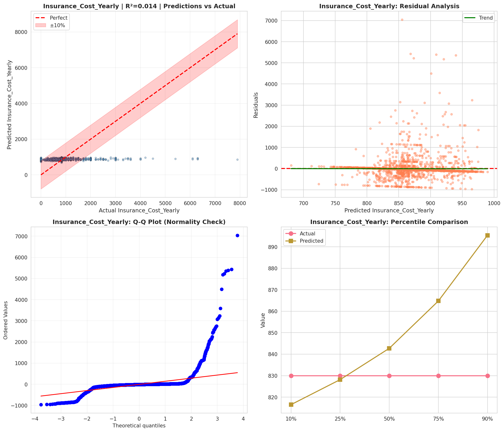
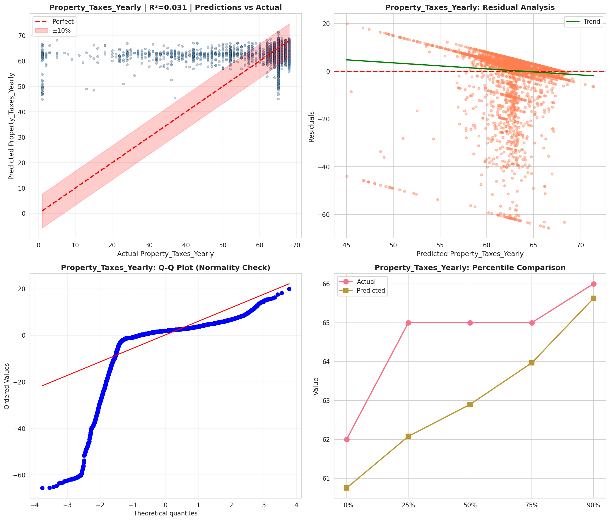
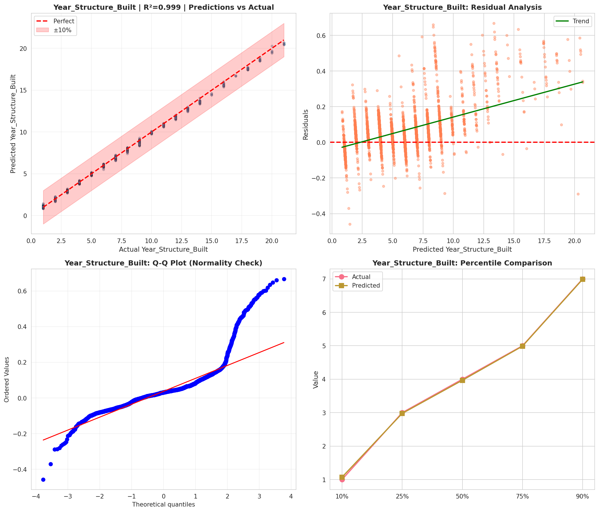
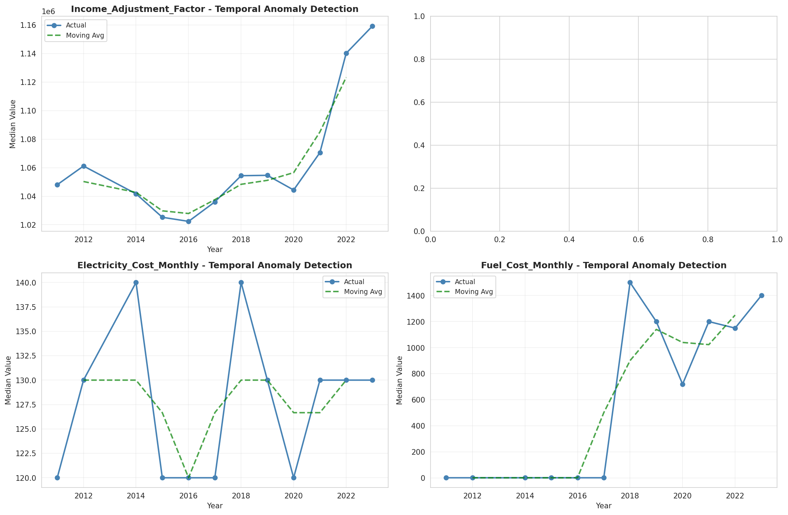
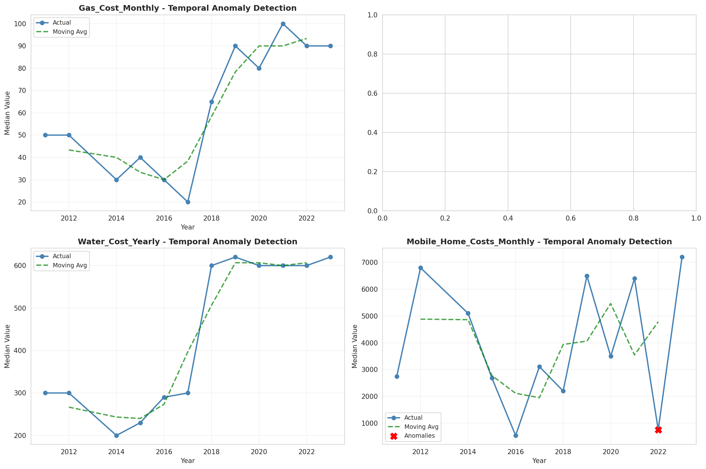
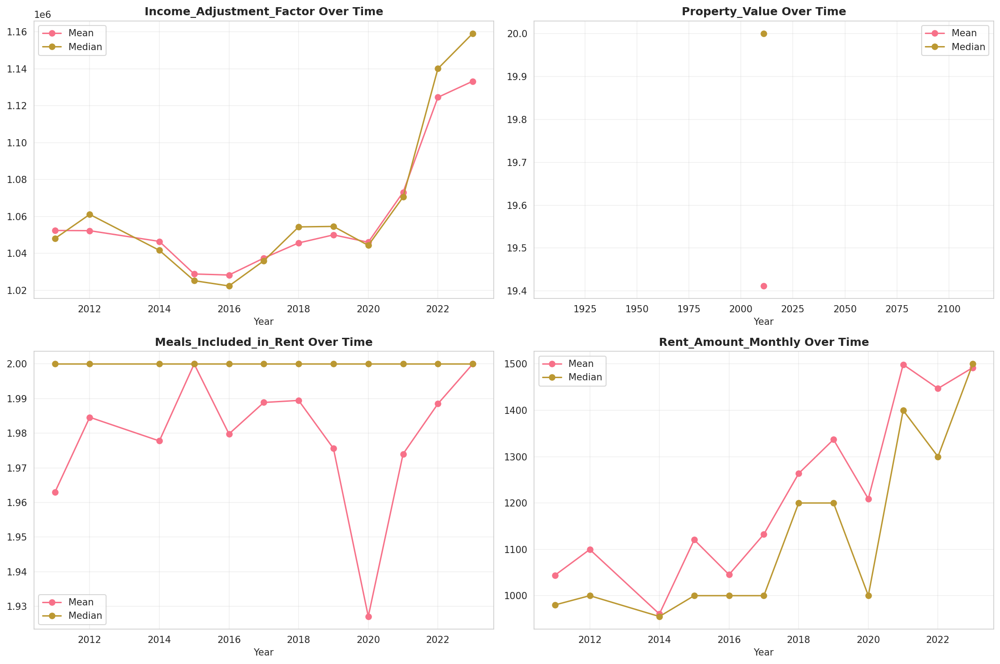
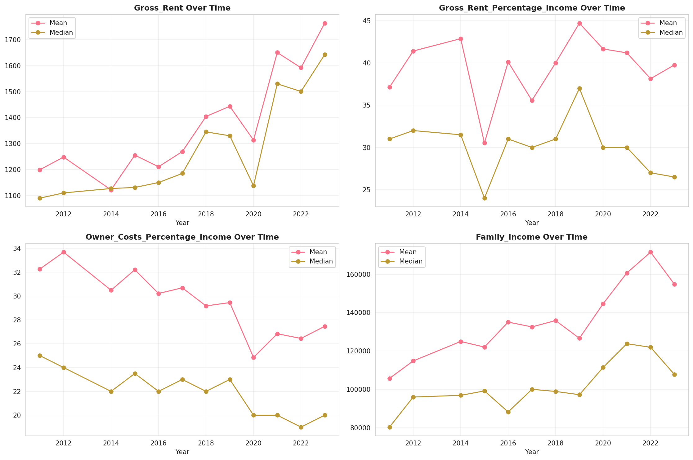
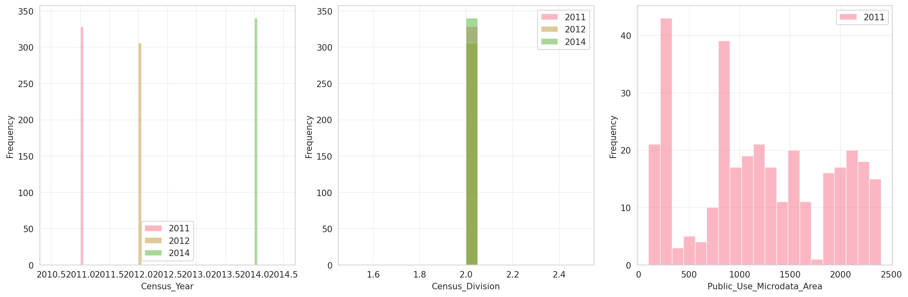
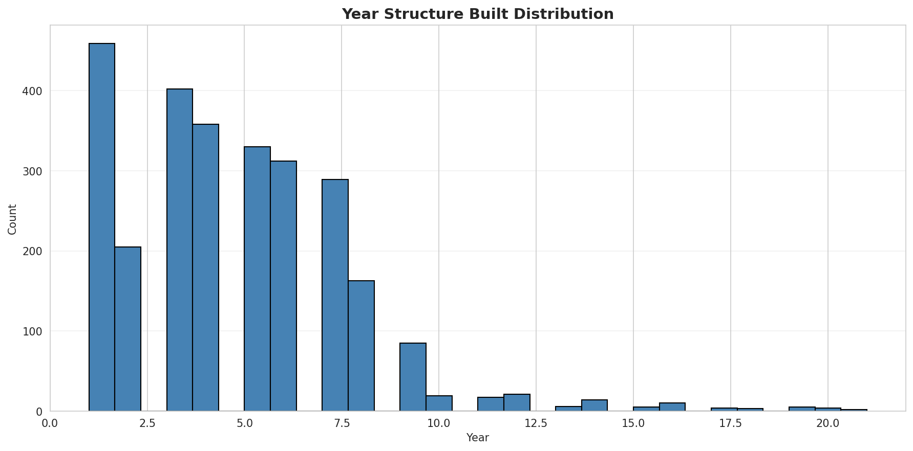
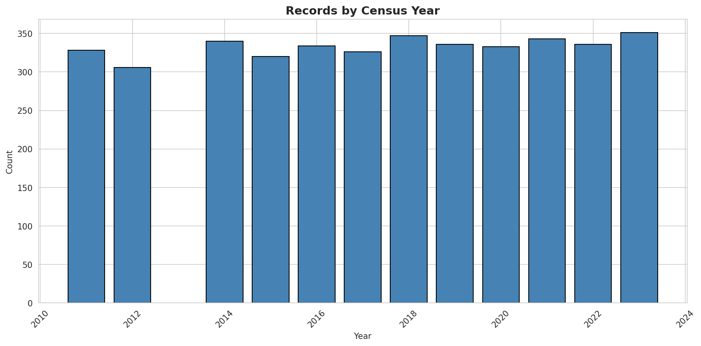
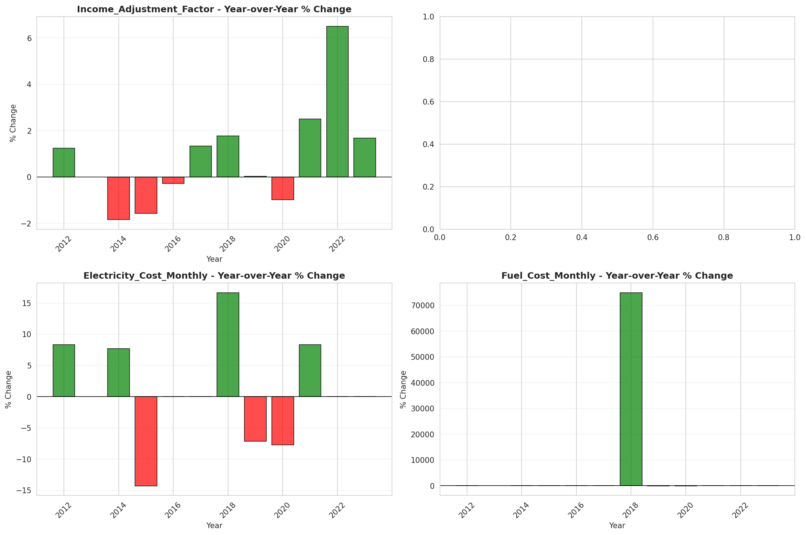
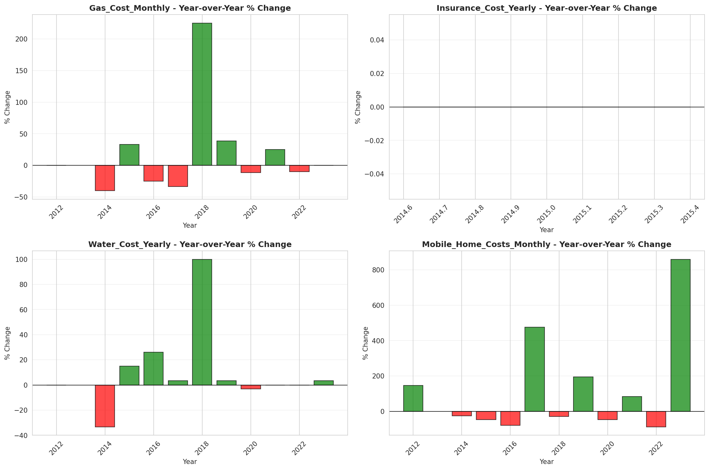
