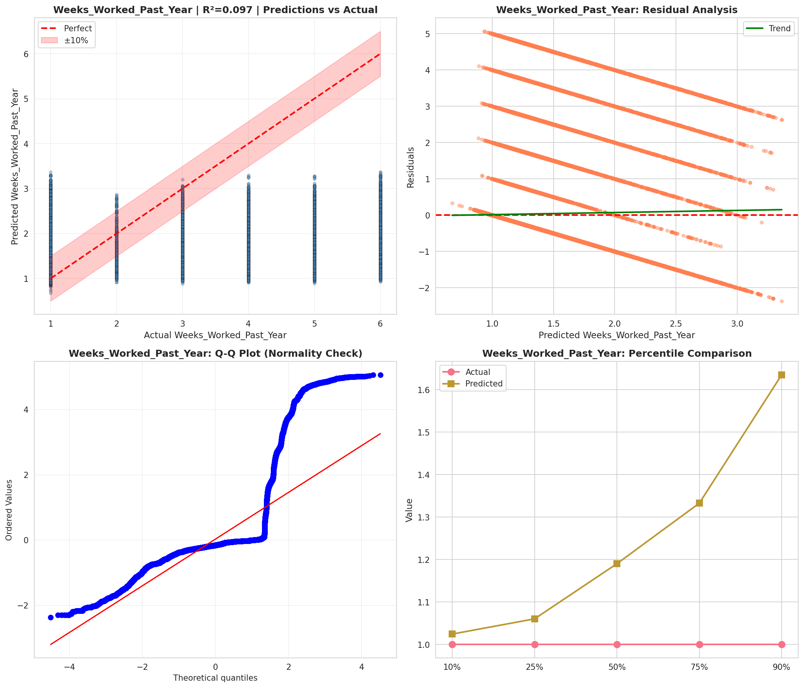
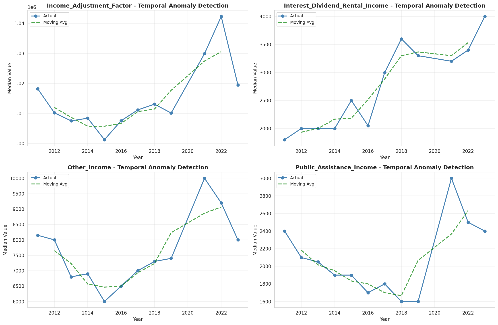
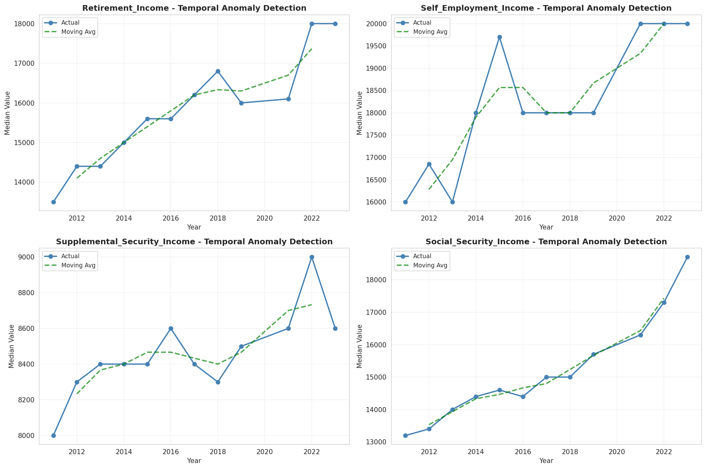
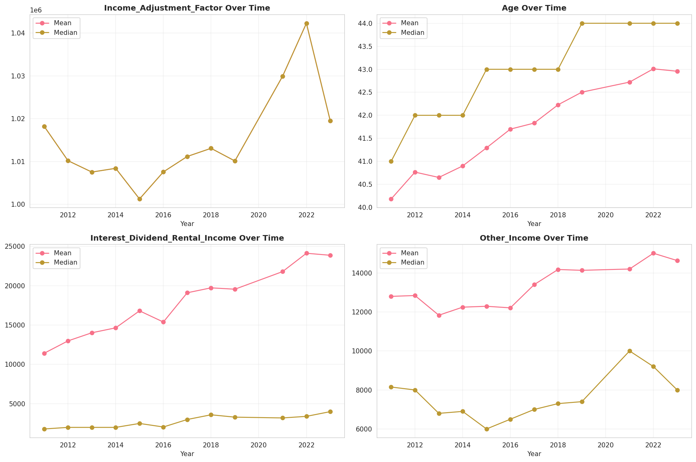
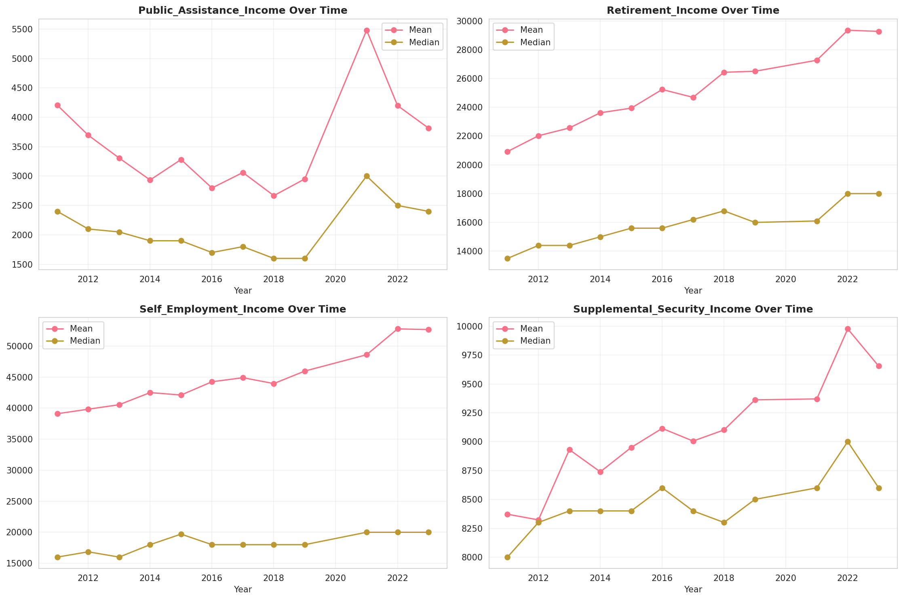
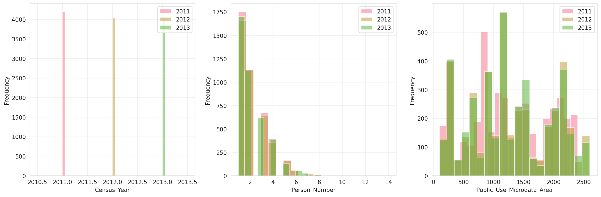
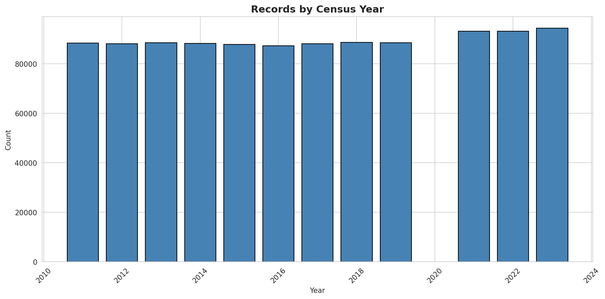
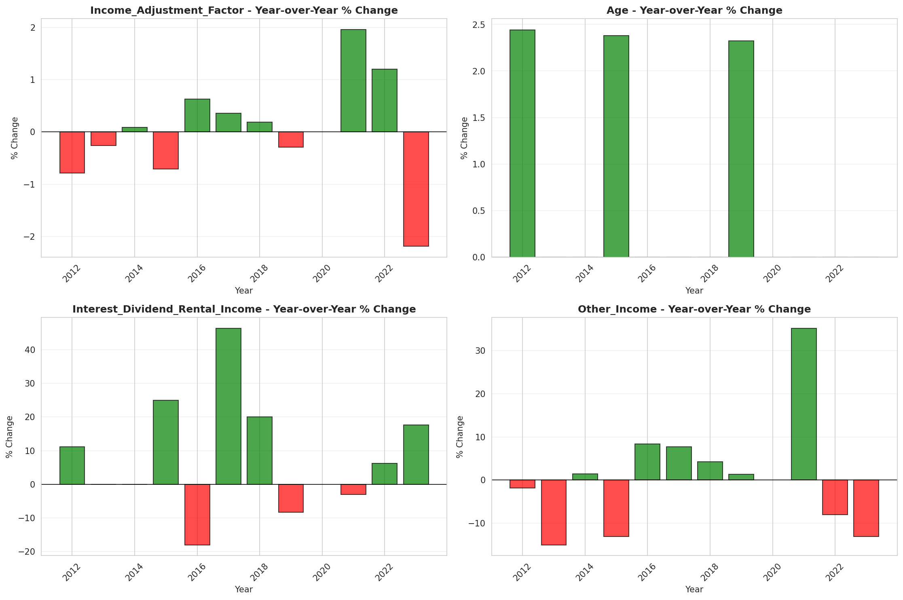
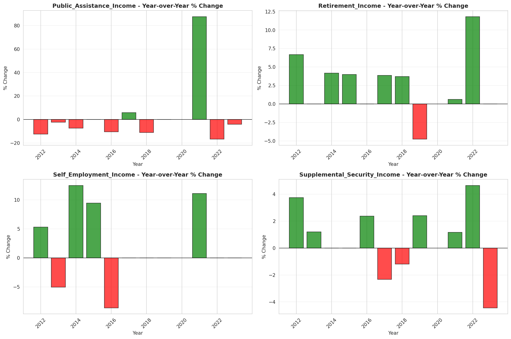

# Temporal Analysis

## Year Distribution

- 2011: 88,367 records

- 2012: 88,003 records

- 2013: 88,510 records

- 2014: 88,152 records

- 2015: 87,815 records

- 2016: 87,279 records

- 2017: 88,114 records

- 2018: 88,586 records

- 2019: 88,459 records

- 2021: 93,154 records

- 2022: 93,166 records

- 2023: 94,314 records

## Temporal Trends

- Census_Year: {np.int64(2011): {'mean': 2011.0, 'median': 2011.0, 'std': 0.0}, np.int64(2012): {'mean': 2012.0, 'median': 2012.0, 'std': 0.0}, np.int64(2013): {'mean': 2013.0, 'median': 2013.0, 'std': 0.0}, np.int64(2014): {'mean': 2014.0, 'median': 2014.0, 'std': 0.0}, np.int64(2015): {'mean': 2015.0, 'median': 2015.0, 'std': 0.0}, np.int64(2016): {'mean': 2016.0, 'median': 2016.0, 'std': 0.0}, np.int64(2017): {'mean': 2017.0, 'median': 2017.0, 'std': 0.0}, np.int64(2018): {'mean': 2018.0, 'median': 2018.0, 'std': 0.0}, np.int64(2019): {'mean': 2019.0, 'median': 2019.0, 'std': 0.0}, np.int64(2021): {'mean': 2021.0, 'median': 2021.0, 'std': 0.0}, np.int64(2022): {'mean': 2022.0, 'median': 2022.0, 'std': 0.0}, np.int64(2023): {'mean': 2023.0, 'median': 2023.0, 'std': 0.0}}

- Person_Number: {np.int64(2011): {'mean': 2.1437867077076285, 'median': 2.0, 'std': 1.3224416394590401}, np.int64(2012): {'mean': 2.1414383600559073, 'median': 2.0, 'std': 1.3338553076447468}, np.int64(2013): {'mean': 2.1562535306745, 'median': 2.0, 'std': 1.3496374067594445}, np.int64(2014): {'mean': 2.1401556402577366, 'median': 2.0, 'std': 1.3202452290175657}, np.int64(2015): {'mean': 2.1370722541707, 'median': 2.0, 'std': 1.3303633152731582}, np.int64(2016): {'mean': 2.128770952921092, 'median': 2.0, 'std': 1.3322796204798482}, np.int64(2017): {'mean': 2.1319086637764713, 'median': 2.0, 'std': 1.3235192546653562}, np.int64(2018): {'mean': 2.1084369990743457, 'median': 2.0, 'std': 1.314617752872449}, np.int64(2019): {'mean': 2.118314699465289, 'median': 2.0, 'std': 1.3274065564412736}, np.int64(2021): {'mean': 2.1253086287223306, 'median': 2.0, 'std': 1.3208962542145635}, np.int64(2022): {'mean': 2.1142476869244144, 'median': 2.0, 'std': 1.3363217768859232}, np.int64(2023): {'mean': 2.136787751553322, 'median': 2.0, 'std': 1.353705407234171}}

- Public_Use_Microdata_Area: {np.int64(2011): {'mean': 1260.2109045231816, 'median': 1202.0, 'std': 656.076835995093}, np.int64(2012): {'mean': 1285.3865209140597, 'median': 1203.0, 'std': 672.7167392530305}, np.int64(2013): {'mean': 1278.459315331601, 'median': 1203.0, 'std': 671.5224419056127}, np.int64(2014): {'mean': 1280.9432911334966, 'median': 1203.0, 'std': 673.6144614778448}, np.int64(2015): {'mean': 1276.8123327449753, 'median': 1203.0, 'std': 672.5383611128589}, np.int64(2016): {'mean': 1272.9442248421728, 'median': 1203.0, 'std': 673.028976708058}, np.int64(2017): {'mean': 1274.2363188596591, 'median': 1202.0, 'std': 669.730227836093}, np.int64(2018): {'mean': 1274.419693856817, 'median': 1202.0, 'std': 672.4255773899471}, np.int64(2019): {'mean': 1274.5329813812048, 'median': 1203.0, 'std': 669.6211122358739}, np.int64(2021): {'mean': 1280.8611331773193, 'median': 1203.0, 'std': 669.6802933436911}, np.int64(2022): {'mean': 1268.815630165511, 'median': 1202.0, 'std': 673.7319638762843}, np.int64(2023): {'mean': 1269.7899357465487, 'median': 1202.0, 'std': 671.2197406224923}}

- State_Code: {np.int64(2011): {'mean': 34.0, 'median': 34.0, 'std': 0.0}, np.int64(2012): {'mean': 34.0, 'median': 34.0, 'std': 0.0}, np.int64(2013): {'mean': 34.0, 'median': 34.0, 'std': 0.0}, np.int64(2014): {'mean': 34.0, 'median': 34.0, 'std': 0.0}, np.int64(2015): {'mean': 34.0, 'median': 34.0, 'std': 0.0}, np.int64(2016): {'mean': 34.0, 'median': 34.0, 'std': 0.0}, np.int64(2017): {'mean': 34.0, 'median': 34.0, 'std': 0.0}, np.int64(2018): {'mean': 34.0, 'median': 34.0, 'std': 0.0}, np.int64(2019): {'mean': 34.0, 'median': 34.0, 'std': 0.0}, np.int64(2021): {'mean': 34.0, 'median': 34.0, 'std': 0.0}, np.int64(2022): {'mean': 34.0, 'median': 34.0, 'std': 0.0}, np.int64(2023): {'mean': None, 'median': None, 'std': None}}

- Income_Adjustment_Factor: {np.int64(2011): {'mean': 1018237.0, 'median': 1018237.0, 'std': 0.0}, np.int64(2012): {'mean': 1010207.0, 'median': 1010207.0, 'std': 0.0}, np.int64(2013): {'mean': 1007549.0, 'median': 1007549.0, 'std': 0.0}, np.int64(2014): {'mean': 1008425.0, 'median': 1008425.0, 'std': 0.0}, np.int64(2015): {'mean': 1001264.0, 'median': 1001264.0, 'std': 0.0}, np.int64(2016): {'mean': 1007588.0, 'median': 1007588.0, 'std': 0.0}, np.int64(2017): {'mean': 1011189.0, 'median': 1011189.0, 'std': 0.0}, np.int64(2018): {'mean': 1013097.0, 'median': 1013097.0, 'std': 0.0}, np.int64(2019): {'mean': 1010145.0, 'median': 1010145.0, 'std': 0.0}, np.int64(2021): {'mean': 1029928.0, 'median': 1029928.0, 'std': 0.0}, np.int64(2022): {'mean': 1042311.0, 'median': 1042311.0, 'std': 0.0}, np.int64(2023): {'mean': 1019518.0, 'median': 1019518.0, 'std': 0.0}}

- Person_Weight: {np.int64(2011): {'mean': 99.82408591442507, 'median': 80.0, 'std': 73.45494970394168}, np.int64(2012): {'mean': 100.73054327693374, 'median': 80.0, 'std': 69.88630776781021}, np.int64(2013): {'mean': 100.54614167890634, 'median': 80.0, 'std': 70.91731954088742}, np.int64(2014): {'mean': 101.39503357836465, 'median': 80.0, 'std': 72.1130992689836}, np.int64(2015): {'mean': 102.01005522974435, 'median': 80.0, 'std': 73.2670381264298}, np.int64(2016): {'mean': 102.4813414452503, 'median': 82.0, 'std': 72.98413739842049}, np.int64(2017): {'mean': 102.20446240098055, 'median': 81.0, 'std': 73.97201439090239}, np.int64(2018): {'mean': 100.56352019506468, 'median': 80.0, 'std': 75.16259368037183}, np.int64(2019): {'mean': 100.41024655490114, 'median': 78.0, 'std': 79.15508172993195}, np.int64(2021): {'mean': 99.48182579384675, 'median': 78.0, 'std': 76.39804229733174}, np.int64(2022): {'mean': 99.41071850245798, 'median': 76.0, 'std': 80.5371734023852}, np.int64(2023): {'mean': 98.50966982632482, 'median': 73.0, 'std': 81.35564228003956}}

- Age: {np.int64(2011): {'mean': 40.182149444928534, 'median': 41.0, 'std': 23.359056512554353}, np.int64(2012): {'mean': 40.76581480176812, 'median': 42.0, 'std': 23.4836455940446}, np.int64(2013): {'mean': 40.6498926674952, 'median': 42.0, 'std': 23.315877135243397}, np.int64(2014): {'mean': 40.89965060350304, 'median': 42.0, 'std': 23.358579599528746}, np.int64(2015): {'mean': 41.29330979900928, 'median': 43.0, 'std': 23.436359457632587}, np.int64(2016): {'mean': 41.69976741255056, 'median': 43.0, 'std': 23.52163455060949}, np.int64(2017): {'mean': 41.83138888258392, 'median': 43.0, 'std': 23.54645522613914}, np.int64(2018): {'mean': 42.22826405978371, 'median': 43.0, 'std': 23.51686655603608}, np.int64(2019): {'mean': 42.5034422726913, 'median': 44.0, 'std': 23.60301474535392}, np.int64(2021): {'mean': 42.7215041758808, 'median': 44.0, 'std': 23.68526111929828}, np.int64(2022): {'mean': 43.00978897881201, 'median': 44.0, 'std': 23.741392601718477}, np.int64(2023): {'mean': 42.957079542803825, 'median': 44.0, 'std': 23.783067622485284}}

- Citizenship_Status: {np.int64(2011): {'mean': 1.665418085937058, 'median': 1.0, 'std': 1.3542546802424404}, np.int64(2012): {'mean': 1.6661022919673194, 'median': 1.0, 'std': 1.3553474722776282}, np.int64(2013): {'mean': 1.677177720031635, 'median': 1.0, 'std': 1.361837855789613}, np.int64(2014): {'mean': 1.685441056357201, 'median': 1.0, 'std': 1.3627935751115439}, np.int64(2015): {'mean': 1.685668735409668, 'median': 1.0, 'std': 1.3622160327611592}, np.int64(2016): {'mean': 1.703365070635548, 'median': 1.0, 'std': 1.375208942036743}, np.int64(2017): {'mean': 1.7151984928615203, 'median': 1.0, 'std': 1.3871262015738715}, np.int64(2018): {'mean': 1.70178131984738, 'median': 1.0, 'std': 1.3674204451000211}, np.int64(2019): {'mean': 1.7227076950903808, 'median': 1.0, 'std': 1.3835093721351766}, np.int64(2021): {'mean': 1.7410524507804281, 'median': 1.0, 'std': 1.3998994982019697}, np.int64(2022): {'mean': 1.7490286155893782, 'median': 1.0, 'std': 1.4038526280774906}, np.int64(2023): {'mean': 1.7728014928854676, 'median': 1.0, 'std': 1.4241040622633212}}

- Class_of_Worker: {np.int64(2011): {'mean': 2.066317228805834, 'median': 1.0, 'std': 1.8973486803317483}, np.int64(2012): {'mean': 2.0795226730310263, 'median': 1.0, 'std': 1.912817946188673}, np.int64(2013): {'mean': 2.0525852873477177, 'median': 1.0, 'std': 1.8918976729261898}, np.int64(2014): {'mean': 2.0638377910694805, 'median': 1.0, 'std': 1.8876530348079337}, np.int64(2015): {'mean': 2.0673045888629416, 'median': 1.0, 'std': 1.8923687605652315}, np.int64(2016): {'mean': 2.0378360880493562, 'median': 1.0, 'std': 1.8653309564608667}, np.int64(2017): {'mean': 2.0314716063242586, 'median': 1.0, 'std': 1.851986236234145}, np.int64(2018): {'mean': 2.02713537993244, 'median': 1.0, 'std': 1.8405867749710538}, np.int64(2019): {'mean': 2.0213683052090974, 'median': 1.0, 'std': 1.8171525618430866}, np.int64(2021): {'mean': 2.03859526513497, 'median': 1.0, 'std': 1.8181166503368287}, np.int64(2022): {'mean': 2.043772445739864, 'median': 1.0, 'std': 1.820459664797637}, np.int64(2023): {'mean': 2.052941477650914, 'median': 1.0, 'std': 1.835917437557051}}

- English_Speaking_Ability: {np.int64(2011): {'mean': 1.6636488340192044, 'median': 1.0, 'std': 0.9144132915682401}, np.int64(2012): {'mean': 1.6431415625429082, 'median': 1.0, 'std': 0.9092514143662609}, np.int64(2013): {'mean': 1.6202978235967926, 'median': 1.0, 'std': 0.8937919253785069}, np.int64(2014): {'mean': 1.6279450559446922, 'median': 1.0, 'std': 0.9018362627868242}, np.int64(2015): {'mean': 1.6257603686635944, 'median': 1.0, 'std': 0.8988627712191706}, np.int64(2016): {'mean': 1.6201722454053094, 'median': 1.0, 'std': 0.8978997255017188}, np.int64(2017): {'mean': 1.603456616385945, 'median': 1.0, 'std': 0.8840652147790969}, np.int64(2018): {'mean': 1.5765033358370522, 'median': 1.0, 'std': 0.8608513585945733}, np.int64(2019): {'mean': 1.570977508650519, 'median': 1.0, 'std': 0.8679281500701421}, np.int64(2021): {'mean': 1.5857782799951572, 'median': 1.0, 'std': 0.8756402421300163}, np.int64(2022): {'mean': 1.6021655745564967, 'median': 1.0, 'std': 0.8942967946587239}, np.int64(2023): {'mean': 1.628597602870448, 'median': 1.0, 'std': 0.9138618689464792}}

- Fertility_Status: {np.int64(2011): {'mean': 1.9490736249878746, 'median': 2.0, 'std': 0.219852731758998}, np.int64(2012): {'mean': 1.9487179487179487, 'median': 2.0, 'std': 0.2205779339241591}, np.int64(2013): {'mean': 1.9528241176179397, 'median': 2.0, 'std': 0.21202014943591213}, np.int64(2014): {'mean': 1.9525472780799362, 'median': 2.0, 'std': 0.212610481019686}, np.int64(2015): {'mean': 1.9507288031205092, 'median': 2.0, 'std': 0.21643925329469552}, np.int64(2016): {'mean': 1.9524951765135319, 'median': 2.0, 'std': 0.21272159000483185}, np.int64(2017): {'mean': 1.9526931347354066, 'median': 2.0, 'std': 0.2122999990601275}, np.int64(2018): {'mean': 1.9507273580478648, 'median': 2.0, 'std': 0.2164423510820236}, np.int64(2019): {'mean': 1.9513384574609065, 'median': 2.0, 'std': 0.21516517117760414}, np.int64(2021): {'mean': 1.948955798864558, 'median': 2.0, 'std': 0.2200934940368119}, np.int64(2022): {'mean': 1.9492933488678386, 'median': 2.0, 'std': 0.2194035668297678}, np.int64(2023): {'mean': 1.9485294117647058, 'median': 2.0, 'std': 0.22096110279712408}}

- Marital_Status: {np.int64(2011): {'mean': 2.9714712505799676, 'median': 3.0, 'std': 1.8722680314136098}, np.int64(2012): {'mean': 2.9704100996556937, 'median': 3.0, 'std': 1.8721521948859265}, np.int64(2013): {'mean': 2.963179301773811, 'median': 3.0, 'std': 1.8756824375644607}, np.int64(2014): {'mean': 2.968009801252382, 'median': 3.0, 'std': 1.874848521262634}, np.int64(2015): {'mean': 2.9443033650287536, 'median': 3.0, 'std': 1.8745732738677958}, np.int64(2016): {'mean': 2.9390231327123364, 'median': 3.0, 'std': 1.8722565991778515}, np.int64(2017): {'mean': 2.925312663140931, 'median': 3.0, 'std': 1.8729809496527403}, np.int64(2018): {'mean': 2.9262750321721267, 'median': 3.0, 'std': 1.8742709511425306}, np.int64(2019): {'mean': 2.9004623610938403, 'median': 3.0, 'std': 1.8725608418585935}, np.int64(2021): {'mean': 2.933840736844365, 'median': 3.0, 'std': 1.8761911948648458}, np.int64(2022): {'mean': 2.931369813021918, 'median': 3.0, 'std': 1.873803104155822}, np.int64(2023): {'mean': 2.924390864558814, 'median': 3.0, 'std': 1.8757369486975013}}

- Mobility_Status: {np.int64(2011): {'mean': 1.1805017429567404, 'median': 1.0, 'std': 0.5680268796527158}, np.int64(2012): {'mean': 1.174394328714325, 'median': 1.0, 'std': 0.5590528577342421}, np.int64(2013): {'mean': 1.1855627779678413, 'median': 1.0, 'std': 0.5751422525105007}, np.int64(2014): {'mean': 1.1801168251059444, 'median': 1.0, 'std': 0.5671474401012976}, np.int64(2015): {'mean': 1.1803612283142295, 'median': 1.0, 'std': 0.5672369835197631}, np.int64(2016): {'mean': 1.1879610572809471, 'median': 1.0, 'std': 0.5777523923131919}, np.int64(2017): {'mean': 1.1935166206730714, 'median': 1.0, 'std': 0.5853430311439984}, np.int64(2018): {'mean': 1.1985721930613593, 'median': 1.0, 'std': 0.5931437579567874}, np.int64(2019): {'mean': 1.1866625614359185, 'median': 1.0, 'std': 0.5768844772439469}, np.int64(2021): {'mean': 1.1961588844742284, 'median': 1.0, 'std': 0.5901971918930294}, np.int64(2022): {'mean': 1.174319276782331, 'median': 1.0, 'std': 0.5574706442217617}, np.int64(2023): {'mean': 1.1620728027563183, 'median': 1.0, 'std': 0.5379355105677179}}

- Military_Service: {np.int64(2011): {'mean': 4.836869306987237, 'median': 5.0, 'std': 0.548683170607409}, np.int64(2012): {'mean': 4.8384340420683865, 'median': 5.0, 'std': 0.5461424591961211}, np.int64(2013): {'mean': 3.8566193117500567, 'median': 4.0, 'std': 0.5067238114008867}, np.int64(2014): {'mean': 3.8632897064025467, 'median': 4.0, 'std': 0.49551723314357826}, np.int64(2015): {'mean': 3.8677188760704935, 'median': 4.0, 'std': 0.48816514104063474}, np.int64(2016): {'mean': 3.8734309771456874, 'median': 4.0, 'std': 0.47776862483389976}, np.int64(2017): {'mean': 3.8741291091329644, 'median': 4.0, 'std': 0.47585615382533586}, np.int64(2018): {'mean': 3.884355433926276, 'median': 4.0, 'std': 0.4603325308048736}, np.int64(2019): {'mean': 3.88459673956703, 'median': 4.0, 'std': 0.4599301871874061}, np.int64(2021): {'mean': 3.896098616484165, 'median': 4.0, 'std': 0.4367544430789959}, np.int64(2022): {'mean': 3.8990332554893086, 'median': 4.0, 'std': 0.4310818628034037}, np.int64(2023): {'mean': 3.90815481734451, 'median': 4.0, 'std': 0.4123166680770388}}

- Travel_Time_To_Work_Minutes: {np.int64(2011): {'mean': 30.716071614991126, 'median': 25.0, 'std': 25.697604118817278}, np.int64(2012): {'mean': 30.72999947470715, 'median': 25.0, 'std': 25.193773969074535}, np.int64(2013): {'mean': 31.144884623238717, 'median': 25.0, 'std': 25.135774577714137}, np.int64(2014): {'mean': 31.27215828790632, 'median': 25.0, 'std': 24.89465224898657}, np.int64(2015): {'mean': 31.82660800970874, 'median': 25.0, 'std': 25.755081760653685}, np.int64(2016): {'mean': 32.24091503925911, 'median': 25.0, 'std': 25.896715178981015}, np.int64(2017): {'mean': 32.54352236737925, 'median': 25.0, 'std': 26.154019697943266}, np.int64(2018): {'mean': 32.81717641301688, 'median': 25.0, 'std': 26.232565529157647}, np.int64(2019): {'mean': 33.42955376033853, 'median': 25.0, 'std': 26.57036261461607}, np.int64(2021): {'mean': 28.688390668966143, 'median': 20.0, 'std': 23.00437617743968}, np.int64(2022): {'mean': 30.571271045129365, 'median': 25.0, 'std': 24.66570372299074}, np.int64(2023): {'mean': 31.721140879831058, 'median': 25.0, 'std': 25.31542990748973}}

- Vehicle_Occupancy: {np.int64(2011): {'mean': 1.1588032927878118, 'median': 1.0, 'std': 0.6220488482910125}, np.int64(2012): {'mean': 1.148822731755424, 'median': 1.0, 'std': 0.5970498719403861}, np.int64(2013): {'mean': 1.1479091923181284, 'median': 1.0, 'std': 0.602253904521635}, np.int64(2014): {'mean': 1.1461487820934826, 'median': 1.0, 'std': 0.6080774518079872}, np.int64(2015): {'mean': 1.1431202076918432, 'median': 1.0, 'std': 0.6053962892427738}, np.int64(2016): {'mean': 1.1564419935864776, 'median': 1.0, 'std': 0.6246589381343597}, np.int64(2017): {'mean': 1.1586582585783225, 'median': 1.0, 'std': 0.6454379861707482}, np.int64(2018): {'mean': 1.1516916089209805, 'median': 1.0, 'std': 0.6356169683743631}, np.int64(2019): {'mean': 1.1453220417098744, 'median': 1.0, 'std': 0.6118953890567327}, np.int64(2021): {'mean': 1.1503472222222222, 'median': 1.0, 'std': 0.580389398128032}, np.int64(2022): {'mean': 1.1620773788776577, 'median': 1.0, 'std': 0.5907684471126018}, np.int64(2023): {'mean': 1.1661144578313254, 'median': 1.0, 'std': 0.632533604608064}}

- Transportation_To_Work: {np.int64(2011): {'mean': 2.0487432405367514, 'median': 1.0, 'std': 2.752662322428824}, np.int64(2012): {'mean': 2.051866384948184, 'median': 1.0, 'std': 2.7621471195803227}, np.int64(2013): {'mean': 2.07492365946012, 'median': 1.0, 'std': 2.778307357109386}, np.int64(2014): {'mean': 2.097600385867599, 'median': 1.0, 'std': 2.807295675761954}, np.int64(2015): {'mean': 2.117385633544273, 'median': 1.0, 'std': 2.806323218904138}, np.int64(2016): {'mean': 2.1097572675813105, 'median': 1.0, 'std': 2.7948567517630805}, np.int64(2017): {'mean': 2.1763296935540684, 'median': 1.0, 'std': 2.8690703102438264}, np.int64(2018): {'mean': 2.150567588272164, 'median': 1.0, 'std': 2.845894170133409}, np.int64(2019): {'mean': None, 'median': None, 'std': None}, np.int64(2021): {'mean': None, 'median': None, 'std': None}, np.int64(2022): {'mean': None, 'median': None, 'std': None}, np.int64(2023): {'mean': None, 'median': None, 'std': None}}

- Language_Other_Than_English: {np.int64(2011): {'mean': 1.7380461862782675, 'median': 2.0, 'std': 0.43970027170370296}, np.int64(2012): {'mean': 1.737854991781348, 'median': 2.0, 'std': 0.43980373308099224}, np.int64(2013): {'mean': 1.7399742654943169, 'median': 2.0, 'std': 0.4386509367962231}, np.int64(2014): {'mean': 1.7374304344710632, 'median': 2.0, 'std': 0.4400330683231996}, np.int64(2015): {'mean': 1.7398674162960477, 'median': 2.0, 'std': 0.4387093910765908}, np.int64(2016): {'mean': 1.7286612541858393, 'median': 2.0, 'std': 0.4446531372239663}, np.int64(2017): {'mean': 1.7287001133448667, 'median': 2.0, 'std': 0.4446331261904294}, np.int64(2018): {'mean': 1.731817427779226, 'median': 2.0, 'std': 0.4430158075443958}, np.int64(2019): {'mean': 1.7256698070670875, 'median': 2.0, 'std': 0.44617877617297363}, np.int64(2021): {'mean': 1.7214152407078451, 'median': 2.0, 'std': 0.44830519819423786}, np.int64(2022): {'mean': 1.7182261351226598, 'median': 2.0, 'std': 0.44986623835224554}, np.int64(2023): {'mean': 1.7083082815596677, 'median': 2.0, 'std': 0.4545436835487699}}

- Grandparents_Living_With_Grandchildren: {np.int64(2011): {'mean': 1.9687119272534652, 'median': 2.0, 'std': 0.17409670997994836}, np.int64(2012): {'mean': 1.9686528633897056, 'median': 2.0, 'std': 0.174255636607982}, np.int64(2013): {'mean': 1.967899206654318, 'median': 2.0, 'std': 0.17626932621016558}, np.int64(2014): {'mean': 1.9688895113709974, 'median': 2.0, 'std': 0.1736178385183536}, np.int64(2015): {'mean': 1.9690900872709571, 'median': 2.0, 'std': 0.173075159342953}, np.int64(2016): {'mean': 1.969500731146856, 'median': 2.0, 'std': 0.17195807107381691}, np.int64(2017): {'mean': 1.9669694467382328, 'median': 2.0, 'std': 0.17871789303668578}, np.int64(2018): {'mean': 1.97156213478769, 'median': 2.0, 'std': 0.16622160210976092}, np.int64(2019): {'mean': 1.9705565469176123, 'median': 2.0, 'std': 0.16904738161634258}, np.int64(2021): {'mean': 1.9718925969522476, 'median': 2.0, 'std': 0.16528100762634357}, np.int64(2022): {'mean': 1.9729327828136618, 'median': 2.0, 'std': 0.1622806197531368}, np.int64(2023): {'mean': 1.9720446909914837, 'median': 2.0, 'std': 0.16484609287860133}}

- Months_Responsible_For_Grandchildren: {np.int64(2011): {'mean': 3.9830148619957537, 'median': 4.0, 'std': 1.2393067029730658}, np.int64(2012): {'mean': 3.891992551210428, 'median': 4.0, 'std': 1.281131414585151}, np.int64(2013): {'mean': 3.8279158699808797, 'median': 4.0, 'std': 1.309055133127549}, np.int64(2014): {'mean': 3.88911704312115, 'median': 4.0, 'std': 1.295776869738483}, np.int64(2015): {'mean': 3.9043659043659042, 'median': 4.0, 'std': 1.2662286783338415}, np.int64(2016): {'mean': 4.07311320754717, 'median': 5.0, 'std': 1.1936925353500556}, np.int64(2017): {'mean': 3.834355828220859, 'median': 4.0, 'std': 1.2393669243314605}, np.int64(2018): {'mean': 3.845108695652174, 'median': 4.0, 'std': 1.2745370433226193}, np.int64(2019): {'mean': 3.8295165394402035, 'median': 4.0, 'std': 1.30107648536574}, np.int64(2021): {'mean': 3.988059701492537, 'median': 5.0, 'std': 1.2785098909806054}, np.int64(2022): {'mean': 4.067204301075269, 'median': 5.0, 'std': 1.287844782791646}, np.int64(2023): {'mean': 3.988888888888889, 'median': 5.0, 'std': 1.2555786994960885}}

- Grandparents_Responsible_For_Grandchildren: {np.int64(2011): {'mean': 1.7341986455981941, 'median': 2.0, 'std': 0.44188368033159303}, np.int64(2012): {'mean': 1.6991596638655462, 'median': 2.0, 'std': 0.45875192567856127}, np.int64(2013): {'mean': 1.7152966793685356, 'median': 2.0, 'std': 0.45139590038380156}, np.int64(2014): {'mean': 1.7259425998874507, 'median': 2.0, 'std': 0.44616360555247925}, np.int64(2015): {'mean': 1.7294713160854893, 'median': 2.0, 'std': 0.4443579290052649}, np.int64(2016): {'mean': 1.7579908675799087, 'median': 2.0, 'std': 0.4284220765141622}, np.int64(2017): {'mean': 1.7453125, 'median': 2.0, 'std': 0.43579891506527285}, np.int64(2018): {'mean': 1.7808219178082192, 'median': 2.0, 'std': 0.4138128083777591}, np.int64(2019): {'mean': 1.7753001715265866, 'median': 2.0, 'std': 0.41750386575852405}, np.int64(2021): {'mean': 1.8104131295981891, 'median': 2.0, 'std': 0.3920850544581382}, np.int64(2022): {'mean': 1.782583284628872, 'median': 2.0, 'std': 0.41260900164084235}, np.int64(2023): {'mean': 1.7987702627166013, 'median': 2.0, 'std': 0.4010314543681132}}

- Interest_Dividend_Rental_Income: {np.int64(2011): {'mean': 11414.551152616523, 'median': 1800.0, 'std': 31110.042631720087}, np.int64(2012): {'mean': 12985.666496076425, 'median': 2000.0, 'std': 34679.647050014755}, np.int64(2013): {'mean': 14016.722848664689, 'median': 2000.0, 'std': 38803.45904171549}, np.int64(2014): {'mean': 14642.339293501962, 'median': 2000.0, 'std': 37855.970519196744}, np.int64(2015): {'mean': 16801.071086865297, 'median': 2500.0, 'std': 44639.45037946486}, np.int64(2016): {'mean': 15381.571269678303, 'median': 2050.0, 'std': 39926.87172867679}, np.int64(2017): {'mean': 19094.625011016127, 'median': 3000.0, 'std': 48641.70300295445}, np.int64(2018): {'mean': 19722.238295633877, 'median': 3600.0, 'std': 49174.47468529648}, np.int64(2019): {'mean': 19549.275510204083, 'median': 3300.0, 'std': 49425.597625351314}, np.int64(2021): {'mean': 21784.45418754474, 'median': 3200.0, 'std': 57932.37374784507}, np.int64(2022): {'mean': 24115.469770865926, 'median': 3400.0, 'std': 61912.92706917685}, np.int64(2023): {'mean': 23857.55637079456, 'median': 4000.0, 'std': 61356.478361299596}}

- Military_Service_Period_1: {np.int64(2011): {'mean': 0.07690828686791001, 'median': 0.0, 'std': 0.26647148976262863}, np.int64(2012): {'mean': 0.08614305203664004, 'median': 0.0, 'std': 0.28060251624801646}, np.int64(2013): {'mean': 0.09975776260735521, 'median': 0.0, 'std': 0.2997097470846552}, np.int64(2014): {'mean': 0.10694444444444444, 'median': 0.0, 'std': 0.30907837767147406}, np.int64(2015): {'mean': 0.10160555954948479, 'median': 0.0, 'std': 0.3021651029833431}, np.int64(2016): {'mean': 0.12308079536873899, 'median': 0.0, 'std': 0.32857128050206547}, np.int64(2017): {'mean': 0.12205513784461153, 'median': 0.0, 'std': 0.3273905075971149}, np.int64(2018): {'mean': 0.15680954964731417, 'median': 0.0, 'std': 0.36367044899078516}, np.int64(2019): {'mean': 0.15945578231292518, 'median': 0.0, 'std': 0.36615040130495907}, np.int64(2021): {'mean': 0.18492953695714698, 'median': 0.0, 'std': 0.38829623556315684}, np.int64(2022): {'mean': 0.18590308370044054, 'median': 0.0, 'std': 0.3890855786960527}, np.int64(2023): {'mean': 0.2160868177465688, 'median': 0.0, 'std': 0.41163987859604456}}

- Military_Service_Period_2: {np.int64(2011): {'mean': 0.0901749663526245, 'median': 0.0, 'std': 0.2864598041277136}, np.int64(2012): {'mean': 0.08380432664198012, 'median': 0.0, 'std': 0.2771211442060528}, np.int64(2013): {'mean': 0.10085884166483154, 'median': 0.0, 'std': 0.3011748838908644}, np.int64(2014): {'mean': 0.10578703703703704, 'median': 0.0, 'std': 0.30760045864162}, np.int64(2015): {'mean': 0.12389168463934819, 'median': 0.0, 'std': 0.32949742339411425}, np.int64(2016): {'mean': 0.11855021394412282, 'median': 0.0, 'std': 0.32329919407618674}, np.int64(2017): {'mean': 0.11152882205513784, 'median': 0.0, 'std': 0.31482532419492687}, np.int64(2018): {'mean': 0.11313076505697232, 'median': 0.0, 'std': 0.3167955527537767}, np.int64(2019): {'mean': 0.1341496598639456, 'median': 0.0, 'std': 0.34085941915605333}, np.int64(2021): {'mean': 0.14639056658038538, 'median': 0.0, 'std': 0.3535481835192881}, np.int64(2022): {'mean': 0.15095447870778267, 'median': 0.0, 'std': 0.35805708485073934}, np.int64(2023): {'mean': 0.15384615384615385, 'median': 0.0, 'std': 0.36085880686903116}}

- Military_Service_Period_3: {np.int64(2011): {'mean': 0.1163237838877139, 'median': 0.0, 'std': 0.32064361679283}, np.int64(2012): {'mean': 0.12551159618008187, 'median': 0.0, 'std': 0.33133039524155034}, np.int64(2013): {'mean': None, 'median': None, 'std': None}, np.int64(2014): {'mean': None, 'median': None, 'std': None}, np.int64(2015): {'mean': None, 'median': None, 'std': None}, np.int64(2016): {'mean': None, 'median': None, 'std': None}, np.int64(2017): {'mean': None, 'median': None, 'std': None}, np.int64(2018): {'mean': None, 'median': None, 'std': None}, np.int64(2019): {'mean': None, 'median': None, 'std': None}, np.int64(2021): {'mean': None, 'median': None, 'std': None}, np.int64(2022): {'mean': None, 'median': None, 'std': None}, np.int64(2023): {'mean': None, 'median': None, 'std': None}}

- Military_Service_Period_4: {np.int64(2011): {'mean': 0.07710055758507979, 'median': 0.0, 'std': 0.26677658342356564}, np.int64(2012): {'mean': 0.08594815825375171, 'median': 0.0, 'std': 0.28031479874549986}, np.int64(2013): {'mean': None, 'median': None, 'std': None}, np.int64(2014): {'mean': None, 'median': None, 'std': None}, np.int64(2015): {'mean': None, 'median': None, 'std': None}, np.int64(2016): {'mean': None, 'median': None, 'std': None}, np.int64(2017): {'mean': None, 'median': None, 'std': None}, np.int64(2018): {'mean': None, 'median': None, 'std': None}, np.int64(2019): {'mean': None, 'median': None, 'std': None}, np.int64(2021): {'mean': None, 'median': None, 'std': None}, np.int64(2022): {'mean': None, 'median': None, 'std': None}, np.int64(2023): {'mean': None, 'median': None, 'std': None}}

- Military_Service_Period_5: {np.int64(2011): {'mean': 0.3424341472793693, 'median': 0.0, 'std': 0.4745695992758238}, np.int64(2012): {'mean': 0.3510037029818749, 'median': 0.0, 'std': 0.47733060760142637}, np.int64(2013): {'mean': 0.3514644351464435, 'median': 0.0, 'std': 0.47748025341605893}, np.int64(2014): {'mean': 0.3696759259259259, 'median': 0.0, 'std': 0.4827728109680833}, np.int64(2015): {'mean': 0.3584950874670501, 'median': 0.0, 'std': 0.4796159750226778}, np.int64(2016): {'mean': 0.3800654417316889, 'median': 0.0, 'std': 0.48546371738012983}, np.int64(2017): {'mean': 0.4012531328320802, 'median': 0.0, 'std': 0.4902135087033769}, np.int64(2018): {'mean': 0.3958220293000543, 'median': 0.0, 'std': 0.489092882619823}, np.int64(2019): {'mean': 0.3839455782312925, 'median': 0.0, 'std': 0.48641109257922693}, np.int64(2021): {'mean': 0.3882657463330457, 'median': 0.0, 'std': 0.4874256729654474}, np.int64(2022): {'mean': 0.3985315712187959, 'median': 0.0, 'std': 0.48966782244543366}, np.int64(2023): {'mean': 0.3961059687200766, 'median': 0.0, 'std': 0.4891650080641776}}

- Military_Service_Period_6: {np.int64(2011): {'mean': 0.09517400499903865, 'median': 0.0, 'std': 0.29348334624664796}, np.int64(2012): {'mean': 0.10231923601637108, 'median': 0.0, 'std': 0.30309720296097903}, np.int64(2013): {'mean': None, 'median': None, 'std': None}, np.int64(2014): {'mean': None, 'median': None, 'std': None}, np.int64(2015): {'mean': None, 'median': None, 'std': None}, np.int64(2016): {'mean': None, 'median': None, 'std': None}, np.int64(2017): {'mean': None, 'median': None, 'std': None}, np.int64(2018): {'mean': None, 'median': None, 'std': None}, np.int64(2019): {'mean': None, 'median': None, 'std': None}, np.int64(2021): {'mean': None, 'median': None, 'std': None}, np.int64(2022): {'mean': None, 'median': None, 'std': None}, np.int64(2023): {'mean': None, 'median': None, 'std': None}}

- Military_Service_Period_7: {np.int64(2011): {'mean': 0.12978273408959815, 'median': 0.0, 'std': 0.33609655620690104}, np.int64(2012): {'mean': 0.13155330344961996, 'median': 0.0, 'std': 0.3380374271847447}, np.int64(2013): {'mean': None, 'median': None, 'std': None}, np.int64(2014): {'mean': None, 'median': None, 'std': None}, np.int64(2015): {'mean': None, 'median': None, 'std': None}, np.int64(2016): {'mean': None, 'median': None, 'std': None}, np.int64(2017): {'mean': None, 'median': None, 'std': None}, np.int64(2018): {'mean': None, 'median': None, 'std': None}, np.int64(2019): {'mean': None, 'median': None, 'std': None}, np.int64(2021): {'mean': None, 'median': None, 'std': None}, np.int64(2022): {'mean': None, 'median': None, 'std': None}, np.int64(2023): {'mean': None, 'median': None, 'std': None}}

- Military_Service_Period_8: {np.int64(2011): {'mean': 0.15670063449336666, 'median': 0.0, 'std': 0.3635532399080968}, np.int64(2012): {'mean': 0.15533034496199571, 'median': 0.0, 'std': 0.3622546128017664}, np.int64(2013): {'mean': 0.14402114071790353, 'median': 0.0, 'std': 0.351149833718275}, np.int64(2014): {'mean': 0.13657407407407407, 'median': 0.0, 'std': 0.3434368928214385}, np.int64(2015): {'mean': 0.13371675053918045, 'median': 0.0, 'std': 0.34038852272718517}, np.int64(2016): {'mean': 0.13918952932292977, 'median': 0.0, 'std': 0.34618776604120644}, np.int64(2017): {'mean': 0.12105263157894737, 'median': 0.0, 'std': 0.3262293135827988}, np.int64(2018): {'mean': 0.1144872490504612, 'median': 0.0, 'std': 0.3184453334036183}, np.int64(2019): {'mean': 0.10122448979591837, 'median': 0.0, 'std': 0.30166679489653164}, np.int64(2021): {'mean': 0.0816796088582111, 'median': 0.0, 'std': 0.27391536867380095}, np.int64(2022): {'mean': 0.07077826725403819, 'median': 0.0, 'std': 0.2564917642819557}, np.int64(2023): {'mean': 0.05426109160548995, 'median': 0.0, 'std': 0.22656833456102304}}

- Military_Service_Period_9: {np.int64(2011): {'mean': 0.03172466833301288, 'median': 0.0, 'std': 0.17528297436137852}, np.int64(2012): {'mean': 0.022802572597934126, 'median': 0.0, 'std': 0.14928817391398894}, np.int64(2013): {'mean': 0.02180136533803127, 'median': 0.0, 'std': 0.14605055008027926}, np.int64(2014): {'mean': 0.018518518518518517, 'median': 0.0, 'std': 0.1348324563130674}, np.int64(2015): {'mean': 0.015815959741193385, 'median': 0.0, 'std': 0.12477798755626289}, np.int64(2016): {'mean': 0.014850239114019632, 'median': 0.0, 'std': 0.1209685608830785}, np.int64(2017): {'mean': 0.018796992481203006, 'median': 0.0, 'std': 0.13582447933358557}, np.int64(2018): {'mean': 0.011937059142702116, 'median': 0.0, 'std': 0.10861752371508761}, np.int64(2019): {'mean': 0.00816326530612245, 'median': 0.0, 'std': 0.08999350070408181}, np.int64(2021): {'mean': None, 'median': None, 'std': None}, np.int64(2022): {'mean': None, 'median': None, 'std': None}, np.int64(2023): {'mean': None, 'median': None, 'std': None}}

- Military_Service_Period_10: {np.int64(2011): {'mean': 0.13266679484714478, 'median': 0.0, 'std': 0.3392468784379571}, np.int64(2012): {'mean': 0.11576690703566556, 'median': 0.0, 'std': 0.31997638107913856}, np.int64(2013): {'mean': 0.11076855318211848, 'median': 0.0, 'std': 0.3138798760621375}, np.int64(2014): {'mean': 0.09444444444444444, 'median': 0.0, 'std': 0.2924799024276232}, np.int64(2015): {'mean': 0.08986340762041696, 'median': 0.0, 'std': 0.28602024336095255}, np.int64(2016): {'mean': 0.072992700729927, 'median': 0.0, 'std': 0.2601572636113561}, np.int64(2017): {'mean': 0.04987468671679198, 'median': 0.0, 'std': 0.21771330186926885}, np.int64(2018): {'mean': 0.041237113402061855, 'median': 0.0, 'std': 0.19886513758792962}, np.int64(2019): {'mean': 0.03891156462585034, 'median': 0.0, 'std': 0.19341053154409008}, np.int64(2021): {'mean': 0.018694276675294795, 'median': 0.0, 'std': 0.13546246068744106}, np.int64(2022): {'mean': 0.013803230543318648, 'median': 0.0, 'std': 0.11669061830687738}, np.int64(2023): {'mean': 0.010852218321097989, 'median': 0.0, 'std': 0.10362371844617108}}

- Military_Service_Period_11: {np.int64(2011): {'mean': 0.004422226494904826, 'median': 0.0, 'std': 0.06635900146264023}, np.int64(2012): {'mean': 0.0023387253946599105, 'median': 0.0, 'std': 0.0483084939102032}, np.int64(2013): {'mean': 0.0028628055494384495, 'median': 0.0, 'std': 0.0534344333040375}, np.int64(2014): {'mean': 0.0020833333333333333, 'median': 0.0, 'std': 0.04560125453728141}, np.int64(2015): {'mean': 0.0014378145219266715, 'median': 0.0, 'std': 0.037895795943088714}, np.int64(2016): {'mean': 0.0025169896803423106, 'median': 0.0, 'std': 0.050112738216144044}, np.int64(2017): {'mean': 0.0007518796992481203, 'median': 0.0, 'std': 0.027413549983776705}, np.int64(2018): {'mean': 0.0013564839934888768, 'median': 0.0, 'std': 0.03681048159099993}, np.int64(2019): {'mean': 0.0008163265306122449, 'median': 0.0, 'std': 0.02856365085832097}, np.int64(2021): {'mean': None, 'median': None, 'std': None}, np.int64(2022): {'mean': None, 'median': None, 'std': None}, np.int64(2023): {'mean': None, 'median': None, 'std': None}}

- Temporary_Absence_From_Work: {np.int64(2011): {'mean': 2.5242718446601944, 'median': 3.0, 'std': 0.5356856335417223}, np.int64(2012): {'mean': 2.5256117546538177, 'median': 3.0, 'std': 0.5364542941350915}, np.int64(2013): {'mean': 2.5993738259236068, 'median': 3.0, 'std': 0.5184797691733605}, np.int64(2014): {'mean': 2.604999443269124, 'median': 3.0, 'std': 0.5180484943392824}, np.int64(2015): {'mean': 2.603545348124199, 'median': 3.0, 'std': 0.5190759796696637}, np.int64(2016): {'mean': 2.6074910853577, 'median': 3.0, 'std': 0.5168052585412382}, np.int64(2017): {'mean': 2.61613860702699, 'median': 3.0, 'std': 0.5125604875741218}, np.int64(2018): {'mean': 2.6215697223092325, 'median': 3.0, 'std': 0.5132668829845963}, np.int64(2019): {'mean': 2.636430577903837, 'median': 3.0, 'std': 0.5069507471292388}, np.int64(2021): {'mean': 2.631321222770614, 'median': 3.0, 'std': 0.5093382412819512}, np.int64(2022): {'mean': 2.6264052892902163, 'median': 3.0, 'std': 0.5095821664968618}, np.int64(2023): {'mean': 2.6330054282728916, 'median': 3.0, 'std': 0.5089159984247876}}

- Available_For_Work: {np.int64(2011): {'mean': 4.48037207475167, 'median': 5.0, 'std': 1.2657844680842403}, np.int64(2012): {'mean': 4.475830963819982, 'median': 5.0, 'std': 1.2497901343775895}, np.int64(2013): {'mean': 4.650135671049886, 'median': 5.0, 'std': 1.0676387570457226}, np.int64(2014): {'mean': 4.68990090190402, 'median': 5.0, 'std': 1.0086200777340022}, np.int64(2015): {'mean': 4.718058420201795, 'median': 5.0, 'std': 0.9597359860051533}, np.int64(2016): {'mean': 4.742673278359706, 'median': 5.0, 'std': 0.9164521112474187}, np.int64(2017): {'mean': 4.753351280458342, 'median': 5.0, 'std': 0.893301054429424}, np.int64(2018): {'mean': 4.761954049600283, 'median': 5.0, 'std': 0.8754622566020616}, np.int64(2019): {'mean': 4.768047563203971, 'median': 5.0, 'std': 0.8646602453818548}, np.int64(2021): {'mean': 4.729657097082612, 'median': 5.0, 'std': 0.9486563661895119}, np.int64(2022): {'mean': 4.800095186642999, 'median': 5.0, 'std': 0.8111934093508244}, np.int64(2023): {'mean': 4.80007135757792, 'median': 5.0, 'std': 0.814364454304172}}

- On_Layoff_From_Work: {np.int64(2011): {'mean': 2.467085695044615, 'median': 2.0, 'std': 0.5556480575060395}, np.int64(2012): {'mean': 2.4761531242558794, 'median': 3.0, 'std': 0.5481322281837653}, np.int64(2013): {'mean': 2.56601962012106, 'median': 3.0, 'std': 0.5311332991220425}, np.int64(2014): {'mean': 2.5792367219686003, 'median': 3.0, 'std': 0.523381318481173}, np.int64(2015): {'mean': 2.583142873069848, 'median': 3.0, 'std': 0.5176148729543792}, np.int64(2016): {'mean': 2.588617116113216, 'median': 3.0, 'std': 0.5136383997207303}, np.int64(2017): {'mean': 2.5967004900945674, 'median': 3.0, 'std': 0.5123675643387806}, np.int64(2018): {'mean': 2.606425429337982, 'median': 3.0, 'std': 0.5076846403945402}, np.int64(2019): {'mean': 2.6216898028199744, 'median': 3.0, 'std': 0.5023439284916185}, np.int64(2021): {'mean': 2.5962815576629885, 'median': 3.0, 'std': 0.532325354931718}, np.int64(2022): {'mean': 2.6165264593141417, 'median': 3.0, 'std': 0.5018570471896964}, np.int64(2023): {'mean': 2.623130049185759, 'median': 3.0, 'std': 0.5017102436982946}}

- Looking_For_Work: {np.int64(2011): {'mean': 2.457657556540771, 'median': 3.0, 'std': 0.6349486125042589}, np.int64(2012): {'mean': 2.467748938971608, 'median': 3.0, 'std': 0.6250727426514118}, np.int64(2013): {'mean': 2.5473457176650665, 'median': 3.0, 'std': 0.6082245066415046}, np.int64(2014): {'mean': 2.5669886426901236, 'median': 3.0, 'std': 0.5899250120102538}, np.int64(2015): {'mean': 2.5744606722782764, 'median': 3.0, 'std': 0.5772877871198993}, np.int64(2016): {'mean': 2.5827250947180747, 'median': 3.0, 'std': 0.5685049106802484}, np.int64(2017): {'mean': 2.5914682128805135, 'median': 3.0, 'std': 0.5626982395803215}, np.int64(2018): {'mean': 2.6029389734021544, 'median': 3.0, 'std': 0.5550446852162636}, np.int64(2019): {'mean': 2.608899010009, 'median': 3.0, 'std': 0.5514435667500805}, np.int64(2021): {'mean': 2.5798599447014134, 'median': 3.0, 'std': 0.5875640750855221}, np.int64(2022): {'mean': 2.6005119497826144, 'median': 3.0, 'std': 0.5542337974671918}, np.int64(2023): {'mean': 2.6070491093045183, 'median': 3.0, 'std': 0.5532212520738011}}

- Informed_Of_Recall: {np.int64(2011): {'mean': 2.8711207138447725, 'median': 3.0, 'std': 0.3608733876686352}, np.int64(2012): {'mean': 2.870561539646744, 'median': 3.0, 'std': 0.3613293162395505}, np.int64(2013): {'mean': 2.9300772281360885, 'median': 3.0, 'std': 0.2752256639249552}, np.int64(2014): {'mean': 2.937590468767398, 'median': 3.0, 'std': 0.2636493579046183}, np.int64(2015): {'mean': 2.9408690562461675, 'median': 3.0, 'std': 0.25615161389658614}, np.int64(2016): {'mean': 2.9456346110987295, 'median': 3.0, 'std': 0.2444181753050961}, np.int64(2017): {'mean': 2.9441982467039414, 'median': 3.0, 'std': 0.2482077934354822}, np.int64(2018): {'mean': 2.945714791561687, 'median': 3.0, 'std': 0.2460047429399392}, np.int64(2019): {'mean': 2.9382551067717566, 'median': 3.0, 'std': 0.25771128829736845}, np.int64(2021): {'mean': 2.9404118969482416, 'median': 3.0, 'std': 0.2623533466692164}, np.int64(2022): {'mean': 2.9564714054179206, 'median': 3.0, 'std': 0.21935691724976272}, np.int64(2023): {'mean': 2.9565865592905016, 'median': 3.0, 'std': 0.21845397762576138}}

- Other_Income: {np.int64(2011): {'mean': 12798.750273822563, 'median': 8150.0, 'std': 14179.251126384974}, np.int64(2012): {'mean': 12841.413834466213, 'median': 8000.0, 'std': 14825.795155521137}, np.int64(2013): {'mean': 11831.228931085983, 'median': 6800.0, 'std': 14570.598328083866}, np.int64(2014): {'mean': 12245.695843520782, 'median': 6900.0, 'std': 16108.50488679359}, np.int64(2015): {'mean': 12290.294994675187, 'median': 6000.0, 'std': 16730.38138603767}, np.int64(2016): {'mean': 12209.980289855073, 'median': 6500.0, 'std': 16103.846886634752}, np.int64(2017): {'mean': 13401.592056737589, 'median': 7000.0, 'std': 17482.443255051963}, np.int64(2018): {'mean': 14176.036992840096, 'median': 7300.0, 'std': 18326.875424763475}, np.int64(2019): {'mean': 14133.873318017722, 'median': 7400.0, 'std': 17667.59874484267}, np.int64(2021): {'mean': 14200.856506086062, 'median': 10000.0, 'std': 14629.684246176163}, np.int64(2022): {'mean': 15009.147949080623, 'median': 9200.0, 'std': 17064.60369412616}, np.int64(2023): {'mean': 14633.33864013267, 'median': 8000.0, 'std': 18076.449155372597}}

- Public_Assistance_Income: {np.int64(2011): {'mean': 4204.672131147541, 'median': 2400.0, 'std': 5464.7535356203325}, np.int64(2012): {'mean': 3694.991150442478, 'median': 2100.0, 'std': 4736.329697037134}, np.int64(2013): {'mean': 3306.295336787565, 'median': 2050.0, 'std': 4116.845194259308}, np.int64(2014): {'mean': 2933.3901918976544, 'median': 1900.0, 'std': 3848.8289559439863}, np.int64(2015): {'mean': 3280.7667031763417, 'median': 1900.0, 'std': 4552.150285144288}, np.int64(2016): {'mean': 2797.010582010582, 'median': 1700.0, 'std': 3664.407805018061}, np.int64(2017): {'mean': 3060.401234567901, 'median': 1800.0, 'std': 4427.43918847731}, np.int64(2018): {'mean': 2666.991452991453, 'median': 1600.0, 'std': 3587.8520076832074}, np.int64(2019): {'mean': 2950.5335628227194, 'median': 1600.0, 'std': 3959.965720549021}, np.int64(2021): {'mean': 5479.678819444444, 'median': 3000.0, 'std': 6511.370485246956}, np.int64(2022): {'mean': 4197.653631284917, 'median': 2500.0, 'std': 5037.467301632593}, np.int64(2023): {'mean': 3815.8523489932886, 'median': 2400.0, 'std': 4607.832346101882}}

- Retirement_Income: {np.int64(2011): {'mean': 20922.13374170495, 'median': 13500.0, 'std': 21666.31478859935}, np.int64(2012): {'mean': 22018.85525660189, 'median': 14400.0, 'std': 22866.06287201516}, np.int64(2013): {'mean': 22561.143654114367, 'median': 14400.0, 'std': 24449.955061228655}, np.int64(2014): {'mean': 23617.57846389385, 'median': 15000.0, 'std': 25612.167994400417}, np.int64(2015): {'mean': 23937.184536834426, 'median': 15600.0, 'std': 25727.403339839904}, np.int64(2016): {'mean': 25233.0938697318, 'median': 15600.0, 'std': 28837.27349580857}, np.int64(2017): {'mean': 24687.333019865993, 'median': 16200.0, 'std': 25872.478135543133}, np.int64(2018): {'mean': 26430.70216776626, 'median': 16800.0, 'std': 29622.705777203275}, np.int64(2019): {'mean': 26499.41784416633, 'median': 16000.0, 'std': 31346.198136379953}, np.int64(2021): {'mean': 27265.03099642973, 'median': 16100.0, 'std': 32931.54028284994}, np.int64(2022): {'mean': 29350.98089270519, 'median': 18000.0, 'std': 36797.30293230232}, np.int64(2023): {'mean': 29269.694070599093, 'median': 18000.0, 'std': 35356.654473238756}}

- Self_Employment_Income: {np.int64(2011): {'mean': 39090.17654283083, 'median': 16000.0, 'std': 70964.49919320123}, np.int64(2012): {'mean': 39819.47501542258, 'median': 16850.0, 'std': 71821.39457276773}, np.int64(2013): {'mean': 40541.7804583836, 'median': 16000.0, 'std': 74376.19772543055}, np.int64(2014): {'mean': 42493.84272019173, 'median': 18000.0, 'std': 72295.80185794758}, np.int64(2015): {'mean': 42101.81820768137, 'median': 19700.0, 'std': 70214.18059908257}, np.int64(2016): {'mean': 44238.23702623907, 'median': 18000.0, 'std': 77671.63691290618}, np.int64(2017): {'mean': 44894.353885861776, 'median': 18000.0, 'std': 81607.13481747426}, np.int64(2018): {'mean': 43947.18802265983, 'median': 18000.0, 'std': 77135.95662941781}, np.int64(2019): {'mean': 45960.19016393443, 'median': 18000.0, 'std': 89142.85988306123}, np.int64(2021): {'mean': 48591.70447284345, 'median': 20000.0, 'std': 91798.92245330989}, np.int64(2022): {'mean': 52752.31155015198, 'median': 20000.0, 'std': 96082.85317116277}, np.int64(2023): {'mean': 52646.81921438713, 'median': 20000.0, 'std': 94385.95565201734}}

- Supplemental_Security_Income: {np.int64(2011): {'mean': 8371.460800902425, 'median': 8000.0, 'std': 5081.07384962155}, np.int64(2012): {'mean': 8322.3044397463, 'median': 8300.0, 'std': 4950.411888949242}, np.int64(2013): {'mean': 8930.979060554613, 'median': 8400.0, 'std': 5355.1503139139095}, np.int64(2014): {'mean': 8738.80589163598, 'median': 8400.0, 'std': 5330.665811548062}, np.int64(2015): {'mean': 8949.952631578948, 'median': 8400.0, 'std': 5367.381007658946}, np.int64(2016): {'mean': 9115.165876777251, 'median': 8600.0, 'std': 5574.234306585517}, np.int64(2017): {'mean': 9005.571030640669, 'median': 8400.0, 'std': 5677.164072999642}, np.int64(2018): {'mean': 9101.686874011597, 'median': 8300.0, 'std': 5879.304447096374}, np.int64(2019): {'mean': 9362.566844919786, 'median': 8500.0, 'std': 6075.161497793668}, np.int64(2021): {'mean': 9370.74521651561, 'median': 8600.0, 'std': 6168.099058339686}, np.int64(2022): {'mean': 9977.309129738387, 'median': 9000.0, 'std': 6367.730715470863}, np.int64(2023): {'mean': 9654.979879275654, 'median': 8600.0, 'std': 6378.586972525899}}

- Social_Security_Income: {np.int64(2011): {'mean': 13533.350072684023, 'median': 13200.0, 'std': 6533.059283228956}, np.int64(2012): {'mean': 13817.395813204508, 'median': 13400.0, 'std': 6794.227809412905}, np.int64(2013): {'mean': 14251.216321243523, 'median': 14000.0, 'std': 7070.08385581018}, np.int64(2014): {'mean': 14611.855914806261, 'median': 14400.0, 'std': 7419.209420777726}, np.int64(2015): {'mean': 14976.580769950708, 'median': 14600.0, 'std': 7488.830224052659}, np.int64(2016): {'mean': 15047.260257195347, 'median': 14400.0, 'std': 7789.482013197135}, np.int64(2017): {'mean': 15511.51691808402, 'median': 15000.0, 'std': 8004.722615526398}, np.int64(2018): {'mean': 15674.88824551245, 'median': 15000.0, 'std': 8107.023252693098}, np.int64(2019): {'mean': 16202.590954655345, 'median': 15700.0, 'std': 8442.081402000935}, np.int64(2021): {'mean': 16800.378775420708, 'median': 16300.0, 'std': 9157.159774670145}, np.int64(2022): {'mean': 17790.72653017357, 'median': 17300.0, 'std': 9753.581609991816}, np.int64(2023): {'mean': 19085.40722398665, 'median': 18700.0, 'std': 10586.65206247576}}

- Wage_Income: {np.int64(2011): {'mean': 54848.73279771634, 'median': 40000.0, 'std': 66348.6002923028}, np.int64(2012): {'mean': 56296.16521117998, 'median': 40000.0, 'std': 67776.59495340723}, np.int64(2013): {'mean': 58110.158801363716, 'median': 40000.0, 'std': 73456.97973566265}, np.int64(2014): {'mean': 58683.755259153164, 'median': 40000.0, 'std': 72555.99528488056}, np.int64(2015): {'mean': 60705.8881934438, 'median': 41000.0, 'std': 76003.51311461165}, np.int64(2016): {'mean': 62918.38149641577, 'median': 44000.0, 'std': 77807.42651079396}, np.int64(2017): {'mean': 64987.45119996487, 'median': 45000.0, 'std': 80835.8034866842}, np.int64(2018): {'mean': 67912.96333166692, 'median': 47000.0, 'std': 86555.13571904175}, np.int64(2019): {'mean': 70974.84680239418, 'median': 50000.0, 'std': 89430.96241168195}, np.int64(2021): {'mean': 73687.7289849199, 'median': 50000.0, 'std': 92430.15853123266}, np.int64(2022): {'mean': 76911.83787834631, 'median': 52000.0, 'std': 95927.23617100251}, np.int64(2023): {'mean': 81099.7214906022, 'median': 57000.0, 'std': 98020.69085645096}}

- Relationship_To_Householder: {np.int64(2011): {'mean': 2.3339255604467732, 'median': 1.0, 'std': 3.994434776548688}, np.int64(2012): {'mean': 2.351749372180494, 'median': 1.0, 'std': 4.0256086314743005}, np.int64(2013): {'mean': 2.3766128121116257, 'median': 1.0, 'std': 4.036275293754141}, np.int64(2014): {'mean': 2.3621698883746256, 'median': 1.0, 'std': 4.026693616947741}, np.int64(2015): {'mean': 2.3648010021067014, 'median': 1.0, 'std': 4.053200599562938}, np.int64(2016): {'mean': 2.37991956828103, 'median': 1.0, 'std': 4.07603950183568}, np.int64(2017): {'mean': 2.376807317792859, 'median': 1.0, 'std': 4.06778285677926}, np.int64(2018): {'mean': 2.5009595195629104, 'median': 1.0, 'std': 4.2770884444002055}, np.int64(2019): {'mean': None, 'median': None, 'std': None}, np.int64(2021): {'mean': None, 'median': None, 'std': None}, np.int64(2022): {'mean': None, 'median': None, 'std': None}, np.int64(2023): {'mean': None, 'median': None, 'std': None}}

- School_Enrollment: {np.int64(2011): {'mean': 1.3202818283791362, 'median': 1.0, 'std': 0.574653173020547}, np.int64(2012): {'mean': 1.3112257459405592, 'median': 1.0, 'std': 0.5671149407058831}, np.int64(2013): {'mean': 1.3096288364622493, 'median': 1.0, 'std': 0.5629028433631389}, np.int64(2014): {'mean': 1.3077803872083378, 'median': 1.0, 'std': 0.5611534510434288}, np.int64(2015): {'mean': 1.300711931598269, 'median': 1.0, 'std': 0.5606647012030744}, np.int64(2016): {'mean': 1.2948297425490243, 'median': 1.0, 'std': 0.5549442078200999}, np.int64(2017): {'mean': 1.2926601215521272, 'median': 1.0, 'std': 0.5512332047181835}, np.int64(2018): {'mean': 1.2904824928020804, 'median': 1.0, 'std': 0.5539227492312019}, np.int64(2019): {'mean': 1.2897566760059058, 'median': 1.0, 'std': 0.5547802844852491}, np.int64(2021): {'mean': 1.282999933834719, 'median': 1.0, 'std': 0.5564917740292784}, np.int64(2022): {'mean': 1.2866504854368932, 'median': 1.0, 'std': 0.5635141112033345}, np.int64(2023): {'mean': 1.284900782178974, 'median': 1.0, 'std': 0.5599325302430916}}

- School_Grade_Attending: {np.int64(2011): {'mean': 9.606700300938218, 'median': 10.0, 'std': 4.964372941036553}, np.int64(2012): {'mean': 9.585882031676679, 'median': 10.0, 'std': 4.925104445437878}, np.int64(2013): {'mean': 9.587985929466944, 'median': 10.0, 'std': 4.930179718217368}, np.int64(2014): {'mean': 9.622953056768559, 'median': 10.0, 'std': 4.9307798198998904}, np.int64(2015): {'mean': 9.547139555723247, 'median': 10.0, 'std': 4.938980716367696}, np.int64(2016): {'mean': 9.691391941391942, 'median': 10.0, 'std': 4.933436442467004}, np.int64(2017): {'mean': 9.665885055271092, 'median': 10.0, 'std': 4.914220200283188}, np.int64(2018): {'mean': 9.755934825702267, 'median': 11.0, 'std': 4.9464004518089695}, np.int64(2019): {'mean': 9.674408413672218, 'median': 10.0, 'std': 4.977339550056218}, np.int64(2021): {'mean': 9.76164633560657, 'median': 10.0, 'std': 4.8830324684828605}, np.int64(2022): {'mean': 9.764646658356506, 'median': 11.0, 'std': 4.956200017136203}, np.int64(2023): {'mean': 9.699440333902485, 'median': 10.0, 'std': 4.947796316876813}}

- Educational_Attainment: {np.int64(2011): {'mean': 15.961826977005048, 'median': 17.0, 'std': 5.759865857147381}, np.int64(2012): {'mean': 16.07536197901401, 'median': 17.0, 'std': 5.727069440342364}, np.int64(2013): {'mean': 16.119670852779944, 'median': 17.0, 'std': 5.753368929271851}, np.int64(2014): {'mean': 16.217357776297803, 'median': 18.0, 'std': 5.726859827500151}, np.int64(2015): {'mean': 16.275213755409858, 'median': 18.0, 'std': 5.721310449417386}, np.int64(2016): {'mean': 16.409892158482197, 'median': 18.0, 'std': 5.672124902839399}, np.int64(2017): {'mean': 16.493700327255727, 'median': 18.0, 'std': 5.688048129105986}, np.int64(2018): {'mean': 16.596080616699172, 'median': 18.0, 'std': 5.672658480668719}, np.int64(2019): {'mean': 16.633816571142912, 'median': 18.0, 'std': 5.695882708283181}, np.int64(2021): {'mean': 16.73008976423105, 'median': 19.0, 'std': 5.703927966456716}, np.int64(2022): {'mean': 16.792839805825242, 'median': 19.0, 'std': 5.680215095708232}, np.int64(2023): {'mean': 16.78209170148472, 'median': 19.0, 'std': 5.716821179419172}}

- Sex: {np.int64(2011): {'mean': 1.5188022678149082, 'median': 2.0, 'std': 0.49964917678983}, np.int64(2012): {'mean': 1.5202436280581344, 'median': 2.0, 'std': 0.49959286595267816}, np.int64(2013): {'mean': 1.5190260987459043, 'median': 2.0, 'std': 0.49964069895088975}, np.int64(2014): {'mean': 1.516675741900354, 'median': 2.0, 'std': 0.4997246767172705}, np.int64(2015): {'mean': 1.5166087798212151, 'median': 2.0, 'std': 0.49972691764402144}, np.int64(2016): {'mean': 1.5167336930991417, 'median': 2.0, 'std': 0.4997227678595522}, np.int64(2017): {'mean': 1.5145039380802143, 'median': 2.0, 'std': 0.4997924275722046}, np.int64(2018): {'mean': 1.5151491206285417, 'median': 2.0, 'std': 0.49977327229626056}, np.int64(2019): {'mean': 1.514328672040154, 'median': 2.0, 'std': 0.4997974720189872}, np.int64(2021): {'mean': 1.5130751229147432, 'median': 2.0, 'std': 0.49983169475569106}, np.int64(2022): {'mean': 1.5147908035120108, 'median': 2.0, 'std': 0.4997838664807477}, np.int64(2023): {'mean': 1.5144093135695655, 'median': 2.0, 'std': 0.49979497819507307}}

- Hours_Worked_Per_Week: {np.int64(2011): {'mean': 37.71739082753931, 'median': 40.0, 'std': 12.780709793761773}, np.int64(2012): {'mean': 37.80648914451299, 'median': 40.0, 'std': 12.87204769692283}, np.int64(2013): {'mean': 37.8750053618153, 'median': 40.0, 'std': 12.985231067304293}, np.int64(2014): {'mean': 37.91369409755577, 'median': 40.0, 'std': 12.838930836260547}, np.int64(2015): {'mean': 37.84544032904179, 'median': 40.0, 'std': 12.735441519379274}, np.int64(2016): {'mean': 38.11199862946228, 'median': 40.0, 'std': 12.7794715492445}, np.int64(2017): {'mean': 38.00453543307086, 'median': 40.0, 'std': 12.807090426185699}, np.int64(2018): {'mean': 38.112549345522545, 'median': 40.0, 'std': 12.739495099990231}, np.int64(2019): {'mean': 37.88124256227174, 'median': 40.0, 'std': 12.988159998266092}, np.int64(2021): {'mean': 37.81145308180192, 'median': 40.0, 'std': 12.736999036825903}, np.int64(2022): {'mean': 37.58616991698773, 'median': 40.0, 'std': 12.935956057562745}, np.int64(2023): {'mean': 37.41305021698698, 'median': 40.0, 'std': 12.930721572556504}}

- When_Last_Worked: {np.int64(2011): {'mean': 1.6316291598855155, 'median': 1.0, 'std': 0.8804996446902124}, np.int64(2012): {'mean': 1.6385359909234798, 'median': 1.0, 'std': 0.885443533034655}, np.int64(2013): {'mean': 1.6168510401447158, 'median': 1.0, 'std': 0.876161094032364}, np.int64(2014): {'mean': 1.616454181048881, 'median': 1.0, 'std': 0.8794091451966493}, np.int64(2015): {'mean': 1.6231813367523273, 'median': 1.0, 'std': 0.8844793239583066}, np.int64(2016): {'mean': 1.6251253621573434, 'median': 1.0, 'std': 0.8862857018503153}, np.int64(2017): {'mean': 1.610685442120522, 'median': 1.0, 'std': 0.8798308632346028}, np.int64(2018): {'mean': 1.615917850382012, 'median': 1.0, 'std': 0.8828200692693747}, np.int64(2019): {'mean': 1.5970627539749638, 'median': 1.0, 'std': 0.8740256545861982}, np.int64(2021): {'mean': 1.6287500969017288, 'median': 1.0, 'std': 0.8729704518339891}, np.int64(2022): {'mean': 1.6148928507113272, 'median': 1.0, 'std': 0.8729307927247296}, np.int64(2023): {'mean': 1.6003083666760112, 'median': 1.0, 'std': 0.8694771862073758}}

- Weeks_Worked_Past_Year: {np.int64(2011): {'mean': 1.8996556488934704, 'median': 1.0, 'std': 1.6266900358554834}, np.int64(2012): {'mean': 1.8906548416130662, 'median': 1.0, 'std': 1.6218262336211224}, np.int64(2013): {'mean': 1.8931282975164072, 'median': 1.0, 'std': 1.6151591414317816}, np.int64(2014): {'mean': 1.8525136087095742, 'median': 1.0, 'std': 1.5827178068991334}, np.int64(2015): {'mean': 1.8453117970908934, 'median': 1.0, 'std': 1.574050471293118}, np.int64(2016): {'mean': 1.8136496991241406, 'median': 1.0, 'std': 1.5513205403518826}, np.int64(2017): {'mean': 1.8031076115485565, 'median': 1.0, 'std': 1.541741981278412}, np.int64(2018): {'mean': 1.7764180344899232, 'median': 1.0, 'std': 1.5189593533994044}}

- Year_Of_Entry: {np.int64(2011): {'mean': 1989.0606126795174, 'median': 1992.0, 'std': 16.063362142346616}, np.int64(2012): {'mean': 1989.442760293226, 'median': 1993.0, 'std': 16.29101644360364}, np.int64(2013): {'mean': 1990.4842648878368, 'median': 1994.0, 'std': 16.461068846733916}, np.int64(2014): {'mean': 1990.7939307276772, 'median': 1994.0, 'std': 16.467006082162047}, np.int64(2015): {'mean': 1991.8404391387764, 'median': 1995.0, 'std': 16.445858183365868}, np.int64(2016): {'mean': 1992.4213905418103, 'median': 1996.0, 'std': 16.796114725212636}, np.int64(2017): {'mean': 1993.667041447335, 'median': 1997.0, 'std': 16.999425426715508}, np.int64(2018): {'mean': 1993.8782465865927, 'median': 1997.0, 'std': 16.93779583415422}, np.int64(2019): {'mean': 1994.5728471839109, 'median': 1998.0, 'std': 17.162045565083456}, np.int64(2021): {'mean': 1996.6757411896326, 'median': 1999.0, 'std': 17.055780631893395}, np.int64(2022): {'mean': 1997.4656506123952, 'median': 2000.0, 'std': 17.21161567940572}, np.int64(2023): {'mean': 1998.296957583833, 'median': 2000.0, 'std': 17.700360702951535}}

- Ancestry_Recode: {np.int64(2011): {'mean': 1.532336732037978, 'median': 1.0, 'std': 0.8192962033315239}, np.int64(2012): {'mean': 1.5641284956194674, 'median': 1.0, 'std': 0.8545957322247875}, np.int64(2013): {'mean': 1.6307083945316914, 'median': 1.0, 'std': 0.937489281947191}, np.int64(2014): {'mean': 1.643729013522098, 'median': 1.0, 'std': 0.9526393814044499}, np.int64(2015): {'mean': 1.6667653589933382, 'median': 1.0, 'std': 0.973348089596589}, np.int64(2016): {'mean': 1.7116717652585387, 'median': 1.0, 'std': 0.9878337107047485}, np.int64(2017): {'mean': 1.7352293619629118, 'median': 1.0, 'std': 1.009600061379565}, np.int64(2018): {'mean': 1.7737452870656762, 'median': 1.0, 'std': 1.0401445750553502}, np.int64(2019): {'mean': 1.779004962751105, 'median': 1.0, 'std': 1.0461915744393049}, np.int64(2021): {'mean': 1.8966657363076196, 'median': 1.0, 'std': 1.1401490827263385}, np.int64(2022): {'mean': 1.8892621771891034, 'median': 1.0, 'std': 1.1366303230134591}, np.int64(2023): {'mean': 1.9035880145047395, 'median': 1.0, 'std': 1.143135434203342}}

- First_Ancestry_Code: {np.int64(2011): {'mean': 358.87684316543505, 'median': 153.0, 'std': 371.62476439930515}, np.int64(2012): {'mean': 364.2781268820381, 'median': 171.0, 'std': 373.97069027732755}, np.int64(2013): {'mean': 379.6687379957067, 'median': 200.0, 'std': 381.6306832408451}, np.int64(2014): {'mean': 387.883213086487, 'median': 210.0, 'std': 384.0233856309969}, np.int64(2015): {'mean': 393.2263053009167, 'median': 210.0, 'std': 386.184893206174}, np.int64(2016): {'mean': 394.1879833636957, 'median': 222.0, 'std': 385.4758412340897}, np.int64(2017): {'mean': 400.7069705154686, 'median': 226.0, 'std': 386.7904961117375}, np.int64(2018): {'mean': 410.3944528480798, 'median': 231.0, 'std': 391.5512815317193}, np.int64(2019): {'mean': 412.50711629116313, 'median': 234.0, 'std': 391.94879329798965}, np.int64(2021): {'mean': 450.9584451553342, 'median': 261.0, 'std': 403.7758112068772}, np.int64(2022): {'mean': 449.1579438851083, 'median': 261.0, 'std': 403.34997113535843}, np.int64(2023): {'mean': 452.2607354157389, 'median': 261.0, 'std': 403.5554072621494}}

- Second_Ancestry_Code: {np.int64(2011): {'mean': 738.9011282492334, 'median': 999.0, 'std': 413.07415829235333}, np.int64(2012): {'mean': 736.6433644307581, 'median': 999.0, 'std': 414.0475769928435}, np.int64(2013): {'mean': 745.7207095243475, 'median': 999.0, 'std': 409.8854281059316}, np.int64(2014): {'mean': 749.8132430347581, 'median': 999.0, 'std': 407.81416452268473}, np.int64(2015): {'mean': 751.5799692535444, 'median': 999.0, 'std': 406.4426588521654}, np.int64(2016): {'mean': 735.3202946871527, 'median': 999.0, 'std': 414.20932660353526}, np.int64(2017): {'mean': 737.382640670041, 'median': 999.0, 'std': 412.88064831582466}, np.int64(2018): {'mean': 738.7606393786829, 'median': 999.0, 'std': 412.8234768189592}, np.int64(2019): {'mean': 740.0692976407149, 'median': 999.0, 'std': 412.1690190828592}, np.int64(2021): {'mean': 765.1962019881057, 'median': 999.0, 'std': 397.98970776758705}, np.int64(2022): {'mean': 765.8400704119529, 'median': 999.0, 'std': 397.474746102148}, np.int64(2023): {'mean': 764.9637805628008, 'median': 999.0, 'std': 397.9678430528616}}

- Decade_Of_Entry: {np.int64(2011): {'mean': 5.436793534647518, 'median': 6.0, 'std': 1.5537389991490704}, np.int64(2012): {'mean': 5.458634183982803, 'median': 6.0, 'std': 1.5619833279607078}, np.int64(2013): {'mean': 5.5373070095217605, 'median': 6.0, 'std': 1.5561953625071767}, np.int64(2014): {'mean': 5.55121279525474, 'median': 6.0, 'std': 1.544615294628207}, np.int64(2015): {'mean': 5.622415263270091, 'median': 6.0, 'std': 1.5086987224123738}, np.int64(2016): {'mean': 5.644430525107005, 'median': 6.0, 'std': 1.519923207678288}, np.int64(2017): {'mean': 5.93018858281801, 'median': 6.0, 'std': 1.7049068688551179}, np.int64(2018): {'mean': 5.939277281593266, 'median': 6.0, 'std': 1.6938149354879857}, np.int64(2019): {'mean': 5.996639751241286, 'median': 6.0, 'std': 1.699291108966616}, np.int64(2021): {'mean': 6.183199701659519, 'median': 6.0, 'std': 1.667672107573471}, np.int64(2022): {'mean': 6.243668846118427, 'median': 7.0, 'std': 1.6537349460631303}, np.int64(2023): {'mean': 6.295980457472796, 'median': 7.0, 'std': 1.671120571697521}}

- Drives_Alone_To_Work: {np.int64(2011): {'mean': 1.1502334439120285, 'median': 1.0, 'std': 0.5269632962978562}, np.int64(2012): {'mean': 1.1408715483234715, 'median': 1.0, 'std': 0.5043978974603416}, np.int64(2013): {'mean': 1.1400403991678978, 'median': 1.0, 'std': 0.513520534094871}, np.int64(2014): {'mean': 1.1374708241067688, 'median': 1.0, 'std': 0.50925712615735}, np.int64(2015): {'mean': 1.1350600736581538, 'median': 1.0, 'std': 0.5150633954152697}, np.int64(2016): {'mean': 1.1478706506428507, 'median': 1.0, 'std': 0.5333792110466283}, np.int64(2017): {'mean': 1.1493915978328448, 'median': 1.0, 'std': 0.5477595834546781}, np.int64(2018): {'mean': 1.1419088103418156, 'median': 1.0, 'std': 0.5300226871263699}, np.int64(2019): {'mean': 1.1371413757345317, 'median': 1.0, 'std': 0.5215248670529229}, np.int64(2021): {'mean': 1.1448958333333332, 'median': 1.0, 'std': 0.5161494756104621}, np.int64(2022): {'mean': 1.1570391964257423, 'median': 1.0, 'std': 0.5344970604481105}, np.int64(2023): {'mean': 1.1588253012048193, 'median': 1.0, 'std': 0.5552548121947863}}

- Employment_Status_Parents: {np.int64(2011): {'mean': 2.842490453966907, 'median': 2.0, 'std': 2.4854303282614536}, np.int64(2012): {'mean': 2.8270660253607347, 'median': 2.0, 'std': 2.483669944394548}, np.int64(2013): {'mean': 2.8309115646258505, 'median': 2.0, 'std': 2.4798704375710954}, np.int64(2014): {'mean': 2.8490839227042377, 'median': 2.0, 'std': 2.483572866911689}, np.int64(2015): {'mean': 2.7647827321783582, 'median': 2.0, 'std': 2.438646901496132}, np.int64(2016): {'mean': 2.7605576294913674, 'median': 2.0, 'std': 2.4360704167510576}, np.int64(2017): {'mean': 2.73007623007623, 'median': 2.0, 'std': 2.4113790344497397}, np.int64(2018): {'mean': 2.6622500746045956, 'median': 1.0, 'std': 2.391212788870652}, np.int64(2019): {'mean': 2.631948192120885, 'median': 1.0, 'std': 2.3601556077679047}, np.int64(2021): {'mean': 2.6819199632542916, 'median': 1.0, 'std': 2.3859593093140044}, np.int64(2022): {'mean': 2.686820612256889, 'median': 1.0, 'std': 2.396117068205133}, np.int64(2023): {'mean': 2.641643866849065, 'median': 1.0, 'std': 2.389602195808791}}

- Employment_Status_Recode: {np.int64(2011): {'mean': 2.942392951344071, 'median': 1.0, 'std': 2.33866878063052}, np.int64(2012): {'mean': 2.9800120459989077, 'median': 1.0, 'std': 2.3552993371030837}, np.int64(2013): {'mean': 2.936965142976414, 'median': 1.0, 'std': 2.353631458688358}, np.int64(2014): {'mean': 2.9252727981293845, 'median': 1.0, 'std': 2.3619181359211634}, np.int64(2015): {'mean': 2.944269468755226, 'median': 1.0, 'std': 2.3748036710143086}, np.int64(2016): {'mean': 2.944255627367952, 'median': 1.0, 'std': 2.381573758323386}, np.int64(2017): {'mean': 2.9180368606336717, 'median': 1.0, 'std': 2.379527878221785}, np.int64(2018): {'mean': 2.9340024786522667, 'median': 1.0, 'std': 2.38602355004822}, np.int64(2019): {'mean': 2.8846919573458423, 'median': 1.0, 'std': 2.37643785473403}, np.int64(2021): {'mean': 2.9922607819323495, 'median': 1.0, 'std': 2.37449104796002}, np.int64(2022): {'mean': 2.946566849322117, 'median': 1.0, 'std': 2.3888847634813963}, np.int64(2023): {'mean': 2.908815209358037, 'median': 1.0, 'std': 2.3816708416120456}}

- Hispanic_Origin: {np.int64(2011): {'mean': 2.0129799585818233, 'median': 1.0, 'std': 3.580600722874421}, np.int64(2012): {'mean': 2.0257718486869765, 'median': 1.0, 'std': 3.605257451538025}, np.int64(2013): {'mean': 2.0095356456897524, 'median': 1.0, 'std': 3.538423901305469}, np.int64(2014): {'mean': 2.0245144749977313, 'median': 1.0, 'std': 3.5530074026951506}, np.int64(2015): {'mean': 2.0120936058759895, 'median': 1.0, 'std': 3.538879121406617}, np.int64(2016): {'mean': 2.0863781665692778, 'median': 1.0, 'std': 3.6928428516497838}, np.int64(2017): {'mean': 2.143087364096511, 'median': 1.0, 'std': 3.806690407769589}, np.int64(2018): {'mean': 2.088117761271533, 'median': 1.0, 'std': 3.7341437688229733}, np.int64(2019): {'mean': 2.1040595077945716, 'median': 1.0, 'std': 3.762857151885624}, np.int64(2021): {'mean': 2.2748137492753933, 'median': 1.0, 'std': 4.065826020124867}, np.int64(2022): {'mean': 2.3005280896464377, 'median': 1.0, 'std': 4.090353063300311}, np.int64(2023): {'mean': 2.422694403800072, 'median': 1.0, 'std': 4.297034448459231}}

- Time_Of_Arrival_At_Work: {np.int64(2011): {'mean': 105.10961478233637, 'median': 96.0, 'std': 39.17698113250644}, np.int64(2012): {'mean': 104.97208068498188, 'median': 96.0, 'std': 38.7835157474781}, np.int64(2013): {'mean': 104.9956350827037, 'median': 96.0, 'std': 38.99701958850435}, np.int64(2014): {'mean': 105.25007571168989, 'median': 96.0, 'std': 39.08138937947323}, np.int64(2015): {'mean': 105.41368325242719, 'median': 96.0, 'std': 39.49882590627364}, np.int64(2016): {'mean': 104.56603583652104, 'median': 96.0, 'std': 38.34525910374517}, np.int64(2017): {'mean': 104.44418052256532, 'median': 96.0, 'std': 38.034480430618395}, np.int64(2018): {'mean': 104.57027159285539, 'median': 96.0, 'std': 38.09506251414064}, np.int64(2019): {'mean': 103.88747836122332, 'median': 96.0, 'std': 37.22707351180897}, np.int64(2021): {'mean': 104.13004145109073, 'median': 96.0, 'std': 38.861760927492355}, np.int64(2022): {'mean': 104.41143564090152, 'median': 96.0, 'std': 38.60586816279678}, np.int64(2023): {'mean': 103.8821209576877, 'median': 96.0, 'std': 37.67411223297515}}

- Time_Of_Departure_For_Work: {np.int64(2011): {'mean': 55.778578139680555, 'median': 49.0, 'std': 26.790374520645795}, np.int64(2012): {'mean': 55.69249356516258, 'median': 49.0, 'std': 26.54606081417451}, np.int64(2013): {'mean': 55.6528742086992, 'median': 49.0, 'std': 26.792513616076018}, np.int64(2014): {'mean': 55.83096103371694, 'median': 50.0, 'std': 26.71059936318269}, np.int64(2015): {'mean': 55.83667071197411, 'median': 49.0, 'std': 26.928369540534437}, np.int64(2016): {'mean': 55.261299577209584, 'median': 49.0, 'std': 26.52608277210678}, np.int64(2017): {'mean': 55.09602632620744, 'median': 49.0, 'std': 26.261497872158195}, np.int64(2018): {'mean': 55.13887937362369, 'median': 49.0, 'std': 26.367631548149784}, np.int64(2019): {'mean': 54.7187439892287, 'median': 49.0, 'std': 25.891550456929785}, np.int64(2021): {'mean': 55.674018940425405, 'median': 52.0, 'std': 26.797842327431415}, np.int64(2022): {'mean': 55.62245172395245, 'median': 52.0, 'std': 26.61585935413331}, np.int64(2023): {'mean': 55.117344731954304, 'median': 51.0, 'std': 26.227658140825053}}

- Language_Spoken_At_Home: {np.int64(2011): {'mean': 655.0674897119342, 'median': 625.0, 'std': 51.113990357797334}, np.int64(2012): {'mean': 654.8246143988283, 'median': 625.0, 'std': 50.122558473433344}, np.int64(2013): {'mean': 655.7181214203895, 'median': 625.0, 'std': 50.31881307407181}, np.int64(2014): {'mean': 655.6789775311562, 'median': 625.0, 'std': 49.71019228381658}, np.int64(2015): {'mean': 657.4047465437789, 'median': 625.0, 'std': 51.753733835366305}, np.int64(2016): {'mean': 1624.8418272218769, 'median': 1200.0, 'std': 976.4443990501551}, np.int64(2017): {'mean': 1598.8646378468711, 'median': 1200.0, 'std': 918.7913611744387}, np.int64(2018): {'mean': 1626.8991295895373, 'median': 1200.0, 'std': 967.6728847097271}, np.int64(2019): {'mean': 1621.1062283737024, 'median': 1200.0, 'std': 960.6012165876683}, np.int64(2021): {'mean': 1660.549255417894, 'median': 1210.0, 'std': 994.1619030337142}, np.int64(2022): {'mean': 1651.9400271695702, 'median': 1200.0, 'std': 998.521340174109}, np.int64(2023): {'mean': 1635.0944728605236, 'median': 1200.0, 'std': 989.4228999236367}}

- Migration_PUMA: {np.int64(2011): {'mean': 1432.4617744508528, 'median': 1200.0, 'std': 1073.0895853293005}, np.int64(2012): {'mean': 1791.4340631364562, 'median': 1200.0, 'std': 4554.671534031961}, np.int64(2013): {'mean': 1813.531864204884, 'median': 1200.0, 'std': 4198.157830287479}, np.int64(2014): {'mean': 1626.3655146968392, 'median': 1200.0, 'std': 3536.7387066930273}, np.int64(2015): {'mean': 1578.57976366322, 'median': 1200.0, 'std': 2569.828695071558}, np.int64(2016): {'mean': 1691.1791735929708, 'median': 1200.0, 'std': 3622.294402970528}, np.int64(2017): {'mean': 1805.917980351839, 'median': 1200.0, 'std': 4273.738752525508}, np.int64(2018): {'mean': 1730.6707873928053, 'median': 1200.0, 'std': 3547.230908586181}, np.int64(2019): {'mean': 1803.90550154138, 'median': 1200.0, 'std': 4004.466788076876}, np.int64(2021): {'mean': 1694.8112518788919, 'median': 1200.0, 'std': 3238.318179124373}, np.int64(2022): {'mean': 1782.0759885659838, 'median': 1200.0, 'std': 3399.210113017183}, np.int64(2023): {'mean': 1790.735541337348, 'median': 1200.0, 'std': 3726.696651467672}}

- Migration_State_Or_Country: {np.int64(2011): {'mean': 47.345563872867835, 'median': 34.0, 'std': 59.5139461015322}, np.int64(2012): {'mean': 47.64154786150713, 'median': 34.0, 'std': 57.94661451299165}, np.int64(2013): {'mean': 46.31780821917808, 'median': 34.0, 'std': 55.39882053881759}, np.int64(2014): {'mean': 48.27302914770631, 'median': 34.0, 'std': 59.53232026078331}, np.int64(2015): {'mean': 48.44953225012309, 'median': 34.0, 'std': 59.35317595775833}, np.int64(2016): {'mean': 48.685941581572074, 'median': 34.0, 'std': 60.72348347919173}, np.int64(2017): {'mean': 49.74091843728581, 'median': 34.0, 'std': 63.163128177968815}, np.int64(2018): {'mean': 47.02951330883172, 'median': 34.0, 'std': 59.69720803560112}, np.int64(2019): {'mean': 46.7144889732037, 'median': 34.0, 'std': 58.35629317879094}, np.int64(2021): {'mean': 46.673072793643975, 'median': 34.0, 'std': 59.48129658713693}, np.int64(2022): {'mean': 52.306336350643164, 'median': 34.0, 'std': 66.84044998180987}, np.int64(2023): {'mean': 58.05570191945804, 'median': 34.0, 'std': 79.83307967775092}}

- Place_Of_Birth: {np.int64(2011): {'mean': 78.06910950920593, 'median': 34.0, 'std': 97.67081353196164}, np.int64(2012): {'mean': 78.4397804620297, 'median': 34.0, 'std': 98.01033778753394}, np.int64(2013): {'mean': 79.15991413399615, 'median': 34.0, 'std': 98.56830452734226}, np.int64(2014): {'mean': 80.18574734549415, 'median': 34.0, 'std': 99.67054045597078}, np.int64(2015): {'mean': 79.93575129533679, 'median': 34.0, 'std': 98.966436093414}, np.int64(2016): {'mean': 81.21475956415632, 'median': 34.0, 'std': 100.12575358827515}, np.int64(2017): {'mean': 82.08282452277732, 'median': 34.0, 'std': 100.83692820017716}, np.int64(2018): {'mean': 81.7500733750254, 'median': 34.0, 'std': 100.89589836329478}, np.int64(2019): {'mean': 82.79326015442182, 'median': 34.0, 'std': 101.48716632726564}, np.int64(2021): {'mean': 84.69612684372115, 'median': 34.0, 'std': 103.44501640321506}, np.int64(2022): {'mean': 85.5597857587532, 'median': 34.0, 'std': 104.02305271988693}, np.int64(2023): {'mean': 87.19365099561041, 'median': 34.0, 'std': 105.76461886617054}}

- Place_Of_Work_PUMA: {np.int64(2011): {'mean': 1586.2160274384137, 'median': 1401.0, 'std': 1079.2945728701188}, np.int64(2012): {'mean': 1547.7250477915284, 'median': 1300.0, 'std': 1427.1187807874007}, np.int64(2013): {'mean': 1554.7679003297912, 'median': 1300.0, 'std': 1390.4881198901667}, np.int64(2014): {'mean': 1552.8590859761243, 'median': 1300.0, 'std': 1222.9170008908636}, np.int64(2015): {'mean': 1568.2716535433071, 'median': 1300.0, 'std': 1449.8707984948312}, np.int64(2016): {'mean': 1570.1426172886884, 'median': 1300.0, 'std': 1341.1107668779484}, np.int64(2017): {'mean': 1575.7905130914642, 'median': 1300.0, 'std': 1422.4238686754115}, np.int64(2018): {'mean': 1587.7292754834366, 'median': 1300.0, 'std': 1439.498130751621}, np.int64(2019): {'mean': 1587.987961147339, 'median': 1300.0, 'std': 1283.6749944354103}, np.int64(2021): {'mean': 1433.4902325367857, 'median': 1300.0, 'std': 1104.8624728002412}, np.int64(2022): {'mean': 1517.1829104296642, 'median': 1400.0, 'std': 1166.6604644713484}, np.int64(2023): {'mean': 1567.934468946507, 'median': 1400.0, 'std': 1195.1292693447297}}

- Place_Of_Work_State_Or_Country: {np.int64(2011): {'mean': 34.4580162227118, 'median': 34.0, 'std': 6.721236063806154}, np.int64(2012): {'mean': 34.42431331119831, 'median': 34.0, 'std': 5.640648016216524}, np.int64(2013): {'mean': 34.46121900574081, 'median': 34.0, 'std': 6.0110933611111035}, np.int64(2014): {'mean': 34.41326419872181, 'median': 34.0, 'std': 5.1989093768342585}, np.int64(2015): {'mean': 34.50256026278924, 'median': 34.0, 'std': 6.397601640185696}, np.int64(2016): {'mean': 34.484145639451214, 'median': 34.0, 'std': 6.4793943140411745}, np.int64(2017): {'mean': 34.4936479981214, 'median': 34.0, 'std': 7.738894480722482}, np.int64(2018): {'mean': 34.4943009030341, 'median': 34.0, 'std': 5.759410639346067}, np.int64(2019): {'mean': 34.543435633179804, 'median': 34.0, 'std': 7.876700132540892}, np.int64(2021): {'mean': 34.3423088400707, 'median': 34.0, 'std': 7.01347763399115}, np.int64(2022): {'mean': 34.30978153038954, 'median': 34.0, 'std': 4.004734163670591}, np.int64(2023): {'mean': 34.427642346455336, 'median': 34.0, 'std': 6.465096884630928}}

- Married_Spouse_Present: {np.int64(2011): {'mean': 3.030065954687198, 'median': 2.0, 'std': 2.22260755796481}, np.int64(2012): {'mean': 3.0424496436104946, 'median': 2.0, 'std': 2.2268753751152475}, np.int64(2013): {'mean': 3.0365893722451887, 'median': 2.0, 'std': 2.2289130276237694}, np.int64(2014): {'mean': 3.052526304252521, 'median': 2.0, 'std': 2.232743506919959}, np.int64(2015): {'mean': 3.0238565588388617, 'median': 2.0, 'std': 2.2279440521276985}, np.int64(2016): {'mean': 3.0362853459861223, 'median': 2.0, 'std': 2.2290193883070546}, np.int64(2017): {'mean': 3.012252168946667, 'median': 1.0, 'std': 2.225036212220463}, np.int64(2018): {'mean': 3.037198508303598, 'median': 2.0, 'std': 2.234546197145304}, np.int64(2019): {'mean': 2.998481141966182, 'median': 1.0, 'std': 2.2243752049678513}, np.int64(2021): {'mean': 3.0510027266009225, 'median': 2.0, 'std': 2.240206183474802}, np.int64(2022): {'mean': 3.0613503158856217, 'median': 2.0, 'std': 2.2394647027932986}, np.int64(2023): {'mean': 3.0444888118737286, 'median': 2.0, 'std': 2.2383983144922297}}

- Nativity: {np.int64(2011): {'mean': 1.1845598470017087, 'median': 1.0, 'std': 0.3879422804902519}, np.int64(2012): {'mean': 1.1855164028499028, 'median': 1.0, 'std': 0.38871812940835193}, np.int64(2013): {'mean': 1.1887470342334199, 'median': 1.0, 'std': 0.3913097511090758}, np.int64(2014): {'mean': 1.191476086759234, 'median': 1.0, 'std': 0.39346505713171276}, np.int64(2015): {'mean': 1.1927688891419461, 'median': 1.0, 'std': 0.39447536875063727}, np.int64(2016): {'mean': 1.197412894281557, 'median': 1.0, 'std': 0.3980488146114091}, np.int64(2017): {'mean': 1.200694554781306, 'median': 1.0, 'std': 0.40052224786719665}, np.int64(2018): {'mean': 1.1986544149188358, 'median': 1.0, 'std': 0.398989517898218}, np.int64(2019): {'mean': 1.204953707367255, 'median': 1.0, 'std': 0.4036700723296992}, np.int64(2021): {'mean': 1.2093200506687851, 'median': 1.0, 'std': 0.4068254463025816}, np.int64(2022): {'mean': 1.2119013373977632, 'median': 1.0, 'std': 0.40865750099128745}, np.int64(2023): {'mean': 1.2182072650931992, 'median': 1.0, 'std': 0.4130310682605419}}

- Nativity_Of_Parent: {np.int64(2011): {'mean': 3.211126431904964, 'median': 2.0, 'std': 2.5103815808547747}, np.int64(2012): {'mean': 3.218790992566681, 'median': 2.0, 'std': 2.5122077416996964}, np.int64(2013): {'mean': 3.2483784814956125, 'median': 2.0, 'std': 2.4963632029898934}, np.int64(2014): {'mean': 3.248092665812775, 'median': 2.0, 'std': 2.5054156886834438}, np.int64(2015): {'mean': 3.1898324339676227, 'median': 2.0, 'std': 2.4654345290067847}, np.int64(2016): {'mean': 3.205552963135791, 'median': 2.0, 'std': 2.461719181527475}, np.int64(2017): {'mean': 3.2274197274197274, 'median': 3.0, 'std': 2.4408973453663094}, np.int64(2018): {'mean': 3.1865711727842436, 'median': 3.0, 'std': 2.406454187560365}, np.int64(2019): {'mean': 3.142891407327457, 'median': 2.0, 'std': 2.4018573629707434}, np.int64(2021): {'mean': 3.213986335189757, 'median': 3.0, 'std': 2.3998003779419514}, np.int64(2022): {'mean': 3.1893178212585935, 'median': 2.0, 'std': 2.4357053585119135}, np.int64(2023): {'mean': 3.1736776105791153, 'median': 2.0, 'std': 2.4344780249063045}}

- Own_Child: {np.int64(2011): {'mean': 0.2010252696142225, 'median': 0.0, 'std': 0.4007691707099404}, np.int64(2012): {'mean': 0.19497062600138632, 'median': 0.0, 'std': 0.39618034348093345}, np.int64(2013): {'mean': 0.1933679810190939, 'median': 0.0, 'std': 0.3949412199381733}, np.int64(2014): {'mean': 0.19054587530628914, 'median': 0.0, 'std': 0.39273387225181533}, np.int64(2015): {'mean': 0.18764447987245914, 'median': 0.0, 'std': 0.39043023054027615}, np.int64(2016): {'mean': 0.18305663447106407, 'median': 0.0, 'std': 0.38671516197575345}, np.int64(2017): {'mean': 0.19036713493094085, 'median': 0.0, 'std': 0.3925930569467458}, np.int64(2018): {'mean': 0.18552851503692552, 'median': 0.0, 'std': 0.3887280237028504}, np.int64(2019): {'mean': 0.18361777955515826, 'median': 0.0, 'std': 0.38717444875581725}, np.int64(2021): {'mean': 0.18287985530385076, 'median': 0.0, 'std': 0.38657015179688176}, np.int64(2022): {'mean': 0.17877688984397735, 'median': 0.0, 'std': 0.38316753091378974}, np.int64(2023): {'mean': 0.18090673233367047, 'median': 0.0, 'std': 0.3849430029736545}}

- Presence_And_Age_Own_Children: {np.int64(2011): {'mean': 3.436574176431572, 'median': 4.0, 'std': 0.9745176221805183}, np.int64(2012): {'mean': 3.450737823144347, 'median': 4.0, 'std': 0.9636180926109172}, np.int64(2013): {'mean': 3.4545479648754625, 'median': 4.0, 'std': 0.9603276514206759}, np.int64(2014): {'mean': 3.4674871569462375, 'median': 4.0, 'std': 0.9507338266164127}, np.int64(2015): {'mean': 3.4665333555518525, 'median': 4.0, 'std': 0.9552575293940148}, np.int64(2016): {'mean': 3.487092842898294, 'median': 4.0, 'std': 0.9407566088598887}, np.int64(2017): {'mean': 3.480301945010744, 'median': 4.0, 'std': 0.9441875304135545}, np.int64(2018): {'mean': 3.4992599495669334, 'median': 4.0, 'std': 0.934276056097162}, np.int64(2019): {'mean': 3.508330833628753, 'median': 4.0, 'std': 0.9282877571557518}, np.int64(2021): {'mean': 3.5120742873446944, 'median': 4.0, 'std': 0.9220589523682772}, np.int64(2022): {'mean': 3.5233304960148573, 'median': 4.0, 'std': 0.9169375906513276}, np.int64(2023): {'mean': 3.510898905016552, 'median': 4.0, 'std': 0.9287817538719316}}

- Total_Person_Earnings: {np.int64(2011): {'mean': 55110.52208385496, 'median': 39000.0, 'std': 68515.03012123542}, np.int64(2012): {'mean': 56539.0215235792, 'median': 40000.0, 'std': 70335.24052841064}, np.int64(2013): {'mean': 58519.40352233677, 'median': 40000.0, 'std': 75815.65439916047}, np.int64(2014): {'mean': 59045.073223366526, 'median': 40000.0, 'std': 74837.68052389803}, np.int64(2015): {'mean': 60991.539571894304, 'median': 40000.0, 'std': 78267.83955193573}, np.int64(2016): {'mean': 63443.622408951574, 'median': 43000.0, 'std': 80184.4318505641}, np.int64(2017): {'mean': 65484.26852182686, 'median': 45000.0, 'std': 84126.92095534924}, np.int64(2018): {'mean': 68360.551250052, 'median': 45850.0, 'std': 89019.79056214163}, np.int64(2019): {'mean': 71392.53210236608, 'median': 49200.0, 'std': 92892.79108390263}, np.int64(2021): {'mean': 73981.7875773112, 'median': 50000.0, 'std': 95617.13462354758}, np.int64(2022): {'mean': 77555.92636390739, 'median': 52000.0, 'std': 99458.2400231862}, np.int64(2023): {'mean': 81435.8204133866, 'median': 55000.0, 'std': 101455.22279653802}}

- Total_Person_Income: {np.int64(2011): {'mean': 49846.68656308745, 'median': 31610.0, 'std': 65021.1175003855}, np.int64(2012): {'mean': 51209.52767592667, 'median': 32100.0, 'std': 67251.4207637277}, np.int64(2013): {'mean': 53212.65720164609, 'median': 33000.0, 'std': 72512.45000485006}, np.int64(2014): {'mean': 54035.7628103623, 'median': 34000.0, 'std': 71781.48134081859}, np.int64(2015): {'mean': 56198.79488723711, 'median': 35000.0, 'std': 75658.90808313532}, np.int64(2016): {'mean': 58005.73430212266, 'median': 36540.0, 'std': 76483.48786627814}, np.int64(2017): {'mean': 60398.99685873693, 'median': 38200.0, 'std': 81286.45681708808}, np.int64(2018): {'mean': 62657.5321997384, 'median': 40000.0, 'std': 85619.46931752542}, np.int64(2019): {'mean': 66709.12149718248, 'median': 42130.0, 'std': 89965.74755333526}, np.int64(2021): {'mean': 67573.0836350365, 'median': 42000.0, 'std': 91774.0816863829}, np.int64(2022): {'mean': 71476.16939385624, 'median': 45000.0, 'std': 96250.6758593691}, np.int64(2023): {'mean': 75183.51184901781, 'median': 49900.0, 'std': 98400.27896571801}}

- Poverty_Status: {np.int64(2011): {'mean': 355.04136480486096, 'median': 419.0, 'std': 161.05125037520045}, np.int64(2012): {'mean': 354.53663570691435, 'median': 418.0, 'std': 161.87085116425038}, np.int64(2013): {'mean': 355.7205117439881, 'median': 421.0, 'std': 162.10073448374453}, np.int64(2014): {'mean': 357.3631588798166, 'median': 426.0, 'std': 162.07230110632457}, np.int64(2015): {'mean': 361.5510612028926, 'median': 437.0, 'std': 160.62494777540604}, np.int64(2016): {'mean': 366.8456714157239, 'median': 454.0, 'std': 159.72165041697113}, np.int64(2017): {'mean': 371.8388215310724, 'median': 469.0, 'std': 158.2065686692647}, np.int64(2018): {'mean': 375.88093477469863, 'median': 479.0, 'std': 156.31478643544546}, np.int64(2019): {'mean': 383.3726300068839, 'median': 500.0, 'std': 154.1608917542531}, np.int64(2021): {'mean': 375.8886417704011, 'median': 484.0, 'std': 157.96813885466955}, np.int64(2022): {'mean': 376.43423269631535, 'median': 486.0, 'std': 157.57081330092848}, np.int64(2023): {'mean': 376.9359594085875, 'median': 481.0, 'std': 156.15575920650969}}

- Quarter_Of_Birth: {np.int64(2011): {'mean': 2.5144454377765455, 'median': 3.0, 'std': 1.109273675953671}, np.int64(2012): {'mean': 2.5196641023601467, 'median': 3.0, 'std': 1.1096183760695408}, np.int64(2013): {'mean': 2.5135238956050165, 'median': 3.0, 'std': 1.1099662725614743}, np.int64(2014): {'mean': 2.510663399582539, 'median': 3.0, 'std': 1.111180440030071}, np.int64(2015): {'mean': 2.506826851904572, 'median': 3.0, 'std': 1.1095896995179653}, np.int64(2016): {'mean': 2.511096598265333, 'median': 3.0, 'std': 1.1113090075930643}, np.int64(2017): {'mean': 2.5148784529132713, 'median': 3.0, 'std': 1.1140056734995345}, np.int64(2018): {'mean': 2.515149120628542, 'median': 3.0, 'std': 1.1134148419446603}, np.int64(2019): {'mean': 2.5105076928294463, 'median': 3.0, 'std': 1.1137409891568526}, np.int64(2021): {'mean': 2.516563969341091, 'median': 3.0, 'std': 1.110836873981572}, np.int64(2022): {'mean': 2.5119678852800376, 'median': 3.0, 'std': 1.1099398479343145}, np.int64(2023): {'mean': 2.5165723010369616, 'median': 3.0, 'std': 1.1117350043300895}}

- Race_Recode: {np.int64(2011): {'mean': 2.0277139656206504, 'median': 1.0, 'std': 2.189583872153278}, np.int64(2012): {'mean': 2.0219310705316866, 'median': 1.0, 'std': 2.1688661288617865}, np.int64(2013): {'mean': 2.068365156479494, 'median': 1.0, 'std': 2.221158959744284}, np.int64(2014): {'mean': 2.1116140303112805, 'median': 1.0, 'std': 2.255831896909717}, np.int64(2015): {'mean': 2.1036952684621077, 'median': 1.0, 'std': 2.252274811832661}, np.int64(2016): {'mean': 2.090193517340941, 'median': 1.0, 'std': 2.2400048690612224}, np.int64(2017): {'mean': 2.1219102526272784, 'median': 1.0, 'std': 2.2648119049965274}, np.int64(2018): {'mean': 2.1439166459711467, 'median': 1.0, 'std': 2.286318655904516}, np.int64(2019): {'mean': 2.145762443617947, 'median': 1.0, 'std': 2.2903207111380497}, np.int64(2021): {'mean': 3.0134079051892564, 'median': 1.0, 'std': 3.0172254490498114}, np.int64(2022): {'mean': 3.0179035270377605, 'median': 1.0, 'std': 3.0278305106481462}, np.int64(2023): {'mean': 3.0669889942108277, 'median': 1.0, 'std': 3.05052503068614}}

- Race_Two_Categories: {np.int64(2011): {'mean': 9.015073500288569, 'median': 1.0, 'std': 19.3739976774225}, np.int64(2012): {'mean': 9.005193004783928, 'median': 1.0, 'std': 19.367584921280613}, np.int64(2013): {'mean': 9.439701728618235, 'median': 1.0, 'std': 19.827835082934133}, np.int64(2014): {'mean': 9.834274888828388, 'median': 1.0, 'std': 20.24177744373361}, np.int64(2015): {'mean': 9.777794226498889, 'median': 1.0, 'std': 20.095694011136146}, np.int64(2016): {'mean': 9.643442294251768, 'median': 1.0, 'std': 19.898299459154345}, np.int64(2017): {'mean': 9.952799782100461, 'median': 1.0, 'std': 20.10339358148633}, np.int64(2018): {'mean': 10.167216038651706, 'median': 1.0, 'std': 20.347235734089644}, np.int64(2019): {'mean': 10.174713709176002, 'median': 1.0, 'std': 20.31714419694011}, np.int64(2021): {'mean': 17.690770122592696, 'median': 1.0, 'std': 26.647417382097714}, np.int64(2022): {'mean': 17.83309361784342, 'median': 1.0, 'std': 26.759796176649832}, np.int64(2023): {'mean': 2944.9342091312, 'median': 1000.0, 'std': 2887.74801990308}}

- Race_Three_Categories: {np.int64(2011): {'mean': 58.87093598288954, 'median': 69.0, 'std': 19.088519582419533}, np.int64(2012): {'mean': 2.835301069281729, 'median': 1.0, 'std': 6.248515065249459}, np.int64(2013): {'mean': 2.869302903626709, 'median': 1.0, 'std': 6.139306422335808}, np.int64(2014): {'mean': 2.9850031763317904, 'median': 1.0, 'std': 6.376788515604363}, np.int64(2015): {'mean': 2.9559528554347207, 'median': 1.0, 'std': 6.377334080893781}, np.int64(2016): {'mean': 2.9116282267212044, 'median': 1.0, 'std': 6.326599746104061}, np.int64(2017): {'mean': 2.9260616928070453, 'median': 1.0, 'std': 6.1998751333558815}, np.int64(2018): {'mean': 2.97203847109024, 'median': 1.0, 'std': 6.245739747358607}, np.int64(2019): {'mean': 3.0404594218790626, 'median': 1.0, 'std': 6.667904028149725}, np.int64(2021): {'mean': 5.8096163342422225, 'median': 1.0, 'std': 10.455254252186728}, np.int64(2022): {'mean': 5.826835970203723, 'median': 1.0, 'std': 10.425688226082118}, np.int64(2023): {'mean': 5.986852429119749, 'median': 1.0, 'std': 10.641527903148788}}

- Number_Of_Races: {np.int64(2011): {'mean': 1.0277705478289407, 'median': 1.0, 'std': 0.17971033546180473}, np.int64(2012): {'mean': 1.0264650068747656, 'median': 1.0, 'std': 0.1759164673212612}, np.int64(2013): {'mean': 1.0265280759236244, 'median': 1.0, 'std': 0.17632251751113848}, np.int64(2014): {'mean': 1.0255127507033306, 'median': 1.0, 'std': 0.17297870524371123}, np.int64(2015): {'mean': 1.0278881740021637, 'median': 1.0, 'std': 0.1813716820277436}, np.int64(2016): {'mean': 1.0273834484813071, 'median': 1.0, 'std': 0.17893851375864636}, np.int64(2017): {'mean': 1.0270899062578025, 'median': 1.0, 'std': 0.17840008627838824}, np.int64(2018): {'mean': 1.0273519517756755, 'median': 1.0, 'std': 0.17768259255001173}, np.int64(2019): {'mean': 1.0297991159746323, 'median': 1.0, 'std': 0.18760843346275222}, np.int64(2021): {'mean': 1.1114176524894261, 'median': 1.0, 'std': 0.3419536776183397}, np.int64(2022): {'mean': 1.1105124186935147, 'median': 1.0, 'std': 0.34047778718607996}, np.int64(2023): {'mean': 1.1142566321012788, 'median': 1.0, 'std': 0.34477197118183855}}

- Race_American_Indian_Alaska_Native: {np.int64(2011): {'mean': 0.007072776036303145, 'median': 0.0, 'std': 0.08380233498480087}, np.int64(2012): {'mean': 0.007011124620751565, 'median': 0.0, 'std': 0.08343888699993003}, np.int64(2013): {'mean': 0.00689187662411027, 'median': 0.0, 'std': 0.08273122742022022}, np.int64(2014): {'mean': 0.006511480170614393, 'median': 0.0, 'std': 0.08043105235516632}, np.int64(2015): {'mean': 0.0068780959972669815, 'median': 0.0, 'std': 0.0826490506885673}, np.int64(2016): {'mean': 0.006759930796640658, 'median': 0.0, 'std': 0.08194089980925522}, np.int64(2017): {'mean': 0.006525637242662914, 'median': 0.0, 'std': 0.08051786682358963}, np.int64(2018): {'mean': 0.00611834827173594, 'median': 0.0, 'std': 0.07798065613423061}, np.int64(2019): {'mean': 0.006353225788218271, 'median': 0.0, 'std': 0.0794539720589737}, np.int64(2021): {'mean': 0.014685359726903836, 'median': 0.0, 'std': 0.12029071148355387}, np.int64(2022): {'mean': 0.01421119292445742, 'median': 0.0, 'std': 0.11836124910742571}, np.int64(2023): {'mean': 0.01661471255593019, 'median': 0.0, 'std': 0.1278234607626434}}

- Race_Asian: {np.int64(2011): {'mean': 0.08586915930154922, 'median': 0.0, 'std': 0.2801723310461865}, np.int64(2012): {'mean': 0.09125825255957183, 'median': 0.0, 'std': 0.2879776489007105}, np.int64(2013): {'mean': 0.09447520054231161, 'median': 0.0, 'std': 0.2924903478562554}, np.int64(2014): {'mean': 0.09812596424357928, 'median': 0.0, 'std': 0.2974865766935942}, np.int64(2015): {'mean': 0.10255651084666628, 'median': 0.0, 'std': 0.3033804888897045}, np.int64(2016): {'mean': 0.10311758842333207, 'median': 0.0, 'std': 0.30411414145612214}, np.int64(2017): {'mean': 0.11120820754931111, 'median': 0.0, 'std': 0.3143915772966462}, np.int64(2018): {'mean': 0.1124105389113404, 'median': 0.0, 'std': 0.31587265783174906}, np.int64(2019): {'mean': 0.11560157813224206, 'median': 0.0, 'std': 0.3197483526838926}, np.int64(2021): {'mean': 0.12486849732700689, 'median': 0.0, 'std': 0.33057151841464893}, np.int64(2022): {'mean': 0.12490608161775756, 'median': 0.0, 'std': 0.33061416428954615}, np.int64(2023): {'mean': 0.12552749326717136, 'median': 0.0, 'std': 0.33131783168930734}}

- Race_Black: {np.int64(2011): {'mean': 0.13512962983919335, 'median': 0.0, 'std': 0.3418639137754104}, np.int64(2012): {'mean': 0.1346545004147586, 'median': 0.0, 'std': 0.34135610441871445}, np.int64(2013): {'mean': 0.12951078974127217, 'median': 0.0, 'std': 0.33576631579888555}, np.int64(2014): {'mean': 0.1306266448861058, 'median': 0.0, 'std': 0.3369934907585849}, np.int64(2015): {'mean': 0.12518362466548996, 'median': 0.0, 'std': 0.33092889248196417}, np.int64(2016): {'mean': 0.12104859129916704, 'median': 0.0, 'std': 0.3261856049688374}, np.int64(2017): {'mean': 0.11459018998116077, 'median': 0.0, 'std': 0.31852853845299034}, np.int64(2018): {'mean': 0.11527780913462624, 'median': 0.0, 'std': 0.3193587123693247}, np.int64(2019): {'mean': 0.11396240066019286, 'median': 0.0, 'std': 0.31776738882054056}, np.int64(2021): {'mean': 0.12026322004422783, 'median': 0.0, 'std': 0.32527083133056495}, np.int64(2022): {'mean': 0.11205804692699053, 'median': 0.0, 'std': 0.31543954897049936}, np.int64(2023): {'mean': 0.1126343915007316, 'median': 0.0, 'std': 0.3161470308236927}}

- Race_Native_Hawaiian_Pacific_Islander: {np.int64(2011): {'mean': 0.0013466565573121189, 'median': 0.0, 'std': 0.03667230961419224}, np.int64(2012): {'mean': None, 'median': None, 'std': None}, np.int64(2013): {'mean': None, 'median': None, 'std': None}, np.int64(2014): {'mean': None, 'median': None, 'std': None}, np.int64(2015): {'mean': None, 'median': None, 'std': None}, np.int64(2016): {'mean': None, 'median': None, 'std': None}, np.int64(2017): {'mean': None, 'median': None, 'std': None}, np.int64(2018): {'mean': None, 'median': None, 'std': None}, np.int64(2019): {'mean': None, 'median': None, 'std': None}, np.int64(2021): {'mean': None, 'median': None, 'std': None}, np.int64(2022): {'mean': None, 'median': None, 'std': None}, np.int64(2023): {'mean': None, 'median': None, 'std': None}}

- Race_Some_Other: {np.int64(2011): {'mean': 0.05107110120293775, 'median': 0.0, 'std': 0.22014402616925102}, np.int64(2012): {'mean': 0.04719157301455632, 'median': 0.0, 'std': 0.21204961542032344}, np.int64(2013): {'mean': 0.05095469438481527, 'median': 0.0, 'std': 0.21990647982955083}, np.int64(2014): {'mean': 0.056481985661130774, 'median': 0.0, 'std': 0.23085141435100243}, np.int64(2015): {'mean': 0.0508796902579286, 'median': 0.0, 'std': 0.219753264595292}, np.int64(2016): {'mean': 0.04982871022811902, 'median': 0.0, 'std': 0.21759216974978304}, np.int64(2017): {'mean': 0.04979912386226933, 'median': 0.0, 'std': 0.2175309360828483}, np.int64(2018): {'mean': 0.051791479466281355, 'median': 0.0, 'std': 0.22160703168866655}, np.int64(2019): {'mean': 0.04941272227811755, 'median': 0.0, 'std': 0.21672940768186855}, np.int64(2021): {'mean': 0.15091139403568285, 'median': 0.0, 'std': 0.3579644126748432}, np.int64(2022): {'mean': 0.1523517162913509, 'median': 0.0, 'std': 0.3593634051826885}, np.int64(2023): {'mean': 0.15776024768327077, 'median': 0.0, 'std': 0.36451798415777636}}

- Race_White: {np.int64(2011): {'mean': 0.7472812248916451, 'median': 1.0, 'std': 0.4345735069845697}, np.int64(2012): {'mean': 0.7451450518732315, 'median': 1.0, 'std': 0.4357821261730812}, np.int64(2013): {'mean': 0.7433962264150943, 'median': 1.0, 'std': 0.4367612988904463}, np.int64(2014): {'mean': 0.7325755513204465, 'median': 1.0, 'std': 0.44261815975935176}, np.int64(2015): {'mean': 0.740887092182429, 'median': 1.0, 'std': 0.4381501968008229}, np.int64(2016): {'mean': 0.7450589488880487, 'median': 1.0, 'std': 0.435830572475427}, np.int64(2017): {'mean': 0.7436048755021903, 'median': 1.0, 'std': 0.43664496837371847}, np.int64(2018): {'mean': 0.740602352516199, 'median': 1.0, 'std': 0.43830660116063047}, np.int64(2019): {'mean': 0.7433839405826428, 'median': 1.0, 'std': 0.4367681467532255}, np.int64(2021): {'mean': 0.6994868712025248, 'median': 1.0, 'std': 0.4584836363209899}, np.int64(2022): {'mean': 0.7057080909344611, 'median': 1.0, 'std': 0.45572624516511295}, np.int64(2023): {'mean': 0.700352015607439, 'median': 1.0, 'std': 0.45810620490898407}}

- Related_Child: {np.int64(2011): {'mean': 0.21775097038487218, 'median': 0.0, 'std': 0.4127195329696809}, np.int64(2012): {'mean': 0.21253820892469574, 'median': 0.0, 'std': 0.4091058793414259}, np.int64(2013): {'mean': 0.21173878657778783, 'median': 0.0, 'std': 0.40854297030071524}, np.int64(2014): {'mean': 0.20817451674380616, 'median': 0.0, 'std': 0.4060046271552042}, np.int64(2015): {'mean': 0.20449809258099413, 'median': 0.0, 'std': 0.4033366772908586}, np.int64(2016): {'mean': 0.20040330434583348, 'median': 0.0, 'std': 0.4003044540676079}, np.int64(2017): {'mean': 0.20853500177074727, 'median': 0.0, 'std': 0.40626358835203324}, np.int64(2018): {'mean': 0.20259841866309464, 'median': 0.0, 'std': 0.40193807296408285}, np.int64(2019): {'mean': 0.20026111810301228, 'median': 0.0, 'std': 0.40019805906019496}, np.int64(2021): {'mean': 0.19839896390411646, 'median': 0.0, 'std': 0.39879642759700645}, np.int64(2022): {'mean': 0.1943903476372753, 'median': 0.0, 'std': 0.39573285581257406}, np.int64(2023): {'mean': 0.19669319730882548, 'median': 0.0, 'std': 0.39750059178071534}}

- Subfamily_Number: {np.int64(2011): {'mean': 1.01003861003861, 'median': 1.0, 'std': 0.09970794768519556}, np.int64(2012): {'mean': 1.0220247295208655, 'median': 1.0, 'std': 0.1467922576915142}, np.int64(2013): {'mean': 1.0195016251354279, 'median': 1.0, 'std': 0.14593097614508907}, np.int64(2014): {'mean': 1.019216277317257, 'median': 1.0, 'std': 0.1373102910965441}, np.int64(2015): {'mean': 1.0128354725787632, 'median': 1.0, 'std': 0.11258620459426613}, np.int64(2016): {'mean': 1.0175438596491229, 'median': 1.0, 'std': 0.13975640012487542}, np.int64(2017): {'mean': 1.015890613451589, 'median': 1.0, 'std': 0.12507550935095868}, np.int64(2018): {'mean': 1.0237909516380654, 'median': 1.0, 'std': 0.15242704445799563}, np.int64(2019): {'mean': 1.0168034388432983, 'median': 1.0, 'std': 0.1285594877100594}, np.int64(2021): {'mean': 1.0187027457222444, 'median': 1.0, 'std': 0.14125372853296447}, np.int64(2022): {'mean': 1.0094451003541913, 'median': 1.0, 'std': 0.10456757147666444}, np.int64(2023): {'mean': 1.0207156308851224, 'median': 1.0, 'std': 0.1424574928355933}}

- Subfamily_Relationship: {np.int64(2011): {'mean': 3.23976833976834, 'median': 3.0, 'std': 1.625656579005418}, np.int64(2012): {'mean': 3.3153013910355487, 'median': 3.0, 'std': 1.6384340701205578}, np.int64(2013): {'mean': 3.375586854460094, 'median': 3.0, 'std': 1.6111727937889293}, np.int64(2014): {'mean': 3.3123587038432554, 'median': 3.0, 'std': 1.6485444166743533}, np.int64(2015): {'mean': 3.3169972773239986, 'median': 3.0, 'std': 1.6103564652364317}, np.int64(2016): {'mean': 3.336384439359268, 'median': 3.0, 'std': 1.6148997349504992}, np.int64(2017): {'mean': 3.3229859571322984, 'median': 3.0, 'std': 1.637782897177465}, np.int64(2018): {'mean': 3.234009360374415, 'median': 3.0, 'std': 1.65234252232131}, np.int64(2019): {'mean': 3.1985150449394295, 'median': 3.0, 'std': 1.66872936229513}, np.int64(2021): {'mean': 3.1786709112614404, 'median': 3.0, 'std': 1.6914425824987325}, np.int64(2022): {'mean': 3.183785911058638, 'median': 3.0, 'std': 1.6921742035766436}, np.int64(2023): {'mean': 3.184180790960452, 'median': 3.0, 'std': 1.6983230783719123}}

- Veteran_Period_Of_Service: {np.int64(2011): {'mean': 8.29975004806768, 'median': 9.0, 'std': 3.525884768260371}, np.int64(2012): {'mean': 8.180081855388813, 'median': 9.0, 'std': 3.557262137013102}, np.int64(2013): {'mean': 7.985025324818322, 'median': 6.0, 'std': 3.632361330796291}, np.int64(2014): {'mean': 7.852777777777778, 'median': 6.0, 'std': 3.646651963242492}, np.int64(2015): {'mean': 7.819075005990894, 'median': 6.0, 'std': 3.6508185303956058}, np.int64(2016): {'mean': 7.519506670022653, 'median': 6.0, 'std': 3.668190824609398}, np.int64(2017): {'mean': 7.506015037593985, 'median': 6.0, 'std': 3.697422612877042}, np.int64(2018): {'mean': 7.16956049918611, 'median': 6.0, 'std': 3.8065509728390485}, np.int64(2019): {'mean': 7.180952380952381, 'median': 6.0, 'std': 3.8384875370788816}, np.int64(2021): {'mean': 6.8300258843830886, 'median': 6.0, 'std': 3.898914948114728}, np.int64(2022): {'mean': 6.754478707782672, 'median': 6.0, 'std': 3.866178948152575}, np.int64(2023): {'mean': 6.540695818704117, 'median': 6.0, 'std': 3.9590037255702275}}

- World_Area_Of_Birth: {np.int64(2011): {'mean': 1.5830117577828828, 'median': 1.0, 'std': 1.2389923047305438}, np.int64(2012): {'mean': 1.58421871981637, 'median': 1.0, 'std': 1.2413129103466065}, np.int64(2013): {'mean': 1.5969833917071516, 'median': 1.0, 'std': 1.2544466979235749}, np.int64(2014): {'mean': 1.6059987294672837, 'median': 1.0, 'std': 1.2585091614419488}, np.int64(2015): {'mean': 1.6096111142743268, 'median': 1.0, 'std': 1.263570237787075}, np.int64(2016): {'mean': 1.6205731046414373, 'median': 1.0, 'std': 1.2665137735105827}, np.int64(2017): {'mean': 1.6250198606350863, 'median': 1.0, 'std': 1.2644286308541215}, np.int64(2018): {'mean': 1.6279321788996004, 'median': 1.0, 'std': 1.2774442007039617}, np.int64(2019): {'mean': 1.6490464508981562, 'median': 1.0, 'std': 1.2975612109144128}, np.int64(2021): {'mean': 1.6562788500762178, 'median': 1.0, 'std': 1.295039303180237}, np.int64(2022): {'mean': 1.6603696627525062, 'median': 1.0, 'std': 1.2943590666123914}, np.int64(2023): {'mean': 1.6760396123587167, 'median': 1.0, 'std': 1.3032207241241427}}

- Flag_Age: {np.int64(2011): {'mean': 0.010580872950309505, 'median': 0.0, 'std': 0.10231830994577827}, np.int64(2012): {'mean': 0.011931411429155825, 'median': 0.0, 'std': 0.10857802178124755}, np.int64(2013): {'mean': 0.012507061349000113, 'median': 0.0, 'std': 0.11113403756913068}, np.int64(2014): {'mean': 0.014917415373445866, 'median': 0.0, 'std': 0.12122315287650164}, np.int64(2015): {'mean': 0.016250071172350965, 'median': 0.0, 'std': 0.12643649948959532}, np.int64(2016): {'mean': 0.01355423412275576, 'median': 0.0, 'std': 0.11563161356084621}, np.int64(2017): {'mean': 0.015128129468642894, 'median': 0.0, 'std': 0.1220632551596484}, np.int64(2018): {'mean': 0.015205562955771792, 'median': 0.0, 'std': 0.12237043290907042}, np.int64(2019): {'mean': 0.014684769215116607, 'median': 0.0, 'std': 0.12028836327259654}, np.int64(2021): {'mean': 0.011862077849582412, 'median': 0.0, 'std': 0.10826585236300858}, np.int64(2022): {'mean': 0.012139621750423974, 'median': 0.0, 'std': 0.10950972584544505}, np.int64(2023): {'mean': 0.011694976355578176, 'median': 0.0, 'std': 0.10750965740418832}}

- Flag_Ancestry: {np.int64(2011): {'mean': 0.0, 'median': 0.0, 'std': 0.0}, np.int64(2012): {'mean': 0.0, 'median': 0.0, 'std': 0.0}, np.int64(2013): {'mean': 0.0, 'median': 0.0, 'std': 0.0}, np.int64(2014): {'mean': 0.0, 'median': 0.0, 'std': 0.0}, np.int64(2015): {'mean': 0.0, 'median': 0.0, 'std': 0.0}, np.int64(2016): {'mean': 0.0, 'median': 0.0, 'std': 0.0}, np.int64(2017): {'mean': 0.0, 'median': 0.0, 'std': 0.0}, np.int64(2018): {'mean': 0.0, 'median': 0.0, 'std': 0.0}, np.int64(2019): {'mean': 0.0, 'median': 0.0, 'std': 0.0}, np.int64(2021): {'mean': 0.0, 'median': 0.0, 'std': 0.0}, np.int64(2022): {'mean': 0.0, 'median': 0.0, 'std': 0.0}, np.int64(2023): {'mean': 0.0, 'median': 0.0, 'std': 0.0}}

- Flag_Citizenship: {np.int64(2011): {'mean': 0.029513279844285763, 'median': 0.0, 'std': 0.1692411601505198}, np.int64(2012): {'mean': 0.03364658023021942, 'median': 0.0, 'std': 0.1803187659214947}, np.int64(2013): {'mean': 0.05757541520732121, 'median': 0.0, 'std': 0.23294012067809702}, np.int64(2014): {'mean': 0.06309556221072693, 'median': 0.0, 'std': 0.24313614055743}, np.int64(2015): {'mean': 0.06617320503330866, 'median': 0.0, 'std': 0.24858603272182173}, np.int64(2016): {'mean': 0.0648036755691518, 'median': 0.0, 'std': 0.24618053047019314}, np.int64(2017): {'mean': 0.06494995119958236, 'median': 0.0, 'std': 0.24643892607271353}, np.int64(2018): {'mean': 0.07460546813266204, 'median': 0.0, 'std': 0.2627551552607278}, np.int64(2019): {'mean': 0.0825467165579534, 'median': 0.0, 'std': 0.27519740603268145}, np.int64(2021): {'mean': 0.11543250960774631, 'median': 0.0, 'std': 0.3195448974149237}, np.int64(2022): {'mean': 0.10824764399029689, 'median': 0.0, 'std': 0.3106945890750983}, np.int64(2023): {'mean': 0.10611362045931676, 'median': 0.0, 'std': 0.30798461932937926}}

- Flag_English_Ability: {np.int64(2011): {'mean': 0.011621985582853328, 'median': 0.0, 'std': 0.10717763305111892}, np.int64(2012): {'mean': 0.012545026874083837, 'median': 0.0, 'std': 0.11130044896743989}, np.int64(2013): {'mean': 0.017094113659473505, 'median': 0.0, 'std': 0.12962289446852604}, np.int64(2014): {'mean': 0.018763045648425448, 'median': 0.0, 'std': 0.13568788679863214}, np.int64(2015): {'mean': 0.020668450720264193, 'median': 0.0, 'std': 0.14227261284825576}, np.int64(2016): {'mean': 0.022273399099439727, 'median': 0.0, 'std': 0.1475721664421328}, np.int64(2017): {'mean': 0.020689107292825203, 'median': 0.0, 'std': 0.1423421865660086}, np.int64(2018): {'mean': 0.02472173932675592, 'median': 0.0, 'std': 0.15527667920805147}, np.int64(2019): {'mean': 0.027018166608259193, 'median': 0.0, 'std': 0.16213723342916864}, np.int64(2021): {'mean': 0.03591901582326041, 'median': 0.0, 'std': 0.18608925779607183}, np.int64(2022): {'mean': 0.03640813172187279, 'median': 0.0, 'std': 0.187304447972647}, np.int64(2023): {'mean': 0.03909281760926268, 'median': 0.0, 'std': 0.19381684012867634}}

- Flag_Fertility: {np.int64(2011): {'mean': 0.009992417984089083, 'median': 0.0, 'std': 0.09946196014996622}, np.int64(2012): {'mean': 0.010067838596411485, 'median': 0.0, 'std': 0.09983281261818258}, np.int64(2013): {'mean': 0.01689074680827025, 'median': 0.0, 'std': 0.1288628615763569}, np.int64(2014): {'mean': 0.019477720301297758, 'median': 0.0, 'std': 0.13819752301679744}, np.int64(2015): {'mean': 0.019461367647896147, 'median': 0.0, 'std': 0.13814065340972112}, np.int64(2016): {'mean': 0.018102865523207185, 'median': 0.0, 'std': 0.1333242492735881}, np.int64(2017): {'mean': 0.019281839435277028, 'median': 0.0, 'std': 0.13751459818732623}, np.int64(2018): {'mean': 0.02174158444901, 'median': 0.0, 'std': 0.14583939128532353}, np.int64(2019): {'mean': 0.025051153641800154, 'median': 0.0, 'std': 0.15628137907906198}, np.int64(2021): {'mean': 0.03250531378148013, 'median': 0.0, 'std': 0.17733881684588507}, np.int64(2022): {'mean': 0.031749779962647315, 'median': 0.0, 'std': 0.17533414215659895}, np.int64(2023): {'mean': 0.03263566384630066, 'median': 0.0, 'std': 0.17768205321358635}}

- Flag_Hispanic_Origin: {np.int64(2011): {'mean': 0.02373057815700431, 'median': 0.0, 'std': 0.15220939522008523}, np.int64(2012): {'mean': 0.026533186368646523, 'median': 0.0, 'std': 0.16071549364162324}, np.int64(2013): {'mean': 0.024720370579595526, 'median': 0.0, 'std': 0.15527249032418897}, np.int64(2014): {'mean': 0.022098194028496235, 'median': 0.0, 'std': 0.1470037720439903}, np.int64(2015): {'mean': 0.019757444627910948, 'median': 0.0, 'std': 0.1391664778471714}, np.int64(2016): {'mean': 0.01901946630919236, 'median': 0.0, 'std': 0.13659407009104182}, np.int64(2017): {'mean': 0.02012166057607191, 'median': 0.0, 'std': 0.14041724651447643}, np.int64(2018): {'mean': 0.019867699184972793, 'median': 0.0, 'std': 0.13954638489240923}, np.int64(2019): {'mean': 0.02155800992550221, 'median': 0.0, 'std': 0.14523601684384127}, np.int64(2021): {'mean': 0.011819138201258132, 'median': 0.0, 'std': 0.10807206647700972}, np.int64(2022): {'mean': 0.013094905866947169, 'median': 0.0, 'std': 0.11368187200596404}, np.int64(2023): {'mean': 0.011896431070678797, 'median': 0.0, 'std': 0.1084206190520773}}

- Flag_Marital_Status: {np.int64(2011): {'mean': 0.031810517500877024, 'median': 0.0, 'std': 0.17549631623428413}, np.int64(2012): {'mean': 0.035919230026249103, 'median': 0.0, 'std': 0.1860898504578719}, np.int64(2013): {'mean': 0.04352050615749633, 'median': 0.0, 'std': 0.20402681688708527}, np.int64(2014): {'mean': 0.04538751247844632, 'median': 0.0, 'std': 0.20815373574324705}, np.int64(2015): {'mean': 0.04712179012697147, 'median': 0.0, 'std': 0.21190053880371515}, np.int64(2016): {'mean': 0.046781012614718315, 'median': 0.0, 'std': 0.2111706901984452}, np.int64(2017): {'mean': 0.04740449871757042, 'median': 0.0, 'std': 0.21250370517262512}, np.int64(2018): {'mean': 0.04952249791163389, 'median': 0.0, 'std': 0.2169574876940629}, np.int64(2019): {'mean': 0.05698685266620694, 'median': 0.0, 'std': 0.23181880597144344}, np.int64(2021): {'mean': 0.07050690254846813, 'median': 0.0, 'std': 0.25600074759421354}, np.int64(2022): {'mean': 0.07034755168194405, 'median': 0.0, 'std': 0.2557332118077254}, np.int64(2023): {'mean': 0.07049854740547533, 'median': 0.0, 'std': 0.2559867125797532}}

- Flag_Mobility_Status: {np.int64(2011): {'mean': 0.045390247490579065, 'median': 0.0, 'std': 0.2081597061632786}, np.int64(2012): {'mean': 0.05048691521879936, 'median': 0.0, 'std': 0.2189486956982311}, np.int64(2013): {'mean': 0.07172070952434753, 'median': 0.0, 'std': 0.25802635825426784}, np.int64(2014): {'mean': 0.07531309556221073, 'median': 0.0, 'std': 0.2638973725121617}, np.int64(2015): {'mean': 0.07882480214086432, 'median': 0.0, 'std': 0.2694666576520749}, np.int64(2016): {'mean': 0.0760549502171198, 'median': 0.0, 'std': 0.2650875325243444}, np.int64(2017): {'mean': 0.07738838323081462, 'median': 0.0, 'std': 0.26720821785318816}, np.int64(2018): {'mean': 0.08728241482852821, 'median': 0.0, 'std': 0.28225005613266324}, np.int64(2019): {'mean': 0.09448445042335997, 'median': 0.0, 'std': 0.2925031730732215}, np.int64(2021): {'mean': 0.1268329862378427, 'median': 0.0, 'std': 0.3327875729429314}, np.int64(2022): {'mean': 0.12229783397376726, 'median': 0.0, 'std': 0.32763123468318717}, np.int64(2023): {'mean': 0.12359776915410225, 'median': 0.0, 'std': 0.3291238507686282}}

- Flag_Race: {np.int64(2011): {'mean': 0.019011621985582854, 'median': 0.0, 'std': 0.13656643537533253}, np.int64(2012): {'mean': 0.01972660022953763, 'median': 0.0, 'std': 0.139059991413087}, np.int64(2013): {'mean': 0.017907581064286523, 'median': 0.0, 'std': 0.1326163576129838}, np.int64(2014): {'mean': 0.015654778110536345, 'median': 0.0, 'std': 0.12413654112783729}, np.int64(2015): {'mean': 0.016193133291578888, 'median': 0.0, 'std': 0.12621845008698981}, np.int64(2016): {'mean': 0.016040513754740544, 'median': 0.0, 'std': 0.12563198840918344}, np.int64(2017): {'mean': 0.017522754613341806, 'median': 0.0, 'std': 0.1312093863496648}, np.int64(2018): {'mean': 0.01777933307746145, 'median': 0.0, 'std': 0.13214925473894223}, np.int64(2019): {'mean': 0.022371946325416295, 'median': 0.0, 'std': 0.1478908029436269}, np.int64(2021): {'mean': 0.018270820361981237, 'median': 0.0, 'std': 0.13392979518926923}, np.int64(2022): {'mean': 0.01952428997703025, 'median': 0.0, 'std': 0.13835930598651608}, np.int64(2023): {'mean': 0.01959412176347096, 'median': 0.0, 'std': 0.13860157229016598}}

- Flag_Sex: {np.int64(2011): {'mean': 0.0015164031821833942, 'median': 0.0, 'std': 0.03891170566850751}, np.int64(2012): {'mean': 0.0019544788245855257, 'median': 0.0, 'std': 0.044166514501188435}, np.int64(2013): {'mean': 0.0004293300192068693, 'median': 0.0, 'std': 0.020715949014039874}, np.int64(2014): {'mean': 0.0005898901896723841, 'median': 0.0, 'std': 0.024280628227130726}, np.int64(2015): {'mean': 0.0006035415361840233, 'median': 0.0, 'std': 0.024559807462671078}, np.int64(2016): {'mean': 0.0008020256877370272, 'median': 0.0, 'std': 0.028308861236115482}, np.int64(2017): {'mean': 0.000556097782418231, 'median': 0.0, 'std': 0.02357530159624297}, np.int64(2018): {'mean': 0.0005079809450703271, 'median': 0.0, 'std': 0.02253283452890211}, np.int64(2019): {'mean': 0.0007461083665879107, 'median': 0.0, 'std': 0.027304946753398965}, np.int64(2021): {'mean': 0.0004938059557292226, 'median': 0.0, 'std': 0.02221637706310509}, np.int64(2022): {'mean': 0.00040787411716720694, 'median': 0.0, 'std': 0.02019188282607405}, np.int64(2023): {'mean': 0.0006255699047861399, 'median': 0.0, 'std': 0.025003703642536734}}

- Flag_Education: {np.int64(2011): {'mean': 0.0536059841343488, 'median': 0.0, 'std': 0.22523977605183776}, np.int64(2012): {'mean': 0.05937297592127541, 'median': 0.0, 'std': 0.23632278830338552}, np.int64(2013): {'mean': 0.08007004858208112, 'median': 0.0, 'std': 0.27140314685121697}, np.int64(2014): {'mean': 0.08302704419638805, 'median': 0.0, 'std': 0.2759246596454177}, np.int64(2015): {'mean': 0.08736548425667597, 'median': 0.0, 'std': 0.2823715006696817}, np.int64(2016): {'mean': 0.08501472290012489, 'median': 0.0, 'std': 0.27890520082706843}, np.int64(2017): {'mean': 0.08465170120525682, 'median': 0.0, 'std': 0.27836427586786966}, np.int64(2018): {'mean': 0.0925654166572596, 'median': 0.0, 'std': 0.2898240992480505}, np.int64(2019): {'mean': 0.10072462948936796, 'median': 0.0, 'std': 0.30096545064690733}, np.int64(2021): {'mean': 0.13435815960667283, 'median': 0.0, 'std': 0.3410385507568704}, np.int64(2022): {'mean': 0.12650537749822896, 'median': 0.0, 'std': 0.3324198445474577}, np.int64(2023): {'mean': 0.1254532731089764, 'median': 0.0, 'std': 0.33123392440969707}}

- Flag_School_Enrollment: {np.int64(2011): {'mean': 0.04049022825262824, 'median': 0.0, 'std': 0.19710710115600125}, np.int64(2012): {'mean': 0.04437348726747952, 'median': 0.0, 'std': 0.205924653097564}, np.int64(2013): {'mean': 0.06385719127782172, 'median': 0.0, 'std': 0.24449974602289415}, np.int64(2014): {'mean': 0.06741764225428805, 'median': 0.0, 'std': 0.2507453229944313}, np.int64(2015): {'mean': 0.07212890736206798, 'median': 0.0, 'std': 0.2587027062520958}, np.int64(2016): {'mean': 0.07099073087455172, 'median': 0.0, 'std': 0.2568108304723057}, np.int64(2017): {'mean': 0.07137344803322968, 'median': 0.0, 'std': 0.25744908459110577}, np.int64(2018): {'mean': 0.08144627819294245, 'median': 0.0, 'std': 0.27352079718459876}, np.int64(2019): {'mean': 0.08713641347969116, 'median': 0.0, 'std': 0.2820364482664318}, np.int64(2021): {'mean': 0.11934001760525581, 'median': 0.0, 'std': 0.3241899227812214}, np.int64(2022): {'mean': 0.11313139986690424, 'median': 0.0, 'std': 0.3167550523140154}, np.int64(2023): {'mean': 0.11473376168967492, 'median': 0.0, 'std': 0.31870205923924677}}

- Flag_School_Grade: {np.int64(2011): {'mean': 0.016974662487127548, 'median': 0.0, 'std': 0.12917705738551444}, np.int64(2012): {'mean': 0.017908480392713883, 'median': 0.0, 'std': 0.13261963119832948}, np.int64(2013): {'mean': 0.026053553270816855, 'median': 0.0, 'std': 0.15929548745693373}, np.int64(2014): {'mean': 0.02708957255649333, 'median': 0.0, 'std': 0.16234539290991612}, np.int64(2015): {'mean': 0.026726641234413255, 'median': 0.0, 'std': 0.16128429589851045}, np.int64(2016): {'mean': 0.026684540381993378, 'median': 0.0, 'std': 0.16116070634587204}, np.int64(2017): {'mean': 0.027861633792586875, 'median': 0.0, 'std': 0.16457724796730266}, np.int64(2018): {'mean': 0.02985799110468923, 'median': 0.0, 'std': 0.1701964114275356}, np.int64(2019): {'mean': 0.03538362405182062, 'median': 0.0, 'std': 0.1847485021643044}, np.int64(2021): {'mean': 0.04501148635592674, 'median': 0.0, 'std': 0.20733044615290724}, np.int64(2022): {'mean': 0.04524182641736256, 'median': 0.0, 'std': 0.20783519239917175}, np.int64(2023): {'mean': 0.04573022032784104, 'median': 0.0, 'std': 0.20890052651976834}}

- Flag_Interest_Dividend_Income: {np.int64(2011): {'mean': 0.0783324091572646, 'median': 0.0, 'std': 0.26869547790940307}, np.int64(2012): {'mean': 0.08471302114700635, 'median': 0.0, 'std': 0.27845575281232393}, np.int64(2013): {'mean': 0.1099310812337589, 'median': 0.0, 'std': 0.3128056011444299}, np.int64(2014): {'mean': 0.11274843452218894, 'median': 0.0, 'std': 0.31628683163073346}, np.int64(2015): {'mean': 0.14246996526789274, 'median': 0.0, 'std': 0.34953349700190234}, np.int64(2016): {'mean': 0.1377078105844476, 'median': 0.0, 'std': 0.3445950232067386}, np.int64(2017): {'mean': 0.14042036452777085, 'median': 0.0, 'std': 0.34742460421476923}, np.int64(2018): {'mean': 0.14992210958842256, 'median': 0.0, 'std': 0.35699707187176083}, np.int64(2019): {'mean': 0.15531489164471676, 'median': 0.0, 'std': 0.3622066525885742}, np.int64(2021): {'mean': 0.19496747321639435, 'median': 0.0, 'std': 0.3961777915556496}, np.int64(2022): {'mean': 0.18874911448382456, 'median': 0.0, 'std': 0.39131129530341674}, np.int64(2023): {'mean': 0.18813749814449604, 'median': 0.0, 'std': 0.3908240006144984}}

- Flag_Other_Income: {np.int64(2011): {'mean': 0.06348523770185703, 'median': 0.0, 'std': 0.24383505720238513}, np.int64(2012): {'mean': 0.07030442144017818, 'median': 0.0, 'std': 0.2556608153314892}, np.int64(2013): {'mean': 0.09397808157270365, 'median': 0.0, 'std': 0.291799869367278}, np.int64(2014): {'mean': 0.09693483982212542, 'median': 0.0, 'std': 0.2958706976065971}, np.int64(2015): {'mean': 0.12020725388601036, 'median': 0.0, 'std': 0.3252055877966313}, np.int64(2016): {'mean': 0.11627080970221931, 'median': 0.0, 'std': 0.32055122181626566}, np.int64(2017): {'mean': 0.12016251673967815, 'median': 0.0, 'std': 0.3251533271750213}, np.int64(2018): {'mean': 0.12960287178560947, 'median': 0.0, 'std': 0.3358678919324864}, np.int64(2019): {'mean': 0.13849353937982567, 'median': 0.0, 'std': 0.34541920580704827}, np.int64(2021): {'mean': 0.18143074908216503, 'median': 0.0, 'std': 0.385376733427891}, np.int64(2022): {'mean': 0.17344310156065518, 'median': 0.0, 'std': 0.37863192002698554}, np.int64(2023): {'mean': 0.17123650783552813, 'median': 0.0, 'std': 0.3767174948669797}}

- Flag_Public_Assistance: {np.int64(2011): {'mean': 0.05887944594701642, 'median': 0.0, 'std': 0.23540026311196735}, np.int64(2012): {'mean': 0.06683863050123291, 'median': 0.0, 'std': 0.24974374210738304}, np.int64(2013): {'mean': 0.09184272963506948, 'median': 0.0, 'std': 0.28880544491344673}, np.int64(2014): {'mean': 0.09485888011616299, 'median': 0.0, 'std': 0.29302158111205606}, np.int64(2015): {'mean': 0.12158515060069464, 'median': 0.0, 'std': 0.3268079221594173}, np.int64(2016): {'mean': 0.11805818123489041, 'median': 0.0, 'std': 0.32267884971456523}, np.int64(2017): {'mean': 0.1214108995165354, 'median': 0.0, 'std': 0.32660603730337157}, np.int64(2018): {'mean': 0.1324249881471113, 'median': 0.0, 'std': 0.3389541378890359}, np.int64(2019): {'mean': 0.14016663086853798, 'median': 0.0, 'std': 0.34716179068756187}, np.int64(2021): {'mean': 0.1800030057753827, 'median': 0.0, 'std': 0.38419201995602936}, np.int64(2022): {'mean': 0.17428031685378786, 'median': 0.0, 'std': 0.37935238585565745}, np.int64(2023): {'mean': 0.17181966622134573, 'median': 0.0, 'std': 0.37722563181999447}}

- Flag_Retirement_Income: {np.int64(2011): {'mean': 0.06539771634207339, 'median': 0.0, 'std': 0.24722772238916188}, np.int64(2012): {'mean': 0.07262252423212845, 'median': 0.0, 'std': 0.2595173568620727}, np.int64(2013): {'mean': 0.09520958083832336, 'median': 0.0, 'std': 0.29350585997993855}, np.int64(2014): {'mean': 0.10054224521281423, 'median': 0.0, 'std': 0.3007233413512725}, np.int64(2015): {'mean': 0.12519501224164437, 'median': 0.0, 'std': 0.3309417899675227}, np.int64(2016): {'mean': 0.11977680770861261, 'median': 0.0, 'std': 0.3247022205445484}, np.int64(2017): {'mean': 0.12340831195950701, 'median': 0.0, 'std': 0.3289071726577477}, np.int64(2018): {'mean': 0.13472783509809677, 'median': 0.0, 'std': 0.34143456405240113}, np.int64(2019): {'mean': 0.14505024926802249, 'median': 0.0, 'std': 0.35215348411052655}, np.int64(2021): {'mean': 0.18637954355153832, 'median': 0.0, 'std': 0.3894147367272054}, np.int64(2022): {'mean': 0.18178305390378463, 'median': 0.0, 'std': 0.3856676959738325}, np.int64(2023): {'mean': 0.178987212927031, 'median': 0.0, 'std': 0.38334364303288865}}

- Flag_Self_Employment_Income: {np.int64(2011): {'mean': 0.04841173741328777, 'median': 0.0, 'std': 0.21463588336090048}, np.int64(2012): {'mean': 0.0566003431701192, 'median': 0.0, 'std': 0.2310786686185877}, np.int64(2013): {'mean': 0.07774262795164388, 'median': 0.0, 'std': 0.2677676638867553}, np.int64(2014): {'mean': 0.0825619384699156, 'median': 0.0, 'std': 0.275220500790722}, np.int64(2015): {'mean': 0.09023515344758869, 'median': 0.0, 'std': 0.2865199912365655}, np.int64(2016): {'mean': 0.08990707959532075, 'median': 0.0, 'std': 0.2860502301024352}, np.int64(2017): {'mean': 0.09141566606895613, 'median': 0.0, 'std': 0.28820094501262195}, np.int64(2018): {'mean': 0.10088501569096697, 'median': 0.0, 'std': 0.3011781088608257}, np.int64(2019): {'mean': 0.10859268135520411, 'median': 0.0, 'std': 0.31112924198707026}, np.int64(2021): {'mean': 0.14146467140434119, 'median': 0.0, 'std': 0.34850211182118807}, np.int64(2022): {'mean': 0.1333533692548784, 'median': 0.0, 'std': 0.3399580689632504}, np.int64(2023): {'mean': 0.13060627266365546, 'median': 0.0, 'std': 0.33697103459499883}}

- Flag_Social_Security_Income: {np.int64(2011): {'mean': 0.07649914560865481, 'median': 0.0, 'std': 0.26579658728396005}, np.int64(2012): {'mean': 0.08362214924491211, 'median': 0.0, 'std': 0.2768218852807531}, np.int64(2013): {'mean': 0.10545701050728731, 'median': 0.0, 'std': 0.3071431185544282}, np.int64(2014): {'mean': 0.11142118159542608, 'median': 0.0, 'std': 0.3146547711921322}, np.int64(2015): {'mean': 0.13316631554973524, 'median': 0.0, 'std': 0.3397563280797548}, np.int64(2016): {'mean': 0.12893135805863953, 'median': 0.0, 'std': 0.3351258715069211}, np.int64(2017): {'mean': 0.13102344689833625, 'median': 0.0, 'std': 0.3374279114471568}, np.int64(2018): {'mean': 0.14232497234325966, 'median': 0.0, 'std': 0.34938510639864445}, np.int64(2019): {'mean': 0.14792163601216382, 'median': 0.0, 'std': 0.355024295616479}, np.int64(2021): {'mean': 0.1877536122979153, 'median': 0.0, 'std': 0.39051738819444676}, np.int64(2022): {'mean': 0.1826095356675182, 'median': 0.0, 'std': 0.3863481529526917}, np.int64(2023): {'mean': 0.18181818181818182, 'median': 0.0, 'std': 0.385696652672967}}

- Flag_Supplemental_Security_Income: {np.int64(2011): {'mean': 0.05933210361333982, 'median': 0.0, 'std': 0.2362465591121689}, np.int64(2012): {'mean': 0.0672590707134984, 'median': 0.0, 'std': 0.2504715572775772}, np.int64(2013): {'mean': 0.09064512484465032, 'median': 0.0, 'std': 0.2871054118060018}, np.int64(2014): {'mean': 0.09611806879027135, 'median': 0.0, 'std': 0.29475476453636823}, np.int64(2015): {'mean': 0.11798667653589934, 'median': 0.0, 'std': 0.322594181235288}, np.int64(2016): {'mean': 0.11402513777655564, 'median': 0.0, 'std': 0.31784361441048153}, np.int64(2017): {'mean': 0.11633792586876092, 'median': 0.0, 'std': 0.3206315324414282}, np.int64(2018): {'mean': 0.12945612173481136, 'median': 0.0, 'std': 0.33570598218290637}, np.int64(2019): {'mean': 0.13445777139691834, 'median': 0.0, 'std': 0.34114541583882696}, np.int64(2021): {'mean': 0.17389484080125384, 'median': 0.0, 'std': 0.37902106443953065}, np.int64(2022): {'mean': 0.16850567803705213, 'median': 0.0, 'std': 0.37431673541738164}, np.int64(2023): {'mean': 0.16664546090718238, 'median': 0.0, 'std': 0.37266100380119443}}

- Flag_Wage_Income: {np.int64(2011): {'mean': 0.1228626070818292, 'median': 0.0, 'std': 0.32828129160832803}, np.int64(2012): {'mean': 0.13072281626762725, 'median': 0.0, 'std': 0.3370988769558621}, np.int64(2013): {'mean': 0.14773471924076376, 'median': 0.0, 'std': 0.35483882894837815}, np.int64(2014): {'mean': 0.15156774661947545, 'median': 0.0, 'std': 0.3586034350189851}, np.int64(2015): {'mean': 0.15016796674827762, 'median': 0.0, 'std': 0.3572380183883935}, np.int64(2016): {'mean': 0.14781333424993412, 'median': 0.0, 'std': 0.3549168856570281}, np.int64(2017): {'mean': 0.14492589145879203, 'median': 0.0, 'std': 0.3520281009330805}, np.int64(2018): {'mean': 0.15383920709818708, 'median': 0.0, 'std': 0.36079658385891644}, np.int64(2019): {'mean': 0.15690885042788186, 'median': 0.0, 'std': 0.36371686595468683}, np.int64(2021): {'mean': 0.19082379715310133, 'median': 0.0, 'std': 0.39295258389474125}, np.int64(2022): {'mean': 0.17784384861430136, 'median': 0.0, 'std': 0.38238329402400273}, np.int64(2023): {'mean': 0.1724876476451004, 'median': 0.0, 'std': 0.3778057337839605}}

- Flag_Class_Worker: {np.int64(2011): {'mean': 0.04586553804021863, 'median': 0.0, 'std': 0.2091946120123186}, np.int64(2012): {'mean': 0.04954376555344704, 'median': 0.0, 'std': 0.21700164962598611}, np.int64(2013): {'mean': 0.06759688170828156, 'median': 0.0, 'std': 0.2510542877443277}, np.int64(2014): {'mean': 0.0720119793084672, 'median': 0.0, 'std': 0.25850921111826}, np.int64(2015): {'mean': 0.07275522405056084, 'median': 0.0, 'std': 0.259735768927199}, np.int64(2016): {'mean': 0.07241146209282874, 'median': 0.0, 'std': 0.2591694654810421}, np.int64(2017): {'mean': 0.07691172798874185, 'median': 0.0, 'std': 0.2664528472885568}, np.int64(2018): {'mean': 0.08425710608899827, 'median': 0.0, 'std': 0.2777745797693136}, np.int64(2019): {'mean': 0.0887190675906352, 'median': 0.0, 'std': 0.28433942499571624}, np.int64(2021): {'mean': 0.11608733924469158, 'median': 0.0, 'std': 0.3203313447735124}, np.int64(2022): {'mean': 0.11879870338964858, 'median': 0.0, 'std': 0.3235532338276146}, np.int64(2023): {'mean': 0.11719362978985093, 'median': 0.0, 'std': 0.32165257639959255}}

- Flag_Employment_Status: {np.int64(2011): {'mean': 0.04534498172394672, 'median': 0.0, 'std': 0.20806081860188838}, np.int64(2012): {'mean': 0.05196413758621865, 'median': 0.0, 'std': 0.221955909574572}, np.int64(2013): {'mean': 0.06837645463789402, 'median': 0.0, 'std': 0.25239222413233464}, np.int64(2014): {'mean': 0.07228423631908522, 'median': 0.0, 'std': 0.25895942969924746}, np.int64(2015): {'mean': 0.07568183112224564, 'median': 0.0, 'std': 0.26448986403423197}, np.int64(2016): {'mean': 0.07293850754477021, 'median': 0.0, 'std': 0.26003702892128017}, np.int64(2017): {'mean': 0.07457384751571827, 'median': 0.0, 'std': 0.2627039626854679}, np.int64(2018): {'mean': 0.08187523987989073, 'median': 0.0, 'std': 0.27417609953649885}, np.int64(2019): {'mean': 0.0874303349574379, 'median': 0.0, 'std': 0.2824662341847441}, np.int64(2021): {'mean': 0.1077999871181055, 'median': 0.0, 'std': 0.31012929945628104}, np.int64(2022): {'mean': 0.10432990575961187, 'median': 0.0, 'std': 0.30568967848312734}, np.int64(2023): {'mean': 0.1040036473906313, 'median': 0.0, 'std': 0.305266894339899}}

- Flag_Grandparents_Living_Grandchildren: {np.int64(2011): {'mean': 0.005488474204171241, 'median': 0.0, 'std': 0.07388107081580102}, np.int64(2012): {'mean': 0.005215731281888117, 'median': 0.0, 'std': 0.07203184287717641}, np.int64(2013): {'mean': 0.005829849734493278, 'median': 0.0, 'std': 0.07613099283393039}, np.int64(2014): {'mean': 0.005842181686178419, 'median': 0.0, 'std': 0.0762109997758991}, np.int64(2015): {'mean': 0.006263166884928543, 'median': 0.0, 'std': 0.07889239825162907}, np.int64(2016): {'mean': 0.006668270718042141, 'median': 0.0, 'std': 0.08138722735695136}, np.int64(2017): {'mean': 0.013777606282770048, 'median': 0.0, 'std': 0.11656731126908493}, np.int64(2018): {'mean': 0.003014020274083941, 'median': 0.0, 'std': 0.054817605542106296}, np.int64(2019): {'mean': 0.0026565979719418036, 'median': 0.0, 'std': 0.05147397800522409}, np.int64(2021): {'mean': 0.0019644889108358203, 'median': 0.0, 'std': 0.044279236009312065}, np.int64(2022): {'mean': 0.0024901788205997895, 'median': 0.0, 'std': 0.04983978824369612}, np.int64(2023): {'mean': 0.0021629874673961447, 'median': 0.0, 'std': 0.04645785011324722}}

- Flag_Months_Responsible_Grandchildren: {np.int64(2011): {'mean': 0.0007582015910916971, 'median': 0.0, 'std': 0.027525175661103064}, np.int64(2012): {'mean': 0.0009090599184118723, 'median': 0.0, 'std': 0.030137084282949287}, np.int64(2013): {'mean': 0.0009490453056151848, 'median': 0.0, 'std': 0.030792130992060296}, np.int64(2014): {'mean': 0.0009415554950539976, 'median': 0.0, 'std': 0.030670501127519477}, np.int64(2015): {'mean': 0.0009451688208164892, 'median': 0.0, 'std': 0.030729240632466223}, np.int64(2016): {'mean': 0.0009395158056348034, 'median': 0.0, 'std': 0.03063729541273407}, np.int64(2017): {'mean': 0.0007944254034546156, 'median': 0.0, 'std': 0.028174515089962}, np.int64(2018): {'mean': 0.0006547309958684217, 'median': 0.0, 'std': 0.025579478285219365}, np.int64(2019): {'mean': 0.0007348036943668818, 'median': 0.0, 'std': 0.027097454836249202}, np.int64(2021): {'mean': 0.0007192391094316937, 'median': 0.0, 'std': 0.026809131280840868}, np.int64(2022): {'mean': 0.0008157482343344139, 'median': 0.0, 'std': 0.028549808019697566}, np.int64(2023): {'mean': 0.0007952159806603474, 'median': 0.0, 'std': 0.02818850895610229}}

- Flag_Grandparents_Responsible: {np.int64(2011): {'mean': 0.002410402073172112, 'median': 0.0, 'std': 0.04903691718237602}, np.int64(2012): {'mean': 0.0024317352817517586, 'median': 0.0, 'std': 0.049252913729070306}, np.int64(2013): {'mean': 0.0033781493616540505, 'median': 0.0, 'std': 0.05802392185045239}, np.int64(2014): {'mean': 0.0035053090117070514, 'median': 0.0, 'std': 0.05910212725338796}, np.int64(2015): {'mean': 0.003951488925582189, 'median': 0.0, 'std': 0.06273690685263333}, np.int64(2016): {'mean': 0.0038955533404369893, 'median': 0.0, 'std': 0.0622930370473882}, np.int64(2017): {'mean': 0.002735093174750891, 'median': 0.0, 'std': 0.05222684554826326}, np.int64(2018): {'mean': 0.0028334048269478248, 'median': 0.0, 'std': 0.053154572132236615}, np.int64(2019): {'mean': 0.0033009642885404537, 'median': 0.0, 'std': 0.05735943790577262}, np.int64(2021): {'mean': 0.00377868905253666, 'median': 0.0, 'std': 0.0613551218125361}, np.int64(2022): {'mean': 0.0033917952901272998, 'median': 0.0, 'std': 0.05814058219247206}, np.int64(2023): {'mean': 0.003901859745106771, 'median': 0.0, 'std': 0.06234321491228399}}

- Flag_Industry: {np.int64(2011): {'mean': 0.04900019237950819, 'median': 0.0, 'std': 0.21586963859949374}, np.int64(2012): {'mean': 0.053077735986273196, 'median': 0.0, 'std': 0.22418978803191664}, np.int64(2013): {'mean': 0.07265845667156254, 'median': 0.0, 'std': 0.25957651399000986}, np.int64(2014): {'mean': 0.08772347762954896, 'median': 0.0, 'std': 0.2828939323389811}, np.int64(2015): {'mean': 0.07967887035244549, 'median': 0.0, 'std': 0.2707969405919454}, np.int64(2016): {'mean': 0.07904536028139644, 'median': 0.0, 'std': 0.26981109203194586}, np.int64(2017): {'mean': 0.08491272669496334, 'median': 0.0, 'std': 0.27875336301361214}, np.int64(2018): {'mean': 0.09599711015284582, 'median': 0.0, 'std': 0.29458894181220574}, np.int64(2019): {'mean': 0.09896110062288745, 'median': 0.0, 'std': 0.29861146865208255}, np.int64(2021): {'mean': 0.12659681817205917, 'median': 0.0, 'std': 0.33252255678889453}, np.int64(2022): {'mean': 0.12342485456067664, 'median': 0.0, 'std': 0.3289260116239105}, np.int64(2023): {'mean': 0.12581377102020908, 'median': 0.0, 'std': 0.33164111959833525}}

- Flag_Departure_Time_Work: {np.int64(2011): {'mean': 0.05591453823259814, 'median': 0.0, 'std': 0.2297579161358278}, np.int64(2012): {'mean': 0.05731622785586855, 'median': 0.0, 'std': 0.23244718078697074}, np.int64(2013): {'mean': 0.08582081120777313, 'median': 0.0, 'std': 0.28010084966886256}, np.int64(2014): {'mean': 0.08995825392503858, 'median': 0.0, 'std': 0.2861235662699503}, np.int64(2015): {'mean': 0.09092979559300803, 'median': 0.0, 'std': 0.2875108853453029}, np.int64(2016): {'mean': 0.09709093825547956, 'median': 0.0, 'std': 0.2960832524647387}, np.int64(2017): {'mean': 0.10456908096329755, 'median': 0.0, 'std': 0.30599910282936077}, np.int64(2018): {'mean': 0.10918203779378231, 'median': 0.0, 'std': 0.3118692327890468}, np.int64(2019): {'mean': 0.116358991171051, 'median': 0.0, 'std': 0.32065673031990855}, np.int64(2021): {'mean': 0.11546471434398953, 'median': 0.0, 'std': 0.3195836517750126}, np.int64(2022): {'mean': 0.12662344632161948, 'median': 0.0, 'std': 0.3325524563079749}, np.int64(2023): {'mean': 0.13192102975168055, 'median': 0.0, 'std': 0.3384066871281228}}

- Flag_Travel_Time_Work: {np.int64(2011): {'mean': 0.03767243427976507, 'median': 0.0, 'std': 0.19040386613016963}, np.int64(2012): {'mean': 0.03966910218969808, 'median': 0.0, 'std': 0.19518170358496426}, np.int64(2013): {'mean': 0.05527059089368433, 'median': 0.0, 'std': 0.22850895523908332}, np.int64(2014): {'mean': 0.06097422633632816, 'median': 0.0, 'std': 0.23928439060050816}, np.int64(2015): {'mean': 0.06399817798781529, 'median': 0.0, 'std': 0.24475108447786867}, np.int64(2016): {'mean': 0.0649640807066992, 'median': 0.0, 'std': 0.24646388154191484}, np.int64(2017): {'mean': 0.06768504437433324, 'median': 0.0, 'std': 0.25120608135781775}, np.int64(2018): {'mean': 0.07340889079538528, 'median': 0.0, 'std': 0.2608079626812653}, np.int64(2019): {'mean': 0.07881617472501384, 'median': 0.0, 'std': 0.2694531612405504}, np.int64(2021): {'mean': 0.08382892844107606, 'median': 0.0, 'std': 0.2771325741683799}, np.int64(2022): {'mean': 0.0908271257754975, 'median': 0.0, 'std': 0.2873646557199241}, np.int64(2023): {'mean': 0.09468371609729202, 'median': 0.0, 'std': 0.29277912985407545}}

- Flag_Vehicle_Occupancy: {np.int64(2011): {'mean': 0.02717077642106216, 'median': 0.0, 'std': 0.1625817469928732}, np.int64(2012): {'mean': 0.028919468654477688, 'median': 0.0, 'std': 0.16758118064531827}, np.int64(2013): {'mean': 0.03929499491582872, 'median': 0.0, 'std': 0.1942970015487668}, np.int64(2014): {'mean': 0.04354977765677466, 'median': 0.0, 'std': 0.2040923003049666}, np.int64(2015): {'mean': 0.04475317428685304, 'median': 0.0, 'std': 0.20676270095512833}, np.int64(2016): {'mean': 0.0462997972020761, 'median': 0.0, 'std': 0.21013479461090365}, np.int64(2017): {'mean': 0.04727966043988469, 'median': 0.0, 'std': 0.21223761532563615}, np.int64(2018): {'mean': 0.052694556701961937, 'median': 0.0, 'std': 0.22342426882083252}, np.int64(2019): {'mean': 0.05542680789970495, 'median': 0.0, 'std': 0.2288127372435942}, np.int64(2021): {'mean': 0.060963565708396845, 'median': 0.0, 'std': 0.2392647569382607}, np.int64(2022): {'mean': 0.06437970933602387, 'median': 0.0, 'std': 0.2454294377260223}, np.int64(2023): {'mean': 0.06791144474839367, 'median': 0.0, 'std': 0.25159521375509936}}

- Flag_Transportation_Work: {np.int64(2011): {'mean': 0.02723867507101067, 'median': 0.0, 'std': 0.16277908189775184}, np.int64(2012): {'mean': 0.02998761405861164, 'median': 0.0, 'std': 0.1705540606484734}, np.int64(2013): {'mean': 0.042074341882273186, 'median': 0.0, 'std': 0.20075992380105037}, np.int64(2014): {'mean': 0.04644250839459116, 'median': 0.0, 'std': 0.21044263872143462}, np.int64(2015): {'mean': 0.049342367477082504, 'median': 0.0, 'std': 0.2165830843346456}, np.int64(2016): {'mean': 0.04843089402949163, 'median': 0.0, 'std': 0.21467619933823687}, np.int64(2017): {'mean': 0.050332523776017435, 'median': 0.0, 'std': 0.21863143255727718}, np.int64(2018): {'mean': 0.05709705822590477, 'median': 0.0, 'std': 0.23202929106396925}, np.int64(2019): {'mean': None, 'median': None, 'std': None}, np.int64(2021): {'mean': None, 'median': None, 'std': None}, np.int64(2022): {'mean': None, 'median': None, 'std': None}, np.int64(2023): {'mean': None, 'median': None, 'std': None}}

- Flag_Language_Home: {np.int64(2011): {'mean': 0.017133092670340737, 'median': 0.0, 'std': 0.12976802522898284}, np.int64(2012): {'mean': 0.018817540311125758, 'median': 0.0, 'std': 0.13588101521117787}, np.int64(2013): {'mean': 0.02098068014913569, 'median': 0.0, 'std': 0.14332035194612291}, np.int64(2014): {'mean': 0.02229104274435067, 'median': 0.0, 'std': 0.1476292633399777}, np.int64(2015): {'mean': 0.023902522348118203, 'median': 0.0, 'std': 0.15274638281237599}, np.int64(2016): {'mean': 0.02493154137879673, 'median': 0.0, 'std': 0.15591740813028698}, np.int64(2017): {'mean': 0.023923553578318997, 'median': 0.0, 'std': 0.1528119176535069}, np.int64(2018): {'mean': 0.028108278960558102, 'median': 0.0, 'std': 0.16528312678102414}, np.int64(2019): {'mean': 0.030567833685662283, 'median': 0.0, 'std': 0.17214463752773448}, np.int64(2021): {'mean': 0.03927904330463534, 'median': 0.0, 'std': 0.19425911860411074}, np.int64(2022): {'mean': 0.040765944657922416, 'median': 0.0, 'std': 0.19774858316406002}, np.int64(2023): {'mean': 0.04294166295565876, 'median': 0.0, 'std': 0.20272669359658532}}

- Flag_Language_Other: {np.int64(2011): {'mean': 0.03161813799268958, 'median': 0.0, 'std': 0.17498222149172238}, np.int64(2012): {'mean': 0.03573741804256673, 'median': 0.0, 'std': 0.18563579013521259}, np.int64(2013): {'mean': 0.059767257936956274, 'median': 0.0, 'std': 0.23705646526584898}, np.int64(2014): {'mean': 0.06467238406388964, 'median': 0.0, 'std': 0.24594827303879}, np.int64(2015): {'mean': 0.06932756362808176, 'median': 0.0, 'std': 0.2540117857472793}, np.int64(2016): {'mean': 0.0666712496705966, 'median': 0.0, 'std': 0.24945321626180086}, np.int64(2017): {'mean': 0.0700002269786867, 'median': 0.0, 'std': 0.25514884680876826}, np.int64(2018): {'mean': 0.0801255277357596, 'median': 0.0, 'std': 0.2714889676789619}, np.int64(2019): {'mean': 0.0881651386518048, 'median': 0.0, 'std': 0.28353651580409533}, np.int64(2021): {'mean': 0.12492217188741224, 'median': 0.0, 'std': 0.3306324188207753}, np.int64(2022): {'mean': 0.11822982633149433, 'median': 0.0, 'std': 0.32288179492817576}, np.int64(2023): {'mean': 0.117352672985983, 'median': 0.0, 'std': 0.3218417645331391}}

- Flag_Migration_State: {np.int64(2011): {'mean': 0.009788722034243552, 'median': 0.0, 'std': 0.09845309870995442}, np.int64(2012): {'mean': 0.010942808767882914, 'median': 0.0, 'std': 0.10403454566016791}, np.int64(2013): {'mean': 0.013569088238617105, 'median': 0.0, 'std': 0.11569407638331368}, np.int64(2014): {'mean': 0.013022960341228787, 'median': 0.0, 'std': 0.11337331544910799}, np.int64(2015): {'mean': 0.01360815350452656, 'median': 0.0, 'std': 0.11585820868448028}, np.int64(2016): {'mean': 0.014276057241719084, 'median': 0.0, 'std': 0.11862720036381502}, np.int64(2017): {'mean': 0.016160882493133896, 'median': 0.0, 'std': 0.12609476125902747}, np.int64(2018): {'mean': 0.01908879506919829, 'median': 0.0, 'std': 0.13683794921102604}, np.int64(2019): {'mean': 0.019138810070202013, 'median': 0.0, 'std': 0.13701360603545382}, np.int64(2021): {'mean': 0.02482985164351504, 'median': 0.0, 'std': 0.1556071657785594}, np.int64(2022): {'mean': 0.020146834682180193, 'median': 0.0, 'std': 0.14050320859930687}, np.int64(2023): {'mean': 0.018767097143584197, 'median': 0.0, 'std': 0.13570220507182607}}

- Flag_Military_Periods: {np.int64(2011): {'mean': 0.0037796915138004006, 'median': 0.0, 'std': 0.0613632467958971}, np.int64(2012): {'mean': 0.004499846596138768, 'median': 0.0, 'std': 0.06693017914301104}, np.int64(2013): {'mean': 0.0048017173200768275, 'median': 0.0, 'std': 0.06912824908481265}, np.int64(2014): {'mean': 0.004514928759415555, 'median': 0.0, 'std': 0.06704174195670726}, np.int64(2015): {'mean': 0.00481694471331777, 'median': 0.0, 'std': 0.06923724681605685}, np.int64(2016): {'mean': 0.005316284558714009, 'median': 0.0, 'std': 0.07271920149079768}, np.int64(2017): {'mean': 0.00472115668338743, 'median': 0.0, 'std': 0.06854867387995664}, np.int64(2018): {'mean': 0.004413789989388842, 'median': 0.0, 'std': 0.06628995438886247}, np.int64(2019): {'mean': 0.0041035960162335095, 'median': 0.0, 'std': 0.06392810583721503}, np.int64(2021): {'mean': 0.005217167271400047, 'median': 0.0, 'std': 0.0720416834291135}, np.int64(2022): {'mean': 0.004808621170813387, 'median': 0.0, 'std': 0.06917766763260605}, np.int64(2023): {'mean': 0.004760693004219946, 'median': 0.0, 'std': 0.06883370572344466}}

- Flag_Military_Service: {np.int64(2011): {'mean': 0.03215001075061957, 'median': 0.0, 'std': 0.17639937553779508}, np.int64(2012): {'mean': 0.037714623365112554, 'median': 0.0, 'std': 0.19050628061005698}, np.int64(2013): {'mean': 0.057405942831318495, 'median': 0.0, 'std': 0.23261795269256402}, np.int64(2014): {'mean': 0.061212451220618934, 'median': 0.0, 'std': 0.23972096056557582}, np.int64(2015): {'mean': 0.06366793827933724, 'median': 0.0, 'std': 0.24416185366488227}, np.int64(2016): {'mean': 0.062420513525590346, 'median': 0.0, 'std': 0.2419191260855414}, np.int64(2017): {'mean': 0.06481376398756157, 'median': 0.0, 'std': 0.24619835069595628}, np.int64(2018): {'mean': 0.07249452509425869, 'median': 0.0, 'std': 0.2593064364031304}, np.int64(2019): {'mean': 0.07813789439175212, 'median': 0.0, 'std': 0.26838997403636994}, np.int64(2021): {'mean': 0.1056530047018915, 'median': 0.0, 'std': 0.30739463504896875}, np.int64(2022): {'mean': 0.1003048322349355, 'median': 0.0, 'std': 0.3004076255853749}, np.int64(2023): {'mean': 0.098447738405751, 'median': 0.0, 'std': 0.2979206644148694}}

- Flag_Occupation: {np.int64(2011): {'mean': 0.04999603924541967, 'median': 0.0, 'std': 0.21793800219767018}, np.int64(2012): {'mean': 0.05392997965978433, 'median': 0.0, 'std': 0.22588075776987995}, np.int64(2013): {'mean': 0.0743870749067902, 'median': 0.0, 'std': 0.2624012498478235}, np.int64(2014): {'mean': 0.09040067156729285, 'median': 0.0, 'std': 0.2867565569614367}, np.int64(2015): {'mean': 0.08175140921254911, 'median': 0.0, 'std': 0.2739871733456473}, np.int64(2016): {'mean': 0.08262010334673862, 'median': 0.0, 'std': 0.27530871815184704}, np.int64(2017): {'mean': 0.08874866650021564, 'median': 0.0, 'std': 0.28438224016268887}, np.int64(2018): {'mean': 0.10164134287584946, 'median': 0.0, 'std': 0.3021777805530244}, np.int64(2019): {'mean': 0.10211510417255451, 'median': 0.0, 'std': 0.3028013312098776}, np.int64(2021): {'mean': 0.1318139854434592, 'median': 0.0, 'std': 0.33829024105255023}, np.int64(2022): {'mean': 0.12815834102569607, 'median': 0.0, 'std': 0.33426782669280364}, np.int64(2023): {'mean': 0.12982165956273725, 'median': 0.0, 'std': 0.3361089020985495}}

- Flag_Place_Birth: {np.int64(2011): {'mean': 0.07133884821256804, 'median': 0.0, 'std': 0.25739146580001765}, np.int64(2012): {'mean': 0.07912230264877333, 'median': 0.0, 'std': 0.2699310871877742}, np.int64(2013): {'mean': 0.09665574511354649, 'median': 0.0, 'std': 0.29549009888995814}, np.int64(2014): {'mean': 0.09857972592794265, 'median': 0.0, 'std': 0.29809859380234727}, np.int64(2015): {'mean': 0.10223765871434265, 'median': 0.0, 'std': 0.3029623162654011}, np.int64(2016): {'mean': 0.09698782066705622, 'median': 0.0, 'std': 0.29594287756774323}, np.int64(2017): {'mean': 0.0980547926549697, 'median': 0.0, 'std': 0.29739040671157335}, np.int64(2018): {'mean': 0.12709683245659584, 'median': 0.0, 'std': 0.3330832929298956}, np.int64(2019): {'mean': 0.11656247527102952, 'median': 0.0, 'std': 0.3209000292131747}, np.int64(2021): {'mean': 0.1454795285226614, 'median': 0.0, 'std': 0.3525855496626785}, np.int64(2022): {'mean': 0.1355537427817015, 'median': 0.0, 'std': 0.34231591163210306}, np.int64(2023): {'mean': 0.13635303348389421, 'median': 0.0, 'std': 0.3431648763515306}}

- Flag_Place_Work: {np.int64(2011): {'mean': 0.03285163013342085, 'median': 0.0, 'std': 0.17824915171069963}, np.int64(2012): {'mean': 0.034351101666988626, 'median': 0.0, 'std': 0.18213039399574102}, np.int64(2013): {'mean': 0.052299175234436786, 'median': 0.0, 'std': 0.22263093112180563}, np.int64(2014): {'mean': 0.056958435429712316, 'median': 0.0, 'std': 0.2317644955679238}, np.int64(2015): {'mean': 0.0601150145191596, 'median': 0.0, 'std': 0.23770116315988316}, np.int64(2016): {'mean': 0.06354334948842219, 'median': 0.0, 'std': 0.24393907849693466}, np.int64(2017): {'mean': 0.06851351658079306, 'median': 0.0, 'std': 0.2526264810289919}, np.int64(2018): {'mean': 0.08388458672928002, 'median': 0.0, 'std': 0.277216215874726}, np.int64(2019): {'mean': 0.08064753162482054, 'median': 0.0, 'std': 0.2722945931251042}, np.int64(2021): {'mean': 0.08590076647272259, 'median': 0.0, 'std': 0.28021896389440737}, np.int64(2022): {'mean': 0.09381104694845759, 'median': 0.0, 'std': 0.29156722533878243}, np.int64(2023): {'mean': 0.09909451407002141, 'median': 0.0, 'std': 0.2987904582331272}}

- Flag_Relationship: {np.int64(2011): {'mean': 0.009845304242533978, 'median': 0.0, 'std': 0.09873441418807598}, np.int64(2012): {'mean': 0.010601911298478461, 'median': 0.0, 'std': 0.10241889460238665}, np.int64(2013): {'mean': 0.009648627273754378, 'median': 0.0, 'std': 0.09775294996373281}, np.int64(2014): {'mean': 0.00868953625555858, 'median': 0.0, 'std': 0.09281231563876204}, np.int64(2015): {'mean': 0.010385469452826966, 'median': 0.0, 'std': 0.10137913254456025}, np.int64(2016): {'mean': 0.00953264817424581, 'median': 0.0, 'std': 0.09716936231920831}, np.int64(2017): {'mean': 0.009351521892094332, 'median': 0.0, 'std': 0.09625058996661692}, np.int64(2018): {'mean': 0.010464407468448738, 'median': 0.0, 'std': 0.10175962134891513}, np.int64(2019): {'mean': None, 'median': None, 'std': None}, np.int64(2021): {'mean': None, 'median': None, 'std': None}, np.int64(2022): {'mean': None, 'median': None, 'std': None}, np.int64(2023): {'mean': None, 'median': None, 'std': None}}

- Flag_Hours_Worked: {np.int64(2011): {'mean': 0.04093156947729356, 'median': 0.0, 'std': 0.19813283509472143}, np.int64(2012): {'mean': 0.04303262388782201, 'median': 0.0, 'std': 0.20293172527317554}, np.int64(2013): {'mean': 0.05842277708733477, 'median': 0.0, 'std': 0.23454248595604027}, np.int64(2014): {'mean': 0.06280061711589073, 'median': 0.0, 'std': 0.24260537357240688}, np.int64(2015): {'mean': 0.06408927859705062, 'median': 0.0, 'std': 0.24491330307180764}, np.int64(2016): {'mean': 0.06585776647303475, 'median': 0.0, 'std': 0.24803472730298995}, np.int64(2017): {'mean': 0.06963706107996459, 'median': 0.0, 'std': 0.2545358051125029}, np.int64(2018): {'mean': 0.07445871808186395, 'median': 0.0, 'std': 0.2625174191030543}, np.int64(2019): {'mean': 0.08218496704688047, 'median': 0.0, 'std': 0.27464786721584444}, np.int64(2021): {'mean': 0.10498744015286515, 'median': 0.0, 'std': 0.30653888216780584}, np.int64(2022): {'mean': 0.10443724105360325, 'median': 0.0, 'std': 0.30582855925110874}, np.int64(2023): {'mean': 0.10711029115507772, 'median': 0.0, 'std': 0.30925505772628653}}

- Flag_When_Last_Worked: {np.int64(2011): {'mean': 0.051093734086253915, 'median': 0.0, 'std': 0.22019017481824124}, np.int64(2012): {'mean': 0.060145676851925504, 'median': 0.0, 'std': 0.23775789526105862}, np.int64(2013): {'mean': 0.07852220088125636, 'median': 0.0, 'std': 0.2689930897886721}, np.int64(2014): {'mean': 0.08298166802795172, 'median': 0.0, 'std': 0.27585607486874625}, np.int64(2015): {'mean': 0.0846096908273074, 'median': 0.0, 'std': 0.2783015864729817}, np.int64(2016): {'mean': 0.08376585432922008, 'median': 0.0, 'std': 0.2770379312328396}, np.int64(2017): {'mean': 0.08593413078511927, 'median': 0.0, 'std': 0.2802683489337686}, np.int64(2018): {'mean': 0.09501501365904319, 'median': 0.0, 'std': 0.2932373296708074}, np.int64(2019): {'mean': 0.1059360833832623, 'median': 0.0, 'std': 0.30775753498382236}, np.int64(2021): {'mean': 0.1387057989995062, 'median': 0.0, 'std': 0.3456411185023564}, np.int64(2022): {'mean': 0.12553935985230663, 'median': 0.0, 'std': 0.3313312652186765}, np.int64(2023): {'mean': 0.12299340500880039, 'median': 0.0, 'std': 0.32843137949316636}}

- Flag_Weeks_Worked: {np.int64(2011): {'mean': 0.036846334038724865, 'median': 0.0, 'std': 0.18838546471735157}, np.int64(2012): {'mean': 0.03971455518561867, 'median': 0.0, 'std': 0.19528886978190207}, np.int64(2013): {'mean': 0.053508078183256126, 'median': 0.0, 'std': 0.2250456308255687}, np.int64(2014): {'mean': 0.057094563935021325, 'median': 0.0, 'std': 0.23202453623479216}, np.int64(2015): {'mean': 0.05861185446677675, 'median': 0.0, 'std': 0.2348981339145751}, np.int64(2016): {'mean': 0.05899471808797076, 'median': 0.0, 'std': 0.23561616538151817}, np.int64(2017): {'mean': 0.06162471343940804, 'median': 0.0, 'std': 0.2404740410448069}, np.int64(2018): {'mean': 0.06960467794008082, 'median': 0.0, 'std': 0.2544810362221705}, np.int64(2019): {'mean': None, 'median': None, 'std': None}, np.int64(2021): {'mean': None, 'median': None, 'std': None}, np.int64(2022): {'mean': None, 'median': None, 'std': None}, np.int64(2023): {'mean': None, 'median': None, 'std': None}}

- Flag_Year_Entry: {np.int64(2011): {'mean': 0.021637036450258582, 'median': 0.0, 'std': 0.14549609844583372}, np.int64(2012): {'mean': 0.020942467870413508, 'median': 0.0, 'std': 0.14319257628544108}, np.int64(2013): {'mean': 0.0263811998644221, 'median': 0.0, 'std': 0.16026703453061128}, np.int64(2014): {'mean': 0.030084399673291587, 'median': 0.0, 'std': 0.17082054790005843}, np.int64(2015): {'mean': 0.031270284120025055, 'median': 0.0, 'std': 0.17404826460676542}, np.int64(2016): {'mean': 0.031164426723495915, 'median': 0.0, 'std': 0.17376291656564902}, np.int64(2017): {'mean': 0.031515990648478105, 'median': 0.0, 'std': 0.1747085555613875}, np.int64(2018): {'mean': 0.03568283927482898, 'median': 0.0, 'std': 0.1854992255827255}, np.int64(2019): {'mean': 0.048135294317141274, 'median': 0.0, 'std': 0.21405327777150218}, np.int64(2021): {'mean': 0.05349206689997209, 'median': 0.0, 'std': 0.22501379779986871}, np.int64(2022): {'mean': 0.056522765815855566, 'median': 0.0, 'std': 0.2309296757966963}, np.int64(2023): {'mean': 0.05637551158894756, 'median': 0.0, 'std': 0.23064665038263413}}

- Person_Weight_Replicate_1: {np.int64(2011): {'mean': None, 'median': None, 'std': None}, np.int64(2012): {'mean': None, 'median': None, 'std': None}, np.int64(2013): {'mean': None, 'median': None, 'std': None}, np.int64(2014): {'mean': None, 'median': None, 'std': None}, np.int64(2015): {'mean': None, 'median': None, 'std': None}, np.int64(2016): {'mean': None, 'median': None, 'std': None}, np.int64(2017): {'mean': 102.20446240098055, 'median': 77.0, 'std': 95.42360689722264}, np.int64(2018): {'mean': 100.56352019506468, 'median': 75.0, 'std': 96.95821669421207}, np.int64(2019): {'mean': 100.41024655490114, 'median': 74.0, 'std': 99.4820764517531}, np.int64(2021): {'mean': 99.48182579384675, 'median': 73.0, 'std': 97.74545223290147}, np.int64(2022): {'mean': 99.41071850245798, 'median': 72.0, 'std': 100.18312727485959}, np.int64(2023): {'mean': 98.50966982632482, 'median': 70.0, 'std': 101.54894359498793}}

- Person_Weight_Replicate_2: {np.int64(2011): {'mean': None, 'median': None, 'std': None}, np.int64(2012): {'mean': None, 'median': None, 'std': None}, np.int64(2013): {'mean': None, 'median': None, 'std': None}, np.int64(2014): {'mean': None, 'median': None, 'std': None}, np.int64(2015): {'mean': None, 'median': None, 'std': None}, np.int64(2016): {'mean': None, 'median': None, 'std': None}, np.int64(2017): {'mean': 102.20446240098055, 'median': 77.0, 'std': 96.38693167608174}, np.int64(2018): {'mean': 100.56352019506468, 'median': 75.0, 'std': 96.78801811224912}, np.int64(2019): {'mean': 100.41024655490114, 'median': 74.0, 'std': 99.68727584156538}, np.int64(2021): {'mean': 99.48182579384675, 'median': 73.0, 'std': 97.86756163026952}, np.int64(2022): {'mean': 99.41071850245798, 'median': 72.0, 'std': 100.86116935082299}, np.int64(2023): {'mean': 98.50966982632482, 'median': 70.0, 'std': 101.24348738661128}}

- Person_Weight_Replicate_3: {np.int64(2011): {'mean': None, 'median': None, 'std': None}, np.int64(2012): {'mean': None, 'median': None, 'std': None}, np.int64(2013): {'mean': None, 'median': None, 'std': None}, np.int64(2014): {'mean': None, 'median': None, 'std': None}, np.int64(2015): {'mean': None, 'median': None, 'std': None}, np.int64(2016): {'mean': None, 'median': None, 'std': None}, np.int64(2017): {'mean': 102.20446240098055, 'median': 76.0, 'std': 96.80876237482366}, np.int64(2018): {'mean': 100.56352019506468, 'median': 76.0, 'std': 96.10501884205387}, np.int64(2019): {'mean': 100.41024655490114, 'median': 73.0, 'std': 100.64059476707507}, np.int64(2021): {'mean': 99.48182579384675, 'median': 72.0, 'std': 98.20101796451863}, np.int64(2022): {'mean': 99.41071850245798, 'median': 72.0, 'std': 101.59333860731304}, np.int64(2023): {'mean': 98.50966982632482, 'median': 70.0, 'std': 102.63660468250774}}

- Person_Weight_Replicate_4: {np.int64(2011): {'mean': None, 'median': None, 'std': None}, np.int64(2012): {'mean': None, 'median': None, 'std': None}, np.int64(2013): {'mean': None, 'median': None, 'std': None}, np.int64(2014): {'mean': None, 'median': None, 'std': None}, np.int64(2015): {'mean': None, 'median': None, 'std': None}, np.int64(2016): {'mean': None, 'median': None, 'std': None}, np.int64(2017): {'mean': 102.20446240098055, 'median': 77.0, 'std': 95.84173775462729}, np.int64(2018): {'mean': 100.56352019506468, 'median': 75.0, 'std': 96.66463457951969}, np.int64(2019): {'mean': 100.41024655490114, 'median': 73.0, 'std': 100.68022126602757}, np.int64(2021): {'mean': 99.48182579384675, 'median': 73.0, 'std': 97.67173215276077}, np.int64(2022): {'mean': 99.41071850245798, 'median': 72.0, 'std': 101.77531427716886}, np.int64(2023): {'mean': 98.50966982632482, 'median': 70.0, 'std': 100.944808559551}}

- Person_Weight_Replicate_5: {np.int64(2011): {'mean': None, 'median': None, 'std': None}, np.int64(2012): {'mean': None, 'median': None, 'std': None}, np.int64(2013): {'mean': None, 'median': None, 'std': None}, np.int64(2014): {'mean': None, 'median': None, 'std': None}, np.int64(2015): {'mean': None, 'median': None, 'std': None}, np.int64(2016): {'mean': None, 'median': None, 'std': None}, np.int64(2017): {'mean': 102.20446240098055, 'median': 76.0, 'std': 96.25781947238653}, np.int64(2018): {'mean': 100.56352019506468, 'median': 75.0, 'std': 96.7662782405375}, np.int64(2019): {'mean': 100.41024655490114, 'median': 73.0, 'std': 100.14485405870549}, np.int64(2021): {'mean': 99.48182579384675, 'median': 73.0, 'std': 97.57469166633821}, np.int64(2022): {'mean': 99.41071850245798, 'median': 72.0, 'std': 99.92688943676248}, np.int64(2023): {'mean': 98.50966982632482, 'median': 70.0, 'std': 100.96670839719829}}

- Person_Weight_Replicate_6: {np.int64(2011): {'mean': None, 'median': None, 'std': None}, np.int64(2012): {'mean': None, 'median': None, 'std': None}, np.int64(2013): {'mean': None, 'median': None, 'std': None}, np.int64(2014): {'mean': None, 'median': None, 'std': None}, np.int64(2015): {'mean': None, 'median': None, 'std': None}, np.int64(2016): {'mean': None, 'median': None, 'std': None}, np.int64(2017): {'mean': 102.20446240098055, 'median': 76.0, 'std': 96.14078453594189}, np.int64(2018): {'mean': 100.56352019506468, 'median': 75.0, 'std': 96.67212520666082}, np.int64(2019): {'mean': 100.41024655490114, 'median': 74.0, 'std': 98.87634967793741}, np.int64(2021): {'mean': 99.48182579384675, 'median': 73.0, 'std': 97.81219947754018}, np.int64(2022): {'mean': 99.41071850245798, 'median': 71.0, 'std': 101.52395147547914}, np.int64(2023): {'mean': 98.50966982632482, 'median': 69.0, 'std': 101.98233917103092}}

- Person_Weight_Replicate_7: {np.int64(2011): {'mean': None, 'median': None, 'std': None}, np.int64(2012): {'mean': None, 'median': None, 'std': None}, np.int64(2013): {'mean': None, 'median': None, 'std': None}, np.int64(2014): {'mean': None, 'median': None, 'std': None}, np.int64(2015): {'mean': None, 'median': None, 'std': None}, np.int64(2016): {'mean': None, 'median': None, 'std': None}, np.int64(2017): {'mean': 102.20446240098055, 'median': 77.0, 'std': 95.24905923504456}, np.int64(2018): {'mean': 100.56352019506468, 'median': 76.0, 'std': 96.03453729736194}, np.int64(2019): {'mean': 100.41024655490114, 'median': 74.0, 'std': 99.31419383736772}, np.int64(2021): {'mean': 99.48182579384675, 'median': 73.0, 'std': 97.15213319659841}, np.int64(2022): {'mean': 99.41071850245798, 'median': 72.0, 'std': 100.64486055090258}, np.int64(2023): {'mean': 98.50966982632482, 'median': 71.0, 'std': 100.97778904906329}}

- Person_Weight_Replicate_8: {np.int64(2011): {'mean': None, 'median': None, 'std': None}, np.int64(2012): {'mean': None, 'median': None, 'std': None}, np.int64(2013): {'mean': None, 'median': None, 'std': None}, np.int64(2014): {'mean': None, 'median': None, 'std': None}, np.int64(2015): {'mean': None, 'median': None, 'std': None}, np.int64(2016): {'mean': None, 'median': None, 'std': None}, np.int64(2017): {'mean': 102.20446240098055, 'median': 77.0, 'std': 95.52658270803184}, np.int64(2018): {'mean': 100.56352019506468, 'median': 76.0, 'std': 96.73762142700694}, np.int64(2019): {'mean': 100.41024655490114, 'median': 74.0, 'std': 100.83387029976866}, np.int64(2021): {'mean': 99.48182579384675, 'median': 73.0, 'std': 97.58995906805319}, np.int64(2022): {'mean': 99.41071850245798, 'median': 72.0, 'std': 100.30700134554056}, np.int64(2023): {'mean': 98.50966982632482, 'median': 70.0, 'std': 101.01461682996123}}

- Person_Weight_Replicate_9: {np.int64(2011): {'mean': None, 'median': None, 'std': None}, np.int64(2012): {'mean': None, 'median': None, 'std': None}, np.int64(2013): {'mean': None, 'median': None, 'std': None}, np.int64(2014): {'mean': None, 'median': None, 'std': None}, np.int64(2015): {'mean': None, 'median': None, 'std': None}, np.int64(2016): {'mean': None, 'median': None, 'std': None}, np.int64(2017): {'mean': 102.20446240098055, 'median': 76.0, 'std': 96.25709566458583}, np.int64(2018): {'mean': 100.56352019506468, 'median': 76.0, 'std': 97.53375115085093}, np.int64(2019): {'mean': 100.41024655490114, 'median': 74.0, 'std': 101.31025549746076}, np.int64(2021): {'mean': 99.48182579384675, 'median': 72.0, 'std': 98.92273559657013}, np.int64(2022): {'mean': 99.41071850245798, 'median': 71.0, 'std': 102.49034908844423}, np.int64(2023): {'mean': 98.50966982632482, 'median': 70.0, 'std': 102.46526023282328}}

- Person_Weight_Replicate_10: {np.int64(2011): {'mean': None, 'median': None, 'std': None}, np.int64(2012): {'mean': None, 'median': None, 'std': None}, np.int64(2013): {'mean': None, 'median': None, 'std': None}, np.int64(2014): {'mean': None, 'median': None, 'std': None}, np.int64(2015): {'mean': None, 'median': None, 'std': None}, np.int64(2016): {'mean': None, 'median': None, 'std': None}, np.int64(2017): {'mean': 102.20446240098055, 'median': 76.0, 'std': 97.06810214448835}, np.int64(2018): {'mean': 100.56352019506468, 'median': 75.0, 'std': 97.63039428394312}, np.int64(2019): {'mean': 100.41024655490114, 'median': 73.0, 'std': 101.4032066813849}, np.int64(2021): {'mean': 99.48182579384675, 'median': 72.0, 'std': 98.65117156313777}, np.int64(2022): {'mean': 99.41071850245798, 'median': 71.0, 'std': 101.02831042266678}, np.int64(2023): {'mean': 98.50966982632482, 'median': 69.0, 'std': 102.16866889371686}}

- Person_Weight_Replicate_11: {np.int64(2011): {'mean': None, 'median': None, 'std': None}, np.int64(2012): {'mean': None, 'median': None, 'std': None}, np.int64(2013): {'mean': None, 'median': None, 'std': None}, np.int64(2014): {'mean': None, 'median': None, 'std': None}, np.int64(2015): {'mean': None, 'median': None, 'std': None}, np.int64(2016): {'mean': None, 'median': None, 'std': None}, np.int64(2017): {'mean': 102.20446240098055, 'median': 77.0, 'std': 94.93266373178702}, np.int64(2018): {'mean': 100.56352019506468, 'median': 76.0, 'std': 96.12574718340623}, np.int64(2019): {'mean': 100.41024655490114, 'median': 74.0, 'std': 100.93115292107433}, np.int64(2021): {'mean': 99.48182579384675, 'median': 73.0, 'std': 97.18171782193245}, np.int64(2022): {'mean': 99.41071850245798, 'median': 71.0, 'std': 101.15703504890844}, np.int64(2023): {'mean': 98.50966982632482, 'median': 70.0, 'std': 100.9828224625751}}

- Person_Weight_Replicate_12: {np.int64(2011): {'mean': None, 'median': None, 'std': None}, np.int64(2012): {'mean': None, 'median': None, 'std': None}, np.int64(2013): {'mean': None, 'median': None, 'std': None}, np.int64(2014): {'mean': None, 'median': None, 'std': None}, np.int64(2015): {'mean': None, 'median': None, 'std': None}, np.int64(2016): {'mean': None, 'median': None, 'std': None}, np.int64(2017): {'mean': 102.20446240098055, 'median': 76.0, 'std': 95.4545493274997}, np.int64(2018): {'mean': 100.56352019506468, 'median': 75.0, 'std': 96.2650884998914}, np.int64(2019): {'mean': 100.41024655490114, 'median': 73.0, 'std': 99.8687385006578}, np.int64(2021): {'mean': 99.48182579384675, 'median': 73.0, 'std': 97.21074626229729}, np.int64(2022): {'mean': 99.41071850245798, 'median': 71.0, 'std': 100.80713917853161}, np.int64(2023): {'mean': 98.50966982632482, 'median': 70.0, 'std': 100.75677624800284}}

- Person_Weight_Replicate_13: {np.int64(2011): {'mean': None, 'median': None, 'std': None}, np.int64(2012): {'mean': None, 'median': None, 'std': None}, np.int64(2013): {'mean': None, 'median': None, 'std': None}, np.int64(2014): {'mean': None, 'median': None, 'std': None}, np.int64(2015): {'mean': None, 'median': None, 'std': None}, np.int64(2016): {'mean': None, 'median': None, 'std': None}, np.int64(2017): {'mean': 102.20446240098055, 'median': 77.0, 'std': 93.78826936154101}, np.int64(2018): {'mean': 100.56352019506468, 'median': 76.0, 'std': 93.53515191525405}, np.int64(2019): {'mean': 100.41024655490114, 'median': 75.0, 'std': 97.65768203285357}, np.int64(2021): {'mean': 99.48182579384675, 'median': 73.0, 'std': 95.24890007139962}, np.int64(2022): {'mean': 99.41071850245798, 'median': 73.0, 'std': 98.23545890741039}, np.int64(2023): {'mean': 98.50966982632482, 'median': 71.0, 'std': 99.92693426046924}}

- Person_Weight_Replicate_14: {np.int64(2011): {'mean': None, 'median': None, 'std': None}, np.int64(2012): {'mean': None, 'median': None, 'std': None}, np.int64(2013): {'mean': None, 'median': None, 'std': None}, np.int64(2014): {'mean': None, 'median': None, 'std': None}, np.int64(2015): {'mean': None, 'median': None, 'std': None}, np.int64(2016): {'mean': None, 'median': None, 'std': None}, np.int64(2017): {'mean': 102.20446240098055, 'median': 77.0, 'std': 95.42309560075564}, np.int64(2018): {'mean': 100.56352019506468, 'median': 76.0, 'std': 95.46881811031636}, np.int64(2019): {'mean': 100.41024655490114, 'median': 74.0, 'std': 100.09518385708442}, np.int64(2021): {'mean': 99.48182579384675, 'median': 73.0, 'std': 96.82456784117464}, np.int64(2022): {'mean': 99.41071850245798, 'median': 72.0, 'std': 99.77269948144631}, np.int64(2023): {'mean': 98.50966982632482, 'median': 70.0, 'std': 99.92203452274016}}

- Person_Weight_Replicate_15: {np.int64(2011): {'mean': None, 'median': None, 'std': None}, np.int64(2012): {'mean': None, 'median': None, 'std': None}, np.int64(2013): {'mean': None, 'median': None, 'std': None}, np.int64(2014): {'mean': None, 'median': None, 'std': None}, np.int64(2015): {'mean': None, 'median': None, 'std': None}, np.int64(2016): {'mean': None, 'median': None, 'std': None}, np.int64(2017): {'mean': 102.20446240098055, 'median': 78.0, 'std': 93.16994615251632}, np.int64(2018): {'mean': 100.56352019506468, 'median': 76.0, 'std': 94.03367114881573}, np.int64(2019): {'mean': 100.41024655490114, 'median': 75.0, 'std': 97.57064353310973}, np.int64(2021): {'mean': 99.48182579384675, 'median': 73.0, 'std': 95.77075069892916}, np.int64(2022): {'mean': 99.41071850245798, 'median': 72.0, 'std': 98.28485893573747}, np.int64(2023): {'mean': 98.50966982632482, 'median': 71.0, 'std': 98.47481437400175}}

- Person_Weight_Replicate_16: {np.int64(2011): {'mean': None, 'median': None, 'std': None}, np.int64(2012): {'mean': None, 'median': None, 'std': None}, np.int64(2013): {'mean': None, 'median': None, 'std': None}, np.int64(2014): {'mean': None, 'median': None, 'std': None}, np.int64(2015): {'mean': None, 'median': None, 'std': None}, np.int64(2016): {'mean': None, 'median': None, 'std': None}, np.int64(2017): {'mean': 102.20446240098055, 'median': 77.0, 'std': 94.69699875653464}, np.int64(2018): {'mean': 100.56352019506468, 'median': 76.0, 'std': 94.71399231685818}, np.int64(2019): {'mean': 100.41024655490114, 'median': 74.0, 'std': 98.60454523157532}, np.int64(2021): {'mean': 99.48182579384675, 'median': 74.0, 'std': 95.87301746855233}, np.int64(2022): {'mean': 99.41071850245798, 'median': 72.0, 'std': 100.70615913327907}, np.int64(2023): {'mean': 98.50966982632482, 'median': 70.0, 'std': 99.97576019561473}}

- Person_Weight_Replicate_17: {np.int64(2011): {'mean': None, 'median': None, 'std': None}, np.int64(2012): {'mean': None, 'median': None, 'std': None}, np.int64(2013): {'mean': None, 'median': None, 'std': None}, np.int64(2014): {'mean': None, 'median': None, 'std': None}, np.int64(2015): {'mean': None, 'median': None, 'std': None}, np.int64(2016): {'mean': None, 'median': None, 'std': None}, np.int64(2017): {'mean': 102.20446240098055, 'median': 77.0, 'std': 95.05002170846231}, np.int64(2018): {'mean': 100.56352019506468, 'median': 76.0, 'std': 95.62046177799995}, np.int64(2019): {'mean': 100.41024655490114, 'median': 74.0, 'std': 99.89234342454913}, np.int64(2021): {'mean': 99.48182579384675, 'median': 74.0, 'std': 95.75969801288488}, np.int64(2022): {'mean': 99.41071850245798, 'median': 72.0, 'std': 100.76457622277103}, np.int64(2023): {'mean': 98.50966982632482, 'median': 70.0, 'std': 100.94868678533602}}

- Person_Weight_Replicate_18: {np.int64(2011): {'mean': None, 'median': None, 'std': None}, np.int64(2012): {'mean': None, 'median': None, 'std': None}, np.int64(2013): {'mean': None, 'median': None, 'std': None}, np.int64(2014): {'mean': None, 'median': None, 'std': None}, np.int64(2015): {'mean': None, 'median': None, 'std': None}, np.int64(2016): {'mean': None, 'median': None, 'std': None}, np.int64(2017): {'mean': 102.20446240098055, 'median': 77.0, 'std': 95.84423792834227}, np.int64(2018): {'mean': 100.56352019506468, 'median': 75.0, 'std': 95.41303024474753}, np.int64(2019): {'mean': 100.41024655490114, 'median': 74.0, 'std': 99.00977737858138}, np.int64(2021): {'mean': 99.48182579384675, 'median': 73.0, 'std': 96.3450054304812}, np.int64(2022): {'mean': 99.41071850245798, 'median': 72.0, 'std': 100.52149882507553}, np.int64(2023): {'mean': 98.50966982632482, 'median': 70.0, 'std': 100.79524954566868}}

- Person_Weight_Replicate_19: {np.int64(2011): {'mean': None, 'median': None, 'std': None}, np.int64(2012): {'mean': None, 'median': None, 'std': None}, np.int64(2013): {'mean': None, 'median': None, 'std': None}, np.int64(2014): {'mean': None, 'median': None, 'std': None}, np.int64(2015): {'mean': None, 'median': None, 'std': None}, np.int64(2016): {'mean': None, 'median': None, 'std': None}, np.int64(2017): {'mean': 102.20446240098055, 'median': 78.0, 'std': 93.27222653547842}, np.int64(2018): {'mean': 100.56352019506468, 'median': 76.0, 'std': 94.61335208316302}, np.int64(2019): {'mean': 100.41024655490114, 'median': 74.0, 'std': 97.58815206314428}, np.int64(2021): {'mean': 99.48182579384675, 'median': 74.0, 'std': 94.21747520930802}, np.int64(2022): {'mean': 99.41071850245798, 'median': 73.0, 'std': 98.3608008881615}, np.int64(2023): {'mean': 98.50966982632482, 'median': 71.0, 'std': 98.35374857620887}}

- Person_Weight_Replicate_20: {np.int64(2011): {'mean': None, 'median': None, 'std': None}, np.int64(2012): {'mean': None, 'median': None, 'std': None}, np.int64(2013): {'mean': None, 'median': None, 'std': None}, np.int64(2014): {'mean': None, 'median': None, 'std': None}, np.int64(2015): {'mean': None, 'median': None, 'std': None}, np.int64(2016): {'mean': None, 'median': None, 'std': None}, np.int64(2017): {'mean': 102.20446240098055, 'median': 77.0, 'std': 95.62065880409058}, np.int64(2018): {'mean': 100.56352019506468, 'median': 75.0, 'std': 96.86117840758891}, np.int64(2019): {'mean': 100.41024655490114, 'median': 73.0, 'std': 99.7292543295385}, np.int64(2021): {'mean': 99.48182579384675, 'median': 73.0, 'std': 96.42002770163657}, np.int64(2022): {'mean': 99.41071850245798, 'median': 71.0, 'std': 100.94436845110923}, np.int64(2023): {'mean': 98.50966982632482, 'median': 70.0, 'std': 101.12612188159395}}

- Person_Weight_Replicate_21: {np.int64(2011): {'mean': None, 'median': None, 'std': None}, np.int64(2012): {'mean': None, 'median': None, 'std': None}, np.int64(2013): {'mean': None, 'median': None, 'std': None}, np.int64(2014): {'mean': None, 'median': None, 'std': None}, np.int64(2015): {'mean': None, 'median': None, 'std': None}, np.int64(2016): {'mean': None, 'median': None, 'std': None}, np.int64(2017): {'mean': 102.20446240098055, 'median': 77.0, 'std': 93.47968710686168}, np.int64(2018): {'mean': 100.56352019506468, 'median': 76.0, 'std': 94.19648451270172}, np.int64(2019): {'mean': 100.41024655490114, 'median': 74.0, 'std': 98.81385373808163}, np.int64(2021): {'mean': 99.48182579384675, 'median': 73.0, 'std': 97.08980953637804}, np.int64(2022): {'mean': 99.41071850245798, 'median': 72.0, 'std': 99.83786506517879}, np.int64(2023): {'mean': 98.50966982632482, 'median': 70.0, 'std': 100.50722757467965}}

- Person_Weight_Replicate_22: {np.int64(2011): {'mean': None, 'median': None, 'std': None}, np.int64(2012): {'mean': None, 'median': None, 'std': None}, np.int64(2013): {'mean': None, 'median': None, 'std': None}, np.int64(2014): {'mean': None, 'median': None, 'std': None}, np.int64(2015): {'mean': None, 'median': None, 'std': None}, np.int64(2016): {'mean': None, 'median': None, 'std': None}, np.int64(2017): {'mean': 102.20446240098055, 'median': 77.0, 'std': 94.82884084221755}, np.int64(2018): {'mean': 100.56352019506468, 'median': 75.0, 'std': 96.11446447508654}, np.int64(2019): {'mean': 100.41024655490114, 'median': 74.0, 'std': 98.6638593786417}, np.int64(2021): {'mean': 99.48182579384675, 'median': 73.0, 'std': 95.84310414542057}, np.int64(2022): {'mean': 99.41071850245798, 'median': 72.0, 'std': 99.93978742455565}, np.int64(2023): {'mean': 98.50966982632482, 'median': 70.0, 'std': 101.06163815186231}}

- Person_Weight_Replicate_23: {np.int64(2011): {'mean': None, 'median': None, 'std': None}, np.int64(2012): {'mean': None, 'median': None, 'std': None}, np.int64(2013): {'mean': None, 'median': None, 'std': None}, np.int64(2014): {'mean': None, 'median': None, 'std': None}, np.int64(2015): {'mean': None, 'median': None, 'std': None}, np.int64(2016): {'mean': None, 'median': None, 'std': None}, np.int64(2017): {'mean': 102.20446240098055, 'median': 77.0, 'std': 94.59300059179404}, np.int64(2018): {'mean': 100.56352019506468, 'median': 76.0, 'std': 95.3751295779404}, np.int64(2019): {'mean': 100.41024655490114, 'median': 75.0, 'std': 98.65124228527654}, np.int64(2021): {'mean': 99.48182579384675, 'median': 73.0, 'std': 96.501536124633}, np.int64(2022): {'mean': 99.41071850245798, 'median': 72.0, 'std': 100.60380298091725}, np.int64(2023): {'mean': 98.50966982632482, 'median': 69.0, 'std': 101.53961828375039}}

- Person_Weight_Replicate_24: {np.int64(2011): {'mean': None, 'median': None, 'std': None}, np.int64(2012): {'mean': None, 'median': None, 'std': None}, np.int64(2013): {'mean': None, 'median': None, 'std': None}, np.int64(2014): {'mean': None, 'median': None, 'std': None}, np.int64(2015): {'mean': None, 'median': None, 'std': None}, np.int64(2016): {'mean': None, 'median': None, 'std': None}, np.int64(2017): {'mean': 102.20446240098055, 'median': 77.0, 'std': 96.15188390612813}, np.int64(2018): {'mean': 100.56352019506468, 'median': 75.0, 'std': 96.607417376682}, np.int64(2019): {'mean': 100.41024655490114, 'median': 74.0, 'std': 99.77992900708483}, np.int64(2021): {'mean': 99.48182579384675, 'median': 73.0, 'std': 97.57063706800986}, np.int64(2022): {'mean': 99.41071850245798, 'median': 71.0, 'std': 101.03460581676411}, np.int64(2023): {'mean': 98.50966982632482, 'median': 69.0, 'std': 101.89656483022567}}

- Person_Weight_Replicate_25: {np.int64(2011): {'mean': None, 'median': None, 'std': None}, np.int64(2012): {'mean': None, 'median': None, 'std': None}, np.int64(2013): {'mean': None, 'median': None, 'std': None}, np.int64(2014): {'mean': None, 'median': None, 'std': None}, np.int64(2015): {'mean': None, 'median': None, 'std': None}, np.int64(2016): {'mean': None, 'median': None, 'std': None}, np.int64(2017): {'mean': 102.20446240098055, 'median': 77.0, 'std': 94.96988242256253}, np.int64(2018): {'mean': 100.56352019506468, 'median': 76.0, 'std': 95.05610901136805}, np.int64(2019): {'mean': 100.41024655490114, 'median': 74.0, 'std': 99.64441687465825}, np.int64(2021): {'mean': 99.48182579384675, 'median': 73.0, 'std': 96.63158543517814}, np.int64(2022): {'mean': 99.41071850245798, 'median': 72.0, 'std': 99.85018804790194}, np.int64(2023): {'mean': 98.50966982632482, 'median': 70.0, 'std': 99.72924686169051}}

- Person_Weight_Replicate_26: {np.int64(2011): {'mean': None, 'median': None, 'std': None}, np.int64(2012): {'mean': None, 'median': None, 'std': None}, np.int64(2013): {'mean': None, 'median': None, 'std': None}, np.int64(2014): {'mean': None, 'median': None, 'std': None}, np.int64(2015): {'mean': None, 'median': None, 'std': None}, np.int64(2016): {'mean': None, 'median': None, 'std': None}, np.int64(2017): {'mean': 102.20446240098055, 'median': 77.0, 'std': 95.46061099366554}, np.int64(2018): {'mean': 100.56352019506468, 'median': 76.0, 'std': 95.42863929109794}, np.int64(2019): {'mean': 100.41024655490114, 'median': 74.0, 'std': 99.03984997270972}, np.int64(2021): {'mean': 99.48182579384675, 'median': 73.0, 'std': 97.67477362422035}, np.int64(2022): {'mean': 99.41071850245798, 'median': 72.0, 'std': 101.44707809184632}, np.int64(2023): {'mean': 98.50966982632482, 'median': 70.0, 'std': 101.4669882708055}}

- Person_Weight_Replicate_27: {np.int64(2011): {'mean': None, 'median': None, 'std': None}, np.int64(2012): {'mean': None, 'median': None, 'std': None}, np.int64(2013): {'mean': None, 'median': None, 'std': None}, np.int64(2014): {'mean': None, 'median': None, 'std': None}, np.int64(2015): {'mean': None, 'median': None, 'std': None}, np.int64(2016): {'mean': None, 'median': None, 'std': None}, np.int64(2017): {'mean': 102.20446240098055, 'median': 77.0, 'std': 95.42961094692994}, np.int64(2018): {'mean': 100.56352019506468, 'median': 76.0, 'std': 96.16531028732201}, np.int64(2019): {'mean': 100.41024655490114, 'median': 73.0, 'std': 99.83116465578034}, np.int64(2021): {'mean': 99.48182579384675, 'median': 73.0, 'std': 96.97313274373879}, np.int64(2022): {'mean': 99.41071850245798, 'median': 72.0, 'std': 100.71065527029893}, np.int64(2023): {'mean': 98.50966982632482, 'median': 70.0, 'std': 101.02009690029855}}

- Person_Weight_Replicate_28: {np.int64(2011): {'mean': None, 'median': None, 'std': None}, np.int64(2012): {'mean': None, 'median': None, 'std': None}, np.int64(2013): {'mean': None, 'median': None, 'std': None}, np.int64(2014): {'mean': None, 'median': None, 'std': None}, np.int64(2015): {'mean': None, 'median': None, 'std': None}, np.int64(2016): {'mean': None, 'median': None, 'std': None}, np.int64(2017): {'mean': 102.20446240098055, 'median': 77.0, 'std': 95.13126452964995}, np.int64(2018): {'mean': 100.56352019506468, 'median': 75.0, 'std': 96.18373552200836}, np.int64(2019): {'mean': 100.41024655490114, 'median': 74.0, 'std': 98.9685758990878}, np.int64(2021): {'mean': 99.48182579384675, 'median': 73.0, 'std': 97.23297944486332}, np.int64(2022): {'mean': 99.41071850245798, 'median': 71.0, 'std': 101.58473058417935}, np.int64(2023): {'mean': 98.50966982632482, 'median': 70.0, 'std': 101.20782333126428}}

- Person_Weight_Replicate_29: {np.int64(2011): {'mean': None, 'median': None, 'std': None}, np.int64(2012): {'mean': None, 'median': None, 'std': None}, np.int64(2013): {'mean': None, 'median': None, 'std': None}, np.int64(2014): {'mean': None, 'median': None, 'std': None}, np.int64(2015): {'mean': None, 'median': None, 'std': None}, np.int64(2016): {'mean': None, 'median': None, 'std': None}, np.int64(2017): {'mean': 102.20446240098055, 'median': 77.0, 'std': 95.2633924330092}, np.int64(2018): {'mean': 100.56352019506468, 'median': 75.0, 'std': 97.30576944976002}, np.int64(2019): {'mean': 100.41024655490114, 'median': 74.0, 'std': 98.91399249926728}, np.int64(2021): {'mean': 99.48182579384675, 'median': 73.0, 'std': 96.66248915514608}, np.int64(2022): {'mean': 99.41071850245798, 'median': 72.0, 'std': 100.82992130403404}, np.int64(2023): {'mean': 98.50966982632482, 'median': 70.0, 'std': 102.46172140037564}}

- Person_Weight_Replicate_30: {np.int64(2011): {'mean': None, 'median': None, 'std': None}, np.int64(2012): {'mean': None, 'median': None, 'std': None}, np.int64(2013): {'mean': None, 'median': None, 'std': None}, np.int64(2014): {'mean': None, 'median': None, 'std': None}, np.int64(2015): {'mean': None, 'median': None, 'std': None}, np.int64(2016): {'mean': None, 'median': None, 'std': None}, np.int64(2017): {'mean': 102.20446240098055, 'median': 77.0, 'std': 96.23961344573385}, np.int64(2018): {'mean': 100.56352019506468, 'median': 75.0, 'std': 97.41497561681203}, np.int64(2019): {'mean': 100.41024655490114, 'median': 74.0, 'std': 100.47719341758928}, np.int64(2021): {'mean': 99.48182579384675, 'median': 73.0, 'std': 96.90509669968026}, np.int64(2022): {'mean': 99.41071850245798, 'median': 72.0, 'std': 101.11030351932719}, np.int64(2023): {'mean': 98.50966982632482, 'median': 70.0, 'std': 101.25333099267276}}

- Person_Weight_Replicate_31: {np.int64(2011): {'mean': None, 'median': None, 'std': None}, np.int64(2012): {'mean': None, 'median': None, 'std': None}, np.int64(2013): {'mean': None, 'median': None, 'std': None}, np.int64(2014): {'mean': None, 'median': None, 'std': None}, np.int64(2015): {'mean': None, 'median': None, 'std': None}, np.int64(2016): {'mean': None, 'median': None, 'std': None}, np.int64(2017): {'mean': 102.20446240098055, 'median': 77.0, 'std': 95.25361929002734}, np.int64(2018): {'mean': 100.56352019506468, 'median': 76.0, 'std': 96.0011133940365}, np.int64(2019): {'mean': 100.41024655490114, 'median': 74.0, 'std': 99.45278015802683}, np.int64(2021): {'mean': 99.48182579384675, 'median': 73.0, 'std': 96.16470677756172}, np.int64(2022): {'mean': 99.41071850245798, 'median': 71.0, 'std': 100.94588356836212}, np.int64(2023): {'mean': 98.50966982632482, 'median': 70.0, 'std': 100.94433158305502}}

- Person_Weight_Replicate_32: {np.int64(2011): {'mean': None, 'median': None, 'std': None}, np.int64(2012): {'mean': None, 'median': None, 'std': None}, np.int64(2013): {'mean': None, 'median': None, 'std': None}, np.int64(2014): {'mean': None, 'median': None, 'std': None}, np.int64(2015): {'mean': None, 'median': None, 'std': None}, np.int64(2016): {'mean': None, 'median': None, 'std': None}, np.int64(2017): {'mean': 102.20446240098055, 'median': 77.0, 'std': 95.41055019840644}, np.int64(2018): {'mean': 100.56352019506468, 'median': 75.0, 'std': 96.1051984397759}, np.int64(2019): {'mean': 100.41024655490114, 'median': 74.0, 'std': 99.48896463370974}, np.int64(2021): {'mean': 99.48182579384675, 'median': 73.0, 'std': 96.46854677734225}, np.int64(2022): {'mean': 99.41071850245798, 'median': 71.0, 'std': 100.62362764569018}, np.int64(2023): {'mean': 98.50966982632482, 'median': 70.0, 'std': 101.33798020394204}}

- Person_Weight_Replicate_33: {np.int64(2011): {'mean': None, 'median': None, 'std': None}, np.int64(2012): {'mean': None, 'median': None, 'std': None}, np.int64(2013): {'mean': None, 'median': None, 'std': None}, np.int64(2014): {'mean': None, 'median': None, 'std': None}, np.int64(2015): {'mean': None, 'median': None, 'std': None}, np.int64(2016): {'mean': None, 'median': None, 'std': None}, np.int64(2017): {'mean': 102.20446240098055, 'median': 77.0, 'std': 95.36314407427902}, np.int64(2018): {'mean': 100.56352019506468, 'median': 76.0, 'std': 95.17719458782929}, np.int64(2019): {'mean': 100.41024655490114, 'median': 74.0, 'std': 98.79738204781454}, np.int64(2021): {'mean': 99.48182579384675, 'median': 73.0, 'std': 97.01252922156199}, np.int64(2022): {'mean': 99.41071850245798, 'median': 72.0, 'std': 100.02570929412576}, np.int64(2023): {'mean': 98.50966982632482, 'median': 70.0, 'std': 101.2246766585263}}

- Person_Weight_Replicate_34: {np.int64(2011): {'mean': None, 'median': None, 'std': None}, np.int64(2012): {'mean': None, 'median': None, 'std': None}, np.int64(2013): {'mean': None, 'median': None, 'std': None}, np.int64(2014): {'mean': None, 'median': None, 'std': None}, np.int64(2015): {'mean': None, 'median': None, 'std': None}, np.int64(2016): {'mean': None, 'median': None, 'std': None}, np.int64(2017): {'mean': 102.20446240098055, 'median': 77.0, 'std': 94.58819127811665}, np.int64(2018): {'mean': 100.56352019506468, 'median': 75.0, 'std': 96.07996043633247}, np.int64(2019): {'mean': 100.41024655490114, 'median': 74.0, 'std': 99.55126443796973}, np.int64(2021): {'mean': 99.48182579384675, 'median': 73.0, 'std': 97.40751210508104}, np.int64(2022): {'mean': 99.41071850245798, 'median': 72.0, 'std': 99.13840813069464}, np.int64(2023): {'mean': 98.50966982632482, 'median': 69.0, 'std': 101.49174705958191}}

- Person_Weight_Replicate_35: {np.int64(2011): {'mean': None, 'median': None, 'std': None}, np.int64(2012): {'mean': None, 'median': None, 'std': None}, np.int64(2013): {'mean': None, 'median': None, 'std': None}, np.int64(2014): {'mean': None, 'median': None, 'std': None}, np.int64(2015): {'mean': None, 'median': None, 'std': None}, np.int64(2016): {'mean': None, 'median': None, 'std': None}, np.int64(2017): {'mean': 102.20446240098055, 'median': 77.0, 'std': 94.42191838278741}, np.int64(2018): {'mean': 100.56352019506468, 'median': 76.0, 'std': 95.57615680986117}, np.int64(2019): {'mean': 100.41024655490114, 'median': 74.0, 'std': 99.50100013759209}, np.int64(2021): {'mean': 99.48182579384675, 'median': 73.0, 'std': 96.87124377383337}, np.int64(2022): {'mean': 99.41071850245798, 'median': 72.0, 'std': 99.97188950987807}, np.int64(2023): {'mean': 98.50966982632482, 'median': 70.0, 'std': 101.55677591071122}}

- Person_Weight_Replicate_36: {np.int64(2011): {'mean': None, 'median': None, 'std': None}, np.int64(2012): {'mean': None, 'median': None, 'std': None}, np.int64(2013): {'mean': None, 'median': None, 'std': None}, np.int64(2014): {'mean': None, 'median': None, 'std': None}, np.int64(2015): {'mean': None, 'median': None, 'std': None}, np.int64(2016): {'mean': None, 'median': None, 'std': None}, np.int64(2017): {'mean': 102.20446240098055, 'median': 77.0, 'std': 96.09036283214013}, np.int64(2018): {'mean': 100.56352019506468, 'median': 76.0, 'std': 95.80104222556102}, np.int64(2019): {'mean': 100.41024655490114, 'median': 74.0, 'std': 100.6723479255873}, np.int64(2021): {'mean': 99.48182579384675, 'median': 73.0, 'std': 97.79838496936881}, np.int64(2022): {'mean': 99.41071850245798, 'median': 72.0, 'std': 100.4725317657491}, np.int64(2023): {'mean': 98.50966982632482, 'median': 71.0, 'std': 100.6397795470905}}

- Person_Weight_Replicate_37: {np.int64(2011): {'mean': None, 'median': None, 'std': None}, np.int64(2012): {'mean': None, 'median': None, 'std': None}, np.int64(2013): {'mean': None, 'median': None, 'std': None}, np.int64(2014): {'mean': None, 'median': None, 'std': None}, np.int64(2015): {'mean': None, 'median': None, 'std': None}, np.int64(2016): {'mean': None, 'median': None, 'std': None}, np.int64(2017): {'mean': 102.20446240098055, 'median': 77.0, 'std': 95.5284026688956}, np.int64(2018): {'mean': 100.56352019506468, 'median': 75.0, 'std': 96.40019025896648}, np.int64(2019): {'mean': 100.41024655490114, 'median': 74.0, 'std': 99.7401802369154}, np.int64(2021): {'mean': 99.48182579384675, 'median': 73.0, 'std': 97.98520391938162}, np.int64(2022): {'mean': 99.41071850245798, 'median': 72.0, 'std': 100.25975873907323}, np.int64(2023): {'mean': 98.50966982632482, 'median': 70.0, 'std': 102.17390660412794}}

- Person_Weight_Replicate_38: {np.int64(2011): {'mean': None, 'median': None, 'std': None}, np.int64(2012): {'mean': None, 'median': None, 'std': None}, np.int64(2013): {'mean': None, 'median': None, 'std': None}, np.int64(2014): {'mean': None, 'median': None, 'std': None}, np.int64(2015): {'mean': None, 'median': None, 'std': None}, np.int64(2016): {'mean': None, 'median': None, 'std': None}, np.int64(2017): {'mean': 102.20446240098055, 'median': 77.0, 'std': 95.44583547612814}, np.int64(2018): {'mean': 100.56352019506468, 'median': 75.0, 'std': 96.3064166081909}, np.int64(2019): {'mean': 100.41024655490114, 'median': 74.0, 'std': 99.28676497298459}, np.int64(2021): {'mean': 99.48182579384675, 'median': 73.0, 'std': 97.01212610058342}, np.int64(2022): {'mean': 99.41071850245798, 'median': 72.0, 'std': 100.72293796841856}, np.int64(2023): {'mean': 98.50966982632482, 'median': 70.0, 'std': 101.60485442647924}}

- Person_Weight_Replicate_39: {np.int64(2011): {'mean': None, 'median': None, 'std': None}, np.int64(2012): {'mean': None, 'median': None, 'std': None}, np.int64(2013): {'mean': None, 'median': None, 'std': None}, np.int64(2014): {'mean': None, 'median': None, 'std': None}, np.int64(2015): {'mean': None, 'median': None, 'std': None}, np.int64(2016): {'mean': None, 'median': None, 'std': None}, np.int64(2017): {'mean': 102.20446240098055, 'median': 77.0, 'std': 94.78730022321602}, np.int64(2018): {'mean': 100.56352019506468, 'median': 76.0, 'std': 95.30304529043492}, np.int64(2019): {'mean': 100.41024655490114, 'median': 73.0, 'std': 99.96858932358553}, np.int64(2021): {'mean': 99.48182579384675, 'median': 73.0, 'std': 96.12410144835279}, np.int64(2022): {'mean': 99.41071850245798, 'median': 73.0, 'std': 99.17375359217688}, np.int64(2023): {'mean': 98.50966982632482, 'median': 70.0, 'std': 99.63603447844105}}

- Person_Weight_Replicate_40: {np.int64(2011): {'mean': None, 'median': None, 'std': None}, np.int64(2012): {'mean': None, 'median': None, 'std': None}, np.int64(2013): {'mean': None, 'median': None, 'std': None}, np.int64(2014): {'mean': None, 'median': None, 'std': None}, np.int64(2015): {'mean': None, 'median': None, 'std': None}, np.int64(2016): {'mean': None, 'median': None, 'std': None}, np.int64(2017): {'mean': 102.20446240098055, 'median': 76.0, 'std': 96.00113740614482}, np.int64(2018): {'mean': 100.56352019506468, 'median': 75.0, 'std': 96.83522197096272}, np.int64(2019): {'mean': 100.41024655490114, 'median': 74.0, 'std': 99.78190172077551}, np.int64(2021): {'mean': 99.48182579384675, 'median': 74.0, 'std': 97.19117678822818}, np.int64(2022): {'mean': 99.41071850245798, 'median': 72.0, 'std': 100.10743935130951}, np.int64(2023): {'mean': 98.50966982632482, 'median': 69.0, 'std': 102.07661265331404}}

- Person_Weight_Replicate_41: {np.int64(2011): {'mean': None, 'median': None, 'std': None}, np.int64(2012): {'mean': None, 'median': None, 'std': None}, np.int64(2013): {'mean': None, 'median': None, 'std': None}, np.int64(2014): {'mean': None, 'median': None, 'std': None}, np.int64(2015): {'mean': None, 'median': None, 'std': None}, np.int64(2016): {'mean': None, 'median': None, 'std': None}, np.int64(2017): {'mean': 102.20446240098055, 'median': 77.0, 'std': 96.07575126014034}, np.int64(2018): {'mean': 100.56352019506468, 'median': 75.0, 'std': 96.9269674348024}, np.int64(2019): {'mean': 100.41024655490114, 'median': 73.0, 'std': 100.30058625487516}, np.int64(2021): {'mean': 99.48182579384675, 'median': 72.0, 'std': 98.6608395724181}, np.int64(2022): {'mean': 99.41071850245798, 'median': 71.0, 'std': 100.52657136837705}, np.int64(2023): {'mean': 98.50966982632482, 'median': 70.0, 'std': 102.62335326412486}}

- Person_Weight_Replicate_42: {np.int64(2011): {'mean': None, 'median': None, 'std': None}, np.int64(2012): {'mean': None, 'median': None, 'std': None}, np.int64(2013): {'mean': None, 'median': None, 'std': None}, np.int64(2014): {'mean': None, 'median': None, 'std': None}, np.int64(2015): {'mean': None, 'median': None, 'std': None}, np.int64(2016): {'mean': None, 'median': None, 'std': None}, np.int64(2017): {'mean': 102.20446240098055, 'median': 77.0, 'std': 94.71040870212158}, np.int64(2018): {'mean': 100.56352019506468, 'median': 75.0, 'std': 95.93162234084947}, np.int64(2019): {'mean': 100.41024655490114, 'median': 74.0, 'std': 98.91616602718891}, np.int64(2021): {'mean': 99.48182579384675, 'median': 73.0, 'std': 97.92565976731879}, np.int64(2022): {'mean': 99.41071850245798, 'median': 72.0, 'std': 100.56211448827915}, np.int64(2023): {'mean': 98.50966982632482, 'median': 70.0, 'std': 101.04570108506447}}

- Person_Weight_Replicate_43: {np.int64(2011): {'mean': None, 'median': None, 'std': None}, np.int64(2012): {'mean': None, 'median': None, 'std': None}, np.int64(2013): {'mean': None, 'median': None, 'std': None}, np.int64(2014): {'mean': None, 'median': None, 'std': None}, np.int64(2015): {'mean': None, 'median': None, 'std': None}, np.int64(2016): {'mean': None, 'median': None, 'std': None}, np.int64(2017): {'mean': 102.20446240098055, 'median': 76.0, 'std': 96.24212710369515}, np.int64(2018): {'mean': 100.56352019506468, 'median': 75.0, 'std': 96.55930040024138}, np.int64(2019): {'mean': 100.41024655490114, 'median': 74.0, 'std': 100.17716270741249}, np.int64(2021): {'mean': 99.48182579384675, 'median': 73.0, 'std': 97.43031079421205}, np.int64(2022): {'mean': 99.41071850245798, 'median': 71.0, 'std': 101.81755064552837}, np.int64(2023): {'mean': 98.50966982632482, 'median': 69.0, 'std': 102.62192072944602}}

- Person_Weight_Replicate_44: {np.int64(2011): {'mean': None, 'median': None, 'std': None}, np.int64(2012): {'mean': None, 'median': None, 'std': None}, np.int64(2013): {'mean': None, 'median': None, 'std': None}, np.int64(2014): {'mean': None, 'median': None, 'std': None}, np.int64(2015): {'mean': None, 'median': None, 'std': None}, np.int64(2016): {'mean': None, 'median': None, 'std': None}, np.int64(2017): {'mean': 102.20446240098055, 'median': 76.0, 'std': 96.4930530739871}, np.int64(2018): {'mean': 100.56352019506468, 'median': 75.0, 'std': 96.56152712877507}, np.int64(2019): {'mean': 100.41024655490114, 'median': 73.0, 'std': 100.86357287534875}, np.int64(2021): {'mean': 99.48182579384675, 'median': 73.0, 'std': 97.64652439959316}, np.int64(2022): {'mean': 99.41071850245798, 'median': 72.0, 'std': 102.1129790637837}, np.int64(2023): {'mean': 98.50966982632482, 'median': 70.0, 'std': 100.70373837039217}}

- Person_Weight_Replicate_45: {np.int64(2011): {'mean': None, 'median': None, 'std': None}, np.int64(2012): {'mean': None, 'median': None, 'std': None}, np.int64(2013): {'mean': None, 'median': None, 'std': None}, np.int64(2014): {'mean': None, 'median': None, 'std': None}, np.int64(2015): {'mean': None, 'median': None, 'std': None}, np.int64(2016): {'mean': None, 'median': None, 'std': None}, np.int64(2017): {'mean': 102.20446240098055, 'median': 77.0, 'std': 96.43629945002739}, np.int64(2018): {'mean': 100.56352019506468, 'median': 75.0, 'std': 96.75790215956272}, np.int64(2019): {'mean': 100.41024655490114, 'median': 73.0, 'std': 99.65515662782673}, np.int64(2021): {'mean': 99.48182579384675, 'median': 73.0, 'std': 97.58653994617204}, np.int64(2022): {'mean': 99.41071850245798, 'median': 72.0, 'std': 101.67920299423287}, np.int64(2023): {'mean': 98.50966982632482, 'median': 70.0, 'std': 100.8952445221947}}

- Person_Weight_Replicate_46: {np.int64(2011): {'mean': None, 'median': None, 'std': None}, np.int64(2012): {'mean': None, 'median': None, 'std': None}, np.int64(2013): {'mean': None, 'median': None, 'std': None}, np.int64(2014): {'mean': None, 'median': None, 'std': None}, np.int64(2015): {'mean': None, 'median': None, 'std': None}, np.int64(2016): {'mean': None, 'median': None, 'std': None}, np.int64(2017): {'mean': 102.20446240098055, 'median': 77.0, 'std': 96.05429301200041}, np.int64(2018): {'mean': 100.56352019506468, 'median': 75.0, 'std': 96.55080674865596}, np.int64(2019): {'mean': 100.41024655490114, 'median': 74.0, 'std': 99.62242813167897}, np.int64(2021): {'mean': 99.48182579384675, 'median': 73.0, 'std': 97.22126386324778}, np.int64(2022): {'mean': 99.41071850245798, 'median': 71.0, 'std': 100.95523821461735}, np.int64(2023): {'mean': 98.50966982632482, 'median': 69.0, 'std': 102.5168113169792}}

- Person_Weight_Replicate_47: {np.int64(2011): {'mean': None, 'median': None, 'std': None}, np.int64(2012): {'mean': None, 'median': None, 'std': None}, np.int64(2013): {'mean': None, 'median': None, 'std': None}, np.int64(2014): {'mean': None, 'median': None, 'std': None}, np.int64(2015): {'mean': None, 'median': None, 'std': None}, np.int64(2016): {'mean': None, 'median': None, 'std': None}, np.int64(2017): {'mean': 102.20446240098055, 'median': 77.0, 'std': 94.2585755485637}, np.int64(2018): {'mean': 100.56352019506468, 'median': 76.0, 'std': 95.12228335206004}, np.int64(2019): {'mean': 100.41024655490114, 'median': 74.0, 'std': 99.07389235025967}, np.int64(2021): {'mean': 99.48182579384675, 'median': 73.0, 'std': 96.96107653957954}, np.int64(2022): {'mean': 99.41071850245798, 'median': 72.0, 'std': 100.2771039035795}, np.int64(2023): {'mean': 98.50966982632482, 'median': 70.0, 'std': 100.12781138377221}}

- Person_Weight_Replicate_48: {np.int64(2011): {'mean': None, 'median': None, 'std': None}, np.int64(2012): {'mean': None, 'median': None, 'std': None}, np.int64(2013): {'mean': None, 'median': None, 'std': None}, np.int64(2014): {'mean': None, 'median': None, 'std': None}, np.int64(2015): {'mean': None, 'median': None, 'std': None}, np.int64(2016): {'mean': None, 'median': None, 'std': None}, np.int64(2017): {'mean': 102.20446240098055, 'median': 77.0, 'std': 96.01196379185238}, np.int64(2018): {'mean': 100.56352019506468, 'median': 75.0, 'std': 96.6039869454156}, np.int64(2019): {'mean': 100.41024655490114, 'median': 73.0, 'std': 100.28672657261941}, np.int64(2021): {'mean': 99.48182579384675, 'median': 73.0, 'std': 98.35907882110804}, np.int64(2022): {'mean': 99.41071850245798, 'median': 72.0, 'std': 101.16489549051141}, np.int64(2023): {'mean': 98.50966982632482, 'median': 70.0, 'std': 101.02601065533864}}

- Person_Weight_Replicate_49: {np.int64(2011): {'mean': None, 'median': None, 'std': None}, np.int64(2012): {'mean': None, 'median': None, 'std': None}, np.int64(2013): {'mean': None, 'median': None, 'std': None}, np.int64(2014): {'mean': None, 'median': None, 'std': None}, np.int64(2015): {'mean': None, 'median': None, 'std': None}, np.int64(2016): {'mean': None, 'median': None, 'std': None}, np.int64(2017): {'mean': 102.20446240098055, 'median': 77.0, 'std': 96.83072396037645}, np.int64(2018): {'mean': 100.56352019506468, 'median': 75.0, 'std': 96.91968891839282}, np.int64(2019): {'mean': 100.41024655490114, 'median': 73.0, 'std': 100.76848771246607}, np.int64(2021): {'mean': 99.48182579384675, 'median': 73.0, 'std': 97.13475597620767}, np.int64(2022): {'mean': 99.41071850245798, 'median': 72.0, 'std': 101.53731807259364}, np.int64(2023): {'mean': 98.50966982632482, 'median': 70.0, 'std': 101.87163308664863}}

- Person_Weight_Replicate_50: {np.int64(2011): {'mean': None, 'median': None, 'std': None}, np.int64(2012): {'mean': None, 'median': None, 'std': None}, np.int64(2013): {'mean': None, 'median': None, 'std': None}, np.int64(2014): {'mean': None, 'median': None, 'std': None}, np.int64(2015): {'mean': None, 'median': None, 'std': None}, np.int64(2016): {'mean': None, 'median': None, 'std': None}, np.int64(2017): {'mean': 102.20446240098055, 'median': 77.0, 'std': 96.16885184722341}, np.int64(2018): {'mean': 100.56352019506468, 'median': 76.0, 'std': 96.9641543097005}, np.int64(2019): {'mean': 100.41024655490114, 'median': 73.0, 'std': 99.92501406107006}, np.int64(2021): {'mean': 99.48182579384675, 'median': 72.0, 'std': 98.50057039781652}, np.int64(2022): {'mean': 99.41071850245798, 'median': 71.0, 'std': 101.32284535900034}, np.int64(2023): {'mean': 98.50966982632482, 'median': 70.0, 'std': 101.33676805822293}}

- Person_Weight_Replicate_51: {np.int64(2011): {'mean': None, 'median': None, 'std': None}, np.int64(2012): {'mean': None, 'median': None, 'std': None}, np.int64(2013): {'mean': None, 'median': None, 'std': None}, np.int64(2014): {'mean': None, 'median': None, 'std': None}, np.int64(2015): {'mean': None, 'median': None, 'std': None}, np.int64(2016): {'mean': None, 'median': None, 'std': None}, np.int64(2017): {'mean': 102.20446240098055, 'median': 77.0, 'std': 95.55228752582447}, np.int64(2018): {'mean': 100.56352019506468, 'median': 76.0, 'std': 95.49178762831747}, np.int64(2019): {'mean': 100.41024655490114, 'median': 74.0, 'std': 99.55548392086054}, np.int64(2021): {'mean': 99.48182579384675, 'median': 73.0, 'std': 97.32418844705067}, np.int64(2022): {'mean': 99.41071850245798, 'median': 72.0, 'std': 100.10729953470408}, np.int64(2023): {'mean': 98.50966982632482, 'median': 70.0, 'std': 100.43033853964599}}

- Person_Weight_Replicate_52: {np.int64(2011): {'mean': None, 'median': None, 'std': None}, np.int64(2012): {'mean': None, 'median': None, 'std': None}, np.int64(2013): {'mean': None, 'median': None, 'std': None}, np.int64(2014): {'mean': None, 'median': None, 'std': None}, np.int64(2015): {'mean': None, 'median': None, 'std': None}, np.int64(2016): {'mean': None, 'median': None, 'std': None}, np.int64(2017): {'mean': 102.20446240098055, 'median': 77.0, 'std': 94.09915713081776}, np.int64(2018): {'mean': 100.56352019506468, 'median': 76.0, 'std': 95.21675667096784}, np.int64(2019): {'mean': 100.41024655490114, 'median': 74.0, 'std': 99.0907058534276}, np.int64(2021): {'mean': 99.48182579384675, 'median': 73.0, 'std': 96.42487938299743}, np.int64(2022): {'mean': 99.41071850245798, 'median': 72.0, 'std': 100.05953719833532}, np.int64(2023): {'mean': 98.50966982632482, 'median': 70.0, 'std': 99.97329426576631}}

- Person_Weight_Replicate_53: {np.int64(2011): {'mean': None, 'median': None, 'std': None}, np.int64(2012): {'mean': None, 'median': None, 'std': None}, np.int64(2013): {'mean': None, 'median': None, 'std': None}, np.int64(2014): {'mean': None, 'median': None, 'std': None}, np.int64(2015): {'mean': None, 'median': None, 'std': None}, np.int64(2016): {'mean': None, 'median': None, 'std': None}, np.int64(2017): {'mean': 102.20446240098055, 'median': 77.0, 'std': 94.18735489049472}, np.int64(2018): {'mean': 100.56352019506468, 'median': 76.0, 'std': 94.11909445234873}, np.int64(2019): {'mean': 100.41024655490114, 'median': 74.0, 'std': 98.20458295525539}, np.int64(2021): {'mean': 99.48182579384675, 'median': 74.0, 'std': 95.05963824155441}, np.int64(2022): {'mean': 99.41071850245798, 'median': 73.0, 'std': 98.12850966965568}, np.int64(2023): {'mean': 98.50966982632482, 'median': 71.0, 'std': 99.8400523176555}}

- Person_Weight_Replicate_54: {np.int64(2011): {'mean': None, 'median': None, 'std': None}, np.int64(2012): {'mean': None, 'median': None, 'std': None}, np.int64(2013): {'mean': None, 'median': None, 'std': None}, np.int64(2014): {'mean': None, 'median': None, 'std': None}, np.int64(2015): {'mean': None, 'median': None, 'std': None}, np.int64(2016): {'mean': None, 'median': None, 'std': None}, np.int64(2017): {'mean': 102.20446240098055, 'median': 77.0, 'std': 94.98305215113801}, np.int64(2018): {'mean': 100.56352019506468, 'median': 76.0, 'std': 94.77044658896088}, np.int64(2019): {'mean': 100.41024655490114, 'median': 74.0, 'std': 98.86742057689511}, np.int64(2021): {'mean': 99.48182579384675, 'median': 73.0, 'std': 96.25768874229753}, np.int64(2022): {'mean': 99.41071850245798, 'median': 72.0, 'std': 99.90713580335905}, np.int64(2023): {'mean': 98.50966982632482, 'median': 70.0, 'std': 101.22880476263573}}

- Person_Weight_Replicate_55: {np.int64(2011): {'mean': None, 'median': None, 'std': None}, np.int64(2012): {'mean': None, 'median': None, 'std': None}, np.int64(2013): {'mean': None, 'median': None, 'std': None}, np.int64(2014): {'mean': None, 'median': None, 'std': None}, np.int64(2015): {'mean': None, 'median': None, 'std': None}, np.int64(2016): {'mean': None, 'median': None, 'std': None}, np.int64(2017): {'mean': 102.20446240098055, 'median': 78.0, 'std': 93.22917551167092}, np.int64(2018): {'mean': 100.56352019506468, 'median': 76.0, 'std': 94.4830638502967}, np.int64(2019): {'mean': 100.41024655490114, 'median': 75.0, 'std': 97.65927197602096}, np.int64(2021): {'mean': 99.48182579384675, 'median': 73.0, 'std': 95.30234511621232}, np.int64(2022): {'mean': 99.41071850245798, 'median': 72.0, 'std': 99.59735354254461}, np.int64(2023): {'mean': 98.50966982632482, 'median': 70.0, 'std': 100.06635884629655}}

- Person_Weight_Replicate_56: {np.int64(2011): {'mean': None, 'median': None, 'std': None}, np.int64(2012): {'mean': None, 'median': None, 'std': None}, np.int64(2013): {'mean': None, 'median': None, 'std': None}, np.int64(2014): {'mean': None, 'median': None, 'std': None}, np.int64(2015): {'mean': None, 'median': None, 'std': None}, np.int64(2016): {'mean': None, 'median': None, 'std': None}, np.int64(2017): {'mean': 102.20446240098055, 'median': 77.0, 'std': 95.02533737111457}, np.int64(2018): {'mean': 100.56352019506468, 'median': 76.0, 'std': 96.03034558956665}, np.int64(2019): {'mean': 100.41024655490114, 'median': 74.0, 'std': 100.01748994400663}, np.int64(2021): {'mean': 99.48182579384675, 'median': 73.0, 'std': 96.86592893241033}, np.int64(2022): {'mean': 99.41071850245798, 'median': 72.0, 'std': 99.89301038036638}, np.int64(2023): {'mean': 98.50966982632482, 'median': 70.0, 'std': 100.6376157248421}}

- Person_Weight_Replicate_57: {np.int64(2011): {'mean': None, 'median': None, 'std': None}, np.int64(2012): {'mean': None, 'median': None, 'std': None}, np.int64(2013): {'mean': None, 'median': None, 'std': None}, np.int64(2014): {'mean': None, 'median': None, 'std': None}, np.int64(2015): {'mean': None, 'median': None, 'std': None}, np.int64(2016): {'mean': None, 'median': None, 'std': None}, np.int64(2017): {'mean': 102.20446240098055, 'median': 77.0, 'std': 94.55688408885797}, np.int64(2018): {'mean': 100.56352019506468, 'median': 75.0, 'std': 95.97542553144507}, np.int64(2019): {'mean': 100.41024655490114, 'median': 74.0, 'std': 99.46794121972381}, np.int64(2021): {'mean': 99.48182579384675, 'median': 73.0, 'std': 97.34442340371734}, np.int64(2022): {'mean': 99.41071850245798, 'median': 72.0, 'std': 100.34079378713244}, np.int64(2023): {'mean': 98.50966982632482, 'median': 70.0, 'std': 100.61010052939447}}

- Person_Weight_Replicate_58: {np.int64(2011): {'mean': None, 'median': None, 'std': None}, np.int64(2012): {'mean': None, 'median': None, 'std': None}, np.int64(2013): {'mean': None, 'median': None, 'std': None}, np.int64(2014): {'mean': None, 'median': None, 'std': None}, np.int64(2015): {'mean': None, 'median': None, 'std': None}, np.int64(2016): {'mean': None, 'median': None, 'std': None}, np.int64(2017): {'mean': 102.20446240098055, 'median': 77.0, 'std': 94.83299554284939}, np.int64(2018): {'mean': 100.56352019506468, 'median': 75.0, 'std': 96.2125032210225}, np.int64(2019): {'mean': 100.41024655490114, 'median': 74.0, 'std': 98.4165681604104}, np.int64(2021): {'mean': 99.48182579384675, 'median': 73.0, 'std': 96.19587063128407}, np.int64(2022): {'mean': 99.41071850245798, 'median': 72.0, 'std': 99.47472966249528}, np.int64(2023): {'mean': 98.50966982632482, 'median': 70.0, 'std': 100.80036454878353}}

- Person_Weight_Replicate_59: {np.int64(2011): {'mean': None, 'median': None, 'std': None}, np.int64(2012): {'mean': None, 'median': None, 'std': None}, np.int64(2013): {'mean': None, 'median': None, 'std': None}, np.int64(2014): {'mean': None, 'median': None, 'std': None}, np.int64(2015): {'mean': None, 'median': None, 'std': None}, np.int64(2016): {'mean': None, 'median': None, 'std': None}, np.int64(2017): {'mean': 102.20446240098055, 'median': 78.0, 'std': 94.25069468912066}, np.int64(2018): {'mean': 100.56352019506468, 'median': 75.0, 'std': 95.86713981066416}, np.int64(2019): {'mean': 100.41024655490114, 'median': 74.0, 'std': 98.76890866039076}, np.int64(2021): {'mean': 99.48182579384675, 'median': 74.0, 'std': 94.88245040850289}, np.int64(2022): {'mean': 99.41071850245798, 'median': 72.0, 'std': 100.06015637374593}, np.int64(2023): {'mean': 98.50966982632482, 'median': 70.0, 'std': 99.91899816915772}}

- Person_Weight_Replicate_60: {np.int64(2011): {'mean': None, 'median': None, 'std': None}, np.int64(2012): {'mean': None, 'median': None, 'std': None}, np.int64(2013): {'mean': None, 'median': None, 'std': None}, np.int64(2014): {'mean': None, 'median': None, 'std': None}, np.int64(2015): {'mean': None, 'median': None, 'std': None}, np.int64(2016): {'mean': None, 'median': None, 'std': None}, np.int64(2017): {'mean': 102.20446240098055, 'median': 77.0, 'std': 95.05624420482701}, np.int64(2018): {'mean': 100.56352019506468, 'median': 75.0, 'std': 96.82507367786005}, np.int64(2019): {'mean': 100.41024655490114, 'median': 73.0, 'std': 100.10532969143738}, np.int64(2021): {'mean': 99.48182579384675, 'median': 73.0, 'std': 97.65126556459406}, np.int64(2022): {'mean': 99.41071850245798, 'median': 71.0, 'std': 101.22249802138306}, np.int64(2023): {'mean': 98.50966982632482, 'median': 70.0, 'std': 101.53572346916152}}

- Person_Weight_Replicate_61: {np.int64(2011): {'mean': None, 'median': None, 'std': None}, np.int64(2012): {'mean': None, 'median': None, 'std': None}, np.int64(2013): {'mean': None, 'median': None, 'std': None}, np.int64(2014): {'mean': None, 'median': None, 'std': None}, np.int64(2015): {'mean': None, 'median': None, 'std': None}, np.int64(2016): {'mean': None, 'median': None, 'std': None}, np.int64(2017): {'mean': 102.20446240098055, 'median': 77.0, 'std': 94.59345134743471}, np.int64(2018): {'mean': 100.56352019506468, 'median': 76.0, 'std': 94.53276712436318}, np.int64(2019): {'mean': 100.41024655490114, 'median': 74.0, 'std': 97.4128964880191}, np.int64(2021): {'mean': 99.48182579384675, 'median': 73.0, 'std': 95.76157898429628}, np.int64(2022): {'mean': 99.41071850245798, 'median': 72.0, 'std': 98.15586825989001}, np.int64(2023): {'mean': 98.50966982632482, 'median': 71.0, 'std': 99.94193640940883}}

- Person_Weight_Replicate_62: {np.int64(2011): {'mean': None, 'median': None, 'std': None}, np.int64(2012): {'mean': None, 'median': None, 'std': None}, np.int64(2013): {'mean': None, 'median': None, 'std': None}, np.int64(2014): {'mean': None, 'median': None, 'std': None}, np.int64(2015): {'mean': None, 'median': None, 'std': None}, np.int64(2016): {'mean': None, 'median': None, 'std': None}, np.int64(2017): {'mean': 102.20446240098055, 'median': 77.0, 'std': 94.69238445057631}, np.int64(2018): {'mean': 100.56352019506468, 'median': 76.0, 'std': 95.81866228403422}, np.int64(2019): {'mean': 100.41024655490114, 'median': 74.0, 'std': 100.16416323270556}, np.int64(2021): {'mean': 99.48182579384675, 'median': 73.0, 'std': 96.45221248370923}, np.int64(2022): {'mean': 99.41071850245798, 'median': 72.0, 'std': 101.16499490661836}, np.int64(2023): {'mean': 98.50966982632482, 'median': 70.0, 'std': 101.01325269652203}}

- Person_Weight_Replicate_63: {np.int64(2011): {'mean': None, 'median': None, 'std': None}, np.int64(2012): {'mean': None, 'median': None, 'std': None}, np.int64(2013): {'mean': None, 'median': None, 'std': None}, np.int64(2014): {'mean': None, 'median': None, 'std': None}, np.int64(2015): {'mean': None, 'median': None, 'std': None}, np.int64(2016): {'mean': None, 'median': None, 'std': None}, np.int64(2017): {'mean': 102.20446240098055, 'median': 77.0, 'std': 94.08111613912861}, np.int64(2018): {'mean': 100.56352019506468, 'median': 76.0, 'std': 95.39199899094795}, np.int64(2019): {'mean': 100.41024655490114, 'median': 74.0, 'std': 99.45757384846657}, np.int64(2021): {'mean': 99.48182579384675, 'median': 73.0, 'std': 96.93532594790763}, np.int64(2022): {'mean': 99.41071850245798, 'median': 72.0, 'std': 100.09780891888825}, np.int64(2023): {'mean': 98.50966982632482, 'median': 70.0, 'std': 100.9692632683698}}

- Person_Weight_Replicate_64: {np.int64(2011): {'mean': None, 'median': None, 'std': None}, np.int64(2012): {'mean': None, 'median': None, 'std': None}, np.int64(2013): {'mean': None, 'median': None, 'std': None}, np.int64(2014): {'mean': None, 'median': None, 'std': None}, np.int64(2015): {'mean': None, 'median': None, 'std': None}, np.int64(2016): {'mean': None, 'median': None, 'std': None}, np.int64(2017): {'mean': 102.20446240098055, 'median': 77.0, 'std': 95.57115233156549}, np.int64(2018): {'mean': 100.56352019506468, 'median': 75.0, 'std': 96.14078317704252}, np.int64(2019): {'mean': 100.41024655490114, 'median': 74.0, 'std': 99.40233606696714}, np.int64(2021): {'mean': 99.48182579384675, 'median': 73.0, 'std': 96.4675464755444}, np.int64(2022): {'mean': 99.41071850245798, 'median': 72.0, 'std': 100.4363890378983}, np.int64(2023): {'mean': 98.50966982632482, 'median': 70.0, 'std': 101.00283676872814}}

- Person_Weight_Replicate_65: {np.int64(2011): {'mean': None, 'median': None, 'std': None}, np.int64(2012): {'mean': None, 'median': None, 'std': None}, np.int64(2013): {'mean': None, 'median': None, 'std': None}, np.int64(2014): {'mean': None, 'median': None, 'std': None}, np.int64(2015): {'mean': None, 'median': None, 'std': None}, np.int64(2016): {'mean': None, 'median': None, 'std': None}, np.int64(2017): {'mean': 102.20446240098055, 'median': 77.0, 'std': 94.07834605747775}, np.int64(2018): {'mean': 100.56352019506468, 'median': 76.0, 'std': 95.48141378812433}, np.int64(2019): {'mean': 100.41024655490114, 'median': 74.0, 'std': 99.21348889066185}, np.int64(2021): {'mean': 99.48182579384675, 'median': 73.0, 'std': 95.89008507971398}, np.int64(2022): {'mean': 99.41071850245798, 'median': 72.0, 'std': 99.60010639107914}, np.int64(2023): {'mean': 98.50966982632482, 'median': 70.0, 'std': 100.04904227649908}}

- Person_Weight_Replicate_66: {np.int64(2011): {'mean': None, 'median': None, 'std': None}, np.int64(2012): {'mean': None, 'median': None, 'std': None}, np.int64(2013): {'mean': None, 'median': None, 'std': None}, np.int64(2014): {'mean': None, 'median': None, 'std': None}, np.int64(2015): {'mean': None, 'median': None, 'std': None}, np.int64(2016): {'mean': None, 'median': None, 'std': None}, np.int64(2017): {'mean': 102.20446240098055, 'median': 77.0, 'std': 95.91259419970511}, np.int64(2018): {'mean': 100.56352019506468, 'median': 75.0, 'std': 95.53870026021167}, np.int64(2019): {'mean': 100.41024655490114, 'median': 74.0, 'std': 99.54293202942658}, np.int64(2021): {'mean': 99.48182579384675, 'median': 73.0, 'std': 97.30079493827238}, np.int64(2022): {'mean': 99.41071850245798, 'median': 71.0, 'std': 101.9508808469758}, np.int64(2023): {'mean': 98.50966982632482, 'median': 70.0, 'std': 102.18809390797202}}

- Person_Weight_Replicate_67: {np.int64(2011): {'mean': None, 'median': None, 'std': None}, np.int64(2012): {'mean': None, 'median': None, 'std': None}, np.int64(2013): {'mean': None, 'median': None, 'std': None}, np.int64(2014): {'mean': None, 'median': None, 'std': None}, np.int64(2015): {'mean': None, 'median': None, 'std': None}, np.int64(2016): {'mean': None, 'median': None, 'std': None}, np.int64(2017): {'mean': 102.20446240098055, 'median': 77.0, 'std': 95.92244762295563}, np.int64(2018): {'mean': 100.56352019506468, 'median': 75.0, 'std': 96.04120834058001}, np.int64(2019): {'mean': 100.41024655490114, 'median': 73.0, 'std': 99.73342660955649}, np.int64(2021): {'mean': 99.48182579384675, 'median': 73.0, 'std': 96.71889133435909}, np.int64(2022): {'mean': 99.41071850245798, 'median': 72.0, 'std': 102.17826900449171}, np.int64(2023): {'mean': 98.50966982632482, 'median': 70.0, 'std': 101.65804431937535}}

- Person_Weight_Replicate_68: {np.int64(2011): {'mean': None, 'median': None, 'std': None}, np.int64(2012): {'mean': None, 'median': None, 'std': None}, np.int64(2013): {'mean': None, 'median': None, 'std': None}, np.int64(2014): {'mean': None, 'median': None, 'std': None}, np.int64(2015): {'mean': None, 'median': None, 'std': None}, np.int64(2016): {'mean': None, 'median': None, 'std': None}, np.int64(2017): {'mean': 102.20446240098055, 'median': 77.0, 'std': 95.66315464481964}, np.int64(2018): {'mean': 100.56352019506468, 'median': 75.0, 'std': 96.82250090740762}, np.int64(2019): {'mean': 100.41024655490114, 'median': 74.0, 'std': 99.34079612646732}, np.int64(2021): {'mean': 99.48182579384675, 'median': 73.0, 'std': 97.39179846035019}, np.int64(2022): {'mean': 99.41071850245798, 'median': 72.0, 'std': 100.50359531181293}, np.int64(2023): {'mean': 98.50966982632482, 'median': 70.0, 'std': 100.65565858561922}}

- Person_Weight_Replicate_69: {np.int64(2011): {'mean': None, 'median': None, 'std': None}, np.int64(2012): {'mean': None, 'median': None, 'std': None}, np.int64(2013): {'mean': None, 'median': None, 'std': None}, np.int64(2014): {'mean': None, 'median': None, 'std': None}, np.int64(2015): {'mean': None, 'median': None, 'std': None}, np.int64(2016): {'mean': None, 'median': None, 'std': None}, np.int64(2017): {'mean': 102.20446240098055, 'median': 76.0, 'std': 96.40837262702695}, np.int64(2018): {'mean': 100.56352019506468, 'median': 75.0, 'std': 97.73955258574186}, np.int64(2019): {'mean': 100.41024655490114, 'median': 74.0, 'std': 100.32890180001041}, np.int64(2021): {'mean': 99.48182579384675, 'median': 73.0, 'std': 97.6470264834515}, np.int64(2022): {'mean': 99.41071850245798, 'median': 71.0, 'std': 102.13044732536707}, np.int64(2023): {'mean': 98.50966982632482, 'median': 70.0, 'std': 101.86547447910914}}

- Person_Weight_Replicate_70: {np.int64(2011): {'mean': None, 'median': None, 'std': None}, np.int64(2012): {'mean': None, 'median': None, 'std': None}, np.int64(2013): {'mean': None, 'median': None, 'std': None}, np.int64(2014): {'mean': None, 'median': None, 'std': None}, np.int64(2015): {'mean': None, 'median': None, 'std': None}, np.int64(2016): {'mean': None, 'median': None, 'std': None}, np.int64(2017): {'mean': 102.20446240098055, 'median': 76.0, 'std': 97.1434122128194}, np.int64(2018): {'mean': 100.56352019506468, 'median': 75.0, 'std': 97.78381797958903}, np.int64(2019): {'mean': 100.41024655490114, 'median': 73.0, 'std': 100.62364814727614}, np.int64(2021): {'mean': 99.48182579384675, 'median': 73.0, 'std': 97.89744675181332}, np.int64(2022): {'mean': 99.41071850245798, 'median': 71.0, 'std': 101.80128150562004}, np.int64(2023): {'mean': 98.50966982632482, 'median': 70.0, 'std': 102.25758908188047}}

- Person_Weight_Replicate_71: {np.int64(2011): {'mean': None, 'median': None, 'std': None}, np.int64(2012): {'mean': None, 'median': None, 'std': None}, np.int64(2013): {'mean': None, 'median': None, 'std': None}, np.int64(2014): {'mean': None, 'median': None, 'std': None}, np.int64(2015): {'mean': None, 'median': None, 'std': None}, np.int64(2016): {'mean': None, 'median': None, 'std': None}, np.int64(2017): {'mean': 102.20446240098055, 'median': 77.0, 'std': 95.6483163230632}, np.int64(2018): {'mean': 100.56352019506468, 'median': 76.0, 'std': 95.6179689878464}, np.int64(2019): {'mean': 100.41024655490114, 'median': 74.0, 'std': 100.11572698105648}, np.int64(2021): {'mean': 99.48182579384675, 'median': 73.0, 'std': 95.81988501200607}, np.int64(2022): {'mean': 99.41071850245798, 'median': 71.0, 'std': 100.98629687466979}, np.int64(2023): {'mean': 98.50966982632482, 'median': 70.0, 'std': 101.65941064768693}}

- Person_Weight_Replicate_72: {np.int64(2011): {'mean': None, 'median': None, 'std': None}, np.int64(2012): {'mean': None, 'median': None, 'std': None}, np.int64(2013): {'mean': None, 'median': None, 'std': None}, np.int64(2014): {'mean': None, 'median': None, 'std': None}, np.int64(2015): {'mean': None, 'median': None, 'std': None}, np.int64(2016): {'mean': None, 'median': None, 'std': None}, np.int64(2017): {'mean': 102.20446240098055, 'median': 76.0, 'std': 96.51521408126038}, np.int64(2018): {'mean': 100.56352019506468, 'median': 75.0, 'std': 97.20235876884419}, np.int64(2019): {'mean': 100.41024655490114, 'median': 73.0, 'std': 101.26717025774286}, np.int64(2021): {'mean': 99.48182579384675, 'median': 72.0, 'std': 98.226796853937}, np.int64(2022): {'mean': 99.41071850245798, 'median': 71.0, 'std': 101.22361748061222}, np.int64(2023): {'mean': 98.50966982632482, 'median': 70.0, 'std': 101.575091624399}}

- Person_Weight_Replicate_73: {np.int64(2011): {'mean': None, 'median': None, 'std': None}, np.int64(2012): {'mean': None, 'median': None, 'std': None}, np.int64(2013): {'mean': None, 'median': None, 'std': None}, np.int64(2014): {'mean': None, 'median': None, 'std': None}, np.int64(2015): {'mean': None, 'median': None, 'std': None}, np.int64(2016): {'mean': None, 'median': None, 'std': None}, np.int64(2017): {'mean': 102.20446240098055, 'median': 77.0, 'std': 94.61964955343815}, np.int64(2018): {'mean': 100.56352019506468, 'median': 76.0, 'std': 95.85042362511527}, np.int64(2019): {'mean': 100.41024655490114, 'median': 74.0, 'std': 98.63922423803896}, np.int64(2021): {'mean': 99.48182579384675, 'median': 73.0, 'std': 96.0989741124789}, np.int64(2022): {'mean': 99.41071850245798, 'median': 72.0, 'std': 99.84632085830293}, np.int64(2023): {'mean': 98.50966982632482, 'median': 70.0, 'std': 100.67233914937692}}

- Person_Weight_Replicate_74: {np.int64(2011): {'mean': None, 'median': None, 'std': None}, np.int64(2012): {'mean': None, 'median': None, 'std': None}, np.int64(2013): {'mean': None, 'median': None, 'std': None}, np.int64(2014): {'mean': None, 'median': None, 'std': None}, np.int64(2015): {'mean': None, 'median': None, 'std': None}, np.int64(2016): {'mean': None, 'median': None, 'std': None}, np.int64(2017): {'mean': 102.20446240098055, 'median': 77.0, 'std': 95.4839050872523}, np.int64(2018): {'mean': 100.56352019506468, 'median': 76.0, 'std': 96.03087880554959}, np.int64(2019): {'mean': 100.41024655490114, 'median': 74.0, 'std': 100.03288399567235}, np.int64(2021): {'mean': 99.48182579384675, 'median': 73.0, 'std': 97.74473956704662}, np.int64(2022): {'mean': 99.41071850245798, 'median': 72.0, 'std': 100.94782525426628}, np.int64(2023): {'mean': 98.50966982632482, 'median': 69.0, 'std': 102.11660387812596}}

- Person_Weight_Replicate_75: {np.int64(2011): {'mean': None, 'median': None, 'std': None}, np.int64(2012): {'mean': None, 'median': None, 'std': None}, np.int64(2013): {'mean': None, 'median': None, 'std': None}, np.int64(2014): {'mean': None, 'median': None, 'std': None}, np.int64(2015): {'mean': None, 'median': None, 'std': None}, np.int64(2016): {'mean': None, 'median': None, 'std': None}, np.int64(2017): {'mean': 102.20446240098055, 'median': 77.0, 'std': 95.00271975839739}, np.int64(2018): {'mean': 100.56352019506468, 'median': 75.0, 'std': 96.04014507640215}, np.int64(2019): {'mean': 100.41024655490114, 'median': 74.0, 'std': 98.89276306136433}, np.int64(2021): {'mean': 99.48182579384675, 'median': 73.0, 'std': 96.66120477464912}, np.int64(2022): {'mean': 99.41071850245798, 'median': 72.0, 'std': 99.90705264769306}, np.int64(2023): {'mean': 98.50966982632482, 'median': 70.0, 'std': 102.29953700738685}}

- Person_Weight_Replicate_76: {np.int64(2011): {'mean': None, 'median': None, 'std': None}, np.int64(2012): {'mean': None, 'median': None, 'std': None}, np.int64(2013): {'mean': None, 'median': None, 'std': None}, np.int64(2014): {'mean': None, 'median': None, 'std': None}, np.int64(2015): {'mean': None, 'median': None, 'std': None}, np.int64(2016): {'mean': None, 'median': None, 'std': None}, np.int64(2017): {'mean': 102.20446240098055, 'median': 77.0, 'std': 95.30636194593325}, np.int64(2018): {'mean': 100.56352019506468, 'median': 76.0, 'std': 95.71747251105921}, np.int64(2019): {'mean': 100.41024655490114, 'median': 74.0, 'std': 100.20770467145674}, np.int64(2021): {'mean': 99.48182579384675, 'median': 73.0, 'std': 97.10907819160568}, np.int64(2022): {'mean': 99.41071850245798, 'median': 72.0, 'std': 100.17854713905047}, np.int64(2023): {'mean': 98.50966982632482, 'median': 70.0, 'std': 101.01227734451446}}

- Person_Weight_Replicate_77: {np.int64(2011): {'mean': None, 'median': None, 'std': None}, np.int64(2012): {'mean': None, 'median': None, 'std': None}, np.int64(2013): {'mean': None, 'median': None, 'std': None}, np.int64(2014): {'mean': None, 'median': None, 'std': None}, np.int64(2015): {'mean': None, 'median': None, 'std': None}, np.int64(2016): {'mean': None, 'median': None, 'std': None}, np.int64(2017): {'mean': 102.20446240098055, 'median': 77.0, 'std': 95.84592125191263}, np.int64(2018): {'mean': 100.56352019506468, 'median': 76.0, 'std': 94.51807942011813}, np.int64(2019): {'mean': 100.41024655490114, 'median': 74.0, 'std': 99.60172129259699}, np.int64(2021): {'mean': 99.48182579384675, 'median': 73.0, 'std': 96.66935544254457}, np.int64(2022): {'mean': 99.41071850245798, 'median': 72.0, 'std': 100.73508949376063}, np.int64(2023): {'mean': 98.50966982632482, 'median': 70.0, 'std': 100.76630616756242}}

- Person_Weight_Replicate_78: {np.int64(2011): {'mean': None, 'median': None, 'std': None}, np.int64(2012): {'mean': None, 'median': None, 'std': None}, np.int64(2013): {'mean': None, 'median': None, 'std': None}, np.int64(2014): {'mean': None, 'median': None, 'std': None}, np.int64(2015): {'mean': None, 'median': None, 'std': None}, np.int64(2016): {'mean': None, 'median': None, 'std': None}, np.int64(2017): {'mean': 102.20446240098055, 'median': 77.0, 'std': 95.91428803778392}, np.int64(2018): {'mean': 100.56352019506468, 'median': 75.0, 'std': 96.21469949231037}, np.int64(2019): {'mean': 100.41024655490114, 'median': 73.0, 'std': 99.71020061066353}, np.int64(2021): {'mean': 99.48182579384675, 'median': 73.0, 'std': 96.57962158242474}, np.int64(2022): {'mean': 99.41071850245798, 'median': 71.0, 'std': 101.0535938451929}, np.int64(2023): {'mean': 98.50966982632482, 'median': 71.0, 'std': 101.13576838595291}}

- Person_Weight_Replicate_79: {np.int64(2011): {'mean': None, 'median': None, 'std': None}, np.int64(2012): {'mean': None, 'median': None, 'std': None}, np.int64(2013): {'mean': None, 'median': None, 'std': None}, np.int64(2014): {'mean': None, 'median': None, 'std': None}, np.int64(2015): {'mean': None, 'median': None, 'std': None}, np.int64(2016): {'mean': None, 'median': None, 'std': None}, np.int64(2017): {'mean': 102.20446240098055, 'median': 77.0, 'std': 94.44136588956255}, np.int64(2018): {'mean': 100.56352019506468, 'median': 76.0, 'std': 94.66869624412307}, np.int64(2019): {'mean': 100.41024655490114, 'median': 74.0, 'std': 98.38915091099076}, np.int64(2021): {'mean': 99.48182579384675, 'median': 73.0, 'std': 96.05820666712413}, np.int64(2022): {'mean': 99.41071850245798, 'median': 72.0, 'std': 98.7301478023821}, np.int64(2023): {'mean': 98.50966982632482, 'median': 70.0, 'std': 99.18490184483548}}

- Person_Weight_Replicate_80: {np.int64(2011): {'mean': None, 'median': None, 'std': None}, np.int64(2012): {'mean': None, 'median': None, 'std': None}, np.int64(2013): {'mean': None, 'median': None, 'std': None}, np.int64(2014): {'mean': None, 'median': None, 'std': None}, np.int64(2015): {'mean': None, 'median': None, 'std': None}, np.int64(2016): {'mean': None, 'median': None, 'std': None}, np.int64(2017): {'mean': 102.20446240098055, 'median': 77.0, 'std': 96.39629381951477}, np.int64(2018): {'mean': 100.56352019506468, 'median': 75.0, 'std': 97.08507589261737}, np.int64(2019): {'mean': 100.41024655490114, 'median': 73.0, 'std': 100.04835658199134}, np.int64(2021): {'mean': 99.48182579384675, 'median': 74.0, 'std': 96.8448307046778}, np.int64(2022): {'mean': 99.41071850245798, 'median': 70.0, 'std': 102.62956491508717}, np.int64(2023): {'mean': 98.50966982632482, 'median': 70.0, 'std': 101.76544460607896}}

- Total_Person_Income_is_zero: {np.int64(2011): {'mean': 0.11525795828759605, 'median': 0.0, 'std': 0.319334801313428}, np.int64(2012): {'mean': 0.11404156676476938, 'median': 0.0, 'std': 0.317863549224935}, np.int64(2013): {'mean': 0.11100440628177607, 'median': 0.0, 'std': 0.3141393687682375}, np.int64(2014): {'mean': 0.11114892458480806, 'median': 0.0, 'std': 0.31431824938110337}, np.int64(2015): {'mean': 0.11104025508170585, 'median': 0.0, 'std': 0.31418376934072445}, np.int64(2016): {'mean': 0.11276481169582603, 'median': 0.0, 'std': 0.3163069004361455}, np.int64(2017): {'mean': 0.10756519962775496, 'median': 0.0, 'std': 0.30983223994492237}, np.int64(2018): {'mean': 0.10705980628993295, 'median': 0.0, 'std': 0.30919101431646134}, np.int64(2019): {'mean': 0.10013678653387445, 'median': 0.0, 'std': 0.3001839922204542}, np.int64(2021): {'mean': 0.10644738819589068, 'median': 0.0, 'std': 0.30841102901597234}, np.int64(2022): {'mean': 0.10203293046819656, 'median': 0.0, 'std': 0.30269323581561297}, np.int64(2023): {'mean': 0.10076976906927922, 'median': 0.0, 'std': 0.30102522070999477}}

- Wage_Income_is_zero: {np.int64(2011): {'mean': 0.3285728835424989, 'median': 0.0, 'std': 0.4696969664821827}, np.int64(2012): {'mean': 0.3310568957876436, 'median': 0.0, 'std': 0.4705961581363233}, np.int64(2013): {'mean': 0.32165856965314654, 'median': 0.0, 'std': 0.4671154027045581}, np.int64(2014): {'mean': 0.32112714402395864, 'median': 0.0, 'std': 0.4669121699798307}, np.int64(2015): {'mean': 0.3242953937254455, 'median': 0.0, 'std': 0.4681136472031861}, np.int64(2016): {'mean': 0.3240412928654086, 'median': 0.0, 'std': 0.4680182080308658}, np.int64(2017): {'mean': 0.3177134167101709, 'median': 0.0, 'std': 0.4655900146127608}, np.int64(2018): {'mean': 0.3221615153636015, 'median': 0.0, 'std': 0.4673071136966203}, np.int64(2019): {'mean': 0.31410031766128943, 'median': 0.0, 'std': 0.464159179191006}, np.int64(2021): {'mean': 0.33925542649805696, 'median': 0.0, 'std': 0.4734591729664652}, np.int64(2022): {'mean': 0.3304639031406307, 'median': 0.0, 'std': 0.47038270244683933}, np.int64(2023): {'mean': 0.32427847403354754, 'median': 0.0, 'std': 0.46810711237951924}}

- Income_Per_Hour: {np.int64(2011): {'mean': 30.38603159457573, 'median': 21.153846153846153, 'std': 50.39550709334849}, np.int64(2012): {'mean': 30.93302796241856, 'median': 21.367521367521366, 'std': 51.547217346577106}, np.int64(2013): {'mean': 31.63761383516328, 'median': 21.634615384615383, 'std': 50.783633301148804}, np.int64(2014): {'mean': 32.410522835458224, 'median': 21.697802197802197, 'std': 69.75978887579078}, np.int64(2015): {'mean': 33.61933458472526, 'median': 22.628205128205128, 'std': 67.25867361468885}, np.int64(2016): {'mean': 34.4444996501849, 'median': 23.764073426573425, 'std': 60.89020829544526}, np.int64(2017): {'mean': 35.86293845354626, 'median': 24.03846153846154, 'std': 70.66266123223197}, np.int64(2018): {'mean': 37.58321707851568, 'median': 24.51923076923077, 'std': 89.14899476049163}, np.int64(2019): {'mean': 40.16390790251941, 'median': 26.31578947368421, 'std': 74.38003733178748}, np.int64(2021): {'mean': 41.80054475569509, 'median': 27.692307692307693, 'std': 73.83777165475432}, np.int64(2022): {'mean': 43.95244379686698, 'median': 28.846153846153847, 'std': 80.04273833556941}, np.int64(2023): {'mean': 46.8213372554957, 'median': 30.5345695970696, 'std': 98.56975220234003}}

- Income_Per_Week_Worked: {np.int64(2011): {'mean': 53686.17601434164, 'median': 35000.0, 'std': 71697.67156580044}, np.int64(2012): {'mean': 55065.63160958678, 'median': 35900.0, 'std': 73487.37507448999}, np.int64(2013): {'mean': 57023.85337962069, 'median': 36000.0, 'std': 79338.9159009205}, np.int64(2014): {'mean': 57728.1629720205, 'median': 37000.0, 'std': 78320.00222060675}, np.int64(2015): {'mean': 60025.79404131564, 'median': 38200.0, 'std': 82603.27582567443}, np.int64(2016): {'mean': 62143.09751564107, 'median': 40000.0, 'std': 83135.4945951356}, np.int64(2017): {'mean': 64347.40870956673, 'median': 40630.0, 'std': 87878.49882665918}, np.int64(2018): {'mean': 67249.31643553652, 'median': 42800.0, 'std': 92346.64288623222}}

- Total_Annual_Hours: {np.int64(2011): {'mean': 63.55613800364091, 'median': 40.0, 'std': 52.511464119186364}, np.int64(2012): {'mean': 63.27745702807719, 'median': 40.0, 'std': 52.67369743430872}, np.int64(2013): {'mean': 63.256444901986015, 'median': 40.0, 'std': 51.94073807846076}, np.int64(2014): {'mean': 61.99555982495464, 'median': 40.0, 'std': 50.36243609686387}, np.int64(2015): {'mean': 61.69321565519162, 'median': 40.0, 'std': 49.92959128761423}, np.int64(2016): {'mean': 60.78107801357689, 'median': 40.0, 'std': 48.71081732559433}, np.int64(2017): {'mean': 60.224776902887136, 'median': 40.0, 'std': 48.462250450196784}, np.int64(2018): {'mean': 59.56611261167671, 'median': 40.0, 'std': 47.11461768498737}}

- Years_Since_Start: {np.int64(2011): {'mean': 0.0, 'median': 0.0, 'std': 0.0}, np.int64(2012): {'mean': 1.0, 'median': 1.0, 'std': 0.0}, np.int64(2013): {'mean': 2.0, 'median': 2.0, 'std': 0.0}, np.int64(2014): {'mean': 3.0, 'median': 3.0, 'std': 0.0}, np.int64(2015): {'mean': 4.0, 'median': 4.0, 'std': 0.0}, np.int64(2016): {'mean': 5.0, 'median': 5.0, 'std': 0.0}, np.int64(2017): {'mean': 6.0, 'median': 6.0, 'std': 0.0}, np.int64(2018): {'mean': 7.0, 'median': 7.0, 'std': 0.0}, np.int64(2019): {'mean': 8.0, 'median': 8.0, 'std': 0.0}, np.int64(2021): {'mean': 10.0, 'median': 10.0, 'std': 0.0}, np.int64(2022): {'mean': 11.0, 'median': 11.0, 'std': 0.0}, np.int64(2023): {'mean': 12.0, 'median': 12.0, 'std': 0.0}}

- Decade: {np.int64(2011): {'mean': 2010.0, 'median': 2010.0, 'std': 0.0}, np.int64(2012): {'mean': 2010.0, 'median': 2010.0, 'std': 0.0}, np.int64(2013): {'mean': 2010.0, 'median': 2010.0, 'std': 0.0}, np.int64(2014): {'mean': 2010.0, 'median': 2010.0, 'std': 0.0}, np.int64(2015): {'mean': 2010.0, 'median': 2010.0, 'std': 0.0}, np.int64(2016): {'mean': 2010.0, 'median': 2010.0, 'std': 0.0}, np.int64(2017): {'mean': 2010.0, 'median': 2010.0, 'std': 0.0}, np.int64(2018): {'mean': 2010.0, 'median': 2010.0, 'std': 0.0}, np.int64(2019): {'mean': 2010.0, 'median': 2010.0, 'std': 0.0}, np.int64(2021): {'mean': 2020.0, 'median': 2020.0, 'std': 0.0}, np.int64(2022): {'mean': 2020.0, 'median': 2020.0, 'std': 0.0}, np.int64(2023): {'mean': 2020.0, 'median': 2020.0, 'std': 0.0}}

## Growth Rates

- sample_growth: 672.99%

## Visualizations

