# Temporal Analysis

## Year Distribution

- 2011: 9,930 records

- 2012: 9,872 records

- 2014: 9,864 records

- 2015: 9,921 records

- 2016: 9,882 records

- 2017: 10,126 records

- 2018: 10,227 records

- 2019: 10,220 records

- 2021: 10,397 records

- 2022: 10,605 records

- 2023: 10,717 records

## Temporal Trends

- Census_Year: {np.int64(2011): {'mean': 2011.0, 'median': 2011.0, 'std': 0.0}, np.int64(2012): {'mean': 2012.0, 'median': 2012.0, 'std': 0.0}, np.int64(2014): {'mean': 2014.0, 'median': 2014.0, 'std': 0.0}, np.int64(2015): {'mean': 2015.0, 'median': 2015.0, 'std': 0.0}, np.int64(2016): {'mean': 2016.0, 'median': 2016.0, 'std': 0.0}, np.int64(2017): {'mean': 2017.0, 'median': 2017.0, 'std': 0.0}, np.int64(2018): {'mean': 2018.0, 'median': 2018.0, 'std': 0.0}, np.int64(2019): {'mean': 2019.0, 'median': 2019.0, 'std': 0.0}, np.int64(2021): {'mean': 2021.0, 'median': 2021.0, 'std': 0.0}, np.int64(2022): {'mean': 2022.0, 'median': 2022.0, 'std': 0.0}, np.int64(2023): {'mean': 2023.0, 'median': 2023.0, 'std': 0.0}}

- Census_Division: {np.int64(2011): {'mean': 8.0, 'median': 8.0, 'std': 0.0}, np.int64(2012): {'mean': 8.0, 'median': 8.0, 'std': 0.0}, np.int64(2014): {'mean': 8.0, 'median': 8.0, 'std': 0.0}, np.int64(2015): {'mean': 8.0, 'median': 8.0, 'std': 0.0}, np.int64(2016): {'mean': 8.0, 'median': 8.0, 'std': 0.0}, np.int64(2017): {'mean': 8.0, 'median': 8.0, 'std': 0.0}, np.int64(2018): {'mean': 8.0, 'median': 8.0, 'std': 0.0}, np.int64(2019): {'mean': 8.0, 'median': 8.0, 'std': 0.0}, np.int64(2021): {'mean': 8.0, 'median': 8.0, 'std': 0.0}, np.int64(2022): {'mean': 8.0, 'median': 8.0, 'std': 0.0}, np.int64(2023): {'mean': 8.0, 'median': 8.0, 'std': 0.0}}

- Public_Use_Microdata_Area: {np.int64(2011): {'mean': 568.5074521651561, 'median': 602.0, 'std': 265.9563606568714}, np.int64(2012): {'mean': 638.5002025931929, 'median': 700.0, 'std': 327.3986527520965}, np.int64(2014): {'mean': 629.9983779399838, 'median': 700.0, 'std': 327.44205146441647}, np.int64(2015): {'mean': 632.7198871081545, 'median': 700.0, 'std': 327.3021944142359}, np.int64(2016): {'mean': 633.378263509411, 'median': 700.0, 'std': 325.31631746870005}, np.int64(2017): {'mean': 632.9229705708078, 'median': 700.0, 'std': 327.009268251943}, np.int64(2018): {'mean': 631.2018187151657, 'median': 700.0, 'std': 321.90793239952006}, np.int64(2019): {'mean': 642.6497064579256, 'median': 700.0, 'std': 317.7910809742731}, np.int64(2021): {'mean': 642.8966047898432, 'median': 700.0, 'std': 321.02307326379605}, np.int64(2022): {'mean': 594.5137199434229, 'median': 701.0, 'std': 287.0600330683933}, np.int64(2023): {'mean': 596.3609218997854, 'median': 701.0, 'std': 288.62747339452073}}

- Census_Region: {np.int64(2011): {'mean': 4.0, 'median': 4.0, 'std': 0.0}, np.int64(2012): {'mean': 4.0, 'median': 4.0, 'std': 0.0}, np.int64(2014): {'mean': 4.0, 'median': 4.0, 'std': 0.0}, np.int64(2015): {'mean': 4.0, 'median': 4.0, 'std': 0.0}, np.int64(2016): {'mean': 4.0, 'median': 4.0, 'std': 0.0}, np.int64(2017): {'mean': 4.0, 'median': 4.0, 'std': 0.0}, np.int64(2018): {'mean': 4.0, 'median': 4.0, 'std': 0.0}, np.int64(2019): {'mean': 4.0, 'median': 4.0, 'std': 0.0}, np.int64(2021): {'mean': 4.0, 'median': 4.0, 'std': 0.0}, np.int64(2022): {'mean': 4.0, 'median': 4.0, 'std': 0.0}, np.int64(2023): {'mean': 4.0, 'median': 4.0, 'std': 0.0}}

- State_Code: {np.int64(2011): {'mean': 35.0, 'median': 35.0, 'std': 0.0}, np.int64(2012): {'mean': 35.0, 'median': 35.0, 'std': 0.0}, np.int64(2014): {'mean': 35.0, 'median': 35.0, 'std': 0.0}, np.int64(2015): {'mean': 35.0, 'median': 35.0, 'std': 0.0}, np.int64(2016): {'mean': 35.0, 'median': 35.0, 'std': 0.0}, np.int64(2017): {'mean': 35.0, 'median': 35.0, 'std': 0.0}, np.int64(2018): {'mean': 35.0, 'median': 35.0, 'std': 0.0}, np.int64(2019): {'mean': 35.0, 'median': 35.0, 'std': 0.0}, np.int64(2021): {'mean': 35.0, 'median': 35.0, 'std': 0.0}, np.int64(2022): {'mean': 35.0, 'median': 35.0, 'std': 0.0}, np.int64(2023): {'mean': None, 'median': None, 'std': None}}

- Housing_Adjustment_Factor: {np.int64(2011): {'mean': 1000000.0, 'median': 1000000.0, 'std': 0.0}, np.int64(2012): {'mean': 1000000.0, 'median': 1000000.0, 'std': 0.0}, np.int64(2014): {'mean': 1000000.0, 'median': 1000000.0, 'std': 0.0}, np.int64(2015): {'mean': 1000000.0, 'median': 1000000.0, 'std': 0.0}, np.int64(2016): {'mean': 1000000.0, 'median': 1000000.0, 'std': 0.0}, np.int64(2017): {'mean': 1000000.0, 'median': 1000000.0, 'std': 0.0}, np.int64(2018): {'mean': 1000000.0, 'median': 1000000.0, 'std': 0.0}, np.int64(2019): {'mean': 1000000.0, 'median': 1000000.0, 'std': 0.0}, np.int64(2021): {'mean': 1000000.0, 'median': 1000000.0, 'std': 0.0}, np.int64(2022): {'mean': 1000000.0, 'median': 1000000.0, 'std': 0.0}, np.int64(2023): {'mean': 1000000.0, 'median': 1000000.0, 'std': 0.0}}

- Income_Adjustment_Factor: {np.int64(2011): {'mean': 1018237.0, 'median': 1018237.0, 'std': 0.0}, np.int64(2012): {'mean': 1010207.0, 'median': 1010207.0, 'std': 0.0}, np.int64(2014): {'mean': 1008425.0, 'median': 1008425.0, 'std': 0.0}, np.int64(2015): {'mean': 1001264.0, 'median': 1001264.0, 'std': 0.0}, np.int64(2016): {'mean': 1007588.0, 'median': 1007588.0, 'std': 0.0}, np.int64(2017): {'mean': 1011189.0, 'median': 1011189.0, 'std': 0.0}, np.int64(2018): {'mean': 1013097.0, 'median': 1013097.0, 'std': 0.0}, np.int64(2019): {'mean': 1010145.0, 'median': 1010145.0, 'std': 0.0}, np.int64(2021): {'mean': 1029928.0, 'median': 1029928.0, 'std': 0.0}, np.int64(2022): {'mean': 1042311.0, 'median': 1042311.0, 'std': 0.0}, np.int64(2023): {'mean': 1019518.0, 'median': 1019518.0, 'std': 0.0}}

- Housing_Unit_Weight: {np.int64(2011): {'mean': 91.45699899295066, 'median': 66.0, 'std': 94.49005580186547}, np.int64(2012): {'mean': 91.85960291734197, 'median': 70.0, 'std': 89.4551339597569}, np.int64(2014): {'mean': 92.54967558799676, 'median': 70.0, 'std': 91.1472229335629}, np.int64(2015): {'mean': 92.22648926519504, 'median': 69.0, 'std': 90.8168242807556}, np.int64(2016): {'mean': 92.8598461849828, 'median': 70.0, 'std': 88.79124918188066}, np.int64(2017): {'mean': 92.63045625123445, 'median': 68.0, 'std': 92.81349155189429}, np.int64(2018): {'mean': 92.22958834457808, 'median': 67.0, 'std': 93.24311764167008}, np.int64(2019): {'mean': 92.80528375733856, 'median': 68.0, 'std': 92.3701133631021}, np.int64(2021): {'mean': 91.18418774646533, 'median': 65.0, 'std': 96.00518027841534}, np.int64(2022): {'mean': 90.21621876473361, 'median': 64.0, 'std': 96.97342751564327}, np.int64(2023): {'mean': 90.07866007278156, 'median': 66.0, 'std': 93.27128164254044}}

- Number_of_Persons: {np.int64(2011): {'mean': 1.9916414904330313, 'median': 2.0, 'std': 1.6026436716288186}, np.int64(2012): {'mean': 2.002735008103728, 'median': 2.0, 'std': 1.607805842339819}, np.int64(2014): {'mean': 1.9548864557988646, 'median': 2.0, 'std': 1.5950383270664528}, np.int64(2015): {'mean': 1.9223868561636932, 'median': 2.0, 'std': 1.5686006026807628}, np.int64(2016): {'mean': 1.9287593604533495, 'median': 2.0, 'std': 1.5938681264996524}, np.int64(2017): {'mean': 1.87843175982619, 'median': 2.0, 'std': 1.5536925191567206}, np.int64(2018): {'mean': 1.8819790749975556, 'median': 2.0, 'std': 1.518725569714371}, np.int64(2019): {'mean': 1.8865949119373777, 'median': 2.0, 'std': 1.5598935174507385}, np.int64(2021): {'mean': 1.8787150139463307, 'median': 2.0, 'std': 1.5157902899845526}, np.int64(2022): {'mean': 1.9088165959453087, 'median': 2.0, 'std': 1.4761024065506383}, np.int64(2023): {'mean': 1.9349631426705234, 'median': 2.0, 'std': 1.4785283341695783}}

- Housing_Unit_Type: {np.int64(2011): {'mean': 1.1219536757301107, 'median': 1.0, 'std': 0.42451255259531645}, np.int64(2012): {'mean': 1.1153768233387358, 'median': 1.0, 'std': 0.4124967402967733}, np.int64(2014): {'mean': 1.105433901054339, 'median': 1.0, 'std': 0.39518915022221884}, np.int64(2015): {'mean': 1.1110775123475456, 'median': 1.0, 'std': 0.4067961690137885}, np.int64(2016): {'mean': 1.1004857316332726, 'median': 1.0, 'std': 0.3853424235286454}, np.int64(2017): {'mean': 1.1062611100138258, 'median': 1.0, 'std': 0.4002052616092959}, np.int64(2018): {'mean': 1.1127407841986898, 'median': 1.0, 'std': 0.4126175757521368}, np.int64(2019): {'mean': 1.104109589041096, 'median': 1.0, 'std': 0.39707653132015464}, np.int64(2021): {'mean': None, 'median': None, 'std': None}, np.int64(2022): {'mean': None, 'median': None, 'std': None}, np.int64(2023): {'mean': None, 'median': None, 'std': None}}

- Number_of_Bedrooms: {np.int64(2011): {'mean': 2.614512221977538, 'median': 3.0, 'std': 1.0379542920274574}, np.int64(2012): {'mean': 2.644723784320212, 'median': 3.0, 'std': 1.0374175225681423}, np.int64(2014): {'mean': 2.6730200460072298, 'median': 3.0, 'std': 1.102391871941206}, np.int64(2015): {'mean': 2.647431693989071, 'median': 3.0, 'std': 1.01301049115902}, np.int64(2016): {'mean': 2.632628596338274, 'median': 3.0, 'std': 1.0354264873515344}, np.int64(2017): {'mean': 2.645735607675906, 'median': 3.0, 'std': 1.0351421594941403}, np.int64(2018): {'mean': 2.6468779815541184, 'median': 3.0, 'std': 1.025685322754658}, np.int64(2019): {'mean': 2.682340537691091, 'median': 3.0, 'std': 1.0371572058263694}, np.int64(2021): {'mean': 2.6726429023412783, 'median': 3.0, 'std': 1.0534639357793398}, np.int64(2022): {'mean': 2.6914715719063547, 'median': 3.0, 'std': 1.028862463132474}, np.int64(2023): {'mean': 2.7185622539879843, 'median': 3.0, 'std': 1.0691580313982236}}

- Number_of_Rooms: {np.int64(2011): {'mean': 5.408610438229465, 'median': 5.0, 'std': 2.0694538433482803}, np.int64(2012): {'mean': 5.42375124048958, 'median': 5.0, 'std': 2.049576434848138}, np.int64(2014): {'mean': 5.447913243509694, 'median': 5.0, 'std': 2.147177864373197}, np.int64(2015): {'mean': 5.445573770491803, 'median': 5.0, 'std': 2.078532375108905}, np.int64(2016): {'mean': 5.386878814298169, 'median': 5.0, 'std': 2.0813059254301587}, np.int64(2017): {'mean': 5.389125799573561, 'median': 5.0, 'std': 2.083236746480543}, np.int64(2018): {'mean': 5.4732322696915086, 'median': 5.0, 'std': 2.1282434496776803}, np.int64(2019): {'mean': 5.557511860832894, 'median': 5.0, 'std': 2.202522356792687}, np.int64(2021): {'mean': 5.563910567390846, 'median': 5.0, 'std': 2.231033342880546}, np.int64(2022): {'mean': 5.58998745819398, 'median': 5.0, 'std': 2.194296911488561}, np.int64(2023): {'mean': 5.628651336233686, 'median': 5.0, 'std': 2.2628871710142997}}

- Building_Type: {np.int64(2011): {'mean': 2.3457388240475665, 'median': 2.0, 'std': 1.5988646758147411}, np.int64(2012): {'mean': 2.333223067592899, 'median': 2.0, 'std': 1.5892434485037412}, np.int64(2014): {'mean': 2.334319202541352, 'median': 2.0, 'std': 1.5825813524981107}, np.int64(2015): {'mean': 2.3466666666666667, 'median': 2.0, 'std': 1.597912800463589}, np.int64(2016): {'mean': 2.3617044463818657, 'median': 2.0, 'std': 1.6162156134810115}, np.int64(2017): {'mean': 2.3489339019189766, 'median': 2.0, 'std': 1.6044817860584388}, np.int64(2018): {'mean': 2.373794127000954, 'median': 2.0, 'std': 1.635977046848573}, np.int64(2019): {'mean': 2.378070637849236, 'median': 2.0, 'std': 1.62501788241378}, np.int64(2021): {'mean': 2.3817759966251844, 'median': 2.0, 'std': 1.6287669098691238}, np.int64(2022): {'mean': 2.384824414715719, 'median': 2.0, 'std': 1.6295034004828879}, np.int64(2023): {'mean': 2.402941785788274, 'median': 2.0, 'std': 1.6647594601677214}}

- Year_Structure_Built: {np.int64(2011): {'mean': 5.390883065404096, 'median': 5.0, 'std': 2.357918642258961}, np.int64(2012): {'mean': 5.5193516374462455, 'median': 6.0, 'std': 2.4602677228616456}, np.int64(2014): {'mean': 5.607514514185563, 'median': 6.0, 'std': 2.5995669030236708}, np.int64(2015): {'mean': 5.761202185792349, 'median': 6.0, 'std': 2.7788221082142104}, np.int64(2016): {'mean': 5.915431560592851, 'median': 6.0, 'std': 3.025133138530139}, np.int64(2017): {'mean': 5.992110874200426, 'median': 6.0, 'std': 3.207861255675468}, np.int64(2018): {'mean': 6.015265557086823, 'median': 6.0, 'std': 3.349860455611792}, np.int64(2019): {'mean': 6.049868212967844, 'median': 6.0, 'std': 3.5427647730202705}, np.int64(2021): {'mean': None, 'median': None, 'std': None}, np.int64(2022): {'mean': None, 'median': None, 'std': None}, np.int64(2023): {'mean': None, 'median': None, 'std': None}}

- Bathtub_or_Shower: {np.int64(2011): {'mean': 1.0634221537106365, 'median': 1.0, 'std': 0.24373412817125237}, np.int64(2012): {'mean': 1.0512735693020179, 'median': 1.0, 'std': 0.2205673475751544}, np.int64(2014): {'mean': 1.0537846423485595, 'median': 1.0, 'std': 0.2256045876141442}, np.int64(2015): {'mean': 1.0476502732240438, 'median': 1.0, 'std': 0.21303681550510206}, np.int64(2016): {'mean': 1.0433740191804708, 'median': 1.0, 'std': 0.20370870380818815}, np.int64(2017): {'mean': 1.0477611940298508, 'median': 1.0, 'std': 0.21327191918389415}, np.int64(2018): {'mean': 1.0397540549136013, 'median': 1.0, 'std': 0.19539119039091563}, np.int64(2019): {'mean': 1.0399578281497102, 'median': 1.0, 'std': 0.1958704800440446}, np.int64(2021): {'mean': 1.0455600084370387, 'median': 1.0, 'std': 0.20853987756614362}, np.int64(2022): {'mean': 1.0298913043478262, 'median': 1.0, 'std': 0.17029634551866607}, np.int64(2023): {'mean': 1.0314895380153304, 'median': 1.0, 'std': 0.17464565965898748}}

- Refrigerator: {np.int64(2011): {'mean': 1.06837700946928, 'median': 1.0, 'std': 0.25240564349241124}, np.int64(2012): {'mean': 1.0545815415150512, 'median': 1.0, 'std': 0.22717413462994943}, np.int64(2014): {'mean': 1.0600284806660094, 'median': 1.0, 'std': 0.2375526125116528}, np.int64(2015): {'mean': 1.054207650273224, 'median': 1.0, 'std': 0.2264393621407048}, np.int64(2016): {'mean': 1.0538360941586749, 'median': 1.0, 'std': 0.2257062713458859}, np.int64(2017): {'mean': 1.0632196162046907, 'median': 1.0, 'std': 0.2433705215230764}, np.int64(2018): {'mean': 1.0503551362238948, 'median': 1.0, 'std': 0.2186882859252826}, np.int64(2019): {'mean': 1.051660516605166, 'median': 1.0, 'std': 0.22135237371953517}, np.int64(2021): {'mean': 1.0511495465091754, 'median': 1.0, 'std': 0.22031429686789025}, np.int64(2022): {'mean': 1.0341764214046822, 'median': 1.0, 'std': 0.18169161747083698}, np.int64(2023): {'mean': 1.0354257302672467, 'median': 1.0, 'std': 0.18486288922315985}}

- Hot_and_Cold_Running_Water: {np.int64(2011): {'mean': 1.0820303897819863, 'median': 1.0, 'std': 0.2744261232594946}, np.int64(2012): {'mean': 1.0647259896350203, 'median': 1.0, 'std': 0.24605530220431865}, np.int64(2014): {'mean': 1.0712016650235514, 'median': 1.0, 'std': 0.25717549043535004}, np.int64(2015): {'mean': 1.0668852459016394, 'median': 1.0, 'std': 0.24983680967546806}, np.int64(2016): {'mean': 1.0666957279860505, 'median': 1.0, 'std': 0.24950790030194114}, np.int64(2017): {'mean': 1.0720682302771856, 'median': 1.0, 'std': 0.2586146374222709}, np.int64(2018): {'mean': 1.0715572988444821, 'median': 1.0, 'std': 0.25776713444107147}, np.int64(2019): {'mean': 1.0655772272008435, 'median': 1.0, 'std': 0.24755467184142146}, np.int64(2021): {'mean': 1.0724530689727905, 'median': 1.0, 'std': 0.25925028449578985}, np.int64(2022): {'mean': 1.0528846153846154, 'median': 1.0, 'std': 0.2238148080887074}, np.int64(2023): {'mean': 1.0517920033146881, 'median': 1.0, 'std': 0.22161831874327445}}

- Running_Water: {np.int64(2011): {'mean': None, 'median': None, 'std': None}, np.int64(2012): {'mean': None, 'median': None, 'std': None}, np.int64(2014): {'mean': 9.0, 'median': 9.0, 'std': 0.0}, np.int64(2015): {'mean': 9.0, 'median': 9.0, 'std': 0.0}, np.int64(2016): {'mean': 9.0, 'median': 9.0, 'std': 0.0}, np.int64(2017): {'mean': 9.0, 'median': 9.0, 'std': 0.0}, np.int64(2018): {'mean': 9.0, 'median': 9.0, 'std': 0.0}, np.int64(2019): {'mean': 9.0, 'median': 9.0, 'std': 0.0}, np.int64(2021): {'mean': 9.0, 'median': 9.0, 'std': 0.0}, np.int64(2022): {'mean': 9.0, 'median': 9.0, 'std': 0.0}, np.int64(2023): {'mean': 9.0, 'median': 9.0, 'std': 0.0}}

- Sink_with_Faucet: {np.int64(2011): {'mean': 1.0601189165382074, 'median': 1.0, 'std': 0.2377201184257295}, np.int64(2012): {'mean': 1.0508325063402801, 'median': 1.0, 'std': 0.21966766578089345}, np.int64(2014): {'mean': 1.0510461167707306, 'median': 1.0, 'std': 0.22010387894542668}, np.int64(2015): {'mean': 1.0439344262295083, 'median': 1.0, 'std': 0.20496044385509313}, np.int64(2016): {'mean': 1.040431560592851, 'median': 1.0, 'std': 0.19697989247720868}, np.int64(2017): {'mean': 1.0458422174840085, 'median': 1.0, 'std': 0.20915394394058245}, np.int64(2018): {'mean': 1.036891762959822, 'median': 1.0, 'std': 0.18850604189183617}, np.int64(2019): {'mean': 1.0384818133895624, 'median': 1.0, 'std': 0.1923664857423536}, np.int64(2021): {'mean': 1.0440835266821347, 'median': 1.0, 'std': 0.2052915342971897}, np.int64(2022): {'mean': 1.0288461538461537, 'median': 1.0, 'std': 0.16738273940481357}, np.int64(2023): {'mean': 1.0295214418893723, 'median': 1.0, 'std': 0.16927165840666278}}

- Stove_or_Range: {np.int64(2011): {'mean': 1.062651398370403, 'median': 1.0, 'std': 0.2423482361884705}, np.int64(2012): {'mean': 1.0485169257911566, 'median': 1.0, 'std': 0.21486769060368488}, np.int64(2014): {'mean': 1.0483075911929018, 'median': 1.0, 'std': 0.21442715409487267}, np.int64(2015): {'mean': 1.046448087431694, 'median': 1.0, 'std': 0.2104649701120859}, np.int64(2016): {'mean': 1.046752397558849, 'median': 1.0, 'std': 0.21111955920196}, np.int64(2017): {'mean': 1.0533049040511726, 'median': 1.0, 'std': 0.22465278037896255}, np.int64(2018): {'mean': 1.0463267253259831, 'median': 1.0, 'std': 0.21020286382490916}, np.int64(2019): {'mean': 1.0422772799156563, 'median': 1.0, 'std': 0.20123165954917696}, np.int64(2021): {'mean': 1.0464037122969838, 'median': 1.0, 'std': 0.21036890229843408}, np.int64(2022): {'mean': 1.0279055183946488, 'median': 1.0, 'std': 0.16471076435081944}, np.int64(2023): {'mean': 1.0309716179821835, 'median': 1.0, 'std': 0.17324977918037482}}

- Telephone_Service: {np.int64(2011): {'mean': 1.0626621691748832, 'median': 1.0, 'std': 0.2423700534384435}, np.int64(2012): {'mean': 1.044559585492228, 'median': 1.0, 'std': 0.20634811440380113}, np.int64(2014): {'mean': 1.0373416895156025, 'median': 1.0, 'std': 0.18961007837860125}, np.int64(2015): {'mean': 1.0397187133741372, 'median': 1.0, 'std': 0.19531027819750477}, np.int64(2016): {'mean': 1.048156409919958, 'median': 1.0, 'std': 0.21411068517586868}, np.int64(2017): {'mean': 1.0364367219917012, 'median': 1.0, 'std': 0.18738633994897383}, np.int64(2018): {'mean': 1.031850353892821, 'median': 1.0, 'std': 0.17561266099554212}, np.int64(2019): {'mean': 1.019082522431442, 'median': 1.0, 'std': 0.1368237756773403}, np.int64(2021): {'mean': 1.0182294918217005, 'median': 1.0, 'std': 0.13378868547785397}, np.int64(2022): {'mean': 1.015204118280857, 'median': 1.0, 'std': 0.12237134389550736}, np.int64(2023): {'mean': 1.015859962406015, 'median': 1.0, 'std': 0.12494101772585871}}

- Lot_Acreage: {np.int64(2011): {'mean': 1.2624271724308913, 'median': 1.0, 'std': 0.5205236920211642}, np.int64(2012): {'mean': 1.2778944767082665, 'median': 1.0, 'std': 0.5263702690537666}, np.int64(2014): {'mean': 1.2985074626865671, 'median': 1.0, 'std': 0.5391377338203768}, np.int64(2015): {'mean': 1.2980425951003325, 'median': 1.0, 'std': 0.5408046752588588}, np.int64(2016): {'mean': 1.2946758688686222, 'median': 1.0, 'std': 0.5338798862701015}, np.int64(2017): {'mean': 1.2883575633785895, 'median': 1.0, 'std': 0.5257079830366185}, np.int64(2018): {'mean': 1.2843959731543624, 'median': 1.0, 'std': 0.5246104763996847}, np.int64(2019): {'mean': 1.2562700582431952, 'median': 1.0, 'std': 0.5161999665092172}, np.int64(2021): {'mean': 1.2690391459074732, 'median': 1.0, 'std': 0.5168669150635152}, np.int64(2022): {'mean': 1.2728239045706862, 'median': 1.0, 'std': 0.5155022711829857}, np.int64(2023): {'mean': 1.2910263929618768, 'median': 1.0, 'std': 0.5274007163535416}}

- Agricultural_Sales: {np.int64(2011): {'mean': 1.1932114882506528, 'median': 1.0, 'std': 0.8722477099931979}, np.int64(2012): {'mean': 1.182651191203421, 'median': 1.0, 'std': 0.8163920019660836}, np.int64(2014): {'mean': 1.176954732510288, 'median': 1.0, 'std': 0.8330442490593309}, np.int64(2015): {'mean': 1.195326542840024, 'median': 1.0, 'std': 0.8412062920591188}, np.int64(2016): {'mean': 1.1685393258426966, 'median': 1.0, 'std': 0.7848288895540214}, np.int64(2017): {'mean': 1.1721014492753623, 'median': 1.0, 'std': 0.8115298621703784}, np.int64(2018): {'mean': 1.1594372801875732, 'median': 1.0, 'std': 0.7676116212312422}, np.int64(2019): {'mean': 1.2588996763754046, 'median': 1.0, 'std': 0.9994947329257255}, np.int64(2021): {'mean': 1.215311004784689, 'median': 1.0, 'std': 0.9193992907444354}, np.int64(2022): {'mean': 1.187219730941704, 'median': 1.0, 'std': 0.8377883343962279}, np.int64(2023): {'mean': 1.2036649214659685, 'median': 1.0, 'std': 0.8998499221677017}}

- Tenure: {np.int64(2011): {'mean': 1.922677737415672, 'median': 2.0, 'std': 0.8593826054973083}, np.int64(2012): {'mean': 1.9098445595854923, 'median': 2.0, 'std': 0.8446697610564143}, np.int64(2014): {'mean': 1.9438569003786395, 'median': 2.0, 'std': 0.8471495587694784}, np.int64(2015): {'mean': 1.9320223987498373, 'median': 2.0, 'std': 0.8378979028288097}, np.int64(2016): {'mean': 1.9627345492717492, 'median': 2.0, 'std': 0.8416189102113535}, np.int64(2017): {'mean': 1.9647302904564314, 'median': 2.0, 'std': 0.8464230227682852}, np.int64(2018): {'mean': 1.993427704752275, 'median': 2.0, 'std': 0.8669304928391746}, np.int64(2019): {'mean': 1.9490711487425756, 'median': 2.0, 'std': 0.8348510030466956}, np.int64(2021): {'mean': 1.9277063303783244, 'median': 2.0, 'std': 0.8056014845500384}, np.int64(2022): {'mean': 1.9177541003232372, 'median': 2.0, 'std': 0.810794117470382}, np.int64(2023): {'mean': 1.9202302631578947, 'median': 2.0, 'std': 0.8136738494029617}}

- Vacancy_Status: {np.int64(2011): {'mean': 5.310043668122271, 'median': 5.0, 'std': 1.8406911122869256}, np.int64(2012): {'mean': 5.207561156412157, 'median': 5.0, 'std': 1.920118937224843}, np.int64(2014): {'mean': 5.2877551020408164, 'median': 5.0, 'std': 1.8975243790580456}, np.int64(2015): {'mean': 5.280081577158396, 'median': 5.0, 'std': 1.95190581736703}, np.int64(2016): {'mean': 5.244372990353698, 'median': 5.0, 'std': 1.9424039861990743}, np.int64(2017): {'mean': 5.372901678657074, 'median': 5.0, 'std': 1.8504454231001808}, np.int64(2018): {'mean': 5.263642340565418, 'median': 5.0, 'std': 1.9853541745268926}, np.int64(2019): {'mean': 5.428117048346056, 'median': 5.0, 'std': 1.9059485470693631}, np.int64(2021): {'mean': 5.68499660556687, 'median': 7.0, 'std': 1.7906456861964368}, np.int64(2022): {'mean': 5.465020576131687, 'median': 5.0, 'std': 1.8520800396357422}, np.int64(2023): {'mean': 5.527145359019264, 'median': 5.5, 'std': 1.8226971216942291}}

- Property_Value: {np.int64(2011): {'mean': 207947.67280305663, 'median': 150000.0, 'std': 305223.858500248}, np.int64(2012): {'mean': 195379.6423658872, 'median': 150000.0, 'std': 272372.8142229213}, np.int64(2014): {'mean': 194157.76843580313, 'median': 150000.0, 'std': 263859.5920475826}, np.int64(2015): {'mean': 214001.92407696307, 'median': 150000.0, 'std': 326083.39333454485}, np.int64(2016): {'mean': 232718.57218589858, 'median': 150000.0, 'std': 441257.4344412114}, np.int64(2017): {'mean': 261795.80838323353, 'median': 160000.0, 'std': 572165.626874249}, np.int64(2018): {'mean': 254091.34665508254, 'median': 165000.0, 'std': 458279.2298263997}, np.int64(2019): {'mean': 314283.8138593829, 'median': 180000.0, 'std': 880695.824021891}, np.int64(2021): {'mean': 287323.5332464146, 'median': 200000.0, 'std': 521631.43007118494}, np.int64(2022): {'mean': 286243.8364682108, 'median': 225000.0, 'std': 297095.70910166774}, np.int64(2023): {'mean': 319033.72182180645, 'median': 240000.0, 'std': 444917.10772985657}}

- Vehicles_Available: {np.int64(2011): {'mean': 1.891281785158277, 'median': 2.0, 'std': 1.110064256791296}, np.int64(2012): {'mean': 1.8882124352331606, 'median': 2.0, 'std': 1.0989712022061515}, np.int64(2014): {'mean': 1.8860164512338424, 'median': 2.0, 'std': 1.0894621171078427}, np.int64(2015): {'mean': 1.8998567521812737, 'median': 2.0, 'std': 1.1188776473271689}, np.int64(2016): {'mean': 1.9401653326335127, 'median': 2.0, 'std': 1.133868681940122}, np.int64(2017): {'mean': 1.9363329875518671, 'median': 2.0, 'std': 1.1234141402094378}, np.int64(2018): {'mean': 1.933392315470172, 'median': 2.0, 'std': 1.1313606686151372}, np.int64(2019): {'mean': 1.9719449007961583, 'median': 2.0, 'std': 1.1543961215532246}, np.int64(2021): {'mean': 1.9534273941815457, 'median': 2.0, 'std': 1.1484270406021118}, np.int64(2022): {'mean': 1.9620495630312462, 'median': 2.0, 'std': 1.1588908415793402}, np.int64(2023): {'mean': 1.990249060150376, 'median': 2.0, 'std': 1.1698735992742921}}

- Condo_Fee_Monthly: {np.int64(2011): {'mean': 180.6451612903226, 'median': 160.0, 'std': 166.6081477443725}, np.int64(2012): {'mean': 172.7608695652174, 'median': 135.0, 'std': 170.8110819142893}, np.int64(2014): {'mean': 205.71428571428572, 'median': 180.0, 'std': 158.90603455988972}, np.int64(2015): {'mean': 198.68493150684932, 'median': 190.0, 'std': 156.82127802696013}, np.int64(2016): {'mean': 225.0, 'median': 190.0, 'std': 173.82366543904965}, np.int64(2017): {'mean': 241.44736842105263, 'median': 180.0, 'std': 225.80643006710218}, np.int64(2018): {'mean': 253.09859154929578, 'median': 210.0, 'std': 189.63567739443192}, np.int64(2019): {'mean': 235.42168674698794, 'median': 190.0, 'std': 216.2953108025437}, np.int64(2021): {'mean': 262.7, 'median': 220.0, 'std': 267.3810695685773}, np.int64(2022): {'mean': 303.6170212765957, 'median': 250.0, 'std': 306.68835032209796}, np.int64(2023): {'mean': 312.7027027027027, 'median': 250.0, 'std': 299.58743129949397}}

- Electricity_Cost_Monthly: {np.int64(2011): {'mean': 93.58030617540219, 'median': 80.0, 'std': 71.17167414084082}, np.int64(2012): {'mean': 97.55181347150258, 'median': 80.0, 'std': 75.24019943944144}, np.int64(2014): {'mean': 100.17678548113331, 'median': 80.0, 'std': 75.34533591292231}, np.int64(2015): {'mean': 101.93189217346008, 'median': 80.0, 'std': 79.63325955629438}, np.int64(2016): {'mean': 99.233958798058, 'median': 80.0, 'std': 77.12724415879629}, np.int64(2017): {'mean': 102.0140041493776, 'median': 80.0, 'std': 80.54532437475585}, np.int64(2018): {'mean': 107.20917060013487, 'median': 90.0, 'std': 75.98451080962526}, np.int64(2019): {'mean': 112.54319989216876, 'median': 90.0, 'std': 81.28056958941043}, np.int64(2021): {'mean': 122.70980547836443, 'median': 100.0, 'std': 89.47029622886484}, np.int64(2022): {'mean': 143.88194798572158, 'median': 100.0, 'std': 217.85784208487337}, np.int64(2023): {'mean': 162.91739455952083, 'median': 100.0, 'std': 314.1624573112228}}

- Fuel_Cost_Monthly: {np.int64(2011): {'mean': 113.58627400103788, 'median': 2.0, 'std': 338.9628277205799}, np.int64(2012): {'mean': 127.12344559585492, 'median': 2.0, 'std': 380.61258935236674}, np.int64(2014): {'mean': 99.90742916829873, 'median': 2.0, 'std': 310.51185835161886}, np.int64(2015): {'mean': 89.45474671181144, 'median': 2.0, 'std': 298.10358446811387}, np.int64(2016): {'mean': 94.18212832961554, 'median': 2.0, 'std': 317.0138742763654}, np.int64(2017): {'mean': 87.88135373443983, 'median': 2.0, 'std': 290.0984401404892}, np.int64(2018): {'mean': 498.0870279146141, 'median': 325.0, 'std': 494.0922328601749}, np.int64(2019): {'mean': 570.5787671232877, 'median': 400.0, 'std': 553.3760470862424}, np.int64(2021): {'mean': 623.1430855315747, 'median': 500.0, 'std': 584.6863154804907}, np.int64(2022): {'mean': 662.6411629686304, 'median': 500.0, 'std': 656.0827943222491}, np.int64(2023): {'mean': 736.3506969919296, 'median': 500.0, 'std': 715.8243516897012}}

- Gas_Cost_Monthly: {np.int64(2011): {'mean': 62.11053450960041, 'median': 40.0, 'std': 70.71701200026774}, np.int64(2012): {'mean': 62.37020725388601, 'median': 40.0, 'std': 73.53010259424497}, np.int64(2014): {'mean': 63.41545893719807, 'median': 40.0, 'std': 73.03944670046086}, np.int64(2015): {'mean': 60.45149107956765, 'median': 40.0, 'std': 69.117802350587}, np.int64(2016): {'mean': 53.59611599527621, 'median': 40.0, 'std': 63.41564223794149}, np.int64(2017): {'mean': 54.832857883817425, 'median': 40.0, 'std': 63.71241144832199}, np.int64(2018): {'mean': 65.55495638382236, 'median': 50.0, 'std': 69.03345948977508}, np.int64(2019): {'mean': 67.33880308880309, 'median': 50.0, 'std': 64.3343419896634}, np.int64(2021): {'mean': 78.74348378893833, 'median': 50.0, 'std': 94.49332123258252}, np.int64(2022): {'mean': 104.95750793890821, 'median': 70.0, 'std': 159.63428459598234}, np.int64(2023): {'mean': 118.21485646641018, 'median': 70.0, 'std': 189.93374448586607}}

- House_Heating_Fuel: {np.int64(2011): {'mean': 2.0090814737934615, 'median': 1.0, 'std': 1.731240226107381}, np.int64(2012): {'mean': 2.1411917098445596, 'median': 1.0, 'std': 1.8525130963519911}, np.int64(2014): {'mean': 2.1299125212168692, 'median': 1.0, 'std': 1.8369035939451444}, np.int64(2015): {'mean': 2.143898945175153, 'median': 1.0, 'std': 1.841745934913582}, np.int64(2016): {'mean': 2.1641516861304293, 'median': 1.0, 'std': 1.8496522422899482}, np.int64(2017): {'mean': 2.1702541493775933, 'median': 1.0, 'std': 1.8355930031401047}, np.int64(2018): {'mean': 2.1654448938321536, 'median': 1.0, 'std': 1.827763547241732}, np.int64(2019): {'mean': 2.1090610387969164, 'median': 1.0, 'std': 1.7795916529938085}, np.int64(2021): {'mean': 2.156074416281683, 'median': 1.0, 'std': 1.8104103917811902}, np.int64(2022): {'mean': 2.1558721417454807, 'median': 1.0, 'std': 1.827808239051926}, np.int64(2023): {'mean': 2.1539003759398496, 'median': 1.0, 'std': 1.8123841434258434}}

- Insurance_Cost_Yearly: {np.int64(2011): {'mean': 822.3986551392892, 'median': 700.0, 'std': 608.769525280721}, np.int64(2012): {'mean': 837.6966019417475, 'median': 700.0, 'std': 597.2593148581756}, np.int64(2014): {'mean': 928.9354756439684, 'median': 780.0, 'std': 730.5298190346583}, np.int64(2015): {'mean': 969.7039980134094, 'median': 800.0, 'std': 728.2478477558059}, np.int64(2016): {'mean': 986.0375063355297, 'median': 800.0, 'std': 737.2190643965832}, np.int64(2017): {'mean': 1038.4578069732188, 'median': 850.0, 'std': 797.976308637524}, np.int64(2018): {'mean': 1067.2790640994394, 'median': 900.0, 'std': 841.9825874620992}, np.int64(2019): {'mean': 1114.7183654515904, 'median': 940.0, 'std': 828.1487114583524}, np.int64(2021): {'mean': 1198.2889137737961, 'median': 1000.0, 'std': 892.4713090502534}, np.int64(2022): {'mean': 1265.182149753272, 'median': 1000.0, 'std': 977.2638366960693}, np.int64(2023): {'mean': 1446.8846552081177, 'median': 1200.0, 'std': 1157.1762617405825}}

- Water_Cost_Yearly: {np.int64(2011): {'mean': 368.1695640892579, 'median': 240.0, 'std': 425.41285992047557}, np.int64(2012): {'mean': 370.7895077720207, 'median': 200.0, 'std': 443.2198408270734}, np.int64(2014): {'mean': 392.6972189580885, 'median': 230.0, 'std': 484.05468056329875}, np.int64(2015): {'mean': 383.70139341060036, 'median': 180.0, 'std': 461.49050855766353}, np.int64(2016): {'mean': 398.5853562524603, 'median': 150.0, 'std': 493.31946809527545}, np.int64(2017): {'mean': 405.941260373444, 'median': 150.0, 'std': 505.3073365736374}, np.int64(2018): {'mean': 586.5288284979802, 'median': 540.0, 'std': 515.2740968192359}, np.int64(2019): {'mean': 593.8804795133298, 'median': 540.0, 'std': 535.72883879696}, np.int64(2021): {'mean': 631.517453798768, 'median': 500.0, 'std': 642.8569447249449}, np.int64(2022): {'mean': 625.4232148679491, 'median': 500.0, 'std': 627.8430715087806}, np.int64(2023): {'mean': 647.7270693512304, 'median': 500.0, 'std': 688.9268724252938}}

- Mobile_Home_Costs_Monthly: {np.int64(2011): {'mean': 1336.3762781186094, 'median': 450.0, 'std': 1798.141327919979}, np.int64(2012): {'mean': 1422.8699186991869, 'median': 400.0, 'std': 2038.5744768108616}, np.int64(2014): {'mean': 1519.8652173913044, 'median': 400.0, 'std': 2206.150208920803}, np.int64(2015): {'mean': 1838.8068669527897, 'median': 600.0, 'std': 2433.800564636689}, np.int64(2016): {'mean': 1640.288032454361, 'median': 580.0, 'std': 2299.3194941940706}, np.int64(2017): {'mean': 1479.929046563193, 'median': 500.0, 'std': 2001.072329043989}, np.int64(2018): {'mean': 1646.2771084337348, 'median': 500.0, 'std': 2402.2953568215776}, np.int64(2019): {'mean': 1507.0677966101696, 'median': 480.0, 'std': 2371.088225991671}, np.int64(2021): {'mean': 1723.7598499061914, 'median': 550.0, 'std': 2842.917026649743}, np.int64(2022): {'mean': 2288.424561403509, 'median': 600.0, 'std': 4714.395978631026}, np.int64(2023): {'mean': 2042.1379310344828, 'median': 600.0, 'std': 3887.223235285534}}

- First_Mortgage_Includes_Insurance: {np.int64(2011): {'mean': 1.318805765271105, 'median': 1.0, 'std': 0.4660935537481389}, np.int64(2012): {'mean': 1.3043775649794802, 'median': 1.0, 'std': 0.4602220109985487}, np.int64(2014): {'mean': 1.293859649122807, 'median': 1.0, 'std': 0.4556117056923569}, np.int64(2015): {'mean': 1.293754538852578, 'median': 1.0, 'std': 0.4555635724772161}, np.int64(2016): {'mean': 1.2687140115163147, 'median': 1.0, 'std': 0.44337597473107654}, np.int64(2017): {'mean': 1.2517904259329062, 'median': 1.0, 'std': 0.4341233062755221}, np.int64(2018): {'mean': 1.267296786389414, 'median': 1.0, 'std': 0.4426322259527061}, np.int64(2019): {'mean': 1.2423909057572424, 'median': 1.0, 'std': 0.4286081191141035}, np.int64(2021): {'mean': 1.231029301277235, 'median': 1.0, 'std': 0.42157030924261263}, np.int64(2022): {'mean': 1.2328190743338008, 'median': 1.0, 'std': 0.4227020258770806}, np.int64(2023): {'mean': 1.250171821305842, 'median': 1.0, 'std': 0.4331862945571383}}

- First_Mortgage_Payment_Monthly: {np.int64(2011): {'mean': 1036.8874399450926, 'median': 900.0, 'std': 690.4996695951817}, np.int64(2012): {'mean': 1003.0437756497948, 'median': 880.0, 'std': 658.8797941191038}, np.int64(2014): {'mean': 994.8947368421053, 'median': 880.0, 'std': 599.5228503967064}, np.int64(2015): {'mean': 1029.5715323166303, 'median': 900.0, 'std': 610.0541842060591}, np.int64(2016): {'mean': 1021.3635316698657, 'median': 900.0, 'std': 588.1019499272719}, np.int64(2017): {'mean': 1066.2088202035432, 'median': 930.0, 'std': 662.6782853860352}, np.int64(2018): {'mean': 1092.4234404536862, 'median': 950.0, 'std': 691.4529544771489}, np.int64(2019): {'mean': 1137.8371837183718, 'median': 1000.0, 'std': 709.781132424837}, np.int64(2021): {'mean': 343.1951065176123, 'median': 4.0, 'std': 663.3655027340425}, np.int64(2022): {'mean': 457.8411468423092, 'median': 4.0, 'std': 728.9233955187394}, np.int64(2023): {'mean': 1299.6384879725085, 'median': 1100.0, 'std': 800.6299710410336}}

- First_Mortgage_Includes_Taxes: {np.int64(2011): {'mean': 1.2982155113246396, 'median': 1.0, 'std': 0.45755312765530326}, np.int64(2012): {'mean': 1.274623803009576, 'median': 1.0, 'std': 0.4464008522589002}, np.int64(2014): {'mean': 1.2543859649122806, 'median': 1.0, 'std': 0.43559510593534845}, np.int64(2015): {'mean': 1.2603485838779955, 'median': 1.0, 'std': 0.4389044849162259}, np.int64(2016): {'mean': 1.2276391554702495, 'median': 1.0, 'std': 0.4193889476408267}, np.int64(2017): {'mean': 1.2193742932529212, 'median': 1.0, 'std': 0.4139006962090337}, np.int64(2018): {'mean': 1.2090737240075615, 'median': 1.0, 'std': 0.4067240394421546}, np.int64(2019): {'mean': 1.192152548588192, 'median': 1.0, 'std': 0.39406457704332304}, np.int64(2021): {'mean': 1.1814425244177311, 'median': 1.0, 'std': 0.3854568053375086}, np.int64(2022): {'mean': 1.1788218793828893, 'median': 1.0, 'std': 0.3832702978195866}, np.int64(2023): {'mean': 1.193127147766323, 'median': 1.0, 'std': 0.3948197316153076}}

- First_Mortgage_Status: {np.int64(2011): {'mean': 1.9904306220095693, 'median': 2.0, 'std': 0.9883657906463108}, np.int64(2012): {'mean': 1.9970180670057884, 'median': 2.0, 'std': 0.988614954149624}, np.int64(2014): {'mean': 2.0445278969957084, 'median': 3.0, 'std': 0.9874831517933194}, np.int64(2015): {'mean': 2.0506440797600143, 'median': 3.0, 'std': 0.9874311737138433}, np.int64(2016): {'mean': 2.080490886121639, 'median': 3.0, 'std': 0.9863784418099683}, np.int64(2017): {'mean': 2.067013080093173, 'median': 3.0, 'std': 0.9889113804015286}, np.int64(2018): {'mean': 2.0895469769081614, 'median': 3.0, 'std': 0.9849457589372241}, np.int64(2019): {'mean': 2.079231692677071, 'median': 3.0, 'std': 0.9896024599876381}, np.int64(2021): {'mean': 2.137164498600362, 'median': 3.0, 'std': 0.9836226411127755}, np.int64(2022): {'mean': 2.1180173092053503, 'median': 3.0, 'std': 0.9852138688339573}, np.int64(2023): {'mean': 2.112505811250581, 'median': 3.0, 'std': 0.9864488512740038}}

- Second_Mortgage_Payment_Monthly: {np.int64(2011): {'mean': 390.0995475113122, 'median': 300.0, 'std': 315.6136865506894}, np.int64(2012): {'mean': 351.4117647058824, 'median': 265.0, 'std': 297.7364079059644}, np.int64(2014): {'mean': 325.4828660436137, 'median': 260.0, 'std': 269.1186434210013}, np.int64(2015): {'mean': 375.74468085106383, 'median': 300.0, 'std': 369.71419959803717}, np.int64(2016): {'mean': 389.39622641509436, 'median': 250.0, 'std': 506.6740307836532}, np.int64(2017): {'mean': 367.5968992248062, 'median': 250.0, 'std': 387.0697565175833}, np.int64(2018): {'mean': 341.1521739130435, 'median': 260.0, 'std': 333.18477324531153}, np.int64(2019): {'mean': 434.90909090909093, 'median': 300.0, 'std': 532.1167313359305}, np.int64(2021): {'mean': 458.9727626459144, 'median': 300.0, 'std': 645.4258308756154}, np.int64(2022): {'mean': 537.5641025641025, 'median': 300.0, 'std': 852.376912787192}, np.int64(2023): {'mean': 453.43884892086334, 'median': 330.0, 'std': 460.85690262238575}}

- Second_Mortgage_Status: {np.int64(2011): {'mean': 2.8167467398764585, 'median': 3.0, 'std': 0.5081359211347077}, np.int64(2012): {'mean': 2.854651162790698, 'median': 3.0, 'std': 0.4527736938621682}, np.int64(2014): {'mean': 2.8512426900584797, 'median': 3.0, 'std': 0.4622715453767513}, np.int64(2015): {'mean': 2.8750907770515615, 'median': 3.0, 'std': 0.42745890348482407}, np.int64(2016): {'mean': 2.861036468330134, 'median': 3.0, 'std': 0.45609677804494064}, np.int64(2017): {'mean': 2.871843196381455, 'median': 3.0, 'std': 0.43526083387194575}, np.int64(2018): {'mean': 2.8665406427221174, 'median': 3.0, 'std': 0.4304453798018736}, np.int64(2019): {'mean': 2.8815548221488814, 'median': 3.0, 'std': 0.4234254885697587}, np.int64(2021): {'mean': 2.8849557522123894, 'median': 3.0, 'std': 0.40746727625792195}, np.int64(2022): {'mean': 2.8996897621509823, 'median': 3.0, 'std': 0.36850570612057837}, np.int64(2023): {'mean': 2.8828098615332656, 'median': 3.0, 'std': 0.39777040010540615}}

- Property_Taxes_Yearly: {np.int64(2011): {'mean': 18.767853978380295, 'median': 17.0, 'std': 14.75842268614287}, np.int64(2012): {'mean': 18.726188388002104, 'median': 18.0, 'std': 14.850551292700716}, np.int64(2014): {'mean': 19.267346208869814, 'median': 18.0, 'std': 15.301508696233924}, np.int64(2015): {'mean': 20.22710428798306, 'median': 20.0, 'std': 16.06129450629779}, np.int64(2016): {'mean': 20.438368525536905, 'median': 20.0, 'std': 15.889272786517981}, np.int64(2017): {'mean': 21.205877082960043, 'median': 22.0, 'std': 16.488447390623172}}

- Meals_Included_in_Rent: {np.int64(2011): {'mean': 1.9861892583120204, 'median': 2.0, 'std': 0.11673463677039629}, np.int64(2012): {'mean': 1.9823053589484327, 'median': 2.0, 'std': 0.1318724103312485}, np.int64(2014): {'mean': 1.9829659318637274, 'median': 2.0, 'std': 0.12943068258984244}, np.int64(2015): {'mean': 1.9808177688036346, 'median': 2.0, 'std': 0.13719976443448367}, np.int64(2016): {'mean': 1.981782373215165, 'median': 2.0, 'std': 0.13377053326841754}, np.int64(2017): {'mean': 1.9781976744186047, 'median': 2.0, 'std': 0.14607300240105672}, np.int64(2018): {'mean': 1.9827998088867653, 'median': 2.0, 'std': 0.13004777971777778}, np.int64(2019): {'mean': 1.9801685671789786, 'median': 2.0, 'std': 0.13945532987781045}, np.int64(2021): {'mean': 1.9760127931769722, 'median': 2.0, 'std': 0.15305001481949412}, np.int64(2022): {'mean': 1.979002624671916, 'median': 2.0, 'std': 0.14341297720542112}, np.int64(2023): {'mean': 1.9799897383273473, 'median': 2.0, 'std': 0.14007111679115142}}

- Rent_Amount_Monthly: {np.int64(2011): {'mean': 631.446547314578, 'median': 580.0, 'std': 377.9211988368659}, np.int64(2012): {'mean': 645.6147623862487, 'median': 600.0, 'std': 402.5126736233085}, np.int64(2014): {'mean': 681.9198396793587, 'median': 630.0, 'std': 401.2516577152329}, np.int64(2015): {'mean': 673.9909136799596, 'median': 620.0, 'std': 388.9762345291908}, np.int64(2016): {'mean': 699.5027080256032, 'median': 650.0, 'std': 394.07925844742937}, np.int64(2017): {'mean': 734.4418604651163, 'median': 680.0, 'std': 427.9422570709032}, np.int64(2018): {'mean': 741.3320592451028, 'median': 680.0, 'std': 431.7655061528806}, np.int64(2019): {'mean': 778.3827466534457, 'median': 700.0, 'std': 447.28826712593695}, np.int64(2021): {'mean': 852.3923240938167, 'median': 750.0, 'std': 552.141863533623}, np.int64(2022): {'mean': 900.5753280839895, 'median': 780.0, 'std': 612.947072920576}, np.int64(2023): {'mean': 983.9589533093895, 'median': 860.0, 'std': 633.0593868082269}}

- Gross_Rent: {np.int64(2011): {'mean': 765.0540838852097, 'median': 710.0, 'std': 393.04540387649445}, np.int64(2012): {'mean': 785.6453038674033, 'median': 710.0, 'std': 423.5670567539572}, np.int64(2014): {'mean': 825.1509846827133, 'median': 760.0, 'std': 414.2894975855029}, np.int64(2015): {'mean': 816.0641741071429, 'median': 760.0, 'std': 407.4303478408253}, np.int64(2016): {'mean': 835.0043501903208, 'median': 771.0, 'std': 412.50562693771377}, np.int64(2017): {'mean': 879.9484316852738, 'median': 800.0, 'std': 456.5614812586382}, np.int64(2018): {'mean': 877.3055702917771, 'median': 810.0, 'std': 441.42553165340945}, np.int64(2019): {'mean': 921.6304347826087, 'median': 850.0, 'std': 463.4592409519272}, np.int64(2021): {'mean': 998.0730304772858, 'median': 920.0, 'std': 544.6419647872573}, np.int64(2022): {'mean': 1076.4219977553312, 'median': 946.5, 'std': 647.5978602328389}, np.int64(2023): {'mean': 1196.7167755991286, 'median': 1050.0, 'std': 769.1982813517601}}

- Gross_Rent_Percentage_Income: {np.int64(2011): {'mean': 39.47727272727273, 'median': 30.0, 'std': 27.606912347915664}, np.int64(2012): {'mean': 38.92106757524134, 'median': 30.0, 'std': 27.326290500102633}, np.int64(2014): {'mean': 38.26458923512748, 'median': 29.0, 'std': 26.87408108250442}, np.int64(2015): {'mean': 38.04997128087306, 'median': 29.0, 'std': 26.713213533718207}, np.int64(2016): {'mean': 36.38780078343593, 'median': 27.0, 'std': 26.691408229395492}, np.int64(2017): {'mean': 38.373467112597545, 'median': 29.0, 'std': 27.742740739000734}, np.int64(2018): {'mean': 36.84509371554576, 'median': 29.0, 'std': 26.048085189675206}, np.int64(2019): {'mean': 35.59322974472808, 'median': 27.0, 'std': 25.966202325113308}, np.int64(2021): {'mean': 38.771041789287814, 'median': 29.0, 'std': 28.25162404262725}, np.int64(2022): {'mean': 38.94782110091743, 'median': 30.0, 'std': 27.854451761156973}, np.int64(2023): {'mean': 37.773511407902056, 'median': 29.0, 'std': 27.52563918314036}}

- Selected_Monthly_Owner_Costs: {np.int64(2011): {'mean': 873.4643682246312, 'median': 620.0, 'std': 795.694708796307}, np.int64(2012): {'mean': 844.6149243224216, 'median': 620.5, 'std': 749.5557277651858}, np.int64(2014): {'mean': 825.3553837857271, 'median': 603.0, 'std': 705.4767872695542}, np.int64(2015): {'mean': 846.1232488029792, 'median': 614.0, 'std': 728.336253634228}, np.int64(2016): {'mean': 818.5067922477812, 'median': 603.0, 'std': 707.1850707378582}, np.int64(2017): {'mean': 850.8418495861821, 'median': 610.0, 'std': 759.6557311977948}, np.int64(2018): {'mean': 855.8241544182752, 'median': 598.0, 'std': 764.6150845267763}, np.int64(2019): {'mean': 892.8998623537509, 'median': 649.5, 'std': 800.8984652866341}, np.int64(2021): {'mean': 926.1987485591965, 'median': 660.0, 'std': 825.9924793486091}, np.int64(2022): {'mean': 1008.9005672864797, 'median': 735.5, 'std': 861.1539215705843}, np.int64(2023): {'mean': 1085.2744063324537, 'median': 791.0, 'std': 958.9393771756613}}

- Owner_Costs_Percentage_Income: {np.int64(2011): {'mean': 22.52339967724583, 'median': 16.0, 'std': 21.2257085242615}, np.int64(2012): {'mean': 22.73902177793645, 'median': 16.0, 'std': 22.253688390885504}, np.int64(2014): {'mean': 21.424707602339183, 'median': 15.0, 'std': 21.060969277151045}, np.int64(2015): {'mean': 21.730207394048694, 'median': 15.0, 'std': 21.820203539717472}, np.int64(2016): {'mean': 20.480917431192662, 'median': 14.0, 'std': 20.816603493117988}, np.int64(2017): {'mean': 20.98673055657943, 'median': 15.0, 'std': 21.278911672215077}, np.int64(2018): {'mean': 20.130741410488245, 'median': 14.0, 'std': 20.529324182164835}, np.int64(2019): {'mean': 19.817786286112078, 'median': 14.0, 'std': 20.498980943240205}, np.int64(2021): {'mean': 20.84125650932303, 'median': 14.0, 'std': 21.740832743185226}, np.int64(2022): {'mean': 21.692628205128205, 'median': 15.0, 'std': 21.981474010972352}, np.int64(2023): {'mean': 21.395301166824346, 'median': 14.0, 'std': 22.083010586520754}}

- Satellite_Internet: {np.int64(2011): {'mean': None, 'median': None, 'std': None}, np.int64(2012): {'mean': None, 'median': None, 'std': None}, np.int64(2014): {'mean': 1.890194489465154, 'median': 2.0, 'std': 0.31267885687393465}, np.int64(2015): {'mean': 1.8919628432956381, 'median': 2.0, 'std': 0.3104586820278154}, np.int64(2016): {'mean': 1.8833087149187593, 'median': 2.0, 'std': 0.32108170930405483}, np.int64(2017): {'mean': 1.8862391803568275, 'median': 2.0, 'std': 0.317548591799231}, np.int64(2018): {'mean': 1.8817561949110262, 'median': 2.0, 'std': 0.3229234429349511}, np.int64(2019): {'mean': 1.8704270749395648, 'median': 2.0, 'std': 0.3358600323882021}, np.int64(2021): {'mean': 1.8791723304636763, 'median': 2.0, 'std': 0.32595151539509654}, np.int64(2022): {'mean': 1.8860147811256396, 'median': 2.0, 'std': 0.3178158971582976}, np.int64(2023): {'mean': 1.8840087027468044, 'median': 2.0, 'std': 0.32023625837522196}}

- Smartphone: {np.int64(2011): {'mean': None, 'median': None, 'std': None}, np.int64(2012): {'mean': None, 'median': None, 'std': None}, np.int64(2014): {'mean': None, 'median': None, 'std': None}, np.int64(2015): {'mean': None, 'median': None, 'std': None}, np.int64(2016): {'mean': 1.331452565280147, 'median': 1.0, 'std': 0.47076622917656036}, np.int64(2017): {'mean': 1.271265560165975, 'median': 1.0, 'std': 0.4446416447097479}, np.int64(2018): {'mean': 1.2381193124368048, 'median': 1.0, 'std': 0.42595943224439814}, np.int64(2019): {'mean': 1.2006824213319853, 'median': 1.0, 'std': 0.40053621713801674}, np.int64(2021): {'mean': 1.1554501186165564, 'median': 1.0, 'std': 0.36235586585121293}, np.int64(2022): {'mean': 1.1421046330659643, 'median': 1.0, 'std': 0.3491783254148221}, np.int64(2023): {'mean': 1.1234727443609023, 'median': 1.0, 'std': 0.328998391970964}}

- Tablet_Computer: {np.int64(2011): {'mean': None, 'median': None, 'std': None}, np.int64(2012): {'mean': None, 'median': None, 'std': None}, np.int64(2014): {'mean': None, 'median': None, 'std': None}, np.int64(2015): {'mean': None, 'median': None, 'std': None}, np.int64(2016): {'mean': 1.5011153391943315, 'median': 2.0, 'std': 0.5000315632579401}, np.int64(2017): {'mean': 1.4669346473029046, 'median': 1.0, 'std': 0.49893783368343675}, np.int64(2018): {'mean': 1.4675176946410515, 'median': 1.0, 'std': 0.4989753180616555}, np.int64(2019): {'mean': 1.4533046884872993, 'median': 1.0, 'std': 0.4978462311477868}, np.int64(2021): {'mean': 1.4210263453614684, 'median': 1.0, 'std': 0.4937545967667674}, np.int64(2022): {'mean': 1.4331377948042618, 'median': 1.0, 'std': 0.4955389421619822}, np.int64(2023): {'mean': 1.408717105263158, 'median': 1.0, 'std': 0.4916256989266128}}

- Food_Stamp_SNAP: {np.int64(2011): {'mean': 1.8470079476390837, 'median': 2.0, 'std': 0.3600008772408887}, np.int64(2012): {'mean': 1.8430130235832454, 'median': 2.0, 'std': 0.36380983372246006}, np.int64(2014): {'mean': 1.84393614486538, 'median': 2.0, 'std': 0.362937488897977}, np.int64(2015): {'mean': 1.837869822485207, 'median': 2.0, 'std': 0.36859199824136546}, np.int64(2016): {'mean': 1.83655578239462, 'median': 2.0, 'std': 0.36979268166475726}, np.int64(2017): {'mean': 1.8364861669425396, 'median': 2.0, 'std': 0.36985569171316607}, np.int64(2018): {'mean': 1.843096714909258, 'median': 2.0, 'std': 0.3637304504938134}, np.int64(2019): {'mean': 1.8506012950971322, 'median': 2.0, 'std': 0.35650165238896814}, np.int64(2021): {'mean': 1.8061407440609591, 'median': 2.0, 'std': 0.39534207829826146}, np.int64(2022): {'mean': 1.8126730564430245, 'median': 2.0, 'std': 0.3901945335611605}, np.int64(2023): {'mean': 1.812532637075718, 'median': 2.0, 'std': 0.3903066241662716}}

- Family_Type_Employment_Status: {np.int64(2011): {'mean': 3.4917740336967293, 'median': 3.0, 'std': 2.4091299964694}, np.int64(2012): {'mean': 3.573972602739726, 'median': 3.0, 'std': 2.4293315263539568}, np.int64(2014): {'mean': 3.578330301192642, 'median': 3.0, 'std': 2.4113224047492587}, np.int64(2015): {'mean': 3.5764227642276425, 'median': 3.0, 'std': 2.406675046945864}, np.int64(2016): {'mean': 3.643623607098638, 'median': 3.0, 'std': 2.4260173025798446}, np.int64(2017): {'mean': 3.652711899360693, 'median': 4.0, 'std': 2.381999276343448}, np.int64(2018): {'mean': 3.612981744421907, 'median': 3.0, 'std': 2.3647667888362003}, np.int64(2019): {'mean': 3.6404631322364414, 'median': 4.0, 'std': 2.395123200395936}, np.int64(2021): {'mean': None, 'median': None, 'std': None}, np.int64(2022): {'mean': None, 'median': None, 'std': None}, np.int64(2023): {'mean': None, 'median': None, 'std': None}}

- Family_Income: {np.int64(2011): {'mean': 69774.361530715, 'median': 52000.0, 'std': 69104.94972155457}, np.int64(2012): {'mean': 67539.819557857, 'median': 50700.0, 'std': 62247.23156646043}, np.int64(2014): {'mean': 71483.2518974359, 'median': 55000.0, 'std': 65247.417797093665}, np.int64(2015): {'mean': 74400.70238095238, 'median': 56000.0, 'std': 69414.34537381222}, np.int64(2016): {'mean': 76209.24589140837, 'median': 57600.0, 'std': 71180.12281258087}, np.int64(2017): {'mean': 77732.07328308208, 'median': 59200.0, 'std': 71425.54452887097}, np.int64(2018): {'mean': 81252.54731667349, 'median': 60000.0, 'std': 82307.97652891159}, np.int64(2019): {'mean': 87681.62390729823, 'median': 67000.0, 'std': 81939.54488932331}, np.int64(2021): {'mean': 92766.81270292208, 'median': 70700.0, 'std': 86136.535282811}, np.int64(2022): {'mean': 96176.6996272317, 'median': 72700.0, 'std': 94186.9926210091}, np.int64(2023): {'mean': 103300.46431312356, 'median': 78000.0, 'std': 99593.4005241395}}

- Family_Presence_Children: {np.int64(2011): {'mean': 3.1211100099108027, 'median': 4.0, 'std': 1.056774695255059}, np.int64(2012): {'mean': 3.1401174168297454, 'median': 4.0, 'std': 1.0513974826765402}, np.int64(2014): {'mean': 3.171526241705208, 'median': 4.0, 'std': 1.0400940721719871}, np.int64(2015): {'mean': 3.166532258064516, 'median': 4.0, 'std': 1.040270447683289}, np.int64(2016): {'mean': 3.180217079664141, 'median': 4.0, 'std': 1.0399052372584623}, np.int64(2017): {'mean': 3.1686746987951806, 'median': 4.0, 'std': 1.0498866553742845}, np.int64(2018): {'mean': 3.2296102852551227, 'median': 4.0, 'std': 1.0224087043648342}, np.int64(2019): {'mean': 3.2209722780233023, 'median': 4.0, 'std': 1.024801003845768}, np.int64(2021): {'mean': 3.250049850448654, 'median': 4.0, 'std': 1.0192050414618066}, np.int64(2022): {'mean': 3.2604327666151467, 'median': 4.0, 'std': 1.0111395619018422}, np.int64(2023): {'mean': 3.253686200378072, 'median': 4.0, 'std': 1.0167395607018583}}

- Household_Family_Type: {np.int64(2011): {'mean': 2.793720809548521, 'median': 2.0, 'std': 1.9909623259006797}, np.int64(2012): {'mean': 2.786917098445596, 'median': 2.0, 'std': 1.9866923057634993}, np.int64(2014): {'mean': 2.8161639900770337, 'median': 2.0, 'std': 1.9914009085929705}, np.int64(2015): {'mean': 2.8303164474540954, 'median': 2.0, 'std': 1.99901976274781}, np.int64(2016): {'mean': 2.8513318462144075, 'median': 3.0, 'std': 1.989558009639806}, np.int64(2017): {'mean': 2.8692946058091287, 'median': 3.0, 'std': 2.0000729127759636}, np.int64(2018): {'mean': 2.8806875631951465, 'median': 2.0, 'std': 2.022667934176274}, np.int64(2019): {'mean': 2.893340073297106, 'median': 3.0, 'std': 2.0097078292330295}, np.int64(2021): {'mean': 2.89536771132476, 'median': 3.0, 'std': 2.018654205890228}, np.int64(2022): {'mean': 2.961690410630911, 'median': 3.0, 'std': 2.017634805237029}, np.int64(2023): {'mean': 2.9259868421052633, 'median': 3.0, 'std': 2.0166552339970534}}

- Household_Income: {np.int64(2011): {'mean': 60155.19968325194, 'median': 42000.0, 'std': 64552.76644574134}, np.int64(2012): {'mean': 59566.79386080974, 'median': 42600.0, 'std': 58915.825896650254}, np.int64(2014): {'mean': 61844.10640578933, 'median': 45000.0, 'std': 61169.55576890963}, np.int64(2015): {'mean': 63666.442412918725, 'median': 45600.0, 'std': 64670.663473125525}, np.int64(2016): {'mean': 65326.89118198874, 'median': 47075.0, 'std': 65469.494337716475}, np.int64(2017): {'mean': 66427.02534531313, 'median': 48000.0, 'std': 66820.09536309536}, np.int64(2018): {'mean': 69453.16547137828, 'median': 49000.0, 'std': 75198.35377095455}, np.int64(2019): {'mean': 74901.00539845758, 'median': 54695.0, 'std': 76213.28206127168}, np.int64(2021): {'mean': 78106.99132321042, 'median': 55200.0, 'std': 79990.43602839777}, np.int64(2022): {'mean': 82336.98252474643, 'median': 59500.0, 'std': 87449.9832693322}, np.int64(2023): {'mean': 88399.68568688564, 'median': 63550.0, 'std': 92139.6392318334}}

- Number_Persons_Family: {np.int64(2011): {'mean': 3.0523290386521307, 'median': 3.0, 'std': 1.3757115622459486}, np.int64(2012): {'mean': 3.0295499021526417, 'median': 2.0, 'std': 1.4027165131000274}, np.int64(2014): {'mean': 3.013874924592801, 'median': 2.0, 'std': 1.3819927598853472}, np.int64(2015): {'mean': 2.971774193548387, 'median': 2.0, 'std': 1.3527062332516542}, np.int64(2016): {'mean': 3.008396477575261, 'median': 2.0, 'std': 1.3731086015127973}, np.int64(2017): {'mean': 2.963242801715336, 'median': 2.0, 'std': 1.3107293303783372}, np.int64(2018): {'mean': 2.9164323021293694, 'median': 2.0, 'std': 1.3074058258655934}, np.int64(2019): {'mean': 2.9427480916030535, 'median': 2.0, 'std': 1.3581685837812782}, np.int64(2021): {'mean': 2.923629112662014, 'median': 2.0, 'std': 1.312982484884771}, np.int64(2022): {'mean': 2.9041731066460588, 'median': 2.0, 'std': 1.2683032799118144}, np.int64(2023): {'mean': 2.911342155009452, 'median': 2.0, 'std': 1.2978901003375618}}

- Workers_In_Family: {np.int64(2011): {'mean': 1.333994053518335, 'median': 1.0, 'std': 0.8958690130953453}, np.int64(2012): {'mean': 1.3015655577299412, 'median': 1.0, 'std': 0.8859716018580472}, np.int64(2014): {'mean': 1.311683088678866, 'median': 1.0, 'std': 0.8909678192715077}, np.int64(2015): {'mean': 1.3068548387096774, 'median': 1.0, 'std': 0.8828274682370849}, np.int64(2016): {'mean': 1.3145607208683188, 'median': 1.0, 'std': 0.8922758730704962}, np.int64(2017): {'mean': 1.2730243005921993, 'median': 1.0, 'std': 0.8938751409382995}, np.int64(2018): {'mean': 1.2539172358376858, 'median': 1.0, 'std': 0.8860140058405072}, np.int64(2019): {'mean': 1.3179991964644435, 'median': 1.0, 'std': 0.9111202439053177}, np.int64(2021): {'mean': 1.2201395812562312, 'median': 1.0, 'std': 0.9089992285944936}, np.int64(2022): {'mean': 1.249227202472952, 'median': 1.0, 'std': 0.9141398014426565}, np.int64(2023): {'mean': 1.2782608695652173, 'median': 1.0, 'std': 0.9277552568433611}}

- Work_Experience_Householder_Spouse: {np.int64(2011): {'mean': 7.202973240832508, 'median': 7.0, 'std': 4.663629063626119}, np.int64(2012): {'mean': 7.301369863013699, 'median': 7.0, 'std': 4.70674337919668}, np.int64(2014): {'mean': 7.321335210134728, 'median': 8.0, 'std': 4.6528848639485}, np.int64(2015): {'mean': 7.258467741935484, 'median': 7.0, 'std': 4.653785791476646}, np.int64(2016): {'mean': 7.389309850501741, 'median': 8.0, 'std': 4.691702167511806}, np.int64(2017): {'mean': 7.381458035531958, 'median': 8.0, 'std': 4.634726047685759}, np.int64(2018): {'mean': 7.318802732020892, 'median': 8.0, 'std': 4.602221425167353}, np.int64(2019): {'mean': 7.324427480916031, 'median': 8.0, 'std': 4.672154046202764}, np.int64(2021): {'mean': 7.542572283150548, 'median': 9.0, 'std': 4.570387786485595}, np.int64(2022): {'mean': 7.706723338485316, 'median': 9.0, 'std': 4.660053409903558}, np.int64(2023): {'mean': 7.526275992438563, 'median': 9.0, 'std': 4.66302252789753}}

- Work_Status_Householder_Spouse: {np.int64(2011): {'mean': 6.662636273538157, 'median': 7.0, 'std': 4.950544610288252}, np.int64(2012): {'mean': 6.83013698630137, 'median': 7.0, 'std': 4.9764086018670355}, np.int64(2014): {'mean': 6.8372751162320595, 'median': 7.0, 'std': 4.946376554276235}, np.int64(2015): {'mean': 6.817886178861789, 'median': 7.0, 'std': 4.946405711272817}, np.int64(2016): {'mean': 6.957697069748246, 'median': 7.0, 'std': 4.975695892839334}, np.int64(2017): {'mean': 6.999587543823469, 'median': 9.0, 'std': 4.894767175712476}, np.int64(2018): {'mean': 6.937525354969574, 'median': 7.0, 'std': 4.86646095655746}, np.int64(2019): {'mean': 6.946374162096283, 'median': 9.0, 'std': 4.934389575550167}, np.int64(2021): {'mean': 7.135053416649869, 'median': 9.0, 'std': 4.85739198514467}, np.int64(2022): {'mean': 7.36008592071861, 'median': 9.0, 'std': 4.925539341545878}, np.int64(2023): {'mean': 7.172815905180654, 'median': 9.0, 'std': 4.945008770883436}}

- Complete_Kitchen_Facilities: {np.int64(2011): {'mean': 1.0815899581589958, 'median': 1.0, 'std': 0.2737540657505224}, np.int64(2012): {'mean': 1.0694674164737017, 'median': 1.0, 'std': 0.2542613283071476}, np.int64(2014): {'mean': 1.074487895716946, 'median': 1.0, 'std': 0.2625776106862641}, np.int64(2015): {'mean': 1.0666666666666667, 'median': 1.0, 'std': 0.24945745771246355}, np.int64(2016): {'mean': 1.065714908456844, 'median': 1.0, 'std': 0.24779659193688275}, np.int64(2017): {'mean': 1.0748400852878466, 'median': 1.0, 'std': 0.2631471627635199}, np.int64(2018): {'mean': 1.064878617618997, 'median': 1.0, 'std': 0.24632461283297902}, np.int64(2019): {'mean': 1.059778597785978, 'median': 1.0, 'std': 0.23708868244178455}, np.int64(2021): {'mean': 1.0628559375659143, 'median': 1.0, 'std': 0.24271646346733072}, np.int64(2022): {'mean': 1.0429556856187292, 'median': 1.0, 'std': 0.2027678273451739}, np.int64(2023): {'mean': 1.0467163869898488, 'median': 1.0, 'std': 0.21104165385296433}}

- Complete_Plumbing_Facilities: {np.int64(2011): {'mean': 1.0852235190486677, 'median': 1.0, 'std': 0.2792293964808911}, np.int64(2012): {'mean': 1.0679236961076193, 'median': 1.0, 'std': 0.25162879270072425}, np.int64(2014): {'mean': 1.0740497316244935, 'median': 1.0, 'std': 0.26186615001535646}, np.int64(2015): {'mean': 1.0700546448087431, 'median': 1.0, 'std': 0.25525303566748403}, np.int64(2016): {'mean': 1.068657367044464, 'median': 1.0, 'std': 0.25288436550602067}, np.int64(2017): {'mean': 1.0750533049040512, 'median': 1.0, 'std': 0.263491381266366}, np.int64(2018): {'mean': 1.0730414502279233, 'median': 1.0, 'std': 0.260218322082986}, np.int64(2019): {'mean': 1.068318397469689, 'median': 1.0, 'std': 0.25230478680540763}, np.int64(2021): {'mean': 1.0750896435351192, 'median': 1.0, 'std': 0.26354983261418047}, np.int64(2022): {'mean': 1.0549749163879598, 'median': 1.0, 'std': 0.22794320643547378}, np.int64(2023): {'mean': 1.0537600994406464, 'median': 1.0, 'std': 0.22555536129298417}}

- Plumbing_Facilities_for_Project: {np.int64(2011): {'mean': None, 'median': None, 'std': None}, np.int64(2012): {'mean': None, 'median': None, 'std': None}, np.int64(2014): {'mean': 9.0, 'median': 9.0, 'std': 0.0}, np.int64(2015): {'mean': 9.0, 'median': 9.0, 'std': 0.0}, np.int64(2016): {'mean': 9.0, 'median': 9.0, 'std': 0.0}, np.int64(2017): {'mean': 9.0, 'median': 9.0, 'std': 0.0}, np.int64(2018): {'mean': 9.0, 'median': 9.0, 'std': 0.0}, np.int64(2019): {'mean': 9.0, 'median': 9.0, 'std': 0.0}, np.int64(2021): {'mean': 9.0, 'median': 9.0, 'std': 0.0}, np.int64(2022): {'mean': 9.0, 'median': 9.0, 'std': 0.0}, np.int64(2023): {'mean': 9.0, 'median': 9.0, 'std': 0.0}}

- Response_Mode: {np.int64(2011): {'mean': 1.5388680907289143, 'median': 2.0, 'std': 0.4985144282458953}, np.int64(2012): {'mean': 1.5429485058992172, 'median': 2.0, 'std': 0.4981794775985237}, np.int64(2014): {'mean': 2.062438383174499, 'median': 2.0, 'std': 0.6871815350035216}, np.int64(2015): {'mean': 2.0736612021857925, 'median': 2.0, 'std': 0.6876605804954182}, np.int64(2016): {'mean': 2.1085440278988665, 'median': 2.0, 'std': 0.6907635192938464}, np.int64(2017): {'mean': 2.131876332622601, 'median': 2.0, 'std': 0.6952743612547928}, np.int64(2018): {'mean': 2.151383441110993, 'median': 2.0, 'std': 0.7157373439429981}, np.int64(2019): {'mean': 2.1703742751713233, 'median': 2.0, 'std': 0.7382336667929036}, np.int64(2021): {'mean': 2.3415946002952963, 'median': 2.0, 'std': 0.703673298578332}, np.int64(2022): {'mean': 2.3548285953177257, 'median': 2.0, 'std': 0.7174421277995473}, np.int64(2023): {'mean': 2.357468406877978, 'median': 3.0, 'std': 0.7377141464015057}}

- Specified_Rent_Unit: {np.int64(2011): {'mean': 0.2399251266240916, 'median': 0.0, 'std': 0.4270610516589898}, np.int64(2012): {'mean': 0.23839453081927445, 'median': 0.0, 'std': 0.4261250999819927}, np.int64(2014): {'mean': 0.24153795596450872, 'median': 0.0, 'std': 0.4280390655290728}, np.int64(2015): {'mean': 0.23825136612021858, 'median': 0.0, 'std': 0.42603695795807567}, np.int64(2016): {'mean': 0.24509590235396686, 'median': 0.0, 'std': 0.43016748726050136}, np.int64(2017): {'mean': 0.24349680170575694, 'median': 0.0, 'std': 0.4292152717886796}, np.int64(2018): {'mean': 0.2566521785222093, 'median': 0.0, 'std': 0.43680895694119215}, np.int64(2019): {'mean': 0.23500263574064312, 'median': 0.0, 'std': 0.42402282095700294}, np.int64(2021): {'mean': 0.21567179919848134, 'median': 0.0, 'std': 0.4113092704551619}, np.int64(2022): {'mean': 0.2195861204013378, 'median': 0.0, 'std': 0.4139878845347143}, np.int64(2023): {'mean': 0.22208411021338306, 'median': 0.0, 'std': 0.41566892536810995}}

- Specified_Value_Unit: {np.int64(2011): {'mean': 0.4797401453424356, 'median': 0.0, 'std': 0.49961687631314683}, np.int64(2012): {'mean': 0.4892490903076414, 'median': 0.0, 'std': 0.4999119669198941}, np.int64(2014): {'mean': 0.4767225325884544, 'median': 0.0, 'std': 0.4994852234116215}, np.int64(2015): {'mean': 0.4780327868852459, 'median': 0.0, 'std': 0.49954450672020273}, np.int64(2016): {'mean': 0.4784219703574542, 'median': 0.0, 'std': 0.4995613934696278}, np.int64(2017): {'mean': 0.4759061833688699, 'median': 0.0, 'std': 0.4994457742328144}, np.int64(2018): {'mean': 0.4821371779921552, 'median': 0.0, 'std': 0.4997073056034929}, np.int64(2019): {'mean': 0.4956246705324196, 'median': 0.0, 'std': 0.5000072146070696}, np.int64(2021): {'mean': 0.5156085214089855, 'median': 1.0, 'std': 0.49978266965724655}, np.int64(2022): {'mean': 0.533549331103679, 'median': 1.0, 'std': 0.498899244563636}, np.int64(2023): {'mean': 0.535218562253988, 'median': 1.0, 'std': 0.49878394427213973}}

- Moved_When: {np.int64(2011): {'mean': 4.241584852734923, 'median': 4.0, 'std': 1.7440436869993048}, np.int64(2012): {'mean': 4.400680511556963, 'median': 4.0, 'std': 1.746511460793769}, np.int64(2014): {'mean': 4.406972189580885, 'median': 5.0, 'std': 1.8445910171394109}, np.int64(2015): {'mean': 4.404609975257195, 'median': 5.0, 'std': 1.8371395256588978}, np.int64(2016): {'mean': 4.438262695184359, 'median': 5.0, 'std': 1.860566144403727}, np.int64(2017): {'mean': 4.372536307053942, 'median': 5.0, 'std': 1.8623595902502197}, np.int64(2018): {'mean': 4.402300303336704, 'median': 5.0, 'std': 1.875956020023718}, np.int64(2019): {'mean': 4.4450903576393275, 'median': 5.0, 'std': 1.8882583738995862}, np.int64(2021): {'mean': 4.4621051317268074, 'median': 5.0, 'std': 1.8731883991356082}, np.int64(2022): {'mean': 4.443194062013648, 'median': 5.0, 'std': 1.8780879929838268}, np.int64(2023): {'mean': 4.449365601503759, 'median': 5.0, 'std': 1.8563174017706596}}

- Household_Language: {np.int64(2011): {'mean': 1.799429164504411, 'median': 1.0, 'std': 1.2430117353305379}, np.int64(2012): {'mean': 1.8575129533678756, 'median': 1.0, 'std': 1.2968148493739415}, np.int64(2014): {'mean': 1.8460634547591068, 'median': 1.0, 'std': 1.3088838431085914}, np.int64(2015): {'mean': 1.8417762729522074, 'median': 1.0, 'std': 1.3138986015855125}, np.int64(2016): {'mean': 1.8455583256790447, 'median': 1.0, 'std': 1.32585940778148}, np.int64(2017): {'mean': 1.8345435684647302, 'median': 1.0, 'std': 1.319667453648663}, np.int64(2018): {'mean': 1.810540950455005, 'median': 1.0, 'std': 1.309369446897329}, np.int64(2019): {'mean': 1.7256413496777454, 'median': 1.0, 'std': 1.2139319835711186}, np.int64(2021): {'mean': 1.724684729679111, 'median': 1.0, 'std': 1.216043776412532}, np.int64(2022): {'mean': 1.7282413504130252, 'median': 1.0, 'std': 1.2502446056379997}, np.int64(2023): {'mean': 1.7362546992481203, 'median': 1.0, 'std': 1.2455957800795194}}

- Household_Language_Detailed: {np.int64(2011): {'mean': None, 'median': None, 'std': None}, np.int64(2012): {'mean': None, 'median': None, 'std': None}, np.int64(2014): {'mean': None, 'median': None, 'std': None}, np.int64(2015): {'mean': None, 'median': None, 'std': None}, np.int64(2016): {'mean': 6711.194331452565, 'median': 9500.0, 'std': 3664.037221032588}, np.int64(2017): {'mean': 6741.830653526971, 'median': 9500.0, 'std': 3656.36230398387}, np.int64(2018): {'mean': 6840.725480283114, 'median': 9500.0, 'std': 3624.4013976878327}, np.int64(2019): {'mean': 6809.400985719702, 'median': 9500.0, 'std': 3683.554940040024}, np.int64(2021): {'mean': 6834.115619927581, 'median': 9500.0, 'std': 3674.168980486583}, np.int64(2022): {'mean': 7014.5864958697475, 'median': 9500.0, 'std': 3579.6359220264276}, np.int64(2023): {'mean': 6932.709234022556, 'median': 9500.0, 'std': 3617.7344197017965}}

- Limited_English_Speaking_Household: {np.int64(2011): {'mean': 1.0665542293720809, 'median': 1.0, 'std': 0.2492645677746989}, np.int64(2012): {'mean': 1.0516839378238343, 'median': 1.0, 'std': 0.22140247969200827}, np.int64(2014): {'mean': 1.052617835226531, 'median': 1.0, 'std': 0.22328391807399964}, np.int64(2015): {'mean': 1.0519598906107566, 'median': 1.0, 'std': 0.221960528291863}, np.int64(2016): {'mean': 1.048681275423173, 'median': 1.0, 'std': 0.21521497731118827}, np.int64(2017): {'mean': 1.0526452282157677, 'median': 1.0, 'std': 0.22333870248352902}, np.int64(2018): {'mean': 1.0633215369059656, 'median': 1.0, 'std': 0.2435557785567292}, np.int64(2019): {'mean': 1.0477694932389738, 'median': 1.0, 'std': 0.21329162651594746}, np.int64(2021): {'mean': 1.0535647396678736, 'median': 1.0, 'std': 0.22517079949754587}, np.int64(2022): {'mean': 1.055309469651622, 'median': 1.0, 'std': 0.22859699964095231}, np.int64(2023): {'mean': 1.0578007518796992, 'median': 1.0, 'std': 0.23337999854170605}}

- Household_Grandchildren: {np.int64(2011): {'mean': 0.05306175402179554, 'median': 0.0, 'std': 0.22417119314518108}, np.int64(2012): {'mean': 0.06010362694300518, 'median': 0.0, 'std': 0.2376941299859478}, np.int64(2014): {'mean': 0.05483744614179397, 'median': 0.0, 'std': 0.22767755437759016}, np.int64(2015): {'mean': 0.05261101705951296, 'median': 0.0, 'std': 0.22327021660026447}, np.int64(2016): {'mean': 0.05406114683112453, 'median': 0.0, 'std': 0.22615315679604356}, np.int64(2017): {'mean': 0.05653526970954357, 'median': 0.0, 'std': 0.23096742249448576}, np.int64(2018): {'mean': 0.046890798786653184, 'median': 0.0, 'std': 0.21141830841096831}, np.int64(2019): {'mean': 0.04764311891823581, 'median': 0.0, 'std': 0.21302344208237042}, np.int64(2021): {'mean': 0.04994381321013859, 'median': 0.0, 'std': 0.21784249811620177}, np.int64(2022): {'mean': 0.046091224709685144, 'median': 0.0, 'std': 0.2096952263200659}, np.int64(2023): {'mean': 0.04734492481203008, 'median': 0.0, 'std': 0.21238804657710703}}

- Household_Children_Present: {np.int64(2011): {'mean': 3.4076284379865074, 'median': 4.0, 'std': 0.9799621757069614}, np.int64(2012): {'mean': 3.4139896373056993, 'median': 4.0, 'std': 0.9734717507644185}, np.int64(2014): {'mean': 3.4507115811463636, 'median': 4.0, 'std': 0.9467504057989529}, np.int64(2015): {'mean': 3.452923557754916, 'median': 4.0, 'std': 0.9444544731776305}, np.int64(2016): {'mean': 3.4572890696758956, 'median': 4.0, 'std': 0.947669305103095}, np.int64(2017): {'mean': 3.462655601659751, 'median': 4.0, 'std': 0.9452146787418675}, np.int64(2018): {'mean': 3.5035389282103133, 'median': 4.0, 'std': 0.9119982068871931}, np.int64(2019): {'mean': 3.4969038291419183, 'median': 4.0, 'std': 0.9184502311364323}, np.int64(2021): {'mean': 3.5215382694468724, 'median': 4.0, 'std': 0.9041566964488615}, np.int64(2022): {'mean': 3.5364539686340235, 'median': 4.0, 'std': 0.883487148188495}, np.int64(2023): {'mean': 3.530545112781955, 'median': 4.0, 'std': 0.8908244047843581}}

- Household_Own_Children_Present: {np.int64(2011): {'mean': 3.498702646600934, 'median': 4.0, 'std': 0.92012566954594}, np.int64(2012): {'mean': 3.5183937823834195, 'median': 4.0, 'std': 0.9049523376246944}, np.int64(2014): {'mean': 3.5478522000261132, 'median': 4.0, 'std': 0.880953400467975}, np.int64(2015): {'mean': 3.5418674306550333, 'median': 4.0, 'std': 0.8865209873054943}, np.int64(2016): {'mean': 3.5545204041464373, 'median': 4.0, 'std': 0.8801244224314292}, np.int64(2017): {'mean': 3.5580912863070537, 'median': 4.0, 'std': 0.8828379322649703}, np.int64(2018): {'mean': 3.589231547017189, 'median': 4.0, 'std': 0.8483107998975578}, np.int64(2019): {'mean': 3.5838493618096803, 'median': 4.0, 'std': 0.8562368542708496}, np.int64(2021): {'mean': 3.6105631164939442, 'median': 4.0, 'std': 0.8356703597070956}, np.int64(2022): {'mean': 3.623488566981923, 'median': 4.0, 'std': 0.8161204735171396}, np.int64(2023): {'mean': 3.616188909774436, 'median': 4.0, 'std': 0.826869953152132}}

- Household_Related_Children_Present: {np.int64(2011): {'mean': 3.411650233523612, 'median': 4.0, 'std': 0.9790085499569163}, np.int64(2012): {'mean': 3.420854922279793, 'median': 4.0, 'std': 0.9699222170231658}, np.int64(2014): {'mean': 3.4554119336728033, 'median': 4.0, 'std': 0.9453272785309682}, np.int64(2015): {'mean': 3.4569605417372054, 'median': 4.0, 'std': 0.9431292415257353}, np.int64(2016): {'mean': 3.464637186720903, 'median': 4.0, 'std': 0.9435316274495206}, np.int64(2017): {'mean': 3.4679719917012446, 'median': 4.0, 'std': 0.9426623217669367}, np.int64(2018): {'mean': 3.5109959555106167, 'median': 4.0, 'std': 0.9073530265758617}, np.int64(2019): {'mean': 3.5022115506129157, 'median': 4.0, 'std': 0.9158344238143211}, np.int64(2021): {'mean': 3.524659757772506, 'median': 4.0, 'std': 0.9029712648389561}, np.int64(2022): {'mean': 3.5426792769065005, 'median': 4.0, 'std': 0.8792681097016805}, np.int64(2023): {'mean': 3.5357142857142856, 'median': 4.0, 'std': 0.8871954876414634}}

- Number_Own_Children: {np.int64(2011): {'mean': 0.4889724961079398, 'median': 0.0, 'std': 0.9793549897497501}, np.int64(2012): {'mean': 0.4651554404145078, 'median': 0.0, 'std': 0.9551835125348469}, np.int64(2014): {'mean': 0.44091918004961483, 'median': 0.0, 'std': 0.9388467729719963}, np.int64(2015): {'mean': 0.43482224247948953, 'median': 0.0, 'std': 0.9208822041444815}, np.int64(2016): {'mean': 0.4334076892796221, 'median': 0.0, 'std': 0.9512703484780871}, np.int64(2017): {'mean': 0.41247406639004147, 'median': 0.0, 'std': 0.9038111495562302}, np.int64(2018): {'mean': 0.39143073811931245, 'median': 0.0, 'std': 0.8863306239644345}, np.int64(2019): {'mean': 0.3907493997219765, 'median': 0.0, 'std': 0.8952889603673028}, np.int64(2021): {'mean': 0.36895992008989886, 'median': 0.0, 'std': 0.8683814502703416}, np.int64(2022): {'mean': 0.3631030767388962, 'median': 0.0, 'std': 0.8664199173669316}, np.int64(2023): {'mean': 0.3580827067669173, 'median': 0.0, 'std': 0.8513374515675901}}

- Number_Related_Children: {np.int64(2011): {'mean': 0.5778412039439543, 'median': 0.0, 'std': 1.0593087878593386}, np.int64(2012): {'mean': 0.5674870466321243, 'median': 0.0, 'std': 1.0576612859833487}, np.int64(2014): {'mean': 0.5351873612743178, 'median': 0.0, 'std': 1.0266281685527583}, np.int64(2015): {'mean': 0.5301471545774189, 'median': 0.0, 'std': 1.02373314704459}, np.int64(2016): {'mean': 0.523159690329353, 'median': 0.0, 'std': 1.029815512021506}, np.int64(2017): {'mean': 0.5058350622406639, 'median': 0.0, 'std': 0.9922365890279274}, np.int64(2018): {'mean': 0.47093023255813954, 'median': 0.0, 'std': 0.9699904903894087}, np.int64(2019): {'mean': 0.47390370276759763, 'median': 0.0, 'std': 0.9771699501902368}, np.int64(2021): {'mean': 0.45411412161318515, 'median': 0.0, 'std': 0.9535534087602262}, np.int64(2022): {'mean': 0.4388842332096253, 'median': 0.0, 'std': 0.9380378662081357}, np.int64(2023): {'mean': 0.43761748120300753, 'median': 0.0, 'std': 0.9313704590716576}}

- Multigenerational_Household: {np.int64(2011): {'mean': 1.0467047223663726, 'median': 1.0, 'std': 0.21101935523035711}, np.int64(2012): {'mean': 1.0511658031088082, 'median': 1.0, 'std': 0.22035006943295632}, np.int64(2014): {'mean': 1.0501370936153545, 'median': 1.0, 'std': 0.2182420313147725}, np.int64(2015): {'mean': 1.0468811043104571, 'median': 1.0, 'std': 0.21139793286185296}, np.int64(2016): {'mean': 1.0473691116651358, 'median': 1.0, 'std': 0.21244105271299735}, np.int64(2017): {'mean': 1.0503112033195021, 'median': 1.0, 'std': 0.2186005088766616}, np.int64(2018): {'mean': 1.0419615773508595, 'median': 1.0, 'std': 0.20051405190330956}, np.int64(2019): {'mean': 1.0441046379375711, 'median': 1.0, 'std': 0.20534056440771115}, np.int64(2021): {'mean': 1.043575977025846, 'median': 1.0, 'std': 0.2041624737471624}, np.int64(2022): {'mean': 1.0432180055070035, 'median': 1.0, 'std': 0.20335968243987426}, np.int64(2023): {'mean': 1.0440554511278195, 'median': 1.0, 'std': 0.20523039883317684}}

- Grandparent_Grandchildren: {np.int64(2011): {'mean': 0.008951738453554748, 'median': 0.0, 'std': 0.09419530743206876}, np.int64(2012): {'mean': 0.009974093264248704, 'median': 0.0, 'std': 0.09937751248731248}, np.int64(2014): {'mean': 0.008617312965139052, 'median': 0.0, 'std': 0.09243468210032606}, np.int64(2015): {'mean': 0.009115770282588878, 'median': 0.0, 'std': 0.09504656464284308}, np.int64(2016): {'mean': 0.008266631675633119, 'median': 0.0, 'std': 0.09055037475370326}, np.int64(2017): {'mean': 0.009854771784232365, 'median': 0.0, 'std': 0.09878724956959475}, np.int64(2018): {'mean': 0.009479271991911021, 'median': 0.0, 'std': 0.09690511996478568}, np.int64(2019): {'mean': 0.008467079489447743, 'median': 0.0, 'std': 0.09163214037620745}, np.int64(2021): {'mean': 0.009489324509926332, 'median': 0.0, 'std': 0.09695592280097966}, np.int64(2022): {'mean': 0.007542200407039387, 'median': 0.0, 'std': 0.0865228978385371}, np.int64(2023): {'mean': 0.008341165413533835, 'median': 0.0, 'std': 0.09095362688558492}}

- Nonrelative_Present: {np.int64(2011): {'mean': 0.09911779968863518, 'median': 0.0, 'std': 0.2988395012280184}, np.int64(2012): {'mean': 0.10038860103626943, 'median': 0.0, 'std': 0.30053690225134133}, np.int64(2014): {'mean': 0.10066588327457893, 'median': 0.0, 'std': 0.3009054421892531}, np.int64(2015): {'mean': 0.09610626383643704, 'median': 0.0, 'std': 0.29475610937280977}, np.int64(2016): {'mean': 0.10339850413331583, 'median': 0.0, 'std': 0.30449863674988586}, np.int64(2017): {'mean': 0.10580912863070539, 'median': 0.0, 'std': 0.3076131123270714}, np.int64(2018): {'mean': 0.10401921132457027, 'median': 0.0, 'std': 0.3053047591589369}, np.int64(2019): {'mean': 0.10324782004296727, 'median': 0.0, 'std': 0.3043015114764756}, np.int64(2021): {'mean': 0.10513172680734174, 'median': 0.0, 'std': 0.30674222884788543}, np.int64(2022): {'mean': 0.10343589129654017, 'median': 0.0, 'std': 0.3045455815558417}, np.int64(2023): {'mean': 0.10796522556390978, 'median': 0.0, 'std': 0.31035471871450476}}

- Unmarried_Partner_Household: {np.int64(2011): {'mean': 0.2004411001556824, 'median': 0.0, 'std': 0.7874814045647597}, np.int64(2012): {'mean': 0.18976683937823835, 'median': 0.0, 'std': 0.7696967989845093}, np.int64(2014): {'mean': 0.19689254471863168, 'median': 0.0, 'std': 0.7838376208425081}, np.int64(2015): {'mean': 0.19533793462690455, 'median': 0.0, 'std': 0.7866257265118319}, np.int64(2016): {'mean': 0.20784673927306127, 'median': 0.0, 'std': 0.8049038322263953}, np.int64(2017): {'mean': 0.2095435684647303, 'median': 0.0, 'std': 0.799703095709028}, np.int64(2018): {'mean': 0.20222446916076844, 'median': 0.0, 'std': 0.7867279217249992}, np.int64(2019): {'mean': 0.19979780108681916, 'median': 0.0, 'std': 0.7857682281386097}, np.int64(2021): {'mean': 0.2239980022474716, 'median': 0.0, 'std': 0.8396805253257873}, np.int64(2022): {'mean': 0.22028013887226147, 'median': 0.0, 'std': 0.8296386879523507}, np.int64(2023): {'mean': 0.225093984962406, 'median': 0.0, 'std': 0.8379944786146858}}

- Subfamilies_Present: {np.int64(2011): {'mean': 0.04190451478982875, 'median': 0.0, 'std': 0.2003839708874407}, np.int64(2012): {'mean': 0.046632124352331605, 'median': 0.0, 'std': 0.21086329417248845}, np.int64(2014): {'mean': 0.044522783653218434, 'median': 0.0, 'std': 0.2062669639815629}, np.int64(2015): {'mean': 0.040369839822893605, 'median': 0.0, 'std': 0.19683790655116348}, np.int64(2016): {'mean': 0.0435638367668285, 'median': 0.0, 'std': 0.2041359764367265}, np.int64(2017): {'mean': 0.044476141078838176, 'median': 0.0, 'std': 0.20616383121878726}, np.int64(2018): {'mean': 0.03538928210313448, 'median': 0.0, 'std': 0.1847733636948897}, np.int64(2019): {'mean': 0.03765954757993176, 'median': 0.0, 'std': 0.19038352503645342}, np.int64(2021): {'mean': 0.03670870270945187, 'median': 0.0, 'std': 0.18805741034546308}, np.int64(2022): {'mean': 0.03507721776607207, 'median': 0.0, 'std': 0.18398602962987015}, np.int64(2023): {'mean': 0.03606672932330827, 'median': 0.0, 'std': 0.18646716917802067}}

- Persons_Under_18: {np.int64(2011): {'mean': 0.2992994291645044, 'median': 0.0, 'std': 0.4579808864994171}, np.int64(2012): {'mean': 0.29689119170984457, 'median': 0.0, 'std': 0.4569177773302889}, np.int64(2014): {'mean': 0.28045436741088914, 'median': 0.0, 'std': 0.44925056115899625}, np.int64(2015): {'mean': 0.2793332465164735, 'median': 0.0, 'std': 0.44870079393454354}, np.int64(2016): {'mean': 0.2738485763023225, 'median': 0.0, 'std': 0.4459614670419712}, np.int64(2017): {'mean': 0.2699688796680498, 'median': 0.0, 'std': 0.44397211929271174}, np.int64(2018): {'mean': 0.2527805864509606, 'median': 0.0, 'std': 0.43463368197195373}, np.int64(2019): {'mean': 0.2543915076456464, 'median': 0.0, 'std': 0.4355461419274555}, np.int64(2021): {'mean': 0.2414783368710201, 'median': 0.0, 'std': 0.4280063348115211}, np.int64(2022): {'mean': 0.2373997366215731, 'median': 0.0, 'std': 0.4255147213090245}, np.int64(2023): {'mean': 0.23860432330827067, 'median': 0.0, 'std': 0.4262553762651675}}

- Persons_60_And_Over: {np.int64(2011): {'mean': 0.5826414115204982, 'median': 0.0, 'std': 0.7530361038278864}, np.int64(2012): {'mean': 0.6051813471502591, 'median': 0.0, 'std': 0.759837903677151}, np.int64(2014): {'mean': 0.6370283326805066, 'median': 0.0, 'std': 0.7700432914988773}, np.int64(2015): {'mean': 0.6335460346399271, 'median': 0.0, 'std': 0.7639301581066184}, np.int64(2016): {'mean': 0.6621178323054717, 'median': 0.0, 'std': 0.7719622046650406}, np.int64(2017): {'mean': 0.6714211618257261, 'median': 0.0, 'std': 0.7766683653380103}, np.int64(2018): {'mean': 0.7014661274014156, 'median': 0.0, 'std': 0.78547545098551}, np.int64(2019): {'mean': 0.7207127511689625, 'median': 1.0, 'std': 0.7828397772182851}, np.int64(2021): {'mean': 0.7824946934698465, 'median': 1.0, 'std': 0.7999988883003363}, np.int64(2022): {'mean': 0.766790374715671, 'median': 1.0, 'std': 0.7881202819221651}, np.int64(2023): {'mean': 0.7824248120300752, 'median': 1.0, 'std': 0.7933641740780671}}

- Persons_65_And_Over: {np.int64(2011): {'mean': 0.4189154125583809, 'median': 0.0, 'std': 0.6729612785479829}, np.int64(2012): {'mean': 0.43044041450777204, 'median': 0.0, 'std': 0.683741043116517}, np.int64(2014): {'mean': 0.4494059276667972, 'median': 0.0, 'std': 0.6891640498582218}, np.int64(2015): {'mean': 0.4598254981117333, 'median': 0.0, 'std': 0.6920600720228596}, np.int64(2016): {'mean': 0.477233958798058, 'median': 0.0, 'std': 0.7012643336127287}, np.int64(2017): {'mean': 0.4845695020746888, 'median': 0.0, 'std': 0.7049635765354031}, np.int64(2018): {'mean': 0.5159251769464105, 'median': 0.0, 'std': 0.7225351640523936}, np.int64(2019): {'mean': 0.5449260710223682, 'median': 0.0, 'std': 0.7327627180262151}, np.int64(2021): {'mean': 0.5879635410163566, 'median': 0.0, 'std': 0.7469785697632586}, np.int64(2022): {'mean': 0.5870944570812882, 'median': 0.0, 'std': 0.7397842557313181}, np.int64(2023): {'mean': 0.5982142857142857, 'median': 0.0, 'std': 0.7473678290980466}}

- Same_Sex_Married_Couple: {np.int64(2011): {'mean': None, 'median': None, 'std': None}, np.int64(2012): {'mean': None, 'median': None, 'std': None}, np.int64(2014): {'mean': 0.00678939809374592, 'median': 0.0, 'std': 0.11633772987926617}, np.int64(2015): {'mean': 0.010287797890350305, 'median': 0.0, 'std': 0.14262601716342582}, np.int64(2016): {'mean': 0.009710011809473822, 'median': 0.0, 'std': 0.13902616831325668}, np.int64(2017): {'mean': 0.012318464730290456, 'median': 0.0, 'std': 0.1560726605764408}, np.int64(2018): {'mean': 0.012133468149646108, 'median': 0.0, 'std': 0.1553150479933798}, np.int64(2019): {'mean': None, 'median': None, 'std': None}, np.int64(2021): {'mean': None, 'median': None, 'std': None}, np.int64(2022): {'mean': None, 'median': None, 'std': None}, np.int64(2023): {'mean': None, 'median': None, 'std': None}}

- Flag_Access: {np.int64(2011): {'mean': None, 'median': None, 'std': None}, np.int64(2012): {'mean': None, 'median': None, 'std': None}, np.int64(2014): {'mean': 0.016321612443860226, 'median': 0.0, 'std': 0.1267161248961855}, np.int64(2015): {'mean': 0.018469945355191256, 'median': 0.0, 'std': 0.13465061448300455}, np.int64(2016): {'mean': 0.023975588491717523, 'median': 0.0, 'std': 0.1529814045552862}, np.int64(2017): {'mean': 0.0267590618336887, 'median': 0.0, 'std': 0.16138708492400833}, np.int64(2018): {'mean': 0.025654616770910632, 'median': 0.0, 'std': 0.15811106091912147}, np.int64(2019): {'mean': 0.029414865577227202, 'median': 0.0, 'std': 0.16897526906211227}, np.int64(2021): {'mean': 0.024151022990930183, 'median': 0.0, 'std': 0.15352601364882687}, np.int64(2022): {'mean': 0.026233277591973244, 'median': 0.0, 'std': 0.15983667559253462}, np.int64(2023): {'mean': 0.024549409571162212, 'median': 0.0, 'std': 0.15475534503435728}}

- Flag_Lot_Acreage: {np.int64(2011): {'mean': 0.03699625633120458, 'median': 0.0, 'std': 0.18876296420047908}, np.int64(2012): {'mean': 0.03991619803726982, 'median': 0.0, 'std': 0.1957731374319074}, np.int64(2014): {'mean': 0.03132873261036258, 'median': 0.0, 'std': 0.1742141433857624}, np.int64(2015): {'mean': 0.030491803278688525, 'median': 0.0, 'std': 0.171945585549976}, np.int64(2016): {'mean': 0.030841325196163907, 'median': 0.0, 'std': 0.17289706659455265}, np.int64(2017): {'mean': 0.031876332622601276, 'median': 0.0, 'std': 0.17568017075166573}, np.int64(2018): {'mean': 0.03063712498674865, 'median': 0.0, 'std': 0.17234163819091627}, np.int64(2019): {'mean': 0.035318924617817604, 'median': 0.0, 'std': 0.1845943951091643}, np.int64(2021): {'mean': 0.0352246361527104, 'median': 0.0, 'std': 0.1843568430462987}, np.int64(2022): {'mean': 0.037207357859531776, 'median': 0.0, 'std': 0.18927946220216374}, np.int64(2023): {'mean': 0.038740418479386786, 'median': 0.0, 'std': 0.1929856375014761}}

- Flag_Agricultural_Sales: {np.int64(2011): {'mean': 0.0061660427218674305, 'median': 0.0, 'std': 0.07828599783525468}, np.int64(2012): {'mean': 0.006726210166501268, 'median': 0.0, 'std': 0.08174169698782524}, np.int64(2014): {'mean': 0.006353379340563041, 'median': 0.0, 'std': 0.07945882909583045}, np.int64(2015): {'mean': 0.0053551912568306015, 'median': 0.0, 'std': 0.0729869534893034}, np.int64(2016): {'mean': 0.005775937227550131, 'median': 0.0, 'std': 0.07578391432560827}, np.int64(2017): {'mean': 0.0037313432835820895, 'median': 0.0, 'std': 0.06097390193032471}, np.int64(2018): {'mean': 0.004770486589632143, 'median': 0.0, 'std': 0.06890741913109942}, np.int64(2019): {'mean': 0.005060622034791776, 'median': 0.0, 'std': 0.07096156026208993}, np.int64(2021): {'mean': 0.004640371229698376, 'median': 0.0, 'std': 0.06796561889939444}, np.int64(2022): {'mean': 0.006793478260869565, 'median': 0.0, 'std': 0.08214640701157291}, np.int64(2023): {'mean': 0.006525792417650715, 'median': 0.0, 'std': 0.08052253148679671}}

- Flag_Bathtub: {np.int64(2011): {'mean': 0.017837480731116493, 'median': 0.0, 'std': 0.1323677991004296}, np.int64(2012): {'mean': 0.018634910133421546, 'median': 0.0, 'std': 0.1352392952562709}, np.int64(2014): {'mean': 0.021470040530178553, 'median': 0.0, 'std': 0.14495302514200328}, np.int64(2015): {'mean': 0.021967213114754098, 'median': 0.0, 'std': 0.14658445677854265}, np.int64(2016): {'mean': 0.01918047079337402, 'median': 0.0, 'std': 0.13716643449107233}, np.int64(2017): {'mean': 0.024520255863539446, 'median': 0.0, 'std': 0.15466597295199475}, np.int64(2018): {'mean': 0.02724477896745468, 'median': 0.0, 'std': 0.1628045172469806}, np.int64(2019): {'mean': 0.05429625724828677, 'median': 0.0, 'std': 0.2266133003304643}, np.int64(2021): {'mean': 0.041446952119805945, 'median': 0.0, 'std': 0.19933211650743562}, np.int64(2022): {'mean': 0.03814799331103679, 'median': 0.0, 'std': 0.19156346013817432}, np.int64(2023): {'mean': 0.03853325046612803, 'median': 0.0, 'std': 0.19248968049731716}}

- Flag_Bedrooms: {np.int64(2011): {'mean': 0.03347280334728033, 'median': 0.0, 'std': 0.17987756232466418}, np.int64(2012): {'mean': 0.03826221193075312, 'median': 0.0, 'std': 0.19183918551435733}, np.int64(2014): {'mean': 0.040201555482528205, 'median': 0.0, 'std': 0.19644240266679466}, np.int64(2015): {'mean': 0.044043715846994534, 'median': 0.0, 'std': 0.2052034818414381}, np.int64(2016): {'mean': 0.044027898866608545, 'median': 0.0, 'std': 0.2051682977295232}, np.int64(2017): {'mean': 0.046801705756929636, 'median': 0.0, 'std': 0.21122514671564122}, np.int64(2018): {'mean': 0.04993109297148309, 'median': 0.0, 'std': 0.21781416023310435}, np.int64(2019): {'mean': 0.05925144965735372, 'median': 0.0, 'std': 0.23610716362122708}, np.int64(2021): {'mean': 0.07498418055262603, 'median': 0.0, 'std': 0.26337970511658854}, np.int64(2022): {'mean': 0.06678511705685619, 'median': 0.0, 'std': 0.2496625317580543}, np.int64(2023): {'mean': 0.06950486844831158, 'median': 0.0, 'std': 0.2543238911119084}}

- Flag_Building_Type: {np.int64(2011): {'mean': 0.008698524554062982, 'median': 0.0, 'std': 0.09286446992407349}, np.int64(2012): {'mean': 0.008380196273017974, 'median': 0.0, 'std': 0.09116405535807764}, np.int64(2014): {'mean': 0.006791543433015665, 'median': 0.0, 'std': 0.0821349946843093}, np.int64(2015): {'mean': 0.00907103825136612, 'median': 0.0, 'std': 0.09481422362349709}, np.int64(2016): {'mean': 0.0074106364428945075, 'median': 0.0, 'std': 0.08577016161602172}, np.int64(2017): {'mean': 0.007569296375266524, 'median': 0.0, 'std': 0.08667642739605211}, np.int64(2018): {'mean': 0.009328951553058412, 'median': 0.0, 'std': 0.09614001281226404}, np.int64(2019): {'mean': 0.010753821823932525, 'median': 0.0, 'std': 0.10314697686993089}, np.int64(2021): {'mean': 0.01202278000421852, 'median': 0.0, 'std': 0.1089930530408782}, np.int64(2022): {'mean': 0.014318561872909698, 'median': 0.0, 'std': 0.11880663235019849}, np.int64(2023): {'mean': 0.014294592914853946, 'median': 0.0, 'std': 0.1187085388873982}}

- Flag_Kitchen: {np.int64(2011): {'mean': 0.021911473243778904, 'median': 0.0, 'std': 0.14640259767556846}, np.int64(2012): {'mean': 0.022273679567758296, 'median': 0.0, 'std': 0.14758036573395142}, np.int64(2014): {'mean': 0.027713878847628437, 'median': 0.0, 'std': 0.16416081067927898}, np.int64(2015): {'mean': 0.030054644808743168, 'median': 0.0, 'std': 0.1707470334258193}, np.int64(2016): {'mean': 0.027571926765475152, 'median': 0.0, 'std': 0.16375175686919413}, np.int64(2017): {'mean': 0.03070362473347548, 'median': 0.0, 'std': 0.1725227095344959}, np.int64(2018): {'mean': 0.03148521149157214, 'median': 0.0, 'std': 0.17463426345945135}, np.int64(2019): {'mean': 0.05861887190300474, 'median': 0.0, 'std': 0.23492236646315473}, np.int64(2021): {'mean': 0.04513815650706602, 'median': 0.0, 'std': 0.20761803713157176}, np.int64(2022): {'mean': 0.042433110367892976, 'median': 0.0, 'std': 0.20158568567337679}, np.int64(2023): {'mean': 0.04050134659208618, 'median': 0.0, 'std': 0.1971421145014686}}

- Flag_Plumbing: {np.int64(2011): {'mean': 0.01970931512882625, 'median': 0.0, 'std': 0.13900714240448364}, np.int64(2012): {'mean': 0.0203991619803727, 'median': 0.0, 'std': 0.14136916162353783}, np.int64(2014): {'mean': 0.024099025084894293, 'median': 0.0, 'std': 0.15336505003283343}, np.int64(2015): {'mean': 0.0273224043715847, 'median': 0.0, 'std': 0.16303004440077998}, np.int64(2016): {'mean': 0.02070619006102877, 'median': 0.0, 'std': 0.14240664952802917}, np.int64(2017): {'mean': 0.0267590618336887, 'median': 0.0, 'std': 0.16138708492400825}, np.int64(2018): {'mean': 0.028940951977101663, 'median': 0.0, 'std': 0.16764949404361507}, np.int64(2019): {'mean': 0.05745914602003163, 'median': 0.0, 'std': 0.23273010758266927}, np.int64(2021): {'mean': 0.04513815650706602, 'median': 0.0, 'std': 0.20761803713157145}, np.int64(2022): {'mean': 0.04076086956521739, 'median': 0.0, 'std': 0.1977460694491883}, np.int64(2023): {'mean': 0.040087010565568675, 'median': 0.0, 'std': 0.19617346527842622}}

- Flag_Plumbing_Project: {np.int64(2011): {'mean': None, 'median': None, 'std': None}, np.int64(2012): {'mean': None, 'median': None, 'std': None}, np.int64(2014): {'mean': 0.0, 'median': 0.0, 'std': 0.0}, np.int64(2015): {'mean': 0.0, 'median': 0.0, 'std': 0.0}, np.int64(2016): {'mean': 0.0, 'median': 0.0, 'std': 0.0}, np.int64(2017): {'mean': 0.0, 'median': 0.0, 'std': 0.0}, np.int64(2018): {'mean': 0.0, 'median': 0.0, 'std': 0.0}, np.int64(2019): {'mean': 0.0, 'median': 0.0, 'std': 0.0}, np.int64(2021): {'mean': 0.0, 'median': 0.0, 'std': 0.0}, np.int64(2022): {'mean': 0.0, 'median': 0.0, 'std': 0.0}, np.int64(2023): {'mean': 0.0, 'median': 0.0, 'std': 0.0}}

- Flag_Refrigerator: {np.int64(2011): {'mean': 0.020149746751816782, 'median': 0.0, 'std': 0.1405201360599319}, np.int64(2012): {'mean': 0.02139155364428272, 'median': 0.0, 'std': 0.14469368897632534}, np.int64(2014): {'mean': 0.02442764815423376, 'median': 0.0, 'std': 0.15438118056038708}, np.int64(2015): {'mean': 0.026120218579234973, 'median': 0.0, 'std': 0.15950151462793213}, np.int64(2016): {'mean': 0.024193548387096774, 'median': 0.0, 'std': 0.15365804146415848}, np.int64(2017): {'mean': 0.02697228144989339, 'median': 0.0, 'std': 0.16201103583488702}, np.int64(2018): {'mean': 0.028834941163998727, 'median': 0.0, 'std': 0.1673512961386142}, np.int64(2019): {'mean': 0.056615709014233, 'median': 0.0, 'std': 0.23111902158014033}, np.int64(2021): {'mean': 0.04239611896224425, 'median': 0.0, 'std': 0.20150178701320673}, np.int64(2022): {'mean': 0.03908862876254181, 'median': 0.0, 'std': 0.19381597956207325}, np.int64(2023): {'mean': 0.038429666459498656, 'median': 0.0, 'std': 0.1922411384530875}}

- Flag_Rooms: {np.int64(2011): {'mean': 0.04536445716802467, 'median': 0.0, 'std': 0.20811365190574224}, np.int64(2012): {'mean': 0.050722240599845626, 'median': 0.0, 'std': 0.21944203046266325}, np.int64(2014): {'mean': 0.04995070653959908, 'median': 0.0, 'std': 0.21785507192610643}, np.int64(2015): {'mean': 0.04426229508196721, 'median': 0.0, 'std': 0.20568852208093205}, np.int64(2016): {'mean': 0.04141238012205754, 'median': 0.0, 'std': 0.19925290860167005}, np.int64(2017): {'mean': 0.04285714285714286, 'median': 0.0, 'std': 0.20254575238049602}, np.int64(2018): {'mean': 0.04759885508321849, 'median': 0.0, 'std': 0.2129272420272519}, np.int64(2019): {'mean': 0.05640484976278334, 'median': 0.0, 'std': 0.230714010399849}, np.int64(2021): {'mean': 0.07002742037544822, 'median': 0.0, 'std': 0.25520668020738924}, np.int64(2022): {'mean': 0.06417224080267558, 'median': 0.0, 'std': 0.2450723189858438}, np.int64(2023): {'mean': 0.06515434016987777, 'median': 0.0, 'std': 0.2468107817841111}}

- Flag_Running_Water: {np.int64(2011): {'mean': 0.016736401673640166, 'median': 0.0, 'std': 0.1282891526993613}, np.int64(2012): {'mean': 0.017311721248208182, 'median': 0.0, 'std': 0.13043734743581195}, np.int64(2014): {'mean': 0.018950596998575965, 'median': 0.0, 'std': 0.13635801635375705}, np.int64(2015): {'mean': 0.021420765027322406, 'median': 0.0, 'std': 0.14479021729085556}, np.int64(2016): {'mean': 0.017981691368788143, 'median': 0.0, 'std': 0.1328919664995795}, np.int64(2017): {'mean': 0.02164179104477612, 'median': 0.0, 'std': 0.1455186636156587}, np.int64(2018): {'mean': 0.023746422135057777, 'median': 0.0, 'std': 0.15226617296763828}, np.int64(2019): {'mean': 0.050817079599367425, 'median': 0.0, 'std': 0.21963558437410716}, np.int64(2021): {'mean': 0.03480278422273782, 'median': 0.0, 'std': 0.18328964365680347}, np.int64(2022): {'mean': 0.033235785953177256, 'median': 0.0, 'std': 0.17926105831149192}, np.int64(2023): {'mean': 0.03304329811477108, 'median': 0.0, 'std': 0.17875891184877077}}

- Flag_Running_Water_Project: {np.int64(2011): {'mean': None, 'median': None, 'std': None}, np.int64(2012): {'mean': None, 'median': None, 'std': None}, np.int64(2014): {'mean': 0.0, 'median': 0.0, 'std': 0.0}, np.int64(2015): {'mean': 0.0, 'median': 0.0, 'std': 0.0}, np.int64(2016): {'mean': 0.0, 'median': 0.0, 'std': 0.0}, np.int64(2017): {'mean': 0.0, 'median': 0.0, 'std': 0.0}, np.int64(2018): {'mean': 0.0, 'median': 0.0, 'std': 0.0}, np.int64(2019): {'mean': 0.0, 'median': 0.0, 'std': 0.0}, np.int64(2021): {'mean': 0.0, 'median': 0.0, 'std': 0.0}, np.int64(2022): {'mean': 0.0, 'median': 0.0, 'std': 0.0}, np.int64(2023): {'mean': 0.0, 'median': 0.0, 'std': 0.0}}

- Flag_Sink: {np.int64(2011): {'mean': 0.016956617485135432, 'median': 0.0, 'std': 0.129115940957614}, np.int64(2012): {'mean': 0.016870658286470393, 'median': 0.0, 'std': 0.1287938983377173}, np.int64(2014): {'mean': 0.02026508927593384, 'median': 0.0, 'std': 0.14091341505980184}, np.int64(2015): {'mean': 0.021639344262295083, 'median': 0.0, 'std': 0.14551081428766752}, np.int64(2016): {'mean': 0.02005231037489102, 'median': 0.0, 'std': 0.14018686435023428}, np.int64(2017): {'mean': 0.023773987206823027, 'median': 0.0, 'std': 0.1523524180543622}, np.int64(2018): {'mean': 0.02544259514470476, 'median': 0.0, 'std': 0.15747348456922527}, np.int64(2019): {'mean': 0.05250395361096468, 'median': 0.0, 'std': 0.22305276025462184}, np.int64(2021): {'mean': 0.038177599662518456, 'median': 0.0, 'std': 0.19163492260844317}, np.int64(2022): {'mean': 0.03616220735785953, 'median': 0.0, 'std': 0.18670336182745464}, np.int64(2023): {'mean': 0.03480422622747048, 'median': 0.0, 'std': 0.18329313165257682}}

- Flag_Stove: {np.int64(2011): {'mean': 0.018718343977097554, 'median': 0.0, 'std': 0.1355359371421781}, np.int64(2012): {'mean': 0.01951703605689712, 'median': 0.0, 'std': 0.13834099772567257}, np.int64(2014): {'mean': 0.022674991784423268, 'median': 0.0, 'std': 0.14887331634194442}, np.int64(2015): {'mean': 0.025792349726775958, 'median': 0.0, 'std': 0.15852397564449042}, np.int64(2016): {'mean': 0.022885789014821273, 'median': 0.0, 'std': 0.1495475407836218}, np.int64(2017): {'mean': 0.026119402985074626, 'median': 0.0, 'std': 0.15949887747182773}, np.int64(2018): {'mean': 0.027456800593660555, 'median': 0.0, 'std': 0.16341895787731248}, np.int64(2019): {'mean': 0.05503426462836057, 'median': 0.0, 'std': 0.2280591542628887}, np.int64(2021): {'mean': 0.041552415102299095, 'median': 0.0, 'std': 0.199574578775393}, np.int64(2022): {'mean': 0.03783444816053512, 'median': 0.0, 'std': 0.1908056806079464}, np.int64(2023): {'mean': 0.037808162419722395, 'median': 0.0, 'std': 0.19074190393457235}}

- Flag_Condo_Fee: {np.int64(2011): {'mean': 0.0017617264919621229, 'median': 0.0, 'std': 0.04193824592574061}, np.int64(2012): {'mean': 0.0015437203660822582, 'median': 0.0, 'std': 0.03926203342866993}, np.int64(2014): {'mean': 0.002409902508489429, 'median': 0.0, 'std': 0.049034255926363526}, np.int64(2015): {'mean': 0.0029508196721311475, 'median': 0.0, 'std': 0.054244206260858144}, np.int64(2016): {'mean': 0.0017436791630340018, 'median': 0.0, 'std': 0.041723236468484366}, np.int64(2017): {'mean': 0.003411513859275053, 'median': 0.0, 'std': 0.05831155915576571}, np.int64(2018): {'mean': 0.0030743135799851584, 'median': 0.0, 'std': 0.05536413206197563}, np.int64(2019): {'mean': 0.002319451765946231, 'median': 0.0, 'std': 0.04810733735005056}, np.int64(2021): {'mean': 0.0028475005273149124, 'median': 0.0, 'std': 0.05328875819929765}, np.int64(2022): {'mean': 0.0031354515050167225, 'median': 0.0, 'std': 0.055910170429005084}, np.int64(2023): {'mean': 0.0027967681789931634, 'median': 0.0, 'std': 0.05281321034459304}}

- Flag_Electricity: {np.int64(2011): {'mean': 0.05230125523012552, 'median': 0.0, 'std': 0.22264611409732624}, np.int64(2012): {'mean': 0.057117653545043556, 'median': 0.0, 'std': 0.23208008583230022}, np.int64(2014): {'mean': 0.060795267827801515, 'median': 0.0, 'std': 0.2389674844574273}, np.int64(2015): {'mean': 0.06032786885245902, 'median': 0.0, 'std': 0.23810630656236784}, np.int64(2016): {'mean': 0.057759372275501306, 'median': 0.0, 'std': 0.23330057624602782}, np.int64(2017): {'mean': 0.05639658848614072, 'median': 0.0, 'std': 0.23069826017360873}, np.int64(2018): {'mean': 0.05947206615074738, 'median': 0.0, 'std': 0.23651864589670285}, np.int64(2019): {'mean': 0.055561412756984715, 'median': 0.0, 'std': 0.22908486441278286}, np.int64(2021): {'mean': 0.0683400126555579, 'median': 0.0, 'std': 0.25234177384209977}, np.int64(2022): {'mean': 0.06803929765886288, 'median': 0.0, 'std': 0.25182648712943534}, np.int64(2023): {'mean': 0.06028589185829708, 'median': 0.0, 'std': 0.23802809056649793}}

- Flag_Family_Income: {np.int64(2011): {'mean': 0.16923585113411144, 'median': 0.0, 'std': 0.3749807463848373}, np.int64(2012): {'mean': 0.18050501709118977, 'median': 0.0, 'std': 0.38462874116358386}, np.int64(2014): {'mean': 0.17570380107350203, 'median': 0.0, 'std': 0.38058880979693677}, np.int64(2015): {'mean': 0.19530054644808742, 'median': 0.0, 'std': 0.396453554211293}, np.int64(2016): {'mean': 0.19147776809067132, 'median': 0.0, 'std': 0.3934855853544199}, np.int64(2017): {'mean': 0.19285714285714287, 'median': 0.0, 'std': 0.3945628749722508}, np.int64(2018): {'mean': 0.17958231739637442, 'median': 0.0, 'std': 0.3838595174929299}, np.int64(2019): {'mean': 0.2, 'median': 0.0, 'std': 0.400021087592602}, np.int64(2021): {'mean': 0.21176966884623497, 'median': 0.0, 'std': 0.408583996610657}, np.int64(2022): {'mean': 0.2217809364548495, 'median': 0.0, 'std': 0.41546623599529325}, np.int64(2023): {'mean': 0.2148332297493267, 'median': 0.0, 'std': 0.410727875236274}}

- Flag_Food_Stamp: {np.int64(2011): {'mean': 0.007653575025176234, 'median': 0.0, 'std': 0.08715367316011569}, np.int64(2012): {'mean': 0.007293354943273906, 'median': 0.0, 'std': 0.08509345095249106}, np.int64(2014): {'mean': 0.011861313868613138, 'median': 0.0, 'std': 0.10826731475624224}, np.int64(2015): {'mean': 0.010079629069650237, 'median': 0.0, 'std': 0.09989512499257296}, np.int64(2016): {'mean': 0.010321797207043109, 'median': 0.0, 'std': 0.10107567233408751}, np.int64(2017): {'mean': 0.013727039304760024, 'median': 0.0, 'std': 0.11636126865553151}, np.int64(2018): {'mean': 0.01867605358365112, 'median': 0.0, 'std': 0.13538482495406623}, np.int64(2019): {'mean': 0.016927592954990214, 'median': 0.0, 'std': 0.12900650368804714}, np.int64(2021): {'mean': 0.02558430316437434, 'median': 0.0, 'std': 0.1578991596218909}, np.int64(2022): {'mean': 0.026496935407826498, 'median': 0.0, 'std': 0.16061531801196008}, np.int64(2023): {'mean': 0.02705981151441635, 'median': 0.0, 'std': 0.16226532273640337}}

- Flag_Fuel: {np.int64(2011): {'mean': 0.10383175512001762, 'median': 0.0, 'std': 0.305058959050644}, np.int64(2012): {'mean': 0.10519351637446245, 'median': 0.0, 'std': 0.30681952465227436}, np.int64(2014): {'mean': 0.07865045459524592, 'median': 0.0, 'std': 0.26920716799321587}, np.int64(2015): {'mean': 0.07202185792349727, 'median': 0.0, 'std': 0.2585382274306856}, np.int64(2016): {'mean': 0.06767654751525719, 'median': 0.0, 'std': 0.25120372096573895}, np.int64(2017): {'mean': 0.06385927505330491, 'median': 0.0, 'std': 0.24451511608080814}, np.int64(2018): {'mean': 0.07049719071345277, 'median': 0.0, 'std': 0.25599664872359823}, np.int64(2019): {'mean': 0.0709541381128097, 'median': 0.0, 'std': 0.25676175535725176}, np.int64(2021): {'mean': 0.06538704914574985, 'median': 0.0, 'std': 0.24722060723035488}, np.int64(2022): {'mean': 0.07608695652173914, 'median': 0.0, 'std': 0.2651510503616946}, np.int64(2023): {'mean': 0.08048477315102548, 'median': 0.0, 'std': 0.27205631985847284}}

- Flag_Gas: {np.int64(2011): {'mean': 0.0629817220876459, 'median': 0.0, 'std': 0.242943457427583}, np.int64(2012): {'mean': 0.07266512294630058, 'median': 0.0, 'std': 0.2596003349749361}, np.int64(2014): {'mean': 0.06879176251506189, 'median': 0.0, 'std': 0.25311355916312356}, np.int64(2015): {'mean': 0.06961748633879782, 'median': 0.0, 'std': 0.25451516947795283}, np.int64(2016): {'mean': 0.06593286835222319, 'median': 0.0, 'std': 0.24817823749010573}, np.int64(2017): {'mean': 0.06300639658848614, 'median': 0.0, 'std': 0.24298741763324638}, np.int64(2018): {'mean': 0.06403053111417364, 'median': 0.0, 'std': 0.24482029361756155}, np.int64(2019): {'mean': 0.05977859778597786, 'median': 0.0, 'std': 0.23708868244178366}, np.int64(2021): {'mean': 0.07066019827040709, 'median': 0.0, 'std': 0.25626989845515724}, np.int64(2022): {'mean': 0.06803929765886288, 'median': 0.0, 'std': 0.2518264871294359}, np.int64(2023): {'mean': 0.0672260203024653, 'median': 0.0, 'std': 0.25042599421598294}}

- Flag_Gross_Rent: {np.int64(2011): {'mean': 0.19481236203090507, 'median': 0.0, 'std': 0.39616552227548385}, np.int64(2012): {'mean': 0.2005524861878453, 'median': 0.0, 'std': 0.4005244264766247}, np.int64(2014): {'mean': 0.1012734990903578, 'median': 0.0, 'std': 0.301736281430724}, np.int64(2015): {'mean': 0.09531106343855347, 'median': 0.0, 'std': 0.2936891185696531}, np.int64(2016): {'mean': 0.09546258102533883, 'median': 0.0, 'std': 0.2938961142135685}, np.int64(2017): {'mean': 0.03251599147121535, 'median': 0.0, 'std': 0.17737546598558873}, np.int64(2018): {'mean': 0.030743135799851586, 'median': 0.0, 'std': 0.17263010932534015}, np.int64(2019): {'mean': 0.03500263574064312, 'median': 0.0, 'std': 0.18379611734577578}, np.int64(2021): {'mean': 0.030478801940518878, 'median': 0.0, 'std': 0.1719097475893422}, np.int64(2022): {'mean': 0.032190635451505016, 'median': 0.0, 'std': 0.17651531062374368}, np.int64(2023): {'mean': 0.032939714108141706, 'median': 0.0, 'std': 0.17848806492534033}}

- Flag_House_Heating_Fuel: {np.int64(2011): {'mean': 0.030940321515084784, 'median': 0.0, 'std': 0.17316558477508384}, np.int64(2012): {'mean': 0.031315470283382954, 'median': 0.0, 'std': 0.17417852009832716}, np.int64(2014): {'mean': 0.02716617373206266, 'median': 0.0, 'std': 0.1625763452137342}, np.int64(2015): {'mean': 0.03398907103825136, 'median': 0.0, 'std': 0.18121093475672923}, np.int64(2016): {'mean': 0.02920662598081953, 'median': 0.0, 'std': 0.16839444554423852}, np.int64(2017): {'mean': 0.028678038379530917, 'median': 0.0, 'std': 0.1669088927886709}, np.int64(2018): {'mean': 0.02724477896745468, 'median': 0.0, 'std': 0.16280451724698108}, np.int64(2019): {'mean': 0.031207169214549288, 'median': 0.0, 'std': 0.1738863698621589}, np.int64(2021): {'mean': 0.031322505800464036, 'median': 0.0, 'std': 0.17419703402631537}, np.int64(2022): {'mean': 0.03543060200668896, 'median': 0.0, 'std': 0.18487521913984317}, np.int64(2023): {'mean': 0.03791174642635177, 'median': 0.0, 'std': 0.19099273407619738}}

- Flag_Household_Income: {np.int64(2011): {'mean': 0.24443955075974455, 'median': 0.0, 'std': 0.4297780761354897}, np.int64(2012): {'mean': 0.262211930753115, 'median': 0.0, 'std': 0.43986153291383234}, np.int64(2014): {'mean': 0.2539160915762953, 'median': 0.0, 'std': 0.43527401029306517}, np.int64(2015): {'mean': 0.28885245901639345, 'median': 0.0, 'std': 0.45325397770421894}, np.int64(2016): {'mean': 0.28182214472537054, 'median': 0.0, 'std': 0.4499116393709302}, np.int64(2017): {'mean': 0.2837953091684435, 'median': 0.0, 'std': 0.4508627318885812}, np.int64(2018): {'mean': 0.26916145446835577, 'median': 0.0, 'std': 0.4435475418406278}, np.int64(2019): {'mean': 0.29899841855561415, 'median': 0.0, 'std': 0.4578432750013574}, np.int64(2021): {'mean': 0.3134359839696267, 'median': 0.0, 'std': 0.4639143943697779}, np.int64(2022): {'mean': 0.3259824414715719, 'median': 0.0, 'std': 0.46876524567244376}, np.int64(2023): {'mean': 0.31976382846488505, 'median': 0.0, 'std': 0.46640910783520917}}

- Flag_Insurance: {np.int64(2011): {'mean': 0.12673419951552523, 'median': 0.0, 'std': 0.3326932963909173}, np.int64(2012): {'mean': 0.1336420774065498, 'median': 0.0, 'std': 0.34028611598889963}, np.int64(2014): {'mean': 0.1273962098806003, 'median': 0.0, 'std': 0.33343454261011407}, np.int64(2015): {'mean': 0.12754098360655738, 'median': 0.0, 'std': 0.33359622833610963}, np.int64(2016): {'mean': 0.12521795989537926, 'median': 0.0, 'std': 0.33098392892654505}, np.int64(2017): {'mean': 0.11844349680170575, 'median': 0.0, 'std': 0.3231497604488409}, np.int64(2018): {'mean': 0.12774302978903848, 'median': 0.0, 'std': 0.33382115213068936}, np.int64(2019): {'mean': 0.11976805482340537, 'median': 0.0, 'std': 0.32470722784844086}, np.int64(2021): {'mean': 0.12602826407930817, 'median': 0.0, 'std': 0.33189871676872285}, np.int64(2022): {'mean': 0.13367474916387959, 'median': 0.0, 'std': 0.34032031281585734}, np.int64(2023): {'mean': 0.11487466335197845, 'median': 0.0, 'std': 0.3188871405790314}}

- Flag_Mobile_Home: {np.int64(2011): {'mean': 0.017947588636864128, 'median': 0.0, 'std': 0.13276827036827402}, np.int64(2012): {'mean': 0.018634910133421546, 'median': 0.0, 'std': 0.1352392952562711}, np.int64(2014): {'mean': 0.017088399605652317, 'median': 0.0, 'std': 0.12960797158919377}, np.int64(2015): {'mean': 0.019890710382513662, 'median': 0.0, 'std': 0.1396323775655815}, np.int64(2016): {'mean': 0.019289450741063644, 'median': 0.0, 'std': 0.1375479177218886}, np.int64(2017): {'mean': 0.018230277185501065, 'median': 0.0, 'std': 0.13379029291399444}, np.int64(2018): {'mean': 0.018445881479910952, 'median': 0.0, 'std': 0.1345642988778794}, np.int64(2019): {'mean': 0.016447021613073272, 'median': 0.0, 'std': 0.1271936427542767}, np.int64(2021): {'mean': 0.019299725796245518, 'median': 0.0, 'std': 0.1375835844671458}, np.int64(2022): {'mean': 0.020380434782608696, 'median': 0.0, 'std': 0.1413051999374422}, np.int64(2023): {'mean': 0.021856225398798425, 'median': 0.0, 'std': 0.14622156309313747}}

- Flag_First_Mortgage_Insurance: {np.int64(2011): {'mean': 0.03864787491741907, 'median': 0.0, 'std': 0.19276490371764543}, np.int64(2012): {'mean': 0.04300363876943434, 'median': 0.0, 'std': 0.2028764753111181}, np.int64(2014): {'mean': 0.03987293241318874, 'median': 0.0, 'std': 0.19567134614274662}, np.int64(2015): {'mean': 0.03704918032786885, 'median': 0.0, 'std': 0.18889266281761685}, np.int64(2016): {'mean': 0.03683522231909329, 'median': 0.0, 'std': 0.18836734210088596}, np.int64(2017): {'mean': 0.0337953091684435, 'median': 0.0, 'std': 0.18071155958525942}, np.int64(2018): {'mean': 0.03031909254743984, 'median': 0.0, 'std': 0.17147291974673629}, np.int64(2019): {'mean': 0.032366895097522407, 'median': 0.0, 'std': 0.1769818677924815}, np.int64(2021): {'mean': 0.027103986500738243, 'median': 0.0, 'std': 0.162395017476598}, np.int64(2022): {'mean': 0.028637123745819396, 'median': 0.0, 'std': 0.1667931248357959}, np.int64(2023): {'mean': 0.030350113942407293, 'median': 0.0, 'std': 0.17155766731339547}}

- Flag_First_Mortgage_Payment: {np.int64(2011): {'mean': 0.02961902664611319, 'median': 0.0, 'std': 0.1695432244235517}, np.int64(2012): {'mean': 0.033741316572940785, 'median': 0.0, 'std': 0.18057252144669936}, np.int64(2014): {'mean': 0.032533683864607296, 'median': 0.0, 'std': 0.17742235340248688}, np.int64(2015): {'mean': 0.028852459016393443, 'median': 0.0, 'std': 0.16740088785400423}, np.int64(2016): {'mean': 0.02659110723626853, 'median': 0.0, 'std': 0.16089388241583086}, np.int64(2017): {'mean': 0.025053304904051173, 'median': 0.0, 'std': 0.15629536495857008}, np.int64(2018): {'mean': 0.02427647620057246, 'median': 0.0, 'std': 0.15391439264046047}, np.int64(2019): {'mean': 0.025935687928307853, 'median': 0.0, 'std': 0.15895185363002393}, np.int64(2021): {'mean': 0.02984602404556001, 'median': 0.0, 'std': 0.17017136340222283}, np.int64(2022): {'mean': 0.032190635451505016, 'median': 0.0, 'std': 0.17651531062374368}, np.int64(2023): {'mean': 0.03097161798218355, 'median': 0.0, 'std': 0.17324977918037449}}

- Flag_First_Mortgage_Taxes: {np.int64(2011): {'mean': 0.0394186302576525, 'median': 0.0, 'std': 0.19459951572244416}, np.int64(2012): {'mean': 0.041680449884220976, 'median': 0.0, 'std': 0.19986894414288736}, np.int64(2014): {'mean': 0.03669624274290722, 'median': 0.0, 'std': 0.18802526737156852}, np.int64(2015): {'mean': 0.038688524590163934, 'median': 0.0, 'std': 0.19286209520954994}, np.int64(2016): {'mean': 0.037598081952920664, 'median': 0.0, 'std': 0.19023251561552407}, np.int64(2017): {'mean': 0.03315565031982942, 'median': 0.0, 'std': 0.17905242544500466}, np.int64(2018): {'mean': 0.02936499522951341, 'median': 0.0, 'std': 0.16883635330883046}, np.int64(2019): {'mean': 0.028782287822878228, 'median': 0.0, 'std': 0.16720291626381112}, np.int64(2021): {'mean': 0.025943893693313645, 'median': 0.0, 'std': 0.15897632996529978}, np.int64(2022): {'mean': 0.027069397993311036, 'median': 0.0, 'std': 0.1622941728749109}, np.int64(2023): {'mean': 0.029107105862854775, 'median': 0.0, 'std': 0.1681154657556043}}

- Flag_First_Mortgage_Status: {np.int64(2011): {'mean': 0.01068046685752037, 'median': 0.0, 'std': 0.10279862867233357}, np.int64(2012): {'mean': 0.011577902745616937, 'median': 0.0, 'std': 0.10698185321782985}, np.int64(2014): {'mean': 0.01303538175046555, 'median': 0.0, 'std': 0.11343222656366996}, np.int64(2015): {'mean': 0.009617486338797814, 'median': 0.0, 'std': 0.09760139031616209}, np.int64(2016): {'mean': 0.010789014821272886, 'median': 0.0, 'std': 0.1033139642445447}, np.int64(2017): {'mean': 0.011087420042643924, 'median': 0.0, 'std': 0.10471703875759195}, np.int64(2018): {'mean': 0.009859005618573094, 'median': 0.0, 'std': 0.09880708776932724}, np.int64(2019): {'mean': 0.01107011070110701, 'median': 0.0, 'std': 0.10463612029016708}, np.int64(2021): {'mean': 0.015819447373971736, 'median': 0.0, 'std': 0.12478315032652168}, np.int64(2022): {'mean': 0.01891722408026756, 'median': 0.0, 'std': 0.13623987172939525}, np.int64(2023): {'mean': 0.019577377252952145, 'median': 0.0, 'std': 0.13854996196666616}}

- Flag_Meals_Included_Rent: {np.int64(2011): {'mean': 0.002752697643690817, 'median': 0.0, 'std': 0.052396780360106573}, np.int64(2012): {'mean': 0.0038593009152056456, 'median': 0.0, 'std': 0.06200669854742815}, np.int64(2014): {'mean': 0.00503888706320517, 'median': 0.0, 'std': 0.07080992814634035}, np.int64(2015): {'mean': 0.004808743169398907, 'median': 0.0, 'std': 0.06918195020511977}, np.int64(2016): {'mean': 0.004032258064516129, 'median': 0.0, 'std': 0.06337536327687213}, np.int64(2017): {'mean': 0.00394456289978678, 'median': 0.0, 'std': 0.06268510379880682}, np.int64(2018): {'mean': 0.005512562281352698, 'median': 0.0, 'std': 0.07404562897146945}, np.int64(2019): {'mean': 0.006220347917764892, 'median': 0.0, 'std': 0.07862764773194411}, np.int64(2021): {'mean': 0.006433241932081839, 'median': 0.0, 'std': 0.0799532957766749}, np.int64(2022): {'mean': 0.006793478260869565, 'median': 0.0, 'std': 0.08214640701157302}, np.int64(2023): {'mean': 0.00870105655686762, 'median': 0.0, 'std': 0.09287756301895807}}

- Flag_Rent_Amount: {np.int64(2011): {'mean': 0.015635322616163842, 'median': 0.0, 'std': 0.12406673262705555}, np.int64(2012): {'mean': 0.01951703605689712, 'median': 0.0, 'std': 0.13834099772567307}, np.int64(2014): {'mean': 0.020484171322160148, 'median': 0.0, 'std': 0.14165722071861325}, np.int64(2015): {'mean': 0.021092896174863388, 'median': 0.0, 'std': 0.14370192330985798}, np.int64(2016): {'mean': 0.021687009590235395, 'median': 0.0, 'std': 0.14566741451094864}, np.int64(2017): {'mean': 0.01929637526652452, 'median': 0.0, 'std': 0.13757195524486995}, np.int64(2018): {'mean': 0.01993003286335206, 'median': 0.0, 'std': 0.13976729790545572}, np.int64(2019): {'mean': 0.022456510279388508, 'median': 0.0, 'std': 0.14817061140236223}, np.int64(2021): {'mean': 0.020776207551149548, 'median': 0.0, 'std': 0.1426418682395826}, np.int64(2022): {'mean': 0.0199623745819398, 'median': 0.0, 'std': 0.1398782438995651}, np.int64(2023): {'mean': 0.018334369173399628, 'median': 0.0, 'std': 0.13416439394003093}}

- Flag_Selected_Monthly_Owner_Costs: {np.int64(2011): {'mean': 0.3253588516746411, 'median': 0.0, 'std': 0.46855028976463614}, np.int64(2012): {'mean': 0.33520435011401506, 'median': 0.0, 'std': 0.4721032608820439}, np.int64(2014): {'mean': 0.22741433021806853, 'median': 0.0, 'std': 0.419192002992836}, np.int64(2015): {'mean': 0.22863547212104232, 'median': 0.0, 'std': 0.419983337589652}, np.int64(2016): {'mean': 0.2205467869222097, 'median': 0.0, 'std': 0.4146445837848598}, np.int64(2017): {'mean': 0.16055437100213218, 'median': 0.0, 'std': 0.3671389859448557}, np.int64(2018): {'mean': 0.16484681437506626, 'median': 0.0, 'std': 0.3710619065193291}, np.int64(2019): {'mean': 0.15803900896151818, 'median': 0.0, 'std': 0.364796807600883}, np.int64(2021): {'mean': 0.1716937354988399, 'median': 0.0, 'std': 0.37713392407597696}, np.int64(2022): {'mean': 0.18457357859531773, 'median': 0.0, 'std': 0.3879715253523572}, np.int64(2023): {'mean': 0.18106484358814998, 'median': 0.0, 'std': 0.385091842383248}}

- Flag_Second_Mortgage_Payment: {np.int64(2011): {'mean': 0.027637084342655802, 'median': 0.0, 'std': 0.1639397303818228}, np.int64(2012): {'mean': 0.02888962399382512, 'median': 0.0, 'std': 0.16750554458678588}, np.int64(2014): {'mean': 0.02497535326979954, 'median': 0.0, 'std': 0.15605849156202908}, np.int64(2015): {'mean': 0.023825136612021857, 'median': 0.0, 'std': 0.15251243083265376}, np.int64(2016): {'mean': 0.0234306887532694, 'median': 0.0, 'std': 0.15127519788502963}, np.int64(2017): {'mean': 0.020042643923240937, 'median': 0.0, 'std': 0.14015359605631925}, np.int64(2018): {'mean': 0.019824022050249124, 'median': 0.0, 'std': 0.13940261947935587}, np.int64(2019): {'mean': 0.01992619926199262, 'median': 0.0, 'std': 0.13975408764182323}, np.int64(2021): {'mean': 0.016241299303944315, 'median': 0.0, 'std': 0.1264088791005254}, np.int64(2022): {'mean': 0.017558528428093644, 'median': 0.0, 'std': 0.13134698170979447}, np.int64(2023): {'mean': 0.01885228920654651, 'median': 0.0, 'std': 0.13601028114700242}}

- Flag_Second_Mortgage_Home_Equity: {np.int64(2011): {'mean': 0.0111208984805109, 'median': 0.0, 'std': 0.10487342424157678}, np.int64(2012): {'mean': 0.01036497960083802, 'median': 0.0, 'std': 0.1012851320749275}, np.int64(2014): {'mean': 0.008872822872165627, 'median': 0.0, 'std': 0.09378197751295043}, np.int64(2015): {'mean': 0.008524590163934427, 'median': 0.0, 'std': 0.09193935683212424}, np.int64(2016): {'mean': 0.007846556233653008, 'median': 0.0, 'std': 0.08823738600478051}, np.int64(2017): {'mean': 0.008422174840085287, 'median': 0.0, 'std': 0.09139000071267431}, np.int64(2018): {'mean': 0.006784692038587936, 'median': 0.0, 'std': 0.08209369305308158}, np.int64(2019): {'mean': 0.007380073800738007, 'median': 0.0, 'std': 0.08559427976805362}, np.int64(2021): {'mean': 0.010757224214300781, 'median': 0.0, 'std': 0.10316311717311089}, np.int64(2022): {'mean': 0.011705685618729096, 'median': 0.0, 'std': 0.10756333840418347}, np.int64(2023): {'mean': 0.012533664802154548, 'median': 0.0, 'std': 0.11125580522612245}}

- Flag_Second_Mortgage_Status: {np.int64(2011): {'mean': 0.009689495705791676, 'median': 0.0, 'std': 0.09796257472912702}, np.int64(2012): {'mean': 0.009372587936927997, 'median': 0.0, 'std': 0.09636268175078962}, np.int64(2014): {'mean': 0.008544199802826159, 'median': 0.0, 'std': 0.09204414428816719}, np.int64(2015): {'mean': 0.00819672131147541, 'median': 0.0, 'std': 0.09016886182106995}, np.int64(2016): {'mean': 0.007737576285963383, 'median': 0.0, 'std': 0.08762729601213003}, np.int64(2017): {'mean': 0.00884861407249467, 'median': 0.0, 'std': 0.09365495823979784}, np.int64(2018): {'mean': 0.006572670412382063, 'median': 0.0, 'std': 0.0808094219994678}, np.int64(2019): {'mean': 0.006958355297838692, 'median': 0.0, 'std': 0.08313041067040966}, np.int64(2021): {'mean': 0.010862687196793926, 'median': 0.0, 'std': 0.10366205916414041}, np.int64(2022): {'mean': 0.011914715719063546, 'median': 0.0, 'std': 0.10850799890845292}, np.int64(2023): {'mean': 0.012326496788895795, 'median': 0.0, 'std': 0.1103440777095041}}

- Flag_Property_Taxes: {np.int64(2011): {'mean': 0.09216031711076855, 'median': 0.0, 'std': 0.2892680529381755}, np.int64(2012): {'mean': 0.10078288675708458, 'median': 0.0, 'std': 0.3010576199094061}, np.int64(2014): {'mean': 0.09289078759995618, 'median': 0.0, 'std': 0.29029522962953636}, np.int64(2015): {'mean': 0.08699453551912568, 'median': 0.0, 'std': 0.28184245199762903}, np.int64(2016): {'mean': 0.08805579773321709, 'median': 0.0, 'std': 0.2833914721327275}, np.int64(2017): {'mean': 0.08560767590618337, 'median': 0.0, 'std': 0.2797987632768689}, np.int64(2018): {'mean': 0.09636382911056927, 'median': 0.0, 'std': 0.2951051909425084}, np.int64(2019): {'mean': 0.08497627833421191, 'median': 0.0, 'std': 0.2788610927188132}, np.int64(2021): {'mean': 0.09692048091120017, 'median': 0.0, 'std': 0.2958650589590058}, np.int64(2022): {'mean': 0.1020066889632107, 'median': 0.0, 'std': 0.3026729242725353}, np.int64(2023): {'mean': 0.0927076859332919, 'median': 0.0, 'std': 0.2900373847684427}}

- Flag_Property_Value: {np.int64(2011): {'mean': 0.12188945166262938, 'median': 0.0, 'std': 0.32717609883464777}, np.int64(2012): {'mean': 0.14268386812217443, 'median': 0.0, 'std': 0.3497694550187068}, np.int64(2014): {'mean': 0.1191806331471136, 'median': 0.0, 'std': 0.3240186882492849}, np.int64(2015): {'mean': 0.12065573770491804, 'median': 0.0, 'std': 0.3257445737590331}, np.int64(2016): {'mean': 0.12336530078465563, 'median': 0.0, 'std': 0.32887397344575964}, np.int64(2017): {'mean': 0.12846481876332622, 'median': 0.0, 'std': 0.3346244859267556}, np.int64(2018): {'mean': 0.11586981872150959, 'median': 0.0, 'std': 0.32008571532405994}, np.int64(2019): {'mean': 0.11049024775962045, 'median': 0.0, 'std': 0.3135163725434384}, np.int64(2021): {'mean': 0.12507909723686986, 'median': 0.0, 'std': 0.3308260255149344}, np.int64(2022): {'mean': 0.14412625418060201, 'median': 0.0, 'std': 0.351236061247562}, np.int64(2023): {'mean': 0.13072301636627304, 'median': 0.0, 'std': 0.3371146411764573}}

- Flag_Water_Cost: {np.int64(2011): {'mean': 0.06121999559568377, 'median': 0.0, 'std': 0.23974660907971973}, np.int64(2012): {'mean': 0.0668210387032749, 'median': 0.0, 'std': 0.2497255773389306}, np.int64(2014): {'mean': 0.06210976010515938, 'median': 0.0, 'std': 0.24136801673517172}, np.int64(2015): {'mean': 0.062404371584699456, 'median': 0.0, 'std': 0.24190175946752226}, np.int64(2016): {'mean': 0.05765039232781168, 'median': 0.0, 'std': 0.23309385614394282}, np.int64(2017): {'mean': 0.057462686567164176, 'median': 0.0, 'std': 0.2327369779384324}, np.int64(2018): {'mean': 0.06106222834729142, 'median': 0.0, 'std': 0.23945711776008413}, np.int64(2019): {'mean': 0.06336320506062204, 'median': 0.0, 'std': 0.24362792745261191}, np.int64(2021): {'mean': 0.07435140265766715, 'median': 0.0, 'std': 0.2623557330297049}, np.int64(2022): {'mean': 0.08800167224080267, 'median': 0.0, 'std': 0.2833121368813551}, np.int64(2023): {'mean': 0.08411021338305366, 'median': 0.0, 'std': 0.2775674078117028}}

- Flag_Broadband: {np.int64(2011): {'mean': None, 'median': None, 'std': None}, np.int64(2012): {'mean': None, 'median': None, 'std': None}, np.int64(2014): {'mean': 0.14338919925512103, 'median': 0.0, 'std': 0.3504885063045642}, np.int64(2015): {'mean': 0.15060109289617488, 'median': 0.0, 'std': 0.357679165754339}, np.int64(2016): {'mean': 0.04413687881429817, 'median': 0.0, 'std': 0.20541035265723426}, np.int64(2017): {'mean': 0.04829424307036247, 'median': 0.0, 'std': 0.21439871657587195}, np.int64(2018): {'mean': 0.04685677939149793, 'median': 0.0, 'std': 0.21134322012059284}, np.int64(2019): {'mean': 0.04797047970479705, 'median': 0.0, 'std': 0.21371506308149826}, np.int64(2021): {'mean': 0.066230753005695, 'median': 0.0, 'std': 0.24869813696118362}, np.int64(2022): {'mean': 0.06647157190635451, 'median': 0.0, 'std': 0.2491176191994988}, np.int64(2023): {'mean': 0.06567226020302465, 'median': 0.0, 'std': 0.24772115564738598}}

- Flag_Computer_Other: {np.int64(2011): {'mean': None, 'median': None, 'std': None}, np.int64(2012): {'mean': None, 'median': None, 'std': None}, np.int64(2014): {'mean': 0.01358308686603133, 'median': 0.0, 'std': 0.11575860431474574}, np.int64(2015): {'mean': 0.0146448087431694, 'median': 0.0, 'std': 0.12013290797520286}, np.int64(2016): {'mean': 0.010135135135135136, 'median': 0.0, 'std': 0.10016739799986557}, np.int64(2017): {'mean': 0.011727078891257996, 'median': 0.0, 'std': 0.10766053224768853}, np.int64(2018): {'mean': 0.013569384077175872, 'median': 0.0, 'std': 0.11570079958775618}, np.int64(2019): {'mean': 0.011386399578281498, 'median': 0.0, 'std': 0.10610342314433861}, np.int64(2021): {'mean': 0.014448428601560852, 'median': 0.0, 'std': 0.119336387699354}, np.int64(2022): {'mean': 0.016513377926421404, 'median': 0.0, 'std': 0.1274456113384982}, np.int64(2023): {'mean': 0.018437953180029002, 'median': 0.0, 'std': 0.13453575702989082}}

- Flag_Dialup: {np.int64(2011): {'mean': None, 'median': None, 'std': None}, np.int64(2012): {'mean': None, 'median': None, 'std': None}, np.int64(2014): {'mean': 0.016978858582539162, 'median': 0.0, 'std': 0.129199092283747}, np.int64(2015): {'mean': 0.021639344262295083, 'median': 0.0, 'std': 0.1455108142876678}, np.int64(2016): {'mean': 0.02005231037489102, 'median': 0.0, 'std': 0.14018686435023425}, np.int64(2017): {'mean': 0.022174840085287847, 'median': 0.0, 'std': 0.1472597311957466}, np.int64(2018): {'mean': 0.021414184246793172, 'median': 0.0, 'std': 0.14476822412864246}, np.int64(2019): {'mean': 0.02235108065366368, 'median': 0.0, 'std': 0.14783035509223355}, np.int64(2021): {'mean': 0.02478380088588905, 'median': 0.0, 'std': 0.15547383497780612}, np.int64(2022): {'mean': 0.029891304347826088, 'median': 0.0, 'std': 0.17029634551866563}, np.int64(2023): {'mean': 0.026724673710379118, 'median': 0.0, 'std': 0.16128595745692922}}

- Flag_High_Speed: {np.int64(2011): {'mean': None, 'median': None, 'std': None}, np.int64(2012): {'mean': None, 'median': None, 'std': None}, np.int64(2014): {'mean': None, 'median': None, 'std': None}, np.int64(2015): {'mean': None, 'median': None, 'std': None}, np.int64(2016): {'mean': 0.02005231037489102, 'median': 0.0, 'std': 0.14018686435023425}, np.int64(2017): {'mean': 0.022174840085287847, 'median': 0.0, 'std': 0.1472597311957466}, np.int64(2018): {'mean': 0.021414184246793172, 'median': 0.0, 'std': 0.14476822412864246}, np.int64(2019): {'mean': 0.022456510279388508, 'median': 0.0, 'std': 0.14817061140236232}, np.int64(2021): {'mean': 0.024889263868382198, 'median': 0.0, 'std': 0.15579585439513624}, np.int64(2022): {'mean': 0.029891304347826088, 'median': 0.0, 'std': 0.17029634551866563}, np.int64(2023): {'mean': 0.026724673710379118, 'median': 0.0, 'std': 0.16128595745692922}}

- Flag_Hot_Water: {np.int64(2011): {'mean': None, 'median': None, 'std': None}, np.int64(2012): {'mean': None, 'median': None, 'std': None}, np.int64(2014): {'mean': 0.0, 'median': 0.0, 'std': 0.0}, np.int64(2015): {'mean': 0.0, 'median': 0.0, 'std': 0.0}, np.int64(2016): {'mean': 0.0, 'median': 0.0, 'std': 0.0}, np.int64(2017): {'mean': 0.0, 'median': 0.0, 'std': 0.0}, np.int64(2018): {'mean': 0.0, 'median': 0.0, 'std': 0.0}, np.int64(2019): {'mean': 0.0, 'median': 0.0, 'std': 0.0}, np.int64(2021): {'mean': 0.0, 'median': 0.0, 'std': 0.0}, np.int64(2022): {'mean': 0.0, 'median': 0.0, 'std': 0.0}, np.int64(2023): {'mean': 0.0, 'median': 0.0, 'std': 0.0}}

- Flag_Laptop: {np.int64(2011): {'mean': None, 'median': None, 'std': None}, np.int64(2012): {'mean': None, 'median': None, 'std': None}, np.int64(2014): {'mean': 0.009201445941505093, 'median': 0.0, 'std': 0.09548705726344689}, np.int64(2015): {'mean': 0.008852459016393442, 'median': 0.0, 'std': 0.09367524757284536}, np.int64(2016): {'mean': 0.007083696599825632, 'median': 0.0, 'std': 0.08387064109840434}, np.int64(2017): {'mean': 0.00884861407249467, 'median': 0.0, 'std': 0.09365495823979765}, np.int64(2018): {'mean': 0.010707092123396586, 'median': 0.0, 'std': 0.10292508603338923}, np.int64(2019): {'mean': 0.008328940432261466, 'median': 0.0, 'std': 0.0908869631940859}, np.int64(2021): {'mean': 0.012339168951697954, 'median': 0.0, 'std': 0.11040017783103931}, np.int64(2022): {'mean': 0.014318561872909698, 'median': 0.0, 'std': 0.11880663235019832}, np.int64(2023): {'mean': 0.015434016987777088, 'median': 0.0, 'std': 0.12327766348024452}}

- Flag_Moved_When: {np.int64(2011): {'mean': 0.03182275931520644, 'median': 0.0, 'std': 0.17553681762946002}, np.int64(2012): {'mean': 0.027451377633711506, 'median': 0.0, 'std': 0.16340288911129505}, np.int64(2014): {'mean': 0.030342863402344177, 'median': 0.0, 'std': 0.1715383261286529}, np.int64(2015): {'mean': 0.03355191256830601, 'median': 0.0, 'std': 0.18008255319064173}, np.int64(2016): {'mean': 0.030187445510026154, 'median': 0.0, 'std': 0.17111211092768355}, np.int64(2017): {'mean': 0.03582089552238806, 'median': 0.0, 'std': 0.18585327928988457}, np.int64(2018): {'mean': 0.03053111417364571, 'median': 0.0, 'std': 0.1720526180678773}, np.int64(2019): {'mean': 0.03257775434897206, 'median': 0.0, 'std': 0.17753807306554986}, np.int64(2021): {'mean': 0.043450748787175704, 'median': 0.0, 'std': 0.20388027127264122}, np.int64(2022): {'mean': 0.05361622073578595, 'median': 0.0, 'std': 0.2252705604751803}, np.int64(2023): {'mean': 0.04868448311580692, 'median': 0.0, 'std': 0.21521873091749386}}

- Flag_Other_Service: {np.int64(2011): {'mean': None, 'median': None, 'std': None}, np.int64(2012): {'mean': None, 'median': None, 'std': None}, np.int64(2014): {'mean': 0.016978858582539162, 'median': 0.0, 'std': 0.129199092283747}, np.int64(2015): {'mean': 0.021639344262295083, 'median': 0.0, 'std': 0.1455108142876678}, np.int64(2016): {'mean': 0.02005231037489102, 'median': 0.0, 'std': 0.14018686435023425}, np.int64(2017): {'mean': 0.022174840085287847, 'median': 0.0, 'std': 0.1472597311957466}, np.int64(2018): {'mean': 0.021414184246793172, 'median': 0.0, 'std': 0.14476822412864246}, np.int64(2019): {'mean': 0.022456510279388508, 'median': 0.0, 'std': 0.14817061140236232}, np.int64(2021): {'mean': 0.024889263868382198, 'median': 0.0, 'std': 0.15579585439513624}, np.int64(2022): {'mean': 0.029891304347826088, 'median': 0.0, 'std': 0.17029634551866563}, np.int64(2023): {'mean': 0.026724673710379118, 'median': 0.0, 'std': 0.16128595745692922}}

- Flag_Satellite: {np.int64(2011): {'mean': None, 'median': None, 'std': None}, np.int64(2012): {'mean': None, 'median': None, 'std': None}, np.int64(2014): {'mean': 0.016978858582539162, 'median': 0.0, 'std': 0.129199092283747}, np.int64(2015): {'mean': 0.021639344262295083, 'median': 0.0, 'std': 0.1455108142876678}, np.int64(2016): {'mean': 0.02005231037489102, 'median': 0.0, 'std': 0.14018686435023425}, np.int64(2017): {'mean': 0.022174840085287847, 'median': 0.0, 'std': 0.1472597311957466}, np.int64(2018): {'mean': 0.021414184246793172, 'median': 0.0, 'std': 0.14476822412864246}, np.int64(2019): {'mean': 0.022456510279388508, 'median': 0.0, 'std': 0.14817061140236232}, np.int64(2021): {'mean': 0.024889263868382198, 'median': 0.0, 'std': 0.15579585439513624}, np.int64(2022): {'mean': 0.029891304347826088, 'median': 0.0, 'std': 0.17029634551866563}, np.int64(2023): {'mean': 0.026724673710379118, 'median': 0.0, 'std': 0.16128595745692922}}

- Flag_Smartphone: {np.int64(2011): {'mean': None, 'median': None, 'std': None}, np.int64(2012): {'mean': None, 'median': None, 'std': None}, np.int64(2014): {'mean': None, 'median': None, 'std': None}, np.int64(2015): {'mean': None, 'median': None, 'std': None}, np.int64(2016): {'mean': 0.009045335658238883, 'median': 0.0, 'std': 0.09468101452356535}, np.int64(2017): {'mean': 0.009808102345415778, 'median': 0.0, 'std': 0.09855424378664325}, np.int64(2018): {'mean': 0.012509275946146507, 'median': 0.0, 'std': 0.11114901542533179}, np.int64(2019): {'mean': 0.010015814443858724, 'median': 0.0, 'std': 0.09958184273422703}, np.int64(2021): {'mean': 0.013393798776629403, 'median': 0.0, 'std': 0.11495998742392231}, np.int64(2022): {'mean': 0.015468227424749164, 'median': 0.0, 'std': 0.12341212739077104}, np.int64(2023): {'mean': 0.01740211311373524, 'median': 0.0, 'std': 0.130770986722166}}

- Flag_Tablet: {np.int64(2011): {'mean': None, 'median': None, 'std': None}, np.int64(2012): {'mean': None, 'median': None, 'std': None}, np.int64(2014): {'mean': None, 'median': None, 'std': None}, np.int64(2015): {'mean': None, 'median': None, 'std': None}, np.int64(2016): {'mean': 0.009917175239755886, 'median': 0.0, 'std': 0.09909538357899628}, np.int64(2017): {'mean': 0.009914712153518124, 'median': 0.0, 'std': 0.09908308268148994}, np.int64(2018): {'mean': 0.011873211067528889, 'median': 0.0, 'std': 0.10832119738269673}, np.int64(2019): {'mean': 0.00959409594095941, 'median': 0.0, 'std': 0.0974835943488076}, np.int64(2021): {'mean': 0.012971946846656823, 'median': 0.0, 'std': 0.11315929435042626}, np.int64(2022): {'mean': 0.01484113712374582, 'median': 0.0, 'std': 0.120923141019907}, np.int64(2023): {'mean': 0.01709136109384711, 'median': 0.0, 'std': 0.12961862051161183}}

- Flag_Telephone: {np.int64(2011): {'mean': 0.008037877119577186, 'median': 0.0, 'std': 0.08929808322515971}, np.int64(2012): {'mean': 0.00815966479214908, 'median': 0.0, 'std': 0.08996653350558997}, np.int64(2014): {'mean': 0.008106035710373535, 'median': 0.0, 'std': 0.08967278705196953}, np.int64(2015): {'mean': 0.010382513661202186, 'median': 0.0, 'std': 0.10136981855519203}, np.int64(2016): {'mean': 0.009481255448997385, 'median': 0.0, 'std': 0.09691431692848698}, np.int64(2017): {'mean': 0.011940298507462687, 'median': 0.0, 'std': 0.1086231359638135}, np.int64(2018): {'mean': 0.012297254319940634, 'median': 0.0, 'std': 0.11021487922853025}, np.int64(2019): {'mean': 0.007274644175013179, 'median': 0.0, 'std': 0.08498520571870496}, np.int64(2021): {'mean': 0.010124446319341911, 'median': 0.0, 'std': 0.1001149287640592}, np.int64(2022): {'mean': 0.011810200668896322, 'median': 0.0, 'std': 0.10803675172098773}, np.int64(2023): {'mean': 0.012222912782266417, 'median': 0.0, 'std': 0.10988523075377918}}

- Flag_Tenure: {np.int64(2011): {'mean': 0.007487337590839022, 'median': 0.0, 'std': 0.08620960328833795}, np.int64(2012): {'mean': 0.008710993494321315, 'median': 0.0, 'std': 0.09293042746427611}, np.int64(2014): {'mean': 0.01007777412641034, 'median': 0.0, 'std': 0.09988646314352058}, np.int64(2015): {'mean': 0.008415300546448087, 'median': 0.0, 'std': 0.091353135294987}, np.int64(2016): {'mean': 0.008827375762859633, 'median': 0.0, 'std': 0.09354360918244649}, np.int64(2017): {'mean': 0.008422174840085287, 'median': 0.0, 'std': 0.09139000071267431}, np.int64(2018): {'mean': 0.00996501643167603, 'median': 0.0, 'std': 0.09933157032149537}, np.int64(2019): {'mean': 0.009804955192409067, 'median': 0.0, 'std': 0.09853852927188245}, np.int64(2021): {'mean': 0.014659354566547142, 'median': 0.0, 'std': 0.12019143649413412}, np.int64(2022): {'mean': 0.018185618729096988, 'median': 0.0, 'std': 0.13362921949024412}, np.int64(2023): {'mean': 0.017712865133623367, 'median': 0.0, 'std': 0.13191255436690305}}

- Flag_Vacancy_Status: {np.int64(2011): {'mean': 0.003413345078176613, 'median': 0.0, 'std': 0.058327255620498536}, np.int64(2012): {'mean': 0.0031977064725989637, 'median': 0.0, 'std': 0.05646089491534923}, np.int64(2014): {'mean': 0.0038339358089604556, 'median': 0.0, 'std': 0.061803358760723924}, np.int64(2015): {'mean': 0.0024043715846994535, 'median': 0.0, 'std': 0.04897808440192189}, np.int64(2016): {'mean': 0.0035963382737576287, 'median': 0.0, 'std': 0.059864807579998965}, np.int64(2017): {'mean': 0.0014925373134328358, 'median': 0.0, 'std': 0.03860658680026425}, np.int64(2018): {'mean': 0.002756281140676349, 'median': 0.0, 'std': 0.05243067304617903}, np.int64(2019): {'mean': 0.003268318397469689, 'median': 0.0, 'std': 0.057078717399152906}, np.int64(2021): {'mean': 0.005905927019616114, 'median': 0.0, 'std': 0.07662679876579816}, np.int64(2022): {'mean': 0.006688963210702341, 'median': 0.0, 'std': 0.08151635097048007}, np.int64(2023): {'mean': 0.006836544437538844, 'median': 0.0, 'std': 0.08240454772566873}}

- Flag_Vehicles: {np.int64(2011): {'mean': 0.008258092931072452, 'median': 0.0, 'std': 0.09050303146252}, np.int64(2012): {'mean': 0.00849046201345242, 'median': 0.0, 'std': 0.09175675685673945}, np.int64(2014): {'mean': 0.007886953664147224, 'median': 0.0, 'std': 0.08846246012308127}, np.int64(2015): {'mean': 0.0075409836065573775, 'median': 0.0, 'std': 0.08651551998634553}, np.int64(2016): {'mean': 0.006756756756756757, 'median': 0.0, 'std': 0.08192578623519005}, np.int64(2017): {'mean': 0.008422174840085287, 'median': 0.0, 'std': 0.09139000071267436}, np.int64(2018): {'mean': 0.009752994805470159, 'median': 0.0, 'std': 0.09827969192772666}, np.int64(2019): {'mean': 0.00959409594095941, 'median': 0.0, 'std': 0.09748359434880752}, np.int64(2021): {'mean': 0.014132039654081418, 'median': 0.0, 'std': 0.11804149528379311}, np.int64(2022): {'mean': 0.015990802675585284, 'median': 0.0, 'std': 0.12544617025528057}, np.int64(2023): {'mean': 0.016987777087217732, 'median': 0.0, 'std': 0.12923204890937898}}

- Flag_Year_Built: {np.int64(2011): {'mean': 0.16758423254789695, 'median': 0.0, 'std': 0.373517227536873}, np.int64(2012): {'mean': 0.15558495975300474, 'median': 0.0, 'std': 0.36248140389891786}, np.int64(2014): {'mean': 0.14393690437068682, 'median': 0.0, 'std': 0.3510449699864307}, np.int64(2015): {'mean': 0.14371584699453552, 'median': 0.0, 'std': 0.3508205426463208}, np.int64(2016): {'mean': 0.1558413251961639, 'median': 0.0, 'std': 0.3627246131100037}, np.int64(2017): {'mean': 0.1546908315565032, 'median': 0.0, 'std': 0.3616289813357983}, np.int64(2018): {'mean': 0.15053535460616982, 'median': 0.0, 'std': 0.3576143441371708}, np.int64(2019): {'mean': 0.1515023721665788, 'median': 0.0, 'std': 0.3585567705942744}, np.int64(2021): {'mean': None, 'median': None, 'std': None}, np.int64(2022): {'mean': None, 'median': None, 'std': None}, np.int64(2023): {'mean': None, 'median': None, 'std': None}}

- Weight_Replicate_1: {np.int64(2011): {'mean': None, 'median': None, 'std': None}, np.int64(2012): {'mean': None, 'median': None, 'std': None}, np.int64(2014): {'mean': None, 'median': None, 'std': None}, np.int64(2015): {'mean': None, 'median': None, 'std': None}, np.int64(2016): {'mean': None, 'median': None, 'std': None}, np.int64(2017): {'mean': 92.62867864902232, 'median': 57.0, 'std': 110.8912588621021}, np.int64(2018): {'mean': 92.23027280727486, 'median': 56.0, 'std': 111.63417662404285}, np.int64(2019): {'mean': 92.80088062622309, 'median': 58.0, 'std': 111.07904413348469}, np.int64(2021): {'mean': 91.19130518418774, 'median': 54.0, 'std': 114.37480511886392}, np.int64(2022): {'mean': 90.22046204620462, 'median': 54.0, 'std': 114.65200104169415}, np.int64(2023): {'mean': 90.07949986003545, 'median': 56.0, 'std': 111.60139947715413}}

- Weight_Replicate_2: {np.int64(2011): {'mean': None, 'median': None, 'std': None}, np.int64(2012): {'mean': None, 'median': None, 'std': None}, np.int64(2014): {'mean': None, 'median': None, 'std': None}, np.int64(2015): {'mean': None, 'median': None, 'std': None}, np.int64(2016): {'mean': None, 'median': None, 'std': None}, np.int64(2017): {'mean': 92.627296069524, 'median': 58.0, 'std': 112.07593784346838}, np.int64(2018): {'mean': 92.23310843844725, 'median': 56.0, 'std': 111.22021431253968}, np.int64(2019): {'mean': 92.81477495107632, 'median': 59.0, 'std': 112.0319642368307}, np.int64(2021): {'mean': 91.20496297008752, 'median': 54.0, 'std': 114.10385830201616}, np.int64(2022): {'mean': 90.22479962281942, 'median': 54.0, 'std': 116.52495635840626}, np.int64(2023): {'mean': 90.08211253149202, 'median': 56.0, 'std': 110.76601168677817}}

- Weight_Replicate_3: {np.int64(2011): {'mean': None, 'median': None, 'std': None}, np.int64(2012): {'mean': None, 'median': None, 'std': None}, np.int64(2014): {'mean': None, 'median': None, 'std': None}, np.int64(2015): {'mean': None, 'median': None, 'std': None}, np.int64(2016): {'mean': None, 'median': None, 'std': None}, np.int64(2017): {'mean': 92.63519652380012, 'median': 57.0, 'std': 113.15436868364164}, np.int64(2018): {'mean': 92.23271731690623, 'median': 56.0, 'std': 112.69817112780099}, np.int64(2019): {'mean': 92.80988258317025, 'median': 58.0, 'std': 109.56427575519025}, np.int64(2021): {'mean': 91.20582860440511, 'median': 55.0, 'std': 113.49225468925371}, np.int64(2022): {'mean': 90.21188118811881, 'median': 55.0, 'std': 114.76831371910868}, np.int64(2023): {'mean': 90.08043295698423, 'median': 56.0, 'std': 109.57206226805458}}

- Weight_Replicate_4: {np.int64(2011): {'mean': None, 'median': None, 'std': None}, np.int64(2012): {'mean': None, 'median': None, 'std': None}, np.int64(2014): {'mean': None, 'median': None, 'std': None}, np.int64(2015): {'mean': None, 'median': None, 'std': None}, np.int64(2016): {'mean': None, 'median': None, 'std': None}, np.int64(2017): {'mean': 92.62818487063007, 'median': 58.0, 'std': 110.02218726453698}, np.int64(2018): {'mean': 92.22577490955314, 'median': 56.0, 'std': 111.48302061200847}, np.int64(2019): {'mean': 92.79882583170254, 'median': 58.0, 'std': 111.16758325729589}, np.int64(2021): {'mean': 91.19438299509474, 'median': 56.0, 'std': 113.10269628476634}, np.int64(2022): {'mean': 90.21131541725602, 'median': 55.0, 'std': 117.3419904539859}, np.int64(2023): {'mean': 90.07819352430718, 'median': 56.0, 'std': 109.02276323544811}}

- Weight_Replicate_5: {np.int64(2011): {'mean': None, 'median': None, 'std': None}, np.int64(2012): {'mean': None, 'median': None, 'std': None}, np.int64(2014): {'mean': None, 'median': None, 'std': None}, np.int64(2015): {'mean': None, 'median': None, 'std': None}, np.int64(2016): {'mean': None, 'median': None, 'std': None}, np.int64(2017): {'mean': 92.62719731384554, 'median': 58.0, 'std': 109.9438948590428}, np.int64(2018): {'mean': 92.23037058766012, 'median': 56.0, 'std': 109.99130490628275}, np.int64(2019): {'mean': 92.8100782778865, 'median': 60.0, 'std': 108.56534497146684}, np.int64(2021): {'mean': 91.19534481100317, 'median': 55.0, 'std': 113.82380517255629}, np.int64(2022): {'mean': 90.21546440358321, 'median': 55.0, 'std': 113.86518904932531}, np.int64(2023): {'mean': 90.07623402071475, 'median': 57.0, 'std': 109.48772121624502}}

- Weight_Replicate_6: {np.int64(2011): {'mean': None, 'median': None, 'std': None}, np.int64(2012): {'mean': None, 'median': None, 'std': None}, np.int64(2014): {'mean': None, 'median': None, 'std': None}, np.int64(2015): {'mean': None, 'median': None, 'std': None}, np.int64(2016): {'mean': None, 'median': None, 'std': None}, np.int64(2017): {'mean': 92.6429982223978, 'median': 58.0, 'std': 111.55192222439703}, np.int64(2018): {'mean': 92.23017502688961, 'median': 57.0, 'std': 111.04874162557168}, np.int64(2019): {'mean': 92.81702544031312, 'median': 58.0, 'std': 111.39943630994956}, np.int64(2021): {'mean': 91.19197845532365, 'median': 54.0, 'std': 113.23369227435558}, np.int64(2022): {'mean': 90.22461103253183, 'median': 55.0, 'std': 113.52009535690846}, np.int64(2023): {'mean': 90.05943827563684, 'median': 57.0, 'std': 109.03113955759054}}

- Weight_Replicate_7: {np.int64(2011): {'mean': None, 'median': None, 'std': None}, np.int64(2012): {'mean': None, 'median': None, 'std': None}, np.int64(2014): {'mean': None, 'median': None, 'std': None}, np.int64(2015): {'mean': None, 'median': None, 'std': None}, np.int64(2016): {'mean': None, 'median': None, 'std': None}, np.int64(2017): {'mean': 92.62374086509975, 'median': 59.0, 'std': 111.25609938178224}, np.int64(2018): {'mean': 92.22636159186467, 'median': 57.0, 'std': 111.31648997361712}, np.int64(2019): {'mean': 92.80949119373777, 'median': 59.0, 'std': 110.64711313941318}, np.int64(2021): {'mean': 91.18341829373858, 'median': 55.0, 'std': 113.78022209550889}, np.int64(2022): {'mean': 90.21876473361623, 'median': 55.0, 'std': 113.09626614299184}, np.int64(2023): {'mean': 90.07259494261454, 'median': 56.0, 'std': 111.39536755855916}}

- Weight_Replicate_8: {np.int64(2011): {'mean': None, 'median': None, 'std': None}, np.int64(2012): {'mean': None, 'median': None, 'std': None}, np.int64(2014): {'mean': None, 'median': None, 'std': None}, np.int64(2015): {'mean': None, 'median': None, 'std': None}, np.int64(2016): {'mean': None, 'median': None, 'std': None}, np.int64(2017): {'mean': 92.62265455263677, 'median': 58.0, 'std': 111.08683608738588}, np.int64(2018): {'mean': 92.23721521462795, 'median': 57.0, 'std': 110.21095666621873}, np.int64(2019): {'mean': 92.80890410958904, 'median': 58.0, 'std': 109.36067347452305}, np.int64(2021): {'mean': 91.18476483601039, 'median': 54.0, 'std': 114.85125719811461}, np.int64(2022): {'mean': 90.21489863272042, 'median': 54.0, 'std': 113.33310132732983}, np.int64(2023): {'mean': 90.08659139684613, 'median': 56.0, 'std': 110.79706792866236}}

- Weight_Replicate_9: {np.int64(2011): {'mean': None, 'median': None, 'std': None}, np.int64(2012): {'mean': None, 'median': None, 'std': None}, np.int64(2014): {'mean': None, 'median': None, 'std': None}, np.int64(2015): {'mean': None, 'median': None, 'std': None}, np.int64(2016): {'mean': None, 'median': None, 'std': None}, np.int64(2017): {'mean': 92.62541971163341, 'median': 57.0, 'std': 112.12424159071476}, np.int64(2018): {'mean': 92.22939278380757, 'median': 57.0, 'std': 110.9404827567896}, np.int64(2019): {'mean': 92.80900195694716, 'median': 57.0, 'std': 111.82198571859587}, np.int64(2021): {'mean': 91.18793882850822, 'median': 53.0, 'std': 116.97359171566036}, np.int64(2022): {'mean': 90.21678453559642, 'median': 54.0, 'std': 116.51013728831627}, np.int64(2023): {'mean': 90.08397872538957, 'median': 55.0, 'std': 111.93017957952311}}

- Weight_Replicate_10: {np.int64(2011): {'mean': None, 'median': None, 'std': None}, np.int64(2012): {'mean': None, 'median': None, 'std': None}, np.int64(2014): {'mean': None, 'median': None, 'std': None}, np.int64(2015): {'mean': None, 'median': None, 'std': None}, np.int64(2016): {'mean': None, 'median': None, 'std': None}, np.int64(2017): {'mean': 92.62591349002568, 'median': 57.0, 'std': 112.28511635165076}, np.int64(2018): {'mean': 92.22812163879925, 'median': 56.0, 'std': 110.17853725478219}, np.int64(2019): {'mean': 92.81497064579257, 'median': 58.0, 'std': 111.78246995852064}, np.int64(2021): {'mean': 91.16514379147831, 'median': 54.0, 'std': 113.12073479025537}, np.int64(2022): {'mean': 90.21942479962281, 'median': 54.0, 'std': 114.09782262155404}, np.int64(2023): {'mean': 90.08379210599982, 'median': 56.0, 'std': 110.09431666712398}}

- Weight_Replicate_11: {np.int64(2011): {'mean': None, 'median': None, 'std': None}, np.int64(2012): {'mean': None, 'median': None, 'std': None}, np.int64(2014): {'mean': None, 'median': None, 'std': None}, np.int64(2015): {'mean': None, 'median': None, 'std': None}, np.int64(2016): {'mean': None, 'median': None, 'std': None}, np.int64(2017): {'mean': 92.62324708670748, 'median': 58.0, 'std': 110.53914012698586}, np.int64(2018): {'mean': 92.23721521462795, 'median': 56.0, 'std': 111.33591051964746}, np.int64(2019): {'mean': 92.8165362035225, 'median': 58.0, 'std': 112.17281177310484}, np.int64(2021): {'mean': 91.1757237664711, 'median': 55.0, 'std': 113.5121808159867}, np.int64(2022): {'mean': 90.21480433757661, 'median': 54.0, 'std': 115.37856224195498}, np.int64(2023): {'mean': 90.07884669217131, 'median': 56.0, 'std': 111.27532462304934}}

- Weight_Replicate_12: {np.int64(2011): {'mean': None, 'median': None, 'std': None}, np.int64(2012): {'mean': None, 'median': None, 'std': None}, np.int64(2014): {'mean': None, 'median': None, 'std': None}, np.int64(2015): {'mean': None, 'median': None, 'std': None}, np.int64(2016): {'mean': None, 'median': None, 'std': None}, np.int64(2017): {'mean': 92.63618408058463, 'median': 58.0, 'std': 109.3417637680877}, np.int64(2018): {'mean': 92.23457514422607, 'median': 56.0, 'std': 113.09821901325077}, np.int64(2019): {'mean': 92.81369863013698, 'median': 59.0, 'std': 109.93633243729462}, np.int64(2021): {'mean': 91.19524862941233, 'median': 55.0, 'std': 112.84584463903522}, np.int64(2022): {'mean': 90.21131541725602, 'median': 55.0, 'std': 114.34089962915101}, np.int64(2023): {'mean': 90.08024633759447, 'median': 56.0, 'std': 110.90455771013174}}

- Weight_Replicate_13: {np.int64(2011): {'mean': None, 'median': None, 'std': None}, np.int64(2012): {'mean': None, 'median': None, 'std': None}, np.int64(2014): {'mean': None, 'median': None, 'std': None}, np.int64(2015): {'mean': None, 'median': None, 'std': None}, np.int64(2016): {'mean': None, 'median': None, 'std': None}, np.int64(2017): {'mean': 92.63045625123445, 'median': 59.0, 'std': 108.57181280167167}, np.int64(2018): {'mean': 92.23203285420945, 'median': 59.0, 'std': 109.57346690474157}, np.int64(2019): {'mean': 92.80215264187866, 'median': 60.0, 'std': 108.69068466628832}, np.int64(2021): {'mean': 91.19390208714051, 'median': 56.0, 'std': 112.36384051889414}, np.int64(2022): {'mean': 90.22074493163602, 'median': 56.0, 'std': 111.56131173713514}, np.int64(2023): {'mean': 90.0764206401045, 'median': 57.0, 'std': 109.35801002750472}}

- Weight_Replicate_14: {np.int64(2011): {'mean': None, 'median': None, 'std': None}, np.int64(2012): {'mean': None, 'median': None, 'std': None}, np.int64(2014): {'mean': None, 'median': None, 'std': None}, np.int64(2015): {'mean': None, 'median': None, 'std': None}, np.int64(2016): {'mean': None, 'median': None, 'std': None}, np.int64(2017): {'mean': 92.6301599841991, 'median': 58.0, 'std': 110.55030024321849}, np.int64(2018): {'mean': 92.23858414002152, 'median': 56.0, 'std': 111.62240413334582}, np.int64(2019): {'mean': 92.79960861056752, 'median': 59.0, 'std': 110.2878838337375}, np.int64(2021): {'mean': 91.1947677214581, 'median': 54.0, 'std': 114.27958036750522}, np.int64(2022): {'mean': 90.21706742102782, 'median': 55.0, 'std': 115.45727167848689}, np.int64(2023): {'mean': 90.07716711766352, 'median': 56.0, 'std': 109.87987569672376}}

- Weight_Replicate_15: {np.int64(2011): {'mean': None, 'median': None, 'std': None}, np.int64(2012): {'mean': None, 'median': None, 'std': None}, np.int64(2014): {'mean': None, 'median': None, 'std': None}, np.int64(2015): {'mean': None, 'median': None, 'std': None}, np.int64(2016): {'mean': None, 'median': None, 'std': None}, np.int64(2017): {'mean': 92.63193758641121, 'median': 60.0, 'std': 108.83974638533083}, np.int64(2018): {'mean': 92.22108145106091, 'median': 58.0, 'std': 108.62053942808568}, np.int64(2019): {'mean': 92.80998043052837, 'median': 60.0, 'std': 107.78951437472702}, np.int64(2021): {'mean': 91.190535731461, 'median': 56.0, 'std': 111.09362766688005}, np.int64(2022): {'mean': 90.21452145214522, 'median': 57.0, 'std': 112.50258095186713}, np.int64(2023): {'mean': 90.07856676308668, 'median': 58.0, 'std': 108.08985755193572}}

- Weight_Replicate_16: {np.int64(2011): {'mean': None, 'median': None, 'std': None}, np.int64(2012): {'mean': None, 'median': None, 'std': None}, np.int64(2014): {'mean': None, 'median': None, 'std': None}, np.int64(2015): {'mean': None, 'median': None, 'std': None}, np.int64(2016): {'mean': None, 'median': None, 'std': None}, np.int64(2017): {'mean': 92.61850681414181, 'median': 58.0, 'std': 109.95493815142532}, np.int64(2018): {'mean': 92.24093086926763, 'median': 58.0, 'std': 110.78704635810475}, np.int64(2019): {'mean': 92.81634050880626, 'median': 60.0, 'std': 109.45713631551772}, np.int64(2021): {'mean': 91.1801481196499, 'median': 55.0, 'std': 113.27227324448222}, np.int64(2022): {'mean': 90.2098066949552, 'median': 56.0, 'std': 112.46135938107157}, np.int64(2023): {'mean': 90.07408789773257, 'median': 57.0, 'std': 109.18245735230198}}

- Weight_Replicate_17: {np.int64(2011): {'mean': None, 'median': None, 'std': None}, np.int64(2012): {'mean': None, 'median': None, 'std': None}, np.int64(2014): {'mean': None, 'median': None, 'std': None}, np.int64(2015): {'mean': None, 'median': None, 'std': None}, np.int64(2016): {'mean': None, 'median': None, 'std': None}, np.int64(2017): {'mean': 92.62838238198697, 'median': 58.5, 'std': 110.72359026992426}, np.int64(2018): {'mean': 92.22988168573384, 'median': 57.0, 'std': 110.8245656365896}, np.int64(2019): {'mean': 92.81291585127201, 'median': 59.0, 'std': 110.06470545518587}, np.int64(2021): {'mean': 91.17918630374146, 'median': 55.0, 'std': 112.91177523073357}, np.int64(2022): {'mean': 90.21150400754361, 'median': 55.0, 'std': 113.14747647690737}, np.int64(2023): {'mean': 90.08173929271251, 'median': 56.0, 'std': 111.35085418752845}}

- Weight_Replicate_18: {np.int64(2011): {'mean': None, 'median': None, 'std': None}, np.int64(2012): {'mean': None, 'median': None, 'std': None}, np.int64(2014): {'mean': None, 'median': None, 'std': None}, np.int64(2015): {'mean': None, 'median': None, 'std': None}, np.int64(2016): {'mean': None, 'median': None, 'std': None}, np.int64(2017): {'mean': 92.62601224570413, 'median': 58.0, 'std': 110.59381658797088}, np.int64(2018): {'mean': 92.22645937224992, 'median': 57.0, 'std': 110.17595652613888}, np.int64(2019): {'mean': 92.80704500978473, 'median': 59.0, 'std': 109.06548813398376}, np.int64(2021): {'mean': 91.18668846782725, 'median': 54.0, 'std': 113.12177695509328}, np.int64(2022): {'mean': 90.21433286185761, 'median': 55.0, 'std': 112.48083948548062}, np.int64(2023): {'mean': 90.0772604273584, 'median': 56.0, 'std': 110.60534090186506}}

- Weight_Replicate_19: {np.int64(2011): {'mean': None, 'median': None, 'std': None}, np.int64(2012): {'mean': None, 'median': None, 'std': None}, np.int64(2014): {'mean': None, 'median': None, 'std': None}, np.int64(2015): {'mean': None, 'median': None, 'std': None}, np.int64(2016): {'mean': None, 'median': None, 'std': None}, np.int64(2017): {'mean': 92.62512344459806, 'median': 60.0, 'std': 109.09001786093143}, np.int64(2018): {'mean': 92.24083308888237, 'median': 58.0, 'std': 110.74554956429901}, np.int64(2019): {'mean': 92.80675146771037, 'median': 60.0, 'std': 106.36050826956809}, np.int64(2021): {'mean': 91.176397037607, 'median': 56.0, 'std': 111.40181859989404}, np.int64(2022): {'mean': 90.21650165016501, 'median': 56.0, 'std': 111.42743328615768}, np.int64(2023): {'mean': 90.07464775590184, 'median': 57.0, 'std': 108.98049911076329}}

- Weight_Replicate_20: {np.int64(2011): {'mean': None, 'median': None, 'std': None}, np.int64(2012): {'mean': None, 'median': None, 'std': None}, np.int64(2014): {'mean': None, 'median': None, 'std': None}, np.int64(2015): {'mean': None, 'median': None, 'std': None}, np.int64(2016): {'mean': None, 'median': None, 'std': None}, np.int64(2017): {'mean': 92.63351767726644, 'median': 57.0, 'std': 111.92425083222847}, np.int64(2018): {'mean': 92.23340177960301, 'median': 56.0, 'std': 112.3848180902343}, np.int64(2019): {'mean': 92.80772994129158, 'median': 58.0, 'std': 112.27926543425586}, np.int64(2021): {'mean': 91.17322304510917, 'median': 55.0, 'std': 113.10087662827327}, np.int64(2022): {'mean': 90.21423856671382, 'median': 54.0, 'std': 116.57044860481089}, np.int64(2023): {'mean': 90.06652981244751, 'median': 56.0, 'std': 111.50332700845001}}

- Weight_Replicate_21: {np.int64(2011): {'mean': None, 'median': None, 'std': None}, np.int64(2012): {'mean': None, 'median': None, 'std': None}, np.int64(2014): {'mean': None, 'median': None, 'std': None}, np.int64(2015): {'mean': None, 'median': None, 'std': None}, np.int64(2016): {'mean': None, 'median': None, 'std': None}, np.int64(2017): {'mean': 92.63776417143985, 'median': 57.5, 'std': 109.99279047933183}, np.int64(2018): {'mean': 92.22812163879925, 'median': 58.0, 'std': 111.79727381054725}, np.int64(2019): {'mean': 92.8050880626223, 'median': 59.0, 'std': 109.3545849991696}, np.int64(2021): {'mean': 91.18245647783014, 'median': 55.0, 'std': 113.19348306979103}, np.int64(2022): {'mean': 90.22432814710042, 'median': 55.0, 'std': 114.4709755197887}, np.int64(2023): {'mean': 90.0752076140711, 'median': 57.0, 'std': 109.99993271854062}}

- Weight_Replicate_22: {np.int64(2011): {'mean': None, 'median': None, 'std': None}, np.int64(2012): {'mean': None, 'median': None, 'std': None}, np.int64(2014): {'mean': None, 'median': None, 'std': None}, np.int64(2015): {'mean': None, 'median': None, 'std': None}, np.int64(2016): {'mean': None, 'median': None, 'std': None}, np.int64(2017): {'mean': 92.6372703930476, 'median': 59.0, 'std': 110.6668999078995}, np.int64(2018): {'mean': 92.22166813337245, 'median': 56.0, 'std': 111.46955728838007}, np.int64(2019): {'mean': 92.80088062622309, 'median': 59.0, 'std': 109.05371865465993}, np.int64(2021): {'mean': 91.16649033375012, 'median': 55.0, 'std': 113.47039131084145}, np.int64(2022): {'mean': 90.21951909476662, 'median': 55.0, 'std': 113.50994010730373}, np.int64(2023): {'mean': 90.07996640850985, 'median': 57.0, 'std': 110.99523917502522}}

- Weight_Replicate_23: {np.int64(2011): {'mean': None, 'median': None, 'std': None}, np.int64(2012): {'mean': None, 'median': None, 'std': None}, np.int64(2014): {'mean': None, 'median': None, 'std': None}, np.int64(2015): {'mean': None, 'median': None, 'std': None}, np.int64(2016): {'mean': None, 'median': None, 'std': None}, np.int64(2017): {'mean': 92.62048192771084, 'median': 58.0, 'std': 112.41480967065107}, np.int64(2018): {'mean': 92.2269482741762, 'median': 57.0, 'std': 109.58280158042818}, np.int64(2019): {'mean': 92.81262230919765, 'median': 58.0, 'std': 110.29270904565382}, np.int64(2021): {'mean': 91.17966721169569, 'median': 56.0, 'std': 111.89969604926776}, np.int64(2022): {'mean': 90.2119754832626, 'median': 55.0, 'std': 114.32001311178834}, np.int64(2023): {'mean': 90.08360548661005, 'median': 56.0, 'std': 109.96946583637904}}

- Weight_Replicate_24: {np.int64(2011): {'mean': None, 'median': None, 'std': None}, np.int64(2012): {'mean': None, 'median': None, 'std': None}, np.int64(2014): {'mean': None, 'median': None, 'std': None}, np.int64(2015): {'mean': None, 'median': None, 'std': None}, np.int64(2016): {'mean': None, 'median': None, 'std': None}, np.int64(2017): {'mean': 92.62946869444993, 'median': 58.0, 'std': 113.60142138153603}, np.int64(2018): {'mean': 92.23056614843063, 'median': 56.0, 'std': 112.11154039279477}, np.int64(2019): {'mean': 92.79833659491193, 'median': 59.0, 'std': 112.02525357816688}, np.int64(2021): {'mean': 91.18361065692027, 'median': 55.0, 'std': 112.8849109712034}, np.int64(2022): {'mean': 90.21725601131541, 'median': 54.0, 'std': 114.9088987892131}, np.int64(2023): {'mean': 90.08080619576374, 'median': 56.0, 'std': 109.87612388513634}}

- Weight_Replicate_25: {np.int64(2011): {'mean': None, 'median': None, 'std': None}, np.int64(2012): {'mean': None, 'median': None, 'std': None}, np.int64(2014): {'mean': None, 'median': None, 'std': None}, np.int64(2015): {'mean': None, 'median': None, 'std': None}, np.int64(2016): {'mean': None, 'median': None, 'std': None}, np.int64(2017): {'mean': 92.62897491605767, 'median': 58.0, 'std': 109.09724060230835}, np.int64(2018): {'mean': 92.23359734037352, 'median': 57.0, 'std': 109.94314665043653}, np.int64(2019): {'mean': 92.80019569471624, 'median': 58.0, 'std': 109.44502780360318}, np.int64(2021): {'mean': 91.19813407713764, 'median': 55.0, 'std': 113.14039136112741}, np.int64(2022): {'mean': 90.21697312588401, 'median': 56.0, 'std': 113.92520880443949}, np.int64(2023): {'mean': 90.07660725949427, 'median': 56.0, 'std': 109.7561339109516}}

- Weight_Replicate_26: {np.int64(2011): {'mean': None, 'median': None, 'std': None}, np.int64(2012): {'mean': None, 'median': None, 'std': None}, np.int64(2014): {'mean': None, 'median': None, 'std': None}, np.int64(2015): {'mean': None, 'median': None, 'std': None}, np.int64(2016): {'mean': None, 'median': None, 'std': None}, np.int64(2017): {'mean': 92.6378629271183, 'median': 57.0, 'std': 111.15238035509076}, np.int64(2018): {'mean': 92.23144617189791, 'median': 57.0, 'std': 110.19889969206432}, np.int64(2019): {'mean': 92.80303326810176, 'median': 59.0, 'std': 111.89704410264257}, np.int64(2021): {'mean': 91.19823025872849, 'median': 56.0, 'std': 112.40000833858073}, np.int64(2022): {'mean': 90.21518151815181, 'median': 54.0, 'std': 115.44650454930752}, np.int64(2023): {'mean': 90.08089950545862, 'median': 56.0, 'std': 110.90636250855714}}

- Weight_Replicate_27: {np.int64(2011): {'mean': None, 'median': None, 'std': None}, np.int64(2012): {'mean': None, 'median': None, 'std': None}, np.int64(2014): {'mean': None, 'median': None, 'std': None}, np.int64(2015): {'mean': None, 'median': None, 'std': None}, np.int64(2016): {'mean': None, 'median': None, 'std': None}, np.int64(2017): {'mean': 92.63381394430179, 'median': 57.0, 'std': 113.3504972545874}, np.int64(2018): {'mean': 92.23261953652097, 'median': 57.0, 'std': 111.55244390361248}, np.int64(2019): {'mean': 92.81154598825832, 'median': 58.0, 'std': 108.91010424695327}, np.int64(2021): {'mean': 91.18284120419352, 'median': 54.0, 'std': 112.85095376796797}, np.int64(2022): {'mean': 90.22102781706742, 'median': 55.0, 'std': 113.52893847331869}, np.int64(2023): {'mean': 90.0834188672203, 'median': 56.0, 'std': 111.89477882763383}}

- Weight_Replicate_28: {np.int64(2011): {'mean': None, 'median': None, 'std': None}, np.int64(2012): {'mean': None, 'median': None, 'std': None}, np.int64(2014): {'mean': None, 'median': None, 'std': None}, np.int64(2015): {'mean': None, 'median': None, 'std': None}, np.int64(2016): {'mean': None, 'median': None, 'std': None}, np.int64(2017): {'mean': 92.62206201856607, 'median': 57.0, 'std': 110.20059314278541}, np.int64(2018): {'mean': 92.23261953652097, 'median': 56.0, 'std': 112.77107706424486}, np.int64(2019): {'mean': 92.80861056751468, 'median': 58.0, 'std': 112.37868632467467}, np.int64(2021): {'mean': 91.1786092141964, 'median': 55.0, 'std': 112.39558076661508}, np.int64(2022): {'mean': 90.21923620933522, 'median': 54.0, 'std': 114.49072993983033}, np.int64(2023): {'mean': 90.07996640850985, 'median': 56.0, 'std': 111.50994213821873}}

- Weight_Replicate_29: {np.int64(2011): {'mean': None, 'median': None, 'std': None}, np.int64(2012): {'mean': None, 'median': None, 'std': None}, np.int64(2014): {'mean': None, 'median': None, 'std': None}, np.int64(2015): {'mean': None, 'median': None, 'std': None}, np.int64(2016): {'mean': None, 'median': None, 'std': None}, np.int64(2017): {'mean': 92.63736914872605, 'median': 58.0, 'std': 111.39581055558033}, np.int64(2018): {'mean': 92.23056614843063, 'median': 57.0, 'std': 110.88879074139538}, np.int64(2019): {'mean': 92.81389432485322, 'median': 59.0, 'std': 111.47207317027382}, np.int64(2021): {'mean': 91.19313263441377, 'median': 54.0, 'std': 113.94479173127958}, np.int64(2022): {'mean': 90.21338991041961, 'median': 55.0, 'std': 113.63171703381789}, np.int64(2023): {'mean': 90.08724456471028, 'median': 56.0, 'std': 112.6519054173989}}

- Weight_Replicate_30: {np.int64(2011): {'mean': None, 'median': None, 'std': None}, np.int64(2012): {'mean': None, 'median': None, 'std': None}, np.int64(2014): {'mean': None, 'median': None, 'std': None}, np.int64(2015): {'mean': None, 'median': None, 'std': None}, np.int64(2016): {'mean': None, 'median': None, 'std': None}, np.int64(2017): {'mean': 92.62986371716374, 'median': 58.0, 'std': 111.76206151019491}, np.int64(2018): {'mean': 92.21824581988854, 'median': 56.0, 'std': 112.30072159489637}, np.int64(2019): {'mean': 92.81037181996086, 'median': 58.0, 'std': 110.19600206354318}, np.int64(2021): {'mean': 91.19553717418486, 'median': 55.0, 'std': 111.74391408409274}, np.int64(2022): {'mean': 90.21687883074021, 'median': 54.0, 'std': 114.00148038949632}, np.int64(2023): {'mean': 90.08500513203322, 'median': 56.0, 'std': 110.27628337457236}}

- Weight_Replicate_31: {np.int64(2011): {'mean': None, 'median': None, 'std': None}, np.int64(2012): {'mean': None, 'median': None, 'std': None}, np.int64(2014): {'mean': None, 'median': None, 'std': None}, np.int64(2015): {'mean': None, 'median': None, 'std': None}, np.int64(2016): {'mean': None, 'median': None, 'std': None}, np.int64(2017): {'mean': 92.62986371716374, 'median': 58.0, 'std': 109.47127464890283}, np.int64(2018): {'mean': 92.22665493302044, 'median': 57.0, 'std': 110.67008560591839}, np.int64(2019): {'mean': 92.81125244618396, 'median': 58.0, 'std': 111.29747784567535}, np.int64(2021): {'mean': 91.19851880350102, 'median': 55.0, 'std': 112.39194299953637}, np.int64(2022): {'mean': 90.21329561527581, 'median': 55.0, 'std': 113.58298734275319}, np.int64(2023): {'mean': 90.07996640850985, 'median': 57.0, 'std': 110.06575983617907}}

- Weight_Replicate_32: {np.int64(2011): {'mean': None, 'median': None, 'std': None}, np.int64(2012): {'mean': None, 'median': None, 'std': None}, np.int64(2014): {'mean': None, 'median': None, 'std': None}, np.int64(2015): {'mean': None, 'median': None, 'std': None}, np.int64(2016): {'mean': None, 'median': None, 'std': None}, np.int64(2017): {'mean': 92.64388702350385, 'median': 58.0, 'std': 109.9797592406341}, np.int64(2018): {'mean': 92.22949056419283, 'median': 57.0, 'std': 111.14927702097272}, np.int64(2019): {'mean': 92.80391389432485, 'median': 58.0, 'std': 111.57129441524525}, np.int64(2021): {'mean': 91.1867846494181, 'median': 54.0, 'std': 114.69901444812983}, np.int64(2022): {'mean': 90.2053748231966, 'median': 56.0, 'std': 114.0399418030636}, np.int64(2023): {'mean': 90.07044881963236, 'median': 56.0, 'std': 110.85478641140976}}

- Weight_Replicate_33: {np.int64(2011): {'mean': None, 'median': None, 'std': None}, np.int64(2012): {'mean': None, 'median': None, 'std': None}, np.int64(2014): {'mean': None, 'median': None, 'std': None}, np.int64(2015): {'mean': None, 'median': None, 'std': None}, np.int64(2016): {'mean': None, 'median': None, 'std': None}, np.int64(2017): {'mean': 92.63835670551056, 'median': 59.0, 'std': 109.60593642670936}, np.int64(2018): {'mean': 92.22078810990516, 'median': 56.0, 'std': 111.24419984372352}, np.int64(2019): {'mean': 92.8027397260274, 'median': 59.0, 'std': 110.18517907844735}, np.int64(2021): {'mean': 91.18668846782725, 'median': 55.0, 'std': 112.79185674092183}, np.int64(2022): {'mean': 90.21716171617162, 'median': 54.0, 'std': 115.83557530027625}, np.int64(2023): {'mean': 90.08444527386395, 'median': 57.0, 'std': 111.32113362111136}}

- Weight_Replicate_34: {np.int64(2011): {'mean': None, 'median': None, 'std': None}, np.int64(2012): {'mean': None, 'median': None, 'std': None}, np.int64(2014): {'mean': None, 'median': None, 'std': None}, np.int64(2015): {'mean': None, 'median': None, 'std': None}, np.int64(2016): {'mean': None, 'median': None, 'std': None}, np.int64(2017): {'mean': 92.63292514319573, 'median': 57.0, 'std': 110.51962501902713}, np.int64(2018): {'mean': 92.23995306541508, 'median': 56.0, 'std': 113.5998296401329}, np.int64(2019): {'mean': 92.80587084148728, 'median': 59.0, 'std': 110.35652745420892}, np.int64(2021): {'mean': 91.17870539578725, 'median': 54.0, 'std': 115.42673720890991}, np.int64(2022): {'mean': 90.21716171617162, 'median': 55.0, 'std': 114.72139627117222}, np.int64(2023): {'mean': 90.0793132406457, 'median': 57.0, 'std': 110.67666277356614}}

- Weight_Replicate_35: {np.int64(2011): {'mean': None, 'median': None, 'std': None}, np.int64(2012): {'mean': None, 'median': None, 'std': None}, np.int64(2014): {'mean': None, 'median': None, 'std': None}, np.int64(2015): {'mean': None, 'median': None, 'std': None}, np.int64(2016): {'mean': None, 'median': None, 'std': None}, np.int64(2017): {'mean': 92.62739482520244, 'median': 58.0, 'std': 111.26432954102981}, np.int64(2018): {'mean': 92.21932140412633, 'median': 57.0, 'std': 111.60848992212064}, np.int64(2019): {'mean': 92.79324853228962, 'median': 58.0, 'std': 111.11288234481087}, np.int64(2021): {'mean': 91.19697989804752, 'median': 55.0, 'std': 113.04483841818839}, np.int64(2022): {'mean': 90.2137670909948, 'median': 55.0, 'std': 112.201862964133}, np.int64(2023): {'mean': 90.07147522627601, 'median': 56.0, 'std': 108.91534584982962}}

- Weight_Replicate_36: {np.int64(2011): {'mean': None, 'median': None, 'std': None}, np.int64(2012): {'mean': None, 'median': None, 'std': None}, np.int64(2014): {'mean': None, 'median': None, 'std': None}, np.int64(2015): {'mean': None, 'median': None, 'std': None}, np.int64(2016): {'mean': None, 'median': None, 'std': None}, np.int64(2017): {'mean': 92.62472842188426, 'median': 57.0, 'std': 110.88783876946667}, np.int64(2018): {'mean': 92.22968612496334, 'median': 57.0, 'std': 112.02901779456997}, np.int64(2019): {'mean': 92.80401174168297, 'median': 59.0, 'std': 110.51182796125649}, np.int64(2021): {'mean': 91.19294027123209, 'median': 54.0, 'std': 113.80431021558579}, np.int64(2022): {'mean': 90.21338991041961, 'median': 54.0, 'std': 112.97529135136331}, np.int64(2023): {'mean': 90.07352803956331, 'median': 57.0, 'std': 109.78987279497812}}

- Weight_Replicate_37: {np.int64(2011): {'mean': None, 'median': None, 'std': None}, np.int64(2012): {'mean': None, 'median': None, 'std': None}, np.int64(2014): {'mean': None, 'median': None, 'std': None}, np.int64(2015): {'mean': None, 'median': None, 'std': None}, np.int64(2016): {'mean': None, 'median': None, 'std': None}, np.int64(2017): {'mean': 92.63045625123445, 'median': 57.0, 'std': 111.29828020691303}, np.int64(2018): {'mean': 92.23584628923437, 'median': 56.0, 'std': 110.44177027479547}, np.int64(2019): {'mean': 92.80107632093933, 'median': 58.0, 'std': 109.40685860257008}, np.int64(2021): {'mean': 91.18986246032509, 'median': 55.0, 'std': 115.0402397150828}, np.int64(2022): {'mean': 90.21706742102782, 'median': 56.0, 'std': 114.41009967753304}, np.int64(2023): {'mean': 90.08005971820472, 'median': 56.0, 'std': 110.65865166448086}}

- Weight_Replicate_38: {np.int64(2011): {'mean': None, 'median': None, 'std': None}, np.int64(2012): {'mean': None, 'median': None, 'std': None}, np.int64(2014): {'mean': None, 'median': None, 'std': None}, np.int64(2015): {'mean': None, 'median': None, 'std': None}, np.int64(2016): {'mean': None, 'median': None, 'std': None}, np.int64(2017): {'mean': 92.63578905787082, 'median': 57.0, 'std': 112.39842922765428}, np.int64(2018): {'mean': 92.22059254913465, 'median': 57.0, 'std': 109.44887823688137}, np.int64(2019): {'mean': 92.80958904109589, 'median': 58.0, 'std': 110.48625255278726}, np.int64(2021): {'mean': 91.1918822737328, 'median': 55.0, 'std': 113.58280121270943}, np.int64(2022): {'mean': 90.22131070249883, 'median': 55.0, 'std': 114.1158662509046}, np.int64(2023): {'mean': 90.0907903331156, 'median': 57.0, 'std': 110.12460139878192}}

- Weight_Replicate_39: {np.int64(2011): {'mean': None, 'median': None, 'std': None}, np.int64(2012): {'mean': None, 'median': None, 'std': None}, np.int64(2014): {'mean': None, 'median': None, 'std': None}, np.int64(2015): {'mean': None, 'median': None, 'std': None}, np.int64(2016): {'mean': None, 'median': None, 'std': None}, np.int64(2017): {'mean': 92.62927118309302, 'median': 58.0, 'std': 111.36106121071855}, np.int64(2018): {'mean': 92.23173951305368, 'median': 57.0, 'std': 110.60871207686291}, np.int64(2019): {'mean': 92.816927592955, 'median': 59.0, 'std': 110.24850030856793}, np.int64(2021): {'mean': 91.18976627873425, 'median': 56.0, 'std': 112.43898203789108}, np.int64(2022): {'mean': 90.21669024045262, 'median': 55.0, 'std': 113.89562715870984}, np.int64(2023): {'mean': 90.08043295698423, 'median': 56.0, 'std': 110.5846549376931}}

- Weight_Replicate_40: {np.int64(2011): {'mean': None, 'median': None, 'std': None}, np.int64(2012): {'mean': None, 'median': None, 'std': None}, np.int64(2014): {'mean': None, 'median': None, 'std': None}, np.int64(2015): {'mean': None, 'median': None, 'std': None}, np.int64(2016): {'mean': None, 'median': None, 'std': None}, np.int64(2017): {'mean': 92.6299624728422, 'median': 57.0, 'std': 111.85963093991244}, np.int64(2018): {'mean': 92.22421042338907, 'median': 56.0, 'std': 111.38199691072334}, np.int64(2019): {'mean': 92.80117416829745, 'median': 57.0, 'std': 111.89451733958026}, np.int64(2021): {'mean': 91.18582283350966, 'median': 55.0, 'std': 112.57258826607473}, np.int64(2022): {'mean': 90.21386138613862, 'median': 54.0, 'std': 115.08807861603199}, np.int64(2023): {'mean': 90.08192591210226, 'median': 55.0, 'std': 111.06015896359563}}

- Weight_Replicate_41: {np.int64(2011): {'mean': None, 'median': None, 'std': None}, np.int64(2012): {'mean': None, 'median': None, 'std': None}, np.int64(2014): {'mean': None, 'median': None, 'std': None}, np.int64(2015): {'mean': None, 'median': None, 'std': None}, np.int64(2016): {'mean': None, 'median': None, 'std': None}, np.int64(2017): {'mean': 92.62640726841794, 'median': 57.0, 'std': 111.05704982539658}, np.int64(2018): {'mean': 92.23437958345556, 'median': 56.0, 'std': 111.00155810542672}, np.int64(2019): {'mean': 92.81673189823874, 'median': 60.0, 'std': 109.66440803448192}, np.int64(2021): {'mean': 91.20121188804463, 'median': 54.0, 'std': 114.2830113440791}, np.int64(2022): {'mean': 90.21810466760962, 'median': 54.0, 'std': 115.70167682442388}, np.int64(2023): {'mean': 90.07987309881497, 'median': 56.0, 'std': 111.29630056757816}}

- Weight_Replicate_42: {np.int64(2011): {'mean': None, 'median': None, 'std': None}, np.int64(2012): {'mean': None, 'median': None, 'std': None}, np.int64(2014): {'mean': None, 'median': None, 'std': None}, np.int64(2015): {'mean': None, 'median': None, 'std': None}, np.int64(2016): {'mean': None, 'median': None, 'std': None}, np.int64(2017): {'mean': 92.62838238198697, 'median': 58.0, 'std': 110.63435342745676}, np.int64(2018): {'mean': 92.22675271340569, 'median': 56.0, 'std': 110.78059410987808}, np.int64(2019): {'mean': 92.80772994129158, 'median': 59.0, 'std': 109.49086471414084}, np.int64(2021): {'mean': 91.1942868135039, 'median': 55.0, 'std': 112.00466839669936}, np.int64(2022): {'mean': 90.21801037246581, 'median': 55.0, 'std': 113.76601406503033}, np.int64(2023): {'mean': 90.08229915088178, 'median': 56.0, 'std': 111.8273860026495}}

- Weight_Replicate_43: {np.int64(2011): {'mean': None, 'median': None, 'std': None}, np.int64(2012): {'mean': None, 'median': None, 'std': None}, np.int64(2014): {'mean': None, 'median': None, 'std': None}, np.int64(2015): {'mean': None, 'median': None, 'std': None}, np.int64(2016): {'mean': None, 'median': None, 'std': None}, np.int64(2017): {'mean': 92.63440647837251, 'median': 58.0, 'std': 110.8806670622797}, np.int64(2018): {'mean': 92.22489488608585, 'median': 54.0, 'std': 113.50401157505466}, np.int64(2019): {'mean': 92.79510763209393, 'median': 58.0, 'std': 109.79939404974115}, np.int64(2021): {'mean': 91.19659517168414, 'median': 55.0, 'std': 112.012038736037}, np.int64(2022): {'mean': 90.21904761904761, 'median': 54.0, 'std': 116.25814004038114}, np.int64(2023): {'mean': 90.08183260240739, 'median': 55.0, 'std': 110.4768454189484}}

- Weight_Replicate_44: {np.int64(2011): {'mean': None, 'median': None, 'std': None}, np.int64(2012): {'mean': None, 'median': None, 'std': None}, np.int64(2014): {'mean': None, 'median': None, 'std': None}, np.int64(2015): {'mean': None, 'median': None, 'std': None}, np.int64(2016): {'mean': None, 'median': None, 'std': None}, np.int64(2017): {'mean': 92.62877740470077, 'median': 57.0, 'std': 110.98416907429888}, np.int64(2018): {'mean': 92.23281509729148, 'median': 56.0, 'std': 111.66998991882244}, np.int64(2019): {'mean': 92.8054794520548, 'median': 58.0, 'std': 111.0752283816263}, np.int64(2021): {'mean': 91.19486390304895, 'median': 56.0, 'std': 112.81880193734692}, np.int64(2022): {'mean': 90.2119754832626, 'median': 55.0, 'std': 113.60776140495071}, np.int64(2023): {'mean': 90.07259494261454, 'median': 56.0, 'std': 110.48645851009815}}

- Weight_Replicate_45: {np.int64(2011): {'mean': None, 'median': None, 'std': None}, np.int64(2012): {'mean': None, 'median': None, 'std': None}, np.int64(2014): {'mean': None, 'median': None, 'std': None}, np.int64(2015): {'mean': None, 'median': None, 'std': None}, np.int64(2016): {'mean': None, 'median': None, 'std': None}, np.int64(2017): {'mean': 92.63332016590954, 'median': 57.0, 'std': 112.45527023765887}, np.int64(2018): {'mean': 92.23692187347218, 'median': 56.0, 'std': 109.89861931041249}, np.int64(2019): {'mean': 92.81477495107632, 'median': 59.0, 'std': 112.06473216416995}, np.int64(2021): {'mean': 91.1838992016928, 'median': 55.0, 'std': 115.64416438923395}, np.int64(2022): {'mean': 90.2105610561056, 'median': 55.0, 'std': 114.30247962354743}, np.int64(2023): {'mean': 90.07156853597088, 'median': 57.0, 'std': 109.60190447365744}}

- Weight_Replicate_46: {np.int64(2011): {'mean': None, 'median': None, 'std': None}, np.int64(2012): {'mean': None, 'median': None, 'std': None}, np.int64(2014): {'mean': None, 'median': None, 'std': None}, np.int64(2015): {'mean': None, 'median': None, 'std': None}, np.int64(2016): {'mean': None, 'median': None, 'std': None}, np.int64(2017): {'mean': 92.63411021133714, 'median': 58.0, 'std': 112.12056710626493}, np.int64(2018): {'mean': 92.2375085557837, 'median': 57.0, 'std': 110.90374797743675}, np.int64(2019): {'mean': 92.80489236790606, 'median': 57.0, 'std': 110.39193533480444}, np.int64(2021): {'mean': 91.19101663941521, 'median': 54.0, 'std': 115.239226493882}, np.int64(2022): {'mean': 90.21848184818482, 'median': 54.0, 'std': 115.29003524689828}, np.int64(2023): {'mean': 90.0755808528506, 'median': 57.0, 'std': 110.14405155137848}}

- Weight_Replicate_47: {np.int64(2011): {'mean': None, 'median': None, 'std': None}, np.int64(2012): {'mean': None, 'median': None, 'std': None}, np.int64(2014): {'mean': None, 'median': None, 'std': None}, np.int64(2015): {'mean': None, 'median': None, 'std': None}, np.int64(2016): {'mean': None, 'median': None, 'std': None}, np.int64(2017): {'mean': 92.62907367173612, 'median': 59.0, 'std': 108.65738510723429}, np.int64(2018): {'mean': 92.23653075193116, 'median': 57.0, 'std': 110.49284133694566}, np.int64(2019): {'mean': 92.80567514677104, 'median': 59.0, 'std': 110.0420304505768}, np.int64(2021): {'mean': 91.18370683851111, 'median': 55.0, 'std': 113.47699666716154}, np.int64(2022): {'mean': 90.22197076850543, 'median': 55.0, 'std': 114.47349810860258}, np.int64(2023): {'mean': 90.07875338247644, 'median': 57.0, 'std': 110.02091470897305}}

- Weight_Replicate_48: {np.int64(2011): {'mean': None, 'median': None, 'std': None}, np.int64(2012): {'mean': None, 'median': None, 'std': None}, np.int64(2014): {'mean': None, 'median': None, 'std': None}, np.int64(2015): {'mean': None, 'median': None, 'std': None}, np.int64(2016): {'mean': None, 'median': None, 'std': None}, np.int64(2017): {'mean': 92.62769109223781, 'median': 56.0, 'std': 112.13618633593374}, np.int64(2018): {'mean': 92.22450376454483, 'median': 56.0, 'std': 112.78506554118475}, np.int64(2019): {'mean': 92.80812133072408, 'median': 58.0, 'std': 110.20005592847772}, np.int64(2021): {'mean': 91.17649321919785, 'median': 55.0, 'std': 113.07078924134093}, np.int64(2022): {'mean': 90.21763319189061, 'median': 55.0, 'std': 116.32973519245407}, np.int64(2023): {'mean': 90.08248577027153, 'median': 55.0, 'std': 110.36998971112314}}

- Weight_Replicate_49: {np.int64(2011): {'mean': None, 'median': None, 'std': None}, np.int64(2012): {'mean': None, 'median': None, 'std': None}, np.int64(2014): {'mean': None, 'median': None, 'std': None}, np.int64(2015): {'mean': None, 'median': None, 'std': None}, np.int64(2016): {'mean': None, 'median': None, 'std': None}, np.int64(2017): {'mean': 92.62502468891961, 'median': 57.0, 'std': 111.8855266928332}, np.int64(2018): {'mean': 92.2269482741762, 'median': 57.0, 'std': 111.73631781414589}, np.int64(2019): {'mean': 92.8027397260274, 'median': 58.0, 'std': 110.66979946436814}, np.int64(2021): {'mean': 91.19024718668847, 'median': 54.0, 'std': 114.62513122796817}, np.int64(2022): {'mean': 90.21338991041961, 'median': 54.0, 'std': 113.56597084485153}, np.int64(2023): {'mean': 90.07418120742746, 'median': 55.0, 'std': 111.59001676968961}}

- Weight_Replicate_50: {np.int64(2011): {'mean': None, 'median': None, 'std': None}, np.int64(2012): {'mean': None, 'median': None, 'std': None}, np.int64(2014): {'mean': None, 'median': None, 'std': None}, np.int64(2015): {'mean': None, 'median': None, 'std': None}, np.int64(2016): {'mean': None, 'median': None, 'std': None}, np.int64(2017): {'mean': 92.6244321548489, 'median': 58.0, 'std': 112.36671477436592}, np.int64(2018): {'mean': 92.22978390534858, 'median': 55.0, 'std': 113.31083960838816}, np.int64(2019): {'mean': 92.81448140900196, 'median': 58.0, 'std': 110.73631556082147}, np.int64(2021): {'mean': 91.17524285851688, 'median': 53.0, 'std': 115.66600009120268}, np.int64(2022): {'mean': 90.21555869872702, 'median': 54.0, 'std': 115.89352383836635}, np.int64(2023): {'mean': 90.0789400018662, 'median': 55.0, 'std': 112.47229065112509}}

- Weight_Replicate_51: {np.int64(2011): {'mean': None, 'median': None, 'std': None}, np.int64(2012): {'mean': None, 'median': None, 'std': None}, np.int64(2014): {'mean': None, 'median': None, 'std': None}, np.int64(2015): {'mean': None, 'median': None, 'std': None}, np.int64(2016): {'mean': None, 'median': None, 'std': None}, np.int64(2017): {'mean': 92.61850681414181, 'median': 57.0, 'std': 110.68415894412212}, np.int64(2018): {'mean': 92.22841497995502, 'median': 57.0, 'std': 110.61113611514033}, np.int64(2019): {'mean': 92.80156555772994, 'median': 58.0, 'std': 111.0721749284933}, np.int64(2021): {'mean': 91.17226122920073, 'median': 54.0, 'std': 114.80839990161958}, np.int64(2022): {'mean': 90.21782178217822, 'median': 55.0, 'std': 113.1139756415949}, np.int64(2023): {'mean': 90.08547168050761, 'median': 56.0, 'std': 109.85105958475977}}

- Weight_Replicate_52: {np.int64(2011): {'mean': None, 'median': None, 'std': None}, np.int64(2012): {'mean': None, 'median': None, 'std': None}, np.int64(2014): {'mean': None, 'median': None, 'std': None}, np.int64(2015): {'mean': None, 'median': None, 'std': None}, np.int64(2016): {'mean': None, 'median': None, 'std': None}, np.int64(2017): {'mean': 92.61268022911318, 'median': 58.0, 'std': 109.63732577524196}, np.int64(2018): {'mean': 92.22831719956977, 'median': 57.0, 'std': 110.45309218832372}, np.int64(2019): {'mean': 92.80410958904109, 'median': 58.0, 'std': 110.04520409655241}, np.int64(2021): {'mean': 91.19544099259402, 'median': 55.0, 'std': 113.40227797981099}, np.int64(2022): {'mean': 90.21848184818482, 'median': 55.0, 'std': 112.84427968537048}, np.int64(2023): {'mean': 90.08201922179714, 'median': 57.0, 'std': 110.89680699425665}}

- Weight_Replicate_53: {np.int64(2011): {'mean': None, 'median': None, 'std': None}, np.int64(2012): {'mean': None, 'median': None, 'std': None}, np.int64(2014): {'mean': None, 'median': None, 'std': None}, np.int64(2015): {'mean': None, 'median': None, 'std': None}, np.int64(2016): {'mean': None, 'median': None, 'std': None}, np.int64(2017): {'mean': 92.62551846731186, 'median': 59.0, 'std': 110.2528550470573}, np.int64(2018): {'mean': 92.23584628923437, 'median': 58.0, 'std': 109.80240557907439}, np.int64(2019): {'mean': 92.81086105675146, 'median': 60.0, 'std': 109.43680758381396}, np.int64(2021): {'mean': 91.20592478599596, 'median': 56.0, 'std': 111.4663363685366}, np.int64(2022): {'mean': 90.21272984441302, 'median': 56.0, 'std': 112.97710520122364}, np.int64(2023): {'mean': 90.07390127834282, 'median': 57.0, 'std': 110.03364185334331}}

- Weight_Replicate_54: {np.int64(2011): {'mean': None, 'median': None, 'std': None}, np.int64(2012): {'mean': None, 'median': None, 'std': None}, np.int64(2014): {'mean': None, 'median': None, 'std': None}, np.int64(2015): {'mean': None, 'median': None, 'std': None}, np.int64(2016): {'mean': None, 'median': None, 'std': None}, np.int64(2017): {'mean': 92.62393837645665, 'median': 57.0, 'std': 112.3342279148189}, np.int64(2018): {'mean': 92.22821941918451, 'median': 56.0, 'std': 109.82763968007143}, np.int64(2019): {'mean': 92.80322896281801, 'median': 59.0, 'std': 108.48261639467424}, np.int64(2021): {'mean': 91.20563624122343, 'median': 55.0, 'std': 113.60648092282375}, np.int64(2022): {'mean': 90.21989627534182, 'median': 55.0, 'std': 115.38510184520293}, np.int64(2023): {'mean': 90.07091536810675, 'median': 56.0, 'std': 110.72922801061516}}

- Weight_Replicate_55: {np.int64(2011): {'mean': None, 'median': None, 'std': None}, np.int64(2012): {'mean': None, 'median': None, 'std': None}, np.int64(2014): {'mean': None, 'median': None, 'std': None}, np.int64(2015): {'mean': None, 'median': None, 'std': None}, np.int64(2016): {'mean': None, 'median': None, 'std': None}, np.int64(2017): {'mean': 92.63104878530515, 'median': 59.0, 'std': 108.40083986657571}, np.int64(2018): {'mean': 92.22958834457808, 'median': 58.0, 'std': 109.21461033021274}, np.int64(2019): {'mean': 92.82142857142857, 'median': 59.0, 'std': 109.1651517020609}, np.int64(2021): {'mean': 91.18563047032798, 'median': 56.0, 'std': 110.9169864760039}, np.int64(2022): {'mean': 90.21291843470061, 'median': 55.0, 'std': 113.11523136511596}, np.int64(2023): {'mean': 90.08024633759447, 'median': 58.0, 'std': 108.99897305959703}}

- Weight_Replicate_56: {np.int64(2011): {'mean': None, 'median': None, 'std': None}, np.int64(2012): {'mean': None, 'median': None, 'std': None}, np.int64(2014): {'mean': None, 'median': None, 'std': None}, np.int64(2015): {'mean': None, 'median': None, 'std': None}, np.int64(2016): {'mean': None, 'median': None, 'std': None}, np.int64(2017): {'mean': 92.63845546118903, 'median': 57.0, 'std': 111.58756839713162}, np.int64(2018): {'mean': 92.2278282976435, 'median': 57.0, 'std': 111.92185129800384}, np.int64(2019): {'mean': 92.80890410958904, 'median': 59.0, 'std': 111.40746487659847}, np.int64(2021): {'mean': 91.17581994806194, 'median': 56.0, 'std': 112.0361827826795}, np.int64(2022): {'mean': 90.21857614332862, 'median': 55.0, 'std': 112.48998670408557}, np.int64(2023): {'mean': 90.08248577027153, 'median': 57.0, 'std': 109.48816798606785}}

- Weight_Replicate_57: {np.int64(2011): {'mean': None, 'median': None, 'std': None}, np.int64(2012): {'mean': None, 'median': None, 'std': None}, np.int64(2014): {'mean': None, 'median': None, 'std': None}, np.int64(2015): {'mean': None, 'median': None, 'std': None}, np.int64(2016): {'mean': None, 'median': None, 'std': None}, np.int64(2017): {'mean': 92.6305550069129, 'median': 58.0, 'std': 111.03407058308699}, np.int64(2018): {'mean': 92.2278282976435, 'median': 56.0, 'std': 110.08006134685856}, np.int64(2019): {'mean': 92.80802348336594, 'median': 59.0, 'std': 108.37664664549531}, np.int64(2021): {'mean': 91.18370683851111, 'median': 54.0, 'std': 113.73838266910329}, np.int64(2022): {'mean': 90.21301272984441, 'median': 56.0, 'std': 113.92909101101915}, np.int64(2023): {'mean': 90.08005971820472, 'median': 56.0, 'std': 110.35136344606167}}

- Weight_Replicate_58: {np.int64(2011): {'mean': None, 'median': None, 'std': None}, np.int64(2012): {'mean': None, 'median': None, 'std': None}, np.int64(2014): {'mean': None, 'median': None, 'std': None}, np.int64(2015): {'mean': None, 'median': None, 'std': None}, np.int64(2016): {'mean': None, 'median': None, 'std': None}, np.int64(2017): {'mean': 92.62611100138258, 'median': 58.0, 'std': 110.2747439633071}, np.int64(2018): {'mean': 92.23701965385743, 'median': 57.0, 'std': 111.9693698617805}, np.int64(2019): {'mean': 92.80831702544032, 'median': 58.0, 'std': 109.65894940122527}, np.int64(2021): {'mean': 91.1788015773781, 'median': 55.0, 'std': 112.73215907228294}, np.int64(2022): {'mean': 90.21735030645922, 'median': 55.0, 'std': 112.57285582874866}, np.int64(2023): {'mean': 90.07828683400206, 'median': 56.0, 'std': 111.10251686260371}}

- Weight_Replicate_59: {np.int64(2011): {'mean': None, 'median': None, 'std': None}, np.int64(2012): {'mean': None, 'median': None, 'std': None}, np.int64(2014): {'mean': None, 'median': None, 'std': None}, np.int64(2015): {'mean': None, 'median': None, 'std': None}, np.int64(2016): {'mean': None, 'median': None, 'std': None}, np.int64(2017): {'mean': 92.62630851273948, 'median': 59.0, 'std': 110.9618383744975}, np.int64(2018): {'mean': 92.23545516769336, 'median': 57.0, 'std': 110.13292158556446}, np.int64(2019): {'mean': 92.79755381604697, 'median': 60.0, 'std': 110.01320105952394}, np.int64(2021): {'mean': 91.18053284601328, 'median': 55.0, 'std': 112.87401090340869}, np.int64(2022): {'mean': 90.21961338991042, 'median': 56.0, 'std': 113.42383765487969}, np.int64(2023): {'mean': 90.07996640850985, 'median': 58.0, 'std': 108.88838132855447}}

- Weight_Replicate_60: {np.int64(2011): {'mean': None, 'median': None, 'std': None}, np.int64(2012): {'mean': None, 'median': None, 'std': None}, np.int64(2014): {'mean': None, 'median': None, 'std': None}, np.int64(2015): {'mean': None, 'median': None, 'std': None}, np.int64(2016): {'mean': None, 'median': None, 'std': None}, np.int64(2017): {'mean': 92.63519652380012, 'median': 57.0, 'std': 112.99283858699461}, np.int64(2018): {'mean': 92.21853916104429, 'median': 56.0, 'std': 112.15923576903546}, np.int64(2019): {'mean': 92.80998043052837, 'median': 58.0, 'std': 111.84637501533251}, np.int64(2021): {'mean': 91.18139848033087, 'median': 55.0, 'std': 112.76914872619699}, np.int64(2022): {'mean': 90.21744460160302, 'median': 55.0, 'std': 114.98047600193794}, np.int64(2023): {'mean': 90.07268825230942, 'median': 55.0, 'std': 112.41583487461735}}

- Weight_Replicate_61: {np.int64(2011): {'mean': None, 'median': None, 'std': None}, np.int64(2012): {'mean': None, 'median': None, 'std': None}, np.int64(2014): {'mean': None, 'median': None, 'std': None}, np.int64(2015): {'mean': None, 'median': None, 'std': None}, np.int64(2016): {'mean': None, 'median': None, 'std': None}, np.int64(2017): {'mean': 92.62986371716374, 'median': 59.0, 'std': 108.77667448275425}, np.int64(2018): {'mean': 92.23330399921775, 'median': 58.0, 'std': 110.73361476068466}, np.int64(2019): {'mean': 92.81428571428572, 'median': 59.0, 'std': 107.94095869536903}, np.int64(2021): {'mean': 91.1896700971434, 'median': 55.0, 'std': 113.13400885777742}, np.int64(2022): {'mean': 90.21895332390382, 'median': 55.0, 'std': 113.53332082191699}, np.int64(2023): {'mean': 90.07838014369693, 'median': 57.0, 'std': 108.90674708024555}}

- Weight_Replicate_62: {np.int64(2011): {'mean': None, 'median': None, 'std': None}, np.int64(2012): {'mean': None, 'median': None, 'std': None}, np.int64(2014): {'mean': None, 'median': None, 'std': None}, np.int64(2015): {'mean': None, 'median': None, 'std': None}, np.int64(2016): {'mean': None, 'median': None, 'std': None}, np.int64(2017): {'mean': 92.6274935808809, 'median': 58.0, 'std': 110.07660403613077}, np.int64(2018): {'mean': 92.22147257260194, 'median': 57.0, 'std': 111.1201379329445}, np.int64(2019): {'mean': 92.80342465753425, 'median': 59.0, 'std': 110.90855297063882}, np.int64(2021): {'mean': 91.16725978647686, 'median': 54.0, 'std': 113.949315622778}, np.int64(2022): {'mean': 90.22291371994342, 'median': 54.0, 'std': 114.40879515864812}, np.int64(2023): {'mean': 90.07949986003545, 'median': 56.0, 'std': 110.29334814581769}}

- Weight_Replicate_63: {np.int64(2011): {'mean': None, 'median': None, 'std': None}, np.int64(2012): {'mean': None, 'median': None, 'std': None}, np.int64(2014): {'mean': None, 'median': None, 'std': None}, np.int64(2015): {'mean': None, 'median': None, 'std': None}, np.int64(2016): {'mean': None, 'median': None, 'std': None}, np.int64(2017): {'mean': 92.62966620580683, 'median': 58.0, 'std': 109.3234472713246}, np.int64(2018): {'mean': 92.22421042338907, 'median': 57.0, 'std': 111.67374497346863}, np.int64(2019): {'mean': 92.80518590998044, 'median': 59.0, 'std': 110.48015335199452}, np.int64(2021): {'mean': 91.17774357987881, 'median': 55.0, 'std': 113.92486349308673}, np.int64(2022): {'mean': 90.2091466289486, 'median': 55.0, 'std': 115.03043162243388}, np.int64(2023): {'mean': 90.08211253149202, 'median': 57.0, 'std': 110.8089345824307}}

- Weight_Replicate_64: {np.int64(2011): {'mean': None, 'median': None, 'std': None}, np.int64(2012): {'mean': None, 'median': None, 'std': None}, np.int64(2014): {'mean': None, 'median': None, 'std': None}, np.int64(2015): {'mean': None, 'median': None, 'std': None}, np.int64(2016): {'mean': None, 'median': None, 'std': None}, np.int64(2017): {'mean': 92.6274935808809, 'median': 59.0, 'std': 109.19215858690545}, np.int64(2018): {'mean': 92.22636159186467, 'median': 57.0, 'std': 111.1252709038559}, np.int64(2019): {'mean': 92.80616438356165, 'median': 59.0, 'std': 109.3204726993659}, np.int64(2021): {'mean': 91.18822737328075, 'median': 55.0, 'std': 113.34686665944956}, np.int64(2022): {'mean': 90.21244695898162, 'median': 56.0, 'std': 112.91080005912882}, np.int64(2023): {'mean': 90.08435196416907, 'median': 56.0, 'std': 109.60495580430204}}

- Weight_Replicate_65: {np.int64(2011): {'mean': None, 'median': None, 'std': None}, np.int64(2012): {'mean': None, 'median': None, 'std': None}, np.int64(2014): {'mean': None, 'median': None, 'std': None}, np.int64(2015): {'mean': None, 'median': None, 'std': None}, np.int64(2016): {'mean': None, 'median': None, 'std': None}, np.int64(2017): {'mean': 92.6246296662058, 'median': 58.0, 'std': 109.83552247236051}, np.int64(2018): {'mean': 92.23760633616897, 'median': 57.0, 'std': 109.48517159148147}, np.int64(2019): {'mean': 92.79667318982388, 'median': 59.0, 'std': 110.94040874136259}, np.int64(2021): {'mean': 91.1963066269116, 'median': 55.0, 'std': 112.21645998562745}, np.int64(2022): {'mean': 90.21933050447902, 'median': 56.0, 'std': 112.69996095512958}, np.int64(2023): {'mean': 90.08575160959224, 'median': 57.0, 'std': 109.43549977446777}}

- Weight_Replicate_66: {np.int64(2011): {'mean': None, 'median': None, 'std': None}, np.int64(2012): {'mean': None, 'median': None, 'std': None}, np.int64(2014): {'mean': None, 'median': None, 'std': None}, np.int64(2015): {'mean': None, 'median': None, 'std': None}, np.int64(2016): {'mean': None, 'median': None, 'std': None}, np.int64(2017): {'mean': 92.62719731384554, 'median': 57.0, 'std': 112.64148904295146}, np.int64(2018): {'mean': 92.2310550503569, 'median': 57.0, 'std': 109.61772070089815}, np.int64(2019): {'mean': 92.81164383561644, 'median': 58.0, 'std': 111.30272215860758}, np.int64(2021): {'mean': 91.20303933827066, 'median': 56.0, 'std': 113.195448409326}, np.int64(2022): {'mean': 90.21527581329562, 'median': 55.0, 'std': 115.83665752452447}, np.int64(2023): {'mean': 90.07567416254548, 'median': 57.0, 'std': 110.25293869836335}}

- Weight_Replicate_67: {np.int64(2011): {'mean': None, 'median': None, 'std': None}, np.int64(2012): {'mean': None, 'median': None, 'std': None}, np.int64(2014): {'mean': None, 'median': None, 'std': None}, np.int64(2015): {'mean': None, 'median': None, 'std': None}, np.int64(2016): {'mean': None, 'median': None, 'std': None}, np.int64(2017): {'mean': 92.62976496148528, 'median': 58.0, 'std': 109.29435031712988}, np.int64(2018): {'mean': 92.23076170920113, 'median': 57.0, 'std': 110.6850666632048}, np.int64(2019): {'mean': 92.81369863013698, 'median': 58.0, 'std': 110.20387536930215}, np.int64(2021): {'mean': 91.1838992016928, 'median': 55.0, 'std': 112.73400799557452}, np.int64(2022): {'mean': 90.22206506364923, 'median': 55.0, 'std': 114.36336995834161}, np.int64(2023): {'mean': 90.08239246057666, 'median': 56.0, 'std': 112.10945493124592}}

- Weight_Replicate_68: {np.int64(2011): {'mean': None, 'median': None, 'std': None}, np.int64(2012): {'mean': None, 'median': None, 'std': None}, np.int64(2014): {'mean': None, 'median': None, 'std': None}, np.int64(2015): {'mean': None, 'median': None, 'std': None}, np.int64(2016): {'mean': None, 'median': None, 'std': None}, np.int64(2017): {'mean': 92.63440647837251, 'median': 57.0, 'std': 110.96595521629581}, np.int64(2018): {'mean': 92.22548156839738, 'median': 56.0, 'std': 111.07644543221372}, np.int64(2019): {'mean': 92.80518590998044, 'median': 58.0, 'std': 111.15796275014281}, np.int64(2021): {'mean': 91.17985957487737, 'median': 55.0, 'std': 112.64137867900722}, np.int64(2022): {'mean': 90.21659594530881, 'median': 54.0, 'std': 113.9225821453435}, np.int64(2023): {'mean': 90.07128860688626, 'median': 55.0, 'std': 111.55589272599957}}

- Weight_Replicate_69: {np.int64(2011): {'mean': None, 'median': None, 'std': None}, np.int64(2012): {'mean': None, 'median': None, 'std': None}, np.int64(2014): {'mean': None, 'median': None, 'std': None}, np.int64(2015): {'mean': None, 'median': None, 'std': None}, np.int64(2016): {'mean': None, 'median': None, 'std': None}, np.int64(2017): {'mean': 92.62482717756271, 'median': 58.0, 'std': 110.90090503519104}, np.int64(2018): {'mean': 92.22763273687298, 'median': 56.0, 'std': 112.71169537063027}, np.int64(2019): {'mean': 92.80743639921722, 'median': 58.0, 'std': 110.3442269582746}, np.int64(2021): {'mean': 91.19678753486582, 'median': 54.0, 'std': 113.71995642411203}, np.int64(2022): {'mean': 90.21951909476662, 'median': 54.0, 'std': 115.96657780181351}, np.int64(2023): {'mean': 90.07866007278156, 'median': 56.0, 'std': 110.92216058229984}}

- Weight_Replicate_70: {np.int64(2011): {'mean': None, 'median': None, 'std': None}, np.int64(2012): {'mean': None, 'median': None, 'std': None}, np.int64(2014): {'mean': None, 'median': None, 'std': None}, np.int64(2015): {'mean': None, 'median': None, 'std': None}, np.int64(2016): {'mean': None, 'median': None, 'std': None}, np.int64(2017): {'mean': 92.62670353545329, 'median': 57.0, 'std': 110.56031701164291}, np.int64(2018): {'mean': 92.22597047032366, 'median': 56.0, 'std': 112.52004484146309}, np.int64(2019): {'mean': 92.80450097847358, 'median': 57.0, 'std': 112.02367686253481}, np.int64(2021): {'mean': 91.1971722612292, 'median': 54.0, 'std': 114.4599997996787}, np.int64(2022): {'mean': 90.22093352192363, 'median': 54.0, 'std': 112.88728190105928}, np.int64(2023): {'mean': 90.0797797891201, 'median': 56.0, 'std': 111.63739377261857}}

- Weight_Replicate_71: {np.int64(2011): {'mean': None, 'median': None, 'std': None}, np.int64(2012): {'mean': None, 'median': None, 'std': None}, np.int64(2014): {'mean': None, 'median': None, 'std': None}, np.int64(2015): {'mean': None, 'median': None, 'std': None}, np.int64(2016): {'mean': None, 'median': None, 'std': None}, np.int64(2017): {'mean': 92.624234643492, 'median': 57.0, 'std': 111.47212870403622}, np.int64(2018): {'mean': 92.22567712916789, 'median': 56.0, 'std': 110.96207883457558}, np.int64(2019): {'mean': 92.80332681017613, 'median': 57.0, 'std': 112.6020815032723}, np.int64(2021): {'mean': 91.20255843031644, 'median': 55.0, 'std': 113.4301636301245}, np.int64(2022): {'mean': 90.22074493163602, 'median': 55.0, 'std': 112.94766593058002}, np.int64(2023): {'mean': 90.08276569935616, 'median': 56.0, 'std': 109.66696147874204}}

- Weight_Replicate_72: {np.int64(2011): {'mean': None, 'median': None, 'std': None}, np.int64(2012): {'mean': None, 'median': None, 'std': None}, np.int64(2014): {'mean': None, 'median': None, 'std': None}, np.int64(2015): {'mean': None, 'median': None, 'std': None}, np.int64(2016): {'mean': None, 'median': None, 'std': None}, np.int64(2017): {'mean': 92.63420896701561, 'median': 57.0, 'std': 111.94818250610918}, np.int64(2018): {'mean': 92.22655715263518, 'median': 56.0, 'std': 112.5603699928513}, np.int64(2019): {'mean': 92.8141878669276, 'median': 57.0, 'std': 112.91948404925013}, np.int64(2021): {'mean': 91.19601808213908, 'median': 54.0, 'std': 114.20318936211851}, np.int64(2022): {'mean': 90.2073550212164, 'median': 54.0, 'std': 113.9399402310185}, np.int64(2023): {'mean': 90.07287487169917, 'median': 56.0, 'std': 110.58954477551119}}

- Weight_Replicate_73: {np.int64(2011): {'mean': None, 'median': None, 'std': None}, np.int64(2012): {'mean': None, 'median': None, 'std': None}, np.int64(2014): {'mean': None, 'median': None, 'std': None}, np.int64(2015): {'mean': None, 'median': None, 'std': None}, np.int64(2016): {'mean': None, 'median': None, 'std': None}, np.int64(2017): {'mean': 92.63648034762, 'median': 59.0, 'std': 110.49964142019232}, np.int64(2018): {'mean': 92.2340862422998, 'median': 57.0, 'std': 110.18154462085592}, np.int64(2019): {'mean': 92.81301369863014, 'median': 59.0, 'std': 108.03153145607202}, np.int64(2021): {'mean': 91.18851591805328, 'median': 56.0, 'std': 113.00021473044475}, np.int64(2022): {'mean': 90.22300801508722, 'median': 55.0, 'std': 115.53765366320599}, np.int64(2023): {'mean': 90.07819352430718, 'median': 56.0, 'std': 110.12763408381004}}

- Weight_Replicate_74: {np.int64(2011): {'mean': None, 'median': None, 'std': None}, np.int64(2012): {'mean': None, 'median': None, 'std': None}, np.int64(2014): {'mean': None, 'median': None, 'std': None}, np.int64(2015): {'mean': None, 'median': None, 'std': None}, np.int64(2016): {'mean': None, 'median': None, 'std': None}, np.int64(2017): {'mean': 92.63381394430179, 'median': 57.0, 'std': 113.46313011074993}, np.int64(2018): {'mean': 92.22352596069229, 'median': 56.0, 'std': 112.76809462966322}, np.int64(2019): {'mean': 92.80234833659492, 'median': 58.5, 'std': 111.08006030253044}, np.int64(2021): {'mean': 91.16802923920362, 'median': 55.0, 'std': 115.0833594915872}, np.int64(2022): {'mean': 90.21461574728902, 'median': 55.0, 'std': 113.93025552820758}, np.int64(2023): {'mean': 90.08005971820472, 'median': 56.0, 'std': 111.17583708464204}}

- Weight_Replicate_75: {np.int64(2011): {'mean': None, 'median': None, 'std': None}, np.int64(2012): {'mean': None, 'median': None, 'std': None}, np.int64(2014): {'mean': None, 'median': None, 'std': None}, np.int64(2015): {'mean': None, 'median': None, 'std': None}, np.int64(2016): {'mean': None, 'median': None, 'std': None}, np.int64(2017): {'mean': 92.63588781354927, 'median': 59.0, 'std': 110.71316761476754}, np.int64(2018): {'mean': 92.22215703529872, 'median': 57.0, 'std': 110.48848972692724}, np.int64(2019): {'mean': 92.80675146771037, 'median': 58.0, 'std': 112.35992370350685}, np.int64(2021): {'mean': 91.19390208714051, 'median': 56.0, 'std': 112.90401827469802}, np.int64(2022): {'mean': 90.2119754832626, 'median': 55.0, 'std': 113.66230644154804}, np.int64(2023): {'mean': 90.07408789773257, 'median': 56.0, 'std': 110.73495403944857}}

- Weight_Replicate_76: {np.int64(2011): {'mean': None, 'median': None, 'std': None}, np.int64(2012): {'mean': None, 'median': None, 'std': None}, np.int64(2014): {'mean': None, 'median': None, 'std': None}, np.int64(2015): {'mean': None, 'median': None, 'std': None}, np.int64(2016): {'mean': None, 'median': None, 'std': None}, np.int64(2017): {'mean': 92.63174007505431, 'median': 57.0, 'std': 111.78226885554268}, np.int64(2018): {'mean': 92.2340862422998, 'median': 57.0, 'std': 110.26018142474143}, np.int64(2019): {'mean': 92.80489236790606, 'median': 59.0, 'std': 109.6712293420387}, np.int64(2021): {'mean': 91.18822737328075, 'median': 55.0, 'std': 112.62179019140453}, np.int64(2022): {'mean': 90.21659594530881, 'median': 55.0, 'std': 114.20370063815213}, np.int64(2023): {'mean': 90.07847345339181, 'median': 58.0, 'std': 108.67525663123958}}

- Weight_Replicate_77: {np.int64(2011): {'mean': None, 'median': None, 'std': None}, np.int64(2012): {'mean': None, 'median': None, 'std': None}, np.int64(2014): {'mean': None, 'median': None, 'std': None}, np.int64(2015): {'mean': None, 'median': None, 'std': None}, np.int64(2016): {'mean': None, 'median': None, 'std': None}, np.int64(2017): {'mean': 92.63351767726644, 'median': 58.0, 'std': 111.6152965241895}, np.int64(2018): {'mean': 92.23633519116065, 'median': 56.0, 'std': 112.4087937988718}, np.int64(2019): {'mean': 92.81046966731898, 'median': 59.0, 'std': 111.56384724852518}, np.int64(2021): {'mean': 91.18120611714917, 'median': 55.0, 'std': 112.8101277109752}, np.int64(2022): {'mean': 90.21395568128241, 'median': 56.0, 'std': 112.91083061837625}, np.int64(2023): {'mean': 90.07838014369693, 'median': 57.0, 'std': 108.72154699827593}}

- Weight_Replicate_78: {np.int64(2011): {'mean': None, 'median': None, 'std': None}, np.int64(2012): {'mean': None, 'median': None, 'std': None}, np.int64(2014): {'mean': None, 'median': None, 'std': None}, np.int64(2015): {'mean': None, 'median': None, 'std': None}, np.int64(2016): {'mean': None, 'median': None, 'std': None}, np.int64(2017): {'mean': 92.62867864902232, 'median': 58.0, 'std': 112.11889361016479}, np.int64(2018): {'mean': 92.2323261953652, 'median': 56.0, 'std': 110.4696692246144}, np.int64(2019): {'mean': 92.81634050880626, 'median': 59.0, 'std': 110.23313651112453}, np.int64(2021): {'mean': 91.17581994806194, 'median': 54.0, 'std': 114.25326364390409}, np.int64(2022): {'mean': 90.22027345591702, 'median': 55.0, 'std': 114.63992035600485}, np.int64(2023): {'mean': 90.07436782681721, 'median': 57.0, 'std': 109.57218280463687}}

- Weight_Replicate_79: {np.int64(2011): {'mean': None, 'median': None, 'std': None}, np.int64(2012): {'mean': None, 'median': None, 'std': None}, np.int64(2014): {'mean': None, 'median': None, 'std': None}, np.int64(2015): {'mean': None, 'median': None, 'std': None}, np.int64(2016): {'mean': None, 'median': None, 'std': None}, np.int64(2017): {'mean': 92.62877740470077, 'median': 58.0, 'std': 110.42958432301792}, np.int64(2018): {'mean': 92.22773051725824, 'median': 58.0, 'std': 110.51340575299919}, np.int64(2019): {'mean': 92.81585127201565, 'median': 61.0, 'std': 109.11379329704111}, np.int64(2021): {'mean': 91.20448206213331, 'median': 56.0, 'std': 113.2917419024666}, np.int64(2022): {'mean': 90.21848184818482, 'median': 55.0, 'std': 113.792426014115}, np.int64(2023): {'mean': 90.08173929271251, 'median': 57.0, 'std': 108.37952545360842}}

- Weight_Replicate_80: {np.int64(2011): {'mean': None, 'median': None, 'std': None}, np.int64(2012): {'mean': None, 'median': None, 'std': None}, np.int64(2014): {'mean': None, 'median': None, 'std': None}, np.int64(2015): {'mean': None, 'median': None, 'std': None}, np.int64(2016): {'mean': None, 'median': None, 'std': None}, np.int64(2017): {'mean': 92.63213509776813, 'median': 56.0, 'std': 113.34449736004574}, np.int64(2018): {'mean': 92.22968612496334, 'median': 54.0, 'std': 112.12439197209362}, np.int64(2019): {'mean': 92.81037181996086, 'median': 57.0, 'std': 112.12452296714731}, np.int64(2021): {'mean': 91.20900259690295, 'median': 54.0, 'std': 113.81145044392727}, np.int64(2022): {'mean': 90.21725601131541, 'median': 54.0, 'std': 115.93684846974239}, np.int64(2023): {'mean': 90.08117943454324, 'median': 56.0, 'std': 109.9847300872271}}

- Property_Value_is_zero: {np.int64(2011): {'mean': 0.0, 'median': 0.0, 'std': 0.0}, np.int64(2012): {'mean': 0.0, 'median': 0.0, 'std': 0.0}, np.int64(2014): {'mean': 0.0, 'median': 0.0, 'std': 0.0}, np.int64(2015): {'mean': 0.0, 'median': 0.0, 'std': 0.0}, np.int64(2016): {'mean': 0.0, 'median': 0.0, 'std': 0.0}, np.int64(2017): {'mean': 0.0, 'median': 0.0, 'std': 0.0}, np.int64(2018): {'mean': 0.0, 'median': 0.0, 'std': 0.0}, np.int64(2019): {'mean': 0.0, 'median': 0.0, 'std': 0.0}, np.int64(2021): {'mean': 0.0, 'median': 0.0, 'std': 0.0}, np.int64(2022): {'mean': 0.0, 'median': 0.0, 'std': 0.0}, np.int64(2023): {'mean': 0.0, 'median': 0.0, 'std': 0.0}}

- Gross_Rent_is_zero: {np.int64(2011): {'mean': 0.0, 'median': 0.0, 'std': 0.0}, np.int64(2012): {'mean': 0.0, 'median': 0.0, 'std': 0.0}, np.int64(2014): {'mean': 0.0, 'median': 0.0, 'std': 0.0}, np.int64(2015): {'mean': 0.0, 'median': 0.0, 'std': 0.0}, np.int64(2016): {'mean': 0.0, 'median': 0.0, 'std': 0.0}, np.int64(2017): {'mean': 0.0, 'median': 0.0, 'std': 0.0}, np.int64(2018): {'mean': 0.0, 'median': 0.0, 'std': 0.0}, np.int64(2019): {'mean': 0.0, 'median': 0.0, 'std': 0.0}, np.int64(2021): {'mean': 0.0, 'median': 0.0, 'std': 0.0}, np.int64(2022): {'mean': 0.0, 'median': 0.0, 'std': 0.0}, np.int64(2023): {'mean': 0.0, 'median': 0.0, 'std': 0.0}}

- Annual_Rent_to_Value_Ratio: {}

- Total_Monthly_Utility_Cost: {np.int64(2011): {'mean': 155.6908406850026, 'median': 130.0, 'std': 109.48427309878315}, np.int64(2012): {'mean': 159.9220207253886, 'median': 133.0, 'std': 113.35595652390884}, np.int64(2014): {'mean': 163.59224441833138, 'median': 140.0, 'std': 113.82503169372772}, np.int64(2015): {'mean': 162.38338325302774, 'median': 140.0, 'std': 113.45374471843576}, np.int64(2016): {'mean': 152.8300747933342, 'median': 130.0, 'std': 107.69066284695712}, np.int64(2017): {'mean': 156.846862033195, 'median': 130.0, 'std': 109.89692069891079}, np.int64(2018): {'mean': 160.4408445093613, 'median': 130.0, 'std': 105.9595254583361}, np.int64(2019): {'mean': 166.53859439351666, 'median': 140.0, 'std': 108.02371550570153}, np.int64(2021): {'mean': 185.83751306165098, 'median': 150.0, 'std': 134.71108493055698}, np.int64(2022): {'mean': 228.55097178683386, 'median': 170.0, 'std': 285.5857038790483}, np.int64(2023): {'mean': 258.88990035674743, 'median': 180.0, 'std': 397.3185266529314}}

- Property_Tax_Rate: {np.int64(2011): {'mean': 0.01432046995165029, 'median': 0.0115, 'std': 0.017665843329614208}, np.int64(2012): {'mean': 0.015653403334781265, 'median': 0.01175, 'std': 0.03158469388904794}, np.int64(2014): {'mean': 0.05874325314609507, 'median': 0.012, 'std': 0.6341529761440333}, np.int64(2015): {'mean': 0.02033299295352493, 'median': 0.01175, 'std': 0.13935099922977942}, np.int64(2016): {'mean': 0.02019721340451102, 'median': 0.012, 'std': 0.12993900758546242}, np.int64(2017): {'mean': 0.018430940162984685, 'median': 0.012, 'std': 0.07835415880518765}}

- Years_Since_Start: {np.int64(2011): {'mean': 0.0, 'median': 0.0, 'std': 0.0}, np.int64(2012): {'mean': 1.0, 'median': 1.0, 'std': 0.0}, np.int64(2014): {'mean': 3.0, 'median': 3.0, 'std': 0.0}, np.int64(2015): {'mean': 4.0, 'median': 4.0, 'std': 0.0}, np.int64(2016): {'mean': 5.0, 'median': 5.0, 'std': 0.0}, np.int64(2017): {'mean': 6.0, 'median': 6.0, 'std': 0.0}, np.int64(2018): {'mean': 7.0, 'median': 7.0, 'std': 0.0}, np.int64(2019): {'mean': 8.0, 'median': 8.0, 'std': 0.0}, np.int64(2021): {'mean': 10.0, 'median': 10.0, 'std': 0.0}, np.int64(2022): {'mean': 11.0, 'median': 11.0, 'std': 0.0}, np.int64(2023): {'mean': 12.0, 'median': 12.0, 'std': 0.0}}

- Decade: {np.int64(2011): {'mean': 2010.0, 'median': 2010.0, 'std': 0.0}, np.int64(2012): {'mean': 2010.0, 'median': 2010.0, 'std': 0.0}, np.int64(2014): {'mean': 2010.0, 'median': 2010.0, 'std': 0.0}, np.int64(2015): {'mean': 2010.0, 'median': 2010.0, 'std': 0.0}, np.int64(2016): {'mean': 2010.0, 'median': 2010.0, 'std': 0.0}, np.int64(2017): {'mean': 2010.0, 'median': 2010.0, 'std': 0.0}, np.int64(2018): {'mean': 2010.0, 'median': 2010.0, 'std': 0.0}, np.int64(2019): {'mean': 2010.0, 'median': 2010.0, 'std': 0.0}, np.int64(2021): {'mean': 2020.0, 'median': 2020.0, 'std': 0.0}, np.int64(2022): {'mean': 2020.0, 'median': 2020.0, 'std': 0.0}, np.int64(2023): {'mean': 2020.0, 'median': 2020.0, 'std': 0.0}}

## Growth Rates

- sample_growth: 792.55%

## Visualizations

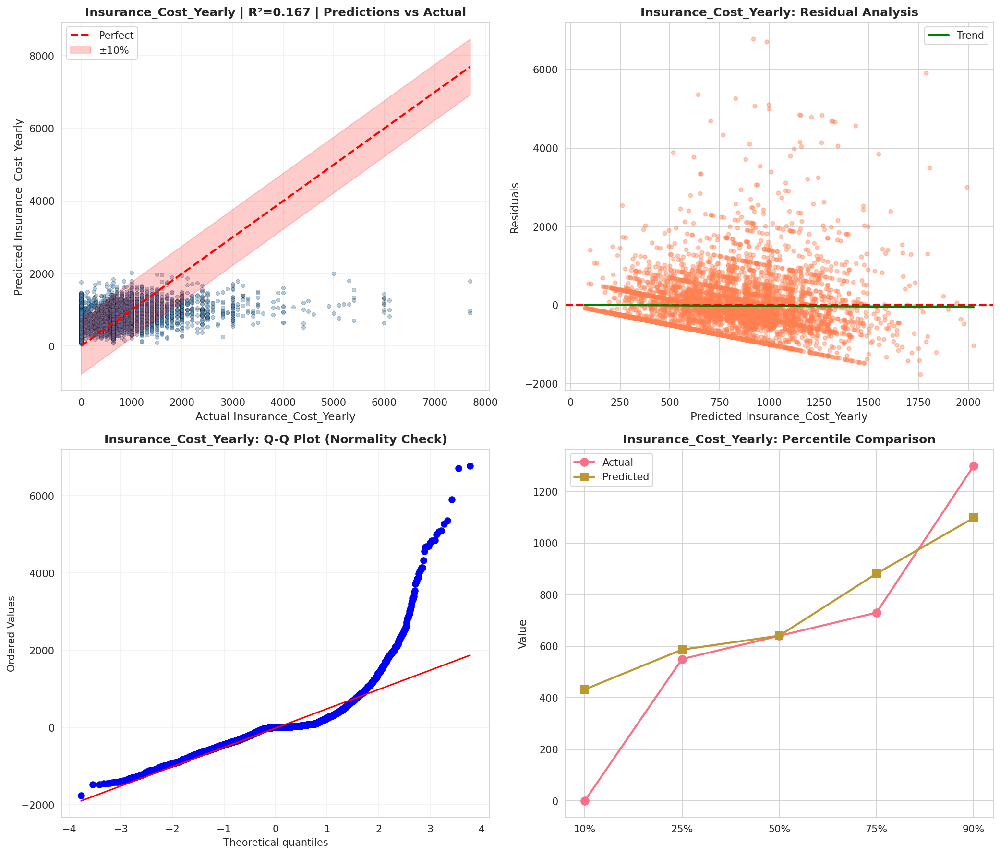
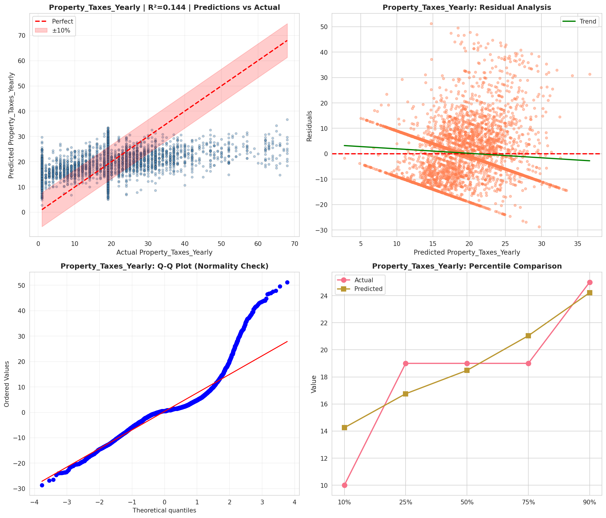
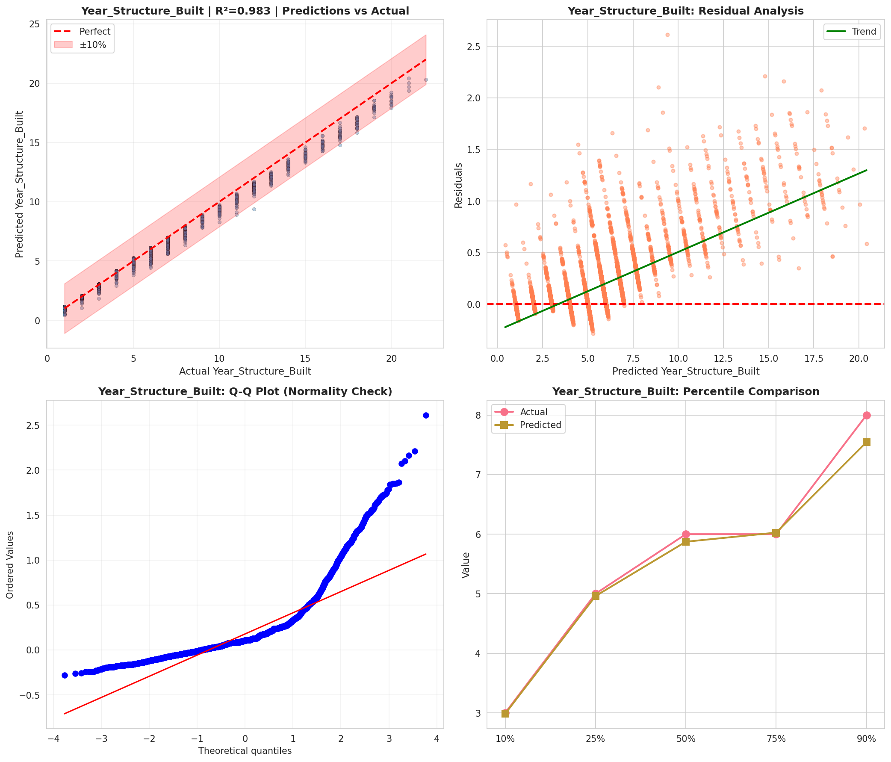
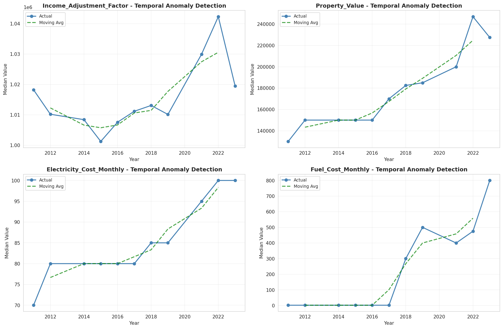

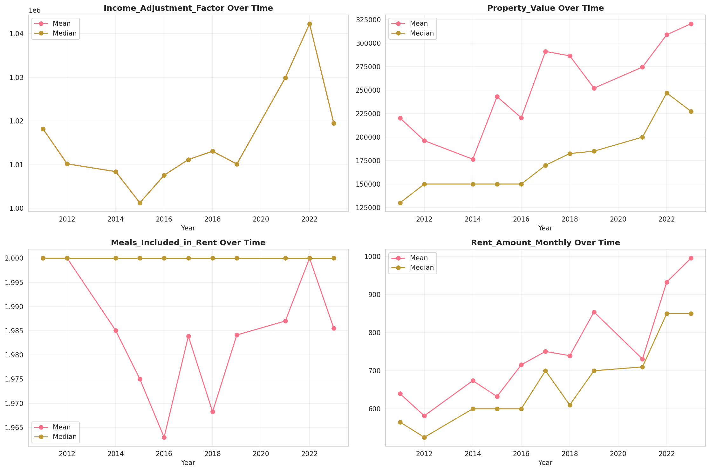
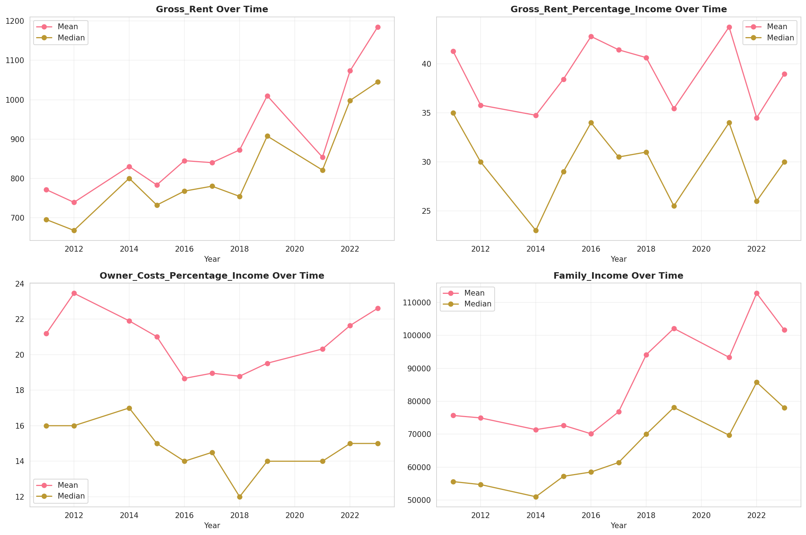
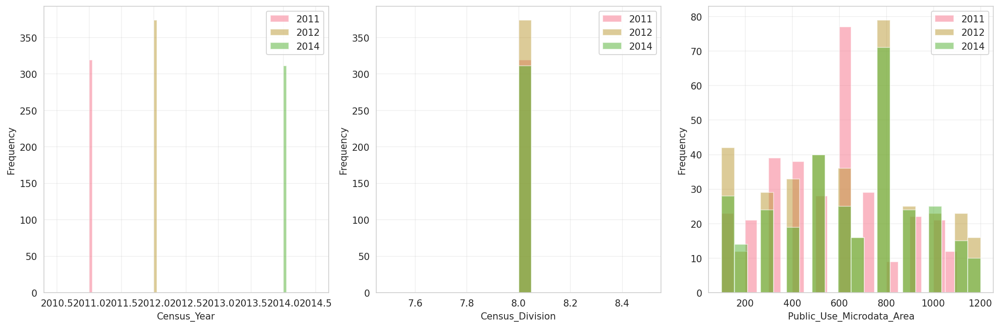
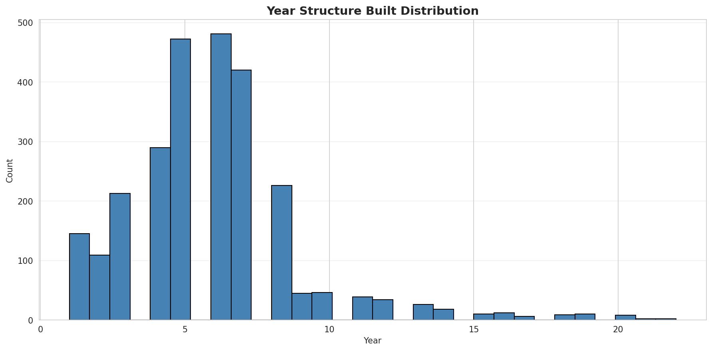
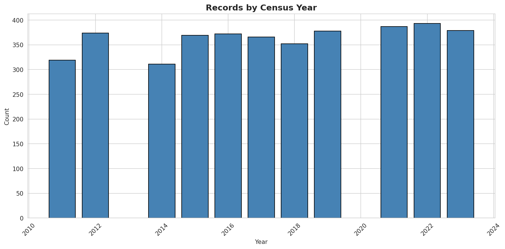
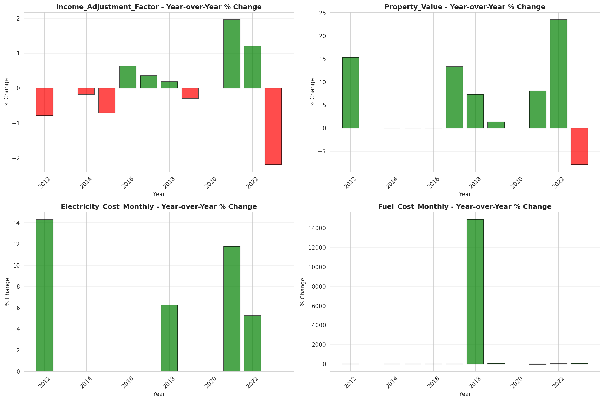
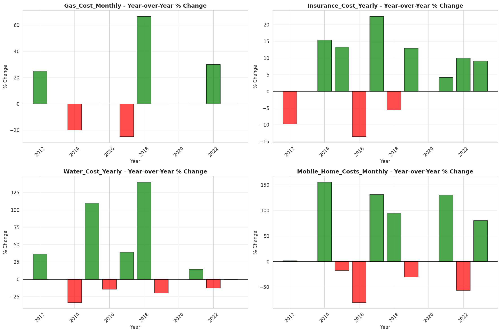
