# Temporal Analysis

## Year Distribution

- 2011: 46,771 records

- 2012: 47,596 records

- 2014: 49,006 records

- 2015: 49,478 records

- 2016: 49,430 records

- 2018: 50,020 records

- 2019: 50,376 records

- 2020: 49,280 records

- 2021: 49,795 records

- 2022: 50,274 records

- 2023: 50,764 records

## Temporal Trends

- Census_Year: {np.int64(2011): {'mean': 2011.0, 'median': 2011.0, 'std': 0.0}, np.int64(2012): {'mean': 2012.0, 'median': 2012.0, 'std': 0.0}, np.int64(2014): {'mean': 2014.0, 'median': 2014.0, 'std': 0.0}, np.int64(2015): {'mean': 2015.0, 'median': 2015.0, 'std': 0.0}, np.int64(2016): {'mean': 2016.0, 'median': 2016.0, 'std': 0.0}, np.int64(2018): {'mean': 2018.0, 'median': 2018.0, 'std': 0.0}, np.int64(2019): {'mean': 2019.0, 'median': 2019.0, 'std': 0.0}, np.int64(2020): {'mean': 2020.0, 'median': 2020.0, 'std': 0.0}, np.int64(2021): {'mean': 2021.0, 'median': 2021.0, 'std': 0.0}, np.int64(2022): {'mean': 2022.0, 'median': 2022.0, 'std': 0.0}, np.int64(2023): {'mean': 2023.0, 'median': 2023.0, 'std': 0.0}}

- Census_Division: {np.int64(2011): {'mean': 8.0, 'median': 8.0, 'std': 0.0}, np.int64(2012): {'mean': 8.0, 'median': 8.0, 'std': 0.0}, np.int64(2014): {'mean': 8.0, 'median': 8.0, 'std': 0.0}, np.int64(2015): {'mean': 8.0, 'median': 8.0, 'std': 0.0}, np.int64(2016): {'mean': 8.0, 'median': 8.0, 'std': 0.0}, np.int64(2018): {'mean': 8.0, 'median': 8.0, 'std': 0.0}, np.int64(2019): {'mean': 8.0, 'median': 8.0, 'std': 0.0}, np.int64(2020): {'mean': 8.0, 'median': 8.0, 'std': 0.0}, np.int64(2021): {'mean': 8.0, 'median': 8.0, 'std': 0.0}, np.int64(2022): {'mean': 8.0, 'median': 8.0, 'std': 0.0}, np.int64(2023): {'mean': 8.0, 'median': 8.0, 'std': 0.0}}

- Public_Use_Microdata_Area: {np.int64(2011): {'mean': 574.9613435675953, 'median': 602.0, 'std': 265.78786146452444}, np.int64(2012): {'mean': None, 'median': None, 'std': None}, np.int64(2014): {'mean': None, 'median': None, 'std': None}, np.int64(2015): {'mean': None, 'median': None, 'std': None}, np.int64(2016): {'mean': 635.0913615213433, 'median': 700.0, 'std': 326.986982596157}, np.int64(2018): {'mean': 632.0440023990404, 'median': 700.0, 'std': 325.77140202999755}, np.int64(2019): {'mean': 634.5961767508337, 'median': 700.0, 'std': 323.86259366229643}, np.int64(2020): {'mean': 637.5480722402598, 'median': 700.0, 'std': 322.2563366247321}, np.int64(2021): {'mean': 639.4923385882116, 'median': 700.0, 'std': 321.38612385078295}, np.int64(2022): {'mean': None, 'median': None, 'std': None}, np.int64(2023): {'mean': 592.6751044046962, 'median': 701.0, 'std': 283.7542392004516}}

- Census_Region: {np.int64(2011): {'mean': 4.0, 'median': 4.0, 'std': 0.0}, np.int64(2012): {'mean': 4.0, 'median': 4.0, 'std': 0.0}, np.int64(2014): {'mean': 4.0, 'median': 4.0, 'std': 0.0}, np.int64(2015): {'mean': 4.0, 'median': 4.0, 'std': 0.0}, np.int64(2016): {'mean': 4.0, 'median': 4.0, 'std': 0.0}, np.int64(2018): {'mean': 4.0, 'median': 4.0, 'std': 0.0}, np.int64(2019): {'mean': 4.0, 'median': 4.0, 'std': 0.0}, np.int64(2020): {'mean': 4.0, 'median': 4.0, 'std': 0.0}, np.int64(2021): {'mean': 4.0, 'median': 4.0, 'std': 0.0}, np.int64(2022): {'mean': 4.0, 'median': 4.0, 'std': 0.0}, np.int64(2023): {'mean': 4.0, 'median': 4.0, 'std': 0.0}}

- State_Code: {np.int64(2011): {'mean': 35.0, 'median': 35.0, 'std': 0.0}, np.int64(2012): {'mean': 35.0, 'median': 35.0, 'std': 0.0}, np.int64(2014): {'mean': 35.0, 'median': 35.0, 'std': 0.0}, np.int64(2015): {'mean': 35.0, 'median': 35.0, 'std': 0.0}, np.int64(2016): {'mean': 35.0, 'median': 35.0, 'std': 0.0}, np.int64(2018): {'mean': 35.0, 'median': 35.0, 'std': 0.0}, np.int64(2019): {'mean': 35.0, 'median': 35.0, 'std': 0.0}, np.int64(2020): {'mean': 35.0, 'median': 35.0, 'std': 0.0}, np.int64(2021): {'mean': 35.0, 'median': 35.0, 'std': 0.0}, np.int64(2022): {'mean': 35.0, 'median': 35.0, 'std': 0.0}, np.int64(2023): {'mean': None, 'median': None, 'std': None}}

- Housing_Adjustment_Factor: {np.int64(2011): {'mean': 1041035.1719227727, 'median': 1044592.0, 'std': 27543.873558387848}, np.int64(2012): {'mean': 1041281.9456677032, 'median': 1053092.0, 'std': 27460.014507618584}, np.int64(2014): {'mean': 1036799.3298371627, 'median': 1031130.0, 'std': 29637.3232419984}, np.int64(2015): {'mean': 1020994.2781438215, 'median': 1017534.0, 'std': 20293.475939647447}, np.int64(2016): {'mean': 1020430.8317216266, 'median': 1013801.0, 'std': 15760.487873048636}, np.int64(2018): {'mean': 1038156.9022191124, 'median': 1046406.0, 'std': 23514.544557133788}, np.int64(2019): {'mean': 1040710.0658646974, 'median': 1042936.0, 'std': 29162.228531239667}, np.int64(2020): {'mean': 1036258.3622767857, 'median': 1030827.0, 'std': 28268.672846613994}, np.int64(2021): {'mean': 1058164.0386986646, 'median': 1059761.0, 'std': 35639.457712419564}, np.int64(2022): {'mean': 1104625.9646934797, 'median': 1133141.0, 'std': 61636.61750625042}, np.int64(2023): {'mean': 1104968.7832322118, 'median': 1125501.0, 'std': 76742.96651921043}}

- Income_Adjustment_Factor: {np.int64(2011): {'mean': 1053665.0164418123, 'median': 1048026.0, 'std': 28346.50490479356}, np.int64(2012): {'mean': 1052535.9134591143, 'median': 1061121.0, 'std': 26372.419874565698}, np.int64(2014): {'mean': 1047649.9459045831, 'median': 1041654.0, 'std': 31063.23538300903}, np.int64(2015): {'mean': 1030424.5626945309, 'median': 1025215.0, 'std': 25665.923232856323}, np.int64(2016): {'mean': 1027596.4873558568, 'median': 1022342.0, 'std': 17519.992090539083}, np.int64(2018): {'mean': 1046753.0214514195, 'median': 1054346.0, 'std': 20532.449980713707}, np.int64(2019): {'mean': 1049675.3959822138, 'median': 1054606.0, 'std': 26210.10530463328}, np.int64(2020): {'mean': 1046360.6827313312, 'median': 1044328.0, 'std': 28790.970608978343}, np.int64(2021): {'mean': 1073177.1989557184, 'median': 1070512.0, 'std': 30766.005704248717}, np.int64(2022): {'mean': 1126946.903150734, 'median': 1140108.0, 'std': 49712.44253109053}, np.int64(2023): {'mean': 1128895.2669411395, 'median': 1159185.0, 'std': 70362.86887061637}}

- Housing_Unit_Weight: {np.int64(2011): {'mean': 19.162044856855744, 'median': 15.0, 'std': 15.979520289331061}, np.int64(2012): {'mean': 18.919741154718885, 'median': 15.0, 'std': 16.567431482499764}, np.int64(2014): {'mean': 18.512467861078235, 'median': 14.0, 'std': 17.63046280432718}, np.int64(2015): {'mean': 18.383220825417357, 'median': 14.0, 'std': 18.201537595865776}, np.int64(2016): {'mean': 18.45925551284645, 'median': 14.0, 'std': 18.005260111002762}, np.int64(2018): {'mean': 18.64890043982407, 'median': 14.0, 'std': 18.51153539154204}, np.int64(2019): {'mean': 18.618389709385422, 'median': 14.0, 'std': 18.528771496692404}, np.int64(2020): {'mean': 19.147077922077923, 'median': 13.0, 'std': 22.775605821237235}, np.int64(2021): {'mean': 18.825123004317703, 'median': 13.0, 'std': 22.696819675690428}, np.int64(2022): {'mean': 18.76017424513665, 'median': 12.0, 'std': 22.891850675299136}, np.int64(2023): {'mean': 18.704672602631785, 'median': 13.0, 'std': 22.573708937568153}}

- Number_of_Persons: {np.int64(2011): {'mean': 2.0307027859143485, 'median': 2.0, 'std': 1.561194963999503}, np.int64(2012): {'mean': 2.0202538028405748, 'median': 2.0, 'std': 1.5779529141872388}, np.int64(2014): {'mean': 1.994735338529976, 'median': 2.0, 'std': 1.5967306775386498}, np.int64(2015): {'mean': 1.9729374671571203, 'median': 2.0, 'std': 1.5970137769568926}, np.int64(2016): {'mean': 1.9603479668217683, 'median': 2.0, 'std': 1.5953022972056936}, np.int64(2018): {'mean': 1.9128948420631748, 'median': 2.0, 'std': 1.5660580104882222}, np.int64(2019): {'mean': 1.8993369858662856, 'median': 2.0, 'std': 1.5589430653487915}, np.int64(2020): {'mean': 1.876846590909091, 'median': 2.0, 'std': 1.5470041690273286}, np.int64(2021): {'mean': 1.866934431167788, 'median': 2.0, 'std': 1.5308236493881127}, np.int64(2022): {'mean': 1.8734534749572345, 'median': 2.0, 'std': 1.5148625565992897}, np.int64(2023): {'mean': 1.8847214561500276, 'median': 2.0, 'std': 1.5067001628452963}}

- Housing_Unit_Type: {np.int64(2011): {'mean': 1.073015330012187, 'median': 1.0, 'std': 0.3236674016210236}, np.int64(2012): {'mean': 1.083557441801832, 'median': 1.0, 'std': 0.34753924787725565}, np.int64(2014): {'mean': 1.105150389748194, 'median': 1.0, 'std': 0.39415068256677077}, np.int64(2015): {'mean': 1.115081450341566, 'median': 1.0, 'std': 0.4128894784333425}, np.int64(2016): {'mean': 1.1107829253489783, 'median': 1.0, 'std': 0.40514386398259894}, np.int64(2018): {'mean': 1.1072371051579368, 'median': 1.0, 'std': 0.40024333768533754}, np.int64(2019): {'mean': 1.106955693187232, 'median': 1.0, 'std': 0.40058822072394124}, np.int64(2020): {'mean': None, 'median': None, 'std': None}, np.int64(2021): {'mean': None, 'median': None, 'std': None}, np.int64(2022): {'mean': None, 'median': None, 'std': None}, np.int64(2023): {'mean': None, 'median': None, 'std': None}}

- Number_of_Bedrooms: {np.int64(2011): {'mean': 2.647174547181331, 'median': 3.0, 'std': 1.0173505472714055}, np.int64(2012): {'mean': None, 'median': None, 'std': None}, np.int64(2014): {'mean': None, 'median': None, 'std': None}, np.int64(2015): {'mean': None, 'median': None, 'std': None}, np.int64(2016): {'mean': None, 'median': None, 'std': None}, np.int64(2018): {'mean': None, 'median': None, 'std': None}, np.int64(2019): {'mean': None, 'median': None, 'std': None}, np.int64(2020): {'mean': None, 'median': None, 'std': None}, np.int64(2021): {'mean': None, 'median': None, 'std': None}, np.int64(2022): {'mean': None, 'median': None, 'std': None}, np.int64(2023): {'mean': None, 'median': None, 'std': None}}

- Number_of_Rooms: {np.int64(2011): {'mean': 5.406598376410465, 'median': 5.0, 'std': 1.8462813426220288}, np.int64(2012): {'mean': None, 'median': None, 'std': None}, np.int64(2014): {'mean': None, 'median': None, 'std': None}, np.int64(2015): {'mean': None, 'median': None, 'std': None}, np.int64(2016): {'mean': None, 'median': None, 'std': None}, np.int64(2018): {'mean': None, 'median': None, 'std': None}, np.int64(2019): {'mean': None, 'median': None, 'std': None}, np.int64(2020): {'mean': None, 'median': None, 'std': None}, np.int64(2021): {'mean': None, 'median': None, 'std': None}, np.int64(2022): {'mean': None, 'median': None, 'std': None}, np.int64(2023): {'mean': None, 'median': None, 'std': None}}

- Building_Type: {np.int64(2011): {'mean': 2.385817334870995, 'median': 2.0, 'std': 1.6280132191025818}, np.int64(2012): {'mean': 2.3721206151642007, 'median': 2.0, 'std': 1.6161627606211488}, np.int64(2014): {'mean': 2.3476209375137804, 'median': 2.0, 'std': 1.590350038504336}, np.int64(2015): {'mean': 2.339540917285959, 'median': 2.0, 'std': 1.585353450936815}, np.int64(2016): {'mean': 2.3427681235738107, 'median': 2.0, 'std': 1.5889447770864755}, np.int64(2018): {'mean': 2.353203077721103, 'median': 2.0, 'std': 1.607697803632756}, np.int64(2019): {'mean': 2.361959505833905, 'median': 2.0, 'std': 1.6160906384838556}, np.int64(2020): {'mean': 2.36287618039008, 'median': 2.0, 'std': 1.6138533230748642}, np.int64(2021): {'mean': 2.3670392285776902, 'median': 2.0, 'std': 1.616506462255629}, np.int64(2022): {'mean': 2.374459819284997, 'median': 2.0, 'std': 1.621658046249331}, np.int64(2023): {'mean': 2.380568648319903, 'median': 2.0, 'std': 1.627897782601478}}

- Year_Structure_Built: {np.int64(2011): {'mean': 4.745901453994528, 'median': 5.0, 'std': 2.086261567600272}, np.int64(2012): {'mean': 5.388216068590361, 'median': 5.0, 'std': 2.317227781706074}, np.int64(2014): {'mean': 5.505710631917802, 'median': 6.0, 'std': 2.4707091489453386}, np.int64(2015): {'mean': 5.575128622312124, 'median': 6.0, 'std': 2.5610626541632544}, np.int64(2016): {'mean': 5.680358083201685, 'median': 6.0, 'std': 2.6991697655135813}, np.int64(2018): {'mean': 5.860076078499179, 'median': 6.0, 'std': 3.012004470856836}, np.int64(2019): {'mean': 5.94813829787234, 'median': 6.0, 'std': 3.1968853426364015}, np.int64(2020): {'mean': 6.028351425293443, 'median': 6.0, 'std': 3.3889784007132224}, np.int64(2021): {'mean': None, 'median': None, 'std': None}, np.int64(2022): {'mean': None, 'median': None, 'std': None}, np.int64(2023): {'mean': None, 'median': None, 'std': None}}

- Bathtub_or_Shower: {np.int64(2011): {'mean': None, 'median': None, 'std': None}, np.int64(2012): {'mean': 1.0517561729085985, 'median': 1.0, 'std': 0.22153683698614293}, np.int64(2014): {'mean': 1.054195881289412, 'median': 1.0, 'std': 0.22640631165387004}, np.int64(2015): {'mean': 1.053075942130953, 'median': 1.0, 'std': 0.22418740274651272}, np.int64(2016): {'mean': 1.0490609092504828, 'median': 1.0, 'std': 0.21599759282886566}, np.int64(2018): {'mean': 1.046425175067001, 'median': 1.0, 'std': 0.2104063568950646}, np.int64(2019): {'mean': 1.043668496911462, 'median': 1.0, 'std': 0.20435864311953553}, np.int64(2020): {'mean': 1.0432883240667197, 'median': 1.0, 'std': 0.20350763825575158}, np.int64(2021): {'mean': 1.0437431514354591, 'median': 1.0, 'std': 0.20452531597008727}, np.int64(2022): {'mean': 1.0400279366187961, 'median': 1.0, 'std': 0.19602688485674863}, np.int64(2023): {'mean': 1.038293620625991, 'median': 1.0, 'std': 0.19190627706318958}}

- Refrigerator: {np.int64(2011): {'mean': None, 'median': None, 'std': None}, np.int64(2012): {'mean': 1.0564124375993373, 'median': 1.0, 'std': 0.23071901983277437}, np.int64(2014): {'mean': 1.05858358689421, 'median': 1.0, 'std': 0.23484626096998282}, np.int64(2015): {'mean': 1.0578470603755332, 'median': 1.0, 'std': 0.23345658333218267}, np.int64(2016): {'mean': 1.0549411971212919, 'median': 1.0, 'std': 0.2278679469772881}, np.int64(2018): {'mean': 1.0563240252442292, 'median': 1.0, 'std': 0.23054886299150198}, np.int64(2019): {'mean': 1.05464996568291, 'median': 1.0, 'std': 0.22729816330617397}, np.int64(2020): {'mean': 1.0556217456535169, 'median': 1.0, 'std': 0.22919233415039175}, np.int64(2021): {'mean': 1.0550515012053474, 'median': 1.0, 'std': 0.2280832600237976}, np.int64(2022): {'mean': 1.0490200357937929, 'median': 1.0, 'std': 0.21591222602461557}, np.int64(2023): {'mean': 1.0458958708920698, 'median': 1.0, 'std': 0.20926153752119592}}

- Hot_and_Cold_Running_Water: {np.int64(2011): {'mean': None, 'median': None, 'std': None}, np.int64(2012): {'mean': 1.0640907971614695, 'median': 1.0, 'std': 0.24491735276861998}, np.int64(2014): {'mean': 1.0694095338889624, 'median': 1.0, 'std': 0.2541520700223754}, np.int64(2015): {'mean': 1.0696539290268678, 'median': 1.0, 'std': 0.2545656772199374}, np.int64(2016): {'mean': 1.0665920659996488, 'median': 1.0, 'std': 0.24931691999886346}, np.int64(2018): {'mean': 1.0697026022304832, 'median': 1.0, 'std': 0.254647896110086}, np.int64(2019): {'mean': 1.0685698352779684, 'median': 1.0, 'std': 0.2527239261526633}, np.int64(2020): {'mean': 1.070205630571, 'median': 1.0, 'std': 0.2554960670241998}, np.int64(2021): {'mean': 1.0713784790707868, 'median': 1.0, 'std': 0.257458820901566}, np.int64(2022): {'mean': 1.0673752673621721, 'median': 1.0, 'std': 0.2506735170746616}, np.int64(2023): {'mean': 1.0632507222137753, 'median': 1.0, 'std': 0.24341601289770615}}

- Running_Water: {np.int64(2011): {'mean': None, 'median': None, 'std': None}, np.int64(2012): {'mean': None, 'median': None, 'std': None}, np.int64(2014): {'mean': 9.0, 'median': 9.0, 'std': 0.0}, np.int64(2015): {'mean': 9.0, 'median': 9.0, 'std': 0.0}, np.int64(2016): {'mean': 9.0, 'median': 9.0, 'std': 0.0}, np.int64(2018): {'mean': 9.0, 'median': 9.0, 'std': 0.0}, np.int64(2019): {'mean': 9.0, 'median': 9.0, 'std': 0.0}, np.int64(2020): {'mean': 9.0, 'median': 9.0, 'std': 0.0}, np.int64(2021): {'mean': 9.0, 'median': 9.0, 'std': 0.0}, np.int64(2022): {'mean': 9.0, 'median': 9.0, 'std': 0.0}, np.int64(2023): {'mean': 9.0, 'median': 9.0, 'std': 0.0}}

- Sink_with_Faucet: {np.int64(2011): {'mean': None, 'median': None, 'std': None}, np.int64(2012): {'mean': 1.0495399700029102, 'median': 1.0, 'std': 0.21699496642824562}, np.int64(2014): {'mean': 1.051682321294704, 'median': 1.0, 'std': 0.22138730682265986}, np.int64(2015): {'mean': 1.0505694560485466, 'median': 1.0, 'std': 0.21911924109307618}, np.int64(2016): {'mean': 1.0466254168860805, 'median': 1.0, 'std': 0.2108375268644798}, np.int64(2018): {'mean': 1.0435938445577937, 'median': 1.0, 'std': 0.20419187648535633}, np.int64(2019): {'mean': 1.0410947151681538, 'median': 1.0, 'std': 0.19851142223373963}, np.int64(2020): {'mean': 1.0409496072720854, 'median': 1.0, 'std': 0.19817568832789298}, np.int64(2021): {'mean': 1.0417050186280956, 'median': 1.0, 'std': 0.1999164473806594}, np.int64(2022): {'mean': 1.038172770526867, 'median': 1.0, 'std': 0.1916152694087839}, np.int64(2023): {'mean': 1.0366211255674538, 'median': 1.0, 'std': 0.18783179989955198}}

- Stove_or_Range: {np.int64(2011): {'mean': None, 'median': None, 'std': None}, np.int64(2012): {'mean': 1.0485549909337153, 'median': 1.0, 'std': 0.21493821898907975}, np.int64(2014): {'mean': 1.050822419191251, 'median': 1.0, 'std': 0.2196373477894932}, np.int64(2015): {'mean': 1.0500857482080823, 'median': 1.0, 'std': 0.2181243042930976}, np.int64(2016): {'mean': 1.04691065473056, 'median': 1.0, 'std': 0.21144981963718595}, np.int64(2018): {'mean': 1.0482406847064927, 'median': 1.0, 'std': 0.21427672156713962}, np.int64(2019): {'mean': 1.0470144131777626, 'median': 1.0, 'std': 0.21167196110368983}, np.int64(2020): {'mean': 1.0479216309240138, 'median': 1.0, 'std': 0.21360279698578383}, np.int64(2021): {'mean': 1.047841332456717, 'median': 1.0, 'std': 0.21343274746341198}, np.int64(2022): {'mean': 1.0425596926971932, 'median': 1.0, 'std': 0.2018644461684516}, np.int64(2023): {'mean': 1.039357935663242, 'median': 1.0, 'std': 0.194447190304986}}

- Telephone_Service: {np.int64(2011): {'mean': 1.058052139177967, 'median': 1.0, 'std': 0.23384508844200433}, np.int64(2012): {'mean': 1.0527401912125802, 'median': 1.0, 'std': 0.22351726665875427}, np.int64(2014): {'mean': 1.0490746516947391, 'median': 1.0, 'std': 0.21602671890754854}, np.int64(2015): {'mean': 1.046266402832743, 'median': 1.0, 'std': 0.2100642085225256}, np.int64(2016): {'mean': 1.0433443803658569, 'median': 1.0, 'std': 0.20363380648953006}, np.int64(2018): {'mean': 1.0386439623668455, 'median': 1.0, 'std': 0.1927474239501085}, np.int64(2019): {'mean': 1.0349151582254037, 'median': 1.0, 'std': 0.18356731082191188}, np.int64(2020): {'mean': 1.0310936002555637, 'median': 1.0, 'std': 0.17357301147446688}, np.int64(2021): {'mean': 1.0249525716694772, 'median': 1.0, 'std': 0.15598263340777602}, np.int64(2022): {'mean': 1.0205477677298993, 'median': 1.0, 'std': 0.14186641063615285}, np.int64(2023): {'mean': 1.017247977955247, 'median': 1.0, 'std': 0.13019569006040274}}

- Lot_Acreage: {np.int64(2011): {'mean': 1.2570698031194067, 'median': 1.0, 'std': 0.5182353267891707}, np.int64(2012): {'mean': 1.2608992169739834, 'median': 1.0, 'std': 0.5198373999865781}, np.int64(2014): {'mean': 1.2757348389173662, 'median': 1.0, 'std': 0.5274565430915218}, np.int64(2015): {'mean': 1.2834591288046964, 'median': 1.0, 'std': 0.5320559069473992}, np.int64(2016): {'mean': 1.2898814949863264, 'median': 1.0, 'std': 0.5345843119352031}, np.int64(2018): {'mean': 1.2927357709722966, 'median': 1.0, 'std': 0.5328019298843641}, np.int64(2019): {'mean': 1.2841687441004914, 'median': 1.0, 'std': 0.5283742690318542}, np.int64(2020): {'mean': 1.2795131542922569, 'median': 1.0, 'std': 0.5252738963637557}, np.int64(2021): {'mean': 1.2742943224754897, 'median': 1.0, 'std': 0.5217395087514607}, np.int64(2022): {'mean': 1.2711076112902036, 'median': 1.0, 'std': 0.519579424140669}, np.int64(2023): {'mean': 1.2725513253956588, 'median': 1.0, 'std': 0.5202343354198601}}

- Agricultural_Sales: {np.int64(2011): {'mean': 1.2439521609132917, 'median': 1.0, 'std': 0.96542835354356}, np.int64(2012): {'mean': 1.2271512560128273, 'median': 1.0, 'std': 0.9308471384350536}, np.int64(2014): {'mean': 1.1937681342248012, 'median': 1.0, 'std': 0.8677625701200041}, np.int64(2015): {'mean': 1.1886722606120435, 'median': 1.0, 'std': 0.8479723776994468}, np.int64(2016): {'mean': 1.1837105167614668, 'median': 1.0, 'std': 0.8308333914638657}, np.int64(2018): {'mean': 1.1744034192093078, 'median': 1.0, 'std': 0.8078810172109403}, np.int64(2019): {'mean': 1.1896697713801863, 'median': 1.0, 'std': 0.8425961544628535}, np.int64(2020): {'mean': 1.198636191438313, 'median': 1.0, 'std': 0.863546005620214}, np.int64(2021): {'mean': 1.2086075949367088, 'median': 1.0, 'std': 0.891237866818157}, np.int64(2022): {'mean': 1.2113851519681116, 'median': 1.0, 'std': 0.8953097751676038}, np.int64(2023): {'mean': 1.2203595724003888, 'median': 1.0, 'std': 0.9202343264666573}}

- Business_On_Property: {np.int64(2011): {'mean': 1.9796727179749425, 'median': 2.0, 'std': 0.1411190732145275}, np.int64(2012): {'mean': 1.9801717605455924, 'median': 2.0, 'std': 0.1394115178016913}, np.int64(2014): {'mean': 1.980907807740881, 'median': 2.0, 'std': 0.13685081007043276}, np.int64(2015): {'mean': 1.9809086872872577, 'median': 2.0, 'std': 0.13684771249456743}, np.int64(2016): {'mean': 3.3841188499347115, 'median': 2.0, 'std': 2.8098127822961594}, np.int64(2018): {'mean': 6.215224694483665, 'median': 9.0, 'std': 3.4350972107054454}, np.int64(2019): {'mean': 7.619890117869158, 'median': 9.0, 'std': 2.7905963479303844}, np.int64(2020): {'mean': None, 'median': None, 'std': None}, np.int64(2021): {'mean': None, 'median': None, 'std': None}, np.int64(2022): {'mean': None, 'median': None, 'std': None}, np.int64(2023): {'mean': None, 'median': None, 'std': None}}

- Tenure: {np.int64(2011): {'mean': 1.8718595606012824, 'median': 2.0, 'std': 0.8620856661700901}, np.int64(2012): {'mean': 1.886761402225589, 'median': 2.0, 'std': 0.859536397177503}, np.int64(2014): {'mean': 1.9175764192139737, 'median': 2.0, 'std': 0.8536669336685333}, np.int64(2015): {'mean': 1.9272807748385754, 'median': 2.0, 'std': 0.8475587908688516}, np.int64(2016): {'mean': 1.935257430651601, 'median': 2.0, 'std': 0.8440874692083131}, np.int64(2018): {'mean': 1.9595676852499806, 'median': 2.0, 'std': 0.8484041984946662}, np.int64(2019): {'mean': 1.9605273321832273, 'median': 2.0, 'std': 0.8458925799894224}, np.int64(2020): {'mean': 1.9575923756788414, 'median': 2.0, 'std': 0.84238927839941}, np.int64(2021): {'mean': 1.9502529510961215, 'median': 2.0, 'std': 0.8349951339044742}, np.int64(2022): {'mean': 1.940325965848729, 'median': 2.0, 'std': 0.827554131818646}, np.int64(2023): {'mean': 1.9252417523537366, 'median': 2.0, 'std': 0.8159176020489094}}

- Vacancy_Status: {np.int64(2011): {'mean': 5.105979581915411, 'median': 5.0, 'std': 1.9281540013877607}, np.int64(2012): {'mean': 5.143371419627485, 'median': 5.0, 'std': 1.9041147720299867}, np.int64(2014): {'mean': 5.233217088055798, 'median': 5.0, 'std': 1.8901178914577115}, np.int64(2015): {'mean': 5.2592592592592595, 'median': 5.0, 'std': 1.9064253428344056}, np.int64(2016): {'mean': 5.24645072363887, 'median': 5.0, 'std': 1.9261720319684514}, np.int64(2018): {'mean': 5.291216655823032, 'median': 5.0, 'std': 1.9248051046329124}, np.int64(2019): {'mean': 5.319506870425068, 'median': 5.0, 'std': 1.9269029314061745}, np.int64(2020): {'mean': 5.3525773195876285, 'median': 5.0, 'std': 1.9233055052982846}, np.int64(2021): {'mean': 5.438265173222193, 'median': 5.0, 'std': 1.8976768014303436}, np.int64(2022): {'mean': 5.457854671280277, 'median': 5.0, 'std': 1.9005382152615478}, np.int64(2023): {'mean': 5.5125620800467425, 'median': 7.0, 'std': 1.8654687491150581}}

- Property_Value: {np.int64(2011): {'mean': 14.664503882657463, 'median': 16.0, 'std': 5.514070314300732}}

- Vehicles_Available: {np.int64(2011): {'mean': 1.9106748659728792, 'median': 2.0, 'std': 1.0964784342402165}, np.int64(2012): {'mean': 1.9011545896243665, 'median': 2.0, 'std': 1.1001182456035938}, np.int64(2014): {'mean': 1.8901018922852983, 'median': 2.0, 'std': 1.0968460080195706}, np.int64(2015): {'mean': 1.8900489481358052, 'median': 2.0, 'std': 1.1036179953530956}, np.int64(2016): {'mean': 1.899767751363482, 'median': 2.0, 'std': 1.10858775209576}, np.int64(2018): {'mean': 1.9192390431018842, 'median': 2.0, 'std': 1.1197348567655867}, np.int64(2019): {'mean': 1.936529598063702, 'median': 2.0, 'std': 1.132740880265098}, np.int64(2020): {'mean': 1.9527473112554574, 'median': 2.0, 'std': 1.1412632780642975}, np.int64(2021): {'mean': 1.9554173693086003, 'median': 2.0, 'std': 1.1442386691288946}, np.int64(2022): {'mean': 1.960666442100899, 'median': 2.0, 'std': 1.15149035101482}, np.int64(2023): {'mean': 1.9725971474497996, 'median': 2.0, 'std': 1.159469929696326}}

- Condo_Fee_Monthly: {np.int64(2011): {'mean': 195.8956158663883, 'median': 150.0, 'std': 203.39712572894874}, np.int64(2012): {'mean': 195.93347193347194, 'median': 150.0, 'std': 204.88849544275428}, np.int64(2014): {'mean': 202.93240093240092, 'median': 160.0, 'std': 198.95194460173255}, np.int64(2015): {'mean': 194.75060532687652, 'median': 170.0, 'std': 178.45934045328377}, np.int64(2016): {'mean': 203.21119592875317, 'median': 180.0, 'std': 180.85324605609173}, np.int64(2018): {'mean': 224.4043126684636, 'median': 190.0, 'std': 183.44127385712184}, np.int64(2019): {'mean': 230.6472148541114, 'median': 190.0, 'std': 195.2658994505517}, np.int64(2020): {'mean': 239.5268817204301, 'median': 200.0, 'std': 204.25403512714706}, np.int64(2021): {'mean': 248.16666666666666, 'median': 200.0, 'std': 226.68656216978192}, np.int64(2022): {'mean': 261.9903381642512, 'median': 220.0, 'std': 248.12856915591638}, np.int64(2023): {'mean': 275.77973568281936, 'median': 230.0, 'std': 269.80693765378044}}

- Electricity_Cost_Monthly: {np.int64(2011): {'mean': 89.71557342583833, 'median': 70.0, 'std': 69.54947331520113}, np.int64(2012): {'mean': 92.26720129564808, 'median': 80.0, 'std': 71.57456395116873}, np.int64(2014): {'mean': 96.3092898731545, 'median': 80.0, 'std': 73.89463908162955}, np.int64(2015): {'mean': 98.48698187877525, 'median': 80.0, 'std': 75.49367013188944}, np.int64(2016): {'mean': 99.62247853657264, 'median': 80.0, 'std': 76.61813769552082}, np.int64(2018): {'mean': 107.24879233720705, 'median': 90.0, 'std': 76.2830697891132}, np.int64(2019): {'mean': 108.50596920712462, 'median': 90.0, 'std': 77.90666362180251}, np.int64(2020): {'mean': 110.41544576944918, 'median': 90.0, 'std': 80.88468659138493}, np.int64(2021): {'mean': 114.00567144902715, 'median': 90.0, 'std': 83.91179020119851}, np.int64(2022): {'mean': 121.46565517241379, 'median': 90.0, 'std': 126.84390832480193}, np.int64(2023): {'mean': 133.3494531737632, 'median': 100.0, 'std': 190.57985462592612}}

- Fuel_Cost_Monthly: {np.int64(2011): {'mean': 104.4339062335751, 'median': 2.0, 'std': 331.7839713296724}, np.int64(2012): {'mean': 111.50175016979259, 'median': 2.0, 'std': 345.6551725332148}, np.int64(2014): {'mean': 108.3240538573508, 'median': 2.0, 'std': 335.2370642422784}, np.int64(2015): {'mean': 104.3799989585503, 'median': 2.0, 'std': 327.3268702193404}, np.int64(2016): {'mean': 100.5001435244383, 'median': 2.0, 'std': 322.8789097339302}, np.int64(2018): {'mean': 549.5981912144703, 'median': 400.0, 'std': 543.5774592973262}, np.int64(2019): {'mean': 546.6433750823994, 'median': 400.0, 'std': 546.0853328439332}, np.int64(2020): {'mean': 548.9483681574858, 'median': 400.0, 'std': 545.8696814058081}, np.int64(2021): {'mean': 560.74698379869, 'median': 400.0, 'std': 545.4225683522415}, np.int64(2022): {'mean': 585.3517451711284, 'median': 400.0, 'std': 575.6487618301765}, np.int64(2023): {'mean': 636.9641144369109, 'median': 500.0, 'std': 625.0252122222487}}

- Gas_Cost_Monthly: {np.int64(2011): {'mean': 67.4629454430779, 'median': 50.0, 'std': 75.13404047139265}, np.int64(2012): {'mean': 65.79627501175487, 'median': 50.0, 'std': 74.18046941762496}, np.int64(2014): {'mean': 63.71509149511333, 'median': 40.0, 'std': 72.42214344533694}, np.int64(2015): {'mean': 62.45206727765049, 'median': 40.0, 'std': 71.882789035987}, np.int64(2016): {'mean': 60.75955742282299, 'median': 40.0, 'std': 70.60790550264204}, np.int64(2018): {'mean': 70.55077062556664, 'median': 50.0, 'std': 68.94320518109394}, np.int64(2019): {'mean': 68.42728684176478, 'median': 50.0, 'std': 66.81748673624314}, np.int64(2020): {'mean': 67.95996372552312, 'median': 50.0, 'std': 67.39025898803592}, np.int64(2021): {'mean': 70.42384679433805, 'median': 50.0, 'std': 74.46149380457537}, np.int64(2022): {'mean': 78.42704299310797, 'median': 50.0, 'std': 101.6503127788732}, np.int64(2023): {'mean': 89.74691976845713, 'median': 60.0, 'std': 131.44159171043503}}

- House_Heating_Fuel: {np.int64(2011): {'mean': 1.911200462524966, 'median': 1.0, 'std': 1.6228842497328992}, np.int64(2012): {'mean': 1.9645002873413093, 'median': 1.0, 'std': 1.6816199214485317}, np.int64(2014): {'mean': 2.054533166978582, 'median': 1.0, 'std': 1.7688085449322044}, np.int64(2015): {'mean': 2.1028952301603834, 'median': 1.0, 'std': 1.8123302094673952}, np.int64(2016): {'mean': 2.133947443960231, 'median': 1.0, 'std': 1.8350809582790102}, np.int64(2018): {'mean': 2.154809112821709, 'median': 1.0, 'std': 1.838232064297181}, np.int64(2019): {'mean': 2.150397816515179, 'median': 1.0, 'std': 1.8267795300132743}, np.int64(2020): {'mean': 2.1433819614524543, 'median': 1.0, 'std': 1.8130391190649278}, np.int64(2021): {'mean': 2.141889755480607, 'median': 1.0, 'std': 1.8050263998772538}, np.int64(2022): {'mean': 2.1392480501645377, 'median': 1.0, 'std': 1.8037935725991878}, np.int64(2023): {'mean': 2.1371418365524457, 'median': 1.0, 'std': 1.800763759658343}}

- Insurance_Cost_Yearly: {np.int64(2014): {'mean': 851.2345846451925, 'median': 700.0, 'std': 641.3220443627913}, np.int64(2015): {'mean': 887.2477561889733, 'median': 720.0, 'std': 672.205369694307}}

- Water_Cost_Yearly: {np.int64(2011): {'mean': 360.6195732155997, 'median': 250.0, 'std': 410.7113719402246}, np.int64(2012): {'mean': 366.16856486077006, 'median': 250.0, 'std': 420.49449498689}, np.int64(2014): {'mean': 377.3400655021834, 'median': 240.0, 'std': 449.9536987297388}, np.int64(2015): {'mean': 380.6058112893147, 'median': 220.0, 'std': 456.86824219374694}, np.int64(2016): {'mean': 386.68291537277213, 'median': 200.0, 'std': 470.31246076868854}, np.int64(2018): {'mean': 571.8258529840427, 'median': 510.0, 'std': 497.22738414910214}, np.int64(2019): {'mean': 578.2930568413257, 'median': 520.0, 'std': 506.72313791268766}, np.int64(2020): {'mean': 587.5374776352354, 'median': 530.0, 'std': 525.0641992099271}, np.int64(2021): {'mean': 600.8234942683246, 'median': 530.0, 'std': 557.47053809691}, np.int64(2022): {'mean': 609.5400188665554, 'median': 530.0, 'std': 581.7312091952716}, np.int64(2023): {'mean': 622.3790089518574, 'median': 510.0, 'std': 618.4616968578614}}

- Mobile_Home_Costs_Monthly: {np.int64(2011): {'mean': 1295.8237424547283, 'median': 400.0, 'std': 1803.247924834958}, np.int64(2012): {'mean': 1333.4868898749496, 'median': 400.0, 'std': 1858.2757370261227}, np.int64(2014): {'mean': 1375.9742524916944, 'median': 400.0, 'std': 2007.5849294675422}, np.int64(2015): {'mean': 1490.5056603773585, 'median': 420.0, 'std': 2141.7180499799047}, np.int64(2016): {'mean': 1552.9635830891586, 'median': 450.0, 'std': 2236.883560764539}, np.int64(2018): {'mean': 1626.6798986486488, 'median': 500.0, 'std': 2279.1883861965425}, np.int64(2019): {'mean': 1623.603361344538, 'median': 500.0, 'std': 2311.5231128248815}, np.int64(2020): {'mean': 1693.20067882902, 'median': 500.0, 'std': 2553.436822264584}, np.int64(2021): {'mean': 1710.8785982478098, 'median': 500.0, 'std': 2668.2264399011738}, np.int64(2022): {'mean': 1883.1200317965024, 'median': 520.0, 'std': 3336.2868187073027}, np.int64(2023): {'mean': 1964.8823753330796, 'median': 550.0, 'std': 3613.193939265798}}

- First_Mortgage_Includes_Insurance: {np.int64(2011): {'mean': 1.3064464909495077, 'median': 1.0, 'std': 0.46103203651385544}, np.int64(2012): {'mean': 1.304559309942279, 'median': 1.0, 'std': 0.4602354550124642}, np.int64(2014): {'mean': 1.3026252656110768, 'median': 1.0, 'std': 0.4594101447837022}, np.int64(2015): {'mean': 1.3005584222803421, 'median': 1.0, 'std': 0.4585170858657506}, np.int64(2016): {'mean': 1.2907212024859083, 'median': 1.0, 'std': 0.4541115360322428}, np.int64(2018): {'mean': 1.2753677294108863, 'median': 1.0, 'std': 0.44671606527620533}, np.int64(2019): {'mean': 1.2648684997011357, 'median': 1.0, 'std': 0.4412796470033586}, np.int64(2020): {'mean': 1.2529521441889373, 'median': 1.0, 'std': 0.4347206442955178}, np.int64(2021): {'mean': 1.245262587980509, 'median': 1.0, 'std': 0.4302594210033581}, np.int64(2022): {'mean': 1.2412400975015234, 'median': 1.0, 'std': 0.4278519100008127}, np.int64(2023): {'mean': 1.2380347942955274, 'median': 1.0, 'std': 0.42589643632724145}}

- First_Mortgage_Payment_Monthly: {np.int64(2011): {'mean': 1008.0055890758971, 'median': 870.0, 'std': 661.7812648829361}, np.int64(2012): {'mean': 1014.9856670341786, 'median': 880.0, 'std': 663.2630692780402}, np.int64(2014): {'mean': 1011.2780862293508, 'median': 890.0, 'std': 644.1034399452774}, np.int64(2015): {'mean': 1016.3975401145119, 'median': 900.0, 'std': 638.3425885072701}, np.int64(2016): {'mean': 1013.0176326058679, 'median': 900.0, 'std': 617.4133296315186}, np.int64(2018): {'mean': 1040.5611886806541, 'median': 900.0, 'std': 632.2203391272964}, np.int64(2019): {'mean': 1069.7165271966528, 'median': 940.0, 'std': 655.5810855286475}, np.int64(2020): {'mean': 1094.6660969546301, 'median': 960.0, 'std': 671.2844586332309}, np.int64(2021): {'mean': 1133.6364761389125, 'median': 1000.0, 'std': 696.9519793560372}, np.int64(2022): {'mean': 1169.5333638025595, 'median': 1000.0, 'std': 703.3835894717706}, np.int64(2023): {'mean': 1213.0308370044054, 'median': 1100.0, 'std': 728.2967263312729}}

- First_Mortgage_Includes_Taxes: {np.int64(2011): {'mean': 1.2794537948555096, 'median': 1.0, 'std': 0.448745095784437}, np.int64(2012): {'mean': 1.277320189376743, 'median': 1.0, 'std': 0.4476904071166521}, np.int64(2014): {'mean': 1.2696552196860649, 'median': 1.0, 'std': 0.4437958792137642}, np.int64(2015): {'mean': 1.266841026366014, 'median': 1.0, 'std': 0.4423242281994923}, np.int64(2016): {'mean': 1.2528544587368118, 'median': 1.0, 'std': 0.4346639329595648}, np.int64(2018): {'mean': 1.2345254983946838, 'median': 1.0, 'std': 0.42371770586196483}, np.int64(2019): {'mean': 1.2218320382546324, 'median': 1.0, 'std': 0.4154942643465118}, np.int64(2020): {'mean': 1.2075823492852704, 'median': 1.0, 'std': 0.40559178688953046}, np.int64(2021): {'mean': 1.1981591770438549, 'median': 1.0, 'std': 0.39862815773403554}, np.int64(2022): {'mean': 1.1896709323583181, 'median': 1.0, 'std': 0.392055580439837}, np.int64(2023): {'mean': 1.1865900097065631, 'median': 1.0, 'std': 0.3895966005775049}}

- First_Mortgage_Status: {np.int64(2011): {'mean': 1.909630048009037, 'median': 1.0, 'std': 0.9851986988704273}, np.int64(2012): {'mean': 1.9333639219284933, 'median': 1.0, 'std': 0.9868218059711237}, np.int64(2014): {'mean': 1.9875172878470868, 'median': 2.0, 'std': 0.9887588281942222}, np.int64(2015): {'mean': 2.019609929078014, 'median': 2.0, 'std': 0.9882847885422184}, np.int64(2016): {'mean': 2.0374759769378605, 'median': 3.0, 'std': 0.9880147663364781}, np.int64(2018): {'mean': 2.066443287944678, 'median': 3.0, 'std': 0.9871044926136614}, np.int64(2019): {'mean': 2.0734103841939704, 'median': 3.0, 'std': 0.9874893695195336}, np.int64(2020): {'mean': 2.0825968357883253, 'median': 3.0, 'std': 0.987066699228064}, np.int64(2021): {'mean': 2.0948371213472723, 'median': 3.0, 'std': 0.9867082632301024}, np.int64(2022): {'mean': 2.1053435644595675, 'median': 3.0, 'std': 0.9858792540979603}, np.int64(2023): {'mean': 2.109935431526994, 'median': 3.0, 'std': 0.9861531173270582}}

- Second_Mortgage_Payment_Monthly: {np.int64(2011): {'mean': 384.446567586695, 'median': 300.0, 'std': 346.01761090365187}, np.int64(2012): {'mean': 379.7126850740296, 'median': 300.0, 'std': 344.35457415481864}, np.int64(2014): {'mean': 369.4740663900415, 'median': 300.0, 'std': 335.5269041771996}, np.int64(2015): {'mean': 366.8415554265815, 'median': 300.0, 'std': 328.00369653223476}, np.int64(2016): {'mean': 364.0582147477361, 'median': 270.0, 'std': 367.79089912090456}, np.int64(2018): {'mean': 358.5078459343795, 'median': 270.0, 'std': 377.05719373510294}, np.int64(2019): {'mean': 380.4958427815571, 'median': 270.0, 'std': 430.2031138406556}, np.int64(2020): {'mean': 381.67445482866043, 'median': 270.0, 'std': 426.5769240288177}, np.int64(2021): {'mean': 395.6394984326019, 'median': 280.0, 'std': 463.2409970082944}, np.int64(2022): {'mean': 427.944089456869, 'median': 290.0, 'std': 570.7987252274066}, np.int64(2023): {'mean': 452.69856459330146, 'median': 300.0, 'std': 588.006251668407}}

- Second_Mortgage_Status: {np.int64(2011): {'mean': 2.77783423308987, 'median': 3.0, 'std': 0.5537006040745407}, np.int64(2012): {'mean': 2.7983007977171024, 'median': 3.0, 'std': 0.5287625141784579}, np.int64(2014): {'mean': 2.8367263006374666, 'median': 3.0, 'std': 0.48185345930700063}, np.int64(2015): {'mean': 2.8497914752244293, 'median': 3.0, 'std': 0.46279711950226093}, np.int64(2016): {'mean': 2.8588668882786528, 'median': 3.0, 'std': 0.451072696464458}, np.int64(2018): {'mean': 2.865153438363324, 'median': 3.0, 'std': 0.4425193896557956}, np.int64(2019): {'mean': 2.8713389121338913, 'median': 3.0, 'std': 0.4344884511746914}, np.int64(2020): {'mean': 2.869403563129357, 'median': 3.0, 'std': 0.43545466042473635}, np.int64(2021): {'mean': 2.8743181992778672, 'median': 3.0, 'std': 0.42548506015857424}, np.int64(2022): {'mean': 2.8803618545043346, 'median': 3.0, 'std': 0.41178491616585855}, np.int64(2023): {'mean': 2.8835873647006847, 'median': 3.0, 'std': 0.4049538259458015}}

- Property_Taxes_Yearly: {np.int64(2011): {'mean': 18.858726348489128, 'median': 18.0, 'std': 13.981303452076213}, np.int64(2012): {'mean': 19.035471005541243, 'median': 18.0, 'std': 14.37480990996891}, np.int64(2014): {'mean': 19.151281960353202, 'median': 18.0, 'std': 14.907531891573242}, np.int64(2015): {'mean': 19.229255319148937, 'median': 18.0, 'std': 15.244258600402864}, np.int64(2016): {'mean': 19.560360167983486, 'median': 18.0, 'std': 15.472876462045447}}

- Meals_Included_in_Rent: {np.int64(2011): {'mean': 1.9812106330735562, 'median': 2.0, 'std': 0.13578768371301986}, np.int64(2012): {'mean': 1.981134042109652, 'median': 2.0, 'std': 0.13605867505849345}, np.int64(2014): {'mean': 1.9830611010284331, 'median': 2.0, 'std': 0.12904902869560117}, np.int64(2015): {'mean': 1.9838285829795836, 'median': 2.0, 'std': 0.12614083593315592}, np.int64(2016): {'mean': 1.9829488465396188, 'median': 2.0, 'std': 0.12946850149398761}, np.int64(2018): {'mean': 1.9813084112149533, 'median': 2.0, 'std': 0.13544008977850341}, np.int64(2019): {'mean': 1.9807579030041234, 'median': 2.0, 'std': 0.13738155481797026}, np.int64(2020): {'mean': 1.9802030977536158, 'median': 2.0, 'std': 0.13930892136196749}, np.int64(2021): {'mean': 1.979049405878674, 'median': 2.0, 'std': 0.14322641138539255}, np.int64(2022): {'mean': 1.979226285108638, 'median': 2.0, 'std': 0.14263353014674132}, np.int64(2023): {'mean': 1.9785814228823593, 'median': 2.0, 'std': 0.14478286446313865}}

- Rent_Amount_Monthly: {np.int64(2011): {'mean': 617.8204334365325, 'median': 550.0, 'std': 398.2007094873138}, np.int64(2012): {'mean': 627.4229726912654, 'median': 580.0, 'std': 394.171391864732}, np.int64(2014): {'mean': 650.1286549707602, 'median': 600.0, 'std': 389.71962937041536}, np.int64(2015): {'mean': 661.1350313321204, 'median': 600.0, 'std': 394.910673274837}, np.int64(2016): {'mean': 674.772517552658, 'median': 610.0, 'std': 397.9139382630359}, np.int64(2018): {'mean': 706.7854402361043, 'median': 650.0, 'std': 410.33779878903306}, np.int64(2019): {'mean': 725.8354604358924, 'median': 660.0, 'std': 420.2680095205687}, np.int64(2020): {'mean': 751.7460252333573, 'median': 690.0, 'std': 446.21118100146936}, np.int64(2021): {'mean': 782.4859287054409, 'median': 700.0, 'std': 479.06466718228796}, np.int64(2022): {'mean': 816.8392156862745, 'median': 720.0, 'std': 519.884691383764}, np.int64(2023): {'mean': 868.9060381013884, 'median': 770.0, 'std': 564.2593881852043}}

- Gross_Rent: {np.int64(2011): {'mean': 738.7919337918172, 'median': 676.0, 'std': 385.5635291017539}, np.int64(2012): {'mean': 754.642273655548, 'median': 690.0, 'std': 394.8695577928104}, np.int64(2014): {'mean': 788.2585451358458, 'median': 720.0, 'std': 407.08757837192474}, np.int64(2015): {'mean': 801.5468991392629, 'median': 740.0, 'std': 412.15932996007064}, np.int64(2016): {'mean': 815.5917042578942, 'median': 750.0, 'std': 415.64856676467946}, np.int64(2018): {'mean': 847.180487804878, 'median': 783.0, 'std': 427.9452827841679}, np.int64(2019): {'mean': 866.3704666017105, 'median': 800.0, 'std': 438.5835519909659}, np.int64(2020): {'mean': 890.4482484979027, 'median': 820.0, 'std': 458.11046227863335}, np.int64(2021): {'mean': 923.6005045292972, 'median': 849.0, 'std': 485.89173296618543}, np.int64(2022): {'mean': 964.7090002319648, 'median': 870.0, 'std': 531.7015011797076}, np.int64(2023): {'mean': 1033.6139041175784, 'median': 920.0, 'std': 610.9452131185018}}

- Gross_Rent_Percentage_Income: {np.int64(2011): {'mean': 37.77875789724639, 'median': 29.0, 'std': 27.00979479046354}, np.int64(2012): {'mean': 38.077934163080144, 'median': 29.0, 'std': 27.0609238539032}, np.int64(2014): {'mean': 38.808916478555304, 'median': 30.0, 'std': 27.170321666401318}, np.int64(2015): {'mean': 38.72627031942708, 'median': 30.0, 'std': 27.065965555755604}, np.int64(2016): {'mean': 38.10290117860381, 'median': 29.0, 'std': 26.89239278117054}, np.int64(2018): {'mean': 37.57847432872711, 'median': 29.0, 'std': 26.824511756515477}, np.int64(2019): {'mean': 37.04273886775565, 'median': 28.0, 'std': 26.65169030979663}, np.int64(2020): {'mean': 37.049766355140186, 'median': 28.0, 'std': 26.77579493206138}, np.int64(2021): {'mean': 37.53458451369216, 'median': 29.0, 'std': 27.100550508921632}, np.int64(2022): {'mean': 37.64853953930183, 'median': 29.0, 'std': 27.12502484223093}, np.int64(2023): {'mean': 37.84866151100535, 'median': 29.0, 'std': 27.43398353891001}}

- Selected_Monthly_Owner_Costs: {np.int64(2011): {'mean': 901.2354356905217, 'median': 689.5, 'std': 787.4032092660501}, np.int64(2012): {'mean': 891.9609272695099, 'median': 671.0, 'std': 781.9066486352468}, np.int64(2014): {'mean': 860.8599345055884, 'median': 636.5, 'std': 755.0233117763171}, np.int64(2015): {'mean': 848.2473290598291, 'median': 615.0, 'std': 745.3460223410885}, np.int64(2016): {'mean': 837.305247730035, 'median': 611.0, 'std': 727.271940722292}, np.int64(2018): {'mean': 839.4276353480378, 'median': 607.0, 'std': 733.6941036266626}, np.int64(2019): {'mean': 853.2355112325656, 'median': 616.0, 'std': 753.6267075526032}, np.int64(2020): {'mean': 865.5027198714906, 'median': 627.0, 'std': 763.5073606221844}, np.int64(2021): {'mean': 887.9796013312815, 'median': 639.0, 'std': 787.8764631908907}, np.int64(2022): {'mean': 921.8724722425255, 'median': 667.0, 'std': 810.9854427365556}, np.int64(2023): {'mean': 970.1595827547668, 'median': 703.0, 'std': 855.2560577624868}}

- Owner_Costs_Percentage_Income: {np.int64(2011): {'mean': 22.863078073267115, 'median': 17.0, 'std': 21.051835327566838}, np.int64(2012): {'mean': 22.76175526221905, 'median': 17.0, 'std': 21.171421402952163}, np.int64(2014): {'mean': 22.424552798615117, 'median': 16.0, 'std': 21.592963530365232}, np.int64(2015): {'mean': 22.086780445472954, 'median': 16.0, 'std': 21.622511929174976}, np.int64(2016): {'mean': 21.68040974971848, 'median': 15.0, 'std': 21.55257914309431}, np.int64(2018): {'mean': 20.95131823651679, 'median': 15.0, 'std': 21.113102810122353}, np.int64(2019): {'mean': 20.62263060981334, 'median': 14.0, 'std': 21.000257672841556}, np.int64(2020): {'mean': 20.300886926188443, 'median': 14.0, 'std': 20.822075701465735}, np.int64(2021): {'mean': 20.38233151183971, 'median': 14.0, 'std': 21.02697769673932}, np.int64(2022): {'mean': 20.555583073874892, 'median': 14.0, 'std': 21.199737937467653}, np.int64(2023): {'mean': 20.819541890218737, 'median': 14.0, 'std': 21.520603526410355}}

- Satellite_Internet: {np.int64(2011): {'mean': None, 'median': None, 'std': None}, np.int64(2012): {'mean': None, 'median': None, 'std': None}, np.int64(2014): {'mean': None, 'median': None, 'std': None}, np.int64(2015): {'mean': None, 'median': None, 'std': None}, np.int64(2016): {'mean': None, 'median': None, 'std': None}, np.int64(2018): {'mean': 1.8864259767217733, 'median': 2.0, 'std': 0.3172990645999809}, np.int64(2019): {'mean': 1.882252982617623, 'median': 2.0, 'std': 0.3223140317499124}, np.int64(2020): {'mean': 1.8774643934610258, 'median': 2.0, 'std': 0.32790913933754706}, np.int64(2021): {'mean': 1.8767796439029316, 'median': 2.0, 'std': 0.328695507010362}, np.int64(2022): {'mean': 1.877147268867014, 'median': 2.0, 'std': 0.32827336810639574}, np.int64(2023): {'mean': 1.877848706324976, 'median': 2.0, 'std': 0.3274655127699692}}

- Smartphone: {np.int64(2011): {'mean': None, 'median': None, 'std': None}, np.int64(2012): {'mean': None, 'median': None, 'std': None}, np.int64(2014): {'mean': None, 'median': None, 'std': None}, np.int64(2015): {'mean': None, 'median': None, 'std': None}, np.int64(2016): {'mean': None, 'median': None, 'std': None}, np.int64(2018): {'mean': 1.3393981805458361, 'median': 1.0, 'std': 0.4735112108185322}, np.int64(2019): {'mean': 1.28774107165847, 'median': 1.0, 'std': 0.45271561112923275}, np.int64(2020): {'mean': 1.2455808753061441, 'median': 1.0, 'std': 0.43043680286584296}, np.int64(2021): {'mean': 1.2093170320404723, 'median': 1.0, 'std': 0.4068264656024171}, np.int64(2022): {'mean': 1.182390588966911, 'median': 1.0, 'std': 0.38617110993304454}, np.int64(2023): {'mean': 1.1583446023524608, 'median': 1.0, 'std': 0.36506847267015013}}

- Tablet_Computer: {np.int64(2011): {'mean': None, 'median': None, 'std': None}, np.int64(2012): {'mean': None, 'median': None, 'std': None}, np.int64(2014): {'mean': None, 'median': None, 'std': None}, np.int64(2015): {'mean': None, 'median': None, 'std': None}, np.int64(2016): {'mean': None, 'median': None, 'std': None}, np.int64(2018): {'mean': 1.5157711945675556, 'median': 2.0, 'std': 0.4997576839636088}, np.int64(2019): {'mean': 1.4866750778896414, 'median': 1.0, 'std': 0.4998288499127144}, np.int64(2020): {'mean': 1.4647534873815355, 'median': 1.0, 'std': 0.49876277503519384}, np.int64(2021): {'mean': 1.4482240725126476, 'median': 1.0, 'std': 0.49731858012492985}, np.int64(2022): {'mean': 1.4412199103464358, 'median': 1.0, 'std': 0.49653931320486894}, np.int64(2023): {'mean': 1.4288520909346056, 'median': 1.0, 'std': 0.4949184020914962}}

- Food_Stamp_SNAP: {np.int64(2011): {'mean': 1.8949753694581282, 'median': 2.0, 'std': 0.3065889311649416}, np.int64(2012): {'mean': 1.8789768728614071, 'median': 2.0, 'std': 0.326158108001069}, np.int64(2014): {'mean': 1.8513436520748268, 'median': 2.0, 'std': 0.3557536262991471}, np.int64(2015): {'mean': 1.8422082822375248, 'median': 2.0, 'std': 0.36454989456418035}, np.int64(2016): {'mean': 1.8401185536455247, 'median': 2.0, 'std': 0.3665004152136449}, np.int64(2018): {'mean': 1.8396126136766269, 'median': 2.0, 'std': 0.36696928155340713}, np.int64(2019): {'mean': 1.8409918053957595, 'median': 2.0, 'std': 0.36568802087611046}, np.int64(2020): {'mean': 1.8408477842003854, 'median': 2.0, 'std': 0.3658223765374581}, np.int64(2021): {'mean': 1.8343424270484603, 'median': 2.0, 'std': 0.371777383992228}, np.int64(2022): {'mean': 1.8291946386675648, 'median': 2.0, 'std': 0.37634316778908383}, np.int64(2023): {'mean': 1.822806138713056, 'median': 2.0, 'std': 0.3818370288768068}}

- Family_Type_Employment_Status: {np.int64(2011): {'mean': 3.3346985843804675, 'median': 2.0, 'std': 2.367176578517528}, np.int64(2012): {'mean': 3.3990106846062527, 'median': 3.0, 'std': 2.3866588651272447}, np.int64(2014): {'mean': 3.5205773589407134, 'median': 3.0, 'std': 2.409756635137595}, np.int64(2015): {'mean': 3.5599183477425553, 'median': 3.0, 'std': 2.41817874638803}, np.int64(2016): {'mean': 3.5901553358886424, 'median': 3.0, 'std': 2.421448284390615}, np.int64(2018): {'mean': 3.6125673689367956, 'median': 3.0, 'std': 2.398234176139737}, np.int64(2019): {'mean': 3.625102174268432, 'median': 3.0, 'std': 2.394903908264872}, np.int64(2020): {'mean': 3.644378447178617, 'median': 4.0, 'std': 2.383677898790768}, np.int64(2021): {'mean': None, 'median': None, 'std': None}, np.int64(2022): {'mean': None, 'median': None, 'std': None}, np.int64(2023): {'mean': None, 'median': None, 'std': None}}

- Family_Income: {np.int64(2011): {'mean': 69561.25572519084, 'median': 53500.0, 'std': 63316.15645741712}, np.int64(2012): {'mean': 69685.46725975795, 'median': 53200.0, 'std': 63806.64040939596}, np.int64(2014): {'mean': 69926.77871137144, 'median': 53000.0, 'std': 64808.281490881265}, np.int64(2015): {'mean': 71054.48778604236, 'median': 53750.0, 'std': 66838.70136200027}, np.int64(2016): {'mean': 72328.15311924729, 'median': 55000.0, 'std': 67275.01714430162}, np.int64(2018): {'mean': 76211.0622005617, 'median': 57570.0, 'std': 72214.02845499048}, np.int64(2019): {'mean': 79487.43787104222, 'median': 60000.0, 'std': 75648.82033397595}, np.int64(2020): {'mean': 82232.88596716264, 'median': 62000.0, 'std': 77471.69753466517}, np.int64(2021): {'mean': 85672.71023863202, 'median': 65000.0, 'std': 80586.58441386203}, np.int64(2022): {'mean': 89510.86869492236, 'median': 67610.0, 'std': 85310.14060287472}, np.int64(2023): {'mean': 94154.43232615895, 'median': 71600.0, 'std': 89189.82448876735}}

- Family_Presence_Children: {np.int64(2011): {'mean': 3.1094719261969144, 'median': 4.0, 'std': 1.062369340309502}, np.int64(2012): {'mean': 3.120379897111199, 'median': 4.0, 'std': 1.059730337707454}, np.int64(2014): {'mean': 3.124131634313842, 'median': 4.0, 'std': 1.0554841822837695}, np.int64(2015): {'mean': 3.1389132689699193, 'median': 4.0, 'std': 1.0483295156995285}, np.int64(2016): {'mean': 3.150618374558304, 'median': 4.0, 'std': 1.0450255899247796}, np.int64(2018): {'mean': 3.183386659106557, 'median': 4.0, 'std': 1.0386930054063994}, np.int64(2019): {'mean': 3.193351149983803, 'median': 4.0, 'std': 1.0357010112413068}, np.int64(2020): {'mean': 3.21041351487645, 'median': 4.0, 'std': 1.0319025352407731}, np.int64(2021): {'mean': 3.2248829822801737, 'median': 4.0, 'std': 1.02757778594658}, np.int64(2022): {'mean': 3.243855083240385, 'median': 4.0, 'std': 1.0191410163896732}, np.int64(2023): {'mean': 3.248868224642114, 'median': 4.0, 'std': 1.0179361793887205}}

- Household_Family_Type: {np.int64(2011): {'mean': 2.745295910858825, 'median': 2.0, 'std': 2.0004296926655436}, np.int64(2012): {'mean': 2.7612454939658324, 'median': 2.0, 'std': 1.9977900057965854}, np.int64(2014): {'mean': 2.796969224370971, 'median': 2.0, 'std': 1.9942935839548348}, np.int64(2015): {'mean': 2.809492813997084, 'median': 2.0, 'std': 1.9924419046503181}, np.int64(2016): {'mean': 2.820985882414342, 'median': 2.0, 'std': 1.992207962696826}, np.int64(2018): {'mean': 2.849778399813389, 'median': 2.0, 'std': 2.0007729806166745}, np.int64(2019): {'mean': 2.865283106316142, 'median': 2.0, 'std': 2.0044185998636603}, np.int64(2020): {'mean': 2.8736023852624855, 'median': 2.5, 'std': 2.0082084311196353}, np.int64(2021): {'mean': 2.8826675801011805, 'median': 3.0, 'std': 2.0141165972094996}, np.int64(2022): {'mean': 2.9024434482937322, 'median': 3.0, 'std': 2.0179009445936162}, np.int64(2023): {'mean': 2.911948562243258, 'median': 3.0, 'std': 2.0166505211770653}}

- Household_Income: {np.int64(2011): {'mean': 59868.90347212984, 'median': 44000.0, 'std': 59134.97584562323}, np.int64(2012): {'mean': 60125.82414552011, 'median': 43800.0, 'std': 59570.0456165682}, np.int64(2014): {'mean': 60582.72509822661, 'median': 43800.0, 'std': 60774.35892510186}, np.int64(2015): {'mean': 61497.06435366536, 'median': 44100.0, 'std': 62576.223170788646}, np.int64(2016): {'mean': 62532.707366620336, 'median': 45000.0, 'std': 62771.57861544858}, np.int64(2018): {'mean': 65364.65628745705, 'median': 47000.0, 'std': 66921.74120624008}, np.int64(2019): {'mean': 68018.12923588918, 'median': 49080.0, 'std': 70044.16295545509}, np.int64(2020): {'mean': 70249.50579318994, 'median': 50400.0, 'std': 71678.12105016499}, np.int64(2021): {'mean': 72902.56236506908, 'median': 52000.0, 'std': 74678.9386451164}, np.int64(2022): {'mean': 76223.98366947223, 'median': 54800.0, 'std': 79023.89370172398}, np.int64(2023): {'mean': 80215.53511897022, 'median': 58000.0, 'std': 82803.70164075705}}

- Number_Persons_Family: {np.int64(2011): {'mean': 2.9976936535708605, 'median': 2.0, 'std': 1.3103809035450409}, np.int64(2012): {'mean': 3.0082311040759793, 'median': 2.0, 'std': 1.3398120320507947}, np.int64(2014): {'mean': 3.0318367670993607, 'median': 3.0, 'std': 1.3695269568219322}, np.int64(2015): {'mean': 3.027766695922764, 'median': 2.0, 'std': 1.3792031220710386}, np.int64(2016): {'mean': 3.018992932862191, 'median': 2.0, 'std': 1.3786716459981592}, np.int64(2018): {'mean': 2.9746466323761696, 'median': 2.0, 'std': 1.3458925828412431}, np.int64(2019): {'mean': 2.9603174603174605, 'median': 2.0, 'std': 1.3408876902931892}, np.int64(2020): {'mean': 2.9474701630526137, 'median': 2.0, 'std': 1.3272380101583034}, np.int64(2021): {'mean': 2.9300401203610833, 'median': 2.0, 'std': 1.3143279587278696}, np.int64(2022): {'mean': 2.9177923741066634, 'median': 2.0, 'std': 1.305268796368096}, np.int64(2023): {'mean': 2.916676862841062, 'median': 2.0, 'std': 1.3032486661594902}}

- Workers_In_Family: {np.int64(2011): {'mean': 1.3924765388897726, 'median': 1.0, 'std': 0.8850561086571521}, np.int64(2012): {'mean': 1.3650573802928374, 'median': 1.0, 'std': 0.8864751590194815}, np.int64(2014): {'mean': 1.3192806954864833, 'median': 1.0, 'std': 0.8885274105827976}, np.int64(2015): {'mean': 1.3110588047554457, 'median': 1.0, 'std': 0.8878836089179231}, np.int64(2016): {'mean': 1.3070992611628653, 'median': 1.0, 'std': 0.8870542436186241}, np.int64(2018): {'mean': 1.2919687335466363, 'median': 1.0, 'std': 0.8894366222824449}, np.int64(2019): {'mean': 1.293245869776482, 'median': 1.0, 'std': 0.8935736781294248}, np.int64(2020): {'mean': 1.2866868381240544, 'median': 1.0, 'std': 0.8994925699483095}, np.int64(2021): {'mean': 1.2670511534603812, 'median': 1.0, 'std': 0.9031678072164376}, np.int64(2022): {'mean': 1.2620316437394141, 'median': 1.0, 'std': 0.907407371930286}, np.int64(2023): {'mean': 1.267180553856193, 'median': 1.0, 'std': 0.9161051921301899}}

- Work_Experience_Householder_Spouse: {np.int64(2011): {'mean': 6.808294894226181, 'median': 7.0, 'std': 4.636458852758834}, np.int64(2012): {'mean': 6.938345864661654, 'median': 7.0, 'std': 4.668664492916519}, np.int64(2014): {'mean': 7.204636576555119, 'median': 7.0, 'std': 4.6759632942499385}, np.int64(2015): {'mean': 7.273438123354344, 'median': 7.0, 'std': 4.67780945110239}, np.int64(2016): {'mean': 7.3104320591069705, 'median': 7.0, 'std': 4.683429072871558}, np.int64(2018): {'mean': 7.333562836661131, 'median': 8.0, 'std': 4.646886171689495}, np.int64(2019): {'mean': 7.334183673469388, 'median': 8.0, 'std': 4.650780836250353}, np.int64(2020): {'mean': 7.367708858631703, 'median': 8.0, 'std': 4.635395344234539}, np.int64(2021): {'mean': 7.399949849548646, 'median': 8.0, 'std': 4.610813516586146}, np.int64(2022): {'mean': 7.469285743793118, 'median': 8.0, 'std': 4.618195005349217}, np.int64(2023): {'mean': 7.512133447530487, 'median': 9.0, 'std': 4.630511898230154}}

- Work_Status_Householder_Spouse: {np.int64(2011): {'mean': 6.303403849212661, 'median': 6.0, 'std': 4.91097436870017}, np.int64(2012): {'mean': 6.450415512465374, 'median': 7.0, 'std': 4.930966593082119}, np.int64(2014): {'mean': 6.714143703526979, 'median': 7.0, 'std': 4.951915997758536}, np.int64(2015): {'mean': 6.790666026256805, 'median': 7.0, 'std': 4.962950365316618}, np.int64(2016): {'mean': 6.84938470849304, 'median': 7.0, 'std': 4.967830474058077}, np.int64(2018): {'mean': 6.9095214764004576, 'median': 7.0, 'std': 4.926139778066562}, np.int64(2019): {'mean': 6.9315432401504005, 'median': 7.0, 'std': 4.923572232798394}, np.int64(2020): {'mean': 6.98353839626644, 'median': 9.0, 'std': 4.901835009558567}, np.int64(2021): {'mean': 7.020561536837661, 'median': 9.0, 'std': 4.877623262053022}, np.int64(2022): {'mean': 7.097382810869474, 'median': 9.0, 'std': 4.886343065279428}, np.int64(2023): {'mean': 7.146137356748289, 'median': 9.0, 'std': 4.902424002754952}}

- Complete_Kitchen_Facilities: {np.int64(2011): {'mean': 1.0634737579992313, 'median': 1.0, 'std': 0.24381588193038717}, np.int64(2012): {'mean': 1.0670009625931813, 'median': 1.0, 'std': 0.25002646463724054}, np.int64(2014): {'mean': 1.0712616307271685, 'median': 1.0, 'std': 0.25726420273402695}, np.int64(2015): {'mean': 1.0714128666285563, 'median': 1.0, 'std': 0.2575160716293063}, np.int64(2016): {'mean': 1.0682376689485695, 'median': 1.0, 'std': 0.25215607186108263}, np.int64(2018): {'mean': 1.0693135644505922, 'median': 1.0, 'std': 0.2539893472463806}, np.int64(2019): {'mean': 1.0663606726149621, 'median': 1.0, 'std': 0.2489141672084902}, np.int64(2020): {'mean': 1.0668299355749713, 'median': 1.0, 'std': 0.24972999673529328}, np.int64(2021): {'mean': 1.0662283585360508, 'median': 1.0, 'std': 0.24868357080337758}, np.int64(2022): {'mean': 1.059605395259505, 'median': 1.0, 'std': 0.23675687005256132}, np.int64(2023): {'mean': 1.055822237668064, 'median': 1.0, 'std': 0.22958061827858148}}

- Complete_Plumbing_Facilities: {np.int64(2011): {'mean': 1.063632046672546, 'median': 1.0, 'std': 0.24409907142400505}, np.int64(2012): {'mean': 1.0671352779207988, 'median': 1.0, 'std': 0.25025893469971144}, np.int64(2014): {'mean': 1.072165630374388, 'median': 1.0, 'std': 0.25876481317174993}, np.int64(2015): {'mean': 1.072578162789675, 'median': 1.0, 'std': 0.25944566492237836}, np.int64(2016): {'mean': 1.0692689134632263, 'median': 1.0, 'std': 0.25391365795920673}, np.int64(2018): {'mean': 1.0721881213797873, 'median': 1.0, 'std': 0.258801939966884}, np.int64(2019): {'mean': 1.0710363761153054, 'median': 1.0, 'std': 0.2568883508141923}, np.int64(2020): {'mean': 1.0726767275615567, 'median': 1.0, 'std': 0.25960798874823954}, np.int64(2021): {'mean': 1.073986412447951, 'median': 1.0, 'std': 0.261751647046483}, np.int64(2022): {'mean': 1.069797896023397, 'median': 1.0, 'std': 0.25480888290959886}, np.int64(2023): {'mean': 1.0657703251591042, 'median': 1.0, 'std': 0.24788288391290514}}

- Plumbing_Facilities_for_Project: {np.int64(2011): {'mean': None, 'median': None, 'std': None}, np.int64(2012): {'mean': None, 'median': None, 'std': None}, np.int64(2014): {'mean': None, 'median': None, 'std': None}, np.int64(2015): {'mean': None, 'median': None, 'std': None}, np.int64(2016): {'mean': None, 'median': None, 'std': None}, np.int64(2018): {'mean': 9.0, 'median': 9.0, 'std': 0.0}, np.int64(2019): {'mean': 9.0, 'median': 9.0, 'std': 0.0}, np.int64(2020): {'mean': 9.0, 'median': 9.0, 'std': 0.0}, np.int64(2021): {'mean': 9.0, 'median': 9.0, 'std': 0.0}, np.int64(2022): {'mean': 9.0, 'median': 9.0, 'std': 0.0}, np.int64(2023): {'mean': 9.0, 'median': 9.0, 'std': 0.0}}

- Response_Mode: {np.int64(2011): {'mean': 1.5124256608552111, 'median': 2.0, 'std': 0.49985123062331527}, np.int64(2012): {'mean': 1.5173154843186856, 'median': 2.0, 'std': 0.4997056772621832}, np.int64(2014): {'mean': 1.7402875159853597, 'median': 2.0, 'std': 0.6379512706403097}, np.int64(2015): {'mean': 1.8553273822611143, 'median': 2.0, 'std': 0.6699939826214353}, np.int64(2016): {'mean': 1.9693698437774267, 'median': 2.0, 'std': 0.688806201761855}, np.int64(2018): {'mean': 2.1060127950203165, 'median': 2.0, 'std': 0.6963187313717952}, np.int64(2019): {'mean': 2.127638126286891, 'median': 2.0, 'std': 0.7068022562755142}, np.int64(2020): {'mean': 2.165364928073427, 'median': 2.0, 'std': 0.7087911390877903}, np.int64(2021): {'mean': 2.213412228796844, 'median': 2.0, 'std': 0.7137591613678135}, np.int64(2022): {'mean': 2.259635950936313, 'median': 2.0, 'std': 0.718723230452963}, np.int64(2023): {'mean': 2.3023306327244293, 'median': 2.0, 'std': 0.721819275324689}}

- Specified_Rent_Unit: {np.int64(2011): {'mean': 0.234515975849671, 'median': 0.0, 'std': 0.4237007108784145}, np.int64(2012): {'mean': 0.23706655324483444, 'median': 0.0, 'std': 0.4252881981834823}, np.int64(2014): {'mean': 0.24081668651056137, 'median': 0.0, 'std': 0.4275839580040513}, np.int64(2015): {'mean': 0.23967723495009013, 'median': 0.0, 'std': 0.42689116267510613}, np.int64(2016): {'mean': 0.24071879936808846, 'median': 0.0, 'std': 0.427524583366914}, np.int64(2018): {'mean': 0.2450721881213798, 'median': 0.0, 'std': 0.4301346411489348}, np.int64(2019): {'mean': 0.24371568291008922, 'median': 0.0, 'std': 0.42932773284740605}, np.int64(2020): {'mean': 0.2398729150119142, 'median': 0.0, 'std': 0.4270104479329754}, np.int64(2021): {'mean': 0.23379355687047995, 'median': 0.0, 'std': 0.4232470384062249}, np.int64(2022): {'mean': 0.22884019381029289, 'median': 0.0, 'std': 0.42009071780483953}, np.int64(2023): {'mean': 0.2217250591889485, 'median': 0.0, 'std': 0.41541160984139325}}

- Specified_Value_Unit: {np.int64(2011): {'mean': 0.5059132125816883, 'median': 1.0, 'std': 0.49997068556167423}, np.int64(2012): {'mean': 0.5000559647198406, 'median': 1.0, 'std': 0.5000055934338614}, np.int64(2014): {'mean': 0.4865943466948891, 'median': 0.0, 'std': 0.4998257664541412}, np.int64(2015): {'mean': 0.48260850446330417, 'median': 0.0, 'std': 0.4997029377875621}, np.int64(2016): {'mean': 0.4823371950149201, 'median': 0.0, 'std': 0.4996934099408161}, np.int64(2018): {'mean': 0.478257110746088, 'median': 0.0, 'std': 0.4995324213384363}, np.int64(2019): {'mean': 0.482090768702814, 'median': 0.0, 'std': 0.4996845151845312}, np.int64(2020): {'mean': 0.4858573824022593, 'median': 0.0, 'std': 0.4998054600718266}, np.int64(2021): {'mean': 0.4935349550734166, 'median': 0.0, 'std': 0.49996367993064295}, np.int64(2022): {'mean': 0.5055000218254835, 'median': 1.0, 'std': 0.4999752049748343}, np.int64(2023): {'mean': 0.5165186037924369, 'median': 1.0, 'std': 0.4997324885361416}}

- Moved_When: {np.int64(2011): {'mean': 4.22307881773399, 'median': 4.0, 'std': 1.827283065579424}, np.int64(2012): {'mean': 4.293809304244425, 'median': 4.0, 'std': 1.8133011947730553}, np.int64(2014): {'mean': 4.3228061967144935, 'median': 4.0, 'std': 1.8177186270350918}, np.int64(2015): {'mean': 4.365236409081441, 'median': 5.0, 'std': 1.8231525784691014}, np.int64(2016): {'mean': 4.388142271861382, 'median': 5.0, 'std': 1.8330557032107406}, np.int64(2018): {'mean': 4.40484151050981, 'median': 5.0, 'std': 1.8563181713348176}, np.int64(2019): {'mean': 4.412621984190334, 'median': 5.0, 'std': 1.8652373658946548}, np.int64(2020): {'mean': 4.429719944627835, 'median': 5.0, 'std': 1.874545872496039}, np.int64(2021): {'mean': 4.434838743676223, 'median': 5.0, 'std': 1.8771023888222214}, np.int64(2022): {'mean': 4.449096986500143, 'median': 5.0, 'std': 1.8799909461089916}, np.int64(2023): {'mean': 4.4586023014313785, 'median': 5.0, 'std': 1.8755490604814695}}

- Household_Language: {np.int64(2011): {'mean': 1.6889782403027436, 'median': 1.0, 'std': 1.1221436013112387}, np.int64(2012): {'mean': 1.7326942166031032, 'median': 1.0, 'std': 1.1722840469996427}, np.int64(2014): {'mean': 1.7974630900395092, 'median': 1.0, 'std': 1.2494269165112557}, np.int64(2015): {'mean': 1.8322224536554885, 'median': 1.0, 'std': 1.2887657115104918}, np.int64(2016): {'mean': 1.8414707340622636, 'median': 1.0, 'std': 1.3050801524492766}, np.int64(2018): {'mean': 1.8355234170489594, 'median': 1.0, 'std': 1.3155051983251937}, np.int64(2019): {'mean': 1.8110564667713778, 'median': 1.0, 'std': 1.2974889225737025}, np.int64(2020): {'mean': 1.7871898626344371, 'median': 1.0, 'std': 1.275349105621967}, np.int64(2021): {'mean': 1.7622786677908937, 'median': 1.0, 'std': 1.2523885970365414}, np.int64(2022): {'mean': 1.7404710698831394, 'median': 1.0, 'std': 1.2375264691788446}, np.int64(2023): {'mean': 1.725410149771643, 'median': 1.0, 'std': 1.2237951741559852}}

- Household_Language_Detailed: {np.int64(2011): {'mean': None, 'median': None, 'std': None}, np.int64(2012): {'mean': None, 'median': None, 'std': None}, np.int64(2014): {'mean': None, 'median': None, 'std': None}, np.int64(2015): {'mean': None, 'median': None, 'std': None}, np.int64(2016): {'mean': None, 'median': None, 'std': None}, np.int64(2018): {'mean': None, 'median': None, 'std': None}, np.int64(2019): {'mean': None, 'median': None, 'std': None}, np.int64(2020): {'mean': None, 'median': None, 'std': None}, np.int64(2021): {'mean': 6795.2559021922425, 'median': 9500.0, 'std': 3671.5971337911565}, np.int64(2022): {'mean': 6854.068483921955, 'median': 9500.0, 'std': 3655.869439677927}, np.int64(2023): {'mean': 6873.585487204347, 'median': 9500.0, 'std': 3654.066052454818}}

- Limited_English_Speaking_Household: {np.int64(2011): {'mean': 1.0622569115946598, 'median': 1.0, 'std': 0.24162475625645238}, np.int64(2012): {'mean': 1.0604461626874249, 'median': 1.0, 'std': 0.23831472399052467}, np.int64(2014): {'mean': 1.055936785194427, 'median': 1.0, 'std': 0.2298025977295652}, np.int64(2015): {'mean': 1.0546761091439283, 'median': 1.0, 'std': 0.2273499021190386}, np.int64(2016): {'mean': 1.051094700033924, 'median': 1.0, 'std': 0.22019377126357806}, np.int64(2018): {'mean': 1.0539097530000259, 'median': 1.0, 'std': 0.22584245278940226}, np.int64(2019): {'mean': 1.0529134588150475, 'median': 1.0, 'std': 0.22386360821328433}, np.int64(2020): {'mean': 1.0522574805665, 'median': 1.0, 'std': 0.2225487694564295}, np.int64(2021): {'mean': 1.0532514755480606, 'median': 1.0, 'std': 0.22453748983950542}, np.int64(2022): {'mean': 1.0538180499054233, 'median': 1.0, 'std': 0.2256612215190087}, np.int64(2023): {'mean': 1.0527645242772945, 'median': 1.0, 'std': 0.22356588408407707}}

- Household_Grandchildren: {np.int64(2011): {'mean': 0.048696520550825184, 'median': 0.0, 'std': 0.21523565431064012}, np.int64(2012): {'mean': 0.05187816728488585, 'median': 0.0, 'std': 0.22178392171822037}, np.int64(2014): {'mean': 0.05562487003535038, 'median': 0.0, 'std': 0.22919884234510637}, np.int64(2015): {'mean': 0.05566548635700896, 'median': 0.0, 'std': 0.2292775799424626}, np.int64(2016): {'mean': 0.05587014952636935, 'median': 0.0, 'std': 0.22967379573969496}, np.int64(2018): {'mean': 0.052950781432237, 'median': 0.0, 'std': 0.22393815201754447}, np.int64(2019): {'mean': 0.05149728351829441, 'median': 0.0, 'std': 0.22101260380663765}, np.int64(2020): {'mean': 0.05087317644553296, 'median': 0.0, 'std': 0.2197416251120846}, np.int64(2021): {'mean': 0.05003688870151771, 'median': 0.0, 'std': 0.21802396877243718}, np.int64(2022): {'mean': 0.04788433135542715, 'median': 0.0, 'std': 0.21352424577981985}, np.int64(2023): {'mean': 0.04796774934299492, 'median': 0.0, 'std': 0.2137007477157712}}

- Household_Children_Present: {np.int64(2011): {'mean': 3.396772837170188, 'median': 4.0, 'std': 0.9838185655492807}, np.int64(2012): {'mean': 3.4044198317747245, 'median': 4.0, 'std': 0.980395754605547}, np.int64(2014): {'mean': 3.4122738615096693, 'median': 4.0, 'std': 0.9738586780273483}, np.int64(2015): {'mean': 3.424859404290773, 'median': 4.0, 'std': 0.9638605245072226}, np.int64(2016): {'mean': 3.434774666631873, 'median': 4.0, 'std': 0.9574073822549111}, np.int64(2018): {'mean': 3.4656714096882046, 'median': 4.0, 'std': 0.9392997459849151}, np.int64(2019): {'mean': 3.4749851945309884, 'median': 4.0, 'std': 0.933643335740588}, np.int64(2020): {'mean': 3.4873549142796296, 'median': 4.0, 'std': 0.9263969814019986}, np.int64(2021): {'mean': 3.5006060286677907, 'median': 4.0, 'std': 0.9173362444546316}, np.int64(2022): {'mean': 3.5159484880677843, 'median': 4.0, 'std': 0.9042641535815653}, np.int64(2023): {'mean': 3.521623759344781, 'median': 4.0, 'std': 0.8997788940478681}}

- Household_Own_Children_Present: {np.int64(2011): {'mean': 3.4809208451592557, 'median': 4.0, 'std': 0.9340159029207026}, np.int64(2012): {'mean': 3.49370461313411, 'median': 4.0, 'std': 0.9254066071559223}, np.int64(2014): {'mean': 3.5082917446454562, 'median': 4.0, 'std': 0.9133860064981718}, np.int64(2015): {'mean': 3.520047906686107, 'median': 4.0, 'std': 0.9029300702676042}, np.int64(2016): {'mean': 3.5311969938154015, 'median': 4.0, 'std': 0.8949369590044984}, np.int64(2018): {'mean': 3.5585102247103646, 'median': 4.0, 'std': 0.8758041421073804}, np.int64(2019): {'mean': 3.5657749053737415, 'median': 4.0, 'std': 0.8708617251348468}, np.int64(2020): {'mean': 3.578985198594399, 'median': 4.0, 'std': 0.860666159093267}, np.int64(2021): {'mean': 3.5905617622259696, 'median': 4.0, 'std': 0.851442459997662}, np.int64(2022): {'mean': 3.604176923276242, 'median': 4.0, 'std': 0.8373566849725111}, np.int64(2023): {'mean': 3.6098027709029674, 'median': 4.0, 'std': 0.8328286965940005}}

- Household_Related_Children_Present: {np.int64(2011): {'mean': 3.402396720277515, 'median': 4.0, 'std': 0.9821473002909976}, np.int64(2012): {'mean': 3.409983804398934, 'median': 4.0, 'std': 0.9782021781401392}, np.int64(2014): {'mean': 3.4177323767935124, 'median': 4.0, 'std': 0.9716634918122461}, np.int64(2015): {'mean': 3.4298062903561757, 'median': 4.0, 'std': 0.9619625143701293}, np.int64(2016): {'mean': 3.440385167401686, 'median': 4.0, 'std': 0.9548806054371956}, np.int64(2018): {'mean': 3.471451157245419, 'median': 4.0, 'std': 0.9365089280466414}, np.int64(2019): {'mean': 3.480881633493833, 'median': 4.0, 'std': 0.9306061323306967}, np.int64(2020): {'mean': 3.4936907677563624, 'median': 4.0, 'std': 0.9228340765242994}, np.int64(2021): {'mean': 3.506060286677909, 'median': 4.0, 'std': 0.9143817978284834}, np.int64(2022): {'mean': 3.521597180835903, 'median': 4.0, 'std': 0.9009600892639164}, np.int64(2023): {'mean': 3.526803255683413, 'median': 4.0, 'std': 0.8966850164215149}}

- Number_Own_Children: {np.int64(2011): {'mean': 0.48586145274887, 'median': 0.0, 'std': 0.9579390357287915}, np.int64(2012): {'mean': 0.4782926701844209, 'median': 0.0, 'std': 0.9569569477524612}, np.int64(2014): {'mean': 0.4716417134539405, 'median': 0.0, 'std': 0.9580781711600872}, np.int64(2015): {'mean': 0.4649291814205374, 'median': 0.0, 'std': 0.9560166086788526}, np.int64(2016): {'mean': 0.45382427389681895, 'median': 0.0, 'std': 0.9502848442962138}, np.int64(2018): {'mean': 0.4223880983852992, 'median': 0.0, 'std': 0.9203878041543978}, np.int64(2019): {'mean': 0.41228725184746506, 'median': 0.0, 'std': 0.9116448408659422}, np.int64(2020): {'mean': 0.3976679799808327, 'median': 0.0, 'std': 0.8970016004023706}, np.int64(2021): {'mean': 0.3844329679595278, 'median': 0.0, 'std': 0.8795188144867887}, np.int64(2022): {'mean': 0.3742129401704972, 'median': 0.0, 'std': 0.8716563798177792}, np.int64(2023): {'mean': 0.36723394483708827, 'median': 0.0, 'std': 0.8642470064393661}}

- Number_Related_Children: {np.int64(2011): {'mean': 0.5665405234941658, 'median': 0.0, 'std': 1.0274736337894879}, np.int64(2012): {'mean': 0.564808526200303, 'median': 0.0, 'std': 1.0355065011976248}, np.int64(2014): {'mean': 0.5655801621958827, 'median': 0.0, 'std': 1.0440947751909235}, np.int64(2015): {'mean': 0.5609508435742554, 'median': 0.0, 'std': 1.0475123445524703}, np.int64(2016): {'mean': 0.5500378382610057, 'median': 0.0, 'std': 1.0416721948443575}, np.int64(2018): {'mean': 0.512764689111785, 'median': 0.0, 'std': 1.0086899315013982}, np.int64(2019): {'mean': 0.5004248525890259, 'median': 0.0, 'std': 0.9987792913696161}, np.int64(2020): {'mean': 0.4840272601426898, 'median': 0.0, 'std': 0.9824406263623683}, np.int64(2021): {'mean': 0.4698566610455312, 'median': 0.0, 'std': 0.9663997008831505}, np.int64(2022): {'mean': 0.4559635166999197, 'median': 0.0, 'std': 0.9549259400119691}, np.int64(2023): {'mean': 0.4489577220422014, 'median': 0.0, 'std': 0.9467628897758192}}

- Multigenerational_Household: {np.int64(2011): {'mean': None, 'median': None, 'std': None}, np.int64(2012): {'mean': 1.0445901468052872, 'median': 1.0, 'std': 0.20640488968408355}, np.int64(2014): {'mean': 1.0484768143065086, 'median': 1.0, 'std': 0.21477432757054216}, np.int64(2015): {'mean': 1.04897417204749, 'median': 1.0, 'std': 0.21581685570781908}, np.int64(2016): {'mean': 1.0491114532501762, 'median': 1.0, 'std': 0.2161035332474325}, np.int64(2018): {'mean': 1.0473006246274266, 'median': 1.0, 'std': 0.21228387485701816}, np.int64(2019): {'mean': 1.0460900687488734, 'median': 1.0, 'std': 0.20968287102126298}, np.int64(2020): {'mean': 1.0459482483228624, 'median': 1.0, 'std': 0.20937567629781415}, np.int64(2021): {'mean': 1.0451623102866778, 'median': 1.0, 'std': 0.20766273688051212}, np.int64(2022): {'mean': 1.0437125903661286, 'median': 1.0, 'std': 0.20445753344468656}, np.int64(2023): {'mean': 1.0441405352996709, 'median': 1.0, 'std': 0.2054098950711748}}

- Grandparent_Grandchildren: {np.int64(2011): {'mean': 0.008961421213076842, 'median': 0.0, 'std': 0.09424090164679513}, np.int64(2012): {'mean': 0.009142678021002038, 'median': 0.0, 'std': 0.09518049225946465}, np.int64(2014): {'mean': 0.009201497192763568, 'median': 0.0, 'std': 0.0954833316419616}, np.int64(2015): {'mean': 0.009034576129972922, 'median': 0.0, 'std': 0.09462127494087945}, np.int64(2016): {'mean': 0.008898515174447431, 'median': 0.0, 'std': 0.0939125218046545}, np.int64(2018): {'mean': 0.009071352668273592, 'median': 0.0, 'std': 0.09481189912122588}, np.int64(2019): {'mean': 0.00903777325746067, 'median': 0.0, 'std': 0.0946378493265121}, np.int64(2020): {'mean': 0.008864870620807156, 'median': 0.0, 'std': 0.09373643153888046}, np.int64(2021): {'mean': 0.009116779089376054, 'median': 0.0, 'std': 0.09504683826059777}, np.int64(2022): {'mean': 0.008628507760474698, 'median': 0.0, 'std': 0.0924893413746957}, np.int64(2023): {'mean': 0.008394356135024112, 'median': 0.0, 'std': 0.09123652397808094}}

- Nonrelative_Present: {np.int64(2011): {'mean': 0.09413434247871334, 'median': 0.0, 'std': 0.2920193641956556}, np.int64(2012): {'mean': 0.09576302178569562, 'median': 0.0, 'std': 0.2942698208552849}, np.int64(2014): {'mean': 0.10121646912039925, 'median': 0.0, 'std': 0.3016190646851918}, np.int64(2015): {'mean': 0.10044782337013122, 'median': 0.0, 'std': 0.3006000844908358}, np.int64(2016): {'mean': 0.10130215808564495, 'median': 0.0, 'std': 0.30173234270877014}, np.int64(2018): {'mean': 0.10201384029235673, 'median': 0.0, 'std': 0.3026704330243454}, np.int64(2019): {'mean': 0.10253109148492418, 'median': 0.0, 'std': 0.3033493632354935}, np.int64(2020): {'mean': 0.10464806729847727, 'median': 0.0, 'std': 0.30610348528110604}, np.int64(2021): {'mean': 0.1050010539629005, 'median': 0.0, 'std': 0.30655881796297346}, np.int64(2022): {'mean': 0.10450081621019355, 'median': 0.0, 'std': 0.3059130930292791}, np.int64(2023): {'mean': 0.10535044523256704, 'median': 0.0, 'std': 0.30700836111333635}}

- Unmarried_Partner_Household: {np.int64(2011): {'mean': 0.17928098391674552, 'median': 0.0, 'std': 0.7445357811506984}, np.int64(2012): {'mean': 0.1849955592706755, 'median': 0.0, 'std': 0.7569822743742829}, np.int64(2014): {'mean': 0.1953108754418798, 'median': 0.0, 'std': 0.7784100649797494}, np.int64(2015): {'mean': 0.19709435534263695, 'median': 0.0, 'std': 0.7844797883239283}, np.int64(2016): {'mean': 0.19855953654654107, 'median': 0.0, 'std': 0.7879931515235764}, np.int64(2018): {'mean': 0.20236891895394343, 'median': 0.0, 'std': 0.7923403377618895}, np.int64(2019): {'mean': 0.20292504570383912, 'median': 0.0, 'std': 0.7926714570358006}, np.int64(2020): {'mean': 0.20615482909168353, 'median': 0.0, 'std': 0.7973870654780065}, np.int64(2021): {'mean': 0.20958052276559866, 'median': 0.0, 'std': 0.8050294546857931}, np.int64(2022): {'mean': 0.21190371310859482, 'median': 0.0, 'std': 0.8114836326151152}, np.int64(2023): {'mean': 0.21672237389329727, 'median': 0.0, 'std': 0.8221823874568758}}

- Subfamilies_Present: {np.int64(2011): {'mean': 0.03755387364658888, 'median': 0.0, 'std': 0.1901171483395028}, np.int64(2012): {'mean': 0.04064573428765477, 'median': 0.0, 'std': 0.19747069956928}, np.int64(2014): {'mean': 0.04452588895820337, 'median': 0.0, 'std': 0.20626303601308116}, np.int64(2015): {'mean': 0.04415746719433451, 'median': 0.0, 'std': 0.20544752186593054}, np.int64(2016): {'mean': 0.04449257587223716, 'median': 0.0, 'std': 0.20618946623144446}, np.int64(2018): {'mean': 0.0416245496721354, 'median': 0.0, 'std': 0.19973227202682778}, np.int64(2019): {'mean': 0.04024512706954708, 'median': 0.0, 'std': 0.1965361325440247}, np.int64(2020): {'mean': 0.040011713342562025, 'median': 0.0, 'std': 0.19598928212379868}, np.int64(2021): {'mean': 0.03860139123102867, 'median': 0.0, 'std': 0.19264553381998326}, np.int64(2022): {'mean': 0.03666468012333843, 'median': 0.0, 'std': 0.18793960886482056}, np.int64(2023): {'mean': 0.03679228433648866, 'median': 0.0, 'std': 0.1882538615289377}}

- Persons_Under_18: {np.int64(2011): {'mean': 0.30376852727846104, 'median': 0.0, 'std': 0.45988995125429394}, np.int64(2012): {'mean': 0.3003239120213155, 'median': 0.0, 'std': 0.45840478730208406}, np.int64(2014): {'mean': 0.29772301933873985, 'median': 0.0, 'std': 0.4572630074062325}, np.int64(2015): {'mean': 0.292959800041658, 'median': 0.0, 'std': 0.45512608005027355}, np.int64(2016): {'mean': 0.28788392787244593, 'median': 0.0, 'std': 0.4527826430073768}, np.int64(2018): {'mean': 0.2711556903299381, 'median': 0.0, 'std': 0.4445620364761041}, np.int64(2019): {'mean': 0.26590622344671316, 'median': 0.0, 'std': 0.44182024630610106}, np.int64(2020): {'mean': 0.25897135555318923, 'median': 0.0, 'std': 0.43807568004284575}, np.int64(2021): {'mean': 0.25229236930860033, 'median': 0.0, 'std': 0.43433385815724684}, np.int64(2022): {'mean': 0.24553675537014485, 'median': 0.0, 'std': 0.43041056830673846}, np.int64(2023): {'mean': 0.24256882606587912, 'median': 0.0, 'std': 0.4286419002066536}}

- Persons_60_And_Over: {np.int64(2011): {'mean': 0.5593924103857879, 'median': 0.0, 'std': 0.7492126718572599}, np.int64(2012): {'mean': 0.5760932030719398, 'median': 0.0, 'std': 0.7533324257741549}, np.int64(2014): {'mean': 0.6009045539613225, 'median': 0.0, 'std': 0.7597509493704696}, np.int64(2015): {'mean': 0.6116694438658613, 'median': 0.0, 'std': 0.7611154553738674}, np.int64(2016): {'mean': 0.6275410349416769, 'median': 0.0, 'std': 0.7649500439384004}, np.int64(2018): {'mean': 0.6613793639685872, 'median': 0.0, 'std': 0.7740899263625265}, np.int64(2019): {'mean': 0.6782707212194556, 'median': 0.0, 'std': 0.7768769307409529}, np.int64(2020): {'mean': 0.7004312639761474, 'median': 0.0, 'std': 0.782702289464148}, np.int64(2021): {'mean': 0.7254426644182125, 'median': 1.0, 'std': 0.7888299620988265}, np.int64(2022): {'mean': 0.7451869510014769, 'median': 1.0, 'std': 0.7907032707792031}, np.int64(2023): {'mean': 0.7621003750669763, 'median': 1.0, 'std': 0.7920981446367589}}

- Persons_65_And_Over: {np.int64(2011): {'mean': 0.3979291495847787, 'median': 0.0, 'std': 0.6643961303293161}, np.int64(2012): {'mean': 0.4083381223551539, 'median': 0.0, 'std': 0.6693079306377449}, np.int64(2014): {'mean': 0.4264919941775837, 'median': 0.0, 'std': 0.6782992858814376}, np.int64(2015): {'mean': 0.4379295980004166, 'median': 0.0, 'std': 0.6835255137226671}, np.int64(2016): {'mean': 0.44957073145272824, 'median': 0.0, 'std': 0.6892553589616233}, np.int64(2018): {'mean': 0.4776455952103258, 'median': 0.0, 'std': 0.7025739927426455}, np.int64(2019): {'mean': 0.49692303730978193, 'median': 0.0, 'std': 0.7116962438354626}, np.int64(2020): {'mean': 0.5169311042487488, 'median': 0.0, 'std': 0.7214326952072267}, np.int64(2021): {'mean': 0.5398924957841484, 'median': 0.0, 'std': 0.7310012336868005}, np.int64(2022): {'mean': 0.561163941647449, 'median': 0.0, 'std': 0.7375956053594225}, np.int64(2023): {'mean': 0.5783430714668436, 'median': 0.0, 'std': 0.7424467859873796}}

- Same_Sex_Married_Couple: {np.int64(2011): {'mean': None, 'median': None, 'std': None}, np.int64(2012): {'mean': None, 'median': None, 'std': None}, np.int64(2014): {'mean': None, 'median': None, 'std': None}, np.int64(2015): {'mean': None, 'median': None, 'std': None}, np.int64(2016): {'mean': None, 'median': None, 'std': None}, np.int64(2018): {'mean': 0.010263587590389549, 'median': 0.0, 'std': 0.14272535029188116}, np.int64(2019): {'mean': None, 'median': None, 'std': None}, np.int64(2020): {'mean': None, 'median': None, 'std': None}, np.int64(2021): {'mean': None, 'median': None, 'std': None}, np.int64(2022): {'mean': None, 'median': None, 'std': None}, np.int64(2023): {'mean': None, 'median': None, 'std': None}}

- Flag_Lot_Acreage: {np.int64(2011): {'mean': 0.029328629898469124, 'median': 0.0, 'std': 0.16872790263960363}, np.int64(2012): {'mean': 0.034205636766582344, 'median': 0.0, 'std': 0.18175904579420554}, np.int64(2014): {'mean': 0.034021255016095604, 'median': 0.0, 'std': 0.18128577949148433}, np.int64(2015): {'mean': 0.03381557539246295, 'median': 0.0, 'std': 0.1807561911002192}, np.int64(2016): {'mean': 0.032582938388625596, 'median': 0.0, 'std': 0.17754431038517035}, np.int64(2018): {'mean': 0.03103656955130976, 'median': 0.0, 'std': 0.17341842721121822}, np.int64(2019): {'mean': 0.031850549073438573, 'median': 0.0, 'std': 0.1756039663260051}, np.int64(2020): {'mean': 0.03722089842026299, 'median': 0.0, 'std': 0.18930476436243704}, np.int64(2021): {'mean': 0.03808897655051501, 'median': 0.0, 'std': 0.19141319017934635}, np.int64(2022): {'mean': 0.039176742764852245, 'median': 0.0, 'std': 0.1940173888143624}, np.int64(2023): {'mean': 0.04083494428636591, 'median': 0.0, 'std': 0.19790983395230888}}

- Flag_Agricultural_Sales: {np.int64(2011): {'mean': 0.005743617574565272, 'median': 0.0, 'std': 0.07556955449905156}, np.int64(2012): {'mean': 0.006200890958339863, 'median': 0.0, 'std': 0.07850208828075925}, np.int64(2014): {'mean': 0.006129558583586894, 'median': 0.0, 'std': 0.0780520430158799}, np.int64(2015): {'mean': 0.006134294885888923, 'median': 0.0, 'std': 0.07808200407752391}, np.int64(2016): {'mean': 0.006055818852027383, 'median': 0.0, 'std': 0.07758400596308569}, np.int64(2018): {'mean': 0.005187170398547592, 'median': 0.0, 'std': 0.07183575150352878}, np.int64(2019): {'mean': 0.0049330816746739874, 'median': 0.0, 'std': 0.07006319765615161}, np.int64(2020): {'mean': 0.004809813785191069, 'median': 0.0, 'std': 0.06918659616670131}, np.int64(2021): {'mean': 0.00458031996493535, 'median': 0.0, 'std': 0.06752362961177019}, np.int64(2022): {'mean': 0.00521629054083548, 'median': 0.0, 'std': 0.07203606118118319}, np.int64(2023): {'mean': 0.005582223766806403, 'median': 0.0, 'std': 0.07450626228908835}}

- Flag_Bedrooms: {np.int64(2011): {'mean': 0.035388824819663975, 'median': 0.0, 'std': 0.18476262563444346}, np.int64(2012): {'mean': 0.03472051218911598, 'median': 0.0, 'std': 0.18307306875188192}, np.int64(2014): {'mean': 0.037041936764122235, 'median': 0.0, 'std': 0.18886666772675406}, np.int64(2015): {'mean': 0.03926828195769755, 'median': 0.0, 'std': 0.1942346866171698}, np.int64(2016): {'mean': 0.041381428822187115, 'median': 0.0, 'std': 0.1991729815571544}, np.int64(2018): {'mean': 0.04504192962738826, 'median': 0.0, 'std': 0.2073983699918048}, np.int64(2019): {'mean': 0.048880404941660946, 'median': 0.0, 'std': 0.21562028690630916}, np.int64(2020): {'mean': 0.05910775747948107, 'median': 0.0, 'std': 0.2358288734337032}, np.int64(2021): {'mean': 0.06543940390094236, 'median': 0.0, 'std': 0.24730230211192591}, np.int64(2022): {'mean': 0.06953599022218342, 'median': 0.0, 'std': 0.2543661700023668}, np.int64(2023): {'mean': 0.07354634114555052, 'median': 0.0, 'std': 0.26103401478001814}}

- Flag_Building_Type: {np.int64(2011): {'mean': 0.008276236347601927, 'median': 0.0, 'std': 0.09059760406666323}, np.int64(2012): {'mean': 0.008461865639900607, 'median': 0.0, 'std': 0.09159940118512243}, np.int64(2014): {'mean': 0.008312387000044098, 'median': 0.0, 'std': 0.09079357345572875}, np.int64(2015): {'mean': 0.008267006727936326, 'median': 0.0, 'std': 0.09054746596882299}, np.int64(2016): {'mean': 0.008008601018079691, 'median': 0.0, 'std': 0.08913269682932307}, np.int64(2018): {'mean': 0.008040114117748768, 'median': 0.0, 'std': 0.08930645588069633}, np.int64(2019): {'mean': 0.008836650652024708, 'median': 0.0, 'std': 0.0935882050077956}, np.int64(2020): {'mean': 0.016018003706645485, 'median': 0.0, 'std': 0.12554590802455629}, np.int64(2021): {'mean': 0.016918693841770766, 'median': 0.0, 'std': 0.1289682757711638}, np.int64(2022): {'mean': 0.018289755118075866, 'median': 0.0, 'std': 0.1339986263591627}, np.int64(2023): {'mean': 0.01928799496079411, 'median': 0.0, 'std': 0.1375368281169316}}

- Flag_Kitchen: {np.int64(2011): {'mean': 0.01836148610451575, 'median': 0.0, 'std': 0.13425628298228412}, np.int64(2012): {'mean': 0.020080141478811757, 'median': 0.0, 'std': 0.14027604889074988}, np.int64(2014): {'mean': 0.023393746968293865, 'median': 0.0, 'std': 0.15115218595508498}, np.int64(2015): {'mean': 0.02535068818433666, 'median': 0.0, 'std': 0.15718961178594734}, np.int64(2016): {'mean': 0.026483236791293663, 'median': 0.0, 'std': 0.16056911490846637}, np.int64(2018): {'mean': 0.02952364485173338, 'median': 0.0, 'std': 0.16927084368391204}, np.int64(2019): {'mean': 0.035797014413177765, 'median': 0.0, 'std': 0.18578570581384385}, np.int64(2020): {'mean': 0.043729591386461916, 'median': 0.0, 'std': 0.20449507787401622}, np.int64(2021): {'mean': 0.047271531886916504, 'median': 0.0, 'std': 0.21222139662233178}, np.int64(2022): {'mean': 0.04965297481339212, 'median': 0.0, 'std': 0.21722934152478757}, np.int64(2023): {'mean': 0.05145637394383023, 'median': 0.0, 'std': 0.22092911918857677}}

- Flag_Plumbing: {np.int64(2011): {'mean': 0.016484634692354658, 'median': 0.0, 'std': 0.12733129284049238}, np.int64(2012): {'mean': 0.01797586801280473, 'median': 0.0, 'std': 0.13286508707335878}, np.int64(2014): {'mean': 0.020571504167217886, 'median': 0.0, 'std': 0.14194633365805853}, np.int64(2015): {'mean': 0.022448441141550503, 'median': 0.0, 'std': 0.148138418819159}, np.int64(2016): {'mean': 0.022643496577145865, 'median': 0.0, 'std': 0.14876576968510896}, np.int64(2018): {'mean': 0.02559004063283479, 'median': 0.0, 'std': 0.15791051071540585}, np.int64(2019): {'mean': 0.032365305422100206, 'median': 0.0, 'std': 0.17697023521238894}, np.int64(2020): {'mean': 0.040530403318330244, 'median': 0.0, 'std': 0.19720179445797376}, np.int64(2021): {'mean': 0.04547446855139163, 'median': 0.0, 'std': 0.20834464848948228}, np.int64(2022): {'mean': 0.048321620323890174, 'median': 0.0, 'std': 0.2144473013020897}, np.int64(2023): {'mean': 0.05056582462694672, 'median': 0.0, 'std': 0.21911176330244997}}

- Flag_Rooms: {np.int64(2011): {'mean': 0.05155688216538905, 'median': 0.0, 'std': 0.22113316310181022}, np.int64(2012): {'mean': 0.045644825502003536, 'median': 0.0, 'std': 0.20871595671819992}, np.int64(2014): {'mean': 0.048419103055959783, 'median': 0.0, 'std': 0.21465253184628952}, np.int64(2015): {'mean': 0.04870058484675256, 'median': 0.0, 'std': 0.21524371424950156}, np.int64(2016): {'mean': 0.04789801649991223, 'median': 0.0, 'std': 0.2135527970950861}, np.int64(2018): {'mean': 0.04521483530733984, 'median': 0.0, 'std': 0.20777725344157338}, np.int64(2019): {'mean': 0.04656400137268359, 'median': 0.0, 'std': 0.21070535678603533}, np.int64(2020): {'mean': 0.05584237931338805, 'median': 0.0, 'std': 0.2296196230306957}, np.int64(2021): {'mean': 0.061691869384177075, 'median': 0.0, 'std': 0.2405976958715652}, np.int64(2022): {'mean': 0.06606573835610459, 'median': 0.0, 'std': 0.2483996844932523}, np.int64(2023): {'mean': 0.06965833315232738, 'median': 0.0, 'std': 0.2545730885994884}}

- Flag_Condo_Fee: {np.int64(2011): {'mean': 0.0019673020826266874, 'median': 0.0, 'std': 0.04431112957911549}, np.int64(2012): {'mean': 0.0018804145866445792, 'median': 0.0, 'std': 0.043323442201216165}, np.int64(2014): {'mean': 0.001830048066322706, 'median': 0.0, 'std': 0.042740370468154196}, np.int64(2015): {'mean': 0.002110725122026296, 'median': 0.0, 'std': 0.04589462138934918}, np.int64(2016): {'mean': 0.00210637177461822, 'median': 0.0, 'std': 0.04584736734989033}, np.int64(2018): {'mean': 0.002723264459237486, 'median': 0.0, 'std': 0.05211436452064469}, np.int64(2019): {'mean': 0.002702470830473576, 'median': 0.0, 'std': 0.05191555922422844}, np.int64(2020): {'mean': 0.0027579207483893744, 'median': 0.0, 'std': 0.052444020670348326}, np.int64(2021): {'mean': 0.002980495288187596, 'median': 0.0, 'std': 0.054513090735488254}, np.int64(2022): {'mean': 0.002924614780217382, 'median': 0.0, 'std': 0.05400115789910244}, np.int64(2023): {'mean': 0.0028671343860639893, 'median': 0.0, 'std': 0.053469393352457595}}

- Flag_Electricity: {np.int64(2011): {'mean': 0.04863984804287362, 'median': 0.0, 'std': 0.21511638623726956}, np.int64(2012): {'mean': 0.05135322692574601, 'median': 0.0, 'std': 0.22071964929979318}, np.int64(2014): {'mean': 0.05706222163425497, 'median': 0.0, 'std': 0.23196402928372561}, np.int64(2015): {'mean': 0.05863858229629304, 'median': 0.0, 'std': 0.23494959599535473}, np.int64(2016): {'mean': 0.05972441635948745, 'median': 0.0, 'std': 0.23697814803840478}, np.int64(2018): {'mean': 0.05893922365349702, 'median': 0.0, 'std': 0.23551346114327681}, np.int64(2019): {'mean': 0.057888641043239535, 'median': 0.0, 'std': 0.23353525651958942}, np.int64(2020): {'mean': 0.05683523078280823, 'median': 0.0, 'std': 0.23153006296639367}, np.int64(2021): {'mean': 0.05904010519395135, 'median': 0.0, 'std': 0.23570233069689908}, np.int64(2022): {'mean': 0.061460561351433934, 'median': 0.0, 'std': 0.2401758100645202}, np.int64(2023): {'mean': 0.06162166858532983, 'median': 0.0, 'std': 0.2404697373091327}}

- Flag_Food_Stamp: {np.int64(2011): {'mean': 0.012913985161745526, 'median': 0.0, 'std': 0.11290476827871605}, np.int64(2012): {'mean': 0.009643667535086982, 'median': 0.0, 'std': 0.09772854177213074}, np.int64(2014): {'mean': 0.010672162592335633, 'median': 0.0, 'std': 0.10275447917634167}, np.int64(2015): {'mean': 0.010044868426371317, 'median': 0.0, 'std': 0.09972045941689738}, np.int64(2016): {'mean': 0.010580619057252681, 'median': 0.0, 'std': 0.10231755152306239}, np.int64(2018): {'mean': 0.012974810075969612, 'median': 0.0, 'std': 0.11316678139567952}, np.int64(2019): {'mean': 0.013994759409242497, 'median': 0.0, 'std': 0.1174699112199138}, np.int64(2020): {'mean': 0.016477272727272726, 'median': 0.0, 'std': 0.12730318561730652}, np.int64(2021): {'mean': 0.019600361482076514, 'median': 0.0, 'std': 0.1386238551821409}, np.int64(2022): {'mean': 0.022238135020089908, 'median': 0.0, 'std': 0.14745858022312008}, np.int64(2023): {'mean': 0.023973682136947443, 'median': 0.0, 'std': 0.152968642690649}}

- Flag_Fuel: {np.int64(2011): {'mean': 0.09929222350360672, 'median': 0.0, 'std': 0.2990573527369518}, np.int64(2012): {'mean': 0.10456448255020036, 'median': 0.0, 'std': 0.30599484896586737}, np.int64(2014): {'mean': 0.094038012082727, 'median': 0.0, 'std': 0.2918848109268529}, np.int64(2015): {'mean': 0.08779297304428126, 'median': 0.0, 'std': 0.2829966921742782}, np.int64(2016): {'mean': 0.08054677900649465, 'median': 0.0, 'std': 0.2721408098574055}, np.int64(2018): {'mean': 0.07050229100025936, 'median': 0.0, 'std': 0.2559944029571133}, np.int64(2019): {'mean': 0.06899879890185312, 'median': 0.0, 'std': 0.25345481346585524}, np.int64(2020): {'mean': 0.06643279498720325, 'median': 0.0, 'std': 0.24903985047787114}, np.int64(2021): {'mean': 0.06596537365768135, 'median': 0.0, 'std': 0.24822428056112528}, np.int64(2022): {'mean': 0.06851019250076389, 'median': 0.0, 'std': 0.2526221266667668}, np.int64(2023): {'mean': 0.0706140446143487, 'median': 0.0, 'std': 0.2561818237680303}}

- Flag_Gas: {np.int64(2011): {'mean': 0.06394862401917555, 'median': 0.0, 'std': 0.24466415984360057}, np.int64(2012): {'mean': 0.06594882586017774, 'median': 0.0, 'std': 0.2481954012869026}, np.int64(2014): {'mean': 0.06890241213564405, 'median': 0.0, 'std': 0.25329090845273483}, np.int64(2015): {'mean': 0.06947803526669892, 'median': 0.0, 'std': 0.2542680856366054}, np.int64(2016): {'mean': 0.0700588028787081, 'median': 0.0, 'std': 0.2552488913632059}, np.int64(2018): {'mean': 0.06624448863145155, 'median': 0.0, 'std': 0.24871166698890765}, np.int64(2019): {'mean': 0.06443033630748113, 'median': 0.0, 'std': 0.2455205917533011}, np.int64(2020): {'mean': 0.06160091783602507, 'median': 0.0, 'std': 0.24043194502032972}, np.int64(2021): {'mean': 0.0626123164584703, 'median': 0.0, 'std': 0.24226700265144824}, np.int64(2022): {'mean': 0.0636649351783142, 'median': 0.0, 'std': 0.2441577610682636}, np.int64(2023): {'mean': 0.06433675796607224, 'median': 0.0, 'std': 0.24535453348673028}}

- Flag_House_Heating_Fuel: {np.int64(2011): {'mean': 0.028107545847183592, 'median': 0.0, 'std': 0.16528196952303484}, np.int64(2012): {'mean': 0.031676031429786665, 'median': 0.0, 'std': 0.1751380801332393}, np.int64(2014): {'mean': 0.03135335361820347, 'median': 0.0, 'std': 0.17427274737645104}, np.int64(2015): {'mean': 0.03135306275009894, 'median': 0.0, 'std': 0.17427195976035814}, np.int64(2016): {'mean': 0.031003159557661926, 'median': 0.0, 'std': 0.17332807860092092}, np.int64(2018): {'mean': 0.02924267312181205, 'median': 0.0, 'std': 0.1684878415483136}, np.int64(2019): {'mean': 0.030048901853122856, 'median': 0.0, 'std': 0.1707237256268103}, np.int64(2020): {'mean': 0.028682375783249493, 'median': 0.0, 'std': 0.16691408507053382}, np.int64(2021): {'mean': 0.029125575279421435, 'median': 0.0, 'std': 0.16816032785900517}, np.int64(2022): {'mean': 0.030533851324806845, 'median': 0.0, 'std': 0.17205284458560857}, np.int64(2023): {'mean': 0.032754838289276486, 'median': 0.0, 'std': 0.17799619947534784}}

- Flag_Insurance: {np.int64(2011): {'mean': 0.1380503357981141, 'median': 0.0, 'std': 0.34495670943104595}, np.int64(2012): {'mean': 0.13583756799713462, 'median': 0.0, 'std': 0.342619834452456}, np.int64(2014): {'mean': 0.13178550954711823, 'median': 0.0, 'std': 0.33826115924606825}, np.int64(2015): {'mean': 0.1279627105228442, 'median': 0.0, 'std': 0.3340519551688943}, np.int64(2016): {'mean': 0.12765490609092506, 'median': 0.0, 'std': 0.3337088168862889}, np.int64(2018): {'mean': 0.1252485519149304, 'median': 0.0, 'std': 0.33100410901049787}, np.int64(2019): {'mean': 0.12371310912834592, 'median': 0.0, 'std': 0.32925749948362976}, np.int64(2020): {'mean': 0.12284882181625628, 'median': 0.0, 'std': 0.3282672178712823}, np.int64(2021): {'mean': 0.1230330922638615, 'median': 0.0, 'std': 0.3284787894328858}, np.int64(2022): {'mean': 0.1261949452180366, 'median': 0.0, 'std': 0.3320725640026009}, np.int64(2023): {'mean': 0.12350398575121092, 'median': 0.0, 'std': 0.32901839247915815}}

- Flag_Mobile_Home: {np.int64(2011): {'mean': 0.01766049340840739, 'median': 0.0, 'std': 0.13171557496357167}, np.int64(2012): {'mean': 0.01822211278010342, 'median': 0.0, 'std': 0.13375525365361077}, np.int64(2014): {'mean': 0.017308285928473784, 'median': 0.0, 'std': 0.13041887975331432}, np.int64(2015): {'mean': 0.017963150257244626, 'median': 0.0, 'std': 0.13281891188683934}, np.int64(2016): {'mean': 0.018233280674038968, 'median': 0.0, 'std': 0.13379544434419283}, np.int64(2018): {'mean': 0.01858736059479554, 'median': 0.0, 'std': 0.1350639289181854}, np.int64(2019): {'mean': 0.018445435827041865, 'median': 0.0, 'std': 0.13455701414704646}, np.int64(2020): {'mean': 0.01829053040331833, 'median': 0.0, 'std': 0.13400142939213455}, np.int64(2021): {'mean': 0.018299364453210606, 'median': 0.0, 'std': 0.13403317284059968}, np.int64(2022): {'mean': 0.018748090270199486, 'median': 0.0, 'std': 0.13563554440064182}, np.int64(2023): {'mean': 0.019461760681161625, 'median': 0.0, 'std': 0.13814273436475505}}

- Flag_First_Mortgage_Insurance: {np.int64(2011): {'mean': 0.034846120796870404, 'median': 0.0, 'std': 0.18339200960168756}, np.int64(2012): {'mean': 0.03704864453448546, 'median': 0.0, 'std': 0.18888314146691326}, np.int64(2014): {'mean': 0.04017286237156591, 'median': 0.0, 'std': 0.19636663081557235}, np.int64(2015): {'mean': 0.039620069478035265, 'median': 0.0, 'std': 0.19506705563141252}, np.int64(2016): {'mean': 0.03925311567491662, 'median': 0.0, 'std': 0.1941987025257903}, np.int64(2018): {'mean': 0.03553211723005101, 'median': 0.0, 'std': 0.18512246370164198}, np.int64(2019): {'mean': 0.03403826355525051, 'median': 0.0, 'std': 0.1813294388493736}, np.int64(2020): {'mean': 0.03247727473303327, 'median': 0.0, 'std': 0.17726588690549686}, np.int64(2021): {'mean': 0.030484330484330486, 'median': 0.0, 'std': 0.17191766577079418}, np.int64(2022): {'mean': 0.029420751669649484, 'median': 0.0, 'std': 0.16898459777404903}, np.int64(2023): {'mean': 0.029431568887247767, 'median': 0.0, 'std': 0.16901470975457497}}

- Flag_First_Mortgage_Payment: {np.int64(2011): {'mean': 0.02862763720236076, 'median': 0.0, 'std': 0.1667594807500099}, np.int64(2012): {'mean': 0.030758210024400618, 'median': 0.0, 'std': 0.17266386398640982}, np.int64(2014): {'mean': 0.03309520659699255, 'median': 0.0, 'std': 0.17888716966751375}, np.int64(2015): {'mean': 0.03137504947012005, 'median': 0.0, 'std': 0.17433107567613418}, np.int64(2016): {'mean': 0.030761804458486922, 'median': 0.0, 'std': 0.17267359396457535}, np.int64(2018): {'mean': 0.027427163482320393, 'median': 0.0, 'std': 0.16332633201237726}, np.int64(2019): {'mean': 0.0261238846945779, 'median': 0.0, 'std': 0.15950540124738677}, np.int64(2020): {'mean': 0.025946518400847232, 'median': 0.0, 'std': 0.15897752737420795}, np.int64(2021): {'mean': 0.026627218934911243, 'median': 0.0, 'std': 0.1609930997504667}, np.int64(2022): {'mean': 0.028111222663582, 'median': 0.0, 'std': 0.16529240191427824}, np.int64(2023): {'mean': 0.029496731032385586, 'median': 0.0, 'std': 0.16919602742417136}}

- Flag_First_Mortgage_Taxes: {np.int64(2011): {'mean': 0.028265834520498384, 'median': 0.0, 'std': 0.1657332140301572}, np.int64(2012): {'mean': 0.03409370732690112, 'median': 0.0, 'std': 0.18147193629069874}, np.int64(2014): {'mean': 0.03922476518057944, 'median': 0.0, 'std': 0.19413143467630675}, np.int64(2015): {'mean': 0.03878457411723319, 'median': 0.0, 'std': 0.1930832737913847}, np.int64(2016): {'mean': 0.03841934351413025, 'median': 0.0, 'std': 0.19220850179562304}, np.int64(2018): {'mean': 0.03505662661018415, 'median': 0.0, 'std': 0.1839249593747665}, np.int64(2019): {'mean': 0.03345916266300618, 'median': 0.0, 'std': 0.17983420347193316}, np.int64(2020): {'mean': 0.031021092577883682, 'median': 0.0, 'std': 0.17337660628167803}, np.int64(2021): {'mean': 0.028643436335744028, 'median': 0.0, 'std': 0.1668040756580061}, np.int64(2022): {'mean': 0.027390981710244882, 'median': 0.0, 'std': 0.1632216201683666}, np.int64(2023): {'mean': 0.027346380242837594, 'median': 0.0, 'std': 0.16309240780198933}}

- Flag_First_Mortgage_Status: {np.int64(2011): {'mean': 0.009339031725572666, 'median': 0.0, 'std': 0.09618743901846967}, np.int64(2012): {'mean': 0.010633296769716371, 'median': 0.0, 'std': 0.10256931938684305}, np.int64(2014): {'mean': 0.012148873307756759, 'median': 0.0, 'std': 0.10955155318108634}, np.int64(2015): {'mean': 0.011301174090849127, 'median': 0.0, 'std': 0.10570573886077264}, np.int64(2016): {'mean': 0.011321748288572932, 'median': 0.0, 'std': 0.1058008124347901}, np.int64(2018): {'mean': 0.010871444626955995, 'median': 0.0, 'std': 0.10369902958123164}, np.int64(2019): {'mean': 0.010488160603980782, 'median': 0.0, 'std': 0.10187434264100485}, np.int64(2020): {'mean': 0.011583267143235373, 'median': 0.0, 'std': 0.10700162464501185}, np.int64(2021): {'mean': 0.0126232741617357, 'median': 0.0, 'std': 0.11164318281556336}, np.int64(2022): {'mean': 0.014252040682701122, 'median': 0.0, 'std': 0.11852943368734731}, np.int64(2023): {'mean': 0.016268815569408544, 'median': 0.0, 'std': 0.1265088488538199}}

- Flag_Meals_Included_Rent: {np.int64(2011): {'mean': 0.0028944214548990346, 'median': 0.0, 'std': 0.0537225189465735}, np.int64(2012): {'mean': 0.003089252535201809, 'median': 0.0, 'std': 0.05549574756267976}, np.int64(2014): {'mean': 0.004034925254663316, 'median': 0.0, 'std': 0.06339347948318563}, np.int64(2015): {'mean': 0.004309397124137021, 'median': 0.0, 'std': 0.06550511860788091}, np.int64(2016): {'mean': 0.004563805511672811, 'median': 0.0, 'std': 0.06740235064348335}, np.int64(2018): {'mean': 0.004668453358692833, 'median': 0.0, 'std': 0.06816714262249682}, np.int64(2019): {'mean': 0.004911633493479753, 'median': 0.0, 'std': 0.06991147388190275}, np.int64(2020): {'mean': 0.005780601888624128, 'median': 0.0, 'std': 0.07581103702962363}, np.int64(2021): {'mean': 0.0062678062678062675, 'median': 0.0, 'std': 0.07892184346525377}, np.int64(2022): {'mean': 0.006853201798419835, 'median': 0.0, 'std': 0.0825008119726747}, np.int64(2023): {'mean': 0.007515367405895002, 'median': 0.0, 'std': 0.08636578416549098}}

- Flag_Rent_Amount: {np.int64(2011): {'mean': 0.01521832530583633, 'median': 0.0, 'std': 0.12242167609652192}, np.int64(2012): {'mean': 0.016117839314096393, 'median': 0.0, 'std': 0.1259301773782637}, np.int64(2014): {'mean': 0.018366626978877275, 'median': 0.0, 'std': 0.13427468683579807}, np.int64(2015): {'mean': 0.019392287058616595, 'median': 0.0, 'std': 0.13790084979755782}, np.int64(2016): {'mean': 0.020602948920484466, 'median': 0.0, 'std': 0.14205249089421887}, np.int64(2018): {'mean': 0.02048932307426299, 'median': 0.0, 'std': 0.14166843152285682}, np.int64(2019): {'mean': 0.020890528483184626, 'median': 0.0, 'std': 0.143019414821335}, np.int64(2020): {'mean': 0.02093813432177213, 'median': 0.0, 'std': 0.1431788432551936}, np.int64(2021): {'mean': 0.020753889984659216, 'median': 0.0, 'std': 0.14256090430188292}, np.int64(2022): {'mean': 0.020886987646776375, 'median': 0.0, 'std': 0.14300757934614028}, np.int64(2023): {'mean': 0.02054779643345859, 'median': 0.0, 'std': 0.14186621037713323}}

- Flag_Second_Mortgage_Payment: {np.int64(2011): {'mean': 0.02641159577595369, 'median': 0.0, 'std': 0.16035774025700716}, np.int64(2012): {'mean': 0.027333169170155134, 'median': 0.0, 'std': 0.16305416952446072}, np.int64(2014): {'mean': 0.02778145257309168, 'median': 0.0, 'std': 0.16434792060935519}, np.int64(2015): {'mean': 0.02614221010509652, 'median': 0.0, 'std': 0.15955987817625597}, np.int64(2016): {'mean': 0.025298402668070916, 'median': 0.0, 'std': 0.15703163547956603}, np.int64(2018): {'mean': 0.02239128555373044, 'median': 0.0, 'std': 0.1479540097684285}, np.int64(2019): {'mean': 0.021383836650652025, 'median': 0.0, 'std': 0.1446617331128155}, np.int64(2020): {'mean': 0.02005559968228753, 'median': 0.0, 'std': 0.14019203341414038}, np.int64(2021): {'mean': 0.01858426473811089, 'median': 0.0, 'std': 0.13505291394005686}, np.int64(2022): {'mean': 0.018071500283731286, 'median': 0.0, 'std': 0.13321151774963896}, np.int64(2023): {'mean': 0.017876148482808055, 'median': 0.0, 'std': 0.13250272883318057}}

- Flag_Second_Mortgage_Home_Equity: {np.int64(2011): {'mean': 0.009158130384641475, 'median': 0.0, 'std': 0.09525998231336599}, np.int64(2012): {'mean': 0.009782633028139061, 'median': 0.0, 'std': 0.09842332027842599}, np.int64(2014): {'mean': 0.010451117872734488, 'median': 0.0, 'std': 0.1016962144771875}, np.int64(2015): {'mean': 0.00967415680928719, 'median': 0.0, 'std': 0.0978814494641515}, np.int64(2016): {'mean': 0.009017904160084255, 'median': 0.0, 'std': 0.09453453152056422}, np.int64(2018): {'mean': 0.008083340537736664, 'median': 0.0, 'std': 0.08954425409792642}, np.int64(2019): {'mean': 0.007785689773507206, 'median': 0.0, 'std': 0.08789333592811832}, np.int64(2020): {'mean': 0.008031065219309857, 'median': 0.0, 'std': 0.08925661311028565}, np.int64(2021): {'mean': 0.008634670173131711, 'median': 0.0, 'std': 0.09252189063455658}, np.int64(2022): {'mean': 0.009319481426513598, 'median': 0.0, 'std': 0.09608761732625609}, np.int64(2023): {'mean': 0.010512826082234627, 'median': 0.0, 'std': 0.10199280621908556}}

- Flag_Second_Mortgage_Status: {np.int64(2011): {'mean': 0.008095335006670737, 'median': 0.0, 'std': 0.08961016759898138}, np.int64(2012): {'mean': 0.008775268071008037, 'median': 0.0, 'std': 0.09326552130334093}, np.int64(2014): {'mean': 0.00959121576928165, 'median': 0.0, 'std': 0.09746503886110966}, np.int64(2015): {'mean': 0.008926608328569544, 'median': 0.0, 'std': 0.09405912242539577}, np.int64(2016): {'mean': 0.008535193961734246, 'median': 0.0, 'std': 0.09199201109496688}, np.int64(2018): {'mean': 0.007975274487766923, 'median': 0.0, 'std': 0.08894852716533058}, np.int64(2019): {'mean': 0.007657000686341798, 'median': 0.0, 'std': 0.08716957038763755}, np.int64(2020): {'mean': 0.007942811755361398, 'median': 0.0, 'std': 0.08876878592072518}, np.int64(2021): {'mean': 0.00859083936007013, 'median': 0.0, 'std': 0.0922888048333872}, np.int64(2022): {'mean': 0.009232179492775765, 'median': 0.0, 'std': 0.09564071306442828}, np.int64(2023): {'mean': 0.01042594322205087, 'median': 0.0, 'std': 0.10157493309248539}}

- Flag_Property_Taxes: {np.int64(2011): {'mean': 0.11432964746851186, 'median': 0.0, 'std': 0.31821481573315835}, np.int64(2012): {'mean': 0.10243782319625708, 'median': 0.0, 'std': 0.3032266048292785}, np.int64(2014): {'mean': 0.09796269347797328, 'median': 0.0, 'std': 0.2972674764742047}, np.int64(2015): {'mean': 0.0933556132096214, 'median': 0.0, 'std': 0.2909333320475873}, np.int64(2016): {'mean': 0.09252676847463577, 'median': 0.0, 'std': 0.28977130284150787}, np.int64(2018): {'mean': 0.08999740641480072, 'median': 0.0, 'std': 0.28618113733717715}, np.int64(2019): {'mean': 0.08840940288263555, 'median': 0.0, 'std': 0.28389242501127493}, np.int64(2020): {'mean': 0.08851822434030536, 'median': 0.0, 'std': 0.28405022174296196}, np.int64(2021): {'mean': 0.09035722112645189, 'median': 0.0, 'std': 0.28669599760848147}, np.int64(2022): {'mean': 0.09376227683443188, 'median': 0.0, 'std': 0.291500886532049}, np.int64(2023): {'mean': 0.09300810182671214, 'median': 0.0, 'std': 0.29044694380967856}}

- Flag_Property_Value: {np.int64(2011): {'mean': 0.11132216267553083, 'median': 0.0, 'std': 0.3145342205295606}, np.int64(2012): {'mean': 0.12043607709699805, 'median': 0.0, 'std': 0.3254744227250096}, np.int64(2014): {'mean': 0.1262292190324999, 'median': 0.0, 'std': 0.3321111790150289}, np.int64(2015): {'mean': 0.1264676135614089, 'median': 0.0, 'std': 0.3323792792669975}, np.int64(2016): {'mean': 0.12675530981218186, 'median': 0.0, 'std': 0.33270231432220343}, np.int64(2018): {'mean': 0.12150946658597735, 'median': 0.0, 'std': 0.3267219356978045}, np.int64(2019): {'mean': 0.11972374742621826, 'median': 0.0, 'std': 0.3246416981845291}, np.int64(2020): {'mean': 0.12009090106786692, 'median': 0.0, 'std': 0.32507138910633726}, np.int64(2021): {'mean': 0.12046898969975893, 'median': 0.0, 'std': 0.3255127253193549}, np.int64(2022): {'mean': 0.12377231655681173, 'median': 0.0, 'std': 0.329325215092771}, np.int64(2023): {'mean': 0.12684897586828559, 'median': 0.0, 'std': 0.3328073301348217}}

- Flag_Water_Cost: {np.int64(2011): {'mean': 0.05524274698686204, 'median': 0.0, 'std': 0.2284560485001698}, np.int64(2012): {'mean': 0.0583152380739182, 'median': 0.0, 'std': 0.23434120512887813}, np.int64(2014): {'mean': 0.06310358513030824, 'median': 0.0, 'std': 0.24315185843361237}, np.int64(2015): {'mean': 0.06391539510135878, 'median': 0.0, 'std': 0.2446048504620393}, np.int64(2016): {'mean': 0.0631911532385466, 'median': 0.0, 'std': 0.24330912499430732}, np.int64(2018): {'mean': 0.06012795020316417, 'median': 0.0, 'std': 0.23772631585961299}, np.int64(2019): {'mean': 0.060398078242964996, 'median': 0.0, 'std': 0.23822545540125795}, np.int64(2020): {'mean': 0.058423793133880506, 'median': 0.0, 'std': 0.23454566138020694}, np.int64(2021): {'mean': 0.061889108042954194, 'median': 0.0, 'std': 0.24095667403022436}, np.int64(2022): {'mean': 0.0682482866995504, 'median': 0.0, 'std': 0.25217423735367533}, np.int64(2023): {'mean': 0.07304676469949391, 'median': 0.0, 'std': 0.2602160748845054}}

- Flag_Moved_When: {np.int64(2011): {'mean': 0.026065379221059445, 'median': 0.0, 'std': 0.15933148778493847}, np.int64(2012): {'mean': 0.026430792503571728, 'median': 0.0, 'std': 0.16041429599805915}, np.int64(2014): {'mean': 0.03172818274022137, 'median': 0.0, 'std': 0.1752774444890707}, np.int64(2015): {'mean': 0.03190273075062662, 'median': 0.0, 'std': 0.17574306698951717}, np.int64(2016): {'mean': 0.030981218185009655, 'median': 0.0, 'std': 0.17326869604626358}, np.int64(2018): {'mean': 0.032095616841013225, 'median': 0.0, 'std': 0.1762559492897776}, np.int64(2019): {'mean': 0.03253689087165408, 'median': 0.0, 'std': 0.17742298827821362}, np.int64(2020): {'mean': 0.03196981731532963, 'median': 0.0, 'std': 0.17592166132319353}, np.int64(2021): {'mean': 0.03471400394477318, 'median': 0.0, 'std': 0.18305648377775027}, np.int64(2022): {'mean': 0.03843467632808067, 'median': 0.0, 'std': 0.19224530843559584}, np.int64(2023): {'mean': 0.042203349334260086, 'median': 0.0, 'std': 0.20105497919218068}}

- Flag_Telephone: {np.int64(2011): {'mean': 0.006557673608755625, 'median': 0.0, 'std': 0.08071442153052395}, np.int64(2012): {'mean': 0.007566430122450807, 'median': 0.0, 'std': 0.08665649058819182}, np.int64(2014): {'mean': 0.008224191912510474, 'median': 0.0, 'std': 0.09031464125972817}, np.int64(2015): {'mean': 0.008508860648168507, 'median': 0.0, 'std': 0.09185121356193197}, np.int64(2016): {'mean': 0.008798490433561524, 'median': 0.0, 'std': 0.09338773129405718}, np.int64(2018): {'mean': 0.010460793637070977, 'median': 0.0, 'std': 0.10174275976512515}, np.int64(2019): {'mean': 0.010273678792038434, 'median': 0.0, 'std': 0.10083822890499211}, np.int64(2020): {'mean': 0.010281528549995587, 'median': 0.0, 'std': 0.10087637601756629}, np.int64(2021): {'mean': 0.010409818102125795, 'median': 0.0, 'std': 0.10149718988574014}, np.int64(2022): {'mean': 0.010388930114802042, 'median': 0.0, 'std': 0.10139637389260893}, np.int64(2023): {'mean': 0.010382501791958992, 'median': 0.0, 'std': 0.10136532260736769}}

- Flag_Tenure: {np.int64(2011): {'mean': 0.006602898943988422, 'median': 0.0, 'std': 0.08099042533635543}, np.int64(2012): {'mean': 0.007432114794833337, 'median': 0.0, 'std': 0.08588971769764513}, np.int64(2014): {'mean': 0.008885655069012656, 'median': 0.0, 'std': 0.09384505519318752}, np.int64(2015): {'mean': 0.008684754408337365, 'median': 0.0, 'std': 0.09278749239139057}, np.int64(2016): {'mean': 0.008952080042127435, 'median': 0.0, 'std': 0.09419201118920041}, np.int64(2018): {'mean': 0.009142387827440132, 'median': 0.0, 'std': 0.09517878107188638}, np.int64(2019): {'mean': 0.009094028826355524, 'median': 0.0, 'std': 0.09492903005293334}, np.int64(2020): {'mean': 0.010193275086047128, 'median': 0.0, 'std': 0.10044697526302583}, np.int64(2021): {'mean': 0.011396011396011397, 'median': 0.0, 'std': 0.10614324862078357}, np.int64(2022): {'mean': 0.013422672312191715, 'median': 0.0, 'std': 0.11507733578144366}, np.int64(2023): {'mean': 0.015030734811790004, 'median': 0.0, 'std': 0.12167634692450081}}

- Flag_Vacancy_Status: {np.int64(2011): {'mean': 0.0024421681025710604, 'median': 0.0, 'std': 0.04935847452915283}, np.int64(2012): {'mean': 0.002999708983456829, 'median': 0.0, 'std': 0.05468800307823836}, np.int64(2014): {'mean': 0.0035498522732283814, 'median': 0.0, 'std': 0.059475447167909305}, np.int64(2015): {'mean': 0.0032540345631238733, 'median': 0.0, 'std': 0.05695188439805187}, np.int64(2016): {'mean': 0.003291205897840969, 'median': 0.0, 'std': 0.05727517646470943}, np.int64(2018): {'mean': 0.0028097172992132794, 'median': 0.0, 'std': 0.05293281917303224}, np.int64(2019): {'mean': 0.002702470830473576, 'median': 0.0, 'std': 0.051915559224228545}, np.int64(2020): {'mean': 0.009354867178536758, 'median': 0.0, 'std': 0.09626815731141393}, np.int64(2021): {'mean': 0.009796186719263642, 'median': 0.0, 'std': 0.09849078146699995}, np.int64(2022): {'mean': 0.010847265266925662, 'median': 0.0, 'std': 0.1035849230680735}, np.int64(2023): {'mean': 0.01166402397966941, 'median': 0.0, 'std': 0.1073695716930994}}

- Flag_Vehicles: {np.int64(2011): {'mean': 0.007416954978178776, 'median': 0.0, 'std': 0.08580274024751205}, np.int64(2012): {'mean': 0.007991761993239461, 'median': 0.0, 'std': 0.0890397170390635}, np.int64(2014): {'mean': 0.008841557525245843, 'median': 0.0, 'std': 0.09361398192522974}, np.int64(2015): {'mean': 0.008332966887999648, 'median': 0.0, 'std': 0.09090495169530935}, np.int64(2016): {'mean': 0.008030542390731964, 'median': 0.0, 'std': 0.08925372580240208}, np.int64(2018): {'mean': 0.008083340537736664, 'median': 0.0, 'std': 0.08954425409792646}, np.int64(2019): {'mean': 0.008429135209334249, 'median': 0.0, 'std': 0.09142354269290362}, np.int64(2020): {'mean': 0.009443120642485217, 'median': 0.0, 'std': 0.09671687804696233}, np.int64(2021): {'mean': 0.010957703265395573, 'median': 0.0, 'std': 0.1041050888326769}, np.int64(2022): {'mean': 0.012527827491378934, 'median': 0.0, 'std': 0.11122567615473108}, np.int64(2023): {'mean': 0.014031581919676796, 'median': 0.0, 'std': 0.11762226462085588}}

- Flag_Year_Built: {np.int64(2011): {'mean': 0.14942450760916265, 'median': 0.0, 'std': 0.3565104461276715}, np.int64(2012): {'mean': 0.15038839515569385, 'median': 0.0, 'std': 0.35745571208998006}, np.int64(2014): {'mean': 0.15279798915200424, 'median': 0.0, 'std': 0.35979663416491175}, np.int64(2015): {'mean': 0.15289565102677982, 'median': 0.0, 'std': 0.3598908427218528}, np.int64(2016): {'mean': 0.1505616991398982, 'median': 0.0, 'std': 0.3576250551887863}, np.int64(2018): {'mean': 0.14977954525806172, 'median': 0.0, 'std': 0.35685905549354846}, np.int64(2019): {'mean': 0.15127402196293754, 'median': 0.0, 'std': 0.35831961436302384}, np.int64(2020): {'mean': 0.15810608066366605, 'median': 0.0, 'std': 0.36484446659946257}, np.int64(2021): {'mean': None, 'median': None, 'std': None}, np.int64(2022): {'mean': None, 'median': None, 'std': None}, np.int64(2023): {'mean': None, 'median': None, 'std': None}}

- Flag_Business_On_Property: {np.int64(2011): {'mean': 0.02044185152522443, 'median': 0.0, 'std': 0.14150772076935877}, np.int64(2012): {'mean': 0.02301269279845985, 'median': 0.0, 'std': 0.14994536366371677}, np.int64(2014): {'mean': 0.02167394276138819, 'median': 0.0, 'std': 0.14561816680299944}, np.int64(2015): {'mean': 0.022096653621212787, 'median': 0.0, 'std': 0.14699954635323692}, np.int64(2016): {'mean': 0.017289801649991225, 'median': 0.0, 'std': 0.13035044004514465}, np.int64(2018): {'mean': 0.008861416097518804, 'median': 0.0, 'std': 0.09371809447937182}, np.int64(2019): {'mean': 0.004697151681537406, 'median': 0.0, 'std': 0.06837535171326639}, np.int64(2020): {'mean': None, 'median': None, 'std': None}, np.int64(2021): {'mean': None, 'median': None, 'std': None}, np.int64(2022): {'mean': None, 'median': None, 'std': None}, np.int64(2023): {'mean': None, 'median': None, 'std': None}}

- Weight_Replicate_1: {np.int64(2011): {'mean': 19.15967159137072, 'median': 14.0, 'std': 19.811886107661405}, np.int64(2012): {'mean': 18.918774686948485, 'median': 13.0, 'std': 20.337436007273133}, np.int64(2014): {'mean': 18.5101212096478, 'median': 12.0, 'std': 21.378591837580426}, np.int64(2015): {'mean': 18.382594284328388, 'median': 11.0, 'std': 21.921290780286064}, np.int64(2016): {'mean': 18.45484523568683, 'median': 12.0, 'std': 21.83092262728316}, np.int64(2018): {'mean': 18.65061975209916, 'median': 12.0, 'std': 22.305720733666615}, np.int64(2019): {'mean': 18.615709861838972, 'median': 12.0, 'std': 22.292617268041106}, np.int64(2020): {'mean': 19.146387987012986, 'median': 11.0, 'std': 26.583176491322337}, np.int64(2021): {'mean': 18.823476252635807, 'median': 10.0, 'std': 26.32958535627073}, np.int64(2022): {'mean': 18.760572065083345, 'median': 10.0, 'std': 26.489678769193763}, np.int64(2023): {'mean': 18.7040028366559, 'median': 10.0, 'std': 26.191506317581013}}

- Weight_Replicate_2: {np.int64(2011): {'mean': 19.16131791067114, 'median': 14.0, 'std': 19.833037240490466}, np.int64(2012): {'mean': 18.917156903941507, 'median': 13.0, 'std': 20.383672727715744}, np.int64(2014): {'mean': 18.51316165367506, 'median': 12.0, 'std': 21.292334633528956}, np.int64(2015): {'mean': 18.383422935446056, 'median': 11.0, 'std': 21.872552090356567}, np.int64(2016): {'mean': 18.455452154562007, 'median': 12.0, 'std': 21.829253870417173}, np.int64(2018): {'mean': 18.650199920031987, 'median': 12.0, 'std': 22.367456175962857}, np.int64(2019): {'mean': 18.614717325710657, 'median': 12.0, 'std': 22.387031449991778}, np.int64(2020): {'mean': 19.14596185064935, 'median': 11.0, 'std': 26.29976913626115}, np.int64(2021): {'mean': 18.82482176925394, 'median': 11.0, 'std': 26.395325282643917}, np.int64(2022): {'mean': 18.75806579941918, 'median': 10.0, 'std': 26.634560333440447}, np.int64(2023): {'mean': 18.703392167677883, 'median': 10.0, 'std': 26.17710760245826}}

- Weight_Replicate_3: {np.int64(2011): {'mean': 19.16183104915439, 'median': 14.0, 'std': 19.88750815361125}, np.int64(2012): {'mean': 18.918207412387595, 'median': 13.0, 'std': 20.45746002279428}, np.int64(2014): {'mean': 18.512202587438274, 'median': 12.0, 'std': 21.48241365812914}, np.int64(2015): {'mean': 18.384251586563725, 'median': 11.0, 'std': 22.075366320533572}, np.int64(2016): {'mean': 18.454521545620068, 'median': 11.0, 'std': 22.03555916003689}, np.int64(2018): {'mean': 18.64920031987205, 'median': 11.0, 'std': 22.602923955434456}, np.int64(2019): {'mean': 18.617655232650467, 'median': 11.0, 'std': 22.516445231315117}, np.int64(2020): {'mean': 19.145556006493507, 'median': 11.0, 'std': 26.655004668250122}, np.int64(2021): {'mean': 18.8246209458781, 'median': 10.0, 'std': 26.449121708968267}, np.int64(2022): {'mean': 18.758364164379202, 'median': 10.0, 'std': 26.543660678626257}, np.int64(2023): {'mean': 18.70711527854385, 'median': 11.0, 'std': 26.273310610982975}}

- Weight_Replicate_4: {np.int64(2011): {'mean': 19.163370464604135, 'median': 14.0, 'std': 19.79469387561335}, np.int64(2012): {'mean': 18.919615093705353, 'median': 13.0, 'std': 20.265059661374647}, np.int64(2014): {'mean': 18.514365587887198, 'median': 12.0, 'std': 21.358758851298333}, np.int64(2015): {'mean': 18.384817494644086, 'median': 12.0, 'std': 21.910729310415082}, np.int64(2016): {'mean': 18.45808213635444, 'median': 12.0, 'std': 21.856378509696803}, np.int64(2018): {'mean': 18.65347860855658, 'median': 12.0, 'std': 22.291802609889466}, np.int64(2019): {'mean': 18.61721851675401, 'median': 12.0, 'std': 22.251528433145683}, np.int64(2020): {'mean': 19.145474837662338, 'median': 11.0, 'std': 26.2287584273748}, np.int64(2021): {'mean': 18.82207048900492, 'median': 11.0, 'std': 26.103730354355797}, np.int64(2022): {'mean': 18.75766797947249, 'median': 11.0, 'std': 26.368149505724823}, np.int64(2023): {'mean': 18.704830194626112, 'median': 11.0, 'std': 26.088414017218078}}

- Weight_Replicate_5: {np.int64(2011): {'mean': 19.16022749139424, 'median': 14.0, 'std': 20.026720046626217}, np.int64(2012): {'mean': 18.919194890326917, 'median': 13.0, 'std': 20.518789466211082}, np.int64(2014): {'mean': 18.510529322940048, 'median': 12.0, 'std': 21.40270900605965}, np.int64(2015): {'mean': 18.383038926391528, 'median': 12.0, 'std': 21.901525805164173}, np.int64(2016): {'mean': 18.458689055229616, 'median': 12.0, 'std': 21.65664330724993}, np.int64(2018): {'mean': 18.646361455417832, 'median': 12.0, 'std': 22.093583270158874}, np.int64(2019): {'mean': 18.61441956487216, 'median': 12.0, 'std': 22.08785098204502}, np.int64(2020): {'mean': 19.145332792207792, 'median': 11.0, 'std': 26.3942725887723}, np.int64(2021): {'mean': 18.82367707601165, 'median': 11.0, 'std': 26.08032732934547}, np.int64(2022): {'mean': 18.756394955643074, 'median': 10.0, 'std': 26.344139323683127}, np.int64(2023): {'mean': 18.706228823575763, 'median': 11.0, 'std': 25.889651555951623}}

- Weight_Replicate_6: {np.int64(2011): {'mean': 19.16275042227021, 'median': 14.0, 'std': 20.053639393769345}, np.int64(2012): {'mean': 18.91921590049584, 'median': 13.0, 'std': 20.494245172753082}, np.int64(2014): {'mean': 18.51065175692772, 'median': 12.0, 'std': 21.433520838270997}, np.int64(2015): {'mean': 18.385322769715835, 'median': 11.0, 'std': 22.092833047248277}, np.int64(2016): {'mean': 18.45955897228404, 'median': 12.0, 'std': 21.864144142713673}, np.int64(2018): {'mean': 18.649640143942424, 'median': 12.0, 'std': 22.340331343038127}, np.int64(2019): {'mean': 18.615789264729237, 'median': 12.0, 'std': 22.287543217108265}, np.int64(2020): {'mean': 19.144602272727273, 'median': 11.0, 'std': 26.469010677249887}, np.int64(2021): {'mean': 18.824681192890854, 'median': 10.0, 'std': 26.020911421409245}, np.int64(2022): {'mean': 18.75884154831523, 'median': 10.0, 'std': 26.14564774045073}, np.int64(2023): {'mean': 18.70425892364668, 'median': 11.0, 'std': 25.87136948789788}}

- Weight_Replicate_7: {np.int64(2011): {'mean': 19.162023476085608, 'median': 14.0, 'std': 19.85792716922289}, np.int64(2012): {'mean': 18.91824943272544, 'median': 13.0, 'std': 20.323328740966765}, np.int64(2014): {'mean': 18.513059625351996, 'median': 12.0, 'std': 21.335551012410185}, np.int64(2015): {'mean': 18.385080237681393, 'median': 12.0, 'std': 21.930555179582186}, np.int64(2016): {'mean': 18.456059073437185, 'median': 12.0, 'std': 21.686779720871165}, np.int64(2018): {'mean': 18.65057976809276, 'median': 12.0, 'std': 22.26067277495946}, np.int64(2019): {'mean': 18.615531205335873, 'median': 12.0, 'std': 22.241068403735678}, np.int64(2020): {'mean': 19.147301136363637, 'median': 11.0, 'std': 26.52772359129373}, np.int64(2021): {'mean': 18.823436087960637, 'median': 11.0, 'std': 25.975321912873977}, np.int64(2022): {'mean': 18.760691411067352, 'median': 11.0, 'std': 26.118585946856967}, np.int64(2023): {'mean': 18.70546056260342, 'median': 11.0, 'std': 25.92049599236177}}

- Weight_Replicate_8: {np.int64(2011): {'mean': 19.16041991832546, 'median': 14.0, 'std': 19.945079269631865}, np.int64(2012): {'mean': 18.91906882931339, 'median': 13.0, 'std': 20.449691910022533}, np.int64(2014): {'mean': 18.512161776109046, 'median': 12.0, 'std': 21.403462294108312}, np.int64(2015): {'mean': 18.383241036420227, 'median': 12.0, 'std': 21.88393896529249}, np.int64(2016): {'mean': 18.454723851911794, 'median': 12.0, 'std': 21.778023495946766}, np.int64(2018): {'mean': 18.648980407836866, 'median': 12.0, 'std': 22.278700289180186}, np.int64(2019): {'mean': 18.615054787994282, 'median': 12.0, 'std': 22.277847164656357}, np.int64(2020): {'mean': 19.1447849025974, 'median': 11.0, 'std': 26.503191572573687}, np.int64(2021): {'mean': 18.824259463801585, 'median': 11.0, 'std': 26.190995610817044}, np.int64(2022): {'mean': 18.757210486533793, 'median': 10.0, 'std': 26.301913112277475}, np.int64(2023): {'mean': 18.704908990623277, 'median': 10.0, 'std': 26.065516238629026}}

- Weight_Replicate_9: {np.int64(2011): {'mean': 19.16078339141776, 'median': 14.0, 'std': 20.21963901192185}, np.int64(2012): {'mean': 18.919741154718885, 'median': 13.0, 'std': 20.78725771301886}, np.int64(2014): {'mean': 18.513059625351996, 'median': 12.0, 'std': 21.66114226001401}, np.int64(2015): {'mean': 18.38578762278184, 'median': 11.0, 'std': 22.255054900833002}, np.int64(2016): {'mean': 18.45648391664981, 'median': 11.0, 'std': 22.022399941669764}, np.int64(2018): {'mean': 18.649260295881646, 'median': 12.0, 'std': 22.466301281456595}, np.int64(2019): {'mean': 18.61733762108941, 'median': 11.0, 'std': 22.480253443517828}, np.int64(2020): {'mean': 19.14697646103896, 'median': 11.0, 'std': 26.50232807361559}, np.int64(2021): {'mean': 18.82367707601165, 'median': 10.0, 'std': 26.502496729669126}, np.int64(2022): {'mean': 18.75874209332856, 'median': 10.0, 'std': 26.756127044679}, np.int64(2023): {'mean': 18.703313371680718, 'median': 10.0, 'std': 26.345048721865975}}

- Weight_Replicate_10: {np.int64(2011): {'mean': 19.16146757606209, 'median': 14.0, 'std': 20.205806918926335}, np.int64(2012): {'mean': 18.91595932431297, 'median': 13.0, 'std': 20.670117119233055}, np.int64(2014): {'mean': 18.51487572950251, 'median': 12.0, 'std': 21.7199522089402}, np.int64(2015): {'mean': 18.384049476535026, 'median': 11.0, 'std': 22.17185808041496}, np.int64(2016): {'mean': 18.459073437183896, 'median': 11.0, 'std': 22.1005056857565}, np.int64(2018): {'mean': 18.64810075969612, 'median': 11.0, 'std': 22.370616184929407}, np.int64(2019): {'mean': 18.616781800857552, 'median': 11.0, 'std': 22.420648482271268}, np.int64(2020): {'mean': 19.14567775974026, 'median': 11.0, 'std': 26.67546767135988}, np.int64(2021): {'mean': 18.825484486394217, 'median': 10.0, 'std': 26.310152271460435}, np.int64(2022): {'mean': 18.759875880176633, 'median': 10.0, 'std': 26.414181294099148}, np.int64(2023): {'mean': 18.706268221574344, 'median': 10.0, 'std': 26.17725441917885}}

- Weight_Replicate_11: {np.int64(2011): {'mean': 19.16131791067114, 'median': 14.0, 'std': 19.98273140332624}, np.int64(2012): {'mean': 18.91921590049584, 'median': 13.0, 'std': 20.4557755085812}, np.int64(2014): {'mean': 18.512365832755172, 'median': 12.0, 'std': 21.515582110883173}, np.int64(2015): {'mean': 18.38316019240875, 'median': 11.0, 'std': 22.098236908869403}, np.int64(2016): {'mean': 18.457717985029333, 'median': 12.0, 'std': 21.90201582424336}, np.int64(2018): {'mean': 18.648880447820872, 'median': 12.0, 'std': 22.367910113665452}, np.int64(2019): {'mean': 18.617516277592504, 'median': 12.0, 'std': 22.426160859385853}, np.int64(2020): {'mean': 19.14612418831169, 'median': 11.0, 'std': 26.36010828404387}, np.int64(2021): {'mean': 18.8237373230244, 'median': 11.0, 'std': 26.126224888271963}, np.int64(2022): {'mean': 18.759020567291245, 'median': 10.0, 'std': 26.32912595952539}, np.int64(2023): {'mean': 18.703175478685683, 'median': 11.0, 'std': 26.105113119756147}}

- Weight_Replicate_12: {np.int64(2011): {'mean': 19.160740629877488, 'median': 14.0, 'std': 19.793420806022635}, np.int64(2012): {'mean': 18.917724178502397, 'median': 13.0, 'std': 20.297125719873407}, np.int64(2014): {'mean': 18.511223115536872, 'median': 12.0, 'std': 21.346587426600067}, np.int64(2015): {'mean': 18.38625247584785, 'median': 12.0, 'std': 21.911923037041664}, np.int64(2016): {'mean': 18.455836536516287, 'median': 12.0, 'std': 21.785092205251136}, np.int64(2018): {'mean': 18.64792083166733, 'median': 12.0, 'std': 22.23080051299491}, np.int64(2019): {'mean': 18.615709861838972, 'median': 12.0, 'std': 22.264479060502126}, np.int64(2020): {'mean': 19.145332792207792, 'median': 11.0, 'std': 26.23286828480768}, np.int64(2021): {'mean': 18.820704890049203, 'median': 11.0, 'std': 26.30065874889358}, np.int64(2022): {'mean': 18.758085690416518, 'median': 10.0, 'std': 26.5326489066328}, np.int64(2023): {'mean': 18.703707351666534, 'median': 11.0, 'std': 26.139358996185955}}

- Weight_Replicate_13: {np.int64(2011): {'mean': 19.165743730089158, 'median': 14.0, 'std': 19.428701226736738}, np.int64(2012): {'mean': 18.919552063198587, 'median': 14.0, 'std': 19.984870296237425}, np.int64(2014): {'mean': 18.512937191364323, 'median': 12.0, 'std': 21.031849319636965}, np.int64(2015): {'mean': 18.387929989086057, 'median': 12.0, 'std': 21.50702246983779}, np.int64(2016): {'mean': 18.45500708072021, 'median': 12.0, 'std': 21.274539467933792}, np.int64(2018): {'mean': 18.650899640143944, 'median': 12.0, 'std': 21.710429980489664}, np.int64(2019): {'mean': 18.616166428457994, 'median': 12.0, 'std': 21.762359287723292}, np.int64(2020): {'mean': 19.14541396103896, 'median': 11.0, 'std': 25.92262303985926}, np.int64(2021): {'mean': 18.824159052113664, 'median': 11.0, 'std': 25.849076710248404}, np.int64(2022): {'mean': 18.755818116720373, 'median': 11.0, 'std': 25.956352411029783}, np.int64(2023): {'mean': 18.70425892364668, 'median': 11.0, 'std': 25.795758067468675}}

- Weight_Replicate_14: {np.int64(2011): {'mean': 19.162258664557097, 'median': 14.0, 'std': 19.677282816320435}, np.int64(2012): {'mean': 18.917682158164553, 'median': 13.0, 'std': 20.089515756172023}, np.int64(2014): {'mean': 18.511223115536872, 'median': 12.0, 'std': 21.31243300463862}, np.int64(2015): {'mean': 18.38237196329682, 'median': 12.0, 'std': 21.896222694354094}, np.int64(2016): {'mean': 18.45856767145458, 'median': 12.0, 'std': 21.72593841983258}, np.int64(2018): {'mean': 18.647261095561774, 'median': 12.0, 'std': 22.309449905913574}, np.int64(2019): {'mean': 18.616603144354453, 'median': 12.0, 'std': 22.190693989029402}, np.int64(2020): {'mean': 19.146387987012986, 'median': 11.0, 'std': 26.254754234430326}, np.int64(2021): {'mean': 18.824299628476755, 'median': 11.0, 'std': 25.82959325359374}, np.int64(2022): {'mean': 18.760333373115326, 'median': 10.0, 'std': 26.08464745609135}, np.int64(2023): {'mean': 18.70613032857931, 'median': 10.0, 'std': 25.818255458476752}}

- Weight_Replicate_15: {np.int64(2011): {'mean': 19.162664899189668, 'median': 14.0, 'std': 19.510010393863723}, np.int64(2012): {'mean': 18.918102361542985, 'median': 14.0, 'std': 19.996415669467396}, np.int64(2014): {'mean': 18.512692323388972, 'median': 13.0, 'std': 20.840824294084648}, np.int64(2015): {'mean': 18.382755972351347, 'median': 12.0, 'std': 21.43792439318331}, np.int64(2016): {'mean': 18.458911592150518, 'median': 12.0, 'std': 21.236723928382364}, np.int64(2018): {'mean': 18.650219912035187, 'median': 12.0, 'std': 21.74435224482192}, np.int64(2019): {'mean': 18.61684135302525, 'median': 12.0, 'std': 21.81467271911507}, np.int64(2020): {'mean': 19.14476461038961, 'median': 11.0, 'std': 25.994307784625413}, np.int64(2021): {'mean': 18.824400040164676, 'median': 11.0, 'std': 25.721108487328262}, np.int64(2022): {'mean': 18.757429287504475, 'median': 11.0, 'std': 25.893881990601837}, np.int64(2023): {'mean': 18.709735245449533, 'median': 11.0, 'std': 25.600082440588164}}

- Weight_Replicate_16: {np.int64(2011): {'mean': 19.16142481452182, 'median': 14.0, 'std': 19.76699596870769}, np.int64(2012): {'mean': 18.920791663164973, 'median': 13.0, 'std': 20.30904384734239}, np.int64(2014): {'mean': 18.513855446271887, 'median': 12.0, 'std': 21.19253934642187}, np.int64(2015): {'mean': 18.383746311491976, 'median': 12.0, 'std': 21.774641870179373}, np.int64(2016): {'mean': 18.455270078899453, 'median': 12.0, 'std': 21.566282617960045}, np.int64(2018): {'mean': 18.648980407836866, 'median': 12.0, 'std': 22.09440096923695}, np.int64(2019): {'mean': 18.616186279180564, 'median': 12.0, 'std': 22.088802486093133}, np.int64(2020): {'mean': 19.14346590909091, 'median': 11.0, 'std': 25.961082290723088}, np.int64(2021): {'mean': 18.823978311075408, 'median': 11.0, 'std': 26.171824865590185}, np.int64(2022): {'mean': 18.758622747344553, 'median': 11.0, 'std': 26.4111171766239}, np.int64(2023): {'mean': 18.705756047592782, 'median': 11.0, 'std': 26.007970922501386}}

- Weight_Replicate_17: {np.int64(2011): {'mean': 19.16223728378696, 'median': 14.0, 'std': 19.851154993485483}, np.int64(2012): {'mean': 18.91957307336751, 'median': 13.0, 'std': 20.389965442320985}, np.int64(2014): {'mean': 18.511141492878423, 'median': 12.0, 'std': 21.455113945912633}, np.int64(2015): {'mean': 18.385848255790453, 'median': 11.0, 'std': 22.069603998233713}, np.int64(2016): {'mean': 18.455998381549666, 'median': 12.0, 'std': 21.88578705873195}, np.int64(2018): {'mean': 18.649260295881646, 'median': 12.0, 'std': 22.31874647922108}, np.int64(2019): {'mean': 18.615809115451803, 'median': 12.0, 'std': 22.170293481245903}, np.int64(2020): {'mean': 19.1447849025974, 'median': 11.0, 'std': 26.356647394205044}, np.int64(2021): {'mean': 18.8281554372929, 'median': 11.0, 'std': 26.219647338140852}, np.int64(2022): {'mean': 18.759716752197956, 'median': 10.0, 'std': 26.331897647817573}, np.int64(2023): {'mean': 18.706307619572925, 'median': 11.0, 'std': 26.08138654058874}}

- Weight_Replicate_18: {np.int64(2011): {'mean': 19.15986401830194, 'median': 14.0, 'std': 19.640566259453585}, np.int64(2012): {'mean': 18.920602571644675, 'median': 14.0, 'std': 20.202186835036137}, np.int64(2014): {'mean': 18.511794474146022, 'median': 12.0, 'std': 21.197414181419727}, np.int64(2015): {'mean': 18.385140870690005, 'median': 12.0, 'std': 21.683739194540237}, np.int64(2016): {'mean': 18.458810439004655, 'median': 12.0, 'std': 21.571865871942244}, np.int64(2018): {'mean': 18.648240703718514, 'median': 12.0, 'std': 22.071314450966252}, np.int64(2019): {'mean': 18.616325234238527, 'median': 12.0, 'std': 22.14367806162336}, np.int64(2020): {'mean': 19.14484577922078, 'median': 11.0, 'std': 25.964261242811}, np.int64(2021): {'mean': 18.82928004819761, 'median': 11.0, 'std': 25.975042055212224}, np.int64(2022): {'mean': 18.75896089429924, 'median': 11.0, 'std': 26.042183382746355}, np.int64(2023): {'mean': 18.70666220156016, 'median': 11.0, 'std': 25.8842497252572}}

- Weight_Replicate_19: {np.int64(2011): {'mean': 19.161531718372494, 'median': 14.0, 'std': 19.472120949921752}, np.int64(2012): {'mean': 18.917766198840237, 'median': 14.0, 'std': 19.97346182211325}, np.int64(2014): {'mean': 18.511427172182998, 'median': 13.0, 'std': 20.949306516974687}, np.int64(2015): {'mean': 18.382735761348478, 'median': 12.0, 'std': 21.471425522537487}, np.int64(2016): {'mean': 18.4573740643334, 'median': 12.0, 'std': 21.42063084188121}, np.int64(2018): {'mean': 18.65199920031987, 'median': 12.0, 'std': 21.925262928478066}, np.int64(2019): {'mean': 18.616583293631887, 'median': 12.0, 'std': 21.817736908255284}, np.int64(2020): {'mean': 19.1479099025974, 'median': 11.0, 'std': 25.962845328310024}, np.int64(2021): {'mean': 18.825986544833818, 'median': 11.0, 'std': 25.832941525187127}, np.int64(2022): {'mean': 18.758344273381866, 'median': 11.0, 'std': 26.07668952703203}, np.int64(2023): {'mean': 18.70408163265306, 'median': 11.0, 'std': 25.69649865310616}}

- Weight_Replicate_20: {np.int64(2011): {'mean': 19.16283594535075, 'median': 14.0, 'std': 19.997620043043547}, np.int64(2012): {'mean': 18.91694680225229, 'median': 13.0, 'std': 20.454650934226223}, np.int64(2014): {'mean': 18.512080153450597, 'median': 12.0, 'std': 21.396374537610868}, np.int64(2015): {'mean': 18.384898338655564, 'median': 11.0, 'std': 21.9025544377725}, np.int64(2016): {'mean': 18.456079304066357, 'median': 12.0, 'std': 21.841507515014026}, np.int64(2018): {'mean': 18.65109956017593, 'median': 12.0, 'std': 22.39985878068423}, np.int64(2019): {'mean': 18.616126727012862, 'median': 11.0, 'std': 22.47393887834608}, np.int64(2020): {'mean': 19.145840097402598, 'median': 11.0, 'std': 26.81345104282222}, np.int64(2021): {'mean': 18.826046791846572, 'median': 10.0, 'std': 26.250492344742565}, np.int64(2022): {'mean': 18.756275609659067, 'median': 10.0, 'std': 26.33452833433606}, np.int64(2023): {'mean': 18.70289969269561, 'median': 10.0, 'std': 26.0550421111737}}

- Weight_Replicate_21: {np.int64(2011): {'mean': 19.15787560667935, 'median': 14.0, 'std': 19.604494476744254}, np.int64(2012): {'mean': 18.91906882931339, 'median': 14.0, 'std': 20.052743905697827}, np.int64(2014): {'mean': 18.510978247561525, 'median': 12.0, 'std': 21.054252169307563}, np.int64(2015): {'mean': 18.384332430575206, 'median': 12.0, 'std': 21.63657714314186}, np.int64(2016): {'mean': 18.45711106615416, 'median': 12.0, 'std': 21.556810542178617}, np.int64(2018): {'mean': 18.650399840063976, 'median': 12.0, 'std': 22.241157716795332}, np.int64(2019): {'mean': 18.618409560107988, 'median': 12.0, 'std': 22.122633924362447}, np.int64(2020): {'mean': 19.14385146103896, 'median': 11.0, 'std': 26.27312660685759}, np.int64(2021): {'mean': 18.824159052113664, 'median': 11.0, 'std': 25.898644261902422}, np.int64(2022): {'mean': 18.761109122011376, 'median': 11.0, 'std': 26.08813661894274}, np.int64(2023): {'mean': 18.703746749665118, 'median': 11.0, 'std': 25.65461675989385}}

- Weight_Replicate_22: {np.int64(2011): {'mean': 19.161574479912765, 'median': 14.0, 'std': 19.69928403152292}, np.int64(2012): {'mean': 18.919257920833683, 'median': 13.0, 'std': 20.170225632427176}, np.int64(2014): {'mean': 18.50973350202016, 'median': 12.0, 'std': 20.902556367830382}, np.int64(2015): {'mean': 18.383625045474755, 'median': 12.0, 'std': 21.51704986726185}, np.int64(2016): {'mean': 18.456767145458223, 'median': 12.0, 'std': 21.45132541694051}, np.int64(2018): {'mean': 18.647381047580968, 'median': 12.0, 'std': 22.14792108941784}, np.int64(2019): {'mean': 18.615888518342068, 'median': 12.0, 'std': 22.175506324568264}, np.int64(2020): {'mean': 19.14624594155844, 'median': 11.0, 'std': 26.286848751557624}, np.int64(2021): {'mean': 18.827593131840548, 'median': 11.0, 'std': 26.009300850104932}, np.int64(2022): {'mean': 18.75848351036321, 'median': 11.0, 'std': 26.172197802918316}, np.int64(2023): {'mean': 18.70429832164526, 'median': 11.0, 'std': 25.737387977936795}}

- Weight_Replicate_23: {np.int64(2011): {'mean': 19.160612345256677, 'median': 14.0, 'std': 19.92257489331598}, np.int64(2012): {'mean': 18.921800151273217, 'median': 13.0, 'std': 20.426357334600144}, np.int64(2014): {'mean': 18.51014161531241, 'median': 12.0, 'std': 21.381899903842765}, np.int64(2015): {'mean': 18.384938760661303, 'median': 11.0, 'std': 21.872205277742694}, np.int64(2016): {'mean': 18.45729314181671, 'median': 12.0, 'std': 21.7560940527741}, np.int64(2018): {'mean': 18.64938024790084, 'median': 12.0, 'std': 22.28503040238774}, np.int64(2019): {'mean': 18.617297919644276, 'median': 12.0, 'std': 22.23612819832774}, np.int64(2020): {'mean': 19.14512987012987, 'median': 11.0, 'std': 26.266522305420754}, np.int64(2021): {'mean': 18.823516417310977, 'median': 11.0, 'std': 26.17203238949197}, np.int64(2022): {'mean': 18.757946453435174, 'median': 11.0, 'std': 26.246373221875217}, np.int64(2023): {'mean': 18.704849893625404, 'median': 11.0, 'std': 25.982054016216033}}

- Weight_Replicate_24: {np.int64(2011): {'mean': 19.16082615295803, 'median': 14.0, 'std': 19.996973400283334}, np.int64(2012): {'mean': 18.918900747962013, 'median': 13.0, 'std': 20.423307307895364}, np.int64(2014): {'mean': 18.514753295514836, 'median': 12.0, 'std': 21.46229902000026}, np.int64(2015): {'mean': 18.384777072638343, 'median': 11.0, 'std': 22.012831704893237}, np.int64(2016): {'mean': 18.457272911187538, 'median': 12.0, 'std': 21.913666269106834}, np.int64(2018): {'mean': 18.64924030387845, 'median': 12.0, 'std': 22.448420978165743}, np.int64(2019): {'mean': 18.61700015880578, 'median': 12.0, 'std': 22.4237008613405}, np.int64(2020): {'mean': 19.143770292207794, 'median': 11.0, 'std': 26.59778951834746}, np.int64(2021): {'mean': 18.825725474445225, 'median': 11.0, 'std': 26.195537835049546}, np.int64(2022): {'mean': 18.759716752197956, 'median': 10.0, 'std': 26.31874115275087}, np.int64(2023): {'mean': 18.70733196753605, 'median': 11.0, 'std': 26.04699543328983}}

- Weight_Replicate_25: {np.int64(2011): {'mean': 19.160847533728166, 'median': 14.0, 'std': 19.779579113956057}, np.int64(2012): {'mean': 18.918921758130935, 'median': 13.0, 'std': 20.370625235825933}, np.int64(2014): {'mean': 18.512467861078235, 'median': 12.0, 'std': 21.20832091120372}, np.int64(2015): {'mean': 18.384352641578076, 'median': 12.0, 'std': 21.753765247419313}, np.int64(2016): {'mean': 18.456908759862433, 'median': 12.0, 'std': 21.575972335028602}, np.int64(2018): {'mean': 18.64860055977609, 'median': 12.0, 'std': 21.91825661978967}, np.int64(2019): {'mean': 18.615372399555344, 'median': 12.0, 'std': 21.953090279415292}, np.int64(2020): {'mean': 19.145048701298702, 'median': 11.0, 'std': 25.940453829234386}, np.int64(2021): {'mean': 18.823536499648558, 'median': 11.0, 'std': 25.984304623018588}, np.int64(2022): {'mean': 18.756912121573777, 'median': 11.0, 'std': 26.23580589293009}, np.int64(2023): {'mean': 18.704239224647388, 'median': 11.0, 'std': 25.93202912806618}}

- Weight_Replicate_26: {np.int64(2011): {'mean': 19.162173141476558, 'median': 14.0, 'std': 19.902518966414924}, np.int64(2012): {'mean': 18.91669468022523, 'median': 13.0, 'std': 20.47978086801391}, np.int64(2014): {'mean': 18.51226380443211, 'median': 12.0, 'std': 21.409155189189025}, np.int64(2015): {'mean': 18.384615384615383, 'median': 12.0, 'std': 21.943187133888973}, np.int64(2016): {'mean': 18.455998381549666, 'median': 12.0, 'std': 21.7223563610372}, np.int64(2018): {'mean': 18.649640143942424, 'median': 12.0, 'std': 22.2582549967998}, np.int64(2019): {'mean': 18.617615531205335, 'median': 12.0, 'std': 22.224774197918002}, np.int64(2020): {'mean': 19.146956168831167, 'median': 11.0, 'std': 26.640920139013822}, np.int64(2021): {'mean': 18.825544733406968, 'median': 11.0, 'std': 26.13928673209608}, np.int64(2022): {'mean': 18.760751084059354, 'median': 11.0, 'std': 26.359475684997594}, np.int64(2023): {'mean': 18.706268221574344, 'median': 11.0, 'std': 26.11803340304354}}

- Weight_Replicate_27: {np.int64(2011): {'mean': 19.162151760706422, 'median': 14.0, 'std': 19.867777728139497}, np.int64(2012): {'mean': 18.91791327002269, 'median': 13.0, 'std': 20.354287313024237}, np.int64(2014): {'mean': 18.509427417050972, 'median': 12.0, 'std': 21.288225739547048}, np.int64(2015): {'mean': 18.384413274586684, 'median': 12.0, 'std': 21.845895091636173}, np.int64(2016): {'mean': 18.458183289500305, 'median': 12.0, 'std': 21.687099230072647}, np.int64(2018): {'mean': 18.64832067173131, 'median': 12.0, 'std': 22.292302985676816}, np.int64(2019): {'mean': 18.614598221375257, 'median': 12.0, 'std': 22.261729581496336}, np.int64(2020): {'mean': 19.14521103896104, 'median': 11.0, 'std': 26.361363877946197}, np.int64(2021): {'mean': 18.825444321719047, 'median': 10.0, 'std': 26.237154092067136}, np.int64(2022): {'mean': 18.758563074352548, 'median': 10.0, 'std': 26.384496495741608}, np.int64(2023): {'mean': 18.70477109762824, 'median': 10.0, 'std': 26.081709077817578}}

- Weight_Replicate_28: {np.int64(2011): {'mean': 19.162814564580618, 'median': 14.0, 'std': 19.92289454119367}, np.int64(2012): {'mean': 18.91906882931339, 'median': 13.0, 'std': 20.369453581491616}, np.int64(2014): {'mean': 18.512733134718196, 'median': 12.0, 'std': 21.347166827677633}, np.int64(2015): {'mean': 18.385807833784714, 'median': 11.0, 'std': 21.909832326080537}, np.int64(2016): {'mean': 18.4561197653247, 'median': 12.0, 'std': 21.812368218670528}, np.int64(2018): {'mean': 18.650179928028788, 'median': 12.0, 'std': 22.444588397634824}, np.int64(2019): {'mean': 18.61932269334604, 'median': 12.0, 'std': 22.440939525229236}, np.int64(2020): {'mean': 19.148660714285715, 'median': 11.0, 'std': 26.72070663177107}, np.int64(2021): {'mean': 18.821648759915654, 'median': 10.0, 'std': 26.155590121780165}, np.int64(2022): {'mean': 18.75965707920595, 'median': 10.0, 'std': 26.260751227057764}, np.int64(2023): {'mean': 18.701304073753054, 'median': 10.0, 'std': 25.92484500004404}}

- Weight_Replicate_29: {np.int64(2011): {'mean': 19.161766906843983, 'median': 14.0, 'std': 19.89985837389035}, np.int64(2012): {'mean': 18.91703084292798, 'median': 13.0, 'std': 20.388899543604527}, np.int64(2014): {'mean': 18.511998530792148, 'median': 12.0, 'std': 21.337732197264728}, np.int64(2015): {'mean': 18.383038926391528, 'median': 12.0, 'std': 21.789846113799317}, np.int64(2016): {'mean': 18.458830669633826, 'median': 12.0, 'std': 21.623689862481495}, np.int64(2018): {'mean': 18.65061975209916, 'median': 12.0, 'std': 22.19946698478764}, np.int64(2019): {'mean': 18.61523344449738, 'median': 12.0, 'std': 22.302298035507597}, np.int64(2020): {'mean': 19.14551542207792, 'median': 11.0, 'std': 26.447208720434404}, np.int64(2021): {'mean': 18.825986544833818, 'median': 11.0, 'std': 26.337706879288113}, np.int64(2022): {'mean': 18.75959740621395, 'median': 10.0, 'std': 26.515573103671006}, np.int64(2023): {'mean': 18.702683003703413, 'median': 11.0, 'std': 26.15405633807323}}

- Weight_Replicate_30: {np.int64(2011): {'mean': 19.158602552863954, 'median': 14.0, 'std': 20.018356706349362}, np.int64(2012): {'mean': 18.921190856374484, 'median': 13.0, 'std': 20.578383012226272}, np.int64(2014): {'mean': 18.51169244582296, 'median': 12.0, 'std': 21.48524444850256}, np.int64(2015): {'mean': 18.382614495331257, 'median': 11.0, 'std': 21.974396409463903}, np.int64(2016): {'mean': 18.46004450738418, 'median': 12.0, 'std': 21.863046668846906}, np.int64(2018): {'mean': 18.65059976009596, 'median': 12.0, 'std': 22.378540323146314}, np.int64(2019): {'mean': 18.617317770366842, 'median': 12.0, 'std': 22.372611158826672}, np.int64(2020): {'mean': 19.14586038961039, 'median': 11.0, 'std': 26.48921660735753}, np.int64(2021): {'mean': 18.825123004317703, 'median': 11.0, 'std': 26.335954574235164}, np.int64(2022): {'mean': 18.75549986076302, 'median': 10.0, 'std': 26.49194251853341}, np.int64(2023): {'mean': 18.706110629580017, 'median': 10.0, 'std': 26.10780810488654}}

- Weight_Replicate_31: {np.int64(2011): {'mean': 19.16223728378696, 'median': 14.0, 'std': 19.829011937598878}, np.int64(2012): {'mean': 18.918564585259265, 'median': 13.0, 'std': 20.37774811050282}, np.int64(2014): {'mean': 18.51461045586255, 'median': 12.0, 'std': 21.421541049963675}, np.int64(2015): {'mean': 18.385565301750272, 'median': 11.0, 'std': 21.95065434193568}, np.int64(2016): {'mean': 18.46004450738418, 'median': 12.0, 'std': 21.830586168537916}, np.int64(2018): {'mean': 18.65081967213115, 'median': 12.0, 'std': 22.16255527601584}, np.int64(2019): {'mean': 18.61549150389074, 'median': 12.0, 'std': 22.205711857881123}, np.int64(2020): {'mean': 19.14385146103896, 'median': 11.0, 'std': 26.373342253472604}, np.int64(2021): {'mean': 18.825464404056632, 'median': 11.0, 'std': 26.123409121700973}, np.int64(2022): {'mean': 18.757309941520468, 'median': 10.0, 'std': 26.279980947019453}, np.int64(2023): {'mean': 18.70569695059491, 'median': 11.0, 'std': 25.928791910058727}}

- Weight_Replicate_32: {np.int64(2011): {'mean': 19.161681383763444, 'median': 14.0, 'std': 19.927927314475372}, np.int64(2012): {'mean': 18.920833683502817, 'median': 13.0, 'std': 20.501077637304263}, np.int64(2014): {'mean': 18.51275354038281, 'median': 12.0, 'std': 21.404755675664482}, np.int64(2015): {'mean': 18.382574073325518, 'median': 11.0, 'std': 21.893389817995274}, np.int64(2016): {'mean': 18.457960752579407, 'median': 12.0, 'std': 21.78351019190441}, np.int64(2018): {'mean': 18.649260295881646, 'median': 12.0, 'std': 22.168208526046982}, np.int64(2019): {'mean': 18.615670160393837, 'median': 12.0, 'std': 22.259629300039755}, np.int64(2020): {'mean': 19.147118506493506, 'median': 11.0, 'std': 25.992107857395975}, np.int64(2021): {'mean': 18.821568430565318, 'median': 10.0, 'std': 26.445610570036244}, np.int64(2022): {'mean': 18.758264709392527, 'median': 10.0, 'std': 26.584439523543846}, np.int64(2023): {'mean': 18.70386494366086, 'median': 10.0, 'std': 26.297205883610427}}

- Weight_Replicate_33: {np.int64(2011): {'mean': 19.162258664557097, 'median': 14.0, 'std': 19.873644915295717}, np.int64(2012): {'mean': 18.91766114799563, 'median': 13.0, 'std': 20.373909103600127}, np.int64(2014): {'mean': 18.511651634493735, 'median': 12.0, 'std': 21.401950430622055}, np.int64(2015): {'mean': 18.384615384615383, 'median': 12.0, 'std': 21.927890968189534}, np.int64(2016): {'mean': 18.45698968237912, 'median': 12.0, 'std': 21.70249668819373}, np.int64(2018): {'mean': 18.64924030387845, 'median': 12.0, 'std': 22.0660099039509}, np.int64(2019): {'mean': 18.618330157217724, 'median': 12.0, 'std': 22.069547024905606}, np.int64(2020): {'mean': 19.144379058441558, 'median': 11.0, 'std': 26.101932063049254}, np.int64(2021): {'mean': 18.82377748769957, 'median': 11.0, 'std': 26.254772955277517}, np.int64(2022): {'mean': 18.758602856347217, 'median': 10.0, 'std': 26.515582072049526}, np.int64(2023): {'mean': 18.7033527696793, 'median': 11.0, 'std': 26.11382687708931}}

- Weight_Replicate_34: {np.int64(2011): {'mean': 19.162023476085608, 'median': 14.0, 'std': 19.812270634509925}, np.int64(2012): {'mean': 18.92005630725271, 'median': 13.0, 'std': 20.3147968742027}, np.int64(2014): {'mean': 18.51493694649635, 'median': 12.0, 'std': 21.41829889418776}, np.int64(2015): {'mean': 18.384655806621126, 'median': 11.0, 'std': 21.865114109995382}, np.int64(2016): {'mean': 18.458830669633826, 'median': 12.0, 'std': 21.814411132454413}, np.int64(2018): {'mean': 18.64924030387845, 'median': 12.0, 'std': 22.35344316615472}, np.int64(2019): {'mean': 18.614975385104017, 'median': 12.0, 'std': 22.355158086076884}, np.int64(2020): {'mean': 19.145657467532466, 'median': 11.0, 'std': 26.417545222143513}, np.int64(2021): {'mean': 18.825283663018375, 'median': 11.0, 'std': 26.299008103072083}, np.int64(2022): {'mean': 18.757648088475158, 'median': 10.5, 'std': 26.4516366469503}, np.int64(2023): {'mean': 18.706997084548107, 'median': 11.0, 'std': 26.0195889175674}}

- Weight_Replicate_35: {np.int64(2011): {'mean': 19.160462679865727, 'median': 14.0, 'std': 19.73062701082979}, np.int64(2012): {'mean': 18.919005798806623, 'median': 13.0, 'std': 20.25024594189162}, np.int64(2014): {'mean': 18.51095784189691, 'median': 12.0, 'std': 21.120006639530374}, np.int64(2015): {'mean': 18.384979182667045, 'median': 12.0, 'std': 21.718549494205828}, np.int64(2016): {'mean': 18.455431923932835, 'median': 12.0, 'std': 21.644484523827817}, np.int64(2018): {'mean': 18.649620151939224, 'median': 12.0, 'std': 22.254193092398964}, np.int64(2019): {'mean': 18.61565030967127, 'median': 12.0, 'std': 22.29014992209111}, np.int64(2020): {'mean': 19.145738636363635, 'median': 11.0, 'std': 26.203215851775305}, np.int64(2021): {'mean': 18.825022592629782, 'median': 11.0, 'std': 26.203924679169344}, np.int64(2022): {'mean': 18.759080240283247, 'median': 11.0, 'std': 26.28614824046538}, np.int64(2023): {'mean': 18.704180127649515, 'median': 11.0, 'std': 25.89776856528944}}

- Weight_Replicate_36: {np.int64(2011): {'mean': 19.162557995338993, 'median': 14.0, 'std': 20.044876460131455}, np.int64(2012): {'mean': 18.916883771745525, 'median': 13.0, 'std': 20.55712688452404}, np.int64(2014): {'mean': 18.51348814430886, 'median': 12.0, 'std': 21.357270864042054}, np.int64(2015): {'mean': 18.383281458425966, 'median': 11.0, 'std': 22.022994747349397}, np.int64(2016): {'mean': 18.457859599433544, 'median': 12.0, 'std': 21.84556583653606}, np.int64(2018): {'mean': 18.64940023990404, 'median': 12.0, 'std': 22.41956753768647}, np.int64(2019): {'mean': 18.61721851675401, 'median': 12.0, 'std': 22.471779633441663}, np.int64(2020): {'mean': 19.148396915584417, 'median': 11.0, 'std': 26.404671475539452}, np.int64(2021): {'mean': 18.82269304147003, 'median': 11.0, 'std': 26.289640342105177}, np.int64(2022): {'mean': 18.757210486533793, 'median': 10.0, 'std': 26.37586026348033}, np.int64(2023): {'mean': 18.70427862264597, 'median': 11.0, 'std': 26.015037130463085}}

- Weight_Replicate_37: {np.int64(2011): {'mean': 19.161510337602362, 'median': 14.0, 'std': 19.95303870326269}, np.int64(2012): {'mean': 18.91932095134045, 'median': 13.0, 'std': 20.50586852139265}, np.int64(2014): {'mean': 18.5119169081337, 'median': 12.0, 'std': 21.371103378077635}, np.int64(2015): {'mean': 18.379603055903633, 'median': 12.0, 'std': 21.936909784701065}, np.int64(2016): {'mean': 18.45769775440016, 'median': 12.0, 'std': 21.704730580772907}, np.int64(2018): {'mean': 18.649780087964814, 'median': 12.0, 'std': 22.21271984879046}, np.int64(2019): {'mean': 18.61662299507702, 'median': 12.0, 'std': 22.225051852006885}, np.int64(2020): {'mean': 19.144805194805194, 'median': 11.0, 'std': 26.301190972389097}, np.int64(2021): {'mean': 18.823074605884123, 'median': 10.0, 'std': 26.2192317196151}, np.int64(2022): {'mean': 18.75804590842185, 'median': 10.0, 'std': 26.428212164924048}, np.int64(2023): {'mean': 18.70689858955165, 'median': 10.0, 'std': 26.075883417466404}}

- Weight_Replicate_38: {np.int64(2011): {'mean': 19.160120587543563, 'median': 14.0, 'std': 19.87560838781973}, np.int64(2012): {'mean': 18.91908983948231, 'median': 13.0, 'std': 20.287390682782924}, np.int64(2014): {'mean': 18.513549361302697, 'median': 12.0, 'std': 21.239700447006005}, np.int64(2015): {'mean': 18.38281660535996, 'median': 12.0, 'std': 21.814299329738976}, np.int64(2016): {'mean': 18.45895205340886, 'median': 12.0, 'std': 21.790365972984606}, np.int64(2018): {'mean': 18.650079968012793, 'median': 12.0, 'std': 22.32791086206429}, np.int64(2019): {'mean': 18.615372399555344, 'median': 12.0, 'std': 22.373329325870287}, np.int64(2020): {'mean': 19.145982142857143, 'median': 11.0, 'std': 26.335260943490066}, np.int64(2021): {'mean': 18.826046791846572, 'median': 11.0, 'std': 26.272190691328863}, np.int64(2022): {'mean': 18.761109122011376, 'median': 10.5, 'std': 26.23109214549798}, np.int64(2023): {'mean': 18.70595303758569, 'median': 11.0, 'std': 26.08171940895043}}

- Weight_Replicate_39: {np.int64(2011): {'mean': 19.160612345256677, 'median': 14.0, 'std': 19.759862324360146}, np.int64(2012): {'mean': 18.918060341205145, 'median': 13.0, 'std': 20.30720488742768}, np.int64(2014): {'mean': 18.513426927315024, 'median': 12.0, 'std': 21.321985170922858}, np.int64(2015): {'mean': 18.383746311491976, 'median': 12.0, 'std': 21.832206609571234}, np.int64(2016): {'mean': 18.45794052195023, 'median': 12.0, 'std': 21.699120933479026}, np.int64(2018): {'mean': 18.650539784086366, 'median': 12.0, 'std': 22.223535996746424}, np.int64(2019): {'mean': 18.616960457360648, 'median': 12.0, 'std': 22.207203297410338}, np.int64(2020): {'mean': 19.14403409090909, 'median': 11.0, 'std': 26.0777300613912}, np.int64(2021): {'mean': 18.826609097298924, 'median': 11.0, 'std': 26.259467713467664}, np.int64(2022): {'mean': 18.75601702669372, 'median': 11.0, 'std': 26.33273309085251}, np.int64(2023): {'mean': 18.70496808762115, 'median': 11.0, 'std': 26.06260213959441}}

- Weight_Replicate_40: {np.int64(2011): {'mean': 19.165700968548887, 'median': 14.0, 'std': 20.039734859021465}, np.int64(2012): {'mean': 18.92089671400958, 'median': 13.0, 'std': 20.493726822675136}, np.int64(2014): {'mean': 18.512978002693547, 'median': 12.0, 'std': 21.280343992150225}, np.int64(2015): {'mean': 18.383564412466146, 'median': 11.0, 'std': 21.90609798803953}, np.int64(2016): {'mean': 18.455654460853733, 'median': 12.0, 'std': 21.80298449314299}, np.int64(2018): {'mean': 18.64778088764494, 'median': 11.0, 'std': 22.31654277442279}, np.int64(2019): {'mean': 18.614717325710657, 'median': 11.0, 'std': 22.437070109713115}, np.int64(2020): {'mean': 19.147362012987013, 'median': 11.0, 'std': 26.60185244456571}, np.int64(2021): {'mean': 18.824701275228435, 'median': 10.0, 'std': 26.310112334121524}, np.int64(2022): {'mean': 18.7593984962406, 'median': 10.0, 'std': 26.520578263570822}, np.int64(2023): {'mean': 18.70475139862895, 'median': 10.0, 'std': 26.12191658759561}}

- Weight_Replicate_41: {np.int64(2011): {'mean': 19.161168245280194, 'median': 14.0, 'std': 19.994917631856012}, np.int64(2012): {'mean': 18.920329439448693, 'median': 13.0, 'std': 20.57977689185354}, np.int64(2014): {'mean': 18.511651634493735, 'median': 12.0, 'std': 21.402857159755293}, np.int64(2015): {'mean': 18.385706778770363, 'median': 11.0, 'std': 21.87672845490391}, np.int64(2016): {'mean': 18.458365365162855, 'median': 12.0, 'std': 21.762099680374572}, np.int64(2018): {'mean': 18.649420231907236, 'median': 12.0, 'std': 22.214073195735843}, np.int64(2019): {'mean': 18.615094489439414, 'median': 12.0, 'std': 22.160422406482926}, np.int64(2020): {'mean': 19.145068993506495, 'median': 11.0, 'std': 26.33499128730639}, np.int64(2021): {'mean': 18.824560698865348, 'median': 10.0, 'std': 26.453462993476233}, np.int64(2022): {'mean': 18.75641484664041, 'median': 10.0, 'std': 26.626910500905463}, np.int64(2023): {'mean': 18.700417618784964, 'median': 10.0, 'std': 26.306620737879243}}

- Weight_Replicate_42: {np.int64(2011): {'mean': 19.160248872164374, 'median': 14.0, 'std': 19.909762183545237}, np.int64(2012): {'mean': 18.919047819144467, 'median': 13.0, 'std': 20.47667332508316}, np.int64(2014): {'mean': 18.51087621923846, 'median': 12.0, 'std': 21.283785485646725}, np.int64(2015): {'mean': 18.38661627389951, 'median': 12.0, 'std': 21.79667132383042}, np.int64(2016): {'mean': 18.46004450738418, 'median': 12.0, 'std': 21.691018533321365}, np.int64(2018): {'mean': 18.64922031187525, 'median': 12.0, 'std': 22.096345624687753}, np.int64(2019): {'mean': 18.614062251865967, 'median': 12.0, 'std': 22.106383254875222}, np.int64(2020): {'mean': 19.144338474025975, 'median': 11.0, 'std': 26.179681517426083}, np.int64(2021): {'mean': 18.82393814640024, 'median': 11.0, 'std': 25.931007461419654}, np.int64(2022): {'mean': 18.75947806022994, 'median': 11.0, 'std': 26.164404196497706}, np.int64(2023): {'mean': 18.70689858955165, 'median': 11.0, 'std': 25.89988663856789}}

- Weight_Replicate_43: {np.int64(2011): {'mean': 19.16001368369289, 'median': 14.0, 'std': 19.89845638613756}, np.int64(2012): {'mean': 18.918942768299857, 'median': 13.0, 'std': 20.49392474333917}, np.int64(2014): {'mean': 18.511467983512222, 'median': 12.0, 'std': 21.501012594702612}, np.int64(2015): {'mean': 18.384716439629734, 'median': 11.0, 'std': 22.157408314727828}, np.int64(2016): {'mean': 18.457515678737607, 'median': 12.0, 'std': 21.984763640846275}, np.int64(2018): {'mean': 18.64638144742103, 'median': 11.0, 'std': 22.57967059373692}, np.int64(2019): {'mean': 18.616583293631887, 'median': 12.0, 'std': 22.50504054102516}, np.int64(2020): {'mean': 19.14403409090909, 'median': 11.0, 'std': 26.492758717315184}, np.int64(2021): {'mean': 18.824942263279446, 'median': 10.0, 'std': 26.440650244155457}, np.int64(2022): {'mean': 18.759418387237936, 'median': 10.0, 'std': 26.588357728930408}, np.int64(2023): {'mean': 18.705302970609093, 'median': 10.0, 'std': 26.232721757512845}}

- Weight_Replicate_44: {np.int64(2011): {'mean': 19.15986401830194, 'median': 14.0, 'std': 20.098097936407562}, np.int64(2012): {'mean': 18.919257920833683, 'median': 13.0, 'std': 20.540227088351454}, np.int64(2014): {'mean': 18.512467861078235, 'median': 12.0, 'std': 21.450886085864372}, np.int64(2015): {'mean': 18.385585512753142, 'median': 11.0, 'std': 22.07623114114292}, np.int64(2016): {'mean': 18.45571515274125, 'median': 12.0, 'std': 21.800585857234633}, np.int64(2018): {'mean': 18.647540983606557, 'median': 12.0, 'std': 22.313445381872068}, np.int64(2019): {'mean': 18.61491583293632, 'median': 12.0, 'std': 22.37724151922635}, np.int64(2020): {'mean': 19.14760551948052, 'median': 11.0, 'std': 26.637151156580234}, np.int64(2021): {'mean': 18.822090571342503, 'median': 11.0, 'std': 26.211809186771237}, np.int64(2022): {'mean': 18.7588216573179, 'median': 10.0, 'std': 26.330899480111253}, np.int64(2023): {'mean': 18.703687652667245, 'median': 11.0, 'std': 26.04730931121879}}

- Weight_Replicate_45: {np.int64(2011): {'mean': 19.16114686451006, 'median': 14.0, 'std': 20.025739496441805}, np.int64(2012): {'mean': 18.919531053029665, 'median': 13.0, 'std': 20.675490495166958}, np.int64(2014): {'mean': 18.510019181324736, 'median': 12.0, 'std': 21.554258848173653}, np.int64(2015): {'mean': 18.384292008569464, 'median': 11.0, 'std': 22.096739184020535}, np.int64(2016): {'mean': 18.45648391664981, 'median': 12.0, 'std': 21.794740194221614}, np.int64(2018): {'mean': 18.648920431827268, 'median': 12.0, 'std': 22.310586818057672}, np.int64(2019): {'mean': 18.61582896617437, 'median': 12.0, 'std': 22.37415920783882}, np.int64(2020): {'mean': 19.14575892857143, 'median': 11.0, 'std': 26.530160742804906}, np.int64(2021): {'mean': 18.823556581986143, 'median': 11.0, 'std': 26.322714197578893}, np.int64(2022): {'mean': 18.757111031547122, 'median': 10.0, 'std': 26.406430391585033}, np.int64(2023): {'mean': 18.704239224647388, 'median': 11.0, 'std': 26.0392870550835}}

- Weight_Replicate_46: {np.int64(2011): {'mean': 19.159479164439503, 'median': 14.0, 'std': 20.091803119579595}, np.int64(2012): {'mean': 18.918900747962013, 'median': 13.0, 'std': 20.56984747148742}, np.int64(2014): {'mean': 18.51275354038281, 'median': 12.0, 'std': 21.434152803842608}, np.int64(2015): {'mean': 18.3869598609483, 'median': 12.0, 'std': 21.89692067950903}, np.int64(2016): {'mean': 18.459639894800727, 'median': 12.0, 'std': 21.780478061247063}, np.int64(2018): {'mean': 18.64812075169932, 'median': 12.0, 'std': 22.376555623581034}, np.int64(2019): {'mean': 18.615273145942513, 'median': 12.0, 'std': 22.29579119228905}, np.int64(2020): {'mean': 19.14413555194805, 'median': 11.0, 'std': 26.372985220148195}, np.int64(2021): {'mean': 18.829199718847274, 'median': 11.0, 'std': 26.078347673265753}, np.int64(2022): {'mean': 18.75605680868839, 'median': 10.0, 'std': 26.252100150877407}, np.int64(2023): {'mean': 18.705342368607674, 'median': 10.0, 'std': 25.900726540160736}}

- Weight_Replicate_47: {np.int64(2011): {'mean': 19.16257937610913, 'median': 14.0, 'std': 19.75463654132137}, np.int64(2012): {'mean': 18.919005798806623, 'median': 13.0, 'std': 20.15522636576219}, np.int64(2014): {'mean': 18.51314124801045, 'median': 12.0, 'std': 21.214728573296714}, np.int64(2015): {'mean': 18.385322769715835, 'median': 12.0, 'std': 21.7585900161982}, np.int64(2016): {'mean': 18.457171758041675, 'median': 12.0, 'std': 21.57624102926732}, np.int64(2018): {'mean': 18.64966013594562, 'median': 12.0, 'std': 22.060427945568307}, np.int64(2019): {'mean': 18.616980308083214, 'median': 12.0, 'std': 22.037513081780915}, np.int64(2020): {'mean': 19.146732954545456, 'median': 11.0, 'std': 25.939779021351953}, np.int64(2021): {'mean': 18.824560698865348, 'median': 11.0, 'std': 25.821853377830884}, np.int64(2022): {'mean': 18.759139913275252, 'median': 11.0, 'std': 25.944066605520856}, np.int64(2023): {'mean': 18.703411866677172, 'median': 11.0, 'std': 25.790316181541105}}

- Weight_Replicate_48: {np.int64(2011): {'mean': 19.16065510679695, 'median': 14.0, 'std': 20.01938489553636}, np.int64(2012): {'mean': 18.91993024623918, 'median': 13.0, 'std': 20.57623698856241}, np.int64(2014): {'mean': 18.51267191772436, 'median': 12.0, 'std': 21.578443270376113}, np.int64(2015): {'mean': 18.384736650632604, 'median': 11.0, 'std': 22.144392435085464}, np.int64(2016): {'mean': 18.45468339065345, 'median': 12.0, 'std': 22.069991964735703}, np.int64(2018): {'mean': 18.651499400239903, 'median': 11.0, 'std': 22.4969370387165}, np.int64(2019): {'mean': 18.61545180244561, 'median': 12.0, 'std': 22.370208180547504}, np.int64(2020): {'mean': 19.14926948051948, 'median': 11.0, 'std': 26.435822966688267}, np.int64(2021): {'mean': 18.824018475750577, 'median': 10.0, 'std': 26.4925646952627}, np.int64(2022): {'mean': 18.75774754346183, 'median': 10.0, 'std': 26.601965409142473}, np.int64(2023): {'mean': 18.705440863604128, 'median': 10.0, 'std': 26.26961655073894}}

- Weight_Replicate_49: {np.int64(2011): {'mean': 19.161916572234933, 'median': 14.0, 'std': 20.12868946378728}, np.int64(2012): {'mean': 18.91789225985377, 'median': 13.0, 'std': 20.635823011540495}, np.int64(2014): {'mean': 18.51226380443211, 'median': 12.0, 'std': 21.51952539097506}, np.int64(2015): {'mean': 18.384696228626865, 'median': 11.0, 'std': 21.95031279099366}, np.int64(2016): {'mean': 18.456524377908153, 'median': 12.0, 'std': 21.748264134785774}, np.int64(2018): {'mean': 18.65187924830068, 'median': 12.0, 'std': 22.303924021500155}, np.int64(2019): {'mean': 18.618488962998253, 'median': 12.0, 'std': 22.284354408465134}, np.int64(2020): {'mean': 19.14549512987013, 'median': 11.0, 'std': 26.593686247221406}, np.int64(2021): {'mean': 18.82442012250226, 'median': 10.0, 'std': 26.527586680010923}, np.int64(2022): {'mean': 18.75645462863508, 'median': 10.0, 'std': 26.62268974881776}, np.int64(2023): {'mean': 18.70264360570483, 'median': 10.0, 'std': 26.294866024029165}}

- Weight_Replicate_50: {np.int64(2011): {'mean': 19.160355776015052, 'median': 14.0, 'std': 20.196474188130324}, np.int64(2012): {'mean': 18.91980418522565, 'median': 13.0, 'std': 20.63643683680302}, np.int64(2014): {'mean': 18.510284454964697, 'median': 12.0, 'std': 21.448011291993744}, np.int64(2015): {'mean': 18.385221714701483, 'median': 11.0, 'std': 21.90578473133233}, np.int64(2016): {'mean': 18.456706453570707, 'median': 12.0, 'std': 21.813334900326662}, np.int64(2018): {'mean': 18.648940423830467, 'median': 11.0, 'std': 22.41417938740015}, np.int64(2019): {'mean': 18.61721851675401, 'median': 11.0, 'std': 22.35477259024254}, np.int64(2020): {'mean': 19.14283685064935, 'median': 11.0, 'std': 26.411494239658474}, np.int64(2021): {'mean': 18.823134852896878, 'median': 10.0, 'std': 26.43078969584607}, np.int64(2022): {'mean': 18.75549986076302, 'median': 10.0, 'std': 26.664533869259103}, np.int64(2023): {'mean': 18.704948388621858, 'median': 10.0, 'std': 26.32061307857173}}

- Weight_Replicate_51: {np.int64(2011): {'mean': 19.15903016826666, 'median': 14.0, 'std': 19.772706265343675}, np.int64(2012): {'mean': 18.91728296495504, 'median': 13.0, 'std': 20.362055051322372}, np.int64(2014): {'mean': 18.51334530465657, 'median': 12.0, 'std': 21.452339084636897}, np.int64(2015): {'mean': 18.383948421520675, 'median': 11.0, 'std': 22.00836186160356}, np.int64(2016): {'mean': 18.460530042484322, 'median': 12.0, 'std': 21.83316505971058}, np.int64(2018): {'mean': 18.64890043982407, 'median': 12.0, 'std': 22.186634400624996}, np.int64(2019): {'mean': 18.61495553438145, 'median': 12.0, 'std': 22.168703172432068}, np.int64(2020): {'mean': 19.14689529220779, 'median': 11.0, 'std': 26.23045409502638}, np.int64(2021): {'mean': 18.824902098604277, 'median': 11.0, 'std': 26.3442175773541}, np.int64(2022): {'mean': 18.757250268528463, 'median': 10.0, 'std': 26.577826662366967}, np.int64(2023): {'mean': 18.704672602631785, 'median': 11.0, 'std': 26.08925566791143}}

- Weight_Replicate_52: {np.int64(2011): {'mean': 19.161082722199655, 'median': 14.0, 'std': 19.6899130229358}, np.int64(2012): {'mean': 18.920224388604083, 'median': 13.0, 'std': 20.357105045993794}, np.int64(2014): {'mean': 18.51332489899196, 'median': 12.0, 'std': 21.348709257884412}, np.int64(2015): {'mean': 18.384271797566594, 'median': 12.0, 'std': 21.92545106805611}, np.int64(2016): {'mean': 18.456868298604086, 'median': 12.0, 'std': 21.830649628678376}, np.int64(2018): {'mean': 18.652119152339065, 'median': 12.0, 'std': 22.228674886107427}, np.int64(2019): {'mean': 18.615888518342068, 'median': 12.0, 'std': 22.23145713195651}, np.int64(2020): {'mean': 19.144318181818182, 'median': 11.0, 'std': 26.2764685903683}, np.int64(2021): {'mean': 18.823857817049905, 'median': 11.0, 'std': 26.199607041018186}, np.int64(2022): {'mean': 18.7573298325178, 'median': 10.0, 'std': 26.312293507177852}, np.int64(2023): {'mean': 18.704180127649515, 'median': 11.0, 'std': 25.996226790810177}}

- Weight_Replicate_53: {np.int64(2011): {'mean': 19.16238694917791, 'median': 14.0, 'std': 19.61214234198475}, np.int64(2012): {'mean': 18.915644171779142, 'median': 14.0, 'std': 20.035253262233898}, np.int64(2014): {'mean': 18.512631106395137, 'median': 12.0, 'std': 21.087553276769555}, np.int64(2015): {'mean': 18.383746311491976, 'median': 12.0, 'std': 21.618122636413432}, np.int64(2016): {'mean': 18.458365365162855, 'median': 12.0, 'std': 21.41282819979449}, np.int64(2018): {'mean': 18.64950019992003, 'median': 12.0, 'std': 21.89845553127744}, np.int64(2019): {'mean': 18.615749563284105, 'median': 12.0, 'std': 21.928037985911853}, np.int64(2020): {'mean': 19.14391233766234, 'median': 11.0, 'std': 26.104981628478473}, np.int64(2021): {'mean': 18.822974194196206, 'median': 11.0, 'std': 25.79748656050302}, np.int64(2022): {'mean': 18.757807216453834, 'median': 11.0, 'std': 25.96143222655454}, np.int64(2023): {'mean': 18.704199826648807, 'median': 11.0, 'std': 25.79895123239604}}

- Weight_Replicate_54: {np.int64(2011): {'mean': 19.16287870689102, 'median': 14.0, 'std': 19.81795230298121}, np.int64(2012): {'mean': 18.91932095134045, 'median': 13.0, 'std': 20.25768453703009}, np.int64(2014): {'mean': 18.512896380035098, 'median': 12.0, 'std': 21.204276254716504}, np.int64(2015): {'mean': 18.384494118598166, 'median': 12.0, 'std': 21.81463070365816}, np.int64(2016): {'mean': 18.457738215658505, 'median': 12.0, 'std': 21.710434378803143}, np.int64(2018): {'mean': 18.646921231507395, 'median': 12.0, 'std': 22.296276783651404}, np.int64(2019): {'mean': 18.614598221375257, 'median': 12.0, 'std': 22.181827639056138}, np.int64(2020): {'mean': 19.1455762987013, 'median': 11.0, 'std': 26.20635301764876}, np.int64(2021): {'mean': 18.82524349834321, 'median': 11.0, 'std': 25.878162688092782}, np.int64(2022): {'mean': 18.759796316187295, 'median': 11.0, 'std': 26.087445195259697}, np.int64(2023): {'mean': 18.704022535655188, 'median': 11.0, 'std': 25.82075488955285}}

- Weight_Replicate_55: {np.int64(2011): {'mean': 19.1615958606829, 'median': 14.0, 'std': 19.496766319317942}, np.int64(2012): {'mean': 18.919047819144467, 'median': 14.0, 'std': 19.984404619911356}, np.int64(2014): {'mean': 18.51065175692772, 'median': 12.0, 'std': 21.007443470126326}, np.int64(2015): {'mean': 18.384292008569464, 'median': 12.0, 'std': 21.614329419302294}, np.int64(2016): {'mean': 18.45917459032976, 'median': 12.0, 'std': 21.471109421990967}, np.int64(2018): {'mean': 18.651319472211117, 'median': 12.0, 'std': 21.88187841455052}, np.int64(2019): {'mean': 18.61523344449738, 'median': 12.0, 'std': 21.97674343498249}, np.int64(2020): {'mean': 19.146732954545456, 'median': 11.0, 'std': 26.03988731789668}, np.int64(2021): {'mean': 18.824560698865348, 'median': 11.0, 'std': 25.997081413157776}, np.int64(2022): {'mean': 18.758563074352548, 'median': 11.0, 'std': 26.127608182665657}, np.int64(2023): {'mean': 18.703392167677883, 'median': 11.0, 'std': 25.91978194262313}}

- Weight_Replicate_56: {np.int64(2011): {'mean': 19.162044856855744, 'median': 14.0, 'std': 19.84811197317031}, np.int64(2012): {'mean': 18.915539120934532, 'median': 13.0, 'std': 20.247917393716758}, np.int64(2014): {'mean': 18.51250867240746, 'median': 12.0, 'std': 21.27000463750621}, np.int64(2015): {'mean': 18.383241036420227, 'median': 12.0, 'std': 21.78812464897722}, np.int64(2016): {'mean': 18.456888529233257, 'median': 12.0, 'std': 21.777736191633732}, np.int64(2018): {'mean': 18.649120351859256, 'median': 12.0, 'std': 22.28244469164378}, np.int64(2019): {'mean': 18.61694060663808, 'median': 12.0, 'std': 22.35835418903658}, np.int64(2020): {'mean': 19.146570616883118, 'median': 11.0, 'std': 26.68800110156279}, np.int64(2021): {'mean': 18.826548850286173, 'median': 11.0, 'std': 26.075332031702235}, np.int64(2022): {'mean': 18.7588216573179, 'median': 11.0, 'std': 26.137887470690664}, np.int64(2023): {'mean': 18.70053581278071, 'median': 11.0, 'std': 25.806608460519026}}

- Weight_Replicate_57: {np.int64(2011): {'mean': 19.161959333775204, 'median': 14.0, 'std': 19.86536044493422}, np.int64(2012): {'mean': 18.920014286914867, 'median': 13.0, 'std': 20.425531120501624}, np.int64(2014): {'mean': 18.513610578296536, 'median': 12.0, 'std': 21.346872818269276}, np.int64(2015): {'mean': 18.384716439629734, 'median': 11.0, 'std': 21.82892042528791}, np.int64(2016): {'mean': 18.455674691482905, 'median': 12.0, 'std': 21.717385469764565}, np.int64(2018): {'mean': 18.650659736105556, 'median': 12.0, 'std': 22.181107997005558}, np.int64(2019): {'mean': 18.618369858662856, 'median': 12.0, 'std': 22.111577269398992}, np.int64(2020): {'mean': 19.146651785714287, 'median': 11.0, 'std': 26.22354604792709}, np.int64(2021): {'mean': 18.82672959132443, 'median': 11.0, 'std': 26.270459934435266}, np.int64(2022): {'mean': 18.758264709392527, 'median': 11.0, 'std': 26.36060565811882}, np.int64(2023): {'mean': 18.706721298558033, 'median': 11.0, 'std': 26.173495408923536}}

- Weight_Replicate_58: {np.int64(2011): {'mean': 19.1597784952214, 'median': 14.0, 'std': 19.816833355185178}, np.int64(2012): {'mean': 18.91755609715102, 'median': 13.0, 'std': 20.223560108108373}, np.int64(2014): {'mean': 18.5125698894013, 'median': 12.0, 'std': 21.146695521894756}, np.int64(2015): {'mean': 18.38152310117628, 'median': 12.0, 'std': 21.732416712847048}, np.int64(2016): {'mean': 18.457151527412503, 'median': 12.0, 'std': 21.612951711965664}, np.int64(2018): {'mean': 18.64954018392643, 'median': 12.0, 'std': 22.209365851696408}, np.int64(2019): {'mean': 18.61737732253454, 'median': 12.0, 'std': 22.184871758604856}, np.int64(2020): {'mean': 19.143689123376625, 'median': 11.0, 'std': 25.991568429837237}, np.int64(2021): {'mean': 18.8255045687318, 'median': 11.0, 'std': 26.28698841470439}, np.int64(2022): {'mean': 18.757429287504475, 'median': 10.0, 'std': 26.382628786156236}, np.int64(2023): {'mean': 18.70406193365377, 'median': 11.0, 'std': 26.122213076314363}}

- Weight_Replicate_59: {np.int64(2011): {'mean': 19.16091167603857, 'median': 14.0, 'std': 19.682775523640203}, np.int64(2012): {'mean': 18.920161358097317, 'median': 14.0, 'std': 20.158143863267814}, np.int64(2014): {'mean': 18.50948863404481, 'median': 12.0, 'std': 21.12303712619587}, np.int64(2015): {'mean': 18.3873640810057, 'median': 12.0, 'std': 21.664208043234208}, np.int64(2016): {'mean': 18.45919482095893, 'median': 12.0, 'std': 21.610755811757915}, np.int64(2018): {'mean': 18.64904038384646, 'median': 12.0, 'std': 22.20507674416253}, np.int64(2019): {'mean': 18.615054787994282, 'median': 12.0, 'std': 22.217390699132352}, np.int64(2020): {'mean': 19.147118506493506, 'median': 11.0, 'std': 26.16514035725274}, np.int64(2021): {'mean': 18.82578572145798, 'median': 11.0, 'std': 25.933814069606587}, np.int64(2022): {'mean': 18.758622747344553, 'median': 11.0, 'std': 26.02815016514269}, np.int64(2023): {'mean': 18.70360885667008, 'median': 11.0, 'std': 25.640531268709125}}

- Weight_Replicate_60: {np.int64(2011): {'mean': 19.16257937610913, 'median': 14.0, 'std': 20.07021443617064}, np.int64(2012): {'mean': 18.919383981847215, 'median': 13.0, 'std': 20.476369904696533}, np.int64(2014): {'mean': 18.5137126066196, 'median': 12.0, 'std': 21.469888503159336}, np.int64(2015): {'mean': 18.386495007882292, 'median': 11.0, 'std': 22.037225512390105}, np.int64(2016): {'mean': 18.455189156382765, 'median': 12.0, 'std': 21.909979089850435}, np.int64(2018): {'mean': 18.650859656137545, 'median': 11.0, 'std': 22.463027155236286}, np.int64(2019): {'mean': 18.616186279180564, 'median': 11.0, 'std': 22.536777535211613}, np.int64(2020): {'mean': 19.14575892857143, 'median': 11.0, 'std': 26.57957014036707}, np.int64(2021): {'mean': 18.824400040164676, 'median': 10.0, 'std': 26.441700489968568}, np.int64(2022): {'mean': 18.757051358555117, 'median': 10.0, 'std': 26.58749642203186}, np.int64(2023): {'mean': 18.7063667165708, 'median': 10.0, 'std': 26.314610801757983}}

- Weight_Replicate_61: {np.int64(2011): {'mean': 19.162215903016826, 'median': 14.0, 'std': 19.658026898726977}, np.int64(2012): {'mean': 18.91944701235398, 'median': 14.0, 'std': 20.19519681939025}, np.int64(2014): {'mean': 18.5111006815492, 'median': 12.0, 'std': 21.00808530600184}, np.int64(2015): {'mean': 18.384453696592423, 'median': 12.0, 'std': 21.55184963020205}, np.int64(2016): {'mean': 18.454784543799313, 'median': 12.0, 'std': 21.42633972987213}, np.int64(2018): {'mean': 18.648020791683326, 'median': 12.0, 'std': 21.922537124618078}, np.int64(2019): {'mean': 18.61715896458631, 'median': 12.0, 'std': 21.969931415636236}, np.int64(2020): {'mean': 19.144338474025975, 'median': 11.0, 'std': 25.858161189460695}, np.int64(2021): {'mean': 18.82795461391706, 'median': 11.0, 'std': 25.8017322445071}, np.int64(2022): {'mean': 18.759020567291245, 'median': 11.0, 'std': 26.096944169401418}, np.int64(2023): {'mean': 18.70217082972185, 'median': 11.0, 'std': 25.72077417027914}}

- Weight_Replicate_62: {np.int64(2011): {'mean': 19.16054820294627, 'median': 14.0, 'std': 19.786256519370525}, np.int64(2012): {'mean': 18.915560131103454, 'median': 13.0, 'std': 20.29595691073224}, np.int64(2014): {'mean': 18.513426927315024, 'median': 12.0, 'std': 21.169782983340152}, np.int64(2015): {'mean': 18.384736650632604, 'median': 11.0, 'std': 21.659918133326887}, np.int64(2016): {'mean': 18.45743475622092, 'median': 12.0, 'std': 21.55919765376736}, np.int64(2018): {'mean': 18.64782087165134, 'median': 12.0, 'std': 22.076882762825527}, np.int64(2019): {'mean': 18.617357471811975, 'median': 12.0, 'std': 22.10350754538678}, np.int64(2020): {'mean': 19.145434253246755, 'median': 11.0, 'std': 26.363197369543574}, np.int64(2021): {'mean': 18.82472135756602, 'median': 11.0, 'std': 25.91228672591531}, np.int64(2022): {'mean': 18.75804590842185, 'median': 10.0, 'std': 26.170641753961938}, np.int64(2023): {'mean': 18.705440863604128, 'median': 11.0, 'std': 25.82353352313763}}

- Weight_Replicate_63: {np.int64(2011): {'mean': 19.162557995338993, 'median': 14.0, 'std': 19.668546532951257}, np.int64(2012): {'mean': 18.920014286914867, 'median': 14.0, 'std': 20.233655868410075}, np.int64(2014): {'mean': 18.511223115536872, 'median': 12.0, 'std': 21.246632496835748}, np.int64(2015): {'mean': 18.384635595618256, 'median': 12.0, 'std': 21.814312731540973}, np.int64(2016): {'mean': 18.45644345539146, 'median': 12.0, 'std': 21.67360991023612}, np.int64(2018): {'mean': 18.649980007996803, 'median': 12.0, 'std': 22.180763787849145}, np.int64(2019): {'mean': 18.618211052882327, 'median': 12.0, 'std': 22.20215716306421}, np.int64(2020): {'mean': 19.147017045454547, 'median': 11.0, 'std': 26.331931981647468}, np.int64(2021): {'mean': 18.82524349834321, 'median': 11.0, 'std': 26.14740474484992}, np.int64(2022): {'mean': 18.758543183355215, 'median': 11.0, 'std': 26.32545569221997}, np.int64(2023): {'mean': 18.706740997557326, 'median': 11.0, 'std': 26.045319574425555}}

- Weight_Replicate_64: {np.int64(2011): {'mean': 19.16193795300507, 'median': 14.0, 'std': 19.83090775353854}, np.int64(2012): {'mean': 18.91707286326582, 'median': 13.0, 'std': 20.400901421057608}, np.int64(2014): {'mean': 18.512937191364323, 'median': 12.0, 'std': 21.361272308877833}, np.int64(2015): {'mean': 18.384777072638343, 'median': 12.0, 'std': 21.91896404907778}, np.int64(2016): {'mean': 18.457009913008296, 'median': 12.0, 'std': 21.66806195721874}, np.int64(2018): {'mean': 18.64950019992003, 'median': 12.0, 'std': 21.993071103940853}, np.int64(2019): {'mean': 18.614895982213753, 'median': 12.0, 'std': 22.068014414298247}, np.int64(2020): {'mean': 19.144054383116885, 'median': 11.0, 'std': 26.350606800264465}, np.int64(2021): {'mean': 18.823757405361984, 'median': 11.0, 'std': 25.94012825228942}, np.int64(2022): {'mean': 18.75995544416597, 'median': 10.0, 'std': 26.11125062100451}, np.int64(2023): {'mean': 18.70642581356867, 'median': 11.0, 'std': 25.765273846874948}}

- Weight_Replicate_65: {np.int64(2011): {'mean': 19.160377156785188, 'median': 14.0, 'std': 19.75707179868273}, np.int64(2012): {'mean': 18.915917303975124, 'median': 13.0, 'std': 20.281387219052974}, np.int64(2014): {'mean': 18.51136595518916, 'median': 12.0, 'std': 21.25930738711395}, np.int64(2015): {'mean': 18.384231375560855, 'median': 12.0, 'std': 21.741346430685937}, np.int64(2016): {'mean': 18.457151527412503, 'median': 12.0, 'std': 21.626010496324874}, np.int64(2018): {'mean': 18.648880447820872, 'median': 12.0, 'std': 21.964398478490274}, np.int64(2019): {'mean': 18.61620612990313, 'median': 12.0, 'std': 22.01073400639017}, np.int64(2020): {'mean': 19.140888798701297, 'median': 11.0, 'std': 26.252472827790307}, np.int64(2021): {'mean': 18.825564815744553, 'median': 11.0, 'std': 26.01382516684181}, np.int64(2022): {'mean': 18.7588813303099, 'median': 11.0, 'std': 26.157784483539483}, np.int64(2023): {'mean': 18.703392167677883, 'median': 11.0, 'std': 25.902012813503212}}

- Weight_Replicate_66: {np.int64(2011): {'mean': 19.156998995103805, 'median': 14.0, 'std': 19.908474646793096}, np.int64(2012): {'mean': 18.918186402218673, 'median': 13.0, 'std': 20.365947892273446}, np.int64(2014): {'mean': 18.51281475737665, 'median': 12.0, 'std': 21.483757363949536}, np.int64(2015): {'mean': 18.384130320546504, 'median': 12.0, 'std': 21.953625290177488}, np.int64(2016): {'mean': 18.458830669633826, 'median': 12.0, 'std': 21.82249577624885}, np.int64(2018): {'mean': 18.650179928028788, 'median': 12.0, 'std': 22.385199575764123}, np.int64(2019): {'mean': 18.618627918056216, 'median': 12.0, 'std': 22.30552439313718}, np.int64(2020): {'mean': 19.145008116883115, 'median': 11.0, 'std': 26.353157024614656}, np.int64(2021): {'mean': 18.825323827693545, 'median': 11.0, 'std': 26.04530992308026}, np.int64(2022): {'mean': 18.758284600389864, 'median': 10.0, 'std': 26.13379894974469}, np.int64(2023): {'mean': 18.705775746592074, 'median': 11.0, 'std': 25.92235008788704}}

- Weight_Replicate_67: {np.int64(2011): {'mean': 19.16106134142952, 'median': 14.0, 'std': 19.78121282153683}, np.int64(2012): {'mean': 18.920686612320363, 'median': 13.0, 'std': 20.196757548775242}, np.int64(2014): {'mean': 18.510549728604662, 'median': 12.0, 'std': 21.227892187151408}, np.int64(2015): {'mean': 18.38146246816767, 'median': 12.0, 'std': 21.75674954780208}, np.int64(2016): {'mean': 18.447238519117946, 'median': 12.0, 'std': 21.69355685059486}, np.int64(2018): {'mean': 18.649440223910435, 'median': 12.0, 'std': 22.155458700587403}, np.int64(2019): {'mean': 18.617119263141177, 'median': 12.0, 'std': 22.154264021166426}, np.int64(2020): {'mean': 19.144379058441558, 'median': 11.0, 'std': 26.24500359963923}, np.int64(2021): {'mean': 18.823114770559293, 'median': 11.0, 'std': 25.748582809677334}, np.int64(2022): {'mean': 18.759338823248598, 'median': 10.0, 'std': 26.02888585744739}, np.int64(2023): {'mean': 18.706150027578598, 'median': 11.0, 'std': 25.764643746861026}}

- Weight_Replicate_68: {np.int64(2011): {'mean': 19.16219452224669, 'median': 14.0, 'std': 19.77626924250118}, np.int64(2012): {'mean': 18.919993276745945, 'median': 13.0, 'std': 20.343463952035457}, np.int64(2014): {'mean': 18.51038648328776, 'median': 12.0, 'std': 21.266970075394713}, np.int64(2015): {'mean': 18.383847366506327, 'median': 12.0, 'std': 21.855730103372558}, np.int64(2016): {'mean': 18.45816305887113, 'median': 12.0, 'std': 21.832246059411002}, np.int64(2018): {'mean': 18.648660535785687, 'median': 12.0, 'std': 22.258136710834084}, np.int64(2019): {'mean': 18.614737176433223, 'median': 12.0, 'std': 22.250378899551418}, np.int64(2020): {'mean': 19.14281655844156, 'median': 11.0, 'std': 26.422817421422625}, np.int64(2021): {'mean': 18.825584898082138, 'median': 11.0, 'std': 26.175800176078955}, np.int64(2022): {'mean': 18.759637188208618, 'median': 10.0, 'std': 26.29740948580918}, np.int64(2023): {'mean': 18.70542116460484, 'median': 11.0, 'std': 26.032252467092498}}

- Weight_Replicate_69: {np.int64(2011): {'mean': 19.163434606914542, 'median': 14.0, 'std': 20.151800813543993}, np.int64(2012): {'mean': 18.92028741911085, 'median': 13.0, 'std': 20.582145161597012}, np.int64(2014): {'mean': 18.514018691588785, 'median': 12.0, 'std': 21.462632285371132}, np.int64(2015): {'mean': 18.385565301750272, 'median': 12.0, 'std': 21.96580123760371}, np.int64(2016): {'mean': 18.458486748937894, 'median': 12.0, 'std': 21.746279032032955}, np.int64(2018): {'mean': 18.650279888044782, 'median': 12.0, 'std': 22.237288460205036}, np.int64(2019): {'mean': 18.615154041607113, 'median': 12.0, 'std': 22.30345820648286}, np.int64(2020): {'mean': 19.144358766233765, 'median': 11.0, 'std': 26.338665483521595}, np.int64(2021): {'mean': 18.82574555678281, 'median': 11.0, 'std': 26.333987028933382}, np.int64(2022): {'mean': 18.758264709392527, 'median': 10.0, 'std': 26.621476020674177}, np.int64(2023): {'mean': 18.70445591363959, 'median': 11.0, 'std': 26.15241932863546}}

- Weight_Replicate_70: {np.int64(2011): {'mean': 19.161510337602362, 'median': 14.0, 'std': 20.07835620982773}, np.int64(2012): {'mean': 18.919299941171527, 'median': 13.0, 'std': 20.475964263848034}, np.int64(2014): {'mean': 18.511467983512222, 'median': 12.0, 'std': 21.40676690963352}, np.int64(2015): {'mean': 18.38239217429969, 'median': 11.0, 'std': 21.964961864091904}, np.int64(2016): {'mean': 18.45682783734574, 'median': 12.0, 'std': 21.93253057355555}, np.int64(2018): {'mean': 18.64970011995202, 'median': 11.0, 'std': 22.442002949411783}, np.int64(2019): {'mean': 18.616980308083214, 'median': 11.0, 'std': 22.55915659117377}, np.int64(2020): {'mean': 19.14326298701299, 'median': 11.0, 'std': 26.567754602075627}, np.int64(2021): {'mean': 18.82241188874385, 'median': 10.0, 'std': 26.251815594226144}, np.int64(2022): {'mean': 18.758125472411187, 'median': 10.0, 'std': 26.51467824335176}, np.int64(2023): {'mean': 18.705322669608385, 'median': 10.0, 'std': 26.11599299964371}}

- Weight_Replicate_71: {np.int64(2011): {'mean': 19.162322806867504, 'median': 14.0, 'std': 19.91369643361063}, np.int64(2012): {'mean': 18.91730397512396, 'median': 13.0, 'std': 20.430029923358262}, np.int64(2014): {'mean': 18.5133861159858, 'median': 12.0, 'std': 21.525767153339785}, np.int64(2015): {'mean': 18.384393063583815, 'median': 11.0, 'std': 22.064845639785894}, np.int64(2016): {'mean': 18.45947804976735, 'median': 12.0, 'std': 21.856285801718013}, np.int64(2018): {'mean': 18.649620151939224, 'median': 12.0, 'std': 22.295977279020157}, np.int64(2019): {'mean': 18.61866761950135, 'median': 12.0, 'std': 22.36071821756571}, np.int64(2020): {'mean': 19.144521103896103, 'median': 11.0, 'std': 26.231924371282055}, np.int64(2021): {'mean': 18.824701275228435, 'median': 10.0, 'std': 26.458062212860487}, np.int64(2022): {'mean': 18.759080240283247, 'median': 10.0, 'std': 26.547164331385037}, np.int64(2023): {'mean': 18.70451501063746, 'median': 11.0, 'std': 26.20164657837808}}

- Weight_Replicate_72: {np.int64(2011): {'mean': 19.16065510679695, 'median': 14.0, 'std': 20.019003606557114}, np.int64(2012): {'mean': 18.91778720900916, 'median': 13.0, 'std': 20.581872464204146}, np.int64(2014): {'mean': 18.513508549973473, 'median': 12.0, 'std': 21.67565237481174}, np.int64(2015): {'mean': 18.384797283641213, 'median': 11.0, 'std': 22.2744471606314}, np.int64(2016): {'mean': 18.455573538337042, 'median': 11.0, 'std': 21.989325509737302}, np.int64(2018): {'mean': 18.648980407836866, 'median': 11.0, 'std': 22.41655159210725}, np.int64(2019): {'mean': 18.615074638716848, 'median': 11.0, 'std': 22.496558507056633}, np.int64(2020): {'mean': 19.144338474025975, 'median': 11.0, 'std': 26.662004489902785}, np.int64(2021): {'mean': 18.826006627171402, 'median': 10.0, 'std': 26.50361010853721}, np.int64(2022): {'mean': 18.758602856347217, 'median': 10.0, 'std': 26.653359553406187}, np.int64(2023): {'mean': 18.703628555669372, 'median': 10.0, 'std': 26.250823385500862}}

- Weight_Replicate_73: {np.int64(2011): {'mean': 19.162600756879264, 'median': 14.0, 'std': 19.772469062987113}, np.int64(2012): {'mean': 18.920434490293303, 'median': 13.0, 'std': 20.285879755066425}, np.int64(2014): {'mean': 18.509713096355547, 'median': 12.0, 'std': 21.246012788607054}, np.int64(2015): {'mean': 18.384756861635474, 'median': 12.0, 'std': 21.813343283859467}, np.int64(2016): {'mean': 18.456564839166496, 'median': 12.0, 'std': 21.628591139896916}, np.int64(2018): {'mean': 18.649920031987204, 'median': 12.0, 'std': 22.085865537038117}, np.int64(2019): {'mean': 18.61700015880578, 'median': 12.0, 'std': 21.96762716356272}, np.int64(2020): {'mean': 19.146875, 'median': 11.0, 'std': 25.790830258831132}, np.int64(2021): {'mean': 18.82281353549553, 'median': 11.0, 'std': 25.946339806992434}, np.int64(2022): {'mean': 18.758861439312568, 'median': 11.0, 'std': 26.163243300602744}, np.int64(2023): {'mean': 18.704849893625404, 'median': 11.0, 'std': 25.81084057300669}}

- Weight_Replicate_74: {np.int64(2011): {'mean': 19.16247247225845, 'median': 14.0, 'std': 19.828265445493074}, np.int64(2012): {'mean': 18.91738801579965, 'median': 13.0, 'std': 20.238246460754457}, np.int64(2014): {'mean': 18.512610700730523, 'median': 12.0, 'std': 21.320787416398154}, np.int64(2015): {'mean': 18.385262136707222, 'median': 12.0, 'std': 21.781341264401323}, np.int64(2016): {'mean': 18.458506979567066, 'median': 12.0, 'std': 21.66645141670309}, np.int64(2018): {'mean': 18.649300279888045, 'median': 12.0, 'std': 22.340739898662555}, np.int64(2019): {'mean': 18.615948070509766, 'median': 12.0, 'std': 22.365460231374573}, np.int64(2020): {'mean': 19.1447849025974, 'median': 11.0, 'std': 26.271082338532757}, np.int64(2021): {'mean': 18.823315593935135, 'median': 10.0, 'std': 26.715434003541564}, np.int64(2022): {'mean': 18.75818514540319, 'median': 10.0, 'std': 26.72703126802628}, np.int64(2023): {'mean': 18.704849893625404, 'median': 11.0, 'std': 26.361612117309477}}

- Weight_Replicate_75: {np.int64(2011): {'mean': 19.16251523379872, 'median': 14.0, 'std': 19.737528152459348}, np.int64(2012): {'mean': 18.921148836036643, 'median': 13.0, 'std': 20.34362183320881}, np.int64(2014): {'mean': 18.51291678569971, 'median': 12.0, 'std': 21.22718528290279}, np.int64(2015): {'mean': 18.38611099882776, 'median': 12.0, 'std': 21.73065182553032}, np.int64(2016): {'mean': 18.456241149099736, 'median': 12.0, 'std': 21.522076066939153}, np.int64(2018): {'mean': 18.65123950419832, 'median': 12.0, 'std': 21.9683305372826}, np.int64(2019): {'mean': 18.615253295219947, 'median': 12.0, 'std': 22.08658478761494}, np.int64(2020): {'mean': 19.146347402597403, 'median': 11.0, 'std': 26.309082670691637}, np.int64(2021): {'mean': 18.82608695652174, 'median': 11.0, 'std': 26.34638156113454}, np.int64(2022): {'mean': 18.757170704539124, 'median': 10.0, 'std': 26.414355369632663}, np.int64(2023): {'mean': 18.70479079662753, 'median': 11.0, 'std': 26.234436362524423}}

- Weight_Replicate_76: {np.int64(2011): {'mean': 19.159372260588828, 'median': 14.0, 'std': 19.775147212537274}, np.int64(2012): {'mean': 18.918753676779563, 'median': 13.0, 'std': 20.267706606694208}, np.int64(2014): {'mean': 18.51177406848141, 'median': 12.0, 'std': 21.188866862041134}, np.int64(2015): {'mean': 18.384878127652694, 'median': 12.0, 'std': 21.7830214980364}, np.int64(2016): {'mean': 18.46067165688853, 'median': 12.0, 'std': 21.636551103130376}, np.int64(2018): {'mean': 18.65325869652139, 'median': 12.0, 'std': 22.173514150430325}, np.int64(2019): {'mean': 18.616761950134986, 'median': 12.0, 'std': 22.134418683259792}, np.int64(2020): {'mean': 19.144906655844157, 'median': 11.0, 'std': 26.559633969035307}, np.int64(2021): {'mean': 18.824801686916356, 'median': 11.0, 'std': 25.941615546396175}, np.int64(2022): {'mean': 18.759199586267254, 'median': 10.0, 'std': 26.086507915317895}, np.int64(2023): {'mean': 18.703667953667953, 'median': 11.0, 'std': 25.727529677129414}}

- Weight_Replicate_77: {np.int64(2011): {'mean': 19.160847533728166, 'median': 14.0, 'std': 19.885373326999805}, np.int64(2012): {'mean': 18.917934280191613, 'median': 13.0, 'std': 20.457469712824356}, np.int64(2014): {'mean': 18.514671672856384, 'median': 12.0, 'std': 21.40037338562392}, np.int64(2015): {'mean': 18.383544201463277, 'median': 12.0, 'std': 22.022303232786378}, np.int64(2016): {'mean': 18.454521545620068, 'median': 12.0, 'std': 21.916101578395626}, np.int64(2018): {'mean': 18.650699720111955, 'median': 12.0, 'std': 22.468824140307564}, np.int64(2019): {'mean': 18.61680165158012, 'median': 12.0, 'std': 22.4292014281905}, np.int64(2020): {'mean': 19.14604301948052, 'median': 11.0, 'std': 26.591128772461524}, np.int64(2021): {'mean': 18.823375840947886, 'median': 11.0, 'std': 26.369371781199742}, np.int64(2022): {'mean': 18.758125472411187, 'median': 10.0, 'std': 26.471631156704465}, np.int64(2023): {'mean': 18.70640611456938, 'median': 11.0, 'std': 25.989063887215586}}

- Weight_Replicate_78: {np.int64(2011): {'mean': 19.16238694917791, 'median': 14.0, 'std': 19.87220216488877}, np.int64(2012): {'mean': 18.91717791411043, 'median': 13.0, 'std': 20.352920176444975}, np.int64(2014): {'mean': 18.511753662816798, 'median': 12.0, 'std': 21.23391315919045}, np.int64(2015): {'mean': 18.38671732891386, 'median': 12.0, 'std': 21.782813094524556}, np.int64(2016): {'mean': 18.45769775440016, 'median': 12.0, 'std': 21.672303670907493}, np.int64(2018): {'mean': 18.648180727708915, 'median': 12.0, 'std': 22.280087540551033}, np.int64(2019): {'mean': 18.616424487851358, 'median': 12.0, 'std': 22.288660357980785}, np.int64(2020): {'mean': 19.147280844155844, 'median': 11.0, 'std': 26.16202771465155}, np.int64(2021): {'mean': 18.823034441208957, 'median': 11.0, 'std': 26.189695688383782}, np.int64(2022): {'mean': 18.758344273381866, 'median': 10.0, 'std': 26.295303455179923}, np.int64(2023): {'mean': 18.70520447561264, 'median': 11.0, 'std': 26.080709418230875}}

- Weight_Replicate_79: {np.int64(2011): {'mean': 19.1601419683137, 'median': 14.0, 'std': 19.631654292492453}, np.int64(2012): {'mean': 18.919552063198587, 'median': 14.0, 'std': 20.090813344814684}, np.int64(2014): {'mean': 18.51365138962576, 'median': 12.0, 'std': 21.13436849843825}, np.int64(2015): {'mean': 18.385241925704353, 'median': 12.0, 'std': 21.602101876868264}, np.int64(2016): {'mean': 18.45775844628768, 'median': 12.0, 'std': 21.522937313437208}, np.int64(2018): {'mean': 18.65031987205118, 'median': 12.0, 'std': 22.130475523084133}, np.int64(2019): {'mean': 18.617119263141177, 'median': 12.0, 'std': 22.10172331798499}, np.int64(2020): {'mean': 19.14521103896104, 'median': 11.0, 'std': 26.4103199429452}, np.int64(2021): {'mean': 18.82526358068079, 'median': 11.0, 'std': 26.330017165976795}, np.int64(2022): {'mean': 18.75719059553646, 'median': 11.0, 'std': 26.52280928034978}, np.int64(2023): {'mean': 18.708159325506266, 'median': 11.0, 'std': 26.090459582926066}}

- Weight_Replicate_80: {np.int64(2011): {'mean': 19.162643518419532, 'median': 14.0, 'std': 20.161113818091703}, np.int64(2012): {'mean': 18.91610639549542, 'median': 13.0, 'std': 20.579592164921273}, np.int64(2014): {'mean': 18.51185569113986, 'median': 12.0, 'std': 21.451069080451116}, np.int64(2015): {'mean': 18.383079348397267, 'median': 11.0, 'std': 22.011538201934094}, np.int64(2016): {'mean': 18.45696945174995, 'median': 11.0, 'std': 21.83947603928708}, np.int64(2018): {'mean': 18.6484606157537, 'median': 11.0, 'std': 22.492871704251172}, np.int64(2019): {'mean': 18.61565030967127, 'median': 11.0, 'std': 22.44967737671366}, np.int64(2020): {'mean': 19.144013798701298, 'median': 11.0, 'std': 26.387613636205135}, np.int64(2021): {'mean': 18.822150818355258, 'median': 10.0, 'std': 26.671353679823795}, np.int64(2022): {'mean': 18.759716752197956, 'median': 10.0, 'std': 26.745548350714316}, np.int64(2023): {'mean': 18.704180127649515, 'median': 10.0, 'std': 26.427552897193866}}

- Property_Value_is_zero: {np.int64(2011): {'mean': 0.0, 'median': 0.0, 'std': 0.0}, np.int64(2012): {'mean': 0.0, 'median': 0.0, 'std': 0.0}, np.int64(2014): {'mean': 0.0, 'median': 0.0, 'std': 0.0}, np.int64(2015): {'mean': 0.0, 'median': 0.0, 'std': 0.0}, np.int64(2016): {'mean': 0.0, 'median': 0.0, 'std': 0.0}, np.int64(2018): {'mean': 0.0, 'median': 0.0, 'std': 0.0}, np.int64(2019): {'mean': 0.0, 'median': 0.0, 'std': 0.0}, np.int64(2020): {'mean': 0.0, 'median': 0.0, 'std': 0.0}, np.int64(2021): {'mean': 0.0, 'median': 0.0, 'std': 0.0}, np.int64(2022): {'mean': 0.0, 'median': 0.0, 'std': 0.0}, np.int64(2023): {'mean': 0.0, 'median': 0.0, 'std': 0.0}}

- Gross_Rent_is_zero: {np.int64(2011): {'mean': 0.0, 'median': 0.0, 'std': 0.0}, np.int64(2012): {'mean': 0.0, 'median': 0.0, 'std': 0.0}, np.int64(2014): {'mean': 0.0, 'median': 0.0, 'std': 0.0}, np.int64(2015): {'mean': 0.0, 'median': 0.0, 'std': 0.0}, np.int64(2016): {'mean': 0.0, 'median': 0.0, 'std': 0.0}, np.int64(2018): {'mean': 0.0, 'median': 0.0, 'std': 0.0}, np.int64(2019): {'mean': 0.0, 'median': 0.0, 'std': 0.0}, np.int64(2020): {'mean': 0.0, 'median': 0.0, 'std': 0.0}, np.int64(2021): {'mean': 0.0, 'median': 0.0, 'std': 0.0}, np.int64(2022): {'mean': 0.0, 'median': 0.0, 'std': 0.0}, np.int64(2023): {'mean': 0.0, 'median': 0.0, 'std': 0.0}}

- Annual_Rent_to_Value_Ratio: {}

- Total_Monthly_Utility_Cost: {np.int64(2011): {'mean': 157.17851886891623, 'median': 130.0, 'std': 110.13373364826546}, np.int64(2012): {'mean': 158.06347630740296, 'median': 132.0, 'std': 111.182853725424}, np.int64(2014): {'mean': 160.02438136826783, 'median': 140.0, 'std': 111.95992288940316}, np.int64(2015): {'mean': 160.93904915642574, 'median': 140.0, 'std': 112.66446466153899}, np.int64(2016): {'mean': 160.38203595939564, 'median': 140.0, 'std': 112.35948577987104}, np.int64(2018): {'mean': 164.84605974936798, 'median': 140.0, 'std': 108.10403176680148}, np.int64(2019): {'mean': 163.94635187336232, 'median': 140.0, 'std': 107.49483770539207}, np.int64(2020): {'mean': 165.25153031277077, 'median': 140.0, 'std': 110.00869638013867}, np.int64(2021): {'mean': 170.77397051909622, 'median': 140.0, 'std': 116.80431291428579}, np.int64(2022): {'mean': 184.62714720591433, 'median': 150.0, 'std': 171.2302793693182}, np.int64(2023): {'mean': 205.6442364268521, 'median': 160.0, 'std': 248.08635630324937}}

- Property_Tax_Rate: {np.int64(2011): {'mean': 127.12275012853962, 'median': 121.05263157894737, 'std': 92.54852824038161}}

- Years_Since_Start: {np.int64(2011): {'mean': 0.0, 'median': 0.0, 'std': 0.0}, np.int64(2012): {'mean': 1.0, 'median': 1.0, 'std': 0.0}, np.int64(2014): {'mean': 3.0, 'median': 3.0, 'std': 0.0}, np.int64(2015): {'mean': 4.0, 'median': 4.0, 'std': 0.0}, np.int64(2016): {'mean': 5.0, 'median': 5.0, 'std': 0.0}, np.int64(2018): {'mean': 7.0, 'median': 7.0, 'std': 0.0}, np.int64(2019): {'mean': 8.0, 'median': 8.0, 'std': 0.0}, np.int64(2020): {'mean': 9.0, 'median': 9.0, 'std': 0.0}, np.int64(2021): {'mean': 10.0, 'median': 10.0, 'std': 0.0}, np.int64(2022): {'mean': 11.0, 'median': 11.0, 'std': 0.0}, np.int64(2023): {'mean': 12.0, 'median': 12.0, 'std': 0.0}}

- Decade: {np.int64(2011): {'mean': 2010.0, 'median': 2010.0, 'std': 0.0}, np.int64(2012): {'mean': 2010.0, 'median': 2010.0, 'std': 0.0}, np.int64(2014): {'mean': 2010.0, 'median': 2010.0, 'std': 0.0}, np.int64(2015): {'mean': 2010.0, 'median': 2010.0, 'std': 0.0}, np.int64(2016): {'mean': 2010.0, 'median': 2010.0, 'std': 0.0}, np.int64(2018): {'mean': 2010.0, 'median': 2010.0, 'std': 0.0}, np.int64(2019): {'mean': 2010.0, 'median': 2010.0, 'std': 0.0}, np.int64(2020): {'mean': 2020.0, 'median': 2020.0, 'std': 0.0}, np.int64(2021): {'mean': 2020.0, 'median': 2020.0, 'std': 0.0}, np.int64(2022): {'mean': 2020.0, 'median': 2020.0, 'std': 0.0}, np.int64(2023): {'mean': 2020.0, 'median': 2020.0, 'std': 0.0}}

## Growth Rates

- sample_growth: 853.73%

## Visualizations

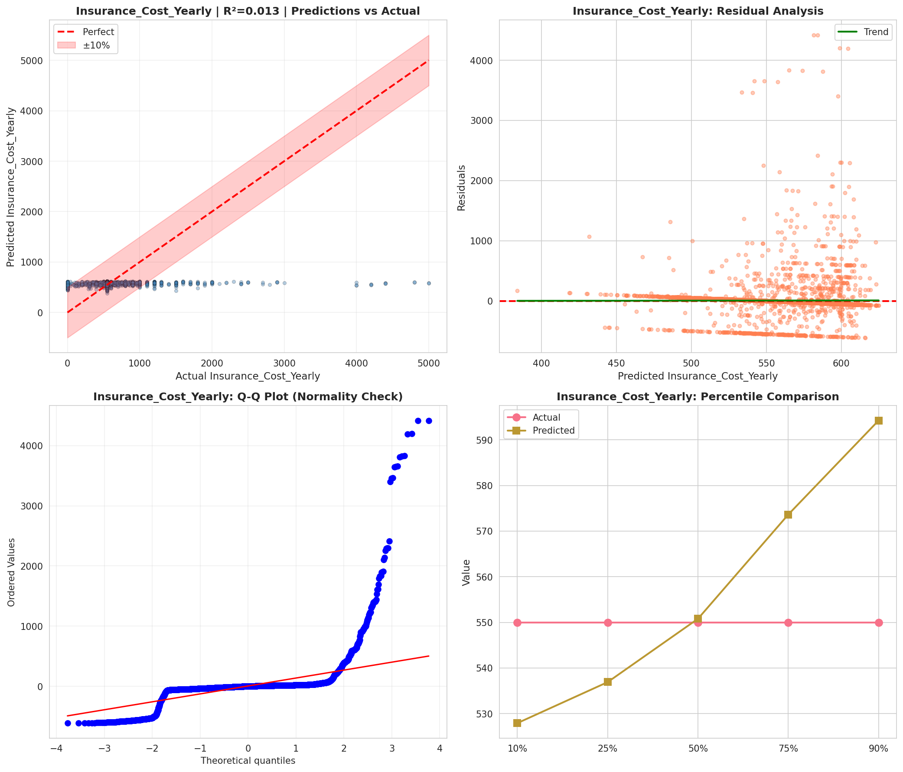
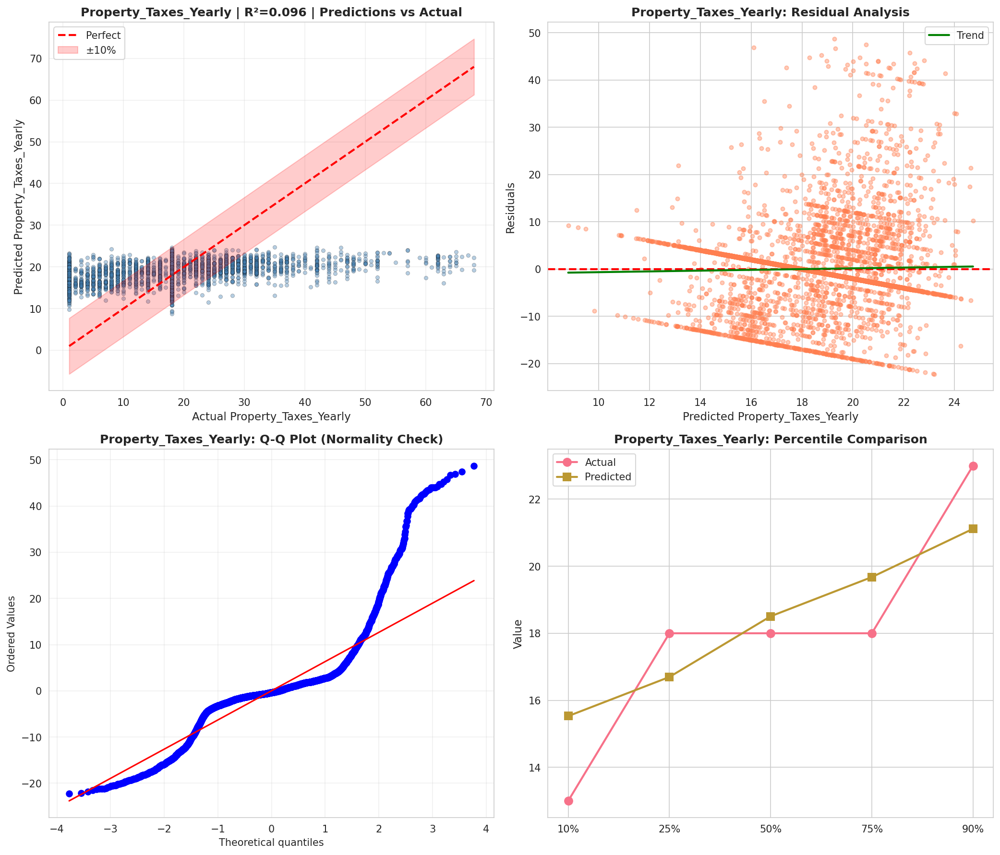
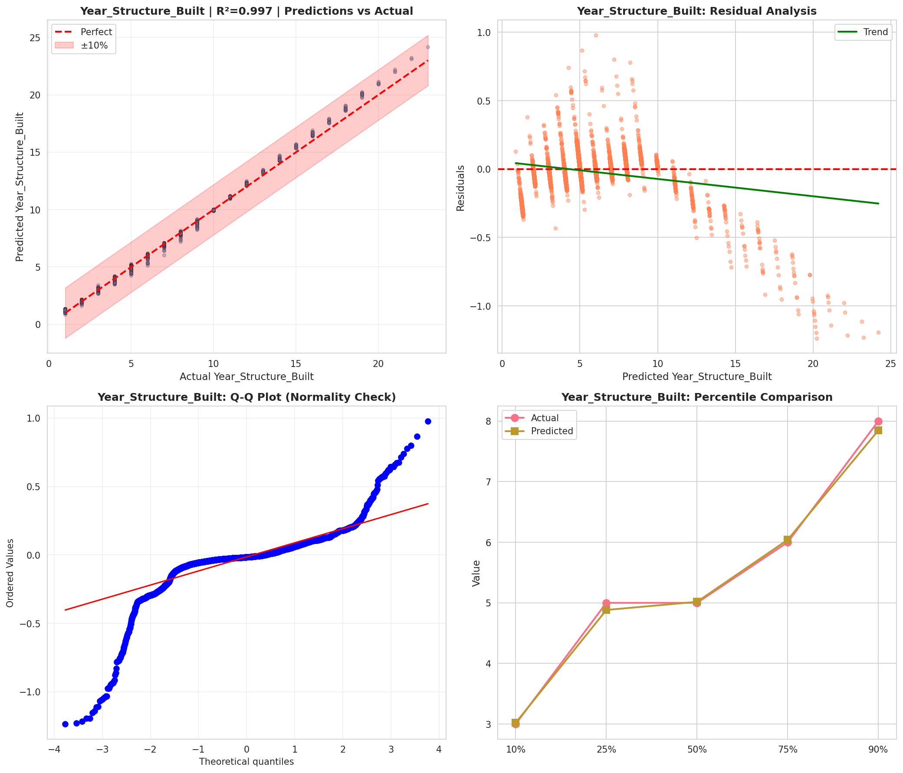
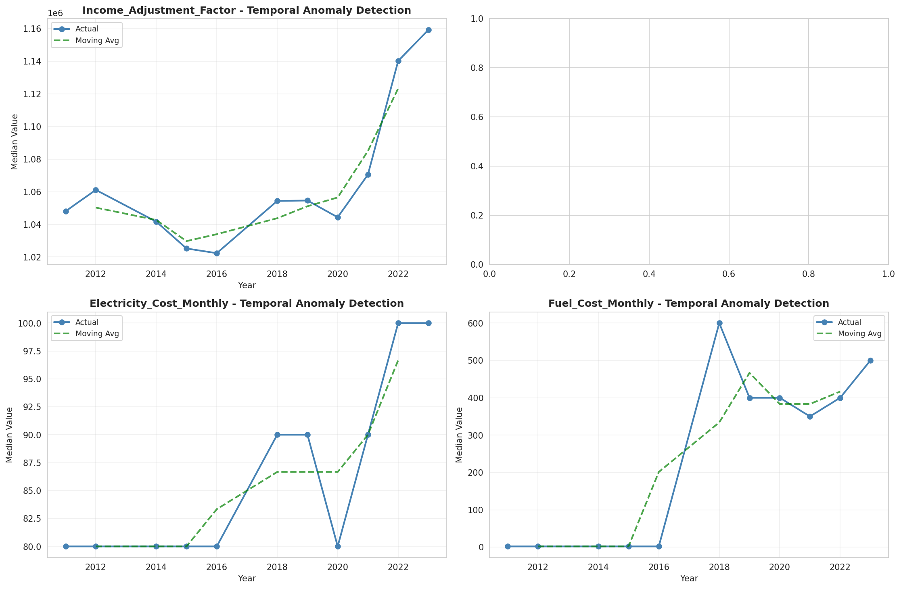
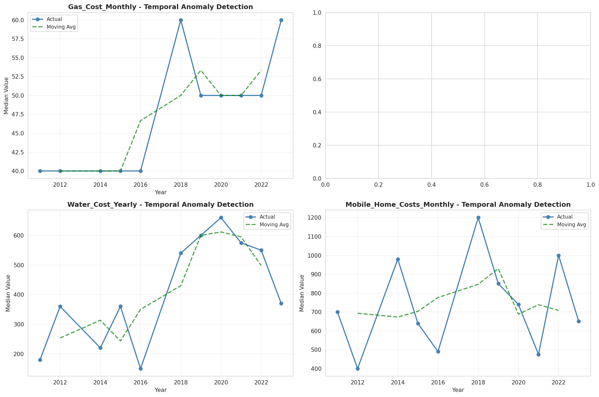
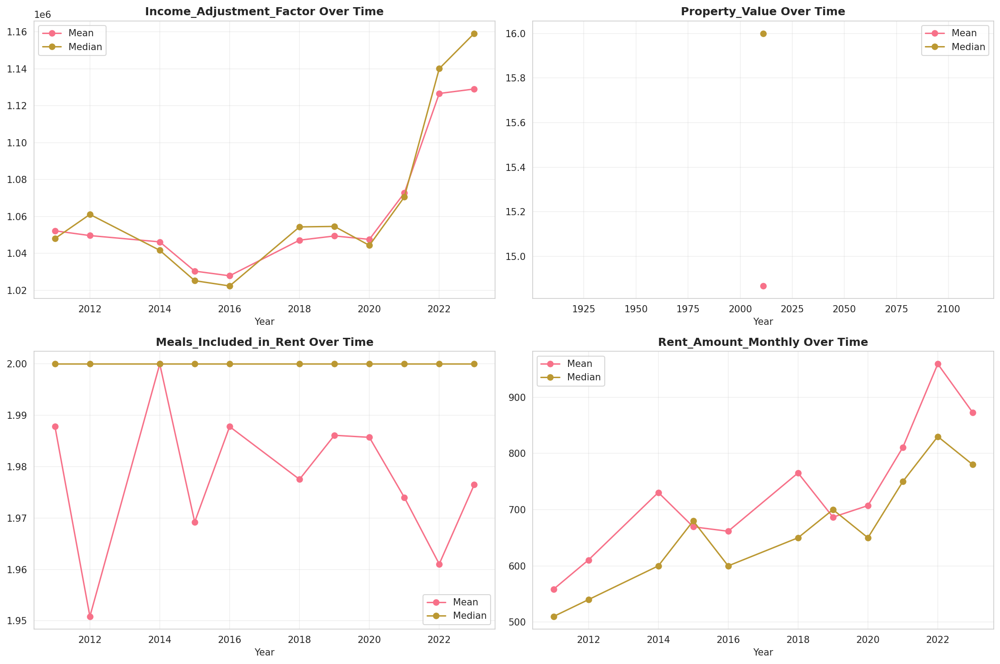
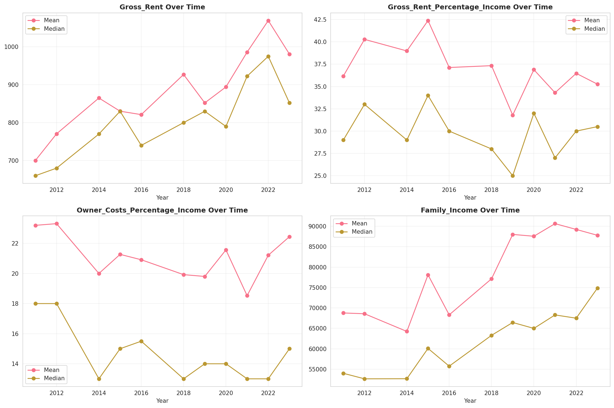
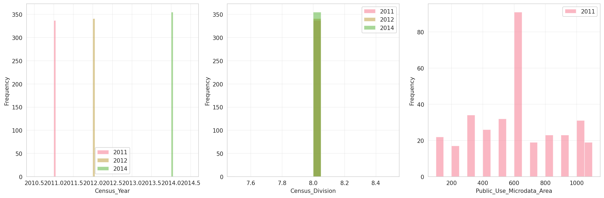
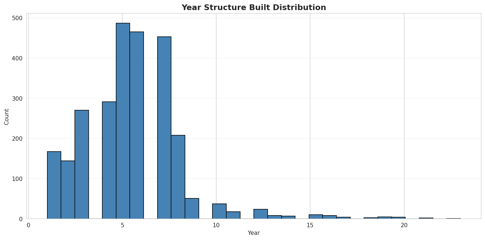
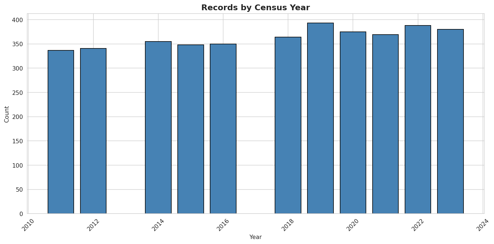
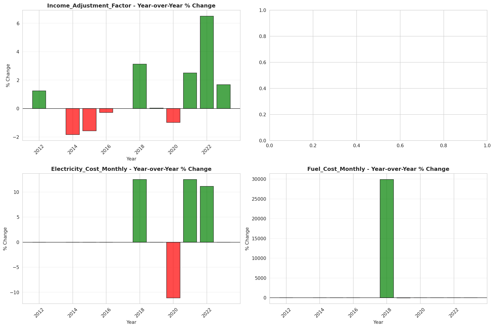
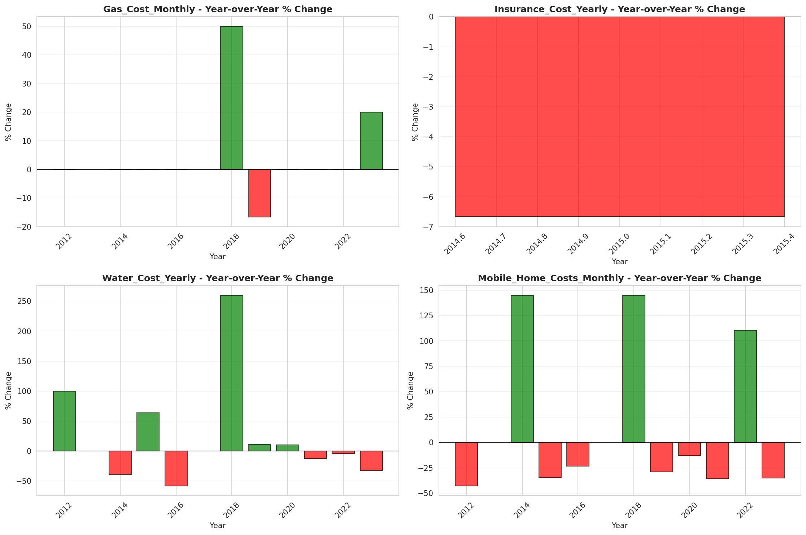
