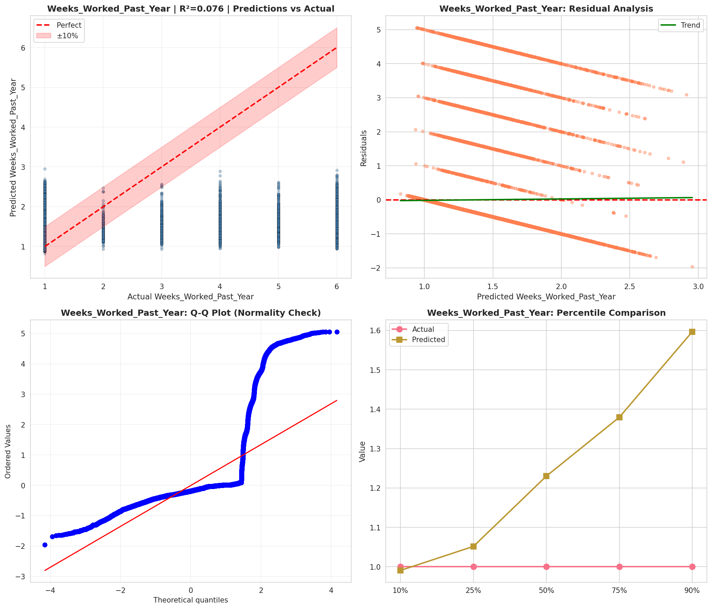
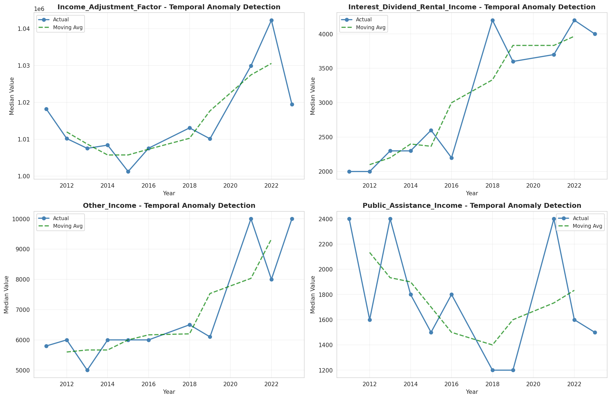
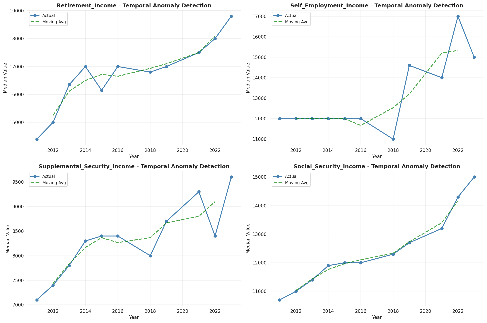
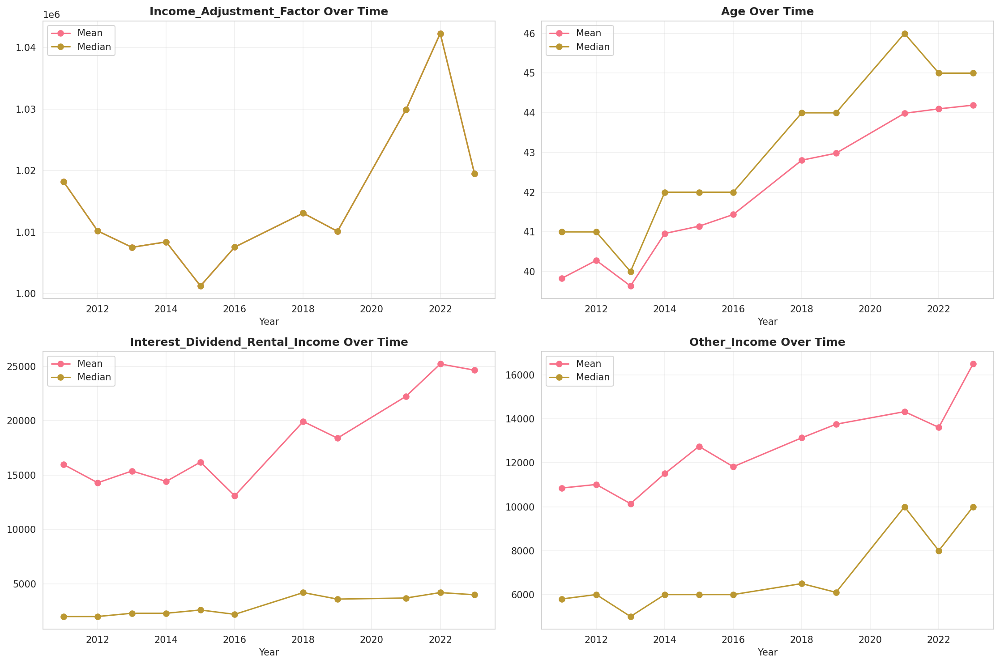
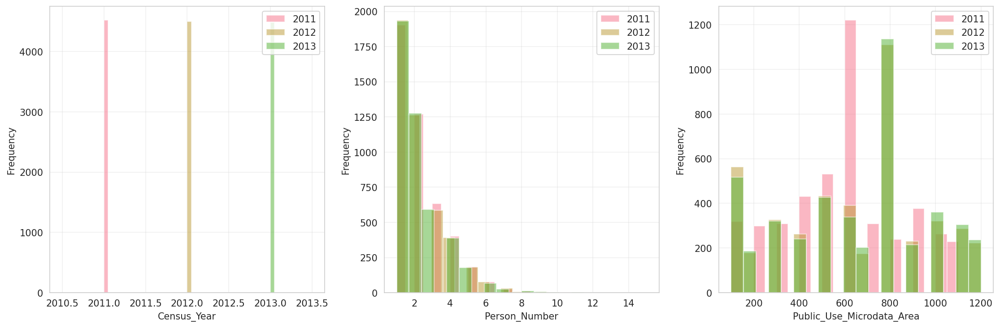
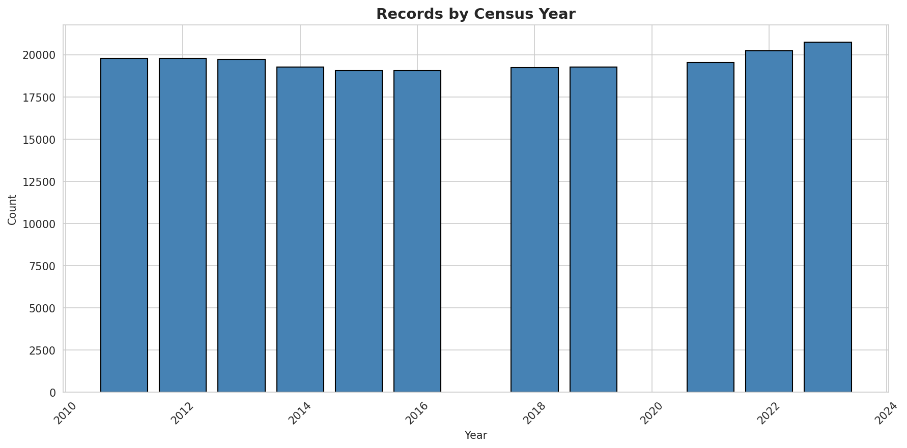
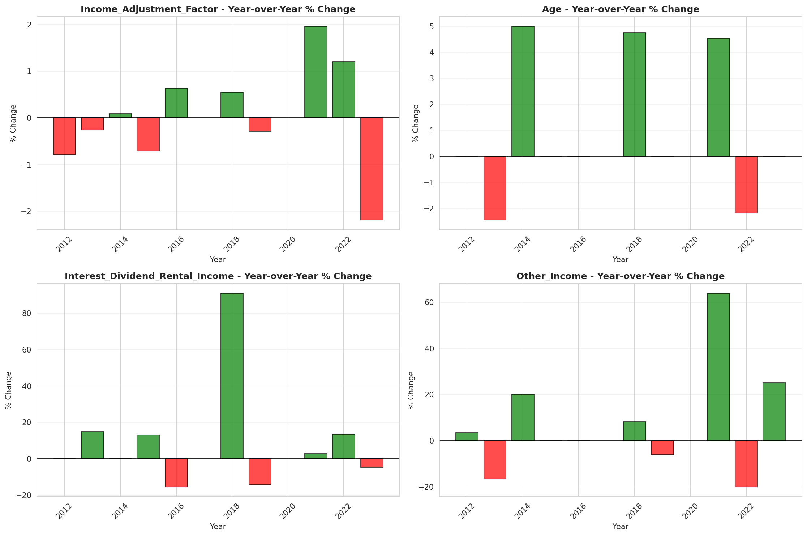

# Temporal Analysis

## Year Distribution

- 2011: 19,777 records

- 2012: 19,771 records

- 2013: 19,714 records

- 2014: 19,283 records

- 2015: 19,072 records

- 2016: 19,060 records

- 2018: 19,247 records

- 2019: 19,281 records

- 2021: 19,533 records

- 2022: 20,243 records

- 2023: 20,737 records

## Temporal Trends

- Census_Year: {np.int64(2011): {'mean': 2011.0, 'median': 2011.0, 'std': 0.0}, np.int64(2012): {'mean': 2012.0, 'median': 2012.0, 'std': 0.0}, np.int64(2013): {'mean': 2013.0, 'median': 2013.0, 'std': 0.0}, np.int64(2014): {'mean': 2014.0, 'median': 2014.0, 'std': 0.0}, np.int64(2015): {'mean': 2015.0, 'median': 2015.0, 'std': 0.0}, np.int64(2016): {'mean': 2016.0, 'median': 2016.0, 'std': 0.0}, np.int64(2018): {'mean': 2018.0, 'median': 2018.0, 'std': 0.0}, np.int64(2019): {'mean': 2019.0, 'median': 2019.0, 'std': 0.0}, np.int64(2021): {'mean': 2021.0, 'median': 2021.0, 'std': 0.0}, np.int64(2022): {'mean': 2022.0, 'median': 2022.0, 'std': 0.0}, np.int64(2023): {'mean': 2023.0, 'median': 2023.0, 'std': 0.0}}

- Person_Number: {np.int64(2011): {'mean': 2.140567325681347, 'median': 2.0, 'std': 1.418270012304314}, np.int64(2012): {'mean': 2.146679480046533, 'median': 2.0, 'std': 1.4495849005170502}, np.int64(2013): {'mean': 2.1464441513645127, 'median': 2.0, 'std': 1.424154374281152}, np.int64(2014): {'mean': 2.128092101851372, 'median': 2.0, 'std': 1.4220326197098603}, np.int64(2015): {'mean': 2.1010906040268456, 'median': 2.0, 'std': 1.4047474379583471}, np.int64(2016): {'mean': 2.122875131164743, 'median': 2.0, 'std': 1.4182929824773916}, np.int64(2018): {'mean': 2.0537226580765835, 'median': 2.0, 'std': 1.3561942132405915}, np.int64(2019): {'mean': 2.088117836211815, 'median': 2.0, 'std': 1.4248332470729865}, np.int64(2021): {'mean': 2.050785849587877, 'median': 2.0, 'std': 1.3661455626700503}, np.int64(2022): {'mean': 2.0250950946006028, 'median': 2.0, 'std': 1.3452014072258873}, np.int64(2023): {'mean': 2.032309398659401, 'median': 2.0, 'std': 1.3499462849199133}}

- Public_Use_Microdata_Area: {np.int64(2011): {'mean': 574.3869646559134, 'median': 602.0, 'std': 264.22205906918595}, np.int64(2012): {'mean': 643.2605836831723, 'median': 700.0, 'std': 327.34803765695466}, np.int64(2013): {'mean': 652.6028710561022, 'median': 801.0, 'std': 324.7778607730971}, np.int64(2014): {'mean': 641.9509412435824, 'median': 700.0, 'std': 328.0372863531886}, np.int64(2015): {'mean': 637.1440855704698, 'median': 700.0, 'std': 330.00805290724617}, np.int64(2016): {'mean': 636.5436516264429, 'median': 700.0, 'std': 327.56768108414917}, np.int64(2018): {'mean': 640.8154517587157, 'median': 700.0, 'std': 321.75798950109373}, np.int64(2019): {'mean': 654.4003941704268, 'median': 801.0, 'std': 315.17999804868487}, np.int64(2021): {'mean': 654.4389494701275, 'median': 801.0, 'std': 315.8431903187685}, np.int64(2022): {'mean': 589.3555797065652, 'median': 701.0, 'std': 290.0015284446123}, np.int64(2023): {'mean': 593.1525775184452, 'median': 701.0, 'std': 293.4306113724828}}

- State_Code: {np.int64(2011): {'mean': 35.0, 'median': 35.0, 'std': 0.0}, np.int64(2012): {'mean': 35.0, 'median': 35.0, 'std': 0.0}, np.int64(2013): {'mean': 35.0, 'median': 35.0, 'std': 0.0}, np.int64(2014): {'mean': 35.0, 'median': 35.0, 'std': 0.0}, np.int64(2015): {'mean': 35.0, 'median': 35.0, 'std': 0.0}, np.int64(2016): {'mean': 35.0, 'median': 35.0, 'std': 0.0}, np.int64(2018): {'mean': 35.0, 'median': 35.0, 'std': 0.0}, np.int64(2019): {'mean': 35.0, 'median': 35.0, 'std': 0.0}, np.int64(2021): {'mean': 35.0, 'median': 35.0, 'std': 0.0}, np.int64(2022): {'mean': 35.0, 'median': 35.0, 'std': 0.0}, np.int64(2023): {'mean': None, 'median': None, 'std': None}}

- Income_Adjustment_Factor: {np.int64(2011): {'mean': 1018237.0, 'median': 1018237.0, 'std': 0.0}, np.int64(2012): {'mean': 1010207.0, 'median': 1010207.0, 'std': 0.0}, np.int64(2013): {'mean': 1007549.0, 'median': 1007549.0, 'std': 0.0}, np.int64(2014): {'mean': 1008425.0, 'median': 1008425.0, 'std': 0.0}, np.int64(2015): {'mean': 1001264.0, 'median': 1001264.0, 'std': 0.0}, np.int64(2016): {'mean': 1007588.0, 'median': 1007588.0, 'std': 0.0}, np.int64(2018): {'mean': 1013097.0, 'median': 1013097.0, 'std': 0.0}, np.int64(2019): {'mean': 1010145.0, 'median': 1010145.0, 'std': 0.0}, np.int64(2021): {'mean': 1029928.0, 'median': 1029928.0, 'std': 0.0}, np.int64(2022): {'mean': 1042311.0, 'median': 1042311.0, 'std': 0.0}, np.int64(2023): {'mean': 1019518.0, 'median': 1019518.0, 'std': 0.0}}

- Person_Weight: {np.int64(2011): {'mean': 105.28512919047378, 'median': 76.0, 'std': 99.31122654903534}, np.int64(2012): {'mean': 105.48469981285722, 'median': 78.0, 'std': 97.27924859115107}, np.int64(2013): {'mean': 105.77696053565994, 'median': 78.0, 'std': 94.64456017668508}, np.int64(2014): {'mean': 108.15599232484571, 'median': 80.0, 'std': 100.05732533209724}, np.int64(2015): {'mean': 109.32828229865771, 'median': 80.0, 'std': 102.35183920808815}, np.int64(2016): {'mean': 109.18231899265477, 'median': 81.0, 'std': 100.0275038103093}, np.int64(2018): {'mean': 108.87036940821946, 'median': 81.0, 'std': 101.97531033688352}, np.int64(2019): {'mean': 108.75105025672943, 'median': 79.0, 'std': 102.49816794264756}, np.int64(2021): {'mean': 108.32319664158092, 'median': 75.0, 'std': 105.19931655746302}, np.int64(2022): {'mean': 104.39875512522848, 'median': 73.0, 'std': 105.34600568308036}, np.int64(2023): {'mean': 101.96127694459179, 'median': 72.0, 'std': 98.5353670137578}}

- Age: {np.int64(2011): {'mean': 39.83268443141022, 'median': 41.0, 'std': 23.75693919319703}, np.int64(2012): {'mean': 40.28182691821355, 'median': 41.0, 'std': 23.800436592922974}, np.int64(2013): {'mean': 39.63736430962768, 'median': 40.0, 'std': 23.747279176195764}, np.int64(2014): {'mean': 40.9594980034227, 'median': 42.0, 'std': 23.648663311496726}, np.int64(2015): {'mean': 41.14287961409396, 'median': 42.0, 'std': 23.83924415324655}, np.int64(2016): {'mean': 41.437670514165795, 'median': 42.0, 'std': 23.83929368994801}, np.int64(2018): {'mean': 42.80620356419182, 'median': 44.0, 'std': 23.93845934418881}, np.int64(2019): {'mean': 42.98195114361288, 'median': 44.0, 'std': 24.1948304282155}, np.int64(2021): {'mean': 43.988532227512415, 'median': 46.0, 'std': 24.230710917926224}, np.int64(2022): {'mean': 44.09949118213704, 'median': 45.0, 'std': 24.18660537355448}, np.int64(2023): {'mean': 44.192891932294934, 'median': 45.0, 'std': 24.05081028409859}}

- Citizenship_Status: {np.int64(2011): {'mean': 1.3325074581584668, 'median': 1.0, 'std': 1.0417903880041899}, np.int64(2012): {'mean': 1.2960396540387435, 'median': 1.0, 'std': 0.984767133785996}, np.int64(2013): {'mean': 1.327229380135944, 'median': 1.0, 'std': 1.0327671509425038}, np.int64(2014): {'mean': 1.3134367059067573, 'median': 1.0, 'std': 1.0067603803861065}, np.int64(2015): {'mean': 1.2933095637583893, 'median': 1.0, 'std': 0.9784856311528507}, np.int64(2016): {'mean': 1.2971668415529904, 'median': 1.0, 'std': 0.9787834555236168}, np.int64(2018): {'mean': 1.2796279939730868, 'median': 1.0, 'std': 0.947687125201135}, np.int64(2019): {'mean': 1.2890928893729579, 'median': 1.0, 'std': 0.9580570174495844}, np.int64(2021): {'mean': 1.2935033021041316, 'median': 1.0, 'std': 0.9619088121136422}, np.int64(2022): {'mean': 1.2908659783628909, 'median': 1.0, 'std': 0.9609863522766037}, np.int64(2023): {'mean': 1.320152384626513, 'median': 1.0, 'std': 1.0041750306644281}}

- Class_of_Worker: {np.int64(2011): {'mean': 2.4932530999270606, 'median': 1.0, 'std': 2.060485502056447}, np.int64(2012): {'mean': 2.539769053117783, 'median': 1.0, 'std': 2.0835985660276855}, np.int64(2013): {'mean': 2.531196662241608, 'median': 1.0, 'std': 2.077316271584086}, np.int64(2014): {'mean': 2.464496763905825, 'median': 1.0, 'std': 2.018158933479276}, np.int64(2015): {'mean': 2.5255728512037128, 'median': 1.0, 'std': 2.0814256690513324}, np.int64(2016): {'mean': 2.5097078046905037, 'median': 1.0, 'std': 2.032278681341613}, np.int64(2018): {'mean': 2.5241492335871976, 'median': 1.0, 'std': 2.067768195927415}, np.int64(2019): {'mean': 2.4589137141254556, 'median': 1.0, 'std': 1.981783923249856}, np.int64(2021): {'mean': 2.530602680663605, 'median': 1.0, 'std': 2.0140874832099054}, np.int64(2022): {'mean': 2.552127372492579, 'median': 1.0, 'std': 2.025144257777981}, np.int64(2023): {'mean': 2.5051029233696593, 'median': 1.0, 'std': 1.9922043148138102}}

- English_Speaking_Ability: {np.int64(2011): {'mean': 1.4293179317931792, 'median': 1.0, 'std': 0.7898118117439441}, np.int64(2012): {'mean': 1.3484682713347922, 'median': 1.0, 'std': 0.7331849905891713}, np.int64(2013): {'mean': 1.40638750887154, 'median': 1.0, 'std': 0.8034840871617108}, np.int64(2014): {'mean': 1.3539025077486615, 'median': 1.0, 'std': 0.7413962755796243}, np.int64(2015): {'mean': 1.3595725466586395, 'median': 1.0, 'std': 0.7585114591119715}, np.int64(2016): {'mean': 1.3577174078008802, 'median': 1.0, 'std': 0.7556566754844483}, np.int64(2018): {'mean': 1.4320111128260533, 'median': 1.0, 'std': 0.7808491288496747}, np.int64(2019): {'mean': 1.3727124183006536, 'median': 1.0, 'std': 0.7483536403886142}, np.int64(2021): {'mean': 1.401058901389808, 'median': 1.0, 'std': 0.7784361269526318}, np.int64(2022): {'mean': 1.420832636682829, 'median': 1.0, 'std': 0.7564399382494381}, np.int64(2023): {'mean': 1.4279158094635227, 'median': 1.0, 'std': 0.7610030338149562}}

- Fertility_Status: {np.int64(2011): {'mean': 1.9362745098039216, 'median': 2.0, 'std': 0.24429179815714822}, np.int64(2012): {'mean': 1.9430663831797779, 'median': 2.0, 'std': 0.23174310622778763}, np.int64(2013): {'mean': 1.9394009751567216, 'median': 2.0, 'std': 0.2386210455326351}, np.int64(2014): {'mean': 1.9394691143636815, 'median': 2.0, 'std': 0.2384973970782206}, np.int64(2015): {'mean': 1.9485854858548586, 'median': 2.0, 'std': 0.22086888108960898}, np.int64(2016): {'mean': 1.9446437724243977, 'median': 2.0, 'std': 0.22870356444660955}, np.int64(2018): {'mean': 1.9507516848107829, 'median': 2.0, 'std': 0.21641409003358159}, np.int64(2019): {'mean': 1.9487245555269261, 'median': 2.0, 'std': 0.22058742250286673}, np.int64(2021): {'mean': 1.9534445640473628, 'median': 2.0, 'std': 0.2107130173028869}, np.int64(2022): {'mean': 1.9523215177234148, 'median': 2.0, 'std': 0.21311166496490258}, np.int64(2023): {'mean': 1.9520496894409938, 'median': 2.0, 'std': 0.21368767624189727}}

- Marital_Status: {np.int64(2011): {'mean': 3.061131617535521, 'median': 3.0, 'std': 1.8383430175794582}, np.int64(2012): {'mean': 3.050427393657377, 'median': 3.0, 'std': 1.8387269337507879}, np.int64(2013): {'mean': 3.1078928680125797, 'median': 3.0, 'std': 1.8451645085464605}, np.int64(2014): {'mean': 3.058289685214956, 'median': 3.0, 'std': 1.844101297141737}, np.int64(2015): {'mean': 3.0362835570469797, 'median': 3.0, 'std': 1.8399161321135935}, np.int64(2016): {'mean': 3.0714585519412383, 'median': 3.0, 'std': 1.8340952599996945}, np.int64(2018): {'mean': 3.000883254533174, 'median': 3.0, 'std': 1.8292056179102556}, np.int64(2019): {'mean': 3.043618069602199, 'median': 3.0, 'std': 1.8277811924069667}, np.int64(2021): {'mean': 3.031894742231096, 'median': 3.0, 'std': 1.829222278945623}, np.int64(2022): {'mean': 3.070641703304846, 'median': 3.0, 'std': 1.8176557055233145}, np.int64(2023): {'mean': 3.061243188503641, 'median': 3.0, 'std': 1.8259824900433326}}

- Mobility_Status: {np.int64(2011): {'mean': 1.24017199017199, 'median': 1.0, 'std': 0.6464295440883996}, np.int64(2012): {'mean': 1.233127267153732, 'median': 1.0, 'std': 0.6394628580144177}, np.int64(2013): {'mean': 1.2422688342991948, 'median': 1.0, 'std': 0.6473757763250155}, np.int64(2014): {'mean': 1.2400146765908375, 'median': 1.0, 'std': 0.6461961551072773}, np.int64(2015): {'mean': 1.2458452418757278, 'median': 1.0, 'std': 0.6539275804300586}, np.int64(2016): {'mean': 1.2328839825920814, 'median': 1.0, 'std': 0.6383737949549082}, np.int64(2018): {'mean': 1.2476944036889541, 'median': 1.0, 'std': 0.6550425799296157}, np.int64(2019): {'mean': 1.218664992676292, 'median': 1.0, 'std': 0.6195853215947826}, np.int64(2021): {'mean': 1.223839760466677, 'median': 1.0, 'std': 0.6275153122800422}, np.int64(2022): {'mean': 1.2173047244486483, 'median': 1.0, 'std': 0.6178847652126013}, np.int64(2023): {'mean': 1.2072098333576253, 'median': 1.0, 'std': 0.6046675758686383}}

- Military_Service: {np.int64(2011): {'mean': 4.733444988405051, 'median': 5.0, 'std': 0.7134328042413159}, np.int64(2012): {'mean': 4.734727926078029, 'median': 5.0, 'std': 0.7130652999226897}, np.int64(2013): {'mean': 3.7686294945284002, 'median': 4.0, 'std': 0.6413422734420293}, np.int64(2014): {'mean': 3.7705131544673094, 'median': 4.0, 'std': 0.6414169614379086}, np.int64(2015): {'mean': 3.7815485996705105, 'median': 4.0, 'std': 0.6285481128683066}, np.int64(2016): {'mean': 3.78447992640778, 'median': 4.0, 'std': 0.6239773685905432}, np.int64(2018): {'mean': 3.762315506996358, 'median': 4.0, 'std': 0.6431657767321891}, np.int64(2019): {'mean': 3.780188920091907, 'median': 4.0, 'std': 0.6311508160299378}, np.int64(2021): {'mean': 3.7865420560747665, 'median': 4.0, 'std': 0.6293491255031523}, np.int64(2022): {'mean': 3.780515587529976, 'median': 4.0, 'std': 0.6379239086607685}, np.int64(2023): {'mean': 3.7937441752096923, 'median': 4.0, 'std': 0.6230765532741762}}

- Travel_Time_To_Work_Minutes: {np.int64(2011): {'mean': 22.067937372362152, 'median': 15.0, 'std': 19.90868006265194}, np.int64(2012): {'mean': 22.078582019140047, 'median': 15.0, 'std': 20.68011571839056}, np.int64(2013): {'mean': 22.468728331715436, 'median': 15.0, 'std': 20.31677599222574}, np.int64(2014): {'mean': 22.73251651982379, 'median': 15.0, 'std': 21.246743413664174}, np.int64(2015): {'mean': 22.82135438304944, 'median': 15.0, 'std': 21.46625757525692}, np.int64(2016): {'mean': 23.333057737357034, 'median': 20.0, 'std': 21.307198133882814}, np.int64(2018): {'mean': 23.440143270422922, 'median': 20.0, 'std': 22.159243375963346}, np.int64(2019): {'mean': 23.77214521452145, 'median': 20.0, 'std': 22.720191888279157}, np.int64(2021): {'mean': 23.8971932638332, 'median': 20.0, 'std': 23.0420835958735}, np.int64(2022): {'mean': 24.157931712800337, 'median': 20.0, 'std': 23.39054402644625}, np.int64(2023): {'mean': 23.887556621369573, 'median': 20.0, 'std': 23.160590185628386}}

- Vehicle_Occupancy: {np.int64(2011): {'mean': 1.1759475218658892, 'median': 1.0, 'std': 0.6126707183416418}, np.int64(2012): {'mean': 1.2319048301562276, 'median': 1.0, 'std': 0.7831710770294895}, np.int64(2013): {'mean': 1.1820065108020124, 'median': 1.0, 'std': 0.6077945671533352}, np.int64(2014): {'mean': 1.1618741789519778, 'median': 1.0, 'std': 0.57584993173116}, np.int64(2015): {'mean': 1.1519191327278056, 'median': 1.0, 'std': 0.5591018254204356}, np.int64(2016): {'mean': 1.1701751803326954, 'median': 1.0, 'std': 0.6214744487979746}, np.int64(2018): {'mean': 1.1953522149600582, 'median': 1.0, 'std': 0.6457129971413985}, np.int64(2019): {'mean': 1.1706976093946595, 'median': 1.0, 'std': 0.5938934942499882}, np.int64(2021): {'mean': 1.1577966101694914, 'median': 1.0, 'std': 0.5496367762900496}, np.int64(2022): {'mean': 1.1703503232596602, 'median': 1.0, 'std': 0.5409533611220977}, np.int64(2023): {'mean': 1.1767869780608635, 'median': 1.0, 'std': 0.584117974953628}}

- Transportation_To_Work: {np.int64(2011): {'mean': 2.0588838999358563, 'median': 1.0, 'std': 2.992076875685861}, np.int64(2012): {'mean': 1.9517179716438882, 'median': 1.0, 'std': 2.857717531204842}, np.int64(2013): {'mean': 1.9830730875213227, 'median': 1.0, 'std': 2.8977957146273523}, np.int64(2014): {'mean': 1.918700247944669, 'median': 1.0, 'std': 2.801870162969189}, np.int64(2015): {'mean': 1.973001173862006, 'median': 1.0, 'std': 2.892260768158564}, np.int64(2016): {'mean': 2.0194275352933557, 'median': 1.0, 'std': 2.9477550487925743}, np.int64(2018): {'mean': 1.9185561636695334, 'median': 1.0, 'std': 2.8228023137803824}, np.int64(2019): {'mean': None, 'median': None, 'std': None}, np.int64(2021): {'mean': None, 'median': None, 'std': None}, np.int64(2022): {'mean': None, 'median': None, 'std': None}, np.int64(2023): {'mean': None, 'median': None, 'std': None}}

- Language_Other_Than_English: {np.int64(2011): {'mean': 1.6075341356792057, 'median': 2.0, 'std': 0.4883126853164184}, np.int64(2012): {'mean': 1.60675486716145, 'median': 2.0, 'std': 0.4884836039281661}, np.int64(2013): {'mean': 1.6205633651101417, 'median': 2.0, 'std': 0.4852598866142517}, np.int64(2014): {'mean': 1.6111750205423172, 'median': 2.0, 'std': 0.48749680340510215}, np.int64(2015): {'mean': 1.6324408054879398, 'median': 2.0, 'std': 0.4821538072730285}, np.int64(2016): {'mean': 1.6344521497919555, 'median': 2.0, 'std': 0.4815968094264234}, np.int64(2018): {'mean': 1.6472093656411653, 'median': 2.0, 'std': 0.47785126995820765}, np.int64(2019): {'mean': 1.6674997283494513, 'median': 2.0, 'std': 0.4711219586171507}, np.int64(2021): {'mean': 1.676462716128687, 'median': 2.0, 'std': 0.4678382478370935}, np.int64(2022): {'mean': 1.6921770458054555, 'median': 2.0, 'std': 0.46160475469605194}, np.int64(2023): {'mean': 1.682781124497992, 'median': 2.0, 'std': 0.4654051290202107}}

- Grandparents_Living_With_Grandchildren: {np.int64(2011): {'mean': 1.951203590371277, 'median': 2.0, 'std': 0.2154509405989291}, np.int64(2012): {'mean': 1.9456900040469445, 'median': 2.0, 'std': 0.22663754694356394}, np.int64(2013): {'mean': 1.9472947377089682, 'median': 2.0, 'std': 0.22345364077993365}, np.int64(2014): {'mean': 1.9493300852618758, 'median': 2.0, 'std': 0.21933166849001948}, np.int64(2015): {'mean': 1.9533953640222004, 'median': 2.0, 'std': 0.21079912414834406}, np.int64(2016): {'mean': 1.951467360377205, 'median': 2.0, 'std': 0.2148975959841609}, np.int64(2018): {'mean': 1.9585117147972289, 'median': 2.0, 'std': 0.19942442946160027}, np.int64(2019): {'mean': 1.9586557248925363, 'median': 2.0, 'std': 0.19909300327749518}, np.int64(2021): {'mean': 1.9570912375790424, 'median': 2.0, 'std': 0.20265905425078512}, np.int64(2022): {'mean': 1.9624245948106693, 'median': 2.0, 'std': 0.19017392738531053}, np.int64(2023): {'mean': 1.960019743336624, 'median': 2.0, 'std': 0.1959197343509567}}

- Months_Responsible_For_Grandchildren: {np.int64(2011): {'mean': 3.5625, 'median': 4.0, 'std': 1.417750831988043}, np.int64(2012): {'mean': 3.7576601671309193, 'median': 4.0, 'std': 1.3369652479160288}, np.int64(2013): {'mean': 3.9473684210526314, 'median': 5.0, 'std': 1.3070583148347112}, np.int64(2014): {'mean': 3.824675324675325, 'median': 4.0, 'std': 1.3269107267080886}, np.int64(2015): {'mean': 3.821818181818182, 'median': 4.0, 'std': 1.264722194632174}, np.int64(2016): {'mean': 4.007352941176471, 'median': 5.0, 'std': 1.2683855184100574}, np.int64(2018): {'mean': 4.162962962962963, 'median': 5.0, 'std': 1.1772781121170977}, np.int64(2019): {'mean': 3.9100529100529102, 'median': 4.0, 'std': 1.3117125793414715}, np.int64(2021): {'mean': 4.103174603174603, 'median': 5.0, 'std': 1.0956586920169402}, np.int64(2022): {'mean': 4.095454545454546, 'median': 5.0, 'std': 1.199306219813503}, np.int64(2023): {'mean': 4.046808510638298, 'median': 5.0, 'std': 1.3688929746315581}}

- Grandparents_Responsible_For_Grandchildren: {np.int64(2011): {'mean': 1.5183946488294315, 'median': 2.0, 'std': 0.5000798242191766}, np.int64(2012): {'mean': 1.464977645305514, 'median': 1.0, 'std': 0.49914400557904354}, np.int64(2013): {'mean': 1.4953125, 'median': 1.0, 'std': 0.5003690930348076}, np.int64(2014): {'mean': 1.5064102564102564, 'median': 2.0, 'std': 0.500359997166661}, np.int64(2015): {'mean': 1.5183887915936953, 'median': 2.0, 'std': 0.5000998456243007}, np.int64(2016): {'mean': 1.5443886097152428, 'median': 2.0, 'std': 0.4984433854116713}, np.int64(2018): {'mean': 1.4934333958724202, 'median': 1.0, 'std': 0.5004265415314073}, np.int64(2019): {'mean': 1.6427221172022684, 'median': 2.0, 'std': 0.4796512309133805}, np.int64(2021): {'mean': 1.5578947368421052, 'median': 2.0, 'std': 0.49707310938197885}, np.int64(2022): {'mean': 1.574468085106383, 'median': 2.0, 'std': 0.4949022664526104}, np.int64(2023): {'mean': 1.5855379188712522, 'median': 2.0, 'std': 0.4930639243076009}}

- Interest_Dividend_Rental_Income: {np.int64(2011): {'mean': 15983.034017278618, 'median': 2000.0, 'std': 45842.36286246685}, np.int64(2012): {'mean': 14296.806949806949, 'median': 2000.0, 'std': 39704.26867817175}, np.int64(2013): {'mean': 15380.16631467793, 'median': 2300.0, 'std': 42213.74954870396}, np.int64(2014): {'mean': 14418.428249859313, 'median': 2300.0, 'std': 39818.65631038242}, np.int64(2015): {'mean': 16197.253714285715, 'median': 2600.0, 'std': 42213.653345104176}, np.int64(2016): {'mean': 13097.907175398634, 'median': 2200.0, 'std': 29986.422509370248}, np.int64(2018): {'mean': 19929.88047808765, 'median': 4200.0, 'std': 49750.36060282373}, np.int64(2019): {'mean': 18400.260651629073, 'median': 3600.0, 'std': 46038.16202696078}, np.int64(2021): {'mean': 22243.37984496124, 'median': 3700.0, 'std': 63269.87533878688}, np.int64(2022): {'mean': 25218.340292275574, 'median': 4200.0, 'std': 63363.03267049454}, np.int64(2023): {'mean': 24649.724680432646, 'median': 4000.0, 'std': 61369.69029808397}}

- Military_Service_Period_1: {np.int64(2011): {'mean': 0.1454352441613588, 'median': 0.0, 'std': 0.3526327225532089}, np.int64(2012): {'mean': 0.14932614555256066, 'median': 0.0, 'std': 0.35650576905113723}, np.int64(2013): {'mean': 0.18238213399503722, 'median': 0.0, 'std': 0.38627898484289785}, np.int64(2014): {'mean': 0.18204334365325078, 'median': 0.0, 'std': 0.38599976963699956}, np.int64(2015): {'mean': 0.18511198945981555, 'median': 0.0, 'std': 0.3885163800435662}, np.int64(2016): {'mean': 0.1901595744680851, 'median': 0.0, 'std': 0.392557475695771}, np.int64(2018): {'mean': 0.22905027932960895, 'median': 0.0, 'std': 0.42035214971325596}, np.int64(2019): {'mean': 0.23502897617514487, 'median': 0.0, 'std': 0.4241535109310045}, np.int64(2021): {'mean': 0.24111182934712347, 'median': 0.0, 'std': 0.42789633107921116}, np.int64(2022): {'mean': 0.26763110307414106, 'median': 0.0, 'std': 0.4428576670784393}, np.int64(2023): {'mean': 0.3117536140791955, 'median': 0.0, 'std': 0.463355418289582}}

- Military_Service_Period_2: {np.int64(2011): {'mean': 0.15180467091295116, 'median': 0.0, 'std': 0.3589267237933831}, np.int64(2012): {'mean': 0.1471698113207547, 'median': 0.0, 'std': 0.35437064676826285}, np.int64(2013): {'mean': 0.18300248138957817, 'median': 0.0, 'std': 0.38678854753319597}, np.int64(2014): {'mean': 0.1721362229102167, 'median': 0.0, 'std': 0.37761572656084125}, np.int64(2015): {'mean': 0.2015810276679842, 'median': 0.0, 'std': 0.40131310962089267}, np.int64(2016): {'mean': 0.18683510638297873, 'median': 0.0, 'std': 0.38990874881965665}, np.int64(2018): {'mean': 0.18373680943513346, 'median': 0.0, 'std': 0.3873896592308659}, np.int64(2019): {'mean': 0.1983258209916291, 'median': 0.0, 'std': 0.3988673131042469}, np.int64(2021): {'mean': 0.21137685843568196, 'median': 0.0, 'std': 0.4084170743943954}, np.int64(2022): {'mean': 0.2103676913803496, 'median': 0.0, 'std': 0.4076926718266992}, np.int64(2023): {'mean': 0.21244500314267756, 'median': 0.0, 'std': 0.4091666549624879}}

- Military_Service_Period_3: {np.int64(2011): {'mean': 0.18205944798301485, 'median': 0.0, 'std': 0.3859959697423909}, np.int64(2012): {'mean': 0.1881401617250674, 'median': 0.0, 'std': 0.3909294401318296}, np.int64(2013): {'mean': None, 'median': None, 'std': None}, np.int64(2014): {'mean': None, 'median': None, 'std': None}, np.int64(2015): {'mean': None, 'median': None, 'std': None}, np.int64(2016): {'mean': None, 'median': None, 'std': None}, np.int64(2018): {'mean': None, 'median': None, 'std': None}, np.int64(2019): {'mean': None, 'median': None, 'std': None}, np.int64(2021): {'mean': None, 'median': None, 'std': None}, np.int64(2022): {'mean': None, 'median': None, 'std': None}, np.int64(2023): {'mean': None, 'median': None, 'std': None}}

- Military_Service_Period_4: {np.int64(2011): {'mean': 0.14012738853503184, 'median': 0.0, 'std': 0.3472113084831524}, np.int64(2012): {'mean': 0.15525606469002695, 'median': 0.0, 'std': 0.36224626828043754}, np.int64(2013): {'mean': None, 'median': None, 'std': None}, np.int64(2014): {'mean': None, 'median': None, 'std': None}, np.int64(2015): {'mean': None, 'median': None, 'std': None}, np.int64(2016): {'mean': None, 'median': None, 'std': None}, np.int64(2018): {'mean': None, 'median': None, 'std': None}, np.int64(2019): {'mean': None, 'median': None, 'std': None}, np.int64(2021): {'mean': None, 'median': None, 'std': None}, np.int64(2022): {'mean': None, 'median': None, 'std': None}, np.int64(2023): {'mean': None, 'median': None, 'std': None}}

- Military_Service_Period_5: {np.int64(2011): {'mean': 0.37101910828025475, 'median': 0.0, 'std': 0.4832058169736199}, np.int64(2012): {'mean': 0.36981132075471695, 'median': 0.0, 'std': 0.4828836396821027}, np.int64(2013): {'mean': 0.3728287841191067, 'median': 0.0, 'std': 0.4837071698459805}, np.int64(2014): {'mean': 0.41238390092879257, 'median': 0.0, 'std': 0.4924160411778933}, np.int64(2015): {'mean': 0.38735177865612647, 'median': 0.0, 'std': 0.4873056661154391}, np.int64(2016): {'mean': 0.40492021276595747, 'median': 0.0, 'std': 0.4910398693694843}, np.int64(2018): {'mean': 0.40099317194289263, 'median': 0.0, 'std': 0.4902518119127993}, np.int64(2019): {'mean': 0.39085640695428203, 'median': 0.0, 'std': 0.4880994602587315}, np.int64(2021): {'mean': 0.3865546218487395, 'median': 0.0, 'std': 0.4871175722495984}, np.int64(2022): {'mean': 0.37010247136829416, 'median': 0.0, 'std': 0.48297747275801295}, np.int64(2023): {'mean': 0.360779384035198, 'median': 0.0, 'std': 0.4803776250188387}}

- Military_Service_Period_6: {np.int64(2011): {'mean': 0.11040339702760085, 'median': 0.0, 'std': 0.3134751114029152}, np.int64(2012): {'mean': 0.11805929919137466, 'median': 0.0, 'std': 0.3227653349143585}, np.int64(2013): {'mean': None, 'median': None, 'std': None}, np.int64(2014): {'mean': None, 'median': None, 'std': None}, np.int64(2015): {'mean': None, 'median': None, 'std': None}, np.int64(2016): {'mean': None, 'median': None, 'std': None}, np.int64(2018): {'mean': None, 'median': None, 'std': None}, np.int64(2019): {'mean': None, 'median': None, 'std': None}, np.int64(2021): {'mean': None, 'median': None, 'std': None}, np.int64(2022): {'mean': None, 'median': None, 'std': None}, np.int64(2023): {'mean': None, 'median': None, 'std': None}}

- Military_Service_Period_7: {np.int64(2011): {'mean': 0.1173036093418259, 'median': 0.0, 'std': 0.3218671482843395}, np.int64(2012): {'mean': 0.12129380053908356, 'median': 0.0, 'std': 0.3265564298499187}, np.int64(2013): {'mean': None, 'median': None, 'std': None}, np.int64(2014): {'mean': None, 'median': None, 'std': None}, np.int64(2015): {'mean': None, 'median': None, 'std': None}, np.int64(2016): {'mean': None, 'median': None, 'std': None}, np.int64(2018): {'mean': None, 'median': None, 'std': None}, np.int64(2019): {'mean': None, 'median': None, 'std': None}, np.int64(2021): {'mean': None, 'median': None, 'std': None}, np.int64(2022): {'mean': None, 'median': None, 'std': None}, np.int64(2023): {'mean': None, 'median': None, 'std': None}}

- Military_Service_Period_8: {np.int64(2011): {'mean': 0.12420382165605096, 'median': 0.0, 'std': 0.3299015010408384}, np.int64(2012): {'mean': 0.11644204851752021, 'median': 0.0, 'std': 0.32084075561558295}, np.int64(2013): {'mean': 0.10794044665012408, 'median': 0.0, 'std': 0.3104014763587394}, np.int64(2014): {'mean': 0.09907120743034056, 'median': 0.0, 'std': 0.29885013713878733}, np.int64(2015): {'mean': 0.07839262187088274, 'median': 0.0, 'std': 0.2688770049090527}, np.int64(2016): {'mean': 0.08377659574468085, 'median': 0.0, 'std': 0.2771446331108047}, np.int64(2018): {'mean': 0.06641837368094351, 'median': 0.0, 'std': 0.2490893152396268}, np.int64(2019): {'mean': 0.05988409529942048, 'median': 0.0, 'std': 0.23734840405606267}, np.int64(2021): {'mean': 0.04589528118939883, 'median': 0.0, 'std': 0.20932565144810564}, np.int64(2022): {'mean': 0.04159132007233273, 'median': 0.0, 'std': 0.19971360513042485}, np.int64(2023): {'mean': 0.03519798868636078, 'median': 0.0, 'std': 0.18433786425259976}}

- Military_Service_Period_9: {np.int64(2011): {'mean': 0.03927813163481953, 'median': 0.0, 'std': 0.19430748835633013}, np.int64(2012): {'mean': 0.01940700808625337, 'median': 0.0, 'std': 0.1379878277953689}, np.int64(2013): {'mean': 0.016129032258064516, 'median': 0.0, 'std': 0.1260108602841569}, np.int64(2014): {'mean': 0.019195046439628483, 'median': 0.0, 'std': 0.13725254529450903}, np.int64(2015): {'mean': 0.017127799736495388, 'median': 0.0, 'std': 0.12979035173436312}, np.int64(2016): {'mean': 0.016622340425531915, 'median': 0.0, 'std': 0.12789415089014305}, np.int64(2018): {'mean': 0.012414649286157667, 'median': 0.0, 'std': 0.11076164048377238}, np.int64(2019): {'mean': 0.00901481004507405, 'median': 0.0, 'std': 0.09454786826747232}, np.int64(2021): {'mean': None, 'median': None, 'std': None}, np.int64(2022): {'mean': None, 'median': None, 'std': None}, np.int64(2023): {'mean': None, 'median': None, 'std': None}}

- Military_Service_Period_10: {np.int64(2011): {'mean': 0.08545647558386411, 'median': 0.0, 'std': 0.2796339951304319}, np.int64(2012): {'mean': 0.07008086253369272, 'median': 0.0, 'std': 0.2553520824554956}, np.int64(2013): {'mean': 0.05272952853598015, 'median': 0.0, 'std': 0.22356236355886439}, np.int64(2014): {'mean': 0.04396284829721362, 'median': 0.0, 'std': 0.20507597916635562}, np.int64(2015): {'mean': 0.04084321475625823, 'median': 0.0, 'std': 0.1979920972919222}, np.int64(2016): {'mean': 0.04321808510638298, 'median': 0.0, 'std': 0.2034153240473182}, np.int64(2018): {'mean': 0.032898820608317815, 'median': 0.0, 'std': 0.17842715601841386}, np.int64(2019): {'mean': 0.021249195106245976, 'median': 0.0, 'std': 0.14426041512520543}, np.int64(2021): {'mean': 0.011635423400129283, 'median': 0.0, 'std': 0.10727291782929371}, np.int64(2022): {'mean': 0.0018083182640144665, 'median': 0.0, 'std': 0.04249866985222787}, np.int64(2023): {'mean': 0.0056568196103079825, 'median': 0.0, 'std': 0.07502238082630612}}

- Military_Service_Period_11: {np.int64(2011): {'mean': 0.005307855626326964, 'median': 0.0, 'std': 0.07268071382675617}, np.int64(2012): {'mean': 0.003234501347708895, 'median': 0.0, 'std': 0.056795935706620684}, np.int64(2013): {'mean': 0.0006203473945409429, 'median': 0.0, 'std': 0.02490677406933591}, np.int64(2014): {'mean': 0.0018575851393188853, 'median': 0.0, 'std': 0.04307299965172556}, np.int64(2015): {'mean': 0.0013175230566534915, 'median': 0.0, 'std': 0.036285734814290066}, np.int64(2016): {'mean': 0.0026595744680851063, 'median': 0.0, 'std': 0.05151956847851775}, np.int64(2018): {'mean': 0.0, 'median': 0.0, 'std': 0.0}, np.int64(2019): {'mean': 0.0019317450096587251, 'median': 0.0, 'std': 0.04392329276742441}, np.int64(2021): {'mean': None, 'median': None, 'std': None}, np.int64(2022): {'mean': None, 'median': None, 'std': None}, np.int64(2023): {'mean': None, 'median': None, 'std': None}}

- Temporary_Absence_From_Work: {np.int64(2011): {'mean': 2.4887946315522917, 'median': 3.0, 'std': 0.524729789205787}, np.int64(2012): {'mean': 2.488989841630387, 'median': 3.0, 'std': 0.5238102024378402}, np.int64(2013): {'mean': 2.5259586454132257, 'median': 3.0, 'std': 0.5188337513519435}, np.int64(2014): {'mean': 2.5297813682118355, 'median': 3.0, 'std': 0.5184105115453762}, np.int64(2015): {'mean': 2.5379587081742283, 'median': 3.0, 'std': 0.5146706753404472}, np.int64(2016): {'mean': 2.5397378784944156, 'median': 3.0, 'std': 0.5116029323802882}, np.int64(2018): {'mean': 2.5232968140032743, 'median': 3.0, 'std': 0.5159675777869147}, np.int64(2019): {'mean': 2.5618521078092606, 'median': 3.0, 'std': 0.5126176606770997}, np.int64(2021): {'mean': 2.516063640272744, 'median': 3.0, 'std': 0.518105022870336}, np.int64(2022): {'mean': 2.528294093349855, 'median': 3.0, 'std': 0.5172113227268184}, np.int64(2023): {'mean': 2.532668500687758, 'median': 3.0, 'std': 0.5156672419826018}}

- Available_For_Work: {np.int64(2011): {'mean': 4.5093061534565715, 'median': 5.0, 'std': 1.2394188304933778}, np.int64(2012): {'mean': 4.501608934317622, 'median': 5.0, 'std': 1.229737564809996}, np.int64(2013): {'mean': 4.665770437231932, 'median': 5.0, 'std': 1.0472813243792656}, np.int64(2014): {'mean': 4.683015964608579, 'median': 5.0, 'std': 1.0233498257823428}, np.int64(2015): {'mean': 4.699760533298815, 'median': 5.0, 'std': 0.9911644981500746}, np.int64(2016): {'mean': 4.708954742075021, 'median': 5.0, 'std': 0.9762140135162845}, np.int64(2018): {'mean': 4.723082735171893, 'median': 5.0, 'std': 0.948524579138448}, np.int64(2019): {'mean': 4.750769617390212, 'median': 5.0, 'std': 0.895532988511658}, np.int64(2021): {'mean': 4.743473186313656, 'median': 5.0, 'std': 0.9171591912337212}, np.int64(2022): {'mean': 4.781613264884641, 'median': 5.0, 'std': 0.8417422868677535}, np.int64(2023): {'mean': 4.759628610729023, 'median': 5.0, 'std': 0.8842534644849479}}

- On_Layoff_From_Work: {np.int64(2011): {'mean': 2.454672068878197, 'median': 2.0, 'std': 0.5329619552970329}, np.int64(2012): {'mean': 2.462237365133447, 'median': 2.0, 'std': 0.5228046008026497}, np.int64(2013): {'mean': 2.505985532296268, 'median': 3.0, 'std': 0.5206793032131307}, np.int64(2014): {'mean': 2.514650253253831, 'median': 3.0, 'std': 0.5163337731987865}, np.int64(2015): {'mean': 2.5241084719435634, 'median': 3.0, 'std': 0.5119775476848547}, np.int64(2016): {'mean': 2.524630382852347, 'median': 3.0, 'std': 0.5130561327578065}, np.int64(2018): {'mean': 2.5134743735045966, 'median': 3.0, 'std': 0.5088237523800215}, np.int64(2019): {'mean': 2.55286800276434, 'median': 3.0, 'std': 0.5064773686311415}, np.int64(2021): {'mean': 2.4952392653111373, 'median': 3.0, 'std': 0.5229339810957898}, np.int64(2022): {'mean': 2.5212722015695994, 'median': 3.0, 'std': 0.509040271098731}, np.int64(2023): {'mean': 2.522237505731316, 'median': 3.0, 'std': 0.5101914205423452}}

- Looking_For_Work: {np.int64(2011): {'mean': 2.4206761205368448, 'median': 2.0, 'std': 0.6223446755285712}, np.int64(2012): {'mean': 2.4342860748312196, 'median': 2.0, 'std': 0.6107633435884331}, np.int64(2013): {'mean': 2.473017092375648, 'median': 3.0, 'std': 0.6021662082926087}, np.int64(2014): {'mean': 2.48502917227672, 'median': 3.0, 'std': 0.5970644134484374}, np.int64(2015): {'mean': 2.4964079994822344, 'median': 3.0, 'std': 0.585507311574777}, np.int64(2016): {'mean': 2.4985473561882627, 'median': 3.0, 'std': 0.5814483752121239}, np.int64(2018): {'mean': 2.4920664903664527, 'median': 3.0, 'std': 0.5709803293255222}, np.int64(2019): {'mean': 2.527988942639945, 'median': 3.0, 'std': 0.5596365530447089}, np.int64(2021): {'mean': 2.4669205725167394, 'median': 3.0, 'std': 0.5794710956768422}, np.int64(2022): {'mean': 2.496016994158258, 'median': 3.0, 'std': 0.5625346624831942}, np.int64(2023): {'mean': 2.4953576341127923, 'median': 3.0, 'std': 0.5660188774719094}}

- Informed_Of_Recall: {np.int64(2011): {'mean': 2.9026968852874147, 'median': 3.0, 'std': 0.31097322063126076}, np.int64(2012): {'mean': 2.9040318001135716, 'median': 3.0, 'std': 0.31243700707583716}, np.int64(2013): {'mean': 2.9492990205492604, 'median': 3.0, 'std': 0.23325410853172154}, np.int64(2014): {'mean': 2.949285118933128, 'median': 3.0, 'std': 0.23630541543453829}, np.int64(2015): {'mean': 2.951783056112873, 'median': 3.0, 'std': 0.22627965868707642}, np.int64(2016): {'mean': 2.9531280263412745, 'median': 3.0, 'std': 0.2258436529406794}, np.int64(2018): {'mean': 2.9540989799773327, 'median': 3.0, 'std': 0.22069980409244874}, np.int64(2019): {'mean': 2.938116479236037, 'median': 3.0, 'std': 0.2551363206189741}, np.int64(2021): {'mean': 2.9528226549542356, 'median': 3.0, 'std': 0.22468497817045896}, np.int64(2022): {'mean': 2.955331327078539, 'median': 3.0, 'std': 0.21607555889012214}, np.int64(2023): {'mean': 2.9507679963319577, 'median': 3.0, 'std': 0.22746452592607583}}

- Other_Income: {np.int64(2011): {'mean': 10853.556701030928, 'median': 5800.0, 'std': 13272.575338894074}, np.int64(2012): {'mean': 11014.413237924866, 'median': 6000.0, 'std': 13499.61726507707}, np.int64(2013): {'mean': 10140.088148873654, 'median': 5000.0, 'std': 12356.165774190675}, np.int64(2014): {'mean': 11510.634953464323, 'median': 6000.0, 'std': 14270.845464635428}, np.int64(2015): {'mean': 12749.578713968958, 'median': 6000.0, 'std': 15973.229193769954}, np.int64(2016): {'mean': 11823.410283315845, 'median': 6000.0, 'std': 15301.706632194704}, np.int64(2018): {'mean': 13140.493150684932, 'median': 6500.0, 'std': 15460.311477190096}, np.int64(2019): {'mean': 13758.737327188941, 'median': 6100.0, 'std': 17397.151046516396}, np.int64(2021): {'mean': 14331.368072787427, 'median': 10000.0, 'std': 15386.241951875772}, np.int64(2022): {'mean': 13614.543915343915, 'median': 8000.0, 'std': 14756.50470348627}, np.int64(2023): {'mean': 16503.3264604811, 'median': 10000.0, 'std': 17868.47404308474}}

- Public_Assistance_Income: {np.int64(2011): {'mean': 2920.5795053003535, 'median': 2400.0, 'std': 2928.76439039949}, np.int64(2012): {'mean': 2198.406374501992, 'median': 1600.0, 'std': 2613.8581159273353}, np.int64(2013): {'mean': 2778.736059479554, 'median': 2400.0, 'std': 2725.169288360763}, np.int64(2014): {'mean': 2770.269058295964, 'median': 1800.0, 'std': 3618.7769721452014}, np.int64(2015): {'mean': 2850.70796460177, 'median': 1500.0, 'std': 4233.913706529255}, np.int64(2016): {'mean': 2679.2272727272725, 'median': 1800.0, 'std': 3376.9994034560173}, np.int64(2018): {'mean': 1832.9032258064517, 'median': 1200.0, 'std': 1800.129440177132}, np.int64(2019): {'mean': 2488.239436619718, 'median': 1200.0, 'std': 2928.097296867602}, np.int64(2021): {'mean': 4383.315363881402, 'median': 2400.0, 'std': 5508.500120109811}, np.int64(2022): {'mean': 2935.2083333333335, 'median': 1600.0, 'std': 3587.2294723723007}, np.int64(2023): {'mean': 2730.469798657718, 'median': 1500.0, 'std': 3615.0984051451196}}

- Retirement_Income: {np.int64(2011): {'mean': 21633.21686135094, 'median': 14400.0, 'std': 22117.66912103905}, np.int64(2012): {'mean': 20875.43620776601, 'median': 15000.0, 'std': 20303.430488596932}, np.int64(2013): {'mean': 21907.353525322742, 'median': 16350.0, 'std': 20934.212949863868}, np.int64(2014): {'mean': 23226.64528860385, 'median': 17000.0, 'std': 22505.44072847727}, np.int64(2015): {'mean': 23394.20137524558, 'median': 16150.0, 'std': 24276.64466914366}, np.int64(2016): {'mean': 23737.750583839326, 'median': 17000.0, 'std': 24475.210669554417}, np.int64(2018): {'mean': 25924.428571428572, 'median': 16800.0, 'std': 30156.29087671551}, np.int64(2019): {'mean': 24173.738882959802, 'median': 17000.0, 'std': 24856.029604270625}, np.int64(2021): {'mean': 25366.266495011267, 'median': 17500.0, 'std': 25781.68586878577}, np.int64(2022): {'mean': 27572.15365474339, 'median': 18000.0, 'std': 31503.86531802695}, np.int64(2023): {'mean': 27466.234119782213, 'median': 18800.0, 'std': 29420.17390639009}}

- Self_Employment_Income: {np.int64(2011): {'mean': 25458.99785177229, 'median': 12000.0, 'std': 50483.49307811155}, np.int64(2012): {'mean': 24427.40158371041, 'median': 12000.0, 'std': 37517.21106668869}, np.int64(2013): {'mean': 28437.29093050648, 'median': 12000.0, 'std': 50855.090372927334}, np.int64(2014): {'mean': 27126.700854700855, 'median': 12000.0, 'std': 46018.162419969005}, np.int64(2015): {'mean': 26454.43604651163, 'median': 12000.0, 'std': 45260.510192280395}, np.int64(2016): {'mean': 28819.765046296296, 'median': 12000.0, 'std': 50700.43531037973}, np.int64(2018): {'mean': 29749.654506437768, 'median': 11000.0, 'std': 55811.71500418751}, np.int64(2019): {'mean': 27952.84597156398, 'median': 14600.0, 'std': 49097.81100222222}, np.int64(2021): {'mean': 30623.563380281692, 'median': 14000.0, 'std': 45404.25575499069}, np.int64(2022): {'mean': 36937.658157602666, 'median': 17000.0, 'std': 64070.3475335138}, np.int64(2023): {'mean': 35051.75919732441, 'median': 15000.0, 'std': 61593.13452577171}}

- Supplemental_Security_Income: {np.int64(2011): {'mean': 6977.22049689441, 'median': 7100.0, 'std': 4022.4596370130075}, np.int64(2012): {'mean': 7337.666666666667, 'median': 7400.0, 'std': 3923.225805816935}, np.int64(2013): {'mean': 7891.917591125198, 'median': 7800.0, 'std': 4511.507117997009}, np.int64(2014): {'mean': 7831.496062992126, 'median': 8300.0, 'std': 4428.37674875656}, np.int64(2015): {'mean': 8287.865497076024, 'median': 8400.0, 'std': 4625.394492079384}, np.int64(2016): {'mean': 8142.507645259939, 'median': 8400.0, 'std': 4457.118862741158}, np.int64(2018): {'mean': 7984.254143646409, 'median': 8000.0, 'std': 4972.967101665048}, np.int64(2019): {'mean': 8548.90909090909, 'median': 8700.0, 'std': 4517.695292596415}, np.int64(2021): {'mean': 9211.958405545927, 'median': 9300.0, 'std': 5705.836967375327}, np.int64(2022): {'mean': 8587.81575037147, 'median': 8400.0, 'std': 5282.29016794633}, np.int64(2023): {'mean': 9652.974504249292, 'median': 9600.0, 'std': 5423.47128554809}}

- Social_Security_Income: {np.int64(2011): {'mean': 11301.169973190348, 'median': 10700.0, 'std': 6105.8244992655955}, np.int64(2012): {'mean': 11624.07930672269, 'median': 11000.0, 'std': 6155.193667577168}, np.int64(2013): {'mean': 11939.81162540366, 'median': 11400.0, 'std': 6399.262799654437}, np.int64(2014): {'mean': 12268.11139896373, 'median': 11900.0, 'std': 6763.87931343404}, np.int64(2015): {'mean': 13118.591772151898, 'median': 12000.0, 'std': 7244.43049665069}, np.int64(2016): {'mean': 12996.918619299571, 'median': 12000.0, 'std': 7066.097742183807}, np.int64(2018): {'mean': 13426.748538011696, 'median': 12300.0, 'std': 7334.361836460146}, np.int64(2019): {'mean': 13757.396804260985, 'median': 12700.0, 'std': 7538.163416554168}, np.int64(2021): {'mean': 14470.74916527546, 'median': 13200.0, 'std': 8257.30885028958}, np.int64(2022): {'mean': 15176.539487179487, 'median': 14300.0, 'std': 8593.699531010356}, np.int64(2023): {'mean': 16499.87821920543, 'median': 15000.0, 'std': 9832.401408466356}}

- Wage_Income: {np.int64(2011): {'mean': 36158.18971023063, 'median': 25000.0, 'std': 39108.6785876422}, np.int64(2012): {'mean': 36182.2861199858, 'median': 26000.0, 'std': 38143.51796317899}, np.int64(2013): {'mean': 37565.84094469213, 'median': 26400.0, 'std': 41212.310263675565}, np.int64(2014): {'mean': 37012.64464199904, 'median': 26000.0, 'std': 40132.46354071769}, np.int64(2015): {'mean': 38754.05963583038, 'median': 28000.0, 'std': 42605.00157229976}, np.int64(2016): {'mean': 39713.42006802721, 'median': 29000.0, 'std': 44470.539645762125}, np.int64(2018): {'mean': 42188.736738218606, 'median': 30000.0, 'std': 48835.89846880366}, np.int64(2019): {'mean': 44479.90202939118, 'median': 31000.0, 'std': 49685.17398955917}, np.int64(2021): {'mean': 47198.983113980634, 'median': 35000.0, 'std': 50601.07324216165}, np.int64(2022): {'mean': 49114.854921077065, 'median': 35000.0, 'std': 53364.259457455955}, np.int64(2023): {'mean': 51785.88493150685, 'median': 36000.0, 'std': 58308.952210334595}}

- Relationship_To_Householder: {np.int64(2011): {'mean': 2.565505385043232, 'median': 1.0, 'std': 4.259789005958747}, np.int64(2012): {'mean': 2.5704820191189115, 'median': 1.0, 'std': 4.227978044680506}, np.int64(2013): {'mean': 2.6038348381860605, 'median': 1.0, 'std': 4.2786327991131845}, np.int64(2014): {'mean': 2.5327490535705026, 'median': 1.0, 'std': 4.19488224862132}, np.int64(2015): {'mean': 2.503984899328859, 'median': 1.0, 'std': 4.211229044210214}, np.int64(2016): {'mean': 2.532423924449108, 'median': 1.0, 'std': 4.193187304540315}, np.int64(2018): {'mean': 2.5758299994804386, 'median': 1.0, 'std': 4.330106476625844}, np.int64(2019): {'mean': None, 'median': None, 'std': None}, np.int64(2021): {'mean': None, 'median': None, 'std': None}, np.int64(2022): {'mean': None, 'median': None, 'std': None}, np.int64(2023): {'mean': None, 'median': None, 'std': None}}

- School_Enrollment: {np.int64(2011): {'mean': 1.2961990760184796, 'median': 1.0, 'std': 0.5184091887696181}, np.int64(2012): {'mean': 1.2908633696563285, 'median': 1.0, 'std': 0.5118763756889703}, np.int64(2013): {'mean': 1.297742782152231, 'median': 1.0, 'std': 0.5101316372710852}, np.int64(2014): {'mean': 1.2837179418536167, 'median': 1.0, 'std': 0.5141798811795049}, np.int64(2015): {'mean': 1.2791842475386779, 'median': 1.0, 'std': 0.5040345795362565}, np.int64(2016): {'mean': 1.2689430894308944, 'median': 1.0, 'std': 0.498765585019261}, np.int64(2018): {'mean': 1.255748199519872, 'median': 1.0, 'std': 0.4900821272372129}, np.int64(2019): {'mean': 1.2608, 'median': 1.0, 'std': 0.49868823607309803}, np.int64(2021): {'mean': 1.2413774973711882, 'median': 1.0, 'std': 0.4911989444694954}, np.int64(2022): {'mean': 1.2501263775149125, 'median': 1.0, 'std': 0.4955886836608979}, np.int64(2023): {'mean': 1.2447962908158232, 'median': 1.0, 'std': 0.48760475622915544}}

- School_Grade_Attending: {np.int64(2011): {'mean': 9.778018942383584, 'median': 11.0, 'std': 4.861192881641347}, np.int64(2012): {'mean': 9.6800796812749, 'median': 10.0, 'std': 4.893612297334391}, np.int64(2013): {'mean': 9.58900675024108, 'median': 10.0, 'std': 4.828924661289155}, np.int64(2014): {'mean': 9.794839255499154, 'median': 10.0, 'std': 4.823322203641655}, np.int64(2015): {'mean': 9.588915043869035, 'median': 10.0, 'std': 4.8485475202735895}, np.int64(2016): {'mean': 9.644945324704308, 'median': 10.0, 'std': 4.836480328387165}, np.int64(2018): {'mean': 9.647792928125723, 'median': 10.0, 'std': 4.799812092332112}, np.int64(2019): {'mean': 9.749198350893266, 'median': 10.0, 'std': 4.766251446463079}, np.int64(2021): {'mean': 9.799653293709758, 'median': 10.0, 'std': 4.726372588841652}, np.int64(2022): {'mean': 9.822588020118884, 'median': 10.0, 'std': 4.725250936258662}, np.int64(2023): {'mean': 9.887508470747685, 'median': 11.0, 'std': 4.736480491997107}}

- Educational_Attainment: {np.int64(2011): {'mean': 15.361140277194457, 'median': 16.0, 'std': 5.777578424837409}, np.int64(2012): {'mean': 15.427441324392289, 'median': 16.0, 'std': 5.765630513520245}, np.int64(2013): {'mean': 15.327034120734908, 'median': 16.0, 'std': 5.882128174066855}, np.int64(2014): {'mean': 15.639556673984044, 'median': 16.0, 'std': 5.647966290017616}, np.int64(2015): {'mean': 15.611976630963973, 'median': 17.0, 'std': 5.706535734388242}, np.int64(2016): {'mean': 15.742710027100271, 'median': 17.0, 'std': 5.696412095761472}, np.int64(2018): {'mean': 15.944038410242731, 'median': 17.0, 'std': 5.545567917937287}, np.int64(2019): {'mean': 16.071893333333332, 'median': 17.0, 'std': 5.538460736024022}, np.int64(2021): {'mean': 16.23017875920084, 'median': 18.0, 'std': 5.57759236964264}, np.int64(2022): {'mean': 16.241583257506825, 'median': 18.0, 'std': 5.497458975280614}, np.int64(2023): {'mean': 16.324306994179736, 'median': 18.0, 'std': 5.492265659124874}}

- Sex: {np.int64(2011): {'mean': 1.5063963189563634, 'median': 2.0, 'std': 0.4999717258213266}, np.int64(2012): {'mean': 1.5143897627838754, 'median': 2.0, 'std': 0.4998055318578108}, np.int64(2013): {'mean': 1.5124277163437152, 'median': 2.0, 'std': 0.49985820591258673}, np.int64(2014): {'mean': 1.5116942384483743, 'median': 2.0, 'std': 0.4998761878252945}, np.int64(2015): {'mean': 1.5159395973154361, 'median': 2.0, 'std': 0.49975896672683684}, np.int64(2016): {'mean': 1.5068730325288562, 'median': 2.0, 'std': 0.4999658749432901}, np.int64(2018): {'mean': 1.509481997194368, 'median': 2.0, 'std': 0.4999230708517305}, np.int64(2019): {'mean': 1.5120066386598205, 'median': 2.0, 'std': 0.4998687827379565}, np.int64(2021): {'mean': 1.5085240362463523, 'median': 2.0, 'std': 0.49994013301050605}, np.int64(2022): {'mean': 1.512127649063874, 'median': 2.0, 'std': 0.4998652452615159}, np.int64(2023): {'mean': 1.5047981868158364, 'median': 2.0, 'std': 0.49998903249988386}}

- Hours_Worked_Per_Week: {np.int64(2011): {'mean': 37.323587385019714, 'median': 40.0, 'std': 12.92189793345951}, np.int64(2012): {'mean': 37.816609758784004, 'median': 40.0, 'std': 12.567989388308588}, np.int64(2013): {'mean': 37.66677931733694, 'median': 40.0, 'std': 13.03213145806625}, np.int64(2014): {'mean': 37.662539396668166, 'median': 40.0, 'std': 13.112363032367776}, np.int64(2015): {'mean': 37.87701934015927, 'median': 40.0, 'std': 12.901598833635703}, np.int64(2016): {'mean': 37.78086524342031, 'median': 40.0, 'std': 12.589556629377084}, np.int64(2018): {'mean': 37.73302187784868, 'median': 40.0, 'std': 12.681877822342884}, np.int64(2019): {'mean': 37.79903413456262, 'median': 40.0, 'std': 13.593805619012873}, np.int64(2021): {'mean': 37.08366028156012, 'median': 40.0, 'std': 12.952789887654705}, np.int64(2022): {'mean': 37.208157066927, 'median': 40.0, 'std': 13.10136866850669}, np.int64(2023): {'mean': 37.26562177768612, 'median': 40.0, 'std': 12.85291635515844}}

- When_Last_Worked: {np.int64(2011): {'mean': 1.7389212458850343, 'median': 1.0, 'std': 0.9094248594893857}, np.int64(2012): {'mean': 1.7569562748438388, 'median': 1.0, 'std': 0.9184915223323081}, np.int64(2013): {'mean': 1.7681326419563408, 'median': 1.0, 'std': 0.9224812206106823}, np.int64(2014): {'mean': 1.7563634032185678, 'median': 1.0, 'std': 0.9144679670435798}, np.int64(2015): {'mean': 1.77257135460488, 'median': 1.0, 'std': 0.9266572049090265}, np.int64(2016): {'mean': 1.7654464458648074, 'median': 1.0, 'std': 0.9239155937610406}, np.int64(2018): {'mean': 1.8002140788313814, 'median': 1.0, 'std': 0.9303250213273436}, np.int64(2019): {'mean': 1.760884588804423, 'median': 1.0, 'std': 0.9211815470555659}, np.int64(2021): {'mean': 1.8168806437741876, 'median': 1.0, 'std': 0.9209150910548061}, np.int64(2022): {'mean': 1.804803210007671, 'median': 1.0, 'std': 0.9245171887323759}, np.int64(2023): {'mean': 1.7863938560293444, 'median': 1.0, 'std': 0.9232882336838025}}

- Weeks_Worked_Past_Year: {np.int64(2011): {'mean': 1.9777704774419624, 'median': 1.0, 'std': 1.7151967340460936}, np.int64(2012): {'mean': 1.914307743143518, 'median': 1.0, 'std': 1.6665564435076765}, np.int64(2013): {'mean': 1.928241523037062, 'median': 1.0, 'std': 1.6905514355295699}, np.int64(2014): {'mean': 1.910175596578118, 'median': 1.0, 'std': 1.6608246184897646}, np.int64(2015): {'mean': 1.899089874857793, 'median': 1.0, 'std': 1.6539754003568652}, np.int64(2016): {'mean': 1.8758612899582063, 'median': 1.0, 'std': 1.6258256464710488}, np.int64(2018): {'mean': 1.8424111212397447, 'median': 1.0, 'std': 1.5912529629507872}}

- Year_Of_Entry: {np.int64(2011): {'mean': 1987.7148109243697, 'median': 1991.0, 'std': 16.90799408470551}, np.int64(2012): {'mean': 1987.5963785046729, 'median': 1990.0, 'std': 16.709784237786103}, np.int64(2013): {'mean': 1989.7179350718468, 'median': 1993.0, 'std': 16.22942714407879}, np.int64(2014): {'mean': 1989.1308724832215, 'median': 1993.0, 'std': 17.230836347389324}, np.int64(2015): {'mean': 1989.8079027355623, 'median': 1993.0, 'std': 17.21640734980244}, np.int64(2016): {'mean': 1990.2519310754606, 'median': 1993.0, 'std': 17.281078110360024}, np.int64(2018): {'mean': 1991.2163164400495, 'median': 1994.0, 'std': 18.01157961290808}, np.int64(2019): {'mean': 1993.3774480712166, 'median': 1996.0, 'std': 17.541263585133535}, np.int64(2021): {'mean': 1992.8382857142858, 'median': 1995.0, 'std': 18.42908983426957}, np.int64(2022): {'mean': 1992.885328836425, 'median': 1995.0, 'std': 18.248019555742605}, np.int64(2023): {'mean': 1994.9790419161677, 'median': 1997.5, 'std': 18.777211836524366}}

- Ancestry_Recode: {np.int64(2011): {'mean': 1.453961672650048, 'median': 1.0, 'std': 0.8608815928199316}, np.int64(2012): {'mean': 1.4596631429872036, 'median': 1.0, 'std': 0.8744267970480225}, np.int64(2013): {'mean': 1.53165263264685, 'median': 1.0, 'std': 0.9503140944243661}, np.int64(2014): {'mean': 1.5409946585074936, 'median': 1.0, 'std': 0.9699441245414}, np.int64(2015): {'mean': 1.5627621644295302, 'median': 1.0, 'std': 0.992258686052196}, np.int64(2016): {'mean': 1.5818467995802727, 'median': 1.0, 'std': 0.9800282521579655}, np.int64(2018): {'mean': 1.613446251363849, 'median': 1.0, 'std': 1.0128561549775148}, np.int64(2019): {'mean': 1.6301540376536487, 'median': 1.0, 'std': 1.005782772574312}, np.int64(2021): {'mean': 1.7361900373726513, 'median': 1.0, 'std': 1.0749980893015105}, np.int64(2022): {'mean': 1.712641406906091, 'median': 1.0, 'std': 1.0719459081666458}, np.int64(2023): {'mean': 1.7394029994695472, 'median': 1.0, 'std': 1.0947522702573746}}

- First_Ancestry_Code: {np.int64(2011): {'mean': 462.28705061435, 'median': 290.0, 'std': 381.2215934171401}, np.int64(2012): {'mean': 476.8324313388296, 'median': 290.0, 'std': 381.93713011819665}, np.int64(2013): {'mean': 474.9306076899665, 'median': 290.0, 'std': 387.04559741630555}, np.int64(2014): {'mean': 484.6375045376757, 'median': 290.0, 'std': 388.86779784743544}, np.int64(2015): {'mean': 490.1755977348993, 'median': 290.0, 'std': 389.4952315706112}, np.int64(2016): {'mean': 487.2596012591815, 'median': 290.0, 'std': 389.19730252862047}, np.int64(2018): {'mean': 507.1364368473009, 'median': 291.0, 'std': 392.15171074164675}, np.int64(2019): {'mean': 496.2250920595405, 'median': 290.0, 'std': 392.1372464811591}, np.int64(2021): {'mean': 482.5351456509497, 'median': 290.0, 'std': 400.8838995745222}, np.int64(2022): {'mean': 494.3592352912118, 'median': 290.0, 'std': 401.2125678913565}, np.int64(2023): {'mean': 500.0801948208516, 'median': 291.0, 'std': 401.20415681471786}}

- Second_Ancestry_Code: {np.int64(2011): {'mean': 849.6326035293523, 'median': 999.0, 'std': 333.84625144583043}, np.int64(2012): {'mean': 856.413383238076, 'median': 999.0, 'std': 327.34589809007576}, np.int64(2013): {'mean': 855.2627574312671, 'median': 999.0, 'std': 329.3275943185963}, np.int64(2014): {'mean': 857.6168127366074, 'median': 999.0, 'std': 328.0337560224619}, np.int64(2015): {'mean': 857.6114198825503, 'median': 999.0, 'std': 326.20947364051045}, np.int64(2016): {'mean': 837.986149003148, 'median': 999.0, 'std': 343.2818622894763}, np.int64(2018): {'mean': 849.4565906375019, 'median': 999.0, 'std': 332.95036885116616}, np.int64(2019): {'mean': 835.5980498936777, 'median': 999.0, 'std': 344.912618894331}, np.int64(2021): {'mean': 819.1449854093073, 'median': 999.0, 'std': 359.87986975288425}, np.int64(2022): {'mean': 833.165884503285, 'median': 999.0, 'std': 348.4663727130051}, np.int64(2023): {'mean': 834.9919467618267, 'median': 999.0, 'std': 347.3651265411032}}

- Decade_Of_Entry: {np.int64(2011): {'mean': 5.309348739495798, 'median': 6.0, 'std': 1.6191175256831223}, np.int64(2012): {'mean': 5.285046728971962, 'median': 6.0, 'std': 1.6179330343015832}, np.int64(2013): {'mean': 5.46886641830761, 'median': 6.0, 'std': 1.5427746820690036}, np.int64(2014): {'mean': 5.415548098434004, 'median': 6.0, 'std': 1.6355466175050446}, np.int64(2015): {'mean': 5.459574468085107, 'median': 6.0, 'std': 1.599224588209124}, np.int64(2016): {'mean': 5.469399881164587, 'median': 6.0, 'std': 1.5860521089918709}, np.int64(2018): {'mean': 5.671817058096416, 'median': 6.0, 'std': 1.807483731150309}, np.int64(2019): {'mean': 5.873590504451038, 'median': 6.0, 'std': 1.7276009304036721}, np.int64(2021): {'mean': 5.813142857142857, 'median': 6.0, 'std': 1.7973199211500088}, np.int64(2022): {'mean': 5.799325463743676, 'median': 6.0, 'std': 1.767943393241937}, np.int64(2023): {'mean': 5.977544910179641, 'median': 6.0, 'std': 1.7858362030328947}}

- Drives_Alone_To_Work: {np.int64(2011): {'mean': 1.1692419825072886, 'median': 1.0, 'std': 0.5389765371355215}, np.int64(2012): {'mean': 1.2165687258133868, 'median': 1.0, 'std': 0.6559716704766189}, np.int64(2013): {'mean': 1.1775673276117193, 'median': 1.0, 'std': 0.5631523999359659}, np.int64(2014): {'mean': 1.157495256166983, 'median': 1.0, 'std': 0.5298481559920257}, np.int64(2015): {'mean': 1.1488426604160562, 'median': 1.0, 'std': 0.526342811869725}, np.int64(2016): {'mean': 1.1631090828794348, 'median': 1.0, 'std': 0.545793844879729}, np.int64(2018): {'mean': 1.1886710239651417, 'median': 1.0, 'std': 0.5767523559126032}, np.int64(2019): {'mean': 1.167202572347267, 'median': 1.0, 'std': 0.5571411681487736}, np.int64(2021): {'mean': 1.154406779661017, 'median': 1.0, 'std': 0.5109971212540791}, np.int64(2022): {'mean': 1.16914749661705, 'median': 1.0, 'std': 0.5281132634135935}, np.int64(2023): {'mean': 1.1733899504600143, 'median': 1.0, 'std': 0.5527903723266563}}

- Employment_Status_Parents: {np.int64(2011): {'mean': 3.7989654361627085, 'median': 2.0, 'std': 2.7155485650947737}, np.int64(2012): {'mean': 3.854312635902392, 'median': 2.0, 'std': 2.753843068877759}, np.int64(2013): {'mean': 3.8128869525338227, 'median': 2.0, 'std': 2.7127508869416443}, np.int64(2014): {'mean': 3.7646908533469596, 'median': 2.0, 'std': 2.698888105093681}, np.int64(2015): {'mean': 3.828971236071521, 'median': 2.0, 'std': 2.707779291695848}, np.int64(2016): {'mean': 3.8015207131620348, 'median': 2.0, 'std': 2.7275416872851306}, np.int64(2018): {'mean': 3.640067911714771, 'median': 2.0, 'std': 2.633159961935553}, np.int64(2019): {'mean': 3.731556802244039, 'median': 2.0, 'std': 2.6752859366434714}, np.int64(2021): {'mean': 3.857142857142857, 'median': 2.0, 'std': 2.7292829768774123}, np.int64(2022): {'mean': 3.9060074734119, 'median': 3.0, 'std': 2.7244692570387135}, np.int64(2023): {'mean': 3.767495001428163, 'median': 2.0, 'std': 2.732175529351893}}

- Employment_Status_Recode: {np.int64(2011): {'mean': 3.322170169663206, 'median': 3.0, 'std': 2.401401353124824}, np.int64(2012): {'mean': 3.3485393400214525, 'median': 3.0, 'std': 2.4132169704042203}, np.int64(2013): {'mean': 3.3888995582869215, 'median': 3.0, 'std': 2.4207071270801235}, np.int64(2014): {'mean': 3.3782137590562287, 'median': 3.0, 'std': 2.4227473790070877}, np.int64(2015): {'mean': 3.382111190214226, 'median': 3.0, 'std': 2.4327593710587467}, np.int64(2016): {'mean': 3.3802698689392474, 'median': 3.0, 'std': 2.4362243757894784}, np.int64(2018): {'mean': 3.4782772950510012, 'median': 3.0, 'std': 2.447445278825728}, np.int64(2019): {'mean': 3.3880128164855186, 'median': 2.0, 'std': 2.4502800621248455}, np.int64(2021): {'mean': 3.569076724614534, 'median': 4.0, 'std': 2.4360360439188535}, np.int64(2022): {'mean': 3.4862807576562225, 'median': 3.0, 'std': 2.449074861714378}, np.int64(2023): {'mean': 3.4675034387895463, 'median': 3.0, 'std': 2.4475184261550798}}

- Hispanic_Origin: {np.int64(2011): {'mean': 4.471001668604945, 'median': 1.0, 'std': 7.7911711098001035}, np.int64(2012): {'mean': 4.684892013555207, 'median': 1.0, 'std': 8.009992738728204}, np.int64(2013): {'mean': 4.499898549254337, 'median': 1.0, 'std': 7.815422891417911}, np.int64(2014): {'mean': 4.43271275216512, 'median': 1.0, 'std': 7.7645822766932735}, np.int64(2015): {'mean': 4.577548238255034, 'median': 1.0, 'std': 7.889805630388046}, np.int64(2016): {'mean': 4.589979013641133, 'median': 1.0, 'std': 7.915892296982212}, np.int64(2018): {'mean': 4.632358289603575, 'median': 1.0, 'std': 7.965152485879389}, np.int64(2019): {'mean': 4.4886676002282035, 'median': 1.0, 'std': 7.792677213051862}, np.int64(2021): {'mean': 4.547842113346644, 'median': 1.0, 'std': 7.802420574466736}, np.int64(2022): {'mean': 4.411302672528775, 'median': 1.0, 'std': 7.700895969480417}, np.int64(2023): {'mean': 4.340695375415923, 'median': 1.0, 'std': 7.613448758930184}}

- Time_Of_Arrival_At_Work: {np.int64(2011): {'mean': 101.39850238257318, 'median': 91.0, 'std': 39.95734139984507}, np.int64(2012): {'mean': 100.76856719234398, 'median': 92.0, 'std': 38.92742282450833}, np.int64(2013): {'mean': 100.85896546942172, 'median': 91.0, 'std': 39.75137986052648}, np.int64(2014): {'mean': 100.67827643171806, 'median': 91.0, 'std': 39.63898966751819}, np.int64(2015): {'mean': 100.9515302589669, 'median': 91.0, 'std': 39.40208776403746}, np.int64(2016): {'mean': 101.3739837398374, 'median': 92.0, 'std': 39.70771278055052}, np.int64(2018): {'mean': 100.70946411351426, 'median': 91.0, 'std': 39.200581935903124}, np.int64(2019): {'mean': 100.60409240924092, 'median': 92.0, 'std': 39.36960956121211}, np.int64(2021): {'mean': 99.87650360866078, 'median': 92.0, 'std': 38.64589808982141}, np.int64(2022): {'mean': 101.08290009835605, 'median': 92.0, 'std': 39.158258140152576}, np.int64(2023): {'mean': 100.5574207300826, 'median': 92.0, 'std': 38.04784629669366}}

- Time_Of_Departure_For_Work: {np.int64(2011): {'mean': 53.76078965282505, 'median': 49.0, 'std': 27.50504189129193}, np.int64(2012): {'mean': 53.48982342633778, 'median': 49.0, 'std': 26.754352172314825}, np.int64(2013): {'mean': 53.456247399805854, 'median': 49.0, 'std': 27.201158869349612}, np.int64(2014): {'mean': 53.32296255506608, 'median': 49.0, 'std': 27.288708219496904}, np.int64(2015): {'mean': 53.486359230023545, 'median': 49.0, 'std': 27.242330762469095}, np.int64(2016): {'mean': 53.69753341601213, 'median': 49.0, 'std': 27.13646931027254}, np.int64(2018): {'mean': 53.25471828075492, 'median': 49.0, 'std': 27.122437620383653}, np.int64(2019): {'mean': 53.04699669966997, 'median': 49.0, 'std': 27.209655718064663}, np.int64(2021): {'mean': 52.82598235765838, 'median': 49.0, 'std': 26.750760263297746}, np.int64(2022): {'mean': 53.54854573556274, 'median': 49.0, 'std': 27.12060710238757}, np.int64(2023): {'mean': 53.23767652544631, 'median': 49.0, 'std': 26.653249974209324}}

- Language_Spoken_At_Home: {np.int64(2011): {'mean': 700.7460121012101, 'median': 625.0, 'std': 120.8787348145826}, np.int64(2012): {'mean': 708.3168763676149, 'median': 625.0, 'std': 124.88241976313022}, np.int64(2013): {'mean': 701.91071682044, 'median': 625.0, 'std': 121.43395956726442}, np.int64(2014): {'mean': 710.414764722457, 'median': 625.0, 'std': 126.27423793672624}, np.int64(2015): {'mean': 708.7922937989163, 'median': 625.0, 'std': 124.16600441720884}, np.int64(2016): {'mean': 3051.6152678706935, 'median': 1200.0, 'std': 2663.985769819508}, np.int64(2018): {'mean': 3146.794412718012, 'median': 1200.0, 'std': 2701.051293624966}, np.int64(2019): {'mean': 2840.3728758169937, 'median': 1200.0, 'std': 2566.030717201964}, np.int64(2021): {'mean': 2728.135340833885, 'median': 1200.0, 'std': 2497.5774605577762}, np.int64(2022): {'mean': 2806.4663099816084, 'median': 1200.0, 'std': 2544.412547810419}, np.int64(2023): {'mean': 2721.3152397531253, 'median': 1200.0, 'std': 2490.603678010289}}

- Migration_PUMA: {np.int64(2011): {'mean': 945.3798579189302, 'median': 600.0, 'std': 1214.757004223416}, np.int64(2012): {'mean': 1445.580268282129, 'median': 790.0, 'std': 4469.523969193461}, np.int64(2013): {'mean': 1656.1338550247117, 'median': 790.0, 'std': 5493.965425765283}, np.int64(2014): {'mean': 1550.4593321917807, 'median': 790.0, 'std': 5007.073133101792}, np.int64(2015): {'mean': 1673.0203648705983, 'median': 790.0, 'std': 5311.640476798418}, np.int64(2016): {'mean': 1339.3086917562723, 'median': 790.0, 'std': 4001.358336953136}, np.int64(2018): {'mean': 1596.1041061800083, 'median': 790.0, 'std': 4315.235351417121}, np.int64(2019): {'mean': 1371.4388992537313, 'median': 790.0, 'std': 3274.9637952208545}, np.int64(2021): {'mean': 1688.926984126984, 'median': 790.0, 'std': 4403.4019329538605}, np.int64(2022): {'mean': 2030.9325591782047, 'median': 590.0, 'std': 6419.456122122041}, np.int64(2023): {'mean': 1816.6912904696762, 'median': 590.0, 'std': 4684.167058499941}}

- Migration_State_Or_Country: {np.int64(2011): {'mean': 40.56038445465942, 'median': 35.0, 'std': 43.79948001996556}, np.int64(2012): {'mean': 39.00908697533535, 'median': 35.0, 'std': 39.53813879731359}, np.int64(2013): {'mean': 47.429571663920925, 'median': 35.0, 'std': 64.04579942415492}, np.int64(2014): {'mean': 41.882277397260275, 'median': 35.0, 'std': 49.764501620482555}, np.int64(2015): {'mean': 40.17904115400933, 'median': 35.0, 'std': 44.55680853725834}, np.int64(2016): {'mean': 40.34363799283154, 'median': 35.0, 'std': 40.16587876506306}, np.int64(2018): {'mean': 42.47781003732891, 'median': 35.0, 'std': 49.69654622377066}, np.int64(2019): {'mean': 44.70335820895522, 'median': 35.0, 'std': 52.863365270199786}, np.int64(2021): {'mean': 40.24852607709751, 'median': 35.0, 'std': 46.12576416332331}, np.int64(2022): {'mean': 44.11701652523448, 'median': 35.0, 'std': 57.552110829914184}, np.int64(2023): {'mean': 47.35202918376653, 'median': 35.0, 'std': 66.17923928506224}}

- Place_Of_Birth: {np.int64(2011): {'mean': 55.14612934216514, 'median': 35.0, 'std': 74.94951364607289}, np.int64(2012): {'mean': 52.8176116534318, 'median': 35.0, 'std': 71.35024155910271}, np.int64(2013): {'mean': 54.9606878360556, 'median': 35.0, 'std': 74.47781812757299}, np.int64(2014): {'mean': 54.147124410102165, 'median': 35.0, 'std': 73.4020700948165}, np.int64(2015): {'mean': 52.6223783557047, 'median': 35.0, 'std': 71.3821943427022}, np.int64(2016): {'mean': 52.71227701993704, 'median': 35.0, 'std': 72.05461595718614}, np.int64(2018): {'mean': 51.796955369668, 'median': 35.0, 'std': 69.8168096639225}, np.int64(2019): {'mean': 52.815725325449925, 'median': 35.0, 'std': 72.44650561578393}, np.int64(2021): {'mean': 52.7802692878718, 'median': 35.0, 'std': 72.0505484620155}, np.int64(2022): {'mean': 52.4657906436793, 'median': 35.0, 'std': 71.90570316885672}, np.int64(2023): {'mean': 54.99310411342046, 'median': 35.0, 'std': 76.76658206414913}}

- Place_Of_Work_PUMA: {np.int64(2011): {'mean': 618.1840923669018, 'median': 600.0, 'std': 456.7146658112518}, np.int64(2012): {'mean': 712.1987482437092, 'median': 790.0, 'std': 602.5934947132146}, np.int64(2013): {'mean': 760.6899357039758, 'median': 790.0, 'std': 1064.348119121237}, np.int64(2014): {'mean': 734.6045935012397, 'median': 790.0, 'std': 823.1654045240299}, np.int64(2015): {'mean': 731.7504891091692, 'median': 790.0, 'std': 1080.4537392994646}, np.int64(2016): {'mean': 710.0022017873332, 'median': 790.0, 'std': 605.9740554051524}, np.int64(2018): {'mean': 730.5552514985666, 'median': 790.0, 'std': 690.1537119412353}, np.int64(2019): {'mean': 725.421301480652, 'median': 790.0, 'std': 729.0487308475145}, np.int64(2021): {'mean': 721.5756447753257, 'median': 790.0, 'std': 606.8466284017921}, np.int64(2022): {'mean': 648.1506265969095, 'median': 590.0, 'std': 697.9668252581189}, np.int64(2023): {'mean': 663.959461042765, 'median': 590.0, 'std': 865.1238369947275}}

- Place_Of_Work_State_Or_Country: {np.int64(2011): {'mean': 35.1108402822322, 'median': 35.0, 'std': 8.55401585941294}, np.int64(2012): {'mean': 35.19312811342445, 'median': 35.0, 'std': 10.026497789961509}, np.int64(2013): {'mean': 35.225298517254956, 'median': 35.0, 'std': 10.575687480032258}, np.int64(2014): {'mean': 35.20109617643221, 'median': 35.0, 'std': 9.008864154731572}, np.int64(2015): {'mean': 34.97860962566845, 'median': 35.0, 'std': 4.597247500241606}, np.int64(2016): {'mean': 35.05206579458619, 'median': 35.0, 'std': 7.434176344495694}, np.int64(2018): {'mean': 35.085092520198074, 'median': 35.0, 'std': 7.5487851161197534}, np.int64(2019): {'mean': 34.84757994276471, 'median': 35.0, 'std': 3.758022535660534}, np.int64(2021): {'mean': 34.990693964371175, 'median': 35.0, 'std': 3.9988255917478}, np.int64(2022): {'mean': 34.84876505657623, 'median': 35.0, 'std': 3.8056172531796046}, np.int64(2023): {'mean': 34.92302284710018, 'median': 35.0, 'std': 4.462042423960202}}

- Married_Spouse_Present: {np.int64(2011): {'mean': 3.1603438609605683, 'median': 3.0, 'std': 2.188666564837786}, np.int64(2012): {'mean': 3.1549496956899765, 'median': 3.0, 'std': 2.1875085137829777}, np.int64(2013): {'mean': 3.206879205181412, 'median': 3.0, 'std': 2.2102903512855785}, np.int64(2014): {'mean': 3.191937007874016, 'median': 3.0, 'std': 2.207004437281265}, np.int64(2015): {'mean': 3.156437412275105, 'median': 3.0, 'std': 2.193800762503571}, np.int64(2016): {'mean': 3.223394787031151, 'median': 3.0, 'std': 2.198043141033054}, np.int64(2018): {'mean': 3.1623533792589833, 'median': 3.0, 'std': 2.1830529497065836}, np.int64(2019): {'mean': 3.2241924483848967, 'median': 3.0, 'std': 2.190422086115432}, np.int64(2021): {'mean': 3.234018057322911, 'median': 3.0, 'std': 2.196175406829482}, np.int64(2022): {'mean': 3.321188210721745, 'median': 3.0, 'std': 2.1890343332577724}, np.int64(2023): {'mean': 3.3076966514201818, 'median': 3.0, 'std': 2.2035861194869724}}

- Nativity: {np.int64(2011): {'mean': 1.0866157657885422, 'median': 1.0, 'std': 0.281278288149864}, np.int64(2012): {'mean': 1.0767285418036519, 'median': 1.0, 'std': 0.26616697005374373}, np.int64(2013): {'mean': 1.0844577457644313, 'median': 1.0, 'std': 0.2780801277774624}, np.int64(2014): {'mean': 1.0813670072084218, 'median': 1.0, 'std': 0.27340499964906984}, np.int64(2015): {'mean': 1.0756082214765101, 'median': 1.0, 'std': 0.26437716076294265}, np.int64(2016): {'mean': 1.0767051416579223, 'median': 1.0, 'std': 0.2661300035841672}, np.int64(2018): {'mean': 1.0735699069984932, 'median': 1.0, 'std': 0.261076458459002}, np.int64(2019): {'mean': 1.0766557751153987, 'median': 1.0, 'std': 0.266051383009793}, np.int64(2021): {'mean': 1.0766907285107254, 'median': 1.0, 'std': 0.2661069070245177}, np.int64(2022): {'mean': 1.0765696784073506, 'median': 1.0, 'std': 0.2659140008121287}, np.int64(2023): {'mean': 1.0851135651251387, 'median': 1.0, 'std': 0.2790573443313339}}

- Nativity_Of_Parent: {np.int64(2011): {'mean': 3.7613449329884787, 'median': 4.0, 'std': 2.6941439013168296}, np.int64(2012): {'mean': 3.798260449383909, 'median': 4.0, 'std': 2.711277642749693}, np.int64(2013): {'mean': 3.7530438777854354, 'median': 4.0, 'std': 2.6970811670829407}, np.int64(2014): {'mean': 3.71078180889116, 'median': 4.0, 'std': 2.6713023270649017}, np.int64(2015): {'mean': 3.759264058046126, 'median': 4.0, 'std': 2.6939709730065715}, np.int64(2016): {'mean': 3.717357105401154, 'median': 3.0, 'std': 2.7260297361023915}, np.int64(2018): {'mean': 3.489247311827957, 'median': 2.0, 'std': 2.6812497665718142}, np.int64(2019): {'mean': 3.6420757363253857, 'median': 3.0, 'std': 2.6819474137815105}, np.int64(2021): {'mean': 3.7889344262295084, 'median': 4.0, 'std': 2.699645967858557}, np.int64(2022): {'mean': 3.836734693877551, 'median': 4.0, 'std': 2.688081231857287}, np.int64(2023): {'mean': 3.766923736075407, 'median': 4.0, 'std': 2.6730298362205027}}

- Own_Child: {np.int64(2011): {'mean': 0.19057491024927947, 'median': 0.0, 'std': 0.39276445103945784}, np.int64(2012): {'mean': 0.18162965960244803, 'median': 0.0, 'std': 0.3855487580500944}, np.int64(2013): {'mean': 0.19179263467586488, 'median': 0.0, 'std': 0.39372081886607146}, np.int64(2014): {'mean': 0.1751283513976041, 'median': 0.0, 'std': 0.38008670565203556}, np.int64(2015): {'mean': 0.17507340604026847, 'median': 0.0, 'std': 0.3800398419037086}, np.int64(2016): {'mean': 0.17329485834207764, 'median': 0.0, 'std': 0.3785119116617756}, np.int64(2018): {'mean': 0.1678317888690186, 'median': 0.0, 'std': 0.37372697062588206}, np.int64(2019): {'mean': 0.16672058664941228, 'median': 0.0, 'std': 0.3727362658304051}, np.int64(2021): {'mean': 0.1587173702868192, 'median': 0.0, 'std': 0.36542213798143}, np.int64(2022): {'mean': 0.1579194001874414, 'median': 0.0, 'std': 0.36467490661589075}, np.int64(2023): {'mean': 0.15492528209820067, 'median': 0.0, 'std': 0.36184263713095527}}

- Presence_And_Age_Own_Children: {np.int64(2011): {'mean': 3.488920020376974, 'median': 4.0, 'std': 0.9422258679668054}, np.int64(2012): {'mean': 3.51423197492163, 'median': 4.0, 'std': 0.9192459553987603}, np.int64(2013): {'mean': 3.4831518257527225, 'median': 4.0, 'std': 0.933668496435482}, np.int64(2014): {'mean': 3.546499744506898, 'median': 4.0, 'std': 0.8918862640983583}, np.int64(2015): {'mean': 3.5306488843293153, 'median': 4.0, 'std': 0.9020358684926912}, np.int64(2016): {'mean': 3.5408545243319995, 'median': 4.0, 'std': 0.8963750292199997}, np.int64(2018): {'mean': 3.5845319202624273, 'median': 4.0, 'std': 0.8543718421133222}, np.int64(2019): {'mean': 3.5863926826212253, 'median': 4.0, 'std': 0.8560328622896893}, np.int64(2021): {'mean': 3.598801647734365, 'median': 4.0, 'std': 0.8522972185753582}, np.int64(2022): {'mean': 3.621932424422051, 'median': 4.0, 'std': 0.8201677779306151}, np.int64(2023): {'mean': 3.6179195496657677, 'median': 4.0, 'std': 0.827000229670239}}

- Total_Person_Earnings: {np.int64(2011): {'mean': 36168.128486712056, 'median': 25000.0, 'std': 41783.008641152315}, np.int64(2012): {'mean': 36116.12327557665, 'median': 25000.0, 'std': 39077.48856715101}, np.int64(2013): {'mean': 37887.204242834574, 'median': 26000.0, 'std': 43768.62683932264}, np.int64(2014): {'mean': 37225.28777627424, 'median': 25050.0, 'std': 42198.95173280283}, np.int64(2015): {'mean': 38749.63210130048, 'median': 27000.0, 'std': 44423.26741273469}, np.int64(2016): {'mean': 39777.41183124081, 'median': 28000.0, 'std': 46435.48049359195}, np.int64(2018): {'mean': 42239.3632, 'median': 29500.0, 'std': 52603.72108393169}, np.int64(2019): {'mean': 44514.16514568444, 'median': 30000.0, 'std': 51229.96269418149}, np.int64(2021): {'mean': 47013.670525584625, 'median': 33000.0, 'std': 52324.20266488715}, np.int64(2022): {'mean': 49614.53794303109, 'median': 35000.0, 'std': 56829.437281000246}, np.int64(2023): {'mean': 52086.1230228471, 'median': 36000.0, 'std': 60521.314718247464}}

- Total_Person_Income: {np.int64(2011): {'mean': 34369.13897370969, 'median': 21800.0, 'std': 43472.57379267357}, np.int64(2012): {'mean': 33997.04705092834, 'median': 22000.0, 'std': 40039.47142973065}, np.int64(2013): {'mean': 35717.00639512752, 'median': 23000.0, 'std': 43888.644504900054}, np.int64(2014): {'mean': 35027.43924041132, 'median': 22200.0, 'std': 42330.41087784507}, np.int64(2015): {'mean': 36850.98756294827, 'median': 24000.0, 'std': 44429.45268480604}, np.int64(2016): {'mean': 36987.71874532116, 'median': 24000.0, 'std': 44691.032094780116}, np.int64(2018): {'mean': 39705.895023958714, 'median': 25000.0, 'std': 51911.38593455494}, np.int64(2019): {'mean': 42377.975953923684, 'median': 28000.0, 'std': 51412.79966051495}, np.int64(2021): {'mean': 44328.84567636986, 'median': 29600.0, 'std': 53593.70795196324}, np.int64(2022): {'mean': 47065.53218619319, 'median': 30000.0, 'std': 58315.2127168073}, np.int64(2023): {'mean': 49322.17934031207, 'median': 32000.0, 'std': 61968.024484740825}}

- Poverty_Status: {np.int64(2011): {'mean': 261.1806356865625, 'median': 238.0, 'std': 167.21005599748548}, np.int64(2012): {'mean': 258.2739761942216, 'median': 233.0, 'std': 166.13515032587415}, np.int64(2013): {'mean': 259.2513549066035, 'median': 235.0, 'std': 169.107426303843}, np.int64(2014): {'mean': 261.9893205967586, 'median': 237.0, 'std': 167.72280573273738}, np.int64(2015): {'mean': 264.7637846655791, 'median': 237.0, 'std': 169.15404766630323}, np.int64(2016): {'mean': 270.81636422905575, 'median': 249.0, 'std': 167.38059111674616}, np.int64(2018): {'mean': 270.33466479542267, 'median': 250.0, 'std': 168.46101149194442}, np.int64(2019): {'mean': 288.0590005373455, 'median': 275.0, 'std': 166.90343554293506}, np.int64(2021): {'mean': 287.1070932592672, 'median': 280.0, 'std': 172.47508067012728}, np.int64(2022): {'mean': 286.4275231254199, 'median': 278.0, 'std': 169.91024170951934}, np.int64(2023): {'mean': 287.00126084325194, 'median': 276.0, 'std': 168.3159561865701}}

- Quarter_Of_Birth: {np.int64(2011): {'mean': 2.519593467158821, 'median': 3.0, 'std': 1.1117444875494025}, np.int64(2012): {'mean': 2.51388397147337, 'median': 3.0, 'std': 1.1089131429537686}, np.int64(2013): {'mean': 2.522369889418687, 'median': 3.0, 'std': 1.1069394809089053}, np.int64(2014): {'mean': 2.5205102940413835, 'median': 3.0, 'std': 1.1055357162619597}, np.int64(2015): {'mean': 2.5192953020134228, 'median': 3.0, 'std': 1.1109802606600514}, np.int64(2016): {'mean': 2.503357817418678, 'median': 3.0, 'std': 1.113732498711633}, np.int64(2018): {'mean': 2.5137943575622175, 'median': 3.0, 'std': 1.1127838204868157}, np.int64(2019): {'mean': 2.5206680151444427, 'median': 3.0, 'std': 1.108904308473406}, np.int64(2021): {'mean': 2.517022474786259, 'median': 3.0, 'std': 1.111019176174117}, np.int64(2022): {'mean': 2.5217112088129228, 'median': 3.0, 'std': 1.1104681036992516}, np.int64(2023): {'mean': 2.5084631335294403, 'median': 3.0, 'std': 1.1016254107126708}}

- Race_Recode: {np.int64(2011): {'mean': 2.416948981139708, 'median': 1.0, 'std': 2.4936796998948303}, np.int64(2012): {'mean': 2.4029133579485102, 'median': 1.0, 'std': 2.449597039220221}, np.int64(2013): {'mean': 2.2507355179060564, 'median': 1.0, 'std': 2.3450360664268675}, np.int64(2014): {'mean': 2.2921225950318935, 'median': 1.0, 'std': 2.3379263165864343}, np.int64(2015): {'mean': 2.270501258389262, 'median': 1.0, 'std': 2.341616390985079}, np.int64(2016): {'mean': 2.270251836306401, 'median': 1.0, 'std': 2.3362240583223017}, np.int64(2018): {'mean': 2.1155504753987633, 'median': 1.0, 'std': 2.191295920361994}, np.int64(2019): {'mean': 2.1999896270940305, 'median': 1.0, 'std': 2.3170265499315}, np.int64(2021): {'mean': 4.0274407413095785, 'median': 3.0, 'std': 3.4719797291959766}, np.int64(2022): {'mean': 3.975942301042336, 'median': 3.0, 'std': 3.4245237773305326}, np.int64(2023): {'mean': 3.9740560351063317, 'median': 3.0, 'std': 3.448222908989136}}

- Race_Two_Categories: {np.int64(2011): {'mean': 13.712494311574051, 'median': 1.0, 'std': 22.59485046485399}, np.int64(2012): {'mean': 13.387334985584948, 'median': 1.0, 'std': 22.473555289237364}, np.int64(2013): {'mean': 11.999289844780359, 'median': 1.0, 'std': 21.44127326351798}, np.int64(2014): {'mean': 12.418088471710833, 'median': 1.0, 'std': 21.402506489518196}, np.int64(2015): {'mean': 12.154729446308725, 'median': 1.0, 'std': 21.30735252530858}, np.int64(2016): {'mean': 12.162696747114376, 'median': 1.0, 'std': 21.304316239046635}, np.int64(2018): {'mean': 10.692783290902478, 'median': 1.0, 'std': 19.804561077910314}, np.int64(2019): {'mean': 11.589907162491572, 'median': 1.0, 'std': 21.105156097432275}, np.int64(2021): {'mean': 27.155736446014437, 'median': 11.0, 'std': 30.395303505745552}, np.int64(2022): {'mean': 26.72681914735958, 'median': 17.0, 'std': 30.016292804182207}, np.int64(2023): {'mean': 4266.829387085885, 'median': 4008.0, 'std': 3422.069849012808}}

- Race_Three_Categories: {np.int64(2011): {'mean': 54.43848915406786, 'median': 69.0, 'std': 23.179726660533223}, np.int64(2012): {'mean': 3.712811693895099, 'median': 1.0, 'std': 6.852242653156761}, np.int64(2013): {'mean': 3.4293902810185655, 'median': 1.0, 'std': 6.6889656916146265}, np.int64(2014): {'mean': 3.479282269356428, 'median': 1.0, 'std': 6.478013180718108}, np.int64(2015): {'mean': 3.5177223154362416, 'median': 1.0, 'std': 6.997359029949891}, np.int64(2016): {'mean': 3.5293809024134313, 'median': 1.0, 'std': 7.120699954476643}, np.int64(2018): {'mean': 3.112381150309139, 'median': 1.0, 'std': 6.3000172353528034}, np.int64(2019): {'mean': 3.3545977905710287, 'median': 1.0, 'std': 6.775208862461142}, np.int64(2021): {'mean': 9.6898069932934, 'median': 3.0, 'std': 13.086793279242434}, np.int64(2022): {'mean': 9.310329496616115, 'median': 3.0, 'std': 12.820445516590365}, np.int64(2023): {'mean': 9.426580508270241, 'median': 3.0, 'std': 12.864250105940375}}

- Number_Of_Races: {np.int64(2011): {'mean': 1.0323102593922233, 'median': 1.0, 'std': 0.19217522726336006}, np.int64(2012): {'mean': 1.0308532699408224, 'median': 1.0, 'std': 0.18724900655827528}, np.int64(2013): {'mean': 1.0306888505630516, 'median': 1.0, 'std': 0.18136616739139277}, np.int64(2014): {'mean': 1.0285225328009127, 'median': 1.0, 'std': 0.1787822861692821}, np.int64(2015): {'mean': 1.0342386744966443, 'median': 1.0, 'std': 0.19600141917518793}, np.int64(2016): {'mean': 1.0328436516264428, 'median': 1.0, 'std': 0.19374768214382945}, np.int64(2018): {'mean': 1.031537382449213, 'median': 1.0, 'std': 0.18544357017901175}, np.int64(2019): {'mean': 1.0334526217519837, 'median': 1.0, 'std': 0.19343786716359157}, np.int64(2021): {'mean': 1.2338606460861108, 'median': 1.0, 'std': 0.452410917609019}, np.int64(2022): {'mean': 1.2222990663439213, 'median': 1.0, 'std': 0.4436230528000245}, np.int64(2023): {'mean': 1.2322418864830977, 'median': 1.0, 'std': 0.445935166778298}}

- Race_American_Indian_Alaska_Native: {np.int64(2011): {'mean': 0.18071497193709865, 'median': 0.0, 'std': 0.38479157677827003}, np.int64(2012): {'mean': 0.19604471195184867, 'median': 0.0, 'std': 0.3970127896018817}, np.int64(2013): {'mean': 0.18043015116161104, 'median': 0.0, 'std': 0.3845550846291018}, np.int64(2014): {'mean': 0.19919099725146502, 'median': 0.0, 'std': 0.3994023241695958}, np.int64(2015): {'mean': 0.1967281879194631, 'median': 0.0, 'std': 0.3975355257105851}, np.int64(2016): {'mean': 0.19548793284365162, 'median': 0.0, 'std': 0.3965862489128008}, np.int64(2018): {'mean': 0.18714604873486776, 'median': 0.0, 'std': 0.3900388561192493}, np.int64(2019): {'mean': 0.16632954722265442, 'median': 0.0, 'std': 0.3723858497057122}, np.int64(2021): {'mean': 0.17749449649311422, 'median': 0.0, 'std': 0.3820964205786337}, np.int64(2022): {'mean': 0.1916711949809811, 'median': 0.0, 'std': 0.39362545909645896}, np.int64(2023): {'mean': 0.18599604571538794, 'median': 0.0, 'std': 0.3891128603355317}}

- Race_Asian: {np.int64(2011): {'mean': 0.017141123527329726, 'median': 0.0, 'std': 0.12980045191822437}, np.int64(2012): {'mean': 0.017146325426129178, 'median': 0.0, 'std': 0.12981980345763708}, np.int64(2013): {'mean': 0.01770315511819012, 'median': 0.0, 'std': 0.13187355900074946}, np.int64(2014): {'mean': 0.020173209562827362, 'median': 0.0, 'std': 0.1405961460813159}, np.int64(2015): {'mean': 0.021130453020134228, 'median': 0.0, 'std': 0.14382295210334708}, np.int64(2016): {'mean': 0.018992654774396642, 'median': 0.0, 'std': 0.13650242280425784}, np.int64(2018): {'mean': 0.02062659115706344, 'median': 0.0, 'std': 0.14213438894937458}, np.int64(2019): {'mean': 0.02546548415538613, 'median': 0.0, 'std': 0.15753818730887356}, np.int64(2021): {'mean': 0.029437362412327854, 'median': 0.0, 'std': 0.16903333066449663}, np.int64(2022): {'mean': 0.028256681321938447, 'median': 0.0, 'std': 0.1657093774686334}, np.int64(2023): {'mean': 0.02560640401215219, 'median': 0.0, 'std': 0.157961765442473}}

- Race_Black: {np.int64(2011): {'mean': 0.02391667088031552, 'median': 0.0, 'std': 0.1527934690639386}, np.int64(2012): {'mean': 0.023114662890091547, 'median': 0.0, 'std': 0.1502714790074851}, np.int64(2013): {'mean': 0.023688749112305976, 'median': 0.0, 'std': 0.15208144361838796}, np.int64(2014): {'mean': 0.019187885702432194, 'median': 0.0, 'std': 0.13718850815404013}, np.int64(2015): {'mean': 0.0199244966442953, 'median': 0.0, 'std': 0.13974453483129554}, np.int64(2016): {'mean': 0.023452256033578173, 'median': 0.0, 'std': 0.1513388561161118}, np.int64(2018): {'mean': 0.023276354756585443, 'median': 0.0, 'std': 0.15078377673910112}, np.int64(2019): {'mean': 0.0259841294538665, 'median': 0.0, 'std': 0.15909200852179436}, np.int64(2021): {'mean': 0.02866943121896278, 'median': 0.0, 'std': 0.166879958861261}, np.int64(2022): {'mean': 0.03008447364521069, 'median': 0.0, 'std': 0.17082400187949034}, np.int64(2023): {'mean': 0.029078458793460965, 'median': 0.0, 'std': 0.1680305435570333}}

- Race_Native_Hawaiian_Pacific_Islander: {np.int64(2011): {'mean': 0.002528189310815594, 'median': 0.0, 'std': 0.0502187722640176}, np.int64(2012): {'mean': None, 'median': None, 'std': None}, np.int64(2013): {'mean': None, 'median': None, 'std': None}, np.int64(2014): {'mean': None, 'median': None, 'std': None}, np.int64(2015): {'mean': None, 'median': None, 'std': None}, np.int64(2016): {'mean': None, 'median': None, 'std': None}, np.int64(2018): {'mean': None, 'median': None, 'std': None}, np.int64(2019): {'mean': None, 'median': None, 'std': None}, np.int64(2021): {'mean': None, 'median': None, 'std': None}, np.int64(2022): {'mean': None, 'median': None, 'std': None}, np.int64(2023): {'mean': None, 'median': None, 'std': None}}

- Race_Some_Other: {np.int64(2011): {'mean': 0.11700460130454568, 'median': 0.0, 'std': 0.3214338949392248}, np.int64(2012): {'mean': 0.1135501492084366, 'median': 0.0, 'std': 0.3172721295664795}, np.int64(2013): {'mean': 0.0941970173480775, 'median': 0.0, 'std': 0.2921100264951371}, np.int64(2014): {'mean': 0.09982886480319453, 'median': 0.0, 'std': 0.29977945729999134}, np.int64(2015): {'mean': 0.092439177852349, 'median': 0.0, 'std': 0.2896525078343999}, np.int64(2016): {'mean': 0.09391395592864638, 'median': 0.0, 'std': 0.29171662548495364}, np.int64(2018): {'mean': 0.07040058190886891, 'median': 0.0, 'std': 0.2558275598685836}, np.int64(2019): {'mean': 0.08516155801047663, 'median': 0.0, 'std': 0.27912919584740464}, np.int64(2021): {'mean': 0.309629857164798, 'median': 0.0, 'std': 0.4623528444469008}, np.int64(2022): {'mean': 0.2963493553327076, 'median': 0.0, 'std': 0.4566582054415844}, np.int64(2023): {'mean': 0.297584028548006, 'median': 0.0, 'std': 0.45720657796021164}}

- Race_White: {np.int64(2011): {'mean': 0.6910047024321181, 'median': 1.0, 'std': 0.4620909006169493}, np.int64(2012): {'mean': 0.6795306256638511, 'median': 1.0, 'std': 0.4666688007144364}, np.int64(2013): {'mean': 0.711981333062798, 'median': 1.0, 'std': 0.4528513187615802}, np.int64(2014): {'mean': 0.6892599699216927, 'median': 1.0, 'std': 0.4628085690526582}, np.int64(2015): {'mean': 0.7026006711409396, 'median': 1.0, 'std': 0.4571257208196233}, np.int64(2016): {'mean': 0.6995802728226652, 'median': 1.0, 'std': 0.45845255143394215}, np.int64(2018): {'mean': 0.727801735335377, 'median': 1.0, 'std': 0.4451029799462623}, np.int64(2019): {'mean': 0.7291634251335511, 'median': 1.0, 'std': 0.4444033838007749}, np.int64(2021): {'mean': 0.6863257052168126, 'median': 1.0, 'std': 0.46399757933427527}, np.int64(2022): {'mean': 0.6723311762090599, 'median': 1.0, 'std': 0.4693749557820891}, np.int64(2023): {'mean': 0.6902155567343395, 'median': 1.0, 'std': 0.46241577981002413}}

- Related_Child: {np.int64(2011): {'mean': 0.2252111038074531, 'median': 0.0, 'std': 0.417731834918295}, np.int64(2012): {'mean': 0.2215871731323656, 'median': 0.0, 'std': 0.4153252008774832}, np.int64(2013): {'mean': 0.230293192654966, 'median': 0.0, 'std': 0.421031150888011}, np.int64(2014): {'mean': 0.21257065809262043, 'median': 0.0, 'std': 0.4091369627304434}, np.int64(2015): {'mean': 0.21345427852348994, 'median': 0.0, 'std': 0.409756455719197}, np.int64(2016): {'mean': 0.20918153200419728, 'median': 0.0, 'std': 0.40673492384966153}, np.int64(2018): {'mean': 0.20191838725410502, 'median': 0.0, 'std': 0.4014425058086557}, np.int64(2019): {'mean': 0.2021999352960207, 'median': 0.0, 'std': 0.4016513662866089}, np.int64(2021): {'mean': 0.1953485873885487, 'median': 0.0, 'std': 0.3964794572467587}, np.int64(2022): {'mean': 0.1908778506716651, 'median': 0.0, 'std': 0.39300322979910285}, np.int64(2023): {'mean': 0.18933617972959235, 'median': 0.0, 'std': 0.3917853911730339}}

- Subfamily_Number: {np.int64(2011): {'mean': 1.0282485875706215, 'median': 1.0, 'std': 0.16577592584971004}, np.int64(2012): {'mean': 1.018181818181818, 'median': 1.0, 'std': 0.133676061644378}, np.int64(2013): {'mean': 1.0048685491723466, 'median': 1.0, 'std': 0.06963884313957959}, np.int64(2014): {'mean': 1.0165118679050567, 'median': 1.0, 'std': 0.12749902816644326}, np.int64(2015): {'mean': 1.0133037694013303, 'median': 1.0, 'std': 0.11463571975290908}, np.int64(2016): {'mean': 1.0172972972972973, 'median': 1.0, 'std': 0.13044729593401694}, np.int64(2018): {'mean': 1.0099750623441397, 'median': 1.0, 'std': 0.09943786760920248}, np.int64(2019): {'mean': 1.0274463007159904, 'median': 1.0, 'std': 0.1634774986746428}, np.int64(2021): {'mean': 1.0181378476420797, 'median': 1.0, 'std': 0.1335306200674731}, np.int64(2022): {'mean': 1.0148148148148148, 'median': 1.0, 'std': 0.1208858026541587}, np.int64(2023): {'mean': 1.0120336943441637, 'median': 1.0, 'std': 0.10910182629945998}}

- Subfamily_Relationship: {np.int64(2011): {'mean': 3.8949152542372882, 'median': 4.0, 'std': 1.4502407034743066}, np.int64(2012): {'mean': 3.893939393939394, 'median': 4.0, 'std': 1.4515650479173587}, np.int64(2013): {'mean': 3.896786757546251, 'median': 4.0, 'std': 1.4055929067107655}, np.int64(2014): {'mean': 3.8513931888544892, 'median': 4.0, 'std': 1.454048430421563}, np.int64(2015): {'mean': 3.9379157427937916, 'median': 4.0, 'std': 1.376238532739572}, np.int64(2016): {'mean': 3.8854054054054052, 'median': 4.0, 'std': 1.4726411812359608}, np.int64(2018): {'mean': 3.7830423940149625, 'median': 4.0, 'std': 1.5345579609545037}, np.int64(2019): {'mean': 3.9785202863961815, 'median': 4.0, 'std': 1.4540403746722363}, np.int64(2021): {'mean': 3.894800483675937, 'median': 5.0, 'std': 1.4613037903362518}, np.int64(2022): {'mean': 3.906172839506173, 'median': 4.0, 'std': 1.5076521485382255}, np.int64(2023): {'mean': 3.8796630565583636, 'median': 4.0, 'std': 1.4929417493844914}}

- Veteran_Period_Of_Service: {np.int64(2011): {'mean': 7.345541401273885, 'median': 6.0, 'std': 3.7894711549903466}, np.int64(2012): {'mean': 7.3126684636118595, 'median': 6.0, 'std': 3.8088533307690153}, np.int64(2013): {'mean': 6.895161290322581, 'median': 6.0, 'std': 3.8396864411720513}, np.int64(2014): {'mean': 6.686687306501548, 'median': 6.0, 'std': 3.745750485822338}, np.int64(2015): {'mean': 6.694993412384717, 'median': 6.0, 'std': 3.8335319233322864}, np.int64(2016): {'mean': 6.601728723404255, 'median': 6.0, 'std': 3.7635040071793897}, np.int64(2018): {'mean': 6.200496585971447, 'median': 6.0, 'std': 3.7842629025983534}, np.int64(2019): {'mean': 6.213779781068899, 'median': 6.0, 'std': 3.8490379967521076}, np.int64(2021): {'mean': 6.082094376212023, 'median': 6.0, 'std': 3.8552876958118247}, np.int64(2022): {'mean': 5.937311633514165, 'median': 6.0, 'std': 3.9095225992558946}, np.int64(2023): {'mean': 5.612193588937775, 'median': 6.0, 'std': 3.8982114463865036}}

- World_Area_Of_Birth: {np.int64(2011): {'mean': 1.243869140921272, 'median': 1.0, 'std': 0.8095561910099536}, np.int64(2012): {'mean': 1.2171867887309695, 'median': 1.0, 'std': 0.7579422642475403}, np.int64(2013): {'mean': 1.2358222582935985, 'median': 1.0, 'std': 0.7783487198099835}, np.int64(2014): {'mean': 1.2329513042576363, 'median': 1.0, 'std': 0.7894643462581419}, np.int64(2015): {'mean': 1.2215813758389262, 'median': 1.0, 'std': 0.7809003214424886}, np.int64(2016): {'mean': 1.2316894018887723, 'median': 1.0, 'std': 0.8076078388607452}, np.int64(2018): {'mean': 1.2142671585182105, 'median': 1.0, 'std': 0.7617029111542096}, np.int64(2019): {'mean': 1.2263886727866813, 'median': 1.0, 'std': 0.7921035810788852}, np.int64(2021): {'mean': 1.2336046690216556, 'median': 1.0, 'std': 0.8030845554215139}, np.int64(2022): {'mean': 1.2334140196611174, 'median': 1.0, 'std': 0.8153901632490737}, np.int64(2023): {'mean': 1.2531706611370979, 'median': 1.0, 'std': 0.8440529871239331}}

- Flag_Age: {np.int64(2011): {'mean': 0.014562370430297822, 'median': 0.0, 'std': 0.11979579892607027}, np.int64(2012): {'mean': 0.01502200192200698, 'median': 0.0, 'std': 0.12164328918689495}, np.int64(2013): {'mean': 0.015420513340773054, 'median': 0.0, 'std': 0.123221310240303}, np.int64(2014): {'mean': 0.013898252346626562, 'median': 0.0, 'std': 0.11707178011617403}, np.int64(2015): {'mean': 0.017355285234899327, 'median': 0.0, 'std': 0.13059469189364808}, np.int64(2016): {'mean': 0.01694648478488982, 'median': 0.0, 'std': 0.12907430235868586}, np.int64(2018): {'mean': 0.017301397620408377, 'median': 0.0, 'std': 0.13039533223322028}, np.int64(2019): {'mean': 0.016337326902131633, 'median': 0.0, 'std': 0.12677244250925684}, np.int64(2021): {'mean': 0.013208416525879282, 'median': 0.0, 'std': 0.1141692671938963}, np.int64(2022): {'mean': 0.017438126759867608, 'median': 0.0, 'std': 0.13090028630501924}, np.int64(2023): {'mean': 0.01311665139605536, 'median': 0.0, 'std': 0.113777102748198}}

- Flag_Ancestry: {np.int64(2011): {'mean': 0.0, 'median': 0.0, 'std': 0.0}, np.int64(2012): {'mean': 0.0, 'median': 0.0, 'std': 0.0}, np.int64(2013): {'mean': 0.0, 'median': 0.0, 'std': 0.0}, np.int64(2014): {'mean': 0.0, 'median': 0.0, 'std': 0.0}, np.int64(2015): {'mean': 0.0, 'median': 0.0, 'std': 0.0}, np.int64(2016): {'mean': 0.0, 'median': 0.0, 'std': 0.0}, np.int64(2018): {'mean': 0.0, 'median': 0.0, 'std': 0.0}, np.int64(2019): {'mean': 0.0, 'median': 0.0, 'std': 0.0}, np.int64(2021): {'mean': 0.0, 'median': 0.0, 'std': 0.0}, np.int64(2022): {'mean': 0.0, 'median': 0.0, 'std': 0.0}, np.int64(2023): {'mean': 0.0, 'median': 0.0, 'std': 0.0}}

- Flag_Citizenship: {np.int64(2011): {'mean': 0.024371744956262324, 'median': 0.0, 'std': 0.15420429747114722}, np.int64(2012): {'mean': 0.02721157250518436, 'median': 0.0, 'std': 0.16270353954380185}, np.int64(2013): {'mean': 0.041797707213148017, 'median': 0.0, 'std': 0.20013168308025117}, np.int64(2014): {'mean': 0.04957734792304102, 'median': 0.0, 'std': 0.2170757429943155}, np.int64(2015): {'mean': 0.051960989932885907, 'median': 0.0, 'std': 0.2219541134836037}, np.int64(2016): {'mean': 0.04973767051416579, 'median': 0.0, 'std': 0.21740817490514677}, np.int64(2018): {'mean': 0.06125629968306749, 'median': 0.0, 'std': 0.23980607430179737}, np.int64(2019): {'mean': 0.05425029822104663, 'median': 0.0, 'std': 0.22651680848443545}, np.int64(2021): {'mean': 0.07167357804740696, 'median': 0.0, 'std': 0.25795325699448496}, np.int64(2022): {'mean': 0.07385268981870276, 'median': 0.0, 'std': 0.26153747162193974}, np.int64(2023): {'mean': 0.07662632010416165, 'median': 0.0, 'std': 0.2660040212854161}}

- Flag_English_Ability: {np.int64(2011): {'mean': 0.011882489760833292, 'median': 0.0, 'std': 0.10836000144116016}, np.int64(2012): {'mean': 0.01466794800465328, 'median': 0.0, 'std': 0.1202228362375133}, np.int64(2013): {'mean': 0.015420513340773054, 'median': 0.0, 'std': 0.12322131024030332}, np.int64(2014): {'mean': 0.020847378519939844, 'median': 0.0, 'std': 0.14287695395814115}, np.int64(2015): {'mean': 0.020291526845637585, 'median': 0.0, 'std': 0.14099937302287718}, np.int64(2016): {'mean': 0.020146904512067156, 'median': 0.0, 'std': 0.1405063789819599}, np.int64(2018): {'mean': 0.025250688418974387, 'median': 0.0, 'std': 0.15688967468007195}, np.int64(2019): {'mean': 0.01706343032000415, 'median': 0.0, 'std': 0.1295111562635349}, np.int64(2021): {'mean': 0.02421543029744535, 'median': 0.0, 'std': 0.15372134852880243}, np.int64(2022): {'mean': 0.022674504767079978, 'median': 0.0, 'std': 0.14886727770899946}, np.int64(2023): {'mean': 0.026088633842889522, 'median': 0.0, 'std': 0.15940276765653796}}

- Flag_Fertility: {np.int64(2011): {'mean': 0.008292460939475148, 'median': 0.0, 'std': 0.09068688920277855}, np.int64(2012): {'mean': 0.007890344443882454, 'median': 0.0, 'std': 0.08847871419895426}, np.int64(2013): {'mean': 0.012224814852389165, 'median': 0.0, 'std': 0.10989076991662386}, np.int64(2014): {'mean': 0.013690815744438107, 'median': 0.0, 'std': 0.11620704633835335}, np.int64(2015): {'mean': 0.015939597315436243, 'median': 0.0, 'std': 0.1252451557283045}, np.int64(2016): {'mean': 0.014637985309548794, 'median': 0.0, 'std': 0.12010192125217636}, np.int64(2018): {'mean': 0.015379020107029667, 'median': 0.0, 'std': 0.12305808642566246}, np.int64(2019): {'mean': 0.013121726051553343, 'median': 0.0, 'std': 0.11379902466168187}, np.int64(2021): {'mean': 0.01689448625403164, 'median': 0.0, 'std': 0.12887945119217065}, np.int64(2022): {'mean': 0.018722521365410267, 'median': 0.0, 'std': 0.1355466568248407}, np.int64(2023): {'mean': 0.020591213772483966, 'median': 0.0, 'std': 0.1420147466218238}}

- Flag_Hispanic_Origin: {np.int64(2011): {'mean': 0.01643323052030136, 'median': 0.0, 'std': 0.12713770789126605}, np.int64(2012): {'mean': 0.019270648930251377, 'median': 0.0, 'std': 0.1374781690965048}, np.int64(2013): {'mean': 0.015369787967941565, 'median': 0.0, 'std': 0.12302164557529907}, np.int64(2014): {'mean': 0.017009801379453404, 'median': 0.0, 'std': 0.12931100181625682}, np.int64(2015): {'mean': 0.014733640939597316, 'median': 0.0, 'std': 0.12048784979966139}, np.int64(2016): {'mean': 0.01421825813221406, 'median': 0.0, 'std': 0.11839271376949885}, np.int64(2018): {'mean': 0.013924247934743077, 'median': 0.0, 'std': 0.11717967685593055}, np.int64(2019): {'mean': 0.015559358954411079, 'median': 0.0, 'std': 0.1237661495212116}, np.int64(2021): {'mean': 0.006348231198484616, 'median': 0.0, 'std': 0.07942451833539274}, np.int64(2022): {'mean': 0.006520772612755027, 'median': 0.0, 'std': 0.08048957806703393}, np.int64(2023): {'mean': 0.006268987799585283, 'median': 0.0, 'std': 0.07893027315397305}}

- Flag_Marital_Status: {np.int64(2011): {'mean': 0.029579814936542447, 'median': 0.0, 'std': 0.16942933920702236}, np.int64(2012): {'mean': 0.03434322998330889, 'median': 0.0, 'std': 0.18211383807186435}, np.int64(2013): {'mean': 0.034645429643907884, 'median': 0.0, 'std': 0.18288471902030046}, np.int64(2014): {'mean': 0.039516672716900896, 'median': 0.0, 'std': 0.19482575218868298}, np.int64(2015): {'mean': 0.04131711409395973, 'median': 0.0, 'std': 0.1990278552186933}, np.int64(2016): {'mean': 0.04202518363064008, 'median': 0.0, 'std': 0.2006518873830398}, np.int64(2018): {'mean': 0.04660466566218112, 'median': 0.0, 'std': 0.21079606132732148}, np.int64(2019): {'mean': 0.04128416575903739, 'median': 0.0, 'std': 0.19895184419841008}, np.int64(2021): {'mean': 0.04679260738237854, 'median': 0.0, 'std': 0.21119977004173585}, np.int64(2022): {'mean': 0.05246257965716544, 'median': 0.0, 'std': 0.2229634794996658}, np.int64(2023): {'mean': 0.05526353860249795, 'median': 0.0, 'std': 0.22849944796850252}}

- Flag_Mobility_Status: {np.int64(2011): {'mean': 0.036254234717095615, 'median': 0.0, 'std': 0.1869268091082226}, np.int64(2012): {'mean': 0.041474887461433414, 'median': 0.0, 'std': 0.19939090258197475}, np.int64(2013): {'mean': 0.05209495789794055, 'median': 0.0, 'std': 0.22222416218757837}, np.int64(2014): {'mean': 0.06000103718301094, 'median': 0.0, 'std': 0.2374949215774697}, np.int64(2015): {'mean': 0.06664219798657718, 'median': 0.0, 'std': 0.2494078526908347}, np.int64(2016): {'mean': 0.060650577124868835, 'median': 0.0, 'std': 0.23869451997826693}, np.int64(2018): {'mean': 0.07050449420688938, 'median': 0.0, 'std': 0.25600198349713266}, np.int64(2019): {'mean': 0.07250661272755562, 'median': 0.0, 'std': 0.2593316252946218}, np.int64(2021): {'mean': 0.08206624686428096, 'median': 0.0, 'std': 0.27447264856145914}, np.int64(2022): {'mean': 0.08575803981623277, 'median': 0.0, 'std': 0.2800133420677413}, np.int64(2023): {'mean': 0.09225056662005111, 'median': 0.0, 'std': 0.2893863127118255}}

- Flag_Race: {np.int64(2011): {'mean': 0.028720230570865146, 'median': 0.0, 'std': 0.16702332021044755}, np.int64(2012): {'mean': 0.025795356835769563, 'median': 0.0, 'std': 0.15852831771369788}, np.int64(2013): {'mean': 0.02779750431165669, 'median': 0.0, 'std': 0.1643963928389289}, np.int64(2014): {'mean': 0.026603744230669503, 'median': 0.0, 'std': 0.16092646779511421}, np.int64(2015): {'mean': 0.02527265100671141, 'median': 0.0, 'std': 0.15695615889258102}, np.int64(2016): {'mean': 0.024606505771248687, 'median': 0.0, 'std': 0.15492670830554672}, np.int64(2018): {'mean': 0.023951784693718503, 'median': 0.0, 'std': 0.1529029476586088}, np.int64(2019): {'mean': 0.02214615424511177, 'median': 0.0, 'std': 0.14716258124376133}, np.int64(2021): {'mean': 0.009215174320380893, 'median': 0.0, 'std': 0.09555481324206391}, np.int64(2022): {'mean': 0.010423356221903868, 'median': 0.0, 'std': 0.10156386875594639}, np.int64(2023): {'mean': 0.009933934513188986, 'median': 0.0, 'std': 0.09917522758387683}}

- Flag_Sex: {np.int64(2011): {'mean': 0.0013652222278404207, 'median': 0.0, 'std': 0.03692461693988684}, np.int64(2012): {'mean': 0.0012138991452126852, 'median': 0.0, 'std': 0.03482078288339862}, np.int64(2013): {'mean': 0.0005072537283149031, 'median': 0.0, 'std': 0.022517152148021306}, np.int64(2014): {'mean': 0.0002592957527355702, 'median': 0.0, 'std': 0.01610099259412743}, np.int64(2015): {'mean': 0.0003670302013422819, 'median': 0.0, 'std': 0.019155018365213973}, np.int64(2016): {'mean': 0.00036726128016789086, 'median': 0.0, 'std': 0.019161045429373753}, np.int64(2018): {'mean': 0.0006234737881228243, 'median': 0.0, 'std': 0.02496232047188493}, np.int64(2019): {'mean': 0.00041491623878429543, 'median': 0.0, 'std': 0.020365794728457457}, np.int64(2021): {'mean': 0.0005119541289100496, 'median': 0.0, 'std': 0.022621189834002627}, np.int64(2022): {'mean': 0.000592797510250457, 'median': 0.0, 'std': 0.024340816944437738}, np.int64(2023): {'mean': 0.0009162366784009259, 'median': 0.0, 'std': 0.030256261072082815}}

- Flag_Education: {np.int64(2011): {'mean': 0.04818728826414522, 'median': 0.0, 'std': 0.21416720746427842}, np.int64(2012): {'mean': 0.05497951545192454, 'median': 0.0, 'std': 0.227946038337401}, np.int64(2013): {'mean': 0.06924013391498428, 'median': 0.0, 'std': 0.2538684836297566}, np.int64(2014): {'mean': 0.07472903593839134, 'median': 0.0, 'std': 0.2629604401667023}, np.int64(2015): {'mean': 0.07670931208053691, 'median': 0.0, 'std': 0.2661366327174724}, np.int64(2016): {'mean': 0.07518363064008395, 'median': 0.0, 'std': 0.2636943316120139}, np.int64(2018): {'mean': 0.08577960201589858, 'median': 0.0, 'std': 0.2800455973279308}, np.int64(2019): {'mean': 0.06970592811576164, 'median': 0.0, 'std': 0.2546573681154716}, np.int64(2021): {'mean': 0.09558183586750627, 'median': 0.0, 'std': 0.29402444521215343}, np.int64(2022): {'mean': 0.09652719458578274, 'median': 0.0, 'std': 0.29532017141547595}, np.int64(2023): {'mean': 0.09755509475816174, 'median': 0.0, 'std': 0.2967193015449916}}

- Flag_School_Enrollment: {np.int64(2011): {'mean': 0.030338271729787127, 'median': 0.0, 'std': 0.17152069423800576}, np.int64(2012): {'mean': 0.037934348287896415, 'median': 0.0, 'std': 0.19104235002609768}, np.int64(2013): {'mean': 0.04747894897027493, 'median': 0.0, 'std': 0.21266638787314535}, np.int64(2014): {'mean': 0.056007882590883164, 'median': 0.0, 'std': 0.22994290957952468}, np.int64(2015): {'mean': 0.05809563758389262, 'median': 0.0, 'std': 0.23393033959621512}, np.int64(2016): {'mean': 0.055299055613851, 'median': 0.0, 'std': 0.22856905101191458}, np.int64(2018): {'mean': 0.06219151036525173, 'median': 0.0, 'std': 0.241509330746061}, np.int64(2019): {'mean': 0.057517763601472954, 'median': 0.0, 'std': 0.2328353112530075}, np.int64(2021): {'mean': 0.07367019915015614, 'median': 0.0, 'std': 0.2612401094964043}, np.int64(2022): {'mean': 0.07795287259793508, 'median': 0.0, 'std': 0.2681040340941234}, np.int64(2023): {'mean': 0.08410088248059025, 'median': 0.0, 'std': 0.27754574171114194}}

- Flag_School_Grade: {np.int64(2011): {'mean': 0.016281539161652425, 'median': 0.0, 'std': 0.12655931628101322}, np.int64(2012): {'mean': 0.01775327499873552, 'median': 0.0, 'std': 0.13205672369827423}, np.int64(2013): {'mean': 0.023536572993811504, 'median': 0.0, 'std': 0.15160398604835224}, np.int64(2014): {'mean': 0.025722138671368563, 'median': 0.0, 'std': 0.15830922252892934}, np.int64(2015): {'mean': 0.024066694630872482, 'median': 0.0, 'std': 0.15326030282436065}, np.int64(2016): {'mean': 0.022717733473242394, 'median': 0.0, 'std': 0.14900605004179396}, np.int64(2018): {'mean': 0.028471969657608977, 'median': 0.0, 'std': 0.16632123692296857}, np.int64(2019): {'mean': 0.02297598672268036, 'median': 0.0, 'std': 0.14983075477637917}, np.int64(2021): {'mean': 0.028259867915834742, 'median': 0.0, 'std': 0.16571859806042238}, np.int64(2022): {'mean': 0.03141826804327422, 'median': 0.0, 'std': 0.1744496025897311}, np.int64(2023): {'mean': 0.03375608815161306, 'median': 0.0, 'std': 0.18060505975919555}}

- Flag_Interest_Dividend_Income: {np.int64(2011): {'mean': 0.06315416898417353, 'median': 0.0, 'std': 0.24324619569107764}, np.int64(2012): {'mean': 0.06939456780132518, 'median': 0.0, 'std': 0.2541303371775584}, np.int64(2013): {'mean': 0.08019681444658618, 'median': 0.0, 'std': 0.2716045422312047}, np.int64(2014): {'mean': 0.08510086604781414, 'median': 0.0, 'std': 0.27903896957525853}, np.int64(2015): {'mean': 0.10554739932885907, 'median': 0.0, 'std': 0.3072655140467887}, np.int64(2016): {'mean': 0.11007345225603357, 'median': 0.0, 'std': 0.31298949990550234}, np.int64(2018): {'mean': 0.10780900919623837, 'median': 0.0, 'std': 0.31014710132122086}, np.int64(2019): {'mean': 0.12618640112027385, 'median': 0.0, 'std': 0.3320679333333103}, np.int64(2021): {'mean': 0.13648697076741925, 'median': 0.0, 'std': 0.3433137219661554}, np.int64(2022): {'mean': 0.13950501407894086, 'median': 0.0, 'std': 0.3464813061855823}, np.int64(2023): {'mean': 0.14090755654144765, 'median': 0.0, 'std': 0.3479345554134932}}

- Flag_Other_Income: {np.int64(2011): {'mean': 0.05349648581685797, 'median': 0.0, 'std': 0.2250270477726084}, np.int64(2012): {'mean': 0.05983511203277528, 'median': 0.0, 'std': 0.23718709253927467}, np.int64(2013): {'mean': 0.06979811301613068, 'median': 0.0, 'std': 0.25481293141284717}, np.int64(2014): {'mean': 0.07472903593839134, 'median': 0.0, 'std': 0.262960440166702}, np.int64(2015): {'mean': 0.09380243288590603, 'median': 0.0, 'std': 0.29156130347668757}, np.int64(2016): {'mean': 0.09711437565582372, 'median': 0.0, 'std': 0.2961212155765831}, np.int64(2018): {'mean': 0.09767756013924248, 'median': 0.0, 'std': 0.2968858936756131}, np.int64(2019): {'mean': 0.11192365541206369, 'median': 0.0, 'std': 0.3152806784507993}, np.int64(2021): {'mean': 0.12722060103414734, 'median': 0.0, 'std': 0.33322845692853204}, np.int64(2022): {'mean': 0.12759966408141085, 'median': 0.0, 'std': 0.33365174833198247}, np.int64(2023): {'mean': 0.12909292568838307, 'median': 0.0, 'std': 0.3353108469730888}}

- Flag_Public_Assistance: {np.int64(2011): {'mean': 0.05010871214036507, 'median': 0.0, 'std': 0.21817478304367302}, np.int64(2012): {'mean': 0.05730615548024885, 'median': 0.0, 'std': 0.23243255485504385}, np.int64(2013): {'mean': 0.06787054884853404, 'median': 0.0, 'std': 0.2515300115439161}, np.int64(2014): {'mean': 0.07327697972307214, 'median': 0.0, 'std': 0.26059736332467265}, np.int64(2015): {'mean': 0.09395973154362416, 'median': 0.0, 'std': 0.2917803357076862}, np.int64(2016): {'mean': 0.09711437565582372, 'median': 0.0, 'std': 0.2961212155765845}, np.int64(2018): {'mean': 0.09861277082142672, 'median': 0.0, 'std': 0.2981491418496222}, np.int64(2019): {'mean': 0.11425755925522535, 'median': 0.0, 'std': 0.3181320771543822}, np.int64(2021): {'mean': 0.12614549736343625, 'median': 0.0, 'std': 0.3320217682043834}, np.int64(2022): {'mean': 0.1273526651188065, 'median': 0.0, 'std': 0.3333758450636687}, np.int64(2023): {'mean': 0.13049139219752134, 'median': 0.0, 'std': 0.3368513924074183}}

- Flag_Retirement_Income: {np.int64(2011): {'mean': 0.056479749203620366, 'median': 0.0, 'std': 0.23085164457541354}, np.int64(2012): {'mean': 0.06418491730312073, 'median': 0.0, 'std': 0.24508825327603334}, np.int64(2013): {'mean': 0.07558080551892056, 'median': 0.0, 'std': 0.2643329181804363}, np.int64(2014): {'mean': 0.0805372607996681, 'median': 0.0, 'std': 0.27213020935613363}, np.int64(2015): {'mean': 0.09799706375838926, 'median': 0.0, 'std': 0.29731847273546647}, np.int64(2016): {'mean': 0.10041972717733473, 'median': 0.0, 'std': 0.3005667070023456}, np.int64(2018): {'mean': 0.10323686808333767, 'median': 0.0, 'std': 0.3042759067866144}, np.int64(2019): {'mean': 0.12167418702349463, 'median': 0.0, 'std': 0.3269176077601738}, np.int64(2021): {'mean': 0.13571903957405415, 'median': 0.0, 'std': 0.34249874068219893}, np.int64(2022): {'mean': 0.13594822901743814, 'median': 0.0, 'std': 0.34274204752609205}, np.int64(2023): {'mean': 0.1393644210830882, 'median': 0.0, 'std': 0.34633475635320077}}

- Flag_Self_Employment_Income: {np.int64(2011): {'mean': 0.04611417302927643, 'median': 0.0, 'std': 0.20973764652538915}, np.int64(2012): {'mean': 0.05012391887107379, 'median': 0.0, 'std': 0.2182061408365366}, np.int64(2013): {'mean': 0.06041391904230496, 'median': 0.0, 'std': 0.23825817289929607}, np.int64(2014): {'mean': 0.07037286729243375, 'median': 0.0, 'std': 0.25578099943188687}, np.int64(2015): {'mean': 0.07702390939597316, 'median': 0.0, 'std': 0.26663637128301076}, np.int64(2016): {'mean': 0.0757607555089192, 'median': 0.0, 'std': 0.2646218761635276}, np.int64(2018): {'mean': 0.07975268873071129, 'median': 0.0, 'std': 0.27091698127840713}, np.int64(2019): {'mean': 0.10009854260671126, 'median': 0.0, 'std': 0.3001391285935866}, np.int64(2021): {'mean': 0.09445553678390416, 'median': 0.0, 'std': 0.29246891717147083}, np.int64(2022): {'mean': 0.0986513856641802, 'median': 0.0, 'std': 0.29820074208859193}, np.int64(2023): {'mean': 0.10006268987799585, 'median': 0.0, 'std': 0.3000908040386364}}

- Flag_Social_Security_Income: {np.int64(2011): {'mean': 0.06841280275066997, 'median': 0.0, 'std': 0.2524593311594552}, np.int64(2012): {'mean': 0.07657680441050023, 'median': 0.0, 'std': 0.26592550500005563}, np.int64(2013): {'mean': 0.08476209800142032, 'median': 0.0, 'std': 0.2785344145528094}, np.int64(2014): {'mean': 0.09142768241456205, 'median': 0.0, 'std': 0.2882238182324466}, np.int64(2015): {'mean': 0.1055998322147651, 'median': 0.0, 'std': 0.3073328165336019}, np.int64(2016): {'mean': 0.11107030430220356, 'median': 0.0, 'std': 0.31422742119034724}, np.int64(2018): {'mean': 0.11352418558736427, 'median': 0.0, 'std': 0.31724071905714196}, np.int64(2019): {'mean': 0.1299206472693325, 'median': 0.0, 'std': 0.33622482927202213}, np.int64(2021): {'mean': 0.1409921671018277, 'median': 0.0, 'std': 0.34802237957420845}, np.int64(2022): {'mean': 0.1415304055722966, 'median': 0.0, 'std': 0.34857646538443593}, np.int64(2023): {'mean': 0.14601919274726335, 'median': 0.0, 'std': 0.3531339712862168}}

- Flag_Supplemental_Security_Income: {np.int64(2011): {'mean': 0.04924912777468777, 'median': 0.0, 'std': 0.21639320435015616}, np.int64(2012): {'mean': 0.055637044155581405, 'median': 0.0, 'std': 0.22922526281860123}, np.int64(2013): {'mean': 0.06837780257684895, 'median': 0.0, 'std': 0.25239950510523046}, np.int64(2014): {'mean': 0.07478089508893844, 'median': 0.0, 'std': 0.26304429488698905}, np.int64(2015): {'mean': 0.09055159395973154, 'median': 0.0, 'std': 0.28697791024861863}, np.int64(2016): {'mean': 0.09396642182581322, 'median': 0.0, 'std': 0.2917896509551556}, np.int64(2018): {'mean': 0.09336519977139295, 'median': 0.0, 'std': 0.29095109118697626}, np.int64(2019): {'mean': 0.11130128105388724, 'median': 0.0, 'std': 0.31451301443317237}, np.int64(2021): {'mean': 0.12097476066144473, 'median': 0.0, 'std': 0.3261062899370774}, np.int64(2022): {'mean': 0.12364768067974115, 'median': 0.0, 'std': 0.32918730977280053}, np.int64(2023): {'mean': 0.12600665477166417, 'median': 0.0, 'std': 0.3318648651618006}}

- Flag_Wage_Income: {np.int64(2011): {'mean': 0.12201041613996055, 'median': 0.0, 'std': 0.3273061126161565}, np.int64(2012): {'mean': 0.13317485205604168, 'median': 0.0, 'std': 0.33977220302912003}, np.int64(2013): {'mean': 0.13122653951506544, 'median': 0.0, 'std': 0.3376565091021078}, np.int64(2014): {'mean': 0.14167919929471556, 'median': 0.0, 'std': 0.3487298531864097}, np.int64(2015): {'mean': 0.14057256711409397, 'median': 0.0, 'std': 0.3475892048652328}, np.int64(2016): {'mean': 0.14045120671563482, 'median': 0.0, 'std': 0.3474636664573174}, np.int64(2018): {'mean': 0.13274796072115136, 'median': 0.0, 'std': 0.3393109509827149}, np.int64(2019): {'mean': 0.15657901561122348, 'median': 0.0, 'std': 0.36341281921757385}, np.int64(2021): {'mean': 0.1577842625300773, 'median': 0.0, 'std': 0.3645479291563402}, np.int64(2022): {'mean': 0.16460010867954356, 'median': 0.0, 'std': 0.3708284051293447}, np.int64(2023): {'mean': 0.15865361431258138, 'median': 0.0, 'std': 0.36536157737218167}}

- Flag_Class_Worker: {np.int64(2011): {'mean': 0.04201850634575517, 'median': 0.0, 'std': 0.20063645460080087}, np.int64(2012): {'mean': 0.04344747357240403, 'median': 0.0, 'std': 0.20386734112407642}, np.int64(2013): {'mean': 0.05214568327077204, 'median': 0.0, 'std': 0.22232637786006829}, np.int64(2014): {'mean': 0.057719234558937925, 'median': 0.0, 'std': 0.2332178062848947}, np.int64(2015): {'mean': 0.05736157718120805, 'median': 0.0, 'std': 0.2325383020141215}, np.int64(2016): {'mean': 0.05907660020986359, 'median': 0.0, 'std': 0.2357741972079063}, np.int64(2018): {'mean': 0.06390606328258949, 'median': 0.0, 'std': 0.24459187771596747}, np.int64(2019): {'mean': 0.07152118666044292, 'median': 0.0, 'std': 0.2577001179838354}, np.int64(2021): {'mean': 0.07976245328418574, 'median': 0.0, 'std': 0.27093202521420434}, np.int64(2022): {'mean': 0.08635083732648323, 'median': 0.0, 'std': 0.28088835464923856}, np.int64(2023): {'mean': 0.08680136953271929, 'median': 0.0, 'std': 0.2815505539868206}}

- Flag_Employment_Status: {np.int64(2011): {'mean': 0.0404510289730495, 'median': 0.0, 'std': 0.19701955727209453}, np.int64(2012): {'mean': 0.04299226139294927, 'median': 0.0, 'std': 0.20284478791085506}, np.int64(2013): {'mean': 0.05483412803084103, 'median': 0.0, 'std': 0.22766197646680192}, np.int64(2014): {'mean': 0.06435720582896852, 'median': 0.0, 'std': 0.24539453695225713}, np.int64(2015): {'mean': 0.06575083892617449, 'median': 0.0, 'std': 0.2478525511375136}, np.int64(2016): {'mean': 0.06411332633788037, 'median': 0.0, 'std': 0.24496113159048227}, np.int64(2018): {'mean': 0.06977710812074608, 'median': 0.0, 'std': 0.2547776204097941}, np.int64(2019): {'mean': 0.09180021783102536, 'median': 0.0, 'std': 0.2887512115294126}, np.int64(2021): {'mean': 0.07141760098295193, 'median': 0.0, 'std': 0.25752771221623394}, np.int64(2022): {'mean': 0.0774094748802055, 'median': 0.0, 'std': 0.26724665807172393}, np.int64(2023): {'mean': 0.07913391522399575, 'median': 0.0, 'std': 0.2699541682349186}}

- Flag_Grandparents_Living_Grandchildren: {np.int64(2011): {'mean': 0.0060676543459574255, 'median': 0.0, 'std': 0.07766043313112764}, np.int64(2012): {'mean': 0.006524707905518183, 'median': 0.0, 'std': 0.08051375019001729}, np.int64(2013): {'mean': 0.0062392208582733085, 'median': 0.0, 'std': 0.07874393633469631}, np.int64(2014): {'mean': 0.006326816366747912, 'median': 0.0, 'std': 0.07929132238644238}, np.int64(2015): {'mean': 0.0065016778523489934, 'median': 0.0, 'std': 0.08037253722828615}, np.int64(2016): {'mean': 0.007030430220356768, 'median': 0.0, 'std': 0.0835545902694199}, np.int64(2018): {'mean': 0.0028056320465527093, 'median': 0.0, 'std': 0.05289523460374305}, np.int64(2019): {'mean': 0.0025932264924018464, 'median': 0.0, 'std': 0.05085897977163728}, np.int64(2021): {'mean': 0.0018430348640761788, 'median': 0.0, 'std': 0.0428921003498228}, np.int64(2022): {'mean': 0.001679592945709628, 'median': 0.0, 'std': 0.04094941696194292}, np.int64(2023): {'mean': 0.0017360273906543858, 'median': 0.0, 'std': 0.04163048371889281}}

- Flag_Months_Responsible_Grandchildren: {np.int64(2011): {'mean': 0.0017697325175709158, 'median': 0.0, 'std': 0.0420320103601688}, np.int64(2012): {'mean': 0.0024277982904253705, 'median': 0.0, 'std': 0.04921408934326291}, np.int64(2013): {'mean': 0.0023840925230800445, 'median': 0.0, 'std': 0.048770167907296075}, np.int64(2014): {'mean': 0.0022818026240730175, 'median': 0.0, 'std': 0.047714925016345354}, np.int64(2015): {'mean': 0.002359479865771812, 'median': 0.0, 'std': 0.04851841041752799}, np.int64(2016): {'mean': 0.0028856243441762854, 'median': 0.0, 'std': 0.05364185384787574}, np.int64(2018): {'mean': 0.0016625967683275315, 'median': 0.0, 'std': 0.040742100869998445}, np.int64(2019): {'mean': 0.0010891551268087756, 'median': 0.0, 'std': 0.03298522847941274}, np.int64(2021): {'mean': 0.0019966211027491938, 'median': 0.0, 'std': 0.04464007869499794}, np.int64(2022): {'mean': 0.0014819937756261423, 'median': 0.0, 'std': 0.038469085970094616}, np.int64(2023): {'mean': 0.0018324733568018518, 'median': 0.0, 'std': 0.04276918993683523}}

- Flag_Grandparents_Responsible: {np.int64(2011): {'mean': 0.0034889012489255195, 'median': 0.0, 'std': 0.0589652831966639}, np.int64(2012): {'mean': 0.004349805270345455, 'median': 0.0, 'std': 0.06581112009310018}, np.int64(2013): {'mean': 0.004260931317845186, 'median': 0.0, 'std': 0.06513824536668658}, np.int64(2014): {'mean': 0.004148732043769123, 'median': 0.0, 'std': 0.06427856823569571}, np.int64(2015): {'mean': 0.004876258389261745, 'median': 0.0, 'std': 0.06966157431669305}, np.int64(2016): {'mean': 0.005246589716684155, 'median': 0.0, 'std': 0.0722449780276759}, np.int64(2018): {'mean': 0.0029095443445731803, 'median': 0.0, 'std': 0.053863063717164004}, np.int64(2019): {'mean': 0.0022820393133136246, 'median': 0.0, 'std': 0.04771739413266373}, np.int64(2021): {'mean': 0.003327701837915323, 'median': 0.0, 'std': 0.05759164907552616}, np.int64(2022): {'mean': 0.0030627871362940277, 'median': 0.0, 'std': 0.05525900212951421}, np.int64(2023): {'mean': 0.004291845493562232, 'median': 0.0, 'std': 0.0653730192287921}}

- Flag_Industry: {np.int64(2011): {'mean': 0.04050159275926581, 'median': 0.0, 'std': 0.19713746171819677}, np.int64(2012): {'mean': 0.04273936573769663, 'median': 0.0, 'std': 0.2022740264792939}, np.int64(2013): {'mean': 0.054935578776504006, 'median': 0.0, 'std': 0.22786025242963595}, np.int64(2014): {'mean': 0.06456464243115698, 'median': 0.0, 'std': 0.24576244959136243}, np.int64(2015): {'mean': 0.05757130872483222, 'median': 0.0, 'std': 0.23293711196179898}, np.int64(2016): {'mean': 0.05907660020986359, 'median': 0.0, 'std': 0.23577419720790616}, np.int64(2018): {'mean': 0.06873798514054139, 'median': 0.0, 'std': 0.25301462523934815}, np.int64(2019): {'mean': 0.07733001400342306, 'median': 0.0, 'std': 0.2671212901812508}, np.int64(2021): {'mean': 0.08001843034864076, 'median': 0.0, 'std': 0.2713286754493285}, np.int64(2022): {'mean': 0.08511584251346144, 'median': 0.0, 'std': 0.2790608945636802}, np.int64(2023): {'mean': 0.08771760621112022, 'median': 0.0, 'std': 0.2828905917781098}}

- Flag_Departure_Time_Work: {np.int64(2011): {'mean': 0.04434444051170552, 'median': 0.0, 'std': 0.205864406851831}, np.int64(2012): {'mean': 0.049466390167416927, 'median': 0.0, 'std': 0.21684520915913405}, np.int64(2013): {'mean': 0.06472557573298164, 'median': 0.0, 'std': 0.24604724435535333}, np.int64(2014): {'mean': 0.06700202250687133, 'median': 0.0, 'std': 0.2500319849802806}, np.int64(2015): {'mean': 0.06517407718120806, 'median': 0.0, 'std': 0.246839242342374}, np.int64(2016): {'mean': 0.07277019937040924, 'median': 0.0, 'std': 0.2597657363092421}, np.int64(2018): {'mean': 0.07840182885644516, 'median': 0.0, 'std': 0.2688098517057813}, np.int64(2019): {'mean': 0.08531715160002075, 'median': 0.0, 'std': 0.2793603101086517}, np.int64(2021): {'mean': 0.08534275328930528, 'median': 0.0, 'std': 0.2793982180266541}, np.int64(2022): {'mean': 0.09282221014671739, 'median': 0.0, 'std': 0.2901902951975667}, np.int64(2023): {'mean': 0.08848917394029995, 'median': 0.0, 'std': 0.28401184805060264}}

- Flag_Travel_Time_Work: {np.int64(2011): {'mean': 0.034889012489255196, 'median': 0.0, 'std': 0.1835033295474958}, np.int64(2012): {'mean': 0.035911183045875275, 'median': 0.0, 'std': 0.18607342957988715}, np.int64(2013): {'mean': 0.04697169524196003, 'median': 0.0, 'std': 0.21158361454180016}, np.int64(2014): {'mean': 0.048073432557174715, 'median': 0.0, 'std': 0.21392697576616027}, np.int64(2015): {'mean': 0.04692743288590604, 'median': 0.0, 'std': 0.21148899291803486}, np.int64(2016): {'mean': 0.05089192025183631, 'median': 0.0, 'std': 0.21978277239610391}, np.int64(2018): {'mean': 0.05476178105678807, 'median': 0.0, 'std': 0.22752058793532418}, np.int64(2019): {'mean': 0.06021471915357087, 'median': 0.0, 'std': 0.2378903988396729}, np.int64(2021): {'mean': 0.0638918752879742, 'median': 0.0, 'std': 0.2445664852333542}, np.int64(2022): {'mean': 0.07044410413476264, 'median': 0.0, 'std': 0.2559003072901822}, np.int64(2023): {'mean': 0.06567970294642426, 'median': 0.0, 'std': 0.24772734801748444}}

- Flag_Vehicle_Occupancy: {np.int64(2011): {'mean': 0.025433584466804875, 'median': 0.0, 'std': 0.15744195953309892}, np.int64(2012): {'mean': 0.02589651509787062, 'median': 0.0, 'std': 0.1588306065327701}, np.int64(2013): {'mean': 0.0335294714416151, 'median': 0.0, 'std': 0.18001913742163714}, np.int64(2014): {'mean': 0.03484934916766064, 'median': 0.0, 'std': 0.18340288001175167}, np.int64(2015): {'mean': 0.03533976510067114, 'median': 0.0, 'std': 0.1846419607768536}, np.int64(2016): {'mean': 0.03641133263378804, 'median': 0.0, 'std': 0.18731627900673847}, np.int64(2018): {'mean': 0.043331428274536295, 'median': 0.0, 'std': 0.20360739056024776}, np.int64(2019): {'mean': 0.04626316062444894, 'median': 0.0, 'std': 0.2100599179392317}, np.int64(2021): {'mean': 0.049096400962473766, 'median': 0.0, 'std': 0.21607483565555016}, np.int64(2022): {'mean': 0.051672182976831495, 'median': 0.0, 'std': 0.2213698021406362}, np.int64(2023): {'mean': 0.051116362058156915, 'median': 0.0, 'std': 0.22024036569931874}}

- Flag_Transportation_Work: {np.int64(2011): {'mean': 0.024371744956262324, 'median': 0.0, 'std': 0.1542042974711474}, np.int64(2012): {'mean': 0.024025087249001063, 'median': 0.0, 'std': 0.15313088671194278}, np.int64(2013): {'mean': 0.03337729532312062, 'median': 0.0, 'std': 0.1796242971552387}, np.int64(2014): {'mean': 0.034330757662189494, 'median': 0.0, 'std': 0.18208205862297341}, np.int64(2015): {'mean': 0.03549706375838926, 'median': 0.0, 'std': 0.18503734072595035}, np.int64(2016): {'mean': 0.036096537250786986, 'median': 0.0, 'std': 0.1865352589225849}, np.int64(2018): {'mean': 0.042759910635423705, 'median': 0.0, 'std': 0.2023206055534651}, np.int64(2019): {'mean': None, 'median': None, 'std': None}, np.int64(2021): {'mean': None, 'median': None, 'std': None}, np.int64(2022): {'mean': None, 'median': None, 'std': None}, np.int64(2023): {'mean': None, 'median': None, 'std': None}}

- Flag_Language_Home: {np.int64(2011): {'mean': 0.015573646154624058, 'median': 0.0, 'std': 0.1238219808358993}, np.int64(2012): {'mean': 0.019371807192352434, 'median': 0.0, 'std': 0.13783142296136758}, np.int64(2013): {'mean': 0.01805823272801055, 'median': 0.0, 'std': 0.13316543272724815}, np.int64(2014): {'mean': 0.02416636415495514, 'median': 0.0, 'std': 0.15356944364879646}, np.int64(2015): {'mean': 0.022126677852348994, 'median': 0.0, 'std': 0.14709936279270808}, np.int64(2016): {'mean': 0.022770199370409232, 'median': 0.0, 'std': 0.14917400882396398}, np.int64(2018): {'mean': 0.027432846677404272, 'median': 0.0, 'std': 0.16334525361178448}, np.int64(2019): {'mean': 0.02012343758103833, 'median': 0.0, 'std': 0.14042616417160378}, np.int64(2021): {'mean': 0.026365637638867557, 'median': 0.0, 'std': 0.1602242337145777}, np.int64(2022): {'mean': 0.027071086301437532, 'median': 0.0, 'std': 0.16229462023090707}, np.int64(2023): {'mean': 0.029994695471861888, 'median': 0.0, 'std': 0.17057671831591956}}

- Flag_Language_Other: {np.int64(2011): {'mean': 0.027557263487889973, 'median': 0.0, 'std': 0.1637046602475531}, np.int64(2012): {'mean': 0.03146021951342876, 'median': 0.0, 'std': 0.17456235375834486}, np.int64(2013): {'mean': 0.04519630719285787, 'median': 0.0, 'std': 0.2077397172004656}, np.int64(2014): {'mean': 0.05206658714930249, 'median': 0.0, 'std': 0.22216709325899184}, np.int64(2015): {'mean': 0.05652265100671141, 'median': 0.0, 'std': 0.23093427032188407}, np.int64(2016): {'mean': 0.05230849947534103, 'median': 0.0, 'std': 0.22265426416465656}, np.int64(2018): {'mean': 0.06297085260040526, 'median': 0.0, 'std': 0.24291683799664376}, np.int64(2019): {'mean': 0.0543540272807427, 'median': 0.0, 'std': 0.22672082603267582}, np.int64(2021): {'mean': 0.07602518814314238, 'median': 0.0, 'std': 0.2650451948917689}, np.int64(2022): {'mean': 0.077607074050289, 'median': 0.0, 'std': 0.2675588767500791}, np.int64(2023): {'mean': 0.08062882769928148, 'median': 0.0, 'std': 0.2722708112892605}}

- Flag_Migration_State: {np.int64(2011): {'mean': 0.011225160540021237, 'median': 0.0, 'std': 0.10535519709353452}, np.int64(2012): {'mean': 0.00905366445804461, 'median': 0.0, 'std': 0.09472143063450406}, np.int64(2013): {'mean': 0.01329004768185046, 'median': 0.0, 'std': 0.11451675655310878}, np.int64(2014): {'mean': 0.014105688948815018, 'median': 0.0, 'std': 0.11792980842901545}, np.int64(2015): {'mean': 0.014943372483221477, 'median': 0.0, 'std': 0.12132946863054746}, np.int64(2016): {'mean': 0.013326337880377754, 'median': 0.0, 'std': 0.11467099239153211}, np.int64(2018): {'mean': 0.017301397620408377, 'median': 0.0, 'std': 0.1303953322332201}, np.int64(2019): {'mean': 0.018100720916964887, 'median': 0.0, 'std': 0.1333191908906967}, np.int64(2021): {'mean': 0.020887728459530026, 'median': 0.0, 'std': 0.14301216148427304}, np.int64(2022): {'mean': 0.021439509954058193, 'median': 0.0, 'std': 0.1448478298725581}, np.int64(2023): {'mean': 0.023291700824613012, 'median': 0.0, 'std': 0.1508320078245339}}

- Flag_Military_Periods: {np.int64(2011): {'mean': 0.005764271628659554, 'median': 0.0, 'std': 0.0757055783890988}, np.int64(2012): {'mean': 0.006322391381316069, 'median': 0.0, 'std': 0.07926371505229579}, np.int64(2013): {'mean': 0.005427614892969463, 'median': 0.0, 'std': 0.07347400715153443}, np.int64(2014): {'mean': 0.005548929108541202, 'median': 0.0, 'std': 0.07428610014737333}, np.int64(2015): {'mean': 0.00582005033557047, 'median': 0.0, 'std': 0.07606892106206682}, np.int64(2016): {'mean': 0.006873032528856244, 'median': 0.0, 'std': 0.08262053069853333}, np.int64(2018): {'mean': 0.007325817010443186, 'median': 0.0, 'std': 0.0852791139030134}, np.int64(2019): {'mean': 0.005653233753436025, 'median': 0.0, 'std': 0.07497710491514192}, np.int64(2021): {'mean': 0.00752572569497773, 'median': 0.0, 'std': 0.08642610456581815}, np.int64(2022): {'mean': 0.007113570123005483, 'median': 0.0, 'std': 0.08404353734502047}, np.int64(2023): {'mean': 0.007763900274871003, 'median': 0.0, 'std': 0.08777239678251686}}

- Flag_Military_Service: {np.int64(2011): {'mean': 0.026697679122212672, 'median': 0.0, 'std': 0.1612024410910931}, np.int64(2012): {'mean': 0.029841687319811846, 'median': 0.0, 'std': 0.17015471023851725}, np.int64(2013): {'mean': 0.041848432585979506, 'median': 0.0, 'std': 0.20024778481095498}, np.int64(2014): {'mean': 0.047295545298968004, 'median': 0.0, 'std': 0.21227579588762568}, np.int64(2015): {'mean': 0.05044043624161074, 'median': 0.0, 'std': 0.21885773941299955}, np.int64(2016): {'mean': 0.050419727177334735, 'median': 0.0, 'std': 0.21881519682278697}, np.int64(2018): {'mean': 0.055645035589962075, 'median': 0.0, 'std': 0.22924091251849807}, np.int64(2019): {'mean': 0.0462112960946009, 'median': 0.0, 'std': 0.20994784661363633}, np.int64(2021): {'mean': 0.0628679670301541, 'median': 0.0, 'std': 0.24273154330208402}, np.int64(2022): {'mean': 0.06481252778738329, 'median': 0.0, 'std': 0.2462008496951638}, np.int64(2023): {'mean': 0.06799440613396344, 'median': 0.0, 'std': 0.25174237418943746}}

- Flag_Occupation: {np.int64(2011): {'mean': 0.04348485614602821, 'median': 0.0, 'std': 0.20395103992033978}, np.int64(2012): {'mean': 0.04496484750391988, 'median': 0.0, 'std': 0.2072321937413765}, np.int64(2013): {'mean': 0.05716749518108958, 'median': 0.0, 'std': 0.2321682727684335}, np.int64(2014): {'mean': 0.06933568428149146, 'median': 0.0, 'std': 0.25403069444526294}, np.int64(2015): {'mean': 0.061975671140939596, 'median': 0.0, 'std': 0.2411176801000498}, np.int64(2016): {'mean': 0.06369359916054565, 'median': 0.0, 'std': 0.24421272211936368}, np.int64(2018): {'mean': 0.07336208240245233, 'median': 0.0, 'std': 0.260736686016927}, np.int64(2019): {'mean': 0.0818940926300503, 'median': 0.0, 'std': 0.27421041188541184}, np.int64(2021): {'mean': 0.08790252393385553, 'median': 0.0, 'std': 0.28316033453964434}, np.int64(2022): {'mean': 0.09287160993923825, 'median': 0.0, 'std': 0.2902596009961922}, np.int64(2023): {'mean': 0.09408303997685297, 'median': 0.0, 'std': 0.2919512491447467}}

- Flag_Place_Birth: {np.int64(2011): {'mean': 0.05536734590686151, 'median': 0.0, 'std': 0.22870165636697895}, np.int64(2012): {'mean': 0.061200748571139545, 'median': 0.0, 'std': 0.2397042409458184}, np.int64(2013): {'mean': 0.06903723242365832, 'median': 0.0, 'std': 0.25352387126950177}, np.int64(2014): {'mean': 0.0775812892184826, 'median': 0.0, 'std': 0.2675184930824856}, np.int64(2015): {'mean': 0.07912122483221476, 'median': 0.0, 'std': 0.26993494981023497}, np.int64(2016): {'mean': 0.0782791185729276, 'median': 0.0, 'std': 0.2686173558429835}, np.int64(2018): {'mean': 0.10360056112640931, 'median': 0.0, 'std': 0.30474958596901697}, np.int64(2019): {'mean': 0.08510969348062859, 'median': 0.0, 'std': 0.27905209594437524}, np.int64(2021): {'mean': 0.10121333128551682, 'median': 0.0, 'std': 0.30161871675914576}, np.int64(2022): {'mean': 0.09667539396334536, 'median': 0.0, 'std': 0.29552254808378453}, np.int64(2023): {'mean': 0.10252206201475624, 'median': 0.0, 'std': 0.3033409403423818}}

- Flag_Place_Work: {np.int64(2011): {'mean': 0.026697679122212672, 'median': 0.0, 'std': 0.1612024410910939}, np.int64(2012): {'mean': 0.028880683829851803, 'median': 0.0, 'std': 0.16747539692525945}, np.int64(2013): {'mean': 0.038602008724764124, 'median': 0.0, 'std': 0.19264936090554555}, np.int64(2014): {'mean': 0.03967225016854224, 'median': 0.0, 'std': 0.19519308027258903}, np.int64(2015): {'mean': 0.04047818791946309, 'median': 0.0, 'std': 0.1970830809754703}, np.int64(2016): {'mean': 0.04302203567681007, 'median': 0.0, 'std': 0.2029120506948116}, np.int64(2018): {'mean': 0.05445004416272666, 'median': 0.0, 'std': 0.22690947967643393}, np.int64(2019): {'mean': 0.05824386701934547, 'median': 0.0, 'std': 0.23421008511542726}, np.int64(2021): {'mean': 0.05913070188911074, 'median': 0.0, 'std': 0.23587520079068985}, np.int64(2022): {'mean': 0.06446672923973719, 'median': 0.0, 'std': 0.24558857780357182}, np.int64(2023): {'mean': 0.06683705454019385, 'median': 0.0, 'std': 0.2497456115459548}}

- Flag_Relationship: {np.int64(2011): {'mean': 0.010416139960560247, 'median': 0.0, 'std': 0.1015291347778763}, np.int64(2012): {'mean': 0.011380304486368923, 'median': 0.0, 'std': 0.10607243864591649}, np.int64(2013): {'mean': 0.008268235771532921, 'median': 0.0, 'std': 0.09055544164447504}, np.int64(2014): {'mean': 0.009230928797386299, 'median': 0.0, 'std': 0.09563573110886414}, np.int64(2015): {'mean': 0.009228187919463088, 'median': 0.0, 'std': 0.09562169151239719}, np.int64(2016): {'mean': 0.00876180482686254, 'median': 0.0, 'std': 0.0931959832564238}, np.int64(2018): {'mean': 0.00919623837481166, 'median': 0.0, 'std': 0.09545753509451885}, np.int64(2019): {'mean': None, 'median': None, 'std': None}, np.int64(2021): {'mean': None, 'median': None, 'std': None}, np.int64(2022): {'mean': None, 'median': None, 'std': None}, np.int64(2023): {'mean': None, 'median': None, 'std': None}}

- Flag_Hours_Worked: {np.int64(2011): {'mean': 0.0344845021995247, 'median': 0.0, 'std': 0.18247466928375206}, np.int64(2012): {'mean': 0.03469728390066259, 'median': 0.0, 'std': 0.18301660182192642}, np.int64(2013): {'mean': 0.04271076392411484, 'median': 0.0, 'std': 0.20220936837858694}, np.int64(2014): {'mean': 0.04423585541668827, 'median': 0.0, 'std': 0.2056240189795105}, np.int64(2015): {'mean': 0.04467281879194631, 'median': 0.0, 'std': 0.20658992196383164}, np.int64(2016): {'mean': 0.04485834207764953, 'median': 0.0, 'std': 0.2069983557886589}, np.int64(2018): {'mean': 0.049358341559723594, 'median': 0.0, 'std': 0.21662071391319537}, np.int64(2019): {'mean': 0.06835745033971267, 'median': 0.0, 'std': 0.25236484000666676}, np.int64(2021): {'mean': 0.06624686428096042, 'median': 0.0, 'std': 0.24871948912984387}, np.int64(2022): {'mean': 0.06935730869930347, 'median': 0.0, 'std': 0.2540670407371306}, np.int64(2023): {'mean': 0.0693928726431017, 'median': 0.0, 'std': 0.25412716529210205}}

- Flag_When_Last_Worked: {np.int64(2011): {'mean': 0.04272639935278354, 'median': 0.0, 'std': 0.20224470909705322}, np.int64(2012): {'mean': 0.04764554144959789, 'median': 0.0, 'std': 0.2130205130877776}, np.int64(2013): {'mean': 0.057877650400730445, 'median': 0.0, 'std': 0.23351786670303434}, np.int64(2014): {'mean': 0.06886895192656745, 'median': 0.0, 'std': 0.2532377244418074}, np.int64(2015): {'mean': 0.06989303691275167, 'median': 0.0, 'std': 0.2549733496655236}, np.int64(2016): {'mean': 0.06825813221406087, 'median': 0.0, 'std': 0.2521949574282943}, np.int64(2018): {'mean': 0.07284252091234998, 'median': 0.0, 'std': 0.2598845843401289}, np.int64(2019): {'mean': 0.0994243037186868, 'median': 0.0, 'std': 0.2992386266736483}, np.int64(2021): {'mean': 0.08995034044949572, 'median': 0.0, 'std': 0.28611792627611954}, np.int64(2022): {'mean': 0.08956182384033987, 'median': 0.0, 'std': 0.2855600319261885}, np.int64(2023): {'mean': 0.09167189082316632, 'median': 0.0, 'std': 0.2885691786878126}}

- Flag_Weeks_Worked: {np.int64(2011): {'mean': 0.03286646104060272, 'median': 0.0, 'std': 0.17829151436350985}, np.int64(2012): {'mean': 0.03115674472712559, 'median': 0.0, 'std': 0.17374558654570735}, np.int64(2013): {'mean': 0.03809475499644922, 'median': 0.0, 'std': 0.19142989184023523}, np.int64(2014): {'mean': 0.04153917958823834, 'median': 0.0, 'std': 0.19953882067878131}, np.int64(2015): {'mean': 0.041893875838926176, 'median': 0.0, 'std': 0.20035189968776007}, np.int64(2016): {'mean': 0.040136411332633785, 'median': 0.0, 'std': 0.1962842357345269}, np.int64(2018): {'mean': 0.04587727957603782, 'median': 0.0, 'std': 0.20922435127462302}, np.int64(2019): {'mean': None, 'median': None, 'std': None}, np.int64(2021): {'mean': None, 'median': None, 'std': None}, np.int64(2022): {'mean': None, 'median': None, 'std': None}, np.int64(2023): {'mean': None, 'median': None, 'std': None}}

- Flag_Year_Entry: {np.int64(2011): {'mean': 0.008949790160287203, 'median': 0.0, 'std': 0.09418142027084127}, np.int64(2012): {'mean': 0.010065247079055182, 'median': 0.0, 'std': 0.09982205103635193}, np.int64(2013): {'mean': 0.010094349193466572, 'median': 0.0, 'std': 0.0999647948252732}, np.int64(2014): {'mean': 0.009697661152310326, 'median': 0.0, 'std': 0.0980005845988138}, np.int64(2015): {'mean': 0.011325503355704697, 'median': 0.0, 'std': 0.10581976877523716}, np.int64(2016): {'mean': 0.01248688352570829, 'median': 0.0, 'std': 0.11104777464863586}, np.int64(2018): {'mean': 0.013612511040681665, 'median': 0.0, 'std': 0.11587885159187071}, np.int64(2019): {'mean': 0.017633940148332555, 'median': 0.0, 'std': 0.13162022184381103}, np.int64(2021): {'mean': 0.01617775047355757, 'median': 0.0, 'std': 0.12616198212085164}, np.int64(2022): {'mean': 0.01748752655238848, 'median': 0.0, 'std': 0.1310822710455346}, np.int64(2023): {'mean': 0.01885518638182958, 'median': 0.0, 'std': 0.13601676543923177}}

- Person_Weight_Replicate_1: {np.int64(2011): {'mean': None, 'median': None, 'std': None}, np.int64(2012): {'mean': None, 'median': None, 'std': None}, np.int64(2013): {'mean': None, 'median': None, 'std': None}, np.int64(2014): {'mean': None, 'median': None, 'std': None}, np.int64(2015): {'mean': None, 'median': None, 'std': None}, np.int64(2016): {'mean': None, 'median': None, 'std': None}, np.int64(2018): {'mean': 108.87036940821946, 'median': 71.0, 'std': 123.96443694011332}, np.int64(2019): {'mean': 108.75105025672943, 'median': 70.0, 'std': 124.45348808755578}, np.int64(2021): {'mean': 108.32319664158092, 'median': 68.0, 'std': 127.47609282625817}, np.int64(2022): {'mean': 104.39875512522848, 'median': 64.0, 'std': 127.52445248676297}, np.int64(2023): {'mean': 101.96127694459179, 'median': 65.0, 'std': 117.74222797502874}}

- Person_Weight_Replicate_2: {np.int64(2011): {'mean': None, 'median': None, 'std': None}, np.int64(2012): {'mean': None, 'median': None, 'std': None}, np.int64(2013): {'mean': None, 'median': None, 'std': None}, np.int64(2014): {'mean': None, 'median': None, 'std': None}, np.int64(2015): {'mean': None, 'median': None, 'std': None}, np.int64(2016): {'mean': None, 'median': None, 'std': None}, np.int64(2018): {'mean': 108.87036940821946, 'median': 71.0, 'std': 122.3662001374305}, np.int64(2019): {'mean': 108.75105025672943, 'median': 71.0, 'std': 124.51990022454675}, np.int64(2021): {'mean': 108.32319664158092, 'median': 69.0, 'std': 125.23379787267152}, np.int64(2022): {'mean': 104.39875512522848, 'median': 64.0, 'std': 125.80929426044577}, np.int64(2023): {'mean': 101.96127694459179, 'median': 65.0, 'std': 117.28842709520873}}

- Person_Weight_Replicate_3: {np.int64(2011): {'mean': None, 'median': None, 'std': None}, np.int64(2012): {'mean': None, 'median': None, 'std': None}, np.int64(2013): {'mean': None, 'median': None, 'std': None}, np.int64(2014): {'mean': None, 'median': None, 'std': None}, np.int64(2015): {'mean': None, 'median': None, 'std': None}, np.int64(2016): {'mean': None, 'median': None, 'std': None}, np.int64(2018): {'mean': 108.87036940821946, 'median': 71.0, 'std': 121.48570557318024}, np.int64(2019): {'mean': 108.75105025672943, 'median': 70.0, 'std': 123.06528541019588}, np.int64(2021): {'mean': 108.32319664158092, 'median': 69.0, 'std': 125.31025977621047}, np.int64(2022): {'mean': 104.39875512522848, 'median': 65.0, 'std': 124.3147245441809}, np.int64(2023): {'mean': 101.96127694459179, 'median': 65.0, 'std': 117.11588035858193}}

- Person_Weight_Replicate_4: {np.int64(2011): {'mean': None, 'median': None, 'std': None}, np.int64(2012): {'mean': None, 'median': None, 'std': None}, np.int64(2013): {'mean': None, 'median': None, 'std': None}, np.int64(2014): {'mean': None, 'median': None, 'std': None}, np.int64(2015): {'mean': None, 'median': None, 'std': None}, np.int64(2016): {'mean': None, 'median': None, 'std': None}, np.int64(2018): {'mean': 108.87036940821946, 'median': 70.0, 'std': 123.16010975522913}, np.int64(2019): {'mean': 108.75105025672943, 'median': 72.0, 'std': 123.06651902039955}, np.int64(2021): {'mean': 108.32319664158092, 'median': 69.0, 'std': 125.77313854988324}, np.int64(2022): {'mean': 104.39875512522848, 'median': 65.0, 'std': 125.42197074835018}, np.int64(2023): {'mean': 101.96127694459179, 'median': 65.0, 'std': 116.38790893609831}}

- Person_Weight_Replicate_5: {np.int64(2011): {'mean': None, 'median': None, 'std': None}, np.int64(2012): {'mean': None, 'median': None, 'std': None}, np.int64(2013): {'mean': None, 'median': None, 'std': None}, np.int64(2014): {'mean': None, 'median': None, 'std': None}, np.int64(2015): {'mean': None, 'median': None, 'std': None}, np.int64(2016): {'mean': None, 'median': None, 'std': None}, np.int64(2018): {'mean': 108.87036940821946, 'median': 71.0, 'std': 121.11470288488182}, np.int64(2019): {'mean': 108.75105025672943, 'median': 73.0, 'std': 121.31557238787742}, np.int64(2021): {'mean': 108.32319664158092, 'median': 69.0, 'std': 125.1907949297487}, np.int64(2022): {'mean': 104.39875512522848, 'median': 65.0, 'std': 122.80784978980202}, np.int64(2023): {'mean': 101.96127694459179, 'median': 66.0, 'std': 116.13027152544247}}

- Person_Weight_Replicate_6: {np.int64(2011): {'mean': None, 'median': None, 'std': None}, np.int64(2012): {'mean': None, 'median': None, 'std': None}, np.int64(2013): {'mean': None, 'median': None, 'std': None}, np.int64(2014): {'mean': None, 'median': None, 'std': None}, np.int64(2015): {'mean': None, 'median': None, 'std': None}, np.int64(2016): {'mean': None, 'median': None, 'std': None}, np.int64(2018): {'mean': 108.87036940821946, 'median': 71.0, 'std': 122.6431683833235}, np.int64(2019): {'mean': 108.75105025672943, 'median': 71.0, 'std': 123.7172583454385}, np.int64(2021): {'mean': 108.32319664158092, 'median': 69.0, 'std': 125.25773565316592}, np.int64(2022): {'mean': 104.39875512522848, 'median': 65.0, 'std': 125.61142062580466}, np.int64(2023): {'mean': 101.96127694459179, 'median': 66.0, 'std': 115.4286825844606}}

- Person_Weight_Replicate_7: {np.int64(2011): {'mean': None, 'median': None, 'std': None}, np.int64(2012): {'mean': None, 'median': None, 'std': None}, np.int64(2013): {'mean': None, 'median': None, 'std': None}, np.int64(2014): {'mean': None, 'median': None, 'std': None}, np.int64(2015): {'mean': None, 'median': None, 'std': None}, np.int64(2016): {'mean': None, 'median': None, 'std': None}, np.int64(2018): {'mean': 108.87036940821946, 'median': 70.0, 'std': 122.15800581070052}, np.int64(2019): {'mean': 108.75105025672943, 'median': 71.0, 'std': 124.23730368379705}, np.int64(2021): {'mean': 108.32319664158092, 'median': 69.0, 'std': 125.53592193906881}, np.int64(2022): {'mean': 104.39875512522848, 'median': 66.0, 'std': 122.09924784335152}, np.int64(2023): {'mean': 101.96127694459179, 'median': 65.0, 'std': 118.01664103432076}}

- Person_Weight_Replicate_8: {np.int64(2011): {'mean': None, 'median': None, 'std': None}, np.int64(2012): {'mean': None, 'median': None, 'std': None}, np.int64(2013): {'mean': None, 'median': None, 'std': None}, np.int64(2014): {'mean': None, 'median': None, 'std': None}, np.int64(2015): {'mean': None, 'median': None, 'std': None}, np.int64(2016): {'mean': None, 'median': None, 'std': None}, np.int64(2018): {'mean': 108.87036940821946, 'median': 71.0, 'std': 121.80903029478874}, np.int64(2019): {'mean': 108.75105025672943, 'median': 72.0, 'std': 120.38294684954404}, np.int64(2021): {'mean': 108.32319664158092, 'median': 69.0, 'std': 125.50668364573343}, np.int64(2022): {'mean': 104.39875512522848, 'median': 64.0, 'std': 124.37977285275593}, np.int64(2023): {'mean': 101.96127694459179, 'median': 66.0, 'std': 115.71934879042705}}

- Person_Weight_Replicate_9: {np.int64(2011): {'mean': None, 'median': None, 'std': None}, np.int64(2012): {'mean': None, 'median': None, 'std': None}, np.int64(2013): {'mean': None, 'median': None, 'std': None}, np.int64(2014): {'mean': None, 'median': None, 'std': None}, np.int64(2015): {'mean': None, 'median': None, 'std': None}, np.int64(2016): {'mean': None, 'median': None, 'std': None}, np.int64(2018): {'mean': 108.87036940821946, 'median': 71.0, 'std': 122.75460778435603}, np.int64(2019): {'mean': 108.75105025672943, 'median': 71.0, 'std': 123.86170448624661}, np.int64(2021): {'mean': 108.32319664158092, 'median': 68.0, 'std': 129.58241677413847}, np.int64(2022): {'mean': 104.39875512522848, 'median': 64.0, 'std': 126.40315187957053}, np.int64(2023): {'mean': 101.96127694459179, 'median': 64.0, 'std': 118.24220251705974}}

- Person_Weight_Replicate_10: {np.int64(2011): {'mean': None, 'median': None, 'std': None}, np.int64(2012): {'mean': None, 'median': None, 'std': None}, np.int64(2013): {'mean': None, 'median': None, 'std': None}, np.int64(2014): {'mean': None, 'median': None, 'std': None}, np.int64(2015): {'mean': None, 'median': None, 'std': None}, np.int64(2016): {'mean': None, 'median': None, 'std': None}, np.int64(2018): {'mean': 108.87036940821946, 'median': 72.0, 'std': 120.54001074136733}, np.int64(2019): {'mean': 108.75105025672943, 'median': 71.0, 'std': 123.9471479691665}, np.int64(2021): {'mean': 108.32319664158092, 'median': 69.0, 'std': 125.06409101552754}, np.int64(2022): {'mean': 104.39875512522848, 'median': 65.0, 'std': 124.20044636321536}, np.int64(2023): {'mean': 101.96127694459179, 'median': 65.0, 'std': 116.90829391130532}}

- Person_Weight_Replicate_11: {np.int64(2011): {'mean': None, 'median': None, 'std': None}, np.int64(2012): {'mean': None, 'median': None, 'std': None}, np.int64(2013): {'mean': None, 'median': None, 'std': None}, np.int64(2014): {'mean': None, 'median': None, 'std': None}, np.int64(2015): {'mean': None, 'median': None, 'std': None}, np.int64(2016): {'mean': None, 'median': None, 'std': None}, np.int64(2018): {'mean': 108.87036940821946, 'median': 71.0, 'std': 122.75716856607201}, np.int64(2019): {'mean': 108.75105025672943, 'median': 71.0, 'std': 122.77945198582464}, np.int64(2021): {'mean': 108.32319664158092, 'median': 69.0, 'std': 124.50557237204104}, np.int64(2022): {'mean': 104.39875512522848, 'median': 65.0, 'std': 124.37134819635962}, np.int64(2023): {'mean': 101.96127694459179, 'median': 65.0, 'std': 118.1826174690088}}

- Person_Weight_Replicate_12: {np.int64(2011): {'mean': None, 'median': None, 'std': None}, np.int64(2012): {'mean': None, 'median': None, 'std': None}, np.int64(2013): {'mean': None, 'median': None, 'std': None}, np.int64(2014): {'mean': None, 'median': None, 'std': None}, np.int64(2015): {'mean': None, 'median': None, 'std': None}, np.int64(2016): {'mean': None, 'median': None, 'std': None}, np.int64(2018): {'mean': 108.87036940821946, 'median': 71.0, 'std': 122.95113705818585}, np.int64(2019): {'mean': 108.75105025672943, 'median': 71.0, 'std': 123.44865275605024}, np.int64(2021): {'mean': 108.32319664158092, 'median': 69.0, 'std': 124.76834620202047}, np.int64(2022): {'mean': 104.39875512522848, 'median': 65.0, 'std': 124.67233632981922}, np.int64(2023): {'mean': 101.96127694459179, 'median': 65.0, 'std': 117.45112875532648}}

- Person_Weight_Replicate_13: {np.int64(2011): {'mean': None, 'median': None, 'std': None}, np.int64(2012): {'mean': None, 'median': None, 'std': None}, np.int64(2013): {'mean': None, 'median': None, 'std': None}, np.int64(2014): {'mean': None, 'median': None, 'std': None}, np.int64(2015): {'mean': None, 'median': None, 'std': None}, np.int64(2016): {'mean': None, 'median': None, 'std': None}, np.int64(2018): {'mean': 108.87036940821946, 'median': 73.0, 'std': 121.06205892935274}, np.int64(2019): {'mean': 108.75105025672943, 'median': 72.0, 'std': 120.90721276933408}, np.int64(2021): {'mean': 108.32319664158092, 'median': 70.0, 'std': 124.38590022123915}, np.int64(2022): {'mean': 104.39875512522848, 'median': 66.0, 'std': 123.86769422968527}, np.int64(2023): {'mean': 101.96127694459179, 'median': 65.0, 'std': 115.91373897668284}}

- Person_Weight_Replicate_14: {np.int64(2011): {'mean': None, 'median': None, 'std': None}, np.int64(2012): {'mean': None, 'median': None, 'std': None}, np.int64(2013): {'mean': None, 'median': None, 'std': None}, np.int64(2014): {'mean': None, 'median': None, 'std': None}, np.int64(2015): {'mean': None, 'median': None, 'std': None}, np.int64(2016): {'mean': None, 'median': None, 'std': None}, np.int64(2018): {'mean': 108.87036940821946, 'median': 70.0, 'std': 123.91897671784066}, np.int64(2019): {'mean': 108.75105025672943, 'median': 72.0, 'std': 122.57896198461505}, np.int64(2021): {'mean': 108.32319664158092, 'median': 70.0, 'std': 125.54374806272364}, np.int64(2022): {'mean': 104.39875512522848, 'median': 65.0, 'std': 125.97801198007441}, np.int64(2023): {'mean': 101.96127694459179, 'median': 66.0, 'std': 115.38865733167898}}

- Person_Weight_Replicate_15: {np.int64(2011): {'mean': None, 'median': None, 'std': None}, np.int64(2012): {'mean': None, 'median': None, 'std': None}, np.int64(2013): {'mean': None, 'median': None, 'std': None}, np.int64(2014): {'mean': None, 'median': None, 'std': None}, np.int64(2015): {'mean': None, 'median': None, 'std': None}, np.int64(2016): {'mean': None, 'median': None, 'std': None}, np.int64(2018): {'mean': 108.87036940821946, 'median': 72.0, 'std': 120.16942765189496}, np.int64(2019): {'mean': 108.75105025672943, 'median': 73.0, 'std': 120.37464577086928}, np.int64(2021): {'mean': 108.32319664158092, 'median': 70.0, 'std': 122.54951534721386}, np.int64(2022): {'mean': 104.39875512522848, 'median': 67.0, 'std': 121.80748416143739}, np.int64(2023): {'mean': 101.96127694459179, 'median': 67.0, 'std': 114.55572813627549}}

- Person_Weight_Replicate_16: {np.int64(2011): {'mean': None, 'median': None, 'std': None}, np.int64(2012): {'mean': None, 'median': None, 'std': None}, np.int64(2013): {'mean': None, 'median': None, 'std': None}, np.int64(2014): {'mean': None, 'median': None, 'std': None}, np.int64(2015): {'mean': None, 'median': None, 'std': None}, np.int64(2016): {'mean': None, 'median': None, 'std': None}, np.int64(2018): {'mean': 108.87036940821946, 'median': 72.0, 'std': 121.62634656573911}, np.int64(2019): {'mean': 108.75105025672943, 'median': 73.0, 'std': 120.33417185935309}, np.int64(2021): {'mean': 108.32319664158092, 'median': 69.0, 'std': 124.45153083640245}, np.int64(2022): {'mean': 104.39875512522848, 'median': 66.0, 'std': 122.12277955268887}, np.int64(2023): {'mean': 101.96127694459179, 'median': 66.0, 'std': 116.05494220253928}}

- Person_Weight_Replicate_17: {np.int64(2011): {'mean': None, 'median': None, 'std': None}, np.int64(2012): {'mean': None, 'median': None, 'std': None}, np.int64(2013): {'mean': None, 'median': None, 'std': None}, np.int64(2014): {'mean': None, 'median': None, 'std': None}, np.int64(2015): {'mean': None, 'median': None, 'std': None}, np.int64(2016): {'mean': None, 'median': None, 'std': None}, np.int64(2018): {'mean': 108.87036940821946, 'median': 71.0, 'std': 122.08869464219201}, np.int64(2019): {'mean': 108.75105025672943, 'median': 72.0, 'std': 122.420096101598}, np.int64(2021): {'mean': 108.32319664158092, 'median': 70.0, 'std': 124.61721539048037}, np.int64(2022): {'mean': 104.39875512522848, 'median': 65.0, 'std': 123.74384724776499}, np.int64(2023): {'mean': 101.96127694459179, 'median': 65.0, 'std': 117.6414374611994}}

- Person_Weight_Replicate_18: {np.int64(2011): {'mean': None, 'median': None, 'std': None}, np.int64(2012): {'mean': None, 'median': None, 'std': None}, np.int64(2013): {'mean': None, 'median': None, 'std': None}, np.int64(2014): {'mean': None, 'median': None, 'std': None}, np.int64(2015): {'mean': None, 'median': None, 'std': None}, np.int64(2016): {'mean': None, 'median': None, 'std': None}, np.int64(2018): {'mean': 108.87036940821946, 'median': 72.0, 'std': 120.15386702030492}, np.int64(2019): {'mean': 108.75105025672943, 'median': 72.0, 'std': 122.368231069864}, np.int64(2021): {'mean': 108.32319664158092, 'median': 70.0, 'std': 125.95409110760092}, np.int64(2022): {'mean': 104.39875512522848, 'median': 66.0, 'std': 121.30497805225596}, np.int64(2023): {'mean': 101.96127694459179, 'median': 65.0, 'std': 117.56813059279872}}

- Person_Weight_Replicate_19: {np.int64(2011): {'mean': None, 'median': None, 'std': None}, np.int64(2012): {'mean': None, 'median': None, 'std': None}, np.int64(2013): {'mean': None, 'median': None, 'std': None}, np.int64(2014): {'mean': None, 'median': None, 'std': None}, np.int64(2015): {'mean': None, 'median': None, 'std': None}, np.int64(2016): {'mean': None, 'median': None, 'std': None}, np.int64(2018): {'mean': 108.87036940821946, 'median': 72.0, 'std': 119.83604606628623}, np.int64(2019): {'mean': 108.75105025672943, 'median': 72.0, 'std': 120.12465841878542}, np.int64(2021): {'mean': 108.32319664158092, 'median': 69.0, 'std': 122.92014607483522}, np.int64(2022): {'mean': 104.39875512522848, 'median': 67.0, 'std': 121.5185349441733}, np.int64(2023): {'mean': 101.96127694459179, 'median': 66.0, 'std': 115.7966760011114}}

- Person_Weight_Replicate_20: {np.int64(2011): {'mean': None, 'median': None, 'std': None}, np.int64(2012): {'mean': None, 'median': None, 'std': None}, np.int64(2013): {'mean': None, 'median': None, 'std': None}, np.int64(2014): {'mean': None, 'median': None, 'std': None}, np.int64(2015): {'mean': None, 'median': None, 'std': None}, np.int64(2016): {'mean': None, 'median': None, 'std': None}, np.int64(2018): {'mean': 108.87036940821946, 'median': 69.0, 'std': 123.50212210560862}, np.int64(2019): {'mean': 108.75105025672943, 'median': 70.0, 'std': 123.40447929648805}, np.int64(2021): {'mean': 108.32319664158092, 'median': 69.0, 'std': 125.14062838175181}, np.int64(2022): {'mean': 104.39875512522848, 'median': 65.0, 'std': 127.60829654273368}, np.int64(2023): {'mean': 101.96127694459179, 'median': 65.0, 'std': 120.05891604147745}}

- Person_Weight_Replicate_21: {np.int64(2011): {'mean': None, 'median': None, 'std': None}, np.int64(2012): {'mean': None, 'median': None, 'std': None}, np.int64(2013): {'mean': None, 'median': None, 'std': None}, np.int64(2014): {'mean': None, 'median': None, 'std': None}, np.int64(2015): {'mean': None, 'median': None, 'std': None}, np.int64(2016): {'mean': None, 'median': None, 'std': None}, np.int64(2018): {'mean': 108.87036940821946, 'median': 72.0, 'std': 121.48015011369003}, np.int64(2019): {'mean': 108.75105025672943, 'median': 72.0, 'std': 122.3781659873909}, np.int64(2021): {'mean': 108.32319664158092, 'median': 69.0, 'std': 124.72596475484278}, np.int64(2022): {'mean': 104.39875512522848, 'median': 66.0, 'std': 123.6393821999248}, np.int64(2023): {'mean': 101.96127694459179, 'median': 66.0, 'std': 115.93418619132427}}

- Person_Weight_Replicate_22: {np.int64(2011): {'mean': None, 'median': None, 'std': None}, np.int64(2012): {'mean': None, 'median': None, 'std': None}, np.int64(2013): {'mean': None, 'median': None, 'std': None}, np.int64(2014): {'mean': None, 'median': None, 'std': None}, np.int64(2015): {'mean': None, 'median': None, 'std': None}, np.int64(2016): {'mean': None, 'median': None, 'std': None}, np.int64(2018): {'mean': 108.87036940821946, 'median': 71.0, 'std': 123.12800468350589}, np.int64(2019): {'mean': 108.75105025672943, 'median': 72.0, 'std': 121.74095922733194}, np.int64(2021): {'mean': 108.32319664158092, 'median': 69.0, 'std': 124.30227237690683}, np.int64(2022): {'mean': 104.39875512522848, 'median': 65.0, 'std': 124.65058232347428}, np.int64(2023): {'mean': 101.96127694459179, 'median': 65.0, 'std': 118.51089270235957}}

- Person_Weight_Replicate_23: {np.int64(2011): {'mean': None, 'median': None, 'std': None}, np.int64(2012): {'mean': None, 'median': None, 'std': None}, np.int64(2013): {'mean': None, 'median': None, 'std': None}, np.int64(2014): {'mean': None, 'median': None, 'std': None}, np.int64(2015): {'mean': None, 'median': None, 'std': None}, np.int64(2016): {'mean': None, 'median': None, 'std': None}, np.int64(2018): {'mean': 108.87036940821946, 'median': 72.0, 'std': 120.66224343658644}, np.int64(2019): {'mean': 108.75105025672943, 'median': 72.0, 'std': 123.56613400561196}, np.int64(2021): {'mean': 108.32319664158092, 'median': 71.0, 'std': 123.60811394679422}, np.int64(2022): {'mean': 104.39875512522848, 'median': 65.0, 'std': 123.34270607704545}, np.int64(2023): {'mean': 101.96127694459179, 'median': 65.0, 'std': 118.55157193233933}}

- Person_Weight_Replicate_24: {np.int64(2011): {'mean': None, 'median': None, 'std': None}, np.int64(2012): {'mean': None, 'median': None, 'std': None}, np.int64(2013): {'mean': None, 'median': None, 'std': None}, np.int64(2014): {'mean': None, 'median': None, 'std': None}, np.int64(2015): {'mean': None, 'median': None, 'std': None}, np.int64(2016): {'mean': None, 'median': None, 'std': None}, np.int64(2018): {'mean': 108.87036940821946, 'median': 71.0, 'std': 122.60127663236543}, np.int64(2019): {'mean': 108.75105025672943, 'median': 72.0, 'std': 124.60541518666004}, np.int64(2021): {'mean': 108.32319664158092, 'median': 69.0, 'std': 125.50756558888862}, np.int64(2022): {'mean': 104.39875512522848, 'median': 65.0, 'std': 125.19183091813491}, np.int64(2023): {'mean': 101.96127694459179, 'median': 66.0, 'std': 115.17165126321906}}

- Person_Weight_Replicate_25: {np.int64(2011): {'mean': None, 'median': None, 'std': None}, np.int64(2012): {'mean': None, 'median': None, 'std': None}, np.int64(2013): {'mean': None, 'median': None, 'std': None}, np.int64(2014): {'mean': None, 'median': None, 'std': None}, np.int64(2015): {'mean': None, 'median': None, 'std': None}, np.int64(2016): {'mean': None, 'median': None, 'std': None}, np.int64(2018): {'mean': 108.87036940821946, 'median': 72.0, 'std': 119.92903041231179}, np.int64(2019): {'mean': 108.75105025672943, 'median': 70.0, 'std': 122.78216825902496}, np.int64(2021): {'mean': 108.32319664158092, 'median': 70.0, 'std': 124.7094375672067}, np.int64(2022): {'mean': 104.39875512522848, 'median': 66.0, 'std': 123.47341848773615}, np.int64(2023): {'mean': 101.96127694459179, 'median': 65.0, 'std': 116.78628373215783}}

- Person_Weight_Replicate_26: {np.int64(2011): {'mean': None, 'median': None, 'std': None}, np.int64(2012): {'mean': None, 'median': None, 'std': None}, np.int64(2013): {'mean': None, 'median': None, 'std': None}, np.int64(2014): {'mean': None, 'median': None, 'std': None}, np.int64(2015): {'mean': None, 'median': None, 'std': None}, np.int64(2016): {'mean': None, 'median': None, 'std': None}, np.int64(2018): {'mean': 108.87036940821946, 'median': 71.0, 'std': 121.72383568358987}, np.int64(2019): {'mean': 108.75105025672943, 'median': 71.0, 'std': 123.47749451424829}, np.int64(2021): {'mean': 108.32319664158092, 'median': 71.0, 'std': 124.62483710533259}, np.int64(2022): {'mean': 104.39875512522848, 'median': 66.0, 'std': 123.40667987557563}, np.int64(2023): {'mean': 101.96127694459179, 'median': 65.0, 'std': 118.41642555454982}}

- Person_Weight_Replicate_27: {np.int64(2011): {'mean': None, 'median': None, 'std': None}, np.int64(2012): {'mean': None, 'median': None, 'std': None}, np.int64(2013): {'mean': None, 'median': None, 'std': None}, np.int64(2014): {'mean': None, 'median': None, 'std': None}, np.int64(2015): {'mean': None, 'median': None, 'std': None}, np.int64(2016): {'mean': None, 'median': None, 'std': None}, np.int64(2018): {'mean': 108.87036940821946, 'median': 71.0, 'std': 121.54908543889395}, np.int64(2019): {'mean': 108.75105025672943, 'median': 72.0, 'std': 119.28701767219304}, np.int64(2021): {'mean': 108.32319664158092, 'median': 69.0, 'std': 124.46924153314153}, np.int64(2022): {'mean': 104.39875512522848, 'median': 67.0, 'std': 124.84589596690846}, np.int64(2023): {'mean': 101.96127694459179, 'median': 65.0, 'std': 118.82643858591084}}

- Person_Weight_Replicate_28: {np.int64(2011): {'mean': None, 'median': None, 'std': None}, np.int64(2012): {'mean': None, 'median': None, 'std': None}, np.int64(2013): {'mean': None, 'median': None, 'std': None}, np.int64(2014): {'mean': None, 'median': None, 'std': None}, np.int64(2015): {'mean': None, 'median': None, 'std': None}, np.int64(2016): {'mean': None, 'median': None, 'std': None}, np.int64(2018): {'mean': 108.87036940821946, 'median': 70.0, 'std': 124.79321221861714}, np.int64(2019): {'mean': 108.75105025672943, 'median': 71.0, 'std': 125.90491559843147}, np.int64(2021): {'mean': 108.32319664158092, 'median': 70.0, 'std': 123.37297218266843}, np.int64(2022): {'mean': 104.39875512522848, 'median': 65.0, 'std': 125.26011257863603}, np.int64(2023): {'mean': 101.96127694459179, 'median': 65.0, 'std': 117.08203338571437}}

- Person_Weight_Replicate_29: {np.int64(2011): {'mean': None, 'median': None, 'std': None}, np.int64(2012): {'mean': None, 'median': None, 'std': None}, np.int64(2013): {'mean': None, 'median': None, 'std': None}, np.int64(2014): {'mean': None, 'median': None, 'std': None}, np.int64(2015): {'mean': None, 'median': None, 'std': None}, np.int64(2016): {'mean': None, 'median': None, 'std': None}, np.int64(2018): {'mean': 108.87036940821946, 'median': 71.0, 'std': 122.67623176116253}, np.int64(2019): {'mean': 108.75105025672943, 'median': 72.0, 'std': 123.22055989893349}, np.int64(2021): {'mean': 108.32319664158092, 'median': 69.0, 'std': 124.94784917842716}, np.int64(2022): {'mean': 104.39875512522848, 'median': 65.0, 'std': 123.69888140950066}, np.int64(2023): {'mean': 101.96127694459179, 'median': 65.0, 'std': 119.5372648683103}}

- Person_Weight_Replicate_30: {np.int64(2011): {'mean': None, 'median': None, 'std': None}, np.int64(2012): {'mean': None, 'median': None, 'std': None}, np.int64(2013): {'mean': None, 'median': None, 'std': None}, np.int64(2014): {'mean': None, 'median': None, 'std': None}, np.int64(2015): {'mean': None, 'median': None, 'std': None}, np.int64(2016): {'mean': None, 'median': None, 'std': None}, np.int64(2018): {'mean': 108.87036940821946, 'median': 71.0, 'std': 122.99512032769637}, np.int64(2019): {'mean': 108.75105025672943, 'median': 70.0, 'std': 124.42830949339209}, np.int64(2021): {'mean': 108.32319664158092, 'median': 70.0, 'std': 123.50315095205069}, np.int64(2022): {'mean': 104.39875512522848, 'median': 65.0, 'std': 125.66595514227954}, np.int64(2023): {'mean': 101.96127694459179, 'median': 64.0, 'std': 117.3460443783244}}

- Person_Weight_Replicate_31: {np.int64(2011): {'mean': None, 'median': None, 'std': None}, np.int64(2012): {'mean': None, 'median': None, 'std': None}, np.int64(2013): {'mean': None, 'median': None, 'std': None}, np.int64(2014): {'mean': None, 'median': None, 'std': None}, np.int64(2015): {'mean': None, 'median': None, 'std': None}, np.int64(2016): {'mean': None, 'median': None, 'std': None}, np.int64(2018): {'mean': 108.87036940821946, 'median': 71.0, 'std': 121.54764228435637}, np.int64(2019): {'mean': 108.75105025672943, 'median': 71.0, 'std': 121.53639574090771}, np.int64(2021): {'mean': 108.32319664158092, 'median': 69.0, 'std': 123.98622792600183}, np.int64(2022): {'mean': 104.39875512522848, 'median': 65.0, 'std': 123.30416443546908}, np.int64(2023): {'mean': 101.96127694459179, 'median': 66.0, 'std': 116.8152567119727}}

- Person_Weight_Replicate_32: {np.int64(2011): {'mean': None, 'median': None, 'std': None}, np.int64(2012): {'mean': None, 'median': None, 'std': None}, np.int64(2013): {'mean': None, 'median': None, 'std': None}, np.int64(2014): {'mean': None, 'median': None, 'std': None}, np.int64(2015): {'mean': None, 'median': None, 'std': None}, np.int64(2016): {'mean': None, 'median': None, 'std': None}, np.int64(2018): {'mean': 108.87036940821946, 'median': 71.0, 'std': 123.4942023653618}, np.int64(2019): {'mean': 108.75105025672943, 'median': 72.0, 'std': 122.86497181385413}, np.int64(2021): {'mean': 108.32319664158092, 'median': 69.0, 'std': 124.92143561355961}, np.int64(2022): {'mean': 104.39875512522848, 'median': 65.0, 'std': 124.4752517333194}, np.int64(2023): {'mean': 101.96127694459179, 'median': 65.0, 'std': 117.31213226520994}}

- Person_Weight_Replicate_33: {np.int64(2011): {'mean': None, 'median': None, 'std': None}, np.int64(2012): {'mean': None, 'median': None, 'std': None}, np.int64(2013): {'mean': None, 'median': None, 'std': None}, np.int64(2014): {'mean': None, 'median': None, 'std': None}, np.int64(2015): {'mean': None, 'median': None, 'std': None}, np.int64(2016): {'mean': None, 'median': None, 'std': None}, np.int64(2018): {'mean': 108.87036940821946, 'median': 71.0, 'std': 121.88492578289386}, np.int64(2019): {'mean': 108.75105025672943, 'median': 71.0, 'std': 122.47715534325906}, np.int64(2021): {'mean': 108.32319664158092, 'median': 69.0, 'std': 125.69434771985641}, np.int64(2022): {'mean': 104.39875512522848, 'median': 65.0, 'std': 128.00956384720476}, np.int64(2023): {'mean': 101.96127694459179, 'median': 65.0, 'std': 117.51459020620499}}

- Person_Weight_Replicate_34: {np.int64(2011): {'mean': None, 'median': None, 'std': None}, np.int64(2012): {'mean': None, 'median': None, 'std': None}, np.int64(2013): {'mean': None, 'median': None, 'std': None}, np.int64(2014): {'mean': None, 'median': None, 'std': None}, np.int64(2015): {'mean': None, 'median': None, 'std': None}, np.int64(2016): {'mean': None, 'median': None, 'std': None}, np.int64(2018): {'mean': 108.87036940821946, 'median': 70.0, 'std': 122.88535736763436}, np.int64(2019): {'mean': 108.75105025672943, 'median': 71.0, 'std': 122.7377473246156}, np.int64(2021): {'mean': 108.32319664158092, 'median': 69.0, 'std': 128.1303691321396}, np.int64(2022): {'mean': 104.39875512522848, 'median': 65.0, 'std': 123.63086553280921}, np.int64(2023): {'mean': 101.96127694459179, 'median': 66.0, 'std': 116.35275806232036}}

- Person_Weight_Replicate_35: {np.int64(2011): {'mean': None, 'median': None, 'std': None}, np.int64(2012): {'mean': None, 'median': None, 'std': None}, np.int64(2013): {'mean': None, 'median': None, 'std': None}, np.int64(2014): {'mean': None, 'median': None, 'std': None}, np.int64(2015): {'mean': None, 'median': None, 'std': None}, np.int64(2016): {'mean': None, 'median': None, 'std': None}, np.int64(2018): {'mean': 108.87036940821946, 'median': 73.0, 'std': 121.25358536394644}, np.int64(2019): {'mean': 108.75105025672943, 'median': 71.0, 'std': 121.50314721971714}, np.int64(2021): {'mean': 108.32319664158092, 'median': 70.0, 'std': 123.76277049094645}, np.int64(2022): {'mean': 104.39875512522848, 'median': 66.0, 'std': 121.57424386561638}, np.int64(2023): {'mean': 101.96127694459179, 'median': 66.0, 'std': 115.72652614444915}}

- Person_Weight_Replicate_36: {np.int64(2011): {'mean': None, 'median': None, 'std': None}, np.int64(2012): {'mean': None, 'median': None, 'std': None}, np.int64(2013): {'mean': None, 'median': None, 'std': None}, np.int64(2014): {'mean': None, 'median': None, 'std': None}, np.int64(2015): {'mean': None, 'median': None, 'std': None}, np.int64(2016): {'mean': None, 'median': None, 'std': None}, np.int64(2018): {'mean': 108.87036940821946, 'median': 71.0, 'std': 122.43559907476987}, np.int64(2019): {'mean': 108.75105025672943, 'median': 72.0, 'std': 121.4740079094054}, np.int64(2021): {'mean': 108.32319664158092, 'median': 68.0, 'std': 124.8244814544277}, np.int64(2022): {'mean': 104.39875512522848, 'median': 65.0, 'std': 122.50273115660491}, np.int64(2023): {'mean': 101.96127694459179, 'median': 66.0, 'std': 117.44574116310449}}

- Person_Weight_Replicate_37: {np.int64(2011): {'mean': None, 'median': None, 'std': None}, np.int64(2012): {'mean': None, 'median': None, 'std': None}, np.int64(2013): {'mean': None, 'median': None, 'std': None}, np.int64(2014): {'mean': None, 'median': None, 'std': None}, np.int64(2015): {'mean': None, 'median': None, 'std': None}, np.int64(2016): {'mean': None, 'median': None, 'std': None}, np.int64(2018): {'mean': 108.87036940821946, 'median': 71.0, 'std': 121.83351152018801}, np.int64(2019): {'mean': 108.75105025672943, 'median': 71.0, 'std': 122.41014467247412}, np.int64(2021): {'mean': 108.32319664158092, 'median': 70.0, 'std': 126.89310363907488}, np.int64(2022): {'mean': 104.39875512522848, 'median': 65.0, 'std': 126.2456705534732}, np.int64(2023): {'mean': 101.96127694459179, 'median': 65.0, 'std': 117.65335161026427}}

- Person_Weight_Replicate_38: {np.int64(2011): {'mean': None, 'median': None, 'std': None}, np.int64(2012): {'mean': None, 'median': None, 'std': None}, np.int64(2013): {'mean': None, 'median': None, 'std': None}, np.int64(2014): {'mean': None, 'median': None, 'std': None}, np.int64(2015): {'mean': None, 'median': None, 'std': None}, np.int64(2016): {'mean': None, 'median': None, 'std': None}, np.int64(2018): {'mean': 108.87036940821946, 'median': 72.0, 'std': 122.24479097655556}, np.int64(2019): {'mean': 108.75105025672943, 'median': 71.0, 'std': 121.22309536835907}, np.int64(2021): {'mean': 108.32319664158092, 'median': 69.0, 'std': 125.05336453755528}, np.int64(2022): {'mean': 104.39875512522848, 'median': 65.0, 'std': 123.42566882204486}, np.int64(2023): {'mean': 101.96127694459179, 'median': 65.0, 'std': 116.6481900682941}}

- Person_Weight_Replicate_39: {np.int64(2011): {'mean': None, 'median': None, 'std': None}, np.int64(2012): {'mean': None, 'median': None, 'std': None}, np.int64(2013): {'mean': None, 'median': None, 'std': None}, np.int64(2014): {'mean': None, 'median': None, 'std': None}, np.int64(2015): {'mean': None, 'median': None, 'std': None}, np.int64(2016): {'mean': None, 'median': None, 'std': None}, np.int64(2018): {'mean': 108.87036940821946, 'median': 71.0, 'std': 120.32731339619676}, np.int64(2019): {'mean': 108.75105025672943, 'median': 73.0, 'std': 121.15703927564053}, np.int64(2021): {'mean': 108.32319664158092, 'median': 70.0, 'std': 123.29389619195986}, np.int64(2022): {'mean': 104.39875512522848, 'median': 66.0, 'std': 122.42876521290935}, np.int64(2023): {'mean': 101.96127694459179, 'median': 65.0, 'std': 116.94107236193557}}

- Person_Weight_Replicate_40: {np.int64(2011): {'mean': None, 'median': None, 'std': None}, np.int64(2012): {'mean': None, 'median': None, 'std': None}, np.int64(2013): {'mean': None, 'median': None, 'std': None}, np.int64(2014): {'mean': None, 'median': None, 'std': None}, np.int64(2015): {'mean': None, 'median': None, 'std': None}, np.int64(2016): {'mean': None, 'median': None, 'std': None}, np.int64(2018): {'mean': 108.87036940821946, 'median': 69.0, 'std': 123.9683659260405}, np.int64(2019): {'mean': 108.75105025672943, 'median': 70.0, 'std': 124.83859559555907}, np.int64(2021): {'mean': 108.32319664158092, 'median': 70.0, 'std': 124.12075053624294}, np.int64(2022): {'mean': 104.39875512522848, 'median': 66.0, 'std': 125.19020115883887}, np.int64(2023): {'mean': 101.96127694459179, 'median': 65.0, 'std': 118.15868818428466}}

- Person_Weight_Replicate_41: {np.int64(2011): {'mean': None, 'median': None, 'std': None}, np.int64(2012): {'mean': None, 'median': None, 'std': None}, np.int64(2013): {'mean': None, 'median': None, 'std': None}, np.int64(2014): {'mean': None, 'median': None, 'std': None}, np.int64(2015): {'mean': None, 'median': None, 'std': None}, np.int64(2016): {'mean': None, 'median': None, 'std': None}, np.int64(2018): {'mean': 108.87036940821946, 'median': 71.0, 'std': 122.05990312435132}, np.int64(2019): {'mean': 108.75105025672943, 'median': 72.0, 'std': 121.5571576877565}, np.int64(2021): {'mean': 108.32319664158092, 'median': 69.0, 'std': 125.42188495171577}, np.int64(2022): {'mean': 104.39875512522848, 'median': 65.0, 'std': 124.56492116742803}, np.int64(2023): {'mean': 101.96127694459179, 'median': 65.0, 'std': 118.69603344584344}}

- Person_Weight_Replicate_42: {np.int64(2011): {'mean': None, 'median': None, 'std': None}, np.int64(2012): {'mean': None, 'median': None, 'std': None}, np.int64(2013): {'mean': None, 'median': None, 'std': None}, np.int64(2014): {'mean': None, 'median': None, 'std': None}, np.int64(2015): {'mean': None, 'median': None, 'std': None}, np.int64(2016): {'mean': None, 'median': None, 'std': None}, np.int64(2018): {'mean': 108.87036940821946, 'median': 72.0, 'std': 123.26913912023869}, np.int64(2019): {'mean': 108.75105025672943, 'median': 72.0, 'std': 120.95000146686932}, np.int64(2021): {'mean': 108.32319664158092, 'median': 69.0, 'std': 123.26186198449815}, np.int64(2022): {'mean': 104.39875512522848, 'median': 65.0, 'std': 124.2053526620712}, np.int64(2023): {'mean': 101.96127694459179, 'median': 65.0, 'std': 119.28192591660955}}

- Person_Weight_Replicate_43: {np.int64(2011): {'mean': None, 'median': None, 'std': None}, np.int64(2012): {'mean': None, 'median': None, 'std': None}, np.int64(2013): {'mean': None, 'median': None, 'std': None}, np.int64(2014): {'mean': None, 'median': None, 'std': None}, np.int64(2015): {'mean': None, 'median': None, 'std': None}, np.int64(2016): {'mean': None, 'median': None, 'std': None}, np.int64(2018): {'mean': 108.87036940821946, 'median': 70.0, 'std': 123.91320118710402}, np.int64(2019): {'mean': 108.75105025672943, 'median': 71.0, 'std': 122.45317358915429}, np.int64(2021): {'mean': 108.32319664158092, 'median': 70.0, 'std': 125.0533412012123}, np.int64(2022): {'mean': 104.39875512522848, 'median': 64.0, 'std': 127.01045246943215}, np.int64(2023): {'mean': 101.96127694459179, 'median': 64.0, 'std': 118.40002479395366}}

- Person_Weight_Replicate_44: {np.int64(2011): {'mean': None, 'median': None, 'std': None}, np.int64(2012): {'mean': None, 'median': None, 'std': None}, np.int64(2013): {'mean': None, 'median': None, 'std': None}, np.int64(2014): {'mean': None, 'median': None, 'std': None}, np.int64(2015): {'mean': None, 'median': None, 'std': None}, np.int64(2016): {'mean': None, 'median': None, 'std': None}, np.int64(2018): {'mean': 108.87036940821946, 'median': 72.0, 'std': 121.16707568157906}, np.int64(2019): {'mean': 108.75105025672943, 'median': 72.0, 'std': 123.2336299215127}, np.int64(2021): {'mean': 108.32319664158092, 'median': 69.0, 'std': 124.0774612758574}, np.int64(2022): {'mean': 104.39875512522848, 'median': 65.0, 'std': 126.03476403482188}, np.int64(2023): {'mean': 101.96127694459179, 'median': 65.0, 'std': 117.91734922942983}}

- Person_Weight_Replicate_45: {np.int64(2011): {'mean': None, 'median': None, 'std': None}, np.int64(2012): {'mean': None, 'median': None, 'std': None}, np.int64(2013): {'mean': None, 'median': None, 'std': None}, np.int64(2014): {'mean': None, 'median': None, 'std': None}, np.int64(2015): {'mean': None, 'median': None, 'std': None}, np.int64(2016): {'mean': None, 'median': None, 'std': None}, np.int64(2018): {'mean': 108.87036940821946, 'median': 72.0, 'std': 119.82420476852177}, np.int64(2019): {'mean': 108.75105025672943, 'median': 71.0, 'std': 125.26147073165156}, np.int64(2021): {'mean': 108.32319664158092, 'median': 68.0, 'std': 127.63155558134822}, np.int64(2022): {'mean': 104.39875512522848, 'median': 65.0, 'std': 122.81849346154623}, np.int64(2023): {'mean': 101.96127694459179, 'median': 65.0, 'std': 115.86985250358566}}

- Person_Weight_Replicate_46: {np.int64(2011): {'mean': None, 'median': None, 'std': None}, np.int64(2012): {'mean': None, 'median': None, 'std': None}, np.int64(2013): {'mean': None, 'median': None, 'std': None}, np.int64(2014): {'mean': None, 'median': None, 'std': None}, np.int64(2015): {'mean': None, 'median': None, 'std': None}, np.int64(2016): {'mean': None, 'median': None, 'std': None}, np.int64(2018): {'mean': 108.87036940821946, 'median': 71.0, 'std': 122.25525414791366}, np.int64(2019): {'mean': 108.75105025672943, 'median': 70.0, 'std': 122.83809703447679}, np.int64(2021): {'mean': 108.32319664158092, 'median': 68.0, 'std': 128.29860954077566}, np.int64(2022): {'mean': 104.39875512522848, 'median': 66.0, 'std': 123.18965420241722}, np.int64(2023): {'mean': 101.96127694459179, 'median': 66.0, 'std': 117.40220761092476}}

- Person_Weight_Replicate_47: {np.int64(2011): {'mean': None, 'median': None, 'std': None}, np.int64(2012): {'mean': None, 'median': None, 'std': None}, np.int64(2013): {'mean': None, 'median': None, 'std': None}, np.int64(2014): {'mean': None, 'median': None, 'std': None}, np.int64(2015): {'mean': None, 'median': None, 'std': None}, np.int64(2016): {'mean': None, 'median': None, 'std': None}, np.int64(2018): {'mean': 108.87036940821946, 'median': 71.0, 'std': 121.2110461818377}, np.int64(2019): {'mean': 108.75105025672943, 'median': 72.0, 'std': 120.93142432844084}, np.int64(2021): {'mean': 108.32319664158092, 'median': 69.0, 'std': 124.45641146391328}, np.int64(2022): {'mean': 104.39875512522848, 'median': 65.0, 'std': 125.12076949186655}, np.int64(2023): {'mean': 101.96127694459179, 'median': 65.0, 'std': 117.54946873382258}}

- Person_Weight_Replicate_48: {np.int64(2011): {'mean': None, 'median': None, 'std': None}, np.int64(2012): {'mean': None, 'median': None, 'std': None}, np.int64(2013): {'mean': None, 'median': None, 'std': None}, np.int64(2014): {'mean': None, 'median': None, 'std': None}, np.int64(2015): {'mean': None, 'median': None, 'std': None}, np.int64(2016): {'mean': None, 'median': None, 'std': None}, np.int64(2018): {'mean': 108.87036940821946, 'median': 70.0, 'std': 125.12272465989436}, np.int64(2019): {'mean': 108.75105025672943, 'median': 72.0, 'std': 122.87417894206332}, np.int64(2021): {'mean': 108.32319664158092, 'median': 70.0, 'std': 125.12008948989248}, np.int64(2022): {'mean': 104.39875512522848, 'median': 64.0, 'std': 125.28104740258243}, np.int64(2023): {'mean': 101.96127694459179, 'median': 65.0, 'std': 116.76018612570807}}

- Person_Weight_Replicate_49: {np.int64(2011): {'mean': None, 'median': None, 'std': None}, np.int64(2012): {'mean': None, 'median': None, 'std': None}, np.int64(2013): {'mean': None, 'median': None, 'std': None}, np.int64(2014): {'mean': None, 'median': None, 'std': None}, np.int64(2015): {'mean': None, 'median': None, 'std': None}, np.int64(2016): {'mean': None, 'median': None, 'std': None}, np.int64(2018): {'mean': 108.87036940821946, 'median': 71.0, 'std': 123.66572505822332}, np.int64(2019): {'mean': 108.75105025672943, 'median': 72.0, 'std': 122.71760312296874}, np.int64(2021): {'mean': 108.32319664158092, 'median': 69.0, 'std': 127.59036677032701}, np.int64(2022): {'mean': 104.39875512522848, 'median': 64.0, 'std': 124.953602148493}, np.int64(2023): {'mean': 101.96127694459179, 'median': 65.0, 'std': 117.53589259744453}}

- Person_Weight_Replicate_50: {np.int64(2011): {'mean': None, 'median': None, 'std': None}, np.int64(2012): {'mean': None, 'median': None, 'std': None}, np.int64(2013): {'mean': None, 'median': None, 'std': None}, np.int64(2014): {'mean': None, 'median': None, 'std': None}, np.int64(2015): {'mean': None, 'median': None, 'std': None}, np.int64(2016): {'mean': None, 'median': None, 'std': None}, np.int64(2018): {'mean': 108.87036940821946, 'median': 70.0, 'std': 123.95885508468469}, np.int64(2019): {'mean': 108.75105025672943, 'median': 70.0, 'std': 124.78671909091389}, np.int64(2021): {'mean': 108.32319664158092, 'median': 69.0, 'std': 127.80640996522807}, np.int64(2022): {'mean': 104.39875512522848, 'median': 65.0, 'std': 126.72860052225171}, np.int64(2023): {'mean': 101.96127694459179, 'median': 64.0, 'std': 120.13987473611772}}

- Person_Weight_Replicate_51: {np.int64(2011): {'mean': None, 'median': None, 'std': None}, np.int64(2012): {'mean': None, 'median': None, 'std': None}, np.int64(2013): {'mean': None, 'median': None, 'std': None}, np.int64(2014): {'mean': None, 'median': None, 'std': None}, np.int64(2015): {'mean': None, 'median': None, 'std': None}, np.int64(2016): {'mean': None, 'median': None, 'std': None}, np.int64(2018): {'mean': 108.87036940821946, 'median': 71.0, 'std': 121.34735380282999}, np.int64(2019): {'mean': 108.75105025672943, 'median': 71.0, 'std': 123.33289992286521}, np.int64(2021): {'mean': 108.32319664158092, 'median': 69.0, 'std': 125.72807350433148}, np.int64(2022): {'mean': 104.39875512522848, 'median': 65.0, 'std': 124.00158509410542}, np.int64(2023): {'mean': 101.96127694459179, 'median': 66.0, 'std': 115.36730081144094}}

- Person_Weight_Replicate_52: {np.int64(2011): {'mean': None, 'median': None, 'std': None}, np.int64(2012): {'mean': None, 'median': None, 'std': None}, np.int64(2013): {'mean': None, 'median': None, 'std': None}, np.int64(2014): {'mean': None, 'median': None, 'std': None}, np.int64(2015): {'mean': None, 'median': None, 'std': None}, np.int64(2016): {'mean': None, 'median': None, 'std': None}, np.int64(2018): {'mean': 108.87036940821946, 'median': 72.0, 'std': 120.62313735036808}, np.int64(2019): {'mean': 108.75105025672943, 'median': 71.0, 'std': 123.21214017109351}, np.int64(2021): {'mean': 108.32319664158092, 'median': 70.0, 'std': 125.57454742040828}, np.int64(2022): {'mean': 104.39875512522848, 'median': 65.0, 'std': 124.17144214032731}, np.int64(2023): {'mean': 101.96127694459179, 'median': 65.0, 'std': 117.07782128875301}}

- Person_Weight_Replicate_53: {np.int64(2011): {'mean': None, 'median': None, 'std': None}, np.int64(2012): {'mean': None, 'median': None, 'std': None}, np.int64(2013): {'mean': None, 'median': None, 'std': None}, np.int64(2014): {'mean': None, 'median': None, 'std': None}, np.int64(2015): {'mean': None, 'median': None, 'std': None}, np.int64(2016): {'mean': None, 'median': None, 'std': None}, np.int64(2018): {'mean': 108.87036940821946, 'median': 73.0, 'std': 120.75897697130377}, np.int64(2019): {'mean': 108.75105025672943, 'median': 72.0, 'std': 122.2350961312048}, np.int64(2021): {'mean': 108.32319664158092, 'median': 70.0, 'std': 121.994675007}, np.int64(2022): {'mean': 104.39875512522848, 'median': 66.0, 'std': 123.32315835099625}, np.int64(2023): {'mean': 101.96127694459179, 'median': 65.0, 'std': 117.40439370868508}}

- Person_Weight_Replicate_54: {np.int64(2011): {'mean': None, 'median': None, 'std': None}, np.int64(2012): {'mean': None, 'median': None, 'std': None}, np.int64(2013): {'mean': None, 'median': None, 'std': None}, np.int64(2014): {'mean': None, 'median': None, 'std': None}, np.int64(2015): {'mean': None, 'median': None, 'std': None}, np.int64(2016): {'mean': None, 'median': None, 'std': None}, np.int64(2018): {'mean': 108.87036940821946, 'median': 71.0, 'std': 119.88836852159106}, np.int64(2019): {'mean': 108.75105025672943, 'median': 73.0, 'std': 120.43227617749336}, np.int64(2021): {'mean': 108.32319664158092, 'median': 69.0, 'std': 124.79505555439897}, np.int64(2022): {'mean': 104.39875512522848, 'median': 65.0, 'std': 124.40756977404854}, np.int64(2023): {'mean': 101.96127694459179, 'median': 66.0, 'std': 117.13724908308197}}

- Person_Weight_Replicate_55: {np.int64(2011): {'mean': None, 'median': None, 'std': None}, np.int64(2012): {'mean': None, 'median': None, 'std': None}, np.int64(2013): {'mean': None, 'median': None, 'std': None}, np.int64(2014): {'mean': None, 'median': None, 'std': None}, np.int64(2015): {'mean': None, 'median': None, 'std': None}, np.int64(2016): {'mean': None, 'median': None, 'std': None}, np.int64(2018): {'mean': 108.87036940821946, 'median': 71.0, 'std': 121.17682064987366}, np.int64(2019): {'mean': 108.75105025672943, 'median': 72.0, 'std': 120.4576536363133}, np.int64(2021): {'mean': 108.32319664158092, 'median': 70.0, 'std': 122.28588694361612}, np.int64(2022): {'mean': 104.39875512522848, 'median': 65.0, 'std': 123.3814987436185}, np.int64(2023): {'mean': 101.96127694459179, 'median': 66.0, 'std': 116.226056604632}}

- Person_Weight_Replicate_56: {np.int64(2011): {'mean': None, 'median': None, 'std': None}, np.int64(2012): {'mean': None, 'median': None, 'std': None}, np.int64(2013): {'mean': None, 'median': None, 'std': None}, np.int64(2014): {'mean': None, 'median': None, 'std': None}, np.int64(2015): {'mean': None, 'median': None, 'std': None}, np.int64(2016): {'mean': None, 'median': None, 'std': None}, np.int64(2018): {'mean': 108.87036940821946, 'median': 71.0, 'std': 121.53754143282977}, np.int64(2019): {'mean': 108.75105025672943, 'median': 72.0, 'std': 123.04210118477472}, np.int64(2021): {'mean': 108.32319664158092, 'median': 70.0, 'std': 123.15589841887201}, np.int64(2022): {'mean': 104.39875512522848, 'median': 66.0, 'std': 122.46543871600912}, np.int64(2023): {'mean': 101.96127694459179, 'median': 66.0, 'std': 115.57808313761066}}

- Person_Weight_Replicate_57: {np.int64(2011): {'mean': None, 'median': None, 'std': None}, np.int64(2012): {'mean': None, 'median': None, 'std': None}, np.int64(2013): {'mean': None, 'median': None, 'std': None}, np.int64(2014): {'mean': None, 'median': None, 'std': None}, np.int64(2015): {'mean': None, 'median': None, 'std': None}, np.int64(2016): {'mean': None, 'median': None, 'std': None}, np.int64(2018): {'mean': 108.87036940821946, 'median': 71.0, 'std': 120.82617017316711}, np.int64(2019): {'mean': 108.75105025672943, 'median': 72.0, 'std': 122.0765700469207}, np.int64(2021): {'mean': 108.32319664158092, 'median': 71.0, 'std': 124.64693998956058}, np.int64(2022): {'mean': 104.39875512522848, 'median': 65.0, 'std': 123.28173021127034}, np.int64(2023): {'mean': 101.96127694459179, 'median': 65.0, 'std': 118.04679581581952}}

- Person_Weight_Replicate_58: {np.int64(2011): {'mean': None, 'median': None, 'std': None}, np.int64(2012): {'mean': None, 'median': None, 'std': None}, np.int64(2013): {'mean': None, 'median': None, 'std': None}, np.int64(2014): {'mean': None, 'median': None, 'std': None}, np.int64(2015): {'mean': None, 'median': None, 'std': None}, np.int64(2016): {'mean': None, 'median': None, 'std': None}, np.int64(2018): {'mean': 108.87036940821946, 'median': 72.0, 'std': 122.40994789238113}, np.int64(2019): {'mean': 108.75105025672943, 'median': 71.0, 'std': 121.0670995156252}, np.int64(2021): {'mean': 108.32319664158092, 'median': 69.0, 'std': 125.21787129153918}, np.int64(2022): {'mean': 104.39875512522848, 'median': 65.0, 'std': 123.89357164750298}, np.int64(2023): {'mean': 101.96127694459179, 'median': 65.0, 'std': 118.11674923529065}}

- Person_Weight_Replicate_59: {np.int64(2011): {'mean': None, 'median': None, 'std': None}, np.int64(2012): {'mean': None, 'median': None, 'std': None}, np.int64(2013): {'mean': None, 'median': None, 'std': None}, np.int64(2014): {'mean': None, 'median': None, 'std': None}, np.int64(2015): {'mean': None, 'median': None, 'std': None}, np.int64(2016): {'mean': None, 'median': None, 'std': None}, np.int64(2018): {'mean': 108.87036940821946, 'median': 72.0, 'std': 118.1844949663257}, np.int64(2019): {'mean': 108.75105025672943, 'median': 72.0, 'std': 121.6883772329588}, np.int64(2021): {'mean': 108.32319664158092, 'median': 70.0, 'std': 123.46650855753649}, np.int64(2022): {'mean': 104.39875512522848, 'median': 66.0, 'std': 123.06314058212223}, np.int64(2023): {'mean': 101.96127694459179, 'median': 66.0, 'std': 116.09155078159435}}

- Person_Weight_Replicate_60: {np.int64(2011): {'mean': None, 'median': None, 'std': None}, np.int64(2012): {'mean': None, 'median': None, 'std': None}, np.int64(2013): {'mean': None, 'median': None, 'std': None}, np.int64(2014): {'mean': None, 'median': None, 'std': None}, np.int64(2015): {'mean': None, 'median': None, 'std': None}, np.int64(2016): {'mean': None, 'median': None, 'std': None}, np.int64(2018): {'mean': 108.87036940821946, 'median': 70.0, 'std': 122.33546032758869}, np.int64(2019): {'mean': 108.75105025672943, 'median': 69.0, 'std': 122.96353300144195}, np.int64(2021): {'mean': 108.32319664158092, 'median': 70.0, 'std': 125.64094057339415}, np.int64(2022): {'mean': 104.39875512522848, 'median': 65.0, 'std': 126.01707148059899}, np.int64(2023): {'mean': 101.96127694459179, 'median': 65.0, 'std': 117.55471291209321}}

- Person_Weight_Replicate_61: {np.int64(2011): {'mean': None, 'median': None, 'std': None}, np.int64(2012): {'mean': None, 'median': None, 'std': None}, np.int64(2013): {'mean': None, 'median': None, 'std': None}, np.int64(2014): {'mean': None, 'median': None, 'std': None}, np.int64(2015): {'mean': None, 'median': None, 'std': None}, np.int64(2016): {'mean': None, 'median': None, 'std': None}, np.int64(2018): {'mean': 108.87036940821946, 'median': 71.0, 'std': 121.72031490412422}, np.int64(2019): {'mean': 108.75105025672943, 'median': 72.0, 'std': 121.22818600907749}, np.int64(2021): {'mean': 108.32319664158092, 'median': 70.0, 'std': 123.99591289672932}, np.int64(2022): {'mean': 104.39875512522848, 'median': 66.0, 'std': 124.6059706537706}, np.int64(2023): {'mean': 101.96127694459179, 'median': 66.0, 'std': 117.07082523172569}}

- Person_Weight_Replicate_62: {np.int64(2011): {'mean': None, 'median': None, 'std': None}, np.int64(2012): {'mean': None, 'median': None, 'std': None}, np.int64(2013): {'mean': None, 'median': None, 'std': None}, np.int64(2014): {'mean': None, 'median': None, 'std': None}, np.int64(2015): {'mean': None, 'median': None, 'std': None}, np.int64(2016): {'mean': None, 'median': None, 'std': None}, np.int64(2018): {'mean': 108.87036940821946, 'median': 72.0, 'std': 121.07113728408906}, np.int64(2019): {'mean': 108.75105025672943, 'median': 71.0, 'std': 124.63463346512088}, np.int64(2021): {'mean': 108.32319664158092, 'median': 69.0, 'std': 125.36782675566897}, np.int64(2022): {'mean': 104.39875512522848, 'median': 65.0, 'std': 123.9059437611824}, np.int64(2023): {'mean': 101.96127694459179, 'median': 65.0, 'std': 117.13182193885224}}

- Person_Weight_Replicate_63: {np.int64(2011): {'mean': None, 'median': None, 'std': None}, np.int64(2012): {'mean': None, 'median': None, 'std': None}, np.int64(2013): {'mean': None, 'median': None, 'std': None}, np.int64(2014): {'mean': None, 'median': None, 'std': None}, np.int64(2015): {'mean': None, 'median': None, 'std': None}, np.int64(2016): {'mean': None, 'median': None, 'std': None}, np.int64(2018): {'mean': 108.87036940821946, 'median': 72.0, 'std': 121.46304288656538}, np.int64(2019): {'mean': 108.75105025672943, 'median': 72.0, 'std': 123.86219777401196}, np.int64(2021): {'mean': 108.32319664158092, 'median': 69.0, 'std': 126.07677420134418}, np.int64(2022): {'mean': 104.39875512522848, 'median': 65.0, 'std': 123.89142836197533}, np.int64(2023): {'mean': 101.96127694459179, 'median': 65.0, 'std': 116.92562486828304}}

- Person_Weight_Replicate_64: {np.int64(2011): {'mean': None, 'median': None, 'std': None}, np.int64(2012): {'mean': None, 'median': None, 'std': None}, np.int64(2013): {'mean': None, 'median': None, 'std': None}, np.int64(2014): {'mean': None, 'median': None, 'std': None}, np.int64(2015): {'mean': None, 'median': None, 'std': None}, np.int64(2016): {'mean': None, 'median': None, 'std': None}, np.int64(2018): {'mean': 108.87036940821946, 'median': 71.0, 'std': 124.22545558131816}, np.int64(2019): {'mean': 108.75105025672943, 'median': 72.0, 'std': 121.83462386644467}, np.int64(2021): {'mean': 108.32319664158092, 'median': 68.0, 'std': 126.78435031874585}, np.int64(2022): {'mean': 104.39875512522848, 'median': 66.0, 'std': 123.14786222740616}, np.int64(2023): {'mean': 101.96127694459179, 'median': 65.0, 'std': 116.14341570839274}}

- Person_Weight_Replicate_65: {np.int64(2011): {'mean': None, 'median': None, 'std': None}, np.int64(2012): {'mean': None, 'median': None, 'std': None}, np.int64(2013): {'mean': None, 'median': None, 'std': None}, np.int64(2014): {'mean': None, 'median': None, 'std': None}, np.int64(2015): {'mean': None, 'median': None, 'std': None}, np.int64(2016): {'mean': None, 'median': None, 'std': None}, np.int64(2018): {'mean': 108.87036940821946, 'median': 71.0, 'std': 121.00813140932415}, np.int64(2019): {'mean': 108.75105025672943, 'median': 72.0, 'std': 121.42731058230127}, np.int64(2021): {'mean': 108.32319664158092, 'median': 70.0, 'std': 124.42562500989507}, np.int64(2022): {'mean': 104.39875512522848, 'median': 66.0, 'std': 121.79484047414114}, np.int64(2023): {'mean': 101.96127694459179, 'median': 66.0, 'std': 115.61528360605082}}

- Person_Weight_Replicate_66: {np.int64(2011): {'mean': None, 'median': None, 'std': None}, np.int64(2012): {'mean': None, 'median': None, 'std': None}, np.int64(2013): {'mean': None, 'median': None, 'std': None}, np.int64(2014): {'mean': None, 'median': None, 'std': None}, np.int64(2015): {'mean': None, 'median': None, 'std': None}, np.int64(2016): {'mean': None, 'median': None, 'std': None}, np.int64(2018): {'mean': 108.87036940821946, 'median': 72.0, 'std': 121.53694163096117}, np.int64(2019): {'mean': 108.75105025672943, 'median': 71.0, 'std': 122.43938441055555}, np.int64(2021): {'mean': 108.32319664158092, 'median': 71.0, 'std': 125.41589641877114}, np.int64(2022): {'mean': 104.39875512522848, 'median': 66.0, 'std': 125.03246633974587}, np.int64(2023): {'mean': 101.96127694459179, 'median': 66.0, 'std': 116.83924485786306}}

- Person_Weight_Replicate_67: {np.int64(2011): {'mean': None, 'median': None, 'std': None}, np.int64(2012): {'mean': None, 'median': None, 'std': None}, np.int64(2013): {'mean': None, 'median': None, 'std': None}, np.int64(2014): {'mean': None, 'median': None, 'std': None}, np.int64(2015): {'mean': None, 'median': None, 'std': None}, np.int64(2016): {'mean': None, 'median': None, 'std': None}, np.int64(2018): {'mean': 108.87036940821946, 'median': 71.0, 'std': 121.72701659124374}, np.int64(2019): {'mean': 108.75105025672943, 'median': 72.0, 'std': 122.56184547757486}, np.int64(2021): {'mean': 108.32319664158092, 'median': 70.0, 'std': 123.6636613546916}, np.int64(2022): {'mean': 104.39875512522848, 'median': 66.0, 'std': 125.16535673839334}, np.int64(2023): {'mean': 101.96127694459179, 'median': 65.0, 'std': 118.6369226699325}}

- Person_Weight_Replicate_68: {np.int64(2011): {'mean': None, 'median': None, 'std': None}, np.int64(2012): {'mean': None, 'median': None, 'std': None}, np.int64(2013): {'mean': None, 'median': None, 'std': None}, np.int64(2014): {'mean': None, 'median': None, 'std': None}, np.int64(2015): {'mean': None, 'median': None, 'std': None}, np.int64(2016): {'mean': None, 'median': None, 'std': None}, np.int64(2018): {'mean': 108.87036940821946, 'median': 71.0, 'std': 120.79093484766759}, np.int64(2019): {'mean': 108.75105025672943, 'median': 72.0, 'std': 122.24161738463208}, np.int64(2021): {'mean': 108.32319664158092, 'median': 69.0, 'std': 123.81159605552683}, np.int64(2022): {'mean': 104.39875512522848, 'median': 65.0, 'std': 124.78631023254069}, np.int64(2023): {'mean': 101.96127694459179, 'median': 65.0, 'std': 119.27732007780587}}

- Person_Weight_Replicate_69: {np.int64(2011): {'mean': None, 'median': None, 'std': None}, np.int64(2012): {'mean': None, 'median': None, 'std': None}, np.int64(2013): {'mean': None, 'median': None, 'std': None}, np.int64(2014): {'mean': None, 'median': None, 'std': None}, np.int64(2015): {'mean': None, 'median': None, 'std': None}, np.int64(2016): {'mean': None, 'median': None, 'std': None}, np.int64(2018): {'mean': 108.87036940821946, 'median': 71.0, 'std': 122.33914985236106}, np.int64(2019): {'mean': 108.75105025672943, 'median': 71.0, 'std': 121.71278283848399}, np.int64(2021): {'mean': 108.32319664158092, 'median': 69.0, 'std': 125.78511672603001}, np.int64(2022): {'mean': 104.39875512522848, 'median': 65.0, 'std': 125.63839731225946}, np.int64(2023): {'mean': 101.96127694459179, 'median': 65.0, 'std': 117.35685024838199}}

- Person_Weight_Replicate_70: {np.int64(2011): {'mean': None, 'median': None, 'std': None}, np.int64(2012): {'mean': None, 'median': None, 'std': None}, np.int64(2013): {'mean': None, 'median': None, 'std': None}, np.int64(2014): {'mean': None, 'median': None, 'std': None}, np.int64(2015): {'mean': None, 'median': None, 'std': None}, np.int64(2016): {'mean': None, 'median': None, 'std': None}, np.int64(2018): {'mean': 108.87036940821946, 'median': 71.0, 'std': 121.41086409450426}, np.int64(2019): {'mean': 108.75105025672943, 'median': 70.0, 'std': 123.56412421328085}, np.int64(2021): {'mean': 108.32319664158092, 'median': 69.0, 'std': 125.16719939178907}, np.int64(2022): {'mean': 104.39875512522848, 'median': 66.0, 'std': 122.57194376170065}, np.int64(2023): {'mean': 101.96127694459179, 'median': 64.0, 'std': 119.1237640301157}}

- Person_Weight_Replicate_71: {np.int64(2011): {'mean': None, 'median': None, 'std': None}, np.int64(2012): {'mean': None, 'median': None, 'std': None}, np.int64(2013): {'mean': None, 'median': None, 'std': None}, np.int64(2014): {'mean': None, 'median': None, 'std': None}, np.int64(2015): {'mean': None, 'median': None, 'std': None}, np.int64(2016): {'mean': None, 'median': None, 'std': None}, np.int64(2018): {'mean': 108.87036940821946, 'median': 71.0, 'std': 122.09604083148311}, np.int64(2019): {'mean': 108.75105025672943, 'median': 70.0, 'std': 124.35568237379883}, np.int64(2021): {'mean': 108.32319664158092, 'median': 70.0, 'std': 124.3791933255571}, np.int64(2022): {'mean': 104.39875512522848, 'median': 65.0, 'std': 124.85698314838555}, np.int64(2023): {'mean': 101.96127694459179, 'median': 66.0, 'std': 114.16224475785903}}

- Person_Weight_Replicate_72: {np.int64(2011): {'mean': None, 'median': None, 'std': None}, np.int64(2012): {'mean': None, 'median': None, 'std': None}, np.int64(2013): {'mean': None, 'median': None, 'std': None}, np.int64(2014): {'mean': None, 'median': None, 'std': None}, np.int64(2015): {'mean': None, 'median': None, 'std': None}, np.int64(2016): {'mean': None, 'median': None, 'std': None}, np.int64(2018): {'mean': 108.87036940821946, 'median': 71.0, 'std': 123.06499381833096}, np.int64(2019): {'mean': 108.75105025672943, 'median': 70.0, 'std': 124.60148529208415}, np.int64(2021): {'mean': 108.32319664158092, 'median': 69.0, 'std': 125.31573817385019}, np.int64(2022): {'mean': 104.39875512522848, 'median': 64.0, 'std': 124.62778516814339}, np.int64(2023): {'mean': 101.96127694459179, 'median': 65.0, 'std': 117.16696711174885}}

- Person_Weight_Replicate_73: {np.int64(2011): {'mean': None, 'median': None, 'std': None}, np.int64(2012): {'mean': None, 'median': None, 'std': None}, np.int64(2013): {'mean': None, 'median': None, 'std': None}, np.int64(2014): {'mean': None, 'median': None, 'std': None}, np.int64(2015): {'mean': None, 'median': None, 'std': None}, np.int64(2016): {'mean': None, 'median': None, 'std': None}, np.int64(2018): {'mean': 108.87036940821946, 'median': 72.0, 'std': 122.31474051926156}, np.int64(2019): {'mean': 108.75105025672943, 'median': 72.0, 'std': 120.31034321583186}, np.int64(2021): {'mean': 108.32319664158092, 'median': 70.0, 'std': 122.96098604295005}, np.int64(2022): {'mean': 104.39875512522848, 'median': 66.0, 'std': 125.3037954905714}, np.int64(2023): {'mean': 101.96127694459179, 'median': 64.0, 'std': 117.94651948077441}}

- Person_Weight_Replicate_74: {np.int64(2011): {'mean': None, 'median': None, 'std': None}, np.int64(2012): {'mean': None, 'median': None, 'std': None}, np.int64(2013): {'mean': None, 'median': None, 'std': None}, np.int64(2014): {'mean': None, 'median': None, 'std': None}, np.int64(2015): {'mean': None, 'median': None, 'std': None}, np.int64(2016): {'mean': None, 'median': None, 'std': None}, np.int64(2018): {'mean': 108.87036940821946, 'median': 70.0, 'std': 123.65470556614392}, np.int64(2019): {'mean': 108.75105025672943, 'median': 72.0, 'std': 123.20591066706372}, np.int64(2021): {'mean': 108.32319664158092, 'median': 70.0, 'std': 126.42787351488198}, np.int64(2022): {'mean': 104.39875512522848, 'median': 66.0, 'std': 123.7294996934413}, np.int64(2023): {'mean': 101.96127694459179, 'median': 66.0, 'std': 118.34194386736944}}

- Person_Weight_Replicate_75: {np.int64(2011): {'mean': None, 'median': None, 'std': None}, np.int64(2012): {'mean': None, 'median': None, 'std': None}, np.int64(2013): {'mean': None, 'median': None, 'std': None}, np.int64(2014): {'mean': None, 'median': None, 'std': None}, np.int64(2015): {'mean': None, 'median': None, 'std': None}, np.int64(2016): {'mean': None, 'median': None, 'std': None}, np.int64(2018): {'mean': 108.87036940821946, 'median': 71.0, 'std': 121.24817439800695}, np.int64(2019): {'mean': 108.75105025672943, 'median': 71.0, 'std': 123.74567535953923}, np.int64(2021): {'mean': 108.32319664158092, 'median': 70.0, 'std': 124.17073415067178}, np.int64(2022): {'mean': 104.39875512522848, 'median': 66.0, 'std': 123.86616949072652}, np.int64(2023): {'mean': 101.96127694459179, 'median': 66.0, 'std': 116.66407319897361}}

- Person_Weight_Replicate_76: {np.int64(2011): {'mean': None, 'median': None, 'std': None}, np.int64(2012): {'mean': None, 'median': None, 'std': None}, np.int64(2013): {'mean': None, 'median': None, 'std': None}, np.int64(2014): {'mean': None, 'median': None, 'std': None}, np.int64(2015): {'mean': None, 'median': None, 'std': None}, np.int64(2016): {'mean': None, 'median': None, 'std': None}, np.int64(2018): {'mean': 108.87036940821946, 'median': 71.0, 'std': 121.56341645275133}, np.int64(2019): {'mean': 108.75105025672943, 'median': 72.0, 'std': 121.77691175497259}, np.int64(2021): {'mean': 108.32319664158092, 'median': 69.0, 'std': 123.3957897278844}, np.int64(2022): {'mean': 104.39875512522848, 'median': 65.0, 'std': 124.09328398649063}, np.int64(2023): {'mean': 101.96127694459179, 'median': 66.0, 'std': 114.74704548526633}}

- Person_Weight_Replicate_77: {np.int64(2011): {'mean': None, 'median': None, 'std': None}, np.int64(2012): {'mean': None, 'median': None, 'std': None}, np.int64(2013): {'mean': None, 'median': None, 'std': None}, np.int64(2014): {'mean': None, 'median': None, 'std': None}, np.int64(2015): {'mean': None, 'median': None, 'std': None}, np.int64(2016): {'mean': None, 'median': None, 'std': None}, np.int64(2018): {'mean': 108.87036940821946, 'median': 71.0, 'std': 123.076110437365}, np.int64(2019): {'mean': 108.75105025672943, 'median': 71.0, 'std': 123.93731287584676}, np.int64(2021): {'mean': 108.32319664158092, 'median': 69.0, 'std': 125.6446796903361}, np.int64(2022): {'mean': 104.39875512522848, 'median': 66.0, 'std': 123.53090368019853}, np.int64(2023): {'mean': 101.96127694459179, 'median': 66.0, 'std': 116.17731156753761}}

- Person_Weight_Replicate_78: {np.int64(2011): {'mean': None, 'median': None, 'std': None}, np.int64(2012): {'mean': None, 'median': None, 'std': None}, np.int64(2013): {'mean': None, 'median': None, 'std': None}, np.int64(2014): {'mean': None, 'median': None, 'std': None}, np.int64(2015): {'mean': None, 'median': None, 'std': None}, np.int64(2016): {'mean': None, 'median': None, 'std': None}, np.int64(2018): {'mean': 108.87036940821946, 'median': 71.0, 'std': 123.01863187081594}, np.int64(2019): {'mean': 108.75105025672943, 'median': 71.0, 'std': 122.2876127004729}, np.int64(2021): {'mean': 108.32319664158092, 'median': 70.0, 'std': 126.20376039892221}, np.int64(2022): {'mean': 104.39875512522848, 'median': 65.0, 'std': 125.86656551846832}, np.int64(2023): {'mean': 101.96127694459179, 'median': 66.0, 'std': 116.67758710162367}}

- Person_Weight_Replicate_79: {np.int64(2011): {'mean': None, 'median': None, 'std': None}, np.int64(2012): {'mean': None, 'median': None, 'std': None}, np.int64(2013): {'mean': None, 'median': None, 'std': None}, np.int64(2014): {'mean': None, 'median': None, 'std': None}, np.int64(2015): {'mean': None, 'median': None, 'std': None}, np.int64(2016): {'mean': None, 'median': None, 'std': None}, np.int64(2018): {'mean': 108.87036940821946, 'median': 71.0, 'std': 122.07273850031778}, np.int64(2019): {'mean': 108.75105025672943, 'median': 73.0, 'std': 121.41869601837503}, np.int64(2021): {'mean': 108.32319664158092, 'median': 70.0, 'std': 124.94764634942699}, np.int64(2022): {'mean': 104.39875512522848, 'median': 66.0, 'std': 123.205403886015}, np.int64(2023): {'mean': 101.96127694459179, 'median': 66.0, 'std': 115.0410323975657}}

- Person_Weight_Replicate_80: {np.int64(2011): {'mean': None, 'median': None, 'std': None}, np.int64(2012): {'mean': None, 'median': None, 'std': None}, np.int64(2013): {'mean': None, 'median': None, 'std': None}, np.int64(2014): {'mean': None, 'median': None, 'std': None}, np.int64(2015): {'mean': None, 'median': None, 'std': None}, np.int64(2016): {'mean': None, 'median': None, 'std': None}, np.int64(2018): {'mean': 108.87036940821946, 'median': 69.0, 'std': 123.05940198751304}, np.int64(2019): {'mean': 108.75105025672943, 'median': 70.0, 'std': 123.89204765881088}, np.int64(2021): {'mean': 108.32319664158092, 'median': 69.0, 'std': 125.60232001984788}, np.int64(2022): {'mean': 104.39875512522848, 'median': 65.0, 'std': 126.9263185836804}, np.int64(2023): {'mean': 101.96127694459179, 'median': 66.0, 'std': 116.86152004882734}}

- Total_Person_Income_is_zero: {np.int64(2011): {'mean': 0.1319209182383577, 'median': 0.0, 'std': 0.3384133276266437}, np.int64(2012): {'mean': 0.13560265034646704, 'median': 0.0, 'std': 0.342374795328944}, np.int64(2013): {'mean': 0.13995130364208178, 'median': 0.0, 'std': 0.34694530133286633}, np.int64(2014): {'mean': 0.1315148057874812, 'median': 0.0, 'std': 0.33797127871481036}, np.int64(2015): {'mean': 0.13391359060402686, 'median': 0.0, 'std': 0.3405683813559154}, np.int64(2016): {'mean': 0.1242392444910808, 'median': 0.0, 'std': 0.3298629464046099}, np.int64(2018): {'mean': 0.13144905699589546, 'median': 0.0, 'std': 0.3378995924280566}, np.int64(2019): {'mean': 0.11539857891188217, 'median': 0.0, 'std': 0.319510628294922}, np.int64(2021): {'mean': 0.12609430195054522, 'median': 0.0, 'std': 0.33196411057430747}, np.int64(2022): {'mean': 0.13006965370745444, 'median': 0.0, 'std': 0.3363883601294247}, np.int64(2023): {'mean': 0.12060568066740608, 'median': 0.0, 'std': 0.32567631972865935}}

- Wage_Income_is_zero: {np.int64(2011): {'mean': 0.3841836476715376, 'median': 0.0, 'std': 0.48641395523886366}, np.int64(2012): {'mean': 0.38698093166759395, 'median': 0.0, 'std': 0.4870715445599785}, np.int64(2013): {'mean': 0.3857157350106523, 'median': 0.0, 'std': 0.4867762588808784}, np.int64(2014): {'mean': 0.3915884457812581, 'median': 0.0, 'std': 0.4881181115634903}, np.int64(2015): {'mean': 0.39277474832214765, 'median': 0.0, 'std': 0.4883802324476168}, np.int64(2016): {'mean': 0.39338929695697794, 'median': 0.0, 'std': 0.48851476826067586}, np.int64(2018): {'mean': 0.41601288512495455, 'median': 0.0, 'std': 0.4929084983421809}, np.int64(2019): {'mean': 0.391836523001919, 'median': 0.0, 'std': 0.48817314780366583}, np.int64(2021): {'mean': 0.43255004351610093, 'median': 0.0, 'std': 0.49544229729963213}, np.int64(2022): {'mean': 0.42582621152991157, 'median': 0.0, 'std': 0.4944798558722701}, np.int64(2023): {'mean': 0.41394608670492355, 'median': 0.0, 'std': 0.4925509346372642}}

- Income_Per_Hour: {np.int64(2011): {'mean': 21.76414375980781, 'median': 14.423076923076923, 'std': 34.5038206802364}, np.int64(2012): {'mean': 21.8293383975271, 'median': 14.423076923076923, 'std': 40.2829366566643}, np.int64(2013): {'mean': 23.001929806856367, 'median': 15.048076923076923, 'std': 39.400916375341104}, np.int64(2014): {'mean': 22.569636701561105, 'median': 14.615384615384615, 'std': 39.994331582550906}, np.int64(2015): {'mean': 24.047832365304338, 'median': 15.360576923076923, 'std': 52.44168624566468}, np.int64(2016): {'mean': 23.96711414548179, 'median': 15.384615384615385, 'std': 47.368837296152385}, np.int64(2018): {'mean': 26.01527564962426, 'median': 16.025641025641026, 'std': 54.91500757049712}, np.int64(2019): {'mean': 28.6404366744841, 'median': 17.307692307692307, 'std': 70.99842976409028}, np.int64(2021): {'mean': 30.497604671464405, 'median': 19.23076923076923, 'std': 65.52103682127184}, np.int64(2022): {'mean': 32.13397793959813, 'median': 19.23076923076923, 'std': 68.13343330619007}, np.int64(2023): {'mean': 33.88482023319435, 'median': 20.604395604395606, 'std': 107.07411631080824}}

- Income_Per_Week_Worked: {np.int64(2011): {'mean': 35987.129081669955, 'median': 24000.0, 'std': 45440.32570365233}, np.int64(2012): {'mean': 35917.28289227037, 'median': 24800.0, 'std': 42934.80502506719}, np.int64(2013): {'mean': 37839.74805170405, 'median': 25000.0, 'std': 47298.81026125858}, np.int64(2014): {'mean': 36911.23413548242, 'median': 25000.0, 'std': 45303.524606206316}, np.int64(2015): {'mean': 38336.13997113997, 'median': 25200.0, 'std': 46658.69426650709}, np.int64(2016): {'mean': 39398.92727118645, 'median': 26700.0, 'std': 49256.74729663776}, np.int64(2018): {'mean': 42103.35288300624, 'median': 28000.0, 'std': 56009.56750020973}}

- Total_Annual_Hours: {np.int64(2011): {'mean': 65.47667542706965, 'median': 40.0, 'std': 57.149896025190316}, np.int64(2012): {'mean': 65.66516136138341, 'median': 40.0, 'std': 57.72411622938346}, np.int64(2013): {'mean': 64.94964515038865, 'median': 40.0, 'std': 57.84947921577626}, np.int64(2014): {'mean': 64.05785682125169, 'median': 40.0, 'std': 55.72553421884302}, np.int64(2015): {'mean': 64.8268486916951, 'median': 40.0, 'std': 58.33771257972864}, np.int64(2016): {'mean': 63.98362137128657, 'median': 40.0, 'std': 55.60540223276063}, np.int64(2018): {'mean': 61.95681403828623, 'median': 40.0, 'std': 52.80620553246934}}

- Years_Since_Start: {np.int64(2011): {'mean': 0.0, 'median': 0.0, 'std': 0.0}, np.int64(2012): {'mean': 1.0, 'median': 1.0, 'std': 0.0}, np.int64(2013): {'mean': 2.0, 'median': 2.0, 'std': 0.0}, np.int64(2014): {'mean': 3.0, 'median': 3.0, 'std': 0.0}, np.int64(2015): {'mean': 4.0, 'median': 4.0, 'std': 0.0}, np.int64(2016): {'mean': 5.0, 'median': 5.0, 'std': 0.0}, np.int64(2018): {'mean': 7.0, 'median': 7.0, 'std': 0.0}, np.int64(2019): {'mean': 8.0, 'median': 8.0, 'std': 0.0}, np.int64(2021): {'mean': 10.0, 'median': 10.0, 'std': 0.0}, np.int64(2022): {'mean': 11.0, 'median': 11.0, 'std': 0.0}, np.int64(2023): {'mean': 12.0, 'median': 12.0, 'std': 0.0}}

- Decade: {np.int64(2011): {'mean': 2010.0, 'median': 2010.0, 'std': 0.0}, np.int64(2012): {'mean': 2010.0, 'median': 2010.0, 'std': 0.0}, np.int64(2013): {'mean': 2010.0, 'median': 2010.0, 'std': 0.0}, np.int64(2014): {'mean': 2010.0, 'median': 2010.0, 'std': 0.0}, np.int64(2015): {'mean': 2010.0, 'median': 2010.0, 'std': 0.0}, np.int64(2016): {'mean': 2010.0, 'median': 2010.0, 'std': 0.0}, np.int64(2018): {'mean': 2010.0, 'median': 2010.0, 'std': 0.0}, np.int64(2019): {'mean': 2010.0, 'median': 2010.0, 'std': 0.0}, np.int64(2021): {'mean': 2020.0, 'median': 2020.0, 'std': 0.0}, np.int64(2022): {'mean': 2020.0, 'median': 2020.0, 'std': 0.0}, np.int64(2023): {'mean': 2020.0, 'median': 2020.0, 'std': 0.0}}

## Growth Rates

- sample_growth: 485.41%

## Visualizations

