# Temporal Analysis

## Year Distribution

- 2011: 438,272 records

- 2014: 458,122 records

- 2015: 464,002 records

- 2016: 463,154 records

- 2018: 466,234 records

- 2019: 468,822 records

- 2020: 458,124 records

- 2021: 462,446 records

- 2022: 467,801 records

- 2023: 473,905 records

## Temporal Trends

- Census_Year: {np.int64(2011): {'mean': 2011.0, 'median': 2011.0, 'std': 0.0}, np.int64(2014): {'mean': 2014.0, 'median': 2014.0, 'std': 0.0}, np.int64(2015): {'mean': 2015.0, 'median': 2015.0, 'std': 0.0}, np.int64(2016): {'mean': 2016.0, 'median': 2016.0, 'std': 0.0}, np.int64(2018): {'mean': 2018.0, 'median': 2018.0, 'std': 0.0}, np.int64(2019): {'mean': 2019.0, 'median': 2019.0, 'std': 0.0}, np.int64(2020): {'mean': 2020.0, 'median': 2020.0, 'std': 0.0}, np.int64(2021): {'mean': 2021.0, 'median': 2021.0, 'std': 0.0}, np.int64(2022): {'mean': 2022.0, 'median': 2022.0, 'std': 0.0}, np.int64(2023): {'mean': 2023.0, 'median': 2023.0, 'std': 0.0}}

- Census_Division: {np.int64(2011): {'mean': 2.0, 'median': 2.0, 'std': 0.0}, np.int64(2014): {'mean': 2.0, 'median': 2.0, 'std': 0.0}, np.int64(2015): {'mean': 2.0, 'median': 2.0, 'std': 0.0}, np.int64(2016): {'mean': 2.0, 'median': 2.0, 'std': 0.0}, np.int64(2018): {'mean': 2.0, 'median': 2.0, 'std': 0.0}, np.int64(2019): {'mean': 2.0, 'median': 2.0, 'std': 0.0}, np.int64(2020): {'mean': 2.0, 'median': 2.0, 'std': 0.0}, np.int64(2021): {'mean': 2.0, 'median': 2.0, 'std': 0.0}, np.int64(2022): {'mean': 2.0, 'median': 2.0, 'std': 0.0}, np.int64(2023): {'mean': 2.0, 'median': 2.0, 'std': 0.0}}

- Public_Use_Microdata_Area: {np.int64(2011): {'mean': 2853.8855368355726, 'median': 3502.0, 'std': 1346.9726805474593}, np.int64(2014): {'mean': None, 'median': None, 'std': None}, np.int64(2015): {'mean': None, 'median': None, 'std': None}, np.int64(2016): {'mean': 2605.110447065123, 'median': 3102.0, 'std': 1300.7975896316798}, np.int64(2018): {'mean': 2601.170796209629, 'median': 3102.0, 'std': 1301.655214836401}, np.int64(2019): {'mean': 2599.2528272990603, 'median': 3102.0, 'std': 1302.0536837265904}, np.int64(2020): {'mean': 2597.0109751944888, 'median': 3102.0, 'std': 1301.5408610209015}, np.int64(2021): {'mean': 2591.313777176146, 'median': 3101.0, 'std': 1301.0583319839159}, np.int64(2022): {'mean': None, 'median': None, 'std': None}, np.int64(2023): {'mean': 2680.893337272238, 'median': 3001.0, 'std': 1425.6161780909224}}

- Census_Region: {np.int64(2011): {'mean': 1.0, 'median': 1.0, 'std': 0.0}, np.int64(2014): {'mean': 1.0, 'median': 1.0, 'std': 0.0}, np.int64(2015): {'mean': 1.0, 'median': 1.0, 'std': 0.0}, np.int64(2016): {'mean': 1.0, 'median': 1.0, 'std': 0.0}, np.int64(2018): {'mean': 1.0, 'median': 1.0, 'std': 0.0}, np.int64(2019): {'mean': 1.0, 'median': 1.0, 'std': 0.0}, np.int64(2020): {'mean': 1.0, 'median': 1.0, 'std': 0.0}, np.int64(2021): {'mean': 1.0, 'median': 1.0, 'std': 0.0}, np.int64(2022): {'mean': 1.0, 'median': 1.0, 'std': 0.0}, np.int64(2023): {'mean': 1.0, 'median': 1.0, 'std': 0.0}}

- State_Code: {np.int64(2011): {'mean': 36.0, 'median': 36.0, 'std': 0.0}, np.int64(2014): {'mean': 36.0, 'median': 36.0, 'std': 0.0}, np.int64(2015): {'mean': 36.0, 'median': 36.0, 'std': 0.0}, np.int64(2016): {'mean': 36.0, 'median': 36.0, 'std': 0.0}, np.int64(2018): {'mean': 36.0, 'median': 36.0, 'std': 0.0}, np.int64(2019): {'mean': 36.0, 'median': 36.0, 'std': 0.0}, np.int64(2020): {'mean': 36.0, 'median': 36.0, 'std': 0.0}, np.int64(2021): {'mean': 36.0, 'median': 36.0, 'std': 0.0}, np.int64(2022): {'mean': 36.0, 'median': 36.0, 'std': 0.0}, np.int64(2023): {'mean': None, 'median': None, 'std': None}}

- Housing_Adjustment_Factor: {np.int64(2011): {'mean': 1041073.8827668662, 'median': 1044592.0, 'std': 27641.044897451244}, np.int64(2014): {'mean': 1036666.6984449557, 'median': 1031130.0, 'std': 29532.37553146654}, np.int64(2015): {'mean': 1021058.6400662066, 'median': 1017534.0, 'std': 20326.122059089626}, np.int64(2016): {'mean': 1020421.700913735, 'median': 1013801.0, 'std': 15778.279409433117}, np.int64(2018): {'mean': 1038333.8122852474, 'median': 1046406.0, 'std': 23451.010111549935}, np.int64(2019): {'mean': 1040850.512367167, 'median': 1042936.0, 'std': 29188.7064411428}, np.int64(2020): {'mean': 1036344.7624660572, 'median': 1030827.0, 'std': 28342.414360935192}, np.int64(2021): {'mean': 1058021.3124126925, 'median': 1059761.0, 'std': 35687.59936058654}, np.int64(2022): {'mean': 1104323.7465674507, 'median': 1133141.0, 'std': 61672.22883330184}, np.int64(2023): {'mean': 1104816.504318376, 'median': 1125501.0, 'std': 76723.68088472936}}

- Income_Adjustment_Factor: {np.int64(2011): {'mean': 1053741.752845265, 'median': 1048026.0, 'std': 28436.378206934412}, np.int64(2014): {'mean': 1047542.616637053, 'median': 1041654.0, 'std': 30986.505255785294}, np.int64(2015): {'mean': 1030509.2241973095, 'median': 1025215.0, 'std': 25707.329786605864}, np.int64(2016): {'mean': 1027591.3322566577, 'median': 1022342.0, 'std': 17537.540433163533}, np.int64(2018): {'mean': 1046908.8384287718, 'median': 1054346.0, 'std': 20478.247698112333}, np.int64(2019): {'mean': 1049793.9571777775, 'median': 1054606.0, 'std': 26235.385080192857}, np.int64(2020): {'mean': 1046433.7801534083, 'median': 1044328.0, 'std': 28858.352845783073}, np.int64(2021): {'mean': 1073053.8160823102, 'median': 1070512.0, 'std': 30790.01620653638}, np.int64(2022): {'mean': 1126695.6137738056, 'median': 1140108.0, 'std': 49725.69470076816}, np.int64(2023): {'mean': 1128772.7328662917, 'median': 1159185.0, 'std': 70354.24755975157}}

- Housing_Unit_Weight: {np.int64(2011): {'mean': 18.439012759199766, 'median': 15.0, 'std': 14.466162986269799}, np.int64(2014): {'mean': 17.797289804899133, 'median': 14.0, 'std': 15.828970303815458}, np.int64(2015): {'mean': 17.611400381894907, 'median': 14.0, 'std': 16.268135871872836}, np.int64(2016): {'mean': 17.68648872729157, 'median': 14.0, 'std': 16.172101258459183}, np.int64(2018): {'mean': 17.77452309355388, 'median': 14.0, 'std': 16.167747689716432}, np.int64(2019): {'mean': 17.75241349595369, 'median': 14.0, 'std': 16.390127140064312}, np.int64(2020): {'mean': 18.25481965581371, 'median': 14.0, 'std': 19.850950622282756}, np.int64(2021): {'mean': 18.27062619203107, 'median': 14.0, 'std': 20.33392903679324}, np.int64(2022): {'mean': 18.158259601839244, 'median': 13.0, 'std': 20.658725210860318}, np.int64(2023): {'mean': 18.01951023939397, 'median': 13.0, 'std': 20.95757593034268}}

- Number_of_Persons: {np.int64(2011): {'mean': 2.167501003942757, 'median': 2.0, 'std': 1.543611715406543}, np.int64(2014): {'mean': 2.1306180449749195, 'median': 2.0, 'std': 1.5495050836291928}, np.int64(2015): {'mean': 2.1156611393916407, 'median': 2.0, 'std': 1.5463175267043514}, np.int64(2016): {'mean': 2.1172245084788215, 'median': 2.0, 'std': 1.5533572317469193}, np.int64(2018): {'mean': 2.1055392785596934, 'median': 2.0, 'std': 1.5569696592621114}, np.int64(2019): {'mean': 2.099274351459616, 'median': 2.0, 'std': 1.5543281792788843}, np.int64(2020): {'mean': 2.0789174983192322, 'median': 2.0, 'std': 1.5503297180869602}, np.int64(2021): {'mean': 2.0680576759232427, 'median': 2.0, 'std': 1.539764403781963}, np.int64(2022): {'mean': 2.0600020094014333, 'median': 2.0, 'std': 1.5275430534829333}, np.int64(2023): {'mean': 2.0533904474525486, 'median': 2.0, 'std': 1.5139834573349915}}

- Housing_Unit_Type: {np.int64(2011): {'mean': 1.1293420524240654, 'median': 1.0, 'std': 0.4517335607618796}, np.int64(2014): {'mean': 1.1817616268155644, 'median': 1.0, 'std': 0.5363370114514513}, np.int64(2015): {'mean': 1.1988590566419972, 'median': 1.0, 'std': 0.5605373072393486}, np.int64(2016): {'mean': 1.1931258285581037, 'median': 1.0, 'std': 0.554361178895444}, np.int64(2018): {'mean': 1.1878177052724597, 'median': 1.0, 'std': 0.548380954591157}, np.int64(2019): {'mean': 1.1886088963401888, 'median': 1.0, 'std': 0.5496471537238571}, np.int64(2020): {'mean': None, 'median': None, 'std': None}, np.int64(2021): {'mean': None, 'median': None, 'std': None}, np.int64(2022): {'mean': None, 'median': None, 'std': None}, np.int64(2023): {'mean': None, 'median': None, 'std': None}}

- Number_of_Bedrooms: {np.int64(2011): {'mean': 2.5847096171802053, 'median': 3.0, 'std': 1.1793869099052003}, np.int64(2014): {'mean': None, 'median': None, 'std': None}, np.int64(2015): {'mean': None, 'median': None, 'std': None}, np.int64(2016): {'mean': None, 'median': None, 'std': None}, np.int64(2018): {'mean': None, 'median': None, 'std': None}, np.int64(2019): {'mean': None, 'median': None, 'std': None}, np.int64(2020): {'mean': None, 'median': None, 'std': None}, np.int64(2021): {'mean': None, 'median': None, 'std': None}, np.int64(2022): {'mean': None, 'median': None, 'std': None}, np.int64(2023): {'mean': None, 'median': None, 'std': None}}

- Number_of_Rooms: {np.int64(2011): {'mean': 5.524305010893246, 'median': 5.0, 'std': 2.0947404291416603}, np.int64(2014): {'mean': None, 'median': None, 'std': None}, np.int64(2015): {'mean': None, 'median': None, 'std': None}, np.int64(2016): {'mean': None, 'median': None, 'std': None}, np.int64(2018): {'mean': None, 'median': None, 'std': None}, np.int64(2019): {'mean': None, 'median': None, 'std': None}, np.int64(2020): {'mean': None, 'median': None, 'std': None}, np.int64(2021): {'mean': None, 'median': None, 'std': None}, np.int64(2022): {'mean': None, 'median': None, 'std': None}, np.int64(2023): {'mean': None, 'median': None, 'std': None}}

- Building_Type: {np.int64(2011): {'mean': 3.9360049797696854, 'median': 2.0, 'std': 2.6293372809426625}, np.int64(2014): {'mean': 3.895491999793448, 'median': 2.0, 'std': 2.589795883983828}, np.int64(2015): {'mean': 3.877190830706585, 'median': 2.0, 'std': 2.574945437517011}, np.int64(2016): {'mean': 3.8752825425403876, 'median': 2.0, 'std': 2.575019583315433}, np.int64(2018): {'mean': 3.8807918491808038, 'median': 2.0, 'std': 2.5815246037893322}, np.int64(2019): {'mean': 3.881526834447673, 'median': 2.0, 'std': 2.5862061513868593}, np.int64(2020): {'mean': 3.879495353118125, 'median': 2.0, 'std': 2.5904534061146776}, np.int64(2021): {'mean': 3.8725402814502314, 'median': 2.0, 'std': 2.5946862263107207}, np.int64(2022): {'mean': 3.861160106962659, 'median': 2.0, 'std': 2.594389384675273}, np.int64(2023): {'mean': 3.841964156970279, 'median': 2.0, 'std': 2.591072703212293}}

- Year_Structure_Built: {np.int64(2011): {'mean': 6.596521630874572, 'median': 7.0, 'std': 2.292522274434447}, np.int64(2014): {'mean': 3.5710600796209278, 'median': 3.0, 'std': 2.6186486246882996}, np.int64(2015): {'mean': 3.6137024272380507, 'median': 3.0, 'std': 2.7136854471358287}, np.int64(2016): {'mean': 3.6703181110991516, 'median': 3.0, 'std': 2.8266668715649246}, np.int64(2018): {'mean': 3.7958786089397645, 'median': 3.0, 'std': 3.108728851384636}, np.int64(2019): {'mean': 3.88146664323222, 'median': 3.0, 'std': 3.2955640108048443}, np.int64(2020): {'mean': 3.960288241368473, 'median': 3.0, 'std': 3.459706105662923}, np.int64(2021): {'mean': None, 'median': None, 'std': None}, np.int64(2022): {'mean': None, 'median': None, 'std': None}, np.int64(2023): {'mean': None, 'median': None, 'std': None}}

- Bathtub_or_Shower: {np.int64(2011): {'mean': None, 'median': None, 'std': None}, np.int64(2014): {'mean': 1.0096931963204214, 'median': 1.0, 'std': 0.09797582288328932}, np.int64(2015): {'mean': 1.0093925159138017, 'median': 1.0, 'std': 0.09645889996291306}, np.int64(2016): {'mean': 1.0086988854858754, 'median': 1.0, 'std': 0.09286138041090883}, np.int64(2018): {'mean': 1.0090849689020112, 'median': 1.0, 'std': 0.09488126279035339}, np.int64(2019): {'mean': 1.0089082998870813, 'median': 1.0, 'std': 0.09396256348804335}, np.int64(2020): {'mean': 1.0090144020912215, 'median': 1.0, 'std': 0.09451542164195974}, np.int64(2021): {'mean': 1.0091456470285312, 'median': 1.0, 'std': 0.09519467739757695}, np.int64(2022): {'mean': 1.0087995729365777, 'median': 1.0, 'std': 0.09339251527613421}, np.int64(2023): {'mean': 1.0083998699816459, 'median': 1.0, 'std': 0.09126517694303236}}

- Refrigerator: {np.int64(2011): {'mean': None, 'median': None, 'std': None}, np.int64(2014): {'mean': 1.0129390154840328, 'median': 1.0, 'std': 0.11301163111460258}, np.int64(2015): {'mean': 1.0126697165564864, 'median': 1.0, 'std': 0.11184464906255279}, np.int64(2016): {'mean': 1.012324236523577, 'median': 1.0, 'std': 0.11032850717036696}, np.int64(2018): {'mean': 1.0131603785000363, 'median': 1.0, 'std': 0.11396146001096276}, np.int64(2019): {'mean': 1.0130253790240837, 'median': 1.0, 'std': 0.11338319750955336}, np.int64(2020): {'mean': 1.0130202487316482, 'median': 1.0, 'std': 0.11336116578554119}, np.int64(2021): {'mean': 1.012891549560791, 'median': 1.0, 'std': 0.11280686599837203}, np.int64(2022): {'mean': 1.0122042721102493, 'median': 1.0, 'std': 0.10979689207442489}, np.int64(2023): {'mean': 1.0117212035007197, 'median': 1.0, 'std': 0.10762827323524173}}

- Hot_and_Cold_Running_Water: {np.int64(2011): {'mean': None, 'median': None, 'std': None}, np.int64(2014): {'mean': 1.0111513559901346, 'median': 1.0, 'std': 0.10500966795812341}, np.int64(2015): {'mean': 1.01095507340586, 'median': 1.0, 'std': 0.10409172085684491}, np.int64(2016): {'mean': 1.0105800561660323, 'median': 1.0, 'std': 0.10231394912383089}, np.int64(2018): {'mean': 1.0112412574719876, 'median': 1.0, 'std': 0.1054273138299279}, np.int64(2019): {'mean': 1.0112196425604862, 'median': 1.0, 'std': 0.10532705678621623}, np.int64(2020): {'mean': 1.0115336456197588, 'median': 1.0, 'std': 0.10677382204979545}, np.int64(2021): {'mean': 1.0115125226536736, 'median': 1.0, 'std': 0.10667714211857361}, np.int64(2022): {'mean': 1.0110824926137216, 'median': 1.0, 'std': 0.10468857594080615}, np.int64(2023): {'mean': 1.0105872088334273, 'median': 1.0, 'std': 0.10234815798693557}}

- Running_Water: {np.int64(2011): {'mean': None, 'median': None, 'std': None}, np.int64(2014): {'mean': 9.0, 'median': 9.0, 'std': 0.0}, np.int64(2015): {'mean': 9.0, 'median': 9.0, 'std': 0.0}, np.int64(2016): {'mean': 9.0, 'median': 9.0, 'std': 0.0}, np.int64(2018): {'mean': 9.0, 'median': 9.0, 'std': 0.0}, np.int64(2019): {'mean': 9.0, 'median': 9.0, 'std': 0.0}, np.int64(2020): {'mean': 9.0, 'median': 9.0, 'std': 0.0}, np.int64(2021): {'mean': 9.0, 'median': 9.0, 'std': 0.0}, np.int64(2022): {'mean': 9.0, 'median': 9.0, 'std': 0.0}, np.int64(2023): {'mean': 9.0, 'median': 9.0, 'std': 0.0}}

- Sink_with_Faucet: {np.int64(2011): {'mean': None, 'median': None, 'std': None}, np.int64(2014): {'mean': 1.0082891336367683, 'median': 1.0, 'std': 0.09066666484443572}, np.int64(2015): {'mean': 1.0078422233942084, 'median': 1.0, 'std': 0.08820851439946742}, np.int64(2016): {'mean': 1.0071650831237708, 'median': 1.0, 'std': 0.08434312129439879}, np.int64(2018): {'mean': 1.0074005953389318, 'median': 1.0, 'std': 0.08570790106559564}, np.int64(2019): {'mean': 1.0072060923140633, 'median': 1.0, 'std': 0.08458239635042494}, np.int64(2020): {'mean': 1.007206034211826, 'median': 1.0, 'std': 0.08458206149829825}, np.int64(2021): {'mean': 1.0072788852907097, 'median': 1.0, 'std': 0.08500541753118822}, np.int64(2022): {'mean': 1.0070062017677868, 'median': 1.0, 'std': 0.08340942404439634}, np.int64(2023): {'mean': 1.0067330933370482, 'median': 1.0, 'std': 0.08177881838090852}}

- Stove_or_Range: {np.int64(2011): {'mean': None, 'median': None, 'std': None}, np.int64(2014): {'mean': 1.0141930819790645, 'median': 1.0, 'std': 0.1182864016186069}, np.int64(2015): {'mean': 1.0139599916598188, 'median': 1.0, 'std': 0.11732495070742266}, np.int64(2016): {'mean': 1.0136403221229586, 'median': 1.0, 'std': 0.1159926577331121}, np.int64(2018): {'mean': 1.014711647830401, 'median': 1.0, 'std': 0.12039622223365982}, np.int64(2019): {'mean': 1.0146625800844122, 'median': 1.0, 'std': 0.12019826793461684}, np.int64(2020): {'mean': 1.014806167906334, 'median': 1.0, 'std': 0.12077657754125713}, np.int64(2021): {'mean': 1.0147360289967022, 'median': 1.0, 'std': 0.12049445793148798}, np.int64(2022): {'mean': 1.014078824689973, 'median': 1.0, 'std': 0.1178161514067744}, np.int64(2023): {'mean': 1.01358105251324, 'median': 1.0, 'std': 0.11574385628034888}}

- Telephone_Service: {np.int64(2011): {'mean': 1.025941632008008, 'median': 1.0, 'std': 0.15896141818173812}, np.int64(2014): {'mean': 1.0228096412163346, 'median': 1.0, 'std': 0.14929642174078586}, np.int64(2015): {'mean': 1.0223015092967835, 'median': 1.0, 'std': 0.14766248912151844}, np.int64(2016): {'mean': 1.0226008316847672, 'median': 1.0, 'std': 0.1486273647354895}, np.int64(2018): {'mean': 1.0195875267400798, 'median': 1.0, 'std': 0.13857816188691655}, np.int64(2019): {'mean': 1.0173423183464734, 'median': 1.0, 'std': 0.13054350896107886}, np.int64(2020): {'mean': 1.0150174992045815, 'median': 1.0, 'std': 0.12162242740088998}, np.int64(2021): {'mean': 1.0113271404318576, 'median': 1.0, 'std': 0.10582469955570832}, np.int64(2022): {'mean': 1.0103862074203471, 'median': 1.0, 'std': 0.10138225681028318}, np.int64(2023): {'mean': 1.009198845656071, 'median': 1.0, 'std': 0.09546858811476906}}

- Lot_Acreage: {np.int64(2011): {'mean': 1.3480154049723734, 'median': 1.0, 'std': 0.6000497269274656}, np.int64(2014): {'mean': 1.3467493546925593, 'median': 1.0, 'std': 0.5991193881468486}, np.int64(2015): {'mean': 1.3476939489418711, 'median': 1.0, 'std': 0.5997094458021613}, np.int64(2016): {'mean': 1.3505172044604767, 'median': 1.0, 'std': 0.6018883226292117}, np.int64(2018): {'mean': 1.3539446323131452, 'median': 1.0, 'std': 0.6038970763493182}, np.int64(2019): {'mean': 1.3560167349147505, 'median': 1.0, 'std': 0.6050199580077398}, np.int64(2020): {'mean': 1.3578245865564151, 'median': 1.0, 'std': 0.6059766174640409}, np.int64(2021): {'mean': 1.3599110468031932, 'median': 1.0, 'std': 0.6069139044100685}, np.int64(2022): {'mean': 1.3646991487755276, 'median': 1.0, 'std': 0.6088447927358998}, np.int64(2023): {'mean': 1.3662425601483774, 'median': 1.0, 'std': 0.6093981184922485}}

- Agricultural_Sales: {np.int64(2011): {'mean': 1.1822307347206404, 'median': 1.0, 'std': 0.8466786412774077}, np.int64(2014): {'mean': 1.1760034305317324, 'median': 1.0, 'std': 0.8301947323961013}, np.int64(2015): {'mean': 1.179362562029979, 'median': 1.0, 'std': 0.8384259818792547}, np.int64(2016): {'mean': 1.1846768324673786, 'median': 1.0, 'std': 0.8506286753644831}, np.int64(2018): {'mean': 1.1877293654500567, 'median': 1.0, 'std': 0.8569540569635671}, np.int64(2019): {'mean': 1.190892507929204, 'median': 1.0, 'std': 0.8638317556212167}, np.int64(2020): {'mean': 1.1880376617218722, 'median': 1.0, 'std': 0.8550026989140429}, np.int64(2021): {'mean': 1.186864763919417, 'median': 1.0, 'std': 0.8513122806776341}, np.int64(2022): {'mean': 1.189242457958483, 'median': 1.0, 'std': 0.8572456167605411}, np.int64(2023): {'mean': 1.1898775083097377, 'median': 1.0, 'std': 0.8567432033942693}}

- Business_On_Property: {np.int64(2011): {'mean': 1.9798179642946223, 'median': 2.0, 'std': 0.14062291683060685}, np.int64(2014): {'mean': 1.9813370021988252, 'median': 2.0, 'std': 0.1353320599150486}, np.int64(2015): {'mean': 1.9816822553568032, 'median': 2.0, 'std': 0.13409802097670379}, np.int64(2016): {'mean': 3.4008499283490634, 'median': 2.0, 'std': 2.821508751826367}, np.int64(2018): {'mean': 6.2301222028249486, 'median': 9.0, 'std': 3.43128914043972}, np.int64(2019): {'mean': 7.627304887208936, 'median': 9.0, 'std': 2.7844098614553903}, np.int64(2020): {'mean': None, 'median': None, 'std': None}, np.int64(2021): {'mean': None, 'median': None, 'std': None}, np.int64(2022): {'mean': None, 'median': None, 'std': None}, np.int64(2023): {'mean': None, 'median': None, 'std': None}}

- Tenure: {np.int64(2011): {'mean': 1.9936458370168075, 'median': 2.0, 'std': 0.8985499746454779}, np.int64(2014): {'mean': 2.0111771283833852, 'median': 2.0, 'std': 0.8958938043847425}, np.int64(2015): {'mean': 2.0120716814993336, 'median': 2.0, 'std': 0.8946464613032322}, np.int64(2016): {'mean': 2.0129301411710876, 'median': 2.0, 'std': 0.892581653048153}, np.int64(2018): {'mean': 2.0156411059616657, 'median': 2.0, 'std': 0.8882771354187254}, np.int64(2019): {'mean': 2.01453228212231, 'median': 2.0, 'std': 0.8847825270366213}, np.int64(2020): {'mean': 2.0139495635573876, 'median': 2.0, 'std': 0.8811239263405312}, np.int64(2021): {'mean': 2.0109843093049853, 'median': 2.0, 'std': 0.8763944725088672}, np.int64(2022): {'mean': 2.008712587681942, 'median': 2.0, 'std': 0.8724044344864028}, np.int64(2023): {'mean': 2.003925519628938, 'median': 2.0, 'std': 0.868735820194094}}

- Vacancy_Status: {np.int64(2011): {'mean': 4.691162626500353, 'median': 5.0, 'std': 1.9524203136464118}, np.int64(2014): {'mean': 4.76202125864687, 'median': 5.0, 'std': 1.9243955313921424}, np.int64(2015): {'mean': 4.792617079889808, 'median': 5.0, 'std': 1.9085314033617329}, np.int64(2016): {'mean': 4.829007059834107, 'median': 5.0, 'std': 1.8894524252778062}, np.int64(2018): {'mean': 4.889868285189009, 'median': 5.0, 'std': 1.8828947798550884}, np.int64(2019): {'mean': 4.913816003809237, 'median': 5.0, 'std': 1.8767110431708518}, np.int64(2020): {'mean': 4.923686944184043, 'median': 5.0, 'std': 1.8707619586592075}, np.int64(2021): {'mean': 4.931037992722091, 'median': 5.0, 'std': 1.880144360839512}, np.int64(2022): {'mean': 4.924461477467953, 'median': 5.0, 'std': 1.8903026031440668}, np.int64(2023): {'mean': 4.923500305776394, 'median': 5.0, 'std': 1.899567922474471}}

- Property_Value: {np.int64(2011): {'mean': 17.185222001325382, 'median': 18.0, 'std': 5.110133538660098}}

- Vehicles_Available: {np.int64(2011): {'mean': 1.3897174627957773, 'median': 1.0, 'std': 1.108317184285845}, np.int64(2014): {'mean': 1.3793594977298143, 'median': 1.0, 'std': 1.1041779319890486}, np.int64(2015): {'mean': 1.3850228212136309, 'median': 1.0, 'std': 1.105154938076508}, np.int64(2016): {'mean': 1.3929616321477116, 'median': 1.0, 'std': 1.1077838757664769}, np.int64(2018): {'mean': 1.4093728832164667, 'median': 1.0, 'std': 1.116750369275158}, np.int64(2019): {'mean': 1.4195983379501385, 'median': 1.0, 'std': 1.1234078601323523}, np.int64(2020): {'mean': 1.4276528932479353, 'median': 1.0, 'std': 1.1268464388493609}, np.int64(2021): {'mean': 1.4318163741631493, 'median': 1.0, 'std': 1.1262501271079832}, np.int64(2022): {'mean': 1.4325018580705362, 'median': 1.0, 'std': 1.1203239028234064}, np.int64(2023): {'mean': 1.4348350343918392, 'median': 1.0, 'std': 1.1166016332792508}}

- Condo_Fee_Monthly: {np.int64(2011): {'mean': 578.3573621679349, 'median': 500.0, 'std': 371.33889944986953}, np.int64(2014): {'mean': 582.6190441656393, 'median': 500.0, 'std': 370.1292370910777}, np.int64(2015): {'mean': 579.4347925390178, 'median': 500.0, 'std': 367.09041518078874}, np.int64(2016): {'mean': 583.709797822706, 'median': 500.0, 'std': 367.2557431153281}, np.int64(2018): {'mean': 596.7852051322667, 'median': 500.0, 'std': 369.9975671824039}, np.int64(2019): {'mean': 607.7209916841532, 'median': 520.0, 'std': 370.2306844450624}, np.int64(2020): {'mean': 637.0342708579532, 'median': 530.0, 'std': 437.3732603864278}, np.int64(2021): {'mean': 679.2885258076494, 'median': 550.0, 'std': 515.5431652197382}, np.int64(2022): {'mean': 725.5095817596866, 'median': 560.0, 'std': 591.3680849316518}, np.int64(2023): {'mean': 774.769384359401, 'median': 600.0, 'std': 647.6209321814523}}

- Electricity_Cost_Monthly: {np.int64(2011): {'mean': 124.99554718972453, 'median': 100.0, 'std': 99.08163814783153}, np.int64(2014): {'mean': 131.30392465947213, 'median': 100.0, 'std': 102.04759359399863}, np.int64(2015): {'mean': 133.3950883901283, 'median': 100.0, 'std': 103.91304299001598}, np.int64(2016): {'mean': 133.34609929078013, 'median': 100.0, 'std': 104.04999334356366}, np.int64(2018): {'mean': 146.0314145258023, 'median': 120.0, 'std': 102.58848773317983}, np.int64(2019): {'mean': 144.16934787318553, 'median': 120.0, 'std': 102.48536918693247}, np.int64(2020): {'mean': 144.5017572689761, 'median': 120.0, 'std': 105.24861090940935}, np.int64(2021): {'mean': 148.26300685991427, 'median': 120.0, 'std': 112.02850173731017}, np.int64(2022): {'mean': 160.63774449153658, 'median': 120.0, 'std': 171.66552319612597}, np.int64(2023): {'mean': 171.5534038235362, 'median': 130.0, 'std': 207.40521732524988}}

- Fuel_Cost_Monthly: {np.int64(2011): {'mean': 474.32641792222137, 'median': 2.0, 'std': 1055.34410986469}, np.int64(2014): {'mean': 442.8698678307263, 'median': 2.0, 'std': 1061.1884558787985}, np.int64(2015): {'mean': 433.3185195158402, 'median': 2.0, 'std': 1070.5958580938586}, np.int64(2016): {'mean': 394.0337411011076, 'median': 2.0, 'std': 1017.9151055933683}, np.int64(2018): {'mean': 1752.881985461154, 'median': 1500.0, 'std': 1395.4513010455803}, np.int64(2019): {'mean': 1668.1983411675076, 'median': 1400.0, 'std': 1334.1580756407168}, np.int64(2020): {'mean': 1597.919083664727, 'median': 1300.0, 'std': 1272.3482108620535}, np.int64(2021): {'mean': 1597.9615904115756, 'median': 1300.0, 'std': 1278.7239594461503}, np.int64(2022): {'mean': 1692.9151330514796, 'median': 1400.0, 'std': 1368.766852188404}, np.int64(2023): {'mean': 1780.5656801782848, 'median': 1500.0, 'std': 1451.4972223963764}}

- Gas_Cost_Monthly: {np.int64(2011): {'mean': 71.48478781828616, 'median': 20.0, 'std': 104.52997399938451}, np.int64(2014): {'mean': 64.68429462565513, 'median': 20.0, 'std': 96.50930584788098}, np.int64(2015): {'mean': 63.503550415359555, 'median': 20.0, 'std': 95.70090043254707}, np.int64(2016): {'mean': 60.4390165125762, 'median': 20.0, 'std': 92.06148318964479}, np.int64(2018): {'mean': 111.57361592185241, 'median': 80.0, 'std': 101.99255714290207}, np.int64(2019): {'mean': 111.09930992791898, 'median': 80.0, 'std': 101.47734864158994}, np.int64(2020): {'mean': 111.93708148813727, 'median': 80.0, 'std': 103.42927156912793}, np.int64(2021): {'mean': 116.41312788351016, 'median': 90.0, 'std': 110.12037799982504}, np.int64(2022): {'mean': 129.97632796864576, 'median': 90.0, 'std': 158.07183080502634}, np.int64(2023): {'mean': 140.28660723434777, 'median': 100.0, 'std': 182.9607547525819}}

- House_Heating_Fuel: {np.int64(2011): {'mean': 2.3992677479986835, 'median': 1.0, 'std': 1.6712333659804113}, np.int64(2014): {'mean': 2.340296134621344, 'median': 1.0, 'std': 1.6959786258823468}, np.int64(2015): {'mean': 2.3183067871231806, 'median': 1.0, 'std': 1.702731473053975}, np.int64(2016): {'mean': 2.301215228713311, 'median': 1.0, 'std': 1.7096834639915388}, np.int64(2018): {'mean': 2.2633579917698117, 'median': 1.0, 'std': 1.712639777169806}, np.int64(2019): {'mean': 2.2439484338376303, 'median': 1.0, 'std': 1.7093628655880846}, np.int64(2020): {'mean': 2.2303503990925315, 'median': 1.0, 'std': 1.7074059731351208}, np.int64(2021): {'mean': 2.2254923740644137, 'median': 1.0, 'std': 1.7096451760898734}, np.int64(2022): {'mean': 2.22456884626026, 'median': 1.0, 'std': 1.7106346395520577}, np.int64(2023): {'mean': 2.221814635087447, 'median': 1.0, 'std': 1.708945635975028}}

- Insurance_Cost_Yearly: {np.int64(2011): {'mean': 1008.5780623899936, 'median': 740.0, 'std': 963.2077958340644}, np.int64(2016): {'mean': 1205.3646917059239, 'median': 900.0, 'std': 1153.5501094906251}, np.int64(2018): {'mean': 1269.576986399596, 'median': 950.0, 'std': 1226.917706263018}, np.int64(2019): {'mean': 1292.9458718211083, 'median': 990.0, 'std': 1248.4232118423286}, np.int64(2020): {'mean': 1313.76444648599, 'median': 1000.0, 'std': 1278.8115224239057}, np.int64(2021): {'mean': 1339.444952028535, 'median': 1000.0, 'std': 1316.7599612443798}, np.int64(2022): {'mean': 1370.037558200661, 'median': 1000.0, 'std': 1353.2922569874818}, np.int64(2023): {'mean': 1427.8977042492293, 'median': 1000.0, 'std': 1420.2581272726873}}

- Water_Cost_Yearly: {np.int64(2011): {'mean': 210.7706843509696, 'median': 2.0, 'std': 382.7092950504781}, np.int64(2014): {'mean': 238.5758080379397, 'median': 2.0, 'std': 433.345360894305}, np.int64(2015): {'mean': 248.49364910532765, 'median': 2.0, 'std': 449.58721375685127}, np.int64(2016): {'mean': 255.3742312298976, 'median': 2.0, 'std': 461.35877842165405}, np.int64(2018): {'mean': 555.6732099267697, 'median': 400.0, 'std': 563.1207046833541}, np.int64(2019): {'mean': 557.7645075282309, 'median': 400.0, 'std': 563.9011097272462}, np.int64(2020): {'mean': 563.3328193564469, 'median': 400.0, 'std': 573.3858092667507}, np.int64(2021): {'mean': 570.4451612536842, 'median': 400.0, 'std': 589.3696056432908}, np.int64(2022): {'mean': 580.5848174322077, 'median': 400.0, 'std': 610.4846681959547}, np.int64(2023): {'mean': 591.3300440796144, 'median': 400.0, 'std': 628.7061521047902}}

- Mobile_Home_Costs_Monthly: {np.int64(2011): {'mean': 2376.3353090601186, 'median': 2000.0, 'std': 1995.549836277309}, np.int64(2014): {'mean': 2495.3322970639033, 'median': 2000.0, 'std': 2112.1142266913234}, np.int64(2015): {'mean': 2531.4581043956046, 'median': 2000.0, 'std': 2171.8063220811255}, np.int64(2016): {'mean': 2567.977659391648, 'median': 2000.0, 'std': 2231.3989791400445}, np.int64(2018): {'mean': 2635.033271406857, 'median': 1900.0, 'std': 2354.9150866385735}, np.int64(2019): {'mean': 2666.9522719843085, 'median': 2000.0, 'std': 2385.3659973516606}, np.int64(2020): {'mean': 2793.246841925572, 'median': 2000.0, 'std': 2712.135863729375}, np.int64(2021): {'mean': 2947.8909458094918, 'median': 2000.0, 'std': 3261.059080384582}, np.int64(2022): {'mean': 3166.3782391759214, 'median': 2000.0, 'std': 3779.8970785622173}, np.int64(2023): {'mean': 3353.0015417823, 'median': 2000.0, 'std': 3961.149993023447}}

- First_Mortgage_Includes_Insurance: {np.int64(2011): {'mean': 1.5168819791130703, 'median': 2.0, 'std': 0.49971665478695515}, np.int64(2014): {'mean': 1.497399067496505, 'median': 1.0, 'std': 0.4999950092592994}, np.int64(2015): {'mean': 1.4931354597852649, 'median': 1.0, 'std': 0.4999546568555208}, np.int64(2016): {'mean': 1.491963741893877, 'median': 1.0, 'std': 0.49993720557098187}, np.int64(2018): {'mean': 1.4874027297096162, 'median': 1.0, 'std': 0.49984308934595884}, np.int64(2019): {'mean': 1.4818491392710735, 'median': 1.0, 'std': 0.49967224395647825}, np.int64(2020): {'mean': 1.4732440063972574, 'median': 1.0, 'std': 0.4992855139079117}, np.int64(2021): {'mean': 1.4636711947056775, 'median': 1.0, 'std': 0.4986804014243682}, np.int64(2022): {'mean': 1.4548861320821005, 'median': 1.0, 'std': 0.4979625235349673}, np.int64(2023): {'mean': 1.446655234247144, 'median': 1.0, 'std': 0.49714813818947}}

- First_Mortgage_Payment_Monthly: {np.int64(2011): {'mean': 1452.8173714730708, 'median': 1100.0, 'std': 1166.0234366936359}, np.int64(2014): {'mean': 1490.4059299841745, 'median': 1200.0, 'std': 1160.097176756705}, np.int64(2015): {'mean': 1498.9753987987945, 'median': 1200.0, 'std': 1156.1881218459866}, np.int64(2016): {'mean': 1514.2110422414103, 'median': 1200.0, 'std': 1160.4596174606859}, np.int64(2018): {'mean': 1563.6062513095815, 'median': 1200.0, 'std': 1200.1063298744898}, np.int64(2019): {'mean': 1602.0253627641653, 'median': 1300.0, 'std': 1226.43635763545}, np.int64(2020): {'mean': 1648.8721390255662, 'median': 1300.0, 'std': 1255.2233677610666}, np.int64(2021): {'mean': 1703.3148651263593, 'median': 1400.0, 'std': 1287.5095195872177}, np.int64(2022): {'mean': 1764.3345850866988, 'median': 1400.0, 'std': 1318.0960999284405}, np.int64(2023): {'mean': 1825.0385648398287, 'median': 1500.0, 'std': 1340.6935710464484}}

- First_Mortgage_Includes_Taxes: {np.int64(2011): {'mean': 1.3896413622394348, 'median': 1.0, 'std': 0.4876706108242084}, np.int64(2014): {'mean': 1.3759678094683878, 'median': 1.0, 'std': 0.4843734929969601}, np.int64(2015): {'mean': 1.3708989092256285, 'median': 1.0, 'std': 0.48304717241018397}, np.int64(2016): {'mean': 1.3669162695711368, 'median': 1.0, 'std': 0.4819651286171352}, np.int64(2018): {'mean': 1.3584893391039212, 'median': 1.0, 'std': 0.4795585412604872}, np.int64(2019): {'mean': 1.3516589185398336, 'median': 1.0, 'std': 0.4774898658207492}, np.int64(2020): {'mean': 1.341411528837398, 'median': 1.0, 'std': 0.47418500337656166}, np.int64(2021): {'mean': 1.329548357134564, 'median': 1.0, 'std': 0.4700510053537762}, np.int64(2022): {'mean': 1.3171750450865427, 'median': 1.0, 'std': 0.4653780470943122}, np.int64(2023): {'mean': 1.3069369729145623, 'median': 1.0, 'std': 0.46122481863590914}}

- First_Mortgage_Status: {np.int64(2011): {'mean': 1.765372210148677, 'median': 1.0, 'std': 0.969157545588736}, np.int64(2014): {'mean': 1.7899511694759662, 'median': 1.0, 'std': 0.9753582801680062}, np.int64(2015): {'mean': 1.7975688830793575, 'median': 1.0, 'std': 0.9769445439703655}, np.int64(2016): {'mean': 1.8079836742393387, 'median': 1.0, 'std': 0.9790516942141237}, np.int64(2018): {'mean': 1.8286343181789209, 'median': 1.0, 'std': 0.9827372288479346}, np.int64(2019): {'mean': 1.8404790761875904, 'median': 1.0, 'std': 0.9848577704380093}, np.int64(2020): {'mean': 1.8670316947691878, 'median': 1.0, 'std': 0.9887966221821375}, np.int64(2021): {'mean': 1.8984607086904037, 'median': 1.0, 'std': 0.992561329574322}, np.int64(2022): {'mean': 1.9275211850158047, 'median': 1.0, 'std': 0.9952055653169405}, np.int64(2023): {'mean': 1.953107188859305, 'median': 1.0, 'std': 0.9968028240474701}}

- Second_Mortgage_Payment_Monthly: {np.int64(2011): {'mean': 482.6683366733467, 'median': 340.0, 'std': 511.617002932073}, np.int64(2014): {'mean': 447.5595327549696, 'median': 300.0, 'std': 476.9330472169333}, np.int64(2015): {'mean': 446.92322302578714, 'median': 300.0, 'std': 476.91133632262876}, np.int64(2016): {'mean': 447.1555434698159, 'median': 300.0, 'std': 479.03334183519405}, np.int64(2018): {'mean': 469.1994402903494, 'median': 300.0, 'std': 519.5479523933653}, np.int64(2019): {'mean': 494.3071919377004, 'median': 320.0, 'std': 554.8272023115733}, np.int64(2020): {'mean': 514.0708154506437, 'median': 340.0, 'std': 576.2236140545451}, np.int64(2021): {'mean': 525.9524681747413, 'median': 350.0, 'std': 590.8506770225341}, np.int64(2022): {'mean': 543.2372641091521, 'median': 350.0, 'std': 623.9027960682728}, np.int64(2023): {'mean': 570.5630433860639, 'median': 380.0, 'std': 656.3271192898492}}

- Second_Mortgage_Status: {np.int64(2011): {'mean': 2.7305905911473904, 'median': 3.0, 'std': 0.5324533189325067}, np.int64(2014): {'mean': 2.778157844313077, 'median': 3.0, 'std': 0.491090258210324}, np.int64(2015): {'mean': 2.792752869427682, 'median': 3.0, 'std': 0.47624416587205154}, np.int64(2016): {'mean': 2.8045286804485685, 'median': 3.0, 'std': 0.46240133590022464}, np.int64(2018): {'mean': 2.8264199475444896, 'median': 3.0, 'std': 0.436002040221088}, np.int64(2019): {'mean': 2.8341298359517904, 'median': 3.0, 'std': 0.4254250977526303}, np.int64(2020): {'mean': 2.8293883662542725, 'median': 3.0, 'std': 0.42468746495959386}, np.int64(2021): {'mean': 2.8266486563988016, 'median': 3.0, 'std': 0.4233104562750758}, np.int64(2022): {'mean': 2.8218038956453806, 'median': 3.0, 'std': 0.4239706896232563}, np.int64(2023): {'mean': 2.816106833314734, 'median': 3.0, 'std': 0.42578700400747094}}

- Property_Taxes_Yearly: {np.int64(2011): {'mean': 44.27142623063921, 'median': 45.0, 'std': 19.79688848414981}, np.int64(2014): {'mean': 45.46547169079461, 'median': 48.0, 'std': 20.28765473246631}, np.int64(2015): {'mean': 45.96806095421554, 'median': 50.0, 'std': 20.3143332759338}, np.int64(2016): {'mean': 46.54161825672773, 'median': 52.0, 'std': 20.33630903400543}}

- Meals_Included_in_Rent: {np.int64(2011): {'mean': 1.9895555015788196, 'median': 2.0, 'std': 0.10166359696513824}, np.int64(2014): {'mean': 1.988623189971126, 'median': 2.0, 'std': 0.10605403910230564}, np.int64(2015): {'mean': 1.9884360080030625, 'median': 2.0, 'std': 0.10691280862094697}, np.int64(2016): {'mean': 1.988130822136452, 'median': 2.0, 'std': 0.10829767111906607}, np.int64(2018): {'mean': 1.9877242750284765, 'median': 2.0, 'std': 0.11011412042780032}, np.int64(2019): {'mean': 1.9874344636013932, 'median': 2.0, 'std': 0.11139000816599001}, np.int64(2020): {'mean': 1.9869968099650615, 'median': 2.0, 'std': 0.11328814838173146}, np.int64(2021): {'mean': 1.986679686903981, 'median': 2.0, 'std': 0.11464284811296707}, np.int64(2022): {'mean': 1.9864706647586834, 'median': 2.0, 'std': 0.11552659633339271}, np.int64(2023): {'mean': 1.9866437643941552, 'median': 2.0, 'std': 0.11479524415321178}}

- Rent_Amount_Monthly: {np.int64(2011): {'mean': 945.560565578054, 'median': 800.0, 'std': 625.5188734952933}, np.int64(2014): {'mean': 1027.7570691033202, 'median': 900.0, 'std': 659.5564311912642}, np.int64(2015): {'mean': 1058.870730315572, 'median': 930.0, 'std': 678.9245408759397}, np.int64(2016): {'mean': 1099.2741809106474, 'median': 970.0, 'std': 705.0911678473032}, np.int64(2018): {'mean': 1180.177577213004, 'median': 1000.0, 'std': 750.161621284124}, np.int64(2019): {'mean': 1224.5358095972192, 'median': 1100.0, 'std': 775.6360446426734}, np.int64(2020): {'mean': 1278.1614461491722, 'median': 1100.0, 'std': 839.7955538875411}, np.int64(2021): {'mean': 1335.103114176292, 'median': 1200.0, 'std': 909.0024378826694}, np.int64(2022): {'mean': 1400.2867484446622, 'median': 1200.0, 'std': 986.6386882975564}, np.int64(2023): {'mean': 1472.833909741425, 'median': 1200.0, 'std': 1073.3100679276406}}

- Gross_Rent: {np.int64(2011): {'mean': 1067.742312782788, 'median': 940.0, 'std': 646.8750795594497}, np.int64(2014): {'mean': 1156.26412854857, 'median': 1030.0, 'std': 683.4512477165833}, np.int64(2015): {'mean': 1188.441643063758, 'median': 1060.0, 'std': 702.2866988038242}, np.int64(2016): {'mean': 1226.6762701480231, 'median': 1100.0, 'std': 726.3005645479315}, np.int64(2018): {'mean': 1306.7253037586586, 'median': 1170.0, 'std': 770.2419158601813}, np.int64(2019): {'mean': 1348.6457687144991, 'median': 1200.0, 'std': 795.1169326578872}, np.int64(2020): {'mean': 1399.5973323605913, 'median': 1240.0, 'std': 855.8228052022262}, np.int64(2021): {'mean': 1456.6571187197144, 'median': 1290.0, 'std': 921.7538966500787}, np.int64(2022): {'mean': 1532.118891844609, 'median': 1340.0, 'std': 1009.7697345613115}, np.int64(2023): {'mean': 1613.907955604099, 'median': 1400.0, 'std': 1102.2775004535417}}

- Gross_Rent_Percentage_Income: {np.int64(2011): {'mean': 40.612574634467414, 'median': 30.0, 'std': 28.722548221418187}, np.int64(2014): {'mean': 41.95811273268573, 'median': 31.0, 'std': 29.11796131445271}, np.int64(2015): {'mean': 41.99848344880677, 'median': 31.0, 'std': 29.159215319304145}, np.int64(2016): {'mean': 41.600814868646886, 'median': 31.0, 'std': 29.038870308975095}, np.int64(2018): {'mean': 40.89659840789708, 'median': 31.0, 'std': 28.847353062282917}, np.int64(2019): {'mean': 40.147238360833526, 'median': 30.0, 'std': 28.65730989648924}, np.int64(2020): {'mean': 39.70805784622357, 'median': 30.0, 'std': 28.561851938242008}, np.int64(2021): {'mean': 39.80590034325129, 'median': 30.0, 'std': 28.737714762049414}, np.int64(2022): {'mean': 39.89068591468885, 'median': 30.0, 'std': 28.94642472066491}, np.int64(2023): {'mean': 39.927241116314164, 'median': 30.0, 'std': 29.04627122297996}}

- Selected_Monthly_Owner_Costs: {np.int64(2011): {'mean': 1628.9419168476547, 'median': 1210.0, 'std': 1366.6293351900551}, np.int64(2014): {'mean': 1634.1325718824328, 'median': 1226.0, 'std': 1335.491944463193}, np.int64(2015): {'mean': 1637.6249380854958, 'median': 1234.0, 'std': 1326.038807192434}, np.int64(2016): {'mean': 1636.5325776481554, 'median': 1240.0, 'std': 1320.2720591180575}, np.int64(2018): {'mean': 1661.3290873561555, 'median': 1266.0, 'std': 1341.7879851685911}, np.int64(2019): {'mean': 1678.4476497618143, 'median': 1276.0, 'std': 1367.5827255496497}, np.int64(2020): {'mean': 1697.612256196978, 'median': 1285.0, 'std': 1408.514529683504}, np.int64(2021): {'mean': 1726.784082970836, 'median': 1295.0, 'std': 1458.215746702782}, np.int64(2022): {'mean': 1781.6064073707903, 'median': 1327.0, 'std': 1520.3825326508936}, np.int64(2023): {'mean': 1833.889093851266, 'median': 1365.0, 'std': 1571.050001038373}}

- Owner_Costs_Percentage_Income: {np.int64(2011): {'mean': 28.23045123045123, 'median': 21.0, 'std': 23.182777392633255}, np.int64(2014): {'mean': 27.81577886353685, 'median': 21.0, 'std': 23.412530447899726}, np.int64(2015): {'mean': 27.482789353454244, 'median': 20.0, 'std': 23.405831227570342}, np.int64(2016): {'mean': 26.913192062238675, 'median': 20.0, 'std': 23.285224486192657}, np.int64(2018): {'mean': 26.02959233003769, 'median': 19.0, 'std': 23.03377522383357}, np.int64(2019): {'mean': 25.41349225854018, 'median': 18.0, 'std': 22.853191195920612}, np.int64(2020): {'mean': 24.942353616482414, 'median': 18.0, 'std': 22.694617922650217}, np.int64(2021): {'mean': 24.816488926055882, 'median': 18.0, 'std': 22.84333608749155}, np.int64(2022): {'mean': 24.965047992852938, 'median': 18.0, 'std': 23.09467974808341}, np.int64(2023): {'mean': 25.003175603406103, 'median': 18.0, 'std': 23.254373116357826}}

- Satellite_Internet: {np.int64(2011): {'mean': None, 'median': None, 'std': None}, np.int64(2014): {'mean': None, 'median': None, 'std': None}, np.int64(2015): {'mean': None, 'median': None, 'std': None}, np.int64(2016): {'mean': None, 'median': None, 'std': None}, np.int64(2018): {'mean': 1.9474302286728282, 'median': 2.0, 'std': 0.22317336768507037}, np.int64(2019): {'mean': 1.945692689182334, 'median': 2.0, 'std': 0.2266234511897721}, np.int64(2020): {'mean': 1.944537971118394, 'median': 2.0, 'std': 0.22888023046465072}, np.int64(2021): {'mean': 1.9458019669269493, 'median': 2.0, 'std': 0.2264084054799901}, np.int64(2022): {'mean': 1.9464888024552554, 'median': 2.0, 'std': 0.22505089021144684}, np.int64(2023): {'mean': 1.947675744854821, 'median': 2.0, 'std': 0.22268043104533441}}

- Smartphone: {np.int64(2011): {'mean': None, 'median': None, 'std': None}, np.int64(2014): {'mean': None, 'median': None, 'std': None}, np.int64(2015): {'mean': None, 'median': None, 'std': None}, np.int64(2016): {'mean': None, 'median': None, 'std': None}, np.int64(2018): {'mean': 1.2699630257320558, 'median': 1.0, 'std': 0.4439408948634104}, np.int64(2019): {'mean': 1.2315203494566376, 'median': 1.0, 'std': 0.4218046362229245}, np.int64(2020): {'mean': 1.200022133381289, 'median': 1.0, 'std': 0.4000171524378423}, np.int64(2021): {'mean': 1.1703157611810944, 'median': 1.0, 'std': 0.3759104816768747}, np.int64(2022): {'mean': 1.1500642865280393, 'median': 1.0, 'std': 0.3571349078501124}, np.int64(2023): {'mean': 1.1327843858102513, 'median': 1.0, 'std': 0.339342012211592}}

- Tablet_Computer: {np.int64(2011): {'mean': None, 'median': None, 'std': None}, np.int64(2014): {'mean': None, 'median': None, 'std': None}, np.int64(2015): {'mean': None, 'median': None, 'std': None}, np.int64(2016): {'mean': None, 'median': None, 'std': None}, np.int64(2018): {'mean': 1.423536089402227, 'median': 1.0, 'std': 0.4941193419233376}, np.int64(2019): {'mean': 1.3914207330066055, 'median': 1.0, 'std': 0.4880688243112035}, np.int64(2020): {'mean': 1.3653889250093376, 'median': 1.0, 'std': 0.48153971801638}, np.int64(2021): {'mean': 1.3525099352460568, 'median': 1.0, 'std': 0.47775234881801854}, np.int64(2022): {'mean': 1.3496698873222626, 'median': 1.0, 'std': 0.4768663062656768}, np.int64(2023): {'mean': 1.347404467857631, 'median': 1.0, 'std': 0.47614620765228916}}

- Food_Stamp_SNAP: {np.int64(2011): {'mean': 1.8890051449490453, 'median': 2.0, 'std': 0.31412615503911295}, np.int64(2014): {'mean': 1.8593193865959863, 'median': 2.0, 'std': 0.3476921979359192}, np.int64(2015): {'mean': 1.855925387302374, 'median': 2.0, 'std': 0.3511657827852661}, np.int64(2016): {'mean': 1.857354173857305, 'median': 2.0, 'std': 0.3497117120982175}, np.int64(2018): {'mean': 1.861793040065459, 'median': 2.0, 'std': 0.3451174805866396}, np.int64(2019): {'mean': 1.8657089100739301, 'median': 2.0, 'std': 0.34096519490949045}, np.int64(2020): {'mean': 1.867747906987854, 'median': 2.0, 'std': 0.33876503808119723}, np.int64(2021): {'mean': 1.8680252109776934, 'median': 2.0, 'std': 0.33846375701318526}, np.int64(2022): {'mean': 1.866963899471121, 'median': 2.0, 'std': 0.33961414095046205}, np.int64(2023): {'mean': 1.8635355798059512, 'median': 2.0, 'std': 0.3432814461976492}}

- Family_Type_Employment_Status: {np.int64(2011): {'mean': 3.207436277378625, 'median': 2.0, 'std': 2.4233156182141067}, np.int64(2014): {'mean': 3.258367397497832, 'median': 2.0, 'std': 2.43295909741385}, np.int64(2015): {'mean': 3.266204765268981, 'median': 2.0, 'std': 2.431747888238225}, np.int64(2016): {'mean': 3.2584846011377713, 'median': 2.0, 'std': 2.420954342895139}, np.int64(2018): {'mean': 3.2515228794758557, 'median': 2.0, 'std': 2.406448645390838}, np.int64(2019): {'mean': 3.238180454927693, 'median': 2.0, 'std': 2.3955325881815495}, np.int64(2020): {'mean': 3.235512367491166, 'median': 2.0, 'std': 2.3899110445195766}, np.int64(2021): {'mean': None, 'median': None, 'std': None}, np.int64(2022): {'mean': None, 'median': None, 'std': None}, np.int64(2023): {'mean': None, 'median': None, 'std': None}}

- Family_Income: {np.int64(2011): {'mean': 94601.62960501845, 'median': 69000.0, 'std': 103945.51447871405}, np.int64(2014): {'mean': 98015.08655131473, 'median': 71000.0, 'std': 106981.88916571802}, np.int64(2015): {'mean': 100893.21152841036, 'median': 73000.0, 'std': 111300.4069670352}, np.int64(2016): {'mean': 104642.50446098507, 'median': 75200.0, 'std': 115880.69412079346}, np.int64(2018): {'mean': 112764.03683243543, 'median': 80600.0, 'std': 125508.4839757824}, np.int64(2019): {'mean': 118309.85926392104, 'median': 85000.0, 'std': 131245.7331128256}, np.int64(2020): {'mean': 122288.29846584186, 'median': 88000.0, 'std': 133756.653850476}, np.int64(2021): {'mean': 126274.33646073531, 'median': 90380.0, 'std': 137654.09043779803}, np.int64(2022): {'mean': 131023.90694668959, 'median': 94000.0, 'std': 142800.23938179025}, np.int64(2023): {'mean': 136361.25642295837, 'median': 98000.0, 'std': 147842.7550306717}}

- Family_Presence_Children: {np.int64(2011): {'mean': 3.089425427619154, 'median': 4.0, 'std': 1.0747339786514545}, np.int64(2014): {'mean': 3.121295121669934, 'median': 4.0, 'std': 1.0693649403347107}, np.int64(2015): {'mean': 3.131988050464567, 'median': 4.0, 'std': 1.0672383351249688}, np.int64(2016): {'mean': 3.1434746419211814, 'median': 4.0, 'std': 1.0645283106006562}, np.int64(2018): {'mean': 3.1636839376959345, 'median': 4.0, 'std': 1.0603993769922557}, np.int64(2019): {'mean': 3.1729003635467374, 'median': 4.0, 'std': 1.0597367936266746}, np.int64(2020): {'mean': 3.1832351596905717, 'median': 4.0, 'std': 1.0577510550973626}, np.int64(2021): {'mean': 3.1953396175049344, 'median': 4.0, 'std': 1.0545642659333272}, np.int64(2022): {'mean': 3.2074340223113773, 'median': 4.0, 'std': 1.0514837912121433}, np.int64(2023): {'mean': 3.218475461424376, 'median': 4.0, 'std': 1.0480235415074561}}

- Household_Family_Type: {np.int64(2011): {'mean': 2.792088849477604, 'median': 2.0, 'std': 2.040121321368449}, np.int64(2014): {'mean': 2.802328119316115, 'median': 2.0, 'std': 2.037639525012136}, np.int64(2015): {'mean': 2.801903787378994, 'median': 2.0, 'std': 2.03819374143279}, np.int64(2016): {'mean': 2.802365860551496, 'median': 2.0, 'std': 2.0412742762195735}, np.int64(2018): {'mean': 2.8053884440017884, 'median': 2.0, 'std': 2.046299236105353}, np.int64(2019): {'mean': 2.809239825271681, 'median': 2.0, 'std': 2.0501575652835315}, np.int64(2020): {'mean': 2.80969718767724, 'median': 2.0, 'std': 2.0523225617397256}, np.int64(2021): {'mean': 2.8186642750767255, 'median': 2.0, 'std': 2.056442545179253}, np.int64(2022): {'mean': 2.832372200009765, 'median': 2.0, 'std': 2.063612066585148}, np.int64(2023): {'mean': 2.8431614232621203, 'median': 2.0, 'std': 2.0675635570250273}}

- Household_Income: {np.int64(2011): {'mean': 80967.93049087728, 'median': 56000.0, 'std': 95900.09287985021}, np.int64(2014): {'mean': 83803.25301878202, 'median': 58010.0, 'std': 98232.09654816218}, np.int64(2015): {'mean': 86280.93336931015, 'median': 60000.0, 'std': 102263.25218338479}, np.int64(2016): {'mean': 89506.04858231201, 'median': 61500.0, 'std': 106357.64015967962}, np.int64(2018): {'mean': 96352.21416256425, 'median': 66000.0, 'std': 115043.50334506694}, np.int64(2019): {'mean': 100973.20175386556, 'median': 69500.0, 'std': 120241.08307661928}, np.int64(2020): {'mean': 104339.30329704788, 'median': 72000.0, 'std': 122556.38303929567}, np.int64(2021): {'mean': 107469.6302913376, 'median': 74000.0, 'std': 125930.83821082814}, np.int64(2022): {'mean': 111331.62158547604, 'median': 76500.0, 'std': 130643.8673304122}, np.int64(2023): {'mean': 115682.16058948648, 'median': 80000.0, 'std': 135395.88023427414}}

- Number_Persons_Family: {np.int64(2011): {'mean': 3.0869931556031496, 'median': 3.0, 'std': 1.317488743358633}, np.int64(2014): {'mean': 3.0873601660708108, 'median': 3.0, 'std': 1.337546051895233}, np.int64(2015): {'mean': 3.0831241615985383, 'median': 3.0, 'std': 1.3371000255689725}, np.int64(2016): {'mean': 3.0814804437045704, 'median': 3.0, 'std': 1.3416859428364785}, np.int64(2018): {'mean': 3.0686068804357665, 'median': 3.0, 'std': 1.3424177808611915}, np.int64(2019): {'mean': 3.0599051081397497, 'median': 3.0, 'std': 1.3391495094687533}, np.int64(2020): {'mean': 3.0555083315891314, 'median': 3.0, 'std': 1.3388827905226508}, np.int64(2021): {'mean': 3.043664500102089, 'median': 3.0, 'std': 1.3320826874429905}, np.int64(2022): {'mean': 3.0310844209706636, 'median': 3.0, 'std': 1.3265710000007174}, np.int64(2023): {'mean': 3.0202005772793923, 'median': 3.0, 'std': 1.3192243573396483}}

- Workers_In_Family: {np.int64(2011): {'mean': 1.5198628630248996, 'median': 2.0, 'std': 0.8997062617691312}, np.int64(2014): {'mean': 1.4997363955384946, 'median': 2.0, 'std': 0.9036435458706579}, np.int64(2015): {'mean': 1.5040695904074528, 'median': 2.0, 'std': 0.9050209166012462}, np.int64(2016): {'mean': 1.5122875838539005, 'median': 2.0, 'std': 0.9063260770295174}, np.int64(2018): {'mean': 1.5212987419054906, 'median': 2.0, 'std': 0.9064352255439497}, np.int64(2019): {'mean': 1.5251709902027235, 'median': 2.0, 'std': 0.9074522942541201}, np.int64(2020): {'mean': 1.5297190624879864, 'median': 2.0, 'std': 0.9086039799425143}, np.int64(2021): {'mean': 1.5170021438780372, 'median': 2.0, 'std': 0.9127129714015382}, np.int64(2022): {'mean': 1.5089846461158227, 'median': 2.0, 'std': 0.9173770310536224}, np.int64(2023): {'mean': 1.5020776176091222, 'median': 2.0, 'std': 0.921065427743401}}

- Work_Experience_Householder_Spouse: {np.int64(2011): {'mean': 6.525931091160393, 'median': 6.0, 'std': 4.736888944446407}, np.int64(2014): {'mean': 6.642008665996672, 'median': 6.0, 'std': 4.748350938098692}, np.int64(2015): {'mean': 6.638337269876801, 'median': 6.0, 'std': 4.749285876264934}, np.int64(2016): {'mean': 6.606208073049727, 'median': 6.0, 'std': 4.735857122133657}, np.int64(2018): {'mean': 6.56272781878173, 'median': 6.0, 'std': 4.719714440061592}, np.int64(2019): {'mean': 6.520196356316881, 'median': 6.0, 'std': 4.712547447761111}, np.int64(2020): {'mean': 6.515016509403739, 'median': 6.0, 'std': 4.700373853066595}, np.int64(2021): {'mean': 6.5450937521268635, 'median': 6.0, 'std': 4.685554953003587}, np.int64(2022): {'mean': 6.551554855856313, 'median': 6.0, 'std': 4.6794514990050216}, np.int64(2023): {'mean': 6.560574422405499, 'median': 6.0, 'std': 4.675814564978183}}

- Work_Status_Householder_Spouse: {np.int64(2011): {'mean': 5.983028054140881, 'median': 3.0, 'std': 5.005466575634649}, np.int64(2014): {'mean': 6.1087741029770015, 'median': 3.0, 'std': 5.013575686664421}, np.int64(2015): {'mean': 6.115429902951129, 'median': 3.0, 'std': 5.016570489327825}, np.int64(2016): {'mean': 6.095765882601544, 'median': 3.0, 'std': 5.003339936885946}, np.int64(2018): {'mean': 6.070601895046754, 'median': 3.0, 'std': 4.989285787928326}, np.int64(2019): {'mean': 6.043102555498941, 'median': 3.0, 'std': 4.976139637452459}, np.int64(2020): {'mean': 6.0487503231922775, 'median': 3.0, 'std': 4.965891654697933}, np.int64(2021): {'mean': 6.0753619952249265, 'median': 4.0, 'std': 4.953591776139015}, np.int64(2022): {'mean': 6.095676518988695, 'median': 4.0, 'std': 4.942974075532215}, np.int64(2023): {'mean': 6.11723526015487, 'median': 4.0, 'std': 4.935541714694097}}

- Complete_Kitchen_Facilities: {np.int64(2011): {'mean': 1.0177976968565203, 'median': 1.0, 'std': 0.13221566612454452}, np.int64(2014): {'mean': 1.0182110126709896, 'median': 1.0, 'std': 0.1337139321579674}, np.int64(2015): {'mean': 1.017928936749537, 'median': 1.0, 'std': 0.13269338027102243}, np.int64(2016): {'mean': 1.0174613736215348, 'median': 1.0, 'std': 0.13098288446209336}, np.int64(2018): {'mean': 1.0183030420367367, 'median': 1.0, 'std': 0.13404508261433737}, np.int64(2019): {'mean': 1.0180814411221568, 'median': 1.0, 'std': 0.13324618326920276}, np.int64(2020): {'mean': 1.0181161047007588, 'median': 1.0, 'std': 0.13337149552935657}, np.int64(2021): {'mean': 1.017954583717084, 'median': 1.0, 'std': 0.13278652151020529}, np.int64(2022): {'mean': 1.0172252193743128, 'median': 1.0, 'std': 0.1301097722570585}, np.int64(2023): {'mean': 1.0166213313195152, 'median': 1.0, 'std': 0.12784796678618565}}

- Complete_Plumbing_Facilities: {np.int64(2011): {'mean': 1.0139508247743543, 'median': 1.0, 'std': 0.11728697077641186}, np.int64(2014): {'mean': 1.0136373583949916, 'median': 1.0, 'std': 0.1159802307611298}, np.int64(2015): {'mean': 1.0135552475684693, 'median': 1.0, 'std': 0.11563535632379003}, np.int64(2016): {'mean': 1.0130630057633785, 'median': 1.0, 'std': 0.11354468363556469}, np.int64(2018): {'mean': 1.0137726579705235, 'median': 1.0, 'std': 0.11654614852009167}, np.int64(2019): {'mean': 1.0136850747454513, 'median': 1.0, 'std': 0.11618014448555504}, np.int64(2020): {'mean': 1.0140054974383534, 'median': 1.0, 'std': 0.1175133095636213}, np.int64(2021): {'mean': 1.0139908097883676, 'median': 1.0, 'std': 0.11745254864795905}, np.int64(2022): {'mean': 1.0133875526756655, 'median': 1.0, 'std': 0.11492762332071728}, np.int64(2023): {'mean': 1.0127403323288682, 'median': 1.0, 'std': 0.11215189254393639}}

- Plumbing_Facilities_for_Project: {np.int64(2011): {'mean': None, 'median': None, 'std': None}, np.int64(2014): {'mean': None, 'median': None, 'std': None}, np.int64(2015): {'mean': None, 'median': None, 'std': None}, np.int64(2016): {'mean': None, 'median': None, 'std': None}, np.int64(2018): {'mean': 9.0, 'median': 9.0, 'std': 0.0}, np.int64(2019): {'mean': 9.0, 'median': 9.0, 'std': 0.0}, np.int64(2020): {'mean': 9.0, 'median': 9.0, 'std': 0.0}, np.int64(2021): {'mean': 9.0, 'median': 9.0, 'std': 0.0}, np.int64(2022): {'mean': 9.0, 'median': 9.0, 'std': 0.0}, np.int64(2023): {'mean': 9.0, 'median': 9.0, 'std': 0.0}}

- Response_Mode: {np.int64(2011): {'mean': 1.3848141923436041, 'median': 1.0, 'std': 0.4865519696312037}, np.int64(2014): {'mean': 1.6492892393717864, 'median': 2.0, 'std': 0.7139685372906217}, np.int64(2015): {'mean': 1.7950866520304662, 'median': 2.0, 'std': 0.7726846573746657}, np.int64(2016): {'mean': 1.9470728103564683, 'median': 2.0, 'std': 0.8049827873255808}, np.int64(2018): {'mean': 2.1451707364294186, 'median': 2.0, 'std': 0.8132343074743871}, np.int64(2019): {'mean': 2.177583346776038, 'median': 2.0, 'std': 0.8208273557923266}, np.int64(2020): {'mean': 2.2277321320782013, 'median': 2.0, 'std': 0.8164988648756167}, np.int64(2021): {'mean': 2.286614773661329, 'median': 3.0, 'std': 0.8131488220320854}, np.int64(2022): {'mean': 2.339173474834993, 'median': 3.0, 'std': 0.8088999907484484}, np.int64(2023): {'mean': 2.3863133686729086, 'median': 3.0, 'std': 0.8005539030495834}}

- Specified_Rent_Unit: {np.int64(2011): {'mean': 0.350182384064737, 'median': 0.0, 'std': 0.47702751340130795}, np.int64(2014): {'mean': 0.35374756870931967, 'median': 0.0, 'std': 0.47813260554469084}, np.int64(2015): {'mean': 0.3519948977714545, 'median': 0.0, 'std': 0.4775929744355733}, np.int64(2016): {'mean': 0.3495577169584234, 'median': 0.0, 'std': 0.476830866946257}, np.int64(2018): {'mean': 0.3458023765155732, 'median': 0.0, 'std': 0.47562973034743306}, np.int64(2019): {'mean': 0.34292620797750295, 'median': 0.0, 'std': 0.4746876513784656}, np.int64(2020): {'mean': 0.33980853749183115, 'median': 0.0, 'std': 0.4736446504596195}, np.int64(2021): {'mean': 0.335722491260386, 'median': 0.0, 'std': 0.4722430012838078}, np.int64(2022): {'mean': 0.3326199209342258, 'median': 0.0, 'std': 0.4711522633111141}, np.int64(2023): {'mean': 0.32861161415831447, 'median': 0.0, 'std': 0.4697090167324381}}

- Specified_Value_Unit: {np.int64(2011): {'mean': 0.4336507936507937, 'median': 0.0, 'std': 0.4955788477412521}, np.int64(2014): {'mean': 0.43104724388150795, 'median': 0.0, 'std': 0.49522330364449263}, np.int64(2015): {'mean': 0.4309126366011308, 'median': 0.0, 'std': 0.495204541336598}, np.int64(2016): {'mean': 0.43123330430443163, 'median': 0.0, 'std': 0.4952491711861008}, np.int64(2018): {'mean': 0.43270249993949805, 'median': 0.0, 'std': 0.49545094665957745}, np.int64(2019): {'mean': 0.4358108840163431, 'median': 0.0, 'std': 0.4958632365710553}, np.int64(2020): {'mean': 0.43856038950996973, 'median': 0.0, 'std': 0.4962114352007089}, np.int64(2021): {'mean': 0.4435787357517058, 'median': 0.0, 'std': 0.49680705712939704}, np.int64(2022): {'mean': 0.44893812254456983, 'median': 0.0, 'std': 0.4973864626915507}, np.int64(2023): {'mean': 0.4560833681596782, 'median': 0.0, 'std': 0.4980682038880012}}

- Moved_When: {np.int64(2011): {'mean': 4.561218775348252, 'median': 5.0, 'std': 1.8419722819423396}, np.int64(2014): {'mean': 4.515896689705348, 'median': 5.0, 'std': 1.814633224688105}, np.int64(2015): {'mean': 4.525258237201236, 'median': 5.0, 'std': 1.8153907446033002}, np.int64(2016): {'mean': 4.530656682833873, 'median': 5.0, 'std': 1.8187250679739182}, np.int64(2018): {'mean': 4.525266263634465, 'median': 5.0, 'std': 1.8337500071449313}, np.int64(2019): {'mean': 4.523571072797445, 'median': 5.0, 'std': 1.8439377510643065}, np.int64(2020): {'mean': 4.52995338156566, 'median': 5.0, 'std': 1.847487995555601}, np.int64(2021): {'mean': 4.532326232615033, 'median': 5.0, 'std': 1.8542277641522091}, np.int64(2022): {'mean': 4.532664066272087, 'median': 5.0, 'std': 1.8596999680647546}, np.int64(2023): {'mean': 4.542313886157252, 'median': 5.0, 'std': 1.8578592752627676}}

- Household_Language: {np.int64(2011): {'mean': 1.472501108442387, 'median': 1.0, 'std': 0.91581648480695}, np.int64(2014): {'mean': 1.4902227072470797, 'median': 1.0, 'std': 0.9333329640845228}, np.int64(2015): {'mean': 1.4941014904474035, 'median': 1.0, 'std': 0.9383185175181135}, np.int64(2016): {'mean': 1.4972371378201246, 'median': 1.0, 'std': 0.9437256611795098}, np.int64(2018): {'mean': 1.5038005049490901, 'median': 1.0, 'std': 0.9554557347268718}, np.int64(2019): {'mean': 1.506056893245259, 'median': 1.0, 'std': 0.960068867218552}, np.int64(2020): {'mean': 1.5095381039992253, 'median': 1.0, 'std': 0.9650869794863243}, np.int64(2021): {'mean': 1.5100833491035652, 'median': 1.0, 'std': 0.9671855841368078}, np.int64(2022): {'mean': 1.5106845837108245, 'median': 1.0, 'std': 0.9704924328520911}, np.int64(2023): {'mean': 1.5113518524969252, 'median': 1.0, 'std': 0.9733253028836987}}

- Household_Language_Detailed: {np.int64(2011): {'mean': None, 'median': None, 'std': None}, np.int64(2014): {'mean': None, 'median': None, 'std': None}, np.int64(2015): {'mean': None, 'median': None, 'std': None}, np.int64(2016): {'mean': None, 'median': None, 'std': None}, np.int64(2018): {'mean': None, 'median': None, 'std': None}, np.int64(2019): {'mean': None, 'median': None, 'std': None}, np.int64(2020): {'mean': None, 'median': None, 'std': None}, np.int64(2021): {'mean': 7401.668570065083, 'median': 9500.0, 'std': 3523.012609601262}, np.int64(2022): {'mean': 7413.243871079742, 'median': 9500.0, 'std': 3514.7847657516327}, np.int64(2023): {'mean': 7420.974137122554, 'median': 9500.0, 'std': 3509.1944414637187}}

- Limited_English_Speaking_Household: {np.int64(2011): {'mean': 1.065753074397565, 'median': 1.0, 'std': 0.24785030704078448}, np.int64(2014): {'mean': 1.065693922369077, 'median': 1.0, 'std': 0.24774663735759883}, np.int64(2015): {'mean': 1.065041132039907, 'median': 1.0, 'std': 0.24659875695688324}, np.int64(2016): {'mean': 1.0642658161411442, 'median': 1.0, 'std': 0.24522618717171443}, np.int64(2018): {'mean': 1.0626982915799874, 'median': 1.0, 'std': 0.24241982830214193}, np.int64(2019): {'mean': 1.0610323886639677, 'median': 1.0, 'std': 0.23939003496193367}, np.int64(2020): {'mean': 1.060058930127682, 'median': 1.0, 'std': 0.23759631988697633}, np.int64(2021): {'mean': 1.0589669538220186, 'median': 1.0, 'std': 0.2355631642863045}, np.int64(2022): {'mean': 1.057909412958211, 'median': 1.0, 'std': 0.2335723888497967}, np.int64(2023): {'mean': 1.057352779616237, 'median': 1.0, 'std': 0.2325157696841724}}

- Household_Grandchildren: {np.int64(2011): {'mean': 0.03749935397529602, 'median': 0.0, 'std': 0.18998223760164543}, np.int64(2014): {'mean': 0.03874540236853805, 'median': 0.0, 'std': 0.19298781443829485}, np.int64(2015): {'mean': 0.03894281905941594, 'median': 0.0, 'std': 0.19345897933074085}, np.int64(2016): {'mean': 0.03946330762916011, 'median': 0.0, 'std': 0.19469477909194413}, np.int64(2018): {'mean': 0.039284825021485774, 'median': 0.0, 'std': 0.19427204789223212}, np.int64(2019): {'mean': 0.03907148945237588, 'median': 0.0, 'std': 0.19376534304935383}, np.int64(2020): {'mean': 0.03890495096072708, 'median': 0.0, 'std': 0.19336871308823161}, np.int64(2021): {'mean': 0.03763737243253769, 'median': 0.0, 'std': 0.19031789188126208}, np.int64(2022): {'mean': 0.03670028372872713, 'median': 0.0, 'std': 0.18802518129138174}, np.int64(2023): {'mean': 0.036165691762303755, 'median': 0.0, 'std': 0.18670251177862526}}

- Household_Children_Present: {np.int64(2011): {'mean': 3.390220682038881, 'median': 4.0, 'std': 0.9925240108196434}, np.int64(2014): {'mean': 3.4113846112391037, 'median': 4.0, 'std': 0.9828589886510603}, np.int64(2015): {'mean': 3.417521845085024, 'median': 4.0, 'std': 0.9799821392515079}, np.int64(2016): {'mean': 3.4258952723162017, 'median': 4.0, 'std': 0.9753394244085514}, np.int64(2018): {'mean': 3.4412842734864246, 'median': 4.0, 'std': 0.9665298565419843}, np.int64(2019): {'mean': 3.449051779245685, 'median': 4.0, 'std': 0.9630428321750587}, np.int64(2020): {'mean': 3.456694656171755, 'median': 4.0, 'std': 0.9587897117525603}, np.int64(2021): {'mean': 3.467086840495761, 'median': 4.0, 'std': 0.9525504956717292}, np.int64(2022): {'mean': 3.4783405938230683, 'median': 4.0, 'std': 0.9456758215999405}, np.int64(2023): {'mean': 3.487911275217779, 'median': 4.0, 'std': 0.9394888364631834}}

- Household_Own_Children_Present: {np.int64(2011): {'mean': 3.4500248889517535, 'median': 4.0, 'std': 0.958171294100505}, np.int64(2014): {'mean': 3.4744567047950095, 'median': 4.0, 'std': 0.9438195349043219}, np.int64(2015): {'mean': 3.4822910074993603, 'median': 4.0, 'std': 0.9390736245542083}, np.int64(2016): {'mean': 3.4912700014803453, 'median': 4.0, 'std': 0.9333997140930183}, np.int64(2018): {'mean': 3.5066625970875736, 'median': 4.0, 'std': 0.9240146711529039}, np.int64(2019): {'mean': 3.514431067547411, 'median': 4.0, 'std': 0.9198526865542582}, np.int64(2020): {'mean': 3.521257729391747, 'median': 4.0, 'std': 0.9156195921300876}, np.int64(2021): {'mean': 3.5297426572429247, 'median': 4.0, 'std': 0.9097598574045207}, np.int64(2022): {'mean': 3.5393422701553185, 'median': 4.0, 'std': 0.9029990723430215}, np.int64(2023): {'mean': 3.547734586641443, 'median': 4.0, 'std': 0.8969117419512248}}

- Household_Related_Children_Present: {np.int64(2011): {'mean': 3.3955738467438996, 'median': 4.0, 'std': 0.9907074632851328}, np.int64(2014): {'mean': 3.416862697546583, 'median': 4.0, 'std': 0.9807060961022414}, np.int64(2015): {'mean': 3.423451321476176, 'median': 4.0, 'std': 0.9774291167058524}, np.int64(2016): {'mean': 3.4320561992813596, 'median': 4.0, 'std': 0.9725858046748644}, np.int64(2018): {'mean': 3.4479856922166623, 'median': 4.0, 'std': 0.9633072579033758}, np.int64(2019): {'mean': 3.4560941828254848, 'median': 4.0, 'std': 0.959574950758065}, np.int64(2020): {'mean': 3.46369710467706, 'median': 4.0, 'std': 0.9552823298013222}, np.int64(2021): {'mean': 3.4739462056822203, 'median': 4.0, 'std': 0.9489756096536494}, np.int64(2022): {'mean': 3.485005235147642, 'median': 4.0, 'std': 0.942089418664304}, np.int64(2023): {'mean': 3.494441303433289, 'median': 4.0, 'std': 0.9359154638739849}}

- Number_Own_Children: {np.int64(2011): {'mean': 0.4993050134237133, 'median': 0.0, 'std': 0.96638578715601}, np.int64(2014): {'mean': 0.47693841531600717, 'median': 0.0, 'std': 0.9563169461130391}, np.int64(2015): {'mean': 0.46944919418900544, 'median': 0.0, 'std': 0.9520253960116671}, np.int64(2016): {'mean': 0.4614935335836462, 'median': 0.0, 'std': 0.9475736938034209}, np.int64(2018): {'mean': 0.44729225735803996, 'median': 0.0, 'std': 0.9365469128155017}, np.int64(2019): {'mean': 0.439196675900277, 'median': 0.0, 'std': 0.9291673264800911}, np.int64(2020): {'mean': 0.4319191024913887, 'median': 0.0, 'std': 0.922111302680225}, np.int64(2021): {'mean': 0.4237228169199503, 'median': 0.0, 'std': 0.9138433964434727}, np.int64(2022): {'mean': 0.4143117543983378, 'median': 0.0, 'std': 0.9051229284060366}, np.int64(2023): {'mean': 0.40578886867328157, 'median': 0.0, 'std': 0.8950964071186115}}

- Number_Related_Children: {np.int64(2011): {'mean': 0.548402890926549, 'median': 0.0, 'std': 1.0028967281748469}, np.int64(2014): {'mean': 0.5281812915134123, 'median': 0.0, 'std': 0.9960338037300419}, np.int64(2015): {'mean': 0.5210722604445761, 'median': 0.0, 'std': 0.9916313112827598}, np.int64(2016): {'mean': 0.5135424657165543, 'median': 0.0, 'std': 0.9880530206095819}, np.int64(2018): {'mean': 0.4988259799787418, 'median': 0.0, 'std': 0.9772503637805134}, np.int64(2019): {'mean': 0.489657468570211, 'median': 0.0, 'std': 0.9691171740312512}, np.int64(2020): {'mean': 0.48185201067935646, 'median': 0.0, 'std': 0.9624802056562349}, np.int64(2021): {'mean': 0.4715326745490399, 'median': 0.0, 'std': 0.9530218574059854}, np.int64(2022): {'mean': 0.46083946813069965, 'median': 0.0, 'std': 0.9442371008632355}, np.int64(2023): {'mean': 0.45079702785913145, 'median': 0.0, 'std': 0.9329992914890812}}

- Multigenerational_Household: {np.int64(2011): {'mean': None, 'median': None, 'std': None}, np.int64(2014): {'mean': 1.0407555609447205, 'median': 1.0, 'std': 0.19772367218055667}, np.int64(2015): {'mean': 1.0411939735839404, 'median': 1.0, 'std': 0.1987388650489718}, np.int64(2016): {'mean': 1.0420794810717697, 'median': 1.0, 'std': 0.20077078183190047}, np.int64(2018): {'mean': 1.0422834622479604, 'median': 1.0, 'std': 0.20123538329424784}, np.int64(2019): {'mean': 1.0422144683571277, 'median': 1.0, 'std': 0.2010783795243332}, np.int64(2020): {'mean': 1.0425486588554276, 'median': 1.0, 'std': 0.20183751681687415}, np.int64(2021): {'mean': 1.0413838309869972, 'median': 1.0, 'std': 0.19917660084542782}, np.int64(2022): {'mean': 1.0405547628993495, 'median': 1.0, 'std': 0.19725663398184165}, np.int64(2023): {'mean': 1.0400027867170063, 'median': 1.0, 'std': 0.1959659834593537}}

- Grandparent_Grandchildren: {np.int64(2011): {'mean': 0.0038190260395557524, 'median': 0.0, 'std': 0.06168023531220178}, np.int64(2014): {'mean': 0.003478706061463428, 'median': 0.0, 'std': 0.058877958581109696}, np.int64(2015): {'mean': 0.0033848100924966005, 'median': 0.0, 'std': 0.05808065286150026}, np.int64(2016): {'mean': 0.0034613158921770492, 'median': 0.0, 'std': 0.058731120102616496}, np.int64(2018): {'mean': 0.0034912704851098922, 'median': 0.0, 'std': 0.058983818376481645}, np.int64(2019): {'mean': 0.0033960153419987215, 'median': 0.0, 'std': 0.05817638211962706}, np.int64(2020): {'mean': 0.003353207265282408, 'median': 0.0, 'std': 0.05780979599049276}, np.int64(2021): {'mean': 0.0032034140494938443, 'median': 0.0, 'std': 0.056508060890824684}, np.int64(2022): {'mean': 0.003127526026550065, 'median': 0.0, 'std': 0.055836843252865025}, np.int64(2023): {'mean': 0.003116299882904295, 'median': 0.0, 'std': 0.05573685389561404}}

- Nonrelative_Present: {np.int64(2011): {'mean': 0.09433864750988077, 'median': 0.0, 'std': 0.2922996741344846}, np.int64(2014): {'mean': 0.10056720962504884, 'median': 0.0, 'std': 0.3007551989712142}, np.int64(2015): {'mean': 0.10193744698611878, 'median': 0.0, 'std': 0.30256643964834645}, np.int64(2016): {'mean': 0.10487840984025731, 'median': 0.0, 'std': 0.3063970980098835}, np.int64(2018): {'mean': 0.10843286399306029, 'median': 0.0, 'std': 0.3109267386921785}, np.int64(2019): {'mean': 0.11013477519710206, 'median': 0.0, 'std': 0.3130580897065962}, np.int64(2020): {'mean': 0.11169610867490212, 'median': 0.0, 'std': 0.31499263879025935}, np.int64(2021): {'mean': 0.11233890365348276, 'median': 0.0, 'std': 0.3157833875840131}, np.int64(2022): {'mean': 0.11394990533334057, 'median': 0.0, 'std': 0.317750843080283}, np.int64(2023): {'mean': 0.11420180654288999, 'median': 0.0, 'std': 0.3180566380176929}}

- Unmarried_Partner_Household: {np.int64(2011): {'mean': 0.15847326001746306, 'median': 0.0, 'std': 0.7047164592812815}, np.int64(2014): {'mean': 0.16618568368295542, 'median': 0.0, 'std': 0.7230235056065618}, np.int64(2015): {'mean': 0.16576144763238324, 'median': 0.0, 'std': 0.7217350475696632}, np.int64(2016): {'mean': 0.16804338756779308, 'median': 0.0, 'std': 0.7258215141727881}, np.int64(2018): {'mean': 0.17189420165299876, 'median': 0.0, 'std': 0.733938777524385}, np.int64(2019): {'mean': 0.175695184317068, 'median': 0.0, 'std': 0.7410596614411319}, np.int64(2020): {'mean': 0.1806305246994702, 'median': 0.0, 'std': 0.751350297291918}, np.int64(2021): {'mean': 0.1871775673251767, 'median': 0.0, 'std': 0.7649888954099618}, np.int64(2022): {'mean': 0.19494279312758028, 'median': 0.0, 'std': 0.7806370061561725}, np.int64(2023): {'mean': 0.19918595708991718, 'median': 0.0, 'std': 0.7887957314996651}}

- Subfamilies_Present: {np.int64(2011): {'mean': 0.029869462208234842, 'median': 0.0, 'std': 0.1702273663576118}, np.int64(2014): {'mean': 0.03303827654500627, 'median': 0.0, 'std': 0.17873677548653832}, np.int64(2015): {'mean': 0.03348996270515531, 'median': 0.0, 'std': 0.17991240164026215}, np.int64(2016): {'mean': 0.03371418574293135, 'median': 0.0, 'std': 0.18049273422078238}, np.int64(2018): {'mean': 0.03377750647250491, 'median': 0.0, 'std': 0.18065623130397726}, np.int64(2019): {'mean': 0.03349669720860857, 'median': 0.0, 'std': 0.17992986054633767}, np.int64(2020): {'mean': 0.03349610590822947, 'median': 0.0, 'std': 0.17992833675117975}, np.int64(2021): {'mean': 0.0323577730787058, 'median': 0.0, 'std': 0.17694867469048642}, np.int64(2022): {'mean': 0.03123457258952645, 'median': 0.0, 'std': 0.17395130394084704}, np.int64(2023): {'mean': 0.03065924613945911, 'median': 0.0, 'std': 0.1723929708533343}}

- Persons_Under_18: {np.int64(2011): {'mean': 0.3014609678674112, 'median': 0.0, 'std': 0.4588930436681755}, np.int64(2014): {'mean': 0.2906188108807243, 'median': 0.0, 'std': 0.45404853612618346}, np.int64(2015): {'mean': 0.2873264847252703, 'median': 0.0, 'std': 0.4525157757474629}, np.int64(2016): {'mean': 0.28317655133432923, 'median': 0.0, 'std': 0.45054204960103456}, np.int64(2018): {'mean': 0.2756872100090227, 'median': 0.0, 'std': 0.4468605004609129}, np.int64(2019): {'mean': 0.2714042190496484, 'median': 0.0, 'std': 0.4446847148625163}, np.int64(2020): {'mean': 0.26749574624078354, 'median': 0.0, 'std': 0.44265371803715164}, np.int64(2021): {'mean': 0.2621780472887543, 'median': 0.0, 'std': 0.4398195645376149}, np.int64(2022): {'mean': 0.2564951093413479, 'median': 0.0, 'std': 0.43669884991520913}, np.int64(2023): {'mean': 0.251544082379642, 'median': 0.0, 'std': 0.4339010964217811}}

- Persons_60_And_Over: {np.int64(2011): {'mean': 0.5473910122323078, 'median': 0.0, 'std': 0.7392006216896404}, np.int64(2014): {'mean': 0.5817172574538889, 'median': 0.0, 'std': 0.7531387846469078}, np.int64(2015): {'mean': 0.5936800721661977, 'median': 0.0, 'std': 0.757502102502896}, np.int64(2016): {'mean': 0.6068015126434926, 'median': 0.0, 'std': 0.7624322634379989}, np.int64(2018): {'mean': 0.6323563666155292, 'median': 0.0, 'std': 0.7716555958393948}, np.int64(2019): {'mean': 0.6475948220754315, 'median': 0.0, 'std': 0.7764306011457263}, np.int64(2020): {'mean': 0.6623691017997205, 'median': 0.0, 'std': 0.7809494642124297}, np.int64(2021): {'mean': 0.6782817852450969, 'median': 0.0, 'std': 0.7853004341134272}, np.int64(2022): {'mean': 0.693808963223766, 'median': 0.0, 'std': 0.789757071118952}, np.int64(2023): {'mean': 0.7086567756076517, 'median': 0.0, 'std': 0.7933755766255428}}

- Persons_65_And_Over: {np.int64(2011): {'mean': 0.394393321600618, 'median': 0.0, 'std': 0.65534626527361}, np.int64(2014): {'mean': 0.4178246635140051, 'median': 0.0, 'std': 0.6706022220360218}, np.int64(2015): {'mean': 0.42655339086882177, 'median': 0.0, 'std': 0.6760309139303139}, np.int64(2016): {'mean': 0.43696287025448477, 'median': 0.0, 'std': 0.6823669471117146}, np.int64(2018): {'mean': 0.45760275017871344, 'median': 0.0, 'std': 0.6949413744757864}, np.int64(2019): {'mean': 0.46952109524824204, 'median': 0.0, 'std': 0.7014104877720981}, np.int64(2020): {'mean': 0.48149234323341034, 'median': 0.0, 'std': 0.7076454358005415}, np.int64(2021): {'mean': 0.4957255815101574, 'median': 0.0, 'std': 0.7149584582272701}, np.int64(2022): {'mean': 0.5105706582180968, 'median': 0.0, 'std': 0.7223741431954341}, np.int64(2023): {'mean': 0.5255346343371767, 'median': 0.0, 'std': 0.7293338544655925}}

- Same_Sex_Married_Couple: {np.int64(2011): {'mean': None, 'median': None, 'std': None}, np.int64(2014): {'mean': None, 'median': None, 'std': None}, np.int64(2015): {'mean': None, 'median': None, 'std': None}, np.int64(2016): {'mean': None, 'median': None, 'std': None}, np.int64(2018): {'mean': 0.010080240319354864, 'median': 0.0, 'std': 0.1410897355376541}, np.int64(2019): {'mean': None, 'median': None, 'std': None}, np.int64(2020): {'mean': None, 'median': None, 'std': None}, np.int64(2021): {'mean': None, 'median': None, 'std': None}, np.int64(2022): {'mean': None, 'median': None, 'std': None}, np.int64(2023): {'mean': None, 'median': None, 'std': None}}

- Flag_Lot_Acreage: {np.int64(2011): {'mean': 0.028038593215063804, 'median': 0.0, 'std': 0.1650833073365278}, np.int64(2014): {'mean': 0.030264804746764632, 'median': 0.0, 'std': 0.17131526058131288}, np.int64(2015): {'mean': 0.030655072179362957, 'median': 0.0, 'std': 0.17238158724406105}, np.int64(2016): {'mean': 0.031087018209927885, 'median': 0.0, 'std': 0.17355313074575512}, np.int64(2018): {'mean': 0.03099150552987585, 'median': 0.0, 'std': 0.17329484929579525}, np.int64(2019): {'mean': 0.031075520714204885, 'median': 0.0, 'std': 0.17352205975211912}, np.int64(2020): {'mean': 0.031146330634500168, 'median': 0.0, 'std': 0.17371330401353055}, np.int64(2021): {'mean': 0.03082137516464145, 'median': 0.0, 'std': 0.1728337118555882}, np.int64(2022): {'mean': 0.030182264567758188, 'median': 0.0, 'std': 0.17108877076575307}, np.int64(2023): {'mean': 0.029544960200208713, 'median': 0.0, 'std': 0.1693284547863538}}

- Flag_Agricultural_Sales: {np.int64(2011): {'mean': 0.004790538437597261, 'median': 0.0, 'std': 0.06904781712590723}, np.int64(2014): {'mean': 0.005249866601750283, 'median': 0.0, 'std': 0.07226560968990978}, np.int64(2015): {'mean': 0.005210160303190119, 'median': 0.0, 'std': 0.07199324445211946}, np.int64(2016): {'mean': 0.0051713846786109186, 'median': 0.0, 'std': 0.07172624376235143}, np.int64(2018): {'mean': 0.005016819534861209, 'median': 0.0, 'std': 0.07065170300017393}, np.int64(2019): {'mean': 0.005027170314655598, 'median': 0.0, 'std': 0.07072418197564699}, np.int64(2020): {'mean': 0.00495368083928224, 'median': 0.0, 'std': 0.07020793530803073}, np.int64(2021): {'mean': 0.0050358002317359395, 'median': 0.0, 'std': 0.07078455589109162}, np.int64(2022): {'mean': 0.005079988290196484, 'median': 0.0, 'std': 0.07109285788813427}, np.int64(2023): {'mean': 0.005266720922446007, 'median': 0.0, 'std': 0.07238090478182051}}

- Flag_Bedrooms: {np.int64(2011): {'mean': 0.044626206037970746, 'median': 0.0, 'std': 0.20648199419902225}, np.int64(2014): {'mean': 0.05158885307012691, 'median': 0.0, 'std': 0.22119575859328847}, np.int64(2015): {'mean': 0.05499368353918045, 'median': 0.0, 'std': 0.22796821223777194}, np.int64(2016): {'mean': 0.05934371850445708, 'median': 0.0, 'std': 0.2362671753203272}, np.int64(2018): {'mean': 0.06744512475496721, 'median': 0.0, 'std': 0.250791610936171}, np.int64(2019): {'mean': 0.06984347876333537, 'median': 0.0, 'std': 0.25488335302981874}, np.int64(2020): {'mean': 0.073956010515971, 'median': 0.0, 'std': 0.2616996175979588}, np.int64(2021): {'mean': 0.07688632064727612, 'median': 0.0, 'std': 0.26641131744969926}, np.int64(2022): {'mean': 0.07761188889462899, 'median': 0.0, 'std': 0.2675601982872426}, np.int64(2023): {'mean': 0.07710430551380468, 'median': 0.0, 'std': 0.2667572032679804}}

- Flag_Building_Type: {np.int64(2011): {'mean': 0.01720510426392779, 'median': 0.0, 'std': 0.13003511353855}, np.int64(2014): {'mean': 0.017847087492039136, 'median': 0.0, 'std': 0.13239566481626214}, np.int64(2015): {'mean': 0.018220843094207254, 'median': 0.0, 'std': 0.13374934711050815}, np.int64(2016): {'mean': 0.018537726156345097, 'median': 0.0, 'std': 0.13488559364430552}, np.int64(2018): {'mean': 0.01864911304179473, 'median': 0.0, 'std': 0.1352825484505223}, np.int64(2019): {'mean': 0.01841369663145882, 'median': 0.0, 'std': 0.13444209134527704}, np.int64(2020): {'mean': 0.019729917139336615, 'median': 0.0, 'std': 0.139070829977099}, np.int64(2021): {'mean': 0.020356120700753638, 'median': 0.0, 'std': 0.14121543266548545}, np.int64(2022): {'mean': 0.0206889595741174, 'median': 0.0, 'std': 0.14234105651120482}, np.int64(2023): {'mean': 0.021003340885151267, 'median': 0.0, 'std': 0.14339543510868202}}

- Flag_Kitchen: {np.int64(2011): {'mean': 0.02484407096171802, 'median': 0.0, 'std': 0.15564993871494864}, np.int64(2014): {'mean': 0.03201066202416168, 'median': 0.0, 'std': 0.17602856510867673}, np.int64(2015): {'mean': 0.034189837243815385, 'median': 0.0, 'std': 0.18171673911151442}, np.int64(2016): {'mean': 0.036559292347133475, 'median': 0.0, 'std': 0.18767737384719374}, np.int64(2018): {'mean': 0.04049998789961521, 'median': 0.0, 'std': 0.19712897535251414}, np.int64(2019): {'mean': 0.040258292543752995, 'median': 0.0, 'std': 0.19656463428377074}, np.int64(2020): {'mean': 0.042131230139132086, 'median': 0.0, 'std': 0.20088875092153238}, np.int64(2021): {'mean': 0.04335145627222041, 'median': 0.0, 'std': 0.20364726904298366}, np.int64(2022): {'mean': 0.04368789929568976, 'median': 0.0, 'std': 0.20440002331177673}, np.int64(2023): {'mean': 0.04290850080528285, 'median': 0.0, 'std': 0.20265108371512242}}

- Flag_Plumbing: {np.int64(2011): {'mean': 0.021156551509492687, 'median': 0.0, 'std': 0.14390623127839983}, np.int64(2014): {'mean': 0.026568997017288903, 'median': 0.0, 'std': 0.1608202381887182}, np.int64(2015): {'mean': 0.0290900616928115, 'median': 0.0, 'std': 0.16805921362915507}, np.int64(2016): {'mean': 0.030727418613070833, 'median': 0.0, 'std': 0.1725784378653915}, np.int64(2018): {'mean': 0.03371409210812904, 'median': 0.0, 'std': 0.18049246782507308}, np.int64(2019): {'mean': 0.03385876251676325, 'median': 0.0, 'std': 0.18086576646126742}, np.int64(2020): {'mean': 0.035199568984869575, 'median': 0.0, 'std': 0.1842841394048895}, np.int64(2021): {'mean': 0.036897016152193075, 'median': 0.0, 'std': 0.18850918898287874}, np.int64(2022): {'mean': 0.037896958649141325, 'median': 0.0, 'std': 0.1909472934335116}, np.int64(2023): {'mean': 0.03801814880258472, 'median': 0.0, 'std': 0.19124031621652046}}

- Flag_Rooms: {np.int64(2011): {'mean': 0.057974478680361034, 'median': 0.0, 'std': 0.23369547381927155}, np.int64(2014): {'mean': 0.0621918623379242, 'median': 0.0, 'std': 0.24150399171303796}, np.int64(2015): {'mean': 0.06255626556118382, 'median': 0.0, 'std': 0.24216342219972678}, np.int64(2016): {'mean': 0.0632210338855348, 'median': 0.0, 'std': 0.24336039044535387}, np.int64(2018): {'mean': 0.06351975992836573, 'median': 0.0, 'std': 0.24389576459142226}, np.int64(2019): {'mean': 0.06223771677866245, 'median': 0.0, 'std': 0.24158709383910285}, np.int64(2020): {'mean': 0.06560509236394838, 'median': 0.0, 'std': 0.24759082600840723}, np.int64(2021): {'mean': 0.06837200550620438, 'median': 0.0, 'std': 0.2523835019807897}, np.int64(2022): {'mean': 0.068620432623119, 'median': 0.0, 'std': 0.2528078837290511}, np.int64(2023): {'mean': 0.06781972417534882, 'median': 0.0, 'std': 0.2514365997538749}}

- Flag_Condo_Fee: {np.int64(2011): {'mean': 0.005876128229069405, 'median': 0.0, 'std': 0.07643045133355413}, np.int64(2014): {'mean': 0.006088369885683232, 'median': 0.0, 'std': 0.07779020836664961}, np.int64(2015): {'mean': 0.006331178786503624, 'median': 0.0, 'std': 0.07931652030778936}, np.int64(2016): {'mean': 0.006798144759630909, 'median': 0.0, 'std': 0.08217022882069729}, np.int64(2018): {'mean': 0.007707945112654583, 'median': 0.0, 'std': 0.08745599582005459}, np.int64(2019): {'mean': 0.007993393412191852, 'median': 0.0, 'std': 0.08904784200329265}, np.int64(2020): {'mean': 0.007867023850501604, 'median': 0.0, 'std': 0.08834677840552514}, np.int64(2021): {'mean': 0.0077740475553838995, 'median': 0.0, 'std': 0.08782727843605867}, np.int64(2022): {'mean': 0.007621212456672497, 'median': 0.0, 'std': 0.08696636236517342}, np.int64(2023): {'mean': 0.007356301613254052, 'median': 0.0, 'std': 0.08545293608812198}}

- Flag_Electricity: {np.int64(2011): {'mean': 0.06264052287581699, 'median': 0.0, 'std': 0.24231556691186273}, np.int64(2014): {'mean': 0.07188505865834556, 'median': 0.0, 'std': 0.2582978146557403}, np.int64(2015): {'mean': 0.0747280242355856, 'median': 0.0, 'std': 0.2629523079173784}, np.int64(2016): {'mean': 0.07674882824349051, 'median': 0.0, 'std': 0.26619282286539403}, np.int64(2018): {'mean': 0.0773650202076426, 'median': 0.0, 'std': 0.2671700705555111}, np.int64(2019): {'mean': 0.07669323908191543, 'median': 0.0, 'std': 0.2661044093027885}, np.int64(2020): {'mean': 0.07573195248856363, 'median': 0.0, 'std': 0.2645690806838268}, np.int64(2021): {'mean': 0.07775037879913248, 'median': 0.0, 'std': 0.26777870513700935}, np.int64(2022): {'mean': 0.07910759488999919, 'median': 0.0, 'std': 0.2699069516226851}, np.int64(2023): {'mean': 0.08056005650421705, 'median': 0.0, 'std': 0.2721586207061965}}

- Flag_Food_Stamp: {np.int64(2011): {'mean': 0.021495783440420562, 'median': 0.0, 'std': 0.14503021315294543}, np.int64(2014): {'mean': 0.024604799594867742, 'median': 0.0, 'std': 0.15491757749967577}, np.int64(2015): {'mean': 0.028032206757729494, 'median': 0.0, 'std': 0.16506502010598376}, np.int64(2016): {'mean': 0.0295797941937239, 'median': 0.0, 'std': 0.169425180968396}, np.int64(2018): {'mean': 0.03204399507543423, 'median': 0.0, 'std': 0.1761171314274758}, np.int64(2019): {'mean': 0.03361616988963829, 'median': 0.0, 'std': 0.18023926404871649}, np.int64(2020): {'mean': 0.03779544402825436, 'median': 0.0, 'std': 0.1907014101192265}, np.int64(2021): {'mean': 0.043788896433313296, 'median': 0.0, 'std': 0.20462531496873182}, np.int64(2022): {'mean': 0.05024572414338575, 'median': 0.0, 'std': 0.21845181015599346}, np.int64(2023): {'mean': 0.055747459933953004, 'median': 0.0, 'std': 0.229433632498681}}

- Flag_Fuel: {np.int64(2011): {'mean': 0.08718331777155307, 'median': 0.0, 'std': 0.28210385503457575}, np.int64(2014): {'mean': 0.08958460891567509, 'median': 0.0, 'std': 0.28558607688737675}, np.int64(2015): {'mean': 0.08732905694626715, 'median': 0.0, 'std': 0.2823169996119409}, np.int64(2016): {'mean': 0.08487284362554674, 'median': 0.0, 'std': 0.2786927233356663}, np.int64(2018): {'mean': 0.07766994990440695, 'median': 0.0, 'std': 0.2676518300974623}, np.int64(2019): {'mean': 0.07630320000577835, 'median': 0.0, 'std': 0.2654829398823964}, np.int64(2020): {'mean': 0.07434512139760648, 'median': 0.0, 'std': 0.2623320338330675}, np.int64(2021): {'mean': 0.07505422026798182, 'median': 0.0, 'std': 0.2634791380012486}, np.int64(2022): {'mean': 0.07714694081383135, 'median': 0.0, 'std': 0.2668247842326234}, np.int64(2023): {'mean': 0.08020323921666386, 'median': 0.0, 'std': 0.2716079158058726}}

- Flag_Gas: {np.int64(2011): {'mean': 0.08813694366635542, 'median': 0.0, 'std': 0.28349430847394447}, np.int64(2014): {'mean': 0.09548609830405949, 'median': 0.0, 'std': 0.2938855486603903}, np.int64(2015): {'mean': 0.09674364981050618, 'median': 0.0, 'std': 0.29560874544847376}, np.int64(2016): {'mean': 0.09733162421597503, 'median': 0.0, 'std': 0.2964091666388852}, np.int64(2018): {'mean': 0.09440962222598678, 'median': 0.0, 'std': 0.2923981059542125}, np.int64(2019): {'mean': 0.09366475419111434, 'median': 0.0, 'std': 0.29136209843291583}, np.int64(2020): {'mean': 0.0922043131444649, 'median': 0.0, 'std': 0.28931451149601106}, np.int64(2021): {'mean': 0.0950686790061103, 'median': 0.0, 'std': 0.2933101400808815}, np.int64(2022): {'mean': 0.0987633365067885, 'median': 0.0, 'std': 0.29834436283540233}, np.int64(2023): {'mean': 0.10291246001080227, 'median': 0.0, 'std': 0.30384488018616135}}

- Flag_House_Heating_Fuel: {np.int64(2011): {'mean': 0.048478057889822596, 'median': 0.0, 'std': 0.21477441804504643}, np.int64(2014): {'mean': 0.052483912294031876, 'median': 0.0, 'std': 0.22300106171681877}, np.int64(2015): {'mean': 0.05419155433996051, 'median': 0.0, 'std': 0.22639557307134725}, np.int64(2016): {'mean': 0.054412066890417526, 'median': 0.0, 'std': 0.2268292744129529}, np.int64(2018): {'mean': 0.053147310084460685, 'median': 0.0, 'std': 0.22432742877384068}, np.int64(2019): {'mean': 0.05234950390400223, 'median': 0.0, 'std': 0.22273112217742402}, np.int64(2020): {'mean': 0.04966651202003422, 'median': 0.0, 'std': 0.21725530450244723}, np.int64(2021): {'mean': 0.04880814442892936, 'median': 0.0, 'std': 0.21546699145904322}, np.int64(2022): {'mean': 0.0487482072438419, 'median': 0.0, 'std': 0.2153414349615308}, np.int64(2023): {'mean': 0.04902082982014942, 'median': 0.0, 'std': 0.21591179216500272}}

- Flag_Insurance: {np.int64(2011): {'mean': 0.10783193277310925, 'median': 0.0, 'std': 0.31016841648613674}, np.int64(2014): {'mean': 0.11413480477135417, 'median': 0.0, 'std': 0.31797531308548094}, np.int64(2015): {'mean': 0.11500374081660186, 'median': 0.0, 'std': 0.31902684851902813}, np.int64(2016): {'mean': 0.11563695607503156, 'median': 0.0, 'std': 0.3197894629780833}, np.int64(2018): {'mean': 0.11273444495534958, 'median': 0.0, 'std': 0.31626829108477866}, np.int64(2019): {'mean': 0.11066275343511267, 'median': 0.0, 'std': 0.31371443286883544}, np.int64(2020): {'mean': 0.110405224063016, 'median': 0.0, 'std': 0.3133945684647742}, np.int64(2021): {'mean': 0.11221367242045219, 'median': 0.0, 'std': 0.31562954675960575}, np.int64(2022): {'mean': 0.11432802702110963, 'median': 0.0, 'std': 0.3182096452907266}, np.int64(2023): {'mean': 0.11440148787921002, 'median': 0.0, 'std': 0.31829865701425475}}

- Flag_Mobile_Home: {np.int64(2011): {'mean': 0.004783068783068783, 'median': 0.0, 'std': 0.06899422358750247}, np.int64(2014): {'mean': 0.004861351883681644, 'median': 0.0, 'std': 0.0695537995892559}, np.int64(2015): {'mean': 0.004910894975040781, 'median': 0.0, 'std': 0.06990557969757469}, np.int64(2016): {'mean': 0.0049732379619754005, 'median': 0.0, 'std': 0.07034569618311566}, np.int64(2018): {'mean': 0.0049805183804844996, 'median': 0.0, 'std': 0.07039690909678839}, np.int64(2019): {'mean': 0.005024762666037468, 'median': 0.0, 'std': 0.07070732962918651}, np.int64(2020): {'mean': 0.004968646642422065, 'median': 0.0, 'std': 0.07031338083690372}, np.int64(2021): {'mean': 0.005003614684532121, 'median': 0.0, 'std': 0.0705591301723061}, np.int64(2022): {'mean': 0.0052029904279736385, 'median': 0.0, 'std': 0.0719439507644257}, np.int64(2023): {'mean': 0.005474457014514643, 'median': 0.0, 'std': 0.073786859541657}}

- Flag_First_Mortgage_Insurance: {np.int64(2011): {'mean': 0.04762153750389044, 'median': 0.0, 'std': 0.21296440922251303}, np.int64(2014): {'mean': 0.04747010526781697, 'median': 0.0, 'std': 0.21264243593347215}, np.int64(2015): {'mean': 0.04676388701507365, 'median': 0.0, 'std': 0.2111329799765564}, np.int64(2016): {'mean': 0.04558842236073466, 'median': 0.0, 'std': 0.2085910461753626}, np.int64(2018): {'mean': 0.043471842404588464, 'median': 0.0, 'std': 0.20391699770868169}, np.int64(2019): {'mean': 0.042598527000575426, 'median': 0.0, 'std': 0.20195046593527613}, np.int64(2020): {'mean': 0.03982649645559896, 'median': 0.0, 'std': 0.19555163517297905}, np.int64(2021): {'mean': 0.03725353298275845, 'median': 0.0, 'std': 0.18938267096016215}, np.int64(2022): {'mean': 0.03492030691493418, 'median': 0.0, 'std': 0.1835782176231938}, np.int64(2023): {'mean': 0.03278075532843076, 'median': 0.0, 'std': 0.17806250278246935}}

- Flag_First_Mortgage_Payment: {np.int64(2011): {'mean': 0.033887332710862125, 'median': 0.0, 'std': 0.18093939015344646}, np.int64(2014): {'mean': 0.040427661264344925, 'median': 0.0, 'std': 0.1969603027519168}, np.int64(2015): {'mean': 0.041121999681110716, 'median': 0.0, 'std': 0.1985726001933617}, np.int64(2016): {'mean': 0.04141511003258413, 'median': 0.0, 'std': 0.1992485779369987}, np.int64(2018): {'mean': 0.04003049296967644, 'median': 0.0, 'std': 0.1960309812283522}, np.int64(2019): {'mean': 0.03884259515629251, 'median': 0.0, 'std': 0.19321992093161947}, np.int64(2020): {'mean': 0.038312456037953274, 'median': 0.0, 'std': 0.19194974251625033}, np.int64(2021): {'mean': 0.038857858720302646, 'median': 0.0, 'std': 0.19325635307182729}, np.int64(2022): {'mean': 0.03934100374664512, 'median': 0.0, 'std': 0.19440520091856336}, np.int64(2023): {'mean': 0.04019082393022023, 'median': 0.0, 'std': 0.1964067612865254}}

- Flag_First_Mortgage_Taxes: {np.int64(2011): {'mean': 0.02841705571117336, 'median': 0.0, 'std': 0.1661613535109606}, np.int64(2014): {'mean': 0.0400957024862483, 'median': 0.0, 'std': 0.1961839233192285}, np.int64(2015): {'mean': 0.04107048679675714, 'median': 0.0, 'std': 0.19845351727615018}, np.int64(2016): {'mean': 0.041613256749219646, 'median': 0.0, 'std': 0.19970400890508322}, np.int64(2018): {'mean': 0.04123085114106628, 'median': 0.0, 'std': 0.19882395158336216}, np.int64(2019): {'mean': 0.040472573270766574, 'median': 0.0, 'std': 0.1970650592666557}, np.int64(2020): {'mean': 0.03776620422334965, 'median': 0.0, 'std': 0.19063055548576657}, np.int64(2021): {'mean': 0.0351391901125999, 'median': 0.0, 'std': 0.1841317771923261}, np.int64(2022): {'mean': 0.03286863125681124, 'median': 0.0, 'std': 0.1782929121890311}, np.int64(2023): {'mean': 0.030693618591647053, 'median': 0.0, 'std': 0.17248650115566622}}

- Flag_First_Mortgage_Status: {np.int64(2011): {'mean': 0.009030812324929973, 'median': 0.0, 'std': 0.09460062915412518}, np.int64(2014): {'mean': 0.012380832946048092, 'median': 0.0, 'std': 0.11057837939064302}, np.int64(2015): {'mean': 0.0128463321599843, 'median': 0.0, 'std': 0.11261143377679095}, np.int64(2016): {'mean': 0.013498439288824526, 'median': 0.0, 'std': 0.11539611778815549}, np.int64(2018): {'mean': 0.014118728975581423, 'median': 0.0, 'std': 0.1179806092278438}, np.int64(2019): {'mean': 0.014522936464560616, 'median': 0.0, 'std': 0.11963300230039733}, np.int64(2020): {'mean': 0.015364891223554179, 'median': 0.0, 'std': 0.122999386490903}, np.int64(2021): {'mean': 0.017110332055814692, 'median': 0.0, 'std': 0.12968272911218554}, np.int64(2022): {'mean': 0.018856227721237795, 'median': 0.0, 'std': 0.1360173367990822}, np.int64(2023): {'mean': 0.02045100727565113, 'median': 0.0, 'std': 0.14153731852884216}}

- Flag_Meals_Included_Rent: {np.int64(2011): {'mean': 0.007648926237161531, 'median': 0.0, 'std': 0.0871231258845714}, np.int64(2014): {'mean': 0.009420252436208589, 'median': 0.0, 'std': 0.0965998665944194}, np.int64(2015): {'mean': 0.009483276710043786, 'median': 0.0, 'std': 0.09691938513405006}, np.int64(2016): {'mean': 0.009775238020685539, 'median': 0.0, 'std': 0.09838549904006155}, np.int64(2018): {'mean': 0.010183683841146148, 'median': 0.0, 'std': 0.10039920726254503}, np.int64(2019): {'mean': 0.010555131541882251, 'median': 0.0, 'std': 0.10219464704614477}, np.int64(2020): {'mean': 0.011356550282604249, 'median': 0.0, 'std': 0.10596040323304336}, np.int64(2021): {'mean': 0.012124048050546165, 'median': 0.0, 'std': 0.10943987007675729}, np.int64(2022): {'mean': 0.013013626176822952, 'median': 0.0, 'std': 0.11333271067122783}, np.int64(2023): {'mean': 0.013976973065182698, 'median': 0.0, 'std': 0.11739527661213198}}

- Flag_Rent_Amount: {np.int64(2011): {'mean': 0.03426330532212885, 'median': 0.0, 'std': 0.18190495765470627}, np.int64(2014): {'mean': 0.03849492348964904, 'median': 0.0, 'std': 0.19238803333060597}, np.int64(2015): {'mean': 0.040116271938969494, 'median': 0.0, 'std': 0.1962321358041872}, np.int64(2016): {'mean': 0.041730677025744393, 'median': 0.0, 'std': 0.19997331183144154}, np.int64(2018): {'mean': 0.04445439364971806, 'median': 0.0, 'std': 0.2061026524228096}, np.int64(2019): {'mean': 0.045649017799746235, 'median': 0.0, 'std': 0.20872299792685534}, np.int64(2020): {'mean': 0.045388786622567436, 'median': 0.0, 'std': 0.208155597441983}, np.int64(2021): {'mean': 0.044893886726680335, 'median': 0.0, 'std': 0.20707132061298944}, np.int64(2022): {'mean': 0.04450955357604115, 'median': 0.0, 'std': 0.20622453258177903}, np.int64(2023): {'mean': 0.043849423104652556, 'median': 0.0, 'std': 0.20476023457962}}

- Flag_Second_Mortgage_Payment: {np.int64(2011): {'mean': 0.03226143790849673, 'median': 0.0, 'std': 0.17669384615361972}, np.int64(2014): {'mean': 0.03442781371948746, 'median': 0.0, 'std': 0.18232559091925904}, np.int64(2015): {'mean': 0.034356640869341246, 'median': 0.0, 'std': 0.18214374400155242}, np.int64(2016): {'mean': 0.034448173625448886, 'median': 0.0, 'std': 0.18237757078557484}, np.int64(2018): {'mean': 0.033031630405846904, 'median': 0.0, 'std': 0.17871938646194846}, np.int64(2019): {'mean': 0.032288975617742445, 'median': 0.0, 'std': 0.17676671887498266}, np.int64(2020): {'mean': 0.03066742493402575, 'median': 0.0, 'std': 0.1724152201229143}, np.int64(2021): {'mean': 0.029425017578260396, 'median': 0.0, 'std': 0.16899484201037224}, np.int64(2022): {'mean': 0.02855125622083312, 'median': 0.0, 'std': 0.16654173717468176}, np.int64(2023): {'mean': 0.028019932889022492, 'median': 0.0, 'std': 0.16502994519395128}}

- Flag_Second_Mortgage_Home_Equity: {np.int64(2011): {'mean': 0.012673513849984438, 'median': 0.0, 'std': 0.1118611954720034}, np.int64(2014): {'mean': 0.014815197318756655, 'median': 0.0, 'std': 0.12081284342909296}, np.int64(2015): {'mean': 0.014919112506592423, 'median': 0.0, 'std': 0.12122940501054112}, np.int64(2016): {'mean': 0.014953961466579254, 'median': 0.0, 'std': 0.12136876260926359}, np.int64(2018): {'mean': 0.014426078749304228, 'median': 0.0, 'std': 0.119239261193121}, np.int64(2019): {'mean': 0.014414592276744763, 'median': 0.0, 'std': 0.11919247464220718}, np.int64(2020): {'mean': 0.014324767905336306, 'median': 0.0, 'std': 0.11882594055310727}, np.int64(2021): {'mean': 0.014840013072283787, 'median': 0.0, 'std': 0.12091246122804006}, np.int64(2022): {'mean': 0.01553270995849908, 'median': 0.0, 'std': 0.12365873401238141}, np.int64(2023): {'mean': 0.01630606125037576, 'median': 0.0, 'std': 0.126649961778192}}

- Flag_Second_Mortgage_Status: {np.int64(2011): {'mean': 0.00911297852474323, 'median': 0.0, 'std': 0.0950260734256539}, np.int64(2014): {'mean': 0.011621016187293602, 'median': 0.0, 'std': 0.10717274100070563}, np.int64(2015): {'mean': 0.01179645051696859, 'median': 0.0, 'std': 0.10796908292431716}, np.int64(2016): {'mean': 0.012077164691722849, 'median': 0.0, 'std': 0.10923065490891905}, np.int64(2018): {'mean': 0.012122165484862418, 'median': 0.0, 'std': 0.1094314743108243}, np.int64(2019): {'mean': 0.012370498599952328, 'median': 0.0, 'std': 0.11053279504194628}, np.int64(2020): {'mean': 0.012803244586120715, 'median': 0.0, 'std': 0.11242487732051822}, np.int64(2021): {'mean': 0.01381255137308496, 'median': 0.0, 'std': 0.11671246087138225}, np.int64(2022): {'mean': 0.014821757602147125, 'median': 0.0, 'std': 0.12083918663059201}, np.int64(2023): {'mean': 0.015961463732944256, 'median': 0.0, 'std': 0.12532650874807663}}

- Flag_Property_Taxes: {np.int64(2011): {'mean': 0.09244195455960162, 'median': 0.0, 'std': 0.2896491817523313}, np.int64(2014): {'mean': 0.09767210833167354, 'median': 0.0, 'std': 0.29687115774260925}, np.int64(2015): {'mean': 0.0982252584842947, 'median': 0.0, 'std': 0.2976193447334269}, np.int64(2016): {'mean': 0.0985938921886161, 'median': 0.0, 'std': 0.29811634309220825}, np.int64(2018): {'mean': 0.0947532731540863, 'median': 0.0, 'std': 0.2928742016011253}, np.int64(2019): {'mean': 0.09208774434623913, 'median': 0.0, 'std': 0.28915012188420136}, np.int64(2020): {'mean': 0.09180023645968961, 'median': 0.0, 'std': 0.28874410990244076}, np.int64(2021): {'mean': 0.09442249225071056, 'median': 0.0, 'std': 0.2924159655479071}, np.int64(2022): {'mean': 0.09742753329052858, 'median': 0.0, 'std': 0.29653941622126734}, np.int64(2023): {'mean': 0.09944693320429256, 'median': 0.0, 'std': 0.29926152367931824}}

- Flag_Property_Value: {np.int64(2011): {'mean': 0.0625060690943044, 'median': 0.0, 'std': 0.24207272941402905}, np.int64(2014): {'mean': 0.07155309988024894, 'median': 0.0, 'std': 0.2577468081945688}, np.int64(2015): {'mean': 0.07108287441894692, 'median': 0.0, 'std': 0.256963540906397}, np.int64(2016): {'mean': 0.07074327035040168, 'median': 0.0, 'std': 0.25639582848498277}, np.int64(2018): {'mean': 0.06733380121487863, 'median': 0.0, 'std': 0.2505995060049794}, np.int64(2019): {'mean': 0.06617662991792325, 'median': 0.0, 'std': 0.24859089355230166}, np.int64(2020): {'mean': 0.06658784677013026, 'median': 0.0, 'std': 0.24930716087499916}, np.int64(2021): {'mean': 0.06848341701575607, 'median': 0.0, 'std': 0.2525739427385793}, np.int64(2022): {'mean': 0.07131663948319422, 'median': 0.0, 'std': 0.25735333560392937}, np.int64(2023): {'mean': 0.07434752537435266, 'median': 0.0, 'std': 0.26233592784504484}}

- Flag_Water_Cost: {np.int64(2011): {'mean': 0.06394771241830065, 'median': 0.0, 'std': 0.24466007344000512}, np.int64(2014): {'mean': 0.07194653250614123, 'median': 0.0, 'std': 0.25839967715112044}, np.int64(2015): {'mean': 0.07319735567193651, 'median': 0.0, 'std': 0.26046049451866776}, np.int64(2016): {'mean': 0.07421695353092557, 'median': 0.0, 'std': 0.26212395048758463}, np.int64(2018): {'mean': 0.07222719682485904, 'median': 0.0, 'std': 0.25886403967038313}, np.int64(2019): {'mean': 0.07149994101260886, 'median': 0.0, 'std': 0.25765841590454763}, np.int64(2020): {'mean': 0.07024449133729428, 'median': 0.0, 'std': 0.25555892799458}, np.int64(2021): {'mean': 0.07626241619378671, 'median': 0.0, 'std': 0.2654178488396113}, np.int64(2022): {'mean': 0.08327244727513364, 'median': 0.0, 'std': 0.27629392790198987}, np.int64(2023): {'mean': 0.09103484345252497, 'median': 0.0, 'std': 0.28765900465948036}}

- Flag_Moved_When: {np.int64(2011): {'mean': 0.027190486106290924, 'median': 0.0, 'std': 0.16263832503912248}, np.int64(2014): {'mean': 0.03427781753086602, 'median': 0.0, 'std': 0.18194210660197876}, np.int64(2015): {'mean': 0.033986238700894116, 'median': 0.0, 'std': 0.1811939701390395}, np.int64(2016): {'mean': 0.03406166521522158, 'median': 0.0, 'std': 0.18138784045130923}, np.int64(2018): {'mean': 0.03466034219888192, 'median': 0.0, 'std': 0.182918243625662}, np.int64(2019): {'mean': 0.03493016615183114, 'median': 0.0, 'std': 0.18360318844341003}, np.int64(2020): {'mean': 0.03548890784557287, 'median': 0.0, 'std': 0.18501224457920817}, np.int64(2021): {'mean': 0.03788486487021797, 'median': 0.0, 'std': 0.19091802462455765}, np.int64(2022): {'mean': 0.039951094350019804, 'median': 0.0, 'std': 0.19584457808537264}, np.int64(2023): {'mean': 0.04212154760944637, 'median': 0.0, 'std': 0.2008666757918661}}

- Flag_Telephone: {np.int64(2011): {'mean': 0.010029256146903205, 'median': 0.0, 'std': 0.09964283661834362}, np.int64(2014): {'mean': 0.013465231621163724, 'median': 0.0, 'std': 0.11525602727483697}, np.int64(2015): {'mean': 0.014249445009995953, 'median': 0.0, 'std': 0.11851764755818041}, np.int64(2016): {'mean': 0.01569762321790268, 'median': 0.0, 'std': 0.12430303954815461}, np.int64(2018): {'mean': 0.01675661286028896, 'median': 0.0, 'std': 0.12835836029885156}, np.int64(2019): {'mean': 0.016362380008811996, 'median': 0.0, 'std': 0.12686485439088468}, np.int64(2020): {'mean': 0.016033363763799716, 'median': 0.0, 'std': 0.12560387876628895}, np.int64(2021): {'mean': 0.01562732107311566, 'median': 0.0, 'std': 0.12402881114870312}, np.int64(2022): {'mean': 0.0157393535499647, 'median': 0.0, 'std': 0.1244655149426971}, np.int64(2023): {'mean': 0.015915028606481856, 'median': 0.0, 'std': 0.1251470285208704}}

- Flag_Tenure: {np.int64(2011): {'mean': 0.008722066604419546, 'median': 0.0, 'std': 0.09298394316303162}, np.int64(2014): {'mean': 0.01185461680891715, 'median': 0.0, 'std': 0.10823175908067129}, np.int64(2015): {'mean': 0.012061373922215545, 'median': 0.0, 'std': 0.10916009532345657}, np.int64(2016): {'mean': 0.012688728631955928, 'median': 0.0, 'std': 0.11192745616583245}, np.int64(2018): {'mean': 0.013511289659011157, 'median': 0.0, 'std': 0.11545027920019663}, np.int64(2019): {'mean': 0.014176235063549885, 'median': 0.0, 'std': 0.11821718602044176}, np.int64(2020): {'mean': 0.015569423866465128, 'median': 0.0, 'std': 0.12380248437415624}, np.int64(2021): {'mean': 0.017833268962238927, 'median': 0.0, 'std': 0.1323453317835751}, np.int64(2022): {'mean': 0.02010838948380923, 'median': 0.0, 'std': 0.14037125998252564}, np.int64(2023): {'mean': 0.022288860701952476, 'median': 0.0, 'std': 0.14762154534315955}}

- Flag_Vacancy_Status: {np.int64(2011): {'mean': 0.0023803299097416744, 'median': 0.0, 'std': 0.048730584358459623}, np.int64(2014): {'mean': 0.0029138603855147945, 'median': 0.0, 'std': 0.053901548654528834}, np.int64(2015): {'mean': 0.0031987048189076814, 'median': 0.0, 'std': 0.05646663552678986}, np.int64(2016): {'mean': 0.0036082272473751675, 'median': 0.0, 'std': 0.059960126236743086}, np.int64(2018): {'mean': 0.004663488298927906, 'median': 0.0, 'std': 0.06813040003705713}, np.int64(2019): {'mean': 0.0051379221510895814, 'median': 0.0, 'std': 0.07149500831416118}, np.int64(2020): {'mean': 0.006140967888375063, 'median': 0.0, 'std': 0.0781234383854337}, np.int64(2021): {'mean': 0.006575754874872496, 'median': 0.0, 'std': 0.08082407126599635}, np.int64(2022): {'mean': 0.007434249207251222, 'median': 0.0, 'std': 0.0859011018475868}, np.int64(2023): {'mean': 0.007898859406656841, 'median': 0.0, 'std': 0.08852393223724062}}

- Flag_Vehicles: {np.int64(2011): {'mean': 0.01060192966075319, 'median': 0.0, 'std': 0.10241852794297152}, np.int64(2014): {'mean': 0.013669324795845351, 'median': 0.0, 'std': 0.11611420028719764}, np.int64(2015): {'mean': 0.013805453006758, 'median': 0.0, 'std': 0.11668288594005934}, np.int64(2016): {'mean': 0.013987690441010989, 'median': 0.0, 'std': 0.11743963852151892}, np.int64(2018): {'mean': 0.014259093439171366, 'median': 0.0, 'std': 0.11855718328973389}, np.int64(2019): {'mean': 0.014782962515318665, 'median': 0.0, 'std': 0.12068331119378202}, np.int64(2020): {'mean': 0.0157290590999566, 'median': 0.0, 'std': 0.12442545726572676}, np.int64(2021): {'mean': 0.017679768660189943, 'median': 0.0, 'std': 0.13178481490033495}, np.int64(2022): {'mean': 0.019628681146478325, 'median': 0.0, 'std': 0.1387207387618069}, np.int64(2023): {'mean': 0.021328386770388074, 'median': 0.0, 'std': 0.1444767721889133}}

- Flag_Year_Built: {np.int64(2011): {'mean': 0.15219670090258325, 'median': 0.0, 'std': 0.3592118962600296}, np.int64(2014): {'mean': 0.15902792633957663, 'median': 0.0, 'std': 0.36570257565432907}, np.int64(2015): {'mean': 0.1608968147866508, 'median': 0.0, 'std': 0.36743619984342574}, np.int64(2016): {'mean': 0.15903597952973178, 'median': 0.0, 'std': 0.36571008178125075}, np.int64(2018): {'mean': 0.15385639263328574, 'median': 0.0, 'std': 0.3608114717365208}, np.int64(2019): {'mean': 0.14907197184014176, 'median': 0.0, 'std': 0.35615982993823875}, np.int64(2020): {'mean': 0.14458212983333085, 'median': 0.0, 'std': 0.3516794649356149}, np.int64(2021): {'mean': None, 'median': None, 'std': None}, np.int64(2022): {'mean': None, 'median': None, 'std': None}, np.int64(2023): {'mean': None, 'median': None, 'std': None}}

- Flag_Business_On_Property: {np.int64(2011): {'mean': 0.01796451914098973, 'median': 0.0, 'std': 0.13282258512455805}, np.int64(2014): {'mean': 0.01865116542120651, 'median': 0.0, 'std': 0.13528985348768205}, np.int64(2015): {'mean': 0.01860596322961255, 'median': 0.0, 'std': 0.13512892419154393}, np.int64(2016): {'mean': 0.014677534565593902, 'median': 0.0, 'std': 0.12025863762226079}, np.int64(2018): {'mean': 0.006991602332954188, 'median': 0.0, 'std': 0.08332308582697152}, np.int64(2019): {'mean': 0.003628326467522024, 'median': 0.0, 'std': 0.06012628725131066}, np.int64(2020): {'mean': None, 'median': None, 'std': None}, np.int64(2021): {'mean': None, 'median': None, 'std': None}, np.int64(2022): {'mean': None, 'median': None, 'std': None}, np.int64(2023): {'mean': None, 'median': None, 'std': None}}

- Weight_Replicate_1: {np.int64(2011): {'mean': 18.4400418005257, 'median': 14.0, 'std': 18.55918880544536}, np.int64(2014): {'mean': 17.79670262506494, 'median': 13.0, 'std': 19.70934317573037}, np.int64(2015): {'mean': 17.612919771897534, 'median': 12.0, 'std': 20.12794554019043}, np.int64(2016): {'mean': 17.686354862529527, 'median': 13.0, 'std': 20.06510316179257}, np.int64(2018): {'mean': 17.775698469009125, 'median': 13.0, 'std': 20.05392445861059}, np.int64(2019): {'mean': 17.752340973759765, 'median': 12.0, 'std': 20.279837291020968}, np.int64(2020): {'mean': 18.254817472998578, 'median': 12.0, 'std': 23.72106632747654}, np.int64(2021): {'mean': 18.271415473374187, 'median': 12.0, 'std': 24.18021240752722}, np.int64(2022): {'mean': 18.1588538716249, 'median': 11.0, 'std': 24.470207485959918}, np.int64(2023): {'mean': 18.02096411728089, 'median': 11.0, 'std': 24.727122063000717}}

- Weight_Replicate_2: {np.int64(2011): {'mean': 18.439610561477803, 'median': 14.0, 'std': 18.52575324082238}, np.int64(2014): {'mean': 17.795881882991868, 'median': 13.0, 'std': 19.69208520023165}, np.int64(2015): {'mean': 17.611495209072373, 'median': 12.0, 'std': 20.076650388152192}, np.int64(2016): {'mean': 17.68671975196155, 'median': 13.0, 'std': 20.012621056093646}, np.int64(2018): {'mean': 17.775372452459493, 'median': 13.0, 'std': 20.035609811552124}, np.int64(2019): {'mean': 17.751899441579106, 'median': 12.0, 'std': 20.24735299148123}, np.int64(2020): {'mean': 18.25644585308781, 'median': 12.0, 'std': 23.63712348953911}, np.int64(2021): {'mean': 18.27020019634725, 'median': 12.0, 'std': 24.18545080433185}, np.int64(2022): {'mean': 18.15909756499024, 'median': 11.0, 'std': 24.429418928862454}, np.int64(2023): {'mean': 18.019985018094342, 'median': 11.0, 'std': 24.697948232655868}}

- Weight_Replicate_3: {np.int64(2011): {'mean': 18.439215829439252, 'median': 14.0, 'std': 18.6687234753186}, np.int64(2014): {'mean': 17.795836043673955, 'median': 13.0, 'std': 19.72972816317264}, np.int64(2015): {'mean': 17.61184434549851, 'median': 12.0, 'std': 20.150774893765632}, np.int64(2016): {'mean': 17.686441226892136, 'median': 13.0, 'std': 20.1008006598848}, np.int64(2018): {'mean': 17.77491989001231, 'median': 12.0, 'std': 20.12471640896367}, np.int64(2019): {'mean': 17.752518013233168, 'median': 12.0, 'std': 20.370099818121627}, np.int64(2020): {'mean': 18.254867677746635, 'median': 12.0, 'std': 23.76660824215862}, np.int64(2021): {'mean': 18.272779957011196, 'median': 12.0, 'std': 24.265571958266168}, np.int64(2022): {'mean': 18.158787604130815, 'median': 11.0, 'std': 24.538293101622493}, np.int64(2023): {'mean': 18.020392272712886, 'median': 11.0, 'std': 24.84592061818715}}

- Weight_Replicate_4: {np.int64(2011): {'mean': 18.439745181074766, 'median': 14.0, 'std': 18.521995831528415}, np.int64(2014): {'mean': 17.796464697176734, 'median': 13.0, 'std': 19.647473294788007}, np.int64(2015): {'mean': 17.611654691143574, 'median': 12.0, 'std': 20.046129777730794}, np.int64(2016): {'mean': 17.685452354940256, 'median': 13.0, 'std': 19.970054177959028}, np.int64(2018): {'mean': 17.77508933282429, 'median': 13.0, 'std': 20.01388194290954}, np.int64(2019): {'mean': 17.75197196377303, 'median': 12.0, 'std': 20.1860300350255}, np.int64(2020): {'mean': 18.254751988544587, 'median': 12.0, 'std': 23.750020850168088}, np.int64(2021): {'mean': 18.271175445349296, 'median': 12.0, 'std': 24.162178222532642}, np.int64(2022): {'mean': 18.158392136827413, 'median': 11.0, 'std': 24.427836056079414}, np.int64(2023): {'mean': 18.02025933467678, 'median': 11.0, 'std': 24.693924427489044}}

- Weight_Replicate_5: {np.int64(2011): {'mean': 18.43880968896028, 'median': 14.0, 'std': 18.523536250019816}, np.int64(2014): {'mean': 17.7960368635429, 'median': 13.0, 'std': 19.672207757997157}, np.int64(2015): {'mean': 17.612542618350783, 'median': 12.0, 'std': 20.077349586838327}, np.int64(2016): {'mean': 17.687058732084793, 'median': 13.0, 'std': 19.989076775421466}, np.int64(2018): {'mean': 17.774520948708158, 'median': 13.0, 'std': 19.975014060636887}, np.int64(2019): {'mean': 17.75276544189479, 'median': 12.0, 'std': 20.191138537473616}, np.int64(2020): {'mean': 18.254734526023523, 'median': 12.0, 'std': 23.670556497540375}, np.int64(2021): {'mean': 18.270864057641326, 'median': 12.0, 'std': 24.157766293739897}, np.int64(2022): {'mean': 18.158578113343065, 'median': 11.0, 'std': 24.379948569701064}, np.int64(2023): {'mean': 18.02112448697524, 'median': 11.0, 'std': 24.701749304244807}}

- Weight_Replicate_6: {np.int64(2011): {'mean': 18.438919209988317, 'median': 14.0, 'std': 18.588844308650113}, np.int64(2014): {'mean': 17.79585132344659, 'median': 13.0, 'std': 19.75273157695405}, np.int64(2015): {'mean': 17.611865897129753, 'median': 12.0, 'std': 20.170071993365244}, np.int64(2016): {'mean': 17.68606338280572, 'median': 13.0, 'std': 20.10048921978019}, np.int64(2018): {'mean': 17.77493275908664, 'median': 13.0, 'std': 20.084306505683884}, np.int64(2019): {'mean': 17.75261399848983, 'median': 12.0, 'std': 20.276623157587817}, np.int64(2020): {'mean': 18.255330434554836, 'median': 12.0, 'std': 23.803534260131848}, np.int64(2021): {'mean': 18.272176643327004, 'median': 12.0, 'std': 24.309760112503472}, np.int64(2022): {'mean': 18.159542198498933, 'median': 11.0, 'std': 24.53946262676059}, np.int64(2023): {'mean': 18.0199871282219, 'median': 11.0, 'std': 24.84194919362557}}

- Weight_Replicate_7: {np.int64(2011): {'mean': 18.439334477219628, 'median': 14.0, 'std': 18.500874501498522}, np.int64(2014): {'mean': 17.796576021234518, 'median': 13.0, 'std': 19.604592199137333}, np.int64(2015): {'mean': 17.611245210149956, 'median': 12.0, 'std': 19.975205602708602}, np.int64(2016): {'mean': 17.686091451223568, 'median': 13.0, 'std': 19.9264188002777}, np.int64(2018): {'mean': 17.774529528091044, 'median': 13.0, 'std': 19.963083517161532}, np.int64(2019): {'mean': 17.752336707748356, 'median': 12.0, 'std': 20.158422695584196}, np.int64(2020): {'mean': 18.254177908164603, 'median': 12.0, 'std': 23.631323543203695}, np.int64(2021): {'mean': 18.27121653122743, 'median': 12.0, 'std': 24.143961985199617}, np.int64(2022): {'mean': 18.158511845848984, 'median': 11.0, 'std': 24.401652693802788}, np.int64(2023): {'mean': 18.02011795613045, 'median': 11.0, 'std': 24.61437838725171}}

- Weight_Replicate_8: {np.int64(2011): {'mean': 18.438492534316588, 'median': 14.0, 'std': 18.54556469231177}, np.int64(2014): {'mean': 17.795681063122924, 'median': 13.0, 'std': 19.73801885322256}, np.int64(2015): {'mean': 17.61203399985345, 'median': 12.0, 'std': 20.110952051089}, np.int64(2016): {'mean': 17.686512477491288, 'median': 13.0, 'std': 20.07330364310781}, np.int64(2018): {'mean': 17.77467752244581, 'median': 13.0, 'std': 20.002519943736978}, np.int64(2019): {'mean': 17.752236456480286, 'median': 12.0, 'std': 20.21636151845019}, np.int64(2020): {'mean': 18.254029476735557, 'median': 12.0, 'std': 23.7939460178486}, np.int64(2021): {'mean': 18.27179173352132, 'median': 12.0, 'std': 24.123148452789135}, np.int64(2022): {'mean': 18.158133479834373, 'median': 11.0, 'std': 24.42625625436985}, np.int64(2023): {'mean': 18.019849969930682, 'median': 11.0, 'std': 24.71910403971194}}

- Weight_Replicate_9: {np.int64(2011): {'mean': 18.438989942318926, 'median': 14.0, 'std': 18.71650001881594}, np.int64(2014): {'mean': 17.796093616984123, 'median': 13.0, 'std': 19.871135942077125}, np.int64(2015): {'mean': 17.61155339847673, 'median': 12.0, 'std': 20.269851780460755}, np.int64(2016): {'mean': 17.687019868121617, 'median': 12.0, 'std': 20.221009591154974}, np.int64(2018): {'mean': 17.775031421989816, 'median': 12.0, 'std': 20.204657832382846}, np.int64(2019): {'mean': 17.753735959489955, 'median': 12.0, 'std': 20.43131263241695}, np.int64(2020): {'mean': 18.254424566274633, 'median': 12.0, 'std': 23.863161317501877}, np.int64(2021): {'mean': 18.270684577226312, 'median': 11.0, 'std': 24.328855502045688}, np.int64(2022): {'mean': 18.157953916302016, 'median': 11.0, 'std': 24.566889243181187}, np.int64(2023): {'mean': 18.020715122229138, 'median': 11.0, 'std': 24.91588306732294}}

- Weight_Replicate_10: {np.int64(2011): {'mean': 18.438994505695092, 'median': 14.0, 'std': 18.753919993123002}, np.int64(2014): {'mean': 17.79728543924981, 'median': 13.0, 'std': 19.874337570988924}, np.int64(2015): {'mean': 17.61248658410955, 'median': 12.0, 'std': 20.26454909033632}, np.int64(2016): {'mean': 17.68588633586237, 'median': 12.0, 'std': 20.19968931406799}, np.int64(2018): {'mean': 17.77574565561499, 'median': 12.0, 'std': 20.186049980398813}, np.int64(2019): {'mean': 17.752872092179974, 'median': 12.0, 'std': 20.433376037450067}, np.int64(2020): {'mean': 18.254234661358062, 'median': 12.0, 'std': 23.92263321772687}, np.int64(2021): {'mean': 18.27140898613027, 'median': 12.0, 'std': 24.346512855945864}, np.int64(2022): {'mean': 18.158054386373692, 'median': 11.0, 'std': 24.6263877464606}, np.int64(2023): {'mean': 18.020550532279675, 'median': 11.0, 'std': 24.90031812021403}}

- Weight_Replicate_11: {np.int64(2011): {'mean': 18.439888927424064, 'median': 14.0, 'std': 18.57668336037457}, np.int64(2014): {'mean': 17.796813949122722, 'median': 13.0, 'std': 19.748477601109162}, np.int64(2015): {'mean': 17.61124736531308, 'median': 12.0, 'std': 20.14595472371757}, np.int64(2016): {'mean': 17.686145428950198, 'median': 13.0, 'std': 20.106372383580254}, np.int64(2018): {'mean': 17.773956854283472, 'median': 13.0, 'std': 20.099398590387587}, np.int64(2019): {'mean': 17.75248388514191, 'median': 12.0, 'std': 20.26784809890782}, np.int64(2020): {'mean': 18.2544158350141, 'median': 12.0, 'std': 23.756197394876217}, np.int64(2021): {'mean': 18.271008939422117, 'median': 12.0, 'std': 24.145673128442844}, np.int64(2022): {'mean': 18.158334419977727, 'median': 11.0, 'std': 24.361097172029524}, np.int64(2023): {'mean': 18.01957143309313, 'median': 11.0, 'std': 24.664387168582266}}

- Weight_Replicate_12: {np.int64(2011): {'mean': 18.439307096962615, 'median': 14.0, 'std': 18.476145477916834}, np.int64(2014): {'mean': 17.796517084968634, 'median': 13.0, 'std': 19.63643052951786}, np.int64(2015): {'mean': 17.611993051754087, 'median': 12.0, 'std': 20.01539376142109}, np.int64(2016): {'mean': 17.686708956416226, 'median': 13.0, 'std': 19.95983409576991}, np.int64(2018): {'mean': 17.77475902658322, 'median': 13.0, 'std': 19.947454170980343}, np.int64(2019): {'mean': 17.75337121551463, 'median': 13.0, 'std': 20.120427908071505}, np.int64(2020): {'mean': 18.255079410814538, 'median': 12.0, 'std': 23.655513735462634}, np.int64(2021): {'mean': 18.271770109374934, 'median': 12.0, 'std': 24.0961079031587}, np.int64(2022): {'mean': 18.159170245467624, 'median': 11.0, 'std': 24.37569490940128}, np.int64(2023): {'mean': 18.021065403403636, 'median': 11.0, 'std': 24.66818825463796}}

- Weight_Replicate_13: {np.int64(2011): {'mean': 18.44051410995911, 'median': 14.0, 'std': 18.12593390661437}, np.int64(2014): {'mean': 17.79652363344262, 'median': 13.0, 'std': 19.271845182012754}, np.int64(2015): {'mean': 17.61272580721635, 'median': 13.0, 'std': 19.708222835487042}, np.int64(2016): {'mean': 17.686251225294395, 'median': 13.0, 'std': 19.676090137042838}, np.int64(2018): {'mean': 17.7741820630842, 'median': 13.0, 'std': 19.633711020781792}, np.int64(2019): {'mean': 17.75286356015716, 'median': 13.0, 'std': 19.86050208552918}, np.int64(2020): {'mean': 18.25429141455152, 'median': 12.0, 'std': 23.31395571933831}, np.int64(2021): {'mean': 18.27067160273848, 'median': 12.0, 'std': 23.65070710750834}, np.int64(2022): {'mean': 18.15852894713778, 'median': 12.0, 'std': 23.94253682172724}, np.int64(2023): {'mean': 18.02084384001013, 'median': 11.0, 'std': 24.222572138340897}}

- Weight_Replicate_14: {np.int64(2011): {'mean': 18.438218731746495, 'median': 14.0, 'std': 18.39143963687315}, np.int64(2014): {'mean': 17.797475344995437, 'median': 13.0, 'std': 19.53469773957579}, np.int64(2015): {'mean': 17.611264606618075, 'median': 13.0, 'std': 19.939571892973518}, np.int64(2016): {'mean': 17.685536560193803, 'median': 13.0, 'std': 19.88709991218333}, np.int64(2018): {'mean': 17.77383674292308, 'median': 13.0, 'std': 19.859977960114982}, np.int64(2019): {'mean': 17.752594801438498, 'median': 13.0, 'std': 20.07506038297518}, np.int64(2020): {'mean': 18.254204101946197, 'median': 12.0, 'std': 23.54477789546669}, np.int64(2021): {'mean': 18.27119923191032, 'median': 12.0, 'std': 23.99102196265114}, np.int64(2022): {'mean': 18.15836862255532, 'median': 11.0, 'std': 24.25181640833257}, np.int64(2023): {'mean': 18.020442915774257, 'median': 11.0, 'std': 24.563709554222072}}

- Weight_Replicate_15: {np.int64(2011): {'mean': 18.438451463931074, 'median': 14.0, 'std': 18.04282813285449}, np.int64(2014): {'mean': 17.796113262406084, 'median': 13.0, 'std': 19.18503050031251}, np.int64(2015): {'mean': 17.61229477459149, 'median': 13.0, 'std': 19.608637967373653}, np.int64(2016): {'mean': 17.68708680050264, 'median': 13.0, 'std': 19.569268625947483}, np.int64(2018): {'mean': 17.774651784297156, 'median': 13.0, 'std': 19.58405013250814}, np.int64(2019): {'mean': 17.753475732794108, 'median': 13.0, 'std': 19.777065738053704}, np.int64(2020): {'mean': 18.25488295745257, 'median': 12.0, 'std': 23.23124495296206}, np.int64(2021): {'mean': 18.27131816471545, 'median': 12.0, 'std': 23.78065356233604}, np.int64(2022): {'mean': 18.159202310384117, 'median': 12.0, 'std': 24.105918496465165}, np.int64(2023): {'mean': 18.01933931906184, 'median': 11.0, 'std': 24.259215338495316}}

- Weight_Replicate_16: {np.int64(2011): {'mean': 18.43950788551402, 'median': 14.0, 'std': 18.331703351232182}, np.int64(2014): {'mean': 17.79669607659095, 'median': 13.0, 'std': 19.46450984662721}, np.int64(2015): {'mean': 17.611885293597872, 'median': 13.0, 'std': 19.89420424371272}, np.int64(2016): {'mean': 17.68598133666124, 'median': 13.0, 'std': 19.87006567269437}, np.int64(2018): {'mean': 17.774994959612556, 'median': 13.0, 'std': 19.81349731499794}, np.int64(2019): {'mean': 17.752919018305455, 'median': 13.0, 'std': 19.99830983152725}, np.int64(2020): {'mean': 18.254398372493036, 'median': 12.0, 'std': 23.453459392418885}, np.int64(2021): {'mean': 18.271240317788454, 'median': 12.0, 'std': 23.926995126606265}, np.int64(2022): {'mean': 18.158593076970764, 'median': 11.0, 'std': 24.191258901191784}, np.int64(2023): {'mean': 18.019786666103965, 'median': 11.0, 'std': 24.504475373322006}}

- Weight_Replicate_17: {np.int64(2011): {'mean': 18.43896940712617, 'median': 14.0, 'std': 18.405156263586132}, np.int64(2014): {'mean': 17.79629007120374, 'median': 13.0, 'std': 19.548095624278474}, np.int64(2015): {'mean': 17.61143270934177, 'median': 13.0, 'std': 19.89146050106494}, np.int64(2016): {'mean': 17.68640668114709, 'median': 13.0, 'std': 19.84656002909165}, np.int64(2018): {'mean': 17.773856046534572, 'median': 13.0, 'std': 19.87107048292978}, np.int64(2019): {'mean': 17.753027801596343, 'median': 13.0, 'std': 20.082332070297618}, np.int64(2020): {'mean': 18.255114335856668, 'median': 12.0, 'std': 23.519462184332795}, np.int64(2021): {'mean': 18.271569004813536, 'median': 12.0, 'std': 24.0418613006645}, np.int64(2022): {'mean': 18.158336557638826, 'median': 11.0, 'std': 24.318979721894532}, np.int64(2023): {'mean': 18.0209240248573, 'median': 11.0, 'std': 24.58606531682304}}

- Weight_Replicate_18: {np.int64(2011): {'mean': 18.439252336448597, 'median': 14.0, 'std': 18.362840996167076}, np.int64(2014): {'mean': 17.796161284548656, 'median': 13.0, 'std': 19.50336796491189}, np.int64(2015): {'mean': 17.61212882703092, 'median': 13.0, 'std': 19.915414669557943}, np.int64(2016): {'mean': 17.686151906277395, 'median': 13.0, 'std': 19.8454528369924}, np.int64(2018): {'mean': 17.774649639451436, 'median': 13.0, 'std': 19.877797629409542}, np.int64(2019): {'mean': 17.75313871789293, 'median': 13.0, 'std': 20.0766110162381}, np.int64(2020): {'mean': 18.25476071980512, 'median': 12.0, 'std': 23.561563847483963}, np.int64(2021): {'mean': 18.2712316681299, 'median': 12.0, 'std': 23.988774662392537}, np.int64(2022): {'mean': 18.15835365892762, 'median': 11.0, 'std': 24.22609863829182}, np.int64(2023): {'mean': 18.020204471360294, 'median': 11.0, 'std': 24.54623929264031}}

- Weight_Replicate_19: {np.int64(2011): {'mean': 18.440000730140188, 'median': 14.0, 'std': 18.09070191445441}, np.int64(2014): {'mean': 17.79658693535783, 'median': 13.0, 'std': 19.2115843113094}, np.int64(2015): {'mean': 17.61232494687523, 'median': 13.0, 'std': 19.628074598535004}, np.int64(2016): {'mean': 17.686922708213682, 'median': 13.0, 'std': 19.574919362194077}, np.int64(2018): {'mean': 17.774733288434565, 'median': 13.0, 'std': 19.58237019065555}, np.int64(2019): {'mean': 17.752027421921326, 'median': 13.0, 'std': 19.783194340715003}, np.int64(2020): {'mean': 18.255096873335603, 'median': 12.0, 'std': 23.200689475231986}, np.int64(2021): {'mean': 18.271290053325146, 'median': 12.0, 'std': 23.714070422716222}, np.int64(2022): {'mean': 18.15909756499024, 'median': 12.0, 'std': 23.991749552940384}, np.int64(2023): {'mean': 18.02010107510999, 'median': 11.0, 'std': 24.271019009590066}}

- Weight_Replicate_20: {np.int64(2011): {'mean': 18.438973970502335, 'median': 14.0, 'std': 18.498041219729213}, np.int64(2014): {'mean': 17.796726636136224, 'median': 13.0, 'std': 19.638420402075266}, np.int64(2015): {'mean': 17.612693479769483, 'median': 12.0, 'std': 20.036038345333523}, np.int64(2016): {'mean': 17.686862253159855, 'median': 13.0, 'std': 19.99221457306802}, np.int64(2018): {'mean': 17.775404625145313, 'median': 13.0, 'std': 20.01182812519724}, np.int64(2019): {'mean': 17.752522279244573, 'median': 12.0, 'std': 20.19950745090413}, np.int64(2020): {'mean': 18.254684321275462, 'median': 12.0, 'std': 23.67745314836357}, np.int64(2021): {'mean': 18.271419798203468, 'median': 12.0, 'std': 24.079541952181057}, np.int64(2022): {'mean': 18.158295942077935, 'median': 11.0, 'std': 24.385628158452693}, np.int64(2023): {'mean': 18.019974467456557, 'median': 11.0, 'std': 24.668184756779905}}

- Weight_Replicate_21: {np.int64(2011): {'mean': 18.439539829147197, 'median': 14.0, 'std': 18.26013846594386}, np.int64(2014): {'mean': 17.79533617682626, 'median': 13.0, 'std': 19.457518697874058}, np.int64(2015): {'mean': 17.611796931909776, 'median': 13.0, 'std': 19.830690680499327}, np.int64(2016): {'mean': 17.686359180747655, 'median': 13.0, 'std': 19.792546119328552}, np.int64(2018): {'mean': 17.77419278731281, 'median': 13.0, 'std': 19.8040710556494}, np.int64(2019): {'mean': 17.7524198949708, 'median': 13.0, 'std': 19.96286469735148}, np.int64(2020): {'mean': 18.255472317538484, 'median': 12.0, 'std': 23.4210793513132}, np.int64(2021): {'mean': 18.270732150348366, 'median': 12.0, 'std': 23.828127076400634}, np.int64(2022): {'mean': 18.158924414441184, 'median': 12.0, 'std': 24.079725503894718}, np.int64(2023): {'mean': 18.020255114421666, 'median': 11.0, 'std': 24.373914040030115}}

- Weight_Replicate_22: {np.int64(2011): {'mean': 18.43901504088785, 'median': 14.0, 'std': 18.385560902955792}, np.int64(2014): {'mean': 17.795825129550643, 'median': 13.0, 'std': 19.556513214553696}, np.int64(2015): {'mean': 17.61200813789596, 'median': 13.0, 'std': 19.94979275769685}, np.int64(2016): {'mean': 17.686566455217918, 'median': 13.0, 'std': 19.901795127116102}, np.int64(2018): {'mean': 17.77417348370132, 'median': 13.0, 'std': 19.872023495783097}, np.int64(2019): {'mean': 17.753194176041227, 'median': 13.0, 'std': 20.087657031465117}, np.int64(2020): {'mean': 18.25497027005789, 'median': 12.0, 'std': 23.4285924697687}, np.int64(2021): {'mean': 18.271300865398338, 'median': 12.0, 'std': 23.978356318902787}, np.int64(2022): {'mean': 18.15861231592066, 'median': 11.0, 'std': 24.285225827891754}, np.int64(2023): {'mean': 18.020795307076312, 'median': 11.0, 'std': 24.554368078986457}}

- Weight_Replicate_23: {np.int64(2011): {'mean': 18.43918160411799, 'median': 14.0, 'std': 18.41706145755097}, np.int64(2014): {'mean': 17.79612635935406, 'median': 13.0, 'std': 19.554952771060755}, np.int64(2015): {'mean': 17.611805552562274, 'median': 13.0, 'std': 19.9427245905184}, np.int64(2016): {'mean': 17.685411331868018, 'median': 13.0, 'std': 19.868071416970867}, np.int64(2018): {'mean': 17.775441087522573, 'median': 13.0, 'std': 19.898752823446944}, np.int64(2019): {'mean': 17.75298727448797, 'median': 13.0, 'std': 20.085396493837784}, np.int64(2020): {'mean': 18.254719246317592, 'median': 12.0, 'std': 23.546474965857833}, np.int64(2021): {'mean': 18.272222054034415, 'median': 12.0, 'std': 24.151526427173813}, np.int64(2022): {'mean': 18.158832495013904, 'median': 11.0, 'std': 24.385908996036505}, np.int64(2023): {'mean': 18.020073643451745, 'median': 11.0, 'std': 24.704668874201737}}

- Weight_Replicate_24: {np.int64(2011): {'mean': 18.439101745035046, 'median': 14.0, 'std': 18.569108155826466}, np.int64(2014): {'mean': 17.795846957797266, 'median': 13.0, 'std': 19.682400765621612}, np.int64(2015): {'mean': 17.612023224037827, 'median': 12.0, 'std': 20.080867781791703}, np.int64(2016): {'mean': 17.686028837060675, 'median': 13.0, 'std': 19.984293851242185}, np.int64(2018): {'mean': 17.774649639451436, 'median': 13.0, 'std': 20.007329398227277}, np.int64(2019): {'mean': 17.752609732478426, 'median': 12.0, 'std': 20.20898728425595}, np.int64(2020): {'mean': 18.25460355711554, 'median': 12.0, 'std': 23.634652951919648}, np.int64(2021): {'mean': 18.271860930789757, 'median': 12.0, 'std': 24.214068907290308}, np.int64(2022): {'mean': 18.159257889572704, 'median': 11.0, 'std': 24.49807280237158}, np.int64(2023): {'mean': 18.020831179244784, 'median': 11.0, 'std': 24.774036984515607}}

- Weight_Replicate_25: {np.int64(2011): {'mean': 18.439567209404206, 'median': 14.0, 'std': 18.35331148759426}, np.int64(2014): {'mean': 17.79710644762749, 'median': 13.0, 'std': 19.502697946930653}, np.int64(2015): {'mean': 17.612346498506472, 'median': 13.0, 'std': 19.9201624798904}, np.int64(2016): {'mean': 17.686423954019613, 'median': 13.0, 'std': 19.863999453191816}, np.int64(2018): {'mean': 17.774975656001065, 'median': 13.0, 'std': 19.887337661241943}, np.int64(2019): {'mean': 17.752801702991754, 'median': 13.0, 'std': 20.105164483722515}, np.int64(2020): {'mean': 18.254468222577295, 'median': 12.0, 'std': 23.530322648479284}, np.int64(2021): {'mean': 18.272243678180804, 'median': 12.0, 'std': 24.09455217891393}, np.int64(2022): {'mean': 18.158960754679875, 'median': 11.0, 'std': 24.33419035742408}, np.int64(2023): {'mean': 18.020793196948755, 'median': 11.0, 'std': 24.62738184268885}}

- Weight_Replicate_26: {np.int64(2011): {'mean': 18.439145097108646, 'median': 14.0, 'std': 18.459748655761846}, np.int64(2014): {'mean': 17.79618966126927, 'median': 13.0, 'std': 19.625523313895382}, np.int64(2015): {'mean': 17.61203399985345, 'median': 12.0, 'std': 20.032439275628864}, np.int64(2016): {'mean': 17.686635546708008, 'median': 13.0, 'std': 19.983549183202005}, np.int64(2018): {'mean': 17.775142953967322, 'median': 13.0, 'std': 20.009421978790638}, np.int64(2019): {'mean': 17.753217639103966, 'median': 12.0, 'std': 20.23300714119842}, np.int64(2020): {'mean': 18.2555727270346, 'median': 12.0, 'std': 23.660427558707106}, np.int64(2021): {'mean': 18.272386397546956, 'median': 12.0, 'std': 24.10489718791982}, np.int64(2022): {'mean': 18.158428477066103, 'median': 11.0, 'std': 24.348317194713303}, np.int64(2023): {'mean': 18.020058872558845, 'median': 11.0, 'std': 24.631481496980367}}

- Weight_Replicate_27: {np.int64(2011): {'mean': 18.439277435017523, 'median': 14.0, 'std': 18.471663239153983}, np.int64(2014): {'mean': 17.796259511658466, 'median': 13.0, 'std': 19.5957924737766}, np.int64(2015): {'mean': 17.61168917375356, 'median': 12.0, 'std': 20.001410955823566}, np.int64(2016): {'mean': 17.68581724437228, 'median': 13.0, 'std': 19.93043104059771}, np.int64(2018): {'mean': 17.774231394535793, 'median': 13.0, 'std': 19.927355848833376}, np.int64(2019): {'mean': 17.752976609459452, 'median': 12.0, 'std': 20.087681752907688}, np.int64(2020): {'mean': 18.25540465026936, 'median': 12.0, 'std': 23.544645678430097}, np.int64(2021): {'mean': 18.27113219705652, 'median': 12.0, 'std': 24.02463048818809}, np.int64(2022): {'mean': 18.15872133663673, 'median': 11.0, 'std': 24.338135279024286}, np.int64(2023): {'mean': 18.0199871282219, 'median': 11.0, 'std': 24.65522424633017}}

- Weight_Replicate_28: {np.int64(2011): {'mean': 18.439126843603972, 'median': 14.0, 'std': 18.54838608920816}, np.int64(2014): {'mean': 17.796805217824073, 'median': 13.0, 'std': 19.699544598573766}, np.int64(2015): {'mean': 17.611178400093102, 'median': 12.0, 'std': 20.079306982117913}, np.int64(2016): {'mean': 17.686691683543703, 'median': 13.0, 'std': 20.033840514713486}, np.int64(2018): {'mean': 17.774576714696913, 'median': 13.0, 'std': 20.010397891472323}, np.int64(2019): {'mean': 17.753537589959514, 'median': 12.0, 'std': 20.239878559179246}, np.int64(2020): {'mean': 18.254933162200626, 'median': 12.0, 'std': 23.720387575180986}, np.int64(2021): {'mean': 18.272291251302853, 'median': 12.0, 'std': 24.260846867580028}, np.int64(2022): {'mean': 18.158768365180922, 'median': 11.0, 'std': 24.52559821576031}, np.int64(2023): {'mean': 18.02010318523755, 'median': 11.0, 'std': 24.790258351953863}}

- Weight_Replicate_29: {np.int64(2011): {'mean': 18.440443377628505, 'median': 14.0, 'std': 18.49337337423117}, np.int64(2014): {'mean': 17.79699948921903, 'median': 13.0, 'std': 19.69947707053615}, np.int64(2015): {'mean': 17.611760294136662, 'median': 12.0, 'std': 20.05789629891397}, np.int64(2016): {'mean': 17.686279293712243, 'median': 13.0, 'std': 19.998750215599806}, np.int64(2018): {'mean': 17.774632480685664, 'median': 13.0, 'std': 19.97177893950779}, np.int64(2019): {'mean': 17.752283382605764, 'median': 12.0, 'std': 20.185126365108587}, np.int64(2020): {'mean': 18.255328251739705, 'median': 12.0, 'std': 23.689927225254806}, np.int64(2021): {'mean': 18.271984188424163, 'median': 12.0, 'std': 24.11371893037116}, np.int64(2022): {'mean': 18.158905175491288, 'median': 11.0, 'std': 24.400994328280653}, np.int64(2023): {'mean': 18.020428144881357, 'median': 11.0, 'std': 24.658930960194358}}

- Weight_Replicate_30: {np.int64(2011): {'mean': 18.439056111273363, 'median': 14.0, 'std': 18.6047174177715}, np.int64(2014): {'mean': 17.796327179223002, 'median': 13.0, 'std': 19.746173783547288}, np.int64(2015): {'mean': 17.61183356968289, 'median': 12.0, 'std': 20.157936370344746}, np.int64(2016): {'mean': 17.68716884664712, 'median': 13.0, 'std': 20.08264632205926}, np.int64(2018): {'mean': 17.77489629670938, 'median': 13.0, 'std': 20.07781180498907}, np.int64(2019): {'mean': 17.75363357521618, 'median': 12.0, 'std': 20.27113973069092}, np.int64(2020): {'mean': 18.254837118334773, 'median': 12.0, 'std': 23.787243474917783}, np.int64(2021): {'mean': 18.271486833057264, 'median': 12.0, 'std': 24.238290885338763}, np.int64(2022): {'mean': 18.158349383605422, 'median': 11.0, 'std': 24.53774278740875}, np.int64(2023): {'mean': 18.020204471360294, 'median': 11.0, 'std': 24.801021835142766}}

- Weight_Replicate_31: {np.int64(2011): {'mean': 18.43891464661215, 'median': 14.0, 'std': 18.488498594471558}, np.int64(2014): {'mean': 17.79652363344262, 'median': 13.0, 'std': 19.644694048406514}, np.int64(2015): {'mean': 17.612512446067043, 'median': 12.0, 'std': 20.044456887849602}, np.int64(2016): {'mean': 17.685571105938845, 'median': 13.0, 'std': 19.958519437224776}, np.int64(2018): {'mean': 17.775097912207176, 'median': 13.0, 'std': 20.01432410297697}, np.int64(2019): {'mean': 17.752074348046808, 'median': 12.0, 'std': 20.15751152702276}, np.int64(2020): {'mean': 18.254712697872193, 'median': 12.0, 'std': 23.621766434739342}, np.int64(2021): {'mean': 18.27146304649624, 'median': 12.0, 'std': 24.123482478009393}, np.int64(2022): {'mean': 18.159138180551132, 'median': 11.0, 'std': 24.397588522039687}, np.int64(2023): {'mean': 18.02032685875861, 'median': 11.0, 'std': 24.65156221653565}}

- Weight_Replicate_32: {np.int64(2011): {'mean': 18.44010112441589, 'median': 14.0, 'std': 18.54651813873941}, np.int64(2014): {'mean': 17.796178747145955, 'median': 13.0, 'std': 19.691233839898956}, np.int64(2015): {'mean': 17.612197792250896, 'median': 12.0, 'std': 20.077584986956122}, np.int64(2016): {'mean': 17.68532928572354, 'median': 13.0, 'std': 20.00984403067818}, np.int64(2018): {'mean': 17.774982090538227, 'median': 13.0, 'std': 20.03085122601787}, np.int64(2019): {'mean': 17.753595181113514, 'median': 12.0, 'std': 20.229279924066084}, np.int64(2020): {'mean': 18.254254306694257, 'median': 12.0, 'std': 23.65520186722157}, np.int64(2021): {'mean': 18.271008939422117, 'median': 12.0, 'std': 24.048105544919732}, np.int64(2022): {'mean': 18.159065500073748, 'median': 11.0, 'std': 24.31525888000418}, np.int64(2023): {'mean': 18.020134837150906, 'median': 11.0, 'std': 24.573864536565274}}

- Weight_Replicate_33: {np.int64(2011): {'mean': 18.43822785849883, 'median': 14.0, 'std': 18.47727665299047}, np.int64(2014): {'mean': 17.796357738768275, 'median': 13.0, 'std': 19.636226728064734}, np.int64(2015): {'mean': 17.611428399015523, 'median': 12.0, 'std': 20.031480292521305}, np.int64(2016): {'mean': 17.686251225294395, 'median': 13.0, 'std': 20.005829076648354}, np.int64(2018): {'mean': 17.774390113119164, 'median': 13.0, 'std': 20.02656904660965}, np.int64(2019): {'mean': 17.752441225027837, 'median': 12.0, 'std': 20.223987204387736}, np.int64(2020): {'mean': 18.256421842121348, 'median': 12.0, 'std': 23.74627309035385}, np.int64(2021): {'mean': 18.27126410434948, 'median': 12.0, 'std': 24.121667921888665}, np.int64(2022): {'mean': 18.158708510670134, 'median': 11.0, 'std': 24.398369749667413}, np.int64(2023): {'mean': 18.020307867610597, 'median': 11.0, 'std': 24.67712365694371}}

- Weight_Replicate_34: {np.int64(2011): {'mean': 18.43986382885514, 'median': 14.0, 'std': 18.516336081628623}, np.int64(2014): {'mean': 17.796449417404098, 'median': 13.0, 'std': 19.628676788238856}, np.int64(2015): {'mean': 17.612197792250896, 'median': 12.0, 'std': 20.006932591883633}, np.int64(2016): {'mean': 17.686022359733478, 'median': 13.0, 'std': 19.939995626589923}, np.int64(2018): {'mean': 17.774132731632612, 'median': 13.0, 'std': 19.93028365276106}, np.int64(2019): {'mean': 17.753070461710415, 'median': 12.0, 'std': 20.142108088772115}, np.int64(2020): {'mean': 18.254514061695087, 'median': 12.0, 'std': 23.55005022832035}, np.int64(2021): {'mean': 18.270991640105006, 'median': 12.0, 'std': 24.157893715651714}, np.int64(2022): {'mean': 18.158496882221286, 'median': 11.0, 'std': 24.45511393952907}, np.int64(2023): {'mean': 18.02001244975259, 'median': 11.0, 'std': 24.75481290096405}}

- Weight_Replicate_35: {np.int64(2011): {'mean': 18.439437153183412, 'median': 14.0, 'std': 18.411537083555416}, np.int64(2014): {'mean': 17.79792718970056, 'median': 13.0, 'std': 19.586324031735852}, np.int64(2015): {'mean': 17.611469347114884, 'median': 13.0, 'std': 19.975362630351576}, np.int64(2016): {'mean': 17.685607810792956, 'median': 13.0, 'std': 19.917088351618546}, np.int64(2018): {'mean': 17.77490487609226, 'median': 13.0, 'std': 19.925342547758618}, np.int64(2019): {'mean': 17.752983008476566, 'median': 13.0, 'std': 20.146961487321818}, np.int64(2020): {'mean': 18.254029476735557, 'median': 12.0, 'std': 23.53749439114304}, np.int64(2021): {'mean': 18.271082461519832, 'median': 12.0, 'std': 24.002448807354348}, np.int64(2022): {'mean': 18.158300217400132, 'median': 11.0, 'std': 24.256867717280013}, np.int64(2023): {'mean': 18.020508329728532, 'median': 11.0, 'std': 24.568208204568897}}

- Weight_Replicate_36: {np.int64(2011): {'mean': 18.43903101270444, 'median': 14.0, 'std': 18.527266559092002}, np.int64(2014): {'mean': 17.79616565019798, 'median': 13.0, 'std': 19.70482168205473}, np.int64(2015): {'mean': 17.61163313951233, 'median': 12.0, 'std': 20.090408829692855}, np.int64(2016): {'mean': 17.687345893590468, 'median': 13.0, 'std': 20.066184700017455}, np.int64(2018): {'mean': 17.774804068343364, 'median': 13.0, 'std': 20.013586110375584}, np.int64(2019): {'mean': 17.752012490881402, 'median': 12.0, 'std': 20.240803065938916}, np.int64(2020): {'mean': 18.25513834682313, 'median': 12.0, 'std': 23.716086311319955}, np.int64(2021): {'mean': 18.271752810057823, 'median': 12.0, 'std': 24.285837699647814}, np.int64(2022): {'mean': 18.1588517339638, 'median': 11.0, 'std': 24.51849388671434}, np.int64(2023): {'mean': 18.021082284424093, 'median': 11.0, 'std': 24.807177077814856}}

- Weight_Replicate_37: {np.int64(2011): {'mean': 18.43972920925818, 'median': 14.0, 'std': 18.47417418472817}, np.int64(2014): {'mean': 17.795916808186465, 'median': 13.0, 'std': 19.657293319163934}, np.int64(2015): {'mean': 17.611180555256226, 'median': 12.0, 'std': 19.987772092047752}, np.int64(2016): {'mean': 17.685851790117326, 'median': 13.0, 'std': 19.955440920926407}, np.int64(2018): {'mean': 17.77502284260693, 'median': 13.0, 'std': 19.989736815406793}, np.int64(2019): {'mean': 17.75262039750694, 'median': 12.0, 'std': 20.16563245719279}, np.int64(2020): {'mean': 18.254693052535995, 'median': 12.0, 'std': 23.607729481309576}, np.int64(2021): {'mean': 18.271307352642253, 'median': 12.0, 'std': 24.106853758861256}, np.int64(2022): {'mean': 18.15889662484689, 'median': 11.0, 'std': 24.380164952881554}, np.int64(2023): {'mean': 18.020006119369917, 'median': 11.0, 'std': 24.690627098125184}}

- Weight_Replicate_38: {np.int64(2011): {'mean': 18.43923636463201, 'median': 14.0, 'std': 18.474161578133145}, np.int64(2014): {'mean': 17.796853239966648, 'median': 13.0, 'std': 19.581188937002437}, np.int64(2015): {'mean': 17.612053396321567, 'median': 12.0, 'std': 20.010467631889146}, np.int64(2016): {'mean': 17.686285771039437, 'median': 13.0, 'std': 19.931624247109887}, np.int64(2018): {'mean': 17.77366086557394, 'median': 13.0, 'std': 19.958009732057334}, np.int64(2019): {'mean': 17.752340973759765, 'median': 13.0, 'std': 20.148890292468234}, np.int64(2020): {'mean': 18.25447258820756, 'median': 12.0, 'std': 23.65186468775379}, np.int64(2021): {'mean': 18.27149764513046, 'median': 12.0, 'std': 24.05287829755717}, np.int64(2022): {'mean': 18.158811118402912, 'median': 11.0, 'std': 24.326409466456518}, np.int64(2023): {'mean': 18.020347960034183, 'median': 11.0, 'std': 24.60791678823216}}

- Weight_Replicate_39: {np.int64(2011): {'mean': 18.439126843603972, 'median': 14.0, 'std': 18.36086865609272}, np.int64(2014): {'mean': 17.79584259214794, 'median': 13.0, 'std': 19.50494253704381}, np.int64(2015): {'mean': 17.611796931909776, 'median': 13.0, 'std': 19.899201225507444}, np.int64(2016): {'mean': 17.68637429451111, 'median': 13.0, 'std': 19.818818014140085}, np.int64(2018): {'mean': 17.775065739521356, 'median': 13.0, 'std': 19.84880427485737}, np.int64(2019): {'mean': 17.753046998647676, 'median': 13.0, 'std': 20.032440214408727}, np.int64(2020): {'mean': 18.254142983122474, 'median': 12.0, 'std': 23.432359921426244}, np.int64(2021): {'mean': 18.2715279189354, 'median': 12.0, 'std': 23.898093176945327}, np.int64(2022): {'mean': 18.15873630026443, 'median': 12.0, 'std': 24.162427315931687}, np.int64(2023): {'mean': 18.020065202941517, 'median': 11.0, 'std': 24.48279897829836}}

- Weight_Replicate_40: {np.int64(2011): {'mean': 18.439761152891354, 'median': 14.0, 'std': 18.604972964976266}, np.int64(2014): {'mean': 17.797030048764302, 'median': 13.0, 'std': 19.72445284302913}, np.int64(2015): {'mean': 17.611710725384803, 'median': 12.0, 'std': 20.109078608456127}, np.int64(2016): {'mean': 17.685778380409108, 'median': 13.0, 'std': 20.064150904433887}, np.int64(2018): {'mean': 17.775267355019153, 'median': 13.0, 'std': 20.084941064824385}, np.int64(2019): {'mean': 17.752983008476566, 'median': 12.0, 'std': 20.305396892011768}, np.int64(2020): {'mean': 18.25531297203377, 'median': 12.0, 'std': 23.632915531723903}, np.int64(2021): {'mean': 18.271521431691482, 'median': 12.0, 'std': 24.179170104356928}, np.int64(2022): {'mean': 18.158287391433536, 'median': 11.0, 'std': 24.430245881657285}, np.int64(2023): {'mean': 18.02073622350471, 'median': 11.0, 'std': 24.73211625425735}}

- Weight_Replicate_41: {np.int64(2011): {'mean': 18.439078928154206, 'median': 14.0, 'std': 18.586527502611652}, np.int64(2014): {'mean': 17.796421040683487, 'median': 13.0, 'std': 19.732236979670134}, np.int64(2015): {'mean': 17.61224520583963, 'median': 12.0, 'std': 20.07220885240829}, np.int64(2016): {'mean': 17.68676509325192, 'median': 13.0, 'std': 19.996687382478374}, np.int64(2018): {'mean': 17.77483195133774, 'median': 13.0, 'std': 19.983461010941486}, np.int64(2019): {'mean': 17.752808102008864, 'median': 12.0, 'std': 20.208909336994083}, np.int64(2020): {'mean': 18.254874226192037, 'median': 12.0, 'std': 23.609518772412414}, np.int64(2021): {'mean': 18.27085108315349, 'median': 12.0, 'std': 24.054542211893217}, np.int64(2022): {'mean': 18.15939469988307, 'median': 11.0, 'std': 24.3206924907231}, np.int64(2023): {'mean': 18.01988162184404, 'median': 11.0, 'std': 24.58937113198541}}

- Weight_Replicate_42: {np.int64(2011): {'mean': 18.439361857476637, 'median': 14.0, 'std': 18.48857596454409}, np.int64(2014): {'mean': 17.796159101723994, 'median': 13.0, 'std': 19.603089081734964}, np.int64(2015): {'mean': 17.61207925827906, 'median': 12.0, 'std': 20.008470807389305}, np.int64(2016): {'mean': 17.68643043134681, 'median': 13.0, 'std': 19.93576517676588}, np.int64(2018): {'mean': 17.774287160524544, 'median': 13.0, 'std': 19.972505896827524}, np.int64(2019): {'mean': 17.753027801596343, 'median': 12.0, 'std': 20.19210701888361}, np.int64(2020): {'mean': 18.254413652198966, 'median': 12.0, 'std': 23.743715479740366}, np.int64(2021): {'mean': 18.271207881568873, 'median': 12.0, 'std': 24.180032658085846}, np.int64(2022): {'mean': 18.158911588474588, 'median': 11.0, 'std': 24.40617854648471}, np.int64(2023): {'mean': 18.020219242253194, 'median': 11.0, 'std': 24.65355756363806}}

- Weight_Replicate_43: {np.int64(2011): {'mean': 18.438800562207945, 'median': 14.0, 'std': 18.69110931961653}, np.int64(2014): {'mean': 17.7956068470844, 'median': 13.0, 'std': 19.894052767411555}, np.int64(2015): {'mean': 17.612124516704668, 'median': 12.0, 'std': 20.261230101905525}, np.int64(2016): {'mean': 17.68630304391196, 'median': 12.0, 'std': 20.250404731512546}, np.int64(2018): {'mean': 17.7746968260573, 'median': 12.0, 'std': 20.230278093237185}, np.int64(2019): {'mean': 17.753595181113514, 'median': 12.0, 'std': 20.399767770079155}, np.int64(2020): {'mean': 18.25555744732867, 'median': 12.0, 'std': 23.889213351954357}, np.int64(2021): {'mean': 18.271337626447195, 'median': 12.0, 'std': 24.29209848884456}, np.int64(2022): {'mean': 18.158804705419612, 'median': 11.0, 'std': 24.533854316111587}, np.int64(2023): {'mean': 18.020504109473418, 'median': 11.0, 'std': 24.779408543204376}}

- Weight_Replicate_44: {np.int64(2011): {'mean': 18.439690420560748, 'median': 14.0, 'std': 18.65410775778307}, np.int64(2014): {'mean': 17.796303168151717, 'median': 13.0, 'std': 19.755291180228895}, np.int64(2015): {'mean': 17.61182279386727, 'median': 12.0, 'std': 20.120022925323113}, np.int64(2016): {'mean': 17.685588378811367, 'median': 13.0, 'std': 20.04340086612982}, np.int64(2018): {'mean': 17.774707550285907, 'median': 13.0, 'std': 20.08133349158386}, np.int64(2019): {'mean': 17.752347372776875, 'median': 12.0, 'std': 20.264353810055347}, np.int64(2020): {'mean': 18.254391824047637, 'median': 12.0, 'std': 23.788098330452797}, np.int64(2021): {'mean': 18.271720373838242, 'median': 12.0, 'std': 24.293627442607335}, np.int64(2022): {'mean': 18.159587089382022, 'median': 11.0, 'std': 24.570169342464748}, np.int64(2023): {'mean': 18.021318618710502, 'median': 11.0, 'std': 24.8530588144139}}

- Weight_Replicate_45: {np.int64(2011): {'mean': 18.439637941734812, 'median': 14.0, 'std': 18.604471824286335}, np.int64(2014): {'mean': 17.79611762805541, 'median': 13.0, 'std': 19.739321541689787}, np.int64(2015): {'mean': 17.61248658410955, 'median': 12.0, 'std': 20.150112589966586}, np.int64(2016): {'mean': 17.686812593651357, 'median': 13.0, 'std': 20.057272203965635}, np.int64(2018): {'mean': 17.77507217405852, 'median': 13.0, 'std': 20.060618714822485}, np.int64(2019): {'mean': 17.75394926006032, 'median': 12.0, 'std': 20.264584945963463}, np.int64(2020): {'mean': 18.255389370563428, 'median': 12.0, 'std': 23.664324641197197}, np.int64(2021): {'mean': 18.271618740350224, 'median': 12.0, 'std': 24.173728940946482}, np.int64(2022): {'mean': 18.157919713724425, 'median': 11.0, 'std': 24.42362434194525}, np.int64(2023): {'mean': 18.020331079013726, 'median': 11.0, 'std': 24.702731220531337}}

- Weight_Replicate_46: {np.int64(2011): {'mean': 18.438700167932243, 'median': 14.0, 'std': 18.53929880633858}, np.int64(2014): {'mean': 17.79634245899564, 'median': 13.0, 'std': 19.71739777082652}, np.int64(2015): {'mean': 17.61124089982371, 'median': 12.0, 'std': 20.121434456988315}, np.int64(2016): {'mean': 17.68676509325192, 'median': 13.0, 'std': 20.051424924052792}, np.int64(2018): {'mean': 17.774272146604496, 'median': 13.0, 'std': 20.044450133270516}, np.int64(2019): {'mean': 17.752377234856727, 'median': 12.0, 'std': 20.208208805184118}, np.int64(2020): {'mean': 18.254627568082004, 'median': 12.0, 'std': 23.626607650718412}, np.int64(2021): {'mean': 18.27197121393633, 'median': 12.0, 'std': 24.18464489283974}, np.int64(2022): {'mean': 18.158163407089766, 'median': 11.0, 'std': 24.438191863639872}, np.int64(2023): {'mean': 18.020550532279675, 'median': 11.0, 'std': 24.710586044939696}}

- Weight_Replicate_47: {np.int64(2011): {'mean': 18.439872955607477, 'median': 14.0, 'std': 18.37690864892635}, np.int64(2014): {'mean': 17.796556375812557, 'median': 13.0, 'std': 19.569169752888904}, np.int64(2015): {'mean': 17.611949948491603, 'median': 13.0, 'std': 19.93194650129964}, np.int64(2016): {'mean': 17.68659668274483, 'median': 13.0, 'std': 19.87379262437036}, np.int64(2018): {'mean': 17.775087187978567, 'median': 13.0, 'std': 19.862387478055457}, np.int64(2019): {'mean': 17.75328376228078, 'median': 13.0, 'std': 20.082055130158857}, np.int64(2020): {'mean': 18.254944076276292, 'median': 12.0, 'std': 23.63864282004969}, np.int64(2021): {'mean': 18.27156467998426, 'median': 12.0, 'std': 24.070065251643516}, np.int64(2022): {'mean': 18.159424627138463, 'median': 11.0, 'std': 24.306558021865563}, np.int64(2023): {'mean': 18.020468237304947, 'median': 11.0, 'std': 24.59784837834188}}

- Weight_Replicate_48: {np.int64(2011): {'mean': 18.43927058995327, 'median': 14.0, 'std': 18.67324537189331}, np.int64(2014): {'mean': 17.795253229489088, 'median': 13.0, 'std': 19.81043939227611}, np.int64(2015): {'mean': 17.612182706109024, 'median': 12.0, 'std': 20.214864922149733}, np.int64(2016): {'mean': 17.68652543214568, 'median': 13.0, 'std': 20.116136337392124}, np.int64(2018): {'mean': 17.77433434713041, 'median': 13.0, 'std': 20.118589481446627}, np.int64(2019): {'mean': 17.751839717419404, 'median': 12.0, 'std': 20.325251398240542}, np.int64(2020): {'mean': 18.25500082946975, 'median': 12.0, 'std': 23.745607925946086}, np.int64(2021): {'mean': 18.27093974215368, 'median': 12.0, 'std': 24.25173811231439}, np.int64(2022): {'mean': 18.159679008809302, 'median': 11.0, 'std': 24.51826309285938}, np.int64(2023): {'mean': 18.019830978782668, 'median': 11.0, 'std': 24.791286579475315}}

- Weight_Replicate_49: {np.int64(2011): {'mean': 18.439473660192757, 'median': 14.0, 'std': 18.62701043438159}, np.int64(2014): {'mean': 17.796617494903103, 'median': 13.0, 'std': 19.77126707352641}, np.int64(2015): {'mean': 17.611891759087246, 'median': 12.0, 'std': 20.15063206288527}, np.int64(2016): {'mean': 17.686685206216506, 'median': 13.0, 'std': 20.127334453109555}, np.int64(2018): {'mean': 17.774604597691287, 'median': 13.0, 'std': 20.177595420229146}, np.int64(2019): {'mean': 17.752558540341536, 'median': 12.0, 'std': 20.36829398691395}, np.int64(2020): {'mean': 18.254081864298747, 'median': 12.0, 'std': 23.954500629653506}, np.int64(2021): {'mean': 18.271517106862206, 'median': 12.0, 'std': 24.227538288023744}, np.int64(2022): {'mean': 18.157876960502435, 'median': 11.0, 'std': 24.50473316335422}, np.int64(2023): {'mean': 18.02016226880915, 'median': 11.0, 'std': 24.793236282807197}}

- Weight_Replicate_50: {np.int64(2011): {'mean': 18.439316223714954, 'median': 14.0, 'std': 18.61039860271747}, np.int64(2014): {'mean': 17.796573838409856, 'median': 13.0, 'std': 19.778053988309246}, np.int64(2015): {'mean': 17.612352963995846, 'median': 12.0, 'std': 20.18118244989061}, np.int64(2016): {'mean': 17.68586258566265, 'median': 13.0, 'std': 20.106662573895466}, np.int64(2018): {'mean': 17.773757383631395, 'median': 13.0, 'std': 20.10234069286577}, np.int64(2019): {'mean': 17.752313244685617, 'median': 12.0, 'std': 20.32200732886126}, np.int64(2020): {'mean': 18.255356628336433, 'median': 12.0, 'std': 23.876169045509148}, np.int64(2021): {'mean': 18.271845793887287, 'median': 12.0, 'std': 24.265211276213982}, np.int64(2022): {'mean': 18.15831945635003, 'median': 11.0, 'std': 24.508756257132415}, np.int64(2023): {'mean': 18.020729893122038, 'median': 11.0, 'std': 24.849922197125725}}

- Weight_Replicate_51: {np.int64(2011): {'mean': 18.438184506425234, 'median': 14.0, 'std': 18.47529320917187}, np.int64(2014): {'mean': 17.795943002082414, 'median': 13.0, 'std': 19.638953851027278}, np.int64(2015): {'mean': 17.61185296615101, 'median': 12.0, 'std': 20.05846760899194}, np.int64(2016): {'mean': 17.686264179948786, 'median': 13.0, 'std': 19.99250235016452}, np.int64(2018): {'mean': 17.77429573990743, 'median': 13.0, 'std': 19.995398762218127}, np.int64(2019): {'mean': 17.752993673505085, 'median': 12.0, 'std': 20.209149245955267}, np.int64(2020): {'mean': 18.2555858239254, 'median': 12.0, 'std': 23.56880896860082}, np.int64(2021): {'mean': 18.2715949537892, 'median': 12.0, 'std': 24.079325660972877}, np.int64(2022): {'mean': 18.15864865615935, 'median': 11.0, 'std': 24.343606804315556}, np.int64(2023): {'mean': 18.020588514575707, 'median': 11.0, 'std': 24.660512502418758}}

- Weight_Replicate_52: {np.int64(2011): {'mean': 18.4395968713493, 'median': 14.0, 'std': 18.31133561695995}, np.int64(2014): {'mean': 17.796438503280786, 'median': 13.0, 'std': 19.44205069171914}, np.int64(2015): {'mean': 17.612359429485217, 'median': 13.0, 'std': 19.843101538004596}, np.int64(2016): {'mean': 17.68652543214568, 'median': 13.0, 'std': 19.777887293869668}, np.int64(2018): {'mean': 17.775483984437, 'median': 13.0, 'std': 19.788910835938434}, np.int64(2019): {'mean': 17.75235590479969, 'median': 13.0, 'std': 19.950727306908526}, np.int64(2020): {'mean': 18.254583911779342, 'median': 12.0, 'std': 23.37673313335674}, np.int64(2021): {'mean': 18.271603603447755, 'median': 12.0, 'std': 23.987966545584808}, np.int64(2022): {'mean': 18.158838907997204, 'median': 12.0, 'std': 24.280781492412896}, np.int64(2023): {'mean': 18.020801637458984, 'median': 11.0, 'std': 24.507722337135245}}

- Weight_Replicate_53: {np.int64(2011): {'mean': 18.440199237003505, 'median': 14.0, 'std': 18.217866707619226}, np.int64(2014): {'mean': 17.795630858155686, 'median': 13.0, 'std': 19.35518956552588}, np.int64(2015): {'mean': 17.611937017512854, 'median': 13.0, 'std': 19.743810945653497}, np.int64(2016): {'mean': 17.68642611312868, 'median': 13.0, 'std': 19.726269308855322}, np.int64(2018): {'mean': 17.773474263996192, 'median': 13.0, 'std': 19.741015657208376}, np.int64(2019): {'mean': 17.752592668432797, 'median': 13.0, 'std': 19.937955450209515}, np.int64(2020): {'mean': 18.25514489526853, 'median': 12.0, 'std': 23.432173204363963}, np.int64(2021): {'mean': 18.27154305583787, 'median': 12.0, 'std': 23.857044014918234}, np.int64(2022): {'mean': 18.1588495963027, 'median': 12.0, 'std': 24.11901762719139}, np.int64(2023): {'mean': 18.0208353994999, 'median': 11.0, 'std': 24.439145829574617}}

- Weight_Replicate_54: {np.int64(2011): {'mean': 18.44019011025117, 'median': 14.0, 'std': 18.34654389808921}, np.int64(2014): {'mean': 17.795914625361803, 'median': 13.0, 'std': 19.47206219063858}, np.int64(2015): {'mean': 17.611385295753035, 'median': 13.0, 'std': 19.881356200349053}, np.int64(2016): {'mean': 17.686033155278807, 'median': 13.0, 'std': 19.817066730113055}, np.int64(2018): {'mean': 17.775080753441404, 'median': 13.0, 'std': 19.83499813196274}, np.int64(2019): {'mean': 17.75222152544036, 'median': 13.0, 'std': 20.04994920177965}, np.int64(2020): {'mean': 18.25612716207839, 'median': 12.0, 'std': 23.57468997198992}, np.int64(2021): {'mean': 18.271679287960108, 'median': 12.0, 'std': 23.900372384673616}, np.int64(2022): {'mean': 18.1592621648949, 'median': 12.0, 'std': 24.164638086286658}, np.int64(2023): {'mean': 18.020377501819986, 'median': 11.0, 'std': 24.506715854279452}}

- Weight_Replicate_55: {np.int64(2011): {'mean': 18.439423463054908, 'median': 14.0, 'std': 18.13055164373137}, np.int64(2014): {'mean': 17.796652420097704, 'median': 13.0, 'std': 19.288323717288456}, np.int64(2015): {'mean': 17.6125706354714, 'median': 13.0, 'std': 19.675640104120085}, np.int64(2016): {'mean': 17.68622963420374, 'median': 13.0, 'std': 19.617416593523952}, np.int64(2018): {'mean': 17.774428720342147, 'median': 13.0, 'std': 19.580855883534873}, np.int64(2019): {'mean': 17.75217033330347, 'median': 13.0, 'std': 19.80934438344709}, np.int64(2020): {'mean': 18.254564266443147, 'median': 12.0, 'std': 23.287427253372392}, np.int64(2021): {'mean': 18.271339788861834, 'median': 12.0, 'std': 23.70417885970878}, np.int64(2022): {'mean': 18.15832373167223, 'median': 12.0, 'std': 23.95287511766798}, np.int64(2023): {'mean': 18.019953366180985, 'median': 11.0, 'std': 24.195292847457814}}

- Weight_Replicate_56: {np.int64(2011): {'mean': 18.439793096524532, 'median': 14.0, 'std': 18.432457325861222}, np.int64(2014): {'mean': 17.79654109603992, 'median': 13.0, 'std': 19.543575915710974}, np.int64(2015): {'mean': 17.612010293059082, 'median': 12.0, 'std': 19.966443850167845}, np.int64(2016): {'mean': 17.686844980287333, 'median': 13.0, 'std': 19.901321234957585}, np.int64(2018): {'mean': 17.7747268538974, 'median': 13.0, 'std': 19.918007045267398}, np.int64(2019): {'mean': 17.753187777024117, 'median': 12.0, 'std': 20.142583150134517}, np.int64(2020): {'mean': 18.255341348630502, 'median': 12.0, 'std': 23.570258124078475}, np.int64(2021): {'mean': 18.272126907790316, 'median': 12.0, 'std': 24.173892783901195}, np.int64(2022): {'mean': 18.1584391653716, 'median': 11.0, 'std': 24.417046169915984}, np.int64(2023): {'mean': 18.020780536183413, 'median': 11.0, 'std': 24.699478612199837}}

- Weight_Replicate_57: {np.int64(2011): {'mean': 18.43996422313084, 'median': 14.0, 'std': 18.449596974432346}, np.int64(2014): {'mean': 17.796194026918595, 'median': 13.0, 'std': 19.576381012592506}, np.int64(2015): {'mean': 17.61243486019457, 'median': 12.0, 'std': 19.982485190356606}, np.int64(2016): {'mean': 17.68589497229863, 'median': 13.0, 'std': 19.942126903989635}, np.int64(2018): {'mean': 17.775170836961696, 'median': 13.0, 'std': 19.93783720311935}, np.int64(2019): {'mean': 17.75301500356212, 'median': 12.0, 'std': 20.175977326921068}, np.int64(2020): {'mean': 18.255120884302066, 'median': 12.0, 'std': 23.652643582595317}, np.int64(2021): {'mean': 18.271826332155538, 'median': 12.0, 'std': 24.025588100775803}, np.int64(2022): {'mean': 18.15818478370076, 'median': 11.0, 'std': 24.286440754891277}, np.int64(2023): {'mean': 18.020816408351884, 'median': 11.0, 'std': 24.595109626348528}}

- Weight_Replicate_58: {np.int64(2011): {'mean': 18.43944171655958, 'median': 14.0, 'std': 18.398477710471248}, np.int64(2014): {'mean': 17.7964144922095, 'median': 13.0, 'std': 19.54788380751792}, np.int64(2015): {'mean': 17.611465036788633, 'median': 13.0, 'std': 19.929661351566907}, np.int64(2016): {'mean': 17.685806448826956, 'median': 13.0, 'std': 19.926314513867847}, np.int64(2018): {'mean': 17.775256630790548, 'median': 13.0, 'std': 19.907612298445564}, np.int64(2019): {'mean': 17.752833698077307, 'median': 13.0, 'std': 20.107132322092315}, np.int64(2020): {'mean': 18.25448131946809, 'median': 12.0, 'std': 23.61622921072527}, np.int64(2021): {'mean': 18.27240153444943, 'median': 12.0, 'std': 24.016175045854418}, np.int64(2022): {'mean': 18.15797529291301, 'median': 11.0, 'std': 24.280042918261085}, np.int64(2023): {'mean': 18.020347960034183, 'median': 11.0, 'std': 24.513378493747624}}

- Weight_Replicate_59: {np.int64(2011): {'mean': 18.439069801401867, 'median': 14.0, 'std': 18.16322174045344}, np.int64(2014): {'mean': 17.796527999091946, 'median': 13.0, 'std': 19.32398214647931}, np.int64(2015): {'mean': 17.611915465881612, 'median': 13.0, 'std': 19.740276587433417}, np.int64(2016): {'mean': 17.68678452523351, 'median': 13.0, 'std': 19.674005643199468}, np.int64(2018): {'mean': 17.77510863643578, 'median': 13.0, 'std': 19.693961196705047}, np.int64(2019): {'mean': 17.753179245001302, 'median': 13.0, 'std': 19.882559013807576}, np.int64(2020): {'mean': 18.255033571696746, 'median': 12.0, 'std': 23.320144910306762}, np.int64(2021): {'mean': 18.270630516860347, 'median': 12.0, 'std': 23.87709921365838}, np.int64(2022): {'mean': 18.157953916302016, 'median': 12.0, 'std': 24.17564360132349}, np.int64(2023): {'mean': 18.01987318133381, 'median': 11.0, 'std': 24.436230850408226}}

- Weight_Replicate_60: {np.int64(2011): {'mean': 18.439234082943926, 'median': 14.0, 'std': 18.573140196823157}, np.int64(2014): {'mean': 17.796536730390596, 'median': 13.0, 'std': 19.713740888885194}, np.int64(2015): {'mean': 17.61212020637842, 'median': 12.0, 'std': 20.104840907542062}, np.int64(2016): {'mean': 17.686041791715066, 'median': 13.0, 'std': 20.038223294842712}, np.int64(2018): {'mean': 17.77443729972503, 'median': 13.0, 'std': 20.04667280520812}, np.int64(2019): {'mean': 17.752818767037382, 'median': 12.0, 'std': 20.221924887554813}, np.int64(2020): {'mean': 18.255443940941753, 'median': 12.0, 'std': 23.651584222175934}, np.int64(2021): {'mean': 18.271566842398897, 'median': 12.0, 'std': 24.20371748863937}, np.int64(2022): {'mean': 18.158392136827413, 'median': 11.0, 'std': 24.48827178149673}, np.int64(2023): {'mean': 18.020301537227926, 'median': 11.0, 'std': 24.777436828771634}}

- Weight_Replicate_61: {np.int64(2011): {'mean': 18.439163350613317, 'median': 14.0, 'std': 18.2015581212353}, np.int64(2014): {'mean': 17.79604777766621, 'median': 13.0, 'std': 19.381847422038035}, np.int64(2015): {'mean': 17.61144348515739, 'median': 13.0, 'std': 19.79113982731067}, np.int64(2016): {'mean': 17.686743502161267, 'median': 13.0, 'std': 19.746442980130016}, np.int64(2018): {'mean': 17.774789054423316, 'median': 13.0, 'std': 19.75043190096315}, np.int64(2019): {'mean': 17.753064062693305, 'median': 13.0, 'std': 19.94034509314184}, np.int64(2020): {'mean': 18.25450751324969, 'median': 12.0, 'std': 23.419584644685774}, np.int64(2021): {'mean': 18.27107164944664, 'median': 12.0, 'std': 23.891895845950376}, np.int64(2022): {'mean': 18.158907313152387, 'median': 12.0, 'std': 24.174910245820218}, np.int64(2023): {'mean': 18.019799326869308, 'median': 11.0, 'std': 24.451223210032982}}

- Weight_Replicate_62: {np.int64(2011): {'mean': 18.438859886098133, 'median': 14.0, 'std': 18.497096714583304}, np.int64(2014): {'mean': 17.79581203260267, 'median': 13.0, 'std': 19.59711251009658}, np.int64(2015): {'mean': 17.612738738195095, 'median': 12.0, 'std': 20.017215668910165}, np.int64(2016): {'mean': 17.68643043134681, 'median': 13.0, 'std': 20.00252184658544}, np.int64(2018): {'mean': 17.774325767747527, 'median': 13.0, 'std': 20.04144191373894}, np.int64(2019): {'mean': 17.75309605777886, 'median': 12.0, 'std': 20.279003998308248}, np.int64(2020): {'mean': 18.255177637495525, 'median': 12.0, 'std': 23.62292031269933}, np.int64(2021): {'mean': 18.271649014155166, 'median': 12.0, 'std': 24.169105302596776}, np.int64(2022): {'mean': 18.158667895109247, 'median': 11.0, 'std': 24.408297282266826}, np.int64(2023): {'mean': 18.01955666220023, 'median': 11.0, 'std': 24.725578786385054}}

- Weight_Replicate_63: {np.int64(2011): {'mean': 18.439334477219628, 'median': 14.0, 'std': 18.376524335482948}, np.int64(2014): {'mean': 17.79584914062193, 'median': 13.0, 'std': 19.503865482604876}, np.int64(2015): {'mean': 17.612727962379473, 'median': 13.0, 'std': 19.912903654559145}, np.int64(2016): {'mean': 17.685599174356692, 'median': 13.0, 'std': 19.823972918593967}, np.int64(2018): {'mean': 17.775256630790548, 'median': 13.0, 'std': 19.813808800549037}, np.int64(2019): {'mean': 17.75271851576931, 'median': 13.0, 'std': 19.97779687190774}, np.int64(2020): {'mean': 18.25471051505706, 'median': 12.0, 'std': 23.546172569721048}, np.int64(2021): {'mean': 18.271627390008778, 'median': 12.0, 'std': 24.03741137799519}, np.int64(2022): {'mean': 18.1584306147272, 'median': 11.0, 'std': 24.308209979553425}, np.int64(2023): {'mean': 18.020491448708075, 'median': 11.0, 'std': 24.662383867816068}}

- Weight_Replicate_64: {np.int64(2011): {'mean': 18.439651631863317, 'median': 14.0, 'std': 18.452964835724035}, np.int64(2014): {'mean': 17.7964319548068, 'median': 13.0, 'std': 19.595734615031308}, np.int64(2015): {'mean': 17.61190469006599, 'median': 12.0, 'std': 19.976625613327222}, np.int64(2016): {'mean': 17.68611736053235, 'median': 13.0, 'std': 19.91685692019962}, np.int64(2018): {'mean': 17.774806213189084, 'median': 13.0, 'std': 19.947989633509508}, np.int64(2019): {'mean': 17.752778239929015, 'median': 12.0, 'std': 20.126550489189622}, np.int64(2020): {'mean': 18.25555526451354, 'median': 12.0, 'std': 23.52610604479556}, np.int64(2021): {'mean': 18.27182200732626, 'median': 12.0, 'std': 24.14089298187037}, np.int64(2022): {'mean': 18.158836770336105, 'median': 11.0, 'std': 24.457035286728278}, np.int64(2023): {'mean': 18.019980797839228, 'median': 11.0, 'std': 24.731702731742537}}

- Weight_Replicate_65: {np.int64(2011): {'mean': 18.440000730140188, 'median': 14.0, 'std': 18.29957352219136}, np.int64(2014): {'mean': 17.79661531207844, 'median': 13.0, 'std': 19.457929463130014}, np.int64(2015): {'mean': 17.61101245253253, 'median': 13.0, 'std': 19.87097017230413}, np.int64(2016): {'mean': 17.686592364526703, 'median': 13.0, 'std': 19.799718816037505}, np.int64(2018): {'mean': 17.774889862172213, 'median': 13.0, 'std': 19.81724328828526}, np.int64(2019): {'mean': 17.75301500356212, 'median': 13.0, 'std': 20.01621865234391}, np.int64(2020): {'mean': 18.254647213418203, 'median': 12.0, 'std': 23.523815228044064}, np.int64(2021): {'mean': 18.271560355154982, 'median': 12.0, 'std': 23.859890038344655}, np.int64(2022): {'mean': 18.158994957257466, 'median': 12.0, 'std': 24.131617167982625}, np.int64(2023): {'mean': 18.020588514575707, 'median': 11.0, 'std': 24.434720984008944}}

- Weight_Replicate_66: {np.int64(2011): {'mean': 18.43929797021028, 'median': 14.0, 'std': 18.53568255694806}, np.int64(2014): {'mean': 17.797398946132255, 'median': 13.0, 'std': 19.66999973387042}, np.int64(2015): {'mean': 17.61114607264624, 'median': 12.0, 'std': 20.040253826026426}, np.int64(2016): {'mean': 17.689405683638704, 'median': 13.0, 'std': 19.991368757822897}, np.int64(2018): {'mean': 17.774220670307184, 'median': 13.0, 'std': 19.990141506496922}, np.int64(2019): {'mean': 17.752797436980348, 'median': 12.0, 'std': 20.21964929345562}, np.int64(2020): {'mean': 18.25491351686443, 'median': 12.0, 'std': 23.6729903488323}, np.int64(2021): {'mean': 18.271975538765606, 'median': 12.0, 'std': 24.210255859213575}, np.int64(2022): {'mean': 18.15893296508558, 'median': 11.0, 'std': 24.416302336344444}, np.int64(2023): {'mean': 18.02061594623395, 'median': 11.0, 'std': 24.636572193979923}}

- Weight_Replicate_67: {np.int64(2011): {'mean': 18.439382392669394, 'median': 14.0, 'std': 18.587170030597953}, np.int64(2014): {'mean': 17.796283522729752, 'median': 13.0, 'std': 19.749585876433702}, np.int64(2015): {'mean': 17.612400377584578, 'median': 12.0, 'std': 20.13048988807313}, np.int64(2016): {'mean': 17.68678452523351, 'median': 13.0, 'std': 20.109802254886105}, np.int64(2018): {'mean': 17.77433220228469, 'median': 13.0, 'std': 20.081411358960484}, np.int64(2019): {'mean': 17.752411362947985, 'median': 12.0, 'std': 20.256892444208788}, np.int64(2020): {'mean': 18.254129886231674, 'median': 12.0, 'std': 23.705142449734588}, np.int64(2021): {'mean': 18.27210095881465, 'median': 12.0, 'std': 24.06476110211569}, np.int64(2022): {'mean': 18.158473367949192, 'median': 11.0, 'std': 24.35109594534698}, np.int64(2023): {'mean': 18.020799527331427, 'median': 11.0, 'std': 24.618387617851546}}

- Weight_Replicate_68: {np.int64(2011): {'mean': 18.43995281469042, 'median': 14.0, 'std': 18.52733865844557}, np.int64(2014): {'mean': 17.795962647504375, 'median': 13.0, 'std': 19.632626883781587}, np.int64(2015): {'mean': 17.611654691143574, 'median': 12.0, 'std': 20.051258228686063}, np.int64(2016): {'mean': 17.685538719302865, 'median': 13.0, 'std': 19.980272304748194}, np.int64(2018): {'mean': 17.77541534937392, 'median': 13.0, 'std': 19.924776600890393}, np.int64(2019): {'mean': 17.75240283092517, 'median': 12.0, 'std': 20.156722449581565}, np.int64(2020): {'mean': 18.25524093913438, 'median': 12.0, 'std': 23.571205564760092}, np.int64(2021): {'mean': 18.272072847424347, 'median': 12.0, 'std': 24.089519526188454}, np.int64(2022): {'mean': 18.158631554870553, 'median': 11.0, 'std': 24.377323121645645}, np.int64(2023): {'mean': 18.019864740823582, 'median': 11.0, 'std': 24.671080482295736}}

- Weight_Replicate_69: {np.int64(2011): {'mean': 18.439523857330606, 'median': 14.0, 'std': 18.560719895568702}, np.int64(2014): {'mean': 17.79628133990509, 'median': 13.0, 'std': 19.762809816160686}, np.int64(2015): {'mean': 17.61200813789596, 'median': 12.0, 'std': 20.117641216919484}, np.int64(2016): {'mean': 17.686758615924724, 'median': 13.0, 'std': 20.057684669098776}, np.int64(2018): {'mean': 17.7744844863309, 'median': 13.0, 'std': 20.05815872206659}, np.int64(2019): {'mean': 17.752596934444203, 'median': 12.0, 'std': 20.262673114751834}, np.int64(2020): {'mean': 18.255395919008826, 'median': 12.0, 'std': 23.687041699550257}, np.int64(2021): {'mean': 18.271804708009153, 'median': 12.0, 'std': 24.211753411276476}, np.int64(2022): {'mean': 18.158163407089766, 'median': 11.0, 'std': 24.474977172282383}, np.int64(2023): {'mean': 18.020029330773045, 'median': 11.0, 'std': 24.73307141571802}}

- Weight_Replicate_70: {np.int64(2011): {'mean': 18.43920442099883, 'median': 14.0, 'std': 18.67808742728958}, np.int64(2014): {'mean': 17.79620930669123, 'median': 13.0, 'std': 19.866777887580586}, np.int64(2015): {'mean': 17.611551243313606, 'median': 12.0, 'std': 20.27092297635221}, np.int64(2016): {'mean': 17.68671543374342, 'median': 12.0, 'std': 20.202988740648}, np.int64(2018): {'mean': 17.77460674253701, 'median': 12.0, 'std': 20.132945538040527}, np.int64(2019): {'mean': 17.752556407335835, 'median': 12.0, 'std': 20.350302771930952}, np.int64(2020): {'mean': 18.254492233543758, 'median': 12.0, 'std': 23.89692819939795}, np.int64(2021): {'mean': 18.271335464032557, 'median': 12.0, 'std': 24.272266020919982}, np.int64(2022): {'mean': 18.15894151572998, 'median': 11.0, 'std': 24.547453552055114}, np.int64(2023): {'mean': 18.019839419292897, 'median': 11.0, 'std': 24.828127735148236}}

- Weight_Replicate_71: {np.int64(2011): {'mean': 18.43911999853972, 'median': 14.0, 'std': 18.551607129445916}, np.int64(2014): {'mean': 17.79664805444838, 'median': 13.0, 'std': 19.6888144686862}, np.int64(2015): {'mean': 17.61158788108672, 'median': 12.0, 'std': 20.106186566981428}, np.int64(2016): {'mean': 17.686650660471464, 'median': 13.0, 'std': 20.014203701845496}, np.int64(2018): {'mean': 17.77546897051695, 'median': 13.0, 'std': 20.033332003439316}, np.int64(2019): {'mean': 17.752616131495536, 'median': 12.0, 'std': 20.230246820119135}, np.int64(2020): {'mean': 18.254793462032115, 'median': 12.0, 'std': 23.663279817747032}, np.int64(2021): {'mean': 18.271041375641698, 'median': 12.0, 'std': 24.24383718322768}, np.int64(2022): {'mean': 18.15847764327139, 'median': 11.0, 'std': 24.535366674072762}, np.int64(2023): {'mean': 18.01996391681877, 'median': 11.0, 'std': 24.823557792800127}}

- Weight_Replicate_72: {np.int64(2011): {'mean': 18.439795378212615, 'median': 14.0, 'std': 18.686081948663542}, np.int64(2014): {'mean': 17.79673100178555, 'median': 13.0, 'std': 19.826682343916318}, np.int64(2015): {'mean': 17.611376675100537, 'median': 12.0, 'std': 20.242895565693928}, np.int64(2016): {'mean': 17.68657940987231, 'median': 13.0, 'std': 20.182103982118758}, np.int64(2018): {'mean': 17.774718274514512, 'median': 12.0, 'std': 20.19522355649684}, np.int64(2019): {'mean': 17.751974096778735, 'median': 12.0, 'std': 20.41365757781914}, np.int64(2020): {'mean': 18.255199465646854, 'median': 12.0, 'std': 23.816013976632544}, np.int64(2021): {'mean': 18.270933254909764, 'median': 12.0, 'std': 24.285007948703893}, np.int64(2022): {'mean': 18.158633692531655, 'median': 11.0, 'std': 24.552805077606518}, np.int64(2023): {'mean': 18.019900612992057, 'median': 11.0, 'std': 24.841856633345376}}

- Weight_Replicate_73: {np.int64(2011): {'mean': 18.439067519713785, 'median': 14.0, 'std': 18.36395206870433}, np.int64(2014): {'mean': 17.79743168850219, 'median': 13.0, 'std': 19.519022319524094}, np.int64(2015): {'mean': 17.611906845229115, 'median': 13.0, 'std': 19.914733495994795}, np.int64(2016): {'mean': 17.68670679730716, 'median': 13.0, 'std': 19.904911197942887}, np.int64(2018): {'mean': 17.7741820630842, 'median': 13.0, 'std': 19.901761967965285}, np.int64(2019): {'mean': 17.752953146396713, 'median': 13.0, 'std': 20.11252703157627}, np.int64(2020): {'mean': 18.254786913586713, 'median': 12.0, 'std': 23.700408486922466}, np.int64(2021): {'mean': 18.271646851740527, 'median': 12.0, 'std': 24.015797724039253}, np.int64(2022): {'mean': 18.158838907997204, 'median': 11.0, 'std': 24.310550057754828}, np.int64(2023): {'mean': 18.02013061689579, 'median': 11.0, 'std': 24.601913168313022}}

- Weight_Replicate_74: {np.int64(2011): {'mean': 18.439172477365656, 'median': 14.0, 'std': 18.607075659517438}, np.int64(2014): {'mean': 17.795945184907076, 'median': 13.0, 'std': 19.740766738123938}, np.int64(2015): {'mean': 17.612040465342822, 'median': 12.0, 'std': 20.10954351079321}, np.int64(2016): {'mean': 17.686305203021025, 'median': 13.0, 'std': 20.03553759077943}, np.int64(2018): {'mean': 17.77452309355388, 'median': 13.0, 'std': 20.027937524954122}, np.int64(2019): {'mean': 17.75300860454501, 'median': 12.0, 'std': 20.21413183513906}, np.int64(2020): {'mean': 18.255003012284885, 'median': 12.0, 'std': 23.73682204232725}, np.int64(2021): {'mean': 18.271246805032373, 'median': 12.0, 'std': 24.175343222320468}, np.int64(2022): {'mean': 18.159510133582444, 'median': 11.0, 'std': 24.4652658178434}, np.int64(2023): {'mean': 18.019902723119614, 'median': 11.0, 'std': 24.76747217463065}}

- Weight_Replicate_75: {np.int64(2011): {'mean': 18.439254618136683, 'median': 14.0, 'std': 18.340955922968572}, np.int64(2014): {'mean': 17.796512719319306, 'median': 13.0, 'std': 19.5277274216241}, np.int64(2015): {'mean': 17.610969349270047, 'median': 13.0, 'std': 19.93439711061811}, np.int64(2016): {'mean': 17.686119519641416, 'median': 13.0, 'std': 19.859030094296227}, np.int64(2018): {'mean': 17.77479977865192, 'median': 13.0, 'std': 19.840531476454007}, np.int64(2019): {'mean': 17.75327949626937, 'median': 13.0, 'std': 20.032896935651245}, np.int64(2020): {'mean': 18.255646942749124, 'median': 12.0, 'std': 23.477892143729175}, np.int64(2021): {'mean': 18.270803510031442, 'median': 12.0, 'std': 23.936420699611006}, np.int64(2022): {'mean': 18.158133479834373, 'median': 11.0, 'std': 24.18972532279864}, np.int64(2023): {'mean': 18.02025300429411, 'median': 11.0, 'std': 24.45732505890799}}

- Weight_Replicate_76: {np.int64(2011): {'mean': 18.438319126022197, 'median': 14.0, 'std': 18.482086746432977}, np.int64(2014): {'mean': 17.795960464679712, 'median': 13.0, 'std': 19.63813796727961}, np.int64(2015): {'mean': 17.6120383101797, 'median': 13.0, 'std': 20.01509341422817}, np.int64(2016): {'mean': 17.687319984281686, 'median': 13.0, 'std': 19.950945826877362}, np.int64(2018): {'mean': 17.77438796827344, 'median': 13.0, 'std': 19.929820177214253}, np.int64(2019): {'mean': 17.753136584887226, 'median': 13.0, 'std': 20.100037569207576}, np.int64(2020): {'mean': 18.255162357789594, 'median': 12.0, 'std': 23.56801001766121}, np.int64(2021): {'mean': 18.27166415105764, 'median': 12.0, 'std': 24.065584542626542}, np.int64(2022): {'mean': 18.158761952197622, 'median': 11.0, 'std': 24.368675615157883}, np.int64(2023): {'mean': 18.020569523427692, 'median': 11.0, 'std': 24.638797671993412}}

- Weight_Replicate_77: {np.int64(2011): {'mean': 18.440155884929908, 'median': 14.0, 'std': 18.427928223698046}, np.int64(2014): {'mean': 17.796176564321293, 'median': 13.0, 'std': 19.59722061687175}, np.int64(2015): {'mean': 17.61170857022168, 'median': 12.0, 'std': 20.001274650044184}, np.int64(2016): {'mean': 17.68588201764424, 'median': 13.0, 'std': 19.970016342421662}, np.int64(2018): {'mean': 17.77479548896048, 'median': 13.0, 'std': 19.923395276032746}, np.int64(2019): {'mean': 17.753185644018412, 'median': 12.0, 'std': 20.14259524903689}, np.int64(2020): {'mean': 18.254904785603898, 'median': 12.0, 'std': 23.645039312783343}, np.int64(2021): {'mean': 18.27123383054454, 'median': 12.0, 'std': 24.04091233462524}, np.int64(2022): {'mean': 18.159136042890033, 'median': 11.0, 'std': 24.330704894770065}, np.int64(2023): {'mean': 18.02001033962503, 'median': 11.0, 'std': 24.584524030186387}}

- Weight_Replicate_78: {np.int64(2011): {'mean': 18.438113774094628, 'median': 14.0, 'std': 18.44075610810009}, np.int64(2014): {'mean': 17.7967921208761, 'median': 13.0, 'std': 19.529052879244503}, np.int64(2015): {'mean': 17.611562019129227, 'median': 13.0, 'std': 19.90533757420685}, np.int64(2016): {'mean': 17.685879858535174, 'median': 13.0, 'std': 19.852309789605613}, np.int64(2018): {'mean': 17.77374451455707, 'median': 13.0, 'std': 19.92118041172655}, np.int64(2019): {'mean': 17.75278677195183, 'median': 12.0, 'std': 20.15789042165154}, np.int64(2020): {'mean': 18.254339436484447, 'median': 12.0, 'std': 23.637295434963868}, np.int64(2021): {'mean': 18.271832819399453, 'median': 12.0, 'std': 24.065956792436772}, np.int64(2022): {'mean': 18.15819119668406, 'median': 11.0, 'std': 24.335751341651115}, np.int64(2023): {'mean': 18.020639157637078, 'median': 11.0, 'std': 24.6634458729044}}

- Weight_Replicate_79: {np.int64(2011): {'mean': 18.439943687938083, 'median': 14.0, 'std': 18.170169067155356}, np.int64(2014): {'mean': 17.79650617084532, 'median': 13.0, 'std': 19.335053192130047}, np.int64(2015): {'mean': 17.61157279494485, 'median': 13.0, 'std': 19.78646779781579}, np.int64(2016): {'mean': 17.687024186339748, 'median': 13.0, 'std': 19.72680718747772}, np.int64(2018): {'mean': 17.7744844863309, 'median': 13.0, 'std': 19.734871330837166}, np.int64(2019): {'mean': 17.75307472772182, 'median': 13.0, 'std': 19.92664814791314}, np.int64(2020): {'mean': 18.25510778741127, 'median': 12.0, 'std': 23.388333016953556}, np.int64(2021): {'mean': 18.271763622131015, 'median': 12.0, 'std': 23.79514732867962}, np.int64(2022): {'mean': 18.159168107806526, 'median': 12.0, 'std': 24.086704819978333}, np.int64(2023): {'mean': 18.020520990493875, 'median': 11.0, 'std': 24.37471079910294}}

- Weight_Replicate_80: {np.int64(2011): {'mean': 18.440050927278037, 'median': 14.0, 'std': 18.677771814843908}, np.int64(2014): {'mean': 17.795827312375305, 'median': 13.0, 'std': 19.83134067243303}, np.int64(2015): {'mean': 17.612352963995846, 'median': 12.0, 'std': 20.19499455083748}, np.int64(2016): {'mean': 17.6868967989049, 'median': 13.0, 'std': 20.13717460796325}, np.int64(2018): {'mean': 17.774409416730656, 'median': 13.0, 'std': 20.15687025813309}, np.int64(2019): {'mean': 17.753471466782702, 'median': 12.0, 'std': 20.333245154303842}, np.int64(2020): {'mean': 18.254452942871364, 'median': 12.0, 'std': 23.807266261571144}, np.int64(2021): {'mean': 18.27131167747153, 'median': 12.0, 'std': 24.182493643473578}, np.int64(2022): {'mean': 18.158454128999296, 'median': 11.0, 'std': 24.53975997345337}, np.int64(2023): {'mean': 18.020225572635866, 'median': 11.0, 'std': 24.838136285766286}}

- Property_Value_is_zero: {np.int64(2011): {'mean': 0.0, 'median': 0.0, 'std': 0.0}, np.int64(2014): {'mean': 0.0, 'median': 0.0, 'std': 0.0}, np.int64(2015): {'mean': 0.0, 'median': 0.0, 'std': 0.0}, np.int64(2016): {'mean': 0.0, 'median': 0.0, 'std': 0.0}, np.int64(2018): {'mean': 0.0, 'median': 0.0, 'std': 0.0}, np.int64(2019): {'mean': 0.0, 'median': 0.0, 'std': 0.0}, np.int64(2020): {'mean': 0.0, 'median': 0.0, 'std': 0.0}, np.int64(2021): {'mean': 0.0, 'median': 0.0, 'std': 0.0}, np.int64(2022): {'mean': 0.0, 'median': 0.0, 'std': 0.0}, np.int64(2023): {'mean': 0.0, 'median': 0.0, 'std': 0.0}}

- Gross_Rent_is_zero: {np.int64(2011): {'mean': 0.0, 'median': 0.0, 'std': 0.0}, np.int64(2014): {'mean': 0.0, 'median': 0.0, 'std': 0.0}, np.int64(2015): {'mean': 0.0, 'median': 0.0, 'std': 0.0}, np.int64(2016): {'mean': 0.0, 'median': 0.0, 'std': 0.0}, np.int64(2018): {'mean': 0.0, 'median': 0.0, 'std': 0.0}, np.int64(2019): {'mean': 0.0, 'median': 0.0, 'std': 0.0}, np.int64(2020): {'mean': 0.0, 'median': 0.0, 'std': 0.0}, np.int64(2021): {'mean': 0.0, 'median': 0.0, 'std': 0.0}, np.int64(2022): {'mean': 0.0, 'median': 0.0, 'std': 0.0}, np.int64(2023): {'mean': 0.0, 'median': 0.0, 'std': 0.0}}

- Annual_Rent_to_Value_Ratio: {}

- Total_Monthly_Utility_Cost: {np.int64(2011): {'mean': 196.4803350080107, 'median': 154.0, 'std': 157.18846785501083}, np.int64(2014): {'mean': 195.98821928512726, 'median': 160.0, 'std': 153.82976732883694}, np.int64(2015): {'mean': 196.89863880548785, 'median': 160.0, 'std': 154.5001287613565}, np.int64(2016): {'mean': 193.78511580335635, 'median': 160.0, 'std': 151.79404096067933}, np.int64(2018): {'mean': 207.49668602822575, 'median': 170.0, 'std': 149.20195982879747}, np.int64(2019): {'mean': 205.23059106141088, 'median': 160.0, 'std': 148.92093062055312}, np.int64(2020): {'mean': 205.63071412208177, 'median': 160.0, 'std': 152.2031468157495}, np.int64(2021): {'mean': 211.74182694145986, 'median': 170.0, 'std': 162.20228776934675}, np.int64(2022): {'mean': 231.7549828777062, 'median': 180.0, 'std': 237.59820750342857}, np.int64(2023): {'mean': 248.54751348661065, 'median': 190.0, 'std': 281.75765347188053}}

- Property_Tax_Rate: {np.int64(2011): {'mean': 259.3247067338536, 'median': 283.33333333333337, 'std': 104.9045093194701}}

- Years_Since_Start: {np.int64(2011): {'mean': 0.0, 'median': 0.0, 'std': 0.0}, np.int64(2014): {'mean': 3.0, 'median': 3.0, 'std': 0.0}, np.int64(2015): {'mean': 4.0, 'median': 4.0, 'std': 0.0}, np.int64(2016): {'mean': 5.0, 'median': 5.0, 'std': 0.0}, np.int64(2018): {'mean': 7.0, 'median': 7.0, 'std': 0.0}, np.int64(2019): {'mean': 8.0, 'median': 8.0, 'std': 0.0}, np.int64(2020): {'mean': 9.0, 'median': 9.0, 'std': 0.0}, np.int64(2021): {'mean': 10.0, 'median': 10.0, 'std': 0.0}, np.int64(2022): {'mean': 11.0, 'median': 11.0, 'std': 0.0}, np.int64(2023): {'mean': 12.0, 'median': 12.0, 'std': 0.0}}

- Decade: {np.int64(2011): {'mean': 2010.0, 'median': 2010.0, 'std': 0.0}, np.int64(2014): {'mean': 2010.0, 'median': 2010.0, 'std': 0.0}, np.int64(2015): {'mean': 2010.0, 'median': 2010.0, 'std': 0.0}, np.int64(2016): {'mean': 2010.0, 'median': 2010.0, 'std': 0.0}, np.int64(2018): {'mean': 2010.0, 'median': 2010.0, 'std': 0.0}, np.int64(2019): {'mean': 2010.0, 'median': 2010.0, 'std': 0.0}, np.int64(2020): {'mean': 2020.0, 'median': 2020.0, 'std': 0.0}, np.int64(2021): {'mean': 2020.0, 'median': 2020.0, 'std': 0.0}, np.int64(2022): {'mean': 2020.0, 'median': 2020.0, 'std': 0.0}, np.int64(2023): {'mean': 2020.0, 'median': 2020.0, 'std': 0.0}}

## Growth Rates

- sample_growth: 813.03%

## Visualizations

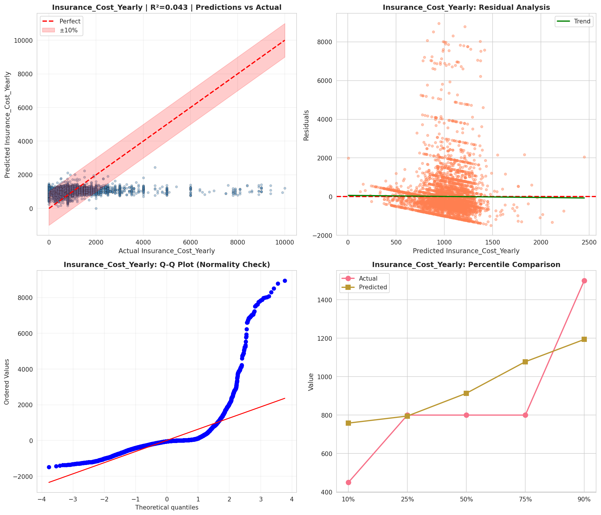
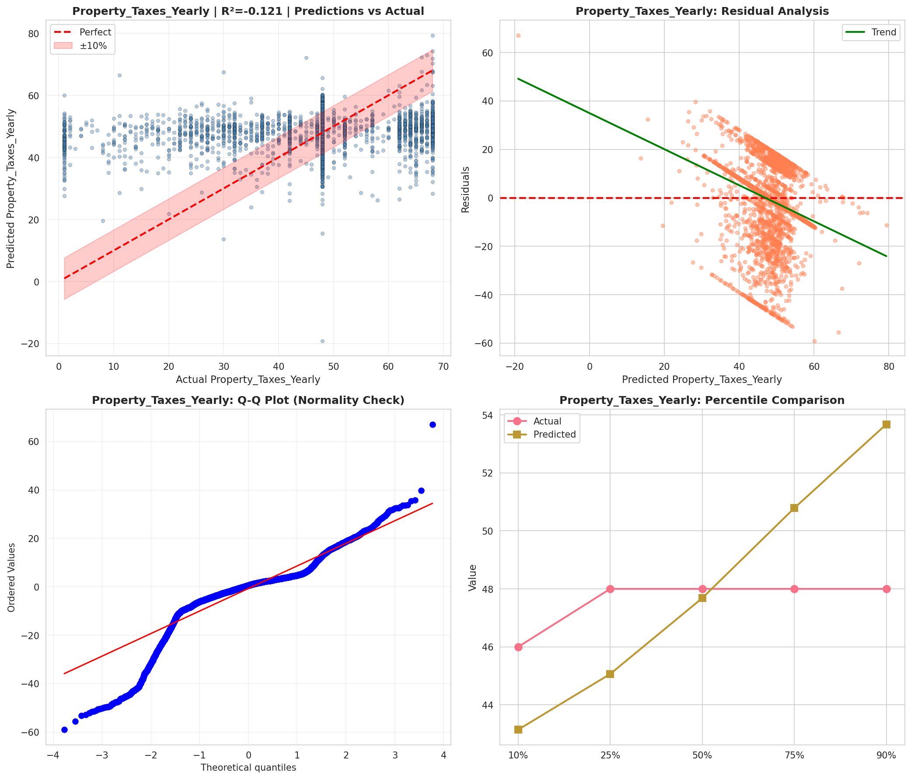
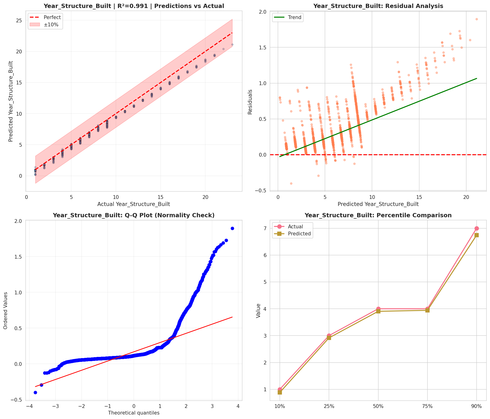
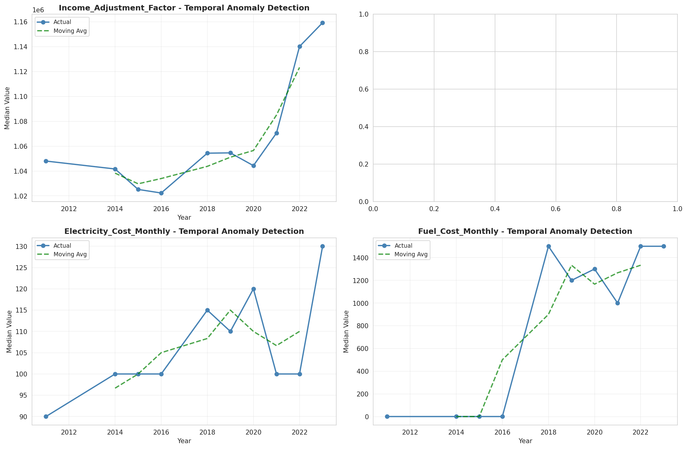
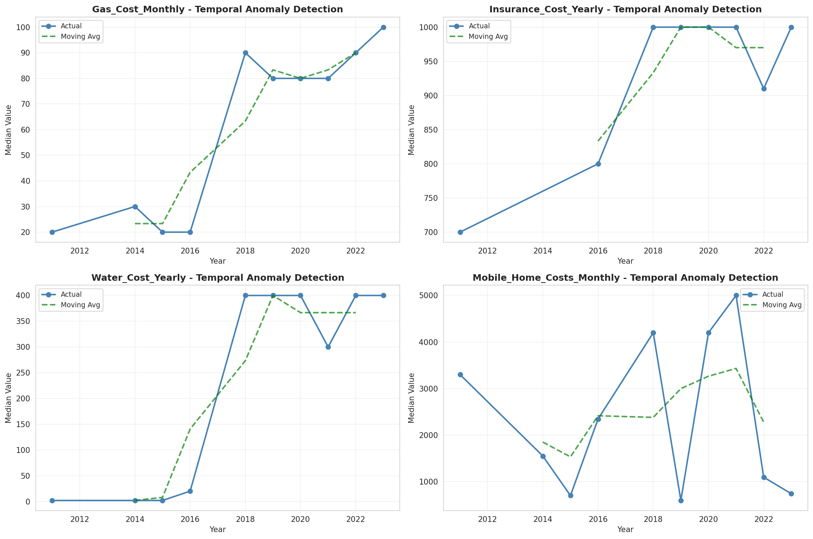
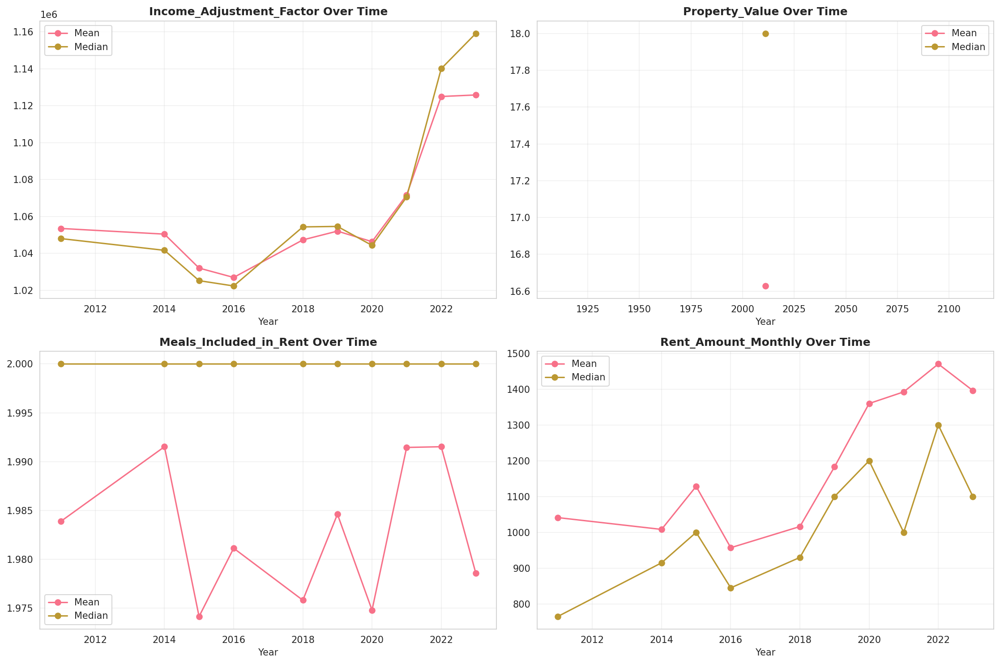
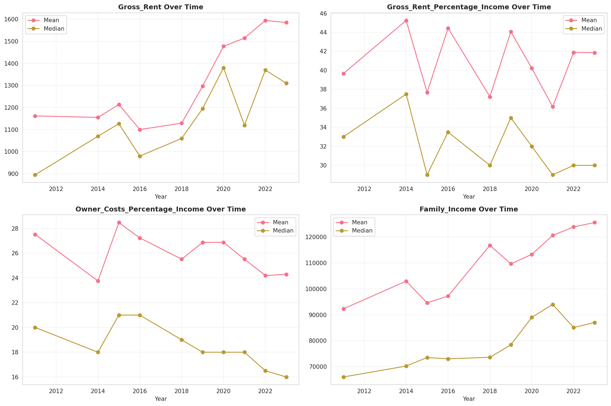
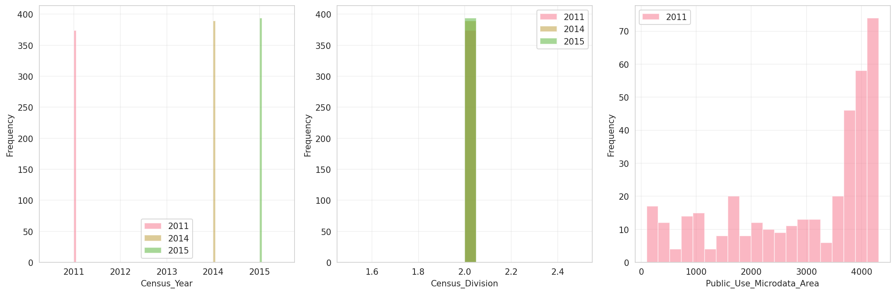
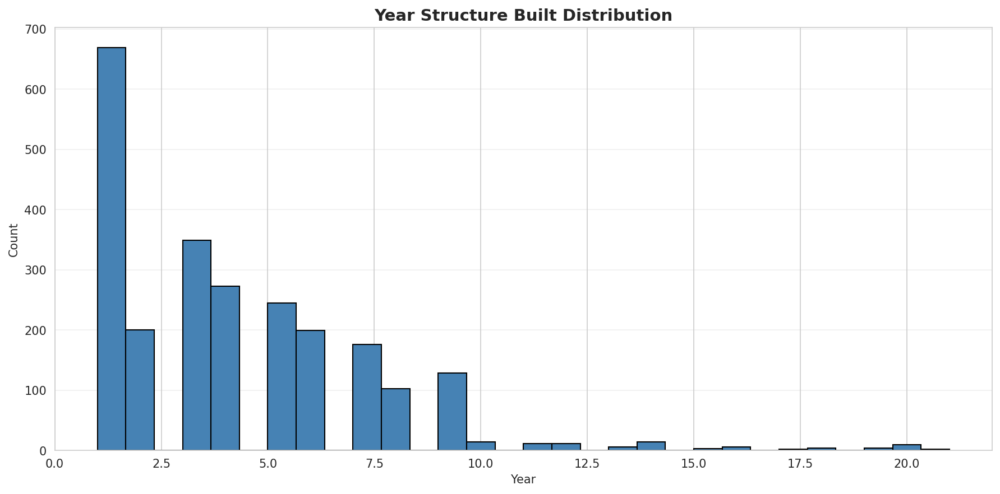
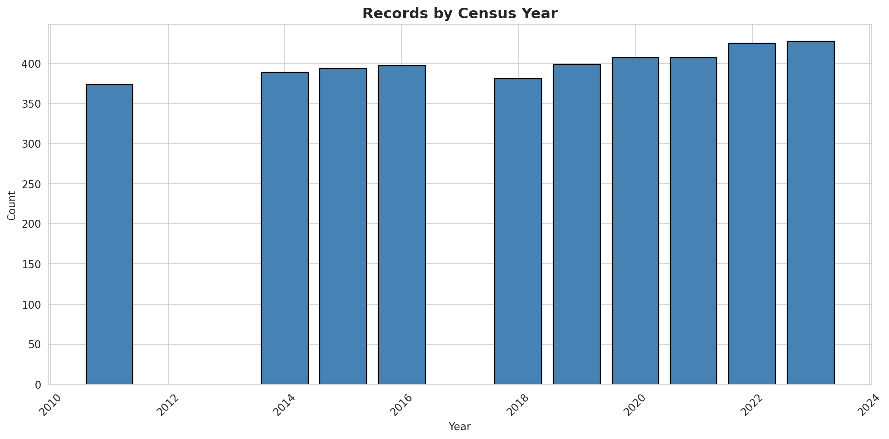

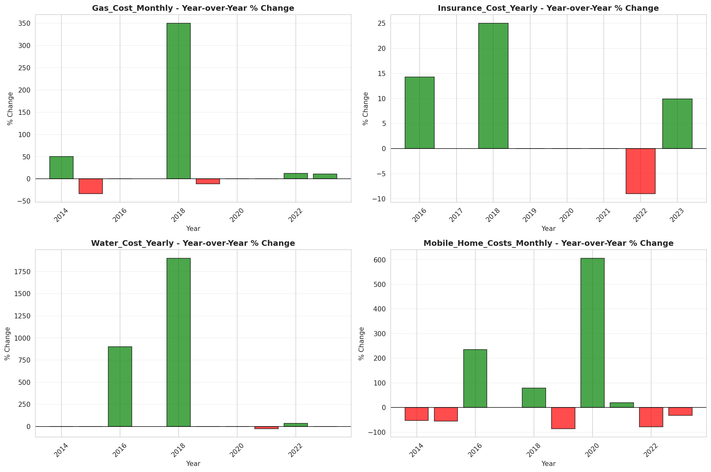
