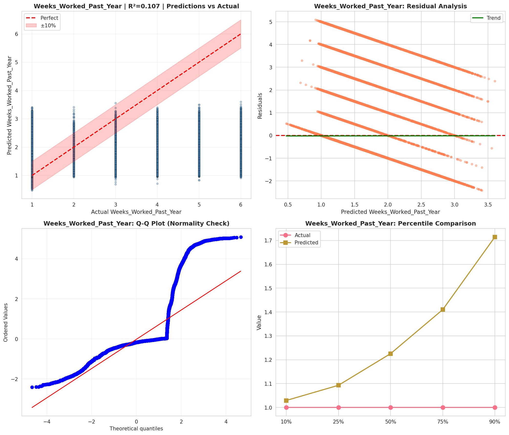
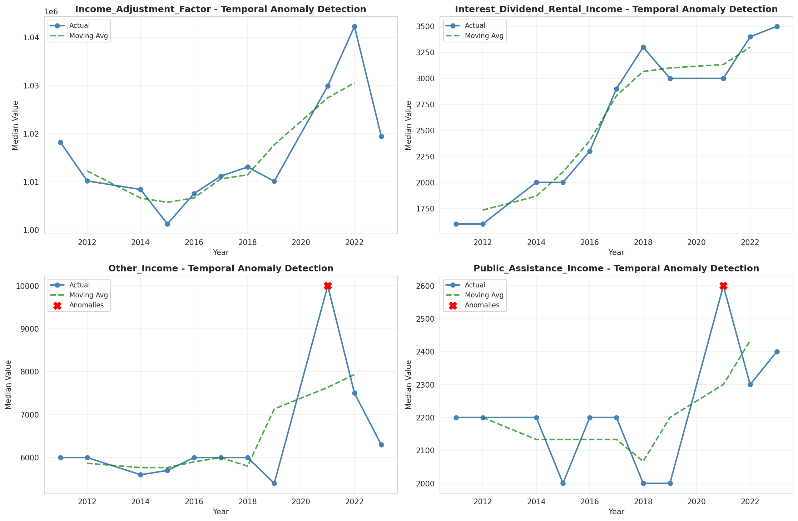
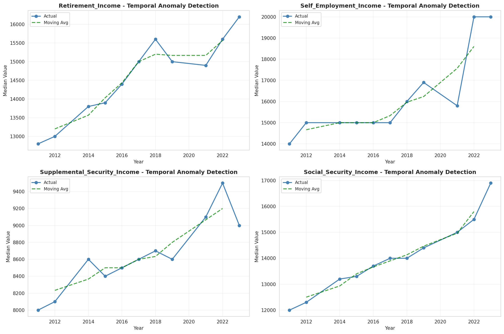
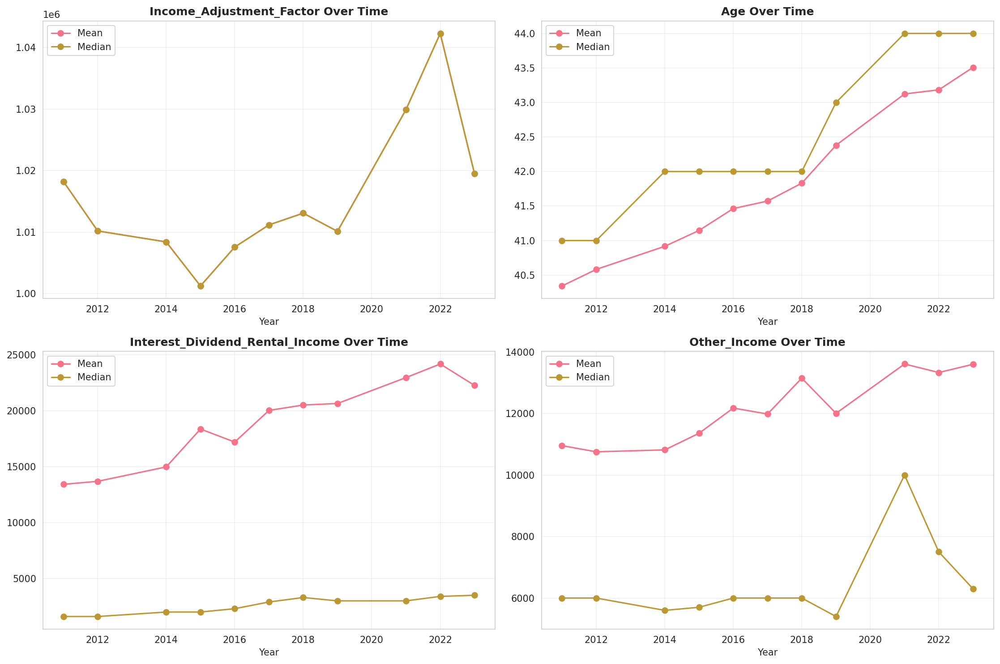
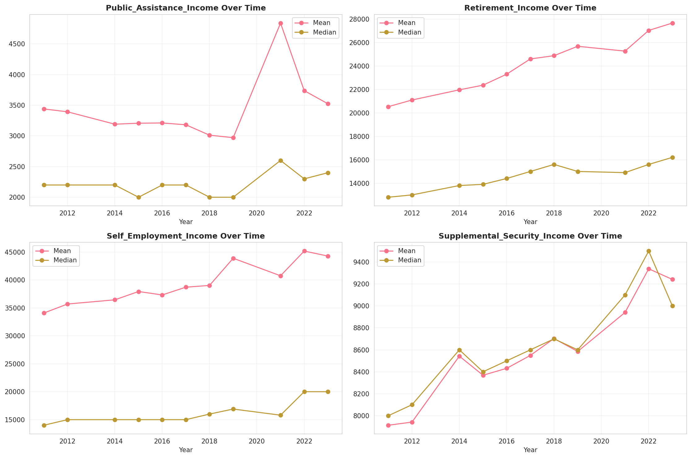
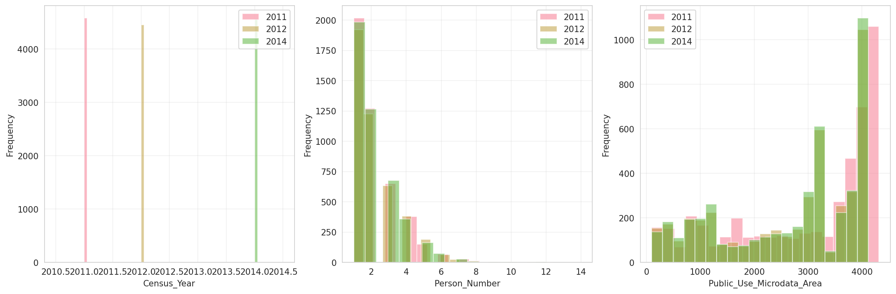
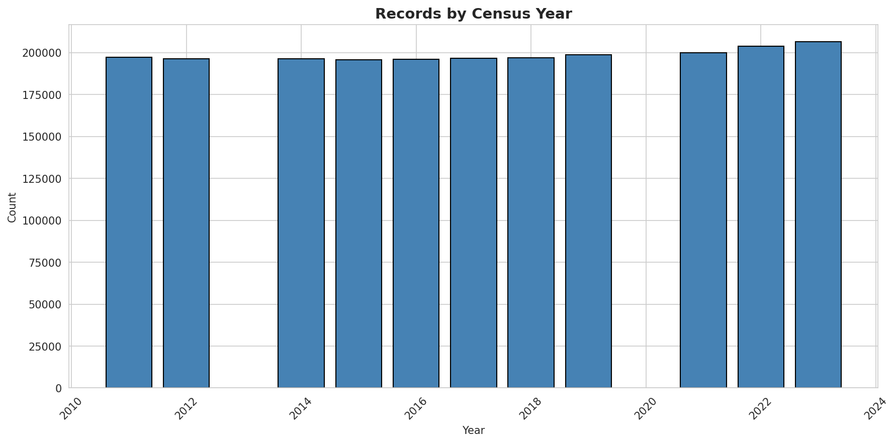
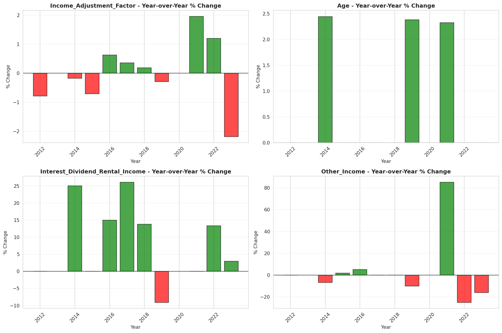
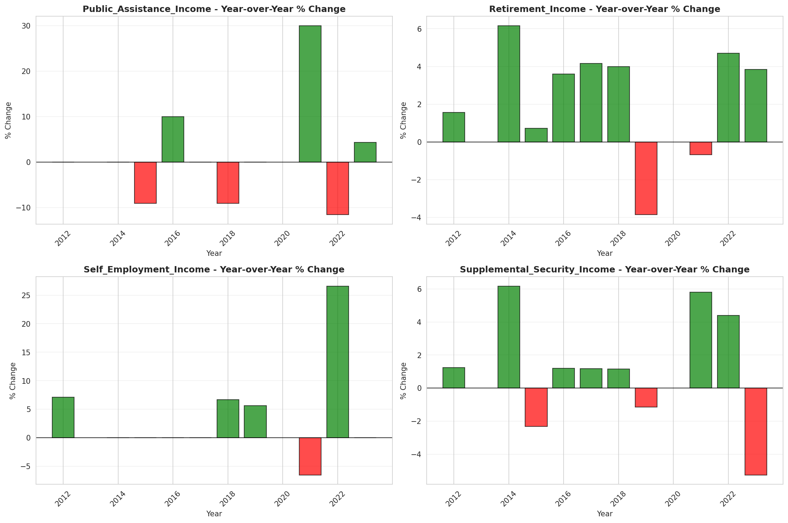

# Temporal Analysis

## Year Distribution

- 2011: 197,174 records

- 2012: 196,314 records

- 2014: 196,276 records

- 2015: 195,742 records

- 2016: 196,104 records

- 2017: 196,585 records

- 2018: 196,967 records

- 2019: 198,788 records

- 2021: 200,067 records

- 2022: 203,891 records

- 2023: 206,408 records

## Temporal Trends

- Census_Year: {np.int64(2011): {'mean': 2011.0, 'median': 2011.0, 'std': 0.0}, np.int64(2012): {'mean': 2012.0, 'median': 2012.0, 'std': 0.0}, np.int64(2014): {'mean': 2014.0, 'median': 2014.0, 'std': 0.0}, np.int64(2015): {'mean': 2015.0, 'median': 2015.0, 'std': 0.0}, np.int64(2016): {'mean': 2016.0, 'median': 2016.0, 'std': 0.0}, np.int64(2017): {'mean': 2017.0, 'median': 2017.0, 'std': 0.0}, np.int64(2018): {'mean': 2018.0, 'median': 2018.0, 'std': 0.0}, np.int64(2019): {'mean': 2019.0, 'median': 2019.0, 'std': 0.0}, np.int64(2021): {'mean': 2021.0, 'median': 2021.0, 'std': 0.0}, np.int64(2022): {'mean': 2022.0, 'median': 2022.0, 'std': 0.0}, np.int64(2023): {'mean': 2023.0, 'median': 2023.0, 'std': 0.0}}

- Person_Number: {np.int64(2011): {'mean': 2.113224867376023, 'median': 2.0, 'std': 1.3851301310483757}, np.int64(2012): {'mean': 2.1220442760068052, 'median': 2.0, 'std': 1.393993518086446}, np.int64(2014): {'mean': 2.1264240151623226, 'median': 2.0, 'std': 1.3975922569228512}, np.int64(2015): {'mean': 2.1258391147530933, 'median': 2.0, 'std': 1.4028870865283236}, np.int64(2016): {'mean': 2.1407620446293802, 'median': 2.0, 'std': 1.4302413609532132}, np.int64(2017): {'mean': 2.1201058066485237, 'median': 2.0, 'std': 1.4002407738510245}, np.int64(2018): {'mean': 2.1290317667426524, 'median': 2.0, 'std': 1.4309651674023254}, np.int64(2019): {'mean': 2.109755116002978, 'median': 2.0, 'std': 1.4039520729808161}, np.int64(2021): {'mean': 2.091124473301444, 'median': 2.0, 'std': 1.3963005272621754}, np.int64(2022): {'mean': 2.0681982039423024, 'median': 2.0, 'std': 1.374663186645636}, np.int64(2023): {'mean': 2.0732045269563195, 'median': 2.0, 'std': 1.391614427365205}}

- Public_Use_Microdata_Area: {np.int64(2011): {'mean': 2959.3257985332752, 'median': 3602.0, 'std': 1330.5517460124063}, np.int64(2012): {'mean': 2700.9940045029903, 'median': 3107.0, 'std': 1279.1627385524148}, np.int64(2014): {'mean': 2713.851464264607, 'median': 3201.0, 'std': 1273.307642237283}, np.int64(2015): {'mean': 2727.5608505073005, 'median': 3201.0, 'std': 1274.5859461141745}, np.int64(2016): {'mean': 2723.3979164117, 'median': 3201.0, 'std': 1273.3655053701095}, np.int64(2017): {'mean': 2713.1637968308873, 'median': 3201.0, 'std': 1274.0529427247084}, np.int64(2018): {'mean': 2709.2516157528926, 'median': 3201.0, 'std': 1274.7659479521174}, np.int64(2019): {'mean': 2694.959665573375, 'median': 3107.0, 'std': 1277.083655172966}, np.int64(2021): {'mean': 2668.712881184803, 'median': 3106.0, 'std': 1272.9528767521072}, np.int64(2022): {'mean': 2746.8268731822395, 'median': 3110.0, 'std': 1404.214152702022}, np.int64(2023): {'mean': 2730.5558408588813, 'median': 3103.0, 'std': 1404.7917695686108}}

- State_Code: {np.int64(2011): {'mean': 36.0, 'median': 36.0, 'std': 0.0}, np.int64(2012): {'mean': 36.0, 'median': 36.0, 'std': 0.0}, np.int64(2014): {'mean': 36.0, 'median': 36.0, 'std': 0.0}, np.int64(2015): {'mean': 36.0, 'median': 36.0, 'std': 0.0}, np.int64(2016): {'mean': 36.0, 'median': 36.0, 'std': 0.0}, np.int64(2017): {'mean': 36.0, 'median': 36.0, 'std': 0.0}, np.int64(2018): {'mean': 36.0, 'median': 36.0, 'std': 0.0}, np.int64(2019): {'mean': 36.0, 'median': 36.0, 'std': 0.0}, np.int64(2021): {'mean': 36.0, 'median': 36.0, 'std': 0.0}, np.int64(2022): {'mean': 36.0, 'median': 36.0, 'std': 0.0}, np.int64(2023): {'mean': None, 'median': None, 'std': None}}

- Income_Adjustment_Factor: {np.int64(2011): {'mean': 1018237.0, 'median': 1018237.0, 'std': 0.0}, np.int64(2012): {'mean': 1010207.0, 'median': 1010207.0, 'std': 0.0}, np.int64(2014): {'mean': 1008425.0, 'median': 1008425.0, 'std': 0.0}, np.int64(2015): {'mean': 1001264.0, 'median': 1001264.0, 'std': 0.0}, np.int64(2016): {'mean': 1007588.0, 'median': 1007588.0, 'std': 0.0}, np.int64(2017): {'mean': 1011189.0, 'median': 1011189.0, 'std': 0.0}, np.int64(2018): {'mean': 1013097.0, 'median': 1013097.0, 'std': 0.0}, np.int64(2019): {'mean': 1010145.0, 'median': 1010145.0, 'std': 0.0}, np.int64(2021): {'mean': 1029928.0, 'median': 1029928.0, 'std': 0.0}, np.int64(2022): {'mean': 1042311.0, 'median': 1042311.0, 'std': 0.0}, np.int64(2023): {'mean': 1019518.0, 'median': 1019518.0, 'std': 0.0}}

- Person_Weight: {np.int64(2011): {'mean': 98.7209114792011, 'median': 75.0, 'std': 82.354806820839}, np.int64(2012): {'mean': 99.6885652576994, 'median': 78.0, 'std': 78.405924915218}, np.int64(2014): {'mean': 100.60438871792782, 'median': 78.0, 'std': 79.6890418856983}, np.int64(2015): {'mean': 101.1320564825127, 'median': 78.0, 'std': 80.6283095465581}, np.int64(2016): {'mean': 100.68784420511565, 'median': 78.0, 'std': 81.00821627135123}, np.int64(2017): {'mean': 100.9710761248315, 'median': 78.0, 'std': 80.69479959285673}, np.int64(2018): {'mean': 99.21565033736616, 'median': 78.0, 'std': 78.54354203285224}, np.int64(2019): {'mean': 97.86084170070627, 'median': 75.0, 'std': 83.77650245837587}, np.int64(2021): {'mean': 99.14635097242424, 'median': 75.0, 'std': 85.21717605668535}, np.int64(2022): {'mean': 96.50818819859632, 'median': 72.0, 'std': 87.35398770284804}, np.int64(2023): {'mean': 94.81810782527809, 'median': 69.0, 'std': 88.69639361743461}}

- Age: {np.int64(2011): {'mean': 40.342129286822804, 'median': 41.0, 'std': 23.477704430555228}, np.int64(2012): {'mean': 40.58243426347586, 'median': 41.0, 'std': 23.452338408164714}, np.int64(2014): {'mean': 40.91663270089058, 'median': 42.0, 'std': 23.394958110997504}, np.int64(2015): {'mean': 41.14630993859264, 'median': 42.0, 'std': 23.39809797517809}, np.int64(2016): {'mean': 41.463493860400604, 'median': 42.0, 'std': 23.522833274719055}, np.int64(2017): {'mean': 41.572032454154694, 'median': 42.0, 'std': 23.456147618042404}, np.int64(2018): {'mean': 41.83128138216046, 'median': 42.0, 'std': 23.553880541040925}, np.int64(2019): {'mean': 42.38029458518623, 'median': 43.0, 'std': 23.619936801966}, np.int64(2021): {'mean': 43.123658574377586, 'median': 44.0, 'std': 23.7653559204882}, np.int64(2022): {'mean': 43.18310764084732, 'median': 44.0, 'std': 23.772565822150863}, np.int64(2023): {'mean': 43.50869152358436, 'median': 44.0, 'std': 23.826021604241916}}

- Citizenship_Status: {np.int64(2011): {'mean': 1.6719648635215596, 'median': 1.0, 'std': 1.356829307883717}, np.int64(2012): {'mean': 1.691850810436342, 'median': 1.0, 'std': 1.3703103458958186}, np.int64(2014): {'mean': 1.6912409056634534, 'median': 1.0, 'std': 1.3660374231968908}, np.int64(2015): {'mean': 1.703926597255571, 'median': 1.0, 'std': 1.3725428608576804}, np.int64(2016): {'mean': 1.7030912169053156, 'median': 1.0, 'std': 1.3720154922923242}, np.int64(2017): {'mean': 1.6981305796474808, 'median': 1.0, 'std': 1.366305455730918}, np.int64(2018): {'mean': 1.6955530621880823, 'median': 1.0, 'std': 1.3615879208901127}, np.int64(2019): {'mean': 1.6795430307664447, 'median': 1.0, 'std': 1.3471941999252481}, np.int64(2021): {'mean': 1.6898139123393663, 'median': 1.0, 'std': 1.3557970930636178}, np.int64(2022): {'mean': 1.678215320931282, 'median': 1.0, 'std': 1.3467435997849153}, np.int64(2023): {'mean': 1.693132049145382, 'median': 1.0, 'std': 1.3618237637069217}}

- Class_of_Worker: {np.int64(2011): {'mean': 2.188917891491337, 'median': 1.0, 'std': 1.9145623917254064}, np.int64(2012): {'mean': 2.202832667647677, 'median': 1.0, 'std': 1.9381910861940284}, np.int64(2014): {'mean': 2.173759939089281, 'median': 1.0, 'std': 1.9100481918261245}, np.int64(2015): {'mean': 2.185430922477263, 'median': 1.0, 'std': 1.9187479144382724}, np.int64(2016): {'mean': 2.1753362222260586, 'median': 1.0, 'std': 1.8927353175260098}, np.int64(2017): {'mean': 2.1746256368033756, 'median': 1.0, 'std': 1.892438214585248}, np.int64(2018): {'mean': 2.1577200675687203, 'median': 1.0, 'std': 1.874290674836531}, np.int64(2019): {'mean': 2.156719187556935, 'median': 1.0, 'std': 1.850423224161598}, np.int64(2021): {'mean': 2.1928352063999466, 'median': 1.0, 'std': 1.8752390207566498}, np.int64(2022): {'mean': 2.196454911987413, 'median': 1.0, 'std': 1.873758802622768}, np.int64(2023): {'mean': 2.179142368179864, 'median': 1.0, 'std': 1.8595405026811342}}

- English_Speaking_Ability: {np.int64(2011): {'mean': 1.7091978017296467, 'median': 1.0, 'std': 0.9331468192325085}, np.int64(2012): {'mean': 1.7127749839614246, 'median': 1.0, 'std': 0.9362834712095897}, np.int64(2014): {'mean': 1.7216592380792195, 'median': 1.0, 'std': 0.9462128565516943}, np.int64(2015): {'mean': 1.6979062604062605, 'median': 1.0, 'std': 0.929331272888635}, np.int64(2016): {'mean': 1.6998943508793736, 'median': 1.0, 'std': 0.9298765499705142}, np.int64(2017): {'mean': 1.6924786111803305, 'median': 1.0, 'std': 0.9252726589306194}, np.int64(2018): {'mean': 1.682531771741839, 'median': 1.0, 'std': 0.9237410870007318}, np.int64(2019): {'mean': 1.6750396725966759, 'median': 1.0, 'std': 0.9150467802376121}, np.int64(2021): {'mean': 1.6975714673515838, 'median': 1.0, 'std': 0.9262718877077472}, np.int64(2022): {'mean': 1.697264425242639, 'median': 1.0, 'std': 0.9301093460040816}, np.int64(2023): {'mean': 1.7282285300739788, 'median': 1.0, 'std': 0.9475618711989852}}

- Fertility_Status: {np.int64(2011): {'mean': 1.9489681857265693, 'median': 2.0, 'std': 0.22006501137869797}, np.int64(2012): {'mean': 1.9519216146342524, 'median': 2.0, 'std': 0.2139342154792956}, np.int64(2014): {'mean': 1.953138737471426, 'median': 2.0, 'std': 0.21134395275307702}, np.int64(2015): {'mean': 1.9538714991762767, 'median': 2.0, 'std': 0.20976568316764724}, np.int64(2016): {'mean': 1.9524749809271642, 'median': 2.0, 'std': 0.21276138600221434}, np.int64(2017): {'mean': 1.9529414422555575, 'median': 2.0, 'std': 0.2117665294957389}, np.int64(2018): {'mean': 1.952888327050272, 'median': 2.0, 'std': 0.2118800996659995}, np.int64(2019): {'mean': 1.9529350508229009, 'median': 2.0, 'std': 0.2117802046498161}, np.int64(2021): {'mean': 1.9546658071051966, 'median': 2.0, 'std': 0.20803845876837374}, np.int64(2022): {'mean': 1.9511643528884908, 'median': 2.0, 'std': 0.21552671946392096}, np.int64(2023): {'mean': 1.9525442601046654, 'median': 2.0, 'std': 0.21261396783935768}}

- Marital_Status: {np.int64(2011): {'mean': 3.0847271952691533, 'median': 3.0, 'std': 1.8607181278775884}, np.int64(2012): {'mean': 3.0836873580080892, 'median': 3.0, 'std': 1.8616146228380812}, np.int64(2014): {'mean': 3.06663575781043, 'median': 3.0, 'std': 1.8659843780875518}, np.int64(2015): {'mean': 3.0687180063553043, 'median': 3.0, 'std': 1.8664942836450853}, np.int64(2016): {'mean': 3.059555134010525, 'median': 3.0, 'std': 1.866152261531268}, np.int64(2017): {'mean': 3.0546938983137064, 'median': 3.0, 'std': 1.867502959999394}, np.int64(2018): {'mean': 3.0427127386821144, 'median': 3.0, 'std': 1.8670617800035214}, np.int64(2019): {'mean': 3.0356309233957783, 'median': 3.0, 'std': 1.8662628819729892}, np.int64(2021): {'mean': 3.042330819175576, 'median': 3.0, 'std': 1.864538885281812}, np.int64(2022): {'mean': 3.0472654506574592, 'median': 3.0, 'std': 1.8649266367077615}, np.int64(2023): {'mean': 3.0391699934111083, 'median': 3.0, 'std': 1.864428827914068}}

- Mobility_Status: {np.int64(2011): {'mean': 1.2106951104553465, 'median': 1.0, 'std': 0.6086058312846098}, np.int64(2012): {'mean': 1.206069613873403, 'median': 1.0, 'std': 0.6026364414538201}, np.int64(2014): {'mean': 1.2061219451987164, 'median': 1.0, 'std': 0.6025988194218963}, np.int64(2015): {'mean': 1.2011449791118676, 'median': 1.0, 'std': 0.5959345347758844}, np.int64(2016): {'mean': 1.2010872362988665, 'median': 1.0, 'std': 0.5952539334362531}, np.int64(2017): {'mean': 1.2018702717129102, 'median': 1.0, 'std': 0.5971821377161093}, np.int64(2018): {'mean': 1.2063893769947591, 'median': 1.0, 'std': 0.603299156707013}, np.int64(2019): {'mean': 1.2084902691343236, 'median': 1.0, 'std': 0.6060578781129853}, np.int64(2021): {'mean': 1.2043854122035436, 'median': 1.0, 'std': 0.6020110089328279}, np.int64(2022): {'mean': 1.2051529360557138, 'median': 1.0, 'std': 0.6014691697975613}, np.int64(2023): {'mean': 1.1893048546345466, 'median': 1.0, 'std': 0.5787347667748198}}

- Military_Service: {np.int64(2011): {'mean': 4.838174143145161, 'median': 5.0, 'std': 0.5513501050529228}, np.int64(2012): {'mean': 4.843948723125063, 'median': 5.0, 'std': 0.5435173801640641}, np.int64(2014): {'mean': 3.862715330665094, 'median': 4.0, 'std': 0.49985200467292534}, np.int64(2015): {'mean': 3.8690186587751416, 'median': 4.0, 'std': 0.4893977256413768}, np.int64(2016): {'mean': 3.8718725219009325, 'median': 4.0, 'std': 0.4834724321208029}, np.int64(2017): {'mean': 3.8763771641150377, 'median': 4.0, 'std': 0.4760011847927937}, np.int64(2018): {'mean': 3.8777761972205558, 'median': 4.0, 'std': 0.472782671172474}, np.int64(2019): {'mean': 3.880707908551662, 'median': 4.0, 'std': 0.46846398820749247}, np.int64(2021): {'mean': 3.8911110577096375, 'median': 4.0, 'std': 0.44944331190539977}, np.int64(2022): {'mean': 3.89252528816749, 'median': 4.0, 'std': 0.4466681796118273}, np.int64(2023): {'mean': 3.895207379142227, 'median': 4.0, 'std': 0.4408700300658295}}

- Travel_Time_To_Work_Minutes: {np.int64(2011): {'mean': 31.145568070519097, 'median': 25.0, 'std': 25.65178158054284}, np.int64(2012): {'mean': 31.287803990539146, 'median': 25.0, 'std': 25.723415546086578}, np.int64(2014): {'mean': 32.045971720605245, 'median': 25.0, 'std': 25.755745792189103}, np.int64(2015): {'mean': 32.66312264349781, 'median': 25.0, 'std': 26.12937934205097}, np.int64(2016): {'mean': 32.85932675212875, 'median': 25.0, 'std': 26.09030216689795}, np.int64(2017): {'mean': 33.27673836688781, 'median': 30.0, 'std': 26.31467749731034}, np.int64(2018): {'mean': 33.463957415145096, 'median': 30.0, 'std': 26.60069137663302}, np.int64(2019): {'mean': 33.46099838753023, 'median': 30.0, 'std': 26.640228202892857}, np.int64(2021): {'mean': 30.338468266395815, 'median': 25.0, 'std': 24.86631755989836}, np.int64(2022): {'mean': 31.925557414296772, 'median': 25.0, 'std': 25.973546629524236}, np.int64(2023): {'mean': 31.764661283140576, 'median': 25.0, 'std': 25.658868266482525}}

- Vehicle_Occupancy: {np.int64(2011): {'mean': 1.1655415008527572, 'median': 1.0, 'std': 0.6097245866331872}, np.int64(2012): {'mean': 1.1695277076974648, 'median': 1.0, 'std': 0.6162640453727461}, np.int64(2014): {'mean': 1.162135261145162, 'median': 1.0, 'std': 0.6029586030100713}, np.int64(2015): {'mean': 1.1632096737553952, 'median': 1.0, 'std': 0.6062619799670962}, np.int64(2016): {'mean': 1.1619875300428437, 'median': 1.0, 'std': 0.5954286788076343}, np.int64(2017): {'mean': 1.1560805642899634, 'median': 1.0, 'std': 0.5928680640376639}, np.int64(2018): {'mean': 1.1620308825033234, 'median': 1.0, 'std': 0.6275504082855999}, np.int64(2019): {'mean': 1.1609522383590358, 'median': 1.0, 'std': 0.6048628301677361}, np.int64(2021): {'mean': 1.1483552129445886, 'median': 1.0, 'std': 0.5642212392956196}, np.int64(2022): {'mean': 1.1702322792289106, 'median': 1.0, 'std': 0.6328419009363222}, np.int64(2023): {'mean': 1.1730815741284595, 'median': 1.0, 'std': 0.6425753620747773}}

- Transportation_To_Work: {np.int64(2011): {'mean': 2.6696806012212306, 'median': 1.0, 'std': 3.0233731269153736}, np.int64(2012): {'mean': 2.6642873777363762, 'median': 1.0, 'std': 3.0050204450808375}, np.int64(2014): {'mean': 2.717580195021638, 'median': 1.0, 'std': 3.024195509511061}, np.int64(2015): {'mean': 2.732949766158608, 'median': 1.0, 'std': 3.014515675618866}, np.int64(2016): {'mean': 2.7771606384046574, 'median': 1.0, 'std': 3.0654210944386375}, np.int64(2017): {'mean': 2.750498411655165, 'median': 1.0, 'std': 3.0442952005705877}, np.int64(2018): {'mean': 2.7884711834100178, 'median': 1.0, 'std': 3.0708088826838154}, np.int64(2019): {'mean': None, 'median': None, 'std': None}, np.int64(2021): {'mean': None, 'median': None, 'std': None}, np.int64(2022): {'mean': None, 'median': None, 'std': None}, np.int64(2023): {'mean': None, 'median': None, 'std': None}}

- Language_Other_Than_English: {np.int64(2011): {'mean': 1.7485242283669555, 'median': 2.0, 'std': 0.4338625545524307}, np.int64(2012): {'mean': 1.7406642121872418, 'median': 2.0, 'std': 0.43827134045376726}, np.int64(2014): {'mean': 1.7452301627261722, 'median': 2.0, 'std': 0.4357329276799979}, np.int64(2015): {'mean': 1.7417315724122362, 'median': 2.0, 'std': 0.4376835347744345}, np.int64(2016): {'mean': 1.741281453493046, 'median': 2.0, 'std': 0.4379318303866484}, np.int64(2017): {'mean': 1.7424991845486677, 'median': 2.0, 'std': 0.43725869671878376}, np.int64(2018): {'mean': 1.743166630222028, 'median': 2.0, 'std': 0.4368878665408381}, np.int64(2019): {'mean': 1.747147676696215, 'median': 2.0, 'std': 0.43464816038645204}, np.int64(2021): {'mean': 1.7495436882540911, 'median': 2.0, 'std': 0.4332769662265281}, np.int64(2022): {'mean': 1.7493880692751764, 'median': 2.0, 'std': 0.433366536123304}, np.int64(2023): {'mean': 1.748250191049278, 'median': 2.0, 'std': 0.43401934977762774}}

- Grandparents_Living_With_Grandchildren: {np.int64(2011): {'mean': 1.9681696546957996, 'median': 2.0, 'std': 0.17554891645598292}, np.int64(2012): {'mean': 1.9675325717219692, 'median': 2.0, 'std': 0.17723867071577695}, np.int64(2014): {'mean': 1.9678378184542071, 'median': 2.0, 'std': 0.17643135684399025}, np.int64(2015): {'mean': 1.9675612639127986, 'median': 2.0, 'std': 0.17716295742742175}, np.int64(2016): {'mean': 1.9659991968314212, 'median': 2.0, 'std': 0.18123191545829717}, np.int64(2017): {'mean': 1.9678285228274695, 'median': 2.0, 'std': 0.176455989375994}, np.int64(2018): {'mean': 1.9683084376261606, 'median': 2.0, 'std': 0.1751783248501645}, np.int64(2019): {'mean': 1.9695079852812867, 'median': 2.0, 'std': 0.17193741898317325}, np.int64(2021): {'mean': 1.9714025082136208, 'median': 2.0, 'std': 0.16667297704055825}, np.int64(2022): {'mean': 1.9719530295093417, 'median': 2.0, 'std': 0.1651076505508027}, np.int64(2023): {'mean': 1.9709301495265705, 'median': 2.0, 'std': 0.16800296370460513}}

- Months_Responsible_For_Grandchildren: {np.int64(2011): {'mean': 3.6588785046728973, 'median': 4.0, 'std': 1.359871614064895}, np.int64(2012): {'mean': 3.7825396825396824, 'median': 4.0, 'std': 1.3050935447152456}, np.int64(2014): {'mean': 3.766804979253112, 'median': 4.0, 'std': 1.3217677303011874}, np.int64(2015): {'mean': 3.816987740805604, 'median': 4.0, 'std': 1.3015026836728716}, np.int64(2016): {'mean': 3.6869565217391305, 'median': 4.0, 'std': 1.3716255435834794}, np.int64(2017): {'mean': 3.8046296296296296, 'median': 4.0, 'std': 1.3470101625416913}, np.int64(2018): {'mean': 3.8043290043290043, 'median': 4.0, 'std': 1.3501968387784975}, np.int64(2019): {'mean': 3.919686581782566, 'median': 4.0, 'std': 1.2884914038328494}, np.int64(2021): {'mean': 4.021761658031088, 'median': 5.0, 'std': 1.2901409606399221}, np.int64(2022): {'mean': 3.961215932914046, 'median': 5.0, 'std': 1.3409229994950627}, np.int64(2023): {'mean': 3.9473684210526314, 'median': 5.0, 'std': 1.2890839860557421}}

- Grandparents_Responsible_For_Grandchildren: {np.int64(2011): {'mean': 1.6758394344862408, 'median': 2.0, 'std': 0.46811944697528673}, np.int64(2012): {'mean': 1.6886582653817643, 'median': 2.0, 'std': 0.46309939700130426}, np.int64(2014): {'mean': 1.7014370664023786, 'median': 2.0, 'std': 0.4576843999055936}, np.int64(2015): {'mean': 1.7207141110295916, 'median': 2.0, 'std': 0.44870315273563743}, np.int64(2016): {'mean': 1.707040296433534, 'median': 2.0, 'std': 0.4551728207298415}, np.int64(2017): {'mean': 1.7380548144554935, 'median': 2.0, 'std': 0.43974629876886506}, np.int64(2018): {'mean': 1.7170504654581087, 'median': 2.0, 'std': 0.45048730390401753}, np.int64(2019): {'mean': 1.7459567056481713, 'median': 2.0, 'std': 0.43537623158946864}, np.int64(2021): {'mean': 1.749740663900415, 'median': 2.0, 'std': 0.4332185043898272}, np.int64(2022): {'mean': 1.7525291828793774, 'median': 2.0, 'std': 0.43159857826754366}, np.int64(2023): {'mean': 1.7339719970523213, 'median': 2.0, 'std': 0.44193334261393163}}

- Interest_Dividend_Rental_Income: {np.int64(2011): {'mean': 13426.856514544505, 'median': 1600.0, 'std': 41084.82244344561}, np.int64(2012): {'mean': 13697.043988269796, 'median': 1600.0, 'std': 41179.70947891263}, np.int64(2014): {'mean': 14985.205464006938, 'median': 2000.0, 'std': 42974.238396637484}, np.int64(2015): {'mean': 18373.809474546317, 'median': 2000.0, 'std': 53767.7665903}, np.int64(2016): {'mean': 17208.80665008509, 'median': 2300.0, 'std': 47972.62953994668}, np.int64(2017): {'mean': 20040.772269949925, 'median': 2900.0, 'std': 58185.43922193211}, np.int64(2018): {'mean': 20522.12954143421, 'median': 3300.0, 'std': 57483.748654012554}, np.int64(2019): {'mean': 20659.962022001047, 'median': 3000.0, 'std': 59030.945612293464}, np.int64(2021): {'mean': 22975.7165984192, 'median': 3000.0, 'std': 65619.927564789}, np.int64(2022): {'mean': 24192.81697716493, 'median': 3400.0, 'std': 68674.53357227768}, np.int64(2023): {'mean': 22280.20623884243, 'median': 3500.0, 'std': 57880.32898036294}}

- Military_Service_Period_1: {np.int64(2011): {'mean': 0.09027837259100642, 'median': 0.0, 'std': 0.2865924339025962}, np.int64(2012): {'mean': 0.09906592419615592, 'median': 0.0, 'std': 0.2987639264270231}, np.int64(2014): {'mean': 0.10921501706484642, 'median': 0.0, 'std': 0.3119244522518297}, np.int64(2015): {'mean': 0.12707124010554088, 'median': 0.0, 'std': 0.33307033538358277}, np.int64(2016): {'mean': 0.13701716738197425, 'median': 0.0, 'std': 0.3438839217714067}, np.int64(2017): {'mean': 0.14581247914581247, 'median': 0.0, 'std': 0.3529377487421687}, np.int64(2018): {'mean': 0.15360466420002242, 'median': 0.0, 'std': 0.3605895862989519}, np.int64(2019): {'mean': 0.166440983976529, 'median': 0.0, 'std': 0.3724970335747164}, np.int64(2021): {'mean': 0.17999510882856445, 'median': 0.0, 'std': 0.38420687119486285}, np.int64(2022): {'mean': 0.19055156459271885, 'median': 0.0, 'std': 0.39276003907817203}, np.int64(2023): {'mean': 0.21656600517687663, 'median': 0.0, 'std': 0.41192970991454936}}

- Military_Service_Period_2: {np.int64(2011): {'mean': 0.09635974304068523, 'median': 0.0, 'std': 0.2950965974145691}, np.int64(2012): {'mean': 0.10481408298904257, 'median': 0.0, 'std': 0.30632747007309963}, np.int64(2014): {'mean': 0.11614133708090744, 'median': 0.0, 'std': 0.3204104123556041}, np.int64(2015): {'mean': 0.12221635883905013, 'median': 0.0, 'std': 0.3275528110749557}, np.int64(2016): {'mean': 0.13530042918454935, 'median': 0.0, 'std': 0.3420625343738862}, np.int64(2017): {'mean': 0.1264597931264598, 'median': 0.0, 'std': 0.3323853211146063}, np.int64(2018): {'mean': 0.13375939006615092, 'median': 0.0, 'std': 0.3404127027797974}, np.int64(2019): {'mean': 0.13969758519521552, 'median': 0.0, 'std': 0.346692562559419}, np.int64(2021): {'mean': 0.15284910736121302, 'median': 0.0, 'std': 0.3598639925910435}, np.int64(2022): {'mean': 0.16266893948618044, 'median': 0.0, 'std': 0.3690858193451803}, np.int64(2023): {'mean': 0.16048317515099222, 'median': 0.0, 'std': 0.3670761966756408}}

- Military_Service_Period_3: {np.int64(2011): {'mean': 0.13353319057815846, 'median': 0.0, 'std': 0.34016464937333424}, np.int64(2012): {'mean': 0.13274654212322615, 'median': 0.0, 'std': 0.3393158389271429}, np.int64(2014): {'mean': None, 'median': None, 'std': None}, np.int64(2015): {'mean': None, 'median': None, 'std': None}, np.int64(2016): {'mean': None, 'median': None, 'std': None}, np.int64(2017): {'mean': None, 'median': None, 'std': None}, np.int64(2018): {'mean': None, 'median': None, 'std': None}, np.int64(2019): {'mean': None, 'median': None, 'std': None}, np.int64(2021): {'mean': None, 'median': None, 'std': None}, np.int64(2022): {'mean': None, 'median': None, 'std': None}, np.int64(2023): {'mean': None, 'median': None, 'std': None}}

- Military_Service_Period_4: {np.int64(2011): {'mean': 0.0897644539614561, 'median': 0.0, 'std': 0.28585625024963807}, np.int64(2012): {'mean': 0.09080294593138136, 'median': 0.0, 'std': 0.28734158510775176}, np.int64(2014): {'mean': None, 'median': None, 'std': None}, np.int64(2015): {'mean': None, 'median': None, 'std': None}, np.int64(2016): {'mean': None, 'median': None, 'std': None}, np.int64(2017): {'mean': None, 'median': None, 'std': None}, np.int64(2018): {'mean': None, 'median': None, 'std': None}, np.int64(2019): {'mean': None, 'median': None, 'std': None}, np.int64(2021): {'mean': None, 'median': None, 'std': None}, np.int64(2022): {'mean': None, 'median': None, 'std': None}, np.int64(2023): {'mean': None, 'median': None, 'std': None}}

- Military_Service_Period_5: {np.int64(2011): {'mean': 0.32308351177730193, 'median': 0.0, 'std': 0.4676743420172423}, np.int64(2012): {'mean': 0.32998024070414944, 'median': 0.0, 'std': 0.47022669077961166}, np.int64(2014): {'mean': 0.35946597068861674, 'median': 0.0, 'std': 0.4798680045317905}, np.int64(2015): {'mean': 0.3563060686015831, 'median': 0.0, 'std': 0.47893241971681194}, np.int64(2016): {'mean': 0.3600858369098712, 'median': 0.0, 'std': 0.4800507819261058}, np.int64(2017): {'mean': 0.36670003336670004, 'median': 0.0, 'std': 0.48193044213414843}, np.int64(2018): {'mean': 0.37582688642224465, 'median': 0.0, 'std': 0.4843628207086544}, np.int64(2019): {'mean': 0.38264500112841343, 'median': 0.0, 'std': 0.48606014392386726}, np.int64(2021): {'mean': 0.376008804108584, 'median': 0.0, 'std': 0.48441188752153724}, np.int64(2022): {'mean': 0.37805917447948373, 'median': 0.0, 'std': 0.48493202370373045}, np.int64(2023): {'mean': 0.38592382595833846, 'median': 0.0, 'std': 0.4868427270112428}}

- Military_Service_Period_6: {np.int64(2011): {'mean': 0.08548179871520342, 'median': 0.0, 'std': 0.27960929397932194}, np.int64(2012): {'mean': 0.09080294593138136, 'median': 0.0, 'std': 0.2873415851077509}, np.int64(2014): {'mean': None, 'median': None, 'std': None}, np.int64(2015): {'mean': None, 'median': None, 'std': None}, np.int64(2016): {'mean': None, 'median': None, 'std': None}, np.int64(2017): {'mean': None, 'median': None, 'std': None}, np.int64(2018): {'mean': None, 'median': None, 'std': None}, np.int64(2019): {'mean': None, 'median': None, 'std': None}, np.int64(2021): {'mean': None, 'median': None, 'std': None}, np.int64(2022): {'mean': None, 'median': None, 'std': None}, np.int64(2023): {'mean': None, 'median': None, 'std': None}}

- Military_Service_Period_7: {np.int64(2011): {'mean': 0.11486081370449679, 'median': 0.0, 'std': 0.3188675525809092}, np.int64(2012): {'mean': 0.11918447997125921, 'median': 0.0, 'std': 0.3240200137144855}, np.int64(2014): {'mean': None, 'median': None, 'std': None}, np.int64(2015): {'mean': None, 'median': None, 'std': None}, np.int64(2016): {'mean': None, 'median': None, 'std': None}, np.int64(2017): {'mean': None, 'median': None, 'std': None}, np.int64(2018): {'mean': None, 'median': None, 'std': None}, np.int64(2019): {'mean': None, 'median': None, 'std': None}, np.int64(2021): {'mean': None, 'median': None, 'std': None}, np.int64(2022): {'mean': None, 'median': None, 'std': None}, np.int64(2023): {'mean': None, 'median': None, 'std': None}}

- Military_Service_Period_8: {np.int64(2011): {'mean': 0.143982869379015, 'median': 0.0, 'std': 0.3510873972507396}, np.int64(2012): {'mean': 0.1359798814442249, 'median': 0.0, 'std': 0.34278259369245784}, np.int64(2014): {'mean': 0.12718329652680185, 'median': 0.0, 'std': 0.3331949126929273}, np.int64(2015): {'mean': 0.1212664907651715, 'median': 0.0, 'std': 0.3264539427021938}, np.int64(2016): {'mean': 0.11641630901287553, 'median': 0.0, 'std': 0.3207406897399169}, np.int64(2017): {'mean': 0.10799688577466356, 'median': 0.0, 'std': 0.31039374038890366}, np.int64(2018): {'mean': 0.09507792353402848, 'median': 0.0, 'std': 0.2933389842518302}, np.int64(2019): {'mean': 0.08948318663958474, 'median': 0.0, 'std': 0.2854560226047183}, np.int64(2021): {'mean': 0.07287845438982636, 'median': 0.0, 'std': 0.2599527810067522}, np.int64(2022): {'mean': 0.06769755266041641, 'median': 0.0, 'std': 0.2512414768278072}, np.int64(2023): {'mean': 0.05090595340811044, 'median': 0.0, 'std': 0.21981922857158984}}

- Military_Service_Period_9: {np.int64(2011): {'mean': 0.02261241970021413, 'median': 0.0, 'std': 0.14867074818320508}, np.int64(2012): {'mean': 0.021375965511047243, 'median': 0.0, 'std': 0.144640632675919}, np.int64(2014): {'mean': 0.019775145553101788, 'median': 0.0, 'std': 0.13923374292809212}, np.int64(2015): {'mean': 0.013720316622691292, 'median': 0.0, 'std': 0.11633356296430832}, np.int64(2016): {'mean': 0.01652360515021459, 'median': 0.0, 'std': 0.12748458508444235}, np.int64(2017): {'mean': 0.01434768101434768, 'median': 0.0, 'std': 0.11892601954829134}, np.int64(2018): {'mean': 0.013678663527301268, 'median': 0.0, 'std': 0.11615967689813363}, np.int64(2019): {'mean': 0.008688783570300158, 'median': 0.0, 'std': 0.09281304140651636}, np.int64(2021): {'mean': None, 'median': None, 'std': None}, np.int64(2022): {'mean': None, 'median': None, 'std': None}, np.int64(2023): {'mean': None, 'median': None, 'std': None}}

- Military_Service_Period_10: {np.int64(2011): {'mean': 0.13019271948608138, 'median': 0.0, 'std': 0.33652975453584005}, np.int64(2012): {'mean': 0.11226872642356744, 'median': 0.0, 'std': 0.3157109622049659}, np.int64(2014): {'mean': 0.08552499498092753, 'median': 0.0, 'std': 0.2796753866234368}, np.int64(2015): {'mean': 0.06839050131926121, 'median': 0.0, 'std': 0.2524281396970346}, np.int64(2016): {'mean': 0.06587982832618025, 'median': 0.0, 'std': 0.24808522774246133}, np.int64(2017): {'mean': 0.0529418307196085, 'median': 0.0, 'std': 0.2239298338225675}, np.int64(2018): {'mean': 0.043838995403072095, 'median': 0.0, 'std': 0.20474823117600174}, np.int64(2019): {'mean': 0.0315955766192733, 'median': 0.0, 'std': 0.1749306982409524}, np.int64(2021): {'mean': 0.01773049645390071, 'median': 0.0, 'std': 0.1319782400295015}, np.int64(2022): {'mean': 0.01375867527091197, 'median': 0.0, 'std': 0.11649474884861499}, np.int64(2023): {'mean': 0.009244422531739184, 'median': 0.0, 'std': 0.09570837083193241}}

- Military_Service_Period_11: {np.int64(2011): {'mean': 0.0021413276231263384, 'median': 0.0, 'std': 0.046226890155298204}, np.int64(2012): {'mean': 0.0034129692832764505, 'median': 0.0, 'std': 0.058323463897152844}, np.int64(2014): {'mean': 0.002308773338687011, 'median': 0.0, 'std': 0.04799660561443909}, np.int64(2015): {'mean': 0.0015831134564643799, 'median': 0.0, 'std': 0.03975894923861936}, np.int64(2016): {'mean': 0.0017167381974248926, 'median': 0.0, 'std': 0.04140018007537844}, np.int64(2017): {'mean': 0.001334668001334668, 'median': 0.0, 'std': 0.036510750826515496}, np.int64(2018): {'mean': 0.0005606009642336585, 'median': 0.0, 'std': 0.023671702881045507}, np.int64(2019): {'mean': 0.0004513653802753329, 'median': 0.0, 'std': 0.021241764639539}, np.int64(2021): {'mean': None, 'median': None, 'std': None}, np.int64(2022): {'mean': None, 'median': None, 'std': None}, np.int64(2023): {'mean': None, 'median': None, 'std': None}}

- Temporary_Absence_From_Work: {np.int64(2011): {'mean': 2.5151543318894736, 'median': 3.0, 'std': 0.5337446145812189}, np.int64(2012): {'mean': 2.5214441768663574, 'median': 3.0, 'std': 0.5329645466167412}, np.int64(2014): {'mean': 2.5839868493421583, 'median': 3.0, 'std': 0.5206163152729403}, np.int64(2015): {'mean': 2.5897128743439333, 'median': 3.0, 'std': 0.5196142419785327}, np.int64(2016): {'mean': 2.5889362592202967, 'median': 3.0, 'std': 0.5214564866215168}, np.int64(2017): {'mean': 2.597212517927408, 'median': 3.0, 'std': 0.518701606894092}, np.int64(2018): {'mean': 2.6011945392491467, 'median': 3.0, 'std': 0.5170309675445977}, np.int64(2019): {'mean': 2.61379981614665, 'median': 3.0, 'std': 0.5120799430705082}, np.int64(2021): {'mean': 2.5998837871169718, 'median': 3.0, 'std': 0.5156548844070026}, np.int64(2022): {'mean': 2.6054548092267518, 'median': 3.0, 'std': 0.5141329836367258}, np.int64(2023): {'mean': 2.6012001371585325, 'median': 3.0, 'std': 0.5146455647608371}}

- Available_For_Work: {np.int64(2011): {'mean': 4.547353026838443, 'median': 5.0, 'std': 1.1789834580822558}, np.int64(2012): {'mean': 4.531412150251993, 'median': 5.0, 'std': 1.1842358582234591}, np.int64(2014): {'mean': 4.699666907679663, 'median': 5.0, 'std': 0.9791326250178531}, np.int64(2015): {'mean': 4.723365236184008, 'median': 5.0, 'std': 0.9399256025632677}, np.int64(2016): {'mean': 4.738448098727153, 'median': 5.0, 'std': 0.9131621993849997}, np.int64(2017): {'mean': 4.752810159477317, 'median': 5.0, 'std': 0.8880728595043645}, np.int64(2018): {'mean': 4.761853973671379, 'median': 5.0, 'std': 0.8668842316152531}, np.int64(2019): {'mean': 4.762883253122803, 'median': 5.0, 'std': 0.8642481527468667}, np.int64(2021): {'mean': 4.73094345887487, 'median': 5.0, 'std': 0.9383180986581896}, np.int64(2022): {'mean': 4.794846946177281, 'median': 5.0, 'std': 0.8103883787072172}, np.int64(2023): {'mean': 4.793422105383472, 'median': 5.0, 'std': 0.8153729745622487}}

- On_Layoff_From_Work: {np.int64(2011): {'mean': 2.4786612382492734, 'median': 2.0, 'std': 0.5358510688442317}, np.int64(2012): {'mean': 2.485972839444872, 'median': 3.0, 'std': 0.5339790179776823}, np.int64(2014): {'mean': 2.5654721073805593, 'median': 3.0, 'std': 0.5162881025597457}, np.int64(2015): {'mean': 2.574214263661624, 'median': 3.0, 'std': 0.5118887942386664}, np.int64(2016): {'mean': 2.574614423958314, 'median': 3.0, 'std': 0.5117434372473659}, np.int64(2017): {'mean': 2.5850280096593488, 'median': 3.0, 'std': 0.5079213197092499}, np.int64(2018): {'mean': 2.5889383227693807, 'median': 3.0, 'std': 0.506409307817506}, np.int64(2019): {'mean': 2.6033874679308084, 'median': 3.0, 'std': 0.5020459124516479}, np.int64(2021): {'mean': 2.5715064984346836, 'median': 3.0, 'std': 0.5282543811154223}, np.int64(2022): {'mean': 2.5974118671115622, 'median': 3.0, 'std': 0.5026567937988637}, np.int64(2023): {'mean': 2.5926791633329525, 'median': 3.0, 'std': 0.5037990080548307}}

- Looking_For_Work: {np.int64(2011): {'mean': 2.4669430449951353, 'median': 3.0, 'std': 0.6113211750131414}, np.int64(2012): {'mean': 2.4758372849375605, 'median': 3.0, 'std': 0.6091449201551338}, np.int64(2014): {'mean': 2.553507975058245, 'median': 3.0, 'std': 0.5811711197724355}, np.int64(2015): {'mean': 2.5649706699598642, 'median': 3.0, 'std': 0.5712911717039253}, np.int64(2016): {'mean': 2.568702360518982, 'median': 3.0, 'std': 0.5655258413683267}, np.int64(2017): {'mean': 2.5789725296951422, 'median': 3.0, 'std': 0.5603495965224996}, np.int64(2018): {'mean': 2.5834897610921503, 'median': 3.0, 'std': 0.5552296802432204}, np.int64(2019): {'mean': 2.5899890048486816, 'median': 3.0, 'std': 0.5510725292462277}, np.int64(2021): {'mean': 2.5515309268570343, 'median': 3.0, 'std': 0.5860540910819201}, np.int64(2022): {'mean': 2.5800609313796605, 'median': 3.0, 'std': 0.5548880544771556}, np.int64(2023): {'mean': 2.574619956566465, 'median': 3.0, 'std': 0.5554671992224668}}

- Informed_Of_Recall: {np.int64(2011): {'mean': 2.887050497914769, 'median': 3.0, 'std': 0.3408525145351377}, np.int64(2012): {'mean': 2.8869944636162765, 'median': 3.0, 'std': 0.34188068387254705}, np.int64(2014): {'mean': 2.9372130245895054, 'median': 3.0, 'std': 0.26327517022737407}, np.int64(2015): {'mean': 2.94035196048163, 'median': 3.0, 'std': 0.25578657074748795}, np.int64(2016): {'mean': 2.9430325624888494, 'median': 3.0, 'std': 0.25207363460237414}, np.int64(2017): {'mean': 2.944697777614337, 'median': 3.0, 'std': 0.24761911129255962}, np.int64(2018): {'mean': 2.944618478790834, 'median': 3.0, 'std': 0.24721522176263677}, np.int64(2019): {'mean': 2.9355011205441097, 'median': 3.0, 'std': 0.2632784835666615}, np.int64(2021): {'mean': 2.9424509059861492, 'median': 3.0, 'std': 0.2556576156133515}, np.int64(2022): {'mean': 2.9535644857101406, 'median': 3.0, 'std': 0.2250325012137541}, np.int64(2023): {'mean': 2.9526002971768204, 'median': 3.0, 'std': 0.2279092257858528}}

- Other_Income: {np.int64(2011): {'mean': 10952.954848125513, 'median': 6000.0, 'std': 14095.055266004107}, np.int64(2012): {'mean': 10754.987197997882, 'median': 6000.0, 'std': 13868.660894508263}, np.int64(2014): {'mean': 10815.696171171172, 'median': 5600.0, 'std': 14492.891439288647}, np.int64(2015): {'mean': 11356.056439076887, 'median': 5700.0, 'std': 15406.442031361368}, np.int64(2016): {'mean': 12175.896153357877, 'median': 6000.0, 'std': 16697.494929149398}, np.int64(2017): {'mean': 11982.210593983029, 'median': 6000.0, 'std': 15992.346687762629}, np.int64(2018): {'mean': 13147.643811664793, 'median': 6000.0, 'std': 17720.31911354604}, np.int64(2019): {'mean': 12004.027844864328, 'median': 5400.0, 'std': 16417.41948642182}, np.int64(2021): {'mean': 13608.155543636503, 'median': 10000.0, 'std': 13342.00521371423}, np.int64(2022): {'mean': 13330.780813294725, 'median': 7500.0, 'std': 16392.72705517263}, np.int64(2023): {'mean': 13598.892158397246, 'median': 6300.0, 'std': 17426.303366314514}}

- Public_Assistance_Income: {np.int64(2011): {'mean': 3440.1201575837163, 'median': 2200.0, 'std': 4042.853194310456}, np.int64(2012): {'mean': 3393.2721478648823, 'median': 2200.0, 'std': 4119.074517220383}, np.int64(2014): {'mean': 3191.487146111292, 'median': 2200.0, 'std': 3741.1405809285325}, np.int64(2015): {'mean': 3207.3517520215632, 'median': 2000.0, 'std': 3680.6627468075294}, np.int64(2016): {'mean': 3211.1492689561373, 'median': 2200.0, 'std': 3676.670480419582}, np.int64(2017): {'mean': 3181.827495042961, 'median': 2200.0, 'std': 3755.077364653051}, np.int64(2018): {'mean': 3012.188653910708, 'median': 2000.0, 'std': 3423.873897808077}, np.int64(2019): {'mean': 2971.690229343387, 'median': 2000.0, 'std': 3547.9953399484775}, np.int64(2021): {'mean': 4840.46457062412, 'median': 2600.0, 'std': 5809.423978806876}, np.int64(2022): {'mean': 3738.542001070091, 'median': 2300.0, 'std': 4603.532963819342}, np.int64(2023): {'mean': 3524.567867036011, 'median': 2400.0, 'std': 3891.472107178863}}

- Retirement_Income: {np.int64(2011): {'mean': 20527.308863599937, 'median': 12800.0, 'std': 22594.464974167255}, np.int64(2012): {'mean': 21092.585871271585, 'median': 13000.0, 'std': 22892.250702730667}, np.int64(2014): {'mean': 21961.431839647394, 'median': 13800.0, 'std': 24158.773203436285}, np.int64(2015): {'mean': 22358.014858538572, 'median': 13900.0, 'std': 25342.807410733276}, np.int64(2016): {'mean': 23297.32918078533, 'median': 14400.0, 'std': 25914.98419698545}, np.int64(2017): {'mean': 24595.404729627957, 'median': 15000.0, 'std': 29023.63692174051}, np.int64(2018): {'mean': 24873.583054950373, 'median': 15600.0, 'std': 28188.395547924465}, np.int64(2019): {'mean': 25675.928441996803, 'median': 15000.0, 'std': 32345.926208070727}, np.int64(2021): {'mean': 25263.155535541082, 'median': 14900.0, 'std': 30191.912169920088}, np.int64(2022): {'mean': 27028.258938753606, 'median': 15600.0, 'std': 33264.19537732714}, np.int64(2023): {'mean': 27655.46416864837, 'median': 16200.0, 'std': 34361.85054560343}}

- Self_Employment_Income: {np.int64(2011): {'mean': 34082.45611940299, 'median': 14000.0, 'std': 65105.733370751994}, np.int64(2012): {'mean': 35692.61002488447, 'median': 15000.0, 'std': 67154.75537574156}, np.int64(2014): {'mean': 36442.01678160919, 'median': 15000.0, 'std': 69143.27588547503}, np.int64(2015): {'mean': 37932.836332378225, 'median': 15000.0, 'std': 73229.87921961732}, np.int64(2016): {'mean': 37313.965325147794, 'median': 15000.0, 'std': 71956.93971178483}, np.int64(2017): {'mean': 38706.507845303866, 'median': 15000.0, 'std': 75167.71582881609}, np.int64(2018): {'mean': 39018.417565139265, 'median': 16000.0, 'std': 73050.22818576318}, np.int64(2019): {'mean': 43882.565236719274, 'median': 16900.0, 'std': 86468.05492621422}, np.int64(2021): {'mean': 40746.86663568773, 'median': 15800.0, 'std': 78795.96529124182}, np.int64(2022): {'mean': 45169.41951219512, 'median': 20000.0, 'std': 87939.51980218051}, np.int64(2023): {'mean': 44273.07837748709, 'median': 20000.0, 'std': 77082.23091137485}}

- Supplemental_Security_Income: {np.int64(2011): {'mean': 7912.983238505305, 'median': 8000.0, 'std': 4404.686745074515}, np.int64(2012): {'mean': 7941.872213967311, 'median': 8100.0, 'std': 4519.665719409282}, np.int64(2014): {'mean': 8542.6767200754, 'median': 8600.0, 'std': 4830.204313883153}, np.int64(2015): {'mean': 8368.565203859322, 'median': 8400.0, 'std': 4681.946952283517}, np.int64(2016): {'mean': 8431.55149934811, 'median': 8500.0, 'std': 4713.982593040196}, np.int64(2017): {'mean': 8549.30494371023, 'median': 8600.0, 'std': 4862.413198683255}, np.int64(2018): {'mean': 8703.030303030304, 'median': 8700.0, 'std': 5029.711168599658}, np.int64(2019): {'mean': 8585.267784470128, 'median': 8600.0, 'std': 4922.66498282502}, np.int64(2021): {'mean': 8940.617048346056, 'median': 9100.0, 'std': 5176.78448144577}, np.int64(2022): {'mean': 9338.491738917062, 'median': 9500.0, 'std': 5514.291476387182}, np.int64(2023): {'mean': 9241.599304650152, 'median': 9000.0, 'std': 5826.457256733572}}

- Social_Security_Income: {np.int64(2011): {'mean': 12631.537259248995, 'median': 12000.0, 'std': 6292.795468120787}, np.int64(2012): {'mean': 12960.23451917732, 'median': 12300.0, 'std': 6488.023586930685}, np.int64(2014): {'mean': 13673.973901435693, 'median': 13200.0, 'std': 7020.801865585123}, np.int64(2015): {'mean': 13999.85536240504, 'median': 13300.0, 'std': 7249.065471789523}, np.int64(2016): {'mean': 14277.657977778366, 'median': 13700.0, 'std': 7516.187582614666}, np.int64(2017): {'mean': 14413.837107667858, 'median': 14000.0, 'std': 7681.018957323557}, np.int64(2018): {'mean': 14680.58668306305, 'median': 14000.0, 'std': 7693.597342850279}, np.int64(2019): {'mean': 15067.10369872895, 'median': 14400.0, 'std': 8023.353679250443}, np.int64(2021): {'mean': 15711.808990621974, 'median': 15000.0, 'std': 8723.176334297286}, np.int64(2022): {'mean': 16341.705963619617, 'median': 15500.0, 'std': 9143.2224727823}, np.int64(2023): {'mean': 17529.137677609015, 'median': 16900.0, 'std': 9851.380853665554}}

- Wage_Income: {np.int64(2011): {'mean': 46744.62952166851, 'median': 32000.0, 'std': 61784.17829466973}, np.int64(2012): {'mean': 47717.17911729349, 'median': 33000.0, 'std': 62228.01412217548}, np.int64(2014): {'mean': 51077.69666477999, 'median': 35000.0, 'std': 70903.66349978486}, np.int64(2015): {'mean': 53007.6760532498, 'median': 35200.0, 'std': 73861.14260345741}, np.int64(2016): {'mean': 54771.99029267482, 'median': 37000.0, 'std': 74749.0822331837}, np.int64(2017): {'mean': 56610.3091691221, 'median': 39000.0, 'std': 77734.93986021778}, np.int64(2018): {'mean': 58230.68918257464, 'median': 40000.0, 'std': 79163.36188192299}, np.int64(2019): {'mean': 62117.24859595636, 'median': 41300.0, 'std': 84440.18628984994}, np.int64(2021): {'mean': 64255.272426536016, 'median': 44000.0, 'std': 84736.12778155287}, np.int64(2022): {'mean': 67774.6028782184, 'median': 45000.0, 'std': 92546.00555324806}, np.int64(2023): {'mean': 71072.50339560244, 'median': 49700.0, 'std': 95822.62507164826}}

- Relationship_To_Householder: {np.int64(2011): {'mean': 2.8389087810766127, 'median': 1.0, 'std': 4.692191038427744}, np.int64(2012): {'mean': 2.7963313874710924, 'median': 1.0, 'std': 4.631857620359585}, np.int64(2014): {'mean': 2.7702317145244453, 'median': 1.0, 'std': 4.577789640416787}, np.int64(2015): {'mean': 2.791782039623586, 'median': 1.0, 'std': 4.6091185408258175}, np.int64(2016): {'mean': 2.812176192224534, 'median': 1.0, 'std': 4.616675395935706}, np.int64(2017): {'mean': 2.8093445583335455, 'median': 1.0, 'std': 4.624467418803276}, np.int64(2018): {'mean': 2.8095061609305114, 'median': 1.0, 'std': 4.624726456933256}, np.int64(2019): {'mean': None, 'median': None, 'std': None}, np.int64(2021): {'mean': None, 'median': None, 'std': None}, np.int64(2022): {'mean': None, 'median': None, 'std': None}, np.int64(2023): {'mean': None, 'median': None, 'std': None}}

- School_Enrollment: {np.int64(2011): {'mean': 1.329668258356371, 'median': 1.0, 'std': 0.595673586887516}, np.int64(2012): {'mean': 1.326019977010167, 'median': 1.0, 'std': 0.5921295260480486}, np.int64(2014): {'mean': 1.3153981669847528, 'median': 1.0, 'std': 0.5872781959218388}, np.int64(2015): {'mean': 1.311502488190302, 'median': 1.0, 'std': 0.5844517675118788}, np.int64(2016): {'mean': 1.3081793364132717, 'median': 1.0, 'std': 0.5835199866397747}, np.int64(2017): {'mean': 1.3020375256523014, 'median': 1.0, 'std': 0.5768448925632061}, np.int64(2018): {'mean': 1.3030746399682294, 'median': 1.0, 'std': 0.5816574627417797}, np.int64(2019): {'mean': 1.296257785502928, 'median': 1.0, 'std': 0.5797686712452785}, np.int64(2021): {'mean': 1.2851545270845515, 'median': 1.0, 'std': 0.5728813541727704}, np.int64(2022): {'mean': 1.2858538550637055, 'median': 1.0, 'std': 0.5729754005955976}, np.int64(2023): {'mean': 1.2805893753416489, 'median': 1.0, 'std': 0.5671102995940589}}

- School_Grade_Attending: {np.int64(2011): {'mean': 10.122950002989061, 'median': 11.0, 'std': 4.881917187895325}, np.int64(2012): {'mean': 10.071588276765032, 'median': 11.0, 'std': 4.898308349733997}, np.int64(2014): {'mean': 10.006039076376554, 'median': 11.0, 'std': 4.901216804544208}, np.int64(2015): {'mean': 10.062757245300633, 'median': 11.0, 'std': 4.894521840705785}, np.int64(2016): {'mean': 10.038515210717277, 'median': 11.0, 'std': 4.900716594314544}, np.int64(2017): {'mean': 10.004647324530925, 'median': 11.0, 'std': 4.900612768281986}, np.int64(2018): {'mean': 10.09184519394389, 'median': 11.0, 'std': 4.890848501072418}, np.int64(2019): {'mean': 10.079698210629395, 'median': 11.0, 'std': 4.906890741040972}, np.int64(2021): {'mean': 10.188053453550152, 'median': 11.0, 'std': 4.863587868794842}, np.int64(2022): {'mean': 10.172994261280522, 'median': 11.0, 'std': 4.905505772290126}, np.int64(2023): {'mean': 10.122438870626379, 'median': 11.0, 'std': 4.9316453835168375}}

- Educational_Attainment: {np.int64(2011): {'mean': 15.918619628047248, 'median': 17.0, 'std': 5.683731191016462}, np.int64(2012): {'mean': 15.952052026307088, 'median': 17.0, 'std': 5.694503175711457}, np.int64(2014): {'mean': 16.084645875715694, 'median': 17.0, 'std': 5.742162808834441}, np.int64(2015): {'mean': 16.165509368851854, 'median': 17.0, 'std': 5.696042219555443}, np.int64(2016): {'mean': 16.238082738345234, 'median': 18.0, 'std': 5.708779140165185}, np.int64(2017): {'mean': 16.295734388742304, 'median': 18.0, 'std': 5.698050069594671}, np.int64(2018): {'mean': 16.389524068306752, 'median': 18.0, 'std': 5.68577522150033}, np.int64(2019): {'mean': 16.47642622136694, 'median': 18.0, 'std': 5.676478736907942}, np.int64(2021): {'mean': 16.564390559128533, 'median': 18.0, 'std': 5.7173313418806355}, np.int64(2022): {'mean': 16.576884725789395, 'median': 18.0, 'std': 5.691363238579655}, np.int64(2023): {'mean': 16.62195994633007, 'median': 18.0, 'std': 5.67979433637585}}

- Sex: {np.int64(2011): {'mean': 1.518684004990516, 'median': 2.0, 'std': 0.4996520530420211}, np.int64(2012): {'mean': 1.5191377079576596, 'median': 2.0, 'std': 0.4996348864370957}, np.int64(2014): {'mean': 1.519579571623632, 'median': 2.0, 'std': 0.49961776604215424}, np.int64(2015): {'mean': 1.5178091569514973, 'median': 2.0, 'std': 0.49968400965637383}, np.int64(2016): {'mean': 1.518260718802268, 'median': 2.0, 'std': 0.49966770887129425}, np.int64(2017): {'mean': 1.5156191978024773, 'median': 2.0, 'std': 0.49975725221352363}, np.int64(2018): {'mean': 1.5168632308965462, 'median': 2.0, 'std': 0.4997168190631352}, np.int64(2019): {'mean': 1.5160321548584421, 'median': 2.0, 'std': 0.4997441608914676}, np.int64(2021): {'mean': 1.5155123033783682, 'median': 2.0, 'std': 0.49976055949701814}, np.int64(2022): {'mean': 1.5158246317885538, 'median': 2.0, 'std': 0.49975074382326906}, np.int64(2023): {'mean': 1.5166611759234139, 'median': 2.0, 'std': 0.4997235386403104}}

- Hours_Worked_Per_Week: {np.int64(2011): {'mean': 37.41059636186849, 'median': 40.0, 'std': 13.263980182117619}, np.int64(2012): {'mean': 37.38095718901454, 'median': 40.0, 'std': 13.137319617981667}, np.int64(2014): {'mean': 37.36648350562331, 'median': 40.0, 'std': 13.223634242000237}, np.int64(2015): {'mean': 37.61579367189577, 'median': 40.0, 'std': 13.211795677164956}, np.int64(2016): {'mean': 37.62566210224821, 'median': 40.0, 'std': 13.178493991479824}, np.int64(2017): {'mean': 37.66701234759348, 'median': 40.0, 'std': 12.998064251278974}, np.int64(2018): {'mean': 37.56230964956244, 'median': 40.0, 'std': 13.105047112648444}, np.int64(2019): {'mean': 37.41080417550838, 'median': 40.0, 'std': 13.22328786391239}, np.int64(2021): {'mean': 36.96885333544542, 'median': 40.0, 'std': 13.399182154065779}, np.int64(2022): {'mean': 37.19446974008727, 'median': 40.0, 'std': 13.200584097704684}, np.int64(2023): {'mean': 36.88980754857997, 'median': 40.0, 'std': 13.164443927425951}}

- When_Last_Worked: {np.int64(2011): {'mean': 1.6902889578801905, 'median': 1.0, 'std': 0.9044460485005363}, np.int64(2012): {'mean': 1.6866481292981454, 'median': 1.0, 'std': 0.9043719218908669}, np.int64(2014): {'mean': 1.6689655598608304, 'median': 1.0, 'std': 0.9000052121637112}, np.int64(2015): {'mean': 1.6685581969743748, 'median': 1.0, 'std': 0.9015338413346963}, np.int64(2016): {'mean': 1.6671096100252847, 'median': 1.0, 'std': 0.9003693470842218}, np.int64(2017): {'mean': 1.6592750585322202, 'median': 1.0, 'std': 0.8988594380667997}, np.int64(2018): {'mean': 1.6585933690882497, 'median': 1.0, 'std': 0.8981870320125095}, np.int64(2019): {'mean': 1.6610248923015916, 'median': 1.0, 'std': 0.8994074597160163}, np.int64(2021): {'mean': 1.6977694241533061, 'median': 1.0, 'std': 0.8967754595668599}, np.int64(2022): {'mean': 1.6847642535905991, 'median': 1.0, 'std': 0.8993872777521565}, np.int64(2023): {'mean': 1.6884501085838381, 'median': 1.0, 'std': 0.9026879524929284}}

- Weeks_Worked_Past_Year: {np.int64(2011): {'mean': 1.9533079447392943, 'median': 1.0, 'std': 1.6786259828555021}, np.int64(2012): {'mean': 1.9285642164781907, 'median': 1.0, 'std': 1.6580759581367268}, np.int64(2014): {'mean': 1.9127843772853952, 'median': 1.0, 'std': 1.634549769462995}, np.int64(2015): {'mean': 1.8857671816991146, 'median': 1.0, 'std': 1.6165605066867708}, np.int64(2016): {'mean': 1.872650763134147, 'median': 1.0, 'std': 1.6062755950077574}, np.int64(2017): {'mean': 1.853486208300219, 'median': 1.0, 'std': 1.5850192990075693}, np.int64(2018): {'mean': 1.845840240564401, 'median': 1.0, 'std': 1.583349141186039}}

- Year_Of_Entry: {np.int64(2011): {'mean': 1987.6726889126007, 'median': 1991.0, 'std': 16.89134980179722}, np.int64(2012): {'mean': 1988.3661435030656, 'median': 1991.0, 'std': 16.61681675254593}, np.int64(2014): {'mean': 1990.0906834353798, 'median': 1993.0, 'std': 16.76782925226578}, np.int64(2015): {'mean': 1990.8617912595446, 'median': 1994.0, 'std': 16.81637352090581}, np.int64(2016): {'mean': 1991.67072576717, 'median': 1994.0, 'std': 17.049386054369236}, np.int64(2017): {'mean': 1992.4294381552338, 'median': 1995.0, 'std': 17.137711672307834}, np.int64(2018): {'mean': 1993.2913248588227, 'median': 1996.0, 'std': 17.43553176340981}, np.int64(2019): {'mean': 1993.6127416396218, 'median': 1996.0, 'std': 17.30298359753966}, np.int64(2021): {'mean': 1994.939210428994, 'median': 1997.0, 'std': 17.454345811924814}, np.int64(2022): {'mean': 1995.9378066477784, 'median': 1998.0, 'std': 17.701145600200473}, np.int64(2023): {'mean': 1997.1770496950126, 'median': 1999.0, 'std': 17.917018720653264}}

- Ancestry_Recode: {np.int64(2011): {'mean': 1.57741892947346, 'median': 1.0, 'std': 0.8928190603045993}, np.int64(2012): {'mean': 1.601806289923286, 'median': 1.0, 'std': 0.9221692082280634}, np.int64(2014): {'mean': 1.6933145162933827, 'median': 1.0, 'std': 1.015744272690551}, np.int64(2015): {'mean': 1.7104555997179962, 'median': 1.0, 'std': 1.0379847807231288}, np.int64(2016): {'mean': 1.7679190633541386, 'median': 1.0, 'std': 1.059500052378833}, np.int64(2017): {'mean': 1.7965002416257598, 'median': 1.0, 'std': 1.0810178734549263}, np.int64(2018): {'mean': 1.843791091908797, 'median': 1.0, 'std': 1.1123392656820341}, np.int64(2019): {'mean': 1.8651930700042256, 'median': 1.0, 'std': 1.1242029900021735}, np.int64(2021): {'mean': 1.9566745140377972, 'median': 1.0, 'std': 1.1827724293937114}, np.int64(2022): {'mean': 1.9727060046789706, 'median': 2.0, 'std': 1.1898814590891822}, np.int64(2023): {'mean': 1.9762121623192899, 'median': 2.0, 'std': 1.1929810051868355}}

- First_Ancestry_Code: {np.int64(2011): {'mean': 391.0072220475316, 'median': 218.0, 'std': 386.121374521396}, np.int64(2012): {'mean': 396.1267561152032, 'median': 226.0, 'std': 387.2599337573943}, np.int64(2014): {'mean': 420.18247264056737, 'median': 251.0, 'std': 396.42457635978036}, np.int64(2015): {'mean': 429.20321137006874, 'median': 261.0, 'std': 397.5394465426319}, np.int64(2016): {'mean': 435.83651531840246, 'median': 261.0, 'std': 399.75431820263594}, np.int64(2017): {'mean': 445.96412747666403, 'median': 261.0, 'std': 402.4526079190152}, np.int64(2018): {'mean': 455.53375438525234, 'median': 275.0, 'std': 405.68298329708085}, np.int64(2019): {'mean': 459.11165663923373, 'median': 275.0, 'std': 407.4853431443006}, np.int64(2021): {'mean': 476.57357785141977, 'median': 290.0, 'std': 414.9203993283166}, np.int64(2022): {'mean': 482.32548763800264, 'median': 290.0, 'std': 416.34518161290765}, np.int64(2023): {'mean': 484.30288070229835, 'median': 291.0, 'std': 416.3285981459655}}

- Second_Ancestry_Code: {np.int64(2011): {'mean': 761.9381561463479, 'median': 999.0, 'std': 400.87636660052635}, np.int64(2012): {'mean': 767.074925884043, 'median': 999.0, 'std': 397.82044944594907}, np.int64(2014): {'mean': 777.0400456500031, 'median': 999.0, 'std': 392.28410916269377}, np.int64(2015): {'mean': 785.151709903853, 'median': 999.0, 'std': 386.9180045252653}, np.int64(2016): {'mean': 770.8202484396035, 'median': 999.0, 'std': 395.1305447710809}, np.int64(2017): {'mean': 772.6612610321235, 'median': 999.0, 'std': 394.4081276050399}, np.int64(2018): {'mean': 775.8453548056274, 'median': 999.0, 'std': 392.197298323508}, np.int64(2019): {'mean': 773.0514014930478, 'median': 999.0, 'std': 393.99659395191486}, np.int64(2021): {'mean': 786.8305767567865, 'median': 999.0, 'std': 385.73698412162344}, np.int64(2022): {'mean': 787.561005635364, 'median': 999.0, 'std': 385.31925008797384}, np.int64(2023): {'mean': 788.3017809387233, 'median': 999.0, 'std': 384.94790803219513}}

- Decade_Of_Entry: {np.int64(2011): {'mean': 5.293845183819963, 'median': 6.0, 'std': 1.6191565550443354}, np.int64(2012): {'mean': 5.349904126127406, 'median': 6.0, 'std': 1.5872809753310142}, np.int64(2014): {'mean': 5.4778610434741495, 'median': 6.0, 'std': 1.5634909481194186}, np.int64(2015): {'mean': 5.530183117877782, 'median': 6.0, 'std': 1.5485197455589514}, np.int64(2016): {'mean': 5.579894695335514, 'median': 6.0, 'std': 1.5390254361279203}, np.int64(2017): {'mean': 5.80750366117297, 'median': 6.0, 'std': 1.7244305559915798}, np.int64(2018): {'mean': 5.883827937998188, 'median': 6.0, 'std': 1.7417129295422058}, np.int64(2019): {'mean': 5.902991392690843, 'median': 6.0, 'std': 1.7203329981122308}, np.int64(2021): {'mean': 6.024177144970414, 'median': 6.0, 'std': 1.712481126113226}, np.int64(2022): {'mean': 6.101951028493769, 'median': 6.0, 'std': 1.7105504339155646}, np.int64(2023): {'mean': 6.198241837100825, 'median': 6.0, 'std': 1.7053839643024655}}

- Drives_Alone_To_Work: {np.int64(2011): {'mean': 1.1579732802728824, 'median': 1.0, 'std': 0.5267432118315726}, np.int64(2012): {'mean': 1.1618531783137207, 'median': 1.0, 'std': 0.5307608774873148}, np.int64(2014): {'mean': 1.1549234288508217, 'median': 1.0, 'std': 0.5220577128688729}, np.int64(2015): {'mean': 1.1561850175616404, 'median': 1.0, 'std': 0.528038474583542}, np.int64(2016): {'mean': 1.1556132223344595, 'median': 1.0, 'std': 0.5264416817864012}, np.int64(2017): {'mean': 1.1494518568879069, 'median': 1.0, 'std': 0.5201659591450393}, np.int64(2018): {'mean': 1.1539864335139927, 'median': 1.0, 'std': 0.5402948020452571}, np.int64(2019): {'mean': 1.15473041539818, 'median': 1.0, 'std': 0.5397500362082289}, np.int64(2021): {'mean': 1.1426690581590597, 'median': 1.0, 'std': 0.4974080057849803}, np.int64(2022): {'mean': 1.162330905306972, 'median': 1.0, 'std': 0.5484708257535552}, np.int64(2023): {'mean': 1.1646684863352106, 'median': 1.0, 'std': 0.5534781693340669}}

- Employment_Status_Parents: {np.int64(2011): {'mean': 3.1542592830528076, 'median': 2.0, 'std': 2.6194198737491328}, np.int64(2012): {'mean': 3.164829724588968, 'median': 2.0, 'std': 2.620235413554761}, np.int64(2014): {'mean': 3.127598836583001, 'median': 2.0, 'std': 2.5956348375414553}, np.int64(2015): {'mean': 3.1124606756941593, 'median': 2.0, 'std': 2.588123356224888}, np.int64(2016): {'mean': 3.0411693191865607, 'median': 2.0, 'std': 2.549797797928961}, np.int64(2017): {'mean': 3.0476467814848713, 'median': 2.0, 'std': 2.5619685172362185}, np.int64(2018): {'mean': 3.013488018472109, 'median': 2.0, 'std': 2.556032024103716}, np.int64(2019): {'mean': 2.947558196555802, 'median': 2.0, 'std': 2.5329118498906116}, np.int64(2021): {'mean': 2.9398722063543477, 'median': 2.0, 'std': 2.510468183810555}, np.int64(2022): {'mean': 2.9486645142353978, 'median': 2.0, 'std': 2.5156833740004587}, np.int64(2023): {'mean': 2.9170923263161, 'median': 2.0, 'std': 2.5198702214214563}}

- Employment_Status_Recode: {np.int64(2011): {'mean': 3.149994113017667, 'median': 1.0, 'std': 2.394775616765863}, np.int64(2012): {'mean': 3.1288636758608703, 'median': 1.0, 'std': 2.393349738402574}, np.int64(2014): {'mean': 3.092202920583128, 'median': 1.0, 'std': 2.4020901639896404}, np.int64(2015): {'mean': 3.087761654831738, 'median': 1.0, 'std': 2.4071846742215146}, np.int64(2016): {'mean': 3.0922552584143856, 'median': 1.0, 'std': 2.4126782199520806}, np.int64(2017): {'mean': 3.0623935081332205, 'median': 1.0, 'std': 2.4110738253749675}, np.int64(2018): {'mean': 3.072379327157484, 'median': 1.0, 'std': 2.415795800852016}, np.int64(2019): {'mean': 3.0561173296802995, 'median': 1.0, 'std': 2.4164371695078355}, np.int64(2021): {'mean': 3.191573380134712, 'median': 1.0, 'std': 2.4111623949202716}, np.int64(2022): {'mean': 3.1483998259103436, 'median': 1.0, 'std': 2.429175954887689}, np.int64(2023): {'mean': 3.154337638587267, 'median': 1.0, 'std': 2.4307647693642864}}

- Hispanic_Origin: {np.int64(2011): {'mean': 1.7908801363262905, 'median': 1.0, 'std': 3.0483687483957884}, np.int64(2012): {'mean': 1.8443259268315046, 'median': 1.0, 'std': 3.1560451955701625}, np.int64(2014): {'mean': 1.8508834498359452, 'median': 1.0, 'std': 3.1916427431452283}, np.int64(2015): {'mean': 1.892664834322731, 'median': 1.0, 'std': 3.312467751713734}, np.int64(2016): {'mean': 1.8828325786317464, 'median': 1.0, 'std': 3.284575606386145}, np.int64(2017): {'mean': 1.9196327288450288, 'median': 1.0, 'std': 3.37188361909762}, np.int64(2018): {'mean': 1.911218630532018, 'median': 1.0, 'std': 3.3748154445405842}, np.int64(2019): {'mean': 1.902463931424432, 'median': 1.0, 'std': 3.4124264378174796}, np.int64(2021): {'mean': 1.986874397076979, 'median': 1.0, 'std': 3.6142574504385876}, np.int64(2022): {'mean': 2.0393396471644163, 'median': 1.0, 'std': 3.754739648144361}, np.int64(2023): {'mean': 2.0421543738614782, 'median': 1.0, 'std': 3.741710613339415}}

- Time_Of_Arrival_At_Work: {np.int64(2011): {'mean': 106.37171890303624, 'median': 96.0, 'std': 41.097128931635716}, np.int64(2012): {'mean': 106.41012796409727, 'median': 96.0, 'std': 40.7350282628115}, np.int64(2014): {'mean': 106.86691216391662, 'median': 97.0, 'std': 41.246050704880844}, np.int64(2015): {'mean': 106.69788763729187, 'median': 97.0, 'std': 41.31171241247917}, np.int64(2016): {'mean': 106.90274398802283, 'median': 97.0, 'std': 41.20886794505297}, np.int64(2017): {'mean': 106.51443952159042, 'median': 96.0, 'std': 40.884863584002666}, np.int64(2018): {'mean': 106.366985289909, 'median': 97.0, 'std': 40.555629521099405}, np.int64(2019): {'mean': 106.02653856490191, 'median': 97.0, 'std': 39.64175418955127}, np.int64(2021): {'mean': 105.25657736961644, 'median': 96.0, 'std': 40.916446486421954}, np.int64(2022): {'mean': 105.16050785248808, 'median': 96.0, 'std': 39.99559053462276}, np.int64(2023): {'mean': 105.41843476586476, 'median': 97.0, 'std': 39.49138171536899}}

- Time_Of_Departure_For_Work: {np.int64(2011): {'mean': 56.60724779627816, 'median': 50.0, 'std': 27.72321683694302}, np.int64(2012): {'mean': 56.66477045302929, 'median': 51.0, 'std': 27.564850455144647}, np.int64(2014): {'mean': 56.84571442060288, 'median': 52.0, 'std': 27.77308958173}, np.int64(2015): {'mean': 56.58010351045643, 'median': 51.0, 'std': 27.913499992502274}, np.int64(2016): {'mean': 56.75319313184242, 'median': 51.0, 'std': 27.85890173868013}, np.int64(2017): {'mean': 56.37928422212529, 'median': 50.0, 'std': 27.758773789533024}, np.int64(2018): {'mean': 56.297201076068916, 'median': 51.0, 'std': 27.550316560749682}, np.int64(2019): {'mean': 56.34978276448983, 'median': 52.0, 'std': 27.037445678488865}, np.int64(2021): {'mean': 56.10283973083922, 'median': 51.0, 'std': 27.80166948085641}, np.int64(2022): {'mean': 55.915769893385935, 'median': 51.0, 'std': 27.378721588464643}, np.int64(2023): {'mean': 56.1983199547495, 'median': 52.0, 'std': 27.099852820335943}}

- Language_Spoken_At_Home: {np.int64(2011): {'mean': 654.3270992203809, 'median': 625.0, 'std': 54.62261918339082}, np.int64(2012): {'mean': 653.1508867780054, 'median': 625.0, 'std': 53.197686131032206}, np.int64(2014): {'mean': 656.1971659238079, 'median': 625.0, 'std': 56.195618911483386}, np.int64(2015): {'mean': 655.3563103563104, 'median': 625.0, 'std': 54.14134617571851}, np.int64(2016): {'mean': 1611.1779876949847, 'median': 1200.0, 'std': 972.3056756559141}, np.int64(2017): {'mean': 1624.3501744330924, 'median': 1200.0, 'std': 1002.1866264231787}, np.int64(2018): {'mean': 1621.5107982390564, 'median': 1200.0, 'std': 988.914765552042}, np.int64(2019): {'mean': 1622.5302764553578, 'median': 1200.0, 'std': 968.9215467267425}, np.int64(2021): {'mean': 1630.1733592265448, 'median': 1200.0, 'std': 976.2210728543758}, np.int64(2022): {'mean': 1646.7055980998402, 'median': 1200.0, 'std': 1012.5758438202461}, np.int64(2023): {'mean': 1638.546477967192, 'median': 1200.0, 'std': 1010.3014283808919}}

- Migration_PUMA: {np.int64(2011): {'mean': 2507.73112651483, 'median': 2900.0, 'std': 1524.091122114776}, np.int64(2012): {'mean': 2616.098514540088, 'median': 2600.0, 'std': 3620.3811139184827}, np.int64(2014): {'mean': 2673.752816050278, 'median': 2700.0, 'std': 4039.982509253001}, np.int64(2015): {'mean': 2639.550746935332, 'median': 2600.0, 'std': 3848.714116181173}, np.int64(2016): {'mean': 2681.5117278159105, 'median': 2600.0, 'std': 4099.549041444456}, np.int64(2017): {'mean': 2684.4439514936407, 'median': 2800.0, 'std': 3940.0825714624198}, np.int64(2018): {'mean': 2666.9362891566266, 'median': 2700.0, 'std': 3752.5652149825805}, np.int64(2019): {'mean': 2816.844240590127, 'median': 2900.0, 'std': 4335.997184414115}, np.int64(2021): {'mean': 2899.251447317638, 'median': 3100.0, 'std': 4165.323928382055}, np.int64(2022): {'mean': 2907.118788275443, 'median': 2806.0, 'std': 3682.2415512886237}, np.int64(2023): {'mean': 2941.668781285622, 'median': 2703.0, 'std': 4141.457386138202}}

- Migration_State_Or_Country: {np.int64(2011): {'mean': 48.40095251567879, 'median': 36.0, 'std': 58.70157275580012}, np.int64(2012): {'mean': 48.067740842889634, 'median': 36.0, 'std': 57.62793725587596}, np.int64(2014): {'mean': 48.514479091128834, 'median': 36.0, 'std': 58.65489723224053}, np.int64(2015): {'mean': 48.79125514913891, 'median': 36.0, 'std': 59.02202188891643}, np.int64(2016): {'mean': 50.20956989778283, 'median': 36.0, 'std': 60.660091049967264}, np.int64(2017): {'mean': 47.525732031943214, 'median': 36.0, 'std': 55.88683328808874}, np.int64(2018): {'mean': 47.41653012048193, 'median': 36.0, 'std': 56.07307930432808}, np.int64(2019): {'mean': 47.25203328919992, 'median': 36.0, 'std': 55.53585741624267}, np.int64(2021): {'mean': 44.157564646854496, 'median': 36.0, 'std': 49.49743149988979}, np.int64(2022): {'mean': 48.046000654480856, 'median': 36.0, 'std': 57.8403724337927}, np.int64(2023): {'mean': 52.04212717450562, 'median': 36.0, 'std': 65.83845931983628}}

- Place_Of_Birth: {np.int64(2011): {'mean': 79.90978526580584, 'median': 36.0, 'std': 98.81386968695386}, np.int64(2012): {'mean': 81.51823099727987, 'median': 36.0, 'std': 100.35411815991964}, np.int64(2014): {'mean': 81.6954645499195, 'median': 36.0, 'std': 100.41488197085351}, np.int64(2015): {'mean': 82.87332304768522, 'median': 36.0, 'std': 101.48633609922867}, np.int64(2016): {'mean': 82.64699343205646, 'median': 36.0, 'std': 101.16433145482775}, np.int64(2017): {'mean': 82.44119337691075, 'median': 36.0, 'std': 100.93947409509666}, np.int64(2018): {'mean': 82.4205780663766, 'median': 36.0, 'std': 101.08227358688019}, np.int64(2019): {'mean': 81.04856429965591, 'median': 36.0, 'std': 99.32910808894398}, np.int64(2021): {'mean': 81.71949896784577, 'median': 36.0, 'std': 99.92280655893101}, np.int64(2022): {'mean': 81.46687200514, 'median': 36.0, 'std': 100.23504298988996}, np.int64(2023): {'mean': 82.41695089337622, 'median': 36.0, 'std': 101.03406942244654}}

- Place_Of_Work_PUMA: {np.int64(2011): {'mean': 2897.5544387036166, 'median': 3602.0, 'std': 1349.9505184120449}, np.int64(2012): {'mean': 2666.454098742431, 'median': 3200.0, 'std': 1577.5809290011928}, np.int64(2014): {'mean': 2686.458379941923, 'median': 3200.0, 'std': 1465.7698469723305}, np.int64(2015): {'mean': 2705.2136985072284, 'median': 3200.0, 'std': 1489.3238425235368}, np.int64(2016): {'mean': 2706.934787700338, 'median': 3200.0, 'std': 1436.3214822588352}, np.int64(2017): {'mean': 2703.408555153905, 'median': 3200.0, 'std': 1487.3387606357019}, np.int64(2018): {'mean': 2708.312326915109, 'median': 3200.0, 'std': 1516.6634222036514}, np.int64(2019): {'mean': 2704.8215775583176, 'median': 3200.0, 'std': 1542.9985644336882}, np.int64(2021): {'mean': 2671.4428274193183, 'median': 3200.0, 'std': 1440.9806113588875}, np.int64(2022): {'mean': 2821.2039074900663, 'median': 3100.0, 'std': 1772.7400378817752}, np.int64(2023): {'mean': 2810.74345698202, 'median': 3100.0, 'std': 1766.639284198351}}

- Place_Of_Work_State_Or_Country: {np.int64(2011): {'mean': 36.04425786754345, 'median': 36.0, 'std': 8.475522201728333}, np.int64(2012): {'mean': 35.99026548672566, 'median': 36.0, 'std': 6.450610858022028}, np.int64(2014): {'mean': 36.03865405692462, 'median': 36.0, 'std': 7.812067087349726}, np.int64(2015): {'mean': 35.994885771003666, 'median': 36.0, 'std': 7.051779437404028}, np.int64(2016): {'mean': 35.97259678120922, 'median': 36.0, 'std': 5.917809872038046}, np.int64(2017): {'mean': 36.020933289516925, 'median': 36.0, 'std': 7.051275137939707}, np.int64(2018): {'mean': 36.013334350945286, 'median': 36.0, 'std': 7.172629196711516}, np.int64(2019): {'mean': 35.989517708155965, 'median': 36.0, 'std': 6.336343666993796}, np.int64(2021): {'mean': 36.01929122283285, 'median': 36.0, 'std': 5.686914244496344}, np.int64(2022): {'mean': 36.00721202501305, 'median': 36.0, 'std': 6.133848580372395}, np.int64(2023): {'mean': 35.968860275583936, 'median': 36.0, 'std': 4.668432515427554}}

- Married_Spouse_Present: {np.int64(2011): {'mean': 3.253688917084002, 'median': 3.0, 'std': 2.2402165619985706}, np.int64(2012): {'mean': 3.2580217335500983, 'median': 3.0, 'std': 2.2428405256484347}, np.int64(2014): {'mean': 3.2423592885110737, 'median': 3.0, 'std': 2.246417184368442}, np.int64(2015): {'mean': 3.25223590723953, 'median': 3.0, 'std': 2.249967855495837}, np.int64(2016): {'mean': 3.2452069168390216, 'median': 3.0, 'std': 2.2478697637390117}, np.int64(2017): {'mean': 3.239314379653805, 'median': 3.0, 'std': 2.2501157321824863}, np.int64(2018): {'mean': 3.2326807681670053, 'median': 3.0, 'std': 2.2475089636887047}, np.int64(2019): {'mean': 3.235981502341851, 'median': 3.0, 'std': 2.2478506708092647}, np.int64(2021): {'mean': 3.262952943105427, 'median': 3.0, 'std': 2.2501833577631025}, np.int64(2022): {'mean': 3.2791171904982845, 'median': 3.0, 'std': 2.2526995641281617}, np.int64(2023): {'mean': 3.2783847659444856, 'median': 3.0, 'std': 2.2504690277742805}}

- Nativity: {np.int64(2011): {'mean': 1.1873218578514408, 'median': 1.0, 'std': 0.39017066970456055}, np.int64(2012): {'mean': 1.1935368847866175, 'median': 1.0, 'std': 0.39507107470986813}, np.int64(2014): {'mean': 1.1936253031445516, 'median': 1.0, 'std': 0.39513964697994514}, np.int64(2015): {'mean': 1.1973567246681858, 'median': 1.0, 'std': 0.39800484565523236}, np.int64(2016): {'mean': 1.197670623750663, 'median': 1.0, 'std': 0.39824333892707653}, np.int64(2017): {'mean': 1.1961441615586133, 'median': 1.0, 'std': 0.3970798805056375}, np.int64(2018): {'mean': 1.1962511486695742, 'median': 1.0, 'std': 0.39716172543089073}, np.int64(2019): {'mean': 1.1924009497555184, 'median': 1.0, 'std': 0.3941872726808314}, np.int64(2021): {'mean': 1.195684445710687, 'median': 1.0, 'std': 0.3967276523235967}, np.int64(2022): {'mean': 1.191631803267432, 'median': 1.0, 'std': 0.3935858419858309}, np.int64(2023): {'mean': 1.195757916359831, 'median': 1.0, 'std': 0.39678396803725896}}

- Nativity_Of_Parent: {np.int64(2011): {'mean': 3.426210972632661, 'median': 3.0, 'std': 2.615777090644469}, np.int64(2012): {'mean': 3.4592355194246855, 'median': 3.0, 'std': 2.619487921806057}, np.int64(2014): {'mean': 3.4099159754389743, 'median': 3.0, 'std': 2.5965904359681633}, np.int64(2015): {'mean': 3.4198057721241963, 'median': 3.0, 'std': 2.587938300856341}, np.int64(2016): {'mean': 3.3564876215738284, 'median': 3.0, 'std': 2.5620782898538508}, np.int64(2017): {'mean': 3.380064897246027, 'median': 3.0, 'std': 2.5604386736827327}, np.int64(2018): {'mean': 3.3393123644862444, 'median': 2.0, 'std': 2.5601861253420455}, np.int64(2019): {'mean': 3.2914875818501743, 'median': 2.0, 'std': 2.5318573574467704}, np.int64(2021): {'mean': 3.247489767674686, 'median': 2.0, 'std': 2.5191659239470843}, np.int64(2022): {'mean': 3.2615203991781625, 'median': 2.0, 'std': 2.529765584254353}, np.int64(2023): {'mean': 3.2471876937612567, 'median': 2.0, 'std': 2.528160428570041}}

- Own_Child: {np.int64(2011): {'mean': 0.1827218598801059, 'median': 0.0, 'std': 0.38643930853436137}, np.int64(2012): {'mean': 0.18127591511558014, 'median': 0.0, 'std': 0.38524760054600626}, np.int64(2014): {'mean': 0.17447879516599074, 'median': 0.0, 'std': 0.3795216450362941}, np.int64(2015): {'mean': 0.17197637706777288, 'median': 0.0, 'std': 0.37736087541360547}, np.int64(2016): {'mean': 0.1690531554685269, 'median': 0.0, 'std': 0.3747998164664057}, np.int64(2017): {'mean': 0.1789949181253529, 'median': 0.0, 'std': 0.3833490937653406}, np.int64(2018): {'mean': 0.17540313934039542, 'median': 0.0, 'std': 0.3803125733357674}, np.int64(2019): {'mean': 0.17086372135889746, 'median': 0.0, 'std': 0.3763908404924971}, np.int64(2021): {'mean': 0.16758704629890459, 'median': 0.0, 'std': 0.373500160195202}, np.int64(2022): {'mean': 0.1655266542428935, 'median': 0.0, 'std': 0.37165616647655436}, np.int64(2023): {'mean': 0.16316885571984274, 'median': 0.0, 'std': 0.36952062106142997}}

- Presence_And_Age_Own_Children: {np.int64(2011): {'mean': 3.4847123094545776, 'median': 4.0, 'std': 0.9455359354510976}, np.int64(2012): {'mean': 3.4963908450704224, 'median': 4.0, 'std': 0.9356417841597487}, np.int64(2014): {'mean': 3.5201709592853505, 'median': 4.0, 'std': 0.9183620978501205}, np.int64(2015): {'mean': 3.521845112987675, 'median': 4.0, 'std': 0.918970276134237}, np.int64(2016): {'mean': 3.5330136526827087, 'median': 4.0, 'std': 0.911798725512764}, np.int64(2017): {'mean': 3.533540411256756, 'median': 4.0, 'std': 0.9095486842129362}, np.int64(2018): {'mean': 3.542753176267423, 'median': 4.0, 'std': 0.903456991045338}, np.int64(2019): {'mean': 3.5536331334936935, 'median': 4.0, 'std': 0.8988581982043882}, np.int64(2021): {'mean': 3.5746839432249304, 'median': 4.0, 'std': 0.8777870583483627}, np.int64(2022): {'mean': 3.574789334224535, 'median': 4.0, 'std': 0.8794767248370972}, np.int64(2023): {'mean': 3.584738378938445, 'median': 4.0, 'std': 0.8702223562115255}}

- Total_Person_Earnings: {np.int64(2011): {'mean': 46967.16955943964, 'median': 31000.0, 'std': 63930.0301702184}, np.int64(2012): {'mean': 47986.61687648516, 'median': 32000.0, 'std': 64686.471771711935}, np.int64(2014): {'mean': 51333.90481608263, 'median': 34000.0, 'std': 73597.24365466525}, np.int64(2015): {'mean': 53315.545580056016, 'median': 35000.0, 'std': 76693.2354517951}, np.int64(2016): {'mean': 54948.40722595847, 'median': 36000.0, 'std': 77056.65053464395}, np.int64(2017): {'mean': 56900.09526767344, 'median': 38000.0, 'std': 80771.09720441316}, np.int64(2018): {'mean': 58466.967349539496, 'median': 40000.0, 'std': 81761.53505489122}, np.int64(2019): {'mean': 62742.265407403174, 'median': 40000.0, 'std': 88165.14678418403}, np.int64(2021): {'mean': 64312.28154155802, 'median': 42000.0, 'std': 87594.9395285164}, np.int64(2022): {'mean': 68072.99169958972, 'median': 45000.0, 'std': 95563.90518236521}, np.int64(2023): {'mean': 71276.82761329418, 'median': 48000.0, 'std': 97802.43941624765}}

- Total_Person_Income: {np.int64(2011): {'mean': 42584.14452027872, 'median': 26000.0, 'std': 61448.74016480221}, np.int64(2012): {'mean': 43475.78906957992, 'median': 27000.0, 'std': 61970.51829496449}, np.int64(2014): {'mean': 46701.29533561668, 'median': 28780.0, 'std': 69927.99362885015}, np.int64(2015): {'mean': 49106.517132899266, 'median': 30000.0, 'std': 74726.85709134812}, np.int64(2016): {'mean': 50320.18428384482, 'median': 30100.0, 'std': 73785.96881864812}, np.int64(2017): {'mean': 52175.330060143984, 'median': 31700.0, 'std': 78249.06759345405}, np.int64(2018): {'mean': 53594.505483349676, 'median': 33300.0, 'std': 79164.55708447138}, np.int64(2019): {'mean': 57753.6403857868, 'median': 35680.0, 'std': 85490.92040461219}, np.int64(2021): {'mean': 58043.07344678443, 'median': 36000.0, 'std': 83574.2773674051}, np.int64(2022): {'mean': 61439.48264059965, 'median': 38200.0, 'std': 91336.01270533868}, np.int64(2023): {'mean': 63962.665411713046, 'median': 40000.0, 'std': 91855.68878158875}}

- Poverty_Status: {np.int64(2011): {'mean': 313.9250682360969, 'median': 330.0, 'std': 169.24998806746413}, np.int64(2012): {'mean': 313.13489036924045, 'median': 328.0, 'std': 169.24126293278357}, np.int64(2014): {'mean': 317.623751895098, 'median': 335.0, 'std': 168.82921595717718}, np.int64(2015): {'mean': 323.7081155183818, 'median': 349.0, 'std': 168.89255684145246}, np.int64(2016): {'mean': 328.14091605816105, 'median': 359.0, 'std': 168.5578332781208}, np.int64(2017): {'mean': 332.25004644644855, 'median': 369.0, 'std': 168.2504562841744}, np.int64(2018): {'mean': 334.77003888576905, 'median': 374.0, 'std': 167.755951099641}, np.int64(2019): {'mean': 344.5903440878307, 'median': 396.0, 'std': 165.83063868669282}, np.int64(2021): {'mean': 339.7885354716211, 'median': 388.0, 'std': 168.32433666774315}, np.int64(2022): {'mean': 337.13882574879005, 'median': 380.0, 'std': 168.33536790956381}, np.int64(2023): {'mean': 337.1058147224907, 'median': 381.0, 'std': 167.86653313623208}}

- Quarter_Of_Birth: {np.int64(2011): {'mean': 2.5073031941331005, 'median': 3.0, 'std': 1.1120590464037565}, np.int64(2012): {'mean': 2.503402711981825, 'median': 3.0, 'std': 1.112386017912483}, np.int64(2014): {'mean': 2.5038670036071653, 'median': 3.0, 'std': 1.1123192814549092}, np.int64(2015): {'mean': 2.505941494416119, 'median': 3.0, 'std': 1.1130750623111259}, np.int64(2016): {'mean': 2.506715824256517, 'median': 3.0, 'std': 1.1132859445363845}, np.int64(2017): {'mean': 2.504311112241524, 'median': 3.0, 'std': 1.1112262468472343}, np.int64(2018): {'mean': 2.5080038788223407, 'median': 3.0, 'std': 1.110602042657497}, np.int64(2019): {'mean': 2.5037879550073443, 'median': 3.0, 'std': 1.1119033564947676}, np.int64(2021): {'mean': 2.5066702654610706, 'median': 3.0, 'std': 1.1123537762101492}, np.int64(2022): {'mean': 2.508546233036279, 'median': 3.0, 'std': 1.1122974607643805}, np.int64(2023): {'mean': 2.506521065074997, 'median': 3.0, 'std': 1.111271920741566}}

- Race_Recode: {np.int64(2011): {'mean': 2.0822978688873786, 'median': 1.0, 'std': 2.2480236981617145}, np.int64(2012): {'mean': 2.094022840958872, 'median': 1.0, 'std': 2.2600611346137995}, np.int64(2014): {'mean': 2.13534512625079, 'median': 1.0, 'std': 2.2938233497055482}, np.int64(2015): {'mean': 2.155423976458808, 'median': 1.0, 'std': 2.3071242229553244}, np.int64(2016): {'mean': 2.172515603965243, 'median': 1.0, 'std': 2.32600796929921}, np.int64(2017): {'mean': 2.189373553424727, 'median': 1.0, 'std': 2.3398246165297}, np.int64(2018): {'mean': 2.1856250031731204, 'median': 1.0, 'std': 2.34167237652336}, np.int64(2019): {'mean': 2.180131597480733, 'median': 1.0, 'std': 2.335986931195171}, np.int64(2021): {'mean': 2.8011866024881664, 'median': 1.0, 'std': 2.8984008955534004}, np.int64(2022): {'mean': 2.775487883231727, 'median': 1.0, 'std': 2.8828251634059217}, np.int64(2023): {'mean': 2.7863503352583234, 'median': 1.0, 'std': 2.8882118665609746}}

- Race_Two_Categories: {np.int64(2011): {'mean': 9.484308275939018, 'median': 1.0, 'std': 20.126104416036267}, np.int64(2012): {'mean': 9.643876646596778, 'median': 1.0, 'std': 20.41743875343736}, np.int64(2014): {'mean': 10.029601173857221, 'median': 1.0, 'std': 20.71972276139403}, np.int64(2015): {'mean': 10.224637533079257, 'median': 1.0, 'std': 20.875879337290495}, np.int64(2016): {'mean': 10.367713050218251, 'median': 1.0, 'std': 21.001169810858638}, np.int64(2017): {'mean': 10.548836381209146, 'median': 1.0, 'std': 21.12052761632663}, np.int64(2018): {'mean': 10.52557027319297, 'median': 1.0, 'std': 21.096962004537342}, np.int64(2019): {'mean': 10.492942229913275, 'median': 1.0, 'std': 20.983734864803612}, np.int64(2021): {'mean': 15.933287348738173, 'median': 1.0, 'std': 25.748186404622267}, np.int64(2022): {'mean': 15.780647502832396, 'median': 1.0, 'std': 25.666572131924486}, np.int64(2023): {'mean': 2704.67083640169, 'median': 1000.0, 'std': 2726.866543430011}}

- Race_Three_Categories: {np.int64(2011): {'mean': 58.0473744002759, 'median': 69.0, 'std': 19.896306594726813}, np.int64(2012): {'mean': 3.0812422955061787, 'median': 1.0, 'std': 6.592803244066384}, np.int64(2014): {'mean': 3.1192708227190282, 'median': 1.0, 'std': 6.579675932102984}, np.int64(2015): {'mean': 3.1191875019157873, 'median': 1.0, 'std': 6.428137080834461}, np.int64(2016): {'mean': 3.199756251784767, 'median': 1.0, 'std': 6.770074855362469}, np.int64(2017): {'mean': 3.2152453137319736, 'median': 1.0, 'std': 6.726158667694264}, np.int64(2018): {'mean': 3.219366695943991, 'median': 1.0, 'std': 6.749303558413367}, np.int64(2019): {'mean': 3.236090709700787, 'median': 1.0, 'std': 7.008100467510986}, np.int64(2021): {'mean': 5.350907446005588, 'median': 1.0, 'std': 10.171557684075609}, np.int64(2022): {'mean': 5.246872103231628, 'median': 1.0, 'std': 9.945615689037345}, np.int64(2023): {'mean': 5.269010891050734, 'median': 1.0, 'std': 10.021361367611721}}

- Number_Of_Races: {np.int64(2011): {'mean': 1.0273464046983882, 'median': 1.0, 'std': 0.1755226909805378}, np.int64(2012): {'mean': 1.0281487820532413, 'median': 1.0, 'std': 0.1792045641905777}, np.int64(2014): {'mean': 1.0283223623876583, 'median': 1.0, 'std': 0.1809351159289332}, np.int64(2015): {'mean': 1.0274749415046336, 'median': 1.0, 'std': 0.1784927171377209}, np.int64(2016): {'mean': 1.030376738873251, 'median': 1.0, 'std': 0.18782335617379795}, np.int64(2017): {'mean': 1.0303125874303736, 'median': 1.0, 'std': 0.18778750785710524}, np.int64(2018): {'mean': 1.0311575035412024, 'median': 1.0, 'std': 0.18854229809270392}, np.int64(2019): {'mean': 1.0325321447974727, 'median': 1.0, 'std': 0.19354655675909155}, np.int64(2021): {'mean': 1.0965726481628655, 'median': 1.0, 'std': 0.323760727067779}, np.int64(2022): {'mean': 1.092833916161086, 'median': 1.0, 'std': 0.31778914985918355}, np.int64(2023): {'mean': 1.0939595364520756, 'median': 1.0, 'std': 0.3194065066714119}}

- Race_American_Indian_Alaska_Native: {np.int64(2011): {'mean': 0.009742663840060048, 'median': 0.0, 'std': 0.09822318092849501}, np.int64(2012): {'mean': 0.009617245840846807, 'median': 0.0, 'std': 0.09759509691315849}, np.int64(2014): {'mean': 0.009777048645784507, 'median': 0.0, 'std': 0.09839465072629132}, np.int64(2015): {'mean': 0.009522739115774847, 'median': 0.0, 'std': 0.09711902358405389}, np.int64(2016): {'mean': 0.009811120629869864, 'median': 0.0, 'std': 0.0985642535681557}, np.int64(2017): {'mean': 0.010046544751634153, 'median': 0.0, 'std': 0.09972794133220794}, np.int64(2018): {'mean': 0.009037046814948697, 'median': 0.0, 'std': 0.09463310238196189}, np.int64(2019): {'mean': 0.008893897015916453, 'median': 0.0, 'std': 0.09388737910232994}, np.int64(2021): {'mean': 0.018568779458881274, 'median': 0.0, 'std': 0.13499655913440384}, np.int64(2022): {'mean': 0.017901721998518815, 'median': 0.0, 'std': 0.13259463253504075}, np.int64(2023): {'mean': 0.01843436300918569, 'median': 0.0, 'std': 0.13451626271194728}}

- Race_Asian: {np.int64(2011): {'mean': 0.07677482832422125, 'median': 0.0, 'std': 0.2662345085513478}, np.int64(2012): {'mean': 0.07895514329085038, 'median': 0.0, 'std': 0.2696694255452172}, np.int64(2014): {'mean': 0.08606248344168416, 'median': 0.0, 'std': 0.28045700762866477}, np.int64(2015): {'mean': 0.08882099907020466, 'median': 0.0, 'std': 0.2844859269950511}, np.int64(2016): {'mean': 0.09233365969077632, 'median': 0.0, 'std': 0.289497119755835}, np.int64(2017): {'mean': 0.09571432204898644, 'median': 0.0, 'std': 0.2941998145635362}, np.int64(2018): {'mean': 0.09718886920143983, 'median': 0.0, 'std': 0.29621552690328007}, np.int64(2019): {'mean': 0.101892468358251, 'median': 0.0, 'std': 0.30250760915068964}, np.int64(2021): {'mean': 0.10997815731729871, 'median': 0.0, 'std': 0.3128633111819733}, np.int64(2022): {'mean': 0.10894056137838355, 'median': 0.0, 'std': 0.3115653889111105}, np.int64(2023): {'mean': 0.1110615867602031, 'median': 0.0, 'std': 0.3142091485274452}}

- Race_Black: {np.int64(2011): {'mean': 0.14805197439824724, 'median': 0.0, 'std': 0.3551523996542843}, np.int64(2012): {'mean': 0.14674959503652313, 'median': 0.0, 'std': 0.35385701804864317}, np.int64(2014): {'mean': 0.1437312763659337, 'median': 0.0, 'std': 0.3508179351198905}, np.int64(2015): {'mean': 0.142769564017942, 'median': 0.0, 'std': 0.3498385925748814}, np.int64(2016): {'mean': 0.14239893117937422, 'median': 0.0, 'std': 0.3494597234587177}, np.int64(2017): {'mean': 0.13808276318132107, 'median': 0.0, 'std': 0.34498770864144856}, np.int64(2018): {'mean': 0.13521046672792905, 'median': 0.0, 'std': 0.34194910449331084}, np.int64(2019): {'mean': 0.13158741976376845, 'median': 0.0, 'std': 0.3380425203594744}, np.int64(2021): {'mean': 0.13073620337187042, 'median': 0.0, 'std': 0.33711246867116684}, np.int64(2022): {'mean': 0.12581232128931635, 'median': 0.0, 'std': 0.3316385389655108}, np.int64(2023): {'mean': 0.1276646254021162, 'median': 0.0, 'std': 0.33371680864244113}}

- Race_Native_Hawaiian_Pacific_Islander: {np.int64(2011): {'mean': 0.0011411240832969864, 'median': 0.0, 'std': 0.03376133439224533}, np.int64(2012): {'mean': None, 'median': None, 'std': None}, np.int64(2014): {'mean': None, 'median': None, 'std': None}, np.int64(2015): {'mean': None, 'median': None, 'std': None}, np.int64(2016): {'mean': None, 'median': None, 'std': None}, np.int64(2017): {'mean': None, 'median': None, 'std': None}, np.int64(2018): {'mean': None, 'median': None, 'std': None}, np.int64(2019): {'mean': None, 'median': None, 'std': None}, np.int64(2021): {'mean': None, 'median': None, 'std': None}, np.int64(2022): {'mean': None, 'median': None, 'std': None}, np.int64(2023): {'mean': None, 'median': None, 'std': None}}

- Race_Some_Other: {np.int64(2011): {'mean': 0.06283282785762828, 'median': 0.0, 'std': 0.24266265111614554}, np.int64(2012): {'mean': 0.0632456167160773, 'median': 0.0, 'std': 0.24340482837004482}, np.int64(2014): {'mean': 0.06329862031017547, 'median': 0.0, 'std': 0.24349991183341124}, np.int64(2015): {'mean': 0.06466164645298403, 'median': 0.0, 'std': 0.24592849959559715}, np.int64(2016): {'mean': 0.06305837718761474, 'median': 0.0, 'std': 0.24306854904454991}, np.int64(2017): {'mean': 0.0639061983365974, 'median': 0.0, 'std': 0.2445863864963282}, np.int64(2018): {'mean': 0.0627211664898181, 'median': 0.0, 'std': 0.24246137883749522}, np.int64(2019): {'mean': 0.058484415558283195, 'median': 0.0, 'std': 0.23465776291236914}, np.int64(2021): {'mean': 0.12953160691168458, 'median': 0.0, 'std': 0.33578822686691584}, np.int64(2022): {'mean': 0.1278820546272273, 'median': 0.0, 'std': 0.33395925160643586}, np.int64(2023): {'mean': 0.12678287663268867, 'median': 0.0, 'std': 0.33273039414509703}}

- Race_White: {np.int64(2011): {'mean': 0.7288029861949344, 'median': 1.0, 'std': 0.4445786723667538}, np.int64(2012): {'mean': 0.7283637437982008, 'median': 1.0, 'std': 0.44480446080025643}, np.int64(2014): {'mean': 0.7241384580896288, 'median': 1.0, 'std': 0.4469485086347762}, np.int64(2015): {'mean': 0.7201929069898131, 'median': 1.0, 'std': 0.44890546132784825}, np.int64(2016): {'mean': 0.7209490882388937, 'median': 1.0, 'std': 0.4485337515767431}, np.int64(2017): {'mean': 0.7210417885393087, 'median': 1.0, 'std': 0.4484880721913019}, np.int64(2018): {'mean': 0.7255174724700076, 'median': 1.0, 'std': 0.44625427802730117}, np.int64(2019): {'mean': 0.7300440670463005, 'median': 1.0, 'std': 0.4439377418381393}, np.int64(2021): {'mean': 0.7062084201792399, 'median': 1.0, 'std': 0.4554987645377195}, np.int64(2022): {'mean': 0.7107326954107832, 'median': 1.0, 'std': 0.453423355630505}, np.int64(2023): {'mean': 0.7086547033060734, 'median': 1.0, 'std': 0.45438333492834637}}

- Related_Child: {np.int64(2011): {'mean': 0.20224776086096544, 'median': 0.0, 'std': 0.40167701250154064}, np.int64(2012): {'mean': 0.20019968010432268, 'median': 0.0, 'std': 0.40015070139326353}, np.int64(2014): {'mean': 0.19416535898428744, 'median': 0.0, 'std': 0.3955577954332381}, np.int64(2015): {'mean': 0.19168599482992918, 'median': 0.0, 'std': 0.39362833458074953}, np.int64(2016): {'mean': 0.1895371843511606, 'median': 0.0, 'std': 0.39193573889954114}, np.int64(2017): {'mean': 0.19895135919980642, 'median': 0.0, 'std': 0.3992124408266152}, np.int64(2018): {'mean': 0.1957638203885577, 'median': 0.0, 'std': 0.3967885974183303}, np.int64(2019): {'mean': 0.18983437305219195, 'median': 0.0, 'std': 0.3921710126903814}, np.int64(2021): {'mean': 0.1856633377093443, 'median': 0.0, 'std': 0.3888357832441988}, np.int64(2022): {'mean': 0.1835428751410798, 'median': 0.0, 'std': 0.38711196673654164}, np.int64(2023): {'mean': 0.18104482495364815, 'median': 0.0, 'std': 0.3850563158038387}}

- Subfamily_Number: {np.int64(2011): {'mean': 1.0171184022824535, 'median': 1.0, 'std': 0.14141643092721354}, np.int64(2012): {'mean': 1.0190582959641257, 'median': 1.0, 'std': 0.13674089324468602}, np.int64(2014): {'mean': 1.0175925925925926, 'median': 1.0, 'std': 0.13147532405036283}, np.int64(2015): {'mean': 1.0194916575705597, 'median': 1.0, 'std': 0.14269679082451625}, np.int64(2016): {'mean': 1.0248950209958008, 'median': 1.0, 'std': 0.16148934960765263}, np.int64(2017): {'mean': 1.0165021591610117, 'median': 1.0, 'std': 0.13674916658856542}, np.int64(2018): {'mean': 1.0287111531787347, 'median': 1.0, 'std': 0.17440091303265937}, np.int64(2019): {'mean': 1.0233936869091491, 'median': 1.0, 'std': 0.15116244112733287}, np.int64(2021): {'mean': 1.0270081895800662, 'median': 1.0, 'std': 0.16636568474968746}, np.int64(2022): {'mean': 1.0266146804543144, 'median': 1.0, 'std': 0.16615120110652457}, np.int64(2023): {'mean': 1.0252804285953456, 'median': 1.0, 'std': 0.16731532054967418}}

- Subfamily_Relationship: {np.int64(2011): {'mean': 3.4125851957521003, 'median': 3.0, 'std': 1.5838956861545834}, np.int64(2012): {'mean': 3.355221012171685, 'median': 3.0, 'std': 1.596193202550734}, np.int64(2014): {'mean': 3.3501543209876545, 'median': 3.0, 'std': 1.6387092751749386}, np.int64(2015): {'mean': 3.3678465616716045, 'median': 3.0, 'std': 1.6028500213839825}, np.int64(2016): {'mean': 3.389622075584883, 'median': 3.0, 'std': 1.5995425440816053}, np.int64(2017): {'mean': 3.268044417026527, 'median': 3.0, 'std': 1.6593300872972438}, np.int64(2018): {'mean': 3.3142451490771414, 'median': 3.0, 'std': 1.6438120224456958}, np.int64(2019): {'mean': 3.209261336324307, 'median': 3.0, 'std': 1.6642308174961549}, np.int64(2021): {'mean': 3.2362780972294827, 'median': 3.0, 'std': 1.680346220080015}, np.int64(2022): {'mean': 3.2661468045431428, 'median': 3.0, 'std': 1.6837115622236374}, np.int64(2023): {'mean': 3.181483341704336, 'median': 3.0, 'std': 1.7056146229619695}}

- Veteran_Period_Of_Service: {np.int64(2011): {'mean': 8.212933618843683, 'median': 9.0, 'std': 3.6221513004200623}, np.int64(2012): {'mean': 8.103017783366266, 'median': 9.0, 'std': 3.693367403542637}, np.int64(2014): {'mean': 7.7482433246336075, 'median': 6.0, 'std': 3.70318001730355}, np.int64(2015): {'mean': 7.588179419525066, 'median': 6.0, 'std': 3.782076605652304}, np.int64(2016): {'mean': 7.432296137339056, 'median': 6.0, 'std': 3.7906544205464345}, np.int64(2017): {'mean': 7.360137915693471, 'median': 6.0, 'std': 3.842532787559368}, np.int64(2018): {'mean': 7.239264491534925, 'median': 6.0, 'std': 3.8627990619307653}, np.int64(2019): {'mean': 7.037350485217784, 'median': 6.0, 'std': 3.8647813702711167}, np.int64(2021): {'mean': 6.93592565419418, 'median': 6.0, 'std': 3.9439391930428758}, np.int64(2022): {'mean': 6.717886277852186, 'median': 6.0, 'std': 3.919385894472935}, np.int64(2023): {'mean': 6.534943917169974, 'median': 6.0, 'std': 3.9628505326491408}}

- World_Area_Of_Birth: {np.int64(2011): {'mean': 1.5855944495724588, 'median': 1.0, 'std': 1.2421938501630814}, np.int64(2012): {'mean': 1.601510844870972, 'median': 1.0, 'std': 1.2532528710013802}, np.int64(2014): {'mean': 1.6074456377753776, 'median': 1.0, 'std': 1.2606688080384585}, np.int64(2015): {'mean': 1.6186051026351014, 'median': 1.0, 'std': 1.2665384105527633}, np.int64(2016): {'mean': 1.6165402031575082, 'median': 1.0, 'std': 1.2629821617802377}, np.int64(2017): {'mean': 1.6148129307932955, 'median': 1.0, 'std': 1.2619285249373895}, np.int64(2018): {'mean': 1.6197891017277006, 'median': 1.0, 'std': 1.2742482448483647}, np.int64(2019): {'mean': 1.607028593275248, 'median': 1.0, 'std': 1.2609969609907703}, np.int64(2021): {'mean': 1.615553789480524, 'median': 1.0, 'std': 1.2663283202797782}, np.int64(2022): {'mean': 1.6059708373591772, 'median': 1.0, 'std': 1.260909217605444}, np.int64(2023): {'mean': 1.6138327971784039, 'median': 1.0, 'std': 1.2653479790308608}}

- Flag_Age: {np.int64(2011): {'mean': 0.012953026261068904, 'median': 0.0, 'std': 0.11307214605962275}, np.int64(2012): {'mean': 0.0131218354269181, 'median': 0.0, 'std': 0.11379683135423113}, np.int64(2014): {'mean': 0.015238745440094561, 'median': 0.0, 'std': 0.12250143890641409}, np.int64(2015): {'mean': 0.016332723687302673, 'median': 0.0, 'std': 0.1267519147860505}, np.int64(2016): {'mean': 0.01624138212377106, 'median': 0.0, 'std': 0.12640285244419844}, np.int64(2017): {'mean': 0.01799730396520589, 'median': 0.0, 'std': 0.1329416823939365}, np.int64(2018): {'mean': 0.01591129478542091, 'median': 0.0, 'std': 0.125132749431406}, np.int64(2019): {'mean': 0.015976819526329556, 'median': 0.0, 'std': 0.12538596353508652}, np.int64(2021): {'mean': 0.014350192685450375, 'median': 0.0, 'std': 0.11892995986434185}, np.int64(2022): {'mean': 0.01392410650788902, 'median': 0.0, 'std': 0.11717633339197013}, np.int64(2023): {'mean': 0.013870586411379403, 'median': 0.0, 'std': 0.11695409147204983}}

- Flag_Ancestry: {np.int64(2011): {'mean': 0.0, 'median': 0.0, 'std': 0.0}, np.int64(2012): {'mean': 0.0, 'median': 0.0, 'std': 0.0}, np.int64(2014): {'mean': 0.0, 'median': 0.0, 'std': 0.0}, np.int64(2015): {'mean': 0.0, 'median': 0.0, 'std': 0.0}, np.int64(2016): {'mean': 0.0, 'median': 0.0, 'std': 0.0}, np.int64(2017): {'mean': 0.0, 'median': 0.0, 'std': 0.0}, np.int64(2018): {'mean': 0.0, 'median': 0.0, 'std': 0.0}, np.int64(2019): {'mean': 0.0, 'median': 0.0, 'std': 0.0}, np.int64(2021): {'mean': 0.0, 'median': 0.0, 'std': 0.0}, np.int64(2022): {'mean': 0.0, 'median': 0.0, 'std': 0.0}, np.int64(2023): {'mean': 0.0, 'median': 0.0, 'std': 0.0}}

- Flag_Citizenship: {np.int64(2011): {'mean': 0.037677381399170276, 'median': 0.0, 'std': 0.1904152835733371}, np.int64(2012): {'mean': 0.041010829589331374, 'median': 0.0, 'std': 0.19831576282197846}, np.int64(2014): {'mean': 0.07097658399396768, 'median': 0.0, 'std': 0.2567863790588524}, np.int64(2015): {'mean': 0.07794443706511632, 'median': 0.0, 'std': 0.26808481672782347}, np.int64(2016): {'mean': 0.0762656549585934, 'median': 0.0, 'std': 0.26542336761909674}, np.int64(2017): {'mean': 0.07977210875702623, 'median': 0.0, 'std': 0.27094075522538913}, np.int64(2018): {'mean': 0.08823305426797383, 'median': 0.0, 'std': 0.28363425540368536}, np.int64(2019): {'mean': 0.09391915004929875, 'median': 0.0, 'std': 0.29171693710065655}, np.int64(2021): {'mean': 0.12136434294511339, 'median': 0.0, 'std': 0.3265510254246922}, np.int64(2022): {'mean': 0.11688107861553478, 'median': 0.0, 'std': 0.3212793151294478}, np.int64(2023): {'mean': 0.11513119646525329, 'median': 0.0, 'std': 0.31918097943687723}}

- Flag_English_Ability: {np.int64(2011): {'mean': 0.014849828070638116, 'median': 0.0, 'std': 0.12095199408118372}, np.int64(2012): {'mean': 0.016387012643010686, 'median': 0.0, 'std': 0.12695889321219275}, np.int64(2014): {'mean': 0.02302879618496403, 'median': 0.0, 'std': 0.14999528445428695}, np.int64(2015): {'mean': 0.024997190178908973, 'median': 0.0, 'std': 0.15611679978538484}, np.int64(2016): {'mean': 0.024940847713458166, 'median': 0.0, 'std': 0.15594526552333246}, np.int64(2017): {'mean': 0.026482183279497418, 'median': 0.0, 'std': 0.16056465486706475}, np.int64(2018): {'mean': 0.02852254438560774, 'median': 0.0, 'std': 0.1664606545899822}, np.int64(2019): {'mean': 0.03130973700625792, 'median': 0.0, 'std': 0.1741539260177503}, np.int64(2021): {'mean': 0.04003658774310606, 'median': 0.0, 'std': 0.19604553422584553}, np.int64(2022): {'mean': 0.03859415079625879, 'median': 0.0, 'std': 0.19262612570522272}, np.int64(2023): {'mean': 0.038729119026394324, 'median': 0.0, 'std': 0.19294909881526698}}

- Flag_Fertility: {np.int64(2011): {'mean': 0.012821163033665697, 'median': 0.0, 'std': 0.11250264442837367}, np.int64(2012): {'mean': 0.0135548152449647, 'median': 0.0, 'std': 0.11563369033148502}, np.int64(2014): {'mean': 0.02268744013531965, 'median': 0.0, 'std': 0.14890545041417816}, np.int64(2015): {'mean': 0.02447609608566378, 'median': 0.0, 'std': 0.1545222922065765}, np.int64(2016): {'mean': 0.023926080039162894, 'median': 0.0, 'std': 0.15281931102343274}, np.int64(2017): {'mean': 0.024971386423175725, 'median': 0.0, 'std': 0.1560382649794485}, np.int64(2018): {'mean': 0.026918214726324715, 'median': 0.0, 'std': 0.1618448560436333}, np.int64(2019): {'mean': 0.027461416182063304, 'median': 0.0, 'std': 0.1634240531703118}, np.int64(2021): {'mean': 0.03485832246197524, 'median': 0.0, 'std': 0.1834213400281392}, np.int64(2022): {'mean': 0.0344203520508507, 'median': 0.0, 'std': 0.1823067591259533}, np.int64(2023): {'mean': 0.03389887988837642, 'median': 0.0, 'std': 0.1809693468423814}}

- Flag_Hispanic_Origin: {np.int64(2011): {'mean': 0.02432369379329932, 'median': 0.0, 'std': 0.154052497789287}, np.int64(2012): {'mean': 0.029172651975916133, 'median': 0.0, 'std': 0.16829067894634878}, np.int64(2014): {'mean': 0.02754794269294259, 'median': 0.0, 'std': 0.16367403591796026}, np.int64(2015): {'mean': 0.025972964412338692, 'median': 0.0, 'std': 0.15905501807888694}, np.int64(2016): {'mean': 0.02466548362093583, 'median': 0.0, 'std': 0.15510390135166574}, np.int64(2017): {'mean': 0.024025230816186384, 'median': 0.0, 'std': 0.1531278497784375}, np.int64(2018): {'mean': 0.026116049896683202, 'median': 0.0, 'std': 0.15948081691341914}, np.int64(2019): {'mean': 0.026359740024548765, 'median': 0.0, 'std': 0.16020309996359175}, np.int64(2021): {'mean': 0.01427021947647538, 'median': 0.0, 'std': 0.11860291152525664}, np.int64(2022): {'mean': 0.01580256117239113, 'median': 0.0, 'std': 0.12471133273816412}, np.int64(2023): {'mean': 0.015013952947560171, 'median': 0.0, 'std': 0.12160841176453757}}

- Flag_Marital_Status: {np.int64(2011): {'mean': 0.04002556117946585, 'median': 0.0, 'std': 0.1960196686657497}, np.int64(2012): {'mean': 0.04429638232627321, 'median': 0.0, 'std': 0.20575331950076903}, np.int64(2014): {'mean': 0.058015243840306506, 'median': 0.0, 'std': 0.23377286787745477}, np.int64(2015): {'mean': 0.0621890038928794, 'median': 0.0, 'std': 0.24149912968838988}, np.int64(2016): {'mean': 0.05897890915024681, 'median': 0.0, 'std': 0.23558582394163297}, np.int64(2017): {'mean': 0.06381972174886182, 'median': 0.0, 'std': 0.24443213534562158}, np.int64(2018): {'mean': 0.06749353952692583, 'median': 0.0, 'std': 0.2508754296204732}, np.int64(2019): {'mean': 0.06841962291486407, 'median': 0.0, 'std': 0.25246524266045745}, np.int64(2021): {'mean': 0.08613614439162881, 'median': 0.0, 'std': 0.28056568299540385}, np.int64(2022): {'mean': 0.08500129971406291, 'median': 0.0, 'std': 0.2788843133307451}, np.int64(2023): {'mean': 0.08284562613852177, 'median': 0.0, 'std': 0.275649408645667}}

- Flag_Mobility_Status: {np.int64(2011): {'mean': 0.05165995516650268, 'median': 0.0, 'std': 0.22134012891207594}, np.int64(2012): {'mean': 0.05723483806554805, 'median': 0.0, 'std': 0.23229138218904952}, np.int64(2014): {'mean': 0.08502822555992581, 'median': 0.0, 'std': 0.27892440336525787}, np.int64(2015): {'mean': 0.09117103125542807, 'median': 0.0, 'std': 0.28785290970212546}, np.int64(2016): {'mean': 0.08732101333986048, 'median': 0.0, 'std': 0.28230561519055025}, np.int64(2017): {'mean': 0.09227560597197142, 'median': 0.0, 'std': 0.2894153496206498}, np.int64(2018): {'mean': 0.09947351586814035, 'median': 0.0, 'std': 0.29929749464511063}, np.int64(2019): {'mean': 0.10457371672334347, 'median': 0.0, 'std': 0.3060041266734511}, np.int64(2021): {'mean': 0.13253560057380778, 'median': 0.0, 'std': 0.3390729859695212}, np.int64(2022): {'mean': 0.12973598638488212, 'median': 0.0, 'std': 0.33601356218751377}, np.int64(2023): {'mean': 0.12919072904151002, 'median': 0.0, 'std': 0.3354117314782447}}

- Flag_Race: {np.int64(2011): {'mean': 0.021453132765983346, 'median': 0.0, 'std': 0.14488962119466262}, np.int64(2012): {'mean': 0.023732387909165927, 'median': 0.0, 'std': 0.15221458436966612}, np.int64(2014): {'mean': 0.022142289429171166, 'median': 0.0, 'std': 0.1471465893680812}, np.int64(2015): {'mean': 0.02216693402540078, 'median': 0.0, 'std': 0.14722660016872377}, np.int64(2016): {'mean': 0.02344674254477216, 'median': 0.0, 'std': 0.15131790894948516}, np.int64(2017): {'mean': 0.023399547269628913, 'median': 0.0, 'std': 0.15116919230689996}, np.int64(2018): {'mean': 0.02523773017815167, 'median': 0.0, 'std': 0.1568467789030268}, np.int64(2019): {'mean': 0.025041753023321327, 'median': 0.0, 'std': 0.15625231661338995}, np.int64(2021): {'mean': 0.023237215532796514, 'median': 0.0, 'std': 0.15065643297210354}, np.int64(2022): {'mean': 0.025341971935985405, 'median': 0.0, 'std': 0.15716194684764034}, np.int64(2023): {'mean': 0.024044610674004884, 'median': 0.0, 'std': 0.1531880578302691}}

- Flag_Sex: {np.int64(2011): {'mean': 0.0017598669195735745, 'median': 0.0, 'std': 0.04191394395410375}, np.int64(2012): {'mean': 0.001971331642165103, 'median': 0.0, 'std': 0.044356008789164056}, np.int64(2014): {'mean': 0.0005502455725610874, 'median': 0.0, 'std': 0.023450919049588362}, np.int64(2015): {'mean': 0.000526202858865241, 'median': 0.0, 'std': 0.022933134462231726}, np.int64(2016): {'mean': 0.0006782115612124179, 'median': 0.0, 'std': 0.026033729014313393}, np.int64(2017): {'mean': 0.0006765521275784012, 'median': 0.0, 'std': 0.026001881547512123}, np.int64(2018): {'mean': 0.0006904709926028218, 'median': 0.0, 'std': 0.026267808159887177}, np.int64(2019): {'mean': 0.0007897861037889612, 'median': 0.0, 'std': 0.02809210407905221}, np.int64(2021): {'mean': 0.0005448174861421423, 'median': 0.0, 'std': 0.023335024785803793}, np.int64(2022): {'mean': 0.00046593523009843494, 'median': 0.0, 'std': 0.021580556494758936}, np.int64(2023): {'mean': 0.0004650982520057362, 'median': 0.0, 'std': 0.02156117315640067}}

- Flag_Education: {np.int64(2011): {'mean': 0.06426810837128627, 'median': 0.0, 'std': 0.24523055196575153}, np.int64(2012): {'mean': 0.06997463247654268, 'median': 0.0, 'std': 0.2551049093774443}, np.int64(2014): {'mean': 0.09781634025555849, 'median': 0.0, 'std': 0.2970669174616699}, np.int64(2015): {'mean': 0.10197096177621563, 'median': 0.0, 'std': 0.30261089299204724}, np.int64(2016): {'mean': 0.09929935136458205, 'median': 0.0, 'std': 0.29906428450227723}, np.int64(2017): {'mean': 0.10183889920390671, 'median': 0.0, 'std': 0.30243710602142376}, np.int64(2018): {'mean': 0.10833794493493834, 'median': 0.0, 'std': 0.31080753701675795}, np.int64(2019): {'mean': 0.11233575467332033, 'median': 0.0, 'std': 0.31577988301950477}, np.int64(2021): {'mean': 0.14088780258613365, 'median': 0.0, 'std': 0.3479066464744319}, np.int64(2022): {'mean': 0.1361364650720238, 'median': 0.0, 'std': 0.34293425718005954}, np.int64(2023): {'mean': 0.135920119375218, 'median': 0.0, 'std': 0.34270455136384576}}

- Flag_School_Enrollment: {np.int64(2011): {'mean': 0.04541673851522006, 'median': 0.0, 'std': 0.20821690194634018}, np.int64(2012): {'mean': 0.05030206709659016, 'median': 0.0, 'std': 0.21856809576722047}, np.int64(2014): {'mean': 0.07553139456683446, 'median': 0.0, 'std': 0.26424753311929217}, np.int64(2015): {'mean': 0.08143372398361108, 'median': 0.0, 'std': 0.27350073990942564}, np.int64(2016): {'mean': 0.08056439440296985, 'median': 0.0, 'std': 0.27216566735421255}, np.int64(2017): {'mean': 0.08336343057710405, 'median': 0.0, 'std': 0.2764314702209499}, np.int64(2018): {'mean': 0.09027908228281895, 'median': 0.0, 'std': 0.28658190200056616}, np.int64(2019): {'mean': 0.09388393665613619, 'median': 0.0, 'std': 0.2916679122534375}, np.int64(2021): {'mean': 0.11892516007137609, 'median': 0.0, 'std': 0.32370123588020233}, np.int64(2022): {'mean': 0.1147573948825598, 'median': 0.0, 'std': 0.31872971849522286}, np.int64(2023): {'mean': 0.11508759350412774, 'median': 0.0, 'std': 0.31912839537010046}}

- Flag_School_Grade: {np.int64(2011): {'mean': 0.020164930467505858, 'median': 0.0, 'std': 0.1405645981558531}, np.int64(2012): {'mean': 0.02067605978177817, 'median': 0.0, 'std': 0.142297798570269}, np.int64(2014): {'mean': 0.029163015345737633, 'median': 0.0, 'std': 0.16826371602634688}, np.int64(2015): {'mean': 0.031388255969592625, 'median': 0.0, 'std': 0.1743651016675794}, np.int64(2016): {'mean': 0.03019826214661608, 'median': 0.0, 'std': 0.17113292042005276}, np.int64(2017): {'mean': 0.031482564793855077, 'median': 0.0, 'std': 0.17461834959172004}, np.int64(2018): {'mean': 0.03433570090421238, 'median': 0.0, 'std': 0.18209044149847992}, np.int64(2019): {'mean': 0.03544479546049057, 'median': 0.0, 'std': 0.18490168717633862}, np.int64(2021): {'mean': 0.04242078903567305, 'median': 0.0, 'std': 0.2015476835207732}, np.int64(2022): {'mean': 0.04127205222398242, 'median': 0.0, 'std': 0.19891923988874563}, np.int64(2023): {'mean': 0.041815239719390725, 'median': 0.0, 'std': 0.20016722899053288}}

- Flag_Interest_Dividend_Income: {np.int64(2011): {'mean': 0.08873380871717367, 'median': 0.0, 'std': 0.28435986004540914}, np.int64(2012): {'mean': 0.09535234369428569, 'median': 0.0, 'std': 0.2937017426710919}, np.int64(2014): {'mean': 0.12891030997167255, 'median': 0.0, 'std': 0.3351014981652358}, np.int64(2015): {'mean': 0.15924533314260608, 'median': 0.0, 'std': 0.36590564495769645}, np.int64(2016): {'mean': 0.16041998123444703, 'median': 0.0, 'std': 0.36699604584344764}, np.int64(2017): {'mean': 0.1604089833914083, 'median': 0.0, 'std': 0.3669858669346924}, np.int64(2018): {'mean': 0.16915016220991333, 'median': 0.0, 'std': 0.3748854469704518}, np.int64(2019): {'mean': 0.17391391834517175, 'median': 0.0, 'std': 0.37903639676639234}, np.int64(2021): {'mean': 0.2108593621136919, 'median': 0.0, 'std': 0.40791975097645045}, np.int64(2022): {'mean': 0.2098915597059213, 'median': 0.0, 'std': 0.4072320054166225}, np.int64(2023): {'mean': 0.20829134529669394, 'median': 0.0, 'std': 0.4060872562732808}}

- Flag_Other_Income: {np.int64(2011): {'mean': 0.07415785042652683, 'median': 0.0, 'std': 0.2620282653855727}, np.int64(2012): {'mean': 0.08052405839624276, 'median': 0.0, 'std': 0.2721034942225458}, np.int64(2014): {'mean': 0.1121787686726854, 'median': 0.0, 'std': 0.3155870719088531}, np.int64(2015): {'mean': 0.13740536011688856, 'median': 0.0, 'std': 0.34427566374669166}, np.int64(2016): {'mean': 0.13769734426630767, 'median': 0.0, 'std': 0.3445829234452225}, np.int64(2017): {'mean': 0.14064653966477605, 'median': 0.0, 'std': 0.3476574540719572}, np.int64(2018): {'mean': 0.1504363675133398, 'median': 0.0, 'std': 0.35749953246461397}, np.int64(2019): {'mean': 0.15621164255387648, 'median': 0.0, 'std': 0.36305678392482926}, np.int64(2021): {'mean': 0.20009796718099437, 'median': 0.0, 'std': 0.40007445649638146}, np.int64(2022): {'mean': 0.19632548763800267, 'median': 0.0, 'std': 0.39721853481318026}, np.int64(2023): {'mean': 0.19461939459710864, 'median': 0.0, 'std': 0.3959083798434252}}

- Flag_Public_Assistance: {np.int64(2011): {'mean': 0.07128728939921085, 'median': 0.0, 'std': 0.2573047755921732}, np.int64(2012): {'mean': 0.07964281711951261, 'median': 0.0, 'std': 0.27074011927174846}, np.int64(2014): {'mean': 0.11174570502761418, 'median': 0.0, 'std': 0.3150541352647082}, np.int64(2015): {'mean': 0.13914234042770585, 'median': 0.0, 'std': 0.34609588478919456}, np.int64(2016): {'mean': 0.13981356831069228, 'median': 0.0, 'std': 0.3467943882264032}, np.int64(2017): {'mean': 0.14352570135056084, 'median': 0.0, 'std': 0.35060904111712776}, np.int64(2018): {'mean': 0.15339117720227247, 'median': 0.0, 'std': 0.36036506943956204}, np.int64(2019): {'mean': 0.15812322675413004, 'median': 0.0, 'std': 0.36485742637070884}, np.int64(2021): {'mean': 0.19846351472256793, 'median': 0.0, 'std': 0.39884400855834246}, np.int64(2022): {'mean': 0.19740449553928324, 'median': 0.0, 'std': 0.398041125696879}, np.int64(2023): {'mean': 0.19545754040541063, 'median': 0.0, 'std': 0.39655346697165694}}

- Flag_Retirement_Income: {np.int64(2011): {'mean': 0.07808331727306846, 'median': 0.0, 'std': 0.26830333193764877}, np.int64(2012): {'mean': 0.08579622441598664, 'median': 0.0, 'std': 0.28006362104647076}, np.int64(2014): {'mean': 0.11680490737532861, 'median': 0.0, 'std': 0.32118849074214784}, np.int64(2015): {'mean': 0.142371080299578, 'median': 0.0, 'std': 0.34943122296859247}, np.int64(2016): {'mean': 0.14277628197283074, 'median': 0.0, 'std': 0.3498454507290906}, np.int64(2017): {'mean': 0.14536714398351858, 'median': 0.0, 'std': 0.35247151573617724}, np.int64(2018): {'mean': 0.15559966898008296, 'median': 0.0, 'std': 0.3624763151638356}, np.int64(2019): {'mean': 0.16422520474072883, 'median': 0.0, 'std': 0.37048073813991267}, np.int64(2021): {'mean': 0.20664577366582196, 'median': 0.0, 'std': 0.40490013254869595}, np.int64(2022): {'mean': 0.20508016538248378, 'median': 0.0, 'std': 0.4037611802900199}, np.int64(2023): {'mean': 0.20407154761443355, 'median': 0.0, 'std': 0.4030225030831055}}

- Flag_Self_Employment_Income: {np.int64(2011): {'mean': 0.06186921196506639, 'median': 0.0, 'std': 0.24091846534427835}, np.int64(2012): {'mean': 0.06912395448108642, 'median': 0.0, 'std': 0.25366545127317225}, np.int64(2014): {'mean': 0.09869265727852616, 'median': 0.0, 'std': 0.2982496770841818}, np.int64(2015): {'mean': 0.10958302255009145, 'median': 0.0, 'std': 0.3123701045348321}, np.int64(2016): {'mean': 0.10837106841267899, 'median': 0.0, 'std': 0.31084927646467747}, np.int64(2017): {'mean': 0.11007960932929776, 'median': 0.0, 'std': 0.3129897558403314}, np.int64(2018): {'mean': 0.11895393644620672, 'median': 0.0, 'std': 0.3237351225021331}, np.int64(2019): {'mean': 0.12155663319717488, 'median': 0.0, 'std': 0.32677385954802696}, np.int64(2021): {'mean': 0.15473316438992937, 'median': 0.0, 'std': 0.36165102787927433}, np.int64(2022): {'mean': 0.1521793507315183, 'median': 0.0, 'std': 0.3591955299534658}, np.int64(2023): {'mean': 0.14829851556141235, 'median': 0.0, 'std': 0.35539650782039667}}

- Flag_Social_Security_Income: {np.int64(2011): {'mean': 0.09160436974448964, 'median': 0.0, 'std': 0.2884673832838808}, np.int64(2012): {'mean': 0.09872958627504916, 'median': 0.0, 'std': 0.2982993602662368}, np.int64(2014): {'mean': 0.1278505777578512, 'median': 0.0, 'std': 0.3339242064149096}, np.int64(2015): {'mean': 0.15002401119841424, 'median': 0.0, 'std': 0.3570958676870437}, np.int64(2016): {'mean': 0.15029780116672786, 'median': 0.0, 'std': 0.3573639928172314}, np.int64(2017): {'mean': 0.1544573594119592, 'median': 0.0, 'std': 0.36138753144503194}, np.int64(2018): {'mean': 0.16293084628389526, 'median': 0.0, 'std': 0.36930350396271366}, np.int64(2019): {'mean': 0.16764090387749764, 'median': 0.0, 'std': 0.37354803328230646}, np.int64(2021): {'mean': 0.2110592951361294, 'median': 0.0, 'std': 0.40806139411179115}, np.int64(2022): {'mean': 0.20926867787200024, 'median': 0.0, 'std': 0.40678754888116847}, np.int64(2023): {'mean': 0.2061451106546258, 'median': 0.0, 'std': 0.4045368918349257}}

- Flag_Supplemental_Security_Income: {np.int64(2011): {'mean': 0.07181474230882368, 'median': 0.0, 'std': 0.2581815701428393}, np.int64(2012): {'mean': 0.07990260501034058, 'median': 0.0, 'std': 0.27114304936252037}, np.int64(2014): {'mean': 0.11169475636348815, 'median': 0.0, 'std': 0.314991338412199}, np.int64(2015): {'mean': 0.13503489286918494, 'median': 0.0, 'std': 0.3417617112642522}, np.int64(2016): {'mean': 0.13506608738220535, 'median': 0.0, 'std': 0.3417950191932929}, np.int64(2017): {'mean': 0.13840323524175294, 'median': 0.0, 'std': 0.3453235965235893}, np.int64(2018): {'mean': 0.148415724461458, 'median': 0.0, 'std': 0.3555125017081136}, np.int64(2019): {'mean': 0.15251926675654465, 'median': 0.0, 'std': 0.3595243945185532}, np.int64(2021): {'mean': 0.1936751188351902, 'median': 0.0, 'std': 0.39517824806929114}, np.int64(2022): {'mean': 0.19276476156377673, 'median': 0.0, 'std': 0.3944708752893701}, np.int64(2023): {'mean': 0.19115538157435757, 'median': 0.0, 'std': 0.39321209384733474}}

- Flag_Wage_Income: {np.int64(2011): {'mean': 0.14276730197693407, 'median': 0.0, 'std': 0.34983627622177527}, np.int64(2012): {'mean': 0.14762574243304094, 'median': 0.0, 'std': 0.35472950762867467}, np.int64(2014): {'mean': 0.16930241089078643, 'median': 0.0, 'std': 0.375019760943945}, np.int64(2015): {'mean': 0.17396368689397268, 'median': 0.0, 'std': 0.3790792221571199}, np.int64(2016): {'mean': 0.1707971280545017, 'median': 0.0, 'std': 0.3763325541356129}, np.int64(2017): {'mean': 0.1707810870615764, 'median': 0.0, 'std': 0.37631851899985974}, np.int64(2018): {'mean': 0.1746739301507359, 'median': 0.0, 'std': 0.37968892556192535}, np.int64(2019): {'mean': 0.17548342958327465, 'median': 0.0, 'std': 0.38038102395415097}, np.int64(2021): {'mean': 0.20491135469617677, 'median': 0.0, 'std': 0.4036378398483936}, np.int64(2022): {'mean': 0.20088674831159786, 'median': 0.0, 'std': 0.40066451054079255}, np.int64(2023): {'mean': 0.19500213170032168, 'median': 0.0, 'std': 0.39620330747098753}}

- Flag_Class_Worker: {np.int64(2011): {'mean': 0.05390670169494964, 'median': 0.0, 'std': 0.22583407153776913}, np.int64(2012): {'mean': 0.05722974418533574, 'median': 0.0, 'std': 0.23228167255506688}, np.int64(2014): {'mean': 0.08119688601764861, 'median': 0.0, 'std': 0.27313793551571935}, np.int64(2015): {'mean': 0.08415158729347814, 'median': 0.0, 'std': 0.27761572611172913}, np.int64(2016): {'mean': 0.08825419165340839, 'median': 0.0, 'std': 0.2836649425485707}, np.int64(2017): {'mean': 0.09139557952030929, 'median': 0.0, 'std': 0.28817156346809936}, np.int64(2018): {'mean': 0.1005853772459346, 'median': 0.0, 'std': 0.30077968421707313}, np.int64(2019): {'mean': 0.09962371974163431, 'median': 0.0, 'std': 0.2994983897074577}, np.int64(2021): {'mean': 0.1263676668316114, 'median': 0.0, 'std': 0.3322640989084567}, np.int64(2022): {'mean': 0.13004007042978846, 'median': 0.0, 'std': 0.33634833932799546}, np.int64(2023): {'mean': 0.12910836789271735, 'median': 0.0, 'std': 0.3353206554610711}}

- Flag_Employment_Status: {np.int64(2011): {'mean': 0.05528619392009088, 'median': 0.0, 'std': 0.22853860849827687}, np.int64(2012): {'mean': 0.06033701111484662, 'median': 0.0, 'std': 0.23811078306326447}, np.int64(2014): {'mean': 0.08530334834620636, 'median': 0.0, 'std': 0.2793332859590958}, np.int64(2015): {'mean': 0.09068569852152324, 'median': 0.0, 'std': 0.28716236502257875}, np.int64(2016): {'mean': 0.08963611145106679, 'median': 0.0, 'std': 0.2856604541941376}, np.int64(2017): {'mean': 0.0913040160744716, 'median': 0.0, 'std': 0.28804168929108226}, np.int64(2018): {'mean': 0.09788441718663532, 'median': 0.0, 'std': 0.2971590590490474}, np.int64(2019): {'mean': 0.1023301205304143, 'median': 0.0, 'std': 0.30308270993013103}, np.int64(2021): {'mean': 0.12300379372910075, 'median': 0.0, 'std': 0.3284423840625929}, np.int64(2022): {'mean': 0.11930394181204663, 'median': 0.0, 'std': 0.3241466128306004}, np.int64(2023): {'mean': 0.11761656524940894, 'median': 0.0, 'std': 0.3221543289100077}}

- Flag_Grandparents_Living_Grandchildren: {np.int64(2011): {'mean': 0.006217858338320469, 'median': 0.0, 'std': 0.07860806520303096}, np.int64(2012): {'mean': 0.007172183338936601, 'median': 0.0, 'std': 0.08438471068556533}, np.int64(2014): {'mean': 0.007204141107420164, 'median': 0.0, 'std': 0.08457114104837979}, np.int64(2015): {'mean': 0.007673365961316426, 'median': 0.0, 'std': 0.08726124177984246}, np.int64(2016): {'mean': 0.008189532085016113, 'median': 0.0, 'std': 0.09012494143476307}, np.int64(2017): {'mean': 0.013022356741358699, 'median': 0.0, 'std': 0.11337036802813441}, np.int64(2018): {'mean': 0.00363512669635015, 'median': 0.0, 'std': 0.060182480330809314}, np.int64(2019): {'mean': 0.003828198885244582, 'median': 0.0, 'std': 0.06175405219586731}, np.int64(2021): {'mean': 0.002279236455787311, 'median': 0.0, 'std': 0.04768703076752251}, np.int64(2022): {'mean': 0.0026239510326596075, 'median': 0.0, 'std': 0.05115739193228546}, np.int64(2023): {'mean': 0.0029020193015774584, 'median': 0.0, 'std': 0.05379230060560222}}

- Flag_Months_Responsible_Grandchildren: {np.int64(2011): {'mean': 0.001004189193301348, 'median': 0.0, 'std': 0.03167310981235876}, np.int64(2012): {'mean': 0.0010748087247980276, 'median': 0.0, 'std': 0.03276673587791981}, np.int64(2014): {'mean': 0.0011361552100103934, 'median': 0.0, 'std': 0.033687833758805685}, np.int64(2015): {'mean': 0.0011903423894718559, 'median': 0.0, 'std': 0.034480886711920414}, np.int64(2016): {'mean': 0.0013615224574715457, 'median': 0.0, 'std': 0.036873779946067824}, np.int64(2017): {'mean': 0.0008952870259684106, 'median': 0.0, 'std': 0.02990802630153704}, np.int64(2018): {'mean': 0.0010712454370529073, 'median': 0.0, 'std': 0.03271243346455666}, np.int64(2019): {'mean': 0.0009910054932893333, 'median': 0.0, 'std': 0.03146471645707749}, np.int64(2021): {'mean': 0.0009396852054561721, 'median': 0.0, 'std': 0.030639955770746453}, np.int64(2022): {'mean': 0.0010201529248470996, 'median': 0.0, 'std': 0.03192361525893158}, np.int64(2023): {'mean': 0.001361381341808457, 'median': 0.0, 'std': 0.036871866908086394}}

- Flag_Grandparents_Responsible: {np.int64(2011): {'mean': 0.002698124499173319, 'median': 0.0, 'std': 0.05187348330780862}, np.int64(2012): {'mean': 0.0031938628931202054, 'median': 0.0, 'std': 0.056424093703100274}, np.int64(2014): {'mean': 0.004045323931606513, 'median': 0.0, 'std': 0.06347424527325053}, np.int64(2015): {'mean': 0.004459952386304421, 'median': 0.0, 'std': 0.06663395451542893}, np.int64(2016): {'mean': 0.004533308856525109, 'median': 0.0, 'std': 0.06717723557514617}, np.int64(2017): {'mean': 0.0032454154691354885, 'median': 0.0, 'std': 0.05687617430032875}, np.int64(2018): {'mean': 0.003371123081531424, 'median': 0.0, 'std': 0.057963571907334484}, np.int64(2019): {'mean': 0.003742680644706924, 'median': 0.0, 'std': 0.06106301452946432}, np.int64(2021): {'mean': 0.004038647053237166, 'median': 0.0, 'std': 0.0634220504892724}, np.int64(2022): {'mean': 0.004085516280757856, 'median': 0.0, 'std': 0.06378749715624406}, np.int64(2023): {'mean': 0.004592845238556645, 'median': 0.0, 'std': 0.06761488859989802}}

- Flag_Industry: {np.int64(2011): {'mean': 0.05614330489821173, 'median': 0.0, 'std': 0.23019883355121645}, np.int64(2012): {'mean': 0.058360585592469205, 'median': 0.0, 'std': 0.23442463090616056}, np.int64(2014): {'mean': 0.09320548615215309, 'median': 0.0, 'std': 0.2907209213567994}, np.int64(2015): {'mean': 0.08951068242891153, 'median': 0.0, 'std': 0.28548018586057594}, np.int64(2016): {'mean': 0.09383796352955574, 'median': 0.0, 'std': 0.2916038987069454}, np.int64(2017): {'mean': 0.09733702978355419, 'median': 0.0, 'std': 0.2964169012775389}, np.int64(2018): {'mean': 0.11133844755720501, 'median': 0.0, 'std': 0.314551585569222}, np.int64(2019): {'mean': 0.10841700706280057, 'median': 0.0, 'std': 0.31090713389262675}, np.int64(2021): {'mean': 0.13436498772911074, 'median': 0.0, 'std': 0.3410448931812445}, np.int64(2022): {'mean': 0.1336007965040144, 'median': 0.0, 'std': 0.3402237372576341}, np.int64(2023): {'mean': 0.13492694081624743, 'median': 0.0, 'std': 0.34164634777934166}}

- Flag_Departure_Time_Work: {np.int64(2011): {'mean': 0.06222422834653656, 'median': 0.0, 'std': 0.24156297253152692}, np.int64(2012): {'mean': 0.064070825310472, 'median': 0.0, 'std': 0.2448796849769988}, np.int64(2014): {'mean': 0.09431107216368786, 'median': 0.0, 'std': 0.29226174744373556}, np.int64(2015): {'mean': 0.09714317826526754, 'median': 0.0, 'std': 0.296153388053261}, np.int64(2016): {'mean': 0.10452616978745971, 'median': 0.0, 'std': 0.3059426856774163}, np.int64(2017): {'mean': 0.11011013047791032, 'median': 0.0, 'std': 0.3130277752642736}, np.int64(2018): {'mean': 0.11711098813506832, 'median': 0.0, 'std': 0.3215533074569628}, np.int64(2019): {'mean': 0.12100831036078637, 'median': 0.0, 'std': 0.32613775349707885}, np.int64(2021): {'mean': 0.11980486537010102, 'median': 0.0, 'std': 0.3247340245310204}, np.int64(2022): {'mean': 0.13063352477549278, 'median': 0.0, 'std': 0.336999946570394}, np.int64(2023): {'mean': 0.13475252897174528, 'median': 0.0, 'std': 0.3414598801954607}}

- Flag_Travel_Time_Work: {np.int64(2011): {'mean': 0.04551817176706868, 'median': 0.0, 'std': 0.20843821183262137}, np.int64(2012): {'mean': 0.04788247399574152, 'median': 0.0, 'std': 0.2135180903569064}, np.int64(2014): {'mean': 0.06846990971896717, 'median': 0.0, 'std': 0.25255119509389495}, np.int64(2015): {'mean': 0.07239631760174106, 'median': 0.0, 'std': 0.25914365491136615}, np.int64(2016): {'mean': 0.07538856933055929, 'median': 0.0, 'std': 0.264017969836318}, np.int64(2017): {'mean': 0.07804257700231453, 'median': 0.0, 'std': 0.26823925735859055}, np.int64(2018): {'mean': 0.08546609330496986, 'median': 0.0, 'std': 0.2795747431872906}, np.int64(2019): {'mean': 0.08701732498943598, 'median': 0.0, 'std': 0.28186115339213846}, np.int64(2021): {'mean': 0.09027975628164565, 'median': 0.0, 'std': 0.28658285433450825}, np.int64(2022): {'mean': 0.098057295319558, 'median': 0.0, 'std': 0.29739283099561803}, np.int64(2023): {'mean': 0.09957462889035308, 'median': 0.0, 'std': 0.29943272458747483}}

- Flag_Vehicle_Occupancy: {np.int64(2011): {'mean': 0.022021158976335622, 'median': 0.0, 'std': 0.1467526379957381}, np.int64(2012): {'mean': 0.024216306529335655, 'median': 0.0, 'std': 0.1537205171595156}, np.int64(2014): {'mean': 0.035399131834763294, 'median': 0.0, 'std': 0.18478692397048133}, np.int64(2015): {'mean': 0.03668604591758539, 'median': 0.0, 'std': 0.18799032022457332}, np.int64(2016): {'mean': 0.03806143678864276, 'median': 0.0, 'std': 0.19134510842958444}, np.int64(2017): {'mean': 0.04026248187806801, 'median': 0.0, 'std': 0.19657469571508462}, np.int64(2018): {'mean': 0.04455061000066001, 'median': 0.0, 'std': 0.20631546053761338}, np.int64(2019): {'mean': 0.04619997182928547, 'median': 0.0, 'std': 0.20991845108130008}, np.int64(2021): {'mean': 0.05302723587598154, 'median': 0.0, 'std': 0.2240883734718208}, np.int64(2022): {'mean': 0.05490188384970401, 'median': 0.0, 'std': 0.22778920406373745}, np.int64(2023): {'mean': 0.05551625905972637, 'median': 0.0, 'std': 0.22898571587068398}}

- Flag_Transportation_Work: {np.int64(2011): {'mean': 0.033204174992646086, 'median': 0.0, 'std': 0.17916980930197615}, np.int64(2012): {'mean': 0.03548396955897185, 'median': 0.0, 'std': 0.18500008595003983}, np.int64(2014): {'mean': 0.052665634107073714, 'median': 0.0, 'std': 0.22336566272676014}, np.int64(2015): {'mean': 0.05599207119575768, 'median': 0.0, 'std': 0.2299070011856136}, np.int64(2016): {'mean': 0.05673520172969445, 'median': 0.0, 'std': 0.23133653302800125}, np.int64(2017): {'mean': 0.058951598545158586, 'median': 0.0, 'std': 0.235534689113239}, np.int64(2018): {'mean': 0.06782354404544924, 'median': 0.0, 'std': 0.25144349644699765}, np.int64(2019): {'mean': None, 'median': None, 'std': None}, np.int64(2021): {'mean': None, 'median': None, 'std': None}, np.int64(2022): {'mean': None, 'median': None, 'std': None}, np.int64(2023): {'mean': None, 'median': None, 'std': None}}

- Flag_Language_Home: {np.int64(2011): {'mean': 0.018932516457545113, 'median': 0.0, 'std': 0.13628708845688917}, np.int64(2012): {'mean': 0.022321383090355248, 'median': 0.0, 'std': 0.14772694443570997}, np.int64(2014): {'mean': 0.02681937679594041, 'median': 0.0, 'std': 0.1615556585248791}, np.int64(2015): {'mean': 0.02845582450368342, 'median': 0.0, 'std': 0.16627156038726895}, np.int64(2016): {'mean': 0.028811243013910987, 'median': 0.0, 'std': 0.16727611298663494}, np.int64(2017): {'mean': 0.029783554187755933, 'median': 0.0, 'std': 0.16999012053885368}, np.int64(2018): {'mean': 0.03196474536343651, 'median': 0.0, 'std': 0.17590667274287403}, np.int64(2019): {'mean': 0.03468016178038916, 'median': 0.0, 'std': 0.18296889508305528}, np.int64(2021): {'mean': 0.04340046084561672, 'median': 0.0, 'std': 0.20375737620962076}, np.int64(2022): {'mean': 0.04249819756634673, 'median': 0.0, 'std': 0.20172332623833342}, np.int64(2023): {'mean': 0.04332196426495097, 'median': 0.0, 'std': 0.20358136572539548}}

- Flag_Language_Other: {np.int64(2011): {'mean': 0.0397719780498443, 'median': 0.0, 'std': 0.19542354387451452}, np.int64(2012): {'mean': 0.04469879886304594, 'median': 0.0, 'std': 0.2066422845334365}, np.int64(2014): {'mean': 0.07474678513929364, 'median': 0.0, 'std': 0.2629829949100848}, np.int64(2015): {'mean': 0.08265471896680324, 'median': 0.0, 'std': 0.2753603162454762}, np.int64(2016): {'mean': 0.08005446089829886, 'median': 0.0, 'std': 0.27137818581238343}, np.int64(2017): {'mean': 0.0835567311849836, 'median': 0.0, 'std': 0.27672259283770506}, np.int64(2018): {'mean': 0.09103047718653379, 'median': 0.0, 'std': 0.287653175720648}, np.int64(2019): {'mean': 0.09635390466225326, 'median': 0.0, 'std': 0.2950767149814515}, np.int64(2021): {'mean': 0.128941804495494, 'median': 0.0, 'std': 0.3351363557460747}, np.int64(2022): {'mean': 0.1265970543084295, 'median': 0.0, 'std': 0.33252185259356865}, np.int64(2023): {'mean': 0.12537789232975466, 'median': 0.0, 'std': 0.33114771283640915}}

- Flag_Migration_State: {np.int64(2011): {'mean': 0.011426455820747158, 'median': 0.0, 'std': 0.10628240314072081}, np.int64(2012): {'mean': 0.011909491936387623, 'median': 0.0, 'std': 0.10847910343259608}, np.int64(2014): {'mean': 0.016339236585216736, 'median': 0.0, 'std': 0.126776763720699}, np.int64(2015): {'mean': 0.016920231733608525, 'median': 0.0, 'std': 0.12897295247846194}, np.int64(2016): {'mean': 0.016730918288255212, 'median': 0.0, 'std': 0.1282617579446369}, np.int64(2017): {'mean': 0.017987130249001705, 'median': 0.0, 'std': 0.13290479015843537}, np.int64(2018): {'mean': 0.021759990252174222, 'median': 0.0, 'std': 0.1458992842625205}, np.int64(2019): {'mean': 0.02067529227116325, 'median': 0.0, 'std': 0.14229520869498652}, np.int64(2021): {'mean': 0.025916318033458792, 'median': 0.0, 'std': 0.15888608710242702}, np.int64(2022): {'mean': 0.02702424334570923, 'median': 0.0, 'std': 0.16215444051480887}, np.int64(2023): {'mean': 0.023952559978295415, 'median': 0.0, 'std': 0.1529017596840846}}

- Flag_Military_Periods: {np.int64(2011): {'mean': 0.003712457017659529, 'median': 0.0, 'std': 0.06081688449005511}, np.int64(2012): {'mean': 0.004059822529213403, 'median': 0.0, 'std': 0.06358742774040368}, np.int64(2014): {'mean': 0.004952210153049787, 'median': 0.0, 'std': 0.0701976557562892}, np.int64(2015): {'mean': 0.004950393885829306, 'median': 0.0, 'std': 0.07018484630985332}, np.int64(2016): {'mean': 0.005002447680822421, 'median': 0.0, 'std': 0.07055103528440268}, np.int64(2017): {'mean': 0.004913904926622072, 'median': 0.0, 'std': 0.06992698576821486}, np.int64(2018): {'mean': 0.005290226281559856, 'median': 0.0, 'std': 0.07254148126374149}, np.int64(2019): {'mean': 0.00507575910014689, 'median': 0.0, 'std': 0.07106350099564927}, np.int64(2021): {'mean': 0.005933012440832321, 'median': 0.0, 'std': 0.07679740414584414}, np.int64(2022): {'mean': 0.005983589270737796, 'median': 0.0, 'std': 0.07712207921030115}, np.int64(2023): {'mean': 0.0054552149141506145, 'median': 0.0, 'std': 0.07365787011325732}}

- Flag_Military_Service: {np.int64(2011): {'mean': 0.04010163611835232, 'median': 0.0, 'std': 0.19619808899678934}, np.int64(2012): {'mean': 0.04470898662347056, 'median': 0.0, 'std': 0.20666473017856535}, np.int64(2014): {'mean': 0.07058427928019727, 'median': 0.0, 'std': 0.25612979724063495}, np.int64(2015): {'mean': 0.07500689683358706, 'median': 0.0, 'std': 0.26340314484333116}, np.int64(2016): {'mean': 0.0730275772039326, 'median': 0.0, 'std': 0.2601824270980073}, np.int64(2017): {'mean': 0.07589083602512908, 'median': 0.0, 'std': 0.2648240430605117}, np.int64(2018): {'mean': 0.08098818583823686, 'median': 0.0, 'std': 0.2728176634141804}, np.int64(2019): {'mean': 0.08247982775620259, 'median': 0.0, 'std': 0.27509504986993816}, np.int64(2021): {'mean': 0.10785386895390045, 'median': 0.0, 'std': 0.3101965390746981}, np.int64(2022): {'mean': 0.10455096105271934, 'median': 0.0, 'std': 0.3059746995506571}, np.int64(2023): {'mean': 0.10175477694662997, 'median': 0.0, 'std': 0.30232628918637805}}

- Flag_Occupation: {np.int64(2011): {'mean': 0.05764451702557132, 'median': 0.0, 'std': 0.2330705948523306}, np.int64(2012): {'mean': 0.059990627260409345, 'median': 0.0, 'std': 0.23747008054827318}, np.int64(2014): {'mean': 0.09662414151500948, 'median': 0.0, 'std': 0.29544603824393645}, np.int64(2015): {'mean': 0.09354149850313168, 'median': 0.0, 'std': 0.29119052138241763}, np.int64(2016): {'mean': 0.09786133888140987, 'median': 0.0, 'std': 0.2971278301140341}, np.int64(2017): {'mean': 0.10175750947427321, 'median': 0.0, 'std': 0.3023299252404728}, np.int64(2018): {'mean': 0.11709068016469763, 'median': 0.0, 'std': 0.3215291241049925}, np.int64(2019): {'mean': 0.11312051029237177, 'median': 0.0, 'std': 0.3167408485272521}, np.int64(2021): {'mean': 0.14071286119150084, 'median': 0.0, 'std': 0.34772597868310534}, np.int64(2022): {'mean': 0.139550053705166, 'median': 0.0, 'std': 0.3465204541446936}, np.int64(2023): {'mean': 0.13980562768884927, 'median': 0.0, 'std': 0.34678609659374376}}

- Flag_Place_Birth: {np.int64(2011): {'mean': 0.08007648067189387, 'median': 0.0, 'std': 0.2714122538080259}, np.int64(2012): {'mean': 0.08945363040842731, 'median': 0.0, 'std': 0.28539813125244307}, np.int64(2014): {'mean': 0.11290223970327498, 'median': 0.0, 'std': 0.316474065689204}, np.int64(2015): {'mean': 0.11990783786821428, 'median': 0.0, 'std': 0.3248545634842036}, np.int64(2016): {'mean': 0.11591808428180965, 'median': 0.0, 'std': 0.3201274818041775}, np.int64(2017): {'mean': 0.11869166009614161, 'median': 0.0, 'std': 0.3234261616318636}, np.int64(2018): {'mean': 0.14656262216513427, 'median': 0.0, 'std': 0.35367026308827226}, np.int64(2019): {'mean': 0.13860997645733142, 'median': 0.0, 'std': 0.3455399419935418}, np.int64(2021): {'mean': 0.1608561132020773, 'median': 0.0, 'std': 0.36739910006976206}, np.int64(2022): {'mean': 0.15660328312676872, 'median': 0.0, 'std': 0.3634272177954919}, np.int64(2023): {'mean': 0.1551199565908298, 'median': 0.0, 'std': 0.36201987598238683}}

- Flag_Place_Work: {np.int64(2011): {'mean': 0.03462931218111921, 'median': 0.0, 'std': 0.1828395265421176}, np.int64(2012): {'mean': 0.0363703047159143, 'median': 0.0, 'std': 0.18721026729186024}, np.int64(2014): {'mean': 0.06055758218019523, 'median': 0.0, 'std': 0.23851761207708277}, np.int64(2015): {'mean': 0.0641865312503193, 'median': 0.0, 'std': 0.24508555103111207}, np.int64(2016): {'mean': 0.06957532737731, 'median': 0.0, 'std': 0.2544306021349503}, np.int64(2017): {'mean': 0.07408500139888598, 'median': 0.0, 'std': 0.2619098373650967}, np.int64(2018): {'mean': 0.08947184046058476, 'median': 0.0, 'std': 0.28542432242673177}, np.int64(2019): {'mean': 0.08600619755719661, 'median': 0.0, 'std': 0.2803739056741481}, np.int64(2021): {'mean': 0.08962497563316289, 'median': 0.0, 'std': 0.2856444419256772}, np.int64(2022): {'mean': 0.09944529184711438, 'median': 0.0, 'std': 0.29925969493574733}, np.int64(2023): {'mean': 0.10341168946940041, 'median': 0.0, 'std': 0.30449657001183245}}

- Flag_Relationship: {np.int64(2011): {'mean': 0.012268351811090712, 'median': 0.0, 'std': 0.11008133725947548}, np.int64(2012): {'mean': 0.013213525270739733, 'median': 0.0, 'std': 0.11418841639910453}, np.int64(2014): {'mean': 0.011387026432166948, 'median': 0.0, 'std': 0.10610098687688033}, np.int64(2015): {'mean': 0.012368321566143188, 'median': 0.0, 'std': 0.11052333958689059}, np.int64(2016): {'mean': 0.01233019214294456, 'median': 0.0, 'std': 0.11035497544510499}, np.int64(2017): {'mean': 0.012493323498741002, 'median': 0.0, 'std': 0.1110734132220988}, np.int64(2018): {'mean': 0.013438799392791686, 'median': 0.0, 'std': 0.1151445412331262}, np.int64(2019): {'mean': None, 'median': None, 'std': None}, np.int64(2021): {'mean': None, 'median': None, 'std': None}, np.int64(2022): {'mean': None, 'median': None, 'std': None}, np.int64(2023): {'mean': None, 'median': None, 'std': None}}

- Flag_Hours_Worked: {np.int64(2011): {'mean': 0.04933713369916926, 'median': 0.0, 'std': 0.21657150970249872}, np.int64(2012): {'mean': 0.05108143076907404, 'median': 0.0, 'std': 0.2201644047344605}, np.int64(2014): {'mean': 0.0719700829444252, 'median': 0.0, 'std': 0.2584390264554606}, np.int64(2015): {'mean': 0.07610528144189802, 'median': 0.0, 'std': 0.2651671676403134}, np.int64(2016): {'mean': 0.07941194468241342, 'median': 0.0, 'std': 0.27038132427456596}, np.int64(2017): {'mean': 0.08157285652516723, 'median': 0.0, 'std': 0.2737135486349838}, np.int64(2018): {'mean': 0.0886798296161286, 'median': 0.0, 'std': 0.28428177524819565}, np.int64(2019): {'mean': 0.09135863331790652, 'median': 0.0, 'std': 0.28811916116437536}, np.int64(2021): {'mean': 0.11304712921171407, 'median': 0.0, 'std': 0.31665119131419117}, np.int64(2022): {'mean': 0.1131192647051611, 'median': 0.0, 'std': 0.3167393071658578}, np.int64(2023): {'mean': 0.1144238595403279, 'median': 0.0, 'std': 0.318326139103491}}

- Flag_When_Last_Worked: {np.int64(2011): {'mean': 0.06167648878655401, 'median': 0.0, 'std': 0.2405676475106239}, np.int64(2012): {'mean': 0.06920036268427111, 'median': 0.0, 'std': 0.25379519419337354}, np.int64(2014): {'mean': 0.09731194848071084, 'median': 0.0, 'std': 0.29638282796213516}, np.int64(2015): {'mean': 0.10331967589990906, 'median': 0.0, 'std': 0.3043767300146766}, np.int64(2016): {'mean': 0.10200709827438502, 'median': 0.0, 'std': 0.3026584168430038}, np.int64(2017): {'mean': 0.10301905028359234, 'median': 0.0, 'std': 0.30398453187867774}, np.int64(2018): {'mean': 0.11254169480166729, 'median': 0.0, 'std': 0.31603254390241925}, np.int64(2019): {'mean': 0.1183270619956939, 'median': 0.0, 'std': 0.32299580989075544}, np.int64(2021): {'mean': 0.15116935826498124, 'median': 0.0, 'std': 0.3582147746269007}, np.int64(2022): {'mean': 0.14296854691967767, 'median': 0.0, 'std': 0.35004162961782725}, np.int64(2023): {'mean': 0.1401253827371032, 'median': 0.0, 'std': 0.3471179102275253}}

- Flag_Weeks_Worked: {np.int64(2011): {'mean': 0.043626441620091896, 'median': 0.0, 'std': 0.2042630334118261}, np.int64(2012): {'mean': 0.044642766180710496, 'median': 0.0, 'std': 0.20651878089527492}, np.int64(2014): {'mean': 0.06506653895534859, 'median': 0.0, 'std': 0.2466438614697715}, np.int64(2015): {'mean': 0.06855963462108286, 'median': 0.0, 'std': 0.2527044466666852}, np.int64(2016): {'mean': 0.07082976379880064, 'median': 0.0, 'std': 0.25654092063994477}, np.int64(2017): {'mean': 0.07252333596154335, 'median': 0.0, 'std': 0.25935312580572284}, np.int64(2018): {'mean': 0.08203404631232643, 'median': 0.0, 'std': 0.2744172805784824}, np.int64(2019): {'mean': None, 'median': None, 'std': None}, np.int64(2021): {'mean': None, 'median': None, 'std': None}, np.int64(2022): {'mean': None, 'median': None, 'std': None}, np.int64(2023): {'mean': None, 'median': None, 'std': None}}

- Flag_Year_Entry: {np.int64(2011): {'mean': 0.0267378051872965, 'median': 0.0, 'std': 0.1613165426764243}, np.int64(2012): {'mean': 0.02872948439744491, 'median': 0.0, 'std': 0.16704563228224178}, np.int64(2014): {'mean': 0.03741669893415395, 'median': 0.0, 'std': 0.18978111886113005}, np.int64(2015): {'mean': 0.03979217541457633, 'median': 0.0, 'std': 0.19547110628156608}, np.int64(2016): {'mean': 0.040845673724146374, 'median': 0.0, 'std': 0.19793308071514537}, np.int64(2017): {'mean': 0.04316707785436325, 'median': 0.0, 'std': 0.2032335881465289}, np.int64(2018): {'mean': 0.04420029751176593, 'median': 0.0, 'std': 0.20554037486236004}, np.int64(2019): {'mean': 0.05863533010040847, 'median': 0.0, 'std': 0.23494149449306442}, np.int64(2021): {'mean': 0.06506820215227899, 'median': 0.0, 'std': 0.2466467824486278}, np.int64(2022): {'mean': 0.06356337454816544, 'median': 0.0, 'std': 0.24397410498123775}, np.int64(2023): {'mean': 0.06541413123522344, 'median': 0.0, 'std': 0.24725577618575373}}

- Person_Weight_Replicate_1: {np.int64(2011): {'mean': None, 'median': None, 'std': None}, np.int64(2012): {'mean': None, 'median': None, 'std': None}, np.int64(2014): {'mean': None, 'median': None, 'std': None}, np.int64(2015): {'mean': None, 'median': None, 'std': None}, np.int64(2016): {'mean': None, 'median': None, 'std': None}, np.int64(2017): {'mean': 100.9710761248315, 'median': 72.0, 'std': 102.46583157477724}, np.int64(2018): {'mean': 99.21565033736616, 'median': 71.0, 'std': 99.8188485939998}, np.int64(2019): {'mean': 97.86084170070627, 'median': 68.0, 'std': 104.6381937041286}, np.int64(2021): {'mean': 99.14635097242424, 'median': 68.0, 'std': 106.37106626796486}, np.int64(2022): {'mean': 96.50818819859632, 'median': 65.0, 'std': 107.65014680899685}, np.int64(2023): {'mean': 94.81810782527809, 'median': 63.0, 'std': 108.04506607311043}}

- Person_Weight_Replicate_2: {np.int64(2011): {'mean': None, 'median': None, 'std': None}, np.int64(2012): {'mean': None, 'median': None, 'std': None}, np.int64(2014): {'mean': None, 'median': None, 'std': None}, np.int64(2015): {'mean': None, 'median': None, 'std': None}, np.int64(2016): {'mean': None, 'median': None, 'std': None}, np.int64(2017): {'mean': 100.9710761248315, 'median': 72.0, 'std': 102.96502700826643}, np.int64(2018): {'mean': 99.21565033736616, 'median': 72.0, 'std': 99.97917337516591}, np.int64(2019): {'mean': 97.86084170070627, 'median': 68.0, 'std': 104.37516548357719}, np.int64(2021): {'mean': 99.14635097242424, 'median': 68.0, 'std': 107.19062580389961}, np.int64(2022): {'mean': 96.50818819859632, 'median': 65.0, 'std': 106.81803726383356}, np.int64(2023): {'mean': 94.81810782527809, 'median': 63.0, 'std': 108.71923225854486}}

- Person_Weight_Replicate_3: {np.int64(2011): {'mean': None, 'median': None, 'std': None}, np.int64(2012): {'mean': None, 'median': None, 'std': None}, np.int64(2014): {'mean': None, 'median': None, 'std': None}, np.int64(2015): {'mean': None, 'median': None, 'std': None}, np.int64(2016): {'mean': None, 'median': None, 'std': None}, np.int64(2017): {'mean': 100.9710761248315, 'median': 72.0, 'std': 102.98145144071175}, np.int64(2018): {'mean': 99.21565033736616, 'median': 71.0, 'std': 100.22314942637391}, np.int64(2019): {'mean': 97.86084170070627, 'median': 68.0, 'std': 104.6776598609963}, np.int64(2021): {'mean': 99.14635097242424, 'median': 68.0, 'std': 107.2422611490807}, np.int64(2022): {'mean': 96.50818819859632, 'median': 65.0, 'std': 108.40166874476047}, np.int64(2023): {'mean': 94.81810782527809, 'median': 63.0, 'std': 109.15214662524514}}

- Person_Weight_Replicate_4: {np.int64(2011): {'mean': None, 'median': None, 'std': None}, np.int64(2012): {'mean': None, 'median': None, 'std': None}, np.int64(2014): {'mean': None, 'median': None, 'std': None}, np.int64(2015): {'mean': None, 'median': None, 'std': None}, np.int64(2016): {'mean': None, 'median': None, 'std': None}, np.int64(2017): {'mean': 100.9710761248315, 'median': 72.0, 'std': 101.78133770458336}, np.int64(2018): {'mean': 99.21565033736616, 'median': 72.0, 'std': 99.56804099258751}, np.int64(2019): {'mean': 97.86084170070627, 'median': 68.0, 'std': 104.4590303479494}, np.int64(2021): {'mean': 99.14635097242424, 'median': 68.0, 'std': 106.0945749075113}, np.int64(2022): {'mean': 96.50818819859632, 'median': 66.0, 'std': 107.2096438295058}, np.int64(2023): {'mean': 94.81810782527809, 'median': 63.0, 'std': 108.15912320065486}}

- Person_Weight_Replicate_5: {np.int64(2011): {'mean': None, 'median': None, 'std': None}, np.int64(2012): {'mean': None, 'median': None, 'std': None}, np.int64(2014): {'mean': None, 'median': None, 'std': None}, np.int64(2015): {'mean': None, 'median': None, 'std': None}, np.int64(2016): {'mean': None, 'median': None, 'std': None}, np.int64(2017): {'mean': 100.9710761248315, 'median': 72.0, 'std': 101.75867225614344}, np.int64(2018): {'mean': 99.21565033736616, 'median': 72.0, 'std': 99.54119896353043}, np.int64(2019): {'mean': 97.86084170070627, 'median': 69.0, 'std': 104.10534761844528}, np.int64(2021): {'mean': 99.14635097242424, 'median': 68.0, 'std': 105.89503403843024}, np.int64(2022): {'mean': 96.50818819859632, 'median': 65.0, 'std': 107.8210354172752}, np.int64(2023): {'mean': 94.81810782527809, 'median': 63.0, 'std': 107.94951239157942}}

- Person_Weight_Replicate_6: {np.int64(2011): {'mean': None, 'median': None, 'std': None}, np.int64(2012): {'mean': None, 'median': None, 'std': None}, np.int64(2014): {'mean': None, 'median': None, 'std': None}, np.int64(2015): {'mean': None, 'median': None, 'std': None}, np.int64(2016): {'mean': None, 'median': None, 'std': None}, np.int64(2017): {'mean': 100.9710761248315, 'median': 72.0, 'std': 102.09258633478697}, np.int64(2018): {'mean': 99.21565033736616, 'median': 71.0, 'std': 100.6887255318391}, np.int64(2019): {'mean': 97.86084170070627, 'median': 68.0, 'std': 104.61690250777168}, np.int64(2021): {'mean': 99.14635097242424, 'median': 68.0, 'std': 106.62864687159532}, np.int64(2022): {'mean': 96.50818819859632, 'median': 65.0, 'std': 107.05273152466116}, np.int64(2023): {'mean': 94.81810782527809, 'median': 63.0, 'std': 108.0099642343382}}

- Person_Weight_Replicate_7: {np.int64(2011): {'mean': None, 'median': None, 'std': None}, np.int64(2012): {'mean': None, 'median': None, 'std': None}, np.int64(2014): {'mean': None, 'median': None, 'std': None}, np.int64(2015): {'mean': None, 'median': None, 'std': None}, np.int64(2016): {'mean': None, 'median': None, 'std': None}, np.int64(2017): {'mean': 100.9710761248315, 'median': 72.0, 'std': 101.94530516149318}, np.int64(2018): {'mean': 99.21565033736616, 'median': 72.0, 'std': 99.42299465716}, np.int64(2019): {'mean': 97.86084170070627, 'median': 68.0, 'std': 104.34513334305319}, np.int64(2021): {'mean': 99.14635097242424, 'median': 68.0, 'std': 106.14603054699383}, np.int64(2022): {'mean': 96.50818819859632, 'median': 65.0, 'std': 106.61733150989659}, np.int64(2023): {'mean': 94.81810782527809, 'median': 63.0, 'std': 107.7325969968369}}

- Person_Weight_Replicate_8: {np.int64(2011): {'mean': None, 'median': None, 'std': None}, np.int64(2012): {'mean': None, 'median': None, 'std': None}, np.int64(2014): {'mean': None, 'median': None, 'std': None}, np.int64(2015): {'mean': None, 'median': None, 'std': None}, np.int64(2016): {'mean': None, 'median': None, 'std': None}, np.int64(2017): {'mean': 100.9710761248315, 'median': 72.0, 'std': 102.17559375485153}, np.int64(2018): {'mean': 99.21565033736616, 'median': 72.0, 'std': 99.71244548273204}, np.int64(2019): {'mean': 97.86084170070627, 'median': 68.0, 'std': 104.85987838782285}, np.int64(2021): {'mean': 99.14635097242424, 'median': 68.0, 'std': 106.04262992414128}, np.int64(2022): {'mean': 96.50818819859632, 'median': 65.0, 'std': 108.48159099259526}, np.int64(2023): {'mean': 94.81810782527809, 'median': 63.0, 'std': 108.23614139594642}}

- Person_Weight_Replicate_9: {np.int64(2011): {'mean': None, 'median': None, 'std': None}, np.int64(2012): {'mean': None, 'median': None, 'std': None}, np.int64(2014): {'mean': None, 'median': None, 'std': None}, np.int64(2015): {'mean': None, 'median': None, 'std': None}, np.int64(2016): {'mean': None, 'median': None, 'std': None}, np.int64(2017): {'mean': 100.9710761248315, 'median': 72.0, 'std': 102.73578616498222}, np.int64(2018): {'mean': 99.21565033736616, 'median': 71.0, 'std': 101.13098608416544}, np.int64(2019): {'mean': 97.86084170070627, 'median': 68.0, 'std': 105.2929682452092}, np.int64(2021): {'mean': 99.14635097242424, 'median': 68.0, 'std': 107.28085907522646}, np.int64(2022): {'mean': 96.50818819859632, 'median': 65.0, 'std': 107.28652869851608}, np.int64(2023): {'mean': 94.81810782527809, 'median': 63.0, 'std': 109.56216669958131}}

- Person_Weight_Replicate_10: {np.int64(2011): {'mean': None, 'median': None, 'std': None}, np.int64(2012): {'mean': None, 'median': None, 'std': None}, np.int64(2014): {'mean': None, 'median': None, 'std': None}, np.int64(2015): {'mean': None, 'median': None, 'std': None}, np.int64(2016): {'mean': None, 'median': None, 'std': None}, np.int64(2017): {'mean': 100.9710761248315, 'median': 72.0, 'std': 103.02820205973711}, np.int64(2018): {'mean': 99.21565033736616, 'median': 71.0, 'std': 100.11064094546703}, np.int64(2019): {'mean': 97.86084170070627, 'median': 68.0, 'std': 105.82097335988279}, np.int64(2021): {'mean': 99.14635097242424, 'median': 68.0, 'std': 106.56587671394328}, np.int64(2022): {'mean': 96.50818819859632, 'median': 65.0, 'std': 108.65133300522804}, np.int64(2023): {'mean': 94.81810782527809, 'median': 63.0, 'std': 109.45079034581524}}

- Person_Weight_Replicate_11: {np.int64(2011): {'mean': None, 'median': None, 'std': None}, np.int64(2012): {'mean': None, 'median': None, 'std': None}, np.int64(2014): {'mean': None, 'median': None, 'std': None}, np.int64(2015): {'mean': None, 'median': None, 'std': None}, np.int64(2016): {'mean': None, 'median': None, 'std': None}, np.int64(2017): {'mean': 100.9710761248315, 'median': 72.0, 'std': 102.54091528292028}, np.int64(2018): {'mean': 99.21565033736616, 'median': 72.0, 'std': 100.05169530942709}, np.int64(2019): {'mean': 97.86084170070627, 'median': 68.0, 'std': 104.5231018019663}, np.int64(2021): {'mean': 99.14635097242424, 'median': 69.0, 'std': 105.5950157099964}, np.int64(2022): {'mean': 96.50818819859632, 'median': 65.0, 'std': 106.66123059996623}, np.int64(2023): {'mean': 94.81810782527809, 'median': 63.0, 'std': 108.90540011456386}}

- Person_Weight_Replicate_12: {np.int64(2011): {'mean': None, 'median': None, 'std': None}, np.int64(2012): {'mean': None, 'median': None, 'std': None}, np.int64(2014): {'mean': None, 'median': None, 'std': None}, np.int64(2015): {'mean': None, 'median': None, 'std': None}, np.int64(2016): {'mean': None, 'median': None, 'std': None}, np.int64(2017): {'mean': 100.9710761248315, 'median': 72.0, 'std': 101.75071958628519}, np.int64(2018): {'mean': 99.21565033736616, 'median': 72.0, 'std': 99.70264075541176}, np.int64(2019): {'mean': 97.86084170070627, 'median': 69.0, 'std': 103.35727498479551}, np.int64(2021): {'mean': 99.14635097242424, 'median': 69.0, 'std': 105.56502367130963}, np.int64(2022): {'mean': 96.50818819859632, 'median': 65.0, 'std': 106.081634434771}, np.int64(2023): {'mean': 94.81810782527809, 'median': 63.0, 'std': 108.20881023945782}}

- Person_Weight_Replicate_13: {np.int64(2011): {'mean': None, 'median': None, 'std': None}, np.int64(2012): {'mean': None, 'median': None, 'std': None}, np.int64(2014): {'mean': None, 'median': None, 'std': None}, np.int64(2015): {'mean': None, 'median': None, 'std': None}, np.int64(2016): {'mean': None, 'median': None, 'std': None}, np.int64(2017): {'mean': 100.9710761248315, 'median': 73.0, 'std': 99.73805367566254}, np.int64(2018): {'mean': 99.21565033736616, 'median': 72.0, 'std': 97.869822456991}, np.int64(2019): {'mean': 97.86084170070627, 'median': 69.0, 'std': 101.94900593026148}, np.int64(2021): {'mean': 99.14635097242424, 'median': 70.0, 'std': 103.94349542726556}, np.int64(2022): {'mean': 96.50818819859632, 'median': 66.0, 'std': 105.58512463744272}, np.int64(2023): {'mean': 94.81810782527809, 'median': 64.0, 'std': 106.40615249384136}}

- Person_Weight_Replicate_14: {np.int64(2011): {'mean': None, 'median': None, 'std': None}, np.int64(2012): {'mean': None, 'median': None, 'std': None}, np.int64(2014): {'mean': None, 'median': None, 'std': None}, np.int64(2015): {'mean': None, 'median': None, 'std': None}, np.int64(2016): {'mean': None, 'median': None, 'std': None}, np.int64(2017): {'mean': 100.9710761248315, 'median': 73.0, 'std': 101.74094836946016}, np.int64(2018): {'mean': 99.21565033736616, 'median': 72.0, 'std': 98.63903636348138}, np.int64(2019): {'mean': 97.86084170070627, 'median': 69.0, 'std': 103.4277123958003}, np.int64(2021): {'mean': 99.14635097242424, 'median': 68.0, 'std': 105.44877319236201}, np.int64(2022): {'mean': 96.50818819859632, 'median': 65.0, 'std': 106.94979946713865}, np.int64(2023): {'mean': 94.81810782527809, 'median': 63.0, 'std': 108.21607051052334}}

- Person_Weight_Replicate_15: {np.int64(2011): {'mean': None, 'median': None, 'std': None}, np.int64(2012): {'mean': None, 'median': None, 'std': None}, np.int64(2014): {'mean': None, 'median': None, 'std': None}, np.int64(2015): {'mean': None, 'median': None, 'std': None}, np.int64(2016): {'mean': None, 'median': None, 'std': None}, np.int64(2017): {'mean': 100.9710761248315, 'median': 73.0, 'std': 99.55920919170538}, np.int64(2018): {'mean': 99.21565033736616, 'median': 73.0, 'std': 96.92127709779562}, np.int64(2019): {'mean': 97.86084170070627, 'median': 70.0, 'std': 101.96584198668006}, np.int64(2021): {'mean': 99.14635097242424, 'median': 69.0, 'std': 103.99146287163182}, np.int64(2022): {'mean': 96.50818819859632, 'median': 66.0, 'std': 105.04176951984876}, np.int64(2023): {'mean': 94.81810782527809, 'median': 64.0, 'std': 105.63572281012452}}

- Person_Weight_Replicate_16: {np.int64(2011): {'mean': None, 'median': None, 'std': None}, np.int64(2012): {'mean': None, 'median': None, 'std': None}, np.int64(2014): {'mean': None, 'median': None, 'std': None}, np.int64(2015): {'mean': None, 'median': None, 'std': None}, np.int64(2016): {'mean': None, 'median': None, 'std': None}, np.int64(2017): {'mean': 100.9710761248315, 'median': 73.0, 'std': 100.70978764331711}, np.int64(2018): {'mean': 99.21565033736616, 'median': 72.0, 'std': 98.25397471240572}, np.int64(2019): {'mean': 97.86084170070627, 'median': 69.0, 'std': 103.43800415654316}, np.int64(2021): {'mean': 99.14635097242424, 'median': 69.0, 'std': 104.61886918069492}, np.int64(2022): {'mean': 96.50818819859632, 'median': 66.0, 'std': 106.37856436195392}, np.int64(2023): {'mean': 94.81810782527809, 'median': 63.0, 'std': 107.65433240302836}}

- Person_Weight_Replicate_17: {np.int64(2011): {'mean': None, 'median': None, 'std': None}, np.int64(2012): {'mean': None, 'median': None, 'std': None}, np.int64(2014): {'mean': None, 'median': None, 'std': None}, np.int64(2015): {'mean': None, 'median': None, 'std': None}, np.int64(2016): {'mean': None, 'median': None, 'std': None}, np.int64(2017): {'mean': 100.9710761248315, 'median': 73.0, 'std': 101.78474718436209}, np.int64(2018): {'mean': 99.21565033736616, 'median': 72.0, 'std': 99.01024817568039}, np.int64(2019): {'mean': 97.86084170070627, 'median': 69.0, 'std': 103.7253227231955}, np.int64(2021): {'mean': 99.14635097242424, 'median': 69.0, 'std': 105.37302462059611}, np.int64(2022): {'mean': 96.50818819859632, 'median': 65.0, 'std': 107.1521147624787}, np.int64(2023): {'mean': 94.81810782527809, 'median': 63.0, 'std': 108.17425141583948}}

- Person_Weight_Replicate_18: {np.int64(2011): {'mean': None, 'median': None, 'std': None}, np.int64(2012): {'mean': None, 'median': None, 'std': None}, np.int64(2014): {'mean': None, 'median': None, 'std': None}, np.int64(2015): {'mean': None, 'median': None, 'std': None}, np.int64(2016): {'mean': None, 'median': None, 'std': None}, np.int64(2017): {'mean': 100.9710761248315, 'median': 73.0, 'std': 101.38457615973589}, np.int64(2018): {'mean': 99.21565033736616, 'median': 72.0, 'std': 98.78891166801745}, np.int64(2019): {'mean': 97.86084170070627, 'median': 69.0, 'std': 103.36903465982984}, np.int64(2021): {'mean': 99.14635097242424, 'median': 69.0, 'std': 105.89285063968201}, np.int64(2022): {'mean': 96.50818819859632, 'median': 66.0, 'std': 106.41712976895779}, np.int64(2023): {'mean': 94.81810782527809, 'median': 63.0, 'std': 107.53016779424823}}

- Person_Weight_Replicate_19: {np.int64(2011): {'mean': None, 'median': None, 'std': None}, np.int64(2012): {'mean': None, 'median': None, 'std': None}, np.int64(2014): {'mean': None, 'median': None, 'std': None}, np.int64(2015): {'mean': None, 'median': None, 'std': None}, np.int64(2016): {'mean': None, 'median': None, 'std': None}, np.int64(2017): {'mean': 100.9710761248315, 'median': 74.0, 'std': 99.31230256551363}, np.int64(2018): {'mean': 99.21565033736616, 'median': 73.0, 'std': 96.79411174351605}, np.int64(2019): {'mean': 97.86084170070627, 'median': 70.0, 'std': 101.32551471772679}, np.int64(2021): {'mean': 99.14635097242424, 'median': 69.0, 'std': 102.92758767734179}, np.int64(2022): {'mean': 96.50818819859632, 'median': 66.0, 'std': 104.68246630022611}, np.int64(2023): {'mean': 94.81810782527809, 'median': 64.0, 'std': 105.95264952029774}}

- Person_Weight_Replicate_20: {np.int64(2011): {'mean': None, 'median': None, 'std': None}, np.int64(2012): {'mean': None, 'median': None, 'std': None}, np.int64(2014): {'mean': None, 'median': None, 'std': None}, np.int64(2015): {'mean': None, 'median': None, 'std': None}, np.int64(2016): {'mean': None, 'median': None, 'std': None}, np.int64(2017): {'mean': 100.9710761248315, 'median': 72.0, 'std': 102.0419871148593}, np.int64(2018): {'mean': 99.21565033736616, 'median': 72.0, 'std': 99.53268727516954}, np.int64(2019): {'mean': 97.86084170070627, 'median': 69.0, 'std': 104.49390319813257}, np.int64(2021): {'mean': 99.14635097242424, 'median': 68.0, 'std': 105.84296066603206}, np.int64(2022): {'mean': 96.50818819859632, 'median': 65.0, 'std': 107.35306085858228}, np.int64(2023): {'mean': 94.81810782527809, 'median': 63.0, 'std': 107.98791449463924}}

- Person_Weight_Replicate_21: {np.int64(2011): {'mean': None, 'median': None, 'std': None}, np.int64(2012): {'mean': None, 'median': None, 'std': None}, np.int64(2014): {'mean': None, 'median': None, 'std': None}, np.int64(2015): {'mean': None, 'median': None, 'std': None}, np.int64(2016): {'mean': None, 'median': None, 'std': None}, np.int64(2017): {'mean': 100.9710761248315, 'median': 73.0, 'std': 100.67698124927783}, np.int64(2018): {'mean': 99.21565033736616, 'median': 72.0, 'std': 98.62609696942899}, np.int64(2019): {'mean': 97.86084170070627, 'median': 69.0, 'std': 102.87392654998706}, np.int64(2021): {'mean': 99.14635097242424, 'median': 69.0, 'std': 105.22627080133306}, np.int64(2022): {'mean': 96.50818819859632, 'median': 66.0, 'std': 105.72684359828065}, np.int64(2023): {'mean': 94.81810782527809, 'median': 64.0, 'std': 107.54912216747398}}

- Person_Weight_Replicate_22: {np.int64(2011): {'mean': None, 'median': None, 'std': None}, np.int64(2012): {'mean': None, 'median': None, 'std': None}, np.int64(2014): {'mean': None, 'median': None, 'std': None}, np.int64(2015): {'mean': None, 'median': None, 'std': None}, np.int64(2016): {'mean': None, 'median': None, 'std': None}, np.int64(2017): {'mean': 100.9710761248315, 'median': 73.0, 'std': 101.74766958149416}, np.int64(2018): {'mean': 99.21565033736616, 'median': 72.0, 'std': 98.81505480740181}, np.int64(2019): {'mean': 97.86084170070627, 'median': 69.0, 'std': 103.7767404248639}, np.int64(2021): {'mean': 99.14635097242424, 'median': 69.0, 'std': 105.75831614178057}, np.int64(2022): {'mean': 96.50818819859632, 'median': 65.0, 'std': 106.52379431658619}, np.int64(2023): {'mean': 94.81810782527809, 'median': 64.0, 'std': 107.46317484237298}}

- Person_Weight_Replicate_23: {np.int64(2011): {'mean': None, 'median': None, 'std': None}, np.int64(2012): {'mean': None, 'median': None, 'std': None}, np.int64(2014): {'mean': None, 'median': None, 'std': None}, np.int64(2015): {'mean': None, 'median': None, 'std': None}, np.int64(2016): {'mean': None, 'median': None, 'std': None}, np.int64(2017): {'mean': 100.9710761248315, 'median': 72.0, 'std': 101.73268389932133}, np.int64(2018): {'mean': 99.21565033736616, 'median': 72.0, 'std': 98.55954914929791}, np.int64(2019): {'mean': 97.86084170070627, 'median': 69.0, 'std': 103.23671649852295}, np.int64(2021): {'mean': 99.14635097242424, 'median': 69.0, 'std': 105.31625005232713}, np.int64(2022): {'mean': 96.50818819859632, 'median': 66.0, 'std': 106.49036836039514}, np.int64(2023): {'mean': 94.81810782527809, 'median': 63.0, 'std': 108.54729677323466}}

- Person_Weight_Replicate_24: {np.int64(2011): {'mean': None, 'median': None, 'std': None}, np.int64(2012): {'mean': None, 'median': None, 'std': None}, np.int64(2014): {'mean': None, 'median': None, 'std': None}, np.int64(2015): {'mean': None, 'median': None, 'std': None}, np.int64(2016): {'mean': None, 'median': None, 'std': None}, np.int64(2017): {'mean': 100.9710761248315, 'median': 73.0, 'std': 101.78297658809868}, np.int64(2018): {'mean': 99.21565033736616, 'median': 72.0, 'std': 99.56111788164073}, np.int64(2019): {'mean': 97.86084170070627, 'median': 68.0, 'std': 103.83306987968506}, np.int64(2021): {'mean': 99.14635097242424, 'median': 68.0, 'std': 105.93045326114381}, np.int64(2022): {'mean': 96.50818819859632, 'median': 65.0, 'std': 107.73132533020511}, np.int64(2023): {'mean': 94.81810782527809, 'median': 63.0, 'std': 108.31018278363096}}

- Person_Weight_Replicate_25: {np.int64(2011): {'mean': None, 'median': None, 'std': None}, np.int64(2012): {'mean': None, 'median': None, 'std': None}, np.int64(2014): {'mean': None, 'median': None, 'std': None}, np.int64(2015): {'mean': None, 'median': None, 'std': None}, np.int64(2016): {'mean': None, 'median': None, 'std': None}, np.int64(2017): {'mean': 100.9710761248315, 'median': 73.0, 'std': 101.62142665243137}, np.int64(2018): {'mean': 99.21565033736616, 'median': 72.0, 'std': 98.79498474967677}, np.int64(2019): {'mean': 97.86084170070627, 'median': 69.0, 'std': 104.10038808775899}, np.int64(2021): {'mean': 99.14635097242424, 'median': 69.0, 'std': 104.96039776094231}, np.int64(2022): {'mean': 96.50818819859632, 'median': 66.0, 'std': 106.15228343670178}, np.int64(2023): {'mean': 94.81810782527809, 'median': 64.0, 'std': 106.72336500097171}}

- Person_Weight_Replicate_26: {np.int64(2011): {'mean': None, 'median': None, 'std': None}, np.int64(2012): {'mean': None, 'median': None, 'std': None}, np.int64(2014): {'mean': None, 'median': None, 'std': None}, np.int64(2015): {'mean': None, 'median': None, 'std': None}, np.int64(2016): {'mean': None, 'median': None, 'std': None}, np.int64(2017): {'mean': 100.9710761248315, 'median': 72.0, 'std': 102.56769130824577}, np.int64(2018): {'mean': 99.21565033736616, 'median': 72.0, 'std': 98.99652792615896}, np.int64(2019): {'mean': 97.86084170070627, 'median': 68.0, 'std': 104.24949610999748}, np.int64(2021): {'mean': 99.14635097242424, 'median': 68.0, 'std': 105.65495693124177}, np.int64(2022): {'mean': 96.50818819859632, 'median': 66.0, 'std': 107.15369687250411}, np.int64(2023): {'mean': 94.81810782527809, 'median': 63.0, 'std': 107.44338017853471}}

- Person_Weight_Replicate_27: {np.int64(2011): {'mean': None, 'median': None, 'std': None}, np.int64(2012): {'mean': None, 'median': None, 'std': None}, np.int64(2014): {'mean': None, 'median': None, 'std': None}, np.int64(2015): {'mean': None, 'median': None, 'std': None}, np.int64(2016): {'mean': None, 'median': None, 'std': None}, np.int64(2017): {'mean': 100.9710761248315, 'median': 72.0, 'std': 101.70000559654498}, np.int64(2018): {'mean': 99.21565033736616, 'median': 72.0, 'std': 99.35404313305732}, np.int64(2019): {'mean': 97.86084170070627, 'median': 69.0, 'std': 103.30364588751564}, np.int64(2021): {'mean': 99.14635097242424, 'median': 68.0, 'std': 106.17625371643146}, np.int64(2022): {'mean': 96.50818819859632, 'median': 65.0, 'std': 107.0003435299257}, np.int64(2023): {'mean': 94.81810782527809, 'median': 63.0, 'std': 107.9366343687852}}

- Person_Weight_Replicate_28: {np.int64(2011): {'mean': None, 'median': None, 'std': None}, np.int64(2012): {'mean': None, 'median': None, 'std': None}, np.int64(2014): {'mean': None, 'median': None, 'std': None}, np.int64(2015): {'mean': None, 'median': None, 'std': None}, np.int64(2016): {'mean': None, 'median': None, 'std': None}, np.int64(2017): {'mean': 100.9710761248315, 'median': 72.0, 'std': 102.22701771205887}, np.int64(2018): {'mean': 99.21565033736616, 'median': 72.0, 'std': 99.88697643065586}, np.int64(2019): {'mean': 97.86084170070627, 'median': 69.0, 'std': 104.15764528215799}, np.int64(2021): {'mean': 99.14635097242424, 'median': 68.0, 'std': 105.83230710294872}, np.int64(2022): {'mean': 96.50818819859632, 'median': 65.0, 'std': 107.09244192822777}, np.int64(2023): {'mean': 94.81810782527809, 'median': 63.0, 'std': 108.46087242173566}}

- Person_Weight_Replicate_29: {np.int64(2011): {'mean': None, 'median': None, 'std': None}, np.int64(2012): {'mean': None, 'median': None, 'std': None}, np.int64(2014): {'mean': None, 'median': None, 'std': None}, np.int64(2015): {'mean': None, 'median': None, 'std': None}, np.int64(2016): {'mean': None, 'median': None, 'std': None}, np.int64(2017): {'mean': 100.9710761248315, 'median': 73.0, 'std': 101.90068913064256}, np.int64(2018): {'mean': 99.21565033736616, 'median': 72.0, 'std': 99.82232522744098}, np.int64(2019): {'mean': 97.86084170070627, 'median': 69.0, 'std': 104.0862772073675}, np.int64(2021): {'mean': 99.14635097242424, 'median': 68.0, 'std': 105.36254664898622}, np.int64(2022): {'mean': 96.50818819859632, 'median': 65.0, 'std': 107.38183285257412}, np.int64(2023): {'mean': 94.81810782527809, 'median': 63.0, 'std': 107.77331744285412}}

- Person_Weight_Replicate_30: {np.int64(2011): {'mean': None, 'median': None, 'std': None}, np.int64(2012): {'mean': None, 'median': None, 'std': None}, np.int64(2014): {'mean': None, 'median': None, 'std': None}, np.int64(2015): {'mean': None, 'median': None, 'std': None}, np.int64(2016): {'mean': None, 'median': None, 'std': None}, np.int64(2017): {'mean': 100.9710761248315, 'median': 72.0, 'std': 103.14177427676265}, np.int64(2018): {'mean': 99.21565033736616, 'median': 71.0, 'std': 100.47465330139028}, np.int64(2019): {'mean': 97.86084170070627, 'median': 68.0, 'std': 104.52074777646337}, np.int64(2021): {'mean': 99.14635097242424, 'median': 68.0, 'std': 106.14674861048881}, np.int64(2022): {'mean': 96.50818819859632, 'median': 65.0, 'std': 107.69158986675276}, np.int64(2023): {'mean': 94.81810782527809, 'median': 63.0, 'std': 109.29650290514128}}

- Person_Weight_Replicate_31: {np.int64(2011): {'mean': None, 'median': None, 'std': None}, np.int64(2012): {'mean': None, 'median': None, 'std': None}, np.int64(2014): {'mean': None, 'median': None, 'std': None}, np.int64(2015): {'mean': None, 'median': None, 'std': None}, np.int64(2016): {'mean': None, 'median': None, 'std': None}, np.int64(2017): {'mean': 100.9710761248315, 'median': 72.0, 'std': 102.9560759980918}, np.int64(2018): {'mean': 99.21565033736616, 'median': 72.0, 'std': 99.67965917292753}, np.int64(2019): {'mean': 97.86084170070627, 'median': 68.0, 'std': 103.8739613347344}, np.int64(2021): {'mean': 99.14635097242424, 'median': 69.0, 'std': 105.87448446196032}, np.int64(2022): {'mean': 96.50818819859632, 'median': 66.0, 'std': 107.09049472260901}, np.int64(2023): {'mean': 94.81810782527809, 'median': 63.0, 'std': 108.55910304580523}}

- Person_Weight_Replicate_32: {np.int64(2011): {'mean': None, 'median': None, 'std': None}, np.int64(2012): {'mean': None, 'median': None, 'std': None}, np.int64(2014): {'mean': None, 'median': None, 'std': None}, np.int64(2015): {'mean': None, 'median': None, 'std': None}, np.int64(2016): {'mean': None, 'median': None, 'std': None}, np.int64(2017): {'mean': 100.9710761248315, 'median': 72.0, 'std': 102.17265670453929}, np.int64(2018): {'mean': 99.21565033736616, 'median': 72.0, 'std': 99.48195878784486}, np.int64(2019): {'mean': 97.86084170070627, 'median': 69.0, 'std': 104.27868601176824}, np.int64(2021): {'mean': 99.14635097242424, 'median': 68.0, 'std': 106.17067836246626}, np.int64(2022): {'mean': 96.50818819859632, 'median': 65.0, 'std': 106.91087771870295}, np.int64(2023): {'mean': 94.81810782527809, 'median': 63.0, 'std': 108.33870428210228}}

- Person_Weight_Replicate_33: {np.int64(2011): {'mean': None, 'median': None, 'std': None}, np.int64(2012): {'mean': None, 'median': None, 'std': None}, np.int64(2014): {'mean': None, 'median': None, 'std': None}, np.int64(2015): {'mean': None, 'median': None, 'std': None}, np.int64(2016): {'mean': None, 'median': None, 'std': None}, np.int64(2017): {'mean': 100.9710761248315, 'median': 72.0, 'std': 101.7794421503544}, np.int64(2018): {'mean': 99.21565033736616, 'median': 72.0, 'std': 99.56249771837746}, np.int64(2019): {'mean': 97.86084170070627, 'median': 69.0, 'std': 103.68040931995534}, np.int64(2021): {'mean': 99.14635097242424, 'median': 69.0, 'std': 105.74555680357966}, np.int64(2022): {'mean': 96.50818819859632, 'median': 66.0, 'std': 106.59880091108542}, np.int64(2023): {'mean': 94.81810782527809, 'median': 63.0, 'std': 108.96760220714539}}

- Person_Weight_Replicate_34: {np.int64(2011): {'mean': None, 'median': None, 'std': None}, np.int64(2012): {'mean': None, 'median': None, 'std': None}, np.int64(2014): {'mean': None, 'median': None, 'std': None}, np.int64(2015): {'mean': None, 'median': None, 'std': None}, np.int64(2016): {'mean': None, 'median': None, 'std': None}, np.int64(2017): {'mean': 100.9710761248315, 'median': 73.0, 'std': 101.46745134169342}, np.int64(2018): {'mean': 99.21565033736616, 'median': 72.0, 'std': 98.91903414268212}, np.int64(2019): {'mean': 97.86084170070627, 'median': 69.0, 'std': 103.87912823944006}, np.int64(2021): {'mean': 99.14635097242424, 'median': 69.0, 'std': 105.79911788202172}, np.int64(2022): {'mean': 96.50818819859632, 'median': 65.0, 'std': 107.74978597133659}, np.int64(2023): {'mean': 94.81810782527809, 'median': 63.0, 'std': 107.80938679345188}}

- Person_Weight_Replicate_35: {np.int64(2011): {'mean': None, 'median': None, 'std': None}, np.int64(2012): {'mean': None, 'median': None, 'std': None}, np.int64(2014): {'mean': None, 'median': None, 'std': None}, np.int64(2015): {'mean': None, 'median': None, 'std': None}, np.int64(2016): {'mean': None, 'median': None, 'std': None}, np.int64(2017): {'mean': 100.9710761248315, 'median': 73.0, 'std': 101.52864202019224}, np.int64(2018): {'mean': 99.21565033736616, 'median': 72.0, 'std': 99.62945890320525}, np.int64(2019): {'mean': 97.86084170070627, 'median': 69.0, 'std': 104.23730089886303}, np.int64(2021): {'mean': 99.14635097242424, 'median': 68.0, 'std': 106.30792374316717}, np.int64(2022): {'mean': 96.50818819859632, 'median': 65.0, 'std': 106.43355434914024}, np.int64(2023): {'mean': 94.81810782527809, 'median': 64.0, 'std': 107.97784231455387}}

- Person_Weight_Replicate_36: {np.int64(2011): {'mean': None, 'median': None, 'std': None}, np.int64(2012): {'mean': None, 'median': None, 'std': None}, np.int64(2014): {'mean': None, 'median': None, 'std': None}, np.int64(2015): {'mean': None, 'median': None, 'std': None}, np.int64(2016): {'mean': None, 'median': None, 'std': None}, np.int64(2017): {'mean': 100.9710761248315, 'median': 72.0, 'std': 102.29182128081557}, np.int64(2018): {'mean': 99.21565033736616, 'median': 71.0, 'std': 100.19313842798915}, np.int64(2019): {'mean': 97.86084170070627, 'median': 68.0, 'std': 104.86989403793062}, np.int64(2021): {'mean': 99.14635097242424, 'median': 69.0, 'std': 105.53138005540931}, np.int64(2022): {'mean': 96.50818819859632, 'median': 65.0, 'std': 107.22222318774531}, np.int64(2023): {'mean': 94.81810782527809, 'median': 63.0, 'std': 108.31972352426554}}

- Person_Weight_Replicate_37: {np.int64(2011): {'mean': None, 'median': None, 'std': None}, np.int64(2012): {'mean': None, 'median': None, 'std': None}, np.int64(2014): {'mean': None, 'median': None, 'std': None}, np.int64(2015): {'mean': None, 'median': None, 'std': None}, np.int64(2016): {'mean': None, 'median': None, 'std': None}, np.int64(2017): {'mean': 100.9710761248315, 'median': 73.0, 'std': 101.92724431683257}, np.int64(2018): {'mean': 99.21565033736616, 'median': 72.0, 'std': 99.81381111342901}, np.int64(2019): {'mean': 97.86084170070627, 'median': 68.0, 'std': 104.56797192151834}, np.int64(2021): {'mean': 99.14635097242424, 'median': 68.0, 'std': 106.71854442630293}, np.int64(2022): {'mean': 96.50818819859632, 'median': 65.0, 'std': 106.2898693380483}, np.int64(2023): {'mean': 94.81810782527809, 'median': 63.0, 'std': 107.95874309343073}}

- Person_Weight_Replicate_38: {np.int64(2011): {'mean': None, 'median': None, 'std': None}, np.int64(2012): {'mean': None, 'median': None, 'std': None}, np.int64(2014): {'mean': None, 'median': None, 'std': None}, np.int64(2015): {'mean': None, 'median': None, 'std': None}, np.int64(2016): {'mean': None, 'median': None, 'std': None}, np.int64(2017): {'mean': 100.9710761248315, 'median': 72.0, 'std': 102.15665471224249}, np.int64(2018): {'mean': 99.21565033736616, 'median': 71.0, 'std': 99.55036603478882}, np.int64(2019): {'mean': 97.86084170070627, 'median': 69.0, 'std': 103.38776900095338}, np.int64(2021): {'mean': 99.14635097242424, 'median': 68.0, 'std': 106.50890101789156}, np.int64(2022): {'mean': 96.50818819859632, 'median': 65.0, 'std': 106.7164506488054}, np.int64(2023): {'mean': 94.81810782527809, 'median': 63.0, 'std': 121.43481814863836}}

- Person_Weight_Replicate_39: {np.int64(2011): {'mean': None, 'median': None, 'std': None}, np.int64(2012): {'mean': None, 'median': None, 'std': None}, np.int64(2014): {'mean': None, 'median': None, 'std': None}, np.int64(2015): {'mean': None, 'median': None, 'std': None}, np.int64(2016): {'mean': None, 'median': None, 'std': None}, np.int64(2017): {'mean': 100.9710761248315, 'median': 73.0, 'std': 100.52459507446098}, np.int64(2018): {'mean': 99.21565033736616, 'median': 72.0, 'std': 98.91195807259231}, np.int64(2019): {'mean': 97.86084170070627, 'median': 69.0, 'std': 103.46499944122652}, np.int64(2021): {'mean': 99.14635097242424, 'median': 69.0, 'std': 104.67758849453745}, np.int64(2022): {'mean': 96.50818819859632, 'median': 66.0, 'std': 106.23347040062447}, np.int64(2023): {'mean': 94.81810782527809, 'median': 64.0, 'std': 106.93904378609668}}

- Person_Weight_Replicate_40: {np.int64(2011): {'mean': None, 'median': None, 'std': None}, np.int64(2012): {'mean': None, 'median': None, 'std': None}, np.int64(2014): {'mean': None, 'median': None, 'std': None}, np.int64(2015): {'mean': None, 'median': None, 'std': None}, np.int64(2016): {'mean': None, 'median': None, 'std': None}, np.int64(2017): {'mean': 100.9710761248315, 'median': 72.0, 'std': 102.16543233566493}, np.int64(2018): {'mean': 99.21565033736616, 'median': 71.0, 'std': 99.6917685529826}, np.int64(2019): {'mean': 97.86084170070627, 'median': 68.0, 'std': 104.13369625741973}, np.int64(2021): {'mean': 99.14635097242424, 'median': 68.0, 'std': 106.48612166457218}, np.int64(2022): {'mean': 96.50818819859632, 'median': 65.0, 'std': 107.52458182252914}, np.int64(2023): {'mean': 94.81810782527809, 'median': 63.0, 'std': 108.7401346795452}}

- Person_Weight_Replicate_41: {np.int64(2011): {'mean': None, 'median': None, 'std': None}, np.int64(2012): {'mean': None, 'median': None, 'std': None}, np.int64(2014): {'mean': None, 'median': None, 'std': None}, np.int64(2015): {'mean': None, 'median': None, 'std': None}, np.int64(2016): {'mean': None, 'median': None, 'std': None}, np.int64(2017): {'mean': 100.9710761248315, 'median': 72.0, 'std': 102.32705959319422}, np.int64(2018): {'mean': 99.21565033736616, 'median': 71.0, 'std': 100.01002798019132}, np.int64(2019): {'mean': 97.86084170070627, 'median': 68.0, 'std': 104.76762983644353}, np.int64(2021): {'mean': 99.14635097242424, 'median': 68.0, 'std': 106.46987413801655}, np.int64(2022): {'mean': 96.50818819859632, 'median': 65.0, 'std': 107.07315466377743}, np.int64(2023): {'mean': 94.81810782527809, 'median': 63.0, 'std': 107.7723244585518}}

- Person_Weight_Replicate_42: {np.int64(2011): {'mean': None, 'median': None, 'std': None}, np.int64(2012): {'mean': None, 'median': None, 'std': None}, np.int64(2014): {'mean': None, 'median': None, 'std': None}, np.int64(2015): {'mean': None, 'median': None, 'std': None}, np.int64(2016): {'mean': None, 'median': None, 'std': None}, np.int64(2017): {'mean': 100.9710761248315, 'median': 73.0, 'std': 101.76911611508773}, np.int64(2018): {'mean': 99.21565033736616, 'median': 72.0, 'std': 99.53081723303706}, np.int64(2019): {'mean': 97.86084170070627, 'median': 69.0, 'std': 103.97855459807892}, np.int64(2021): {'mean': 99.14635097242424, 'median': 68.0, 'std': 106.45288982624741}, np.int64(2022): {'mean': 96.50818819859632, 'median': 65.0, 'std': 106.8746669405992}, np.int64(2023): {'mean': 94.81810782527809, 'median': 63.0, 'std': 107.82260537497375}}

- Person_Weight_Replicate_43: {np.int64(2011): {'mean': None, 'median': None, 'std': None}, np.int64(2012): {'mean': None, 'median': None, 'std': None}, np.int64(2014): {'mean': None, 'median': None, 'std': None}, np.int64(2015): {'mean': None, 'median': None, 'std': None}, np.int64(2016): {'mean': None, 'median': None, 'std': None}, np.int64(2017): {'mean': 100.9710761248315, 'median': 72.0, 'std': 102.6875114154895}, np.int64(2018): {'mean': 99.21565033736616, 'median': 71.0, 'std': 100.5325941367346}, np.int64(2019): {'mean': 97.86084170070627, 'median': 68.0, 'std': 104.96070921528137}, np.int64(2021): {'mean': 99.14635097242424, 'median': 68.0, 'std': 106.8219178816382}, np.int64(2022): {'mean': 96.50818819859632, 'median': 65.0, 'std': 108.14340081543257}, np.int64(2023): {'mean': 94.81810782527809, 'median': 63.0, 'std': 109.05935922452406}}

- Person_Weight_Replicate_44: {np.int64(2011): {'mean': None, 'median': None, 'std': None}, np.int64(2012): {'mean': None, 'median': None, 'std': None}, np.int64(2014): {'mean': None, 'median': None, 'std': None}, np.int64(2015): {'mean': None, 'median': None, 'std': None}, np.int64(2016): {'mean': None, 'median': None, 'std': None}, np.int64(2017): {'mean': 100.9710761248315, 'median': 72.0, 'std': 102.73162307219944}, np.int64(2018): {'mean': 99.21565033736616, 'median': 71.0, 'std': 100.39890007807823}, np.int64(2019): {'mean': 97.86084170070627, 'median': 68.0, 'std': 104.6082684789493}, np.int64(2021): {'mean': 99.14635097242424, 'median': 68.0, 'std': 106.27278520679153}, np.int64(2022): {'mean': 96.50818819859632, 'median': 65.0, 'std': 107.96490968314296}, np.int64(2023): {'mean': 94.81810782527809, 'median': 63.0, 'std': 109.41083583306525}}

- Person_Weight_Replicate_45: {np.int64(2011): {'mean': None, 'median': None, 'std': None}, np.int64(2012): {'mean': None, 'median': None, 'std': None}, np.int64(2014): {'mean': None, 'median': None, 'std': None}, np.int64(2015): {'mean': None, 'median': None, 'std': None}, np.int64(2016): {'mean': None, 'median': None, 'std': None}, np.int64(2017): {'mean': 100.9710761248315, 'median': 72.0, 'std': 103.25170289830683}, np.int64(2018): {'mean': 99.21565033736616, 'median': 72.0, 'std': 100.35869070254996}, np.int64(2019): {'mean': 97.86084170070627, 'median': 69.0, 'std': 104.46930270589411}, np.int64(2021): {'mean': 99.14635097242424, 'median': 68.0, 'std': 106.37756277938884}, np.int64(2022): {'mean': 96.50818819859632, 'median': 65.0, 'std': 107.6636426988829}, np.int64(2023): {'mean': 94.81810782527809, 'median': 63.0, 'std': 108.33863085350289}}

- Person_Weight_Replicate_46: {np.int64(2011): {'mean': None, 'median': None, 'std': None}, np.int64(2012): {'mean': None, 'median': None, 'std': None}, np.int64(2014): {'mean': None, 'median': None, 'std': None}, np.int64(2015): {'mean': None, 'median': None, 'std': None}, np.int64(2016): {'mean': None, 'median': None, 'std': None}, np.int64(2017): {'mean': 100.9710761248315, 'median': 72.0, 'std': 102.65991129880733}, np.int64(2018): {'mean': 99.21565033736616, 'median': 72.0, 'std': 99.56069677240295}, np.int64(2019): {'mean': 97.86084170070627, 'median': 69.0, 'std': 103.9175270940963}, np.int64(2021): {'mean': 99.14635097242424, 'median': 68.0, 'std': 105.44609790770555}, np.int64(2022): {'mean': 96.50818819859632, 'median': 65.0, 'std': 106.64694377665187}, np.int64(2023): {'mean': 94.81810782527809, 'median': 63.0, 'std': 108.14996877832988}}

- Person_Weight_Replicate_47: {np.int64(2011): {'mean': None, 'median': None, 'std': None}, np.int64(2012): {'mean': None, 'median': None, 'std': None}, np.int64(2014): {'mean': None, 'median': None, 'std': None}, np.int64(2015): {'mean': None, 'median': None, 'std': None}, np.int64(2016): {'mean': None, 'median': None, 'std': None}, np.int64(2017): {'mean': 100.9710761248315, 'median': 72.0, 'std': 101.61908254688043}, np.int64(2018): {'mean': 99.21565033736616, 'median': 72.0, 'std': 99.26163417305307}, np.int64(2019): {'mean': 97.86084170070627, 'median': 69.0, 'std': 103.40895877864283}, np.int64(2021): {'mean': 99.14635097242424, 'median': 68.0, 'std': 105.23016927670568}, np.int64(2022): {'mean': 96.50818819859632, 'median': 65.0, 'std': 107.24164101371527}, np.int64(2023): {'mean': 94.81810782527809, 'median': 63.0, 'std': 107.34893903348328}}

- Person_Weight_Replicate_48: {np.int64(2011): {'mean': None, 'median': None, 'std': None}, np.int64(2012): {'mean': None, 'median': None, 'std': None}, np.int64(2014): {'mean': None, 'median': None, 'std': None}, np.int64(2015): {'mean': None, 'median': None, 'std': None}, np.int64(2016): {'mean': None, 'median': None, 'std': None}, np.int64(2017): {'mean': 100.9710761248315, 'median': 72.0, 'std': 102.50189085274046}, np.int64(2018): {'mean': 99.21565033736616, 'median': 71.0, 'std': 100.60751865899464}, np.int64(2019): {'mean': 97.86084170070627, 'median': 68.0, 'std': 105.32928440380613}, np.int64(2021): {'mean': 99.14635097242424, 'median': 68.0, 'std': 106.15841861562116}, np.int64(2022): {'mean': 96.50818819859632, 'median': 65.0, 'std': 107.73757549605978}, np.int64(2023): {'mean': 94.81810782527809, 'median': 63.0, 'std': 107.89944193026345}}

- Person_Weight_Replicate_49: {np.int64(2011): {'mean': None, 'median': None, 'std': None}, np.int64(2012): {'mean': None, 'median': None, 'std': None}, np.int64(2014): {'mean': None, 'median': None, 'std': None}, np.int64(2015): {'mean': None, 'median': None, 'std': None}, np.int64(2016): {'mean': None, 'median': None, 'std': None}, np.int64(2017): {'mean': 100.9710761248315, 'median': 72.0, 'std': 102.87857571230015}, np.int64(2018): {'mean': 99.21565033736616, 'median': 71.0, 'std': 100.4202567635777}, np.int64(2019): {'mean': 97.86084170070627, 'median': 68.0, 'std': 105.4189611348411}, np.int64(2021): {'mean': 99.14635097242424, 'median': 68.0, 'std': 106.88155062723605}, np.int64(2022): {'mean': 96.50818819859632, 'median': 65.0, 'std': 107.97760036683067}, np.int64(2023): {'mean': 94.81810782527809, 'median': 63.0, 'std': 108.5537558760644}}

- Person_Weight_Replicate_50: {np.int64(2011): {'mean': None, 'median': None, 'std': None}, np.int64(2012): {'mean': None, 'median': None, 'std': None}, np.int64(2014): {'mean': None, 'median': None, 'std': None}, np.int64(2015): {'mean': None, 'median': None, 'std': None}, np.int64(2016): {'mean': None, 'median': None, 'std': None}, np.int64(2017): {'mean': 100.9710761248315, 'median': 72.0, 'std': 103.44762461374874}, np.int64(2018): {'mean': 99.21565033736616, 'median': 72.0, 'std': 100.49795615187544}, np.int64(2019): {'mean': 97.86084170070627, 'median': 68.0, 'std': 104.6708219701858}, np.int64(2021): {'mean': 99.14635097242424, 'median': 68.0, 'std': 106.42858276774923}, np.int64(2022): {'mean': 96.50818819859632, 'median': 65.0, 'std': 107.48310430445156}, np.int64(2023): {'mean': 94.81810782527809, 'median': 63.0, 'std': 109.23859788168946}}

- Person_Weight_Replicate_51: {np.int64(2011): {'mean': None, 'median': None, 'std': None}, np.int64(2012): {'mean': None, 'median': None, 'std': None}, np.int64(2014): {'mean': None, 'median': None, 'std': None}, np.int64(2015): {'mean': None, 'median': None, 'std': None}, np.int64(2016): {'mean': None, 'median': None, 'std': None}, np.int64(2017): {'mean': 100.9710761248315, 'median': 72.0, 'std': 101.19794825036782}, np.int64(2018): {'mean': 99.21565033736616, 'median': 72.0, 'std': 99.54858435149703}, np.int64(2019): {'mean': 97.86084170070627, 'median': 68.0, 'std': 104.71902298419135}, np.int64(2021): {'mean': 99.14635097242424, 'median': 69.0, 'std': 105.96227721615865}, np.int64(2022): {'mean': 96.50818819859632, 'median': 65.0, 'std': 107.415976606869}, np.int64(2023): {'mean': 94.81810782527809, 'median': 64.0, 'std': 108.70432326484342}}

- Person_Weight_Replicate_52: {np.int64(2011): {'mean': None, 'median': None, 'std': None}, np.int64(2012): {'mean': None, 'median': None, 'std': None}, np.int64(2014): {'mean': None, 'median': None, 'std': None}, np.int64(2015): {'mean': None, 'median': None, 'std': None}, np.int64(2016): {'mean': None, 'median': None, 'std': None}, np.int64(2017): {'mean': 100.9710761248315, 'median': 73.0, 'std': 100.84349214966362}, np.int64(2018): {'mean': 99.21565033736616, 'median': 72.0, 'std': 98.78106483800539}, np.int64(2019): {'mean': 97.86084170070627, 'median': 69.0, 'std': 102.4614301468109}, np.int64(2021): {'mean': 99.14635097242424, 'median': 69.0, 'std': 105.24772333280887}, np.int64(2022): {'mean': 96.50818819859632, 'median': 66.0, 'std': 106.18519254304861}, np.int64(2023): {'mean': 94.81810782527809, 'median': 64.0, 'std': 106.96092274749877}}

- Person_Weight_Replicate_53: {np.int64(2011): {'mean': None, 'median': None, 'std': None}, np.int64(2012): {'mean': None, 'median': None, 'std': None}, np.int64(2014): {'mean': None, 'median': None, 'std': None}, np.int64(2015): {'mean': None, 'median': None, 'std': None}, np.int64(2016): {'mean': None, 'median': None, 'std': None}, np.int64(2017): {'mean': 100.9710761248315, 'median': 73.0, 'std': 100.7016883407949}, np.int64(2018): {'mean': 99.21565033736616, 'median': 72.0, 'std': 98.07042495754935}, np.int64(2019): {'mean': 97.86084170070627, 'median': 69.0, 'std': 102.91897008900236}, np.int64(2021): {'mean': 99.14635097242424, 'median': 69.0, 'std': 105.18925404760856}, np.int64(2022): {'mean': 96.50818819859632, 'median': 66.0, 'std': 106.4933503581694}, np.int64(2023): {'mean': 94.81810782527809, 'median': 64.0, 'std': 107.27722798642291}}

- Person_Weight_Replicate_54: {np.int64(2011): {'mean': None, 'median': None, 'std': None}, np.int64(2012): {'mean': None, 'median': None, 'std': None}, np.int64(2014): {'mean': None, 'median': None, 'std': None}, np.int64(2015): {'mean': None, 'median': None, 'std': None}, np.int64(2016): {'mean': None, 'median': None, 'std': None}, np.int64(2017): {'mean': 100.9710761248315, 'median': 73.0, 'std': 101.0715651727385}, np.int64(2018): {'mean': 99.21565033736616, 'median': 72.0, 'std': 98.47930881034168}, np.int64(2019): {'mean': 97.86084170070627, 'median': 69.0, 'std': 104.3133594612645}, np.int64(2021): {'mean': 99.14635097242424, 'median': 69.0, 'std': 104.73964628716935}, np.int64(2022): {'mean': 96.50818819859632, 'median': 66.0, 'std': 106.30314824359012}, np.int64(2023): {'mean': 94.81810782527809, 'median': 63.0, 'std': 108.1480070539849}}

- Person_Weight_Replicate_55: {np.int64(2011): {'mean': None, 'median': None, 'std': None}, np.int64(2012): {'mean': None, 'median': None, 'std': None}, np.int64(2014): {'mean': None, 'median': None, 'std': None}, np.int64(2015): {'mean': None, 'median': None, 'std': None}, np.int64(2016): {'mean': None, 'median': None, 'std': None}, np.int64(2017): {'mean': 100.9710761248315, 'median': 73.0, 'std': 100.35106867079273}, np.int64(2018): {'mean': 99.21565033736616, 'median': 73.0, 'std': 97.35353268281564}, np.int64(2019): {'mean': 97.86084170070627, 'median': 70.0, 'std': 101.8120051524586}, np.int64(2021): {'mean': 99.14635097242424, 'median': 69.0, 'std': 103.32212140758102}, np.int64(2022): {'mean': 96.50818819859632, 'median': 66.0, 'std': 105.3058420702399}, np.int64(2023): {'mean': 94.81810782527809, 'median': 64.0, 'std': 105.27865561851345}}

- Person_Weight_Replicate_56: {np.int64(2011): {'mean': None, 'median': None, 'std': None}, np.int64(2012): {'mean': None, 'median': None, 'std': None}, np.int64(2014): {'mean': None, 'median': None, 'std': None}, np.int64(2015): {'mean': None, 'median': None, 'std': None}, np.int64(2016): {'mean': None, 'median': None, 'std': None}, np.int64(2017): {'mean': 100.9710761248315, 'median': 73.0, 'std': 101.76928216364303}, np.int64(2018): {'mean': 99.21565033736616, 'median': 72.0, 'std': 99.40108400075029}, np.int64(2019): {'mean': 97.86084170070627, 'median': 69.0, 'std': 104.06882085877118}, np.int64(2021): {'mean': 99.14635097242424, 'median': 68.0, 'std': 106.58438524440953}, np.int64(2022): {'mean': 96.50818819859632, 'median': 66.0, 'std': 106.92842935471381}, np.int64(2023): {'mean': 94.81810782527809, 'median': 63.0, 'std': 107.83342866075327}}

- Person_Weight_Replicate_57: {np.int64(2011): {'mean': None, 'median': None, 'std': None}, np.int64(2012): {'mean': None, 'median': None, 'std': None}, np.int64(2014): {'mean': None, 'median': None, 'std': None}, np.int64(2015): {'mean': None, 'median': None, 'std': None}, np.int64(2016): {'mean': None, 'median': None, 'std': None}, np.int64(2017): {'mean': 100.9710761248315, 'median': 73.0, 'std': 101.76380476763144}, np.int64(2018): {'mean': 99.21565033736616, 'median': 72.0, 'std': 99.33247985200366}, np.int64(2019): {'mean': 97.86084170070627, 'median': 69.0, 'std': 103.6044208291945}, np.int64(2021): {'mean': 99.14635097242424, 'median': 69.0, 'std': 105.31002007458419}, np.int64(2022): {'mean': 96.50818819859632, 'median': 66.0, 'std': 106.13880202085706}, np.int64(2023): {'mean': 94.81810782527809, 'median': 63.0, 'std': 108.39228682496727}}

- Person_Weight_Replicate_58: {np.int64(2011): {'mean': None, 'median': None, 'std': None}, np.int64(2012): {'mean': None, 'median': None, 'std': None}, np.int64(2014): {'mean': None, 'median': None, 'std': None}, np.int64(2015): {'mean': None, 'median': None, 'std': None}, np.int64(2016): {'mean': None, 'median': None, 'std': None}, np.int64(2017): {'mean': 100.9710761248315, 'median': 73.0, 'std': 101.01660427780337}, np.int64(2018): {'mean': 99.21565033736616, 'median': 72.0, 'std': 98.57325316965452}, np.int64(2019): {'mean': 97.86084170070627, 'median': 69.0, 'std': 103.41981348856841}, np.int64(2021): {'mean': 99.14635097242424, 'median': 69.0, 'std': 104.77187240040203}, np.int64(2022): {'mean': 96.50818819859632, 'median': 66.0, 'std': 106.05470844051018}, np.int64(2023): {'mean': 94.81810782527809, 'median': 63.0, 'std': 107.25907032088188}}

- Person_Weight_Replicate_59: {np.int64(2011): {'mean': None, 'median': None, 'std': None}, np.int64(2012): {'mean': None, 'median': None, 'std': None}, np.int64(2014): {'mean': None, 'median': None, 'std': None}, np.int64(2015): {'mean': None, 'median': None, 'std': None}, np.int64(2016): {'mean': None, 'median': None, 'std': None}, np.int64(2017): {'mean': 100.9710761248315, 'median': 73.0, 'std': 100.36994580111099}, np.int64(2018): {'mean': 99.21565033736616, 'median': 72.0, 'std': 98.24491446999647}, np.int64(2019): {'mean': 97.86084170070627, 'median': 69.0, 'std': 102.55682917431807}, np.int64(2021): {'mean': 99.14635097242424, 'median': 69.0, 'std': 104.6625386311166}, np.int64(2022): {'mean': 96.50818819859632, 'median': 66.0, 'std': 105.72509818249102}, np.int64(2023): {'mean': 94.81810782527809, 'median': 64.0, 'std': 106.09743082399989}}

- Person_Weight_Replicate_60: {np.int64(2011): {'mean': None, 'median': None, 'std': None}, np.int64(2012): {'mean': None, 'median': None, 'std': None}, np.int64(2014): {'mean': None, 'median': None, 'std': None}, np.int64(2015): {'mean': None, 'median': None, 'std': None}, np.int64(2016): {'mean': None, 'median': None, 'std': None}, np.int64(2017): {'mean': 100.9710761248315, 'median': 72.0, 'std': 102.39581400750063}, np.int64(2018): {'mean': 99.21565033736616, 'median': 71.0, 'std': 99.92103311743914}, np.int64(2019): {'mean': 97.86084170070627, 'median': 68.0, 'std': 104.24126467270614}, np.int64(2021): {'mean': 99.14635097242424, 'median': 68.0, 'std': 106.29298141886441}, np.int64(2022): {'mean': 96.50818819859632, 'median': 65.0, 'std': 107.01219694575919}, np.int64(2023): {'mean': 94.81810782527809, 'median': 63.0, 'std': 108.60400605836145}}

- Person_Weight_Replicate_61: {np.int64(2011): {'mean': None, 'median': None, 'std': None}, np.int64(2012): {'mean': None, 'median': None, 'std': None}, np.int64(2014): {'mean': None, 'median': None, 'std': None}, np.int64(2015): {'mean': None, 'median': None, 'std': None}, np.int64(2016): {'mean': None, 'median': None, 'std': None}, np.int64(2017): {'mean': 100.9710761248315, 'median': 73.0, 'std': 100.51755812497352}, np.int64(2018): {'mean': 99.21565033736616, 'median': 72.0, 'std': 98.56692567663802}, np.int64(2019): {'mean': 97.86084170070627, 'median': 69.0, 'std': 103.39752669495353}, np.int64(2021): {'mean': 99.14635097242424, 'median': 69.0, 'std': 104.23913876687986}, np.int64(2022): {'mean': 96.50818819859632, 'median': 66.0, 'std': 106.2533514649394}, np.int64(2023): {'mean': 94.81810782527809, 'median': 64.0, 'std': 106.63777313682583}}

- Person_Weight_Replicate_62: {np.int64(2011): {'mean': None, 'median': None, 'std': None}, np.int64(2012): {'mean': None, 'median': None, 'std': None}, np.int64(2014): {'mean': None, 'median': None, 'std': None}, np.int64(2015): {'mean': None, 'median': None, 'std': None}, np.int64(2016): {'mean': None, 'median': None, 'std': None}, np.int64(2017): {'mean': 100.9710761248315, 'median': 72.0, 'std': 102.43885705949235}, np.int64(2018): {'mean': 99.21565033736616, 'median': 72.0, 'std': 99.73408391045217}, np.int64(2019): {'mean': 97.86084170070627, 'median': 69.0, 'std': 104.21404723000022}, np.int64(2021): {'mean': 99.14635097242424, 'median': 69.0, 'std': 105.83618660811138}, np.int64(2022): {'mean': 96.50818819859632, 'median': 65.0, 'std': 107.23949537454772}, np.int64(2023): {'mean': 94.81810782527809, 'median': 63.0, 'std': 108.24523486620922}}

- Person_Weight_Replicate_63: {np.int64(2011): {'mean': None, 'median': None, 'std': None}, np.int64(2012): {'mean': None, 'median': None, 'std': None}, np.int64(2014): {'mean': None, 'median': None, 'std': None}, np.int64(2015): {'mean': None, 'median': None, 'std': None}, np.int64(2016): {'mean': None, 'median': None, 'std': None}, np.int64(2017): {'mean': 100.9710761248315, 'median': 72.0, 'std': 101.2041934904757}, np.int64(2018): {'mean': 99.21565033736616, 'median': 72.0, 'std': 98.49112209919903}, np.int64(2019): {'mean': 97.86084170070627, 'median': 69.0, 'std': 102.40795478298998}, np.int64(2021): {'mean': 99.14635097242424, 'median': 69.0, 'std': 104.83406685948007}, np.int64(2022): {'mean': 96.50818819859632, 'median': 66.0, 'std': 106.08369618513893}, np.int64(2023): {'mean': 94.81810782527809, 'median': 64.0, 'std': 107.99034987819343}}

- Person_Weight_Replicate_64: {np.int64(2011): {'mean': None, 'median': None, 'std': None}, np.int64(2012): {'mean': None, 'median': None, 'std': None}, np.int64(2014): {'mean': None, 'median': None, 'std': None}, np.int64(2015): {'mean': None, 'median': None, 'std': None}, np.int64(2016): {'mean': None, 'median': None, 'std': None}, np.int64(2017): {'mean': 100.9710761248315, 'median': 73.0, 'std': 101.66227888117808}, np.int64(2018): {'mean': 99.21565033736616, 'median': 72.0, 'std': 99.17352574813796}, np.int64(2019): {'mean': 97.86084170070627, 'median': 68.0, 'std': 104.30074641876521}, np.int64(2021): {'mean': 99.14635097242424, 'median': 69.0, 'std': 105.97881663831524}, np.int64(2022): {'mean': 96.50818819859632, 'median': 65.0, 'std': 107.20011285801742}, np.int64(2023): {'mean': 94.81810782527809, 'median': 64.0, 'std': 107.47514672795752}}

- Person_Weight_Replicate_65: {np.int64(2011): {'mean': None, 'median': None, 'std': None}, np.int64(2012): {'mean': None, 'median': None, 'std': None}, np.int64(2014): {'mean': None, 'median': None, 'std': None}, np.int64(2015): {'mean': None, 'median': None, 'std': None}, np.int64(2016): {'mean': None, 'median': None, 'std': None}, np.int64(2017): {'mean': 100.9710761248315, 'median': 73.0, 'std': 100.84734725975032}, np.int64(2018): {'mean': 99.21565033736616, 'median': 72.0, 'std': 98.42134291207567}, np.int64(2019): {'mean': 97.86084170070627, 'median': 69.0, 'std': 103.1104821131115}, np.int64(2021): {'mean': 99.14635097242424, 'median': 69.0, 'std': 104.44392633408987}, np.int64(2022): {'mean': 96.50818819859632, 'median': 66.0, 'std': 105.90539345075469}, np.int64(2023): {'mean': 94.81810782527809, 'median': 64.0, 'std': 106.78333580476712}}

- Person_Weight_Replicate_66: {np.int64(2011): {'mean': None, 'median': None, 'std': None}, np.int64(2012): {'mean': None, 'median': None, 'std': None}, np.int64(2014): {'mean': None, 'median': None, 'std': None}, np.int64(2015): {'mean': None, 'median': None, 'std': None}, np.int64(2016): {'mean': None, 'median': None, 'std': None}, np.int64(2017): {'mean': 100.9710761248315, 'median': 72.0, 'std': 102.47886421346239}, np.int64(2018): {'mean': 99.21565033736616, 'median': 72.0, 'std': 99.05574366146627}, np.int64(2019): {'mean': 97.86084170070627, 'median': 69.0, 'std': 104.87139953601384}, np.int64(2021): {'mean': 99.14635097242424, 'median': 68.0, 'std': 105.97569214022823}, np.int64(2022): {'mean': 96.50818819859632, 'median': 66.0, 'std': 106.37353342753796}, np.int64(2023): {'mean': 94.81810782527809, 'median': 63.0, 'std': 107.62335070945548}}

- Person_Weight_Replicate_67: {np.int64(2011): {'mean': None, 'median': None, 'std': None}, np.int64(2012): {'mean': None, 'median': None, 'std': None}, np.int64(2014): {'mean': None, 'median': None, 'std': None}, np.int64(2015): {'mean': None, 'median': None, 'std': None}, np.int64(2016): {'mean': None, 'median': None, 'std': None}, np.int64(2017): {'mean': 100.9710761248315, 'median': 72.0, 'std': 102.58193520441779}, np.int64(2018): {'mean': 99.21565033736616, 'median': 71.0, 'std': 100.2246596563862}, np.int64(2019): {'mean': 97.86084170070627, 'median': 69.0, 'std': 104.17380596983912}, np.int64(2021): {'mean': 99.14635097242424, 'median': 68.0, 'std': 106.57132061165973}, np.int64(2022): {'mean': 96.50818819859632, 'median': 65.0, 'std': 106.55540400520373}, np.int64(2023): {'mean': 94.81810782527809, 'median': 63.0, 'std': 107.9197505545175}}

- Person_Weight_Replicate_68: {np.int64(2011): {'mean': None, 'median': None, 'std': None}, np.int64(2012): {'mean': None, 'median': None, 'std': None}, np.int64(2014): {'mean': None, 'median': None, 'std': None}, np.int64(2015): {'mean': None, 'median': None, 'std': None}, np.int64(2016): {'mean': None, 'median': None, 'std': None}, np.int64(2017): {'mean': 100.9710761248315, 'median': 72.0, 'std': 101.3319195262792}, np.int64(2018): {'mean': 99.21565033736616, 'median': 72.0, 'std': 100.36049174623442}, np.int64(2019): {'mean': 97.86084170070627, 'median': 69.0, 'std': 104.30623310847128}, np.int64(2021): {'mean': 99.14635097242424, 'median': 68.0, 'std': 105.47466508870997}, np.int64(2022): {'mean': 96.50818819859632, 'median': 65.0, 'std': 108.19595479167369}, np.int64(2023): {'mean': 94.81810782527809, 'median': 63.0, 'std': 108.1341149792552}}

- Person_Weight_Replicate_69: {np.int64(2011): {'mean': None, 'median': None, 'std': None}, np.int64(2012): {'mean': None, 'median': None, 'std': None}, np.int64(2014): {'mean': None, 'median': None, 'std': None}, np.int64(2015): {'mean': None, 'median': None, 'std': None}, np.int64(2016): {'mean': None, 'median': None, 'std': None}, np.int64(2017): {'mean': 100.9710761248315, 'median': 72.0, 'std': 101.51113965306607}, np.int64(2018): {'mean': 99.21565033736616, 'median': 72.0, 'std': 100.23590651450921}, np.int64(2019): {'mean': 97.86084170070627, 'median': 68.0, 'std': 104.45429296437518}, np.int64(2021): {'mean': 99.14635097242424, 'median': 68.0, 'std': 106.01471249246656}, np.int64(2022): {'mean': 96.50818819859632, 'median': 65.0, 'std': 107.75635235680708}, np.int64(2023): {'mean': 94.81810782527809, 'median': 63.0, 'std': 108.64876686136775}}

- Person_Weight_Replicate_70: {np.int64(2011): {'mean': None, 'median': None, 'std': None}, np.int64(2012): {'mean': None, 'median': None, 'std': None}, np.int64(2014): {'mean': None, 'median': None, 'std': None}, np.int64(2015): {'mean': None, 'median': None, 'std': None}, np.int64(2016): {'mean': None, 'median': None, 'std': None}, np.int64(2017): {'mean': 100.9710761248315, 'median': 72.0, 'std': 102.85646550572888}, np.int64(2018): {'mean': 99.21565033736616, 'median': 71.0, 'std': 100.680153070824}, np.int64(2019): {'mean': 97.86084170070627, 'median': 68.0, 'std': 104.71087664299027}, np.int64(2021): {'mean': 99.14635097242424, 'median': 68.0, 'std': 106.49686611349335}, np.int64(2022): {'mean': 96.50818819859632, 'median': 65.0, 'std': 107.41897591980178}, np.int64(2023): {'mean': 94.81810782527809, 'median': 63.0, 'std': 109.70765054666629}}

- Person_Weight_Replicate_71: {np.int64(2011): {'mean': None, 'median': None, 'std': None}, np.int64(2012): {'mean': None, 'median': None, 'std': None}, np.int64(2014): {'mean': None, 'median': None, 'std': None}, np.int64(2015): {'mean': None, 'median': None, 'std': None}, np.int64(2016): {'mean': None, 'median': None, 'std': None}, np.int64(2017): {'mean': 100.9710761248315, 'median': 72.0, 'std': 102.03812858294314}, np.int64(2018): {'mean': 99.21565033736616, 'median': 72.0, 'std': 99.69126707200583}, np.int64(2019): {'mean': 97.86084170070627, 'median': 68.0, 'std': 104.33384993215502}, np.int64(2021): {'mean': 99.14635097242424, 'median': 68.0, 'std': 105.39074956981001}, np.int64(2022): {'mean': 96.50818819859632, 'median': 65.0, 'std': 107.18375636963461}, np.int64(2023): {'mean': 94.81810782527809, 'median': 63.0, 'std': 108.7813563757153}}

- Person_Weight_Replicate_72: {np.int64(2011): {'mean': None, 'median': None, 'std': None}, np.int64(2012): {'mean': None, 'median': None, 'std': None}, np.int64(2014): {'mean': None, 'median': None, 'std': None}, np.int64(2015): {'mean': None, 'median': None, 'std': None}, np.int64(2016): {'mean': None, 'median': None, 'std': None}, np.int64(2017): {'mean': 100.9710761248315, 'median': 72.0, 'std': 103.32322371214198}, np.int64(2018): {'mean': 99.21565033736616, 'median': 71.0, 'std': 99.82933178522191}, np.int64(2019): {'mean': 97.86084170070627, 'median': 68.0, 'std': 105.17639113218806}, np.int64(2021): {'mean': 99.14635097242424, 'median': 67.0, 'std': 107.38983282449793}, np.int64(2022): {'mean': 96.50818819859632, 'median': 65.0, 'std': 107.68965094425418}, np.int64(2023): {'mean': 94.81810782527809, 'median': 62.0, 'std': 108.97095290638727}}

- Person_Weight_Replicate_73: {np.int64(2011): {'mean': None, 'median': None, 'std': None}, np.int64(2012): {'mean': None, 'median': None, 'std': None}, np.int64(2014): {'mean': None, 'median': None, 'std': None}, np.int64(2015): {'mean': None, 'median': None, 'std': None}, np.int64(2016): {'mean': None, 'median': None, 'std': None}, np.int64(2017): {'mean': 100.9710761248315, 'median': 73.0, 'std': 100.53672994268447}, np.int64(2018): {'mean': 99.21565033736616, 'median': 72.0, 'std': 98.94414642800106}, np.int64(2019): {'mean': 97.86084170070627, 'median': 69.0, 'std': 103.92964956573657}, np.int64(2021): {'mean': 99.14635097242424, 'median': 69.0, 'std': 105.60792874020137}, np.int64(2022): {'mean': 96.50818819859632, 'median': 66.0, 'std': 106.55098285802113}, np.int64(2023): {'mean': 94.81810782527809, 'median': 64.0, 'std': 107.68768226558463}}

- Person_Weight_Replicate_74: {np.int64(2011): {'mean': None, 'median': None, 'std': None}, np.int64(2012): {'mean': None, 'median': None, 'std': None}, np.int64(2014): {'mean': None, 'median': None, 'std': None}, np.int64(2015): {'mean': None, 'median': None, 'std': None}, np.int64(2016): {'mean': None, 'median': None, 'std': None}, np.int64(2017): {'mean': 100.9710761248315, 'median': 72.0, 'std': 102.30521261000534}, np.int64(2018): {'mean': 99.21565033736616, 'median': 72.0, 'std': 99.84282419661938}, np.int64(2019): {'mean': 97.86084170070627, 'median': 68.0, 'std': 104.27304653242756}, np.int64(2021): {'mean': 99.14635097242424, 'median': 68.0, 'std': 106.72477662424785}, np.int64(2022): {'mean': 96.50818819859632, 'median': 65.0, 'std': 107.8984176094994}, np.int64(2023): {'mean': 94.81810782527809, 'median': 63.0, 'std': 108.2224428814002}}

- Person_Weight_Replicate_75: {np.int64(2011): {'mean': None, 'median': None, 'std': None}, np.int64(2012): {'mean': None, 'median': None, 'std': None}, np.int64(2014): {'mean': None, 'median': None, 'std': None}, np.int64(2015): {'mean': None, 'median': None, 'std': None}, np.int64(2016): {'mean': None, 'median': None, 'std': None}, np.int64(2017): {'mean': 100.9710761248315, 'median': 73.0, 'std': 101.78756139348188}, np.int64(2018): {'mean': 99.21565033736616, 'median': 72.0, 'std': 98.62615385197766}, np.int64(2019): {'mean': 97.86084170070627, 'median': 69.0, 'std': 103.24191558751038}, np.int64(2021): {'mean': 99.14635097242424, 'median': 69.0, 'std': 105.41857558851477}, np.int64(2022): {'mean': 96.50818819859632, 'median': 65.0, 'std': 107.05493208118169}, np.int64(2023): {'mean': 94.81810782527809, 'median': 63.0, 'std': 107.92717288471862}}

- Person_Weight_Replicate_76: {np.int64(2011): {'mean': None, 'median': None, 'std': None}, np.int64(2012): {'mean': None, 'median': None, 'std': None}, np.int64(2014): {'mean': None, 'median': None, 'std': None}, np.int64(2015): {'mean': None, 'median': None, 'std': None}, np.int64(2016): {'mean': None, 'median': None, 'std': None}, np.int64(2017): {'mean': 100.9710761248315, 'median': 73.0, 'std': 100.96785145643081}, np.int64(2018): {'mean': 99.21565033736616, 'median': 72.0, 'std': 98.84096142836891}, np.int64(2019): {'mean': 97.86084170070627, 'median': 69.0, 'std': 103.89336249706086}, np.int64(2021): {'mean': 99.14635097242424, 'median': 68.0, 'std': 105.69773025404984}, np.int64(2022): {'mean': 96.50818819859632, 'median': 65.0, 'std': 106.87472728749607}, np.int64(2023): {'mean': 94.81810782527809, 'median': 63.0, 'std': 108.33137611300351}}

- Person_Weight_Replicate_77: {np.int64(2011): {'mean': None, 'median': None, 'std': None}, np.int64(2012): {'mean': None, 'median': None, 'std': None}, np.int64(2014): {'mean': None, 'median': None, 'std': None}, np.int64(2015): {'mean': None, 'median': None, 'std': None}, np.int64(2016): {'mean': None, 'median': None, 'std': None}, np.int64(2017): {'mean': 100.9710761248315, 'median': 73.0, 'std': 101.44987298272983}, np.int64(2018): {'mean': 99.21565033736616, 'median': 72.0, 'std': 98.69406941932843}, np.int64(2019): {'mean': 97.86084170070627, 'median': 69.0, 'std': 104.11696274446354}, np.int64(2021): {'mean': 99.14635097242424, 'median': 68.0, 'std': 105.98920864476}, np.int64(2022): {'mean': 96.50818819859632, 'median': 65.0, 'std': 106.27221154694409}, np.int64(2023): {'mean': 94.81810782527809, 'median': 64.0, 'std': 107.25765344682775}}

- Person_Weight_Replicate_78: {np.int64(2011): {'mean': None, 'median': None, 'std': None}, np.int64(2012): {'mean': None, 'median': None, 'std': None}, np.int64(2014): {'mean': None, 'median': None, 'std': None}, np.int64(2015): {'mean': None, 'median': None, 'std': None}, np.int64(2016): {'mean': None, 'median': None, 'std': None}, np.int64(2017): {'mean': 100.9710761248315, 'median': 72.0, 'std': 102.46358875227746}, np.int64(2018): {'mean': 99.21565033736616, 'median': 71.0, 'std': 99.35997738342097}, np.int64(2019): {'mean': 97.86084170070627, 'median': 69.0, 'std': 103.67589861689635}, np.int64(2021): {'mean': 99.14635097242424, 'median': 68.0, 'std': 106.26131281063454}, np.int64(2022): {'mean': 96.50818819859632, 'median': 65.0, 'std': 107.13442631240892}, np.int64(2023): {'mean': 94.81810782527809, 'median': 63.0, 'std': 108.26369593625174}}

- Person_Weight_Replicate_79: {np.int64(2011): {'mean': None, 'median': None, 'std': None}, np.int64(2012): {'mean': None, 'median': None, 'std': None}, np.int64(2014): {'mean': None, 'median': None, 'std': None}, np.int64(2015): {'mean': None, 'median': None, 'std': None}, np.int64(2016): {'mean': None, 'median': None, 'std': None}, np.int64(2017): {'mean': 100.9710761248315, 'median': 73.0, 'std': 100.48358385506666}, np.int64(2018): {'mean': 99.21565033736616, 'median': 73.0, 'std': 97.82989072802552}, np.int64(2019): {'mean': 97.86084170070627, 'median': 69.0, 'std': 102.38126750529894}, np.int64(2021): {'mean': 99.14635097242424, 'median': 69.0, 'std': 104.14573358546899}, np.int64(2022): {'mean': 96.50818819859632, 'median': 66.0, 'std': 105.64669653655257}, np.int64(2023): {'mean': 94.81810782527809, 'median': 64.0, 'std': 106.88290433514443}}

- Person_Weight_Replicate_80: {np.int64(2011): {'mean': None, 'median': None, 'std': None}, np.int64(2012): {'mean': None, 'median': None, 'std': None}, np.int64(2014): {'mean': None, 'median': None, 'std': None}, np.int64(2015): {'mean': None, 'median': None, 'std': None}, np.int64(2016): {'mean': None, 'median': None, 'std': None}, np.int64(2017): {'mean': 100.9710761248315, 'median': 72.0, 'std': 102.5958442811373}, np.int64(2018): {'mean': 99.21565033736616, 'median': 72.0, 'std': 100.21875806510734}, np.int64(2019): {'mean': 97.86084170070627, 'median': 68.0, 'std': 104.64427553055084}, np.int64(2021): {'mean': 99.14635097242424, 'median': 68.0, 'std': 106.08014571588593}, np.int64(2022): {'mean': 96.50818819859632, 'median': 65.0, 'std': 108.34468308159674}, np.int64(2023): {'mean': 94.81810782527809, 'median': 63.0, 'std': 108.73019451777385}}

- Total_Person_Income_is_zero: {np.int64(2011): {'mean': 0.12121780762169454, 'median': 0.0, 'std': 0.3263810518303247}, np.int64(2012): {'mean': 0.11910001324408855, 'median': 0.0, 'std': 0.3239069843605268}, np.int64(2014): {'mean': 0.11481281460800098, 'median': 0.0, 'std': 0.3187967220784136}, np.int64(2015): {'mean': 0.1159740883407751, 'median': 0.0, 'std': 0.3201946641475643}, np.int64(2016): {'mean': 0.1155866275037735, 'median': 0.0, 'std': 0.31972938609891866}, np.int64(2017): {'mean': 0.11081720375410128, 'median': 0.0, 'std': 0.3139064388496099}, np.int64(2018): {'mean': 0.10829225200160433, 'median': 0.0, 'std': 0.3107499483837557}, np.int64(2019): {'mean': 0.10441777169648067, 'median': 0.0, 'std': 0.3058025033858671}, np.int64(2021): {'mean': 0.11066292791914709, 'median': 0.0, 'std': 0.31371505578214837}, np.int64(2022): {'mean': 0.10883266058825548, 'median': 0.0, 'std': 0.3114299090741932}, np.int64(2023): {'mean': 0.10793670787953956, 'median': 0.0, 'std': 0.31030121085745116}}

- Wage_Income_is_zero: {np.int64(2011): {'mean': 0.3599257508596468, 'median': 0.0, 'std': 0.47997955491800404}, np.int64(2012): {'mean': 0.3588638609574457, 'median': 0.0, 'std': 0.47966838781088744}, np.int64(2014): {'mean': 0.35059304245042694, 'median': 0.0, 'std': 0.47715691447200875}, np.int64(2015): {'mean': 0.3498278345986043, 'median': 0.0, 'std': 0.47691664127471434}, np.int64(2016): {'mean': 0.3501050463019622, 'median': 0.0, 'std': 0.47700383973417637}, np.int64(2017): {'mean': 0.3461759544217514, 'median': 0.0, 'std': 0.47575131566598416}, np.int64(2018): {'mean': 0.3465250524199485, 'median': 0.0, 'std': 0.4758640458502391}, np.int64(2019): {'mean': 0.34689216652916677, 'median': 0.0, 'std': 0.47598228016610145}, np.int64(2021): {'mean': 0.3761190001349548, 'median': 0.0, 'std': 0.48441167487259723}, np.int64(2022): {'mean': 0.36820163714926113, 'median': 0.0, 'std': 0.4823176676260809}, np.int64(2023): {'mean': 0.3666766791984807, 'median': 0.0, 'std': 0.4818983473855256}}

- Income_Per_Hour: {np.int64(2011): {'mean': 26.58224545890474, 'median': 17.582417582417584, 'std': 61.50119100637756}, np.int64(2012): {'mean': 27.447629162782686, 'median': 18.13186813186813, 'std': 61.90797661814058}, np.int64(2014): {'mean': 29.392119058573957, 'median': 19.23076923076923, 'std': 69.77776457977855}, np.int64(2015): {'mean': 30.26606389623697, 'median': 19.23076923076923, 'std': 67.33896482700546}, np.int64(2016): {'mean': 31.500155699407713, 'median': 19.577297702297702, 'std': 73.17326891389631}, np.int64(2017): {'mean': 32.43865438768356, 'median': 20.384615384615383, 'std': 81.02521840604454}, np.int64(2018): {'mean': 33.240047707793046, 'median': 21.367521367521366, 'std': 74.5037181194377}, np.int64(2019): {'mean': 36.523167565913084, 'median': 22.77327935222672, 'std': 80.93669348884845}, np.int64(2021): {'mean': 38.71379295883143, 'median': 24.03846153846154, 'std': 79.35866898632518}, np.int64(2022): {'mean': 40.30238590862384, 'median': 24.615384615384617, 'std': 93.86030135325429}, np.int64(2023): {'mean': 42.32838303058017, 'median': 26.428571428571427, 'std': 88.5548102575811}}

- Income_Per_Week_Worked: {np.int64(2011): {'mean': 45923.27146127516, 'median': 30000.0, 'std': 67731.44084150589}, np.int64(2012): {'mean': 46894.653041632984, 'median': 30000.0, 'std': 68105.74175873814}, np.int64(2014): {'mean': 50194.42323676275, 'median': 31000.0, 'std': 76977.60934778934}, np.int64(2015): {'mean': 52299.52800841529, 'median': 33000.0, 'std': 80684.52575397717}, np.int64(2016): {'mean': 53925.67764131501, 'median': 35000.0, 'std': 80322.07994702877}, np.int64(2017): {'mean': 55661.030402617725, 'median': 35000.0, 'std': 84157.7655278353}, np.int64(2018): {'mean': 57340.63075950954, 'median': 37000.0, 'std': 85523.95458167495}}

- Total_Annual_Hours: {np.int64(2011): {'mean': 64.66572134667585, 'median': 40.0, 'std': 55.265114218047955}, np.int64(2012): {'mean': 63.70667407108239, 'median': 40.0, 'std': 53.682141611117586}, np.int64(2014): {'mean': 62.86937916312533, 'median': 40.0, 'std': 52.58580824878716}, np.int64(2015): {'mean': 62.40077008675786, 'median': 40.0, 'std': 51.8632404210156}, np.int64(2016): {'mean': 61.83407227213874, 'median': 40.0, 'std': 50.90628163312933}, np.int64(2017): {'mean': 61.41119230843785, 'median': 40.0, 'std': 50.0698159321504}, np.int64(2018): {'mean': 60.77492385982497, 'median': 40.0, 'std': 49.79973820294796}}

- Years_Since_Start: {np.int64(2011): {'mean': 0.0, 'median': 0.0, 'std': 0.0}, np.int64(2012): {'mean': 1.0, 'median': 1.0, 'std': 0.0}, np.int64(2014): {'mean': 3.0, 'median': 3.0, 'std': 0.0}, np.int64(2015): {'mean': 4.0, 'median': 4.0, 'std': 0.0}, np.int64(2016): {'mean': 5.0, 'median': 5.0, 'std': 0.0}, np.int64(2017): {'mean': 6.0, 'median': 6.0, 'std': 0.0}, np.int64(2018): {'mean': 7.0, 'median': 7.0, 'std': 0.0}, np.int64(2019): {'mean': 8.0, 'median': 8.0, 'std': 0.0}, np.int64(2021): {'mean': 10.0, 'median': 10.0, 'std': 0.0}, np.int64(2022): {'mean': 11.0, 'median': 11.0, 'std': 0.0}, np.int64(2023): {'mean': 12.0, 'median': 12.0, 'std': 0.0}}

- Decade: {np.int64(2011): {'mean': 2010.0, 'median': 2010.0, 'std': 0.0}, np.int64(2012): {'mean': 2010.0, 'median': 2010.0, 'std': 0.0}, np.int64(2014): {'mean': 2010.0, 'median': 2010.0, 'std': 0.0}, np.int64(2015): {'mean': 2010.0, 'median': 2010.0, 'std': 0.0}, np.int64(2016): {'mean': 2010.0, 'median': 2010.0, 'std': 0.0}, np.int64(2017): {'mean': 2010.0, 'median': 2010.0, 'std': 0.0}, np.int64(2018): {'mean': 2010.0, 'median': 2010.0, 'std': 0.0}, np.int64(2019): {'mean': 2010.0, 'median': 2010.0, 'std': 0.0}, np.int64(2021): {'mean': 2020.0, 'median': 2020.0, 'std': 0.0}, np.int64(2022): {'mean': 2020.0, 'median': 2020.0, 'std': 0.0}, np.int64(2023): {'mean': 2020.0, 'median': 2020.0, 'std': 0.0}}

## Growth Rates

- sample_growth: 468.32%

## Visualizations

