# Temporal Analysis

## Year Distribution

- 2011: 49,003 records

- 2012: 48,847 records

- 2014: 49,362 records

- 2015: 49,688 records

- 2016: 50,412 records

- 2017: 51,461 records

- 2018: 52,330 records

- 2019: 53,032 records

- 2021: 53,943 records

- 2022: 56,037 records

- 2023: 56,840 records

## Temporal Trends

- Census_Year: {np.int64(2011): {'mean': 2011.0, 'median': 2011.0, 'std': 0.0}, np.int64(2012): {'mean': 2012.0, 'median': 2012.0, 'std': 0.0}, np.int64(2014): {'mean': 2014.0, 'median': 2014.0, 'std': 0.0}, np.int64(2015): {'mean': 2015.0, 'median': 2015.0, 'std': 0.0}, np.int64(2016): {'mean': 2016.0, 'median': 2016.0, 'std': 0.0}, np.int64(2017): {'mean': 2017.0, 'median': 2017.0, 'std': 0.0}, np.int64(2018): {'mean': 2018.0, 'median': 2018.0, 'std': 0.0}, np.int64(2019): {'mean': 2019.0, 'median': 2019.0, 'std': 0.0}, np.int64(2021): {'mean': 2021.0, 'median': 2021.0, 'std': 0.0}, np.int64(2022): {'mean': 2022.0, 'median': 2022.0, 'std': 0.0}, np.int64(2023): {'mean': 2023.0, 'median': 2023.0, 'std': 0.0}}

- Census_Division: {np.int64(2011): {'mean': 5.0, 'median': 5.0, 'std': 0.0}, np.int64(2012): {'mean': 5.0, 'median': 5.0, 'std': 0.0}, np.int64(2014): {'mean': 5.0, 'median': 5.0, 'std': 0.0}, np.int64(2015): {'mean': 5.0, 'median': 5.0, 'std': 0.0}, np.int64(2016): {'mean': 5.0, 'median': 5.0, 'std': 0.0}, np.int64(2017): {'mean': 5.0, 'median': 5.0, 'std': 0.0}, np.int64(2018): {'mean': 5.0, 'median': 5.0, 'std': 0.0}, np.int64(2019): {'mean': 5.0, 'median': 5.0, 'std': 0.0}, np.int64(2021): {'mean': 5.0, 'median': 5.0, 'std': 0.0}, np.int64(2022): {'mean': 5.0, 'median': 5.0, 'std': 0.0}, np.int64(2023): {'mean': 5.0, 'median': 5.0, 'std': 0.0}}

- Public_Use_Microdata_Area: {np.int64(2011): {'mean': 2359.2390261820706, 'median': 2400.0, 'std': 1404.5598189593163}, np.int64(2012): {'mean': 2617.056154932749, 'median': 2500.0, 'std': 1496.6776490469663}, np.int64(2014): {'mean': 2616.7851383655443, 'median': 2500.0, 'std': 1496.6950322878097}, np.int64(2015): {'mean': 2623.718744968604, 'median': 2600.0, 'std': 1496.4479248883117}, np.int64(2016): {'mean': 2619.7132627152264, 'median': 2500.0, 'std': 1492.4180782553397}, np.int64(2017): {'mean': 2623.3869532267154, 'median': 2500.0, 'std': 1491.980472391029}, np.int64(2018): {'mean': 2620.036059621632, 'median': 2500.0, 'std': 1491.5053882072868}, np.int64(2019): {'mean': 2631.199521043898, 'median': 2600.0, 'std': 1489.9842407403896}, np.int64(2021): {'mean': 2635.099920286228, 'median': 2600.0, 'std': 1494.9892195070468}, np.int64(2022): {'mean': 2599.942537965987, 'median': 2500.0, 'std': 1488.1198429259891}, np.int64(2023): {'mean': 2617.856790992259, 'median': 2500.0, 'std': 1491.8324297273773}}

- Census_Region: {np.int64(2011): {'mean': 3.0, 'median': 3.0, 'std': 0.0}, np.int64(2012): {'mean': 3.0, 'median': 3.0, 'std': 0.0}, np.int64(2014): {'mean': 3.0, 'median': 3.0, 'std': 0.0}, np.int64(2015): {'mean': 3.0, 'median': 3.0, 'std': 0.0}, np.int64(2016): {'mean': 3.0, 'median': 3.0, 'std': 0.0}, np.int64(2017): {'mean': 3.0, 'median': 3.0, 'std': 0.0}, np.int64(2018): {'mean': 3.0, 'median': 3.0, 'std': 0.0}, np.int64(2019): {'mean': 3.0, 'median': 3.0, 'std': 0.0}, np.int64(2021): {'mean': 3.0, 'median': 3.0, 'std': 0.0}, np.int64(2022): {'mean': 3.0, 'median': 3.0, 'std': 0.0}, np.int64(2023): {'mean': 3.0, 'median': 3.0, 'std': 0.0}}

- State_Code: {np.int64(2011): {'mean': 37.0, 'median': 37.0, 'std': 0.0}, np.int64(2012): {'mean': 37.0, 'median': 37.0, 'std': 0.0}, np.int64(2014): {'mean': 37.0, 'median': 37.0, 'std': 0.0}, np.int64(2015): {'mean': 37.0, 'median': 37.0, 'std': 0.0}, np.int64(2016): {'mean': 37.0, 'median': 37.0, 'std': 0.0}, np.int64(2017): {'mean': 37.0, 'median': 37.0, 'std': 0.0}, np.int64(2018): {'mean': 37.0, 'median': 37.0, 'std': 0.0}, np.int64(2019): {'mean': 37.0, 'median': 37.0, 'std': 0.0}, np.int64(2021): {'mean': 37.0, 'median': 37.0, 'std': 0.0}, np.int64(2022): {'mean': 37.0, 'median': 37.0, 'std': 0.0}, np.int64(2023): {'mean': None, 'median': None, 'std': None}}

- Housing_Adjustment_Factor: {np.int64(2011): {'mean': 1000000.0, 'median': 1000000.0, 'std': 0.0}, np.int64(2012): {'mean': 1000000.0, 'median': 1000000.0, 'std': 0.0}, np.int64(2014): {'mean': 1000000.0, 'median': 1000000.0, 'std': 0.0}, np.int64(2015): {'mean': 1000000.0, 'median': 1000000.0, 'std': 0.0}, np.int64(2016): {'mean': 1000000.0, 'median': 1000000.0, 'std': 0.0}, np.int64(2017): {'mean': 1000000.0, 'median': 1000000.0, 'std': 0.0}, np.int64(2018): {'mean': 1000000.0, 'median': 1000000.0, 'std': 0.0}, np.int64(2019): {'mean': 1000000.0, 'median': 1000000.0, 'std': 0.0}, np.int64(2021): {'mean': 1000000.0, 'median': 1000000.0, 'std': 0.0}, np.int64(2022): {'mean': 1000000.0, 'median': 1000000.0, 'std': 0.0}, np.int64(2023): {'mean': 1000000.0, 'median': 1000000.0, 'std': 0.0}}

- Income_Adjustment_Factor: {np.int64(2011): {'mean': 1018237.0, 'median': 1018237.0, 'std': 0.0}, np.int64(2012): {'mean': 1010207.0, 'median': 1010207.0, 'std': 0.0}, np.int64(2014): {'mean': 1008425.0, 'median': 1008425.0, 'std': 0.0}, np.int64(2015): {'mean': 1001264.0, 'median': 1001264.0, 'std': 0.0}, np.int64(2016): {'mean': 1007588.0, 'median': 1007588.0, 'std': 0.0}, np.int64(2017): {'mean': 1011189.0, 'median': 1011189.0, 'std': 0.0}, np.int64(2018): {'mean': 1013097.0, 'median': 1013097.0, 'std': 0.0}, np.int64(2019): {'mean': 1010145.0, 'median': 1010145.0, 'std': 0.0}, np.int64(2021): {'mean': 1029928.0, 'median': 1029928.0, 'std': 0.0}, np.int64(2022): {'mean': 1042311.0, 'median': 1042311.0, 'std': 0.0}, np.int64(2023): {'mean': 1019518.0, 'median': 1019518.0, 'std': 0.0}}

- Housing_Unit_Weight: {np.int64(2011): {'mean': 89.03446727751363, 'median': 67.0, 'std': 90.89101754305993}, np.int64(2012): {'mean': 89.57356644215612, 'median': 71.0, 'std': 79.99140996508287}, np.int64(2014): {'mean': 90.2002349985819, 'median': 71.0, 'std': 78.93768105455783}, np.int64(2015): {'mean': 90.38580743841571, 'median': 71.0, 'std': 79.5433735115362}, np.int64(2016): {'mean': 90.07174878997064, 'median': 71.0, 'std': 79.33552069205281}, np.int64(2017): {'mean': 89.82833602145314, 'median': 71.0, 'std': 79.28137392763882}, np.int64(2018): {'mean': 89.52726925281866, 'median': 70.0, 'std': 81.03680626735195}, np.int64(2019): {'mean': 89.53364006637501, 'median': 68.0, 'std': 86.21076660877647}, np.int64(2021): {'mean': 89.0142928646905, 'median': 68.0, 'std': 85.56401324731199}, np.int64(2022): {'mean': 87.31065189071506, 'median': 65.0, 'std': 86.50090952322681}, np.int64(2023): {'mean': 87.59987684729064, 'median': 65.0, 'std': 87.5665932282526}}

- Number_of_Persons: {np.int64(2011): {'mean': 1.962328837009979, 'median': 2.0, 'std': 1.394658680264734}, np.int64(2012): {'mean': 1.9943906483509735, 'median': 2.0, 'std': 1.4080656216740008}, np.int64(2014): {'mean': 1.9818889023945545, 'median': 2.0, 'std': 1.4127072425596394}, np.int64(2015): {'mean': 1.9760103042988246, 'median': 2.0, 'std': 1.3973299285679532}, np.int64(2016): {'mean': 1.9756407204633817, 'median': 2.0, 'std': 1.4019294197531063}, np.int64(2017): {'mean': 1.9671790287790754, 'median': 2.0, 'std': 1.3967201418593564}, np.int64(2018): {'mean': 1.9591630040129944, 'median': 2.0, 'std': 1.3876530765906416}, np.int64(2019): {'mean': 1.9519535374868004, 'median': 2.0, 'std': 1.3783274266104713}, np.int64(2021): {'mean': 1.9342083310160725, 'median': 2.0, 'std': 1.371891546158967}, np.int64(2022): {'mean': 1.9492478184056963, 'median': 2.0, 'std': 1.3521533179004963}, np.int64(2023): {'mean': 1.9690358902181562, 'median': 2.0, 'std': 1.3577995998886334}}

- Housing_Unit_Type: {np.int64(2011): {'mean': 1.1694998265412322, 'median': 1.0, 'std': 0.5102943056425961}, np.int64(2012): {'mean': 1.1613814563842202, 'median': 1.0, 'std': 0.49953567227847423}, np.int64(2014): {'mean': 1.1534581256837244, 'median': 1.0, 'std': 0.4907225572843213}, np.int64(2015): {'mean': 1.1508211238125905, 'median': 1.0, 'std': 0.48723819698617704}, np.int64(2016): {'mean': 1.1573434896453225, 'median': 1.0, 'std': 0.4986333794199286}, np.int64(2017): {'mean': 1.1609762732943394, 'median': 1.0, 'std': 0.503552721196385}, np.int64(2018): {'mean': 1.1652398241926238, 'median': 1.0, 'std': 0.5088633516063158}, np.int64(2019): {'mean': 1.1653341378790165, 'median': 1.0, 'std': 0.509204194553796}, np.int64(2021): {'mean': None, 'median': None, 'std': None}, np.int64(2022): {'mean': None, 'median': None, 'std': None}, np.int64(2023): {'mean': None, 'median': None, 'std': None}}

- Number_of_Bedrooms: {np.int64(2011): {'mean': 2.8207343907582287, 'median': 3.0, 'std': 1.034519649155349}, np.int64(2012): {'mean': 2.869768930130505, 'median': 3.0, 'std': 1.0566114085920024}, np.int64(2014): {'mean': 2.8716422603539664, 'median': 3.0, 'std': 1.0276092900492877}, np.int64(2015): {'mean': 2.8557559563571586, 'median': 3.0, 'std': 0.962865562366143}, np.int64(2016): {'mean': 2.853650479022134, 'median': 3.0, 'std': 0.9367320357116702}, np.int64(2017): {'mean': 2.86823432700212, 'median': 3.0, 'std': 0.9731096862961699}, np.int64(2018): {'mean': 2.8551943477982453, 'median': 3.0, 'std': 0.9555484727095531}, np.int64(2019): {'mean': 2.8711878685762424, 'median': 3.0, 'std': 0.9803153776879696}, np.int64(2021): {'mean': 2.89341496938648, 'median': 3.0, 'std': 1.0148377291041923}, np.int64(2022): {'mean': 2.8977660596398715, 'median': 3.0, 'std': 0.9938969409666805}, np.int64(2023): {'mean': 2.917799690719579, 'median': 3.0, 'std': 1.0203047256050333}}

- Number_of_Rooms: {np.int64(2011): {'mean': 5.898276336297791, 'median': 6.0, 'std': 2.136550097585431}, np.int64(2012): {'mean': 6.0049139487578, 'median': 6.0, 'std': 2.270997910991011}, np.int64(2014): {'mean': 6.056553768753931, 'median': 6.0, 'std': 2.3380192900255907}, np.int64(2015): {'mean': 6.056401692273436, 'median': 6.0, 'std': 2.2813922006696767}, np.int64(2016): {'mean': 6.061623169254488, 'median': 6.0, 'std': 2.2572311505507616}, np.int64(2017): {'mean': 6.090122441915805, 'median': 6.0, 'std': 2.3369422497297117}, np.int64(2018): {'mean': 6.085380691156695, 'median': 6.0, 'std': 2.3325242420807553}, np.int64(2019): {'mean': 6.126621735467565, 'median': 6.0, 'std': 2.370861672418677}, np.int64(2021): {'mean': 6.1682077554250485, 'median': 6.0, 'std': 2.421581340279193}, np.int64(2022): {'mean': 6.1880147975555415, 'median': 6.0, 'std': 2.409857309621152}, np.int64(2023): {'mean': 6.226497700479987, 'median': 6.0, 'std': 2.4250806597095003}}

- Building_Type: {np.int64(2011): {'mean': 2.5484092784450354, 'median': 2.0, 'std': 1.7236518682163426}, np.int64(2012): {'mean': 2.5335405572189336, 'median': 2.0, 'std': 1.7032890994930536}, np.int64(2014): {'mean': 2.5583280927140417, 'median': 2.0, 'std': 1.7235917180576261}, np.int64(2015): {'mean': 2.5704965486528613, 'median': 2.0, 'std': 1.7365016734842227}, np.int64(2016): {'mean': 2.574055720735602, 'median': 2.0, 'std': 1.7456557051863981}, np.int64(2017): {'mean': 2.588348548435945, 'median': 2.0, 'std': 1.7609653955885964}, np.int64(2018): {'mean': 2.6109628807445198, 'median': 2.0, 'std': 1.800212788303693}, np.int64(2019): {'mean': 2.635362257792755, 'median': 2.0, 'std': 1.8297675193246556}, np.int64(2021): {'mean': 2.6196842850597695, 'median': 2.0, 'std': 1.8172239317262546}, np.int64(2022): {'mean': 2.6358656774378155, 'median': 2.0, 'std': 1.843222530982405}, np.int64(2023): {'mean': 2.619524832807824, 'median': 2.0, 'std': 1.8260364456962759}}

- Year_Structure_Built: {np.int64(2011): {'mean': 5.5402493811313835, 'median': 6.0, 'std': 2.555790136087122}, np.int64(2012): {'mean': 5.786780335062739, 'median': 6.0, 'std': 2.66827984958138}, np.int64(2014): {'mean': 5.978528434102956, 'median': 6.0, 'std': 2.861378472653094}, np.int64(2015): {'mean': 6.110509908706302, 'median': 6.0, 'std': 3.0967050277053327}, np.int64(2016): {'mean': 6.325911243255148, 'median': 6.0, 'std': 3.4270181603766234}, np.int64(2017): {'mean': 6.516505862501623, 'median': 6.0, 'std': 3.7332989369253706}, np.int64(2018): {'mean': 6.6903242331746675, 'median': 6.0, 'std': 4.01254017473168}, np.int64(2019): {'mean': 6.913479359730413, 'median': 6.0, 'std': 4.381765494831738}, np.int64(2021): {'mean': None, 'median': None, 'std': None}, np.int64(2022): {'mean': None, 'median': None, 'std': None}, np.int64(2023): {'mean': None, 'median': None, 'std': None}}

- Bathtub_or_Shower: {np.int64(2011): {'mean': 1.0085495553314385, 'median': 1.0, 'std': 0.09206875001314886}, np.int64(2012): {'mean': 1.0054396269970058, 'median': 1.0, 'std': 0.07355379736958288}, np.int64(2014): {'mean': 1.0063785823376157, 'median': 1.0, 'std': 0.07961179797010591}, np.int64(2015): {'mean': 1.0064796259185036, 'median': 1.0, 'std': 0.08023580070652639}, np.int64(2016): {'mean': 1.0062768417575156, 'median': 1.0, 'std': 0.07897835394318996}, np.int64(2017): {'mean': 1.0069874096828624, 'median': 1.0, 'std': 0.08329907498526272}, np.int64(2018): {'mean': 1.006531622873487, 'median': 1.0, 'std': 0.0805549457641876}, np.int64(2019): {'mean': 1.0067396798652064, 'median': 1.0, 'std': 0.08181929830163875}, np.int64(2021): {'mean': 1.0076429672206255, 'median': 1.0, 'std': 0.08709024186585479}, np.int64(2022): {'mean': 1.0053140392830135, 'median': 1.0, 'std': 0.07270425232504811}, np.int64(2023): {'mean': 1.0057638623902958, 'median': 1.0, 'std': 0.0757017527685337}}

- Refrigerator: {np.int64(2011): {'mean': 1.0202392958650408, 'median': 1.0, 'std': 0.14081946348188312}, np.int64(2012): {'mean': 1.015747491600576, 'median': 1.0, 'std': 0.12449844323180263}, np.int64(2014): {'mean': 1.017338963255772, 'median': 1.0, 'std': 0.13053239557623667}, np.int64(2015): {'mean': 1.014918726341572, 'median': 1.0, 'std': 0.12122906082686326}, np.int64(2016): {'mean': 1.016451932606541, 'median': 1.0, 'std': 0.12720700807822471}, np.int64(2017): {'mean': 1.0172630121576602, 'median': 1.0, 'std': 0.1302511711199216}, np.int64(2018): {'mean': 1.0162863668381397, 'median': 1.0, 'std': 0.12657591822400793}, np.int64(2019): {'mean': 1.0164279696714407, 'median': 1.0, 'std': 0.12711582043443478}, np.int64(2021): {'mean': 1.0162230830105377, 'median': 1.0, 'std': 0.1263337918700168}, np.int64(2022): {'mean': 1.011425184458479, 'median': 1.0, 'std': 0.10627737515696968}, np.int64(2023): {'mean': 1.0112264776173359, 'median': 1.0, 'std': 0.10535970175515194}}

- Hot_and_Cold_Running_Water: {np.int64(2011): {'mean': 1.0160676629687357, 'median': 1.0, 'std': 0.12573724807750633}, np.int64(2012): {'mean': 1.011839188169954, 'median': 1.0, 'std': 0.10816325248169588}, np.int64(2014): {'mean': 1.0129593028479023, 'median': 1.0, 'std': 0.11310016187161026}, np.int64(2015): {'mean': 1.013270986417279, 'median': 1.0, 'std': 0.11443408112750571}, np.int64(2016): {'mean': 1.0136548838233674, 'median': 1.0, 'std': 0.11605483448099686}, np.int64(2017): {'mean': 1.0167654566694069, 'median': 1.0, 'std': 0.12839288431910723}, np.int64(2018): {'mean': 1.0171401737497066, 'median': 1.0, 'std': 0.12979502220916972}, np.int64(2019): {'mean': 1.0173336141533278, 'median': 1.0, 'std': 0.13051252325029503}, np.int64(2021): {'mean': 1.0174726144362531, 'median': 1.0, 'std': 0.1310254925842171}, np.int64(2022): {'mean': 1.0126310626034705, 'median': 1.0, 'std': 0.11167709598091458}, np.int64(2023): {'mean': 1.013033960596871, 'median': 1.0, 'std': 0.11342105106337978}}

- Running_Water: {np.int64(2011): {'mean': None, 'median': None, 'std': None}, np.int64(2012): {'mean': None, 'median': None, 'std': None}, np.int64(2014): {'mean': 9.0, 'median': 9.0, 'std': 0.0}, np.int64(2015): {'mean': 9.0, 'median': 9.0, 'std': 0.0}, np.int64(2016): {'mean': 9.0, 'median': 9.0, 'std': 0.0}, np.int64(2017): {'mean': 9.0, 'median': 9.0, 'std': 0.0}, np.int64(2018): {'mean': 9.0, 'median': 9.0, 'std': 0.0}, np.int64(2019): {'mean': 9.0, 'median': 9.0, 'std': 0.0}, np.int64(2021): {'mean': 9.0, 'median': 9.0, 'std': 0.0}, np.int64(2022): {'mean': 9.0, 'median': 9.0, 'std': 0.0}, np.int64(2023): {'mean': 9.0, 'median': 9.0, 'std': 0.0}}

- Sink_with_Faucet: {np.int64(2011): {'mean': 1.0077473182359953, 'median': 1.0, 'std': 0.08767823846990715}, np.int64(2012): {'mean': 1.0050282266358879, 'median': 1.0, 'std': 0.07073229757723555}, np.int64(2014): {'mean': 1.0054801904590782, 'median': 1.0, 'std': 0.07382601427546566}, np.int64(2015): {'mean': 1.0056557559563573, 'median': 1.0, 'std': 0.0749926236824967}, np.int64(2016): {'mean': 1.0059024336526814, 'median': 1.0, 'std': 0.07660107153591425}, np.int64(2017): {'mean': 1.0061437286375632, 'median': 1.0, 'std': 0.07814163633205946}, np.int64(2018): {'mean': 1.0058058869986553, 'median': 1.0, 'std': 0.07597566640441678}, np.int64(2019): {'mean': 1.0058129738837405, 'median': 1.0, 'std': 0.07602173991165966}, np.int64(2021): {'mean': 1.0074138864592443, 'median': 1.0, 'std': 0.08578504533649423}, np.int64(2022): {'mean': 1.0047417581294582, 'median': 1.0, 'std': 0.06869767329889448}, np.int64(2023): {'mean': 1.00512120177535, 'median': 1.0, 'std': 0.07137981082140935}}

- Stove_or_Range: {np.int64(2011): {'mean': 1.0204685064637389, 'median': 1.0, 'std': 0.1415980447403035}, np.int64(2012): {'mean': 1.0153360912394578, 'median': 1.0, 'std': 0.12288710547694358}, np.int64(2014): {'mean': 1.0171143652861379, 'median': 1.0, 'std': 0.1296990424102561}, np.int64(2015): {'mean': 1.0150523268759741, 'median': 1.0, 'std': 0.12176240988250121}, np.int64(2016): {'mean': 1.0167162206805418, 'median': 1.0, 'std': 0.12820745165008365}, np.int64(2017): {'mean': 1.017371176394237, 'median': 1.0, 'std': 0.13065139835850437}, np.int64(2018): {'mean': 1.0167346154667123, 'median': 1.0, 'std': 0.1282767295536885}, np.int64(2019): {'mean': 1.0176284751474305, 'median': 1.0, 'std': 0.13159816395403484}, np.int64(2021): {'mean': 1.0170977550085385, 'median': 1.0, 'std': 0.12963707714695558}, np.int64(2022): {'mean': 1.012344922026693, 'median': 1.0, 'std': 0.11042089535153628}, np.int64(2023): {'mean': 1.0125921314240958, 'median': 1.0, 'std': 0.11150703726887054}}

- Telephone_Service: {np.int64(2011): {'mean': 1.0243940056036809, 'median': 1.0, 'std': 0.15427102728876083}, np.int64(2012): {'mean': 1.0245654396728017, 'median': 1.0, 'std': 0.15479855098534703}, np.int64(2014): {'mean': 1.023796305642475, 'median': 1.0, 'std': 0.15241596930033416}, np.int64(2015): {'mean': 1.0255429756816876, 'median': 1.0, 'std': 0.15776930684638052}, np.int64(2016): {'mean': 1.311983368806613, 'median': 1.0, 'std': 1.3827936375681926}, np.int64(2017): {'mean': 1.0156398219541265, 'median': 1.0, 'std': 0.1240789764365701}, np.int64(2018): {'mean': 1.0144937969428647, 'median': 1.0, 'std': 0.11951598034828918}, np.int64(2019): {'mean': 1.009221480625457, 'median': 1.0, 'std': 0.09558587972458459}, np.int64(2021): {'mean': 1.0080917846232773, 'median': 1.0, 'std': 0.08959070720135949}, np.int64(2022): {'mean': 1.0082031688953814, 'median': 1.0, 'std': 0.09020010958310727}, np.int64(2023): {'mean': 1.0079293605992048, 'median': 1.0, 'std': 0.08869418600310643}}

- Lot_Acreage: {np.int64(2011): {'mean': 1.3644474393530996, 'median': 1.0, 'std': 0.5633846400896401}, np.int64(2012): {'mean': 1.3533001145780597, 'median': 1.0, 'std': 0.5562237201140928}, np.int64(2014): {'mean': 1.341391478379944, 'median': 1.0, 'std': 0.5473931314534607}, np.int64(2015): {'mean': 1.349330123508478, 'median': 1.0, 'std': 0.5527148712787324}, np.int64(2016): {'mean': 1.3474296047532937, 'median': 1.0, 'std': 0.5501631219348662}, np.int64(2017): {'mean': 1.329163488431223, 'median': 1.0, 'std': 0.5383568550727628}, np.int64(2018): {'mean': 1.3342806841046277, 'median': 1.0, 'std': 0.5445535146653632}, np.int64(2019): {'mean': 1.3378684243253327, 'median': 1.0, 'std': 0.5453832819089436}, np.int64(2021): {'mean': 1.3379782422686712, 'median': 1.0, 'std': 0.5455142805208595}, np.int64(2022): {'mean': 1.3474971176018447, 'median': 1.0, 'std': 0.5468109057492806}, np.int64(2023): {'mean': 1.3430951542883962, 'median': 1.0, 'std': 0.5441205336506884}}

- Agricultural_Sales: {np.int64(2011): {'mean': 1.1128112267994568, 'median': 1.0, 'std': 0.6307235006863068}, np.int64(2012): {'mean': 1.1171989720998532, 'median': 1.0, 'std': 0.6384740379018287}, np.int64(2014): {'mean': 1.109822263797942, 'median': 1.0, 'std': 0.6185056383345465}, np.int64(2015): {'mean': 1.1142726858185135, 'median': 1.0, 'std': 0.6366394353028733}, np.int64(2016): {'mean': 1.1092178011420284, 'median': 1.0, 'std': 0.6119572782837968}, np.int64(2017): {'mean': 1.1132713440405748, 'median': 1.0, 'std': 0.6289552480331704}, np.int64(2018): {'mean': 1.1153386637257605, 'median': 1.0, 'std': 0.6389796825040345}, np.int64(2019): {'mean': 1.1112210924142896, 'median': 1.0, 'std': 0.6315820247691618}, np.int64(2021): {'mean': 1.1117269288290665, 'median': 1.0, 'std': 0.6307635396916338}, np.int64(2022): {'mean': 1.1109638953295793, 'median': 1.0, 'std': 0.6274143185675228}, np.int64(2023): {'mean': 1.107017971863056, 'median': 1.0, 'std': 0.599634210569831}}

- Tenure: {np.int64(2011): {'mean': 1.8928360280698147, 'median': 2.0, 'std': 0.900108719648848}, np.int64(2012): {'mean': 1.8722137014314928, 'median': 2.0, 'std': 0.8974942650301777}, np.int64(2014): {'mean': 1.8860654082971635, 'median': 2.0, 'std': 0.8907091222822772}, np.int64(2015): {'mean': 1.8942290870010747, 'median': 2.0, 'std': 0.8914655123529917}, np.int64(2016): {'mean': 1.8902143246052567, 'median': 2.0, 'std': 0.883079271625139}, np.int64(2017): {'mean': 1.8832242842896407, 'median': 2.0, 'std': 0.8823081069360937}, np.int64(2018): {'mean': 1.8862092961869796, 'median': 2.0, 'std': 0.8776463489936376}, np.int64(2019): {'mean': 1.8751444541402325, 'median': 2.0, 'std': 0.8739551003672776}, np.int64(2021): {'mean': 1.8752186181004127, 'median': 2.0, 'std': 0.8653761405264748}, np.int64(2022): {'mean': 1.863827396336667, 'median': 2.0, 'std': 0.8649793051962883}, np.int64(2023): {'mean': 1.8641904803742835, 'median': 2.0, 'std': 0.8563431494445101}}

- Vacancy_Status: {np.int64(2011): {'mean': 4.733121693121693, 'median': 5.0, 'std': 2.123936524992837}, np.int64(2012): {'mean': 4.748974746384632, 'median': 5.0, 'std': 2.0588836973042786}, np.int64(2014): {'mean': 4.823733660130719, 'median': 5.0, 'std': 2.022189579223292}, np.int64(2015): {'mean': 4.818330271483976, 'median': 5.0, 'std': 2.0313143637631583}, np.int64(2016): {'mean': 4.902580516103221, 'median': 5.0, 'std': 2.0318372689128905}, np.int64(2017): {'mean': 4.967142577743008, 'median': 5.0, 'std': 2.026549135665982}, np.int64(2018): {'mean': 4.96580370942813, 'median': 5.0, 'std': 2.0539085989085004}, np.int64(2019): {'mean': 5.01752313447529, 'median': 5.0, 'std': 2.0566724636872205}, np.int64(2021): {'mean': 4.991820837390458, 'median': 5.0, 'std': 2.038854013075071}, np.int64(2022): {'mean': 4.894178700361011, 'median': 5.0, 'std': 2.1150272010166287}, np.int64(2023): {'mean': 4.912095639943741, 'median': 5.0, 'std': 2.104538492428834}}

- Property_Value: {np.int64(2011): {'mean': 192831.7807328178, 'median': 140000.0, 'std': 226779.59451752485}, np.int64(2012): {'mean': 195879.23104307582, 'median': 150000.0, 'std': 217429.67285739968}, np.int64(2014): {'mean': 200829.00371352784, 'median': 150000.0, 'std': 225530.85450230615}, np.int64(2015): {'mean': 215886.50596508413, 'median': 150000.0, 'std': 244880.6200353587}, np.int64(2016): {'mean': 220490.04492052522, 'median': 160000.0, 'std': 238047.7193148369}, np.int64(2017): {'mean': 229890.24282859755, 'median': 170000.0, 'std': 242176.7819870918}, np.int64(2018): {'mean': 235782.90469995665, 'median': 179000.0, 'std': 240177.4859871833}, np.int64(2019): {'mean': 250793.31162487788, 'median': 190000.0, 'std': 258934.10429149988}, np.int64(2021): {'mean': 295569.03743146016, 'median': 228000.0, 'std': 321446.28688510944}, np.int64(2022): {'mean': 346143.2356068662, 'median': 260000.0, 'std': 395106.26998373994}, np.int64(2023): {'mean': 373629.2835812069, 'median': 300000.0, 'std': 415587.4790352264}}

- Vehicles_Available: {np.int64(2011): {'mean': 1.8501400920237514, 'median': 2.0, 'std': 1.0770806555623658}, np.int64(2012): {'mean': 1.8679447852760735, 'median': 2.0, 'std': 1.0605990468681592}, np.int64(2014): {'mean': 1.893787221156758, 'median': 2.0, 'std': 1.0683123615005603}, np.int64(2015): {'mean': 1.9109494888905552, 'median': 2.0, 'std': 1.0794681620338387}, np.int64(2016): {'mean': 1.9283274761174083, 'median': 2.0, 'std': 1.072157637211396}, np.int64(2017): {'mean': 1.948702356918736, 'median': 2.0, 'std': 1.085949435320862}, np.int64(2018): {'mean': 1.9653492669114294, 'median': 2.0, 'std': 1.091336196739217}, np.int64(2019): {'mean': 1.9776420367444163, 'median': 2.0, 'std': 1.1029420845016953}, np.int64(2021): {'mean': 1.9749551104167153, 'median': 2.0, 'std': 1.1037236138154967}, np.int64(2022): {'mean': 1.9819305539948309, 'median': 2.0, 'std': 1.1024259686068025}, np.int64(2023): {'mean': 1.9899180705954709, 'median': 2.0, 'std': 1.1191618409172768}}

- Condo_Fee_Monthly: {np.int64(2011): {'mean': 195.34962805526035, 'median': 150.0, 'std': 160.90193251014665}, np.int64(2012): {'mean': 187.06732673267328, 'median': 150.0, 'std': 155.39203729435982}, np.int64(2014): {'mean': 210.88916562889165, 'median': 180.0, 'std': 155.90057391590304}, np.int64(2015): {'mean': 208.35249042145594, 'median': 180.0, 'std': 126.57991174388262}, np.int64(2016): {'mean': 225.17948717948718, 'median': 180.0, 'std': 167.50906487672128}, np.int64(2017): {'mean': 229.31781140861466, 'median': 190.0, 'std': 160.7843400533563}, np.int64(2018): {'mean': 231.9433551198257, 'median': 190.0, 'std': 157.15057152734104}, np.int64(2019): {'mean': 259.4833501513623, 'median': 200.0, 'std': 191.62359852163638}, np.int64(2021): {'mean': 288.36309523809524, 'median': 220.0, 'std': 285.0022719941891}, np.int64(2022): {'mean': 315.3717171717172, 'median': 235.0, 'std': 344.04364774718323}, np.int64(2023): {'mean': 332.0774315391879, 'median': 240.0, 'std': 312.75927565635317}}

- Electricity_Cost_Monthly: {np.int64(2011): {'mean': 149.57784746677635, 'median': 130.0, 'std': 90.8999490085409}, np.int64(2012): {'mean': 142.53762781186094, 'median': 130.0, 'std': 82.62360036453478}, np.int64(2014): {'mean': 154.34677500757041, 'median': 140.0, 'std': 90.19456858274921}, np.int64(2015): {'mean': 159.20114468521157, 'median': 140.0, 'std': 93.59532177745147}, np.int64(2016): {'mean': 151.35234866108993, 'median': 140.0, 'std': 87.21552765493377}, np.int64(2017): {'mean': 145.67475007905043, 'median': 130.0, 'std': 84.41607932889254}, np.int64(2018): {'mean': 161.55022125534597, 'median': 140.0, 'std': 89.44242345283061}, np.int64(2019): {'mean': 160.65752027584867, 'median': 140.0, 'std': 87.08046228951753}, np.int64(2021): {'mean': 160.54504850638747, 'median': 140.0, 'std': 95.3492450496696}, np.int64(2022): {'mean': 174.03388494877856, 'median': 150.0, 'std': 181.37001467115496}, np.int64(2023): {'mean': 182.82314311594203, 'median': 150.0, 'std': 199.34497338555687}}

- Fuel_Cost_Monthly: {np.int64(2011): {'mean': 142.7868801891885, 'median': 2.0, 'std': 465.98541602585163}, np.int64(2012): {'mean': 108.03006134969326, 'median': 2.0, 'std': 384.98593422428496}, np.int64(2014): {'mean': 80.57883314827899, 'median': 2.0, 'std': 346.44455564221636}, np.int64(2015): {'mean': 80.23938416935343, 'median': 2.0, 'std': 350.53175933270995}, np.int64(2016): {'mean': 61.58473989011533, 'median': 2.0, 'std': 276.3349557692481}, np.int64(2017): {'mean': 51.35986184418554, 'median': 2.0, 'std': 239.8869613051588}, np.int64(2018): {'mean': 672.6698196866687, 'median': 500.0, 'std': 659.4100310553035}, np.int64(2019): {'mean': 710.948275862069, 'median': 500.0, 'std': 704.7212001687552}, np.int64(2021): {'mean': 656.1031976744187, 'median': 490.0, 'std': 671.6305659498298}, np.int64(2022): {'mean': 755.6701101928375, 'median': 500.0, 'std': 818.1652511672415}, np.int64(2023): {'mean': 743.9040952047602, 'median': 500.0, 'std': 765.7735350908573}}

- Gas_Cost_Monthly: {np.int64(2011): {'mean': 44.84253142431175, 'median': 3.0, 'std': 83.59356926255167}, np.int64(2012): {'mean': 38.18949386503068, 'median': 3.0, 'std': 71.4358578259352}, np.int64(2014): {'mean': 44.768976481275864, 'median': 3.0, 'std': 81.55063840190768}, np.int64(2015): {'mean': 40.88220739296693, 'median': 3.0, 'std': 75.15533790012773}, np.int64(2016): {'mean': 34.034178092362524, 'median': 3.0, 'std': 62.831826576096375}, np.int64(2017): {'mean': 36.26402840950551, 'median': 3.0, 'std': 67.38271486798013}, np.int64(2018): {'mean': 94.02384090778841, 'median': 60.0, 'std': 96.49948568939911}, np.int64(2019): {'mean': 86.96139449131236, 'median': 60.0, 'std': 87.61148870783683}, np.int64(2021): {'mean': 91.85154138862846, 'median': 60.0, 'std': 95.79373164324818}, np.int64(2022): {'mean': 119.39515526624693, 'median': 70.0, 'std': 179.42019863240182}, np.int64(2023): {'mean': 117.43153870001034, 'median': 70.0, 'std': 168.61673541323168}}

- House_Heating_Fuel: {np.int64(2011): {'mean': 2.5623473768089866, 'median': 3.0, 'std': 1.158957958413041}, np.int64(2012): {'mean': 2.5469836400817996, 'median': 3.0, 'std': 1.1531163180770898}, np.int64(2014): {'mean': 2.5565256889068335, 'median': 3.0, 'std': 1.1810020118776945}, np.int64(2015): {'mean': 2.5411761765514482, 'median': 3.0, 'std': 1.1561525133258912}, np.int64(2016): {'mean': 2.5412067514725534, 'median': 3.0, 'std': 1.152228282532328}, np.int64(2017): {'mean': 2.534940286527376, 'median': 3.0, 'std': 1.1412677926362171}, np.int64(2018): {'mean': 2.527079883857654, 'median': 3.0, 'std': 1.1452373935711269}, np.int64(2019): {'mean': 2.531449729959199, 'median': 3.0, 'std': 1.1430090190252673}, np.int64(2021): {'mean': 2.533824592495861, 'median': 3.0, 'std': 1.14783065585008}, np.int64(2022): {'mean': 2.5395662433981347, 'median': 3.0, 'std': 1.1225738349189522}, np.int64(2023): {'mean': 2.5589210797988007, 'median': 3.0, 'std': 1.1737034195912948}}

- Insurance_Cost_Yearly: {np.int64(2011): {'mean': 829.3443692206076, 'median': 650.0, 'std': 652.3819607031352}, np.int64(2012): {'mean': 873.10712104556, 'median': 700.0, 'std': 683.7825327421327}, np.int64(2014): {'mean': 969.649658758531, 'median': 800.0, 'std': 782.7201038852202}, np.int64(2015): {'mean': 1006.1403987324001, 'median': 800.0, 'std': 792.0100862724122}, np.int64(2016): {'mean': 1033.938903579745, 'median': 840.0, 'std': 807.1185826348126}, np.int64(2017): {'mean': 1062.8921930199153, 'median': 880.0, 'std': 827.1989771649935}, np.int64(2018): {'mean': 1091.968674048069, 'median': 900.0, 'std': 823.7166355146556}, np.int64(2019): {'mean': 1129.0936067913756, 'median': 950.0, 'std': 848.1542142311058}, np.int64(2021): {'mean': 1217.8688834721868, 'median': 1000.0, 'std': 929.583726076237}, np.int64(2022): {'mean': 1287.9933249895703, 'median': 1000.0, 'std': 996.665272022145}, np.int64(2023): {'mean': 1486.1516776260328, 'median': 1200.0, 'std': 1270.2996922825746}}

- Water_Cost_Yearly: {np.int64(2011): {'mean': 325.7058324550806, 'median': 220.0, 'std': 411.82867852815303}, np.int64(2012): {'mean': 330.3842791411043, 'median': 220.0, 'std': 418.705532463458}, np.int64(2014): {'mean': 335.4833451095185, 'median': 220.0, 'std': 413.7927901286275}, np.int64(2015): {'mean': 347.24383294593986, 'median': 220.0, 'std': 433.26657498345736}, np.int64(2016): {'mean': 345.4091471563629, 'median': 200.0, 'std': 442.9243415970059}, np.int64(2017): {'mean': 354.37114781212756, 'median': 200.0, 'std': 449.8443845560215}, np.int64(2018): {'mean': 504.55618111713926, 'median': 420.0, 'std': 464.71552644193065}, np.int64(2019): {'mean': 513.9728186462751, 'median': 420.0, 'std': 478.38252145688585}, np.int64(2021): {'mean': 533.1116569175581, 'median': 400.0, 'std': 548.884118806754}, np.int64(2022): {'mean': 536.8299720854374, 'median': 400.0, 'std': 548.3036298438371}, np.int64(2023): {'mean': 547.7196816651362, 'median': 410.0, 'std': 571.2098692332809}}

- Mobile_Home_Costs_Monthly: {np.int64(2011): {'mean': 894.0400801603206, 'median': 500.0, 'std': 1119.9914689957923}, np.int64(2012): {'mean': 986.2155870445345, 'median': 500.0, 'std': 1279.5388188490922}, np.int64(2014): {'mean': 975.0727449078564, 'median': 500.0, 'std': 1390.363036637508}, np.int64(2015): {'mean': 941.5067979371777, 'median': 500.0, 'std': 1432.5188709881168}, np.int64(2016): {'mean': 987.5035528185693, 'median': 500.0, 'std': 1421.3750807749634}, np.int64(2017): {'mean': 996.9891968060122, 'median': 550.0, 'std': 1340.9261193279885}, np.int64(2018): {'mean': 956.514131897712, 'median': 500.0, 'std': 1284.0340407387826}, np.int64(2019): {'mean': 1057.165991902834, 'median': 560.0, 'std': 1437.8952617855814}, np.int64(2021): {'mean': 1613.0087678818643, 'median': 600.0, 'std': 3924.486833720899}, np.int64(2022): {'mean': 1869.0109797297298, 'median': 600.0, 'std': 5142.538411748975}, np.int64(2023): {'mean': 1813.4133226324238, 'median': 600.0, 'std': 4718.505412957228}}

- First_Mortgage_Includes_Insurance: {np.int64(2011): {'mean': 1.3960308580177845, 'median': 1.0, 'std': 0.48908537507526}, np.int64(2012): {'mean': 1.377067883628066, 'median': 1.0, 'std': 0.4846659619910168}, np.int64(2014): {'mean': 1.3622015378389316, 'median': 1.0, 'std': 0.4806505385256113}, np.int64(2015): {'mean': 1.3519841961536228, 'median': 1.0, 'std': 0.47760294725807195}, np.int64(2016): {'mean': 1.346420723950503, 'median': 1.0, 'std': 0.4758429349542594}, np.int64(2017): {'mean': 1.3338210467079348, 'median': 1.0, 'std': 0.47158993924110976}, np.int64(2018): {'mean': 1.3199370468214267, 'median': 1.0, 'std': 0.46646496461068104}, np.int64(2019): {'mean': 1.3171904892047008, 'median': 1.0, 'std': 0.46539501679151507}, np.int64(2021): {'mean': 1.284610505679525, 'median': 1.0, 'std': 0.4512417383673719}, np.int64(2022): {'mean': 1.2911392405063291, 'median': 1.0, 'std': 0.45429994934084433}, np.int64(2023): {'mean': 1.2914464459065904, 'median': 1.0, 'std': 0.45444092338407144}}

- First_Mortgage_Payment_Monthly: {np.int64(2011): {'mean': 977.530887462458, 'median': 820.0, 'std': 656.5727394985448}, np.int64(2012): {'mean': 1000.5251568739304, 'median': 850.0, 'std': 659.7432987379765}, np.int64(2014): {'mean': 1004.2335665144244, 'median': 850.0, 'std': 658.3417226614966}, np.int64(2015): {'mean': 1026.2092847597467, 'median': 870.0, 'std': 676.4412730915212}, np.int64(2016): {'mean': 1046.9456458887475, 'median': 900.0, 'std': 682.5332631371743}, np.int64(2017): {'mean': 1071.6064153066966, 'median': 900.0, 'std': 689.2239319792152}, np.int64(2018): {'mean': 1097.9260300151761, 'median': 940.0, 'std': 697.8758304208034}, np.int64(2019): {'mean': 1135.3213446296802, 'median': 980.0, 'std': 724.7253175725456}, np.int64(2021): {'mean': 446.80673913948937, 'median': 4.0, 'std': 742.1952305859057}, np.int64(2022): {'mean': 567.9681957481721, 'median': 4.0, 'std': 823.2736858580524}, np.int64(2023): {'mean': 1388.7476000431452, 'median': 1200.0, 'std': 869.7142410930364}}

- First_Mortgage_Includes_Taxes: {np.int64(2011): {'mean': 1.3407926506095047, 'median': 1.0, 'std': 0.47398971544624324}, np.int64(2012): {'mean': 1.3207073588134626, 'median': 1.0, 'std': 0.4667617990255135}, np.int64(2014): {'mean': 1.2986645082962363, 'median': 1.0, 'std': 0.4576856239028459}, np.int64(2015): {'mean': 1.2883039916332577, 'median': 1.0, 'std': 0.45298644842731367}, np.int64(2016): {'mean': 1.2743147912570834, 'median': 1.0, 'std': 0.4461812388799355}, np.int64(2017): {'mean': 1.2594259988745076, 'median': 1.0, 'std': 0.4383320229055738}, np.int64(2018): {'mean': 1.2421449047271091, 'median': 1.0, 'std': 0.4283935868213458}, np.int64(2019): {'mean': 1.232194588685433, 'median': 1.0, 'std': 0.4222440135237125}, np.int64(2021): {'mean': 1.1996771031540103, 'median': 1.0, 'std': 0.399769149145555}, np.int64(2022): {'mean': 1.1968027062418158, 'median': 1.0, 'std': 0.39759278931300956}, np.int64(2023): {'mean': 1.1899471470175818, 'median': 1.0, 'std': 0.3922697122046312}}

- First_Mortgage_Status: {np.int64(2011): {'mean': 1.7564116716341023, 'median': 1.0, 'std': 0.9667615043956248}, np.int64(2012): {'mean': 1.7381029927984657, 'median': 1.0, 'std': 0.9615443721313112}, np.int64(2014): {'mean': 1.7608969513731418, 'median': 1.0, 'std': 0.9678928597761245}, np.int64(2015): {'mean': 1.7793577818168858, 'median': 1.0, 'std': 0.9722246437803297}, np.int64(2016): {'mean': 1.7911134527572883, 'median': 1.0, 'std': 0.9748812595464547}, np.int64(2017): {'mean': 1.7824620573355818, 'median': 1.0, 'std': 0.9732084003943334}, np.int64(2018): {'mean': 1.800833248653592, 'median': 1.0, 'std': 0.9768837493277627}, np.int64(2019): {'mean': 1.7970933113129646, 'median': 1.0, 'std': 0.9763089186104067}, np.int64(2021): {'mean': 1.8893176410058525, 'median': 1.0, 'std': 0.99150703086171}, np.int64(2022): {'mean': 1.8786603164848672, 'median': 1.0, 'std': 0.9901156903694825}, np.int64(2023): {'mean': 1.896544508877862, 'median': 1.0, 'std': 0.992106178939758}}

- Second_Mortgage_Payment_Monthly: {np.int64(2011): {'mean': 354.77386934673365, 'median': 250.0, 'std': 352.6925950119558}, np.int64(2012): {'mean': 323.8231400582473, 'median': 250.0, 'std': 298.00194172454513}, np.int64(2014): {'mean': 328.7339108910891, 'median': 250.0, 'std': 302.54744847268876}, np.int64(2015): {'mean': 332.8389635946212, 'median': 250.0, 'std': 322.1256957899572}, np.int64(2016): {'mean': 346.05277401894455, 'median': 250.0, 'std': 364.41013309031473}, np.int64(2017): {'mean': 357.91678420310296, 'median': 250.0, 'std': 389.95938845263515}, np.int64(2018): {'mean': 389.9358879882093, 'median': 270.0, 'std': 441.82701842161987}, np.int64(2019): {'mean': 410.91917219836, 'median': 300.0, 'std': 428.58646310276754}, np.int64(2021): {'mean': 410.9213151089767, 'median': 280.0, 'std': 465.08598504061166}, np.int64(2022): {'mean': 455.7729128014842, 'median': 300.0, 'std': 489.68877781457627}, np.int64(2023): {'mean': 567.045256453235, 'median': 400.0, 'std': 619.99036168986}}

- Second_Mortgage_Status: {np.int64(2011): {'mean': 2.749484718214475, 'median': 3.0, 'std': 0.5340198021370203}, np.int64(2012): {'mean': 2.7567027952082146, 'median': 3.0, 'std': 0.5241248990285416}, np.int64(2014): {'mean': 2.791987049777418, 'median': 3.0, 'std': 0.49275330203718243}, np.int64(2015): {'mean': 2.805531346232061, 'median': 3.0, 'std': 0.4726151739051412}, np.int64(2016): {'mean': 2.8127674337920667, 'median': 3.0, 'std': 0.4644127813882008}, np.int64(2017): {'mean': 2.8307822172200336, 'median': 3.0, 'std': 0.4349885568404923}, np.int64(2018): {'mean': 2.833398909561014, 'median': 3.0, 'std': 0.4283512430298517}, np.int64(2019): {'mean': 2.8505056026236675, 'median': 3.0, 'std': 0.41006075266945}, np.int64(2021): {'mean': 2.8385724545605213, 'median': 3.0, 'std': 0.4113250863274847}, np.int64(2022): {'mean': 2.850062998740025, 'median': 3.0, 'std': 0.39031832823221674}, np.int64(2023): {'mean': 2.8384295371814874, 'median': 3.0, 'std': 0.40416216754478074}}

- Property_Taxes_Yearly: {np.int64(2011): {'mean': 24.616587555653677, 'median': 24.0, 'std': 13.911034616484887}, np.int64(2012): {'mean': 25.343574711395796, 'median': 24.0, 'std': 13.930840974543967}, np.int64(2014): {'mean': 25.782744843969333, 'median': 24.0, 'std': 14.349924439983523}, np.int64(2015): {'mean': 26.700345700131866, 'median': 25.0, 'std': 14.538185794617803}, np.int64(2016): {'mean': 27.202528977871445, 'median': 25.0, 'std': 14.6592596071774}, np.int64(2017): {'mean': 27.60185153319338, 'median': 25.0, 'std': 14.79802858257609}}

- Meals_Included_in_Rent: {np.int64(2011): {'mean': 1.9799168975069252, 'median': 2.0, 'std': 0.14029068114503448}, np.int64(2012): {'mean': 1.979002392132542, 'median': 2.0, 'std': 0.14338245975598035}, np.int64(2014): {'mean': 1.9824351978171897, 'median': 2.0, 'std': 0.13136876115362658}, np.int64(2015): {'mean': 1.983487956421823, 'median': 2.0, 'std': 0.12743931224936494}, np.int64(2016): {'mean': 1.9793074324324325, 'median': 2.0, 'std': 0.14235904213859008}, np.int64(2017): {'mean': 1.9795986622073578, 'median': 2.0, 'std': 0.14137465948876318}, np.int64(2018): {'mean': 1.9795092125919194, 'median': 2.0, 'std': 0.14167771002757557}, np.int64(2019): {'mean': 1.9774908970539558, 'median': 2.0, 'std': 0.14833834356866454}, np.int64(2021): {'mean': 1.9793328187977017, 'median': 2.0, 'std': 0.14227362607557856}, np.int64(2022): {'mean': 1.9787832310838447, 'median': 2.0, 'std': 0.1441124119003304}, np.int64(2023): {'mean': 1.978954457445913, 'median': 2.0, 'std': 0.14354219662739667}}

- Rent_Amount_Monthly: {np.int64(2011): {'mean': 602.3687673130194, 'median': 530.0, 'std': 390.48548738189646}, np.int64(2012): {'mean': 642.3439355010189, 'median': 580.0, 'std': 403.66153895704906}, np.int64(2014): {'mean': 681.9398021828104, 'median': 600.0, 'std': 416.3509583678654}, np.int64(2015): {'mean': 698.2682781513321, 'median': 610.0, 'std': 416.206137295094}, np.int64(2016): {'mean': 734.3434121621622, 'median': 650.0, 'std': 446.80372312429455}, np.int64(2017): {'mean': 763.9065217391304, 'median': 670.0, 'std': 469.1385899685189}, np.int64(2018): {'mean': 791.0704783937866, 'median': 700.0, 'std': 473.6264307883646}, np.int64(2019): {'mean': 831.0566037735849, 'median': 750.0, 'std': 497.5940542856848}, np.int64(2021): {'mean': 967.656976245605, 'median': 800.0, 'std': 756.6665767672412}, np.int64(2022): {'mean': 1068.622699386503, 'median': 900.0, 'std': 802.1891331288411}, np.int64(2023): {'mean': 1155.8658136206752, 'median': 1000.0, 'std': 826.531690032284}}

- Gross_Rent: {np.int64(2011): {'mean': 769.8868421052632, 'median': 718.0, 'std': 385.91150124078285}, np.int64(2012): {'mean': 801.2123910753614, 'median': 740.0, 'std': 407.3679984525589}, np.int64(2014): {'mean': 854.5664649798313, 'median': 790.0, 'std': 423.42880505325803}, np.int64(2015): {'mean': 874.089885583524, 'median': 810.0, 'std': 424.76791945965385}, np.int64(2016): {'mean': 894.6617940802615, 'median': 830.0, 'std': 444.58100536742484}, np.int64(2017): {'mean': 916.5685183523289, 'median': 850.0, 'std': 450.7573253390525}, np.int64(2018): {'mean': 956.056083903653, 'median': 886.0, 'std': 462.74105565386157}, np.int64(2019): {'mean': 991.9462270020442, 'median': 925.0, 'std': 485.58637693387067}, np.int64(2021): {'mean': 1085.1976894639556, 'median': 990.0, 'std': 628.0139589906794}, np.int64(2022): {'mean': 1219.9616900375768, 'median': 1080.0, 'std': 753.6046940068691}, np.int64(2023): {'mean': 1317.7660149563023, 'median': 1193.0, 'std': 782.0969533127246}}

- Gross_Rent_Percentage_Income: {np.int64(2011): {'mean': 41.27753602166135, 'median': 31.0, 'std': 28.143854473825957}, np.int64(2012): {'mean': 39.27135135135135, 'median': 30.0, 'std': 27.46348398361141}, np.int64(2014): {'mean': 39.08466947960619, 'median': 30.0, 'std': 27.149703314159407}, np.int64(2015): {'mean': 38.06086467223108, 'median': 29.0, 'std': 26.39710436069645}, np.int64(2016): {'mean': 36.94943086396716, 'median': 28.0, 'std': 26.30978480842982}, np.int64(2017): {'mean': 37.15900312672429, 'median': 28.0, 'std': 26.380041038937527}, np.int64(2018): {'mean': 36.93910751613196, 'median': 28.0, 'std': 26.156978604669245}, np.int64(2019): {'mean': 36.62920837124659, 'median': 28.0, 'std': 26.233254475529918}, np.int64(2021): {'mean': 37.75530906332954, 'median': 29.0, 'std': 27.1185491157475}, np.int64(2022): {'mean': 37.785781279309695, 'median': 29.0, 'std': 26.945582469798428}, np.int64(2023): {'mean': 38.09199852507375, 'median': 29.0, 'std': 27.364231402912537}}

- Selected_Monthly_Owner_Costs: {np.int64(2011): {'mean': 1032.3651687460897, 'median': 859.0, 'std': 818.7612974672422}, np.int64(2012): {'mean': 1035.2548324042568, 'median': 866.0, 'std': 812.4149724471398}, np.int64(2014): {'mean': 1043.5351600475283, 'median': 869.0, 'std': 801.6911645711452}, np.int64(2015): {'mean': 1053.0677101904014, 'median': 877.5, 'std': 813.0742314480481}, np.int64(2016): {'mean': 1046.365460295151, 'median': 866.0, 'std': 821.7813007954755}, np.int64(2017): {'mean': 1061.6004820106732, 'median': 870.0, 'std': 832.3703075435161}, np.int64(2018): {'mean': 1089.102439850898, 'median': 896.5, 'std': 848.4977336783003}, np.int64(2019): {'mean': 1109.740808034092, 'median': 912.0, 'std': 864.9595062309107}, np.int64(2021): {'mean': 1131.6082384719275, 'median': 914.0, 'std': 881.1284378885972}, np.int64(2022): {'mean': 1203.462987432013, 'median': 972.0, 'std': 945.0036284040266}, np.int64(2023): {'mean': 1294.4477130044843, 'median': 1014.5, 'std': 1051.9518825607533}}

- Owner_Costs_Percentage_Income: {np.int64(2011): {'mean': 25.309820964267143, 'median': 19.0, 'std': 21.382957928313207}, np.int64(2012): {'mean': 24.06140094855892, 'median': 18.0, 'std': 20.778182046189105}, np.int64(2014): {'mean': 23.362563115260272, 'median': 17.0, 'std': 20.559279352825197}, np.int64(2015): {'mean': 22.780315584696304, 'median': 17.0, 'std': 20.19818081084815}, np.int64(2016): {'mean': 22.230463764005105, 'median': 16.0, 'std': 20.533227823828067}, np.int64(2017): {'mean': 21.460833333333333, 'median': 16.0, 'std': 19.857611317766132}, np.int64(2018): {'mean': 21.602157880360558, 'median': 16.0, 'std': 19.979167919024384}, np.int64(2019): {'mean': 20.90174854288093, 'median': 15.0, 'std': 19.65872748053131}, np.int64(2021): {'mean': 21.48067750413706, 'median': 15.0, 'std': 20.95135520546604}, np.int64(2022): {'mean': 21.439345582995074, 'median': 15.0, 'std': 21.074378927198897}, np.int64(2023): {'mean': 21.454907642158638, 'median': 15.0, 'std': 21.23065294689618}}

- Satellite_Internet: {np.int64(2011): {'mean': None, 'median': None, 'std': None}, np.int64(2012): {'mean': None, 'median': None, 'std': None}, np.int64(2014): {'mean': 1.9402194346652084, 'median': 2.0, 'std': 0.23708388926841392}, np.int64(2015): {'mean': 1.9396936396936397, 'median': 2.0, 'std': 0.23805753584406036}, np.int64(2016): {'mean': 1.9198181315474179, 'median': 2.0, 'std': 0.2715787220183329}, np.int64(2017): {'mean': 1.9169518794793037, 'median': 2.0, 'std': 0.2759589786220059}, np.int64(2018): {'mean': 1.9137560147183696, 'median': 2.0, 'std': 0.28072796603706207}, np.int64(2019): {'mean': 1.9236023826438604, 'median': 2.0, 'std': 0.2656368752135929}, np.int64(2021): {'mean': 1.9271439811172306, 'median': 2.0, 'std': 0.25990342621978335}, np.int64(2022): {'mean': 1.9275329848145382, 'median': 2.0, 'std': 0.2592628400185258}, np.int64(2023): {'mean': 1.929671224348076, 'median': 2.0, 'std': 0.2557033528201105}}

- Smartphone: {np.int64(2011): {'mean': None, 'median': None, 'std': None}, np.int64(2012): {'mean': None, 'median': None, 'std': None}, np.int64(2014): {'mean': None, 'median': None, 'std': None}, np.int64(2015): {'mean': None, 'median': None, 'std': None}, np.int64(2016): {'mean': 1.2746869276840074, 'median': 1.0, 'std': 0.4463619051491743}, np.int64(2017): {'mean': 1.2139226035560529, 'median': 1.0, 'std': 0.4100778139902956}, np.int64(2018): {'mean': 1.1774290307873203, 'median': 1.0, 'std': 0.3820359565854679}, np.int64(2019): {'mean': 1.158722671635103, 'median': 1.0, 'std': 0.36542158451780626}, np.int64(2021): {'mean': 1.1224261362311405, 'median': 1.0, 'std': 0.3277811508181074}, np.int64(2022): {'mean': 1.108394201595685, 'median': 1.0, 'std': 0.31088111995497764}, np.int64(2023): {'mean': 1.0932853032266567, 'median': 1.0, 'std': 0.29083502770016373}}

- Tablet_Computer: {np.int64(2011): {'mean': None, 'median': None, 'std': None}, np.int64(2012): {'mean': None, 'median': None, 'std': None}, np.int64(2014): {'mean': None, 'median': None, 'std': None}, np.int64(2015): {'mean': None, 'median': None, 'std': None}, np.int64(2016): {'mean': 1.4274612681284957, 'median': 1.0, 'std': 0.4947162717188443}, np.int64(2017): {'mean': 1.3856930897769562, 'median': 1.0, 'std': 0.48676451535461557}, np.int64(2018): {'mean': 1.3688479351138627, 'median': 1.0, 'std': 0.4824984169303523}, np.int64(2019): {'mean': 1.3803919718874555, 'median': 1.0, 'std': 0.4854889065981718}, np.int64(2021): {'mean': 1.3758365785975795, 'median': 1.0, 'std': 0.4843437985837137}, np.int64(2022): {'mean': 1.363366670412406, 'median': 1.0, 'std': 0.4809745652357783}, np.int64(2023): {'mean': 1.360072045160015, 'median': 1.0, 'std': 0.4800262792198345}}

- Food_Stamp_SNAP: {np.int64(2011): {'mean': 1.8587334567957, 'median': 2.0, 'std': 0.3483002250638472}, np.int64(2012): {'mean': 1.8589813181345276, 'median': 2.0, 'std': 0.34804475714615224}, np.int64(2014): {'mean': 1.870530292807988, 'median': 2.0, 'std': 0.33572285721053546}, np.int64(2015): {'mean': 1.8748799928553885, 'median': 2.0, 'std': 0.33085863299358265}, np.int64(2016): {'mean': 1.881377579107304, 'median': 2.0, 'std': 0.32334725054392155}, np.int64(2017): {'mean': 1.89179684128765, 'median': 2.0, 'std': 0.31064017314873243}, np.int64(2018): {'mean': 1.8979513933070364, 'median': 2.0, 'std': 0.30271543058290856}, np.int64(2019): {'mean': 1.902446145183826, 'median': 2.0, 'std': 0.2967135591254232}, np.int64(2021): {'mean': 1.881167021799705, 'median': 2.0, 'std': 0.32359518988419117}, np.int64(2022): {'mean': 1.8859025288247262, 'median': 2.0, 'std': 0.31793269255426804}, np.int64(2023): {'mean': 1.888480998212044, 'median': 2.0, 'std': 0.31477674420702084}}

- Family_Type_Employment_Status: {np.int64(2011): {'mean': 3.258365758754864, 'median': 2.0, 'std': 2.4018331209765167}, np.int64(2012): {'mean': 3.1715149659343185, 'median': 2.0, 'std': 2.3602809129516626}, np.int64(2014): {'mean': 3.2329291151830457, 'median': 2.0, 'std': 2.3666800035893893}, np.int64(2015): {'mean': 3.1869162426911686, 'median': 2.0, 'std': 2.34119989961067}, np.int64(2016): {'mean': 3.1904384574749076, 'median': 2.0, 'std': 2.3284008250438673}, np.int64(2017): {'mean': 3.1776581926145853, 'median': 2.0, 'std': 2.3257133594539834}, np.int64(2018): {'mean': 3.164088843278112, 'median': 2.0, 'std': 2.316318799396213}, np.int64(2019): {'mean': 3.168516906109418, 'median': 2.0, 'std': 2.302396176299064}, np.int64(2021): {'mean': None, 'median': None, 'std': None}, np.int64(2022): {'mean': None, 'median': None, 'std': None}, np.int64(2023): {'mean': None, 'median': None, 'std': None}}

- Family_Income: {np.int64(2011): {'mean': 71459.109388526, 'median': 53600.0, 'std': 70455.36662844702}, np.int64(2012): {'mean': 75781.35285471144, 'median': 58000.0, 'std': 70577.54626598833}, np.int64(2014): {'mean': 80699.51297129021, 'median': 60000.0, 'std': 79379.00489093328}, np.int64(2015): {'mean': 85374.5652057621, 'median': 63900.0, 'std': 84343.11684003245}, np.int64(2016): {'mean': 88623.65635296346, 'median': 65600.0, 'std': 89297.13481698024}, np.int64(2017): {'mean': 91652.584495778, 'median': 68600.0, 'std': 89379.41388196145}, np.int64(2018): {'mean': 95342.76181210764, 'median': 71000.0, 'std': 93107.43145761653}, np.int64(2019): {'mean': 100331.546049284, 'median': 75400.0, 'std': 96569.51080732289}, np.int64(2021): {'mean': 106148.98570962243, 'median': 79000.0, 'std': 104268.01493020519}, np.int64(2022): {'mean': 112607.72418464103, 'median': 83400.0, 'std': 111653.33908806369}, np.int64(2023): {'mean': 120981.26811273927, 'median': 90000.0, 'std': 117325.62116792376}}

- Family_Presence_Children: {np.int64(2011): {'mean': 3.14431906614786, 'median': 4.0, 'std': 1.0681607442358945}, np.int64(2012): {'mean': 3.139056878205619, 'median': 4.0, 'std': 1.0675519795998347}, np.int64(2014): {'mean': 3.163791461974942, 'median': 4.0, 'std': 1.0629965412992373}, np.int64(2015): {'mean': 3.1656587799531333, 'median': 4.0, 'std': 1.06167160596576}, np.int64(2016): {'mean': 3.171399632366733, 'median': 4.0, 'std': 1.057150576988133}, np.int64(2017): {'mean': 3.1752193467521934, 'median': 4.0, 'std': 1.05851269354323}, np.int64(2018): {'mean': 3.1940298507462686, 'median': 4.0, 'std': 1.0535175326748083}, np.int64(2019): {'mean': 3.214677047289504, 'median': 4.0, 'std': 1.046229535389705}, np.int64(2021): {'mean': 3.2417594254937163, 'median': 4.0, 'std': 1.0344567067956159}, np.int64(2022): {'mean': 3.2399421328189586, 'median': 4.0, 'std': 1.0400104910994987}, np.int64(2023): {'mean': 3.2487357561863663, 'median': 4.0, 'std': 1.0362244383534576}}

- Household_Family_Type: {np.int64(2011): {'mean': 2.765493663727733, 'median': 2.0, 'std': 2.0324826001408485}, np.int64(2012): {'mean': 2.7190439672801636, 'median': 1.0, 'std': 2.0305006533622936}, np.int64(2014): {'mean': 2.7429847582517413, 'median': 1.0, 'std': 2.0371006811077597}, np.int64(2015): {'mean': 2.7340981230161705, 'median': 1.0, 'std': 2.040652024010567}, np.int64(2016): {'mean': 2.7383804385487305, 'median': 1.0, 'std': 2.045536668031714}, np.int64(2017): {'mean': 2.7334906234037897, 'median': 1.0, 'std': 2.0415086954185147}, np.int64(2018): {'mean': 2.7353202313248386, 'median': 1.0, 'std': 2.0481379417413894}, np.int64(2019): {'mean': 2.752977524114997, 'median': 1.0, 'std': 2.0583853272328456}, np.int64(2021): {'mean': 2.7689294125877386, 'median': 1.0, 'std': 2.0569824388248756}, np.int64(2022): {'mean': 2.754714012810428, 'median': 1.0, 'std': 2.0613426601692124}, np.int64(2023): {'mean': 2.7630636764996597, 'median': 1.0, 'std': 2.06561717752525}}

- Household_Income: {np.int64(2011): {'mean': 60022.703330286015, 'median': 42500.0, 'std': 64194.652540900395}, np.int64(2012): {'mean': 63861.4473841051, 'median': 46400.0, 'std': 64960.67004078191}, np.int64(2014): {'mean': 68098.11125895599, 'median': 48400.0, 'std': 72574.99677504732}, np.int64(2015): {'mean': 71496.57137418143, 'median': 50000.0, 'std': 76986.15148398932}, np.int64(2016): {'mean': 74632.33366841749, 'median': 52500.0, 'std': 81661.57715236922}, np.int64(2017): {'mean': 76933.07533435326, 'median': 55000.0, 'std': 81884.59535504221}, np.int64(2018): {'mean': 79822.71789013126, 'median': 56485.0, 'std': 85209.69959143837}, np.int64(2019): {'mean': 83970.80828594639, 'median': 60000.0, 'std': 88431.51266859476}, np.int64(2021): {'mean': 88185.08990066225, 'median': 62090.0, 'std': 95161.7587807824}, np.int64(2022): {'mean': 94556.92727065786, 'median': 67000.0, 'std': 102502.89770478864}, np.int64(2023): {'mean': 101310.87198610771, 'median': 72000.0, 'std': 107629.10572870683}}

- Number_Persons_Family: {np.int64(2011): {'mean': 2.873501945525292, 'median': 2.0, 'std': 1.1619302487621832}, np.int64(2012): {'mean': 2.8914108550868867, 'median': 2.0, 'std': 1.1778649502343945}, np.int64(2014): {'mean': 2.874785787729921, 'median': 2.0, 'std': 1.1722392492871703}, np.int64(2015): {'mean': 2.859173028951546, 'median': 2.0, 'std': 1.1527558298140048}, np.int64(2016): {'mean': 2.8726038188843455, 'median': 2.0, 'std': 1.1655339909794873}, np.int64(2017): {'mean': 2.8624935486249354, 'median': 2.0, 'std': 1.1592322413387648}, np.int64(2018): {'mean': 2.852457226064798, 'median': 2.0, 'std': 1.1457701753584815}, np.int64(2019): {'mean': 2.8332612456747404, 'median': 2.0, 'std': 1.1494129261075887}, np.int64(2021): {'mean': 2.830951526032316, 'median': 2.0, 'std': 1.1547645934463948}, np.int64(2022): {'mean': 2.822816202810692, 'median': 2.0, 'std': 1.14884726628072}, np.int64(2023): {'mean': 2.8326815454116376, 'median': 2.0, 'std': 1.1562265346357392}}

- Workers_In_Family: {np.int64(2011): {'mean': 1.343852140077821, 'median': 1.0, 'std': 0.8668815734150981}, np.int64(2012): {'mean': 1.3774400979866799, 'median': 1.0, 'std': 0.8728343138728037}, np.int64(2014): {'mean': 1.3719486652195438, 'median': 1.0, 'std': 0.8796533314335787}, np.int64(2015): {'mean': 1.3718724015420667, 'median': 1.0, 'std': 0.876769426030167}, np.int64(2016): {'mean': 1.377274261919946, 'median': 1.0, 'std': 0.8799647511295304}, np.int64(2017): {'mean': 1.3955983189559833, 'median': 1.0, 'std': 0.8854342981718701}, np.int64(2018): {'mean': 1.4029122679286494, 'median': 1.0, 'std': 0.8860310604201918}, np.int64(2019): {'mean': 1.3849120530565167, 'median': 1.0, 'std': 0.8932198881400881}, np.int64(2021): {'mean': 1.3538599640933573, 'median': 1.0, 'std': 0.9103541402273658}, np.int64(2022): {'mean': 1.3664232570956187, 'median': 1.0, 'std': 0.9096103801886415}, np.int64(2023): {'mean': 1.384397545681343, 'median': 1.0, 'std': 0.9060796788818827}}

- Work_Experience_Householder_Spouse: {np.int64(2011): {'mean': 6.664435797665369, 'median': 6.0, 'std': 4.733548207239535}, np.int64(2012): {'mean': 6.47098675648779, 'median': 6.0, 'std': 4.675488390778342}, np.int64(2014): {'mean': 6.570394912220572, 'median': 6.0, 'std': 4.668542192020242}, np.int64(2015): {'mean': 6.46942323682818, 'median': 6.0, 'std': 4.640721414698503}, np.int64(2016): {'mean': 6.445361443523277, 'median': 6.0, 'std': 4.6313556187460225}, np.int64(2017): {'mean': 6.406731549067316, 'median': 6.0, 'std': 4.629990517927361}, np.int64(2018): {'mean': 6.375464142701128, 'median': 6.0, 'std': 4.615112487523539}, np.int64(2019): {'mean': 6.384515570934256, 'median': 6.0, 'std': 4.599475387657121}, np.int64(2021): {'mean': 6.566499102333932, 'median': 7.0, 'std': 4.575331078922927}, np.int64(2022): {'mean': 6.4455428492697715, 'median': 6.0, 'std': 4.581368738855588}, np.int64(2023): {'mean': 6.416323916121637, 'median': 6.0, 'std': 4.606844247709391}}

- Work_Status_Householder_Spouse: {np.int64(2011): {'mean': 6.169494163424124, 'median': 4.0, 'std': 4.962882907752856}, np.int64(2012): {'mean': 5.969111230192146, 'median': 3.0, 'std': 4.90735634795838}, np.int64(2014): {'mean': 6.0727975211353815, 'median': 3.0, 'std': 4.925001665445358}, np.int64(2015): {'mean': 5.969739539828385, 'median': 3.0, 'std': 4.893197642122404}, np.int64(2016): {'mean': 5.980907101350842, 'median': 3.0, 'std': 4.874680740318924}, np.int64(2017): {'mean': 5.9517164594544445, 'median': 3.0, 'std': 4.875133924989674}, np.int64(2018): {'mean': 5.917570737428529, 'median': 3.0, 'std': 4.865525218495497}, np.int64(2019): {'mean': 5.937164417355971, 'median': 3.0, 'std': 4.846978803895227}, np.int64(2021): {'mean': 6.102053358397802, 'median': 4.0, 'std': 4.82943186575339}, np.int64(2022): {'mean': 6.0245275152862705, 'median': 3.0, 'std': 4.824123086528775}, np.int64(2023): {'mean': 6.003704584848588, 'median': 3.0, 'std': 4.842922497231951}}

- Complete_Kitchen_Facilities: {np.int64(2011): {'mean': 1.0240212707435592, 'median': 1.0, 'std': 0.15311690525471972}, np.int64(2012): {'mean': 1.019655795031198, 'median': 1.0, 'std': 0.1388160119626232}, np.int64(2014): {'mean': 1.0206405534093972, 'median': 1.0, 'std': 0.1421793761014057}, np.int64(2015): {'mean': 1.0182364729458917, 'median': 1.0, 'std': 0.133806960473361}, np.int64(2016): {'mean': 1.0200638696178834, 'median': 1.0, 'std': 0.14022034012298837}, np.int64(2017): {'mean': 1.0205944706442263, 'median': 1.0, 'std': 0.14202385283606836}, np.int64(2018): {'mean': 1.0199577365578774, 'median': 1.0, 'std': 0.1398565079557924}, np.int64(2019): {'mean': 1.0203032855939342, 'median': 1.0, 'std': 0.14103716223906007}, np.int64(2021): {'mean': 1.0195759923362073, 'median': 1.0, 'std': 0.13853942604230587}, np.int64(2022): {'mean': 1.0146749238661679, 'median': 1.0, 'std': 0.12024918301298496}, np.int64(2023): {'mean': 1.0145803627015846, 'median': 1.0, 'std': 0.11986686064539226}}

- Complete_Plumbing_Facilities: {np.int64(2011): {'mean': 1.0172824791418356, 'median': 1.0, 'std': 0.1303233837500164}, np.int64(2012): {'mean': 1.0127991223458963, 'median': 1.0, 'std': 0.11240815631810804}, np.int64(2014): {'mean': 1.0143742700565987, 'median': 1.0, 'std': 0.1190292763425766}, np.int64(2015): {'mean': 1.0147405922957025, 'median': 1.0, 'std': 0.12051402668822435}, np.int64(2016): {'mean': 1.0147781081378702, 'median': 1.0, 'std': 0.12066497556484909}, np.int64(2017): {'mean': 1.0177822004932289, 'median': 1.0, 'std': 0.13216040135456303}, np.int64(2018): {'mean': 1.0180793613524302, 'median': 1.0, 'std': 0.13323992263486623}, np.int64(2019): {'mean': 1.018133951137321, 'median': 1.0, 'std': 0.13343719857560468}, np.int64(2021): {'mean': 1.0184722395768253, 'median': 1.0, 'std': 0.1346528630873065}, np.int64(2022): {'mean': 1.0135508001716844, 'median': 1.0, 'std': 0.11561768549191478}, np.int64(2023): {'mean': 1.0137770369329022, 'median': 1.0, 'std': 0.11656544542031032}}

- Plumbing_Facilities_for_Project: {np.int64(2011): {'mean': None, 'median': None, 'std': None}, np.int64(2012): {'mean': None, 'median': None, 'std': None}, np.int64(2014): {'mean': 9.0, 'median': 9.0, 'std': 0.0}, np.int64(2015): {'mean': 9.0, 'median': 9.0, 'std': 0.0}, np.int64(2016): {'mean': 9.0, 'median': 9.0, 'std': 0.0}, np.int64(2017): {'mean': 9.0, 'median': 9.0, 'std': 0.0}, np.int64(2018): {'mean': 9.0, 'median': 9.0, 'std': 0.0}, np.int64(2019): {'mean': 9.0, 'median': 9.0, 'std': 0.0}, np.int64(2021): {'mean': 9.0, 'median': 9.0, 'std': 0.0}, np.int64(2022): {'mean': 9.0, 'median': 9.0, 'std': 0.0}, np.int64(2023): {'mean': 9.0, 'median': 9.0, 'std': 0.0}}

- Response_Mode: {np.int64(2011): {'mean': 1.3929815714678646, 'median': 1.0, 'std': 0.48841839014434324}, np.int64(2012): {'mean': 1.3769798642378808, 'median': 1.0, 'std': 0.48463534159039645}, np.int64(2014): {'mean': 2.063695984188303, 'median': 2.0, 'std': 0.7959276641144933}, np.int64(2015): {'mean': 2.092807837898018, 'median': 2.0, 'std': 0.7996021095686813}, np.int64(2016): {'mean': 2.1500495540138753, 'median': 2.0, 'std': 0.8038745317568647}, np.int64(2017): {'mean': 2.1831869510664994, 'median': 2.0, 'std': 0.8037873155503715}, np.int64(2018): {'mean': 2.2098870840359455, 'median': 2.0, 'std': 0.8155441646325728}, np.int64(2019): {'mean': 2.217481044650379, 'median': 2.0, 'std': 0.8232480372778707}, np.int64(2021): {'mean': 2.371090007913699, 'median': 3.0, 'std': 0.7687449278964806}, np.int64(2022): {'mean': 2.407525497169252, 'median': 3.0, 'std': 0.7809005100972355}, np.int64(2023): {'mean': 2.421043118510634, 'median': 3.0, 'std': 0.790795871351581}}

- Specified_Rent_Unit: {np.int64(2011): {'mean': 0.28596314293572933, 'median': 0.0, 'std': 0.45187708963370865}, np.int64(2012): {'mean': 0.2781752108426851, 'median': 0.0, 'std': 0.4481052915077384}, np.int64(2014): {'mean': 0.28106189920043123, 'median': 0.0, 'std': 0.449522687396276}, np.int64(2015): {'mean': 0.2811623246492986, 'median': 0.0, 'std': 0.4495715430083537}, np.int64(2016): {'mean': 0.2780310538486951, 'median': 0.0, 'std': 0.44803371292338434}, np.int64(2017): {'mean': 0.2758837018128326, 'median': 0.0, 'std': 0.4469633168561568}, np.int64(2018): {'mean': 0.2751819675980277, 'median': 0.0, 'std': 0.44661069158581684}, np.int64(2019): {'mean': 0.2703454085930918, 'median': 0.0, 'std': 0.44414290864394323}, np.int64(2021): {'mean': 0.26075638302303306, 'median': 0.0, 'std': 0.4390518263249041}, np.int64(2022): {'mean': 0.2584258180554704, 'median': 0.0, 'std': 0.437773721907497}, np.int64(2023): {'mean': 0.25557809330628806, 'median': 0.0, 'std': 0.43619004181941995}}

- Specified_Value_Unit: {np.int64(2011): {'mean': 0.5149445310351151, 'median': 1.0, 'std': 0.4997823388928146}, np.int64(2012): {'mean': 0.5257925170845428, 'median': 1.0, 'std': 0.49934000929410594}, np.int64(2014): {'mean': 0.5237400053903513, 'median': 1.0, 'std': 0.49944170286537554}, np.int64(2015): {'mean': 0.5244934313070586, 'median': 1.0, 'std': 0.4994052715750428}, np.int64(2016): {'mean': 0.5352934698821715, 'median': 1.0, 'std': 0.49875830787280306}, np.int64(2017): {'mean': 0.5400207675334228, 'median': 1.0, 'std': 0.4984011555420055}, np.int64(2018): {'mean': 0.5386881256803774, 'median': 1.0, 'std': 0.4985063022559749}, np.int64(2019): {'mean': 0.5479359730412805, 'median': 1.0, 'std': 0.4977020791367421}, np.int64(2021): {'mean': 0.5575617476779541, 'median': 1.0, 'std': 0.4966807653713211}, np.int64(2022): {'mean': 0.571974574365892, 'median': 1.0, 'std': 0.49479759955089764}, np.int64(2023): {'mean': 0.5779928905669471, 'median': 1.0, 'std': 0.49388460974388754}}

- Moved_When: {np.int64(2011): {'mean': 4.315732417905054, 'median': 5.0, 'std': 1.7503080870430638}, np.int64(2012): {'mean': 4.295720812412358, 'median': 5.0, 'std': 1.7395265972711942}, np.int64(2014): {'mean': 4.195114565458766, 'median': 4.0, 'std': 1.8262765112304624}, np.int64(2015): {'mean': 4.205918372447577, 'median': 4.0, 'std': 1.8548721857661028}, np.int64(2016): {'mean': 4.195693602276946, 'median': 4.0, 'std': 1.8644123284648062}, np.int64(2017): {'mean': 4.1540631916911925, 'median': 4.0, 'std': 1.8596278383626053}, np.int64(2018): {'mean': 4.154224557867204, 'median': 4.0, 'std': 1.8721737435341768}, np.int64(2019): {'mean': 4.149524775359072, 'median': 4.0, 'std': 1.8806864270505201}, np.int64(2021): {'mean': 4.192337289835133, 'median': 4.0, 'std': 1.867139178813424}, np.int64(2022): {'mean': 4.160175300595572, 'median': 4.0, 'std': 1.8574365024900428}, np.int64(2023): {'mean': 4.184198387769895, 'median': 4.0, 'std': 1.8383786560773872}}

- Household_Language: {np.int64(2011): {'mean': 1.1473151170860858, 'median': 1.0, 'std': 0.5424913601536323}, np.int64(2012): {'mean': 1.159023517382413, 'median': 1.0, 'std': 0.5680671989322411}, np.int64(2014): {'mean': 1.1549409508428383, 'median': 1.0, 'std': 0.5621955705408884}, np.int64(2015): {'mean': 1.1614306065831896, 'median': 1.0, 'std': 0.5734333320930979}, np.int64(2016): {'mean': 1.1624016235212593, 'median': 1.0, 'std': 0.5794039699871865}, np.int64(2017): {'mean': 1.1693138423369738, 'median': 1.0, 'std': 0.5911392151551198}, np.int64(2018): {'mean': 1.178628848415041, 'median': 1.0, 'std': 0.6057787653630251}, np.int64(2019): {'mean': 1.173439305676753, 'median': 1.0, 'std': 0.5982783346476794}, np.int64(2021): {'mean': 1.189958724902642, 'median': 1.0, 'std': 0.6241377845772567}, np.int64(2022): {'mean': 1.191032700303405, 'median': 1.0, 'std': 0.6311860143943004}, np.int64(2023): {'mean': 1.2014848331759176, 'median': 1.0, 'std': 0.6460688748965392}}

- Household_Language_Detailed: {np.int64(2011): {'mean': None, 'median': None, 'std': None}, np.int64(2012): {'mean': None, 'median': None, 'std': None}, np.int64(2014): {'mean': None, 'median': None, 'std': None}, np.int64(2015): {'mean': None, 'median': None, 'std': None}, np.int64(2016): {'mean': 8759.368014651289, 'median': 9500.0, 'std': 2323.59241372625}, np.int64(2017): {'mean': 8725.538296889063, 'median': 9500.0, 'std': 2371.727990357244}, np.int64(2018): {'mean': 8686.055647541574, 'median': 9500.0, 'std': 2422.9812668534637}, np.int64(2019): {'mean': 8713.319709440815, 'median': 9500.0, 'std': 2388.1478127549863}, np.int64(2021): {'mean': 8635.427465429191, 'median': 9500.0, 'std': 2488.5458676134367}, np.int64(2022): {'mean': 8646.464524103832, 'median': 9500.0, 'std': 2472.2373379142}, np.int64(2023): {'mean': 8602.116875700134, 'median': 9500.0, 'std': 2527.7421102919902}}

- Limited_English_Speaking_Household: {np.int64(2011): {'mean': 1.019021669280004, 'median': 1.0, 'std': 0.13660280026663757}, np.int64(2012): {'mean': 1.0183282208588957, 'median': 1.0, 'std': 0.134137083301365}, np.int64(2014): {'mean': 1.0181689714343394, 'median': 1.0, 'std': 0.13356388014985204}, np.int64(2015): {'mean': 1.0172702506810627, 'median': 1.0, 'std': 0.13027821504824047}, np.int64(2016): {'mean': 1.015616492600109, 'median': 1.0, 'std': 0.12398789546658653}, np.int64(2017): {'mean': 1.016880305499477, 'median': 1.0, 'std': 0.12882454908879581}, np.int64(2018): {'mean': 1.0161735416216735, 'median': 1.0, 'std': 0.12614412396622499}, np.int64(2019): {'mean': 1.0156835923681045, 'median': 1.0, 'std': 0.12424967361439343}, np.int64(2021): {'mean': 1.0177692792015485, 'median': 1.0, 'std': 0.1321133563695069}, np.int64(2022): {'mean': 1.0158894257781774, 'median': 1.0, 'std': 0.1250492037806731}, np.int64(2023): {'mean': 1.017857535089068, 'median': 1.0, 'std': 0.13243499829789643}}

- Household_Grandchildren: {np.int64(2011): {'mean': 0.037452124514818906, 'median': 0.0, 'std': 0.18986940132078253}, np.int64(2012): {'mean': 0.03573619631901841, 'median': 0.0, 'std': 0.18563405256323554}, np.int64(2014): {'mean': 0.03739779953568184, 'median': 0.0, 'std': 0.1897369562762702}, np.int64(2015): {'mean': 0.036015095848641626, 'median': 0.0, 'std': 0.18633002026764184}, np.int64(2016): {'mean': 0.03477206355491759, 'median': 0.0, 'std': 0.1832042516285017}, np.int64(2017): {'mean': 0.035536205093279497, 'median': 0.0, 'std': 0.18513297080669355}, np.int64(2018): {'mean': 0.03558659083819259, 'median': 0.0, 'std': 0.18525930197898022}, np.int64(2019): {'mean': 0.03353694488337539, 'median': 0.0, 'std': 0.18003605930583338}, np.int64(2021): {'mean': 0.03246041554928526, 'median': 0.0, 'std': 0.17722152626225773}, np.int64(2022): {'mean': 0.03155410720305652, 'median': 0.0, 'std': 0.1748117053315288}, np.int64(2023): {'mean': 0.0336064313484306, 'median': 0.0, 'std': 0.18021584972995966}}

- Household_Children_Present: {np.int64(2011): {'mean': 3.421792663804848, 'median': 4.0, 'std': 0.9803189519414084}, np.int64(2012): {'mean': 3.410250511247444, 'median': 4.0, 'std': 0.9862275290222087}, np.int64(2014): {'mean': 3.4317654183910364, 'median': 4.0, 'std': 0.9738615047230942}, np.int64(2015): {'mean': 3.4338306965584464, 'median': 4.0, 'std': 0.972112605873846}, np.int64(2016): {'mean': 3.437930010394496, 'median': 4.0, 'std': 0.9676595557664341}, np.int64(2017): {'mean': 3.441976990246394, 'median': 4.0, 'std': 0.9662004948961844}, np.int64(2018): {'mean': 3.454034986682024, 'median': 4.0, 'std': 0.9593159540313061}, np.int64(2019): {'mean': 3.47097945803165, 'median': 4.0, 'std': 0.9497584129650222}, np.int64(2021): {'mean': 3.4953011682951285, 'median': 4.0, 'std': 0.9292118249261351}, np.int64(2022): {'mean': 3.491965389369592, 'median': 4.0, 'std': 0.9349893090387758}, np.int64(2023): {'mean': 3.4983196784325785, 'median': 4.0, 'std': 0.9315597055156875}}

- Household_Own_Children_Present: {np.int64(2011): {'mean': 3.49263552939362, 'median': 4.0, 'std': 0.9355296212203208}, np.int64(2012): {'mean': 3.480393660531697, 'median': 4.0, 'std': 0.9418937476365941}, np.int64(2014): {'mean': 3.50426466135056, 'median': 4.0, 'std': 0.926396129136793}, np.int64(2015): {'mean': 3.5046862112918946, 'median': 4.0, 'std': 0.9268667719156601}, np.int64(2016): {'mean': 3.5030688511607186, 'median': 4.0, 'std': 0.9269189830828035}, np.int64(2017): {'mean': 3.509838737139104, 'median': 4.0, 'std': 0.9234184587192087}, np.int64(2018): {'mean': 3.5235284236796005, 'median': 4.0, 'std': 0.9141648428330144}, np.int64(2019): {'mean': 3.536874130327115, 'median': 4.0, 'std': 0.9045299688553209}, np.int64(2021): {'mean': 3.5570738987477557, 'median': 4.0, 'std': 0.8856691333338728}, np.int64(2022): {'mean': 3.5526463647600854, 'median': 4.0, 'std': 0.892681947927307}, np.int64(2023): {'mean': 3.5601950490917478, 'median': 4.0, 'std': 0.8878210341766724}}

- Household_Related_Children_Present: {np.int64(2011): {'mean': 3.4268308356682002, 'median': 4.0, 'std': 0.9779255271671963}, np.int64(2012): {'mean': 3.416717791411043, 'median': 4.0, 'std': 0.9830312989095394}, np.int64(2014): {'mean': 3.4383769052185325, 'median': 4.0, 'std': 0.9706693128689392}, np.int64(2015): {'mean': 3.4397790607582914, 'median': 4.0, 'std': 0.9696422740565303}, np.int64(2016): {'mean': 3.443844973518784, 'median': 4.0, 'std': 0.9653838360311912}, np.int64(2017): {'mean': 3.448082115146061, 'median': 4.0, 'std': 0.9637755858642835}, np.int64(2018): {'mean': 3.4610419216279125, 'median': 4.0, 'std': 0.9561438272686574}, np.int64(2019): {'mean': 3.4777717506662578, 'median': 4.0, 'std': 0.9461852389917697}, np.int64(2021): {'mean': 3.5011543035701793, 'median': 4.0, 'std': 0.9261058526559051}, np.int64(2022): {'mean': 3.4985279244858973, 'median': 4.0, 'std': 0.930951592464097}, np.int64(2023): {'mean': 3.5036132404946514, 'median': 4.0, 'std': 0.9281052393815379}}

- Number_Own_Children: {np.int64(2011): {'mean': 0.4545921908336118, 'median': 0.0, 'std': 0.9133101584947327}, np.int64(2012): {'mean': 0.46111963190184047, 'median': 0.0, 'std': 0.9120261992600728}, np.int64(2014): {'mean': 0.4382002624406985, 'median': 0.0, 'std': 0.8942586312563497}, np.int64(2015): {'mean': 0.43293094399040266, 'median': 0.0, 'std': 0.8850556049475046}, np.int64(2016): {'mean': 0.44208780874127607, 'median': 0.0, 'std': 0.901894573586617}, np.int64(2017): {'mean': 0.4305207598569795, 'median': 0.0, 'std': 0.8897672174608562}, np.int64(2018): {'mean': 0.4196002207664435, 'median': 0.0, 'std': 0.8726072588475672}, np.int64(2019): {'mean': 0.40739605197990614, 'median': 0.0, 'std': 0.8663064160901406}, np.int64(2021): {'mean': 0.39393232749574425, 'median': 0.0, 'std': 0.857648181232099}, np.int64(2022): {'mean': 0.3946960332621643, 'median': 0.0, 'std': 0.8584120365659389}, np.int64(2023): {'mean': 0.3878357897511367, 'median': 0.0, 'std': 0.8520706108578759}}

- Number_Related_Children: {np.int64(2011): {'mean': 0.5098835565380562, 'median': 0.0, 'std': 0.9526061513433387}, np.int64(2012): {'mean': 0.5156186094069529, 'median': 0.0, 'std': 0.9549056537843637}, np.int64(2014): {'mean': 0.493741798728172, 'median': 0.0, 'std': 0.9396110642870966}, np.int64(2015): {'mean': 0.48556646922096425, 'median': 0.0, 'std': 0.9251466866402438}, np.int64(2016): {'mean': 0.49101618571499284, 'median': 0.0, 'std': 0.9381337910500933}, np.int64(2017): {'mean': 0.48174543331792863, 'median': 0.0, 'std': 0.9270500644732825}, np.int64(2018): {'mean': 0.47088042617522136, 'median': 0.0, 'std': 0.9114272280243488}, np.int64(2019): {'mean': 0.45597981179689157, 'median': 0.0, 'std': 0.9055135923924729}, np.int64(2021): {'mean': 0.4398246391343889, 'median': 0.0, 'std': 0.8946340182524826}, np.int64(2022): {'mean': 0.43944263400382066, 'median': 0.0, 'std': 0.8951226850198197}, np.int64(2023): {'mean': 0.4346871087486546, 'median': 0.0, 'std': 0.8910162177142734}}

- Multigenerational_Household: {np.int64(2011): {'mean': 1.0328252319872504, 'median': 1.0, 'std': 0.1781812342180024}, np.int64(2012): {'mean': 1.0316462167689162, 'median': 1.0, 'std': 0.1750586104858741}, np.int64(2014): {'mean': 1.0338144746139093, 'median': 1.0, 'std': 0.18075364556496237}, np.int64(2015): {'mean': 1.0320161955462248, 'median': 1.0, 'std': 0.176045259391707}, np.int64(2016): {'mean': 1.0315547195960997, 'median': 1.0, 'std': 0.17481354519909356}, np.int64(2017): {'mean': 1.0323985114197456, 'median': 1.0, 'std': 0.1770582118981949}, np.int64(2018): {'mean': 1.0318911525448131, 'median': 1.0, 'std': 0.17571240086547615}, np.int64(2019): {'mean': 1.030942666446546, 'median': 1.0, 'std': 0.1731644450753611}, np.int64(2021): {'mean': 1.0297553809201783, 'median': 1.0, 'std': 0.1699137177195662}, np.int64(2022): {'mean': 1.0291718170580963, 'median': 1.0, 'std': 0.1682898055629525}, np.int64(2023): {'mean': 1.030421508116063, 'median': 1.0, 'std': 0.1717459980738898}}

- Grandparent_Grandchildren: {np.int64(2011): {'mean': 0.007942832172326041, 'median': 0.0, 'std': 0.08876906073118468}, np.int64(2012): {'mean': 0.007208588957055215, 'median': 0.0, 'std': 0.08459792046674076}, np.int64(2014): {'mean': 0.007267588573735742, 'median': 0.0, 'std': 0.08494087824541291}, np.int64(2015): {'mean': 0.007248006798130514, 'median': 0.0, 'std': 0.08482719515258133}, np.int64(2016): {'mean': 0.006360441518586349, 'median': 0.0, 'std': 0.07949932526896744}, np.int64(2017): {'mean': 0.006859144309585776, 'median': 0.0, 'std': 0.0825364291993953}, np.int64(2018): {'mean': 0.007414872939313225, 'median': 0.0, 'std': 0.08579084574372003}, np.int64(2019): {'mean': 0.005919671705855994, 'median': 0.0, 'std': 0.07671224140367176}, np.int64(2021): {'mean': 0.006482755404239442, 'median': 0.0, 'std': 0.08025509007644041}, np.int64(2022): {'mean': 0.006427688504326329, 'median': 0.0, 'std': 0.07991568593322465}, np.int64(2023): {'mean': 0.006809146220923847, 'median': 0.0, 'std': 0.08223703725419274}}

- Nonrelative_Present: {np.int64(2011): {'mean': 0.08066215973061204, 'median': 0.0, 'std': 0.27231908111320596}, np.int64(2012): {'mean': 0.08169734151329243, 'median': 0.0, 'std': 0.2739065601896166}, np.int64(2014): {'mean': 0.08536893105884728, 'median': 0.0, 'std': 0.27943343942631943}, np.int64(2015): {'mean': 0.08567643897928069, 'median': 0.0, 'std': 0.2798891650159076}, np.int64(2016): {'mean': 0.08822947087066277, 'median': 0.0, 'std': 0.2836318429016496}, np.int64(2017): {'mean': 0.08834188699438134, 'median': 0.0, 'std': 0.28379492063275336}, np.int64(2018): {'mean': 0.08897847527175869, 'median': 0.0, 'std': 0.2847160891703044}, np.int64(2019): {'mean': 0.09263932454423245, 'median': 0.0, 'std': 0.2899297545531372}, np.int64(2021): {'mean': 0.08956929319310683, 'median': 0.0, 'std': 0.28556704390011506}, np.int64(2022): {'mean': 0.08915608495336555, 'median': 0.0, 'std': 0.284972108456036}, np.int64(2023): {'mean': 0.09242866870208886, 'median': 0.0, 'std': 0.28963330694331324}}

- Unmarried_Partner_Household: {np.int64(2011): {'mean': 0.13168650232629875, 'median': 0.0, 'std': 0.6433672306429484}, np.int64(2012): {'mean': 0.13458588957055215, 'median': 0.0, 'std': 0.64780629000982}, np.int64(2014): {'mean': 0.138916927425053, 'median': 0.0, 'std': 0.662380466092931}, np.int64(2015): {'mean': 0.14181100197445703, 'median': 0.0, 'std': 0.670090929580789}, np.int64(2016): {'mean': 0.14646339652526852, 'median': 0.0, 'std': 0.6811992456759285}, np.int64(2017): {'mean': 0.14958772164522172, 'median': 0.0, 'std': 0.6848802758245516}, np.int64(2018): {'mean': 0.15619225877666595, 'median': 0.0, 'std': 0.704119883008077}, np.int64(2019): {'mean': 0.15839249074314285, 'median': 0.0, 'std': 0.7060091805514}, np.int64(2021): {'mean': 0.16276846302730685, 'median': 0.0, 'std': 0.7174342548836333}, np.int64(2022): {'mean': 0.16682773345319699, 'median': 0.0, 'std': 0.7279001160958735}, np.int64(2023): {'mean': 0.17027258549871505, 'median': 0.0, 'std': 0.7339497419599074}}

- Subfamilies_Present: {np.int64(2011): {'mean': 0.02755571549751947, 'median': 0.0, 'std': 0.16369815777504804}, np.int64(2012): {'mean': 0.02689161554192229, 'median': 0.0, 'std': 0.1617687408011619}, np.int64(2014): {'mean': 0.028237609770869084, 'median': 0.0, 'std': 0.16565307008533703}, np.int64(2015): {'mean': 0.026167803853940165, 'median': 0.0, 'std': 0.1596361074833016}, np.int64(2016): {'mean': 0.02519427807751324, 'median': 0.0, 'std': 0.15671673255753352}, np.int64(2017): {'mean': 0.025685306350789288, 'median': 0.0, 'std': 0.1581966501080497}, np.int64(2018): {'mean': 0.025052192066805846, 'median': 0.0, 'std': 0.1562855266950359}, np.int64(2019): {'mean': 0.024527723402749935, 'median': 0.0, 'std': 0.15468250865102445}, np.int64(2021): {'mean': 0.022899517291234288, 'median': 0.0, 'std': 0.14958492966465856}, np.int64(2022): {'mean': 0.022744128553770088, 'median': 0.0, 'std': 0.14908833863468823}, np.int64(2023): {'mean': 0.02301930722428449, 'median': 0.0, 'std': 0.14996637193003348}}

- Persons_Under_18: {np.int64(2011): {'mean': 0.2849908747397373, 'median': 0.0, 'std': 0.45141589927306686}, np.int64(2012): {'mean': 0.29041411042944787, 'median': 0.0, 'std': 0.45395927434253436}, np.int64(2014): {'mean': 0.2790198849298476, 'median': 0.0, 'std': 0.4485229818827287}, np.int64(2015): {'mean': 0.27799855039864035, 'median': 0.0, 'std': 0.4480182730700264}, np.int64(2016): {'mean': 0.2768895708558135, 'median': 0.0, 'std': 0.44746697283417786}, np.int64(2017): {'mean': 0.27458468124437524, 'median': 0.0, 'std': 0.4463101825832041}, np.int64(2018): {'mean': 0.26933506107071725, 'median': 0.0, 'std': 0.44361966637283023}, np.int64(2019): {'mean': 0.2603476333105351, 'median': 0.0, 'std': 0.43882944842912414}, np.int64(2021): {'mean': 0.25021570319240727, 'median': 0.0, 'std': 0.43314221688297727}, np.int64(2022): {'mean': 0.2501179907854815, 'median': 0.0, 'std': 0.4330856691785754}, np.int64(2023): {'mean': 0.24673270806334702, 'median': 0.0, 'std': 0.43111455698278744}}

- Persons_60_And_Over: {np.int64(2011): {'mean': 0.57016168418888, 'median': 0.0, 'std': 0.7559719512999735}, np.int64(2012): {'mean': 0.5770961145194274, 'median': 0.0, 'std': 0.7607117940222119}, np.int64(2014): {'mean': 0.6002573937619865, 'median': 0.0, 'std': 0.7671077306587499}, np.int64(2015): {'mean': 0.6209542375846642, 'median': 0.0, 'std': 0.7755220438969361}, np.int64(2016): {'mean': 0.6327773103004505, 'median': 0.0, 'std': 0.7803608094672012}, np.int64(2017): {'mean': 0.6360761802836086, 'median': 0.0, 'std': 0.7854449778484571}, np.int64(2018): {'mean': 0.6542365560434814, 'median': 0.0, 'std': 0.7887140444576274}, np.int64(2019): {'mean': 0.6766114006745124, 'median': 0.0, 'std': 0.7950865552449903}, np.int64(2021): {'mean': 0.7036121540004198, 'median': 0.0, 'std': 0.8009385159617725}, np.int64(2022): {'mean': 0.7127767164849983, 'median': 0.0, 'std': 0.8046099036564477}, np.int64(2023): {'mean': 0.7169591670876623, 'median': 0.0, 'std': 0.8050375133808599}}

- Persons_65_And_Over: {np.int64(2011): {'mean': 0.4055214250828985, 'median': 0.0, 'std': 0.6700265913194917}, np.int64(2012): {'mean': 0.408461145194274, 'median': 0.0, 'std': 0.6741019507762958}, np.int64(2014): {'mean': 0.4350206924396891, 'median': 0.0, 'std': 0.687788614299689}, np.int64(2015): {'mean': 0.45407512933943167, 'median': 0.0, 'std': 0.7010964214756608}, np.int64(2016): {'mean': 0.461268128495768, 'median': 0.0, 'std': 0.7058874274924697}, np.int64(2017): {'mean': 0.4677109430107265, 'median': 0.0, 'std': 0.7108701059762628}, np.int64(2018): {'mean': 0.48088690519041105, 'median': 0.0, 'std': 0.716998487421873}, np.int64(2019): {'mean': 0.5018513714299191, 'median': 0.0, 'std': 0.728401336012818}, np.int64(2021): {'mean': 0.5290674626308793, 'median': 0.0, 'std': 0.7405093027865529}, np.int64(2022): {'mean': 0.5405101696819867, 'median': 0.0, 'std': 0.7456550762694498}, np.int64(2023): {'mean': 0.5457201221253323, 'median': 0.0, 'std': 0.7458326807576019}}

- Same_Sex_Married_Couple: {np.int64(2011): {'mean': None, 'median': None, 'std': None}, np.int64(2012): {'mean': None, 'median': None, 'std': None}, np.int64(2014): {'mean': 0.005854446351064904, 'median': 0.0, 'std': 0.10758239398413721}, np.int64(2015): {'mean': 0.005873384819174727, 'median': 0.0, 'std': 0.10764570109830746}, np.int64(2016): {'mean': 0.007647379102113548, 'median': 0.0, 'std': 0.12333654557252845}, np.int64(2017): {'mean': 0.008513122370053267, 'median': 0.0, 'std': 0.12908252510268964}, np.int64(2018): {'mean': 0.008710675977251458, 'median': 0.0, 'std': 0.13088132013824993}, np.int64(2019): {'mean': None, 'median': None, 'std': None}, np.int64(2021): {'mean': None, 'median': None, 'std': None}, np.int64(2022): {'mean': None, 'median': None, 'std': None}, np.int64(2023): {'mean': None, 'median': None, 'std': None}}

- Flag_Access: {np.int64(2011): {'mean': None, 'median': None, 'std': None}, np.int64(2012): {'mean': None, 'median': None, 'std': None}, np.int64(2014): {'mean': 0.023223430060192257, 'median': 0.0, 'std': 0.1506141157003821}, np.int64(2015): {'mean': 0.021598753061678914, 'median': 0.0, 'std': 0.14537096506839897}, np.int64(2016): {'mean': 0.028014535844070036, 'median': 0.0, 'std': 0.16501612450387035}, np.int64(2017): {'mean': 0.024466750313676285, 'median': 0.0, 'std': 0.15449480505671692}, np.int64(2018): {'mean': 0.023735832141561185, 'median': 0.0, 'std': 0.1522265976905944}, np.int64(2019): {'mean': 0.020682392586352148, 'median': 0.0, 'std': 0.1423202649841128}, np.int64(2021): {'mean': 0.023970177849972928, 'median': 0.0, 'std': 0.1529578231401054}, np.int64(2022): {'mean': 0.022605105565434217, 'median': 0.0, 'std': 0.1486424110073999}, np.int64(2023): {'mean': 0.023738276464563293, 'median': 0.0, 'std': 0.15223414901612803}}

- Flag_Lot_Acreage: {np.int64(2011): {'mean': 0.03344182635005043, 'median': 0.0, 'std': 0.1797893531486526}, np.int64(2012): {'mean': 0.03650035426142208, 'median': 0.0, 'std': 0.18753368285526592}, np.int64(2014): {'mean': 0.03240948701823736, 'median': 0.0, 'std': 0.1770870308762432}, np.int64(2015): {'mean': 0.032887998218659543, 'median': 0.0, 'std': 0.17834541214296568}, np.int64(2016): {'mean': 0.03349851337958375, 'median': 0.0, 'std': 0.17993631110441333}, np.int64(2017): {'mean': 0.032925193613983474, 'median': 0.0, 'std': 0.17844274731287663}, np.int64(2018): {'mean': 0.03440841853614805, 'median': 0.0, 'std': 0.18227777831479697}, np.int64(2019): {'mean': 0.03302443133951137, 'median': 0.0, 'std': 0.17870224078751493}, np.int64(2021): {'mean': 0.037277687533841475, 'median': 0.0, 'std': 0.18944341885960161}, np.int64(2022): {'mean': 0.034071167249167124, 'median': 0.0, 'std': 0.18141387892477698}, np.int64(2023): {'mean': 0.03452292490912377, 'median': 0.0, 'std': 0.1825698824325237}}

- Flag_Agricultural_Sales: {np.int64(2011): {'mean': 0.009833134684147794, 'median': 0.0, 'std': 0.09867455255113004}, np.int64(2012): {'mean': 0.01076497611592348, 'median': 0.0, 'std': 0.10319561425673042}, np.int64(2014): {'mean': 0.009163597161081664, 'median': 0.0, 'std': 0.09528813976188148}, np.int64(2015): {'mean': 0.009663771988421287, 'median': 0.0, 'std': 0.09782942607167829}, np.int64(2016): {'mean': 0.009866754762691334, 'median': 0.0, 'std': 0.09884137331730525}, np.int64(2017): {'mean': 0.009496819971444642, 'median': 0.0, 'std': 0.09698883378242895}, np.int64(2018): {'mean': 0.009135733953766356, 'median': 0.0, 'std': 0.09514444568829841}, np.int64(2019): {'mean': 0.009140690817186183, 'median': 0.0, 'std': 0.09517000236161093}, np.int64(2021): {'mean': 0.010496063976008996, 'median': 0.0, 'std': 0.10191228048307945}, np.int64(2022): {'mean': 0.009851411286201893, 'median': 0.0, 'std': 0.09876517782878892}, np.int64(2023): {'mean': 0.009961239531661076, 'median': 0.0, 'std': 0.09930866680640639}}

- Flag_Bathtub: {np.int64(2011): {'mean': 0.010795819198679746, 'median': 0.0, 'std': 0.1033417353845732}, np.int64(2012): {'mean': 0.012821977921513954, 'median': 0.0, 'std': 0.11250717357779665}, np.int64(2014): {'mean': 0.016058754828856346, 'median': 0.0, 'std': 0.12570292802688876}, np.int64(2015): {'mean': 0.01612113115119127, 'median': 0.0, 'std': 0.12594281824631595}, np.int64(2016): {'mean': 0.017663252945710826, 'median': 0.0, 'std': 0.13172564136801249}, np.int64(2017): {'mean': 0.01832302167611301, 'median': 0.0, 'std': 0.13411814820319623}, np.int64(2018): {'mean': 0.020747507951076865, 'median': 0.0, 'std': 0.14253940699004072}, np.int64(2019): {'mean': 0.02181971356360573, 'median': 0.0, 'std': 0.1460960752436088}, np.int64(2021): {'mean': 0.0279062018409763, 'median': 0.0, 'std': 0.16470583078573275}, np.int64(2022): {'mean': 0.025364318270075827, 'median': 0.0, 'std': 0.1572306423742498}, np.int64(2023): {'mean': 0.025867089751571506, 'median': 0.0, 'std': 0.15874032091517962}}

- Flag_Bedrooms: {np.int64(2011): {'mean': 0.030485009626845146, 'median': 0.0, 'std': 0.17191960701965717}, np.int64(2012): {'mean': 0.031243571869357528, 'median': 0.0, 'std': 0.17397730564966346}, np.int64(2014): {'mean': 0.03090468062168718, 'median': 0.0, 'std': 0.17306141688424642}, np.int64(2015): {'mean': 0.037007348029392116, 'median': 0.0, 'std': 0.18878187883686098}, np.int64(2016): {'mean': 0.039356899019931724, 'median': 0.0, 'std': 0.19444476393044616}, np.int64(2017): {'mean': 0.0415350668454982, 'median': 0.0, 'std': 0.19952635487039544}, np.int64(2018): {'mean': 0.04390702042733036, 'median': 0.0, 'std': 0.20489043427354114}, np.int64(2019): {'mean': 0.04344987363100253, 'median': 0.0, 'std': 0.20386970713805877}, np.int64(2021): {'mean': 0.056645424632429504, 'median': 0.0, 'std': 0.2311662461768795}, np.int64(2022): {'mean': 0.053017761154372844, 'median': 0.0, 'std': 0.22407120371984102}, np.int64(2023): {'mean': 0.05386299279015123, 'median': 0.0, 'std': 0.22574940595932202}}

- Flag_Building_Type: {np.int64(2011): {'mean': 0.008434950032089484, 'median': 0.0, 'std': 0.09145487062829556}, np.int64(2012): {'mean': 0.00852512970539163, 'median': 0.0, 'std': 0.09193826765262751}, np.int64(2014): {'mean': 0.010556104572814662, 'median': 0.0, 'std': 0.10220033179775537}, np.int64(2015): {'mean': 0.009619238476953907, 'median': 0.0, 'std': 0.09760594685620909}, np.int64(2016): {'mean': 0.009998898799691664, 'median': 0.0, 'std': 0.09949441613065609}, np.int64(2017): {'mean': 0.009691515597282914, 'median': 0.0, 'std': 0.09796835075882365}, np.int64(2018): {'mean': 0.008858246707507096, 'median': 0.0, 'std': 0.0937014705469367}, np.int64(2019): {'mean': 0.009625105307497894, 'median': 0.0, 'std': 0.09763535951439001}, np.int64(2021): {'mean': 0.014765296347203131, 'median': 0.0, 'std': 0.12061337128223575}, np.int64(2022): {'mean': 0.013591677396938296, 'median': 0.0, 'std': 0.1157895406649729}, np.int64(2023): {'mean': 0.013033960596871046, 'median': 0.0, 'std': 0.11342105106338006}}

- Flag_Kitchen: {np.int64(2011): {'mean': 0.016732373704960116, 'median': 0.0, 'std': 0.12826838460929682}, np.int64(2012): {'mean': 0.01869586085525564, 'median': 0.0, 'std': 0.1354501567645952}, np.int64(2014): {'mean': 0.02591860569580451, 'median': 0.0, 'std': 0.1588943001684978}, np.int64(2015): {'mean': 0.025473168559340904, 'median': 0.0, 'std': 0.15755900168354212}, np.int64(2016): {'mean': 0.02768417575156921, 'median': 0.0, 'std': 0.16406814137589956}, np.int64(2017): {'mean': 0.02887985116601047, 'median': 0.0, 'std': 0.16747063051887684}, np.int64(2018): {'mean': 0.031227987790561164, 'median': 0.0, 'std': 0.17393517854118315}, np.int64(2019): {'mean': 0.02898062342038753, 'median': 0.0, 'std': 0.16775380647056914}, np.int64(2021): {'mean': 0.03452871839726769, 'median': 0.0, 'std': 0.18258472079379953}, np.int64(2022): {'mean': 0.03149590205816829, 'median': 0.0, 'std': 0.1746554713773883}, np.int64(2023): {'mean': 0.031972365593557324, 'median': 0.0, 'std': 0.17592826668953984}}

- Flag_Plumbing: {np.int64(2011): {'mean': 0.012629503988264417, 'median': 0.0, 'std': 0.11167043229715852}, np.int64(2012): {'mean': 0.014010467853632894, 'median': 0.0, 'std': 0.11753506022580969}, np.int64(2014): {'mean': 0.019113287215883568, 'median': 0.0, 'std': 0.13692476237967974}, np.int64(2015): {'mean': 0.02130928523714095, 'median': 0.0, 'std': 0.14441490223588002}, np.int64(2016): {'mean': 0.019645413500715782, 'median': 0.0, 'std': 0.13878002525276043}, np.int64(2017): {'mean': 0.020637736338856922, 'median': 0.0, 'std': 0.14216981897133998}, np.int64(2018): {'mean': 0.022817989711626716, 'median': 0.0, 'std': 0.1493244956718334}, np.int64(2019): {'mean': 0.02396798652064027, 'median': 0.0, 'std': 0.15295102110094164}, np.int64(2021): {'mean': 0.030717647548835852, 'median': 0.0, 'std': 0.17255345186780188}, np.int64(2022): {'mean': 0.02734686369489239, 'median': 0.0, 'std': 0.1630937043511328}, np.int64(2023): {'mean': 0.028015986182796777, 'median': 0.0, 'std': 0.165020112707231}}

- Flag_Plumbing_Project: {np.int64(2011): {'mean': None, 'median': None, 'std': None}, np.int64(2012): {'mean': None, 'median': None, 'std': None}, np.int64(2014): {'mean': 0.0, 'median': 0.0, 'std': 0.0}, np.int64(2015): {'mean': 0.0, 'median': 0.0, 'std': 0.0}, np.int64(2016): {'mean': 0.0, 'median': 0.0, 'std': 0.0}, np.int64(2017): {'mean': 0.0, 'median': 0.0, 'std': 0.0}, np.int64(2018): {'mean': 0.0, 'median': 0.0, 'std': 0.0}, np.int64(2019): {'mean': 0.0, 'median': 0.0, 'std': 0.0}, np.int64(2021): {'mean': 0.0, 'median': 0.0, 'std': 0.0}, np.int64(2022): {'mean': 0.0, 'median': 0.0, 'std': 0.0}, np.int64(2023): {'mean': 0.0, 'median': 0.0, 'std': 0.0}}

- Flag_Refrigerator: {np.int64(2011): {'mean': 0.015632162831209315, 'median': 0.0, 'std': 0.12404898640923587}, np.int64(2012): {'mean': 0.01759879322560739, 'median': 0.0, 'std': 0.13148943251614786}, np.int64(2014): {'mean': 0.0212245081304465, 'median': 0.0, 'std': 0.14413360113452495}, np.int64(2015): {'mean': 0.02124248496993988, 'median': 0.0, 'std': 0.1441932896013295}, np.int64(2016): {'mean': 0.02349961457989208, 'median': 0.0, 'std': 0.1514856036028428}, np.int64(2017): {'mean': 0.025180634275083286, 'median': 0.0, 'std': 0.15667514466651922}, np.int64(2018): {'mean': 0.027300475997353198, 'median': 0.0, 'std': 0.1629592797119861}, np.int64(2019): {'mean': 0.02695871946082561, 'median': 0.0, 'std': 0.16196450043646332}, np.int64(2021): {'mean': 0.03175892373693198, 'median': 0.0, 'std': 0.17535944486776076}, np.int64(2022): {'mean': 0.028736689353526683, 'median': 0.0, 'std': 0.1670672394878647}, np.int64(2023): {'mean': 0.029140642258952063, 'median': 0.0, 'std': 0.16820235854670837}}

- Flag_Rooms: {np.int64(2011): {'mean': 0.03752177500687632, 'median': 0.0, 'std': 0.19003873077573036}, np.int64(2012): {'mean': 0.040180101935867255, 'median': 0.0, 'std': 0.1963836622655408}, np.int64(2014): {'mean': 0.038406252807474624, 'median': 0.0, 'std': 0.19217711112130004}, np.int64(2015): {'mean': 0.03402360276107771, 'median': 0.0, 'std': 0.1812918339354034}, np.int64(2016): {'mean': 0.03444554564475278, 'median': 0.0, 'std': 0.18237264746568807}, np.int64(2017): {'mean': 0.03549950244451175, 'median': 0.0, 'std': 0.18504061305565306}, np.int64(2018): {'mean': 0.03891224999466371, 'median': 0.0, 'std': 0.19338791348137727}, np.int64(2019): {'mean': 0.038352990732940184, 'median': 0.0, 'std': 0.19204899281741908}, np.int64(2021): {'mean': 0.04856512141280353, 'median': 0.0, 'std': 0.2149593279916397}, np.int64(2022): {'mean': 0.04390213992274204, 'median': 0.0, 'std': 0.20487947665877385}, np.int64(2023): {'mean': 0.04514690819994779, 'median': 0.0, 'std': 0.20762834742600636}}

- Flag_Running_Water: {np.int64(2011): {'mean': 0.010291555881543962, 'median': 0.0, 'std': 0.10092508721864528}, np.int64(2012): {'mean': 0.011427787808835965, 'median': 0.0, 'std': 0.10628947118314905}, np.int64(2014): {'mean': 0.013857694726439673, 'median': 0.0, 'std': 0.11690152247994555}, np.int64(2015): {'mean': 0.013849922066354933, 'median': 0.0, 'std': 0.1168691826509349}, np.int64(2016): {'mean': 0.01629776456337408, 'median': 0.0, 'std': 0.12661951087214612}, np.int64(2017): {'mean': 0.0171981136157141, 'median': 0.0, 'std': 0.1300104001893438}, np.int64(2018): {'mean': 0.018677026190527014, 'median': 0.0, 'std': 0.13538310865851327}, np.int64(2019): {'mean': 0.018850042122999157, 'median': 0.0, 'std': 0.13599671896652687}, np.int64(2021): {'mean': 0.025448790037069433, 'median': 0.0, 'std': 0.15748544577323864}, np.int64(2022): {'mean': 0.02264598279068817, 'median': 0.0, 'std': 0.14877363554776438}, np.int64(2023): {'mean': 0.02317594842648565, 'median': 0.0, 'std': 0.15046354544843724}}

- Flag_Running_Water_Project: {np.int64(2011): {'mean': None, 'median': None, 'std': None}, np.int64(2012): {'mean': None, 'median': None, 'std': None}, np.int64(2014): {'mean': 0.0, 'median': 0.0, 'std': 0.0}, np.int64(2015): {'mean': 0.0, 'median': 0.0, 'std': 0.0}, np.int64(2016): {'mean': 0.0, 'median': 0.0, 'std': 0.0}, np.int64(2017): {'mean': 0.0, 'median': 0.0, 'std': 0.0}, np.int64(2018): {'mean': 0.0, 'median': 0.0, 'std': 0.0}, np.int64(2019): {'mean': 0.0, 'median': 0.0, 'std': 0.0}, np.int64(2021): {'mean': 0.0, 'median': 0.0, 'std': 0.0}, np.int64(2022): {'mean': 0.0, 'median': 0.0, 'std': 0.0}, np.int64(2023): {'mean': 0.0, 'median': 0.0, 'std': 0.0}}

- Flag_Sink: {np.int64(2011): {'mean': 0.010543687540111854, 'median': 0.0, 'std': 0.1021408699934731}, np.int64(2012): {'mean': 0.01266198889219025, 'median': 0.0, 'std': 0.1118121132468098}, np.int64(2014): {'mean': 0.015766777468331685, 'median': 0.0, 'std': 0.12457341104640034}, np.int64(2015): {'mean': 0.015787129815185926, 'median': 0.0, 'std': 0.12465248627135743}, np.int64(2016): {'mean': 0.018522189186212974, 'median': 0.0, 'std': 0.13483144321626697}, np.int64(2017): {'mean': 0.01897200709557392, 'median': 0.0, 'std': 0.13642753638147614}, np.int64(2018): {'mean': 0.021686695553800508, 'median': 0.0, 'std': 0.1456600002292345}, np.int64(2019): {'mean': 0.0216301600673968, 'median': 0.0, 'std': 0.14547419689393842}, np.int64(2021): {'mean': 0.028343537839976677, 'median': 0.0, 'std': 0.16595407573585938}, np.int64(2022): {'mean': 0.0253847568827028, 'median': 0.0, 'std': 0.1572923287064667}, np.int64(2023): {'mean': 0.026148253770610325, 'median': 0.0, 'std': 0.15957767391871852}}

- Flag_Stove: {np.int64(2011): {'mean': 0.014096451819932153, 'median': 0.0, 'std': 0.117890035305345}, np.int64(2012): {'mean': 0.015678924873722945, 'median': 0.0, 'std': 0.12423143293420584}, np.int64(2014): {'mean': 0.019966759500494115, 'median': 0.0, 'std': 0.1398875531299994}, np.int64(2015): {'mean': 0.020485415274994433, 'median': 0.0, 'std': 0.1416552499747139}, np.int64(2016): {'mean': 0.022288294240722387, 'median': 0.0, 'std': 0.14762115745325502}, np.int64(2017): {'mean': 0.023341842253277376, 'median': 0.0, 'std': 0.15098838971326026}, np.int64(2018): {'mean': 0.025336720100749215, 'median': 0.0, 'std': 0.15714737618135696}, np.int64(2019): {'mean': 0.0264743049705139, 'median': 0.0, 'std': 0.1605427014381801}, np.int64(2021): {'mean': 0.03152984297555084, 'median': 0.0, 'std': 0.17474652475207292}, np.int64(2022): {'mean': 0.028941075479796432, 'median': 0.0, 'std': 0.16764266771304695}, np.int64(2023): {'mean': 0.02843773221135501, 'median': 0.0, 'std': 0.16622148623724906}}

- Flag_Condo_Fee: {np.int64(2011): {'mean': 0.0021316585678921793, 'median': 0.0, 'std': 0.04612118121298259}, np.int64(2012): {'mean': 0.0021941352592965055, 'median': 0.0, 'std': 0.046790715629240774}, np.int64(2014): {'mean': 0.0028074746204294313, 'median': 0.0, 'std': 0.052911771718409766}, np.int64(2015): {'mean': 0.002961478512580717, 'median': 0.0, 'std': 0.05433943233321027}, np.int64(2016): {'mean': 0.0025327607091729988, 'median': 0.0, 'std': 0.05026332135707635}, np.int64(2017): {'mean': 0.003115130013412365, 'median': 0.0, 'std': 0.05572695181930578}, np.int64(2018): {'mean': 0.0029456338449059746, 'median': 0.0, 'std': 0.054194278086827384}, np.int64(2019): {'mean': 0.0032013479359730415, 'median': 0.0, 'std': 0.056490410851029904}, np.int64(2021): {'mean': 0.0036861177058603025, 'median': 0.0, 'std': 0.06060203565951782}, np.int64(2022): {'mean': 0.0033723710834508555, 'median': 0.0, 'std': 0.05797470907447995}, np.int64(2023): {'mean': 0.003474383949551142, 'median': 0.0, 'std': 0.058842010003416136}}

- Flag_Electricity: {np.int64(2011): {'mean': 0.04139543412487393, 'median': 0.0, 'std': 0.19920532555492695}, np.int64(2012): {'mean': 0.044476950151989575, 'median': 0.0, 'std': 0.20615460803190025}, np.int64(2014): {'mean': 0.051432935046267184, 'median': 0.0, 'std': 0.22088160634767942}, np.int64(2015): {'mean': 0.05457581830327321, 'median': 0.0, 'std': 0.22715291609359498}, np.int64(2016): {'mean': 0.05743860808281026, 'median': 0.0, 'std': 0.23268134170443772}, np.int64(2017): {'mean': 0.05609397308873794, 'median': 0.0, 'std': 0.23010559467450106}, np.int64(2018): {'mean': 0.05699161134709386, 'median': 0.0, 'std': 0.23182906369430653}, np.int64(2019): {'mean': 0.05435973041280539, 'median': 0.0, 'std': 0.22672854431274936}, np.int64(2021): {'mean': 0.06632929318172352, 'median': 0.0, 'std': 0.2488594137126643}, np.int64(2022): {'mean': 0.0596398716455127, 'median': 0.0, 'std': 0.23682082602019724}, np.int64(2023): {'mean': 0.06131383929467998, 'median': 0.0, 'std': 0.23990749947262863}}

- Flag_Family_Income: {np.int64(2011): {'mean': 0.1660401576968919, 'median': 0.0, 'std': 0.37212094498922677}, np.int64(2012): {'mean': 0.16657143510159303, 'median': 0.0, 'std': 0.3725970546267885}, np.int64(2014): {'mean': 0.17183990656724463, 'median': 0.0, 'std': 0.3772454763481038}, np.int64(2015): {'mean': 0.20447561790247162, 'median': 0.0, 'std': 0.40332240415815}, np.int64(2016): {'mean': 0.20632088976984914, 'median': 0.0, 'std': 0.4046679957467534}, np.int64(2017): {'mean': 0.20086098732315147, 'median': 0.0, 'std': 0.400648628582126}, np.int64(2018): {'mean': 0.2002817562808171, 'median': 0.0, 'std': 0.40021543359708134}, np.int64(2019): {'mean': 0.20278011794439765, 'median': 0.0, 'std': 0.40207430481415474}, np.int64(2021): {'mean': 0.22145861968428507, 'median': 0.0, 'std': 0.4152328143981569}, np.int64(2022): {'mean': 0.21983771741574182, 'median': 0.0, 'std': 0.41414079839686047}, np.int64(2023): {'mean': 0.21756070130339605, 'median': 0.0, 'std': 0.412591155182413}}

- Flag_Food_Stamp: {np.int64(2011): {'mean': 0.008999449013325715, 'median': 0.0, 'std': 0.094438556388371}, np.int64(2012): {'mean': 0.01332732818801564, 'median': 0.0, 'std': 0.11467336098198405}, np.int64(2014): {'mean': 0.01640938373647745, 'median': 0.0, 'std': 0.12704504257546895}, np.int64(2015): {'mean': 0.01674448559008211, 'median': 0.0, 'std': 0.1283138306997837}, np.int64(2016): {'mean': 0.01866619058954217, 'median': 0.0, 'std': 0.13534447638085212}, np.int64(2017): {'mean': 0.017488972231398534, 'median': 0.0, 'std': 0.13108562847856758}, np.int64(2018): {'mean': 0.020122300783489394, 'median': 0.0, 'std': 0.14041997931688457}, np.int64(2019): {'mean': 0.02185472922009353, 'median': 0.0, 'std': 0.1462104754678711}, np.int64(2021): {'mean': 0.0410618615946462, 'median': 0.0, 'std': 0.1984351659416026}, np.int64(2022): {'mean': 0.042168567196673626, 'median': 0.0, 'std': 0.2009753714529636}, np.int64(2023): {'mean': 0.03805418719211823, 'median': 0.0, 'std': 0.19132880091626295}}

- Flag_Fuel: {np.int64(2011): {'mean': 0.1113275877876593, 'median': 0.0, 'std': 0.31454097301236}, np.int64(2012): {'mean': 0.12412863117957626, 'median': 0.0, 'std': 0.32973201093063087}, np.int64(2014): {'mean': 0.09067020034138891, 'median': 0.0, 'std': 0.28714276404502753}, np.int64(2015): {'mean': 0.08748608327766644, 'median': 0.0, 'std': 0.28254919245257903}, np.int64(2016): {'mean': 0.08455015967404471, 'median': 0.0, 'std': 0.2782141888909675}, np.int64(2017): {'mean': 0.08021459784536841, 'median': 0.0, 'std': 0.27162807706228265}, np.int64(2018): {'mean': 0.08358769664240433, 'median': 0.0, 'std': 0.27677143766020834}, np.int64(2019): {'mean': 0.08108677337826453, 'median': 0.0, 'std': 0.27297120346794485}, np.int64(2021): {'mean': 0.07528426839935025, 'median': 0.0, 'std': 0.2638522259943586}, np.int64(2022): {'mean': 0.07686962209005253, 'median': 0.0, 'std': 0.26638718748720924}, np.int64(2023): {'mean': 0.07860542646556745, 'median': 0.0, 'std': 0.26912463279876053}}

- Flag_Gas: {np.int64(2011): {'mean': 0.12047309067571285, 'median': 0.0, 'std': 0.3255176705717499}, np.int64(2012): {'mean': 0.123031563549928, 'median': 0.0, 'std': 0.32847718942791504}, np.int64(2014): {'mean': 0.11587009253436349, 'median': 0.0, 'std': 0.3200726716206352}, np.int64(2015): {'mean': 0.11534179470051213, 'median': 0.0, 'std': 0.3194375325522034}, np.int64(2016): {'mean': 0.11862129721396322, 'median': 0.0, 'std': 0.3233459257947712}, np.int64(2017): {'mean': 0.1103924198503007, 'median': 0.0, 'std': 0.3133816491274166}, np.int64(2018): {'mean': 0.10954342675403958, 'median': 0.0, 'std': 0.31232314441910397}, np.int64(2019): {'mean': 0.10751895534962089, 'median': 0.0, 'std': 0.3097751614725585}, np.int64(2021): {'mean': 0.10100379024532467, 'median': 0.0, 'std': 0.30133688065105213}, np.int64(2022): {'mean': 0.09961779794387557, 'median': 0.0, 'std': 0.29949278044214256}, np.int64(2023): {'mean': 0.10368927359267367, 'median': 0.0, 'std': 0.3048600902961667}}

- Flag_Gross_Rent: {np.int64(2011): {'mean': 0.22659774436090224, 'median': 0.0, 'std': 0.41864982878019746}, np.int64(2012): {'mean': 0.2381499569089342, 'median': 0.0, 'std': 0.42597174835118035}, np.int64(2014): {'mean': 0.14679827891672995, 'median': 0.0, 'std': 0.35391590786796256}, np.int64(2015): {'mean': 0.14838220424671386, 'median': 0.0, 'std': 0.35548967898420664}, np.int64(2016): {'mean': 0.1483794417036158, 'median': 0.0, 'std': 0.35548681375115704}, np.int64(2017): {'mean': 0.05020983861895903, 'median': 0.0, 'std': 0.21838004119400592}, np.int64(2018): {'mean': 0.050929582274968514, 'median': 0.0, 'std': 0.21985629779798552}, np.int64(2019): {'mean': 0.0491575400168492, 'median': 0.0, 'std': 0.216199122880353}, np.int64(2021): {'mean': 0.04529551418218168, 'median': 0.0, 'std': 0.20795367554176558}, np.int64(2022): {'mean': 0.042573630101988676, 'median': 0.0, 'std': 0.20189588712903025}, np.int64(2023): {'mean': 0.04235535115377664, 'median': 0.0, 'std': 0.20140057099901323}}

- Flag_House_Heating_Fuel: {np.int64(2011): {'mean': 0.026427982029889063, 'median': 0.0, 'std': 0.16040615186971063}, np.int64(2012): {'mean': 0.026192489657852033, 'median': 0.0, 'std': 0.15970919235015818}, np.int64(2014): {'mean': 0.028726080316233943, 'median': 0.0, 'std': 0.16703747869372743}, np.int64(2015): {'mean': 0.03331106657759964, 'median': 0.0, 'std': 0.17944959308567562}, np.int64(2016): {'mean': 0.029776456337407775, 'median': 0.0, 'std': 0.16997192494338387}, np.int64(2017): {'mean': 0.026543503655951196, 'median': 0.0, 'std': 0.16074671085806075}, np.int64(2018): {'mean': 0.028090247390552627, 'median': 0.0, 'std': 0.1652324670064833}, np.int64(2019): {'mean': 0.02811710193765796, 'median': 0.0, 'std': 0.1653091227552741}, np.int64(2021): {'mean': 0.029842975550835104, 'median': 0.0, 'std': 0.17015573843389173}, np.int64(2022): {'mean': 0.03086230506673207, 'median': 0.0, 'std': 0.17294633422100816}, np.int64(2023): {'mean': 0.032916273371759085, 'median': 0.0, 'std': 0.1784192580257895}}

- Flag_Household_Income: {np.int64(2011): {'mean': 0.24665352525900797, 'median': 0.0, 'std': 0.4310682346492236}, np.int64(2012): {'mean': 0.24560601558750256, 'median': 0.0, 'std': 0.4304508515000946}, np.int64(2014): {'mean': 0.2526277962447219, 'median': 0.0, 'std': 0.4345241460163343}, np.int64(2015): {'mean': 0.3049654865286128, 'median': 0.0, 'std': 0.4603979347867197}, np.int64(2016): {'mean': 0.3060676136989318, 'median': 0.0, 'std': 0.46086321976300254}, np.int64(2017): {'mean': 0.300415350668455, 'median': 0.0, 'std': 0.45844357814004866}, np.int64(2018): {'mean': 0.2990672159491131, 'median': 0.0, 'std': 0.4578542245001247}, np.int64(2019): {'mean': 0.3057497893850042, 'median': 0.0, 'std': 0.46072912478861205}, np.int64(2021): {'mean': 0.3326460910491899, 'median': 0.0, 'std': 0.4711658862532097}, np.int64(2022): {'mean': 0.3259549941749954, 'median': 0.0, 'std': 0.4687353481152485}, np.int64(2023): {'mean': 0.3263912598156367, 'median': 0.0, 'std': 0.4688970259027778}}

- Flag_Insurance: {np.int64(2011): {'mean': 0.12707435591821767, 'median': 0.0, 'std': 0.33306006454780807}, np.int64(2012): {'mean': 0.13100815944049551, 'median': 0.0, 'std': 0.337413134974737}, np.int64(2014): {'mean': 0.13457910340490523, 'median': 0.0, 'std': 0.341277283492948}, np.int64(2015): {'mean': 0.12594077042974838, 'median': 0.0, 'std': 0.3317862925823181}, np.int64(2016): {'mean': 0.12606541129831517, 'median': 0.0, 'std': 0.3319267236531099}, np.int64(2017): {'mean': 0.12317743261368061, 'median': 0.0, 'std': 0.3286443202145028}, np.int64(2018): {'mean': 0.12047215522209652, 'median': 0.0, 'std': 0.3255163233871139}, np.int64(2019): {'mean': 0.12129317607413648, 'median': 0.0, 'std': 0.3264711110005479}, np.int64(2021): {'mean': 0.13613644883168813, 'median': 0.0, 'std': 0.3429369699126143}, np.int64(2022): {'mean': 0.1347517730496454, 'median': 0.0, 'std': 0.3414617339797631}, np.int64(2023): {'mean': 0.11911312835137469, 'median': 0.0, 'std': 0.32392483429923563}}

- Flag_Mobile_Home: {np.int64(2011): {'mean': 0.015975978729256442, 'median': 0.0, 'std': 0.12538383937867598}, np.int64(2012): {'mean': 0.017073114986400934, 'median': 0.0, 'std': 0.1295453870020031}, np.int64(2014): {'mean': 0.016485490971161622, 'median': 0.0, 'std': 0.12733453468572387}, np.int64(2015): {'mean': 0.01796927187708751, 'median': 0.0, 'std': 0.13284114604147945}, np.int64(2016): {'mean': 0.01748706089637705, 'median': 0.0, 'std': 0.13107876260543844}, np.int64(2017): {'mean': 0.016527495348937826, 'median': 0.0, 'std': 0.12749387782019708}, np.int64(2018): {'mean': 0.01756707720548998, 'median': 0.0, 'std': 0.13137291728868974}, np.int64(2019): {'mean': 0.016807076663858465, 'median': 0.0, 'std': 0.12854939470116244}, np.int64(2021): {'mean': 0.017576742055062686, 'median': 0.0, 'std': 0.13140837040411535}, np.int64(2022): {'mean': 0.01712755738140495, 'median': 0.0, 'std': 0.12974801822903442}, np.int64(2023): {'mean': 0.017311670315104534, 'median': 0.0, 'std': 0.13043127710347135}}

- Flag_First_Mortgage_Insurance: {np.int64(2011): {'mean': 0.045475382781699825, 'median': 0.0, 'std': 0.20834674777481765}, np.int64(2012): {'mean': 0.043836994034694765, 'median': 0.0, 'std': 0.20473463314538565}, np.int64(2014): {'mean': 0.04359446590602821, 'median': 0.0, 'std': 0.2041933517721475}, np.int64(2015): {'mean': 0.04477844578044979, 'median': 0.0, 'std': 0.2068194599610554}, np.int64(2016): {'mean': 0.043255148111441474, 'median': 0.0, 'std': 0.20343316282733628}, np.int64(2017): {'mean': 0.042205685112274474, 'median': 0.0, 'std': 0.2010602888924559}, np.int64(2018): {'mean': 0.04198595487630472, 'median': 0.0, 'std': 0.20055920087971993}, np.int64(2019): {'mean': 0.040922493681550126, 'median': 0.0, 'std': 0.1981127704825629}, np.int64(2021): {'mean': 0.02925986088550127, 'median': 0.0, 'std': 0.16853579133571825}, np.int64(2022): {'mean': 0.031128007030882743, 'median': 0.0, 'std': 0.173665398485113}, np.int64(2023): {'mean': 0.030687044363665577, 'median': 0.0, 'std': 0.17247013383201354}}

- Flag_First_Mortgage_Payment: {np.int64(2011): {'mean': 0.0369258274502613, 'median': 0.0, 'std': 0.18858188105412385}, np.int64(2012): {'mean': 0.03736886613489361, 'median': 0.0, 'std': 0.1896661703313551}, np.int64(2014): {'mean': 0.041056508849160005, 'median': 0.0, 'std': 0.1984231745838418}, np.int64(2015): {'mean': 0.03611667780004453, 'median': 0.0, 'std': 0.1865825247930742}, np.int64(2016): {'mean': 0.03629556216275741, 'median': 0.0, 'std': 0.18702664170374553}, np.int64(2017): {'mean': 0.03597542508544975, 'median': 0.0, 'std': 0.18623088934055285}, np.int64(2018): {'mean': 0.034323037844991355, 'median': 0.0, 'std': 0.1820595353675014}, np.int64(2019): {'mean': 0.03460404380791912, 'median': 0.0, 'std': 0.1827766603482326}, np.int64(2021): {'mean': 0.03848556791203299, 'median': 0.0, 'std': 0.19236735592918472}, np.int64(2022): {'mean': 0.03799538087354631, 'median': 0.0, 'std': 0.1911870262015158}, np.int64(2023): {'mean': 0.03733456509951198, 'median': 0.0, 'std': 0.18958221742823442}}

- Flag_First_Mortgage_Taxes: {np.int64(2011): {'mean': 0.041716328963051254, 'median': 0.0, 'std': 0.19994247466696993}, np.int64(2012): {'mean': 0.03990583502845519, 'median': 0.0, 'std': 0.19574022339067976}, np.int64(2014): {'mean': 0.04130356661575779, 'median': 0.0, 'std': 0.19899364656742782}, np.int64(2015): {'mean': 0.04119349810732576, 'median': 0.0, 'std': 0.19873971244217212}, np.int64(2016): {'mean': 0.0400396432111001, 'median': 0.0, 'std': 0.19605437186231908}, np.int64(2017): {'mean': 0.03967464197637693, 'median': 0.0, 'std': 0.19519577096329166}, np.int64(2018): {'mean': 0.03852803688445858, 'median': 0.0, 'std': 0.1924692650211737}, np.int64(2019): {'mean': 0.038016006739679864, 'median': 0.0, 'std': 0.1912369217048537}, np.int64(2021): {'mean': 0.026510891748927484, 'median': 0.0, 'std': 0.16065055818532104}, np.int64(2022): {'mean': 0.02847098738937601, 'median': 0.0, 'std': 0.1663158309302119}, np.int64(2023): {'mean': 0.027895487317494427, 'median': 0.0, 'std': 0.16467505493238183}}

- Flag_First_Mortgage_Status: {np.int64(2011): {'mean': 0.010818740258549555, 'median': 0.0, 'std': 0.10345018326510898}, np.int64(2012): {'mean': 0.011176376477041575, 'median': 0.0, 'std': 0.10512715005769997}, np.int64(2014): {'mean': 0.01372293594465906, 'median': 0.0, 'std': 0.1163396792384035}, np.int64(2015): {'mean': 0.013604987753284347, 'median': 0.0, 'std': 0.11584554754339839}, np.int64(2016): {'mean': 0.013412619755533532, 'median': 0.0, 'std': 0.11503483311929084}, np.int64(2017): {'mean': 0.013542162419417643, 'median': 0.0, 'std': 0.11558140529927839}, np.int64(2018): {'mean': 0.01402377852248714, 'median': 0.0, 'std': 0.11758999662742371}, np.int64(2019): {'mean': 0.014216512215669755, 'median': 0.0, 'std': 0.11838369045882556}, np.int64(2021): {'mean': 0.019846724145112248, 'median': 0.0, 'std': 0.13947486085193048}, np.int64(2022): {'mean': 0.020704314591125553, 'median': 0.0, 'std': 0.14239403204832937}, np.int64(2023): {'mean': 0.021589380033338018, 'median': 0.0, 'std': 0.14533995642453823}}

- Flag_Meals_Included_Rent: {np.int64(2011): {'mean': 0.0051572384707068855, 'median': 0.0, 'std': 0.07162931637602409}, np.int64(2012): {'mean': 0.0050967933627408405, 'median': 0.0, 'std': 0.071210476471003}, np.int64(2014): {'mean': 0.006266283352798491, 'median': 0.0, 'std': 0.07891233684551917}, np.int64(2015): {'mean': 0.006613226452905812, 'median': 0.0, 'std': 0.08105330328439689}, np.int64(2016): {'mean': 0.006342913776015857, 'median': 0.0, 'std': 0.07939030189004927}, np.int64(2017): {'mean': 0.006598018431185912, 'median': 0.0, 'std': 0.0809606471021527}, np.int64(2018): {'mean': 0.007342739439475762, 'median': 0.0, 'std': 0.08537551874817659}, np.int64(2019): {'mean': 0.007540016849199663, 'median': 0.0, 'std': 0.08650619980735066}, np.int64(2021): {'mean': 0.00924653255029364, 'median': 0.0, 'std': 0.09571428824056663}, np.int64(2022): {'mean': 0.008441147014940626, 'median': 0.0, 'std': 0.09148806001075517}, np.int64(2023): {'mean': 0.009800574377924608, 'median': 0.0, 'std': 0.09851252722897148}}

- Flag_Rent_Amount: {np.int64(2011): {'mean': 0.020285137984780415, 'median': 0.0, 'std': 0.1409755535449618}, np.int64(2012): {'mean': 0.01963293945558019, 'median': 0.0, 'std': 0.13873689871972117}, np.int64(2014): {'mean': 0.02097745036384871, 'median': 0.0, 'std': 0.1433103562768812}, np.int64(2015): {'mean': 0.023758628367846805, 'median': 0.0, 'std': 0.15229797246198165}, np.int64(2016): {'mean': 0.02435855082039423, 'median': 0.0, 'std': 0.15416139347782232}, np.int64(2017): {'mean': 0.02360143642106174, 'median': 0.0, 'std': 0.1518054911618218}, np.int64(2018): {'mean': 0.024632329398706482, 'median': 0.0, 'std': 0.1550035179863832}, np.int64(2019): {'mean': 0.02443133951137321, 'median': 0.0, 'std': 0.15438572201103093}, np.int64(2021): {'mean': 0.02509475613311675, 'median': 0.0, 'std': 0.1564145736655644}, np.int64(2022): {'mean': 0.02252335111492632, 'median': 0.0, 'std': 0.1483795799838718}, np.int64(2023): {'mean': 0.024401020223726227, 'median': 0.0, 'std': 0.1542922180049171}}

- Flag_Selected_Monthly_Owner_Costs: {np.int64(2011): {'mean': 0.3566986790300622, 'median': 0.0, 'std': 0.47903358448225153}, np.int64(2012): {'mean': 0.35497412514023086, 'median': 0.0, 'std': 0.478514139746768}, np.int64(2014): {'mean': 0.2762936442363597, 'median': 0.0, 'std': 0.44717064455725797}, np.int64(2015): {'mean': 0.2707385156866315, 'median': 0.0, 'std': 0.4443480197118528}, np.int64(2016): {'mean': 0.27538916609399744, 'median': 0.0, 'std': 0.44671684063073946}, np.int64(2017): {'mean': 0.19324622506814346, 'median': 0.0, 'std': 0.3948486979145415}, np.int64(2018): {'mean': 0.19266152959508206, 'median': 0.0, 'std': 0.3943936926138958}, np.int64(2019): {'mean': 0.1888374052232519, 'median': 0.0, 'std': 0.39138352780202124}, np.int64(2021): {'mean': 0.18482652338706318, 'median': 0.0, 'std': 0.38816081383461654}, np.int64(2022): {'mean': 0.18206716128109224, 'median': 0.0, 'std': 0.3859038142052669}, np.int64(2023): {'mean': 0.18145120800112466, 'median': 0.0, 'std': 0.38539544633848405}}

- Flag_Second_Mortgage_Payment: {np.int64(2011): {'mean': 0.035871458696250115, 'median': 0.0, 'std': 0.18597174485210802}, np.int64(2012): {'mean': 0.035677553539185884, 'median': 0.0, 'std': 0.1854870671207451}, np.int64(2014): {'mean': 0.034071511993531575, 'median': 0.0, 'std': 0.1814149476944833}, np.int64(2015): {'mean': 0.03313293253173013, 'median': 0.0, 'std': 0.17898562693168488}, np.int64(2016): {'mean': 0.03310208126858275, 'median': 0.0, 'std': 0.17890511006531443}, np.int64(2017): {'mean': 0.03303335785056029, 'median': 0.0, 'std': 0.17872561689469782}, np.int64(2018): {'mean': 0.0315268202096096, 'median': 0.0, 'std': 0.17473846617327177}, np.int64(2019): {'mean': 0.030602358887952822, 'median': 0.0, 'std': 0.17223959863802504}, np.int64(2021): {'mean': 0.027135657461785163, 'median': 0.0, 'std': 0.16248034757127885}, np.int64(2022): {'mean': 0.029595111083859628, 'median': 0.0, 'std': 0.16946925230619944}, np.int64(2023): {'mean': 0.02948205571064206, 'median': 0.0, 'std': 0.16915507308246333}}

- Flag_Second_Mortgage_Home_Equity: {np.int64(2011): {'mean': 0.013042083065920968, 'median': 0.0, 'std': 0.1134560804081167}, np.int64(2012): {'mean': 0.013781912097456174, 'median': 0.0, 'std': 0.11658594107273568}, np.int64(2014): {'mean': 0.013116521426646302, 'median': 0.0, 'std': 0.11377508087975505}, np.int64(2015): {'mean': 0.013694054776219105, 'median': 0.0, 'std': 0.11621888139736004}, np.int64(2016): {'mean': 0.012817971589032045, 'median': 0.0, 'std': 0.11248977679791619}, np.int64(2017): {'mean': 0.012676848526803099, 'median': 0.0, 'std': 0.11187679296424827}, np.int64(2018): {'mean': 0.012358855044931588, 'median': 0.0, 'std': 0.11048246147727865}, np.int64(2019): {'mean': 0.012636899747262006, 'median': 0.0, 'std': 0.11170260205696349}, np.int64(2021): {'mean': 0.014286309300678913, 'median': 0.0, 'std': 0.11866972631115558}, np.int64(2022): {'mean': 0.016228258425818057, 'median': 0.0, 'std': 0.126353584679663}, np.int64(2023): {'mean': 0.016347679392685718, 'median': 0.0, 'std': 0.12680991965653135}}

- Flag_Second_Mortgage_Status: {np.int64(2011): {'mean': 0.00990189786375722, 'median': 0.0, 'std': 0.0990155290964154}, np.int64(2012): {'mean': 0.010582131510982104, 'median': 0.0, 'std': 0.10232492028064816}, np.int64(2014): {'mean': 0.01116251909082742, 'median': 0.0, 'std': 0.10506267259746933}, np.int64(2015): {'mean': 0.011578712981518594, 'median': 0.0, 'std': 0.10698084514542898}, np.int64(2016): {'mean': 0.01134236317586169, 'median': 0.0, 'std': 0.10589599118849403}, np.int64(2017): {'mean': 0.011378877687881279, 'median': 0.0, 'std': 0.10606433044260156}, np.int64(2018): {'mean': 0.01065124122179769, 'median': 0.0, 'std': 0.102654845078209}, np.int64(2019): {'mean': 0.011710193765796125, 'median': 0.0, 'std': 0.10757931436388521}, np.int64(2021): {'mean': 0.01434878587196468, 'median': 0.0, 'std': 0.1189251561082096}, np.int64(2022): {'mean': 0.016146503975310155, 'median': 0.0, 'std': 0.12604014866271532}, np.int64(2023): {'mean': 0.016407928825336895, 'median': 0.0, 'std': 0.12703949314887603}}

- Flag_Property_Taxes: {np.int64(2011): {'mean': 0.09358668744842762, 'median': 0.0, 'std': 0.29125618238609235}, np.int64(2012): {'mean': 0.0981189861266656, 'median': 0.0, 'std': 0.2974788618742216}, np.int64(2014): {'mean': 0.10367442278321803, 'median': 0.0, 'std': 0.3048411455013606}, np.int64(2015): {'mean': 0.09623691828100646, 'median': 0.0, 'std': 0.2949191593357557}, np.int64(2016): {'mean': 0.09291928201739896, 'median': 0.0, 'std': 0.2903224851563856}, np.int64(2017): {'mean': 0.09501146540907714, 'median': 0.0, 'std': 0.29323394580963175}, np.int64(2018): {'mean': 0.09172020747507952, 'median': 0.0, 'std': 0.2886336592795731}, np.int64(2019): {'mean': 0.09045914069081719, 'median': 0.0, 'std': 0.28684145002897793}, np.int64(2021): {'mean': 0.10502311633137573, 'median': 0.0, 'std': 0.3065863970679169}, np.int64(2022): {'mean': 0.10617859259713451, 'median': 0.0, 'std': 0.30806921110564217}, np.int64(2023): {'mean': 0.09898981784588196, 'median': 0.0, 'std': 0.29865134367196994}}

- Flag_Property_Value: {np.int64(2011): {'mean': 0.0760520766480242, 'median': 0.0, 'std': 0.26508445624579313}, np.int64(2012): {'mean': 0.0809315932621763, 'median': 0.0, 'std': 0.2727331489734469}, np.int64(2014): {'mean': 0.07126493576498069, 'median': 0.0, 'std': 0.2572697635914487}, np.int64(2015): {'mean': 0.06762413716321532, 'median': 0.0, 'std': 0.25110260295573444}, np.int64(2016): {'mean': 0.06593987446316485, 'median': 0.0, 'std': 0.24817970091683528}, np.int64(2017): {'mean': 0.06271362436723922, 'median': 0.0, 'std': 0.24244978305986045}, np.int64(2018): {'mean': 0.062029072125338855, 'median': 0.0, 'std': 0.2412109206826466}, np.int64(2019): {'mean': 0.060804549283909014, 'median': 0.0, 'std': 0.23897397109764498}, np.int64(2021): {'mean': 0.07697113582406598, 'median': 0.0, 'std': 0.26654841902940274}, np.int64(2022): {'mean': 0.07693093792793346, 'median': 0.0, 'std': 0.2664845589251113}, np.int64(2023): {'mean': 0.07812343100435805, 'median': 0.0, 'std': 0.26836841645913695}}

- Flag_Water_Cost: {np.int64(2011): {'mean': 0.06300999358210324, 'median': 0.0, 'std': 0.24298371874508426}, np.int64(2012): {'mean': 0.06911526066783992, 'median': 0.0, 'std': 0.2536529359855577}, np.int64(2014): {'mean': 0.06863713952025874, 'median': 0.0, 'std': 0.25283891788610985}, np.int64(2015): {'mean': 0.06931641059897573, 'median': 0.0, 'std': 0.25399425646596063}, np.int64(2016): {'mean': 0.0700363396101751, 'median': 0.0, 'std': 0.25521106015775413}, np.int64(2017): {'mean': 0.06639120841085104, 'median': 0.0, 'std': 0.2489673809224342}, np.int64(2018): {'mean': 0.06787764946957246, 'median': 0.0, 'std': 0.25153851537253996}, np.int64(2019): {'mean': 0.06594355518112889, 'median': 0.0, 'std': 0.24818601898908377}, np.int64(2021): {'mean': 0.08046982381606897, 'median': 0.0, 'std': 0.27202200696994805}, np.int64(2022): {'mean': 0.07956751895681322, 'median': 0.0, 'std': 0.2706252496858134}, np.int64(2023): {'mean': 0.0813969835117386, 'median': 0.0, 'std': 0.2734465510190196}}

- Flag_Broadband: {np.int64(2011): {'mean': None, 'median': None, 'std': None}, np.int64(2012): {'mean': None, 'median': None, 'std': None}, np.int64(2014): {'mean': 0.20238523043751686, 'median': 0.0, 'std': 0.40178237218985796}, np.int64(2015): {'mean': 0.21282565130260522, 'median': 0.0, 'std': 0.40930993623753337}, np.int64(2016): {'mean': 0.07093932386301068, 'median': 0.0, 'std': 0.25672628957628685}, np.int64(2017): {'mean': 0.06699692813568121, 'median': 0.0, 'std': 0.25001938328594925}, np.int64(2018): {'mean': 0.06610600012807104, 'median': 0.0, 'std': 0.24846994721452328}, np.int64(2019): {'mean': 0.06971356360572872, 'median': 0.0, 'std': 0.2546663475954194}, np.int64(2021): {'mean': 0.0715564996459661, 'median': 0.0, 'std': 0.2577548265332227}, np.int64(2022): {'mean': 0.07535716475565639, 'median': 0.0, 'std': 0.26396948050078817}, np.int64(2023): {'mean': 0.07876609161930392, 'median': 0.0, 'std': 0.2693760414969923}}

- Flag_Computer_Other: {np.int64(2011): {'mean': None, 'median': None, 'std': None}, np.int64(2012): {'mean': None, 'median': None, 'std': None}, np.int64(2014): {'mean': 0.019517563561225408, 'median': 0.0, 'std': 0.13833675610009863}, np.int64(2015): {'mean': 0.020084613671788022, 'median': 0.0, 'std': 0.14029134047461192}, np.int64(2016): {'mean': 0.01810373306904526, 'median': 0.0, 'std': 0.13332808940767227}, np.int64(2017): {'mean': 0.016440963959676373, 'median': 0.0, 'std': 0.12716528020143913}, np.int64(2018): {'mean': 0.016008879591880295, 'median': 0.0, 'std': 0.125510683270948}, np.int64(2019): {'mean': 0.015290648694187026, 'median': 0.0, 'std': 0.12270762764843351}, np.int64(2021): {'mean': 0.020304885667874546, 'median': 0.0, 'std': 0.14104258778210962}, np.int64(2022): {'mean': 0.020009401761808408, 'median': 0.0, 'std': 0.1400336616403813}, np.int64(2023): {'mean': 0.01986222963067098, 'median': 0.0, 'std': 0.13952817796301736}}

- Flag_Dialup: {np.int64(2011): {'mean': None, 'median': None, 'std': None}, np.int64(2012): {'mean': None, 'median': None, 'std': None}, np.int64(2014): {'mean': 0.02389722396909532, 'median': 0.0, 'std': 0.15273071258902382}, np.int64(2015): {'mean': 0.023869962146515253, 'median': 0.0, 'std': 0.15264568740965312}, np.int64(2016): {'mean': 0.025988327276731636, 'median': 0.0, 'std': 0.15910214211815207}, np.int64(2017): {'mean': 0.024098991909315103, 'median': 0.0, 'std': 0.15335820576534515}, np.int64(2018): {'mean': 0.02337296420414523, 'median': 0.0, 'std': 0.15108658444099513}, np.int64(2019): {'mean': 0.02280960404380792, 'median': 0.0, 'std': 0.14929767400629684}, np.int64(2021): {'mean': 0.02574034736973635, 'median': 0.0, 'std': 0.15836130889785152}, np.int64(2022): {'mean': 0.02466940544075868, 'median': 0.0, 'std': 0.15511710948798935}, np.int64(2023): {'mean': 0.027754905307975017, 'median': 0.0, 'std': 0.16427145974035318}}

- Flag_High_Speed: {np.int64(2011): {'mean': None, 'median': None, 'std': None}, np.int64(2012): {'mean': None, 'median': None, 'std': None}, np.int64(2014): {'mean': None, 'median': None, 'std': None}, np.int64(2015): {'mean': None, 'median': None, 'std': None}, np.int64(2016): {'mean': 0.02603237528906508, 'median': 0.0, 'std': 0.15923331670865265}, np.int64(2017): {'mean': 0.024163890451261195, 'median': 0.0, 'std': 0.15355945741968366}, np.int64(2018): {'mean': 0.023394309376934406, 'median': 0.0, 'std': 0.15115390616724916}, np.int64(2019): {'mean': 0.02283066554338669, 'median': 0.0, 'std': 0.14936497626318088}, np.int64(2021): {'mean': 0.02574034736973635, 'median': 0.0, 'std': 0.15836130889785152}, np.int64(2022): {'mean': 0.024730721278639605, 'median': 0.0, 'std': 0.1553048797525529}, np.int64(2023): {'mean': 0.027815154740626194, 'median': 0.0, 'std': 0.16444456511563021}}

- Flag_Hot_Water: {np.int64(2011): {'mean': None, 'median': None, 'std': None}, np.int64(2012): {'mean': None, 'median': None, 'std': None}, np.int64(2014): {'mean': 0.0, 'median': 0.0, 'std': 0.0}, np.int64(2015): {'mean': 0.0, 'median': 0.0, 'std': 0.0}, np.int64(2016): {'mean': 0.0, 'median': 0.0, 'std': 0.0}, np.int64(2017): {'mean': 0.0, 'median': 0.0, 'std': 0.0}, np.int64(2018): {'mean': 0.0, 'median': 0.0, 'std': 0.0}, np.int64(2019): {'mean': 0.0, 'median': 0.0, 'std': 0.0}, np.int64(2021): {'mean': 0.0, 'median': 0.0, 'std': 0.0}, np.int64(2022): {'mean': 0.0, 'median': 0.0, 'std': 0.0}, np.int64(2023): {'mean': 0.0, 'median': 0.0, 'std': 0.0}}

- Flag_Laptop: {np.int64(2011): {'mean': None, 'median': None, 'std': None}, np.int64(2012): {'mean': None, 'median': None, 'std': None}, np.int64(2014): {'mean': 0.012802084269158206, 'median': 0.0, 'std': 0.11242097119799635}, np.int64(2015): {'mean': 0.012714317523936763, 'median': 0.0, 'std': 0.11203991773986893}, np.int64(2016): {'mean': 0.013566787798700583, 'median': 0.0, 'std': 0.1156850241619317}, np.int64(2017): {'mean': 0.012525418595595552, 'median': 0.0, 'std': 0.11121510714360586}, np.int64(2018): {'mean': 0.012209438835407373, 'median': 0.0, 'std': 0.10982088086914579}, np.int64(2019): {'mean': 0.011310025273799495, 'median': 0.0, 'std': 0.10574660334517294}, np.int64(2021): {'mean': 0.016806197675871548, 'median': 0.0, 'std': 0.12854607546888935}, np.int64(2022): {'mean': 0.017066241543524027, 'median': 0.0, 'std': 0.1295196039506332}, np.int64(2023): {'mean': 0.017311670315104534, 'median': 0.0, 'std': 0.130431277103471}}

- Flag_Moved_When: {np.int64(2011): {'mean': 0.02536579393098382, 'median': 0.0, 'std': 0.15723509451396123}, np.int64(2012): {'mean': 0.022560239113968105, 'median': 0.0, 'std': 0.1484982362519168}, np.int64(2014): {'mean': 0.02751325128020843, 'median': 0.0, 'std': 0.16357528309051142}, np.int64(2015): {'mean': 0.027054108216432865, 'median': 0.0, 'std': 0.16224293379906224}, np.int64(2016): {'mean': 0.02792643981940315, 'median': 0.0, 'std': 0.16476392708190712}, np.int64(2017): {'mean': 0.026781464976420196, 'median': 0.0, 'std': 0.16144591034022993}, np.int64(2018): {'mean': 0.026361288394629555, 'median': 0.0, 'std': 0.16020898455960628}, np.int64(2019): {'mean': 0.025968828980623422, 'median': 0.0, 'std': 0.15904396138251828}, np.int64(2021): {'mean': 0.037964929817984924, 'median': 0.0, 'std': 0.1911134599150839}, np.int64(2022): {'mean': 0.03456169395221453, 'median': 0.0, 'std': 0.182668730920866}, np.int64(2023): {'mean': 0.03721406623420963, 'median': 0.0, 'std': 0.18928787358295268}}

- Flag_Other_Service: {np.int64(2011): {'mean': None, 'median': None, 'std': None}, np.int64(2012): {'mean': None, 'median': None, 'std': None}, np.int64(2014): {'mean': 0.023964603359985626, 'median': 0.0, 'std': 0.15294059794246354}, np.int64(2015): {'mean': 0.023892228902248944, 'median': 0.0, 'std': 0.1527151256542578}, np.int64(2016): {'mean': 0.02603237528906508, 'median': 0.0, 'std': 0.15923331670865265}, np.int64(2017): {'mean': 0.024163890451261195, 'median': 0.0, 'std': 0.15355945741968366}, np.int64(2018): {'mean': 0.023394309376934406, 'median': 0.0, 'std': 0.15115390616724916}, np.int64(2019): {'mean': 0.02283066554338669, 'median': 0.0, 'std': 0.14936497626318088}, np.int64(2021): {'mean': 0.02574034736973635, 'median': 0.0, 'std': 0.15836130889785152}, np.int64(2022): {'mean': 0.024730721278639605, 'median': 0.0, 'std': 0.1553048797525529}, np.int64(2023): {'mean': 0.027815154740626194, 'median': 0.0, 'std': 0.16444456511563021}}

- Flag_Satellite: {np.int64(2011): {'mean': None, 'median': None, 'std': None}, np.int64(2012): {'mean': None, 'median': None, 'std': None}, np.int64(2014): {'mean': 0.023964603359985626, 'median': 0.0, 'std': 0.15294059794246354}, np.int64(2015): {'mean': 0.023892228902248944, 'median': 0.0, 'std': 0.1527151256542578}, np.int64(2016): {'mean': 0.02603237528906508, 'median': 0.0, 'std': 0.15923331670865265}, np.int64(2017): {'mean': 0.024163890451261195, 'median': 0.0, 'std': 0.15355945741968366}, np.int64(2018): {'mean': 0.023394309376934406, 'median': 0.0, 'std': 0.15115390616724916}, np.int64(2019): {'mean': 0.02283066554338669, 'median': 0.0, 'std': 0.14936497626318088}, np.int64(2021): {'mean': 0.02574034736973635, 'median': 0.0, 'std': 0.15836130889785152}, np.int64(2022): {'mean': 0.024730721278639605, 'median': 0.0, 'std': 0.1553048797525529}, np.int64(2023): {'mean': 0.027815154740626194, 'median': 0.0, 'std': 0.16444456511563021}}

- Flag_Smartphone: {np.int64(2011): {'mean': None, 'median': None, 'std': None}, np.int64(2012): {'mean': None, 'median': None, 'std': None}, np.int64(2014): {'mean': None, 'median': None, 'std': None}, np.int64(2015): {'mean': None, 'median': None, 'std': None}, np.int64(2016): {'mean': 0.016804316705208676, 'median': 0.0, 'std': 0.1285390817316604}, np.int64(2017): {'mean': 0.014364210617401462, 'median': 0.0, 'std': 0.11898817736491361}, np.int64(2018): {'mean': 0.014322610941535571, 'median': 0.0, 'std': 0.11881824398509705}, np.int64(2019): {'mean': 0.013732097725358045, 'median': 0.0, 'std': 0.11637788651810047}, np.int64(2021): {'mean': 0.01855554167187305, 'median': 0.0, 'std': 0.13495040871191027}, np.int64(2022): {'mean': 0.018905716679951765, 'median': 0.0, 'std': 0.13619350082086634}, np.int64(2023): {'mean': 0.018617074689213343, 'median': 0.0, 'std': 0.13516969392311232}}

- Flag_Tablet: {np.int64(2011): {'mean': None, 'median': None, 'std': None}, np.int64(2012): {'mean': None, 'median': None, 'std': None}, np.int64(2014): {'mean': None, 'median': None, 'std': None}, np.int64(2015): {'mean': None, 'median': None, 'std': None}, np.int64(2016): {'mean': 0.01748706089637705, 'median': 0.0, 'std': 0.13107876260543933}, np.int64(2017): {'mean': 0.01393155367109419, 'median': 0.0, 'std': 0.11720820223143864}, np.int64(2018): {'mean': 0.01402377852248714, 'median': 0.0, 'std': 0.11758999662742473}, np.int64(2019): {'mean': 0.013458298230834035, 'median': 0.0, 'std': 0.11522782685886003}, np.int64(2021): {'mean': 0.018368111958015743, 'median': 0.0, 'std': 0.13427993121912693}, np.int64(2022): {'mean': 0.01876264639156294, 'median': 0.0, 'std': 0.13568708776797694}, np.int64(2023): {'mean': 0.01837607695860864, 'median': 0.0, 'std': 0.13430844734870215}}

- Flag_Telephone: {np.int64(2011): {'mean': 0.009695608324928945, 'median': 0.0, 'std': 0.09798889522855056}, np.int64(2012): {'mean': 0.011153520901423903, 'median': 0.0, 'std': 0.10502081677253416}, np.int64(2014): {'mean': 0.013543257568951576, 'median': 0.0, 'std': 0.11558606234903597}, np.int64(2015): {'mean': 0.015119127143175239, 'median': 0.0, 'std': 0.12202815539450122}, np.int64(2016): {'mean': 0.017663252945710826, 'median': 0.0, 'std': 0.13172564136801204}, np.int64(2017): {'mean': 0.01914506987409683, 'median': 0.0, 'std': 0.1370362813841902}, np.int64(2018): {'mean': 0.013959743004119618, 'median': 0.0, 'std': 0.1173250288691562}, np.int64(2019): {'mean': 0.009688289806234204, 'median': 0.0, 'std': 0.09795217671975279}, np.int64(2021): {'mean': 0.013807322254154692, 'median': 0.0, 'std': 0.11669174643789224}, np.int64(2022): {'mean': 0.013673431847446195, 'median': 0.0, 'std': 0.11613244490370085}, np.int64(2023): {'mean': 0.014058200951941036, 'median': 0.0, 'std': 0.11773209548509334}}

- Flag_Tenure: {np.int64(2011): {'mean': 0.008755844870266802, 'median': 0.0, 'std': 0.09316318474290185}, np.int64(2012): {'mean': 0.009439352730098508, 'median': 0.0, 'std': 0.0966978027692282}, np.int64(2014): {'mean': 0.012083370766328273, 'median': 0.0, 'std': 0.10925946656478305}, np.int64(2015): {'mean': 0.011623246492985972, 'median': 0.0, 'std': 0.1071839654211401}, np.int64(2016): {'mean': 0.01184891531769629, 'median': 0.0, 'std': 0.10820709957139564}, np.int64(2017): {'mean': 0.01185480032881928, 'median': 0.0, 'std': 0.10823362442582563}, np.int64(2018): {'mean': 0.012294819526564067, 'median': 0.0, 'std': 0.11019943808097221}, np.int64(2019): {'mean': 0.012868576242628476, 'median': 0.0, 'std': 0.11270866664757659}, np.int64(2021): {'mean': 0.0196176433837311, 'median': 0.0, 'std': 0.13868378417499536}, np.int64(2022): {'mean': 0.01972326118503076, 'median': 0.0, 'std': 0.1390490896290435}, np.int64(2023): {'mean': 0.020786054264655674, 'median': 0.0, 'std': 0.14266885782529157}}

- Flag_Vacancy_Status: {np.int64(2011): {'mean': 0.0020628953882827544, 'median': 0.0, 'std': 0.04537275656369831}, np.int64(2012): {'mean': 0.0018970127762667703, 'median': 0.0, 'std': 0.04351387588864185}, np.int64(2014): {'mean': 0.002537957056868206, 'median': 0.0, 'std': 0.05031473630512564}, np.int64(2015): {'mean': 0.003295479848586061, 'median': 0.0, 'std': 0.05731223953577325}, np.int64(2016): {'mean': 0.003545864992842198, 'median': 0.0, 'std': 0.05944215384093795}, np.int64(2017): {'mean': 0.003634318348981093, 'median': 0.0, 'std': 0.0601763110844744}, np.int64(2018): {'mean': 0.005058805951034174, 'median': 0.0, 'std': 0.07094590806035957}, np.int64(2019): {'mean': 0.005581297388374052, 'median': 0.0, 'std': 0.07450008996442176}, np.int64(2021): {'mean': 0.006809946270148694, 'median': 0.0, 'std': 0.08224178840338014}, np.int64(2022): {'mean': 0.008093690600282052, 'median': 0.0, 'std': 0.08960104274516292}, np.int64(2023): {'mean': 0.007952925109955215, 'median': 0.0, 'std': 0.08882474061226214}}

- Flag_Vehicles: {np.int64(2011): {'mean': 0.00919134500779316, 'median': 0.0, 'std': 0.0954309851594577}, np.int64(2012): {'mean': 0.009416497154480835, 'median': 0.0, 'std': 0.09658177847576924}, np.int64(2014): {'mean': 0.011499416045278951, 'median': 0.0, 'std': 0.1066181728701717}, np.int64(2015): {'mean': 0.010754843019372077, 'median': 0.0, 'std': 0.10314753160506193}, np.int64(2016): {'mean': 0.010813787027860369, 'median': 0.0, 'std': 0.1034267113981411}, np.int64(2017): {'mean': 0.01066499372647428, 'median': 0.0, 'std': 0.10272039667876108}, np.int64(2018): {'mean': 0.011889261243569767, 'median': 0.0, 'std': 0.10838891768581896}, np.int64(2019): {'mean': 0.012489469250210616, 'median': 0.0, 'std': 0.11105738235328734}, np.int64(2021): {'mean': 0.01738931234120538, 'median': 0.0, 'std': 0.13071832315731813}, np.int64(2022): {'mean': 0.018701330553682016, 'median': 0.0, 'std': 0.13546942783493782}, np.int64(2023): {'mean': 0.018516658968128052, 'median': 0.0, 'std': 0.13481156220075574}}

- Flag_Year_Built: {np.int64(2011): {'mean': 0.1129549830384157, 'median': 0.0, 'std': 0.3165413898685497}, np.int64(2012): {'mean': 0.10696409389070463, 'median': 0.0, 'std': 0.3090711241555693}, np.int64(2014): {'mean': 0.10270865151379031, 'median': 0.0, 'std': 0.30358138011092417}, np.int64(2015): {'mean': 0.11362725450901803, 'median': 0.0, 'std': 0.3173615354962369}, np.int64(2016): {'mean': 0.11122123114194472, 'median': 0.0, 'std': 0.31440936059493446}, np.int64(2017): {'mean': 0.1074070869207805, 'median': 0.0, 'std': 0.3096334584687477}, np.int64(2018): {'mean': 0.10941535571730453, 'median': 0.0, 'std': 0.31216296328392085}, np.int64(2019): {'mean': 0.10593934288121314, 'median': 0.0, 'std': 0.30776320998179896}, np.int64(2021): {'mean': None, 'median': None, 'std': None}, np.int64(2022): {'mean': None, 'median': None, 'std': None}, np.int64(2023): {'mean': None, 'median': None, 'std': None}}

- Weight_Replicate_1: {np.int64(2011): {'mean': None, 'median': None, 'std': None}, np.int64(2012): {'mean': None, 'median': None, 'std': None}, np.int64(2014): {'mean': None, 'median': None, 'std': None}, np.int64(2015): {'mean': None, 'median': None, 'std': None}, np.int64(2016): {'mean': None, 'median': None, 'std': None}, np.int64(2017): {'mean': 89.83669186374148, 'median': 64.0, 'std': 97.19583401960227}, np.int64(2018): {'mean': 89.52463214217467, 'median': 63.0, 'std': 99.27586952319302}, np.int64(2019): {'mean': 89.5302836023533, 'median': 61.0, 'std': 103.98627647552813}, np.int64(2021): {'mean': 89.01661012550285, 'median': 59.0, 'std': 103.76922491542668}, np.int64(2022): {'mean': 87.30447739886147, 'median': 59.0, 'std': 104.41608943961056}, np.int64(2023): {'mean': 87.59771287825475, 'median': 58.0, 'std': 105.23304566704263}}

- Weight_Replicate_2: {np.int64(2011): {'mean': None, 'median': None, 'std': None}, np.int64(2012): {'mean': None, 'median': None, 'std': None}, np.int64(2014): {'mean': None, 'median': None, 'std': None}, np.int64(2015): {'mean': None, 'median': None, 'std': None}, np.int64(2016): {'mean': None, 'median': None, 'std': None}, np.int64(2017): {'mean': 89.83127028234973, 'median': 63.0, 'std': 97.9921897710148}, np.int64(2018): {'mean': 89.52342824383719, 'median': 63.0, 'std': 99.0148058298781}, np.int64(2019): {'mean': 89.53362120983557, 'median': 61.0, 'std': 104.41554385059831}, np.int64(2021): {'mean': 89.01757410600078, 'median': 59.0, 'std': 104.02642489880353}, np.int64(2022): {'mean': 87.29719649517283, 'median': 58.0, 'std': 104.19989702337078}, np.int64(2023): {'mean': 87.60080928923294, 'median': 58.0, 'std': 105.58905988511862}}

- Weight_Replicate_3: {np.int64(2011): {'mean': None, 'median': None, 'std': None}, np.int64(2012): {'mean': None, 'median': None, 'std': None}, np.int64(2014): {'mean': None, 'median': None, 'std': None}, np.int64(2015): {'mean': None, 'median': None, 'std': None}, np.int64(2016): {'mean': None, 'median': None, 'std': None}, np.int64(2017): {'mean': 89.82341967703698, 'median': 63.0, 'std': 98.04672205081053}, np.int64(2018): {'mean': 89.52738390980318, 'median': 62.0, 'std': 98.94769119810188}, np.int64(2019): {'mean': 89.53171669935134, 'median': 61.0, 'std': 103.5967293776044}, np.int64(2021): {'mean': 89.01256882264613, 'median': 59.0, 'std': 104.10648917952858}, np.int64(2022): {'mean': 87.30287131716544, 'median': 58.0, 'std': 104.54930173592037}, np.int64(2023): {'mean': 87.59841660802252, 'median': 59.0, 'std': 105.64323717120503}}

- Weight_Replicate_4: {np.int64(2011): {'mean': None, 'median': None, 'std': None}, np.int64(2012): {'mean': None, 'median': None, 'std': None}, np.int64(2014): {'mean': None, 'median': None, 'std': None}, np.int64(2015): {'mean': None, 'median': None, 'std': None}, np.int64(2016): {'mean': None, 'median': None, 'std': None}, np.int64(2017): {'mean': 89.82903558034239, 'median': 64.0, 'std': 97.04858766995889}, np.int64(2018): {'mean': 89.52927575004777, 'median': 63.0, 'std': 98.22078762649798}, np.int64(2019): {'mean': 89.5333949313622, 'median': 61.0, 'std': 103.58359457640361}, np.int64(2021): {'mean': 89.01618374951337, 'median': 59.0, 'std': 103.19611375375743}, np.int64(2022): {'mean': 87.3150953834074, 'median': 59.0, 'std': 103.90533448199051}, np.int64(2023): {'mean': 87.59583040112597, 'median': 59.0, 'std': 105.0685218766319}}

- Weight_Replicate_5: {np.int64(2011): {'mean': None, 'median': None, 'std': None}, np.int64(2012): {'mean': None, 'median': None, 'std': None}, np.int64(2014): {'mean': None, 'median': None, 'std': None}, np.int64(2015): {'mean': None, 'median': None, 'std': None}, np.int64(2016): {'mean': None, 'median': None, 'std': None}, np.int64(2017): {'mean': 89.82645109889042, 'median': 63.0, 'std': 98.99043430084338}, np.int64(2018): {'mean': 89.52660042040894, 'median': 63.0, 'std': 99.33406573909545}, np.int64(2019): {'mean': 89.53588399456932, 'median': 61.0, 'std': 104.48361721346407}, np.int64(2021): {'mean': 89.01368110783605, 'median': 59.0, 'std': 103.50732899425654}, np.int64(2022): {'mean': 87.31416742509414, 'median': 58.0, 'std': 103.6930732772754}, np.int64(2023): {'mean': 87.59674524982407, 'median': 59.0, 'std': 104.81194912218814}}

- Weight_Replicate_6: {np.int64(2011): {'mean': None, 'median': None, 'std': None}, np.int64(2012): {'mean': None, 'median': None, 'std': None}, np.int64(2014): {'mean': None, 'median': None, 'std': None}, np.int64(2015): {'mean': None, 'median': None, 'std': None}, np.int64(2016): {'mean': None, 'median': None, 'std': None}, np.int64(2017): {'mean': 89.8286080721323, 'median': 64.0, 'std': 98.20267361628504}, np.int64(2018): {'mean': 89.52610357347602, 'median': 62.0, 'std': 100.13958639047392}, np.int64(2019): {'mean': 89.53184869512747, 'median': 61.0, 'std': 104.85189650899987}, np.int64(2021): {'mean': 89.01329180801957, 'median': 59.0, 'std': 103.64431805014362}, np.int64(2022): {'mean': 87.29698235094669, 'median': 59.0, 'std': 103.962394056192}, np.int64(2023): {'mean': 87.59201266713582, 'median': 59.0, 'std': 104.95545488049059}}

- Weight_Replicate_7: {np.int64(2011): {'mean': None, 'median': None, 'std': None}, np.int64(2012): {'mean': None, 'median': None, 'std': None}, np.int64(2014): {'mean': None, 'median': None, 'std': None}, np.int64(2015): {'mean': None, 'median': None, 'std': None}, np.int64(2016): {'mean': None, 'median': None, 'std': None}, np.int64(2017): {'mean': 89.83175608713394, 'median': 63.0, 'std': 97.55395941207316}, np.int64(2018): {'mean': 89.52929485954519, 'median': 63.0, 'std': 98.74153532545861}, np.int64(2019): {'mean': 89.53548800724091, 'median': 61.0, 'std': 104.45107696182781}, np.int64(2021): {'mean': 89.01097454720724, 'median': 59.0, 'std': 103.40106926952475}, np.int64(2022): {'mean': 87.31584488819887, 'median': 59.0, 'std': 103.83422082703304}, np.int64(2023): {'mean': 87.59767769176636, 'median': 59.0, 'std': 104.68053035823769}}

- Weight_Replicate_8: {np.int64(2011): {'mean': None, 'median': None, 'std': None}, np.int64(2012): {'mean': None, 'median': None, 'std': None}, np.int64(2014): {'mean': None, 'median': None, 'std': None}, np.int64(2015): {'mean': None, 'median': None, 'std': None}, np.int64(2016): {'mean': None, 'median': None, 'std': None}, np.int64(2017): {'mean': 89.82277841472182, 'median': 64.0, 'std': 97.16304883775037}, np.int64(2018): {'mean': 89.52549206955857, 'median': 63.0, 'std': 98.66548667339399}, np.int64(2019): {'mean': 89.52824709609293, 'median': 61.0, 'std': 104.37512431555055}, np.int64(2021): {'mean': 89.0159242163024, 'median': 59.0, 'std': 103.57605841208482}, np.int64(2022): {'mean': 87.31445295072898, 'median': 59.0, 'std': 103.69975332543324}, np.int64(2023): {'mean': 87.59704433497537, 'median': 58.0, 'std': 105.11156861584891}}

- Weight_Replicate_9: {np.int64(2011): {'mean': None, 'median': None, 'std': None}, np.int64(2012): {'mean': None, 'median': None, 'std': None}, np.int64(2014): {'mean': None, 'median': None, 'std': None}, np.int64(2015): {'mean': None, 'median': None, 'std': None}, np.int64(2016): {'mean': None, 'median': None, 'std': None}, np.int64(2017): {'mean': 89.83513728843202, 'median': 63.0, 'std': 98.50388311347403}, np.int64(2018): {'mean': 89.52854958914581, 'median': 62.0, 'std': 100.02249473215258}, np.int64(2019): {'mean': 89.52962362347262, 'median': 60.0, 'std': 105.9382624663117}, np.int64(2021): {'mean': 89.01705503957882, 'median': 59.0, 'std': 104.36157622239934}, np.int64(2022): {'mean': 87.30872459267984, 'median': 58.0, 'std': 105.3253503270903}, np.int64(2023): {'mean': 87.59484517945108, 'median': 58.0, 'std': 105.57503033317062}}

- Weight_Replicate_10: {np.int64(2011): {'mean': None, 'median': None, 'std': None}, np.int64(2012): {'mean': None, 'median': None, 'std': None}, np.int64(2014): {'mean': None, 'median': None, 'std': None}, np.int64(2015): {'mean': None, 'median': None, 'std': None}, np.int64(2016): {'mean': None, 'median': None, 'std': None}, np.int64(2017): {'mean': 89.83115368920153, 'median': 63.0, 'std': 98.91543907075663}, np.int64(2018): {'mean': 89.52902732658131, 'median': 62.0, 'std': 101.46667259117818}, np.int64(2019): {'mean': 89.53167898627244, 'median': 60.0, 'std': 105.55771071468808}, np.int64(2021): {'mean': 89.01638766846486, 'median': 58.0, 'std': 104.88025233556145}, np.int64(2022): {'mean': 87.30797508788837, 'median': 58.0, 'std': 104.74659544353783}, np.int64(2023): {'mean': 87.59612948627726, 'median': 58.0, 'std': 105.4343562058525}}

- Weight_Replicate_11: {np.int64(2011): {'mean': None, 'median': None, 'std': None}, np.int64(2012): {'mean': None, 'median': None, 'std': None}, np.int64(2014): {'mean': None, 'median': None, 'std': None}, np.int64(2015): {'mean': None, 'median': None, 'std': None}, np.int64(2016): {'mean': None, 'median': None, 'std': None}, np.int64(2017): {'mean': 89.83498183090107, 'median': 63.0, 'std': 97.72465410097314}, np.int64(2018): {'mean': 89.52772788075674, 'median': 63.0, 'std': 99.59717795776534}, np.int64(2019): {'mean': 89.53271609594208, 'median': 60.0, 'std': 105.64576404247816}, np.int64(2021): {'mean': 89.01481193111248, 'median': 59.0, 'std': 104.52651880131512}, np.int64(2022): {'mean': 87.31555936256402, 'median': 58.0, 'std': 104.44318254969245}, np.int64(2023): {'mean': 87.595109078114, 'median': 59.0, 'std': 104.72104581853996}}

- Weight_Replicate_12: {np.int64(2011): {'mean': None, 'median': None, 'std': None}, np.int64(2012): {'mean': None, 'median': None, 'std': None}, np.int64(2014): {'mean': None, 'median': None, 'std': None}, np.int64(2015): {'mean': None, 'median': None, 'std': None}, np.int64(2016): {'mean': None, 'median': None, 'std': None}, np.int64(2017): {'mean': 89.82363343114203, 'median': 64.0, 'std': 97.77031760114448}, np.int64(2018): {'mean': 89.52455570418498, 'median': 63.0, 'std': 98.99678388778571}, np.int64(2019): {'mean': 89.53233896515312, 'median': 61.0, 'std': 104.45170118328745}, np.int64(2021): {'mean': 89.01473777876647, 'median': 59.0, 'std': 103.58106016750794}, np.int64(2022): {'mean': 87.30954547888003, 'median': 59.0, 'std': 103.68416517105719}, np.int64(2023): {'mean': 87.60121393384941, 'median': 59.0, 'std': 104.83780733075163}}

- Weight_Replicate_13: {np.int64(2011): {'mean': None, 'median': None, 'std': None}, np.int64(2012): {'mean': None, 'median': None, 'std': None}, np.int64(2014): {'mean': None, 'median': None, 'std': None}, np.int64(2015): {'mean': None, 'median': None, 'std': None}, np.int64(2016): {'mean': None, 'median': None, 'std': None}, np.int64(2017): {'mean': 89.8345348904996, 'median': 65.0, 'std': 96.20516299247515}, np.int64(2018): {'mean': 89.52822472768966, 'median': 64.0, 'std': 96.96863069940446}, np.int64(2019): {'mean': 89.53115100316789, 'median': 62.0, 'std': 103.26517248539555}, np.int64(2021): {'mean': 89.01388502678753, 'median': 60.0, 'std': 101.84681557258968}, np.int64(2022): {'mean': 87.30802862394489, 'median': 60.0, 'std': 102.24905996672456}, np.int64(2023): {'mean': 87.60038705137227, 'median': 59.0, 'std': 102.92924740921964}}

- Weight_Replicate_14: {np.int64(2011): {'mean': None, 'median': None, 'std': None}, np.int64(2012): {'mean': None, 'median': None, 'std': None}, np.int64(2014): {'mean': None, 'median': None, 'std': None}, np.int64(2015): {'mean': None, 'median': None, 'std': None}, np.int64(2016): {'mean': None, 'median': None, 'std': None}, np.int64(2017): {'mean': 89.83125085015837, 'median': 64.0, 'std': 96.79151757119327}, np.int64(2018): {'mean': 89.53007834893943, 'median': 63.0, 'std': 98.82373393869838}, np.int64(2019): {'mean': 89.53135842510183, 'median': 61.0, 'std': 103.42961088679576}, np.int64(2021): {'mean': 89.01121554233173, 'median': 59.0, 'std': 103.43759737464667}, np.int64(2022): {'mean': 87.31100879775862, 'median': 59.0, 'std': 102.81241618264065}, np.int64(2023): {'mean': 87.59496833216045, 'median': 59.0, 'std': 104.7979903873555}}

- Weight_Replicate_15: {np.int64(2011): {'mean': None, 'median': None, 'std': None}, np.int64(2012): {'mean': None, 'median': None, 'std': None}, np.int64(2014): {'mean': None, 'median': None, 'std': None}, np.int64(2015): {'mean': None, 'median': None, 'std': None}, np.int64(2016): {'mean': None, 'median': None, 'std': None}, np.int64(2017): {'mean': 89.82818056392219, 'median': 65.0, 'std': 95.72559917594265}, np.int64(2018): {'mean': 89.53191286069176, 'median': 64.0, 'std': 96.5814658061508}, np.int64(2019): {'mean': 89.52900135767084, 'median': 62.0, 'std': 102.16505594099348}, np.int64(2021): {'mean': 89.01103016146673, 'median': 60.0, 'std': 101.5906105552999}, np.int64(2022): {'mean': 87.30685083070114, 'median': 60.0, 'std': 102.7271255087804}, np.int64(2023): {'mean': 87.59741379310344, 'median': 59.0, 'std': 103.7248791451026}}

- Weight_Replicate_16: {np.int64(2011): {'mean': None, 'median': None, 'std': None}, np.int64(2012): {'mean': None, 'median': None, 'std': None}, np.int64(2014): {'mean': None, 'median': None, 'std': None}, np.int64(2015): {'mean': None, 'median': None, 'std': None}, np.int64(2016): {'mean': None, 'median': None, 'std': None}, np.int64(2017): {'mean': 89.82967684265755, 'median': 64.0, 'std': 97.18496715738561}, np.int64(2018): {'mean': 89.53135868526658, 'median': 63.0, 'std': 98.34619712579308}, np.int64(2019): {'mean': 89.53041559812944, 'median': 61.0, 'std': 103.36690455299282}, np.int64(2021): {'mean': 89.01073355208275, 'median': 60.0, 'std': 102.82942712444765}, np.int64(2022): {'mean': 87.30588718168353, 'median': 59.0, 'std': 103.6034002014261}, np.int64(2023): {'mean': 87.59713230119634, 'median': 59.0, 'std': 104.53770619887379}}

- Weight_Replicate_17: {np.int64(2011): {'mean': None, 'median': None, 'std': None}, np.int64(2012): {'mean': None, 'median': None, 'std': None}, np.int64(2014): {'mean': None, 'median': None, 'std': None}, np.int64(2015): {'mean': None, 'median': None, 'std': None}, np.int64(2016): {'mean': None, 'median': None, 'std': None}, np.int64(2017): {'mean': 89.83138687549796, 'median': 64.0, 'std': 97.78504228974191}, np.int64(2018): {'mean': 89.52965793999618, 'median': 63.0, 'std': 99.13055197823488}, np.int64(2019): {'mean': 89.53279152209987, 'median': 61.0, 'std': 103.36026309475925}, np.int64(2021): {'mean': 89.01603544482138, 'median': 59.0, 'std': 103.28938039272003}, np.int64(2022): {'mean': 87.30768956225351, 'median': 59.0, 'std': 104.0497120614265}, np.int64(2023): {'mean': 87.59716748768473, 'median': 58.0, 'std': 105.28291313721684}}

- Weight_Replicate_18: {np.int64(2011): {'mean': None, 'median': None, 'std': None}, np.int64(2012): {'mean': None, 'median': None, 'std': None}, np.int64(2014): {'mean': None, 'median': None, 'std': None}, np.int64(2015): {'mean': None, 'median': None, 'std': None}, np.int64(2016): {'mean': None, 'median': None, 'std': None}, np.int64(2017): {'mean': 89.82650939546453, 'median': 64.0, 'std': 97.43695551861275}, np.int64(2018): {'mean': 89.52812918020255, 'median': 63.0, 'std': 97.88909254115234}, np.int64(2019): {'mean': 89.53314979634938, 'median': 61.0, 'std': 103.37089057343654}, np.int64(2021): {'mean': 89.01481193111248, 'median': 60.0, 'std': 103.56779116728211}, np.int64(2022): {'mean': 87.3068865214055, 'median': 59.0, 'std': 103.6472739464935}, np.int64(2023): {'mean': 87.59975369458128, 'median': 59.0, 'std': 104.77925365563387}}

- Weight_Replicate_19: {np.int64(2011): {'mean': None, 'median': None, 'std': None}, np.int64(2012): {'mean': None, 'median': None, 'std': None}, np.int64(2014): {'mean': None, 'median': None, 'std': None}, np.int64(2015): {'mean': None, 'median': None, 'std': None}, np.int64(2016): {'mean': None, 'median': None, 'std': None}, np.int64(2017): {'mean': 89.82666485299548, 'median': 65.0, 'std': 96.0620607076166}, np.int64(2018): {'mean': 89.52805274221288, 'median': 64.0, 'std': 97.68576367097923}, np.int64(2019): {'mean': 89.53411147986121, 'median': 62.0, 'std': 101.30013345966402}, np.int64(2021): {'mean': 89.01540514988044, 'median': 60.0, 'std': 102.20112489906874}, np.int64(2022): {'mean': 87.31657654763816, 'median': 60.0, 'std': 101.44114927319042}, np.int64(2023): {'mean': 87.59678043631246, 'median': 59.0, 'std': 103.4552797522481}}

- Weight_Replicate_20: {np.int64(2011): {'mean': None, 'median': None, 'std': None}, np.int64(2012): {'mean': None, 'median': None, 'std': None}, np.int64(2014): {'mean': None, 'median': None, 'std': None}, np.int64(2015): {'mean': None, 'median': None, 'std': None}, np.int64(2016): {'mean': None, 'median': None, 'std': None}, np.int64(2017): {'mean': 89.83414624667223, 'median': 63.0, 'std': 97.97068331356945}, np.int64(2018): {'mean': 89.53026944391362, 'median': 63.0, 'std': 98.86898310085178}, np.int64(2019): {'mean': 89.52966133655151, 'median': 60.0, 'std': 104.52541668859226}, np.int64(2021): {'mean': 89.01269858925161, 'median': 59.0, 'std': 103.88842635063301}, np.int64(2022): {'mean': 87.30876028338419, 'median': 59.0, 'std': 103.92739836066345}, np.int64(2023): {'mean': 87.59741379310344, 'median': 59.0, 'std': 105.46302094702821}}

- Weight_Replicate_21: {np.int64(2011): {'mean': None, 'median': None, 'std': None}, np.int64(2012): {'mean': None, 'median': None, 'std': None}, np.int64(2014): {'mean': None, 'median': None, 'std': None}, np.int64(2015): {'mean': None, 'median': None, 'std': None}, np.int64(2016): {'mean': None, 'median': None, 'std': None}, np.int64(2017): {'mean': 89.8296379782748, 'median': 64.0, 'std': 96.63490269912218}, np.int64(2018): {'mean': 89.52736480030575, 'median': 63.0, 'std': 98.46170735973348}, np.int64(2019): {'mean': 89.52983104540655, 'median': 62.0, 'std': 103.24771238854345}, np.int64(2021): {'mean': 89.01798194390375, 'median': 60.0, 'std': 102.92935466336385}, np.int64(2022): {'mean': 87.3075289540839, 'median': 60.0, 'std': 102.62696985543224}, np.int64(2023): {'mean': 87.5960415200563, 'median': 59.0, 'std': 104.20041921786019}}

- Weight_Replicate_22: {np.int64(2011): {'mean': None, 'median': None, 'std': None}, np.int64(2012): {'mean': None, 'median': None, 'std': None}, np.int64(2014): {'mean': None, 'median': None, 'std': None}, np.int64(2015): {'mean': None, 'median': None, 'std': None}, np.int64(2016): {'mean': None, 'median': None, 'std': None}, np.int64(2017): {'mean': 89.82040768737491, 'median': 64.0, 'std': 97.04570967828295}, np.int64(2018): {'mean': 89.52896999808905, 'median': 63.0, 'std': 97.82852172906824}, np.int64(2019): {'mean': 89.53135842510183, 'median': 61.0, 'std': 104.23608778524985}, np.int64(2021): {'mean': 89.01141946128321, 'median': 59.0, 'std': 102.97936078660867}, np.int64(2022): {'mean': 87.30717204704035, 'median': 59.0, 'std': 103.70331342583184}, np.int64(2023): {'mean': 87.60047501759324, 'median': 59.0, 'std': 105.15745644167114}}

- Weight_Replicate_23: {np.int64(2011): {'mean': None, 'median': None, 'std': None}, np.int64(2012): {'mean': None, 'median': None, 'std': None}, np.int64(2014): {'mean': None, 'median': None, 'std': None}, np.int64(2015): {'mean': None, 'median': None, 'std': None}, np.int64(2016): {'mean': None, 'median': None, 'std': None}, np.int64(2017): {'mean': 89.82930763102155, 'median': 64.0, 'std': 97.75301954479445}, np.int64(2018): {'mean': 89.5298681444678, 'median': 63.0, 'std': 98.47949148525218}, np.int64(2019): {'mean': 89.53135842510183, 'median': 61.0, 'std': 103.70950106327105}, np.int64(2021): {'mean': 89.01449678364199, 'median': 59.0, 'std': 103.88549109017582}, np.int64(2022): {'mean': 87.30497706872245, 'median': 59.0, 'std': 103.28070171532988}, np.int64(2023): {'mean': 87.59897959183674, 'median': 59.0, 'std': 104.61004095482114}}

- Weight_Replicate_24: {np.int64(2011): {'mean': None, 'median': None, 'std': None}, np.int64(2012): {'mean': None, 'median': None, 'std': None}, np.int64(2014): {'mean': None, 'median': None, 'std': None}, np.int64(2015): {'mean': None, 'median': None, 'std': None}, np.int64(2016): {'mean': None, 'median': None, 'std': None}, np.int64(2017): {'mean': 89.82660655642137, 'median': 64.0, 'std': 98.23380184695625}, np.int64(2018): {'mean': 89.53068985285687, 'median': 63.0, 'std': 99.56539022478573}, np.int64(2019): {'mean': 89.5324898174687, 'median': 61.0, 'std': 105.06628593797181}, np.int64(2021): {'mean': 89.01468216450698, 'median': 59.0, 'std': 104.35259791294943}, np.int64(2022): {'mean': 87.30692221210985, 'median': 59.0, 'std': 103.78328651094733}, np.int64(2023): {'mean': 87.59340253342717, 'median': 58.0, 'std': 105.5147353962361}}

- Weight_Replicate_25: {np.int64(2011): {'mean': None, 'median': None, 'std': None}, np.int64(2012): {'mean': None, 'median': None, 'std': None}, np.int64(2014): {'mean': None, 'median': None, 'std': None}, np.int64(2015): {'mean': None, 'median': None, 'std': None}, np.int64(2016): {'mean': None, 'median': None, 'std': None}, np.int64(2017): {'mean': 89.82625677697673, 'median': 64.0, 'std': 97.23538434215376}, np.int64(2018): {'mean': 89.52866424613033, 'median': 63.0, 'std': 98.15367018357719}, np.int64(2019): {'mean': 89.53277266556042, 'median': 61.0, 'std': 103.48580418364702}, np.int64(2021): {'mean': 89.0115677659752, 'median': 60.0, 'std': 103.21195504130309}, np.int64(2022): {'mean': 87.30622624337491, 'median': 59.0, 'std': 103.85828012532336}, np.int64(2023): {'mean': 87.59609429978889, 'median': 59.0, 'std': 104.58232050757863}}

- Weight_Replicate_26: {np.int64(2011): {'mean': None, 'median': None, 'std': None}, np.int64(2012): {'mean': None, 'median': None, 'std': None}, np.int64(2014): {'mean': None, 'median': None, 'std': None}, np.int64(2015): {'mean': None, 'median': None, 'std': None}, np.int64(2016): {'mean': None, 'median': None, 'std': None}, np.int64(2017): {'mean': 89.83179495151668, 'median': 64.0, 'std': 97.29104309243642}, np.int64(2018): {'mean': 89.53023122491878, 'median': 63.0, 'std': 98.93069975905665}, np.int64(2019): {'mean': 89.53973072861669, 'median': 61.0, 'std': 104.02699959502256}, np.int64(2021): {'mean': 89.0128468939436, 'median': 59.0, 'std': 103.42372490693536}, np.int64(2022): {'mean': 87.3072077377447, 'median': 59.0, 'std': 104.1711287765281}, np.int64(2023): {'mean': 87.59718508092892, 'median': 59.0, 'std': 104.16311549131615}}

- Weight_Replicate_27: {np.int64(2011): {'mean': None, 'median': None, 'std': None}, np.int64(2012): {'mean': None, 'median': None, 'std': None}, np.int64(2014): {'mean': None, 'median': None, 'std': None}, np.int64(2015): {'mean': None, 'median': None, 'std': None}, np.int64(2016): {'mean': None, 'median': None, 'std': None}, np.int64(2017): {'mean': 89.83053185907775, 'median': 63.0, 'std': 97.53125930864867}, np.int64(2018): {'mean': 89.52398241926237, 'median': 63.0, 'std': 98.11654808737165}, np.int64(2019): {'mean': 89.5297367627093, 'median': 61.0, 'std': 103.85103472793159}, np.int64(2021): {'mean': 89.01523830710194, 'median': 59.0, 'std': 102.9766291600505}, np.int64(2022): {'mean': 87.31138355015436, 'median': 59.0, 'std': 103.23916234900078}, np.int64(2023): {'mean': 87.59774806474314, 'median': 59.0, 'std': 104.54875233229431}}

- Weight_Replicate_28: {np.int64(2011): {'mean': None, 'median': None, 'std': None}, np.int64(2012): {'mean': None, 'median': None, 'std': None}, np.int64(2014): {'mean': None, 'median': None, 'std': None}, np.int64(2015): {'mean': None, 'median': None, 'std': None}, np.int64(2016): {'mean': None, 'median': None, 'std': None}, np.int64(2017): {'mean': 89.83010435086764, 'median': 63.0, 'std': 97.65984292620942}, np.int64(2018): {'mean': 89.52914198356584, 'median': 62.0, 'std': 99.80692477745026}, np.int64(2019): {'mean': 89.53013275003771, 'median': 60.0, 'std': 104.88842435002368}, np.int64(2021): {'mean': 89.01360695549005, 'median': 59.0, 'std': 104.12732100951199}, np.int64(2022): {'mean': 87.30153291575209, 'median': 58.0, 'std': 103.97652308622438}, np.int64(2023): {'mean': 87.59917311752287, 'median': 58.0, 'std': 105.22722437490317}}

- Weight_Replicate_29: {np.int64(2011): {'mean': None, 'median': None, 'std': None}, np.int64(2012): {'mean': None, 'median': None, 'std': None}, np.int64(2014): {'mean': None, 'median': None, 'std': None}, np.int64(2015): {'mean': None, 'median': None, 'std': None}, np.int64(2016): {'mean': None, 'median': None, 'std': None}, np.int64(2017): {'mean': 89.8195526709547, 'median': 64.0, 'std': 97.3785053631679}, np.int64(2018): {'mean': 89.52786164723868, 'median': 63.0, 'std': 99.48656760901724}, np.int64(2019): {'mean': 89.52998189772212, 'median': 61.0, 'std': 104.24502635415627}, np.int64(2021): {'mean': 89.01883469588269, 'median': 59.0, 'std': 103.05691407261263}, np.int64(2022): {'mean': 87.30942056141478, 'median': 59.0, 'std': 103.57197604331104}, np.int64(2023): {'mean': 87.59486277269528, 'median': 59.0, 'std': 104.7952983144379}}

- Weight_Replicate_30: {np.int64(2011): {'mean': None, 'median': None, 'std': None}, np.int64(2012): {'mean': None, 'median': None, 'std': None}, np.int64(2014): {'mean': None, 'median': None, 'std': None}, np.int64(2015): {'mean': None, 'median': None, 'std': None}, np.int64(2016): {'mean': None, 'median': None, 'std': None}, np.int64(2017): {'mean': 89.82767532694662, 'median': 63.0, 'std': 98.205269154543}, np.int64(2018): {'mean': 89.52921842155551, 'median': 62.0, 'std': 99.83082939071457}, np.int64(2019): {'mean': 89.53680796500227, 'median': 60.0, 'std': 104.6089494484378}, np.int64(2021): {'mean': 89.01572029735091, 'median': 59.0, 'std': 104.1292851445506}, np.int64(2022): {'mean': 87.3121687456502, 'median': 58.0, 'std': 104.87845725303488}, np.int64(2023): {'mean': 87.59897959183674, 'median': 58.0, 'std': 105.41538204504576}}

- Weight_Replicate_31: {np.int64(2011): {'mean': None, 'median': None, 'std': None}, np.int64(2012): {'mean': None, 'median': None, 'std': None}, np.int64(2014): {'mean': None, 'median': None, 'std': None}, np.int64(2015): {'mean': None, 'median': None, 'std': None}, np.int64(2016): {'mean': None, 'median': None, 'std': None}, np.int64(2017): {'mean': 89.82693690367462, 'median': 64.0, 'std': 97.37750401397625}, np.int64(2018): {'mean': 89.52875979361743, 'median': 63.0, 'std': 99.07874746970904}, np.int64(2019): {'mean': 89.53066073314226, 'median': 61.0, 'std': 104.3223310935461}, np.int64(2021): {'mean': 89.0145153217285, 'median': 60.0, 'std': 102.99880738119121}, np.int64(2022): {'mean': 87.30865321127112, 'median': 58.0, 'std': 104.2201102752669}, np.int64(2023): {'mean': 87.59718508092892, 'median': 58.0, 'std': 105.23296908276356}}

- Weight_Replicate_32: {np.int64(2011): {'mean': None, 'median': None, 'std': None}, np.int64(2012): {'mean': None, 'median': None, 'std': None}, np.int64(2014): {'mean': None, 'median': None, 'std': None}, np.int64(2015): {'mean': None, 'median': None, 'std': None}, np.int64(2016): {'mean': None, 'median': None, 'std': None}, np.int64(2017): {'mean': 89.825848700958, 'median': 64.0, 'std': 97.80905766686473}, np.int64(2018): {'mean': 89.52906554557615, 'median': 62.0, 'std': 99.625818917852}, np.int64(2019): {'mean': 89.53452632372907, 'median': 61.0, 'std': 104.23949209602861}, np.int64(2021): {'mean': 89.01851954841221, 'median': 59.0, 'std': 103.0466161676877}, np.int64(2022): {'mean': 87.31202598283276, 'median': 58.0, 'std': 103.54041162576681}, np.int64(2023): {'mean': 87.59678043631246, 'median': 59.0, 'std': 104.52615740296149}}

- Weight_Replicate_33: {np.int64(2011): {'mean': None, 'median': None, 'std': None}, np.int64(2012): {'mean': None, 'median': None, 'std': None}, np.int64(2014): {'mean': None, 'median': None, 'std': None}, np.int64(2015): {'mean': None, 'median': None, 'std': None}, np.int64(2016): {'mean': None, 'median': None, 'std': None}, np.int64(2017): {'mean': 89.82831658926177, 'median': 64.0, 'std': 97.26290156345065}, np.int64(2018): {'mean': 89.52833938467418, 'median': 63.0, 'std': 99.13169608966248}, np.int64(2019): {'mean': 89.53505430683362, 'median': 61.0, 'std': 103.86740143490827}, np.int64(2021): {'mean': 89.01431140277701, 'median': 59.0, 'std': 104.2600799353829}, np.int64(2022): {'mean': 87.31570212538145, 'median': 59.0, 'std': 104.0205343856479}, np.int64(2023): {'mean': 87.6036418015482, 'median': 59.0, 'std': 104.95472390523953}}

- Weight_Replicate_34: {np.int64(2011): {'mean': None, 'median': None, 'std': None}, np.int64(2012): {'mean': None, 'median': None, 'std': None}, np.int64(2014): {'mean': None, 'median': None, 'std': None}, np.int64(2015): {'mean': None, 'median': None, 'std': None}, np.int64(2016): {'mean': None, 'median': None, 'std': None}, np.int64(2017): {'mean': 89.82672314956957, 'median': 64.0, 'std': 97.45125500687992}, np.int64(2018): {'mean': 89.52891266959679, 'median': 63.0, 'std': 99.08852669464734}, np.int64(2019): {'mean': 89.53401719716398, 'median': 61.0, 'std': 103.94282764323715}, np.int64(2021): {'mean': 89.01421871234452, 'median': 59.0, 'std': 103.40127926696138}, np.int64(2022): {'mean': 87.31041990113675, 'median': 59.0, 'std': 103.6526097252363}, np.int64(2023): {'mean': 87.60149542575651, 'median': 59.0, 'std': 104.81324166285853}}

- Weight_Replicate_35: {np.int64(2011): {'mean': None, 'median': None, 'std': None}, np.int64(2012): {'mean': None, 'median': None, 'std': None}, np.int64(2014): {'mean': None, 'median': None, 'std': None}, np.int64(2015): {'mean': None, 'median': None, 'std': None}, np.int64(2016): {'mean': None, 'median': None, 'std': None}, np.int64(2017): {'mean': 89.83059015565185, 'median': 64.0, 'std': 97.21455861057413}, np.int64(2018): {'mean': 89.52944773552456, 'median': 63.0, 'std': 98.5538935841107}, np.int64(2019): {'mean': 89.53392291446674, 'median': 61.0, 'std': 103.72766090175898}, np.int64(2021): {'mean': 89.01407040765253, 'median': 60.0, 'std': 102.91587571572569}, np.int64(2022): {'mean': 87.31177614790228, 'median': 59.0, 'std': 103.64159405978896}, np.int64(2023): {'mean': 87.60137227304715, 'median': 59.0, 'std': 104.64313287663725}}

- Weight_Replicate_36: {np.int64(2011): {'mean': None, 'median': None, 'std': None}, np.int64(2012): {'mean': None, 'median': None, 'std': None}, np.int64(2014): {'mean': None, 'median': None, 'std': None}, np.int64(2015): {'mean': None, 'median': None, 'std': None}, np.int64(2016): {'mean': None, 'median': None, 'std': None}, np.int64(2017): {'mean': 89.82985173237986, 'median': 64.0, 'std': 97.02145400651992}, np.int64(2018): {'mean': 89.52356201031913, 'median': 63.0, 'std': 99.36673798771625}, np.int64(2019): {'mean': 89.53090586815507, 'median': 61.0, 'std': 103.77472938443303}, np.int64(2021): {'mean': 89.0115677659752, 'median': 59.0, 'std': 104.283805006386}, np.int64(2022): {'mean': 87.30961686028874, 'median': 58.0, 'std': 104.03841035866024}, np.int64(2023): {'mean': 87.59906755805771, 'median': 58.0, 'std': 105.5256044688603}}

- Weight_Replicate_37: {np.int64(2011): {'mean': None, 'median': None, 'std': None}, np.int64(2012): {'mean': None, 'median': None, 'std': None}, np.int64(2014): {'mean': None, 'median': None, 'std': None}, np.int64(2015): {'mean': None, 'median': None, 'std': None}, np.int64(2016): {'mean': None, 'median': None, 'std': None}, np.int64(2017): {'mean': 89.83152290083753, 'median': 64.0, 'std': 96.76571641330372}, np.int64(2018): {'mean': 89.5307089623543, 'median': 62.0, 'std': 99.83651843090303}, np.int64(2019): {'mean': 89.53171669935134, 'median': 61.0, 'std': 104.25635853332747}, np.int64(2021): {'mean': 89.01642474463786, 'median': 59.0, 'std': 103.27316362304957}, np.int64(2022): {'mean': 87.31900351553438, 'median': 59.0, 'std': 103.41938087164104}, np.int64(2023): {'mean': 87.59674524982407, 'median': 59.0, 'std': 104.8966888382369}}

- Weight_Replicate_38: {np.int64(2011): {'mean': None, 'median': None, 'std': None}, np.int64(2012): {'mean': None, 'median': None, 'std': None}, np.int64(2014): {'mean': None, 'median': None, 'std': None}, np.int64(2015): {'mean': None, 'median': None, 'std': None}, np.int64(2016): {'mean': None, 'median': None, 'std': None}, np.int64(2017): {'mean': 89.82707292901421, 'median': 63.0, 'std': 97.42740150676559}, np.int64(2018): {'mean': 89.52564494553793, 'median': 63.0, 'std': 98.99977445360967}, np.int64(2019): {'mean': 89.53590285110876, 'median': 61.0, 'std': 103.84590947518605}, np.int64(2021): {'mean': 89.01659158741634, 'median': 59.0, 'std': 104.03195179368369}, np.int64(2022): {'mean': 87.30431679069187, 'median': 59.0, 'std': 104.59773443906516}, np.int64(2023): {'mean': 87.59718508092892, 'median': 59.0, 'std': 104.23845315524694}}

- Weight_Replicate_39: {np.int64(2011): {'mean': None, 'median': None, 'std': None}, np.int64(2012): {'mean': None, 'median': None, 'std': None}, np.int64(2014): {'mean': None, 'median': None, 'std': None}, np.int64(2015): {'mean': None, 'median': None, 'std': None}, np.int64(2016): {'mean': None, 'median': None, 'std': None}, np.int64(2017): {'mean': 89.83327179806066, 'median': 64.0, 'std': 97.14477593114161}, np.int64(2018): {'mean': 89.52837760366903, 'median': 63.0, 'std': 98.56472121588311}, np.int64(2019): {'mean': 89.53394177100618, 'median': 61.0, 'std': 103.10920645375204}, np.int64(2021): {'mean': 89.01547930222642, 'median': 60.0, 'std': 102.83146586421982}, np.int64(2022): {'mean': 87.32010992736942, 'median': 60.0, 'std': 102.76313024155458}, np.int64(2023): {'mean': 87.6015306122449, 'median': 59.0, 'std': 104.6553502864595}}

- Weight_Replicate_40: {np.int64(2011): {'mean': None, 'median': None, 'std': None}, np.int64(2012): {'mean': None, 'median': None, 'std': None}, np.int64(2014): {'mean': None, 'median': None, 'std': None}, np.int64(2015): {'mean': None, 'median': None, 'std': None}, np.int64(2016): {'mean': None, 'median': None, 'std': None}, np.int64(2017): {'mean': 89.83360214531393, 'median': 63.0, 'std': 98.56118797809964}, np.int64(2018): {'mean': 89.52940951652971, 'median': 62.0, 'std': 99.95433374529406}, np.int64(2019): {'mean': 89.53149042087796, 'median': 60.0, 'std': 104.27593779891413}, np.int64(2021): {'mean': 89.01560906883192, 'median': 59.0, 'std': 103.72081430470914}, np.int64(2022): {'mean': 87.2981244534861, 'median': 58.0, 'std': 104.54934439723897}, np.int64(2023): {'mean': 87.59528501055594, 'median': 58.0, 'std': 106.53239349420413}}

- Weight_Replicate_41: {np.int64(2011): {'mean': None, 'median': None, 'std': None}, np.int64(2012): {'mean': None, 'median': None, 'std': None}, np.int64(2014): {'mean': None, 'median': None, 'std': None}, np.int64(2015): {'mean': None, 'median': None, 'std': None}, np.int64(2016): {'mean': None, 'median': None, 'std': None}, np.int64(2017): {'mean': 89.82409980373487, 'median': 63.0, 'std': 97.9076434253636}, np.int64(2018): {'mean': 89.52914198356584, 'median': 62.0, 'std': 99.28193952286185}, np.int64(2019): {'mean': 89.53595942072711, 'median': 61.0, 'std': 103.93297073348278}, np.int64(2021): {'mean': 89.0159612924754, 'median': 59.0, 'std': 104.13429491991658}, np.int64(2022): {'mean': 87.29782108249907, 'median': 59.0, 'std': 103.6607115882823}, np.int64(2023): {'mean': 87.60524278676988, 'median': 58.0, 'std': 105.08441089229287}}

- Weight_Replicate_42: {np.int64(2011): {'mean': None, 'median': None, 'std': None}, np.int64(2012): {'mean': None, 'median': None, 'std': None}, np.int64(2014): {'mean': None, 'median': None, 'std': None}, np.int64(2015): {'mean': None, 'median': None, 'std': None}, np.int64(2016): {'mean': None, 'median': None, 'std': None}, np.int64(2017): {'mean': 89.83902372670566, 'median': 63.0, 'std': 98.02424869465865}, np.int64(2018): {'mean': 89.53298299254729, 'median': 63.0, 'std': 98.5388696797564}, np.int64(2019): {'mean': 89.53313093980992, 'median': 61.0, 'std': 104.5683078479509}, np.int64(2021): {'mean': 89.0144782455555, 'median': 59.0, 'std': 103.8274829967312}, np.int64(2022): {'mean': 87.30815354141014, 'median': 59.0, 'std': 103.77352064158184}, np.int64(2023): {'mean': 87.59723786066151, 'median': 58.0, 'std': 104.56955445961084}}

- Weight_Replicate_43: {np.int64(2011): {'mean': None, 'median': None, 'std': None}, np.int64(2012): {'mean': None, 'median': None, 'std': None}, np.int64(2014): {'mean': None, 'median': None, 'std': None}, np.int64(2015): {'mean': None, 'median': None, 'std': None}, np.int64(2016): {'mean': None, 'median': None, 'std': None}, np.int64(2017): {'mean': 89.83544820349391, 'median': 63.0, 'std': 98.40245007039215}, np.int64(2018): {'mean': 89.52822472768966, 'median': 62.0, 'std': 99.9971031715638}, np.int64(2019): {'mean': 89.53007618041937, 'median': 60.0, 'std': 104.13720328798843}, np.int64(2021): {'mean': 89.01473777876647, 'median': 59.0, 'std': 103.58615063107214}, np.int64(2022): {'mean': 87.30702928422292, 'median': 58.0, 'std': 104.46784309336716}, np.int64(2023): {'mean': 87.59243490499648, 'median': 58.0, 'std': 106.40352368797389}}

- Weight_Replicate_44: {np.int64(2011): {'mean': None, 'median': None, 'std': None}, np.int64(2012): {'mean': None, 'median': None, 'std': None}, np.int64(2014): {'mean': None, 'median': None, 'std': None}, np.int64(2015): {'mean': None, 'median': None, 'std': None}, np.int64(2016): {'mean': None, 'median': None, 'std': None}, np.int64(2017): {'mean': 89.8261013194458, 'median': 63.0, 'std': 97.78736427647343}, np.int64(2018): {'mean': 89.52956239250908, 'median': 63.0, 'std': 99.4592294955193}, np.int64(2019): {'mean': 89.53479031528134, 'median': 60.0, 'std': 104.80739491418453}, np.int64(2021): {'mean': 89.01557199265892, 'median': 59.0, 'std': 103.45941951868916}, np.int64(2022): {'mean': 87.30085479236932, 'median': 59.0, 'std': 104.1069977816024}, np.int64(2023): {'mean': 87.5951266713582, 'median': 58.0, 'std': 106.18817823742707}}

- Weight_Replicate_45: {np.int64(2011): {'mean': None, 'median': None, 'std': None}, np.int64(2012): {'mean': None, 'median': None, 'std': None}, np.int64(2014): {'mean': None, 'median': None, 'std': None}, np.int64(2015): {'mean': None, 'median': None, 'std': None}, np.int64(2016): {'mean': None, 'median': None, 'std': None}, np.int64(2017): {'mean': 89.82207885583257, 'median': 63.0, 'std': 98.2246729537716}, np.int64(2018): {'mean': 89.5279763042232, 'median': 62.0, 'std': 99.24585451540466}, np.int64(2019): {'mean': 89.53164127319354, 'median': 60.0, 'std': 103.90313569605966}, np.int64(2021): {'mean': 89.01707357766531, 'median': 59.0, 'std': 103.53962827355264}, np.int64(2022): {'mean': 87.31000945803666, 'median': 58.0, 'std': 104.5688236723156}, np.int64(2023): {'mean': 87.5942294159043, 'median': 59.0, 'std': 105.23361811274188}}

- Weight_Replicate_46: {np.int64(2011): {'mean': None, 'median': None, 'std': None}, np.int64(2012): {'mean': None, 'median': None, 'std': None}, np.int64(2014): {'mean': None, 'median': None, 'std': None}, np.int64(2015): {'mean': None, 'median': None, 'std': None}, np.int64(2016): {'mean': None, 'median': None, 'std': None}, np.int64(2017): {'mean': 89.82707292901421, 'median': 64.0, 'std': 97.74128486192149}, np.int64(2018): {'mean': 89.52874068412001, 'median': 62.0, 'std': 99.52234479710648}, np.int64(2019): {'mean': 89.53260295670539, 'median': 61.0, 'std': 104.13074039856419}, np.int64(2021): {'mean': 89.01509000240995, 'median': 59.0, 'std': 103.36930790617811}, np.int64(2022): {'mean': 87.31165123043704, 'median': 59.0, 'std': 104.07603279927426}, np.int64(2023): {'mean': 87.59714989444053, 'median': 58.0, 'std': 105.97386300905225}}

- Weight_Replicate_47: {np.int64(2011): {'mean': None, 'median': None, 'std': None}, np.int64(2012): {'mean': None, 'median': None, 'std': None}, np.int64(2014): {'mean': None, 'median': None, 'std': None}, np.int64(2015): {'mean': None, 'median': None, 'std': None}, np.int64(2016): {'mean': None, 'median': None, 'std': None}, np.int64(2017): {'mean': 89.8223703387031, 'median': 64.0, 'std': 97.1827591519947}, np.int64(2018): {'mean': 89.5282629466845, 'median': 63.0, 'std': 97.88966703201076}, np.int64(2019): {'mean': 89.52607859405641, 'median': 61.0, 'std': 103.6984341151879}, np.int64(2021): {'mean': 89.01051109504476, 'median': 59.0, 'std': 103.21565363329339}, np.int64(2022): {'mean': 87.31238288987633, 'median': 59.0, 'std': 103.37118356059705}, np.int64(2023): {'mean': 87.59711470795214, 'median': 59.0, 'std': 104.47562917519797}}

- Weight_Replicate_48: {np.int64(2011): {'mean': None, 'median': None, 'std': None}, np.int64(2012): {'mean': None, 'median': None, 'std': None}, np.int64(2014): {'mean': None, 'median': None, 'std': None}, np.int64(2015): {'mean': None, 'median': None, 'std': None}, np.int64(2016): {'mean': None, 'median': None, 'std': None}, np.int64(2017): {'mean': 89.83237791725773, 'median': 63.0, 'std': 97.81621508412302}, np.int64(2018): {'mean': 89.52686795337283, 'median': 62.0, 'std': 99.06470624835025}, np.int64(2019): {'mean': 89.53348921405943, 'median': 61.0, 'std': 104.32090459097311}, np.int64(2021): {'mean': 89.01692527297332, 'median': 58.0, 'std': 103.74499871776466}, np.int64(2022): {'mean': 87.31238288987633, 'median': 58.0, 'std': 104.21781911663442}, np.int64(2023): {'mean': 87.59342012667136, 'median': 58.0, 'std': 105.06470648994546}}

- Weight_Replicate_49: {np.int64(2011): {'mean': None, 'median': None, 'std': None}, np.int64(2012): {'mean': None, 'median': None, 'std': None}, np.int64(2014): {'mean': None, 'median': None, 'std': None}, np.int64(2015): {'mean': None, 'median': None, 'std': None}, np.int64(2016): {'mean': None, 'median': None, 'std': None}, np.int64(2017): {'mean': 89.82724781873652, 'median': 63.0, 'std': 99.0533253151419}, np.int64(2018): {'mean': 89.53164532772789, 'median': 62.0, 'std': 100.25438778889959}, np.int64(2019): {'mean': 89.5325275305476, 'median': 60.0, 'std': 105.2822568262171}, np.int64(2021): {'mean': 89.01499731197745, 'median': 59.0, 'std': 104.63951308019352}, np.int64(2022): {'mean': 87.31372129128968, 'median': 59.0, 'std': 104.47770041837433}, np.int64(2023): {'mean': 87.60124912033778, 'median': 58.0, 'std': 105.1763886033106}}

- Weight_Replicate_50: {np.int64(2011): {'mean': None, 'median': None, 'std': None}, np.int64(2012): {'mean': None, 'median': None, 'std': None}, np.int64(2014): {'mean': None, 'median': None, 'std': None}, np.int64(2015): {'mean': None, 'median': None, 'std': None}, np.int64(2016): {'mean': None, 'median': None, 'std': None}, np.int64(2017): {'mean': 89.81865879015176, 'median': 64.0, 'std': 98.03123939180394}, np.int64(2018): {'mean': 89.52530097458437, 'median': 62.0, 'std': 99.56595794013536}, np.int64(2019): {'mean': 89.53558228993815, 'median': 60.0, 'std': 106.07947557666914}, np.int64(2021): {'mean': 89.01827855328773, 'median': 59.0, 'std': 103.9821702039208}, np.int64(2022): {'mean': 87.30970608704963, 'median': 59.0, 'std': 104.30122065134628}, np.int64(2023): {'mean': 87.60318437719916, 'median': 59.0, 'std': 105.45512247992968}}

- Weight_Replicate_51: {np.int64(2011): {'mean': None, 'median': None, 'std': None}, np.int64(2012): {'mean': None, 'median': None, 'std': None}, np.int64(2014): {'mean': None, 'median': None, 'std': None}, np.int64(2015): {'mean': None, 'median': None, 'std': None}, np.int64(2016): {'mean': None, 'median': None, 'std': None}, np.int64(2017): {'mean': 89.82340024484562, 'median': 63.0, 'std': 97.99566575334077}, np.int64(2018): {'mean': 89.53026944391362, 'median': 63.0, 'std': 99.65304758342201}, np.int64(2019): {'mean': 89.5342623321768, 'median': 61.0, 'std': 104.77826261057072}, np.int64(2021): {'mean': 89.01623936377287, 'median': 59.0, 'std': 103.96066290432296}, np.int64(2022): {'mean': 87.30281778110891, 'median': 59.0, 'std': 103.50133432038928}, np.int64(2023): {'mean': 87.6003166783955, 'median': 58.0, 'std': 104.25299192076211}}

- Weight_Replicate_52: {np.int64(2011): {'mean': None, 'median': None, 'std': None}, np.int64(2012): {'mean': None, 'median': None, 'std': None}, np.int64(2014): {'mean': None, 'median': None, 'std': None}, np.int64(2015): {'mean': None, 'median': None, 'std': None}, np.int64(2016): {'mean': None, 'median': None, 'std': None}, np.int64(2017): {'mean': 89.82124327160373, 'median': 64.0, 'std': 96.94440978995648}, np.int64(2018): {'mean': 89.52982992547297, 'median': 63.0, 'std': 98.5837501509907}, np.int64(2019): {'mean': 89.53475260220245, 'median': 62.0, 'std': 103.11545528067872}, np.int64(2021): {'mean': 89.01071501399626, 'median': 59.0, 'std': 102.98344383385356}, np.int64(2022): {'mean': 87.30713635633599, 'median': 60.0, 'std': 102.63369786896008}, np.int64(2023): {'mean': 87.59500351864884, 'median': 59.0, 'std': 103.49241539020029}}

- Weight_Replicate_53: {np.int64(2011): {'mean': None, 'median': None, 'std': None}, np.int64(2012): {'mean': None, 'median': None, 'std': None}, np.int64(2014): {'mean': None, 'median': None, 'std': None}, np.int64(2015): {'mean': None, 'median': None, 'std': None}, np.int64(2016): {'mean': None, 'median': None, 'std': None}, np.int64(2017): {'mean': 89.8295213851266, 'median': 64.0, 'std': 96.51434665279398}, np.int64(2018): {'mean': 89.52608446397859, 'median': 63.0, 'std': 97.80416583540492}, np.int64(2019): {'mean': 89.53788278775079, 'median': 62.0, 'std': 102.1632781658023}, np.int64(2021): {'mean': 89.00913927664386, 'median': 60.0, 'std': 103.15492150774709}, np.int64(2022): {'mean': 87.31927119581705, 'median': 60.0, 'std': 103.19195186620162}, np.int64(2023): {'mean': 87.5954257565095, 'median': 59.0, 'std': 103.48918413009639}}

- Weight_Replicate_54: {np.int64(2011): {'mean': None, 'median': None, 'std': None}, np.int64(2012): {'mean': None, 'median': None, 'std': None}, np.int64(2014): {'mean': None, 'median': None, 'std': None}, np.int64(2015): {'mean': None, 'median': None, 'std': None}, np.int64(2016): {'mean': None, 'median': None, 'std': None}, np.int64(2017): {'mean': 89.83097879947921, 'median': 64.0, 'std': 96.91392700256166}, np.int64(2018): {'mean': 89.52862602713549, 'median': 63.0, 'std': 98.84414435159293}, np.int64(2019): {'mean': 89.52911449690752, 'median': 61.0, 'std': 102.73681273441566}, np.int64(2021): {'mean': 89.01238344178114, 'median': 59.0, 'std': 103.20098077600503}, np.int64(2022): {'mean': 87.32171600906544, 'median': 60.0, 'std': 103.45491763016871}, np.int64(2023): {'mean': 87.5999824067558, 'median': 58.0, 'std': 105.31575501744764}}

- Weight_Replicate_55: {np.int64(2011): {'mean': None, 'median': None, 'std': None}, np.int64(2012): {'mean': None, 'median': None, 'std': None}, np.int64(2014): {'mean': None, 'median': None, 'std': None}, np.int64(2015): {'mean': None, 'median': None, 'std': None}, np.int64(2016): {'mean': None, 'median': None, 'std': None}, np.int64(2017): {'mean': 89.82818056392219, 'median': 65.0, 'std': 95.94822503992518}, np.int64(2018): {'mean': 89.52853047964838, 'median': 64.0, 'std': 97.77334959446145}, np.int64(2019): {'mean': 89.52913335344698, 'median': 62.0, 'std': 101.83329517872598}, np.int64(2021): {'mean': 89.01811171050925, 'median': 60.0, 'std': 102.23540571744985}, np.int64(2022): {'mean': 87.30371004871782, 'median': 60.0, 'std': 101.65405255854537}, np.int64(2023): {'mean': 87.59827586206896, 'median': 59.0, 'std': 103.91555751761355}}

- Weight_Replicate_56: {np.int64(2011): {'mean': None, 'median': None, 'std': None}, np.int64(2012): {'mean': None, 'median': None, 'std': None}, np.int64(2014): {'mean': None, 'median': None, 'std': None}, np.int64(2015): {'mean': None, 'median': None, 'std': None}, np.int64(2016): {'mean': None, 'median': None, 'std': None}, np.int64(2017): {'mean': 89.82439128660539, 'median': 64.0, 'std': 97.29227426090951}, np.int64(2018): {'mean': 89.53120580928721, 'median': 63.0, 'std': 99.0021202591052}, np.int64(2019): {'mean': 89.53228239553476, 'median': 61.0, 'std': 104.50138105385469}, np.int64(2021): {'mean': 89.01262443690563, 'median': 59.0, 'std': 103.47586291701477}, np.int64(2022): {'mean': 87.30868890197549, 'median': 59.0, 'std': 104.39169231656236}, np.int64(2023): {'mean': 87.597554539057, 'median': 58.0, 'std': 105.13282423375406}}

- Weight_Replicate_57: {np.int64(2011): {'mean': None, 'median': None, 'std': None}, np.int64(2012): {'mean': None, 'median': None, 'std': None}, np.int64(2014): {'mean': None, 'median': None, 'std': None}, np.int64(2015): {'mean': None, 'median': None, 'std': None}, np.int64(2016): {'mean': None, 'median': None, 'std': None}, np.int64(2017): {'mean': 89.83084277413964, 'median': 64.0, 'std': 96.90834500518034}, np.int64(2018): {'mean': 89.5279763042232, 'median': 62.0, 'std': 99.01509878091443}, np.int64(2019): {'mean': 89.53488459797858, 'median': 61.0, 'std': 105.04333376265029}, np.int64(2021): {'mean': 89.01323619376008, 'median': 59.0, 'std': 102.90840863875843}, np.int64(2022): {'mean': 87.31798633046023, 'median': 59.0, 'std': 103.58888033100607}, np.int64(2023): {'mean': 87.59834623504574, 'median': 59.0, 'std': 104.9434946801351}}

- Weight_Replicate_58: {np.int64(2011): {'mean': None, 'median': None, 'std': None}, np.int64(2012): {'mean': None, 'median': None, 'std': None}, np.int64(2014): {'mean': None, 'median': None, 'std': None}, np.int64(2015): {'mean': None, 'median': None, 'std': None}, np.int64(2016): {'mean': None, 'median': None, 'std': None}, np.int64(2017): {'mean': 89.82670371737821, 'median': 64.0, 'std': 97.39804644297777}, np.int64(2018): {'mean': 89.52753678578253, 'median': 63.0, 'std': 99.09355781248746}, np.int64(2019): {'mean': 89.529849901946, 'median': 61.0, 'std': 103.78253184134844}, np.int64(2021): {'mean': 89.01572029735091, 'median': 60.0, 'std': 103.72399302238686}, np.int64(2022): {'mean': 87.30478076984849, 'median': 59.0, 'std': 103.06551276909984}, np.int64(2023): {'mean': 87.59954257565094, 'median': 58.0, 'std': 104.97572946699023}}

- Weight_Replicate_59: {np.int64(2011): {'mean': None, 'median': None, 'std': None}, np.int64(2012): {'mean': None, 'median': None, 'std': None}, np.int64(2014): {'mean': None, 'median': None, 'std': None}, np.int64(2015): {'mean': None, 'median': None, 'std': None}, np.int64(2016): {'mean': None, 'median': None, 'std': None}, np.int64(2017): {'mean': 89.82019393326985, 'median': 64.0, 'std': 96.3671807521954}, np.int64(2018): {'mean': 89.52746034779285, 'median': 64.0, 'std': 97.32040226745943}, np.int64(2019): {'mean': 89.52572031980691, 'median': 62.0, 'std': 102.31952552306817}, np.int64(2021): {'mean': 89.01123408041822, 'median': 60.0, 'std': 103.01475294137381}, np.int64(2022): {'mean': 87.31222228170672, 'median': 60.0, 'std': 103.28371815462498}, np.int64(2023): {'mean': 87.60047501759324, 'median': 59.0, 'std': 103.92376238053083}}

- Weight_Replicate_60: {np.int64(2011): {'mean': None, 'median': None, 'std': None}, np.int64(2012): {'mean': None, 'median': None, 'std': None}, np.int64(2014): {'mean': None, 'median': None, 'std': None}, np.int64(2015): {'mean': None, 'median': None, 'std': None}, np.int64(2016): {'mean': None, 'median': None, 'std': None}, np.int64(2017): {'mean': 89.8246244729018, 'median': 63.0, 'std': 98.19104199200204}, np.int64(2018): {'mean': 89.52260653544812, 'median': 63.0, 'std': 100.08492369030424}, np.int64(2019): {'mean': 89.53358349675668, 'median': 60.0, 'std': 104.30072019329975}, np.int64(2021): {'mean': 89.01355134123055, 'median': 59.0, 'std': 104.80262377538664}, np.int64(2022): {'mean': 87.30772525295787, 'median': 58.0, 'std': 104.78089931739726}, np.int64(2023): {'mean': 87.6003342716397, 'median': 59.0, 'std': 105.52802756452104}}

- Weight_Replicate_61: {np.int64(2011): {'mean': None, 'median': None, 'std': None}, np.int64(2012): {'mean': None, 'median': None, 'std': None}, np.int64(2014): {'mean': None, 'median': None, 'std': None}, np.int64(2015): {'mean': None, 'median': None, 'std': None}, np.int64(2016): {'mean': None, 'median': None, 'std': None}, np.int64(2017): {'mean': 89.83573968636443, 'median': 64.0, 'std': 96.28397669619378}, np.int64(2018): {'mean': 89.52635199694248, 'median': 63.0, 'std': 97.91449697532408}, np.int64(2019): {'mean': 89.53198069090361, 'median': 61.0, 'std': 103.48282258597175}, np.int64(2021): {'mean': 89.01375526018204, 'median': 60.0, 'std': 102.46140533458194}, np.int64(2022): {'mean': 87.29999821546478, 'median': 59.0, 'std': 102.75535403758437}, np.int64(2023): {'mean': 87.59890921885996, 'median': 60.0, 'std': 103.10012654572681}}

- Weight_Replicate_62: {np.int64(2011): {'mean': None, 'median': None, 'std': None}, np.int64(2012): {'mean': None, 'median': None, 'std': None}, np.int64(2014): {'mean': None, 'median': None, 'std': None}, np.int64(2015): {'mean': None, 'median': None, 'std': None}, np.int64(2016): {'mean': None, 'median': None, 'std': None}, np.int64(2017): {'mean': 89.83463205145644, 'median': 63.0, 'std': 97.90298869130689}, np.int64(2018): {'mean': 89.52337091534493, 'median': 63.0, 'std': 98.97579381266516}, np.int64(2019): {'mean': 89.53792050082969, 'median': 61.0, 'std': 104.91459496131752}, np.int64(2021): {'mean': 89.01093747103424, 'median': 60.0, 'std': 103.32471427750959}, np.int64(2022): {'mean': 87.3129004050895, 'median': 59.0, 'std': 104.0290332219456}, np.int64(2023): {'mean': 87.59385995777622, 'median': 59.0, 'std': 105.17760101293449}}

- Weight_Replicate_63: {np.int64(2011): {'mean': None, 'median': None, 'std': None}, np.int64(2012): {'mean': None, 'median': None, 'std': None}, np.int64(2014): {'mean': None, 'median': None, 'std': None}, np.int64(2015): {'mean': None, 'median': None, 'std': None}, np.int64(2016): {'mean': None, 'median': None, 'std': None}, np.int64(2017): {'mean': 89.82062144147996, 'median': 64.0, 'std': 97.53526982792754}, np.int64(2018): {'mean': 89.53168354672272, 'median': 63.0, 'std': 99.16680371659818}, np.int64(2019): {'mean': 89.53439432795294, 'median': 61.0, 'std': 103.4757801317605}, np.int64(2021): {'mean': 89.0172218823573, 'median': 59.0, 'std': 103.68736726765474}, np.int64(2022): {'mean': 87.2994093188429, 'median': 59.0, 'std': 103.00213682454053}, np.int64(2023): {'mean': 87.60170654468683, 'median': 59.0, 'std': 104.12709886446825}}

- Weight_Replicate_64: {np.int64(2011): {'mean': None, 'median': None, 'std': None}, np.int64(2012): {'mean': None, 'median': None, 'std': None}, np.int64(2014): {'mean': None, 'median': None, 'std': None}, np.int64(2015): {'mean': None, 'median': None, 'std': None}, np.int64(2016): {'mean': None, 'median': None, 'std': None}, np.int64(2017): {'mean': 89.83315520491246, 'median': 64.0, 'std': 97.51939461208208}, np.int64(2018): {'mean': 89.5281673991974, 'median': 63.0, 'std': 99.11000628386438}, np.int64(2019): {'mean': 89.53390405792729, 'median': 61.0, 'std': 104.64469779358225}, np.int64(2021): {'mean': 89.01609105908088, 'median': 59.0, 'std': 103.916199809587}, np.int64(2022): {'mean': 87.30925995324517, 'median': 59.0, 'std': 103.30600572152146}, np.int64(2023): {'mean': 87.5960767065447, 'median': 59.0, 'std': 104.53982737911663}}

- Weight_Replicate_65: {np.int64(2011): {'mean': None, 'median': None, 'std': None}, np.int64(2012): {'mean': None, 'median': None, 'std': None}, np.int64(2014): {'mean': None, 'median': None, 'std': None}, np.int64(2015): {'mean': None, 'median': None, 'std': None}, np.int64(2016): {'mean': None, 'median': None, 'std': None}, np.int64(2017): {'mean': 89.82703406463146, 'median': 65.0, 'std': 97.26861663540231}, np.int64(2018): {'mean': 89.52602713548633, 'median': 63.0, 'std': 98.49843810081539}, np.int64(2019): {'mean': 89.5265877206215, 'median': 62.0, 'std': 102.51414526068062}, np.int64(2021): {'mean': 89.01751849174128, 'median': 60.0, 'std': 102.55833830203508}, np.int64(2022): {'mean': 87.31070542677159, 'median': 60.0, 'std': 102.6210108603925}, np.int64(2023): {'mean': 87.59385995777622, 'median': 59.0, 'std': 103.75738401200026}}

- Weight_Replicate_66: {np.int64(2011): {'mean': None, 'median': None, 'std': None}, np.int64(2012): {'mean': None, 'median': None, 'std': None}, np.int64(2014): {'mean': None, 'median': None, 'std': None}, np.int64(2015): {'mean': None, 'median': None, 'std': None}, np.int64(2016): {'mean': None, 'median': None, 'std': None}, np.int64(2017): {'mean': 89.83142573988069, 'median': 64.0, 'std': 97.01757292492753}, np.int64(2018): {'mean': 89.5267532963883, 'median': 63.0, 'std': 99.6240228055266}, np.int64(2019): {'mean': 89.53488459797858, 'median': 61.0, 'std': 104.25167214784726}, np.int64(2021): {'mean': 89.01382941252804, 'median': 59.0, 'std': 104.17423433906671}, np.int64(2022): {'mean': 87.30114031800417, 'median': 59.0, 'std': 104.13242727843738}, np.int64(2023): {'mean': 87.59748416608022, 'median': 59.0, 'std': 104.80801242259693}}

- Weight_Replicate_67: {np.int64(2011): {'mean': None, 'median': None, 'std': None}, np.int64(2012): {'mean': None, 'median': None, 'std': None}, np.int64(2014): {'mean': None, 'median': None, 'std': None}, np.int64(2015): {'mean': None, 'median': None, 'std': None}, np.int64(2016): {'mean': None, 'median': None, 'std': None}, np.int64(2017): {'mean': 89.83146460426342, 'median': 64.0, 'std': 97.86605805154657}, np.int64(2018): {'mean': 89.5281673991974, 'median': 63.0, 'std': 98.99414776759748}, np.int64(2019): {'mean': 89.53435661487404, 'median': 61.0, 'std': 104.14031246507615}, np.int64(2021): {'mean': 89.01130823276421, 'median': 59.0, 'std': 104.16380856922441}, np.int64(2022): {'mean': 87.30760033549262, 'median': 58.0, 'std': 104.52252887428908}, np.int64(2023): {'mean': 87.59718508092892, 'median': 58.0, 'std': 105.15175823403604}}

- Weight_Replicate_68: {np.int64(2011): {'mean': None, 'median': None, 'std': None}, np.int64(2012): {'mean': None, 'median': None, 'std': None}, np.int64(2014): {'mean': None, 'median': None, 'std': None}, np.int64(2015): {'mean': None, 'median': None, 'std': None}, np.int64(2016): {'mean': None, 'median': None, 'std': None}, np.int64(2017): {'mean': 89.83004605429355, 'median': 64.0, 'std': 97.4975248156417}, np.int64(2018): {'mean': 89.52761322377222, 'median': 63.0, 'std': 98.98929110302498}, np.int64(2019): {'mean': 89.5332817921255, 'median': 61.0, 'std': 104.06998115993026}, np.int64(2021): {'mean': 89.0130693509816, 'median': 59.0, 'std': 103.0652340572998}, np.int64(2022): {'mean': 87.30440601745275, 'median': 59.0, 'std': 104.3714863210552}, np.int64(2023): {'mean': 87.59933145672062, 'median': 58.0, 'std': 105.09025569791763}}

- Weight_Replicate_69: {np.int64(2011): {'mean': None, 'median': None, 'std': None}, np.int64(2012): {'mean': None, 'median': None, 'std': None}, np.int64(2014): {'mean': None, 'median': None, 'std': None}, np.int64(2015): {'mean': None, 'median': None, 'std': None}, np.int64(2016): {'mean': None, 'median': None, 'std': None}, np.int64(2017): {'mean': 89.83156176522026, 'median': 63.0, 'std': 98.08823272291846}, np.int64(2018): {'mean': 89.52757500477738, 'median': 63.0, 'std': 99.45049510530873}, np.int64(2019): {'mean': 89.53154699049631, 'median': 61.0, 'std': 104.53236275631296}, np.int64(2021): {'mean': 89.01271712733812, 'median': 59.0, 'std': 103.67878726481162}, np.int64(2022): {'mean': 87.31204382818495, 'median': 58.0, 'std': 104.63737077782169}, np.int64(2023): {'mean': 87.5975721323012, 'median': 58.0, 'std': 105.24470474433028}}

- Weight_Replicate_70: {np.int64(2011): {'mean': None, 'median': None, 'std': None}, np.int64(2012): {'mean': None, 'median': None, 'std': None}, np.int64(2014): {'mean': None, 'median': None, 'std': None}, np.int64(2015): {'mean': None, 'median': None, 'std': None}, np.int64(2016): {'mean': None, 'median': None, 'std': None}, np.int64(2017): {'mean': 89.82641223450769, 'median': 63.0, 'std': 98.69193573922388}, np.int64(2018): {'mean': 89.52935218803745, 'median': 62.0, 'std': 100.07501299111716}, np.int64(2019): {'mean': 89.53435661487404, 'median': 60.0, 'std': 105.87639743077511}, np.int64(2021): {'mean': 89.02133733756001, 'median': 59.0, 'std': 104.80885763085004}, np.int64(2022): {'mean': 87.31250780734158, 'median': 58.0, 'std': 104.77403864925088}, np.int64(2023): {'mean': 87.59707952146375, 'median': 58.0, 'std': 106.02946264442568}}

- Weight_Replicate_71: {np.int64(2011): {'mean': None, 'median': None, 'std': None}, np.int64(2012): {'mean': None, 'median': None, 'std': None}, np.int64(2014): {'mean': None, 'median': None, 'std': None}, np.int64(2015): {'mean': None, 'median': None, 'std': None}, np.int64(2016): {'mean': None, 'median': None, 'std': None}, np.int64(2017): {'mean': 89.83748858358757, 'median': 64.0, 'std': 97.67863143592828}, np.int64(2018): {'mean': 89.52409707624689, 'median': 63.0, 'std': 98.77276724129209}, np.int64(2019): {'mean': 89.53177326896967, 'median': 61.0, 'std': 104.75191902248368}, np.int64(2021): {'mean': 89.01622082568637, 'median': 59.0, 'std': 103.56696058102673}, np.int64(2022): {'mean': 87.31414957974195, 'median': 58.0, 'std': 104.27728973042383}, np.int64(2023): {'mean': 87.59445812807881, 'median': 58.0, 'std': 105.12658102266484}}

- Weight_Replicate_72: {np.int64(2011): {'mean': None, 'median': None, 'std': None}, np.int64(2012): {'mean': None, 'median': None, 'std': None}, np.int64(2014): {'mean': None, 'median': None, 'std': None}, np.int64(2015): {'mean': None, 'median': None, 'std': None}, np.int64(2016): {'mean': None, 'median': None, 'std': None}, np.int64(2017): {'mean': 89.82761703037251, 'median': 63.0, 'std': 98.89943030289807}, np.int64(2018): {'mean': 89.53267724058857, 'median': 62.0, 'std': 99.58184339826667}, np.int64(2019): {'mean': 89.53311208327048, 'median': 60.0, 'std': 105.06221783745862}, np.int64(2021): {'mean': 89.01514561666944, 'median': 59.0, 'std': 103.51625962409562}, np.int64(2022): {'mean': 87.30340667773079, 'median': 58.0, 'std': 104.94867362976161}, np.int64(2023): {'mean': 87.59707952146375, 'median': 58.0, 'std': 105.28003609097654}}

- Weight_Replicate_73: {np.int64(2011): {'mean': None, 'median': None, 'std': None}, np.int64(2012): {'mean': None, 'median': None, 'std': None}, np.int64(2014): {'mean': None, 'median': None, 'std': None}, np.int64(2015): {'mean': None, 'median': None, 'std': None}, np.int64(2016): {'mean': None, 'median': None, 'std': None}, np.int64(2017): {'mean': 89.83144517207205, 'median': 64.0, 'std': 96.80083727866825}, np.int64(2018): {'mean': 89.52585515000955, 'median': 63.0, 'std': 98.34007439955799}, np.int64(2019): {'mean': 89.53115100316789, 'median': 62.0, 'std': 103.28429856581411}, np.int64(2021): {'mean': 89.01707357766531, 'median': 60.0, 'std': 102.79198055338016}, np.int64(2022): {'mean': 87.30899227296251, 'median': 59.0, 'std': 103.23667482345053}, np.int64(2023): {'mean': 87.59190710767065, 'median': 59.0, 'std': 103.67320886639679}}

- Weight_Replicate_74: {np.int64(2011): {'mean': None, 'median': None, 'std': None}, np.int64(2012): {'mean': None, 'median': None, 'std': None}, np.int64(2014): {'mean': None, 'median': None, 'std': None}, np.int64(2015): {'mean': None, 'median': None, 'std': None}, np.int64(2016): {'mean': None, 'median': None, 'std': None}, np.int64(2017): {'mean': 89.82992946114533, 'median': 63.0, 'std': 97.59274237670786}, np.int64(2018): {'mean': 89.5274985667877, 'median': 63.0, 'std': 98.97252430530119}, np.int64(2019): {'mean': 89.53369663599337, 'median': 61.0, 'std': 105.11657674491639}, np.int64(2021): {'mean': 89.0143299408635, 'median': 59.0, 'std': 103.48434256715474}, np.int64(2022): {'mean': 87.31263272480682, 'median': 58.0, 'std': 104.13765568256413}, np.int64(2023): {'mean': 87.59533779028853, 'median': 59.0, 'std': 104.97575113522477}}

- Weight_Replicate_75: {np.int64(2011): {'mean': None, 'median': None, 'std': None}, np.int64(2012): {'mean': None, 'median': None, 'std': None}, np.int64(2014): {'mean': None, 'median': None, 'std': None}, np.int64(2015): {'mean': None, 'median': None, 'std': None}, np.int64(2016): {'mean': None, 'median': None, 'std': None}, np.int64(2017): {'mean': 89.82075746681953, 'median': 64.0, 'std': 97.14167142369638}, np.int64(2018): {'mean': 89.52918020256067, 'median': 63.0, 'std': 98.93784244685786}, np.int64(2019): {'mean': 89.529303062302, 'median': 61.0, 'std': 103.35440751734853}, np.int64(2021): {'mean': 89.01115992807222, 'median': 60.0, 'std': 102.47597696635907}, np.int64(2022): {'mean': 87.30499491407463, 'median': 59.0, 'std': 103.65201377113154}, np.int64(2023): {'mean': 87.60068613652358, 'median': 59.0, 'std': 105.01413293691091}}

- Weight_Replicate_76: {np.int64(2011): {'mean': None, 'median': None, 'std': None}, np.int64(2012): {'mean': None, 'median': None, 'std': None}, np.int64(2014): {'mean': None, 'median': None, 'std': None}, np.int64(2015): {'mean': None, 'median': None, 'std': None}, np.int64(2016): {'mean': None, 'median': None, 'std': None}, np.int64(2017): {'mean': 89.83723596509978, 'median': 64.0, 'std': 97.28053945049916}, np.int64(2018): {'mean': 89.52921842155551, 'median': 63.0, 'std': 98.98369763851451}, np.int64(2019): {'mean': 89.53175441243023, 'median': 61.0, 'std': 103.72638376201158}, np.int64(2021): {'mean': 89.01238344178114, 'median': 59.0, 'std': 103.69590267104894}, np.int64(2022): {'mean': 87.30958116958438, 'median': 59.0, 'std': 103.2945165299411}, np.int64(2023): {'mean': 87.59568965517241, 'median': 59.0, 'std': 104.25749172470744}}

- Weight_Replicate_77: {np.int64(2011): {'mean': None, 'median': None, 'std': None}, np.int64(2012): {'mean': None, 'median': None, 'std': None}, np.int64(2014): {'mean': None, 'median': None, 'std': None}, np.int64(2015): {'mean': None, 'median': None, 'std': None}, np.int64(2016): {'mean': None, 'median': None, 'std': None}, np.int64(2017): {'mean': 89.82864693651503, 'median': 64.0, 'std': 96.81600089709576}, np.int64(2018): {'mean': 89.525511179056, 'median': 63.0, 'std': 98.5116272472948}, np.int64(2019): {'mean': 89.53341378790165, 'median': 61.0, 'std': 104.05220606236605}, np.int64(2021): {'mean': 89.01268005116512, 'median': 59.0, 'std': 103.0520565553713}, np.int64(2022): {'mean': 87.31257918875029, 'median': 59.0, 'std': 103.9904655874541}, np.int64(2023): {'mean': 87.60121393384941, 'median': 59.0, 'std': 104.29323618154109}}

- Weight_Replicate_78: {np.int64(2011): {'mean': None, 'median': None, 'std': None}, np.int64(2012): {'mean': None, 'median': None, 'std': None}, np.int64(2014): {'mean': None, 'median': None, 'std': None}, np.int64(2015): {'mean': None, 'median': None, 'std': None}, np.int64(2016): {'mean': None, 'median': None, 'std': None}, np.int64(2017): {'mean': 89.82592642972348, 'median': 63.0, 'std': 97.54225455368271}, np.int64(2018): {'mean': 89.52965793999618, 'median': 63.0, 'std': 99.61561953677429}, np.int64(2019): {'mean': 89.52685171217378, 'median': 61.0, 'std': 104.39330338419542}, np.int64(2021): {'mean': 89.01225367517564, 'median': 59.0, 'std': 103.68284552053723}, np.int64(2022): {'mean': 87.30515552224423, 'median': 59.0, 'std': 103.77509594079775}, np.int64(2023): {'mean': 87.60219915552427, 'median': 59.0, 'std': 104.3816513178823}}

- Weight_Replicate_79: {np.int64(2011): {'mean': None, 'median': None, 'std': None}, np.int64(2012): {'mean': None, 'median': None, 'std': None}, np.int64(2014): {'mean': None, 'median': None, 'std': None}, np.int64(2015): {'mean': None, 'median': None, 'std': None}, np.int64(2016): {'mean': None, 'median': None, 'std': None}, np.int64(2017): {'mean': 89.831231417967, 'median': 65.0, 'std': 95.93752797572925}, np.int64(2018): {'mean': 89.5283584941716, 'median': 63.0, 'std': 97.94830261134985}, np.int64(2019): {'mean': 89.53230125207422, 'median': 61.0, 'std': 102.41271933741044}, np.int64(2021): {'mean': 89.01488608345846, 'median': 60.0, 'std': 102.61193429001592}, np.int64(2022): {'mean': 87.31698699073826, 'median': 59.0, 'std': 103.21118801689857}, np.int64(2023): {'mean': 87.60253342716396, 'median': 59.0, 'std': 103.06639968050806}}

- Weight_Replicate_80: {np.int64(2011): {'mean': None, 'median': None, 'std': None}, np.int64(2012): {'mean': None, 'median': None, 'std': None}, np.int64(2014): {'mean': None, 'median': None, 'std': None}, np.int64(2015): {'mean': None, 'median': None, 'std': None}, np.int64(2016): {'mean': None, 'median': None, 'std': None}, np.int64(2017): {'mean': 89.82633450574221, 'median': 63.0, 'std': 98.78415651972547}, np.int64(2018): {'mean': 89.52407796674947, 'median': 62.0, 'std': 100.24175293055431}, np.int64(2019): {'mean': 89.53069844622115, 'median': 60.0, 'std': 104.57948057352182}, np.int64(2021): {'mean': 89.01175314684018, 'median': 59.0, 'std': 104.22719169473545}, np.int64(2022): {'mean': 87.3089208915538, 'median': 58.0, 'std': 104.55633292864957}, np.int64(2023): {'mean': 87.60068613652358, 'median': 58.0, 'std': 105.8312711474974}}

- Property_Value_is_zero: {np.int64(2011): {'mean': 0.0, 'median': 0.0, 'std': 0.0}, np.int64(2012): {'mean': 0.0, 'median': 0.0, 'std': 0.0}, np.int64(2014): {'mean': 0.0, 'median': 0.0, 'std': 0.0}, np.int64(2015): {'mean': 0.0, 'median': 0.0, 'std': 0.0}, np.int64(2016): {'mean': 0.0, 'median': 0.0, 'std': 0.0}, np.int64(2017): {'mean': 0.0, 'median': 0.0, 'std': 0.0}, np.int64(2018): {'mean': 0.0, 'median': 0.0, 'std': 0.0}, np.int64(2019): {'mean': 0.0, 'median': 0.0, 'std': 0.0}, np.int64(2021): {'mean': 0.0, 'median': 0.0, 'std': 0.0}, np.int64(2022): {'mean': 0.0, 'median': 0.0, 'std': 0.0}, np.int64(2023): {'mean': 0.0, 'median': 0.0, 'std': 0.0}}

- Gross_Rent_is_zero: {np.int64(2011): {'mean': 0.0, 'median': 0.0, 'std': 0.0}, np.int64(2012): {'mean': 0.0, 'median': 0.0, 'std': 0.0}, np.int64(2014): {'mean': 0.0, 'median': 0.0, 'std': 0.0}, np.int64(2015): {'mean': 0.0, 'median': 0.0, 'std': 0.0}, np.int64(2016): {'mean': 0.0, 'median': 0.0, 'std': 0.0}, np.int64(2017): {'mean': 0.0, 'median': 0.0, 'std': 0.0}, np.int64(2018): {'mean': 0.0, 'median': 0.0, 'std': 0.0}, np.int64(2019): {'mean': 0.0, 'median': 0.0, 'std': 0.0}, np.int64(2021): {'mean': 0.0, 'median': 0.0, 'std': 0.0}, np.int64(2022): {'mean': 0.0, 'median': 0.0, 'std': 0.0}, np.int64(2023): {'mean': 0.0, 'median': 0.0, 'std': 0.0}}

- Annual_Rent_to_Value_Ratio: {}

- Total_Monthly_Utility_Cost: {np.int64(2011): {'mean': 194.4203788910881, 'median': 163.0, 'std': 125.7449202778096}, np.int64(2012): {'mean': 180.7271216768916, 'median': 160.0, 'std': 111.48219344634045}, np.int64(2014): {'mean': 199.11575148884626, 'median': 173.0, 'std': 123.19438578860085}, np.int64(2015): {'mean': 200.0833520781785, 'median': 180.0, 'std': 121.32894439223321}, np.int64(2016): {'mean': 185.38652675345244, 'median': 163.0, 'std': 109.63562618520824}, np.int64(2017): {'mean': 181.93877848855593, 'median': 160.0, 'std': 111.23476508821656}, np.int64(2018): {'mean': 201.23292391759176, 'median': 170.0, 'std': 120.62016421472265}, np.int64(2019): {'mean': 197.6043908218284, 'median': 170.0, 'std': 114.29391947975894}, np.int64(2021): {'mean': 199.63382975163148, 'median': 170.0, 'std': 125.77188974204905}, np.int64(2022): {'mean': 224.77215073105484, 'median': 180.0, 'std': 236.98513102504626}, np.int64(2023): {'mean': 233.25457660744883, 'median': 190.0, 'std': 248.20831762798133}}

- Property_Tax_Rate: {np.int64(2011): {'mean': 0.019974797607946383, 'median': 0.015789473684210527, 'std': 0.030932872120396703}, np.int64(2012): {'mean': 0.019795820687267044, 'median': 0.015827338129496403, 'std': 0.027830548138275884}, np.int64(2014): {'mean': 0.08150384693695417, 'median': 0.015668202764976956, 'std': 0.6622693446609329}, np.int64(2015): {'mean': 0.0240461317344609, 'median': 0.015053763440860216, 'std': 0.11308374704244036}, np.int64(2016): {'mean': 0.02378879463798401, 'median': 0.015, 'std': 0.10832977392930981}, np.int64(2017): {'mean': 0.022516403127256602, 'median': 0.014666666666666666, 'std': 0.09898470555244807}}

- Years_Since_Start: {np.int64(2011): {'mean': 0.0, 'median': 0.0, 'std': 0.0}, np.int64(2012): {'mean': 1.0, 'median': 1.0, 'std': 0.0}, np.int64(2014): {'mean': 3.0, 'median': 3.0, 'std': 0.0}, np.int64(2015): {'mean': 4.0, 'median': 4.0, 'std': 0.0}, np.int64(2016): {'mean': 5.0, 'median': 5.0, 'std': 0.0}, np.int64(2017): {'mean': 6.0, 'median': 6.0, 'std': 0.0}, np.int64(2018): {'mean': 7.0, 'median': 7.0, 'std': 0.0}, np.int64(2019): {'mean': 8.0, 'median': 8.0, 'std': 0.0}, np.int64(2021): {'mean': 10.0, 'median': 10.0, 'std': 0.0}, np.int64(2022): {'mean': 11.0, 'median': 11.0, 'std': 0.0}, np.int64(2023): {'mean': 12.0, 'median': 12.0, 'std': 0.0}}

- Decade: {np.int64(2011): {'mean': 2010.0, 'median': 2010.0, 'std': 0.0}, np.int64(2012): {'mean': 2010.0, 'median': 2010.0, 'std': 0.0}, np.int64(2014): {'mean': 2010.0, 'median': 2010.0, 'std': 0.0}, np.int64(2015): {'mean': 2010.0, 'median': 2010.0, 'std': 0.0}, np.int64(2016): {'mean': 2010.0, 'median': 2010.0, 'std': 0.0}, np.int64(2017): {'mean': 2010.0, 'median': 2010.0, 'std': 0.0}, np.int64(2018): {'mean': 2010.0, 'median': 2010.0, 'std': 0.0}, np.int64(2019): {'mean': 2010.0, 'median': 2010.0, 'std': 0.0}, np.int64(2021): {'mean': 2020.0, 'median': 2020.0, 'std': 0.0}, np.int64(2022): {'mean': 2020.0, 'median': 2020.0, 'std': 0.0}, np.int64(2023): {'mean': 2020.0, 'median': 2020.0, 'std': 0.0}}

## Growth Rates

- sample_growth: 1599.29%

## Visualizations

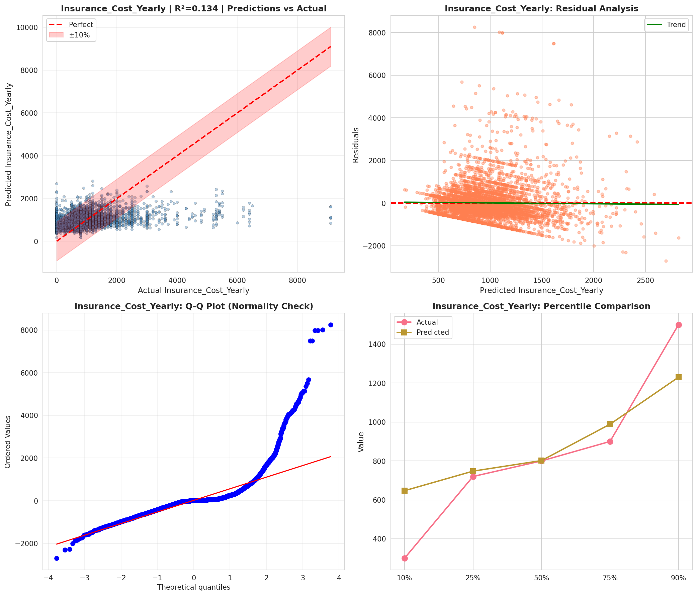
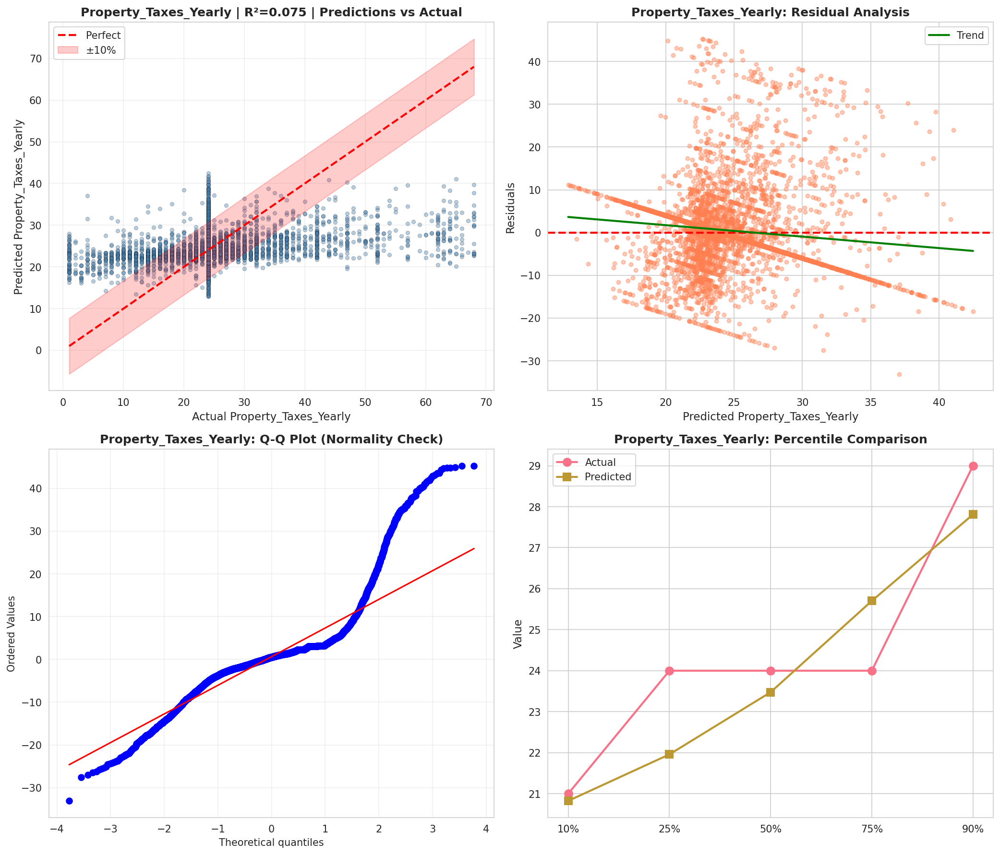
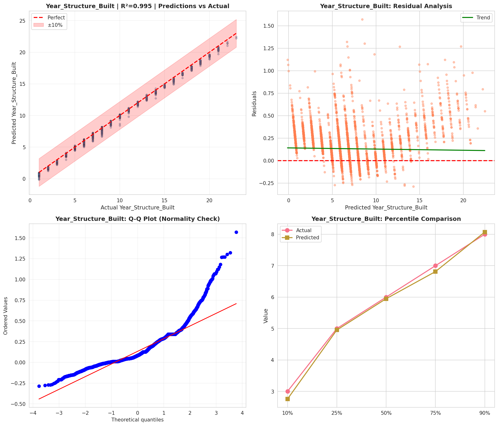
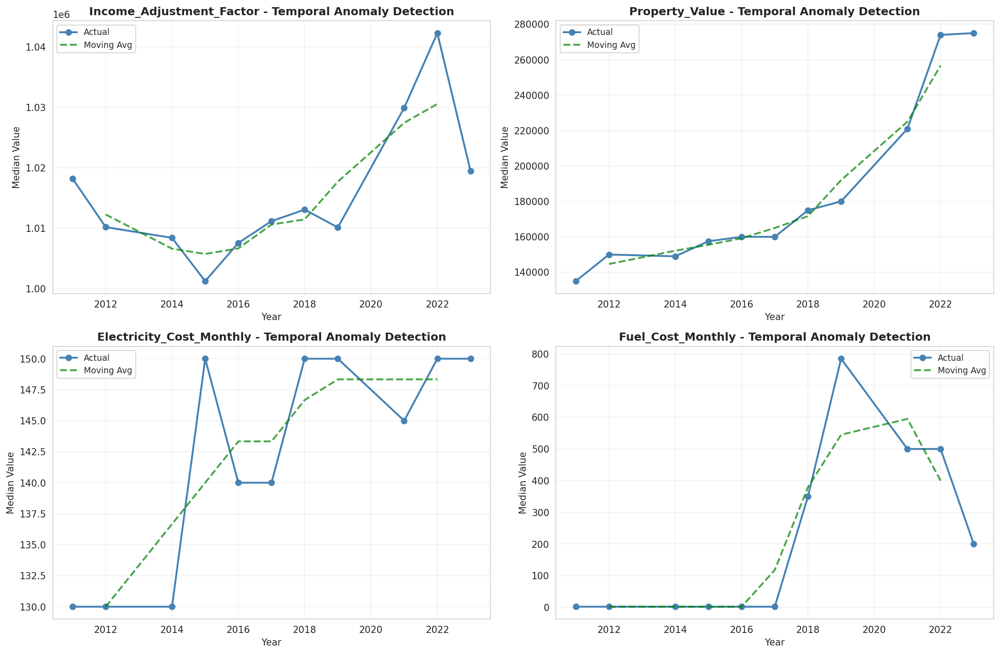
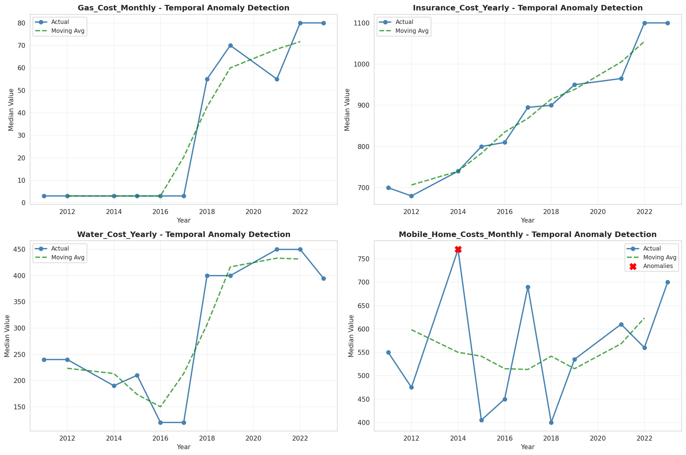
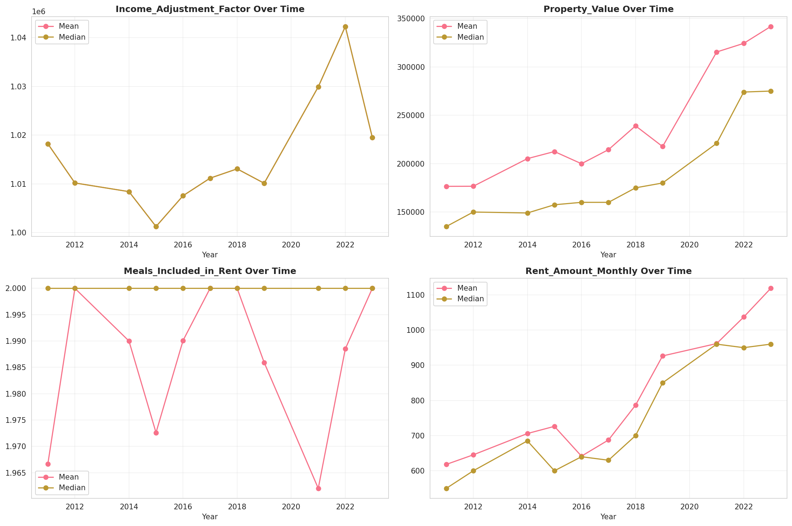
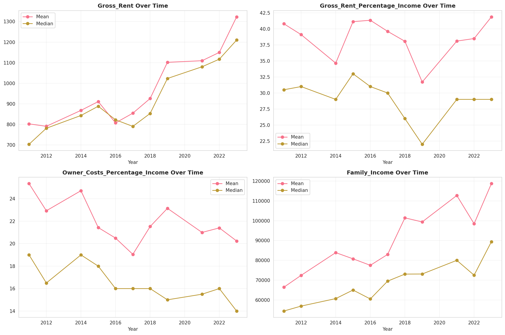
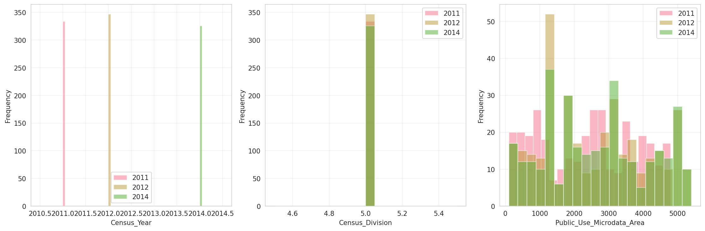
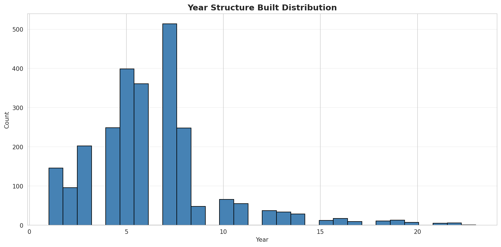
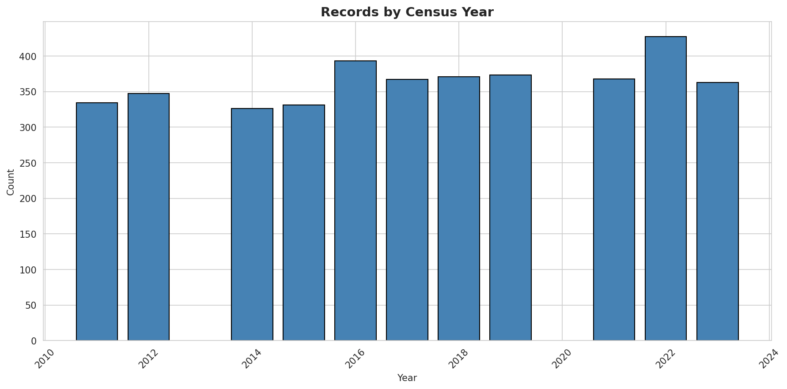
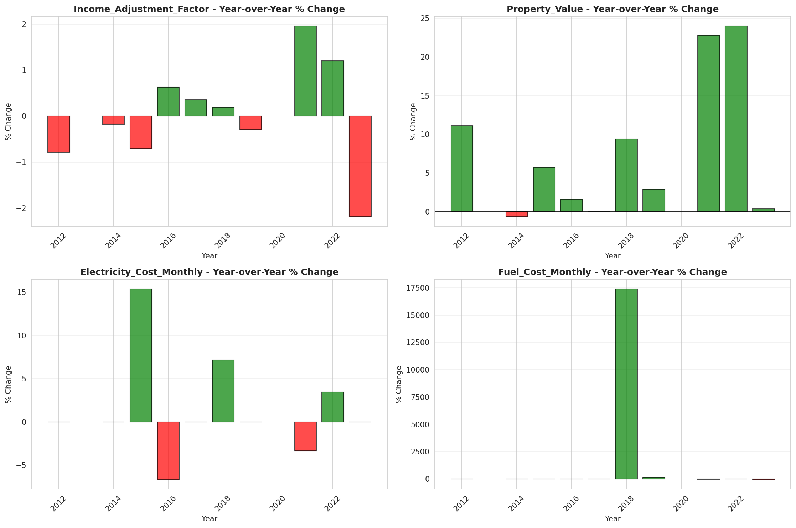
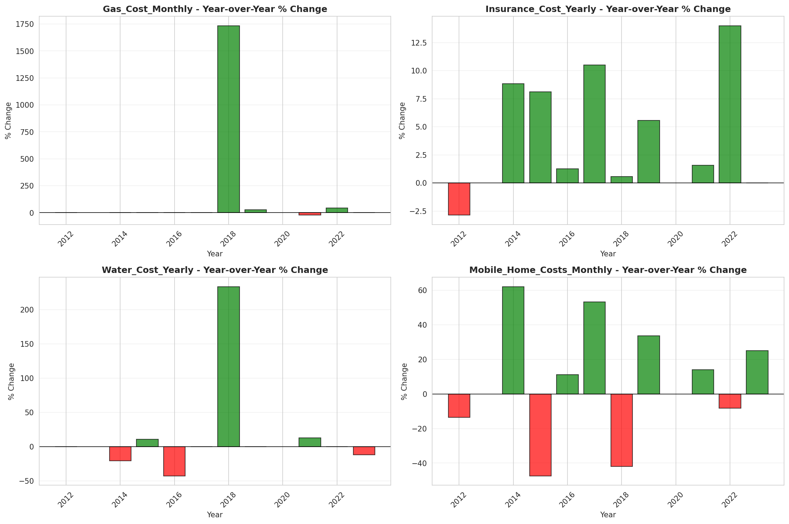
