# Temporal Analysis

## Year Distribution

- 2011: 229,227 records

- 2012: 234,075 records

- 2013: 238,019 records

- 2014: 241,899 records

- 2015: 245,680 records

- 2016: 247,089 records

- 2018: 253,253 records

- 2019: 256,923 records

- 2020: 248,190 records

- 2021: 251,721 records

- 2022: 256,297 records

- 2023: 260,807 records

## Temporal Trends

- Census_Year: {np.int64(2011): {'mean': 2011.0, 'median': 2011.0, 'std': 0.0}, np.int64(2012): {'mean': 2012.0, 'median': 2012.0, 'std': 0.0}, np.int64(2013): {'mean': 2013.0, 'median': 2013.0, 'std': 0.0}, np.int64(2014): {'mean': 2014.0, 'median': 2014.0, 'std': 0.0}, np.int64(2015): {'mean': 2015.0, 'median': 2015.0, 'std': 0.0}, np.int64(2016): {'mean': 2016.0, 'median': 2016.0, 'std': 0.0}, np.int64(2018): {'mean': 2018.0, 'median': 2018.0, 'std': 0.0}, np.int64(2019): {'mean': 2019.0, 'median': 2019.0, 'std': 0.0}, np.int64(2020): {'mean': 2020.0, 'median': 2020.0, 'std': 0.0}, np.int64(2021): {'mean': 2021.0, 'median': 2021.0, 'std': 0.0}, np.int64(2022): {'mean': 2022.0, 'median': 2022.0, 'std': 0.0}, np.int64(2023): {'mean': 2023.0, 'median': 2023.0, 'std': 0.0}}

- Census_Division: {np.int64(2011): {'mean': 5.0, 'median': 5.0, 'std': 0.0}, np.int64(2012): {'mean': 5.0, 'median': 5.0, 'std': 0.0}, np.int64(2013): {'mean': 5.0, 'median': 5.0, 'std': 0.0}, np.int64(2014): {'mean': 5.0, 'median': 5.0, 'std': 0.0}, np.int64(2015): {'mean': 5.0, 'median': 5.0, 'std': 0.0}, np.int64(2016): {'mean': 5.0, 'median': 5.0, 'std': 0.0}, np.int64(2018): {'mean': 5.0, 'median': 5.0, 'std': 0.0}, np.int64(2019): {'mean': 5.0, 'median': 5.0, 'std': 0.0}, np.int64(2020): {'mean': 5.0, 'median': 5.0, 'std': 0.0}, np.int64(2021): {'mean': 5.0, 'median': 5.0, 'std': 0.0}, np.int64(2022): {'mean': 5.0, 'median': 5.0, 'std': 0.0}, np.int64(2023): {'mean': 5.0, 'median': 5.0, 'std': 0.0}}

- Public_Use_Microdata_Area: {np.int64(2011): {'mean': 2362.011970666632, 'median': 2400.0, 'std': 1397.7935438015552}, np.int64(2012): {'mean': None, 'median': None, 'std': None}, np.int64(2013): {'mean': None, 'median': None, 'std': None}, np.int64(2014): {'mean': None, 'median': None, 'std': None}, np.int64(2015): {'mean': None, 'median': None, 'std': None}, np.int64(2016): {'mean': 2618.9730825734855, 'median': 2500.0, 'std': 1495.6214510041}, np.int64(2018): {'mean': 2620.7416022712464, 'median': 2500.0, 'std': 1493.7569574399795}, np.int64(2019): {'mean': 2623.6603885210743, 'median': 2600.0, 'std': 1492.4172845297528}, np.int64(2020): {'mean': 2626.2541923526333, 'median': 2600.0, 'std': 1495.0102097947208}, np.int64(2021): {'mean': 2629.4597510736094, 'median': 2600.0, 'std': 1495.5235955553658}, np.int64(2022): {'mean': None, 'median': None, 'std': None}, np.int64(2023): {'mean': 2597.326133884443, 'median': 2500.0, 'std': 1491.0545776735426}}

- Census_Region: {np.int64(2011): {'mean': 3.0, 'median': 3.0, 'std': 0.0}, np.int64(2012): {'mean': 3.0, 'median': 3.0, 'std': 0.0}, np.int64(2013): {'mean': 3.0, 'median': 3.0, 'std': 0.0}, np.int64(2014): {'mean': 3.0, 'median': 3.0, 'std': 0.0}, np.int64(2015): {'mean': 3.0, 'median': 3.0, 'std': 0.0}, np.int64(2016): {'mean': 3.0, 'median': 3.0, 'std': 0.0}, np.int64(2018): {'mean': 3.0, 'median': 3.0, 'std': 0.0}, np.int64(2019): {'mean': 3.0, 'median': 3.0, 'std': 0.0}, np.int64(2020): {'mean': 3.0, 'median': 3.0, 'std': 0.0}, np.int64(2021): {'mean': 3.0, 'median': 3.0, 'std': 0.0}, np.int64(2022): {'mean': 3.0, 'median': 3.0, 'std': 0.0}, np.int64(2023): {'mean': 3.0, 'median': 3.0, 'std': 0.0}}

- State_Code: {np.int64(2011): {'mean': 37.0, 'median': 37.0, 'std': 0.0}, np.int64(2012): {'mean': 37.0, 'median': 37.0, 'std': 0.0}, np.int64(2013): {'mean': 37.0, 'median': 37.0, 'std': 0.0}, np.int64(2014): {'mean': 37.0, 'median': 37.0, 'std': 0.0}, np.int64(2015): {'mean': 37.0, 'median': 37.0, 'std': 0.0}, np.int64(2016): {'mean': 37.0, 'median': 37.0, 'std': 0.0}, np.int64(2018): {'mean': 37.0, 'median': 37.0, 'std': 0.0}, np.int64(2019): {'mean': 37.0, 'median': 37.0, 'std': 0.0}, np.int64(2020): {'mean': 37.0, 'median': 37.0, 'std': 0.0}, np.int64(2021): {'mean': 37.0, 'median': 37.0, 'std': 0.0}, np.int64(2022): {'mean': 37.0, 'median': 37.0, 'std': 0.0}, np.int64(2023): {'mean': None, 'median': None, 'std': None}}

- Housing_Adjustment_Factor: {np.int64(2011): {'mean': 1040939.6314832022, 'median': 1044592.0, 'std': 27535.532497570734}, np.int64(2012): {'mean': 1041200.8742924277, 'median': 1053092.0, 'std': 27506.857031302367}, np.int64(2013): {'mean': 1039968.0051634533, 'median': 1035725.0, 'std': 32018.771792746065}, np.int64(2014): {'mean': 1036548.2044076247, 'median': 1031130.0, 'std': 29574.97870903083}, np.int64(2015): {'mean': 1020883.0724804624, 'median': 1017534.0, 'std': 20291.407324035248}, np.int64(2016): {'mean': 1020265.2655925598, 'median': 1013801.0, 'std': 15766.487982875922}, np.int64(2018): {'mean': 1037975.3127070558, 'median': 1046406.0, 'std': 23537.577384886965}, np.int64(2019): {'mean': 1040414.6134989861, 'median': 1042936.0, 'std': 29177.76259619837}, np.int64(2020): {'mean': 1036747.3977597809, 'median': 1030827.0, 'std': 28096.478422795044}, np.int64(2021): {'mean': 1058122.523667076, 'median': 1059761.0, 'std': 35921.40982234937}, np.int64(2022): {'mean': 1103491.5719458284, 'median': 1133141.0, 'std': 62299.75335445652}, np.int64(2023): {'mean': 1102837.6907291599, 'median': 1125501.0, 'std': 76858.63715396989}}

- Income_Adjustment_Factor: {np.int64(2011): {'mean': 1053557.3649264702, 'median': 1048026.0, 'std': 28309.666500680247}, np.int64(2012): {'mean': 1052451.3386905906, 'median': 1061121.0, 'std': 26408.5819680199}, np.int64(2013): {'mean': 1048992.2116511706, 'median': 1054614.0, 'std': 29636.82441268372}, np.int64(2014): {'mean': 1047399.8593751938, 'median': 1041654.0, 'std': 31023.3779955959}, np.int64(2015): {'mean': 1030287.1419244546, 'median': 1025215.0, 'std': 25660.567126411945}, np.int64(2016): {'mean': 1027421.942207059, 'median': 1022342.0, 'std': 17512.782825541442}, np.int64(2018): {'mean': 1046597.1538422052, 'median': 1054346.0, 'std': 20553.089242585473}, np.int64(2019): {'mean': 1049411.9892496974, 'median': 1054606.0, 'std': 26254.333140940493}, np.int64(2020): {'mean': 1046915.890704702, 'median': 1044328.0, 'std': 28539.057151723053}, np.int64(2021): {'mean': 1073314.0767476691, 'median': 1070512.0, 'std': 30889.115732730163}, np.int64(2022): {'mean': 1126200.817457871, 'median': 1140108.0, 'std': 50301.47347219587}, np.int64(2023): {'mean': 1127130.1209515082, 'median': 1159185.0, 'std': 70696.73491810904}}

- Housing_Unit_Weight: {np.int64(2011): {'mean': 18.701387707381766, 'median': 16.0, 'std': 15.230006091635296}, np.int64(2012): {'mean': 18.47735982057033, 'median': 15.0, 'std': 15.546709734456773}, np.int64(2013): {'mean': 18.27174721345775, 'median': 15.0, 'std': 15.77322827794466}, np.int64(2014): {'mean': 18.130161761727003, 'median': 15.0, 'std': 16.01229613734443}, np.int64(2015): {'mean': 17.979526212959946, 'median': 14.0, 'std': 16.294503287326634}, np.int64(2016): {'mean': 18.024950523900294, 'median': 14.0, 'std': 15.882516142857177}, np.int64(2018): {'mean': 18.057302381413052, 'median': 14.0, 'std': 15.989117612611546}, np.int64(2019): {'mean': 18.009633236417137, 'median': 14.0, 'std': 16.269733912692647}, np.int64(2020): {'mean': 18.88521697086909, 'median': 14.0, 'std': 20.95238520939373}, np.int64(2021): {'mean': 18.567886668176275, 'median': 14.0, 'std': 20.57423878252845}, np.int64(2022): {'mean': 18.493681158967917, 'median': 13.0, 'std': 20.898317914882586}, np.int64(2023): {'mean': 18.462675464999023, 'median': 13.0, 'std': 21.05495516662525}}

- Number_of_Persons: {np.int64(2011): {'mean': 2.049880685957588, 'median': 2.0, 'std': 1.407707748901601}, np.int64(2012): {'mean': 2.033484994125814, 'median': 2.0, 'std': 1.408039848006317}, np.int64(2013): {'mean': 2.0195824703069922, 'median': 2.0, 'std': 1.4091686304220066}, np.int64(2014): {'mean': 2.001872682400506, 'median': 2.0, 'std': 1.4115189857868466}, np.int64(2015): {'mean': 1.9818625854770433, 'median': 2.0, 'std': 1.4033110079726163}, np.int64(2016): {'mean': 1.9844671353237093, 'median': 2.0, 'std': 1.4047126317534877}, np.int64(2018): {'mean': 1.971806849277205, 'median': 2.0, 'std': 1.3991547097517318}, np.int64(2019): {'mean': 1.9657718460394749, 'median': 2.0, 'std': 1.3922634939879657}, np.int64(2020): {'mean': 1.9450904548934285, 'median': 2.0, 'std': 1.3895792280106742}, np.int64(2021): {'mean': 1.9366401690760802, 'median': 2.0, 'std': 1.383230353877669}, np.int64(2022): {'mean': 1.9332649231165406, 'median': 2.0, 'std': 1.3736982436977747}, np.int64(2023): {'mean': 1.9358644514909493, 'median': 2.0, 'std': 1.367475205792219}}

- Housing_Unit_Type: {np.int64(2011): {'mean': 1.107452437976329, 'median': 1.0, 'std': 0.4094327391816395}, np.int64(2012): {'mean': 1.121448253764819, 'median': 1.0, 'std': 0.43510220732218446}, np.int64(2013): {'mean': 1.133691007860717, 'median': 1.0, 'std': 0.4567746942112364}, np.int64(2014): {'mean': 1.1454491337293664, 'median': 1.0, 'std': 0.47683403860584317}, np.int64(2015): {'mean': 1.1579290133507, 'median': 1.0, 'std': 0.4959482538458742}, np.int64(2016): {'mean': 1.1555148145000385, 'median': 1.0, 'std': 0.49357306566222775}, np.int64(2018): {'mean': 1.1576763157790826, 'median': 1.0, 'std': 0.4980561354616576}, np.int64(2019): {'mean': 1.1600674131938362, 'median': 1.0, 'std': 0.5017706623758375}, np.int64(2020): {'mean': None, 'median': None, 'std': None}, np.int64(2021): {'mean': None, 'median': None, 'std': None}, np.int64(2022): {'mean': None, 'median': None, 'std': None}, np.int64(2023): {'mean': None, 'median': None, 'std': None}}

- Number_of_Bedrooms: {np.int64(2011): {'mean': 2.8239285395433638, 'median': 3.0, 'std': 0.9104246002366777}, np.int64(2012): {'mean': None, 'median': None, 'std': None}, np.int64(2013): {'mean': None, 'median': None, 'std': None}, np.int64(2014): {'mean': None, 'median': None, 'std': None}, np.int64(2015): {'mean': None, 'median': None, 'std': None}, np.int64(2016): {'mean': None, 'median': None, 'std': None}, np.int64(2018): {'mean': None, 'median': None, 'std': None}, np.int64(2019): {'mean': None, 'median': None, 'std': None}, np.int64(2020): {'mean': None, 'median': None, 'std': None}, np.int64(2021): {'mean': None, 'median': None, 'std': None}, np.int64(2022): {'mean': None, 'median': None, 'std': None}, np.int64(2023): {'mean': None, 'median': None, 'std': None}}

- Number_of_Rooms: {np.int64(2011): {'mean': 5.819784133786305, 'median': 6.0, 'std': 1.7836405162211186}, np.int64(2012): {'mean': None, 'median': None, 'std': None}, np.int64(2013): {'mean': None, 'median': None, 'std': None}, np.int64(2014): {'mean': None, 'median': None, 'std': None}, np.int64(2015): {'mean': None, 'median': None, 'std': None}, np.int64(2016): {'mean': None, 'median': None, 'std': None}, np.int64(2018): {'mean': None, 'median': None, 'std': None}, np.int64(2019): {'mean': None, 'median': None, 'std': None}, np.int64(2020): {'mean': None, 'median': None, 'std': None}, np.int64(2021): {'mean': None, 'median': None, 'std': None}, np.int64(2022): {'mean': None, 'median': None, 'std': None}, np.int64(2023): {'mean': None, 'median': None, 'std': None}}

- Building_Type: {np.int64(2011): {'mean': 2.5256018081262304, 'median': 2.0, 'std': 1.685516173242978}, np.int64(2012): {'mean': 2.5327983057459735, 'median': 2.0, 'std': 1.6953123358129238}, np.int64(2013): {'mean': 2.5386268959009413, 'median': 2.0, 'std': 1.7045158252744483}, np.int64(2014): {'mean': 2.544939821700687, 'median': 2.0, 'std': 1.7134885494227232}, np.int64(2015): {'mean': 2.5519301678761357, 'median': 2.0, 'std': 1.7204380031826343}, np.int64(2016): {'mean': 2.5571348327229426, 'median': 2.0, 'std': 1.725004657050325}, np.int64(2018): {'mean': 2.580767306966663, 'median': 2.0, 'std': 1.7541397588813104}, np.int64(2019): {'mean': 2.596322605795469, 'median': 2.0, 'std': 1.7758122189933983}, np.int64(2020): {'mean': 2.605596764540525, 'median': 2.0, 'std': 1.7895330821346473}, np.int64(2021): {'mean': 2.615045100349959, 'median': 2.0, 'std': 1.8042247958535345}, np.int64(2022): {'mean': 2.625018816133174, 'median': 2.0, 'std': 1.8213869614085072}, np.int64(2023): {'mean': 2.626701163390352, 'median': 2.0, 'std': 1.8266922991371297}}

- Year_Structure_Built: {np.int64(2011): {'mean': 4.518191685814573, 'median': 4.0, 'std': 2.1989364907868008}, np.int64(2012): {'mean': 5.643129168292185, 'median': 6.0, 'std': 2.4903333957791527}, np.int64(2013): {'mean': 5.724035075605883, 'median': 6.0, 'std': 2.585754964174555}, np.int64(2014): {'mean': 5.790265624001971, 'median': 6.0, 'std': 2.6731466388746146}, np.int64(2015): {'mean': 5.870505259152556, 'median': 6.0, 'std': 2.8012537273130107}, np.int64(2016): {'mean': 6.028170849529287, 'median': 6.0, 'std': 2.9826313169044334}, np.int64(2018): {'mean': 6.329168019516133, 'median': 6.0, 'std': 3.4687666361806073}, np.int64(2019): {'mean': 6.516957595183436, 'median': 6.0, 'std': 3.776120602223501}, np.int64(2020): {'mean': 6.685803152033951, 'median': 6.0, 'std': 4.057487862819834}, np.int64(2021): {'mean': None, 'median': None, 'std': None}, np.int64(2022): {'mean': None, 'median': None, 'std': None}, np.int64(2023): {'mean': None, 'median': None, 'std': None}}

- Bathtub_or_Shower: {np.int64(2011): {'mean': None, 'median': None, 'std': None}, np.int64(2012): {'mean': 1.0076074235077745, 'median': 1.0, 'std': 0.08688835179795903}, np.int64(2013): {'mean': 1.0071394048194435, 'median': 1.0, 'std': 0.08419303027669182}, np.int64(2014): {'mean': 1.0068162531594749, 'median': 1.0, 'std': 0.08227893253503556}, np.int64(2015): {'mean': 1.006482211290191, 'median': 1.0, 'std': 0.08025099002628534}, np.int64(2016): {'mean': 1.0060350057294358, 'median': 1.0, 'std': 0.07745070297352014}, np.int64(2018): {'mean': 1.0065331660187615, 'median': 1.0, 'std': 0.08056371539615975}, np.int64(2019): {'mean': 1.0066054489539569, 'median': 1.0, 'std': 0.08100521847588607}, np.int64(2020): {'mean': 1.0067692558805927, 'median': 1.0, 'std': 0.08199672883458192}, np.int64(2021): {'mean': 1.007057431811766, 'median': 1.0, 'std': 0.08371174271664035}, np.int64(2022): {'mean': 1.0066941160844733, 'median': 1.0, 'std': 0.08154345058364983}, np.int64(2023): {'mean': 1.0065249503963918, 'median': 1.0, 'std': 0.08051337621269579}}

- Refrigerator: {np.int64(2011): {'mean': None, 'median': None, 'std': None}, np.int64(2012): {'mean': 1.016840364859091, 'median': 1.0, 'std': 0.12867339999417568}, np.int64(2013): {'mean': 1.0168565444544178, 'median': 1.0, 'std': 0.1287341355205018}, np.int64(2014): {'mean': 1.0172459417287916, 'median': 1.0, 'std': 0.1301867756312774}, np.int64(2015): {'mean': 1.0167740240444287, 'median': 1.0, 'std': 0.12842402762464608}, np.int64(2016): {'mean': 1.0160289392679802, 'median': 1.0, 'std': 0.1255869549298116}, np.int64(2018): {'mean': 1.0164535745939258, 'median': 1.0, 'std': 0.12721212788698172}, np.int64(2019): {'mean': 1.0162775587993242, 'median': 1.0, 'std': 0.1265411760527213}, np.int64(2020): {'mean': 1.016852862765012, 'median': 1.0, 'std': 0.1287203127134415}, np.int64(2021): {'mean': 1.0167989281665464, 'median': 1.0, 'std': 0.12851769601604598}, np.int64(2022): {'mean': 1.0155399123389561, 'median': 1.0, 'std': 0.12368706963483797}, np.int64(2023): {'mean': 1.0144484166178642, 'median': 1.0, 'std': 0.1193303067449363}}

- Hot_and_Cold_Running_Water: {np.int64(2011): {'mean': None, 'median': None, 'std': None}, np.int64(2012): {'mean': 1.0136264838655744, 'median': 1.0, 'std': 0.11593474555515766}, np.int64(2013): {'mean': 1.0134134272365303, 'median': 1.0, 'std': 0.11503724667128337}, np.int64(2014): {'mean': 1.0133906981412708, 'median': 1.0, 'std': 0.11494106150854952}, np.int64(2015): {'mean': 1.0131184373839226, 'median': 1.0, 'std': 0.11378225973213872}, np.int64(2016): {'mean': 1.0126496955535085, 'median': 1.0, 'std': 0.11175749138528625}, np.int64(2018): {'mean': 1.0147906666549664, 'median': 1.0, 'std': 0.12071440167237413}, np.int64(2019): {'mean': 1.0156668254862045, 'median': 1.0, 'std': 0.12418310216158067}, np.int64(2020): {'mean': 1.0166170949781461, 'median': 1.0, 'std': 0.12783208213452352}, np.int64(2021): {'mean': 1.0174038508932692, 'median': 1.0, 'std': 0.13077091991543852}, np.int64(2022): {'mean': 1.0165006419621907, 'median': 1.0, 'std': 0.12739090479945278}, np.int64(2023): {'mean': 1.015615303259416, 'median': 1.0, 'std': 0.12398198555715309}}

- Running_Water: {np.int64(2011): {'mean': None, 'median': None, 'std': None}, np.int64(2012): {'mean': None, 'median': None, 'std': None}, np.int64(2013): {'mean': 9.0, 'median': 9.0, 'std': 0.0}, np.int64(2014): {'mean': 9.0, 'median': 9.0, 'std': 0.0}, np.int64(2015): {'mean': 9.0, 'median': 9.0, 'std': 0.0}, np.int64(2016): {'mean': 9.0, 'median': 9.0, 'std': 0.0}, np.int64(2018): {'mean': 9.0, 'median': 9.0, 'std': 0.0}, np.int64(2019): {'mean': 9.0, 'median': 9.0, 'std': 0.0}, np.int64(2020): {'mean': 9.0, 'median': 9.0, 'std': 0.0}, np.int64(2021): {'mean': 9.0, 'median': 9.0, 'std': 0.0}, np.int64(2022): {'mean': 9.0, 'median': 9.0, 'std': 0.0}, np.int64(2023): {'mean': 9.0, 'median': 9.0, 'std': 0.0}}

- Sink_with_Faucet: {np.int64(2011): {'mean': None, 'median': None, 'std': None}, np.int64(2012): {'mean': 1.0069897267272288, 'median': 1.0, 'std': 0.0833120800568349}, np.int64(2013): {'mean': 1.0066238578563373, 'median': 1.0, 'std': 0.0811172771478341}, np.int64(2014): {'mean': 1.0062094515060542, 'median': 1.0, 'std': 0.07855521861963308}, np.int64(2015): {'mean': 1.005848032687377, 'median': 1.0, 'std': 0.07624866908320141}, np.int64(2016): {'mean': 1.0054867773608647, 'median': 1.0, 'std': 0.07386946023683567}, np.int64(2018): {'mean': 1.0058004334968453, 'median': 1.0, 'std': 0.07593954023221815}, np.int64(2019): {'mean': 1.0058647723827263, 'median': 1.0, 'std': 0.07635706962471131}, np.int64(2020): {'mean': 1.006098224487205, 'median': 1.0, 'std': 0.07785283312857866}, np.int64(2021): {'mean': 1.0064211427214353, 'median': 1.0, 'std': 0.07987452807696896}, np.int64(2022): {'mean': 1.0061141364501704, 'median': 1.0, 'std': 0.07795370863227047}, np.int64(2023): {'mean': 1.0059611737044063, 'median': 1.0, 'std': 0.07697833467780778}}

- Stove_or_Range: {np.int64(2011): {'mean': None, 'median': None, 'std': None}, np.int64(2012): {'mean': 1.0165245499637743, 'median': 1.0, 'std': 0.12748162491122927}, np.int64(2013): {'mean': 1.0166033740707496, 'median': 1.0, 'std': 0.1277801909474754}, np.int64(2014): {'mean': 1.0170041335511129, 'median': 1.0, 'std': 0.12928677138218322}, np.int64(2015): {'mean': 1.016642658476703, 'median': 1.0, 'std': 0.1279287087791387}, np.int64(2016): {'mean': 1.0159076100388702, 'median': 1.0, 'std': 0.12511845718572406}, np.int64(2018): {'mean': 1.016602753670244, 'median': 1.0, 'std': 0.12777783015156316}, np.int64(2019): {'mean': 1.0167150344349634, 'median': 1.0, 'std': 0.1282018457321861}, np.int64(2020): {'mean': 1.01727452438383, 'median': 1.0, 'std': 0.13029271722213934}, np.int64(2021): {'mean': 1.0173500799842272, 'median': 1.0, 'std': 0.130572321356306}, np.int64(2022): {'mean': 1.0162615663877452, 'median': 1.0, 'std': 0.12648003269752492}, np.int64(2023): {'mean': 1.0153661926280735, 'median': 1.0, 'std': 0.12300462949163264}}

- Telephone_Service: {np.int64(2011): {'mean': 1.0273038608471172, 'median': 1.0, 'std': 0.1629677828866721}, np.int64(2012): {'mean': 1.0224303596387623, 'median': 1.0, 'std': 0.14807886985499114}, np.int64(2013): {'mean': 1.0226968813562796, 'median': 1.0, 'std': 0.14893571291181135}, np.int64(2014): {'mean': 1.0235615572445926, 'median': 1.0, 'std': 0.15167902803326969}, np.int64(2015): {'mean': 1.0241529960370819, 'median': 1.0, 'std': 0.15352442286542548}, np.int64(2016): {'mean': 1.0826719709940578, 'median': 1.0, 'std': 0.6490159097371653}, np.int64(2018): {'mean': 1.0779861066602245, 'median': 1.0, 'std': 0.6403513669225724}, np.int64(2019): {'mean': 1.0742495282192954, 'median': 1.0, 'std': 0.6342881811753721}, np.int64(2020): {'mean': 1.073956841889957, 'median': 1.0, 'std': 0.6474606272684027}, np.int64(2021): {'mean': 1.0111292334260769, 'median': 1.0, 'std': 0.10490676413852268}, np.int64(2022): {'mean': 1.009562156499635, 'median': 1.0, 'std': 0.09731787442677936}, np.int64(2023): {'mean': 1.008198837645477, 'median': 1.0, 'std': 0.09017569695101997}}

- Lot_Acreage: {np.int64(2011): {'mean': 1.3578740847910913, 'median': 1.0, 'std': 0.5588401064271196}, np.int64(2012): {'mean': 1.3550886515209022, 'median': 1.0, 'std': 0.5572223241430467}, np.int64(2013): {'mean': 1.3541492961231636, 'median': 1.0, 'std': 0.5557022344519041}, np.int64(2014): {'mean': 1.3515654610970238, 'median': 1.0, 'std': 0.5536974464345591}, np.int64(2015): {'mean': 1.3515206199246323, 'median': 1.0, 'std': 0.5539475571561145}, np.int64(2016): {'mean': 1.3481633512261868, 'median': 1.0, 'std': 0.5512781071297244}, np.int64(2018): {'mean': 1.340223722872313, 'median': 1.0, 'std': 0.5466511043220136}, np.int64(2019): {'mean': 1.3395151385427655, 'median': 1.0, 'std': 0.5462481323249508}, np.int64(2020): {'mean': 1.3373686176172437, 'median': 1.0, 'std': 0.5453184201397262}, np.int64(2021): {'mean': 1.3354462755438365, 'median': 1.0, 'std': 0.5443441763302127}, np.int64(2022): {'mean': 1.339347772851136, 'median': 1.0, 'std': 0.5461052852115702}, np.int64(2023): {'mean': 1.3412019591132651, 'median': 1.0, 'std': 0.5459830049814479}}

- Agricultural_Sales: {np.int64(2011): {'mean': 1.1188435840011846, 'median': 1.0, 'std': 0.6375085426755595}, np.int64(2012): {'mean': 1.1158256880733946, 'median': 1.0, 'std': 0.6303976297701761}, np.int64(2013): {'mean': 1.113318251209329, 'median': 1.0, 'std': 0.6222474149934808}, np.int64(2014): {'mean': 1.1103812467800103, 'median': 1.0, 'std': 0.6164856188096388}, np.int64(2015): {'mean': 1.1115186414568394, 'median': 1.0, 'std': 0.6222187993400276}, np.int64(2016): {'mean': 1.1107911293724892, 'median': 1.0, 'std': 0.6184132198288899}, np.int64(2018): {'mean': 1.1123837981407703, 'median': 1.0, 'std': 0.6270699635930499}, np.int64(2019): {'mean': 1.1126484745328429, 'median': 1.0, 'std': 0.6296487661477159}, np.int64(2020): {'mean': 1.113029492694648, 'median': 1.0, 'std': 0.6307634978624523}, np.int64(2021): {'mean': 1.1135541008856373, 'median': 1.0, 'std': 0.6346839030942935}, np.int64(2022): {'mean': 1.1130244149225206, 'median': 1.0, 'std': 0.634186891392177}, np.int64(2023): {'mean': 1.1112165738797115, 'median': 1.0, 'std': 0.6256328194585992}}

- Business_On_Property: {np.int64(2011): {'mean': 1.985449822438511, 'median': 2.0, 'std': 0.11974367822086833}, np.int64(2012): {'mean': 1.9856747817600173, 'median': 2.0, 'std': 0.11882795514112608}, np.int64(2013): {'mean': 1.986320528889343, 'median': 2.0, 'std': 0.11615685842889718}, np.int64(2014): {'mean': 1.9870012011210463, 'median': 2.0, 'std': 0.11326914229704502}, np.int64(2015): {'mean': 1.9873785892468552, 'median': 2.0, 'std': 0.11163412062479004}, np.int64(2016): {'mean': 3.416150931480897, 'median': 2.0, 'std': 2.826034314484462}, np.int64(2018): {'mean': 6.2458889633486265, 'median': 9.0, 'std': 3.425270065109588}, np.int64(2019): {'mean': 7.6342185596852525, 'median': 9.0, 'std': 2.7775605373225822}, np.int64(2020): {'mean': None, 'median': None, 'std': None}, np.int64(2021): {'mean': None, 'median': None, 'std': None}, np.int64(2022): {'mean': None, 'median': None, 'std': None}, np.int64(2023): {'mean': None, 'median': None, 'std': None}}

- Tenure: {np.int64(2011): {'mean': 1.8313572818970094, 'median': 2.0, 'std': 0.8926600541176397}, np.int64(2012): {'mean': 1.8460820366292054, 'median': 2.0, 'std': 0.8950532775149793}, np.int64(2013): {'mean': 1.8624046397958818, 'median': 2.0, 'std': 0.8970832580045075}, np.int64(2014): {'mean': 1.8759526321960371, 'median': 2.0, 'std': 0.8965182359556106}, np.int64(2015): {'mean': 1.8861054308721972, 'median': 2.0, 'std': 0.8956481259255871}, np.int64(2016): {'mean': 1.885622922751536, 'median': 2.0, 'std': 0.8922229464732039}, np.int64(2018): {'mean': 1.8879559830597887, 'median': 2.0, 'std': 0.8849670222856051}, np.int64(2019): {'mean': 1.885678294196611, 'median': 2.0, 'std': 0.8816093807313602}, np.int64(2020): {'mean': 1.8816322356310085, 'median': 2.0, 'std': 0.8779496750723218}, np.int64(2021): {'mean': 1.8784924029348051, 'median': 2.0, 'std': 0.8741797074049046}, np.int64(2022): {'mean': 1.874286934201838, 'median': 2.0, 'std': 0.8704978647811641}, np.int64(2023): {'mean': 1.8696272768459563, 'median': 2.0, 'std': 0.8658987291016993}}

- Vacancy_Status: {np.int64(2011): {'mean': 4.628245418943093, 'median': 5.0, 'std': 2.1508772723303577}, np.int64(2012): {'mean': 4.654267979651841, 'median': 5.0, 'std': 2.1356151583571195}, np.int64(2013): {'mean': 4.682605148658448, 'median': 5.0, 'std': 2.1124645875261137}, np.int64(2014): {'mean': 4.735737562459266, 'median': 5.0, 'std': 2.0803445177526547}, np.int64(2015): {'mean': 4.781934884506566, 'median': 5.0, 'std': 2.0545753957301036}, np.int64(2016): {'mean': 4.816739720308912, 'median': 5.0, 'std': 2.036195467894675}, np.int64(2018): {'mean': 4.896942152055177, 'median': 5.0, 'std': 2.034239599866152}, np.int64(2019): {'mean': 4.935367687801789, 'median': 5.0, 'std': 2.0411893118995246}, np.int64(2020): {'mean': 4.9571531445031205, 'median': 5.0, 'std': 2.050893871911784}, np.int64(2021): {'mean': 4.975091516791342, 'median': 5.0, 'std': 2.0520504665640362}, np.int64(2022): {'mean': 4.962087440186496, 'median': 5.0, 'std': 2.0691111777108895}, np.int64(2023): {'mean': 4.952211036064738, 'median': 5.0, 'std': 2.078976340889952}}

- Property_Value: {np.int64(2011): {'mean': 15.0237834554175, 'median': 16.0, 'std': 4.864606247029812}}

- Vehicles_Available: {np.int64(2011): {'mean': 1.890545140370783, 'median': 2.0, 'std': 1.068634937466625}, np.int64(2012): {'mean': 1.8803800112435465, 'median': 2.0, 'std': 1.065673030186029}, np.int64(2013): {'mean': 1.8745420916994995, 'median': 2.0, 'std': 1.0650309730038567}, np.int64(2014): {'mean': 1.8741429496296522, 'median': 2.0, 'std': 1.0661561342887118}, np.int64(2015): {'mean': 1.8816858385301176, 'median': 2.0, 'std': 1.0704266119015766}, np.int64(2016): {'mean': 1.8973562292275155, 'median': 2.0, 'std': 1.0694720893312233}, np.int64(2018): {'mean': 1.9298874432409248, 'median': 2.0, 'std': 1.0799110177204407}, np.int64(2019): {'mean': 1.9466936440925273, 'median': 2.0, 'std': 1.0868828326048603}, np.int64(2020): {'mean': 1.9622161996318266, 'median': 2.0, 'std': 1.0925541737084505}, np.int64(2021): {'mean': 1.9718890914324092, 'median': 2.0, 'std': 1.098955034635756}, np.int64(2022): {'mean': 1.978840129282739, 'median': 2.0, 'std': 1.10229503665258}, np.int64(2023): {'mean': 1.9840358936635603, 'median': 2.0, 'std': 1.1082454009373466}}

- Condo_Fee_Monthly: {np.int64(2011): {'mean': 179.63716814159292, 'median': 140.0, 'std': 162.9947999263877}, np.int64(2012): {'mean': 181.8436457947388, 'median': 150.0, 'std': 157.27698389809618}, np.int64(2013): {'mean': 187.08187708619673, 'median': 150.0, 'std': 157.36863301485104}, np.int64(2014): {'mean': 194.8910472972973, 'median': 160.0, 'std': 157.27408650250192}, np.int64(2015): {'mean': 200.1529276693456, 'median': 160.0, 'std': 153.13689954526401}, np.int64(2016): {'mean': 205.9810606060606, 'median': 170.0, 'std': 154.27048347226662}, np.int64(2018): {'mean': 221.61979913916787, 'median': 190.0, 'std': 154.80138533723618}, np.int64(2019): {'mean': 232.17803203661327, 'median': 190.0, 'std': 164.2674503973048}, np.int64(2020): {'mean': 244.31459074733095, 'median': 200.0, 'std': 195.44389186603655}, np.int64(2021): {'mean': 257.9550408719346, 'median': 200.0, 'std': 223.85884389301975}, np.int64(2022): {'mean': 275.9135611907387, 'median': 210.0, 'std': 264.26091144055323}, np.int64(2023): {'mean': 297.2656116338751, 'median': 230.0, 'std': 291.37539016107553}}

- Electricity_Cost_Monthly: {np.int64(2011): {'mean': 140.6653637565449, 'median': 120.0, 'std': 85.25933618313609}, np.int64(2012): {'mean': 142.85781039667026, 'median': 130.0, 'std': 85.95343081345086}, np.int64(2013): {'mean': 145.69136852460025, 'median': 130.0, 'std': 86.87038360831359}, np.int64(2014): {'mean': 148.8257352154032, 'median': 130.0, 'std': 88.24405031968045}, np.int64(2015): {'mean': 150.24667008326693, 'median': 130.0, 'std': 88.58203724566577}, np.int64(2016): {'mean': 150.6026739852956, 'median': 140.0, 'std': 87.84322608994094}, np.int64(2018): {'mean': 158.08450933178904, 'median': 140.0, 'std': 86.9756186608797}, np.int64(2019): {'mean': 158.45412361318515, 'median': 140.0, 'std': 86.90124050446592}, np.int64(2020): {'mean': 157.6598186387898, 'median': 140.0, 'std': 86.80779355375674}, np.int64(2021): {'mean': 158.63301201184018, 'median': 140.0, 'std': 89.19630079024631}, np.int64(2022): {'mean': 163.75836440734318, 'median': 140.0, 'std': 117.18226922464531}, np.int64(2023): {'mean': 168.43294011344813, 'median': 150.0, 'std': 143.93824508098857}}

- Fuel_Cost_Monthly: {np.int64(2011): {'mean': 130.11182299853226, 'median': 2.0, 'std': 422.833239386371}, np.int64(2012): {'mean': 126.20269329358551, 'median': 2.0, 'std': 420.9106953133456}, np.int64(2013): {'mean': 114.86891142068131, 'median': 2.0, 'std': 401.1960714341945}, np.int64(2014): {'mean': 106.3972023836833, 'median': 2.0, 'std': 389.0171472022742}, np.int64(2015): {'mean': 97.53631321767634, 'median': 2.0, 'std': 377.6573411858338}, np.int64(2016): {'mean': 81.35622419176151, 'median': 2.0, 'std': 337.85240172821096}, np.int64(2018): {'mean': 725.1053042992742, 'median': 500.0, 'std': 727.7192594203885}, np.int64(2019): {'mean': 702.2178297238455, 'median': 500.0, 'std': 704.0517393259761}, np.int64(2020): {'mean': 662.0039702868852, 'median': 500.0, 'std': 657.1251608525907}, np.int64(2021): {'mean': 657.070511954613, 'median': 500.0, 'std': 656.5202311736156}, np.int64(2022): {'mean': 687.0213327774303, 'median': 500.0, 'std': 702.8432968747995}, np.int64(2023): {'mean': 702.244212044717, 'median': 500.0, 'std': 726.529746583087}}

- Gas_Cost_Monthly: {np.int64(2011): {'mean': 46.89375123611646, 'median': 3.0, 'std': 82.74928778967082}, np.int64(2012): {'mean': 45.477242133385595, 'median': 3.0, 'std': 81.74881509066078}, np.int64(2013): {'mean': 43.75174325369785, 'median': 3.0, 'std': 79.28949558194367}, np.int64(2014): {'mean': 43.24669796652852, 'median': 3.0, 'std': 79.09583731380444}, np.int64(2015): {'mean': 41.89525413924507, 'median': 3.0, 'std': 76.98986627655354}, np.int64(2016): {'mean': 39.71833517977641, 'median': 3.0, 'std': 72.95915908612086}, np.int64(2018): {'mean': 90.3060303051793, 'median': 60.0, 'std': 91.53101985690134}, np.int64(2019): {'mean': 87.12334407238977, 'median': 60.0, 'std': 88.68015133176995}, np.int64(2020): {'mean': 85.47085703174372, 'median': 60.0, 'std': 87.36552378439711}, np.int64(2021): {'mean': 88.45609122781826, 'median': 60.0, 'std': 90.76744784058093}, np.int64(2022): {'mean': 96.29600262738107, 'median': 60.0, 'std': 117.73619803881057}, np.int64(2023): {'mean': 101.44399444705775, 'median': 60.0, 'std': 134.4593332057234}}

- House_Heating_Fuel: {np.int64(2011): {'mean': 2.532701135665733, 'median': 3.0, 'std': 1.1632928668839884}, np.int64(2012): {'mean': 2.5386122987895137, 'median': 3.0, 'std': 1.1605545029588886}, np.int64(2013): {'mean': 2.5462109529103754, 'median': 3.0, 'std': 1.1624845268574655}, np.int64(2014): {'mean': 2.551448510707713, 'median': 3.0, 'std': 1.1654442848256823}, np.int64(2015): {'mean': 2.552479487712924, 'median': 3.0, 'std': 1.1648954775584859}, np.int64(2016): {'mean': 2.548252593413234, 'median': 3.0, 'std': 1.1634866848153858}, np.int64(2018): {'mean': 2.5400210027066867, 'median': 3.0, 'std': 1.155078088817467}, np.int64(2019): {'mean': 2.5350722748584658, 'median': 3.0, 'std': 1.1474980048196501}, np.int64(2020): {'mean': 2.53054305583964, 'median': 3.0, 'std': 1.1413025147812124}, np.int64(2021): {'mean': 2.529077899584421, 'median': 3.0, 'std': 1.1404699118711907}, np.int64(2022): {'mean': 2.5301982434626327, 'median': 3.0, 'std': 1.1363844137927446}, np.int64(2023): {'mean': 2.537201677765707, 'median': 3.0, 'std': 1.1430314544491835}}

- Insurance_Cost_Yearly: {np.int64(2013): {'mean': 842.6842019808411, 'median': 680.0, 'std': 671.2133489595743}, np.int64(2014): {'mean': 881.2447510253337, 'median': 700.0, 'std': 707.7096239700238}, np.int64(2015): {'mean': 918.8408711581518, 'median': 740.0, 'std': 733.8081746624323}}

- Water_Cost_Yearly: {np.int64(2011): {'mean': 303.8133542215329, 'median': 200.0, 'std': 383.0593151912173}, np.int64(2012): {'mean': 314.10224406748193, 'median': 210.0, 'std': 394.9705399596453}, np.int64(2013): {'mean': 320.61935331820206, 'median': 210.0, 'std': 402.75090244377964}, np.int64(2014): {'mean': 327.254115116202, 'median': 220.0, 'std': 410.27930528488866}, np.int64(2015): {'mean': 332.76661406455344, 'median': 220.0, 'std': 417.5727690440894}, np.int64(2016): {'mean': 336.7222983180582, 'median': 200.0, 'std': 423.9647814440715}, np.int64(2018): {'mean': 497.0194384449244, 'median': 400.0, 'std': 449.30741639998445}, np.int64(2019): {'mean': 502.8373956686909, 'median': 410.0, 'std': 460.91736248198805}, np.int64(2020): {'mean': 508.97922715131807, 'median': 420.0, 'std': 475.3951527419861}, np.int64(2021): {'mean': 517.3470323209748, 'median': 420.0, 'std': 496.21727733730285}, np.int64(2022): {'mean': 524.7561329372551, 'median': 420.0, 'std': 514.7627975341549}, np.int64(2023): {'mean': 533.9012461759636, 'median': 420.0, 'std': 536.997091467509}}

- Mobile_Home_Costs_Monthly: {np.int64(2011): {'mean': 931.8319426720329, 'median': 500.0, 'std': 1202.6177286099212}, np.int64(2012): {'mean': 950.4203504579849, 'median': 500.0, 'std': 1220.5947711945707}, np.int64(2013): {'mean': 943.5675995270004, 'median': 500.0, 'std': 1211.6941095102543}, np.int64(2014): {'mean': 939.7690948360495, 'median': 500.0, 'std': 1226.1909926306535}, np.int64(2015): {'mean': 946.0563682465379, 'median': 500.0, 'std': 1296.9472501415687}, np.int64(2016): {'mean': 964.5074742019481, 'median': 500.0, 'std': 1353.7691689273665}, np.int64(2018): {'mean': 971.3160165041261, 'median': 500.0, 'std': 1373.855078290314}, np.int64(2019): {'mean': 988.2303926096997, 'median': 500.0, 'std': 1384.5499199786416}, np.int64(2020): {'mean': 1067.555444953215, 'median': 540.0, 'std': 1759.4726718786567}, np.int64(2021): {'mean': 1201.2900415759257, 'median': 570.0, 'std': 2450.2632545201445}, np.int64(2022): {'mean': 1396.2537472198046, 'median': 590.0, 'std': 3406.513008516507}, np.int64(2023): {'mean': 1586.7235005658242, 'median': 600.0, 'std': 4020.527297930003}}

- First_Mortgage_Includes_Insurance: {np.int64(2011): {'mean': 1.4082404458598725, 'median': 1.0, 'std': 0.4915107889508515}, np.int64(2012): {'mean': 1.397244559285412, 'median': 1.0, 'std': 0.48933014032799244}, np.int64(2013): {'mean': 1.3924004920382345, 'median': 1.0, 'std': 0.48828786241297184}, np.int64(2014): {'mean': 1.3842526894026093, 'median': 1.0, 'std': 0.4864208752337784}, np.int64(2015): {'mean': 1.375457197092458, 'median': 1.0, 'std': 0.4842435383101231}, np.int64(2016): {'mean': 1.3656367851088123, 'median': 1.0, 'std': 0.4816110479571618}, np.int64(2018): {'mean': 1.3426851184139739, 'median': 1.0, 'std': 0.4746099518625085}, np.int64(2019): {'mean': 1.333586084358484, 'median': 1.0, 'std': 0.4714964735792444}, np.int64(2020): {'mean': 1.3224800997410568, 'median': 1.0, 'std': 0.46742839482148274}, np.int64(2021): {'mean': 1.3096507518121367, 'median': 1.0, 'std': 0.46235238174398463}, np.int64(2022): {'mean': 1.3005010532830297, 'median': 1.0, 'std': 0.45847864943373623}, np.int64(2023): {'mean': 1.2944416920282162, 'median': 1.0, 'std': 0.4557940682329876}}

- First_Mortgage_Payment_Monthly: {np.int64(2011): {'mean': 998.6706475583865, 'median': 850.0, 'std': 674.7647219934164}, np.int64(2012): {'mean': 1005.3890584278173, 'median': 850.0, 'std': 676.9763942270052}, np.int64(2013): {'mean': 1000.1973118461591, 'median': 850.0, 'std': 666.0370470169735}, np.int64(2014): {'mean': 997.8330281528954, 'median': 850.0, 'std': 661.1814053804887}, np.int64(2015): {'mean': 998.5355572017223, 'median': 850.0, 'std': 658.3277762166376}, np.int64(2016): {'mean': 1012.3044205330473, 'median': 860.0, 'std': 663.7106723430333}, np.int64(2018): {'mean': 1049.8018840928082, 'median': 900.0, 'std': 681.9440167521415}, np.int64(2019): {'mean': 1076.4287185523026, 'median': 910.0, 'std': 695.771550096714}, np.int64(2020): {'mean': 1107.5597966816918, 'median': 950.0, 'std': 708.2627330784269}, np.int64(2021): {'mean': 1145.562762834721, 'median': 980.0, 'std': 723.2670886361482}, np.int64(2022): {'mean': 1190.3486902395773, 'median': 1000.0, 'std': 745.9015484268984}, np.int64(2023): {'mean': 1253.1392172128246, 'median': 1100.0, 'std': 785.8398806758856}}

- First_Mortgage_Includes_Taxes: {np.int64(2011): {'mean': 1.3553277600849256, 'median': 1.0, 'std': 0.47861516491734113}, np.int64(2012): {'mean': 1.3431604036264007, 'median': 1.0, 'std': 0.47476715499907013}, np.int64(2013): {'mean': 1.3344392908329665, 'median': 1.0, 'std': 0.47179673970380237}, np.int64(2014): {'mean': 1.3242046234836347, 'median': 1.0, 'std': 0.4680795797906535}, np.int64(2015): {'mean': 1.3140538913838604, 'median': 1.0, 'std': 0.46414064481433204}, np.int64(2016): {'mean': 1.300891487619509, 'median': 1.0, 'std': 0.45864825991483926}, np.int64(2018): {'mean': 1.2723120771951513, 'median': 1.0, 'std': 0.44515219650295795}, np.int64(2019): {'mean': 1.2588472289811117, 'median': 1.0, 'std': 0.438004009352094}, np.int64(2020): {'mean': 1.2444015536587705, 'median': 1.0, 'std': 0.42973439249328294}, np.int64(2021): {'mean': 1.228910321691727, 'median': 1.0, 'std': 0.42013390856169935}, np.int64(2022): {'mean': 1.2154529117027482, 'median': 1.0, 'std': 0.4111386217709825}, np.int64(2023): {'mean': 1.2042725363908746, 'median': 1.0, 'std': 0.40317140856614425}}

- First_Mortgage_Status: {np.int64(2011): {'mean': 1.7070317272106643, 'median': 1.0, 'std': 0.952582735768024}, np.int64(2012): {'mean': 1.7151580098099855, 'median': 1.0, 'std': 0.9551015313920599}, np.int64(2013): {'mean': 1.727924574577824, 'median': 1.0, 'std': 0.9589828227494763}, np.int64(2014): {'mean': 1.742005482781318, 'median': 1.0, 'std': 0.9629965723006909}, np.int64(2015): {'mean': 1.7565556343019135, 'median': 1.0, 'std': 0.9667405704892413}, np.int64(2016): {'mean': 1.7636328463649324, 'median': 1.0, 'std': 0.9685024755887858}, np.int64(2018): {'mean': 1.7831789043473392, 'median': 1.0, 'std': 0.973156048613328}, np.int64(2019): {'mean': 1.7903345622626974, 'median': 1.0, 'std': 0.9747610394973135}, np.int64(2020): {'mean': 1.8055891238670694, 'median': 1.0, 'std': 0.9780412171616828}, np.int64(2021): {'mean': 1.8268807184005422, 'median': 1.0, 'std': 0.9821767212801428}, np.int64(2022): {'mean': 1.8473845221034064, 'median': 1.0, 'std': 0.9856362115999323}, np.int64(2023): {'mean': 1.867636700275715, 'median': 1.0, 'std': 0.9886633498754736}}

- Second_Mortgage_Payment_Monthly: {np.int64(2011): {'mean': 356.659387570807, 'median': 270.0, 'std': 329.25570280193455}, np.int64(2012): {'mean': 348.5687960146365, 'median': 250.0, 'std': 325.0515089033433}, np.int64(2013): {'mean': 341.06798866855524, 'median': 250.0, 'std': 324.74567495207185}, np.int64(2014): {'mean': 336.44411086688467, 'median': 250.0, 'std': 319.6321263127643}, np.int64(2015): {'mean': 336.4742977036951, 'median': 250.0, 'std': 324.9786001056437}, np.int64(2016): {'mean': 333.9715912569644, 'median': 250.0, 'std': 325.7537729992003}, np.int64(2018): {'mean': 349.8724555352675, 'median': 250.0, 'std': 365.20392953552675}, np.int64(2019): {'mean': 365.78775857183336, 'median': 250.0, 'std': 390.38012666645216}, np.int64(2020): {'mean': 380.3457181694608, 'median': 260.0, 'std': 410.1402617523248}, np.int64(2021): {'mean': 394.51781728623104, 'median': 280.0, 'std': 431.293310465744}, np.int64(2022): {'mean': 415.4393090569561, 'median': 300.0, 'std': 452.58185521223317}, np.int64(2023): {'mean': 455.181464827376, 'median': 300.0, 'std': 501.1408734787604}}

- Second_Mortgage_Status: {np.int64(2011): {'mean': 2.691204440905874, 'median': 3.0, 'std': 0.585039080645629}, np.int64(2012): {'mean': 2.711424943755151, 'median': 3.0, 'std': 0.5678256959392871}, np.int64(2013): {'mean': 2.738745753913171, 'median': 3.0, 'std': 0.5442392980410585}, np.int64(2014): {'mean': 2.760013733119707, 'median': 3.0, 'std': 0.5241235115463094}, np.int64(2015): {'mean': 2.7784966896615586, 'median': 3.0, 'std': 0.5046240392925441}, np.int64(2016): {'mean': 2.791013620270099, 'median': 3.0, 'std': 0.4907216557062616}, np.int64(2018): {'mean': 2.815093346153406, 'median': 3.0, 'std': 0.45919328495624284}, np.int64(2019): {'mean': 2.82694854064576, 'median': 3.0, 'std': 0.4424671322704012}, np.int64(2020): {'mean': 2.8298095238095238, 'median': 3.0, 'std': 0.43533165334617324}, np.int64(2021): {'mean': 2.835155116912519, 'median': 3.0, 'std': 0.423991449299997}, np.int64(2022): {'mean': 2.8393564500203285, 'median': 3.0, 'std': 0.4144628195420124}, np.int64(2023): {'mean': 2.8403637859330013, 'median': 3.0, 'std': 0.4093159367631504}}

- Property_Taxes_Yearly: {np.int64(2011): {'mean': 24.308871402393017, 'median': 23.0, 'std': 13.486642582055824}, np.int64(2012): {'mean': 24.709346816069964, 'median': 24.0, 'std': 13.678567912980258}, np.int64(2013): {'mean': 24.966644304500566, 'median': 24.0, 'std': 13.850787458175317}, np.int64(2014): {'mean': 25.213575308677694, 'median': 24.0, 'std': 14.028691025039572}, np.int64(2015): {'mean': 25.596747132587975, 'median': 24.0, 'std': 14.208736388935105}, np.int64(2016): {'mean': 26.11515286126774, 'median': 24.0, 'std': 14.36110048067113}}

- Meals_Included_in_Rent: {np.int64(2011): {'mean': 1.9824023310202048, 'median': 2.0, 'std': 0.13148506544870395}, np.int64(2012): {'mean': 1.9816301613141927, 'median': 2.0, 'std': 0.13428596838761428}, np.int64(2013): {'mean': 1.9812551669602099, 'median': 2.0, 'std': 0.13562372524021965}, np.int64(2014): {'mean': 1.9811317446122012, 'median': 2.0, 'std': 0.13606090163805304}, np.int64(2015): {'mean': 1.9814087819725714, 'median': 2.0, 'std': 0.13507738592057092}, np.int64(2016): {'mean': 1.9812772108550876, 'median': 2.0, 'std': 0.13554542587190116}, np.int64(2018): {'mean': 1.9808521387672617, 'median': 2.0, 'std': 0.13704574760618077}, np.int64(2019): {'mean': 1.9798613901165127, 'median': 2.0, 'std': 0.14047553743825922}, np.int64(2020): {'mean': 1.9789641716920894, 'median': 2.0, 'std': 0.14350500862736681}, np.int64(2021): {'mean': 1.9789683457589722, 'median': 2.0, 'std': 0.14349108027674543}, np.int64(2022): {'mean': 1.9787948621755365, 'median': 2.0, 'std': 0.14406890971611727}, np.int64(2023): {'mean': 1.978673793338475, 'median': 2.0, 'std': 0.1444706680693533}}

- Rent_Amount_Monthly: {np.int64(2011): {'mean': 597.8058122148526, 'median': 530.0, 'std': 390.55251203630684}, np.int64(2012): {'mean': 609.8867100784372, 'median': 550.0, 'std': 390.54481322511236}, np.int64(2013): {'mean': 626.3350346860285, 'median': 550.0, 'std': 401.2198929913692}, np.int64(2014): {'mean': 641.637785610325, 'median': 560.0, 'std': 406.3478650343966}, np.int64(2015): {'mean': 659.3203050689173, 'median': 590.0, 'std': 412.5511987061778}, np.int64(2016): {'mean': 685.9276212765225, 'median': 600.0, 'std': 423.6882694150352}, np.int64(2018): {'mean': 734.3721455035366, 'median': 650.0, 'std': 447.20046118644393}, np.int64(2019): {'mean': 764.224521226731, 'median': 670.0, 'std': 464.0139727954093}, np.int64(2020): {'mean': 802.2887548776162, 'median': 700.0, 'std': 528.489713326581}, np.int64(2021): {'mean': 850.9147879930962, 'median': 730.0, 'std': 599.3840179824653}, np.int64(2022): {'mean': 915.149007628133, 'median': 780.0, 'std': 672.8879614225532}, np.int64(2023): {'mean': 993.3725539432855, 'median': 830.0, 'std': 744.5372250021292}}

- Gross_Rent: {np.int64(2011): {'mean': 752.5437531296946, 'median': 700.0, 'std': 375.8526389064236}, np.int64(2012): {'mean': 769.5992643363952, 'median': 720.0, 'std': 386.88185093589107}, np.int64(2013): {'mean': 788.3270500262886, 'median': 731.0, 'std': 397.1602018023438}, np.int64(2014): {'mean': 807.4132345697723, 'median': 750.0, 'std': 406.08584601520994}, np.int64(2015): {'mean': 826.4335669549657, 'median': 762.0, 'std': 414.22403723935895}, np.int64(2016): {'mean': 851.4811928473584, 'median': 787.0, 'std': 425.49955905930966}, np.int64(2018): {'mean': 899.5991745261672, 'median': 830.0, 'std': 443.0788351344945}, np.int64(2019): {'mean': 927.1289219919402, 'median': 860.0, 'std': 456.31147341611864}, np.int64(2020): {'mean': 954.9677184651911, 'median': 880.0, 'std': 490.463194467725}, np.int64(2021): {'mean': 994.812776261675, 'median': 910.0, 'std': 531.7824527188761}, np.int64(2022): {'mean': 1059.0665804409095, 'median': 959.0, 'std': 604.3175916162971}, np.int64(2023): {'mean': 1137.0970958373669, 'median': 1013.0, 'std': 676.0531993878665}}

- Gross_Rent_Percentage_Income: {np.int64(2011): {'mean': 39.303574475345506, 'median': 30.0, 'std': 27.491564180145193}, np.int64(2012): {'mean': 39.537818930041155, 'median': 30.0, 'std': 27.55166100869576}, np.int64(2013): {'mean': 39.82763990656258, 'median': 30.0, 'std': 27.513355421986514}, np.int64(2014): {'mean': 39.72672701841635, 'median': 30.0, 'std': 27.447464010389254}, np.int64(2015): {'mean': 39.31082812290866, 'median': 30.0, 'std': 27.227530022120575}, np.int64(2016): {'mean': 38.444263041992556, 'median': 29.0, 'std': 26.851562775193702}, np.int64(2018): {'mean': 37.63167850453424, 'median': 29.0, 'std': 26.49044333852393}, np.int64(2019): {'mean': 37.14293614511134, 'median': 28.0, 'std': 26.298187443320856}, np.int64(2020): {'mean': 36.8975701594399, 'median': 28.0, 'std': 26.31950412695085}, np.int64(2021): {'mean': 37.06465831054092, 'median': 28.0, 'std': 26.491698050149907}, np.int64(2022): {'mean': 37.1963089569049, 'median': 28.0, 'std': 26.61349491467673}, np.int64(2023): {'mean': 37.444979585364884, 'median': 28.0, 'std': 26.876379534602076}}

- Selected_Monthly_Owner_Costs: {np.int64(2011): {'mean': 1067.8232165318957, 'median': 897.0, 'std': 850.6550586723439}, np.int64(2012): {'mean': 1066.2968600510737, 'median': 893.0, 'std': 846.2138892667607}, np.int64(2013): {'mean': 1053.480731906174, 'median': 883.0, 'std': 829.276108765302}, np.int64(2014): {'mean': 1045.230376303242, 'median': 873.0, 'std': 817.4925902644327}, np.int64(2015): {'mean': 1037.6710794739356, 'median': 865.0, 'std': 807.91753958311}, np.int64(2016): {'mean': 1040.477849530185, 'median': 867.0, 'std': 808.644765318099}, np.int64(2018): {'mean': 1059.058760519204, 'median': 876.0, 'std': 824.1502462305973}, np.int64(2019): {'mean': 1072.5818195579775, 'median': 884.0, 'std': 837.1766672058515}, np.int64(2020): {'mean': 1085.1505295878426, 'median': 892.0, 'std': 849.6299852310491}, np.int64(2021): {'mean': 1103.1470899769797, 'median': 902.0, 'std': 862.0001901366242}, np.int64(2022): {'mean': 1133.9598517007553, 'median': 922.0, 'std': 887.5190992147265}, np.int64(2023): {'mean': 1178.8573450876204, 'median': 948.0, 'std': 935.9678611187715}}

- Owner_Costs_Percentage_Income: {np.int64(2011): {'mean': 24.923674343867166, 'median': 19.0, 'std': 20.902392428512968}, np.int64(2012): {'mean': 24.88674787851558, 'median': 19.0, 'std': 20.986832599462332}, np.int64(2013): {'mean': 24.684351733364355, 'median': 19.0, 'std': 21.04760952895466}, np.int64(2014): {'mean': 24.380878737699057, 'median': 18.0, 'std': 21.025311533123695}, np.int64(2015): {'mean': 23.787451741678403, 'median': 18.0, 'std': 20.785496581202732}, np.int64(2016): {'mean': 23.17360182205994, 'median': 17.0, 'std': 20.607612393069964}, np.int64(2018): {'mean': 22.271862352467526, 'median': 16.0, 'std': 20.234843301310644}, np.int64(2019): {'mean': 21.77792816241541, 'median': 16.0, 'std': 20.051195600025117}, np.int64(2020): {'mean': 21.439326233932043, 'median': 16.0, 'std': 20.01963684856697}, np.int64(2021): {'mean': 21.289548434863704, 'median': 15.0, 'std': 20.120425300886573}, np.int64(2022): {'mean': 21.288863415311937, 'median': 15.0, 'std': 20.389793660212618}, np.int64(2023): {'mean': 21.264000162399178, 'median': 15.0, 'std': 20.66060780626597}}

- Satellite_Internet: {np.int64(2011): {'mean': None, 'median': None, 'std': None}, np.int64(2012): {'mean': None, 'median': None, 'std': None}, np.int64(2013): {'mean': None, 'median': None, 'std': None}, np.int64(2014): {'mean': None, 'median': None, 'std': None}, np.int64(2015): {'mean': None, 'median': None, 'std': None}, np.int64(2016): {'mean': None, 'median': None, 'std': None}, np.int64(2018): {'mean': 1.9252818354787329, 'median': 2.0, 'std': 0.26293685342154804}, np.int64(2019): {'mean': 1.922326816602843, 'median': 2.0, 'std': 0.26765740164479623}, np.int64(2020): {'mean': 1.9199968457320329, 'median': 2.0, 'std': 0.2712989053500911}, np.int64(2021): {'mean': 1.921629946900578, 'median': 2.0, 'std': 0.2687538123755608}, np.int64(2022): {'mean': 1.9238805124135585, 'median': 2.0, 'std': 0.26518995045560556}, np.int64(2023): {'mean': 1.9271592717567856, 'median': 2.0, 'std': 0.259875596965998}}

- Smartphone: {np.int64(2011): {'mean': None, 'median': None, 'std': None}, np.int64(2012): {'mean': None, 'median': None, 'std': None}, np.int64(2013): {'mean': None, 'median': None, 'std': None}, np.int64(2014): {'mean': None, 'median': None, 'std': None}, np.int64(2015): {'mean': None, 'median': None, 'std': None}, np.int64(2016): {'mean': None, 'median': None, 'std': None}, np.int64(2018): {'mean': 1.2716744481859281, 'median': 1.0, 'std': 0.44482403028862544}, np.int64(2019): {'mean': 1.228662866481197, 'median': 1.0, 'std': 0.4199726393730658}, np.int64(2020): {'mean': 1.1952699938637759, 'median': 1.0, 'std': 0.39640941827983484}, np.int64(2021): {'mean': 1.1632927180274393, 'median': 1.0, 'std': 0.3696334619358167}, np.int64(2022): {'mean': 1.1408308054354357, 'median': 1.0, 'std': 0.3478477977566164}, np.int64(2023): {'mean': 1.1228559040887014, 'median': 1.0, 'std': 0.3282725329548738}}

- Tablet_Computer: {np.int64(2011): {'mean': None, 'median': None, 'std': None}, np.int64(2012): {'mean': None, 'median': None, 'std': None}, np.int64(2013): {'mean': None, 'median': None, 'std': None}, np.int64(2014): {'mean': None, 'median': None, 'std': None}, np.int64(2015): {'mean': None, 'median': None, 'std': None}, np.int64(2016): {'mean': None, 'median': None, 'std': None}, np.int64(2018): {'mean': 1.4391143365659096, 'median': 1.0, 'std': 0.49628031420838437}, np.int64(2019): {'mean': 1.409661290636369, 'median': 1.0, 'std': 0.4917724004381226}, np.int64(2020): {'mean': 1.3875741460421354, 'median': 1.0, 'std': 0.4871977433397852}, np.int64(2021): {'mean': 1.3768942167372764, 'median': 1.0, 'std': 0.48460927766329687}, np.int64(2022): {'mean': 1.372109880398572, 'median': 1.0, 'std': 0.48336867637916525}, np.int64(2023): {'mean': 1.3701022540714074, 'median': 1.0, 'std': 0.4828330056019377}}

- Food_Stamp_SNAP: {np.int64(2011): {'mean': 1.8965398189350928, 'median': 2.0, 'std': 0.3045597097137451}, np.int64(2012): {'mean': 1.8834129641473232, 'median': 2.0, 'std': 0.3209283148441487}, np.int64(2013): {'mean': 1.8732004352758675, 'median': 2.0, 'std': 0.3327490763598406}, np.int64(2014): {'mean': 1.8669066720271925, 'median': 2.0, 'std': 0.3396763476466256}, np.int64(2015): {'mean': 1.8657201158563776, 'median': 2.0, 'std': 0.34095354596475946}, np.int64(2016): {'mean': 1.8702931870535193, 'median': 2.0, 'std': 0.33598134103193456}, np.int64(2018): {'mean': 1.8835298242538459, 'median': 2.0, 'std': 0.32078859847364466}, np.int64(2019): {'mean': 1.8899407313398688, 'median': 2.0, 'std': 0.312964293252536}, np.int64(2020): {'mean': 1.8959425432583312, 'median': 2.0, 'std': 0.30533574986583023}, np.int64(2021): {'mean': 1.895678960585024, 'median': 2.0, 'std': 0.3056772358561339}, np.int64(2022): {'mean': 1.8942789610344797, 'median': 2.0, 'std': 0.3074809078230597}, np.int64(2023): {'mean': 1.8922643783770114, 'median': 2.0, 'std': 0.31004687163335276}}

- Family_Type_Employment_Status: {np.int64(2011): {'mean': 3.098734982277342, 'median': 2.0, 'std': 2.3547729042658596}, np.int64(2012): {'mean': 3.1309925569784105, 'median': 2.0, 'std': 2.3642852427013707}, np.int64(2013): {'mean': 3.1755980016729466, 'median': 2.0, 'std': 2.3748827106517}, np.int64(2014): {'mean': 3.2073525461452856, 'median': 2.0, 'std': 2.378179925863491}, np.int64(2015): {'mean': 3.2127909115996687, 'median': 2.0, 'std': 2.36840149147722}, np.int64(2016): {'mean': 3.199353924451826, 'median': 2.0, 'std': 2.353652620192623}, np.int64(2018): {'mean': 3.190098340965393, 'median': 2.0, 'std': 2.335568501167681}, np.int64(2019): {'mean': 3.177363647842654, 'median': 2.0, 'std': 2.322618142282361}, np.int64(2020): {'mean': 3.178772478498827, 'median': 2.0, 'std': 2.3153239522670934}, np.int64(2021): {'mean': None, 'median': None, 'std': None}, np.int64(2022): {'mean': None, 'median': None, 'std': None}, np.int64(2023): {'mean': None, 'median': None, 'std': None}}

- Family_Income: {np.int64(2011): {'mean': 74037.13153902694, 'median': 56900.0, 'std': 70011.24229986747}, np.int64(2012): {'mean': 74197.41264732406, 'median': 57000.0, 'std': 70036.85371137045}, np.int64(2013): {'mean': 74744.6044953567, 'median': 57000.0, 'std': 71572.15111871666}, np.int64(2014): {'mean': 76094.2760187651, 'median': 57500.0, 'std': 73933.11460053398}, np.int64(2015): {'mean': 78674.15723824539, 'median': 59000.0, 'std': 77203.84122104706}, np.int64(2016): {'mean': 82095.35528848735, 'median': 61100.0, 'std': 80997.55383850347}, np.int64(2018): {'mean': 88422.01027750778, 'median': 65860.0, 'std': 87448.49231254339}, np.int64(2019): {'mean': 92360.63442911215, 'median': 69000.0, 'std': 90853.13581152407}, np.int64(2020): {'mean': 95657.25056615601, 'median': 71380.0, 'std': 93358.66835328972}, np.int64(2021): {'mean': 99345.60276748899, 'median': 74300.0, 'std': 96588.4581700926}, np.int64(2022): {'mean': 103849.73967204585, 'median': 77500.0, 'std': 101501.13764932538}, np.int64(2023): {'mean': 109386.35419943852, 'median': 81100.0, 'std': 106880.38448789403}}

- Family_Presence_Children: {np.int64(2011): {'mean': 3.1135801320085936, 'median': 4.0, 'std': 1.0774071264314227}, np.int64(2012): {'mean': 3.120467538871681, 'median': 4.0, 'std': 1.0752103430897926}, np.int64(2013): {'mean': 3.1316505986209857, 'median': 4.0, 'std': 1.0715932145963316}, np.int64(2014): {'mean': 3.1422517185620022, 'median': 4.0, 'std': 1.068179594106262}, np.int64(2015): {'mean': 3.154209109540852, 'median': 4.0, 'std': 1.06452133475121}, np.int64(2016): {'mean': 3.159617676756174, 'median': 4.0, 'std': 1.062326738150477}, np.int64(2018): {'mean': 3.174188251100993, 'median': 4.0, 'std': 1.0587654507673734}, np.int64(2019): {'mean': 3.184496696319811, 'median': 4.0, 'std': 1.0554846712561077}, np.int64(2020): {'mean': 3.196599189025432, 'median': 4.0, 'std': 1.0520884021148165}, np.int64(2021): {'mean': 3.211449506261208, 'median': 4.0, 'std': 1.04733000575793}, np.int64(2022): {'mean': 3.2251788247252207, 'median': 4.0, 'std': 1.0432691711702229}, np.int64(2023): {'mean': 3.236776720761052, 'median': 4.0, 'std': 1.0394968438956462}}

- Household_Family_Type: {np.int64(2011): {'mean': 2.700417417011044, 'median': 1.0, 'std': 2.030985770503399}, np.int64(2012): {'mean': 2.7116855520426637, 'median': 1.0, 'std': 2.0306158668319996}, np.int64(2013): {'mean': 2.72288798602323, 'median': 1.0, 'std': 2.0300322807955355}, np.int64(2014): {'mean': 2.7361024025447707, 'median': 1.0, 'std': 2.0319603959117116}, np.int64(2015): {'mean': 2.739071530417045, 'median': 1.0, 'std': 2.034699787111921}, np.int64(2016): {'mean': 2.7337546580723133, 'median': 1.0, 'std': 2.037302564172328}, np.int64(2018): {'mean': 2.736815378319882, 'median': 1.0, 'std': 2.0426293972321616}, np.int64(2019): {'mean': 2.7389593587673393, 'median': 1.0, 'std': 2.0469609693643545}, np.int64(2020): {'mean': 2.739031499284107, 'median': 1.0, 'std': 2.0489567894629586}, np.int64(2021): {'mean': 2.745638441301373, 'median': 1.0, 'std': 2.051430326359699}, np.int64(2022): {'mean': 2.750122878179318, 'median': 1.0, 'std': 2.055633409610427}, np.int64(2023): {'mean': 2.7559981098342208, 'median': 1.0, 'std': 2.0593583384824603}}

- Household_Income: {np.int64(2011): {'mean': 62582.4150011323, 'median': 45500.0, 'std': 64474.99203045327}, np.int64(2012): {'mean': 62693.28006100204, 'median': 45550.0, 'std': 64448.700045321384}, np.int64(2013): {'mean': 63113.122090034325, 'median': 45500.0, 'std': 65692.06066369546}, np.int64(2014): {'mean': 64160.587199172805, 'median': 46000.0, 'std': 67615.93457220044}, np.int64(2015): {'mean': 66154.65605899104, 'median': 47000.0, 'std': 70518.17443160346}, np.int64(2016): {'mean': 69077.91852022176, 'median': 49304.0, 'std': 74046.96172003335}, np.int64(2018): {'mean': 74271.57686748193, 'median': 52200.0, 'std': 79964.84224515721}, np.int64(2019): {'mean': 77464.38363861496, 'median': 55000.0, 'std': 83114.07409912164}, np.int64(2020): {'mean': 80200.32846953691, 'median': 57000.0, 'std': 85484.84737082596}, np.int64(2021): {'mean': 83061.74258869767, 'median': 59400.0, 'std': 88404.17210511173}, np.int64(2022): {'mean': 86850.96288006438, 'median': 61600.0, 'std': 92970.37352043253}, np.int64(2023): {'mean': 91484.10602590429, 'median': 65000.0, 'std': 97934.09580670155}}

- Number_Persons_Family: {np.int64(2011): {'mean': 2.887505720113859, 'median': 2.0, 'std': 1.1611367046753513}, np.int64(2012): {'mean': 2.887322207325906, 'median': 2.0, 'std': 1.1657562163825135}, np.int64(2013): {'mean': 2.884141337444299, 'median': 2.0, 'std': 1.1689176003442492}, np.int64(2014): {'mean': 2.8831761018338993, 'median': 2.0, 'std': 1.173554112280928}, np.int64(2015): {'mean': 2.872740203725796, 'median': 2.0, 'std': 1.1667266346056133}, np.int64(2016): {'mean': 2.8725639799272704, 'median': 2.0, 'std': 1.1674190055765614}, np.int64(2018): {'mean': 2.864200940509069, 'median': 2.0, 'std': 1.1590463551465946}, np.int64(2019): {'mean': 2.8558118932486805, 'median': 2.0, 'std': 1.1545455774791988}, np.int64(2020): {'mean': 2.852859384467196, 'median': 2.0, 'std': 1.1547774371246824}, np.int64(2021): {'mean': 2.8441124631523858, 'median': 2.0, 'std': 1.1525321629995888}, np.int64(2022): {'mean': 2.8356405452352598, 'median': 2.0, 'std': 1.1503193322820553}, np.int64(2023): {'mean': 2.8315388919977615, 'median': 2.0, 'std': 1.152526768144138}}

- Workers_In_Family: {np.int64(2011): {'mean': 1.4219776469584506, 'median': 2.0, 'std': 0.864153290859324}, np.int64(2012): {'mean': 1.4007597121415252, 'median': 1.0, 'std': 0.8652400412295844}, np.int64(2013): {'mean': 1.3795970333555756, 'median': 1.0, 'std': 0.8668535314172268}, np.int64(2014): {'mean': 1.3696230275812917, 'median': 1.0, 'std': 0.8711217751453937}, np.int64(2015): {'mean': 1.366714080327919, 'median': 1.0, 'std': 0.8737516523510206}, np.int64(2016): {'mean': 1.37331177261029, 'median': 1.0, 'std': 0.8762745703977348}, np.int64(2018): {'mean': 1.3841307755467642, 'median': 1.0, 'std': 0.881712893566205}, np.int64(2019): {'mean': 1.3866523937839135, 'median': 1.0, 'std': 0.8844597321148514}, np.int64(2020): {'mean': 1.388786179253344, 'median': 1.0, 'std': 0.8879458364532576}, np.int64(2021): {'mean': 1.38366159458773, 'median': 1.0, 'std': 0.8945323262469936}, np.int64(2022): {'mean': 1.377409298127176, 'median': 1.0, 'std': 0.8997263794562489}, np.int64(2023): {'mean': 1.3737287819436672, 'median': 1.0, 'std': 0.9038379728957621}}

- Work_Experience_Householder_Spouse: {np.int64(2011): {'mean': 6.317642770163886, 'median': 5.0, 'std': 4.660661514075414}, np.int64(2012): {'mean': 6.387345322299786, 'median': 6.0, 'std': 4.678944875194012}, np.int64(2013): {'mean': 6.496813234854237, 'median': 6.0, 'std': 4.6854473725929795}, np.int64(2014): {'mean': 6.5520243395893845, 'median': 6.0, 'std': 4.6904799574704965}, np.int64(2015): {'mean': 6.54437765745924, 'median': 6.0, 'std': 4.680640464842601}, np.int64(2016): {'mean': 6.500914812368567, 'median': 6.0, 'std': 4.660002694429996}, np.int64(2018): {'mean': 6.452466970217213, 'median': 6.0, 'std': 4.6373294386467405}, np.int64(2019): {'mean': 6.415687866819239, 'median': 6.0, 'std': 4.6231808494867215}, np.int64(2020): {'mean': 6.413441670421179, 'median': 6.0, 'std': 4.612495192671151}, np.int64(2021): {'mean': 6.439700755039368, 'median': 6.0, 'std': 4.601116867775964}, np.int64(2022): {'mean': 6.447771043668884, 'median': 6.0, 'std': 4.590775719067774}, np.int64(2023): {'mean': 6.455631412049991, 'median': 6.0, 'std': 4.5892370401835985}}

- Work_Status_Householder_Spouse: {np.int64(2011): {'mean': 5.804259642754651, 'median': 3.0, 'std': 4.8977611283583915}, np.int64(2012): {'mean': 5.884301850738908, 'median': 3.0, 'std': 4.908716900683361}, np.int64(2013): {'mean': 5.987414530078506, 'median': 3.0, 'std': 4.921380048399838}, np.int64(2014): {'mean': 6.046187497601596, 'median': 3.0, 'std': 4.931621438755397}, np.int64(2015): {'mean': 6.045311685524178, 'median': 3.0, 'std': 4.923851663445503}, np.int64(2016): {'mean': 6.007992137382479, 'median': 3.0, 'std': 4.9059050230828705}, np.int64(2018): {'mean': 5.9778545154267695, 'median': 3.0, 'std': 4.886678092466854}, np.int64(2019): {'mean': 5.951089257462881, 'median': 3.0, 'std': 4.870870225241713}, np.int64(2020): {'mean': 5.961000781860829, 'median': 3.0, 'std': 4.859895630501779}, np.int64(2021): {'mean': 5.987145513714552, 'median': 3.0, 'std': 4.850697582416657}, np.int64(2022): {'mean': 6.002658538262325, 'median': 3.0, 'std': 4.839795500788743}, np.int64(2023): {'mean': 6.020340053217877, 'median': 3.0, 'std': 4.835008610772261}}

- Complete_Kitchen_Facilities: {np.int64(2011): {'mean': 1.0197023734006212, 'median': 1.0, 'std': 0.13897582753252546}, np.int64(2012): {'mean': 1.0202957513607906, 'median': 1.0, 'std': 0.14101037616125936}, np.int64(2013): {'mean': 1.0203595019448088, 'median': 1.0, 'std': 0.14122706693316375}, np.int64(2014): {'mean': 1.020713379748337, 'median': 1.0, 'std': 0.14242341167725028}, np.int64(2015): {'mean': 1.0202846555957201, 'median': 1.0, 'std': 0.14097261565990996}, np.int64(2016): {'mean': 1.0195070438358012, 'median': 1.0, 'std': 0.13829896971900865}, np.int64(2018): {'mean': 1.0199022438288126, 'median': 1.0, 'std': 0.13966470601162811}, np.int64(2019): {'mean': 1.0198423355134925, 'median': 1.0, 'std': 0.13945860129724236}, np.int64(2020): {'mean': 1.020475525490125, 'median': 1.0, 'std': 0.14162051151413177}, np.int64(2021): {'mean': 1.0203657317996675, 'median': 1.0, 'std': 0.14124821473848698}, np.int64(2022): {'mean': 1.019086200026564, 'median': 1.0, 'std': 0.1368283592077911}, np.int64(2023): {'mean': 1.0179272247327524, 'median': 1.0, 'std': 0.13268728759892742}}

- Complete_Plumbing_Facilities: {np.int64(2011): {'mean': 1.014514817895187, 'median': 1.0, 'std': 0.11960018883888132}, np.int64(2012): {'mean': 1.0147829237028367, 'median': 1.0, 'std': 0.12068329011040727}, np.int64(2013): {'mean': 1.0145503924140946, 'median': 1.0, 'std': 0.119744496730894}, np.int64(2014): {'mean': 1.0146043014481116, 'median': 1.0, 'std': 0.11996283376721252}, np.int64(2015): {'mean': 1.0143596155065728, 'median': 1.0, 'std': 0.11896840362963054}, np.int64(2016): {'mean': 1.0138719751949132, 'median': 1.0, 'std': 0.11695984341134245}, np.int64(2018): {'mean': 1.0159797116456206, 'median': 1.0, 'std': 0.12539708710397954}, np.int64(2019): {'mean': 1.0167323602027114, 'median': 1.0, 'std': 0.12826714149630022}, np.int64(2020): {'mean': 1.0175919040969188, 'median': 1.0, 'std': 0.13146295054493887}, np.int64(2021): {'mean': 1.0183538036196784, 'median': 1.0, 'std': 0.13422750182063067}, np.int64(2022): {'mean': 1.0174303803072564, 'median': 1.0, 'std': 0.13086878151339618}, np.int64(2023): {'mean': 1.0165024867359516, 'median': 1.0, 'std': 0.12739790264930517}}

- Plumbing_Facilities_for_Project: {np.int64(2011): {'mean': None, 'median': None, 'std': None}, np.int64(2012): {'mean': None, 'median': None, 'std': None}, np.int64(2013): {'mean': None, 'median': None, 'std': None}, np.int64(2014): {'mean': None, 'median': None, 'std': None}, np.int64(2015): {'mean': None, 'median': None, 'std': None}, np.int64(2016): {'mean': None, 'median': None, 'std': None}, np.int64(2018): {'mean': 9.0, 'median': 9.0, 'std': 0.0}, np.int64(2019): {'mean': 9.0, 'median': 9.0, 'std': 0.0}, np.int64(2020): {'mean': 9.0, 'median': 9.0, 'std': 0.0}, np.int64(2021): {'mean': 9.0, 'median': 9.0, 'std': 0.0}, np.int64(2022): {'mean': 9.0, 'median': 9.0, 'std': 0.0}, np.int64(2023): {'mean': 9.0, 'median': 9.0, 'std': 0.0}}

- Response_Mode: {np.int64(2011): {'mean': 1.3792742121165134, 'median': 1.0, 'std': 0.4852075745271942}, np.int64(2012): {'mean': 1.3760147875680395, 'median': 1.0, 'std': 0.4843849262654098}, np.int64(2013): {'mean': 1.5136044557987525, 'median': 1.0, 'std': 0.6247572931221128}, np.int64(2014): {'mean': 1.6532790101376937, 'median': 2.0, 'std': 0.7128947700558674}, np.int64(2015): {'mean': 1.7982224879732558, 'median': 2.0, 'std': 0.7690675687180641}, np.int64(2016): {'mean': 1.949455141887793, 'median': 2.0, 'std': 0.8012564376002503}, np.int64(2018): {'mean': 2.1409215756820554, 'median': 2.0, 'std': 0.8057315558003081}, np.int64(2019): {'mean': 2.1715597522415213, 'median': 2.0, 'std': 0.8106887581637376}, np.int64(2020): {'mean': 2.2132882351874352, 'median': 2.0, 'std': 0.8034477598909038}, np.int64(2021): {'mean': 2.260107810672629, 'median': 2.0, 'std': 0.7974972440301672}, np.int64(2022): {'mean': 2.307783238145836, 'median': 3.0, 'std': 0.793403891784384}, np.int64(2023): {'mean': 2.3524740619018067, 'median': 3.0, 'std': 0.7874828024385455}}

- Specified_Rent_Unit: {np.int64(2011): {'mean': 0.26551450307071334, 'median': 0.0, 'std': 0.4416078215929703}, np.int64(2012): {'mean': 0.2712292630366531, 'median': 0.0, 'std': 0.44459517308608737}, np.int64(2013): {'mean': 0.2767244355451219, 'median': 0.0, 'std': 0.4473800885405331}, np.int64(2014): {'mean': 0.2801781168161619, 'median': 0.0, 'std': 0.4490871405625982}, np.int64(2015): {'mean': 0.2818516203263302, 'median': 0.0, 'std': 0.4499024353591418}, np.int64(2016): {'mean': 0.2802660255690116, 'median': 0.0, 'std': 0.4491301447636515}, np.int64(2018): {'mean': 0.27821897733355566, 'median': 0.0, 'std': 0.4481228169606897}, np.int64(2019): {'mean': 0.2760514575302118, 'median': 0.0, 'std': 0.44704352803200503}, np.int64(2020): {'mean': 0.27249768766209037, 'median': 0.0, 'std': 0.4452455465432058}, np.int64(2021): {'mean': 0.2688455833919586, 'median': 0.0, 'std': 0.44336048142369017}, np.int64(2022): {'mean': 0.2651480940363926, 'median': 0.0, 'std': 0.4414130094474587}, np.int64(2023): {'mean': 0.2610111269415333, 'median': 0.0, 'std': 0.4391869323331608}}

- Specified_Value_Unit: {np.int64(2011): {'mean': 0.5432695696302458, 'median': 1.0, 'std': 0.4981253961305173}, np.int64(2012): {'mean': 0.5377166583068607, 'median': 1.0, 'std': 0.4985765820502567}, np.int64(2013): {'mean': 0.5314598724941886, 'median': 1.0, 'std': 0.4990104434243871}, np.int64(2014): {'mean': 0.525955598543676, 'median': 1.0, 'std': 0.4993269914999362}, np.int64(2015): {'mean': 0.5232018771686643, 'median': 1.0, 'std': 0.49946251403306013}, np.int64(2016): {'mean': 0.5272878423618756, 'median': 1.0, 'std': 0.49925594011183116}, np.int64(2018): {'mean': 0.5325649148362979, 'median': 1.0, 'std': 0.4989394939053328}, np.int64(2019): {'mean': 0.537427989777797, 'median': 1.0, 'std': 0.4985982574965681}, np.int64(2020): {'mean': 0.541223090734326, 'median': 1.0, 'std': 0.49829888881029283}, np.int64(2021): {'mean': 0.5459450013218682, 'median': 1.0, 'std': 0.497885697351146}, np.int64(2022): {'mean': 0.5527958560233763, 'median': 1.0, 'std': 0.4972058850036161}, np.int64(2023): {'mean': 0.5611675858994641, 'median': 1.0, 'std': 0.49624550645706866}}

- Moved_When: {np.int64(2011): {'mean': 4.1233857607632585, 'median': 4.0, 'std': 1.8186082369741086}, np.int64(2012): {'mean': 4.180146970128297, 'median': 4.0, 'std': 1.792295006413447}, np.int64(2013): {'mean': 4.164139952146981, 'median': 4.0, 'std': 1.8327642341419559}, np.int64(2014): {'mean': 4.188594411904143, 'median': 4.0, 'std': 1.829582724296009}, np.int64(2015): {'mean': 4.204097890672174, 'median': 4.0, 'std': 1.836280316862342}, np.int64(2016): {'mean': 4.199039173326485, 'median': 4.0, 'std': 1.839822506524486}, np.int64(2018): {'mean': 4.1806389587339154, 'median': 4.0, 'std': 1.8558860520063578}, np.int64(2019): {'mean': 4.1714323234583155, 'median': 4.0, 'std': 1.8666846167797562}, np.int64(2020): {'mean': 4.173717394750433, 'median': 4.0, 'std': 1.868445733822537}, np.int64(2021): {'mean': 4.173265601882476, 'median': 4.0, 'std': 1.8689785284691256}, np.int64(2022): {'mean': 4.174293388409237, 'median': 4.0, 'std': 1.8683301420567282}, np.int64(2023): {'mean': 4.1805644190906746, 'median': 4.0, 'std': 1.8609182617180227}}

- Household_Language: {np.int64(2011): {'mean': 1.1496976068785327, 'median': 1.0, 'std': 0.545945071165794}, np.int64(2012): {'mean': 1.1523397407795182, 'median': 1.0, 'std': 0.5518266129574151}, np.int64(2013): {'mean': 1.15485113817431, 'median': 1.0, 'std': 0.5589713005574666}, np.int64(2014): {'mean': 1.154710017485102, 'median': 1.0, 'std': 0.5599547016157915}, np.int64(2015): {'mean': 1.1560912739690579, 'median': 1.0, 'std': 0.5627806659171557}, np.int64(2016): {'mean': 1.159094571457347, 'median': 1.0, 'std': 0.5700548083052325}, np.int64(2018): {'mean': 1.1654875240964153, 'median': 1.0, 'std': 0.5829051080292778}, np.int64(2019): {'mean': 1.169160133071341, 'median': 1.0, 'std': 0.5899761188380417}, np.int64(2020): {'mean': 1.171983023113111, 'median': 1.0, 'std': 0.5963302694917224}, np.int64(2021): {'mean': 1.1778304054292885, 'median': 1.0, 'std': 0.6058349831790719}, np.int64(2022): {'mean': 1.1824852670304191, 'median': 1.0, 'std': 0.6144558451887564}, np.int64(2023): {'mean': 1.1874820361177554, 'median': 1.0, 'std': 0.6233742011010873}}

- Household_Language_Detailed: {np.int64(2011): {'mean': None, 'median': None, 'std': None}, np.int64(2012): {'mean': None, 'median': None, 'std': None}, np.int64(2013): {'mean': None, 'median': None, 'std': None}, np.int64(2014): {'mean': None, 'median': None, 'std': None}, np.int64(2015): {'mean': None, 'median': None, 'std': None}, np.int64(2016): {'mean': None, 'median': None, 'std': None}, np.int64(2018): {'mean': None, 'median': None, 'std': None}, np.int64(2019): {'mean': None, 'median': None, 'std': None}, np.int64(2020): {'mean': None, 'median': None, 'std': None}, np.int64(2021): {'mean': 8691.93076546302, 'median': 9500.0, 'std': 2415.5280500623808}, np.int64(2022): {'mean': 8675.0270629881, 'median': 9500.0, 'std': 2436.954130520005}, np.int64(2023): {'mean': 8656.617548338067, 'median': 9500.0, 'std': 2460.3479925779016}}

- Limited_English_Speaking_Household: {np.int64(2011): {'mean': 1.019923594990996, 'median': 1.0, 'std': 0.13973813718705516}, np.int64(2012): {'mean': 1.019387381439896, 'median': 1.0, 'std': 0.1378825911233444}, np.int64(2013): {'mean': 1.018859417668728, 'median': 1.0, 'std': 0.13602880149949154}, np.int64(2014): {'mean': 1.0185403253350462, 'median': 1.0, 'std': 0.13489504969662994}, np.int64(2015): {'mean': 1.0181807110926187, 'median': 1.0, 'std': 0.13360487794933715}, np.int64(2016): {'mean': 1.0174942088830699, 'median': 1.0, 'std': 0.13110395911036402}, np.int64(2018): {'mean': 1.0168120257751527, 'median': 1.0, 'std': 0.12856695943460336}, np.int64(2019): {'mean': 1.0163177759187565, 'median': 1.0, 'std': 0.12669484669160974}, np.int64(2020): {'mean': 1.0159132746983024, 'median': 1.0, 'std': 0.12514041099912643}, np.int64(2021): {'mean': 1.0163757277680434, 'median': 1.0, 'std': 0.1269158959494504}, np.int64(2022): {'mean': 1.0161653071458006, 'median': 1.0, 'std': 0.12611133553652093}, np.int64(2023): {'mean': 1.0165389505682676, 'median': 1.0, 'std': 0.12753624159710047}}

- Household_Grandchildren: {np.int64(2011): {'mean': 0.03579793269280814, 'median': 0.0, 'std': 0.18578649131843308}, np.int64(2012): {'mean': 0.03637648345187195, 'median': 0.0, 'std': 0.18722557436071546}, np.int64(2013): {'mean': 0.03625352877585421, 'median': 0.0, 'std': 0.18692081060531965}, np.int64(2014): {'mean': 0.03675949573577615, 'median': 0.0, 'std': 0.18817124039133842}, np.int64(2015): {'mean': 0.036447682885369675, 'median': 0.0, 'std': 0.18740178093926785}, np.int64(2016): {'mean': 0.03590996072111995, 'median': 0.0, 'std': 0.18606614356995935}, np.int64(2018): {'mean': 0.03585250775275969, 'median': 0.0, 'std': 0.18592276854819192}, np.int64(2019): {'mean': 0.03507713857707048, 'median': 0.0, 'std': 0.18397526341359233}, np.int64(2020): {'mean': 0.03469523419922275, 'median': 0.0, 'std': 0.18300722986617657}, np.int64(2021): {'mean': 0.03419563010952499, 'median': 0.0, 'std': 0.1817318237405194}, np.int64(2022): {'mean': 0.03333846360075266, 'median': 0.0, 'std': 0.17951927597375453}, np.int64(2023): {'mean': 0.0329414974205083, 'median': 0.0, 'std': 0.17848392185052733}}

- Household_Children_Present: {np.int64(2011): {'mean': 3.3903681805406642, 'median': 4.0, 'std': 0.9989773084357674}, np.int64(2012): {'mean': 3.39634533160726, 'median': 4.0, 'std': 0.9957696725590601}, np.int64(2013): {'mean': 3.4051111532372516, 'median': 4.0, 'std': 0.9902844494779294}, np.int64(2014): {'mean': 3.4147027787548363, 'median': 4.0, 'std': 0.9842113663897514}, np.int64(2015): {'mean': 3.4243924963339203, 'median': 4.0, 'std': 0.978027548614676}, np.int64(2016): {'mean': 3.4276563601571155, 'median': 4.0, 'std': 0.9754893791850938}, np.int64(2018): {'mean': 3.440046146792157, 'median': 4.0, 'std': 0.9677761353581392}, np.int64(2019): {'mean': 3.4480214392716095, 'median': 4.0, 'std': 0.9629688286514198}, np.int64(2020): {'mean': 3.4565964409899776, 'median': 4.0, 'std': 0.9576331756482674}, np.int64(2021): {'mean': 3.468786135924095, 'median': 4.0, 'std': 0.9495342913416682}, np.int64(2022): {'mean': 3.479378807361768, 'median': 4.0, 'std': 0.9428166183648861}, np.int64(2023): {'mean': 3.4887247714019867, 'median': 4.0, 'std': 0.9368640352596543}}

- Household_Own_Children_Present: {np.int64(2011): {'mean': 3.457659758293691, 'median': 4.0, 'std': 0.9604533801674692}, np.int64(2012): {'mean': 3.465276524196834, 'median': 4.0, 'std': 0.9547347131314013}, np.int64(2013): {'mean': 3.4740164257791486, 'median': 4.0, 'std': 0.9485846622617974}, np.int64(2014): {'mean': 3.4852905942385823, 'median': 4.0, 'std': 0.9401437784523019}, np.int64(2015): {'mean': 3.495055232218879, 'median': 4.0, 'std': 0.9329672080084082}, np.int64(2016): {'mean': 3.4971598348272734, 'median': 4.0, 'std': 0.9312403058167742}, np.int64(2018): {'mean': 3.509197312047961, 'median': 4.0, 'std': 0.9235122001792696}, np.int64(2019): {'mean': 3.51585572265131, 'median': 4.0, 'std': 0.9191297481309116}, np.int64(2020): {'mean': 3.5235273061975865, 'median': 4.0, 'std': 0.9136713773912574}, np.int64(2021): {'mean': 3.534965688229977, 'median': 4.0, 'std': 0.9049517212905369}, np.int64(2022): {'mean': 3.544000317745595, 'median': 4.0, 'std': 0.8983496691887041}, np.int64(2023): {'mean': 3.551748159767724, 'median': 4.0, 'std': 0.8927233843604673}}

- Household_Related_Children_Present: {np.int64(2011): {'mean': 3.396598207501015, 'median': 4.0, 'std': 0.9965856378840137}, np.int64(2012): {'mean': 3.402518967037841, 'median': 4.0, 'std': 0.9932096618002627}, np.int64(2013): {'mean': 3.4113566381973657, 'median': 4.0, 'std': 0.9876104793069076}, np.int64(2014): {'mean': 3.4210443142832383, 'median': 4.0, 'std': 0.981369754130441}, np.int64(2015): {'mean': 3.430613415061118, 'median': 4.0, 'std': 0.9751328321781579}, np.int64(2016): {'mean': 3.4340467317957497, 'median': 4.0, 'std': 0.9726187793408936}, np.int64(2018): {'mean': 3.4463666796495604, 'median': 4.0, 'std': 0.9650713534111457}, np.int64(2019): {'mean': 3.4543831832065526, 'median': 4.0, 'std': 0.9601860076459799}, np.int64(2020): {'mean': 3.4631826549396605, 'median': 4.0, 'std': 0.9545399863332401}, np.int64(2021): {'mean': 3.47535056580336, 'median': 4.0, 'std': 0.9462597533389021}, np.int64(2022): {'mean': 3.486036570532075, 'median': 4.0, 'std': 0.939192960919446}, np.int64(2023): {'mean': 3.4950090854617994, 'median': 4.0, 'std': 0.9331830419032883}}

- Number_Own_Children: {np.int64(2011): {'mean': 0.4761624699428524, 'median': 0.0, 'std': 0.9171242860305322}, np.int64(2012): {'mean': 0.4715378386602644, 'median': 0.0, 'std': 0.9167606348980917}, np.int64(2013): {'mean': 0.464609772467607, 'median': 0.0, 'std': 0.9131144561658379}, np.int64(2014): {'mean': 0.4560451044263306, 'median': 0.0, 'std': 0.9086536653221345}, np.int64(2015): {'mean': 0.4461606377202819, 'median': 0.0, 'std': 0.9000181187343186}, np.int64(2016): {'mean': 0.4436801289152986, 'median': 0.0, 'std': 0.8977650559016831}, np.int64(2018): {'mean': 0.43255715349231627, 'median': 0.0, 'std': 0.8886848225358781}, np.int64(2019): {'mean': 0.4262806171086166, 'median': 0.0, 'std': 0.883080520309284}, np.int64(2020): {'mean': 0.4212211086111679, 'median': 0.0, 'std': 0.8805560468345888}, np.int64(2021): {'mean': 0.41105449991668225, 'median': 0.0, 'std': 0.8711863405890738}, np.int64(2022): {'mean': 0.40346739880547516, 'median': 0.0, 'std': 0.8644828040322317}, np.int64(2023): {'mean': 0.3967253365030959, 'median': 0.0, 'std': 0.8600558162750845}}

- Number_Related_Children: {np.int64(2011): {'mean': 0.529193167268677, 'median': 0.0, 'std': 0.9567142672907094}, np.int64(2012): {'mean': 0.5253366616981882, 'median': 0.0, 'std': 0.9572469429020577}, np.int64(2013): {'mean': 0.5188773497420344, 'median': 0.0, 'std': 0.9552914220377602}, np.int64(2014): {'mean': 0.5112786554313417, 'median': 0.0, 'std': 0.9523072208196545}, np.int64(2015): {'mean': 0.500515027121379, 'median': 0.0, 'std': 0.9428158526163861}, np.int64(2016): {'mean': 0.4967469030113808, 'median': 0.0, 'std': 0.9399263196428138}, np.int64(2018): {'mean': 0.484457504030449, 'median': 0.0, 'std': 0.9282093031128922}, np.int64(2019): {'mean': 0.4767951985369934, 'median': 0.0, 'std': 0.9213996684545095}, np.int64(2020): {'mean': 0.4707199836367355, 'median': 0.0, 'std': 0.9181895935879019}, np.int64(2021): {'mean': 0.45988880865696813, 'median': 0.0, 'std': 0.9089978963795428}, np.int64(2022): {'mean': 0.45091078795942785, 'median': 0.0, 'std': 0.90216205682152}, np.int64(2023): {'mean': 0.44325848991343236, 'median': 0.0, 'std': 0.8977590774948799}}

- Multigenerational_Household: {np.int64(2011): {'mean': None, 'median': None, 'std': None}, np.int64(2012): {'mean': 1.0309919593169288, 'median': 1.0, 'std': 0.17329631463299247}, np.int64(2013): {'mean': 1.0314272393316972, 'median': 1.0, 'std': 0.1744698366941241}, np.int64(2014): {'mean': 1.0323805736948621, 'median': 1.0, 'std': 0.17700912932470236}, np.int64(2015): {'mean': 1.0323071692790127, 'median': 1.0, 'std': 0.17681508625831088}, np.int64(2016): {'mean': 1.0320525732702186, 'median': 1.0, 'std': 0.17614017728236003}, np.int64(2018): {'mean': 1.0323274055740987, 'median': 1.0, 'std': 0.17686859148057504}, np.int64(2019): {'mean': 1.031755218770063, 'median': 1.0, 'std': 0.1753481519593528}, np.int64(2020): {'mean': 1.0315197381877685, 'median': 1.0, 'std': 0.17471805971251314}, np.int64(2021): {'mean': 1.0311305463120528, 'median': 1.0, 'std': 0.17367091783357558}, np.int64(2022): {'mean': 1.0304390350463462, 'median': 1.0, 'std': 0.17179245244026883}, np.int64(2023): {'mean': 1.0301403496806691, 'median': 1.0, 'std': 0.17097383252277798}}

- Grandparent_Grandchildren: {np.int64(2011): {'mean': 0.007963192355335338, 'median': 0.0, 'std': 0.08888093743347356}, np.int64(2012): {'mean': 0.00793237367772282, 'median': 0.0, 'std': 0.08871015563718081}, np.int64(2013): {'mean': 0.00767492737510311, 'median': 0.0, 'std': 0.08727005148043866}, np.int64(2014): {'mean': 0.007488517436673854, 'median': 0.0, 'std': 0.08621181723983724}, np.int64(2015): {'mean': 0.007413346052558137, 'median': 0.0, 'std': 0.08578126654861096}, np.int64(2016): {'mean': 0.007095377177963541, 'median': 0.0, 'std': 0.08393490500319671}, np.int64(2018): {'mean': 0.0070304835059729525, 'median': 0.0, 'std': 0.08355291871566145}, np.int64(2019): {'mean': 0.006755705141923309, 'median': 0.0, 'std': 0.08191518922634708}, np.int64(2020): {'mean': 0.00660155451012477, 'median': 0.0, 'std': 0.08098152581100396}, np.int64(2021): {'mean': 0.006625024616612047, 'median': 0.0, 'std': 0.08112439150741294}, np.int64(2022): {'mean': 0.0065336437972584515, 'median': 0.0, 'std': 0.08056666508104432}, np.int64(2023): {'mean': 0.006415846214553302, 'median': 0.0, 'std': 0.07984180726107848}}

- Nonrelative_Present: {np.int64(2011): {'mean': 0.07760209020787576, 'median': 0.0, 'std': 0.2675450959328248}, np.int64(2012): {'mean': 0.07905554208851456, 'median': 0.0, 'std': 0.2698261270852627}, np.int64(2013): {'mean': 0.08122716862809393, 'median': 0.0, 'std': 0.2731843664382138}, np.int64(2014): {'mean': 0.0828681684483119, 'median': 0.0, 'std': 0.2756835550746276}, np.int64(2015): {'mean': 0.08388091964054659, 'median': 0.0, 'std': 0.2772098499080868}, np.int64(2016): {'mean': 0.08539631382818008, 'median': 0.0, 'std': 0.27947124490034253}, np.int64(2018): {'mean': 0.08734365062539749, 'median': 0.0, 'std': 0.2823386801934602}, np.int64(2019): {'mean': 0.08881636544036109, 'median': 0.0, 'std': 0.2844791948163336}, np.int64(2020): {'mean': 0.08954796481898139, 'median': 0.0, 'std': 0.28553378735050255}, np.int64(2021): {'mean': 0.08982159899412737, 'median': 0.0, 'std': 0.2859267251772335}, np.int64(2022): {'mean': 0.08997661591011771, 'median': 0.0, 'std': 0.28614896648662647}, np.int64(2023): {'mean': 0.09072308584178143, 'median': 0.0, 'std': 0.28721561483648783}}

- Unmarried_Partner_Household: {np.int64(2011): {'mean': 0.1260318319506178, 'median': 0.0, 'std': 0.628318825172452}, np.int64(2012): {'mean': 0.12952771946835562, 'median': 0.0, 'std': 0.6365030757848189}, np.int64(2013): {'mean': 0.13248215758706022, 'median': 0.0, 'std': 0.6443424176548049}, np.int64(2014): {'mean': 0.13484429083383037, 'median': 0.0, 'std': 0.6503722774515138}, np.int64(2015): {'mean': 0.13646442760951302, 'median': 0.0, 'std': 0.6548891905150328}, np.int64(2016): {'mean': 0.13943498841776614, 'median': 0.0, 'std': 0.6625479631560591}, np.int64(2018): {'mean': 0.14670341318634725, 'median': 0.0, 'std': 0.680956739984018}, np.int64(2019): {'mean': 0.15061477403163362, 'median': 0.0, 'std': 0.6896944470123278}, np.int64(2020): {'mean': 0.1535743505829413, 'median': 0.0, 'std': 0.6965170144702747}, np.int64(2021): {'mean': 0.15701611315057287, 'median': 0.0, 'std': 0.7041605563528066}, np.int64(2022): {'mean': 0.1606998346729951, 'median': 0.0, 'std': 0.7133125833252106}, np.int64(2023): {'mean': 0.1637380464064928, 'median': 0.0, 'std': 0.71978546850453}}

- Subfamilies_Present: {np.int64(2011): {'mean': 0.024831627926343074, 'median': 0.0, 'std': 0.1556121595938224}, np.int64(2012): {'mean': 0.025927205772374916, 'median': 0.0, 'std': 0.15891858301894668}, np.int64(2013): {'mean': 0.026216691173833517, 'median': 0.0, 'std': 0.1597795577565214}, np.int64(2014): {'mean': 0.027017796061519012, 'median': 0.0, 'std': 0.16213564927432406}, np.int64(2015): {'mean': 0.026750965358717658, 'median': 0.0, 'std': 0.1613551465534087}, np.int64(2016): {'mean': 0.026276563601571157, 'median': 0.0, 'std': 0.15995697750596283}, np.int64(2018): {'mean': 0.026051244632230772, 'median': 0.0, 'std': 0.1592881112266872}, np.int64(2019): {'mean': 0.025315655337444797, 'median': 0.0, 'std': 0.15708243996072938}, np.int64(2020): {'mean': 0.025005113520147268, 'median': 0.0, 'std': 0.15614090586877918}, np.int64(2021): {'mean': 0.02451057125688634, 'median': 0.0, 'std': 0.15462834115445176}, np.int64(2022): {'mean': 0.02388056737447808, 'median': 0.0, 'std': 0.15267744302040362}, np.int64(2023): {'mean': 0.023451696034061956, 'median': 0.0, 'std': 0.15133349118696415}}

- Persons_Under_18: {np.int64(2011): {'mean': 0.29972831461375915, 'median': 0.0, 'std': 0.4581400926129741}, np.int64(2012): {'mean': 0.29674710788131353, 'median': 0.0, 'std': 0.45682528189611776}, np.int64(2013): {'mean': 0.29260532531342703, 'median': 0.0, 'std': 0.4549598986799048}, np.int64(2014): {'mean': 0.2879077520683907, 'median': 0.0, 'std': 0.45278904965408184}, np.int64(2015): {'mean': 0.28305687624634024, 'median': 0.0, 'std': 0.45048497287824346}, np.int64(2016): {'mean': 0.2814231040386746, 'median': 0.0, 'std': 0.4496945173204043}, np.int64(2018): {'mean': 0.2755052235605011, 'median': 0.0, 'std': 0.44676960442384417}, np.int64(2019): {'mean': 0.27170191241415537, 'median': 0.0, 'std': 0.44483811172367344}, np.int64(2020): {'mean': 0.2676518715483739, 'median': 0.0, 'std': 0.442736207615175}, np.int64(2021): {'mean': 0.2619914460429112, 'median': 0.0, 'std': 0.43971912011036035}, np.int64(2022): {'mean': 0.25679801806185115, 'median': 0.0, 'std': 0.4368681077021225}, np.int64(2023): {'mean': 0.2520204800436492, 'median': 0.0, 'std': 0.43417401581162307}}

- Persons_60_And_Over: {np.int64(2011): {'mean': 0.5347830160200693, 'median': 0.0, 'std': 0.7453227866112492}, np.int64(2012): {'mean': 0.5484375080587346, 'median': 0.0, 'std': 0.7505339641516815}, np.int64(2013): {'mean': 0.5612995117352612, 'median': 0.0, 'std': 0.7549808375904776}, np.int64(2014): {'mean': 0.5744901028205559, 'median': 0.0, 'std': 0.7589588877509515}, np.int64(2015): {'mean': 0.5908249060012076, 'median': 0.0, 'std': 0.7649194969600492}, np.int64(2016): {'mean': 0.6034092053580421, 'median': 0.0, 'std': 0.7698953627004944}, np.int64(2018): {'mean': 0.6291691112305319, 'median': 0.0, 'std': 0.779797112907457}, np.int64(2019): {'mean': 0.6445253983385537, 'median': 0.0, 'std': 0.7854296238454753}, np.int64(2020): {'mean': 0.6582481079975455, 'median': 0.0, 'std': 0.7901240225724482}, np.int64(2021): {'mean': 0.6732681266631994, 'median': 0.0, 'std': 0.7945047678468136}, np.int64(2022): {'mean': 0.6895873775562384, 'median': 0.0, 'std': 0.7984518167253413}, np.int64(2023): {'mean': 0.7028347615127172, 'median': 0.0, 'std': 0.8017118716317843}}

- Persons_65_And_Over: {np.int64(2011): {'mean': 0.3783557308961454, 'median': 0.0, 'std': 0.6547320400307409}, np.int64(2012): {'mean': 0.38821181191300175, 'median': 0.0, 'std': 0.6609982758607286}, np.int64(2013): {'mean': 0.3982559777847229, 'median': 0.0, 'std': 0.667611661170127}, np.int64(2014): {'mean': 0.4101301442138586, 'median': 0.0, 'std': 0.674362504792907}, np.int64(2015): {'mean': 0.4250978044114737, 'median': 0.0, 'std': 0.6836081673354767}, np.int64(2016): {'mean': 0.4362926780138987, 'median': 0.0, 'std': 0.6908591119749339}, np.int64(2018): {'mean': 0.4600578806987098, 'median': 0.0, 'std': 0.7049250919781578}, np.int64(2019): {'mean': 0.473502461041614, 'median': 0.0, 'std': 0.7131038497085359}, np.int64(2020): {'mean': 0.485820208631622, 'median': 0.0, 'std': 0.7197900790556891}, np.int64(2021): {'mean': 0.5001944081156552, 'median': 0.0, 'std': 0.7271648516126155}, np.int64(2022): {'mean': 0.5157308893401318, 'median': 0.0, 'std': 0.7344860061705791}, np.int64(2023): {'mean': 0.5294558953198911, 'median': 0.0, 'std': 0.7403461890766848}}

- Same_Sex_Married_Couple: {np.int64(2011): {'mean': None, 'median': None, 'std': None}, np.int64(2012): {'mean': None, 'median': None, 'std': None}, np.int64(2013): {'mean': None, 'median': None, 'std': None}, np.int64(2014): {'mean': None, 'median': None, 'std': None}, np.int64(2015): {'mean': None, 'median': None, 'std': None}, np.int64(2016): {'mean': None, 'median': None, 'std': None}, np.int64(2018): {'mean': 0.007341086914722109, 'median': 0.0, 'std': 0.1203142428882747}, np.int64(2019): {'mean': None, 'median': None, 'std': None}, np.int64(2020): {'mean': None, 'median': None, 'std': None}, np.int64(2021): {'mean': None, 'median': None, 'std': None}, np.int64(2022): {'mean': None, 'median': None, 'std': None}, np.int64(2023): {'mean': None, 'median': None, 'std': None}}

- Flag_Lot_Acreage: {np.int64(2011): {'mean': 0.03493611882509386, 'median': 0.0, 'std': 0.18361847633756095}, np.int64(2012): {'mean': 0.03664381653012317, 'median': 0.0, 'std': 0.1878861655123681}, np.int64(2013): {'mean': 0.03526893599392391, 'median': 0.0, 'std': 0.1844591954039766}, np.int64(2014): {'mean': 0.03491618837313283, 'median': 0.0, 'std': 0.183567976246839}, np.int64(2015): {'mean': 0.033878726931753325, 'median': 0.0, 'std': 0.18091740397250297}, np.int64(2016): {'mean': 0.0338868043229155, 'median': 0.0, 'std': 0.18093821026110188}, np.int64(2018): {'mean': 0.033236220679730075, 'median': 0.0, 'std': 0.17925321558179014}, np.int64(2019): {'mean': 0.033352102915060425, 'median': 0.0, 'std': 0.17955467075899603}, np.int64(2020): {'mean': 0.034703204628303015, 'median': 0.0, 'std': 0.18302744084250927}, np.int64(2021): {'mean': 0.03550224269499796, 'median': 0.0, 'std': 0.185045904828648}, np.int64(2022): {'mean': 0.035719661752335416, 'median': 0.0, 'std': 0.18559073255709144}, np.int64(2023): {'mean': 0.0357277089688568, 'median': 0.0, 'std': 0.18561085729487603}}

- Flag_Agricultural_Sales: {np.int64(2011): {'mean': 0.009797149663795655, 'median': 0.0, 'std': 0.09849472629038335}, np.int64(2012): {'mean': 0.010226829404224489, 'median': 0.0, 'std': 0.10060958391662672}, np.int64(2013): {'mean': 0.01020506801077125, 'median': 0.0, 'std': 0.10050358746545007}, np.int64(2014): {'mean': 0.010206130065425081, 'median': 0.0, 'std': 0.10050876113112979}, np.int64(2015): {'mean': 0.010038141313112096, 'median': 0.0, 'std': 0.09968661919782908}, np.int64(2016): {'mean': 0.010043363965218955, 'median': 0.0, 'std': 0.09971228351624285}, np.int64(2018): {'mean': 0.009464096106426107, 'median': 0.0, 'std': 0.09682235342810096}, np.int64(2019): {'mean': 0.009455537748516481, 'median': 0.0, 'std': 0.09677898079350336}, np.int64(2020): {'mean': 0.00920854567547471, 'median': 0.0, 'std': 0.0955185308159763}, np.int64(2021): {'mean': 0.009351657264225766, 'median': 0.0, 'std': 0.096250949516766}, np.int64(2022): {'mean': 0.009430203214238278, 'median': 0.0, 'std': 0.09665048286802241}, np.int64(2023): {'mean': 0.0096060555735226, 'median': 0.0, 'std': 0.09753881713800591}}

- Flag_Bedrooms: {np.int64(2011): {'mean': 0.02868661808032253, 'median': 0.0, 'std': 0.1669246145779976}, np.int64(2012): {'mean': 0.030081368778910995, 'median': 0.0, 'std': 0.17081163759335727}, np.int64(2013): {'mean': 0.030826946535018065, 'median': 0.0, 'std': 0.17284901917020898}, np.int64(2014): {'mean': 0.031498936956501904, 'median': 0.0, 'std': 0.17466222577399054}, np.int64(2015): {'mean': 0.03242917583960717, 'median': 0.0, 'std': 0.1771374227259868}, np.int64(2016): {'mean': 0.03422382995933224, 'median': 0.0, 'std': 0.18180403722244112}, np.int64(2018): {'mean': 0.03861983028686259, 'median': 0.0, 'std': 0.19268757588705873}, np.int64(2019): {'mean': 0.041101052540390696, 'median': 0.0, 'std': 0.19852437314076818}, np.int64(2020): {'mean': 0.04567547470937086, 'median': 0.0, 'std': 0.2087808021675144}, np.int64(2021): {'mean': 0.04932136631879876, 'median': 0.0, 'std': 0.2165386322310614}, np.int64(2022): {'mean': 0.05171558861291894, 'median': 0.0, 'std': 0.2214527119480595}, np.int64(2023): {'mean': 0.0537816741982571, 'median': 0.0, 'std': 0.2255868527284084}}

- Flag_Building_Type: {np.int64(2011): {'mean': 0.008589539369505256, 'median': 0.0, 'std': 0.09228108797354731}, np.int64(2012): {'mean': 0.008601311560682903, 'median': 0.0, 'std': 0.09234375238255077}, np.int64(2013): {'mean': 0.009058896637436996, 'median': 0.0, 'std': 0.09474636853505601}, np.int64(2014): {'mean': 0.009809199660556068, 'median': 0.0, 'std': 0.09855467303711904}, np.int64(2015): {'mean': 0.009684813234401471, 'median': 0.0, 'std': 0.09793396281707932}, np.int64(2016): {'mean': 0.009993933538544499, 'median': 0.0, 'std': 0.09946908711675001}, np.int64(2018): {'mean': 0.009736128539712348, 'median': 0.0, 'std': 0.0981905221672408}, np.int64(2019): {'mean': 0.00955516091306796, 'median': 0.0, 'std': 0.09728258222996633}, np.int64(2020): {'mean': 0.012405012785868441, 'median': 0.0, 'std': 0.11068506670038564}, np.int64(2021): {'mean': 0.013402399078725091, 'median': 0.0, 'std': 0.114990582344716}, np.int64(2022): {'mean': 0.01420286005224244, 'median': 0.0, 'std': 0.11832666988659749}, np.int64(2023): {'mean': 0.015042785843523561, 'median': 0.0, 'std': 0.12172331408297402}}

- Flag_Kitchen: {np.int64(2011): {'mean': 0.016742083574150562, 'median': 0.0, 'std': 0.1283037940356741}, np.int64(2012): {'mean': 0.01810362444035743, 'median': 0.0, 'std': 0.13332653816870138}, np.int64(2013): {'mean': 0.0195079288361067, 'median': 0.0, 'std': 0.13830205202451593}, np.int64(2014): {'mean': 0.021388617678458996, 'median': 0.0, 'std': 0.14467632912588096}, np.int64(2015): {'mean': 0.022381974832169162, 'median': 0.0, 'std': 0.1479226864037969}, np.int64(2016): {'mean': 0.02457141573235671, 'median': 0.0, 'std': 0.15481527368006182}, np.int64(2018): {'mean': 0.027874549172056125, 'median': 0.0, 'std': 0.16461372231627647}, np.int64(2019): {'mean': 0.028479230735911985, 'median': 0.0, 'std': 0.16633786098230388}, np.int64(2020): {'mean': 0.03179691325559042, 'median': 0.0, 'std': 0.17545942307737772}, np.int64(2021): {'mean': 0.033221459969798674, 'median': 0.0, 'std': 0.1792147831090824}, np.int64(2022): {'mean': 0.03373621994952849, 'median': 0.0, 'std': 0.18054980403209164}, np.int64(2023): {'mean': 0.03386593477671821, 'median': 0.0, 'std': 0.18088442783462655}}

- Flag_Plumbing: {np.int64(2011): {'mean': 0.01292659890892175, 'median': 0.0, 'std': 0.11295823079850116}, np.int64(2012): {'mean': 0.013770458303145145, 'median': 0.0, 'std': 0.11653710076846603}, np.int64(2013): {'mean': 0.014734516329489746, 'median': 0.0, 'std': 0.12048849398757737}, np.int64(2014): {'mean': 0.016146398883119965, 'median': 0.0, 'std': 0.1260387446927942}, np.int64(2015): {'mean': 0.01717718044193189, 'median': 0.0, 'std': 0.12993152576564795}, np.int64(2016): {'mean': 0.018572359404138674, 'median': 0.0, 'std': 0.13500929145360901}, np.int64(2018): {'mean': 0.020722728748563055, 'median': 0.0, 'std': 0.1424548570651147}, np.int64(2019): {'mean': 0.02170052410447438, 'median': 0.0, 'std': 0.14570416367864278}, np.int64(2020): {'mean': 0.024746549629119135, 'median': 0.0, 'std': 0.1553520754133722}, np.int64(2021): {'mean': 0.02706917179357348, 'median': 0.0, 'std': 0.1622853959654672}, np.int64(2022): {'mean': 0.028445566033559126, 'median': 0.0, 'std': 0.16624240783427793}, np.int64(2023): {'mean': 0.029504313547247984, 'median': 0.0, 'std': 0.16921564398721958}}

- Flag_Rooms: {np.int64(2011): {'mean': 0.039630292692783, 'median': 0.0, 'std': 0.19508949595646752}, np.int64(2012): {'mean': 0.03701071912909398, 'median': 0.0, 'std': 0.18878848303821322}, np.int64(2013): {'mean': 0.03801238233331032, 'median': 0.0, 'std': 0.19122659189281568}, np.int64(2014): {'mean': 0.03921854896843719, 'median': 0.0, 'std': 0.19411498216271636}, np.int64(2015): {'mean': 0.038114134029117855, 'median': 0.0, 'std': 0.19147222484692616}, np.int64(2016): {'mean': 0.03748174444469409, 'median': 0.0, 'std': 0.1899395308947278}, np.int64(2018): {'mean': 0.03626806602490413, 'median': 0.0, 'std': 0.1869568045606355}, np.int64(2019): {'mean': 0.036284489106423526, 'median': 0.0, 'std': 0.18699753051551712}, np.int64(2020): {'mean': 0.04004878579589764, 'median': 0.0, 'std': 0.19607410553638316}, np.int64(2021): {'mean': 0.04302120814270799, 'median': 0.0, 'std': 0.20290531849664023}, np.int64(2022): {'mean': 0.04475140567583123, 'median': 0.0, 'std': 0.20675808721593167}, np.int64(2023): {'mean': 0.04603302245491972, 'median': 0.0, 'std': 0.20955709298285755}}

- Flag_Condo_Fee: {np.int64(2011): {'mean': 0.0022413622971849054, 'median': 0.0, 'std': 0.04729005287116392}, np.int64(2012): {'mean': 0.002298946664437385, 'median': 0.0, 'std': 0.04789229751491653}, np.int64(2013): {'mean': 0.0023061520403231373, 'median': 0.0, 'std': 0.047967116799965785}, np.int64(2014): {'mean': 0.0024317690321285505, 'median': 0.0, 'std': 0.04925308720599549}, np.int64(2015): {'mean': 0.0025321845640928074, 'median': 0.0, 'std': 0.05025717905774143}, np.int64(2016): {'mean': 0.0026108252634417057, 'median': 0.0, 'std': 0.051029604706562245}, np.int64(2018): {'mean': 0.0028738910290723695, 'median': 0.0, 'std': 0.053531713523700786}, np.int64(2019): {'mean': 0.002954043401048209, 'median': 0.0, 'std': 0.05427089262355977}, np.int64(2020): {'mean': 0.0029879032989354177, 'median': 0.0, 'std': 0.054580117621132844}, np.int64(2021): {'mean': 0.0032307354516084223, 'median': 0.0, 'std': 0.05674779493492733}, np.int64(2022): {'mean': 0.0032850754858989683, 'median': 0.0, 'std': 0.057221484263648065}, np.int64(2023): {'mean': 0.0033957712377739122, 'median': 0.0, 'std': 0.05817434800573907}}

- Flag_Electricity: {np.int64(2011): {'mean': 0.038568347453445916, 'median': 0.0, 'std': 0.19256428606332177}, np.int64(2012): {'mean': 0.040284976499656316, 'median': 0.0, 'std': 0.19662725327051855}, np.int64(2013): {'mean': 0.04285023821031554, 'median': 0.0, 'std': 0.20251983628375628}, np.int64(2014): {'mean': 0.046459107043461595, 'median': 0.0, 'std': 0.2104776960517413}, np.int64(2015): {'mean': 0.04890422997128077, 'median': 0.0, 'std': 0.21566830309099255}, np.int64(2016): {'mean': 0.052117644415485206, 'median': 0.0, 'std': 0.22226474653189407}, np.int64(2018): {'mean': 0.05533666207429118, 'median': 0.0, 'std': 0.22863671023368118}, np.int64(2019): {'mean': 0.05588859531337982, 'median': 0.0, 'std': 0.22970696283974715}, np.int64(2020): {'mean': 0.05703313444204646, 'median': 0.0, 'std': 0.23190644635020963}, np.int64(2021): {'mean': 0.058950839946408325, 'median': 0.0, 'std': 0.23553319723221092}, np.int64(2022): {'mean': 0.059684774427768185, 'median': 0.0, 'std': 0.23690240733887852}, np.int64(2023): {'mean': 0.06059069812161843, 'median': 0.0, 'std': 0.2385785283350244}}

- Flag_Food_Stamp: {np.int64(2011): {'mean': 0.0137810990851863, 'median': 0.0, 'std': 0.11658147230502962}, np.int64(2012): {'mean': 0.011808181138523978, 'median': 0.0, 'std': 0.10802220997278131}, np.int64(2013): {'mean': 0.012062062272339602, 'median': 0.0, 'std': 0.10916326759450155}, np.int64(2014): {'mean': 0.01336508212105052, 'median': 0.0, 'std': 0.11483253551766194}, np.int64(2015): {'mean': 0.014433409312927385, 'median': 0.0, 'std': 0.11926920771783221}, np.int64(2016): {'mean': 0.01637466661810117, 'median': 0.0, 'std': 0.12691178864342934}, np.int64(2018): {'mean': 0.017910942812128582, 'median': 0.0, 'std': 0.13262809052676522}, np.int64(2019): {'mean': 0.019013478746550523, 'median': 0.0, 'std': 0.13657246783405205}, np.int64(2020): {'mean': 0.02371570168016439, 'median': 0.0, 'std': 0.15216228331237314}, np.int64(2021): {'mean': 0.028444190194699688, 'median': 0.0, 'std': 0.1662384673414021}, np.int64(2022): {'mean': 0.03364456080250647, 'median': 0.0, 'std': 0.18031287027441067}, np.int64(2023): {'mean': 0.03731878362160525, 'median': 0.0, 'std': 0.18954215826791526}}

- Flag_Fuel: {np.int64(2011): {'mean': 0.11049399249120136, 'median': 0.0, 'std': 0.31350523431956123}, np.int64(2012): {'mean': 0.11701870738821081, 'median': 0.0, 'std': 0.321443322203544}, np.int64(2013): {'mean': 0.10955372966006122, 'median': 0.0, 'std': 0.31233341002808096}, np.int64(2014): {'mean': 0.10593935633400553, 'median': 0.0, 'std': 0.30776068827985875}, np.int64(2015): {'mean': 0.10093858433216463, 'median': 0.0, 'std': 0.30124806656742953}, np.int64(2016): {'mean': 0.09555800211202732, 'median': 0.0, 'std': 0.2939847933473975}, np.int64(2018): {'mean': 0.0852470668761024, 'median': 0.0, 'std': 0.27924961345227084}, np.int64(2019): {'mean': 0.0833456057521549, 'median': 0.0, 'std': 0.2764044982877974}, np.int64(2020): {'mean': 0.0794764141533216, 'median': 0.0, 'std': 0.2704815066781923}, np.int64(2021): {'mean': 0.07754213174768897, 'median': 0.0, 'std': 0.2674503132726964}, np.int64(2022): {'mean': 0.07684951520786293, 'median': 0.0, 'std': 0.26635311395265243}, np.int64(2023): {'mean': 0.07585200206281084, 'median': 0.0, 'std': 0.2647617461094503}}

- Flag_Gas: {np.int64(2011): {'mean': 0.11705831770958147, 'median': 0.0, 'std': 0.3214905187124473}, np.int64(2012): {'mean': 0.12000966022032733, 'median': 0.0, 'std': 0.32497358685354244}, np.int64(2013): {'mean': 0.11705677921240995, 'median': 0.0, 'std': 0.3214886707270575}, np.int64(2014): {'mean': 0.118540756083985, 'median': 0.0, 'std': 0.32324808113124864}, np.int64(2015): {'mean': 0.11847815254713306, 'median': 0.0, 'std': 0.3231741837158777}, np.int64(2016): {'mean': 0.11811625137618802, 'median': 0.0, 'std': 0.3227464494334711}, np.int64(2018): {'mean': 0.11390261238888352, 'median': 0.0, 'std': 0.3176936419241959}, np.int64(2019): {'mean': 0.11221033482046174, 'median': 0.0, 'std': 0.31562573893217727}, np.int64(2020): {'mean': 0.10838970601570576, 'median': 0.0, 'std': 0.3108726681764292}, np.int64(2021): {'mean': 0.1047188453593465, 'median': 0.0, 'std': 0.30619149055067874}, np.int64(2022): {'mean': 0.10245273830079249, 'median': 0.0, 'std': 0.3032434365937337}, np.int64(2023): {'mean': 0.10127002718365136, 'median': 0.0, 'std': 0.30168660319199087}}

- Flag_House_Heating_Fuel: {np.int64(2011): {'mean': 0.022474708317474636, 'median': 0.0, 'std': 0.1482217900186716}, np.int64(2012): {'mean': 0.025738913968307048, 'median': 0.0, 'std': 0.15835573478699322}, np.int64(2013): {'mean': 0.025570208750489078, 'median': 0.0, 'std': 0.15784957354385765}, np.int64(2014): {'mean': 0.02699582994953965, 'median': 0.0, 'std': 0.16207151186040744}, np.int64(2015): {'mean': 0.028456499877694125, 'median': 0.0, 'std': 0.1662734276077286}, np.int64(2016): {'mean': 0.029123508661558856, 'median': 0.0, 'std': 0.1681530759918398}, np.int64(2018): {'mean': 0.02926542467772932, 'median': 0.0, 'std': 0.16854994584521363}, np.int64(2019): {'mean': 0.02913327846840213, 'median': 0.0, 'std': 0.16818041820443064}, np.int64(2020): {'mean': 0.02787954079689512, 'median': 0.0, 'std': 0.1646280501129668}, np.int64(2021): {'mean': 0.027916063610985396, 'median': 0.0, 'std': 0.1647327490250164}, np.int64(2022): {'mean': 0.0288351706733962, 'median': 0.0, 'std': 0.1673434420217654}, np.int64(2023): {'mean': 0.029875794313285027, 'median': 0.0, 'std': 0.17024499374489893}}

- Flag_Insurance: {np.int64(2011): {'mean': 0.1278986171217525, 'median': 0.0, 'std': 0.33397767137558526}, np.int64(2012): {'mean': 0.12708298500808116, 'median': 0.0, 'std': 0.3330666827253173}, np.int64(2013): {'mean': 0.12805818315726483, 'median': 0.0, 'std': 0.33415535139319447}, np.int64(2014): {'mean': 0.1309231597485195, 'median': 0.0, 'std': 0.33731706911265574}, np.int64(2015): {'mean': 0.13066344141548664, 'median': 0.0, 'std': 0.3370326705868687}, np.int64(2016): {'mean': 0.1304289212932797, 'median': 0.0, 'std': 0.33677548522120015}, np.int64(2018): {'mean': 0.12596856709109577, 'median': 0.0, 'std': 0.3318146625411801}, np.int64(2019): {'mean': 0.12334647204054229, 'median': 0.0, 'std': 0.3288351992194922}, np.int64(2020): {'mean': 0.12385970003083117, 'median': 0.0, 'std': 0.3294221710262624}, np.int64(2021): {'mean': 0.1260524535217705, 'median': 0.0, 'std': 0.33190921366625736}, np.int64(2022): {'mean': 0.12852525789170763, 'median': 0.0, 'std': 0.3346744864298353}, np.int64(2023): {'mean': 0.12812590138715288, 'median': 0.0, 'std': 0.3342306733300244}}

- Flag_Mobile_Home: {np.int64(2011): {'mean': 0.016953532847469893, 'median': 0.0, 'std': 0.12909759441507782}, np.int64(2012): {'mean': 0.016928607256311654, 'median': 0.0, 'std': 0.12900428986750984}, np.int64(2013): {'mean': 0.016603374070749615, 'median': 0.0, 'std': 0.1277801909474744}, np.int64(2014): {'mean': 0.016707576352072706, 'median': 0.0, 'std': 0.1281737422338958}, np.int64(2015): {'mean': 0.016891800070665614, 'median': 0.0, 'std': 0.12886637414832894}, np.int64(2016): {'mean': 0.01719280113240614, 'median': 0.0, 'std': 0.12998955593637465}, np.int64(2018): {'mean': 0.017208245215300507, 'median': 0.0, 'std': 0.13004689814139017}, np.int64(2019): {'mean': 0.017265127560965047, 'median': 0.0, 'std': 0.13025788430397564}, np.int64(2020): {'mean': 0.01679392081829558, 'median': 0.0, 'std': 0.12849887122851616}, np.int64(2021): {'mean': 0.016821332711980608, 'median': 0.0, 'std': 0.1286019035048179}, np.int64(2022): {'mean': 0.016947801832912737, 'median': 0.0, 'std': 0.12907613105471488}, np.int64(2023): {'mean': 0.016900189673708776, 'median': 0.0, 'std': 0.12889781175302234}}

- Flag_First_Mortgage_Insurance: {np.int64(2011): {'mean': 0.04311215739344131, 'median': 0.0, 'std': 0.20311005175563812}, np.int64(2012): {'mean': 0.043531367850043655, 'median': 0.0, 'std': 0.20405043797416772}, np.int64(2013): {'mean': 0.04383530115767912, 'median': 0.0, 'std': 0.20472899272979578}, np.int64(2014): {'mean': 0.04449726711135039, 'median': 0.0, 'std': 0.20619760986342459}, np.int64(2015): {'mean': 0.04489984507922703, 'median': 0.0, 'std': 0.20708462823022175}, np.int64(2016): {'mean': 0.044451434605792345, 'median': 0.0, 'std': 0.2060963256325914}, np.int64(2018): {'mean': 0.04314785401511096, 'median': 0.0, 'std': 0.20319029961487445}, np.int64(2019): {'mean': 0.042604062892536924, 'median': 0.0, 'std': 0.20196319811626212}, np.int64(2020): {'mean': 0.039853823972143126, 'median': 0.0, 'std': 0.19561612966044564}, np.int64(2021): {'mean': 0.03688236269374331, 'median': 0.0, 'std': 0.18847337527533775}, np.int64(2022): {'mean': 0.0345464205073715, 'median': 0.0, 'std': 0.18262834665677102}, np.int64(2023): {'mean': 0.032183345424668074, 'median': 0.0, 'std': 0.17648714918862735}}

- Flag_First_Mortgage_Payment: {np.int64(2011): {'mean': 0.03372380965806303, 'median': 0.0, 'std': 0.18051777596905214}, np.int64(2012): {'mean': 0.035561686079994055, 'median': 0.0, 'std': 0.18519506432662208}, np.int64(2013): {'mean': 0.03739096411885199, 'median': 0.0, 'std': 0.1897183322734694}, np.int64(2014): {'mean': 0.03919117445775657, 'median': 0.0, 'std': 0.19404998866802453}, np.int64(2015): {'mean': 0.03894309605993894, 'median': 0.0, 'std': 0.19345981718806476}, np.int64(2016): {'mean': 0.038798391264295504, 'median': 0.0, 'std': 0.19311458692527894}, np.int64(2018): {'mean': 0.03671999087375063, 'median': 0.0, 'std': 0.1880738906439301}, np.int64(2019): {'mean': 0.03544852081257851, 'median': 0.0, 'std': 0.18491098205826015}, np.int64(2020): {'mean': 0.0353515660421843, 'median': 0.0, 'std': 0.18466723434009824}, np.int64(2021): {'mean': 0.03583382996742379, 'median': 0.0, 'std': 0.18587609155656887}, np.int64(2022): {'mean': 0.03627307743392217, 'median': 0.0, 'std': 0.18696923826021958}, np.int64(2023): {'mean': 0.03690333633431521, 'median': 0.0, 'std': 0.18852489340011003}}

- Flag_First_Mortgage_Taxes: {np.int64(2011): {'mean': 0.02987543288365121, 'median': 0.0, 'std': 0.17024402362850724}, np.int64(2012): {'mean': 0.03491612327927326, 'median': 0.0, 'std': 0.18356781884443366}, np.int64(2013): {'mean': 0.04048424589748901, 'median': 0.0, 'std': 0.19709249235070353}, np.int64(2014): {'mean': 0.041230575503462874, 'median': 0.0, 'std': 0.19882352854515753}, np.int64(2015): {'mean': 0.04169271328785367, 'median': 0.0, 'std': 0.1998864976301195}, np.int64(2016): {'mean': 0.04135079875075831, 'median': 0.0, 'std': 0.199100698963127}, np.int64(2018): {'mean': 0.04012917152961205, 'median': 0.0, 'std': 0.19626255406634696}, np.int64(2019): {'mean': 0.039468098930133845, 'median': 0.0, 'std': 0.19470627186673775}, np.int64(2020): {'mean': 0.0368251147100963, 'median': 0.0, 'std': 0.18833264840125433}, np.int64(2021): {'mean': 0.03395184815095287, 'median': 0.0, 'std': 0.18110567944882908}, np.int64(2022): {'mean': 0.03159339443042458, 'median': 0.0, 'std': 0.174915371864582}, np.int64(2023): {'mean': 0.0293688323266933, 'median': 0.0, 'std': 0.1688384689514518}}

- Flag_First_Mortgage_Status: {np.int64(2011): {'mean': 0.009585700390476324, 'median': 0.0, 'std': 0.09743643748073469}, np.int64(2012): {'mean': 0.010505489605974475, 'median': 0.0, 'std': 0.10195671911548802}, np.int64(2013): {'mean': 0.011116481391976801, 'median': 0.0, 'std': 0.10484729770046751}, np.int64(2014): {'mean': 0.012177094834429835, 'median': 0.0, 'std': 0.10967619649018136}, np.int64(2015): {'mean': 0.012697161597767691, 'median': 0.0, 'std': 0.11196428212288935}, np.int64(2016): {'mean': 0.013211404947536342, 'median': 0.0, 'std': 0.11417934274877661}, np.int64(2018): {'mean': 0.013663048342795968, 'median': 0.0, 'std': 0.11608802083860616}, np.int64(2019): {'mean': 0.013765322475852212, 'median': 0.0, 'std': 0.11651565206528414}, np.int64(2020): {'mean': 0.014535990859464262, 'median': 0.0, 'std': 0.11968609266579132}, np.int64(2021): {'mean': 0.015907227258266158, 'median': 0.0, 'std': 0.1251169753651545}, np.int64(2022): {'mean': 0.017430380307256386, 'median': 0.0, 'std': 0.13086878151339656}, np.int64(2023): {'mean': 0.019032926306956743, 'median': 0.0, 'std': 0.1366409734344384}}

- Flag_Meals_Included_Rent: {np.int64(2011): {'mean': 0.004360553903118642, 'median': 0.0, 'std': 0.06589051428858356}, np.int64(2012): {'mean': 0.004648981032528934, 'median': 0.0, 'std': 0.06802491822150855}, np.int64(2013): {'mean': 0.005008170498745656, 'median': 0.0, 'std': 0.07059115854518791}, np.int64(2014): {'mean': 0.0054885893914646275, 'median': 0.0, 'std': 0.07388159230735754}, np.int64(2015): {'mean': 0.0058525625345400845, 'median': 0.0, 'std': 0.07627802044163222}, np.int64(2016): {'mean': 0.006088929831262498, 'median': 0.0, 'std': 0.07779384268670683}, np.int64(2018): {'mean': 0.0066384688961625875, 'median': 0.0, 'std': 0.08120608696842285}, np.int64(2019): {'mean': 0.006895655563737168, 'median': 0.0, 'std': 0.0827534601112445}, np.int64(2020): {'mean': 0.0075581711674132645, 'median': 0.0, 'std': 0.0866087710678293}, np.int64(2021): {'mean': 0.008168697265301185, 'median': 0.0, 'std': 0.09001114350257441}, np.int64(2022): {'mean': 0.008549165449152168, 'median': 0.0, 'std': 0.09206581746660196}, np.int64(2023): {'mean': 0.009068501053257232, 'median': 0.0, 'std': 0.09479611076040714}}

- Flag_Rent_Amount: {np.int64(2011): {'mean': 0.016441355718763068, 'median': 0.0, 'std': 0.12716569319944998}, np.int64(2012): {'mean': 0.017513793679986626, 'median': 0.0, 'std': 0.13117599104514518}, np.int64(2013): {'mean': 0.018753020782986952, 'median': 0.0, 'std': 0.135651869497188}, np.int64(2014): {'mean': 0.019937768612386053, 'median': 0.0, 'std': 0.13978677743752016}, np.int64(2015): {'mean': 0.021204214569800414, 'median': 0.0, 'std': 0.14406488076506097}, np.int64(2016): {'mean': 0.02202799559619835, 'median': 0.0, 'std': 0.1467748609702131}, np.int64(2018): {'mean': 0.02348254166045087, 'median': 0.0, 'std': 0.15143055342651393}, np.int64(2019): {'mean': 0.024160783124702212, 'median': 0.0, 'std': 0.15354849985110036}, np.int64(2020): {'mean': 0.024864433522552097, 'median': 0.0, 'std': 0.1557122455068802}, np.int64(2021): {'mean': 0.025016915431802803, 'median': 0.0, 'std': 0.1561767545722963}, np.int64(2022): {'mean': 0.02476645858237039, 'median': 0.0, 'std': 0.15541295970954908}, np.int64(2023): {'mean': 0.024714396846346815, 'median': 0.0, 'std': 0.1552536659044326}}

- Flag_Second_Mortgage_Payment: {np.int64(2011): {'mean': 0.03553287566312842, 'median': 0.0, 'std': 0.18512280098012832}, np.int64(2012): {'mean': 0.035575619090081556, 'median': 0.0, 'std': 0.18523000233316572}, np.int64(2013): {'mean': 0.03525972979815416, 'median': 0.0, 'std': 0.18443599929143048}, np.int64(2014): {'mean': 0.03558230146636129, 'median': 0.0, 'std': 0.1852467485660742}, np.int64(2015): {'mean': 0.03495683055653702, 'median': 0.0, 'std': 0.18367091051221898}, np.int64(2016): {'mean': 0.034399083290268945, 'median': 0.0, 'std': 0.18225239537707838}, np.int64(2018): {'mean': 0.03295980062655212, 'median': 0.0, 'std': 0.17853176753288547}, np.int64(2019): {'mean': 0.03226057954693117, 'median': 0.0, 'std': 0.17669173659714238}, np.int64(2020): {'mean': 0.031189357804820544, 'median': 0.0, 'std': 0.173829568160951}, np.int64(2021): {'mean': 0.029927991790974554, 'median': 0.0, 'std': 0.17038907591170865}, np.int64(2022): {'mean': 0.02922034798778058, 'median': 0.0, 'std': 0.16842400315757264}, np.int64(2023): {'mean': 0.028805055634707668, 'median': 0.0, 'std': 0.1672586221018708}}

- Flag_Second_Mortgage_Home_Equity: {np.int64(2011): {'mean': 0.012348637561848912, 'median': 0.0, 'std': 0.11043643429880982}, np.int64(2012): {'mean': 0.012846235300674358, 'median': 0.0, 'std': 0.11261113814962725}, np.int64(2013): {'mean': 0.013054385601509816, 'median': 0.0, 'std': 0.11350783199637951}, np.int64(2014): {'mean': 0.01349563376554644, 'median': 0.0, 'std': 0.11538441132516498}, np.int64(2015): {'mean': 0.013607660877521993, 'median': 0.0, 'std': 0.11585574325461541}, np.int64(2016): {'mean': 0.013557417934257533, 'median': 0.0, 'std': 0.11564460406850592}, np.int64(2018): {'mean': 0.012925928200988092, 'median': 0.0, 'std': 0.11295532108915675}, np.int64(2019): {'mean': 0.012829731017455711, 'median': 0.0, 'std': 0.11253969911984063}, np.int64(2020): {'mean': 0.012776800449772393, 'median': 0.0, 'std': 0.11231033349652164}, np.int64(2021): {'mean': 0.01309321635173344, 'median': 0.0, 'std': 0.11367428002366747}, np.int64(2022): {'mean': 0.013857528666932305, 'median': 0.0, 'std': 0.11689977787853434}, np.int64(2023): {'mean': 0.014706267973113533, 'median': 0.0, 'std': 0.12037465257358158}}

- Flag_Second_Mortgage_Status: {np.int64(2011): {'mean': 0.009252080425905826, 'median': 0.0, 'std': 0.09574195791825589}, np.int64(2012): {'mean': 0.009832060785078676, 'median': 0.0, 'std': 0.09866831599070941}, np.int64(2013): {'mean': 0.010269511381159521, 'median': 0.0, 'std': 0.10081713794528001}, np.int64(2014): {'mean': 0.010812931718845526, 'median': 0.0, 'std': 0.10342176282773008}, np.int64(2015): {'mean': 0.01115248371519945, 'median': 0.0, 'std': 0.10501502643927563}, np.int64(2016): {'mean': 0.01143640326240816, 'median': 0.0, 'std': 0.10632809011170696}, np.int64(2018): {'mean': 0.011219144063111525, 'median': 0.0, 'std': 0.10532484769934337}, np.int64(2019): {'mean': 0.011331052107246503, 'median': 0.0, 'std': 0.10584284524363484}, np.int64(2020): {'mean': 0.011629699486751664, 'median': 0.0, 'std': 0.1072124138923426}, np.int64(2021): {'mean': 0.012273209988842536, 'median': 0.0, 'std': 0.11010282751059132}, np.int64(2022): {'mean': 0.013295258334440164, 'median': 0.0, 'std': 0.11453624980922875}, np.int64(2023): {'mean': 0.014513972047164946, 'median': 0.0, 'std': 0.11959673563071516}}

- Flag_Property_Taxes: {np.int64(2011): {'mean': 0.0974687172547306, 'median': 0.0, 'std': 0.2965956502824812}, np.int64(2012): {'mean': 0.09454940645377027, 'median': 0.0, 'std': 0.2925922312633496}, np.int64(2013): {'mean': 0.09555110589426684, 'median': 0.0, 'std': 0.293975321860911}, np.int64(2014): {'mean': 0.09888129499685193, 'median': 0.0, 'std': 0.2985032512841419}, np.int64(2015): {'mean': 0.0990994663840042, 'median': 0.0, 'std': 0.29879619570434374}, np.int64(2016): {'mean': 0.09891927112589032, 'median': 0.0, 'std': 0.2985542655330389}, np.int64(2018): {'mean': 0.09585194415437402, 'median': 0.0, 'std': 0.2943887382494269}, np.int64(2019): {'mean': 0.09323428769437346, 'median': 0.0, 'std': 0.29076110723642673}, np.int64(2020): {'mean': 0.0935318014472515, 'median': 0.0, 'std': 0.29117690151442016}, np.int64(2021): {'mean': 0.09612894263988278, 'median': 0.0, 'std': 0.29476865227929466}, np.int64(2022): {'mean': 0.09853455527515828, 'median': 0.0, 'std': 0.29803672584600643}, np.int64(2023): {'mean': 0.10002884438889229, 'median': 0.0, 'std': 0.30003911097430874}}

- Flag_Property_Value: {np.int64(2011): {'mean': 0.0700601925598049, 'median': 0.0, 'std': 0.2552490315741959}, np.int64(2012): {'mean': 0.07479704248639209, 'median': 0.0, 'std': 0.26306418669714027}, np.int64(2013): {'mean': 0.07473589725885521, 'median': 0.0, 'std': 0.2629653232414714}, np.int64(2014): {'mean': 0.07598251681251197, 'median': 0.0, 'std': 0.2649707423026944}, np.int64(2015): {'mean': 0.07415359805760154, 'median': 0.0, 'std': 0.2620212833913727}, np.int64(2016): {'mean': 0.0721055114925742, 'median': 0.0, 'std': 0.25866311557995236}, np.int64(2018): {'mean': 0.06585378695472854, 'median': 0.0, 'std': 0.2480268848595548}, np.int64(2019): {'mean': 0.06377181963875775, 'median': 0.0, 'std': 0.24434654339374423}, np.int64(2020): {'mean': 0.0636119624947859, 'median': 0.0, 'std': 0.24406095712591458}, np.int64(2021): {'mean': 0.06601275266726113, 'median': 0.0, 'std': 0.24830494442227777}, np.int64(2022): {'mean': 0.06905299508566874, 'median': 0.0, 'std': 0.25354479597464064}, np.int64(2023): {'mean': 0.07246497154894369, 'median': 0.0, 'std': 0.25925680935564965}}

- Flag_Water_Cost: {np.int64(2011): {'mean': 0.059280978493259466, 'median': 0.0, 'std': 0.23615038878690148}, np.int64(2012): {'mean': 0.0626335246800052, 'median': 0.0, 'std': 0.24230319630386069}, np.int64(2013): {'mean': 0.06377131809707934, 'median': 0.0, 'std': 0.2443456811820763}, np.int64(2014): {'mean': 0.06667974559954741, 'median': 0.0, 'std': 0.2494671141917335}, np.int64(2015): {'mean': 0.06826479674575779, 'median': 0.0, 'std': 0.2522003219505419}, np.int64(2016): {'mean': 0.06965645853461254, 'median': 0.0, 'std': 0.25456772680452217}, np.int64(2018): {'mean': 0.06843809507094781, 'median': 0.0, 'std': 0.2524967365035978}, np.int64(2019): {'mean': 0.06788668947892754, 'median': 0.0, 'std': 0.25155190509527925}, np.int64(2020): {'mean': 0.06739331507644317, 'median': 0.0, 'std': 0.2507024952587975}, np.int64(2021): {'mean': 0.06966917448211893, 'median': 0.0, 'std': 0.25458922020036057}, np.int64(2022): {'mean': 0.07248417231150663, 'median': 0.0, 'std': 0.2592884778141749}, np.int64(2023): {'mean': 0.075366891885986, 'median': 0.0, 'std': 0.2639830071253977}}

- Flag_Moved_When: {np.int64(2011): {'mean': 0.02381204687348222, 'median': 0.0, 'std': 0.1524635560810037}, np.int64(2012): {'mean': 0.023137883157107766, 'median': 0.0, 'std': 0.1503416711412764}, np.int64(2013): {'mean': 0.024329990462946236, 'median': 0.0, 'std': 0.154071872057001}, np.int64(2014): {'mean': 0.027771441085490598, 'median': 0.0, 'std': 0.16431771460266834}, np.int64(2015): {'mean': 0.026975239855407278, 'median': 0.0, 'std': 0.16201140450042012}, np.int64(2016): {'mean': 0.02687217741029501, 'median': 0.0, 'std': 0.16171017593813694}, np.int64(2018): {'mean': 0.027119878550681396, 'median': 0.0, 'std': 0.1624330831550751}, np.int64(2019): {'mean': 0.026807294148221944, 'median': 0.0, 'std': 0.1615202034752655}, np.int64(2020): {'mean': 0.027258383358421442, 'median': 0.0, 'std': 0.16283575810061593}, np.int64(2021): {'mean': 0.029426129973248973, 'median': 0.0, 'std': 0.16899810893742792}, np.int64(2022): {'mean': 0.031079824677912073, 'median': 0.0, 'std': 0.17353386557208864}, np.int64(2023): {'mean': 0.03338082459989336, 'median': 0.0, 'std': 0.17962930208076236}}

- Flag_Telephone: {np.int64(2011): {'mean': 0.008443874314551939, 'median': 0.0, 'std': 0.09150199256279919}, np.int64(2012): {'mean': 0.009753107061249513, 'median': 0.0, 'std': 0.0982752706383383}, np.int64(2013): {'mean': 0.010711408778107667, 'median': 0.0, 'std': 0.10294038701039851}, np.int64(2014): {'mean': 0.01177103959266728, 'median': 0.0, 'std': 0.10785423168364193}, np.int64(2015): {'mean': 0.012656392973301081, 'median': 0.0, 'std': 0.1117866955249079}, np.int64(2016): {'mean': 0.01425843125800436, 'median': 0.0, 'std': 0.11855459314396137}, np.int64(2018): {'mean': 0.01589634686767816, 'median': 0.0, 'std': 0.1250748642319678}, np.int64(2019): {'mean': 0.015073417940832503, 'median': 0.0, 'std': 0.12184528845297356}, np.int64(2020): {'mean': 0.014495184896352854, 'median': 0.0, 'std': 0.11952045548748735}, np.int64(2021): {'mean': 0.013702619987543073, 'median': 0.0, 'std': 0.11625368274657825}, np.int64(2022): {'mean': 0.012582458936556426, 'median': 0.0, 'std': 0.11146387607482579}, np.int64(2023): {'mean': 0.012621605321352715, 'median': 0.0, 'std': 0.11163491776978318}}

- Flag_Tenure: {np.int64(2011): {'mean': 0.0076638614396406304, 'median': 0.0, 'std': 0.08720758225730685}, np.int64(2012): {'mean': 0.00853629084694124, 'median': 0.0, 'std': 0.0919970754572363}, np.int64(2013): {'mean': 0.00911873690994039, 'median': 0.0, 'std': 0.09505591585474239}, np.int64(2014): {'mean': 0.010306503271254026, 'median': 0.0, 'std': 0.10099666231974362}, np.int64(2015): {'mean': 0.010717618387555604, 'median': 0.0, 'std': 0.10296989401137575}, np.int64(2016): {'mean': 0.011333048733907026, 'median': 0.0, 'std': 0.10585207173413769}, np.int64(2018): {'mean': 0.01194310134524426, 'median': 0.0, 'std': 0.10863017744475094}, np.int64(2019): {'mean': 0.012106380213973231, 'median': 0.0, 'std': 0.10936117947224344}, np.int64(2020): {'mean': 0.013230200039899163, 'median': 0.0, 'std': 0.11425944617020568}, np.int64(2021): {'mean': 0.014885579986467655, 'median': 0.0, 'std': 0.12109527324911208}, np.int64(2022): {'mean': 0.01655376986762297, 'median': 0.0, 'std': 0.1275923769150438}, np.int64(2023): {'mean': 0.018346779480276555, 'median': 0.0, 'std': 0.13420228714260793}}

- Flag_Vacancy_Status: {np.int64(2011): {'mean': 0.0018325603687675326, 'median': 0.0, 'std': 0.04276927269068976}, np.int64(2012): {'mean': 0.0017880696278957438, 'median': 0.0, 'std': 0.04224784875574842}, np.int64(2013): {'mean': 0.0019194918179935097, 'median': 0.0, 'std': 0.043770037558169994}, np.int64(2014): {'mean': 0.0020987124855143214, 'median': 0.0, 'std': 0.04576371320784643}, np.int64(2015): {'mean': 0.002441587620833673, 'median': 0.0, 'std': 0.04935217628218817}, np.int64(2016): {'mean': 0.00274114184285618, 'median': 0.0, 'std': 0.05228422580802766}, np.int64(2018): {'mean': 0.0036285616504470983, 'median': 0.0, 'std': 0.06012828829964725}, np.int64(2019): {'mean': 0.004240481656343397, 'median': 0.0, 'std': 0.06498090689778248}, np.int64(2020): {'mean': 0.006642303995357189, 'median': 0.0, 'std': 0.08122938944288853}, np.int64(2021): {'mean': 0.007308362720628761, 'median': 0.0, 'std': 0.08517618836207681}, np.int64(2022): {'mean': 0.008230398016558197, 'median': 0.0, 'std': 0.09034763253098266}, np.int64(2023): {'mean': 0.008819390421914743, 'median': 0.0, 'std': 0.09349677523135151}}

- Flag_Vehicles: {np.int64(2011): {'mean': 0.00778133325815137, 'median': 0.0, 'std': 0.0878681989688511}, np.int64(2012): {'mean': 0.008466625796503743, 'median': 0.0, 'std': 0.09162412909951308}, np.int64(2013): {'mean': 0.00921079886763792, 'median': 0.0, 'std': 0.09553011074911699}, np.int64(2014): {'mean': 0.010187880391638, 'median': 0.0, 'std': 0.10041978636105764}, np.int64(2015): {'mean': 0.010364290308844979, 'median': 0.0, 'std': 0.10127644473178855}, np.int64(2016): {'mean': 0.010685959511986878, 'median': 0.0, 'std': 0.10281934296428705}, np.int64(2018): {'mean': 0.01112700404538554, 'median': 0.0, 'std': 0.10489633980460607}, np.int64(2019): {'mean': 0.011335383549183523, 'median': 0.0, 'std': 0.10586284131455886}, np.int64(2020): {'mean': 0.01221005096211393, 'median': 0.0, 'std': 0.10982267663025205}, np.int64(2021): {'mean': 0.013608520896719526, 'median': 0.0, 'std': 0.1158593509592974}, np.int64(2022): {'mean': 0.01531411874086864, 'median': 0.0, 'std': 0.12279928041579204}, np.int64(2023): {'mean': 0.016712264109713566, 'median': 0.0, 'std': 0.12819140437781545}}

- Flag_Year_Built: {np.int64(2011): {'mean': 0.10826202793949731, 'median': 0.0, 'std': 0.3107117874874233}, np.int64(2012): {'mean': 0.1080365602184696, 'median': 0.0, 'std': 0.31042730135515334}, np.int64(2013): {'mean': 0.10755598517802481, 'median': 0.0, 'std': 0.3098195233893446}, np.int64(2014): {'mean': 0.10698415015831592, 'median': 0.0, 'std': 0.3090938007498914}, np.int64(2015): {'mean': 0.10763822828617763, 'median': 0.0, 'std': 0.3099236602802838}, np.int64(2016): {'mean': 0.1073269373357, 'median': 0.0, 'std': 0.30952915272910675}, np.int64(2018): {'mean': 0.10888756285265495, 'median': 0.0, 'std': 0.3114987756732756}, np.int64(2019): {'mean': 0.10947286351626456, 'median': 0.0, 'std': 0.31223224999615645}, np.int64(2020): {'mean': 0.11182194091296542, 'median': 0.0, 'std': 0.3151479727872884}, np.int64(2021): {'mean': None, 'median': None, 'std': None}, np.int64(2022): {'mean': None, 'median': None, 'std': None}, np.int64(2023): {'mean': None, 'median': None, 'std': None}}

- Flag_Business_On_Property: {np.int64(2011): {'mean': 0.022737845190938695, 'median': 0.0, 'std': 0.14906689773514728}, np.int64(2012): {'mean': 0.024206282858682125, 'median': 0.0, 'std': 0.15368945451840127}, np.int64(2013): {'mean': 0.022858984096296806, 'median': 0.0, 'std': 0.14945418615657877}, np.int64(2014): {'mean': 0.022542909545491874, 'median': 0.0, 'std': 0.14844132614207717}, np.int64(2015): {'mean': 0.021774975312332964, 'median': 0.0, 'std': 0.14594835474373466}, np.int64(2016): {'mean': 0.017381535488799515, 'median': 0.0, 'std': 0.13068853990519158}, np.int64(2018): {'mean': 0.008081995840536343, 'median': 0.0, 'std': 0.08953609528037654}, np.int64(2019): {'mean': 0.004045566769177459, 'median': 0.0, 'std': 0.0634761184306017}, np.int64(2020): {'mean': None, 'median': None, 'std': None}, np.int64(2021): {'mean': None, 'median': None, 'std': None}, np.int64(2022): {'mean': None, 'median': None, 'std': None}, np.int64(2023): {'mean': None, 'median': None, 'std': None}}

- Weight_Replicate_1: {np.int64(2011): {'mean': 18.70182831865356, 'median': 14.0, 'std': 19.184976717808695}, np.int64(2012): {'mean': 18.47791519812026, 'median': 14.0, 'std': 19.426157885769143}, np.int64(2013): {'mean': 18.270591843508292, 'median': 13.0, 'std': 19.621549653114425}, np.int64(2014): {'mean': 18.130740515669764, 'median': 13.0, 'std': 19.81343495750966}, np.int64(2015): {'mean': 17.979929176164116, 'median': 13.0, 'std': 19.993566998370763}, np.int64(2016): {'mean': 18.025743760345463, 'median': 13.0, 'std': 19.589103880811518}, np.int64(2018): {'mean': 18.056777214879983, 'median': 13.0, 'std': 19.68391726670284}, np.int64(2019): {'mean': 18.009866769421187, 'median': 13.0, 'std': 19.946192046861}, np.int64(2020): {'mean': 18.884241911438817, 'median': 12.0, 'std': 24.474871709923644}, np.int64(2021): {'mean': 18.56777146126068, 'median': 12.0, 'std': 24.188496663079203}, np.int64(2022): {'mean': 18.494719017389983, 'median': 12.0, 'std': 24.462984280194405}, np.int64(2023): {'mean': 18.461586537171165, 'median': 12.0, 'std': 24.66295853149045}}

- Weight_Replicate_2: {np.int64(2011): {'mean': 18.70105615830596, 'median': 14.0, 'std': 19.17289332560817}, np.int64(2012): {'mean': 18.477992096550253, 'median': 14.0, 'std': 19.405867018418746}, np.int64(2013): {'mean': 18.271764018838834, 'median': 13.0, 'std': 19.578693196186045}, np.int64(2014): {'mean': 18.129992269500907, 'median': 13.0, 'std': 19.7967442773309}, np.int64(2015): {'mean': 17.980157114946273, 'median': 13.0, 'std': 20.044934062622534}, np.int64(2016): {'mean': 18.024509387305788, 'median': 13.0, 'std': 19.673096661529474}, np.int64(2018): {'mean': 18.05637840420449, 'median': 13.0, 'std': 19.76481660057751}, np.int64(2019): {'mean': 18.01032215877909, 'median': 13.0, 'std': 20.032197348076863}, np.int64(2020): {'mean': 18.88367782747089, 'median': 12.0, 'std': 24.546015377006242}, np.int64(2021): {'mean': 18.567688035563183, 'median': 12.0, 'std': 24.201028451621614}, np.int64(2022): {'mean': 18.493388529713574, 'median': 12.0, 'std': 24.503652157002232}, np.int64(2023): {'mean': 18.462729144539832, 'median': 12.0, 'std': 24.605585589753893}}

- Weight_Replicate_3: {np.int64(2011): {'mean': 18.700899108743734, 'median': 14.0, 'std': 19.182764497682264}, np.int64(2012): {'mean': 18.476590836270425, 'median': 14.0, 'std': 19.45817940907526}, np.int64(2013): {'mean': 18.271180031846196, 'median': 13.0, 'std': 19.630359793190443}, np.int64(2014): {'mean': 18.13081906084771, 'median': 13.0, 'std': 19.840251479246124}, np.int64(2015): {'mean': 17.98005535656138, 'median': 13.0, 'std': 20.10046772875122}, np.int64(2016): {'mean': 18.025152880136307, 'median': 13.0, 'std': 19.723598033308498}, np.int64(2018): {'mean': 18.0556360635412, 'median': 13.0, 'std': 19.776504438573554}, np.int64(2019): {'mean': 18.010485631881927, 'median': 13.0, 'std': 19.987570941960648}, np.int64(2020): {'mean': 18.885422458600267, 'median': 12.0, 'std': 24.62690316982124}, np.int64(2021): {'mean': 18.566937204285697, 'median': 12.0, 'std': 24.198375386202024}, np.int64(2022): {'mean': 18.493774800329305, 'median': 12.0, 'std': 24.495486173811663}, np.int64(2023): {'mean': 18.462322713730842, 'median': 12.0, 'std': 24.65020981669775}}

- Weight_Replicate_4: {np.int64(2011): {'mean': 18.700628634497683, 'median': 14.0, 'std': 19.071455055798037}, np.int64(2012): {'mean': 18.47697105628538, 'median': 14.0, 'std': 19.34112627579745}, np.int64(2013): {'mean': 18.26969275562035, 'median': 13.0, 'std': 19.497843976486504}, np.int64(2014): {'mean': 18.130194833380873, 'median': 13.0, 'std': 19.72195310536325}, np.int64(2015): {'mean': 17.979973949853466, 'median': 13.0, 'std': 19.95099698427069}, np.int64(2016): {'mean': 18.025893503960113, 'median': 13.0, 'std': 19.597824773599402}, np.int64(2018): {'mean': 18.05638630144559, 'median': 13.0, 'std': 19.64560611688148}, np.int64(2019): {'mean': 18.009800601736707, 'median': 13.0, 'std': 19.872672447679882}, np.int64(2020): {'mean': 18.884415165800394, 'median': 12.0, 'std': 24.38494387743872}, np.int64(2021): {'mean': 18.56730666094605, 'median': 12.0, 'std': 24.01113312965706}, np.int64(2022): {'mean': 18.493806014116434, 'median': 12.0, 'std': 24.35040822555857}, np.int64(2023): {'mean': 18.462648625228617, 'median': 12.0, 'std': 24.49861292550387}}

- Weight_Replicate_5: {np.int64(2011): {'mean': 18.70082494645046, 'median': 14.0, 'std': 19.070249064643047}, np.int64(2012): {'mean': 18.47778703407028, 'median': 14.0, 'std': 19.27170413236992}, np.int64(2013): {'mean': 18.27147412601515, 'median': 13.0, 'std': 19.487367249691236}, np.int64(2014): {'mean': 18.128987718014542, 'median': 13.0, 'std': 19.680358712438984}, np.int64(2015): {'mean': 17.978789482253337, 'median': 13.0, 'std': 19.954364314514883}, np.int64(2016): {'mean': 18.026148472817486, 'median': 13.0, 'std': 19.57303657649866}, np.int64(2018): {'mean': 18.055999336631746, 'median': 13.0, 'std': 19.697936492766605}, np.int64(2019): {'mean': 18.010271559961545, 'median': 13.0, 'std': 19.95706228152007}, np.int64(2020): {'mean': 18.88390346105806, 'median': 12.0, 'std': 24.456723461603087}, np.int64(2021): {'mean': 18.56844283949293, 'median': 12.0, 'std': 24.04784374250962}, np.int64(2022): {'mean': 18.493571910712962, 'median': 12.0, 'std': 24.319460969264032}, np.int64(2023): {'mean': 18.462430072812463, 'median': 12.0, 'std': 24.512624017625562}}

- Weight_Replicate_6: {np.int64(2011): {'mean': 18.7008511213775, 'median': 14.0, 'std': 19.20089961235862}, np.int64(2012): {'mean': 18.47801345722525, 'median': 14.0, 'std': 19.427151999164618}, np.int64(2013): {'mean': 18.270785105390747, 'median': 13.0, 'std': 19.625559611115158}, np.int64(2014): {'mean': 18.12945898908222, 'median': 13.0, 'std': 19.830342035967643}, np.int64(2015): {'mean': 17.979798925431457, 'median': 13.0, 'std': 20.071683610594903}, np.int64(2016): {'mean': 18.024938382526134, 'median': 13.0, 'std': 19.66625105252021}, np.int64(2018): {'mean': 18.056686396607347, 'median': 13.0, 'std': 19.77792280584191}, np.int64(2019): {'mean': 18.01029491326195, 'median': 13.0, 'std': 20.04628888080203}, np.int64(2020): {'mean': 18.885104154075506, 'median': 12.0, 'std': 24.494857426087226}, np.int64(2021): {'mean': 18.56809721874615, 'median': 12.0, 'std': 24.310614691074452}, np.int64(2022): {'mean': 18.493965984775475, 'median': 12.0, 'std': 24.562439260847103}, np.int64(2023): {'mean': 18.463016713508456, 'median': 12.0, 'std': 24.705157908740535}}

- Weight_Replicate_7: {np.int64(2011): {'mean': 18.7016450941643, 'median': 14.0, 'std': 19.082278076124396}, np.int64(2012): {'mean': 18.478227063975222, 'median': 14.0, 'std': 19.334548453381977}, np.int64(2013): {'mean': 18.27046580315017, 'median': 13.0, 'std': 19.50359969643122}, np.int64(2014): {'mean': 18.129814509361346, 'median': 13.0, 'std': 19.70655395952156}, np.int64(2015): {'mean': 17.97962797134484, 'median': 13.0, 'std': 19.94326766899457}, np.int64(2016): {'mean': 18.025658770726338, 'median': 13.0, 'std': 19.558792843595217}, np.int64(2018): {'mean': 18.056607424196358, 'median': 13.0, 'std': 19.664666081926192}, np.int64(2019): {'mean': 18.009586529816325, 'median': 13.0, 'std': 19.915362730322812}, np.int64(2020): {'mean': 18.88412506547403, 'median': 12.0, 'std': 24.706375859070064}, np.int64(2021): {'mean': 18.56837530440448, 'median': 12.0, 'std': 24.131894931094354}, np.int64(2022): {'mean': 18.49398159166904, 'median': 12.0, 'std': 24.459871993048992}, np.int64(2023): {'mean': 18.463131741095907, 'median': 12.0, 'std': 24.550249033111015}}

- Weight_Replicate_8: {np.int64(2011): {'mean': 18.702186042656407, 'median': 14.0, 'std': 19.073843030186126}, np.int64(2012): {'mean': 18.47709922033536, 'median': 14.0, 'std': 19.335160082534127}, np.int64(2013): {'mean': 18.27030615202988, 'median': 13.0, 'std': 19.535782876703983}, np.int64(2014): {'mean': 18.13092240976606, 'median': 13.0, 'std': 19.714966525816426}, np.int64(2015): {'mean': 17.979778573754476, 'median': 13.0, 'std': 19.99225440520268}, np.int64(2016): {'mean': 18.024808874535086, 'median': 13.0, 'std': 19.637083999373303}, np.int64(2018): {'mean': 18.056868033152618, 'median': 13.0, 'std': 19.703957289128468}, np.int64(2019): {'mean': 18.010501200748863, 'median': 13.0, 'std': 19.98426877485236}, np.int64(2020): {'mean': 18.884229823925217, 'median': 12.0, 'std': 24.487359671864223}, np.int64(2021): {'mean': 18.567743652694848, 'median': 12.0, 'std': 24.09188168481693}, np.int64(2022): {'mean': 18.49417277611521, 'median': 12.0, 'std': 24.362803829297512}, np.int64(2023): {'mean': 18.462472249594526, 'median': 12.0, 'std': 24.53260861708657}}

- Weight_Replicate_9: {np.int64(2011): {'mean': 18.700811858986942, 'median': 14.0, 'std': 19.347233171788783}, np.int64(2012): {'mean': 18.477300010680338, 'median': 14.0, 'std': 19.568878625989168}, np.int64(2013): {'mean': 18.26942807086829, 'median': 13.0, 'std': 19.729180550589977}, np.int64(2014): {'mean': 18.13116217925663, 'median': 13.0, 'std': 19.91558557436976}, np.int64(2015): {'mean': 17.979359329208727, 'median': 13.0, 'std': 20.151394027495463}, np.int64(2016): {'mean': 18.02557782823193, 'median': 13.0, 'std': 19.801507893878284}, np.int64(2018): {'mean': 18.056836444188225, 'median': 13.0, 'std': 19.917009901146802}, np.int64(2019): {'mean': 18.010252098877874, 'median': 12.0, 'std': 20.21154931619602}, np.int64(2020): {'mean': 18.88484225794754, 'median': 12.0, 'std': 24.756777660043998}, np.int64(2021): {'mean': 18.56661541945249, 'median': 12.0, 'std': 24.393504475178574}, np.int64(2022): {'mean': 18.494254712306425, 'median': 12.0, 'std': 24.65624654340544}, np.int64(2023): {'mean': 18.462652459481532, 'median': 11.0, 'std': 24.84011062336672}}

- Weight_Replicate_10: {np.int64(2011): {'mean': 18.700829308938303, 'median': 14.0, 'std': 19.319405065249764}, np.int64(2012): {'mean': 18.47721884011535, 'median': 14.0, 'std': 19.505233536512648}, np.int64(2013): {'mean': 18.27069267579479, 'median': 13.0, 'std': 19.73840414697873}, np.int64(2014): {'mean': 18.130537951789798, 'median': 13.0, 'std': 19.92845774852162}, np.int64(2015): {'mean': 17.98010420058613, 'median': 13.0, 'std': 20.168701100816865}, np.int64(2016): {'mean': 18.02452557580467, 'median': 13.0, 'std': 19.86169757172071}, np.int64(2018): {'mean': 18.056398147307238, 'median': 13.0, 'std': 20.010443732199096}, np.int64(2019): {'mean': 18.010431140847647, 'median': 13.0, 'std': 20.26121213820406}, np.int64(2020): {'mean': 18.885035658165116, 'median': 12.0, 'std': 24.7843709393687}, np.int64(2021): {'mean': 18.56849051132007, 'median': 12.0, 'std': 24.553375980620004}, np.int64(2022): {'mean': 18.493525090032268, 'median': 12.0, 'std': 24.794692254494798}, np.int64(2023): {'mean': 18.462261365684203, 'median': 12.0, 'std': 24.875620774727754}}

- Weight_Replicate_11: {np.int64(2011): {'mean': 18.702408529536225, 'median': 14.0, 'std': 19.162840568601016}, np.int64(2012): {'mean': 18.477300010680338, 'median': 14.0, 'std': 19.42619830118542}, np.int64(2013): {'mean': 18.27109180359551, 'median': 13.0, 'std': 19.56614463609354}, np.int64(2014): {'mean': 18.130492478265722, 'median': 13.0, 'std': 19.7830368594221}, np.int64(2015): {'mean': 17.980637414522956, 'median': 13.0, 'std': 20.05265242468179}, np.int64(2016): {'mean': 18.02553735698473, 'median': 13.0, 'std': 19.706474663688343}, np.int64(2018): {'mean': 18.05658373247306, 'median': 13.0, 'std': 19.785069830106327}, np.int64(2019): {'mean': 18.009679943017947, 'median': 13.0, 'std': 20.033340793052588}, np.int64(2020): {'mean': 18.883601273218098, 'median': 12.0, 'std': 24.652663182102422}, np.int64(2021): {'mean': 18.566671036584154, 'median': 12.0, 'std': 24.220649272822477}, np.int64(2022): {'mean': 18.494640982922157, 'median': 12.0, 'std': 24.53449788847605}, np.int64(2023): {'mean': 18.46140632728416, 'median': 12.0, 'std': 24.658635276407715}}

- Weight_Replicate_12: {np.int64(2011): {'mean': 18.70177160631165, 'median': 14.0, 'std': 19.057279993106533}, np.int64(2012): {'mean': 18.477744312720283, 'median': 14.0, 'std': 19.305410106328246}, np.int64(2013): {'mean': 18.2709783672732, 'median': 13.0, 'std': 19.497162035392208}, np.int64(2014): {'mean': 18.130289914385756, 'median': 13.0, 'std': 19.711879791536735}, np.int64(2015): {'mean': 17.978980788016933, 'median': 13.0, 'std': 19.936599783514772}, np.int64(2016): {'mean': 18.025432131742004, 'median': 13.0, 'std': 19.578106791178698}, np.int64(2018): {'mean': 18.057116796247232, 'median': 13.0, 'std': 19.69296838138999}, np.int64(2019): {'mean': 18.010789224787192, 'median': 13.0, 'std': 19.959154866349472}, np.int64(2020): {'mean': 18.88367782747089, 'median': 12.0, 'std': 24.514474693793876}, np.int64(2021): {'mean': 18.56848256601555, 'median': 12.0, 'std': 24.1255320919138}, np.int64(2022): {'mean': 18.495366703472925, 'median': 12.0, 'std': 24.381184461416805}, np.int64(2023): {'mean': 18.461371819007926, 'median': 12.0, 'std': 24.563646853750807}}

- Weight_Replicate_13: {np.int64(2011): {'mean': 18.701509857041273, 'median': 15.0, 'std': 18.80910769065578}, np.int64(2012): {'mean': 18.476834347965397, 'median': 14.0, 'std': 19.01722326434183}, np.int64(2013): {'mean': 18.27064225965154, 'median': 14.0, 'std': 19.191640996328402}, np.int64(2014): {'mean': 18.13008735050579, 'median': 13.0, 'std': 19.433528785891724}, np.int64(2015): {'mean': 17.97951400195376, 'median': 13.0, 'std': 19.585296906720775}, np.int64(2016): {'mean': 18.024404162063064, 'median': 13.0, 'std': 19.18794780689271}, np.int64(2018): {'mean': 18.05619676765922, 'median': 13.0, 'std': 19.279276612959546}, np.int64(2019): {'mean': 18.010333835429293, 'median': 13.0, 'std': 19.54564766766865}, np.int64(2020): {'mean': 18.88396792779725, 'median': 13.0, 'std': 24.109783541042788}, np.int64(2021): {'mean': 18.56752912947271, 'median': 12.0, 'std': 23.780370393121515}, np.int64(2022): {'mean': 18.493915262371388, 'median': 12.0, 'std': 24.039611962734966}, np.int64(2023): {'mean': 18.462982205232223, 'median': 12.0, 'std': 24.259053030903736}}

- Weight_Replicate_14: {np.int64(2011): {'mean': 18.702190405144247, 'median': 14.0, 'std': 19.127453404770396}, np.int64(2012): {'mean': 18.47696251201538, 'median': 14.0, 'std': 19.370643497529638}, np.int64(2013): {'mean': 18.27098676996374, 'median': 13.0, 'std': 19.505005750393764}, np.int64(2014): {'mean': 18.130285780429023, 'median': 13.0, 'std': 19.700467227233826}, np.int64(2015): {'mean': 17.979770433083686, 'median': 13.0, 'std': 19.914212793729146}, np.int64(2016): {'mean': 18.024780544662043, 'median': 13.0, 'std': 19.498728665273443}, np.int64(2018): {'mean': 18.055817700086475, 'median': 13.0, 'std': 19.562237894121797}, np.int64(2019): {'mean': 18.01053623069947, 'median': 13.0, 'std': 19.813954984591263}, np.int64(2020): {'mean': 18.8835851565333, 'median': 12.0, 'std': 24.26672654239689}, np.int64(2021): {'mean': 18.568319687272815, 'median': 12.0, 'std': 24.055678347176105}, np.int64(2022): {'mean': 18.49392696754156, 'median': 12.0, 'std': 24.36284893193321}, np.int64(2023): {'mean': 18.46230354246627, 'median': 12.0, 'std': 24.508663258753174}}

- Weight_Replicate_15: {np.int64(2011): {'mean': 18.70177596879949, 'median': 15.0, 'std': 18.682892333530216}, np.int64(2012): {'mean': 18.477432446865322, 'median': 14.0, 'std': 18.92699519589281}, np.int64(2013): {'mean': 18.271171629155656, 'median': 14.0, 'std': 19.058561165545555}, np.int64(2014): {'mean': 18.130463540568584, 'median': 13.0, 'std': 19.264418418899243}, np.int64(2015): {'mean': 17.9793837512211, 'median': 13.0, 'std': 19.476755376884327}, np.int64(2016): {'mean': 18.026290122182694, 'median': 13.0, 'std': 19.116210919676526}, np.int64(2018): {'mean': 18.056232305244162, 'median': 13.0, 'std': 19.235281031017667}, np.int64(2019): {'mean': 18.010874853555347, 'median': 13.0, 'std': 19.514064359839576}, np.int64(2020): {'mean': 18.884249969781216, 'median': 13.0, 'std': 24.134795056360495}, np.int64(2021): {'mean': 18.56850640192912, 'median': 12.0, 'std': 23.71397431536827}, np.int64(2022): {'mean': 18.493353414203053, 'median': 12.0, 'std': 24.00700592509623}, np.int64(2023): {'mean': 18.462299708213354, 'median': 12.0, 'std': 24.25583249932931}}

- Weight_Replicate_16: {np.int64(2011): {'mean': 18.701579656846707, 'median': 14.0, 'std': 18.945059316800986}, np.int64(2012): {'mean': 18.477872476770266, 'median': 14.0, 'std': 19.20591366078431}, np.int64(2013): {'mean': 18.269995252479845, 'median': 14.0, 'std': 19.38351591680413}, np.int64(2014): {'mean': 18.130248574818417, 'median': 13.0, 'std': 19.619145035441534}, np.int64(2015): {'mean': 17.97906626506024, 'median': 13.0, 'std': 19.88753658073459}, np.int64(2016): {'mean': 18.02651271404231, 'median': 13.0, 'std': 19.491378650286233}, np.int64(2018): {'mean': 18.05631917489625, 'median': 13.0, 'std': 19.580765276992064}, np.int64(2019): {'mean': 18.01058293730028, 'median': 13.0, 'std': 19.813625136009836}, np.int64(2020): {'mean': 18.88367782747089, 'median': 12.0, 'std': 24.424665541397943}, np.int64(2021): {'mean': 18.567739680042585, 'median': 12.0, 'std': 23.82171194316746}, np.int64(2022): {'mean': 18.495241848324405, 'median': 12.0, 'std': 24.096482729702547}, np.int64(2023): {'mean': 18.463277442706676, 'median': 12.0, 'std': 24.290102031328946}}

- Weight_Replicate_17: {np.int64(2011): {'mean': 18.70123938279522, 'median': 14.0, 'std': 19.06546713353126}, np.int64(2012): {'mean': 18.47831250667521, 'median': 14.0, 'std': 19.32040373149412}, np.int64(2013): {'mean': 18.269999453825115, 'median': 14.0, 'std': 19.47585835068626}, np.int64(2014): {'mean': 18.130194833380873, 'median': 13.0, 'std': 19.69172116598893}, np.int64(2015): {'mean': 17.979929176164116, 'median': 13.0, 'std': 19.935624318815844}, np.int64(2016): {'mean': 18.02499908939694, 'median': 13.0, 'std': 19.560070674193657}, np.int64(2018): {'mean': 18.05591246697966, 'median': 13.0, 'std': 19.696581788002856}, np.int64(2019): {'mean': 18.00906108055721, 'median': 13.0, 'std': 19.904521290272488}, np.int64(2020): {'mean': 18.884576332648376, 'median': 12.0, 'std': 24.533149561951813}, np.int64(2021): {'mean': 18.567501320906878, 'median': 12.0, 'std': 24.074932293455703}, np.int64(2022): {'mean': 18.493228559054533, 'median': 12.0, 'std': 24.34880024095349}, np.int64(2023): {'mean': 18.46316624937214, 'median': 12.0, 'std': 24.52690354055221}}

- Weight_Replicate_18: {np.int64(2011): {'mean': 18.701505494553434, 'median': 14.0, 'std': 19.003520573964174}, np.int64(2012): {'mean': 18.477697319235286, 'median': 14.0, 'std': 19.23426801887777}, np.int64(2013): {'mean': 18.270633856961, 'median': 14.0, 'std': 19.381842954710862}, np.int64(2014): {'mean': 18.12981037540461, 'median': 13.0, 'std': 19.60282557249226}, np.int64(2015): {'mean': 17.979668674698797, 'median': 13.0, 'std': 19.832212452776517}, np.int64(2016): {'mean': 18.02567900634994, 'median': 13.0, 'std': 19.50406851588862}, np.int64(2018): {'mean': 18.055865083533067, 'median': 13.0, 'std': 19.575887740013865}, np.int64(2019): {'mean': 18.010232637794203, 'median': 13.0, 'std': 19.799947633527726}, np.int64(2020): {'mean': 18.884938958056328, 'median': 12.0, 'std': 24.29304580398477}, np.int64(2021): {'mean': 18.56776748860842, 'median': 12.0, 'std': 24.037987892152714}, np.int64(2022): {'mean': 18.494032314073127, 'median': 12.0, 'std': 24.3279633970804}, np.int64(2023): {'mean': 18.46293619419724, 'median': 12.0, 'std': 24.56633848094659}}

- Weight_Replicate_19: {np.int64(2011): {'mean': 18.701213207868182, 'median': 15.0, 'std': 18.769287305453915}, np.int64(2012): {'mean': 18.477321371355334, 'median': 14.0, 'std': 18.997934679456353}, np.int64(2013): {'mean': 18.271112810321863, 'median': 14.0, 'std': 19.188692331104026}, np.int64(2014): {'mean': 18.13099268703054, 'median': 13.0, 'std': 19.37626360294659}, np.int64(2015): {'mean': 17.98021409964181, 'median': 13.0, 'std': 19.614335498439164}, np.int64(2016): {'mean': 18.025424037492563, 'median': 13.0, 'std': 19.235551780523082}, np.int64(2018): {'mean': 18.05685223867042, 'median': 13.0, 'std': 19.37068800477479}, np.int64(2019): {'mean': 18.01070359601904, 'median': 13.0, 'std': 19.563983527102508}, np.int64(2020): {'mean': 18.884423224142793, 'median': 13.0, 'std': 24.102085105428415}, np.int64(2021): {'mean': 18.569161889552323, 'median': 12.0, 'std': 23.73009165646387}, np.int64(2022): {'mean': 18.494855577708673, 'median': 12.0, 'std': 24.024764195956074}, np.int64(2023): {'mean': 18.46235722200708, 'median': 12.0, 'std': 24.161875756791236}}

- Weight_Replicate_20: {np.int64(2011): {'mean': 18.700619909522, 'median': 14.0, 'std': 19.207443232243175}, np.int64(2012): {'mean': 18.478184342625227, 'median': 14.0, 'std': 19.43688500590179}, np.int64(2013): {'mean': 18.27114642108403, 'median': 13.0, 'std': 19.61913492769912}, np.int64(2014): {'mean': 18.131009222857475, 'median': 13.0, 'std': 19.80936470894243}, np.int64(2015): {'mean': 17.98072696190166, 'median': 13.0, 'std': 20.022816138897365}, np.int64(2016): {'mean': 18.025942069456754, 'median': 13.0, 'std': 19.664076479013023}, np.int64(2018): {'mean': 18.05693121108141, 'median': 13.0, 'std': 19.76199890099873}, np.int64(2019): {'mean': 18.009419164496755, 'median': 13.0, 'std': 19.97911361480232}, np.int64(2020): {'mean': 18.884769732865948, 'median': 12.0, 'std': 24.56707689280347}, np.int64(2021): {'mean': 18.568085300789367, 'median': 12.0, 'std': 24.072225444686413}, np.int64(2022): {'mean': 18.49350558141531, 'median': 12.0, 'std': 24.414675628682886}, np.int64(2023): {'mean': 18.462947696955986, 'median': 12.0, 'std': 24.5610901234623}}

- Weight_Replicate_21: {np.int64(2011): {'mean': 18.701688719042696, 'median': 14.0, 'std': 18.895561345475386}, np.int64(2012): {'mean': 18.47808181138524, 'median': 14.0, 'std': 19.194021496712356}, np.int64(2013): {'mean': 18.270953159201575, 'median': 14.0, 'std': 19.36599342716864}, np.int64(2014): {'mean': 18.130289914385756, 'median': 13.0, 'std': 19.543379689989482}, np.int64(2015): {'mean': 17.980091989579943, 'median': 13.0, 'std': 19.729146386726537}, np.int64(2016): {'mean': 18.024962665274455, 'median': 13.0, 'std': 19.403908054684088}, np.int64(2018): {'mean': 18.055489964580875, 'median': 13.0, 'std': 19.517053506273164}, np.int64(2019): {'mean': 18.009936829322402, 'median': 13.0, 'std': 19.76905368044106}, np.int64(2020): {'mean': 18.883923606914056, 'median': 13.0, 'std': 24.290993706040798}, np.int64(2021): {'mean': 18.56770789882449, 'median': 12.0, 'std': 24.07462280771986}, np.int64(2022): {'mean': 18.493072490118884, 'median': 12.0, 'std': 24.33236022696305}, np.int64(2023): {'mean': 18.463177752130886, 'median': 12.0, 'std': 24.493304816042773}}

- Weight_Replicate_22: {np.int64(2011): {'mean': 18.702774978514746, 'median': 14.0, 'std': 18.94866470353736}, np.int64(2012): {'mean': 18.477090676065362, 'median': 14.0, 'std': 19.252124782270442}, np.int64(2013): {'mean': 18.271285065477965, 'median': 13.0, 'std': 19.428815906525784}, np.int64(2014): {'mean': 18.13003360906825, 'median': 13.0, 'std': 19.62016079887343}, np.int64(2015): {'mean': 17.980153044610876, 'median': 13.0, 'std': 19.873879673612922}, np.int64(2016): {'mean': 18.02486958140589, 'median': 13.0, 'std': 19.518988261198633}, np.int64(2018): {'mean': 18.056224408003064, 'median': 13.0, 'std': 19.56340288263354}, np.int64(2019): {'mean': 18.009722757402024, 'median': 13.0, 'std': 19.84853138477299}, np.int64(2020): {'mean': 18.88493089971393, 'median': 12.0, 'std': 24.468621767619286}, np.int64(2021): {'mean': 18.566873641849508, 'median': 12.0, 'std': 24.003891288019826}, np.int64(2022): {'mean': 18.4935992227767, 'median': 12.0, 'std': 24.298292705352345}, np.int64(2023): {'mean': 18.46198146522141, 'median': 12.0, 'std': 24.52376197507858}}

- Weight_Replicate_23: {np.int64(2011): {'mean': 18.70103434586676, 'median': 14.0, 'std': 19.028477834726534}, np.int64(2012): {'mean': 18.476667734700417, 'median': 14.0, 'std': 19.273903745891474}, np.int64(2013): {'mean': 18.270335561446775, 'median': 14.0, 'std': 19.436972471927035}, np.int64(2014): {'mean': 18.130021207198045, 'median': 13.0, 'std': 19.60710649890394}, np.int64(2015): {'mean': 17.9797582220775, 'median': 13.0, 'std': 19.855490069726496}, np.int64(2016): {'mean': 18.02600277632756, 'median': 13.0, 'std': 19.480114447429155}, np.int64(2018): {'mean': 18.056599526955257, 'median': 13.0, 'std': 19.606855162862402}, np.int64(2019): {'mean': 18.009800601736707, 'median': 13.0, 'std': 19.891523114076286}, np.int64(2020): {'mean': 18.884725411982757, 'median': 12.0, 'std': 24.5091125529469}, np.int64(2021): {'mean': 18.56757282864759, 'median': 12.0, 'std': 24.139604438002035}, np.int64(2022): {'mean': 18.494481012263115, 'median': 12.0, 'std': 24.333519742997048}, np.int64(2023): {'mean': 18.462522094882424, 'median': 12.0, 'std': 24.55189622646404}}

- Weight_Replicate_24: {np.int64(2011): {'mean': 18.700907833719413, 'median': 14.0, 'std': 19.180444374481933}, np.int64(2012): {'mean': 18.47726583360034, 'median': 14.0, 'std': 19.436701521571504}, np.int64(2013): {'mean': 18.271331280275945, 'median': 13.0, 'std': 19.60962711697435}, np.int64(2014): {'mean': 18.130393263304107, 'median': 13.0, 'std': 19.808250070426535}, np.int64(2015): {'mean': 17.979733800065127, 'median': 13.0, 'std': 20.01957513196942}, np.int64(2016): {'mean': 18.025080031891342, 'median': 13.0, 'std': 19.622805123371435}, np.int64(2018): {'mean': 18.05613358973043, 'median': 13.0, 'std': 19.714528963158795}, np.int64(2019): {'mean': 18.00989401493833, 'median': 13.0, 'std': 20.002360971158833}, np.int64(2020): {'mean': 18.88335146460373, 'median': 12.0, 'std': 24.414485984615247}, np.int64(2021): {'mean': 18.568323659925074, 'median': 12.0, 'std': 24.145534364627686}, np.int64(2022): {'mean': 18.49363043656383, 'median': 12.0, 'std': 24.409131341330227}, np.int64(2023): {'mean': 18.462426238559548, 'median': 12.0, 'std': 24.593205907465276}}

- Weight_Replicate_25: {np.int64(2011): {'mean': 18.701448782211518, 'median': 14.0, 'std': 18.970548891258066}, np.int64(2012): {'mean': 18.478073267115242, 'median': 14.0, 'std': 19.20587007044529}, np.int64(2013): {'mean': 18.272007696864534, 'median': 14.0, 'std': 19.40018017327856}, np.int64(2014): {'mean': 18.131034026597877, 'median': 13.0, 'std': 19.601758118613844}, np.int64(2015): {'mean': 17.979489579941387, 'median': 13.0, 'std': 19.850017826543787}, np.int64(2016): {'mean': 18.02633868767934, 'median': 13.0, 'std': 19.46404573548636}, np.int64(2018): {'mean': 18.056532400405917, 'median': 13.0, 'std': 19.560214109224287}, np.int64(2019): {'mean': 18.01011976350891, 'median': 13.0, 'std': 19.803844169887842}, np.int64(2020): {'mean': 18.884709295297956, 'median': 12.0, 'std': 24.547941359916017}, np.int64(2021): {'mean': 18.56790255878532, 'median': 12.0, 'std': 24.101078235916738}, np.int64(2022): {'mean': 18.494005002009388, 'median': 12.0, 'std': 24.387841654113384}, np.int64(2023): {'mean': 18.462970702473477, 'median': 12.0, 'std': 24.601655005910736}}

- Weight_Replicate_26: {np.int64(2011): {'mean': 18.702377992121345, 'median': 14.0, 'std': 19.091614068808504}, np.int64(2012): {'mean': 18.47639859019545, 'median': 14.0, 'std': 19.33378641290806}, np.int64(2013): {'mean': 18.270894340367786, 'median': 13.0, 'std': 19.528837168656906}, np.int64(2014): {'mean': 18.130513148049392, 'median': 13.0, 'std': 19.72204102992739}, np.int64(2015): {'mean': 17.979978020188863, 'median': 13.0, 'std': 19.951078697185793}, np.int64(2016): {'mean': 18.025743760345463, 'median': 13.0, 'std': 19.581413691078986}, np.int64(2018): {'mean': 18.056623218678556, 'median': 13.0, 'std': 19.687314714821724}, np.int64(2019): {'mean': 18.01024042222767, 'median': 13.0, 'std': 19.895959182885168}, np.int64(2020): {'mean': 18.88452798259398, 'median': 12.0, 'std': 24.58556443104962}, np.int64(2021): {'mean': 18.56776351595616, 'median': 12.0, 'std': 24.215024954611657}, np.int64(2022): {'mean': 18.494149365774863, 'median': 12.0, 'std': 24.51888489837066}, np.int64(2023): {'mean': 18.462215354649224, 'median': 12.0, 'std': 24.66227979333729}}

- Weight_Replicate_27: {np.int64(2011): {'mean': 18.701806506214364, 'median': 14.0, 'std': 19.128455948049886}, np.int64(2012): {'mean': 18.478769625120155, 'median': 14.0, 'std': 19.326552865802697}, np.int64(2013): {'mean': 18.26997424575349, 'median': 14.0, 'std': 19.484812323221757}, np.int64(2014): {'mean': 18.130029475111513, 'median': 13.0, 'std': 19.677303079740035}, np.int64(2015): {'mean': 17.978081243894497, 'median': 13.0, 'std': 19.899078951868503}, np.int64(2016): {'mean': 18.026314404931018, 'median': 13.0, 'std': 19.48642291630646}, np.int64(2018): {'mean': 18.056516605923722, 'median': 13.0, 'std': 19.62039072281471}, np.int64(2019): {'mean': 18.01127575187897, 'median': 13.0, 'std': 19.878928457828426}, np.int64(2020): {'mean': 18.883641564930095, 'median': 12.0, 'std': 24.52192339646006}, np.int64(2021): {'mean': 18.56746556703652, 'median': 12.0, 'std': 24.01955167543182}, np.int64(2022): {'mean': 18.49372407792522, 'median': 12.0, 'std': 24.237685532811096}, np.int64(2023): {'mean': 18.46344231558202, 'median': 12.0, 'std': 24.36480204550395}}

- Weight_Replicate_28: {np.int64(2011): {'mean': 18.702818603393144, 'median': 14.0, 'std': 19.17474091683251}, np.int64(2012): {'mean': 18.477094948200364, 'median': 14.0, 'std': 19.4199349112564}, np.int64(2013): {'mean': 18.269881816157532, 'median': 13.0, 'std': 19.60342185306347}, np.int64(2014): {'mean': 18.12978143770747, 'median': 13.0, 'std': 19.760668947310982}, np.int64(2015): {'mean': 17.980222240312603, 'median': 13.0, 'std': 19.972021069902336}, np.int64(2016): {'mean': 18.026561279538953, 'median': 13.0, 'std': 19.621706941702104}, np.int64(2018): {'mean': 18.05704966969789, 'median': 13.0, 'std': 19.729830613747072}, np.int64(2019): {'mean': 18.011470362715677, 'median': 13.0, 'std': 19.99288462931012}, np.int64(2020): {'mean': 18.884197590555623, 'median': 12.0, 'std': 24.63735443058151}, np.int64(2021): {'mean': 18.5681647538346, 'median': 12.0, 'std': 24.226500410172264}, np.int64(2022): {'mean': 18.493962083052082, 'median': 12.0, 'std': 24.56662046619906}, np.int64(2023): {'mean': 18.462832669368538, 'median': 12.0, 'std': 24.6585503908211}}

- Weight_Replicate_29: {np.int64(2011): {'mean': 18.7012481077709, 'median': 14.0, 'std': 19.130257063895115}, np.int64(2012): {'mean': 18.477398269785326, 'median': 14.0, 'std': 19.341788317227593}, np.int64(2013): {'mean': 18.27096156189212, 'median': 13.0, 'std': 19.511195907168794}, np.int64(2014): {'mean': 18.13021136920781, 'median': 13.0, 'std': 19.666797381791397}, np.int64(2015): {'mean': 17.979754151742103, 'median': 13.0, 'std': 19.950013578000895}, np.int64(2016): {'mean': 18.025674959225217, 'median': 13.0, 'std': 19.566344631810484}, np.int64(2018): {'mean': 18.05647317109768, 'median': 13.0, 'std': 19.690217745674964}, np.int64(2019): {'mean': 18.010291021045216, 'median': 13.0, 'std': 19.944789238919704}, np.int64(2020): {'mean': 18.884894637173133, 'median': 12.0, 'std': 24.551668478029526}, np.int64(2021): {'mean': 18.568641472106023, 'median': 12.0, 'std': 24.031260283102505}, np.int64(2022): {'mean': 18.49468780360285, 'median': 12.0, 'std': 24.342319811281346}, np.int64(2023): {'mean': 18.462184680625903, 'median': 12.0, 'std': 24.48697765878497}}

- Weight_Replicate_30: {np.int64(2011): {'mean': 18.702212217583444, 'median': 14.0, 'std': 19.24895705875155}, np.int64(2012): {'mean': 18.477270105735343, 'median': 14.0, 'std': 19.484796744308973}, np.int64(2013): {'mean': 18.270201118398113, 'median': 13.0, 'std': 19.65407504386246}, np.int64(2014): {'mean': 18.130430468914714, 'median': 13.0, 'std': 19.851505155425343}, np.int64(2015): {'mean': 17.979298274177793, 'median': 13.0, 'std': 20.03705641813032}, np.int64(2016): {'mean': 18.022773170800804, 'median': 13.0, 'std': 19.635340438865214}, np.int64(2018): {'mean': 18.05606646318109, 'median': 13.0, 'std': 19.736058159157043}, np.int64(2019): {'mean': 18.00999910479015, 'median': 13.0, 'std': 20.011311646946023}, np.int64(2020): {'mean': 18.884805995406744, 'median': 12.0, 'std': 24.686869645173545}, np.int64(2021): {'mean': 18.56731063359831, 'median': 12.0, 'std': 24.257117098026328}, np.int64(2022): {'mean': 18.49462537602859, 'median': 12.0, 'std': 24.51369978014939}, np.int64(2023): {'mean': 18.46302054776137, 'median': 12.0, 'std': 24.67475875213475}}

- Weight_Replicate_31: {np.int64(2011): {'mean': 18.700231648104282, 'median': 14.0, 'std': 19.112478330241846}, np.int64(2012): {'mean': 18.476992416960375, 'median': 14.0, 'std': 19.33801975429197}, np.int64(2013): {'mean': 18.27128926682324, 'median': 13.0, 'std': 19.528672484817186}, np.int64(2014): {'mean': 18.12978143770747, 'median': 13.0, 'std': 19.756090237668847}, np.int64(2015): {'mean': 17.978801693259523, 'median': 13.0, 'std': 19.962921111381632}, np.int64(2016): {'mean': 18.025213587007112, 'median': 13.0, 'std': 19.574364919278974}, np.int64(2018): {'mean': 18.05711284762668, 'median': 13.0, 'std': 19.659689407847186}, np.int64(2019): {'mean': 18.010882637988814, 'median': 13.0, 'std': 19.93304620072587}, np.int64(2020): {'mean': 18.884576332648376, 'median': 12.0, 'std': 24.60209731706933}, np.int64(2021): {'mean': 18.56665514597511, 'median': 12.0, 'std': 24.182091503549742}, np.int64(2022): {'mean': 18.49433664849764, 'median': 12.0, 'std': 24.51022536058822}, np.int64(2023): {'mean': 18.462107995567603, 'median': 12.0, 'std': 24.63770826687413}}

- Weight_Replicate_32: {np.int64(2011): {'mean': 18.700790046547745, 'median': 14.0, 'std': 19.108322127236978}, np.int64(2012): {'mean': 18.477628965075297, 'median': 14.0, 'std': 19.38572784636597}, np.int64(2013): {'mean': 18.27197828744764, 'median': 13.0, 'std': 19.57124569402035}, np.int64(2014): {'mean': 18.131220054650907, 'median': 13.0, 'std': 19.728905906978504}, np.int64(2015): {'mean': 17.97905812438945, 'median': 13.0, 'std': 19.98713347320117}, np.int64(2016): {'mean': 18.02552116848585, 'median': 13.0, 'std': 19.64230282621204}, np.int64(2018): {'mean': 18.05713653934998, 'median': 13.0, 'std': 19.757116158045783}, np.int64(2019): {'mean': 18.009750002919162, 'median': 13.0, 'std': 20.017716071308794}, np.int64(2020): {'mean': 18.884181473870825, 'median': 12.0, 'std': 24.525736817103382}, np.int64(2021): {'mean': 18.56879243289197, 'median': 12.0, 'std': 24.117743860262866}, np.int64(2022): {'mean': 18.49554228102553, 'median': 12.0, 'std': 24.429786672081235}, np.int64(2023): {'mean': 18.463185420636716, 'median': 12.0, 'std': 24.53566377935773}}

- Weight_Replicate_33: {np.int64(2011): {'mean': 18.700667896888238, 'median': 14.0, 'std': 19.110700820470402}, np.int64(2012): {'mean': 18.477889565310264, 'median': 14.0, 'std': 19.299808311897426}, np.int64(2013): {'mean': 18.270453199114357, 'median': 13.0, 'std': 19.478480014520912}, np.int64(2014): {'mean': 18.13022377107801, 'median': 13.0, 'std': 19.655286600977185}, np.int64(2015): {'mean': 17.98086942364051, 'median': 13.0, 'std': 19.927316354437362}, np.int64(2016): {'mean': 18.025662817851057, 'median': 13.0, 'std': 19.51855947943741}, np.int64(2018): {'mean': 18.05639025006614, 'median': 13.0, 'std': 19.63060597373842}, np.int64(2019): {'mean': 18.01048952409866, 'median': 13.0, 'std': 19.880319976274023}, np.int64(2020): {'mean': 18.88485434546114, 'median': 12.0, 'std': 24.34596311577491}, np.int64(2021): {'mean': 18.567533102124973, 'median': 12.0, 'std': 24.144078149670477}, np.int64(2022): {'mean': 18.495206732813884, 'median': 12.0, 'std': 24.388337714708797}, np.int64(2023): {'mean': 18.463373299029552, 'median': 12.0, 'std': 24.564322368575315}}

- Weight_Replicate_34: {np.int64(2011): {'mean': 18.700593734594964, 'median': 14.0, 'std': 19.06851353072068}, np.int64(2012): {'mean': 18.478291146000213, 'median': 14.0, 'std': 19.31547760200664}, np.int64(2013): {'mean': 18.270461601804897, 'median': 13.0, 'std': 19.49837320044041}, np.int64(2014): {'mean': 18.13135647522313, 'median': 13.0, 'std': 19.72984591131743}, np.int64(2015): {'mean': 17.979054054054053, 'median': 13.0, 'std': 19.963539783561995}, np.int64(2016): {'mean': 18.02486553428117, 'median': 13.0, 'std': 19.609842111469984}, np.int64(2018): {'mean': 18.056623218678556, 'median': 13.0, 'std': 19.710004680850602}, np.int64(2019): {'mean': 18.009391918979617, 'median': 13.0, 'std': 19.923785230221373}, np.int64(2020): {'mean': 18.882992868366976, 'median': 12.0, 'std': 24.5609496724779}, np.int64(2021): {'mean': 18.567175563421408, 'median': 12.0, 'std': 24.079077470143165}, np.int64(2022): {'mean': 18.494168874391818, 'median': 12.0, 'std': 24.370548643034194}, np.int64(2023): {'mean': 18.463645530986515, 'median': 12.0, 'std': 24.5352820618377}}

- Weight_Replicate_35: {np.int64(2011): {'mean': 18.700209835665085, 'median': 14.0, 'std': 19.084277696236274}, np.int64(2012): {'mean': 18.477227384385348, 'median': 14.0, 'std': 19.338823722277713}, np.int64(2013): {'mean': 18.27091954843941, 'median': 14.0, 'std': 19.50519451140533}, np.int64(2014): {'mean': 18.131029892641145, 'median': 13.0, 'std': 19.69610340269597}, np.int64(2015): {'mean': 17.978463855421687, 'median': 13.0, 'std': 19.916224912575558}, np.int64(2016): {'mean': 18.02501932502054, 'median': 13.0, 'std': 19.514074958584043}, np.int64(2018): {'mean': 18.056488965579874, 'median': 13.0, 'std': 19.60552102226792}, np.int64(2019): {'mean': 18.008582337898904, 'median': 13.0, 'std': 19.85892319884539}, np.int64(2020): {'mean': 18.884415165800394, 'median': 12.0, 'std': 24.48569829260075}, np.int64(2021): {'mean': 18.56768406291092, 'median': 12.0, 'std': 24.02446819051088}, np.int64(2022): {'mean': 18.494118151987735, 'median': 12.0, 'std': 24.344463734756392}, np.int64(2023): {'mean': 18.461931619933512, 'median': 12.0, 'std': 24.482992507269895}}

- Weight_Replicate_36: {np.int64(2011): {'mean': 18.70207261797258, 'median': 14.0, 'std': 19.18991177971268}, np.int64(2012): {'mean': 18.477957919470256, 'median': 14.0, 'std': 19.42781824091653}, np.int64(2013): {'mean': 18.270516219293416, 'median': 13.0, 'std': 19.55619225343327}, np.int64(2014): {'mean': 18.12921095167818, 'median': 13.0, 'std': 19.804041847874682}, np.int64(2015): {'mean': 17.978817974601107, 'median': 13.0, 'std': 20.000634941294695}, np.int64(2016): {'mean': 18.02565472360162, 'median': 13.0, 'std': 19.602400292394837}, np.int64(2018): {'mean': 18.056011182493396, 'median': 13.0, 'std': 19.698467368601086}, np.int64(2019): {'mean': 18.010839823604737, 'median': 13.0, 'std': 19.935144336716586}, np.int64(2020): {'mean': 18.884237882267616, 'median': 12.0, 'std': 24.515355584188708}, np.int64(2021): {'mean': 18.568903667155304, 'median': 12.0, 'std': 24.158425147406348}, np.int64(2022): {'mean': 18.493201246990797, 'median': 12.0, 'std': 24.451206625833493}, np.int64(2023): {'mean': 18.463959939725545, 'median': 12.0, 'std': 24.62181775302513}}

- Weight_Replicate_37: {np.int64(2011): {'mean': 18.700209835665085, 'median': 14.0, 'std': 19.020000799277565}, np.int64(2012): {'mean': 18.477735768450284, 'median': 14.0, 'std': 19.306980328162656}, np.int64(2013): {'mean': 18.270818716152913, 'median': 13.0, 'std': 19.446711273140206}, np.int64(2014): {'mean': 18.130083216549057, 'median': 13.0, 'std': 19.689967926889967}, np.int64(2015): {'mean': 17.979526212959946, 'median': 13.0, 'std': 19.954360290424674}, np.int64(2016): {'mean': 18.026354876178218, 'median': 13.0, 'std': 19.63131228027926}, np.int64(2018): {'mean': 18.05618097317702, 'median': 13.0, 'std': 19.75037170882408}, np.int64(2019): {'mean': 18.010049703607695, 'median': 13.0, 'std': 20.018657473550142}, np.int64(2020): {'mean': 18.88540231274427, 'median': 12.0, 'std': 24.560338625127468}, np.int64(2021): {'mean': 18.568510374581383, 'median': 12.0, 'std': 23.99531963757756}, np.int64(2022): {'mean': 18.492908617736454, 'median': 12.0, 'std': 24.32601567365047}, np.int64(2023): {'mean': 18.464074967312992, 'median': 12.0, 'std': 24.440557593169075}}

- Weight_Replicate_38: {np.int64(2011): {'mean': 18.70152730699263, 'median': 14.0, 'std': 19.082157239314977}, np.int64(2012): {'mean': 18.476996689095376, 'median': 14.0, 'std': 19.349658735144985}, np.int64(2013): {'mean': 18.270335561446775, 'median': 13.0, 'std': 19.536606239238505}, np.int64(2014): {'mean': 18.12961607943811, 'median': 13.0, 'std': 19.747591409656692}, np.int64(2015): {'mean': 17.980556007815043, 'median': 13.0, 'std': 20.003321957196533}, np.int64(2016): {'mean': 18.024298936820337, 'median': 13.0, 'std': 19.60491439199097}, np.int64(2018): {'mean': 18.05611384662768, 'median': 13.0, 'std': 19.6595268845239}, np.int64(2019): {'mean': 18.010364973163167, 'median': 13.0, 'std': 19.88769617427282}, np.int64(2020): {'mean': 18.884818082920344, 'median': 12.0, 'std': 24.4654274662907}, np.int64(2021): {'mean': 18.568796405544234, 'median': 12.0, 'std': 24.0878727011635}, np.int64(2022): {'mean': 18.49433274677425, 'median': 12.0, 'std': 24.353764522894735}, np.int64(2023): {'mean': 18.46239173028331, 'median': 12.0, 'std': 24.495847321635292}}

- Weight_Replicate_39: {np.int64(2011): {'mean': 18.701073608257317, 'median': 14.0, 'std': 18.946092137731732}, np.int64(2012): {'mean': 18.477005233365375, 'median': 14.0, 'std': 19.19658571425625}, np.int64(2013): {'mean': 18.271306072204318, 'median': 14.0, 'std': 19.34119310446168}, np.int64(2014): {'mean': 18.130281646472287, 'median': 13.0, 'std': 19.575354826650678}, np.int64(2015): {'mean': 17.979509931618367, 'median': 13.0, 'std': 19.80463469348817}, np.int64(2016): {'mean': 18.02572757184658, 'median': 13.0, 'std': 19.45546581990897}, np.int64(2018): {'mean': 18.056267842829108, 'median': 13.0, 'std': 19.58553921856445}, np.int64(2019): {'mean': 18.00999910479015, 'median': 13.0, 'std': 19.798497151478536}, np.int64(2020): {'mean': 18.884112977960434, 'median': 12.0, 'std': 24.395719258296626}, np.int64(2021): {'mean': 18.567068301810338, 'median': 12.0, 'std': 23.967863101689947}, np.int64(2022): {'mean': 18.494547341560768, 'median': 12.0, 'std': 24.229775422059}, np.int64(2023): {'mean': 18.46086953187606, 'median': 12.0, 'std': 24.367229753534964}}

- Weight_Replicate_40: {np.int64(2011): {'mean': 18.699856474150078, 'median': 14.0, 'std': 19.247040655819756}, np.int64(2012): {'mean': 18.47815870981523, 'median': 14.0, 'std': 19.505666088015676}, np.int64(2013): {'mean': 18.272612690583525, 'median': 13.0, 'std': 19.70682276605716}, np.int64(2014): {'mean': 18.129483792822626, 'median': 13.0, 'std': 19.873565657173536}, np.int64(2015): {'mean': 17.98014083360469, 'median': 13.0, 'std': 20.108910001777115}, np.int64(2016): {'mean': 18.024833157283407, 'median': 13.0, 'std': 19.810440108625368}, np.int64(2018): {'mean': 18.056366558342845, 'median': 13.0, 'std': 19.89236376230216}, np.int64(2019): {'mean': 18.010867069121876, 'median': 13.0, 'std': 20.1119051972211}, np.int64(2020): {'mean': 18.88477376203715, 'median': 12.0, 'std': 24.659572578234233}, np.int64(2021): {'mean': 18.568327632577336, 'median': 12.0, 'std': 24.16625510790329}, np.int64(2022): {'mean': 18.493427546947487, 'median': 12.0, 'std': 24.43763160279041}, np.int64(2023): {'mean': 18.4631815863838, 'median': 12.0, 'std': 24.601682129302922}}

- Weight_Replicate_41: {np.int64(2011): {'mean': 18.701749793872448, 'median': 14.0, 'std': 19.23427596471856}, np.int64(2012): {'mean': 18.477628965075297, 'median': 14.0, 'std': 19.48308250444895}, np.int64(2013): {'mean': 18.27062965561573, 'median': 13.0, 'std': 19.637393918687607}, np.int64(2014): {'mean': 18.130405665174308, 'median': 13.0, 'std': 19.84086531983383}, np.int64(2015): {'mean': 17.980091989579943, 'median': 13.0, 'std': 20.119283897874304}, np.int64(2016): {'mean': 18.017317646677917, 'median': 13.0, 'std': 19.678454034879298}, np.int64(2018): {'mean': 18.0560032852523, 'median': 13.0, 'std': 19.74564086995419}, np.int64(2019): {'mean': 18.01083203917127, 'median': 13.0, 'std': 19.9754448764861}, np.int64(2020): {'mean': 18.88537410854587, 'median': 12.0, 'std': 24.445563151886226}, np.int64(2021): {'mean': 18.56757282864759, 'median': 12.0, 'std': 24.165424749772683}, np.int64(2022): {'mean': 18.49509748455893, 'median': 12.0, 'std': 24.407219988988423}, np.int64(2023): {'mean': 18.463269774200846, 'median': 12.0, 'std': 24.597698157516245}}

- Weight_Replicate_42: {np.int64(2011): {'mean': 18.70137025743041, 'median': 14.0, 'std': 19.13095653954661}, np.int64(2012): {'mean': 18.477167574495354, 'median': 14.0, 'std': 19.404198596879105}, np.int64(2013): {'mean': 18.270608648889375, 'median': 13.0, 'std': 19.575628648550893}, np.int64(2014): {'mean': 18.13038912934737, 'median': 13.0, 'std': 19.764076844143066}, np.int64(2015): {'mean': 17.98020595897102, 'median': 13.0, 'std': 20.00778819513226}, np.int64(2016): {'mean': 18.024841251532848, 'median': 13.0, 'std': 19.623254318162438}, np.int64(2018): {'mean': 18.05657583523196, 'median': 13.0, 'std': 19.673206689465545}, np.int64(2019): {'mean': 18.01048173966519, 'median': 13.0, 'std': 19.918201605291294}, np.int64(2020): {'mean': 18.884523953422782, 'median': 12.0, 'std': 24.652224191247072}, np.int64(2021): {'mean': 18.568407085622574, 'median': 12.0, 'std': 24.151773621282345}, np.int64(2022): {'mean': 18.494500520880074, 'median': 12.0, 'std': 24.4216429668685}, np.int64(2023): {'mean': 18.462253697178372, 'median': 12.0, 'std': 24.566050880674457}}

- Weight_Replicate_43: {np.int64(2011): {'mean': 18.70126555772226, 'median': 14.0, 'std': 19.20865360692203}, np.int64(2012): {'mean': 18.476689095375413, 'median': 14.0, 'std': 19.469637836463264}, np.int64(2013): {'mean': 18.270793508081287, 'median': 13.0, 'std': 19.67434737647044}, np.int64(2014): {'mean': 18.13092240976606, 'median': 13.0, 'std': 19.8282576541501}, np.int64(2015): {'mean': 17.97956284597851, 'median': 13.0, 'std': 20.053768952822885}, np.int64(2016): {'mean': 18.02606348319836, 'median': 13.0, 'std': 19.69449062181308}, np.int64(2018): {'mean': 18.057622219677555, 'median': 13.0, 'std': 19.831206929334275}, np.int64(2019): {'mean': 18.010263775528077, 'median': 13.0, 'std': 20.053657357797047}, np.int64(2020): {'mean': 18.88491881220033, 'median': 12.0, 'std': 24.72056460410212}, np.int64(2021): {'mean': 18.567068301810338, 'median': 12.0, 'std': 24.176406870568798}, np.int64(2022): {'mean': 18.49468390187946, 'median': 12.0, 'std': 24.468172274174293}, np.int64(2023): {'mean': 18.46323526592461, 'median': 12.0, 'std': 24.63486994833412}}

- Weight_Replicate_44: {np.int64(2011): {'mean': 18.701291732649295, 'median': 14.0, 'std': 19.201360305003547}, np.int64(2012): {'mean': 18.477744312720283, 'median': 14.0, 'std': 19.450168625660357}, np.int64(2013): {'mean': 18.2692978291649, 'median': 13.0, 'std': 19.578617081842335}, np.int64(2014): {'mean': 18.129971599717237, 'median': 13.0, 'std': 19.77509570378725}, np.int64(2015): {'mean': 17.979900683816346, 'median': 13.0, 'std': 20.00689304706123}, np.int64(2016): {'mean': 18.026318452055737, 'median': 13.0, 'std': 19.62871776938323}, np.int64(2018): {'mean': 18.056615321437455, 'median': 13.0, 'std': 19.72893884091614}, np.int64(2019): {'mean': 18.010205392277065, 'median': 13.0, 'std': 20.002717297898286}, np.int64(2020): {'mean': 18.883492485595713, 'median': 12.0, 'std': 24.550235537799672}, np.int64(2021): {'mean': 18.5681647538346, 'median': 12.0, 'std': 24.186324071021065}, np.int64(2022): {'mean': 18.49455124328416, 'median': 12.0, 'std': 24.504092553389242}, np.int64(2023): {'mean': 18.463135575348822, 'median': 12.0, 'std': 24.7063673837345}}

- Weight_Replicate_45: {np.int64(2011): {'mean': 18.700833671426143, 'median': 14.0, 'std': 19.18604790884116}, np.int64(2012): {'mean': 18.477735768450284, 'median': 14.0, 'std': 19.404292607483242}, np.int64(2013): {'mean': 18.270843924224536, 'median': 13.0, 'std': 19.63170546003051}, np.int64(2014): {'mean': 18.130719845886095, 'median': 13.0, 'std': 19.838437208721675}, np.int64(2015): {'mean': 17.979591338326276, 'median': 13.0, 'std': 20.064987045180118}, np.int64(2016): {'mean': 18.025116456013826, 'median': 13.0, 'std': 19.723274590561168}, np.int64(2018): {'mean': 18.05678511212108, 'median': 13.0, 'std': 19.7719282607217}, np.int64(2019): {'mean': 18.010045811390963, 'median': 13.0, 'std': 19.992411926429416}, np.int64(2020): {'mean': 18.884878520488336, 'median': 12.0, 'std': 24.727607973486432}, np.int64(2021): {'mean': 18.568784487587447, 'median': 12.0, 'std': 24.169119601032712}, np.int64(2022): {'mean': 18.49379040722287, 'median': 12.0, 'std': 24.474462820143515}, np.int64(2023): {'mean': 18.462522094882424, 'median': 12.0, 'std': 24.600697519936908}}

- Weight_Replicate_46: {np.int64(2011): {'mean': 18.70154039445615, 'median': 14.0, 'std': 19.1579898194738}, np.int64(2012): {'mean': 18.477321371355334, 'median': 14.0, 'std': 19.435463423398595}, np.int64(2013): {'mean': 18.270499413912336, 'median': 13.0, 'std': 19.59007747949182}, np.int64(2014): {'mean': 18.130934811636262, 'median': 13.0, 'std': 19.813777831409098}, np.int64(2015): {'mean': 17.9793837512211, 'median': 13.0, 'std': 19.98782885234273}, np.int64(2016): {'mean': 18.02520953988239, 'median': 13.0, 'std': 19.61693367584854}, np.int64(2018): {'mean': 18.056477119718227, 'median': 13.0, 'std': 19.69419470239643}, np.int64(2019): {'mean': 18.010131440159114, 'median': 13.0, 'std': 19.954927047173424}, np.int64(2020): {'mean': 18.885035658165116, 'median': 12.0, 'std': 24.561658893985186}, np.int64(2021): {'mean': 18.569257233206606, 'median': 12.0, 'std': 24.157309849325145}, np.int64(2022): {'mean': 18.494005002009388, 'median': 12.0, 'std': 24.452151965377514}, np.int64(2023): {'mean': 18.46361869121611, 'median': 12.0, 'std': 24.635437210536207}}

- Weight_Replicate_47: {np.int64(2011): {'mean': 18.70091655869509, 'median': 14.0, 'std': 18.975784070688345}, np.int64(2012): {'mean': 18.477646053615295, 'median': 14.0, 'std': 19.200054783943052}, np.int64(2013): {'mean': 18.268890298673636, 'median': 14.0, 'std': 19.367080082969583}, np.int64(2014): {'mean': 18.128979450101074, 'median': 13.0, 'std': 19.584006824609148}, np.int64(2015): {'mean': 17.97976636274829, 'median': 13.0, 'std': 19.81273664563933}, np.int64(2016): {'mean': 18.02519739850823, 'median': 13.0, 'std': 19.445599771004254}, np.int64(2018): {'mean': 18.057077310041738, 'median': 13.0, 'std': 19.57503250738337}, np.int64(2019): {'mean': 18.01002635030729, 'median': 13.0, 'std': 19.81533253275344}, np.int64(2020): {'mean': 18.885104154075506, 'median': 12.0, 'std': 24.573193787187225}, np.int64(2021): {'mean': 18.568629554149236, 'median': 12.0, 'std': 24.198336662251887}, np.int64(2022): {'mean': 18.494223498519297, 'median': 12.0, 'std': 24.488463879892514}, np.int64(2023): {'mean': 18.462702304769426, 'median': 12.0, 'std': 24.656021880154725}}

- Weight_Replicate_48: {np.int64(2011): {'mean': 18.70091655869509, 'median': 14.0, 'std': 19.156268187251356}, np.int64(2012): {'mean': 18.4768172594254, 'median': 14.0, 'std': 19.392836909112745}, np.int64(2013): {'mean': 18.270217923779192, 'median': 13.0, 'std': 19.56775014125666}, np.int64(2014): {'mean': 18.13099682098727, 'median': 13.0, 'std': 19.777927628331426}, np.int64(2015): {'mean': 17.979770433083686, 'median': 13.0, 'std': 20.04609830083907}, np.int64(2016): {'mean': 18.02556568685777, 'median': 13.0, 'std': 19.708672694333394}, np.int64(2018): {'mean': 18.05663901316075, 'median': 13.0, 'std': 19.79332223775076}, np.int64(2019): {'mean': 18.010789224787192, 'median': 13.0, 'std': 20.026331722558815}, np.int64(2020): {'mean': 18.884346669890004, 'median': 12.0, 'std': 24.47943124768124}, np.int64(2021): {'mean': 18.568498456624596, 'median': 12.0, 'std': 24.176662485133907}, np.int64(2022): {'mean': 18.49324806767149, 'median': 12.0, 'std': 24.505139290190424}, np.int64(2023): {'mean': 18.46198146522141, 'median': 12.0, 'std': 24.671490765752143}}

- Weight_Replicate_49: {np.int64(2011): {'mean': 18.701501132065594, 'median': 14.0, 'std': 19.340678620459034}, np.int64(2012): {'mean': 18.477705863505285, 'median': 14.0, 'std': 19.564475429255733}, np.int64(2013): {'mean': 18.27052042063869, 'median': 13.0, 'std': 19.742398254041003}, np.int64(2014): {'mean': 18.129690490659325, 'median': 13.0, 'std': 19.919040031905}, np.int64(2015): {'mean': 17.979501790947573, 'median': 13.0, 'std': 20.13504696730367}, np.int64(2016): {'mean': 18.02470364929236, 'median': 13.0, 'std': 19.743798827709192}, np.int64(2018): {'mean': 18.055951953185154, 'median': 13.0, 'std': 19.838900830621416}, np.int64(2019): {'mean': 18.010318266562354, 'median': 13.0, 'std': 20.10441365747186}, np.int64(2020): {'mean': 18.883327289576535, 'median': 12.0, 'std': 24.918197722193195}, np.int64(2021): {'mean': 18.567409949904857, 'median': 12.0, 'std': 24.337174016471206}, np.int64(2022): {'mean': 18.493540696925834, 'median': 12.0, 'std': 24.547262719483157}, np.int64(2023): {'mean': 18.46239173028331, 'median': 12.0, 'std': 24.71038063732791}}

- Weight_Replicate_50: {np.int64(2011): {'mean': 18.701509857041273, 'median': 14.0, 'std': 19.332475609941177}, np.int64(2012): {'mean': 18.477992096550253, 'median': 14.0, 'std': 19.52168641290583}, np.int64(2013): {'mean': 18.271016179380638, 'median': 13.0, 'std': 19.707135579887275}, np.int64(2014): {'mean': 18.130029475111513, 'median': 13.0, 'std': 19.91911544129557}, np.int64(2015): {'mean': 17.978809833930317, 'median': 13.0, 'std': 20.145882959405856}, np.int64(2016): {'mean': 18.025363330621758, 'median': 13.0, 'std': 19.795888917338896}, np.int64(2018): {'mean': 18.056840392808773, 'median': 13.0, 'std': 19.89807978506535}, np.int64(2019): {'mean': 18.01071138045251, 'median': 13.0, 'std': 20.180221019840886}, np.int64(2020): {'mean': 18.884016277851646, 'median': 12.0, 'std': 24.80035504787729}, np.int64(2021): {'mean': 18.568264070141147, 'median': 12.0, 'std': 24.31822415143329}, np.int64(2022): {'mean': 18.49414546405147, 'median': 12.0, 'std': 24.57105872951467}, np.int64(2023): {'mean': 18.463423144317446, 'median': 12.0, 'std': 24.73056258033016}}

- Weight_Replicate_51: {np.int64(2011): {'mean': 18.70113468308707, 'median': 14.0, 'std': 19.057677022805578}, np.int64(2012): {'mean': 18.47768450283029, 'median': 14.0, 'std': 19.312486577519095}, np.int64(2013): {'mean': 18.27147412601515, 'median': 14.0, 'std': 19.483765847355}, np.int64(2014): {'mean': 18.1305627555302, 'median': 13.0, 'std': 19.711005322260757}, np.int64(2015): {'mean': 17.978353956366004, 'median': 13.0, 'std': 19.96404324860057}, np.int64(2016): {'mean': 18.024978853773337, 'median': 13.0, 'std': 19.624348846008147}, np.int64(2018): {'mean': 18.057029926595145, 'median': 13.0, 'std': 19.749992709193908}, np.int64(2019): {'mean': 18.01040778754724, 'median': 13.0, 'std': 19.98281407256836}, np.int64(2020): {'mean': 18.884181473870825, 'median': 12.0, 'std': 24.502980804478966}, np.int64(2021): {'mean': 18.567799269826516, 'median': 12.0, 'std': 24.170947639915912}, np.int64(2022): {'mean': 18.49445370019938, 'median': 12.0, 'std': 24.430006372109872}, np.int64(2023): {'mean': 18.462426238559548, 'median': 12.0, 'std': 24.591236559767797}}

- Weight_Replicate_52: {np.int64(2011): {'mean': 18.702190405144247, 'median': 14.0, 'std': 18.880207892155955}, np.int64(2012): {'mean': 18.477248745060344, 'median': 14.0, 'std': 19.145279427616025}, np.int64(2013): {'mean': 18.270596044853562, 'median': 14.0, 'std': 19.333252016083048}, np.int64(2014): {'mean': 18.130649568621614, 'median': 13.0, 'std': 19.54483434608986}, np.int64(2015): {'mean': 17.98065369586454, 'median': 13.0, 'std': 19.784678024541304}, np.int64(2016): {'mean': 18.02636297042766, 'median': 13.0, 'std': 19.421199670236643}, np.int64(2018): {'mean': 18.0563231235168, 'median': 13.0, 'std': 19.542158221064145}, np.int64(2019): {'mean': 18.0097772484363, 'median': 13.0, 'std': 19.791938741908254}, np.int64(2020): {'mean': 18.8843748740884, 'median': 12.0, 'std': 24.35356995853682}, np.int64(2021): {'mean': 18.567262961771167, 'median': 12.0, 'std': 23.921461569937605}, np.int64(2022): {'mean': 18.49443419158242, 'median': 12.0, 'std': 24.20754956292758}, np.int64(2023): {'mean': 18.462614116952384, 'median': 12.0, 'std': 24.32504429187392}}

- Weight_Replicate_53: {np.int64(2011): {'mean': 18.70234745470647, 'median': 14.0, 'std': 18.850836122647426}, np.int64(2012): {'mean': 18.477534978105307, 'median': 14.0, 'std': 19.116633876144416}, np.int64(2013): {'mean': 18.271070796869157, 'median': 14.0, 'std': 19.264558425277592}, np.int64(2014): {'mean': 18.129343238293668, 'median': 13.0, 'std': 19.449466398017563}, np.int64(2015): {'mean': 17.978960436339953, 'median': 13.0, 'std': 19.699122389478664}, np.int64(2016): {'mean': 18.02554949835889, 'median': 13.0, 'std': 19.340406736879313}, np.int64(2018): {'mean': 18.056098052145483, 'median': 13.0, 'std': 19.431412763757876}, np.int64(2019): {'mean': 18.00978503286977, 'median': 13.0, 'std': 19.667846094150885}, np.int64(2020): {'mean': 18.88490269551553, 'median': 13.0, 'std': 24.231047131451092}, np.int64(2021): {'mean': 18.567628445779256, 'median': 12.0, 'std': 23.881473186325024}, np.int64(2022): {'mean': 18.495596905153008, 'median': 12.0, 'std': 24.174801951948584}, np.int64(2023): {'mean': 18.462663962240278, 'median': 12.0, 'std': 24.325099852839465}}

- Weight_Replicate_54: {np.int64(2011): {'mean': 18.700912196207252, 'median': 14.0, 'std': 18.979948503600472}, np.int64(2012): {'mean': 18.477244472925346, 'median': 14.0, 'std': 19.22777762632418}, np.int64(2013): {'mean': 18.271453119288797, 'median': 14.0, 'std': 19.399553401080862}, np.int64(2014): {'mean': 18.130513148049392, 'median': 13.0, 'std': 19.561688802986406}, np.int64(2015): {'mean': 17.979689026375773, 'median': 13.0, 'std': 19.821478317303978}, np.int64(2016): {'mean': 18.025258105379034, 'median': 13.0, 'std': 19.43863838988993}, np.int64(2018): {'mean': 18.056725882812838, 'median': 13.0, 'std': 19.519255592558387}, np.int64(2019): {'mean': 18.010789224787192, 'median': 13.0, 'std': 19.763819630401898}, np.int64(2020): {'mean': 18.88383496514767, 'median': 12.0, 'std': 24.33956121500699}, np.int64(2021): {'mean': 18.567775433912942, 'median': 12.0, 'std': 23.916194585433214}, np.int64(2022): {'mean': 18.494672196709285, 'median': 12.0, 'std': 24.252807035889596}, np.int64(2023): {'mean': 18.463760558573966, 'median': 12.0, 'std': 24.419147409688605}}

- Weight_Replicate_55: {np.int64(2011): {'mean': 18.701701806506215, 'median': 15.0, 'std': 18.73575459141185}, np.int64(2012): {'mean': 18.477261561465344, 'median': 14.0, 'std': 18.953154496011553}, np.int64(2013): {'mean': 18.27157915964692, 'median': 14.0, 'std': 19.147861666232966}, np.int64(2014): {'mean': 18.129516864476496, 'median': 13.0, 'std': 19.349204202395317}, np.int64(2015): {'mean': 17.979501790947573, 'median': 13.0, 'std': 19.580707225996214}, np.int64(2016): {'mean': 18.025610205229693, 'median': 13.0, 'std': 19.182451588675402}, np.int64(2018): {'mean': 18.055679498367244, 'median': 13.0, 'std': 19.324246416030388}, np.int64(2019): {'mean': 18.011050003308384, 'median': 13.0, 'std': 19.569321696854818}, np.int64(2020): {'mean': 18.88460050767557, 'median': 13.0, 'std': 24.15322570307546}, np.int64(2021): {'mean': 18.566774325542962, 'median': 12.0, 'std': 23.77860433183748}, np.int64(2022): {'mean': 18.493782603776086, 'median': 12.0, 'std': 24.056785083167156}, np.int64(2023): {'mean': 18.46236489051291, 'median': 12.0, 'std': 24.225532932711488}}

- Weight_Replicate_56: {np.int64(2011): {'mean': 18.702085705436097, 'median': 14.0, 'std': 19.032108866308736}, np.int64(2012): {'mean': 18.478120260600235, 'median': 14.0, 'std': 19.278969595944012}, np.int64(2013): {'mean': 18.270566635436666, 'median': 13.0, 'std': 19.430137074709446}, np.int64(2014): {'mean': 18.130360191650233, 'median': 13.0, 'std': 19.658020872166432}, np.int64(2015): {'mean': 17.979501790947573, 'median': 13.0, 'std': 19.912740825521844}, np.int64(2016): {'mean': 18.024901958403653, 'median': 13.0, 'std': 19.543132364294515}, np.int64(2018): {'mean': 18.056398147307238, 'median': 13.0, 'std': 19.680850509465934}, np.int64(2019): {'mean': 18.0106646738517, 'median': 13.0, 'std': 19.95087836412215}, np.int64(2020): {'mean': 18.88429429066441, 'median': 12.0, 'std': 24.528378402056877}, np.int64(2021): {'mean': 18.56739803194807, 'median': 12.0, 'std': 24.09061407172217}, np.int64(2022): {'mean': 18.49439127262512, 'median': 12.0, 'std': 24.41667548385831}, np.int64(2023): {'mean': 18.4631049013255, 'median': 12.0, 'std': 24.593690711466532}}

- Weight_Replicate_57: {np.int64(2011): {'mean': 18.701701806506215, 'median': 14.0, 'std': 19.17152811076937}, np.int64(2012): {'mean': 18.477141941685357, 'median': 14.0, 'std': 19.40821068522091}, np.int64(2013): {'mean': 18.270129695528507, 'median': 13.0, 'std': 19.57932984817493}, np.int64(2014): {'mean': 18.13017002964047, 'median': 13.0, 'std': 19.766791717642786}, np.int64(2015): {'mean': 17.97924535981765, 'median': 13.0, 'std': 19.997064365985757}, np.int64(2016): {'mean': 18.024671272294597, 'median': 13.0, 'std': 19.602813957321395}, np.int64(2018): {'mean': 18.05725104934591, 'median': 13.0, 'std': 19.67448412921606}, np.int64(2019): {'mean': 18.010364973163167, 'median': 13.0, 'std': 19.940787339522217}, np.int64(2020): {'mean': 18.885511100366653, 'median': 12.0, 'std': 24.56364350370183}, np.int64(2021): {'mean': 18.567223235248548, 'median': 12.0, 'std': 24.076019160187588}, np.int64(2022): {'mean': 18.49474242773033, 'median': 12.0, 'std': 24.378256556910557}, np.int64(2023): {'mean': 18.46269847051651, 'median': 12.0, 'std': 24.544126593121895}}

- Weight_Replicate_58: {np.int64(2011): {'mean': 18.70125247025874, 'median': 14.0, 'std': 19.017287921450478}, np.int64(2012): {'mean': 18.477009505500373, 'median': 14.0, 'std': 19.268238048868223}, np.int64(2013): {'mean': 18.270045668623094, 'median': 14.0, 'std': 19.432788408218478}, np.int64(2014): {'mean': 18.130484210352254, 'median': 13.0, 'std': 19.610221507921388}, np.int64(2015): {'mean': 17.97887088896125, 'median': 13.0, 'std': 19.892579994081085}, np.int64(2016): {'mean': 18.025440225991446, 'median': 13.0, 'std': 19.481953653949862}, np.int64(2018): {'mean': 18.05704572107734, 'median': 13.0, 'std': 19.613707504567426}, np.int64(2019): {'mean': 18.009660481934276, 'median': 13.0, 'std': 19.856839470973856}, np.int64(2020): {'mean': 18.88454812844998, 'median': 12.0, 'std': 24.360998065821608}, np.int64(2021): {'mean': 18.56796214856925, 'median': 12.0, 'std': 24.019701113545928}, np.int64(2022): {'mean': 18.493934770988346, 'median': 12.0, 'std': 24.428635251835093}, np.int64(2023): {'mean': 18.46172840452902, 'median': 12.0, 'std': 24.534757805045256}}

- Weight_Replicate_59: {np.int64(2011): {'mean': 18.70274444109987, 'median': 14.0, 'std': 18.897395339691478}, np.int64(2012): {'mean': 18.477975008010254, 'median': 14.0, 'std': 19.07439837658644}, np.int64(2013): {'mean': 18.270541427365043, 'median': 14.0, 'std': 19.278252762280008}, np.int64(2014): {'mean': 18.130616496967743, 'median': 13.0, 'std': 19.47455718798527}, np.int64(2015): {'mean': 17.978195213285574, 'median': 13.0, 'std': 19.719242652112786}, np.int64(2016): {'mean': 18.02638320605126, 'median': 13.0, 'std': 19.301615841293135}, np.int64(2018): {'mean': 18.05572688181384, 'median': 13.0, 'std': 19.38811908900051}, np.int64(2019): {'mean': 18.01011587129218, 'median': 13.0, 'std': 19.649702065104016}, np.int64(2020): {'mean': 18.8851565333011, 'median': 13.0, 'std': 24.279210697817646}, np.int64(2021): {'mean': 18.56752912947271, 'median': 12.0, 'std': 23.875610762327348}, np.int64(2022): {'mean': 18.493778702052698, 'median': 12.0, 'std': 24.16794120971656}, np.int64(2023): {'mean': 18.46268696775777, 'median': 12.0, 'std': 24.32339368473413}}

- Weight_Replicate_60: {np.int64(2011): {'mean': 18.70136589494257, 'median': 14.0, 'std': 19.232890279001577}, np.int64(2012): {'mean': 18.47776567339528, 'median': 14.0, 'std': 19.488343016249708}, np.int64(2013): {'mean': 18.268873493292553, 'median': 13.0, 'std': 19.66812898481729}, np.int64(2014): {'mean': 18.129988135544174, 'median': 13.0, 'std': 19.870057648448313}, np.int64(2015): {'mean': 17.97988033213937, 'median': 13.0, 'std': 20.102059852851834}, np.int64(2016): {'mean': 18.024420350561943, 'median': 13.0, 'std': 19.697959552550323}, np.int64(2018): {'mean': 18.056334969378447, 'median': 13.0, 'std': 19.832861995748495}, np.int64(2019): {'mean': 18.00989401493833, 'median': 13.0, 'std': 20.058678143073358}, np.int64(2020): {'mean': 18.884564245134776, 'median': 12.0, 'std': 24.510075297418393}, np.int64(2021): {'mean': 18.567195426682716, 'median': 12.0, 'std': 24.2635576024299}, np.int64(2022): {'mean': 18.49397378822226, 'median': 12.0, 'std': 24.521282698354042}, np.int64(2023): {'mean': 18.462683133504854, 'median': 12.0, 'std': 24.683811914481346}}

- Weight_Replicate_61: {np.int64(2011): {'mean': 18.70176724382381, 'median': 14.0, 'std': 18.925469279803888}, np.int64(2012): {'mean': 18.478393677240202, 'median': 14.0, 'std': 19.219134842201683}, np.int64(2013): {'mean': 18.27075569597385, 'median': 14.0, 'std': 19.389870519084745}, np.int64(2014): {'mean': 18.13043873682818, 'median': 13.0, 'std': 19.585044029197608}, np.int64(2015): {'mean': 17.9793837512211, 'median': 13.0, 'std': 19.791022367724327}, np.int64(2016): {'mean': 18.026476289919827, 'median': 13.0, 'std': 19.37638214517203}, np.int64(2018): {'mean': 18.057227357622615, 'median': 13.0, 'std': 19.468571534772323}, np.int64(2019): {'mean': 18.009820062820378, 'median': 13.0, 'std': 19.748035714495728}, np.int64(2020): {'mean': 18.883697973326885, 'median': 12.0, 'std': 24.43385297451124}, np.int64(2021): {'mean': 18.56808927344163, 'median': 12.0, 'std': 23.886904229787692}, np.int64(2022): {'mean': 18.494664393262504, 'median': 12.0, 'std': 24.146665527639886}, np.int64(2023): {'mean': 18.462832669368538, 'median': 12.0, 'std': 24.291125641952483}}

- Weight_Replicate_62: {np.int64(2011): {'mean': 18.70096454606133, 'median': 14.0, 'std': 19.057296990783467}, np.int64(2012): {'mean': 18.478137349140233, 'median': 14.0, 'std': 19.34067834523615}, np.int64(2013): {'mean': 18.271553951575296, 'median': 13.0, 'std': 19.54084129745411}, np.int64(2014): {'mean': 18.130546219703266, 'median': 13.0, 'std': 19.722360466551628}, np.int64(2015): {'mean': 17.979025561706283, 'median': 13.0, 'std': 20.022651596402063}, np.int64(2016): {'mean': 18.025496885737528, 'median': 13.0, 'std': 19.62218841410074}, np.int64(2018): {'mean': 18.0559874907701, 'median': 13.0, 'std': 19.694362512608702}, np.int64(2019): {'mean': 18.01011587129218, 'median': 13.0, 'std': 19.981388681770024}, np.int64(2020): {'mean': 18.884701236955557, 'median': 12.0, 'std': 24.440358695630657}, np.int64(2021): {'mean': 18.56787872287175, 'median': 12.0, 'std': 24.094561219163793}, np.int64(2022): {'mean': 18.494211793349123, 'median': 12.0, 'std': 24.405378457860746}, np.int64(2023): {'mean': 18.46198146522141, 'median': 12.0, 'std': 24.562738689611606}}

- Weight_Replicate_63: {np.int64(2011): {'mean': 18.70113904557491, 'median': 14.0, 'std': 19.013514250463064}, np.int64(2012): {'mean': 18.47817152622023, 'median': 14.0, 'std': 19.254504940329287}, np.int64(2013): {'mean': 18.27136909238338, 'median': 14.0, 'std': 19.409679184344718}, np.int64(2014): {'mean': 18.130649568621614, 'median': 13.0, 'std': 19.61849536966229}, np.int64(2015): {'mean': 17.97909475740801, 'median': 13.0, 'std': 19.807872455868505}, np.int64(2016): {'mean': 18.0246915079182, 'median': 13.0, 'std': 19.464654934168244}, np.int64(2018): {'mean': 18.05584928905087, 'median': 13.0, 'std': 19.610028757815044}, np.int64(2019): {'mean': 18.010376649813367, 'median': 13.0, 'std': 19.84850928694477}, np.int64(2020): {'mean': 18.883307143720536, 'median': 12.0, 'std': 24.56471841681989}, np.int64(2021): {'mean': 18.56800584774413, 'median': 12.0, 'std': 24.020296393930764}, np.int64(2022): {'mean': 18.494481012263115, 'median': 12.0, 'std': 24.28154574932937}, np.int64(2023): {'mean': 18.461471509583713, 'median': 12.0, 'std': 24.41564354566754}}

- Weight_Replicate_64: {np.int64(2011): {'mean': 18.702530679195732, 'median': 14.0, 'std': 19.0821633052866}, np.int64(2012): {'mean': 18.477257289330343, 'median': 14.0, 'std': 19.268612602603916}, np.int64(2013): {'mean': 18.270944756511035, 'median': 14.0, 'std': 19.454060137077}, np.int64(2014): {'mean': 18.13053381783306, 'median': 13.0, 'std': 19.6991357753022}, np.int64(2015): {'mean': 17.979921035493323, 'median': 13.0, 'std': 19.90343753059783}, np.int64(2016): {'mean': 18.025658770726338, 'median': 13.0, 'std': 19.52208191170882}, np.int64(2018): {'mean': 18.05689962211701, 'median': 13.0, 'std': 19.65694482627474}, np.int64(2019): {'mean': 18.011069464392055, 'median': 13.0, 'std': 19.9525088406149}, np.int64(2020): {'mean': 18.88313791853016, 'median': 12.0, 'std': 24.49992955343678}, np.int64(2021): {'mean': 18.568494483972334, 'median': 12.0, 'std': 24.2249817951993}, np.int64(2022): {'mean': 18.49436396056138, 'median': 12.0, 'std': 24.522117501643997}, np.int64(2023): {'mean': 18.462345719248333, 'median': 12.0, 'std': 24.651719389825452}}

- Weight_Replicate_65: {np.int64(2011): {'mean': 18.701806506214364, 'median': 14.0, 'std': 18.88894898850687}, np.int64(2012): {'mean': 18.477560610915305, 'median': 14.0, 'std': 19.09528203713614}, np.int64(2013): {'mean': 18.2699154269197, 'median': 14.0, 'std': 19.29102696627339}, np.int64(2014): {'mean': 18.129959197847036, 'median': 13.0, 'std': 19.515719615470065}, np.int64(2015): {'mean': 17.979184304786713, 'median': 13.0, 'std': 19.767866906170827}, np.int64(2016): {'mean': 18.025326906499277, 'median': 13.0, 'std': 19.385362166726505}, np.int64(2018): {'mean': 18.056970697286904, 'median': 13.0, 'std': 19.548466182181237}, np.int64(2019): {'mean': 18.009707188535085, 'median': 13.0, 'std': 19.76818226348538}, np.int64(2020): {'mean': 18.885055804021114, 'median': 12.0, 'std': 24.332796036616607}, np.int64(2021): {'mean': 18.56768009025866, 'median': 12.0, 'std': 23.925530952869014}, np.int64(2022): {'mean': 18.49525745521797, 'median': 12.0, 'std': 24.215308921212525}, np.int64(2023): {'mean': 18.462368724765824, 'median': 12.0, 'std': 24.30626147362592}}

- Weight_Replicate_66: {np.int64(2011): {'mean': 18.702190405144247, 'median': 14.0, 'std': 19.082343405277015}, np.int64(2012): {'mean': 18.477257289330343, 'median': 14.0, 'std': 19.350819244122956}, np.int64(2013): {'mean': 18.27097416592793, 'median': 13.0, 'std': 19.524486702681738}, np.int64(2014): {'mean': 18.131112571775823, 'median': 13.0, 'std': 19.699001820821902}, np.int64(2015): {'mean': 17.97868365353305, 'median': 13.0, 'std': 19.922935241142785}, np.int64(2016): {'mean': 18.026241556686053, 'median': 13.0, 'std': 19.58928368599841}, np.int64(2018): {'mean': 18.05711284762668, 'median': 13.0, 'std': 19.71094022041892}, np.int64(2019): {'mean': 18.009983535923215, 'median': 13.0, 'std': 19.93006816515062}, np.int64(2020): {'mean': 18.883802731778072, 'median': 12.0, 'std': 24.53743878695651}, np.int64(2021): {'mean': 18.567402004600332, 'median': 12.0, 'std': 24.09989824952745}, np.int64(2022): {'mean': 18.49427031919999, 'median': 12.0, 'std': 24.41438847790336}, np.int64(2023): {'mean': 18.46188177464562, 'median': 12.0, 'std': 24.53835969799639}}

- Weight_Replicate_67: {np.int64(2011): {'mean': 18.701784693775167, 'median': 14.0, 'std': 19.081191559764463}, np.int64(2012): {'mean': 18.477710135640287, 'median': 14.0, 'std': 19.338128403491407}, np.int64(2013): {'mean': 18.270990971309015, 'median': 13.0, 'std': 19.534912592670494}, np.int64(2014): {'mean': 18.129198549807978, 'median': 13.0, 'std': 19.744423532046255}, np.int64(2015): {'mean': 17.979172093780527, 'median': 13.0, 'std': 20.026412009100444}, np.int64(2016): {'mean': 18.026294169307416, 'median': 13.0, 'std': 19.65261016950125}, np.int64(2018): {'mean': 18.057156282452723, 'median': 13.0, 'std': 19.706087473832202}, np.int64(2019): {'mean': 18.011236829711624, 'median': 13.0, 'std': 19.98443694297455}, np.int64(2020): {'mean': 18.88453201176518, 'median': 12.0, 'std': 24.682131178739947}, np.int64(2021): {'mean': 18.567473512341046, 'median': 12.0, 'std': 24.23141174460061}, np.int64(2022): {'mean': 18.494765838070677, 'median': 12.0, 'std': 24.496893320633045}, np.int64(2023): {'mean': 18.461854934875213, 'median': 12.0, 'std': 24.700913045174794}}

- Weight_Replicate_68: {np.int64(2011): {'mean': 18.701304820112814, 'median': 14.0, 'std': 19.10791694639903}, np.int64(2012): {'mean': 18.478761080850155, 'median': 14.0, 'std': 19.34658207441252}, np.int64(2013): {'mean': 18.271285065477965, 'median': 14.0, 'std': 19.50738151275512}, np.int64(2014): {'mean': 18.13021136920781, 'median': 13.0, 'std': 19.68576179076858}, np.int64(2015): {'mean': 17.979884402474763, 'median': 13.0, 'std': 19.92277008272164}, np.int64(2016): {'mean': 18.025432131742004, 'median': 13.0, 'std': 19.534794729176852}, np.int64(2018): {'mean': 18.055489964580875, 'median': 13.0, 'std': 19.654786593714437}, np.int64(2019): {'mean': 18.010808685870863, 'median': 13.0, 'std': 19.918672951259662}, np.int64(2020): {'mean': 18.884749587009953, 'median': 12.0, 'std': 24.420096406417247}, np.int64(2021): {'mean': 18.566174455051424, 'median': 12.0, 'std': 24.08639321174822}, np.int64(2022): {'mean': 18.49375529171235, 'median': 12.0, 'std': 24.439992962002062}, np.int64(2023): {'mean': 18.462453078329954, 'median': 12.0, 'std': 24.55441454412636}}

- Weight_Replicate_69: {np.int64(2011): {'mean': 18.701688719042696, 'median': 14.0, 'std': 19.141345289975927}, np.int64(2012): {'mean': 18.478338139485206, 'median': 14.0, 'std': 19.37689748811317}, np.int64(2013): {'mean': 18.271587562337462, 'median': 13.0, 'std': 19.539451423783813}, np.int64(2014): {'mean': 18.130910007895856, 'median': 13.0, 'std': 19.743577465566243}, np.int64(2015): {'mean': 17.979387821556497, 'median': 13.0, 'std': 19.95137850840188}, np.int64(2016): {'mean': 18.025735666096022, 'median': 13.0, 'std': 19.63677190704467}, np.int64(2018): {'mean': 18.05576636801933, 'median': 13.0, 'std': 19.76074588013067}, np.int64(2019): {'mean': 18.01085150025494, 'median': 13.0, 'std': 20.044127736513598}, np.int64(2020): {'mean': 18.883726177525283, 'median': 12.0, 'std': 24.606125676596985}, np.int64(2021): {'mean': 18.566524048450468, 'median': 12.0, 'std': 24.082444556806593}, np.int64(2022): {'mean': 18.49370066758487, 'median': 12.0, 'std': 24.37809033761913}, np.int64(2023): {'mean': 18.46140632728416, 'median': 12.0, 'std': 24.522558097341534}}

- Weight_Replicate_70: {np.int64(2011): {'mean': 18.70164073167646, 'median': 14.0, 'std': 19.334918406742606}, np.int64(2012): {'mean': 18.477577699455303, 'median': 14.0, 'std': 19.564025231919693}, np.int64(2013): {'mean': 18.27137329372865, 'median': 13.0, 'std': 19.721611285217584}, np.int64(2014): {'mean': 18.13033538790983, 'median': 13.0, 'std': 19.962612408238357}, np.int64(2015): {'mean': 17.97972158905894, 'median': 13.0, 'std': 20.21221379263414}, np.int64(2016): {'mean': 18.02502741926998, 'median': 13.0, 'std': 19.8093503377676}, np.int64(2018): {'mean': 18.055797956983728, 'median': 13.0, 'std': 19.897113119223214}, np.int64(2019): {'mean': 18.01010030242524, 'median': 12.0, 'std': 20.154621089322013}, np.int64(2020): {'mean': 18.88555139207865, 'median': 12.0, 'std': 24.738745652422338}, np.int64(2021): {'mean': 18.568426948883882, 'median': 12.0, 'std': 24.39093106046287}, np.int64(2022): {'mean': 18.493458760734615, 'median': 12.0, 'std': 24.660607203840726}, np.int64(2023): {'mean': 18.46184343211647, 'median': 12.0, 'std': 24.848543159325168}}

- Weight_Replicate_71: {np.int64(2011): {'mean': 18.700790046547745, 'median': 14.0, 'std': 19.161400552740346}, np.int64(2012): {'mean': 18.47753070597031, 'median': 14.0, 'std': 19.427039074362767}, np.int64(2013): {'mean': 18.27219675740172, 'median': 13.0, 'std': 19.55393859821064}, np.int64(2014): {'mean': 18.130157627770267, 'median': 13.0, 'std': 19.81119625674151}, np.int64(2015): {'mean': 17.979314555519373, 'median': 13.0, 'std': 20.022610324741372}, np.int64(2016): {'mean': 18.025978493579238, 'median': 13.0, 'std': 19.64489128403835}, np.int64(2018): {'mean': 18.055837443189223, 'median': 13.0, 'std': 19.697518088031817}, np.int64(2019): {'mean': 18.01017425454319, 'median': 13.0, 'std': 19.962956544360715}, np.int64(2020): {'mean': 18.884189532213224, 'median': 12.0, 'std': 24.242995550115374}, np.int64(2021): {'mean': 18.56827201544567, 'median': 12.0, 'std': 24.137698149534724}, np.int64(2022): {'mean': 18.49381771928661, 'median': 12.0, 'std': 24.437169002428632}, np.int64(2023): {'mean': 18.46152135487161, 'median': 12.0, 'std': 24.653066123872865}}

- Weight_Replicate_72: {np.int64(2011): {'mean': 18.701501132065594, 'median': 14.0, 'std': 19.270552400238287}, np.int64(2012): {'mean': 18.477945103065256, 'median': 14.0, 'std': 19.54043075611388}, np.int64(2013): {'mean': 18.27218415336591, 'median': 13.0, 'std': 19.723158922467842}, np.int64(2014): {'mean': 18.130070814678852, 'median': 13.0, 'std': 19.949660856564872}, np.int64(2015): {'mean': 17.979969879518073, 'median': 13.0, 'std': 20.153115916946938}, np.int64(2016): {'mean': 18.02618489693997, 'median': 13.0, 'std': 19.8062184434454}, np.int64(2018): {'mean': 18.056552143508664, 'median': 13.0, 'std': 19.88205731882878}, np.int64(2019): {'mean': 18.01117844646061, 'median': 13.0, 'std': 20.152871465783395}, np.int64(2020): {'mean': 18.884592449333173, 'median': 12.0, 'std': 24.74129323155193}, np.int64(2021): {'mean': 18.56814091792103, 'median': 12.0, 'std': 24.266840964724402}, np.int64(2022): {'mean': 18.494094741647384, 'median': 12.0, 'std': 24.521491010283935}, np.int64(2023): {'mean': 18.46339630454704, 'median': 11.0, 'std': 24.669875004378884}}

- Weight_Replicate_73: {np.int64(2011): {'mean': 18.700981996012686, 'median': 14.0, 'std': 18.962328157273706}, np.int64(2012): {'mean': 18.47783829969027, 'median': 14.0, 'std': 19.1706528469502}, np.int64(2013): {'mean': 18.270075078039987, 'median': 14.0, 'std': 19.33770305223742}, np.int64(2014): {'mean': 18.130322986039626, 'median': 13.0, 'std': 19.55280648373635}, np.int64(2015): {'mean': 17.97956284597851, 'median': 13.0, 'std': 19.767030166523487}, np.int64(2016): {'mean': 18.024756261913723, 'median': 13.0, 'std': 19.39640187116169}, np.int64(2018): {'mean': 18.055884826635815, 'median': 13.0, 'std': 19.519517661789592}, np.int64(2019): {'mean': 18.00979670951997, 'median': 13.0, 'std': 19.79146114394441}, np.int64(2020): {'mean': 18.883331318747732, 'median': 12.0, 'std': 24.3109353019959}, np.int64(2021): {'mean': 18.568999010809588, 'median': 12.0, 'std': 24.056067963207287}, np.int64(2022): {'mean': 18.49445370019938, 'median': 12.0, 'std': 24.397459404619863}, np.int64(2023): {'mean': 18.46303588477303, 'median': 12.0, 'std': 24.48069334222372}}

- Weight_Replicate_74: {np.int64(2011): {'mean': 18.702377992121345, 'median': 14.0, 'std': 19.161059411897597}, np.int64(2012): {'mean': 18.47801345722525, 'median': 14.0, 'std': 19.4016027571951}, np.int64(2013): {'mean': 18.270822917498183, 'median': 13.0, 'std': 19.608611609950312}, np.int64(2014): {'mean': 18.13086040041505, 'median': 13.0, 'std': 19.768394210047468}, np.int64(2015): {'mean': 17.979298274177793, 'median': 13.0, 'std': 20.065948676631766}, np.int64(2016): {'mean': 18.024302983945056, 'median': 13.0, 'std': 19.68105778581587}, np.int64(2018): {'mean': 18.055557091130215, 'median': 13.0, 'std': 19.75688722605222}, np.int64(2019): {'mean': 18.009746110702427, 'median': 13.0, 'std': 20.025225371056397}, np.int64(2020): {'mean': 18.883641564930095, 'median': 12.0, 'std': 24.524100237735084}, np.int64(2021): {'mean': 18.567652281692826, 'median': 12.0, 'std': 24.290296690045736}, np.int64(2022): {'mean': 18.496353839490904, 'median': 12.0, 'std': 24.642097956697782}, np.int64(2023): {'mean': 18.46292852569141, 'median': 12.0, 'std': 24.803839774673122}}

- Weight_Replicate_75: {np.int64(2011): {'mean': 18.701898118458995, 'median': 14.0, 'std': 18.999106446213293}, np.int64(2012): {'mean': 18.47704795471537, 'median': 14.0, 'std': 19.241419916503077}, np.int64(2013): {'mean': 18.271264058751612, 'median': 14.0, 'std': 19.37704731448961}, np.int64(2014): {'mean': 18.131290331915388, 'median': 13.0, 'std': 19.584811006437594}, np.int64(2015): {'mean': 17.97931048518398, 'median': 13.0, 'std': 19.837234476273732}, np.int64(2016): {'mean': 18.024655083795718, 'median': 13.0, 'std': 19.44151201936129}, np.int64(2018): {'mean': 18.056757471777235, 'median': 13.0, 'std': 19.59503233353006}, np.int64(2019): {'mean': 18.010594613950484, 'median': 13.0, 'std': 19.84869409034927}, np.int64(2020): {'mean': 18.884947016398726, 'median': 12.0, 'std': 24.38582227476399}, np.int64(2021): {'mean': 18.567751597999372, 'median': 12.0, 'std': 24.0334317758029}, np.int64(2022): {'mean': 18.494367862284772, 'median': 12.0, 'std': 24.322288381526842}, np.int64(2023): {'mean': 18.463239100177525, 'median': 12.0, 'std': 24.514236474889977}}

- Weight_Replicate_76: {np.int64(2011): {'mean': 18.701697444018375, 'median': 14.0, 'std': 19.037934466406423}, np.int64(2012): {'mean': 18.4767958987504, 'median': 14.0, 'std': 19.274168554626826}, np.int64(2013): {'mean': 18.270898541713056, 'median': 14.0, 'std': 19.431644374216845}, np.int64(2014): {'mean': 18.129657419005454, 'median': 13.0, 'std': 19.684081820129325}, np.int64(2015): {'mean': 17.97931862585477, 'median': 13.0, 'std': 19.875101393341847}, np.int64(2016): {'mean': 18.02556568685777, 'median': 13.0, 'std': 19.51267583274207}, np.int64(2018): {'mean': 18.05651265730317, 'median': 13.0, 'std': 19.625445625274242}, np.int64(2019): {'mean': 18.010431140847647, 'median': 13.0, 'std': 19.878750057731615}, np.int64(2020): {'mean': 18.88374229421008, 'median': 12.0, 'std': 24.390392497621328}, np.int64(2021): {'mean': 18.56798598448282, 'median': 12.0, 'std': 23.979969623802532}, np.int64(2022): {'mean': 18.494824363921545, 'median': 12.0, 'std': 24.279185694308975}, np.int64(2023): {'mean': 18.462759818563153, 'median': 12.0, 'std': 24.47155501870259}}

- Weight_Replicate_77: {np.int64(2011): {'mean': 18.701392069869605, 'median': 14.0, 'std': 19.098405280227407}, np.int64(2012): {'mean': 18.476531026380435, 'median': 14.0, 'std': 19.33307460126973}, np.int64(2013): {'mean': 18.271268260096882, 'median': 14.0, 'std': 19.496313819842527}, np.int64(2014): {'mean': 18.129818643318078, 'median': 13.0, 'std': 19.7349134679029}, np.int64(2015): {'mean': 17.979587267990883, 'median': 13.0, 'std': 19.9530861319579}, np.int64(2016): {'mean': 18.02565472360162, 'median': 13.0, 'std': 19.580918176348263}, np.int64(2018): {'mean': 18.05592431284131, 'median': 13.0, 'std': 19.643006713042915}, np.int64(2019): {'mean': 18.009971859273012, 'median': 13.0, 'std': 19.870441800654326}, np.int64(2020): {'mean': 18.884572303477174, 'median': 12.0, 'std': 24.532607645562027}, np.int64(2021): {'mean': 18.569062573245777, 'median': 12.0, 'std': 23.9740167388373}, np.int64(2022): {'mean': 18.493688962414698, 'median': 12.0, 'std': 24.266217727978308}, np.int64(2023): {'mean': 18.462932359944325, 'median': 12.0, 'std': 24.44989764158793}}

- Weight_Replicate_78: {np.int64(2011): {'mean': 18.701514219529113, 'median': 14.0, 'std': 19.039388462811818}, np.int64(2012): {'mean': 18.477628965075297, 'median': 14.0, 'std': 19.29140235150692}, np.int64(2013): {'mean': 18.271495132741503, 'median': 14.0, 'std': 19.459605925464214}, np.int64(2014): {'mean': 18.130604095097542, 'median': 13.0, 'std': 19.677140761796803}, np.int64(2015): {'mean': 17.9797582220775, 'median': 13.0, 'std': 19.878890015976282}, np.int64(2016): {'mean': 18.025909692458992, 'median': 13.0, 'std': 19.518641988777887}, np.int64(2018): {'mean': 18.05685223867042, 'median': 13.0, 'std': 19.66813426612174}, np.int64(2019): {'mean': 18.009356889029007, 'median': 13.0, 'std': 19.914115217756283}, np.int64(2020): {'mean': 18.885196825013093, 'median': 12.0, 'std': 24.574337616023477}, np.int64(2021): {'mean': 18.56726693442343, 'median': 12.0, 'std': 24.056243459996278}, np.int64(2022): {'mean': 18.494098643370776, 'median': 12.0, 'std': 24.3553146186617}, np.int64(2023): {'mean': 18.46380273535603, 'median': 12.0, 'std': 24.406262085215197}}

- Weight_Replicate_79: {np.int64(2011): {'mean': 18.701313545088492, 'median': 14.0, 'std': 18.80806953175835}, np.int64(2012): {'mean': 18.47776567339528, 'median': 14.0, 'std': 19.05526705507988}, np.int64(2013): {'mean': 18.270722085211684, 'median': 14.0, 'std': 19.232946846644523}, np.int64(2014): {'mean': 18.13005427885192, 'median': 13.0, 'std': 19.415472920561786}, np.int64(2015): {'mean': 17.98008384890915, 'median': 13.0, 'std': 19.673630690697504}, np.int64(2016): {'mean': 18.027083358627863, 'median': 13.0, 'std': 19.287873182212543}, np.int64(2018): {'mean': 18.05597564490845, 'median': 13.0, 'std': 19.423927999229385}, np.int64(2019): {'mean': 18.009804493953443, 'median': 13.0, 'std': 19.662869996675756}, np.int64(2020): {'mean': 18.883863169346064, 'median': 13.0, 'std': 24.442995774564515}, np.int64(2021): {'mean': 18.56739803194807, 'median': 12.0, 'std': 23.816845662890202}, np.int64(2022): {'mean': 18.49350558141531, 'median': 12.0, 'std': 24.108912908264628}, np.int64(2023): {'mean': 18.462809663851047, 'median': 12.0, 'std': 24.254000324905878}}

- Weight_Replicate_80: {np.int64(2011): {'mean': 18.70235181719431, 'median': 14.0, 'std': 19.323563498484837}, np.int64(2012): {'mean': 18.476975328420377, 'median': 14.0, 'std': 19.531074999038516}, np.int64(2013): {'mean': 18.27181443498208, 'median': 13.0, 'std': 19.717402782714387}, np.int64(2014): {'mean': 18.130649568621614, 'median': 13.0, 'std': 19.939958465153918}, np.int64(2015): {'mean': 17.979163953109737, 'median': 13.0, 'std': 20.153840769835092}, np.int64(2016): {'mean': 18.023574501495414, 'median': 13.0, 'std': 19.82334969891572}, np.int64(2018): {'mean': 18.056287585931855, 'median': 13.0, 'std': 19.936681375699102}, np.int64(2019): {'mean': 18.010006889223618, 'median': 12.0, 'std': 20.16248088155318}, np.int64(2020): {'mean': 18.883669769128492, 'median': 12.0, 'std': 24.634164756143022}, np.int64(2021): {'mean': 18.567405977252594, 'median': 12.0, 'std': 24.224676052303046}, np.int64(2022): {'mean': 18.495694448237785, 'median': 12.0, 'std': 24.54432374915454}, np.int64(2023): {'mean': 18.46288251465643, 'median': 12.0, 'std': 24.676963618558815}}

- Property_Value_is_zero: {np.int64(2011): {'mean': 0.0, 'median': 0.0, 'std': 0.0}, np.int64(2012): {'mean': 0.0, 'median': 0.0, 'std': 0.0}, np.int64(2013): {'mean': 0.0, 'median': 0.0, 'std': 0.0}, np.int64(2014): {'mean': 0.0, 'median': 0.0, 'std': 0.0}, np.int64(2015): {'mean': 0.0, 'median': 0.0, 'std': 0.0}, np.int64(2016): {'mean': 0.0, 'median': 0.0, 'std': 0.0}, np.int64(2018): {'mean': 0.0, 'median': 0.0, 'std': 0.0}, np.int64(2019): {'mean': 0.0, 'median': 0.0, 'std': 0.0}, np.int64(2020): {'mean': 0.0, 'median': 0.0, 'std': 0.0}, np.int64(2021): {'mean': 0.0, 'median': 0.0, 'std': 0.0}, np.int64(2022): {'mean': 0.0, 'median': 0.0, 'std': 0.0}, np.int64(2023): {'mean': 0.0, 'median': 0.0, 'std': 0.0}}

- Gross_Rent_is_zero: {np.int64(2011): {'mean': 0.0, 'median': 0.0, 'std': 0.0}, np.int64(2012): {'mean': 0.0, 'median': 0.0, 'std': 0.0}, np.int64(2013): {'mean': 0.0, 'median': 0.0, 'std': 0.0}, np.int64(2014): {'mean': 0.0, 'median': 0.0, 'std': 0.0}, np.int64(2015): {'mean': 0.0, 'median': 0.0, 'std': 0.0}, np.int64(2016): {'mean': 0.0, 'median': 0.0, 'std': 0.0}, np.int64(2018): {'mean': 0.0, 'median': 0.0, 'std': 0.0}, np.int64(2019): {'mean': 0.0, 'median': 0.0, 'std': 0.0}, np.int64(2020): {'mean': 0.0, 'median': 0.0, 'std': 0.0}, np.int64(2021): {'mean': 0.0, 'median': 0.0, 'std': 0.0}, np.int64(2022): {'mean': 0.0, 'median': 0.0, 'std': 0.0}, np.int64(2023): {'mean': 0.0, 'median': 0.0, 'std': 0.0}}

- Annual_Rent_to_Value_Ratio: {}

- Total_Monthly_Utility_Cost: {np.int64(2011): {'mean': 187.55911499266136, 'median': 160.0, 'std': 119.78260314467079}, np.int64(2012): {'mean': 188.33505253005586, 'median': 163.0, 'std': 119.77287487084827}, np.int64(2013): {'mean': 189.4431117782981, 'median': 163.0, 'std': 118.9113904145557}, np.int64(2014): {'mean': 192.07243318193173, 'median': 163.0, 'std': 120.0402338718741}, np.int64(2015): {'mean': 192.14192422251202, 'median': 170.0, 'std': 119.15691634018796}, np.int64(2016): {'mean': 190.321009165072, 'median': 164.0, 'std': 115.94831702781649}, np.int64(2018): {'mean': 196.07743945932, 'median': 170.0, 'std': 115.92067205839165}, np.int64(2019): {'mean': 195.14217716264358, 'median': 170.0, 'std': 114.51869930738106}, np.int64(2020): {'mean': 193.848350530065, 'median': 170.0, 'std': 114.15911248707138}, np.int64(2021): {'mean': 196.20856595370034, 'median': 170.0, 'std': 118.04468588048033}, np.int64(2022): {'mean': 204.80609356224923, 'median': 180.0, 'std': 154.09107503269004}, np.int64(2023): {'mean': 211.83655868847217, 'median': 180.0, 'std': 184.74177568579918}}

- Property_Tax_Rate: {np.int64(2011): {'mean': 165.48434141897735, 'median': 155.55555555555557, 'std': 95.20125061343404}}

- Years_Since_Start: {np.int64(2011): {'mean': 0.0, 'median': 0.0, 'std': 0.0}, np.int64(2012): {'mean': 1.0, 'median': 1.0, 'std': 0.0}, np.int64(2013): {'mean': 2.0, 'median': 2.0, 'std': 0.0}, np.int64(2014): {'mean': 3.0, 'median': 3.0, 'std': 0.0}, np.int64(2015): {'mean': 4.0, 'median': 4.0, 'std': 0.0}, np.int64(2016): {'mean': 5.0, 'median': 5.0, 'std': 0.0}, np.int64(2018): {'mean': 7.0, 'median': 7.0, 'std': 0.0}, np.int64(2019): {'mean': 8.0, 'median': 8.0, 'std': 0.0}, np.int64(2020): {'mean': 9.0, 'median': 9.0, 'std': 0.0}, np.int64(2021): {'mean': 10.0, 'median': 10.0, 'std': 0.0}, np.int64(2022): {'mean': 11.0, 'median': 11.0, 'std': 0.0}, np.int64(2023): {'mean': 12.0, 'median': 12.0, 'std': 0.0}}

- Decade: {np.int64(2011): {'mean': 2010.0, 'median': 2010.0, 'std': 0.0}, np.int64(2012): {'mean': 2010.0, 'median': 2010.0, 'std': 0.0}, np.int64(2013): {'mean': 2010.0, 'median': 2010.0, 'std': 0.0}, np.int64(2014): {'mean': 2010.0, 'median': 2010.0, 'std': 0.0}, np.int64(2015): {'mean': 2010.0, 'median': 2010.0, 'std': 0.0}, np.int64(2016): {'mean': 2010.0, 'median': 2010.0, 'std': 0.0}, np.int64(2018): {'mean': 2010.0, 'median': 2010.0, 'std': 0.0}, np.int64(2019): {'mean': 2010.0, 'median': 2010.0, 'std': 0.0}, np.int64(2020): {'mean': 2020.0, 'median': 2020.0, 'std': 0.0}, np.int64(2021): {'mean': 2020.0, 'median': 2020.0, 'std': 0.0}, np.int64(2022): {'mean': 2020.0, 'median': 2020.0, 'std': 0.0}, np.int64(2023): {'mean': 2020.0, 'median': 2020.0, 'std': 0.0}}

## Growth Rates

- sample_growth: 1377.67%

## Visualizations

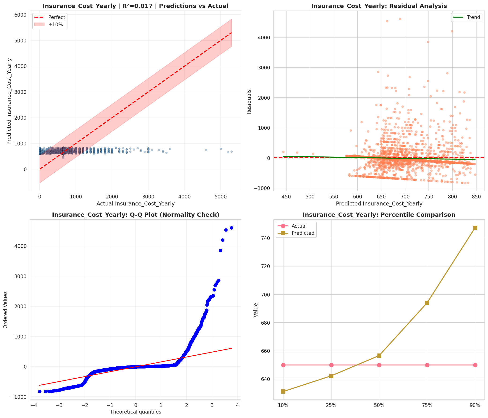
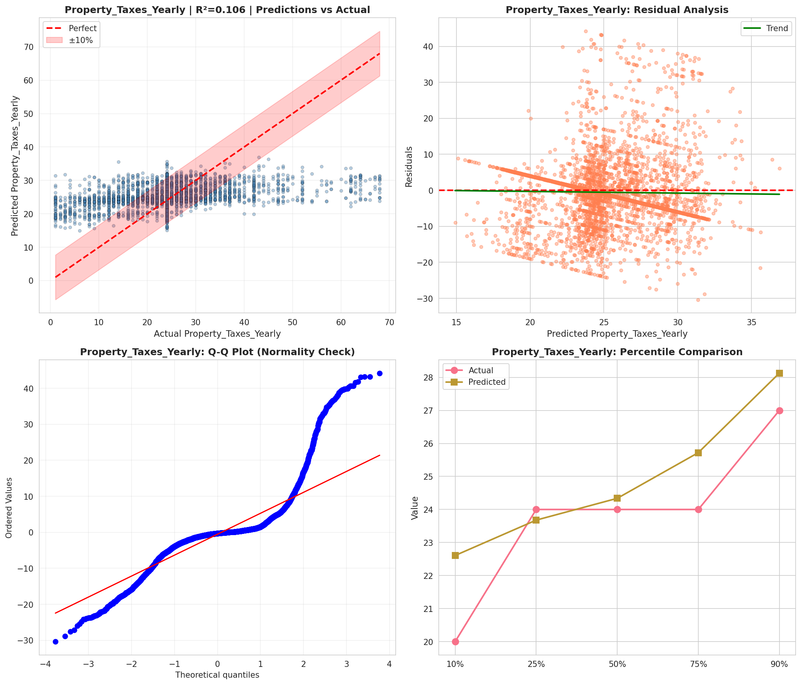
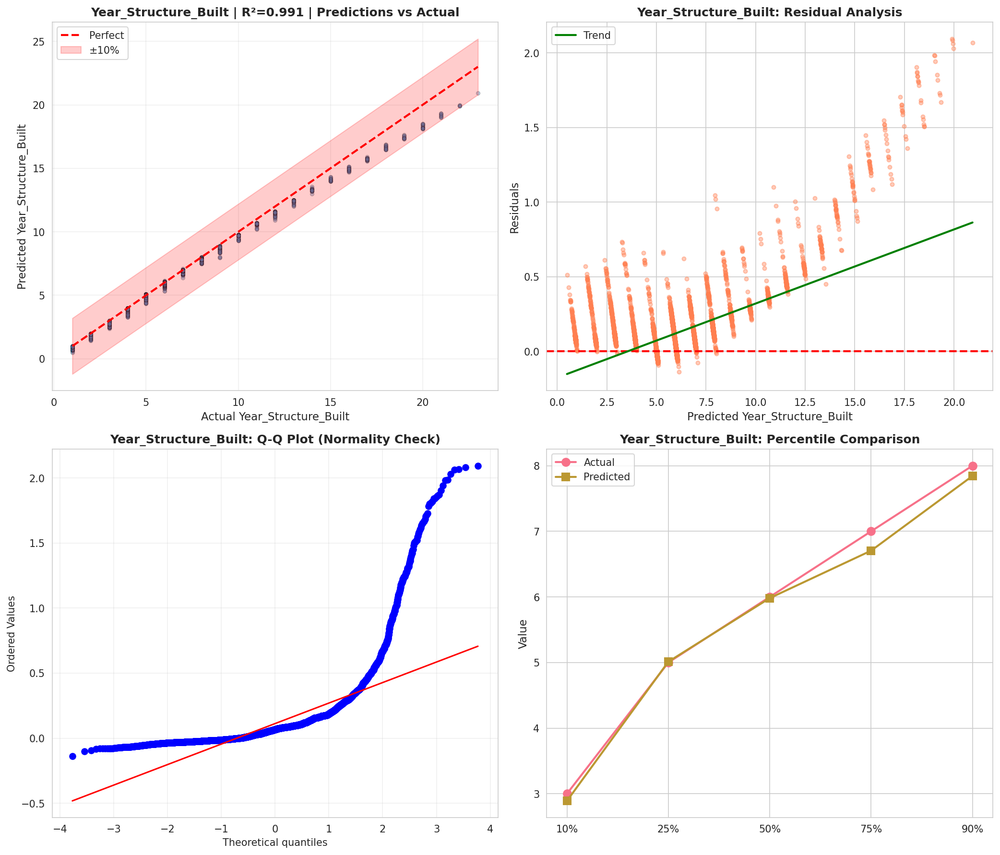

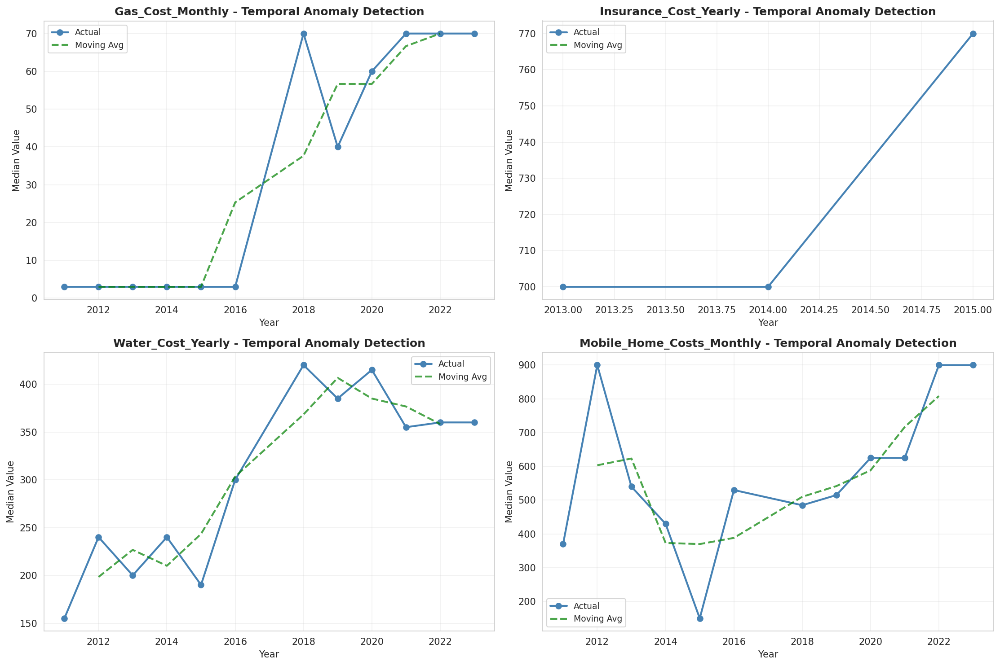
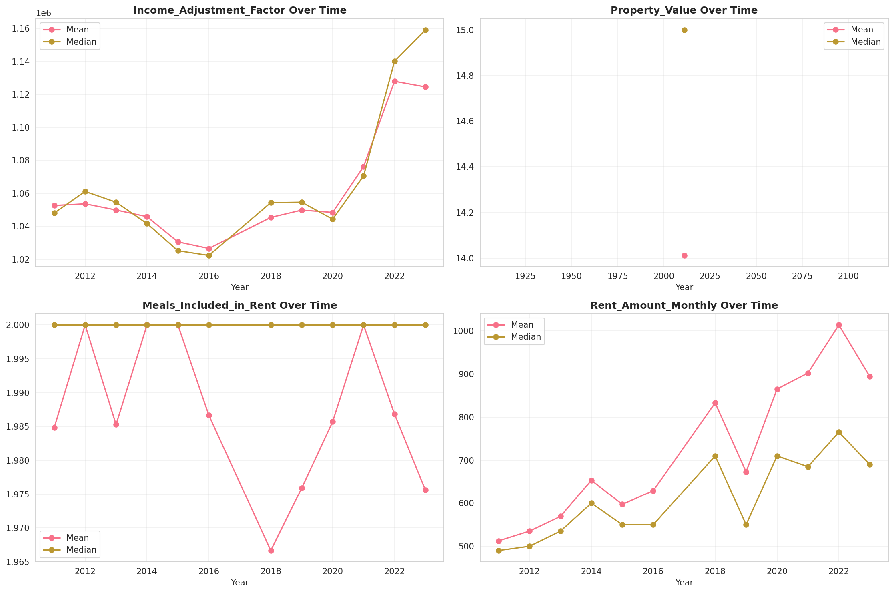
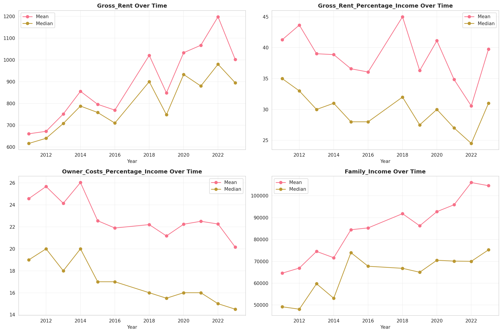
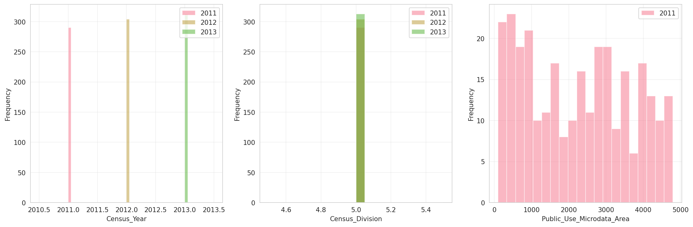
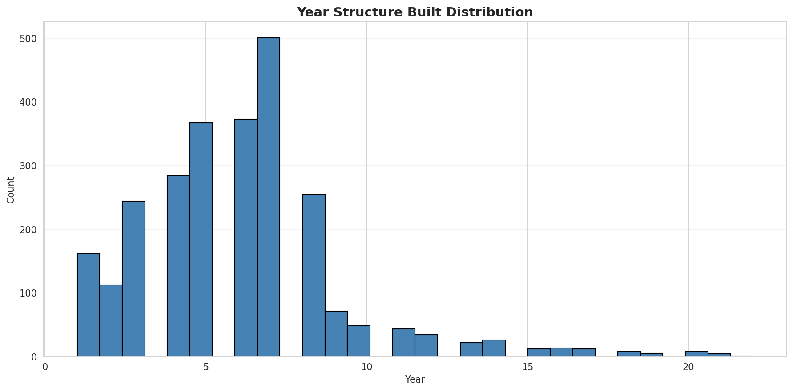
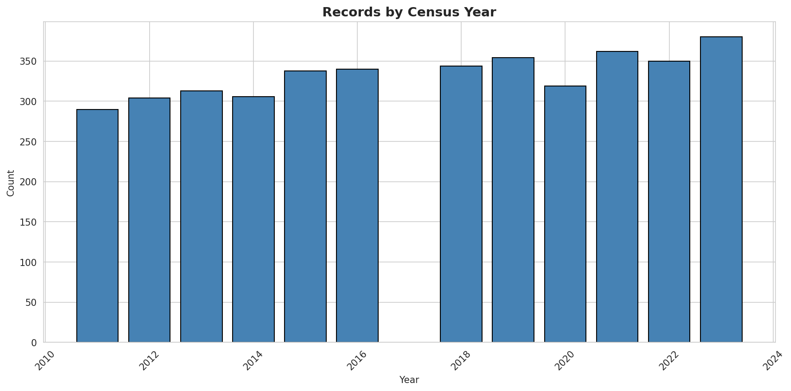
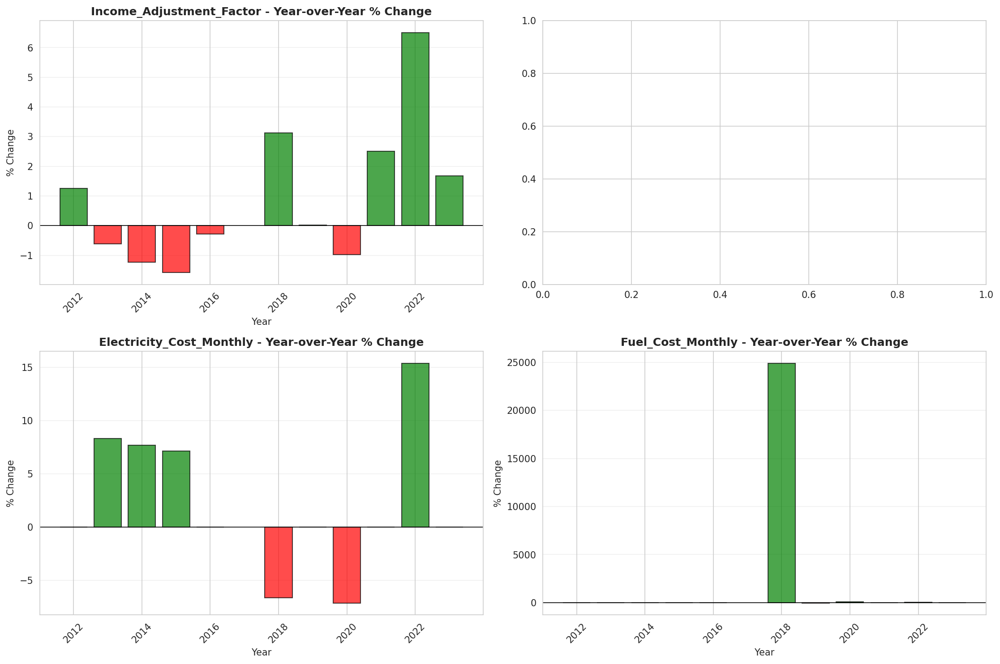
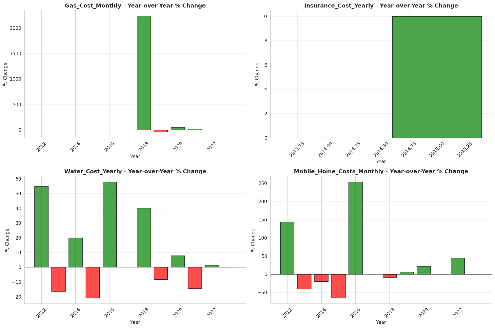
