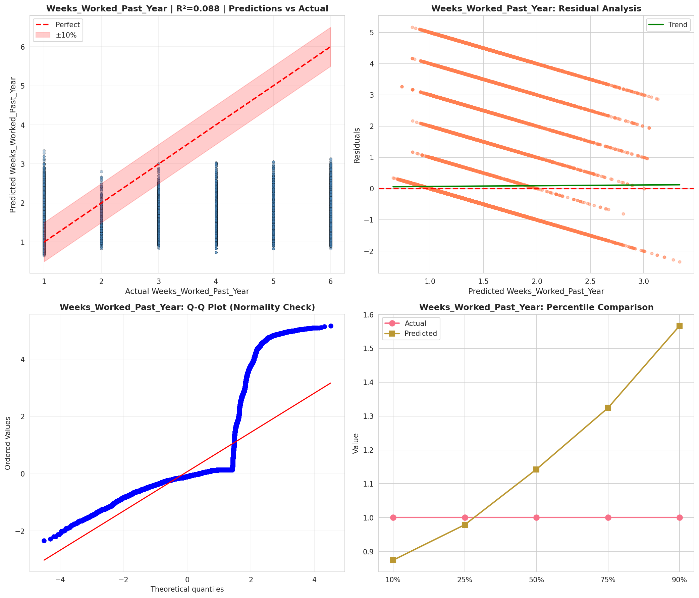
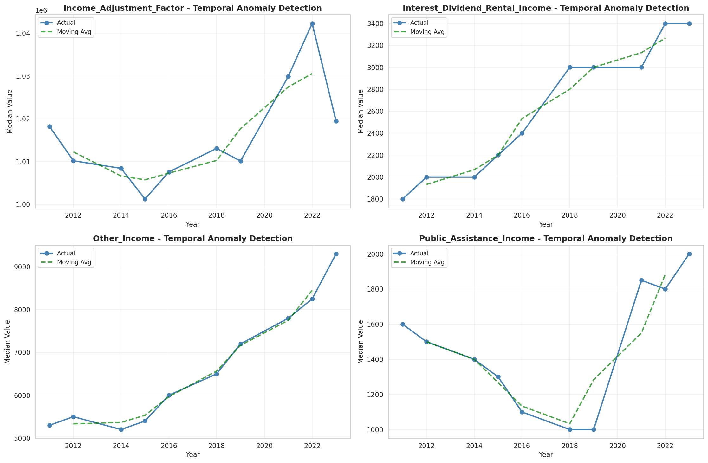
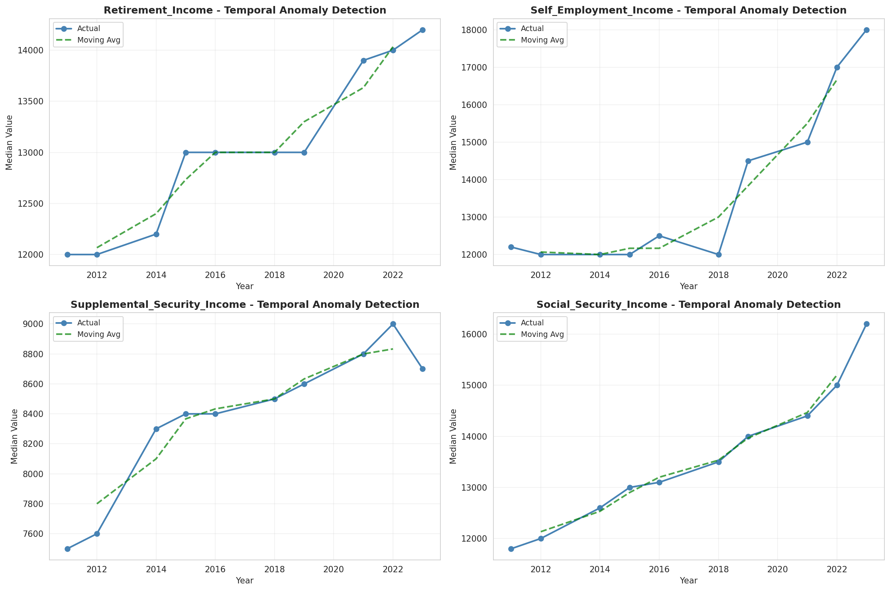
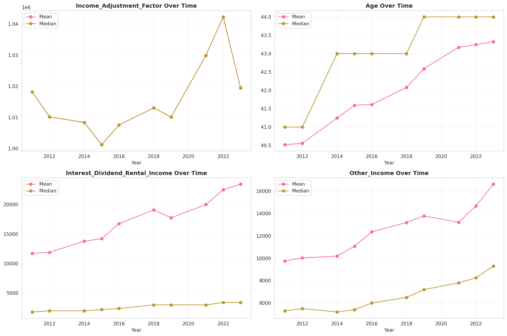
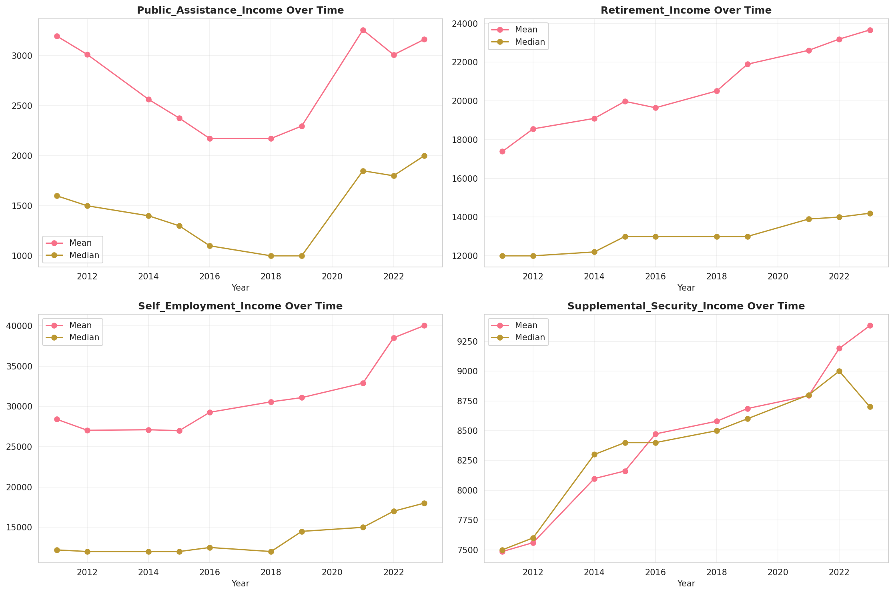
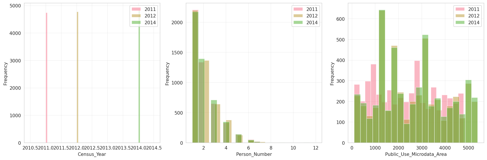
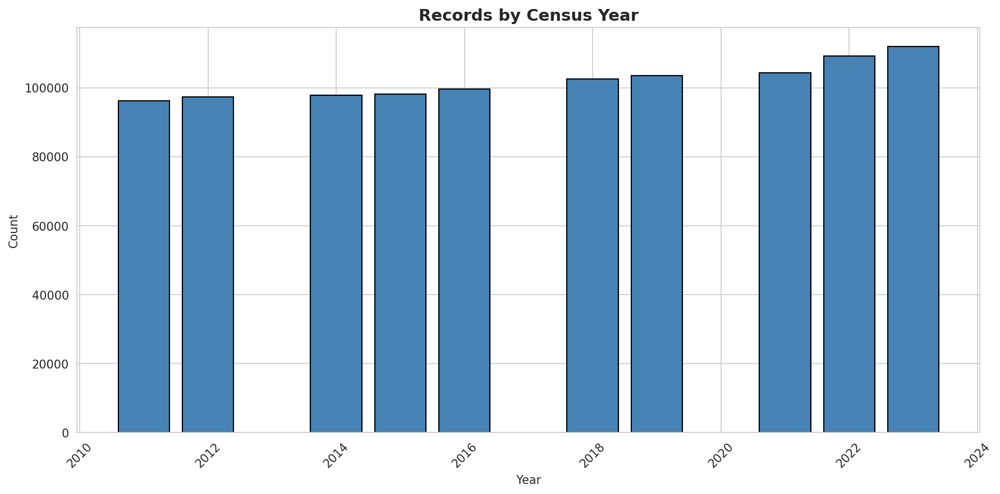
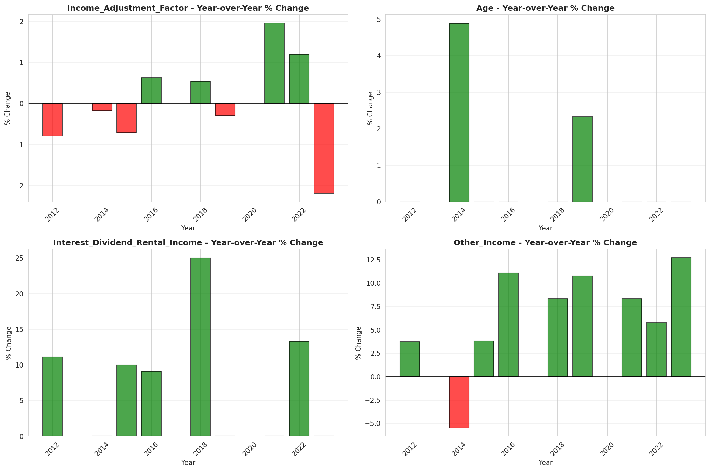
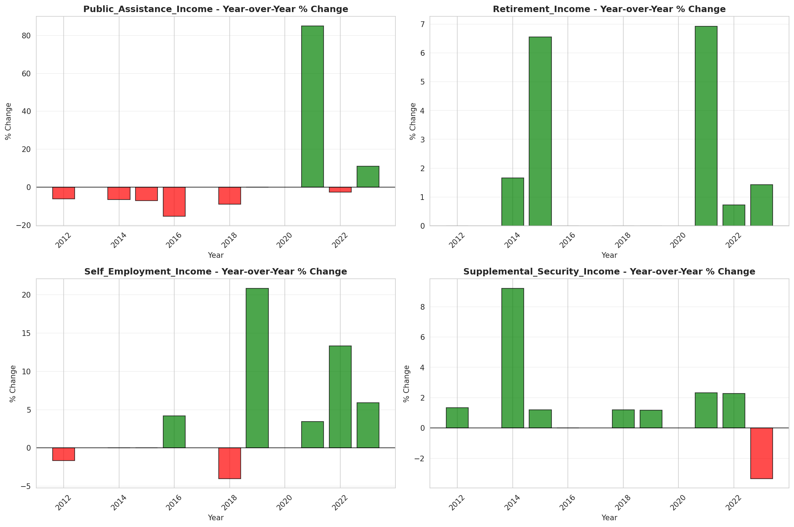

# Temporal Analysis

## Year Distribution

- 2011: 96,160 records

- 2012: 97,420 records

- 2014: 97,830 records

- 2015: 98,184 records

- 2016: 99,596 records

- 2018: 102,523 records

- 2019: 103,516 records

- 2021: 104,337 records

- 2022: 109,230 records

- 2023: 111,920 records

## Temporal Trends

- Census_Year: {np.int64(2011): {'mean': 2011.0, 'median': 2011.0, 'std': 0.0}, np.int64(2012): {'mean': 2012.0, 'median': 2012.0, 'std': 0.0}, np.int64(2014): {'mean': 2014.0, 'median': 2014.0, 'std': 0.0}, np.int64(2015): {'mean': 2015.0, 'median': 2015.0, 'std': 0.0}, np.int64(2016): {'mean': 2016.0, 'median': 2016.0, 'std': 0.0}, np.int64(2018): {'mean': 2018.0, 'median': 2018.0, 'std': 0.0}, np.int64(2019): {'mean': 2019.0, 'median': 2019.0, 'std': 0.0}, np.int64(2021): {'mean': 2021.0, 'median': 2021.0, 'std': 0.0}, np.int64(2022): {'mean': 2022.0, 'median': 2022.0, 'std': 0.0}, np.int64(2023): {'mean': 2023.0, 'median': 2023.0, 'std': 0.0}}

- Person_Number: {np.int64(2011): {'mean': 1.9767574875207987, 'median': 2.0, 'std': 1.216987249864575}, np.int64(2012): {'mean': 1.9942414288647095, 'median': 2.0, 'std': 1.2265759429116505}, np.int64(2014): {'mean': 1.99442911172442, 'median': 2.0, 'std': 1.2492316945612876}, np.int64(2015): {'mean': 1.982054102501426, 'median': 2.0, 'std': 1.2212216047898705}, np.int64(2016): {'mean': 1.9852202899714848, 'median': 2.0, 'std': 1.2172028808805593}, np.int64(2018): {'mean': 1.9710016289027827, 'median': 2.0, 'std': 1.2139528935567496}, np.int64(2019): {'mean': 1.9626048147146335, 'median': 2.0, 'std': 1.2136428547038551}, np.int64(2021): {'mean': 1.9536214382242159, 'median': 2.0, 'std': 1.2080269972768802}, np.int64(2022): {'mean': 1.9435960816625468, 'median': 2.0, 'std': 1.2083089746907674}, np.int64(2023): {'mean': 1.952662616154396, 'median': 2.0, 'std': 1.2191170417841377}}

- Public_Use_Microdata_Area: {np.int64(2011): {'mean': 2340.0871568219636, 'median': 2400.0, 'std': 1366.9954075449516}, np.int64(2012): {'mean': 2631.9152227468694, 'median': 2600.0, 'std': 1481.4458476203445}, np.int64(2014): {'mean': 2624.9291628334868, 'median': 2600.0, 'std': 1472.6416480796067}, np.int64(2015): {'mean': 2630.0479711561966, 'median': 2600.0, 'std': 1472.5169354528068}, np.int64(2016): {'mean': 2625.2710550624524, 'median': 2600.0, 'std': 1466.466062454538}, np.int64(2018): {'mean': 2618.8866205631907, 'median': 2600.0, 'std': 1463.546053941973}, np.int64(2019): {'mean': 2626.570539819931, 'median': 2600.0, 'std': 1465.414192236344}, np.int64(2021): {'mean': 2643.852238419736, 'median': 2600.0, 'std': 1472.2691361774062}, np.int64(2022): {'mean': 2609.069120205072, 'median': 2600.0, 'std': 1469.860228885206}, np.int64(2023): {'mean': 2621.2220961401, 'median': 2600.0, 'std': 1476.4884014357576}}

- State_Code: {np.int64(2011): {'mean': 37.0, 'median': 37.0, 'std': 0.0}, np.int64(2012): {'mean': 37.0, 'median': 37.0, 'std': 0.0}, np.int64(2014): {'mean': 37.0, 'median': 37.0, 'std': 0.0}, np.int64(2015): {'mean': 37.0, 'median': 37.0, 'std': 0.0}, np.int64(2016): {'mean': 37.0, 'median': 37.0, 'std': 0.0}, np.int64(2018): {'mean': 37.0, 'median': 37.0, 'std': 0.0}, np.int64(2019): {'mean': 37.0, 'median': 37.0, 'std': 0.0}, np.int64(2021): {'mean': 37.0, 'median': 37.0, 'std': 0.0}, np.int64(2022): {'mean': 37.0, 'median': 37.0, 'std': 0.0}, np.int64(2023): {'mean': None, 'median': None, 'std': None}}

- Income_Adjustment_Factor: {np.int64(2011): {'mean': 1018237.0, 'median': 1018237.0, 'std': 0.0}, np.int64(2012): {'mean': 1010207.0, 'median': 1010207.0, 'std': 0.0}, np.int64(2014): {'mean': 1008425.0, 'median': 1008425.0, 'std': 0.0}, np.int64(2015): {'mean': 1001264.0, 'median': 1001264.0, 'std': 0.0}, np.int64(2016): {'mean': 1007588.0, 'median': 1007588.0, 'std': 0.0}, np.int64(2018): {'mean': 1013097.0, 'median': 1013097.0, 'std': 0.0}, np.int64(2019): {'mean': 1010145.0, 'median': 1010145.0, 'std': 0.0}, np.int64(2021): {'mean': 1029928.0, 'median': 1029928.0, 'std': 0.0}, np.int64(2022): {'mean': 1042311.0, 'median': 1042311.0, 'std': 0.0}, np.int64(2023): {'mean': 1019518.0, 'median': 1019518.0, 'std': 0.0}}

- Person_Weight: {np.int64(2011): {'mean': 100.42014351081531, 'median': 76.0, 'std': 92.33875427496234}, np.int64(2012): {'mean': 100.10339765961815, 'median': 78.0, 'std': 81.1149816593447}, np.int64(2014): {'mean': 101.64534396401922, 'median': 79.0, 'std': 81.20564861497535}, np.int64(2015): {'mean': 102.28552513647846, 'median': 80.0, 'std': 82.57527967609995}, np.int64(2016): {'mean': 101.87947307120768, 'median': 80.0, 'std': 81.30894259389736}, np.int64(2018): {'mean': 101.28088331398808, 'median': 79.0, 'std': 83.22665400521214}, np.int64(2019): {'mean': 101.318482167008, 'median': 77.0, 'std': 89.02881595758893}, np.int64(2021): {'mean': 101.12579430115875, 'median': 76.0, 'std': 89.97410790367805}, np.int64(2022): {'mean': 97.94903414812781, 'median': 71.0, 'std': 87.32166128187802}, np.int64(2023): {'mean': 96.81460864903502, 'median': 70.0, 'std': 87.86494122446776}}

- Age: {np.int64(2011): {'mean': 40.518916389351084, 'median': 41.0, 'std': 23.41813323531198}, np.int64(2012): {'mean': 40.557986039827554, 'median': 41.0, 'std': 23.398368475292717}, np.int64(2014): {'mean': 41.246131043647146, 'median': 43.0, 'std': 23.430227561668783}, np.int64(2015): {'mean': 41.592540536136234, 'median': 43.0, 'std': 23.540406337631797}, np.int64(2016): {'mean': 41.61224346359292, 'median': 43.0, 'std': 23.633696628953647}, np.int64(2018): {'mean': 42.081718248588125, 'median': 43.0, 'std': 23.66929227785331}, np.int64(2019): {'mean': 42.58804436029213, 'median': 44.0, 'std': 23.794503463005118}, np.int64(2021): {'mean': 43.172469977093456, 'median': 44.0, 'std': 23.83809568011775}, np.int64(2022): {'mean': 43.24350453172205, 'median': 44.0, 'std': 23.948698719213}, np.int64(2023): {'mean': 43.32382952108649, 'median': 44.0, 'std': 23.918999106853114}}

- Citizenship_Status: {np.int64(2011): {'mean': 1.2297524958402661, 'median': 1.0, 'std': 0.8756376619374525}, np.int64(2012): {'mean': 1.24128515705194, 'median': 1.0, 'std': 0.8944911767779666}, np.int64(2014): {'mean': 1.2462128181539405, 'median': 1.0, 'std': 0.8975034220175232}, np.int64(2015): {'mean': 1.2507944267905158, 'median': 1.0, 'std': 0.902634121896676}, np.int64(2016): {'mean': 1.2475300212859954, 'median': 1.0, 'std': 0.8946777292529382}, np.int64(2018): {'mean': 1.2604781366132478, 'median': 1.0, 'std': 0.9144612386717493}, np.int64(2019): {'mean': 1.2624521813053056, 'median': 1.0, 'std': 0.918111142363439}, np.int64(2021): {'mean': 1.288449926679893, 'median': 1.0, 'std': 0.9551895148824594}, np.int64(2022): {'mean': 1.2757392657694773, 'median': 1.0, 'std': 0.9327122824512897}, np.int64(2023): {'mean': 1.2932183702644746, 'median': 1.0, 'std': 0.9604275873286731}}

- Class_of_Worker: {np.int64(2011): {'mean': 2.2089317050460195, 'median': 1.0, 'std': 1.9815343487419976}, np.int64(2012): {'mean': 2.2444122991161994, 'median': 1.0, 'std': 2.012155961142973}, np.int64(2014): {'mean': 2.2022270619643107, 'median': 1.0, 'std': 1.9804238990319003}, np.int64(2015): {'mean': 2.2120598234889988, 'median': 1.0, 'std': 1.9828441154359948}, np.int64(2016): {'mean': 2.196583872538788, 'median': 1.0, 'std': 1.9620258163452544}, np.int64(2018): {'mean': 2.1746158584294726, 'median': 1.0, 'std': 1.943907137544098}, np.int64(2019): {'mean': 2.1766237211693116, 'median': 1.0, 'std': 1.9409801805241642}, np.int64(2021): {'mean': 2.209215708894346, 'median': 1.0, 'std': 1.9401243883835584}, np.int64(2022): {'mean': 2.1915379680483187, 'median': 1.0, 'std': 1.9319912899519394}, np.int64(2023): {'mean': 2.18718421928418, 'median': 1.0, 'std': 1.9296600647962459}}

- English_Speaking_Ability: {np.int64(2011): {'mean': 1.7191955193482689, 'median': 1.0, 'std': 0.9634005993968331}, np.int64(2012): {'mean': 1.6691283292978207, 'median': 1.0, 'std': 0.9272304748821533}, np.int64(2014): {'mean': 1.6635099496523615, 'median': 1.0, 'std': 0.9284737976568844}, np.int64(2015): {'mean': 1.645330535152151, 'median': 1.0, 'std': 0.9260869652232169}, np.int64(2016): {'mean': 1.6185945202338645, 'median': 1.0, 'std': 0.916489116652359}, np.int64(2018): {'mean': 1.5616906661141614, 'median': 1.0, 'std': 0.8656372986983286}, np.int64(2019): {'mean': 1.5523719563392107, 'median': 1.0, 'std': 0.8692081863315363}, np.int64(2021): {'mean': 1.6097223503366849, 'median': 1.0, 'std': 0.9109691963936526}, np.int64(2022): {'mean': 1.5571689497716894, 'median': 1.0, 'std': 0.8688662200281758}, np.int64(2023): {'mean': 1.5766040291179957, 'median': 1.0, 'std': 0.8774078431903738}}

- Fertility_Status: {np.int64(2011): {'mean': 1.9463003865267807, 'median': 2.0, 'std': 0.22542915382665235}, np.int64(2012): {'mean': 2.30751708428246, 'median': 2.0, 'std': 1.4487502832006967}, np.int64(2014): {'mean': 1.9499769053117784, 'median': 2.0, 'std': 0.21799765994807355}, np.int64(2015): {'mean': 1.950659889008068, 'median': 2.0, 'std': 0.21658220610052867}, np.int64(2016): {'mean': 1.9516055045871559, 'median': 2.0, 'std': 0.21460331037062463}, np.int64(2018): {'mean': 1.951910172676031, 'median': 2.0, 'std': 0.21396084631004947}, np.int64(2019): {'mean': 1.94967414916727, 'median': 2.0, 'std': 0.2186214139705474}, np.int64(2021): {'mean': 1.9533490651660919, 'median': 2.0, 'std': 0.21089486355970735}, np.int64(2022): {'mean': 1.9512216291281517, 'median': 2.0, 'std': 0.21540904131308303}, np.int64(2023): {'mean': 1.950174156826098, 'median': 2.0, 'std': 0.21758961285562045}}

- Marital_Status: {np.int64(2011): {'mean': 2.9258735440931782, 'median': 3.0, 'std': 1.8406998969501567}, np.int64(2012): {'mean': 2.8997331143502363, 'median': 3.0, 'std': 1.8428118577812465}, np.int64(2014): {'mean': 2.901502606562404, 'median': 3.0, 'std': 1.8418074381947442}, np.int64(2015): {'mean': 2.882903528069747, 'median': 3.0, 'std': 1.842285727594751}, np.int64(2016): {'mean': 2.8819028876661714, 'median': 3.0, 'std': 1.8439522949128266}, np.int64(2018): {'mean': 2.8808560030432195, 'median': 3.0, 'std': 1.8435090836687862}, np.int64(2019): {'mean': 2.875507167974033, 'median': 3.0, 'std': 1.843331610980814}, np.int64(2021): {'mean': 2.883310810163221, 'median': 3.0, 'std': 1.8438462796118105}, np.int64(2022): {'mean': 2.880051267966676, 'median': 3.0, 'std': 1.8450252693004727}, np.int64(2023): {'mean': 2.8845604002859186, 'median': 3.0, 'std': 1.8455022461317698}}

- Mobility_Status: {np.int64(2011): {'mean': 1.2879025056468982, 'median': 1.0, 'std': 0.6989498141775479}, np.int64(2012): {'mean': 1.2811903972136993, 'median': 1.0, 'std': 0.6917502404129034}, np.int64(2014): {'mean': 1.2802122366397242, 'median': 1.0, 'std': 0.6910455582259355}, np.int64(2015): {'mean': 1.283617399890968, 'median': 1.0, 'std': 0.6944232397307865}, np.int64(2016): {'mean': 1.2817177043196106, 'median': 1.0, 'std': 0.6924610436186824}, np.int64(2018): {'mean': 1.2873203386493404, 'median': 1.0, 'std': 0.6978488843999257}, np.int64(2019): {'mean': 1.2816788755474489, 'median': 1.0, 'std': 0.6923842829234202}, np.int64(2021): {'mean': 1.2562259009074306, 'median': 1.0, 'std': 0.6651879318408379}, np.int64(2022): {'mean': 1.252983117218959, 'median': 1.0, 'std': 0.6605154361945575}, np.int64(2023): {'mean': 1.243002613318915, 'median': 1.0, 'std': 0.6490481644724114}}

- Military_Service: {np.int64(2011): {'mean': 4.724107976351001, 'median': 5.0, 'std': 0.7547077913912625}, np.int64(2012): {'mean': 4.727114121510673, 'median': 5.0, 'std': 0.7543808552003128}, np.int64(2014): {'mean': 3.7600871305184773, 'median': 4.0, 'std': 0.6653861295451565}, np.int64(2015): {'mean': 3.7632642780681316, 'median': 4.0, 'std': 0.6608910745970542}, np.int64(2016): {'mean': 3.7703860259837136, 'median': 4.0, 'std': 0.6508877906400924}, np.int64(2018): {'mean': 3.7739669470938093, 'median': 4.0, 'std': 0.647692157033726}, np.int64(2019): {'mean': 3.778396029566058, 'median': 4.0, 'std': 0.6428814011388811}, np.int64(2021): {'mean': 3.7797107160241996, 'median': 4.0, 'std': 0.6478052344553817}, np.int64(2022): {'mean': 3.7752925705318763, 'median': 4.0, 'std': 0.6587040519539124}, np.int64(2023): {'mean': 3.786817824575003, 'median': 4.0, 'std': 0.6443365325978792}}

- Travel_Time_To_Work_Minutes: {np.int64(2011): {'mean': 23.308115796960198, 'median': 20.0, 'std': 20.677906370131627}, np.int64(2012): {'mean': 23.78957396539898, 'median': 20.0, 'std': 21.00708567419158}, np.int64(2014): {'mean': 24.14202078837042, 'median': 20.0, 'std': 20.23596103113338}, np.int64(2015): {'mean': 24.23698827905156, 'median': 20.0, 'std': 20.898260263869222}, np.int64(2016): {'mean': 24.739258614856702, 'median': 20.0, 'std': 21.135155022084728}, np.int64(2018): {'mean': 24.918080722031636, 'median': 20.0, 'std': 20.879499580802463}, np.int64(2019): {'mean': 25.800421177924783, 'median': 20.0, 'std': 22.776194687860592}, np.int64(2021): {'mean': 24.447101468877648, 'median': 20.0, 'std': 21.49945568836381}, np.int64(2022): {'mean': 25.049558874266843, 'median': 20.0, 'std': 21.420406293514397}, np.int64(2023): {'mean': 25.194138418079095, 'median': 20.0, 'std': 21.31732514720535}}

- Vehicle_Occupancy: {np.int64(2011): {'mean': 1.173691074054549, 'median': 1.0, 'std': 0.6858870217170524}, np.int64(2012): {'mean': 1.164584000854427, 'median': 1.0, 'std': 0.6245343082273672}, np.int64(2014): {'mean': 1.1633900244447912, 'median': 1.0, 'std': 0.6593750469476468}, np.int64(2015): {'mean': 1.1531154527483247, 'median': 1.0, 'std': 0.615061691381949}, np.int64(2016): {'mean': 1.1445030961323723, 'median': 1.0, 'std': 0.5741515572345682}, np.int64(2018): {'mean': 1.1502069496582925, 'median': 1.0, 'std': 0.5863404883996477}, np.int64(2019): {'mean': 1.1574929787080823, 'median': 1.0, 'std': 0.634851444956218}, np.int64(2021): {'mean': 1.1412012046138986, 'median': 1.0, 'std': 0.5266495215312594}, np.int64(2022): {'mean': 1.155595312175897, 'median': 1.0, 'std': 0.5626482405018272}, np.int64(2023): {'mean': 1.1526744157104811, 'median': 1.0, 'std': 0.5736631285489301}}

- Transportation_To_Work: {np.int64(2011): {'mean': 1.817151738487378, 'median': 1.0, 'std': 2.6716917760316146}, np.int64(2012): {'mean': 1.8349273052214654, 'median': 1.0, 'std': 2.7048094049205944}, np.int64(2014): {'mean': 1.8255912560067842, 'median': 1.0, 'std': 2.697000924970739}, np.int64(2015): {'mean': 1.8396941242097433, 'median': 1.0, 'std': 2.719906030062768}, np.int64(2016): {'mean': 1.890699532123702, 'median': 1.0, 'std': 2.796214403796079}, np.int64(2018): {'mean': 1.9325997842502698, 'median': 1.0, 'std': 2.8611658971793505}, np.int64(2019): {'mean': None, 'median': None, 'std': None}, np.int64(2021): {'mean': None, 'median': None, 'std': None}, np.int64(2022): {'mean': None, 'median': None, 'std': None}, np.int64(2023): {'mean': None, 'median': None, 'std': None}}

- Language_Other_Than_English: {np.int64(2011): {'mean': 1.913605771345621, 'median': 2.0, 'std': 0.28094685250652873}, np.int64(2012): {'mean': 1.9103868769935122, 'median': 2.0, 'std': 0.28562824841854473}, np.int64(2014): {'mean': 1.9102277129697387, 'median': 2.0, 'std': 0.28585678735427456}, np.int64(2015): {'mean': 1.9080736953795698, 'median': 2.0, 'std': 0.28892343938113496}, np.int64(2016): {'mean': 1.9077448626696139, 'median': 2.0, 'std': 0.2893873056310687}, np.int64(2018): {'mean': 1.9009176383642634, 'median': 2.0, 'std': 0.2987741011382692}, np.int64(2019): {'mean': 1.9033465545400137, 'median': 2.0, 'std': 0.29548678930041966}, np.int64(2021): {'mean': 1.8912736061940245, 'median': 2.0, 'std': 0.31129718434879367}, np.int64(2022): {'mean': 1.8950878100658217, 'median': 2.0, 'std': 0.30644171070178705}, np.int64(2023): {'mean': 1.8895722724893442, 'median': 2.0, 'std': 0.3134236154519112}}

- Grandparents_Living_With_Grandchildren: {np.int64(2011): {'mean': 1.966219516165793, 'median': 2.0, 'std': 0.18066514360963656}, np.int64(2012): {'mean': 1.9678178586867765, 'median': 2.0, 'std': 0.17648498459647466}, np.int64(2014): {'mean': 1.966967819245384, 'median': 2.0, 'std': 0.17872201715679065}, np.int64(2015): {'mean': 1.9680200829513206, 'median': 2.0, 'std': 0.17594796008309393}, np.int64(2016): {'mean': 1.9692030380994932, 'median': 2.0, 'std': 0.17276854139835093}, np.int64(2018): {'mean': 1.9684552411461114, 'median': 2.0, 'std': 0.1747859837649756}, np.int64(2019): {'mean': 1.9705004440949927, 'median': 2.0, 'std': 0.16920327706528923}, np.int64(2021): {'mean': 1.9718924780276224, 'median': 2.0, 'std': 0.16528121171619292}, np.int64(2022): {'mean': 1.972574966780367, 'median': 2.0, 'std': 0.1633195216890751}, np.int64(2023): {'mean': 1.9712074262231856, 'median': 2.0, 'std': 0.1672242009027256}}

- Months_Responsible_For_Grandchildren: {np.int64(2011): {'mean': 3.760330578512397, 'median': 4.0, 'std': 1.337539953015057}, np.int64(2012): {'mean': 3.731684110371075, 'median': 4.0, 'std': 1.3410496667499454}, np.int64(2014): {'mean': 3.7700693756194252, 'median': 4.0, 'std': 1.3476375916824157}, np.int64(2015): {'mean': 3.902464065708419, 'median': 4.0, 'std': 1.308417717385328}, np.int64(2016): {'mean': 3.829954954954955, 'median': 4.0, 'std': 1.3173558285552198}, np.int64(2018): {'mean': 3.9366812227074237, 'median': 4.0, 'std': 1.2762340051788694}, np.int64(2019): {'mean': 3.978698224852071, 'median': 5.0, 'std': 1.2969233407240595}, np.int64(2021): {'mean': 3.9584382871536525, 'median': 5.0, 'std': 1.2890206960909927}, np.int64(2022): {'mean': 4.111515151515151, 'median': 5.0, 'std': 1.1605053124267202}, np.int64(2023): {'mean': 4.012910798122066, 'median': 5.0, 'std': 1.3137874945183594}}

- Grandparents_Responsible_For_Grandchildren: {np.int64(2011): {'mean': 1.4751807228915663, 'median': 1.0, 'std': 0.49950400047864824}, np.int64(2012): {'mean': 1.4771144278606965, 'median': 1.0, 'std': 0.49960027012224256}, np.int64(2014): {'mean': 1.5183770883054892, 'median': 2.0, 'std': 0.4997814623178046}, np.int64(2015): {'mean': 1.5251097025841054, 'median': 2.0, 'std': 0.4994908873003171}, np.int64(2016): {'mean': 1.5557778889444722, 'median': 2.0, 'std': 0.49700341556817496}, np.int64(2018): {'mean': 1.5693464974141984, 'median': 2.0, 'std': 0.49528415384841673}, np.int64(2019): {'mean': 1.5829220138203357, 'median': 2.0, 'std': 0.4931977299509118}, np.int64(2021): {'mean': 1.5969543147208123, 'median': 2.0, 'std': 0.4906343391910731}, np.int64(2022): {'mean': 1.5879120879120878, 'median': 2.0, 'std': 0.4923337688943742}, np.int64(2023): {'mean': 1.6064665127020785, 'median': 2.0, 'std': 0.4886462630936449}}

- Interest_Dividend_Rental_Income: {np.int64(2011): {'mean': 11725.864549839229, 'median': 1800.0, 'std': 31131.902284467033}, np.int64(2012): {'mean': 11891.813161801088, 'median': 2000.0, 'std': 31910.40622276663}, np.int64(2014): {'mean': 13793.931426958894, 'median': 2000.0, 'std': 37423.69624777105}, np.int64(2015): {'mean': 14209.03290019353, 'median': 2200.0, 'std': 37009.4401752731}, np.int64(2016): {'mean': 16750.539692528993, 'median': 2400.0, 'std': 48092.94811788702}, np.int64(2018): {'mean': 19087.36669997275, 'median': 3000.0, 'std': 49872.71658175689}, np.int64(2019): {'mean': 17737.334710743802, 'median': 3000.0, 'std': 46075.10453403619}, np.int64(2021): {'mean': 19989.018678297147, 'median': 3000.0, 'std': 52790.261680982505}, np.int64(2022): {'mean': 22499.047709741928, 'median': 3400.0, 'std': 58108.071377618304}, np.int64(2023): {'mean': 23438.38486140725, 'median': 3400.0, 'std': 62183.16912164626}}

- Military_Service_Period_1: {np.int64(2011): {'mean': 0.19879253567508232, 'median': 0.0, 'std': 0.39911345352679245}, np.int64(2012): {'mean': 0.21238547301026603, 'median': 0.0, 'std': 0.4090187664200192}, np.int64(2014): {'mean': 0.23785257169945484, 'median': 0.0, 'std': 0.42579362606160515}, np.int64(2015): {'mean': 0.25050819084060744, 'median': 0.0, 'std': 0.4333316171060583}, np.int64(2016): {'mean': 0.2561510353227771, 'median': 0.0, 'std': 0.43653280890820034}, np.int64(2018): {'mean': 0.280743565300286, 'median': 0.0, 'std': 0.4493892305220278}, np.int64(2019): {'mean': 0.2877602599590805, 'median': 0.0, 'std': 0.45274602401103897}, np.int64(2021): {'mean': 0.32554517133956384, 'median': 0.0, 'std': 0.46860625666240574}, np.int64(2022): {'mean': 0.35221758266561337, 'median': 0.0, 'std': 0.4776882967585815}, np.int64(2023): {'mean': 0.3741480882522814, 'median': 0.0, 'std': 0.4839301067460155}}

- Military_Service_Period_2: {np.int64(2011): {'mean': 0.17420417124039517, 'median': 0.0, 'std': 0.3793057748224318}, np.int64(2012): {'mean': 0.18887294403355778, 'median': 0.0, 'std': 0.39142926342644435}, np.int64(2014): {'mean': 0.2001659160938611, 'median': 0.0, 'std': 0.400148095098354}, np.int64(2015): {'mean': 0.1959823030013153, 'median': 0.0, 'std': 0.39697869448770634}, np.int64(2016): {'mean': 0.20341047503045068, 'median': 0.0, 'std': 0.4025597997038132}, np.int64(2018): {'mean': 0.21413250714966636, 'median': 0.0, 'std': 0.41024362435688544}, np.int64(2019): {'mean': 0.21121675291852207, 'median': 0.0, 'std': 0.4081963861623155}, np.int64(2021): {'mean': 0.22465851905104242, 'median': 0.0, 'std': 0.417382249376494}, np.int64(2022): {'mean': 0.2091186096377384, 'median': 0.0, 'std': 0.4067022050099597}, np.int64(2023): {'mean': 0.22259443225135728, 'median': 0.0, 'std': 0.4160121902667187}}

- Military_Service_Period_3: {np.int64(2011): {'mean': 0.18562019758507134, 'median': 0.0, 'std': 0.38882121212268894}, np.int64(2012): {'mean': 0.19361960481289325, 'median': 0.0, 'std': 0.3951560327998735}, np.int64(2014): {'mean': None, 'median': None, 'std': None}, np.int64(2015): {'mean': None, 'median': None, 'std': None}, np.int64(2016): {'mean': None, 'median': None, 'std': None}, np.int64(2018): {'mean': None, 'median': None, 'std': None}, np.int64(2019): {'mean': None, 'median': None, 'std': None}, np.int64(2021): {'mean': None, 'median': None, 'std': None}, np.int64(2022): {'mean': None, 'median': None, 'std': None}, np.int64(2023): {'mean': None, 'median': None, 'std': None}}

- Military_Service_Period_4: {np.int64(2011): {'mean': 0.1327113062568606, 'median': 0.0, 'std': 0.33928107992492235}, np.int64(2012): {'mean': 0.13964013688045038, 'median': 0.0, 'std': 0.34663241705143455}, np.int64(2014): {'mean': None, 'median': None, 'std': None}, np.int64(2015): {'mean': None, 'median': None, 'std': None}, np.int64(2016): {'mean': None, 'median': None, 'std': None}, np.int64(2018): {'mean': None, 'median': None, 'std': None}, np.int64(2019): {'mean': None, 'median': None, 'std': None}, np.int64(2021): {'mean': None, 'median': None, 'std': None}, np.int64(2022): {'mean': None, 'median': None, 'std': None}, np.int64(2023): {'mean': None, 'median': None, 'std': None}}

- Military_Service_Period_5: {np.int64(2011): {'mean': 0.33249176728869373, 'median': 0.0, 'std': 0.47113199530137706}, np.int64(2012): {'mean': 0.3374544651727564, 'median': 0.0, 'std': 0.47286745726971086}, np.int64(2014): {'mean': 0.35103105001185114, 'median': 0.0, 'std': 0.47732091200367466}, np.int64(2015): {'mean': 0.3526246562238431, 'median': 0.0, 'std': 0.4778156629880247}, np.int64(2016): {'mean': 0.3492082825822168, 'median': 0.0, 'std': 0.4767489301860271}, np.int64(2018): {'mean': 0.3446139180171592, 'median': 0.0, 'std': 0.4752705354686766}, np.int64(2019): {'mean': 0.34504753881333494, 'median': 0.0, 'std': 0.4754123854432151}, np.int64(2021): {'mean': 0.32913970764438055, 'median': 0.0, 'std': 0.46992895235741344}, np.int64(2022): {'mean': 0.3245683331452432, 'median': 0.0, 'std': 0.46823976053859445}, np.int64(2023): {'mean': 0.3020676908859882, 'median': 0.0, 'std': 0.4591809629033311}}

- Military_Service_Period_6: {np.int64(2011): {'mean': 0.09495060373216246, 'median': 0.0, 'std': 0.2931627886648917}, np.int64(2012): {'mean': 0.09482282812672481, 'median': 0.0, 'std': 0.29298623714360494}, np.int64(2014): {'mean': None, 'median': None, 'std': None}, np.int64(2015): {'mean': None, 'median': None, 'std': None}, np.int64(2016): {'mean': None, 'median': None, 'std': None}, np.int64(2018): {'mean': None, 'median': None, 'std': None}, np.int64(2019): {'mean': None, 'median': None, 'std': None}, np.int64(2021): {'mean': None, 'median': None, 'std': None}, np.int64(2022): {'mean': None, 'median': None, 'std': None}, np.int64(2023): {'mean': None, 'median': None, 'std': None}}

- Military_Service_Period_7: {np.int64(2011): {'mean': 0.1154774972557629, 'median': 0.0, 'std': 0.3196148592253971}, np.int64(2012): {'mean': 0.09857600176619936, 'median': 0.0, 'std': 0.29810834208255255}, np.int64(2014): {'mean': None, 'median': None, 'std': None}, np.int64(2015): {'mean': None, 'median': None, 'std': None}, np.int64(2016): {'mean': None, 'median': None, 'std': None}, np.int64(2018): {'mean': None, 'median': None, 'std': None}, np.int64(2019): {'mean': None, 'median': None, 'std': None}, np.int64(2021): {'mean': None, 'median': None, 'std': None}, np.int64(2022): {'mean': None, 'median': None, 'std': None}, np.int64(2023): {'mean': None, 'median': None, 'std': None}}

- Military_Service_Period_8: {np.int64(2011): {'mean': 0.1030735455543359, 'median': 0.0, 'std': 0.30407160176032305}, np.int64(2012): {'mean': 0.09747212716635391, 'median': 0.0, 'std': 0.29661595303311195}, np.int64(2014): {'mean': 0.0869874377814648, 'median': 0.0, 'std': 0.28183334937892074}, np.int64(2015): {'mean': 0.08035393997369365, 'median': 0.0, 'std': 0.2718566195006721}, np.int64(2016): {'mean': 0.0756394640682095, 'median': 0.0, 'std': 0.2644364815931679}, np.int64(2018): {'mean': 0.05958055290753098, 'median': 0.0, 'std': 0.23672217492220057}, np.int64(2019): {'mean': 0.05812973883740522, 'median': 0.0, 'std': 0.23400269745181312}, np.int64(2021): {'mean': 0.03930026359932902, 'median': 0.0, 'std': 0.1943200381756832}, np.int64(2022): {'mean': 0.03464620246021894, 'median': 0.0, 'std': 0.18289236736715903}, np.int64(2023): {'mean': 0.024950906780639943, 'median': 0.0, 'std': 0.15598451720919587}}

- Military_Service_Period_9: {np.int64(2011): {'mean': 0.01668496158068057, 'median': 0.0, 'std': 0.12809517858438574}, np.int64(2012): {'mean': 0.014791919637929132, 'median': 0.0, 'std': 0.12072583658238167}, np.int64(2014): {'mean': 0.013391799004503437, 'median': 0.0, 'std': 0.11495227156416334}, np.int64(2015): {'mean': 0.011359559966519191, 'median': 0.0, 'std': 0.1059804859691827}, np.int64(2016): {'mean': 0.013276492082825822, 'median': 0.0, 'std': 0.1144631935510759}, np.int64(2018): {'mean': 0.008341277407054338, 'median': 0.0, 'std': 0.09095430875290181}, np.int64(2019): {'mean': 0.008424599831508003, 'median': 0.0, 'std': 0.09140367301698533}, np.int64(2021): {'mean': None, 'median': None, 'std': None}, np.int64(2022): {'mean': None, 'median': None, 'std': None}, np.int64(2023): {'mean': None, 'median': None, 'std': None}}

- Military_Service_Period_10: {np.int64(2011): {'mean': 0.06663007683863886, 'median': 0.0, 'std': 0.24939393951882094}, np.int64(2012): {'mean': 0.05695992935202561, 'median': 0.0, 'std': 0.23177882986156795}, np.int64(2014): {'mean': 0.041123488978430905, 'median': 0.0, 'std': 0.1985875660081901}, np.int64(2015): {'mean': 0.03395910558412053, 'median': 0.0, 'std': 0.18113477838993677}, np.int64(2016): {'mean': 0.033252131546894034, 'median': 0.0, 'std': 0.1793051680583891}, np.int64(2018): {'mean': 0.018589132507149667, 'median': 0.0, 'std': 0.13507683311222646}, np.int64(2019): {'mean': 0.016488145384522805, 'median': 0.0, 'std': 0.1273508474036002}, np.int64(2021): {'mean': 0.007668344116942248, 'median': 0.0, 'std': 0.08723790737806976}, np.int64(2022): {'mean': 0.006432682541473874, 'median': 0.0, 'std': 0.07995013760361508}, np.int64(2023): {'mean': 0.004158484463439991, 'median': 0.0, 'std': 0.06435580695644542}}

- Military_Service_Period_11: {np.int64(2011): {'mean': 0.002305159165751921, 'median': 0.0, 'std': 0.047959335770326725}, np.int64(2012): {'mean': 0.0014350369797990947, 'median': 0.0, 'std': 0.03785678075182664}, np.int64(2014): {'mean': 0.001422137947380896, 'median': 0.0, 'std': 0.03768665269025338}, np.int64(2015): {'mean': 0.0007174458926222648, 'median': 0.0, 'std': 0.026777171262448416}, np.int64(2016): {'mean': 0.000243605359317905, 'median': 0.0, 'std': 0.015606911415069206}, np.int64(2018): {'mean': 0.00023832221163012392, 'median': 0.0, 'std': 0.015436768104348061}, np.int64(2019): {'mean': 0.00036105427849320016, 'median': 0.0, 'std': 0.018999141065793108}, np.int64(2021): {'mean': None, 'median': None, 'std': None}, np.int64(2022): {'mean': None, 'median': None, 'std': None}, np.int64(2023): {'mean': None, 'median': None, 'std': None}}

- Temporary_Absence_From_Work: {np.int64(2011): {'mean': 2.4968445795753595, 'median': 3.0, 'std': 0.5308033973626223}, np.int64(2012): {'mean': 2.508604472052826, 'median': 3.0, 'std': 0.5304410604838238}, np.int64(2014): {'mean': 2.563520961667955, 'median': 3.0, 'std': 0.5203923788027116}, np.int64(2015): {'mean': 2.5682641266061417, 'median': 3.0, 'std': 0.5195434417468152}, np.int64(2016): {'mean': 2.5728484522075474, 'median': 3.0, 'std': 0.517570872223101}, np.int64(2018): {'mean': 2.58491189167512, 'median': 3.0, 'std': 0.5170363944922108}, np.int64(2019): {'mean': 2.5900378691076367, 'median': 3.0, 'std': 0.5135512362338193}, np.int64(2021): {'mean': 2.5755986056346076, 'median': 3.0, 'std': 0.5181871049868769}, np.int64(2022): {'mean': 2.583485878661088, 'median': 3.0, 'std': 0.5161550450052015}, np.int64(2023): {'mean': 2.5880353501019715, 'median': 3.0, 'std': 0.5136295277977939}}

- Available_For_Work: {np.int64(2011): {'mean': 4.475101561102736, 'median': 5.0, 'std': 1.262058603120335}, np.int64(2012): {'mean': 4.475891064732396, 'median': 5.0, 'std': 1.2492906701230162}, np.int64(2014): {'mean': 4.677781380153129, 'median': 5.0, 'std': 1.0140968342079677}, np.int64(2015): {'mean': 4.711130128491343, 'median': 5.0, 'std': 0.9598261424627746}, np.int64(2016): {'mean': 4.725828365790665, 'median': 5.0, 'std': 0.9350205792987165}, np.int64(2018): {'mean': 4.757047486494775, 'median': 5.0, 'std': 0.879378244000696}, np.int64(2019): {'mean': 4.757800339195688, 'median': 5.0, 'std': 0.8742117788116577}, np.int64(2021): {'mean': 4.784079090233727, 'median': 5.0, 'std': 0.8373224593128537}, np.int64(2022): {'mean': 4.806812238493724, 'median': 5.0, 'std': 0.7843385336157871}, np.int64(2023): {'mean': 4.795547246770904, 'median': 5.0, 'std': 0.8047339132184265}}

- On_Layoff_From_Work: {np.int64(2011): {'mean': 2.4554025396663173, 'median': 2.0, 'std': 0.5382255631706417}, np.int64(2012): {'mean': 2.474136080704014, 'median': 2.0, 'std': 0.5310938260048176}, np.int64(2014): {'mean': 2.5473476818714618, 'median': 3.0, 'std': 0.5146552358092171}, np.int64(2015): {'mean': 2.5555638239817435, 'median': 3.0, 'std': 0.5088921681192746}, np.int64(2016): {'mean': 2.562725681481572, 'median': 3.0, 'std': 0.5061414377227208}, np.int64(2018): {'mean': 2.5766908070109222, 'median': 3.0, 'std': 0.5031230988129269}, np.int64(2019): {'mean': 2.582882234045025, 'median': 3.0, 'std': 0.5005443428276559}, np.int64(2021): {'mean': 2.564752271558375, 'median': 3.0, 'std': 0.5108923517751669}, np.int64(2022): {'mean': 2.579388947001395, 'median': 3.0, 'std': 0.5007384591145049}, np.int64(2023): {'mean': 2.5813859619306596, 'median': 3.0, 'std': 0.5020212458134323}}

- Looking_For_Work: {np.int64(2011): {'mean': 2.432215948286875, 'median': 3.0, 'std': 0.6256627776898792}, np.int64(2012): {'mean': 2.4528237566758837, 'median': 3.0, 'std': 0.6170731093865324}, np.int64(2014): {'mean': 2.527458413347632, 'median': 3.0, 'std': 0.587403643874118}, np.int64(2015): {'mean': 2.540271369747482, 'median': 3.0, 'std': 0.5740170418160159}, np.int64(2016): {'mean': 2.5483555087702117, 'median': 3.0, 'std': 0.5690348801283818}, np.int64(2018): {'mean': 2.566912788091812, 'median': 3.0, 'std': 0.5555654114507429}, np.int64(2019): {'mean': 2.563134539878726, 'median': 3.0, 'std': 0.5539528184837618}, np.int64(2021): {'mean': 2.546602663009315, 'median': 3.0, 'std': 0.5618705680420535}, np.int64(2022): {'mean': 2.563404375871688, 'median': 3.0, 'std': 0.547369827941295}, np.int64(2023): {'mean': 2.5612359789259007, 'median': 3.0, 'std': 0.5515882954518846}}

- Informed_Of_Recall: {np.int64(2011): {'mean': 2.8799279491044736, 'median': 3.0, 'std': 0.3430229427339112}, np.int64(2012): {'mean': 2.884398318245521, 'median': 3.0, 'std': 0.33772341815040585}, np.int64(2014): {'mean': 2.9375763772850836, 'median': 3.0, 'std': 0.2542398530284821}, np.int64(2015): {'mean': 2.942364935258223, 'median': 3.0, 'std': 0.24443068766403026}, np.int64(2016): {'mean': 2.946987037467716, 'median': 3.0, 'std': 0.2355135206950722}, np.int64(2018): {'mean': 2.9475242386355593, 'median': 3.0, 'std': 0.2343844588809868}, np.int64(2019): {'mean': 2.9381897172594846, 'median': 3.0, 'std': 0.25170862909534586}, np.int64(2021): {'mean': 2.9530830333161897, 'median': 3.0, 'std': 0.22329237741907149}, np.int64(2022): {'mean': 2.9567425034867503, 'median': 3.0, 'std': 0.2106990541189461}, np.int64(2023): {'mean': 2.952392080217539, 'median': 3.0, 'std': 0.22163792261841023}}

- Other_Income: {np.int64(2011): {'mean': 9750.052241021074, 'median': 5300.0, 'std': 12188.880113168012}, np.int64(2012): {'mean': 10031.276729559748, 'median': 5500.0, 'std': 12338.54683535147}, np.int64(2014): {'mean': 10188.556542810986, 'median': 5200.0, 'std': 12940.637165708977}, np.int64(2015): {'mean': 11067.6893081761, 'median': 5400.0, 'std': 14381.282560984584}, np.int64(2016): {'mean': 12353.75637149028, 'median': 6000.0, 'std': 15482.368105956108}, np.int64(2018): {'mean': 13195.278262634463, 'median': 6500.0, 'std': 16120.891011453032}, np.int64(2019): {'mean': 13768.594428602764, 'median': 7200.0, 'std': 16424.121042900086}, np.int64(2021): {'mean': 13212.75622542595, 'median': 7800.0, 'std': 15075.846844990276}, np.int64(2022): {'mean': 14668.937775993576, 'median': 8250.0, 'std': 16852.43080047817}, np.int64(2023): {'mean': 16615.265382224985, 'median': 9300.0, 'std': 18599.841152746074}}

- Public_Assistance_Income: {np.int64(2011): {'mean': 3197.0378378378377, 'median': 1600.0, 'std': 4646.2499988266945}, np.int64(2012): {'mean': 3011.8306538049305, 'median': 1500.0, 'std': 4433.726276690184}, np.int64(2014): {'mean': 2563.7146529562983, 'median': 1400.0, 'std': 3503.554687742695}, np.int64(2015): {'mean': 2376.7640186915887, 'median': 1300.0, 'std': 3450.28117107177}, np.int64(2016): {'mean': 2172.0638540478903, 'median': 1100.0, 'std': 3252.3551642831812}, np.int64(2018): {'mean': 2173.201174743025, 'median': 1000.0, 'std': 2889.606888956438}, np.int64(2019): {'mean': 2297.002801120448, 'median': 1000.0, 'std': 3223.828398903109}, np.int64(2021): {'mean': 3257.9892280071813, 'median': 1850.0, 'std': 3998.8852777235516}, np.int64(2022): {'mean': 3009.720873786408, 'median': 1800.0, 'std': 3550.361615556399}, np.int64(2023): {'mean': 3162.878787878788, 'median': 2000.0, 'std': 3660.5206491513513}}

- Retirement_Income: {np.int64(2011): {'mean': 17388.508732737613, 'median': 12000.0, 'std': 19110.311319017917}, np.int64(2012): {'mean': 18555.61404893449, 'median': 12000.0, 'std': 19961.92181927168}, np.int64(2014): {'mean': 19097.94268849962, 'median': 12200.0, 'std': 21238.9115337461}, np.int64(2015): {'mean': 19977.97457550168, 'median': 13000.0, 'std': 22654.515280915384}, np.int64(2016): {'mean': 19647.10722695164, 'median': 13000.0, 'std': 22069.42502150693}, np.int64(2018): {'mean': 20516.642801824284, 'median': 13000.0, 'std': 23719.353590024162}, np.int64(2019): {'mean': 21896.7164622337, 'median': 13000.0, 'std': 27568.210324575128}, np.int64(2021): {'mean': 22613.317073170732, 'median': 13900.0, 'std': 27192.03555960708}, np.int64(2022): {'mean': 23192.906644137347, 'median': 14000.0, 'std': 28996.51604557156}, np.int64(2023): {'mean': 23667.857891061452, 'median': 14200.0, 'std': 29066.685261527517}}

- Self_Employment_Income: {np.int64(2011): {'mean': 28404.616675271038, 'median': 12200.0, 'std': 50180.77028224799}, np.int64(2012): {'mean': 27038.62861849847, 'median': 12000.0, 'std': 49478.56503578083}, np.int64(2014): {'mean': 27107.59581471902, 'median': 12000.0, 'std': 47658.49724385832}, np.int64(2015): {'mean': 26991.205965909092, 'median': 12000.0, 'std': 44624.08229226572}, np.int64(2016): {'mean': 29272.77242990654, 'median': 12500.0, 'std': 51923.78236935523}, np.int64(2018): {'mean': 30570.54690877648, 'median': 12000.0, 'std': 56980.6282268998}, np.int64(2019): {'mean': 31090.761473820297, 'median': 14500.0, 'std': 53644.27937923522}, np.int64(2021): {'mean': 32887.203125, 'median': 15000.0, 'std': 55318.46317313127}, np.int64(2022): {'mean': 38510.76823861346, 'median': 17000.0, 'std': 70047.25229703117}, np.int64(2023): {'mean': 40023.851851851854, 'median': 18000.0, 'std': 70193.38918483567}}

- Supplemental_Security_Income: {np.int64(2011): {'mean': 7485.681470137825, 'median': 7500.0, 'std': 4170.567867957804}, np.int64(2012): {'mean': 7560.119189511323, 'median': 7600.0, 'std': 4324.297877349813}, np.int64(2014): {'mean': 8097.823760256868, 'median': 8300.0, 'std': 4562.977380105595}, np.int64(2015): {'mean': 8161.764705882353, 'median': 8400.0, 'std': 4527.882641487054}, np.int64(2016): {'mean': 8472.880720180045, 'median': 8400.0, 'std': 4693.609454310653}, np.int64(2018): {'mean': 8579.353512705531, 'median': 8500.0, 'std': 4722.917353666212}, np.int64(2019): {'mean': 8685.741811175338, 'median': 8600.0, 'std': 4903.999455348889}, np.int64(2021): {'mean': 8794.180327868853, 'median': 8800.0, 'std': 5396.008847144789}, np.int64(2022): {'mean': 9190.581818181818, 'median': 9000.0, 'std': 5678.375888862013}, np.int64(2023): {'mean': 9381.908396946565, 'median': 8700.0, 'std': 5910.8179582628545}}

- Social_Security_Income: {np.int64(2011): {'mean': 12051.504977958293, 'median': 11800.0, 'std': 6013.096958731639}, np.int64(2012): {'mean': 12445.286789801245, 'median': 12000.0, 'std': 6059.137340853772}, np.int64(2014): {'mean': 13220.652121329398, 'median': 12600.0, 'std': 6504.873626031036}, np.int64(2015): {'mean': 13587.165214131759, 'median': 13000.0, 'std': 6678.084285396159}, np.int64(2016): {'mean': 13705.213119228494, 'median': 13100.0, 'std': 6879.316807291302}, np.int64(2018): {'mean': 14194.151250164785, 'median': 13500.0, 'std': 7205.300007914414}, np.int64(2019): {'mean': 14656.594661647703, 'median': 14000.0, 'std': 7499.570352299785}, np.int64(2021): {'mean': 15267.118292935571, 'median': 14400.0, 'std': 8164.105636575719}, np.int64(2022): {'mean': 16019.41773147238, 'median': 15000.0, 'std': 8792.150866225511}, np.int64(2023): {'mean': 17079.35926154797, 'median': 16200.0, 'std': 9281.62346062038}}

- Wage_Income: {np.int64(2011): {'mean': 36673.14638856702, 'median': 26000.0, 'std': 44438.6539207299}, np.int64(2012): {'mean': 38807.076967400215, 'median': 28400.0, 'std': 45504.25941495106}, np.int64(2014): {'mean': 41055.483698487216, 'median': 30000.0, 'std': 50680.34609024722}, np.int64(2015): {'mean': 43395.0305485744, 'median': 30000.0, 'std': 54911.305215021144}, np.int64(2016): {'mean': 44801.10699281312, 'median': 31000.0, 'std': 57000.27016543909}, np.int64(2018): {'mean': 46968.089355104996, 'median': 33800.0, 'std': 56802.59753952793}, np.int64(2019): {'mean': 49270.663850161945, 'median': 35000.0, 'std': 61404.52570581265}, np.int64(2021): {'mean': 53238.060749199045, 'median': 37500.0, 'std': 66215.14989997473}, np.int64(2022): {'mean': 56003.106721197626, 'median': 40000.0, 'std': 69926.47870633318}, np.int64(2023): {'mean': 59468.817283767225, 'median': 41200.0, 'std': 71842.41948571414}}

- Relationship_To_Householder: {np.int64(2011): {'mean': 2.5295861064891847, 'median': 1.0, 'std': 4.435488665691872}, np.int64(2012): {'mean': 2.482334222952166, 'median': 1.0, 'std': 4.363379968482928}, np.int64(2014): {'mean': 2.488756005315343, 'median': 1.0, 'std': 4.357367498911471}, np.int64(2015): {'mean': 2.452120508433146, 'median': 1.0, 'std': 4.3340623222673305}, np.int64(2016): {'mean': 2.4749086308687094, 'median': 1.0, 'std': 4.366058400181859}, np.int64(2018): {'mean': 2.5396350087297486, 'median': 1.0, 'std': 4.460545707450195}, np.int64(2019): {'mean': None, 'median': None, 'std': None}, np.int64(2021): {'mean': None, 'median': None, 'std': None}, np.int64(2022): {'mean': None, 'median': None, 'std': None}, np.int64(2023): {'mean': None, 'median': None, 'std': None}}

- School_Enrollment: {np.int64(2011): {'mean': 1.2963774655150186, 'median': 1.0, 'std': 0.5388900886557152}, np.int64(2012): {'mean': 1.2946356661438685, 'median': 1.0, 'std': 0.5379846395194682}, np.int64(2014): {'mean': 1.2891020713330454, 'median': 1.0, 'std': 0.5371656268760605}, np.int64(2015): {'mean': 1.2787200302454291, 'median': 1.0, 'std': 0.5295586571118028}, np.int64(2016): {'mean': 1.2836409560977629, 'median': 1.0, 'std': 0.5351635051607267}, np.int64(2018): {'mean': 1.2754306272988563, 'median': 1.0, 'std': 0.5334334604211202}, np.int64(2019): {'mean': 1.2752600777003864, 'median': 1.0, 'std': 0.5367171706884728}, np.int64(2021): {'mean': 1.2645491198741272, 'median': 1.0, 'std': 0.5302472694645745}, np.int64(2022): {'mean': 1.2653383458646617, 'median': 1.0, 'std': 0.5351836716646508}, np.int64(2023): {'mean': 1.2663865623308594, 'median': 1.0, 'std': 0.5370231970076578}}

- School_Grade_Attending: {np.int64(2011): {'mean': 9.902725208175625, 'median': 11.0, 'std': 4.863273382580182}, np.int64(2012): {'mean': 9.8027804450382, 'median': 11.0, 'std': 4.876147822421289}, np.int64(2014): {'mean': 9.837529772031303, 'median': 11.0, 'std': 4.869787450476459}, np.int64(2015): {'mean': 9.84780316344464, 'median': 11.0, 'std': 4.798028901268993}, np.int64(2016): {'mean': 9.830246781574782, 'median': 11.0, 'std': 4.833282324384307}, np.int64(2018): {'mean': 9.829026273782302, 'median': 11.0, 'std': 4.859966009595001}, np.int64(2019): {'mean': 9.859846855372968, 'median': 11.0, 'std': 4.880976901745297}, np.int64(2021): {'mean': 9.990666251833416, 'median': 11.0, 'std': 4.808355137887719}, np.int64(2022): {'mean': 10.020671945217206, 'median': 11.0, 'std': 4.800554843356881}, np.int64(2023): {'mean': 9.94710274915523, 'median': 11.0, 'std': 4.869104005103248}}

- Educational_Attainment: {np.int64(2011): {'mean': 15.642602380645439, 'median': 16.0, 'std': 5.583282201981032}, np.int64(2012): {'mean': 15.757894959942352, 'median': 17.0, 'std': 5.622220984798844}, np.int64(2014): {'mean': 15.982719585522782, 'median': 17.0, 'std': 5.571952710539269}, np.int64(2015): {'mean': 16.056531647430713, 'median': 17.0, 'std': 5.551442313824812}, np.int64(2016): {'mean': 16.10752476682436, 'median': 18.0, 'std': 5.571860813212343}, np.int64(2018): {'mean': 16.302454123369444, 'median': 18.0, 'std': 5.541565002168933}, np.int64(2019): {'mean': 16.397414623967887, 'median': 18.0, 'std': 5.501807286818301}, np.int64(2021): {'mean': 16.495417445176518, 'median': 18.0, 'std': 5.520126359720731}, np.int64(2022): {'mean': 16.590892857142858, 'median': 18.0, 'std': 5.447580558459597}, np.int64(2023): {'mean': 16.628244057721062, 'median': 18.0, 'std': 5.460174478143718}}

- Sex: {np.int64(2011): {'mean': 1.517512479201331, 'median': 2.0, 'std': 0.49969581721632844}, np.int64(2012): {'mean': 1.5170704167522069, 'median': 2.0, 'std': 0.4997110806408274}, np.int64(2014): {'mean': 1.5171419809874271, 'median': 2.0, 'std': 0.499708620061335}, np.int64(2015): {'mean': 1.517212580461175, 'median': 2.0, 'std': 0.4997061839941133}, np.int64(2016): {'mean': 1.5173802160729346, 'median': 2.0, 'std': 0.4997003454295697}, np.int64(2018): {'mean': 1.5186445968221765, 'median': 2.0, 'std': 0.4996546948840245}, np.int64(2019): {'mean': 1.5157560183932919, 'median': 2.0, 'std': 0.4997541001283408}, np.int64(2021): {'mean': 1.514841331454805, 'median': 2.0, 'std': 0.4997820813859034}, np.int64(2022): {'mean': 1.5143275656870823, 'median': 2.0, 'std': 0.49979696652901195}, np.int64(2023): {'mean': 1.513831308077198, 'median': 2.0, 'std': 0.4998108912037593}}

- Hours_Worked_Per_Week: {np.int64(2011): {'mean': 37.95963530519647, 'median': 40.0, 'std': 13.2235336657134}, np.int64(2012): {'mean': 38.175837892941104, 'median': 40.0, 'std': 13.136104065503655}, np.int64(2014): {'mean': 38.15352748154225, 'median': 40.0, 'std': 13.24504808217689}, np.int64(2015): {'mean': 38.38211249182472, 'median': 40.0, 'std': 13.115693659657872}, np.int64(2016): {'mean': 38.459927085221665, 'median': 40.0, 'std': 13.304214956881225}, np.int64(2018): {'mean': 38.40280053343494, 'median': 40.0, 'std': 13.066478120367144}, np.int64(2019): {'mean': 38.26317893654692, 'median': 40.0, 'std': 13.007236755688188}, np.int64(2021): {'mean': 38.271636194967336, 'median': 40.0, 'std': 12.711816911669208}, np.int64(2022): {'mean': 38.09318774267641, 'median': 40.0, 'std': 12.871474311824521}, np.int64(2023): {'mean': 37.8522196876645, 'median': 40.0, 'std': 12.961054532910927}}

- When_Last_Worked: {np.int64(2011): {'mean': 1.7000178849740668, 'median': 1.0, 'std': 0.8965686552715921}, np.int64(2012): {'mean': 1.6878653586354053, 'median': 1.0, 'std': 0.8967801477623638}, np.int64(2014): {'mean': 1.6908496895029554, 'median': 1.0, 'std': 0.9007424539460989}, np.int64(2015): {'mean': 1.6977476807064544, 'median': 1.0, 'std': 0.9055794039259708}, np.int64(2016): {'mean': 1.6955090150189114, 'median': 1.0, 'std': 0.9045428327129814}, np.int64(2018): {'mean': 1.6778679436672879, 'median': 1.0, 'std': 0.9013007236294611}, np.int64(2019): {'mean': 1.6941430662360895, 'median': 1.0, 'std': 0.9060584640838502}, np.int64(2021): {'mean': 1.718703925938625, 'median': 1.0, 'std': 0.9068228681437273}, np.int64(2022): {'mean': 1.7092595013947, 'median': 1.0, 'std': 0.9056448255216624}, np.int64(2023): {'mean': 1.696114462950374, 'median': 1.0, 'std': 0.9024827971312209}}

- Weeks_Worked_Past_Year: {np.int64(2011): {'mean': 1.9934080986216933, 'median': 1.0, 'std': 1.7046801253804058}, np.int64(2012): {'mean': 1.967857365760293, 'median': 1.0, 'std': 1.6918703872810754}, np.int64(2014): {'mean': 1.9213084495488104, 'median': 1.0, 'std': 1.6525751868736425}, np.int64(2015): {'mean': 1.8814175931981687, 'median': 1.0, 'std': 1.6174239866785973}, np.int64(2016): {'mean': 1.8727214131770298, 'median': 1.0, 'std': 1.6065265322706188}, np.int64(2018): {'mean': 1.8393217755763003, 'median': 1.0, 'std': 1.5841503338370484}}

- Year_Of_Entry: {np.int64(2011): {'mean': 1992.6095179987797, 'median': 1997.0, 'std': 14.843143077754108}, np.int64(2012): {'mean': 1992.8348847200343, 'median': 1998.0, 'std': 15.509593699307173}, np.int64(2014): {'mean': 1993.8020088057237, 'median': 1998.0, 'std': 15.532119761270195}, np.int64(2015): {'mean': 1994.5205846855304, 'median': 1999.0, 'std': 15.946266272303223}, np.int64(2016): {'mean': 1994.9885195568015, 'median': 1999.0, 'std': 15.988209159682748}, np.int64(2018): {'mean': 1996.76217730151, 'median': 2000.0, 'std': 16.312136692269473}, np.int64(2019): {'mean': 1997.305246615087, 'median': 2000.0, 'std': 16.953684774491617}, np.int64(2021): {'mean': 1998.7262238516282, 'median': 2001.0, 'std': 16.50054125742271}, np.int64(2022): {'mean': 1999.3179048637091, 'median': 2002.0, 'std': 17.206155917821388}, np.int64(2023): {'mean': 2000.5348172953807, 'median': 2003.0, 'std': 17.25736883668242}}

- Ancestry_Recode: {np.int64(2011): {'mean': 1.6337874376039934, 'median': 1.0, 'std': 1.0387555732192222}, np.int64(2012): {'mean': 1.666033668651201, 'median': 1.0, 'std': 1.0513529168573508}, np.int64(2014): {'mean': 1.7396913012368393, 'median': 1.0, 'std': 1.1064759840157037}, np.int64(2015): {'mean': 1.7485944756783183, 'median': 1.0, 'std': 1.118933474612266}, np.int64(2016): {'mean': 1.8379955018273826, 'median': 1.0, 'std': 1.1543862590754388}, np.int64(2018): {'mean': 1.889878368756279, 'median': 1.0, 'std': 1.1770581208486735}, np.int64(2019): {'mean': 1.878096139727192, 'median': 1.0, 'std': 1.171802766381031}, np.int64(2021): {'mean': 1.9201146285593798, 'median': 1.0, 'std': 1.190309825679659}, np.int64(2022): {'mean': 1.9202874668131467, 'median': 1.0, 'std': 1.1888599008236984}, np.int64(2023): {'mean': 1.9345872051465332, 'median': 1.0, 'std': 1.1923314006172316}}

- First_Ancestry_Code: {np.int64(2011): {'mean': 577.2484089018303, 'median': 902.0, 'std': 423.1286822348571}, np.int64(2012): {'mean': 568.9306097310614, 'median': 902.0, 'std': 424.8103751589741}, np.int64(2014): {'mean': 566.144577328018, 'median': 902.0, 'std': 427.2172217388598}, np.int64(2015): {'mean': 568.7458547217469, 'median': 902.0, 'std': 426.38026287485474}, np.int64(2016): {'mean': 582.879282300494, 'median': 902.0, 'std': 425.3727271251485}, np.int64(2018): {'mean': 588.694614866908, 'median': 902.0, 'std': 423.50397622003766}, np.int64(2019): {'mean': 583.9933343637698, 'median': 902.0, 'std': 425.0316069337971}, np.int64(2021): {'mean': 553.6559418039622, 'median': 902.0, 'std': 433.63407386379055}, np.int64(2022): {'mean': 555.7086240043944, 'median': 902.0, 'std': 433.70329921793524}, np.int64(2023): {'mean': 559.7398945675483, 'median': 902.0, 'std': 432.65516051007324}}

- Second_Ancestry_Code: {np.int64(2011): {'mean': 853.9822067387687, 'median': 999.0, 'std': 334.3419165615643}, np.int64(2012): {'mean': 844.642773557791, 'median': 999.0, 'std': 342.80446893505916}, np.int64(2014): {'mean': 843.8589696412143, 'median': 999.0, 'std': 343.9541955260636}, np.int64(2015): {'mean': 849.4794874928705, 'median': 999.0, 'std': 338.93898369590397}, np.int64(2016): {'mean': 838.7883449134504, 'median': 999.0, 'std': 347.86720101318593}, np.int64(2018): {'mean': 834.0396008700486, 'median': 999.0, 'std': 351.95612382771327}, np.int64(2019): {'mean': 833.3349723714208, 'median': 999.0, 'std': 352.5700737418782}, np.int64(2021): {'mean': 832.1170821472728, 'median': 999.0, 'std': 354.09796268331456}, np.int64(2022): {'mean': 831.982340016479, 'median': 999.0, 'std': 354.20381486284685}, np.int64(2023): {'mean': 830.4805039313795, 'median': 999.0, 'std': 355.13668913941444}}

- Decade_Of_Entry: {np.int64(2011): {'mean': 5.773642464917633, 'median': 6.0, 'std': 1.4276385593991938}, np.int64(2012): {'mean': 5.768724044107118, 'median': 6.0, 'std': 1.4787470469552826}, np.int64(2014): {'mean': 5.81989543203082, 'median': 6.0, 'std': 1.4537142570399721}, np.int64(2015): {'mean': 5.860801931071476, 'median': 6.0, 'std': 1.4602894689804327}, np.int64(2016): {'mean': 5.87184621545855, 'median': 6.0, 'std': 1.436737717633616}, np.int64(2018): {'mean': 6.219313200194837, 'median': 7.0, 'std': 1.621317649408546}, np.int64(2019): {'mean': 6.250967117988394, 'median': 7.0, 'std': 1.6686238875308188}, np.int64(2021): {'mean': 6.377075695492776, 'median': 7.0, 'std': 1.5974194078145563}, np.int64(2022): {'mean': 6.409727418492785, 'median': 7.0, 'std': 1.6403257838087255}, np.int64(2023): {'mean': 6.496897468728455, 'median': 7.0, 'std': 1.6135798401499435}}

- Drives_Alone_To_Work: {np.int64(2011): {'mean': 1.1612885325046476, 'median': 1.0, 'std': 0.5590400683470654}, np.int64(2012): {'mean': 1.155879525793015, 'median': 1.0, 'std': 0.5305536277981555}, np.int64(2014): {'mean': 1.15210381234722, 'median': 1.0, 'std': 0.539480838980311}, np.int64(2015): {'mean': 1.1449256758491437, 'median': 1.0, 'std': 0.5256182754600542}, np.int64(2016): {'mean': 1.1382346969850776, 'median': 1.0, 'std': 0.5029677577899999}, np.int64(2018): {'mean': 1.1433727981518915, 'median': 1.0, 'std': 0.5086612330389008}, np.int64(2019): {'mean': 1.1488513886555125, 'median': 1.0, 'std': 0.5467261783687228}, np.int64(2021): {'mean': 1.1378771521109154, 'median': 1.0, 'std': 0.4850195612482741}, np.int64(2022): {'mean': 1.151317154117403, 'median': 1.0, 'std': 0.5134363668026319}, np.int64(2023): {'mean': 1.1474475446150783, 'median': 1.0, 'std': 0.5123067465408617}}

- Employment_Status_Parents: {np.int64(2011): {'mean': 3.427187516363827, 'median': 2.0, 'std': 2.713264406794216}, np.int64(2012): {'mean': 3.2490997016153926, 'median': 2.0, 'std': 2.6545151242897425}, np.int64(2014): {'mean': 3.2389342957223226, 'median': 2.0, 'std': 2.621905145710509}, np.int64(2015): {'mean': 3.1970337848690904, 'median': 2.0, 'std': 2.6157802797698113}, np.int64(2016): {'mean': 3.149237358963644, 'median': 2.0, 'std': 2.593159309769149}, np.int64(2018): {'mean': 3.095364519726013, 'median': 2.0, 'std': 2.582133458367918}, np.int64(2019): {'mean': 3.1572610985703538, 'median': 2.0, 'std': 2.6021496294793636}, np.int64(2021): {'mean': 3.1069043545449526, 'median': 2.0, 'std': 2.5660490872900534}, np.int64(2022): {'mean': 3.101633586973873, 'median': 2.0, 'std': 2.56828704230607}, np.int64(2023): {'mean': 3.0195975134337796, 'median': 2.0, 'std': 2.547113719515167}}

- Employment_Status_Recode: {np.int64(2011): {'mean': 3.2492909885280667, 'median': 2.0, 'std': 2.3837359362580828}, np.int64(2012): {'mean': 3.205812911127104, 'median': 1.0, 'std': 2.3866755842875262}, np.int64(2014): {'mean': 3.2168616105943086, 'median': 1.0, 'std': 2.408749052502525}, np.int64(2015): {'mean': 3.2146276727687653, 'median': 1.0, 'std': 2.4173665748525894}, np.int64(2016): {'mean': 3.2115132746612485, 'median': 1.0, 'std': 2.4222159229014824}, np.int64(2018): {'mean': 3.1756033120237785, 'median': 1.0, 'std': 2.4242662821248815}, np.int64(2019): {'mean': 3.196803196803197, 'median': 1.0, 'std': 2.4303308872263214}, np.int64(2021): {'mean': 3.303034459111949, 'median': 1.0, 'std': 2.4303904098756623}, np.int64(2022): {'mean': 3.283418322873082, 'median': 1.0, 'std': 2.436772242014517}, np.int64(2023): {'mean': 3.2474294697484702, 'median': 1.0, 'std': 2.434064873222586}}

- Hispanic_Origin: {np.int64(2011): {'mean': 1.2544301164725458, 'median': 1.0, 'std': 1.7091136309479047}, np.int64(2012): {'mean': 1.2498768220078014, 'median': 1.0, 'std': 1.7150091284290914}, np.int64(2014): {'mean': 1.277573341510784, 'median': 1.0, 'std': 1.8035047952719054}, np.int64(2015): {'mean': 1.2785484396643036, 'median': 1.0, 'std': 1.8022451380980382}, np.int64(2016): {'mean': 1.3002731033374835, 'median': 1.0, 'std': 1.9201438704621023}, np.int64(2018): {'mean': 1.35063351638169, 'median': 1.0, 'std': 2.1150079620726796}, np.int64(2019): {'mean': 1.3380926620039415, 'median': 1.0, 'std': 2.0314805750284064}, np.int64(2021): {'mean': 1.4541150311011435, 'median': 1.0, 'std': 2.4431438759231505}, np.int64(2022): {'mean': 1.4440538313650095, 'median': 1.0, 'std': 2.456196206839628}, np.int64(2023): {'mean': 1.4715064331665475, 'median': 1.0, 'std': 2.5126012779785043}}

- Time_Of_Arrival_At_Work: {np.int64(2011): {'mean': 103.54629507678528, 'median': 92.0, 'std': 42.01948470211808}, np.int64(2012): {'mean': 103.71087061453649, 'median': 92.0, 'std': 42.12433610821539}, np.int64(2014): {'mean': 104.24152216516583, 'median': 92.0, 'std': 42.5248468936598}, np.int64(2015): {'mean': 103.33589448699439, 'median': 92.0, 'std': 41.48881816113576}, np.int64(2016): {'mean': 103.74459910105843, 'median': 92.0, 'std': 42.31211886006914}, np.int64(2018): {'mean': 103.17256463979002, 'median': 92.0, 'std': 41.2403724393454}, np.int64(2019): {'mean': 102.93698354201479, 'median': 93.0, 'std': 40.25538111068267}, np.int64(2021): {'mean': 102.25755403467959, 'median': 92.0, 'std': 40.96792332348631}, np.int64(2022): {'mean': 102.05259007343881, 'median': 92.0, 'std': 39.826179794298156}, np.int64(2023): {'mean': 102.28637005649718, 'median': 93.0, 'std': 39.57323640159068}}

- Time_Of_Departure_For_Work: {np.int64(2011): {'mean': 55.0717804177752, 'median': 49.0, 'std': 28.385147445446776}, np.int64(2012): {'mean': 55.130350837080506, 'median': 49.0, 'std': 28.444613479900045}, np.int64(2014): {'mean': 55.36833618615266, 'median': 49.0, 'std': 28.67267905247687}, np.int64(2015): {'mean': 54.81084982993613, 'median': 49.0, 'std': 28.212699973731596}, np.int64(2016): {'mean': 54.953482190324294, 'median': 49.0, 'std': 28.63098655313735}, np.int64(2018): {'mean': 54.62109455943637, 'median': 49.0, 'std': 28.132228856783673}, np.int64(2019): {'mean': 54.58129420651452, 'median': 49.0, 'std': 27.64981004381556}, np.int64(2021): {'mean': 54.247058187031676, 'median': 49.0, 'std': 28.062404188753042}, np.int64(2022): {'mean': 54.0756814037163, 'median': 49.0, 'std': 27.443691197959815}, np.int64(2023): {'mean': 54.276883239171376, 'median': 49.0, 'std': 27.264669621083925}}

- Language_Spoken_At_Home: {np.int64(2011): {'mean': 650.3427953156823, 'median': 625.0, 'std': 55.3859462008603}, np.int64(2012): {'mean': 653.3777239709443, 'median': 625.0, 'std': 60.00645271554883}, np.int64(2014): {'mean': 651.7459841764564, 'median': 625.0, 'std': 55.42148852906143}, np.int64(2015): {'mean': 651.7713652792352, 'median': 625.0, 'std': 54.07691136030788}, np.int64(2016): {'mean': 1583.4781611830792, 'median': 1200.0, 'std': 956.0893116801027}, np.int64(2018): {'mean': 1565.5488449186782, 'median': 1200.0, 'std': 920.3490892850983}, np.int64(2019): {'mean': 1579.3428841309824, 'median': 1200.0, 'std': 954.9079830501755}, np.int64(2021): {'mean': 1570.145558527811, 'median': 1200.0, 'std': 938.0694081034842}, np.int64(2022): {'mean': 1597.9769863013698, 'median': 1200.0, 'std': 992.8699025374578}, np.int64(2023): {'mean': 1596.497714575927, 'median': 1200.0, 'std': 968.9781026419009}}

- Migration_PUMA: {np.int64(2011): {'mean': 2219.4308101502406, 'median': 2100.0, 'std': 1421.6154549443088}, np.int64(2012): {'mean': 3510.2102210945995, 'median': 2390.0, 'std': 6896.9312905346715}, np.int64(2014): {'mean': 3508.6588073128264, 'median': 2390.0, 'std': 7112.077510893617}, np.int64(2015): {'mean': 3629.627311014348, 'median': 2390.0, 'std': 7493.432921249061}, np.int64(2016): {'mean': 3638.3813841467736, 'median': 2200.0, 'std': 7535.851199526475}, np.int64(2018): {'mean': 3517.2367357931594, 'median': 2200.0, 'std': 7024.043727474817}, np.int64(2019): {'mean': 3565.5639820114475, 'median': 2390.0, 'std': 7183.216726776711}, np.int64(2021): {'mean': 3624.059046064832, 'median': 2200.0, 'std': 7374.3880658312555}, np.int64(2022): {'mean': 3616.1643101970867, 'median': 2190.0, 'std': 7745.090749080012}, np.int64(2023): {'mean': 3330.3731429813756, 'median': 2200.0, 'std': 6400.232081803637}}

- Migration_State_Or_Country: {np.int64(2011): {'mean': 42.04924160736108, 'median': 37.0, 'std': 40.595257475609934}, np.int64(2012): {'mean': 42.7176513229431, 'median': 37.0, 'std': 42.11642766411729}, np.int64(2014): {'mean': 42.243615786419035, 'median': 37.0, 'std': 43.383988929172936}, np.int64(2015): {'mean': 42.30359054893283, 'median': 37.0, 'std': 43.66042664420609}, np.int64(2016): {'mean': 42.12368066869732, 'median': 37.0, 'std': 40.80422927906028}, np.int64(2018): {'mean': 43.08584702396983, 'median': 37.0, 'std': 44.334316092594214}, np.int64(2019): {'mean': 42.31677568819842, 'median': 37.0, 'std': 43.144941181582524}, np.int64(2021): {'mean': 42.66508419256731, 'median': 37.0, 'std': 46.839946917509685}, np.int64(2022): {'mean': 44.43344758640389, 'median': 37.0, 'std': 50.339262473392544}, np.int64(2023): {'mean': 45.30364519168056, 'median': 37.0, 'std': 53.387886225355096}}

- Place_Of_Birth: {np.int64(2011): {'mean': 50.24035981697171, 'median': 37.0, 'std': 61.468439470022126}, np.int64(2012): {'mean': 50.97581605419832, 'median': 37.0, 'std': 63.08440434931123}, np.int64(2014): {'mean': 51.5377491567004, 'median': 37.0, 'std': 64.41574781609589}, np.int64(2015): {'mean': 51.62581479670822, 'median': 37.0, 'std': 64.55916687204528}, np.int64(2016): {'mean': 51.52162737459336, 'median': 37.0, 'std': 64.58075124635918}, np.int64(2018): {'mean': 52.21100631077905, 'median': 37.0, 'std': 65.9278489372219}, np.int64(2019): {'mean': 52.233616059353146, 'median': 37.0, 'std': 66.11774039883912}, np.int64(2021): {'mean': 54.28841158936906, 'median': 37.0, 'std': 69.71258600337939}, np.int64(2022): {'mean': 53.250444017211386, 'median': 37.0, 'std': 68.30293727209362}, np.int64(2023): {'mean': 54.38710686204432, 'median': 37.0, 'std': 70.33593601492436}}

- Place_Of_Work_PUMA: {np.int64(2011): {'mean': 2278.8590910230378, 'median': 2300.0, 'std': 1350.2255396026258}, np.int64(2012): {'mean': 2957.5683958846544, 'median': 2390.0, 'std': 4589.890096503252}, np.int64(2014): {'mean': 2916.8181239988694, 'median': 2390.0, 'std': 4447.673595765746}, np.int64(2015): {'mean': 2866.2437941613985, 'median': 2390.0, 'std': 4239.761513479848}, np.int64(2016): {'mean': 2907.6175510669864, 'median': 2390.0, 'std': 4415.758812185574}, np.int64(2018): {'mean': 2863.57451995685, 'median': 2390.0, 'std': 4278.688831934701}, np.int64(2019): {'mean': 2931.183863956016, 'median': 2390.0, 'std': 4490.120100973243}, np.int64(2021): {'mean': 2907.5817599719317, 'median': 2500.0, 'std': 4210.563114448594}, np.int64(2022): {'mean': 2879.238526656691, 'median': 2400.0, 'std': 4607.671603810437}, np.int64(2023): {'mean': 2854.8455972238653, 'median': 2500.0, 'std': 4340.172304063286}}

- Place_Of_Work_State_Or_Country: {np.int64(2011): {'mean': 37.289739540247176, 'median': 37.0, 'std': 7.495162959955293}, np.int64(2012): {'mean': 37.2722310776216, 'median': 37.0, 'std': 7.005063828680253}, np.int64(2014): {'mean': 37.296311127862054, 'median': 37.0, 'std': 8.234241328823462}, np.int64(2015): {'mean': 37.24346876162142, 'median': 37.0, 'std': 8.284698744514388}, np.int64(2016): {'mean': 37.31945680702955, 'median': 37.0, 'std': 9.258957611338808}, np.int64(2018): {'mean': 37.2122761596548, 'median': 37.0, 'std': 5.665334910869339}, np.int64(2019): {'mean': 37.20698546647914, 'median': 37.0, 'std': 6.608240686360277}, np.int64(2021): {'mean': 37.213407012696536, 'median': 37.0, 'std': 7.620535762209281}, np.int64(2022): {'mean': 37.21852132740279, 'median': 37.0, 'std': 7.411566589834594}, np.int64(2023): {'mean': 37.2125872471312, 'median': 37.0, 'std': 7.2605628909970115}}

- Married_Spouse_Present: {np.int64(2011): {'mean': 3.0006923725719754, 'median': 2.0, 'std': 2.1702807095905117}, np.int64(2012): {'mean': 2.951626760300325, 'median': 1.0, 'std': 2.164282861678727}, np.int64(2014): {'mean': 2.9834647797351415, 'median': 2.0, 'std': 2.172694697386181}, np.int64(2015): {'mean': 2.9622457322058304, 'median': 1.0, 'std': 2.1725538186945648}, np.int64(2016): {'mean': 2.9561222644239464, 'median': 1.0, 'std': 2.1698150033076304}, np.int64(2018): {'mean': 2.9754898542639983, 'median': 2.0, 'std': 2.179106989260724}, np.int64(2019): {'mean': 2.980549251541618, 'median': 2.0, 'std': 2.1814161299342185}, np.int64(2021): {'mean': 3.01943520658362, 'median': 2.0, 'std': 2.191536663324951}, np.int64(2022): {'mean': 3.020612023501359, 'median': 2.0, 'std': 2.19532616879579}, np.int64(2023): {'mean': 3.0302782667001926, 'median': 2.0, 'std': 2.196513666548575}}

- Nativity: {np.int64(2011): {'mean': 1.0587458402662229, 'median': 1.0, 'std': 0.23514961525035052}, np.int64(2012): {'mean': 1.0615376719359475, 'median': 1.0, 'std': 0.24031516738837158}, np.int64(2014): {'mean': 1.0629254829806807, 'median': 1.0, 'std': 0.24283012440093207}, np.int64(2015): {'mean': 1.0649392976452374, 'median': 1.0, 'std': 0.24641997428341292}, np.int64(2016): {'mean': 1.064510622916583, 'median': 1.0, 'std': 0.24566157288350127}, np.int64(2018): {'mean': 1.0671946782673156, 'median': 1.0, 'std': 0.25036007041156444}, np.int64(2019): {'mean': 1.068578770431624, 'median': 1.0, 'std': 0.25273768960133836}, np.int64(2021): {'mean': 1.0753328157796371, 'median': 1.0, 'std': 0.2639288735166417}, np.int64(2022): {'mean': 1.071729378375904, 'median': 1.0, 'std': 0.25804047015522313}, np.int64(2023): {'mean': 1.076402787705504, 'median': 1.0, 'std': 0.2656426777469152}}

- Nativity_Of_Parent: {np.int64(2011): {'mean': 3.3707388595067287, 'median': 1.0, 'std': 2.715311062096736}, np.int64(2012): {'mean': 3.208611997119045, 'median': 1.0, 'std': 2.6650688319398705}, np.int64(2014): {'mean': 3.2054452818172168, 'median': 1.0, 'std': 2.643249770549178}, np.int64(2015): {'mean': 3.1754029019649836, 'median': 1.0, 'std': 2.6376171050769193}, np.int64(2016): {'mean': 3.1230150438779773, 'median': 1.0, 'std': 2.619761630165164}, np.int64(2018): {'mean': 3.117612701109754, 'median': 1.0, 'std': 2.605449079089809}, np.int64(2019): {'mean': 3.1694614640438568, 'median': 1.0, 'std': 2.616453921030236}, np.int64(2021): {'mean': 3.136265798333241, 'median': 1.0, 'std': 2.606984087155695}, np.int64(2022): {'mean': 3.1065290267652848, 'median': 1.0, 'std': 2.59853424242346}, np.int64(2023): {'mean': 3.075492571910231, 'median': 1.0, 'std': 2.563444155379829}}

- Own_Child: {np.int64(2011): {'mean': 0.1839122296173045, 'median': 0.0, 'std': 0.387414612852249}, np.int64(2012): {'mean': 0.1851673167727366, 'median': 0.0, 'std': 0.3884352331466484}, np.int64(2014): {'mean': 0.1775017888173362, 'median': 0.0, 'std': 0.3820947475848029}, np.int64(2015): {'mean': 0.17642385724761672, 'median': 0.0, 'std': 0.38118231820954424}, np.int64(2016): {'mean': 0.17935459255391784, 'median': 0.0, 'std': 0.3836508836615116}, np.int64(2018): {'mean': 0.18019002081572927, 'median': 0.0, 'std': 0.38434762842196085}, np.int64(2019): {'mean': 0.1763300804377118, 'median': 0.0, 'std': 0.38110269711521005}, np.int64(2021): {'mean': 0.17165589562248507, 'median': 0.0, 'std': 0.3770830067516273}, np.int64(2022): {'mean': 0.1719741480611046, 'median': 0.0, 'std': 0.37735982152573805}, np.int64(2023): {'mean': 0.1683655468995833, 'median': 0.0, 'std': 0.37419236317001636}}

- Presence_And_Age_Own_Children: {np.int64(2011): {'mean': 3.486979632516419, 'median': 4.0, 'std': 0.9450817734279979}, np.int64(2012): {'mean': 3.4772715793726956, 'median': 4.0, 'std': 0.9510727335125478}, np.int64(2014): {'mean': 3.5013186047668805, 'median': 4.0, 'std': 0.935488220653099}, np.int64(2015): {'mean': 3.502685178310689, 'median': 4.0, 'std': 0.9333776560897634}, np.int64(2016): {'mean': 3.503966893579509, 'median': 4.0, 'std': 0.9313804979871293}, np.int64(2018): {'mean': 3.524678517397882, 'median': 4.0, 'std': 0.9176713934834719}, np.int64(2019): {'mean': 3.5363034373025717, 'median': 4.0, 'std': 0.9094887143206498}, np.int64(2021): {'mean': 3.5582401814436806, 'median': 4.0, 'std': 0.8888372597419729}, np.int64(2022): {'mean': 3.555434419846479, 'median': 4.0, 'std': 0.8931194300212204}, np.int64(2023): {'mean': 3.5653376553214478, 'median': 4.0, 'std': 0.8869543525421394}}

- Total_Person_Earnings: {np.int64(2011): {'mean': 36972.226579427224, 'median': 26000.0, 'std': 46569.19081747902}, np.int64(2012): {'mean': 38887.43245496998, 'median': 28000.0, 'std': 47144.12222987821}, np.int64(2014): {'mean': 41158.807560349254, 'median': 29000.0, 'std': 52220.25436425853}, np.int64(2015): {'mean': 43317.62876616997, 'median': 30000.0, 'std': 55978.56890451978}, np.int64(2016): {'mean': 44888.315938111475, 'median': 30000.0, 'std': 58373.19336306516}, np.int64(2018): {'mean': 47187.81261804376, 'median': 32600.0, 'std': 59237.59953554487}, np.int64(2019): {'mean': 49426.2674445207, 'median': 35000.0, 'std': 63230.63109112411}, np.int64(2021): {'mean': 53157.10355836768, 'median': 36000.0, 'std': 67851.5315561891}, np.int64(2022): {'mean': 56461.10213022288, 'median': 40000.0, 'std': 73099.73432773458}, np.int64(2023): {'mean': 59795.56559853835, 'median': 40000.0, 'std': 74623.35573439876}}

- Total_Person_Income: {np.int64(2011): {'mean': 34030.71869642286, 'median': 22000.0, 'std': 44369.0663701035}, np.int64(2012): {'mean': 35984.97673816781, 'median': 24000.0, 'std': 45151.58095979248}, np.int64(2014): {'mean': 38104.97288327096, 'median': 25000.0, 'std': 49924.03745425944}, np.int64(2015): {'mean': 40094.923304787306, 'median': 25900.0, 'std': 53359.28536296835}, np.int64(2016): {'mean': 41566.532020656705, 'median': 26700.0, 'std': 56662.34786685916}, np.int64(2018): {'mean': 44110.7539530268, 'median': 29000.0, 'std': 58143.29453944979}, np.int64(2019): {'mean': 46410.705409671406, 'median': 30000.0, 'std': 61136.95321793534}, np.int64(2021): {'mean': 48772.78484066572, 'median': 31000.0, 'std': 64812.806115687985}, np.int64(2022): {'mean': 51831.335998133414, 'median': 34000.0, 'std': 69805.88155102616}, np.int64(2023): {'mean': 55074.74859490355, 'median': 35900.0, 'std': 72150.18209275774}}

- Poverty_Status: {np.int64(2011): {'mean': 278.86404922996206, 'median': 263.0, 'std': 165.14715292896813}, np.int64(2012): {'mean': 286.95550532773655, 'median': 277.0, 'std': 165.46362174270934}, np.int64(2014): {'mean': 290.44573519029586, 'median': 281.0, 'std': 164.99851744192185}, np.int64(2015): {'mean': 297.78858317183807, 'median': 293.0, 'std': 165.5126904091474}, np.int64(2016): {'mean': 303.5204769365031, 'median': 304.0, 'std': 164.47651911076045}, np.int64(2018): {'mean': 312.12345173088545, 'median': 318.0, 'std': 163.21392498389733}, np.int64(2019): {'mean': 317.9049460139633, 'median': 330.0, 'std': 163.62785049176475}, np.int64(2021): {'mean': 318.57753940543705, 'median': 333.0, 'std': 165.38439573306238}, np.int64(2022): {'mean': 320.10228609768666, 'median': 334.0, 'std': 163.68228546785105}, np.int64(2023): {'mean': 322.0408147797252, 'median': 336.0, 'std': 163.37707075963004}}

- Quarter_Of_Birth: {np.int64(2011): {'mean': 2.518822795341098, 'median': 3.0, 'std': 1.1137432347603606}, np.int64(2012): {'mean': 2.5115068774378977, 'median': 3.0, 'std': 1.114789914996344}, np.int64(2014): {'mean': 2.5200756414187877, 'median': 3.0, 'std': 1.112368591938559}, np.int64(2015): {'mean': 2.51424875743502, 'median': 3.0, 'std': 1.1137318817118234}, np.int64(2016): {'mean': 2.511155066468533, 'median': 3.0, 'std': 1.1116613786787595}, np.int64(2018): {'mean': 2.512499634228417, 'median': 3.0, 'std': 1.1128144406805722}, np.int64(2019): {'mean': 2.5224989373623403, 'median': 3.0, 'std': 1.114593425569115}, np.int64(2021): {'mean': 2.517314088003297, 'median': 3.0, 'std': 1.110485964005776}, np.int64(2022): {'mean': 2.514089535841802, 'median': 3.0, 'std': 1.113552281457648}, np.int64(2023): {'mean': 2.5227305218012868, 'median': 3.0, 'std': 1.112021717127938}}

- Race_Recode: {np.int64(2011): {'mean': 1.6469841930116473, 'median': 1.0, 'std': 1.6283201613513165}, np.int64(2012): {'mean': 1.6445391090125232, 'median': 1.0, 'std': 1.6418379037822883}, np.int64(2014): {'mean': 1.6710927118470817, 'median': 1.0, 'std': 1.6963520932284226}, np.int64(2015): {'mean': 1.6783182595942312, 'median': 1.0, 'std': 1.7161805553475318}, np.int64(2016): {'mean': 1.6936322743885297, 'median': 1.0, 'std': 1.7410412042820702}, np.int64(2018): {'mean': 1.723320620738761, 'median': 1.0, 'std': 1.8076526359348517}, np.int64(2019): {'mean': 1.7099288998802118, 'median': 1.0, 'std': 1.7960198877920115}, np.int64(2021): {'mean': 2.24328857452294, 'median': 1.0, 'std': 2.5042908332084286}, np.int64(2022): {'mean': 2.206930330495285, 'median': 1.0, 'std': 2.4763199408623686}, np.int64(2023): {'mean': 2.2337115796997855, 'median': 1.0, 'std': 2.5014364411409176}}

- Race_Two_Categories: {np.int64(2011): {'mean': 5.028140599001664, 'median': 1.0, 'std': 14.352465280128397}, np.int64(2012): {'mean': 5.112256210223773, 'median': 1.0, 'std': 14.556168420630398}, np.int64(2014): {'mean': 5.388265358274558, 'median': 1.0, 'std': 15.079141626973168}, np.int64(2015): {'mean': 5.488205817648497, 'median': 1.0, 'std': 15.218518170273615}, np.int64(2016): {'mean': 5.622625406642837, 'median': 1.0, 'std': 15.426162778743498}, np.int64(2018): {'mean': 6.008300576456015, 'median': 1.0, 'std': 16.068105626289608}, np.int64(2019): {'mean': 5.914834421731906, 'median': 1.0, 'std': 15.93481177025085}, np.int64(2021): {'mean': 10.517486605902029, 'median': 1.0, 'std': 22.136158453024844}, np.int64(2022): {'mean': 10.259837041105923, 'median': 1.0, 'std': 21.892786076796014}, np.int64(2023): {'mean': 2349.4862669764116, 'median': 1000.0, 'std': 2458.3598738061382}}

- Race_Three_Categories: {np.int64(2011): {'mean': 60.55298460898503, 'median': 69.0, 'std': 15.29350465650945}, np.int64(2012): {'mean': 2.1796037774584276, 'median': 1.0, 'std': 5.039321737588006}, np.int64(2014): {'mean': 2.2425022999080038, 'median': 1.0, 'std': 5.216910139277055}, np.int64(2015): {'mean': 2.260887721013607, 'median': 1.0, 'std': 5.26951461237999}, np.int64(2016): {'mean': 2.276507088638098, 'median': 1.0, 'std': 5.160943307472277}, np.int64(2018): {'mean': 2.374589116588473, 'median': 1.0, 'std': 5.5715648703334795}, np.int64(2019): {'mean': 2.351704084392751, 'median': 1.0, 'std': 5.520944133566941}, np.int64(2021): {'mean': 3.9233732999798727, 'median': 1.0, 'std': 8.20731580228261}, np.int64(2022): {'mean': 3.9168177240684794, 'median': 1.0, 'std': 8.503373222347522}, np.int64(2023): {'mean': 3.961249106504646, 'median': 1.0, 'std': 8.495270047441085}}

- Number_Of_Races: {np.int64(2011): {'mean': 1.0217970049916805, 'median': 1.0, 'std': 0.16041035178257662}, np.int64(2012): {'mean': 1.0234551426811742, 'median': 1.0, 'std': 0.16466286370134042}, np.int64(2014): {'mean': 1.0237759378513749, 'median': 1.0, 'std': 0.16956166829557284}, np.int64(2015): {'mean': 1.0251262934897742, 'median': 1.0, 'std': 0.17218842590922795}, np.int64(2016): {'mean': 1.026356480179927, 'median': 1.0, 'std': 0.17585045377465489}, np.int64(2018): {'mean': 1.0281302732069877, 'median': 1.0, 'std': 0.1808422788257208}, np.int64(2019): {'mean': 1.0280246531937092, 'median': 1.0, 'std': 0.18090512049073054}, np.int64(2021): {'mean': 1.0800674736670597, 'median': 1.0, 'std': 0.29000758026769774}, np.int64(2022): {'mean': 1.07926393847844, 'median': 1.0, 'std': 0.29297707078294694}, np.int64(2023): {'mean': 1.0798695496783417, 'median': 1.0, 'std': 0.2934709500789489}}

- Race_American_Indian_Alaska_Native: {np.int64(2011): {'mean': 0.020039517470881864, 'median': 0.0, 'std': 0.14013614606515987}, np.int64(2012): {'mean': 0.021987271607472797, 'median': 0.0, 'std': 0.14664260032551968}, np.int64(2014): {'mean': 0.020995604620259633, 'median': 0.0, 'std': 0.14337014792576536}, np.int64(2015): {'mean': 0.021520818055895053, 'median': 0.0, 'std': 0.14511335886062185}, np.int64(2016): {'mean': 0.02310333748343307, 'median': 0.0, 'std': 0.15023248614756118}, np.int64(2018): {'mean': 0.02249251387493538, 'median': 0.0, 'std': 0.14827951696681735}, np.int64(2019): {'mean': 0.02121411182812319, 'median': 0.0, 'std': 0.14409813974323726}, np.int64(2021): {'mean': 0.035624946088156646, 'median': 0.0, 'std': 0.1853540897440995}, np.int64(2022): {'mean': 0.0344319326192438, 'median': 0.0, 'std': 0.18233671876091265}, np.int64(2023): {'mean': 0.03372944960686204, 'median': 0.0, 'std': 0.18053272568891024}}

- Race_Asian: {np.int64(2011): {'mean': 0.0228369384359401, 'median': 0.0, 'std': 0.14938421853283654}, np.int64(2012): {'mean': 0.02632929583247793, 'median': 0.0, 'std': 0.16011348214954602}, np.int64(2014): {'mean': 0.027874885004599816, 'median': 0.0, 'std': 0.16461516571337015}, np.int64(2015): {'mean': 0.029994703821396563, 'median': 0.0, 'std': 0.17057349705824407}, np.int64(2016): {'mean': 0.03132655929957026, 'median': 0.0, 'std': 0.17419962878278322}, np.int64(2018): {'mean': 0.034967763331154963, 'median': 0.0, 'std': 0.1836990691533862}, np.int64(2019): {'mean': 0.03482553421693265, 'median': 0.0, 'std': 0.18333859685544357}, np.int64(2021): {'mean': 0.04064713380679912, 'median': 0.0, 'std': 0.19747232227327044}, np.int64(2022): {'mean': 0.04074887851322897, 'median': 0.0, 'std': 0.19770878905743303}, np.int64(2023): {'mean': 0.0437723373838456, 'median': 0.0, 'std': 0.20458908536726833}}

- Race_Black: {np.int64(2011): {'mean': 0.22507279534109817, 'median': 0.0, 'std': 0.41763242924557126}, np.int64(2012): {'mean': 0.21129131595154999, 'median': 0.0, 'std': 0.4082266605443336}, np.int64(2014): {'mean': 0.20543800470203413, 'median': 0.0, 'std': 0.4040233897718716}, np.int64(2015): {'mean': 0.2006844292349059, 'median': 0.0, 'std': 0.4005144477860697}, np.int64(2016): {'mean': 0.19964657215149204, 'median': 0.0, 'std': 0.3997366917804259}, np.int64(2018): {'mean': 0.18622162831754827, 'median': 0.0, 'std': 0.38928731242700565}, np.int64(2019): {'mean': 0.18230998106572896, 'median': 0.0, 'std': 0.3861016601624155}, np.int64(2021): {'mean': 0.18606055378245492, 'median': 0.0, 'std': 0.3891573917999256}, np.int64(2022): {'mean': 0.1811315572644878, 'median': 0.0, 'std': 0.385128905868251}, np.int64(2023): {'mean': 0.17835954253037883, 'median': 0.0, 'std': 0.3828168302527805}}

- Race_Native_Hawaiian_Pacific_Islander: {np.int64(2011): {'mean': 0.0013623128119800332, 'median': 0.0, 'std': 0.03688456403125771}, np.int64(2012): {'mean': None, 'median': None, 'std': None}, np.int64(2014): {'mean': None, 'median': None, 'std': None}, np.int64(2015): {'mean': None, 'median': None, 'std': None}, np.int64(2016): {'mean': None, 'median': None, 'std': None}, np.int64(2018): {'mean': None, 'median': None, 'std': None}, np.int64(2019): {'mean': None, 'median': None, 'std': None}, np.int64(2021): {'mean': None, 'median': None, 'std': None}, np.int64(2022): {'mean': None, 'median': None, 'std': None}, np.int64(2023): {'mean': None, 'median': None, 'std': None}}

- Race_Some_Other: {np.int64(2011): {'mean': 0.023876871880199668, 'median': 0.0, 'std': 0.15266633304956262}, np.int64(2012): {'mean': 0.021094231164032026, 'median': 0.0, 'std': 0.14369925726687785}, np.int64(2014): {'mean': 0.025002555453337422, 'median': 0.0, 'std': 0.15613352253184798}, np.int64(2015): {'mean': 0.024219832151878107, 'median': 0.0, 'std': 0.1537318203507602}, np.int64(2016): {'mean': 0.024047150487971406, 'median': 0.0, 'std': 0.15319634683825153}, np.int64(2018): {'mean': 0.026696448601777164, 'median': 0.0, 'std': 0.16119553864612599}, np.int64(2019): {'mean': 0.026401715676803585, 'median': 0.0, 'std': 0.1603275191736866}, np.int64(2021): {'mean': 0.07664586867554175, 'median': 0.0, 'std': 0.2660299941588343}, np.int64(2022): {'mean': 0.07340474228691751, 'median': 0.0, 'std': 0.2608008987579118}, np.int64(2023): {'mean': 0.07572373123659756, 'median': 0.0, 'std': 0.26455674840011917}}

- Race_White: {np.int64(2011): {'mean': 0.7286085690515807, 'median': 1.0, 'std': 0.4446798607115415}, np.int64(2012): {'mean': 0.7415520427017039, 'median': 1.0, 'std': 0.43778371140188516}, np.int64(2014): {'mean': 0.7428293979351938, 'median': 1.0, 'std': 0.43707646497048236}, np.int64(2015): {'mean': 0.7475963497107472, 'median': 1.0, 'std': 0.43439379541030343}, np.int64(2016): {'mean': 0.7469376280171894, 'median': 1.0, 'std': 0.43476856576095324}, np.int64(2018): {'mean': 0.7555085200394058, 'median': 1.0, 'std': 0.4297873868577211}, np.int64(2019): {'mean': 0.7616310522044901, 'median': 1.0, 'std': 0.4260879561389558}, np.int64(2021): {'mean': 0.7391721057726406, 'median': 1.0, 'std': 0.4390883187523708}, np.int64(2022): {'mean': 0.7475693490799231, 'median': 1.0, 'std': 0.4344089605953746}, np.int64(2023): {'mean': 0.7462115796997856, 'median': 1.0, 'std': 0.43517990548402946}}

- Related_Child: {np.int64(2011): {'mean': 0.20628119800332778, 'median': 0.0, 'std': 0.4046368347626492}, np.int64(2012): {'mean': 0.20705194005337713, 'median': 0.0, 'std': 0.40519516221909657}, np.int64(2014): {'mean': 0.2, 'median': 0.0, 'std': 0.4000020443783459}, np.int64(2015): {'mean': 0.1978733805915424, 'median': 0.0, 'std': 0.3983981957952599}, np.int64(2016): {'mean': 0.19920478734085706, 'median': 0.0, 'std': 0.399404358702635}, np.int64(2018): {'mean': 0.20221141361472353, 'median': 0.0, 'std': 0.40165111754974503}, np.int64(2019): {'mean': 0.1973582132211833, 'median': 0.0, 'std': 0.39800699229219055}, np.int64(2021): {'mean': 0.19165345689550056, 'median': 0.0, 'std': 0.39360384092924205}, np.int64(2022): {'mean': 0.1914708186447317, 'median': 0.0, 'std': 0.3934606209345501}, np.int64(2023): {'mean': 0.1887044329808435, 'median': 0.0, 'std': 0.39127551646136216}}

- Subfamily_Number: {np.int64(2011): {'mean': 1.0069699192956714, 'median': 1.0, 'std': 0.08320985195150665}, np.int64(2012): {'mean': 1.009548292324642, 'median': 1.0, 'std': 0.09726559909300463}, np.int64(2014): {'mean': 1.0162798753030828, 'median': 1.0, 'std': 0.1370853489004005}, np.int64(2015): {'mean': 1.0146451370634622, 'median': 1.0, 'std': 0.12015023099003636}, np.int64(2016): {'mean': 1.0039016777214202, 'median': 1.0, 'std': 0.06235360128808288}, np.int64(2018): {'mean': 1.0104594695554725, 'median': 1.0, 'std': 0.10175429617907737}, np.int64(2019): {'mean': 1.0145958083832336, 'median': 1.0, 'std': 0.11995063797090504}, np.int64(2021): {'mean': 1.0092816787732042, 'median': 1.0, 'std': 0.09591267683576707}, np.int64(2022): {'mean': 1.0101364522417153, 'median': 1.0, 'std': 0.10018791283874592}, np.int64(2023): {'mean': 1.0107766629505759, 'median': 1.0, 'std': 0.10326901523314853}}

- Subfamily_Relationship: {np.int64(2011): {'mean': 3.7817314746881876, 'median': 4.0, 'std': 1.4660851230577254}, np.int64(2012): {'mean': 3.7208960705104666, 'median': 4.0, 'std': 1.4679881985428096}, np.int64(2014): {'mean': 3.7381364738482854, 'median': 4.0, 'std': 1.4924191868189995}, np.int64(2015): {'mean': 3.7446488922268117, 'median': 4.0, 'std': 1.4824747881966507}, np.int64(2016): {'mean': 3.7003511509949276, 'median': 3.0, 'std': 1.530571837539454}, np.int64(2018): {'mean': 3.694434067986552, 'median': 4.0, 'std': 1.5275309889254058}, np.int64(2019): {'mean': 3.6665419161676644, 'median': 3.0, 'std': 1.5360254992824964}, np.int64(2021): {'mean': 3.6807909604519775, 'median': 3.0, 'std': 1.5726910521862745}, np.int64(2022): {'mean': 3.576608187134503, 'median': 3.0, 'std': 1.6133941716794078}, np.int64(2023): {'mean': 3.6183574879227054, 'median': 3.0, 'std': 1.5650757597844644}}

- Veteran_Period_Of_Service: {np.int64(2011): {'mean': 6.927222832052689, 'median': 6.0, 'std': 3.993885280409514}, np.int64(2012): {'mean': 6.702064245501711, 'median': 6.0, 'std': 3.9687016769352677}, np.int64(2014): {'mean': 6.370229912301493, 'median': 6.0, 'std': 3.93185104243345}, np.int64(2015): {'mean': 6.300011957431543, 'median': 6.0, 'std': 3.9623356801200242}, np.int64(2016): {'mean': 6.183556638246041, 'median': 6.0, 'std': 3.9464434498431}, np.int64(2018): {'mean': 5.9428026692087705, 'median': 6.0, 'std': 3.9611169557072925}, np.int64(2019): {'mean': 5.873751353953544, 'median': 6.0, 'std': 3.956378740205867}, np.int64(2021): {'mean': 5.539659717229811, 'median': 6.0, 'std': 3.973962177787421}, np.int64(2022): {'mean': 5.307753075273671, 'median': 6.0, 'std': 3.9473647145959436}, np.int64(2023): {'mean': 5.185283585537715, 'median': 5.0, 'std': 3.984008078644186}}

- World_Area_Of_Birth: {np.int64(2011): {'mean': 1.1943843594009984, 'median': 1.0, 'std': 0.7777129825798785}, np.int64(2012): {'mean': 1.2116197905974133, 'median': 1.0, 'std': 0.8241250848028744}, np.int64(2014): {'mean': 1.2154962690381275, 'median': 1.0, 'std': 0.8245789014889784}, np.int64(2015): {'mean': 1.2221339525788315, 'median': 1.0, 'std': 0.8390860827389596}, np.int64(2016): {'mean': 1.2209124864452388, 'median': 1.0, 'std': 0.8369778905615948}, np.int64(2018): {'mean': 1.2321430313198014, 'median': 1.0, 'std': 0.8533490713570772}, np.int64(2019): {'mean': 1.2366880482244291, 'median': 1.0, 'std': 0.8656441349906632}, np.int64(2021): {'mean': 1.2563711818434495, 'median': 1.0, 'std': 0.8883658188938035}, np.int64(2022): {'mean': 1.2522475510390918, 'median': 1.0, 'std': 0.8922834348230193}, np.int64(2023): {'mean': 1.2649749821300929, 'median': 1.0, 'std': 0.9072455004031024}}

- Flag_Age: {np.int64(2011): {'mean': 0.007997088186356072, 'median': 0.0, 'std': 0.08906860988628496}, np.int64(2012): {'mean': 0.007862861835352083, 'median': 0.0, 'std': 0.08832393399455356}, np.int64(2014): {'mean': 0.01001737708269447, 'median': 0.0, 'std': 0.0995847910583514}, np.int64(2015): {'mean': 0.011162714902631793, 'median': 0.0, 'std': 0.1050629388626758}, np.int64(2016): {'mean': 0.011195228724045143, 'median': 0.0, 'std': 0.10521409946851745}, np.int64(2018): {'mean': 0.011441335115047356, 'median': 0.0, 'std': 0.10635102861666011}, np.int64(2019): {'mean': 0.011495807411414661, 'median': 0.0, 'std': 0.10660095497330871}, np.int64(2021): {'mean': 0.011654542492116891, 'median': 0.0, 'std': 0.1073257868902216}, np.int64(2022): {'mean': 0.010500778174494187, 'median': 0.0, 'std': 0.10193432669208763}, np.int64(2023): {'mean': 0.01139206576125804, 'median': 0.0, 'std': 0.10612439506473424}}

- Flag_Ancestry: {np.int64(2011): {'mean': 0.0, 'median': 0.0, 'std': 0.0}, np.int64(2012): {'mean': 0.0, 'median': 0.0, 'std': 0.0}, np.int64(2014): {'mean': 0.0, 'median': 0.0, 'std': 0.0}, np.int64(2015): {'mean': 0.0, 'median': 0.0, 'std': 0.0}, np.int64(2016): {'mean': 0.0, 'median': 0.0, 'std': 0.0}, np.int64(2018): {'mean': 0.0, 'median': 0.0, 'std': 0.0}, np.int64(2019): {'mean': 0.0, 'median': 0.0, 'std': 0.0}, np.int64(2021): {'mean': 0.0, 'median': 0.0, 'std': 0.0}, np.int64(2022): {'mean': 0.0, 'median': 0.0, 'std': 0.0}, np.int64(2023): {'mean': 0.0, 'median': 0.0, 'std': 0.0}}

- Flag_Citizenship: {np.int64(2011): {'mean': 0.021505823627287854, 'median': 0.0, 'std': 0.14506392389643685}, np.int64(2012): {'mean': 0.026452473824676657, 'median': 0.0, 'std': 0.1604774277071917}, np.int64(2014): {'mean': 0.050741081467852396, 'median': 0.0, 'std': 0.21946962539849396}, np.int64(2015): {'mean': 0.05468304408050192, 'median': 0.0, 'std': 0.2273616838103646}, np.int64(2016): {'mean': 0.057181011285593795, 'median': 0.0, 'std': 0.23218932908226103}, np.int64(2018): {'mean': 0.061634950206295176, 'median': 0.0, 'std': 0.24049250976433917}, np.int64(2019): {'mean': 0.0641736543143089, 'median': 0.0, 'std': 0.2450632093308815}, np.int64(2021): {'mean': 0.08678608738990004, 'median': 0.0, 'std': 0.28152268475481096}, np.int64(2022): {'mean': 0.08293509109219079, 'median': 0.0, 'std': 0.2757853478055222}, np.int64(2023): {'mean': 0.08200500357398141, 'median': 0.0, 'std': 0.2743735694154242}}

- Flag_English_Ability: {np.int64(2011): {'mean': 0.003057404326123128, 'median': 0.0, 'std': 0.05520949468161648}, np.int64(2012): {'mean': 0.003479778279614042, 'median': 0.0, 'std': 0.058887222876873486}, np.int64(2014): {'mean': 0.005908208116119799, 'median': 0.0, 'std': 0.07663785767738181}, np.int64(2015): {'mean': 0.006121160270512507, 'median': 0.0, 'std': 0.07799842069065022}, np.int64(2016): {'mean': 0.00704847584240331, 'median': 0.0, 'std': 0.08365922007318997}, np.int64(2018): {'mean': 0.008554178086868312, 'median': 0.0, 'std': 0.0920928164835611}, np.int64(2019): {'mean': 0.007902160052552263, 'median': 0.0, 'std': 0.08854259796350852}, np.int64(2021): {'mean': 0.01252671631348419, 'median': 0.0, 'std': 0.11122012519871027}, np.int64(2022): {'mean': 0.011947267234276297, 'median': 0.0, 'std': 0.10864915145228086}, np.int64(2023): {'mean': 0.012714438884917799, 'median': 0.0, 'std': 0.1120396987156115}}

- Flag_Fertility: {np.int64(2011): {'mean': 0.006790765391014975, 'median': 0.0, 'std': 0.08212625059643883}, np.int64(2012): {'mean': 0.0074933278587559025, 'median': 0.0, 'std': 0.08623951668769639}, np.int64(2014): {'mean': 0.013819891648778494, 'median': 0.0, 'std': 0.11674348614425345}, np.int64(2015): {'mean': 0.01542002770308808, 'median': 0.0, 'std': 0.12321690257791411}, np.int64(2016): {'mean': 0.016145226715932368, 'median': 0.0, 'std': 0.1260345899416023}, np.int64(2018): {'mean': 0.01708884835597866, 'median': 0.0, 'std': 0.12960317686727804}, np.int64(2019): {'mean': 0.018412612542988524, 'median': 0.0, 'std': 0.13443869547517595}, np.int64(2021): {'mean': 0.02472756548491906, 'median': 0.0, 'std': 0.1552943789357929}, np.int64(2022): {'mean': 0.023903689462601848, 'median': 0.0, 'std': 0.15274985008741954}, np.int64(2023): {'mean': 0.02432094353109364, 'median': 0.0, 'std': 0.15404430291363072}}

- Flag_Hispanic_Origin: {np.int64(2011): {'mean': 0.02129783693843594, 'median': 0.0, 'std': 0.14437609167950077}, np.int64(2012): {'mean': 0.02583658386368302, 'median': 0.0, 'std': 0.15864839474991949}, np.int64(2014): {'mean': 0.027568230604109168, 'median': 0.0, 'std': 0.16373300613169942}, np.int64(2015): {'mean': 0.026256823922431352, 'median': 0.0, 'std': 0.1598989165865072}, np.int64(2016): {'mean': 0.02375597413550745, 'median': 0.0, 'std': 0.15228874117195718}, np.int64(2018): {'mean': 0.024238463564273383, 'median': 0.0, 'std': 0.1537894376733334}, np.int64(2019): {'mean': 0.022653502840140654, 'median': 0.0, 'std': 0.1487969607699221}, np.int64(2021): {'mean': 0.005769765279814447, 'median': 0.0, 'std': 0.07573988426987628}, np.int64(2022): {'mean': 0.006005676096310537, 'median': 0.0, 'std': 0.0772635917050349}, np.int64(2023): {'mean': 0.006710150107219442, 'median': 0.0, 'std': 0.08164057536460245}}

- Flag_Marital_Status: {np.int64(2011): {'mean': 0.025904742096505822, 'median': 0.0, 'std': 0.15885197150080568}, np.int64(2012): {'mean': 0.029008417162800247, 'median': 0.0, 'std': 0.16783092095406524}, np.int64(2014): {'mean': 0.038382909128079325, 'median': 0.0, 'std': 0.19211985504489557}, np.int64(2015): {'mean': 0.03917135174773894, 'median': 0.0, 'std': 0.19400345431140076}, np.int64(2016): {'mean': 0.04143740712478413, 'median': 0.0, 'std': 0.19930064534330683}, np.int64(2018): {'mean': 0.043824312593271755, 'median': 0.0, 'std': 0.20470503400812934}, np.int64(2019): {'mean': 0.045587155608794776, 'median': 0.0, 'std': 0.20858903894469188}, np.int64(2021): {'mean': 0.05774557443668114, 'median': 0.0, 'std': 0.2332628229438497}, np.int64(2022): {'mean': 0.056294058408862035, 'median': 0.0, 'std': 0.23048974762573715}, np.int64(2023): {'mean': 0.055736240171551106, 'median': 0.0, 'std': 0.2294126891680605}}

- Flag_Mobility_Status: {np.int64(2011): {'mean': 0.041108569051580696, 'median': 0.0, 'std': 0.19854234947271898}, np.int64(2012): {'mean': 0.04598645042085814, 'median': 0.0, 'std': 0.20945679062469613}, np.int64(2014): {'mean': 0.06973321067157313, 'median': 0.0, 'std': 0.25469816077432833}, np.int64(2015): {'mean': 0.07301597001548114, 'median': 0.0, 'std': 0.26016403961819035}, np.int64(2016): {'mean': 0.07424996987830837, 'median': 0.0, 'std': 0.2621785689480806}, np.int64(2018): {'mean': 0.07938706436604469, 'median': 0.0, 'std': 0.2703432470886092}, np.int64(2019): {'mean': 0.0822867962440589, 'median': 0.0, 'std': 0.27480249074983343}, np.int64(2021): {'mean': 0.10108590432924082, 'median': 0.0, 'std': 0.3014438839781796}, np.int64(2022): {'mean': 0.10048521468461045, 'median': 0.0, 'std': 0.30064724150238314}, np.int64(2023): {'mean': 0.10288598999285203, 'median': 0.0, 'std': 0.3038112699748972}}

- Flag_Race: {np.int64(2011): {'mean': 0.010888103161397671, 'median': 0.0, 'std': 0.1037769934440482}, np.int64(2012): {'mean': 0.012594949702319853, 'median': 0.0, 'std': 0.1115188082896286}, np.int64(2014): {'mean': 0.011540427271798017, 'median': 0.0, 'std': 0.10680525461844854}, np.int64(2015): {'mean': 0.010592357206876884, 'median': 0.0, 'std': 0.10237316990674865}, np.int64(2016): {'mean': 0.011054660829752198, 'median': 0.0, 'std': 0.1045589071902025}, np.int64(2018): {'mean': 0.012972698809047726, 'median': 0.0, 'std': 0.11315711550275317}, np.int64(2019): {'mean': 0.012114069322616794, 'median': 0.0, 'std': 0.1093957689153284}, np.int64(2021): {'mean': 0.011069898501969579, 'median': 0.0, 'std': 0.10463011408374448}, np.int64(2022): {'mean': 0.012359241966492723, 'median': 0.0, 'std': 0.11048349585292326}, np.int64(2023): {'mean': 0.01344710507505361, 'median': 0.0, 'std': 0.11517985490011873}}

- Flag_Sex: {np.int64(2011): {'mean': 0.0013935108153078203, 'median': 0.0, 'std': 0.0373039329623135}, np.int64(2012): {'mean': 0.001406282077602135, 'median': 0.0, 'std': 0.03747424266637682}, np.int64(2014): {'mean': 0.0007155269344781764, 'median': 0.0, 'std': 0.026739900233702107}, np.int64(2015): {'mean': 0.0005398028191966104, 'median': 0.0, 'std': 0.02322750367712156}, np.int64(2016): {'mean': 0.0006727177798305152, 'median': 0.0, 'std': 0.025928208202823776}, np.int64(2018): {'mean': 0.0007803127103186602, 'median': 0.0, 'std': 0.027923313335400796}, np.int64(2019): {'mean': 0.0006955446501023996, 'median': 0.0, 'std': 0.02636413439377282}, np.int64(2021): {'mean': 0.00039295743600065175, 'median': 0.0, 'std': 0.01981935380488225}, np.int64(2022): {'mean': 0.0005126796667582166, 'median': 0.0, 'std': 0.022636729391266958}, np.int64(2023): {'mean': 0.000491422444603288, 'median': 0.0, 'std': 0.022162701489267786}}

- Flag_Education: {np.int64(2011): {'mean': 0.046308236272878535, 'median': 0.0, 'std': 0.2101529033939463}, np.int64(2012): {'mean': 0.049004311229726955, 'median': 0.0, 'std': 0.21587813017161397}, np.int64(2014): {'mean': 0.07478278646631913, 'median': 0.0, 'std': 0.2630418760814172}, np.int64(2015): {'mean': 0.07796586001792553, 'median': 0.0, 'std': 0.2681192213644271}, np.int64(2016): {'mean': 0.07892887264548777, 'median': 0.0, 'std': 0.26962907049453005}, np.int64(2018): {'mean': 0.08185480331242745, 'median': 0.0, 'std': 0.2741447200755975}, np.int64(2019): {'mean': 0.08332045287684996, 'median': 0.0, 'std': 0.2763673150998529}, np.int64(2021): {'mean': 0.1095392813671085, 'median': 0.0, 'std': 0.31231612522100805}, np.int64(2022): {'mean': 0.10410143733406574, 'median': 0.0, 'std': 0.305393487031457}, np.int64(2023): {'mean': 0.10232308791994281, 'median': 0.0, 'std': 0.3030740739633588}}

- Flag_School_Enrollment: {np.int64(2011): {'mean': 0.031832362728785354, 'median': 0.0, 'std': 0.17555450410903417}, np.int64(2012): {'mean': 0.03736399096694724, 'median': 0.0, 'std': 0.18965308422082738}, np.int64(2014): {'mean': 0.05843810692016764, 'median': 0.0, 'std': 0.23457121950765128}, np.int64(2015): {'mean': 0.06260694206795404, 'median': 0.0, 'std': 0.2422558783741039}, np.int64(2016): {'mean': 0.06446042009719266, 'median': 0.0, 'std': 0.24557255515045928}, np.int64(2018): {'mean': 0.06830662387951972, 'median': 0.0, 'std': 0.2522725703809346}, np.int64(2019): {'mean': 0.07068472506665636, 'median': 0.0, 'std': 0.25629871105298235}, np.int64(2021): {'mean': 0.0904089632632719, 'median': 0.0, 'std': 0.28676814816402846}, np.int64(2022): {'mean': 0.08816259269431474, 'median': 0.0, 'std': 0.2835325129856923}, np.int64(2023): {'mean': 0.08823266619013581, 'median': 0.0, 'std': 0.28363423913495867}}

- Flag_School_Grade: {np.int64(2011): {'mean': 0.013685524126455908, 'median': 0.0, 'std': 0.11618248977326012}, np.int64(2012): {'mean': 0.01462738657359885, 'median': 0.0, 'std': 0.12005654537988203}, np.int64(2014): {'mean': 0.021987120515179395, 'median': 0.0, 'std': 0.14664210464785596}, np.int64(2015): {'mean': 0.023904098427442354, 'median': 0.0, 'std': 0.15275120343469262}, np.int64(2016): {'mean': 0.023976866540824933, 'median': 0.0, 'std': 0.15297781336882393}, np.int64(2018): {'mean': 0.025750319440515788, 'median': 0.0, 'std': 0.15839029386383485}, np.int64(2019): {'mean': 0.02687507245256772, 'median': 0.0, 'std': 0.16171906375164052}, np.int64(2021): {'mean': 0.03210749781956545, 'median': 0.0, 'std': 0.17628642674513237}, np.int64(2022): {'mean': 0.03250938386890048, 'median': 0.0, 'std': 0.17734940591857068}, np.int64(2023): {'mean': 0.032353466761972836, 'median': 0.0, 'std': 0.17693784128061127}}

- Flag_Interest_Dividend_Income: {np.int64(2011): {'mean': 0.06956114808652246, 'median': 0.0, 'std': 0.2544072873174725}, np.int64(2012): {'mean': 0.07477930609731061, 'median': 0.0, 'std': 0.2630362554494994}, np.int64(2014): {'mean': 0.10147194112235511, 'median': 0.0, 'std': 0.3019541658505862}, np.int64(2015): {'mean': 0.12948138189521716, 'median': 0.0, 'std': 0.33573367667953885}, np.int64(2016): {'mean': 0.1333888911201253, 'median': 0.0, 'std': 0.3399962580816238}, np.int64(2018): {'mean': 0.1341162470860197, 'median': 0.0, 'std': 0.34077883161529576}, np.int64(2019): {'mean': 0.13677112716874687, 'median': 0.0, 'std': 0.34360722707621966}, np.int64(2021): {'mean': 0.16697815731715498, 'median': 0.0, 'std': 0.37295815509904284}, np.int64(2022): {'mean': 0.16571454728554427, 'median': 0.0, 'std': 0.3718259025708595}, np.int64(2023): {'mean': 0.16341136526090064, 'median': 0.0, 'std': 0.36974222433449994}}

- Flag_Other_Income: {np.int64(2011): {'mean': 0.05643718801996672, 'median': 0.0, 'std': 0.23076521752598111}, np.int64(2012): {'mean': 0.06261547936768631, 'median': 0.0, 'std': 0.24227130166310118}, np.int64(2014): {'mean': 0.08842890728815292, 'median': 0.0, 'std': 0.2839191075376219}, np.int64(2015): {'mean': 0.1094068279964149, 'median': 0.0, 'std': 0.3121505508338203}, np.int64(2016): {'mean': 0.11348849351379574, 'median': 0.0, 'std': 0.3171905823531754}, np.int64(2018): {'mean': 0.11639339465290716, 'median': 0.0, 'std': 0.3206976387410806}, np.int64(2019): {'mean': 0.12142084315468141, 'median': 0.0, 'std': 0.32661728759593345}, np.int64(2021): {'mean': 0.15563031331167276, 'median': 0.0, 'std': 0.3625062459794957}, np.int64(2022): {'mean': 0.15293417559278585, 'median': 0.0, 'std': 0.3599256861158595}, np.int64(2023): {'mean': 0.1506879914224446, 'median': 0.0, 'std': 0.35774608897805815}}

- Flag_Public_Assistance: {np.int64(2011): {'mean': 0.05201747088186356, 'median': 0.0, 'std': 0.22206342881849842}, np.int64(2012): {'mean': 0.05877643194415931, 'median': 0.0, 'std': 0.23520699578571916}, np.int64(2014): {'mean': 0.08611877747112338, 'median': 0.0, 'std': 0.28054079583331715}, np.int64(2015): {'mean': 0.11162714902631793, 'median': 0.0, 'std': 0.31490877828964337}, np.int64(2016): {'mean': 0.1152255110647014, 'median': 0.0, 'std': 0.3192954999623609}, np.int64(2018): {'mean': 0.11837343815534075, 'median': 0.0, 'std': 0.3230513662467146}, np.int64(2019): {'mean': 0.12061903473859113, 'median': 0.0, 'std': 0.32568559667344676}, np.int64(2021): {'mean': 0.15245790084054553, 'median': 0.0, 'std': 0.35946589234268184}, np.int64(2022): {'mean': 0.15127712166987092, 'median': 0.0, 'std': 0.35832042862659846}, np.int64(2023): {'mean': 0.14904395997140815, 'median': 0.0, 'std': 0.3561333896119014}}

- Flag_Retirement_Income: {np.int64(2011): {'mean': 0.0605761231281198, 'median': 0.0, 'std': 0.2385524014391693}, np.int64(2012): {'mean': 0.06697803325805789, 'median': 0.0, 'std': 0.24998523515441118}, np.int64(2014): {'mean': 0.09363181028314423, 'median': 0.0, 'std': 0.29131728728008005}, np.int64(2015): {'mean': 0.11448912246394524, 'median': 0.0, 'std': 0.3184060236190746}, np.int64(2016): {'mean': 0.11910116872163541, 'median': 0.0, 'std': 0.3239091442950634}, np.int64(2018): {'mean': 0.12195312271392761, 'median': 0.0, 'std': 0.32723325478692666}, np.int64(2019): {'mean': 0.12934232389195874, 'median': 0.0, 'std': 0.3355800575596535}, np.int64(2021): {'mean': 0.16130423531441387, 'median': 0.0, 'std': 0.3678130987525628}, np.int64(2022): {'mean': 0.1612011352192621, 'median': 0.0, 'std': 0.36771805385397277}, np.int64(2023): {'mean': 0.1585507505360972, 'median': 0.0, 'std': 0.36525826764752867}}

- Flag_Self_Employment_Income: {np.int64(2011): {'mean': 0.04679700499168053, 'median': 0.0, 'std': 0.2112048986266553}, np.int64(2012): {'mean': 0.052689386163005544, 'median': 0.0, 'std': 0.2234138024044798}, np.int64(2014): {'mean': 0.07902483900643974, 'median': 0.0, 'std': 0.2697789053590835}, np.int64(2015): {'mean': 0.08621567668866618, 'median': 0.0, 'std': 0.2806836941947624}, np.int64(2016): {'mean': 0.08859793566006667, 'median': 0.0, 'std': 0.2841639530691076}, np.int64(2018): {'mean': 0.09199886854657004, 'median': 0.0, 'std': 0.2890257627516881}, np.int64(2019): {'mean': 0.09615904787665674, 'median': 0.0, 'std': 0.2948106595776096}, np.int64(2021): {'mean': 0.11989993961873545, 'median': 0.0, 'std': 0.3248460488968806}, np.int64(2022): {'mean': 0.11773322347340474, 'median': 0.0, 'std': 0.32229344163546814}, np.int64(2023): {'mean': 0.11449249463902787, 'median': 0.0, 'std': 0.3184099074769115}}

- Flag_Social_Security_Income: {np.int64(2011): {'mean': 0.07650790349417637, 'median': 0.0, 'std': 0.2658104192162866}, np.int64(2012): {'mean': 0.07979880927940874, 'median': 0.0, 'std': 0.270982864921834}, np.int64(2014): {'mean': 0.10467136870080752, 'median': 0.0, 'std': 0.30613106870249396}, np.int64(2015): {'mean': 0.12269819929927483, 'median': 0.0, 'std': 0.3280921327040004}, np.int64(2016): {'mean': 0.1277862564761637, 'median': 0.0, 'std': 0.3338533334169715}, np.int64(2018): {'mean': 0.1291905231021332, 'median': 0.0, 'std': 0.33541232710116675}, np.int64(2019): {'mean': 0.13378608137872405, 'median': 0.0, 'std': 0.34042397878306535}, np.int64(2021): {'mean': 0.16515713505276172, 'median': 0.0, 'std': 0.37132408660918886}, np.int64(2022): {'mean': 0.16525679758308157, 'median': 0.0, 'std': 0.3714138545491878}, np.int64(2023): {'mean': 0.16171372408863474, 'median': 0.0, 'std': 0.368189634270912}}

- Flag_Supplemental_Security_Income: {np.int64(2011): {'mean': 0.05235024958402662, 'median': 0.0, 'std': 0.22273351087286752}, np.int64(2012): {'mean': 0.059310203243687125, 'median': 0.0, 'std': 0.23620557940376102}, np.int64(2014): {'mean': 0.08637432280486558, 'median': 0.0, 'std': 0.28091743594023927}, np.int64(2015): {'mean': 0.10665688910616801, 'median': 0.0, 'std': 0.3086780969834411}, np.int64(2016): {'mean': 0.11098839310815696, 'median': 0.0, 'std': 0.31411934104016326}, np.int64(2018): {'mean': 0.11399393306867728, 'median': 0.0, 'std': 0.3178054458941033}, np.int64(2019): {'mean': 0.117102670118629, 'median': 0.0, 'std': 0.3215441393629112}, np.int64(2021): {'mean': 0.14792451383497704, 'median': 0.0, 'std': 0.3550268441811664}, np.int64(2022): {'mean': 0.1475876590680216, 'median': 0.0, 'std': 0.35469239309347345}, np.int64(2023): {'mean': 0.14546997855611152, 'median': 0.0, 'std': 0.35257562961053973}}

- Flag_Wage_Income: {np.int64(2011): {'mean': 0.11359193011647255, 'median': 0.0, 'std': 0.317316640969741}, np.int64(2012): {'mean': 0.1176965715458838, 'median': 0.0, 'std': 0.3222501428166722}, np.int64(2014): {'mean': 0.1336195441071246, 'median': 0.0, 'std': 0.3402448307965077}, np.int64(2015): {'mean': 0.13457386132160026, 'median': 0.0, 'std': 0.34126957579170347}, np.int64(2016): {'mean': 0.13700349411622956, 'median': 0.0, 'std': 0.3438527647983531}, np.int64(2018): {'mean': 0.13999785414004662, 'median': 0.0, 'std': 0.346986497350031}, np.int64(2019): {'mean': 0.1416785810889138, 'median': 0.0, 'std': 0.3487218598169272}, np.int64(2021): {'mean': 0.1706202018459415, 'median': 0.0, 'std': 0.37617855447796084}, np.int64(2022): {'mean': 0.16316945893985169, 'median': 0.0, 'std': 0.3695219028568445}, np.int64(2023): {'mean': 0.15832737669764116, 'median': 0.0, 'std': 0.36504932429277265}}

- Flag_Class_Worker: {np.int64(2011): {'mean': 0.04319883527454243, 'median': 0.0, 'std': 0.20330549855442584}, np.int64(2012): {'mean': 0.04591459659207555, 'median': 0.0, 'std': 0.20930097009407395}, np.int64(2014): {'mean': 0.06459163855667996, 'median': 0.0, 'std': 0.2458051594027446}, np.int64(2015): {'mean': 0.06616149270756946, 'median': 0.0, 'std': 0.24856544181705129}, np.int64(2016): {'mean': 0.07032410940198401, 'median': 0.0, 'std': 0.2556937337591467}, np.int64(2018): {'mean': 0.0743735552022473, 'median': 0.0, 'std': 0.2623791168809618}, np.int64(2019): {'mean': 0.07477104988600795, 'median': 0.0, 'std': 0.26302282847155495}, np.int64(2021): {'mean': 0.09371555632230177, 'median': 0.0, 'std': 0.29143398027433065}, np.int64(2022): {'mean': 0.10000915499404925, 'median': 0.0, 'std': 0.3000135795851344}, np.int64(2023): {'mean': 0.09736418870621873, 'median': 0.0, 'std': 0.29645436194105257}}

- Flag_Employment_Status: {np.int64(2011): {'mean': 0.041992512479201334, 'median': 0.0, 'std': 0.20057307829200757}, np.int64(2012): {'mean': 0.04659207554916855, 'median': 0.0, 'std': 0.2107645843746297}, np.int64(2014): {'mean': 0.06852703669630993, 'median': 0.0, 'std': 0.25264942987073635}, np.int64(2015): {'mean': 0.07089749857410577, 'median': 0.0, 'std': 0.25665485417334055}, np.int64(2016): {'mean': 0.07176995060042572, 'median': 0.0, 'std': 0.25810791094138863}, np.int64(2018): {'mean': 0.07461740292422188, 'median': 0.0, 'std': 0.2627742750262891}, np.int64(2019): {'mean': 0.07787201978438116, 'median': 0.0, 'std': 0.2679713828291033}, np.int64(2021): {'mean': 0.09173160048688385, 'median': 0.0, 'std': 0.2886480772554326}, np.int64(2022): {'mean': 0.08972809667673716, 'median': 0.0, 'std': 0.285793129907779}, np.int64(2023): {'mean': 0.08855432451751251, 'median': 0.0, 'std': 0.28410064641821847}}

- Flag_Grandparents_Living_Grandchildren: {np.int64(2011): {'mean': 0.0044093178036605655, 'median': 0.0, 'std': 0.06625648173897712}, np.int64(2012): {'mean': 0.004711558201601314, 'median': 0.0, 'std': 0.0684792490970676}, np.int64(2014): {'mean': 0.00602064806296637, 'median': 0.0, 'std': 0.07735929828993991}, np.int64(2015): {'mean': 0.005662837122138027, 'median': 0.0, 'std': 0.07503883492968766}, np.int64(2016): {'mean': 0.005512269569058998, 'median': 0.0, 'std': 0.07404012084688072}, np.int64(2018): {'mean': 0.0031017430235166744, 'median': 0.0, 'std': 0.05560712521165982}, np.int64(2019): {'mean': 0.0028111596274971984, 'median': 0.0, 'std': 0.05294604885853141}, np.int64(2021): {'mean': 0.0025973528086872346, 'median': 0.0, 'std': 0.050898245515289244}, np.int64(2022): {'mean': 0.0017486038634074888, 'median': 0.0, 'std': 0.04177992614340231}, np.int64(2023): {'mean': 0.0022069335239456754, 'median': 0.0, 'std': 0.04692635340480512}}

- Flag_Months_Responsible_Grandchildren: {np.int64(2011): {'mean': 0.0012271214642262894, 'median': 0.0, 'std': 0.03500897574705355}, np.int64(2012): {'mean': 0.001252309587353726, 'median': 0.0, 'std': 0.035366002697975234}, np.int64(2014): {'mean': 0.0016457119492998059, 'median': 0.0, 'std': 0.04053418774475857}, np.int64(2015): {'mean': 0.0018434775523506885, 'median': 0.0, 'std': 0.04289636213230565}, np.int64(2016): {'mean': 0.0013353949957829632, 'median': 0.0, 'std': 0.0365188322148488}, np.int64(2018): {'mean': 0.0013460394252996887, 'median': 0.0, 'std': 0.036663888429443375}, np.int64(2019): {'mean': 0.0014297306696549326, 'median': 0.0, 'std': 0.037784922018460745}, np.int64(2021): {'mean': 0.0013130528959046169, 'median': 0.0, 'std': 0.03621244753289208}, np.int64(2022): {'mean': 0.0013549391192895725, 'median': 0.0, 'std': 0.03678472029305472}, np.int64(2023): {'mean': 0.0013045032165832737, 'median': 0.0, 'std': 0.03609450274648467}}

- Flag_Grandparents_Responsible: {np.int64(2011): {'mean': 0.0020902662229617306, 'median': 0.0, 'std': 0.04567185897513986}, np.int64(2012): {'mean': 0.0021556148634777252, 'median': 0.0, 'std': 0.04637876957825956}, np.int64(2014): {'mean': 0.003097209444955535, 'median': 0.0, 'std': 0.05556661137746509}, np.int64(2015): {'mean': 0.0034017762568239224, 'median': 0.0, 'std': 0.058225756367471515}, np.int64(2016): {'mean': 0.0032330615687377003, 'median': 0.0, 'std': 0.05676831192457347}, np.int64(2018): {'mean': 0.002662817123962428, 'median': 0.0, 'std': 0.05153399298418479}, np.int64(2019): {'mean': 0.003033347501835465, 'median': 0.0, 'std': 0.054992504210478424}, np.int64(2021): {'mean': 0.00306698486634655, 'median': 0.0, 'std': 0.05529563974936058}, np.int64(2022): {'mean': 0.003121852970795569, 'median': 0.0, 'std': 0.05578651715608579}, np.int64(2023): {'mean': 0.003448892065761258, 'median': 0.0, 'std': 0.058626170938965626}}

- Flag_Industry: {np.int64(2011): {'mean': 0.044561148086522465, 'median': 0.0, 'std': 0.2063392714165282}, np.int64(2012): {'mean': 0.047320878669677685, 'median': 0.0, 'std': 0.21232540090995577}, np.int64(2014): {'mean': 0.07360727793110498, 'median': 0.0, 'std': 0.26113204244510746}, np.int64(2015): {'mean': 0.0692271653222521, 'median': 0.0, 'std': 0.2538413307083994}, np.int64(2016): {'mean': 0.07484236314711434, 'median': 0.0, 'std': 0.2631381368239327}, np.int64(2018): {'mean': 0.08284970201808374, 'median': 0.0, 'std': 0.27565625343483285}, np.int64(2019): {'mean': 0.08162989296340663, 'median': 0.0, 'std': 0.2738013472333404}, np.int64(2021): {'mean': 0.09960033353460422, 'median': 0.0, 'std': 0.29946780565892656}, np.int64(2022): {'mean': 0.10111690927400897, 'median': 0.0, 'std': 0.3014848454877639}, np.int64(2023): {'mean': 0.10147426733380986, 'median': 0.0, 'std': 0.30195704177012006}}

- Flag_Departure_Time_Work: {np.int64(2011): {'mean': 0.04383319467554077, 'median': 0.0, 'std': 0.20472489242862066}, np.int64(2012): {'mean': 0.04546294395401355, 'median': 0.0, 'std': 0.20831829045708863}, np.int64(2014): {'mean': 0.06917101093734028, 'median': 0.0, 'std': 0.25374601540823233}, np.int64(2015): {'mean': 0.07092805345066405, 'median': 0.0, 'std': 0.2567059326391379}, np.int64(2016): {'mean': 0.0789489537732439, 'median': 0.0, 'std': 0.2696604282954649}, np.int64(2018): {'mean': 0.0860197224037533, 'median': 0.0, 'std': 0.2803945374367118}, np.int64(2019): {'mean': 0.08890413076239422, 'median': 0.0, 'std': 0.2846066914056439}, np.int64(2021): {'mean': 0.09354303842356979, 'median': 0.0, 'std': 0.2911933225114166}, np.int64(2022): {'mean': 0.0983521010711343, 'median': 0.0, 'std': 0.29779149945701816}, np.int64(2023): {'mean': 0.10170657612580415, 'median': 0.0, 'std': 0.30226340305138283}}

- Flag_Travel_Time_Work: {np.int64(2011): {'mean': 0.032466722129783694, 'median': 0.0, 'std': 0.17723701858758534}, np.int64(2012): {'mean': 0.03472592896735783, 'median': 0.0, 'std': 0.1830857255654672}, np.int64(2014): {'mean': 0.04923847490544823, 'median': 0.0, 'std': 0.21636664720741958}, np.int64(2015): {'mean': 0.05129145278253076, 'median': 0.0, 'std': 0.2205926908708643}, np.int64(2016): {'mean': 0.05560464275673722, 'median': 0.0, 'std': 0.22915779219505636}, np.int64(2018): {'mean': 0.06088389922261346, 'median': 0.0, 'std': 0.23911839691508432}, np.int64(2019): {'mean': 0.06289848912245449, 'median': 0.0, 'std': 0.24278146262960004}, np.int64(2021): {'mean': 0.0709623623450933, 'median': 0.0, 'std': 0.25676319312686574}, np.int64(2022): {'mean': 0.0734688272452623, 'median': 0.0, 'std': 0.26090569534838737}, np.int64(2023): {'mean': 0.07438348820586133, 'median': 0.0, 'std': 0.2623951220401459}}

- Flag_Vehicle_Occupancy: {np.int64(2011): {'mean': 0.024428036605657236, 'median': 0.0, 'std': 0.15437472417972153}, np.int64(2012): {'mean': 0.026534592486142476, 'median': 0.0, 'std': 0.16071954777282033}, np.int64(2014): {'mean': 0.038669119901870594, 'median': 0.0, 'std': 0.19280611778574158}, np.int64(2015): {'mean': 0.040556506151715147, 'median': 0.0, 'std': 0.1972614312995228}, np.int64(2016): {'mean': 0.043224627495080124, 'median': 0.0, 'std': 0.2033634045675909}, np.int64(2018): {'mean': 0.04808677077338744, 'median': 0.0, 'std': 0.21395064789334062}, np.int64(2019): {'mean': 0.04969280111287144, 'median': 0.0, 'std': 0.21731056768897405}, np.int64(2021): {'mean': 0.05458274629326126, 'median': 0.0, 'std': 0.22716506045088772}, np.int64(2022): {'mean': 0.056550398242241146, 'median': 0.0, 'std': 0.2309825516066626}, np.int64(2023): {'mean': 0.057326661901358114, 'median': 0.0, 'std': 0.23246676878347572}}

- Flag_Transportation_Work: {np.int64(2011): {'mean': 0.02113144758735441, 'median': 0.0, 'std': 0.14382324089571308}, np.int64(2012): {'mean': 0.02344487784849107, 'median': 0.0, 'std': 0.15131242701486775}, np.int64(2014): {'mean': 0.036859858938975774, 'median': 0.0, 'std': 0.1884186100904669}, np.int64(2015): {'mean': 0.03891672777641978, 'median': 0.0, 'std': 0.19339751037567013}, np.int64(2016): {'mean': 0.04038314791758705, 'median': 0.0, 'std': 0.19685715222261702}, np.int64(2018): {'mean': 0.04505330511202364, 'median': 0.0, 'std': 0.2074220925117322}, np.int64(2019): {'mean': None, 'median': None, 'std': None}, np.int64(2021): {'mean': None, 'median': None, 'std': None}, np.int64(2022): {'mean': None, 'median': None, 'std': None}, np.int64(2023): {'mean': None, 'median': None, 'std': None}}

- Flag_Language_Home: {np.int64(2011): {'mean': 0.005709234608985025, 'median': 0.0, 'std': 0.07534386692391486}, np.int64(2012): {'mean': 0.00682611373434613, 'median': 0.0, 'std': 0.08233825050948837}, np.int64(2014): {'mean': 0.007451701931922723, 'median': 0.0, 'std': 0.08600145157684277}, np.int64(2015): {'mean': 0.007811863440071702, 'median': 0.0, 'std': 0.08803929334358507}, np.int64(2016): {'mean': 0.00900638579862645, 'median': 0.0, 'std': 0.09447412571241008}, np.int64(2018): {'mean': 0.010514713771543947, 'median': 0.0, 'std': 0.10200125512959062}, np.int64(2019): {'mean': 0.009583059623633062, 'median': 0.0, 'std': 0.09742338672643115}, np.int64(2021): {'mean': 0.014443581854950784, 'median': 0.0, 'std': 0.11931094347135648}, np.int64(2022): {'mean': 0.014254325734688272, 'median': 0.0, 'std': 0.11853804693775674}, np.int64(2023): {'mean': 0.01484989278055754, 'median': 0.0, 'std': 0.12095248727869785}}

- Flag_Language_Other: {np.int64(2011): {'mean': 0.02983569051580699, 'median': 0.0, 'std': 0.17013472045572317}, np.int64(2012): {'mean': 0.03616300554300965, 'median': 0.0, 'std': 0.1866965461919744}, np.int64(2014): {'mean': 0.059337626494940204, 'median': 0.0, 'std': 0.23625673139685982}, np.int64(2015): {'mean': 0.06265786686221787, 'median': 0.0, 'std': 0.24234780124884556}, np.int64(2016): {'mean': 0.0649122454717057, 'median': 0.0, 'std': 0.2463721885974064}, np.int64(2018): {'mean': 0.06833588560615667, 'median': 0.0, 'std': 0.2523226373988265}, np.int64(2019): {'mean': 0.07219173847521156, 'median': 0.0, 'std': 0.25880637246405425}, np.int64(2021): {'mean': 0.09630332480328167, 'median': 0.0, 'std': 0.2950081838822662}, np.int64(2022): {'mean': 0.09623729744575667, 'median': 0.0, 'std': 0.2949177449649572}, np.int64(2023): {'mean': 0.09425482487491064, 'median': 0.0, 'std': 0.292184215272026}}

- Flag_Migration_State: {np.int64(2011): {'mean': 0.011304076539101498, 'median': 0.0, 'std': 0.1057185443521216}, np.int64(2012): {'mean': 0.012943954013549579, 'median': 0.0, 'std': 0.11303335444496944}, np.int64(2014): {'mean': 0.01632423591945211, 'median': 0.0, 'std': 0.1267198460469116}, np.int64(2015): {'mean': 0.017100545913794507, 'median': 0.0, 'std': 0.1296467833575931}, np.int64(2016): {'mean': 0.019308004337523596, 'median': 0.0, 'std': 0.13760594256089703}, np.int64(2018): {'mean': 0.024365264379700165, 'median': 0.0, 'std': 0.15418116013207414}, np.int64(2019): {'mean': 0.02200625990185092, 'median': 0.0, 'std': 0.14670443871515773}, np.int64(2021): {'mean': 0.02700863547926431, 'median': 0.0, 'std': 0.16210928708558034}, np.int64(2022): {'mean': 0.026274832921358602, 'median': 0.0, 'std': 0.15995218130457678}, np.int64(2023): {'mean': 0.02656361686919228, 'median': 0.0, 'std': 0.1608049196076812}}

- Flag_Military_Periods: {np.int64(2011): {'mean': 0.005709234608985025, 'median': 0.0, 'std': 0.0753438669239142}, np.int64(2012): {'mean': 0.00618969410798604, 'median': 0.0, 'std': 0.07843114775641585}, np.int64(2014): {'mean': 0.007431258305223346, 'median': 0.0, 'std': 0.08588428320970659}, np.int64(2015): {'mean': 0.007679458974985741, 'median': 0.0, 'std': 0.0872958332336245}, np.int64(2016): {'mean': 0.008152937868990722, 'median': 0.0, 'std': 0.08992523931913417}, np.int64(2018): {'mean': 0.007734849741033719, 'median': 0.0, 'std': 0.08760762924946175}, np.int64(2019): {'mean': 0.007119672321187063, 'median': 0.0, 'std': 0.0840776479016732}, np.int64(2021): {'mean': 0.009488484430259639, 'median': 0.0, 'std': 0.09694608384145303}, np.int64(2022): {'mean': 0.008587384418200129, 'median': 0.0, 'std': 0.09226981732995176}, np.int64(2023): {'mean': 0.008068263045032166, 'median': 0.0, 'std': 0.08946081647864194}}

- Flag_Military_Service: {np.int64(2011): {'mean': 0.0281198003327787, 'median': 0.0, 'std': 0.16531594408644373}, np.int64(2012): {'mean': 0.03304249640730856, 'median': 0.0, 'std': 0.17874847638604607}, np.int64(2014): {'mean': 0.05403250536645201, 'median': 0.0, 'std': 0.226082985213612}, np.int64(2015): {'mean': 0.056434857003177706, 'median': 0.0, 'std': 0.23076071215097146}, np.int64(2016): {'mean': 0.05929957026386602, 'median': 0.0, 'std': 0.23618571364522334}, np.int64(2018): {'mean': 0.06213239955912332, 'median': 0.0, 'std': 0.24139704403559994}, np.int64(2019): {'mean': 0.062425132346690365, 'median': 0.0, 'std': 0.24192726304912557}, np.int64(2021): {'mean': 0.08137094223525691, 'median': 0.0, 'std': 0.2734052457938674}, np.int64(2022): {'mean': 0.07811956422228325, 'median': 0.0, 'std': 0.26836087126910285}, np.int64(2023): {'mean': 0.07921729807005004, 'median': 0.0, 'std': 0.2700788208930853}}

- Flag_Occupation: {np.int64(2011): {'mean': 0.046058652246256236, 'median': 0.0, 'std': 0.20961323842365598}, np.int64(2012): {'mean': 0.04949702319852187, 'median': 0.0, 'std': 0.21690447397009782}, np.int64(2014): {'mean': 0.0775017888173362, 'median': 0.0, 'std': 0.26738734518697344}, np.int64(2015): {'mean': 0.07263912653792878, 'median': 0.0, 'std': 0.2595445432423638}, np.int64(2016): {'mean': 0.0790091971565123, 'median': 0.0, 'std': 0.2697544708576153}, np.int64(2018): {'mean': 0.08936531314924456, 'median': 0.0, 'std': 0.2852717086000231}, np.int64(2019): {'mean': 0.08601568839599676, 'median': 0.0, 'std': 0.2803885682764774}, np.int64(2021): {'mean': 0.10674065767656728, 'median': 0.0, 'std': 0.30878472035036725}, np.int64(2022): {'mean': 0.10792822484665385, 'median': 0.0, 'std': 0.31029116097057363}, np.int64(2023): {'mean': 0.10816654753395283, 'median': 0.0, 'std': 0.31059202736120245}}

- Flag_Place_Birth: {np.int64(2011): {'mean': 0.05880823627287854, 'median': 0.0, 'std': 0.23526666407867172}, np.int64(2012): {'mean': 0.07083761034695134, 'median': 0.0, 'std': 0.2565547094517005}, np.int64(2014): {'mean': 0.08896044158233671, 'median': 0.0, 'std': 0.2846880922453309}, np.int64(2015): {'mean': 0.09175629430457101, 'median': 0.0, 'std': 0.28868308844372376}, np.int64(2016): {'mean': 0.09149965862082815, 'median': 0.0, 'std': 0.2883197977041553}, np.int64(2018): {'mean': 0.11024843205914771, 'median': 0.0, 'std': 0.3132006898047014}, np.int64(2019): {'mean': 0.09973337455079408, 'median': 0.0, 'std': 0.29964561723718625}, np.int64(2021): {'mean': 0.122966924485082, 'median': 0.0, 'std': 0.328400812437559}, np.int64(2022): {'mean': 0.11985718209283164, 'median': 0.0, 'std': 0.3247959417479329}, np.int64(2023): {'mean': 0.11837026447462473, 'median': 0.0, 'std': 0.3230474847630002}}

- Flag_Place_Work: {np.int64(2011): {'mean': 0.02655990016638935, 'median': 0.0, 'std': 0.16079409423743307}, np.int64(2012): {'mean': 0.0284643810305892, 'median': 0.0, 'std': 0.16629625344960214}, np.int64(2014): {'mean': 0.04528263313911888, 'median': 0.0, 'std': 0.20792440498952414}, np.int64(2015): {'mean': 0.04825633504440642, 'median': 0.0, 'std': 0.2143084901458434}, np.int64(2016): {'mean': 0.053797341258685086, 'median': 0.0, 'std': 0.22561847981496969}, np.int64(2018): {'mean': 0.06671673673224544, 'median': 0.0, 'std': 0.24953200418201413}, np.int64(2019): {'mean': 0.06206769967927663, 'median': 0.0, 'std': 0.24127963594336957}, np.int64(2021): {'mean': 0.07007101986831134, 'median': 0.0, 'std': 0.2552678917803423}, np.int64(2022): {'mean': 0.07490616131099515, 'median': 0.0, 'std': 0.26324107337544705}, np.int64(2023): {'mean': 0.07771622587562545, 'median': 0.0, 'std': 0.26772570766070614}}

- Flag_Relationship: {np.int64(2011): {'mean': 0.008069883527454243, 'median': 0.0, 'std': 0.08946979240142987}, np.int64(2012): {'mean': 0.008622459453910901, 'median': 0.0, 'std': 0.09245647837076235}, np.int64(2014): {'mean': 0.008668097720535624, 'median': 0.0, 'std': 0.09269870354536965}, np.int64(2015): {'mean': 0.008993318666992585, 'median': 0.0, 'std': 0.09440619503027531}, np.int64(2016): {'mean': 0.008745331137796698, 'median': 0.0, 'std': 0.09310712841724976}, np.int64(2018): {'mean': 0.009529568974766638, 'median': 0.0, 'std': 0.097153735674901}, np.int64(2019): {'mean': None, 'median': None, 'std': None}, np.int64(2021): {'mean': None, 'median': None, 'std': None}, np.int64(2022): {'mean': None, 'median': None, 'std': None}, np.int64(2023): {'mean': None, 'median': None, 'std': None}}

- Flag_Hours_Worked: {np.int64(2011): {'mean': 0.0353369384359401, 'median': 0.0, 'std': 0.18463096629926776}, np.int64(2012): {'mean': 0.03704578115376719, 'median': 0.0, 'std': 0.18887497832594485}, np.int64(2014): {'mean': 0.05125217213533681, 'median': 0.0, 'std': 0.2205127752114526}, np.int64(2015): {'mean': 0.053389554306200605, 'median': 0.0, 'std': 0.22481019670197824}, np.int64(2016): {'mean': 0.056819550985983375, 'median': 0.0, 'std': 0.23149865593972102}, np.int64(2018): {'mean': 0.06142036421095754, 'median': 0.0, 'std': 0.24010094828848538}, np.int64(2019): {'mean': 0.0642895784226593, 'median': 0.0, 'std': 0.24526925952145878}, np.int64(2021): {'mean': 0.08196517055311155, 'median': 0.0, 'std': 0.27431296463527793}, np.int64(2022): {'mean': 0.08225762153254601, 'median': 0.0, 'std': 0.2747580687825777}, np.int64(2023): {'mean': 0.08215689778413152, 'median': 0.0, 'std': 0.2746048355290728}}

- Flag_When_Last_Worked: {np.int64(2011): {'mean': 0.04622504159733777, 'median': 0.0, 'std': 0.20997320214797158}, np.int64(2012): {'mean': 0.053736399096694726, 'median': 0.0, 'std': 0.22549793894530884}, np.int64(2014): {'mean': 0.07839108657875907, 'median': 0.0, 'std': 0.2687873929626569}, np.int64(2015): {'mean': 0.08060376436079199, 'median': 0.0, 'std': 0.27222702348230154}, np.int64(2016): {'mean': 0.08242298887505523, 'median': 0.0, 'std': 0.27500945283717815}, np.int64(2018): {'mean': 0.08574661295514177, 'median': 0.0, 'std': 0.2799908855276083}, np.int64(2019): {'mean': 0.09162834730862862, 'median': 0.0, 'std': 0.28850198845282127}, np.int64(2021): {'mean': 0.11552948618419161, 'median': 0.0, 'std': 0.3196613886058674}, np.int64(2022): {'mean': 0.10828526961457476, 'median': 0.0, 'std': 0.3107417802765746}, np.int64(2023): {'mean': 0.1063348820586133, 'median': 0.0, 'std': 0.30826713089872854}}

- Flag_Weeks_Worked: {np.int64(2011): {'mean': 0.031468386023294506, 'median': 0.0, 'std': 0.17458076543512036}, np.int64(2012): {'mean': 0.03312461506877438, 'median': 0.0, 'std': 0.17896285565541323}, np.int64(2014): {'mean': 0.04744965756925278, 'median': 0.0, 'std': 0.21259974030551734}, np.int64(2015): {'mean': 0.049356310600505174, 'median': 0.0, 'std': 0.2166119643284939}, np.int64(2016): {'mean': 0.051236997469777903, 'median': 0.0, 'std': 0.2204818714872429}, np.int64(2018): {'mean': 0.05719692166635779, 'median': 0.0, 'std': 0.23221963699727888}, np.int64(2019): {'mean': None, 'median': None, 'std': None}, np.int64(2021): {'mean': None, 'median': None, 'std': None}, np.int64(2022): {'mean': None, 'median': None, 'std': None}, np.int64(2023): {'mean': None, 'median': None, 'std': None}}

- Flag_Year_Entry: {np.int64(2011): {'mean': 0.005386855241264559, 'median': 0.0, 'std': 0.0731976280380232}, np.int64(2012): {'mean': 0.005594333812358859, 'median': 0.0, 'std': 0.07458615384766479}, np.int64(2014): {'mean': 0.007840130839210877, 'median': 0.0, 'std': 0.08819718079672931}, np.int64(2015): {'mean': 0.008891469078464923, 'median': 0.0, 'std': 0.09387492003217707}, np.int64(2016): {'mean': 0.009247359331700069, 'median': 0.0, 'std': 0.09571801120014427}, np.int64(2018): {'mean': 0.010661022404728694, 'median': 0.0, 'std': 0.10270086603848672}, np.int64(2019): {'mean': 0.013737006839522392, 'median': 0.0, 'std': 0.11639773350503205}, np.int64(2021): {'mean': 0.017759759241687992, 'median': 0.0, 'std': 0.13207769451098356}, np.int64(2022): {'mean': 0.016836034056577864, 'median': 0.0, 'std': 0.1286574271233527}, np.int64(2023): {'mean': 0.018325589706933525, 'median': 0.0, 'std': 0.13412651940594997}}

- Person_Weight_Replicate_1: {np.int64(2011): {'mean': None, 'median': None, 'std': None}, np.int64(2012): {'mean': None, 'median': None, 'std': None}, np.int64(2014): {'mean': None, 'median': None, 'std': None}, np.int64(2015): {'mean': None, 'median': None, 'std': None}, np.int64(2016): {'mean': None, 'median': None, 'std': None}, np.int64(2018): {'mean': 101.28088331398808, 'median': 73.0, 'std': 103.76612339807849}, np.int64(2019): {'mean': 101.318482167008, 'median': 71.0, 'std': 108.12334012820827}, np.int64(2021): {'mean': 101.12579430115875, 'median': 70.0, 'std': 109.61781499948032}, np.int64(2022): {'mean': 97.94903414812781, 'median': 67.0, 'std': 107.21802996956319}, np.int64(2023): {'mean': 96.81460864903502, 'median': 66.0, 'std': 106.1993480415466}}

- Person_Weight_Replicate_2: {np.int64(2011): {'mean': None, 'median': None, 'std': None}, np.int64(2012): {'mean': None, 'median': None, 'std': None}, np.int64(2014): {'mean': None, 'median': None, 'std': None}, np.int64(2015): {'mean': None, 'median': None, 'std': None}, np.int64(2016): {'mean': None, 'median': None, 'std': None}, np.int64(2018): {'mean': 101.28088331398808, 'median': 73.0, 'std': 103.62152743387934}, np.int64(2019): {'mean': 101.318482167008, 'median': 72.0, 'std': 108.69815214512847}, np.int64(2021): {'mean': 101.12579430115875, 'median': 70.0, 'std': 109.88720412427571}, np.int64(2022): {'mean': 97.94903414812781, 'median': 67.0, 'std': 106.09670827059472}, np.int64(2023): {'mean': 96.81460864903502, 'median': 66.0, 'std': 106.97837993318747}}

- Person_Weight_Replicate_3: {np.int64(2011): {'mean': None, 'median': None, 'std': None}, np.int64(2012): {'mean': None, 'median': None, 'std': None}, np.int64(2014): {'mean': None, 'median': None, 'std': None}, np.int64(2015): {'mean': None, 'median': None, 'std': None}, np.int64(2016): {'mean': None, 'median': None, 'std': None}, np.int64(2018): {'mean': 101.28088331398808, 'median': 74.0, 'std': 102.86884182717435}, np.int64(2019): {'mean': 101.318482167008, 'median': 71.0, 'std': 108.02388047392009}, np.int64(2021): {'mean': 101.12579430115875, 'median': 70.0, 'std': 110.42549483267813}, np.int64(2022): {'mean': 97.94903414812781, 'median': 67.0, 'std': 106.97074793510892}, np.int64(2023): {'mean': 96.81460864903502, 'median': 66.0, 'std': 106.8678006425129}}

- Person_Weight_Replicate_4: {np.int64(2011): {'mean': None, 'median': None, 'std': None}, np.int64(2012): {'mean': None, 'median': None, 'std': None}, np.int64(2014): {'mean': None, 'median': None, 'std': None}, np.int64(2015): {'mean': None, 'median': None, 'std': None}, np.int64(2016): {'mean': None, 'median': None, 'std': None}, np.int64(2018): {'mean': 101.28088331398808, 'median': 74.0, 'std': 102.75818372385527}, np.int64(2019): {'mean': 101.318482167008, 'median': 72.0, 'std': 108.26864819245809}, np.int64(2021): {'mean': 101.12579430115875, 'median': 70.0, 'std': 109.69297867291583}, np.int64(2022): {'mean': 97.94903414812781, 'median': 67.0, 'std': 105.94801056003003}, np.int64(2023): {'mean': 96.81460864903502, 'median': 66.0, 'std': 106.34388932178183}}

- Person_Weight_Replicate_5: {np.int64(2011): {'mean': None, 'median': None, 'std': None}, np.int64(2012): {'mean': None, 'median': None, 'std': None}, np.int64(2014): {'mean': None, 'median': None, 'std': None}, np.int64(2015): {'mean': None, 'median': None, 'std': None}, np.int64(2016): {'mean': None, 'median': None, 'std': None}, np.int64(2018): {'mean': 101.28088331398808, 'median': 74.0, 'std': 103.46848750337831}, np.int64(2019): {'mean': 101.318482167008, 'median': 71.0, 'std': 109.3274790238434}, np.int64(2021): {'mean': 101.12579430115875, 'median': 70.0, 'std': 110.70346623764019}, np.int64(2022): {'mean': 97.94903414812781, 'median': 67.0, 'std': 106.45600656788183}, np.int64(2023): {'mean': 96.81460864903502, 'median': 66.0, 'std': 106.96485304669156}}

- Person_Weight_Replicate_6: {np.int64(2011): {'mean': None, 'median': None, 'std': None}, np.int64(2012): {'mean': None, 'median': None, 'std': None}, np.int64(2014): {'mean': None, 'median': None, 'std': None}, np.int64(2015): {'mean': None, 'median': None, 'std': None}, np.int64(2016): {'mean': None, 'median': None, 'std': None}, np.int64(2018): {'mean': 101.28088331398808, 'median': 74.0, 'std': 103.66484596404784}, np.int64(2019): {'mean': 101.318482167008, 'median': 71.0, 'std': 109.400230864739}, np.int64(2021): {'mean': 101.12579430115875, 'median': 70.0, 'std': 110.13018733122392}, np.int64(2022): {'mean': 97.94903414812781, 'median': 67.0, 'std': 106.9486306030462}, np.int64(2023): {'mean': 96.81460864903502, 'median': 67.0, 'std': 106.6381444551139}}

- Person_Weight_Replicate_7: {np.int64(2011): {'mean': None, 'median': None, 'std': None}, np.int64(2012): {'mean': None, 'median': None, 'std': None}, np.int64(2014): {'mean': None, 'median': None, 'std': None}, np.int64(2015): {'mean': None, 'median': None, 'std': None}, np.int64(2016): {'mean': None, 'median': None, 'std': None}, np.int64(2018): {'mean': 101.28088331398808, 'median': 73.0, 'std': 103.40094030827676}, np.int64(2019): {'mean': 101.318482167008, 'median': 71.0, 'std': 109.06814482790031}, np.int64(2021): {'mean': 101.12579430115875, 'median': 70.0, 'std': 109.34085642283547}, np.int64(2022): {'mean': 97.94903414812781, 'median': 68.0, 'std': 106.22207517220487}, np.int64(2023): {'mean': 96.81460864903502, 'median': 66.0, 'std': 105.75602784434336}}

- Person_Weight_Replicate_8: {np.int64(2011): {'mean': None, 'median': None, 'std': None}, np.int64(2012): {'mean': None, 'median': None, 'std': None}, np.int64(2014): {'mean': None, 'median': None, 'std': None}, np.int64(2015): {'mean': None, 'median': None, 'std': None}, np.int64(2016): {'mean': None, 'median': None, 'std': None}, np.int64(2018): {'mean': 101.28088331398808, 'median': 74.0, 'std': 103.06373020037427}, np.int64(2019): {'mean': 101.318482167008, 'median': 71.0, 'std': 108.80113086354372}, np.int64(2021): {'mean': 101.12579430115875, 'median': 70.0, 'std': 110.154283120732}, np.int64(2022): {'mean': 97.94903414812781, 'median': 67.0, 'std': 105.76997962023492}, np.int64(2023): {'mean': 96.81460864903502, 'median': 66.0, 'std': 106.64431889068614}}

- Person_Weight_Replicate_9: {np.int64(2011): {'mean': None, 'median': None, 'std': None}, np.int64(2012): {'mean': None, 'median': None, 'std': None}, np.int64(2014): {'mean': None, 'median': None, 'std': None}, np.int64(2015): {'mean': None, 'median': None, 'std': None}, np.int64(2016): {'mean': None, 'median': None, 'std': None}, np.int64(2018): {'mean': 101.28088331398808, 'median': 73.0, 'std': 104.71513034922651}, np.int64(2019): {'mean': 101.318482167008, 'median': 71.0, 'std': 110.43021727238965}, np.int64(2021): {'mean': 101.12579430115875, 'median': 70.0, 'std': 111.42752502230604}, np.int64(2022): {'mean': 97.94903414812781, 'median': 68.0, 'std': 107.97703345549144}, np.int64(2023): {'mean': 96.81460864903502, 'median': 66.0, 'std': 107.64994707194359}}

- Person_Weight_Replicate_10: {np.int64(2011): {'mean': None, 'median': None, 'std': None}, np.int64(2012): {'mean': None, 'median': None, 'std': None}, np.int64(2014): {'mean': None, 'median': None, 'std': None}, np.int64(2015): {'mean': None, 'median': None, 'std': None}, np.int64(2016): {'mean': None, 'median': None, 'std': None}, np.int64(2018): {'mean': 101.28088331398808, 'median': 73.0, 'std': 105.80739426879916}, np.int64(2019): {'mean': 101.318482167008, 'median': 71.0, 'std': 109.7880276954708}, np.int64(2021): {'mean': 101.12579430115875, 'median': 70.0, 'std': 110.62906552560223}, np.int64(2022): {'mean': 97.94903414812781, 'median': 67.0, 'std': 107.00835099916331}, np.int64(2023): {'mean': 96.81460864903502, 'median': 66.0, 'std': 106.86251931117819}}

- Person_Weight_Replicate_11: {np.int64(2011): {'mean': None, 'median': None, 'std': None}, np.int64(2012): {'mean': None, 'median': None, 'std': None}, np.int64(2014): {'mean': None, 'median': None, 'std': None}, np.int64(2015): {'mean': None, 'median': None, 'std': None}, np.int64(2016): {'mean': None, 'median': None, 'std': None}, np.int64(2018): {'mean': 101.28088331398808, 'median': 74.0, 'std': 103.33806314945119}, np.int64(2019): {'mean': 101.318482167008, 'median': 71.0, 'std': 110.38056339476505}, np.int64(2021): {'mean': 101.12579430115875, 'median': 70.0, 'std': 110.48558426393487}, np.int64(2022): {'mean': 97.94903414812781, 'median': 67.0, 'std': 107.2639957266816}, np.int64(2023): {'mean': 96.81460864903502, 'median': 66.0, 'std': 106.4345156284201}}

- Person_Weight_Replicate_12: {np.int64(2011): {'mean': None, 'median': None, 'std': None}, np.int64(2012): {'mean': None, 'median': None, 'std': None}, np.int64(2014): {'mean': None, 'median': None, 'std': None}, np.int64(2015): {'mean': None, 'median': None, 'std': None}, np.int64(2016): {'mean': None, 'median': None, 'std': None}, np.int64(2018): {'mean': 101.28088331398808, 'median': 74.0, 'std': 102.87487313846664}, np.int64(2019): {'mean': 101.318482167008, 'median': 72.0, 'std': 108.76727571042647}, np.int64(2021): {'mean': 101.12579430115875, 'median': 70.0, 'std': 109.92723663505299}, np.int64(2022): {'mean': 97.94903414812781, 'median': 67.0, 'std': 106.1817888211655}, np.int64(2023): {'mean': 96.81460864903502, 'median': 66.0, 'std': 105.86184947592908}}

- Person_Weight_Replicate_13: {np.int64(2011): {'mean': None, 'median': None, 'std': None}, np.int64(2012): {'mean': None, 'median': None, 'std': None}, np.int64(2014): {'mean': None, 'median': None, 'std': None}, np.int64(2015): {'mean': None, 'median': None, 'std': None}, np.int64(2016): {'mean': None, 'median': None, 'std': None}, np.int64(2018): {'mean': 101.28088331398808, 'median': 74.0, 'std': 100.61064897059403}, np.int64(2019): {'mean': 101.318482167008, 'median': 72.0, 'std': 107.50694996590484}, np.int64(2021): {'mean': 101.12579430115875, 'median': 71.0, 'std': 107.95482272912697}, np.int64(2022): {'mean': 97.94903414812781, 'median': 68.0, 'std': 104.37840071920571}, np.int64(2023): {'mean': 96.81460864903502, 'median': 67.0, 'std': 104.11793538102287}}

- Person_Weight_Replicate_14: {np.int64(2011): {'mean': None, 'median': None, 'std': None}, np.int64(2012): {'mean': None, 'median': None, 'std': None}, np.int64(2014): {'mean': None, 'median': None, 'std': None}, np.int64(2015): {'mean': None, 'median': None, 'std': None}, np.int64(2016): {'mean': None, 'median': None, 'std': None}, np.int64(2018): {'mean': 101.28088331398808, 'median': 74.0, 'std': 101.99737137695257}, np.int64(2019): {'mean': 101.318482167008, 'median': 72.0, 'std': 107.43884379751422}, np.int64(2021): {'mean': 101.12579430115875, 'median': 70.0, 'std': 109.55215570371911}, np.int64(2022): {'mean': 97.94903414812781, 'median': 68.0, 'std': 105.1006000427836}, np.int64(2023): {'mean': 96.81460864903502, 'median': 66.0, 'std': 106.10584417299752}}

- Person_Weight_Replicate_15: {np.int64(2011): {'mean': None, 'median': None, 'std': None}, np.int64(2012): {'mean': None, 'median': None, 'std': None}, np.int64(2014): {'mean': None, 'median': None, 'std': None}, np.int64(2015): {'mean': None, 'median': None, 'std': None}, np.int64(2016): {'mean': None, 'median': None, 'std': None}, np.int64(2018): {'mean': 101.28088331398808, 'median': 75.0, 'std': 100.60907801248192}, np.int64(2019): {'mean': 101.318482167008, 'median': 72.0, 'std': 106.81105875753927}, np.int64(2021): {'mean': 101.12579430115875, 'median': 71.0, 'std': 108.07573144902351}, np.int64(2022): {'mean': 97.94903414812781, 'median': 68.0, 'std': 104.74188457045135}, np.int64(2023): {'mean': 96.81460864903502, 'median': 67.0, 'std': 105.55578637883032}}

- Person_Weight_Replicate_16: {np.int64(2011): {'mean': None, 'median': None, 'std': None}, np.int64(2012): {'mean': None, 'median': None, 'std': None}, np.int64(2014): {'mean': None, 'median': None, 'std': None}, np.int64(2015): {'mean': None, 'median': None, 'std': None}, np.int64(2016): {'mean': None, 'median': None, 'std': None}, np.int64(2018): {'mean': 101.28088331398808, 'median': 74.0, 'std': 102.89555668428555}, np.int64(2019): {'mean': 101.318482167008, 'median': 72.0, 'std': 108.13346037274877}, np.int64(2021): {'mean': 101.12579430115875, 'median': 71.0, 'std': 108.71448438663509}, np.int64(2022): {'mean': 97.94903414812781, 'median': 68.0, 'std': 105.85921244523516}, np.int64(2023): {'mean': 96.81460864903502, 'median': 66.0, 'std': 106.47207316635983}}

- Person_Weight_Replicate_17: {np.int64(2011): {'mean': None, 'median': None, 'std': None}, np.int64(2012): {'mean': None, 'median': None, 'std': None}, np.int64(2014): {'mean': None, 'median': None, 'std': None}, np.int64(2015): {'mean': None, 'median': None, 'std': None}, np.int64(2016): {'mean': None, 'median': None, 'std': None}, np.int64(2018): {'mean': 101.28088331398808, 'median': 74.0, 'std': 103.31763123347577}, np.int64(2019): {'mean': 101.318482167008, 'median': 72.0, 'std': 107.44611593083798}, np.int64(2021): {'mean': 101.12579430115875, 'median': 71.0, 'std': 109.27091812930398}, np.int64(2022): {'mean': 97.94903414812781, 'median': 68.0, 'std': 106.08543225210983}, np.int64(2023): {'mean': 96.81460864903502, 'median': 66.0, 'std': 106.5372052123155}}

- Person_Weight_Replicate_18: {np.int64(2011): {'mean': None, 'median': None, 'std': None}, np.int64(2012): {'mean': None, 'median': None, 'std': None}, np.int64(2014): {'mean': None, 'median': None, 'std': None}, np.int64(2015): {'mean': None, 'median': None, 'std': None}, np.int64(2016): {'mean': None, 'median': None, 'std': None}, np.int64(2018): {'mean': 101.28088331398808, 'median': 75.0, 'std': 102.11426126774649}, np.int64(2019): {'mean': 101.318482167008, 'median': 72.0, 'std': 107.67636979073667}, np.int64(2021): {'mean': 101.12579430115875, 'median': 70.0, 'std': 109.96467696009951}, np.int64(2022): {'mean': 97.94903414812781, 'median': 68.0, 'std': 105.7238286254351}, np.int64(2023): {'mean': 96.81460864903502, 'median': 66.0, 'std': 106.88056485852937}}

- Person_Weight_Replicate_19: {np.int64(2011): {'mean': None, 'median': None, 'std': None}, np.int64(2012): {'mean': None, 'median': None, 'std': None}, np.int64(2014): {'mean': None, 'median': None, 'std': None}, np.int64(2015): {'mean': None, 'median': None, 'std': None}, np.int64(2016): {'mean': None, 'median': None, 'std': None}, np.int64(2018): {'mean': 101.28088331398808, 'median': 74.0, 'std': 102.13218802999519}, np.int64(2019): {'mean': 101.318482167008, 'median': 73.0, 'std': 105.86241154917573}, np.int64(2021): {'mean': 101.12579430115875, 'median': 71.0, 'std': 108.63783066019893}, np.int64(2022): {'mean': 97.94903414812781, 'median': 68.0, 'std': 103.80156492939186}, np.int64(2023): {'mean': 96.81460864903502, 'median': 67.0, 'std': 105.00952113621146}}

- Person_Weight_Replicate_20: {np.int64(2011): {'mean': None, 'median': None, 'std': None}, np.int64(2012): {'mean': None, 'median': None, 'std': None}, np.int64(2014): {'mean': None, 'median': None, 'std': None}, np.int64(2015): {'mean': None, 'median': None, 'std': None}, np.int64(2016): {'mean': None, 'median': None, 'std': None}, np.int64(2018): {'mean': 101.28088331398808, 'median': 73.0, 'std': 103.07195072581895}, np.int64(2019): {'mean': 101.318482167008, 'median': 71.0, 'std': 109.23832126160008}, np.int64(2021): {'mean': 101.12579430115875, 'median': 70.0, 'std': 110.10316301279838}, np.int64(2022): {'mean': 97.94903414812781, 'median': 68.0, 'std': 106.16431551606921}, np.int64(2023): {'mean': 96.81460864903502, 'median': 66.0, 'std': 106.68147416685146}}

- Person_Weight_Replicate_21: {np.int64(2011): {'mean': None, 'median': None, 'std': None}, np.int64(2012): {'mean': None, 'median': None, 'std': None}, np.int64(2014): {'mean': None, 'median': None, 'std': None}, np.int64(2015): {'mean': None, 'median': None, 'std': None}, np.int64(2016): {'mean': None, 'median': None, 'std': None}, np.int64(2018): {'mean': 101.28088331398808, 'median': 74.0, 'std': 102.163521814548}, np.int64(2019): {'mean': 101.318482167008, 'median': 72.0, 'std': 107.83393673693702}, np.int64(2021): {'mean': 101.12579430115875, 'median': 71.0, 'std': 108.85668527250623}, np.int64(2022): {'mean': 97.94903414812781, 'median': 68.0, 'std': 104.700351279097}, np.int64(2023): {'mean': 96.81460864903502, 'median': 67.0, 'std': 105.58658054107947}}

- Person_Weight_Replicate_22: {np.int64(2011): {'mean': None, 'median': None, 'std': None}, np.int64(2012): {'mean': None, 'median': None, 'std': None}, np.int64(2014): {'mean': None, 'median': None, 'std': None}, np.int64(2015): {'mean': None, 'median': None, 'std': None}, np.int64(2016): {'mean': None, 'median': None, 'std': None}, np.int64(2018): {'mean': 101.28088331398808, 'median': 74.0, 'std': 102.2506747544066}, np.int64(2019): {'mean': 101.318482167008, 'median': 72.0, 'std': 108.39188162728753}, np.int64(2021): {'mean': 101.12579430115875, 'median': 70.0, 'std': 109.0272696240625}, np.int64(2022): {'mean': 97.94903414812781, 'median': 68.0, 'std': 105.58983910140913}, np.int64(2023): {'mean': 96.81460864903502, 'median': 66.0, 'std': 106.42522756481372}}

- Person_Weight_Replicate_23: {np.int64(2011): {'mean': None, 'median': None, 'std': None}, np.int64(2012): {'mean': None, 'median': None, 'std': None}, np.int64(2014): {'mean': None, 'median': None, 'std': None}, np.int64(2015): {'mean': None, 'median': None, 'std': None}, np.int64(2016): {'mean': None, 'median': None, 'std': None}, np.int64(2018): {'mean': 101.28088331398808, 'median': 74.0, 'std': 102.33965235408711}, np.int64(2019): {'mean': 101.318482167008, 'median': 71.0, 'std': 108.4869159330145}, np.int64(2021): {'mean': 101.12579430115875, 'median': 70.0, 'std': 109.41371462828465}, np.int64(2022): {'mean': 97.94903414812781, 'median': 68.0, 'std': 105.92198390060136}, np.int64(2023): {'mean': 96.81460864903502, 'median': 66.0, 'std': 106.62895976798994}}

- Person_Weight_Replicate_24: {np.int64(2011): {'mean': None, 'median': None, 'std': None}, np.int64(2012): {'mean': None, 'median': None, 'std': None}, np.int64(2014): {'mean': None, 'median': None, 'std': None}, np.int64(2015): {'mean': None, 'median': None, 'std': None}, np.int64(2016): {'mean': None, 'median': None, 'std': None}, np.int64(2018): {'mean': 101.28088331398808, 'median': 73.0, 'std': 103.25945031308615}, np.int64(2019): {'mean': 101.318482167008, 'median': 71.0, 'std': 109.2816232957986}, np.int64(2021): {'mean': 101.12579430115875, 'median': 70.0, 'std': 110.503049362433}, np.int64(2022): {'mean': 97.94903414812781, 'median': 67.0, 'std': 105.7255370300033}, np.int64(2023): {'mean': 96.81460864903502, 'median': 66.0, 'std': 106.85540884202325}}

- Person_Weight_Replicate_25: {np.int64(2011): {'mean': None, 'median': None, 'std': None}, np.int64(2012): {'mean': None, 'median': None, 'std': None}, np.int64(2014): {'mean': None, 'median': None, 'std': None}, np.int64(2015): {'mean': None, 'median': None, 'std': None}, np.int64(2016): {'mean': None, 'median': None, 'std': None}, np.int64(2018): {'mean': 101.28088331398808, 'median': 74.0, 'std': 101.85272346434056}, np.int64(2019): {'mean': 101.318482167008, 'median': 72.0, 'std': 107.99479004966774}, np.int64(2021): {'mean': 101.12579430115875, 'median': 70.0, 'std': 109.53829203035156}, np.int64(2022): {'mean': 97.94903414812781, 'median': 68.0, 'std': 106.27986856061389}, np.int64(2023): {'mean': 96.81460864903502, 'median': 66.0, 'std': 106.1757497194656}}

- Person_Weight_Replicate_26: {np.int64(2011): {'mean': None, 'median': None, 'std': None}, np.int64(2012): {'mean': None, 'median': None, 'std': None}, np.int64(2014): {'mean': None, 'median': None, 'std': None}, np.int64(2015): {'mean': None, 'median': None, 'std': None}, np.int64(2016): {'mean': None, 'median': None, 'std': None}, np.int64(2018): {'mean': 101.28088331398808, 'median': 74.0, 'std': 103.39120725387906}, np.int64(2019): {'mean': 101.318482167008, 'median': 72.0, 'std': 108.50698073257568}, np.int64(2021): {'mean': 101.12579430115875, 'median': 70.0, 'std': 109.7528194402082}, np.int64(2022): {'mean': 97.94903414812781, 'median': 68.0, 'std': 106.61070214528023}, np.int64(2023): {'mean': 96.81460864903502, 'median': 66.0, 'std': 106.4668972502999}}

- Person_Weight_Replicate_27: {np.int64(2011): {'mean': None, 'median': None, 'std': None}, np.int64(2012): {'mean': None, 'median': None, 'std': None}, np.int64(2014): {'mean': None, 'median': None, 'std': None}, np.int64(2015): {'mean': None, 'median': None, 'std': None}, np.int64(2016): {'mean': None, 'median': None, 'std': None}, np.int64(2018): {'mean': 101.28088331398808, 'median': 74.0, 'std': 102.76225949531596}, np.int64(2019): {'mean': 101.318482167008, 'median': 71.0, 'std': 108.59151996263512}, np.int64(2021): {'mean': 101.12579430115875, 'median': 70.0, 'std': 109.65206033758255}, np.int64(2022): {'mean': 97.94903414812781, 'median': 68.0, 'std': 105.68492947099169}, np.int64(2023): {'mean': 96.81460864903502, 'median': 67.0, 'std': 105.59622473178082}}

- Person_Weight_Replicate_28: {np.int64(2011): {'mean': None, 'median': None, 'std': None}, np.int64(2012): {'mean': None, 'median': None, 'std': None}, np.int64(2014): {'mean': None, 'median': None, 'std': None}, np.int64(2015): {'mean': None, 'median': None, 'std': None}, np.int64(2016): {'mean': None, 'median': None, 'std': None}, np.int64(2018): {'mean': 101.28088331398808, 'median': 73.0, 'std': 103.40275674680281}, np.int64(2019): {'mean': 101.318482167008, 'median': 72.0, 'std': 108.98359442741815}, np.int64(2021): {'mean': 101.12579430115875, 'median': 70.0, 'std': 109.73314850851658}, np.int64(2022): {'mean': 97.94903414812781, 'median': 67.0, 'std': 105.77945185146932}, np.int64(2023): {'mean': 96.81460864903502, 'median': 66.0, 'std': 107.02861438915608}}

- Person_Weight_Replicate_29: {np.int64(2011): {'mean': None, 'median': None, 'std': None}, np.int64(2012): {'mean': None, 'median': None, 'std': None}, np.int64(2014): {'mean': None, 'median': None, 'std': None}, np.int64(2015): {'mean': None, 'median': None, 'std': None}, np.int64(2016): {'mean': None, 'median': None, 'std': None}, np.int64(2018): {'mean': 101.28088331398808, 'median': 74.0, 'std': 103.73502385660495}, np.int64(2019): {'mean': 101.318482167008, 'median': 72.0, 'std': 108.2073067604116}, np.int64(2021): {'mean': 101.12579430115875, 'median': 70.0, 'std': 109.75030656781149}, np.int64(2022): {'mean': 97.94903414812781, 'median': 68.0, 'std': 105.66325711268797}, np.int64(2023): {'mean': 96.81460864903502, 'median': 66.0, 'std': 106.71185732812816}}

- Person_Weight_Replicate_30: {np.int64(2011): {'mean': None, 'median': None, 'std': None}, np.int64(2012): {'mean': None, 'median': None, 'std': None}, np.int64(2014): {'mean': None, 'median': None, 'std': None}, np.int64(2015): {'mean': None, 'median': None, 'std': None}, np.int64(2016): {'mean': None, 'median': None, 'std': None}, np.int64(2018): {'mean': 101.28088331398808, 'median': 73.0, 'std': 104.3070979530961}, np.int64(2019): {'mean': 101.318482167008, 'median': 71.0, 'std': 109.17356545383889}, np.int64(2021): {'mean': 101.12579430115875, 'median': 71.0, 'std': 109.79647834625663}, np.int64(2022): {'mean': 97.94903414812781, 'median': 67.0, 'std': 107.2273489254052}, np.int64(2023): {'mean': 96.81460864903502, 'median': 66.0, 'std': 107.24439347939207}}

- Person_Weight_Replicate_31: {np.int64(2011): {'mean': None, 'median': None, 'std': None}, np.int64(2012): {'mean': None, 'median': None, 'std': None}, np.int64(2014): {'mean': None, 'median': None, 'std': None}, np.int64(2015): {'mean': None, 'median': None, 'std': None}, np.int64(2016): {'mean': None, 'median': None, 'std': None}, np.int64(2018): {'mean': 101.28088331398808, 'median': 74.0, 'std': 102.76137390511904}, np.int64(2019): {'mean': 101.318482167008, 'median': 71.0, 'std': 109.41710773901112}, np.int64(2021): {'mean': 101.12579430115875, 'median': 70.0, 'std': 109.40169228482463}, np.int64(2022): {'mean': 97.94903414812781, 'median': 68.0, 'std': 106.51069749457874}, np.int64(2023): {'mean': 96.81460864903502, 'median': 66.0, 'std': 107.09036180737374}}

- Person_Weight_Replicate_32: {np.int64(2011): {'mean': None, 'median': None, 'std': None}, np.int64(2012): {'mean': None, 'median': None, 'std': None}, np.int64(2014): {'mean': None, 'median': None, 'std': None}, np.int64(2015): {'mean': None, 'median': None, 'std': None}, np.int64(2016): {'mean': None, 'median': None, 'std': None}, np.int64(2018): {'mean': 101.28088331398808, 'median': 74.0, 'std': 103.6753107877852}, np.int64(2019): {'mean': 101.318482167008, 'median': 72.0, 'std': 108.2433767361961}, np.int64(2021): {'mean': 101.12579430115875, 'median': 70.0, 'std': 109.53876810782663}, np.int64(2022): {'mean': 97.94903414812781, 'median': 67.0, 'std': 106.36430114329124}, np.int64(2023): {'mean': 96.81460864903502, 'median': 66.0, 'std': 106.52144672647273}}

- Person_Weight_Replicate_33: {np.int64(2011): {'mean': None, 'median': None, 'std': None}, np.int64(2012): {'mean': None, 'median': None, 'std': None}, np.int64(2014): {'mean': None, 'median': None, 'std': None}, np.int64(2015): {'mean': None, 'median': None, 'std': None}, np.int64(2016): {'mean': None, 'median': None, 'std': None}, np.int64(2018): {'mean': 101.28088331398808, 'median': 74.0, 'std': 103.85196205587852}, np.int64(2019): {'mean': 101.318482167008, 'median': 72.0, 'std': 108.41362249184681}, np.int64(2021): {'mean': 101.12579430115875, 'median': 70.0, 'std': 110.55768193407565}, np.int64(2022): {'mean': 97.94903414812781, 'median': 68.0, 'std': 106.36033491877986}, np.int64(2023): {'mean': 96.81460864903502, 'median': 66.0, 'std': 107.14906793551566}}

- Person_Weight_Replicate_34: {np.int64(2011): {'mean': None, 'median': None, 'std': None}, np.int64(2012): {'mean': None, 'median': None, 'std': None}, np.int64(2014): {'mean': None, 'median': None, 'std': None}, np.int64(2015): {'mean': None, 'median': None, 'std': None}, np.int64(2016): {'mean': None, 'median': None, 'std': None}, np.int64(2018): {'mean': 101.28088331398808, 'median': 74.0, 'std': 102.77362588521031}, np.int64(2019): {'mean': 101.318482167008, 'median': 72.0, 'std': 108.57045492381467}, np.int64(2021): {'mean': 101.12579430115875, 'median': 70.0, 'std': 109.22738943787802}, np.int64(2022): {'mean': 97.94903414812781, 'median': 68.0, 'std': 105.85171085791744}, np.int64(2023): {'mean': 96.81460864903502, 'median': 66.0, 'std': 106.08429272976457}}

- Person_Weight_Replicate_35: {np.int64(2011): {'mean': None, 'median': None, 'std': None}, np.int64(2012): {'mean': None, 'median': None, 'std': None}, np.int64(2014): {'mean': None, 'median': None, 'std': None}, np.int64(2015): {'mean': None, 'median': None, 'std': None}, np.int64(2016): {'mean': None, 'median': None, 'std': None}, np.int64(2018): {'mean': 101.28088331398808, 'median': 74.0, 'std': 102.34747558584579}, np.int64(2019): {'mean': 101.318482167008, 'median': 72.0, 'std': 107.91229702181055}, np.int64(2021): {'mean': 101.12579430115875, 'median': 70.0, 'std': 109.16032895986717}, np.int64(2022): {'mean': 97.94903414812781, 'median': 68.0, 'std': 106.09811539120342}, np.int64(2023): {'mean': 96.81460864903502, 'median': 66.0, 'std': 106.92535413009102}}

- Person_Weight_Replicate_36: {np.int64(2011): {'mean': None, 'median': None, 'std': None}, np.int64(2012): {'mean': None, 'median': None, 'std': None}, np.int64(2014): {'mean': None, 'median': None, 'std': None}, np.int64(2015): {'mean': None, 'median': None, 'std': None}, np.int64(2016): {'mean': None, 'median': None, 'std': None}, np.int64(2018): {'mean': 101.28088331398808, 'median': 74.0, 'std': 103.35594950025482}, np.int64(2019): {'mean': 101.318482167008, 'median': 71.0, 'std': 108.66955807423517}, np.int64(2021): {'mean': 101.12579430115875, 'median': 70.0, 'std': 110.50366829762915}, np.int64(2022): {'mean': 97.94903414812781, 'median': 67.0, 'std': 106.4132079369671}, np.int64(2023): {'mean': 96.81460864903502, 'median': 66.0, 'std': 106.92681087883959}}

- Person_Weight_Replicate_37: {np.int64(2011): {'mean': None, 'median': None, 'std': None}, np.int64(2012): {'mean': None, 'median': None, 'std': None}, np.int64(2014): {'mean': None, 'median': None, 'std': None}, np.int64(2015): {'mean': None, 'median': None, 'std': None}, np.int64(2016): {'mean': None, 'median': None, 'std': None}, np.int64(2018): {'mean': 101.28088331398808, 'median': 73.0, 'std': 103.47313662094655}, np.int64(2019): {'mean': 101.318482167008, 'median': 72.0, 'std': 108.02954777997606}, np.int64(2021): {'mean': 101.12579430115875, 'median': 70.0, 'std': 109.6337149269478}, np.int64(2022): {'mean': 97.94903414812781, 'median': 67.0, 'std': 106.27389794473389}, np.int64(2023): {'mean': 96.81460864903502, 'median': 66.0, 'std': 106.3991381552214}}

- Person_Weight_Replicate_38: {np.int64(2011): {'mean': None, 'median': None, 'std': None}, np.int64(2012): {'mean': None, 'median': None, 'std': None}, np.int64(2014): {'mean': None, 'median': None, 'std': None}, np.int64(2015): {'mean': None, 'median': None, 'std': None}, np.int64(2016): {'mean': None, 'median': None, 'std': None}, np.int64(2018): {'mean': 101.28088331398808, 'median': 73.0, 'std': 103.6762683522585}, np.int64(2019): {'mean': 101.318482167008, 'median': 72.0, 'std': 108.37375162308909}, np.int64(2021): {'mean': 101.12579430115875, 'median': 70.0, 'std': 110.07511855068589}, np.int64(2022): {'mean': 97.94903414812781, 'median': 68.0, 'std': 106.29045823500144}, np.int64(2023): {'mean': 96.81460864903502, 'median': 67.0, 'std': 105.43087018508787}}

- Person_Weight_Replicate_39: {np.int64(2011): {'mean': None, 'median': None, 'std': None}, np.int64(2012): {'mean': None, 'median': None, 'std': None}, np.int64(2014): {'mean': None, 'median': None, 'std': None}, np.int64(2015): {'mean': None, 'median': None, 'std': None}, np.int64(2016): {'mean': None, 'median': None, 'std': None}, np.int64(2018): {'mean': 101.28088331398808, 'median': 74.0, 'std': 103.27961277241752}, np.int64(2019): {'mean': 101.318482167008, 'median': 72.0, 'std': 108.29119767099967}, np.int64(2021): {'mean': 101.12579430115875, 'median': 71.0, 'std': 109.0536047856292}, np.int64(2022): {'mean': 97.94903414812781, 'median': 68.0, 'std': 104.91371605360388}, np.int64(2023): {'mean': 96.81460864903502, 'median': 66.0, 'std': 105.98733081180995}}

- Person_Weight_Replicate_40: {np.int64(2011): {'mean': None, 'median': None, 'std': None}, np.int64(2012): {'mean': None, 'median': None, 'std': None}, np.int64(2014): {'mean': None, 'median': None, 'std': None}, np.int64(2015): {'mean': None, 'median': None, 'std': None}, np.int64(2016): {'mean': None, 'median': None, 'std': None}, np.int64(2018): {'mean': 101.28088331398808, 'median': 73.0, 'std': 103.84983976832093}, np.int64(2019): {'mean': 101.318482167008, 'median': 71.0, 'std': 108.75324439637792}, np.int64(2021): {'mean': 101.12579430115875, 'median': 70.0, 'std': 109.6437875113531}, np.int64(2022): {'mean': 97.94903414812781, 'median': 67.0, 'std': 106.53232128956209}, np.int64(2023): {'mean': 96.81460864903502, 'median': 66.0, 'std': 107.94261448982556}}

- Person_Weight_Replicate_41: {np.int64(2011): {'mean': None, 'median': None, 'std': None}, np.int64(2012): {'mean': None, 'median': None, 'std': None}, np.int64(2014): {'mean': None, 'median': None, 'std': None}, np.int64(2015): {'mean': None, 'median': None, 'std': None}, np.int64(2016): {'mean': None, 'median': None, 'std': None}, np.int64(2018): {'mean': 101.28088331398808, 'median': 74.0, 'std': 103.90320144119488}, np.int64(2019): {'mean': 101.318482167008, 'median': 72.0, 'std': 108.448366242443}, np.int64(2021): {'mean': 101.12579430115875, 'median': 70.0, 'std': 110.43740902173592}, np.int64(2022): {'mean': 97.94903414812781, 'median': 68.0, 'std': 105.98366086830194}, np.int64(2023): {'mean': 96.81460864903502, 'median': 66.0, 'std': 106.52336773201081}}

- Person_Weight_Replicate_42: {np.int64(2011): {'mean': None, 'median': None, 'std': None}, np.int64(2012): {'mean': None, 'median': None, 'std': None}, np.int64(2014): {'mean': None, 'median': None, 'std': None}, np.int64(2015): {'mean': None, 'median': None, 'std': None}, np.int64(2016): {'mean': None, 'median': None, 'std': None}, np.int64(2018): {'mean': 101.28088331398808, 'median': 74.0, 'std': 102.61514162614708}, np.int64(2019): {'mean': 101.318482167008, 'median': 71.0, 'std': 109.49008271798657}, np.int64(2021): {'mean': 101.12579430115875, 'median': 70.0, 'std': 109.45674270117554}, np.int64(2022): {'mean': 97.94903414812781, 'median': 68.0, 'std': 105.28216585276799}, np.int64(2023): {'mean': 96.81460864903502, 'median': 66.0, 'std': 106.39613175197918}}

- Person_Weight_Replicate_43: {np.int64(2011): {'mean': None, 'median': None, 'std': None}, np.int64(2012): {'mean': None, 'median': None, 'std': None}, np.int64(2014): {'mean': None, 'median': None, 'std': None}, np.int64(2015): {'mean': None, 'median': None, 'std': None}, np.int64(2016): {'mean': None, 'median': None, 'std': None}, np.int64(2018): {'mean': 101.28088331398808, 'median': 73.0, 'std': 104.43297717536568}, np.int64(2019): {'mean': 101.318482167008, 'median': 71.0, 'std': 108.85650316899066}, np.int64(2021): {'mean': 101.12579430115875, 'median': 70.0, 'std': 109.90398712426006}, np.int64(2022): {'mean': 97.94903414812781, 'median': 67.0, 'std': 106.2883744075938}, np.int64(2023): {'mean': 96.81460864903502, 'median': 66.0, 'std': 107.81818417491147}}

- Person_Weight_Replicate_44: {np.int64(2011): {'mean': None, 'median': None, 'std': None}, np.int64(2012): {'mean': None, 'median': None, 'std': None}, np.int64(2014): {'mean': None, 'median': None, 'std': None}, np.int64(2015): {'mean': None, 'median': None, 'std': None}, np.int64(2016): {'mean': None, 'median': None, 'std': None}, np.int64(2018): {'mean': 101.28088331398808, 'median': 74.0, 'std': 103.37165875719127}, np.int64(2019): {'mean': 101.318482167008, 'median': 71.0, 'std': 109.13035996533438}, np.int64(2021): {'mean': 101.12579430115875, 'median': 70.0, 'std': 110.01878385637728}, np.int64(2022): {'mean': 97.94903414812781, 'median': 67.0, 'std': 106.55009924514778}, np.int64(2023): {'mean': 96.81460864903502, 'median': 66.0, 'std': 107.53320138684008}}

- Person_Weight_Replicate_45: {np.int64(2011): {'mean': None, 'median': None, 'std': None}, np.int64(2012): {'mean': None, 'median': None, 'std': None}, np.int64(2014): {'mean': None, 'median': None, 'std': None}, np.int64(2015): {'mean': None, 'median': None, 'std': None}, np.int64(2016): {'mean': None, 'median': None, 'std': None}, np.int64(2018): {'mean': 101.28088331398808, 'median': 73.0, 'std': 102.97580980539172}, np.int64(2019): {'mean': 101.318482167008, 'median': 71.0, 'std': 109.08195018895024}, np.int64(2021): {'mean': 101.12579430115875, 'median': 70.0, 'std': 109.74897863014891}, np.int64(2022): {'mean': 97.94903414812781, 'median': 67.0, 'std': 107.64249636425897}, np.int64(2023): {'mean': 96.81460864903502, 'median': 66.0, 'std': 107.45349362928796}}

- Person_Weight_Replicate_46: {np.int64(2011): {'mean': None, 'median': None, 'std': None}, np.int64(2012): {'mean': None, 'median': None, 'std': None}, np.int64(2014): {'mean': None, 'median': None, 'std': None}, np.int64(2015): {'mean': None, 'median': None, 'std': None}, np.int64(2016): {'mean': None, 'median': None, 'std': None}, np.int64(2018): {'mean': 101.28088331398808, 'median': 74.0, 'std': 102.85356095395603}, np.int64(2019): {'mean': 101.318482167008, 'median': 72.0, 'std': 107.45419679036641}, np.int64(2021): {'mean': 101.12579430115875, 'median': 70.0, 'std': 109.93240401709075}, np.int64(2022): {'mean': 97.94903414812781, 'median': 67.0, 'std': 106.57786053516259}, np.int64(2023): {'mean': 96.81460864903502, 'median': 66.0, 'std': 107.20207509786049}}

- Person_Weight_Replicate_47: {np.int64(2011): {'mean': None, 'median': None, 'std': None}, np.int64(2012): {'mean': None, 'median': None, 'std': None}, np.int64(2014): {'mean': None, 'median': None, 'std': None}, np.int64(2015): {'mean': None, 'median': None, 'std': None}, np.int64(2016): {'mean': None, 'median': None, 'std': None}, np.int64(2018): {'mean': 101.28088331398808, 'median': 74.0, 'std': 102.4422619167539}, np.int64(2019): {'mean': 101.318482167008, 'median': 71.0, 'std': 108.47290535098996}, np.int64(2021): {'mean': 101.12579430115875, 'median': 70.0, 'std': 109.39927542729927}, np.int64(2022): {'mean': 97.94903414812781, 'median': 68.0, 'std': 105.72274636469758}, np.int64(2023): {'mean': 96.81460864903502, 'median': 66.0, 'std': 106.21732607118558}}

- Person_Weight_Replicate_48: {np.int64(2011): {'mean': None, 'median': None, 'std': None}, np.int64(2012): {'mean': None, 'median': None, 'std': None}, np.int64(2014): {'mean': None, 'median': None, 'std': None}, np.int64(2015): {'mean': None, 'median': None, 'std': None}, np.int64(2016): {'mean': None, 'median': None, 'std': None}, np.int64(2018): {'mean': 101.28088331398808, 'median': 73.0, 'std': 103.68697510457284}, np.int64(2019): {'mean': 101.318482167008, 'median': 72.0, 'std': 108.90940779037237}, np.int64(2021): {'mean': 101.12579430115875, 'median': 70.0, 'std': 110.05998289417845}, np.int64(2022): {'mean': 97.94903414812781, 'median': 67.0, 'std': 106.62927153402738}, np.int64(2023): {'mean': 96.81460864903502, 'median': 66.0, 'std': 106.95431374282842}}

- Person_Weight_Replicate_49: {np.int64(2011): {'mean': None, 'median': None, 'std': None}, np.int64(2012): {'mean': None, 'median': None, 'std': None}, np.int64(2014): {'mean': None, 'median': None, 'std': None}, np.int64(2015): {'mean': None, 'median': None, 'std': None}, np.int64(2016): {'mean': None, 'median': None, 'std': None}, np.int64(2018): {'mean': 101.28088331398808, 'median': 73.0, 'std': 104.63704629376953}, np.int64(2019): {'mean': 101.318482167008, 'median': 71.0, 'std': 109.95336297917125}, np.int64(2021): {'mean': 101.12579430115875, 'median': 70.0, 'std': 111.1894215603801}, np.int64(2022): {'mean': 97.94903414812781, 'median': 68.0, 'std': 106.92766970082374}, np.int64(2023): {'mean': 96.81460864903502, 'median': 66.0, 'std': 106.88783431935718}}

- Person_Weight_Replicate_50: {np.int64(2011): {'mean': None, 'median': None, 'std': None}, np.int64(2012): {'mean': None, 'median': None, 'std': None}, np.int64(2014): {'mean': None, 'median': None, 'std': None}, np.int64(2015): {'mean': None, 'median': None, 'std': None}, np.int64(2016): {'mean': None, 'median': None, 'std': None}, np.int64(2018): {'mean': 101.28088331398808, 'median': 73.0, 'std': 104.1635941835886}, np.int64(2019): {'mean': 101.318482167008, 'median': 71.0, 'std': 110.07529806267772}, np.int64(2021): {'mean': 101.12579430115875, 'median': 70.0, 'std': 110.364901910272}, np.int64(2022): {'mean': 97.94903414812781, 'median': 67.0, 'std': 107.00087239292972}, np.int64(2023): {'mean': 96.81460864903502, 'median': 67.0, 'std': 106.97986986928937}}

- Person_Weight_Replicate_51: {np.int64(2011): {'mean': None, 'median': None, 'std': None}, np.int64(2012): {'mean': None, 'median': None, 'std': None}, np.int64(2014): {'mean': None, 'median': None, 'std': None}, np.int64(2015): {'mean': None, 'median': None, 'std': None}, np.int64(2016): {'mean': None, 'median': None, 'std': None}, np.int64(2018): {'mean': 101.28088331398808, 'median': 74.0, 'std': 104.26477071567165}, np.int64(2019): {'mean': 101.318482167008, 'median': 71.0, 'std': 109.63092233625906}, np.int64(2021): {'mean': 101.12579430115875, 'median': 70.0, 'std': 109.56893788963558}, np.int64(2022): {'mean': 97.94903414812781, 'median': 68.0, 'std': 105.68420059610678}, np.int64(2023): {'mean': 96.81460864903502, 'median': 66.0, 'std': 105.95800740661}}

- Person_Weight_Replicate_52: {np.int64(2011): {'mean': None, 'median': None, 'std': None}, np.int64(2012): {'mean': None, 'median': None, 'std': None}, np.int64(2014): {'mean': None, 'median': None, 'std': None}, np.int64(2015): {'mean': None, 'median': None, 'std': None}, np.int64(2016): {'mean': None, 'median': None, 'std': None}, np.int64(2018): {'mean': 101.28088331398808, 'median': 74.0, 'std': 102.16561382883911}, np.int64(2019): {'mean': 101.318482167008, 'median': 72.0, 'std': 107.4213729311373}, np.int64(2021): {'mean': 101.12579430115875, 'median': 70.0, 'std': 108.63205239064308}, np.int64(2022): {'mean': 97.94903414812781, 'median': 68.0, 'std': 105.22077793465994}, np.int64(2023): {'mean': 96.81460864903502, 'median': 66.0, 'std': 104.97336159767907}}

- Person_Weight_Replicate_53: {np.int64(2011): {'mean': None, 'median': None, 'std': None}, np.int64(2012): {'mean': None, 'median': None, 'std': None}, np.int64(2014): {'mean': None, 'median': None, 'std': None}, np.int64(2015): {'mean': None, 'median': None, 'std': None}, np.int64(2016): {'mean': None, 'median': None, 'std': None}, np.int64(2018): {'mean': 101.28088331398808, 'median': 74.0, 'std': 101.78445416547554}, np.int64(2019): {'mean': 101.318482167008, 'median': 72.0, 'std': 106.5930159323217}, np.int64(2021): {'mean': 101.12579430115875, 'median': 71.0, 'std': 109.34306534035477}, np.int64(2022): {'mean': 97.94903414812781, 'median': 68.0, 'std': 105.28194593692659}, np.int64(2023): {'mean': 96.81460864903502, 'median': 67.0, 'std': 104.93479661495411}}

- Person_Weight_Replicate_54: {np.int64(2011): {'mean': None, 'median': None, 'std': None}, np.int64(2012): {'mean': None, 'median': None, 'std': None}, np.int64(2014): {'mean': None, 'median': None, 'std': None}, np.int64(2015): {'mean': None, 'median': None, 'std': None}, np.int64(2016): {'mean': None, 'median': None, 'std': None}, np.int64(2018): {'mean': 101.28088331398808, 'median': 74.0, 'std': 102.49180383013834}, np.int64(2019): {'mean': 101.318482167008, 'median': 72.0, 'std': 107.15143993584859}, np.int64(2021): {'mean': 101.12579430115875, 'median': 70.0, 'std': 109.27993345664605}, np.int64(2022): {'mean': 97.94903414812781, 'median': 68.0, 'std': 105.78380057642252}, np.int64(2023): {'mean': 96.81460864903502, 'median': 66.0, 'std': 106.26842149064801}}

- Person_Weight_Replicate_55: {np.int64(2011): {'mean': None, 'median': None, 'std': None}, np.int64(2012): {'mean': None, 'median': None, 'std': None}, np.int64(2014): {'mean': None, 'median': None, 'std': None}, np.int64(2015): {'mean': None, 'median': None, 'std': None}, np.int64(2016): {'mean': None, 'median': None, 'std': None}, np.int64(2018): {'mean': 101.28088331398808, 'median': 74.0, 'std': 101.3279676100728}, np.int64(2019): {'mean': 101.318482167008, 'median': 73.0, 'std': 106.19227772365058}, np.int64(2021): {'mean': 101.12579430115875, 'median': 71.0, 'std': 108.12994086923797}, np.int64(2022): {'mean': 97.94903414812781, 'median': 68.0, 'std': 104.4641799857757}, np.int64(2023): {'mean': 96.81460864903502, 'median': 66.0, 'std': 105.43151240189327}}

- Person_Weight_Replicate_56: {np.int64(2011): {'mean': None, 'median': None, 'std': None}, np.int64(2012): {'mean': None, 'median': None, 'std': None}, np.int64(2014): {'mean': None, 'median': None, 'std': None}, np.int64(2015): {'mean': None, 'median': None, 'std': None}, np.int64(2016): {'mean': None, 'median': None, 'std': None}, np.int64(2018): {'mean': 101.28088331398808, 'median': 73.0, 'std': 103.49095382159935}, np.int64(2019): {'mean': 101.318482167008, 'median': 71.0, 'std': 109.36914207435684}, np.int64(2021): {'mean': 101.12579430115875, 'median': 70.0, 'std': 109.79241514992646}, np.int64(2022): {'mean': 97.94903414812781, 'median': 68.0, 'std': 106.83166151737711}, np.int64(2023): {'mean': 96.81460864903502, 'median': 66.0, 'std': 107.21314883532558}}

- Person_Weight_Replicate_57: {np.int64(2011): {'mean': None, 'median': None, 'std': None}, np.int64(2012): {'mean': None, 'median': None, 'std': None}, np.int64(2014): {'mean': None, 'median': None, 'std': None}, np.int64(2015): {'mean': None, 'median': None, 'std': None}, np.int64(2016): {'mean': None, 'median': None, 'std': None}, np.int64(2018): {'mean': 101.28088331398808, 'median': 73.0, 'std': 103.3282453498177}, np.int64(2019): {'mean': 101.318482167008, 'median': 71.0, 'std': 109.31957569572981}, np.int64(2021): {'mean': 101.12579430115875, 'median': 70.0, 'std': 109.27702081549609}, np.int64(2022): {'mean': 97.94903414812781, 'median': 68.0, 'std': 105.65548876726854}, np.int64(2023): {'mean': 96.81460864903502, 'median': 66.0, 'std': 106.86845077854842}}

- Person_Weight_Replicate_58: {np.int64(2011): {'mean': None, 'median': None, 'std': None}, np.int64(2012): {'mean': None, 'median': None, 'std': None}, np.int64(2014): {'mean': None, 'median': None, 'std': None}, np.int64(2015): {'mean': None, 'median': None, 'std': None}, np.int64(2016): {'mean': None, 'median': None, 'std': None}, np.int64(2018): {'mean': 101.28088331398808, 'median': 74.0, 'std': 102.96635476335803}, np.int64(2019): {'mean': 101.318482167008, 'median': 72.0, 'std': 108.48609420407774}, np.int64(2021): {'mean': 101.12579430115875, 'median': 70.0, 'std': 109.93147549651198}, np.int64(2022): {'mean': 97.94903414812781, 'median': 68.0, 'std': 105.97162959508921}, np.int64(2023): {'mean': 96.81460864903502, 'median': 66.0, 'std': 106.65198530728782}}

- Person_Weight_Replicate_59: {np.int64(2011): {'mean': None, 'median': None, 'std': None}, np.int64(2012): {'mean': None, 'median': None, 'std': None}, np.int64(2014): {'mean': None, 'median': None, 'std': None}, np.int64(2015): {'mean': None, 'median': None, 'std': None}, np.int64(2016): {'mean': None, 'median': None, 'std': None}, np.int64(2018): {'mean': 101.28088331398808, 'median': 74.0, 'std': 102.0395586049371}, np.int64(2019): {'mean': 101.318482167008, 'median': 72.0, 'std': 107.45361322955483}, np.int64(2021): {'mean': 101.12579430115875, 'median': 71.0, 'std': 109.15740311769854}, np.int64(2022): {'mean': 97.94903414812781, 'median': 68.0, 'std': 105.8395962507248}, np.int64(2023): {'mean': 96.81460864903502, 'median': 67.0, 'std': 105.62609098649203}}

- Person_Weight_Replicate_60: {np.int64(2011): {'mean': None, 'median': None, 'std': None}, np.int64(2012): {'mean': None, 'median': None, 'std': None}, np.int64(2014): {'mean': None, 'median': None, 'std': None}, np.int64(2015): {'mean': None, 'median': None, 'std': None}, np.int64(2016): {'mean': None, 'median': None, 'std': None}, np.int64(2018): {'mean': 101.28088331398808, 'median': 73.0, 'std': 104.214217144233}, np.int64(2019): {'mean': 101.318482167008, 'median': 71.0, 'std': 109.65678970134047}, np.int64(2021): {'mean': 101.12579430115875, 'median': 70.0, 'std': 110.29290494257584}, np.int64(2022): {'mean': 97.94903414812781, 'median': 67.0, 'std': 107.11801113896419}, np.int64(2023): {'mean': 96.81460864903502, 'median': 66.0, 'std': 106.79787722893326}}

- Person_Weight_Replicate_61: {np.int64(2011): {'mean': None, 'median': None, 'std': None}, np.int64(2012): {'mean': None, 'median': None, 'std': None}, np.int64(2014): {'mean': None, 'median': None, 'std': None}, np.int64(2015): {'mean': None, 'median': None, 'std': None}, np.int64(2016): {'mean': None, 'median': None, 'std': None}, np.int64(2018): {'mean': 101.28088331398808, 'median': 74.0, 'std': 102.09261403077329}, np.int64(2019): {'mean': 101.318482167008, 'median': 72.0, 'std': 108.32229662758195}, np.int64(2021): {'mean': 101.12579430115875, 'median': 71.0, 'std': 108.68463122300103}, np.int64(2022): {'mean': 97.94903414812781, 'median': 68.0, 'std': 105.15091503018866}, np.int64(2023): {'mean': 96.81460864903502, 'median': 67.0, 'std': 105.0335109546319}}

- Person_Weight_Replicate_62: {np.int64(2011): {'mean': None, 'median': None, 'std': None}, np.int64(2012): {'mean': None, 'median': None, 'std': None}, np.int64(2014): {'mean': None, 'median': None, 'std': None}, np.int64(2015): {'mean': None, 'median': None, 'std': None}, np.int64(2016): {'mean': None, 'median': None, 'std': None}, np.int64(2018): {'mean': 101.28088331398808, 'median': 74.0, 'std': 102.66546506783219}, np.int64(2019): {'mean': 101.318482167008, 'median': 71.0, 'std': 109.18759433516767}, np.int64(2021): {'mean': 101.12579430115875, 'median': 71.0, 'std': 109.25293603671481}, np.int64(2022): {'mean': 97.94903414812781, 'median': 68.0, 'std': 106.1351192352396}, np.int64(2023): {'mean': 96.81460864903502, 'median': 66.0, 'std': 106.82941144187427}}

- Person_Weight_Replicate_63: {np.int64(2011): {'mean': None, 'median': None, 'std': None}, np.int64(2012): {'mean': None, 'median': None, 'std': None}, np.int64(2014): {'mean': None, 'median': None, 'std': None}, np.int64(2015): {'mean': None, 'median': None, 'std': None}, np.int64(2016): {'mean': None, 'median': None, 'std': None}, np.int64(2018): {'mean': 101.28088331398808, 'median': 74.0, 'std': 102.67080302858209}, np.int64(2019): {'mean': 101.318482167008, 'median': 72.0, 'std': 107.94184534876686}, np.int64(2021): {'mean': 101.12579430115875, 'median': 71.0, 'std': 109.36201295165648}, np.int64(2022): {'mean': 97.94903414812781, 'median': 68.0, 'std': 105.60152773533281}, np.int64(2023): {'mean': 96.81460864903502, 'median': 67.0, 'std': 106.11192075017375}}

- Person_Weight_Replicate_64: {np.int64(2011): {'mean': None, 'median': None, 'std': None}, np.int64(2012): {'mean': None, 'median': None, 'std': None}, np.int64(2014): {'mean': None, 'median': None, 'std': None}, np.int64(2015): {'mean': None, 'median': None, 'std': None}, np.int64(2016): {'mean': None, 'median': None, 'std': None}, np.int64(2018): {'mean': 101.28088331398808, 'median': 74.0, 'std': 103.4985352823652}, np.int64(2019): {'mean': 101.318482167008, 'median': 72.0, 'std': 108.82796845774108}, np.int64(2021): {'mean': 101.12579430115875, 'median': 70.0, 'std': 110.16501211927697}, np.int64(2022): {'mean': 97.94903414812781, 'median': 68.0, 'std': 105.52322409428695}, np.int64(2023): {'mean': 96.81460864903502, 'median': 67.0, 'std': 105.74828810883653}}

- Person_Weight_Replicate_65: {np.int64(2011): {'mean': None, 'median': None, 'std': None}, np.int64(2012): {'mean': None, 'median': None, 'std': None}, np.int64(2014): {'mean': None, 'median': None, 'std': None}, np.int64(2015): {'mean': None, 'median': None, 'std': None}, np.int64(2016): {'mean': None, 'median': None, 'std': None}, np.int64(2018): {'mean': 101.28088331398808, 'median': 74.0, 'std': 102.23658451585925}, np.int64(2019): {'mean': 101.318482167008, 'median': 72.0, 'std': 106.51051409558457}, np.int64(2021): {'mean': 101.12579430115875, 'median': 71.0, 'std': 108.7367300770626}, np.int64(2022): {'mean': 97.94903414812781, 'median': 68.0, 'std': 105.88806244488413}, np.int64(2023): {'mean': 96.81460864903502, 'median': 66.0, 'std': 105.76000103494823}}

- Person_Weight_Replicate_66: {np.int64(2011): {'mean': None, 'median': None, 'std': None}, np.int64(2012): {'mean': None, 'median': None, 'std': None}, np.int64(2014): {'mean': None, 'median': None, 'std': None}, np.int64(2015): {'mean': None, 'median': None, 'std': None}, np.int64(2016): {'mean': None, 'median': None, 'std': None}, np.int64(2018): {'mean': 101.28088331398808, 'median': 74.0, 'std': 103.73433603899741}, np.int64(2019): {'mean': 101.318482167008, 'median': 72.0, 'std': 108.66591357738132}, np.int64(2021): {'mean': 101.12579430115875, 'median': 70.0, 'std': 110.26239814921496}, np.int64(2022): {'mean': 97.94903414812781, 'median': 68.0, 'std': 106.73890719823267}, np.int64(2023): {'mean': 96.81460864903502, 'median': 66.0, 'std': 105.87904480624583}}

- Person_Weight_Replicate_67: {np.int64(2011): {'mean': None, 'median': None, 'std': None}, np.int64(2012): {'mean': None, 'median': None, 'std': None}, np.int64(2014): {'mean': None, 'median': None, 'std': None}, np.int64(2015): {'mean': None, 'median': None, 'std': None}, np.int64(2016): {'mean': None, 'median': None, 'std': None}, np.int64(2018): {'mean': 101.28088331398808, 'median': 74.0, 'std': 103.4028984306848}, np.int64(2019): {'mean': 101.318482167008, 'median': 71.0, 'std': 108.36645651691896}, np.int64(2021): {'mean': 101.12579430115875, 'median': 70.0, 'std': 111.02135841936764}, np.int64(2022): {'mean': 97.94903414812781, 'median': 67.0, 'std': 107.21064583257471}, np.int64(2023): {'mean': 96.81460864903502, 'median': 66.0, 'std': 106.52221808540527}}

- Person_Weight_Replicate_68: {np.int64(2011): {'mean': None, 'median': None, 'std': None}, np.int64(2012): {'mean': None, 'median': None, 'std': None}, np.int64(2014): {'mean': None, 'median': None, 'std': None}, np.int64(2015): {'mean': None, 'median': None, 'std': None}, np.int64(2016): {'mean': None, 'median': None, 'std': None}, np.int64(2018): {'mean': 101.28088331398808, 'median': 74.0, 'std': 102.95168884993434}, np.int64(2019): {'mean': 101.318482167008, 'median': 72.0, 'std': 108.37949823706987}, np.int64(2021): {'mean': 101.12579430115875, 'median': 70.0, 'std': 108.86565100196637}, np.int64(2022): {'mean': 97.94903414812781, 'median': 67.0, 'std': 106.92702036168161}, np.int64(2023): {'mean': 96.81460864903502, 'median': 66.0, 'std': 106.88918048631999}}

- Person_Weight_Replicate_69: {np.int64(2011): {'mean': None, 'median': None, 'std': None}, np.int64(2012): {'mean': None, 'median': None, 'std': None}, np.int64(2014): {'mean': None, 'median': None, 'std': None}, np.int64(2015): {'mean': None, 'median': None, 'std': None}, np.int64(2016): {'mean': None, 'median': None, 'std': None}, np.int64(2018): {'mean': 101.28088331398808, 'median': 74.0, 'std': 103.87918981762343}, np.int64(2019): {'mean': 101.318482167008, 'median': 71.0, 'std': 108.65207535973691}, np.int64(2021): {'mean': 101.12579430115875, 'median': 70.0, 'std': 110.66892936308166}, np.int64(2022): {'mean': 97.94903414812781, 'median': 67.0, 'std': 106.36203129211088}, np.int64(2023): {'mean': 96.81460864903502, 'median': 65.0, 'std': 106.7107369249027}}

- Person_Weight_Replicate_70: {np.int64(2011): {'mean': None, 'median': None, 'std': None}, np.int64(2012): {'mean': None, 'median': None, 'std': None}, np.int64(2014): {'mean': None, 'median': None, 'std': None}, np.int64(2015): {'mean': None, 'median': None, 'std': None}, np.int64(2016): {'mean': None, 'median': None, 'std': None}, np.int64(2018): {'mean': 101.28088331398808, 'median': 73.0, 'std': 104.35585064271123}, np.int64(2019): {'mean': 101.318482167008, 'median': 71.0, 'std': 110.17647484001206}, np.int64(2021): {'mean': 101.12579430115875, 'median': 70.0, 'std': 111.0838769646331}, np.int64(2022): {'mean': 97.94903414812781, 'median': 67.0, 'std': 106.46981259147046}, np.int64(2023): {'mean': 96.81460864903502, 'median': 66.0, 'std': 107.73047298012298}}

- Person_Weight_Replicate_71: {np.int64(2011): {'mean': None, 'median': None, 'std': None}, np.int64(2012): {'mean': None, 'median': None, 'std': None}, np.int64(2014): {'mean': None, 'median': None, 'std': None}, np.int64(2015): {'mean': None, 'median': None, 'std': None}, np.int64(2016): {'mean': None, 'median': None, 'std': None}, np.int64(2018): {'mean': 101.28088331398808, 'median': 74.0, 'std': 103.15069009977358}, np.int64(2019): {'mean': 101.318482167008, 'median': 71.0, 'std': 110.01380259159282}, np.int64(2021): {'mean': 101.12579430115875, 'median': 70.0, 'std': 109.80278348397343}, np.int64(2022): {'mean': 97.94903414812781, 'median': 68.0, 'std': 106.56946911287712}, np.int64(2023): {'mean': 96.81460864903502, 'median': 66.0, 'std': 106.72660233270523}}

- Person_Weight_Replicate_72: {np.int64(2011): {'mean': None, 'median': None, 'std': None}, np.int64(2012): {'mean': None, 'median': None, 'std': None}, np.int64(2014): {'mean': None, 'median': None, 'std': None}, np.int64(2015): {'mean': None, 'median': None, 'std': None}, np.int64(2016): {'mean': None, 'median': None, 'std': None}, np.int64(2018): {'mean': 101.28088331398808, 'median': 73.0, 'std': 103.49264389561505}, np.int64(2019): {'mean': 101.318482167008, 'median': 71.0, 'std': 109.56540523912163}, np.int64(2021): {'mean': 101.12579430115875, 'median': 70.0, 'std': 110.35785619933776}, np.int64(2022): {'mean': 97.94903414812781, 'median': 67.0, 'std': 107.19586322186787}, np.int64(2023): {'mean': 96.81460864903502, 'median': 66.0, 'std': 106.58438177014479}}

- Person_Weight_Replicate_73: {np.int64(2011): {'mean': None, 'median': None, 'std': None}, np.int64(2012): {'mean': None, 'median': None, 'std': None}, np.int64(2014): {'mean': None, 'median': None, 'std': None}, np.int64(2015): {'mean': None, 'median': None, 'std': None}, np.int64(2016): {'mean': None, 'median': None, 'std': None}, np.int64(2018): {'mean': 101.28088331398808, 'median': 74.0, 'std': 102.20160490870012}, np.int64(2019): {'mean': 101.318482167008, 'median': 72.0, 'std': 107.36089226097869}, np.int64(2021): {'mean': 101.12579430115875, 'median': 70.0, 'std': 109.55410446543581}, np.int64(2022): {'mean': 97.94903414812781, 'median': 68.0, 'std': 105.40557279495461}, np.int64(2023): {'mean': 96.81460864903502, 'median': 67.0, 'std': 105.31250523269541}}

- Person_Weight_Replicate_74: {np.int64(2011): {'mean': None, 'median': None, 'std': None}, np.int64(2012): {'mean': None, 'median': None, 'std': None}, np.int64(2014): {'mean': None, 'median': None, 'std': None}, np.int64(2015): {'mean': None, 'median': None, 'std': None}, np.int64(2016): {'mean': None, 'median': None, 'std': None}, np.int64(2018): {'mean': 101.28088331398808, 'median': 74.0, 'std': 102.72889442898715}, np.int64(2019): {'mean': 101.318482167008, 'median': 71.0, 'std': 109.97876696003614}, np.int64(2021): {'mean': 101.12579430115875, 'median': 70.0, 'std': 109.61270002759566}, np.int64(2022): {'mean': 97.94903414812781, 'median': 67.0, 'std': 106.35063008961278}, np.int64(2023): {'mean': 96.81460864903502, 'median': 66.0, 'std': 106.34934368836753}}

- Person_Weight_Replicate_75: {np.int64(2011): {'mean': None, 'median': None, 'std': None}, np.int64(2012): {'mean': None, 'median': None, 'std': None}, np.int64(2014): {'mean': None, 'median': None, 'std': None}, np.int64(2015): {'mean': None, 'median': None, 'std': None}, np.int64(2016): {'mean': None, 'median': None, 'std': None}, np.int64(2018): {'mean': 101.28088331398808, 'median': 74.0, 'std': 102.79188829212066}, np.int64(2019): {'mean': 101.318482167008, 'median': 72.0, 'std': 107.7970763648073}, np.int64(2021): {'mean': 101.12579430115875, 'median': 70.0, 'std': 109.16671017235281}, np.int64(2022): {'mean': 97.94903414812781, 'median': 68.0, 'std': 105.40177148543074}, np.int64(2023): {'mean': 96.81460864903502, 'median': 66.0, 'std': 106.56634677188602}}

- Person_Weight_Replicate_76: {np.int64(2011): {'mean': None, 'median': None, 'std': None}, np.int64(2012): {'mean': None, 'median': None, 'std': None}, np.int64(2014): {'mean': None, 'median': None, 'std': None}, np.int64(2015): {'mean': None, 'median': None, 'std': None}, np.int64(2016): {'mean': None, 'median': None, 'std': None}, np.int64(2018): {'mean': 101.28088331398808, 'median': 74.0, 'std': 103.2059682534843}, np.int64(2019): {'mean': 101.318482167008, 'median': 72.0, 'std': 108.07309109213577}, np.int64(2021): {'mean': 101.12579430115875, 'median': 70.0, 'std': 110.0527475766679}, np.int64(2022): {'mean': 97.94903414812781, 'median': 68.0, 'std': 104.95121696408037}, np.int64(2023): {'mean': 96.81460864903502, 'median': 66.0, 'std': 106.25025398074708}}

- Person_Weight_Replicate_77: {np.int64(2011): {'mean': None, 'median': None, 'std': None}, np.int64(2012): {'mean': None, 'median': None, 'std': None}, np.int64(2014): {'mean': None, 'median': None, 'std': None}, np.int64(2015): {'mean': None, 'median': None, 'std': None}, np.int64(2016): {'mean': None, 'median': None, 'std': None}, np.int64(2018): {'mean': 101.28088331398808, 'median': 74.0, 'std': 101.92921139942825}, np.int64(2019): {'mean': 101.318482167008, 'median': 71.0, 'std': 108.6045396373923}, np.int64(2021): {'mean': 101.12579430115875, 'median': 70.0, 'std': 109.49706520044876}, np.int64(2022): {'mean': 97.94903414812781, 'median': 68.0, 'std': 105.91960050384954}, np.int64(2023): {'mean': 96.81460864903502, 'median': 66.0, 'std': 106.40460337719269}}

- Person_Weight_Replicate_78: {np.int64(2011): {'mean': None, 'median': None, 'std': None}, np.int64(2012): {'mean': None, 'median': None, 'std': None}, np.int64(2014): {'mean': None, 'median': None, 'std': None}, np.int64(2015): {'mean': None, 'median': None, 'std': None}, np.int64(2016): {'mean': None, 'median': None, 'std': None}, np.int64(2018): {'mean': 101.28088331398808, 'median': 74.0, 'std': 103.76177543614642}, np.int64(2019): {'mean': 101.318482167008, 'median': 72.0, 'std': 108.53472026218262}, np.int64(2021): {'mean': 101.12579430115875, 'median': 70.0, 'std': 109.5985474693936}, np.int64(2022): {'mean': 97.94903414812781, 'median': 68.0, 'std': 106.00747594884733}, np.int64(2023): {'mean': 96.81460864903502, 'median': 67.0, 'std': 106.19378946350852}}

- Person_Weight_Replicate_79: {np.int64(2011): {'mean': None, 'median': None, 'std': None}, np.int64(2012): {'mean': None, 'median': None, 'std': None}, np.int64(2014): {'mean': None, 'median': None, 'std': None}, np.int64(2015): {'mean': None, 'median': None, 'std': None}, np.int64(2016): {'mean': None, 'median': None, 'std': None}, np.int64(2018): {'mean': 101.28088331398808, 'median': 74.0, 'std': 101.86360694939559}, np.int64(2019): {'mean': 101.318482167008, 'median': 72.0, 'std': 106.79840188604311}, np.int64(2021): {'mean': 101.12579430115875, 'median': 71.0, 'std': 108.42393664618692}, np.int64(2022): {'mean': 97.94903414812781, 'median': 68.0, 'std': 104.85894252401047}, np.int64(2023): {'mean': 96.81460864903502, 'median': 67.0, 'std': 104.17939667248528}}

- Person_Weight_Replicate_80: {np.int64(2011): {'mean': None, 'median': None, 'std': None}, np.int64(2012): {'mean': None, 'median': None, 'std': None}, np.int64(2014): {'mean': None, 'median': None, 'std': None}, np.int64(2015): {'mean': None, 'median': None, 'std': None}, np.int64(2016): {'mean': None, 'median': None, 'std': None}, np.int64(2018): {'mean': 101.28088331398808, 'median': 73.0, 'std': 104.05401079625223}, np.int64(2019): {'mean': 101.318482167008, 'median': 71.0, 'std': 109.15918183767576}, np.int64(2021): {'mean': 101.12579430115875, 'median': 70.0, 'std': 110.56484797418409}, np.int64(2022): {'mean': 97.94903414812781, 'median': 67.0, 'std': 106.39905727375499}, np.int64(2023): {'mean': 96.81460864903502, 'median': 66.0, 'std': 107.20515207960622}}

- Total_Person_Income_is_zero: {np.int64(2011): {'mean': 0.10949459234608985, 'median': 0.0, 'std': 0.3122603730801925}, np.int64(2012): {'mean': 0.10976185588174912, 'median': 0.0, 'std': 0.31259429602163147}, np.int64(2014): {'mean': 0.10778902177246244, 'median': 0.0, 'std': 0.3101153520953833}, np.int64(2015): {'mean': 0.10875499062983786, 'median': 0.0, 'std': 0.31133314930150735}, np.int64(2016): {'mean': 0.10494397365356038, 'median': 0.0, 'std': 0.306482755101143}, np.int64(2018): {'mean': 0.10130409761712006, 'median': 0.0, 'std': 0.3017324401568587}, np.int64(2019): {'mean': 0.10139495343714981, 'median': 0.0, 'std': 0.30185244252072635}, np.int64(2021): {'mean': 0.10643395918993262, 'median': 0.0, 'std': 0.30839371435667573}, np.int64(2022): {'mean': 0.10616131099514785, 'median': 0.0, 'std': 0.30804537941385973}, np.int64(2023): {'mean': 0.10136704789135097, 'median': 0.0, 'std': 0.30181547906153433}}

- Wage_Income_is_zero: {np.int64(2011): {'mean': 0.36838602329450915, 'median': 0.0, 'std': 0.48236934070770154}, np.int64(2012): {'mean': 0.3612194621227674, 'median': 0.0, 'std': 0.4803564622631043}, np.int64(2014): {'mean': 0.3617908616988654, 'median': 0.0, 'std': 0.4805211694741827}, np.int64(2015): {'mean': 0.3645706021347674, 'median': 0.0, 'std': 0.48131199616676656}, np.int64(2016): {'mean': 0.3619020844210611, 'median': 0.0, 'std': 0.48055310257354655}, np.int64(2018): {'mean': 0.35483745110853177, 'median': 0.0, 'std': 0.47846637014773175}, np.int64(2019): {'mean': 0.36263959194713863, 'median': 0.0, 'std': 0.480764340541719}, np.int64(2021): {'mean': 0.3834977045535141, 'median': 0.0, 'std': 0.48624014763625417}, np.int64(2022): {'mean': 0.3777808294424609, 'median': 0.0, 'std': 0.48483463816385913}, np.int64(2023): {'mean': 0.37164045746962115, 'median': 0.0, 'std': 0.4832451907516371}}

- Income_Per_Hour: {np.int64(2011): {'mean': 21.469650083345467, 'median': 14.423076923076923, 'std': 40.04416021390395}, np.int64(2012): {'mean': 21.949046972904117, 'median': 14.957264957264957, 'std': 34.32580129235783}, np.int64(2014): {'mean': 23.833420938608835, 'median': 15.384615384615385, 'std': 81.23289517511749}, np.int64(2015): {'mean': 24.9166757067022, 'median': 16.025641025641026, 'std': 63.41655505055731}, np.int64(2016): {'mean': 26.11608258274517, 'median': 16.75824175824176, 'std': 65.61689684985213}, np.int64(2018): {'mean': 27.303556476307158, 'median': 17.574786324786324, 'std': 65.36802436557991}, np.int64(2019): {'mean': 28.717916641471838, 'median': 18.681318681318682, 'std': 54.40895617536995}, np.int64(2021): {'mean': 30.793980966442327, 'median': 19.23076923076923, 'std': 63.22433574550782}, np.int64(2022): {'mean': 33.27942817794053, 'median': 20.833333333333332, 'std': 105.4875102651449}, np.int64(2023): {'mean': 35.2808448559718, 'median': 22.22222222222222, 'std': 74.29536402519524}}

- Income_Per_Week_Worked: {np.int64(2011): {'mean': 36454.15759810226, 'median': 25000.0, 'std': 49530.66785349652}, np.int64(2012): {'mean': 38304.73098892707, 'median': 26400.0, 'std': 49861.68650442608}, np.int64(2014): {'mean': 40595.23404760438, 'median': 28000.0, 'std': 54760.754127237306}, np.int64(2015): {'mean': 42799.58057231482, 'median': 29100.0, 'std': 58501.77092633662}, np.int64(2016): {'mean': 44480.775935855825, 'median': 30000.0, 'std': 61635.10162623377}, np.int64(2018): {'mean': 47054.671214287984, 'median': 32000.0, 'std': 63069.51744969271}}

- Total_Annual_Hours: {np.int64(2011): {'mean': 66.62978340895471, 'median': 40.0, 'std': 55.863131175824655}, np.int64(2012): {'mean': 66.15507520752283, 'median': 40.0, 'std': 56.093289093192375}, np.int64(2014): {'mean': 63.91583264971288, 'median': 40.0, 'std': 52.744033115906724}, np.int64(2015): {'mean': 63.38752861347286, 'median': 40.0, 'std': 52.49505971984128}, np.int64(2016): {'mean': 63.10675368098777, 'median': 40.0, 'std': 52.164625301929256}, np.int64(2018): {'mean': 61.7195084778053, 'median': 40.0, 'std': 50.38874791409743}}

- Years_Since_Start: {np.int64(2011): {'mean': 0.0, 'median': 0.0, 'std': 0.0}, np.int64(2012): {'mean': 1.0, 'median': 1.0, 'std': 0.0}, np.int64(2014): {'mean': 3.0, 'median': 3.0, 'std': 0.0}, np.int64(2015): {'mean': 4.0, 'median': 4.0, 'std': 0.0}, np.int64(2016): {'mean': 5.0, 'median': 5.0, 'std': 0.0}, np.int64(2018): {'mean': 7.0, 'median': 7.0, 'std': 0.0}, np.int64(2019): {'mean': 8.0, 'median': 8.0, 'std': 0.0}, np.int64(2021): {'mean': 10.0, 'median': 10.0, 'std': 0.0}, np.int64(2022): {'mean': 11.0, 'median': 11.0, 'std': 0.0}, np.int64(2023): {'mean': 12.0, 'median': 12.0, 'std': 0.0}}

- Decade: {np.int64(2011): {'mean': 2010.0, 'median': 2010.0, 'std': 0.0}, np.int64(2012): {'mean': 2010.0, 'median': 2010.0, 'std': 0.0}, np.int64(2014): {'mean': 2010.0, 'median': 2010.0, 'std': 0.0}, np.int64(2015): {'mean': 2010.0, 'median': 2010.0, 'std': 0.0}, np.int64(2016): {'mean': 2010.0, 'median': 2010.0, 'std': 0.0}, np.int64(2018): {'mean': 2010.0, 'median': 2010.0, 'std': 0.0}, np.int64(2019): {'mean': 2010.0, 'median': 2010.0, 'std': 0.0}, np.int64(2021): {'mean': 2020.0, 'median': 2020.0, 'std': 0.0}, np.int64(2022): {'mean': 2020.0, 'median': 2020.0, 'std': 0.0}, np.int64(2023): {'mean': 2020.0, 'median': 2020.0, 'std': 0.0}}

## Growth Rates

- sample_growth: 1638.94%

## Visualizations

