# Temporal Analysis

## Year Distribution

- 2011: 3,590 records

- 2014: 3,883 records

- 2015: 4,003 records

- 2016: 4,073 records

- 2018: 4,146 records

- 2019: 4,148 records

- 2021: 4,075 records

- 2022: 4,217 records

- 2023: 4,243 records

## Temporal Trends

- Census_Year: {np.int64(2011): {'mean': 2011.0, 'median': 2011.0, 'std': 0.0}, np.int64(2014): {'mean': 2014.0, 'median': 2014.0, 'std': 0.0}, np.int64(2015): {'mean': 2015.0, 'median': 2015.0, 'std': 0.0}, np.int64(2016): {'mean': 2016.0, 'median': 2016.0, 'std': 0.0}, np.int64(2018): {'mean': 2018.0, 'median': 2018.0, 'std': 0.0}, np.int64(2019): {'mean': 2019.0, 'median': 2019.0, 'std': 0.0}, np.int64(2021): {'mean': 2021.0, 'median': 2021.0, 'std': 0.0}, np.int64(2022): {'mean': 2022.0, 'median': 2022.0, 'std': 0.0}, np.int64(2023): {'mean': 2023.0, 'median': 2023.0, 'std': 0.0}}

- Census_Division: {np.int64(2011): {'mean': 4.0, 'median': 4.0, 'std': 0.0}, np.int64(2014): {'mean': 4.0, 'median': 4.0, 'std': 0.0}, np.int64(2015): {'mean': 4.0, 'median': 4.0, 'std': 0.0}, np.int64(2016): {'mean': 4.0, 'median': 4.0, 'std': 0.0}, np.int64(2018): {'mean': 4.0, 'median': 4.0, 'std': 0.0}, np.int64(2019): {'mean': 4.0, 'median': 4.0, 'std': 0.0}, np.int64(2021): {'mean': 4.0, 'median': 4.0, 'std': 0.0}, np.int64(2022): {'mean': 4.0, 'median': 4.0, 'std': 0.0}, np.int64(2023): {'mean': 4.0, 'median': 4.0, 'std': 0.0}}

- Public_Use_Microdata_Area: {np.int64(2011): {'mean': 276.6016713091922, 'median': 300.0, 'std': 133.3020841422212}, np.int64(2014): {'mean': 259.67035797064125, 'median': 200.0, 'std': 140.3832779354643}, np.int64(2015): {'mean': 258.9058206345241, 'median': 200.0, 'std': 141.60676408906792}, np.int64(2016): {'mean': 259.7593911122023, 'median': 200.0, 'std': 140.6330098817182}, np.int64(2018): {'mean': 261.6015436565364, 'median': 200.0, 'std': 142.26071120227908}, np.int64(2019): {'mean': 261.98167791706845, 'median': 200.0, 'std': 142.5376395384721}, np.int64(2021): {'mean': 264.02453987730064, 'median': 200.0, 'std': 141.72130473056671}, np.int64(2022): {'mean': 366.7536163149158, 'median': 400.0, 'std': 162.85729731936686}, np.int64(2023): {'mean': 369.6205514965826, 'median': 400.0, 'std': 163.90025333379737}}

- Census_Region: {np.int64(2011): {'mean': 2.0, 'median': 2.0, 'std': 0.0}, np.int64(2014): {'mean': 2.0, 'median': 2.0, 'std': 0.0}, np.int64(2015): {'mean': 2.0, 'median': 2.0, 'std': 0.0}, np.int64(2016): {'mean': 2.0, 'median': 2.0, 'std': 0.0}, np.int64(2018): {'mean': 2.0, 'median': 2.0, 'std': 0.0}, np.int64(2019): {'mean': 2.0, 'median': 2.0, 'std': 0.0}, np.int64(2021): {'mean': 2.0, 'median': 2.0, 'std': 0.0}, np.int64(2022): {'mean': 2.0, 'median': 2.0, 'std': 0.0}, np.int64(2023): {'mean': 2.0, 'median': 2.0, 'std': 0.0}}

- State_Code: {np.int64(2011): {'mean': 38.0, 'median': 38.0, 'std': 0.0}, np.int64(2014): {'mean': 38.0, 'median': 38.0, 'std': 0.0}, np.int64(2015): {'mean': 38.0, 'median': 38.0, 'std': 0.0}, np.int64(2016): {'mean': 38.0, 'median': 38.0, 'std': 0.0}, np.int64(2018): {'mean': 38.0, 'median': 38.0, 'std': 0.0}, np.int64(2019): {'mean': 38.0, 'median': 38.0, 'std': 0.0}, np.int64(2021): {'mean': 38.0, 'median': 38.0, 'std': 0.0}, np.int64(2022): {'mean': 38.0, 'median': 38.0, 'std': 0.0}, np.int64(2023): {'mean': None, 'median': None, 'std': None}}

- Housing_Adjustment_Factor: {np.int64(2011): {'mean': 1000000.0, 'median': 1000000.0, 'std': 0.0}, np.int64(2014): {'mean': 1000000.0, 'median': 1000000.0, 'std': 0.0}, np.int64(2015): {'mean': 1000000.0, 'median': 1000000.0, 'std': 0.0}, np.int64(2016): {'mean': 1000000.0, 'median': 1000000.0, 'std': 0.0}, np.int64(2018): {'mean': 1000000.0, 'median': 1000000.0, 'std': 0.0}, np.int64(2019): {'mean': 1000000.0, 'median': 1000000.0, 'std': 0.0}, np.int64(2021): {'mean': 1000000.0, 'median': 1000000.0, 'std': 0.0}, np.int64(2022): {'mean': 1000000.0, 'median': 1000000.0, 'std': 0.0}, np.int64(2023): {'mean': 1000000.0, 'median': 1000000.0, 'std': 0.0}}

- Income_Adjustment_Factor: {np.int64(2011): {'mean': 1018237.0, 'median': 1018237.0, 'std': 0.0}, np.int64(2014): {'mean': 1008425.0, 'median': 1008425.0, 'std': 0.0}, np.int64(2015): {'mean': 1001264.0, 'median': 1001264.0, 'std': 0.0}, np.int64(2016): {'mean': 1007588.0, 'median': 1007588.0, 'std': 0.0}, np.int64(2018): {'mean': 1013097.0, 'median': 1013097.0, 'std': 0.0}, np.int64(2019): {'mean': 1010145.0, 'median': 1010145.0, 'std': 0.0}, np.int64(2021): {'mean': 1029928.0, 'median': 1029928.0, 'std': 0.0}, np.int64(2022): {'mean': 1042311.0, 'median': 1042311.0, 'std': 0.0}, np.int64(2023): {'mean': 1019518.0, 'median': 1019518.0, 'std': 0.0}}

- Housing_Unit_Weight: {np.int64(2011): {'mean': 89.38384401114206, 'median': 51.0, 'std': 108.19186318605115}, np.int64(2014): {'mean': 90.27401493690445, 'median': 52.0, 'std': 117.98867649729566}, np.int64(2015): {'mean': 90.65425930552085, 'median': 53.0, 'std': 111.86569361075885}, np.int64(2016): {'mean': 90.48490056469433, 'median': 51.0, 'std': 115.65837775168505}, np.int64(2018): {'mean': 91.0904486251809, 'median': 52.0, 'std': 119.895333406608}, np.int64(2019): {'mean': 91.60414657666345, 'median': 50.0, 'std': 124.73319489233361}, np.int64(2021): {'mean': 91.88588957055215, 'median': 50.0, 'std': 136.80495769646447}, np.int64(2022): {'mean': 89.57125918899692, 'median': 48.0, 'std': 117.43752511314115}, np.int64(2023): {'mean': 89.11713410322885, 'median': 49.0, 'std': 115.53012386438608}}

- Number_of_Persons: {np.int64(2011): {'mean': 1.9462395543175488, 'median': 2.0, 'std': 1.3680085032526883}, np.int64(2014): {'mean': 1.963687870203451, 'median': 2.0, 'std': 1.4349971762523854}, np.int64(2015): {'mean': 1.9657756682488134, 'median': 2.0, 'std': 1.4650954113488115}, np.int64(2016): {'mean': 1.9307635649398478, 'median': 2.0, 'std': 1.4867188167923946}, np.int64(2018): {'mean': 1.899662325132658, 'median': 2.0, 'std': 1.4227396334103168}, np.int64(2019): {'mean': 1.918997107039537, 'median': 2.0, 'std': 1.4585985646638586}, np.int64(2021): {'mean': 1.8873619631901841, 'median': 2.0, 'std': 1.4425080383223228}, np.int64(2022): {'mean': 1.9224567227887124, 'median': 2.0, 'std': 1.4230452277413135}, np.int64(2023): {'mean': 1.9804383690784821, 'median': 2.0, 'std': 1.4435288941446365}}

- Housing_Unit_Type: {np.int64(2011): {'mean': 1.1654596100278551, 'median': 1.0, 'std': 0.5073208799586089}, np.int64(2014): {'mean': 1.1514293072366726, 'median': 1.0, 'std': 0.48707127341393125}, np.int64(2015): {'mean': 1.144141893579815, 'median': 1.0, 'std': 0.47470502358980865}, np.int64(2016): {'mean': 1.1492757181438742, 'median': 1.0, 'std': 0.4858610840237105}, np.int64(2018): {'mean': 1.1389290882778582, 'median': 1.0, 'std': 0.4685467214627324}, np.int64(2019): {'mean': 1.1289778206364514, 'median': 1.0, 'std': 0.4511317563383482}, np.int64(2021): {'mean': None, 'median': None, 'std': None}, np.int64(2022): {'mean': None, 'median': None, 'std': None}, np.int64(2023): {'mean': None, 'median': None, 'std': None}}

- Number_of_Bedrooms: {np.int64(2011): {'mean': 3.0165109034267914, 'median': 3.0, 'std': 1.4289144430463259}, np.int64(2014): {'mean': 2.9894466628636622, 'median': 3.0, 'std': 1.1942097019087303}, np.int64(2015): {'mean': 2.9647382920110195, 'median': 3.0, 'std': 1.1609859006932628}, np.int64(2016): {'mean': 2.9243287225386494, 'median': 3.0, 'std': 1.129427768621307}, np.int64(2018): {'mean': 2.9719353984643897, 'median': 3.0, 'std': 1.149915383797143}, np.int64(2019): {'mean': 2.9736980536559705, 'median': 3.0, 'std': 1.1498338195208777}, np.int64(2021): {'mean': 2.9778371161548733, 'median': 3.0, 'std': 1.1490381150835511}, np.int64(2022): {'mean': 2.980412916887242, 'median': 3.0, 'std': 1.1870975405515751}, np.int64(2023): {'mean': 3.0315043318456287, 'median': 3.0, 'std': 1.2178878905352613}}

- Number_of_Rooms: {np.int64(2011): {'mean': 6.458566978193146, 'median': 6.0, 'std': 2.668619472165962}, np.int64(2014): {'mean': 6.544780376497433, 'median': 6.0, 'std': 2.774217422180908}, np.int64(2015): {'mean': 6.5633608815427, 'median': 6.0, 'std': 2.683185397824307}, np.int64(2016): {'mean': 6.5055600759425, 'median': 6.0, 'std': 2.6916822916145997}, np.int64(2018): {'mean': 6.561556791104051, 'median': 6.0, 'std': 2.730183708880076}, np.int64(2019): {'mean': 6.627038400841662, 'median': 6.0, 'std': 2.7703061704304703}, np.int64(2021): {'mean': 6.752202937249666, 'median': 6.0, 'std': 2.86790951766971}, np.int64(2022): {'mean': 6.6500794070937, 'median': 6.0, 'std': 2.798000580437318}, np.int64(2023): {'mean': 6.739039117878709, 'median': 6.0, 'std': 2.810666063288243}}

- Building_Type: {np.int64(2011): {'mean': 2.587227414330218, 'median': 2.0, 'std': 1.7357420171963918}, np.int64(2014): {'mean': 2.632915002852253, 'median': 2.0, 'std': 1.8028794221322009}, np.int64(2015): {'mean': 2.675482093663912, 'median': 2.0, 'std': 1.8433945817431532}, np.int64(2016): {'mean': 2.672362354217521, 'median': 2.0, 'std': 1.8406554280327105}, np.int64(2018): {'mean': 2.7362986497220017, 'median': 2.0, 'std': 1.9372678548133706}, np.int64(2019): {'mean': 2.72330352446081, 'median': 2.0, 'std': 1.9207472530052123}, np.int64(2021): {'mean': 2.6833110814419228, 'median': 2.0, 'std': 1.8539348704571417}, np.int64(2022): {'mean': 2.767601905770249, 'median': 2.0, 'std': 1.9582587831572789}, np.int64(2023): {'mean': 2.766867944342347, 'median': 2.0, 'std': 1.95034059825608}}

- Year_Structure_Built: {np.int64(2011): {'mean': 4.342367601246106, 'median': 4.0, 'std': 2.6667357556755587}, np.int64(2014): {'mean': 4.849115801483172, 'median': 5.0, 'std': 3.215652795067655}, np.int64(2015): {'mean': 4.962809917355372, 'median': 5.0, 'std': 3.601688902189055}, np.int64(2016): {'mean': 5.343097369134798, 'median': 5.0, 'std': 4.038373376760252}, np.int64(2018): {'mean': 5.704262642308711, 'median': 5.0, 'std': 4.618802001710047}, np.int64(2019): {'mean': 5.690689110994214, 'median': 5.0, 'std': 4.721951914773449}, np.int64(2021): {'mean': None, 'median': None, 'std': None}, np.int64(2022): {'mean': None, 'median': None, 'std': None}, np.int64(2023): {'mean': None, 'median': None, 'std': None}}

- Bathtub_or_Shower: {np.int64(2011): {'mean': 1.0158878504672897, 'median': 1.0, 'std': 0.12506118119593154}, np.int64(2014): {'mean': 1.0165430690245294, 'median': 1.0, 'std': 0.1275697364562165}, np.int64(2015): {'mean': 1.01267217630854, 'median': 1.0, 'std': 0.11187063924706155}, np.int64(2016): {'mean': 1.0143748304854896, 'median': 1.0, 'std': 0.11904637130075676}, np.int64(2018): {'mean': 1.0108551760656606, 'median': 1.0, 'std': 0.10363486282993088}, np.int64(2019): {'mean': 1.0086796422935298, 'median': 1.0, 'std': 0.09277160017244807}, np.int64(2021): {'mean': 1.0165554072096128, 'median': 1.0, 'std': 0.127615337426275}, np.int64(2022): {'mean': 1.009793541556379, 'median': 1.0, 'std': 0.09848957126507507}, np.int64(2023): {'mean': 1.0076135468626937, 'median': 1.0, 'std': 0.08693425619666811}}

- Refrigerator: {np.int64(2011): {'mean': 1.0193146417445482, 'median': 1.0, 'std': 0.1376498783267802}, np.int64(2014): {'mean': 1.0213918996006845, 'median': 1.0, 'std': 0.14470749436148445}, np.int64(2015): {'mean': 1.0184573002754822, 'median': 1.0, 'std': 0.13461656853443157}, np.int64(2016): {'mean': 1.0189856251695144, 'median': 1.0, 'std': 0.13649257912341148}, np.int64(2018): {'mean': 1.0182684670373312, 'median': 1.0, 'std': 0.13393834332685306}, np.int64(2019): {'mean': 1.0176223040504997, 'median': 1.0, 'std': 0.13159146240467012}, np.int64(2021): {'mean': 1.0218958611481976, 'median': 1.0, 'std': 0.14636308487368455}, np.int64(2022): {'mean': 1.013499205929063, 'median': 1.0, 'std': 0.11541448425780015}, np.int64(2023): {'mean': 1.0094512995536886, 'median': 1.0, 'std': 0.09676999013957942}}

- Hot_and_Cold_Running_Water: {np.int64(2011): {'mean': 1.02803738317757, 'median': 1.0, 'std': 0.1651053617105494}, np.int64(2014): {'mean': 1.0279520821448944, 'median': 1.0, 'std': 0.16485907694023544}, np.int64(2015): {'mean': 1.0234159779614325, 'median': 1.0, 'std': 0.1512414338303106}, np.int64(2016): {'mean': 1.0244100895036614, 'median': 1.0, 'std': 0.1543395534539203}, np.int64(2018): {'mean': 1.0243579560497749, 'median': 1.0, 'std': 0.1541782722375084}, np.int64(2019): {'mean': 1.024986849026828, 'median': 1.0, 'std': 0.1561054640354514}, np.int64(2021): {'mean': 1.029105473965287, 'median': 1.0, 'std': 0.168124635272524}, np.int64(2022): {'mean': 1.0193223928004236, 'median': 1.0, 'std': 0.13767372622108726}, np.int64(2023): {'mean': 1.0170648464163823, 'median': 1.0, 'std': 0.1295300825095485}}

- Running_Water: {np.int64(2011): {'mean': None, 'median': None, 'std': None}, np.int64(2014): {'mean': 9.0, 'median': 9.0, 'std': 0.0}, np.int64(2015): {'mean': 9.0, 'median': 9.0, 'std': 0.0}, np.int64(2016): {'mean': 9.0, 'median': 9.0, 'std': 0.0}, np.int64(2018): {'mean': 9.0, 'median': 9.0, 'std': 0.0}, np.int64(2019): {'mean': 9.0, 'median': 9.0, 'std': 0.0}, np.int64(2021): {'mean': 9.0, 'median': 9.0, 'std': 0.0}, np.int64(2022): {'mean': 9.0, 'median': 9.0, 'std': 0.0}, np.int64(2023): {'mean': 9.0, 'median': 9.0, 'std': 0.0}}

- Sink_with_Faucet: {np.int64(2011): {'mean': 1.0155763239875388, 'median': 1.0, 'std': 0.12384861913399374}, np.int64(2014): {'mean': 1.015402167712493, 'median': 1.0, 'std': 0.1231635806623713}, np.int64(2015): {'mean': 1.0132231404958678, 'median': 1.0, 'std': 0.11424484501190171}, np.int64(2016): {'mean': 1.0138323840520749, 'median': 1.0, 'std': 0.11681074426819885}, np.int64(2018): {'mean': 1.009796134498279, 'median': 1.0, 'std': 0.09850248295443917}, np.int64(2019): {'mean': 1.0086796422935298, 'median': 1.0, 'std': 0.09277160017244805}, np.int64(2021): {'mean': 1.015754339118825, 'median': 1.0, 'std': 0.12454028069245078}, np.int64(2022): {'mean': 1.0074113287453679, 'median': 1.0, 'std': 0.08578081740805757}, np.int64(2023): {'mean': 1.0084011551588343, 'median': 1.0, 'std': 0.091283971221823}}

- Stove_or_Range: {np.int64(2011): {'mean': 1.0202492211838006, 'median': 1.0, 'std': 0.14087360499508303}, np.int64(2014): {'mean': 1.0233884768967485, 'median': 1.0, 'std': 0.15115545926546523}, np.int64(2015): {'mean': 1.0225895316804408, 'median': 1.0, 'std': 0.1486113348689474}, np.int64(2016): {'mean': 1.0200705180363439, 'median': 1.0, 'std': 0.14026057223634475}, np.int64(2018): {'mean': 1.0203865501720943, 'median': 1.0, 'std': 0.14133728332622394}, np.int64(2019): {'mean': 1.0181483429773803, 'median': 1.0, 'std': 0.13350531298905835}, np.int64(2021): {'mean': 1.0229639519359146, 'median': 1.0, 'std': 0.14980854959376164}, np.int64(2022): {'mean': 1.013499205929063, 'median': 1.0, 'std': 0.1154144842578001}, np.int64(2023): {'mean': 1.0102389078498293, 'median': 1.0, 'std': 0.10068134819536903}}

- Telephone_Service: {np.int64(2011): {'mean': 1.0176776429809358, 'median': 1.0, 'std': 0.1317997159354151}, np.int64(2014): {'mean': 1.019488817891374, 'median': 1.0, 'std': 0.13825740823828023}, np.int64(2015): {'mean': 1.0242839352428394, 'median': 1.0, 'std': 0.15395325528196802}, np.int64(2016): {'mean': 1.0222290830503242, 'median': 1.0, 'std': 0.14745054553559672}, np.int64(2018): {'mean': 1.0140372291730242, 'median': 1.0, 'std': 0.11766227131488273}, np.int64(2019): {'mean': 1.0075255869957858, 'median': 1.0, 'std': 0.08643611249496126}, np.int64(2021): {'mean': 1.0089175891758917, 'median': 1.0, 'std': 0.09402544521327375}, np.int64(2022): {'mean': 1.0091824644549763, 'median': 1.0, 'std': 0.0953983361946625}, np.int64(2023): {'mean': 1.0088596741926266, 'median': 1.0, 'std': 0.09372134606899728}}

- Lot_Acreage: {np.int64(2011): {'mean': 1.486388384754991, 'median': 1.0, 'std': 0.7679679125799936}, np.int64(2014): {'mean': 1.5036887994634474, 'median': 1.0, 'std': 0.7752155933054748}, np.int64(2015): {'mean': 1.4591503267973855, 'median': 1.0, 'std': 0.7506984414529534}, np.int64(2016): {'mean': 1.4435226547543076, 'median': 1.0, 'std': 0.7247182685356333}, np.int64(2018): {'mean': 1.4689480354879594, 'median': 1.0, 'std': 0.7413434730277819}, np.int64(2019): {'mean': 1.4985924304035032, 'median': 1.0, 'std': 0.759842316561668}, np.int64(2021): {'mean': 1.4709027996225228, 'median': 1.0, 'std': 0.7391034550268066}, np.int64(2022): {'mean': 1.4525386313465785, 'median': 1.0, 'std': 0.7196228998486944}, np.int64(2023): {'mean': 1.4709193245778611, 'median': 1.0, 'std': 0.7336574168169133}}

- Agricultural_Sales: {np.int64(2011): {'mean': 2.386335403726708, 'median': 1.0, 'std': 2.166814869436056}, np.int64(2014): {'mean': 2.425313568985177, 'median': 1.0, 'std': 2.187124537580438}, np.int64(2015): {'mean': 2.348645465253239, 'median': 1.0, 'std': 2.1518971835437863}, np.int64(2016): {'mean': 2.1734575087310826, 'median': 1.0, 'std': 2.051537268627524}, np.int64(2018): {'mean': 2.0311804008908685, 'median': 1.0, 'std': 1.9512243387266055}, np.int64(2019): {'mean': 2.2142099681866383, 'median': 1.0, 'std': 2.084909277335602}, np.int64(2021): {'mean': 2.002219755826859, 'median': 1.0, 'std': 1.9281527027149707}, np.int64(2022): {'mean': 1.883569096844396, 'median': 1.0, 'std': 1.8395740168787835}, np.int64(2023): {'mean': 1.9337474120082816, 'median': 1.0, 'std': 1.880293173692537}}

- Tenure: {np.int64(2011): {'mean': 1.9289428076256498, 'median': 2.0, 'std': 0.8244767338928807}, np.int64(2014): {'mean': 1.953035143769968, 'median': 2.0, 'std': 0.7930861690279404}, np.int64(2015): {'mean': 1.9604607721046077, 'median': 2.0, 'std': 0.8359671171066564}, np.int64(2016): {'mean': 1.9391787588761964, 'median': 2.0, 'std': 0.821840951502908}, np.int64(2018): {'mean': 1.9450717119316447, 'median': 2.0, 'std': 0.815020938056941}, np.int64(2019): {'mean': 1.948524984948826, 'median': 2.0, 'std': 0.8031475592536124}, np.int64(2021): {'mean': 1.9388068880688807, 'median': 2.0, 'std': 0.804253260421177}, np.int64(2022): {'mean': 1.9173578199052133, 'median': 2.0, 'std': 0.8029469484349843}, np.int64(2023): {'mean': 1.92169191197485, 'median': 2.0, 'std': 0.7942301190182351}}

- Vacancy_Status: {np.int64(2011): {'mean': 5.350769230769231, 'median': 5.0, 'std': 1.7177471498026906}, np.int64(2014): {'mean': 5.218085106382978, 'median': 5.0, 'std': 1.8904087891434804}, np.int64(2015): {'mean': 5.086124401913875, 'median': 5.0, 'std': 1.9703433835845103}, np.int64(2016): {'mean': 5.042410714285714, 'median': 5.0, 'std': 2.0300836960675555}, np.int64(2018): {'mean': 5.17, 'median': 5.0, 'std': 2.0624275052541505}, np.int64(2019): {'mean': 5.135416666666667, 'median': 5.0, 'std': 2.036308172711566}, np.int64(2021): {'mean': 5.1602434077079105, 'median': 5.0, 'std': 2.045389804616076}, np.int64(2022): {'mean': 5.124378109452737, 'median': 5.0, 'std': 2.098438497074289}, np.int64(2023): {'mean': 5.064516129032258, 'median': 5.0, 'std': 2.2198790583542154}}

- Property_Value: {np.int64(2011): {'mean': 130407.0214669052, 'median': 100000.0, 'std': 149734.6178880403}, np.int64(2014): {'mean': 161053.0692658648, 'median': 125000.0, 'std': 181292.6880334483}, np.int64(2015): {'mean': 179984.06933553447, 'median': 140000.0, 'std': 228670.03532551115}, np.int64(2016): {'mean': 179588.89336016096, 'median': 150000.0, 'std': 172963.11221116383}, np.int64(2018): {'mean': 192282.3246492986, 'median': 160000.0, 'std': 182328.07438325777}, np.int64(2019): {'mean': 193738.5396329559, 'median': 150000.0, 'std': 193683.50389768693}, np.int64(2021): {'mean': 204930.01586042822, 'median': 178000.0, 'std': 169713.10324442186}, np.int64(2022): {'mean': 232675.27788424684, 'median': 200000.0, 'std': 226868.07902829236}, np.int64(2023): {'mean': 240855.98824393828, 'median': 200000.0, 'std': 230529.92792480465}}

- Vehicles_Available: {np.int64(2011): {'mean': 2.193067590987868, 'median': 2.0, 'std': 1.254597834096217}, np.int64(2014): {'mean': 2.247923322683706, 'median': 2.0, 'std': 1.2579706249320368}, np.int64(2015): {'mean': 2.2201120797011207, 'median': 2.0, 'std': 1.224602562295712}, np.int64(2016): {'mean': 2.2300092621179375, 'median': 2.0, 'std': 1.2243215589527658}, np.int64(2018): {'mean': 2.2560268538297223, 'median': 2.0, 'std': 1.2472428040366739}, np.int64(2019): {'mean': 2.273630343166767, 'median': 2.0, 'std': 1.3048297028602056}, np.int64(2021): {'mean': 2.242927429274293, 'median': 2.0, 'std': 1.250541233902729}, np.int64(2022): {'mean': 2.202310426540284, 'median': 2.0, 'std': 1.2551313319121435}, np.int64(2023): {'mean': 2.211774792797942, 'median': 2.0, 'std': 1.2709170298568224}}

- Condo_Fee_Monthly: {np.int64(2011): {'mean': 151.3793103448276, 'median': 130.0, 'std': 79.85362224233585}, np.int64(2014): {'mean': 172.77777777777777, 'median': 145.0, 'std': 101.85735434871965}, np.int64(2015): {'mean': 170.22727272727272, 'median': 140.0, 'std': 102.31025855867287}, np.int64(2016): {'mean': 163.72549019607843, 'median': 130.0, 'std': 98.6095489151781}, np.int64(2018): {'mean': 172.35294117647058, 'median': 150.0, 'std': 76.77468945672442}, np.int64(2019): {'mean': 169.42857142857142, 'median': 150.0, 'std': 69.10958293740103}, np.int64(2021): {'mean': 184.7037037037037, 'median': 175.0, 'std': 104.88819377590087}, np.int64(2022): {'mean': 192.5, 'median': 180.0, 'std': 90.11608674875475}, np.int64(2023): {'mean': 279.09090909090907, 'median': 200.0, 'std': 252.57886672499723}}

- Electricity_Cost_Monthly: {np.int64(2011): {'mean': 122.91403812824957, 'median': 100.0, 'std': 94.51074592978937}, np.int64(2014): {'mean': 140.93929712460064, 'median': 120.0, 'std': 108.5734048164944}, np.int64(2015): {'mean': 136.2942092154421, 'median': 110.0, 'std': 103.18238150525534}, np.int64(2016): {'mean': 127.92497684470516, 'median': 110.0, 'std': 93.38022053191142}, np.int64(2018): {'mean': 153.7609899055682, 'median': 130.0, 'std': 105.42444160696454}, np.int64(2019): {'mean': 156.321601549887, 'median': 130.0, 'std': 107.39222661573739}, np.int64(2021): {'mean': 158.65314136125656, 'median': 130.0, 'std': 107.0912735045781}, np.int64(2022): {'mean': 184.35648588645734, 'median': 150.0, 'std': 167.282383173287}, np.int64(2023): {'mean': 200.64506267196575, 'median': 150.0, 'std': 265.5005191387093}}

- Fuel_Cost_Monthly: {np.int64(2011): {'mean': 203.7313691507799, 'median': 2.0, 'std': 597.6961434482313}, np.int64(2014): {'mean': 155.1667731629393, 'median': 2.0, 'std': 590.5526088427123}, np.int64(2015): {'mean': 138.44022415940225, 'median': 2.0, 'std': 515.5398707246318}, np.int64(2016): {'mean': 93.86878666255016, 'median': 2.0, 'std': 368.4438852979436}, np.int64(2018): {'mean': 944.189349112426, 'median': 830.0, 'std': 780.3625648290152}, np.int64(2019): {'mean': 1061.4376811594202, 'median': 800.0, 'std': 1005.6136488658577}, np.int64(2021): {'mean': 1048.872403560831, 'median': 840.0, 'std': 929.239594906568}, np.int64(2022): {'mean': 1130.8242811501598, 'median': 900.0, 'std': 1023.3467582465217}, np.int64(2023): {'mean': 1253.5114006514657, 'median': 1000.0, 'std': 1049.7375126467734}}

- Gas_Cost_Monthly: {np.int64(2011): {'mean': 56.81767764298094, 'median': 3.0, 'std': 92.54407447632545}, np.int64(2014): {'mean': 60.196805111821085, 'median': 3.0, 'std': 102.92018889515862}, np.int64(2015): {'mean': 55.70112079701121, 'median': 3.0, 'std': 87.54742466362798}, np.int64(2016): {'mean': 45.84563136770608, 'median': 3.0, 'std': 74.86148794058363}, np.int64(2018): {'mean': 114.87523277467412, 'median': 80.0, 'std': 107.17984514860674}, np.int64(2019): {'mean': 118.68488160291439, 'median': 80.0, 'std': 114.44203341377002}, np.int64(2021): {'mean': 116.30006357279085, 'median': 80.0, 'std': 109.7088048602465}, np.int64(2022): {'mean': 199.75804529201432, 'median': 100.0, 'std': 357.02933352993284}, np.int64(2023): {'mean': 173.85391304347826, 'median': 100.0, 'std': 236.93206754743227}}

- House_Heating_Fuel: {np.int64(2011): {'mean': 2.406585788561525, 'median': 2.0, 'std': 1.3517947783418136}, np.int64(2014): {'mean': 2.3824281150159745, 'median': 2.0, 'std': 1.368647888468667}, np.int64(2015): {'mean': 2.3661270236612704, 'median': 2.0, 'std': 1.419207412354498}, np.int64(2016): {'mean': 2.334671194813214, 'median': 2.0, 'std': 1.3373542908771425}, np.int64(2018): {'mean': 2.295392126945377, 'median': 2.0, 'std': 1.32184386022598}, np.int64(2019): {'mean': 2.296809151113787, 'median': 2.0, 'std': 1.2844876467310147}, np.int64(2021): {'mean': 2.325338253382534, 'median': 2.0, 'std': 1.3666268928510432}, np.int64(2022): {'mean': 2.356338862559242, 'median': 2.0, 'std': 1.4414318342682209}, np.int64(2023): {'mean': 2.347242069162618, 'median': 2.0, 'std': 1.4729406926801447}}

- Insurance_Cost_Yearly: {np.int64(2011): {'mean': 898.7497142857143, 'median': 800.0, 'std': 612.1035314426856}, np.int64(2014): {'mean': 1043.8985355648535, 'median': 905.0, 'std': 692.7929717331405}, np.int64(2015): {'mean': 1119.1101914123124, 'median': 1000.0, 'std': 781.9355495755871}, np.int64(2016): {'mean': 1148.6152304609218, 'median': 1000.0, 'std': 718.8078533750738}, np.int64(2018): {'mean': 1262.9880270692347, 'median': 1100.0, 'std': 881.635438381841}, np.int64(2019): {'mean': 1239.682214249103, 'median': 1200.0, 'std': 805.9193072074017}, np.int64(2021): {'mean': 1338.6867654573327, 'median': 1200.0, 'std': 868.5547915143811}, np.int64(2022): {'mean': 1370.5754082612873, 'median': 1200.0, 'std': 884.7397048533652}, np.int64(2023): {'mean': 1608.4247311827958, 'median': 1400.0, 'std': 1194.9524946728238}}

- Water_Cost_Yearly: {np.int64(2011): {'mean': 369.80589254766033, 'median': 360.0, 'std': 382.2848933737025}, np.int64(2014): {'mean': 393.13578274760386, 'median': 360.0, 'std': 421.90252914754717}, np.int64(2015): {'mean': 398.46326276463265, 'median': 250.0, 'std': 440.2771304804581}, np.int64(2016): {'mean': 423.9527631985181, 'median': 360.0, 'std': 450.09327554769936}, np.int64(2018): {'mean': 609.3570822731128, 'median': 600.0, 'std': 462.5424386665018}, np.int64(2019): {'mean': 613.6968421052632, 'median': 600.0, 'std': 481.20540766558645}, np.int64(2021): {'mean': 632.8347898460258, 'median': 600.0, 'std': 566.1018293444779}, np.int64(2022): {'mean': 662.3706045041486, 'median': 650.0, 'std': 574.1434783608173}, np.int64(2023): {'mean': 675.3000384172109, 'median': 700.0, 'std': 581.1204372538932}}

- Mobile_Home_Costs_Monthly: {np.int64(2011): {'mean': 1405.1296296296296, 'median': 800.0, 'std': 1375.5497598842503}, np.int64(2014): {'mean': 1556.9375, 'median': 710.0, 'std': 1726.1692864582583}, np.int64(2015): {'mean': 1998.793388429752, 'median': 600.0, 'std': 2494.5088692210716}, np.int64(2016): {'mean': 1645.6576576576576, 'median': 740.0, 'std': 2055.5115244607177}, np.int64(2018): {'mean': 1904.2170542635658, 'median': 850.0, 'std': 2139.7786135531355}, np.int64(2019): {'mean': 1883.0983606557377, 'median': 745.0, 'std': 2115.7424127684762}, np.int64(2021): {'mean': 2620.1923076923076, 'median': 940.0, 'std': 4020.222179236576}, np.int64(2022): {'mean': 2794.7438016528927, 'median': 1200.0, 'std': 4205.4108727703915}, np.int64(2023): {'mean': 2007.638888888889, 'median': 1000.0, 'std': 2390.494692669255}}

- First_Mortgage_Includes_Insurance: {np.int64(2011): {'mean': 1.4928861788617886, 'median': 1.0, 'std': 0.50020362410389}, np.int64(2014): {'mean': 1.4202453987730062, 'median': 1.0, 'std': 0.49385076532052763}, np.int64(2015): {'mean': 1.4296435272045027, 'median': 1.0, 'std': 0.4952575699585583}, np.int64(2016): {'mean': 1.4373284537968893, 'median': 1.0, 'std': 0.4962838081277549}, np.int64(2018): {'mean': 1.3965041398344067, 'median': 1.0, 'std': 0.48939651239628307}, np.int64(2019): {'mean': 1.3863423760523854, 'median': 1.0, 'std': 0.48713851352363813}, np.int64(2021): {'mean': 1.3481624758220503, 'median': 1.0, 'std': 0.47661836060834384}, np.int64(2022): {'mean': 1.384, 'median': 1.0, 'std': 0.486574196190649}, np.int64(2023): {'mean': 1.3444347063978965, 'median': 1.0, 'std': 0.4753919531399313}}

- First_Mortgage_Payment_Monthly: {np.int64(2011): {'mean': 783.109756097561, 'median': 670.0, 'std': 473.54368941490617}, np.int64(2014): {'mean': 879.1308793456033, 'median': 780.0, 'std': 551.6245304248829}, np.int64(2015): {'mean': 932.7242026266416, 'median': 800.0, 'std': 599.860441449926}, np.int64(2016): {'mean': 931.9853613906679, 'median': 850.0, 'std': 543.902086444789}, np.int64(2018): {'mean': 1022.3771849126035, 'median': 920.0, 'std': 582.0587337812851}, np.int64(2019): {'mean': 1058.2057998129092, 'median': 960.0, 'std': 644.7734749594423}, np.int64(2021): {'mean': 307.6336448598131, 'median': 4.0, 'std': 579.2106055461369}, np.int64(2022): {'mean': 450.46281540504646, 'median': 4.0, 'std': 706.5436216899999}, np.int64(2023): {'mean': 1303.0184049079755, 'median': 1200.0, 'std': 744.4340960388457}}

- First_Mortgage_Includes_Taxes: {np.int64(2011): {'mean': 1.41869918699187, 'median': 1.0, 'std': 0.49359677589228745}, np.int64(2014): {'mean': 1.3507157464212678, 'median': 1.0, 'std': 0.47743825419480396}, np.int64(2015): {'mean': 1.3377110694183865, 'median': 1.0, 'std': 0.4731514710563615}, np.int64(2016): {'mean': 1.3577310155535225, 'median': 1.0, 'std': 0.47955181009993236}, np.int64(2018): {'mean': 1.3035878564857406, 'median': 1.0, 'std': 0.4600184232035206}, np.int64(2019): {'mean': 1.2722170252572498, 'median': 1.0, 'std': 0.44530935008756817}, np.int64(2021): {'mean': 1.246615087040619, 'median': 1.0, 'std': 0.4312492858752364}, np.int64(2022): {'mean': 1.2622222222222221, 'median': 1.0, 'std': 0.4400384612400396}, np.int64(2023): {'mean': 1.2147239263803682, 'median': 1.0, 'std': 0.4108107495698159}}

- First_Mortgage_Status: {np.int64(2011): {'mean': 2.124773960216998, 'median': 3.0, 'std': 0.9850906620121767}, np.int64(2014): {'mean': 2.193534844668346, 'median': 3.0, 'std': 0.9737806829050099}, np.int64(2015): {'mean': 2.1244258872651356, 'median': 3.0, 'std': 0.9850429227010815}, np.int64(2016): {'mean': 2.119281045751634, 'median': 3.0, 'std': 0.9868713042978993}, np.int64(2018): {'mean': 2.1309813463098135, 'median': 3.0, 'std': 0.9852241073175828}, np.int64(2019): {'mean': 2.1605723370429253, 'median': 3.0, 'std': 0.9819704246283563}, np.int64(2021): {'mean': 2.17258064516129, 'median': 3.0, 'std': 0.9819129693692192}, np.int64(2022): {'mean': 2.1383720930232557, 'median': 3.0, 'std': 0.9852737248251504}, np.int64(2023): {'mean': 2.1630837657524093, 'median': 3.0, 'std': 0.982275842030365}}

- Second_Mortgage_Payment_Monthly: {np.int64(2011): {'mean': 397.17391304347825, 'median': 300.0, 'std': 350.5220072444503}, np.int64(2014): {'mean': 401.8253968253968, 'median': 305.0, 'std': 364.35894564267426}, np.int64(2015): {'mean': 372.0472440944882, 'median': 300.0, 'std': 286.00238255938757}, np.int64(2016): {'mean': 440.8843537414966, 'median': 300.0, 'std': 563.3533711454252}, np.int64(2018): {'mean': 393.7719298245614, 'median': 300.0, 'std': 326.31867358031514}, np.int64(2019): {'mean': 431.7699115044248, 'median': 360.0, 'std': 306.7753659569618}, np.int64(2021): {'mean': 550.4854368932039, 'median': 370.0, 'std': 557.7412054320687}, np.int64(2022): {'mean': 495.3781512605042, 'median': 400.0, 'std': 421.36338420950307}, np.int64(2023): {'mean': 612.6984126984127, 'median': 400.0, 'std': 544.4445429219217}}

- Second_Mortgage_Status: {np.int64(2011): {'mean': 2.8313008130081303, 'median': 3.0, 'std': 0.47735701545363}, np.int64(2014): {'mean': 2.850715746421268, 'median': 3.0, 'std': 0.45267825645422033}, np.int64(2015): {'mean': 2.8602251407129455, 'median': 3.0, 'std': 0.44844388845768723}, np.int64(2016): {'mean': 2.8444647758462946, 'median': 3.0, 'std': 0.46641706946325834}, np.int64(2018): {'mean': 2.889604415823367, 'median': 3.0, 'std': 0.370098451262487}, np.int64(2019): {'mean': 2.873713751169317, 'median': 3.0, 'std': 0.4104799378874767}, np.int64(2021): {'mean': 2.8966165413533833, 'median': 3.0, 'std': 0.34240560571202927}, np.int64(2022): {'mean': 2.8841832324978394, 'median': 3.0, 'std': 0.39948123059042484}, np.int64(2023): {'mean': 2.873602751504729, 'median': 3.0, 'std': 0.39403862884890456}}

- Property_Taxes_Yearly: {np.int64(2011): {'mean': 22.3372513562387, 'median': 22.0, 'std': 15.132199151082057}, np.int64(2014): {'mean': 22.246011754827876, 'median': 22.0, 'std': 14.95573529140375}, np.int64(2015): {'mean': 23.207098121085593, 'median': 23.0, 'std': 14.904335423774192}, np.int64(2016): {'mean': 23.61764705882353, 'median': 24.0, 'std': 14.580359704338958}}

- Meals_Included_in_Rent: {np.int64(2011): {'mean': 1.9647651006711409, 'median': 2.0, 'std': 0.1845278650092277}, np.int64(2014): {'mean': 1.970464135021097, 'median': 2.0, 'std': 0.16942216142616678}, np.int64(2015): {'mean': 1.9722955145118735, 'median': 2.0, 'std': 0.1642331598236672}, np.int64(2016): {'mean': 1.9576719576719577, 'median': 2.0, 'std': 0.20146977373577052}, np.int64(2018): {'mean': 1.9722572509457756, 'median': 2.0, 'std': 0.16433850997135419}, np.int64(2019): {'mean': 1.9643765903307888, 'median': 2.0, 'std': 0.18546737151625656}, np.int64(2021): {'mean': 1.9800531914893618, 'median': 2.0, 'std': 0.13991055670659722}, np.int64(2022): {'mean': 1.9705128205128206, 'median': 2.0, 'std': 0.16927617130521364}, np.int64(2023): {'mean': 1.9585492227979275, 'median': 2.0, 'std': 0.1994596303437841}}

- Rent_Amount_Monthly: {np.int64(2011): {'mean': 516.9362416107383, 'median': 450.0, 'std': 335.2249002433466}, np.int64(2014): {'mean': 631.4149085794655, 'median': 550.0, 'std': 410.0679789092497}, np.int64(2015): {'mean': 673.1583113456464, 'median': 580.0, 'std': 450.87994840829776}, np.int64(2016): {'mean': 710.7724867724868, 'median': 600.0, 'std': 441.96833195073833}, np.int64(2018): {'mean': 692.640605296343, 'median': 620.0, 'std': 427.05573313996643}, np.int64(2019): {'mean': 711.9592875318066, 'median': 630.0, 'std': 391.227014256854}, np.int64(2021): {'mean': 718.5292553191489, 'median': 650.0, 'std': 416.99918630616526}, np.int64(2022): {'mean': 756.1282051282051, 'median': 665.0, 'std': 433.41481815343735}, np.int64(2023): {'mean': 809.7668393782384, 'median': 700.0, 'std': 511.1625036118039}}

- Gross_Rent: {np.int64(2011): {'mean': 616.273368606702, 'median': 540.0, 'std': 353.7528149892766}, np.int64(2014): {'mean': 743.7323308270677, 'median': 670.0, 'std': 417.65766151384753}, np.int64(2015): {'mean': 779.6546762589928, 'median': 690.0, 'std': 454.80407334697475}, np.int64(2016): {'mean': 813.5583090379009, 'median': 720.0, 'std': 464.2913211569455}, np.int64(2018): {'mean': 804.1776223776224, 'median': 740.0, 'std': 439.1779442611291}, np.int64(2019): {'mean': 826.1148459383753, 'median': 740.0, 'std': 410.49586984789295}, np.int64(2021): {'mean': 831.0751104565537, 'median': 750.0, 'std': 413.1272939624846}, np.int64(2022): {'mean': 899.9285714285714, 'median': 800.0, 'std': 539.364973031657}, np.int64(2023): {'mean': 954.9102384291725, 'median': 840.0, 'std': 570.2817461758981}}

- Gross_Rent_Percentage_Income: {np.int64(2011): {'mean': 33.512455516014235, 'median': 24.0, 'std': 27.372339005331536}, np.int64(2014): {'mean': 32.783076923076926, 'median': 24.0, 'std': 25.267335315965155}, np.int64(2015): {'mean': 33.30917159763314, 'median': 24.0, 'std': 26.928833043607938}, np.int64(2016): {'mean': 32.44925373134328, 'median': 23.0, 'std': 26.640152400475802}, np.int64(2018): {'mean': 31.29656160458453, 'median': 23.0, 'std': 24.726382489760113}, np.int64(2019): {'mean': 31.97163120567376, 'median': 24.0, 'std': 24.55904968318339}, np.int64(2021): {'mean': 31.987915407854985, 'median': 23.0, 'std': 25.534702539327846}, np.int64(2022): {'mean': 33.30428571428571, 'median': 23.0, 'std': 26.79408543896441}, np.int64(2023): {'mean': 32.91535150645624, 'median': 25.0, 'std': 26.252640965640143}}

- Selected_Monthly_Owner_Costs: {np.int64(2011): {'mean': 759.7797376752601, 'median': 565.0, 'std': 586.3072996753499}, np.int64(2014): {'mean': 798.6042016806723, 'median': 594.5, 'std': 629.4980095889867}, np.int64(2015): {'mean': 844.1277661795407, 'median': 630.0, 'std': 659.2935768135067}, np.int64(2016): {'mean': 835.4013077237433, 'median': 604.0, 'std': 650.122332005514}, np.int64(2018): {'mean': 909.3298174442191, 'median': 676.0, 'std': 684.2631567741422}, np.int64(2019): {'mean': 911.4894632206759, 'median': 669.0, 'std': 710.3637763132361}, np.int64(2021): {'mean': 940.0342741935484, 'median': 705.0, 'std': 698.1518760179412}, np.int64(2022): {'mean': 1100.4947654129508, 'median': 834.0, 'std': 838.0407881242215}, np.int64(2023): {'mean': 1152.603115727003, 'median': 839.5, 'std': 894.1235260864318}}

- Owner_Costs_Percentage_Income: {np.int64(2011): {'mean': 18.239763421292082, 'median': 14.0, 'std': 17.34724795716288}, np.int64(2014): {'mean': 16.57203210815378, 'median': 12.0, 'std': 16.89079674237943}, np.int64(2015): {'mean': 17.164348925410874, 'median': 13.0, 'std': 17.211533643279676}, np.int64(2016): {'mean': 17.15292662819456, 'median': 12.0, 'std': 17.387758037643774}, np.int64(2018): {'mean': 16.909795918367347, 'median': 13.0, 'std': 16.64488788580127}, np.int64(2019): {'mean': 17.234987990392312, 'median': 12.0, 'std': 17.308446597201765}, np.int64(2021): {'mean': 18.443633414436334, 'median': 13.0, 'std': 18.54144707548428}, np.int64(2022): {'mean': 19.192277691107645, 'median': 14.0, 'std': 18.916456028047495}, np.int64(2023): {'mean': 18.4294776119403, 'median': 13.0, 'std': 18.672824711481976}}

- Satellite_Internet: {np.int64(2011): {'mean': None, 'median': None, 'std': None}, np.int64(2014): {'mean': 1.9306887532693984, 'median': 2.0, 'std': 0.25403804839987376}, np.int64(2015): {'mean': 1.9349457881567973, 'median': 2.0, 'std': 0.246672932543792}, np.int64(2016): {'mean': 1.9236084452975049, 'median': 2.0, 'std': 0.26567457587543286}, np.int64(2018): {'mean': 1.9187053067369213, 'median': 2.0, 'std': 0.27333859183958265}, np.int64(2019): {'mean': 1.914962325080732, 'median': 2.0, 'std': 0.2789878068207966}, np.int64(2021): {'mean': 1.9291754756871036, 'median': 2.0, 'std': 0.2565767088957997}, np.int64(2022): {'mean': 1.9307692307692308, 'median': 2.0, 'std': 0.2538886136865186}, np.int64(2023): {'mean': 1.9387034659820281, 'median': 2.0, 'std': 0.23991194345170896}}

- Smartphone: {np.int64(2011): {'mean': None, 'median': None, 'std': None}, np.int64(2014): {'mean': None, 'median': None, 'std': None}, np.int64(2015): {'mean': None, 'median': None, 'std': None}, np.int64(2016): {'mean': 1.3087372645878357, 'median': 1.0, 'std': 0.46204380382817806}, np.int64(2018): {'mean': 1.2160512664021972, 'median': 1.0, 'std': 0.41161246079750086}, np.int64(2019): {'mean': 1.1947621914509332, 'median': 1.0, 'std': 0.39607714390493715}, np.int64(2021): {'mean': 1.151291512915129, 'median': 1.0, 'std': 0.3583879006192748}, np.int64(2022): {'mean': 1.1276658767772512, 'median': 1.0, 'std': 0.3337668323885225}, np.int64(2023): {'mean': 1.1314661331809088, 'median': 1.0, 'std': 0.33795773598797424}}

- Tablet_Computer: {np.int64(2011): {'mean': None, 'median': None, 'std': None}, np.int64(2014): {'mean': None, 'median': None, 'std': None}, np.int64(2015): {'mean': None, 'median': None, 'std': None}, np.int64(2016): {'mean': 1.4220438406915714, 'median': 1.0, 'std': 0.49396170757762453}, np.int64(2018): {'mean': 1.366188587122368, 'median': 1.0, 'std': 0.481835400009619}, np.int64(2019): {'mean': 1.3880192655027093, 'median': 1.0, 'std': 0.4873723604758468}, np.int64(2021): {'mean': 1.3714637146371464, 'median': 1.0, 'std': 0.48327035990460654}, np.int64(2022): {'mean': 1.3708530805687205, 'median': 1.0, 'std': 0.48310475610497544}, np.int64(2023): {'mean': 1.3726779079737068, 'median': 1.0, 'std': 0.4835865175487356}}

- Food_Stamp_SNAP: {np.int64(2011): {'mean': 1.9258805513016846, 'median': 2.0, 'std': 0.2620053073332185}, np.int64(2014): {'mean': 1.9375534644995722, 'median': 2.0, 'std': 0.24199930739966694}, np.int64(2015): {'mean': 1.9456066945606694, 'median': 2.0, 'std': 0.22682377511004093}, np.int64(2016): {'mean': 1.9393103448275861, 'median': 2.0, 'std': 0.23879311375344878}, np.int64(2018): {'mean': 1.9440482720789907, 'median': 2.0, 'std': 0.22986000839188792}, np.int64(2019): {'mean': 1.9460196292257361, 'median': 2.0, 'std': 0.22600977037283224}, np.int64(2021): {'mean': 1.9444444444444444, 'median': 2.0, 'std': 0.2290934042980974}, np.int64(2022): {'mean': 1.9467889908256881, 'median': 2.0, 'std': 0.2244834221064731}, np.int64(2023): {'mean': 1.94279176201373, 'median': 2.0, 'std': 0.23226961175875727}}

- Family_Type_Employment_Status: {np.int64(2011): {'mean': 2.5322410147991543, 'median': 2.0, 'std': 2.0303140637107253}, np.int64(2014): {'mean': 2.669089147286822, 'median': 2.0, 'std': 2.044463088493355}, np.int64(2015): {'mean': 2.6336248785228378, 'median': 2.0, 'std': 2.068791783872905}, np.int64(2016): {'mean': 2.555879494655005, 'median': 2.0, 'std': 2.0406746120338837}, np.int64(2018): {'mean': 2.6062350119904076, 'median': 2.0, 'std': 2.025001948394139}, np.int64(2019): {'mean': 2.572936660268714, 'median': 2.0, 'std': 2.014102181738193}, np.int64(2021): {'mean': None, 'median': None, 'std': None}, np.int64(2022): {'mean': None, 'median': None, 'std': None}, np.int64(2023): {'mean': None, 'median': None, 'std': None}}

- Family_Income: {np.int64(2011): {'mean': 80715.39659755449, 'median': 67000.0, 'std': 65114.757252052215}, np.int64(2014): {'mean': 97230.76496350365, 'median': 75500.0, 'std': 93399.19346586327}, np.int64(2015): {'mean': 98416.97261613692, 'median': 79600.0, 'std': 98228.00212269856}, np.int64(2016): {'mean': 98115.16072300928, 'median': 80500.0, 'std': 83946.1682703491}, np.int64(2018): {'mean': 104089.11824324324, 'median': 85000.0, 'std': 90136.61009168744}, np.int64(2019): {'mean': 108572.62072289156, 'median': 88500.0, 'std': 92254.80922556909}, np.int64(2021): {'mean': 103690.116781158, 'median': 85850.0, 'std': 81079.64095256988}, np.int64(2022): {'mean': 116817.84491725768, 'median': 94000.0, 'std': 108555.56411664758}, np.int64(2023): {'mean': 127122.57195914577, 'median': 101000.0, 'std': 108245.88819880286}}

- Family_Presence_Children: {np.int64(2011): {'mean': 3.223572938689218, 'median': 4.0, 'std': 1.045862298084432}, np.int64(2014): {'mean': 3.252779120347994, 'median': 4.0, 'std': 1.0400110939135456}, np.int64(2015): {'mean': 3.1947674418604652, 'median': 4.0, 'std': 1.0521320339919593}, np.int64(2016): {'mean': 3.2048309178743963, 'median': 4.0, 'std': 1.0664603578827292}, np.int64(2018): {'mean': 3.2158273381294964, 'median': 4.0, 'std': 1.0584813519740615}, np.int64(2019): {'mean': 3.2086124401913874, 'median': 4.0, 'std': 1.0490701109511353}, np.int64(2021): {'mean': 3.2224926971762415, 'median': 4.0, 'std': 1.0587516745321475}, np.int64(2022): {'mean': 3.1843838193791156, 'median': 4.0, 'std': 1.0666542618207713}, np.int64(2023): {'mean': 3.1997232472324724, 'median': 4.0, 'std': 1.0560043965933665}}

- Household_Family_Type: {np.int64(2011): {'mean': 2.5871750433275564, 'median': 1.0, 'std': 2.0154849119176053}, np.int64(2014): {'mean': 2.5638977635782747, 'median': 1.0, 'std': 1.9802250605119152}, np.int64(2015): {'mean': 2.645392278953923, 'median': 1.0, 'std': 2.0243843472991236}, np.int64(2016): {'mean': 2.618400740969435, 'median': 1.0, 'std': 1.9969358333753113}, np.int64(2018): {'mean': 2.6502898992981385, 'median': 1.0, 'std': 2.0095340690779557}, np.int64(2019): {'mean': 2.658639373871162, 'median': 1.0, 'std': 2.009679756096129}, np.int64(2021): {'mean': 2.6666666666666665, 'median': 1.0, 'std': 2.0104821180938717}, np.int64(2022): {'mean': 2.6575829383886256, 'median': 1.0, 'std': 2.0115345810840446}, np.int64(2023): {'mean': 2.6930551586167475, 'median': 1.0, 'std': 2.040074581896722}}

- Household_Income: {np.int64(2011): {'mean': 66359.44452198186, 'median': 52000.0, 'std': 61301.477199097826}, np.int64(2014): {'mean': 81322.86604260813, 'median': 60400.0, 'std': 86594.5735152225}, np.int64(2015): {'mean': 81477.40662460568, 'median': 62000.0, 'std': 89497.61477512692}, np.int64(2016): {'mean': 81519.26868939631, 'median': 62700.0, 'std': 81017.26654948466}, np.int64(2018): {'mean': 85248.47887758249, 'median': 65000.0, 'std': 82383.14041654664}, np.int64(2019): {'mean': 88489.8376899696, 'median': 66700.0, 'std': 86750.06326053069}, np.int64(2021): {'mean': 84469.94779366066, 'median': 67600.0, 'std': 76319.79019041592}, np.int64(2022): {'mean': 94894.63416093329, 'median': 72000.0, 'std': 101664.98392201427}, np.int64(2023): {'mean': 102038.1120739457, 'median': 78000.0, 'std': 99493.17751068468}}

- Number_Persons_Family: {np.int64(2011): {'mean': 2.8313953488372094, 'median': 2.0, 'std': 1.1546734680005544}, np.int64(2014): {'mean': 2.8293861768970516, 'median': 2.0, 'std': 1.2518406796616082}, np.int64(2015): {'mean': 2.9127906976744184, 'median': 2.0, 'std': 1.2857212641036178}, np.int64(2016): {'mean': 2.871014492753623, 'median': 2.0, 'std': 1.3011057626828142}, np.int64(2018): {'mean': 2.854196642685851, 'median': 2.0, 'std': 1.2065233319602802}, np.int64(2019): {'mean': 2.8942583732057416, 'median': 2.0, 'std': 1.2798155197955898}, np.int64(2021): {'mean': 2.8500486854917235, 'median': 2.0, 'std': 1.2624084549876406}, np.int64(2022): {'mean': 2.8687676387582313, 'median': 2.0, 'std': 1.2560228868678247}, np.int64(2023): {'mean': 2.893450184501845, 'median': 2.0, 'std': 1.2618404590435899}}

- Workers_In_Family: {np.int64(2011): {'mean': 1.5940803382663848, 'median': 2.0, 'std': 0.8506238416810742}, np.int64(2014): {'mean': 1.5587240212663123, 'median': 2.0, 'std': 0.8511327732988755}, np.int64(2015): {'mean': 1.5789728682170543, 'median': 2.0, 'std': 0.8456003504784855}, np.int64(2016): {'mean': 1.557487922705314, 'median': 2.0, 'std': 0.8402222246262911}, np.int64(2018): {'mean': 1.542925659472422, 'median': 2.0, 'std': 0.8504848322251934}, np.int64(2019): {'mean': 1.5736842105263158, 'median': 2.0, 'std': 0.8437398316899333}, np.int64(2021): {'mean': 1.4771178188899707, 'median': 2.0, 'std': 0.8823717478239703}, np.int64(2022): {'mean': 1.5169332079021638, 'median': 2.0, 'std': 0.8614325700327266}, np.int64(2023): {'mean': 1.5129151291512914, 'median': 2.0, 'std': 0.8830136697269606}}

- Work_Experience_Householder_Spouse: {np.int64(2011): {'mean': 5.034883720930233, 'median': 4.0, 'std': 4.223758547025867}, np.int64(2014): {'mean': 5.344610923151281, 'median': 4.0, 'std': 4.210910371472309}, np.int64(2015): {'mean': 5.286337209302325, 'median': 4.0, 'std': 4.245140628705987}, np.int64(2016): {'mean': 5.1004830917874395, 'median': 4.0, 'std': 4.2056315392849415}, np.int64(2018): {'mean': 5.247482014388489, 'median': 4.0, 'std': 4.187559222979127}, np.int64(2019): {'mean': 5.148325358851674, 'median': 4.0, 'std': 4.144010028776506}, np.int64(2021): {'mean': 5.476144109055501, 'median': 4.0, 'std': 4.246217253638441}, np.int64(2022): {'mean': 5.269049858889934, 'median': 4.0, 'std': 4.200509967959217}, np.int64(2023): {'mean': 5.194649446494465, 'median': 4.0, 'std': 4.096429835156531}}

- Work_Status_Householder_Spouse: {np.int64(2011): {'mean': 4.573467230443975, 'median': 3.0, 'std': 4.426423474756853}, np.int64(2014): {'mean': 4.878875968992248, 'median': 3.0, 'std': 4.4557238505766055}, np.int64(2015): {'mean': 4.793488824101069, 'median': 3.0, 'std': 4.500161113641665}, np.int64(2016): {'mean': 4.636540330417882, 'median': 3.0, 'std': 4.4655072027822795}, np.int64(2018): {'mean': 4.748201438848921, 'median': 3.0, 'std': 4.429919527795364}, np.int64(2019): {'mean': 4.683301343570058, 'median': 3.0, 'std': 4.422750228169793}, np.int64(2021): {'mean': 5.019024390243902, 'median': 3.0, 'std': 4.495660184258614}, np.int64(2022): {'mean': 4.891674550614948, 'median': 3.0, 'std': 4.444972671480512}, np.int64(2023): {'mean': 4.747344110854503, 'median': 3.0, 'std': 4.341626590922819}}

- Complete_Kitchen_Facilities: {np.int64(2011): {'mean': 1.02398753894081, 'median': 1.0, 'std': 0.15303408995971046}, np.int64(2014): {'mean': 1.0270964061608672, 'median': 1.0, 'std': 0.1623875372183982}, np.int64(2015): {'mean': 1.0242424242424242, 'median': 1.0, 'std': 0.15382212896470962}, np.int64(2016): {'mean': 1.0241388662869542, 'median': 1.0, 'std': 0.15350104930567696}, np.int64(2018): {'mean': 1.0240931956579296, 'median': 1.0, 'std': 0.15335886170942836}, np.int64(2019): {'mean': 1.021304576538664, 'median': 1.0, 'std': 0.14441667887641044}, np.int64(2021): {'mean': 1.026702269692924, 'median': 1.0, 'std': 0.1612333714267012}, np.int64(2022): {'mean': 1.0161461090524087, 'median': 1.0, 'std': 0.12605402826898882}, np.int64(2023): {'mean': 1.0120766605408245, 'median': 1.0, 'std': 0.10924261029072306}}

- Complete_Plumbing_Facilities: {np.int64(2011): {'mean': 1.029595015576324, 'median': 1.0, 'std': 0.16949365826863366}, np.int64(2014): {'mean': 1.0296634341129491, 'median': 1.0, 'std': 0.16968125093636718}, np.int64(2015): {'mean': 1.024793388429752, 'median': 1.0, 'std': 0.15551636231513621}, np.int64(2016): {'mean': 1.0257662055871983, 'median': 1.0, 'std': 0.1584585700197408}, np.int64(2018): {'mean': 1.0262112787926927, 'median': 1.0, 'std': 0.15978425221601059}, np.int64(2019): {'mean': 1.0260389268805892, 'median': 1.0, 'std': 0.1592720105135343}, np.int64(2021): {'mean': 1.0317757009345794, 'median': 1.0, 'std': 0.1754258338465724}, np.int64(2022): {'mean': 1.020910534674431, 'median': 1.0, 'std': 0.14310382499713703}, np.int64(2023): {'mean': 1.0170648464163823, 'median': 1.0, 'std': 0.1295300825095485}}

- Plumbing_Facilities_for_Project: {np.int64(2011): {'mean': None, 'median': None, 'std': None}, np.int64(2014): {'mean': 9.0, 'median': 9.0, 'std': 0.0}, np.int64(2015): {'mean': 9.0, 'median': 9.0, 'std': 0.0}, np.int64(2016): {'mean': 9.0, 'median': 9.0, 'std': 0.0}, np.int64(2018): {'mean': 9.0, 'median': 9.0, 'std': 0.0}, np.int64(2019): {'mean': 9.0, 'median': 9.0, 'std': 0.0}, np.int64(2021): {'mean': 9.0, 'median': 9.0, 'std': 0.0}, np.int64(2022): {'mean': 9.0, 'median': 9.0, 'std': 0.0}, np.int64(2023): {'mean': 9.0, 'median': 9.0, 'std': 0.0}}

- Response_Mode: {np.int64(2011): {'mean': 1.4299065420560748, 'median': 1.0, 'std': 0.49513965909394747}, np.int64(2014): {'mean': 2.029092983456931, 'median': 2.0, 'std': 0.7779105331774068}, np.int64(2015): {'mean': 2.0506887052341596, 'median': 2.0, 'std': 0.791013399676039}, np.int64(2016): {'mean': 2.107133170599403, 'median': 2.0, 'std': 0.7944944845994446}, np.int64(2018): {'mean': 2.1667990468625895, 'median': 2.0, 'std': 0.8190198967228484}, np.int64(2019): {'mean': 2.171751709626512, 'median': 2.0, 'std': 0.8457526756846534}, np.int64(2021): {'mean': 2.311348464619493, 'median': 3.0, 'std': 0.8120631123657758}, np.int64(2022): {'mean': 2.3671254632080467, 'median': 3.0, 'std': 0.8219578876101981}, np.int64(2023): {'mean': 2.3754266211604094, 'median': 3.0, 'std': 0.8478129196825348}}

- Specified_Rent_Unit: {np.int64(2011): {'mean': 0.20654205607476636, 'median': 0.0, 'std': 0.40488702717527275}, np.int64(2014): {'mean': 0.21791215059897318, 'median': 0.0, 'std': 0.4128862664557692}, np.int64(2015): {'mean': 0.2322314049586777, 'median': 0.0, 'std': 0.4223139963300219}, np.int64(2016): {'mean': 0.22620016273393004, 'median': 0.0, 'std': 0.4184269771199537}, np.int64(2018): {'mean': 0.22742917659518136, 'median': 0.0, 'std': 0.41922747800166427}, np.int64(2019): {'mean': 0.22067332982640717, 'median': 0.0, 'std': 0.4147551764910353}, np.int64(2021): {'mean': 0.21789052069425902, 'median': 0.0, 'std': 0.4128677249558572}, np.int64(2022): {'mean': 0.22339862361037585, 'median': 0.0, 'std': 0.4165784587615737}, np.int64(2023): {'mean': 0.2186925702284064, 'median': 0.0, 'std': 0.41341383656396385}}

- Specified_Value_Unit: {np.int64(2011): {'mean': 0.5096573208722741, 'median': 1.0, 'std': 0.49998461274327577}, np.int64(2014): {'mean': 0.4940102681118083, 'median': 0.0, 'std': 0.5000354382962944}, np.int64(2015): {'mean': 0.4920110192837466, 'median': 0.0, 'std': 0.5000050480757096}, np.int64(2016): {'mean': 0.525901817195552, 'median': 1.0, 'std': 0.49939637368677275}, np.int64(2018): {'mean': 0.5025152237225311, 'median': 1.0, 'std': 0.5000598760161967}, np.int64(2019): {'mean': 0.5084166228300895, 'median': 1.0, 'std': 0.4999949139624082}, np.int64(2021): {'mean': 0.5241655540720961, 'median': 1.0, 'std': 0.4994823755896697}, np.int64(2022): {'mean': 0.5449973530968767, 'median': 1.0, 'std': 0.498037039019703}, np.int64(2023): {'mean': 0.5610396429509058, 'median': 1.0, 'std': 0.4963253316375086}}

- Moved_When: {np.int64(2011): {'mean': 4.452554744525547, 'median': 5.0, 'std': 1.8696943145586258}, np.int64(2014): {'mean': 4.430351437699681, 'median': 5.0, 'std': 1.907858017740741}, np.int64(2015): {'mean': 4.36332503113325, 'median': 5.0, 'std': 1.9232388343716826}, np.int64(2016): {'mean': 4.352577956159308, 'median': 5.0, 'std': 1.884181737429317}, np.int64(2018): {'mean': 4.355813243820568, 'median': 4.0, 'std': 1.9224210288701427}, np.int64(2019): {'mean': 4.3907284768211925, 'median': 5.0, 'std': 1.8915837970845957}, np.int64(2021): {'mean': 4.448031980319803, 'median': 5.0, 'std': 1.9022738425289525}, np.int64(2022): {'mean': 4.359004739336493, 'median': 4.0, 'std': 1.8946228985424085}, np.int64(2023): {'mean': 4.434409831380394, 'median': 5.0, 'std': 1.9020990674234763}}

- Household_Language: {np.int64(2011): {'mean': 1.1500866551126516, 'median': 1.0, 'std': 0.5952925825046859}, np.int64(2014): {'mean': 1.1498402555910543, 'median': 1.0, 'std': 0.5778274847652558}, np.int64(2015): {'mean': 1.1267123287671232, 'median': 1.0, 'std': 0.5466206826704152}, np.int64(2016): {'mean': 1.125964803951837, 'median': 1.0, 'std': 0.5491883955053737}, np.int64(2018): {'mean': 1.157155935306683, 'median': 1.0, 'std': 0.6343024909100414}, np.int64(2019): {'mean': 1.127633955448525, 'median': 1.0, 'std': 0.5712902408252902}, np.int64(2021): {'mean': 1.1531365313653137, 'median': 1.0, 'std': 0.6170294300579975}, np.int64(2022): {'mean': 1.1661729857819905, 'median': 1.0, 'std': 0.6403186602463228}, np.int64(2023): {'mean': 1.1211774792797942, 'median': 1.0, 'std': 0.5391003105903455}}

- Household_Language_Detailed: {np.int64(2011): {'mean': None, 'median': None, 'std': None}, np.int64(2014): {'mean': None, 'median': None, 'std': None}, np.int64(2015): {'mean': None, 'median': None, 'std': None}, np.int64(2016): {'mean': 9055.05989502933, 'median': 9500.0, 'std': 1829.9983667624983}, np.int64(2018): {'mean': 8996.473603906012, 'median': 9500.0, 'std': 1920.0790285493636}, np.int64(2019): {'mean': 9089.014449127031, 'median': 9500.0, 'std': 1747.0943492706317}, np.int64(2021): {'mean': 8987.197109471095, 'median': 9500.0, 'std': 1940.3092705575336}, np.int64(2022): {'mean': 8937.212085308056, 'median': 9500.0, 'std': 2027.0619946409158}, np.int64(2023): {'mean': 9058.461846241784, 'median': 9500.0, 'std': 1812.4302783582589}}

- Limited_English_Speaking_Household: {np.int64(2011): {'mean': 1.0048526863084921, 'median': 1.0, 'std': 0.06950404450379817}, np.int64(2014): {'mean': 1.0092651757188498, 'median': 1.0, 'std': 0.09582414032495543}, np.int64(2015): {'mean': 1.005915317559153, 'median': 1.0, 'std': 0.07669522725871114}, np.int64(2016): {'mean': 1.0067922198209325, 'median': 1.0, 'std': 0.08214723964972293}, np.int64(2018): {'mean': 1.0085444003661885, 'median': 1.0, 'std': 0.09205422034893156}, np.int64(2019): {'mean': 1.0066225165562914, 'median': 1.0, 'std': 0.08112114248352546}, np.int64(2021): {'mean': 1.0086100861008611, 'median': 1.0, 'std': 0.0924044271517144}, np.int64(2022): {'mean': 1.0097748815165877, 'median': 1.0, 'std': 0.09839817660152293}, np.int64(2023): {'mean': 1.006859102600743, 'median': 1.0, 'std': 0.08254697284929059}}

- Household_Grandchildren: {np.int64(2011): {'mean': 0.01559792027729636, 'median': 0.0, 'std': 0.12393526226560318}, np.int64(2014): {'mean': 0.01693290734824281, 'median': 0.0, 'std': 0.1290407066250683}, np.int64(2015): {'mean': 0.0224159402241594, 'median': 0.0, 'std': 0.1480550247269204}, np.int64(2016): {'mean': 0.019450447669033654, 'median': 0.0, 'std': 0.138123198086174}, np.int64(2018): {'mean': 0.013426914861153494, 'median': 0.0, 'std': 0.1151115822025579}, np.int64(2019): {'mean': 0.019867549668874173, 'median': 0.0, 'std': 0.13956609073547951}, np.int64(2021): {'mean': 0.01845018450184502, 'median': 0.0, 'std': 0.13459326030008514}, np.int64(2022): {'mean': 0.015995260663507108, 'median': 0.0, 'std': 0.12547539929955925}, np.int64(2023): {'mean': 0.014289797084881395, 'median': 0.0, 'std': 0.11869972848306876}}

- Household_Children_Present: {np.int64(2011): {'mean': 3.4824956672443674, 'median': 4.0, 'std': 0.9366860370675936}, np.int64(2014): {'mean': 3.4817891373801917, 'median': 4.0, 'std': 0.9482388480847801}, np.int64(2015): {'mean': 3.465442092154421, 'median': 4.0, 'std': 0.9551062709771614}, np.int64(2016): {'mean': 3.477616548317382, 'median': 4.0, 'std': 0.9538659027959233}, np.int64(2018): {'mean': 3.4888617638083614, 'median': 4.0, 'std': 0.9490763221127473}, np.int64(2019): {'mean': 3.481637567730283, 'median': 4.0, 'std': 0.9500281128079466}, np.int64(2021): {'mean': 3.4984624846248464, 'median': 4.0, 'std': 0.9390847315404195}, np.int64(2022): {'mean': 3.477488151658768, 'median': 4.0, 'std': 0.9497429047088273}, np.int64(2023): {'mean': 3.4909974278365246, 'median': 4.0, 'std': 0.9387269244573818}}

- Household_Own_Children_Present: {np.int64(2011): {'mean': 3.51473136915078, 'median': 4.0, 'std': 0.9119760891842447}, np.int64(2014): {'mean': 3.5319488817891376, 'median': 4.0, 'std': 0.9107337469078538}, np.int64(2015): {'mean': 3.5090286425902866, 'median': 4.0, 'std': 0.9292536543963296}, np.int64(2016): {'mean': 3.5267057733868477, 'median': 4.0, 'std': 0.9171079955714517}, np.int64(2018): {'mean': 3.519377479401892, 'median': 4.0, 'std': 0.9317391425114795}, np.int64(2019): {'mean': 3.520168573148706, 'median': 4.0, 'std': 0.9265641585434505}, np.int64(2021): {'mean': 3.5421279212792127, 'median': 4.0, 'std': 0.9071350642816082}, np.int64(2022): {'mean': 3.5091824644549763, 'median': 4.0, 'std': 0.932652981172231}, np.int64(2023): {'mean': 3.5255787367819376, 'median': 4.0, 'std': 0.9156008726473416}}

- Household_Related_Children_Present: {np.int64(2011): {'mean': 3.489774696707106, 'median': 4.0, 'std': 0.9323416066822944}, np.int64(2014): {'mean': 3.495527156549521, 'median': 4.0, 'std': 0.9413000706511666}, np.int64(2015): {'mean': 3.471980074719801, 'median': 4.0, 'std': 0.9514005160753334}, np.int64(2016): {'mean': 3.4878048780487805, 'median': 4.0, 'std': 0.9478802286914081}, np.int64(2018): {'mean': 3.492523649679585, 'median': 4.0, 'std': 0.9478249036882463}, np.int64(2019): {'mean': 3.48524984948826, 'median': 4.0, 'std': 0.9494570062051336}, np.int64(2021): {'mean': 3.504920049200492, 'median': 4.0, 'std': 0.9341468586336772}, np.int64(2022): {'mean': 3.481042654028436, 'median': 4.0, 'std': 0.9485719059188998}, np.int64(2023): {'mean': 3.4972849385538725, 'median': 4.0, 'std': 0.935715972730356}}

- Number_Own_Children: {np.int64(2011): {'mean': 0.4658578856152513, 'median': 0.0, 'std': 0.9538386934005777}, np.int64(2014): {'mean': 0.4680511182108626, 'median': 0.0, 'std': 1.0099069997940449}, np.int64(2015): {'mean': 0.5006226650062267, 'median': 0.0, 'std': 1.0315784416031146}, np.int64(2016): {'mean': 0.4708243284964495, 'median': 0.0, 'std': 0.9982988772170929}, np.int64(2018): {'mean': 0.46383887702166615, 'median': 0.0, 'std': 0.9682008961225259}, np.int64(2019): {'mean': 0.4828416616496087, 'median': 0.0, 'std': 1.006979852619434}, np.int64(2021): {'mean': 0.4560270602706027, 'median': 0.0, 'std': 0.9869514517637802}, np.int64(2022): {'mean': 0.4828199052132701, 'median': 0.0, 'std': 1.0138308069089923}, np.int64(2023): {'mean': 0.4772792226350386, 'median': 0.0, 'std': 0.9981320028919558}}

- Number_Related_Children: {np.int64(2011): {'mean': 0.4890814558058926, 'median': 0.0, 'std': 0.9727397546750112}, np.int64(2014): {'mean': 0.49808306709265177, 'median': 0.0, 'std': 1.0347877626717403}, np.int64(2015): {'mean': 0.5407845579078456, 'median': 0.0, 'std': 1.068453861416163}, np.int64(2016): {'mean': 0.5128125964803952, 'median': 0.0, 'std': 1.0545964391894056}, np.int64(2018): {'mean': 0.492523649679585, 'median': 0.0, 'std': 0.9925034683781797}, np.int64(2019): {'mean': 0.5144491270319085, 'median': 0.0, 'std': 1.0330005644652995}, np.int64(2021): {'mean': 0.4907749077490775, 'median': 0.0, 'std': 1.0248711568319007}, np.int64(2022): {'mean': 0.5124407582938388, 'median': 0.0, 'std': 1.0429981695451653}, np.int64(2023): {'mean': 0.5067162046298943, 'median': 0.0, 'std': 1.0316035480124734}}

- Multigenerational_Household: {np.int64(2011): {'mean': 1.0131715771230503, 'median': 1.0, 'std': 0.11402891582405643}, np.int64(2014): {'mean': 1.0156549520766773, 'median': 1.0, 'std': 0.12415635065591785}, np.int64(2015): {'mean': 1.016189290161893, 'median': 1.0, 'std': 0.12622264949026313}, np.int64(2016): {'mean': 1.015128125964804, 'median': 1.0, 'std': 0.12208139558823985}, np.int64(2018): {'mean': 1.0091547146780593, 'median': 1.0, 'std': 0.09525583852977429}, np.int64(2019): {'mean': 1.0144491270319085, 'median': 1.0, 'std': 0.11935090167377349}, np.int64(2021): {'mean': 1.0150676506765068, 'median': 1.0, 'std': 0.12184080399670662}, np.int64(2022): {'mean': 1.0109597156398105, 'median': 1.0, 'std': 0.10412882408977413}, np.int64(2023): {'mean': 1.0117176336096028, 'median': 1.0, 'std': 0.10762732566522062}}

- Grandparent_Grandchildren: {np.int64(2011): {'mean': 0.003119584055459272, 'median': 0.0, 'std': 0.05577571660618738}, np.int64(2014): {'mean': 0.003194888178913738, 'median': 0.0, 'std': 0.05644199379485231}, np.int64(2015): {'mean': 0.007160647571606476, 'median': 0.0, 'std': 0.08433022451097065}, np.int64(2016): {'mean': 0.0033961099104661933, 'median': 0.0, 'std': 0.05818609469193413}, np.int64(2018): {'mean': 0.004882514494964907, 'median': 0.0, 'std': 0.06971483815777857}, np.int64(2019): {'mean': 0.006321493076459964, 'median': 0.0, 'std': 0.0792680469021353}, np.int64(2021): {'mean': 0.003997539975399754, 'median': 0.0, 'std': 0.06310930492395864}, np.int64(2022): {'mean': 0.005627962085308057, 'median': 0.0, 'std': 0.07481942453347089}, np.int64(2023): {'mean': 0.004286939125464418, 'median': 0.0, 'std': 0.06534356559480124}}

- Nonrelative_Present: {np.int64(2011): {'mean': 0.07140381282495667, 'median': 0.0, 'std': 0.2575428101965412}, np.int64(2014): {'mean': 0.08242811501597444, 'median': 0.0, 'std': 0.27505979844680595}, np.int64(2015): {'mean': 0.08841843088418432, 'median': 0.0, 'std': 0.28394667346056657}, np.int64(2016): {'mean': 0.084594010497067, 'median': 0.0, 'std': 0.27831956313366957}, np.int64(2018): {'mean': 0.091547146780592, 'median': 0.0, 'std': 0.2884296330566964}, np.int64(2019): {'mean': 0.08097531607465382, 'median': 0.0, 'std': 0.27283827199761024}, np.int64(2021): {'mean': 0.07872078720787208, 'median': 0.0, 'std': 0.26934389361601047}, np.int64(2022): {'mean': 0.08027251184834124, 'median': 0.0, 'std': 0.2717548728182699}, np.int64(2023): {'mean': 0.08345241497570735, 'median': 0.0, 'std': 0.2766043666520289}}

- Unmarried_Partner_Household: {np.int64(2011): {'mean': 0.12720970537261697, 'median': 0.0, 'std': 0.6276991752042514}, np.int64(2014): {'mean': 0.13865814696485623, 'median': 0.0, 'std': 0.6335214513179823}, np.int64(2015): {'mean': 0.13792029887920298, 'median': 0.0, 'std': 0.6479013644159066}, np.int64(2016): {'mean': 0.12812596480395183, 'median': 0.0, 'std': 0.6247489241472035}, np.int64(2018): {'mean': 0.1632590784253891, 'median': 0.0, 'std': 0.7185949000339679}, np.int64(2019): {'mean': 0.1411800120409392, 'median': 0.0, 'std': 0.6517727832777458}, np.int64(2021): {'mean': 0.14452644526445266, 'median': 0.0, 'std': 0.669701212599618}, np.int64(2022): {'mean': 0.1457345971563981, 'median': 0.0, 'std': 0.67949841592469}, np.int64(2023): {'mean': 0.16719062589311232, 'median': 0.0, 'std': 0.719966306119634}}

- Subfamilies_Present: {np.int64(2011): {'mean': 0.009705372616984401, 'median': 0.0, 'std': 0.0980536126079309}, np.int64(2014): {'mean': 0.01597444089456869, 'median': 0.0, 'std': 0.1253964986149926}, np.int64(2015): {'mean': 0.0136986301369863, 'median': 0.0, 'std': 0.11625482951625093}, np.int64(2016): {'mean': 0.015128125964803951, 'median': 0.0, 'std': 0.12208139558823983}, np.int64(2018): {'mean': 0.012511443393347574, 'median': 0.0, 'std': 0.11116959349008128}, np.int64(2019): {'mean': 0.012642986152919929, 'median': 0.0, 'std': 0.11174479810764544}, np.int64(2021): {'mean': 0.014145141451414513, 'median': 0.0, 'std': 0.11810734901558964}, np.int64(2022): {'mean': 0.007701421800947867, 'median': 0.0, 'std': 0.08743211213308269}, np.int64(2023): {'mean': 0.008288082309231209, 'median': 0.0, 'std': 0.09067380956328129}}

- Persons_Under_18: {np.int64(2011): {'mean': 0.25961871750433274, 'median': 0.0, 'std': 0.438501412101645}, np.int64(2014): {'mean': 0.2562300319488818, 'median': 0.0, 'std': 0.4366200969962209}, np.int64(2015): {'mean': 0.26525529265255293, 'median': 0.0, 'std': 0.4415377881824293}, np.int64(2016): {'mean': 0.257486878666255, 'median': 0.0, 'std': 0.43731731143518315}, np.int64(2018): {'mean': 0.251754653646628, 'median': 0.0, 'std': 0.43408726001876846}, np.int64(2019): {'mean': 0.25707405177603854, 'median': 0.0, 'std': 0.4370863673891486}, np.int64(2021): {'mean': 0.24723247232472326, 'median': 0.0, 'std': 0.43146937726346846}, np.int64(2022): {'mean': 0.2568127962085308, 'median': 0.0, 'std': 0.4369399672934837}, np.int64(2023): {'mean': 0.2520720205773078, 'median': 0.0, 'std': 0.4342644517140808}}

- Persons_60_And_Over: {np.int64(2011): {'mean': 0.5906412478336222, 'median': 0.0, 'std': 0.7753007813470779}, np.int64(2014): {'mean': 0.6402555910543131, 'median': 0.0, 'std': 0.7948636235846768}, np.int64(2015): {'mean': 0.6030510585305106, 'median': 0.0, 'std': 0.7754586148952507}, np.int64(2016): {'mean': 0.6103735720901513, 'median': 0.0, 'std': 0.7756906201744436}, np.int64(2018): {'mean': 0.6350320415013732, 'median': 0.0, 'std': 0.7944208543233076}, np.int64(2019): {'mean': 0.654425045153522, 'median': 0.0, 'std': 0.7999698789564843}, np.int64(2021): {'mean': 0.6928044280442804, 'median': 0.0, 'std': 0.8060276656863654}, np.int64(2022): {'mean': 0.6854265402843602, 'median': 0.0, 'std': 0.810289931792955}, np.int64(2023): {'mean': 0.7182052014861389, 'median': 0.0, 'std': 0.8133657508604383}}

- Persons_65_And_Over: {np.int64(2011): {'mean': 0.4277296360485269, 'median': 0.0, 'std': 0.6967782081835564}, np.int64(2014): {'mean': 0.4533546325878594, 'median': 0.0, 'std': 0.7100812156426255}, np.int64(2015): {'mean': 0.4227895392278954, 'median': 0.0, 'std': 0.68617431700199}, np.int64(2016): {'mean': 0.43470206853967275, 'median': 0.0, 'std': 0.6949787896515374}, np.int64(2018): {'mean': 0.45895636252670124, 'median': 0.0, 'std': 0.7164834144192905}, np.int64(2019): {'mean': 0.47140276941601444, 'median': 0.0, 'std': 0.7171036593575119}, np.int64(2021): {'mean': 0.504920049200492, 'median': 0.0, 'std': 0.7355542628394555}, np.int64(2022): {'mean': 0.5032582938388626, 'median': 0.0, 'std': 0.7391615187129316}, np.int64(2023): {'mean': 0.5327236353243784, 'median': 0.0, 'std': 0.7498814741021722}}

- Same_Sex_Married_Couple: {np.int64(2011): {'mean': None, 'median': None, 'std': None}, np.int64(2014): {'mean': 0.003194888178913738, 'median': 0.0, 'std': 0.07988496666905383}, np.int64(2015): {'mean': 0.00311332503113325, 'median': 0.0, 'std': 0.07480664736984187}, np.int64(2016): {'mean': 0.007100957085520223, 'median': 0.0, 'std': 0.11767339720002885}, np.int64(2018): {'mean': 0.0, 'median': 0.0, 'std': 0.0}, np.int64(2019): {'mean': None, 'median': None, 'std': None}, np.int64(2021): {'mean': None, 'median': None, 'std': None}, np.int64(2022): {'mean': None, 'median': None, 'std': None}, np.int64(2023): {'mean': None, 'median': None, 'std': None}}

- Flag_Access: {np.int64(2011): {'mean': None, 'median': None, 'std': None}, np.int64(2014): {'mean': 0.02338847689674843, 'median': 0.0, 'std': 0.15115545926546495}, np.int64(2015): {'mean': 0.02066115702479339, 'median': 0.0, 'std': 0.14226682442248947}, np.int64(2016): {'mean': 0.03336045565500407, 'median': 0.0, 'std': 0.17960034606504302}, np.int64(2018): {'mean': 0.024887476833465715, 'median': 0.0, 'std': 0.15580281531805323}, np.int64(2019): {'mean': 0.02524986849026828, 'median': 0.0, 'std': 0.1569037534664603}, np.int64(2021): {'mean': 0.028304405874499332, 'median': 0.0, 'std': 0.16586323414343213}, np.int64(2022): {'mean': 0.02223398623610376, 'median': 0.0, 'std': 0.1474631882427842}, np.int64(2023): {'mean': 0.026516145970070886, 'median': 0.0, 'std': 0.16068546482931012}}

- Flag_Lot_Acreage: {np.int64(2011): {'mean': 0.022118380062305296, 'median': 0.0, 'std': 0.1470914595777169}, np.int64(2014): {'mean': 0.02652595550484883, 'median': 0.0, 'std': 0.1607161985397009}, np.int64(2015): {'mean': 0.02534435261707989, 'median': 0.0, 'std': 0.15719040443316123}, np.int64(2016): {'mean': 0.034445348521833466, 'median': 0.0, 'std': 0.1823948724911122}, np.int64(2018): {'mean': 0.027005559968228753, 'median': 0.0, 'std': 0.16212099942403532}, np.int64(2019): {'mean': 0.03314045239347712, 'median': 0.0, 'std': 0.1790267933532235}, np.int64(2021): {'mean': 0.03471295060080107, 'median': 0.0, 'std': 0.1830762448748392}, np.int64(2022): {'mean': 0.032556908417151934, 'median': 0.0, 'std': 0.177497310621644}, np.int64(2023): {'mean': 0.04279338409031242, 'median': 0.0, 'std': 0.20241755661287378}}

- Flag_Agricultural_Sales: {np.int64(2011): {'mean': 0.0161993769470405, 'median': 0.0, 'std': 0.12626133004552775}, np.int64(2014): {'mean': 0.016828294352538506, 'median': 0.0, 'std': 0.12864611649987465}, np.int64(2015): {'mean': 0.011294765840220386, 'median': 0.0, 'std': 0.10568950427816146}, np.int64(2016): {'mean': 0.013832384052074858, 'median': 0.0, 'std': 0.11681074426819885}, np.int64(2018): {'mean': 0.012973259200423616, 'median': 0.0, 'std': 0.11317395852648174}, np.int64(2019): {'mean': 0.011046817464492372, 'median': 0.0, 'std': 0.10453544602444899}, np.int64(2021): {'mean': 0.01628838451268358, 'median': 0.0, 'std': 0.12659918131487138}, np.int64(2022): {'mean': 0.01111699311805188, 'median': 0.0, 'std': 0.10486332152108623}, np.int64(2023): {'mean': 0.013651877133105802, 'median': 0.0, 'std': 0.11605619110125175}}

- Flag_Bathtub: {np.int64(2011): {'mean': 0.014641744548286604, 'median': 0.0, 'std': 0.12013267570207578}, np.int64(2014): {'mean': 0.02053622361665716, 'median': 0.0, 'std': 0.141845782222333}, np.int64(2015): {'mean': 0.020385674931129475, 'median': 0.0, 'std': 0.14133507034498938}, np.int64(2016): {'mean': 0.026308652020612965, 'median': 0.0, 'std': 0.16007328485969585}, np.int64(2018): {'mean': 0.027005559968228753, 'median': 0.0, 'std': 0.16212099942403535}, np.int64(2019): {'mean': 0.026301946344029457, 'median': 0.0, 'std': 0.16005277786922714}, np.int64(2021): {'mean': 0.038985313751668894, 'median': 0.0, 'std': 0.19358581007738218}, np.int64(2022): {'mean': 0.032556908417151934, 'median': 0.0, 'std': 0.17749731062164406}, np.int64(2023): {'mean': 0.04253084799159885, 'median': 0.0, 'std': 0.20182336028482867}}

- Flag_Bedrooms: {np.int64(2011): {'mean': 0.04454828660436137, 'median': 0.0, 'std': 0.20634195072282577}, np.int64(2014): {'mean': 0.058756417569880204, 'median': 0.0, 'std': 0.23520178484662263}, np.int64(2015): {'mean': 0.06914600550964187, 'median': 0.0, 'std': 0.2537372098793228}, np.int64(2016): {'mean': 0.06156767019256849, 'median': 0.0, 'std': 0.24040126230902778}, np.int64(2018): {'mean': 0.06698437913688113, 'median': 0.0, 'std': 0.2500280450786258}, np.int64(2019): {'mean': 0.07206733298264072, 'median': 0.0, 'std': 0.2586333818242191}, np.int64(2021): {'mean': 0.08518024032042723, 'median': 0.0, 'std': 0.27918699856011625}, np.int64(2022): {'mean': 0.07226045526733721, 'median': 0.0, 'std': 0.2589529515424138}, np.int64(2023): {'mean': 0.07508532423208192, 'median': 0.0, 'std': 0.2635635702928435}}

- Flag_Building_Type: {np.int64(2011): {'mean': 0.005607476635514018, 'median': 0.0, 'std': 0.0746844727135021}, np.int64(2014): {'mean': 0.00827153451226469, 'median': 0.0, 'std': 0.09058397558694775}, np.int64(2015): {'mean': 0.007988980716253443, 'median': 0.0, 'std': 0.08903561503013305}, np.int64(2016): {'mean': 0.011391375101708706, 'median': 0.0, 'std': 0.10613513515418202}, np.int64(2018): {'mean': 0.009796134498279057, 'median': 0.0, 'std': 0.09850248295443897}, np.int64(2019): {'mean': 0.00920568122041031, 'median': 0.0, 'std': 0.09551615710804488}, np.int64(2021): {'mean': 0.01628838451268358, 'median': 0.0, 'std': 0.12659918131487158}, np.int64(2022): {'mean': 0.011646373742721016, 'median': 0.0, 'std': 0.10730229870914179}, np.int64(2023): {'mean': 0.01522709372538724, 'median': 0.0, 'std': 0.12247108705689239}}

- Flag_Kitchen: {np.int64(2011): {'mean': 0.019626168224299065, 'median': 0.0, 'std': 0.13873347717236695}, np.int64(2014): {'mean': 0.02766685681688534, 'median': 0.0, 'std': 0.16403986406076224}, np.int64(2015): {'mean': 0.029201101928374655, 'median': 0.0, 'std': 0.16839302005256265}, np.int64(2016): {'mean': 0.03390290208841877, 'median': 0.0, 'std': 0.18100381553113185}, np.int64(2018): {'mean': 0.03203600741329097, 'median': 0.0, 'std': 0.17611903348973978}, np.int64(2019): {'mean': 0.030773277222514467, 'median': 0.0, 'std': 0.17272559042671487}, np.int64(2021): {'mean': 0.04379172229639519, 'median': 0.0, 'std': 0.20465871994993703}, np.int64(2022): {'mean': 0.037056643726839596, 'median': 0.0, 'std': 0.18892563734562381}, np.int64(2023): {'mean': 0.04751903386715674, 'median': 0.0, 'std': 0.21277420202601133}}

- Flag_Plumbing: {np.int64(2011): {'mean': 0.01588785046728972, 'median': 0.0, 'std': 0.1250611811959314}, np.int64(2014): {'mean': 0.022818026240730177, 'median': 0.0, 'std': 0.14934431862856712}, np.int64(2015): {'mean': 0.024242424242424242, 'median': 0.0, 'std': 0.15382212896470965}, np.int64(2016): {'mean': 0.027935991320857067, 'median': 0.0, 'std': 0.16481182885172319}, np.int64(2018): {'mean': 0.028064601535610273, 'median': 0.0, 'std': 0.16517930697473876}, np.int64(2019): {'mean': 0.027880063124671225, 'median': 0.0, 'std': 0.16465082943926956}, np.int64(2021): {'mean': 0.03978638184245661, 'median': 0.0, 'std': 0.19548306721752062}, np.int64(2022): {'mean': 0.03414505029115934, 'median': 0.0, 'std': 0.18162570690472712}, np.int64(2023): {'mean': 0.044106064583880285, 'median': 0.0, 'std': 0.20535771538551517}}

- Flag_Plumbing_Project: {np.int64(2011): {'mean': None, 'median': None, 'std': None}, np.int64(2014): {'mean': 0.0, 'median': 0.0, 'std': 0.0}, np.int64(2015): {'mean': 0.0, 'median': 0.0, 'std': 0.0}, np.int64(2016): {'mean': 0.0, 'median': 0.0, 'std': 0.0}, np.int64(2018): {'mean': 0.0, 'median': 0.0, 'std': 0.0}, np.int64(2019): {'mean': 0.0, 'median': 0.0, 'std': 0.0}, np.int64(2021): {'mean': 0.0, 'median': 0.0, 'std': 0.0}, np.int64(2022): {'mean': 0.0, 'median': 0.0, 'std': 0.0}, np.int64(2023): {'mean': 0.0, 'median': 0.0, 'std': 0.0}}

- Flag_Refrigerator: {np.int64(2011): {'mean': 0.018691588785046728, 'median': 0.0, 'std': 0.13545452801408764}, np.int64(2014): {'mean': 0.023958927552766685, 'median': 0.0, 'std': 0.1529430260302472}, np.int64(2015): {'mean': 0.023966942148760332, 'median': 0.0, 'std': 0.15296723123302874}, np.int64(2016): {'mean': 0.030105777054515868, 'median': 0.0, 'std': 0.17090155339090374}, np.int64(2018): {'mean': 0.02938840349483717, 'median': 0.0, 'std': 0.16891500659310849}, np.int64(2019): {'mean': 0.02972119936875329, 'median': 0.0, 'std': 0.16983944355799765}, np.int64(2021): {'mean': 0.041922563417890524, 'median': 0.0, 'std': 0.20043899306807814}, np.int64(2022): {'mean': 0.035468501852832186, 'median': 0.0, 'std': 0.18498525565880053}, np.int64(2023): {'mean': 0.04436860068259386, 'median': 0.0, 'std': 0.20593970578104986}}

- Flag_Rooms: {np.int64(2011): {'mean': 0.04984423676012461, 'median': 0.0, 'std': 0.21765694854026416}, np.int64(2014): {'mean': 0.06759840273816314, 'median': 0.0, 'std': 0.2510913006087332}, np.int64(2015): {'mean': 0.0628099173553719, 'median': 0.0, 'std': 0.242654182557712}, np.int64(2016): {'mean': 0.05288852725793328, 'median': 0.0, 'std': 0.223841284306866}, np.int64(2018): {'mean': 0.0566587238549113, 'median': 0.0, 'std': 0.23121995515717012}, np.int64(2019): {'mean': 0.06286165176223041, 'median': 0.0, 'std': 0.2427458816745118}, np.int64(2021): {'mean': 0.072630173564753, 'median': 0.0, 'std': 0.25956313601632514}, np.int64(2022): {'mean': 0.065643197458973, 'median': 0.0, 'std': 0.24769014301080186}, np.int64(2023): {'mean': 0.06537148857967971, 'median': 0.0, 'std': 0.2472126649635857}}

- Flag_Running_Water: {np.int64(2011): {'mean': 0.014018691588785047, 'median': 0.0, 'std': 0.11758603313347342}, np.int64(2014): {'mean': 0.016257843696520252, 'median': 0.0, 'std': 0.1264835533779819}, np.int64(2015): {'mean': 0.01487603305785124, 'median': 0.0, 'std': 0.12107342783749368}, np.int64(2016): {'mean': 0.022240303770002714, 'median': 0.0, 'std': 0.14748414216314365}, np.int64(2018): {'mean': 0.022239872915011914, 'median': 0.0, 'std': 0.14748226936230355}, np.int64(2019): {'mean': 0.020778537611783273, 'median': 0.0, 'std': 0.14266093717703435}, np.int64(2021): {'mean': 0.032309746328437916, 'median': 0.0, 'std': 0.17684506647305648}, np.int64(2022): {'mean': 0.03070407623080995, 'median': 0.0, 'std': 0.1725375772305449}, np.int64(2023): {'mean': 0.03859280651089525, 'median': 0.0, 'std': 0.192647723414775}}

- Flag_Running_Water_Project: {np.int64(2011): {'mean': None, 'median': None, 'std': None}, np.int64(2014): {'mean': 0.0, 'median': 0.0, 'std': 0.0}, np.int64(2015): {'mean': 0.0, 'median': 0.0, 'std': 0.0}, np.int64(2016): {'mean': 0.0, 'median': 0.0, 'std': 0.0}, np.int64(2018): {'mean': 0.0, 'median': 0.0, 'std': 0.0}, np.int64(2019): {'mean': 0.0, 'median': 0.0, 'std': 0.0}, np.int64(2021): {'mean': 0.0, 'median': 0.0, 'std': 0.0}, np.int64(2022): {'mean': 0.0, 'median': 0.0, 'std': 0.0}, np.int64(2023): {'mean': 0.0, 'median': 0.0, 'std': 0.0}}

- Flag_Sink: {np.int64(2011): {'mean': 0.013707165109034268, 'median': 0.0, 'std': 0.11629054845282386}, np.int64(2014): {'mean': 0.019680547632629778, 'median': 0.0, 'std': 0.13891986237964735}, np.int64(2015): {'mean': 0.019834710743801654, 'median': 0.0, 'std': 0.13945125384152576}, np.int64(2016): {'mean': 0.026851098454027666, 'median': 0.0, 'std': 0.1616700528326821}, np.int64(2018): {'mean': 0.025416997617156472, 'median': 0.0, 'std': 0.1574088115668428}, np.int64(2019): {'mean': 0.025512887953708575, 'median': 0.0, 'std': 0.15769756309825175}, np.int64(2021): {'mean': 0.038985313751668894, 'median': 0.0, 'std': 0.19358581007738196}, np.int64(2022): {'mean': 0.03229221810481736, 'median': 0.0, 'std': 0.1767984851920963}, np.int64(2023): {'mean': 0.04358099238645314, 'median': 0.0, 'std': 0.20418774525148353}}

- Flag_Stove: {np.int64(2011): {'mean': 0.017757009345794394, 'median': 0.0, 'std': 0.13208759672610473}, np.int64(2014): {'mean': 0.023673702224757558, 'median': 0.0, 'std': 0.15205213716097418}, np.int64(2015): {'mean': 0.023140495867768594, 'median': 0.0, 'std': 0.150370350505459}, np.int64(2016): {'mean': 0.029292107404393815, 'median': 0.0, 'std': 0.1686469505299162}, np.int64(2018): {'mean': 0.027535080751919513, 'median': 0.0, 'std': 0.16365815415055995}, np.int64(2019): {'mean': 0.027617043661230932, 'median': 0.0, 'std': 0.16389450153579796}, np.int64(2021): {'mean': 0.041121495327102804, 'median': 0.0, 'std': 0.19859770795404705}, np.int64(2022): {'mean': 0.033615669666490204, 'median': 0.0, 'std': 0.1802616357811239}, np.int64(2023): {'mean': 0.044106064583880285, 'median': 0.0, 'std': 0.20535771538551512}}

- Flag_Condo_Fee: {np.int64(2011): {'mean': 0.0012461059190031153, 'median': 0.0, 'std': 0.03528372104979816}, np.int64(2014): {'mean': 0.001426126640045636, 'median': 0.0, 'std': 0.03774253709115177}, np.int64(2015): {'mean': 0.001652892561983471, 'median': 0.0, 'std': 0.040627764190261595}, np.int64(2016): {'mean': 0.0008136696501220504, 'median': 0.0, 'std': 0.028517155506457854}, np.int64(2018): {'mean': 0.0021180831347630395, 'median': 0.0, 'std': 0.04597995871603249}, np.int64(2019): {'mean': 0.0015781167806417674, 'median': 0.0, 'std': 0.03969938107186461}, np.int64(2021): {'mean': 0.0016021361815754338, 'median': 0.0, 'std': 0.039999957207878245}, np.int64(2022): {'mean': 0.0013234515616728428, 'median': 0.0, 'std': 0.036360005108038884}, np.int64(2023): {'mean': 0.0036755053819900237, 'median': 0.0, 'std': 0.06052237355558274}}

- Flag_Electricity: {np.int64(2011): {'mean': 0.0470404984423676, 'median': 0.0, 'std': 0.2117584928944605}, np.int64(2014): {'mean': 0.057615516257843696, 'median': 0.0, 'std': 0.23304819147131373}, np.int64(2015): {'mean': 0.05922865013774105, 'median': 0.0, 'std': 0.23608466998663122}, np.int64(2016): {'mean': 0.06590724165988608, 'median': 0.0, 'std': 0.24815353942859833}, np.int64(2018): {'mean': 0.06036536934074663, 'median': 0.0, 'std': 0.23819406600513982}, np.int64(2019): {'mean': 0.06522882693319305, 'median': 0.0, 'std': 0.2469616744461436}, np.int64(2021): {'mean': 0.06942590120160214, 'median': 0.0, 'std': 0.25421093860305155}, np.int64(2022): {'mean': 0.06220222339862361, 'median': 0.0, 'std': 0.24155444748359753}, np.int64(2023): {'mean': 0.06458388028353898, 'median': 0.0, 'std': 0.24582243062350834}}

- Flag_Family_Income: {np.int64(2011): {'mean': 0.16697819314641746, 'median': 0.0, 'std': 0.37301450628478844}, np.int64(2014): {'mean': 0.18054763262977752, 'median': 0.0, 'std': 0.3846977984877201}, np.int64(2015): {'mean': 0.19944903581267218, 'median': 0.0, 'std': 0.39964123414589897}, np.int64(2016): {'mean': 0.18470301057770544, 'median': 0.0, 'std': 0.3881090857627479}, np.int64(2018): {'mean': 0.1832141911570029, 'median': 0.0, 'std': 0.38689324411383896}, np.int64(2019): {'mean': 0.18174644923724356, 'median': 0.0, 'std': 0.38568614516499705}, np.int64(2021): {'mean': 0.20507343124165553, 'median': 0.0, 'std': 0.4038091879317782}, np.int64(2022): {'mean': 0.2011646373742721, 'median': 0.0, 'std': 0.4009238984618375}, np.int64(2023): {'mean': 0.19978997112102914, 'median': 0.0, 'std': 0.39989488901815273}}

- Flag_Food_Stamp: {np.int64(2011): {'mean': 0.009749303621169917, 'median': 0.0, 'std': 0.09826975453719752}, np.int64(2014): {'mean': 0.021632758176667526, 'median': 0.0, 'std': 0.1454999449509217}, np.int64(2015): {'mean': 0.019735198601049213, 'median': 0.0, 'std': 0.13910627070823978}, np.int64(2016): {'mean': 0.031180947704394796, 'median': 0.0, 'std': 0.17382783103751762}, np.int64(2018): {'mean': 0.024843222383019777, 'median': 0.0, 'std': 0.15566592859577444}, np.int64(2019): {'mean': 0.020973963355834138, 'median': 0.0, 'std': 0.14331436690634214}, np.int64(2021): {'mean': 0.03852760736196319, 'median': 0.0, 'std': 0.19248980084054249}, np.int64(2022): {'mean': 0.04600426843727769, 'median': 0.0, 'std': 0.2095191770710352}, np.int64(2023): {'mean': 0.059627621965590384, 'median': 0.0, 'std': 0.23682353556464225}}

- Flag_Fuel: {np.int64(2011): {'mean': 0.09937694704049845, 'median': 0.0, 'std': 0.2992140707091497}, np.int64(2014): {'mean': 0.09269823160296635, 'median': 0.0, 'std': 0.2900504529524603}, np.int64(2015): {'mean': 0.08099173553719008, 'median': 0.0, 'std': 0.27286000928272064}, np.int64(2016): {'mean': 0.08624898291293735, 'median': 0.0, 'std': 0.28076943705847474}, np.int64(2018): {'mean': 0.08763568970082075, 'median': 0.0, 'std': 0.2828017862279239}, np.int64(2019): {'mean': 0.08574434508153603, 'median': 0.0, 'std': 0.28002299277161746}, np.int64(2021): {'mean': 0.08971962616822429, 'median': 0.0, 'std': 0.28581782383329496}, np.int64(2022): {'mean': 0.08549497088406564, 'median': 0.0, 'std': 0.2796538597670656}, np.int64(2023): {'mean': 0.1005513258072985, 'median': 0.0, 'std': 0.3007731817905357}}

- Flag_Gas: {np.int64(2011): {'mean': 0.12398753894080997, 'median': 0.0, 'std': 0.32961868273122996}, np.int64(2014): {'mean': 0.15059897318881918, 'median': 0.0, 'std': 0.35770856655877076}, np.int64(2015): {'mean': 0.12837465564738293, 'median': 0.0, 'std': 0.3345525921114456}, np.int64(2016): {'mean': 0.12042310821806347, 'median': 0.0, 'std': 0.3254997993199791}, np.int64(2018): {'mean': 0.12284882181625628, 'median': 0.0, 'std': 0.3283070607415381}, np.int64(2019): {'mean': 0.12019989479221463, 'median': 0.0, 'std': 0.3252379163084645}, np.int64(2021): {'mean': 0.12016021361815754, 'median': 0.0, 'std': 0.32519221135313303}, np.int64(2022): {'mean': 0.11090524086818422, 'median': 0.0, 'std': 0.31405632486173257}, np.int64(2023): {'mean': 0.12654239957994223, 'median': 0.0, 'std': 0.332503302647743}}

- Flag_Gross_Rent: {np.int64(2011): {'mean': 0.20458553791887124, 'median': 0.0, 'std': 0.4037546345857707}, np.int64(2014): {'mean': 0.1344860710854947, 'median': 0.0, 'std': 0.34133779519824453}, np.int64(2015): {'mean': 0.11949685534591195, 'median': 0.0, 'std': 0.3245180685780492}, np.int64(2016): {'mean': 0.09876543209876543, 'median': 0.0, 'std': 0.2984784474426344}, np.int64(2018): {'mean': 0.03680169446650781, 'median': 0.0, 'std': 0.18829954138357224}, np.int64(2019): {'mean': 0.03445554971067859, 'median': 0.0, 'std': 0.1824201670165873}, np.int64(2021): {'mean': 0.03177570093457944, 'median': 0.0, 'std': 0.17542583384657237}, np.int64(2022): {'mean': 0.0277924827951297, 'median': 0.0, 'std': 0.16439955759389838}, np.int64(2023): {'mean': 0.03281701233919664, 'median': 0.0, 'std': 0.17818078218224243}}

- Flag_House_Heating_Fuel: {np.int64(2011): {'mean': 0.02679127725856698, 'median': 0.0, 'std': 0.1614980799878183}, np.int64(2014): {'mean': 0.030519110096976613, 'median': 0.0, 'std': 0.17203527424149034}, np.int64(2015): {'mean': 0.032231404958677684, 'median': 0.0, 'std': 0.17663843536323248}, np.int64(2016): {'mean': 0.030919446704637917, 'median': 0.0, 'std': 0.17312297220178596}, np.int64(2018): {'mean': 0.030182684670373314, 'median': 0.0, 'std': 0.17111236732938404}, np.int64(2019): {'mean': 0.03445554971067859, 'median': 0.0, 'std': 0.18242016701658748}, np.int64(2021): {'mean': 0.037383177570093455, 'median': 0.0, 'std': 0.18972423978899328}, np.int64(2022): {'mean': 0.03070407623080995, 'median': 0.0, 'std': 0.1725375772305449}, np.int64(2023): {'mean': 0.04016802310317669, 'median': 0.0, 'std': 0.19637891343822042}}

- Flag_Household_Income: {np.int64(2011): {'mean': 0.25171339563862927, 'median': 0.0, 'std': 0.4340650384036318}, np.int64(2014): {'mean': 0.26583000570450654, 'median': 0.0, 'std': 0.44183718210152745}, np.int64(2015): {'mean': 0.3044077134986226, 'median': 0.0, 'std': 0.46021951840505004}, np.int64(2016): {'mean': 0.2899376186601573, 'median': 0.0, 'std': 0.4537947210442297}, np.int64(2018): {'mean': 0.28991262907069104, 'median': 0.0, 'std': 0.4537816825936448}, np.int64(2019): {'mean': 0.29405576012624934, 'median': 0.0, 'std': 0.4556770609113356}, np.int64(2021): {'mean': 0.3252336448598131, 'median': 0.0, 'std': 0.4685246382936908}, np.int64(2022): {'mean': 0.3059820010587613, 'median': 0.0, 'std': 0.4608831086225959}, np.int64(2023): {'mean': 0.31871882383827776, 'median': 0.0, 'std': 0.46604093862656193}}

- Flag_Insurance: {np.int64(2011): {'mean': 0.18317757009345795, 'median': 0.0, 'std': 0.3868722969283083}, np.int64(2014): {'mean': 0.19024529378208785, 'median': 0.0, 'std': 0.3925506006244275}, np.int64(2015): {'mean': 0.1672176308539945, 'median': 0.0, 'std': 0.373221472938144}, np.int64(2016): {'mean': 0.17439652834282615, 'median': 0.0, 'std': 0.3795015694346383}, np.int64(2018): {'mean': 0.16176859941752714, 'median': 0.0, 'std': 0.36828715773124543}, np.int64(2019): {'mean': 0.15702261967385586, 'median': 0.0, 'std': 0.36386995027648156}, np.int64(2021): {'mean': 0.16902536715620828, 'median': 0.0, 'std': 0.3748243686258099}, np.int64(2022): {'mean': 0.16834303864478561, 'median': 0.0, 'std': 0.3742201590087086}, np.int64(2023): {'mean': 0.1320556576529273, 'median': 0.0, 'std': 0.3385957175255202}}

- Flag_Mobile_Home: {np.int64(2011): {'mean': 0.009968847352024923, 'median': 0.0, 'std': 0.09936068132659427}, np.int64(2014): {'mean': 0.01026811180832858, 'median': 0.0, 'std': 0.10082448694787642}, np.int64(2015): {'mean': 0.00909090909090909, 'median': 0.0, 'std': 0.09492495331678302}, np.int64(2016): {'mean': 0.011391375101708706, 'median': 0.0, 'std': 0.10613513515418206}, np.int64(2018): {'mean': 0.009266613714588298, 'median': 0.0, 'std': 0.09582888356776705}, np.int64(2019): {'mean': 0.00920568122041031, 'median': 0.0, 'std': 0.0955161571080447}, np.int64(2021): {'mean': 0.009612817089452604, 'median': 0.0, 'std': 0.09758562231103617}, np.int64(2022): {'mean': 0.008470089994706194, 'median': 0.0, 'std': 0.09165462956109367}, np.int64(2023): {'mean': 0.01181412444211079, 'median': 0.0, 'std': 0.10806302189791048}}

- Flag_First_Mortgage_Insurance: {np.int64(2011): {'mean': 0.03426791277258567, 'median': 0.0, 'std': 0.1819448698901515}, np.int64(2014): {'mean': 0.02852253280091272, 'median': 0.0, 'std': 0.16648394362947383}, np.int64(2015): {'mean': 0.025895316804407712, 'median': 0.0, 'std': 0.15884489369702665}, np.int64(2016): {'mean': 0.034445348521833466, 'median': 0.0, 'std': 0.18239487249111255}, np.int64(2018): {'mean': 0.03309504898067249, 'median': 0.0, 'std': 0.17890847164997317}, np.int64(2019): {'mean': 0.026301946344029457, 'median': 0.0, 'std': 0.16005277786922698}, np.int64(2021): {'mean': 0.025100133511348464, 'median': 0.0, 'std': 0.15645016021359087}, np.int64(2022): {'mean': 0.024086818422445738, 'median': 0.0, 'std': 0.15333905969745798}, np.int64(2023): {'mean': 0.021265423995799424, 'median': 0.0, 'std': 0.14428676789936634}}

- Flag_First_Mortgage_Payment: {np.int64(2011): {'mean': 0.02679127725856698, 'median': 0.0, 'std': 0.16149807998781837}, np.int64(2014): {'mean': 0.028237307472903594, 'median': 0.0, 'std': 0.165673747904436}, np.int64(2015): {'mean': 0.025895316804407712, 'median': 0.0, 'std': 0.15884489369702676}, np.int64(2016): {'mean': 0.029292107404393815, 'median': 0.0, 'std': 0.1686469505299162}, np.int64(2018): {'mean': 0.029917924278527932, 'median': 0.0, 'std': 0.17038347402086582}, np.int64(2019): {'mean': 0.02288269331930563, 'median': 0.0, 'std': 0.1495491828297151}, np.int64(2021): {'mean': 0.02857142857142857, 'median': 0.0, 'std': 0.16662087282965274}, np.int64(2022): {'mean': 0.030174695606140816, 'median': 0.0, 'std': 0.171090418632572}, np.int64(2023): {'mean': 0.02782882646363875, 'median': 0.0, 'std': 0.16450376135106667}}

- Flag_First_Mortgage_Taxes: {np.int64(2011): {'mean': 0.030218068535825544, 'median': 0.0, 'std': 0.17121351867917958}, np.int64(2014): {'mean': 0.029092983456930975, 'median': 0.0, 'std': 0.1680911678514666}, np.int64(2015): {'mean': 0.02534435261707989, 'median': 0.0, 'std': 0.157190404433161}, np.int64(2016): {'mean': 0.03200433957146732, 'median': 0.0, 'std': 0.17603541294767008}, np.int64(2018): {'mean': 0.03150648662960021, 'median': 0.0, 'std': 0.17470520576795978}, np.int64(2019): {'mean': 0.024460810099947397, 'median': 0.0, 'std': 0.15449516761637794}, np.int64(2021): {'mean': 0.02349799732977303, 'median': 0.0, 'std': 0.1514990763939895}, np.int64(2022): {'mean': 0.02170460561143462, 'median': 0.0, 'std': 0.1457365345430769}, np.int64(2023): {'mean': 0.019690207403517984, 'median': 0.0, 'std': 0.1389516897003108}}

- Flag_First_Mortgage_Status: {np.int64(2011): {'mean': 0.009034267912772585, 'median': 0.0, 'std': 0.09463318536686706}, np.int64(2014): {'mean': 0.01426126640045636, 'median': 0.0, 'std': 0.11858285495506707}, np.int64(2015): {'mean': 0.008264462809917356, 'median': 0.0, 'std': 0.09054512677268883}, np.int64(2016): {'mean': 0.014917276918904258, 'median': 0.0, 'std': 0.12123835369775267}, np.int64(2018): {'mean': 0.014826581943341277, 'median': 0.0, 'std': 0.12087440889376273}, np.int64(2019): {'mean': 0.01262493424513414, 'median': 0.0, 'std': 0.11166389221254612}, np.int64(2021): {'mean': 0.02403204272363151, 'median': 0.0, 'std': 0.15316908370738147}, np.int64(2022): {'mean': 0.017998941238750663, 'median': 0.0, 'std': 0.13296487877441193}, np.int64(2023): {'mean': 0.022315568390653715, 'median': 0.0, 'std': 0.14772715798242958}}

- Flag_Meals_Included_Rent: {np.int64(2011): {'mean': 0.0024922118380062306, 'median': 0.0, 'std': 0.04986757879175168}, np.int64(2014): {'mean': 0.005704506560182544, 'median': 0.0, 'std': 0.07532319307343417}, np.int64(2015): {'mean': 0.004683195592286501, 'median': 0.0, 'std': 0.06828285084659635}, np.int64(2016): {'mean': 0.006238133984269053, 'median': 0.0, 'std': 0.07874580304444088}, np.int64(2018): {'mean': 0.005559968228752979, 'median': 0.0, 'std': 0.07436746092539745}, np.int64(2019): {'mean': 0.0052603892688058915, 'median': 0.0, 'std': 0.0723470403140702}, np.int64(2021): {'mean': 0.006675567423230975, 'median': 0.0, 'std': 0.08144185241240585}, np.int64(2022): {'mean': 0.009793541556379036, 'median': 0.0, 'std': 0.09848957126507499}, np.int64(2023): {'mean': 0.010238907849829351, 'median': 0.0, 'std': 0.10068134819536906}}

- Flag_Rent_Amount: {np.int64(2011): {'mean': 0.012461059190031152, 'median': 0.0, 'std': 0.11094870871363238}, np.int64(2014): {'mean': 0.019680547632629778, 'median': 0.0, 'std': 0.13891986237964737}, np.int64(2015): {'mean': 0.01928374655647383, 'median': 0.0, 'std': 0.13753943069591026}, np.int64(2016): {'mean': 0.01898562516951451, 'median': 0.0, 'std': 0.13649257912341134}, np.int64(2018): {'mean': 0.020121789780248873, 'median': 0.0, 'std': 0.14043548338589396}, np.int64(2019): {'mean': 0.020778537611783273, 'median': 0.0, 'std': 0.14266093717703415}, np.int64(2021): {'mean': 0.019759679572763686, 'median': 0.0, 'std': 0.1391919826808724}, np.int64(2022): {'mean': 0.019322392800423506, 'median': 0.0, 'std': 0.13767372622108712}, np.int64(2023): {'mean': 0.019952743502231557, 'median': 0.0, 'std': 0.13985623573441405}}

- Flag_Selected_Monthly_Owner_Costs: {np.int64(2011): {'mean': 0.3309222423146474, 'median': 0.0, 'std': 0.4706515200131333}, np.int64(2014): {'mean': 0.29042784626540974, 'median': 0.0, 'std': 0.4540421347370511}, np.int64(2015): {'mean': 0.2676857447564877, 'median': 0.0, 'std': 0.44283156932440404}, np.int64(2016): {'mean': 0.26933701657458564, 'median': 0.0, 'std': 0.4436919713973822}, np.int64(2018): {'mean': 0.2030712205454064, 'median': 0.0, 'std': 0.4023383629816001}, np.int64(2019): {'mean': 0.20515518148342976, 'median': 0.0, 'std': 0.40386808978889455}, np.int64(2021): {'mean': 0.19492656875834447, 'median': 0.0, 'std': 0.3961970679704459}, np.int64(2022): {'mean': 0.1945473795659079, 'median': 0.0, 'std': 0.39590426150558}, np.int64(2023): {'mean': 0.20294040430559201, 'median': 0.0, 'std': 0.40224131369256166}}

- Flag_Second_Mortgage_Payment: {np.int64(2011): {'mean': 0.022741433021806853, 'median': 0.0, 'std': 0.14910126038699278}, np.int64(2014): {'mean': 0.023958927552766685, 'median': 0.0, 'std': 0.15294302603024734}, np.int64(2015): {'mean': 0.021487603305785124, 'median': 0.0, 'std': 0.14502303286448942}, np.int64(2016): {'mean': 0.023867643070246813, 'median': 0.0, 'std': 0.15265745756939414}, np.int64(2018): {'mean': 0.023828435266084195, 'median': 0.0, 'std': 0.15253458973695616}, np.int64(2019): {'mean': 0.020778537611783273, 'median': 0.0, 'std': 0.14266093717703415}, np.int64(2021): {'mean': 0.01922563417890521, 'median': 0.0, 'std': 0.1373355216124347}, np.int64(2022): {'mean': 0.017734250926416093, 'median': 0.0, 'std': 0.1320013610899833}, np.int64(2023): {'mean': 0.0175899186138094, 'median': 0.0, 'std': 0.1314726257701976}}

- Flag_Second_Mortgage_Home_Equity: {np.int64(2011): {'mean': 0.004672897196261682, 'median': 0.0, 'std': 0.06820931467407262}, np.int64(2014): {'mean': 0.008556759840273816, 'median': 0.0, 'std': 0.09211928198068385}, np.int64(2015): {'mean': 0.007162534435261708, 'median': 0.0, 'std': 0.08433974207202524}, np.int64(2016): {'mean': 0.012205044751830757, 'median': 0.0, 'std': 0.10981508280190319}, np.int64(2018): {'mean': 0.011649457241196717, 'median': 0.0, 'std': 0.10731633882479054}, np.int64(2019): {'mean': 0.009468700683850605, 'median': 0.0, 'std': 0.096858205183864}, np.int64(2021): {'mean': 0.013618157543391188, 'median': 0.0, 'std': 0.11591501681493646}, np.int64(2022): {'mean': 0.01111699311805188, 'median': 0.0, 'std': 0.10486332152108607}, np.int64(2023): {'mean': 0.012076660540824364, 'median': 0.0, 'std': 0.1092426102907231}}

- Flag_Second_Mortgage_Status: {np.int64(2011): {'mean': 0.004049844236760125, 'median': 0.0, 'std': 0.06351928773435088}, np.int64(2014): {'mean': 0.00827153451226469, 'median': 0.0, 'std': 0.0905839755869477}, np.int64(2015): {'mean': 0.005509641873278237, 'median': 0.0, 'std': 0.07403239548162663}, np.int64(2016): {'mean': 0.011662598318416057, 'median': 0.0, 'std': 0.10737648366243013}, np.int64(2018): {'mean': 0.010855176065660577, 'median': 0.0, 'std': 0.1036348628299309}, np.int64(2019): {'mean': 0.008942661756970016, 'median': 0.0, 'std': 0.09415424701552799}, np.int64(2021): {'mean': 0.013618157543391188, 'median': 0.0, 'std': 0.11591501681493646}, np.int64(2022): {'mean': 0.01111699311805188, 'median': 0.0, 'std': 0.10486332152108607}, np.int64(2023): {'mean': 0.012339196639537937, 'median': 0.0, 'std': 0.11040897254275524}}

- Flag_Property_Taxes: {np.int64(2011): {'mean': 0.09252336448598131, 'median': 0.0, 'std': 0.28980848209475796}, np.int64(2014): {'mean': 0.11380490587564175, 'median': 0.0, 'std': 0.31761946321190404}, np.int64(2015): {'mean': 0.09586776859504133, 'median': 0.0, 'std': 0.2944503763273129}, np.int64(2016): {'mean': 0.09981014374830485, 'median': 0.0, 'std': 0.29978734871477936}, np.int64(2018): {'mean': 0.09319565792957374, 'median': 0.0, 'std': 0.2907449194037748}, np.int64(2019): {'mean': 0.09074171488690164, 'median': 0.0, 'std': 0.2872792420190371}, np.int64(2021): {'mean': 0.10333778371161549, 'median': 0.0, 'std': 0.30444019914711035}, np.int64(2022): {'mean': 0.10058231868713605, 'median': 0.0, 'std': 0.30081467307975734}, np.int64(2023): {'mean': 0.10212654239957994, 'median': 0.0, 'std': 0.3028544068623162}}

- Flag_Property_Value: {np.int64(2011): {'mean': 0.08629283489096573, 'median': 0.0, 'std': 0.2808397264053909}, np.int64(2014): {'mean': 0.08471192241871078, 'median': 0.0, 'std': 0.27849225142906975}, np.int64(2015): {'mean': 0.07548209366391184, 'median': 0.0, 'std': 0.26420404404669445}, np.int64(2016): {'mean': 0.0848928668294006, 'median': 0.0, 'std': 0.2787600114299674}, np.int64(2018): {'mean': 0.07545671167593328, 'median': 0.0, 'std': 0.26416182863688187}, np.int64(2019): {'mean': 0.07627564439768543, 'median': 0.0, 'std': 0.2654735525124405}, np.int64(2021): {'mean': 0.09158878504672897, 'median': 0.0, 'std': 0.2884831048731766}, np.int64(2022): {'mean': 0.08073054526204342, 'median': 0.0, 'std': 0.27245691956640145}, np.int64(2023): {'mean': 0.089787345760042, 'median': 0.0, 'std': 0.28591439252044026}}

- Flag_Water_Cost: {np.int64(2011): {'mean': 0.04454828660436137, 'median': 0.0, 'std': 0.20634195072282563}, np.int64(2014): {'mean': 0.05932686822589846, 'median': 0.0, 'std': 0.23626915392862693}, np.int64(2015): {'mean': 0.05537190082644628, 'median': 0.0, 'std': 0.22873623832250528}, np.int64(2016): {'mean': 0.05261730404122593, 'median': 0.0, 'std': 0.2232985605769214}, np.int64(2018): {'mean': 0.06354249404289118, 'median': 0.0, 'std': 0.24396844917363675}, np.int64(2019): {'mean': 0.05312993161493951, 'median': 0.0, 'std': 0.22432203908699605}, np.int64(2021): {'mean': 0.07022696929238985, 'median': 0.0, 'std': 0.25556326421884157}, np.int64(2022): {'mean': 0.06326098464796188, 'median': 0.0, 'std': 0.2434640053765429}, np.int64(2023): {'mean': 0.07508532423208192, 'median': 0.0, 'std': 0.26356357029284355}}

- Flag_Broadband: {np.int64(2011): {'mean': None, 'median': None, 'std': None}, np.int64(2014): {'mean': 0.19167142042213348, 'median': 0.0, 'std': 0.39367205968689784}, np.int64(2015): {'mean': 0.19173553719008266, 'median': 0.0, 'std': 0.3937203639958109}, np.int64(2016): {'mean': 0.05912666124220233, 'median': 0.0, 'std': 0.23589360229380318}, np.int64(2018): {'mean': 0.06142441090812814, 'median': 0.0, 'std': 0.24013896084608588}, np.int64(2019): {'mean': 0.07048921620199895, 'median': 0.0, 'std': 0.2560033677479791}, np.int64(2021): {'mean': 0.08224299065420561, 'median': 0.0, 'std': 0.2747712524145253}, np.int64(2022): {'mean': 0.07120169401799895, 'median': 0.0, 'std': 0.2571954935930744}, np.int64(2023): {'mean': 0.08322394329220267, 'median': 0.0, 'std': 0.27625668267154363}}

- Flag_Computer_Other: {np.int64(2011): {'mean': None, 'median': None, 'std': None}, np.int64(2014): {'mean': 0.01739874500855676, 'median': 0.0, 'std': 0.13077043355548865}, np.int64(2015): {'mean': 0.015702479338842976, 'median': 0.0, 'std': 0.12433893389276289}, np.int64(2016): {'mean': 0.02034174125305126, 'median': 0.0, 'std': 0.1411855559403699}, np.int64(2018): {'mean': 0.019327508604712735, 'median': 0.0, 'std': 0.13769159597323552}, np.int64(2019): {'mean': 0.016307206733298264, 'median': 0.0, 'std': 0.1266708412429157}, np.int64(2021): {'mean': 0.023230974632843793, 'median': 0.0, 'std': 0.15065642090523043}, np.int64(2022): {'mean': 0.019057702488088937, 'median': 0.0, 'std': 0.13674595434169579}, np.int64(2023): {'mean': 0.025991073772643737, 'median': 0.0, 'std': 0.1591294625286948}}

- Flag_Dialup: {np.int64(2011): {'mean': None, 'median': None, 'std': None}, np.int64(2014): {'mean': 0.023673702224757558, 'median': 0.0, 'std': 0.1520521371609742}, np.int64(2015): {'mean': 0.023140495867768594, 'median': 0.0, 'std': 0.15037035050545902}, np.int64(2016): {'mean': 0.028478437754271765, 'median': 0.0, 'std': 0.16635781442068898}, np.int64(2018): {'mean': 0.026211278792692614, 'median': 0.0, 'std': 0.1597842522160109}, np.int64(2019): {'mean': 0.026038926880589165, 'median': 0.0, 'std': 0.15927201051353407}, np.int64(2021): {'mean': 0.029372496662216287, 'median': 0.0, 'std': 0.16887086156743183}, np.int64(2022): {'mean': 0.026469031233456855, 'median': 0.0, 'std': 0.16054670372332244}, np.int64(2023): {'mean': 0.03045418745077448, 'median': 0.0, 'std': 0.17185599723500544}}

- Flag_High_Speed: {np.int64(2011): {'mean': None, 'median': None, 'std': None}, np.int64(2014): {'mean': None, 'median': None, 'std': None}, np.int64(2015): {'mean': None, 'median': None, 'std': None}, np.int64(2016): {'mean': 0.028478437754271765, 'median': 0.0, 'std': 0.16635781442068898}, np.int64(2018): {'mean': 0.026211278792692614, 'median': 0.0, 'std': 0.1597842522160109}, np.int64(2019): {'mean': 0.026038926880589165, 'median': 0.0, 'std': 0.15927201051353407}, np.int64(2021): {'mean': 0.029372496662216287, 'median': 0.0, 'std': 0.16887086156743183}, np.int64(2022): {'mean': 0.026469031233456855, 'median': 0.0, 'std': 0.16054670372332244}, np.int64(2023): {'mean': 0.03045418745077448, 'median': 0.0, 'std': 0.17185599723500544}}

- Flag_Hot_Water: {np.int64(2011): {'mean': None, 'median': None, 'std': None}, np.int64(2014): {'mean': 0.0, 'median': 0.0, 'std': 0.0}, np.int64(2015): {'mean': 0.0, 'median': 0.0, 'std': 0.0}, np.int64(2016): {'mean': 0.0, 'median': 0.0, 'std': 0.0}, np.int64(2018): {'mean': 0.0, 'median': 0.0, 'std': 0.0}, np.int64(2019): {'mean': 0.0, 'median': 0.0, 'std': 0.0}, np.int64(2021): {'mean': 0.0, 'median': 0.0, 'std': 0.0}, np.int64(2022): {'mean': 0.0, 'median': 0.0, 'std': 0.0}, np.int64(2023): {'mean': 0.0, 'median': 0.0, 'std': 0.0}}

- Flag_Laptop: {np.int64(2011): {'mean': None, 'median': None, 'std': None}, np.int64(2014): {'mean': 0.01226468910439247, 'median': 0.0, 'std': 0.11008052864617661}, np.int64(2015): {'mean': 0.008264462809917356, 'median': 0.0, 'std': 0.0905451267726889}, np.int64(2016): {'mean': 0.014917276918904258, 'median': 0.0, 'std': 0.1212383536977525}, np.int64(2018): {'mean': 0.012973259200423616, 'median': 0.0, 'std': 0.11317395852648167}, np.int64(2019): {'mean': 0.011572856391372961, 'median': 0.0, 'std': 0.10696698012882022}, np.int64(2021): {'mean': 0.020026702269692925, 'median': 0.0, 'std': 0.14011022573379306}, np.int64(2022): {'mean': 0.01614610905240868, 'median': 0.0, 'std': 0.12605402826898895}, np.int64(2023): {'mean': 0.021265423995799424, 'median': 0.0, 'std': 0.1442867678993665}}

- Flag_Moved_When: {np.int64(2011): {'mean': 0.01894150417827298, 'median': 0.0, 'std': 0.13633745371730394}, np.int64(2014): {'mean': 0.020821448944666286, 'median': 0.0, 'std': 0.14280662805941555}, np.int64(2015): {'mean': 0.022589531680440773, 'median': 0.0, 'std': 0.1486113348689473}, np.int64(2016): {'mean': 0.030648223487930566, 'median': 0.0, 'std': 0.172386106798399}, np.int64(2018): {'mean': 0.022239872915011914, 'median': 0.0, 'std': 0.14748226936230355}, np.int64(2019): {'mean': 0.025775907417148868, 'median': 0.0, 'std': 0.1584869602444114}, np.int64(2021): {'mean': 0.041121495327102804, 'median': 0.0, 'std': 0.1985977079540471}, np.int64(2022): {'mean': 0.035997882477501325, 'median': 0.0, 'std': 0.1863094808618295}, np.int64(2023): {'mean': 0.03964295090574954, 'median': 0.0, 'std': 0.195144523590872}}

- Flag_Other_Service: {np.int64(2011): {'mean': None, 'median': None, 'std': None}, np.int64(2014): {'mean': 0.023673702224757558, 'median': 0.0, 'std': 0.1520521371609742}, np.int64(2015): {'mean': 0.023140495867768594, 'median': 0.0, 'std': 0.15037035050545902}, np.int64(2016): {'mean': 0.028478437754271765, 'median': 0.0, 'std': 0.16635781442068898}, np.int64(2018): {'mean': 0.026211278792692614, 'median': 0.0, 'std': 0.1597842522160109}, np.int64(2019): {'mean': 0.026038926880589165, 'median': 0.0, 'std': 0.15927201051353407}, np.int64(2021): {'mean': 0.029372496662216287, 'median': 0.0, 'std': 0.16887086156743183}, np.int64(2022): {'mean': 0.026469031233456855, 'median': 0.0, 'std': 0.16054670372332244}, np.int64(2023): {'mean': 0.03045418745077448, 'median': 0.0, 'std': 0.17185599723500544}}

- Flag_Satellite: {np.int64(2011): {'mean': None, 'median': None, 'std': None}, np.int64(2014): {'mean': 0.023673702224757558, 'median': 0.0, 'std': 0.1520521371609742}, np.int64(2015): {'mean': 0.023140495867768594, 'median': 0.0, 'std': 0.15037035050545902}, np.int64(2016): {'mean': 0.028478437754271765, 'median': 0.0, 'std': 0.16635781442068898}, np.int64(2018): {'mean': 0.026211278792692614, 'median': 0.0, 'std': 0.1597842522160109}, np.int64(2019): {'mean': 0.026038926880589165, 'median': 0.0, 'std': 0.15927201051353407}, np.int64(2021): {'mean': 0.029372496662216287, 'median': 0.0, 'std': 0.16887086156743183}, np.int64(2022): {'mean': 0.026469031233456855, 'median': 0.0, 'std': 0.16054670372332244}, np.int64(2023): {'mean': 0.03045418745077448, 'median': 0.0, 'std': 0.17185599723500544}}

- Flag_Smartphone: {np.int64(2011): {'mean': None, 'median': None, 'std': None}, np.int64(2014): {'mean': None, 'median': None, 'std': None}, np.int64(2015): {'mean': None, 'median': None, 'std': None}, np.int64(2016): {'mean': 0.01844317873609981, 'median': 0.0, 'std': 0.13456574299472535}, np.int64(2018): {'mean': 0.014826581943341277, 'median': 0.0, 'std': 0.12087440889376269}, np.int64(2019): {'mean': 0.013940031562335612, 'median': 0.0, 'std': 0.11725750902200618}, np.int64(2021): {'mean': 0.020026702269692925, 'median': 0.0, 'std': 0.14011022573379292}, np.int64(2022): {'mean': 0.017998941238750663, 'median': 0.0, 'std': 0.1329648787744118}, np.int64(2023): {'mean': 0.022578104489367288, 'median': 0.0, 'std': 0.14857364821101224}}

- Flag_Tablet: {np.int64(2011): {'mean': None, 'median': None, 'std': None}, np.int64(2014): {'mean': None, 'median': None, 'std': None}, np.int64(2015): {'mean': None, 'median': None, 'std': None}, np.int64(2016): {'mean': 0.01898562516951451, 'median': 0.0, 'std': 0.13649257912341123}, np.int64(2018): {'mean': 0.014032300767805136, 'median': 0.0, 'std': 0.11763953135634289}, np.int64(2019): {'mean': 0.013413992635455023, 'median': 0.0, 'std': 0.11505450520288231}, np.int64(2021): {'mean': 0.020293724966622163, 'median': 0.0, 'std': 0.14102198419887224}, np.int64(2022): {'mean': 0.01694017998941239, 'median': 0.0, 'std': 0.12906440021098353}, np.int64(2023): {'mean': 0.022578104489367288, 'median': 0.0, 'std': 0.1485736482110123}}

- Flag_Telephone: {np.int64(2011): {'mean': 0.004672897196261682, 'median': 0.0, 'std': 0.06820931467407267}, np.int64(2014): {'mean': 0.010553337136337706, 'median': 0.0, 'std': 0.10220050574250794}, np.int64(2015): {'mean': 0.012396694214876033, 'median': 0.0, 'std': 0.1106634079022248}, np.int64(2016): {'mean': 0.014103607268782207, 'median': 0.0, 'std': 0.11793416735693919}, np.int64(2018): {'mean': 0.014297061159650517, 'median': 0.0, 'std': 0.11872820796630659}, np.int64(2019): {'mean': 0.009468700683850605, 'median': 0.0, 'std': 0.09685820518386393}, np.int64(2021): {'mean': 0.01602136181575434, 'median': 0.0, 'std': 0.12557423474757795}, np.int64(2022): {'mean': 0.011381683430386447, 'median': 0.0, 'std': 0.10609014956093298}, np.int64(2023): {'mean': 0.01680231031766868, 'median': 0.0, 'std': 0.12854699887212764}}

- Flag_Tenure: {np.int64(2011): {'mean': 0.0071651090342679125, 'median': 0.0, 'std': 0.08435631016821052}, np.int64(2014): {'mean': 0.013405590416428978, 'median': 0.0, 'std': 0.11502023297844564}, np.int64(2015): {'mean': 0.00909090909090909, 'median': 0.0, 'std': 0.09492495331678302}, np.int64(2016): {'mean': 0.014103607268782207, 'median': 0.0, 'std': 0.1179341673569391}, np.int64(2018): {'mean': 0.013767540375959756, 'median': 0.0, 'std': 0.11654008355639296}, np.int64(2019): {'mean': 0.010520778537611783, 'median': 0.0, 'std': 0.10204327774858173}, np.int64(2021): {'mean': 0.023230974632843793, 'median': 0.0, 'std': 0.1506564209052306}, np.int64(2022): {'mean': 0.017998941238750663, 'median': 0.0, 'std': 0.1329648787744119}, np.int64(2023): {'mean': 0.021265423995799424, 'median': 0.0, 'std': 0.1442867678993664}}

- Flag_Vacancy_Status: {np.int64(2011): {'mean': 0.0009345794392523365, 'median': 0.0, 'std': 0.030561363930799373}, np.int64(2014): {'mean': 0.0008556759840273817, 'median': 0.0, 'std': 0.029243592868127236}, np.int64(2015): {'mean': 0.0013774104683195593, 'median': 0.0, 'std': 0.03709302147839822}, np.int64(2016): {'mean': 0.0024410089503661514, 'median': 0.0, 'std': 0.04935292338915233}, np.int64(2018): {'mean': 0.0029123643102991793, 'median': 0.0, 'std': 0.05389481868498657}, np.int64(2019): {'mean': 0.004208311415044713, 'median': 0.0, 'std': 0.06474337054728882}, np.int64(2021): {'mean': 0.006408544726301735, 'median': 0.0, 'std': 0.07980711744790824}, np.int64(2022): {'mean': 0.00555849655902594, 'median': 0.0, 'std': 0.07435767051545626}, np.int64(2023): {'mean': 0.010238907849829351, 'median': 0.0, 'std': 0.10068134819536904}}

- Flag_Vehicles: {np.int64(2011): {'mean': 0.00778816199376947, 'median': 0.0, 'std': 0.08791993289130888}, np.int64(2014): {'mean': 0.013405590416428978, 'median': 0.0, 'std': 0.11502023297844585}, np.int64(2015): {'mean': 0.01046831955922865, 'median': 0.0, 'std': 0.10179188708765904}, np.int64(2016): {'mean': 0.013289937618660158, 'median': 0.0, 'std': 0.11452891677292702}, np.int64(2018): {'mean': 0.014297061159650517, 'median': 0.0, 'std': 0.11872820796630693}, np.int64(2019): {'mean': 0.013413992635455023, 'median': 0.0, 'std': 0.11505450520288235}, np.int64(2021): {'mean': 0.021628838451268357, 'median': 0.0, 'std': 0.14548774444435617}, np.int64(2022): {'mean': 0.014822657490735839, 'median': 0.0, 'std': 0.12085864717692643}, np.int64(2023): {'mean': 0.020740351798372275, 'median': 0.0, 'std': 0.1425325337031752}}

- Flag_Year_Built: {np.int64(2011): {'mean': 0.09595015576323987, 'median': 0.0, 'std': 0.2945687606655288}, np.int64(2014): {'mean': 0.09726183685111238, 'median': 0.0, 'std': 0.29635624244267567}, np.int64(2015): {'mean': 0.1024793388429752, 'median': 0.0, 'std': 0.3033194175142306}, np.int64(2016): {'mean': 0.10848928668294006, 'median': 0.0, 'std': 0.31103954895008984}, np.int64(2018): {'mean': 0.12046597828964786, 'median': 0.0, 'std': 0.32554874626783553}, np.int64(2019): {'mean': 0.1065228826933193, 'median': 0.0, 'std': 0.3085462652808914}, np.int64(2021): {'mean': None, 'median': None, 'std': None}, np.int64(2022): {'mean': None, 'median': None, 'std': None}, np.int64(2023): {'mean': None, 'median': None, 'std': None}}

- Weight_Replicate_1: {np.int64(2011): {'mean': None, 'median': None, 'std': None}, np.int64(2014): {'mean': None, 'median': None, 'std': None}, np.int64(2015): {'mean': None, 'median': None, 'std': None}, np.int64(2016): {'mean': None, 'median': None, 'std': None}, np.int64(2018): {'mean': 91.05016883743367, 'median': 45.0, 'std': 135.38577643002745}, np.int64(2019): {'mean': 91.6089681774349, 'median': 44.0, 'std': 139.74618708232177}, np.int64(2021): {'mean': 91.87141104294479, 'median': 43.0, 'std': 147.8666545426069}, np.int64(2022): {'mean': 89.56746502252787, 'median': 42.0, 'std': 132.60215804742126}, np.int64(2023): {'mean': 89.09757247230733, 'median': 44.0, 'std': 129.72299360383968}}

- Weight_Replicate_2: {np.int64(2011): {'mean': None, 'median': None, 'std': None}, np.int64(2014): {'mean': None, 'median': None, 'std': None}, np.int64(2015): {'mean': None, 'median': None, 'std': None}, np.int64(2016): {'mean': None, 'median': None, 'std': None}, np.int64(2018): {'mean': 91.0552339604438, 'median': 44.0, 'std': 136.1100281799675}, np.int64(2019): {'mean': 91.60703953712633, 'median': 44.0, 'std': 138.82740486676744}, np.int64(2021): {'mean': 91.89104294478527, 'median': 42.0, 'std': 152.14395298794219}, np.int64(2022): {'mean': 89.55703106473797, 'median': 41.0, 'std': 134.46609983644618}, np.int64(2023): {'mean': 89.133631864247, 'median': 42.0, 'std': 130.01862488597635}}

- Weight_Replicate_3: {np.int64(2011): {'mean': None, 'median': None, 'std': None}, np.int64(2014): {'mean': None, 'median': None, 'std': None}, np.int64(2015): {'mean': None, 'median': None, 'std': None}, np.int64(2016): {'mean': None, 'median': None, 'std': None}, np.int64(2018): {'mean': 91.07983598649301, 'median': 46.0, 'std': 139.05109107323915}, np.int64(2019): {'mean': 91.59161041465767, 'median': 44.0, 'std': 140.0863216843062}, np.int64(2021): {'mean': 91.88147239263803, 'median': 44.0, 'std': 154.77386845395347}, np.int64(2022): {'mean': 89.53426606592365, 'median': 41.0, 'std': 133.07592361703135}, np.int64(2023): {'mean': 89.17888286589677, 'median': 42.0, 'std': 133.30368178183366}}

- Weight_Replicate_4: {np.int64(2011): {'mean': None, 'median': None, 'std': None}, np.int64(2014): {'mean': None, 'median': None, 'std': None}, np.int64(2015): {'mean': None, 'median': None, 'std': None}, np.int64(2016): {'mean': None, 'median': None, 'std': None}, np.int64(2018): {'mean': 91.08514230583695, 'median': 45.0, 'std': 137.89167523844262}, np.int64(2019): {'mean': 91.5691899710704, 'median': 44.0, 'std': 138.40480423096702}, np.int64(2021): {'mean': 91.87067484662576, 'median': 43.0, 'std': 152.4205699817776}, np.int64(2022): {'mean': 89.55963955418544, 'median': 43.0, 'std': 132.9600987808062}, np.int64(2023): {'mean': 89.19231675701155, 'median': 43.0, 'std': 129.98829152431466}}

- Weight_Replicate_5: {np.int64(2011): {'mean': None, 'median': None, 'std': None}, np.int64(2014): {'mean': None, 'median': None, 'std': None}, np.int64(2015): {'mean': None, 'median': None, 'std': None}, np.int64(2016): {'mean': None, 'median': None, 'std': None}, np.int64(2018): {'mean': 91.07742402315485, 'median': 45.0, 'std': 133.1614148307678}, np.int64(2019): {'mean': 91.56774349083896, 'median': 43.0, 'std': 142.15679755611575}, np.int64(2021): {'mean': 91.86036809815951, 'median': 43.0, 'std': 145.25036664554278}, np.int64(2022): {'mean': 89.5397201802229, 'median': 43.0, 'std': 130.0739878463333}, np.int64(2023): {'mean': 89.25477256658024, 'median': 42.0, 'std': 128.57435340797923}}

- Weight_Replicate_6: {np.int64(2011): {'mean': None, 'median': None, 'std': None}, np.int64(2014): {'mean': None, 'median': None, 'std': None}, np.int64(2015): {'mean': None, 'median': None, 'std': None}, np.int64(2016): {'mean': None, 'median': None, 'std': None}, np.int64(2018): {'mean': 91.06705258080078, 'median': 45.0, 'std': 139.84106725682489}, np.int64(2019): {'mean': 91.58052073288331, 'median': 43.0, 'std': 140.69329876663716}, np.int64(2021): {'mean': 91.88171779141105, 'median': 42.0, 'std': 148.86991335261126}, np.int64(2022): {'mean': 89.43988617500592, 'median': 42.0, 'std': 130.2547360176032}, np.int64(2023): {'mean': 89.15319349516851, 'median': 42.0, 'std': 133.16518902544323}}

- Weight_Replicate_7: {np.int64(2011): {'mean': None, 'median': None, 'std': None}, np.int64(2014): {'mean': None, 'median': None, 'std': None}, np.int64(2015): {'mean': None, 'median': None, 'std': None}, np.int64(2016): {'mean': None, 'median': None, 'std': None}, np.int64(2018): {'mean': 91.07187650747709, 'median': 45.0, 'std': 138.52190307339038}, np.int64(2019): {'mean': 91.55303760848602, 'median': 43.0, 'std': 139.26773022792187}, np.int64(2021): {'mean': 91.89079754601227, 'median': 44.0, 'std': 147.3441501300355}, np.int64(2022): {'mean': 89.511263931705, 'median': 43.0, 'std': 133.93217054951077}, np.int64(2023): {'mean': 89.159085552675, 'median': 43.0, 'std': 131.57893067278968}}

- Weight_Replicate_8: {np.int64(2011): {'mean': None, 'median': None, 'std': None}, np.int64(2014): {'mean': None, 'median': None, 'std': None}, np.int64(2015): {'mean': None, 'median': None, 'std': None}, np.int64(2016): {'mean': None, 'median': None, 'std': None}, np.int64(2018): {'mean': 91.10033767486735, 'median': 45.5, 'std': 135.18377631898665}, np.int64(2019): {'mean': 91.55882352941177, 'median': 43.0, 'std': 146.72148702400577}, np.int64(2021): {'mean': 91.88098159509202, 'median': 43.0, 'std': 146.91032607255252}, np.int64(2022): {'mean': 89.56865069954944, 'median': 43.0, 'std': 132.06179047232683}, np.int64(2023): {'mean': 89.03440961583784, 'median': 42.0, 'std': 130.54585377487646}}

- Weight_Replicate_9: {np.int64(2011): {'mean': None, 'median': None, 'std': None}, np.int64(2014): {'mean': None, 'median': None, 'std': None}, np.int64(2015): {'mean': None, 'median': None, 'std': None}, np.int64(2016): {'mean': None, 'median': None, 'std': None}, np.int64(2018): {'mean': 91.07863000482392, 'median': 45.0, 'std': 141.827434150068}, np.int64(2019): {'mean': 91.51976856316297, 'median': 44.0, 'std': 143.492835101054}, np.int64(2021): {'mean': 91.87239263803681, 'median': 41.0, 'std': 155.2890282302712}, np.int64(2022): {'mean': 89.53165757647616, 'median': 42.0, 'std': 131.84937465061236}, np.int64(2023): {'mean': 89.1451802969597, 'median': 41.0, 'std': 130.8223622660429}}

- Weight_Replicate_10: {np.int64(2011): {'mean': None, 'median': None, 'std': None}, np.int64(2014): {'mean': None, 'median': None, 'std': None}, np.int64(2015): {'mean': None, 'median': None, 'std': None}, np.int64(2016): {'mean': None, 'median': None, 'std': None}, np.int64(2018): {'mean': 91.0598166907863, 'median': 44.0, 'std': 136.8620510918262}, np.int64(2019): {'mean': 91.60535197685631, 'median': 43.0, 'std': 146.72863801813816}, np.int64(2021): {'mean': 91.86257668711656, 'median': 42.0, 'std': 150.990177291191}, np.int64(2022): {'mean': 89.55679392933365, 'median': 42.0, 'std': 133.38131290343466}, np.int64(2023): {'mean': 89.06905491397596, 'median': 42.0, 'std': 132.26862745308858}}

- Weight_Replicate_11: {np.int64(2011): {'mean': None, 'median': None, 'std': None}, np.int64(2014): {'mean': None, 'median': None, 'std': None}, np.int64(2015): {'mean': None, 'median': None, 'std': None}, np.int64(2016): {'mean': None, 'median': None, 'std': None}, np.int64(2018): {'mean': 91.0520984081042, 'median': 45.0, 'std': 136.55290711189633}, np.int64(2019): {'mean': 91.576181292189, 'median': 43.0, 'std': 144.13410158467636}, np.int64(2021): {'mean': 91.87730061349693, 'median': 42.0, 'std': 154.4585683916851}, np.int64(2022): {'mean': 89.51339815034385, 'median': 41.0, 'std': 136.1762478113574}, np.int64(2023): {'mean': 89.0560923874617, 'median': 40.0, 'std': 133.4164468530897}}

- Weight_Replicate_12: {np.int64(2011): {'mean': None, 'median': None, 'std': None}, np.int64(2014): {'mean': None, 'median': None, 'std': None}, np.int64(2015): {'mean': None, 'median': None, 'std': None}, np.int64(2016): {'mean': None, 'median': None, 'std': None}, np.int64(2018): {'mean': 91.06801736613603, 'median': 43.0, 'std': 139.04554088959233}, np.int64(2019): {'mean': 91.61861137897782, 'median': 42.0, 'std': 141.396289529954}, np.int64(2021): {'mean': 91.88515337423313, 'median': 45.0, 'std': 155.70274305654078}, np.int64(2022): {'mean': 89.55133981503438, 'median': 41.0, 'std': 133.9104241362329}, np.int64(2023): {'mean': 89.17652604289418, 'median': 41.0, 'std': 132.78312938338013}}

- Weight_Replicate_13: {np.int64(2011): {'mean': None, 'median': None, 'std': None}, np.int64(2014): {'mean': None, 'median': None, 'std': None}, np.int64(2015): {'mean': None, 'median': None, 'std': None}, np.int64(2016): {'mean': None, 'median': None, 'std': None}, np.int64(2018): {'mean': 91.08345393150024, 'median': 46.0, 'std': 135.13207686041056}, np.int64(2019): {'mean': 91.60511089681775, 'median': 44.0, 'std': 136.8754599232955}, np.int64(2021): {'mean': 91.88515337423313, 'median': 44.0, 'std': 147.21071183805634}, np.int64(2022): {'mean': 89.49063315152952, 'median': 42.0, 'std': 128.1430447375637}, np.int64(2023): {'mean': 89.1960876738157, 'median': 43.0, 'std': 128.80652323495602}}

- Weight_Replicate_14: {np.int64(2011): {'mean': None, 'median': None, 'std': None}, np.int64(2014): {'mean': None, 'median': None, 'std': None}, np.int64(2015): {'mean': None, 'median': None, 'std': None}, np.int64(2016): {'mean': None, 'median': None, 'std': None}, np.int64(2018): {'mean': 91.08007718282683, 'median': 45.0, 'std': 135.71022614359546}, np.int64(2019): {'mean': 91.55737704918033, 'median': 43.0, 'std': 141.00712480674633}, np.int64(2021): {'mean': 91.88858895705522, 'median': 43.0, 'std': 150.88643446933696}, np.int64(2022): {'mean': 89.56770215793217, 'median': 42.0, 'std': 132.76832495817547}, np.int64(2023): {'mean': 88.90761253829838, 'median': 41.0, 'std': 130.3139101468965}}

- Weight_Replicate_15: {np.int64(2011): {'mean': None, 'median': None, 'std': None}, np.int64(2014): {'mean': None, 'median': None, 'std': None}, np.int64(2015): {'mean': None, 'median': None, 'std': None}, np.int64(2016): {'mean': None, 'median': None, 'std': None}, np.int64(2018): {'mean': 91.06825856246985, 'median': 46.0, 'std': 131.47528645647543}, np.int64(2019): {'mean': 91.53061716489874, 'median': 44.0, 'std': 138.9691778332825}, np.int64(2021): {'mean': 91.88343558282209, 'median': 44.0, 'std': 151.23847557039713}, np.int64(2022): {'mean': 89.55252549205596, 'median': 44.0, 'std': 134.13370462071026}, np.int64(2023): {'mean': 88.95710582135281, 'median': 42.0, 'std': 132.83058108151334}}

- Weight_Replicate_16: {np.int64(2011): {'mean': None, 'median': None, 'std': None}, np.int64(2014): {'mean': None, 'median': None, 'std': None}, np.int64(2015): {'mean': None, 'median': None, 'std': None}, np.int64(2016): {'mean': None, 'median': None, 'std': None}, np.int64(2018): {'mean': 91.06560540279787, 'median': 45.0, 'std': 135.61561922360482}, np.int64(2019): {'mean': 91.57352941176471, 'median': 44.0, 'std': 138.31448474409316}, np.int64(2021): {'mean': 91.88760736196319, 'median': 43.0, 'std': 153.23112363969366}, np.int64(2022): {'mean': 89.51932653545174, 'median': 42.0, 'std': 136.38793931026174}, np.int64(2023): {'mean': 89.00589205750649, 'median': 42.0, 'std': 128.04299546471208}}

- Weight_Replicate_17: {np.int64(2011): {'mean': None, 'median': None, 'std': None}, np.int64(2014): {'mean': None, 'median': None, 'std': None}, np.int64(2015): {'mean': None, 'median': None, 'std': None}, np.int64(2016): {'mean': None, 'median': None, 'std': None}, np.int64(2018): {'mean': 91.08707187650748, 'median': 45.0, 'std': 135.066666796014}, np.int64(2019): {'mean': 91.56485053037609, 'median': 44.0, 'std': 142.92153483859266}, np.int64(2021): {'mean': 91.87533742331289, 'median': 44.0, 'std': 153.08580851801665}, np.int64(2022): {'mean': 89.56722788712355, 'median': 42.0, 'std': 135.45193276185375}, np.int64(2023): {'mean': 89.01531934951686, 'median': 43.0, 'std': 125.97679265506527}}

- Weight_Replicate_18: {np.int64(2011): {'mean': None, 'median': None, 'std': None}, np.int64(2014): {'mean': None, 'median': None, 'std': None}, np.int64(2015): {'mean': None, 'median': None, 'std': None}, np.int64(2016): {'mean': None, 'median': None, 'std': None}, np.int64(2018): {'mean': 91.07573564881814, 'median': 46.0, 'std': 135.58230597451507}, np.int64(2019): {'mean': 91.59763741562199, 'median': 45.0, 'std': 141.0470196249462}, np.int64(2021): {'mean': 91.87165644171779, 'median': 43.0, 'std': 154.47406287531706}, np.int64(2022): {'mean': 89.55655679392933, 'median': 43.0, 'std': 134.55722487102497}, np.int64(2023): {'mean': 88.96629743106293, 'median': 42.0, 'std': 134.3340272495036}}

- Weight_Replicate_19: {np.int64(2011): {'mean': None, 'median': None, 'std': None}, np.int64(2014): {'mean': None, 'median': None, 'std': None}, np.int64(2015): {'mean': None, 'median': None, 'std': None}, np.int64(2016): {'mean': None, 'median': None, 'std': None}, np.int64(2018): {'mean': 91.05547515677762, 'median': 45.0, 'std': 134.3640619500566}, np.int64(2019): {'mean': 91.61571841851494, 'median': 43.0, 'std': 142.78962035967257}, np.int64(2021): {'mean': 91.87337423312883, 'median': 43.0, 'std': 154.76110833536944}, np.int64(2022): {'mean': 89.54019445103154, 'median': 42.0, 'std': 133.68571131973195}, np.int64(2023): {'mean': 89.11430591562574, 'median': 43.0, 'std': 129.57854975545084}}

- Weight_Replicate_20: {np.int64(2011): {'mean': None, 'median': None, 'std': None}, np.int64(2014): {'mean': None, 'median': None, 'std': None}, np.int64(2015): {'mean': None, 'median': None, 'std': None}, np.int64(2016): {'mean': None, 'median': None, 'std': None}, np.int64(2018): {'mean': 91.05185721177038, 'median': 44.0, 'std': 138.33059634212023}, np.int64(2019): {'mean': 91.5966730954677, 'median': 43.0, 'std': 148.4053328227987}, np.int64(2021): {'mean': 91.88024539877301, 'median': 43.0, 'std': 153.2890297672006}, np.int64(2022): {'mean': 89.45624851790372, 'median': 42.0, 'std': 136.6660618845344}, np.int64(2023): {'mean': 89.04477963704926, 'median': 41.0, 'std': 131.00955107674704}}

- Weight_Replicate_21: {np.int64(2011): {'mean': None, 'median': None, 'std': None}, np.int64(2014): {'mean': None, 'median': None, 'std': None}, np.int64(2015): {'mean': None, 'median': None, 'std': None}, np.int64(2016): {'mean': None, 'median': None, 'std': None}, np.int64(2018): {'mean': 91.08055957549445, 'median': 45.0, 'std': 137.910765622457}, np.int64(2019): {'mean': 91.59522661523626, 'median': 44.0, 'std': 139.75164801050127}, np.int64(2021): {'mean': 91.90159509202454, 'median': 43.0, 'std': 153.87315346989786}, np.int64(2022): {'mean': 89.54588570073511, 'median': 42.0, 'std': 130.04150134071824}, np.int64(2023): {'mean': 89.17958991279755, 'median': 43.0, 'std': 129.2394985483441}}

- Weight_Replicate_22: {np.int64(2011): {'mean': None, 'median': None, 'std': None}, np.int64(2014): {'mean': None, 'median': None, 'std': None}, np.int64(2015): {'mean': None, 'median': None, 'std': None}, np.int64(2016): {'mean': None, 'median': None, 'std': None}, np.int64(2018): {'mean': 91.06488181379643, 'median': 45.0, 'std': 135.07535630532806}, np.int64(2019): {'mean': 91.57208293153327, 'median': 43.0, 'std': 144.97639019113933}, np.int64(2021): {'mean': 91.87680981595092, 'median': 43.0, 'std': 159.5400468486985}, np.int64(2022): {'mean': 89.53782309698838, 'median': 42.0, 'std': 135.17074750593451}, np.int64(2023): {'mean': 89.06410558567052, 'median': 42.0, 'std': 133.61187304077276}}

- Weight_Replicate_23: {np.int64(2011): {'mean': None, 'median': None, 'std': None}, np.int64(2014): {'mean': None, 'median': None, 'std': None}, np.int64(2015): {'mean': None, 'median': None, 'std': None}, np.int64(2016): {'mean': None, 'median': None, 'std': None}, np.int64(2018): {'mean': 91.05909310178485, 'median': 46.0, 'std': 135.1713887919142}, np.int64(2019): {'mean': 91.54990356798457, 'median': 45.0, 'std': 140.514700867437}, np.int64(2021): {'mean': 91.88957055214723, 'median': 42.0, 'std': 148.81529730348254}, np.int64(2022): {'mean': 89.56082523120702, 'median': 41.0, 'std': 134.33285559779105}, np.int64(2023): {'mean': 89.15319349516851, 'median': 42.0, 'std': 132.43193338027424}}

- Weight_Replicate_24: {np.int64(2011): {'mean': None, 'median': None, 'std': None}, np.int64(2014): {'mean': None, 'median': None, 'std': None}, np.int64(2015): {'mean': None, 'median': None, 'std': None}, np.int64(2016): {'mean': None, 'median': None, 'std': None}, np.int64(2018): {'mean': 91.06970574047274, 'median': 46.0, 'std': 135.67154765533726}, np.int64(2019): {'mean': 91.57015429122468, 'median': 43.0, 'std': 142.20333816872167}, np.int64(2021): {'mean': 91.88760736196319, 'median': 45.0, 'std': 150.97863747896682}, np.int64(2022): {'mean': 89.55726820014227, 'median': 42.0, 'std': 134.0163001107769}, np.int64(2023): {'mean': 89.04831487155315, 'median': 41.0, 'std': 132.08726122134917}}

- Weight_Replicate_25: {np.int64(2011): {'mean': None, 'median': None, 'std': None}, np.int64(2014): {'mean': None, 'median': None, 'std': None}, np.int64(2015): {'mean': None, 'median': None, 'std': None}, np.int64(2016): {'mean': None, 'median': None, 'std': None}, np.int64(2018): {'mean': 91.03593825373855, 'median': 45.0, 'std': 133.43701264580218}, np.int64(2019): {'mean': 91.58365477338477, 'median': 45.0, 'std': 138.1785451436869}, np.int64(2021): {'mean': 91.87975460122699, 'median': 43.0, 'std': 149.86357327232855}, np.int64(2022): {'mean': 89.46454825705477, 'median': 43.0, 'std': 134.23266617834278}, np.int64(2023): {'mean': 89.02121140702333, 'median': 43.0, 'std': 130.81552138169343}}

- Weight_Replicate_26: {np.int64(2011): {'mean': None, 'median': None, 'std': None}, np.int64(2014): {'mean': None, 'median': None, 'std': None}, np.int64(2015): {'mean': None, 'median': None, 'std': None}, np.int64(2016): {'mean': None, 'median': None, 'std': None}, np.int64(2018): {'mean': 91.06657018813314, 'median': 45.0, 'std': 135.64061970702627}, np.int64(2019): {'mean': 91.63428158148506, 'median': 45.0, 'std': 139.1241352435748}, np.int64(2021): {'mean': 91.88907975460123, 'median': 43.0, 'std': 146.03549970231953}, np.int64(2022): {'mean': 89.5665164809106, 'median': 43.0, 'std': 129.90303235863817}, np.int64(2023): {'mean': 89.02639641762903, 'median': 42.0, 'std': 128.7924010401112}}

- Weight_Replicate_27: {np.int64(2011): {'mean': None, 'median': None, 'std': None}, np.int64(2014): {'mean': None, 'median': None, 'std': None}, np.int64(2015): {'mean': None, 'median': None, 'std': None}, np.int64(2016): {'mean': None, 'median': None, 'std': None}, np.int64(2018): {'mean': 91.08876025084419, 'median': 44.0, 'std': 135.24175675842267}, np.int64(2019): {'mean': 91.62222757955641, 'median': 44.0, 'std': 142.6333050629985}, np.int64(2021): {'mean': 91.89128834355829, 'median': 44.0, 'std': 150.4742681025745}, np.int64(2022): {'mean': 89.54232866967038, 'median': 42.0, 'std': 134.41481566194122}, np.int64(2023): {'mean': 89.14683007306151, 'median': 42.0, 'std': 128.8071790471481}}

- Weight_Replicate_28: {np.int64(2011): {'mean': None, 'median': None, 'std': None}, np.int64(2014): {'mean': None, 'median': None, 'std': None}, np.int64(2015): {'mean': None, 'median': None, 'std': None}, np.int64(2016): {'mean': None, 'median': None, 'std': None}, np.int64(2018): {'mean': 91.08055957549445, 'median': 45.0, 'std': 134.13527289195838}, np.int64(2019): {'mean': 91.58317261330762, 'median': 43.0, 'std': 140.89809110670544}, np.int64(2021): {'mean': 91.87705521472392, 'median': 43.0, 'std': 155.03088311322534}, np.int64(2022): {'mean': 89.52122361868626, 'median': 40.0, 'std': 138.9616843004782}, np.int64(2023): {'mean': 89.0867310864954, 'median': 41.0, 'std': 133.15090898894667}}

- Weight_Replicate_29: {np.int64(2011): {'mean': None, 'median': None, 'std': None}, np.int64(2014): {'mean': None, 'median': None, 'std': None}, np.int64(2015): {'mean': None, 'median': None, 'std': None}, np.int64(2016): {'mean': None, 'median': None, 'std': None}, np.int64(2018): {'mean': 91.07718282682103, 'median': 45.0, 'std': 131.88657013793784}, np.int64(2019): {'mean': 91.60245901639344, 'median': 43.0, 'std': 151.53151078018186}, np.int64(2021): {'mean': 91.88907975460123, 'median': 43.0, 'std': 153.38599381523295}, np.int64(2022): {'mean': 89.56153663741996, 'median': 42.0, 'std': 131.63492645105543}, np.int64(2023): {'mean': 89.07471128918218, 'median': 42.0, 'std': 131.81909842364414}}

- Weight_Replicate_30: {np.int64(2011): {'mean': None, 'median': None, 'std': None}, np.int64(2014): {'mean': None, 'median': None, 'std': None}, np.int64(2015): {'mean': None, 'median': None, 'std': None}, np.int64(2016): {'mean': None, 'median': None, 'std': None}, np.int64(2018): {'mean': 91.05041003376749, 'median': 45.0, 'std': 132.0990950772102}, np.int64(2019): {'mean': 91.65549662487946, 'median': 44.0, 'std': 145.56313794766902}, np.int64(2021): {'mean': 91.89300613496933, 'median': 42.0, 'std': 154.65791613664575}, np.int64(2022): {'mean': 89.52833768081575, 'median': 42.0, 'std': 133.46056249638616}, np.int64(2023): {'mean': 89.18736742870611, 'median': 42.0, 'std': 130.57684376273517}}

- Weight_Replicate_31: {np.int64(2011): {'mean': None, 'median': None, 'std': None}, np.int64(2014): {'mean': None, 'median': None, 'std': None}, np.int64(2015): {'mean': None, 'median': None, 'std': None}, np.int64(2016): {'mean': None, 'median': None, 'std': None}, np.int64(2018): {'mean': 91.07284129281236, 'median': 45.0, 'std': 137.8194934940457}, np.int64(2019): {'mean': 91.6347637415622, 'median': 43.0, 'std': 137.95067464297173}, np.int64(2021): {'mean': 91.87460122699386, 'median': 44.0, 'std': 151.5743893713924}, np.int64(2022): {'mean': 89.52976049324164, 'median': 42.0, 'std': 132.40697614851587}, np.int64(2023): {'mean': 89.1960876738157, 'median': 42.0, 'std': 135.52262403534556}}

- Weight_Replicate_32: {np.int64(2011): {'mean': None, 'median': None, 'std': None}, np.int64(2014): {'mean': None, 'median': None, 'std': None}, np.int64(2015): {'mean': None, 'median': None, 'std': None}, np.int64(2016): {'mean': None, 'median': None, 'std': None}, np.int64(2018): {'mean': 91.06391702846116, 'median': 44.0, 'std': 141.02642008118093}, np.int64(2019): {'mean': 91.59860173577628, 'median': 44.0, 'std': 146.20568031979568}, np.int64(2021): {'mean': 91.88662576687116, 'median': 43.0, 'std': 153.62301691396937}, np.int64(2022): {'mean': 89.56106236661134, 'median': 42.0, 'std': 133.53415702586832}, np.int64(2023): {'mean': 89.13528164034881, 'median': 42.0, 'std': 131.69437310915546}}

- Weight_Replicate_33: {np.int64(2011): {'mean': None, 'median': None, 'std': None}, np.int64(2014): {'mean': None, 'median': None, 'std': None}, np.int64(2015): {'mean': None, 'median': None, 'std': None}, np.int64(2016): {'mean': None, 'median': None, 'std': None}, np.int64(2018): {'mean': 91.06367583212734, 'median': 46.0, 'std': 133.9216532656649}, np.int64(2019): {'mean': 91.58630665380906, 'median': 42.0, 'std': 145.28345700637968}, np.int64(2021): {'mean': 91.88196319018405, 'median': 43.0, 'std': 152.90095830195096}, np.int64(2022): {'mean': 89.54541142992649, 'median': 42.0, 'std': 133.23974834599954}, np.int64(2023): {'mean': 88.97525335847278, 'median': 42.0, 'std': 130.10756475620437}}

- Weight_Replicate_34: {np.int64(2011): {'mean': None, 'median': None, 'std': None}, np.int64(2014): {'mean': None, 'median': None, 'std': None}, np.int64(2015): {'mean': None, 'median': None, 'std': None}, np.int64(2016): {'mean': None, 'median': None, 'std': None}, np.int64(2018): {'mean': 91.0412445730825, 'median': 45.0, 'std': 133.5006575273544}, np.int64(2019): {'mean': 91.58534233365478, 'median': 42.0, 'std': 143.2905998117426}, np.int64(2021): {'mean': 91.87975460122699, 'median': 43.0, 'std': 150.30808900378344}, np.int64(2022): {'mean': 89.56485653308039, 'median': 42.0, 'std': 132.1882144152738}, np.int64(2023): {'mean': 89.09733679000708, 'median': 42.0, 'std': 130.20279471285792}}

- Weight_Replicate_35: {np.int64(2011): {'mean': None, 'median': None, 'std': None}, np.int64(2014): {'mean': None, 'median': None, 'std': None}, np.int64(2015): {'mean': None, 'median': None, 'std': None}, np.int64(2016): {'mean': None, 'median': None, 'std': None}, np.int64(2018): {'mean': 91.04148576941631, 'median': 44.0, 'std': 137.29006112630495}, np.int64(2019): {'mean': 91.62704918032787, 'median': 45.0, 'std': 138.7279181177017}, np.int64(2021): {'mean': 91.87656441717792, 'median': 42.0, 'std': 156.34560180794577}, np.int64(2022): {'mean': 89.5366374199668, 'median': 41.0, 'std': 136.0097040968756}, np.int64(2023): {'mean': 89.02686778222956, 'median': 42.0, 'std': 134.490009634308}}

- Weight_Replicate_36: {np.int64(2011): {'mean': None, 'median': None, 'std': None}, np.int64(2014): {'mean': None, 'median': None, 'std': None}, np.int64(2015): {'mean': None, 'median': None, 'std': None}, np.int64(2016): {'mean': None, 'median': None, 'std': None}, np.int64(2018): {'mean': 91.01302460202605, 'median': 44.0, 'std': 134.30645447824418}, np.int64(2019): {'mean': 91.57015429122468, 'median': 43.0, 'std': 142.00020427538692}, np.int64(2021): {'mean': 91.89153374233129, 'median': 43.0, 'std': 145.243857423548}, np.int64(2022): {'mean': 89.54825705477828, 'median': 42.0, 'std': 133.4532912176893}, np.int64(2023): {'mean': 89.0497289653547, 'median': 41.0, 'std': 131.2766032464347}}

- Weight_Replicate_37: {np.int64(2011): {'mean': None, 'median': None, 'std': None}, np.int64(2014): {'mean': None, 'median': None, 'std': None}, np.int64(2015): {'mean': None, 'median': None, 'std': None}, np.int64(2016): {'mean': None, 'median': None, 'std': None}, np.int64(2018): {'mean': 91.05668113844669, 'median': 45.0, 'std': 135.29933724378895}, np.int64(2019): {'mean': 91.48601735776278, 'median': 43.0, 'std': 143.81161500323992}, np.int64(2021): {'mean': 91.87067484662576, 'median': 43.0, 'std': 148.83969397678683}, np.int64(2022): {'mean': 89.5484941901826, 'median': 41.0, 'std': 132.4746980361424}, np.int64(2023): {'mean': 89.31322177704455, 'median': 42.0, 'std': 133.25503010273172}}

- Weight_Replicate_38: {np.int64(2011): {'mean': None, 'median': None, 'std': None}, np.int64(2014): {'mean': None, 'median': None, 'std': None}, np.int64(2015): {'mean': None, 'median': None, 'std': None}, np.int64(2016): {'mean': None, 'median': None, 'std': None}, np.int64(2018): {'mean': 91.0672937771346, 'median': 44.0, 'std': 142.15873170512154}, np.int64(2019): {'mean': 91.5904050144648, 'median': 44.0, 'std': 143.57958070928086}, np.int64(2021): {'mean': 91.87484662576688, 'median': 42.0, 'std': 154.77569258499298}, np.int64(2022): {'mean': 89.48660184965615, 'median': 41.0, 'std': 132.0482879636392}, np.int64(2023): {'mean': 89.1602639641763, 'median': 44.0, 'std': 131.42768166164723}}

- Weight_Replicate_39: {np.int64(2011): {'mean': None, 'median': None, 'std': None}, np.int64(2014): {'mean': None, 'median': None, 'std': None}, np.int64(2015): {'mean': None, 'median': None, 'std': None}, np.int64(2016): {'mean': None, 'median': None, 'std': None}, np.int64(2018): {'mean': 91.06705258080078, 'median': 45.0, 'std': 142.65849743383757}, np.int64(2019): {'mean': 91.62801350048215, 'median': 44.0, 'std': 141.98066095111867}, np.int64(2021): {'mean': 91.88564417177913, 'median': 43.0, 'std': 154.82690915748375}, np.int64(2022): {'mean': 89.5216978894949, 'median': 42.0, 'std': 132.12283351781002}, np.int64(2023): {'mean': 89.2191845392411, 'median': 42.0, 'std': 134.3262687551998}}

- Weight_Replicate_40: {np.int64(2011): {'mean': None, 'median': None, 'std': None}, np.int64(2014): {'mean': None, 'median': None, 'std': None}, np.int64(2015): {'mean': None, 'median': None, 'std': None}, np.int64(2016): {'mean': None, 'median': None, 'std': None}, np.int64(2018): {'mean': 91.06874095513749, 'median': 43.0, 'std': 139.62902892973935}, np.int64(2019): {'mean': 91.57256509161041, 'median': 45.0, 'std': 140.29256106649922}, np.int64(2021): {'mean': 91.86699386503068, 'median': 42.0, 'std': 153.50181447557475}, np.int64(2022): {'mean': 89.51078966089638, 'median': 41.0, 'std': 133.85589386485813}, np.int64(2023): {'mean': 89.15060098986567, 'median': 41.0, 'std': 133.26919788759477}}

- Weight_Replicate_41: {np.int64(2011): {'mean': None, 'median': None, 'std': None}, np.int64(2014): {'mean': None, 'median': None, 'std': None}, np.int64(2015): {'mean': None, 'median': None, 'std': None}, np.int64(2016): {'mean': None, 'median': None, 'std': None}, np.int64(2018): {'mean': 91.0692233478051, 'median': 44.0, 'std': 141.25017128667895}, np.int64(2019): {'mean': 91.64609450337512, 'median': 44.0, 'std': 141.58250460596093}, np.int64(2021): {'mean': 91.89349693251533, 'median': 43.0, 'std': 157.1291050843915}, np.int64(2022): {'mean': 89.56390799146313, 'median': 42.0, 'std': 132.3629460405525}, np.int64(2023): {'mean': 89.03511666273863, 'median': 42.0, 'std': 130.50034075151126}}

- Weight_Replicate_42: {np.int64(2011): {'mean': None, 'median': None, 'std': None}, np.int64(2014): {'mean': None, 'median': None, 'std': None}, np.int64(2015): {'mean': None, 'median': None, 'std': None}, np.int64(2016): {'mean': None, 'median': None, 'std': None}, np.int64(2018): {'mean': 91.08273034249879, 'median': 45.0, 'std': 134.0805481615203}, np.int64(2019): {'mean': 91.62150433944069, 'median': 44.0, 'std': 143.6810595313534}, np.int64(2021): {'mean': 91.87705521472392, 'median': 43.0, 'std': 155.21882933153807}, np.int64(2022): {'mean': 89.53924590941428, 'median': 42.0, 'std': 136.338568827059}, np.int64(2023): {'mean': 89.03323120433656, 'median': 41.0, 'std': 131.80347363064175}}

- Weight_Replicate_43: {np.int64(2011): {'mean': None, 'median': None, 'std': None}, np.int64(2014): {'mean': None, 'median': None, 'std': None}, np.int64(2015): {'mean': None, 'median': None, 'std': None}, np.int64(2016): {'mean': None, 'median': None, 'std': None}, np.int64(2018): {'mean': 91.07163531114327, 'median': 46.0, 'std': 138.14921892148297}, np.int64(2019): {'mean': 91.51567020250724, 'median': 43.0, 'std': 148.97951720705714}, np.int64(2021): {'mean': 91.88171779141105, 'median': 42.0, 'std': 143.82595044906233}, np.int64(2022): {'mean': 89.48423049561299, 'median': 42.0, 'std': 134.15238439701395}, np.int64(2023): {'mean': 89.07471128918218, 'median': 42.0, 'std': 131.36673504006833}}

- Weight_Replicate_44: {np.int64(2011): {'mean': None, 'median': None, 'std': None}, np.int64(2014): {'mean': None, 'median': None, 'std': None}, np.int64(2015): {'mean': None, 'median': None, 'std': None}, np.int64(2016): {'mean': None, 'median': None, 'std': None}, np.int64(2018): {'mean': 91.08634828750603, 'median': 44.0, 'std': 139.03556928531967}, np.int64(2019): {'mean': 91.52700096432015, 'median': 45.0, 'std': 140.18145426403063}, np.int64(2021): {'mean': 91.88466257668712, 'median': 43.0, 'std': 150.4755852794618}, np.int64(2022): {'mean': 89.53521460754091, 'median': 42.0, 'std': 134.13851119331497}, np.int64(2023): {'mean': 89.01838321942022, 'median': 42.0, 'std': 132.70620008605383}}

- Weight_Replicate_45: {np.int64(2011): {'mean': None, 'median': None, 'std': None}, np.int64(2014): {'mean': None, 'median': None, 'std': None}, np.int64(2015): {'mean': None, 'median': None, 'std': None}, np.int64(2016): {'mean': None, 'median': None, 'std': None}, np.int64(2018): {'mean': 91.07018813314038, 'median': 45.0, 'std': 137.33060544927608}, np.int64(2019): {'mean': 91.58558341369334, 'median': 44.0, 'std': 141.25862687538782}, np.int64(2021): {'mean': 91.85963190184049, 'median': 42.0, 'std': 159.37959747001017}, np.int64(2022): {'mean': 89.53568887834953, 'median': 42.0, 'std': 131.07613167825863}, np.int64(2023): {'mean': 89.22861183125147, 'median': 41.0, 'std': 128.5193031386223}}

- Weight_Replicate_46: {np.int64(2011): {'mean': None, 'median': None, 'std': None}, np.int64(2014): {'mean': None, 'median': None, 'std': None}, np.int64(2015): {'mean': None, 'median': None, 'std': None}, np.int64(2016): {'mean': None, 'median': None, 'std': None}, np.int64(2018): {'mean': 91.08152436082972, 'median': 45.0, 'std': 137.45464210294676}, np.int64(2019): {'mean': 91.62849566055931, 'median': 43.0, 'std': 143.09554438626182}, np.int64(2021): {'mean': 91.88294478527607, 'median': 43.0, 'std': 153.79968767357306}, np.int64(2022): {'mean': 89.50746976523595, 'median': 41.0, 'std': 133.5993028524191}, np.int64(2023): {'mean': 89.08885222719773, 'median': 42.0, 'std': 129.32891879563613}}

- Weight_Replicate_47: {np.int64(2011): {'mean': None, 'median': None, 'std': None}, np.int64(2014): {'mean': None, 'median': None, 'std': None}, np.int64(2015): {'mean': None, 'median': None, 'std': None}, np.int64(2016): {'mean': None, 'median': None, 'std': None}, np.int64(2018): {'mean': 91.0704293294742, 'median': 45.0, 'std': 132.55995701482473}, np.int64(2019): {'mean': 91.58895853423337, 'median': 45.0, 'std': 140.24644003911908}, np.int64(2021): {'mean': 91.89128834355829, 'median': 43.0, 'std': 150.45933502937123}, np.int64(2022): {'mean': 89.39388190656865, 'median': 42.0, 'std': 136.6267880506397}, np.int64(2023): {'mean': 88.91680414800848, 'median': 42.0, 'std': 130.46702968547828}}

- Weight_Replicate_48: {np.int64(2011): {'mean': None, 'median': None, 'std': None}, np.int64(2014): {'mean': None, 'median': None, 'std': None}, np.int64(2015): {'mean': None, 'median': None, 'std': None}, np.int64(2016): {'mean': None, 'median': None, 'std': None}, np.int64(2018): {'mean': 91.07790641582248, 'median': 44.0, 'std': 136.1069151842468}, np.int64(2019): {'mean': 91.59884281581485, 'median': 44.0, 'std': 145.76074227821894}, np.int64(2021): {'mean': 91.88245398773006, 'median': 43.0, 'std': 140.94409450213604}, np.int64(2022): {'mean': 89.55869101256818, 'median': 42.0, 'std': 134.6577534370562}, np.int64(2023): {'mean': 89.19396653311337, 'median': 43.0, 'std': 131.34509160784333}}

- Weight_Replicate_49: {np.int64(2011): {'mean': None, 'median': None, 'std': None}, np.int64(2014): {'mean': None, 'median': None, 'std': None}, np.int64(2015): {'mean': None, 'median': None, 'std': None}, np.int64(2016): {'mean': None, 'median': None, 'std': None}, np.int64(2018): {'mean': 91.05885190545104, 'median': 44.0, 'std': 138.93175563490223}, np.int64(2019): {'mean': 91.59619093539055, 'median': 43.0, 'std': 139.38022985183787}, np.int64(2021): {'mean': 91.82134969325153, 'median': 42.0, 'std': 151.29003763994442}, np.int64(2022): {'mean': 89.488736068295, 'median': 41.0, 'std': 131.9144896133962}, np.int64(2023): {'mean': 89.09380155550318, 'median': 41.0, 'std': 130.46235072562308}}

- Weight_Replicate_50: {np.int64(2011): {'mean': None, 'median': None, 'std': None}, np.int64(2014): {'mean': None, 'median': None, 'std': None}, np.int64(2015): {'mean': None, 'median': None, 'std': None}, np.int64(2016): {'mean': None, 'median': None, 'std': None}, np.int64(2018): {'mean': 91.0672937771346, 'median': 45.0, 'std': 139.5665599714071}, np.int64(2019): {'mean': 91.60149469623916, 'median': 43.0, 'std': 141.316545786505}, np.int64(2021): {'mean': 91.86699386503068, 'median': 42.0, 'std': 153.91803624928525}, np.int64(2022): {'mean': 89.56699075171923, 'median': 42.0, 'std': 135.0493157210894}, np.int64(2023): {'mean': 89.07966061748763, 'median': 42.0, 'std': 129.49415882540396}}

- Weight_Replicate_51: {np.int64(2011): {'mean': None, 'median': None, 'std': None}, np.int64(2014): {'mean': None, 'median': None, 'std': None}, np.int64(2015): {'mean': None, 'median': None, 'std': None}, np.int64(2016): {'mean': None, 'median': None, 'std': None}, np.int64(2018): {'mean': 91.07235890014472, 'median': 44.0, 'std': 138.47443166494253}, np.int64(2019): {'mean': 91.57642237222758, 'median': 44.0, 'std': 139.17964788316806}, np.int64(2021): {'mean': 91.88957055214723, 'median': 42.0, 'std': 156.93466327972538}, np.int64(2022): {'mean': 89.54209153426606, 'median': 42.0, 'std': 131.03937041353598}, np.int64(2023): {'mean': 89.03205279283526, 'median': 42.0, 'std': 132.46126139764837}}

- Weight_Replicate_52: {np.int64(2011): {'mean': None, 'median': None, 'std': None}, np.int64(2014): {'mean': None, 'median': None, 'std': None}, np.int64(2015): {'mean': None, 'median': None, 'std': None}, np.int64(2016): {'mean': None, 'median': None, 'std': None}, np.int64(2018): {'mean': 91.0672937771346, 'median': 45.0, 'std': 134.03131642147432}, np.int64(2019): {'mean': 91.55303760848602, 'median': 44.0, 'std': 143.63868958208303}, np.int64(2021): {'mean': 91.86773006134969, 'median': 44.0, 'std': 146.5662549345628}, np.int64(2022): {'mean': 89.55608252312071, 'median': 44.0, 'std': 133.36889477523667}, np.int64(2023): {'mean': 89.17723308979495, 'median': 41.0, 'std': 134.25182934468438}}

- Weight_Replicate_53: {np.int64(2011): {'mean': None, 'median': None, 'std': None}, np.int64(2014): {'mean': None, 'median': None, 'std': None}, np.int64(2015): {'mean': None, 'median': None, 'std': None}, np.int64(2016): {'mean': None, 'median': None, 'std': None}, np.int64(2018): {'mean': 91.08152436082972, 'median': 47.0, 'std': 133.1647758451101}, np.int64(2019): {'mean': 91.59064609450337, 'median': 45.0, 'std': 139.84955997565473}, np.int64(2021): {'mean': 91.79852760736196, 'median': 43.0, 'std': 150.39434793179427}, np.int64(2022): {'mean': 89.57078491818828, 'median': 41.0, 'std': 134.98661744118212}, np.int64(2023): {'mean': 89.08979495639878, 'median': 41.0, 'std': 131.13038164050587}}

- Weight_Replicate_54: {np.int64(2011): {'mean': None, 'median': None, 'std': None}, np.int64(2014): {'mean': None, 'median': None, 'std': None}, np.int64(2015): {'mean': None, 'median': None, 'std': None}, np.int64(2016): {'mean': None, 'median': None, 'std': None}, np.int64(2018): {'mean': 91.05185721177038, 'median': 45.0, 'std': 136.76498455882273}, np.int64(2019): {'mean': 91.60511089681775, 'median': 43.0, 'std': 145.8913112483715}, np.int64(2021): {'mean': 91.86920245398773, 'median': 43.0, 'std': 146.44304141950002}, np.int64(2022): {'mean': 89.54801991937396, 'median': 42.0, 'std': 134.1837228280815}, np.int64(2023): {'mean': 88.95946264435541, 'median': 42.0, 'std': 131.31321901063188}}

- Weight_Replicate_55: {np.int64(2011): {'mean': None, 'median': None, 'std': None}, np.int64(2014): {'mean': None, 'median': None, 'std': None}, np.int64(2015): {'mean': None, 'median': None, 'std': None}, np.int64(2016): {'mean': None, 'median': None, 'std': None}, np.int64(2018): {'mean': 91.07091172214183, 'median': 46.0, 'std': 131.5326587816309}, np.int64(2019): {'mean': 91.62367405978785, 'median': 44.0, 'std': 142.91948992943458}, np.int64(2021): {'mean': 91.88662576687116, 'median': 44.0, 'std': 152.80056662782079}, np.int64(2022): {'mean': 89.54470002371355, 'median': 42.0, 'std': 129.94504734034325}, np.int64(2023): {'mean': 89.04477963704926, 'median': 42.0, 'std': 131.65043749477974}}

- Weight_Replicate_56: {np.int64(2011): {'mean': None, 'median': None, 'std': None}, np.int64(2014): {'mean': None, 'median': None, 'std': None}, np.int64(2015): {'mean': None, 'median': None, 'std': None}, np.int64(2016): {'mean': None, 'median': None, 'std': None}, np.int64(2018): {'mean': 91.06391702846116, 'median': 45.0, 'std': 132.67182732766827}, np.int64(2019): {'mean': 91.62487945998072, 'median': 44.0, 'std': 141.24912645821396}, np.int64(2021): {'mean': 91.88343558282209, 'median': 43.0, 'std': 148.48961525957517}, np.int64(2022): {'mean': 89.5366374199668, 'median': 42.0, 'std': 133.02771517659048}, np.int64(2023): {'mean': 89.0473721423521, 'median': 41.0, 'std': 132.49212432288425}}

- Weight_Replicate_57: {np.int64(2011): {'mean': None, 'median': None, 'std': None}, np.int64(2014): {'mean': None, 'median': None, 'std': None}, np.int64(2015): {'mean': None, 'median': None, 'std': None}, np.int64(2016): {'mean': None, 'median': None, 'std': None}, np.int64(2018): {'mean': 91.0735648818138, 'median': 45.0, 'std': 139.17914150073224}, np.int64(2019): {'mean': 91.52796528447445, 'median': 44.0, 'std': 140.5599928434208}, np.int64(2021): {'mean': 91.86552147239264, 'median': 43.0, 'std': 146.80663338465186}, np.int64(2022): {'mean': 89.54446288830923, 'median': 43.0, 'std': 130.44889465241243}, np.int64(2023): {'mean': 89.21211407023333, 'median': 42.0, 'std': 128.5792959090899}}

- Weight_Replicate_58: {np.int64(2011): {'mean': None, 'median': None, 'std': None}, np.int64(2014): {'mean': None, 'median': None, 'std': None}, np.int64(2015): {'mean': None, 'median': None, 'std': None}, np.int64(2016): {'mean': None, 'median': None, 'std': None}, np.int64(2018): {'mean': 91.06029908345393, 'median': 45.0, 'std': 141.60888808054634}, np.int64(2019): {'mean': 91.60559305689489, 'median': 45.0, 'std': 143.22355910556402}, np.int64(2021): {'mean': 91.88294478527607, 'median': 42.0, 'std': 150.2063865414701}, np.int64(2022): {'mean': 89.52833768081575, 'median': 42.0, 'std': 134.3190508285258}, np.int64(2023): {'mean': 89.1758189959934, 'median': 43.0, 'std': 131.97379731415427}}

- Weight_Replicate_59: {np.int64(2011): {'mean': None, 'median': None, 'std': None}, np.int64(2014): {'mean': None, 'median': None, 'std': None}, np.int64(2015): {'mean': None, 'median': None, 'std': None}, np.int64(2016): {'mean': None, 'median': None, 'std': None}, np.int64(2018): {'mean': 91.05475156777617, 'median': 44.0, 'std': 136.79085368887002}, np.int64(2019): {'mean': 91.62849566055931, 'median': 43.0, 'std': 141.7967878193454}, np.int64(2021): {'mean': 91.88368098159509, 'median': 42.0, 'std': 148.08046783602967}, np.int64(2022): {'mean': 89.50723262983163, 'median': 43.0, 'std': 135.2889959893896}, np.int64(2023): {'mean': 89.08602403959463, 'median': 43.0, 'std': 130.35971485563772}}

- Weight_Replicate_60: {np.int64(2011): {'mean': None, 'median': None, 'std': None}, np.int64(2014): {'mean': None, 'median': None, 'std': None}, np.int64(2015): {'mean': None, 'median': None, 'std': None}, np.int64(2016): {'mean': None, 'median': None, 'std': None}, np.int64(2018): {'mean': 91.06584659913169, 'median': 44.0, 'std': 133.1835170795679}, np.int64(2019): {'mean': 91.63307618129218, 'median': 44.0, 'std': 138.68044948961244}, np.int64(2021): {'mean': 91.8883435582822, 'median': 42.0, 'std': 155.10480264237222}, np.int64(2022): {'mean': 89.52525492055965, 'median': 41.0, 'std': 137.5706421607585}, np.int64(2023): {'mean': 89.25760075418336, 'median': 42.0, 'std': 130.96773182880133}}

- Weight_Replicate_61: {np.int64(2011): {'mean': None, 'median': None, 'std': None}, np.int64(2014): {'mean': None, 'median': None, 'std': None}, np.int64(2015): {'mean': None, 'median': None, 'std': None}, np.int64(2016): {'mean': None, 'median': None, 'std': None}, np.int64(2018): {'mean': 91.07308248914616, 'median': 46.0, 'std': 133.71548468984346}, np.int64(2019): {'mean': 91.56051108968177, 'median': 44.0, 'std': 138.14983304834055}, np.int64(2021): {'mean': 91.90085889570553, 'median': 43.0, 'std': 157.065714499788}, np.int64(2022): {'mean': 89.52193502489922, 'median': 42.0, 'std': 133.41856265441837}, np.int64(2023): {'mean': 89.04996464765496, 'median': 43.0, 'std': 130.41285890914946}}

- Weight_Replicate_62: {np.int64(2011): {'mean': None, 'median': None, 'std': None}, np.int64(2014): {'mean': None, 'median': None, 'std': None}, np.int64(2015): {'mean': None, 'median': None, 'std': None}, np.int64(2016): {'mean': None, 'median': None, 'std': None}, np.int64(2018): {'mean': 91.08007718282683, 'median': 45.0, 'std': 134.29659613431403}, np.int64(2019): {'mean': 91.60920925747348, 'median': 43.0, 'std': 141.32583943930968}, np.int64(2021): {'mean': 91.87656441717792, 'median': 43.0, 'std': 152.38472623387196}, np.int64(2022): {'mean': 89.56390799146313, 'median': 43.0, 'std': 133.4534570406824}, np.int64(2023): {'mean': 88.97666745227433, 'median': 41.0, 'std': 134.79647875970477}}

- Weight_Replicate_63: {np.int64(2011): {'mean': None, 'median': None, 'std': None}, np.int64(2014): {'mean': None, 'median': None, 'std': None}, np.int64(2015): {'mean': None, 'median': None, 'std': None}, np.int64(2016): {'mean': None, 'median': None, 'std': None}, np.int64(2018): {'mean': 91.06801736613603, 'median': 45.0, 'std': 138.34657169900947}, np.int64(2019): {'mean': 91.60607521697203, 'median': 45.0, 'std': 142.31185873955832}, np.int64(2021): {'mean': 91.87975460122699, 'median': 44.0, 'std': 149.12172025588762}, np.int64(2022): {'mean': 89.48043632914394, 'median': 42.0, 'std': 131.35614948163158}, np.int64(2023): {'mean': 89.07094037237803, 'median': 42.0, 'std': 134.89195359083544}}

- Weight_Replicate_64: {np.int64(2011): {'mean': None, 'median': None, 'std': None}, np.int64(2014): {'mean': None, 'median': None, 'std': None}, np.int64(2015): {'mean': None, 'median': None, 'std': None}, np.int64(2016): {'mean': None, 'median': None, 'std': None}, np.int64(2018): {'mean': 91.08031837916063, 'median': 46.0, 'std': 134.51317598071853}, np.int64(2019): {'mean': 91.60270009643202, 'median': 43.0, 'std': 138.65009682242857}, np.int64(2021): {'mean': 91.8922699386503, 'median': 45.0, 'std': 155.0036736911653}, np.int64(2022): {'mean': 89.53023476405028, 'median': 41.0, 'std': 132.66254609855034}, np.int64(2023): {'mean': 89.16262078717888, 'median': 42.0, 'std': 132.45264229039333}}

- Weight_Replicate_65: {np.int64(2011): {'mean': None, 'median': None, 'std': None}, np.int64(2014): {'mean': None, 'median': None, 'std': None}, np.int64(2015): {'mean': None, 'median': None, 'std': None}, np.int64(2016): {'mean': None, 'median': None, 'std': None}, np.int64(2018): {'mean': 91.06246985045827, 'median': 46.0, 'std': 133.97502856849738}, np.int64(2019): {'mean': 91.6374156219865, 'median': 44.0, 'std': 140.91589266190346}, np.int64(2021): {'mean': 91.89104294478527, 'median': 43.0, 'std': 152.2889935645069}, np.int64(2022): {'mean': 89.54778278396965, 'median': 41.0, 'std': 133.3898573258909}, np.int64(2023): {'mean': 89.19985859061984, 'median': 42.0, 'std': 129.81361944887215}}

- Weight_Replicate_66: {np.int64(2011): {'mean': None, 'median': None, 'std': None}, np.int64(2014): {'mean': None, 'median': None, 'std': None}, np.int64(2015): {'mean': None, 'median': None, 'std': None}, np.int64(2016): {'mean': None, 'median': None, 'std': None}, np.int64(2018): {'mean': 91.07163531114327, 'median': 45.0, 'std': 138.55103680882075}, np.int64(2019): {'mean': 91.62463837994214, 'median': 45.0, 'std': 138.187688040958}, np.int64(2021): {'mean': 91.88932515337423, 'median': 44.0, 'std': 153.52845188739684}, np.int64(2022): {'mean': 89.54446288830923, 'median': 42.0, 'std': 130.62503544319972}, np.int64(2023): {'mean': 89.12444025453688, 'median': 42.0, 'std': 126.68108645391835}}

- Weight_Replicate_67: {np.int64(2011): {'mean': None, 'median': None, 'std': None}, np.int64(2014): {'mean': None, 'median': None, 'std': None}, np.int64(2015): {'mean': None, 'median': None, 'std': None}, np.int64(2016): {'mean': None, 'median': None, 'std': None}, np.int64(2018): {'mean': 91.08779546550892, 'median': 44.0, 'std': 140.13145133475444}, np.int64(2019): {'mean': 91.57810993249758, 'median': 44.0, 'std': 142.2104745516039}, np.int64(2021): {'mean': 91.85153374233128, 'median': 43.0, 'std': 153.07416613596635}, np.int64(2022): {'mean': 89.54232866967038, 'median': 43.0, 'std': 127.93062181396192}, np.int64(2023): {'mean': 89.16144237567758, 'median': 43.0, 'std': 130.67150077773314}}

- Weight_Replicate_68: {np.int64(2011): {'mean': None, 'median': None, 'std': None}, np.int64(2014): {'mean': None, 'median': None, 'std': None}, np.int64(2015): {'mean': None, 'median': None, 'std': None}, np.int64(2016): {'mean': None, 'median': None, 'std': None}, np.int64(2018): {'mean': 91.07115291847563, 'median': 45.0, 'std': 137.03043255970684}, np.int64(2019): {'mean': 91.56509161041465, 'median': 44.0, 'std': 143.22792867577414}, np.int64(2021): {'mean': 91.89546012269939, 'median': 41.0, 'std': 151.4740657780772}, np.int64(2022): {'mean': 89.52928622243302, 'median': 42.0, 'std': 134.11253791387304}, np.int64(2023): {'mean': 89.09733679000708, 'median': 43.0, 'std': 130.7923436301392}}

- Weight_Replicate_69: {np.int64(2011): {'mean': None, 'median': None, 'std': None}, np.int64(2014): {'mean': None, 'median': None, 'std': None}, np.int64(2015): {'mean': None, 'median': None, 'std': None}, np.int64(2016): {'mean': None, 'median': None, 'std': None}, np.int64(2018): {'mean': 91.0721177038109, 'median': 45.5, 'std': 140.61219538213044}, np.int64(2019): {'mean': 91.57497589199615, 'median': 42.0, 'std': 142.2107661934924}, np.int64(2021): {'mean': 91.86503067484662, 'median': 42.0, 'std': 145.36314265227446}, np.int64(2022): {'mean': 89.5710220535926, 'median': 41.0, 'std': 133.42377396098556}, np.int64(2023): {'mean': 88.96959698326656, 'median': 42.0, 'std': 131.3650533669929}}

- Weight_Replicate_70: {np.int64(2011): {'mean': None, 'median': None, 'std': None}, np.int64(2014): {'mean': None, 'median': None, 'std': None}, np.int64(2015): {'mean': None, 'median': None, 'std': None}, np.int64(2016): {'mean': None, 'median': None, 'std': None}, np.int64(2018): {'mean': 91.06994693680656, 'median': 44.0, 'std': 133.65491611618233}, np.int64(2019): {'mean': 91.63693346190935, 'median': 43.0, 'std': 140.23535388185263}, np.int64(2021): {'mean': 91.86601226993865, 'median': 42.0, 'std': 148.89656724562363}, np.int64(2022): {'mean': 89.49134455774247, 'median': 42.0, 'std': 136.38696129091636}, np.int64(2023): {'mean': 89.06787650247466, 'median': 42.0, 'std': 130.91940905395248}}

- Weight_Replicate_71: {np.int64(2011): {'mean': None, 'median': None, 'std': None}, np.int64(2014): {'mean': None, 'median': None, 'std': None}, np.int64(2015): {'mean': None, 'median': None, 'std': None}, np.int64(2016): {'mean': None, 'median': None, 'std': None}, np.int64(2018): {'mean': 91.07091172214183, 'median': 46.0, 'std': 131.96860316004322}, np.int64(2019): {'mean': 91.58871745419479, 'median': 43.0, 'std': 143.48782965372243}, np.int64(2021): {'mean': 91.90085889570553, 'median': 44.0, 'std': 153.03710629305317}, np.int64(2022): {'mean': 89.35522883566516, 'median': 41.0, 'std': 130.38669303967552}, np.int64(2023): {'mean': 89.08178175818996, 'median': 43.0, 'std': 127.16784824396078}}

- Weight_Replicate_72: {np.int64(2011): {'mean': None, 'median': None, 'std': None}, np.int64(2014): {'mean': None, 'median': None, 'std': None}, np.int64(2015): {'mean': None, 'median': None, 'std': None}, np.int64(2016): {'mean': None, 'median': None, 'std': None}, np.int64(2018): {'mean': 91.05764592378196, 'median': 44.0, 'std': 134.98834263444834}, np.int64(2019): {'mean': 91.5860655737705, 'median': 43.0, 'std': 139.61503124917797}, np.int64(2021): {'mean': 91.8841717791411, 'median': 43.0, 'std': 148.6989305649953}, np.int64(2022): {'mean': 89.53236898268912, 'median': 43.0, 'std': 131.3183298520483}, np.int64(2023): {'mean': 89.20575064812633, 'median': 42.0, 'std': 130.90702274651807}}

- Weight_Replicate_73: {np.int64(2011): {'mean': None, 'median': None, 'std': None}, np.int64(2014): {'mean': None, 'median': None, 'std': None}, np.int64(2015): {'mean': None, 'median': None, 'std': None}, np.int64(2016): {'mean': None, 'median': None, 'std': None}, np.int64(2018): {'mean': 91.07477086348287, 'median': 45.0, 'std': 136.1016834276986}, np.int64(2019): {'mean': 91.62801350048215, 'median': 44.0, 'std': 138.874044540821}, np.int64(2021): {'mean': 91.87926380368098, 'median': 45.0, 'std': 145.31657466479916}, np.int64(2022): {'mean': 89.58050746976524, 'median': 42.0, 'std': 135.28430331127836}, np.int64(2023): {'mean': 89.18831015790714, 'median': 42.0, 'std': 130.7155213073472}}

- Weight_Replicate_74: {np.int64(2011): {'mean': None, 'median': None, 'std': None}, np.int64(2014): {'mean': None, 'median': None, 'std': None}, np.int64(2015): {'mean': None, 'median': None, 'std': None}, np.int64(2016): {'mean': None, 'median': None, 'std': None}, np.int64(2018): {'mean': 91.08465991316932, 'median': 46.0, 'std': 138.07184130636446}, np.int64(2019): {'mean': 91.57569913211186, 'median': 44.0, 'std': 146.40414582995226}, np.int64(2021): {'mean': 91.85889570552148, 'median': 43.0, 'std': 155.8474496309233}, np.int64(2022): {'mean': 89.51007825468342, 'median': 41.0, 'std': 138.62969408802647}, np.int64(2023): {'mean': 89.08625972189489, 'median': 41.0, 'std': 132.696342414475}}

- Weight_Replicate_75: {np.int64(2011): {'mean': None, 'median': None, 'std': None}, np.int64(2014): {'mean': None, 'median': None, 'std': None}, np.int64(2015): {'mean': None, 'median': None, 'std': None}, np.int64(2016): {'mean': None, 'median': None, 'std': None}, np.int64(2018): {'mean': 91.04510371442355, 'median': 46.0, 'std': 132.57901171130482}, np.int64(2019): {'mean': 91.57738669238186, 'median': 45.0, 'std': 139.36039792904168}, np.int64(2021): {'mean': 91.89276073619632, 'median': 42.0, 'std': 153.22985462905743}, np.int64(2022): {'mean': 89.50699549442731, 'median': 41.0, 'std': 137.27300742762262}, np.int64(2023): {'mean': 89.08838086259722, 'median': 42.0, 'std': 133.39354297419368}}

- Weight_Replicate_76: {np.int64(2011): {'mean': None, 'median': None, 'std': None}, np.int64(2014): {'mean': None, 'median': None, 'std': None}, np.int64(2015): {'mean': None, 'median': None, 'std': None}, np.int64(2016): {'mean': None, 'median': None, 'std': None}, np.int64(2018): {'mean': 91.06198745779064, 'median': 45.0, 'std': 137.0177601734498}, np.int64(2019): {'mean': 91.56750241080039, 'median': 44.0, 'std': 137.47463461528258}, np.int64(2021): {'mean': 91.88662576687116, 'median': 45.0, 'std': 148.80309382448644}, np.int64(2022): {'mean': 89.55916528337681, 'median': 40.0, 'std': 133.59704938873162}, np.int64(2023): {'mean': 89.07235446617959, 'median': 41.0, 'std': 130.42012300078758}}

- Weight_Replicate_77: {np.int64(2011): {'mean': None, 'median': None, 'std': None}, np.int64(2014): {'mean': None, 'median': None, 'std': None}, np.int64(2015): {'mean': None, 'median': None, 'std': None}, np.int64(2016): {'mean': None, 'median': None, 'std': None}, np.int64(2018): {'mean': 91.05547515677762, 'median': 44.0, 'std': 139.71705790767766}, np.int64(2019): {'mean': 91.57931533269046, 'median': 43.0, 'std': 144.4836885895722}, np.int64(2021): {'mean': 91.86036809815951, 'median': 43.0, 'std': 158.3588881137911}, np.int64(2022): {'mean': 89.53853450320133, 'median': 41.0, 'std': 134.26195047159203}, np.int64(2023): {'mean': 89.18006127739807, 'median': 42.0, 'std': 133.84568266770705}}

- Weight_Replicate_78: {np.int64(2011): {'mean': None, 'median': None, 'std': None}, np.int64(2014): {'mean': None, 'median': None, 'std': None}, np.int64(2015): {'mean': None, 'median': None, 'std': None}, np.int64(2016): {'mean': None, 'median': None, 'std': None}, np.int64(2018): {'mean': 91.05595754944525, 'median': 45.0, 'std': 132.18669311939246}, np.int64(2019): {'mean': 91.5069913211186, 'median': 44.0, 'std': 142.68330283852566}, np.int64(2021): {'mean': 91.88073619631902, 'median': 43.0, 'std': 153.65858976506615}, np.int64(2022): {'mean': 89.52620346217691, 'median': 41.0, 'std': 135.19787781501057}, np.int64(2023): {'mean': 89.08625972189489, 'median': 42.0, 'std': 132.06465173127447}}

- Weight_Replicate_79: {np.int64(2011): {'mean': None, 'median': None, 'std': None}, np.int64(2014): {'mean': None, 'median': None, 'std': None}, np.int64(2015): {'mean': None, 'median': None, 'std': None}, np.int64(2016): {'mean': None, 'median': None, 'std': None}, np.int64(2018): {'mean': 91.06343463579354, 'median': 46.0, 'std': 131.78807449163398}, np.int64(2019): {'mean': 91.56943105110896, 'median': 43.0, 'std': 141.45226214296574}, np.int64(2021): {'mean': 91.89398773006135, 'median': 43.0, 'std': 149.30136616523953}, np.int64(2022): {'mean': 89.57386767844439, 'median': 42.0, 'std': 135.0791173395363}, np.int64(2023): {'mean': 89.15955691727551, 'median': 43.0, 'std': 130.24848317411488}}

- Weight_Replicate_80: {np.int64(2011): {'mean': None, 'median': None, 'std': None}, np.int64(2014): {'mean': None, 'median': None, 'std': None}, np.int64(2015): {'mean': None, 'median': None, 'std': None}, np.int64(2016): {'mean': None, 'median': None, 'std': None}, np.int64(2018): {'mean': 91.08248914616497, 'median': 46.0, 'std': 134.79743618877495}, np.int64(2019): {'mean': 91.6019768563163, 'median': 43.0, 'std': 140.99372074513198}, np.int64(2021): {'mean': 91.8880981595092, 'median': 43.0, 'std': 145.05513397727984}, np.int64(2022): {'mean': 89.57339340763576, 'median': 43.0, 'std': 135.95872721654396}, np.int64(2023): {'mean': 89.11383455102522, 'median': 39.0, 'std': 134.02433334228314}}

- Property_Value_is_zero: {np.int64(2011): {'mean': 0.0, 'median': 0.0, 'std': 0.0}, np.int64(2014): {'mean': 0.0, 'median': 0.0, 'std': 0.0}, np.int64(2015): {'mean': 0.0, 'median': 0.0, 'std': 0.0}, np.int64(2016): {'mean': 0.0, 'median': 0.0, 'std': 0.0}, np.int64(2018): {'mean': 0.0, 'median': 0.0, 'std': 0.0}, np.int64(2019): {'mean': 0.0, 'median': 0.0, 'std': 0.0}, np.int64(2021): {'mean': 0.0, 'median': 0.0, 'std': 0.0}, np.int64(2022): {'mean': 0.0, 'median': 0.0, 'std': 0.0}, np.int64(2023): {'mean': 0.0, 'median': 0.0, 'std': 0.0}}

- Gross_Rent_is_zero: {np.int64(2011): {'mean': 0.0, 'median': 0.0, 'std': 0.0}, np.int64(2014): {'mean': 0.0, 'median': 0.0, 'std': 0.0}, np.int64(2015): {'mean': 0.0, 'median': 0.0, 'std': 0.0}, np.int64(2016): {'mean': 0.0, 'median': 0.0, 'std': 0.0}, np.int64(2018): {'mean': 0.0, 'median': 0.0, 'std': 0.0}, np.int64(2019): {'mean': 0.0, 'median': 0.0, 'std': 0.0}, np.int64(2021): {'mean': 0.0, 'median': 0.0, 'std': 0.0}, np.int64(2022): {'mean': 0.0, 'median': 0.0, 'std': 0.0}, np.int64(2023): {'mean': 0.0, 'median': 0.0, 'std': 0.0}}

- Annual_Rent_to_Value_Ratio: {}

- Total_Monthly_Utility_Cost: {np.int64(2011): {'mean': 179.7317157712305, 'median': 152.0, 'std': 134.5479490966139}, np.int64(2014): {'mean': 201.13610223642172, 'median': 170.0, 'std': 153.3860206773385}, np.int64(2015): {'mean': 191.9953300124533, 'median': 161.5, 'std': 139.57277980553414}, np.int64(2016): {'mean': 173.77060821241125, 'median': 150.0, 'std': 126.44829239311954}, np.int64(2018): {'mean': 212.637981235846, 'median': 180.0, 'std': 144.0028832651418}, np.int64(2019): {'mean': 217.75136174303108, 'median': 180.0, 'std': 150.90032269671258}, np.int64(2021): {'mean': 217.37760416666666, 'median': 180.0, 'std': 150.66033095585368}, np.int64(2022): {'mean': 289.0160832544939, 'median': 220.0, 'std': 343.5213097866343}, np.int64(2023): {'mean': 290.1116504854369, 'median': 210.0, 'std': 351.29453677335323}}

- Property_Tax_Rate: {np.int64(2011): {'mean': 0.027672289128076146, 'median': 0.022000000000000002, 'std': 0.03791894157867354}, np.int64(2014): {'mean': 0.04568082511500287, 'median': 0.017, 'std': 0.3379812608595504}, np.int64(2015): {'mean': 0.025836213792220772, 'median': 0.016, 'std': 0.10887620953663833}, np.int64(2016): {'mean': 0.02943128438896614, 'median': 0.016, 'std': 0.14121171126168602}}

- Years_Since_Start: {np.int64(2011): {'mean': 0.0, 'median': 0.0, 'std': 0.0}, np.int64(2014): {'mean': 3.0, 'median': 3.0, 'std': 0.0}, np.int64(2015): {'mean': 4.0, 'median': 4.0, 'std': 0.0}, np.int64(2016): {'mean': 5.0, 'median': 5.0, 'std': 0.0}, np.int64(2018): {'mean': 7.0, 'median': 7.0, 'std': 0.0}, np.int64(2019): {'mean': 8.0, 'median': 8.0, 'std': 0.0}, np.int64(2021): {'mean': 10.0, 'median': 10.0, 'std': 0.0}, np.int64(2022): {'mean': 11.0, 'median': 11.0, 'std': 0.0}, np.int64(2023): {'mean': 12.0, 'median': 12.0, 'std': 0.0}}

- Decade: {np.int64(2011): {'mean': 2010.0, 'median': 2010.0, 'std': 0.0}, np.int64(2014): {'mean': 2010.0, 'median': 2010.0, 'std': 0.0}, np.int64(2015): {'mean': 2010.0, 'median': 2010.0, 'std': 0.0}, np.int64(2016): {'mean': 2010.0, 'median': 2010.0, 'std': 0.0}, np.int64(2018): {'mean': 2010.0, 'median': 2010.0, 'std': 0.0}, np.int64(2019): {'mean': 2010.0, 'median': 2010.0, 'std': 0.0}, np.int64(2021): {'mean': 2020.0, 'median': 2020.0, 'std': 0.0}, np.int64(2022): {'mean': 2020.0, 'median': 2020.0, 'std': 0.0}, np.int64(2023): {'mean': 2020.0, 'median': 2020.0, 'std': 0.0}}

## Growth Rates

- sample_growth: 1818.94%

## Visualizations

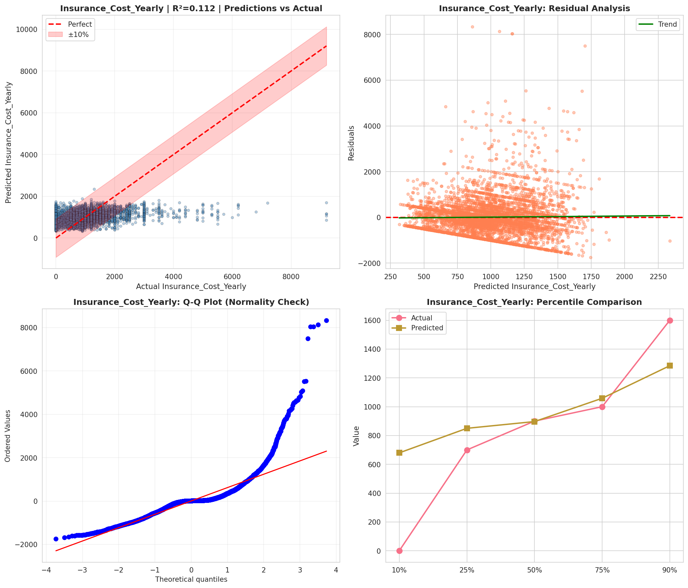
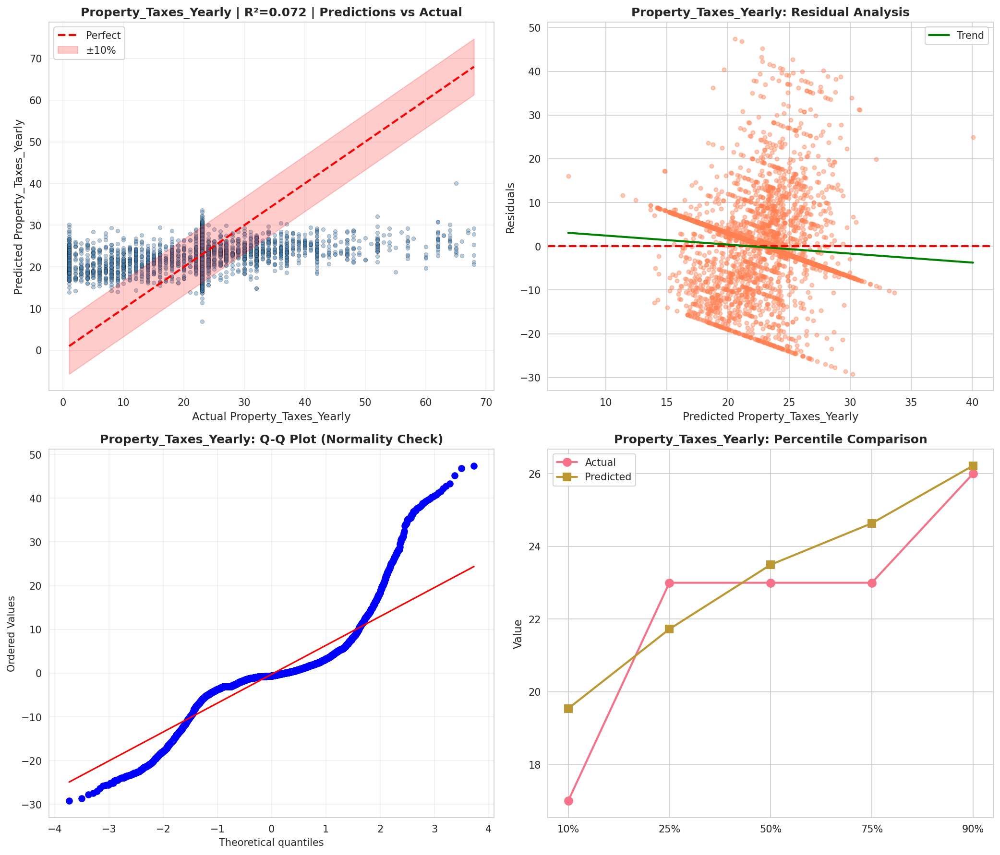
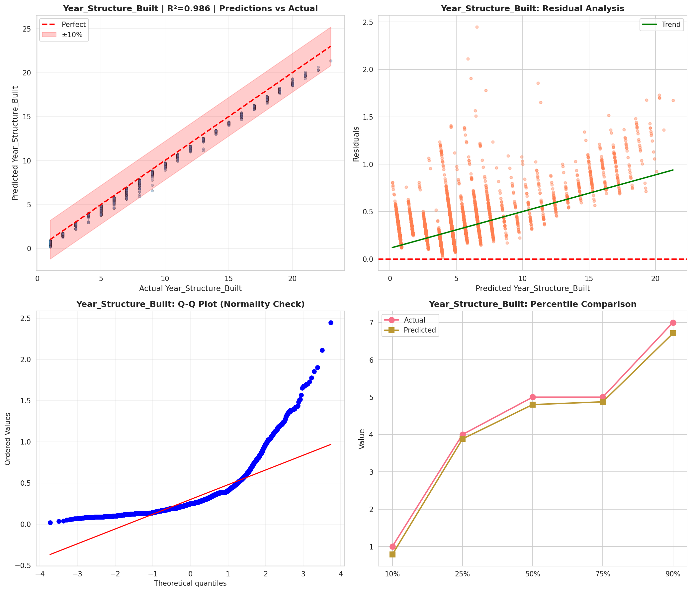
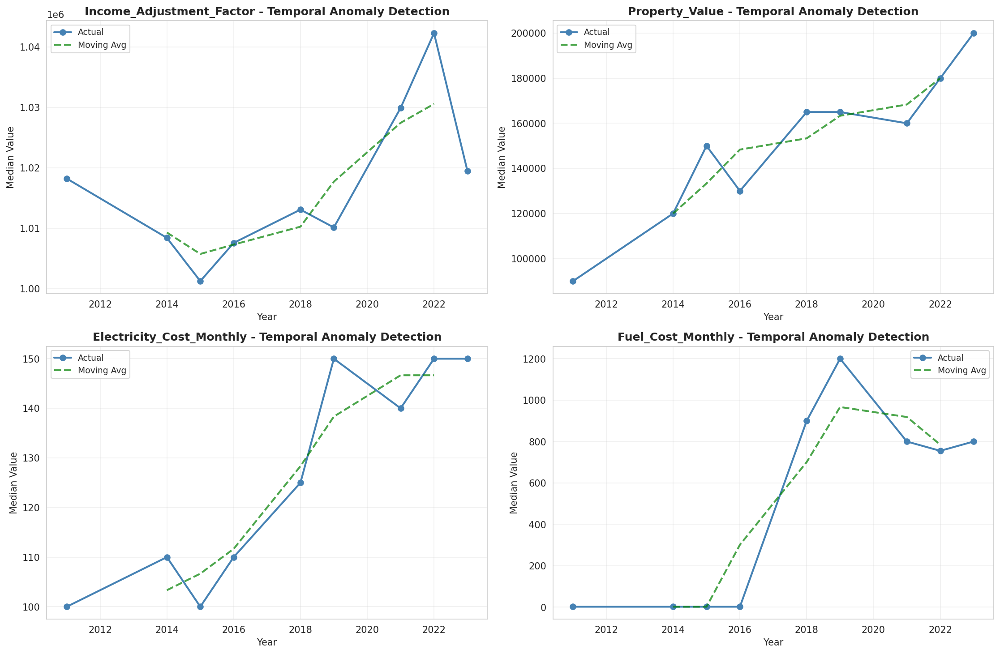
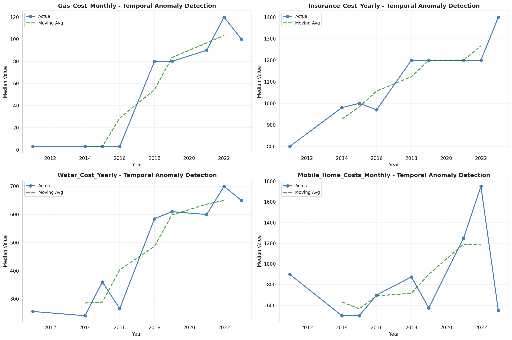
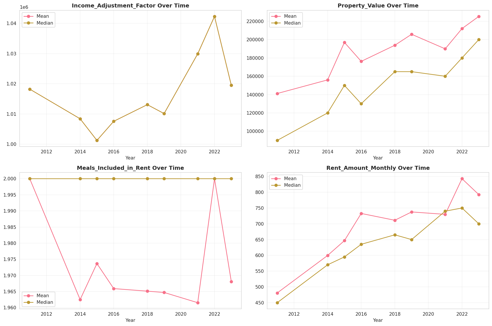
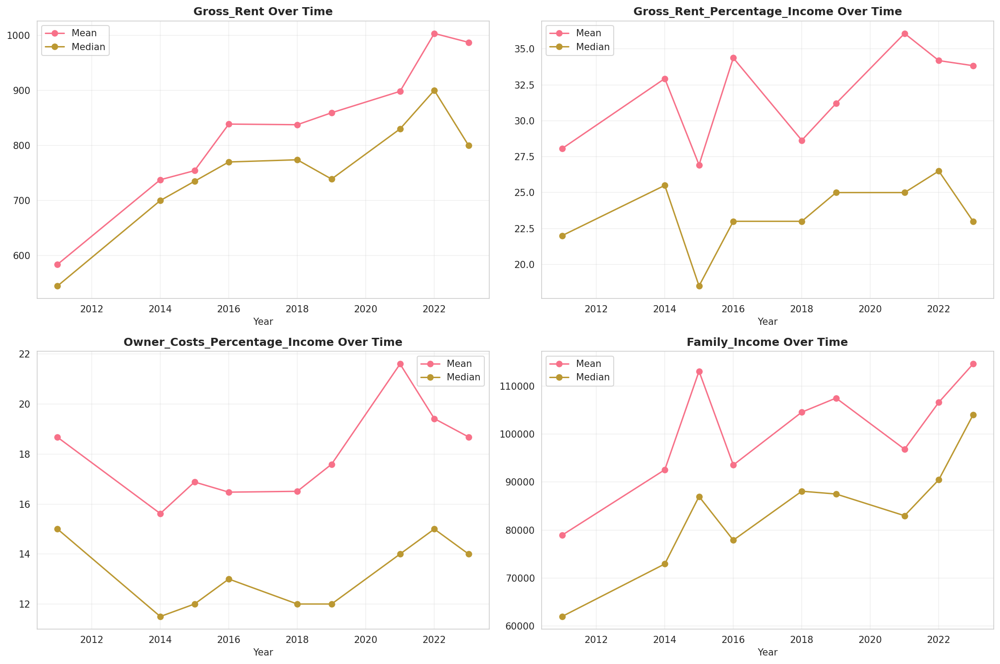
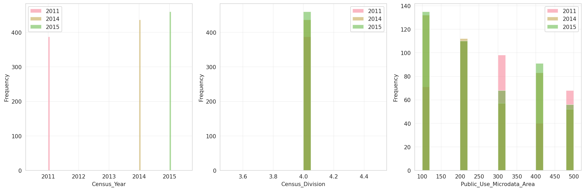
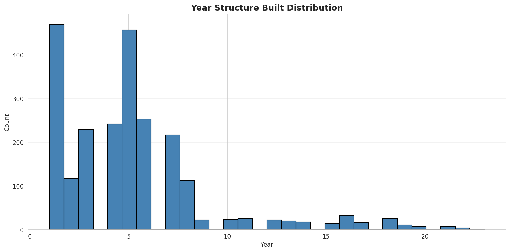
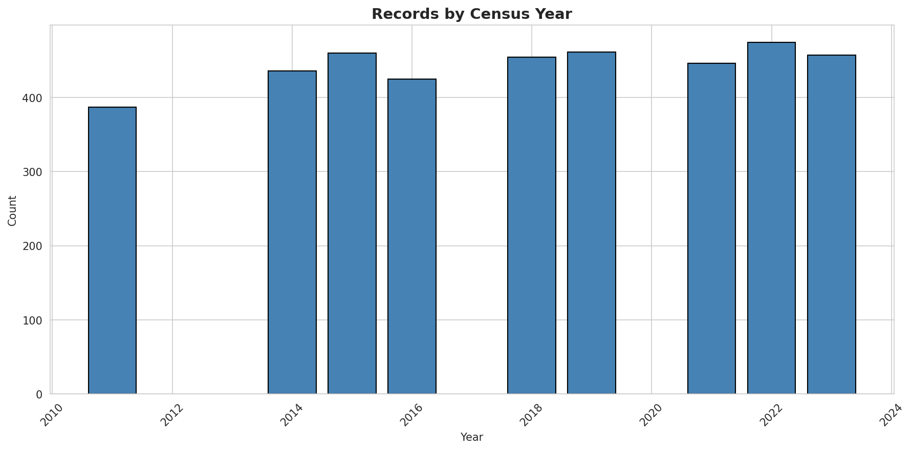
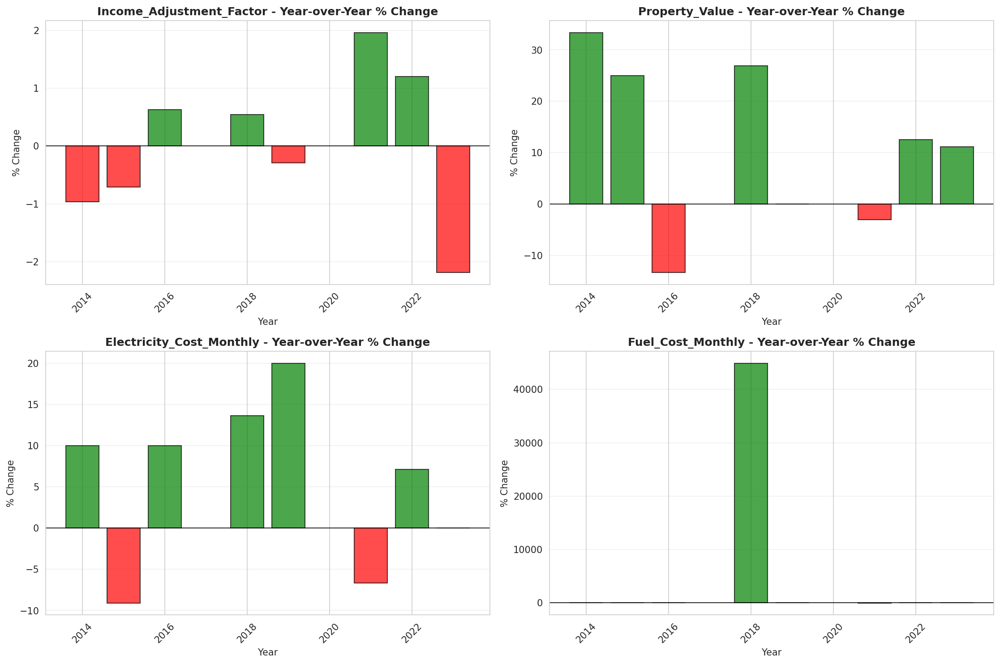
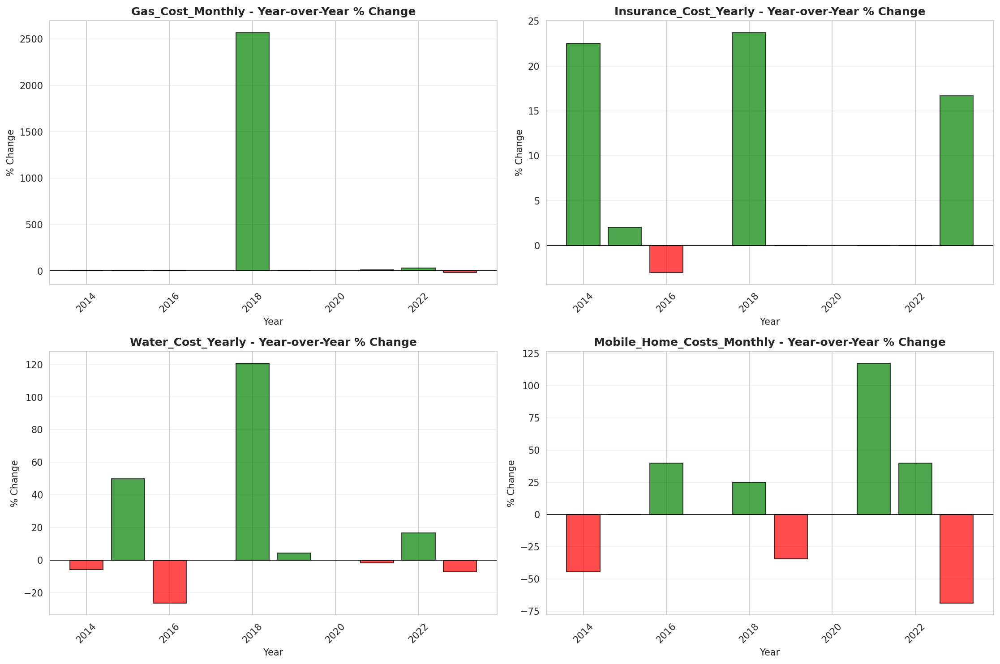
