# Temporal Analysis

## Year Distribution

- 2011: 17,254 records

- 2012: 17,530 records

- 2014: 18,368 records

- 2015: 18,937 records

- 2016: 19,420 records

- 2018: 20,224 records

- 2019: 20,489 records

- 2020: 20,732 records

- 2022: 20,832 records

- 2023: 20,929 records

## Temporal Trends

- Census_Year: {np.int64(2011): {'mean': 2011.0, 'median': 2011.0, 'std': 0.0}, np.int64(2012): {'mean': 2012.0, 'median': 2012.0, 'std': 0.0}, np.int64(2014): {'mean': 2014.0, 'median': 2014.0, 'std': 0.0}, np.int64(2015): {'mean': 2015.0, 'median': 2015.0, 'std': 0.0}, np.int64(2016): {'mean': 2016.0, 'median': 2016.0, 'std': 0.0}, np.int64(2018): {'mean': 2018.0, 'median': 2018.0, 'std': 0.0}, np.int64(2019): {'mean': 2019.0, 'median': 2019.0, 'std': 0.0}, np.int64(2020): {'mean': 2020.0, 'median': 2020.0, 'std': 0.0}, np.int64(2022): {'mean': 2022.0, 'median': 2022.0, 'std': 0.0}, np.int64(2023): {'mean': 2023.0, 'median': 2023.0, 'std': 0.0}}

- Census_Division: {np.int64(2011): {'mean': 4.0, 'median': 4.0, 'std': 0.0}, np.int64(2012): {'mean': 4.0, 'median': 4.0, 'std': 0.0}, np.int64(2014): {'mean': 4.0, 'median': 4.0, 'std': 0.0}, np.int64(2015): {'mean': 4.0, 'median': 4.0, 'std': 0.0}, np.int64(2016): {'mean': 4.0, 'median': 4.0, 'std': 0.0}, np.int64(2018): {'mean': 4.0, 'median': 4.0, 'std': 0.0}, np.int64(2019): {'mean': 4.0, 'median': 4.0, 'std': 0.0}, np.int64(2020): {'mean': 4.0, 'median': 4.0, 'std': 0.0}, np.int64(2022): {'mean': 4.0, 'median': 4.0, 'std': 0.0}, np.int64(2023): {'mean': 4.0, 'median': 4.0, 'std': 0.0}}

- Public_Use_Microdata_Area: {np.int64(2011): {'mean': 278.50353541207835, 'median': 300.0, 'std': 132.6659006373845}, np.int64(2012): {'mean': None, 'median': None, 'std': None}, np.int64(2014): {'mean': None, 'median': None, 'std': None}, np.int64(2015): {'mean': None, 'median': None, 'std': None}, np.int64(2016): {'mean': 259.55715756951594, 'median': 200.0, 'std': 140.86243732921463}, np.int64(2018): {'mean': 260.3095332278481, 'median': 200.0, 'std': 141.38471857030967}, np.int64(2019): {'mean': 260.7691932256333, 'median': 200.0, 'std': 141.8084577578559}, np.int64(2020): {'mean': 260.5633802816901, 'median': 200.0, 'std': 141.792078320424}, np.int64(2022): {'mean': None, 'median': None, 'std': None}, np.int64(2023): {'mean': 362.6546896650581, 'median': 400.0, 'std': 162.09678648319579}}

- Census_Region: {np.int64(2011): {'mean': 2.0, 'median': 2.0, 'std': 0.0}, np.int64(2012): {'mean': 2.0, 'median': 2.0, 'std': 0.0}, np.int64(2014): {'mean': 2.0, 'median': 2.0, 'std': 0.0}, np.int64(2015): {'mean': 2.0, 'median': 2.0, 'std': 0.0}, np.int64(2016): {'mean': 2.0, 'median': 2.0, 'std': 0.0}, np.int64(2018): {'mean': 2.0, 'median': 2.0, 'std': 0.0}, np.int64(2019): {'mean': 2.0, 'median': 2.0, 'std': 0.0}, np.int64(2020): {'mean': 2.0, 'median': 2.0, 'std': 0.0}, np.int64(2022): {'mean': 2.0, 'median': 2.0, 'std': 0.0}, np.int64(2023): {'mean': 2.0, 'median': 2.0, 'std': 0.0}}

- State_Code: {np.int64(2011): {'mean': 38.0, 'median': 38.0, 'std': 0.0}, np.int64(2012): {'mean': 38.0, 'median': 38.0, 'std': 0.0}, np.int64(2014): {'mean': 38.0, 'median': 38.0, 'std': 0.0}, np.int64(2015): {'mean': 38.0, 'median': 38.0, 'std': 0.0}, np.int64(2016): {'mean': 38.0, 'median': 38.0, 'std': 0.0}, np.int64(2018): {'mean': 38.0, 'median': 38.0, 'std': 0.0}, np.int64(2019): {'mean': 38.0, 'median': 38.0, 'std': 0.0}, np.int64(2020): {'mean': 38.0, 'median': 38.0, 'std': 0.0}, np.int64(2022): {'mean': 38.0, 'median': 38.0, 'std': 0.0}, np.int64(2023): {'mean': None, 'median': None, 'std': None}}

- Housing_Adjustment_Factor: {np.int64(2011): {'mean': 1041386.0279935087, 'median': 1044592.0, 'std': 27507.923583654087}, np.int64(2012): {'mean': 1041403.9667997718, 'median': 1053092.0, 'std': 27538.630990261638}, np.int64(2014): {'mean': 1035935.4204594948, 'median': 1031130.0, 'std': 29622.156349428416}, np.int64(2015): {'mean': 1020215.5730052278, 'median': 1017534.0, 'std': 20136.119881407405}, np.int64(2016): {'mean': 1019862.9618434603, 'median': 1013801.0, 'std': 15657.212451753248}, np.int64(2018): {'mean': 1038019.2857001582, 'median': 1046406.0, 'std': 23476.315071830893}, np.int64(2019): {'mean': 1040746.9166381961, 'median': 1042936.0, 'std': 29132.5486391478}, np.int64(2020): {'mean': 1035233.9119235964, 'median': 1030827.0, 'std': 28593.773118217672}, np.int64(2022): {'mean': 1106123.270065284, 'median': 1133141.0, 'std': 60780.05293267802}, np.int64(2023): {'mean': 1108005.0547087772, 'median': 1125501.0, 'std': 76752.52581015609}}

- Income_Adjustment_Factor: {np.int64(2011): {'mean': 1054003.5878636837, 'median': 1048026.0, 'std': 28365.74811034332}, np.int64(2012): {'mean': 1052624.077353109, 'median': 1061121.0, 'std': 26471.30017132041}, np.int64(2014): {'mean': 1046701.4263937282, 'median': 1041654.0, 'std': 31072.01825255257}, np.int64(2015): {'mean': 1029434.5258488673, 'median': 1025215.0, 'std': 25462.13356151733}, np.int64(2016): {'mean': 1026959.5956745623, 'median': 1022342.0, 'std': 17377.97367840176}, np.int64(2018): {'mean': 1046620.012213212, 'median': 1054346.0, 'std': 20481.702966616514}, np.int64(2019): {'mean': 1049718.519839914, 'median': 1054606.0, 'std': 26193.592521836865}, np.int64(2020): {'mean': 1045203.7916264712, 'median': 1044328.0, 'std': 29245.740929336553}, np.int64(2022): {'mean': 1127802.849654378, 'median': 1140108.0, 'std': 48922.64165315398}, np.int64(2023): {'mean': 1131273.515265899, 'median': 1159185.0, 'std': 70005.95795190522}}

- Housing_Unit_Weight: {np.int64(2011): {'mean': 18.286600208647272, 'median': 12.0, 'std': 18.956786376462755}, np.int64(2012): {'mean': 18.22407301768397, 'median': 12.0, 'std': 19.831597249917728}, np.int64(2014): {'mean': 18.07545731707317, 'median': 11.0, 'std': 22.260471228355968}, np.int64(2015): {'mean': 18.010350108253682, 'median': 10.0, 'std': 23.07343483734536}, np.int64(2016): {'mean': 18.029557157569517, 'median': 10.0, 'std': 23.307851395395378}, np.int64(2018): {'mean': 18.180577531645568, 'median': 11.0, 'std': 23.677363471489087}, np.int64(2019): {'mean': 18.20796524964615, 'median': 10.0, 'std': 23.717538143393618}, np.int64(2020): {'mean': 18.165010611614896, 'median': 10.0, 'std': 25.934867657496042}, np.int64(2022): {'mean': 17.875192012288785, 'median': 9.0, 'std': 26.421996700041735}, np.int64(2023): {'mean': 17.91131922213197, 'median': 9.0, 'std': 26.658879974995774}}

- Number_of_Persons: {np.int64(2011): {'mean': 1.9704995942969745, 'median': 2.0, 'std': 1.3686418689057467}, np.int64(2012): {'mean': 1.9641756988020536, 'median': 2.0, 'std': 1.3838654953484542}, np.int64(2014): {'mean': 1.9619991289198606, 'median': 2.0, 'std': 1.4079528061204072}, np.int64(2015): {'mean': 1.9558536198975551, 'median': 2.0, 'std': 1.4221283227331913}, np.int64(2016): {'mean': 1.952368692070031, 'median': 2.0, 'std': 1.4456339127738485}, np.int64(2018): {'mean': 1.9346321202531647, 'median': 2.0, 'std': 1.453826813906949}, np.int64(2019): {'mean': 1.9259602713651227, 'median': 2.0, 'std': 1.458268272818359}, np.int64(2020): {'mean': 1.899575535404206, 'median': 2.0, 'std': 1.4586235521083961}, np.int64(2022): {'mean': 1.89247311827957, 'median': 2.0, 'std': 1.4427972331652439}, np.int64(2023): {'mean': 1.9088824119642602, 'median': 2.0, 'std': 1.4473302487641695}}

- Housing_Unit_Type: {np.int64(2011): {'mean': 1.1304625014489393, 'median': 1.0, 'std': 0.4534385272076106}, np.int64(2012): {'mean': 1.1368511123787792, 'median': 1.0, 'std': 0.46429317738569814}, np.int64(2014): {'mean': 1.151567944250871, 'median': 1.0, 'std': 0.48755597787013016}, np.int64(2015): {'mean': 1.1566774040238685, 'median': 1.0, 'std': 0.4943778839029638}, np.int64(2016): {'mean': 1.153501544799176, 'median': 1.0, 'std': 0.4901528873490951}, np.int64(2018): {'mean': 1.1446795886075949, 'median': 1.0, 'std': 0.47696623256948684}, np.int64(2019): {'mean': 1.1402215823124604, 'median': 1.0, 'std': 0.4699140151858784}, np.int64(2020): {'mean': None, 'median': None, 'std': None}, np.int64(2022): {'mean': None, 'median': None, 'std': None}, np.int64(2023): {'mean': None, 'median': None, 'std': None}}

- Number_of_Bedrooms: {np.int64(2011): {'mean': 2.9230915305734904, 'median': 3.0, 'std': 1.0516675794684658}, np.int64(2012): {'mean': None, 'median': None, 'std': None}, np.int64(2014): {'mean': None, 'median': None, 'std': None}, np.int64(2015): {'mean': None, 'median': None, 'std': None}, np.int64(2016): {'mean': None, 'median': None, 'std': None}, np.int64(2018): {'mean': None, 'median': None, 'std': None}, np.int64(2019): {'mean': None, 'median': None, 'std': None}, np.int64(2020): {'mean': None, 'median': None, 'std': None}, np.int64(2022): {'mean': None, 'median': None, 'std': None}, np.int64(2023): {'mean': None, 'median': None, 'std': None}}

- Number_of_Rooms: {np.int64(2011): {'mean': 6.157298392201544, 'median': 6.0, 'std': 1.9908970770607286}, np.int64(2012): {'mean': None, 'median': None, 'std': None}, np.int64(2014): {'mean': None, 'median': None, 'std': None}, np.int64(2015): {'mean': None, 'median': None, 'std': None}, np.int64(2016): {'mean': None, 'median': None, 'std': None}, np.int64(2018): {'mean': None, 'median': None, 'std': None}, np.int64(2019): {'mean': None, 'median': None, 'std': None}, np.int64(2020): {'mean': None, 'median': None, 'std': None}, np.int64(2022): {'mean': None, 'median': None, 'std': None}, np.int64(2023): {'mean': None, 'median': None, 'std': None}}

- Building_Type: {np.int64(2011): {'mean': 2.645081655905811, 'median': 2.0, 'std': 1.7854641011182042}, np.int64(2012): {'mean': 2.6405380043791054, 'median': 2.0, 'std': 1.787905147271038}, np.int64(2014): {'mean': 2.623417339925238, 'median': 2.0, 'std': 1.7772193377083638}, np.int64(2015): {'mean': 2.624317501320965, 'median': 2.0, 'std': 1.7828149907912265}, np.int64(2016): {'mean': 2.6412335808109653, 'median': 2.0, 'std': 1.803567158465984}, np.int64(2018): {'mean': 2.692047746225541, 'median': 2.0, 'std': 1.8724751489917673}, np.int64(2019): {'mean': 2.709542455613367, 'median': 2.0, 'std': 1.8949474092402696}, np.int64(2020): {'mean': 2.709985666507406, 'median': 2.0, 'std': 1.9003449365576528}, np.int64(2022): {'mean': 2.717954137165804, 'median': 2.0, 'std': 1.9091995761631906}, np.int64(2023): {'mean': 2.724127017617892, 'median': 2.0, 'std': 1.9120171783916629}}

- Year_Structure_Built: {np.int64(2011): {'mean': 5.7833270034181545, 'median': 5.0, 'std': 2.3340852461641886}, np.int64(2012): {'mean': 4.382108226462308, 'median': 5.0, 'std': 2.605123193132987}, np.int64(2014): {'mean': 4.573013384782347, 'median': 5.0, 'std': 2.910669619843095}, np.int64(2015): {'mean': 4.695825750014677, 'median': 5.0, 'std': 3.1284640097479235}, np.int64(2016): {'mean': 4.896916047972587, 'median': 5.0, 'std': 3.4169314110276665}, np.int64(2018): {'mean': 5.311004523900365, 'median': 5.0, 'std': 4.03807918645906}, np.int64(2019): {'mean': 5.475299039854101, 'median': 5.0, 'std': 4.314103482016691}, np.int64(2020): {'mean': 5.62791314965228, 'median': 5.0, 'std': 4.534599784344677}, np.int64(2022): {'mean': None, 'median': None, 'std': None}, np.int64(2023): {'mean': None, 'median': None, 'std': None}}

- Bathtub_or_Shower: {np.int64(2011): {'mean': None, 'median': None, 'std': None}, np.int64(2012): {'mean': 1.0155145448858305, 'median': 1.0, 'std': 0.1235912592120627}, np.int64(2014): {'mean': 1.0161582057156637, 'median': 1.0, 'std': 0.12608757523073866}, np.int64(2015): {'mean': 1.014970938765925, 'median': 1.0, 'std': 0.12144000818508086}, np.int64(2016): {'mean': 1.0146773272415763, 'median': 1.0, 'std': 0.1202610879557899}, np.int64(2018): {'mean': 1.0127541287403936, 'median': 1.0, 'std': 0.11221473732640376}, np.int64(2019): {'mean': 1.0112106420640454, 'median': 1.0, 'std': 0.1052879774316293}, np.int64(2020): {'mean': 1.0110420979986197, 'median': 1.0, 'std': 0.10450239145760863}, np.int64(2022): {'mean': 1.0115185459156715, 'median': 1.0, 'std': 0.1067074067100488}, np.int64(2023): {'mean': 1.0108661251186835, 'median': 1.0, 'std': 0.10367554877454045}}

- Refrigerator: {np.int64(2011): {'mean': None, 'median': None, 'std': None}, np.int64(2012): {'mean': 1.0214576165154832, 'median': 1.0, 'std': 0.14490859479960452}, np.int64(2014): {'mean': 1.021584468829133, 'median': 1.0, 'std': 0.14532671085765636}, np.int64(2015): {'mean': 1.0202547995068396, 'median': 1.0, 'std': 0.14087479453976745}, np.int64(2016): {'mean': 1.0201599086236437, 'median': 1.0, 'std': 0.14055111133814197}, np.int64(2018): {'mean': 1.0182046111080831, 'median': 1.0, 'std': 0.13369434345318443}, np.int64(2019): {'mean': 1.0174864560424823, 'median': 1.0, 'std': 0.13107860812873492}, np.int64(2020): {'mean': 1.0173594521420608, 'median': 1.0, 'std': 0.13061013427397627}, np.int64(2022): {'mean': 1.0178061925393638, 'median': 1.0, 'std': 0.13224997608742617}, np.int64(2023): {'mean': 1.0160354467770862, 'median': 1.0, 'std': 0.12561506097937597}}

- Hot_and_Cold_Running_Water: {np.int64(2011): {'mean': None, 'median': None, 'std': None}, np.int64(2012): {'mean': 1.0249609008445417, 'median': 1.0, 'std': 0.15601082306077818}, np.int64(2014): {'mean': 1.0275533582539491, 'median': 1.0, 'std': 0.16369418520337461}, np.int64(2015): {'mean': 1.026947689778665, 'median': 1.0, 'std': 0.16193533072854435}, np.int64(2016): {'mean': 1.0262135922330098, 'median': 1.0, 'std': 0.159774521495687}, np.int64(2018): {'mean': 1.0242001417125415, 'median': 1.0, 'std': 0.15367427249761062}, np.int64(2019): {'mean': 1.0236549911494932, 'median': 1.0, 'std': 0.1519758909683804}, np.int64(2020): {'mean': 1.0251101555449382, 'median': 1.0, 'std': 0.1564638464728901}, np.int64(2022): {'mean': 1.0256789601606255, 'median': 1.0, 'std': 0.15817987609915654}, np.int64(2023): {'mean': 1.0242114147061927, 'median': 1.0, 'std': 0.15370903798192093}}

- Running_Water: {np.int64(2011): {'mean': None, 'median': None, 'std': None}, np.int64(2012): {'mean': None, 'median': None, 'std': None}, np.int64(2014): {'mean': 9.0, 'median': 9.0, 'std': 0.0}, np.int64(2015): {'mean': 9.0, 'median': 9.0, 'std': 0.0}, np.int64(2016): {'mean': 9.0, 'median': 9.0, 'std': 0.0}, np.int64(2018): {'mean': 9.0, 'median': 9.0, 'std': 0.0}, np.int64(2019): {'mean': 9.0, 'median': 9.0, 'std': 0.0}, np.int64(2020): {'mean': 9.0, 'median': 9.0, 'std': 0.0}, np.int64(2022): {'mean': 9.0, 'median': 9.0, 'std': 0.0}, np.int64(2023): {'mean': 9.0, 'median': 9.0, 'std': 0.0}}

- Sink_with_Faucet: {np.int64(2011): {'mean': None, 'median': None, 'std': None}, np.int64(2012): {'mean': 1.0142008132624336, 'median': 1.0, 'std': 0.11832170548055394}, np.int64(2014): {'mean': 1.0148920776558543, 'median': 1.0, 'std': 0.12112468052166128}, np.int64(2015): {'mean': 1.0142664240004697, 'median': 1.0, 'std': 0.11859055114766003}, np.int64(2016): {'mean': 1.013934894346088, 'median': 1.0, 'std': 0.11722413508170541}, np.int64(2018): {'mean': 1.0122090805036246, 'median': 1.0, 'std': 0.10982111009232932}, np.int64(2019): {'mean': 1.0108888054497667, 'median': 1.0, 'std': 0.10378254721385234}, np.int64(2020): {'mean': 1.0104050538833147, 'median': 1.0, 'std': 0.10147578721913378}, np.int64(2022): {'mean': 1.0104617985839586, 'median': 1.0, 'std': 0.10174918365337456}, np.int64(2023): {'mean': 1.0101803987762423, 'median': 1.0, 'std': 0.10038570523584464}}

- Stove_or_Range: {np.int64(2011): {'mean': None, 'median': None, 'std': None}, np.int64(2012): {'mean': 1.022333437597748, 'median': 1.0, 'std': 0.14777016341195254}, np.int64(2014): {'mean': 1.0227903050765705, 'median': 1.0, 'std': 0.14923890211804638}, np.int64(2015): {'mean': 1.0220747959842658, 'median': 1.0, 'std': 0.14693116358894848}, np.int64(2016): {'mean': 1.0219874357509995, 'median': 1.0, 'std': 0.1466465703240423}, np.int64(2018): {'mean': 1.0202212895841283, 'median': 1.0, 'std': 0.1407603245283104}, np.int64(2019): {'mean': 1.0192029179853028, 'median': 1.0, 'std': 0.13724130658944245}, np.int64(2020): {'mean': 1.0185273663534533, 'median': 1.0, 'std': 0.13485202423531234}, np.int64(2022): {'mean': 1.018810102504491, 'median': 1.0, 'std': 0.13585749070683276}, np.int64(2023): {'mean': 1.0167739212997151, 'median': 1.0, 'std': 0.12842673733377355}}

- Telephone_Service: {np.int64(2011): {'mean': 1.0180186496529482, 'median': 1.0, 'std': 0.1330233759740957}, np.int64(2012): {'mean': 1.0152650568970303, 'median': 1.0, 'std': 0.12260945326306347}, np.int64(2014): {'mean': 1.0172089271309492, 'median': 1.0, 'std': 0.13005351572165}, np.int64(2015): {'mean': 1.0197909132750345, 'median': 1.0, 'std': 0.13928570860192388}, np.int64(2016): {'mean': 1.0206900983100944, 'median': 1.0, 'std': 0.14234928928840623}, np.int64(2018): {'mean': 1.0187333291979406, 'median': 1.0, 'std': 0.13558588393329896}, np.int64(2019): {'mean': 1.0163060136087783, 'median': 1.0, 'std': 0.12665350710480253}, np.int64(2020): {'mean': 1.0129925844211558, 'median': 1.0, 'std': 0.11324558770439191}, np.int64(2022): {'mean': 1.0094265036793773, 'median': 1.0, 'std': 0.09663442772596798}, np.int64(2023): {'mean': 1.0084008400840083, 'median': 1.0, 'std': 0.09127302923554628}}

- Lot_Acreage: {np.int64(2011): {'mean': 1.4932588454376163, 'median': 1.0, 'std': 0.7710900410611775}, np.int64(2012): {'mean': 1.4919117647058824, 'median': 1.0, 'std': 0.7701080596703355}, np.int64(2014): {'mean': 1.4949044585987261, 'median': 1.0, 'std': 0.7690365171881319}, np.int64(2015): {'mean': 1.4890359950351675, 'median': 1.0, 'std': 0.7659643469612957}, np.int64(2016): {'mean': 1.4799408641892347, 'median': 1.0, 'std': 0.7573236667948966}, np.int64(2018): {'mean': 1.4616081247169934, 'median': 1.0, 'std': 0.7426686755734796}, np.int64(2019): {'mean': 1.461145846624984, 'median': 1.0, 'std': 0.7398406030677964}, np.int64(2020): {'mean': 1.4698681138385814, 'median': 1.0, 'std': 0.7426429101580023}, np.int64(2022): {'mean': 1.4787274096385543, 'median': 1.0, 'std': 0.7449353561038754}, np.int64(2023): {'mean': 1.4790962573538615, 'median': 1.0, 'std': 0.7433971370477952}}

- Agricultural_Sales: {np.int64(2011): {'mean': 2.4877679697351827, 'median': 1.0, 'std': 2.2064633491708285}, np.int64(2012): {'mean': 2.4394317048853438, 'median': 1.0, 'std': 2.1876721019616037}, np.int64(2014): {'mean': 2.355518314579842, 'median': 1.0, 'std': 2.147074063958398}, np.int64(2015): {'mean': 2.345274569879802, 'median': 1.0, 'std': 2.144979377241129}, np.int64(2016): {'mean': 2.3032348149872, 'median': 1.0, 'std': 2.123397908288844}, np.int64(2018): {'mean': 2.2077350625289487, 'median': 1.0, 'std': 2.0710487467686836}, np.int64(2019): {'mean': 2.165602189781022, 'median': 1.0, 'std': 2.04733918069019}, np.int64(2020): {'mean': 2.1246376811594203, 'median': 1.0, 'std': 2.018830152957993}, np.int64(2022): {'mean': 2.0550856647148126, 'median': 1.0, 'std': 1.9698380875997037}, np.int64(2023): {'mean': 2.0346227826458647, 'median': 1.0, 'std': 1.9559269126109278}}

- Business_On_Property: {np.int64(2011): {'mean': 1.9783240223463687, 'median': 2.0, 'std': 0.1456286694440143}, np.int64(2012): {'mean': 1.9791176470588234, 'median': 2.0, 'std': 0.1429957474554072}, np.int64(2014): {'mean': 1.9787685774946921, 'median': 2.0, 'std': 0.14416004988764597}, np.int64(2015): {'mean': 1.9788994621431526, 'median': 2.0, 'std': 0.1437244918744478}, np.int64(2016): {'mean': 3.457428936227404, 'median': 2.0, 'std': 2.8658079003040164}, np.int64(2018): {'mean': 6.256484895530112, 'median': 9.0, 'std': 3.426303365745997}, np.int64(2019): {'mean': 7.629641444430266, 'median': 9.0, 'std': 2.783026235490866}, np.int64(2020): {'mean': None, 'median': None, 'std': None}, np.int64(2022): {'mean': None, 'median': None, 'std': None}, np.int64(2023): {'mean': None, 'median': None, 'std': None}}

- Tenure: {np.int64(2011): {'mean': 1.9022646007151371, 'median': 2.0, 'std': 0.8234126995646204}, np.int64(2012): {'mean': 1.9154870940882598, 'median': 2.0, 'std': 0.8246035915771482}, np.int64(2014): {'mean': 1.940037644528099, 'median': 2.0, 'std': 0.8178066003387262}, np.int64(2015): {'mean': 1.9498323361167729, 'median': 2.0, 'std': 0.8196335702032165}, np.int64(2016): {'mean': 1.951487502409561, 'median': 2.0, 'std': 0.8191565285995145}, np.int64(2018): {'mean': 1.9464053098443024, 'median': 2.0, 'std': 0.8207034970112811}, np.int64(2019): {'mean': 1.9455648869000184, 'median': 2.0, 'std': 0.8223692439183067}, np.int64(2020): {'mean': 1.942330085187228, 'median': 2.0, 'std': 0.8186480571442875}, np.int64(2022): {'mean': 1.9386365018548926, 'median': 2.0, 'std': 0.8084776236972775}, np.int64(2023): {'mean': 1.9338133813381337, 'median': 2.0, 'std': 0.8042283599188336}}

- Vacancy_Status: {np.int64(2011): {'mean': 5.015635179153095, 'median': 5.0, 'std': 1.80929527286732}, np.int64(2012): {'mean': 5.087730451366815, 'median': 5.0, 'std': 1.8099761005464188}, np.int64(2014): {'mean': 5.249122807017544, 'median': 5.0, 'std': 1.8062814920930519}, np.int64(2015): {'mean': 5.223684210526316, 'median': 5.0, 'std': 1.8576223370690483}, np.int64(2016): {'mean': 5.160760143810991, 'median': 5.0, 'std': 1.9206619912356164}, np.int64(2018): {'mean': 5.087601078167116, 'median': 5.0, 'std': 2.016551488434885}, np.int64(2019): {'mean': 5.076394849785408, 'median': 5.0, 'std': 2.0395827241362854}, np.int64(2020): {'mean': 5.0964285714285715, 'median': 5.0, 'std': 2.0495613699296533}, np.int64(2022): {'mean': 5.153040676600886, 'median': 5.0, 'std': 2.051104195742768}, np.int64(2023): {'mean': 5.137374618403838, 'median': 5.0, 'std': 2.0723947032201435}}

- Property_Value: {np.int64(2011): {'mean': 11.989984798354646, 'median': 13.0, 'std': 5.345167652452259}}

- Vehicles_Available: {np.int64(2011): {'mean': 2.2047956250438197, 'median': 2.0, 'std': 1.2482716133525025}, np.int64(2012): {'mean': 2.2060782681099083, 'median': 2.0, 'std': 1.253292037038038}, np.int64(2014): {'mean': 2.2202877117504705, 'median': 2.0, 'std': 1.2569970128546926}, np.int64(2015): {'mean': 2.224801104609113, 'median': 2.0, 'std': 1.2493134627907407}, np.int64(2016): {'mean': 2.2317676540512754, 'median': 2.0, 'std': 1.2430765485187376}, np.int64(2018): {'mean': 2.233484275169034, 'median': 2.0, 'std': 1.2406265223694153}, np.int64(2019): {'mean': 2.2388892294489056, 'median': 2.0, 'std': 1.2507488848602886}, np.int64(2020): {'mean': 2.2662254090825518, 'median': 2.0, 'std': 1.269407245537223}, np.int64(2022): {'mean': 2.266070668369519, 'median': 2.0, 'std': 1.2755344962716166}, np.int64(2023): {'mean': 2.2566456645664568, 'median': 2.0, 'std': 1.2802585049329984}}

- Condo_Fee_Monthly: {np.int64(2011): {'mean': 140.6880733944954, 'median': 110.0, 'std': 111.00290171386428}, np.int64(2012): {'mean': 147.20833333333334, 'median': 120.0, 'std': 122.150013801422}, np.int64(2014): {'mean': 151.98979591836735, 'median': 130.0, 'std': 104.26603005556447}, np.int64(2015): {'mean': 160.32258064516128, 'median': 130.0, 'std': 106.81078610280362}, np.int64(2016): {'mean': 161.8840579710145, 'median': 130.0, 'std': 108.0265433354522}, np.int64(2018): {'mean': 165.34782608695653, 'median': 150.0, 'std': 92.4466605071356}, np.int64(2019): {'mean': 165.2608695652174, 'median': 150.0, 'std': 87.81516783732363}, np.int64(2020): {'mean': 165.44303797468353, 'median': 150.0, 'std': 81.66899088446935}, np.int64(2022): {'mean': 178.80161943319837, 'median': 160.0, 'std': 84.7286745443932}, np.int64(2023): {'mean': 205.3206106870229, 'median': 180.0, 'std': 152.82147284356915}}

- Electricity_Cost_Monthly: {np.int64(2011): {'mean': 110.53726425015775, 'median': 90.0, 'std': 84.2775795533608}, np.int64(2012): {'mean': 114.73417985012489, 'median': 100.0, 'std': 87.78120832229787}, np.int64(2014): {'mean': 126.05471901048669, 'median': 100.0, 'std': 97.4030757054884}, np.int64(2015): {'mean': 131.27181274245513, 'median': 100.0, 'std': 100.73874038414812}, np.int64(2016): {'mean': 132.12459037460644, 'median': 110.0, 'std': 100.32491791326322}, np.int64(2018): {'mean': 145.98302724922098, 'median': 120.0, 'std': 99.31192384973691}, np.int64(2019): {'mean': 146.98068739770866, 'median': 120.0, 'std': 99.92883067266425}, np.int64(2020): {'mean': 150.24336341048777, 'median': 130.0, 'std': 102.33201924701675}, np.int64(2022): {'mean': 163.08599987018889, 'median': 130.0, 'std': 122.81420268767984}, np.int64(2023): {'mean': 172.7927212148395, 'median': 140.0, 'std': 166.30750236347345}}

- Fuel_Cost_Monthly: {np.int64(2011): {'mean': 223.223445277992, 'median': 2.0, 'std': 615.5795264107878}, np.int64(2012): {'mean': 218.3131418262559, 'median': 2.0, 'std': 624.501419552786}, np.int64(2014): {'mean': 179.60190911535358, 'median': 2.0, 'std': 578.2879939964056}, np.int64(2015): {'mean': 165.14931948188573, 'median': 2.0, 'std': 564.5833092802135}, np.int64(2016): {'mean': 143.16211527340488, 'median': 2.0, 'std': 523.2994249344151}, np.int64(2018): {'mean': 1049.9271255060728, 'median': 840.0, 'std': 948.8850873725905}, np.int64(2019): {'mean': 997.2485345838218, 'median': 800.0, 'std': 884.9230490333388}, np.int64(2020): {'mean': 964.8153098420413, 'median': 800.0, 'std': 866.2267818541127}, np.int64(2022): {'mean': 1044.1032806804374, 'median': 810.0, 'std': 950.54194826196}, np.int64(2023): {'mean': 1104.821052631579, 'median': 870.0, 'std': 1002.6038303819394}}

- Gas_Cost_Monthly: {np.int64(2011): {'mean': 58.73399705531796, 'median': 3.0, 'std': 91.20482940965661}, np.int64(2012): {'mean': 57.85172078823203, 'median': 3.0, 'std': 90.93804023457153}, np.int64(2014): {'mean': 55.3290535090078, 'median': 3.0, 'std': 91.28000776374577}, np.int64(2015): {'mean': 55.703925307383784, 'median': 3.0, 'std': 91.34638905997544}, np.int64(2016): {'mean': 53.44573668315877, 'median': 3.0, 'std': 88.02355909471993}, np.int64(2018): {'mean': 108.76557863501483, 'median': 80.0, 'std': 101.8589265135883}, np.int64(2019): {'mean': 107.56979232221524, 'median': 80.0, 'std': 100.63529666230352}, np.int64(2020): {'mean': 107.70404595404595, 'median': 80.0, 'std': 102.02531452737615}, np.int64(2022): {'mean': 133.43340328354523, 'median': 90.0, 'std': 192.32714519895316}, np.int64(2023): {'mean': 145.5603164942179, 'median': 100.0, 'std': 214.79180237288148}}

- House_Heating_Fuel: {np.int64(2011): {'mean': 2.3835097805510763, 'median': 2.0, 'std': 1.3829348754553783}, np.int64(2012): {'mean': 2.379406050513461, 'median': 2.0, 'std': 1.3670946811794604}, np.int64(2014): {'mean': 2.3859908577574616, 'median': 2.0, 'std': 1.3561101190942009}, np.int64(2015): {'mean': 2.3852981787099745, 'median': 2.0, 'std': 1.3606630891345037}, np.int64(2016): {'mean': 2.3708153954893016, 'median': 2.0, 'std': 1.357577475323478}, np.int64(2018): {'mean': 2.336765709323243, 'median': 2.0, 'std': 1.3437821832739973}, np.int64(2019): {'mean': 2.3198675902654324, 'median': 2.0, 'std': 1.3269227795535694}, np.int64(2020): {'mean': 2.311699454556597, 'median': 2.0, 'std': 1.3051441909006636}, np.int64(2022): {'mean': 2.3198321474183543, 'median': 2.0, 'std': 1.3472368009125426}, np.int64(2023): {'mean': 2.3303930393039303, 'median': 2.0, 'std': 1.3793896440317235}}

- Insurance_Cost_Yearly: {np.int64(2014): {'mean': 944.4578152753108, 'median': 800.0, 'std': 620.5605090518345}, np.int64(2015): {'mean': 999.4918425059822, 'median': 900.0, 'std': 674.5423464265343}}

- Water_Cost_Yearly: {np.int64(2011): {'mean': 349.36079366192246, 'median': 340.0, 'std': 367.99726824716123}, np.int64(2012): {'mean': 360.83541493200113, 'median': 350.0, 'std': 383.53667934253383}, np.int64(2014): {'mean': 377.28589674643723, 'median': 360.0, 'std': 402.3431318789489}, np.int64(2015): {'mean': 384.73173778683673, 'median': 340.0, 'std': 412.6555640136848}, np.int64(2016): {'mean': 395.66137634132235, 'median': 340.0, 'std': 426.19104993316984}, np.int64(2018): {'mean': 594.2635905595333, 'median': 600.0, 'std': 431.6399013271291}, np.int64(2019): {'mean': 602.5856449375867, 'median': 600.0, 'std': 448.2201440837374}, np.int64(2020): {'mean': 618.9120096145592, 'median': 600.0, 'std': 469.36775180692297}, np.int64(2022): {'mean': 636.1054036024016, 'median': 620.0, 'std': 524.8193696491111}, np.int64(2023): {'mean': 649.5969600392253, 'median': 650.0, 'std': 548.2041593042086}}

- Mobile_Home_Costs_Monthly: {np.int64(2011): {'mean': 1394.5977011494253, 'median': 800.0, 'std': 1401.425546168414}, np.int64(2012): {'mean': 1422.2955854126678, 'median': 800.0, 'std': 1424.6731598725517}, np.int64(2014): {'mean': 1535.3248175182482, 'median': 800.0, 'std': 1578.1251425659148}, np.int64(2015): {'mean': 1678.1063829787233, 'median': 800.0, 'std': 1854.3803385004624}, np.int64(2016): {'mean': 1723.7495590828923, 'median': 800.0, 'std': 1966.6819434003962}, np.int64(2018): {'mean': 1756.8781302170285, 'median': 750.0, 'std': 2078.2982096738724}, np.int64(2019): {'mean': 1826.0033726812817, 'median': 790.0, 'std': 2151.4341492681697}, np.int64(2020): {'mean': 1842.6783831282953, 'median': 800.0, 'std': 2115.111280554042}, np.int64(2022): {'mean': 2257.528795811518, 'median': 1000.0, 'std': 3112.0321752989507}, np.int64(2023): {'mean': 2273.843537414966, 'median': 1000.0, 'std': 3133.461566070332}}

- First_Mortgage_Includes_Insurance: {np.int64(2011): {'mean': 1.4615833495428905, 'median': 1.0, 'std': 0.4985704684111716}, np.int64(2012): {'mean': 1.4563890529631818, 'median': 1.0, 'std': 0.4981434961329241}, np.int64(2014): {'mean': 1.4572408229124647, 'median': 1.0, 'std': 0.4982185440781917}, np.int64(2015): {'mean': 1.4492985971943888, 'median': 1.0, 'std': 0.49747257485820745}, np.int64(2016): {'mean': 1.4383212394587175, 'median': 1.0, 'std': 0.49622980876708384}, np.int64(2018): {'mean': 1.4162786366176197, 'median': 1.0, 'std': 0.49298681508073466}, np.int64(2019): {'mean': 1.4097069597069598, 'median': 1.0, 'std': 0.4918246327112456}, np.int64(2020): {'mean': 1.401919173279203, 'median': 1.0, 'std': 0.4903310293901236}, np.int64(2022): {'mean': 1.3810861423220975, 'median': 1.0, 'std': 0.4856991570608365}, np.int64(2023): {'mean': 1.3702261772339637, 'median': 1.0, 'std': 0.48290991759896695}}

- First_Mortgage_Payment_Monthly: {np.int64(2011): {'mean': 763.3806652402257, 'median': 670.0, 'std': 454.7854165479512}, np.int64(2012): {'mean': 791.3034061823193, 'median': 700.0, 'std': 484.14454211803013}, np.int64(2014): {'mean': 831.0766438079871, 'median': 720.0, 'std': 516.8696034621549}, np.int64(2015): {'mean': 862.8981963927856, 'median': 750.0, 'std': 545.0678642199379}, np.int64(2016): {'mean': 893.1049225338302, 'median': 800.0, 'std': 556.5581633443692}, np.int64(2018): {'mean': 952.2607561929595, 'median': 850.0, 'std': 569.8119625622876}, np.int64(2019): {'mean': 986.1025641025641, 'median': 880.0, 'std': 588.4240430780059}, np.int64(2020): {'mean': 1015.7294703819892, 'median': 900.0, 'std': 593.7383152903728}, np.int64(2022): {'mean': 1095.0258426966293, 'median': 1000.0, 'std': 623.9826660779778}, np.int64(2023): {'mean': 1153.662958843159, 'median': 1000.0, 'std': 662.5920924428294}}

- First_Mortgage_Includes_Taxes: {np.int64(2011): {'mean': 1.398560591324645, 'median': 1.0, 'std': 0.48964955076399774}, np.int64(2012): {'mean': 1.3916125221500295, 'median': 1.0, 'std': 0.48815886056448365}, np.int64(2014): {'mean': 1.3805970149253732, 'median': 1.0, 'std': 0.48558262400532026}, np.int64(2015): {'mean': 1.3677354709418839, 'median': 1.0, 'std': 0.48223718033779744}, np.int64(2016): {'mean': 1.3557560305942342, 'median': 1.0, 'std': 0.47878871630105374}, np.int64(2018): {'mean': 1.3326504004470106, 'median': 1.0, 'std': 0.4712063949240242}, np.int64(2019): {'mean': 1.3175824175824176, 'median': 1.0, 'std': 0.4655787000114952}, np.int64(2020): {'mean': 1.307805868241373, 'median': 1.0, 'std': 0.4616283575050628}, np.int64(2022): {'mean': 1.2743445692883895, 'median': 1.0, 'std': 0.4462251835139332}, np.int64(2023): {'mean': 1.2558398220244715, 'median': 1.0, 'std': 0.43637267316404776}}

- First_Mortgage_Status: {np.int64(2011): {'mean': 2.0783599088838267, 'median': 3.0, 'std': 0.9893091034295904}, np.int64(2012): {'mean': 2.094361856417694, 'median': 3.0, 'std': 0.9879506734530964}, np.int64(2014): {'mean': 2.1367377644039296, 'median': 3.0, 'std': 0.983387420644917}, np.int64(2015): {'mean': 2.146682897139379, 'median': 3.0, 'std': 0.9819034731858448}, np.int64(2016): {'mean': 2.1450967027349406, 'median': 3.0, 'std': 0.9823727724646878}, np.int64(2018): {'mean': 2.1287610254719316, 'median': 3.0, 'std': 0.9846670872583424}, np.int64(2019): {'mean': 2.122706889523033, 'median': 3.0, 'std': 0.9858889473842123}, np.int64(2020): {'mean': 2.1327218118353763, 'median': 3.0, 'std': 0.9848668149020972}, np.int64(2022): {'mean': 2.15531182451365, 'median': 3.0, 'std': 0.9826637814234017}, np.int64(2023): {'mean': 2.1616757054153894, 'median': 3.0, 'std': 0.9820121325538628}}

- Second_Mortgage_Payment_Monthly: {np.int64(2011): {'mean': 361.08527131782944, 'median': 300.0, 'std': 332.97779041100324}, np.int64(2012): {'mean': 369.2713567839196, 'median': 300.0, 'std': 342.90871474815606}, np.int64(2014): {'mean': 371.55622188905545, 'median': 300.0, 'std': 306.93485296799594}, np.int64(2015): {'mean': 377.42492012779553, 'median': 300.0, 'std': 314.8653070028416}, np.int64(2016): {'mean': 387.8236220472441, 'median': 300.0, 'std': 380.7991850239911}, np.int64(2018): {'mean': 400.85669781931466, 'median': 300.0, 'std': 399.60867913138287}, np.int64(2019): {'mean': 406.2162162162162, 'median': 300.0, 'std': 391.7846529952428}, np.int64(2020): {'mean': 448.7383177570093, 'median': 310.0, 'std': 479.0172565154616}, np.int64(2022): {'mean': 490.9337860780985, 'median': 350.0, 'std': 481.83003329224925}, np.int64(2023): {'mean': 534.891846921797, 'median': 380.0, 'std': 518.2673344424509}}

- Second_Mortgage_Status: {np.int64(2011): {'mean': 2.789924139272515, 'median': 3.0, 'std': 0.5250751420033777}, np.int64(2012): {'mean': 2.8113801929513684, 'median': 3.0, 'std': 0.4999610510326851}, np.int64(2014): {'mean': 2.8418717224687375, 'median': 3.0, 'std': 0.46547700060333524}, np.int64(2015): {'mean': 2.8537074148296595, 'median': 3.0, 'std': 0.4475286613739759}, np.int64(2016): {'mean': 2.8560502059227297, 'median': 3.0, 'std': 0.4456187597930535}, np.int64(2018): {'mean': 2.866455578319985, 'median': 3.0, 'std': 0.42754642806066606}, np.int64(2019): {'mean': 2.8706959706959707, 'median': 3.0, 'std': 0.4195076789222473}, np.int64(2020): {'mean': 2.8708730741012474, 'median': 3.0, 'std': 0.41506545628023034}, np.int64(2022): {'mean': 2.881140754369825, 'median': 3.0, 'std': 0.3911086060457156}, np.int64(2023): {'mean': 2.8778806024315005, 'median': 3.0, 'std': 0.3957151731540247}}

- Property_Taxes_Yearly: {np.int64(2011): {'mean': 23.268154897494306, 'median': 23.0, 'std': 15.338634930659763}, np.int64(2012): {'mean': 23.349437998549675, 'median': 23.0, 'std': 15.508759244969575}, np.int64(2014): {'mean': 22.79688468006018, 'median': 22.0, 'std': 15.265801155856263}, np.int64(2015): {'mean': 22.79271367707156, 'median': 22.0, 'std': 15.21658085746719}, np.int64(2016): {'mean': 23.050609184629803, 'median': 23.0, 'std': 15.10332493781621}}

- Meals_Included_in_Rent: {np.int64(2011): {'mean': 1.9693741677762984, 'median': 2.0, 'std': 0.17233042883301652}, np.int64(2012): {'mean': 1.9651806052717213, 'median': 2.0, 'std': 0.1833519682445179}, np.int64(2014): {'mean': 1.9657387580299786, 'median': 2.0, 'std': 0.18192727650061702}, np.int64(2015): {'mean': 1.9665198237885462, 'median': 2.0, 'std': 0.17991320200623995}, np.int64(2016): {'mean': 1.964936886395512, 'median': 2.0, 'std': 0.18396517292228792}, np.int64(2018): {'mean': 1.968299711815562, 'median': 2.0, 'std': 0.1752239246681866}, np.int64(2019): {'mean': 1.9671120246659815, 'median': 2.0, 'std': 0.17836628255450043}, np.int64(2020): {'mean': 1.9659881473846947, 'median': 2.0, 'std': 0.18128296746376635}, np.int64(2022): {'mean': 1.9707102125453604, 'median': 2.0, 'std': 0.16863945953058063}, np.int64(2023): {'mean': 1.9679437060203284, 'median': 2.0, 'std': 0.17617257678000486}}

- Rent_Amount_Monthly: {np.int64(2011): {'mean': 487.4247669773635, 'median': 440.0, 'std': 314.37836690025364}, np.int64(2012): {'mean': 512.4041653107712, 'median': 450.0, 'std': 348.0487414730555}, np.int64(2014): {'mean': 569.6983787090853, 'median': 500.0, 'std': 391.95979149933936}, np.int64(2015): {'mean': 605.426725403818, 'median': 500.0, 'std': 420.6166563656476}, np.int64(2016): {'mean': 642.5604488078542, 'median': 550.0, 'std': 437.33335778493745}, np.int64(2018): {'mean': 677.3963845952319, 'median': 600.0, 'std': 427.79596803843765}, np.int64(2019): {'mean': 692.7764645426516, 'median': 600.0, 'std': 423.4331425323815}, np.int64(2020): {'mean': 702.6683844370008, 'median': 610.0, 'std': 425.80742895018597}, np.int64(2022): {'mean': 720.5811301192327, 'median': 640.0, 'std': 426.88626239684197}, np.int64(2023): {'mean': 744.2997133176962, 'median': 650.0, 'std': 446.05832351788246}}

- Gross_Rent: {np.int64(2011): {'mean': 583.24425592082, 'median': 530.0, 'std': 327.74559456879}, np.int64(2012): {'mean': 611.9006553984133, 'median': 550.0, 'std': 358.0336034658623}, np.int64(2014): {'mean': 672.196567357513, 'median': 590.0, 'std': 398.6135388817788}, np.int64(2015): {'mean': 710.5584822828473, 'median': 620.0, 'std': 425.83447648389506}, np.int64(2016): {'mean': 748.078899637243, 'median': 660.0, 'std': 444.1977204800906}, np.int64(2018): {'mean': 785.8713669064748, 'median': 703.0, 'std': 441.1653039594973}, np.int64(2019): {'mean': 801.9770147559591, 'median': 723.0, 'std': 439.18020781408353}, np.int64(2020): {'mean': 813.3394548063128, 'median': 733.0, 'std': 440.0394752621915}, np.int64(2022): {'mean': 840.0986198964922, 'median': 757.5, 'std': 456.0799618488524}, np.int64(2023): {'mean': 871.0376869965478, 'median': 780.0, 'std': 486.4314022376418}}

- Gross_Rent_Percentage_Income: {np.int64(2011): {'mean': 33.04067070995362, 'median': 24.0, 'std': 26.097750165836867}, np.int64(2012): {'mean': 32.51466480446928, 'median': 24.0, 'std': 25.945167630879098}, np.int64(2014): {'mean': 33.095755182625865, 'median': 24.0, 'std': 26.26830930005139}, np.int64(2015): {'mean': 33.03774792066539, 'median': 24.0, 'std': 26.46795826350258}, np.int64(2016): {'mean': 32.833333333333336, 'median': 24.0, 'std': 26.343628284871166}, np.int64(2018): {'mean': 32.53062426383981, 'median': 23.0, 'std': 26.07765572577708}, np.int64(2019): {'mean': 32.36887858591712, 'median': 23.0, 'std': 25.926917452102774}, np.int64(2020): {'mean': 31.87525562372188, 'median': 23.0, 'std': 25.49578375975253}, np.int64(2022): {'mean': 31.876648110167007, 'median': 23.0, 'std': 25.280345298237474}, np.int64(2023): {'mean': 32.207502930832355, 'median': 23.0, 'std': 25.593403576565287}}

- Selected_Monthly_Owner_Costs: {np.int64(2011): {'mean': 759.10079285519, 'median': 572.0, 'std': 580.465320096534}, np.int64(2012): {'mean': 768.9593798168465, 'median': 577.0, 'std': 594.811332898798}, np.int64(2014): {'mean': 776.9282805029219, 'median': 577.0, 'std': 604.0028570572514}, np.int64(2015): {'mean': 794.2631350034794, 'median': 588.0, 'std': 622.0847954559057}, np.int64(2016): {'mean': 809.3422263893624, 'median': 598.0, 'std': 634.4076400080158}, np.int64(2018): {'mean': 854.9688221709007, 'median': 629.0, 'std': 661.809660260275}, np.int64(2019): {'mean': 877.5071376131822, 'median': 647.0, 'std': 677.7052746095458}, np.int64(2020): {'mean': 897.0765107212476, 'median': 658.0, 'std': 695.2761571978723}, np.int64(2022): {'mean': 961.9994394169937, 'median': 713.0, 'std': 741.4774547303956}, np.int64(2023): {'mean': 1012.6125963201762, 'median': 745.0, 'std': 789.3708030486516}}

- Owner_Costs_Percentage_Income: {np.int64(2011): {'mean': 19.00448923499771, 'median': 14.0, 'std': 17.254614263963035}, np.int64(2012): {'mean': 18.47643788168809, 'median': 14.0, 'std': 17.0501930987026}, np.int64(2014): {'mean': 17.49056603773585, 'median': 13.0, 'std': 16.89987794332644}, np.int64(2015): {'mean': 17.14869595659023, 'median': 13.0, 'std': 16.8551152961718}, np.int64(2016): {'mean': 16.943796121503347, 'median': 12.0, 'std': 16.86566167578626}, np.int64(2018): {'mean': 17.087729500706157, 'median': 13.0, 'std': 17.157243372315445}, np.int64(2019): {'mean': 17.21827744904668, 'median': 13.0, 'std': 17.237758511252576}, np.int64(2020): {'mean': 17.260592180598724, 'median': 13.0, 'std': 17.112613301693592}, np.int64(2022): {'mean': 17.843500684986704, 'median': 13.0, 'std': 17.655028704313892}, np.int64(2023): {'mean': 18.148745945090592, 'median': 13.0, 'std': 18.05720183716905}}

- Satellite_Internet: {np.int64(2011): {'mean': None, 'median': None, 'std': None}, np.int64(2012): {'mean': None, 'median': None, 'std': None}, np.int64(2014): {'mean': None, 'median': None, 'std': None}, np.int64(2015): {'mean': None, 'median': None, 'std': None}, np.int64(2016): {'mean': None, 'median': None, 'std': None}, np.int64(2018): {'mean': 1.9257020125686104, 'median': 2.0, 'std': 0.2622656441051524}, np.int64(2019): {'mean': 1.9225352112676057, 'median': 2.0, 'std': 0.267337737623216}, np.int64(2020): {'mean': 1.9227049546198482, 'median': 2.0, 'std': 0.26706895651017837}, np.int64(2022): {'mean': 1.9256833712984054, 'median': 2.0, 'std': 0.2622948051185237}, np.int64(2023): {'mean': 1.9297580478389742, 'median': 2.0, 'std': 0.25556314768777005}}

- Smartphone: {np.int64(2011): {'mean': None, 'median': None, 'std': None}, np.int64(2012): {'mean': None, 'median': None, 'std': None}, np.int64(2014): {'mean': None, 'median': None, 'std': None}, np.int64(2015): {'mean': None, 'median': None, 'std': None}, np.int64(2016): {'mean': None, 'median': None, 'std': None}, np.int64(2018): {'mean': 1.3104025804850816, 'median': 1.0, 'std': 0.4626727755380775}, np.int64(2019): {'mean': 1.2658615827867346, 'median': 1.0, 'std': 0.4418044442512408}, np.int64(2020): {'mean': 1.2284120855549427, 'median': 1.0, 'std': 0.4198223509947384}, np.int64(2022): {'mean': 1.1714407346591256, 'median': 1.0, 'std': 0.3769050922263565}, np.int64(2023): {'mean': 1.1542754275427543, 'median': 1.0, 'std': 0.36122340694258753}}

- Tablet_Computer: {np.int64(2011): {'mean': None, 'median': None, 'std': None}, np.int64(2012): {'mean': None, 'median': None, 'std': None}, np.int64(2014): {'mean': None, 'median': None, 'std': None}, np.int64(2015): {'mean': None, 'median': None, 'std': None}, np.int64(2016): {'mean': None, 'median': None, 'std': None}, np.int64(2018): {'mean': 1.4451957074623163, 'median': 1.0, 'std': 0.4970028288473987}, np.int64(2019): {'mean': 1.411205786795807, 'median': 1.0, 'std': 0.49206750603070537}, np.int64(2020): {'mean': 1.383219954648526, 'median': 1.0, 'std': 0.48618608325394724}, np.int64(2022): {'mean': 1.37365444261996, 'median': 1.0, 'std': 0.48378821214843803}, np.int64(2023): {'mean': 1.3749174917491749, 'median': 1.0, 'std': 0.4841161323916096}}

- Food_Stamp_SNAP: {np.int64(2011): {'mean': 1.9392454990775494, 'median': 2.0, 'std': 0.23888704859984047}, np.int64(2012): {'mean': 1.9360155417685028, 'median': 2.0, 'std': 0.24473291730238023}, np.int64(2014): {'mean': 1.933545443630688, 'median': 2.0, 'std': 0.24908246178355506}, np.int64(2015): {'mean': 1.9364810378075148, 'median': 2.0, 'std': 0.243901168117952}, np.int64(2016): {'mean': 1.9390488181766155, 'median': 2.0, 'std': 0.23924759379233523}, np.int64(2018): {'mean': 1.9405489498833204, 'median': 2.0, 'std': 0.23647352865295132}, np.int64(2019): {'mean': 1.9422325017897462, 'median': 2.0, 'std': 0.23330969109839295}, np.int64(2020): {'mean': 1.9420711618712936, 'median': 2.0, 'std': 0.2336152489712007}, np.int64(2022): {'mean': 1.9452286228132323, 'median': 2.0, 'std': 0.2275396560361947}, np.int64(2023): {'mean': 1.9449452672247263, 'median': 2.0, 'std': 0.22809318467392056}}

- Family_Type_Employment_Status: {np.int64(2011): {'mean': 2.4829787234042553, 'median': 1.0, 'std': 2.016193528369547}, np.int64(2012): {'mean': 2.501642471124298, 'median': 1.0, 'std': 2.025830037331486}, np.int64(2014): {'mean': 2.564497892897523, 'median': 2.0, 'std': 2.041051190991603}, np.int64(2015): {'mean': 2.5952549217566885, 'median': 2.0, 'std': 2.0506603063343376}, np.int64(2016): {'mean': 2.599046767947572, 'median': 2.0, 'std': 2.0523184469868068}, np.int64(2018): {'mean': 2.6153846153846154, 'median': 2.0, 'std': 2.048961690657875}, np.int64(2019): {'mean': 2.596161265432099, 'median': 2.0, 'std': 2.042760007864675}, np.int64(2020): {'mean': 2.6099990329755345, 'median': 2.0, 'std': 2.045094288283083}, np.int64(2022): {'mean': None, 'median': None, 'std': None}, np.int64(2023): {'mean': None, 'median': None, 'std': None}}

- Family_Income: {np.int64(2011): {'mean': 74998.74756866517, 'median': 62500.0, 'std': 61852.23407926653}, np.int64(2012): {'mean': 79929.70381013198, 'median': 65000.0, 'std': 69474.55088202991}, np.int64(2014): {'mean': 87216.8296357445, 'median': 70000.0, 'std': 78468.90845820303}, np.int64(2015): {'mean': 92234.67798844165, 'median': 73000.0, 'std': 86471.51712604584}, np.int64(2016): {'mean': 95595.4434140991, 'median': 75800.0, 'std': 89259.84400025166}, np.int64(2018): {'mean': 99222.19249829948, 'median': 80000.0, 'std': 90487.58264336921}, np.int64(2019): {'mean': 101500.78062263603, 'median': 82470.0, 'std': 90321.17942451735}, np.int64(2020): {'mean': 103263.95745507527, 'median': 84520.0, 'std': 90029.57811627018}, np.int64(2022): {'mean': 108155.83725433247, 'median': 88200.0, 'std': 94406.19223267968}, np.int64(2023): {'mean': 112889.34876572856, 'median': 91000.0, 'std': 98478.79707853358}}

- Family_Presence_Children: {np.int64(2011): {'mean': 3.2035106382978724, 'median': 4.0, 'std': 1.0520896653802954}, np.int64(2012): {'mean': 3.2104482356681148, 'median': 4.0, 'std': 1.0491346584577577}, np.int64(2014): {'mean': 3.219917864476386, 'median': 4.0, 'std': 1.048125073871743}, np.int64(2015): {'mean': 3.215581535980649, 'median': 4.0, 'std': 1.0496144359336368}, np.int64(2016): {'mean': 3.211881188118812, 'median': 4.0, 'std': 1.0537854780685076}, np.int64(2018): {'mean': 3.219620314156307, 'median': 4.0, 'std': 1.0516025377771345}, np.int64(2019): {'mean': 3.2108097711098287, 'median': 4.0, 'std': 1.0532565355982553}, np.int64(2020): {'mean': 3.2154839953721557, 'median': 4.0, 'std': 1.0515308926692093}, np.int64(2022): {'mean': 3.2097565669200425, 'median': 4.0, 'std': 1.0552815718711943}, np.int64(2023): {'mean': 3.2064719358533793, 'median': 4.0, 'std': 1.0547947668918567}}

- Household_Family_Type: {np.int64(2011): {'mean': 2.5748440019631214, 'median': 1.0, 'std': 2.0176589292777933}, np.int64(2012): {'mean': 2.5924923674715514, 'median': 1.0, 'std': 2.0218037717790764}, np.int64(2014): {'mean': 2.5961279913955364, 'median': 1.0, 'std': 2.0129920365750524}, np.int64(2015): {'mean': 2.6047734893812873, 'median': 1.0, 'std': 2.010906830564741}, np.int64(2016): {'mean': 2.610871939857354, 'median': 1.0, 'std': 2.007143143947153}, np.int64(2018): {'mean': 2.625581539606724, 'median': 1.0, 'std': 2.0055755127361787}, np.int64(2019): {'mean': 2.6441488383497824, 'median': 1.0, 'std': 2.0110241170669694}, np.int64(2020): {'mean': 2.6448489305632163, 'median': 1.0, 'std': 2.004146528258464}, np.int64(2022): {'mean': 2.656449553001277, 'median': 1.0, 'std': 2.006016426945708}, np.int64(2023): {'mean': 2.6653465346534655, 'median': 1.0, 'std': 2.0125720679862296}}

- Household_Income: {np.int64(2011): {'mean': 61985.366330346435, 'median': 48900.0, 'std': 58531.57463331258}, np.int64(2012): {'mean': 65970.04730296254, 'median': 50423.0, 'std': 65447.18316656499}, np.int64(2014): {'mean': 72194.84577856078, 'median': 54400.0, 'std': 73418.07759850632}, np.int64(2015): {'mean': 76331.37178891471, 'median': 57100.0, 'std': 80210.88156777249}, np.int64(2016): {'mean': 79264.94219277735, 'median': 60000.0, 'std': 83290.05165498305}, np.int64(2018): {'mean': 81927.37433322874, 'median': 62800.0, 'std': 83714.89461033019}, np.int64(2019): {'mean': 83382.28046133813, 'median': 64000.0, 'std': 83821.94990756591}, np.int64(2020): {'mean': 84657.80042120912, 'median': 65000.0, 'std': 83491.36265487698}, np.int64(2022): {'mean': 88258.84828941712, 'median': 67900.0, 'std': 87568.68058802685}, np.int64(2023): {'mean': 91741.66278787878, 'median': 70000.0, 'std': 91297.81232508605}}

- Number_Persons_Family: {np.int64(2011): {'mean': 2.822553191489362, 'median': 2.0, 'std': 1.1596662923019965}, np.int64(2012): {'mean': 2.8293949348309844, 'median': 2.0, 'std': 1.183705153099425}, np.int64(2014): {'mean': 2.8431211498973306, 'median': 2.0, 'std': 1.2126878748547854}, np.int64(2015): {'mean': 2.855573473090103, 'median': 2.0, 'std': 1.2292030367386346}, np.int64(2016): {'mean': 2.8632673267326734, 'median': 2.0, 'std': 1.257522062084461}, np.int64(2018): {'mean': 2.869133660981016, 'median': 2.0, 'std': 1.2653179982980194}, np.int64(2019): {'mean': 2.8820927101365648, 'median': 2.0, 'std': 1.270761816082077}, np.int64(2020): {'mean': 2.876108754338604, 'median': 2.0, 'std': 1.2727459841281277}, np.int64(2022): {'mean': 2.870008659674781, 'median': 2.0, 'std': 1.2602688938010407}, np.int64(2023): {'mean': 2.8780068728522337, 'median': 2.0, 'std': 1.271013080738591}}

- Workers_In_Family: {np.int64(2011): {'mean': 1.627872340425532, 'median': 2.0, 'std': 0.848466535547315}, np.int64(2012): {'mean': 1.6172512450990781, 'median': 2.0, 'std': 0.8436175043033225}, np.int64(2014): {'mean': 1.5927104722792609, 'median': 2.0, 'std': 0.8411875613391223}, np.int64(2015): {'mean': 1.581636766780891, 'median': 2.0, 'std': 0.8407266560789282}, np.int64(2016): {'mean': 1.5743564356435644, 'median': 2.0, 'std': 0.8387792796389559}, np.int64(2018): {'mean': 1.5614339404452153, 'median': 2.0, 'std': 0.8433081555610348}, np.int64(2019): {'mean': 1.5644354683592998, 'median': 2.0, 'std': 0.8418417497456517}, np.int64(2020): {'mean': 1.5551484766679522, 'median': 2.0, 'std': 0.8428463897831019}, np.int64(2022): {'mean': 1.5286250360819782, 'median': 2.0, 'std': 0.8581972424249873}, np.int64(2023): {'mean': 1.5225276823214968, 'median': 2.0, 'std': 0.8648910959337599}}

- Work_Experience_Householder_Spouse: {np.int64(2011): {'mean': 4.958404255319149, 'median': 4.0, 'std': 4.171128404599801}, np.int64(2012): {'mean': 4.96333580587051, 'median': 3.0, 'std': 4.193513660850783}, np.int64(2014): {'mean': 5.123100616016427, 'median': 4.0, 'std': 4.213564149544226}, np.int64(2015): {'mean': 5.193307800846603, 'median': 4.0, 'std': 4.222794848775266}, np.int64(2016): {'mean': 5.203960396039604, 'median': 4.0, 'std': 4.218742238660815}, np.int64(2018): {'mean': 5.235039028620989, 'median': 4.0, 'std': 4.2172332019746674}, np.int64(2019): {'mean': 5.195806885939604, 'median': 4.0, 'std': 4.203596764144746}, np.int64(2020): {'mean': 5.226667952178944, 'median': 4.0, 'std': 4.2057087489320315}, np.int64(2022): {'mean': 5.315789473684211, 'median': 4.0, 'std': 4.206601301519666}, np.int64(2023): {'mean': 5.304314623902253, 'median': 4.0, 'std': 4.1880822500944275}}

- Work_Status_Householder_Spouse: {np.int64(2011): {'mean': 4.473936170212766, 'median': 1.0, 'std': 4.40462782628499}, np.int64(2012): {'mean': 4.514888205997669, 'median': 2.0, 'std': 4.419109028823864}, np.int64(2014): {'mean': 4.64477335800185, 'median': 3.0, 'std': 4.44419362567025}, np.int64(2015): {'mean': 4.708329126703685, 'median': 3.0, 'std': 4.461742358710285}, np.int64(2016): {'mean': 4.718995134544732, 'median': 3.0, 'std': 4.468834551350589}, np.int64(2018): {'mean': 4.7605334364128336, 'median': 3.0, 'std': 4.468878042990524}, np.int64(2019): {'mean': 4.721450617283951, 'median': 3.0, 'std': 4.46191723907092}, np.int64(2020): {'mean': 4.761241659413983, 'median': 3.0, 'std': 4.467067390285415}, np.int64(2022): {'mean': 4.8667502894635275, 'median': 3.0, 'std': 4.463420781727969}, np.int64(2023): {'mean': 4.865664496361547, 'median': 3.0, 'std': 4.445166654584946}}

- Complete_Kitchen_Facilities: {np.int64(2011): {'mean': 1.025762754779086, 'median': 1.0, 'std': 0.1584317647869049}, np.int64(2012): {'mean': 1.0251485767907413, 'median': 1.0, 'std': 0.15658116000272992}, np.int64(2014): {'mean': 1.0262269383817677, 'median': 1.0, 'std': 0.15981434846569884}, np.int64(2015): {'mean': 1.0254799506839665, 'median': 1.0, 'std': 0.15758229812896124}, np.int64(2016): {'mean': 1.0254711593375214, 'median': 1.0, 'std': 0.15755569514334855}, np.int64(2018): {'mean': 1.0232735597100344, 'median': 1.0, 'std': 0.15077513121949387}, np.int64(2019): {'mean': 1.0221530869495252, 'median': 1.0, 'std': 0.14718522244266036}, np.int64(2020): {'mean': 1.0219249349684132, 'median': 1.0, 'std': 0.14644238001904605}, np.int64(2022): {'mean': 1.0222445313325583, 'median': 1.0, 'std': 0.1474817324843706}, np.int64(2023): {'mean': 1.0198333157506065, 'median': 1.0, 'std': 0.1394309177094606}}

- Complete_Plumbing_Facilities: {np.int64(2011): {'mean': 1.0256994556272947, 'median': 1.0, 'std': 0.15824215195435315}, np.int64(2012): {'mean': 1.0262746324679386, 'median': 1.0, 'std': 0.15995585883140134}, np.int64(2014): {'mean': 1.0292415290003618, 'median': 1.0, 'std': 0.16848790329432073}, np.int64(2015): {'mean': 1.0286502671285152, 'median': 1.0, 'std': 0.16682644655918485}, np.int64(2016): {'mean': 1.027869788692176, 'median': 1.0, 'std': 0.16460440744310445}, np.int64(2018): {'mean': 1.0257807815991715, 'median': 1.0, 'std': 0.15848502113550336}, np.int64(2019): {'mean': 1.0251032559137478, 'median': 1.0, 'std': 0.15644294566718966}, np.int64(2020): {'mean': 1.0264904177947656, 'median': 1.0, 'std': 0.16059279148260025}, np.int64(2022): {'mean': 1.0273169185247808, 'median': 1.0, 'std': 0.16300953495832124}, np.int64(2023): {'mean': 1.0254773710306995, 'median': 1.0, 'std': 0.1575740597669897}}

- Plumbing_Facilities_for_Project: {np.int64(2011): {'mean': None, 'median': None, 'std': None}, np.int64(2012): {'mean': None, 'median': None, 'std': None}, np.int64(2014): {'mean': None, 'median': None, 'std': None}, np.int64(2015): {'mean': None, 'median': None, 'std': None}, np.int64(2016): {'mean': None, 'median': None, 'std': None}, np.int64(2018): {'mean': 9.0, 'median': 9.0, 'std': 0.0}, np.int64(2019): {'mean': 9.0, 'median': 9.0, 'std': 0.0}, np.int64(2020): {'mean': 9.0, 'median': 9.0, 'std': 0.0}, np.int64(2022): {'mean': 9.0, 'median': 9.0, 'std': 0.0}, np.int64(2023): {'mean': 9.0, 'median': 9.0, 'std': 0.0}}

- Response_Mode: {np.int64(2011): {'mean': 1.404861374857577, 'median': 1.0, 'std': 0.49088073380013936}, np.int64(2012): {'mean': 1.4075695964967156, 'median': 1.0, 'std': 0.49139772756204964}, np.int64(2014): {'mean': 1.6714699143856264, 'median': 2.0, 'std': 0.6949943581662124}, np.int64(2015): {'mean': 1.8039687665120647, 'median': 2.0, 'std': 0.7468601769847528}, np.int64(2016): {'mean': 1.9363792118789263, 'median': 2.0, 'std': 0.7789247507439699}, np.int64(2018): {'mean': 2.0965825475554585, 'median': 2.0, 'std': 0.7984796863634901}, np.int64(2019): {'mean': 2.1246044091616154, 'median': 2.0, 'std': 0.8118035446085651}, np.int64(2020): {'mean': 2.1742315655359135, 'median': 2.0, 'std': 0.8080928262372158}, np.int64(2022): {'mean': 2.263077248229948, 'median': 2.0, 'std': 0.8169000391923081}, np.int64(2023): {'mean': 2.304831733305201, 'median': 3.0, 'std': 0.8221423198274361}}

- Specified_Rent_Unit: {np.int64(2011): {'mean': 0.20844410684896822, 'median': 0.0, 'std': 0.4062088205391378}, np.int64(2012): {'mean': 0.2118861432593056, 'median': 0.0, 'std': 0.4086573783766757}, np.int64(2014): {'mean': 0.21632702279030508, 'median': 0.0, 'std': 0.41175218744610187}, np.int64(2015): {'mean': 0.220102154640991, 'median': 0.0, 'std': 0.4143274968840439}, np.int64(2016): {'mean': 0.2238720731010851, 'median': 0.0, 'std': 0.416849243308413}, np.int64(2018): {'mean': 0.22815719191148418, 'median': 0.0, 'std': 0.419655914523163}, np.int64(2019): {'mean': 0.22855763557367376, 'median': 0.0, 'std': 0.419914873463583}, np.int64(2020): {'mean': 0.22455805064500717, 'median': 0.0, 'std': 0.4173020215134961}, np.int64(2022): {'mean': 0.22033181866215787, 'median': 0.0, 'std': 0.41448134521500946}, np.int64(2023): {'mean': 0.21858845869817492, 'median': 0.0, 'std': 0.41329959434354263}}

- Specified_Value_Unit: {np.int64(2011): {'mean': 0.5169008735282947, 'median': 1.0, 'std': 0.49973009533327284}, np.int64(2012): {'mean': 0.5106662496090084, 'median': 1.0, 'std': 0.49990185500980816}, np.int64(2014): {'mean': 0.501507295309297, 'median': 1.0, 'std': 0.5000128016219053}, np.int64(2015): {'mean': 0.49738742441143663, 'median': 0.0, 'std': 0.5000078522390881}, np.int64(2016): {'mean': 0.5011422044545973, 'median': 1.0, 'std': 0.500012973497285}, np.int64(2018): {'mean': 0.5055867444268818, 'median': 1.0, 'std': 0.49998241322478537}, np.int64(2019): {'mean': 0.5083409322533927, 'median': 1.0, 'std': 0.49994383254066777}, np.int64(2020): {'mean': 0.5083612040133779, 'median': 1.0, 'std': 0.49994335580438026}, np.int64(2022): {'mean': 0.5145302758110536, 'median': 1.0, 'std': 0.49980203077658786}, np.int64(2023): {'mean': 0.5262685937335162, 'median': 1.0, 'std': 0.4993226535254705}}

- Moved_When: {np.int64(2011): {'mean': 4.390224980605121, 'median': 5.0, 'std': 1.8254573928274016}, np.int64(2012): {'mean': 4.413536228193047, 'median': 5.0, 'std': 1.8791078477805192}, np.int64(2014): {'mean': 4.436542081204625, 'median': 5.0, 'std': 1.8951170465554465}, np.int64(2015): {'mean': 4.42974554540075, 'median': 5.0, 'std': 1.9020805753717522}, np.int64(2016): {'mean': 4.397416950459423, 'median': 5.0, 'std': 1.9011859907112503}, np.int64(2018): {'mean': 4.357918243285156, 'median': 5.0, 'std': 1.906056881951858}, np.int64(2019): {'mean': 4.350701894194814, 'median': 5.0, 'std': 1.902552337961468}, np.int64(2020): {'mean': 4.373598087883802, 'median': 5.0, 'std': 1.8907807525972002}, np.int64(2022): {'mean': 4.405947819740923, 'median': 5.0, 'std': 1.894737850766038}, np.int64(2023): {'mean': 4.421782178217822, 'median': 5.0, 'std': 1.890647908014696}}

- Household_Language: {np.int64(2011): {'mean': 1.14267685620136, 'median': 1.0, 'std': 0.5625041546227927}, np.int64(2012): {'mean': 1.141826255897863, 'median': 1.0, 'std': 0.5638785320314159}, np.int64(2014): {'mean': 1.148964775477279, 'median': 1.0, 'std': 0.5840394862639445}, np.int64(2015): {'mean': 1.1451114471694392, 'median': 1.0, 'std': 0.5817414674366649}, np.int64(2016): {'mean': 1.140204330784553, 'median': 1.0, 'std': 0.5725859372931911}, np.int64(2018): {'mean': 1.1399416909620992, 'median': 1.0, 'std': 0.5811499010736896}, np.int64(2019): {'mean': 1.1355360755225894, 'median': 1.0, 'std': 0.5797871356555132}, np.int64(2020): {'mean': 1.1404057118342832, 'median': 1.0, 'std': 0.5956721886649043}, np.int64(2022): {'mean': 1.1511281396338868, 'median': 1.0, 'std': 0.6185829345504356}, np.int64(2023): {'mean': 1.1436543654365436, 'median': 1.0, 'std': 0.5996524161811849}}

- Household_Language_Detailed: {np.int64(2011): {'mean': None, 'median': None, 'std': None}, np.int64(2012): {'mean': None, 'median': None, 'std': None}, np.int64(2014): {'mean': None, 'median': None, 'std': None}, np.int64(2015): {'mean': None, 'median': None, 'std': None}, np.int64(2016): {'mean': None, 'median': None, 'std': None}, np.int64(2018): {'mean': None, 'median': None, 'std': None}, np.int64(2019): {'mean': None, 'median': None, 'std': None}, np.int64(2020): {'mean': None, 'median': None, 'std': None}, np.int64(2022): {'mean': 9006.61077662227, 'median': 9500.0, 'std': 1902.6717132491951}, np.int64(2023): {'mean': 9019.490849084908, 'median': 9500.0, 'std': 1880.712973725017}}

- Limited_English_Speaking_Household: {np.int64(2011): {'mean': 1.0063100329523944, 'median': 1.0, 'std': 0.0791874742714731}, np.int64(2012): {'mean': 1.0056203164029975, 'median': 1.0, 'std': 0.07476039229716587}, np.int64(2014): {'mean': 1.0059827910728691, 'median': 1.0, 'std': 0.07711936904555308}, np.int64(2015): {'mean': 1.0059832993622198, 'median': 1.0, 'std': 0.07712256847378106}, np.int64(2016): {'mean': 1.0063612414058987, 'median': 1.0, 'std': 0.07950586255746211}, np.int64(2018): {'mean': 1.0072576142919174, 'median': 1.0, 'std': 0.0848845585684764}, np.int64(2019): {'mean': 1.0067430883344572, 'median': 1.0, 'std': 0.0818414912423372}, np.int64(2020): {'mean': 1.0073542930685788, 'median': 1.0, 'std': 0.0854438696942971}, np.int64(2022): {'mean': 1.0085142613878246, 'median': 1.0, 'std': 0.0918818924922994}, np.int64(2023): {'mean': 1.0081608160816082, 'median': 1.0, 'std': 0.08997056681624863}}

- Household_Grandchildren: {np.int64(2011): {'mean': 0.013531515109023347, 'median': 0.0, 'std': 0.11553938354719936}, np.int64(2012): {'mean': 0.014848737163474882, 'median': 0.0, 'std': 0.12095150781848496}, np.int64(2014): {'mean': 0.017545038988975532, 'median': 0.0, 'std': 0.1312949709620459}, np.int64(2015): {'mean': 0.019133407850614768, 'median': 0.0, 'std': 0.13699837443299268}, np.int64(2016): {'mean': 0.019854783782047164, 'median': 0.0, 'std': 0.1395056337990419}, np.int64(2018): {'mean': 0.017678804044414118, 'median': 0.0, 'std': 0.1317852087437416}, np.int64(2019): {'mean': 0.01826763930607491, 'median': 0.0, 'std': 0.13392173868393373}, np.int64(2020): {'mean': 0.0175277318134461, 'median': 0.0, 'std': 0.13123096383073124}, np.int64(2022): {'mean': 0.017271787386729916, 'median': 0.0, 'std': 0.13028624283204684}, np.int64(2023): {'mean': 0.0174017401740174, 'median': 0.0, 'std': 0.13076676073179383}}

- Household_Children_Present: {np.int64(2011): {'mean': 3.4662413237046903, 'median': 4.0, 'std': 0.9494108468954653}, np.int64(2012): {'mean': 3.4753677490979737, 'median': 4.0, 'std': 0.942384924014253}, np.int64(2014): {'mean': 3.4757327238504976, 'median': 4.0, 'std': 0.9470782851516103}, np.int64(2015): {'mean': 3.4742586626339667, 'median': 4.0, 'std': 0.9486476803937202}, np.int64(2016): {'mean': 3.4734305725117265, 'median': 4.0, 'std': 0.9519277966948947}, np.int64(2018): {'mean': 3.481545809813287, 'median': 4.0, 'std': 0.9482503111032488}, np.int64(2019): {'mean': 3.481517807883283, 'median': 4.0, 'std': 0.9486147207212766}, np.int64(2020): {'mean': 3.4862413433842003, 'median': 4.0, 'std': 0.9450507580948705}, np.int64(2022): {'mean': 3.4870765675363375, 'median': 4.0, 'std': 0.9450285340747079}, np.int64(2023): {'mean': 3.4875487548754878, 'median': 4.0, 'std': 0.9429115733491802}}

- Household_Own_Children_Present: {np.int64(2011): {'mean': 3.4952674752857043, 'median': 4.0, 'std': 0.9301593222595075}, np.int64(2012): {'mean': 3.506938662225923, 'median': 4.0, 'std': 0.9210114929425985}, np.int64(2014): {'mean': 3.514116698037107, 'median': 4.0, 'std': 0.9204323241948142}, np.int64(2015): {'mean': 3.5156815043724112, 'median': 4.0, 'std': 0.9205879879921296}, np.int64(2016): {'mean': 3.5181520272441045, 'median': 4.0, 'std': 0.9214637072910076}, np.int64(2018): {'mean': 3.521865889212828, 'median': 4.0, 'std': 0.9214342537578523}, np.int64(2019): {'mean': 3.519585606571446, 'median': 4.0, 'std': 0.9245040423356863}, np.int64(2020): {'mean': 3.524115952687381, 'median': 4.0, 'std': 0.9199966015097567}, np.int64(2022): {'mean': 3.5244176853372258, 'median': 4.0, 'std': 0.9210715737096365}, np.int64(2023): {'mean': 3.5256525652565256, 'median': 4.0, 'std': 0.9178081450868486}}

- Household_Related_Children_Present: {np.int64(2011): {'mean': 3.470307789385122, 'median': 4.0, 'std': 0.9484384552262147}, np.int64(2012): {'mean': 3.4794615598112686, 'median': 4.0, 'std': 0.9410831012671889}, np.int64(2014): {'mean': 3.4821860715246036, 'median': 4.0, 'std': 0.9443072890029685}, np.int64(2015): {'mean': 3.48103096850549, 'median': 4.0, 'std': 0.9454053399815959}, np.int64(2016): {'mean': 3.4808198933367605, 'median': 4.0, 'std': 0.9483182964864885}, np.int64(2018): {'mean': 3.48905154767074, 'median': 4.0, 'std': 0.9444994735145281}, np.int64(2019): {'mean': 3.48703488015693, 'median': 4.0, 'std': 0.9461178738473441}, np.int64(2020): {'mean': 3.4918796347367778, 'median': 4.0, 'std': 0.9422583639546167}, np.int64(2022): {'mean': 3.4919418597579517, 'median': 4.0, 'std': 0.9424403376741122}, np.int64(2023): {'mean': 3.492949294929493, 'median': 4.0, 'std': 0.9399716272286406}}

- Number_Own_Children: {np.int64(2011): {'mean': 0.47276169108883126, 'median': 0.0, 'std': 0.9511695933730483}, np.int64(2012): {'mean': 0.4709963918956425, 'median': 0.0, 'std': 0.9607116812093394}, np.int64(2014): {'mean': 0.47317827372949717, 'median': 0.0, 'std': 0.9813144376947227}, np.int64(2015): {'mean': 0.47708593595897164, 'median': 0.0, 'std': 0.991490107563203}, np.int64(2016): {'mean': 0.4778641650067468, 'median': 0.0, 'std': 0.999714784054273}, np.int64(2018): {'mean': 0.476087091371503, 'median': 0.0, 'std': 1.0054760601581243}, np.int64(2019): {'mean': 0.479004474958622, 'median': 0.0, 'std': 1.0049247003147448}, np.int64(2020): {'mean': 0.4761291904149047, 'median': 0.0, 'std': 1.0050117217731132}, np.int64(2022): {'mean': 0.4743659916073709, 'median': 0.0, 'std': 1.0018212725578974}, np.int64(2023): {'mean': 0.47704770477047703, 'median': 0.0, 'std': 1.0075170764458385}}

- Number_Related_Children: {np.int64(2011): {'mean': 0.4953375867629531, 'median': 0.0, 'std': 0.9710953712131317}, np.int64(2012): {'mean': 0.49666944213155706, 'median': 0.0, 'std': 0.9842574662765089}, np.int64(2014): {'mean': 0.503226673837053, 'median': 0.0, 'std': 1.0080297821282562}, np.int64(2015): {'mean': 0.5102899598921691, 'median': 0.0, 'std': 1.0207809082413275}, np.int64(2016): {'mean': 0.5147465141682195, 'median': 0.0, 'std': 1.0364568249414785}, np.int64(2018): {'mean': 0.5103281434154209, 'median': 0.0, 'std': 1.0397356734897232}, np.int64(2019): {'mean': 0.5135168270704347, 'median': 0.0, 'std': 1.0392986025745083}, np.int64(2020): {'mean': 0.5086719372433658, 'median': 0.0, 'std': 1.036890722657421}, np.int64(2022): {'mean': 0.5053214133673903, 'median': 0.0, 'std': 1.030205662059071}, np.int64(2023): {'mean': 0.5081308130813081, 'median': 0.0, 'std': 1.0377288651093994}}

- Multigenerational_Household: {np.int64(2011): {'mean': None, 'median': None, 'std': None}, np.int64(2012): {'mean': 1.0113100194282543, 'median': 1.0, 'std': 0.10574913158497314}, np.int64(2014): {'mean': 1.0138478085506857, 'median': 1.0, 'std': 0.11686301725777995}, np.int64(2015): {'mean': 1.0149253731343284, 'median': 1.0, 'std': 0.12125829101153936}, np.int64(2016): {'mean': 1.015292681359635, 'median': 1.0, 'std': 0.12271830720097411}, np.int64(2018): {'mean': 1.0139569505613795, 'median': 1.0, 'std': 0.11731584643197263}, np.int64(2019): {'mean': 1.0137313798810765, 'median': 1.0, 'std': 0.11637722854936333}, np.int64(2020): {'mean': 1.0129925844211558, 'median': 1.0, 'std': 0.11324558770439125}, np.int64(2022): {'mean': 1.012406495165116, 'median': 1.0, 'std': 0.11069471189975061}, np.int64(2023): {'mean': 1.0129012901290129, 'median': 1.0, 'std': 0.11285216460088168}}

- Grandparent_Grandchildren: {np.int64(2011): {'mean': 0.0032251279534459792, 'median': 0.0, 'std': 0.0567005459246862}, np.int64(2012): {'mean': 0.004163197335553705, 'median': 0.0, 'std': 0.06439062673276179}, np.int64(2014): {'mean': 0.004571121269158376, 'median': 0.0, 'std': 0.06745763127367632}, np.int64(2015): {'mean': 0.005260043395358012, 'median': 0.0, 'std': 0.07233753792447943}, np.int64(2016): {'mean': 0.005268907023067532, 'median': 0.0, 'std': 0.07239808307623387}, np.int64(2018): {'mean': 0.004404193288257552, 'median': 0.0, 'std': 0.06621984883279013}, np.int64(2019): {'mean': 0.005026665849322626, 'median': 0.0, 'std': 0.07072273388593203}, np.int64(2020): {'mean': 0.005025433596862168, 'median': 0.0, 'std': 0.07071410801694106}, np.int64(2022): {'mean': 0.00559508605485617, 'median': 0.0, 'std': 0.07459302551333966}, np.int64(2023): {'mean': 0.005460546054605461, 'median': 0.0, 'std': 0.07369568771131606}}

- Nonrelative_Present: {np.int64(2011): {'mean': 0.06653579190913553, 'median': 0.0, 'std': 0.24922506926034038}, np.int64(2012): {'mean': 0.0695947821260061, 'median': 0.0, 'std': 0.254471691187765}, np.int64(2014): {'mean': 0.07831406292013983, 'median': 0.0, 'std': 0.2686741948369749}, np.int64(2015): {'mean': 0.08133342100072326, 'median': 0.0, 'std': 0.27335546221092527}, np.int64(2016): {'mean': 0.08385272762320889, 'median': 0.0, 'std': 0.2771757279595071}, np.int64(2018): {'mean': 0.08603684634948204, 'median': 0.0, 'std': 0.2804271482772267}, np.int64(2019): {'mean': 0.08569852265064673, 'median': 0.0, 'std': 0.2799269357193867}, np.int64(2020): {'mean': 0.08439051296194153, 'median': 0.0, 'std': 0.27798109656904885}, np.int64(2022): {'mean': 0.08264915161466886, 'median': 0.0, 'std': 0.275359547878651}, np.int64(2023): {'mean': 0.08106810681068106, 'median': 0.0, 'std': 0.2729478692868322}}

- Unmarried_Partner_Household: {np.int64(2011): {'mean': 0.11708616700553881, 'median': 0.0, 'std': 0.6023411822304189}, np.int64(2012): {'mean': 0.1271856786011657, 'median': 0.0, 'std': 0.6308883963897196}, np.int64(2014): {'mean': 0.13982253293896207, 'median': 0.0, 'std': 0.6572245759960904}, np.int64(2015): {'mean': 0.1388651456374515, 'median': 0.0, 'std': 0.6524907167785815}, np.int64(2016): {'mean': 0.1387907215832423, 'median': 0.0, 'std': 0.6513464173069964}, np.int64(2018): {'mean': 0.13919732026549222, 'median': 0.0, 'std': 0.6509032287779116}, np.int64(2019): {'mean': 0.1397045301293447, 'median': 0.0, 'std': 0.6543612589195623}, np.int64(2020): {'mean': 0.1431022859594288, 'median': 0.0, 'std': 0.6645165614926111}, np.int64(2022): {'mean': 0.14991181657848324, 'median': 0.0, 'std': 0.6837767360401108}, np.int64(2023): {'mean': 0.15091509150915092, 'median': 0.0, 'std': 0.6845742438877828}}

- Subfamilies_Present: {np.int64(2011): {'mean': 0.010025941246582066, 'median': 0.0, 'std': 0.09962990356050899}, np.int64(2012): {'mean': 0.010754926450180405, 'median': 0.0, 'std': 0.10315035763696798}, np.int64(2014): {'mean': 0.012973917719817155, 'median': 0.0, 'std': 0.11316561341310656}, np.int64(2015): {'mean': 0.01354461174304688, 'median': 0.0, 'std': 0.11559426368443758}, np.int64(2016): {'mean': 0.014585876758979632, 'median': 0.0, 'std': 0.1198918369296969}, np.int64(2018): {'mean': 0.014205074126915204, 'median': 0.0, 'std': 0.11833916801469606}, np.int64(2019): {'mean': 0.013547477471954882, 'median': 0.0, 'std': 0.11560606643589859}, np.int64(2020): {'mean': 0.01317644174787032, 'median': 0.0, 'std': 0.11403341645182927}, np.int64(2022): {'mean': 0.011737517484643922, 'median': 0.0, 'std': 0.10770540219925731}, np.int64(2023): {'mean': 0.01086108610861086, 'median': 0.0, 'std': 0.10365214714456118}}

- Persons_Under_18: {np.int64(2011): {'mean': 0.2653018299095562, 'median': 0.0, 'std': 0.44150927036361687}, np.int64(2012): {'mean': 0.2622120455176242, 'median': 0.0, 'std': 0.4398526036692417}, np.int64(2014): {'mean': 0.2606211347136327, 'median': 0.0, 'std': 0.43898828381335614}, np.int64(2015): {'mean': 0.2612269051219673, 'median': 0.0, 'std': 0.439317765431322}, np.int64(2016): {'mean': 0.2607466426781469, 'median': 0.0, 'std': 0.4390560527467379}, np.int64(2018): {'mean': 0.25686992122076796, 'median': 0.0, 'std': 0.4369205951492308}, np.int64(2019): {'mean': 0.25703426714889965, 'median': 0.0, 'std': 0.43701185321252944}, np.int64(2020): {'mean': 0.2544585401728259, 'median': 0.0, 'std': 0.43556976330516023}, np.int64(2022): {'mean': 0.25305601167670133, 'median': 0.0, 'std': 0.4347759914234417}, np.int64(2023): {'mean': 0.2531053105310531, 'median': 0.0, 'std': 0.43480381404476715}}

- Persons_60_And_Over: {np.int64(2011): {'mean': 0.5632756082170651, 'median': 0.0, 'std': 0.7663811375095619}, np.int64(2012): {'mean': 0.5733416597280044, 'median': 0.0, 'std': 0.7694228419127102}, np.int64(2014): {'mean': 0.5974724388276419, 'median': 0.0, 'std': 0.7782620138909122}, np.int64(2015): {'mean': 0.6054309948057072, 'median': 0.0, 'std': 0.7790149180167887}, np.int64(2016): {'mean': 0.6092013108012594, 'median': 0.0, 'std': 0.7789794900379856}, np.int64(2018): {'mean': 0.6230382730599838, 'median': 0.0, 'std': 0.7854209562380302}, np.int64(2019): {'mean': 0.6261264022558696, 'median': 0.0, 'std': 0.7866726808385719}, np.int64(2020): {'mean': 0.6444199301342158, 'median': 0.0, 'std': 0.7935649358085702}, np.int64(2022): {'mean': 0.6726266496381439, 'median': 0.0, 'std': 0.8041655499861833}, np.int64(2023): {'mean': 0.6895889588958896, 'median': 0.0, 'std': 0.8079226815182227}}

- Persons_65_And_Over: {np.int64(2011): {'mean': 0.41316693542732946, 'median': 0.0, 'std': 0.6852108438588602}, np.int64(2012): {'mean': 0.41555648071051904, 'median': 0.0, 'std': 0.6865295012025482}, np.int64(2014): {'mean': 0.4298198440440979, 'median': 0.0, 'std': 0.6957122904412877}, np.int64(2015): {'mean': 0.43263856926819644, 'median': 0.0, 'std': 0.6960113221312808}, np.int64(2016): {'mean': 0.433978024802416, 'median': 0.0, 'std': 0.6956504862748205}, np.int64(2018): {'mean': 0.4413497921965139, 'median': 0.0, 'std': 0.7023002011169771}, np.int64(2019): {'mean': 0.445166431680255, 'median': 0.0, 'std': 0.703943969456732}, np.int64(2020): {'mean': 0.4598271741128884, 'median': 0.0, 'std': 0.7129298577995813}, np.int64(2022): {'mean': 0.4871373836891078, 'median': 0.0, 'std': 0.7280849017613711}, np.int64(2023): {'mean': 0.5022502250225023, 'median': 0.0, 'std': 0.7349941303256504}}

- Same_Sex_Married_Couple: {np.int64(2011): {'mean': None, 'median': None, 'std': None}, np.int64(2012): {'mean': None, 'median': None, 'std': None}, np.int64(2014): {'mean': None, 'median': None, 'std': None}, np.int64(2015): {'mean': None, 'median': None, 'std': None}, np.int64(2016): {'mean': None, 'median': None, 'std': None}, np.int64(2018): {'mean': 0.0034116990261150054, 'median': 0.0, 'std': 0.08140071688430112}, np.int64(2019): {'mean': None, 'median': None, 'std': None}, np.int64(2020): {'mean': None, 'median': None, 'std': None}, np.int64(2022): {'mean': None, 'median': None, 'std': None}, np.int64(2023): {'mean': None, 'median': None, 'std': None}}

- Flag_Lot_Acreage: {np.int64(2011): {'mean': 0.02228130143056083, 'median': 0.0, 'std': 0.14760157210079675}, np.int64(2012): {'mean': 0.023647169221144824, 'median': 0.0, 'std': 0.1519520485291412}, np.int64(2014): {'mean': 0.025262269383817676, 'median': 0.0, 'std': 0.15692537031899798}, np.int64(2015): {'mean': 0.026008336758057887, 'median': 0.0, 'std': 0.15916466470118992}, np.int64(2016): {'mean': 0.028498001142204455, 'median': 0.0, 'std': 0.16639545158846364}, np.int64(2018): {'mean': 0.02861503243037009, 'median': 0.0, 'std': 0.1667265049703041}, np.int64(2019): {'mean': 0.029930805127930053, 'median': 0.0, 'std': 0.17040102562575848}, np.int64(2020): {'mean': 0.03222381483251049, 'median': 0.0, 'std': 0.17659868691422126}, np.int64(2022): {'mean': 0.03286484201627391, 'median': 0.0, 'std': 0.17828747484453267}, np.int64(2023): {'mean': 0.036027007068256144, 'median': 0.0, 'std': 0.1863622650146896}}

- Flag_Agricultural_Sales: {np.int64(2011): {'mean': 0.015888087099632867, 'median': 0.0, 'std': 0.12504657362098753}, np.int64(2012): {'mean': 0.017141069752893336, 'median': 0.0, 'std': 0.12980103038100124}, np.int64(2014): {'mean': 0.01706258290124201, 'median': 0.0, 'std': 0.12950854183464788}, np.int64(2015): {'mean': 0.016203839605471733, 'median': 0.0, 'std': 0.12626246927640122}, np.int64(2016): {'mean': 0.015705311250713876, 'median': 0.0, 'std': 0.12433638786313995}, np.int64(2018): {'mean': 0.012754128740393524, 'median': 0.0, 'std': 0.11221473732640377}, np.int64(2019): {'mean': 0.011639757549750577, 'median': 0.0, 'std': 0.10726085357566016}, np.int64(2020): {'mean': 0.011519881085098476, 'median': 0.0, 'std': 0.10671353226260492}, np.int64(2022): {'mean': 0.012416781147627603, 'median': 0.0, 'std': 0.11073957129922177}, np.int64(2023): {'mean': 0.012554066884692478, 'median': 0.0, 'std': 0.11134233792527942}}

- Flag_Bedrooms: {np.int64(2011): {'mean': 0.037852892771236865, 'median': 0.0, 'std': 0.1908464219847387}, np.int64(2012): {'mean': 0.04041288708163904, 'median': 0.0, 'std': 0.19693174400252172}, np.int64(2014): {'mean': 0.04968045339442904, 'median': 0.0, 'std': 0.2172904798468551}, np.int64(2015): {'mean': 0.05653730992778724, 'median': 0.0, 'std': 0.23096314492875092}, np.int64(2016): {'mean': 0.059794403198172474, 'median': 0.0, 'std': 0.23711230126079608}, np.int64(2018): {'mean': 0.06371613887829072, 'median': 0.0, 'std': 0.24425323797879223}, np.int64(2019): {'mean': 0.0663519819771496, 'median': 0.0, 'std': 0.24890303247203}, np.int64(2020): {'mean': 0.06970324361628709, 'median': 0.0, 'std': 0.254652987494161}, np.int64(2022): {'mean': 0.076402832082849, 'median': 0.0, 'std': 0.26564857993516405}, np.int64(2023): {'mean': 0.07801455849773183, 'median': 0.0, 'std': 0.26820156868767475}}

- Flag_Building_Type: {np.int64(2011): {'mean': 0.0060767185719711354, 'median': 0.0, 'std': 0.07771855892439367}, np.int64(2012): {'mean': 0.006255864873318737, 'median': 0.0, 'std': 0.07884870298555514}, np.int64(2014): {'mean': 0.007295309296997468, 'median': 0.0, 'std': 0.08510302241508397}, np.int64(2015): {'mean': 0.007632243292432337, 'median': 0.0, 'std': 0.08703124063599586}, np.int64(2016): {'mean': 0.008794974300399772, 'median': 0.0, 'std': 0.09337087672966085}, np.int64(2018): {'mean': 0.008993295906687742, 'median': 0.0, 'std': 0.09440816877576051}, np.int64(2019): {'mean': 0.009172343506946307, 'median': 0.0, 'std': 0.09533466910956317}, np.int64(2020): {'mean': 0.011413707065880978, 'median': 0.0, 'std': 0.1062263309753489}, np.int64(2022): {'mean': 0.013209341646412343, 'median': 0.0, 'std': 0.1141733055643133}, np.int64(2023): {'mean': 0.014294756830889334, 'median': 0.0, 'std': 0.11870619209242607}}

- Flag_Kitchen: {np.int64(2011): {'mean': 0.016204582858589694, 'median': 0.0, 'std': 0.12626560708114218}, np.int64(2012): {'mean': 0.017266187050359712, 'median': 0.0, 'std': 0.13026560329105333}, np.int64(2014): {'mean': 0.022247678765223683, 'median': 0.0, 'std': 0.14749247826498527}, np.int64(2015): {'mean': 0.024834145482299067, 'median': 0.0, 'std': 0.15562401028620002}, np.int64(2016): {'mean': 0.027698458023986294, 'median': 0.0, 'std': 0.16411213113236361}, np.int64(2018): {'mean': 0.028778546901400776, 'median': 0.0, 'std': 0.16718811456306745}, np.int64(2019): {'mean': 0.02939441077079869, 'median': 0.0, 'std': 0.16891391245773313}, np.int64(2020): {'mean': 0.031692944736423, 'median': 0.0, 'std': 0.1751859904148989}, np.int64(2022): {'mean': 0.03682764451019761, 'median': 0.0, 'std': 0.18834341884651737}, np.int64(2023): {'mean': 0.03993037240215212, 'median': 0.0, 'std': 0.19580081720871487}}

- Flag_Plumbing: {np.int64(2011): {'mean': 0.013166223572604127, 'median': 0.0, 'std': 0.11398989700589683}, np.int64(2012): {'mean': 0.013888020018767594, 'median': 0.0, 'std': 0.11702990951872767}, np.int64(2014): {'mean': 0.01802725189919209, 'median': 0.0, 'std': 0.1330538892872183}, np.int64(2015): {'mean': 0.02007867081547584, 'median': 0.0, 'std': 0.14027356487467035}, np.int64(2016): {'mean': 0.022501427755568248, 'median': 0.0, 'std': 0.1483117315727359}, np.int64(2018): {'mean': 0.024581675478279826, 'median': 0.0, 'std': 0.15485064954679945}, np.int64(2019): {'mean': 0.025586010835166016, 'median': 0.0, 'std': 0.1579009317923618}, np.int64(2020): {'mean': 0.02866698518872432, 'median': 0.0, 'std': 0.1668732076913971}, np.int64(2022): {'mean': 0.03386875198140125, 'median': 0.0, 'std': 0.18089607137333094}, np.int64(2023): {'mean': 0.03708197067201181, 'median': 0.0, 'std': 0.18896767368082534}}

- Flag_Rooms: {np.int64(2011): {'mean': 0.04874034687935182, 'median': 0.0, 'std': 0.21533151301890824}, np.int64(2012): {'mean': 0.04529246168282765, 'median': 0.0, 'std': 0.20795134014648908}, np.int64(2014): {'mean': 0.05486554925841071, 'median': 0.0, 'std': 0.22772449890770227}, np.int64(2015): {'mean': 0.059120530734456646, 'median': 0.0, 'std': 0.23585707432382808}, np.int64(2016): {'mean': 0.05950885208452313, 'median': 0.0, 'std': 0.23658137101180501}, np.int64(2018): {'mean': 0.058701695100016354, 'median': 0.0, 'std': 0.23507194210396687}, np.int64(2019): {'mean': 0.05787695113447407, 'median': 0.0, 'std': 0.2335168829603171}, np.int64(2020): {'mean': 0.06014758188671232, 'median': 0.0, 'std': 0.2377663799613411}, np.int64(2022): {'mean': 0.06631089506498997, 'median': 0.0, 'std': 0.24883133201744523}, np.int64(2023): {'mean': 0.06804515244224074, 'median': 0.0, 'std': 0.2518300118615008}}

- Flag_Condo_Fee: {np.int64(2011): {'mean': 0.0017723762501582478, 'median': 0.0, 'std': 0.04206360577442296}, np.int64(2012): {'mean': 0.0016890835157960587, 'median': 0.0, 'std': 0.04106502170430067}, np.int64(2014): {'mean': 0.0015072953092969974, 'median': 0.0, 'std': 0.0387958002392715}, np.int64(2015): {'mean': 0.0017612869136382316, 'median': 0.0, 'std': 0.04193194498670652}, np.int64(2016): {'mean': 0.0016561964591661907, 'median': 0.0, 'std': 0.0406638402877066}, np.int64(2018): {'mean': 0.0016896495339837575, 'median': 0.0, 'std': 0.04107172460331658}, np.int64(2019): {'mean': 0.0017164619428203616, 'median': 0.0, 'std': 0.041395743961968844}, np.int64(2020): {'mean': 0.001645697297871211, 'median': 0.0, 'std': 0.04053487639400455}, np.int64(2022): {'mean': 0.0015851209975694812, 'median': 0.0, 'std': 0.03978306190165219}, np.int64(2023): {'mean': 0.0018989344867602067, 'median': 0.0, 'std': 0.04353651932550473}}

- Flag_Electricity: {np.int64(2011): {'mean': 0.04133434611976199, 'median': 0.0, 'std': 0.199068647431134}, np.int64(2012): {'mean': 0.04310290897716609, 'median': 0.0, 'std': 0.2030951220753011}, np.int64(2014): {'mean': 0.04992162064391656, 'median': 0.0, 'std': 0.21778960539077594}, np.int64(2015): {'mean': 0.05336699348323842, 'median': 0.0, 'std': 0.22477082464122233}, np.int64(2016): {'mean': 0.057167332952598515, 'median': 0.0, 'std': 0.2321687045414705}, np.int64(2018): {'mean': 0.06000981086826184, 'median': 0.0, 'std': 0.23751149062313712}, np.int64(2019): {'mean': 0.06152443276296733, 'median': 0.0, 'std': 0.24029622177464083}, np.int64(2020): {'mean': 0.0608908000212348, 'median': 0.0, 'std': 0.23913625056755597}, np.int64(2022): {'mean': 0.06266511677058015, 'median': 0.0, 'std': 0.2423660529993923}, np.int64(2023): {'mean': 0.06350880894609136, 'median': 0.0, 'std': 0.24388230259505173}}

- Flag_Food_Stamp: {np.int64(2011): {'mean': 0.010200533209690506, 'median': 0.0, 'std': 0.10048416558581687}, np.int64(2012): {'mean': 0.009070165430690245, 'median': 0.0, 'std': 0.09480722690915432}, np.int64(2014): {'mean': 0.01404616724738676, 'median': 0.0, 'std': 0.1176844358505124}, np.int64(2015): {'mean': 0.01626445582721656, 'median': 0.0, 'std': 0.12649414314989446}, np.int64(2016): {'mean': 0.02059732234809475, 'median': 0.0, 'std': 0.142035599382257}, np.int64(2018): {'mean': 0.023783623417721517, 'median': 0.0, 'std': 0.1523781833849562}, np.int64(2019): {'mean': 0.023622431548635855, 'median': 0.0, 'std': 0.15187342765811426}, np.int64(2020): {'mean': 0.025033764229210883, 'median': 0.0, 'std': 0.15623140593468995}, np.int64(2022): {'mean': 0.03144201228878648, 'median': 0.0, 'std': 0.17451324900859877}, np.int64(2023): {'mean': 0.038463376176597064, 'median': 0.0, 'std': 0.1923166973221385}}

- Flag_Fuel: {np.int64(2011): {'mean': 0.10026585643752374, 'median': 0.0, 'std': 0.3003636549481898}, np.int64(2012): {'mean': 0.10491085392555521, 'median': 0.0, 'std': 0.30644810582624304}, np.int64(2014): {'mean': 0.09755215241770168, 'median': 0.0, 'std': 0.29671710117572775}, np.int64(2015): {'mean': 0.09340691598661421, 'median': 0.0, 'std': 0.2910103709001182}, np.int64(2016): {'mean': 0.09080525414049115, 'median': 0.0, 'std': 0.2873401733674416}, np.int64(2018): {'mean': 0.0853545538780182, 'median': 0.0, 'std': 0.2794161938537477}, np.int64(2019): {'mean': 0.08405299576248458, 'median': 0.0, 'std': 0.27747471864125506}, np.int64(2020): {'mean': 0.08095768965334182, 'median': 0.0, 'std': 0.2727773674823284}, np.int64(2022): {'mean': 0.08284899080629822, 'median': 0.0, 'std': 0.2756611154842094}, np.int64(2023): {'mean': 0.0854520519042093, 'median': 0.0, 'std': 0.2795605859509488}}

- Flag_Gas: {np.int64(2011): {'mean': 0.11444486643878972, 'median': 0.0, 'std': 0.3183608873353697}, np.int64(2012): {'mean': 0.12148889583984986, 'median': 0.0, 'std': 0.3267047922647092}, np.int64(2014): {'mean': 0.13053177378512, 'median': 0.0, 'std': 0.3368977188149722}, np.int64(2015): {'mean': 0.13462102976574883, 'median': 0.0, 'std': 0.34132835814082196}, np.int64(2016): {'mean': 0.13358081096516278, 'median': 0.0, 'std': 0.34021109336578814}, np.int64(2018): {'mean': 0.12748678258025836, 'median': 0.0, 'std': 0.3335265596055634}, np.int64(2019): {'mean': 0.12165424019739313, 'median': 0.0, 'std': 0.3268948117685262}, np.int64(2020): {'mean': 0.11843711843711843, 'median': 0.0, 'std': 0.32313357997896563}, np.int64(2022): {'mean': 0.11724611645355595, 'median': 0.0, 'std': 0.3217218263628271}, np.int64(2023): {'mean': 0.11799767908007174, 'median': 0.0, 'std': 0.3226138819509246}}

- Flag_House_Heating_Fuel: {np.int64(2011): {'mean': 0.022218002278769463, 'median': 0.0, 'std': 0.14739653277567122}, np.int64(2012): {'mean': 0.024522990303409445, 'median': 0.0, 'std': 0.15467097286631998}, np.int64(2014): {'mean': 0.027673941878692872, 'median': 0.0, 'std': 0.1640418155691141}, np.int64(2015): {'mean': 0.02941349145775847, 'median': 0.0, 'std': 0.1689674943203545}, np.int64(2016): {'mean': 0.030211307824100513, 'median': 0.0, 'std': 0.17117318145060312}, np.int64(2018): {'mean': 0.029977653022292473, 'median': 0.0, 'std': 0.1705302857951166}, np.int64(2019): {'mean': 0.030789036099340236, 'median': 0.0, 'std': 0.17275031721969505}, np.int64(2020): {'mean': 0.029304029304029304, 'median': 0.0, 'std': 0.16866183126845907}, np.int64(2022): {'mean': 0.031491070485047026, 'median': 0.0, 'std': 0.1746453393508784}, np.int64(2023): {'mean': 0.03349509441924254, 'median': 0.0, 'std': 0.17993021087392108}}

- Flag_Insurance: {np.int64(2011): {'mean': 0.1841372325610837, 'median': 0.0, 'std': 0.38760833611322393}, np.int64(2012): {'mean': 0.18692524241476385, 'median': 0.0, 'std': 0.389863700135992}, np.int64(2014): {'mean': 0.1832871096105149, 'median': 0.0, 'std': 0.3869133893577179}, np.int64(2015): {'mean': 0.180297070392767, 'median': 0.0, 'std': 0.3844459831999554}, np.int64(2016): {'mean': 0.1785265562535694, 'median': 0.0, 'std': 0.38296631827601013}, np.int64(2018): {'mean': 0.1709816318744209, 'median': 0.0, 'std': 0.37650317362225016}, np.int64(2019): {'mean': 0.16451214933218902, 'median': 0.0, 'std': 0.3707496123769824}, np.int64(2020): {'mean': 0.1640388596910336, 'median': 0.0, 'std': 0.3703206616114836}, np.int64(2022): {'mean': 0.1641656979816126, 'median': 0.0, 'std': 0.370435651722626}, np.int64(2023): {'mean': 0.15819179238316278, 'median': 0.0, 'std': 0.36493036856513705}}

- Flag_Mobile_Home: {np.int64(2011): {'mean': 0.008925180402582606, 'median': 0.0, 'std': 0.0940536097490153}, np.int64(2012): {'mean': 0.009383797309978105, 'median': 0.0, 'std': 0.09641744252697437}, np.int64(2014): {'mean': 0.009586398167128904, 'median': 0.0, 'std': 0.09744265807328048}, np.int64(2015): {'mean': 0.009863206716374097, 'median': 0.0, 'std': 0.09882559008899366}, np.int64(2016): {'mean': 0.01016561964591662, 'median': 0.0, 'std': 0.10031378028463395}, np.int64(2018): {'mean': 0.009538344143456695, 'median': 0.0, 'std': 0.09720020107716619}, np.int64(2019): {'mean': 0.009333261814085716, 'median': 0.0, 'std': 0.09615949263061671}, np.int64(2020): {'mean': 0.009184052662313532, 'median': 0.0, 'std': 0.09539491045557484}, np.int64(2022): {'mean': 0.008982352319560393, 'median': 0.0, 'std': 0.09435115278577136}, np.int64(2023): {'mean': 0.009494672433801034, 'median': 0.0, 'std': 0.09697948095783475}}

- Flag_First_Mortgage_Insurance: {np.int64(2011): {'mean': 0.03234586656538802, 'median': 0.0, 'std': 0.17692256172065493}, np.int64(2012): {'mean': 0.03203002815139193, 'median': 0.0, 'std': 0.17608533483598116}, np.int64(2014): {'mean': 0.03153261787049319, 'median': 0.0, 'std': 0.17475741243767942}, np.int64(2015): {'mean': 0.03064639229730523, 'median': 0.0, 'std': 0.17236280090288456}, np.int64(2016): {'mean': 0.0307824100513992, 'median': 0.0, 'std': 0.17273261780930976}, np.int64(2018): {'mean': 0.030195672317000054, 'median': 0.0, 'std': 0.17113003795589835}, np.int64(2019): {'mean': 0.02971624738507751, 'median': 0.0, 'std': 0.16980794653236753}, np.int64(2020): {'mean': 0.029675638371290544, 'median': 0.0, 'std': 0.16969538467463127}, np.int64(2022): {'mean': 0.02689421959209553, 'median': 0.0, 'std': 0.16177856291925072}, np.int64(2023): {'mean': 0.02452790378731934, 'median': 0.0, 'std': 0.15468531881767295}}

- Flag_First_Mortgage_Payment: {np.int64(2011): {'mean': 0.02861121660969743, 'median': 0.0, 'std': 0.16671644866096796}, np.int64(2012): {'mean': 0.028088833281201125, 'median': 0.0, 'std': 0.16523183311553816}, np.int64(2014): {'mean': 0.02833715181478355, 'median': 0.0, 'std': 0.1659391991850369}, np.int64(2015): {'mean': 0.027652204544120238, 'median': 0.0, 'std': 0.16397908030471045}, np.int64(2016): {'mean': 0.02815533980582524, 'median': 0.0, 'std': 0.16542121816933056}, np.int64(2018): {'mean': 0.027688450427862867, 'median': 0.0, 'std': 0.1640831118327522}, np.int64(2019): {'mean': 0.026605160113715602, 'median': 0.0, 'std': 0.1609307763029956}, np.int64(2020): {'mean': 0.026702765833200616, 'median': 0.0, 'std': 0.16121757943925913}, np.int64(2022): {'mean': 0.02758110535770897, 'median': 0.0, 'std': 0.16377364006001935}, np.int64(2023): {'mean': 0.027165312796708512, 'median': 0.0, 'std': 0.16256922416611375}}

- Flag_First_Mortgage_Taxes: {np.int64(2011): {'mean': 0.02101531839473351, 'median': 0.0, 'std': 0.14343980328383132}, np.int64(2012): {'mean': 0.024522990303409445, 'median': 0.0, 'std': 0.15467097286632042}, np.int64(2014): {'mean': 0.02960327987459303, 'median': 0.0, 'std': 0.16949530317417424}, np.int64(2015): {'mean': 0.029178653202606705, 'median': 0.0, 'std': 0.1683119799021333}, np.int64(2016): {'mean': 0.029583095374071958, 'median': 0.0, 'std': 0.1694390021583258}, np.int64(2018): {'mean': 0.028724042077723878, 'median': 0.0, 'std': 0.167034404228137}, np.int64(2019): {'mean': 0.027785227699404603, 'median': 0.0, 'std': 0.16436136368411197}, np.int64(2020): {'mean': 0.026649678823591868, 'median': 0.0, 'std': 0.16106163591735442}, np.int64(2022): {'mean': 0.02419951389622741, 'median': 0.0, 'std': 0.15367220043162313}, np.int64(2023): {'mean': 0.021837746597742378, 'median': 0.0, 'std': 0.14615740223188758}}

- Flag_First_Mortgage_Status: {np.int64(2011): {'mean': 0.00727940245600709, 'median': 0.0, 'std': 0.08501100052725537}, np.int64(2012): {'mean': 0.007694713794182045, 'median': 0.0, 'std': 0.08738411108764463}, np.int64(2014): {'mean': 0.009948149041360183, 'median': 0.0, 'std': 0.09924604391577459}, np.int64(2015): {'mean': 0.010098044971525862, 'median': 0.0, 'std': 0.09998330540098484}, np.int64(2016): {'mean': 0.011307824100513992, 'median': 0.0, 'std': 0.10573833619335408}, np.int64(2018): {'mean': 0.013026652858778002, 'median': 0.0, 'std': 0.1133916221709742}, np.int64(2019): {'mean': 0.012712546264013302, 'median': 0.0, 'std': 0.1120339711552414}, np.int64(2020): {'mean': 0.01428040558475341, 'median': 0.0, 'std': 0.11864747329276192}, np.int64(2022): {'mean': 0.017119306773750398, 'median': 0.0, 'std': 0.12971940953581276}, np.int64(2023): {'mean': 0.018620107606287583, 'median': 0.0, 'std': 0.1351827028077834}}

- Flag_Meals_Included_Rent: {np.int64(2011): {'mean': 0.002911760982402836, 'median': 0.0, 'std': 0.053883823336374946}, np.int64(2012): {'mean': 0.0028776978417266188, 'median': 0.0, 'std': 0.05356861221760331}, np.int64(2014): {'mean': 0.0037983841794284336, 'median': 0.0, 'std': 0.06151572654535222}, np.int64(2015): {'mean': 0.004109669465155874, 'median': 0.0, 'std': 0.06397671749538457}, np.int64(2016): {'mean': 0.0048543689320388345, 'median': 0.0, 'std': 0.069505970523127}, np.int64(2018): {'mean': 0.005395977544012645, 'median': 0.0, 'std': 0.07326085930503845}, np.int64(2019): {'mean': 0.005310304135600494, 'median': 0.0, 'std': 0.07268003955631504}, np.int64(2020): {'mean': 0.005627223018527366, 'median': 0.0, 'std': 0.0748054439650345}, np.int64(2022): {'mean': 0.0067103455563774705, 'median': 0.0, 'std': 0.08164354852215075}, np.int64(2023): {'mean': 0.007648486127228611, 'median': 0.0, 'std': 0.08712282804351643}}

- Flag_Rent_Amount: {np.int64(2011): {'mean': 0.013799215090517788, 'median': 0.0, 'std': 0.11666043988098845}, np.int64(2012): {'mean': 0.014576165154832656, 'median': 0.0, 'std': 0.11985240587542187}, np.int64(2014): {'mean': 0.016399372965151333, 'median': 0.0, 'std': 0.12700947257276735}, np.int64(2015): {'mean': 0.0177302882639582, 'median': 0.0, 'std': 0.13197328397609925}, np.int64(2016): {'mean': 0.01896059394631639, 'median': 0.0, 'std': 0.1363897070770907}, np.int64(2018): {'mean': 0.02005777511309751, 'median': 0.0, 'std': 0.14020175514746133}, np.int64(2019): {'mean': 0.02027570669956552, 'median': 0.0, 'std': 0.14094562072168276}, np.int64(2020): {'mean': 0.01980145458406328, 'median': 0.0, 'std': 0.13932116644588563}, np.int64(2022): {'mean': 0.019391313536933318, 'median': 0.0, 'std': 0.1378995839994077}, np.int64(2023): {'mean': 0.019358582128916554, 'median': 0.0, 'std': 0.13778544495717654}}

- Flag_Second_Mortgage_Payment: {np.int64(2011): {'mean': 0.022028104823395366, 'median': 0.0, 'std': 0.14677953247249037}, np.int64(2012): {'mean': 0.021269940569283705, 'median': 0.0, 'std': 0.1442873265241896}, np.int64(2014): {'mean': 0.02321234776317376, 'median': 0.0, 'std': 0.15058187734724018}, np.int64(2015): {'mean': 0.023190277696236716, 'median': 0.0, 'std': 0.15051185572048092}, np.int64(2016): {'mean': 0.023415191319246145, 'median': 0.0, 'std': 0.15122243928801626}, np.int64(2018): {'mean': 0.02278301629694228, 'median': 0.0, 'std': 0.1492151601687802}, np.int64(2019): {'mean': 0.02215308694952529, 'median': 0.0, 'std': 0.14718522244266008}, np.int64(2020): {'mean': 0.020863194776238256, 'median': 0.0, 'std': 0.14293007519352152}, np.int64(2022): {'mean': 0.01933847617034767, 'median': 0.0, 'std': 0.13771529180492978}, np.int64(2023): {'mean': 0.018092625804409748, 'median': 0.0, 'std': 0.13328998398858116}}

- Flag_Second_Mortgage_Home_Equity: {np.int64(2011): {'mean': 0.006899607545258894, 'median': 0.0, 'std': 0.08277944620744943}, np.int64(2012): {'mean': 0.007006568658116985, 'median': 0.0, 'std': 0.0834140991159438}, np.int64(2014): {'mean': 0.007657060171228747, 'median': 0.0, 'std': 0.08717159945462448}, np.int64(2015): {'mean': 0.007456114601068514, 'median': 0.0, 'std': 0.08602880600700603}, np.int64(2016): {'mean': 0.008966304968589377, 'median': 0.0, 'std': 0.09426779857990888}, np.int64(2018): {'mean': 0.009701858614487382, 'median': 0.0, 'std': 0.09802171315695636}, np.int64(2019): {'mean': 0.009869656171217078, 'median': 0.0, 'std': 0.09885732276448393}, np.int64(2020): {'mean': 0.010458140892923502, 'median': 0.0, 'std': 0.10173159586043054}, np.int64(2022): {'mean': 0.011201521716157667, 'median': 0.0, 'std': 0.10524558369600348}, np.int64(2023): {'mean': 0.011288110560185674, 'median': 0.0, 'std': 0.10564694911478642}}

- Flag_Second_Mortgage_Status: {np.int64(2011): {'mean': 0.005823521964805672, 'median': 0.0, 'std': 0.07609188562022319}, np.int64(2012): {'mean': 0.005880512980919612, 'median': 0.0, 'std': 0.07646109000348872}, np.int64(2014): {'mean': 0.0067526829856505485, 'median': 0.0, 'std': 0.08189925924447625}, np.int64(2015): {'mean': 0.006399342452885575, 'median': 0.0, 'std': 0.07974185970572817}, np.int64(2016): {'mean': 0.007938320959451742, 'median': 0.0, 'std': 0.08874544385967365}, np.int64(2018): {'mean': 0.008829781435657056, 'median': 0.0, 'std': 0.09355369280614276}, np.int64(2019): {'mean': 0.008957785764093762, 'median': 0.0, 'std': 0.09422324580635122}, np.int64(2020): {'mean': 0.009874183787227266, 'median': 0.0, 'std': 0.09887974172827398}, np.int64(2022): {'mean': 0.01093733488322942, 'median': 0.0, 'std': 0.10401096672164435}, np.int64(2023): {'mean': 0.01123536237999789, 'median': 0.0, 'std': 0.10540263293408832}}

- Flag_Property_Taxes: {np.int64(2011): {'mean': 0.09868337764273959, 'median': 0.0, 'std': 0.29824587024338717}, np.int64(2012): {'mean': 0.09546449796684392, 'median': 0.0, 'std': 0.2938646456046537}, np.int64(2014): {'mean': 0.10261666465693958, 'median': 0.0, 'std': 0.3034666986465762}, np.int64(2015): {'mean': 0.10262431750132096, 'median': 0.0, 'std': 0.3034764801275177}, np.int64(2016): {'mean': 0.10388349514563107, 'median': 0.0, 'std': 0.305118061369949}, np.int64(2018): {'mean': 0.09783615850002725, 'median': 0.0, 'std': 0.2971010866343328}, np.int64(2019): {'mean': 0.09338625757657029, 'median': 0.0, 'std': 0.2909807658815868}, np.int64(2020): {'mean': 0.09353931093061528, 'median': 0.0, 'std': 0.29119445343664563}, np.int64(2022): {'mean': 0.0968508929514953, 'median': 0.0, 'std': 0.29576243753526016}, np.int64(2023): {'mean': 0.09863909695115519, 'median': 0.0, 'std': 0.2981847004150358}}

- Flag_Property_Value: {np.int64(2011): {'mean': 0.08235219648056716, 'median': 0.0, 'std': 0.2749092505807517}, np.int64(2012): {'mean': 0.08676884579293087, 'median': 0.0, 'std': 0.281504832375886}, np.int64(2014): {'mean': 0.08778487881345713, 'median': 0.0, 'std': 0.2829903218236652}, np.int64(2015): {'mean': 0.08612693007690952, 'median': 0.0, 'std': 0.2805596251059975}, np.int64(2016): {'mean': 0.08583666476299258, 'median': 0.0, 'std': 0.2801307076492197}, np.int64(2018): {'mean': 0.07772387856325284, 'median': 0.0, 'std': 0.2677438786226287}, np.int64(2019): {'mean': 0.07611435927694041, 'median': 0.0, 'std': 0.2651881139265941}, np.int64(2020): {'mean': 0.07564898869246696, 'median': 0.0, 'std': 0.2644426810732778}, np.int64(2022): {'mean': 0.079414561978231, 'median': 0.0, 'std': 0.27039184964879753}, np.int64(2023): {'mean': 0.08228716109294229, 'median': 0.0, 'std': 0.27480896592555615}}

- Flag_Water_Cost: {np.int64(2011): {'mean': 0.04190403848588429, 'median': 0.0, 'std': 0.2003762250003187}, np.int64(2012): {'mean': 0.04541757898029403, 'median': 0.0, 'std': 0.20822472208807877}, np.int64(2014): {'mean': 0.05154949957795731, 'median': 0.0, 'std': 0.22112235672860459}, np.int64(2015): {'mean': 0.05401279868490577, 'median': 0.0, 'std': 0.22604958798647792}, np.int64(2016): {'mean': 0.05545402627070246, 'median': 0.0, 'std': 0.22887085612035332}, np.int64(2018): {'mean': 0.05619447321087916, 'median': 0.0, 'std': 0.23030315955821226}, np.int64(2019): {'mean': 0.054980421605964704, 'median': 0.0, 'std': 0.2279481563217628}, np.int64(2020): {'mean': 0.052927748579922496, 'median': 0.0, 'std': 0.22389520587150452}, np.int64(2022): {'mean': 0.05901933847617035, 'median': 0.0, 'std': 0.2356671184022432}, np.int64(2023): {'mean': 0.06134613355839223, 'median': 0.0, 'std': 0.23997046277239242}}

- Flag_Moved_When: {np.int64(2011): {'mean': 0.01755626251914693, 'median': 0.0, 'std': 0.1313356629787802}, np.int64(2012): {'mean': 0.016428978893325726, 'median': 0.0, 'std': 0.12712194693877}, np.int64(2014): {'mean': 0.021102134330157965, 'median': 0.0, 'std': 0.14372918899770987}, np.int64(2015): {'mean': 0.021194152527446723, 'median': 0.0, 'std': 0.1440353374182029}, np.int64(2016): {'mean': 0.023186750428326672, 'median': 0.0, 'std': 0.15050056014298577}, np.int64(2018): {'mean': 0.024472665830926037, 'median': 0.0, 'std': 0.1545155518508042}, np.int64(2019): {'mean': 0.025425092528026605, 'median': 0.0, 'std': 0.15741660135593885}, np.int64(2020): {'mean': 0.025959547698678132, 'median': 0.0, 'std': 0.15901884162810712}, np.int64(2022): {'mean': 0.03006446158723449, 'median': 0.0, 'std': 0.1707692319678478}, np.int64(2023): {'mean': 0.03354784259943032, 'median': 0.0, 'std': 0.18006691858408835}}

- Flag_Telephone: {np.int64(2011): {'mean': 0.00538042790226611, 'median': 0.0, 'std': 0.07315611842746526}, np.int64(2012): {'mean': 0.006068188927119174, 'median': 0.0, 'std': 0.0776642990567567}, np.int64(2014): {'mean': 0.008561437356806945, 'median': 0.0, 'std': 0.09213387511302476}, np.int64(2015): {'mean': 0.00939353020607057, 'median': 0.0, 'std': 0.09646677219662754}, np.int64(2016): {'mean': 0.011250713877784124, 'median': 0.0, 'std': 0.10547402833472408}, np.int64(2018): {'mean': 0.012754128740393524, 'median': 0.0, 'std': 0.11221473732640422}, np.int64(2019): {'mean': 0.012497988521160757, 'median': 0.0, 'std': 0.11109658341364227}, np.int64(2020): {'mean': 0.01178531613314222, 'median': 0.0, 'std': 0.10792145645490982}, np.int64(2022): {'mean': 0.011994082214942407, 'median': 0.0, 'std': 0.10886161111470459}, np.int64(2023): {'mean': 0.012501318704504695, 'median': 0.0, 'std': 0.11111114682007725}}

- Flag_Tenure: {np.int64(2011): {'mean': 0.0063299151791366, 'median': 0.0, 'std': 0.07931106808111701}, np.int64(2012): {'mean': 0.006255864873318737, 'median': 0.0, 'std': 0.07884870298555481}, np.int64(2014): {'mean': 0.009043771855781984, 'median': 0.0, 'std': 0.09467059951813024}, np.int64(2015): {'mean': 0.009041272823342923, 'median': 0.0, 'std': 0.09465756308902831}, np.int64(2016): {'mean': 0.010451170759565963, 'median': 0.0, 'std': 0.10169825197006384}, np.int64(2018): {'mean': 0.012263585327301466, 'median': 0.0, 'std': 0.11006293683835287}, np.int64(2019): {'mean': 0.011693396985463712, 'median': 0.0, 'std': 0.10750479700206692}, np.int64(2020): {'mean': 0.012847056325317194, 'median': 0.0, 'std': 0.11261741763507363}, np.int64(2022): {'mean': 0.016062559442037407, 'median': 0.0, 'std': 0.12571948433447896}, np.int64(2023): {'mean': 0.017565144002531913, 'median': 0.0, 'std': 0.13136788047874562}}

- Flag_Vacancy_Status: {np.int64(2011): {'mean': 0.0006962906697050259, 'median': 0.0, 'std': 0.02637896691905276}, np.int64(2012): {'mean': 0.0008132624335314357, 'median': 0.0, 'std': 0.02850704958688118}, np.int64(2014): {'mean': 0.0011455444350657181, 'median': 0.0, 'std': 0.033827520674792964}, np.int64(2015): {'mean': 0.0012916104033347032, 'median': 0.0, 'std': 0.03591681893330547}, np.int64(2016): {'mean': 0.0015990862364363221, 'median': 0.0, 'std': 0.03995773195500667}, np.int64(2018): {'mean': 0.0018531640050144437, 'median': 0.0, 'std': 0.04300965720482261}, np.int64(2019): {'mean': 0.002521053478517406, 'median': 0.0, 'std': 0.050148107263193624}, np.int64(2020): {'mean': 0.004087699739873653, 'median': 0.0, 'std': 0.06380600738874878}, np.int64(2022): {'mean': 0.0056535982246644825, 'median': 0.0, 'std': 0.07497954454293403}, np.int64(2023): {'mean': 0.007121004325350775, 'median': 0.0, 'std': 0.08408726769047653}}

- Flag_Vehicles: {np.int64(2011): {'mean': 0.006709710089884796, 'median': 0.0, 'std': 0.08164013581760203}, np.int64(2012): {'mean': 0.007507037847982484, 'median': 0.0, 'std': 0.08632003454879189}, np.int64(2014): {'mean': 0.009706981791872663, 'median': 0.0, 'std': 0.09804762058208945}, np.int64(2015): {'mean': 0.010332883226677626, 'median': 0.0, 'std': 0.10112722263014719}, np.int64(2016): {'mean': 0.011422044545973729, 'median': 0.0, 'std': 0.1062648876436861}, np.int64(2018): {'mean': 0.012209080503624571, 'median': 0.0, 'std': 0.10982111009232884}, np.int64(2019): {'mean': 0.012229791342595076, 'median': 0.0, 'std': 0.10991301814364332}, np.int64(2020): {'mean': 0.012581621277273452, 'median': 0.0, 'std': 0.11146292493671305}, np.int64(2022): {'mean': 0.015269998943252669, 'median': 0.0, 'std': 0.12262797651351524}, np.int64(2023): {'mean': 0.016562928578964027, 'median': 0.0, 'std': 0.12763015793720753}}

- Flag_Year_Built: {np.int64(2011): {'mean': 0.0765286745157615, 'median': 0.0, 'std': 0.26585054119894697}, np.int64(2012): {'mean': 0.0791992492962152, 'median': 0.0, 'std': 0.2700579395058161}, np.int64(2014): {'mean': 0.08887013143615097, 'median': 0.0, 'std': 0.28456477897238386}, np.int64(2015): {'mean': 0.09505078377267658, 'median': 0.0, 'std': 0.29329367968468056}, np.int64(2016): {'mean': 0.09771559109080526, 'median': 0.0, 'std': 0.296938192032776}, np.int64(2018): {'mean': 0.10764702676186842, 'median': 0.0, 'std': 0.30994254364851503}, np.int64(2019): {'mean': 0.1093708094190849, 'median': 0.0, 'std': 0.31211225657020536}, np.int64(2020): {'mean': 0.11403089663959229, 'median': 0.0, 'std': 0.3178572239267311}, np.int64(2022): {'mean': None, 'median': None, 'std': None}, np.int64(2023): {'mean': None, 'median': None, 'std': None}}

- Flag_Business_On_Property: {np.int64(2011): {'mean': 0.018863147233827066, 'median': 0.0, 'std': 0.13604594989430432}, np.int64(2012): {'mean': 0.019580857053487645, 'median': 0.0, 'std': 0.13855918638626302}, np.int64(2014): {'mean': 0.019172796334257808, 'median': 0.0, 'std': 0.13713618808669312}, np.int64(2015): {'mean': 0.01949157517759643, 'median': 0.0, 'std': 0.138248963024759}, np.int64(2016): {'mean': 0.015419760137064534, 'median': 0.0, 'std': 0.12321874139429918}, np.int64(2018): {'mean': 0.007794189785796043, 'median': 0.0, 'std': 0.08794237843133158}, np.int64(2019): {'mean': 0.0042911548570509035, 'median': 0.0, 'std': 0.06536795886935652}, np.int64(2020): {'mean': None, 'median': None, 'std': None}, np.int64(2022): {'mean': None, 'median': None, 'std': None}, np.int64(2023): {'mean': None, 'median': None, 'std': None}}

- Weight_Replicate_1: {np.int64(2011): {'mean': 18.294888141880143, 'median': 10.0, 'std': 22.56101371336774}, np.int64(2012): {'mean': 18.23188819167142, 'median': 10.0, 'std': 23.350927379596296}, np.int64(2014): {'mean': 18.074368466898953, 'median': 9.0, 'std': 25.393479309777675}, np.int64(2015): {'mean': 18.012092728520884, 'median': 9.0, 'std': 26.370586016685195}, np.int64(2016): {'mean': 18.035787847579815, 'median': 9.0, 'std': 26.698228651420628}, np.int64(2018): {'mean': 18.188390031645568, 'median': 9.0, 'std': 27.209035524998555}, np.int64(2019): {'mean': 18.207574796232123, 'median': 9.0, 'std': 27.318806164712072}, np.int64(2020): {'mean': 18.171329345938645, 'median': 8.0, 'std': 28.927739558587646}, np.int64(2022): {'mean': 17.871639784946236, 'median': 8.0, 'std': 29.40035726623929}, np.int64(2023): {'mean': 17.90348320512208, 'median': 8.0, 'std': 29.35828468732182}}

- Weight_Replicate_2: {np.int64(2011): {'mean': 18.297090529732237, 'median': 10.0, 'std': 22.756044078560837}, np.int64(2012): {'mean': 18.23029092983457, 'median': 10.0, 'std': 23.529446481033442}, np.int64(2014): {'mean': 18.0836781358885, 'median': 9.0, 'std': 25.639201846997352}, np.int64(2015): {'mean': 18.01098378835085, 'median': 9.0, 'std': 26.32869008510661}, np.int64(2016): {'mean': 18.039855818743565, 'median': 9.0, 'std': 26.733114549996685}, np.int64(2018): {'mean': 18.19649920886076, 'median': 9.0, 'std': 27.048537025073152}, np.int64(2019): {'mean': 18.215579091219677, 'median': 9.0, 'std': 27.149745622850773}, np.int64(2020): {'mean': 18.176586918772912, 'median': 8.0, 'std': 29.355380898470578}, np.int64(2022): {'mean': 17.871783794162827, 'median': 8.0, 'std': 29.852284258507428}, np.int64(2023): {'mean': 17.90964690142864, 'median': 8.0, 'std': 29.847473293359883}}

- Weight_Replicate_3: {np.int64(2011): {'mean': 18.291120899501564, 'median': 10.0, 'std': 22.162756507772773}, np.int64(2012): {'mean': 18.232686822589844, 'median': 10.0, 'std': 22.822063659475347}, np.int64(2014): {'mean': 18.078941637630663, 'median': 9.0, 'std': 25.457567455762767}, np.int64(2015): {'mean': 18.008977134709827, 'median': 9.0, 'std': 26.264465780837895}, np.int64(2016): {'mean': 18.041761071060762, 'median': 9.0, 'std': 26.740308287777236}, np.int64(2018): {'mean': 18.195213607594937, 'median': 9.0, 'std': 27.27581707549374}, np.int64(2019): {'mean': 18.21196739713993, 'median': 9.0, 'std': 27.241660816282863}, np.int64(2020): {'mean': 18.17398224966236, 'median': 8.0, 'std': 29.588538644589224}, np.int64(2022): {'mean': 17.872263824884794, 'median': 8.0, 'std': 30.108736017044837}, np.int64(2023): {'mean': 17.90759233599312, 'median': 8.0, 'std': 30.17815608865167}}

- Weight_Replicate_4: {np.int64(2011): {'mean': 18.286310420771994, 'median': 10.0, 'std': 22.293781011695806}, np.int64(2012): {'mean': 18.2250427837992, 'median': 10.0, 'std': 23.13717684543821}, np.int64(2014): {'mean': 18.08024825783972, 'median': 9.0, 'std': 25.717001578727018}, np.int64(2015): {'mean': 18.012515181918996, 'median': 9.0, 'std': 26.72436133764157}, np.int64(2016): {'mean': 18.04109165808445, 'median': 9.0, 'std': 27.004659227695484}, np.int64(2018): {'mean': 18.19021954113924, 'median': 9.0, 'std': 27.33722191434286}, np.int64(2019): {'mean': 18.216555224754746, 'median': 9.0, 'std': 27.10719078568403}, np.int64(2020): {'mean': 18.17181169207023, 'median': 8.0, 'std': 29.124232616675855}, np.int64(2022): {'mean': 17.86885560675883, 'median': 8.0, 'std': 29.312924623354174}, np.int64(2023): {'mean': 17.90429547517798, 'median': 8.0, 'std': 29.72748880394256}}

- Weight_Replicate_5: {np.int64(2011): {'mean': 18.29436652370465, 'median': 10.0, 'std': 22.71573023160701}, np.int64(2012): {'mean': 18.229549343981745, 'median': 10.0, 'std': 23.66348535830802}, np.int64(2014): {'mean': 18.079540505226483, 'median': 9.0, 'std': 26.43955312751149}, np.int64(2015): {'mean': 18.009399588107936, 'median': 9.0, 'std': 27.19515554956605}, np.int64(2016): {'mean': 18.035890834191555, 'median': 9.0, 'std': 27.03973801846357}, np.int64(2018): {'mean': 18.192147943037973, 'median': 9.0, 'std': 27.27400411843477}, np.int64(2019): {'mean': 18.216799258138515, 'median': 9.0, 'std': 27.5420261898554}, np.int64(2020): {'mean': 18.17272814972024, 'median': 8.0, 'std': 29.12353570386096}, np.int64(2022): {'mean': 17.871687788018434, 'median': 8.0, 'std': 29.02949756271318}, np.int64(2023): {'mean': 17.910459171484543, 'median': 8.0, 'std': 29.350954112026443}}

- Weight_Replicate_6: {np.int64(2011): {'mean': 18.29401877825432, 'median': 10.0, 'std': 22.684745113299876}, np.int64(2012): {'mean': 18.232686822589844, 'median': 10.0, 'std': 23.597514919825525}, np.int64(2014): {'mean': 18.085202526132406, 'median': 9.0, 'std': 26.635610457346086}, np.int64(2015): {'mean': 18.00728732111739, 'median': 9.0, 'std': 27.360342650156394}, np.int64(2016): {'mean': 18.039701338825953, 'median': 9.0, 'std': 27.532338835790412}, np.int64(2018): {'mean': 18.191801819620252, 'median': 9.0, 'std': 27.211978370505438}, np.int64(2019): {'mean': 18.213382790765777, 'median': 9.0, 'std': 27.240649078962882}, np.int64(2020): {'mean': 18.17417518811499, 'median': 8.0, 'std': 29.275461210321236}, np.int64(2022): {'mean': 17.87144777265745, 'median': 8.0, 'std': 29.61369359126753}, np.int64(2023): {'mean': 17.910698074442163, 'median': 8.0, 'std': 29.74505433821217}}

- Weight_Replicate_7: {np.int64(2011): {'mean': 18.291700475252114, 'median': 10.0, 'std': 22.24962690951193}, np.int64(2012): {'mean': 18.232059326868225, 'median': 10.0, 'std': 23.176045809384316}, np.int64(2014): {'mean': 18.082099303135887, 'median': 9.0, 'std': 25.48817772834984}, np.int64(2015): {'mean': 18.002059460315785, 'median': 9.0, 'std': 26.55868795274112}, np.int64(2016): {'mean': 18.035324407826984, 'median': 9.0, 'std': 26.80066406620993}, np.int64(2018): {'mean': 18.188785601265824, 'median': 9.0, 'std': 27.159444505193882}, np.int64(2019): {'mean': 18.208306896383426, 'median': 9.0, 'std': 27.01421501134072}, np.int64(2020): {'mean': 18.1745128304071, 'median': 8.0, 'std': 29.127838546132566}, np.int64(2022): {'mean': 17.87259984639017, 'median': 8.0, 'std': 29.68828493525717}, np.int64(2023): {'mean': 17.910506952076066, 'median': 8.0, 'std': 29.946939074873537}}

- Weight_Replicate_8: {np.int64(2011): {'mean': 18.29048336617596, 'median': 10.0, 'std': 22.435838303860113}, np.int64(2012): {'mean': 18.227267541357673, 'median': 10.0, 'std': 23.479381115384736}, np.int64(2014): {'mean': 18.08068379790941, 'median': 9.0, 'std': 26.20813952521402}, np.int64(2015): {'mean': 18.016686909225324, 'median': 9.0, 'std': 27.215440916480635}, np.int64(2016): {'mean': 18.03964984552008, 'median': 9.0, 'std': 27.501695306665397}, np.int64(2018): {'mean': 18.189477848101266, 'median': 9.0, 'std': 27.23626749331879}, np.int64(2019): {'mean': 18.21543267118942, 'median': 9.0, 'std': 27.576751260499083}, np.int64(2020): {'mean': 18.165975303878064, 'median': 8.0, 'std': 29.662510764182322}, np.int64(2022): {'mean': 17.869863671274963, 'median': 8.0, 'std': 29.456012546973067}, np.int64(2023): {'mean': 17.90940799847102, 'median': 8.0, 'std': 29.803872981290073}}

- Weight_Replicate_9: {np.int64(2011): {'mean': 18.289729917700242, 'median': 10.0, 'std': 22.847698121728307}, np.int64(2012): {'mean': 18.22567027952082, 'median': 10.0, 'std': 23.67125288517426}, np.int64(2014): {'mean': 18.078342770034844, 'median': 9.0, 'std': 26.070273986948344}, np.int64(2015): {'mean': 18.01077256165179, 'median': 9.0, 'std': 26.866472426465403}, np.int64(2016): {'mean': 18.036508753861998, 'median': 9.0, 'std': 27.01549213409996}, np.int64(2018): {'mean': 18.192098496835442, 'median': 9.0, 'std': 27.32794775218099}, np.int64(2019): {'mean': 18.211186490311874, 'median': 9.0, 'std': 27.41636068255174}, np.int64(2020): {'mean': 18.180300983986108, 'median': 8.0, 'std': 29.337967213855745}, np.int64(2022): {'mean': 17.869095622119815, 'median': 8.0, 'std': 29.870308393064434}, np.int64(2023): {'mean': 17.908786850781212, 'median': 8.0, 'std': 30.017923476488356}}

- Weight_Replicate_10: {np.int64(2011): {'mean': 18.291004984351456, 'median': 10.0, 'std': 23.024080071549225}, np.int64(2012): {'mean': 18.23314318311466, 'median': 10.0, 'std': 24.060103757784084}, np.int64(2014): {'mean': 18.077253919860627, 'median': 9.0, 'std': 25.91744621755804}, np.int64(2015): {'mean': 18.013782542113322, 'median': 9.0, 'std': 26.817656547928927}, np.int64(2016): {'mean': 18.03676622039135, 'median': 9.0, 'std': 27.13543110099887}, np.int64(2018): {'mean': 18.19140625, 'median': 9.0, 'std': 27.364052686682914}, np.int64(2019): {'mean': 18.20923422324174, 'median': 9.0, 'std': 27.63426102704723}, np.int64(2020): {'mean': 18.17417518811499, 'median': 8.0, 'std': 29.778002645913556}, np.int64(2022): {'mean': 17.870103686635943, 'median': 8.0, 'std': 29.89175461445794}, np.int64(2023): {'mean': 17.903053179798366, 'median': 8.0, 'std': 30.100038904840485}}

- Weight_Replicate_11: {np.int64(2011): {'mean': 18.290077663150573, 'median': 10.0, 'std': 22.472623093256946}, np.int64(2012): {'mean': 18.228180262407303, 'median': 10.0, 'std': 23.11616987178787}, np.int64(2014): {'mean': 18.079867160278745, 'median': 9.0, 'std': 25.894561781933316}, np.int64(2015): {'mean': 18.011723081797538, 'median': 9.0, 'std': 26.862222006720838}, np.int64(2016): {'mean': 18.03630278063852, 'median': 9.0, 'std': 26.98239065684243}, np.int64(2018): {'mean': 18.186461629746834, 'median': 9.0, 'std': 27.724317510033156}, np.int64(2019): {'mean': 18.21357801747279, 'median': 9.0, 'std': 27.73982200102153}, np.int64(2020): {'mean': 18.17239050742813, 'median': 8.0, 'std': 29.505381710268257}, np.int64(2022): {'mean': 17.872839861751153, 'median': 8.0, 'std': 29.831055952259234}, np.int64(2023): {'mean': 17.90964690142864, 'median': 8.0, 'std': 30.14467230319396}}

- Weight_Replicate_12: {np.int64(2011): {'mean': 18.29471426915498, 'median': 10.0, 'std': 22.37401260212596}, np.int64(2012): {'mean': 18.223331431831145, 'median': 10.0, 'std': 23.27186020264802}, np.int64(2014): {'mean': 18.081064895470384, 'median': 9.0, 'std': 25.953481105372752}, np.int64(2015): {'mean': 18.007656967840735, 'median': 9.0, 'std': 26.808457293033275}, np.int64(2016): {'mean': 18.03656024716787, 'median': 9.0, 'std': 26.999533711735438}, np.int64(2018): {'mean': 18.187252768987342, 'median': 9.0, 'std': 27.39092845570629}, np.int64(2019): {'mean': 18.20952706330226, 'median': 9.0, 'std': 27.33179139012636}, np.int64(2020): {'mean': 18.17210109974918, 'median': 8.0, 'std': 29.829066146506243}, np.int64(2022): {'mean': 17.87370391705069, 'median': 8.0, 'std': 29.977038814401823}, np.int64(2023): {'mean': 17.907687897176167, 'median': 8.0, 'std': 30.259564266485043}}

- Weight_Replicate_13: {np.int64(2011): {'mean': 18.286426335922105, 'median': 10.0, 'std': 22.2508898043952}, np.int64(2012): {'mean': 18.233542498573872, 'median': 10.0, 'std': 23.104909322234622}, np.int64(2014): {'mean': 18.083079268292682, 'median': 10.0, 'std': 25.78740413165565}, np.int64(2015): {'mean': 18.008237841263135, 'median': 9.0, 'std': 26.7601229073271}, np.int64(2016): {'mean': 18.041658084449022, 'median': 9.0, 'std': 26.899726925132075}, np.int64(2018): {'mean': 18.195510284810126, 'median': 9.0, 'std': 27.152759727030375}, np.int64(2019): {'mean': 18.212357850553957, 'median': 9.0, 'std': 26.894883953051675}, np.int64(2020): {'mean': 18.17239050742813, 'median': 8.0, 'std': 28.538211151836027}, np.int64(2022): {'mean': 17.874231950844855, 'median': 8.0, 'std': 29.199227832934383}, np.int64(2023): {'mean': 17.91041139089302, 'median': 8.0, 'std': 29.212420170682343}}

- Weight_Replicate_14: {np.int64(2011): {'mean': 18.29280166917816, 'median': 10.0, 'std': 22.74708387297675}, np.int64(2012): {'mean': 18.227324586423276, 'median': 10.0, 'std': 23.404660763318336}, np.int64(2014): {'mean': 18.082044860627178, 'median': 10.0, 'std': 25.95983151545751}, np.int64(2015): {'mean': 18.00501663410255, 'median': 9.0, 'std': 26.80922812945408}, np.int64(2016): {'mean': 18.044850669412977, 'median': 9.0, 'std': 27.007829049440343}, np.int64(2018): {'mean': 18.191307357594937, 'median': 9.0, 'std': 27.2020928624288}, np.int64(2019): {'mean': 18.218165845087608, 'median': 9.0, 'std': 27.275251062329342}, np.int64(2020): {'mean': 18.177358672583445, 'median': 8.0, 'std': 29.455038424849693}, np.int64(2022): {'mean': 17.870967741935484, 'median': 8.0, 'std': 29.63031236332035}, np.int64(2023): {'mean': 17.907640116584645, 'median': 8.0, 'std': 29.93714943193098}}

- Weight_Replicate_15: {np.int64(2011): {'mean': 18.293613075228933, 'median': 10.0, 'std': 22.292453647037995}, np.int64(2012): {'mean': 18.228351397604108, 'median': 10.0, 'std': 22.9628040704376}, np.int64(2014): {'mean': 18.081881533101047, 'median': 10.0, 'std': 24.955927668816386}, np.int64(2015): {'mean': 18.011723081797538, 'median': 9.0, 'std': 25.72161890720801}, np.int64(2016): {'mean': 18.042378990731205, 'median': 9.0, 'std': 25.94998509155943}, np.int64(2018): {'mean': 18.184582674050635, 'median': 9.0, 'std': 26.54338618357459}, np.int64(2019): {'mean': 18.215871931280198, 'median': 9.0, 'std': 26.695038087538244}, np.int64(2020): {'mean': 18.17171522284391, 'median': 8.0, 'std': 28.82119639974078}, np.int64(2022): {'mean': 17.87744815668203, 'median': 8.0, 'std': 29.321623059710465}, np.int64(2023): {'mean': 17.911223660948924, 'median': 8.0, 'std': 29.789622200727912}}

- Weight_Replicate_16: {np.int64(2011): {'mean': 18.29164251767706, 'median': 10.0, 'std': 22.40154881638598}, np.int64(2012): {'mean': 18.231317741015403, 'median': 10.0, 'std': 23.433341914795047}, np.int64(2014): {'mean': 18.081228222996515, 'median': 9.0, 'std': 25.8834756121941}, np.int64(2015): {'mean': 18.002376300364364, 'median': 9.0, 'std': 26.534479976890122}, np.int64(2016): {'mean': 18.038414006179195, 'median': 9.0, 'std': 26.851253629417663}, np.int64(2018): {'mean': 18.1904667721519, 'median': 9.0, 'std': 26.862959052470746}, np.int64(2019): {'mean': 18.21240665723071, 'median': 9.0, 'std': 26.945591417312848}, np.int64(2020): {'mean': 18.171136407486014, 'median': 8.0, 'std': 28.87095836881871}, np.int64(2022): {'mean': 17.871927803379418, 'median': 8.0, 'std': 29.616545345720766}, np.int64(2023): {'mean': 17.908070141908357, 'median': 8.0, 'std': 29.591697083218403}}

- Weight_Replicate_17: {np.int64(2011): {'mean': 18.294250608554538, 'median': 10.0, 'std': 22.430191544126817}, np.int64(2012): {'mean': 18.231089560752995, 'median': 10.0, 'std': 23.112005633265877}, np.int64(2014): {'mean': 18.081173780487806, 'median': 9.0, 'std': 25.478261887688113}, np.int64(2015): {'mean': 18.010930981676083, 'median': 9.0, 'std': 26.51147882660751}, np.int64(2016): {'mean': 18.03522142121524, 'median': 9.0, 'std': 26.74582775228688}, np.int64(2018): {'mean': 18.18898338607595, 'median': 9.0, 'std': 27.19640145068102}, np.int64(2019): {'mean': 18.216701644785008, 'median': 9.0, 'std': 27.273970686281586}, np.int64(2020): {'mean': 18.175573991896584, 'median': 8.0, 'std': 29.269422503018358}, np.int64(2022): {'mean': 17.87557603686636, 'median': 8.0, 'std': 29.607234412574186}, np.int64(2023): {'mean': 17.90826126427445, 'median': 8.0, 'std': 29.60152173375381}}

- Weight_Replicate_18: {np.int64(2011): {'mean': 18.291700475252114, 'median': 10.0, 'std': 22.40147173439042}, np.int64(2012): {'mean': 18.228066172276097, 'median': 10.0, 'std': 23.108163754349945}, np.int64(2014): {'mean': 18.08024825783972, 'median': 10.0, 'std': 25.553277382299743}, np.int64(2015): {'mean': 18.007656967840735, 'median': 9.0, 'std': 26.314184501220712}, np.int64(2016): {'mean': 18.036096807415035, 'median': 9.0, 'std': 26.57466010441472}, np.int64(2018): {'mean': 18.189378955696203, 'median': 9.0, 'std': 26.944530939410704}, np.int64(2019): {'mean': 18.218117038410856, 'median': 9.0, 'std': 26.907758029220645}, np.int64(2020): {'mean': 18.17485047269921, 'median': 8.0, 'std': 29.45521227269044}, np.int64(2022): {'mean': 17.875240015360983, 'median': 8.0, 'std': 29.90549076408396}, np.int64(2023): {'mean': 17.91542835300301, 'median': 8.0, 'std': 30.155742454004677}}

- Weight_Replicate_19: {np.int64(2011): {'mean': 18.299930450909933, 'median': 10.0, 'std': 21.866000998065424}, np.int64(2012): {'mean': 18.231660011409012, 'median': 10.0, 'std': 22.766726143881403}, np.int64(2014): {'mean': 18.076546167247386, 'median': 9.0, 'std': 24.958859137196946}, np.int64(2015): {'mean': 18.011934308496595, 'median': 9.0, 'std': 25.944510453432354}, np.int64(2016): {'mean': 18.03887744593203, 'median': 9.0, 'std': 26.227866985683256}, np.int64(2018): {'mean': 18.18962618670886, 'median': 9.0, 'std': 26.736852991623124}, np.int64(2019): {'mean': 18.216945678168774, 'median': 9.0, 'std': 26.99354258151723}, np.int64(2020): {'mean': 18.17668338799923, 'median': 8.0, 'std': 29.54440592903128}, np.int64(2022): {'mean': 17.873463901689707, 'median': 8.0, 'std': 29.59002219355128}, np.int64(2023): {'mean': 17.909073534330354, 'median': 8.0, 'std': 29.67720384543846}}

- Weight_Replicate_20: {np.int64(2011): {'mean': 18.293265329778603, 'median': 10.0, 'std': 22.83854519592172}, np.int64(2012): {'mean': 18.229492298916142, 'median': 10.0, 'std': 23.40360609321888}, np.int64(2014): {'mean': 18.081064895470384, 'median': 9.0, 'std': 26.11521341411881}, np.int64(2015): {'mean': 18.00644241432117, 'median': 9.0, 'std': 26.79120477028176}, np.int64(2016): {'mean': 18.036148300720907, 'median': 9.0, 'std': 27.185995613172317}, np.int64(2018): {'mean': 18.19170292721519, 'median': 9.0, 'std': 27.68502041582366}, np.int64(2019): {'mean': 18.212748303967984, 'median': 9.0, 'std': 27.59448256601045}, np.int64(2020): {'mean': 18.177455141809762, 'median': 8.0, 'std': 29.56708865918486}, np.int64(2022): {'mean': 17.86943164362519, 'median': 8.0, 'std': 29.904675377466422}, np.int64(2023): {'mean': 17.91375603229968, 'median': 8.0, 'std': 29.964801064425142}}

- Weight_Replicate_21: {np.int64(2011): {'mean': 18.289729917700242, 'median': 10.0, 'std': 22.63843742187254}, np.int64(2012): {'mean': 18.233200228180262, 'median': 10.0, 'std': 23.286546751214786}, np.int64(2014): {'mean': 18.0761106271777, 'median': 9.0, 'std': 25.382721486895395}, np.int64(2015): {'mean': 18.00786819453979, 'median': 9.0, 'std': 26.262297527474242}, np.int64(2016): {'mean': 18.037641606591144, 'median': 9.0, 'std': 26.6794038700994}, np.int64(2018): {'mean': 18.188340585443036, 'median': 9.0, 'std': 27.134808998833186}, np.int64(2019): {'mean': 18.21631119137098, 'median': 9.0, 'std': 27.14139955019163}, np.int64(2020): {'mean': 18.174030484275516, 'median': 8.0, 'std': 29.233695419096183}, np.int64(2022): {'mean': 17.87202380952381, 'median': 8.0, 'std': 29.853432643771637}, np.int64(2023): {'mean': 17.910554732667592, 'median': 8.0, 'std': 29.746225763516662}}

- Weight_Replicate_22: {np.int64(2011): {'mean': 18.29645299640663, 'median': 10.0, 'std': 22.67517080811925}, np.int64(2012): {'mean': 18.230576155162577, 'median': 10.0, 'std': 23.357212149884926}, np.int64(2014): {'mean': 18.078451655052266, 'median': 9.0, 'std': 25.186886756903803}, np.int64(2015): {'mean': 18.006706447694988, 'median': 9.0, 'std': 25.856253526853553}, np.int64(2016): {'mean': 18.043872296601442, 'median': 9.0, 'std': 26.546379493551054}, np.int64(2018): {'mean': 18.19204905063291, 'median': 9.0, 'std': 27.333574015865704}, np.int64(2019): {'mean': 18.214163697593833, 'median': 9.0, 'std': 27.540421687275355}, np.int64(2020): {'mean': 18.171039938259696, 'median': 8.0, 'std': 29.749365053124336}, np.int64(2022): {'mean': 17.87370391705069, 'median': 8.0, 'std': 29.935843192526395}, np.int64(2023): {'mean': 17.90988580438626, 'median': 8.0, 'std': 30.386246395735025}}

- Weight_Replicate_23: {np.int64(2011): {'mean': 18.294540396429813, 'median': 10.0, 'std': 22.41314068373625}, np.int64(2012): {'mean': 18.228066172276097, 'median': 10.0, 'std': 23.362377535081645}, np.int64(2014): {'mean': 18.083133710801395, 'median': 9.0, 'std': 25.640346048783474}, np.int64(2015): {'mean': 18.010666948302266, 'median': 9.0, 'std': 26.378214394031172}, np.int64(2016): {'mean': 18.040576725025748, 'median': 9.0, 'std': 26.787072420410315}, np.int64(2018): {'mean': 18.187697784810126, 'median': 9.0, 'std': 27.28555267028704}, np.int64(2019): {'mean': 18.21718971155254, 'median': 9.0, 'std': 27.336182319632027}, np.int64(2020): {'mean': 18.17485047269921, 'median': 8.0, 'std': 29.565697843609513}, np.int64(2022): {'mean': 17.87303187403994, 'median': 8.0, 'std': 29.541256928965563}, np.int64(2023): {'mean': 17.910793635625208, 'median': 8.0, 'std': 29.72293410994695}}

- Weight_Replicate_24: {np.int64(2011): {'mean': 18.29436652370465, 'median': 10.0, 'std': 22.948451393127367}, np.int64(2012): {'mean': 18.227895037079293, 'median': 10.0, 'std': 23.671649705722942}, np.int64(2014): {'mean': 18.07616506968641, 'median': 9.0, 'std': 25.790627097366873}, np.int64(2015): {'mean': 18.009769234831282, 'median': 9.0, 'std': 26.600072496466176}, np.int64(2016): {'mean': 18.037641606591144, 'median': 9.0, 'std': 26.818481179907238}, np.int64(2018): {'mean': 18.183494857594937, 'median': 9.0, 'std': 27.067912936253453}, np.int64(2019): {'mean': 18.21299233735175, 'median': 9.0, 'std': 27.218943324545005}, np.int64(2020): {'mean': 18.173741076596567, 'median': 8.0, 'std': 29.158668979984185}, np.int64(2022): {'mean': 17.871783794162827, 'median': 8.0, 'std': 29.716360756517737}, np.int64(2023): {'mean': 17.908070141908357, 'median': 8.0, 'std': 29.98551919157829}}

- Weight_Replicate_25: {np.int64(2011): {'mean': 18.29598933580619, 'median': 10.0, 'std': 22.451582897281895}, np.int64(2012): {'mean': 18.228066172276097, 'median': 10.0, 'std': 23.299609939795925}, np.int64(2014): {'mean': 18.083950348432055, 'median': 9.0, 'std': 25.947394911493856}, np.int64(2015): {'mean': 18.010086074879865, 'median': 9.0, 'std': 26.79048318149559}, np.int64(2016): {'mean': 18.04196704428424, 'median': 9.0, 'std': 27.044863194424867}, np.int64(2018): {'mean': 18.190664556962027, 'median': 9.0, 'std': 26.988523457775823}, np.int64(2019): {'mean': 18.21299233735175, 'median': 9.0, 'std': 26.968018809912845}, np.int64(2020): {'mean': 18.171956395909707, 'median': 8.0, 'std': 28.978702203386028}, np.int64(2022): {'mean': 17.872359831029186, 'median': 8.0, 'std': 29.252037627846676}, np.int64(2023): {'mean': 17.905442209374552, 'median': 8.0, 'std': 29.518303965910857}}

- Weight_Replicate_26: {np.int64(2011): {'mean': 18.29175843282717, 'median': 10.0, 'std': 22.91383754598557}, np.int64(2012): {'mean': 18.231374786081005, 'median': 10.0, 'std': 23.63033179022584}, np.int64(2014): {'mean': 18.079213850174217, 'median': 9.0, 'std': 25.644878840409117}, np.int64(2015): {'mean': 18.010138881554628, 'median': 9.0, 'std': 26.395270222145157}, np.int64(2016): {'mean': 18.03733264675592, 'median': 9.0, 'std': 26.47540187155466}, np.int64(2018): {'mean': 18.190170094936708, 'median': 9.0, 'std': 27.051446812570973}, np.int64(2019): {'mean': 18.21499341109864, 'median': 9.0, 'std': 27.139716845935492}, np.int64(2020): {'mean': 18.17263168049392, 'median': 8.0, 'std': 29.101315331298153}, np.int64(2022): {'mean': 17.872887864823348, 'median': 8.0, 'std': 29.27310482305832}, np.int64(2023): {'mean': 17.912418175737017, 'median': 8.0, 'std': 29.32753457644833}}

- Weight_Replicate_27: {np.int64(2011): {'mean': 18.290715196476178, 'median': 10.0, 'std': 22.82800266067592}, np.int64(2012): {'mean': 18.232972047917855, 'median': 10.0, 'std': 23.694819990657393}, np.int64(2014): {'mean': 18.07932273519164, 'median': 9.0, 'std': 25.675252040905395}, np.int64(2015): {'mean': 18.011511855098483, 'median': 9.0, 'std': 26.295097751064652}, np.int64(2016): {'mean': 18.03934088568486, 'median': 9.0, 'std': 26.55738519619158}, np.int64(2018): {'mean': 18.190318433544302, 'median': 9.0, 'std': 26.60260855255343}, np.int64(2019): {'mean': 18.215823124603446, 'median': 9.0, 'std': 26.739941736945333}, np.int64(2020): {'mean': 18.16968936909126, 'median': 8.0, 'std': 28.843941142966056}, np.int64(2022): {'mean': 17.875480030721967, 'median': 8.0, 'std': 29.196582832583108}, np.int64(2023): {'mean': 17.907831238950738, 'median': 8.0, 'std': 29.685735467003866}}

- Weight_Replicate_28: {np.int64(2011): {'mean': 18.29083111162629, 'median': 10.0, 'std': 22.792803433040103}, np.int64(2012): {'mean': 18.225442099258416, 'median': 10.0, 'std': 23.60593519520874}, np.int64(2014): {'mean': 18.079976045296167, 'median': 9.0, 'std': 25.744566062027236}, np.int64(2015): {'mean': 18.01320166869092, 'median': 9.0, 'std': 26.492193710749603}, np.int64(2016): {'mean': 18.036611740473738, 'median': 9.0, 'std': 26.99628437684805}, np.int64(2018): {'mean': 18.193037974683545, 'median': 9.0, 'std': 27.211339973968485}, np.int64(2019): {'mean': 18.215530284542925, 'median': 9.0, 'std': 27.295138952182583}, np.int64(2020): {'mean': 18.171618753617597, 'median': 8.0, 'std': 29.055605781249067}, np.int64(2022): {'mean': 17.876008064516128, 'median': 8.0, 'std': 29.63212975897355}, np.int64(2023): {'mean': 17.911892589230256, 'median': 8.0, 'std': 30.041347915374192}}

- Weight_Replicate_29: {np.int64(2011): {'mean': 18.289498087400023, 'median': 11.0, 'std': 22.39105525212296}, np.int64(2012): {'mean': 18.233485453508273, 'median': 10.0, 'std': 23.22382558355779}, np.int64(2014): {'mean': 18.083841463414632, 'median': 9.0, 'std': 25.617373869451182}, np.int64(2015): {'mean': 18.014521835560014, 'median': 9.0, 'std': 26.65998907055366}, np.int64(2016): {'mean': 18.03522142121524, 'median': 9.0, 'std': 26.89235809992614}, np.int64(2018): {'mean': 18.18300039556962, 'median': 9.0, 'std': 27.339420009264256}, np.int64(2019): {'mean': 18.216799258138515, 'median': 9.0, 'std': 27.519352618340726}, np.int64(2020): {'mean': 18.166216476943855, 'median': 8.0, 'std': 29.41905730656459}, np.int64(2022): {'mean': 17.880040322580644, 'median': 8.0, 'std': 29.59497543848856}, np.int64(2023): {'mean': 17.907448994218548, 'median': 8.0, 'std': 29.993384311878184}}

- Weight_Replicate_30: {np.int64(2011): {'mean': 18.291352729801787, 'median': 10.0, 'std': 22.478357436726213}, np.int64(2012): {'mean': 18.227666856816885, 'median': 10.0, 'std': 23.34656118565004}, np.int64(2014): {'mean': 18.07888719512195, 'median': 9.0, 'std': 25.8299833123985}, np.int64(2015): {'mean': 18.01130062839943, 'median': 9.0, 'std': 26.597942556712656}, np.int64(2016): {'mean': 18.039804325437693, 'median': 9.0, 'std': 26.79929448769472}, np.int64(2018): {'mean': 18.190516218354432, 'median': 9.0, 'std': 26.912941688936804}, np.int64(2019): {'mean': 18.218117038410856, 'median': 9.0, 'std': 27.068693829194462}, np.int64(2020): {'mean': 18.17185992668339, 'median': 8.0, 'std': 29.35848322901135}, np.int64(2022): {'mean': 17.873991935483872, 'median': 8.0, 'std': 30.0085215273374}, np.int64(2023): {'mean': 17.908070141908357, 'median': 8.0, 'std': 30.491107271733974}}

- Weight_Replicate_31: {np.int64(2011): {'mean': 18.293902863104208, 'median': 10.0, 'std': 22.573173733649046}, np.int64(2012): {'mean': 18.224015972618368, 'median': 10.0, 'std': 23.14484633264971}, np.int64(2014): {'mean': 18.0796493902439, 'median': 9.0, 'std': 25.60815420032167}, np.int64(2015): {'mean': 18.00987484818081, 'median': 9.0, 'std': 26.529950107653566}, np.int64(2016): {'mean': 18.03923789907312, 'median': 9.0, 'std': 26.879190178542398}, np.int64(2018): {'mean': 18.187994462025316, 'median': 9.0, 'std': 26.994056575380938}, np.int64(2019): {'mean': 18.215823124603446, 'median': 9.0, 'std': 27.004974116042952}, np.int64(2020): {'mean': 18.17089523442022, 'median': 8.0, 'std': 29.313165338417026}, np.int64(2022): {'mean': 17.875912058371735, 'median': 8.0, 'std': 29.620924628983175}, np.int64(2023): {'mean': 17.911128099765875, 'median': 8.0, 'std': 30.098126264253683}}

- Weight_Replicate_32: {np.int64(2011): {'mean': 18.28990379042541, 'median': 10.0, 'std': 22.398701820185906}, np.int64(2012): {'mean': 18.228978893325728, 'median': 10.0, 'std': 23.153870307914687}, np.int64(2014): {'mean': 18.079213850174217, 'median': 9.0, 'std': 26.15839958365444}, np.int64(2015): {'mean': 18.01314886201616, 'median': 9.0, 'std': 27.022549735909106}, np.int64(2016): {'mean': 18.03975283213182, 'median': 9.0, 'std': 27.377239172691535}, np.int64(2018): {'mean': 18.191801819620252, 'median': 9.0, 'std': 27.807720103802044}, np.int64(2019): {'mean': 18.21845868514813, 'median': 9.0, 'std': 27.57972556335187}, np.int64(2020): {'mean': 18.168435269149143, 'median': 8.0, 'std': 29.857668750191895}, np.int64(2022): {'mean': 17.87202380952381, 'median': 8.0, 'std': 29.91621508303558}, np.int64(2023): {'mean': 17.904821061684743, 'median': 8.0, 'std': 30.003913483558883}}

- Weight_Replicate_33: {np.int64(2011): {'mean': 18.292280051002667, 'median': 10.0, 'std': 22.53855064319994}, np.int64(2012): {'mean': 18.22778094694809, 'median': 10.0, 'std': 23.358847859616294}, np.int64(2014): {'mean': 18.079594947735192, 'median': 10.0, 'std': 25.63662295745758}, np.int64(2015): {'mean': 18.009082748059356, 'median': 9.0, 'std': 26.19934954639861}, np.int64(2016): {'mean': 18.034191555097838, 'median': 9.0, 'std': 26.647639167414766}, np.int64(2018): {'mean': 18.196301424050635, 'median': 9.0, 'std': 27.48855873924486}, np.int64(2019): {'mean': 18.213773244179805, 'median': 9.0, 'std': 27.67025116176689}, np.int64(2020): {'mean': 18.174030484275516, 'median': 8.0, 'std': 29.53989795633519}, np.int64(2022): {'mean': 17.873367895545314, 'median': 8.0, 'std': 29.78377258717689}, np.int64(2023): {'mean': 17.905776673515216, 'median': 8.0, 'std': 30.295434792175445}}

- Weight_Replicate_34: {np.int64(2011): {'mean': 18.295583632780804, 'median': 10.0, 'std': 22.921234221439587}, np.int64(2012): {'mean': 18.234626354820307, 'median': 10.0, 'std': 23.74219981659038}, np.int64(2014): {'mean': 18.081500435540068, 'median': 9.0, 'std': 25.767911148207276}, np.int64(2015): {'mean': 18.008396261287427, 'median': 9.0, 'std': 26.501424487021033}, np.int64(2016): {'mean': 18.041812564366634, 'median': 9.0, 'std': 26.7719079592827}, np.int64(2018): {'mean': 18.18809335443038, 'median': 9.0, 'std': 26.91419983651424}, np.int64(2019): {'mean': 18.220264532188004, 'median': 9.0, 'std': 27.2278634407501}, np.int64(2020): {'mean': 18.171956395909707, 'median': 8.0, 'std': 29.40851473247791}, np.int64(2022): {'mean': 17.870103686635943, 'median': 8.0, 'std': 29.488898702462304}, np.int64(2023): {'mean': 17.904438816952553, 'median': 8.0, 'std': 29.640847480065112}}

- Weight_Replicate_35: {np.int64(2011): {'mean': 18.292743711603105, 'median': 10.0, 'std': 22.525337976469785}, np.int64(2012): {'mean': 18.231431831146605, 'median': 10.0, 'std': 23.222445919191852}, np.int64(2014): {'mean': 18.081990418118465, 'median': 9.0, 'std': 25.524045845843776}, np.int64(2015): {'mean': 18.008660294661244, 'median': 9.0, 'std': 26.203612502492962}, np.int64(2016): {'mean': 18.042121524201853, 'median': 9.0, 'std': 26.526539963718136}, np.int64(2018): {'mean': 18.189131724683545, 'median': 9.0, 'std': 26.982680615800792}, np.int64(2019): {'mean': 18.216994484845525, 'median': 9.0, 'std': 26.98685744111516}, np.int64(2020): {'mean': 18.168290565309665, 'median': 8.0, 'std': 29.409272396478027}, np.int64(2022): {'mean': 17.870295698924732, 'median': 8.0, 'std': 29.779168614081623}, np.int64(2023): {'mean': 17.912943762243778, 'median': 8.0, 'std': 30.12030809670045}}

- Weight_Replicate_36: {np.int64(2011): {'mean': 18.292685754028053, 'median': 10.0, 'std': 22.679387146511278}, np.int64(2012): {'mean': 18.22441528807758, 'median': 10.0, 'std': 23.588925326109536}, np.int64(2014): {'mean': 18.075947299651567, 'median': 9.0, 'std': 25.774458311114778}, np.int64(2015): {'mean': 18.01019168822939, 'median': 9.0, 'std': 26.386182381501186}, np.int64(2016): {'mean': 18.040525231719876, 'median': 9.0, 'std': 26.679982552595057}, np.int64(2018): {'mean': 18.189378955696203, 'median': 9.0, 'std': 26.955053766086234}, np.int64(2019): {'mean': 18.205085655717703, 'median': 9.0, 'std': 27.12148381497914}, np.int64(2020): {'mean': 18.173114026625505, 'median': 8.0, 'std': 29.261531308153003}, np.int64(2022): {'mean': 17.870919738863286, 'median': 8.0, 'std': 29.365210414669164}, np.int64(2023): {'mean': 17.902909838023795, 'median': 8.0, 'std': 30.092923360032216}}

- Weight_Replicate_37: {np.int64(2011): {'mean': 18.295699547930916, 'median': 10.0, 'std': 22.558051030917508}, np.int64(2012): {'mean': 18.235482030804334, 'median': 10.0, 'std': 23.39552919119238}, np.int64(2014): {'mean': 18.081173780487806, 'median': 9.0, 'std': 25.824084140826482}, np.int64(2015): {'mean': 18.00961081480699, 'median': 9.0, 'std': 26.69527363987967}, np.int64(2016): {'mean': 18.036045314109167, 'median': 9.0, 'std': 27.057295946402505}, np.int64(2018): {'mean': 18.184681566455698, 'median': 9.0, 'std': 27.502266870241744}, np.int64(2019): {'mean': 18.21982527209722, 'median': 9.0, 'std': 27.62004955102393}, np.int64(2020): {'mean': 18.17475400347289, 'median': 8.0, 'std': 29.413280786018095}, np.int64(2022): {'mean': 17.87298387096774, 'median': 8.0, 'std': 29.562141515781914}, np.int64(2023): {'mean': 17.908070141908357, 'median': 8.0, 'std': 29.810295596887904}}

- Weight_Replicate_38: {np.int64(2011): {'mean': 18.287469572273096, 'median': 10.0, 'std': 22.380479969559595}, np.int64(2012): {'mean': 18.2343981745579, 'median': 10.0, 'std': 23.1576951374975}, np.int64(2014): {'mean': 18.080357142857142, 'median': 9.0, 'std': 25.64272560026407}, np.int64(2015): {'mean': 18.00871310133601, 'median': 9.0, 'std': 26.41891961455765}, np.int64(2016): {'mean': 18.037744593202884, 'median': 9.0, 'std': 26.901325407454458}, np.int64(2018): {'mean': 18.19076344936709, 'median': 9.0, 'std': 27.284444026832404}, np.int64(2019): {'mean': 18.217287324906046, 'median': 9.0, 'std': 27.506942999184172}, np.int64(2020): {'mean': 18.17330696507814, 'median': 8.0, 'std': 29.254336979664206}, np.int64(2022): {'mean': 17.876632104454686, 'median': 8.0, 'std': 30.184797945380257}, np.int64(2023): {'mean': 17.909933584977782, 'median': 8.0, 'std': 29.97235859042199}}

- Weight_Replicate_39: {np.int64(2011): {'mean': 18.295351802480585, 'median': 10.0, 'std': 22.728557182769343}, np.int64(2012): {'mean': 18.230176839703365, 'median': 10.0, 'std': 23.285639752443426}, np.int64(2014): {'mean': 18.08351480836237, 'median': 9.0, 'std': 25.386964218124525}, np.int64(2015): {'mean': 18.013782542113322, 'median': 9.0, 'std': 26.35869313087468}, np.int64(2016): {'mean': 18.041452111225542, 'median': 9.0, 'std': 26.691308614633172}, np.int64(2018): {'mean': 18.193087420886076, 'median': 9.0, 'std': 27.092422498775832}, np.int64(2019): {'mean': 18.21040558348382, 'median': 9.0, 'std': 27.344594742876822}, np.int64(2020): {'mean': 18.169785838317576, 'median': 8.0, 'std': 29.359541068794915}, np.int64(2022): {'mean': 17.873415898617512, 'median': 8.0, 'std': 29.975625127062603}, np.int64(2023): {'mean': 17.91170146686416, 'median': 8.0, 'std': 29.965280642354976}}

- Weight_Replicate_40: {np.int64(2011): {'mean': 18.292685754028053, 'median': 10.0, 'std': 22.548337326657354}, np.int64(2012): {'mean': 18.227153451226467, 'median': 10.0, 'std': 23.565857064830542}, np.int64(2014): {'mean': 18.08139155052265, 'median': 9.0, 'std': 26.123906727927583}, np.int64(2015): {'mean': 18.007604161165972, 'median': 9.0, 'std': 26.88118613037214}, np.int64(2016): {'mean': 18.03640576725026, 'median': 9.0, 'std': 27.199349004852824}, np.int64(2018): {'mean': 18.193136867088608, 'median': 9.0, 'std': 27.466620657239343}, np.int64(2019): {'mean': 18.211381717018888, 'median': 9.0, 'std': 27.216067777412732}, np.int64(2020): {'mean': 18.172535211267604, 'median': 8.0, 'std': 29.298366526192915}, np.int64(2022): {'mean': 17.873079877112136, 'median': 8.0, 'std': 29.786851344894256}, np.int64(2023): {'mean': 17.913039323426823, 'median': 8.0, 'std': 30.158858619460762}}

- Weight_Replicate_41: {np.int64(2011): {'mean': 18.295583632780804, 'median': 10.0, 'std': 22.70701315163749}, np.int64(2012): {'mean': 18.22721049629207, 'median': 10.0, 'std': 23.53640718929508}, np.int64(2014): {'mean': 18.08280705574913, 'median': 9.0, 'std': 26.147760865782118}, np.int64(2015): {'mean': 18.00675925436975, 'median': 9.0, 'std': 26.924424748082906}, np.int64(2016): {'mean': 18.036817713697218, 'median': 9.0, 'std': 27.412559349311916}, np.int64(2018): {'mean': 18.194521360759495, 'median': 9.0, 'std': 27.98861456500833}, np.int64(2019): {'mean': 18.214114890917077, 'median': 9.0, 'std': 28.018359851579927}, np.int64(2020): {'mean': 18.164865907775418, 'median': 8.0, 'std': 30.05990392451304}, np.int64(2022): {'mean': 17.868663594470046, 'median': 8.0, 'std': 30.285499757145075}, np.int64(2023): {'mean': 17.911940369821778, 'median': 8.0, 'std': 30.277954444277995}}

- Weight_Replicate_42: {np.int64(2011): {'mean': 18.29083111162629, 'median': 10.0, 'std': 22.425453843553903}, np.int64(2012): {'mean': 18.233485453508273, 'median': 10.0, 'std': 23.200123420808804}, np.int64(2014): {'mean': 18.07523954703833, 'median': 9.0, 'std': 25.555932377715013}, np.int64(2015): {'mean': 18.00860748798648, 'median': 9.0, 'std': 26.461847687301717}, np.int64(2016): {'mean': 18.03898043254377, 'median': 9.0, 'std': 26.64036838435188}, np.int64(2018): {'mean': 18.199465981012658, 'median': 9.0, 'std': 26.981648639597957}, np.int64(2019): {'mean': 18.209087803211478, 'median': 9.0, 'std': 27.202833602153966}, np.int64(2020): {'mean': 18.173403434304458, 'median': 8.0, 'std': 28.95844372145192}, np.int64(2022): {'mean': 17.868663594470046, 'median': 8.0, 'std': 29.837384839163537}, np.int64(2023): {'mean': 17.909694682020163, 'median': 8.0, 'std': 29.782071381160428}}

- Weight_Replicate_43: {np.int64(2011): {'mean': 18.293439202503766, 'median': 10.0, 'std': 22.492154672501396}, np.int64(2012): {'mean': 18.229948659440957, 'median': 10.0, 'std': 23.329493759568475}, np.int64(2014): {'mean': 18.077036149825783, 'median': 9.0, 'std': 25.430760507687335}, np.int64(2015): {'mean': 18.008501874636956, 'median': 9.0, 'std': 26.195125546712344}, np.int64(2016): {'mean': 18.040319258496396, 'median': 9.0, 'std': 26.381063753095106}, np.int64(2018): {'mean': 18.184335443037973, 'median': 9.0, 'std': 26.820173431322846}, np.int64(2019): {'mean': 18.21099126360486, 'median': 9.0, 'std': 27.004456518236893}, np.int64(2020): {'mean': 18.16669882307544, 'median': 8.0, 'std': 29.119753681188957}, np.int64(2022): {'mean': 17.87144777265745, 'median': 8.0, 'std': 29.519220288339785}, np.int64(2023): {'mean': 17.909551340245592, 'median': 8.0, 'std': 29.808858286322504}}

- Weight_Replicate_44: {np.int64(2011): {'mean': 18.294192650979483, 'median': 10.0, 'std': 22.919264474693648}, np.int64(2012): {'mean': 18.231945236737022, 'median': 10.0, 'std': 23.536335552892275}, np.int64(2014): {'mean': 18.080411585365855, 'median': 9.0, 'std': 25.957179215647837}, np.int64(2015): {'mean': 18.01029730157892, 'median': 9.0, 'std': 26.723220085968478}, np.int64(2016): {'mean': 18.036199794026775, 'median': 9.0, 'std': 26.67211652387691}, np.int64(2018): {'mean': 18.18957674050633, 'median': 9.0, 'std': 27.205017886574044}, np.int64(2019): {'mean': 18.215237444482405, 'median': 9.0, 'std': 27.103170352749135}, np.int64(2020): {'mean': 18.171039938259696, 'median': 8.0, 'std': 28.95235973563614}, np.int64(2022): {'mean': 17.872935867895546, 'median': 8.0, 'std': 29.493601500375057}, np.int64(2023): {'mean': 17.908309044865977, 'median': 8.0, 'std': 29.963293870992285}}

- Weight_Replicate_45: {np.int64(2011): {'mean': 18.29106294192651, 'median': 10.0, 'std': 22.62078200902176}, np.int64(2012): {'mean': 18.231089560752995, 'median': 10.0, 'std': 23.29598674111713}, np.int64(2014): {'mean': 18.08155487804878, 'median': 9.0, 'std': 25.643942648624424}, np.int64(2015): {'mean': 18.006706447694988, 'median': 9.0, 'std': 26.733568395269412}, np.int64(2016): {'mean': 18.041555097837282, 'median': 9.0, 'std': 27.054064750780462}, np.int64(2018): {'mean': 18.194076344936708, 'median': 9.0, 'std': 27.559193305587737}, np.int64(2019): {'mean': 18.215920737956953, 'median': 9.0, 'std': 27.512594083485144}, np.int64(2020): {'mean': 18.175236349604475, 'median': 8.0, 'std': 29.776924036436593}, np.int64(2022): {'mean': 17.87447196620584, 'median': 8.0, 'std': 29.934095231485074}, np.int64(2023): {'mean': 17.90592001528979, 'median': 8.0, 'std': 29.95759279450188}}

- Weight_Replicate_46: {np.int64(2011): {'mean': 18.29540976005564, 'median': 10.0, 'std': 22.27610745998569}, np.int64(2012): {'mean': 18.2312606959498, 'median': 10.0, 'std': 22.978136963603788}, np.int64(2014): {'mean': 18.078233885017422, 'median': 9.0, 'std': 25.480856648263064}, np.int64(2015): {'mean': 18.010138881554628, 'median': 9.0, 'std': 26.378280668563367}, np.int64(2016): {'mean': 18.03918640576725, 'median': 9.0, 'std': 26.829978301868366}, np.int64(2018): {'mean': 18.187648338607595, 'median': 9.0, 'std': 26.962810867629262}, np.int64(2019): {'mean': 18.214554151007857, 'median': 9.0, 'std': 26.989233485389306}, np.int64(2020): {'mean': 18.174464595793943, 'median': 8.0, 'std': 29.025772823333323}, np.int64(2022): {'mean': 17.868279569892472, 'median': 8.0, 'std': 29.64702866773167}, np.int64(2023): {'mean': 17.910650293850637, 'median': 8.0, 'std': 30.067829883854042}}

- Weight_Replicate_47: {np.int64(2011): {'mean': 18.29906108728411, 'median': 10.0, 'std': 22.39489881137379}, np.int64(2012): {'mean': 18.231089560752995, 'median': 10.0, 'std': 22.80935537650074}, np.int64(2014): {'mean': 18.076382839721255, 'median': 10.0, 'std': 25.037103011106428}, np.int64(2015): {'mean': 18.0088715213603, 'median': 9.0, 'std': 25.609728243228847}, np.int64(2016): {'mean': 18.0408341915551, 'median': 9.0, 'std': 25.864842801179428}, np.int64(2018): {'mean': 18.192691851265824, 'median': 9.0, 'std': 26.738628684914648}, np.int64(2019): {'mean': 18.20967348333252, 'median': 9.0, 'std': 26.836369144131258}, np.int64(2020): {'mean': 18.176393980320277, 'median': 8.0, 'std': 29.182722171189265}, np.int64(2022): {'mean': 17.874903993855607, 'median': 8.0, 'std': 29.740091542761224}, np.int64(2023): {'mean': 17.913326006975968, 'median': 8.0, 'std': 29.96307677251902}}

- Weight_Replicate_48: {np.int64(2011): {'mean': 18.292164135852556, 'median': 10.0, 'std': 22.67572491861929}, np.int64(2012): {'mean': 18.227609811751282, 'median': 10.0, 'std': 23.28154261002029}, np.int64(2014): {'mean': 18.075947299651567, 'median': 9.0, 'std': 25.550133754401465}, np.int64(2015): {'mean': 18.01029730157892, 'median': 9.0, 'std': 26.269798086578785}, np.int64(2016): {'mean': 18.040473738414008, 'median': 9.0, 'std': 26.462822442197474}, np.int64(2018): {'mean': 18.191950158227847, 'median': 9.0, 'std': 27.264853602692472}, np.int64(2019): {'mean': 18.21577431792669, 'median': 9.0, 'std': 27.513334119307004}, np.int64(2020): {'mean': 18.17094346903338, 'median': 8.0, 'std': 29.407422478978898}, np.int64(2022): {'mean': 17.875672043010752, 'median': 8.0, 'std': 29.73666446830118}, np.int64(2023): {'mean': 17.905776673515216, 'median': 8.0, 'std': 29.925176018978252}}

- Weight_Replicate_49: {np.int64(2011): {'mean': 18.285383099571114, 'median': 10.0, 'std': 22.598041160748576}, np.int64(2012): {'mean': 18.229948659440957, 'median': 10.0, 'std': 23.368703471825796}, np.int64(2014): {'mean': 18.085256968641115, 'median': 9.0, 'std': 25.724235511991044}, np.int64(2015): {'mean': 18.008079421238843, 'median': 9.0, 'std': 26.57258014217597}, np.int64(2016): {'mean': 18.03475798146241, 'median': 9.0, 'std': 26.907672519798034}, np.int64(2018): {'mean': 18.194076344936708, 'median': 9.0, 'std': 27.356448566394022}, np.int64(2019): {'mean': 18.21577431792669, 'median': 9.0, 'std': 27.39899724205591}, np.int64(2020): {'mean': 18.16872467682809, 'median': 8.0, 'std': 29.678353711674852}, np.int64(2022): {'mean': 17.874183947772657, 'median': 8.0, 'std': 29.82591646348707}, np.int64(2023): {'mean': 17.909694682020163, 'median': 8.0, 'std': 29.85775826065842}}

- Weight_Replicate_50: {np.int64(2011): {'mean': 18.292859626753216, 'median': 10.0, 'std': 22.641837921292254}, np.int64(2012): {'mean': 18.22030804335425, 'median': 10.0, 'std': 23.358459170693333}, np.int64(2014): {'mean': 18.081119337979093, 'median': 9.0, 'std': 25.69681283787642}, np.int64(2015): {'mean': 18.00517505412684, 'median': 9.0, 'std': 26.66264970224709}, np.int64(2016): {'mean': 18.037538619979404, 'median': 9.0, 'std': 27.118368752633398}, np.int64(2018): {'mean': 18.185769382911392, 'median': 9.0, 'std': 27.441962748843185}, np.int64(2019): {'mean': 18.219288398652935, 'median': 9.0, 'std': 27.42494793596797}, np.int64(2020): {'mean': 18.169882307543894, 'median': 8.0, 'std': 29.189658477008255}, np.int64(2022): {'mean': 17.872935867895546, 'median': 8.0, 'std': 30.143170970293085}, np.int64(2023): {'mean': 17.906588943571123, 'median': 8.0, 'std': 30.09252454537805}}

- Weight_Replicate_51: {np.int64(2011): {'mean': 18.297438275182568, 'median': 10.0, 'std': 22.665016697610454}, np.int64(2012): {'mean': 18.22561323445522, 'median': 10.0, 'std': 23.511041050257923}, np.int64(2014): {'mean': 18.085964721254356, 'median': 9.0, 'std': 25.84320090320573}, np.int64(2015): {'mean': 18.011670275122775, 'median': 9.0, 'std': 26.789502832697085}, np.int64(2016): {'mean': 18.035581874356335, 'median': 9.0, 'std': 26.927460534691292}, np.int64(2018): {'mean': 18.19175237341772, 'median': 9.0, 'std': 27.125468641449146}, np.int64(2019): {'mean': 18.214602957684612, 'median': 9.0, 'std': 27.274567994617325}, np.int64(2020): {'mean': 18.164721203935944, 'median': 8.0, 'std': 29.501268626386818}, np.int64(2022): {'mean': 17.87552803379416, 'median': 8.0, 'std': 29.923030447287935}, np.int64(2023): {'mean': 17.910698074442163, 'median': 8.0, 'std': 30.044131733499867}}

- Weight_Replicate_52: {np.int64(2011): {'mean': 18.29784397820795, 'median': 10.0, 'std': 22.225182875020124}, np.int64(2012): {'mean': 18.2312606959498, 'median': 10.0, 'std': 23.200021527294776}, np.int64(2014): {'mean': 18.07747168989547, 'median': 9.0, 'std': 25.72891073260855}, np.int64(2015): {'mean': 18.011670275122775, 'median': 9.0, 'std': 26.750164765876484}, np.int64(2016): {'mean': 18.04093717816684, 'median': 9.0, 'std': 27.08250346004}, np.int64(2018): {'mean': 18.18863726265823, 'median': 9.0, 'std': 27.107324999471228}, np.int64(2019): {'mean': 18.216262384694225, 'median': 9.0, 'std': 26.916173854098176}, np.int64(2020): {'mean': 18.1739340150492, 'median': 8.0, 'std': 28.722650157916263}, np.int64(2022): {'mean': 17.873607910906298, 'median': 8.0, 'std': 29.035309806757}, np.int64(2023): {'mean': 17.911271441540446, 'median': 8.0, 'std': 29.577444468474418}}

- Weight_Replicate_53: {np.int64(2011): {'mean': 18.29164251767706, 'median': 10.0, 'std': 22.376002153489807}, np.int64(2012): {'mean': 18.224928693667998, 'median': 10.0, 'std': 23.131866322350067}, np.int64(2014): {'mean': 18.078941637630663, 'median': 10.0, 'std': 25.91859755614216}, np.int64(2015): {'mean': 18.00987484818081, 'median': 9.0, 'std': 26.50441485552404}, np.int64(2016): {'mean': 18.03939237899073, 'median': 9.0, 'std': 26.827150657529227}, np.int64(2018): {'mean': 18.190318433544302, 'median': 9.0, 'std': 27.216963726523407}, np.int64(2019): {'mean': 18.217238518229294, 'median': 9.0, 'std': 27.220850838837666}, np.int64(2020): {'mean': 18.16312946170172, 'median': 8.0, 'std': 29.15906444522603}, np.int64(2022): {'mean': 17.873991935483872, 'median': 8.0, 'std': 29.293513672782844}, np.int64(2023): {'mean': 17.9119881504133, 'median': 8.0, 'std': 29.61322886617728}}

- Weight_Replicate_54: {np.int64(2011): {'mean': 18.292743711603105, 'median': 10.0, 'std': 22.671525085495155}, np.int64(2012): {'mean': 18.233200228180262, 'median': 10.0, 'std': 23.260274542888684}, np.int64(2014): {'mean': 18.083405923344948, 'median': 9.0, 'std': 25.52154113724763}, np.int64(2015): {'mean': 18.009452394782702, 'median': 9.0, 'std': 26.250192937932756}, np.int64(2016): {'mean': 18.038465499485067, 'median': 9.0, 'std': 26.634526952209264}, np.int64(2018): {'mean': 18.19140625, 'median': 9.0, 'std': 26.832683106212986}, np.int64(2019): {'mean': 18.220703792278783, 'median': 9.0, 'std': 27.18801227369414}, np.int64(2020): {'mean': 18.17610457264133, 'median': 8.0, 'std': 29.055435333610315}, np.int64(2022): {'mean': 17.873367895545314, 'median': 8.0, 'std': 29.27045176254035}, np.int64(2023): {'mean': 17.90964690142864, 'median': 8.0, 'std': 29.443341626355434}}

- Weight_Replicate_55: {np.int64(2011): {'mean': 18.29245392372783, 'median': 10.0, 'std': 22.134983007863614}, np.int64(2012): {'mean': 18.228009127210495, 'median': 10.0, 'std': 22.863221329988335}, np.int64(2014): {'mean': 18.084821428571427, 'median': 10.0, 'std': 25.19905168916747}, np.int64(2015): {'mean': 18.005439087500662, 'median': 9.0, 'std': 26.092310011355192}, np.int64(2016): {'mean': 18.044335736354274, 'median': 9.0, 'std': 26.561713647717447}, np.int64(2018): {'mean': 18.190516218354432, 'median': 9.0, 'std': 26.777263739696956}, np.int64(2019): {'mean': 18.208794963150957, 'median': 9.0, 'std': 26.89489098012959}, np.int64(2020): {'mean': 18.17171522284391, 'median': 8.0, 'std': 29.185178952409068}, np.int64(2022): {'mean': 17.877688172043012, 'median': 8.0, 'std': 29.283482772356194}, np.int64(2023): {'mean': 17.907114530077884, 'median': 8.0, 'std': 29.64342711225865}}

- Weight_Replicate_56: {np.int64(2011): {'mean': 18.292511881302886, 'median': 10.0, 'std': 22.613665944974034}, np.int64(2012): {'mean': 18.23308613804906, 'median': 10.0, 'std': 23.553081603781646}, np.int64(2014): {'mean': 18.07872386759582, 'median': 9.0, 'std': 26.220341291662653}, np.int64(2015): {'mean': 18.007181707767863, 'median': 9.0, 'std': 26.85005955886747}, np.int64(2016): {'mean': 18.041812564366634, 'median': 9.0, 'std': 26.957825294728966}, np.int64(2018): {'mean': 18.189378955696203, 'median': 9.0, 'std': 27.015097467954348}, np.int64(2019): {'mean': 18.21616477134072, 'median': 9.0, 'std': 26.93234144170158}, np.int64(2020): {'mean': 18.178323364846612, 'median': 8.0, 'std': 29.238450168176634}, np.int64(2022): {'mean': 17.87317588325653, 'median': 8.0, 'std': 29.049411662276622}, np.int64(2023): {'mean': 17.909599120837115, 'median': 8.0, 'std': 29.578894142051603}}

- Weight_Replicate_57: {np.int64(2011): {'mean': 18.295815463081023, 'median': 10.0, 'std': 22.69203955664862}, np.int64(2012): {'mean': 18.233542498573872, 'median': 10.0, 'std': 23.526023448102563}, np.int64(2014): {'mean': 18.08558362369338, 'median': 9.0, 'std': 26.010262477603643}, np.int64(2015): {'mean': 18.00855468131172, 'median': 9.0, 'std': 26.75266611739012}, np.int64(2016): {'mean': 18.03872296601442, 'median': 9.0, 'std': 27.23468457106745}, np.int64(2018): {'mean': 18.19284018987342, 'median': 9.0, 'std': 27.7447303103497}, np.int64(2019): {'mean': 18.215920737956953, 'median': 9.0, 'std': 27.501237740289287}, np.int64(2020): {'mean': 18.169785838317576, 'median': 8.0, 'std': 29.666151970859747}, np.int64(2022): {'mean': 17.875960061443934, 'median': 8.0, 'std': 29.520683660848466}, np.int64(2023): {'mean': 17.905633331740646, 'median': 8.0, 'std': 29.531355325063586}}

- Weight_Replicate_58: {np.int64(2011): {'mean': 18.29152660252695, 'median': 10.0, 'std': 22.69778007855323}, np.int64(2012): {'mean': 18.229150028522533, 'median': 10.0, 'std': 23.796684427916553}, np.int64(2014): {'mean': 18.085910278745644, 'median': 10.0, 'std': 25.947172369884516}, np.int64(2015): {'mean': 18.008924328035064, 'median': 9.0, 'std': 26.639008045945992}, np.int64(2016): {'mean': 18.043305870236868, 'median': 9.0, 'std': 26.95194925907298}, np.int64(2018): {'mean': 18.195213607594937, 'median': 9.0, 'std': 27.01464774953699}, np.int64(2019): {'mean': 18.215676704573184, 'median': 9.0, 'std': 27.188529251045388}, np.int64(2020): {'mean': 18.17243874204129, 'median': 8.0, 'std': 29.272736195001496}, np.int64(2022): {'mean': 17.87672811059908, 'median': 8.0, 'std': 29.576108070276923}, np.int64(2023): {'mean': 17.907257871852455, 'median': 8.0, 'std': 29.682763776014912}}

- Weight_Replicate_59: {np.int64(2011): {'mean': 18.29564159035586, 'median': 10.0, 'std': 22.27371047710972}, np.int64(2012): {'mean': 18.223331431831145, 'median': 10.0, 'std': 23.41680788005174}, np.int64(2014): {'mean': 18.07948606271777, 'median': 10.0, 'std': 25.453217462932887}, np.int64(2015): {'mean': 18.009505201457465, 'median': 9.0, 'std': 26.37288494780581}, np.int64(2016): {'mean': 18.03480947476828, 'median': 9.0, 'std': 26.846310105491074}, np.int64(2018): {'mean': 18.19106012658228, 'median': 9.0, 'std': 26.99434279675612}, np.int64(2019): {'mean': 18.210356776807068, 'median': 9.0, 'std': 27.264526774918487}, np.int64(2020): {'mean': 18.174368126567625, 'median': 8.0, 'std': 29.2346858928797}, np.int64(2022): {'mean': 17.874231950844855, 'median': 8.0, 'std': 29.59168833014055}, np.int64(2023): {'mean': 17.90964690142864, 'median': 8.0, 'std': 29.72827868268088}}

- Weight_Replicate_60: {np.int64(2011): {'mean': 18.29459835400487, 'median': 10.0, 'std': 22.766146573655565}, np.int64(2012): {'mean': 18.231488876212207, 'median': 10.0, 'std': 23.718379051456886}, np.int64(2014): {'mean': 18.082262630662022, 'median': 9.0, 'std': 26.03976368588505}, np.int64(2015): {'mean': 18.009452394782702, 'median': 9.0, 'std': 26.850110976371408}, np.int64(2016): {'mean': 18.0326982492276, 'median': 9.0, 'std': 27.230535181572762}, np.int64(2018): {'mean': 18.1875, 'median': 9.0, 'std': 27.571933045502902}, np.int64(2019): {'mean': 18.21718971155254, 'median': 9.0, 'std': 27.411813721826025}, np.int64(2020): {'mean': 18.171908161296546, 'median': 8.0, 'std': 29.19784369556512}, np.int64(2022): {'mean': 17.87144777265745, 'median': 8.0, 'std': 29.98206121783347}, np.int64(2023): {'mean': 17.910650293850637, 'median': 8.0, 'std': 30.346261555710125}}

- Weight_Replicate_61: {np.int64(2011): {'mean': 18.293613075228933, 'median': 10.0, 'std': 22.51816574607789}, np.int64(2012): {'mean': 18.229321163719337, 'median': 10.0, 'std': 23.42568554796632}, np.int64(2014): {'mean': 18.084766986062718, 'median': 9.0, 'std': 25.547844998113433}, np.int64(2015): {'mean': 18.00961081480699, 'median': 9.0, 'std': 26.54985331741316}, np.int64(2016): {'mean': 18.035787847579815, 'median': 9.0, 'std': 26.689649830541658}, np.int64(2018): {'mean': 18.19288963607595, 'median': 9.0, 'std': 27.05328012023295}, np.int64(2019): {'mean': 18.21226023720045, 'median': 9.0, 'std': 27.074956946345225}, np.int64(2020): {'mean': 18.16785645379124, 'median': 8.0, 'std': 29.002598739797442}, np.int64(2022): {'mean': 17.867703533026113, 'median': 8.0, 'std': 29.941361243230844}, np.int64(2023): {'mean': 17.906588943571123, 'median': 8.0, 'std': 30.050205172590548}}

- Weight_Replicate_62: {np.int64(2011): {'mean': 18.293844905529152, 'median': 10.0, 'std': 22.87261097030479}, np.int64(2012): {'mean': 18.233371363377067, 'median': 10.0, 'std': 23.514345128482876}, np.int64(2014): {'mean': 18.080466027874564, 'median': 9.0, 'std': 25.3894659939915}, np.int64(2015): {'mean': 18.008185034588372, 'median': 9.0, 'std': 26.21579765423206}, np.int64(2016): {'mean': 18.035530381050464, 'median': 9.0, 'std': 26.223637307100482}, np.int64(2018): {'mean': 18.187945015822784, 'median': 9.0, 'std': 26.57027585418079}, np.int64(2019): {'mean': 18.217580164966567, 'median': 9.0, 'std': 26.95184762453306}, np.int64(2020): {'mean': 18.17779278410187, 'median': 8.0, 'std': 28.921945438930845}, np.int64(2022): {'mean': 17.87303187403994, 'median': 8.0, 'std': 29.37724416353397}, np.int64(2023): {'mean': 17.907401213627026, 'median': 8.0, 'std': 29.788601623369985}}

- Weight_Replicate_63: {np.int64(2011): {'mean': 18.29083111162629, 'median': 10.0, 'std': 22.430909280591145}, np.int64(2012): {'mean': 18.229834569309755, 'median': 10.0, 'std': 23.354401948973436}, np.int64(2014): {'mean': 18.075892857142858, 'median': 9.0, 'std': 25.267534806630614}, np.int64(2015): {'mean': 18.00871310133601, 'median': 9.0, 'std': 25.95074870563239}, np.int64(2016): {'mean': 18.03918640576725, 'median': 9.0, 'std': 26.427762925259064}, np.int64(2018): {'mean': 18.192494066455698, 'median': 9.0, 'std': 26.977248267318043}, np.int64(2019): {'mean': 18.217824198350336, 'median': 9.0, 'std': 27.126999726195223}, np.int64(2020): {'mean': 18.173548138143932, 'median': 8.0, 'std': 29.44454638376433}, np.int64(2022): {'mean': 17.87572004608295, 'median': 8.0, 'std': 29.69316729670634}, np.int64(2023): {'mean': 17.91428161880644, 'median': 8.0, 'std': 30.057540877936663}}

- Weight_Replicate_64: {np.int64(2011): {'mean': 18.2944244812797, 'median': 10.0, 'std': 22.65342510575209}, np.int64(2012): {'mean': 18.2312606959498, 'median': 10.0, 'std': 23.28405732525199}, np.int64(2014): {'mean': 18.083351480836235, 'median': 9.0, 'std': 25.638304644517227}, np.int64(2015): {'mean': 18.011247821724666, 'median': 9.0, 'std': 26.295791737213957}, np.int64(2016): {'mean': 18.035066941297632, 'median': 9.0, 'std': 26.698098448309015}, np.int64(2018): {'mean': 18.192939082278482, 'median': 9.0, 'std': 27.12044844420008}, np.int64(2019): {'mean': 18.211772170432916, 'median': 9.0, 'std': 27.138022815573066}, np.int64(2020): {'mean': 18.16669882307544, 'median': 8.0, 'std': 29.017686659358326}, np.int64(2022): {'mean': 17.874327956989248, 'median': 8.0, 'std': 29.861820726843515}, np.int64(2023): {'mean': 17.911558125089588, 'median': 8.0, 'std': 30.09491173681924}}

- Weight_Replicate_65: {np.int64(2011): {'mean': 18.29256983887794, 'median': 11.0, 'std': 22.3123278948749}, np.int64(2012): {'mean': 18.224928693667998, 'median': 10.0, 'std': 23.150781910610934}, np.int64(2014): {'mean': 18.08471254355401, 'median': 10.0, 'std': 25.912102269158083}, np.int64(2015): {'mean': 18.006495220995934, 'median': 9.0, 'std': 27.02003688713869}, np.int64(2016): {'mean': 18.0413491246138, 'median': 9.0, 'std': 27.311305347726243}, np.int64(2018): {'mean': 18.194570806962027, 'median': 9.0, 'std': 27.47253924545952}, np.int64(2019): {'mean': 18.212797110644736, 'median': 9.0, 'std': 27.26004986164674}, np.int64(2020): {'mean': 18.167422342272815, 'median': 8.0, 'std': 28.8908012763803}, np.int64(2022): {'mean': 17.87485599078341, 'median': 8.0, 'std': 29.56976208075023}, np.int64(2023): {'mean': 17.90926465669645, 'median': 8.0, 'std': 29.711238250893093}}

- Weight_Replicate_66: {np.int64(2011): {'mean': 18.295235887330474, 'median': 10.0, 'std': 22.823274876803364}, np.int64(2012): {'mean': 18.231488876212207, 'median': 10.0, 'std': 23.685789755145684}, np.int64(2014): {'mean': 18.082371515679444, 'median': 9.0, 'std': 26.04712839626151}, np.int64(2015): {'mean': 18.009980461530336, 'median': 9.0, 'std': 26.934263254375836}, np.int64(2016): {'mean': 18.04392378990731, 'median': 9.0, 'std': 27.109542879872254}, np.int64(2018): {'mean': 18.187697784810126, 'median': 9.0, 'std': 27.822691029849327}, np.int64(2019): {'mean': 18.21645761140124, 'median': 9.0, 'std': 27.704943450047946}, np.int64(2020): {'mean': 18.171425815164962, 'median': 8.0, 'std': 29.750638881398526}, np.int64(2022): {'mean': 17.872503840245777, 'median': 8.0, 'std': 29.821659090011817}, np.int64(2023): {'mean': 17.906684504754168, 'median': 8.0, 'std': 29.599938878890782}}

- Weight_Replicate_67: {np.int64(2011): {'mean': 18.291236814651676, 'median': 10.0, 'std': 22.54065221848582}, np.int64(2012): {'mean': 18.233656588705077, 'median': 10.0, 'std': 23.209381546817813}, np.int64(2014): {'mean': 18.085256968641115, 'median': 9.0, 'std': 25.64364822882995}, np.int64(2015): {'mean': 18.003802080582986, 'median': 9.0, 'std': 26.269601817095797}, np.int64(2016): {'mean': 18.03686920700309, 'median': 9.0, 'std': 26.411398199856848}, np.int64(2018): {'mean': 18.189428401898734, 'median': 9.0, 'std': 26.706335740397844}, np.int64(2019): {'mean': 18.220557372248525, 'median': 9.0, 'std': 26.896997459506956}, np.int64(2020): {'mean': 18.174946941925526, 'median': 8.0, 'std': 29.346105138658668}, np.int64(2022): {'mean': 17.87696812596006, 'median': 8.0, 'std': 29.677560630525015}, np.int64(2023): {'mean': 17.907783458359216, 'median': 8.0, 'std': 29.648166259023043}}

- Weight_Replicate_68: {np.int64(2011): {'mean': 18.285325141996058, 'median': 10.0, 'std': 22.694272091444184}, np.int64(2012): {'mean': 18.232972047917855, 'median': 10.0, 'std': 23.174232286173552}, np.int64(2014): {'mean': 18.081663763066203, 'median': 10.0, 'std': 25.615999400627338}, np.int64(2015): {'mean': 18.008765908010773, 'median': 9.0, 'std': 26.441265135135286}, np.int64(2016): {'mean': 18.034397528321318, 'median': 9.0, 'std': 26.7511115531979}, np.int64(2018): {'mean': 18.189527294303797, 'median': 9.0, 'std': 27.02232831670302}, np.int64(2019): {'mean': 18.212357850553957, 'median': 9.0, 'std': 27.148397479383057}, np.int64(2020): {'mean': 18.177406907196605, 'median': 8.0, 'std': 29.36616572885122}, np.int64(2022): {'mean': 17.871495775729645, 'median': 8.0, 'std': 29.790656619853866}, np.int64(2023): {'mean': 17.907018968894835, 'median': 8.0, 'std': 29.831294129930672}}

- Weight_Replicate_69: {np.int64(2011): {'mean': 18.2909470267764, 'median': 10.0, 'std': 22.767299708283776}, np.int64(2012): {'mean': 18.228693667997717, 'median': 10.0, 'std': 23.386959273464875}, np.int64(2014): {'mean': 18.076382839721255, 'median': 9.0, 'std': 25.87763886696614}, np.int64(2015): {'mean': 18.01029730157892, 'median': 9.0, 'std': 26.704710853151617}, np.int64(2016): {'mean': 18.037693099897012, 'median': 9.0, 'std': 26.936871697239813}, np.int64(2018): {'mean': 18.192296281645568, 'median': 9.0, 'std': 27.74214878045085}, np.int64(2019): {'mean': 18.21470057103812, 'median': 9.0, 'std': 27.714213544305082}, np.int64(2020): {'mean': 18.16795292301756, 'median': 8.0, 'std': 29.775312814342353}, np.int64(2022): {'mean': 17.874039938556066, 'median': 8.0, 'std': 29.725157974352253}, np.int64(2023): {'mean': 17.906445601796552, 'median': 8.0, 'std': 29.818997819316582}}

- Weight_Replicate_70: {np.int64(2011): {'mean': 18.295583632780804, 'median': 10.0, 'std': 22.519846439384093}, np.int64(2012): {'mean': 18.230233884768968, 'median': 10.0, 'std': 23.42137060599658}, np.int64(2014): {'mean': 18.078342770034844, 'median': 9.0, 'std': 25.7652141539577}, np.int64(2015): {'mean': 18.00813222791361, 'median': 9.0, 'std': 26.674573791694826}, np.int64(2016): {'mean': 18.040782698249227, 'median': 9.0, 'std': 26.90052558874204}, np.int64(2018): {'mean': 18.184137658227847, 'median': 9.0, 'std': 27.479564290764987}, np.int64(2019): {'mean': 18.213333984089022, 'median': 9.0, 'std': 27.39214813124767}, np.int64(2020): {'mean': 18.16973760370442, 'median': 8.0, 'std': 29.64022178149828}, np.int64(2022): {'mean': 17.874183947772657, 'median': 8.0, 'std': 29.25118722570014}, np.int64(2023): {'mean': 17.914807205313203, 'median': 8.0, 'std': 29.75687921682531}}

- Weight_Replicate_71: {np.int64(2011): {'mean': 18.29691665700707, 'median': 10.0, 'std': 22.597991302721574}, np.int64(2012): {'mean': 18.231602966343413, 'median': 10.0, 'std': 23.58911461843687}, np.int64(2014): {'mean': 18.08160932055749, 'median': 9.0, 'std': 26.457038431027907}, np.int64(2015): {'mean': 18.00871310133601, 'median': 9.0, 'std': 27.04251097412184}, np.int64(2016): {'mean': 18.038002059732236, 'median': 9.0, 'std': 27.31970230281078}, np.int64(2018): {'mean': 18.19081289556962, 'median': 9.0, 'std': 27.18684778219594}, np.int64(2019): {'mean': 18.21167455707941, 'median': 9.0, 'std': 27.284760747485663}, np.int64(2020): {'mean': 18.170750530580744, 'median': 8.0, 'std': 29.455949507974125}, np.int64(2022): {'mean': 17.872071812596005, 'median': 8.0, 'std': 29.471311642778613}, np.int64(2023): {'mean': 17.911558125089588, 'median': 8.0, 'std': 29.646998804853908}}

- Weight_Replicate_72: {np.int64(2011): {'mean': 18.295004057030255, 'median': 10.0, 'std': 22.640116639103166}, np.int64(2012): {'mean': 18.227324586423276, 'median': 10.0, 'std': 23.392792116444774}, np.int64(2014): {'mean': 18.078451655052266, 'median': 9.0, 'std': 26.06865091285385}, np.int64(2015): {'mean': 18.014574642234777, 'median': 9.0, 'std': 26.882240162480763}, np.int64(2016): {'mean': 18.03975283213182, 'median': 9.0, 'std': 27.343426540274116}, np.int64(2018): {'mean': 18.193136867088608, 'median': 9.0, 'std': 27.44228578259829}, np.int64(2019): {'mean': 18.212601883937722, 'median': 9.0, 'std': 27.321273164100123}, np.int64(2020): {'mean': 18.170991703646536, 'median': 8.0, 'std': 29.61328326077872}, np.int64(2022): {'mean': 17.871639784946236, 'median': 8.0, 'std': 29.288818655218634}, np.int64(2023): {'mean': 17.9083568254575, 'median': 8.0, 'std': 29.430126902136948}}

- Weight_Replicate_73: {np.int64(2011): {'mean': 18.29587342065608, 'median': 10.0, 'std': 22.46580709926863}, np.int64(2012): {'mean': 18.230062749572163, 'median': 10.0, 'std': 23.20041088803033}, np.int64(2014): {'mean': 18.083950348432055, 'median': 10.0, 'std': 25.620236177680255}, np.int64(2015): {'mean': 18.006706447694988, 'median': 9.0, 'std': 26.239923678421764}, np.int64(2016): {'mean': 18.03918640576725, 'median': 9.0, 'std': 26.608512448286227}, np.int64(2018): {'mean': 18.185967167721518, 'median': 9.0, 'std': 27.258667232660244}, np.int64(2019): {'mean': 18.217140904875787, 'median': 9.0, 'std': 27.05998562722032}, np.int64(2020): {'mean': 18.178709241751882, 'median': 8.0, 'std': 28.98871525256968}, np.int64(2022): {'mean': 17.87240783410138, 'median': 8.0, 'std': 29.361513113389776}, np.int64(2023): {'mean': 17.91237039514549, 'median': 8.0, 'std': 29.466381617174832}}

- Weight_Replicate_74: {np.int64(2011): {'mean': 18.295235887330474, 'median': 10.0, 'std': 22.976913747793787}, np.int64(2012): {'mean': 18.230405019965772, 'median': 10.0, 'std': 23.72447286947056}, np.int64(2014): {'mean': 18.079594947735192, 'median': 9.0, 'std': 26.1718708288354}, np.int64(2015): {'mean': 18.00575592754924, 'median': 9.0, 'std': 26.771240587468007}, np.int64(2016): {'mean': 18.038105046343976, 'median': 9.0, 'std': 27.15846371976487}, np.int64(2018): {'mean': 18.18928006329114, 'median': 9.0, 'std': 27.48170482484661}, np.int64(2019): {'mean': 18.216994484845525, 'median': 9.0, 'std': 27.602718285370514}, np.int64(2020): {'mean': 18.170654061354426, 'median': 8.0, 'std': 29.944937027455136}, np.int64(2022): {'mean': 17.873463901689707, 'median': 8.0, 'std': 30.346633626744662}, np.int64(2023): {'mean': 17.910889196808256, 'median': 8.0, 'std': 30.451985700784714}}

- Weight_Replicate_75: {np.int64(2011): {'mean': 18.291468644951895, 'median': 10.0, 'std': 22.62928326120929}, np.int64(2012): {'mean': 18.232230462065033, 'median': 10.0, 'std': 23.31683514490259}, np.int64(2014): {'mean': 18.077743902439025, 'median': 9.0, 'std': 25.691279990936092}, np.int64(2015): {'mean': 18.006812061044517, 'median': 9.0, 'std': 26.550698528977474}, np.int64(2016): {'mean': 18.040731204943356, 'median': 9.0, 'std': 26.808491857567603}, np.int64(2018): {'mean': 18.188884493670887, 'median': 9.0, 'std': 27.158528000255973}, np.int64(2019): {'mean': 18.21992288545073, 'median': 9.0, 'std': 27.012063110196884}, np.int64(2020): {'mean': 18.177165734130813, 'median': 8.0, 'std': 29.031608965885177}, np.int64(2022): {'mean': 17.87384792626728, 'median': 8.0, 'std': 29.671119438093754}, np.int64(2023): {'mean': 17.90988580438626, 'median': 8.0, 'std': 30.313695076088138}}

- Weight_Replicate_76: {np.int64(2011): {'mean': 18.293613075228933, 'median': 10.0, 'std': 22.70177219000559}, np.int64(2012): {'mean': 18.237706788362807, 'median': 10.0, 'std': 23.421820847540896}, np.int64(2014): {'mean': 18.087053571428573, 'median': 9.0, 'std': 25.781080564277286}, np.int64(2015): {'mean': 18.00961081480699, 'median': 9.0, 'std': 26.5898650954423}, np.int64(2016): {'mean': 18.036199794026775, 'median': 9.0, 'std': 26.597345610591734}, np.int64(2018): {'mean': 18.190961234177216, 'median': 9.0, 'std': 26.94289556830861}, np.int64(2019): {'mean': 18.210844843574602, 'median': 9.0, 'std': 27.148631307600255}, np.int64(2020): {'mean': 18.169834072930737, 'median': 8.0, 'std': 29.050602985984167}, np.int64(2022): {'mean': 17.871543778801843, 'median': 8.0, 'std': 29.65814720937978}, np.int64(2023): {'mean': 17.910506952076066, 'median': 8.0, 'std': 29.69152968749766}}

- Weight_Replicate_77: {np.int64(2011): {'mean': 18.293381244928714, 'median': 10.0, 'std': 22.73136728159105}, np.int64(2012): {'mean': 18.23063320022818, 'median': 10.0, 'std': 23.22004381362295}, np.int64(2014): {'mean': 18.0841681184669, 'median': 9.0, 'std': 25.285968163995072}, np.int64(2015): {'mean': 18.00913555473412, 'median': 9.0, 'std': 26.13855163301424}, np.int64(2016): {'mean': 18.038053553038104, 'median': 9.0, 'std': 26.64183296882243}, np.int64(2018): {'mean': 18.189873417721518, 'median': 9.0, 'std': 27.476971685482244}, np.int64(2019): {'mean': 18.2173361315828, 'median': 9.0, 'std': 27.74817131688824}, np.int64(2020): {'mean': 18.17031641906232, 'median': 8.0, 'std': 29.931352336961364}, np.int64(2022): {'mean': 17.870823732718893, 'median': 8.0, 'std': 30.319600289482977}, np.int64(2023): {'mean': 17.90850016723207, 'median': 8.0, 'std': 30.5244157188953}}

- Weight_Replicate_78: {np.int64(2011): {'mean': 18.293902863104208, 'median': 10.0, 'std': 22.228166417544383}, np.int64(2012): {'mean': 18.230519110096978, 'median': 10.0, 'std': 23.163768786532113}, np.int64(2014): {'mean': 18.080520470383274, 'median': 10.0, 'std': 25.852288559665627}, np.int64(2015): {'mean': 18.010825368326557, 'median': 9.0, 'std': 26.74387466520382}, np.int64(2016): {'mean': 18.034037075180226, 'median': 9.0, 'std': 26.99941017554168}, np.int64(2018): {'mean': 18.1904667721519, 'median': 9.0, 'std': 27.039470840522963}, np.int64(2019): {'mean': 18.218702718531894, 'median': 9.0, 'std': 27.275972395229914}, np.int64(2020): {'mean': 18.17595986880185, 'median': 8.0, 'std': 29.35378331618685}, np.int64(2022): {'mean': 17.866695468509985, 'median': 8.0, 'std': 29.653733349380087}, np.int64(2023): {'mean': 17.906206698838933, 'median': 8.0, 'std': 30.15766964480971}}

- Weight_Replicate_79: {np.int64(2011): {'mean': 18.290715196476178, 'median': 11.0, 'std': 22.398789635057124}, np.int64(2012): {'mean': 18.228351397604108, 'median': 10.0, 'std': 23.479969517220397}, np.int64(2014): {'mean': 18.085964721254356, 'median': 9.0, 'std': 25.823438239813406}, np.int64(2015): {'mean': 18.009558008132228, 'median': 9.0, 'std': 26.699950780348487}, np.int64(2016): {'mean': 18.036457260556126, 'median': 9.0, 'std': 26.892879213271367}, np.int64(2018): {'mean': 18.19284018987342, 'median': 9.0, 'std': 27.142356335713643}, np.int64(2019): {'mean': 18.214651764361363, 'median': 9.0, 'std': 27.154620001463467}, np.int64(2020): {'mean': 18.16968936909126, 'median': 8.0, 'std': 29.151244275754934}, np.int64(2022): {'mean': 17.871015745007682, 'median': 8.0, 'std': 29.42664336938226}, np.int64(2023): {'mean': 17.908786850781212, 'median': 8.0, 'std': 30.01834848713975}}

- Weight_Replicate_80: {np.int64(2011): {'mean': 18.29083111162629, 'median': 10.0, 'std': 23.02368829140882}, np.int64(2012): {'mean': 18.226811180832858, 'median': 10.0, 'std': 23.85736203925843}, np.int64(2014): {'mean': 18.079758275261323, 'median': 9.0, 'std': 26.240159824081346}, np.int64(2015): {'mean': 18.01019168822939, 'median': 9.0, 'std': 27.187513902122145}, np.int64(2016): {'mean': 18.03861997940268, 'median': 9.0, 'std': 27.455482962880808}, np.int64(2018): {'mean': 18.195806962025316, 'median': 9.0, 'std': 27.32361911280539}, np.int64(2019): {'mean': 18.205573722485237, 'median': 9.0, 'std': 27.189105685107055}, np.int64(2020): {'mean': 18.17031641906232, 'median': 8.0, 'std': 29.36024692997199}, np.int64(2022): {'mean': 17.872071812596005, 'median': 8.0, 'std': 29.64411999195585}, np.int64(2023): {'mean': 17.909694682020163, 'median': 8.0, 'std': 29.962064543106074}}

- Property_Value_is_zero: {np.int64(2011): {'mean': 0.0, 'median': 0.0, 'std': 0.0}, np.int64(2012): {'mean': 0.0, 'median': 0.0, 'std': 0.0}, np.int64(2014): {'mean': 0.0, 'median': 0.0, 'std': 0.0}, np.int64(2015): {'mean': 0.0, 'median': 0.0, 'std': 0.0}, np.int64(2016): {'mean': 0.0, 'median': 0.0, 'std': 0.0}, np.int64(2018): {'mean': 0.0, 'median': 0.0, 'std': 0.0}, np.int64(2019): {'mean': 0.0, 'median': 0.0, 'std': 0.0}, np.int64(2020): {'mean': 0.0, 'median': 0.0, 'std': 0.0}, np.int64(2022): {'mean': 0.0, 'median': 0.0, 'std': 0.0}, np.int64(2023): {'mean': 0.0, 'median': 0.0, 'std': 0.0}}

- Gross_Rent_is_zero: {np.int64(2011): {'mean': 0.0, 'median': 0.0, 'std': 0.0}, np.int64(2012): {'mean': 0.0, 'median': 0.0, 'std': 0.0}, np.int64(2014): {'mean': 0.0, 'median': 0.0, 'std': 0.0}, np.int64(2015): {'mean': 0.0, 'median': 0.0, 'std': 0.0}, np.int64(2016): {'mean': 0.0, 'median': 0.0, 'std': 0.0}, np.int64(2018): {'mean': 0.0, 'median': 0.0, 'std': 0.0}, np.int64(2019): {'mean': 0.0, 'median': 0.0, 'std': 0.0}, np.int64(2020): {'mean': 0.0, 'median': 0.0, 'std': 0.0}, np.int64(2022): {'mean': 0.0, 'median': 0.0, 'std': 0.0}, np.int64(2023): {'mean': 0.0, 'median': 0.0, 'std': 0.0}}

- Annual_Rent_to_Value_Ratio: {}

- Total_Monthly_Utility_Cost: {np.int64(2011): {'mean': 169.27126130547572, 'median': 143.0, 'std': 125.98015925205212}, np.int64(2012): {'mean': 172.58590063835692, 'median': 150.0, 'std': 128.9115756690449}, np.int64(2014): {'mean': 181.3837725194945, 'median': 153.0, 'std': 136.88942186303407}, np.int64(2015): {'mean': 186.97573804983892, 'median': 153.0, 'std': 139.44982921815594}, np.int64(2016): {'mean': 185.5703270577652, 'median': 153.0, 'std': 137.8420636295649}, np.int64(2018): {'mean': 200.67910103473275, 'median': 170.0, 'std': 136.44974239733506}, np.int64(2019): {'mean': 201.70301926080165, 'median': 170.0, 'std': 137.01575700050705}, np.int64(2020): {'mean': 205.428757150286, 'median': 170.0, 'std': 139.54790254409207}, np.int64(2022): {'mean': 231.87572590011615, 'median': 190.0, 'std': 206.07602459221272}, np.int64(2023): {'mean': 247.88600904285806, 'median': 200.0, 'std': 253.20230137830546}}

- Property_Tax_Rate: {np.int64(2011): {'mean': 205.78525110525422, 'median': 200.0, 'std': 123.87143609237847}}

- Years_Since_Start: {np.int64(2011): {'mean': 0.0, 'median': 0.0, 'std': 0.0}, np.int64(2012): {'mean': 1.0, 'median': 1.0, 'std': 0.0}, np.int64(2014): {'mean': 3.0, 'median': 3.0, 'std': 0.0}, np.int64(2015): {'mean': 4.0, 'median': 4.0, 'std': 0.0}, np.int64(2016): {'mean': 5.0, 'median': 5.0, 'std': 0.0}, np.int64(2018): {'mean': 7.0, 'median': 7.0, 'std': 0.0}, np.int64(2019): {'mean': 8.0, 'median': 8.0, 'std': 0.0}, np.int64(2020): {'mean': 9.0, 'median': 9.0, 'std': 0.0}, np.int64(2022): {'mean': 11.0, 'median': 11.0, 'std': 0.0}, np.int64(2023): {'mean': 12.0, 'median': 12.0, 'std': 0.0}}

- Decade: {np.int64(2011): {'mean': 2010.0, 'median': 2010.0, 'std': 0.0}, np.int64(2012): {'mean': 2010.0, 'median': 2010.0, 'std': 0.0}, np.int64(2014): {'mean': 2010.0, 'median': 2010.0, 'std': 0.0}, np.int64(2015): {'mean': 2010.0, 'median': 2010.0, 'std': 0.0}, np.int64(2016): {'mean': 2010.0, 'median': 2010.0, 'std': 0.0}, np.int64(2018): {'mean': 2010.0, 'median': 2010.0, 'std': 0.0}, np.int64(2019): {'mean': 2010.0, 'median': 2010.0, 'std': 0.0}, np.int64(2020): {'mean': 2020.0, 'median': 2020.0, 'std': 0.0}, np.int64(2022): {'mean': 2020.0, 'median': 2020.0, 'std': 0.0}, np.int64(2023): {'mean': 2020.0, 'median': 2020.0, 'std': 0.0}}

## Growth Rates

- sample_growth: 2129.94%

## Visualizations

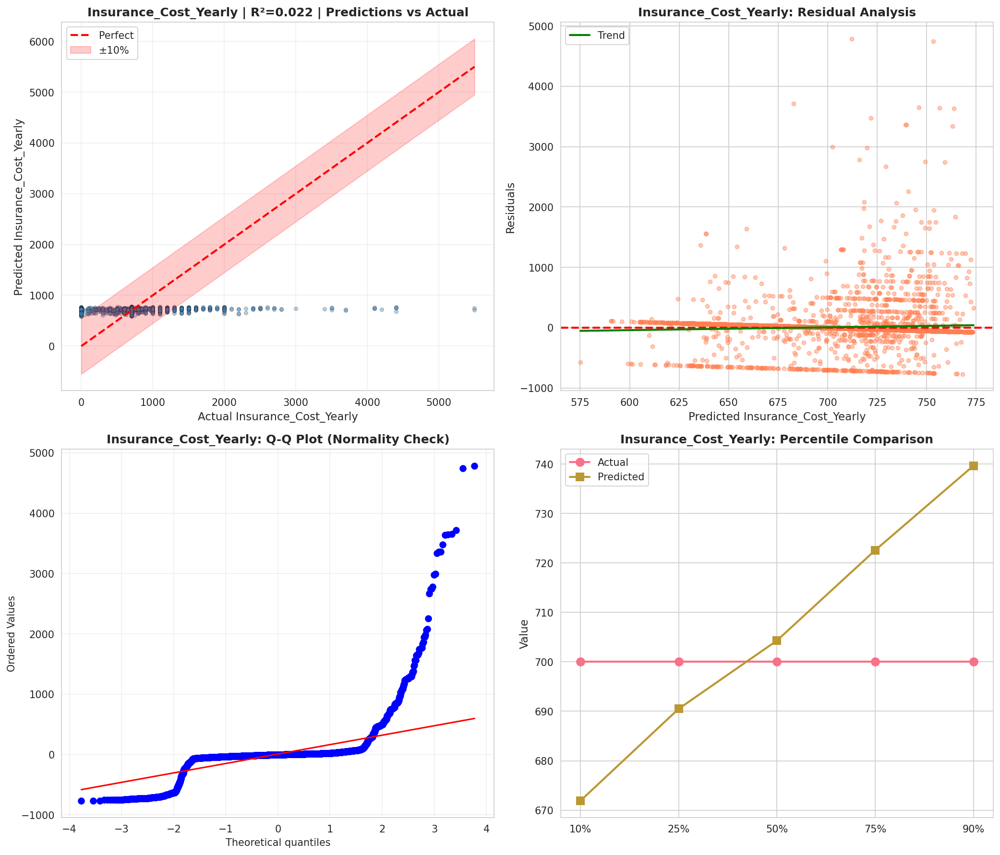
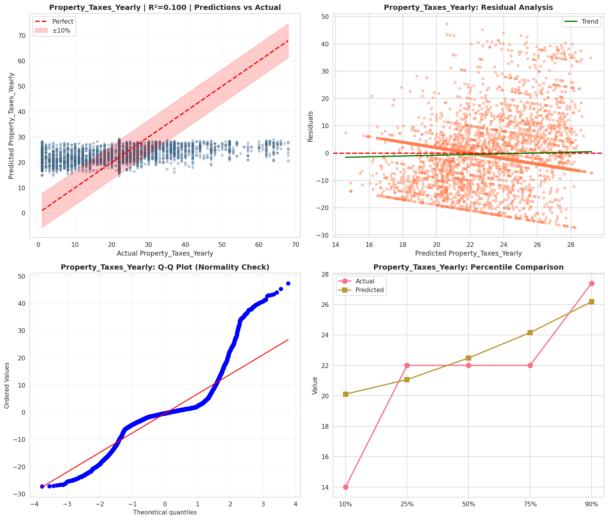
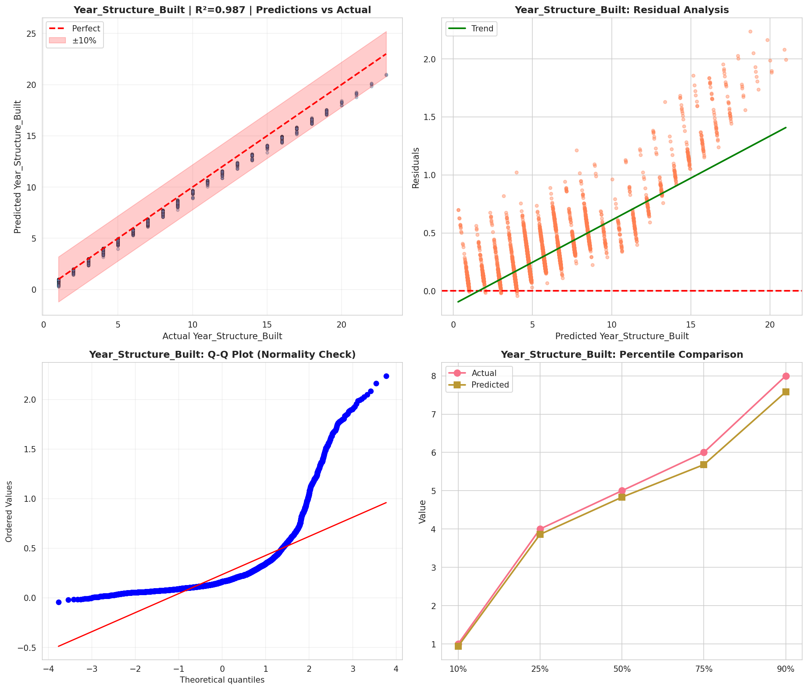
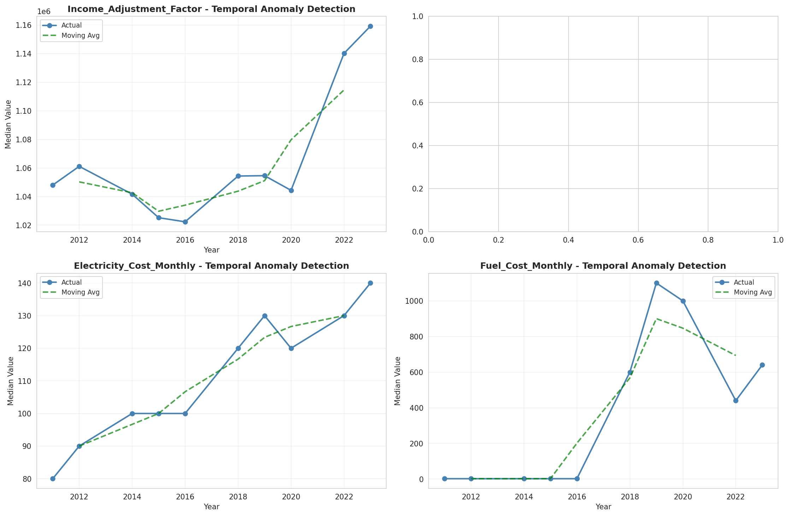
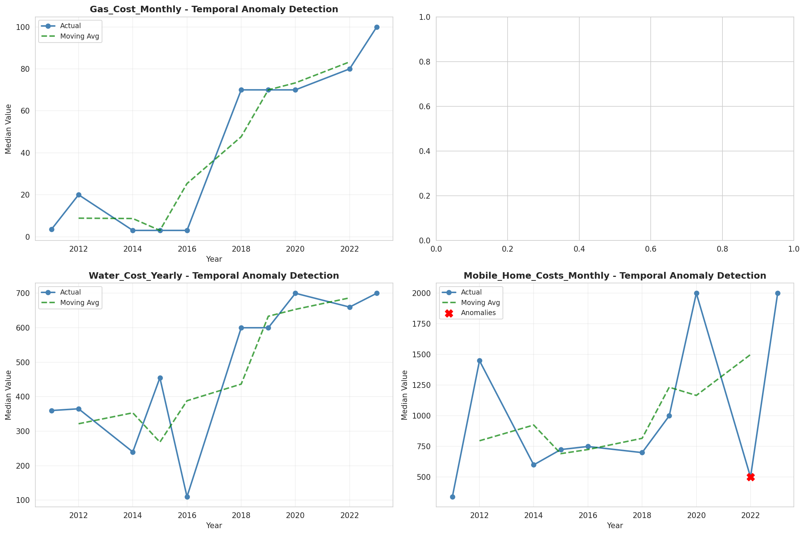
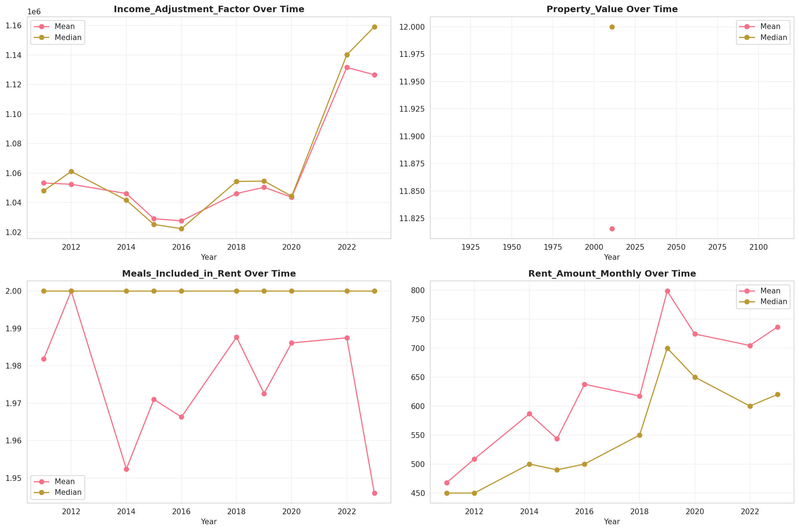
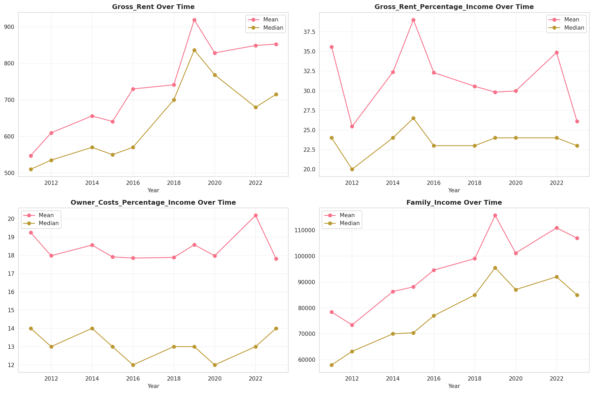
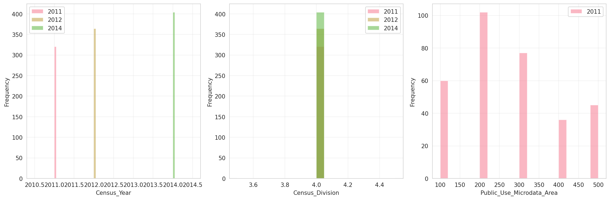
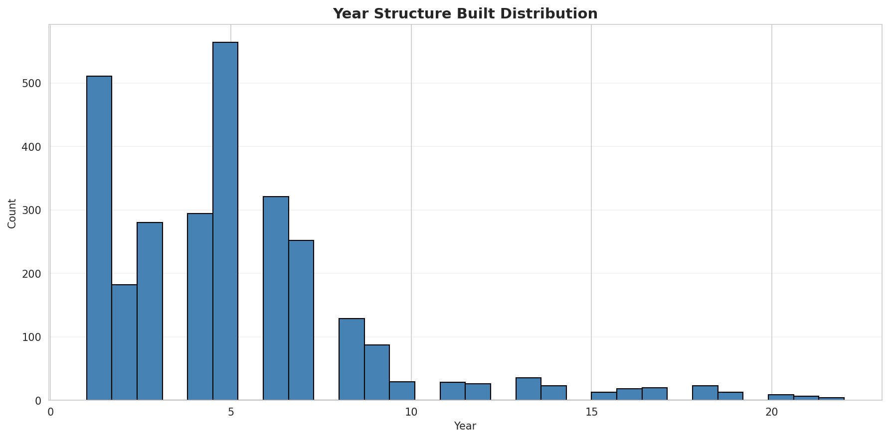
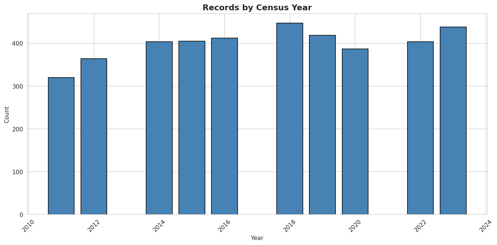
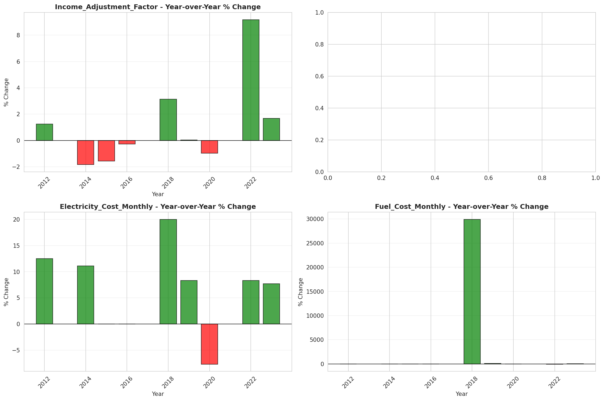
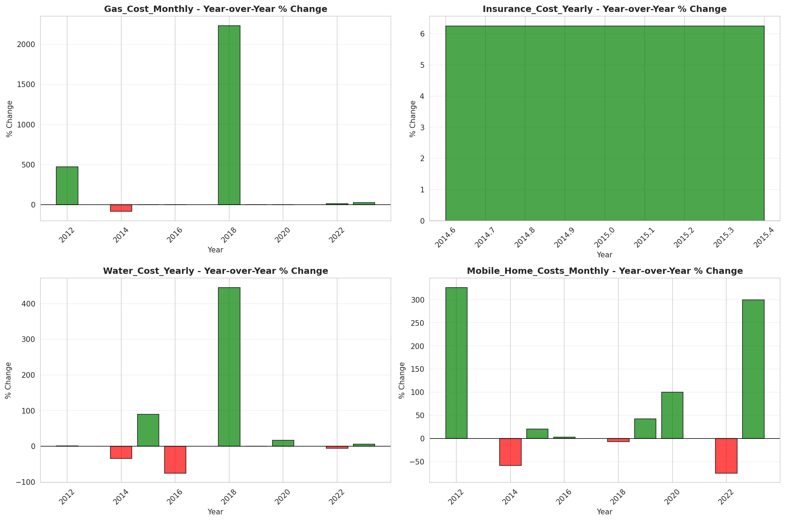
