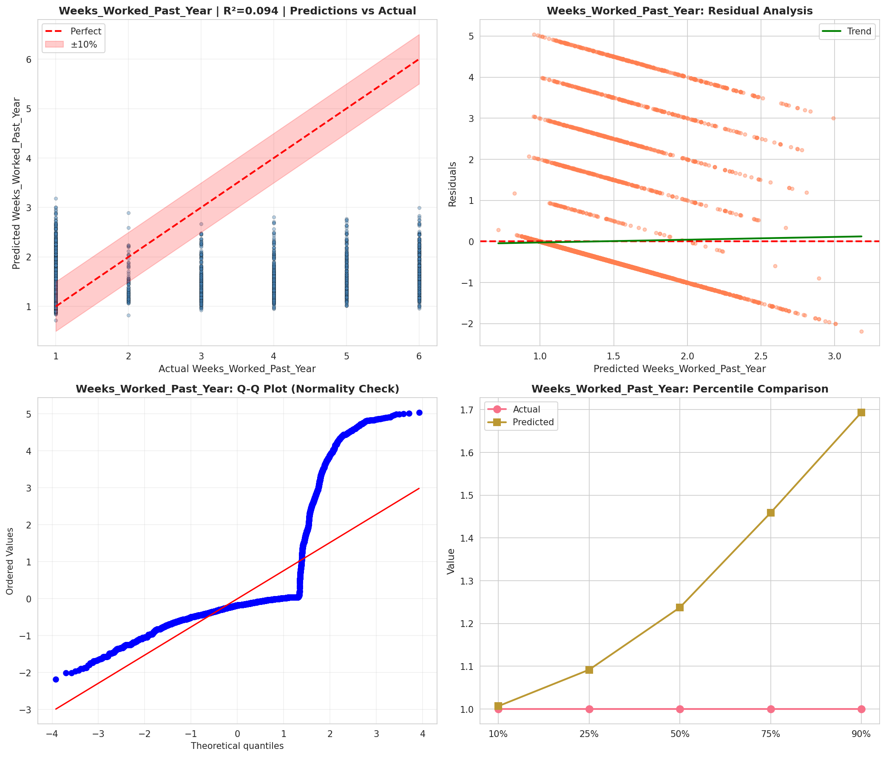
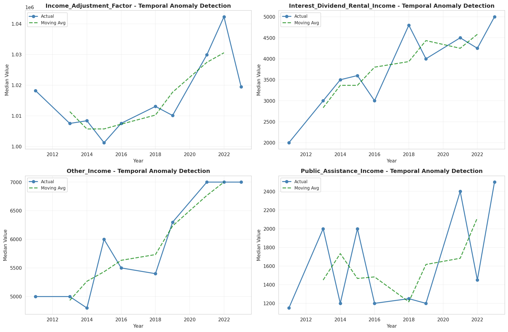
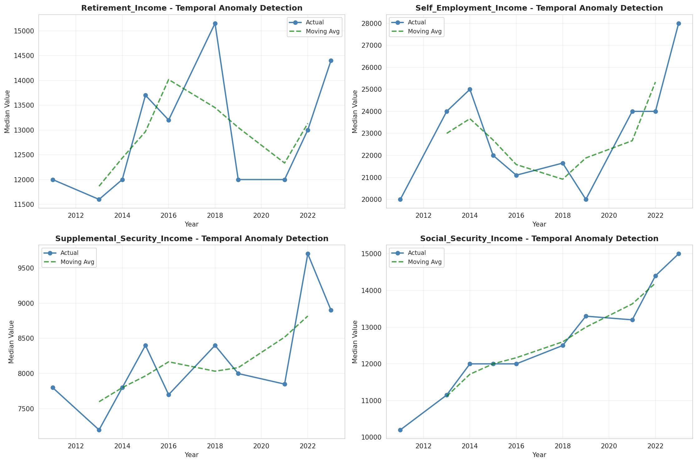
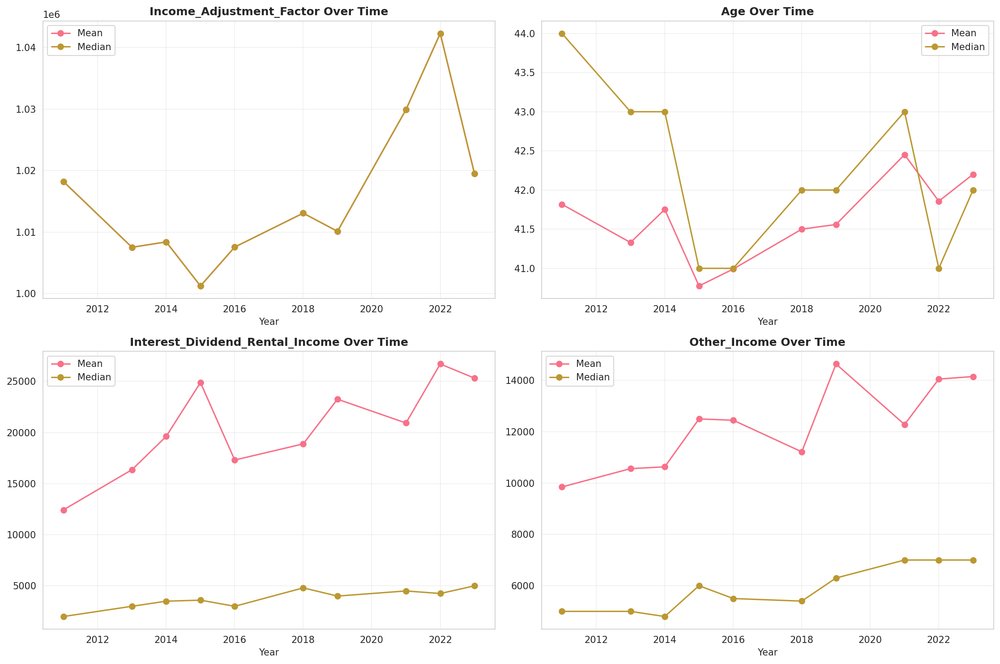
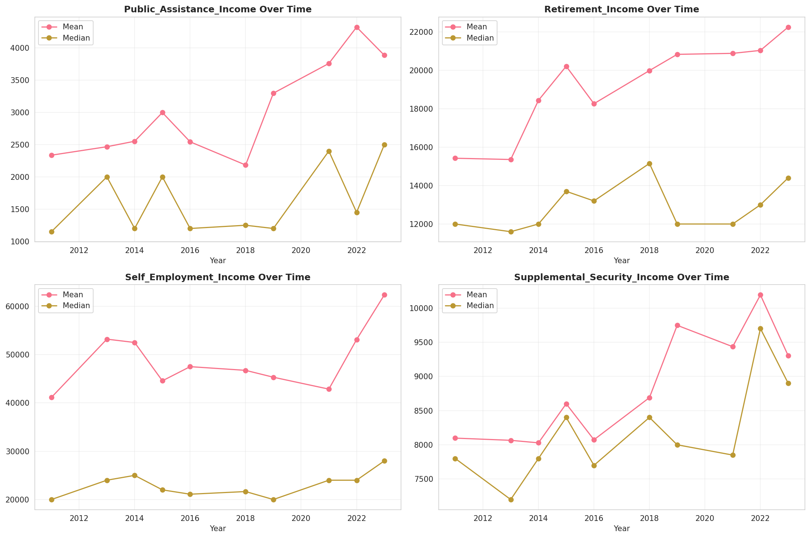
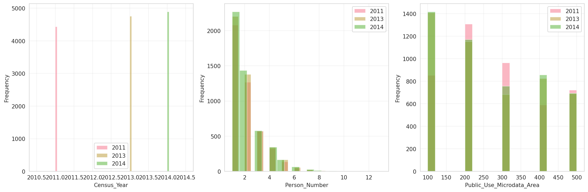
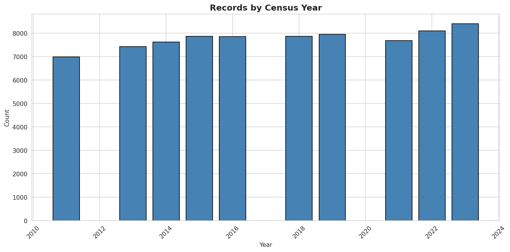
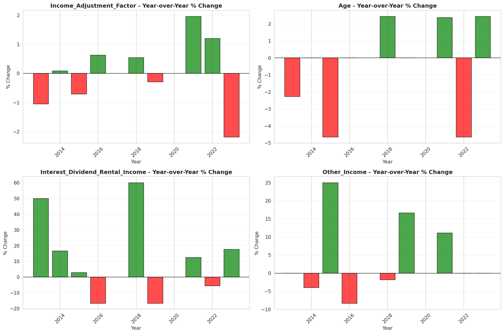
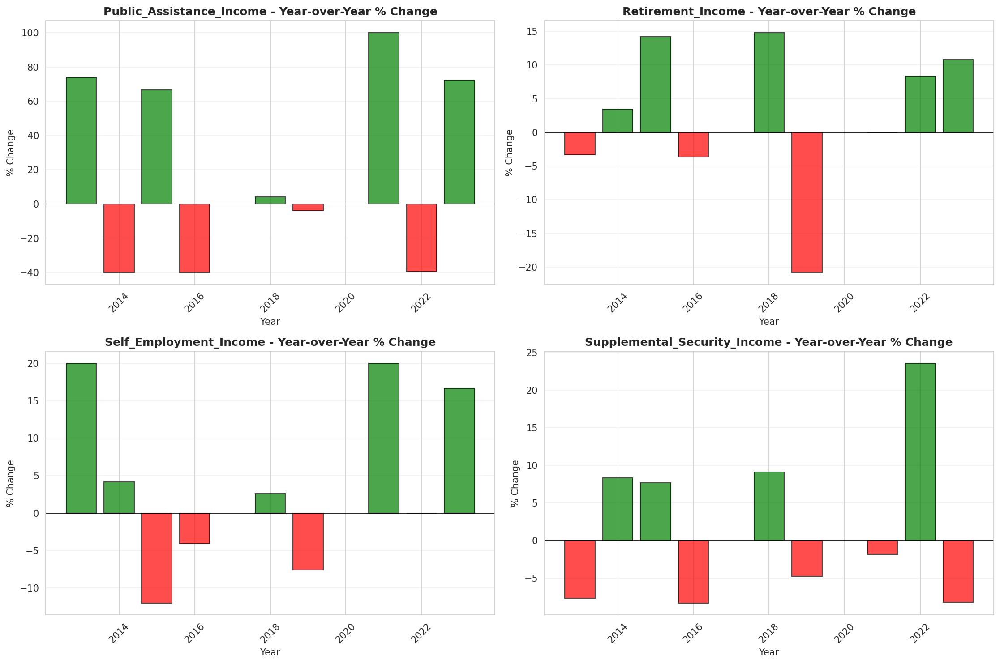

# Temporal Analysis

## Year Distribution

- 2011: 6,987 records

- 2013: 7,435 records

- 2014: 7,625 records

- 2015: 7,869 records

- 2016: 7,864 records

- 2018: 7,876 records

- 2019: 7,960 records

- 2021: 7,691 records

- 2022: 8,107 records

- 2023: 8,403 records

## Temporal Trends

- Census_Year: {np.int64(2011): {'mean': 2011.0, 'median': 2011.0, 'std': 0.0}, np.int64(2013): {'mean': 2013.0, 'median': 2013.0, 'std': 0.0}, np.int64(2014): {'mean': 2014.0, 'median': 2014.0, 'std': 0.0}, np.int64(2015): {'mean': 2015.0, 'median': 2015.0, 'std': 0.0}, np.int64(2016): {'mean': 2016.0, 'median': 2016.0, 'std': 0.0}, np.int64(2018): {'mean': 2018.0, 'median': 2018.0, 'std': 0.0}, np.int64(2019): {'mean': 2019.0, 'median': 2019.0, 'std': 0.0}, np.int64(2021): {'mean': 2021.0, 'median': 2021.0, 'std': 0.0}, np.int64(2022): {'mean': 2022.0, 'median': 2022.0, 'std': 0.0}, np.int64(2023): {'mean': 2023.0, 'median': 2023.0, 'std': 0.0}}

- Person_Number: {np.int64(2011): {'mean': 1.9537712895377128, 'median': 2.0, 'std': 1.1939145802700815}, np.int64(2013): {'mean': 1.990719569603228, 'median': 2.0, 'std': 1.2540147874757193}, np.int64(2014): {'mean': 2.006032786885246, 'median': 2.0, 'std': 1.2965226361056439}, np.int64(2015): {'mean': 2.028720294827805, 'median': 2.0, 'std': 1.302568208051094}, np.int64(2016): {'mean': 2.0376398779247205, 'median': 2.0, 'std': 1.3803944438344513}, np.int64(2018): {'mean': 1.9824784154393094, 'median': 2.0, 'std': 1.2322431228535087}, np.int64(2019): {'mean': 2.0136934673366835, 'median': 2.0, 'std': 1.2973296150842621}, np.int64(2021): {'mean': 1.9947991158496945, 'median': 2.0, 'std': 1.2910511218779122}, np.int64(2022): {'mean': 1.987788331071913, 'median': 2.0, 'std': 1.2966101985578413}, np.int64(2023): {'mean': 2.0161846959419254, 'median': 2.0, 'std': 1.3789228035799492}}

- Public_Use_Microdata_Area: {np.int64(2011): {'mean': 278.04494060397883, 'median': 300.0, 'std': 133.9313365280398}, np.int64(2013): {'mean': 263.67182246133154, 'median': 200.0, 'std': 143.00935627274532}, np.int64(2014): {'mean': 263.94754098360653, 'median': 200.0, 'std': 142.30856833759907}, np.int64(2015): {'mean': 263.82005337399926, 'median': 200.0, 'std': 143.26498622494867}, np.int64(2016): {'mean': 263.7461851475076, 'median': 200.0, 'std': 142.3955391044799}, np.int64(2018): {'mean': 270.12442864398173, 'median': 200.0, 'std': 143.21491367756897}, np.int64(2019): {'mean': 267.43718592964825, 'median': 200.0, 'std': 144.26234574263063}, np.int64(2021): {'mean': 270.2249382395007, 'median': 200.0, 'std': 143.90138530951708}, np.int64(2022): {'mean': 369.27346737387444, 'median': 400.0, 'std': 163.70525465763305}, np.int64(2023): {'mean': 368.8801618469594, 'median': 400.0, 'std': 165.23344169706053}}

- State_Code: {np.int64(2011): {'mean': 38.0, 'median': 38.0, 'std': 0.0}, np.int64(2013): {'mean': 38.0, 'median': 38.0, 'std': 0.0}, np.int64(2014): {'mean': 38.0, 'median': 38.0, 'std': 0.0}, np.int64(2015): {'mean': 38.0, 'median': 38.0, 'std': 0.0}, np.int64(2016): {'mean': 38.0, 'median': 38.0, 'std': 0.0}, np.int64(2018): {'mean': 38.0, 'median': 38.0, 'std': 0.0}, np.int64(2019): {'mean': 38.0, 'median': 38.0, 'std': 0.0}, np.int64(2021): {'mean': 38.0, 'median': 38.0, 'std': 0.0}, np.int64(2022): {'mean': 38.0, 'median': 38.0, 'std': 0.0}, np.int64(2023): {'mean': None, 'median': None, 'std': None}}

- Income_Adjustment_Factor: {np.int64(2011): {'mean': 1018237.0, 'median': 1018237.0, 'std': 0.0}, np.int64(2013): {'mean': 1007549.0, 'median': 1007549.0, 'std': 0.0}, np.int64(2014): {'mean': 1008425.0, 'median': 1008425.0, 'std': 0.0}, np.int64(2015): {'mean': 1001264.0, 'median': 1001264.0, 'std': 0.0}, np.int64(2016): {'mean': 1007588.0, 'median': 1007588.0, 'std': 0.0}, np.int64(2018): {'mean': 1013097.0, 'median': 1013097.0, 'std': 0.0}, np.int64(2019): {'mean': 1010145.0, 'median': 1010145.0, 'std': 0.0}, np.int64(2021): {'mean': 1029928.0, 'median': 1029928.0, 'std': 0.0}, np.int64(2022): {'mean': 1042311.0, 'median': 1042311.0, 'std': 0.0}, np.int64(2023): {'mean': 1019518.0, 'median': 1019518.0, 'std': 0.0}}

- Person_Weight: {np.int64(2011): {'mean': 97.88636038356948, 'median': 60.0, 'std': 104.25152901130248}, np.int64(2013): {'mean': 97.29562878278414, 'median': 60.0, 'std': 112.626090644116}, np.int64(2014): {'mean': 96.98124590163934, 'median': 60.0, 'std': 112.91792276705084}, np.int64(2015): {'mean': 96.19112974965053, 'median': 60.0, 'std': 105.915325829931}, np.int64(2016): {'mean': 96.38262970498474, 'median': 60.0, 'std': 110.43914035406095}, np.int64(2018): {'mean': 96.5054596241747, 'median': 61.0, 'std': 112.17652119181018}, np.int64(2019): {'mean': 95.73643216080401, 'median': 56.0, 'std': 120.26597979917945}, np.int64(2021): {'mean': 100.76036926277467, 'median': 58.0, 'std': 134.40215034841202}, np.int64(2022): {'mean': 96.12199333908967, 'median': 57.0, 'std': 113.90815660306805}, np.int64(2023): {'mean': 93.29120552183744, 'median': 53.0, 'std': 114.24328643560102}}

- Age: {np.int64(2011): {'mean': 41.8178044940604, 'median': 44.0, 'std': 24.330217831557228}, np.int64(2013): {'mean': 41.329791526563554, 'median': 43.0, 'std': 24.33732802787323}, np.int64(2014): {'mean': 41.75252459016394, 'median': 43.0, 'std': 24.39650930034176}, np.int64(2015): {'mean': 40.77493963654848, 'median': 41.0, 'std': 24.50771647905684}, np.int64(2016): {'mean': 40.991353001017295, 'median': 41.0, 'std': 24.292160131962298}, np.int64(2018): {'mean': 41.50050787201625, 'median': 42.0, 'std': 24.37474362380377}, np.int64(2019): {'mean': 41.56005025125628, 'median': 42.0, 'std': 24.550660449488497}, np.int64(2021): {'mean': 42.451696788454036, 'median': 43.0, 'std': 24.570603148032728}, np.int64(2022): {'mean': 41.85765387936351, 'median': 41.0, 'std': 24.733491212063623}, np.int64(2023): {'mean': 42.20064262763299, 'median': 42.0, 'std': 24.914377815129146}}

- Citizenship_Status: {np.int64(2011): {'mean': 1.0831544296550737, 'median': 1.0, 'std': 0.5324681867826876}, np.int64(2013): {'mean': 1.0824478816408878, 'median': 1.0, 'std': 0.5285066408076091}, np.int64(2014): {'mean': 1.0948196721311476, 'median': 1.0, 'std': 0.564381443324358}, np.int64(2015): {'mean': 1.088448341593595, 'median': 1.0, 'std': 0.5414257424166828}, np.int64(2016): {'mean': 1.090030518819939, 'median': 1.0, 'std': 0.5453208626813469}, np.int64(2018): {'mean': 1.1109700355510412, 'median': 1.0, 'std': 0.5980934989737943}, np.int64(2019): {'mean': 1.089070351758794, 'median': 1.0, 'std': 0.5424381213949956}, np.int64(2021): {'mean': 1.123130932258484, 'median': 1.0, 'std': 0.6355726053651668}, np.int64(2022): {'mean': 1.1166892808683853, 'median': 1.0, 'std': 0.6087214580646286}, np.int64(2023): {'mean': 1.1065095799119362, 'median': 1.0, 'std': 0.585437204608836}}

- Class_of_Worker: {np.int64(2011): {'mean': 2.558316543541527, 'median': 1.0, 'std': 2.0700646387708574}, np.int64(2013): {'mean': 2.4455696202531647, 'median': 1.0, 'std': 2.024588092657475}, np.int64(2014): {'mean': 2.4929810074318746, 'median': 1.0, 'std': 2.068552645282325}, np.int64(2015): {'mean': 2.4604783137413864, 'median': 1.0, 'std': 2.0588244246635607}, np.int64(2016): {'mean': 2.4237623762376237, 'median': 1.0, 'std': 2.030913227906426}, np.int64(2018): {'mean': 2.47430045643977, 'median': 1.0, 'std': 2.066117418925412}, np.int64(2019): {'mean': 2.522803553800592, 'median': 1.0, 'std': 2.073092500994803}, np.int64(2021): {'mean': 2.5017529387502577, 'median': 1.0, 'std': 2.025020632051754}, np.int64(2022): {'mean': 2.4668513754205423, 'median': 1.0, 'std': 2.021543588665719}, np.int64(2023): {'mean': 2.399885364921666, 'median': 1.0, 'std': 1.994260823902179}}

- English_Speaking_Ability: {np.int64(2011): {'mean': 1.3615635179153094, 'median': 1.0, 'std': 0.6638825431377217}, np.int64(2013): {'mean': 1.3084415584415585, 'median': 1.0, 'std': 0.6599231323020892}, np.int64(2014): {'mean': 1.4285714285714286, 'median': 1.0, 'std': 0.7374684055082}, np.int64(2015): {'mean': 1.2928348909657321, 'median': 1.0, 'std': 0.6084650776986437}, np.int64(2016): {'mean': 1.3850931677018634, 'median': 1.0, 'std': 0.6749834362914511}, np.int64(2018): {'mean': 1.378238341968912, 'median': 1.0, 'std': 0.6621044804602636}, np.int64(2019): {'mean': 1.376996805111821, 'median': 1.0, 'std': 0.6442904490073307}, np.int64(2021): {'mean': 1.3595800524934383, 'median': 1.0, 'std': 0.6643903671954481}, np.int64(2022): {'mean': 1.4124700239808154, 'median': 1.0, 'std': 0.6597186825343476}, np.int64(2023): {'mean': 1.3908355795148248, 'median': 1.0, 'std': 0.6744944873261601}}

- Fertility_Status: {np.int64(2011): {'mean': 1.939818054583625, 'median': 2.0, 'std': 0.2379068867448742}, np.int64(2013): {'mean': 1.9448979591836735, 'median': 2.0, 'std': 0.2282569800481306}, np.int64(2014): {'mean': 1.9461852861035422, 'median': 2.0, 'std': 0.22572859780088397}, np.int64(2015): {'mean': 1.9297900262467191, 'median': 2.0, 'std': 0.2555844213951254}, np.int64(2016): {'mean': 1.931168831168831, 'median': 2.0, 'std': 0.2532490576245386}, np.int64(2018): {'mean': 1.9305095962938452, 'median': 2.0, 'std': 0.2543704182409229}, np.int64(2019): {'mean': 1.9217619986850756, 'median': 2.0, 'std': 0.2686340666020609}, np.int64(2021): {'mean': 1.935933147632312, 'median': 2.0, 'std': 0.24495729497992794}, np.int64(2022): {'mean': 1.9364569961489089, 'median': 2.0, 'std': 0.24401538563306452}, np.int64(2023): {'mean': 1.9335384615384614, 'median': 2.0, 'std': 0.24916381568784085}}

- Marital_Status: {np.int64(2011): {'mean': 2.7436668097896093, 'median': 2.0, 'std': 1.854263170681445}, np.int64(2013): {'mean': 2.7913920645595156, 'median': 2.0, 'std': 1.8602452494133677}, np.int64(2014): {'mean': 2.7620983606557377, 'median': 2.0, 'std': 1.8600160791141422}, np.int64(2015): {'mean': 2.848392425975346, 'median': 2.0, 'std': 1.8718519468032113}, np.int64(2016): {'mean': 2.813580874872838, 'median': 2.0, 'std': 1.867161331049026}, np.int64(2018): {'mean': 2.82122905027933, 'median': 2.0, 'std': 1.867764660162391}, np.int64(2019): {'mean': 2.8158291457286433, 'median': 2.0, 'std': 1.8677201694688903}, np.int64(2021): {'mean': 2.806657131712391, 'median': 2.0, 'std': 1.86374272667037}, np.int64(2022): {'mean': 2.822499074873566, 'median': 2.0, 'std': 1.8665566094303543}, np.int64(2023): {'mean': 2.8226823753421395, 'median': 2.0, 'std': 1.8633320361623085}}

- Mobility_Status: {np.int64(2011): {'mean': 1.2476493562852597, 'median': 1.0, 'std': 0.6561700019626323}, np.int64(2013): {'mean': 1.2565181966322652, 'median': 1.0, 'std': 0.6658505364739719}, np.int64(2014): {'mean': 1.263081202808319, 'median': 1.0, 'std': 0.6732767883324794}, np.int64(2015): {'mean': 1.2599175682637815, 'median': 1.0, 'std': 0.6704493262087315}, np.int64(2016): {'mean': 1.2512232809683235, 'median': 1.0, 'std': 0.6598467478838977}, np.int64(2018): {'mean': 1.2475247524752475, 'median': 1.0, 'std': 0.6550408811698313}, np.int64(2019): {'mean': 1.2560152768936983, 'median': 1.0, 'std': 0.6643216917891975}, np.int64(2021): {'mean': 1.233639947437582, 'median': 1.0, 'std': 0.6412249429401083}, np.int64(2022): {'mean': 1.2227215980024968, 'median': 1.0, 'std': 0.626611013399115}, np.int64(2023): {'mean': 1.2281863040077026, 'median': 1.0, 'std': 0.6322803004858286}}

- Military_Service: {np.int64(2011): {'mean': 4.713828652683968, 'median': 5.0, 'std': 0.7406020530857836}, np.int64(2013): {'mean': 3.75531914893617, 'median': 4.0, 'std': 0.6545099600135083}, np.int64(2014): {'mean': 3.776141384388807, 'median': 4.0, 'std': 0.6243505842235404}, np.int64(2015): {'mean': 3.7729257641921397, 'median': 4.0, 'std': 0.6345477801554321}, np.int64(2016): {'mean': 3.7672330875280537, 'median': 4.0, 'std': 0.6396676279263224}, np.int64(2018): {'mean': 3.7843323818585475, 'median': 4.0, 'std': 0.6242130067277191}, np.int64(2019): {'mean': 3.7856689917565, 'median': 4.0, 'std': 0.6161281020156074}, np.int64(2021): {'mean': 3.8012987012987014, 'median': 4.0, 'std': 0.6050592580047764}, np.int64(2022): {'mean': 3.799813200498132, 'median': 4.0, 'std': 0.6067449742495977}, np.int64(2023): {'mean': 3.7909799220857057, 'median': 4.0, 'std': 0.6207628126348731}}

- Travel_Time_To_Work_Minutes: {np.int64(2011): {'mean': 18.10891089108911, 'median': 10.0, 'std': 21.173244968510232}, np.int64(2013): {'mean': 19.31566886279003, 'median': 15.0, 'std': 22.6233019620407}, np.int64(2014): {'mean': 19.141618497109828, 'median': 12.0, 'std': 23.89322039014117}, np.int64(2015): {'mean': 18.4064678003903, 'median': 15.0, 'std': 20.19614753693897}, np.int64(2016): {'mean': 18.785347391186807, 'median': 15.0, 'std': 20.723289387720648}, np.int64(2018): {'mean': 19.12433155080214, 'median': 15.0, 'std': 21.835162488419037}, np.int64(2019): {'mean': 19.900990099009903, 'median': 15.0, 'std': 22.571106807372264}, np.int64(2021): {'mean': 19.608940201302545, 'median': 15.0, 'std': 22.79295129996047}, np.int64(2022): {'mean': 19.49666851749028, 'median': 15.0, 'std': 21.757661895493833}, np.int64(2023): {'mean': 20.22035278154681, 'median': 15.0, 'std': 22.950822381243825}}

- Vehicle_Occupancy: {np.int64(2011): {'mean': 1.1624246483590086, 'median': 1.0, 'std': 0.5145208193549693}, np.int64(2013): {'mean': 1.1793444650587508, 'median': 1.0, 'std': 0.6168026197904534}, np.int64(2014): {'mean': 1.164576802507837, 'median': 1.0, 'std': 0.5607070019308051}, np.int64(2015): {'mean': 1.1525934861278648, 'median': 1.0, 'std': 0.5276052777559449}, np.int64(2016): {'mean': 1.1687337755985001, 'median': 1.0, 'std': 0.5948157306235708}, np.int64(2018): {'mean': 1.1475363144403303, 'median': 1.0, 'std': 0.5918670514455665}, np.int64(2019): {'mean': 1.1485091743119267, 'median': 1.0, 'std': 0.5659976884581377}, np.int64(2021): {'mean': 1.1553030303030303, 'median': 1.0, 'std': 0.5795131252144641}, np.int64(2022): {'mean': 1.1494492408454897, 'median': 1.0, 'std': 0.5010342136349044}, np.int64(2023): {'mean': 1.193323657474601, 'median': 1.0, 'std': 0.6602287385895568}}

- Transportation_To_Work: {np.int64(2011): {'mean': 2.342512908777969, 'median': 1.0, 'std': 3.3244902128877665}, np.int64(2013): {'mean': 2.1759784075573547, 'median': 1.0, 'std': 3.1266145754853283}, np.int64(2014): {'mean': 2.320698924731183, 'median': 1.0, 'std': 3.297004033413056}, np.int64(2015): {'mean': 2.214603506935357, 'median': 1.0, 'std': 3.1728571168351687}, np.int64(2016): {'mean': 2.1266143327424665, 'median': 1.0, 'std': 3.0881466373713544}, np.int64(2018): {'mean': 1.9885496183206106, 'median': 1.0, 'std': 2.9194010869083935}, np.int64(2019): {'mean': None, 'median': None, 'std': None}, np.int64(2021): {'mean': None, 'median': None, 'std': None}, np.int64(2022): {'mean': None, 'median': None, 'std': None}, np.int64(2023): {'mean': None, 'median': None, 'std': None}}

- Language_Other_Than_English: {np.int64(2011): {'mean': 1.9535200605601817, 'median': 2.0, 'std': 0.2105380385731928}, np.int64(2013): {'mean': 1.956043956043956, 'median': 2.0, 'std': 0.20501197143127214}, np.int64(2014): {'mean': 1.9522948539638387, 'median': 2.0, 'std': 0.21315647859339668}, np.int64(2015): {'mean': 1.9565922920892496, 'median': 2.0, 'std': 0.2037868853459028}, np.int64(2016): {'mean': 1.9563449023861172, 'median': 2.0, 'std': 0.20434038022944898}, np.int64(2018): {'mean': 1.947823736144904, 'median': 2.0, 'std': 0.22239736287840153}, np.int64(2019): {'mean': 1.9579244522113188, 'median': 2.0, 'std': 0.20077503552159787}, np.int64(2021): {'mean': 1.947491730981257, 'median': 2.0, 'std': 0.22306503132892105}, np.int64(2022): {'mean': 1.9453759496987162, 'median': 2.0, 'std': 0.2272598266861329}, np.int64(2023): {'mean': 1.9531565656565657, 'median': 2.0, 'std': 0.21131674148131255}}

- Grandparents_Living_With_Grandchildren: {np.int64(2011): {'mean': 1.9864444444444445, 'median': 2.0, 'std': 0.11564936074738279}, np.int64(2013): {'mean': 1.9815795045521913, 'median': 2.0, 'std': 0.13448051878020717}, np.int64(2014): {'mean': 1.9833570123807591, 'median': 2.0, 'std': 0.12794264712421372}, np.int64(2015): {'mean': 1.9786672084518488, 'median': 2.0, 'std': 0.14450586882989944}, np.int64(2016): {'mean': 1.9811660989781608, 'median': 2.0, 'std': 0.13595178718084128}, np.int64(2018): {'mean': 1.985326194725362, 'median': 2.0, 'std': 0.12025536296742444}, np.int64(2019): {'mean': 1.9805485314141218, 'median': 2.0, 'std': 0.13811886068643045}, np.int64(2021): {'mean': 1.9827825054423116, 'median': 2.0, 'std': 0.13009381928366834}, np.int64(2022): {'mean': 1.9843869002284844, 'median': 2.0, 'std': 0.12398490965083836}, np.int64(2023): {'mean': 1.9853372434017595, 'median': 2.0, 'std': 0.12020985276798477}}

- Months_Responsible_For_Grandchildren: {np.int64(2011): {'mean': 3.5142857142857142, 'median': 4.0, 'std': 1.6336791493513072}, np.int64(2013): {'mean': 3.869565217391304, 'median': 4.0, 'std': 1.4080513824616538}, np.int64(2014): {'mean': 3.193548387096774, 'median': 4.0, 'std': 1.5366490564148485}, np.int64(2015): {'mean': 3.5689655172413794, 'median': 4.0, 'std': 1.534538835411659}, np.int64(2016): {'mean': 3.5238095238095237, 'median': 4.0, 'std': 1.2733304753359513}, np.int64(2018): {'mean': 3.85, 'median': 4.0, 'std': 1.3502136583063153}, np.int64(2019): {'mean': 3.6610169491525424, 'median': 5.0, 'std': 1.571405800346602}, np.int64(2021): {'mean': 4.372093023255814, 'median': 5.0, 'std': 1.0005535566435568}, np.int64(2022): {'mean': 3.7560975609756095, 'median': 3.0, 'std': 1.1131147246550566}, np.int64(2023): {'mean': 3.717948717948718, 'median': 5.0, 'std': 1.4500221041639683}}

- Grandparents_Responsible_For_Grandchildren: {np.int64(2011): {'mean': 1.4262295081967213, 'median': 1.0, 'std': 0.4986320083803492}, np.int64(2013): {'mean': 1.471264367816092, 'median': 1.0, 'std': 0.5020673646029037}, np.int64(2014): {'mean': 1.6219512195121952, 'median': 2.0, 'std': 0.4878839141030063}, np.int64(2015): {'mean': 1.4476190476190476, 'median': 1.0, 'std': 0.4996335653593536}, np.int64(2016): {'mean': 1.553191489361702, 'median': 2.0, 'std': 0.4998283850987718}, np.int64(2018): {'mean': 1.4594594594594594, 'median': 1.0, 'std': 0.5017555260512748}, np.int64(2019): {'mean': 1.41, 'median': 1.0, 'std': 0.49431107042371053}, np.int64(2021): {'mean': 1.5057471264367817, 'median': 2.0, 'std': 0.5028653529707441}, np.int64(2022): {'mean': 1.5, 'median': 1.5, 'std': 0.5030769521187455}, np.int64(2023): {'mean': 1.5125, 'median': 2.0, 'std': 0.5029973450366554}}

- Interest_Dividend_Rental_Income: {np.int64(2011): {'mean': 12431.138278388278, 'median': 2000.0, 'std': 29091.050601485436}, np.int64(2013): {'mean': 16360.473898858076, 'median': 3000.0, 'std': 38673.18711583069}, np.int64(2014): {'mean': 19616.49765625, 'median': 3500.0, 'std': 45980.642450180574}, np.int64(2015): {'mean': 24886.89074228524, 'median': 3600.0, 'std': 68828.16199503613}, np.int64(2016): {'mean': 17306.9052540913, 'median': 3000.0, 'std': 46062.054322717144}, np.int64(2018): {'mean': 18883.249097472923, 'median': 4800.0, 'std': 40598.77903548157}, np.int64(2019): {'mean': 23256.415770609317, 'median': 4000.0, 'std': 56430.11404063911}, np.int64(2021): {'mean': 20925.416666666668, 'median': 4500.0, 'std': 49204.27681842737}, np.int64(2022): {'mean': 26700.91603053435, 'median': 4250.0, 'std': 72558.86755365721}, np.int64(2023): {'mean': 25316.967741935485, 'median': 5000.0, 'std': 58371.36440098941}}

- Military_Service_Period_1: {np.int64(2011): {'mean': 0.1676470588235294, 'median': 0.0, 'std': 0.3738275442416626}, np.int64(2013): {'mean': 0.19936204146730463, 'median': 0.0, 'std': 0.39983971392497875}, np.int64(2014): {'mean': 0.19966442953020133, 'median': 0.0, 'std': 0.40008388382182997}, np.int64(2015): {'mean': 0.2081967213114754, 'median': 0.0, 'std': 0.4063514951268911}, np.int64(2016): {'mean': 0.2366288492706645, 'median': 0.0, 'std': 0.425357351686674}, np.int64(2018): {'mean': 0.22036727879799667, 'median': 0.0, 'std': 0.4148407422967739}, np.int64(2019): {'mean': 0.2508532423208191, 'median': 0.0, 'std': 0.4338745601909868}, np.int64(2021): {'mean': 0.2780952380952381, 'median': 0.0, 'std': 0.44848790744694106}, np.int64(2022): {'mean': 0.3069852941176471, 'median': 0.0, 'std': 0.4616677587710449}, np.int64(2023): {'mean': 0.3104575163398693, 'median': 0.0, 'std': 0.4630594053921542}}

- Military_Service_Period_2: {np.int64(2011): {'mean': 0.11911764705882352, 'median': 0.0, 'std': 0.3241653394296398}, np.int64(2013): {'mean': 0.14035087719298245, 'median': 0.0, 'std': 0.34762802548222027}, np.int64(2014): {'mean': 0.174496644295302, 'median': 0.0, 'std': 0.37985479090514856}, np.int64(2015): {'mean': 0.17704918032786884, 'median': 0.0, 'std': 0.38202358210162546}, np.int64(2016): {'mean': 0.16531604538087522, 'median': 0.0, 'std': 0.37176693616202144}, np.int64(2018): {'mean': 0.18697829716193656, 'median': 0.0, 'std': 0.3902199678053631}, np.int64(2019): {'mean': 0.18430034129692832, 'median': 0.0, 'std': 0.3880601837629125}, np.int64(2021): {'mean': 0.2019047619047619, 'median': 0.0, 'std': 0.40180436363681554}, np.int64(2022): {'mean': 0.19852941176470587, 'median': 0.0, 'std': 0.3992599589078906}, np.int64(2023): {'mean': 0.18627450980392157, 'median': 0.0, 'std': 0.38964650117698313}}

- Military_Service_Period_3: {np.int64(2011): {'mean': 0.14705882352941177, 'median': 0.0, 'std': 0.35442524911772766}, np.int64(2013): {'mean': None, 'median': None, 'std': None}, np.int64(2014): {'mean': None, 'median': None, 'std': None}, np.int64(2015): {'mean': None, 'median': None, 'std': None}, np.int64(2016): {'mean': None, 'median': None, 'std': None}, np.int64(2018): {'mean': None, 'median': None, 'std': None}, np.int64(2019): {'mean': None, 'median': None, 'std': None}, np.int64(2021): {'mean': None, 'median': None, 'std': None}, np.int64(2022): {'mean': None, 'median': None, 'std': None}, np.int64(2023): {'mean': None, 'median': None, 'std': None}}

- Military_Service_Period_4: {np.int64(2011): {'mean': 0.09558823529411764, 'median': 0.0, 'std': 0.2942421550548361}, np.int64(2013): {'mean': None, 'median': None, 'std': None}, np.int64(2014): {'mean': None, 'median': None, 'std': None}, np.int64(2015): {'mean': None, 'median': None, 'std': None}, np.int64(2016): {'mean': None, 'median': None, 'std': None}, np.int64(2018): {'mean': None, 'median': None, 'std': None}, np.int64(2019): {'mean': None, 'median': None, 'std': None}, np.int64(2021): {'mean': None, 'median': None, 'std': None}, np.int64(2022): {'mean': None, 'median': None, 'std': None}, np.int64(2023): {'mean': None, 'median': None, 'std': None}}

- Military_Service_Period_5: {np.int64(2011): {'mean': 0.36323529411764705, 'median': 0.0, 'std': 0.4812858365716255}, np.int64(2013): {'mean': 0.34609250398724084, 'median': 0.0, 'std': 0.4761029344678478}, np.int64(2014): {'mean': 0.3976510067114094, 'median': 0.0, 'std': 0.4898236887556704}, np.int64(2015): {'mean': 0.3442622950819672, 'median': 0.0, 'std': 0.47551703436547443}, np.int64(2016): {'mean': 0.3695299837925446, 'median': 0.0, 'std': 0.4830691308908514}, np.int64(2018): {'mean': 0.3756260434056761, 'median': 0.0, 'std': 0.48468888106457564}, np.int64(2019): {'mean': 0.4044368600682594, 'median': 0.0, 'std': 0.49120202149529485}, np.int64(2021): {'mean': 0.32571428571428573, 'median': 0.0, 'std': 0.46908807328862634}, np.int64(2022): {'mean': 0.33088235294117646, 'median': 0.0, 'std': 0.47096385723973505}, np.int64(2023): {'mean': 0.36764705882352944, 'median': 0.0, 'std': 0.48255900610970637}}

- Military_Service_Period_6: {np.int64(2011): {'mean': 0.1, 'median': 0.0, 'std': 0.30022083182968284}, np.int64(2013): {'mean': None, 'median': None, 'std': None}, np.int64(2014): {'mean': None, 'median': None, 'std': None}, np.int64(2015): {'mean': None, 'median': None, 'std': None}, np.int64(2016): {'mean': None, 'median': None, 'std': None}, np.int64(2018): {'mean': None, 'median': None, 'std': None}, np.int64(2019): {'mean': None, 'median': None, 'std': None}, np.int64(2021): {'mean': None, 'median': None, 'std': None}, np.int64(2022): {'mean': None, 'median': None, 'std': None}, np.int64(2023): {'mean': None, 'median': None, 'std': None}}

- Military_Service_Period_7: {np.int64(2011): {'mean': 0.10588235294117647, 'median': 0.0, 'std': 0.30791347451560147}, np.int64(2013): {'mean': None, 'median': None, 'std': None}, np.int64(2014): {'mean': None, 'median': None, 'std': None}, np.int64(2015): {'mean': None, 'median': None, 'std': None}, np.int64(2016): {'mean': None, 'median': None, 'std': None}, np.int64(2018): {'mean': None, 'median': None, 'std': None}, np.int64(2019): {'mean': None, 'median': None, 'std': None}, np.int64(2021): {'mean': None, 'median': None, 'std': None}, np.int64(2022): {'mean': None, 'median': None, 'std': None}, np.int64(2023): {'mean': None, 'median': None, 'std': None}}

- Military_Service_Period_8: {np.int64(2011): {'mean': 0.13970588235294118, 'median': 0.0, 'std': 0.34693681899133616}, np.int64(2013): {'mean': 0.11004784688995216, 'median': 0.0, 'std': 0.31319924596823207}, np.int64(2014): {'mean': 0.09731543624161074, 'median': 0.0, 'std': 0.2966357716207193}, np.int64(2015): {'mean': 0.07868852459016394, 'median': 0.0, 'std': 0.26947297228279316}, np.int64(2016): {'mean': 0.09238249594813615, 'median': 0.0, 'std': 0.28980008147959235}, np.int64(2018): {'mean': 0.08013355592654424, 'median': 0.0, 'std': 0.2717267628298752}, np.int64(2019): {'mean': 0.05631399317406143, 'median': 0.0, 'std': 0.2307240117885916}, np.int64(2021): {'mean': 0.05142857142857143, 'median': 0.0, 'std': 0.2210809175005362}, np.int64(2022): {'mean': 0.042279411764705885, 'median': 0.0, 'std': 0.2014111063368223}, np.int64(2023): {'mean': 0.0392156862745098, 'median': 0.0, 'std': 0.19426652322225713}}

- Military_Service_Period_9: {np.int64(2011): {'mean': 0.016176470588235296, 'median': 0.0, 'std': 0.12624670673917823}, np.int64(2013): {'mean': 0.003189792663476874, 'median': 0.0, 'std': 0.05643312101984088}, np.int64(2014): {'mean': 0.01174496644295302, 'median': 0.0, 'std': 0.10782638733887677}, np.int64(2015): {'mean': 0.00819672131147541, 'median': 0.0, 'std': 0.09023793028146272}, np.int64(2016): {'mean': 0.0032414910858995136, 'median': 0.0, 'std': 0.05688786272172455}, np.int64(2018): {'mean': 0.015025041736227046, 'median': 0.0, 'std': 0.12175400541009423}, np.int64(2019): {'mean': 0.0017064846416382253, 'median': 0.0, 'std': 0.04130961923860139}, np.int64(2021): {'mean': None, 'median': None, 'std': None}, np.int64(2022): {'mean': None, 'median': None, 'std': None}, np.int64(2023): {'mean': None, 'median': None, 'std': None}}

- Military_Service_Period_10: {np.int64(2011): {'mean': 0.07352941176470588, 'median': 0.0, 'std': 0.26119564612543184}, np.int64(2013): {'mean': 0.0685805422647528, 'median': 0.0, 'std': 0.25294128137823735}, np.int64(2014): {'mean': 0.05536912751677853, 'median': 0.0, 'std': 0.22889144170830136}, np.int64(2015): {'mean': 0.04590163934426229, 'median': 0.0, 'std': 0.20944352769784189}, np.int64(2016): {'mean': 0.03079416531604538, 'median': 0.0, 'std': 0.1728997854540515}, np.int64(2018): {'mean': 0.02671118530884808, 'median': 0.0, 'std': 0.16137277434384284}, np.int64(2019): {'mean': 0.017064846416382253, 'median': 0.0, 'std': 0.12962372590567162}, np.int64(2021): {'mean': 0.011428571428571429, 'median': 0.0, 'std': 0.1063932336874954}, np.int64(2022): {'mean': 0.011029411764705883, 'median': 0.0, 'std': 0.1045363659388679}, np.int64(2023): {'mean': 0.004901960784313725, 'median': 0.0, 'std': 0.06989932107084729}}

- Military_Service_Period_11: {np.int64(2011): {'mean': 0.0029411764705882353, 'median': 0.0, 'std': 0.054192664088686344}, np.int64(2013): {'mean': 0.0, 'median': 0.0, 'std': 0.0}, np.int64(2014): {'mean': 0.0, 'median': 0.0, 'std': 0.0}, np.int64(2015): {'mean': 0.001639344262295082, 'median': 0.0, 'std': 0.04048881650894581}, np.int64(2016): {'mean': 0.0016207455429497568, 'median': 0.0, 'std': 0.04025848411142374}, np.int64(2018): {'mean': 0.0, 'median': 0.0, 'std': 0.0}, np.int64(2019): {'mean': 0.0, 'median': 0.0, 'std': 0.0}, np.int64(2021): {'mean': None, 'median': None, 'std': None}, np.int64(2022): {'mean': None, 'median': None, 'std': None}, np.int64(2023): {'mean': None, 'median': None, 'std': None}}

- Temporary_Absence_From_Work: {np.int64(2011): {'mean': 2.5721775602936034, 'median': 3.0, 'std': 0.5292841395053228}, np.int64(2013): {'mean': 2.64020635713097, 'median': 3.0, 'std': 0.5026769458313818}, np.int64(2014): {'mean': 2.6222186391486617, 'median': 3.0, 'std': 0.5126772602267192}, np.int64(2015): {'mean': 2.629936305732484, 'median': 3.0, 'std': 0.5113728052666505}, np.int64(2016): {'mean': 2.6425753511125136, 'median': 3.0, 'std': 0.5209368336964477}, np.int64(2018): {'mean': 2.6292644757433488, 'median': 3.0, 'std': 0.5168513494479817}, np.int64(2019): {'mean': 2.6508977361436377, 'median': 3.0, 'std': 0.5034868019276796}, np.int64(2021): {'mean': 2.6300272392244834, 'median': 3.0, 'std': 0.5020363812554411}, np.int64(2022): {'mean': 2.634052978104425, 'median': 3.0, 'std': 0.5031883973184929}, np.int64(2023): {'mean': 2.6275922929842626, 'median': 3.0, 'std': 0.5049131492603374}}

- Available_For_Work: {np.int64(2011): {'mean': 4.691716183152744, 'median': 5.0, 'std': 0.9876166798709316}, np.int64(2013): {'mean': 4.801797304043934, 'median': 5.0, 'std': 0.7976893842307508}, np.int64(2014): {'mean': 4.7989358271525315, 'median': 5.0, 'std': 0.7969334243428995}, np.int64(2015): {'mean': 4.775636942675159, 'median': 5.0, 'std': 0.8498402510694817}, np.int64(2016): {'mean': 4.781126716111725, 'median': 5.0, 'std': 0.844753448883963}, np.int64(2018): {'mean': 4.782472613458529, 'median': 5.0, 'std': 0.8319076069528867}, np.int64(2019): {'mean': 4.796409055425449, 'median': 5.0, 'std': 0.7968666590137795}, np.int64(2021): {'mean': 4.820862041339529, 'median': 5.0, 'std': 0.7441786646839376}, np.int64(2022): {'mean': 4.819782575409585, 'median': 5.0, 'std': 0.7448530993083953}, np.int64(2023): {'mean': 4.814090307398147, 'median': 5.0, 'std': 0.7692809605828534}}

- On_Layoff_From_Work: {np.int64(2011): {'mean': 2.5595945473610624, 'median': 3.0, 'std': 0.5103676489552765}, np.int64(2013): {'mean': 2.624230321184889, 'median': 3.0, 'std': 0.5009166140855092}, np.int64(2014): {'mean': 2.6117381489841986, 'median': 3.0, 'std': 0.5014196042615485}, np.int64(2015): {'mean': 2.6157643312101913, 'median': 3.0, 'std': 0.50413789158317}, np.int64(2016): {'mean': 2.6370522329177843, 'median': 3.0, 'std': 0.49575536306214296}, np.int64(2018): {'mean': 2.6269170579029733, 'median': 3.0, 'std': 0.49295717051094934}, np.int64(2019): {'mean': 2.6430913348946135, 'median': 3.0, 'std': 0.48848495392774105}, np.int64(2021): {'mean': 2.6160871655183464, 'median': 3.0, 'std': 0.5019425164666298}, np.int64(2022): {'mean': 2.6242535599448784, 'median': 3.0, 'std': 0.4959125787616985}, np.int64(2023): {'mean': 2.6170025003677013, 'median': 3.0, 'std': 0.5004667593286528}}

- Looking_For_Work: {np.int64(2011): {'mean': 2.5775952464173364, 'median': 3.0, 'std': 0.5354171367529592}, np.int64(2013): {'mean': 2.6378765185555, 'median': 3.0, 'std': 0.5173454895799098}, np.int64(2014): {'mean': 2.624798452112222, 'median': 3.0, 'std': 0.5204890828361147}, np.int64(2015): {'mean': 2.6278662420382166, 'median': 3.0, 'std': 0.5247988424859421}, np.int64(2016): {'mean': 2.653937194255957, 'median': 3.0, 'std': 0.5179974715425861}, np.int64(2018): {'mean': 2.6325508607198747, 'median': 3.0, 'std': 0.5241438578158334}, np.int64(2019): {'mean': 2.637782982045277, 'median': 3.0, 'std': 0.5172925538319753}, np.int64(2021): {'mean': 2.614164396731293, 'median': 3.0, 'std': 0.5220932761442388}, np.int64(2022): {'mean': 2.62486602357985, 'median': 3.0, 'std': 0.5178175661542017}, np.int64(2023): {'mean': 2.614796293572584, 'median': 3.0, 'std': 0.5165902380905084}}

- Informed_Of_Recall: {np.int64(2011): {'mean': 2.9119189094722127, 'median': 3.0, 'std': 0.31719556665900484}, np.int64(2013): {'mean': 2.944250291229822, 'median': 3.0, 'std': 0.2606978265820777}, np.int64(2014): {'mean': 2.940503063527894, 'median': 3.0, 'std': 0.2630394428577555}, np.int64(2015): {'mean': 2.936624203821656, 'median': 3.0, 'std': 0.27323582676572916}, np.int64(2016): {'mean': 2.9468202619536057, 'median': 3.0, 'std': 0.24588739399109502}, np.int64(2018): {'mean': 2.9486697965571205, 'median': 3.0, 'std': 0.2416758458626526}, np.int64(2019): {'mean': 2.9341139734582358, 'median': 3.0, 'std': 0.2663152506747193}, np.int64(2021): {'mean': 2.947123858356033, 'median': 3.0, 'std': 0.24104170071498482}, np.int64(2022): {'mean': 2.94702189557495, 'median': 3.0, 'std': 0.24677695004465713}, np.int64(2023): {'mean': 2.944109427857038, 'median': 3.0, 'std': 0.2540526427836092}}

- Other_Income: {np.int64(2011): {'mean': 9847.612903225807, 'median': 5000.0, 'std': 13637.01240873675}, np.int64(2013): {'mean': 10559.725400457666, 'median': 5000.0, 'std': 14557.81439695414}, np.int64(2014): {'mean': 10630.19313304721, 'median': 4800.0, 'std': 15024.668252299336}, np.int64(2015): {'mean': 12496.480582524271, 'median': 6000.0, 'std': 17599.646119869416}, np.int64(2016): {'mean': 12445.290023201856, 'median': 5500.0, 'std': 16803.188798886946}, np.int64(2018): {'mean': 11215.127429805616, 'median': 5400.0, 'std': 16700.281011159415}, np.int64(2019): {'mean': 14636.992771084337, 'median': 6300.0, 'std': 19755.903779439195}, np.int64(2021): {'mean': 12279.125, 'median': 7000.0, 'std': 16310.953541849854}, np.int64(2022): {'mean': 14048.92950391645, 'median': 7000.0, 'std': 18396.98248512088}, np.int64(2023): {'mean': 14148.07962529274, 'median': 7000.0, 'std': 17771.540604529302}}

- Public_Assistance_Income: {np.int64(2011): {'mean': 2336.0, 'median': 1150.0, 'std': 4105.992136934925}, np.int64(2013): {'mean': 2467.3584905660377, 'median': 2000.0, 'std': 2383.4777039374435}, np.int64(2014): {'mean': 2551.9298245614036, 'median': 1200.0, 'std': 3954.4971861144963}, np.int64(2015): {'mean': 2996.8888888888887, 'median': 2000.0, 'std': 3515.0325371714175}, np.int64(2016): {'mean': 2543.5, 'median': 1200.0, 'std': 4499.576185315415}, np.int64(2018): {'mean': 2183.8709677419356, 'median': 1250.0, 'std': 2460.5932610231403}, np.int64(2019): {'mean': 3296.7567567567567, 'median': 1200.0, 'std': 5421.2170973624125}, np.int64(2021): {'mean': 3757.671232876712, 'median': 2400.0, 'std': 4839.373387051246}, np.int64(2022): {'mean': 4321.538461538462, 'median': 1450.0, 'std': 6385.602182549882}, np.int64(2023): {'mean': 3884.464285714286, 'median': 2500.0, 'std': 4459.600846240861}}

- Retirement_Income: {np.int64(2011): {'mean': 15420.838709677419, 'median': 12000.0, 'std': 13252.140553584033}, np.int64(2013): {'mean': 15355.232323232323, 'median': 11600.0, 'std': 15345.650107546586}, np.int64(2014): {'mean': 18433.48623853211, 'median': 12000.0, 'std': 26072.960503967442}, np.int64(2015): {'mean': 20206.138790035588, 'median': 13700.0, 'std': 27222.41936493752}, np.int64(2016): {'mean': 18258.071065989847, 'median': 13200.0, 'std': 16964.878255944215}, np.int64(2018): {'mean': 19979.967105263157, 'median': 15150.0, 'std': 18000.14655804066}, np.int64(2019): {'mean': 20824.862486248625, 'median': 12000.0, 'std': 28330.191234106165}, np.int64(2021): {'mean': 20876.14644808743, 'median': 12000.0, 'std': 29291.998677624437}, np.int64(2022): {'mean': 21029.683673469386, 'median': 13000.0, 'std': 24926.60346227325}, np.int64(2023): {'mean': 22242.281188118814, 'median': 14400.0, 'std': 27188.83908705969}}

- Self_Employment_Income: {np.int64(2011): {'mean': 41135.35348837209, 'median': 20000.0, 'std': 59399.306044885576}, np.int64(2013): {'mean': 53198.1641337386, 'median': 24000.0, 'std': 92487.62825392891}, np.int64(2014): {'mean': 52509.87675070028, 'median': 25000.0, 'std': 83882.23954539887}, np.int64(2015): {'mean': 44573.748231966056, 'median': 22000.0, 'std': 71015.06038019949}, np.int64(2016): {'mean': 47505.65126676602, 'median': 21100.0, 'std': 85897.15627555699}, np.int64(2018): {'mean': 46740.36103151862, 'median': 21650.0, 'std': 74913.1970585923}, np.int64(2019): {'mean': 45318.26907073509, 'median': 20000.0, 'std': 75381.8429251276}, np.int64(2021): {'mean': 42854.78986587183, 'median': 24000.0, 'std': 59223.43872429569}, np.int64(2022): {'mean': 53118.231332357245, 'median': 24000.0, 'std': 95449.30119021342}, np.int64(2023): {'mean': 62357.05079365079, 'median': 28000.0, 'std': 96721.43672004562}}

- Supplemental_Security_Income: {np.int64(2011): {'mean': 8097.692307692308, 'median': 7800.0, 'std': 4743.963367451665}, np.int64(2013): {'mean': 8065.454545454545, 'median': 7200.0, 'std': 5530.672377519412}, np.int64(2014): {'mean': 8028.74251497006, 'median': 7800.0, 'std': 4879.760286878696}, np.int64(2015): {'mean': 8600.0, 'median': 8400.0, 'std': 5021.151841158143}, np.int64(2016): {'mean': 8073.758865248227, 'median': 7700.0, 'std': 4979.610503845671}, np.int64(2018): {'mean': 8689.72602739726, 'median': 8400.0, 'std': 4989.253685493899}, np.int64(2019): {'mean': 9746.616541353384, 'median': 8000.0, 'std': 7016.803952506162}, np.int64(2021): {'mean': 9434.328358208955, 'median': 7850.0, 'std': 6880.440889851365}, np.int64(2022): {'mean': 10191.034482758621, 'median': 9700.0, 'std': 6456.552628073317}, np.int64(2023): {'mean': 9302.923976608186, 'median': 8900.0, 'std': 5209.724243583958}}

- Social_Security_Income: {np.int64(2011): {'mean': 10825.219178082192, 'median': 10200.0, 'std': 5627.428765417151}, np.int64(2013): {'mean': 11724.248670212766, 'median': 11150.0, 'std': 6241.842929857298}, np.int64(2014): {'mean': 12400.858778625954, 'median': 12000.0, 'std': 6606.519933172243}, np.int64(2015): {'mean': 12819.2843201041, 'median': 12000.0, 'std': 6882.422187322727}, np.int64(2016): {'mean': 12985.989847715737, 'median': 12000.0, 'std': 6698.750419168455}, np.int64(2018): {'mean': 13515.59126743481, 'median': 12500.0, 'std': 7376.507154231499}, np.int64(2019): {'mean': 13993.696048632219, 'median': 13300.0, 'std': 7299.294975121552}, np.int64(2021): {'mean': 14500.87236533958, 'median': 13200.0, 'std': 8128.346099335894}, np.int64(2022): {'mean': 15103.114109050028, 'median': 14400.0, 'std': 7960.935102718392}, np.int64(2023): {'mean': 16082.448548812665, 'median': 15000.0, 'std': 8208.714592955626}}

- Wage_Income: {np.int64(2011): {'mean': 34684.19578480311, 'median': 27000.0, 'std': 38490.28032511098}, np.int64(2013): {'mean': 38105.41026308935, 'median': 30000.0, 'std': 40293.62212150806}, np.int64(2014): {'mean': 40398.022540983606, 'median': 30000.0, 'std': 48412.045922484234}, np.int64(2015): {'mean': 40596.161016949154, 'median': 33000.0, 'std': 41917.0825472801}, np.int64(2016): {'mean': 42790.370641306996, 'median': 35000.0, 'std': 45446.74096779985}, np.int64(2018): {'mean': 45856.06553338261, 'median': 36000.0, 'std': 49443.40241032127}, np.int64(2019): {'mean': 46400.18118982967, 'median': 37000.0, 'std': 52602.86354122325}, np.int64(2021): {'mean': 46092.50725785168, 'median': 40000.0, 'std': 44915.87880520646}, np.int64(2022): {'mean': 50004.33980821244, 'median': 41000.0, 'std': 51839.40182315742}, np.int64(2023): {'mean': 54477.806072016945, 'median': 45000.0, 'std': 57765.14739306741}}

- Relationship_To_Householder: {np.int64(2011): {'mean': 2.2899670817232, 'median': 1.0, 'std': 4.312820299617401}, np.int64(2013): {'mean': 2.409280430396772, 'median': 1.0, 'std': 4.424683735238903}, np.int64(2014): {'mean': 2.351213114754098, 'median': 1.0, 'std': 4.325511986489398}, np.int64(2015): {'mean': 2.3301563095691957, 'median': 1.0, 'std': 4.250605595594689}, np.int64(2016): {'mean': 2.3592319430315363, 'median': 1.0, 'std': 4.334250430168989}, np.int64(2018): {'mean': 2.320213306246826, 'median': 1.0, 'std': 4.282684546627648}, np.int64(2019): {'mean': None, 'median': None, 'std': None}, np.int64(2021): {'mean': None, 'median': None, 'std': None}, np.int64(2022): {'mean': None, 'median': None, 'std': None}, np.int64(2023): {'mean': None, 'median': None, 'std': None}}

- School_Enrollment: {np.int64(2011): {'mean': 1.2600266390409944, 'median': 1.0, 'std': 0.49120946347243866}, np.int64(2013): {'mean': 1.2593314763231198, 'median': 1.0, 'std': 0.47870443033055504}, np.int64(2014): {'mean': 1.2485392036961545, 'median': 1.0, 'std': 0.4787438539444166}, np.int64(2015): {'mean': 1.2661917952776678, 'median': 1.0, 'std': 0.4973312626867556}, np.int64(2016): {'mean': 1.262112787926926, 'median': 1.0, 'std': 0.4998366845560132}, np.int64(2018): {'mean': 1.2508899143045484, 'median': 1.0, 'std': 0.48440289229321365}, np.int64(2019): {'mean': 1.2604261995032031, 'median': 1.0, 'std': 0.49622410698729436}, np.int64(2021): {'mean': 1.252484555466022, 'median': 1.0, 'std': 0.4948803079913291}, np.int64(2022): {'mean': 1.2641461233874058, 'median': 1.0, 'std': 0.5013708617746396}, np.int64(2023): {'mean': 1.2678417354862566, 'median': 1.0, 'std': 0.5101267280752803}}

- School_Grade_Attending: {np.int64(2011): {'mean': 9.840452261306533, 'median': 11.0, 'std': 4.86947642722304}, np.int64(2013): {'mean': 9.442452284557548, 'median': 10.0, 'std': 4.904795225597351}, np.int64(2014): {'mean': 9.34967124925284, 'median': 10.0, 'std': 4.928462055162732}, np.int64(2015): {'mean': 9.226249313563976, 'median': 9.0, 'std': 4.869098867528222}, np.int64(2016): {'mean': 9.572722127900397, 'median': 10.0, 'std': 4.8345447438486415}, np.int64(2018): {'mean': 9.552143684820393, 'median': 10.0, 'std': 4.906122000430772}, np.int64(2019): {'mean': 9.512031337437046, 'median': 10.0, 'std': 4.942473738446402}, np.int64(2021): {'mean': 9.464991023339318, 'median': 10.0, 'std': 4.8137590957229985}, np.int64(2022): {'mean': 9.638482384823849, 'median': 10.0, 'std': 4.7436375787654175}, np.int64(2023): {'mean': 9.509147935180344, 'median': 10.0, 'std': 4.808143910228971}}

- Educational_Attainment: {np.int64(2011): {'mean': 15.898623649548616, 'median': 17.0, 'std': 5.297702692565809}, np.int64(2013): {'mean': 15.872841225626741, 'median': 17.0, 'std': 5.541733471354412}, np.int64(2014): {'mean': 15.961543688001088, 'median': 18.0, 'std': 5.475316089697621}, np.int64(2015): {'mean': 15.9329903706635, 'median': 18.0, 'std': 5.593012497801782}, np.int64(2016): {'mean': 16.050039714058776, 'median': 18.0, 'std': 5.434967339723284}, np.int64(2018): {'mean': 16.2179301252472, 'median': 18.0, 'std': 5.483153638816626}, np.int64(2019): {'mean': 16.16237416655772, 'median': 18.0, 'std': 5.539020143797201}, np.int64(2021): {'mean': 16.215551974214343, 'median': 18.0, 'std': 5.505245548890416}, np.int64(2022): {'mean': 16.22365563928982, 'median': 18.0, 'std': 5.535819382994247}, np.int64(2023): {'mean': 16.260446197460865, 'median': 18.0, 'std': 5.5298040105026995}}

- Sex: {np.int64(2011): {'mean': 1.503363389151281, 'median': 2.0, 'std': 0.5000244712527105}, np.int64(2013): {'mean': 1.4967047747141897, 'median': 1.0, 'std': 0.5000227687821617}, np.int64(2014): {'mean': 1.4902295081967214, 'median': 1.0, 'std': 0.4999373122245782}, np.int64(2015): {'mean': 1.4883720930232558, 'median': 1.0, 'std': 0.4998965381659628}, np.int64(2016): {'mean': 1.4869023397761953, 'median': 1.0, 'std': 0.49986020441712714}, np.int64(2018): {'mean': 1.4859065515490097, 'median': 1.0, 'std': 0.4998330676538384}, np.int64(2019): {'mean': 1.484673366834171, 'median': 1.0, 'std': 0.4997964343436309}, np.int64(2021): {'mean': 1.4904433753738136, 'median': 1.0, 'std': 0.49994116534081945}, np.int64(2022): {'mean': 1.488836807697052, 'median': 1.0, 'std': 0.49990620031790156}, np.int64(2023): {'mean': 1.4903010829465666, 'median': 1.0, 'std': 0.4999356704939619}}

- Hours_Worked_Per_Week: {np.int64(2011): {'mean': 40.15717092337918, 'median': 40.0, 'std': 15.831179265817815}, np.int64(2013): {'mean': 40.01385952548743, 'median': 40.0, 'std': 15.524963089200961}, np.int64(2014): {'mean': 40.130305796439984, 'median': 40.0, 'std': 16.13915035713542}, np.int64(2015): {'mean': 40.127554457668985, 'median': 40.0, 'std': 15.152782482154626}, np.int64(2016): {'mean': 39.67360957234656, 'median': 40.0, 'std': 15.23052927246264}, np.int64(2018): {'mean': 39.95250776742122, 'median': 40.0, 'std': 14.848460098428129}, np.int64(2019): {'mean': 39.304694419840565, 'median': 40.0, 'std': 15.793621520287592}, np.int64(2021): {'mean': 39.533096085409255, 'median': 40.0, 'std': 14.807730996681173}, np.int64(2022): {'mean': 38.89373054690974, 'median': 40.0, 'std': 14.935389745329022}, np.int64(2023): {'mean': 39.37812230835487, 'median': 40.0, 'std': 15.161319462549185}}

- When_Last_Worked: {np.int64(2011): {'mean': 1.5097867878364208, 'median': 1.0, 'std': 0.832392610770606}, np.int64(2013): {'mean': 1.5049093027125977, 'median': 1.0, 'std': 0.822667502802988}, np.int64(2014): {'mean': 1.5137052563689133, 'median': 1.0, 'std': 0.8309191011683669}, np.int64(2015): {'mean': 1.5068471337579619, 'median': 1.0, 'std': 0.8257777150823419}, np.int64(2016): {'mean': 1.4929777497238441, 'median': 1.0, 'std': 0.8126153288256838}, np.int64(2018): {'mean': 1.5093896713615023, 'median': 1.0, 'std': 0.8240910719128264}, np.int64(2019): {'mean': 1.5055425448868072, 'median': 1.0, 'std': 0.8193335715738057}, np.int64(2021): {'mean': 1.5483095657747157, 'median': 1.0, 'std': 0.8337516257162222}, np.int64(2022): {'mean': 1.538355535140101, 'median': 1.0, 'std': 0.8383187012021186}, np.int64(2023): {'mean': 1.5484630092660685, 'median': 1.0, 'std': 0.8430688835798367}}

- Weeks_Worked_Past_Year: {np.int64(2011): {'mean': 1.943516699410609, 'median': 1.0, 'std': 1.6631755753866229}, np.int64(2013): {'mean': 1.9295278365045807, 'median': 1.0, 'std': 1.6566721409079044}, np.int64(2014): {'mean': 1.9557279780921955, 'median': 1.0, 'std': 1.6796247466630174}, np.int64(2015): {'mean': 1.9633954637323152, 'median': 1.0, 'std': 1.686652416710461}, np.int64(2016): {'mean': 1.9051628628406825, 'median': 1.0, 'std': 1.642156412438021}, np.int64(2018): {'mean': 1.8732800710164226, 'median': 1.0, 'std': 1.6084297166134824}}

- Year_Of_Entry: {np.int64(2011): {'mean': 1990.75, 'median': 2002.0, 'std': 22.445998688916852}, np.int64(2013): {'mean': 1992.909574468085, 'median': 2000.0, 'std': 18.768995763146027}, np.int64(2014): {'mean': 1993.009009009009, 'median': 1999.0, 'std': 19.178605866834864}, np.int64(2015): {'mean': 1994.0599078341013, 'median': 2000.0, 'std': 19.445819935256747}, np.int64(2016): {'mean': 1996.5644444444445, 'median': 2002.0, 'std': 18.944151419788437}, np.int64(2018): {'mean': 1997.8197879858658, 'median': 2004.0, 'std': 19.691216422816833}, np.int64(2019): {'mean': 1996.2088888888889, 'median': 2001.0, 'std': 18.758472160007535}, np.int64(2021): {'mean': 1999.851851851852, 'median': 2005.0, 'std': 18.159529688803012}, np.int64(2022): {'mean': 1998.75884244373, 'median': 2006.0, 'std': 20.915877067300972}, np.int64(2023): {'mean': 2003.0101351351352, 'median': 2010.0, 'std': 20.564818534030586}}

- Ancestry_Recode: {np.int64(2011): {'mean': 1.5936739659367396, 'median': 1.0, 'std': 0.8023584250629219}, np.int64(2013): {'mean': 1.7088096839273705, 'median': 1.0, 'std': 0.9297762383156488}, np.int64(2014): {'mean': 1.7121311475409835, 'median': 1.0, 'std': 0.9479590843545082}, np.int64(2015): {'mean': 1.7739229889439574, 'median': 2.0, 'std': 0.9694631477164486}, np.int64(2016): {'mean': 1.8489318413021363, 'median': 2.0, 'std': 1.0186191741440902}, np.int64(2018): {'mean': 1.8796343321482987, 'median': 2.0, 'std': 1.0418477692093748}, np.int64(2019): {'mean': 1.9736180904522613, 'median': 2.0, 'std': 1.0894449447302577}, np.int64(2021): {'mean': 1.9745156676635027, 'median': 2.0, 'std': 1.1036648413520669}, np.int64(2022): {'mean': 1.9803873196003454, 'median': 2.0, 'std': 1.1156802237580157}, np.int64(2023): {'mean': 2.0317743662977508, 'median': 2.0, 'std': 1.151493045888535}}

- First_Ancestry_Code: {np.int64(2011): {'mean': 248.39387433805638, 'median': 82.0, 'std': 363.86064719613074}, np.int64(2013): {'mean': 266.6566240753194, 'median': 82.0, 'std': 380.2823431708036}, np.int64(2014): {'mean': 277.46373770491806, 'median': 82.0, 'std': 385.792791118289}, np.int64(2015): {'mean': 294.94535519125685, 'median': 82.0, 'std': 395.7014860380379}, np.int64(2016): {'mean': 311.66073245167854, 'median': 82.0, 'std': 406.1930140952154}, np.int64(2018): {'mean': 332.354875571356, 'median': 82.0, 'std': 411.96432040339596}, np.int64(2019): {'mean': 358.5062814070352, 'median': 82.0, 'std': 425.0957255573892}, np.int64(2021): {'mean': 357.3631517357951, 'median': 82.0, 'std': 427.13461586162384}, np.int64(2022): {'mean': 360.4841495004317, 'median': 82.0, 'std': 428.2915259789936}, np.int64(2023): {'mean': 394.2020706890396, 'median': 82.0, 'std': 437.97583690913183}}

- Second_Ancestry_Code: {np.int64(2011): {'mean': 659.8699012451696, 'median': 999.0, 'std': 446.833244705813}, np.int64(2013): {'mean': 665.1549428379287, 'median': 999.0, 'std': 445.73944656561775}, np.int64(2014): {'mean': 682.3392786885246, 'median': 999.0, 'std': 440.4707204487828}, np.int64(2015): {'mean': 662.543143982717, 'median': 999.0, 'std': 445.9045046021984}, np.int64(2016): {'mean': 663.2619532044761, 'median': 999.0, 'std': 445.9119950849039}, np.int64(2018): {'mean': 668.8386236668359, 'median': 999.0, 'std': 444.24723588255756}, np.int64(2019): {'mean': 669.3935929648242, 'median': 999.0, 'std': 443.99438445544956}, np.int64(2021): {'mean': 681.6663632817579, 'median': 999.0, 'std': 439.83577942150333}, np.int64(2022): {'mean': 696.0069076107068, 'median': 999.0, 'std': 434.36805040095436}, np.int64(2023): {'mean': 712.1363798643341, 'median': 999.0, 'std': 428.78334958274}}

- Decade_Of_Entry: {np.int64(2011): {'mean': 5.5227272727272725, 'median': 7.0, 'std': 2.011266965172651}, np.int64(2013): {'mean': 5.664893617021277, 'median': 7.0, 'std': 1.7116903767449856}, np.int64(2014): {'mean': 5.635135135135135, 'median': 6.0, 'std': 1.7404502797339545}, np.int64(2015): {'mean': 5.682027649769585, 'median': 7.0, 'std': 1.7626000205847283}, np.int64(2016): {'mean': 5.88, 'median': 7.0, 'std': 1.6471837437621482}, np.int64(2018): {'mean': 6.293286219081272, 'median': 7.0, 'std': 1.9320525628800571}, np.int64(2019): {'mean': 6.133333333333334, 'median': 7.0, 'std': 1.8322507626258084}, np.int64(2021): {'mean': 6.4713804713804715, 'median': 7.0, 'std': 1.7687286757445666}, np.int64(2022): {'mean': 6.29903536977492, 'median': 7.0, 'std': 1.9815192205289314}, np.int64(2023): {'mean': 6.64527027027027, 'median': 8.0, 'std': 1.8935692943404743}}

- Drives_Alone_To_Work: {np.int64(2011): {'mean': 1.1617548559946416, 'median': 1.0, 'std': 0.5081817703770772}, np.int64(2013): {'mean': 1.1734693877551021, 'median': 1.0, 'std': 0.5521612552506704}, np.int64(2014): {'mean': 1.1620689655172414, 'median': 1.0, 'std': 0.5392148877286242}, np.int64(2015): {'mean': 1.1513872135102534, 'median': 1.0, 'std': 0.5152291934812505}, np.int64(2016): {'mean': 1.16411883472743, 'median': 1.0, 'std': 0.5518725357739005}, np.int64(2018): {'mean': 1.1424095699230987, 'median': 1.0, 'std': 0.5339726977021356}, np.int64(2019): {'mean': 1.1444954128440368, 'median': 1.0, 'std': 0.5184229443961202}, np.int64(2021): {'mean': 1.1515151515151516, 'median': 1.0, 'std': 0.5358250964912995}, np.int64(2022): {'mean': 1.1485561178922299, 'median': 1.0, 'std': 0.4926108251007943}, np.int64(2023): {'mean': 1.1869375907111757, 'median': 1.0, 'std': 0.6033232087261131}}

- Employment_Status_Parents: {np.int64(2011): {'mean': 2.3805755395683454, 'median': 1.0, 'std': 2.2128747464142107}, np.int64(2013): {'mean': 2.4197773411918795, 'median': 1.0, 'std': 2.206555633031232}, np.int64(2014): {'mean': 2.5916230366492146, 'median': 1.0, 'std': 2.3007604982371093}, np.int64(2015): {'mean': 2.5529761904761905, 'median': 1.0, 'std': 2.3333413606519606}, np.int64(2016): {'mean': 2.4546019900497513, 'median': 1.0, 'std': 2.2806627309604126}, np.int64(2018): {'mean': 2.4365838113448057, 'median': 1.0, 'std': 2.2629925454998205}, np.int64(2019): {'mean': 2.3415366146458583, 'median': 1.0, 'std': 2.195363072199832}, np.int64(2021): {'mean': 2.513217279174726, 'median': 1.0, 'std': 2.2836698035112195}, np.int64(2022): {'mean': 2.4449101796407184, 'median': 1.0, 'std': 2.301226876846773}, np.int64(2023): {'mean': 2.1717755928282245, 'median': 1.0, 'std': 2.0847193513003988}}

- Employment_Status_Recode: {np.int64(2011): {'mean': 2.872072701852499, 'median': 1.0, 'std': 2.3752333519620104}, np.int64(2013): {'mean': 2.8480612414711266, 'median': 1.0, 'std': 2.373717325277678}, np.int64(2014): {'mean': 2.9142212189616252, 'median': 1.0, 'std': 2.392752512170972}, np.int64(2015): {'mean': 2.878503184713376, 'median': 1.0, 'std': 2.379917367852252}, np.int64(2016): {'mean': 2.7999053179738045, 'median': 1.0, 'std': 2.3531450566636467}, np.int64(2018): {'mean': 2.834428794992175, 'median': 1.0, 'std': 2.3664459902316235}, np.int64(2019): {'mean': 2.8285714285714287, 'median': 1.0, 'std': 2.372342572208815}, np.int64(2021): {'mean': 2.9761256208940874, 'median': 1.0, 'std': 2.4061700442098317}, np.int64(2022): {'mean': 2.9335476956055735, 'median': 1.0, 'std': 2.399820044934484}, np.int64(2023): {'mean': 2.970583909398441, 'median': 1.0, 'std': 2.4080048415928093}}

- Hispanic_Origin: {np.int64(2011): {'mean': 1.0622584800343495, 'median': 1.0, 'std': 0.9749156746833817}, np.int64(2013): {'mean': 1.0412911903160726, 'median': 1.0, 'std': 0.7123496121605225}, np.int64(2014): {'mean': 1.0556065573770492, 'median': 1.0, 'std': 0.8752471409090584}, np.int64(2015): {'mean': 1.0786631084000509, 'median': 1.0, 'std': 1.0997704812025098}, np.int64(2016): {'mean': 1.0999491353001016, 'median': 1.0, 'std': 1.343442535266031}, np.int64(2018): {'mean': 1.1000507872016252, 'median': 1.0, 'std': 1.229435796767246}, np.int64(2019): {'mean': 1.1257537688442212, 'median': 1.0, 'std': 1.4278792351290426}, np.int64(2021): {'mean': 1.1393836952281888, 'median': 1.0, 'std': 1.499830102156108}, np.int64(2022): {'mean': 1.1620821512273345, 'median': 1.0, 'std': 1.705386310765793}, np.int64(2023): {'mean': 1.1260264191360227, 'median': 1.0, 'std': 1.3448278743690403}}

- Time_Of_Arrival_At_Work: {np.int64(2011): {'mean': 100.26949257425743, 'median': 91.0, 'std': 38.57876006221615}, np.int64(2013): {'mean': 102.36064164995703, 'median': 91.0, 'std': 41.83612781887884}, np.int64(2014): {'mean': 99.69682080924855, 'median': 91.0, 'std': 38.88916120112545}, np.int64(2015): {'mean': 101.78645107332032, 'median': 91.0, 'std': 40.781888325229474}, np.int64(2016): {'mean': 99.6528791565288, 'median': 91.0, 'std': 38.45795290865792}, np.int64(2018): {'mean': 99.62780748663101, 'median': 91.0, 'std': 39.1489974056311}, np.int64(2019): {'mean': 99.66095798769067, 'median': 91.0, 'std': 38.432229326558875}, np.int64(2021): {'mean': 99.4271758436945, 'median': 91.0, 'std': 36.912988571452075}, np.int64(2022): {'mean': 100.12437534702943, 'median': 91.0, 'std': 38.84776960078915}, np.int64(2023): {'mean': 99.47788331071914, 'median': 91.0, 'std': 37.5493719414167}}

- Time_Of_Departure_For_Work: {np.int64(2011): {'mean': 53.59653465346535, 'median': 49.0, 'std': 26.434199599112464}, np.int64(2013): {'mean': 54.53022056717273, 'median': 49.0, 'std': 28.00043778684649}, np.int64(2014): {'mean': 52.811849710982656, 'median': 49.0, 'std': 26.5398646525162}, np.int64(2015): {'mean': 54.44410370783385, 'median': 49.0, 'std': 27.56921797802913}, np.int64(2016): {'mean': 52.83265747499324, 'median': 49.0, 'std': 26.393604157979}, np.int64(2018): {'mean': 52.89144385026738, 'median': 49.0, 'std': 26.580784263402755}, np.int64(2019): {'mean': 53.04736419587905, 'median': 49.0, 'std': 26.301978295221975}, np.int64(2021): {'mean': 52.988158673771466, 'median': 49.0, 'std': 25.648644872899087}, np.int64(2022): {'mean': 53.15741254858412, 'median': 49.0, 'std': 26.481264287367676}, np.int64(2023): {'mean': 52.789959294436905, 'median': 49.0, 'std': 25.963409839889856}}

- Language_Spoken_At_Home: {np.int64(2011): {'mean': 672.9153094462541, 'median': 625.0, 'std': 100.94662729502427}, np.int64(2013): {'mean': 670.2564935064935, 'median': 625.0, 'std': 104.59627264322872}, np.int64(2014): {'mean': 658.2069970845481, 'median': 625.0, 'std': 86.98360239378786}, np.int64(2015): {'mean': 665.417445482866, 'median': 625.0, 'std': 94.09984827141886}, np.int64(2016): {'mean': 1921.0745341614906, 'median': 1200.0, 'std': 1783.5907726470186}, np.int64(2018): {'mean': 2176.955958549223, 'median': 1200.0, 'std': 1976.0431433925778}, np.int64(2019): {'mean': 2443.290734824281, 'median': 1200.0, 'std': 2189.3551566022375}, np.int64(2021): {'mean': 2183.9973753280838, 'median': 1200.0, 'std': 1935.00618861881}, np.int64(2022): {'mean': 2088.136690647482, 'median': 1200.0, 'std': 1788.7644943834573}, np.int64(2023): {'mean': 2052.9946091644206, 'median': 1200.0, 'std': 1830.3352816394338}}

- Migration_PUMA: {np.int64(2011): {'mean': 560.1889400921659, 'median': 300.0, 'std': 829.456481212767}, np.int64(2013): {'mean': 1049.881126173097, 'median': 300.0, 'std': 4706.324499081627}, np.int64(2014): {'mean': 850.3028798411123, 'median': 300.0, 'std': 2925.4381803992424}, np.int64(2015): {'mean': 815.0607843137254, 'median': 390.0, 'std': 3073.9373727790526}, np.int64(2016): {'mean': 817.4833501513623, 'median': 300.0, 'std': 3858.8213906220803}, np.int64(2018): {'mean': 1045.9174311926606, 'median': 300.0, 'std': 4253.82439769682}, np.int64(2019): {'mean': 875.2251461988304, 'median': 300.0, 'std': 3646.9608261274925}, np.int64(2021): {'mean': 1218.7553072625699, 'median': 300.0, 'std': 5013.704968771496}, np.int64(2022): {'mean': 978.0386740331492, 'median': 400.0, 'std': 3133.4780235299463}, np.int64(2023): {'mean': 1101.9069286452948, 'median': 400.0, 'std': 3430.559504074733}}

- Migration_State_Or_Country: {np.int64(2011): {'mean': 40.72004608294931, 'median': 38.0, 'std': 36.02915920196641}, np.int64(2013): {'mean': 40.50156412930136, 'median': 38.0, 'std': 35.984625394386526}, np.int64(2014): {'mean': 41.71002979145978, 'median': 38.0, 'std': 41.82194255917065}, np.int64(2015): {'mean': 40.1656862745098, 'median': 38.0, 'std': 38.46718391679235}, np.int64(2016): {'mean': 41.409687184661955, 'median': 38.0, 'std': 35.10287431039714}, np.int64(2018): {'mean': 43.96738022426096, 'median': 38.0, 'std': 49.20470522721497}, np.int64(2019): {'mean': 43.544834307992204, 'median': 38.0, 'std': 46.54121108638185}, np.int64(2021): {'mean': 38.95195530726257, 'median': 38.0, 'std': 34.138730884381296}, np.int64(2022): {'mean': 40.321546961325964, 'median': 38.0, 'std': 35.7107577466959}, np.int64(2023): {'mean': 44.863495346432266, 'median': 38.0, 'std': 51.27524860443805}}

- Place_Of_Birth: {np.int64(2011): {'mean': 41.197080291970806, 'median': 38.0, 'std': 38.65177700323576}, np.int64(2013): {'mean': 40.941761936785475, 'median': 38.0, 'std': 36.56636766766136}, np.int64(2014): {'mean': 41.884196721311476, 'median': 38.0, 'std': 40.703307965596565}, np.int64(2015): {'mean': 41.472359893252005, 'median': 38.0, 'std': 39.60759999560555}, np.int64(2016): {'mean': 41.72545778229908, 'median': 38.0, 'std': 41.06467830220508}, np.int64(2018): {'mean': 43.95873539867953, 'median': 38.0, 'std': 48.83617653222137}, np.int64(2019): {'mean': 42.186306532663316, 'median': 38.0, 'std': 44.79566584255314}, np.int64(2021): {'mean': 44.428032765570144, 'median': 38.0, 'std': 50.54252984660182}, np.int64(2022): {'mean': 44.08128777599605, 'median': 38.0, 'std': 49.45671711627778}, np.int64(2023): {'mean': 43.00666428656432, 'median': 38.0, 'std': 47.53589158382714}}

- Place_Of_Work_PUMA: {np.int64(2011): {'mean': 281.0390131956397, 'median': 300.0, 'std': 175.4550719278163}, np.int64(2013): {'mean': 279.31201079622133, 'median': 200.0, 'std': 277.6809176731939}, np.int64(2014): {'mean': 287.9037634408602, 'median': 200.0, 'std': 838.0131651409383}, np.int64(2015): {'mean': 280.73540957864435, 'median': 200.0, 'std': 609.7886153137437}, np.int64(2016): {'mean': 270.3056469992403, 'median': 200.0, 'std': 158.5725634319249}, np.int64(2018): {'mean': 277.24681933842237, 'median': 200.0, 'std': 176.99782118952498}, np.int64(2019): {'mean': 287.92241813602016, 'median': 200.0, 'std': 351.0719308863678}, np.int64(2021): {'mean': 299.46596434359805, 'median': 300.0, 'std': 938.5194681013664}, np.int64(2022): {'mean': 399.4828810550342, 'median': 400.0, 'std': 693.5640470902105}, np.int64(2023): {'mean': 384.9753330044401, 'median': 400.0, 'std': 217.4964358637793}}

- Place_Of_Work_State_Or_Country: {np.int64(2011): {'mean': 37.73981640849111, 'median': 38.0, 'std': 1.9374000447212567}, np.int64(2013): {'mean': 37.79433198380567, 'median': 38.0, 'std': 1.7489028473459063}, np.int64(2014): {'mean': 38.005376344086024, 'median': 38.0, 'std': 9.670810435282023}, np.int64(2015): {'mean': 37.74587804239728, 'median': 38.0, 'std': 1.937927293140641}, np.int64(2016): {'mean': 37.875917953912385, 'median': 38.0, 'std': 8.737347195664295}, np.int64(2018): {'mean': 37.75648854961832, 'median': 38.0, 'std': 1.9049679556852146}, np.int64(2019): {'mean': 37.8080604534005, 'median': 38.0, 'std': 1.7786096456155709}, np.int64(2021): {'mean': 37.80848190167477, 'median': 38.0, 'std': 4.820114952092754}, np.int64(2022): {'mean': 37.92873446614253, 'median': 38.0, 'std': 8.454896815369507}, np.int64(2023): {'mean': 37.83917118894919, 'median': 38.0, 'std': 1.7691282760004141}}

- Married_Spouse_Present: {np.int64(2011): {'mean': 2.723026542571527, 'median': 1.0, 'std': 2.1380514973035525}, np.int64(2013): {'mean': 2.75741681691526, 'median': 1.0, 'std': 2.1464028959272796}, np.int64(2014): {'mean': 2.7310870947234585, 'median': 1.0, 'std': 2.142031896598522}, np.int64(2015): {'mean': 2.7965782451734422, 'median': 1.0, 'std': 2.167273548028733}, np.int64(2016): {'mean': 2.776518092871564, 'median': 1.0, 'std': 2.164320289076104}, np.int64(2018): {'mean': 2.8015444015444015, 'median': 1.0, 'std': 2.173007684445959}, np.int64(2019): {'mean': 2.768685467714594, 'median': 1.0, 'std': 2.1582647648438327}, np.int64(2021): {'mean': 2.791449755481937, 'median': 1.0, 'std': 2.1640766177668054}, np.int64(2022): {'mean': 2.7956358164033106, 'median': 1.0, 'std': 2.1673815217557424}, np.int64(2023): {'mean': 2.804927536231884, 'median': 1.0, 'std': 2.164406305397376}}

- Nativity: {np.int64(2011): {'mean': 1.0210390725633318, 'median': 1.0, 'std': 0.14352483489847784}, np.int64(2013): {'mean': 1.0201748486886348, 'median': 1.0, 'std': 0.1406075505763586}, np.int64(2014): {'mean': 1.0230819672131148, 'median': 1.0, 'std': 0.15017372493681194}, np.int64(2015): {'mean': 1.0219850044478334, 'median': 1.0, 'std': 0.14664377527345684}, np.int64(2016): {'mean': 1.0213631739572737, 'median': 1.0, 'std': 0.14460099459441034}, np.int64(2018): {'mean': 1.026282376841036, 'median': 1.0, 'std': 0.15998394681130154}, np.int64(2019): {'mean': 1.021608040201005, 'median': 1.0, 'std': 0.14540904048436304}, np.int64(2021): {'mean': 1.0304251722792874, 'median': 1.0, 'std': 0.17176529700274265}, np.int64(2022): {'mean': 1.027260392253608, 'median': 1.0, 'std': 0.16285126521092355}, np.int64(2023): {'mean': 1.0251100797334285, 'median': 1.0, 'std': 0.1564687737833807}}

- Nativity_Of_Parent: {np.int64(2011): {'mean': 2.162589928057554, 'median': 1.0, 'std': 2.2085726484440134}, np.int64(2013): {'mean': 2.182711198428291, 'median': 1.0, 'std': 2.1994315326021234}, np.int64(2014): {'mean': 2.3664921465968587, 'median': 1.0, 'std': 2.321952467197636}, np.int64(2015): {'mean': 2.3482142857142856, 'median': 1.0, 'std': 2.321314686091162}, np.int64(2016): {'mean': 2.237562189054726, 'median': 1.0, 'std': 2.2363812059737382}, np.int64(2018): {'mean': 2.289993626513703, 'median': 1.0, 'std': 2.255527917402898}, np.int64(2019): {'mean': 2.189675870348139, 'median': 1.0, 'std': 2.1829344144155183}, np.int64(2021): {'mean': 2.344294003868472, 'median': 1.0, 'std': 2.2730038391654324}, np.int64(2022): {'mean': 2.2754491017964074, 'median': 1.0, 'std': 2.28487792101562}, np.int64(2023): {'mean': 2.050318102949682, 'median': 1.0, 'std': 2.0983655352643633}}

- Own_Child: {np.int64(2011): {'mean': 0.19235723486474882, 'median': 0.0, 'std': 0.39418037399197026}, np.int64(2013): {'mean': 0.1975790181573638, 'median': 0.0, 'std': 0.3981995433049204}, np.int64(2014): {'mean': 0.1921311475409836, 'median': 0.0, 'std': 0.3940014322984884}, np.int64(2015): {'mean': 0.20434616850934045, 'median': 0.0, 'std': 0.40324865342829924}, np.int64(2016): {'mean': 0.19392166836215666, 'median': 0.0, 'std': 0.39539339252549277}, np.int64(2018): {'mean': 0.20247768749167444, 'median': 0.0, 'std': 0.4018730982271531}, np.int64(2019): {'mean': 0.21066456527449434, 'median': 0.0, 'std': 0.40780736684928803}, np.int64(2021): {'mean': 0.20146719195761445, 'median': 0.0, 'std': 0.40112344853962756}, np.int64(2022): {'mean': 0.2125717266562337, 'median': 0.0, 'std': 0.40915378472878533}, np.int64(2023): {'mean': 0.20956205295520142, 'median': 0.0, 'std': 0.40702160605647053}}

- Presence_And_Age_Own_Children: {np.int64(2011): {'mean': 3.492520568436799, 'median': 4.0, 'std': 0.9325053268346043}, np.int64(2013): {'mean': 3.4760028653295127, 'median': 4.0, 'std': 0.9589182726720278}, np.int64(2014): {'mean': 3.515695067264574, 'median': 4.0, 'std': 0.9247079770401833}, np.int64(2015): {'mean': 3.487563884156729, 'median': 4.0, 'std': 0.9408722841069285}, np.int64(2016): {'mean': 3.4928327645051196, 'median': 4.0, 'std': 0.9476479820417172}, np.int64(2018): {'mean': 3.507142857142857, 'median': 4.0, 'std': 0.9341813497108945}, np.int64(2019): {'mean': 3.490117252931323, 'median': 4.0, 'std': 0.9487466084249322}, np.int64(2021): {'mean': 3.5134390075809785, 'median': 4.0, 'std': 0.9299816484725961}, np.int64(2022): {'mean': 3.471748579070545, 'median': 4.0, 'std': 0.959264412115689}, np.int64(2023): {'mean': 3.498726925525143, 'median': 4.0, 'std': 0.9339019464032265}}

- Total_Person_Earnings: {np.int64(2011): {'mean': 37434.592931290164, 'median': 28000.0, 'std': 43724.527020144684}, np.int64(2013): {'mean': 42648.18742641865, 'median': 30900.0, 'std': 54699.9861959508}, np.int64(2014): {'mean': 44625.19514985129, 'median': 32000.0, 'std': 58183.62623838979}, np.int64(2015): {'mean': 43770.43217665615, 'median': 34400.0, 'std': 51945.803216877284}, np.int64(2016): {'mean': 45995.183573806884, 'median': 35000.0, 'std': 55996.06479943839}, np.int64(2018): {'mean': 48679.5706013363, 'median': 37000.0, 'std': 57926.031260514945}, np.int64(2019): {'mean': 49024.750111160516, 'median': 37500.0, 'std': 59984.90164201156}, np.int64(2021): {'mean': 48331.52770511296, 'median': 40000.0, 'std': 50042.20623496254}, np.int64(2022): {'mean': 53397.50378956754, 'median': 41000.0, 'std': 65822.70980933071}, np.int64(2023): {'mean': 58458.74082073434, 'median': 45000.0, 'std': 67323.59006885093}}

- Total_Person_Income: {np.int64(2011): {'mean': 36023.49302585085, 'median': 25000.0, 'std': 43171.04610181814}, np.int64(2013): {'mean': 41235.58176324209, 'median': 29200.0, 'std': 53478.5481761399}, np.int64(2014): {'mean': 43817.94610778443, 'median': 30000.0, 'std': 59251.987982721075}, np.int64(2015): {'mean': 44727.20054757016, 'median': 31350.0, 'std': 60077.238784476045}, np.int64(2016): {'mean': 44785.608680966056, 'median': 32000.0, 'std': 56170.27430708491}, np.int64(2018): {'mean': 47030.59684722455, 'median': 35000.0, 'std': 57154.60398744122}, np.int64(2019): {'mean': 49339.78959653218, 'median': 35000.0, 'std': 61507.58436337893}, np.int64(2021): {'mean': 47623.9892752119, 'median': 36000.0, 'std': 52662.83086876355}, np.int64(2022): {'mean': 52621.30282725936, 'median': 39000.0, 'std': 71595.78981809385}, np.int64(2023): {'mean': 56030.5658963148, 'median': 40000.0, 'std': 67113.12651646558}}

- Poverty_Status: {np.int64(2011): {'mean': 321.9614050957334, 'median': 339.0, 'std': 156.8778731587316}, np.int64(2013): {'mean': 327.7061571125265, 'median': 347.0, 'std': 159.09345831906955}, np.int64(2014): {'mean': 333.0910217570917, 'median': 351.0, 'std': 158.74508856916185}, np.int64(2015): {'mean': 332.95053191489365, 'median': 361.0, 'std': 159.3016544266104}, np.int64(2016): {'mean': 338.05760768102414, 'median': 370.0, 'std': 159.3014153506268}, np.int64(2018): {'mean': 343.29272823779195, 'median': 376.0, 'std': 155.77802944595075}, np.int64(2019): {'mean': 343.1349934469201, 'median': 377.5, 'std': 157.15246908450519}, np.int64(2021): {'mean': 337.1940419769804, 'median': 364.0, 'std': 158.0920157586103}, np.int64(2022): {'mean': 340.3659265030515, 'median': 371.0, 'std': 158.03396840968585}, np.int64(2023): {'mean': 346.0307423144214, 'median': 379.0, 'std': 153.35237179754262}}

- Quarter_Of_Birth: {np.int64(2011): {'mean': 2.530556748246744, 'median': 3.0, 'std': 1.108372357765963}, np.int64(2013): {'mean': 2.4964357767316745, 'median': 2.0, 'std': 1.099358750410574}, np.int64(2014): {'mean': 2.4928524590163934, 'median': 3.0, 'std': 1.1077721028601442}, np.int64(2015): {'mean': 2.5160757402465372, 'median': 3.0, 'std': 1.1147447574593126}, np.int64(2016): {'mean': 2.486012207527976, 'median': 2.0, 'std': 1.1032458408384047}, np.int64(2018): {'mean': 2.5238699847638397, 'median': 3.0, 'std': 1.102062277090525}, np.int64(2019): {'mean': 2.5067839195979897, 'median': 3.0, 'std': 1.1065620935289828}, np.int64(2021): {'mean': 2.5146274866727345, 'median': 3.0, 'std': 1.1173710791164877}, np.int64(2022): {'mean': 2.5318860244233377, 'median': 3.0, 'std': 1.1035968079281024}, np.int64(2023): {'mean': 2.52921575627752, 'median': 3.0, 'std': 1.1023323357381531}}

- Race_Recode: {np.int64(2011): {'mean': 1.3476456275941033, 'median': 1.0, 'std': 1.331883927682321}, np.int64(2013): {'mean': 1.3316745124411566, 'median': 1.0, 'std': 1.2712593903262315}, np.int64(2014): {'mean': 1.3091147540983608, 'median': 1.0, 'std': 1.2016306102011007}, np.int64(2015): {'mean': 1.3685347566399797, 'median': 1.0, 'std': 1.36999072307429}, np.int64(2016): {'mean': 1.3695320447609358, 'median': 1.0, 'std': 1.3681456224012554}, np.int64(2018): {'mean': 1.377475876079228, 'median': 1.0, 'std': 1.3706568565711772}, np.int64(2019): {'mean': 1.381532663316583, 'median': 1.0, 'std': 1.3946339330449224}, np.int64(2021): {'mean': 1.6316473800546092, 'median': 1.0, 'std': 1.9257834785359889}, np.int64(2022): {'mean': 1.6403108424818058, 'median': 1.0, 'std': 1.948800184340278}, np.int64(2023): {'mean': 1.6891586338212543, 'median': 1.0, 'std': 2.057148356597036}}

- Race_Two_Categories: {np.int64(2011): {'mean': 3.9959925576069844, 'median': 1.0, 'std': 11.684772523714349}, np.int64(2013): {'mean': 3.814256893073302, 'median': 1.0, 'std': 11.158291275434014}, np.int64(2014): {'mean': 3.7011147540983607, 'median': 1.0, 'std': 10.716071427878889}, np.int64(2015): {'mean': 4.072309060871775, 'median': 1.0, 'std': 11.872853436388313}, np.int64(2016): {'mean': 4.123219735503561, 'median': 1.0, 'std': 11.955349548016066}, np.int64(2018): {'mean': 4.210385982732351, 'median': 1.0, 'std': 12.082995478634981}, np.int64(2019): {'mean': 4.138693467336683, 'median': 1.0, 'std': 12.13046763556239}, np.int64(2021): {'mean': 6.396957482772072, 'median': 1.0, 'std': 16.692487929923743}, np.int64(2022): {'mean': 6.404958677685951, 'median': 1.0, 'std': 16.835313246336987}, np.int64(2023): {'mean': 1751.5450434368677, 'median': 1000.0, 'std': 2109.004844392416}}

- Race_Three_Categories: {np.int64(2011): {'mean': 65.97724345212538, 'median': 69.0, 'std': 10.71397238969502}, np.int64(2013): {'mean': 1.5359784801613987, 'median': 1.0, 'std': 3.034886513915841}, np.int64(2014): {'mean': 1.5197377049180327, 'median': 1.0, 'std': 3.0544052329029814}, np.int64(2015): {'mean': 1.6911932901258102, 'median': 1.0, 'std': 4.233397844220241}, np.int64(2016): {'mean': 1.6823499491353, 'median': 1.0, 'std': 3.9190023532279707}, np.int64(2018): {'mean': 1.7060690705942103, 'median': 1.0, 'std': 4.267389074236291}, np.int64(2019): {'mean': 1.7139447236180905, 'median': 1.0, 'std': 4.2135132846276235}, np.int64(2021): {'mean': 2.534520868547653, 'median': 1.0, 'std': 6.417279833103645}, np.int64(2022): {'mean': 2.4765017885777723, 'median': 1.0, 'std': 6.102648885001513}, np.int64(2023): {'mean': 2.6897536594073546, 'median': 1.0, 'std': 6.422020368000022}}

- Number_Of_Races: {np.int64(2011): {'mean': 1.0177472448833549, 'median': 1.0, 'std': 0.1394230379629214}, np.int64(2013): {'mean': 1.0158708809683927, 'median': 1.0, 'std': 0.12921777662861536}, np.int64(2014): {'mean': 1.0137704918032786, 'median': 1.0, 'std': 0.11987341301135321}, np.int64(2015): {'mean': 1.0221120853983987, 'median': 1.0, 'std': 0.16186841876969826}, np.int64(2016): {'mean': 1.0206002034587995, 'median': 1.0, 'std': 0.15241611175640046}, np.int64(2018): {'mean': 1.0190452006094464, 'median': 1.0, 'std': 0.14741937582741252}, np.int64(2019): {'mean': 1.0211055276381908, 'median': 1.0, 'std': 0.15550147928122288}, np.int64(2021): {'mean': 1.0518788193992978, 'median': 1.0, 'std': 0.2387386530939272}, np.int64(2022): {'mean': 1.0502035278154682, 'median': 1.0, 'std': 0.2250550729482597}, np.int64(2023): {'mean': 1.0599785790789005, 'median': 1.0, 'std': 0.2482432435009075}}

- Race_American_Indian_Alaska_Native: {np.int64(2011): {'mean': 0.0626878488621726, 'median': 0.0, 'std': 0.24241801356469758}, np.int64(2013): {'mean': 0.06980497646267653, 'median': 0.0, 'std': 0.25483519423249673}, np.int64(2014): {'mean': 0.06609836065573771, 'median': 0.0, 'std': 0.24847024789894623}, np.int64(2015): {'mean': 0.07027576566272715, 'median': 0.0, 'std': 0.25562743705847724}, np.int64(2016): {'mean': 0.06968463886063073, 'median': 0.0, 'std': 0.2546309775843555}, np.int64(2018): {'mean': 0.06602336211274759, 'median': 0.0, 'std': 0.24833869644611384}, np.int64(2019): {'mean': 0.06746231155778895, 'median': 0.0, 'std': 0.25083670481141057}, np.int64(2021): {'mean': 0.06631127291639578, 'median': 0.0, 'std': 0.24884159468910555}, np.int64(2022): {'mean': 0.06574565190576045, 'median': 0.0, 'std': 0.247852251663376}, np.int64(2023): {'mean': 0.06200166607164108, 'median': 0.0, 'std': 0.24117292827969025}}

- Race_Asian: {np.int64(2011): {'mean': 0.0108773436381852, 'median': 0.0, 'std': 0.10373315341582942}, np.int64(2013): {'mean': 0.008069939475453935, 'median': 0.0, 'std': 0.0894756522008073}, np.int64(2014): {'mean': 0.011540983606557377, 'median': 0.0, 'std': 0.10681425749262961}, np.int64(2015): {'mean': 0.010293556995806329, 'median': 0.0, 'std': 0.10094005396559898}, np.int64(2016): {'mean': 0.009664292980671414, 'median': 0.0, 'std': 0.09783716895085698}, np.int64(2018): {'mean': 0.01574403250380904, 'median': 0.0, 'std': 0.12449146842421056}, np.int64(2019): {'mean': 0.010678391959798994, 'median': 0.0, 'std': 0.10278954836509066}, np.int64(2021): {'mean': 0.01755298400728124, 'median': 0.0, 'std': 0.13132828814254796}, np.int64(2022): {'mean': 0.017515727149377082, 'median': 0.0, 'std': 0.1311908893103651}, np.int64(2023): {'mean': 0.018564798286326314, 'median': 0.0, 'std': 0.13499005555839602}}

- Race_Black: {np.int64(2011): {'mean': 0.011449835408616, 'median': 0.0, 'std': 0.10639716575416705}, np.int64(2013): {'mean': 0.01035642232683255, 'median': 0.0, 'std': 0.10124497780855414}, np.int64(2014): {'mean': 0.010098360655737704, 'median': 0.0, 'std': 0.09998847404031806}, np.int64(2015): {'mean': 0.014487228364468167, 'median': 0.0, 'std': 0.11949545258467029}, np.int64(2016): {'mean': 0.015259409969481181, 'median': 0.0, 'std': 0.12259066613566749}, np.int64(2018): {'mean': 0.015997968511934992, 'median': 0.0, 'std': 0.12547522665374655}, np.int64(2019): {'mean': 0.017085427135678392, 'median': 0.0, 'std': 0.12959793716896312}, np.int64(2021): {'mean': 0.020933558704979847, 'median': 0.0, 'std': 0.14317126115010123}, np.int64(2022): {'mean': 0.020846182311582584, 'median': 0.0, 'std': 0.1428780496868816}, np.int64(2023): {'mean': 0.017969772700226108, 'median': 0.0, 'std': 0.13284938948266184}}

- Race_Native_Hawaiian_Pacific_Islander: {np.int64(2011): {'mean': 0.0008587376556462001, 'median': 0.0, 'std': 0.0292937372552551}, np.int64(2013): {'mean': None, 'median': None, 'std': None}, np.int64(2014): {'mean': None, 'median': None, 'std': None}, np.int64(2015): {'mean': None, 'median': None, 'std': None}, np.int64(2016): {'mean': None, 'median': None, 'std': None}, np.int64(2018): {'mean': None, 'median': None, 'std': None}, np.int64(2019): {'mean': None, 'median': None, 'std': None}, np.int64(2021): {'mean': None, 'median': None, 'std': None}, np.int64(2022): {'mean': None, 'median': None, 'std': None}, np.int64(2023): {'mean': None, 'median': None, 'std': None}}

- Race_Some_Other: {np.int64(2011): {'mean': 0.0080148847860312, 'median': 0.0, 'std': 0.08917277886604814}, np.int64(2013): {'mean': 0.005379959650302623, 'median': 0.0, 'std': 0.0731555567779256}, np.int64(2014): {'mean': 0.0040655737704918034, 'median': 0.0, 'std': 0.06363627874364826}, np.int64(2015): {'mean': 0.005210318973185919, 'median': 0.0, 'std': 0.0719988216255492}, np.int64(2016): {'mean': 0.006358087487283825, 'median': 0.0, 'std': 0.07948877705650755}, np.int64(2018): {'mean': 0.005840528186896902, 'median': 0.0, 'std': 0.07620468319017289}, np.int64(2019): {'mean': 0.007160804020100503, 'median': 0.0, 'std': 0.08432330742299184}, np.int64(2021): {'mean': 0.02717461968534651, 'median': 0.0, 'std': 0.16260257520220245}, np.int64(2022): {'mean': 0.025533489576908843, 'median': 0.0, 'std': 0.15774853408860348}, np.int64(2023): {'mean': 0.03403546352493157, 'median': 0.0, 'std': 0.1813310887589883}}

- Race_White: {np.int64(2011): {'mean': 0.9238585945327036, 'median': 1.0, 'std': 0.26524321123583733}, np.int64(2013): {'mean': 0.9209145931405515, 'median': 1.0, 'std': 0.2698901670722806}, np.int64(2014): {'mean': 0.9201311475409836, 'median': 1.0, 'std': 0.2711078348906484}, np.int64(2015): {'mean': 0.9199390011437285, 'median': 1.0, 'std': 0.27140485658327623}, np.int64(2016): {'mean': 0.9177263479145473, 'median': 1.0, 'std': 0.27479865499778805}, np.int64(2018): {'mean': 0.9137887252412392, 'median': 1.0, 'std': 0.2806935954593755}, np.int64(2019): {'mean': 0.9168341708542713, 'median': 1.0, 'std': 0.2761500575163904}, np.int64(2021): {'mean': 0.9171759199063841, 'median': 1.0, 'std': 0.2756340511738305}, np.int64(2022): {'mean': 0.9179721228567904, 'median': 1.0, 'std': 0.274424113087821}, np.int64(2023): {'mean': 0.9255027966202547, 'median': 1.0, 'std': 0.262593937734219}}

- Related_Child: {np.int64(2011): {'mean': 0.20194647201946472, 'median': 0.0, 'std': 0.40148121256116553}, np.int64(2013): {'mean': 0.21129791526563552, 'median': 0.0, 'std': 0.408256688482673}, np.int64(2014): {'mean': 0.20445901639344263, 'median': 0.0, 'std': 0.4033321976724066}, np.int64(2015): {'mean': 0.22073961113229126, 'median': 0.0, 'std': 0.41477162106878507}, np.int64(2016): {'mean': 0.21121566632756866, 'median': 0.0, 'std': 0.40819700749282595}, np.int64(2018): {'mean': 0.21499933395497536, 'median': 0.0, 'std': 0.4108492492975621}, np.int64(2019): {'mean': 0.22445495140530602, 'median': 0.0, 'std': 0.4172502746296134}, np.int64(2021): {'mean': 0.21681836706969163, 'median': 0.0, 'std': 0.4121058535524219}, np.int64(2022): {'mean': 0.22561293688054251, 'median': 0.0, 'std': 0.41801259202288493}, np.int64(2023): {'mean': 0.2224871376584264, 'median': 0.0, 'std': 0.41594269004522616}}

- Subfamily_Number: {np.int64(2011): {'mean': 1.0, 'median': 1.0, 'std': 0.0}, np.int64(2013): {'mean': 1.0, 'median': 1.0, 'std': 0.0}, np.int64(2014): {'mean': 1.0, 'median': 1.0, 'std': 0.0}, np.int64(2015): {'mean': 1.0, 'median': 1.0, 'std': 0.0}, np.int64(2016): {'mean': 1.0, 'median': 1.0, 'std': 0.0}, np.int64(2018): {'mean': 1.0, 'median': 1.0, 'std': 0.0}, np.int64(2019): {'mean': 1.0420168067226891, 'median': 1.0, 'std': 0.20147582532332894}, np.int64(2021): {'mean': 1.0158730158730158, 'median': 1.0, 'std': 0.12548319308190936}, np.int64(2022): {'mean': 1.0, 'median': 1.0, 'std': 0.0}, np.int64(2023): {'mean': 1.0, 'median': 1.0, 'std': 0.0}}

- Subfamily_Relationship: {np.int64(2011): {'mean': 3.9746835443037973, 'median': 5.0, 'std': 1.440928151239135}, np.int64(2013): {'mean': 3.8703703703703702, 'median': 4.0, 'std': 1.479407513336251}, np.int64(2014): {'mean': 3.558139534883721, 'median': 3.0, 'std': 1.5757288826533282}, np.int64(2015): {'mean': 3.880952380952381, 'median': 4.0, 'std': 1.4620924340527468}, np.int64(2016): {'mean': 4.235714285714286, 'median': 5.0, 'std': 1.4915141950511415}, np.int64(2018): {'mean': 3.2123893805309733, 'median': 3.0, 'std': 1.8441574122928854}, np.int64(2019): {'mean': 3.7394957983193278, 'median': 4.0, 'std': 1.4983730435123854}, np.int64(2021): {'mean': 3.9603174603174605, 'median': 5.0, 'std': 1.7362064100828272}, np.int64(2022): {'mean': 3.835616438356164, 'median': 4.0, 'std': 1.6160110236675107}, np.int64(2023): {'mean': 4.085106382978723, 'median': 5.0, 'std': 1.449208716003138}}

- Veteran_Period_Of_Service: {np.int64(2011): {'mean': 7.238235294117647, 'median': 6.0, 'std': 3.841369624569723}, np.int64(2013): {'mean': 6.912280701754386, 'median': 6.0, 'std': 3.931964413764778}, np.int64(2014): {'mean': 6.7365771812080535, 'median': 6.0, 'std': 3.8061521665642135}, np.int64(2015): {'mean': 6.752459016393443, 'median': 6.0, 'std': 3.985940255858904}, np.int64(2016): {'mean': 6.453808752025932, 'median': 6.0, 'std': 3.9268749243077568}, np.int64(2018): {'mean': 6.397328881469115, 'median': 6.0, 'std': 3.8918136631884788}, np.int64(2019): {'mean': 6.242320819112628, 'median': 6.0, 'std': 3.8872112130482255}, np.int64(2021): {'mean': 6.175238095238095, 'median': 6.0, 'std': 4.146155695578869}, np.int64(2022): {'mean': 5.761029411764706, 'median': 6.0, 'std': 4.018587985694106}, np.int64(2023): {'mean': 5.71078431372549, 'median': 6.0, 'std': 3.974511431447401}}

- World_Area_Of_Birth: {np.int64(2011): {'mean': 1.1017604121940747, 'median': 1.0, 'std': 0.6687846297858469}, np.int64(2013): {'mean': 1.1011432414256892, 'median': 1.0, 'std': 0.6688765112143065}, np.int64(2014): {'mean': 1.1172459016393443, 'median': 1.0, 'std': 0.7182581899140434}, np.int64(2015): {'mean': 1.1082729698818148, 'median': 1.0, 'std': 0.6814552214328439}, np.int64(2016): {'mean': 1.1089776195320447, 'median': 1.0, 'std': 0.6792285443781304}, np.int64(2018): {'mean': 1.1418232605383443, 'median': 1.0, 'std': 0.7893403649927011}, np.int64(2019): {'mean': 1.1128140703517588, 'median': 1.0, 'std': 0.7121698874492909}, np.int64(2021): {'mean': 1.1477051098686777, 'median': 1.0, 'std': 0.7902368326331586}, np.int64(2022): {'mean': 1.155051190329345, 'median': 1.0, 'std': 0.8350291642371379}, np.int64(2023): {'mean': 1.1305486135903844, 'median': 1.0, 'std': 0.740229395893298}}

- Flag_Age: {np.int64(2011): {'mean': 0.006869901245169601, 'median': 0.0, 'std': 0.08260558290784799}, np.int64(2013): {'mean': 0.011432414256893073, 'median': 0.0, 'std': 0.10631667054033107}, np.int64(2014): {'mean': 0.014950819672131148, 'median': 0.0, 'std': 0.12136401593890424}, np.int64(2015): {'mean': 0.012072690303723472, 'median': 0.0, 'std': 0.10921747265031943}, np.int64(2016): {'mean': 0.010808748728382502, 'median': 0.0, 'std': 0.10340831424714}, np.int64(2018): {'mean': 0.015617064499746064, 'median': 0.0, 'std': 0.12399646746966761}, np.int64(2019): {'mean': 0.011055276381909548, 'median': 0.0, 'std': 0.1045678292700727}, np.int64(2021): {'mean': 0.01404238720582499, 'median': 0.0, 'std': 0.1176732721705536}, np.int64(2022): {'mean': 0.010978167016158875, 'median': 0.0, 'std': 0.10420646008364026}, np.int64(2023): {'mean': 0.01035344519814352, 'median': 0.0, 'std': 0.10122979241381917}}

- Flag_Ancestry: {np.int64(2011): {'mean': 0.0, 'median': 0.0, 'std': 0.0}, np.int64(2013): {'mean': 0.0, 'median': 0.0, 'std': 0.0}, np.int64(2014): {'mean': 0.0, 'median': 0.0, 'std': 0.0}, np.int64(2015): {'mean': 0.0, 'median': 0.0, 'std': 0.0}, np.int64(2016): {'mean': 0.0, 'median': 0.0, 'std': 0.0}, np.int64(2018): {'mean': 0.0, 'median': 0.0, 'std': 0.0}, np.int64(2019): {'mean': 0.0, 'median': 0.0, 'std': 0.0}, np.int64(2021): {'mean': 0.0, 'median': 0.0, 'std': 0.0}, np.int64(2022): {'mean': 0.0, 'median': 0.0, 'std': 0.0}, np.int64(2023): {'mean': 0.0, 'median': 0.0, 'std': 0.0}}

- Flag_Citizenship: {np.int64(2011): {'mean': 0.0166022613424932, 'median': 0.0, 'std': 0.12778483208146205}, np.int64(2013): {'mean': 0.043846671149966376, 'median': 0.0, 'std': 0.20476762461912576}, np.int64(2014): {'mean': 0.051278688524590166, 'median': 0.0, 'std': 0.22058006638312272}, np.int64(2015): {'mean': 0.05451772779260389, 'median': 0.0, 'std': 0.22705086751288667}, np.int64(2016): {'mean': 0.05747711088504578, 'median': 0.0, 'std': 0.23276679806528838}, np.int64(2018): {'mean': 0.06500761808024377, 'median': 0.0, 'std': 0.24655495528117768}, np.int64(2019): {'mean': 0.0864321608040201, 'median': 0.0, 'std': 0.28101879551633313}, np.int64(2021): {'mean': 0.08984527369652841, 'median': 0.0, 'std': 0.28597855546193657}, np.int64(2022): {'mean': 0.07857407178981127, 'median': 0.0, 'std': 0.26908942511889605}, np.int64(2023): {'mean': 0.08711174580506961, 'median': 0.0, 'std': 0.282015521474647}}

- Flag_English_Ability: {np.int64(2011): {'mean': 0.0015743523686847002, 'median': 0.0, 'std': 0.03964970096619065}, np.int64(2013): {'mean': 0.003496973772696705, 'median': 0.0, 'std': 0.05903569856330488}, np.int64(2014): {'mean': 0.002754098360655738, 'median': 0.0, 'std': 0.05241062438653882}, np.int64(2015): {'mean': 0.0024145380607446944, 'median': 0.0, 'std': 0.0490817094905343}, np.int64(2016): {'mean': 0.004832146490335707, 'median': 0.0, 'std': 0.06934989851053878}, np.int64(2018): {'mean': 0.0035551041137633316, 'median': 0.0, 'std': 0.05952239230216881}, np.int64(2019): {'mean': 0.00464824120603015, 'median': 0.0, 'std': 0.06802364565582843}, np.int64(2021): {'mean': 0.006111038876609023, 'median': 0.0, 'std': 0.07793897547205259}, np.int64(2022): {'mean': 0.007894412236338966, 'median': 0.0, 'std': 0.08850455751442066}, np.int64(2023): {'mean': 0.004998214923241699, 'median': 0.0, 'std': 0.07052534779362686}}

- Flag_Fertility: {np.int64(2011): {'mean': 0.0037211965078002003, 'median': 0.0, 'std': 0.060892363125689256}, np.int64(2013): {'mean': 0.012373907195696032, 'median': 0.0, 'std': 0.11055513340377164}, np.int64(2014): {'mean': 0.01521311475409836, 'median': 0.0, 'std': 0.12240768342405677}, np.int64(2015): {'mean': 0.013724742661075104, 'median': 0.0, 'std': 0.11635331767459217}, np.int64(2016): {'mean': 0.013860630722278739, 'median': 0.0, 'std': 0.11691985276855062}, np.int64(2018): {'mean': 0.014728288471305232, 'median': 0.0, 'std': 0.1204707794577292}, np.int64(2019): {'mean': 0.02135678391959799, 'median': 0.0, 'std': 0.14457972797954594}, np.int64(2021): {'mean': 0.020153426082434013, 'median': 0.0, 'std': 0.14053410053956034}, np.int64(2022): {'mean': 0.02800049340076477, 'median': 0.0, 'std': 0.16498431240724615}, np.int64(2023): {'mean': 0.021896941568487444, 'median': 0.0, 'std': 0.1463557809236903}}

- Flag_Hispanic_Origin: {np.int64(2011): {'mean': 0.015027908973808502, 'median': 0.0, 'std': 0.12167246913284288}, np.int64(2013): {'mean': 0.021654337592468056, 'median': 0.0, 'std': 0.14556193547006102}, np.int64(2014): {'mean': 0.019934426229508195, 'median': 0.0, 'std': 0.13978414592462757}, np.int64(2015): {'mean': 0.020968356843309187, 'median': 0.0, 'std': 0.14328745231511938}, np.int64(2016): {'mean': 0.019710071210579858, 'median': 0.0, 'std': 0.1390109405133043}, np.int64(2018): {'mean': 0.0196800406297613, 'median': 0.0, 'std': 0.13890711465540742}, np.int64(2019): {'mean': 0.019472361809045227, 'median': 0.0, 'std': 0.13818678619109573}, np.int64(2021): {'mean': 0.0075412820179430505, 'median': 0.0, 'std': 0.08651811572664636}, np.int64(2022): {'mean': 0.008634513383495744, 'median': 0.0, 'std': 0.09252575082056542}, np.int64(2023): {'mean': 0.009282399143163157, 'median': 0.0, 'std': 0.09590271497060329}}

- Flag_Marital_Status: {np.int64(2011): {'mean': 0.020752826678116502, 'median': 0.0, 'std': 0.1425659701499126}, np.int64(2013): {'mean': 0.03268325487558843, 'median': 0.0, 'std': 0.17781820067687176}, np.int64(2014): {'mean': 0.03619672131147541, 'median': 0.0, 'std': 0.18679158053570946}, np.int64(2015): {'mean': 0.03736179946626001, 'median': 0.0, 'std': 0.189658816214767}, np.int64(2016): {'mean': 0.03763987792472025, 'median': 0.0, 'std': 0.19033581979055583}, np.int64(2018): {'mean': 0.04228034535297105, 'median': 0.0, 'std': 0.20124080024243865}, np.int64(2019): {'mean': 0.05075376884422111, 'median': 0.0, 'std': 0.2195082619019459}, np.int64(2021): {'mean': 0.04901833311662983, 'median': 0.0, 'std': 0.21592035099393944}, np.int64(2022): {'mean': 0.05513753546317997, 'median': 0.0, 'std': 0.2282626002255453}, np.int64(2023): {'mean': 0.054504343686778534, 'median': 0.0, 'std': 0.2270236853292681}}

- Flag_Mobility_Status: {np.int64(2011): {'mean': 0.028338342636324603, 'median': 0.0, 'std': 0.16594945756918747}, np.int64(2013): {'mean': 0.058372562205783456, 'median': 0.0, 'std': 0.2344623636035324}, np.int64(2014): {'mean': 0.06924590163934426, 'median': 0.0, 'std': 0.2538884803060441}, np.int64(2015): {'mean': 0.0646842038378447, 'median': 0.0, 'std': 0.24598342831667158}, np.int64(2016): {'mean': 0.07070193285859613, 'median': 0.0, 'std': 0.25634259408303767}, np.int64(2018): {'mean': 0.0803707465718639, 'median': 0.0, 'std': 0.27188356924966517}, np.int64(2019): {'mean': 0.09748743718592964, 'median': 0.0, 'std': 0.29663899168234714}, np.int64(2021): {'mean': 0.1015472630347159, 'median': 0.0, 'std': 0.30207164807087705}, np.int64(2022): {'mean': 0.09621314913038115, 'median': 0.0, 'std': 0.29490151991696134}, np.int64(2023): {'mean': 0.10603355944305605, 'median': 0.0, 'std': 0.30789888860689424}}

- Flag_Race: {np.int64(2011): {'mean': 0.006297409474738801, 'median': 0.0, 'std': 0.07911161649685466}, np.int64(2013): {'mean': 0.007800941492938803, 'median': 0.0, 'std': 0.08798368018369596}, np.int64(2014): {'mean': 0.009049180327868852, 'median': 0.0, 'std': 0.09470200027401428}, np.int64(2015): {'mean': 0.007370695132799593, 'median': 0.0, 'std': 0.08554120571530693}, np.int64(2016): {'mean': 0.008646998982706003, 'median': 0.0, 'std': 0.09259221667879015}, np.int64(2018): {'mean': 0.011934992381919756, 'median': 0.0, 'std': 0.10860039505093426}, np.int64(2019): {'mean': 0.012185929648241205, 'median': 0.0, 'std': 0.10972212719935055}, np.int64(2021): {'mean': 0.011832011441945131, 'median': 0.0, 'std': 0.10813665135027699}, np.int64(2022): {'mean': 0.01517207351671395, 'median': 0.0, 'std': 0.12224452958416959}, np.int64(2023): {'mean': 0.019278828989646554, 'median': 0.0, 'std': 0.13751147609752062}}

- Flag_Sex: {np.int64(2011): {'mean': 0.0012881064834693002, 'median': 0.0, 'std': 0.035869644710119844}, np.int64(2013): {'mean': 0.00026899798251513114, 'median': 0.0, 'std': 0.016400054807561168}, np.int64(2014): {'mean': 0.0006557377049180328, 'median': 0.0, 'std': 0.02560065753546354}, np.int64(2015): {'mean': 0.000508323802262041, 'median': 0.0, 'std': 0.02254173868217183}, np.int64(2016): {'mean': 0.0003814852492370295, 'median': 0.0, 'std': 0.019529163224125953}, np.int64(2018): {'mean': 0.0007618080243778568, 'median': 0.0, 'std': 0.02759210642091924}, np.int64(2019): {'mean': 0.000628140703517588, 'median': 0.0, 'std': 0.025056436603466316}, np.int64(2021): {'mean': 0.000650110518788194, 'median': 0.0, 'std': 0.025490632786785587}, np.int64(2022): {'mean': 0.0006167509559639817, 'median': 0.0, 'std': 0.024828342937656442}, np.int64(2023): {'mean': 0.0005950255861002023, 'median': 0.0, 'std': 0.024387339092860706}}

- Flag_Education: {np.int64(2011): {'mean': 0.033061399742378705, 'median': 0.0, 'std': 0.17880973029395558}, np.int64(2013): {'mean': 0.06025554808338938, 'median': 0.0, 'std': 0.2379757004692009}, np.int64(2014): {'mean': 0.0740983606557377, 'median': 0.0, 'std': 0.2619480721965332}, np.int64(2015): {'mean': 0.0745965179819545, 'median': 0.0, 'std': 0.26275587764788355}, np.int64(2016): {'mean': 0.07566124109867751, 'median': 0.0, 'std': 0.264472138585124}, np.int64(2018): {'mean': 0.08100558659217877, 'median': 0.0, 'std': 0.27286101718447237}, np.int64(2019): {'mean': 0.10163316582914572, 'median': 0.0, 'std': 0.30218427690520605}, np.int64(2021): {'mean': 0.10830841243011312, 'median': 0.0, 'std': 0.31078973454036685}, np.int64(2022): {'mean': 0.09608979893918836, 'median': 0.0, 'std': 0.29473253056408333}, np.int64(2023): {'mean': 0.10710460549803641, 'median': 0.0, 'std': 0.3092645973514114}}

- Flag_School_Enrollment: {np.int64(2011): {'mean': 0.026477744382424503, 'median': 0.0, 'std': 0.16056264570654574}, np.int64(2013): {'mean': 0.05245460659045057, 'median': 0.0, 'std': 0.22295696166918869}, np.int64(2014): {'mean': 0.060065573770491806, 'median': 0.0, 'std': 0.23762387480617475}, np.int64(2015): {'mean': 0.05680518490278307, 'median': 0.0, 'std': 0.23148469825177367}, np.int64(2016): {'mean': 0.05938453713123092, 'median': 0.0, 'std': 0.23635802881871434}, np.int64(2018): {'mean': 0.07224479431183342, 'median': 0.0, 'std': 0.2589092412009408}, np.int64(2019): {'mean': 0.09082914572864322, 'median': 0.0, 'std': 0.2873840419911628}, np.int64(2021): {'mean': 0.09387595891301521, 'median': 0.0, 'std': 0.2916750328599661}, np.int64(2022): {'mean': 0.08252127790798076, 'median': 0.0, 'std': 0.27517422986641743}, np.int64(2023): {'mean': 0.09163394025943115, 'median': 0.0, 'std': 0.28852568010327523}}

- Flag_School_Grade: {np.int64(2011): {'mean': 0.007442393015600401, 'median': 0.0, 'std': 0.08595383181022977}, np.int64(2013): {'mean': 0.01761936785474109, 'median': 0.0, 'std': 0.13157223900713705}, np.int64(2014): {'mean': 0.01901639344262295, 'median': 0.0, 'std': 0.1365914238566932}, np.int64(2015): {'mean': 0.02249332825009531, 'median': 0.0, 'std': 0.14829083911830995}, np.int64(2016): {'mean': 0.022761953204476094, 'median': 0.0, 'std': 0.1491531951283336}, np.int64(2018): {'mean': 0.023362112747587607, 'median': 0.0, 'std': 0.15106032485929605}, np.int64(2019): {'mean': 0.03442211055276382, 'median': 0.0, 'std': 0.18232225567316473}, np.int64(2021): {'mean': 0.03159537121310623, 'median': 0.0, 'std': 0.17493165107590558}, np.int64(2022): {'mean': 0.0336746021956334, 'median': 0.0, 'std': 0.18040132413562812}, np.int64(2023): {'mean': 0.03510650957991194, 'median': 0.0, 'std': 0.18405997454422943}}

- Flag_Interest_Dividend_Income: {np.int64(2011): {'mean': 0.0808644625733505, 'median': 0.0, 'std': 0.2726463652039506}, np.int64(2013): {'mean': 0.11230665770006724, 'median': 0.0, 'std': 0.31576460039921167}, np.int64(2014): {'mean': 0.11973770491803279, 'median': 0.0, 'std': 0.32467585647824865}, np.int64(2015): {'mean': 0.1329266742915237, 'median': 0.0, 'std': 0.33951704288015333}, np.int64(2016): {'mean': 0.13720752797558494, 'median': 0.0, 'std': 0.3440881831320625}, np.int64(2018): {'mean': 0.14118842051802946, 'median': 0.0, 'std': 0.34823791837591095}, np.int64(2019): {'mean': 0.15917085427135677, 'median': 0.0, 'std': 0.3658583182580335}, np.int64(2021): {'mean': 0.17578988428032766, 'median': 0.0, 'std': 0.38066605040569157}, np.int64(2022): {'mean': 0.168373010978167, 'median': 0.0, 'std': 0.3742202749899061}, np.int64(2023): {'mean': 0.17957872188504106, 'median': 0.0, 'std': 0.3838590101407115}}

- Flag_Other_Income: {np.int64(2011): {'mean': 0.048948046371833406, 'median': 0.0, 'std': 0.21577487981805743}, np.int64(2013): {'mean': 0.07518493611297915, 'median': 0.0, 'std': 0.26370725200163203}, np.int64(2014): {'mean': 0.09167213114754098, 'median': 0.0, 'std': 0.28858148483630897}, np.int64(2015): {'mean': 0.10255432710636675, 'median': 0.0, 'std': 0.3033951791412093}, np.int64(2016): {'mean': 0.10999491353001017, 'median': 0.0, 'std': 0.3129033121293485}, np.int64(2018): {'mean': 0.1180802437785678, 'median': 0.0, 'std': 0.32272360247100706}, np.int64(2019): {'mean': 0.13743718592964824, 'median': 0.0, 'std': 0.3443299300311934}, np.int64(2021): {'mean': 0.15511636978286308, 'median': 0.0, 'std': 0.36203911930556426}, np.int64(2022): {'mean': 0.1523374861231035, 'median': 0.0, 'std': 0.3593698745245101}, np.int64(2023): {'mean': 0.16041889801261455, 'median': 0.0, 'std': 0.3670159468555148}}

- Flag_Public_Assistance: {np.int64(2011): {'mean': 0.043795620437956206, 'median': 0.0, 'std': 0.2046547301348288}, np.int64(2013): {'mean': 0.0726294552790854, 'median': 0.0, 'std': 0.25954475110231723}, np.int64(2014): {'mean': 0.08760655737704919, 'median': 0.0, 'std': 0.2827403980610395}, np.int64(2015): {'mean': 0.10204600330410471, 'median': 0.0, 'std': 0.3027280343043703}, np.int64(2016): {'mean': 0.11177517802644965, 'median': 0.0, 'std': 0.31510968569195574}, np.int64(2018): {'mean': 0.11934992381919757, 'median': 0.0, 'std': 0.32422039762511}, np.int64(2019): {'mean': 0.1399497487437186, 'median': 0.0, 'std': 0.3469566825306072}, np.int64(2021): {'mean': 0.15758678975425822, 'median': 0.0, 'std': 0.36437680571529457}, np.int64(2022): {'mean': 0.15443443937338103, 'median': 0.0, 'std': 0.3613869849786815}, np.int64(2023): {'mean': 0.16006188266095442, 'median': 0.0, 'std': 0.36668525683380004}}

- Flag_Retirement_Income: {np.int64(2011): {'mean': 0.051524259338772006, 'median': 0.0, 'std': 0.22108031433766}, np.int64(2013): {'mean': 0.08029589778076665, 'median': 0.0, 'std': 0.2717690204212122}, np.int64(2014): {'mean': 0.09193442622950819, 'median': 0.0, 'std': 0.28895231001390287}, np.int64(2015): {'mean': 0.105604269919939, 'median': 0.0, 'std': 0.30734998401031366}, np.int64(2016): {'mean': 0.11228382502543235, 'median': 0.0, 'std': 0.3157354023085762}, np.int64(2018): {'mean': 0.12061960385982733, 'median': 0.0, 'std': 0.32570536424240126}, np.int64(2019): {'mean': 0.1442211055276382, 'median': 0.0, 'std': 0.3513358583953973}, np.int64(2021): {'mean': 0.16239760759329086, 'median': 0.0, 'std': 0.3688391426476069}, np.int64(2022): {'mean': 0.1592450968299001, 'median': 0.0, 'std': 0.36592705950562854}, np.int64(2023): {'mean': 0.16506009758419612, 'median': 0.0, 'std': 0.3712568712402174}}

- Flag_Self_Employment_Income: {np.int64(2011): {'mean': 0.0528123658222413, 'median': 0.0, 'std': 0.22367471992550286}, np.int64(2013): {'mean': 0.07531943510423672, 'median': 0.0, 'std': 0.2639238269516907}, np.int64(2014): {'mean': 0.08813114754098361, 'median': 0.0, 'std': 0.28350412572630707}, np.int64(2015): {'mean': 0.09048163680264329, 'median': 0.0, 'std': 0.2868887757012289}, np.int64(2016): {'mean': 0.09397253306205493, 'median': 0.0, 'std': 0.29180905441047034}, np.int64(2018): {'mean': 0.10043169121381412, 'median': 0.0, 'std': 0.30059381067456614}, np.int64(2019): {'mean': 0.10942211055276382, 'median': 0.0, 'std': 0.31218769376575234}, np.int64(2021): {'mean': 0.12716161747497073, 'median': 0.0, 'std': 0.3331755899617436}, np.int64(2022): {'mean': 0.12298014061921796, 'median': 0.0, 'std': 0.32843466829057383}, np.int64(2023): {'mean': 0.12019516839224087, 'median': 0.0, 'std': 0.3252089727741904}}

- Flag_Social_Security_Income: {np.int64(2011): {'mean': 0.0724202089594962, 'median': 0.0, 'std': 0.2592009607011771}, np.int64(2013): {'mean': 0.10369872225958306, 'median': 0.0, 'std': 0.30488981614944355}, np.int64(2014): {'mean': 0.11081967213114755, 'median': 0.0, 'std': 0.3139292869413836}, np.int64(2015): {'mean': 0.12568306010928962, 'median': 0.0, 'std': 0.33151288784650046}, np.int64(2016): {'mean': 0.12703458799593081, 'median': 0.0, 'std': 0.333032888876444}, np.int64(2018): {'mean': 0.12734890807516505, 'median': 0.0, 'std': 0.33338457609947975}, np.int64(2019): {'mean': 0.14937185929648242, 'median': 0.0, 'std': 0.3564770276640944}, np.int64(2021): {'mean': 0.16356780652710962, 'median': 0.0, 'std': 0.36990697515948257}, np.int64(2022): {'mean': 0.16109534969779205, 'median': 0.0, 'std': 0.367641551043438}, np.int64(2023): {'mean': 0.1658931334047364, 'median': 0.0, 'std': 0.3720068153965399}}

- Flag_Supplemental_Security_Income: {np.int64(2011): {'mean': 0.044368112208387, 'median': 0.0, 'std': 0.20592632675099024}, np.int64(2013): {'mean': 0.07397444519166106, 'median': 0.0, 'std': 0.2617469032672612}, np.int64(2014): {'mean': 0.0900983606557377, 'median': 0.0, 'std': 0.2863414029323234}, np.int64(2015): {'mean': 0.09925022239166349, 'median': 0.0, 'std': 0.29901668545244564}, np.int64(2016): {'mean': 0.10528992878942015, 'median': 0.0, 'std': 0.30694615219736454}, np.int64(2018): {'mean': 0.11338242762823768, 'median': 0.0, 'std': 0.3170798291408622}, np.int64(2019): {'mean': 0.13479899497487438, 'median': 0.0, 'std': 0.34153020299341447}, np.int64(2021): {'mean': 0.15017552984007282, 'median': 0.0, 'std': 0.3572666175635784}, np.int64(2022): {'mean': 0.15036388306401874, 'median': 0.0, 'std': 0.35744978141071143}, np.int64(2023): {'mean': 0.15339759609663214, 'median': 0.0, 'std': 0.36039177329462313}}

- Flag_Wage_Income: {np.int64(2011): {'mean': 0.11564333762702161, 'median': 0.0, 'std': 0.31981962941910896}, np.int64(2013): {'mean': 0.12589105581708138, 'median': 0.0, 'std': 0.3317488515100493}, np.int64(2014): {'mean': 0.14255737704918034, 'median': 0.0, 'std': 0.34964382475655315}, np.int64(2015): {'mean': 0.1341974837971788, 'median': 0.0, 'std': 0.3408860313415251}, np.int64(2016): {'mean': 0.13491861648016276, 'median': 0.0, 'std': 0.34165834843099396}, np.int64(2018): {'mean': 0.13801422041645506, 'median': 0.0, 'std': 0.34493680901065477}, np.int64(2019): {'mean': 0.13919597989949747, 'median': 0.0, 'std': 0.3461726647095406}, np.int64(2021): {'mean': 0.1591470549993499, 'median': 0.0, 'std': 0.3658369467535861}, np.int64(2022): {'mean': 0.15320093746145305, 'median': 0.0, 'std': 0.36020329602519774}, np.int64(2023): {'mean': 0.15054147328335118, 'median': 0.0, 'std': 0.35762264768958585}}

- Flag_Class_Worker: {np.int64(2011): {'mean': 0.0327751538571633, 'median': 0.0, 'std': 0.17806032946316194}, np.int64(2013): {'mean': 0.05850706119704102, 'median': 0.0, 'std': 0.23471556131655202}, np.int64(2014): {'mean': 0.06885245901639345, 'median': 0.0, 'std': 0.2532196815243224}, np.int64(2015): {'mean': 0.06493836573897573, 'median': 0.0, 'std': 0.24643273302232596}, np.int64(2016): {'mean': 0.07426246185147507, 'median': 0.0, 'std': 0.2622142097248018}, np.int64(2018): {'mean': 0.08583037074657186, 'median': 0.0, 'std': 0.280131186813316}, np.int64(2019): {'mean': 0.09170854271356783, 'median': 0.0, 'std': 0.28863220853776766}, np.int64(2021): {'mean': 0.10843843453387075, 'median': 0.0, 'std': 0.31095355370473904}, np.int64(2022): {'mean': 0.1076847169113112, 'median': 0.0, 'std': 0.3100009236745198}, np.int64(2023): {'mean': 0.1047245031536356, 'median': 0.0, 'std': 0.3062163296055829}}

- Flag_Employment_Status: {np.int64(2011): {'mean': 0.0347788750536711, 'median': 0.0, 'std': 0.1832323937766174}, np.int64(2013): {'mean': 0.05917955615332885, 'median': 0.0, 'std': 0.235976324744089}, np.int64(2014): {'mean': 0.07186885245901639, 'median': 0.0, 'std': 0.25828757167465927}, np.int64(2015): {'mean': 0.07014868471216165, 'median': 0.0, 'std': 0.25541365863167653}, np.int64(2016): {'mean': 0.07082909460834182, 'median': 0.0, 'std': 0.25655545958169446}, np.int64(2018): {'mean': 0.07491112239715592, 'median': 0.0, 'std': 0.2632645932669689}, np.int64(2019): {'mean': 0.08844221105527639, 'median': 0.0, 'std': 0.2839547777298137}, np.int64(2021): {'mean': 0.09283578208295411, 'median': 0.0, 'std': 0.2902210384903458}, np.int64(2022): {'mean': 0.09066239052670531, 'median': 0.0, 'std': 0.287146116203384}, np.int64(2023): {'mean': 0.08580268951564918, 'median': 0.0, 'std': 0.2800891356870585}}

- Flag_Grandparents_Living_Grandchildren: {np.int64(2011): {'mean': 0.0011449835408616, 'median': 0.0, 'std': 0.03382064846753451}, np.int64(2013): {'mean': 0.004303967720242098, 'median': 0.0, 'std': 0.06546770232319234}, np.int64(2014): {'mean': 0.00419672131147541, 'median': 0.0, 'std': 0.06465026677010759}, np.int64(2015): {'mean': 0.004066590418096328, 'median': 0.0, 'std': 0.06364407286229316}, np.int64(2016): {'mean': 0.003560528992878942, 'median': 0.0, 'std': 0.0595676324405031}, np.int64(2018): {'mean': 0.0021584560690705943, 'median': 0.0, 'std': 0.04641196650129759}, np.int64(2019): {'mean': 0.0026381909547738692, 'median': 0.0, 'std': 0.05129874756208588}, np.int64(2021): {'mean': 0.0015602652450916656, 'median': 0.0, 'std': 0.03947193175202508}, np.int64(2022): {'mean': 0.0009868015295423707, 'median': 0.0, 'std': 0.031399830721309245}, np.int64(2023): {'mean': 0.0010710460549803642, 'median': 0.0, 'std': 0.032711255768133586}}

- Flag_Months_Responsible_Grandchildren: {np.int64(2011): {'mean': 0.0002862458852154, 'median': 0.0, 'std': 0.016917591761171205}, np.int64(2013): {'mean': 0.0013449899125756557, 'median': 0.0, 'std': 0.036651897570115166}, np.int64(2014): {'mean': 0.001180327868852459, 'median': 0.0, 'std': 0.034337870196630586}, np.int64(2015): {'mean': 0.0007624857033930614, 'median': 0.0, 'std': 0.027604368400241733}, np.int64(2016): {'mean': 0.000762970498474059, 'median': 0.0, 'std': 0.027613136972493287}, np.int64(2018): {'mean': 0.0011427120365667851, 'median': 0.0, 'std': 0.03378684930921977}, np.int64(2019): {'mean': 0.001507537688442211, 'median': 0.0, 'std': 0.03880018229294048}, np.int64(2021): {'mean': 0.0014302431413340268, 'median': 0.0, 'std': 0.037793958079143763}, np.int64(2022): {'mean': 0.0006167509559639817, 'median': 0.0, 'std': 0.02482834293765646}, np.int64(2023): {'mean': 0.0007140307033202428, 'median': 0.0, 'std': 0.026713400873254564}}

- Flag_Grandparents_Responsible: {np.int64(2011): {'mean': 0.00042936882782310007, 'median': 0.0, 'std': 0.02071825053352343}, np.int64(2013): {'mean': 0.0016139878950907868, 'median': 0.0, 'std': 0.040144734358304075}, np.int64(2014): {'mean': 0.0019672131147540984, 'median': 0.0, 'std': 0.04431253444252157}, np.int64(2015): {'mean': 0.0019062142584826535, 'median': 0.0, 'std': 0.043621352777797544}, np.int64(2016): {'mean': 0.001780264496439471, 'median': 0.0, 'std': 0.04215828699118374}, np.int64(2018): {'mean': 0.0017775520568816658, 'median': 0.0, 'std': 0.04212621137999727}, np.int64(2019): {'mean': 0.0022613065326633165, 'median': 0.0, 'std': 0.047502384175704154}, np.int64(2021): {'mean': 0.002730464178910415, 'median': 0.0, 'std': 0.0521858490555061}, np.int64(2022): {'mean': 0.0016035524855063526, 'median': 0.0, 'std': 0.04001472992062212}, np.int64(2023): {'mean': 0.001547066523860526, 'median': 0.0, 'std': 0.03930466836031421}}

- Flag_Industry: {np.int64(2011): {'mean': 0.035637612709317305, 'median': 0.0, 'std': 0.18539820053605413}, np.int64(2013): {'mean': 0.06025554808338938, 'median': 0.0, 'std': 0.23797570046920113}, np.int64(2014): {'mean': 0.08026229508196721, 'median': 0.0, 'std': 0.27171665698930814}, np.int64(2015): {'mean': 0.06531960859067226, 'median': 0.0, 'std': 0.24710466806231982}, np.int64(2016): {'mean': 0.07655137334689725, 'median': 0.0, 'std': 0.26589518790910766}, np.int64(2018): {'mean': 0.08963941086846115, 'median': 0.0, 'std': 0.2856826024175199}, np.int64(2019): {'mean': 0.09082914572864322, 'median': 0.0, 'std': 0.2873840419911631}, np.int64(2021): {'mean': 0.10713821349629438, 'median': 0.0, 'std': 0.30930899790845606}, np.int64(2022): {'mean': 0.10435426174910571, 'median': 0.0, 'std': 0.30573841774288024}, np.int64(2023): {'mean': 0.10317743662977508, 'median': 0.0, 'std': 0.3042085900742002}}

- Flag_Departure_Time_Work: {np.int64(2011): {'mean': 0.040360669815371404, 'median': 0.0, 'std': 0.19681775919316785}, np.int64(2013): {'mean': 0.06348352387357095, 'median': 0.0, 'std': 0.24384700851883098}, np.int64(2014): {'mean': 0.07672131147540984, 'median': 0.0, 'std': 0.26616619416331516}, np.int64(2015): {'mean': 0.07256322277290635, 'median': 0.0, 'std': 0.2594346831656606}, np.int64(2016): {'mean': 0.07388097660223805, 'median': 0.0, 'std': 0.26159373031440686}, np.int64(2018): {'mean': 0.09776536312849161, 'median': 0.0, 'std': 0.29701598917808497}, np.int64(2019): {'mean': 0.09987437185929648, 'median': 0.0, 'std': 0.29985125817437347}, np.int64(2021): {'mean': 0.11311923026914575, 'median': 0.0, 'std': 0.3167590818766607}, np.int64(2022): {'mean': 0.11311212532379425, 'median': 0.0, 'std': 0.3167493459685239}, np.int64(2023): {'mean': 0.11460192788289897, 'median': 0.0, 'std': 0.3185598887111185}}

- Flag_Travel_Time_Work: {np.int64(2011): {'mean': 0.030628309718047805, 'median': 0.0, 'std': 0.1723208238178489}, np.int64(2013): {'mean': 0.044519166106254206, 'median': 0.0, 'std': 0.2062593802397569}, np.int64(2014): {'mean': 0.05285245901639344, 'median': 0.0, 'std': 0.22375353087320404}, np.int64(2015): {'mean': 0.05400940399034185, 'median': 0.0, 'std': 0.22605061814877367}, np.int64(2016): {'mean': 0.05480671414038657, 'median': 0.0, 'std': 0.2276170609061483}, np.int64(2018): {'mean': 0.06957846622651091, 'median': 0.0, 'std': 0.2544514175122937}, np.int64(2019): {'mean': 0.07587939698492463, 'median': 0.0, 'std': 0.26482168428118547}, np.int64(2021): {'mean': 0.08061370432973605, 'median': 0.0, 'std': 0.2722586506667547}, np.int64(2022): {'mean': 0.08375477981990873, 'median': 0.0, 'std': 0.27703679129022574}, np.int64(2023): {'mean': 0.0805664643579674, 'median': 0.0, 'std': 0.2721843595665895}}

- Flag_Vehicle_Occupancy: {np.int64(2011): {'mean': 0.0236152855302705, 'median': 0.0, 'std': 0.1518581718712764}, np.int64(2013): {'mean': 0.03833221250840619, 'median': 0.0, 'std': 0.19200992858764213}, np.int64(2014): {'mean': 0.04419672131147541, 'median': 0.0, 'std': 0.2055454012565259}, np.int64(2015): {'mean': 0.0423179565383149, 'median': 0.0, 'std': 0.2013263469486583}, np.int64(2016): {'mean': 0.044125127161749746, 'median': 0.0, 'std': 0.20538613496985955}, np.int64(2018): {'mean': 0.055738953783646523, 'median': 0.0, 'std': 0.22943148489019086}, np.int64(2019): {'mean': 0.06582914572864322, 'median': 0.0, 'std': 0.24799878196989006}, np.int64(2021): {'mean': 0.06722142764269926, 'median': 0.0, 'std': 0.2504213671124452}, np.int64(2022): {'mean': 0.0679659553472308, 'median': 0.0, 'std': 0.2517029976742494}, np.int64(2023): {'mean': 0.06342972747828157, 'median': 0.0, 'std': 0.24374877980616702}}

- Flag_Transportation_Work: {np.int64(2011): {'mean': 0.023329039645055102, 'median': 0.0, 'std': 0.15095713645957748}, np.int64(2013): {'mean': 0.03860121049092132, 'median': 0.0, 'std': 0.19265551931925956}, np.int64(2014): {'mean': 0.047344262295081964, 'median': 0.0, 'std': 0.21238808586587274}, np.int64(2015): {'mean': 0.04460541364849409, 'median': 0.0, 'std': 0.20644899385249368}, np.int64(2016): {'mean': 0.047685656154628685, 'median': 0.0, 'std': 0.21311384216361118}, np.int64(2018): {'mean': 0.056881665820213305, 'median': 0.0, 'std': 0.23163107330888866}, np.int64(2019): {'mean': None, 'median': None, 'std': None}, np.int64(2021): {'mean': None, 'median': None, 'std': None}, np.int64(2022): {'mean': None, 'median': None, 'std': None}, np.int64(2023): {'mean': None, 'median': None, 'std': None}}

- Flag_Language_Home: {np.int64(2011): {'mean': 0.006583655359954201, 'median': 0.0, 'std': 0.08087797626412833}, np.int64(2013): {'mean': 0.007666442501681237, 'median': 0.0, 'std': 0.08722781392643178}, np.int64(2014): {'mean': 0.006032786885245902, 'median': 0.0, 'std': 0.07744145455055991}, np.int64(2015): {'mean': 0.00584572372601347, 'median': 0.0, 'std': 0.07623837532013925}, np.int64(2016): {'mean': 0.007375381485249237, 'median': 0.0, 'std': 0.08556819678411237}, np.int64(2018): {'mean': 0.0063484002031488065, 'median': 0.0, 'std': 0.07942857827211326}, np.int64(2019): {'mean': 0.007914572864321607, 'median': 0.0, 'std': 0.08861669678059274}, np.int64(2021): {'mean': 0.008321414640488883, 'median': 0.0, 'std': 0.09084735440689476}, np.int64(2022): {'mean': 0.011718268163315653, 'median': 0.0, 'std': 0.10762146181518699}, np.int64(2023): {'mean': 0.0073783172676425085, 'median': 0.0, 'std': 0.08558474971979312}}

- Flag_Language_Other: {np.int64(2011): {'mean': 0.021468441391155002, 'median': 0.0, 'std': 0.144950179398911}, np.int64(2013): {'mean': 0.046940147948890384, 'median': 0.0, 'std': 0.21152491181731253}, np.int64(2014): {'mean': 0.057049180327868855, 'median': 0.0, 'std': 0.2319517779688461}, np.int64(2015): {'mean': 0.05705934680391409, 'median': 0.0, 'std': 0.23197072234453098}, np.int64(2016): {'mean': 0.06408952187182096, 'median': 0.0, 'std': 0.2449279148059218}, np.int64(2018): {'mean': 0.07135601828339258, 'median': 0.0, 'std': 0.2574349460681451}, np.int64(2019): {'mean': 0.08944723618090453, 'median': 0.0, 'std': 0.2854061340781198}, np.int64(2021): {'mean': 0.0968664672994409, 'median': 0.0, 'std': 0.29579508288909667}, np.int64(2022): {'mean': 0.09855680276304428, 'median': 0.0, 'std': 0.29808441688468085}, np.int64(2023): {'mean': 0.105914554325836, 'median': 0.0, 'std': 0.3077465389510873}}

- Flag_Migration_State: {np.int64(2011): {'mean': 0.008158007728638901, 'median': 0.0, 'std': 0.0899589510671768}, np.int64(2013): {'mean': 0.01694687289845326, 'median': 0.0, 'std': 0.12908104976525703}, np.int64(2014): {'mean': 0.018491803278688525, 'median': 0.0, 'std': 0.13473023829657282}, np.int64(2015): {'mean': 0.018807980683695515, 'median': 0.0, 'std': 0.13585501840857309}, np.int64(2016): {'mean': 0.01742115971515768, 'median': 0.0, 'std': 0.1308428060618293}, np.int64(2018): {'mean': 0.020441848654139158, 'median': 0.0, 'std': 0.14151509532658738}, np.int64(2019): {'mean': 0.027135678391959798, 'median': 0.0, 'std': 0.16248892351797525}, np.int64(2021): {'mean': 0.023143934468859706, 'median': 0.0, 'std': 0.15037031863439132}, np.int64(2022): {'mean': 0.026150240532872827, 'median': 0.0, 'std': 0.15959181409600393}, np.int64(2023): {'mean': 0.025586100202308698, 'median': 0.0, 'std': 0.15790636150010645}}

- Flag_Military_Periods: {np.int64(2011): {'mean': 0.002862458852154, 'median': 0.0, 'std': 0.05342914701528684}, np.int64(2013): {'mean': 0.006859448554135844, 'median': 0.0, 'std': 0.08254279437589708}, np.int64(2014): {'mean': 0.006688524590163935, 'median': 0.0, 'std': 0.08151478184811471}, np.int64(2015): {'mean': 0.007879018935061634, 'median': 0.0, 'std': 0.08841907885803836}, np.int64(2016): {'mean': 0.007121057985757884, 'median': 0.0, 'std': 0.08409071120613253}, np.int64(2018): {'mean': 0.007745048247841544, 'median': 0.0, 'std': 0.08767005393194108}, np.int64(2019): {'mean': 0.00628140703517588, 'median': 0.0, 'std': 0.07901098166744551}, np.int64(2021): {'mean': 0.008451436744246522, 'median': 0.0, 'std': 0.09154834618614338}, np.int64(2022): {'mean': 0.008017762427531763, 'median': 0.0, 'std': 0.08918777437091877}, np.int64(2023): {'mean': 0.009401404260383196, 'median': 0.0, 'std': 0.09650972120468808}}

- Flag_Military_Service: {np.int64(2011): {'mean': 0.023901531415485903, 'median': 0.0, 'std': 0.15275335604570398}, np.int64(2013): {'mean': 0.04411566913248151, 'median': 0.0, 'std': 0.20536589148279552}, np.int64(2014): {'mean': 0.05429508196721312, 'median': 0.0, 'std': 0.2266139028699989}, np.int64(2015): {'mean': 0.05604269919939001, 'median': 0.0, 'std': 0.23001877911583993}, np.int64(2016): {'mean': 0.056968463886063074, 'median': 0.0, 'std': 0.23179708884151604}, np.int64(2018): {'mean': 0.06208735398679533, 'median': 0.0, 'std': 0.24132946166335487}, np.int64(2019): {'mean': 0.07361809045226131, 'median': 0.0, 'std': 0.26116476778756215}, np.int64(2021): {'mean': 0.07801326225458328, 'median': 0.0, 'std': 0.2682098926365221}, np.int64(2022): {'mean': 0.07820402121623289, 'median': 0.0, 'std': 0.2685089299561308}, np.int64(2023): {'mean': 0.0761632750208259, 'median': 0.0, 'std': 0.2652749612097445}}

- Flag_Occupation: {np.int64(2011): {'mean': 0.0369257191927866, 'median': 0.0, 'std': 0.1885929504293701}, np.int64(2013): {'mean': 0.06039004707464694, 'median': 0.0, 'std': 0.23822410080396614}, np.int64(2014): {'mean': 0.08249180327868852, 'median': 0.0, 'std': 0.2751305746805381}, np.int64(2015): {'mean': 0.06646333714576184, 'median': 0.0, 'std': 0.24910609752308077}, np.int64(2016): {'mean': 0.07909460834181078, 'median': 0.0, 'std': 0.2699035285826587}, np.int64(2018): {'mean': 0.0930675469781615, 'median': 0.0, 'std': 0.2905455160506592}, np.int64(2019): {'mean': 0.09610552763819095, 'median': 0.0, 'std': 0.2947544228502274}, np.int64(2021): {'mean': 0.11155896502405409, 'median': 0.0, 'std': 0.31484353411894944}, np.int64(2022): {'mean': 0.11027507092635994, 'median': 0.0, 'std': 0.31325162983038596}, np.int64(2023): {'mean': 0.11019873854575747, 'median': 0.0, 'std': 0.3131559467765276}}

- Flag_Place_Birth: {np.int64(2011): {'mean': 0.05195362816659511, 'median': 0.0, 'std': 0.2219493165964615}, np.int64(2013): {'mean': 0.08930733019502354, 'median': 0.0, 'std': 0.2852060158005388}, np.int64(2014): {'mean': 0.09560655737704918, 'median': 0.0, 'std': 0.2940702039425572}, np.int64(2015): {'mean': 0.10255432710636675, 'median': 0.0, 'std': 0.30339517914120967}, np.int64(2016): {'mean': 0.09053916581892167, 'median': 0.0, 'std': 0.28697089980337714}, np.int64(2018): {'mean': 0.11795327577450483, 'median': 0.0, 'std': 0.3225732660579602}, np.int64(2019): {'mean': 0.12751256281407036, 'median': 0.0, 'std': 0.3335672157391547}, np.int64(2021): {'mean': 0.12820179430503187, 'median': 0.0, 'std': 0.3343361006449037}, np.int64(2022): {'mean': 0.12877759960527937, 'median': 0.0, 'std': 0.3349742830354311}, np.int64(2023): {'mean': 0.14459121742234915, 'median': 0.0, 'std': 0.3517091385200628}}

- Flag_Place_Work: {np.int64(2011): {'mean': 0.025046514956347504, 'median': 0.0, 'std': 0.15627758153706317}, np.int64(2013): {'mean': 0.04303967720242098, 'median': 0.0, 'std': 0.20296010391031952}, np.int64(2014): {'mean': 0.05022950819672131, 'median': 0.0, 'std': 0.21843251157843113}, np.int64(2015): {'mean': 0.04956157072054899, 'median': 0.0, 'std': 0.21705116531684943}, np.int64(2016): {'mean': 0.05188199389623601, 'median': 0.0, 'std': 0.22180285958411775}, np.int64(2018): {'mean': 0.07516505840528187, 'median': 0.0, 'std': 0.26367423032293114}, np.int64(2019): {'mean': 0.07349246231155779, 'median': 0.0, 'std': 0.26095952857807353}, np.int64(2021): {'mean': 0.08178390326355481, 'median': 0.0, 'std': 0.27405302725688596}, np.int64(2022): {'mean': 0.08548168249660787, 'median': 0.0, 'std': 0.2796143924965641}, np.int64(2023): {'mean': 0.08401761275734856, 'median': 0.0, 'std': 0.27743073562156134}}

- Flag_Relationship: {np.int64(2011): {'mean': 0.0054386718190926, 'median': 0.0, 'std': 0.07355179769395813}, np.int64(2013): {'mean': 0.006455951580363147, 'median': 0.0, 'std': 0.08009453850765787}, np.int64(2014): {'mean': 0.005901639344262295, 'median': 0.0, 'std': 0.07660012738852054}, np.int64(2015): {'mean': 0.00559156182488245, 'median': 0.0, 'std': 0.07457213258840792}, np.int64(2016): {'mean': 0.005722278738555442, 'median': 0.0, 'std': 0.07543379778148608}, np.int64(2018): {'mean': 0.007364144235652616, 'median': 0.0, 'std': 0.0855034610897588}, np.int64(2019): {'mean': None, 'median': None, 'std': None}, np.int64(2021): {'mean': None, 'median': None, 'std': None}, np.int64(2022): {'mean': None, 'median': None, 'std': None}, np.int64(2023): {'mean': None, 'median': None, 'std': None}}

- Flag_Hours_Worked: {np.int64(2011): {'mean': 0.0340632603406326, 'median': 0.0, 'std': 0.18140469805761178}, np.int64(2013): {'mean': 0.04976462676529926, 'median': 0.0, 'std': 0.21747291727174367}, np.int64(2014): {'mean': 0.056918032786885245, 'median': 0.0, 'std': 0.23170112438268606}, np.int64(2015): {'mean': 0.059855127716355316, 'median': 0.0, 'std': 0.2372333102095995}, np.int64(2016): {'mean': 0.06052899287894201, 'median': 0.0, 'std': 0.2384794873826247}, np.int64(2018): {'mean': 0.07008633824276282, 'median': 0.0, 'std': 0.25530867499732224}, np.int64(2019): {'mean': 0.07562814070351759, 'median': 0.0, 'std': 0.26441881290621405}, np.int64(2021): {'mean': 0.08386425692367702, 'median': 0.0, 'std': 0.27720215433372813}, np.int64(2022): {'mean': 0.08930553842358456, 'median': 0.0, 'std': 0.28520184527177495}, np.int64(2023): {'mean': 0.08711174580506961, 'median': 0.0, 'std': 0.2820155214746478}}

- Flag_When_Last_Worked: {np.int64(2011): {'mean': 0.0413625304136253, 'median': 0.0, 'std': 0.1991415259750175}, np.int64(2013): {'mean': 0.06482851378614661, 'median': 0.0, 'std': 0.2462395841233134}, np.int64(2014): {'mean': 0.07881967213114754, 'median': 0.0, 'std': 0.26947477602182357}, np.int64(2015): {'mean': 0.07662981319100266, 'median': 0.0, 'std': 0.26602007070524825}, np.int64(2016): {'mean': 0.07820447609359105, 'median': 0.0, 'std': 0.2685101563865352}, np.int64(2018): {'mean': 0.08494159471813104, 'median': 0.0, 'std': 0.27881246428232687}, np.int64(2019): {'mean': 0.1028894472361809, 'median': 0.0, 'std': 0.30383351727727215}, np.int64(2021): {'mean': 0.11506956182551034, 'median': 0.0, 'std': 0.3191266197793762}, np.int64(2022): {'mean': 0.10435426174910571, 'median': 0.0, 'std': 0.30573841774288063}, np.int64(2023): {'mean': 0.10650957991193621, 'median': 0.0, 'std': 0.3085070757749964}}

- Flag_Weeks_Worked: {np.int64(2011): {'mean': 0.029197080291970802, 'median': 0.0, 'std': 0.16837062730535327}, np.int64(2013): {'mean': 0.04519166106254203, 'median': 0.0, 'std': 0.2077382467457911}, np.int64(2014): {'mean': 0.052721311475409836, 'median': 0.0, 'std': 0.22349121994336674}, np.int64(2015): {'mean': 0.05311983733638328, 'median': 0.0, 'std': 0.2242866758482644}, np.int64(2016): {'mean': 0.05747711088504578, 'median': 0.0, 'std': 0.23276679806528816}, np.int64(2018): {'mean': 0.06729304215337735, 'median': 0.0, 'std': 0.2505447240520392}, np.int64(2019): {'mean': None, 'median': None, 'std': None}, np.int64(2021): {'mean': None, 'median': None, 'std': None}, np.int64(2022): {'mean': None, 'median': None, 'std': None}, np.int64(2023): {'mean': None, 'median': None, 'std': None}}

- Flag_Year_Entry: {np.int64(2011): {'mean': 0.0007156147130385, 'median': 0.0, 'std': 0.026743316377386323}, np.int64(2013): {'mean': 0.0017484868863483524, 'median': 0.0, 'std': 0.041781149697763434}, np.int64(2014): {'mean': 0.002622950819672131, 'median': 0.0, 'std': 0.051150895250651814}, np.int64(2015): {'mean': 0.0021603761596136737, 'median': 0.0, 'std': 0.04643256312999942}, np.int64(2016): {'mean': 0.002797558494404883, 'median': 0.0, 'std': 0.05282127368034757}, np.int64(2018): {'mean': 0.004824784154393093, 'median': 0.0, 'std': 0.06929729668071458}, np.int64(2019): {'mean': 0.006909547738693468, 'median': 0.0, 'std': 0.08284122182202189}, np.int64(2021): {'mean': 0.006371083084124301, 'median': 0.0, 'std': 0.07956956450448092}, np.int64(2022): {'mean': 0.007401011471567781, 'median': 0.0, 'std': 0.08571547568689786}, np.int64(2023): {'mean': 0.006902296798762347, 'median': 0.0, 'std': 0.08279777130929428}}

- Person_Weight_Replicate_1: {np.int64(2011): {'mean': None, 'median': None, 'std': None}, np.int64(2013): {'mean': None, 'median': None, 'std': None}, np.int64(2014): {'mean': None, 'median': None, 'std': None}, np.int64(2015): {'mean': None, 'median': None, 'std': None}, np.int64(2016): {'mean': None, 'median': None, 'std': None}, np.int64(2018): {'mean': 96.5054596241747, 'median': 52.0, 'std': 131.55089003348246}, np.int64(2019): {'mean': 95.73643216080401, 'median': 49.0, 'std': 135.5616179442583}, np.int64(2021): {'mean': 100.76036926277467, 'median': 49.0, 'std': 149.40330184052797}, np.int64(2022): {'mean': 96.12199333908967, 'median': 49.0, 'std': 130.9647995663762}, np.int64(2023): {'mean': 93.29120552183744, 'median': 48.0, 'std': 127.66587588420276}}

- Person_Weight_Replicate_2: {np.int64(2011): {'mean': None, 'median': None, 'std': None}, np.int64(2013): {'mean': None, 'median': None, 'std': None}, np.int64(2014): {'mean': None, 'median': None, 'std': None}, np.int64(2015): {'mean': None, 'median': None, 'std': None}, np.int64(2016): {'mean': None, 'median': None, 'std': None}, np.int64(2018): {'mean': 96.5054596241747, 'median': 51.5, 'std': 130.47070376761695}, np.int64(2019): {'mean': 95.73643216080401, 'median': 49.0, 'std': 135.47783167021737}, np.int64(2021): {'mean': 100.76036926277467, 'median': 51.0, 'std': 146.740858320789}, np.int64(2022): {'mean': 96.12199333908967, 'median': 49.0, 'std': 129.57126361532272}, np.int64(2023): {'mean': 93.29120552183744, 'median': 47.0, 'std': 128.30419326929356}}

- Person_Weight_Replicate_3: {np.int64(2011): {'mean': None, 'median': None, 'std': None}, np.int64(2013): {'mean': None, 'median': None, 'std': None}, np.int64(2014): {'mean': None, 'median': None, 'std': None}, np.int64(2015): {'mean': None, 'median': None, 'std': None}, np.int64(2016): {'mean': None, 'median': None, 'std': None}, np.int64(2018): {'mean': 96.5054596241747, 'median': 55.0, 'std': 128.8659255344078}, np.int64(2019): {'mean': 95.73643216080401, 'median': 49.0, 'std': 135.3934775844754}, np.int64(2021): {'mean': 100.76036926277467, 'median': 50.0, 'std': 152.57619783477165}, np.int64(2022): {'mean': 96.12199333908967, 'median': 50.0, 'std': 127.62454203311384}, np.int64(2023): {'mean': 93.29120552183744, 'median': 46.0, 'std': 131.73799964277418}}

- Person_Weight_Replicate_4: {np.int64(2011): {'mean': None, 'median': None, 'std': None}, np.int64(2013): {'mean': None, 'median': None, 'std': None}, np.int64(2014): {'mean': None, 'median': None, 'std': None}, np.int64(2015): {'mean': None, 'median': None, 'std': None}, np.int64(2016): {'mean': None, 'median': None, 'std': None}, np.int64(2018): {'mean': 96.5054596241747, 'median': 52.0, 'std': 132.6766125801542}, np.int64(2019): {'mean': 95.73643216080401, 'median': 48.0, 'std': 133.571744242529}, np.int64(2021): {'mean': 100.76036926277467, 'median': 51.0, 'std': 150.2735387811473}, np.int64(2022): {'mean': 96.12199333908967, 'median': 50.0, 'std': 129.10568294401904}, np.int64(2023): {'mean': 93.29120552183744, 'median': 48.0, 'std': 128.3963669407026}}

- Person_Weight_Replicate_5: {np.int64(2011): {'mean': None, 'median': None, 'std': None}, np.int64(2013): {'mean': None, 'median': None, 'std': None}, np.int64(2014): {'mean': None, 'median': None, 'std': None}, np.int64(2015): {'mean': None, 'median': None, 'std': None}, np.int64(2016): {'mean': None, 'median': None, 'std': None}, np.int64(2018): {'mean': 96.5054596241747, 'median': 53.0, 'std': 128.28889361186728}, np.int64(2019): {'mean': 95.73643216080401, 'median': 49.0, 'std': 137.08529302719353}, np.int64(2021): {'mean': 100.76036926277467, 'median': 50.0, 'std': 147.06112392173006}, np.int64(2022): {'mean': 96.12199333908967, 'median': 50.0, 'std': 125.32398396120239}, np.int64(2023): {'mean': 93.29120552183744, 'median': 48.0, 'std': 125.991225526994}}

- Person_Weight_Replicate_6: {np.int64(2011): {'mean': None, 'median': None, 'std': None}, np.int64(2013): {'mean': None, 'median': None, 'std': None}, np.int64(2014): {'mean': None, 'median': None, 'std': None}, np.int64(2015): {'mean': None, 'median': None, 'std': None}, np.int64(2016): {'mean': None, 'median': None, 'std': None}, np.int64(2018): {'mean': 96.5054596241747, 'median': 52.0, 'std': 129.54902425134074}, np.int64(2019): {'mean': 95.73643216080401, 'median': 49.0, 'std': 136.8597416972333}, np.int64(2021): {'mean': 100.76036926277467, 'median': 49.0, 'std': 148.53338643866513}, np.int64(2022): {'mean': 96.12199333908967, 'median': 50.0, 'std': 128.42201412488023}, np.int64(2023): {'mean': 93.29120552183744, 'median': 46.0, 'std': 131.26128313006572}}

- Person_Weight_Replicate_7: {np.int64(2011): {'mean': None, 'median': None, 'std': None}, np.int64(2013): {'mean': None, 'median': None, 'std': None}, np.int64(2014): {'mean': None, 'median': None, 'std': None}, np.int64(2015): {'mean': None, 'median': None, 'std': None}, np.int64(2016): {'mean': None, 'median': None, 'std': None}, np.int64(2018): {'mean': 96.5054596241747, 'median': 53.0, 'std': 128.62303665164467}, np.int64(2019): {'mean': 95.73643216080401, 'median': 49.0, 'std': 133.1751494613719}, np.int64(2021): {'mean': 100.76036926277467, 'median': 51.0, 'std': 146.64379822528852}, np.int64(2022): {'mean': 96.12199333908967, 'median': 49.0, 'std': 130.2619598449728}, np.int64(2023): {'mean': 93.29120552183744, 'median': 47.0, 'std': 133.52615578958216}}

- Person_Weight_Replicate_8: {np.int64(2011): {'mean': None, 'median': None, 'std': None}, np.int64(2013): {'mean': None, 'median': None, 'std': None}, np.int64(2014): {'mean': None, 'median': None, 'std': None}, np.int64(2015): {'mean': None, 'median': None, 'std': None}, np.int64(2016): {'mean': None, 'median': None, 'std': None}, np.int64(2018): {'mean': 96.5054596241747, 'median': 52.0, 'std': 129.8707825519847}, np.int64(2019): {'mean': 95.73643216080401, 'median': 48.0, 'std': 139.07445257504818}, np.int64(2021): {'mean': 100.76036926277467, 'median': 50.0, 'std': 150.1460880982351}, np.int64(2022): {'mean': 96.12199333908967, 'median': 50.0, 'std': 127.31716708622429}, np.int64(2023): {'mean': 93.29120552183744, 'median': 47.0, 'std': 129.32496836835625}}

- Person_Weight_Replicate_9: {np.int64(2011): {'mean': None, 'median': None, 'std': None}, np.int64(2013): {'mean': None, 'median': None, 'std': None}, np.int64(2014): {'mean': None, 'median': None, 'std': None}, np.int64(2015): {'mean': None, 'median': None, 'std': None}, np.int64(2016): {'mean': None, 'median': None, 'std': None}, np.int64(2018): {'mean': 96.5054596241747, 'median': 51.0, 'std': 133.09787722788695}, np.int64(2019): {'mean': 95.73643216080401, 'median': 50.0, 'std': 137.0623877373439}, np.int64(2021): {'mean': 100.76036926277467, 'median': 48.0, 'std': 156.44558806012617}, np.int64(2022): {'mean': 96.12199333908967, 'median': 49.0, 'std': 129.29956512360437}, np.int64(2023): {'mean': 93.29120552183744, 'median': 46.0, 'std': 129.23981334149917}}

- Person_Weight_Replicate_10: {np.int64(2011): {'mean': None, 'median': None, 'std': None}, np.int64(2013): {'mean': None, 'median': None, 'std': None}, np.int64(2014): {'mean': None, 'median': None, 'std': None}, np.int64(2015): {'mean': None, 'median': None, 'std': None}, np.int64(2016): {'mean': None, 'median': None, 'std': None}, np.int64(2018): {'mean': 96.5054596241747, 'median': 51.0, 'std': 130.48076706305545}, np.int64(2019): {'mean': 95.73643216080401, 'median': 49.0, 'std': 139.08419120113797}, np.int64(2021): {'mean': 100.76036926277467, 'median': 48.0, 'std': 153.19701202771518}, np.int64(2022): {'mean': 96.12199333908967, 'median': 51.0, 'std': 129.30583630606606}, np.int64(2023): {'mean': 93.29120552183744, 'median': 47.0, 'std': 131.3366438693412}}

- Person_Weight_Replicate_11: {np.int64(2011): {'mean': None, 'median': None, 'std': None}, np.int64(2013): {'mean': None, 'median': None, 'std': None}, np.int64(2014): {'mean': None, 'median': None, 'std': None}, np.int64(2015): {'mean': None, 'median': None, 'std': None}, np.int64(2016): {'mean': None, 'median': None, 'std': None}, np.int64(2018): {'mean': 96.5054596241747, 'median': 51.0, 'std': 130.67058534708826}, np.int64(2019): {'mean': 95.73643216080401, 'median': 48.0, 'std': 142.76380700429561}, np.int64(2021): {'mean': 100.76036926277467, 'median': 51.0, 'std': 152.20369511386247}, np.int64(2022): {'mean': 96.12199333908967, 'median': 48.0, 'std': 133.14741062782485}, np.int64(2023): {'mean': 93.29120552183744, 'median': 46.0, 'std': 131.98676494248173}}

- Person_Weight_Replicate_12: {np.int64(2011): {'mean': None, 'median': None, 'std': None}, np.int64(2013): {'mean': None, 'median': None, 'std': None}, np.int64(2014): {'mean': None, 'median': None, 'std': None}, np.int64(2015): {'mean': None, 'median': None, 'std': None}, np.int64(2016): {'mean': None, 'median': None, 'std': None}, np.int64(2018): {'mean': 96.5054596241747, 'median': 50.5, 'std': 130.51424188673099}, np.int64(2019): {'mean': 95.73643216080401, 'median': 48.0, 'std': 139.0284784971392}, np.int64(2021): {'mean': 100.76036926277467, 'median': 51.0, 'std': 152.3694910912817}, np.int64(2022): {'mean': 96.12199333908967, 'median': 50.0, 'std': 131.52340350092183}, np.int64(2023): {'mean': 93.29120552183744, 'median': 47.0, 'std': 129.68775532038123}}

- Person_Weight_Replicate_13: {np.int64(2011): {'mean': None, 'median': None, 'std': None}, np.int64(2013): {'mean': None, 'median': None, 'std': None}, np.int64(2014): {'mean': None, 'median': None, 'std': None}, np.int64(2015): {'mean': None, 'median': None, 'std': None}, np.int64(2016): {'mean': None, 'median': None, 'std': None}, np.int64(2018): {'mean': 96.5054596241747, 'median': 52.0, 'std': 127.65051434075207}, np.int64(2019): {'mean': 95.73643216080401, 'median': 49.0, 'std': 134.766715012069}, np.int64(2021): {'mean': 100.76036926277467, 'median': 50.0, 'std': 148.68288986091454}, np.int64(2022): {'mean': 96.12199333908967, 'median': 51.0, 'std': 124.09773471237747}, np.int64(2023): {'mean': 93.29120552183744, 'median': 47.0, 'std': 126.95928345282422}}

- Person_Weight_Replicate_14: {np.int64(2011): {'mean': None, 'median': None, 'std': None}, np.int64(2013): {'mean': None, 'median': None, 'std': None}, np.int64(2014): {'mean': None, 'median': None, 'std': None}, np.int64(2015): {'mean': None, 'median': None, 'std': None}, np.int64(2016): {'mean': None, 'median': None, 'std': None}, np.int64(2018): {'mean': 96.5054596241747, 'median': 52.0, 'std': 129.83354949073572}, np.int64(2019): {'mean': 95.73643216080401, 'median': 48.0, 'std': 140.62114152835804}, np.int64(2021): {'mean': 100.76036926277467, 'median': 50.0, 'std': 151.2718852657467}, np.int64(2022): {'mean': 96.12199333908967, 'median': 50.0, 'std': 131.2638231173637}, np.int64(2023): {'mean': 93.29120552183744, 'median': 46.0, 'std': 129.07851610802018}}

- Person_Weight_Replicate_15: {np.int64(2011): {'mean': None, 'median': None, 'std': None}, np.int64(2013): {'mean': None, 'median': None, 'std': None}, np.int64(2014): {'mean': None, 'median': None, 'std': None}, np.int64(2015): {'mean': None, 'median': None, 'std': None}, np.int64(2016): {'mean': None, 'median': None, 'std': None}, np.int64(2018): {'mean': 96.5054596241747, 'median': 53.0, 'std': 125.08747251308769}, np.int64(2019): {'mean': 95.73643216080401, 'median': 50.0, 'std': 136.1354058614828}, np.int64(2021): {'mean': 100.76036926277467, 'median': 50.0, 'std': 151.58300346329526}, np.int64(2022): {'mean': 96.12199333908967, 'median': 51.0, 'std': 132.1848058222927}, np.int64(2023): {'mean': 93.29120552183744, 'median': 47.0, 'std': 132.78206467145955}}

- Person_Weight_Replicate_16: {np.int64(2011): {'mean': None, 'median': None, 'std': None}, np.int64(2013): {'mean': None, 'median': None, 'std': None}, np.int64(2014): {'mean': None, 'median': None, 'std': None}, np.int64(2015): {'mean': None, 'median': None, 'std': None}, np.int64(2016): {'mean': None, 'median': None, 'std': None}, np.int64(2018): {'mean': 96.5054596241747, 'median': 51.0, 'std': 129.39648863773678}, np.int64(2019): {'mean': 95.73643216080401, 'median': 49.0, 'std': 134.65059185351745}, np.int64(2021): {'mean': 100.76036926277467, 'median': 50.0, 'std': 150.9963448091225}, np.int64(2022): {'mean': 96.12199333908967, 'median': 50.0, 'std': 128.07064206741268}, np.int64(2023): {'mean': 93.29120552183744, 'median': 47.0, 'std': 125.63475322842746}}

- Person_Weight_Replicate_17: {np.int64(2011): {'mean': None, 'median': None, 'std': None}, np.int64(2013): {'mean': None, 'median': None, 'std': None}, np.int64(2014): {'mean': None, 'median': None, 'std': None}, np.int64(2015): {'mean': None, 'median': None, 'std': None}, np.int64(2016): {'mean': None, 'median': None, 'std': None}, np.int64(2018): {'mean': 96.5054596241747, 'median': 53.0, 'std': 125.7342204509611}, np.int64(2019): {'mean': 95.73643216080401, 'median': 50.0, 'std': 136.51841147727868}, np.int64(2021): {'mean': 100.76036926277467, 'median': 49.0, 'std': 155.37362384190996}, np.int64(2022): {'mean': 96.12199333908967, 'median': 49.0, 'std': 131.10853935991346}, np.int64(2023): {'mean': 93.29120552183744, 'median': 47.0, 'std': 129.70949744600165}}

- Person_Weight_Replicate_18: {np.int64(2011): {'mean': None, 'median': None, 'std': None}, np.int64(2013): {'mean': None, 'median': None, 'std': None}, np.int64(2014): {'mean': None, 'median': None, 'std': None}, np.int64(2015): {'mean': None, 'median': None, 'std': None}, np.int64(2016): {'mean': None, 'median': None, 'std': None}, np.int64(2018): {'mean': 96.5054596241747, 'median': 53.0, 'std': 128.51231539538935}, np.int64(2019): {'mean': 95.73643216080401, 'median': 49.0, 'std': 139.95646166410836}, np.int64(2021): {'mean': 100.76036926277467, 'median': 50.0, 'std': 150.726941321463}, np.int64(2022): {'mean': 96.12199333908967, 'median': 49.0, 'std': 132.86875902249588}, np.int64(2023): {'mean': 93.29120552183744, 'median': 46.0, 'std': 133.12052374428552}}

- Person_Weight_Replicate_19: {np.int64(2011): {'mean': None, 'median': None, 'std': None}, np.int64(2013): {'mean': None, 'median': None, 'std': None}, np.int64(2014): {'mean': None, 'median': None, 'std': None}, np.int64(2015): {'mean': None, 'median': None, 'std': None}, np.int64(2016): {'mean': None, 'median': None, 'std': None}, np.int64(2018): {'mean': 96.5054596241747, 'median': 53.0, 'std': 130.04117968794796}, np.int64(2019): {'mean': 95.73643216080401, 'median': 51.0, 'std': 134.02583094897122}, np.int64(2021): {'mean': 100.76036926277467, 'median': 50.0, 'std': 149.42784827944254}, np.int64(2022): {'mean': 96.12199333908967, 'median': 50.0, 'std': 131.39515945620133}, np.int64(2023): {'mean': 93.29120552183744, 'median': 47.0, 'std': 128.42565392499046}}

- Person_Weight_Replicate_20: {np.int64(2011): {'mean': None, 'median': None, 'std': None}, np.int64(2013): {'mean': None, 'median': None, 'std': None}, np.int64(2014): {'mean': None, 'median': None, 'std': None}, np.int64(2015): {'mean': None, 'median': None, 'std': None}, np.int64(2016): {'mean': None, 'median': None, 'std': None}, np.int64(2018): {'mean': 96.5054596241747, 'median': 52.0, 'std': 128.72201265369225}, np.int64(2019): {'mean': 95.73643216080401, 'median': 48.0, 'std': 142.19185035069088}, np.int64(2021): {'mean': 100.76036926277467, 'median': 49.0, 'std': 150.98943088621624}, np.int64(2022): {'mean': 96.12199333908967, 'median': 49.0, 'std': 132.21259690637962}, np.int64(2023): {'mean': 93.29120552183744, 'median': 46.0, 'std': 131.98027397460152}}

- Person_Weight_Replicate_21: {np.int64(2011): {'mean': None, 'median': None, 'std': None}, np.int64(2013): {'mean': None, 'median': None, 'std': None}, np.int64(2014): {'mean': None, 'median': None, 'std': None}, np.int64(2015): {'mean': None, 'median': None, 'std': None}, np.int64(2016): {'mean': None, 'median': None, 'std': None}, np.int64(2018): {'mean': 96.5054596241747, 'median': 52.0, 'std': 132.10987671534713}, np.int64(2019): {'mean': 95.73643216080401, 'median': 49.0, 'std': 135.8152884112687}, np.int64(2021): {'mean': 100.76036926277467, 'median': 50.0, 'std': 153.12205172897004}, np.int64(2022): {'mean': 96.12199333908967, 'median': 49.0, 'std': 127.18929881716927}, np.int64(2023): {'mean': 93.29120552183744, 'median': 48.0, 'std': 126.54538379934908}}

- Person_Weight_Replicate_22: {np.int64(2011): {'mean': None, 'median': None, 'std': None}, np.int64(2013): {'mean': None, 'median': None, 'std': None}, np.int64(2014): {'mean': None, 'median': None, 'std': None}, np.int64(2015): {'mean': None, 'median': None, 'std': None}, np.int64(2016): {'mean': None, 'median': None, 'std': None}, np.int64(2018): {'mean': 96.5054596241747, 'median': 53.0, 'std': 128.6454188057719}, np.int64(2019): {'mean': 95.73643216080401, 'median': 48.0, 'std': 138.80924378768498}, np.int64(2021): {'mean': 100.76036926277467, 'median': 50.0, 'std': 152.38676384322224}, np.int64(2022): {'mean': 96.12199333908967, 'median': 49.0, 'std': 130.71048441619857}, np.int64(2023): {'mean': 93.29120552183744, 'median': 46.0, 'std': 132.26085901517692}}

- Person_Weight_Replicate_23: {np.int64(2011): {'mean': None, 'median': None, 'std': None}, np.int64(2013): {'mean': None, 'median': None, 'std': None}, np.int64(2014): {'mean': None, 'median': None, 'std': None}, np.int64(2015): {'mean': None, 'median': None, 'std': None}, np.int64(2016): {'mean': None, 'median': None, 'std': None}, np.int64(2018): {'mean': 96.5054596241747, 'median': 53.0, 'std': 127.4018378503584}, np.int64(2019): {'mean': 95.73643216080401, 'median': 50.0, 'std': 136.2167649021822}, np.int64(2021): {'mean': 100.76036926277467, 'median': 49.0, 'std': 148.48737335842978}, np.int64(2022): {'mean': 96.12199333908967, 'median': 49.0, 'std': 130.9548623078806}, np.int64(2023): {'mean': 93.29120552183744, 'median': 46.0, 'std': 132.04319892302055}}

- Person_Weight_Replicate_24: {np.int64(2011): {'mean': None, 'median': None, 'std': None}, np.int64(2013): {'mean': None, 'median': None, 'std': None}, np.int64(2014): {'mean': None, 'median': None, 'std': None}, np.int64(2015): {'mean': None, 'median': None, 'std': None}, np.int64(2016): {'mean': None, 'median': None, 'std': None}, np.int64(2018): {'mean': 96.5054596241747, 'median': 53.0, 'std': 129.2072418065955}, np.int64(2019): {'mean': 95.73643216080401, 'median': 48.0, 'std': 138.90735329684264}, np.int64(2021): {'mean': 100.76036926277467, 'median': 51.0, 'std': 150.3033237277498}, np.int64(2022): {'mean': 96.12199333908967, 'median': 49.0, 'std': 128.42130614224038}, np.int64(2023): {'mean': 93.29120552183744, 'median': 47.0, 'std': 129.64888148707962}}

- Person_Weight_Replicate_25: {np.int64(2011): {'mean': None, 'median': None, 'std': None}, np.int64(2013): {'mean': None, 'median': None, 'std': None}, np.int64(2014): {'mean': None, 'median': None, 'std': None}, np.int64(2015): {'mean': None, 'median': None, 'std': None}, np.int64(2016): {'mean': None, 'median': None, 'std': None}, np.int64(2018): {'mean': 96.5054596241747, 'median': 52.0, 'std': 126.16390385865284}, np.int64(2019): {'mean': 95.73643216080401, 'median': 50.0, 'std': 135.41365524466553}, np.int64(2021): {'mean': 100.76036926277467, 'median': 49.0, 'std': 150.1823371012211}, np.int64(2022): {'mean': 96.12199333908967, 'median': 51.0, 'std': 129.22417454571112}, np.int64(2023): {'mean': 93.29120552183744, 'median': 48.0, 'std': 132.2063976897793}}

- Person_Weight_Replicate_26: {np.int64(2011): {'mean': None, 'median': None, 'std': None}, np.int64(2013): {'mean': None, 'median': None, 'std': None}, np.int64(2014): {'mean': None, 'median': None, 'std': None}, np.int64(2015): {'mean': None, 'median': None, 'std': None}, np.int64(2016): {'mean': None, 'median': None, 'std': None}, np.int64(2018): {'mean': 96.5054596241747, 'median': 53.0, 'std': 128.96627774571755}, np.int64(2019): {'mean': 95.73643216080401, 'median': 49.0, 'std': 138.44836264314182}, np.int64(2021): {'mean': 100.76036926277467, 'median': 50.0, 'std': 144.47266711158335}, np.int64(2022): {'mean': 96.12199333908967, 'median': 50.0, 'std': 128.06198591479296}, np.int64(2023): {'mean': 93.29120552183744, 'median': 47.0, 'std': 127.37053647161656}}

- Person_Weight_Replicate_27: {np.int64(2011): {'mean': None, 'median': None, 'std': None}, np.int64(2013): {'mean': None, 'median': None, 'std': None}, np.int64(2014): {'mean': None, 'median': None, 'std': None}, np.int64(2015): {'mean': None, 'median': None, 'std': None}, np.int64(2016): {'mean': None, 'median': None, 'std': None}, np.int64(2018): {'mean': 96.5054596241747, 'median': 51.0, 'std': 129.3390321597853}, np.int64(2019): {'mean': 95.73643216080401, 'median': 49.0, 'std': 133.8001601417606}, np.int64(2021): {'mean': 100.76036926277467, 'median': 51.0, 'std': 150.77617880056442}, np.int64(2022): {'mean': 96.12199333908967, 'median': 49.0, 'std': 130.095152193698}, np.int64(2023): {'mean': 93.29120552183744, 'median': 47.0, 'std': 126.78079023153116}}

- Person_Weight_Replicate_28: {np.int64(2011): {'mean': None, 'median': None, 'std': None}, np.int64(2013): {'mean': None, 'median': None, 'std': None}, np.int64(2014): {'mean': None, 'median': None, 'std': None}, np.int64(2015): {'mean': None, 'median': None, 'std': None}, np.int64(2016): {'mean': None, 'median': None, 'std': None}, np.int64(2018): {'mean': 96.5054596241747, 'median': 51.0, 'std': 129.5405256269734}, np.int64(2019): {'mean': 95.73643216080401, 'median': 48.0, 'std': 137.00129405050595}, np.int64(2021): {'mean': 100.76036926277467, 'median': 50.0, 'std': 151.3746879293742}, np.int64(2022): {'mean': 96.12199333908967, 'median': 48.0, 'std': 133.40625181106847}, np.int64(2023): {'mean': 93.29120552183744, 'median': 46.0, 'std': 132.65827293917982}}

- Person_Weight_Replicate_29: {np.int64(2011): {'mean': None, 'median': None, 'std': None}, np.int64(2013): {'mean': None, 'median': None, 'std': None}, np.int64(2014): {'mean': None, 'median': None, 'std': None}, np.int64(2015): {'mean': None, 'median': None, 'std': None}, np.int64(2016): {'mean': None, 'median': None, 'std': None}, np.int64(2018): {'mean': 96.5054596241747, 'median': 51.0, 'std': 128.44165905076304}, np.int64(2019): {'mean': 95.73643216080401, 'median': 49.0, 'std': 144.7067156398918}, np.int64(2021): {'mean': 100.76036926277467, 'median': 51.0, 'std': 150.52329153742397}, np.int64(2022): {'mean': 96.12199333908967, 'median': 50.0, 'std': 131.19662607658626}, np.int64(2023): {'mean': 93.29120552183744, 'median': 47.0, 'std': 127.00692842947294}}

- Person_Weight_Replicate_30: {np.int64(2011): {'mean': None, 'median': None, 'std': None}, np.int64(2013): {'mean': None, 'median': None, 'std': None}, np.int64(2014): {'mean': None, 'median': None, 'std': None}, np.int64(2015): {'mean': None, 'median': None, 'std': None}, np.int64(2016): {'mean': None, 'median': None, 'std': None}, np.int64(2018): {'mean': 96.5054596241747, 'median': 51.0, 'std': 126.17039965049855}, np.int64(2019): {'mean': 95.73643216080401, 'median': 50.0, 'std': 138.36683746693416}, np.int64(2021): {'mean': 100.76036926277467, 'median': 49.0, 'std': 153.6534789529672}, np.int64(2022): {'mean': 96.12199333908967, 'median': 50.0, 'std': 130.01245662794844}, np.int64(2023): {'mean': 93.29120552183744, 'median': 47.0, 'std': 129.74252532572626}}

- Person_Weight_Replicate_31: {np.int64(2011): {'mean': None, 'median': None, 'std': None}, np.int64(2013): {'mean': None, 'median': None, 'std': None}, np.int64(2014): {'mean': None, 'median': None, 'std': None}, np.int64(2015): {'mean': None, 'median': None, 'std': None}, np.int64(2016): {'mean': None, 'median': None, 'std': None}, np.int64(2018): {'mean': 96.5054596241747, 'median': 52.0, 'std': 131.22229619164494}, np.int64(2019): {'mean': 95.73643216080401, 'median': 49.0, 'std': 136.64121299010472}, np.int64(2021): {'mean': 100.76036926277467, 'median': 51.0, 'std': 150.09013389080263}, np.int64(2022): {'mean': 96.12199333908967, 'median': 50.0, 'std': 127.77657836379922}, np.int64(2023): {'mean': 93.29120552183744, 'median': 46.0, 'std': 133.3748533792477}}

- Person_Weight_Replicate_32: {np.int64(2011): {'mean': None, 'median': None, 'std': None}, np.int64(2013): {'mean': None, 'median': None, 'std': None}, np.int64(2014): {'mean': None, 'median': None, 'std': None}, np.int64(2015): {'mean': None, 'median': None, 'std': None}, np.int64(2016): {'mean': None, 'median': None, 'std': None}, np.int64(2018): {'mean': 96.5054596241747, 'median': 52.0, 'std': 130.92197543853536}, np.int64(2019): {'mean': 95.73643216080401, 'median': 49.0, 'std': 143.24056920175747}, np.int64(2021): {'mean': 100.76036926277467, 'median': 49.0, 'std': 148.95439966924746}, np.int64(2022): {'mean': 96.12199333908967, 'median': 51.0, 'std': 133.0167350641601}, np.int64(2023): {'mean': 93.29120552183744, 'median': 46.0, 'std': 129.6320440462895}}

- Person_Weight_Replicate_33: {np.int64(2011): {'mean': None, 'median': None, 'std': None}, np.int64(2013): {'mean': None, 'median': None, 'std': None}, np.int64(2014): {'mean': None, 'median': None, 'std': None}, np.int64(2015): {'mean': None, 'median': None, 'std': None}, np.int64(2016): {'mean': None, 'median': None, 'std': None}, np.int64(2018): {'mean': 96.5054596241747, 'median': 54.0, 'std': 127.41768174387093}, np.int64(2019): {'mean': 95.73643216080401, 'median': 48.0, 'std': 140.39198486767873}, np.int64(2021): {'mean': 100.76036926277467, 'median': 51.0, 'std': 151.54049245375865}, np.int64(2022): {'mean': 96.12199333908967, 'median': 50.0, 'std': 128.96985914564252}, np.int64(2023): {'mean': 93.29120552183744, 'median': 47.0, 'std': 126.9246508226132}}

- Person_Weight_Replicate_34: {np.int64(2011): {'mean': None, 'median': None, 'std': None}, np.int64(2013): {'mean': None, 'median': None, 'std': None}, np.int64(2014): {'mean': None, 'median': None, 'std': None}, np.int64(2015): {'mean': None, 'median': None, 'std': None}, np.int64(2016): {'mean': None, 'median': None, 'std': None}, np.int64(2018): {'mean': 96.5054596241747, 'median': 52.0, 'std': 129.9740686055154}, np.int64(2019): {'mean': 95.73643216080401, 'median': 48.0, 'std': 138.93432696342248}, np.int64(2021): {'mean': 100.76036926277467, 'median': 51.0, 'std': 152.04812108740308}, np.int64(2022): {'mean': 96.12199333908967, 'median': 50.0, 'std': 129.9586842185729}, np.int64(2023): {'mean': 93.29120552183744, 'median': 48.0, 'std': 127.51862908655464}}

- Person_Weight_Replicate_35: {np.int64(2011): {'mean': None, 'median': None, 'std': None}, np.int64(2013): {'mean': None, 'median': None, 'std': None}, np.int64(2014): {'mean': None, 'median': None, 'std': None}, np.int64(2015): {'mean': None, 'median': None, 'std': None}, np.int64(2016): {'mean': None, 'median': None, 'std': None}, np.int64(2018): {'mean': 96.5054596241747, 'median': 50.0, 'std': 131.60938971916934}, np.int64(2019): {'mean': 95.73643216080401, 'median': 51.0, 'std': 137.46624894324677}, np.int64(2021): {'mean': 100.76036926277467, 'median': 49.0, 'std': 151.3269427760789}, np.int64(2022): {'mean': 96.12199333908967, 'median': 49.0, 'std': 129.68937644718721}, np.int64(2023): {'mean': 93.29120552183744, 'median': 47.0, 'std': 133.53825361052623}}

- Person_Weight_Replicate_36: {np.int64(2011): {'mean': None, 'median': None, 'std': None}, np.int64(2013): {'mean': None, 'median': None, 'std': None}, np.int64(2014): {'mean': None, 'median': None, 'std': None}, np.int64(2015): {'mean': None, 'median': None, 'std': None}, np.int64(2016): {'mean': None, 'median': None, 'std': None}, np.int64(2018): {'mean': 96.5054596241747, 'median': 51.5, 'std': 128.59388356692443}, np.int64(2019): {'mean': 95.73643216080401, 'median': 49.0, 'std': 137.05385674080014}, np.int64(2021): {'mean': 100.76036926277467, 'median': 49.0, 'std': 149.62155439552657}, np.int64(2022): {'mean': 96.12199333908967, 'median': 50.0, 'std': 131.90605481512108}, np.int64(2023): {'mean': 93.29120552183744, 'median': 46.0, 'std': 130.3498297914}}

- Person_Weight_Replicate_37: {np.int64(2011): {'mean': None, 'median': None, 'std': None}, np.int64(2013): {'mean': None, 'median': None, 'std': None}, np.int64(2014): {'mean': None, 'median': None, 'std': None}, np.int64(2015): {'mean': None, 'median': None, 'std': None}, np.int64(2016): {'mean': None, 'median': None, 'std': None}, np.int64(2018): {'mean': 96.5054596241747, 'median': 52.0, 'std': 130.54905628602916}, np.int64(2019): {'mean': 95.73643216080401, 'median': 49.0, 'std': 139.12385234595305}, np.int64(2021): {'mean': 100.76036926277467, 'median': 49.0, 'std': 148.9725074611601}, np.int64(2022): {'mean': 96.12199333908967, 'median': 49.0, 'std': 134.0360852074853}, np.int64(2023): {'mean': 93.29120552183744, 'median': 47.0, 'std': 132.00496554433403}}

- Person_Weight_Replicate_38: {np.int64(2011): {'mean': None, 'median': None, 'std': None}, np.int64(2013): {'mean': None, 'median': None, 'std': None}, np.int64(2014): {'mean': None, 'median': None, 'std': None}, np.int64(2015): {'mean': None, 'median': None, 'std': None}, np.int64(2016): {'mean': None, 'median': None, 'std': None}, np.int64(2018): {'mean': 96.5054596241747, 'median': 52.0, 'std': 132.52810699920204}, np.int64(2019): {'mean': 95.73643216080401, 'median': 49.0, 'std': 143.0990741499571}, np.int64(2021): {'mean': 100.76036926277467, 'median': 49.0, 'std': 152.9068515418654}, np.int64(2022): {'mean': 96.12199333908967, 'median': 48.0, 'std': 129.64935646371993}, np.int64(2023): {'mean': 93.29120552183744, 'median': 47.0, 'std': 132.33044844743551}}

- Person_Weight_Replicate_39: {np.int64(2011): {'mean': None, 'median': None, 'std': None}, np.int64(2013): {'mean': None, 'median': None, 'std': None}, np.int64(2014): {'mean': None, 'median': None, 'std': None}, np.int64(2015): {'mean': None, 'median': None, 'std': None}, np.int64(2016): {'mean': None, 'median': None, 'std': None}, np.int64(2018): {'mean': 96.5054596241747, 'median': 53.0, 'std': 128.34001306808295}, np.int64(2019): {'mean': 95.73643216080401, 'median': 50.0, 'std': 135.6499216668825}, np.int64(2021): {'mean': 100.76036926277467, 'median': 50.0, 'std': 151.5350390414338}, np.int64(2022): {'mean': 96.12199333908967, 'median': 50.0, 'std': 129.08531786383494}, np.int64(2023): {'mean': 93.29120552183744, 'median': 46.0, 'std': 133.06988641434634}}

- Person_Weight_Replicate_40: {np.int64(2011): {'mean': None, 'median': None, 'std': None}, np.int64(2013): {'mean': None, 'median': None, 'std': None}, np.int64(2014): {'mean': None, 'median': None, 'std': None}, np.int64(2015): {'mean': None, 'median': None, 'std': None}, np.int64(2016): {'mean': None, 'median': None, 'std': None}, np.int64(2018): {'mean': 96.5054596241747, 'median': 51.0, 'std': 129.8137091423699}, np.int64(2019): {'mean': 95.73643216080401, 'median': 50.0, 'std': 138.090442654045}, np.int64(2021): {'mean': 100.76036926277467, 'median': 49.0, 'std': 149.1247552710886}, np.int64(2022): {'mean': 96.12199333908967, 'median': 48.0, 'std': 133.83836580161724}, np.int64(2023): {'mean': 93.29120552183744, 'median': 45.0, 'std': 131.86796160476845}}

- Person_Weight_Replicate_41: {np.int64(2011): {'mean': None, 'median': None, 'std': None}, np.int64(2013): {'mean': None, 'median': None, 'std': None}, np.int64(2014): {'mean': None, 'median': None, 'std': None}, np.int64(2015): {'mean': None, 'median': None, 'std': None}, np.int64(2016): {'mean': None, 'median': None, 'std': None}, np.int64(2018): {'mean': 96.5054596241747, 'median': 52.0, 'std': 132.35551871859394}, np.int64(2019): {'mean': 95.73643216080401, 'median': 50.0, 'std': 137.1891891023775}, np.int64(2021): {'mean': 100.76036926277467, 'median': 49.0, 'std': 153.8960110969131}, np.int64(2022): {'mean': 96.12199333908967, 'median': 50.0, 'std': 129.70560069172163}, np.int64(2023): {'mean': 93.29120552183744, 'median': 46.0, 'std': 130.8581050552974}}

- Person_Weight_Replicate_42: {np.int64(2011): {'mean': None, 'median': None, 'std': None}, np.int64(2013): {'mean': None, 'median': None, 'std': None}, np.int64(2014): {'mean': None, 'median': None, 'std': None}, np.int64(2015): {'mean': None, 'median': None, 'std': None}, np.int64(2016): {'mean': None, 'median': None, 'std': None}, np.int64(2018): {'mean': 96.5054596241747, 'median': 52.0, 'std': 132.4889936202482}, np.int64(2019): {'mean': 95.73643216080401, 'median': 50.0, 'std': 136.559086471152}, np.int64(2021): {'mean': 100.76036926277467, 'median': 50.0, 'std': 154.68411511694597}, np.int64(2022): {'mean': 96.12199333908967, 'median': 49.0, 'std': 131.45807902861432}, np.int64(2023): {'mean': 93.29120552183744, 'median': 46.0, 'std': 129.27335619257008}}

- Person_Weight_Replicate_43: {np.int64(2011): {'mean': None, 'median': None, 'std': None}, np.int64(2013): {'mean': None, 'median': None, 'std': None}, np.int64(2014): {'mean': None, 'median': None, 'std': None}, np.int64(2015): {'mean': None, 'median': None, 'std': None}, np.int64(2016): {'mean': None, 'median': None, 'std': None}, np.int64(2018): {'mean': 96.5054596241747, 'median': 53.0, 'std': 130.53543690373502}, np.int64(2019): {'mean': 95.73643216080401, 'median': 49.0, 'std': 139.89387279117102}, np.int64(2021): {'mean': 100.76036926277467, 'median': 49.0, 'std': 147.16466780007445}, np.int64(2022): {'mean': 96.12199333908967, 'median': 49.0, 'std': 128.9888614151696}, np.int64(2023): {'mean': 93.29120552183744, 'median': 47.0, 'std': 128.4418053445329}}

- Person_Weight_Replicate_44: {np.int64(2011): {'mean': None, 'median': None, 'std': None}, np.int64(2013): {'mean': None, 'median': None, 'std': None}, np.int64(2014): {'mean': None, 'median': None, 'std': None}, np.int64(2015): {'mean': None, 'median': None, 'std': None}, np.int64(2016): {'mean': None, 'median': None, 'std': None}, np.int64(2018): {'mean': 96.5054596241747, 'median': 51.0, 'std': 130.8643775193312}, np.int64(2019): {'mean': 95.73643216080401, 'median': 49.0, 'std': 136.4382581814908}, np.int64(2021): {'mean': 100.76036926277467, 'median': 51.0, 'std': 151.7772842031101}, np.int64(2022): {'mean': 96.12199333908967, 'median': 50.0, 'std': 129.9900859533593}, np.int64(2023): {'mean': 93.29120552183744, 'median': 47.0, 'std': 128.73217975236548}}

- Person_Weight_Replicate_45: {np.int64(2011): {'mean': None, 'median': None, 'std': None}, np.int64(2013): {'mean': None, 'median': None, 'std': None}, np.int64(2014): {'mean': None, 'median': None, 'std': None}, np.int64(2015): {'mean': None, 'median': None, 'std': None}, np.int64(2016): {'mean': None, 'median': None, 'std': None}, np.int64(2018): {'mean': 96.5054596241747, 'median': 51.0, 'std': 133.32133125278222}, np.int64(2019): {'mean': 95.73643216080401, 'median': 50.0, 'std': 135.52127123069474}, np.int64(2021): {'mean': 100.76036926277467, 'median': 49.0, 'std': 156.94637557558812}, np.int64(2022): {'mean': 96.12199333908967, 'median': 51.0, 'std': 126.61254201025669}, np.int64(2023): {'mean': 93.29120552183744, 'median': 47.0, 'std': 125.90324666047613}}

- Person_Weight_Replicate_46: {np.int64(2011): {'mean': None, 'median': None, 'std': None}, np.int64(2013): {'mean': None, 'median': None, 'std': None}, np.int64(2014): {'mean': None, 'median': None, 'std': None}, np.int64(2015): {'mean': None, 'median': None, 'std': None}, np.int64(2016): {'mean': None, 'median': None, 'std': None}, np.int64(2018): {'mean': 96.5054596241747, 'median': 53.0, 'std': 128.75688264062453}, np.int64(2019): {'mean': 95.73643216080401, 'median': 49.0, 'std': 137.53932196979082}, np.int64(2021): {'mean': 100.76036926277467, 'median': 51.0, 'std': 152.64819926449607}, np.int64(2022): {'mean': 96.12199333908967, 'median': 49.0, 'std': 128.47028991039323}, np.int64(2023): {'mean': 93.29120552183744, 'median': 47.0, 'std': 126.46133960304842}}

- Person_Weight_Replicate_47: {np.int64(2011): {'mean': None, 'median': None, 'std': None}, np.int64(2013): {'mean': None, 'median': None, 'std': None}, np.int64(2014): {'mean': None, 'median': None, 'std': None}, np.int64(2015): {'mean': None, 'median': None, 'std': None}, np.int64(2016): {'mean': None, 'median': None, 'std': None}, np.int64(2018): {'mean': 96.5054596241747, 'median': 52.0, 'std': 129.67765102953535}, np.int64(2019): {'mean': 95.73643216080401, 'median': 50.0, 'std': 132.7088392455658}, np.int64(2021): {'mean': 100.76036926277467, 'median': 50.0, 'std': 153.15463825766977}, np.int64(2022): {'mean': 96.12199333908967, 'median': 50.0, 'std': 132.0188998857369}, np.int64(2023): {'mean': 93.29120552183744, 'median': 47.0, 'std': 129.04757791188328}}

- Person_Weight_Replicate_48: {np.int64(2011): {'mean': None, 'median': None, 'std': None}, np.int64(2013): {'mean': None, 'median': None, 'std': None}, np.int64(2014): {'mean': None, 'median': None, 'std': None}, np.int64(2015): {'mean': None, 'median': None, 'std': None}, np.int64(2016): {'mean': None, 'median': None, 'std': None}, np.int64(2018): {'mean': 96.5054596241747, 'median': 52.0, 'std': 131.2048115480652}, np.int64(2019): {'mean': 95.73643216080401, 'median': 49.0, 'std': 138.38499000000994}, np.int64(2021): {'mean': 100.76036926277467, 'median': 50.0, 'std': 144.27860066986764}, np.int64(2022): {'mean': 96.12199333908967, 'median': 50.0, 'std': 129.4218932144056}, np.int64(2023): {'mean': 93.29120552183744, 'median': 48.0, 'std': 129.97540573576993}}

- Person_Weight_Replicate_49: {np.int64(2011): {'mean': None, 'median': None, 'std': None}, np.int64(2013): {'mean': None, 'median': None, 'std': None}, np.int64(2014): {'mean': None, 'median': None, 'std': None}, np.int64(2015): {'mean': None, 'median': None, 'std': None}, np.int64(2016): {'mean': None, 'median': None, 'std': None}, np.int64(2018): {'mean': 96.5054596241747, 'median': 51.0, 'std': 131.0637236336906}, np.int64(2019): {'mean': 95.73643216080401, 'median': 49.0, 'std': 136.9520029656567}, np.int64(2021): {'mean': 100.76036926277467, 'median': 49.0, 'std': 151.50780765890002}, np.int64(2022): {'mean': 96.12199333908967, 'median': 49.0, 'std': 129.05289969194075}, np.int64(2023): {'mean': 93.29120552183744, 'median': 46.0, 'std': 130.69233110870337}}

- Person_Weight_Replicate_50: {np.int64(2011): {'mean': None, 'median': None, 'std': None}, np.int64(2013): {'mean': None, 'median': None, 'std': None}, np.int64(2014): {'mean': None, 'median': None, 'std': None}, np.int64(2015): {'mean': None, 'median': None, 'std': None}, np.int64(2016): {'mean': None, 'median': None, 'std': None}, np.int64(2018): {'mean': 96.5054596241747, 'median': 51.0, 'std': 132.09812070577775}, np.int64(2019): {'mean': 95.73643216080401, 'median': 49.0, 'std': 138.49225398721134}, np.int64(2021): {'mean': 100.76036926277467, 'median': 48.0, 'std': 154.19896599266022}, np.int64(2022): {'mean': 96.12199333908967, 'median': 50.0, 'std': 130.2440800892541}, np.int64(2023): {'mean': 93.29120552183744, 'median': 47.0, 'std': 127.90839137506622}}

- Person_Weight_Replicate_51: {np.int64(2011): {'mean': None, 'median': None, 'std': None}, np.int64(2013): {'mean': None, 'median': None, 'std': None}, np.int64(2014): {'mean': None, 'median': None, 'std': None}, np.int64(2015): {'mean': None, 'median': None, 'std': None}, np.int64(2016): {'mean': None, 'median': None, 'std': None}, np.int64(2018): {'mean': 96.5054596241747, 'median': 52.0, 'std': 128.82255977388698}, np.int64(2019): {'mean': 95.73643216080401, 'median': 48.0, 'std': 138.14795792196477}, np.int64(2021): {'mean': 100.76036926277467, 'median': 49.0, 'std': 156.45349930923743}, np.int64(2022): {'mean': 96.12199333908967, 'median': 50.0, 'std': 130.29561198450426}, np.int64(2023): {'mean': 93.29120552183744, 'median': 46.0, 'std': 128.14616725950165}}

- Person_Weight_Replicate_52: {np.int64(2011): {'mean': None, 'median': None, 'std': None}, np.int64(2013): {'mean': None, 'median': None, 'std': None}, np.int64(2014): {'mean': None, 'median': None, 'std': None}, np.int64(2015): {'mean': None, 'median': None, 'std': None}, np.int64(2016): {'mean': None, 'median': None, 'std': None}, np.int64(2018): {'mean': 96.5054596241747, 'median': 52.0, 'std': 129.4592557170928}, np.int64(2019): {'mean': 95.73643216080401, 'median': 49.0, 'std': 137.9741090204211}, np.int64(2021): {'mean': 100.76036926277467, 'median': 51.0, 'std': 147.83029904612383}, np.int64(2022): {'mean': 96.12199333908967, 'median': 51.0, 'std': 129.73347498250868}, np.int64(2023): {'mean': 93.29120552183744, 'median': 47.0, 'std': 131.3937619826064}}

- Person_Weight_Replicate_53: {np.int64(2011): {'mean': None, 'median': None, 'std': None}, np.int64(2013): {'mean': None, 'median': None, 'std': None}, np.int64(2014): {'mean': None, 'median': None, 'std': None}, np.int64(2015): {'mean': None, 'median': None, 'std': None}, np.int64(2016): {'mean': None, 'median': None, 'std': None}, np.int64(2018): {'mean': 96.5054596241747, 'median': 52.0, 'std': 130.5599684704853}, np.int64(2019): {'mean': 95.73643216080401, 'median': 51.0, 'std': 133.8435077346606}, np.int64(2021): {'mean': 100.76036926277467, 'median': 49.0, 'std': 149.82785412810787}, np.int64(2022): {'mean': 96.12199333908967, 'median': 50.0, 'std': 127.32617520079762}, np.int64(2023): {'mean': 93.29120552183744, 'median': 47.0, 'std': 127.53974060829373}}

- Person_Weight_Replicate_54: {np.int64(2011): {'mean': None, 'median': None, 'std': None}, np.int64(2013): {'mean': None, 'median': None, 'std': None}, np.int64(2014): {'mean': None, 'median': None, 'std': None}, np.int64(2015): {'mean': None, 'median': None, 'std': None}, np.int64(2016): {'mean': None, 'median': None, 'std': None}, np.int64(2018): {'mean': 96.5054596241747, 'median': 52.0, 'std': 130.98520976254454}, np.int64(2019): {'mean': 95.73643216080401, 'median': 49.0, 'std': 142.34457582906853}, np.int64(2021): {'mean': 100.76036926277467, 'median': 51.0, 'std': 147.38902345202618}, np.int64(2022): {'mean': 96.12199333908967, 'median': 49.0, 'std': 130.42564565201056}, np.int64(2023): {'mean': 93.29120552183744, 'median': 47.0, 'std': 132.4773906595172}}

- Person_Weight_Replicate_55: {np.int64(2011): {'mean': None, 'median': None, 'std': None}, np.int64(2013): {'mean': None, 'median': None, 'std': None}, np.int64(2014): {'mean': None, 'median': None, 'std': None}, np.int64(2015): {'mean': None, 'median': None, 'std': None}, np.int64(2016): {'mean': None, 'median': None, 'std': None}, np.int64(2018): {'mean': 96.5054596241747, 'median': 53.0, 'std': 126.77733649810496}, np.int64(2019): {'mean': 95.73643216080401, 'median': 49.0, 'std': 139.13160260670168}, np.int64(2021): {'mean': 100.76036926277467, 'median': 50.0, 'std': 151.4994776373469}, np.int64(2022): {'mean': 96.12199333908967, 'median': 50.0, 'std': 128.36822610771875}, np.int64(2023): {'mean': 93.29120552183744, 'median': 46.0, 'std': 132.33227963279492}}

- Person_Weight_Replicate_56: {np.int64(2011): {'mean': None, 'median': None, 'std': None}, np.int64(2013): {'mean': None, 'median': None, 'std': None}, np.int64(2014): {'mean': None, 'median': None, 'std': None}, np.int64(2015): {'mean': None, 'median': None, 'std': None}, np.int64(2016): {'mean': None, 'median': None, 'std': None}, np.int64(2018): {'mean': 96.5054596241747, 'median': 51.0, 'std': 126.28814860518474}, np.int64(2019): {'mean': 95.73643216080401, 'median': 49.0, 'std': 137.502251193886}, np.int64(2021): {'mean': 100.76036926277467, 'median': 50.0, 'std': 148.36029816056856}, np.int64(2022): {'mean': 96.12199333908967, 'median': 51.0, 'std': 126.78610550567139}, np.int64(2023): {'mean': 93.29120552183744, 'median': 47.0, 'std': 130.4313018280466}}

- Person_Weight_Replicate_57: {np.int64(2011): {'mean': None, 'median': None, 'std': None}, np.int64(2013): {'mean': None, 'median': None, 'std': None}, np.int64(2014): {'mean': None, 'median': None, 'std': None}, np.int64(2015): {'mean': None, 'median': None, 'std': None}, np.int64(2016): {'mean': None, 'median': None, 'std': None}, np.int64(2018): {'mean': 96.5054596241747, 'median': 52.0, 'std': 130.05688951328688}, np.int64(2019): {'mean': 95.73643216080401, 'median': 50.0, 'std': 134.31813581037005}, np.int64(2021): {'mean': 100.76036926277467, 'median': 49.0, 'std': 147.86524695224534}, np.int64(2022): {'mean': 96.12199333908967, 'median': 50.0, 'std': 128.37895457153303}, np.int64(2023): {'mean': 93.29120552183744, 'median': 47.0, 'std': 130.6865745548295}}

- Person_Weight_Replicate_58: {np.int64(2011): {'mean': None, 'median': None, 'std': None}, np.int64(2013): {'mean': None, 'median': None, 'std': None}, np.int64(2014): {'mean': None, 'median': None, 'std': None}, np.int64(2015): {'mean': None, 'median': None, 'std': None}, np.int64(2016): {'mean': None, 'median': None, 'std': None}, np.int64(2018): {'mean': 96.5054596241747, 'median': 51.0, 'std': 131.85901598742842}, np.int64(2019): {'mean': 95.73643216080401, 'median': 49.0, 'std': 139.6167294378474}, np.int64(2021): {'mean': 100.76036926277467, 'median': 48.0, 'std': 151.74042639973317}, np.int64(2022): {'mean': 96.12199333908967, 'median': 50.0, 'std': 129.29586886660144}, np.int64(2023): {'mean': 93.29120552183744, 'median': 48.0, 'std': 129.939829344928}}

- Person_Weight_Replicate_59: {np.int64(2011): {'mean': None, 'median': None, 'std': None}, np.int64(2013): {'mean': None, 'median': None, 'std': None}, np.int64(2014): {'mean': None, 'median': None, 'std': None}, np.int64(2015): {'mean': None, 'median': None, 'std': None}, np.int64(2016): {'mean': None, 'median': None, 'std': None}, np.int64(2018): {'mean': 96.5054596241747, 'median': 53.0, 'std': 127.87758271356599}, np.int64(2019): {'mean': 95.73643216080401, 'median': 49.0, 'std': 137.33396354962042}, np.int64(2021): {'mean': 100.76036926277467, 'median': 50.0, 'std': 147.36045320173923}, np.int64(2022): {'mean': 96.12199333908967, 'median': 51.0, 'std': 131.93852651052322}, np.int64(2023): {'mean': 93.29120552183744, 'median': 48.0, 'std': 127.91184349864976}}

- Person_Weight_Replicate_60: {np.int64(2011): {'mean': None, 'median': None, 'std': None}, np.int64(2013): {'mean': None, 'median': None, 'std': None}, np.int64(2014): {'mean': None, 'median': None, 'std': None}, np.int64(2015): {'mean': None, 'median': None, 'std': None}, np.int64(2016): {'mean': None, 'median': None, 'std': None}, np.int64(2018): {'mean': 96.5054596241747, 'median': 51.0, 'std': 127.89226257804476}, np.int64(2019): {'mean': 95.73643216080401, 'median': 47.0, 'std': 137.40311188984708}, np.int64(2021): {'mean': 100.76036926277467, 'median': 49.0, 'std': 151.50730555310696}, np.int64(2022): {'mean': 96.12199333908967, 'median': 49.0, 'std': 129.45261131944255}, np.int64(2023): {'mean': 93.29120552183744, 'median': 46.0, 'std': 129.45744196891133}}

- Person_Weight_Replicate_61: {np.int64(2011): {'mean': None, 'median': None, 'std': None}, np.int64(2013): {'mean': None, 'median': None, 'std': None}, np.int64(2014): {'mean': None, 'median': None, 'std': None}, np.int64(2015): {'mean': None, 'median': None, 'std': None}, np.int64(2016): {'mean': None, 'median': None, 'std': None}, np.int64(2018): {'mean': 96.5054596241747, 'median': 53.0, 'std': 130.33565398749266}, np.int64(2019): {'mean': 95.73643216080401, 'median': 50.0, 'std': 133.9564803013825}, np.int64(2021): {'mean': 100.76036926277467, 'median': 49.0, 'std': 153.48468549492506}, np.int64(2022): {'mean': 96.12199333908967, 'median': 49.0, 'std': 129.98164779102754}, np.int64(2023): {'mean': 93.29120552183744, 'median': 47.0, 'std': 131.08615817122097}}

- Person_Weight_Replicate_62: {np.int64(2011): {'mean': None, 'median': None, 'std': None}, np.int64(2013): {'mean': None, 'median': None, 'std': None}, np.int64(2014): {'mean': None, 'median': None, 'std': None}, np.int64(2015): {'mean': None, 'median': None, 'std': None}, np.int64(2016): {'mean': None, 'median': None, 'std': None}, np.int64(2018): {'mean': 96.5054596241747, 'median': 53.0, 'std': 129.99705137815292}, np.int64(2019): {'mean': 95.73643216080401, 'median': 48.0, 'std': 140.93667284035598}, np.int64(2021): {'mean': 100.76036926277467, 'median': 49.0, 'std': 152.1780130017607}, np.int64(2022): {'mean': 96.12199333908967, 'median': 51.0, 'std': 130.19197631513376}, np.int64(2023): {'mean': 93.29120552183744, 'median': 47.0, 'std': 131.87546621127746}}

- Person_Weight_Replicate_63: {np.int64(2011): {'mean': None, 'median': None, 'std': None}, np.int64(2013): {'mean': None, 'median': None, 'std': None}, np.int64(2014): {'mean': None, 'median': None, 'std': None}, np.int64(2015): {'mean': None, 'median': None, 'std': None}, np.int64(2016): {'mean': None, 'median': None, 'std': None}, np.int64(2018): {'mean': 96.5054596241747, 'median': 53.0, 'std': 131.0009120361982}, np.int64(2019): {'mean': 95.73643216080401, 'median': 50.0, 'std': 134.29041550789339}, np.int64(2021): {'mean': 100.76036926277467, 'median': 51.0, 'std': 144.02624984725952}, np.int64(2022): {'mean': 96.12199333908967, 'median': 49.0, 'std': 131.35479888945414}, np.int64(2023): {'mean': 93.29120552183744, 'median': 46.0, 'std': 134.11493950468102}}

- Person_Weight_Replicate_64: {np.int64(2011): {'mean': None, 'median': None, 'std': None}, np.int64(2013): {'mean': None, 'median': None, 'std': None}, np.int64(2014): {'mean': None, 'median': None, 'std': None}, np.int64(2015): {'mean': None, 'median': None, 'std': None}, np.int64(2016): {'mean': None, 'median': None, 'std': None}, np.int64(2018): {'mean': 96.5054596241747, 'median': 54.0, 'std': 129.05207550601813}, np.int64(2019): {'mean': 95.73643216080401, 'median': 48.0, 'std': 135.7864423042361}, np.int64(2021): {'mean': 100.76036926277467, 'median': 51.0, 'std': 150.3230095462148}, np.int64(2022): {'mean': 96.12199333908967, 'median': 50.0, 'std': 129.5933800719529}, np.int64(2023): {'mean': 93.29120552183744, 'median': 46.0, 'std': 133.58220583339823}}

- Person_Weight_Replicate_65: {np.int64(2011): {'mean': None, 'median': None, 'std': None}, np.int64(2013): {'mean': None, 'median': None, 'std': None}, np.int64(2014): {'mean': None, 'median': None, 'std': None}, np.int64(2015): {'mean': None, 'median': None, 'std': None}, np.int64(2016): {'mean': None, 'median': None, 'std': None}, np.int64(2018): {'mean': 96.5054596241747, 'median': 52.0, 'std': 127.70697946905366}, np.int64(2019): {'mean': 95.73643216080401, 'median': 50.0, 'std': 137.01205029744108}, np.int64(2021): {'mean': 100.76036926277467, 'median': 50.0, 'std': 151.24585319705264}, np.int64(2022): {'mean': 96.12199333908967, 'median': 49.0, 'std': 130.50165140739693}, np.int64(2023): {'mean': 93.29120552183744, 'median': 49.0, 'std': 128.06704163472062}}

- Person_Weight_Replicate_66: {np.int64(2011): {'mean': None, 'median': None, 'std': None}, np.int64(2013): {'mean': None, 'median': None, 'std': None}, np.int64(2014): {'mean': None, 'median': None, 'std': None}, np.int64(2015): {'mean': None, 'median': None, 'std': None}, np.int64(2016): {'mean': None, 'median': None, 'std': None}, np.int64(2018): {'mean': 96.5054596241747, 'median': 52.0, 'std': 130.98303428985014}, np.int64(2019): {'mean': 95.73643216080401, 'median': 49.0, 'std': 135.45030974377192}, np.int64(2021): {'mean': 100.76036926277467, 'median': 50.0, 'std': 153.45085554141284}, np.int64(2022): {'mean': 96.12199333908967, 'median': 49.0, 'std': 126.1601168113164}, np.int64(2023): {'mean': 93.29120552183744, 'median': 47.0, 'std': 126.09369965469135}}

- Person_Weight_Replicate_67: {np.int64(2011): {'mean': None, 'median': None, 'std': None}, np.int64(2013): {'mean': None, 'median': None, 'std': None}, np.int64(2014): {'mean': None, 'median': None, 'std': None}, np.int64(2015): {'mean': None, 'median': None, 'std': None}, np.int64(2016): {'mean': None, 'median': None, 'std': None}, np.int64(2018): {'mean': 96.5054596241747, 'median': 51.0, 'std': 132.22909065191777}, np.int64(2019): {'mean': 95.73643216080401, 'median': 49.0, 'std': 137.4417013257207}, np.int64(2021): {'mean': 100.76036926277467, 'median': 50.0, 'std': 150.03008166528795}, np.int64(2022): {'mean': 96.12199333908967, 'median': 50.0, 'std': 128.71820695208868}, np.int64(2023): {'mean': 93.29120552183744, 'median': 48.0, 'std': 126.66498387845516}}

- Person_Weight_Replicate_68: {np.int64(2011): {'mean': None, 'median': None, 'std': None}, np.int64(2013): {'mean': None, 'median': None, 'std': None}, np.int64(2014): {'mean': None, 'median': None, 'std': None}, np.int64(2015): {'mean': None, 'median': None, 'std': None}, np.int64(2016): {'mean': None, 'median': None, 'std': None}, np.int64(2018): {'mean': 96.5054596241747, 'median': 51.0, 'std': 129.20347666718234}, np.int64(2019): {'mean': 95.73643216080401, 'median': 49.0, 'std': 140.71495553147167}, np.int64(2021): {'mean': 100.76036926277467, 'median': 48.0, 'std': 150.57680315694805}, np.int64(2022): {'mean': 96.12199333908967, 'median': 49.0, 'std': 135.75773964038262}, np.int64(2023): {'mean': 93.29120552183744, 'median': 48.0, 'std': 128.94295889433994}}

- Person_Weight_Replicate_69: {np.int64(2011): {'mean': None, 'median': None, 'std': None}, np.int64(2013): {'mean': None, 'median': None, 'std': None}, np.int64(2014): {'mean': None, 'median': None, 'std': None}, np.int64(2015): {'mean': None, 'median': None, 'std': None}, np.int64(2016): {'mean': None, 'median': None, 'std': None}, np.int64(2018): {'mean': 96.5054596241747, 'median': 52.0, 'std': 131.62142189000795}, np.int64(2019): {'mean': 95.73643216080401, 'median': 48.0, 'std': 138.91170214174844}, np.int64(2021): {'mean': 100.76036926277467, 'median': 49.0, 'std': 152.63442703848597}, np.int64(2022): {'mean': 96.12199333908967, 'median': 49.0, 'std': 130.77638608229933}, np.int64(2023): {'mean': 93.29120552183744, 'median': 47.0, 'std': 130.185216975227}}

- Person_Weight_Replicate_70: {np.int64(2011): {'mean': None, 'median': None, 'std': None}, np.int64(2013): {'mean': None, 'median': None, 'std': None}, np.int64(2014): {'mean': None, 'median': None, 'std': None}, np.int64(2015): {'mean': None, 'median': None, 'std': None}, np.int64(2016): {'mean': None, 'median': None, 'std': None}, np.int64(2018): {'mean': 96.5054596241747, 'median': 51.0, 'std': 127.77350534677153}, np.int64(2019): {'mean': 95.73643216080401, 'median': 49.0, 'std': 137.33339449385775}, np.int64(2021): {'mean': 100.76036926277467, 'median': 49.0, 'std': 148.18726307059106}, np.int64(2022): {'mean': 96.12199333908967, 'median': 49.0, 'std': 134.28947008255716}, np.int64(2023): {'mean': 93.29120552183744, 'median': 47.0, 'std': 130.7245443703807}}

- Person_Weight_Replicate_71: {np.int64(2011): {'mean': None, 'median': None, 'std': None}, np.int64(2013): {'mean': None, 'median': None, 'std': None}, np.int64(2014): {'mean': None, 'median': None, 'std': None}, np.int64(2015): {'mean': None, 'median': None, 'std': None}, np.int64(2016): {'mean': None, 'median': None, 'std': None}, np.int64(2018): {'mean': 96.5054596241747, 'median': 53.0, 'std': 126.31778357135295}, np.int64(2019): {'mean': 95.73643216080401, 'median': 48.0, 'std': 141.1648509525282}, np.int64(2021): {'mean': 100.76036926277467, 'median': 51.0, 'std': 149.80607028581994}, np.int64(2022): {'mean': 96.12199333908967, 'median': 50.0, 'std': 126.08548787519088}, np.int64(2023): {'mean': 93.29120552183744, 'median': 47.0, 'std': 128.6872147521556}}

- Person_Weight_Replicate_72: {np.int64(2011): {'mean': None, 'median': None, 'std': None}, np.int64(2013): {'mean': None, 'median': None, 'std': None}, np.int64(2014): {'mean': None, 'median': None, 'std': None}, np.int64(2015): {'mean': None, 'median': None, 'std': None}, np.int64(2016): {'mean': None, 'median': None, 'std': None}, np.int64(2018): {'mean': 96.5054596241747, 'median': 52.0, 'std': 130.05089736982453}, np.int64(2019): {'mean': 95.73643216080401, 'median': 47.0, 'std': 138.20834292058885}, np.int64(2021): {'mean': 100.76036926277467, 'median': 50.0, 'std': 151.8255421048853}, np.int64(2022): {'mean': 96.12199333908967, 'median': 50.0, 'std': 126.40875560960086}, np.int64(2023): {'mean': 93.29120552183744, 'median': 47.0, 'std': 130.61763649154895}}

- Person_Weight_Replicate_73: {np.int64(2011): {'mean': None, 'median': None, 'std': None}, np.int64(2013): {'mean': None, 'median': None, 'std': None}, np.int64(2014): {'mean': None, 'median': None, 'std': None}, np.int64(2015): {'mean': None, 'median': None, 'std': None}, np.int64(2016): {'mean': None, 'median': None, 'std': None}, np.int64(2018): {'mean': 96.5054596241747, 'median': 53.0, 'std': 126.55199459221515}, np.int64(2019): {'mean': 95.73643216080401, 'median': 50.0, 'std': 137.10019421397018}, np.int64(2021): {'mean': 100.76036926277467, 'median': 50.0, 'std': 147.77712603974186}, np.int64(2022): {'mean': 96.12199333908967, 'median': 51.0, 'std': 130.52089002289844}, np.int64(2023): {'mean': 93.29120552183744, 'median': 48.0, 'std': 130.94638057095418}}

- Person_Weight_Replicate_74: {np.int64(2011): {'mean': None, 'median': None, 'std': None}, np.int64(2013): {'mean': None, 'median': None, 'std': None}, np.int64(2014): {'mean': None, 'median': None, 'std': None}, np.int64(2015): {'mean': None, 'median': None, 'std': None}, np.int64(2016): {'mean': None, 'median': None, 'std': None}, np.int64(2018): {'mean': 96.5054596241747, 'median': 53.0, 'std': 128.6968534859064}, np.int64(2019): {'mean': 95.73643216080401, 'median': 47.0, 'std': 142.18779269805466}, np.int64(2021): {'mean': 100.76036926277467, 'median': 51.0, 'std': 154.2900252136731}, np.int64(2022): {'mean': 96.12199333908967, 'median': 47.0, 'std': 136.43845880389813}, np.int64(2023): {'mean': 93.29120552183744, 'median': 46.0, 'std': 131.08557980772045}}

- Person_Weight_Replicate_75: {np.int64(2011): {'mean': None, 'median': None, 'std': None}, np.int64(2013): {'mean': None, 'median': None, 'std': None}, np.int64(2014): {'mean': None, 'median': None, 'std': None}, np.int64(2015): {'mean': None, 'median': None, 'std': None}, np.int64(2016): {'mean': None, 'median': None, 'std': None}, np.int64(2018): {'mean': 96.5054596241747, 'median': 53.0, 'std': 125.59916123733512}, np.int64(2019): {'mean': 95.73643216080401, 'median': 50.0, 'std': 133.56099126831765}, np.int64(2021): {'mean': 100.76036926277467, 'median': 49.0, 'std': 150.06047647815828}, np.int64(2022): {'mean': 96.12199333908967, 'median': 49.0, 'std': 133.6769494464073}, np.int64(2023): {'mean': 93.29120552183744, 'median': 46.0, 'std': 134.19262855746993}}

- Person_Weight_Replicate_76: {np.int64(2011): {'mean': None, 'median': None, 'std': None}, np.int64(2013): {'mean': None, 'median': None, 'std': None}, np.int64(2014): {'mean': None, 'median': None, 'std': None}, np.int64(2015): {'mean': None, 'median': None, 'std': None}, np.int64(2016): {'mean': None, 'median': None, 'std': None}, np.int64(2018): {'mean': 96.5054596241747, 'median': 50.0, 'std': 128.93309339872084}, np.int64(2019): {'mean': 95.73643216080401, 'median': 50.0, 'std': 132.59456488616192}, np.int64(2021): {'mean': 100.76036926277467, 'median': 51.0, 'std': 146.8741485814578}, np.int64(2022): {'mean': 96.12199333908967, 'median': 49.0, 'std': 131.6000417101511}, np.int64(2023): {'mean': 93.29120552183744, 'median': 47.0, 'std': 130.84743402241767}}

- Person_Weight_Replicate_77: {np.int64(2011): {'mean': None, 'median': None, 'std': None}, np.int64(2013): {'mean': None, 'median': None, 'std': None}, np.int64(2014): {'mean': None, 'median': None, 'std': None}, np.int64(2015): {'mean': None, 'median': None, 'std': None}, np.int64(2016): {'mean': None, 'median': None, 'std': None}, np.int64(2018): {'mean': 96.5054596241747, 'median': 51.0, 'std': 133.92977584942648}, np.int64(2019): {'mean': 95.73643216080401, 'median': 48.0, 'std': 138.82689319432444}, np.int64(2021): {'mean': 100.76036926277467, 'median': 50.0, 'std': 158.8803572731691}, np.int64(2022): {'mean': 96.12199333908967, 'median': 49.0, 'std': 133.05250172292256}, np.int64(2023): {'mean': 93.29120552183744, 'median': 46.0, 'std': 132.95253613618127}}

- Person_Weight_Replicate_78: {np.int64(2011): {'mean': None, 'median': None, 'std': None}, np.int64(2013): {'mean': None, 'median': None, 'std': None}, np.int64(2014): {'mean': None, 'median': None, 'std': None}, np.int64(2015): {'mean': None, 'median': None, 'std': None}, np.int64(2016): {'mean': None, 'median': None, 'std': None}, np.int64(2018): {'mean': 96.5054596241747, 'median': 51.0, 'std': 129.24296045561513}, np.int64(2019): {'mean': 95.73643216080401, 'median': 49.0, 'std': 141.8190623377239}, np.int64(2021): {'mean': 100.76036926277467, 'median': 49.0, 'std': 151.47621466736805}, np.int64(2022): {'mean': 96.12199333908967, 'median': 49.0, 'std': 129.72526548015517}, np.int64(2023): {'mean': 93.29120552183744, 'median': 46.0, 'std': 129.8707899890094}}

- Person_Weight_Replicate_79: {np.int64(2011): {'mean': None, 'median': None, 'std': None}, np.int64(2013): {'mean': None, 'median': None, 'std': None}, np.int64(2014): {'mean': None, 'median': None, 'std': None}, np.int64(2015): {'mean': None, 'median': None, 'std': None}, np.int64(2016): {'mean': None, 'median': None, 'std': None}, np.int64(2018): {'mean': 96.5054596241747, 'median': 54.0, 'std': 123.81817327711148}, np.int64(2019): {'mean': 95.73643216080401, 'median': 50.0, 'std': 137.19992329247265}, np.int64(2021): {'mean': 100.76036926277467, 'median': 52.0, 'std': 143.82283358044847}, np.int64(2022): {'mean': 96.12199333908967, 'median': 48.0, 'std': 130.27012321439267}, np.int64(2023): {'mean': 93.29120552183744, 'median': 47.0, 'std': 128.20817694876422}}

- Person_Weight_Replicate_80: {np.int64(2011): {'mean': None, 'median': None, 'std': None}, np.int64(2013): {'mean': None, 'median': None, 'std': None}, np.int64(2014): {'mean': None, 'median': None, 'std': None}, np.int64(2015): {'mean': None, 'median': None, 'std': None}, np.int64(2016): {'mean': None, 'median': None, 'std': None}, np.int64(2018): {'mean': 96.5054596241747, 'median': 52.0, 'std': 130.66375252592786}, np.int64(2019): {'mean': 95.73643216080401, 'median': 48.0, 'std': 136.46776198390722}, np.int64(2021): {'mean': 100.76036926277467, 'median': 49.0, 'std': 149.86693853766315}, np.int64(2022): {'mean': 96.12199333908967, 'median': 50.0, 'std': 135.68889593555795}, np.int64(2023): {'mean': 93.29120552183744, 'median': 45.0, 'std': 133.01772482582794}}

- Total_Person_Income_is_zero: {np.int64(2011): {'mean': 0.058823529411764705, 'median': 0.0, 'std': 0.23531095744794953}, np.int64(2013): {'mean': 0.06348352387357095, 'median': 0.0, 'std': 0.24384700851883107}, np.int64(2014): {'mean': 0.05744262295081967, 'median': 0.0, 'std': 0.23270167525789479}, np.int64(2015): {'mean': 0.06608209429406532, 'median': 0.0, 'std': 0.24844133097645468}, np.int64(2016): {'mean': 0.06510681586978637, 'median': 0.0, 'std': 0.24672993221832004}, np.int64(2018): {'mean': 0.06399187404773997, 'median': 0.0, 'std': 0.24475399907038212}, np.int64(2019): {'mean': 0.059547738693467335, 'median': 0.0, 'std': 0.2366618722917144}, np.int64(2021): {'mean': 0.07151215706670135, 'median': 0.0, 'std': 0.2576951742089364}, np.int64(2022): {'mean': 0.06401874922906131, 'median': 0.0, 'std': 0.24480143192907783}, np.int64(2023): {'mean': 0.057717481851719626, 'median': 0.0, 'std': 0.23322231270563537}}

- Wage_Income_is_zero: {np.int64(2011): {'mean': 0.3142979819665092, 'median': 0.0, 'std': 0.46426889839861235}, np.int64(2013): {'mean': 0.3042367182246133, 'median': 0.0, 'std': 0.4601143462726861}, np.int64(2014): {'mean': 0.31318032786885247, 'median': 0.0, 'std': 0.46381744623555726}, np.int64(2015): {'mean': 0.29978396238403865, 'median': 0.0, 'std': 0.4581923369981105}, np.int64(2016): {'mean': 0.2973041709053917, 'median': 0.0, 'std': 0.4571006127397008}, np.int64(2018): {'mean': 0.30675469781615033, 'median': 0.0, 'std': 0.46117595031888964}, np.int64(2019): {'mean': 0.30628140703517587, 'median': 0.0, 'std': 0.46097700885710274}, np.int64(2021): {'mean': 0.33155636458197896, 'median': 0.0, 'std': 0.47080310301613076}, np.int64(2022): {'mean': 0.31799679289502897, 'median': 0.0, 'std': 0.46572694516829033}, np.int64(2023): {'mean': 0.31548256575032724, 'median': 0.0, 'std': 0.46473542910606425}}

- Income_Per_Hour: {np.int64(2011): {'mean': 21.841458173100882, 'median': 15.0, 'std': 55.30553587086848}, np.int64(2013): {'mean': 24.191583791896228, 'median': 16.826923076923077, 'std': 47.24209177239314}, np.int64(2014): {'mean': 27.109197695392552, 'median': 17.094017094017094, 'std': 94.83656210208038}, np.int64(2015): {'mean': 24.9769104835902, 'median': 17.46722027972028, 'std': 39.028610178928375}, np.int64(2016): {'mean': 26.19132666484137, 'median': 19.23076923076923, 'std': 42.372401667781396}, np.int64(2018): {'mean': 27.732617532262772, 'median': 19.23076923076923, 'std': 47.289642941811536}, np.int64(2019): {'mean': 30.47725126214147, 'median': 19.71153846153846, 'std': 64.40400840850577}, np.int64(2021): {'mean': 29.77011085020394, 'median': 20.849358974358974, 'std': 79.31179324277343}, np.int64(2022): {'mean': 31.23850487175626, 'median': 22.115384615384617, 'std': 43.4818685976267}, np.int64(2023): {'mean': 34.33203306380437, 'median': 24.03846153846154, 'std': 72.72250776775026}}

- Income_Per_Week_Worked: {np.int64(2011): {'mean': 36929.66984146542, 'median': 26500.0, 'std': 45925.37325552374}, np.int64(2013): {'mean': 41709.53810139477, 'median': 30000.0, 'std': 55603.55417727518}, np.int64(2014): {'mean': 44286.00564829636, 'median': 30180.0, 'std': 61372.50380960991}, np.int64(2015): {'mean': 43901.02415279652, 'median': 32000.0, 'std': 59968.78726743312}, np.int64(2016): {'mean': 45351.46261461106, 'median': 35000.0, 'std': 58775.84285439204}, np.int64(2018): {'mean': 47686.35453333333, 'median': 36000.0, 'std': 60065.7596574355}}

- Total_Annual_Hours: {np.int64(2011): {'mean': 68.63678781925344, 'median': 45.0, 'std': 59.4528681364068}, np.int64(2013): {'mean': 67.85365280714117, 'median': 45.0, 'std': 58.56287152669172}, np.int64(2014): {'mean': 68.77293473299864, 'median': 45.0, 'std': 61.24358561749706}, np.int64(2015): {'mean': 69.84280260498541, 'median': 45.0, 'std': 61.350132156286186}, np.int64(2016): {'mean': 66.54575670285841, 'median': 45.0, 'std': 57.87608048031908}, np.int64(2018): {'mean': 66.18530847758544, 'median': 45.0, 'std': 57.457252879141244}}

- Years_Since_Start: {np.int64(2011): {'mean': 0.0, 'median': 0.0, 'std': 0.0}, np.int64(2013): {'mean': 2.0, 'median': 2.0, 'std': 0.0}, np.int64(2014): {'mean': 3.0, 'median': 3.0, 'std': 0.0}, np.int64(2015): {'mean': 4.0, 'median': 4.0, 'std': 0.0}, np.int64(2016): {'mean': 5.0, 'median': 5.0, 'std': 0.0}, np.int64(2018): {'mean': 7.0, 'median': 7.0, 'std': 0.0}, np.int64(2019): {'mean': 8.0, 'median': 8.0, 'std': 0.0}, np.int64(2021): {'mean': 10.0, 'median': 10.0, 'std': 0.0}, np.int64(2022): {'mean': 11.0, 'median': 11.0, 'std': 0.0}, np.int64(2023): {'mean': 12.0, 'median': 12.0, 'std': 0.0}}

- Decade: {np.int64(2011): {'mean': 2010.0, 'median': 2010.0, 'std': 0.0}, np.int64(2013): {'mean': 2010.0, 'median': 2010.0, 'std': 0.0}, np.int64(2014): {'mean': 2010.0, 'median': 2010.0, 'std': 0.0}, np.int64(2015): {'mean': 2010.0, 'median': 2010.0, 'std': 0.0}, np.int64(2016): {'mean': 2010.0, 'median': 2010.0, 'std': 0.0}, np.int64(2018): {'mean': 2010.0, 'median': 2010.0, 'std': 0.0}, np.int64(2019): {'mean': 2010.0, 'median': 2010.0, 'std': 0.0}, np.int64(2021): {'mean': 2020.0, 'median': 2020.0, 'std': 0.0}, np.int64(2022): {'mean': 2020.0, 'median': 2020.0, 'std': 0.0}, np.int64(2023): {'mean': 2020.0, 'median': 2020.0, 'std': 0.0}}

## Growth Rates

- sample_growth: 2026.62%

## Visualizations

