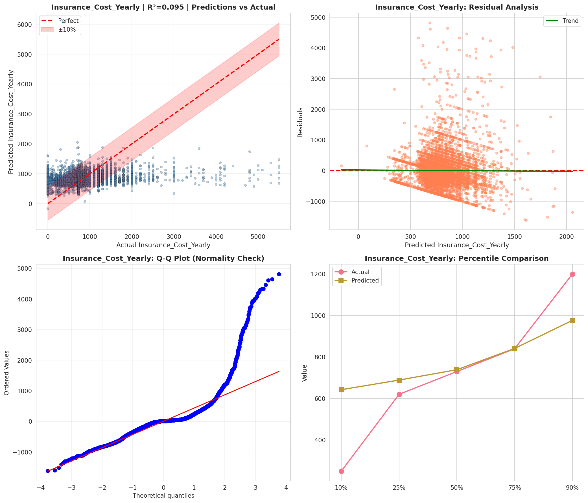
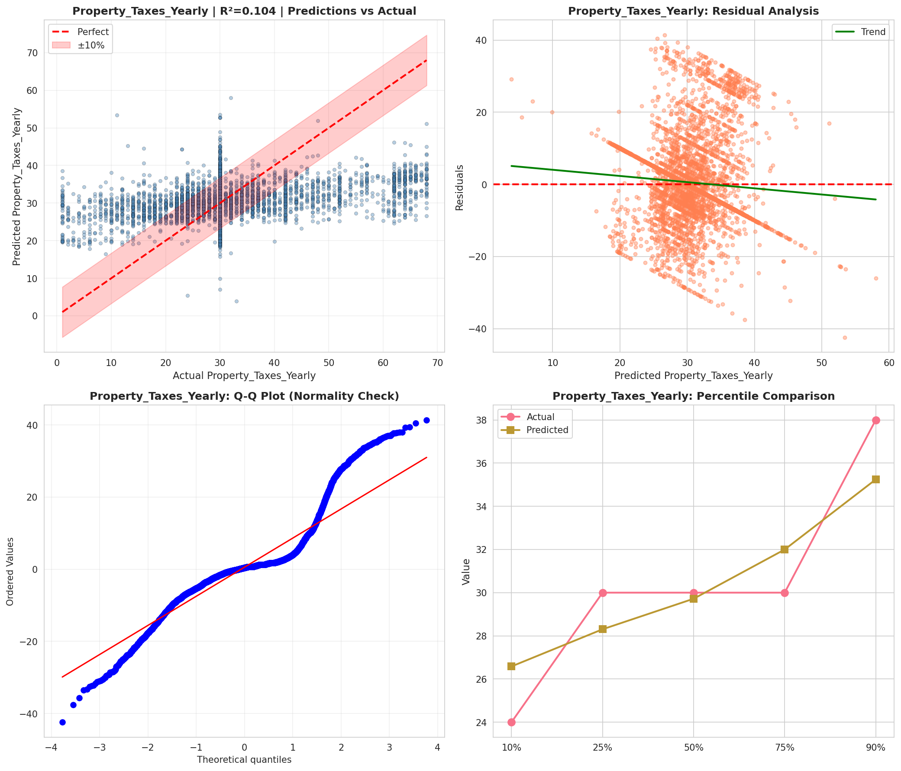
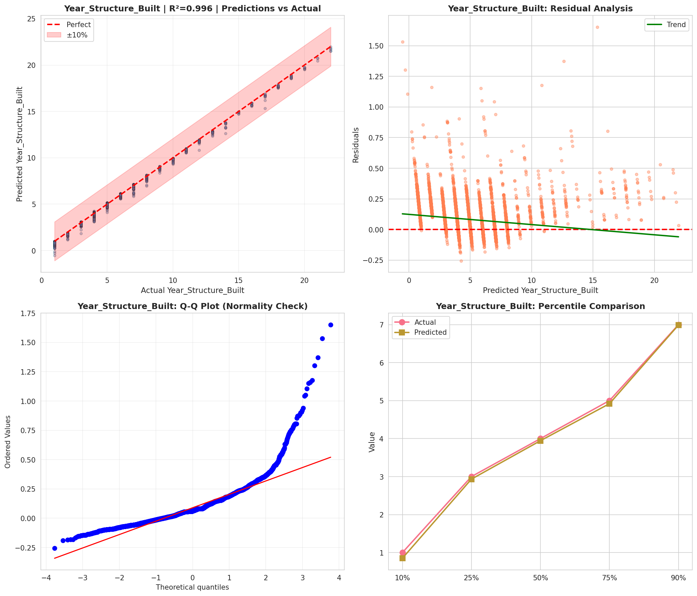
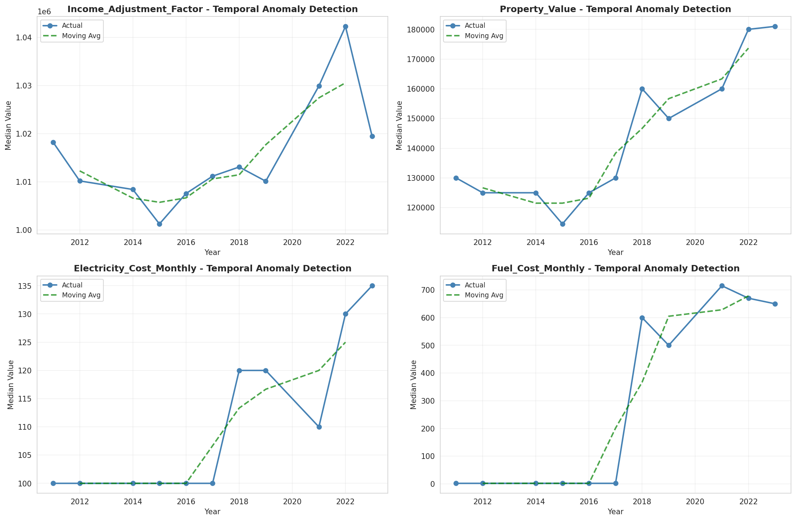
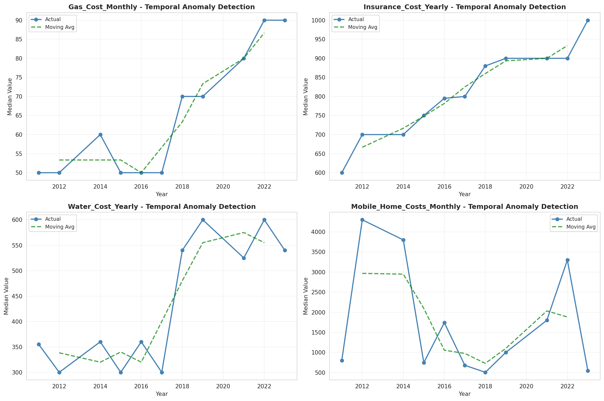
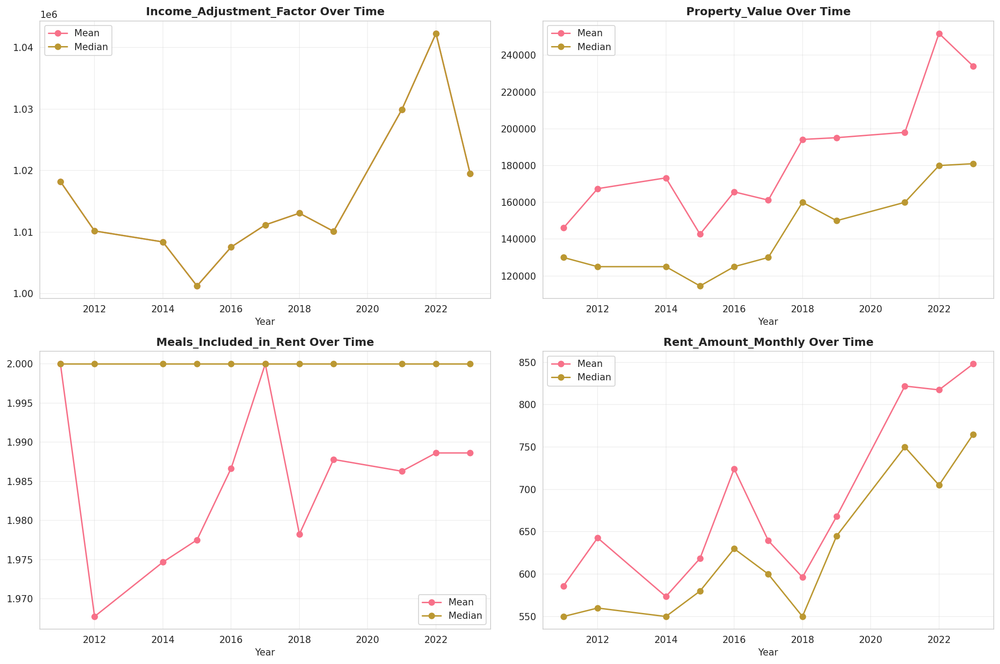
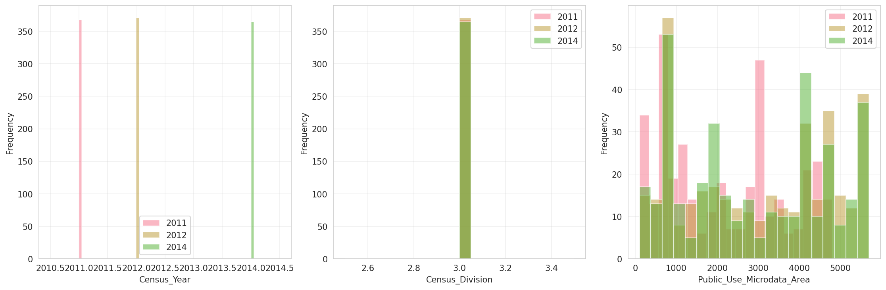
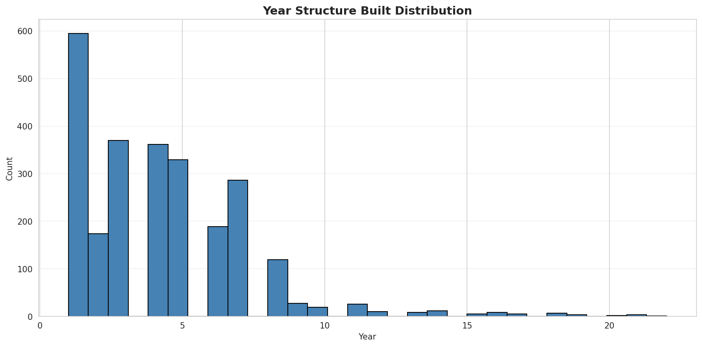
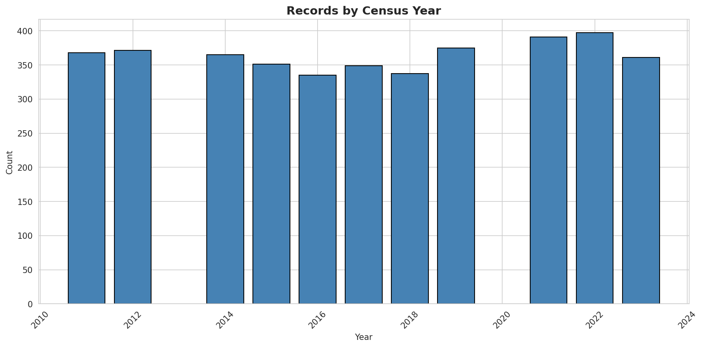
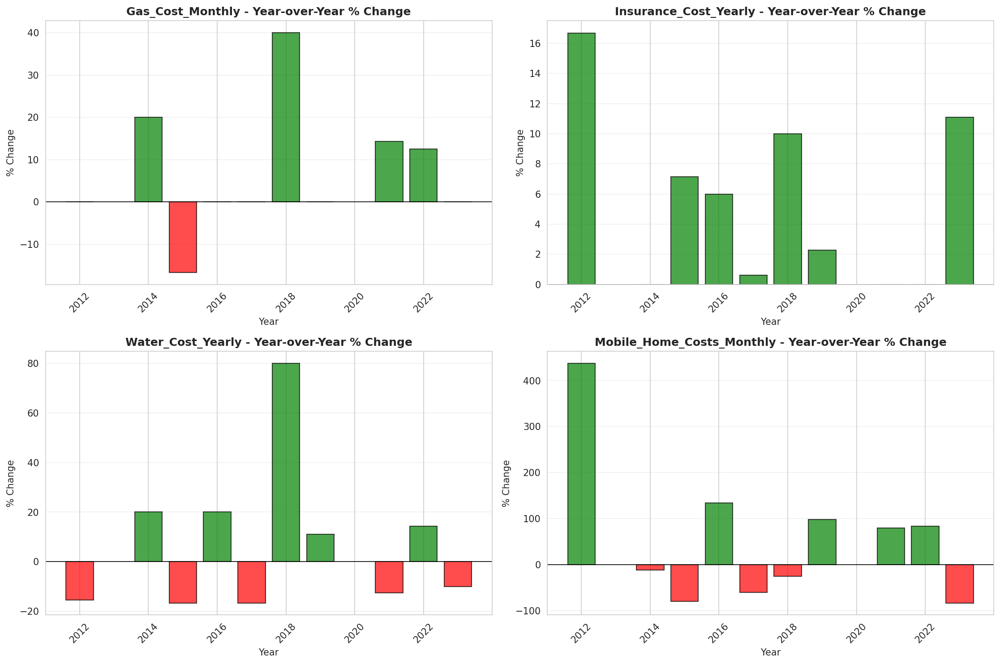

# Temporal Analysis

## Year Distribution

- 2011: 57,523 records

- 2012: 57,066 records

- 2014: 56,959 records

- 2015: 57,241 records

- 2016: 57,237 records

- 2017: 58,069 records

- 2018: 58,104 records

- 2019: 58,137 records

- 2021: 58,700 records

- 2022: 58,571 records

- 2023: 58,710 records

## Temporal Trends

- Census_Year: {np.int64(2011): {'mean': 2011.0, 'median': 2011.0, 'std': 0.0}, np.int64(2012): {'mean': 2012.0, 'median': 2012.0, 'std': 0.0}, np.int64(2014): {'mean': 2014.0, 'median': 2014.0, 'std': 0.0}, np.int64(2015): {'mean': 2015.0, 'median': 2015.0, 'std': 0.0}, np.int64(2016): {'mean': 2016.0, 'median': 2016.0, 'std': 0.0}, np.int64(2017): {'mean': 2017.0, 'median': 2017.0, 'std': 0.0}, np.int64(2018): {'mean': 2018.0, 'median': 2018.0, 'std': 0.0}, np.int64(2019): {'mean': 2019.0, 'median': 2019.0, 'std': 0.0}, np.int64(2021): {'mean': 2021.0, 'median': 2021.0, 'std': 0.0}, np.int64(2022): {'mean': 2022.0, 'median': 2022.0, 'std': 0.0}, np.int64(2023): {'mean': 2023.0, 'median': 2023.0, 'std': 0.0}}

- Census_Division: {np.int64(2011): {'mean': 3.0, 'median': 3.0, 'std': 0.0}, np.int64(2012): {'mean': 3.0, 'median': 3.0, 'std': 0.0}, np.int64(2014): {'mean': 3.0, 'median': 3.0, 'std': 0.0}, np.int64(2015): {'mean': 3.0, 'median': 3.0, 'std': 0.0}, np.int64(2016): {'mean': 3.0, 'median': 3.0, 'std': 0.0}, np.int64(2017): {'mean': 3.0, 'median': 3.0, 'std': 0.0}, np.int64(2018): {'mean': 3.0, 'median': 3.0, 'std': 0.0}, np.int64(2019): {'mean': 3.0, 'median': 3.0, 'std': 0.0}, np.int64(2021): {'mean': 3.0, 'median': 3.0, 'std': 0.0}, np.int64(2022): {'mean': 3.0, 'median': 3.0, 'std': 0.0}, np.int64(2023): {'mean': 3.0, 'median': 3.0, 'std': 0.0}}

- Public_Use_Microdata_Area: {np.int64(2011): {'mean': 2233.723154216574, 'median': 2202.0, 'std': 1458.687673589375}, np.int64(2012): {'mean': 2939.497651841727, 'median': 3000.0, 'std': 1727.851522752641}, np.int64(2014): {'mean': 2943.98340911884, 'median': 3000.0, 'std': 1725.879455391366}, np.int64(2015): {'mean': 2939.1391659824253, 'median': 3000.0, 'std': 1725.0413920301744}, np.int64(2016): {'mean': 2938.7776613030032, 'median': 3000.0, 'std': 1725.1630441922605}, np.int64(2017): {'mean': 2947.8325440424323, 'median': 3000.0, 'std': 1725.1865509543372}, np.int64(2018): {'mean': 2949.3845862591215, 'median': 3000.0, 'std': 1719.160879618629}, np.int64(2019): {'mean': 2945.273474723498, 'median': 3000.0, 'std': 1718.5874438535886}, np.int64(2021): {'mean': 2949.281192504259, 'median': 3000.0, 'std': 1707.8398414708436}, np.int64(2022): {'mean': 2320.7009612265456, 'median': 2400.0, 'std': 1425.7080848004314}, np.int64(2023): {'mean': 2317.3846193152785, 'median': 2400.0, 'std': 1429.0617632461228}}

- Census_Region: {np.int64(2011): {'mean': 2.0, 'median': 2.0, 'std': 0.0}, np.int64(2012): {'mean': 2.0, 'median': 2.0, 'std': 0.0}, np.int64(2014): {'mean': 2.0, 'median': 2.0, 'std': 0.0}, np.int64(2015): {'mean': 2.0, 'median': 2.0, 'std': 0.0}, np.int64(2016): {'mean': 2.0, 'median': 2.0, 'std': 0.0}, np.int64(2017): {'mean': 2.0, 'median': 2.0, 'std': 0.0}, np.int64(2018): {'mean': 2.0, 'median': 2.0, 'std': 0.0}, np.int64(2019): {'mean': 2.0, 'median': 2.0, 'std': 0.0}, np.int64(2021): {'mean': 2.0, 'median': 2.0, 'std': 0.0}, np.int64(2022): {'mean': 2.0, 'median': 2.0, 'std': 0.0}, np.int64(2023): {'mean': 2.0, 'median': 2.0, 'std': 0.0}}

- State_Code: {np.int64(2011): {'mean': 39.0, 'median': 39.0, 'std': 0.0}, np.int64(2012): {'mean': 39.0, 'median': 39.0, 'std': 0.0}, np.int64(2014): {'mean': 39.0, 'median': 39.0, 'std': 0.0}, np.int64(2015): {'mean': 39.0, 'median': 39.0, 'std': 0.0}, np.int64(2016): {'mean': 39.0, 'median': 39.0, 'std': 0.0}, np.int64(2017): {'mean': 39.0, 'median': 39.0, 'std': 0.0}, np.int64(2018): {'mean': 39.0, 'median': 39.0, 'std': 0.0}, np.int64(2019): {'mean': 39.0, 'median': 39.0, 'std': 0.0}, np.int64(2021): {'mean': 39.0, 'median': 39.0, 'std': 0.0}, np.int64(2022): {'mean': 39.0, 'median': 39.0, 'std': 0.0}, np.int64(2023): {'mean': None, 'median': None, 'std': None}}

- Housing_Adjustment_Factor: {np.int64(2011): {'mean': 1000000.0, 'median': 1000000.0, 'std': 0.0}, np.int64(2012): {'mean': 1000000.0, 'median': 1000000.0, 'std': 0.0}, np.int64(2014): {'mean': 1000000.0, 'median': 1000000.0, 'std': 0.0}, np.int64(2015): {'mean': 1000000.0, 'median': 1000000.0, 'std': 0.0}, np.int64(2016): {'mean': 1000000.0, 'median': 1000000.0, 'std': 0.0}, np.int64(2017): {'mean': 1000000.0, 'median': 1000000.0, 'std': 0.0}, np.int64(2018): {'mean': 1000000.0, 'median': 1000000.0, 'std': 0.0}, np.int64(2019): {'mean': 1000000.0, 'median': 1000000.0, 'std': 0.0}, np.int64(2021): {'mean': 1000000.0, 'median': 1000000.0, 'std': 0.0}, np.int64(2022): {'mean': 1000000.0, 'median': 1000000.0, 'std': 0.0}, np.int64(2023): {'mean': 1000000.0, 'median': 1000000.0, 'std': 0.0}}

- Income_Adjustment_Factor: {np.int64(2011): {'mean': 1018237.0, 'median': 1018237.0, 'std': 0.0}, np.int64(2012): {'mean': 1010207.0, 'median': 1010207.0, 'std': 0.0}, np.int64(2014): {'mean': 1008425.0, 'median': 1008425.0, 'std': 0.0}, np.int64(2015): {'mean': 1001264.0, 'median': 1001264.0, 'std': 0.0}, np.int64(2016): {'mean': 1007588.0, 'median': 1007588.0, 'std': 0.0}, np.int64(2017): {'mean': 1011189.0, 'median': 1011189.0, 'std': 0.0}, np.int64(2018): {'mean': 1013097.0, 'median': 1013097.0, 'std': 0.0}, np.int64(2019): {'mean': 1010145.0, 'median': 1010145.0, 'std': 0.0}, np.int64(2021): {'mean': 1029928.0, 'median': 1029928.0, 'std': 0.0}, np.int64(2022): {'mean': 1042311.0, 'median': 1042311.0, 'std': 0.0}, np.int64(2023): {'mean': 1019518.0, 'median': 1019518.0, 'std': 0.0}}

- Housing_Unit_Weight: {np.int64(2011): {'mean': 89.24305060584462, 'median': 72.0, 'std': 80.91371617601565}, np.int64(2012): {'mean': 89.87568780009113, 'median': 75.0, 'std': 76.72005208203574}, np.int64(2014): {'mean': 90.36819466633895, 'median': 74.0, 'std': 76.39220803223277}, np.int64(2015): {'mean': 90.08483429709474, 'median': 74.0, 'std': 77.01990654094159}, np.int64(2016): {'mean': 90.22834879535965, 'median': 74.0, 'std': 77.00633526261782}, np.int64(2017): {'mean': 89.57793314849576, 'median': 73.0, 'std': 77.72599996038095}, np.int64(2018): {'mean': 89.79789687456973, 'median': 73.0, 'std': 78.56196188161996}, np.int64(2019): {'mean': 90.010544059721, 'median': 71.0, 'std': 84.88113826246513}, np.int64(2021): {'mean': 89.76998296422487, 'median': 69.0, 'std': 82.92079328231202}, np.int64(2022): {'mean': 90.37282955728945, 'median': 70.0, 'std': 84.98199264115979}, np.int64(2023): {'mean': 90.56607051609606, 'median': 70.0, 'std': 86.02511106143594}}

- Number_of_Persons: {np.int64(2011): {'mean': 2.058706952001808, 'median': 2.0, 'std': 1.410340614355712}, np.int64(2012): {'mean': 2.0546560123365927, 'median': 2.0, 'std': 1.4055536159373518}, np.int64(2014): {'mean': 2.0623255324004988, 'median': 2.0, 'std': 1.3979359584735804}, np.int64(2015): {'mean': 2.0636082528257718, 'median': 2.0, 'std': 1.4211969883359492}, np.int64(2016): {'mean': 2.051575030137848, 'median': 2.0, 'std': 1.395044233001758}, np.int64(2017): {'mean': 2.046565293013484, 'median': 2.0, 'std': 1.395458586903781}, np.int64(2018): {'mean': 2.049531873881316, 'median': 2.0, 'std': 1.407011629300861}, np.int64(2019): {'mean': 2.0570204860931938, 'median': 2.0, 'std': 1.3843667604289847}, np.int64(2021): {'mean': 2.04206132879046, 'median': 2.0, 'std': 1.3816456839507592}, np.int64(2022): {'mean': 2.0601662938997114, 'median': 2.0, 'std': 1.3760926959109336}, np.int64(2023): {'mean': 2.073394651677738, 'median': 2.0, 'std': 1.3874677389031964}}

- Housing_Unit_Type: {np.int64(2011): {'mean': 1.158736505397841, 'median': 1.0, 'std': 0.48566203818445364}, np.int64(2012): {'mean': 1.1491255738968913, 'median': 1.0, 'std': 0.47181010259478307}, np.int64(2014): {'mean': 1.1438051932091504, 'median': 1.0, 'std': 0.46690935754031676}, np.int64(2015): {'mean': 1.1489666497790045, 'median': 1.0, 'std': 0.4757714941318811}, np.int64(2016): {'mean': 1.1460593671925503, 'median': 1.0, 'std': 0.47054819853028}, np.int64(2017): {'mean': 1.1564690282250427, 'median': 1.0, 'std': 0.4862283765819151}, np.int64(2018): {'mean': 1.1531047776400936, 'median': 1.0, 'std': 0.4814508429441454}, np.int64(2019): {'mean': 1.1484768735916886, 'median': 1.0, 'std': 0.47284793873466685}, np.int64(2021): {'mean': None, 'median': None, 'std': None}, np.int64(2022): {'mean': None, 'median': None, 'std': None}, np.int64(2023): {'mean': None, 'median': None, 'std': None}}

- Number_of_Bedrooms: {np.int64(2011): {'mean': 2.815077432550891, 'median': 3.0, 'std': 1.1141419958257643}, np.int64(2012): {'mean': 2.81449490124203, 'median': 3.0, 'std': 1.0834168890907834}, np.int64(2014): {'mean': 2.8181076355158345, 'median': 3.0, 'std': 1.0512810921130629}, np.int64(2015): {'mean': 2.8172562252734465, 'median': 3.0, 'std': 1.0274532452921636}, np.int64(2016): {'mean': 2.8225544109673923, 'median': 3.0, 'std': 1.026042859278048}, np.int64(2017): {'mean': 2.818956070364318, 'median': 3.0, 'std': 1.028023810458799}, np.int64(2018): {'mean': 2.8310685194058456, 'median': 3.0, 'std': 1.0229010133512586}, np.int64(2019): {'mean': 2.8392478358080604, 'median': 3.0, 'std': 1.0280776987555522}, np.int64(2021): {'mean': 2.850712564282597, 'median': 3.0, 'std': 1.0324233143877108}, np.int64(2022): {'mean': 2.866513016208864, 'median': 3.0, 'std': 1.0287534986714262}, np.int64(2023): {'mean': 2.864762191337709, 'median': 3.0, 'std': 1.0287240853471014}}

- Number_of_Rooms: {np.int64(2011): {'mean': 6.2021038277977985, 'median': 6.0, 'std': 2.231883130922971}, np.int64(2012): {'mean': 6.218320432078304, 'median': 6.0, 'std': 2.233120709593512}, np.int64(2014): {'mean': 6.291975908296095, 'median': 6.0, 'std': 2.3428732951154774}, np.int64(2015): {'mean': 6.292646032115429, 'median': 6.0, 'std': 2.3008249354980665}, np.int64(2016): {'mean': 6.303636434048486, 'median': 6.0, 'std': 2.298586044446326}, np.int64(2017): {'mean': 6.310391233298087, 'median': 6.0, 'std': 2.328196093461572}, np.int64(2018): {'mean': 6.356569238140872, 'median': 6.0, 'std': 2.3377481945631917}, np.int64(2019): {'mean': 6.384605094689369, 'median': 6.0, 'std': 2.35328327446083}, np.int64(2021): {'mean': 6.42269958441657, 'median': 6.0, 'std': 2.4016298942965117}, np.int64(2022): {'mean': 6.466864397173839, 'median': 6.0, 'std': 2.4278973124587515}, np.int64(2023): {'mean': 6.462227070129577, 'median': 6.0, 'std': 2.430603758808079}}

- Building_Type: {np.int64(2011): {'mean': 2.80005843966105, 'median': 2.0, 'std': 1.8304543087130865}, np.int64(2012): {'mean': 2.8022890791038666, 'median': 2.0, 'std': 1.832595433353332}, np.int64(2014): {'mean': 2.7870992811346413, 'median': 2.0, 'std': 1.8044926454081407}, np.int64(2015): {'mean': 2.7937320611279186, 'median': 2.0, 'std': 1.8208142115862225}, np.int64(2016): {'mean': 2.7942645805901942, 'median': 2.0, 'std': 1.8173317463555898}, np.int64(2017): {'mean': 2.802210900701721, 'median': 2.0, 'std': 1.8332615632076306}, np.int64(2018): {'mean': 2.79766171538093, 'median': 2.0, 'std': 1.8295464702790887}, np.int64(2019): {'mean': 2.7801028110607886, 'median': 2.0, 'std': 1.814117647127125}, np.int64(2021): {'mean': 2.7649961098354745, 'median': 2.0, 'std': 1.808785216385301}, np.int64(2022): {'mean': 2.7556013148449012, 'median': 2.0, 'std': 1.8038178381929568}, np.int64(2023): {'mean': 2.7477103041017057, 'median': 2.0, 'std': 1.794554763303145}}

- Year_Structure_Built: {np.int64(2011): {'mean': 4.062043440148047, 'median': 4.0, 'std': 2.565370043283628}, np.int64(2012): {'mean': 4.100512800514751, 'median': 4.0, 'std': 2.622437064916142}, np.int64(2014): {'mean': 4.216844763940159, 'median': 4.0, 'std': 2.7780136570148843}, np.int64(2015): {'mean': 4.2979016368008685, 'median': 4.0, 'std': 2.9129452023506595}, np.int64(2016): {'mean': 4.368832778251104, 'median': 4.0, 'std': 3.070745325703738}, np.int64(2017): {'mean': 4.470364317985196, 'median': 4.0, 'std': 3.276125187358606}, np.int64(2018): {'mean': 4.561494968854816, 'median': 4.0, 'std': 3.439365316881194}, np.int64(2019): {'mean': 4.665615624223662, 'median': 4.0, 'std': 3.658730948039591}, np.int64(2021): {'mean': None, 'median': None, 'std': None}, np.int64(2022): {'mean': None, 'median': None, 'std': None}, np.int64(2023): {'mean': None, 'median': None, 'std': None}}

- Bathtub_or_Shower: {np.int64(2011): {'mean': 1.0103632998928607, 'median': 1.0, 'std': 0.10127241330141983}, np.int64(2012): {'mean': 1.0103340027687329, 'median': 1.0, 'std': 0.10113066088368602}, np.int64(2014): {'mean': 1.0105498348552555, 'median': 1.0, 'std': 0.10217014559977737}, np.int64(2015): {'mean': 1.0103754557443176, 'median': 1.0, 'std': 0.10133116398070842}, np.int64(2016): {'mean': 1.0099140267988538, 'median': 1.0, 'std': 0.09907536999977275}, np.int64(2017): {'mean': 1.0097664135345574, 'median': 1.0, 'std': 0.09834234404634941}, np.int64(2018): {'mean': 1.0088356492573072, 'median': 1.0, 'std': 0.09358284251323294}, np.int64(2019): {'mean': 1.0072617477880335, 'median': 1.0, 'std': 0.08490672866747082}, np.int64(2021): {'mean': 1.0074387536292388, 'median': 1.0, 'std': 0.08592763634091394}, np.int64(2022): {'mean': 1.0070087278497752, 'median': 1.0, 'std': 0.08342503858690073}, np.int64(2023): {'mean': 1.0063189964831776, 'median': 1.0, 'std': 0.07924130776524622}}

- Refrigerator: {np.int64(2011): {'mean': 1.0248758157202689, 'median': 1.0, 'std': 0.15574813657161202}, np.int64(2012): {'mean': 1.0227348060912123, 'median': 1.0, 'std': 0.14905827014820724}, np.int64(2014): {'mean': 1.0236254128618614, 'median': 1.0, 'std': 0.15188054815072569}, np.int64(2015): {'mean': 1.0224769218834846, 'median': 1.0, 'std': 0.14823001038927933}, np.int64(2016): {'mean': 1.0222097436294633, 'median': 1.0, 'std': 0.14736652071888573}, np.int64(2017): {'mean': 1.0217821782178218, 'median': 1.0, 'std': 0.1459730269034858}, np.int64(2018): {'mean': 1.0220987062769527, 'median': 1.0, 'std': 0.14700601231102264}, np.int64(2019): {'mean': 1.0176957327676814, 'median': 1.0, 'std': 0.13184432484875303}, np.int64(2021): {'mean': 1.0170408182628992, 'median': 1.0, 'std': 0.12942467556422566}, np.int64(2022): {'mean': 1.013941889900631, 'median': 1.0, 'std': 0.11725089902426421}, np.int64(2023): {'mean': 1.0129012844864875, 'median': 1.0, 'std': 0.11284981545336004}}

- Hot_and_Cold_Running_Water: {np.int64(2011): {'mean': 1.0180968150384728, 'median': 1.0, 'std': 0.13330291247767784}, np.int64(2012): {'mean': 1.0170023592723303, 'median': 1.0, 'std': 0.12928110819200622}, np.int64(2014): {'mean': 1.0193316495045657, 'median': 1.0, 'std': 0.13768916140711282}, np.int64(2015): {'mean': 1.0193158017221318, 'median': 1.0, 'std': 0.137633821773596}, np.int64(2016): {'mean': 1.0186856169158083, 'median': 1.0, 'std': 0.13541351372090096}, np.int64(2017): {'mean': 1.0182639623185619, 'median': 1.0, 'std': 0.13390569338669128}, np.int64(2018): {'mean': 1.0186296118830858, 'median': 1.0, 'std': 0.13521427387342777}, np.int64(2019): {'mean': 1.0152878900800704, 'median': 1.0, 'std': 0.12269661032643664}, np.int64(2021): {'mean': 1.0147446723722413, 'median': 1.0, 'std': 0.12053025632394765}, np.int64(2022): {'mean': 1.012902860165489, 'median': 1.0, 'std': 0.11285662133077638}, np.int64(2023): {'mean': 1.0118293118688055, 'median': 1.0, 'std': 0.10811844935253054}}

- Running_Water: {np.int64(2011): {'mean': None, 'median': None, 'std': None}, np.int64(2012): {'mean': None, 'median': None, 'std': None}, np.int64(2014): {'mean': 9.0, 'median': 9.0, 'std': 0.0}, np.int64(2015): {'mean': 9.0, 'median': 9.0, 'std': 0.0}, np.int64(2016): {'mean': 9.0, 'median': 9.0, 'std': 0.0}, np.int64(2017): {'mean': 9.0, 'median': 9.0, 'std': 0.0}, np.int64(2018): {'mean': 9.0, 'median': 9.0, 'std': 0.0}, np.int64(2019): {'mean': 9.0, 'median': 9.0, 'std': 0.0}, np.int64(2021): {'mean': 9.0, 'median': 9.0, 'std': 0.0}, np.int64(2022): {'mean': 9.0, 'median': 9.0, 'std': 0.0}, np.int64(2023): {'mean': 9.0, 'median': 9.0, 'std': 0.0}}

- Sink_with_Faucet: {np.int64(2011): {'mean': 1.0099931820395442, 'median': 1.0, 'std': 0.09946613029944781}, np.int64(2012): {'mean': 1.0094760855577436, 'median': 1.0, 'std': 0.09688380865137412}, np.int64(2014): {'mean': 1.0101029726054012, 'median': 1.0, 'std': 0.10000548414552617}, np.int64(2015): {'mean': 1.00981304786285, 'median': 1.0, 'std': 0.09857454234619907}, np.int64(2016): {'mean': 1.0097591201301217, 'median': 1.0, 'std': 0.09830598574327705}, np.int64(2017): {'mean': 1.0092857829472268, 'median': 1.0, 'std': 0.09591524409199449}, np.int64(2018): {'mean': 1.0084331576425491, 'median': 1.0, 'std': 0.0914450642018557}, np.int64(2019): {'mean': 1.006764891360431, 'median': 1.0, 'std': 0.0819710681238923}, np.int64(2021): {'mean': 1.0068694612596543, 'median': 1.0, 'std': 0.0825978282181503}, np.int64(2022): {'mean': 1.00640420145842, 'median': 1.0, 'std': 0.07977034457873879}, np.int64(2023): {'mean': 1.0054350892370187, 'median': 1.0, 'std': 0.07352313039836667}}

- Stove_or_Range: {np.int64(2011): {'mean': 1.0266874452128179, 'median': 1.0, 'std': 0.16116988392731926}, np.int64(2012): {'mean': 1.025289059605748, 'median': 1.0, 'std': 0.15700319646012462}, np.int64(2014): {'mean': 1.0258791529046045, 'median': 1.0, 'std': 0.15877629592518253}, np.int64(2015): {'mean': 1.0249786672872547, 'median': 1.0, 'std': 0.15606154490281057}, np.int64(2016): {'mean': 1.0247076136627682, 'median': 1.0, 'std': 0.15523406230592637}, np.int64(2017): {'mean': 1.025069691435163, 'median': 1.0, 'std': 0.15633832512571424}, np.int64(2018): {'mean': 1.0245903210349785, 'median': 1.0, 'std': 0.15487445518974646}, np.int64(2019): {'mean': 1.020887079821896, 'median': 1.0, 'std': 0.14300769398197435}, np.int64(2021): {'mean': 1.0198872801108223, 'median': 1.0, 'std': 0.13961427610247146}, np.int64(2022): {'mean': 1.0165300185136208, 'median': 1.0, 'std': 0.12750327102254122}, np.int64(2023): {'mean': 1.015797491207944, 'median': 1.0, 'std': 0.12469251335870263}}

- Telephone_Service: {np.int64(2011): {'mean': 1.026310835965114, 'median': 1.0, 'std': 0.1600597129039218}, np.int64(2012): {'mean': 1.0284948600381048, 'median': 1.0, 'std': 0.16638354062380709}, np.int64(2014): {'mean': 1.0246839002645447, 'median': 1.0, 'std': 0.1551615507265441}, np.int64(2015): {'mean': 1.025148205928237, 'median': 1.0, 'std': 0.1565767659198707}, np.int64(2016): {'mean': 1.0302470800572578, 'median': 1.0, 'std': 0.1712682186856761}, np.int64(2017): {'mean': 1.014660763924637, 'median': 1.0, 'std': 0.12019202712884124}, np.int64(2018): {'mean': 1.0152746982015275, 'median': 1.0, 'std': 0.12264457024236458}, np.int64(2019): {'mean': 1.008746474014246, 'median': 1.0, 'std': 0.09311363570252978}, np.int64(2021): {'mean': 1.0080206360082222, 'median': 1.0, 'std': 0.08919902324432975}, np.int64(2022): {'mean': 1.0080502142074326, 'median': 1.0, 'std': 0.08936200188693738}, np.int64(2023): {'mean': 1.007701117649382, 'median': 1.0, 'std': 0.08741831237207644}}

- Lot_Acreage: {np.int64(2011): {'mean': 1.265509042438216, 'median': 1.0, 'std': 0.5250428877771033}, np.int64(2012): {'mean': 1.2741286701832983, 'median': 1.0, 'std': 0.5335623987246348}, np.int64(2014): {'mean': 1.2655591727307545, 'median': 1.0, 'std': 0.524946471585933}, np.int64(2015): {'mean': 1.2702876924913453, 'median': 1.0, 'std': 0.526516642145116}, np.int64(2016): {'mean': 1.2734533317439505, 'median': 1.0, 'std': 0.5322762461492937}, np.int64(2017): {'mean': 1.2691270404542228, 'median': 1.0, 'std': 0.5256308988872546}, np.int64(2018): {'mean': 1.2682806207757342, 'median': 1.0, 'std': 0.5223502421937072}, np.int64(2019): {'mean': 1.2713138481650947, 'median': 1.0, 'std': 0.5261636141589751}, np.int64(2021): {'mean': 1.2713782869763268, 'median': 1.0, 'std': 0.5250548944845026}, np.int64(2022): {'mean': 1.2791556487644753, 'median': 1.0, 'std': 0.5281304185632457}, np.int64(2023): {'mean': 1.2795969202898552, 'median': 1.0, 'std': 0.5278282906739785}}

- Agricultural_Sales: {np.int64(2011): {'mean': 1.28290201282902, 'median': 1.0, 'std': 1.00800559767519}, np.int64(2012): {'mean': 1.3166864415920612, 'median': 1.0, 'std': 1.0823786486729583}, np.int64(2014): {'mean': 1.278990299823633, 'median': 1.0, 'std': 1.025465391529966}, np.int64(2015): {'mean': 1.2836948311211827, 'median': 1.0, 'std': 1.0217347843038014}, np.int64(2016): {'mean': 1.31088027414864, 'median': 1.0, 'std': 1.0583548963652136}, np.int64(2017): {'mean': 1.2860201241704132, 'median': 1.0, 'std': 1.0180763313031935}, np.int64(2018): {'mean': 1.268464243845252, 'median': 1.0, 'std': 0.9912610355525696}, np.int64(2019): {'mean': 1.2775860265662589, 'median': 1.0, 'std': 0.9950340444068078}, np.int64(2021): {'mean': 1.2824059842196947, 'median': 1.0, 'std': 1.0149370741830208}, np.int64(2022): {'mean': 1.2699608610567514, 'median': 1.0, 'std': 0.992395884897614}, np.int64(2023): {'mean': 1.277992277992278, 'median': 1.0, 'std': 1.014680457137967}}

- Tenure: {np.int64(2011): {'mean': 1.8410264990692908, 'median': 2.0, 'std': 0.8808436878057504}, np.int64(2012): {'mean': 1.8567510416012394, 'median': 2.0, 'std': 0.8796787206335237}, np.int64(2014): {'mean': 1.8713520944862208, 'median': 2.0, 'std': 0.8748675873117268}, np.int64(2015): {'mean': 1.8696203848153927, 'median': 2.0, 'std': 0.8732166949547923}, np.int64(2016): {'mean': 1.8681617326722404, 'median': 2.0, 'std': 0.8667876638124369}, np.int64(2017): {'mean': 1.8720889529496552, 'median': 2.0, 'std': 0.8675744681952796}, np.int64(2018): {'mean': 1.8722386466288905, 'median': 2.0, 'std': 0.8655000271755668}, np.int64(2019): {'mean': 1.8589199829535077, 'median': 2.0, 'std': 0.8572190461543577}, np.int64(2021): {'mean': 1.8613518197573657, 'median': 2.0, 'std': 0.8525913460646115}, np.int64(2022): {'mean': 1.845551459599482, 'median': 2.0, 'std': 0.844849519766953}, np.int64(2023): {'mean': 1.8444966628490187, 'median': 2.0, 'std': 0.8393194174892379}}

- Vacancy_Status: {np.int64(2011): {'mean': 4.914821124361159, 'median': 7.0, 'std': 2.4360288159842645}, np.int64(2012): {'mean': 4.957434733257662, 'median': 7.0, 'std': 2.4079779885174215}, np.int64(2014): {'mean': 4.9656367311579555, 'median': 7.0, 'std': 2.3759160580028573}, np.int64(2015): {'mean': 5.148753224419605, 'median': 7.0, 'std': 2.304873493794956}, np.int64(2016): {'mean': 5.130194710839872, 'median': 7.0, 'std': 2.3126090652812143}, np.int64(2017): {'mean': 5.1692753623188405, 'median': 7.0, 'std': 2.333659759130428}, np.int64(2018): {'mean': 5.177098355927314, 'median': 7.0, 'std': 2.3093965964673853}, np.int64(2019): {'mean': 5.2693315858453476, 'median': 7.0, 'std': 2.2547236868646503}, np.int64(2021): {'mean': 5.3567479674796745, 'median': 7.0, 'std': 2.188397829852453}, np.int64(2022): {'mean': 5.33539468897781, 'median': 7.0, 'std': 2.2138874646750746}, np.int64(2023): {'mean': 5.145792177005136, 'median': 7.0, 'std': 2.324232431986797}}

- Property_Value: {np.int64(2011): {'mean': 150019.87595474644, 'median': 120000.0, 'std': 151076.0068285155}, np.int64(2012): {'mean': 151082.171418637, 'median': 120000.0, 'std': 160116.48308005166}, np.int64(2014): {'mean': 152229.42268220056, 'median': 120000.0, 'std': 158651.97872594048}, np.int64(2015): {'mean': 160919.17662300274, 'median': 125000.0, 'std': 166016.51123124736}, np.int64(2016): {'mean': 169118.47503142498, 'median': 130000.0, 'std': 194713.51066253346}, np.int64(2017): {'mean': 172715.95487050913, 'median': 130000.0, 'std': 177252.13068376775}, np.int64(2018): {'mean': 179976.4750849377, 'median': 140000.0, 'std': 180664.11626913215}, np.int64(2019): {'mean': 189124.8318245993, 'median': 150000.0, 'std': 195997.45329543523}, np.int64(2021): {'mean': 214882.57996083552, 'median': 170000.0, 'std': 225282.23940472066}, np.int64(2022): {'mean': 241173.81091566136, 'median': 190500.0, 'std': 238704.91944872538}, np.int64(2023): {'mean': 259830.4650918083, 'median': 200000.0, 'std': 284186.87000700115}}

- Vehicles_Available: {np.int64(2011): {'mean': 1.7779892497856231, 'median': 2.0, 'std': 1.0580130899255595}, np.int64(2012): {'mean': 1.7790758536942821, 'median': 2.0, 'std': 1.0596189663861928}, np.int64(2014): {'mean': 1.8116316370529297, 'median': 2.0, 'std': 1.0755293688200176}, np.int64(2015): {'mean': 1.8237129485179406, 'median': 2.0, 'std': 1.0793782256706246}, np.int64(2016): {'mean': 1.8487438541169636, 'median': 2.0, 'std': 1.084403191501512}, np.int64(2017): {'mean': 1.8609698342427674, 'median': 2.0, 'std': 1.0880371386611705}, np.int64(2018): {'mean': 1.8713763652788042, 'median': 2.0, 'std': 1.0910955583686317}, np.int64(2019): {'mean': 1.88333299510928, 'median': 2.0, 'std': 1.0937309031545959}, np.int64(2021): {'mean': 1.8698762645600742, 'median': 2.0, 'std': 1.0774672679546748}, np.int64(2022): {'mean': 1.8755803526950283, 'median': 2.0, 'std': 1.070330155607128}, np.int64(2023): {'mean': 1.8679357055408554, 'median': 2.0, 'std': 1.0763286318604162}}

- Condo_Fee_Monthly: {np.int64(2011): {'mean': 219.25146962769432, 'median': 180.0, 'std': 168.3244963399571}, np.int64(2012): {'mean': 222.03941513032422, 'median': 180.0, 'std': 173.50922560967138}, np.int64(2014): {'mean': 239.75932441942294, 'median': 200.0, 'std': 175.1329669679009}, np.int64(2015): {'mean': 242.3205298013245, 'median': 200.0, 'std': 177.2590905930176}, np.int64(2016): {'mean': 244.24590163934425, 'median': 210.0, 'std': 167.39534439131472}, np.int64(2017): {'mean': 249.40420114576702, 'median': 210.0, 'std': 164.35098827021545}, np.int64(2018): {'mean': 253.14738124238733, 'median': 220.0, 'std': 169.1772511652974}, np.int64(2019): {'mean': 267.44725987035946, 'median': 230.0, 'std': 180.5479303322617}, np.int64(2021): {'mean': 280.76099210822997, 'median': 240.0, 'std': 209.95225823798478}, np.int64(2022): {'mean': 299.83260393873087, 'median': 250.0, 'std': 226.05764891543052}, np.int64(2023): {'mean': 310.9460181721005, 'median': 260.0, 'std': 233.12206247990613}}

- Electricity_Cost_Monthly: {np.int64(2011): {'mean': 117.75924957647501, 'median': 100.0, 'std': 82.63669464674315}, np.int64(2012): {'mean': 115.92837552080061, 'median': 100.0, 'std': 79.72887744313809}, np.int64(2014): {'mean': 125.09771491657466, 'median': 100.0, 'std': 89.3150154867799}, np.int64(2015): {'mean': 128.04624024960998, 'median': 100.0, 'std': 93.37433795512487}, np.int64(2016): {'mean': 124.30653693753501, 'median': 100.0, 'std': 86.66846375257981}, np.int64(2017): {'mean': 119.61262225882838, 'median': 100.0, 'std': 83.98160145366901}, np.int64(2018): {'mean': 135.48230335870642, 'median': 110.0, 'std': 90.0124866722509}, np.int64(2019): {'mean': 132.26346415222562, 'median': 110.0, 'std': 87.42848482790728}, np.int64(2021): {'mean': 132.5873299552154, 'median': 110.0, 'std': 86.87453583989736}, np.int64(2022): {'mean': 162.73964853904545, 'median': 120.0, 'std': 235.62378002072907}, np.int64(2023): {'mean': 172.64149775007223, 'median': 130.0, 'std': 260.33271294065065}}

- Fuel_Cost_Monthly: {np.int64(2011): {'mean': 119.24263275678163, 'median': 2.0, 'std': 453.2889322118834}, np.int64(2012): {'mean': 103.7298745891171, 'median': 2.0, 'std': 409.1102103939818}, np.int64(2014): {'mean': 86.7036473847564, 'median': 2.0, 'std': 403.8921877957028}, np.int64(2015): {'mean': 78.2270618824753, 'median': 2.0, 'std': 368.84750608227586}, np.int64(2016): {'mean': 61.42665394270066, 'median': 2.0, 'std': 292.16502110410306}, np.int64(2017): {'mean': 57.25541027488932, 'median': 2.0, 'std': 279.8427473827468}, np.int64(2018): {'mean': 873.2042946614972, 'median': 700.0, 'std': 790.5247700168478}, np.int64(2019): {'mean': 905.7809021675454, 'median': 700.0, 'std': 826.824228095008}, np.int64(2021): {'mean': 832.9626890756302, 'median': 650.0, 'std': 741.2642835154219}, np.int64(2022): {'mean': 999.6682119205298, 'median': 800.0, 'std': 907.3589102262627}, np.int64(2023): {'mean': 1035.2546125461254, 'median': 800.0, 'std': 943.7730267867862}}

- Gas_Cost_Monthly: {np.int64(2011): {'mean': 71.900110848514, 'median': 50.0, 'std': 79.48738590951247}, np.int64(2012): {'mean': 61.93796453321609, 'median': 50.0, 'std': 67.71327881889725}, np.int64(2014): {'mean': 71.0105817901556, 'median': 50.0, 'std': 77.9465041817363}, np.int64(2015): {'mean': 65.904378575143, 'median': 50.0, 'std': 74.71967629168606}, np.int64(2016): {'mean': 55.306910358276454, 'median': 40.0, 'std': 61.91449912938867}, np.int64(2017): {'mean': 56.992463708432, 'median': 50.0, 'std': 62.965512287432006}, np.int64(2018): {'mean': 89.08653390232338, 'median': 70.0, 'std': 70.4418650173603}, np.int64(2019): {'mean': 89.2421175441155, 'median': 70.0, 'std': 68.52916025391205}, np.int64(2021): {'mean': 89.49352568002085, 'median': 70.0, 'std': 68.62419043902949}, np.int64(2022): {'mean': 129.5315867920202, 'median': 90.0, 'std': 233.40045534845333}, np.int64(2023): {'mean': 127.66219808812716, 'median': 90.0, 'std': 203.5623876145272}}

- House_Heating_Fuel: {np.int64(2011): {'mean': 1.7293413925083136, 'median': 1.0, 'std': 1.2922392129794151}, np.int64(2012): {'mean': 1.749136360781358, 'median': 1.0, 'std': 1.3178382385968088}, np.int64(2014): {'mean': 1.7511404586831087, 'median': 1.0, 'std': 1.333847818654941}, np.int64(2015): {'mean': 1.7520540821632866, 'median': 1.0, 'std': 1.31727369277692}, np.int64(2016): {'mean': 1.7611144534572536, 'median': 1.0, 'std': 1.335415038479845}, np.int64(2017): {'mean': 1.7592710799958817, 'median': 1.0, 'std': 1.3226860386085262}, np.int64(2018): {'mean': 1.7511907694834523, 'median': 1.0, 'std': 1.3106236018728736}, np.int64(2019): {'mean': 1.7456825699616454, 'median': 1.0, 'std': 1.299550756663388}, np.int64(2021): {'mean': 1.7606706702672201, 'median': 1.0, 'std': 1.300203332247379}, np.int64(2022): {'mean': 1.7700707382684069, 'median': 1.0, 'std': 1.3087146608880948}, np.int64(2023): {'mean': 1.7667351210457722, 'median': 1.0, 'std': 1.2996669342655376}}

- Insurance_Cost_Yearly: {np.int64(2011): {'mean': 725.0121233789449, 'median': 600.0, 'std': 470.5304330899574}, np.int64(2012): {'mean': 752.275242138782, 'median': 650.0, 'std': 486.298640480109}, np.int64(2014): {'mean': 834.1150409904634, 'median': 720.0, 'std': 566.3746469257493}, np.int64(2015): {'mean': 867.6150814503416, 'median': 760.0, 'std': 575.4967475830101}, np.int64(2016): {'mean': 899.3822030576245, 'median': 800.0, 'std': 599.5479635116095}, np.int64(2017): {'mean': 916.6305923845601, 'median': 800.0, 'std': 615.7972622731817}, np.int64(2018): {'mean': 949.8459527466423, 'median': 800.0, 'std': 641.6545941777814}, np.int64(2019): {'mean': 960.0706264117329, 'median': 840.0, 'std': 642.1867151729383}, np.int64(2021): {'mean': 1004.4671863838246, 'median': 900.0, 'std': 710.6648379390373}, np.int64(2022): {'mean': 1077.6784515348556, 'median': 960.0, 'std': 756.6511662163648}, np.int64(2023): {'mean': 1231.3589628967368, 'median': 1000.0, 'std': 990.3475720692043}}

- Water_Cost_Yearly: {np.int64(2011): {'mean': 380.96411017924, 'median': 300.0, 'std': 421.59468988617704}, np.int64(2012): {'mean': 393.8586562820593, 'median': 300.0, 'std': 437.9499152135959}, np.int64(2014): {'mean': 413.35278188597493, 'median': 300.0, 'std': 462.8720312755176}, np.int64(2015): {'mean': 418.3098907956318, 'median': 300.0, 'std': 472.09815006528396}, np.int64(2016): {'mean': 428.84303881501154, 'median': 300.0, 'std': 489.4452286941308}, np.int64(2017): {'mean': 439.7419540821579, 'median': 300.0, 'std': 508.7666995496435}, np.int64(2018): {'mean': 617.9335774209358, 'median': 550.0, 'std': 507.3498723295824}, np.int64(2019): {'mean': 620.9797894021739, 'median': 550.0, 'std': 519.2562209558787}, np.int64(2021): {'mean': 631.7159241288045, 'median': 540.0, 'std': 566.2742516701683}, np.int64(2022): {'mean': 637.1802833722383, 'median': 540.0, 'std': 585.8315540462889}, np.int64(2023): {'mean': 657.3035546613012, 'median': 560.0, 'std': 603.8069750584459}}

- Mobile_Home_Costs_Monthly: {np.int64(2011): {'mean': 1790.325449385052, 'median': 1400.0, 'std': 1722.9062677983263}, np.int64(2012): {'mean': 1939.7736202057997, 'median': 1800.0, 'std': 1706.4765365155158}, np.int64(2014): {'mean': 1959.6042884990254, 'median': 1600.0, 'std': 1819.3459117700163}, np.int64(2015): {'mean': 1951.037181996086, 'median': 1200.0, 'std': 1878.3426073600044}, np.int64(2016): {'mean': 2096.0413385826773, 'median': 1700.0, 'std': 1888.4250195459374}, np.int64(2017): {'mean': 2037.8317757009345, 'median': 1400.0, 'std': 1984.325144567662}, np.int64(2018): {'mean': 2163.377183967112, 'median': 1500.0, 'std': 2073.627620577151}, np.int64(2019): {'mean': 2304.108870967742, 'median': 1800.0, 'std': 2113.419970566628}, np.int64(2021): {'mean': 2887.1947769314474, 'median': 1200.0, 'std': 4391.36467393604}, np.int64(2022): {'mean': 2899.6822429906542, 'median': 1200.0, 'std': 4225.526942347616}, np.int64(2023): {'mean': 2920.1830845771146, 'median': 1200.0, 'std': 3846.2856017968943}}

- First_Mortgage_Includes_Insurance: {np.int64(2011): {'mean': 1.4692552225249773, 'median': 1.0, 'std': 0.4990651957012752}, np.int64(2012): {'mean': 1.4597829630664618, 'median': 1.0, 'std': 0.49839157171989695}, np.int64(2014): {'mean': 1.4573854151762293, 'median': 1.0, 'std': 0.4981925678001168}, np.int64(2015): {'mean': 1.4455672068636798, 'median': 1.0, 'std': 0.49704008538232725}, np.int64(2016): {'mean': 1.4361676646706587, 'median': 1.0, 'std': 0.495920572662445}, np.int64(2017): {'mean': 1.4217765042979942, 'median': 1.0, 'std': 0.49385497055060323}, np.int64(2018): {'mean': 1.4095064860466229, 'median': 1.0, 'std': 0.4917545112874143}, np.int64(2019): {'mean': 1.4008559872072242, 'median': 1.0, 'std': 0.49008342251026094}, np.int64(2021): {'mean': 1.3630795707633123, 'median': 1.0, 'std': 0.48089967986724463}, np.int64(2022): {'mean': 1.3545238331186205, 'median': 1.0, 'std': 0.4783806267856738}, np.int64(2023): {'mean': 1.3602237597526865, 'median': 1.0, 'std': 0.4800769855399476}}

- First_Mortgage_Payment_Monthly: {np.int64(2011): {'mean': 890.4136239782016, 'median': 770.0, 'std': 584.4374579266358}, np.int64(2012): {'mean': 888.0441525778957, 'median': 780.0, 'std': 563.873201141199}, np.int64(2014): {'mean': 879.6659512567368, 'median': 750.0, 'std': 582.8484382995003}, np.int64(2015): {'mean': 903.4391801715919, 'median': 780.0, 'std': 594.953229119556}, np.int64(2016): {'mean': 912.2489101796407, 'median': 790.0, 'std': 598.4698265640413}, np.int64(2017): {'mean': 926.0060171919771, 'median': 800.0, 'std': 610.3998563903067}, np.int64(2018): {'mean': 949.7930209180987, 'median': 800.0, 'std': 617.025737392074}, np.int64(2019): {'mean': 971.0906782052488, 'median': 820.0, 'std': 636.4865006267611}, np.int64(2021): {'mean': 400.7108184526633, 'median': 4.0, 'std': 660.8682170096979}, np.int64(2022): {'mean': 518.2343178046063, 'median': 4.0, 'std': 737.7414514030573}, np.int64(2023): {'mean': 1179.6144069875852, 'median': 1000.0, 'std': 758.2013119638102}}

- First_Mortgage_Includes_Taxes: {np.int64(2011): {'mean': 1.3727974568574024, 'median': 1.0, 'std': 0.48355985359290643}, np.int64(2012): {'mean': 1.3638861720460156, 'median': 1.0, 'std': 0.48112764114166234}, np.int64(2014): {'mean': 1.3528878714169885, 'median': 1.0, 'std': 0.4778796014161577}, np.int64(2015): {'mean': 1.3450905624404195, 'median': 1.0, 'std': 0.47540912799247653}, np.int64(2016): {'mean': 1.3298682634730539, 'median': 1.0, 'std': 0.470176330969474}, np.int64(2017): {'mean': 1.3163801337153773, 'median': 1.0, 'std': 0.465074267118178}, np.int64(2018): {'mean': 1.3032406299363362, 'median': 1.0, 'std': 0.45966929905914483}, np.int64(2019): {'mean': 1.2928699087574076, 'median': 1.0, 'std': 0.4550899537527292}, np.int64(2021): {'mean': 1.2530370520348248, 'median': 1.0, 'std': 0.43476300440747384}, np.int64(2022): {'mean': 1.2384302844118522, 'median': 1.0, 'std': 0.42613411213223323}, np.int64(2023): {'mean': 1.239511261592816, 'median': 1.0, 'std': 0.426795683564337}}

- First_Mortgage_Status: {np.int64(2011): {'mean': 1.724182130684301, 'median': 1.0, 'std': 0.9575040325264144}, np.int64(2012): {'mean': 1.7475480119809714, 'median': 1.0, 'std': 0.9631977915160055}, np.int64(2014): {'mean': 1.7786020055122267, 'median': 1.0, 'std': 0.9710246319022067}, np.int64(2015): {'mean': 1.7837040929526478, 'median': 1.0, 'std': 0.9718915247704027}, np.int64(2016): {'mean': 1.7983599907278627, 'median': 1.0, 'std': 0.9753382622958381}, np.int64(2017): {'mean': 1.7993194336303602, 'median': 1.0, 'std': 0.9760729584378477}, np.int64(2018): {'mean': 1.8108077132460387, 'median': 1.0, 'std': 0.9778897127355543}, np.int64(2019): {'mean': 1.8185375670840787, 'median': 1.0, 'std': 0.9797665958809711}, np.int64(2021): {'mean': 1.9229123230549765, 'median': 1.0, 'std': 0.9935925919236408}, np.int64(2022): {'mean': 1.9247268637532133, 'median': 1.0, 'std': 0.994366037677761}, np.int64(2023): {'mean': 1.926398897838067, 'median': 1.0, 'std': 0.9941611610406386}}

- Second_Mortgage_Payment_Monthly: {np.int64(2011): {'mean': 285.7333086053412, 'median': 200.0, 'std': 268.63491643200047}, np.int64(2012): {'mean': 270.9719975108899, 'median': 200.0, 'std': 234.1898940541813}, np.int64(2014): {'mean': 275.19709854927464, 'median': 200.0, 'std': 257.9529054840663}, np.int64(2015): {'mean': 286.4817708333333, 'median': 200.0, 'std': 288.60103448262856}, np.int64(2016): {'mean': 297.3578185865331, 'median': 200.0, 'std': 303.4359897923771}, np.int64(2017): {'mean': 288.93422584400463, 'median': 200.0, 'std': 271.8153909091462}, np.int64(2018): {'mean': 302.23809523809524, 'median': 210.0, 'std': 302.096710879136}, np.int64(2019): {'mean': 316.35471003375267, 'median': 220.0, 'std': 310.30449705858695}, np.int64(2021): {'mean': 343.12094240837695, 'median': 240.0, 'std': 367.0238185802645}, np.int64(2022): {'mean': 371.77068062827226, 'median': 250.0, 'std': 426.4489491559898}, np.int64(2023): {'mean': 416.21873442949675, 'median': 300.0, 'std': 394.62795455291854}}

- Second_Mortgage_Status: {np.int64(2011): {'mean': 2.71780199818347, 'median': 3.0, 'std': 0.5656991379111044}, np.int64(2012): {'mean': 2.7426761678543152, 'median': 3.0, 'std': 0.5408030146647441}, np.int64(2014): {'mean': 2.7813230314303428, 'median': 3.0, 'std': 0.5071447034326485}, np.int64(2015): {'mean': 2.7948522402287894, 'median': 3.0, 'std': 0.48951268858805347}, np.int64(2016): {'mean': 2.8075209580838325, 'median': 3.0, 'std': 0.46956928690513794}, np.int64(2017): {'mean': 2.817287488061127, 'median': 3.0, 'std': 0.4589735956599856}, np.int64(2018): {'mean': 2.8314106553061125, 'median': 3.0, 'std': 0.43737698553615384}, np.int64(2019): {'mean': 2.8301194619508983, 'median': 3.0, 'std': 0.44044136270111817}, np.int64(2021): {'mean': 2.80429503356983, 'median': 3.0, 'std': 0.4437745345583452}, np.int64(2022): {'mean': 2.8096612062546535, 'median': 3.0, 'std': 0.4305715199981903}, np.int64(2023): {'mean': 2.803985171455051, 'median': 3.0, 'std': 0.43561590395339994}}

- Property_Taxes_Yearly: {np.int64(2011): {'mean': 31.281818976316018, 'median': 29.0, 'std': 15.853438677265473}, np.int64(2012): {'mean': 31.630851001350795, 'median': 29.0, 'std': 16.225943751809638}, np.int64(2014): {'mean': 32.08998416700874, 'median': 30.0, 'std': 16.87598446728261}, np.int64(2015): {'mean': 33.10433817948269, 'median': 30.0, 'std': 16.774127611220887}, np.int64(2016): {'mean': 33.564122624014836, 'median': 31.0, 'std': 16.952580759192625}, np.int64(2017): {'mean': 34.12094471840125, 'median': 31.0, 'std': 17.18659407713388}}

- Meals_Included_in_Rent: {np.int64(2011): {'mean': 1.9784970405334532, 'median': 2.0, 'std': 0.14505915602495856}, np.int64(2012): {'mean': 1.9770199602268543, 'median': 2.0, 'std': 0.14984529136034955}, np.int64(2014): {'mean': 1.9792892958360584, 'median': 2.0, 'std': 0.14241925734563926}, np.int64(2015): {'mean': 1.9760659842403712, 'median': 2.0, 'std': 0.15284926943286264}, np.int64(2016): {'mean': 1.9753479419603197, 'median': 2.0, 'std': 0.15506809540597585}, np.int64(2017): {'mean': 1.976750965673056, 'median': 2.0, 'std': 0.1506989444870531}, np.int64(2018): {'mean': 1.9750293772032903, 'median': 2.0, 'std': 0.15604127354254216}, np.int64(2019): {'mean': 1.9750604594921404, 'median': 2.0, 'std': 0.15594677858219105}, np.int64(2021): {'mean': 1.9756365922665828, 'median': 2.0, 'std': 0.15418073924423198}, np.int64(2022): {'mean': 1.9779192521556934, 'median': 2.0, 'std': 0.1469521305812027}, np.int64(2023): {'mean': 1.9753831493686969, 'median': 2.0, 'std': 0.15496053733418794}}

- Rent_Amount_Monthly: {np.int64(2011): {'mean': 563.6160935041582, 'median': 500.0, 'std': 329.7310695330798}, np.int64(2012): {'mean': 580.9162554319805, 'median': 530.0, 'std': 336.8247475490238}, np.int64(2014): {'mean': 601.0773926313494, 'median': 550.0, 'std': 330.2486103892259}, np.int64(2015): {'mean': 623.3140879298918, 'median': 560.0, 'std': 355.71647252299016}, np.int64(2016): {'mean': 643.3506070476755, 'median': 580.0, 'std': 371.208000379562}, np.int64(2017): {'mean': 665.060855622768, 'median': 600.0, 'std': 375.96729416499267}, np.int64(2018): {'mean': 685.1147179788484, 'median': 610.0, 'std': 387.2553960134062}, np.int64(2019): {'mean': 711.9263905683192, 'median': 640.0, 'std': 416.7982482053919}, np.int64(2021): {'mean': 772.4248663942157, 'median': 680.0, 'std': 483.4882339526887}, np.int64(2022): {'mean': 828.3916512208881, 'median': 720.0, 'std': 510.1144206559063}, np.int64(2023): {'mean': 885.5165568172795, 'median': 770.0, 'std': 537.7520909974514}}

- Gross_Rent: {np.int64(2011): {'mean': 718.0509041663347, 'median': 670.0, 'std': 362.04835300899504}, np.int64(2012): {'mean': 726.9677848150754, 'median': 680.0, 'std': 364.4982585792406}, np.int64(2014): {'mean': 763.8203827530551, 'median': 720.0, 'std': 368.2703568635251}, np.int64(2015): {'mean': 786.3147718484146, 'median': 730.0, 'std': 392.2901697690604}, np.int64(2016): {'mean': 794.0164826621054, 'median': 740.0, 'std': 397.82032326556237}, np.int64(2017): {'mean': 814.6749693439608, 'median': 757.0, 'std': 398.52638580500496}, np.int64(2018): {'mean': 843.9842422369844, 'median': 785.0, 'std': 408.92278585127417}, np.int64(2019): {'mean': 865.7800976993382, 'median': 800.0, 'std': 434.173548275656}, np.int64(2021): {'mean': 926.2119649725837, 'median': 848.0, 'std': 496.0533594524113}, np.int64(2022): {'mean': 1021.040770196735, 'median': 920.0, 'std': 598.7556002661205}, np.int64(2023): {'mean': 1092.5459432635844, 'median': 970.0, 'std': 635.7757686941244}}

- Gross_Rent_Percentage_Income: {np.int64(2011): {'mean': 40.638966137739246, 'median': 30.0, 'std': 28.250411650231353}, np.int64(2012): {'mean': 39.574606488917446, 'median': 30.0, 'std': 27.777047134061853}, np.int64(2014): {'mean': 38.1208704565166, 'median': 29.0, 'std': 27.045767901713003}, np.int64(2015): {'mean': 37.150241431172326, 'median': 28.0, 'std': 26.760701045916914}, np.int64(2016): {'mean': 36.35688708522321, 'median': 28.0, 'std': 26.591127167558753}, np.int64(2017): {'mean': 36.066024436090224, 'median': 27.0, 'std': 26.546216323843076}, np.int64(2018): {'mean': 36.0146025732102, 'median': 27.0, 'std': 26.691847304847737}, np.int64(2019): {'mean': 35.2370263094376, 'median': 27.0, 'std': 25.941455280444448}, np.int64(2021): {'mean': 36.119177507343686, 'median': 27.0, 'std': 26.789210644301082}, np.int64(2022): {'mean': 37.5445434298441, 'median': 28.0, 'std': 27.72103963599696}, np.int64(2023): {'mean': 37.478911334629366, 'median': 28.0, 'std': 27.592145611391604}}

- Selected_Monthly_Owner_Costs: {np.int64(2011): {'mean': 1030.2423880423064, 'median': 880.0, 'std': 743.6039282538933}, np.int64(2012): {'mean': 1003.21307527387, 'median': 853.0, 'std': 713.9822070349437}, np.int64(2014): {'mean': 1008.1975424499252, 'median': 850.0, 'std': 718.6681557163703}, np.int64(2015): {'mean': 1025.6677180992435, 'median': 865.0, 'std': 736.4782263522154}, np.int64(2016): {'mean': 1011.2433630883376, 'median': 851.0, 'std': 728.3764101922185}, np.int64(2017): {'mean': 1015.1406403230459, 'median': 848.0, 'std': 731.3589828254202}, np.int64(2018): {'mean': 1048.779296707076, 'median': 885.0, 'std': 744.9490577408792}, np.int64(2019): {'mean': 1053.9042520477483, 'median': 878.0, 'std': 763.4926801616504}, np.int64(2021): {'mean': 1076.0883353451113, 'median': 879.0, 'std': 798.1763140537141}, np.int64(2022): {'mean': 1187.6557855555259, 'median': 956.0, 'std': 895.6163721275483}, np.int64(2023): {'mean': 1249.2141551180478, 'median': 1009.0, 'std': 937.3206945346641}}

- Owner_Costs_Percentage_Income: {np.int64(2011): {'mean': 24.413348568749818, 'median': 19.0, 'std': 19.962600894371846}, np.int64(2012): {'mean': 23.2587606648363, 'median': 18.0, 'std': 19.488728803821388}, np.int64(2014): {'mean': 22.291767483033343, 'median': 17.0, 'std': 19.243777338311244}, np.int64(2015): {'mean': 21.70833088537689, 'median': 17.0, 'std': 18.686692438513997}, np.int64(2016): {'mean': 21.177048702245553, 'median': 16.0, 'std': 18.902276224508913}, np.int64(2017): {'mean': 20.4406587661206, 'median': 16.0, 'std': 18.132974618650174}, np.int64(2018): {'mean': 20.723898045781254, 'median': 16.0, 'std': 18.54609307667039}, np.int64(2019): {'mean': 19.62118911013612, 'median': 15.0, 'std': 17.618037378398334}, np.int64(2021): {'mean': 20.55253638196228, 'median': 15.0, 'std': 19.461331811176663}, np.int64(2022): {'mean': 21.057899848909994, 'median': 15.0, 'std': 19.912633115278673}, np.int64(2023): {'mean': 21.148026579136978, 'median': 15.0, 'std': 20.127048893324936}}

- Satellite_Internet: {np.int64(2011): {'mean': None, 'median': None, 'std': None}, np.int64(2012): {'mean': None, 'median': None, 'std': None}, np.int64(2014): {'mean': 1.9441826748822038, 'median': 2.0, 'std': 0.22957182044294305}, np.int64(2015): {'mean': 1.9412979671703445, 'median': 2.0, 'std': 0.23506936401821968}, np.int64(2016): {'mean': 1.925668449197861, 'median': 2.0, 'std': 0.2623130258638884}, np.int64(2017): {'mean': 1.9196094825890222, 'median': 2.0, 'std': 0.2719001658404005}, np.int64(2018): {'mean': 1.919147195418341, 'median': 2.0, 'std': 0.27261220973723055}, np.int64(2019): {'mean': 1.9243014792204742, 'median': 2.0, 'std': 0.2645182368057585}, np.int64(2021): {'mean': 1.9281603987313094, 'median': 2.0, 'std': 0.25822506386937744}, np.int64(2022): {'mean': 1.9335652786646995, 'median': 2.0, 'std': 0.24904319882305223}, np.int64(2023): {'mean': 1.9355257745350625, 'median': 2.0, 'std': 0.24559846421362058}}

- Smartphone: {np.int64(2011): {'mean': None, 'median': None, 'std': None}, np.int64(2012): {'mean': None, 'median': None, 'std': None}, np.int64(2014): {'mean': None, 'median': None, 'std': None}, np.int64(2015): {'mean': None, 'median': None, 'std': None}, np.int64(2016): {'mean': 1.3035910627969214, 'median': 1.0, 'std': 0.4598129136779815}, np.int64(2017): {'mean': 1.2352311335323793, 'median': 1.0, 'std': 0.4241475588600874}, np.int64(2018): {'mean': 1.2037447647203745, 'median': 1.0, 'std': 0.40278550912412314}, np.int64(2019): {'mean': 1.1778923229904419, 'median': 1.0, 'std': 0.38242595665005014}, np.int64(2021): {'mean': 1.143847487001733, 'median': 1.0, 'std': 0.35093855502883636}, np.int64(2022): {'mean': 1.1218093055693932, 'median': 1.0, 'std': 0.3270686934541594}, np.int64(2023): {'mean': 1.11073812250701, 'median': 1.0, 'std': 0.3138106679273392}}

- Tablet_Computer: {np.int64(2011): {'mean': None, 'median': None, 'std': None}, np.int64(2012): {'mean': None, 'median': None, 'std': None}, np.int64(2014): {'mean': None, 'median': None, 'std': None}, np.int64(2015): {'mean': None, 'median': None, 'std': None}, np.int64(2016): {'mean': 1.4326494201605708, 'median': 1.0, 'std': 0.49544827358263077}, np.int64(2017): {'mean': 1.3831154123339853, 'median': 1.0, 'std': 0.48615106674021663}, np.int64(2018): {'mean': 1.372423421203909, 'median': 1.0, 'std': 0.483455287610114}, np.int64(2019): {'mean': 1.3833837287172515, 'median': 1.0, 'std': 0.48621542833658427}, np.int64(2021): {'mean': 1.3801136592640362, 'median': 1.0, 'std': 0.485419420546986}, np.int64(2022): {'mean': 1.3739762877353792, 'median': 1.0, 'std': 0.48386226257026366}, np.int64(2023): {'mean': 1.3715493068994116, 'median': 1.0, 'std': 0.4832235821425416}}

- Food_Stamp_SNAP: {np.int64(2011): {'mean': 1.860891464972871, 'median': 2.0, 'std': 0.3460629541549463}, np.int64(2012): {'mean': 1.8558888349333234, 'median': 2.0, 'std': 0.3512056959725128}, np.int64(2014): {'mean': 1.867279796620308, 'median': 2.0, 'std': 0.3392752609626366}, np.int64(2015): {'mean': 1.8717257032296473, 'median': 2.0, 'std': 0.3343980889476558}, np.int64(2016): {'mean': 1.8797122462636626, 'median': 2.0, 'std': 0.3253007487063017}, np.int64(2017): {'mean': 1.8857906589282118, 'median': 2.0, 'std': 0.3180682626769426}, np.int64(2018): {'mean': 1.8923074107289932, 'median': 2.0, 'std': 0.30999460367435777}, np.int64(2019): {'mean': 1.8977035490605427, 'median': 2.0, 'std': 0.30304051575518476}, np.int64(2021): {'mean': 1.893267415730337, 'median': 2.0, 'std': 0.3087757337395893}, np.int64(2022): {'mean': 1.8958654294005948, 'median': 2.0, 'std': 0.30543777279568307}, np.int64(2023): {'mean': 1.8939995371936134, 'median': 2.0, 'std': 0.30784095171080716}}

- Family_Type_Employment_Status: {np.int64(2011): {'mean': 3.159458588462778, 'median': 2.0, 'std': 2.3728145916773014}, np.int64(2012): {'mean': 3.164604643610976, 'median': 2.0, 'std': 2.3586122747815934}, np.int64(2014): {'mean': 3.1788353243709513, 'median': 2.0, 'std': 2.367088513661328}, np.int64(2015): {'mean': 3.1883201247239183, 'median': 2.0, 'std': 2.3621243955418536}, np.int64(2016): {'mean': 3.1631531003969027, 'median': 2.0, 'std': 2.344176138006476}, np.int64(2017): {'mean': 3.150166091317658, 'median': 2.0, 'std': 2.3331164029217693}, np.int64(2018): {'mean': 3.1653279568144126, 'median': 2.0, 'std': 2.3350386753124805}, np.int64(2019): {'mean': 3.1379443835086134, 'median': 2.0, 'std': 2.3110266699716284}, np.int64(2021): {'mean': None, 'median': None, 'std': None}, np.int64(2022): {'mean': None, 'median': None, 'std': None}, np.int64(2023): {'mean': None, 'median': None, 'std': None}}

- Family_Income: {np.int64(2011): {'mean': 72425.5894579585, 'median': 58000.0, 'std': 63621.94223117793}, np.int64(2012): {'mean': 75391.4132626342, 'median': 60000.0, 'std': 67078.35690396326}, np.int64(2014): {'mean': 80819.7146779096, 'median': 63800.0, 'std': 72406.71498452267}, np.int64(2015): {'mean': 85071.56832703091, 'median': 66070.0, 'std': 79744.87029409231}, np.int64(2016): {'mean': 88400.64928585404, 'median': 68500.0, 'std': 82536.18606486915}, np.int64(2017): {'mean': 90811.1637526096, 'median': 70400.0, 'std': 84385.4257108828}, np.int64(2018): {'mean': 94050.28910800873, 'median': 73100.0, 'std': 88363.8596154428}, np.int64(2019): {'mean': 99290.97294854413, 'median': 76700.0, 'std': 92194.4314055775}, np.int64(2021): {'mean': 102487.15072266512, 'median': 80000.0, 'std': 96115.03561612911}, np.int64(2022): {'mean': 110803.05556797497, 'median': 85300.0, 'std': 102495.82428452384}, np.int64(2023): {'mean': 116618.51326871126, 'median': 90400.0, 'std': 106776.80162707467}}

- Family_Presence_Children: {np.int64(2011): {'mean': 3.156654850145021, 'median': 4.0, 'std': 1.0624191426514533}, np.int64(2012): {'mean': 3.1610651079720733, 'median': 4.0, 'std': 1.0608724320528111}, np.int64(2014): {'mean': 3.175175142708874, 'median': 4.0, 'std': 1.0556332168770282}, np.int64(2015): {'mean': 3.170280942516831, 'median': 4.0, 'std': 1.062493806216253}, np.int64(2016): {'mean': 3.199980568689682, 'median': 4.0, 'std': 1.0507435094906408}, np.int64(2017): {'mean': 3.1883926547268193, 'median': 4.0, 'std': 1.052992821850514}, np.int64(2018): {'mean': 3.1904838866082685, 'median': 4.0, 'std': 1.055336018027311}, np.int64(2019): {'mean': 3.2161103979460846, 'median': 4.0, 'std': 1.0437755177415}, np.int64(2021): {'mean': 3.226686810890739, 'median': 4.0, 'std': 1.0410965890852841}, np.int64(2022): {'mean': 3.2331886858192647, 'median': 4.0, 'std': 1.042633554521834}, np.int64(2023): {'mean': 3.2312326520312893, 'median': 4.0, 'std': 1.043087042595084}}

- Household_Family_Type: {np.int64(2011): {'mean': 2.7778010164599585, 'median': 2.0, 'std': 2.035293451674217}, np.int64(2012): {'mean': 2.7934174989008227, 'median': 2.0, 'std': 2.045096095721782}, np.int64(2014): {'mean': 2.798404399358427, 'median': 2.0, 'std': 2.040353214568234}, np.int64(2015): {'mean': 2.7958398335933436, 'median': 2.0, 'std': 2.0366241877830995}, np.int64(2016): {'mean': 2.7928137252868077, 'median': 2.0, 'std': 2.0391373700519035}, np.int64(2017): {'mean': 2.8103778441264287, 'median': 2.0, 'std': 2.0487669564026367}, np.int64(2018): {'mean': 2.8124538063562454, 'median': 2.0, 'std': 2.0426487546258576}, np.int64(2019): {'mean': 2.8130973882338615, 'median': 2.0, 'std': 2.0490010858528467}, np.int64(2021): {'mean': 2.8365442747168594, 'median': 2.0, 'std': 2.065878638674479}, np.int64(2022): {'mean': 2.821799342432998, 'median': 2.0, 'std': 2.061617338721893}, np.int64(2023): {'mean': 2.8394613166936535, 'median': 2.0, 'std': 2.066931716323665}}

- Household_Income: {np.int64(2011): {'mean': 60365.51305286782, 'median': 45200.0, 'std': 58759.57391441256}, np.int64(2012): {'mean': 62540.78000084778, 'median': 46700.0, 'std': 61589.88807640339}, np.int64(2014): {'mean': 67117.85431385368, 'median': 50000.0, 'std': 66513.68280731057}, np.int64(2015): {'mean': 70649.21096380471, 'median': 52000.0, 'std': 72694.88908034199}, np.int64(2016): {'mean': 73179.48857076888, 'median': 54000.0, 'std': 75615.17801506999}, np.int64(2017): {'mean': 75162.9146567718, 'median': 55000.0, 'std': 76922.941106055}, np.int64(2018): {'mean': 78188.02248919189, 'median': 57800.0, 'std': 80873.78696143355}, np.int64(2019): {'mean': 82098.7248702218, 'median': 60400.0, 'std': 83871.05814467973}, np.int64(2021): {'mean': 84023.43691736532, 'median': 61800.0, 'std': 87005.5969279889}, np.int64(2022): {'mean': 90600.75191563155, 'median': 66000.0, 'std': 93234.56436150611}, np.int64(2023): {'mean': 95472.8255033557, 'median': 70000.0, 'std': 97399.95940056293}}

- Number_Persons_Family: {np.int64(2011): {'mean': 2.919336126329359, 'median': 2.0, 'std': 1.2192539693783286}, np.int64(2012): {'mean': 2.9110894625750934, 'median': 2.0, 'std': 1.2150493151442363}, np.int64(2014): {'mean': 2.8994226777374155, 'median': 2.0, 'std': 1.1929309386710143}, np.int64(2015): {'mean': 2.9093086483687207, 'median': 2.0, 'std': 1.2362581147650187}, np.int64(2016): {'mean': 2.885452425675238, 'median': 2.0, 'std': 1.2051030588461824}, np.int64(2017): {'mean': 2.8953913916507434, 'median': 2.0, 'std': 1.2101948800589681}, np.int64(2018): {'mean': 2.891295212851925, 'median': 2.0, 'std': 1.2182007175055405}, np.int64(2019): {'mean': 2.8781771501925544, 'median': 2.0, 'std': 1.2139147523743137}, np.int64(2021): {'mean': 2.8762094570703014, 'median': 2.0, 'std': 1.2143631996060096}, np.int64(2022): {'mean': 2.8683285293465524, 'median': 2.0, 'std': 1.2066183461538529}, np.int64(2023): {'mean': 2.874337623012869, 'median': 2.0, 'std': 1.22509072023909}}

- Workers_In_Family: {np.int64(2011): {'mean': 1.4132774734128264, 'median': 1.0, 'std': 0.8952722746780877}, np.int64(2012): {'mean': 1.4164961844455268, 'median': 1.0, 'std': 0.8949139326675859}, np.int64(2014): {'mean': 1.444765179034769, 'median': 2.0, 'std': 0.893794809173839}, np.int64(2015): {'mean': 1.450349559813568, 'median': 2.0, 'std': 0.8928305223462523}, np.int64(2016): {'mean': 1.4520694345488698, 'median': 2.0, 'std': 0.8935389483895764}, np.int64(2017): {'mean': 1.4501732681283803, 'median': 2.0, 'std': 0.8960152675401041}, np.int64(2018): {'mean': 1.4574781006561721, 'median': 2.0, 'std': 0.8984929852107272}, np.int64(2019): {'mean': 1.4467586649550706, 'median': 2.0, 'std': 0.9023661466959632}, np.int64(2021): {'mean': 1.409495644347295, 'median': 1.0, 'std': 0.9145438633027482}, np.int64(2022): {'mean': 1.4283361312597003, 'median': 2.0, 'std': 0.9150245309318222}, np.int64(2023): {'mean': 1.4403860711582135, 'median': 2.0, 'std': 0.911213679909137}}

- Work_Experience_Householder_Spouse: {np.int64(2011): {'mean': 6.479825974863036, 'median': 6.0, 'std': 4.688508222373139}, np.int64(2012): {'mean': 6.44169508037019, 'median': 6.0, 'std': 4.6769027103449305}, np.int64(2014): {'mean': 6.4340620134924755, 'median': 6.0, 'std': 4.69136285899906}, np.int64(2015): {'mean': 6.427563438632832, 'median': 6.0, 'std': 4.691381384713145}, np.int64(2016): {'mean': 6.379299177407863, 'median': 6.0, 'std': 4.654572669421165}, np.int64(2017): {'mean': 6.335557210868932, 'median': 6.0, 'std': 4.650313354376382}, np.int64(2018): {'mean': 6.336037754145521, 'median': 6.0, 'std': 4.665188328546185}, np.int64(2019): {'mean': 6.311521181001284, 'median': 6.0, 'std': 4.619502956412077}, np.int64(2021): {'mean': 6.412260117650841, 'median': 6.0, 'std': 4.582862466965959}, np.int64(2022): {'mean': 6.3027778657628835, 'median': 6.0, 'std': 4.606136664890324}, np.int64(2023): {'mean': 6.312326520312895, 'median': 6.0, 'std': 4.616263299433251}}

- Work_Status_Householder_Spouse: {np.int64(2011): {'mean': 5.949693844666452, 'median': 3.0, 'std': 4.932044806517194}, np.int64(2012): {'mean': 5.95772040915733, 'median': 3.0, 'std': 4.916451249360576}, np.int64(2014): {'mean': 5.9456072393476775, 'median': 3.0, 'std': 4.941579636111378}, np.int64(2015): {'mean': 5.951539560867871, 'median': 3.0, 'std': 4.938619235316143}, np.int64(2016): {'mean': 5.913006701802329, 'median': 3.0, 'std': 4.912036139031885}, np.int64(2017): {'mean': 5.8814889598124145, 'median': 3.0, 'std': 4.8960859194086535}, np.int64(2018): {'mean': 5.910669571721245, 'median': 3.0, 'std': 4.901035594277454}, np.int64(2019): {'mean': 5.862120136783019, 'median': 3.0, 'std': 4.865592572199238}, np.int64(2021): {'mean': 5.936863214412782, 'median': 3.0, 'std': 4.848242832714493}, np.int64(2022): {'mean': 5.88921859545005, 'median': 3.0, 'std': 4.837735125153321}, np.int64(2023): {'mean': 5.879335007470041, 'median': 3.0, 'std': 4.8528082038047}}

- Complete_Kitchen_Facilities: {np.int64(2011): {'mean': 1.0305444628421154, 'median': 1.0, 'std': 0.17208159538918355}, np.int64(2012): {'mean': 1.0291496870551993, 'median': 1.0, 'std': 0.16822762735935629}, np.int64(2014): {'mean': 1.0300174859141247, 'median': 1.0, 'std': 0.17063704803395277}, np.int64(2015): {'mean': 1.0288379489566364, 'median': 1.0, 'std': 0.1673525165757868}, np.int64(2016): {'mean': 1.0284834637131128, 'median': 1.0, 'std': 0.1663511101363017}, np.int64(2017): {'mean': 1.0285494568874363, 'median': 1.0, 'std': 0.16653803952514123}, np.int64(2018): {'mean': 1.0281935793004313, 'median': 1.0, 'std': 0.16552711719704055}, np.int64(2019): {'mean': 1.0238682183875099, 'median': 1.0, 'std': 0.15264000713661294}, np.int64(2021): {'mean': 1.0229045296696206, 'median': 1.0, 'std': 0.14960059120449637}, np.int64(2022): {'mean': 1.019325953073639, 'median': 1.0, 'std': 0.13766923642431983}, np.int64(2023): {'mean': 1.0183363737235063, 'median': 1.0, 'std': 0.13416590345186638}}

- Complete_Plumbing_Facilities: {np.int64(2011): {'mean': 1.0196162462257718, 'median': 1.0, 'std': 0.13867885110403558}, np.int64(2012): {'mean': 1.0186596993390138, 'median': 1.0, 'std': 0.13532136566943342}, np.int64(2014): {'mean': 1.0210219545366233, 'median': 1.0, 'std': 0.1434588157522673}, np.int64(2015): {'mean': 1.0206539446125205, 'median': 1.0, 'std': 0.14222429985356733}, np.int64(2016): {'mean': 1.0197118735961583, 'median': 1.0, 'std': 0.13900967522636515}, np.int64(2017): {'mean': 1.0194943766221283, 'median': 1.0, 'std': 0.13825597052887006}, np.int64(2018): {'mean': 1.0198754192620987, 'median': 1.0, 'std': 0.13957349442038047}, np.int64(2019): {'mean': 1.0165682508742762, 'median': 1.0, 'std': 0.12764817003937598}, np.int64(2021): {'mean': 1.015712469400535, 'median': 1.0, 'std': 0.12436189606471429}, np.int64(2022): {'mean': 1.0140930214984698, 'median': 1.0, 'std': 0.11787565793660337}, np.int64(2023): {'mean': 1.0130893498580107, 'median': 1.0, 'std': 0.11365853125073522}}

- Plumbing_Facilities_for_Project: {np.int64(2011): {'mean': None, 'median': None, 'std': None}, np.int64(2012): {'mean': None, 'median': None, 'std': None}, np.int64(2014): {'mean': 9.0, 'median': 9.0, 'std': 0.0}, np.int64(2015): {'mean': 9.0, 'median': 9.0, 'std': 0.0}, np.int64(2016): {'mean': 9.0, 'median': 9.0, 'std': 0.0}, np.int64(2017): {'mean': 9.0, 'median': 9.0, 'std': 0.0}, np.int64(2018): {'mean': 9.0, 'median': 9.0, 'std': 0.0}, np.int64(2019): {'mean': 9.0, 'median': 9.0, 'std': 0.0}, np.int64(2021): {'mean': 9.0, 'median': 9.0, 'std': 0.0}, np.int64(2022): {'mean': 9.0, 'median': 9.0, 'std': 0.0}, np.int64(2023): {'mean': 9.0, 'median': 9.0, 'std': 0.0}}

- Response_Mode: {np.int64(2011): {'mean': 1.2986266679653258, 'median': 1.0, 'std': 0.45766020283975395}, np.int64(2012): {'mean': 1.2944020901982958, 'median': 1.0, 'std': 0.45577796118123814}, np.int64(2014): {'mean': 2.0198367981348357, 'median': 2.0, 'std': 0.8533352070091028}, np.int64(2015): {'mean': 2.066558063765418, 'median': 2.0, 'std': 0.858279653832474}, np.int64(2016): {'mean': 2.0996049879947334, 'median': 2.0, 'std': 0.8602078999159903}, np.int64(2017): {'mean': 2.1449966355858887, 'median': 2.0, 'std': 0.8647583708298161}, np.int64(2018): {'mean': 2.1711931001437472, 'median': 2.0, 'std': 0.8756917459009175}, np.int64(2019): {'mean': 2.1803206634944297, 'median': 2.0, 'std': 0.8868108810890661}, np.int64(2021): {'mean': 2.3709509080213294, 'median': 3.0, 'std': 0.8288145598712678}, np.int64(2022): {'mean': 2.406789587032909, 'median': 3.0, 'std': 0.8320920337754855}, np.int64(2023): {'mean': 2.411637485189852, 'median': 3.0, 'std': 0.8378244890478473}}

- Specified_Rent_Unit: {np.int64(2011): {'mean': 0.2749001655790396, 'median': 0.0, 'std': 0.4464683051980679}, np.int64(2012): {'mean': 0.2793105465322596, 'median': 0.0, 'std': 0.44866478589377384}, np.int64(2014): {'mean': 0.28113464153876044, 'median': 0.0, 'std': 0.44955742843528895}, np.int64(2015): {'mean': 0.27724769218834844, 'median': 0.0, 'std': 0.44764416170861304}, np.int64(2016): {'mean': 0.27416544032220586, 'median': 0.0, 'std': 0.44609708025155664}, np.int64(2017): {'mean': 0.2765356147265212, 'median': 0.0, 'std': 0.44728907303558324}, np.int64(2018): {'mean': 0.2744417824628654, 'median': 0.0, 'std': 0.4462368284091721}, np.int64(2019): {'mean': 0.26488180549981843, 'median': 0.0, 'std': 0.4412744675910073}, np.int64(2021): {'mean': 0.25631440119930926, 'median': 0.0, 'std': 0.4366015875358451}, np.int64(2022): {'mean': 0.24834699814863792, 'median': 0.0, 'std': 0.4320582058093838}, np.int64(2023): {'mean': 0.24905497150809622, 'median': 0.0, 'std': 0.43246977936488373}}

- Specified_Value_Unit: {np.int64(2011): {'mean': 0.5998831206779001, 'median': 1.0, 'std': 0.4899265638059505}, np.int64(2012): {'mean': 0.5940881704915476, 'median': 1.0, 'std': 0.49107241643785293}, np.int64(2014): {'mean': 0.5961725276860307, 'median': 1.0, 'std': 0.49066844458126974}, np.int64(2015): {'mean': 0.5991971142657668, 'median': 1.0, 'std': 0.4900659038571806}, np.int64(2016): {'mean': 0.60725350476338, 'median': 1.0, 'std': 0.4883659528430314}, np.int64(2017): {'mean': 0.6071325579159857, 'median': 1.0, 'std': 0.48839246592583874}, np.int64(2018): {'mean': 0.6107714422616195, 'median': 1.0, 'std': 0.4875799873429649}, np.int64(2019): {'mean': 0.6231535095262665, 'median': 1.0, 'std': 0.4846005579934466}, np.int64(2021): {'mean': 0.63276846879329, 'median': 1.0, 'std': 0.4820549173849117}, np.int64(2022): {'mean': 0.6449918766766162, 'median': 1.0, 'std': 0.4785203041603569}, np.int64(2023): {'mean': 0.6486374663833149, 'median': 1.0, 'std': 0.47740045015417243}}

- Moved_When: {np.int64(2011): {'mean': 4.578618914464547, 'median': 5.0, 'std': 1.8477337139730405}, np.int64(2012): {'mean': 4.496750214784655, 'median': 5.0, 'std': 1.850670554382049}, np.int64(2014): {'mean': 4.381819318016123, 'median': 5.0, 'std': 1.8687467871401533}, np.int64(2015): {'mean': 4.371690067602704, 'median': 5.0, 'std': 1.8888888130759225}, np.int64(2016): {'mean': 4.3832334087090015, 'median': 5.0, 'std': 1.8847302151555172}, np.int64(2017): {'mean': 4.339689076495419, 'median': 5.0, 'std': 1.8894970506404205}, np.int64(2018): {'mean': 4.322328980865566, 'median': 5.0, 'std': 1.8973786882529868}, np.int64(2019): {'mean': 4.358625728027274, 'median': 5.0, 'std': 1.9027430635714553}, np.int64(2021): {'mean': 4.424751118455524, 'median': 5.0, 'std': 1.8778551784593214}, np.int64(2022): {'mean': 4.402869383281857, 'median': 4.0, 'std': 1.862805939172828}, np.int64(2023): {'mean': 4.419236996959046, 'median': 4.0, 'std': 1.843281112934581}}

- Household_Language: {np.int64(2011): {'mean': 1.1433083052726245, 'median': 1.0, 'std': 0.5666498182183651}, np.int64(2012): {'mean': 1.1439398697736742, 'median': 1.0, 'std': 0.5692564225127043}, np.int64(2014): {'mean': 1.1402087195617305, 'median': 1.0, 'std': 0.569526648209792}, np.int64(2015): {'mean': 1.1426729069162767, 'median': 1.0, 'std': 0.5755413067021147}, np.int64(2016): {'mean': 1.144306370972761, 'median': 1.0, 'std': 0.5836201881656861}, np.int64(2017): {'mean': 1.1477401420776279, 'median': 1.0, 'std': 0.587969407420955}, np.int64(2018): {'mean': 1.1477170074731051, 'median': 1.0, 'std': 0.5908913682698688}, np.int64(2019): {'mean': 1.1408770826146073, 'median': 1.0, 'std': 0.5728103377383449}, np.int64(2021): {'mean': 1.1533997017451936, 'median': 1.0, 'std': 0.6021250644367359}, np.int64(2022): {'mean': 1.155743748131912, 'median': 1.0, 'std': 0.6076965782437551}, np.int64(2023): {'mean': 1.1543382962758184, 'median': 1.0, 'std': 0.6041478351104778}}

- Household_Language_Detailed: {np.int64(2011): {'mean': None, 'median': None, 'std': None}, np.int64(2012): {'mean': None, 'median': None, 'std': None}, np.int64(2014): {'mean': None, 'median': None, 'std': None}, np.int64(2015): {'mean': None, 'median': None, 'std': None}, np.int64(2016): {'mean': 8955.981287471734, 'median': 9500.0, 'std': 2005.9709117654386}, np.int64(2017): {'mean': 8940.811880984247, 'median': 9500.0, 'std': 2032.3500705004524}, np.int64(2018): {'mean': 8944.611008458569, 'median': 9500.0, 'std': 2023.5801922941212}, np.int64(2019): {'mean': 8961.397426791404, 'median': 9500.0, 'std': 1998.4367975579669}, np.int64(2021): {'mean': 8926.367538591754, 'median': 9500.0, 'std': 2052.765935372612}, np.int64(2022): {'mean': 8922.091959748928, 'median': 9500.0, 'std': 2059.2157523866626}, np.int64(2023): {'mean': 8922.35478456617, 'median': 9500.0, 'std': 2057.5798757414286}}

- Limited_English_Speaking_Household: {np.int64(2011): {'mean': 1.0112939995398742, 'median': 1.0, 'std': 0.10567250665747607}, np.int64(2012): {'mean': 1.011745493373532, 'median': 1.0, 'std': 0.10773940684653834}, np.int64(2014): {'mean': 1.011248359614223, 'median': 1.0, 'std': 0.105461204696931}, np.int64(2015): {'mean': 1.0116692667706708, 'median': 1.0, 'std': 0.10739336518923093}, np.int64(2016): {'mean': 1.0111611310499347, 'median': 1.0, 'std': 0.10505612389764935}, np.int64(2017): {'mean': 1.0107072994955215, 'median': 1.0, 'std': 0.10292167580461815}, np.int64(2018): {'mean': 1.011209657551121, 'median': 1.0, 'std': 0.10528166361507106}, np.int64(2019): {'mean': 1.0105728839012116, 'median': 1.0, 'std': 0.10228054713986327}, np.int64(2021): {'mean': 1.0104993752770948, 'median': 1.0, 'std': 0.10192815001596212}, np.int64(2022): {'mean': 1.011079007671615, 'median': 1.0, 'std': 0.10467321329962205}, np.int64(2023): {'mean': 1.0112949725524267, 'median': 1.0, 'std': 0.1056769448286258}}

- Household_Grandchildren: {np.int64(2011): {'mean': 0.03314998013092674, 'median': 0.0, 'std': 0.17902996761492646}, np.int64(2012): {'mean': 0.03146787262106652, 'median': 0.0, 'std': 0.1745803073909191}, np.int64(2014): {'mean': 0.03362009706917741, 'median': 0.0, 'std': 0.18025111075436592}, np.int64(2015): {'mean': 0.0321996879875195, 'median': 0.0, 'std': 0.1765319130018528}, np.int64(2016): {'mean': 0.030164097670269487, 'median': 0.0, 'std': 0.1710404390515623}, np.int64(2017): {'mean': 0.03136003294553691, 'median': 0.0, 'std': 0.1742905814295731}, np.int64(2018): {'mean': 0.0315143302948181, 'median': 0.0, 'std': 0.17470490522317028}, np.int64(2019): {'mean': 0.030866327089717312, 'median': 0.0, 'std': 0.17295723171902116}, np.int64(2021): {'mean': 0.02724597960582, 'median': 0.0, 'std': 0.16280101450084167}, np.int64(2022): {'mean': 0.027498256451130815, 'median': 0.0, 'std': 0.16353175601186246}, np.int64(2023): {'mean': 0.027289601516527782, 'median': 0.0, 'std': 0.16292760153891397}}

- Household_Children_Present: {np.int64(2011): {'mean': 3.4383535858448537, 'median': 4.0, 'std': 0.9680492155578193}, np.int64(2012): {'mean': 3.4451562925276886, 'median': 4.0, 'std': 0.9633922332256399}, np.int64(2014): {'mean': 3.454308746641115, 'median': 4.0, 'std': 0.9577101921476152}, np.int64(2015): {'mean': 3.451461258450338, 'median': 4.0, 'std': 0.9632067758589363}, np.int64(2016): {'mean': 3.4725224571084787, 'median': 4.0, 'std': 0.946653460157667}, np.int64(2017): {'mean': 3.4692268094306598, 'median': 4.0, 'std': 0.9480716589014317}, np.int64(2018): {'mean': 3.4713804713804715, 'median': 4.0, 'std': 0.9500760357098633}, np.int64(2019): {'mean': 3.487590559490229, 'median': 4.0, 'std': 0.9384592976247447}, np.int64(2021): {'mean': 3.5018137116601507, 'median': 4.0, 'std': 0.9268757756525288}, np.int64(2022): {'mean': 3.5066254857028993, 'median': 4.0, 'std': 0.925208528224798}, np.int64(2023): {'mean': 3.5065953161407526, 'median': 4.0, 'std': 0.9248995689170084}}

- Household_Own_Children_Present: {np.int64(2011): {'mean': 3.502917616547801, 'median': 4.0, 'std': 0.9259457958449132}, np.int64(2012): {'mean': 3.507191759311601, 'median': 4.0, 'std': 0.922710131890697}, np.int64(2014): {'mean': 3.5196742141770994, 'median': 4.0, 'std': 0.9147876197781948}, np.int64(2015): {'mean': 3.5159022360894436, 'median': 4.0, 'std': 0.9198955258264575}, np.int64(2016): {'mean': 3.533286309980707, 'median': 4.0, 'std': 0.9051226232428476}, np.int64(2017): {'mean': 3.533882425615155, 'median': 4.0, 'std': 0.9044807020317193}, np.int64(2018): {'mean': 3.5325408557115874, 'median': 4.0, 'std': 0.9080481005204947}, np.int64(2019): {'mean': 3.5492014530105322, 'median': 4.0, 'std': 0.8954381173334672}, np.int64(2021): {'mean': 3.555620490911289, 'median': 4.0, 'std': 0.8890846546006675}, np.int64(2022): {'mean': 3.560565906147255, 'median': 4.0, 'std': 0.8862015003149124}, np.int64(2023): {'mean': 3.560898068796651, 'median': 4.0, 'std': 0.886420110593628}}

- Household_Related_Children_Present: {np.int64(2011): {'mean': 3.4443143078242318, 'median': 4.0, 'std': 0.9657285851042554}, np.int64(2012): {'mean': 3.451939786026841, 'median': 4.0, 'std': 0.9605992323534049}, np.int64(2014): {'mean': 3.461349386547795, 'median': 4.0, 'std': 0.9546439750419283}, np.int64(2015): {'mean': 3.4581591263650546, 'median': 4.0, 'std': 0.9599955437811237}, np.int64(2016): {'mean': 3.480322801485385, 'median': 4.0, 'std': 0.9426314921861956}, np.int64(2017): {'mean': 3.4768248738803664, 'median': 4.0, 'std': 0.9443711575415932}, np.int64(2018): {'mean': 3.477026361172703, 'median': 4.0, 'std': 0.9479362910136611}, np.int64(2019): {'mean': 3.495078840026787, 'median': 4.0, 'std': 0.9343241496302266}, np.int64(2021): {'mean': 3.508242311877796, 'median': 4.0, 'std': 0.9230934445191775}, np.int64(2022): {'mean': 3.5121052107203345, 'median': 4.0, 'std': 0.9221975233368473}, np.int64(2023): {'mean': 3.513072153548438, 'median': 4.0, 'std': 0.9211722998023104}}

- Number_Own_Children: {np.int64(2011): {'mean': 0.46472716625185617, 'median': 0.0, 'std': 0.9553943853086035}, np.int64(2012): {'mean': 0.45945606431756797, 'median': 0.0, 'std': 0.9471419862182836}, np.int64(2014): {'mean': 0.4416230966317412, 'median': 0.0, 'std': 0.9239749540032752}, np.int64(2015): {'mean': 0.4473426937077483, 'median': 0.0, 'std': 0.9500729442693191}, np.int64(2016): {'mean': 0.4378358193473435, 'median': 0.0, 'std': 0.9372060349338328}, np.int64(2017): {'mean': 0.4374137753526202, 'median': 0.0, 'std': 0.9335801675328277}, np.int64(2018): {'mean': 0.4359242834852591, 'median': 0.0, 'std': 0.9317460881370497}, np.int64(2019): {'mean': 0.4227530085029527, 'median': 0.0, 'std': 0.926944321828705}, np.int64(2021): {'mean': 0.41981379226955784, 'median': 0.0, 'std': 0.9249288738738117}, np.int64(2022): {'mean': 0.41358971804324, 'median': 0.0, 'std': 0.9167430928999984}, np.int64(2023): {'mean': 0.4123059910746021, 'median': 0.0, 'std': 0.9174046570623675}}

- Number_Related_Children: {np.int64(2011): {'mean': 0.5143161901574885, 'median': 0.0, 'std': 0.9919934913699707}, np.int64(2012): {'mean': 0.5079454808115068, 'median': 0.0, 'std': 0.9867822775174317}, np.int64(2014): {'mean': 0.49192826046201593, 'median': 0.0, 'std': 0.9620406811748289}, np.int64(2015): {'mean': 0.4967030681227249, 'median': 0.0, 'std': 0.9879692690252082}, np.int64(2016): {'mean': 0.4817127564674398, 'median': 0.0, 'std': 0.970078788872636}, np.int64(2017): {'mean': 0.4844435292906414, 'median': 0.0, 'std': 0.9687215309178261}, np.int64(2018): {'mean': 0.48277490350661084, 'median': 0.0, 'std': 0.9696838551741497}, np.int64(2019): {'mean': 0.46778415893824704, 'median': 0.0, 'std': 0.9621890898553306}, np.int64(2021): {'mean': 0.4605013905122728, 'median': 0.0, 'std': 0.9577866187084472}, np.int64(2022): {'mean': 0.4539802729899372, 'median': 0.0, 'std': 0.94864514713644}, np.int64(2023): {'mean': 0.4534773508155286, 'median': 0.0, 'std': 0.9519455678255075}}

- Multigenerational_Household: {np.int64(2011): {'mean': 1.0290715914081945, 'median': 1.0, 'std': 0.16800900078315006}, np.int64(2012): {'mean': 1.0268827334966397, 'median': 1.0, 'std': 0.16174238731154386}, np.int64(2014): {'mean': 1.0292249047013977, 'median': 1.0, 'std': 0.1684381210749313}, np.int64(2015): {'mean': 1.028829953198128, 'median': 1.0, 'std': 0.16733012103892714}, np.int64(2016): {'mean': 1.026824056593988, 'median': 1.0, 'std': 0.16157062897397975}, np.int64(2017): {'mean': 1.0271594769896015, 'median': 1.0, 'std': 0.1625496350703907}, np.int64(2018): {'mean': 1.027264515069393, 'median': 1.0, 'std': 0.16285486112341216}, np.int64(2019): {'mean': 1.0265438236905655, 'median': 1.0, 'std': 0.16074754583639828}, np.int64(2021): {'mean': 1.024082060376446, 'median': 1.0, 'std': 0.15330553928968096}, np.int64(2022): {'mean': 1.0244893892597389, 'median': 1.0, 'std': 0.1545643397254791}, np.int64(2023): {'mean': 1.0250582520437581, 'median': 1.0, 'std': 0.15630360990821626}}

- Grandparent_Grandchildren: {np.int64(2011): {'mean': 0.0069855478635517535, 'median': 0.0, 'std': 0.0832880247602716}, np.int64(2012): {'mean': 0.006762556790821347, 'median': 0.0, 'std': 0.08195709394319942}, np.int64(2014): {'mean': 0.007311433749244901, 'median': 0.0, 'std': 0.08519464698397629}, np.int64(2015): {'mean': 0.0062402496099844, 'median': 0.0, 'std': 0.0787492088205174}, np.int64(2016): {'mean': 0.006099205443644586, 'median': 0.0, 'std': 0.07785968725292848}, np.int64(2017): {'mean': 0.006877380829815711, 'median': 0.0, 'std': 0.08264516382458212}, np.int64(2018): {'mean': 0.0068571897840190525, 'median': 0.0, 'std': 0.08252459361536674}, np.int64(2019): {'mean': 0.0067983034681494406, 'median': 0.0, 'std': 0.08217191469090687}, np.int64(2021): {'mean': 0.006267381403409778, 'median': 0.0, 'std': 0.07891911585397036}, np.int64(2022): {'mean': 0.0062767759290624685, 'median': 0.0, 'std': 0.07897785957577755}, np.int64(2023): {'mean': 0.005805457920303306, 'median': 0.0, 'std': 0.07597281456274027}}

- Nonrelative_Present: {np.int64(2011): {'mean': 0.08480957061886935, 'median': 0.0, 'std': 0.27860102427565336}, np.int64(2012): {'mean': 0.08550551682264515, 'median': 0.0, 'std': 0.27963540652348845}, np.int64(2014): {'mean': 0.09217405794988232, 'median': 0.0, 'std': 0.2892745133341985}, np.int64(2015): {'mean': 0.09235569422776911, 'median': 0.0, 'std': 0.28953041923222456}, np.int64(2016): {'mean': 0.09271207186274713, 'median': 0.0, 'std': 0.2900315304889443}, np.int64(2017): {'mean': 0.09801297230515804, 'median': 0.0, 'std': 0.29733524845846276}, np.int64(2018): {'mean': 0.09926500780159317, 'median': 0.0, 'std': 0.29902057074435506}, np.int64(2019): {'mean': 0.10171073726079104, 'median': 0.0, 'std': 0.30227060285144997}, np.int64(2021): {'mean': 0.09981459836362903, 'median': 0.0, 'std': 0.2997556589550427}, np.int64(2022): {'mean': 0.09805718840290924, 'median': 0.0, 'std': 0.2973949201978509}, np.int64(2023): {'mean': 0.10048971209667865, 'median': 0.0, 'std': 0.3006548100512865}}

- Unmarried_Partner_Household: {np.int64(2011): {'mean': 0.1595172860937402, 'median': 0.0, 'std': 0.71247506321149}, np.int64(2012): {'mean': 0.15999832506333353, 'median': 0.0, 'std': 0.7119799075816722}, np.int64(2014): {'mean': 0.17080842377153332, 'median': 0.0, 'std': 0.7351888633355395}, np.int64(2015): {'mean': 0.1720436817472699, 'median': 0.0, 'std': 0.7350459885764873}, np.int64(2016): {'mean': 0.1727900753065162, 'median': 0.0, 'std': 0.7351397897065437}, np.int64(2017): {'mean': 0.1839596417172861, 'median': 0.0, 'std': 0.7588332277745218}, np.int64(2018): {'mean': 0.18612958856861295, 'median': 0.0, 'std': 0.7599376745917412}, np.int64(2019): {'mean': 0.1965217038374901, 'median': 0.0, 'std': 0.78051193208501}, np.int64(2021): {'mean': 0.20236991656926362, 'median': 0.0, 'std': 0.7939357388057082}, np.int64(2022): {'mean': 0.1974095845372123, 'median': 0.0, 'std': 0.7837885879327992}, np.int64(2023): {'mean': 0.20504719402867186, 'median': 0.0, 'std': 0.7978811954853209}}

- Subfamilies_Present: {np.int64(2011): {'mean': 0.02419843975487838, 'median': 0.0, 'std': 0.153666421633129}, np.int64(2012): {'mean': 0.023260682955425747, 'median': 0.0, 'std': 0.15073187873825722}, np.int64(2014): {'mean': 0.024204803466161186, 'median': 0.0, 'std': 0.15368611828947748}, np.int64(2015): {'mean': 0.024295371814872596, 'median': 0.0, 'std': 0.15396622947727778}, np.int64(2016): {'mean': 0.02221853411613385, 'median': 0.0, 'std': 0.14739512055229148}, np.int64(2017): {'mean': 0.0229177391125296, 'median': 0.0, 'std': 0.1496428329036006}, np.int64(2018): {'mean': 0.022275601543894227, 'median': 0.0, 'std': 0.14757996568324336}, np.int64(2019): {'mean': 0.020963126813726484, 'median': 0.0, 'std': 0.14326231406893203}, np.int64(2021): {'mean': 0.018902905969126596, 'median': 0.0, 'std': 0.13618355208965632}, np.int64(2022): {'mean': 0.019189000697419547, 'median': 0.0, 'std': 0.1371902255453434}, np.int64(2023): {'mean': 0.01919355475692113, 'median': 0.0, 'std': 0.13720617314932637}}

- Persons_Under_18: {np.int64(2011): {'mean': 0.27772781461108903, 'median': 0.0, 'std': 0.44788309981386426}, np.int64(2012): {'mean': 0.2742499424240521, 'median': 0.0, 'std': 0.4461402007995564}, np.int64(2014): {'mean': 0.2694607036473848, 'median': 0.0, 'std': 0.44368427220305534}, np.int64(2015): {'mean': 0.2691211648465939, 'median': 0.0, 'std': 0.44350767184143586}, np.int64(2016): {'mean': 0.26066842312719124, 'median': 0.0, 'std': 0.43900386614942966}, np.int64(2017): {'mean': 0.2627406568516421, 'median': 0.0, 'std': 0.4401272461514025}, np.int64(2018): {'mean': 0.2601010101010101, 'median': 0.0, 'std': 0.4386940001773171}, np.int64(2019): {'mean': 0.2529374759015362, 'median': 0.0, 'std': 0.4346998319704748}, np.int64(2021): {'mean': 0.24638265285558825, 'median': 0.0, 'std': 0.43090832337758017}, np.int64(2022): {'mean': 0.24397728404901864, 'median': 0.0, 'std': 0.42948346235744955}, np.int64(2023): {'mean': 0.24345404999802536, 'median': 0.0, 'std': 0.42917107613867755}}

- Persons_60_And_Over: {np.int64(2011): {'mean': 0.5710580804383745, 'median': 0.0, 'std': 0.7528332687067261}, np.int64(2012): {'mean': 0.5809936561773758, 'median': 0.0, 'std': 0.7571308071865426}, np.int64(2014): {'mean': 0.5996000583248277, 'median': 0.0, 'std': 0.7622065906492421}, np.int64(2015): {'mean': 0.6108372334893396, 'median': 0.0, 'std': 0.7679858456022935}, np.int64(2016): {'mean': 0.630645395514802, 'median': 0.0, 'std': 0.7741788839230762}, np.int64(2017): {'mean': 0.6332749922783898, 'median': 0.0, 'std': 0.7756622961194147}, np.int64(2018): {'mean': 0.6439393939393939, 'median': 0.0, 'std': 0.7790057497209117}, np.int64(2019): {'mean': 0.6722405990624429, 'median': 0.0, 'std': 0.7850549959130473}, np.int64(2021): {'mean': 0.6973922856797389, 'median': 0.0, 'std': 0.7935833555876196}, np.int64(2022): {'mean': 0.707502241705689, 'median': 0.0, 'std': 0.7975510675588209}, np.int64(2023): {'mean': 0.7076339797006438, 'median': 0.0, 'std': 0.795730554428716}}

- Persons_65_And_Over: {np.int64(2011): {'mean': 0.40535000941166627, 'median': 0.0, 'std': 0.6684702644932531}, np.int64(2012): {'mean': 0.41226472374013357, 'median': 0.0, 'std': 0.6735955029947333}, np.int64(2014): {'mean': 0.4291457495781865, 'median': 0.0, 'std': 0.682946141949734}, np.int64(2015): {'mean': 0.43779511180447217, 'median': 0.0, 'std': 0.6863227708814699}, np.int64(2016): {'mean': 0.45100927328174595, 'median': 0.0, 'std': 0.696912083996629}, np.int64(2017): {'mean': 0.45277463193657985, 'median': 0.0, 'std': 0.6969129958569478}, np.int64(2018): {'mean': 0.46380471380471383, 'median': 0.0, 'std': 0.704717330502233}, np.int64(2019): {'mean': 0.48941696937719426, 'median': 0.0, 'std': 0.7158595999995273}, np.int64(2021): {'mean': 0.5172907178267704, 'median': 0.0, 'std': 0.7301329638500365}, np.int64(2022): {'mean': 0.5316329580551957, 'median': 0.0, 'std': 0.735614911326552}, np.int64(2023): {'mean': 0.5332332846254098, 'median': 0.0, 'std': 0.7335616961307856}}

- Same_Sex_Married_Couple: {np.int64(2011): {'mean': None, 'median': None, 'std': None}, np.int64(2012): {'mean': None, 'median': None, 'std': None}, np.int64(2014): {'mean': 0.004457683254525381, 'median': 0.0, 'std': 0.09342930499997242}, np.int64(2015): {'mean': 0.0044721788871554865, 'median': 0.0, 'std': 0.09435964054359176}, np.int64(2016): {'mean': 0.00576727589569114, 'median': 0.0, 'std': 0.10705156174449207}, np.int64(2017): {'mean': 0.006897971790384021, 'median': 0.0, 'std': 0.11663835120488629}, np.int64(2018): {'mean': 0.007575757575757576, 'median': 0.0, 'std': 0.12260848321185763}, np.int64(2019): {'mean': None, 'median': None, 'std': None}, np.int64(2021): {'mean': None, 'median': None, 'std': None}, np.int64(2022): {'mean': None, 'median': None, 'std': None}, np.int64(2023): {'mean': None, 'median': None, 'std': None}}

- Flag_Access: {np.int64(2011): {'mean': None, 'median': None, 'std': None}, np.int64(2012): {'mean': None, 'median': None, 'std': None}, np.int64(2014): {'mean': 0.023333980959782397, 'median': 0.0, 'std': 0.15096340309347875}, np.int64(2015): {'mean': 0.022476921883484602, 'median': 0.0, 'std': 0.14823001038927938}, np.int64(2016): {'mean': 0.028812640384168538, 'median': 0.0, 'std': 0.1672812421722648}, np.int64(2017): {'mean': 0.026127078727290205, 'median': 0.0, 'std': 0.15951471301794382}, np.int64(2018): {'mean': 0.0235361763296598, 'median': 0.0, 'std': 0.15160034704889552}, np.int64(2019): {'mean': 0.022301209654302587, 'median': 0.0, 'std': 0.14766273185573198}, np.int64(2021): {'mean': 0.023018388143537582, 'median': 0.0, 'std': 0.1499632245277285}, np.int64(2022): {'mean': 0.023293157516907848, 'median': 0.0, 'std': 0.15083439968879084}, np.int64(2023): {'mean': 0.022981588400127883, 'median': 0.0, 'std': 0.14984611197503925}}

- Flag_Lot_Acreage: {np.int64(2011): {'mean': 0.036719587026395245, 'median': 0.0, 'std': 0.18807431508995764}, np.int64(2012): {'mean': 0.03946419170550042, 'median': 0.0, 'std': 0.1946985064237026}, np.int64(2014): {'mean': 0.03440839323877987, 'median': 0.0, 'std': 0.18227753903631505}, np.int64(2015): {'mean': 0.034655961523543555, 'median': 0.0, 'std': 0.18290865116482413}, np.int64(2016): {'mean': 0.03444737045929827, 'median': 0.0, 'std': 0.1823770631937852}, np.int64(2017): {'mean': 0.033797942901086224, 'median': 0.0, 'std': 0.18071045841573932}, np.int64(2018): {'mean': 0.03277431720172497, 'median': 0.0, 'std': 0.17804709747451264}, np.int64(2019): {'mean': 0.03258231573314988, 'median': 0.0, 'std': 0.177542419727043}, np.int64(2021): {'mean': 0.03360722621781126, 'median': 0.0, 'std': 0.18021763755861106}, np.int64(2022): {'mean': 0.03426908980995202, 'median': 0.0, 'std': 0.18192125910015822}, np.int64(2023): {'mean': 0.032648148496417354, 'median': 0.0, 'std': 0.17771561794069607}}

- Flag_Agricultural_Sales: {np.int64(2011): {'mean': 0.007733515145612156, 'median': 0.0, 'std': 0.08760055579149827}, np.int64(2012): {'mean': 0.009515081794606821, 'median': 0.0, 'std': 0.09708104231788293}, np.int64(2014): {'mean': 0.008004662910433263, 'median': 0.0, 'std': 0.08911084424002946}, np.int64(2015): {'mean': 0.0077379567139865026, 'median': 0.0, 'std': 0.08762550796809977}, np.int64(2016): {'mean': 0.007706606769421424, 'median': 0.0, 'std': 0.08744920274059076}, np.int64(2017): {'mean': 0.007036431798519658, 'median': 0.0, 'std': 0.0835886042098664}, np.int64(2018): {'mean': 0.006631528509822712, 'median': 0.0, 'std': 0.08116450948928605}, np.int64(2019): {'mean': 0.007319077375833667, 'median': 0.0, 'std': 0.0852387665779039}, np.int64(2021): {'mean': 0.0075526121031557775, 'median': 0.0, 'std': 0.08657778234226213}, np.int64(2022): {'mean': 0.007632145690860317, 'median': 0.0, 'std': 0.08702895568483662}, np.int64(2023): {'mean': 0.007372162563707145, 'median': 0.0, 'std': 0.08554502561906437}}

- Flag_Bathtub: {np.int64(2011): {'mean': 0.020570760689588, 'median': 0.0, 'std': 0.14194364013559893}, np.int64(2012): {'mean': 0.02103846978766549, 'median': 0.0, 'std': 0.14351395111577778}, np.int64(2014): {'mean': 0.02362541286186128, 'median': 0.0, 'std': 0.15188054815072394}, np.int64(2015): {'mean': 0.02649135055465053, 'median': 0.0, 'std': 0.16059283625596002}, np.int64(2016): {'mean': 0.028289830377197737, 'median': 0.0, 'std': 0.16580123091642096}, np.int64(2017): {'mean': 0.027684321830241276, 'median': 0.0, 'std': 0.16406833231198673}, np.int64(2018): {'mean': 0.02422616195495927, 'median': 0.0, 'std': 0.15375209955268185}, np.int64(2019): {'mean': 0.025205908769515947, 'median': 0.0, 'std': 0.1567515246555083}, np.int64(2021): {'mean': 0.030912575668444124, 'median': 0.0, 'std': 0.17308251448640785}, np.int64(2022): {'mean': 0.03156761249858314, 'median': 0.0, 'std': 0.17484757900239978}, np.int64(2023): {'mean': 0.028078159968405018, 'median': 0.0, 'std': 0.16519773042342012}}

- Flag_Bedrooms: {np.int64(2011): {'mean': 0.0343430408103633, 'median': 0.0, 'std': 0.18211052246906576}, np.int64(2012): {'mean': 0.03501862070310215, 'median': 0.0, 'std': 0.18382865882826557}, np.int64(2014): {'mean': 0.038702156596075385, 'median': 0.0, 'std': 0.19288603505590288}, np.int64(2015): {'mean': 0.04427507563416337, 'median': 0.0, 'std': 0.2057075933317272}, np.int64(2016): {'mean': 0.04902796065370614, 'median': 0.0, 'std': 0.21592851258147006}, np.int64(2017): {'mean': 0.04746707680476785, 'median': 0.0, 'std': 0.21263777343042628}, np.int64(2018): {'mean': 0.04358409199808337, 'median': 0.0, 'std': 0.20416982606333844}, np.int64(2019): {'mean': 0.041353742666590226, 'median': 0.0, 'std': 0.1991089355917648}, np.int64(2021): {'mean': 0.05345655350399454, 'median': 0.0, 'std': 0.2249442388598473}, np.int64(2022): {'mean': 0.05384063173007897, 'median': 0.0, 'std': 0.22570507412985308}, np.int64(2023): {'mean': 0.04793786320124875, 'median': 0.0, 'std': 0.21363680117466619}}

- Flag_Building_Type: {np.int64(2011): {'mean': 0.010090581474627448, 'median': 0.0, 'std': 0.09994476586530192}, np.int64(2012): {'mean': 0.010918946321679958, 'median': 0.0, 'std': 0.10392272855967039}, np.int64(2014): {'mean': 0.012628715756751506, 'median': 0.0, 'std': 0.11166679704331613}, np.int64(2015): {'mean': 0.012625087270188504, 'median': 0.0, 'std': 0.11165095699628741}, np.int64(2016): {'mean': 0.012489350166524669, 'median': 0.0, 'std': 0.11105676529889046}, np.int64(2017): {'mean': 0.013323079880803614, 'median': 0.0, 'std': 0.11465525785927874}, np.int64(2018): {'mean': 0.012093914710110206, 'median': 0.0, 'std': 0.10930636273051614}, np.int64(2019): {'mean': 0.01230675151445661, 'median': 0.0, 'std': 0.11025210960377017}, np.int64(2021): {'mean': 0.01567451657589616, 'median': 0.0, 'std': 0.12421400442514471}, np.int64(2022): {'mean': 0.01592549212226546, 'median': 0.0, 'std': 0.12518852540421602}, np.int64(2023): {'mean': 0.013766385195493953, 'median': 0.0, 'std': 0.11652093019234788}}

- Flag_Kitchen: {np.int64(2011): {'mean': 0.02807051719100029, 'median': 0.0, 'std': 0.16517595081376915}, np.int64(2012): {'mean': 0.02796030183087332, 'median': 0.0, 'std': 0.16486070875984946}, np.int64(2014): {'mean': 0.034486108412667575, 'median': 0.0, 'std': 0.1824759262718289}, np.int64(2015): {'mean': 0.03616864479093942, 'median': 0.0, 'std': 0.18671140832924277}, np.int64(2016): {'mean': 0.03704205716056076, 'median': 0.0, 'std': 0.18886670925353008}, np.int64(2017): {'mean': 0.03647024896664424, 'median': 0.0, 'std': 0.18745891682596566}, np.int64(2018): {'mean': 0.03310014374700527, 'median': 0.0, 'std': 0.17889979779183074}, np.int64(2019): {'mean': 0.030613999885340824, 'median': 0.0, 'std': 0.1722711526241192}, np.int64(2021): {'mean': 0.03599825417006661, 'median': 0.0, 'std': 0.18628751543229957}, np.int64(2022): {'mean': 0.03629047493104621, 'median': 0.0, 'std': 0.18701373498349727}, np.int64(2023): {'mean': 0.03276098771933124, 'median': 0.0, 'std': 0.17801208203434268}}

- Flag_Plumbing: {np.int64(2011): {'mean': 0.02214863153793708, 'median': 0.0, 'std': 0.14716824237552875}, np.int64(2012): {'mean': 0.022851794801801627, 'median': 0.0, 'std': 0.14943234479062098}, np.int64(2014): {'mean': 0.027608315523605983, 'median': 0.0, 'std': 0.16384937605908756}, np.int64(2015): {'mean': 0.03211542936932744, 'median': 0.0, 'std': 0.17630834183801844}, np.int64(2016): {'mean': 0.03078770041050267, 'median': 0.0, 'std': 0.17274372846350525}, np.int64(2017): {'mean': 0.02968374507353648, 'median': 0.0, 'std': 0.16971497900717278}, np.int64(2018): {'mean': 0.026947771921418305, 'median': 0.0, 'std': 0.16193236887514953}, np.int64(2019): {'mean': 0.027078675304324562, 'median': 0.0, 'std': 0.16231427575871946}, np.int64(2021): {'mean': 0.03260147636487846, 'median': 0.0, 'std': 0.17759284502739717}, np.int64(2022): {'mean': 0.032814448180753394, 'median': 0.0, 'std': 0.17815234983879552}, np.int64(2023): {'mean': 0.029563876403437835, 'median': 0.0, 'std': 0.1693823874621704}}

- Flag_Plumbing_Project: {np.int64(2011): {'mean': None, 'median': None, 'std': None}, np.int64(2012): {'mean': None, 'median': None, 'std': None}, np.int64(2014): {'mean': 0.0, 'median': 0.0, 'std': 0.0}, np.int64(2015): {'mean': 0.0, 'median': 0.0, 'std': 0.0}, np.int64(2016): {'mean': 0.0, 'median': 0.0, 'std': 0.0}, np.int64(2017): {'mean': 0.0, 'median': 0.0, 'std': 0.0}, np.int64(2018): {'mean': 0.0, 'median': 0.0, 'std': 0.0}, np.int64(2019): {'mean': 0.0, 'median': 0.0, 'std': 0.0}, np.int64(2021): {'mean': 0.0, 'median': 0.0, 'std': 0.0}, np.int64(2022): {'mean': 0.0, 'median': 0.0, 'std': 0.0}, np.int64(2023): {'mean': 0.0, 'median': 0.0, 'std': 0.0}}

- Flag_Refrigerator: {np.int64(2011): {'mean': 0.026434206681601246, 'median': 0.0, 'std': 0.16042425231844945}, np.int64(2012): {'mean': 0.026380954237916043, 'median': 0.0, 'std': 0.16026696574884053}, np.int64(2014): {'mean': 0.029007188653584613, 'median': 0.0, 'std': 0.16782824225258702}, np.int64(2015): {'mean': 0.031145760608176247, 'median': 0.0, 'std': 0.1737132333024153}, np.int64(2016): {'mean': 0.03295639377275192, 'median': 0.0, 'std': 0.17852419166282235}, np.int64(2017): {'mean': 0.03270210516197251, 'median': 0.0, 'std': 0.17785748687343506}, np.int64(2018): {'mean': 0.028883564925730715, 'median': 0.0, 'std': 0.16748087118739083}, np.int64(2019): {'mean': 0.0281297177473294, 'median': 0.0, 'std': 0.1653449702003005}, np.int64(2021): {'mean': 0.03296202819894871, 'median': 0.0, 'std': 0.17853889713643417}, np.int64(2022): {'mean': 0.033154494275890734, 'median': 0.0, 'std': 0.17904155765417787}, np.int64(2023): {'mean': 0.029733135237808662, 'median': 0.0, 'std': 0.169851754386466}}

- Flag_Rooms: {np.int64(2011): {'mean': 0.03853121651894419, 'median': 0.0, 'std': 0.19247670910895326}, np.int64(2012): {'mean': 0.03965917288981613, 'median': 0.0, 'std': 0.1951590774768766}, np.int64(2014): {'mean': 0.042957062366427046, 'median': 0.0, 'std': 0.20276230400780765}, np.int64(2015): {'mean': 0.041501822977270966, 'median': 0.0, 'std': 0.19944972584349713}, np.int64(2016): {'mean': 0.043896677251955694, 'median': 0.0, 'std': 0.20486720496061273}, np.int64(2017): {'mean': 0.041910987215226375, 'median': 0.0, 'std': 0.20038769512899607}, np.int64(2018): {'mean': 0.03743172017249641, 'median': 0.0, 'std': 0.18981906406500532}, np.int64(2019): {'mean': 0.03609853045156605, 'median': 0.0, 'std': 0.18653710488621594}, np.int64(2021): {'mean': 0.045543389566768504, 'median': 0.0, 'std': 0.2084946381527584}, np.int64(2022): {'mean': 0.04411153511920505, 'median': 0.0, 'std': 0.20534484209501272}, np.int64(2023): {'mean': 0.04003911759727681, 'median': 0.0, 'std': 0.19605282329187154}}

- Flag_Running_Water: {np.int64(2011): {'mean': 0.018856530632122333, 'median': 0.0, 'std': 0.13601956582900124}, np.int64(2012): {'mean': 0.019946575155497494, 'median': 0.0, 'std': 0.13981806201469368}, np.int64(2014): {'mean': 0.02074995142801632, 'median': 0.0, 'std': 0.14254748588688476}, np.int64(2015): {'mean': 0.023601737646419985, 'median': 0.0, 'std': 0.15180626650302073}, np.int64(2016): {'mean': 0.025908140345441873, 'median': 0.0, 'std': 0.15886282538537946}, np.int64(2017): {'mean': 0.024838988753244258, 'median': 0.0, 'std': 0.1556357255694662}, np.int64(2018): {'mean': 0.02242453282223287, 'median': 0.0, 'std': 0.14806111344522338}, np.int64(2019): {'mean': 0.022186550478702056, 'median': 0.0, 'std': 0.1472912829726033}, np.int64(2021): {'mean': 0.02740193938933905, 'median': 0.0, 'std': 0.16325311285972874}, np.int64(2022): {'mean': 0.027524842256394757, 'median': 0.0, 'std': 0.16360846859621905}, np.int64(2023): {'mean': 0.02533240554416715, 'median': 0.0, 'std': 0.157134143738203}}

- Flag_Running_Water_Project: {np.int64(2011): {'mean': None, 'median': None, 'std': None}, np.int64(2012): {'mean': None, 'median': None, 'std': None}, np.int64(2014): {'mean': 0.0, 'median': 0.0, 'std': 0.0}, np.int64(2015): {'mean': 0.0, 'median': 0.0, 'std': 0.0}, np.int64(2016): {'mean': 0.0, 'median': 0.0, 'std': 0.0}, np.int64(2017): {'mean': 0.0, 'median': 0.0, 'std': 0.0}, np.int64(2018): {'mean': 0.0, 'median': 0.0, 'std': 0.0}, np.int64(2019): {'mean': 0.0, 'median': 0.0, 'std': 0.0}, np.int64(2021): {'mean': 0.0, 'median': 0.0, 'std': 0.0}, np.int64(2022): {'mean': 0.0, 'median': 0.0, 'std': 0.0}, np.int64(2023): {'mean': 0.0, 'median': 0.0, 'std': 0.0}}

- Flag_Sink: {np.int64(2011): {'mean': 0.020395441706438103, 'median': 0.0, 'std': 0.14135012157544066}, np.int64(2012): {'mean': 0.020921481077076063, 'median': 0.0, 'std': 0.14312292656814757}, np.int64(2014): {'mean': 0.023431124927142024, 'median': 0.0, 'std': 0.15126979834773888}, np.int64(2015): {'mean': 0.025967729423628887, 'median': 0.0, 'std': 0.15904055138940287}, np.int64(2016): {'mean': 0.028735187049802494, 'median': 0.0, 'std': 0.16706291182059416}, np.int64(2017): {'mean': 0.028164952417571856, 'median': 0.0, 'std': 0.16544550193287683}, np.int64(2018): {'mean': 0.024436990896023, 'median': 0.0, 'std': 0.15440298345944087}, np.int64(2019): {'mean': 0.02533967780771656, 'median': 0.0, 'std': 0.15715613418721316}, np.int64(2021): {'mean': 0.031007457730041557, 'median': 0.0, 'std': 0.17333945157169528}, np.int64(2022): {'mean': 0.03188876714399063, 'median': 0.0, 'std': 0.17570559723439289}, np.int64(2023): {'mean': 0.028661162620126756, 'median': 0.0, 'std': 0.16685390003112122}}

- Flag_Stove: {np.int64(2011): {'mean': 0.024603097302035647, 'median': 0.0, 'std': 0.1549136933535162}, np.int64(2012): {'mean': 0.02491859535554819, 'median': 0.0, 'std': 0.1558785832913692}, np.int64(2014): {'mean': 0.02813289294734797, 'median': 0.0, 'std': 0.16535405801837075}, np.int64(2015): {'mean': 0.030253665347917152, 'median': 0.0, 'std': 0.17128616424627086}, np.int64(2016): {'mean': 0.0320656804275424, 'median': 0.0, 'std': 0.176176257103032}, np.int64(2017): {'mean': 0.031337114293953666, 'median': 0.0, 'std': 0.17422882412641863}, np.int64(2018): {'mean': 0.0280402491614758, 'median': 0.0, 'std': 0.16508941806117575}, np.int64(2019): {'mean': 0.0276519711823272, 'median': 0.0, 'std': 0.16397516121426697}, np.int64(2021): {'mean': 0.03271533483879538, 'median': 0.0, 'std': 0.17789222081343573}, np.int64(2022): {'mean': 0.032946688328862356, 'median': 0.0, 'std': 0.1784987562217978}, np.int64(2023): {'mean': 0.03009045944370263, 'median': 0.0, 'std': 0.17083785462749324}}

- Flag_Condo_Fee: {np.int64(2011): {'mean': 0.0018895490406155644, 'median': 0.0, 'std': 0.04342827862585926}, np.int64(2012): {'mean': 0.0025152572776727046, 'median': 0.0, 'std': 0.05008971629868496}, np.int64(2014): {'mean': 0.002584029531766077, 'median': 0.0, 'std': 0.050768123847193224}, np.int64(2015): {'mean': 0.002831432782561477, 'median': 0.0, 'std': 0.053136339049493136}, np.int64(2016): {'mean': 0.003446673379288978, 'median': 0.0, 'std': 0.05860768151234009}, np.int64(2017): {'mean': 0.0031721618763818128, 'median': 0.0, 'std': 0.05623308686748125}, np.int64(2018): {'mean': 0.0028941063727839, 'median': 0.0, 'std': 0.05371951070914283}, np.int64(2019): {'mean': 0.0025033920006115157, 'median': 0.0, 'std': 0.04997171949944215}, np.int64(2021): {'mean': 0.0032829193312712297, 'median': 0.0, 'std': 0.05720318056389308}, np.int64(2022): {'mean': 0.0033437866021838515, 'median': 0.0, 'std': 0.05772927032524559}, np.int64(2023): {'mean': 0.0033475636131119176, 'median': 0.0, 'std': 0.0577617535872838}}

- Flag_Electricity: {np.int64(2011): {'mean': 0.04661536963085614, 'median': 0.0, 'std': 0.21081566045809041}, np.int64(2012): {'mean': 0.04966170764521224, 'median': 0.0, 'std': 0.2172471925684037}, np.int64(2014): {'mean': 0.061725276860306974, 'median': 0.0, 'std': 0.24065824794186833}, np.int64(2015): {'mean': 0.06403692498642463, 'median': 0.0, 'std': 0.24482107673240225}, np.int64(2016): {'mean': 0.0630663775075517, 'median': 0.0, 'std': 0.24308466368322057}, np.int64(2017): {'mean': 0.061213111602422376, 'median': 0.0, 'std': 0.23972311400777638}, np.int64(2018): {'mean': 0.05701964542405367, 'median': 0.0, 'std': 0.231882375395707}, np.int64(2019): {'mean': 0.05803665271646697, 'median': 0.0, 'std': 0.23381497895452585}, np.int64(2021): {'mean': 0.06552555173918818, 'median': 0.0, 'std': 0.24745325981549787}, np.int64(2022): {'mean': 0.061151622775531794, 'median': 0.0, 'std': 0.23961048897278328}, np.int64(2023): {'mean': 0.060312564647471464, 'median': 0.0, 'std': 0.23806727005803793}}

- Flag_Family_Income: {np.int64(2011): {'mean': 0.1509301646050453, 'median': 0.0, 'std': 0.35798428236217217}, np.int64(2012): {'mean': 0.15196833505566712, 'median': 0.0, 'std': 0.3589936949931159}, np.int64(2014): {'mean': 0.16267728774043133, 'median': 0.0, 'std': 0.36907456469803823}, np.int64(2015): {'mean': 0.19655185788534638, 'median': 0.0, 'std': 0.39739437300161484}, np.int64(2016): {'mean': 0.1942529625900395, 'median': 0.0, 'std': 0.3956283355606249}, np.int64(2017): {'mean': 0.19188695568585984, 'median': 0.0, 'std': 0.39378843706495503}, np.int64(2018): {'mean': 0.18562529947292764, 'median': 0.0, 'std': 0.38880772248098355}, np.int64(2019): {'mean': 0.18821303674826578, 'median': 0.0, 'std': 0.39088592885488116}, np.int64(2021): {'mean': 0.20671005939617057, 'median': 0.0, 'std': 0.4049495308935744}, np.int64(2022): {'mean': 0.20589791060565987, 'median': 0.0, 'std': 0.4043600498307119}, np.int64(2023): {'mean': 0.20388166926823764, 'median': 0.0, 'std': 0.40288582355932795}}

- Flag_Food_Stamp: {np.int64(2011): {'mean': 0.01013507640422092, 'median': 0.0, 'std': 0.10016252312885623}, np.int64(2012): {'mean': 0.01207373917919602, 'median': 0.0, 'std': 0.10921617565907649}, np.int64(2014): {'mean': 0.018943450552151547, 'median': 0.0, 'std': 0.13632652903708456}, np.int64(2015): {'mean': 0.019671214688772035, 'median': 0.0, 'std': 0.13886898466980357}, np.int64(2016): {'mean': 0.020947988189457867, 'median': 0.0, 'std': 0.14321148105747233}, np.int64(2017): {'mean': 0.020596187294425597, 'median': 0.0, 'std': 0.14202933411416327}, np.int64(2018): {'mean': 0.020325623020790308, 'median': 0.0, 'std': 0.14111284413486183}, np.int64(2019): {'mean': 0.02208576293926415, 'median': 0.0, 'std': 0.1469637830301502}, np.int64(2021): {'mean': 0.03604770017035775, 'median': 0.0, 'std': 0.186410448892956}, np.int64(2022): {'mean': 0.03235389527240443, 'median': 0.0, 'std': 0.17693969384499728}, np.int64(2023): {'mean': 0.034457502980752855, 'median': 0.0, 'std': 0.18240271424943563}}

- Flag_Fuel: {np.int64(2011): {'mean': 0.12880101295412485, 'median': 0.0, 'std': 0.334982832280069}, np.int64(2012): {'mean': 0.1399379959833876, 'median': 0.0, 'std': 0.3469260728343007}, np.int64(2014): {'mean': 0.10472119681367786, 'median': 0.0, 'std': 0.30619681469123433}, np.int64(2015): {'mean': 0.09690869598945, 'median': 0.0, 'std': 0.29583626877341956}, np.int64(2016): {'mean': 0.09509333126791109, 'median': 0.0, 'std': 0.29334664796929144}, np.int64(2017): {'mean': 0.09310775737767951, 'median': 0.0, 'std': 0.2905861770248592}, np.int64(2018): {'mean': 0.09121226641111643, 'median': 0.0, 'std': 0.2879134898528312}, np.int64(2019): {'mean': 0.0946511494582354, 'median': 0.0, 'std': 0.29273528479502164}, np.int64(2021): {'mean': 0.08577338368408069, 'median': 0.0, 'std': 0.28003178109625443}, np.int64(2022): {'mean': 0.08712736615407866, 'median': 0.0, 'std': 0.2820242734294684}, np.int64(2023): {'mean': 0.08686739510653903, 'median': 0.0, 'std': 0.2816432895770994}}

- Flag_Gas: {np.int64(2011): {'mean': 0.07803642738872114, 'median': 0.0, 'std': 0.26823151367962017}, np.int64(2012): {'mean': 0.08237955037338897, 'median': 0.0, 'std': 0.274944783559889}, np.int64(2014): {'mean': 0.08684670681950651, 'median': 0.0, 'std': 0.28161302731231963}, np.int64(2015): {'mean': 0.08645566674424017, 'median': 0.0, 'std': 0.2810384603067001}, np.int64(2016): {'mean': 0.08665091782201224, 'median': 0.0, 'std': 0.281325556527701}, np.int64(2017): {'mean': 0.08245698356243392, 'median': 0.0, 'std': 0.2750623274657264}, np.int64(2018): {'mean': 0.0785816962146622, 'median': 0.0, 'std': 0.2690873483198255}, np.int64(2019): {'mean': 0.08018498346996886, 'median': 0.0, 'std': 0.27158196069964863}, np.int64(2021): {'mean': 0.08188321915858587, 'median': 0.0, 'std': 0.2741893218588135}, np.int64(2022): {'mean': 0.07870177957456455, 'median': 0.0, 'std': 0.2692752852934647}, np.int64(2023): {'mean': 0.07970210445150734, 'median': 0.0, 'std': 0.270834005392445}}

- Flag_Gross_Rent: {np.int64(2011): {'mean': 0.211662550784673, 'median': 0.0, 'std': 0.4085031321786536}, np.int64(2012): {'mean': 0.21870357338337634, 'median': 0.0, 'std': 0.41338321482560547}, np.int64(2014): {'mean': 0.17160373922544617, 'median': 0.0, 'std': 0.37704711315609724}, np.int64(2015): {'mean': 0.16687983433826664, 'median': 0.0, 'std': 0.3728799048385419}, np.int64(2016): {'mean': 0.1579463902349261, 'median': 0.0, 'std': 0.3647019146009825}, np.int64(2017): {'mean': 0.051562049408824376, 'median': 0.0, 'std': 0.22114326728739056}, np.int64(2018): {'mean': 0.04885481552467657, 'median': 0.0, 'std': 0.21556649359383395}, np.int64(2019): {'mean': 0.04848172141642301, 'median': 0.0, 'std': 0.21478390461928779}, np.int64(2021): {'mean': 0.04410118223048751, 'median': 0.0, 'std': 0.20532186426745827}, np.int64(2022): {'mean': 0.04050326822080327, 'median': 0.0, 'std': 0.19713824507654662}, np.int64(2023): {'mean': 0.041374381735091115, 'median': 0.0, 'std': 0.19915644152332435}}

- Flag_House_Heating_Fuel: {np.int64(2011): {'mean': 0.027525080354533944, 'median': 0.0, 'std': 0.16360920433482637}, np.int64(2012): {'mean': 0.02838926043636789, 'median': 0.0, 'std': 0.16608385882253032}, np.int64(2014): {'mean': 0.03116378472896833, 'median': 0.0, 'std': 0.1737618769108614}, np.int64(2015): {'mean': 0.0364013652936157, 'median': 0.0, 'std': 0.18728851048457487}, np.int64(2016): {'mean': 0.029993803733250717, 'median': 0.0, 'std': 0.1705717996680456}, np.int64(2017): {'mean': 0.0297029702970297, 'median': 0.0, 'std': 0.16976824776055355}, np.int64(2018): {'mean': 0.02947771921418304, 'median': 0.0, 'std': 0.16914293251038218}, np.int64(2019): {'mean': 0.031951690267346976, 'median': 0.0, 'std': 0.17587316694326505}, np.int64(2021): {'mean': 0.03021044841262311, 'median': 0.0, 'std': 0.171167558832223}, np.int64(2022): {'mean': 0.03222881323912797, 'median': 0.0, 'std': 0.17660890711960495}, np.int64(2023): {'mean': 0.032516502736351156, 'median': 0.0, 'std': 0.17736902614467004}}

- Flag_Household_Income: {np.int64(2011): {'mean': 0.22962890815233272, 'median': 0.0, 'std': 0.4205982866607652}, np.int64(2012): {'mean': 0.23362645504708796, 'median': 0.0, 'std': 0.42314137786386125}, np.int64(2014): {'mean': 0.2519525937439285, 'median': 0.0, 'std': 0.4341383951158319}, np.int64(2015): {'mean': 0.30319602823675434, 'median': 0.0, 'std': 0.4596436597855803}, np.int64(2016): {'mean': 0.2995120439934939, 'median': 0.0, 'std': 0.45804873331454643}, np.int64(2017): {'mean': 0.29945208113044314, 'median': 0.0, 'std': 0.45802245075131687}, np.int64(2018): {'mean': 0.291595591758505, 'median': 0.0, 'std': 0.454501443156451}, np.int64(2019): {'mean': 0.29618376043876243, 'median': 0.0, 'std': 0.4565774021882325}, np.int64(2021): {'mean': 0.3214604246921077, 'median': 0.0, 'std': 0.46704149636962267}, np.int64(2022): {'mean': 0.3171874409642196, 'median': 0.0, 'std': 0.4653854959472991}, np.int64(2023): {'mean': 0.31666447257066554, 'median': 0.0, 'std': 0.4651797007278906}}

- Flag_Insurance: {np.int64(2011): {'mean': 0.13986558877958508, 'median': 0.0, 'std': 0.3468509036941302}, np.int64(2012): {'mean': 0.14374012907754402, 'median': 0.0, 'std': 0.35082945176276514}, np.int64(2014): {'mean': 0.1512531571789392, 'median': 0.0, 'std': 0.3582989448136716}, np.int64(2015): {'mean': 0.14581878830191605, 'median': 0.0, 'std': 0.3529278749004592}, np.int64(2016): {'mean': 0.14628998528386647, 'median': 0.0, 'std': 0.3534001185739405}, np.int64(2017): {'mean': 0.14124771700471017, 'median': 0.0, 'std': 0.3482802484330372}, np.int64(2018): {'mean': 0.131058936272161, 'median': 0.0, 'std': 0.3374680343965734}, np.int64(2019): {'mean': 0.13399835655181638, 'median': 0.0, 'std': 0.34065380461329386}, np.int64(2021): {'mean': 0.14957208190219556, 'median': 0.0, 'std': 0.35665485846725287}, np.int64(2022): {'mean': 0.14348056069822798, 'median': 0.0, 'std': 0.35056555890096175}, np.int64(2023): {'mean': 0.1241983713538826, 'median': 0.0, 'std': 0.32981082697725234}}

- Flag_Mobile_Home: {np.int64(2011): {'mean': 0.005532287912730106, 'median': 0.0, 'std': 0.07417404449945063}, np.int64(2012): {'mean': 0.005361982568682123, 'median': 0.0, 'std': 0.07302969054861418}, np.int64(2014): {'mean': 0.0056149213133864385, 'median': 0.0, 'std': 0.07472283755818518}, np.int64(2015): {'mean': 0.005371964936777596, 'median': 0.0, 'std': 0.073097267749094}, np.int64(2016): {'mean': 0.005615366741538223, 'median': 0.0, 'std': 0.07472578217481593}, np.int64(2017): {'mean': 0.005325386907622801, 'median': 0.0, 'std': 0.07278137811553018}, np.int64(2018): {'mean': 0.005309056061332055, 'median': 0.0, 'std': 0.07267029105195418}, np.int64(2019): {'mean': 0.0047392459248218, 'median': 0.0, 'std': 0.0686795137703428}, np.int64(2021): {'mean': 0.00474410307987172, 'median': 0.0, 'std': 0.06871452660466205}, np.int64(2022): {'mean': 0.005025125628140704, 'median': 0.0, 'std': 0.07071045323861182}, np.int64(2023): {'mean': 0.005510315385628044, 'median': 0.0, 'std': 0.07402739270590664}}

- Flag_First_Mortgage_Insurance: {np.int64(2011): {'mean': 0.049634752118437715, 'median': 0.0, 'std': 0.21719130370948317}, np.int64(2012): {'mean': 0.05157252325150623, 'median': 0.0, 'std': 0.22116453563604008}, np.int64(2014): {'mean': 0.04581309500680008, 'median': 0.0, 'std': 0.20908157418681828}, np.int64(2015): {'mean': 0.04669924753704135, 'median': 0.0, 'std': 0.2109959506621735}, np.int64(2016): {'mean': 0.04550383394005112, 'median': 0.0, 'std': 0.20840843568654172}, np.int64(2017): {'mean': 0.04362203210612323, 'median': 0.0, 'std': 0.20425462662193625}, np.int64(2018): {'mean': 0.04172496406324868, 'median': 0.0, 'std': 0.1999618908585526}, np.int64(2019): {'mean': 0.04303541057539796, 'median': 0.0, 'std': 0.20293878642455823}, np.int64(2021): {'mean': 0.028217925119076986, 'median': 0.0, 'std': 0.16559648002271915}, np.int64(2022): {'mean': 0.02839384894396796, 'median': 0.0, 'std': 0.16609683761722469}, np.int64(2023): {'mean': 0.029394617569067007, 'median': 0.0, 'std': 0.168911546669926}}

- Flag_First_Mortgage_Payment: {np.int64(2011): {'mean': 0.03521963572611279, 'median': 0.0, 'std': 0.18433630925446293}, np.int64(2012): {'mean': 0.03505761693996529, 'median': 0.0, 'std': 0.18392726834535716}, np.int64(2014): {'mean': 0.04037303283466097, 'median': 0.0, 'std': 0.19683445785673412}, np.int64(2015): {'mean': 0.03772011480878132, 'median': 0.0, 'std': 0.19052037079681078}, np.int64(2016): {'mean': 0.03578344047711254, 'median': 0.0, 'std': 0.18575159210756564}, np.int64(2017): {'mean': 0.0342785734884168, 'median': 0.0, 'std': 0.18194556692443487}, np.int64(2018): {'mean': 0.03223766171538093, 'median': 0.0, 'std': 0.17663236637361845}, np.int64(2019): {'mean': 0.033174721473752604, 'median': 0.0, 'std': 0.17909431111395652}, np.int64(2021): {'mean': 0.03535305615120405, 'median': 0.0, 'std': 0.18467231720258662}, np.int64(2022): {'mean': 0.03496807344995655, 'median': 0.0, 'std': 0.1837006935179473}, np.int64(2023): {'mean': 0.03712410433866812, 'median': 0.0, 'std': 0.18906765319603827}}

- Flag_First_Mortgage_Taxes: {np.int64(2011): {'mean': 0.042251874939125356, 'median': 0.0, 'std': 0.2011652114667386}, np.int64(2012): {'mean': 0.04268138124670969, 'median': 0.0, 'std': 0.2021397478083299}, np.int64(2014): {'mean': 0.043675927724888285, 'median': 0.0, 'std': 0.20437502926360104}, np.int64(2015): {'mean': 0.044100535257156154, 'median': 0.0, 'std': 0.20532047049411672}, np.int64(2016): {'mean': 0.04281233057083107, 'median': 0.0, 'std': 0.2024357390278673}, np.int64(2017): {'mean': 0.04144958185138902, 'median': 0.0, 'std': 0.19932957100655205}, np.int64(2018): {'mean': 0.03906085289889794, 'median': 0.0, 'std': 0.19374163747452608}, np.int64(2019): {'mean': 0.040761336925987504, 'median': 0.0, 'std': 0.19773871028465867}, np.int64(2021): {'mean': 0.02478319448924986, 'median': 0.0, 'std': 0.15546525788592952}, np.int64(2022): {'mean': 0.025711263082328937, 'median': 0.0, 'std': 0.15827402590590142}, np.int64(2023): {'mean': 0.027137833110789312, 'median': 0.0, 'std': 0.16248651529448588}}

- Flag_First_Mortgage_Status: {np.int64(2011): {'mean': 0.010110061361644102, 'median': 0.0, 'std': 0.10004020679933832}, np.int64(2012): {'mean': 0.010899448203248386, 'median': 0.0, 'std': 0.10383092236230373}, np.int64(2014): {'mean': 0.013017291626190013, 'median': 0.0, 'std': 0.11334942155927605}, np.int64(2015): {'mean': 0.012528120394073385, 'median': 0.0, 'std': 0.11122682462784617}, np.int64(2016): {'mean': 0.012799163503988846, 'median': 0.0, 'std': 0.11240813842744328}, np.int64(2017): {'mean': 0.011919638565798328, 'median': 0.0, 'std': 0.10852551411004865}, np.int64(2018): {'mean': 0.012937230474365118, 'median': 0.0, 'std': 0.11300488174071294}, np.int64(2019): {'mean': 0.014217737774465401, 'median': 0.0, 'std': 0.11838860396267233}, np.int64(2021): {'mean': 0.01848302559918022, 'median': 0.0, 'std': 0.13469130495010956}, np.int64(2022): {'mean': 0.02008161106283296, 'median': 0.0, 'std': 0.1402808316176777}, np.int64(2023): {'mean': 0.019972542455757622, 'median': 0.0, 'std': 0.13990714107193264}}

- Flag_Meals_Included_Rent: {np.int64(2011): {'mean': 0.006369923054446284, 'median': 0.0, 'std': 0.07955796900434055}, np.int64(2012): {'mean': 0.007214303819681401, 'median': 0.0, 'std': 0.08463094760989852}, np.int64(2014): {'mean': 0.007654944627938605, 'median': 0.0, 'std': 0.08715786849961182}, np.int64(2015): {'mean': 0.0073306958343030025, 'median': 0.0, 'std': 0.08530590753504293}, np.int64(2016): {'mean': 0.007241886763225157, 'median': 0.0, 'std': 0.08479139728527897}, np.int64(2017): {'mean': 0.008632125348457175, 'median': 0.0, 'std': 0.0925082498244746}, np.int64(2018): {'mean': 0.007513176808816483, 'median': 0.0, 'std': 0.0863531812005588}, np.int64(2019): {'mean': 0.008140801467637447, 'median': 0.0, 'std': 0.08985924062213688}, np.int64(2021): {'mean': 0.009146630737992675, 'median': 0.0, 'std': 0.09520053503028453}, np.int64(2022): {'mean': 0.010050251256281407, 'median': 0.0, 'std': 0.09974683787045628}, np.int64(2023): {'mean': 0.009873432004964926, 'median': 0.0, 'std': 0.0988743202281709}}

- Flag_Rent_Amount: {np.int64(2011): {'mean': 0.02002532385312165, 'median': 0.0, 'std': 0.14008815990115922}, np.int64(2012): {'mean': 0.021077466024528632, 'median': 0.0, 'std': 0.14364403491638947}, np.int64(2014): {'mean': 0.02391684476394016, 'median': 0.0, 'std': 0.15279163220267356}, np.int64(2015): {'mean': 0.023970211775657436, 'median': 0.0, 'std': 0.15295781919315532}, np.int64(2016): {'mean': 0.023255363643404848, 'median': 0.0, 'std': 0.1507149347051479}, np.int64(2017): {'mean': 0.024050754590022108, 'median': 0.0, 'std': 0.15320824737221345}, np.int64(2018): {'mean': 0.022980354575946334, 'median': 0.0, 'std': 0.14984221105461404}, np.int64(2019): {'mean': 0.022091001165701618, 'median': 0.0, 'std': 0.14698095683195167}, np.int64(2021): {'mean': 0.021917756229007344, 'median': 0.0, 'std': 0.1464164437587216}, np.int64(2022): {'mean': 0.020950617750406166, 'median': 0.0, 'std': 0.1432203786796818}, np.int64(2023): {'mean': 0.02187200270814135, 'median': 0.0, 'std': 0.146266949626765}}

- Flag_Selected_Monthly_Owner_Costs: {np.int64(2011): {'mean': 0.3323331488332799, 'median': 0.0, 'std': 0.4710565689519348}, np.int64(2012): {'mean': 0.34888706172549483, 'median': 0.0, 'std': 0.47662516803800076}, np.int64(2014): {'mean': 0.2789533924246054, 'median': 0.0, 'std': 0.4484905252750058}, np.int64(2015): {'mean': 0.26789073470577324, 'median': 0.0, 'std': 0.4428662161846467}, np.int64(2016): {'mean': 0.2671989039074645, 'median': 0.0, 'std': 0.4425028914060084}, np.int64(2017): {'mean': 0.18961837931365952, 'median': 0.0, 'std': 0.3920028109685353}, np.int64(2018): {'mean': 0.18229036895064687, 'median': 0.0, 'std': 0.3860873571206013}, np.int64(2019): {'mean': 0.18339735137304364, 'median': 0.0, 'std': 0.38699563935903597}, np.int64(2021): {'mean': 0.17517126212118336, 'median': 0.0, 'std': 0.3801171305420458}, np.int64(2022): {'mean': 0.17087316280651377, 'median': 0.0, 'std': 0.37640164923341524}, np.int64(2023): {'mean': 0.1721926541665883, 'median': 0.0, 'std': 0.3775513538526356}}

- Flag_Second_Mortgage_Payment: {np.int64(2011): {'mean': 0.03272621018798091, 'median': 0.0, 'std': 0.17792083072689807}, np.int64(2012): {'mean': 0.03141146879326145, 'median': 0.0, 'std': 0.1744287294547735}, np.int64(2014): {'mean': 0.03262094423936274, 'median': 0.0, 'std': 0.1776441143385049}, np.int64(2015): {'mean': 0.03308509813047863, 'median': 0.0, 'std': 0.17886054575417465}, np.int64(2016): {'mean': 0.0320656804275424, 'median': 0.0, 'std': 0.17617625710303195}, np.int64(2017): {'mean': 0.029722195520522927, 'median': 0.0, 'std': 0.16982149762836235}, np.int64(2018): {'mean': 0.028653569717297555, 'median': 0.0, 'std': 0.1668324791997421}, np.int64(2019): {'mean': 0.030346461808939594, 'median': 0.0, 'std': 0.17154042203999412}, np.int64(2021): {'mean': 0.029128792910412357, 'median': 0.0, 'std': 0.16816909050991546}, np.int64(2022): {'mean': 0.029602901726678506, 'median': 0.0, 'std': 0.16949074497695601}, np.int64(2023): {'mean': 0.02999642675794106, 'median': 0.0, 'std': 0.17057897982181283}}

- Flag_Second_Mortgage_Home_Equity: {np.int64(2011): {'mean': 0.013265803058342261, 'median': 0.0, 'std': 0.11441187228942254}, np.int64(2012): {'mean': 0.012439799559342523, 'median': 0.0, 'std': 0.11083902961644322}, np.int64(2014): {'mean': 0.012725859724111133, 'median': 0.0, 'std': 0.11208994747430158}, np.int64(2015): {'mean': 0.01301295477464898, 'median': 0.0, 'std': 0.11333078517601201}, np.int64(2016): {'mean': 0.01252807683370769, 'median': 0.0, 'std': 0.11122663204196286}, np.int64(2017): {'mean': 0.011592809766413534, 'median': 0.0, 'std': 0.10704502241107301}, np.int64(2018): {'mean': 0.011480594154288452, 'median': 0.0, 'std': 0.10653172123958052}, np.int64(2019): {'mean': 0.012555179728257754, 'median': 0.0, 'std': 0.11134533717313741}, np.int64(2021): {'mean': 0.014118450765698237, 'median': 0.0, 'std': 0.11798044013161484}, np.int64(2022): {'mean': 0.014848679487663883, 'median': 0.0, 'std': 0.12094822263344988}, np.int64(2023): {'mean': 0.014894777424632803, 'median': 0.0, 'std': 0.12113298057162389}}

- Flag_Second_Mortgage_Status: {np.int64(2011): {'mean': 0.010304860231810655, 'median': 0.0, 'std': 0.10098944875691014}, np.int64(2012): {'mean': 0.009866047926375104, 'median': 0.0, 'std': 0.09883774329601512}, np.int64(2014): {'mean': 0.011579560909267534, 'median': 0.0, 'std': 0.10698456456190437}, np.int64(2015): {'mean': 0.010918470250562407, 'median': 0.0, 'std': 0.10392048256267786}, np.int64(2016): {'mean': 0.010746650143288669, 'median': 0.0, 'std': 0.10310851328897822}, np.int64(2017): {'mean': 0.010420071133326925, 'median': 0.0, 'std': 0.10154649917883363}, np.int64(2018): {'mean': 0.010253953042644945, 'median': 0.0, 'std': 0.10074226525231837}, np.int64(2019): {'mean': 0.01177167536165415, 'median': 0.0, 'std': 0.10785789415746318}, np.int64(2021): {'mean': 0.014289238476573618, 'median': 0.0, 'std': 0.11868160526904838}, np.int64(2022): {'mean': 0.014829788037934031, 'median': 0.0, 'std': 0.12087241799284285}, np.int64(2023): {'mean': 0.014800744738871231, 'median': 0.0, 'std': 0.12075577389988734}}

- Flag_Property_Taxes: {np.int64(2011): {'mean': 0.09317229960066231, 'median': 0.0, 'std': 0.29067656957400473}, np.int64(2012): {'mean': 0.09559927466999435, 'median': 0.0, 'std': 0.294043770880792}, np.int64(2014): {'mean': 0.10402176024868856, 'median': 0.0, 'std': 0.3052917366489874}, np.int64(2015): {'mean': 0.09463967108835622, 'median': 0.0, 'std': 0.29271943129815026}, np.int64(2016): {'mean': 0.0951126946015026, 'median': 0.0, 'std': 0.2933733738588253}, np.int64(2017): {'mean': 0.09164664039219456, 'median': 0.0, 'std': 0.28852926052694927}, np.int64(2018): {'mean': 0.08624820316243412, 'median': 0.0, 'std': 0.2807328999701278}, np.int64(2019): {'mean': 0.08802002713600489, 'median': 0.0, 'std': 0.28332673009227316}, np.int64(2021): {'mean': 0.10457900829269218, 'median': 0.0, 'std': 0.3060130983220728}, np.int64(2022): {'mean': 0.10473419730230098, 'median': 0.0, 'std': 0.3062135147359699}, np.int64(2023): {'mean': 0.10275891900024449, 'median': 0.0, 'std': 0.303646599771051}}

- Flag_Property_Value: {np.int64(2011): {'mean': 0.06638745495276127, 'median': 0.0, 'std': 0.24896057552894854}, np.int64(2012): {'mean': 0.07284497046035057, 'median': 0.0, 'std': 0.2598843928363231}, np.int64(2014): {'mean': 0.06739848455410918, 'median': 0.0, 'std': 0.25071328260087355}, np.int64(2015): {'mean': 0.06019703669226592, 'median': 0.0, 'std': 0.23785384301138693}, np.int64(2016): {'mean': 0.06025869413678259, 'median': 0.0, 'std': 0.23796781386931895}, np.int64(2017): {'mean': 0.056945111986926845, 'median': 0.0, 'std': 0.23173993757564737}, np.int64(2018): {'mean': 0.0537613799712506, 'median': 0.0, 'std': 0.2255483740187762}, np.int64(2019): {'mean': 0.05411913088344895, 'median': 0.0, 'std': 0.22625478738187593}, np.int64(2021): {'mean': 0.06757500426969278, 'median': 0.0, 'std': 0.25101756665210495}, np.int64(2022): {'mean': 0.06878376846639211, 'median': 0.0, 'std': 0.2530884662140164}, np.int64(2023): {'mean': 0.07039286856111185, 'median': 0.0, 'std': 0.25581036588998557}}

- Flag_Water_Cost: {np.int64(2011): {'mean': 0.06052400896074803, 'median': 0.0, 'std': 0.2384574615411361}, np.int64(2012): {'mean': 0.06403182092928032, 'median': 0.0, 'std': 0.24481200014877538}, np.int64(2014): {'mean': 0.06768991645618808, 'median': 0.0, 'std': 0.25121548081736816}, np.int64(2015): {'mean': 0.06832286091071291, 'median': 0.0, 'std': 0.2523015697413988}, np.int64(2016): {'mean': 0.06478971419719619, 'median': 0.0, 'std': 0.24615682078180967}, np.int64(2017): {'mean': 0.06377006632702105, 'median': 0.0, 'std': 0.24434523281989406}, np.int64(2018): {'mean': 0.06106372783900335, 'median': 0.0, 'std': 0.2394494683632253}, np.int64(2019): {'mean': 0.06271856905348851, 'median': 0.0, 'std': 0.24245839548912249}, np.int64(2021): {'mean': 0.0717308385676604, 'median': 0.0, 'std': 0.2580441608415175}, np.int64(2022): {'mean': 0.07129633128046246, 'median': 0.0, 'std': 0.2573216184324737}, np.int64(2023): {'mean': 0.07285652492806499, 'median': 0.0, 'std': 0.2599032937071575}}

- Flag_Broadband: {np.int64(2011): {'mean': None, 'median': None, 'std': None}, np.int64(2012): {'mean': None, 'median': None, 'std': None}, np.int64(2014): {'mean': 0.22137167281911793, 'median': 0.0, 'std': 0.4151741854039378}, np.int64(2015): {'mean': 0.22566131409510512, 'median': 0.0, 'std': 0.41802114090896153}, np.int64(2016): {'mean': 0.07443265432576872, 'median': 0.0, 'std': 0.26247622427337475}, np.int64(2017): {'mean': 0.06997981351533211, 'median': 0.0, 'std': 0.25511544537332853}, np.int64(2018): {'mean': 0.07078102539530426, 'median': 0.0, 'std': 0.25646117142640296}, np.int64(2019): {'mean': 0.07668787861415276, 'median': 0.0, 'std': 0.26609810413230345}, np.int64(2021): {'mean': 0.07803100745773005, 'median': 0.0, 'std': 0.2682229195334293}, np.int64(2022): {'mean': 0.0799108323572751, 'median': 0.0, 'std': 0.27115766677534325}, np.int64(2023): {'mean': 0.07849848607375924, 'median': 0.0, 'std': 0.268956937412019}}

- Flag_Computer_Other: {np.int64(2011): {'mean': None, 'median': None, 'std': None}, np.int64(2012): {'mean': None, 'median': None, 'std': None}, np.int64(2014): {'mean': 0.02074995142801632, 'median': 0.0, 'std': 0.14254748588688543}, np.int64(2015): {'mean': 0.02038243735939803, 'median': 0.0, 'std': 0.14130598303538638}, np.int64(2016): {'mean': 0.016768646890248626, 'median': 0.0, 'std': 0.12840474535653432}, np.int64(2017): {'mean': 0.015610881476497165, 'median': 0.0, 'std': 0.12396562950757566}, np.int64(2018): {'mean': 0.014892189746046957, 'median': 0.0, 'std': 0.12112263873054842}, np.int64(2019): {'mean': 0.016568250874276214, 'median': 0.0, 'std': 0.12764817003937623}, np.int64(2021): {'mean': 0.018577907660777652, 'median': 0.0, 'std': 0.135030052235913}, np.int64(2022): {'mean': 0.02006271961310311, 'median': 0.0, 'std': 0.14021618420017007}, np.int64(2023): {'mean': 0.018129501814830834, 'median': 0.0, 'std': 0.1334209794481804}}

- Flag_Dialup: {np.int64(2011): {'mean': None, 'median': None, 'std': None}, np.int64(2012): {'mean': None, 'median': None, 'std': None}, np.int64(2014): {'mean': 0.025238002720031086, 'median': 0.0, 'std': 0.15684872940722885}, np.int64(2015): {'mean': 0.02577379567139865, 'median': 0.0, 'std': 0.15846133312459829}, np.int64(2016): {'mean': 0.027515297033537292, 'median': 0.0, 'std': 0.16358093898980197}, np.int64(2017): {'mean': 0.02468518696529847, 'median': 0.0, 'std': 0.15516536785594137}, np.int64(2018): {'mean': 0.023996166746526115, 'median': 0.0, 'std': 0.15303855598281957}, np.int64(2019): {'mean': 0.023982877563110322, 'median': 0.0, 'std': 0.15299721067184877}, np.int64(2021): {'mean': 0.026092566939294456, 'median': 0.0, 'std': 0.15941212978538596}, np.int64(2022): {'mean': 0.027260361960176824, 'median': 0.0, 'std': 0.1628426712641556}, np.int64(2023): {'mean': 0.027344705019464767, 'median': 0.0, 'std': 0.16308731505918844}}

- Flag_High_Speed: {np.int64(2011): {'mean': None, 'median': None, 'std': None}, np.int64(2012): {'mean': None, 'median': None, 'std': None}, np.int64(2014): {'mean': None, 'median': None, 'std': None}, np.int64(2015): {'mean': None, 'median': None, 'std': None}, np.int64(2016): {'mean': 0.02761211370149485, 'median': 0.0, 'std': 0.16386032096850903}, np.int64(2017): {'mean': 0.024704412188791696, 'median': 0.0, 'std': 0.15522424884869485}, np.int64(2018): {'mean': 0.024072831816003833, 'median': 0.0, 'std': 0.15327681126787635}, np.int64(2019): {'mean': 0.02400198742571041, 'median': 0.0, 'std': 0.15305665519492948}, np.int64(2021): {'mean': 0.026168472588572404, 'median': 0.0, 'std': 0.15963761220031608}, np.int64(2022): {'mean': 0.027279253409906678, 'median': 0.0, 'std': 0.1628975047052669}, np.int64(2023): {'mean': 0.02740112463092171, 'median': 0.0, 'std': 0.1632507403022163}}

- Flag_Hot_Water: {np.int64(2011): {'mean': None, 'median': None, 'std': None}, np.int64(2012): {'mean': None, 'median': None, 'std': None}, np.int64(2014): {'mean': 0.0, 'median': 0.0, 'std': 0.0}, np.int64(2015): {'mean': 0.0, 'median': 0.0, 'std': 0.0}, np.int64(2016): {'mean': 0.0, 'median': 0.0, 'std': 0.0}, np.int64(2017): {'mean': 0.0, 'median': 0.0, 'std': 0.0}, np.int64(2018): {'mean': 0.0, 'median': 0.0, 'std': 0.0}, np.int64(2019): {'mean': 0.0, 'median': 0.0, 'std': 0.0}, np.int64(2021): {'mean': 0.0, 'median': 0.0, 'std': 0.0}, np.int64(2022): {'mean': 0.0, 'median': 0.0, 'std': 0.0}, np.int64(2023): {'mean': 0.0, 'median': 0.0, 'std': 0.0}}

- Flag_Laptop: {np.int64(2011): {'mean': None, 'median': None, 'std': None}, np.int64(2012): {'mean': None, 'median': None, 'std': None}, np.int64(2014): {'mean': 0.012745288517583058, 'median': 0.0, 'std': 0.11217437591738759}, np.int64(2015): {'mean': 0.011829958886044527, 'median': 0.0, 'std': 0.10812140246946778}, np.int64(2016): {'mean': 0.011327550151034002, 'median': 0.0, 'std': 0.10582747099579733}, np.int64(2017): {'mean': 0.011016053061616841, 'median': 0.0, 'std': 0.10437868122189857}, np.int64(2018): {'mean': 0.010579779587925251, 'median': 0.0, 'std': 0.10231348144410014}, np.int64(2019): {'mean': 0.01186722467465459, 'median': 0.0, 'std': 0.1082895089435249}, np.int64(2021): {'mean': 0.014801601609199765, 'median': 0.0, 'std': 0.12075922709282143}, np.int64(2022): {'mean': 0.01700230475686704, 'median': 0.0, 'std': 0.12928086530056476}, np.int64(2023): {'mean': 0.015346134316288342, 'median': 0.0, 'std': 0.12292646038104549}}

- Flag_Moved_When: {np.int64(2011): {'mean': 0.02583314500286842, 'median': 0.0, 'std': 0.15863868103559925}, np.int64(2012): {'mean': 0.0213962779939018, 'median': 0.0, 'std': 0.14470260607603086}, np.int64(2014): {'mean': 0.025587721002525744, 'median': 0.0, 'std': 0.15790336907025962}, np.int64(2015): {'mean': 0.02680164455821891, 'median': 0.0, 'std': 0.1615048676063554}, np.int64(2016): {'mean': 0.026159863682131516, 'median': 0.0, 'std': 0.15961208762154805}, np.int64(2017): {'mean': 0.024935114870710373, 'median': 0.0, 'std': 0.15592890160506992}, np.int64(2018): {'mean': 0.02418782942022041, 'median': 0.0, 'std': 0.15363342967593138}, np.int64(2019): {'mean': 0.024938370693114716, 'median': 0.0, 'std': 0.15593881188836442}, np.int64(2021): {'mean': 0.032772264075753836, 'median': 0.0, 'std': 0.17804169262687602}, np.int64(2022): {'mean': 0.03243661918615635, 'median': 0.0, 'std': 0.17715834112891407}, np.int64(2023): {'mean': 0.0325729223478081, 'median': 0.0, 'std': 0.17751766030145957}}

- Flag_Other_Service: {np.int64(2011): {'mean': None, 'median': None, 'std': None}, np.int64(2012): {'mean': None, 'median': None, 'std': None}, np.int64(2014): {'mean': 0.025315717893918788, 'median': 0.0, 'std': 0.15708377297789242}, np.int64(2015): {'mean': 0.025851369172290747, 'median': 0.0, 'std': 0.15869330256353043}, np.int64(2016): {'mean': 0.02761211370149485, 'median': 0.0, 'std': 0.16386032096850903}, np.int64(2017): {'mean': 0.024704412188791696, 'median': 0.0, 'std': 0.15522424884869485}, np.int64(2018): {'mean': 0.024072831816003833, 'median': 0.0, 'std': 0.15327681126787635}, np.int64(2019): {'mean': 0.02400198742571041, 'median': 0.0, 'std': 0.15305665519492948}, np.int64(2021): {'mean': 0.026168472588572404, 'median': 0.0, 'std': 0.15963761220031608}, np.int64(2022): {'mean': 0.027279253409906678, 'median': 0.0, 'std': 0.1628975047052669}, np.int64(2023): {'mean': 0.02740112463092171, 'median': 0.0, 'std': 0.1632507403022163}}

- Flag_Satellite: {np.int64(2011): {'mean': None, 'median': None, 'std': None}, np.int64(2012): {'mean': None, 'median': None, 'std': None}, np.int64(2014): {'mean': 0.025315717893918788, 'median': 0.0, 'std': 0.15708377297789242}, np.int64(2015): {'mean': 0.025851369172290747, 'median': 0.0, 'std': 0.15869330256353043}, np.int64(2016): {'mean': 0.02761211370149485, 'median': 0.0, 'std': 0.16386032096850903}, np.int64(2017): {'mean': 0.024704412188791696, 'median': 0.0, 'std': 0.15522424884869485}, np.int64(2018): {'mean': 0.024072831816003833, 'median': 0.0, 'std': 0.15327681126787635}, np.int64(2019): {'mean': 0.02400198742571041, 'median': 0.0, 'std': 0.15305665519492948}, np.int64(2021): {'mean': 0.026168472588572404, 'median': 0.0, 'std': 0.15963761220031608}, np.int64(2022): {'mean': 0.027279253409906678, 'median': 0.0, 'std': 0.1628975047052669}, np.int64(2023): {'mean': 0.02740112463092171, 'median': 0.0, 'std': 0.1632507403022163}}

- Flag_Smartphone: {np.int64(2011): {'mean': None, 'median': None, 'std': None}, np.int64(2012): {'mean': None, 'median': None, 'std': None}, np.int64(2014): {'mean': None, 'median': None, 'std': None}, np.int64(2015): {'mean': None, 'median': None, 'std': None}, np.int64(2016): {'mean': 0.015045310200604137, 'median': 0.0, 'std': 0.1217342835497784}, np.int64(2017): {'mean': 0.012938575410939152, 'median': 0.0, 'std': 0.11301068184276707}, np.int64(2018): {'mean': 0.012592237661715381, 'median': 0.0, 'std': 0.1115074505316083}, np.int64(2019): {'mean': 0.014160408186665138, 'median': 0.0, 'std': 0.11815311169558641}, np.int64(2021): {'mean': 0.016395620244036662, 'median': 0.0, 'std': 0.12699255850457283}, np.int64(2022): {'mean': 0.018268031888767144, 'median': 0.0, 'std': 0.13392031104806912}, np.int64(2023): {'mean': 0.016436913471122562, 'median': 0.0, 'std': 0.12714969678613156}}

- Flag_Tablet: {np.int64(2011): {'mean': None, 'median': None, 'std': None}, np.int64(2012): {'mean': None, 'median': None, 'std': None}, np.int64(2014): {'mean': None, 'median': None, 'std': None}, np.int64(2015): {'mean': None, 'median': None, 'std': None}, np.int64(2016): {'mean': 0.015877933545039115, 'median': 0.0, 'std': 0.12500450929984497}, np.int64(2017): {'mean': 0.01255407094107469, 'median': 0.0, 'std': 0.11134048937065613}, np.int64(2018): {'mean': 0.011998083373263057, 'median': 0.0, 'std': 0.10887771384631013}, np.int64(2019): {'mean': 0.013606222171262589, 'median': 0.0, 'std': 0.11585054755861672}, np.int64(2021): {'mean': 0.01622483253316128, 'median': 0.0, 'std': 0.12634037455161654}, np.int64(2022): {'mean': 0.01796576869308951, 'median': 0.0, 'std': 0.132828209189528}, np.int64(2023): {'mean': 0.016305267711056365, 'median': 0.0, 'std': 0.12664796724497498}}

- Flag_Telephone: {np.int64(2011): {'mean': 0.010110061361644102, 'median': 0.0, 'std': 0.10004020679933792}, np.int64(2012): {'mean': 0.011191919979721956, 'median': 0.0, 'std': 0.10519922380969317}, np.int64(2014): {'mean': 0.01282300369147076, 'median': 0.0, 'std': 0.11251142259078735}, np.int64(2015): {'mean': 0.015068652548289504, 'median': 0.0, 'std': 0.12182723871425603}, np.int64(2016): {'mean': 0.016710556889474093, 'median': 0.0, 'std': 0.12818592882643717}, np.int64(2017): {'mean': 0.014707295972315678, 'median': 0.0, 'std': 0.12037969104214871}, np.int64(2018): {'mean': 0.01366554863440345, 'median': 0.0, 'std': 0.11609935296196724}, np.int64(2019): {'mean': 0.00930650308624281, 'median': 0.0, 'std': 0.09602118662454943}, np.int64(2021): {'mean': 0.012941913201890051, 'median': 0.0, 'std': 0.11302505254069845}, np.int64(2022): {'mean': 0.013526278006574225, 'median': 0.0, 'std': 0.11551437092086374}, np.int64(2023): {'mean': 0.012713219114964362, 'median': 0.0, 'std': 0.11203494647270557}}

- Flag_Tenure: {np.int64(2011): {'mean': 0.00833739164312847, 'median': 0.0, 'std': 0.09092876664848348}, np.int64(2012): {'mean': 0.009749059215785677, 'median': 0.0, 'std': 0.09825580542131895}, np.int64(2014): {'mean': 0.010957839518165922, 'median': 0.0, 'std': 0.10410559946541995}, np.int64(2015): {'mean': 0.010239702117756575, 'median': 0.0, 'std': 0.10067297140279949}, np.int64(2016): {'mean': 0.01041747347223298, 'median': 0.0, 'std': 0.1015339811993305}, np.int64(2017): {'mean': 0.010612323368259156, 'median': 0.0, 'std': 0.10246903836761717}, np.int64(2018): {'mean': 0.01080977479635841, 'median': 0.0, 'std': 0.10340758440545149}, np.int64(2019): {'mean': 0.012975596705459688, 'median': 0.0, 'std': 0.11317011683607606}, np.int64(2021): {'mean': 0.017458299333927927, 'median': 0.0, 'std': 0.13097264079377785}, np.int64(2022): {'mean': 0.01974156496769562, 'median': 0.0, 'std': 0.13911218915485898}, np.int64(2023): {'mean': 0.01837398679781092, 'median': 0.0, 'std': 0.13430086602572197}}

- Flag_Vacancy_Status: {np.int64(2011): {'mean': 0.003214181357748125, 'median': 0.0, 'std': 0.0566031165909363}, np.int64(2012): {'mean': 0.00460155594985084, 'median': 0.0, 'std': 0.06767917658524061}, np.int64(2014): {'mean': 0.006178356324072275, 'median': 0.0, 'std': 0.07836008892219501}, np.int64(2015): {'mean': 0.006399813823597859, 'median': 0.0, 'std': 0.07974320992220714}, np.int64(2016): {'mean': 0.0057121834094957784, 'median': 0.0, 'std': 0.07536354786916248}, np.int64(2017): {'mean': 0.005498413919061809, 'median': 0.0, 'std': 0.0739478633394258}, np.int64(2018): {'mean': 0.0057115476760900815, 'median': 0.0, 'std': 0.0753593706524419}, np.int64(2019): {'mean': 0.005580079879225669, 'median': 0.0, 'std': 0.07449193667319973}, np.int64(2021): {'mean': 0.006622767899500921, 'median': 0.0, 'std': 0.08111123036465563}, np.int64(2022): {'mean': 0.007556579891940907, 'median': 0.0, 'std': 0.08660034451990124}, np.int64(2023): {'mean': 0.006958418746356234, 'median': 0.0, 'std': 0.08312718635023338}}

- Flag_Vehicles: {np.int64(2011): {'mean': 0.009759423395344307, 'median': 0.0, 'std': 0.09830750383912244}, np.int64(2012): {'mean': 0.009515081794606821, 'median': 0.0, 'std': 0.09708104231788368}, np.int64(2014): {'mean': 0.01084126675733437, 'median': 0.0, 'std': 0.10355646790850849}, np.int64(2015): {'mean': 0.009948801489411217, 'median': 0.0, 'std': 0.09924723604892129}, np.int64(2016): {'mean': 0.010494926806599024, 'median': 0.0, 'std': 0.10190674367204818}, np.int64(2017): {'mean': 0.009997116216476016, 'median': 0.0, 'std': 0.09948549724893749}, np.int64(2018): {'mean': 0.010100622903689507, 'median': 0.0, 'std': 0.09999395961840407}, np.int64(2019): {'mean': 0.012574289590857842, 'median': 0.0, 'std': 0.1114289644038329}, np.int64(2021): {'mean': 0.015636563751257188, 'median': 0.0, 'std': 0.12406592488254244}, np.int64(2022): {'mean': 0.01732345940227453, 'median': 0.0, 'std': 0.13047482040065733}, np.int64(2023): {'mean': 0.01587271735655314, 'median': 0.0, 'std': 0.12498427092425399}}

- Flag_Year_Built: {np.int64(2011): {'mean': 0.12311288594526151, 'median': 0.0, 'std': 0.32856994121975136}, np.int64(2012): {'mean': 0.12336459531655196, 'median': 0.0, 'std': 0.3288584507339293}, np.int64(2014): {'mean': 0.12329512337283854, 'median': 0.0, 'std': 0.3287788559064616}, np.int64(2015): {'mean': 0.12582421844697853, 'median': 0.0, 'std': 0.33165436476259247}, np.int64(2016): {'mean': 0.12464177832855705, 'median': 0.0, 'std': 0.3303154827197991}, np.int64(2017): {'mean': 0.12075362876093435, 'median': 0.0, 'std': 0.32584387538409243}, np.int64(2018): {'mean': 0.10949688548155247, 'median': 0.0, 'std': 0.31226460964786107}, np.int64(2019): {'mean': 0.09990636167325957, 'median': 0.0, 'std': 0.29987797361467894}, np.int64(2021): {'mean': None, 'median': None, 'std': None}, np.int64(2022): {'mean': None, 'median': None, 'std': None}, np.int64(2023): {'mean': None, 'median': None, 'std': None}}

- Weight_Replicate_1: {np.int64(2011): {'mean': None, 'median': None, 'std': None}, np.int64(2012): {'mean': None, 'median': None, 'std': None}, np.int64(2014): {'mean': None, 'median': None, 'std': None}, np.int64(2015): {'mean': None, 'median': None, 'std': None}, np.int64(2016): {'mean': None, 'median': None, 'std': None}, np.int64(2017): {'mean': 89.58010298093647, 'median': 66.0, 'std': 96.64265693046069}, np.int64(2018): {'mean': 89.7980861902795, 'median': 65.0, 'std': 96.89538736660484}, np.int64(2019): {'mean': 90.00510862273595, 'median': 64.0, 'std': 102.34272886912687}, np.int64(2021): {'mean': 89.7674275979557, 'median': 62.0, 'std': 101.08434693534493}, np.int64(2022): {'mean': 90.37260760444589, 'median': 64.0, 'std': 103.18762565656772}, np.int64(2023): {'mean': 90.56085845682166, 'median': 63.0, 'std': 104.10345040710884}}

- Weight_Replicate_2: {np.int64(2011): {'mean': None, 'median': None, 'std': None}, np.int64(2012): {'mean': None, 'median': None, 'std': None}, np.int64(2014): {'mean': None, 'median': None, 'std': None}, np.int64(2015): {'mean': None, 'median': None, 'std': None}, np.int64(2016): {'mean': None, 'median': None, 'std': None}, np.int64(2017): {'mean': 89.5758149787322, 'median': 66.0, 'std': 96.29319663490044}, np.int64(2018): {'mean': 89.7950055073661, 'median': 66.0, 'std': 96.40260037187728}, np.int64(2019): {'mean': 90.01147290021845, 'median': 63.0, 'std': 102.66757266007224}, np.int64(2021): {'mean': 89.77032367972743, 'median': 62.0, 'std': 101.95209414926099}, np.int64(2022): {'mean': 90.37185637943692, 'median': 63.0, 'std': 103.64307958326016}, np.int64(2023): {'mean': 90.5683529211378, 'median': 63.0, 'std': 104.46227181835506}}

- Weight_Replicate_3: {np.int64(2011): {'mean': None, 'median': None, 'std': None}, np.int64(2012): {'mean': None, 'median': None, 'std': None}, np.int64(2014): {'mean': None, 'median': None, 'std': None}, np.int64(2015): {'mean': None, 'median': None, 'std': None}, np.int64(2016): {'mean': None, 'median': None, 'std': None}, np.int64(2017): {'mean': 89.5786392050836, 'median': 65.0, 'std': 96.20879585038834}, np.int64(2018): {'mean': 89.79373192895498, 'median': 65.0, 'std': 97.30154365524344}, np.int64(2019): {'mean': 90.0069835044808, 'median': 63.0, 'std': 103.41821262377488}, np.int64(2021): {'mean': 89.76959114139693, 'median': 62.0, 'std': 101.54072128469726}, np.int64(2022): {'mean': 90.37119052090625, 'median': 63.0, 'std': 104.2490542190394}, np.int64(2023): {'mean': 90.56271504002726, 'median': 63.0, 'std': 104.49735007339879}}

- Weight_Replicate_4: {np.int64(2011): {'mean': None, 'median': None, 'std': None}, np.int64(2012): {'mean': None, 'median': None, 'std': None}, np.int64(2014): {'mean': None, 'median': None, 'std': None}, np.int64(2015): {'mean': None, 'median': None, 'std': None}, np.int64(2016): {'mean': None, 'median': None, 'std': None}, np.int64(2017): {'mean': 89.57491949232809, 'median': 66.0, 'std': 96.05154239499969}, np.int64(2018): {'mean': 89.79454082335123, 'median': 65.0, 'std': 96.91324284393372}, np.int64(2019): {'mean': 90.00737912172971, 'median': 63.0, 'std': 102.57847501517021}, np.int64(2021): {'mean': 89.77173764906303, 'median': 63.0, 'std': 101.21874887328623}, np.int64(2022): {'mean': 90.37040514930597, 'median': 64.0, 'std': 102.67428862750684}, np.int64(2023): {'mean': 90.56302163174928, 'median': 64.0, 'std': 104.57289453293765}}

- Weight_Replicate_5: {np.int64(2011): {'mean': None, 'median': None, 'std': None}, np.int64(2012): {'mean': None, 'median': None, 'std': None}, np.int64(2014): {'mean': None, 'median': None, 'std': None}, np.int64(2015): {'mean': None, 'median': None, 'std': None}, np.int64(2016): {'mean': None, 'median': None, 'std': None}, np.int64(2017): {'mean': 89.57538445642253, 'median': 66.0, 'std': 95.62979925087386}, np.int64(2018): {'mean': 89.79536692826656, 'median': 65.0, 'std': 97.05268555541868}, np.int64(2019): {'mean': 90.00739632247966, 'median': 63.0, 'std': 102.99350404728808}, np.int64(2021): {'mean': 89.77454855195911, 'median': 62.0, 'std': 100.64794059097369}, np.int64(2022): {'mean': 90.37100271465401, 'median': 64.0, 'std': 102.87779085715135}, np.int64(2023): {'mean': 90.56319196048373, 'median': 64.0, 'std': 103.87387147850359}}

- Weight_Replicate_6: {np.int64(2011): {'mean': None, 'median': None, 'std': None}, np.int64(2012): {'mean': None, 'median': None, 'std': None}, np.int64(2014): {'mean': None, 'median': None, 'std': None}, np.int64(2015): {'mean': None, 'median': None, 'std': None}, np.int64(2016): {'mean': None, 'median': None, 'std': None}, np.int64(2017): {'mean': 89.5756772115931, 'median': 66.0, 'std': 96.93765068103296}, np.int64(2018): {'mean': 89.79547019138097, 'median': 65.0, 'std': 97.37702024007278}, np.int64(2019): {'mean': 90.00433458898809, 'median': 63.0, 'std': 103.0719599794784}, np.int64(2021): {'mean': 89.7674275979557, 'median': 62.0, 'std': 101.78545137901976}, np.int64(2022): {'mean': 90.37330760956787, 'median': 63.0, 'std': 103.00637775118857}, np.int64(2023): {'mean': 90.56317492761029, 'median': 63.0, 'std': 104.10292135879563}}

- Weight_Replicate_7: {np.int64(2011): {'mean': None, 'median': None, 'std': None}, np.int64(2012): {'mean': None, 'median': None, 'std': None}, np.int64(2014): {'mean': None, 'median': None, 'std': None}, np.int64(2015): {'mean': None, 'median': None, 'std': None}, np.int64(2016): {'mean': None, 'median': None, 'std': None}, np.int64(2017): {'mean': 89.57751984707848, 'median': 66.0, 'std': 96.14520726435862}, np.int64(2018): {'mean': 89.79448919179403, 'median': 66.0, 'std': 97.00739983561498}, np.int64(2019): {'mean': 90.00732751947984, 'median': 63.0, 'std': 103.20874768100896}, np.int64(2021): {'mean': 89.76993185689949, 'median': 62.0, 'std': 101.54721124607089}, np.int64(2022): {'mean': 90.37233443171536, 'median': 64.0, 'std': 103.28747129571848}, np.int64(2023): {'mean': 90.55924033384431, 'median': 64.0, 'std': 103.62908340037362}}

- Weight_Replicate_8: {np.int64(2011): {'mean': None, 'median': None, 'std': None}, np.int64(2012): {'mean': None, 'median': None, 'std': None}, np.int64(2014): {'mean': None, 'median': None, 'std': None}, np.int64(2015): {'mean': None, 'median': None, 'std': None}, np.int64(2016): {'mean': None, 'median': None, 'std': None}, np.int64(2017): {'mean': 89.57660713978198, 'median': 66.0, 'std': 96.24058766468835}, np.int64(2018): {'mean': 89.79505713892331, 'median': 65.0, 'std': 97.26747042595377}, np.int64(2019): {'mean': 90.00872078022601, 'median': 63.0, 'std': 102.8439786146699}, np.int64(2021): {'mean': 89.76911413969336, 'median': 62.5, 'std': 100.84852154049378}, np.int64(2022): {'mean': 90.37071246862781, 'median': 63.0, 'std': 103.91742198058255}, np.int64(2023): {'mean': 90.56298756600239, 'median': 64.0, 'std': 104.11908261666206}}

- Weight_Replicate_9: {np.int64(2011): {'mean': None, 'median': None, 'std': None}, np.int64(2012): {'mean': None, 'median': None, 'std': None}, np.int64(2014): {'mean': None, 'median': None, 'std': None}, np.int64(2015): {'mean': None, 'median': None, 'std': None}, np.int64(2016): {'mean': None, 'median': None, 'std': None}, np.int64(2017): {'mean': 89.57498837589763, 'median': 65.0, 'std': 97.56417926747966}, np.int64(2018): {'mean': 89.79534971774748, 'median': 65.0, 'std': 98.01830967532337}, np.int64(2019): {'mean': 90.01078487022035, 'median': 62.0, 'std': 105.58863181616185}, np.int64(2021): {'mean': 89.76863713798978, 'median': 62.0, 'std': 101.7297327800866}, np.int64(2022): {'mean': 90.37156613341074, 'median': 63.0, 'std': 104.10107155530433}, np.int64(2023): {'mean': 90.5585249531596, 'median': 62.0, 'std': 105.73530552754963}}

- Weight_Replicate_10: {np.int64(2011): {'mean': None, 'median': None, 'std': None}, np.int64(2012): {'mean': None, 'median': None, 'std': None}, np.int64(2014): {'mean': None, 'median': None, 'std': None}, np.int64(2015): {'mean': None, 'median': None, 'std': None}, np.int64(2016): {'mean': None, 'median': None, 'std': None}, np.int64(2017): {'mean': 89.57776093957189, 'median': 65.0, 'std': 97.03324274905134}, np.int64(2018): {'mean': 89.79505713892331, 'median': 64.0, 'std': 97.70851525409273}, np.int64(2019): {'mean': 90.00743072397957, 'median': 62.0, 'std': 103.97446958729157}, np.int64(2021): {'mean': 89.76853492333902, 'median': 62.0, 'std': 101.622288529409}, np.int64(2022): {'mean': 90.37178808625428, 'median': 63.0, 'std': 104.52692079858981}, np.int64(2023): {'mean': 90.56181229773463, 'median': 62.0, 'std': 105.97446768236883}}

- Weight_Replicate_11: {np.int64(2011): {'mean': None, 'median': None, 'std': None}, np.int64(2012): {'mean': None, 'median': None, 'std': None}, np.int64(2014): {'mean': None, 'median': None, 'std': None}, np.int64(2015): {'mean': None, 'median': None, 'std': None}, np.int64(2016): {'mean': None, 'median': None, 'std': None}, np.int64(2017): {'mean': 89.57664158156676, 'median': 65.0, 'std': 96.83302541057314}, np.int64(2018): {'mean': 89.79577998072422, 'median': 65.0, 'std': 97.48392191720966}, np.int64(2019): {'mean': 90.00648468273216, 'median': 63.0, 'std': 103.15535278782544}, np.int64(2021): {'mean': 89.76586030664396, 'median': 62.0, 'std': 101.78026580716906}, np.int64(2022): {'mean': 90.3709685680627, 'median': 64.0, 'std': 103.75723293974922}, np.int64(2023): {'mean': 90.56196559359564, 'median': 63.0, 'std': 103.74996985389618}}

- Weight_Replicate_12: {np.int64(2011): {'mean': None, 'median': None, 'std': None}, np.int64(2012): {'mean': None, 'median': None, 'std': None}, np.int64(2014): {'mean': None, 'median': None, 'std': None}, np.int64(2015): {'mean': None, 'median': None, 'std': None}, np.int64(2016): {'mean': None, 'median': None, 'std': None}, np.int64(2017): {'mean': 89.58017186450601, 'median': 66.0, 'std': 96.58290725371997}, np.int64(2018): {'mean': 89.79428266556519, 'median': 65.0, 'std': 97.01226335551286}, np.int64(2019): {'mean': 90.00804995097786, 'median': 64.0, 'std': 102.90702665247973}, np.int64(2021): {'mean': 89.76148211243611, 'median': 62.0, 'std': 101.58442036928433}, np.int64(2022): {'mean': 90.37206125898483, 'median': 63.0, 'std': 102.9614825797265}, np.int64(2023): {'mean': 90.56383920967467, 'median': 64.0, 'std': 103.99379779704445}}

- Weight_Replicate_13: {np.int64(2011): {'mean': None, 'median': None, 'std': None}, np.int64(2012): {'mean': None, 'median': None, 'std': None}, np.int64(2014): {'mean': None, 'median': None, 'std': None}, np.int64(2015): {'mean': None, 'median': None, 'std': None}, np.int64(2016): {'mean': None, 'median': None, 'std': None}, np.int64(2017): {'mean': 89.57476450429661, 'median': 67.0, 'std': 94.07743731605765}, np.int64(2018): {'mean': 89.79238950846758, 'median': 66.0, 'std': 95.53325351130624}, np.int64(2019): {'mean': 90.00564184598448, 'median': 65.0, 'std': 100.65908851712621}, np.int64(2021): {'mean': 89.77034071550256, 'median': 63.0, 'std': 98.59458605615274}, np.int64(2022): {'mean': 90.37440030049001, 'median': 64.0, 'std': 101.64142740030525}, np.int64(2023): {'mean': 90.56383920967467, 'median': 65.0, 'std': 102.63992797613211}}

- Weight_Replicate_14: {np.int64(2011): {'mean': None, 'median': None, 'std': None}, np.int64(2012): {'mean': None, 'median': None, 'std': None}, np.int64(2014): {'mean': None, 'median': None, 'std': None}, np.int64(2015): {'mean': None, 'median': None, 'std': None}, np.int64(2016): {'mean': None, 'median': None, 'std': None}, np.int64(2017): {'mean': 89.5776231724328, 'median': 66.0, 'std': 96.00222988159837}, np.int64(2018): {'mean': 89.79622745422002, 'median': 65.0, 'std': 97.23150536597743}, np.int64(2019): {'mean': 90.0099592342226, 'median': 64.0, 'std': 102.11318208055627}, np.int64(2021): {'mean': 89.77248722316865, 'median': 62.0, 'std': 101.90329256992243}, np.int64(2022): {'mean': 90.37440030049001, 'median': 64.0, 'std': 102.7145325906893}, np.int64(2023): {'mean': 90.56508260943622, 'median': 63.0, 'std': 104.41273237638892}}

- Weight_Replicate_15: {np.int64(2011): {'mean': None, 'median': None, 'std': None}, np.int64(2012): {'mean': None, 'median': None, 'std': None}, np.int64(2014): {'mean': None, 'median': None, 'std': None}, np.int64(2015): {'mean': None, 'median': None, 'std': None}, np.int64(2016): {'mean': None, 'median': None, 'std': None}, np.int64(2017): {'mean': 89.5778814858186, 'median': 67.0, 'std': 94.13043576676827}, np.int64(2018): {'mean': 89.79738055899766, 'median': 67.0, 'std': 94.89802286943711}, np.int64(2019): {'mean': 90.0073447202298, 'median': 64.0, 'std': 101.53941374368887}, np.int64(2021): {'mean': 89.77328790459966, 'median': 63.0, 'std': 99.98853278562574}, np.int64(2022): {'mean': 90.37059295555821, 'median': 65.0, 'std': 100.75467951874923}, np.int64(2023): {'mean': 90.5642990972577, 'median': 65.0, 'std': 101.57138274713351}}

- Weight_Replicate_16: {np.int64(2011): {'mean': None, 'median': None, 'std': None}, np.int64(2012): {'mean': None, 'median': None, 'std': None}, np.int64(2014): {'mean': None, 'median': None, 'std': None}, np.int64(2015): {'mean': None, 'median': None, 'std': None}, np.int64(2016): {'mean': None, 'median': None, 'std': None}, np.int64(2017): {'mean': 89.57726153369268, 'median': 67.0, 'std': 95.19091592271235}, np.int64(2018): {'mean': 89.78951535178301, 'median': 66.0, 'std': 96.25989220884684}, np.int64(2019): {'mean': 90.00565904673444, 'median': 64.0, 'std': 101.90683682159283}, np.int64(2021): {'mean': 89.77100511073253, 'median': 63.0, 'std': 100.6850466837674}, np.int64(2022): {'mean': 90.37329053627222, 'median': 64.0, 'std': 102.23791600781539}, np.int64(2023): {'mean': 90.56315789473685, 'median': 64.0, 'std': 103.6594458398509}}

- Weight_Replicate_17: {np.int64(2011): {'mean': None, 'median': None, 'std': None}, np.int64(2012): {'mean': None, 'median': None, 'std': None}, np.int64(2014): {'mean': None, 'median': None, 'std': None}, np.int64(2015): {'mean': None, 'median': None, 'std': None}, np.int64(2016): {'mean': None, 'median': None, 'std': None}, np.int64(2017): {'mean': 89.57357626272193, 'median': 66.0, 'std': 95.43673453412244}, np.int64(2018): {'mean': 89.7921485612006, 'median': 66.0, 'std': 96.63472130995211}, np.int64(2019): {'mean': 90.01013124172214, 'median': 64.0, 'std': 102.64109436270141}, np.int64(2021): {'mean': 89.7679727427598, 'median': 63.0, 'std': 100.45172031761209}, np.int64(2022): {'mean': 90.3704734424886, 'median': 64.0, 'std': 102.71478186946342}, np.int64(2023): {'mean': 90.5639243740419, 'median': 64.0, 'std': 104.19991114241198}}

- Weight_Replicate_18: {np.int64(2011): {'mean': None, 'median': None, 'std': None}, np.int64(2012): {'mean': None, 'median': None, 'std': None}, np.int64(2014): {'mean': None, 'median': None, 'std': None}, np.int64(2015): {'mean': None, 'median': None, 'std': None}, np.int64(2016): {'mean': None, 'median': None, 'std': None}, np.int64(2017): {'mean': 89.57476450429661, 'median': 66.0, 'std': 95.6604964210958}, np.int64(2018): {'mean': 89.7914257193997, 'median': 66.0, 'std': 96.52102393439615}, np.int64(2019): {'mean': 90.0098560297229, 'median': 64.0, 'std': 102.52945128886864}, np.int64(2021): {'mean': 89.77069846678023, 'median': 62.0, 'std': 100.90097702892793}, np.int64(2022): {'mean': 90.36861245326185, 'median': 64.0, 'std': 102.59935553305762}, np.int64(2023): {'mean': 90.56603645034917, 'median': 64.0, 'std': 103.37194298789265}}

- Weight_Replicate_19: {np.int64(2011): {'mean': None, 'median': None, 'std': None}, np.int64(2012): {'mean': None, 'median': None, 'std': None}, np.int64(2014): {'mean': None, 'median': None, 'std': None}, np.int64(2015): {'mean': None, 'median': None, 'std': None}, np.int64(2016): {'mean': None, 'median': None, 'std': None}, np.int64(2017): {'mean': 89.57906972739328, 'median': 67.0, 'std': 94.4288160753344}, np.int64(2018): {'mean': 89.791752719262, 'median': 66.0, 'std': 95.18504286951446}, np.int64(2019): {'mean': 90.00519462648572, 'median': 65.0, 'std': 101.15529924332466}, np.int64(2021): {'mean': 89.76976149914822, 'median': 63.0, 'std': 99.77344609809612}, np.int64(2022): {'mean': 90.37142954704547, 'median': 65.0, 'std': 100.90402912115935}, np.int64(2023): {'mean': 90.5649293135752, 'median': 65.0, 'std': 101.64428537108374}}

- Weight_Replicate_20: {np.int64(2011): {'mean': None, 'median': None, 'std': None}, np.int64(2012): {'mean': None, 'median': None, 'std': None}, np.int64(2014): {'mean': None, 'median': None, 'std': None}, np.int64(2015): {'mean': None, 'median': None, 'std': None}, np.int64(2016): {'mean': None, 'median': None, 'std': None}, np.int64(2017): {'mean': 89.5730940777351, 'median': 66.0, 'std': 95.96977124708668}, np.int64(2018): {'mean': 89.79471292854193, 'median': 65.0, 'std': 97.77723004661156}, np.int64(2019): {'mean': 90.00564184598448, 'median': 63.0, 'std': 104.05432789558927}, np.int64(2021): {'mean': 89.77112436115843, 'median': 62.0, 'std': 100.88437557578285}, np.int64(2022): {'mean': 90.37113930101927, 'median': 63.0, 'std': 103.48353659140552}, np.int64(2023): {'mean': 90.56528700391756, 'median': 63.5, 'std': 103.77493765407186}}

- Weight_Replicate_21: {np.int64(2011): {'mean': None, 'median': None, 'std': None}, np.int64(2012): {'mean': None, 'median': None, 'std': None}, np.int64(2014): {'mean': None, 'median': None, 'std': None}, np.int64(2015): {'mean': None, 'median': None, 'std': None}, np.int64(2016): {'mean': None, 'median': None, 'std': None}, np.int64(2017): {'mean': 89.57486782965093, 'median': 66.0, 'std': 95.1999161590123}, np.int64(2018): {'mean': 89.79526366515213, 'median': 66.0, 'std': 95.93287859904466}, np.int64(2019): {'mean': 90.0105096582211, 'median': 64.0, 'std': 101.7391675046081}, np.int64(2021): {'mean': 89.76759795570699, 'median': 63.0, 'std': 100.38704765969757}, np.int64(2022): {'mean': 90.37146369363678, 'median': 64.0, 'std': 101.84535400412302}, np.int64(2023): {'mean': 90.55731561914494, 'median': 64.0, 'std': 103.09580416756775}}

- Weight_Replicate_22: {np.int64(2011): {'mean': None, 'median': None, 'std': None}, np.int64(2012): {'mean': None, 'median': None, 'std': None}, np.int64(2014): {'mean': None, 'median': None, 'std': None}, np.int64(2015): {'mean': None, 'median': None, 'std': None}, np.int64(2016): {'mean': None, 'median': None, 'std': None}, np.int64(2017): {'mean': 89.5772270919079, 'median': 66.0, 'std': 96.02970580503698}, np.int64(2018): {'mean': 89.79374913947404, 'median': 66.0, 'std': 96.64437372242206}, np.int64(2019): {'mean': 90.00712111048041, 'median': 63.0, 'std': 103.05536355811809}, np.int64(2021): {'mean': 89.7670528109029, 'median': 63.0, 'std': 100.68932035583586}, np.int64(2022): {'mean': 90.37383688173328, 'median': 64.0, 'std': 103.02063115396209}, np.int64(2023): {'mean': 90.56237438255833, 'median': 64.0, 'std': 104.25190457397265}}

- Weight_Replicate_23: {np.int64(2011): {'mean': None, 'median': None, 'std': None}, np.int64(2012): {'mean': None, 'median': None, 'std': None}, np.int64(2014): {'mean': None, 'median': None, 'std': None}, np.int64(2015): {'mean': None, 'median': None, 'std': None}, np.int64(2016): {'mean': None, 'median': None, 'std': None}, np.int64(2017): {'mean': 89.57634882639618, 'median': 66.0, 'std': 95.1816298069567}, np.int64(2018): {'mean': 89.79402450777916, 'median': 65.0, 'std': 96.80316013905009}, np.int64(2019): {'mean': 90.00952921547379, 'median': 63.0, 'std': 102.57777415669965}, np.int64(2021): {'mean': 89.76853492333902, 'median': 63.0, 'std': 100.79995780902621}, np.int64(2022): {'mean': 90.37008075668847, 'median': 64.0, 'std': 102.38375637220865}, np.int64(2023): {'mean': 90.56235734968489, 'median': 64.0, 'std': 103.25839576253782}}

- Weight_Replicate_24: {np.int64(2011): {'mean': None, 'median': None, 'std': None}, np.int64(2012): {'mean': None, 'median': None, 'std': None}, np.int64(2014): {'mean': None, 'median': None, 'std': None}, np.int64(2015): {'mean': None, 'median': None, 'std': None}, np.int64(2016): {'mean': None, 'median': None, 'std': None}, np.int64(2017): {'mean': 89.57512614303673, 'median': 66.0, 'std': 96.05750670550856}, np.int64(2018): {'mean': 89.79390403414567, 'median': 65.0, 'std': 97.07887295644545}, np.int64(2019): {'mean': 90.01372619846225, 'median': 63.0, 'std': 103.1195596282744}, np.int64(2021): {'mean': 89.76741056218057, 'median': 62.0, 'std': 101.90473137446719}, np.int64(2022): {'mean': 90.37221491864575, 'median': 63.0, 'std': 104.62200393513024}, np.int64(2023): {'mean': 90.56498041219554, 'median': 64.0, 'std': 103.86523929449301}}

- Weight_Replicate_25: {np.int64(2011): {'mean': None, 'median': None, 'std': None}, np.int64(2012): {'mean': None, 'median': None, 'std': None}, np.int64(2014): {'mean': None, 'median': None, 'std': None}, np.int64(2015): {'mean': None, 'median': None, 'std': None}, np.int64(2016): {'mean': None, 'median': None, 'std': None}, np.int64(2017): {'mean': 89.57543611909969, 'median': 66.0, 'std': 95.29034865960833}, np.int64(2018): {'mean': 89.79354261324522, 'median': 66.0, 'std': 96.92424268191003}, np.int64(2019): {'mean': 90.00662228873179, 'median': 64.0, 'std': 102.25977165752859}, np.int64(2021): {'mean': 89.76965928449745, 'median': 63.0, 'std': 100.73008455165801}, np.int64(2022): {'mean': 90.37166857318468, 'median': 64.0, 'std': 102.87441169524621}, np.int64(2023): {'mean': 90.56303866462272, 'median': 64.0, 'std': 103.89977870830435}}

- Weight_Replicate_26: {np.int64(2011): {'mean': None, 'median': None, 'std': None}, np.int64(2012): {'mean': None, 'median': None, 'std': None}, np.int64(2014): {'mean': None, 'median': None, 'std': None}, np.int64(2015): {'mean': None, 'median': None, 'std': None}, np.int64(2016): {'mean': None, 'median': None, 'std': None}, np.int64(2017): {'mean': 89.57612495479516, 'median': 66.0, 'std': 95.88377099266945}, np.int64(2018): {'mean': 89.79173550874295, 'median': 66.0, 'std': 96.67826272848832}, np.int64(2019): {'mean': 90.00999363572252, 'median': 63.0, 'std': 102.60892402360551}, np.int64(2021): {'mean': 89.77189097103918, 'median': 62.0, 'std': 101.0454206400226}, np.int64(2022): {'mean': 90.36992709702754, 'median': 64.0, 'std': 102.26804591258608}, np.int64(2023): {'mean': 90.56654743655254, 'median': 63.0, 'std': 104.54159976538732}}

- Weight_Replicate_27: {np.int64(2011): {'mean': None, 'median': None, 'std': None}, np.int64(2012): {'mean': None, 'median': None, 'std': None}, np.int64(2014): {'mean': None, 'median': None, 'std': None}, np.int64(2015): {'mean': None, 'median': None, 'std': None}, np.int64(2016): {'mean': None, 'median': None, 'std': None}, np.int64(2017): {'mean': 89.57543611909969, 'median': 66.0, 'std': 95.97927643953511}, np.int64(2018): {'mean': 89.79266487677269, 'median': 65.0, 'std': 96.79964231608362}, np.int64(2019): {'mean': 90.01133529421882, 'median': 63.0, 'std': 102.90311618137217}, np.int64(2021): {'mean': 89.77318568994889, 'median': 62.0, 'std': 101.19032514272496}, np.int64(2022): {'mean': 90.37194174591521, 'median': 64.0, 'std': 103.50653227607805}, np.int64(2023): {'mean': 90.56629194345086, 'median': 64.0, 'std': 103.11775178638285}}

- Weight_Replicate_28: {np.int64(2011): {'mean': None, 'median': None, 'std': None}, np.int64(2012): {'mean': None, 'median': None, 'std': None}, np.int64(2014): {'mean': None, 'median': None, 'std': None}, np.int64(2015): {'mean': None, 'median': None, 'std': None}, np.int64(2016): {'mean': None, 'median': None, 'std': None}, np.int64(2017): {'mean': 89.57569443248549, 'median': 66.0, 'std': 96.27881736174207}, np.int64(2018): {'mean': 89.79662329615861, 'median': 65.0, 'std': 97.29621698107862}, np.int64(2019): {'mean': 90.00952921547379, 'median': 63.0, 'std': 103.32678484016398}, np.int64(2021): {'mean': 89.7672402044293, 'median': 62.0, 'std': 101.80400189415269}, np.int64(2022): {'mean': 90.3712929606802, 'median': 64.0, 'std': 103.91321917614303}, np.int64(2023): {'mean': 90.55576562766139, 'median': 63.0, 'std': 104.04120267035866}}

- Weight_Replicate_29: {np.int64(2011): {'mean': None, 'median': None, 'std': None}, np.int64(2012): {'mean': None, 'median': None, 'std': None}, np.int64(2014): {'mean': None, 'median': None, 'std': None}, np.int64(2015): {'mean': None, 'median': None, 'std': None}, np.int64(2016): {'mean': None, 'median': None, 'std': None}, np.int64(2017): {'mean': 89.58079181663194, 'median': 66.0, 'std': 96.01335555741667}, np.int64(2018): {'mean': 89.79789687456973, 'median': 66.0, 'std': 96.29656560662401}, np.int64(2019): {'mean': 90.00615786848307, 'median': 63.0, 'std': 103.6826060740983}, np.int64(2021): {'mean': 89.77117546848382, 'median': 63.0, 'std': 101.2620126362113}, np.int64(2022): {'mean': 90.3712075942019, 'median': 64.0, 'std': 102.91055550705236}, np.int64(2023): {'mean': 90.56271504002726, 'median': 64.0, 'std': 104.30363611474611}}

- Weight_Replicate_30: {np.int64(2011): {'mean': None, 'median': None, 'std': None}, np.int64(2012): {'mean': None, 'median': None, 'std': None}, np.int64(2014): {'mean': None, 'median': None, 'std': None}, np.int64(2015): {'mean': None, 'median': None, 'std': None}, np.int64(2016): {'mean': None, 'median': None, 'std': None}, np.int64(2017): {'mean': 89.57526391017582, 'median': 66.0, 'std': 96.35553040592153}, np.int64(2018): {'mean': 89.79669213823489, 'median': 65.0, 'std': 97.20323669527221}, np.int64(2019): {'mean': 90.00801554947796, 'median': 63.0, 'std': 103.09018253241389}, np.int64(2021): {'mean': 89.7715332197615, 'median': 62.0, 'std': 101.64536965492253}, np.int64(2022): {'mean': 90.37212955216745, 'median': 63.0, 'std': 103.1778176915313}, np.int64(2023): {'mean': 90.56080735820133, 'median': 63.0, 'std': 105.09989962646367}}

- Weight_Replicate_31: {np.int64(2011): {'mean': None, 'median': None, 'std': None}, np.int64(2012): {'mean': None, 'median': None, 'std': None}, np.int64(2014): {'mean': None, 'median': None, 'std': None}, np.int64(2015): {'mean': None, 'median': None, 'std': None}, np.int64(2016): {'mean': None, 'median': None, 'std': None}, np.int64(2017): {'mean': 89.5736279253991, 'median': 66.0, 'std': 95.97671058050965}, np.int64(2018): {'mean': 89.7943342971224, 'median': 66.0, 'std': 96.65128206611489}, np.int64(2019): {'mean': 90.00935720797426, 'median': 63.0, 'std': 103.09157447584279}, np.int64(2021): {'mean': 89.7704940374787, 'median': 62.0, 'std': 100.83486895267458}, np.int64(2022): {'mean': 90.3735807822984, 'median': 64.0, 'std': 103.93245717489754}, np.int64(2023): {'mean': 90.56641117356499, 'median': 64.0, 'std': 103.78436790902836}}

- Weight_Replicate_32: {np.int64(2011): {'mean': None, 'median': None, 'std': None}, np.int64(2012): {'mean': None, 'median': None, 'std': None}, np.int64(2014): {'mean': None, 'median': None, 'std': None}, np.int64(2015): {'mean': None, 'median': None, 'std': None}, np.int64(2016): {'mean': None, 'median': None, 'std': None}, np.int64(2017): {'mean': 89.57343849558283, 'median': 66.0, 'std': 96.34881561296066}, np.int64(2018): {'mean': 89.79643398044885, 'median': 65.0, 'std': 96.88751206422597}, np.int64(2019): {'mean': 90.00660508798184, 'median': 63.0, 'std': 103.38542210941239}, np.int64(2021): {'mean': 89.77057921635435, 'median': 62.0, 'std': 101.1533643743469}, np.int64(2022): {'mean': 90.37059295555821, 'median': 63.0, 'std': 103.37175443999769}, np.int64(2023): {'mean': 90.56595128598194, 'median': 63.0, 'std': 104.37779969914068}}

- Weight_Replicate_33: {np.int64(2011): {'mean': None, 'median': None, 'std': None}, np.int64(2012): {'mean': None, 'median': None, 'std': None}, np.int64(2014): {'mean': None, 'median': None, 'std': None}, np.int64(2015): {'mean': None, 'median': None, 'std': None}, np.int64(2016): {'mean': None, 'median': None, 'std': None}, np.int64(2017): {'mean': 89.57765761421757, 'median': 65.0, 'std': 96.83249426828839}, np.int64(2018): {'mean': 89.79392124466474, 'median': 65.0, 'std': 97.54734654803957}, np.int64(2019): {'mean': 90.0076715344789, 'median': 63.0, 'std': 103.48430784843681}, np.int64(2021): {'mean': 89.77068143100512, 'median': 62.0, 'std': 101.90253671652655}, np.int64(2022): {'mean': 90.36921001860989, 'median': 64.0, 'std': 103.30032308641788}, np.int64(2023): {'mean': 90.5635155850792, 'median': 63.0, 'std': 104.73248786170033}}

- Weight_Replicate_34: {np.int64(2011): {'mean': None, 'median': None, 'std': None}, np.int64(2012): {'mean': None, 'median': None, 'std': None}, np.int64(2014): {'mean': None, 'median': None, 'std': None}, np.int64(2015): {'mean': None, 'median': None, 'std': None}, np.int64(2016): {'mean': None, 'median': None, 'std': None}, np.int64(2017): {'mean': 89.57686545316778, 'median': 66.0, 'std': 96.31820939430905}, np.int64(2018): {'mean': 89.79667492771581, 'median': 66.0, 'std': 96.73692200779058}, np.int64(2019): {'mean': 90.00691470148098, 'median': 63.0, 'std': 103.15942643946079}, np.int64(2021): {'mean': 89.77090289608176, 'median': 62.0, 'std': 101.50751257242702}, np.int64(2022): {'mean': 90.37240272489798, 'median': 63.0, 'std': 103.54406230448055}, np.int64(2023): {'mean': 90.56312382898994, 'median': 64.0, 'std': 103.62616454488847}}

- Weight_Replicate_35: {np.int64(2011): {'mean': None, 'median': None, 'std': None}, np.int64(2012): {'mean': None, 'median': None, 'std': None}, np.int64(2014): {'mean': None, 'median': None, 'std': None}, np.int64(2015): {'mean': None, 'median': None, 'std': None}, np.int64(2016): {'mean': None, 'median': None, 'std': None}, np.int64(2017): {'mean': 89.57369680896863, 'median': 66.0, 'std': 95.64278016350629}, np.int64(2018): {'mean': 89.79727729588325, 'median': 66.0, 'std': 96.84956338557923}, np.int64(2019): {'mean': 90.01154170321826, 'median': 63.0, 'std': 103.63271573095538}, np.int64(2021): {'mean': 89.76897785349233, 'median': 62.0, 'std': 100.82928567283116}, np.int64(2022): {'mean': 90.37195881921087, 'median': 64.0, 'std': 102.05225342764122}, np.int64(2023): {'mean': 90.55891670924885, 'median': 64.0, 'std': 104.01466105706184}}

- Weight_Replicate_36: {np.int64(2011): {'mean': None, 'median': None, 'std': None}, np.int64(2012): {'mean': None, 'median': None, 'std': None}, np.int64(2014): {'mean': None, 'median': None, 'std': None}, np.int64(2015): {'mean': None, 'median': None, 'std': None}, np.int64(2016): {'mean': None, 'median': None, 'std': None}, np.int64(2017): {'mean': 89.5725946718559, 'median': 65.0, 'std': 96.16465778597907}, np.int64(2018): {'mean': 89.79724287484511, 'median': 65.0, 'std': 97.78309074225746}, np.int64(2019): {'mean': 90.01111168446944, 'median': 63.0, 'std': 103.57166223808677}, np.int64(2021): {'mean': 89.76790459965929, 'median': 62.0, 'std': 101.86445249996076}, np.int64(2022): {'mean': 90.37221491864575, 'median': 63.0, 'std': 103.63653953191047}, np.int64(2023): {'mean': 90.56475898484074, 'median': 63.0, 'std': 104.8721554603176}}

- Weight_Replicate_37: {np.int64(2011): {'mean': None, 'median': None, 'std': None}, np.int64(2012): {'mean': None, 'median': None, 'std': None}, np.int64(2014): {'mean': None, 'median': None, 'std': None}, np.int64(2015): {'mean': None, 'median': None, 'std': None}, np.int64(2016): {'mean': None, 'median': None, 'std': None}, np.int64(2017): {'mean': 89.57960357505726, 'median': 66.0, 'std': 96.59115646140742}, np.int64(2018): {'mean': 89.7961241911056, 'median': 65.0, 'std': 97.10664363105337}, np.int64(2019): {'mean': 90.00430018748817, 'median': 63.0, 'std': 103.17674432300996}, np.int64(2021): {'mean': 89.76763202725724, 'median': 63.0, 'std': 100.61531798727681}, np.int64(2022): {'mean': 90.37054173567124, 'median': 64.0, 'std': 102.67859758552046}, np.int64(2023): {'mean': 90.56509964230966, 'median': 64.0, 'std': 103.65757862098583}}

- Weight_Replicate_38: {np.int64(2011): {'mean': None, 'median': None, 'std': None}, np.int64(2012): {'mean': None, 'median': None, 'std': None}, np.int64(2014): {'mean': None, 'median': None, 'std': None}, np.int64(2015): {'mean': None, 'median': None, 'std': None}, np.int64(2016): {'mean': None, 'median': None, 'std': None}, np.int64(2017): {'mean': 89.57584942051697, 'median': 66.0, 'std': 96.57836493751259}, np.int64(2018): {'mean': 89.79294024507779, 'median': 66.0, 'std': 97.26401398514888}, np.int64(2019): {'mean': 90.01044085522129, 'median': 63.0, 'std': 102.65867175942238}, np.int64(2021): {'mean': 89.76890971039182, 'median': 62.0, 'std': 100.71833703309848}, np.int64(2022): {'mean': 90.37117344761059, 'median': 64.0, 'std': 102.8820062000552}, np.int64(2023): {'mean': 90.56329415772441, 'median': 64.0, 'std': 104.54872753318595}}

- Weight_Replicate_39: {np.int64(2011): {'mean': None, 'median': None, 'std': None}, np.int64(2012): {'mean': None, 'median': None, 'std': None}, np.int64(2014): {'mean': None, 'median': None, 'std': None}, np.int64(2015): {'mean': None, 'median': None, 'std': None}, np.int64(2016): {'mean': None, 'median': None, 'std': None}, np.int64(2017): {'mean': 89.57352460004478, 'median': 66.0, 'std': 95.75088435448289}, np.int64(2018): {'mean': 89.79151177199505, 'median': 66.0, 'std': 96.55185720077885}, np.int64(2019): {'mean': 90.00810155322772, 'median': 64.0, 'std': 102.97638803855206}, np.int64(2021): {'mean': 89.77066439522999, 'median': 63.0, 'std': 100.53706262151809}, np.int64(2022): {'mean': 90.37265882433286, 'median': 64.0, 'std': 102.06873777978788}, np.int64(2023): {'mean': 90.56455459035939, 'median': 64.0, 'std': 104.02624109618975}}

- Weight_Replicate_40: {np.int64(2011): {'mean': None, 'median': None, 'std': None}, np.int64(2012): {'mean': None, 'median': None, 'std': None}, np.int64(2014): {'mean': None, 'median': None, 'std': None}, np.int64(2015): {'mean': None, 'median': None, 'std': None}, np.int64(2016): {'mean': None, 'median': None, 'std': None}, np.int64(2017): {'mean': 89.5741445521707, 'median': 66.0, 'std': 96.5998894652749}, np.int64(2018): {'mean': 89.7965200330442, 'median': 65.0, 'std': 97.11618417574998}, np.int64(2019): {'mean': 90.00693190223093, 'median': 63.0, 'std': 103.22984329690773}, np.int64(2021): {'mean': 89.77424190800681, 'median': 62.0, 'std': 101.21850429765857}, np.int64(2022): {'mean': 90.37235150501101, 'median': 63.0, 'std': 104.33914855028554}, np.int64(2023): {'mean': 90.56481008346108, 'median': 63.0, 'std': 105.36374839421246}}

- Weight_Replicate_41: {np.int64(2011): {'mean': None, 'median': None, 'std': None}, np.int64(2012): {'mean': None, 'median': None, 'std': None}, np.int64(2014): {'mean': None, 'median': None, 'std': None}, np.int64(2015): {'mean': None, 'median': None, 'std': None}, np.int64(2016): {'mean': None, 'median': None, 'std': None}, np.int64(2017): {'mean': 89.57526391017582, 'median': 66.0, 'std': 96.26419789550071}, np.int64(2018): {'mean': 89.79633071733444, 'median': 65.0, 'std': 97.67802237400996}, np.int64(2019): {'mean': 90.00947761322394, 'median': 63.0, 'std': 102.96471125133115}, np.int64(2021): {'mean': 89.76873935264055, 'median': 62.0, 'std': 101.57429896788072}, np.int64(2022): {'mean': 90.37049051578427, 'median': 63.0, 'std': 103.99944218108416}, np.int64(2023): {'mean': 90.56007494464316, 'median': 63.0, 'std': 105.21890205779253}}

- Weight_Replicate_42: {np.int64(2011): {'mean': None, 'median': None, 'std': None}, np.int64(2012): {'mean': None, 'median': None, 'std': None}, np.int64(2014): {'mean': None, 'median': None, 'std': None}, np.int64(2015): {'mean': None, 'median': None, 'std': None}, np.int64(2016): {'mean': None, 'median': None, 'std': None}, np.int64(2017): {'mean': 89.57843255437497, 'median': 66.0, 'std': 95.80659995590882}, np.int64(2018): {'mean': 89.79581440176236, 'median': 66.0, 'std': 97.34573470274472}, np.int64(2019): {'mean': 90.00574505048421, 'median': 63.0, 'std': 102.02072735335399}, np.int64(2021): {'mean': 89.7684667802385, 'median': 62.0, 'std': 101.07012049691953}, np.int64(2022): {'mean': 90.3707636885148, 'median': 64.0, 'std': 103.00568621747026}, np.int64(2023): {'mean': 90.56431613013115, 'median': 64.0, 'std': 104.10116812750032}}

- Weight_Replicate_43: {np.int64(2011): {'mean': None, 'median': None, 'std': None}, np.int64(2012): {'mean': None, 'median': None, 'std': None}, np.int64(2014): {'mean': None, 'median': None, 'std': None}, np.int64(2015): {'mean': None, 'median': None, 'std': None}, np.int64(2016): {'mean': None, 'median': None, 'std': None}, np.int64(2017): {'mean': 89.57951747059532, 'median': 65.0, 'std': 97.60625751347942}, np.int64(2018): {'mean': 89.79417940245078, 'median': 65.0, 'std': 97.84853486882163}, np.int64(2019): {'mean': 90.00968402222337, 'median': 63.0, 'std': 103.73764319734562}, np.int64(2021): {'mean': 89.77040885860306, 'median': 62.0, 'std': 101.3171797002049}, np.int64(2022): {'mean': 90.37156613341074, 'median': 63.0, 'std': 103.83089167163862}, np.int64(2023): {'mean': 90.56377107818089, 'median': 63.0, 'std': 104.98411462233452}}

- Weight_Replicate_44: {np.int64(2011): {'mean': None, 'median': None, 'std': None}, np.int64(2012): {'mean': None, 'median': None, 'std': None}, np.int64(2014): {'mean': None, 'median': None, 'std': None}, np.int64(2015): {'mean': None, 'median': None, 'std': None}, np.int64(2016): {'mean': None, 'median': None, 'std': None}, np.int64(2017): {'mean': 89.57380013432297, 'median': 66.0, 'std': 96.37520112960988}, np.int64(2018): {'mean': 89.79297466611592, 'median': 65.0, 'std': 97.32413316990362}, np.int64(2019): {'mean': 90.0067254932315, 'median': 63.0, 'std': 103.57364001280973}, np.int64(2021): {'mean': 89.77221465076661, 'median': 62.0, 'std': 102.08762304824265}, np.int64(2022): {'mean': 90.37351248911577, 'median': 63.0, 'std': 104.31313178756804}, np.int64(2023): {'mean': 90.56400953840912, 'median': 63.0, 'std': 105.41872160699569}}

- Weight_Replicate_45: {np.int64(2011): {'mean': None, 'median': None, 'std': None}, np.int64(2012): {'mean': None, 'median': None, 'std': None}, np.int64(2014): {'mean': None, 'median': None, 'std': None}, np.int64(2015): {'mean': None, 'median': None, 'std': None}, np.int64(2016): {'mean': None, 'median': None, 'std': None}, np.int64(2017): {'mean': 89.57936248256385, 'median': 65.0, 'std': 96.562205059536}, np.int64(2018): {'mean': 89.79521203359494, 'median': 65.0, 'std': 97.39956177242821}, np.int64(2019): {'mean': 90.00641587973236, 'median': 63.0, 'std': 103.21419171769038}, np.int64(2021): {'mean': 89.7692674616695, 'median': 62.0, 'std': 101.46660987964054}, np.int64(2022): {'mean': 90.3677758617746, 'median': 63.0, 'std': 102.9209700887281}, np.int64(2023): {'mean': 90.55741781638562, 'median': 63.0, 'std': 104.2545849353297}}

- Weight_Replicate_46: {np.int64(2011): {'mean': None, 'median': None, 'std': None}, np.int64(2012): {'mean': None, 'median': None, 'std': None}, np.int64(2014): {'mean': None, 'median': None, 'std': None}, np.int64(2015): {'mean': None, 'median': None, 'std': None}, np.int64(2016): {'mean': None, 'median': None, 'std': None}, np.int64(2017): {'mean': 89.57550500266923, 'median': 66.0, 'std': 96.51718246844385}, np.int64(2018): {'mean': 89.79856808481344, 'median': 65.0, 'std': 96.82327089411541}, np.int64(2019): {'mean': 90.0067254932315, 'median': 63.0, 'std': 103.75118548684596}, np.int64(2021): {'mean': 89.76942078364566, 'median': 62.0, 'std': 102.33612576709072}, np.int64(2022): {'mean': 90.36972221747963, 'median': 63.0, 'std': 103.35874365595784}, np.int64(2023): {'mean': 90.56382217680122, 'median': 64.0, 'std': 103.56743619709083}}

- Weight_Replicate_47: {np.int64(2011): {'mean': None, 'median': None, 'std': None}, np.int64(2012): {'mean': None, 'median': None, 'std': None}, np.int64(2014): {'mean': None, 'median': None, 'std': None}, np.int64(2015): {'mean': None, 'median': None, 'std': None}, np.int64(2016): {'mean': None, 'median': None, 'std': None}, np.int64(2017): {'mean': 89.57745096350892, 'median': 66.0, 'std': 95.4836375594108}, np.int64(2018): {'mean': 89.79189040341457, 'median': 66.0, 'std': 96.4249057473702}, np.int64(2019): {'mean': 90.00662228873179, 'median': 64.0, 'std': 102.05233664476054}, np.int64(2021): {'mean': 89.76855195911413, 'median': 63.0, 'std': 100.75948288109295}, np.int64(2022): {'mean': 90.3728466305851, 'median': 64.0, 'std': 102.76372559514839}, np.int64(2023): {'mean': 90.56290240163516, 'median': 64.0, 'std': 103.89940763368934}}

- Weight_Replicate_48: {np.int64(2011): {'mean': None, 'median': None, 'std': None}, np.int64(2012): {'mean': None, 'median': None, 'std': None}, np.int64(2014): {'mean': None, 'median': None, 'std': None}, np.int64(2015): {'mean': None, 'median': None, 'std': None}, np.int64(2016): {'mean': None, 'median': None, 'std': None}, np.int64(2017): {'mean': 89.57712376655358, 'median': 65.0, 'std': 96.69437715672775}, np.int64(2018): {'mean': 89.79615861214374, 'median': 65.0, 'std': 97.7300444450229}, np.int64(2019): {'mean': 90.00675989473142, 'median': 62.0, 'std': 103.859456375122}, np.int64(2021): {'mean': 89.76885860306643, 'median': 62.0, 'std': 101.61889774767936}, np.int64(2022): {'mean': 90.37171979307166, 'median': 63.0, 'std': 104.19517947712541}, np.int64(2023): {'mean': 90.56516777380344, 'median': 64.0, 'std': 103.1733437833264}}

- Weight_Replicate_49: {np.int64(2011): {'mean': None, 'median': None, 'std': None}, np.int64(2012): {'mean': None, 'median': None, 'std': None}, np.int64(2014): {'mean': None, 'median': None, 'std': None}, np.int64(2015): {'mean': None, 'median': None, 'std': None}, np.int64(2016): {'mean': None, 'median': None, 'std': None}, np.int64(2017): {'mean': 89.57664158156676, 'median': 65.0, 'std': 97.09767664374647}, np.int64(2018): {'mean': 89.79505713892331, 'median': 65.0, 'std': 97.52090385033235}, np.int64(2019): {'mean': 90.0105096582211, 'median': 63.0, 'std': 103.71825876558967}, np.int64(2021): {'mean': 89.77270868824532, 'median': 62.0, 'std': 100.82707915345391}, np.int64(2022): {'mean': 90.37236857830668, 'median': 63.0, 'std': 103.88551133143969}, np.int64(2023): {'mean': 90.56455459035939, 'median': 63.0, 'std': 105.16797953740503}}

- Weight_Replicate_50: {np.int64(2011): {'mean': None, 'median': None, 'std': None}, np.int64(2012): {'mean': None, 'median': None, 'std': None}, np.int64(2014): {'mean': None, 'median': None, 'std': None}, np.int64(2015): {'mean': None, 'median': None, 'std': None}, np.int64(2016): {'mean': None, 'median': None, 'std': None}, np.int64(2017): {'mean': 89.57137198849644, 'median': 65.0, 'std': 96.55074245056328}, np.int64(2018): {'mean': 89.79892950571389, 'median': 65.0, 'std': 97.79173893257183}, np.int64(2019): {'mean': 90.00715551198033, 'median': 63.0, 'std': 103.10146483660446}, np.int64(2021): {'mean': 89.7673594548552, 'median': 62.0, 'std': 102.16100296560157}, np.int64(2022): {'mean': 90.36881733280975, 'median': 63.0, 'std': 103.85430217396204}, np.int64(2023): {'mean': 90.56319196048373, 'median': 63.0, 'std': 104.07082115856484}}

- Weight_Replicate_51: {np.int64(2011): {'mean': None, 'median': None, 'std': None}, np.int64(2012): {'mean': None, 'median': None, 'std': None}, np.int64(2014): {'mean': None, 'median': None, 'std': None}, np.int64(2015): {'mean': None, 'median': None, 'std': None}, np.int64(2016): {'mean': None, 'median': None, 'std': None}, np.int64(2017): {'mean': 89.57533279374537, 'median': 66.0, 'std': 96.50629032114267}, np.int64(2018): {'mean': 89.79547019138097, 'median': 66.0, 'std': 97.2745537189868}, np.int64(2019): {'mean': 90.0089099884755, 'median': 63.0, 'std': 103.274455398682}, np.int64(2021): {'mean': 89.77195911413969, 'median': 62.0, 'std': 101.44369627502232}, np.int64(2022): {'mean': 90.37095149476704, 'median': 64.0, 'std': 103.44998332349213}, np.int64(2023): {'mean': 90.56431613013115, 'median': 64.0, 'std': 103.85343728717251}}

- Weight_Replicate_52: {np.int64(2011): {'mean': None, 'median': None, 'std': None}, np.int64(2012): {'mean': None, 'median': None, 'std': None}, np.int64(2014): {'mean': None, 'median': None, 'std': None}, np.int64(2015): {'mean': None, 'median': None, 'std': None}, np.int64(2016): {'mean': None, 'median': None, 'std': None}, np.int64(2017): {'mean': 89.57669324424391, 'median': 66.0, 'std': 95.17480787196497}, np.int64(2018): {'mean': 89.79579719124328, 'median': 66.0, 'std': 96.46647985047075}, np.int64(2019): {'mean': 90.01032044997162, 'median': 64.0, 'std': 102.05960864243465}, np.int64(2021): {'mean': 89.77073253833049, 'median': 62.0, 'std': 101.01474435676693}, np.int64(2022): {'mean': 90.3704734424886, 'median': 64.0, 'std': 101.97190808015068}, np.int64(2023): {'mean': 90.56327712485096, 'median': 64.0, 'std': 102.75455828950642}}

- Weight_Replicate_53: {np.int64(2011): {'mean': None, 'median': None, 'std': None}, np.int64(2012): {'mean': None, 'median': None, 'std': None}, np.int64(2014): {'mean': None, 'median': None, 'std': None}, np.int64(2015): {'mean': None, 'median': None, 'std': None}, np.int64(2016): {'mean': None, 'median': None, 'std': None}, np.int64(2017): {'mean': 89.5763316055038, 'median': 67.0, 'std': 95.01139837556968}, np.int64(2018): {'mean': 89.79158061407132, 'median': 66.0, 'std': 96.14765259905609}, np.int64(2019): {'mean': 90.00935720797426, 'median': 64.0, 'std': 101.1811242620719}, np.int64(2021): {'mean': 89.77287904599659, 'median': 63.0, 'std': 100.00644351576065}, np.int64(2022): {'mean': 90.37156613341074, 'median': 64.0, 'std': 101.6496213890347}, np.int64(2023): {'mean': 90.56508260943622, 'median': 64.0, 'std': 103.83839028376593}}

- Weight_Replicate_54: {np.int64(2011): {'mean': None, 'median': None, 'std': None}, np.int64(2012): {'mean': None, 'median': None, 'std': None}, np.int64(2014): {'mean': None, 'median': None, 'std': None}, np.int64(2015): {'mean': None, 'median': None, 'std': None}, np.int64(2016): {'mean': None, 'median': None, 'std': None}, np.int64(2017): {'mean': 89.57507448035958, 'median': 67.0, 'std': 95.32835163973198}, np.int64(2018): {'mean': 89.7938351920694, 'median': 66.0, 'std': 96.37994360666758}, np.int64(2019): {'mean': 90.00739632247966, 'median': 64.0, 'std': 102.55218616836395}, np.int64(2021): {'mean': 89.76543441226576, 'median': 62.0, 'std': 101.10001411048091}, np.int64(2022): {'mean': 90.36941489815779, 'median': 64.0, 'std': 102.44070047617338}, np.int64(2023): {'mean': 90.56171010049395, 'median': 64.0, 'std': 103.48056544835178}}

- Weight_Replicate_55: {np.int64(2011): {'mean': None, 'median': None, 'std': None}, np.int64(2012): {'mean': None, 'median': None, 'std': None}, np.int64(2014): {'mean': None, 'median': None, 'std': None}, np.int64(2015): {'mean': None, 'median': None, 'std': None}, np.int64(2016): {'mean': None, 'median': None, 'std': None}, np.int64(2017): {'mean': 89.58118789715684, 'median': 67.0, 'std': 94.60800984478233}, np.int64(2018): {'mean': 89.79466129698471, 'median': 67.0, 'std': 95.24279468992002}, np.int64(2019): {'mean': 90.00626107298278, 'median': 64.0, 'std': 101.50108846625757}, np.int64(2021): {'mean': 89.76744463373083, 'median': 63.0, 'std': 99.12534578768246}, np.int64(2022): {'mean': 90.37110515442797, 'median': 65.0, 'std': 101.04689479254006}, np.int64(2023): {'mean': 90.56457162323284, 'median': 65.0, 'std': 101.860348911081}}

- Weight_Replicate_56: {np.int64(2011): {'mean': None, 'median': None, 'std': None}, np.int64(2012): {'mean': None, 'median': None, 'std': None}, np.int64(2014): {'mean': None, 'median': None, 'std': None}, np.int64(2015): {'mean': None, 'median': None, 'std': None}, np.int64(2016): {'mean': None, 'median': None, 'std': None}, np.int64(2017): {'mean': 89.57808813652723, 'median': 66.0, 'std': 96.4561936431714}, np.int64(2018): {'mean': 89.79541855982376, 'median': 66.0, 'std': 96.28029160607872}, np.int64(2019): {'mean': 90.00961521922356, 'median': 63.0, 'std': 103.28821657699967}, np.int64(2021): {'mean': 89.77003407155026, 'median': 62.0, 'std': 102.03782246338345}, np.int64(2022): {'mean': 90.37250516467194, 'median': 64.0, 'std': 102.96989409373903}, np.int64(2023): {'mean': 90.56528700391756, 'median': 64.0, 'std': 104.14844202239462}}

- Weight_Replicate_57: {np.int64(2011): {'mean': None, 'median': None, 'std': None}, np.int64(2012): {'mean': None, 'median': None, 'std': None}, np.int64(2014): {'mean': None, 'median': None, 'std': None}, np.int64(2015): {'mean': None, 'median': None, 'std': None}, np.int64(2016): {'mean': None, 'median': None, 'std': None}, np.int64(2017): {'mean': 89.57664158156676, 'median': 66.0, 'std': 96.38996178194567}, np.int64(2018): {'mean': 89.79605534902933, 'median': 65.0, 'std': 96.90971442556902}, np.int64(2019): {'mean': 90.00751672772932, 'median': 64.0, 'std': 102.77343747375488}, np.int64(2021): {'mean': 89.77017035775128, 'median': 63.0, 'std': 100.67674146563938}, np.int64(2022): {'mean': 90.37204418568916, 'median': 64.0, 'std': 103.34102767260089}, np.int64(2023): {'mean': 90.55091125872934, 'median': 63.0, 'std': 104.38511507718115}}

- Weight_Replicate_58: {np.int64(2011): {'mean': None, 'median': None, 'std': None}, np.int64(2012): {'mean': None, 'median': None, 'std': None}, np.int64(2014): {'mean': None, 'median': None, 'std': None}, np.int64(2015): {'mean': None, 'median': None, 'std': None}, np.int64(2016): {'mean': None, 'median': None, 'std': None}, np.int64(2017): {'mean': 89.57634882639618, 'median': 66.0, 'std': 95.65166944399007}, np.int64(2018): {'mean': 89.7936630868787, 'median': 66.0, 'std': 96.767055107514}, np.int64(2019): {'mean': 90.01004523797238, 'median': 64.0, 'std': 103.0428091939729}, np.int64(2021): {'mean': 89.7701873935264, 'median': 63.0, 'std': 100.71589382760021}, np.int64(2022): {'mean': 90.37171979307166, 'median': 64.0, 'std': 102.16689728284834}, np.int64(2023): {'mean': 90.55505024697666, 'median': 64.0, 'std': 104.41464417650644}}

- Weight_Replicate_59: {np.int64(2011): {'mean': None, 'median': None, 'std': None}, np.int64(2012): {'mean': None, 'median': None, 'std': None}, np.int64(2014): {'mean': None, 'median': None, 'std': None}, np.int64(2015): {'mean': None, 'median': None, 'std': None}, np.int64(2016): {'mean': None, 'median': None, 'std': None}, np.int64(2017): {'mean': 89.57676212781347, 'median': 67.0, 'std': 94.87393529983342}, np.int64(2018): {'mean': 89.79524645463307, 'median': 66.0, 'std': 95.65617167568327}, np.int64(2019): {'mean': 90.00949481397389, 'median': 64.0, 'std': 102.30881463657197}, np.int64(2021): {'mean': 89.77207836456559, 'median': 63.0, 'std': 100.66594182956868}, np.int64(2022): {'mean': 90.36760512881801, 'median': 65.0, 'std': 101.46536007307094}, np.int64(2023): {'mean': 90.5605348322262, 'median': 64.0, 'std': 103.15892326668978}}

- Weight_Replicate_60: {np.int64(2011): {'mean': None, 'median': None, 'std': None}, np.int64(2012): {'mean': None, 'median': None, 'std': None}, np.int64(2014): {'mean': None, 'median': None, 'std': None}, np.int64(2015): {'mean': None, 'median': None, 'std': None}, np.int64(2016): {'mean': None, 'median': None, 'std': None}, np.int64(2017): {'mean': 89.57493671322048, 'median': 65.0, 'std': 96.8119477828037}, np.int64(2018): {'mean': 89.79676098031116, 'median': 65.0, 'std': 96.8507138359617}, np.int64(2019): {'mean': 90.00975282522317, 'median': 63.0, 'std': 104.22619202154536}, np.int64(2021): {'mean': 89.77403747870528, 'median': 62.0, 'std': 101.43870537393377}, np.int64(2022): {'mean': 90.37453688685527, 'median': 63.0, 'std': 103.35103126259109}, np.int64(2023): {'mean': 90.56586612161472, 'median': 63.0, 'std': 105.04955787645001}}

- Weight_Replicate_61: {np.int64(2011): {'mean': None, 'median': None, 'std': None}, np.int64(2012): {'mean': None, 'median': None, 'std': None}, np.int64(2014): {'mean': None, 'median': None, 'std': None}, np.int64(2015): {'mean': None, 'median': None, 'std': None}, np.int64(2016): {'mean': None, 'median': None, 'std': None}, np.int64(2017): {'mean': 89.5764521517505, 'median': 66.0, 'std': 95.30985331043507}, np.int64(2018): {'mean': 89.79488503373261, 'median': 66.0, 'std': 95.78911673177878}, np.int64(2019): {'mean': 90.00713831123036, 'median': 64.0, 'std': 101.45540594354682}, np.int64(2021): {'mean': 89.77294718909711, 'median': 63.0, 'std': 100.15860264047679}, np.int64(2022): {'mean': 90.37219784535009, 'median': 64.0, 'std': 102.13181666283143}, np.int64(2023): {'mean': 90.56605348322262, 'median': 64.0, 'std': 102.87573047933863}}

- Weight_Replicate_62: {np.int64(2011): {'mean': None, 'median': None, 'std': None}, np.int64(2012): {'mean': None, 'median': None, 'std': None}, np.int64(2014): {'mean': None, 'median': None, 'std': None}, np.int64(2015): {'mean': None, 'median': None, 'std': None}, np.int64(2016): {'mean': None, 'median': None, 'std': None}, np.int64(2017): {'mean': 89.57281854345692, 'median': 66.0, 'std': 96.0724779122834}, np.int64(2018): {'mean': 89.79347377116893, 'median': 65.0, 'std': 97.18984829067618}, np.int64(2019): {'mean': 90.00970122297332, 'median': 63.0, 'std': 102.86165514861426}, np.int64(2021): {'mean': 89.77568994889268, 'median': 62.0, 'std': 100.9110423894055}, np.int64(2022): {'mean': 90.37329053627222, 'median': 63.0, 'std': 102.77274222229997}, np.int64(2023): {'mean': 90.56189746210185, 'median': 63.0, 'std': 104.71411385989218}}

- Weight_Replicate_63: {np.int64(2011): {'mean': None, 'median': None, 'std': None}, np.int64(2012): {'mean': None, 'median': None, 'std': None}, np.int64(2014): {'mean': None, 'median': None, 'std': None}, np.int64(2015): {'mean': None, 'median': None, 'std': None}, np.int64(2016): {'mean': None, 'median': None, 'std': None}, np.int64(2017): {'mean': 89.57545333999208, 'median': 66.0, 'std': 95.37442886319552}, np.int64(2018): {'mean': 89.79512598099959, 'median': 66.0, 'std': 96.48673012240808}, np.int64(2019): {'mean': 90.00689750073103, 'median': 64.0, 'std': 102.44288183521715}, np.int64(2021): {'mean': 89.76993185689949, 'median': 62.0, 'std': 100.44719663199801}, np.int64(2022): {'mean': 90.3731710232026, 'median': 64.0, 'std': 103.18378773614724}, np.int64(2023): {'mean': 90.56380514392778, 'median': 64.0, 'std': 103.74746159033013}}

- Weight_Replicate_64: {np.int64(2011): {'mean': None, 'median': None, 'std': None}, np.int64(2012): {'mean': None, 'median': None, 'std': None}, np.int64(2014): {'mean': None, 'median': None, 'std': None}, np.int64(2015): {'mean': None, 'median': None, 'std': None}, np.int64(2016): {'mean': None, 'median': None, 'std': None}, np.int64(2017): {'mean': 89.57364514629148, 'median': 66.0, 'std': 95.47275086675397}, np.int64(2018): {'mean': 89.795728349167, 'median': 66.0, 'std': 95.99305702256156}, np.int64(2019): {'mean': 90.01035485147152, 'median': 63.0, 'std': 103.2798523906699}, np.int64(2021): {'mean': 89.77022146507666, 'median': 62.0, 'std': 101.26205808708835}, np.int64(2022): {'mean': 90.37228321182837, 'median': 63.0, 'std': 103.04160567787879}, np.int64(2023): {'mean': 90.5649633793221, 'median': 64.0, 'std': 104.09718854427784}}

- Weight_Replicate_65: {np.int64(2011): {'mean': None, 'median': None, 'std': None}, np.int64(2012): {'mean': None, 'median': None, 'std': None}, np.int64(2014): {'mean': None, 'median': None, 'std': None}, np.int64(2015): {'mean': None, 'median': None, 'std': None}, np.int64(2016): {'mean': None, 'median': None, 'std': None}, np.int64(2017): {'mean': 89.57662436067437, 'median': 67.0, 'std': 95.09601257101909}, np.int64(2018): {'mean': 89.79485061269447, 'median': 66.0, 'std': 96.04344735318014}, np.int64(2019): {'mean': 90.00980442747304, 'median': 64.0, 'std': 101.530909590301}, np.int64(2021): {'mean': 89.76814310051107, 'median': 63.0, 'std': 100.0304267606586}, np.int64(2022): {'mean': 90.37141247374981, 'median': 64.0, 'std': 102.52274081077879}, np.int64(2023): {'mean': 90.56240844830523, 'median': 64.0, 'std': 103.05885639860975}}

- Weight_Replicate_66: {np.int64(2011): {'mean': None, 'median': None, 'std': None}, np.int64(2012): {'mean': None, 'median': None, 'std': None}, np.int64(2014): {'mean': None, 'median': None, 'std': None}, np.int64(2015): {'mean': None, 'median': None, 'std': None}, np.int64(2016): {'mean': None, 'median': None, 'std': None}, np.int64(2017): {'mean': 89.57526391017582, 'median': 66.0, 'std': 96.53599354124637}, np.int64(2018): {'mean': 89.79386961310753, 'median': 66.0, 'std': 96.68702253990082}, np.int64(2019): {'mean': 90.01011404097218, 'median': 63.0, 'std': 102.8359765032879}, np.int64(2021): {'mean': 89.76628620102214, 'median': 62.0, 'std': 101.1664101559008}, np.int64(2022): {'mean': 90.3699441703232, 'median': 63.0, 'std': 103.18890680420058}, np.int64(2023): {'mean': 90.56344745358543, 'median': 64.0, 'std': 103.5630553301124}}

- Weight_Replicate_67: {np.int64(2011): {'mean': None, 'median': None, 'std': None}, np.int64(2012): {'mean': None, 'median': None, 'std': None}, np.int64(2014): {'mean': None, 'median': None, 'std': None}, np.int64(2015): {'mean': None, 'median': None, 'std': None}, np.int64(2016): {'mean': None, 'median': None, 'std': None}, np.int64(2017): {'mean': 89.57350737915239, 'median': 66.0, 'std': 96.1154853862182}, np.int64(2018): {'mean': 89.79473013906099, 'median': 65.0, 'std': 97.62748119172299}, np.int64(2019): {'mean': 90.00737912172971, 'median': 63.0, 'std': 103.70821304927078}, np.int64(2021): {'mean': 89.77255536626916, 'median': 62.0, 'std': 101.4303559714791}, np.int64(2022): {'mean': 90.37139540045415, 'median': 64.0, 'std': 102.92454141989505}, np.int64(2023): {'mean': 90.56334525634475, 'median': 63.0, 'std': 104.02063657163552}}

- Weight_Replicate_68: {np.int64(2011): {'mean': None, 'median': None, 'std': None}, np.int64(2012): {'mean': None, 'median': None, 'std': None}, np.int64(2014): {'mean': None, 'median': None, 'std': None}, np.int64(2015): {'mean': None, 'median': None, 'std': None}, np.int64(2016): {'mean': None, 'median': None, 'std': None}, np.int64(2017): {'mean': 89.57674490692108, 'median': 66.0, 'std': 96.03679133330678}, np.int64(2018): {'mean': 89.79645119096791, 'median': 66.0, 'std': 96.85630449857146}, np.int64(2019): {'mean': 90.00505702048609, 'median': 63.0, 'std': 102.77049716700293}, np.int64(2021): {'mean': 89.76848381601363, 'median': 62.0, 'std': 100.9672251100959}, np.int64(2022): {'mean': 90.37183930614127, 'median': 64.0, 'std': 103.66780440918977}, np.int64(2023): {'mean': 90.56319196048373, 'median': 64.0, 'std': 103.90038125099663}}

- Weight_Replicate_69: {np.int64(2011): {'mean': None, 'median': None, 'std': None}, np.int64(2012): {'mean': None, 'median': None, 'std': None}, np.int64(2014): {'mean': None, 'median': None, 'std': None}, np.int64(2015): {'mean': None, 'median': None, 'std': None}, np.int64(2016): {'mean': None, 'median': None, 'std': None}, np.int64(2017): {'mean': 89.57491949232809, 'median': 65.0, 'std': 96.49524668423041}, np.int64(2018): {'mean': 89.79211414016247, 'median': 65.0, 'std': 97.25016405646706}, np.int64(2019): {'mean': 90.01035485147152, 'median': 63.0, 'std': 103.75791767221895}, np.int64(2021): {'mean': 89.76894378194208, 'median': 62.0, 'std': 100.96783991241632}, np.int64(2022): {'mean': 90.37356370900275, 'median': 63.0, 'std': 103.49086051982016}, np.int64(2023): {'mean': 90.55699199454948, 'median': 63.0, 'std': 104.93284140023167}}

- Weight_Replicate_70: {np.int64(2011): {'mean': None, 'median': None, 'std': None}, np.int64(2012): {'mean': None, 'median': None, 'std': None}, np.int64(2014): {'mean': None, 'median': None, 'std': None}, np.int64(2015): {'mean': None, 'median': None, 'std': None}, np.int64(2016): {'mean': None, 'median': None, 'std': None}, np.int64(2017): {'mean': 89.57424787752501, 'median': 65.0, 'std': 97.07744677926514}, np.int64(2018): {'mean': 89.79534971774748, 'median': 65.0, 'std': 97.54492309605189}, np.int64(2019): {'mean': 90.00559024373463, 'median': 63.0, 'std': 103.3498543629755}, np.int64(2021): {'mean': 89.76695059625213, 'median': 62.0, 'std': 102.33687470155179}, np.int64(2022): {'mean': 90.3721124788718, 'median': 63.0, 'std': 102.74041900136992}, np.int64(2023): {'mean': 90.56259580991313, 'median': 63.0, 'std': 105.64808332107835}}

- Weight_Replicate_71: {np.int64(2011): {'mean': None, 'median': None, 'std': None}, np.int64(2012): {'mean': None, 'median': None, 'std': None}, np.int64(2014): {'mean': None, 'median': None, 'std': None}, np.int64(2015): {'mean': None, 'median': None, 'std': None}, np.int64(2016): {'mean': None, 'median': None, 'std': None}, np.int64(2017): {'mean': 89.58268611479447, 'median': 66.0, 'std': 96.57942830738423}, np.int64(2018): {'mean': 89.79466129698471, 'median': 66.0, 'std': 97.32397086690145}, np.int64(2019): {'mean': 90.01109448371949, 'median': 63.0, 'std': 102.75748685650619}, np.int64(2021): {'mean': 89.77006814310052, 'median': 62.0, 'std': 101.32746590601633}, np.int64(2022): {'mean': 90.37479298629015, 'median': 63.0, 'std': 103.12435611788669}, np.int64(2023): {'mean': 90.56595128598194, 'median': 64.0, 'std': 103.56215426769839}}

- Weight_Replicate_72: {np.int64(2011): {'mean': None, 'median': None, 'std': None}, np.int64(2012): {'mean': None, 'median': None, 'std': None}, np.int64(2014): {'mean': None, 'median': None, 'std': None}, np.int64(2015): {'mean': None, 'median': None, 'std': None}, np.int64(2016): {'mean': None, 'median': None, 'std': None}, np.int64(2017): {'mean': 89.5732318448742, 'median': 65.0, 'std': 96.70186718195697}, np.int64(2018): {'mean': 89.79598650695306, 'median': 65.0, 'std': 97.60572087168543}, np.int64(2019): {'mean': 90.01040645372139, 'median': 63.0, 'std': 104.62055593869918}, np.int64(2021): {'mean': 89.76844974446337, 'median': 62.0, 'std': 101.91207193518123}, np.int64(2022): {'mean': 90.36955148452306, 'median': 63.0, 'std': 104.21407568596133}, np.int64(2023): {'mean': 90.56394140691535, 'median': 63.0, 'std': 105.26610515342604}}

- Weight_Replicate_73: {np.int64(2011): {'mean': None, 'median': None, 'std': None}, np.int64(2012): {'mean': None, 'median': None, 'std': None}, np.int64(2014): {'mean': None, 'median': None, 'std': None}, np.int64(2015): {'mean': None, 'median': None, 'std': None}, np.int64(2016): {'mean': None, 'median': None, 'std': None}, np.int64(2017): {'mean': 89.57448897001842, 'median': 66.0, 'std': 94.96627647155952}, np.int64(2018): {'mean': 89.7934393501308, 'median': 66.0, 'std': 96.549626718138}, np.int64(2019): {'mean': 90.00860037497635, 'median': 64.0, 'std': 102.19869842289378}, np.int64(2021): {'mean': 89.76906303236797, 'median': 63.0, 'std': 100.91111581952401}, np.int64(2022): {'mean': 90.36999539021018, 'median': 64.0, 'std': 102.80450248119608}, np.int64(2023): {'mean': 90.56283427014137, 'median': 64.0, 'std': 102.98763638149593}}

- Weight_Replicate_74: {np.int64(2011): {'mean': None, 'median': None, 'std': None}, np.int64(2012): {'mean': None, 'median': None, 'std': None}, np.int64(2014): {'mean': None, 'median': None, 'std': None}, np.int64(2015): {'mean': None, 'median': None, 'std': None}, np.int64(2016): {'mean': None, 'median': None, 'std': None}, np.int64(2017): {'mean': 89.5750400385748, 'median': 66.0, 'std': 96.41422152568182}, np.int64(2018): {'mean': 89.79312956078755, 'median': 65.0, 'std': 96.88348309996154}, np.int64(2019): {'mean': 90.00562464523453, 'median': 63.0, 'std': 103.64272405080386}, np.int64(2021): {'mean': 89.76947189097103, 'median': 63.0, 'std': 101.38630893842513}, np.int64(2022): {'mean': 90.3699441703232, 'median': 63.0, 'std': 103.8170615961816}, np.int64(2023): {'mean': 90.5657128257537, 'median': 63.0, 'std': 104.4002562916873}}

- Weight_Replicate_75: {np.int64(2011): {'mean': None, 'median': None, 'std': None}, np.int64(2012): {'mean': None, 'median': None, 'std': None}, np.int64(2014): {'mean': None, 'median': None, 'std': None}, np.int64(2015): {'mean': None, 'median': None, 'std': None}, np.int64(2016): {'mean': None, 'median': None, 'std': None}, np.int64(2017): {'mean': 89.57631438461141, 'median': 66.0, 'std': 94.65208014145874}, np.int64(2018): {'mean': 89.79586603331957, 'median': 66.0, 'std': 96.3804866814324}, np.int64(2019): {'mean': 90.00901319297522, 'median': 64.0, 'std': 102.43182924349307}, np.int64(2021): {'mean': 89.77057921635435, 'median': 63.0, 'std': 100.34856196267118}, np.int64(2022): {'mean': 90.37411005446381, 'median': 64.0, 'std': 102.42075675223919}, np.int64(2023): {'mean': 90.56579799012093, 'median': 64.0, 'std': 102.95521787690669}}

- Weight_Replicate_76: {np.int64(2011): {'mean': None, 'median': None, 'std': None}, np.int64(2012): {'mean': None, 'median': None, 'std': None}, np.int64(2014): {'mean': None, 'median': None, 'std': None}, np.int64(2015): {'mean': None, 'median': None, 'std': None}, np.int64(2016): {'mean': None, 'median': None, 'std': None}, np.int64(2017): {'mean': 89.57741652172416, 'median': 66.0, 'std': 95.35563161346487}, np.int64(2018): {'mean': 89.79089219330855, 'median': 65.0, 'std': 97.30206266428978}, np.int64(2019): {'mean': 90.00837676522697, 'median': 63.0, 'std': 102.9099655225955}, np.int64(2021): {'mean': 89.76647359454856, 'median': 62.0, 'std': 100.70260530936908}, np.int64(2022): {'mean': 90.3731710232026, 'median': 64.0, 'std': 102.90329875837286}, np.int64(2023): {'mean': 90.56421393289048, 'median': 64.0, 'std': 104.42996372189816}}

- Weight_Replicate_77: {np.int64(2011): {'mean': None, 'median': None, 'std': None}, np.int64(2012): {'mean': None, 'median': None, 'std': None}, np.int64(2014): {'mean': None, 'median': None, 'std': None}, np.int64(2015): {'mean': None, 'median': None, 'std': None}, np.int64(2016): {'mean': None, 'median': None, 'std': None}, np.int64(2017): {'mean': 89.57924193631715, 'median': 66.0, 'std': 95.96270032460207}, np.int64(2018): {'mean': 89.79084056175134, 'median': 66.0, 'std': 96.66151018636826}, np.int64(2019): {'mean': 90.00873798097597, 'median': 63.0, 'std': 103.23431529167627}, np.int64(2021): {'mean': 89.76817717206133, 'median': 63.0, 'std': 100.3511938524701}, np.int64(2022): {'mean': 90.37132710727151, 'median': 64.0, 'std': 102.47330113696238}, np.int64(2023): {'mean': 90.56498041219554, 'median': 64.0, 'std': 104.107832776989}}

- Weight_Replicate_78: {np.int64(2011): {'mean': None, 'median': None, 'std': None}, np.int64(2012): {'mean': None, 'median': None, 'std': None}, np.int64(2014): {'mean': None, 'median': None, 'std': None}, np.int64(2015): {'mean': None, 'median': None, 'std': None}, np.int64(2016): {'mean': None, 'median': None, 'std': None}, np.int64(2017): {'mean': 89.57648659353528, 'median': 66.0, 'std': 96.6420098046514}, np.int64(2018): {'mean': 89.79404171829822, 'median': 66.0, 'std': 96.72442048959438}, np.int64(2019): {'mean': 90.00946041247398, 'median': 63.0, 'std': 102.75259454593962}, np.int64(2021): {'mean': 89.77129471890972, 'median': 62.0, 'std': 101.09444322887146}, np.int64(2022): {'mean': 90.36950026463609, 'median': 64.0, 'std': 102.58798222617864}, np.int64(2023): {'mean': 90.56327712485096, 'median': 64.0, 'std': 103.85938842210713}}

- Weight_Replicate_79: {np.int64(2011): {'mean': None, 'median': None, 'std': None}, np.int64(2012): {'mean': None, 'median': None, 'std': None}, np.int64(2014): {'mean': None, 'median': None, 'std': None}, np.int64(2015): {'mean': None, 'median': None, 'std': None}, np.int64(2016): {'mean': None, 'median': None, 'std': None}, np.int64(2017): {'mean': 89.57407566860115, 'median': 67.0, 'std': 94.68872504133613}, np.int64(2018): {'mean': 89.79619303318188, 'median': 66.0, 'std': 95.85712858571748}, np.int64(2019): {'mean': 90.0051258234859, 'median': 64.0, 'std': 101.53653001297664}, np.int64(2021): {'mean': 89.77045996592845, 'median': 63.0, 'std': 100.36100879847325}, np.int64(2022): {'mean': 90.3725222379676, 'median': 64.0, 'std': 102.43090267625048}, np.int64(2023): {'mean': 90.56567876000682, 'median': 64.0, 'std': 103.17571416291851}}

- Weight_Replicate_80: {np.int64(2011): {'mean': None, 'median': None, 'std': None}, np.int64(2012): {'mean': None, 'median': None, 'std': None}, np.int64(2014): {'mean': None, 'median': None, 'std': None}, np.int64(2015): {'mean': None, 'median': None, 'std': None}, np.int64(2016): {'mean': None, 'median': None, 'std': None}, np.int64(2017): {'mean': 89.57392068056967, 'median': 65.0, 'std': 96.91961119607768}, np.int64(2018): {'mean': 89.79409334985543, 'median': 65.0, 'std': 97.99098924387584}, np.int64(2019): {'mean': 90.00663948948174, 'median': 63.0, 'std': 103.82506522745199}, np.int64(2021): {'mean': 89.76902896081772, 'median': 62.0, 'std': 101.42180217789517}, np.int64(2022): {'mean': 90.37271004421983, 'median': 63.0, 'std': 103.96943885655568}, np.int64(2023): {'mean': 90.56469085334696, 'median': 63.0, 'std': 105.5311972816047}}

- Property_Value_is_zero: {np.int64(2011): {'mean': 0.0, 'median': 0.0, 'std': 0.0}, np.int64(2012): {'mean': 0.0, 'median': 0.0, 'std': 0.0}, np.int64(2014): {'mean': 0.0, 'median': 0.0, 'std': 0.0}, np.int64(2015): {'mean': 0.0, 'median': 0.0, 'std': 0.0}, np.int64(2016): {'mean': 0.0, 'median': 0.0, 'std': 0.0}, np.int64(2017): {'mean': 0.0, 'median': 0.0, 'std': 0.0}, np.int64(2018): {'mean': 0.0, 'median': 0.0, 'std': 0.0}, np.int64(2019): {'mean': 0.0, 'median': 0.0, 'std': 0.0}, np.int64(2021): {'mean': 0.0, 'median': 0.0, 'std': 0.0}, np.int64(2022): {'mean': 0.0, 'median': 0.0, 'std': 0.0}, np.int64(2023): {'mean': 0.0, 'median': 0.0, 'std': 0.0}}

- Gross_Rent_is_zero: {np.int64(2011): {'mean': 0.0, 'median': 0.0, 'std': 0.0}, np.int64(2012): {'mean': 0.0, 'median': 0.0, 'std': 0.0}, np.int64(2014): {'mean': 0.0, 'median': 0.0, 'std': 0.0}, np.int64(2015): {'mean': 0.0, 'median': 0.0, 'std': 0.0}, np.int64(2016): {'mean': 0.0, 'median': 0.0, 'std': 0.0}, np.int64(2017): {'mean': 0.0, 'median': 0.0, 'std': 0.0}, np.int64(2018): {'mean': 0.0, 'median': 0.0, 'std': 0.0}, np.int64(2019): {'mean': 0.0, 'median': 0.0, 'std': 0.0}, np.int64(2021): {'mean': 0.0, 'median': 0.0, 'std': 0.0}, np.int64(2022): {'mean': 0.0, 'median': 0.0, 'std': 0.0}, np.int64(2023): {'mean': 0.0, 'median': 0.0, 'std': 0.0}}

- Annual_Rent_to_Value_Ratio: {}

- Total_Monthly_Utility_Cost: {np.int64(2011): {'mean': 189.65936042498902, 'median': 170.0, 'std': 117.56309941224104}, np.int64(2012): {'mean': 177.86634005401672, 'median': 160.0, 'std': 108.06213508461619}, np.int64(2014): {'mean': 196.10829670673027, 'median': 180.0, 'std': 121.1579929618309}, np.int64(2015): {'mean': 193.95061882475298, 'median': 170.0, 'std': 122.58766356163589}, np.int64(2016): {'mean': 179.61344729581145, 'median': 160.0, 'std': 109.61510173071882}, np.int64(2017): {'mean': 176.60508596726038, 'median': 160.0, 'std': 108.45584213145156}, np.int64(2018): {'mean': 198.25063372031101, 'median': 180.0, 'std': 116.07486762611336}, np.int64(2019): {'mean': 195.43152933254777, 'median': 170.0, 'std': 113.02583113335943}, np.int64(2021): {'mean': 195.61100122837334, 'median': 170.0, 'std': 114.44223699268505}, np.int64(2022): {'mean': 254.32514730726442, 'median': 200.0, 'std': 351.85031572197573}, np.int64(2023): {'mean': 263.2178480909165, 'median': 200.0, 'std': 354.40969034115017}}

- Property_Tax_Rate: {np.int64(2011): {'mean': 0.02801117697836964, 'median': 0.024175824175824173, 'std': 0.027004804550805707}, np.int64(2012): {'mean': 0.02833654869231351, 'median': 0.024615384615384615, 'std': 0.025504518186551507}, np.int64(2014): {'mean': 0.08758754326986008, 'median': 0.024545454545454544, 'std': 0.6886080362224657}, np.int64(2015): {'mean': 0.034882312374388436, 'median': 0.024, 'std': 0.1465635169994048}, np.int64(2016): {'mean': 0.03277808157080951, 'median': 0.023529411764705882, 'std': 0.1117582370277637}, np.int64(2017): {'mean': 0.03414004934197403, 'median': 0.02303030303030303, 'std': 0.14779434133590372}}

- Years_Since_Start: {np.int64(2011): {'mean': 0.0, 'median': 0.0, 'std': 0.0}, np.int64(2012): {'mean': 1.0, 'median': 1.0, 'std': 0.0}, np.int64(2014): {'mean': 3.0, 'median': 3.0, 'std': 0.0}, np.int64(2015): {'mean': 4.0, 'median': 4.0, 'std': 0.0}, np.int64(2016): {'mean': 5.0, 'median': 5.0, 'std': 0.0}, np.int64(2017): {'mean': 6.0, 'median': 6.0, 'std': 0.0}, np.int64(2018): {'mean': 7.0, 'median': 7.0, 'std': 0.0}, np.int64(2019): {'mean': 8.0, 'median': 8.0, 'std': 0.0}, np.int64(2021): {'mean': 10.0, 'median': 10.0, 'std': 0.0}, np.int64(2022): {'mean': 11.0, 'median': 11.0, 'std': 0.0}, np.int64(2023): {'mean': 12.0, 'median': 12.0, 'std': 0.0}}

- Decade: {np.int64(2011): {'mean': 2010.0, 'median': 2010.0, 'std': 0.0}, np.int64(2012): {'mean': 2010.0, 'median': 2010.0, 'std': 0.0}, np.int64(2014): {'mean': 2010.0, 'median': 2010.0, 'std': 0.0}, np.int64(2015): {'mean': 2010.0, 'median': 2010.0, 'std': 0.0}, np.int64(2016): {'mean': 2010.0, 'median': 2010.0, 'std': 0.0}, np.int64(2017): {'mean': 2010.0, 'median': 2010.0, 'std': 0.0}, np.int64(2018): {'mean': 2010.0, 'median': 2010.0, 'std': 0.0}, np.int64(2019): {'mean': 2010.0, 'median': 2010.0, 'std': 0.0}, np.int64(2021): {'mean': 2020.0, 'median': 2020.0, 'std': 0.0}, np.int64(2022): {'mean': 2020.0, 'median': 2020.0, 'std': 0.0}, np.int64(2023): {'mean': 2020.0, 'median': 2020.0, 'std': 0.0}}

## Growth Rates

- sample_growth: 206.35%

## Visualizations

