# Temporal Analysis

## Year Distribution

- 2011: 273,619 records

- 2012: 276,984 records

- 2013: 279,950 records

- 2014: 282,803 records

- 2015: 285,702 records

- 2016: 285,416 records

- 2017: 286,419 records

- 2018: 287,610 records

- 2019: 288,788 records

- 2020: 283,120 records

- 2022: 285,085 records

- 2023: 285,691 records

## Temporal Trends

- Census_Year: {np.int64(2011): {'mean': 2011.0, 'median': 2011.0, 'std': 0.0}, np.int64(2012): {'mean': 2012.0, 'median': 2012.0, 'std': 0.0}, np.int64(2013): {'mean': 2013.0, 'median': 2013.0, 'std': 0.0}, np.int64(2014): {'mean': 2014.0, 'median': 2014.0, 'std': 0.0}, np.int64(2015): {'mean': 2015.0, 'median': 2015.0, 'std': 0.0}, np.int64(2016): {'mean': 2016.0, 'median': 2016.0, 'std': 0.0}, np.int64(2017): {'mean': 2017.0, 'median': 2017.0, 'std': 0.0}, np.int64(2018): {'mean': 2018.0, 'median': 2018.0, 'std': 0.0}, np.int64(2019): {'mean': 2019.0, 'median': 2019.0, 'std': 0.0}, np.int64(2020): {'mean': 2020.0, 'median': 2020.0, 'std': 0.0}, np.int64(2022): {'mean': 2022.0, 'median': 2022.0, 'std': 0.0}, np.int64(2023): {'mean': 2023.0, 'median': 2023.0, 'std': 0.0}}

- Census_Division: {np.int64(2011): {'mean': 3.0, 'median': 3.0, 'std': 0.0}, np.int64(2012): {'mean': 3.0, 'median': 3.0, 'std': 0.0}, np.int64(2013): {'mean': 3.0, 'median': 3.0, 'std': 0.0}, np.int64(2014): {'mean': 3.0, 'median': 3.0, 'std': 0.0}, np.int64(2015): {'mean': 3.0, 'median': 3.0, 'std': 0.0}, np.int64(2016): {'mean': 3.0, 'median': 3.0, 'std': 0.0}, np.int64(2017): {'mean': 3.0, 'median': 3.0, 'std': 0.0}, np.int64(2018): {'mean': 3.0, 'median': 3.0, 'std': 0.0}, np.int64(2019): {'mean': 3.0, 'median': 3.0, 'std': 0.0}, np.int64(2020): {'mean': 3.0, 'median': 3.0, 'std': 0.0}, np.int64(2022): {'mean': 3.0, 'median': 3.0, 'std': 0.0}, np.int64(2023): {'mean': 3.0, 'median': 3.0, 'std': 0.0}}

- Public_Use_Microdata_Area: {np.int64(2011): {'mean': 2258.591980089102, 'median': 2203.0, 'std': 1456.2578357893804}, np.int64(2012): {'mean': None, 'median': None, 'std': None}, np.int64(2013): {'mean': None, 'median': None, 'std': None}, np.int64(2014): {'mean': None, 'median': None, 'std': None}, np.int64(2015): {'mean': None, 'median': None, 'std': None}, np.int64(2016): {'mean': 2940.0984107408135, 'median': 3000.0, 'std': 1725.7648967373739}, np.int64(2017): {'mean': 2941.7861349980276, 'median': 3000.0, 'std': 1725.2342653106305}, np.int64(2018): {'mean': 2943.851615034248, 'median': 3000.0, 'std': 1724.0681771899272}, np.int64(2019): {'mean': 2944.111860603626, 'median': 3000.0, 'std': 1722.6086491628414}, np.int64(2020): {'mean': 2948.092098756711, 'median': 3000.0, 'std': 1720.4425166019143}, np.int64(2022): {'mean': None, 'median': None, 'std': None}, np.int64(2023): {'mean': 2310.8393334056727, 'median': 2400.0, 'std': 1430.2552288984948}}

- Census_Region: {np.int64(2011): {'mean': 2.0, 'median': 2.0, 'std': 0.0}, np.int64(2012): {'mean': 2.0, 'median': 2.0, 'std': 0.0}, np.int64(2013): {'mean': 2.0, 'median': 2.0, 'std': 0.0}, np.int64(2014): {'mean': 2.0, 'median': 2.0, 'std': 0.0}, np.int64(2015): {'mean': 2.0, 'median': 2.0, 'std': 0.0}, np.int64(2016): {'mean': 2.0, 'median': 2.0, 'std': 0.0}, np.int64(2017): {'mean': 2.0, 'median': 2.0, 'std': 0.0}, np.int64(2018): {'mean': 2.0, 'median': 2.0, 'std': 0.0}, np.int64(2019): {'mean': 2.0, 'median': 2.0, 'std': 0.0}, np.int64(2020): {'mean': 2.0, 'median': 2.0, 'std': 0.0}, np.int64(2022): {'mean': 2.0, 'median': 2.0, 'std': 0.0}, np.int64(2023): {'mean': 2.0, 'median': 2.0, 'std': 0.0}}

- State_Code: {np.int64(2011): {'mean': 39.0, 'median': 39.0, 'std': 0.0}, np.int64(2012): {'mean': 39.0, 'median': 39.0, 'std': 0.0}, np.int64(2013): {'mean': 39.0, 'median': 39.0, 'std': 0.0}, np.int64(2014): {'mean': 39.0, 'median': 39.0, 'std': 0.0}, np.int64(2015): {'mean': 39.0, 'median': 39.0, 'std': 0.0}, np.int64(2016): {'mean': 39.0, 'median': 39.0, 'std': 0.0}, np.int64(2017): {'mean': 39.0, 'median': 39.0, 'std': 0.0}, np.int64(2018): {'mean': 39.0, 'median': 39.0, 'std': 0.0}, np.int64(2019): {'mean': 39.0, 'median': 39.0, 'std': 0.0}, np.int64(2020): {'mean': 39.0, 'median': 39.0, 'std': 0.0}, np.int64(2022): {'mean': 39.0, 'median': 39.0, 'std': 0.0}, np.int64(2023): {'mean': None, 'median': None, 'std': None}}

- Housing_Adjustment_Factor: {np.int64(2011): {'mean': 1041290.0013705188, 'median': 1044592.0, 'std': 27572.695064962416}, np.int64(2012): {'mean': 1041456.5153510672, 'median': 1053092.0, 'std': 27464.69503642473}, np.int64(2013): {'mean': 1040206.4786676192, 'median': 1035725.0, 'std': 32050.842135112354}, np.int64(2014): {'mean': 1036784.6899361039, 'median': 1031130.0, 'std': 29612.589340398674}, np.int64(2015): {'mean': 1021023.644510714, 'median': 1017534.0, 'std': 20309.191728476086}, np.int64(2016): {'mean': 1020417.9236307705, 'median': 1013801.0, 'std': 15770.470262343666}, np.int64(2017): {'mean': 1029212.6265261732, 'median': 1034680.0, 'std': 17987.52380794067}, np.int64(2018): {'mean': 1038303.8177045304, 'median': 1046406.0, 'std': 23455.17069772793}, np.int64(2019): {'mean': 1040913.6872273086, 'median': 1042936.0, 'std': 29154.402596962093}, np.int64(2020): {'mean': 1036269.7672753603, 'median': 1030827.0, 'std': 28367.7884293143}, np.int64(2022): {'mean': 1105428.0974516373, 'median': 1133141.0, 'std': 61195.773589972545}, np.int64(2023): {'mean': 1106516.4370736214, 'median': 1125501.0, 'std': 76582.84361098227}}

- Income_Adjustment_Factor: {np.int64(2011): {'mean': 1053939.028305783, 'median': 1048026.0, 'std': 28411.36535870517}, np.int64(2012): {'mean': 1052711.9146809925, 'median': 1061121.0, 'std': 26387.083354196093}, np.int64(2013): {'mean': 1049205.2619503483, 'median': 1054614.0, 'std': 29639.592864979742}, np.int64(2014): {'mean': 1047644.9094776222, 'median': 1041654.0, 'std': 31045.473587489163}, np.int64(2015): {'mean': 1030463.0150576475, 'median': 1025215.0, 'std': 25686.150903448197}, np.int64(2016): {'mean': 1027585.122347731, 'median': 1022342.0, 'std': 17529.018684949206}, np.int64(2017): {'mean': 1036609.0363628111, 'median': 1035988.0, 'std': 16862.980271231936}, np.int64(2018): {'mean': 1046881.8317895762, 'median': 1054346.0, 'std': 20480.339047478064}, np.int64(2019): {'mean': 1049857.9801446043, 'median': 1054606.0, 'std': 26196.196899217233}, np.int64(2020): {'mean': 1046347.9596496185, 'median': 1044328.0, 'std': 28900.735040728563}, np.int64(2022): {'mean': 1127538.209274427, 'median': 1140108.0, 'std': 49338.86833688652}, np.int64(2023): {'mean': 1130258.7757822264, 'median': 1159185.0, 'std': 70079.96272719976}}

- Housing_Unit_Weight: {np.int64(2011): {'mean': 18.711028839371536, 'median': 16.0, 'std': 14.035332372918333}, np.int64(2012): {'mean': 18.50107948473558, 'median': 16.0, 'std': 14.409334039715233}, np.int64(2013): {'mean': 18.304057867476335, 'median': 15.0, 'std': 14.762721405787527}, np.int64(2014): {'mean': 18.158127742633564, 'median': 15.0, 'std': 15.118749720554634}, np.int64(2015): {'mean': 17.993930739021778, 'median': 15.0, 'std': 15.529173412764203}, np.int64(2016): {'mean': 18.03313058833422, 'median': 15.0, 'std': 15.422582946376581}, np.int64(2017): {'mean': 18.06736983230861, 'median': 15.0, 'std': 15.515249641316533}, np.int64(2018): {'mean': 18.039254546086713, 'median': 15.0, 'std': 15.56014685698231}, np.int64(2019): {'mean': 18.01426652076956, 'median': 15.0, 'std': 15.885645908061672}, np.int64(2020): {'mean': 18.42713337100876, 'median': 14.0, 'std': 19.401938900660475}, np.int64(2022): {'mean': 18.419801111949067, 'median': 14.0, 'std': 19.632108891729033}, np.int64(2023): {'mean': 18.45200933876111, 'median': 14.0, 'std': 19.88097460455571}}

- Number_of_Persons: {np.int64(2011): {'mean': 2.1473910802977865, 'median': 2.0, 'std': 1.4237829216733502}, np.int64(2012): {'mean': 2.1202488230367096, 'median': 2.0, 'std': 1.4197830474138085}, np.int64(2013): {'mean': 2.103082693338096, 'median': 2.0, 'std': 1.417210127009346}, np.int64(2014): {'mean': 2.082156129885468, 'median': 2.0, 'std': 1.4122058290108792}, np.int64(2015): {'mean': 2.0632967217590354, 'median': 2.0, 'std': 1.4087299164395939}, np.int64(2016): {'mean': 2.0618710934215323, 'median': 2.0, 'std': 1.4056782178902776}, np.int64(2017): {'mean': 2.0602055031265385, 'median': 2.0, 'std': 1.4036494136518767}, np.int64(2018): {'mean': 2.0546747331455792, 'median': 2.0, 'std': 1.4033656084451425}, np.int64(2019): {'mean': 2.053637962796238, 'median': 2.0, 'std': 1.400628878902223}, np.int64(2020): {'mean': 2.039993642271828, 'median': 2.0, 'std': 1.3936365063975797}, np.int64(2022): {'mean': 2.0409000824315555, 'median': 2.0, 'std': 1.3869435303913273}, np.int64(2023): {'mean': 2.0458222345121126, 'median': 2.0, 'std': 1.382998760744803}}

- Housing_Unit_Type: {np.int64(2011): {'mean': 1.093685014564047, 'median': 1.0, 'std': 0.3690711951952741}, np.int64(2012): {'mean': 1.1087932876989284, 'median': 1.0, 'std': 0.4005517430185992}, np.int64(2013): {'mean': 1.1231184140025003, 'median': 1.0, 'std': 0.42858923787423225}, np.int64(2014): {'mean': 1.1359497600803385, 'median': 1.0, 'std': 0.4518143969582783}, np.int64(2015): {'mean': 1.149879944837628, 'median': 1.0, 'std': 0.474895730707583}, np.int64(2016): {'mean': 1.1473288112789752, 'median': 1.0, 'std': 0.4718029818273987}, np.int64(2017): {'mean': 1.1488239257870463, 'median': 1.0, 'std': 0.4747763877961594}, np.int64(2018): {'mean': 1.1497166301588957, 'median': 1.0, 'std': 0.476306343958809}, np.int64(2019): {'mean': 1.1506329902904553, 'median': 1.0, 'std': 0.47743862134214826}, np.int64(2020): {'mean': None, 'median': None, 'std': None}, np.int64(2022): {'mean': None, 'median': None, 'std': None}, np.int64(2023): {'mean': None, 'median': None, 'std': None}}

- Number_of_Bedrooms: {np.int64(2011): {'mean': 2.808779470125959, 'median': 3.0, 'std': 0.9642083320348012}, np.int64(2012): {'mean': None, 'median': None, 'std': None}, np.int64(2013): {'mean': None, 'median': None, 'std': None}, np.int64(2014): {'mean': None, 'median': None, 'std': None}, np.int64(2015): {'mean': None, 'median': None, 'std': None}, np.int64(2016): {'mean': None, 'median': None, 'std': None}, np.int64(2017): {'mean': None, 'median': None, 'std': None}, np.int64(2018): {'mean': None, 'median': None, 'std': None}, np.int64(2019): {'mean': None, 'median': None, 'std': None}, np.int64(2020): {'mean': None, 'median': None, 'std': None}, np.int64(2022): {'mean': None, 'median': None, 'std': None}, np.int64(2023): {'mean': None, 'median': None, 'std': None}}

- Number_of_Rooms: {np.int64(2011): {'mean': 6.069312638233126, 'median': 6.0, 'std': 1.8210532940203814}, np.int64(2012): {'mean': None, 'median': None, 'std': None}, np.int64(2013): {'mean': None, 'median': None, 'std': None}, np.int64(2014): {'mean': None, 'median': None, 'std': None}, np.int64(2015): {'mean': None, 'median': None, 'std': None}, np.int64(2016): {'mean': None, 'median': None, 'std': None}, np.int64(2017): {'mean': None, 'median': None, 'std': None}, np.int64(2018): {'mean': None, 'median': None, 'std': None}, np.int64(2019): {'mean': None, 'median': None, 'std': None}, np.int64(2020): {'mean': None, 'median': None, 'std': None}, np.int64(2022): {'mean': None, 'median': None, 'std': None}, np.int64(2023): {'mean': None, 'median': None, 'std': None}}

- Building_Type: {np.int64(2011): {'mean': 2.7777132907719095, 'median': 2.0, 'std': 1.8017596640239704}, np.int64(2012): {'mean': 2.7858880778588806, 'median': 2.0, 'std': 1.8113641518788777}, np.int64(2013): {'mean': 2.788240531390213, 'median': 2.0, 'std': 1.812309668128222}, np.int64(2014): {'mean': 2.7900167958505286, 'median': 2.0, 'std': 1.813715788788808}, np.int64(2015): {'mean': 2.79326264324863, 'median': 2.0, 'std': 1.817587081581424}, np.int64(2016): {'mean': 2.7921074629186835, 'median': 2.0, 'std': 1.8149538700009462}, np.int64(2017): {'mean': 2.7921204343763693, 'median': 2.0, 'std': 1.8151395480107404}, np.int64(2018): {'mean': 2.7950152201121807, 'median': 2.0, 'std': 1.8211560212005506}, np.int64(2019): {'mean': 2.7935794122289943, 'median': 2.0, 'std': 1.8230350857683335}, np.int64(2020): {'mean': 2.789797309075926, 'median': 2.0, 'std': 1.823383846674994}, np.int64(2022): {'mean': 2.7740981853633992, 'median': 2.0, 'std': 1.8155308988591876}, np.int64(2023): {'mean': 2.7637895792054006, 'median': 2.0, 'std': 1.8082790565414728}}

- Year_Structure_Built: {np.int64(2011): {'mean': 5.929624633339085, 'median': 6.0, 'std': 2.3898969613094785}, np.int64(2012): {'mean': 4.114073587282215, 'median': 4.0, 'std': 2.5281910717044465}, np.int64(2013): {'mean': 4.132699163942941, 'median': 4.0, 'std': 2.583072518968852}, np.int64(2014): {'mean': 4.148816691412294, 'median': 4.0, 'std': 2.640405852532168}, np.int64(2015): {'mean': 4.173237419033383, 'median': 4.0, 'std': 2.7211148084611256}, np.int64(2016): {'mean': 4.2347038354619855, 'median': 4.0, 'std': 2.824326896699583}, np.int64(2017): {'mean': 4.308909678094699, 'median': 4.0, 'std': 2.958612395401454}, np.int64(2018): {'mean': 4.383716797750205, 'median': 4.0, 'std': 3.1082711942297476}, np.int64(2019): {'mean': 4.473581876354788, 'median': 4.0, 'std': 3.2862566618388183}, np.int64(2020): {'mean': 4.563101218681162, 'median': 4.0, 'std': 3.4747890770524354}, np.int64(2022): {'mean': None, 'median': None, 'std': None}, np.int64(2023): {'mean': None, 'median': None, 'std': None}}

- Bathtub_or_Shower: {np.int64(2011): {'mean': None, 'median': None, 'std': None}, np.int64(2012): {'mean': 1.0083045821891552, 'median': 1.0, 'std': 0.09075047283277025}, np.int64(2013): {'mean': 1.0090868976074163, 'median': 1.0, 'std': 0.09489131183187334}, np.int64(2014): {'mean': 1.0098982506595586, 'median': 1.0, 'std': 0.09899653269060357}, np.int64(2015): {'mean': 1.010482841305431, 'median': 1.0, 'std': 0.10184788521010882}, np.int64(2016): {'mean': 1.0103924884819502, 'median': 1.0, 'std': 0.10141264541866994}, np.int64(2017): {'mean': 1.010277862855858, 'median': 1.0, 'std': 0.10085766122913131}, np.int64(2018): {'mean': 1.009885346972202, 'median': 1.0, 'std': 0.09893262705964076}, np.int64(2019): {'mean': 1.0092250709398716, 'median': 1.0, 'std': 0.09560336917095703}, np.int64(2020): {'mean': 1.009104451593477, 'median': 1.0, 'std': 0.09498208408611995}, np.int64(2022): {'mean': 1.0080235556813535, 'median': 1.0, 'std': 0.08921440200289678}, np.int64(2023): {'mean': 1.0075027214986647, 'median': 1.0, 'std': 0.0862928724044741}}

- Refrigerator: {np.int64(2011): {'mean': None, 'median': None, 'std': None}, np.int64(2012): {'mean': 1.0211389364814858, 'median': 1.0, 'std': 0.14384770692600857}, np.int64(2013): {'mean': 1.0221217339690647, 'median': 1.0, 'std': 0.14707973119918888}, np.int64(2014): {'mean': 1.0232219195591772, 'median': 1.0, 'std': 0.15060793606144177}, np.int64(2015): {'mean': 1.0234881041355257, 'median': 1.0, 'std': 0.15144801874856345}, np.int64(2016): {'mean': 1.0229544526739371, 'median': 1.0, 'std': 0.1497585823045767}, np.int64(2017): {'mean': 1.0227617249440746, 'median': 1.0, 'std': 0.1491432702470669}, np.int64(2018): {'mean': 1.0224361450623485, 'median': 1.0, 'std': 0.1480974313858483}, np.int64(2019): {'mean': 1.0212453845768827, 'median': 1.0, 'std': 0.14420158900798571}, np.int64(2020): {'mean': 1.021231834677739, 'median': 1.0, 'std': 0.14415660306329575}, np.int64(2022): {'mean': 1.0185355536685852, 'median': 1.0, 'std': 0.13487793902337983}, np.int64(2023): {'mean': 1.0166344263707348, 'median': 1.0, 'std': 0.12789756168233507}}

- Hot_and_Cold_Running_Water: {np.int64(2011): {'mean': None, 'median': None, 'std': None}, np.int64(2012): {'mean': 1.0143208080049444, 'median': 1.0, 'std': 0.11880983831317912}, np.int64(2013): {'mean': 1.0156902254347224, 'median': 1.0, 'std': 0.12427430373774863}, np.int64(2014): {'mean': 1.0172362057744992, 'median': 1.0, 'std': 0.13015062426335017}, np.int64(2015): {'mean': 1.0185600398604884, 'median': 1.0, 'std': 0.13496531290490593}, np.int64(2016): {'mean': 1.018677708442682, 'median': 1.0, 'std': 0.13538435253726858}, np.int64(2017): {'mean': 1.0189273958741223, 'median': 1.0, 'std': 0.1362689309856423}, np.int64(2018): {'mean': 1.0188435805120757, 'median': 1.0, 'std': 0.13597268625134312}, np.int64(2019): {'mean': 1.0180304704555168, 'median': 1.0, 'std': 0.13306179301398677}, np.int64(2020): {'mean': 1.0179593033390912, 'median': 1.0, 'std': 0.13280375234943612}, np.int64(2022): {'mean': 1.0160313866087995, 'median': 1.0, 'std': 0.12559635052225138}, np.int64(2023): {'mean': 1.014625607931896, 'median': 1.0, 'std': 0.12004897316694911}}

- Running_Water: {np.int64(2011): {'mean': None, 'median': None, 'std': None}, np.int64(2012): {'mean': None, 'median': None, 'std': None}, np.int64(2013): {'mean': 9.0, 'median': 9.0, 'std': 0.0}, np.int64(2014): {'mean': 9.0, 'median': 9.0, 'std': 0.0}, np.int64(2015): {'mean': 9.0, 'median': 9.0, 'std': 0.0}, np.int64(2016): {'mean': 9.0, 'median': 9.0, 'std': 0.0}, np.int64(2017): {'mean': 9.0, 'median': 9.0, 'std': 0.0}, np.int64(2018): {'mean': 9.0, 'median': 9.0, 'std': 0.0}, np.int64(2019): {'mean': 9.0, 'median': 9.0, 'std': 0.0}, np.int64(2020): {'mean': 9.0, 'median': 9.0, 'std': 0.0}, np.int64(2022): {'mean': 9.0, 'median': 9.0, 'std': 0.0}, np.int64(2023): {'mean': 9.0, 'median': 9.0, 'std': 0.0}}

- Sink_with_Faucet: {np.int64(2011): {'mean': None, 'median': None, 'std': None}, np.int64(2012): {'mean': 1.007815617152111, 'median': 1.0, 'std': 0.08806000008134529}, np.int64(2013): {'mean': 1.0084581951945268, 'median': 1.0, 'std': 0.091578856066536}, np.int64(2014): {'mean': 1.0092942235523807, 'median': 1.0, 'std': 0.09595768256667335}, np.int64(2015): {'mean': 1.0098483432984553, 'median': 1.0, 'std': 0.09874913362277757}, np.int64(2016): {'mean': 1.0098015201881767, 'median': 1.0, 'std': 0.09851643580958123}, np.int64(2017): {'mean': 1.0097622250739533, 'median': 1.0, 'std': 0.09832070745338915}, np.int64(2018): {'mean': 1.0094758718729238, 'median': 1.0, 'std': 0.09688196934146708}, np.int64(2019): {'mean': 1.0088053995156452, 'median': 1.0, 'std': 0.09342322012828608}, np.int64(2020): {'mean': 1.0086646804329567, 'median': 1.0, 'std': 0.09268029875468359}, np.int64(2022): {'mean': 1.0074731892945876, 'median': 1.0, 'std': 0.08612415396062763}, np.int64(2023): {'mean': 1.0068526944794693, 'median': 1.0, 'std': 0.08249704060155819}}

- Stove_or_Range: {np.int64(2011): {'mean': None, 'median': None, 'std': None}, np.int64(2012): {'mean': 1.0227192714812121, 'median': 1.0, 'std': 0.1490073590036929}, np.int64(2013): {'mean': 1.023738397316495, 'median': 1.0, 'std': 0.1522332956591601}, np.int64(2014): {'mean': 1.025139218505832, 'median': 1.0, 'std': 0.1565481833257083}, np.int64(2015): {'mean': 1.0256562967115097, 'median': 1.0, 'std': 0.1581080278132597}, np.int64(2016): {'mean': 1.0252600066095139, 'median': 1.0, 'std': 0.15691409880830579}, np.int64(2017): {'mean': 1.0252158506278761, 'median': 1.0, 'std': 0.15678044138688876}, np.int64(2018): {'mean': 1.0250436515907722, 'median': 1.0, 'std': 0.1562579963594854}, np.int64(2019): {'mean': 1.0240406272740223, 'median': 1.0, 'std': 0.15317560461951682}, np.int64(2020): {'mean': 1.0239615853948432, 'median': 1.0, 'std': 0.1529297893782668}, np.int64(2022): {'mean': 1.0211930370789697, 'median': 1.0, 'std': 0.1440276841680442}, np.int64(2023): {'mean': 1.0193755041625223, 'median': 1.0, 'std': 0.13784109837894037}}

- Telephone_Service: {np.int64(2011): {'mean': 1.0277189339451231, 'median': 1.0, 'std': 0.16416670635571723}, np.int64(2012): {'mean': 1.0246465322513176, 'median': 1.0, 'std': 0.15504573923977116}, np.int64(2013): {'mean': 1.0253910658896905, 'median': 1.0, 'std': 0.1573100858495881}, np.int64(2014): {'mean': 1.0260205189900915, 'median': 1.0, 'std': 0.15919659999414926}, np.int64(2015): {'mean': 1.0260417971261344, 'median': 1.0, 'std': 0.1592599378833416}, np.int64(2016): {'mean': 1.0268330499149745, 'median': 1.0, 'std': 0.16159562551214765}, np.int64(2017): {'mean': 1.024047688281477, 'median': 1.0, 'std': 0.15319756676531276}, np.int64(2018): {'mean': 1.0219740186621846, 'median': 1.0, 'std': 0.14659894315899835}, np.int64(2019): {'mean': 1.0187540151877048, 'median': 1.0, 'std': 0.13565536438208092}, np.int64(2020): {'mean': 1.015474322547814, 'median': 1.0, 'std': 0.12342986873651347}, np.int64(2022): {'mean': 1.0095499667153724, 'median': 1.0, 'std': 0.0972563851513911}, np.int64(2023): {'mean': 1.0080030566942018, 'median': 1.0, 'std': 0.08910129488126044}}

- Lot_Acreage: {np.int64(2011): {'mean': 1.2726096637826971, 'median': 1.0, 'std': 0.5328681023081344}, np.int64(2012): {'mean': 1.2717038091026207, 'median': 1.0, 'std': 0.5316028333269003}, np.int64(2013): {'mean': 1.270923893465261, 'median': 1.0, 'std': 0.5300989695108298}, np.int64(2014): {'mean': 1.269294617754023, 'median': 1.0, 'std': 0.5284971675060378}, np.int64(2015): {'mean': 1.2691844595923498, 'median': 1.0, 'std': 0.5274811737363245}, np.int64(2016): {'mean': 1.2707751555532139, 'median': 1.0, 'std': 0.5289306129503035}, np.int64(2017): {'mean': 1.2697781638380328, 'median': 1.0, 'std': 0.5273403038237945}, np.int64(2018): {'mean': 1.2693413965075426, 'median': 1.0, 'std': 0.5263457238092066}, np.int64(2019): {'mean': 1.2704885075142267, 'median': 1.0, 'std': 0.5265817332568447}, np.int64(2020): {'mean': 1.2709900129632417, 'median': 1.0, 'std': 0.5269399344008359}, np.int64(2022): {'mean': 1.272666402024038, 'median': 1.0, 'std': 0.5259951700579623}, np.int64(2023): {'mean': 1.275001897677243, 'median': 1.0, 'std': 0.5271111136251452}}

- Agricultural_Sales: {np.int64(2011): {'mean': 1.2945902170391965, 'median': 1.0, 'std': 1.0307815903323287}, np.int64(2012): {'mean': 1.298982683982684, 'median': 1.0, 'std': 1.0433695083083}, np.int64(2013): {'mean': 1.2963798451293842, 'median': 1.0, 'std': 1.0386678867904586}, np.int64(2014): {'mean': 1.2937355595274425, 'median': 1.0, 'std': 1.039445028072288}, np.int64(2015): {'mean': 1.2904554369143604, 'median': 1.0, 'std': 1.0344110925040504}, np.int64(2016): {'mean': 1.2960637422595591, 'median': 1.0, 'std': 1.044382887262697}, np.int64(2017): {'mean': 1.289902068876062, 'median': 1.0, 'std': 1.0312525301203994}, np.int64(2018): {'mean': 1.2856342399034524, 'median': 1.0, 'std': 1.0232128745437963}, np.int64(2019): {'mean': 1.2852786248960355, 'median': 1.0, 'std': 1.0170945350004916}, np.int64(2020): {'mean': 1.290412876137159, 'median': 1.0, 'std': 1.0247374073896545}, np.int64(2022): {'mean': 1.2811151040891402, 'median': 1.0, 'std': 1.0101940568902992}, np.int64(2023): {'mean': 1.28291392383968, 'median': 1.0, 'std': 1.0148035167151839}}

- Business_On_Property: {np.int64(2011): {'mean': 1.9853509096767679, 'median': 2.0, 'std': 0.12014392991701538}, np.int64(2012): {'mean': 1.9858817082315843, 'median': 2.0, 'std': 0.11797894945869108}, np.int64(2013): {'mean': 1.9859987031388842, 'median': 2.0, 'std': 0.11749607166591214}, np.int64(2014): {'mean': 1.9864124437450221, 'median': 2.0, 'std': 0.11577132147378724}, np.int64(2015): {'mean': 1.9866930822256228, 'median': 2.0, 'std': 0.11458580495887785}, np.int64(2016): {'mean': 3.395663190768833, 'median': 2.0, 'std': 2.8120594706563806}, np.int64(2017): {'mean': 4.805497222275252, 'median': 2.0, 'std': 3.439781511954618}, np.int64(2018): {'mean': 6.210574358535507, 'median': 9.0, 'std': 3.4332056850153907}, np.int64(2019): {'mean': 7.610452272716522, 'median': 9.0, 'std': 2.7958886380657946}, np.int64(2020): {'mean': None, 'median': None, 'std': None}, np.int64(2022): {'mean': None, 'median': None, 'std': None}, np.int64(2023): {'mean': None, 'median': None, 'std': None}}

- Tenure: {np.int64(2011): {'mean': 1.7962128760539557, 'median': 2.0, 'std': 0.8712631358247878}, np.int64(2012): {'mean': 1.8150547979586715, 'median': 2.0, 'std': 0.8746472865134465}, np.int64(2013): {'mean': 1.831555317743648, 'median': 2.0, 'std': 0.8759716940502698}, np.int64(2014): {'mean': 1.847001520544054, 'median': 2.0, 'std': 0.8767779914136903}, np.int64(2015): {'mean': 1.859370955756498, 'median': 2.0, 'std': 0.8765855640349202}, np.int64(2016): {'mean': 1.8647927711646828, 'median': 2.0, 'std': 0.8737267058807441}, np.int64(2017): {'mean': 1.8678602583807584, 'median': 2.0, 'std': 0.8712950389872623}, np.int64(2018): {'mean': 1.870697720630242, 'median': 2.0, 'std': 0.8695737314471207}, np.int64(2019): {'mean': 1.868178299042944, 'median': 2.0, 'std': 0.8660399959516455}, np.int64(2020): {'mean': 1.8633391289597558, 'median': 2.0, 'std': 0.862170950425206}, np.int64(2022): {'mean': 1.8564364933493547, 'median': 2.0, 'std': 0.8545183820808859}, np.int64(2023): {'mean': 1.8507286643990648, 'median': 2.0, 'std': 0.8490659957635676}}

- Vacancy_Status: {np.int64(2011): {'mean': 4.567030107793334, 'median': 5.0, 'std': 2.464857057959787}, np.int64(2012): {'mean': 4.704137016041491, 'median': 5.0, 'std': 2.456036408999587}, np.int64(2013): {'mean': 4.819922917284317, 'median': 5.0, 'std': 2.437964983866427}, np.int64(2014): {'mean': 4.903733379782849, 'median': 7.0, 'std': 2.4143965627108464}, np.int64(2015): {'mean': 5.0036870607212816, 'median': 7.0, 'std': 2.3806628667674894}, np.int64(2016): {'mean': 5.046998900272038, 'median': 7.0, 'std': 2.355696824778603}, np.int64(2017): {'mean': 5.0898680462709995, 'median': 7.0, 'std': 2.3403203641964834}, np.int64(2018): {'mean': 5.118197573656846, 'median': 7.0, 'std': 2.3284539573361562}, np.int64(2019): {'mean': 5.1767560210663355, 'median': 7.0, 'std': 2.30453182937497}, np.int64(2020): {'mean': 5.198384958418705, 'median': 7.0, 'std': 2.294043559631237}, np.int64(2022): {'mean': 5.275584465769305, 'median': 7.0, 'std': 2.2464103082240685}, np.int64(2023): {'mean': 5.276471797683503, 'median': 7.0, 'std': 2.245103006503516}}

- Property_Value: {np.int64(2011): {'mean': 14.322052768204808, 'median': 15.0, 'std': 4.318228438929108}}

- Vehicles_Available: {np.int64(2011): {'mean': 1.8216836499736249, 'median': 2.0, 'std': 1.0569381276031147}, np.int64(2012): {'mean': 1.806345687275161, 'median': 2.0, 'std': 1.0562029475585184}, np.int64(2013): {'mean': 1.8019547024053373, 'median': 2.0, 'std': 1.0575109493278336}, np.int64(2014): {'mean': 1.7987158921917556, 'median': 2.0, 'std': 1.0617618683540349}, np.int64(2015): {'mean': 1.8012382169008676, 'median': 2.0, 'std': 1.067425433738568}, np.int64(2016): {'mean': 1.8154154579707245, 'median': 2.0, 'std': 1.0727851558569148}, np.int64(2017): {'mean': 1.8318157271632118, 'median': 2.0, 'std': 1.0784130215841867}, np.int64(2018): {'mean': 1.843408208380596, 'median': 2.0, 'std': 1.083957525443017}, np.int64(2019): {'mean': 1.8577923468463275, 'median': 2.0, 'std': 1.087565161705158}, np.int64(2020): {'mean': 1.8734701666595988, 'median': 2.0, 'std': 1.0914134152829138}, np.int64(2022): {'mean': 1.8806986841058577, 'median': 2.0, 'std': 1.0861371082145257}, np.int64(2023): {'mean': 1.8799001590643858, 'median': 2.0, 'std': 1.0830812833415786}}

- Condo_Fee_Monthly: {np.int64(2011): {'mean': 201.22239138072374, 'median': 160.0, 'std': 163.12340380063824}, np.int64(2012): {'mean': 207.74113180685728, 'median': 170.0, 'std': 167.97763793840627}, np.int64(2013): {'mean': 213.20766302345572, 'median': 180.0, 'std': 165.63840597221778}, np.int64(2014): {'mean': 221.59301130524153, 'median': 180.0, 'std': 166.65863443484236}, np.int64(2015): {'mean': 229.34944879798115, 'median': 190.0, 'std': 169.7938682773845}, np.int64(2016): {'mean': 234.48561625758776, 'median': 190.0, 'std': 169.6164547129978}, np.int64(2017): {'mean': 240.18575197889183, 'median': 200.0, 'std': 167.65184020810335}, np.int64(2018): {'mean': 245.98240393323846, 'median': 210.0, 'std': 170.6075330463468}, np.int64(2019): {'mean': 251.6374765771393, 'median': 210.0, 'std': 172.12732812103195}, np.int64(2020): {'mean': 259.27595318988296, 'median': 220.0, 'std': 187.12644064012346}, np.int64(2022): {'mean': 277.34056244041943, 'median': 230.0, 'std': 208.13832646854178}, np.int64(2023): {'mean': 289.2418512933534, 'median': 240.0, 'std': 220.2355574876782}}

- Electricity_Cost_Monthly: {np.int64(2011): {'mean': 110.59236714085958, 'median': 90.0, 'std': 77.8036324707864}, np.int64(2012): {'mean': 113.19746925458044, 'median': 100.0, 'std': 79.41830123129992}, np.int64(2013): {'mean': 115.84514961248736, 'median': 100.0, 'std': 81.15681004124839}, np.int64(2014): {'mean': 119.16818303340185, 'median': 100.0, 'std': 83.83779371648733}, np.int64(2015): {'mean': 121.26748991809232, 'median': 100.0, 'std': 85.90284182175631}, np.int64(2016): {'mean': 122.57717731986263, 'median': 100.0, 'std': 86.67887330265314}, np.int64(2017): {'mean': 123.29828853902713, 'median': 100.0, 'std': 87.42029862530364}, np.int64(2018): {'mean': 131.1412655681705, 'median': 110.0, 'std': 87.07596284349651}, np.int64(2019): {'mean': 131.41558004760427, 'median': 110.0, 'std': 87.12975042804645}, np.int64(2020): {'mean': 130.61851652960416, 'median': 110.0, 'std': 85.86951220126866}, np.int64(2022): {'mean': 138.98997199859994, 'median': 110.0, 'std': 133.67598008196205}, np.int64(2023): {'mean': 146.7704902386117, 'median': 120.0, 'std': 174.65207933160175}}

- Fuel_Cost_Monthly: {np.int64(2011): {'mean': 119.84828478368263, 'median': 2.0, 'std': 445.36100002208167}, np.int64(2012): {'mean': 117.52245879695474, 'median': 2.0, 'std': 444.4455048456298}, np.int64(2013): {'mean': 106.2682699462415, 'median': 2.0, 'std': 419.0864287660178}, np.int64(2014): {'mean': 98.43533928183534, 'median': 2.0, 'std': 406.03428811468723}, np.int64(2015): {'mean': 92.86925665238918, 'median': 2.0, 'std': 400.0564390593392}, np.int64(2016): {'mean': 81.29654312960555, 'median': 2.0, 'std': 368.66591152377896}, np.int64(2017): {'mean': 71.99549702986748, 'median': 2.0, 'std': 343.48659194960925}, np.int64(2018): {'mean': 928.0389803383631, 'median': 700.0, 'std': 857.6120824653714}, np.int64(2019): {'mean': 888.9844988344988, 'median': 700.0, 'std': 812.11914499965}, np.int64(2020): {'mean': 853.1947483588622, 'median': 700.0, 'std': 766.4954712930443}, np.int64(2022): {'mean': 890.3592500327783, 'median': 700.0, 'std': 805.2751907964143}, np.int64(2023): {'mean': 923.2482193253595, 'median': 700.0, 'std': 839.8438492290196}}

- Gas_Cost_Monthly: {np.int64(2011): {'mean': 83.89465046763404, 'median': 60.0, 'std': 92.01009220424771}, np.int64(2012): {'mean': 79.1559357483477, 'median': 50.0, 'std': 87.75102499672674}, np.int64(2013): {'mean': 73.29970988805191, 'median': 50.0, 'std': 81.7469008891468}, np.int64(2014): {'mean': 69.18372265944826, 'median': 50.0, 'std': 76.10822595530496}, np.int64(2015): {'mean': 67.0309679466306, 'median': 50.0, 'std': 74.20456632844429}, np.int64(2016): {'mean': 63.705207395552, 'median': 50.0, 'std': 70.853766993588}, np.int64(2017): {'mean': 62.70161176421717, 'median': 50.0, 'std': 70.00789947121173}, np.int64(2018): {'mean': 88.90156568768808, 'median': 70.0, 'std': 69.49379487577394}, np.int64(2019): {'mean': 86.59900954739173, 'median': 70.0, 'std': 67.64485755429827}, np.int64(2020): {'mean': 84.91012096156791, 'median': 70.0, 'std': 65.9851976028578}, np.int64(2022): {'mean': 97.09842287256473, 'median': 80.0, 'std': 124.32211421916769}, np.int64(2023): {'mean': 105.15886690690404, 'median': 80.0, 'std': 152.2120609674886}}

- House_Heating_Fuel: {np.int64(2011): {'mean': 1.715295861208564, 'median': 1.0, 'std': 1.2773411314433074}, np.int64(2012): {'mean': 1.7245921525976742, 'median': 1.0, 'std': 1.2895594717963519}, np.int64(2013): {'mean': 1.7343301925440393, 'median': 1.0, 'std': 1.3007396339870885}, np.int64(2014): {'mean': 1.7412192758200078, 'median': 1.0, 'std': 1.3121885027510725}, np.int64(2015): {'mean': 1.7474346450250064, 'median': 1.0, 'std': 1.3168934198564028}, np.int64(2016): {'mean': 1.7537886365909774, 'median': 1.0, 'std': 1.3254540174959577}, np.int64(2017): {'mean': 1.755817721098326, 'median': 1.0, 'std': 1.3264016445778568}, np.int64(2018): {'mean': 1.754957401535035, 'median': 1.0, 'std': 1.323965315944765}, np.int64(2019): {'mean': 1.7538298713492677, 'median': 1.0, 'std': 1.3170827480161833}, np.int64(2020): {'mean': 1.7537381790424493, 'median': 1.0, 'std': 1.3154409477056492}, np.int64(2022): {'mean': 1.755996466386713, 'median': 1.0, 'std': 1.305322964578177}, np.int64(2023): {'mean': 1.7592271879659278, 'median': 1.0, 'std': 1.3030630928980145}}

- Insurance_Cost_Yearly: {np.int64(2013): {'mean': 726.9098752659627, 'median': 600.0, 'std': 479.36142215532976}, np.int64(2014): {'mean': 760.0128022946765, 'median': 650.0, 'std': 504.667372160909}, np.int64(2015): {'mean': 794.5651134532583, 'median': 700.0, 'std': 529.6952571219954}}

- Water_Cost_Yearly: {np.int64(2011): {'mean': 358.6816781237702, 'median': 290.0, 'std': 398.8548141019278}, np.int64(2012): {'mean': 371.3940475194512, 'median': 300.0, 'std': 411.8494129222522}, np.int64(2013): {'mean': 382.5303530670769, 'median': 300.0, 'std': 423.95849054793376}, np.int64(2014): {'mean': 392.83068491319534, 'median': 300.0, 'std': 436.80875233289214}, np.int64(2015): {'mean': 402.28673529878347, 'median': 300.0, 'std': 449.9152389954947}, np.int64(2016): {'mean': 411.87124470674536, 'median': 300.0, 'std': 463.4237117039057}, np.int64(2017): {'mean': 421.06775640759355, 'median': 300.0, 'std': 477.7216252752878}, np.int64(2018): {'mean': 604.7721374514933, 'median': 530.0, 'std': 481.87248435537566}, np.int64(2019): {'mean': 611.7671255925133, 'median': 540.0, 'std': 495.48526335972434}, np.int64(2020): {'mean': 622.1763380783975, 'median': 550.0, 'std': 512.8362476526111}, np.int64(2022): {'mean': 630.8280081655785, 'median': 550.0, 'std': 547.8362698534274}, np.int64(2023): {'mean': 638.9993561583736, 'median': 550.0, 'std': 567.7202663089448}}

- Mobile_Home_Costs_Monthly: {np.int64(2011): {'mean': 1780.8514921419742, 'median': 1400.0, 'std': 1692.558644618382}, np.int64(2012): {'mean': 1834.4108166189112, 'median': 1500.0, 'std': 1711.8253741821434}, np.int64(2013): {'mean': 1872.6478717523494, 'median': 1600.0, 'std': 1733.7979341497746}, np.int64(2014): {'mean': 1909.6118507406713, 'median': 1600.0, 'std': 1768.6485094520817}, np.int64(2015): {'mean': 1934.815043394407, 'median': 1500.0, 'std': 1795.4834921566342}, np.int64(2016): {'mean': 1996.3491446345256, 'median': 1700.0, 'std': 1827.7915088734328}, np.int64(2017): {'mean': 2016.2830488289003, 'median': 1500.0, 'std': 1882.8039755845373}, np.int64(2018): {'mean': 2040.298, 'median': 1500.0, 'std': 1929.6930559687594}, np.int64(2019): {'mean': 2109.6681433749495, 'median': 1500.0, 'std': 1991.2643531912283}, np.int64(2020): {'mean': 2211.7385677308025, 'median': 1500.0, 'std': 2296.299259349373}, np.int64(2022): {'mean': 2557.2452081956376, 'median': 1400.0, 'std': 3391.671715349059}, np.int64(2023): {'mean': 2720.8825202362723, 'median': 1300.0, 'std': 3705.079398208226}}

- First_Mortgage_Includes_Insurance: {np.int64(2011): {'mean': 1.4847770524643387, 'median': 1.0, 'std': 0.49977036582505646}, np.int64(2012): {'mean': 1.476968259147874, 'median': 1.0, 'std': 0.49947145973789}, np.int64(2013): {'mean': 1.4706820721727532, 'median': 1.0, 'std': 0.49914196830847596}, np.int64(2014): {'mean': 1.4644983756223713, 'median': 1.0, 'std': 0.4987403371558236}, np.int64(2015): {'mean': 1.45893928035982, 'median': 1.0, 'std': 0.49831349982210904}, np.int64(2016): {'mean': 1.4522851053753256, 'median': 1.0, 'std': 0.4977204388742275}, np.int64(2017): {'mean': 1.4446708046152088, 'median': 1.0, 'std': 0.49693161599188235}, np.int64(2018): {'mean': 1.4341012679999618, 'median': 1.0, 'std': 0.4956407010068216}, np.int64(2019): {'mean': 1.4227141060334643, 'median': 1.0, 'std': 0.49399313338659995}, np.int64(2020): {'mean': 1.4090886530806723, 'median': 1.0, 'std': 0.49166810614029954}, np.int64(2022): {'mean': 1.3803507849166532, 'median': 1.0, 'std': 0.485475487822053}, np.int64(2023): {'mean': 1.369987392223849, 'median': 1.0, 'std': 0.48280336770633275}}

- First_Mortgage_Payment_Monthly: {np.int64(2011): {'mean': 914.9760819258798, 'median': 800.0, 'std': 596.730114909464}, np.int64(2012): {'mean': 910.3617875065042, 'median': 800.0, 'std': 592.5053507599802}, np.int64(2013): {'mean': 900.6896607664299, 'median': 790.0, 'std': 586.3921521143325}, np.int64(2014): {'mean': 892.7094066650101, 'median': 780.0, 'std': 581.145392078962}, np.int64(2015): {'mean': 888.4789167916042, 'median': 770.0, 'std': 582.108266273347}, np.int64(2016): {'mean': 892.7753540137343, 'median': 770.0, 'std': 584.974343362318}, np.int64(2017): {'mean': 900.3667796352005, 'median': 780.0, 'std': 594.4461751575544}, np.int64(2018): {'mean': 914.2021537844114, 'median': 790.0, 'std': 601.2865891046279}, np.int64(2019): {'mean': 932.6273201966688, 'median': 800.0, 'std': 612.218821459494}, np.int64(2020): {'mean': 958.0510219275171, 'median': 810.0, 'std': 625.1331362327164}, np.int64(2022): {'mean': 1029.3336907266548, 'median': 870.0, 'std': 664.889213159074}, np.int64(2023): {'mean': 1077.367842036766, 'median': 910.0, 'std': 695.4512484134953}}

- First_Mortgage_Includes_Taxes: {np.int64(2011): {'mean': 1.3826719165544157, 'median': 1.0, 'std': 0.48604131579479853}, np.int64(2012): {'mean': 1.3763482586187128, 'median': 1.0, 'std': 0.4844711723768445}, np.int64(2013): {'mean': 1.3718861530696853, 'median': 1.0, 'std': 0.48331040487884824}, np.int64(2014): {'mean': 1.364624460458139, 'median': 1.0, 'std': 0.4813269112229513}, np.int64(2015): {'mean': 1.3593984257871063, 'median': 1.0, 'std': 0.4798263797332067}, np.int64(2016): {'mean': 1.3507648591049017, 'median': 1.0, 'std': 0.4772117242655832}, np.int64(2017): {'mean': 1.341228437607098, 'median': 1.0, 'std': 0.47412417252364636}, np.int64(2018): {'mean': 1.3295175484697046, 'median': 1.0, 'std': 0.47004025877259314}, np.int64(2019): {'mean': 1.3174238670579717, 'median': 1.0, 'std': 0.4654761220592558}, np.int64(2020): {'mean': 1.3022801044262018, 'median': 1.0, 'std': 0.45924822968657675}, np.int64(2022): {'mean': 1.2705939472406538, 'median': 1.0, 'std': 0.44426890436467814}, np.int64(2023): {'mean': 1.2572189686025703, 'median': 1.0, 'std': 0.43710332119637546}}

- First_Mortgage_Status: {np.int64(2011): {'mean': 1.6903959106855515, 'median': 1.0, 'std': 0.9469734470200357}, np.int64(2012): {'mean': 1.7053263272748156, 'median': 1.0, 'std': 0.9516080313282486}, np.int64(2013): {'mean': 1.7242555849202814, 'median': 1.0, 'std': 0.9572880372734298}, np.int64(2014): {'mean': 1.7430686500453942, 'median': 1.0, 'std': 0.9623953527986626}, np.int64(2015): {'mean': 1.7601008033866197, 'median': 1.0, 'std': 0.9666207398974502}, np.int64(2016): {'mean': 1.775014455846879, 'median': 1.0, 'std': 0.97010256301339}, np.int64(2017): {'mean': 1.7853626174098258, 'median': 1.0, 'std': 0.9726005597978367}, np.int64(2018): {'mean': 1.7942534067845752, 'median': 1.0, 'std': 0.9745257928270342}, np.int64(2019): {'mean': 1.8023087525844246, 'median': 1.0, 'std': 0.9762926807631592}, np.int64(2020): {'mean': 1.8236344834069758, 'median': 1.0, 'std': 0.9805178174359571}, np.int64(2022): {'mean': 1.875748717097924, 'median': 1.0, 'std': 0.9887593110897003}, np.int64(2023): {'mean': 1.8992693169408135, 'median': 1.0, 'std': 0.99160669774702}}

- Second_Mortgage_Payment_Monthly: {np.int64(2011): {'mean': 302.9663584615848, 'median': 230.0, 'std': 279.68609538509776}, np.int64(2012): {'mean': 291.05132314938993, 'median': 220.0, 'std': 268.62348018695565}, np.int64(2013): {'mean': 282.22365187219896, 'median': 200.0, 'std': 259.292291496156}, np.int64(2014): {'mean': 279.1510849075522, 'median': 200.0, 'std': 256.3869292591028}, np.int64(2015): {'mean': 279.3197182474638, 'median': 200.0, 'std': 264.1155927289895}, np.int64(2016): {'mean': 280.77564380264744, 'median': 200.0, 'std': 270.2507969906492}, np.int64(2017): {'mean': 284.6588963383187, 'median': 200.0, 'std': 278.712478408722}, np.int64(2018): {'mean': 289.4292343387471, 'median': 200.0, 'std': 284.6818958538213}, np.int64(2019): {'mean': 297.76017969244947, 'median': 200.0, 'std': 295.4041972498139}, np.int64(2020): {'mean': 308.5906693711968, 'median': 210.0, 'std': 303.91440252212146}, np.int64(2022): {'mean': 335.5239854464036, 'median': 230.0, 'std': 352.7658503657836}, np.int64(2023): {'mean': 358.6698846875838, 'median': 250.0, 'std': 370.9528755655904}}

- Second_Mortgage_Status: {np.int64(2011): {'mean': 2.667340172002901, 'median': 3.0, 'std': 0.6022264249162715}, np.int64(2012): {'mean': 2.6876890648839815, 'median': 3.0, 'std': 0.5880743603625799}, np.int64(2013): {'mean': 2.712120119687083, 'median': 3.0, 'std': 0.569741114634419}, np.int64(2014): {'mean': 2.735635992158812, 'median': 3.0, 'std': 0.5500393544470492}, np.int64(2015): {'mean': 2.7577211394302847, 'median': 3.0, 'std': 0.5293301293048331}, np.int64(2016): {'mean': 2.7758939142789485, 'median': 3.0, 'std': 0.5098128709174545}, np.int64(2017): {'mean': 2.7909352271429118, 'median': 3.0, 'std': 0.4932811956756067}, np.int64(2018): {'mean': 2.806455620001338, 'median': 3.0, 'std': 0.473475224891696}, np.int64(2019): {'mean': 2.816270915119869, 'median': 3.0, 'std': 0.45973633989348117}, np.int64(2020): {'mean': 2.8134365707892957, 'median': 3.0, 'std': 0.4550042612928517}, np.int64(2022): {'mean': 2.811191810870095, 'median': 3.0, 'std': 0.4437949121015962}, np.int64(2023): {'mean': 2.805595367214131, 'median': 3.0, 'std': 0.443273893151955}}

- Property_Taxes_Yearly: {np.int64(2011): {'mean': 31.25074343418262, 'median': 29.0, 'std': 15.541970345190695}, np.int64(2012): {'mean': 31.369121658483362, 'median': 29.0, 'std': 15.80113381752225}, np.int64(2013): {'mean': 31.546619554594294, 'median': 29.0, 'std': 16.048462854607838}, np.int64(2014): {'mean': 31.699746257885792, 'median': 29.0, 'std': 16.30269218450228}, np.int64(2015): {'mean': 31.977652520669373, 'median': 29.0, 'std': 16.480423346471053}, np.int64(2016): {'mean': 32.43695790574204, 'median': 30.0, 'std': 16.704792845049113}, np.int64(2017): {'mean': 32.93654922774306, 'median': 30.0, 'std': 16.901603253452453}}

- Meals_Included_in_Rent: {np.int64(2011): {'mean': 1.9785437694407415, 'median': 2.0, 'std': 0.14490063470840217}, np.int64(2012): {'mean': 1.9781171819501497, 'median': 2.0, 'std': 0.14630205354617032}, np.int64(2013): {'mean': 1.9785303533767278, 'median': 2.0, 'std': 0.1449448849211185}, np.int64(2014): {'mean': 1.9784994400895857, 'median': 2.0, 'std': 0.14504688883295236}, np.int64(2015): {'mean': 1.97817574656087, 'median': 2.0, 'std': 0.14611047479380382}, np.int64(2016): {'mean': 1.9775494560570772, 'median': 2.0, 'std': 0.14814466084871172}, np.int64(2017): {'mean': 1.9774940425406726, 'median': 2.0, 'std': 0.14832317064354394}, np.int64(2018): {'mean': 1.9765050964288333, 'median': 2.0, 'std': 0.15147022665311394}, np.int64(2019): {'mean': 1.9756562610854913, 'median': 2.0, 'std': 0.1541151269424625}, np.int64(2020): {'mean': 1.9754354484422856, 'median': 2.0, 'std': 0.15479504198028307}, np.int64(2022): {'mean': 1.9756994404476418, 'median': 2.0, 'std': 0.15398188666623308}, np.int64(2023): {'mean': 1.9757829895818095, 'median': 2.0, 'std': 0.15372355349378522}}

- Rent_Amount_Monthly: {np.int64(2011): {'mean': 554.0090141560338, 'median': 500.0, 'std': 320.5766931319208}, np.int64(2012): {'mean': 563.7948543719307, 'median': 510.0, 'std': 327.8634165098252}, np.int64(2013): {'mean': 573.5173502055927, 'median': 520.0, 'std': 332.66285546941975}, np.int64(2014): {'mean': 582.1293915640164, 'median': 530.0, 'std': 333.9637464701088}, np.int64(2015): {'mean': 593.7004004314612, 'median': 550.0, 'std': 340.60346234408354}, np.int64(2016): {'mean': 609.5058521772457, 'median': 550.0, 'std': 349.06314267034014}, np.int64(2017): {'mean': 626.4284369391897, 'median': 570.0, 'std': 357.2555426705069}, np.int64(2018): {'mean': 643.5375815795263, 'median': 590.0, 'std': 365.75439855855495}, np.int64(2019): {'mean': 665.5491604587916, 'median': 600.0, 'std': 382.98517633959983}, np.int64(2020): {'mean': 688.0852643628376, 'median': 600.0, 'std': 406.4522097101898}, np.int64(2022): {'mean': 747.7877857713829, 'median': 650.0, 'std': 458.67917272929566}, np.int64(2023): {'mean': 789.8469614965787, 'median': 700.0, 'std': 491.046365852141}}

- Gross_Rent: {np.int64(2011): {'mean': 707.1643016161651, 'median': 660.0, 'std': 354.85264937093973}, np.int64(2012): {'mean': 717.5804601489881, 'median': 670.0, 'std': 361.0187753380386}, np.int64(2013): {'mean': 726.6668658065975, 'median': 680.0, 'std': 365.082748881088}, np.int64(2014): {'mean': 736.6303317535545, 'median': 690.0, 'std': 366.91881775303364}, np.int64(2015): {'mean': 749.5228473198937, 'median': 700.0, 'std': 374.0374111872842}, np.int64(2016): {'mean': 764.5673183097715, 'median': 712.0, 'std': 381.14939791599005}, np.int64(2017): {'mean': 782.1432200501874, 'median': 730.0, 'std': 387.8027011849645}, np.int64(2018): {'mean': 800.5595320771023, 'median': 748.0, 'std': 394.30137146798165}, np.int64(2019): {'mean': 820.8112844691212, 'median': 760.0, 'std': 407.59743626325763}, np.int64(2020): {'mean': 840.8237195627102, 'median': 780.0, 'std': 425.80374683126075}, np.int64(2022): {'mean': 910.025010448884, 'median': 830.0, 'std': 492.28848696848036}, np.int64(2023): {'mean': 961.9555461329716, 'median': 868.0, 'std': 543.334209960626}}

- Gross_Rent_Percentage_Income: {np.int64(2011): {'mean': 39.46378951024661, 'median': 30.0, 'std': 27.847302638014103}, np.int64(2012): {'mean': 39.70239160154602, 'median': 30.0, 'std': 27.90036889560853}, np.int64(2013): {'mean': 39.6834135928114, 'median': 30.0, 'std': 27.85296550793029}, np.int64(2014): {'mean': 39.42391675473539, 'median': 30.0, 'std': 27.707774534972913}, np.int64(2015): {'mean': 38.77405857740586, 'median': 29.0, 'std': 27.470627542202962}, np.int64(2016): {'mean': 37.92621173469388, 'median': 29.0, 'std': 27.13694452802991}, np.int64(2017): {'mean': 37.223808617298054, 'median': 28.0, 'std': 26.88342362979414}, np.int64(2018): {'mean': 36.741361339229314, 'median': 28.0, 'std': 26.738855561367405}, np.int64(2019): {'mean': 36.167459486886756, 'median': 27.0, 'std': 26.516081611096226}, np.int64(2020): {'mean': 35.73302026118846, 'median': 27.0, 'std': 26.32902346086431}, np.int64(2022): {'mean': 35.96640292564554, 'median': 27.0, 'std': 26.6128135960349}, np.int64(2023): {'mean': 36.26605870420777, 'median': 27.0, 'std': 26.806405859598005}}

- Selected_Monthly_Owner_Costs: {np.int64(2011): {'mean': 1072.7894251984624, 'median': 923.0, 'std': 776.6174890566981}, np.int64(2012): {'mean': 1057.7143866339677, 'median': 908.0, 'std': 763.2592471241054}, np.int64(2013): {'mean': 1037.1511090546285, 'median': 886.0, 'std': 747.9193398291279}, np.int64(2014): {'mean': 1021.8450349243307, 'median': 868.0, 'std': 733.9221077780411}, np.int64(2015): {'mean': 1013.3936965968173, 'median': 858.0, 'std': 729.4440259610061}, np.int64(2016): {'mean': 1009.5819360869311, 'median': 852.0, 'std': 726.3072324329771}, np.int64(2017): {'mean': 1011.9660750563185, 'median': 850.0, 'std': 729.7390491424451}, np.int64(2018): {'mean': 1021.8861865955164, 'median': 860.0, 'std': 732.2113945777357}, np.int64(2019): {'mean': 1031.1469579553875, 'median': 865.0, 'std': 741.407324519627}, np.int64(2020): {'mean': 1039.6917683840597, 'median': 869.0, 'std': 751.640095505863}, np.int64(2022): {'mean': 1089.3817784440046, 'median': 897.0, 'std': 803.5191312379006}, np.int64(2023): {'mean': 1131.3158004368681, 'median': 923.0, 'std': 846.3395015390059}}

- Owner_Costs_Percentage_Income: {np.int64(2011): {'mean': 24.544649079712546, 'median': 19.0, 'std': 19.620541909300545}, np.int64(2012): {'mean': 24.321811948843436, 'median': 19.0, 'std': 19.68637970413704}, np.int64(2013): {'mean': 23.85302617119134, 'median': 19.0, 'std': 19.600296187771544}, np.int64(2014): {'mean': 23.387956518430496, 'median': 18.0, 'std': 19.53833839762953}, np.int64(2015): {'mean': 22.808819896236514, 'median': 17.0, 'std': 19.343434102163254}, np.int64(2016): {'mean': 22.158156099223678, 'median': 17.0, 'std': 19.117632496098096}, np.int64(2017): {'mean': 21.59341245108836, 'median': 16.0, 'std': 18.84887360121502}, np.int64(2018): {'mean': 21.263525071077044, 'median': 16.0, 'std': 18.715653450655317}, np.int64(2019): {'mean': 20.72442602003943, 'median': 16.0, 'std': 18.39038152957407}, np.int64(2020): {'mean': 20.340501919312004, 'median': 15.0, 'std': 18.272033135896535}, np.int64(2022): {'mean': 20.352796175776074, 'median': 15.0, 'std': 18.787091948768854}, np.int64(2023): {'mean': 20.448815595602404, 'median': 15.0, 'std': 19.128305750743138}}

- Satellite_Internet: {np.int64(2011): {'mean': None, 'median': None, 'std': None}, np.int64(2012): {'mean': None, 'median': None, 'std': None}, np.int64(2013): {'mean': None, 'median': None, 'std': None}, np.int64(2014): {'mean': None, 'median': None, 'std': None}, np.int64(2015): {'mean': None, 'median': None, 'std': None}, np.int64(2016): {'mean': None, 'median': None, 'std': None}, np.int64(2017): {'mean': 1.9352850867840845, 'median': 2.0, 'std': 0.24602279544155}, np.int64(2018): {'mean': 1.9293859513582001, 'median': 2.0, 'std': 0.25617970801132356}, np.int64(2019): {'mean': 1.9256659547882535, 'median': 2.0, 'std': 0.2623143867124804}, np.int64(2020): {'mean': 1.9230657946592038, 'median': 2.0, 'std': 0.2664876876298583}, np.int64(2022): {'mean': 1.9265884727431977, 'median': 2.0, 'std': 0.26081142368112825}, np.int64(2023): {'mean': 1.9299513758220468, 'median': 2.0, 'std': 0.25522953948824445}}

- Smartphone: {np.int64(2011): {'mean': None, 'median': None, 'std': None}, np.int64(2012): {'mean': None, 'median': None, 'std': None}, np.int64(2013): {'mean': None, 'median': None, 'std': None}, np.int64(2014): {'mean': None, 'median': None, 'std': None}, np.int64(2015): {'mean': None, 'median': None, 'std': None}, np.int64(2016): {'mean': None, 'median': None, 'std': None}, np.int64(2017): {'mean': 1.3437087193120925, 'median': 1.0, 'std': 0.47494628393358607}, np.int64(2018): {'mean': 1.293548547346807, 'median': 1.0, 'std': 0.4553884673572583}, np.int64(2019): {'mean': 1.2506053667616586, 'median': 1.0, 'std': 0.4333625391188776}, np.int64(2020): {'mean': 1.2153640642890462, 'median': 1.0, 'std': 0.41107554136553337}, np.int64(2022): {'mean': 1.1590042244263112, 'median': 1.0, 'std': 0.3656807909950177}, np.int64(2023): {'mean': 1.1398022285626477, 'median': 1.0, 'std': 0.34678244606293934}}

- Tablet_Computer: {np.int64(2011): {'mean': None, 'median': None, 'std': None}, np.int64(2012): {'mean': None, 'median': None, 'std': None}, np.int64(2013): {'mean': None, 'median': None, 'std': None}, np.int64(2014): {'mean': None, 'median': None, 'std': None}, np.int64(2015): {'mean': None, 'median': None, 'std': None}, np.int64(2016): {'mean': None, 'median': None, 'std': None}, np.int64(2017): {'mean': 1.4886719561334274, 'median': 1.0, 'std': 0.4998726971952793}, np.int64(2018): {'mean': 1.4453547388204904, 'median': 1.0, 'std': 0.49700595370793194}, np.int64(2019): {'mean': 1.413782595087881, 'median': 1.0, 'std': 0.4925114800871997}, np.int64(2020): {'mean': 1.3884228828293965, 'median': 1.0, 'std': 0.48739260797565626}, np.int64(2022): {'mean': 1.3758148453625512, 'median': 1.0, 'std': 0.4843335931879914}, np.int64(2023): {'mean': 1.3756037594016188, 'median': 1.0, 'std': 0.48427941246889256}}

- Food_Stamp_SNAP: {np.int64(2011): {'mean': 1.8933846518329793, 'median': 2.0, 'std': 0.30862418186829027}, np.int64(2012): {'mean': 1.8798357923518252, 'median': 2.0, 'std': 0.32515408171512444}, np.int64(2013): {'mean': 1.8699963889997528, 'median': 2.0, 'std': 0.33630804634741435}, np.int64(2014): {'mean': 1.8646773100384064, 'median': 2.0, 'std': 0.34206856056851354}, np.int64(2015): {'mean': 1.8639246638642937, 'median': 2.0, 'std': 0.3428691836881145}, np.int64(2016): {'mean': 1.8677029451142877, 'median': 2.0, 'std': 0.3388140674052419}, np.int64(2017): {'mean': 1.8737222156186855, 'median': 2.0, 'std': 0.3321627844604847}, np.int64(2018): {'mean': 1.8794376618571957, 'median': 2.0, 'std': 0.32561856983712106}, np.int64(2019): {'mean': 1.8855304922229292, 'median': 2.0, 'std': 0.3183812374965882}, np.int64(2020): {'mean': 1.890532255764916, 'median': 2.0, 'std': 0.31222575641443445}, np.int64(2022): {'mean': 1.8953212295684045, 'median': 2.0, 'std': 0.3061396301334862}, np.int64(2023): {'mean': 1.8956547399483585, 'median': 2.0, 'std': 0.30570847468044543}}

- Family_Type_Employment_Status: {np.int64(2011): {'mean': 3.0419032205040017, 'median': 2.0, 'std': 2.340969994164841}, np.int64(2012): {'mean': 3.0815503678461096, 'median': 2.0, 'std': 2.350912644821141}, np.int64(2013): {'mean': 3.119337059015575, 'median': 2.0, 'std': 2.358593087180114}, np.int64(2014): {'mean': 3.149657364251133, 'median': 2.0, 'std': 2.3633279788122024}, np.int64(2015): {'mean': 3.170745939637566, 'median': 2.0, 'std': 2.363583508646306}, np.int64(2016): {'mean': 3.1715050375788443, 'median': 2.0, 'std': 2.357850072480704}, np.int64(2017): {'mean': 3.1686274000026, 'median': 2.0, 'std': 2.352797274123975}, np.int64(2018): {'mean': 3.1691693124446987, 'median': 2.0, 'std': 2.3483610685165495}, np.int64(2019): {'mean': 3.1609549230099816, 'median': 2.0, 'std': 2.3371507498804296}, np.int64(2020): {'mean': 3.14880996266681, 'median': 2.0, 'std': 2.325407155797071}, np.int64(2022): {'mean': None, 'median': None, 'std': None}, np.int64(2023): {'mean': None, 'median': None, 'std': None}}

- Family_Income: {np.int64(2011): {'mean': 73875.31357404168, 'median': 59200.0, 'std': 64141.15147984098}, np.int64(2012): {'mean': 74167.92536978358, 'median': 59300.0, 'std': 64800.055214019434}, np.int64(2013): {'mean': 74869.39990589995, 'median': 59700.0, 'std': 66172.64377431924}, np.int64(2014): {'mean': 76161.97626709574, 'median': 60000.0, 'std': 67809.78456576854}, np.int64(2015): {'mean': 78574.73308814899, 'median': 61600.0, 'std': 71376.36262746825}, np.int64(2016): {'mean': 81776.86732929145, 'median': 64000.0, 'std': 75167.50496348989}, np.int64(2017): {'mean': 84855.42043787052, 'median': 66000.0, 'std': 78563.18166294848}, np.int64(2018): {'mean': 87836.01341603402, 'median': 68400.0, 'std': 81795.27246777483}, np.int64(2019): {'mean': 91541.3543541199, 'median': 71000.0, 'std': 85710.0682096306}, np.int64(2020): {'mean': 94732.99569199799, 'median': 73500.0, 'std': 88275.35796619474}, np.int64(2022): {'mean': 101784.88538372233, 'median': 79000.0, 'std': 94869.13415634779}, np.int64(2023): {'mean': 106461.97528716552, 'median': 82015.0, 'std': 98776.81870456068}}

- Family_Presence_Children: {np.int64(2011): {'mean': 3.12407222425936, 'median': 4.0, 'std': 1.071145106914539}, np.int64(2012): {'mean': 3.1365521194942514, 'median': 4.0, 'std': 1.0676047192518365}, np.int64(2013): {'mean': 3.1455828625175157, 'median': 4.0, 'std': 1.0655669865007191}, np.int64(2014): {'mean': 3.155053184639555, 'median': 4.0, 'std': 1.0629002589501566}, np.int64(2015): {'mean': 3.1643823205849997, 'median': 4.0, 'std': 1.060718849135108}, np.int64(2016): {'mean': 3.1730557462850926, 'median': 4.0, 'std': 1.0584670053777374}, np.int64(2017): {'mean': 3.178512236177651, 'median': 4.0, 'std': 1.0568888815896569}, np.int64(2018): {'mean': 3.184865950006476, 'median': 4.0, 'std': 1.0554891820547758}, np.int64(2019): {'mean': 3.193088117455476, 'median': 4.0, 'std': 1.0531646425180754}, np.int64(2020): {'mean': 3.2023198453436437, 'median': 4.0, 'std': 1.050122747979967}, np.int64(2022): {'mean': 3.2171265776658826, 'median': 4.0, 'std': 1.0460159092701151}, np.int64(2023): {'mean': 3.225507903653215, 'median': 4.0, 'std': 1.043409444578666}}

- Household_Family_Type: {np.int64(2011): {'mean': 2.713834766517906, 'median': 1.0, 'std': 2.0300940058855756}, np.int64(2012): {'mean': 2.7399272149251233, 'median': 1.0, 'std': 2.033904489034259}, np.int64(2013): {'mean': 2.756949727863288, 'median': 2.0, 'std': 2.035691276521631}, np.int64(2014): {'mean': 2.7760079870336023, 'median': 2.0, 'std': 2.0379260297203667}, np.int64(2015): {'mean': 2.78965759086241, 'median': 2.0, 'std': 2.0393508899032264}, np.int64(2016): {'mean': 2.7926544630055683, 'median': 2.0, 'std': 2.040107026301096}, np.int64(2017): {'mean': 2.7960785942757447, 'median': 2.0, 'std': 2.040879177660357}, np.int64(2018): {'mean': 2.802018562829631, 'median': 2.0, 'std': 2.0415256033966602}, np.int64(2019): {'mean': 2.8049813036387894, 'median': 2.0, 'std': 2.0432796280866317}, np.int64(2020): {'mean': 2.805233026589203, 'median': 2.0, 'std': 2.047646000243974}, np.int64(2022): {'mean': 2.8166791571243754, 'median': 2.0, 'std': 2.0558881336569086}, np.int64(2023): {'mean': 2.822325496401324, 'median': 2.0, 'std': 2.0608983849866154}}

- Household_Income: {np.int64(2011): {'mean': 61981.68946089309, 'median': 47300.0, 'std': 59314.80906984683}, np.int64(2012): {'mean': 62012.456699104645, 'median': 47000.0, 'std': 59770.34240556348}, np.int64(2013): {'mean': 62545.1236810511, 'median': 47000.0, 'std': 60974.63230907749}, np.int64(2014): {'mean': 63487.33371940162, 'median': 47600.0, 'std': 62401.02241184507}, np.int64(2015): {'mean': 65353.75910706212, 'median': 48700.0, 'std': 65471.611873808906}, np.int64(2016): {'mean': 67920.22945833878, 'median': 50000.0, 'std': 68855.01665568519}, np.int64(2017): {'mean': 70448.02794127539, 'median': 52000.0, 'std': 71865.47590129217}, np.int64(2018): {'mean': 72879.70860341655, 'median': 53700.0, 'std': 74797.31385334699}, np.int64(2019): {'mean': 75890.43462190757, 'median': 55900.0, 'std': 78230.05626602752}, np.int64(2020): {'mean': 78480.79755153865, 'median': 58000.0, 'std': 80565.10644479626}, np.int64(2022): {'mean': 83920.58431196507, 'median': 61820.0, 'std': 86310.33182532192}, np.int64(2023): {'mean': 87508.25580789731, 'median': 64500.0, 'std': 89833.6775652692}}

- Number_Persons_Family: {np.int64(2011): {'mean': 2.938384310948702, 'median': 2.0, 'std': 1.2117344967307415}, np.int64(2012): {'mean': 2.930309882480334, 'median': 2.0, 'std': 1.2134946005120635}, np.int64(2013): {'mean': 2.924953131698328, 'median': 2.0, 'std': 1.2148749803015393}, np.int64(2014): {'mean': 2.9174801040513043, 'median': 2.0, 'std': 1.2131022311184816}, np.int64(2015): {'mean': 2.9105157574580987, 'median': 2.0, 'std': 1.2158386833220394}, np.int64(2016): {'mean': 2.903729806060449, 'median': 2.0, 'std': 1.213036580447603}, np.int64(2017): {'mean': 2.900595623462385, 'median': 2.0, 'std': 1.2120644303159969}, np.int64(2018): {'mean': 2.896172775547209, 'median': 2.0, 'std': 1.2126449447654508}, np.int64(2019): {'mean': 2.891901672396412, 'median': 2.0, 'std': 1.216807903329155}, np.int64(2020): {'mean': 2.886707552829811, 'median': 2.0, 'std': 1.2115455261147128}, np.int64(2022): {'mean': 2.8791797793752276, 'median': 2.0, 'std': 1.212697131712127}, np.int64(2023): {'mean': 2.8756970903481824, 'median': 2.0, 'std': 1.2141593385842344}}

- Workers_In_Family: {np.int64(2011): {'mean': 1.4779736239837142, 'median': 2.0, 'std': 0.8885351958955658}, np.int64(2012): {'mean': 1.455396668683716, 'median': 2.0, 'std': 0.8900338794607079}, np.int64(2013): {'mean': 1.4399477890318577, 'median': 2.0, 'std': 0.8910738061387137}, np.int64(2014): {'mean': 1.431355757591367, 'median': 2.0, 'std': 0.8927612035006709}, np.int64(2015): {'mean': 1.433540412864816, 'median': 2.0, 'std': 0.8938437064264101}, np.int64(2016): {'mean': 1.4413193589760198, 'median': 2.0, 'std': 0.8934537111414144}, np.int64(2017): {'mean': 1.4480383270749708, 'median': 2.0, 'std': 0.8935898809193686}, np.int64(2018): {'mean': 1.4509713767646677, 'median': 2.0, 'std': 0.8949360521965707}, np.int64(2019): {'mean': 1.4513596298498204, 'median': 2.0, 'std': 0.8966615372437569}, np.int64(2020): {'mean': 1.4511765882274514, 'median': 2.0, 'std': 0.8991908971727584}, np.int64(2022): {'mean': 1.4378308543412728, 'median': 2.0, 'std': 0.9076450786724115}, np.int64(2023): {'mean': 1.4343581495299995, 'median': 2.0, 'std': 0.9101964336130083}}

- Work_Experience_Householder_Spouse: {np.int64(2011): {'mean': 6.219239571611011, 'median': 5.0, 'std': 4.634609236771134}, np.int64(2012): {'mean': 6.293404248542947, 'median': 5.0, 'std': 4.660088172418375}, np.int64(2013): {'mean': 6.382119023091836, 'median': 6.0, 'std': 4.663909358915187}, np.int64(2014): {'mean': 6.431774280783991, 'median': 6.0, 'std': 4.674997609291489}, np.int64(2015): {'mean': 6.445233935158222, 'median': 6.0, 'std': 4.681793807600412}, np.int64(2016): {'mean': 6.4250929536592, 'median': 6.0, 'std': 4.67503356885111}, np.int64(2017): {'mean': 6.403884500841642, 'median': 6.0, 'std': 4.669846934551449}, np.int64(2018): {'mean': 6.382476363165393, 'median': 6.0, 'std': 4.670724946283233}, np.int64(2019): {'mean': 6.357910926150903, 'median': 6.0, 'std': 4.656311775255485}, np.int64(2020): {'mean': 6.332264515698953, 'median': 6.0, 'std': 4.6360345874420075}, np.int64(2022): {'mean': 6.332288733560804, 'median': 6.0, 'std': 4.612231354088493}, np.int64(2023): {'mean': 6.327352309132378, 'median': 6.0, 'std': 4.602208137011965}}

- Work_Status_Householder_Spouse: {np.int64(2011): {'mean': 5.682754434989316, 'median': 3.0, 'std': 4.884898228883989}, np.int64(2012): {'mean': 5.7771776171215645, 'median': 3.0, 'std': 4.898115572014346}, np.int64(2013): {'mean': 5.864159833048466, 'median': 3.0, 'std': 4.907708043078502}, np.int64(2014): {'mean': 5.917000277202957, 'median': 3.0, 'std': 4.921113364558359}, np.int64(2015): {'mean': 5.945803481700003, 'median': 3.0, 'std': 4.929195083054432}, np.int64(2016): {'mean': 5.938470732673782, 'median': 3.0, 'std': 4.925214837274205}, np.int64(2017): {'mean': 5.923245414483861, 'median': 3.0, 'std': 4.921204244996135}, np.int64(2018): {'mean': 5.920477020767189, 'median': 3.0, 'std': 4.917917285672376}, np.int64(2019): {'mean': 5.9037153934576345, 'median': 3.0, 'std': 4.90271275045149}, np.int64(2020): {'mean': 5.888677386274523, 'median': 3.0, 'std': 4.884392355801448}, np.int64(2022): {'mean': 5.895207684769783, 'median': 3.0, 'std': 4.859158055078095}, np.int64(2023): {'mean': 5.888739973062454, 'median': 3.0, 'std': 4.849238721827123}}

- Complete_Kitchen_Facilities: {np.int64(2011): {'mean': 1.024019231070885, 'median': 1.0, 'std': 0.15310910991572246}, np.int64(2012): {'mean': 1.0264784346860063, 'median': 1.0, 'std': 0.16055350515225045}, np.int64(2013): {'mean': 1.0275418516652803, 'median': 1.0, 'std': 0.16365635539411394}, np.int64(2014): {'mean': 1.0290439614825553, 'median': 1.0, 'std': 0.16793010355485583}, np.int64(2015): {'mean': 1.0295333520179373, 'median': 1.0, 'std': 0.16929632218102886}, np.int64(2016): {'mean': 1.029120740265547, 'median': 1.0, 'std': 0.16814527253322925}, np.int64(2017): {'mean': 1.0289997790123793, 'median': 1.0, 'std': 0.1678061411301447}, np.int64(2018): {'mean': 1.028813912882241, 'median': 1.0, 'std': 0.1672835299939272}, np.int64(2019): {'mean': 1.027578957905801, 'median': 1.0, 'std': 0.1637634337786724}, np.int64(2020): {'mean': 1.0275074879954358, 'median': 1.0, 'std': 0.16355712177767529}, np.int64(2022): {'mean': 1.0244401987608893, 'median': 1.0, 'std': 0.1544116873057985}, np.int64(2023): {'mean': 1.0224024372097393, 'median': 1.0, 'std': 0.14798869475719903}}

- Complete_Plumbing_Facilities: {np.int64(2011): {'mean': 1.0137527254474439, 'median': 1.0, 'std': 0.11646304641441604}, np.int64(2012): {'mean': 1.0156116757027405, 'median': 1.0, 'std': 0.1239677837176068}, np.int64(2013): {'mean': 1.017119449553465, 'median': 1.0, 'std': 0.1297167672563097}, np.int64(2014): {'mean': 1.0187793976096113, 'median': 1.0, 'std': 0.13574536324805864}, np.int64(2015): {'mean': 1.020148231190832, 'median': 1.0, 'std': 0.14050749738117327}, np.int64(2016): {'mean': 1.020166793025019, 'median': 1.0, 'std': 0.14057087290987985}, np.int64(2017): {'mean': 1.0203308611150959, 'median': 1.0, 'std': 0.1411297077919669}, np.int64(2018): {'mean': 1.020149265262605, 'median': 1.0, 'std': 0.14051102675590163}, np.int64(2019): {'mean': 1.0192548329592226, 'median': 1.0, 'std': 0.13741963860617235}, np.int64(2020): {'mean': 1.0192152263831, 'median': 1.0, 'std': 0.13728101152183966}, np.int64(2022): {'mean': 1.0172657797905462, 'median': 1.0, 'std': 0.13026027538030066}, np.int64(2023): {'mean': 1.0158630087636173, 'median': 1.0, 'std': 0.12494572761097529}}

- Plumbing_Facilities_for_Project: {np.int64(2011): {'mean': None, 'median': None, 'std': None}, np.int64(2012): {'mean': None, 'median': None, 'std': None}, np.int64(2013): {'mean': None, 'median': None, 'std': None}, np.int64(2014): {'mean': None, 'median': None, 'std': None}, np.int64(2015): {'mean': None, 'median': None, 'std': None}, np.int64(2016): {'mean': None, 'median': None, 'std': None}, np.int64(2017): {'mean': 9.0, 'median': 9.0, 'std': 0.0}, np.int64(2018): {'mean': 9.0, 'median': 9.0, 'std': 0.0}, np.int64(2019): {'mean': 9.0, 'median': 9.0, 'std': 0.0}, np.int64(2020): {'mean': 9.0, 'median': 9.0, 'std': 0.0}, np.int64(2022): {'mean': 9.0, 'median': 9.0, 'std': 0.0}, np.int64(2023): {'mean': 9.0, 'median': 9.0, 'std': 0.0}}

- Response_Mode: {np.int64(2011): {'mean': 1.2900346661228843, 'median': 1.0, 'std': 0.45377898372274145}, np.int64(2012): {'mean': 1.2887944860390703, 'median': 1.0, 'std': 0.45320308285866717}, np.int64(2013): {'mean': 1.434609091583588, 'median': 1.0, 'std': 0.6267959538378396}, np.int64(2014): {'mean': 1.5823522764028042, 'median': 1.0, 'std': 0.7349663402447162}, np.int64(2015): {'mean': 1.7387113851519682, 'median': 2.0, 'std': 0.8073102209081634}, np.int64(2016): {'mean': 1.8990105169028595, 'median': 2.0, 'std': 0.8482552764985681}, np.int64(2017): {'mean': 2.0688357053963626, 'median': 2.0, 'std': 0.8588819669891685}, np.int64(2018): {'mean': 2.100711559559312, 'median': 2.0, 'std': 0.8642149612562714}, np.int64(2019): {'mean': 2.1327778783106877, 'median': 2.0, 'std': 0.870341611949151}, np.int64(2020): {'mean': 2.1862728007480072, 'median': 2.0, 'std': 0.8636476845629589}, np.int64(2022): {'mean': 2.296454854231531, 'median': 3.0, 'std': 0.8523626202002725}, np.int64(2023): {'mean': 2.3460297446098664, 'median': 3.0, 'std': 0.8427742688948765}}

- Specified_Rent_Unit: {np.int64(2011): {'mean': 0.25967043654217187, 'median': 0.0, 'std': 0.4384546211506089}, np.int64(2012): {'mean': 0.2662668888523795, 'median': 0.0, 'std': 0.44200633138505013}, np.int64(2013): {'mean': 0.2709316901160952, 'median': 0.0, 'std': 0.44444176306066807}, np.int64(2014): {'mean': 0.2749453452891731, 'median': 0.0, 'std': 0.4464876025763603}, np.int64(2015): {'mean': 0.27771160313901344, 'median': 0.0, 'std': 0.44787124203003587}, np.int64(2016): {'mean': 0.27756070060846405, 'median': 0.0, 'std': 0.44779631274025994}, np.int64(2017): {'mean': 0.27700604420527813, 'median': 0.0, 'std': 0.4475203594679312}, np.int64(2018): {'mean': 0.27669700387842455, 'median': 0.0, 'std': 0.44736623145374094}, np.int64(2019): {'mean': 0.27343710896441265, 'median': 0.0, 'std': 0.44572415384879643}, np.int64(2020): {'mean': 0.2689101599023787, 'median': 0.0, 'std': 0.4433940287225153}, np.int64(2022): {'mean': 0.2593955404597918, 'median': 0.0, 'std': 0.43830383214267976}, np.int64(2023): {'mean': 0.2541683961562258, 'median': 0.0, 'std': 0.43539357467134465}}

- Specified_Value_Unit: {np.int64(2011): {'mean': 0.6186451977223887, 'median': 1.0, 'std': 0.48572033335655856}, np.int64(2012): {'mean': 0.6109872399683933, 'median': 1.0, 'std': 0.4875271913572477}, np.int64(2013): {'mean': 0.6055497631627246, 'median': 1.0, 'std': 0.48873324036887167}, np.int64(2014): {'mean': 0.6007419791045591, 'median': 1.0, 'std': 0.48974686148772584}, np.int64(2015): {'mean': 0.5979073243647235, 'median': 1.0, 'std': 0.49032141670717405}, np.int64(2016): {'mean': 0.5993895919597209, 'median': 1.0, 'std': 0.49002310414381783}, np.int64(2017): {'mean': 0.6020051718857222, 'median': 1.0, 'std': 0.4894853152199445}, np.int64(2018): {'mean': 0.6041302903410233, 'median': 1.0, 'std': 0.489037633003389}, np.int64(2019): {'mean': 0.6095400170178688, 'median': 1.0, 'std': 0.48785438506364315}, np.int64(2020): {'mean': 0.6151170345953313, 'median': 1.0, 'std': 0.4865686039218148}, np.int64(2022): {'mean': 0.6282196433625814, 'median': 1.0, 'std': 0.48328112028805026}, np.int64(2023): {'mean': 0.6360357749810083, 'median': 1.0, 'std': 0.48113945423338983}}

- Moved_When: {np.int64(2011): {'mean': 4.325221281900908, 'median': 4.0, 'std': 1.8224230695473376}, np.int64(2012): {'mean': 4.373165336671762, 'median': 4.0, 'std': 1.8288123913115082}, np.int64(2013): {'mean': 4.355391316706937, 'median': 4.0, 'std': 1.8507882932796778}, np.int64(2014): {'mean': 4.375507544237807, 'median': 5.0, 'std': 1.8549281891391283}, np.int64(2015): {'mean': 4.382415316150256, 'median': 5.0, 'std': 1.8644392137707648}, np.int64(2016): {'mean': 4.380389116735021, 'median': 5.0, 'std': 1.871132667114696}, np.int64(2017): {'mean': 4.3708760852407265, 'median': 5.0, 'std': 1.8772716325508743}, np.int64(2018): {'mean': 4.359619635863851, 'median': 5.0, 'std': 1.8860569808754744}, np.int64(2019): {'mean': 4.355029074077125, 'median': 5.0, 'std': 1.8928209704024128}, np.int64(2020): {'mean': 4.363602052499894, 'median': 5.0, 'std': 1.8911799290431417}, np.int64(2022): {'mean': 4.385456920481141, 'median': 5.0, 'std': 1.8842467189424599}, np.int64(2023): {'mean': 4.405331771761295, 'median': 5.0, 'std': 1.8727688450642552}}

- Household_Language: {np.int64(2011): {'mean': 1.1437901382388158, 'median': 1.0, 'std': 0.5674509618634939}, np.int64(2012): {'mean': 1.1445787668367773, 'median': 1.0, 'std': 0.5700427646930569}, np.int64(2013): {'mean': 1.145185562959309, 'median': 1.0, 'std': 0.5742195329796186}, np.int64(2014): {'mean': 1.144121676942871, 'median': 1.0, 'std': 0.5744233515895638}, np.int64(2015): {'mean': 1.1425786305304377, 'median': 1.0, 'std': 0.5719957603933081}, np.int64(2016): {'mean': 1.14278033410023, 'median': 1.0, 'std': 0.5754054504191275}, np.int64(2017): {'mean': 1.1435508661155651, 'median': 1.0, 'std': 0.579172457130855}, np.int64(2018): {'mean': 1.1445449954048303, 'median': 1.0, 'std': 0.5816083420642153}, np.int64(2019): {'mean': 1.1446579471889569, 'median': 1.0, 'std': 0.5821990369585508}, np.int64(2020): {'mean': 1.1451253127517917, 'median': 1.0, 'std': 0.5844335226024499}, np.int64(2022): {'mean': 1.1487090169940004, 'median': 1.0, 'std': 0.5925562491438614}, np.int64(2023): {'mean': 1.1500936527911023, 'median': 1.0, 'std': 0.5953515787935505}}

- Household_Language_Detailed: {np.int64(2011): {'mean': None, 'median': None, 'std': None}, np.int64(2012): {'mean': None, 'median': None, 'std': None}, np.int64(2013): {'mean': None, 'median': None, 'std': None}, np.int64(2014): {'mean': None, 'median': None, 'std': None}, np.int64(2015): {'mean': None, 'median': None, 'std': None}, np.int64(2016): {'mean': None, 'median': None, 'std': None}, np.int64(2017): {'mean': None, 'median': None, 'std': None}, np.int64(2018): {'mean': None, 'median': None, 'std': None}, np.int64(2019): {'mean': None, 'median': None, 'std': None}, np.int64(2020): {'mean': None, 'median': None, 'std': None}, np.int64(2022): {'mean': 8942.094101294124, 'median': 9500.0, 'std': 2027.5507885599266}, np.int64(2023): {'mean': 8937.433340393633, 'median': 9500.0, 'std': 2034.717524426245}}

- Limited_English_Speaking_Household: {np.int64(2011): {'mean': 1.0110356607580946, 'median': 1.0, 'std': 0.10446971159646658}, np.int64(2012): {'mean': 1.0111896594997072, 'median': 1.0, 'std': 0.10518791424558381}, np.int64(2013): {'mean': 1.0114456270013126, 'median': 1.0, 'std': 0.10637044665902554}, np.int64(2014): {'mean': 1.0115043360569451, 'median': 1.0, 'std': 0.10663973843481223}, np.int64(2015): {'mean': 1.0115681019295477, 'median': 1.0, 'std': 0.10693142046293576}, np.int64(2016): {'mean': 1.0115409622886866, 'median': 1.0, 'std': 0.10680737813919228}, np.int64(2017): {'mean': 1.01133219789806, 'median': 1.0, 'std': 0.1058481257741677}, np.int64(2018): {'mean': 1.0111981387492859, 'median': 1.0, 'std': 0.10522730765763928}, np.int64(2019): {'mean': 1.0110613273592832, 'median': 1.0, 'std': 0.1045897673998813}, np.int64(2020): {'mean': 1.010720495314024, 'median': 1.0, 'std': 0.10298354853803394}, np.int64(2022): {'mean': 1.0106636410451793, 'median': 1.0, 'std': 0.10271305649666554}, np.int64(2023): {'mean': 1.01068597035505, 'median': 1.0, 'std': 0.10281937705824555}}

- Household_Grandchildren: {np.int64(2011): {'mean': 0.030532273865244368, 'median': 0.0, 'std': 0.1720470227569557}, np.int64(2012): {'mean': 0.031197188990211663, 'median': 0.0, 'std': 0.17385065665117574}, np.int64(2013): {'mean': 0.031368876923977294, 'median': 0.0, 'std': 0.17431292982027644}, np.int64(2014): {'mean': 0.032374220930038264, 'median': 0.0, 'std': 0.17699226426314227}, np.int64(2015): {'mean': 0.03231637568986966, 'median': 0.0, 'std': 0.176839356773634}, np.int64(2016): {'mean': 0.03171784868793971, 'median': 0.0, 'std': 0.17524826608964741}, np.int64(2017): {'mean': 0.031695260250072695, 'median': 0.0, 'std': 0.17518789404035628}, np.int64(2018): {'mean': 0.0317687677493604, 'median': 0.0, 'std': 0.17538426521092793}, np.int64(2019): {'mean': 0.031219628708386182, 'median': 0.0, 'std': 0.1739111498588893}, np.int64(2020): {'mean': 0.03091047877528519, 'median': 0.0, 'std': 0.17307555606737934}, np.int64(2022): {'mean': 0.02949143601187361, 'median': 0.0, 'std': 0.16917981867253895}, np.int64(2023): {'mean': 0.028619130088087613, 'median': 0.0, 'std': 0.16673389259097127}}

- Household_Children_Present: {np.int64(2011): {'mean': 3.4054265642923527, 'median': 4.0, 'std': 0.9870129467401052}, np.int64(2012): {'mean': 3.4187066008533424, 'median': 4.0, 'std': 0.9792418041436899}, np.int64(2013): {'mean': 3.4277270105092428, 'median': 4.0, 'std': 0.9741921411512985}, np.int64(2014): {'mean': 3.4374738917573144, 'median': 4.0, 'std': 0.9685085367837817}, np.int64(2015): {'mean': 3.4463550668369947, 'median': 4.0, 'std': 0.9635156858168434}, np.int64(2016): {'mean': 3.453206795371945, 'median': 4.0, 'std': 0.9592832156195449}, np.int64(2017): {'mean': 3.4580359739126822, 'median': 4.0, 'std': 0.9562208865863873}, np.int64(2018): {'mean': 3.463818213431143, 'median': 4.0, 'std': 0.9531759794674917}, np.int64(2019): {'mean': 3.4705223450343454, 'median': 4.0, 'std': 0.9493335597509753}, np.int64(2020): {'mean': 3.477146855519274, 'median': 4.0, 'std': 0.9449910522160739}, np.int64(2022): {'mean': 3.491008963822331, 'median': 4.0, 'std': 0.9361993964849467}, np.int64(2023): {'mean': 3.4982577673672974, 'median': 4.0, 'std': 0.9309522043408913}}

- Household_Own_Children_Present: {np.int64(2011): {'mean': 3.4639959474508295, 'median': 4.0, 'std': 0.9519234462216172}, np.int64(2012): {'mean': 3.478670626620932, 'median': 4.0, 'std': 0.9417377247691138}, np.int64(2013): {'mean': 3.4886212575976723, 'median': 4.0, 'std': 0.9353711133687413}, np.int64(2014): {'mean': 3.5003467174628637, 'median': 4.0, 'std': 0.9279115807873484}, np.int64(2015): {'mean': 3.5100276365336605, 'median': 4.0, 'std': 0.9216237512853142}, np.int64(2016): {'mean': 3.51611733520056, 'median': 4.0, 'std': 0.9174991507881423}, np.int64(2017): {'mean': 3.5214721887591907, 'median': 4.0, 'std': 0.9138578845166451}, np.int64(2018): {'mean': 3.5270908022089933, 'median': 4.0, 'std': 0.9104886076797523}, np.int64(2019): {'mean': 3.533043965275833, 'median': 4.0, 'std': 0.906628668847006}, np.int64(2020): {'mean': 3.539421568211696, 'median': 4.0, 'std': 0.9019033596828802}, np.int64(2022): {'mean': 3.5495940950140046, 'median': 4.0, 'std': 0.8948024844895277}, np.int64(2023): {'mean': 3.5554212714352755, 'median': 4.0, 'std': 0.890300371755023}}

- Household_Related_Children_Present: {np.int64(2011): {'mean': 3.4117523925948876, 'median': 4.0, 'std': 0.9847840934140618}, np.int64(2012): {'mean': 3.425115033882707, 'median': 4.0, 'std': 0.9767166516029893}, np.int64(2013): {'mean': 3.4341730137364244, 'median': 4.0, 'std': 0.9717107941011881}, np.int64(2014): {'mean': 3.4440489915952344, 'median': 4.0, 'std': 0.9658792925676042}, np.int64(2015): {'mean': 3.452938573420501, 'median': 4.0, 'std': 0.9607839127716516}, np.int64(2016): {'mean': 3.4601588809976325, 'median': 4.0, 'std': 0.9562162984582924}, np.int64(2017): {'mean': 3.4651518298508703, 'median': 4.0, 'std': 0.9529736594354008}, np.int64(2018): {'mean': 3.4707730648539896, 'median': 4.0, 'std': 0.9499519886252472}, np.int64(2019): {'mean': 3.4775684846887507, 'median': 4.0, 'std': 0.9458977979958052}, np.int64(2020): {'mean': 3.4844705483228022, 'median': 4.0, 'std': 0.9412956818591353}, np.int64(2022): {'mean': 3.497607274889156, 'median': 4.0, 'std': 0.932691048039986}, np.int64(2023): {'mean': 3.5050231951591266, 'median': 4.0, 'std': 0.9271091290936998}}

- Number_Own_Children: {np.int64(2011): {'mean': 0.4964707655466336, 'median': 0.0, 'std': 0.9689986205472146}, np.int64(2012): {'mean': 0.48470676817535346, 'median': 0.0, 'std': 0.962781009471147}, np.int64(2013): {'mean': 0.4750186022790927, 'median': 0.0, 'std': 0.9569750159837592}, np.int64(2014): {'mean': 0.46331060871889984, 'median': 0.0, 'std': 0.9484509010571245}, np.int64(2015): {'mean': 0.4538945804006045, 'median': 0.0, 'std': 0.9438833918709204}, np.int64(2016): {'mean': 0.44850955286585975, 'median': 0.0, 'std': 0.9402314023191042}, np.int64(2017): {'mean': 0.4440991982719229, 'median': 0.0, 'std': 0.9375044758492054}, np.int64(2018): {'mean': 0.44001026668543375, 'median': 0.0, 'std': 0.9353475475845818}, np.int64(2019): {'mean': 0.4361894015517156, 'median': 0.0, 'std': 0.9359086819541451}, np.int64(2020): {'mean': 0.43080446121877786, 'median': 0.0, 'std': 0.9291611270618563}, np.int64(2022): {'mean': 0.4221411854351494, 'median': 0.0, 'std': 0.9231379096647414}, np.int64(2023): {'mean': 0.41728444283857247, 'median': 0.0, 'std': 0.920159026035338}}

- Number_Related_Children: {np.int64(2011): {'mean': 0.5410320603528397, 'median': 0.0, 'std': 1.0009380656253175}, np.int64(2012): {'mean': 0.5302350874257509, 'median': 0.0, 'std': 0.9960842202496065}, np.int64(2013): {'mean': 0.5214532351244472, 'median': 0.0, 'std': 0.9917757133160184}, np.int64(2014): {'mean': 0.5116839607666216, 'median': 0.0, 'std': 0.9851888481477165}, np.int64(2015): {'mean': 0.5030224849501957, 'median': 0.0, 'std': 0.9818831555758144}, np.int64(2016): {'mean': 0.49649061385082194, 'median': 0.0, 'std': 0.9775027652299993}, np.int64(2017): {'mean': 0.4917874797490965, 'median': 0.0, 'std': 0.9738729798507321}, np.int64(2018): {'mean': 0.4874895470239032, 'median': 0.0, 'std': 0.9717369773044601}, np.int64(2019): {'mean': 0.4826132077025714, 'median': 0.0, 'std': 0.9717426416174836}, np.int64(2020): {'mean': 0.4763029557694754, 'median': 0.0, 'std': 0.96438203002811}, np.int64(2022): {'mean': 0.4655828577888122, 'median': 0.0, 'std': 0.9576879697992469}, np.int64(2023): {'mean': 0.4595590220239801, 'median': 0.0, 'std': 0.9540008821378567}}

- Multigenerational_Household: {np.int64(2011): {'mean': None, 'median': None, 'std': None}, np.int64(2012): {'mean': 1.0275663013469423, 'median': 1.0, 'std': 0.16372694497235746}, np.int64(2013): {'mean': 1.0279912046752335, 'median': 1.0, 'std': 0.16494790351057037}, np.int64(2014): {'mean': 1.0285603288385383, 'median': 1.0, 'std': 0.16656756092903927}, np.int64(2015): {'mean': 1.028463124848667, 'median': 1.0, 'std': 0.1662921850718085}, np.int64(2016): {'mean': 1.028012570437798, 'median': 1.0, 'std': 0.16500902950816318}, np.int64(2017): {'mean': 1.0280646367299464, 'median': 1.0, 'std': 0.1651578826614208}, np.int64(2018): {'mean': 1.0278566638240092, 'median': 1.0, 'std': 0.16456239610987788}, np.int64(2019): {'mean': 1.0273197489581103, 'median': 1.0, 'std': 0.1630137715297714}, np.int64(2020): {'mean': 1.0270132733980748, 'median': 1.0, 'std': 0.1621223856214968}, np.int64(2022): {'mean': 1.0258824613040038, 'median': 1.0, 'std': 0.15878496484196897}, np.int64(2023): {'mean': 1.0254295361383485, 'median': 1.0, 'std': 0.15742610252669684}}

- Grandparent_Grandchildren: {np.int64(2011): {'mean': 0.0062253518768159025, 'median': 0.0, 'std': 0.07865508738302782}, np.int64(2012): {'mean': 0.006295490671797875, 'median': 0.0, 'std': 0.07909414414275609}, np.int64(2013): {'mean': 0.006241169142790258, 'median': 0.0, 'std': 0.07875431973980443}, np.int64(2014): {'mean': 0.0066210503450465355, 'median': 0.0, 'std': 0.08110018195171628}, np.int64(2015): {'mean': 0.006625253613205421, 'median': 0.0, 'std': 0.08112574870595933}, np.int64(2016): {'mean': 0.006447767663632423, 'median': 0.0, 'std': 0.08003886965958747}, np.int64(2017): {'mean': 0.006471981057616417, 'median': 0.0, 'std': 0.08018803669957451}, np.int64(2018): {'mean': 0.0066774853244355396, 'median': 0.0, 'std': 0.08144276501388284}, np.int64(2019): {'mean': 0.0065766715535276, 'median': 0.0, 'std': 0.08082973370274928}, np.int64(2020): {'mean': 0.006534922183113524, 'median': 0.0, 'std': 0.08057446560077261}, np.int64(2022): {'mean': 0.006443401479595896, 'median': 0.0, 'std': 0.08001194198456103}, np.int64(2023): {'mean': 0.006225522565961883, 'median': 0.0, 'std': 0.07865615760517938}}

- Nonrelative_Present: {np.int64(2011): {'mean': 0.08191340606710151, 'median': 0.0, 'std': 0.2742333218558795}, np.int64(2012): {'mean': 0.08334727683426754, 'median': 0.0, 'std': 0.2764069967766467}, np.int64(2013): {'mean': 0.08634801728966884, 'median': 0.0, 'std': 0.28087785066214}, np.int64(2014): {'mean': 0.0882416829582101, 'median': 0.0, 'std': 0.28364665419297863}, np.int64(2015): {'mean': 0.08951398108024614, 'median': 0.0, 'std': 0.28548479559558204}, np.int64(2016): {'mean': 0.0910939948651262, 'median': 0.0, 'std': 0.2877433301615038}, np.int64(2017): {'mean': 0.09359863747767208, 'median': 0.0, 'std': 0.2912701237011845}, np.int64(2018): {'mean': 0.09492130254431648, 'median': 0.0, 'std': 0.2931068141886577}, np.int64(2019): {'mean': 0.09684220930041017, 'median': 0.0, 'std': 0.2957433955103197}, np.int64(2020): {'mean': 0.098515754208897, 'median': 0.0, 'std': 0.2980113705911447}, np.int64(2022): {'mean': 0.09996273796415309, 'median': 0.0, 'std': 0.299950938766215}, np.int64(2023): {'mean': 0.1002147161552103, 'median': 0.0, 'std': 0.3002866985339829}}

- Unmarried_Partner_Household: {np.int64(2011): {'mean': 0.15413083705235658, 'median': 0.0, 'std': 0.6998972103301662}, np.int64(2012): {'mean': 0.15673052790094538, 'median': 0.0, 'std': 0.7060355754925733}, np.int64(2013): {'mean': 0.1609786888946484, 'median': 0.0, 'std': 0.7144740845505754}, np.int64(2014): {'mean': 0.16357127341387204, 'median': 0.0, 'std': 0.7200458878732677}, np.int64(2015): {'mean': 0.1660696841419733, 'median': 0.0, 'std': 0.7244444408997531}, np.int64(2016): {'mean': 0.16872561768530558, 'median': 0.0, 'std': 0.7289559887655334}, np.int64(2017): {'mean': 0.17353051136127612, 'median': 0.0, 'std': 0.7383807766533703}, np.int64(2018): {'mean': 0.17718311958204655, 'median': 0.0, 'std': 0.745012193047992}, np.int64(2019): {'mean': 0.18236776648491937, 'median': 0.0, 'std': 0.754286662977964}, np.int64(2020): {'mean': 0.18743055850048768, 'median': 0.0, 'std': 0.7644305396800427}, np.int64(2022): {'mean': 0.19629138074683167, 'median': 0.0, 'std': 0.7815013660596938}, np.int64(2023): {'mean': 0.20018855151734133, 'median': 0.0, 'std': 0.7892333095904176}}

- Subfamilies_Present: {np.int64(2011): {'mean': 0.021560566352119635, 'median': 0.0, 'std': 0.14524392121057136}, np.int64(2012): {'mean': 0.0225759223625868, 'median': 0.0, 'std': 0.1485474415689635}, np.int64(2013): {'mean': 0.02322149671011379, 'median': 0.0, 'std': 0.15060661877691212}, np.int64(2014): {'mean': 0.02375223486557388, 'median': 0.0, 'std': 0.15227660052947878}, np.int64(2015): {'mean': 0.02387512628476484, 'median': 0.0, 'std': 0.15266041373567474}, np.int64(2016): {'mean': 0.023477876696342236, 'median': 0.0, 'std': 0.15141585636588373}, np.int64(2017): {'mean': 0.023407967432393137, 'median': 0.0, 'std': 0.15119566612431207}, np.int64(2018): {'mean': 0.023178698283642024, 'median': 0.0, 'std': 0.15047106021024528}, np.int64(2019): {'mean': 0.022526232559671868, 'median': 0.0, 'std': 0.14838764127530038}, np.int64(2020): {'mean': 0.02195835630380391, 'median': 0.0, 'std': 0.1465478691989073}, np.int64(2022): {'mean': 0.02049411971580371, 'median': 0.0, 'std': 0.14168343170048087}, np.int64(2023): {'mean': 0.019860206077671597, 'median': 0.0, 'std': 0.1395201029823905}}

- Persons_Under_18: {np.int64(2011): {'mean': 0.29342884175800255, 'median': 0.0, 'std': 0.45533418998581354}, np.int64(2012): {'mean': 0.28714130343846733, 'median': 0.0, 'std': 0.45242903480566743}, np.int64(2013): {'mean': 0.2826375941609745, 'median': 0.0, 'std': 0.4502826135880402}, np.int64(2014): {'mean': 0.2778209434056845, 'median': 0.0, 'std': 0.4479255573606576}, np.int64(2015): {'mean': 0.27318421294324907, 'median': 0.0, 'std': 0.44559558755867845}, np.int64(2016): {'mean': 0.26976426261211695, 'median': 0.0, 'std': 0.44383817577709134}, np.int64(2017): {'mean': 0.2674573173264653, 'median': 0.0, 'std': 0.44263383807886886}, np.int64(2018): {'mean': 0.2644002682585549, 'median': 0.0, 'std': 0.44101425324630183}, np.int64(2019): {'mean': 0.26107368178299045, 'median': 0.0, 'std': 0.4392209112901143}, np.int64(2020): {'mean': 0.25793647428014077, 'median': 0.0, 'std': 0.437499784242449}, np.int64(2022): {'mean': 0.25107494693299953, 'median': 0.0, 'std': 0.4336324540657843}, np.int64(2023): {'mean': 0.2476462208710748, 'median': 0.0, 'std': 0.4316460864658157}}

- Persons_60_And_Over: {np.int64(2011): {'mean': 0.5341368656378997, 'median': 0.0, 'std': 0.7421040365530709}, np.int64(2012): {'mean': 0.5495440475194512, 'median': 0.0, 'std': 0.7474398115764428}, np.int64(2013): {'mean': 0.5621525136068356, 'median': 0.0, 'std': 0.7516003357485269}, np.int64(2014): {'mean': 0.5754757966147008, 'median': 0.0, 'std': 0.755267547312056}, np.int64(2015): {'mean': 0.5889253479614925, 'median': 0.0, 'std': 0.7596586123660906}, np.int64(2016): {'mean': 0.6008677603280984, 'median': 0.0, 'std': 0.7640394665380724}, np.int64(2017): {'mean': 0.6113488140240103, 'median': 0.0, 'std': 0.7677729361598309}, np.int64(2018): {'mean': 0.6237425380239943, 'median': 0.0, 'std': 0.7720230708035364}, np.int64(2019): {'mean': 0.6383571910982259, 'median': 0.0, 'std': 0.7767002536021577}, np.int64(2020): {'mean': 0.6527797803316229, 'median': 0.0, 'std': 0.7814777070696765}, np.int64(2022): {'mean': 0.6819789909105753, 'median': 0.0, 'std': 0.7900302219440744}, np.int64(2023): {'mean': 0.6950698346644074, 'median': 0.0, 'std': 0.7932353725883349}}

- Persons_65_And_Over: {np.int64(2011): {'mean': 0.3835143304502181, 'median': 0.0, 'std': 0.6574213570394961}, np.int64(2012): {'mean': 0.3922655400317912, 'median': 0.0, 'std': 0.6624173114215135}, np.int64(2013): {'mean': 0.4004171926861691, 'median': 0.0, 'std': 0.667223162280549}, np.int64(2014): {'mean': 0.40982839574247665, 'median': 0.0, 'std': 0.6721653845811458}, np.int64(2015): {'mean': 0.4203007456019504, 'median': 0.0, 'std': 0.6777833331853781}, np.int64(2016): {'mean': 0.4294496682338035, 'median': 0.0, 'std': 0.6835443857140276}, np.int64(2017): {'mean': 0.4375649067419931, 'median': 0.0, 'std': 0.6882006474396734}, np.int64(2018): {'mean': 0.446969257900794, 'median': 0.0, 'std': 0.6937483116221416}, np.int64(2019): {'mean': 0.45910685752878583, 'median': 0.0, 'std': 0.700504883832029}, np.int64(2020): {'mean': 0.4713879818497943, 'median': 0.0, 'std': 0.7075952553208364}, np.int64(2022): {'mean': 0.5014800145698747, 'median': 0.0, 'std': 0.722591488787598}, np.int64(2023): {'mean': 0.5157797685052516, 'median': 0.0, 'std': 0.728271464201848}}

- Same_Sex_Married_Couple: {np.int64(2011): {'mean': None, 'median': None, 'std': None}, np.int64(2012): {'mean': None, 'median': None, 'std': None}, np.int64(2013): {'mean': None, 'median': None, 'std': None}, np.int64(2014): {'mean': None, 'median': None, 'std': None}, np.int64(2015): {'mean': None, 'median': None, 'std': None}, np.int64(2016): {'mean': None, 'median': None, 'std': None}, np.int64(2017): {'mean': 0.004934989407219707, 'median': 0.0, 'std': 0.09872167149794617}, np.int64(2018): {'mean': 0.005841247236688497, 'median': 0.0, 'std': 0.10752435316460524}, np.int64(2019): {'mean': None, 'median': None, 'std': None}, np.int64(2020): {'mean': None, 'median': None, 'std': None}, np.int64(2022): {'mean': None, 'median': None, 'std': None}, np.int64(2023): {'mean': None, 'median': None, 'std': None}}

- Flag_Lot_Acreage: {np.int64(2011): {'mean': 0.03408966133864567, 'median': 0.0, 'std': 0.18145987284965998}, np.int64(2012): {'mean': 0.037470368718755136, 'median': 0.0, 'std': 0.18991177232815887}, np.int64(2013): {'mean': 0.036046906666979066, 'median': 0.0, 'std': 0.18640725006229408}, np.int64(2014): {'mean': 0.036374122699338686, 'median': 0.0, 'std': 0.18721961032398476}, np.int64(2015): {'mean': 0.03579658694569009, 'median': 0.0, 'std': 0.18578300693006636}, np.int64(2016): {'mean': 0.03534145914737272, 'median': 0.0, 'std': 0.18464174220067966}, np.int64(2017): {'mean': 0.034210434492678334, 'median': 0.0, 'std': 0.1817696585258107}, np.int64(2018): {'mean': 0.03401347404854984, 'median': 0.0, 'std': 0.18126412925940902}, np.int64(2019): {'mean': 0.033646867672594685, 'median': 0.0, 'std': 0.18031883195357198}, np.int64(2020): {'mean': 0.033129427425872805, 'median': 0.0, 'std': 0.17897484564023192}, np.int64(2022): {'mean': 0.03306129509073183, 'median': 0.0, 'std': 0.17879701208730966}, np.int64(2023): {'mean': 0.033033903216459, 'median': 0.0, 'std': 0.17872545855901942}}

- Flag_Agricultural_Sales: {np.int64(2011): {'mean': 0.008007717525999592, 'median': 0.0, 'std': 0.08912701687482823}, np.int64(2012): {'mean': 0.008633166694048709, 'median': 0.0, 'std': 0.09251307262219305}, np.int64(2013): {'mean': 0.008274660949770191, 'median': 0.0, 'std': 0.09058820552977793}, np.int64(2014): {'mean': 0.008362852722603474, 'median': 0.0, 'std': 0.09106562322928809}, np.int64(2015): {'mean': 0.008201762580966616, 'median': 0.0, 'std': 0.09019160346836928}, np.int64(2016): {'mean': 0.008195797126805467, 'median': 0.0, 'std': 0.09015906854038934}, np.int64(2017): {'mean': 0.007699673946334901, 'median': 0.0, 'std': 0.08740948798141562}, np.int64(2018): {'mean': 0.007420770431262265, 'median': 0.0, 'std': 0.08582383731275499}, np.int64(2019): {'mean': 0.007284571877394341, 'median': 0.0, 'std': 0.08503843091677737}, np.int64(2020): {'mean': 0.006953138619039318, 'median': 0.0, 'std': 0.08309524558364122}, np.int64(2022): {'mean': 0.0070486209390823035, 'median': 0.0, 'std': 0.08365981948457414}, np.int64(2023): {'mean': 0.007201202941568053, 'median': 0.0, 'std': 0.08455396864406352}}

- Flag_Bedrooms: {np.int64(2011): {'mean': 0.02896033003403868, 'median': 0.0, 'std': 0.16769537738995632}, np.int64(2012): {'mean': 0.031508906987114796, 'median': 0.0, 'std': 0.17468890960358724}, np.int64(2013): {'mean': 0.03327827305990636, 'median': 0.0, 'std': 0.17936263610105727}, np.int64(2014): {'mean': 0.03571553830506097, 'median': 0.0, 'std': 0.18558036760350108}, np.int64(2015): {'mean': 0.03795310164424514, 'median': 0.0, 'std': 0.19108324324889864}, np.int64(2016): {'mean': 0.04089733869870337, 'median': 0.0, 'std': 0.19805276794451968}, np.int64(2017): {'mean': 0.04339111319606254, 'median': 0.0, 'std': 0.20373631345212248}, np.int64(2018): {'mean': 0.044617333930806434, 'median': 0.0, 'std': 0.20646256830196794}, np.int64(2019): {'mean': 0.045132003988803626, 'median': 0.0, 'std': 0.20759400793382002}, np.int64(2020): {'mean': 0.046904961886499424, 'median': 0.0, 'std': 0.21143571967390434}, np.int64(2022): {'mean': 0.04915951190363871, 'median': 0.0, 'std': 0.21620138308699102}, np.int64(2023): {'mean': 0.050044248827210286, 'median': 0.0, 'std': 0.21803671283731887}}

- Flag_Building_Type: {np.int64(2011): {'mean': 0.009909648476102336, 'median': 0.0, 'std': 0.09905294452460127}, np.int64(2012): {'mean': 0.010178296211107721, 'median': 0.0, 'std': 0.1003729939122244}, np.int64(2013): {'mean': 0.010758230729880547, 'median': 0.0, 'std': 0.10316265196456831}, np.int64(2014): {'mean': 0.01151938147624225, 'median': 0.0, 'std': 0.10670862055219771}, np.int64(2015): {'mean': 0.01182579720976582, 'median': 0.0, 'std': 0.10810177250775303}, np.int64(2016): {'mean': 0.012305359538111623, 'median': 0.0, 'std': 0.11024511290223639}, np.int64(2017): {'mean': 0.01278626620091264, 'median': 0.0, 'std': 0.11235135306681789}, np.int64(2018): {'mean': 0.012631920515475068, 'median': 0.0, 'std': 0.1116799143987783}, np.int64(2019): {'mean': 0.012567041547470998, 'median': 0.0, 'std': 0.11139640385539985}, np.int64(2020): {'mean': 0.01412814376951237, 'median': 0.0, 'std': 0.11801946664373515}, np.int64(2022): {'mean': 0.015319841494480612, 'median': 0.0, 'std': 0.12282183541146798}, np.int64(2023): {'mean': 0.015655470016524783, 'median': 0.0, 'std': 0.12413877967688401}}

- Flag_Kitchen: {np.int64(2011): {'mean': 0.023470220074979217, 'median': 0.0, 'std': 0.15139173928399163}, np.int64(2012): {'mean': 0.025989469648962222, 'median': 0.0, 'std': 0.1591041047178545}, np.int64(2013): {'mean': 0.027936255042310502, 'median': 0.0, 'std': 0.1647905541588437}, np.int64(2014): {'mean': 0.03025980959506802, 'median': 0.0, 'std': 0.17130168671515247}, np.int64(2015): {'mean': 0.031970135774788244, 'median': 0.0, 'std': 0.17592091024935713}, np.int64(2016): {'mean': 0.03376683968041057, 'median': 0.0, 'std': 0.18062881018714708}, np.int64(2017): {'mean': 0.03546657465310759, 'median': 0.0, 'std': 0.18495629041015862}, np.int64(2018): {'mean': 0.03545049986865893, 'median': 0.0, 'std': 0.1849159106669775}, np.int64(2019): {'mean': 0.034667169759016195, 'median': 0.0, 'std': 0.18293574267653373}, np.int64(2020): {'mean': 0.03501133104071251, 'median': 0.0, 'std': 0.18380879085343593}, np.int64(2022): {'mean': 0.034771362078183474, 'median': 0.0, 'std': 0.1832005633116706}, np.int64(2023): {'mean': 0.03469421319319899, 'median': 0.0, 'std': 0.1830045242819586}}

- Flag_Plumbing: {np.int64(2011): {'mean': 0.018799705102665057, 'median': 0.0, 'std': 0.13581733515352543}, np.int64(2012): {'mean': 0.02065779488503454, 'median': 0.0, 'std': 0.14223617519478982}, np.int64(2013): {'mean': 0.022211548599477514, 'median': 0.0, 'std': 0.14737123368495794}, np.int64(2014): {'mean': 0.024219538523290115, 'median': 0.0, 'std': 0.15373042826252856}, np.int64(2015): {'mean': 0.026158445440956652, 'median': 0.0, 'std': 0.1596066425149986}, np.int64(2016): {'mean': 0.027888260337085205, 'median': 0.0, 'std': 0.1646530008142467}, np.int64(2017): {'mean': 0.029251782439625795, 'median': 0.0, 'std': 0.168511797080236}, np.int64(2018): {'mean': 0.029424262558524036, 'median': 0.0, 'std': 0.1689928568089382}, np.int64(2019): {'mean': 0.029311546354441394, 'median': 0.0, 'std': 0.16867865648157218}, np.int64(2020): {'mean': 0.029742000919161345, 'median': 0.0, 'std': 0.16987503828166375}, np.int64(2022): {'mean': 0.030773343397175836, 'median': 0.0, 'std': 0.1727033930957317}, np.int64(2023): {'mean': 0.03130310838221589, 'median': 0.0, 'std': 0.17413598860873808}}

- Flag_Rooms: {np.int64(2011): {'mean': 0.036270019293815, 'median': 0.0, 'std': 0.18696160586901}, np.int64(2012): {'mean': 0.035565360934431745, 'median': 0.0, 'std': 0.18520421218317284}, np.int64(2013): {'mean': 0.037499560689307765, 'median': 0.0, 'std': 0.18998285338917797}, np.int64(2014): {'mean': 0.040115193814762425, 'median': 0.0, 'std': 0.1962297507931348}, np.int64(2015): {'mean': 0.04087646362730443, 'median': 0.0, 'std': 0.19800437106758326}, np.int64(2016): {'mean': 0.04195097295931261, 'median': 0.0, 'std': 0.20047754260416054}, np.int64(2017): {'mean': 0.042398607390291276, 'median': 0.0, 'std': 0.20149720318462677}, np.int64(2018): {'mean': 0.04153081879567965, 'median': 0.0, 'std': 0.1995148206423814}, np.int64(2019): {'mean': 0.04015369984637716, 'median': 0.0, 'std': 0.19631996492329648}, np.int64(2020): {'mean': 0.04097399407299409, 'median': 0.0, 'std': 0.19823037498518756}, np.int64(2022): {'mean': 0.041788533509450575, 'median': 0.0, 'std': 0.20010599538953908}, np.int64(2023): {'mean': 0.04231440945436889, 'median': 0.0, 'std': 0.2013058838982026}}

- Flag_Condo_Fee: {np.int64(2011): {'mean': 0.002168593433828489, 'median': 0.0, 'std': 0.04651772911582307}, np.int64(2012): {'mean': 0.002315738415440342, 'median': 0.0, 'std': 0.04806646240998747}, np.int64(2013): {'mean': 0.002358610294318639, 'median': 0.0, 'std': 0.04850831310657742}, np.int64(2014): {'mean': 0.0025018413084396227, 'median': 0.0, 'std': 0.0499558987878439}, np.int64(2015): {'mean': 0.002565240408570005, 'median': 0.0, 'std': 0.05058329675061469}, np.int64(2016): {'mean': 0.0028770824828444237, 'median': 0.0, 'std': 0.053561329642220754}, np.int64(2017): {'mean': 0.0030085332237441507, 'median': 0.0, 'std': 0.05476763259946321}, np.int64(2018): {'mean': 0.0029860778466245345, 'median': 0.0, 'std': 0.054563473922167184}, np.int64(2019): {'mean': 0.0029685015420037194, 'median': 0.0, 'std': 0.054403133512961464}, np.int64(2020): {'mean': 0.0029119982250677486, 'median': 0.0, 'std': 0.05388441328350179}, np.int64(2022): {'mean': 0.0029169418498600497, 'median': 0.0, 'std': 0.05392999845864078}, np.int64(2023): {'mean': 0.0030112697455496646, 'median': 0.0, 'std': 0.054792460760712466}}

- Flag_Electricity: {np.int64(2011): {'mean': 0.04404244639299776, 'median': 0.0, 'std': 0.2051898496891097}, np.int64(2012): {'mean': 0.045950978321246116, 'median': 0.0, 'std': 0.2093792191241602}, np.int64(2013): {'mean': 0.04897240347855968, 'median': 0.0, 'std': 0.2158107713899895}, np.int64(2014): {'mean': 0.05371164914988056, 'median': 0.0, 'std': 0.2254482334491571}, np.int64(2015): {'mean': 0.056653276033881414, 'median': 0.0, 'std': 0.2311793467971966}, np.int64(2016): {'mean': 0.059944402324993686, 'median': 0.0, 'std': 0.23738426663503176}, np.int64(2017): {'mean': 0.06224484652991281, 'median': 0.0, 'std': 0.2416001902151271}, np.int64(2018): {'mean': 0.061401950028586, 'median': 0.0, 'std': 0.24006660157549706}, np.int64(2019): {'mean': 0.060659846685173276, 'median': 0.0, 'std': 0.23870577930002657}, np.int64(2020): {'mean': 0.059178935357601305, 'median': 0.0, 'std': 0.23595976257493143}, np.int64(2022): {'mean': 0.05969902821020851, 'median': 0.0, 'std': 0.23692883935754097}, np.int64(2023): {'mean': 0.06037419627683319, 'median': 0.0, 'std': 0.23817929138169827}}

- Flag_Food_Stamp: {np.int64(2011): {'mean': 0.01185224710272313, 'median': 0.0, 'std': 0.10822113538816922}, np.int64(2012): {'mean': 0.010181093492764925, 'median': 0.0, 'std': 0.10038662864612523}, np.int64(2013): {'mean': 0.01136631541346669, 'median': 0.0, 'std': 0.1060054830057341}, np.int64(2014): {'mean': 0.013695045667832377, 'median': 0.0, 'std': 0.11622193921569711}, np.int64(2015): {'mean': 0.015344659820372275, 'median': 0.0, 'std': 0.12291970598741644}, np.int64(2016): {'mean': 0.017518289093813942, 'median': 0.0, 'std': 0.13119245002705815}, np.int64(2017): {'mean': 0.019227076416019888, 'median': 0.0, 'std': 0.1373224737151114}, np.int64(2018): {'mean': 0.02010013560029206, 'median': 0.0, 'std': 0.14034311038103306}, np.int64(2019): {'mean': 0.020728008088978768, 'median': 0.0, 'std': 0.1424725519459024}, np.int64(2020): {'mean': 0.022795987567109353, 'median': 0.0, 'std': 0.14925283648833154}, np.int64(2022): {'mean': 0.028307346931616885, 'median': 0.0, 'std': 0.16584974382041304}, np.int64(2023): {'mean': 0.03119454235520195, 'median': 0.0, 'std': 0.1738434602350439}}

- Flag_Fuel: {np.int64(2011): {'mean': 0.12579802669762044, 'median': 0.0, 'std': 0.3316222465965483}, np.int64(2012): {'mean': 0.13380039273671776, 'median': 0.0, 'std': 0.34043839531103837}, np.int64(2013): {'mean': 0.1248970060488201, 'median': 0.0, 'std': 0.33060273854954986}, np.int64(2014): {'mean': 0.12164326548744987, 'median': 0.0, 'std': 0.32687397850662525}, np.int64(2015): {'mean': 0.11507380418535126, 'median': 0.0, 'std': 0.31911161083606937}, np.int64(2016): {'mean': 0.10832215547909255, 'median': 0.0, 'std': 0.31078745412897935}, np.int64(2017): {'mean': 0.09896756134344965, 'median': 0.0, 'std': 0.2986190363456714}, np.int64(2018): {'mean': 0.0961880186040762, 'median': 0.0, 'std': 0.2948494862015786}, np.int64(2019): {'mean': 0.0941873582646394, 'median': 0.0, 'std': 0.2920897606777527}, np.int64(2020): {'mean': 0.08952710733585839, 'median': 0.0, 'std': 0.2855036380360406}, np.int64(2022): {'mean': 0.0863878667798849, 'median': 0.0, 'std': 0.2809364937550626}, np.int64(2023): {'mean': 0.085502047976693, 'median': 0.0, 'std': 0.2796278847928832}}

- Flag_Gas: {np.int64(2011): {'mean': 0.07455569324402754, 'median': 0.0, 'std': 0.26267358531601964}, np.int64(2012): {'mean': 0.07780411669443989, 'median': 0.0, 'std': 0.26786361602381825}, np.int64(2013): {'mean': 0.07872057106485007, 'median': 0.0, 'std': 0.2693026660856507}, np.int64(2014): {'mean': 0.08248282419693621, 'median': 0.0, 'std': 0.2750994417104101}, np.int64(2015): {'mean': 0.08392111983059293, 'median': 0.0, 'std': 0.27727002134534523}, np.int64(2016): {'mean': 0.08564374720553644, 'median': 0.0, 'std': 0.2798378105837928}, np.int64(2017): {'mean': 0.08565014945741724, 'median': 0.0, 'std': 0.2798472886750553}, np.int64(2018): {'mean': 0.08418189965542285, 'median': 0.0, 'std': 0.27766095376203026}, np.int64(2019): {'mean': 0.08284852941742676, 'median': 0.0, 'std': 0.275653665217354}, np.int64(2020): {'mean': 0.08029191296492924, 'median': 0.0, 'std': 0.27174512736327033}, np.int64(2022): {'mean': 0.07855693933389943, 'median': 0.0, 'std': 0.2690465223330734}, np.int64(2023): {'mean': 0.07879032321222991, 'median': 0.0, 'std': 0.2694117525303835}}

- Flag_House_Heating_Fuel: {np.int64(2011): {'mean': 0.023481984596320057, 'median': 0.0, 'std': 0.1514287651621322}, np.int64(2012): {'mean': 0.02661534489637853, 'median': 0.0, 'std': 0.16095673224079618}, np.int64(2013): {'mean': 0.026987343947079658, 'median': 0.0, 'std': 0.16204669004716335}, np.int64(2014): {'mean': 0.028790659792448492, 'median': 0.0, 'std': 0.16721802135874916}, np.int64(2015): {'mean': 0.030432548579970103, 'median': 0.0, 'std': 0.17177462974709815}, np.int64(2016): {'mean': 0.030924748741276414, 'median': 0.0, 'std': 0.17311419691253543}, np.int64(2017): {'mean': 0.03118251638991521, 'median': 0.0, 'std': 0.1738110588715475}, np.int64(2018): {'mean': 0.03134029698533616, 'median': 0.0, 'std': 0.17423604691080158}, np.int64(2019): {'mean': 0.03149845799628071, 'median': 0.0, 'std': 0.1746608788362763}, np.int64(2020): {'mean': 0.029686534286302912, 'median': 0.0, 'std': 0.16972141318168224}, np.int64(2022): {'mean': 0.03025835770670189, 'median': 0.0, 'std': 0.1712977082394391}, np.int64(2023): {'mean': 0.03088803088803089, 'median': 0.0, 'std': 0.1730146746738916}}

- Flag_Insurance: {np.int64(2011): {'mean': 0.1349900393719314, 'median': 0.0, 'std': 0.3417136031087544}, np.int64(2012): {'mean': 0.13566237159778127, 'median': 0.0, 'std': 0.34243035965419416}, np.int64(2013): {'mean': 0.13936497151314223, 'median': 0.0, 'std': 0.34632765497887125}, np.int64(2014): {'mean': 0.1451184867367338, 'median': 0.0, 'std': 0.3522209462793187}, np.int64(2015): {'mean': 0.1465729322371699, 'median': 0.0, 'std': 0.3536803566786428}, np.int64(2016): {'mean': 0.14785482397309538, 'median': 0.0, 'std': 0.35495670843117505}, np.int64(2017): {'mean': 0.1473405884473875, 'median': 0.0, 'std': 0.35444580194285896}, np.int64(2018): {'mean': 0.14309995827989555, 'median': 0.0, 'std': 0.35017543304583765}, np.int64(2019): {'mean': 0.13965047915696097, 'median': 0.0, 'std': 0.34662470400167184}, np.int64(2020): {'mean': 0.1383377442512797, 'median': 0.0, 'std': 0.34525481173911704}, np.int64(2022): {'mean': 0.13952574142214674, 'median': 0.0, 'std': 0.34649499401354084}, np.int64(2023): {'mean': 0.13806417254693118, 'median': 0.0, 'std': 0.34496800257492416}}

- Flag_Mobile_Home: {np.int64(2011): {'mean': 0.0053293281674012954, 'median': 0.0, 'std': 0.07280760411102424}, np.int64(2012): {'mean': 0.005437291211929182, 'median': 0.0, 'std': 0.07353739341181698}, np.int64(2013): {'mean': 0.005474787471249556, 'median': 0.0, 'std': 0.0737891281652585}, np.int64(2014): {'mean': 0.005584328029585637, 'median': 0.0, 'std': 0.07451956085783495}, np.int64(2015): {'mean': 0.005589810662680618, 'median': 0.0, 'std': 0.07455592744331298}, np.int64(2016): {'mean': 0.005606422892245485, 'median': 0.0, 'std': 0.07466600692393502}, np.int64(2017): {'mean': 0.0055983530606785485, 'median': 0.0, 'std': 0.07461255314582983}, np.int64(2018): {'mean': 0.005446791414929617, 'median': 0.0, 'std': 0.0736012554546043}, np.int64(2019): {'mean': 0.005270919080419056, 'median': 0.0, 'std': 0.07240964493526035}, np.int64(2020): {'mean': 0.004972187445523843, 'median': 0.0, 'std': 0.0703383565274333}, np.int64(2022): {'mean': 0.004733150926188005, 'median': 0.0, 'std': 0.06863502551474632}, np.int64(2023): {'mean': 0.004777307008544331, 'median': 0.0, 'std': 0.06895290395693209}}

- Flag_First_Mortgage_Insurance: {np.int64(2011): {'mean': 0.04961882950855673, 'median': 0.0, 'std': 0.21715659371341817}, np.int64(2012): {'mean': 0.05039469257790191, 'median': 0.0, 'std': 0.21875843922978394}, np.int64(2013): {'mean': 0.04959720090751826, 'median': 0.0, 'std': 0.217111728473725}, np.int64(2014): {'mean': 0.04901192856112949, 'median': 0.0, 'std': 0.2158933557486543}, np.int64(2015): {'mean': 0.04825688216243149, 'median': 0.0, 'std': 0.21430896917350695}, np.int64(2016): {'mean': 0.047429093524620436, 'median': 0.0, 'std': 0.21255528755745315}, np.int64(2017): {'mean': 0.04583748492825656, 'median': 0.0, 'std': 0.20913292296854621}, np.int64(2018): {'mean': 0.044663689602422854, 'median': 0.0, 'std': 0.20656478224212413}, np.int64(2019): {'mean': 0.044107851705829586, 'median': 0.0, 'std': 0.20533511988376768}, np.int64(2020): {'mean': 0.04026085165052852, 'median': 0.0, 'std': 0.19657077240291979}, np.int64(2022): {'mean': 0.03354483127339057, 'median': 0.0, 'std': 0.18005472228240404}, np.int64(2023): {'mean': 0.031009421475952915, 'median': 0.0, 'std': 0.1733434594042279}}

- Flag_First_Mortgage_Payment: {np.int64(2011): {'mean': 0.032862229612084515, 'median': 0.0, 'std': 0.17827626906581087}, np.int64(2012): {'mean': 0.034427050328193334, 'median': 0.0, 'std': 0.1823237740042091}, np.int64(2013): {'mean': 0.03607033657056501, 'median': 0.0, 'std': 0.18646555490012584}, np.int64(2014): {'mean': 0.03796797487247234, 'median': 0.0, 'std': 0.1911192038981455}, np.int64(2015): {'mean': 0.038101021425012455, 'median': 0.0, 'std': 0.19144052928803068}, np.int64(2016): {'mean': 0.03821076573161486, 'median': 0.0, 'std': 0.19170510165158294}, np.int64(2017): {'mean': 0.038044763562630604, 'median': 0.0, 'std': 0.1913047344310168}, np.int64(2018): {'mean': 0.03606471251757652, 'median': 0.0, 'std': 0.18645155757378082}, np.int64(2019): {'mean': 0.03462866779349086, 'median': 0.0, 'std': 0.18283777473779794}, np.int64(2020): {'mean': 0.03340676059016497, 'median': 0.0, 'std': 0.17969662453796295}, np.int64(2022): {'mean': 0.03347406988080637, 'median': 0.0, 'std': 0.17987129764042425}, np.int64(2023): {'mean': 0.034486674446106494, 'median': 0.0, 'std': 0.18247595490598234}}

- Flag_First_Mortgage_Taxes: {np.int64(2011): {'mean': 0.030340700538030774, 'median': 0.0, 'std': 0.171523344768701}, np.int64(2012): {'mean': 0.036394645637258353, 'median': 0.0, 'std': 0.1872704263653456}, np.int64(2013): {'mean': 0.04238079060304667, 'median': 0.0, 'std': 0.2014567389638974}, np.int64(2014): {'mean': 0.043084669012630014, 'median': 0.0, 'std': 0.20304812477397485}, np.int64(2015): {'mean': 0.04347673766816144, 'median': 0.0, 'std': 0.20392810701629885}, np.int64(2016): {'mean': 0.04358779961509302, 'median': 0.0, 'std': 0.20417655453281663}, np.int64(2017): {'mean': 0.04333683553480943, 'median': 0.0, 'std': 0.20361462362966026}, np.int64(2018): {'mean': 0.04221070197938718, 'median': 0.0, 'std': 0.2010699251364035}, np.int64(2019): {'mean': 0.041628325125997685, 'median': 0.0, 'std': 0.1997387325456804}, np.int64(2020): {'mean': 0.037863900730574794, 'median': 0.0, 'std': 0.1908674149392919}, np.int64(2022): {'mean': 0.030887347863005944, 'median': 0.0, 'std': 0.17301282403041374}, np.int64(2023): {'mean': 0.028436724177089288, 'median': 0.0, 'std': 0.16621728274254227}}

- Flag_First_Mortgage_Status: {np.int64(2011): {'mean': 0.008984172797289454, 'median': 0.0, 'std': 0.09435831893132854}, np.int64(2012): {'mean': 0.009904475790363085, 'median': 0.0, 'std': 0.09902734728162474}, np.int64(2013): {'mean': 0.010520026710090087, 'median': 0.0, 'std': 0.10202644949538638}, np.int64(2014): {'mean': 0.01156224791610648, 'median': 0.0, 'std': 0.1069046625546898}, np.int64(2015): {'mean': 0.011837475087194817, 'median': 0.0, 'std': 0.10815449507226044}, np.int64(2016): {'mean': 0.012375342625532164, 'median': 0.0, 'std': 0.11055424478456734}, np.int64(2017): {'mean': 0.012576909507507764, 'median': 0.0, 'std': 0.11143957556475835}, np.int64(2018): {'mean': 0.012639646460744471, 'median': 0.0, 'std': 0.11171362498699591}, np.int64(2019): {'mean': 0.012882757664778787, 'median': 0.0, 'std': 0.11276897260358149}, np.int64(2020): {'mean': 0.013434810858781952, 'median': 0.0, 'std': 0.11512762148367027}, np.int64(2022): {'mean': 0.016302638613705695, 'median': 0.0, 'std': 0.1266369836663599}, np.int64(2023): {'mean': 0.017754352439950816, 'median': 0.0, 'std': 0.1320575772088303}}

- Flag_Meals_Included_Rent: {np.int64(2011): {'mean': 0.005992062869602045, 'median': 0.0, 'std': 0.07717630082723959}, np.int64(2012): {'mean': 0.006450426768684332, 'median': 0.0, 'std': 0.0800552548730607}, np.int64(2013): {'mean': 0.006626757730891938, 'median': 0.0, 'std': 0.08113488472209567}, np.int64(2014): {'mean': 0.007100241221147963, 'median': 0.0, 'std': 0.0839634162518205}, np.int64(2015): {'mean': 0.007189679870453413, 'median': 0.0, 'std': 0.0844867809745391}, np.int64(2016): {'mean': 0.007363775976361268, 'median': 0.0, 'std': 0.08549607709716629}, np.int64(2017): {'mean': 0.007649273260885579, 'median': 0.0, 'std': 0.08712514739603122}, np.int64(2018): {'mean': 0.007675726625152588, 'median': 0.0, 'std': 0.08727450526683131}, np.int64(2019): {'mean': 0.00777354683956616, 'median': 0.0, 'std': 0.0878245324851611}, np.int64(2020): {'mean': 0.008070395080902047, 'median': 0.0, 'std': 0.08947231706142086}, np.int64(2022): {'mean': 0.00875868792653395, 'median': 0.0, 'std': 0.09317729038208346}, np.int64(2023): {'mean': 0.009245263809158332, 'median': 0.0, 'std': 0.09570697348956352}}

- Flag_Rent_Amount: {np.int64(2011): {'mean': 0.01872519646750639, 'median': 0.0, 'std': 0.1355530727834076}, np.int64(2012): {'mean': 0.019445161593165443, 'median': 0.0, 'std': 0.13808374947483326}, np.int64(2013): {'mean': 0.020169242003569156, 'median': 0.0, 'std': 0.14057923336288514}, np.int64(2014): {'mean': 0.021546231455393573, 'median': 0.0, 'std': 0.14519667186692467}, np.int64(2015): {'mean': 0.022242463876432486, 'median': 0.0, 'std': 0.1474714254805613}, np.int64(2016): {'mean': 0.022888357535817732, 'median': 0.0, 'std': 0.14954787720805257}, np.int64(2017): {'mean': 0.023482842443580308, 'median': 0.0, 'std': 0.15143146125945187}, np.int64(2018): {'mean': 0.023633666579105955, 'median': 0.0, 'std': 0.15190525179209888}, np.int64(2019): {'mean': 0.023266737766963003, 'median': 0.0, 'std': 0.15074974022606966}, np.int64(2020): {'mean': 0.02279678610481609, 'median': 0.0, 'std': 0.1492554217042812}, np.int64(2022): {'mean': 0.021880995062427272, 'median': 0.0, 'std': 0.14629525369602656}, np.int64(2023): {'mean': 0.021654514555123076, 'median': 0.0, 'std': 0.14555301272707238}}

- Flag_Second_Mortgage_Payment: {np.int64(2011): {'mean': 0.03328575238035482, 'median': 0.0, 'std': 0.17938209847930395}, np.int64(2012): {'mean': 0.0329327731749869, 'median': 0.0, 'std': 0.17846100472582468}, np.int64(2013): {'mean': 0.032989304249013016, 'median': 0.0, 'std': 0.17860888731414576}, np.int64(2014): {'mean': 0.03358780410816372, 'median': 0.0, 'std': 0.18016600683121065}, np.int64(2015): {'mean': 0.03297443323368211, 'median': 0.0, 'std': 0.17856999779276747}, np.int64(2016): {'mean': 0.03284150774673898, 'median': 0.0, 'std': 0.1782219588290195}, np.int64(2017): {'mean': 0.03249681118740138, 'median': 0.0, 'std': 0.17731579271351602}, np.int64(2018): {'mean': 0.031220544833660397, 'median': 0.0, 'std': 0.17391359709115797}, np.int64(2019): {'mean': 0.03076692065129925, 'median': 0.0, 'std': 0.17268593474704638}, np.int64(2020): {'mean': 0.02952013438772761, 'median': 0.0, 'std': 0.169259592216346}, np.int64(2022): {'mean': 0.028898166493694373, 'median': 0.0, 'std': 0.1675206637660536}, np.int64(2023): {'mean': 0.029176815180871975, 'median': 0.0, 'std': 0.16830222682731405}}

- Flag_Second_Mortgage_Home_Equity: {np.int64(2011): {'mean': 0.012011576288999388, 'median': 0.0, 'std': 0.10893734374368713}, np.int64(2012): {'mean': 0.012439270542399137, 'median': 0.0, 'std': 0.11083583871936621}, np.int64(2013): {'mean': 0.012761487486478993, 'median': 0.0, 'std': 0.11224384669664034}, np.int64(2014): {'mean': 0.013339256695932755, 'median': 0.0, 'std': 0.11472302391381674}, np.int64(2015): {'mean': 0.013129826856003985, 'median': 0.0, 'std': 0.11383094896106077}, np.int64(2016): {'mean': 0.012981862716510176, 'median': 0.0, 'std': 0.11319621802298192}, np.int64(2017): {'mean': 0.012809528055735405, 'median': 0.0, 'std': 0.11245218127273199}, np.int64(2018): {'mean': 0.012264938115178392, 'median': 0.0, 'std': 0.11006614468767581}, np.int64(2019): {'mean': 0.01223207444740054, 'median': 0.0, 'std': 0.10992041358229745}, np.int64(2020): {'mean': 0.012000602209156748, 'median': 0.0, 'std': 0.10888817534793734}, np.int64(2022): {'mean': 0.013008302670063214, 'median': 0.0, 'std': 0.1133099166215177}, np.int64(2023): {'mean': 0.013713220609772333, 'median': 0.0, 'std': 0.11629798430189932}}

- Flag_Second_Mortgage_Status: {np.int64(2011): {'mean': 0.009168483631629308, 'median': 0.0, 'std': 0.09531242397658982}, np.int64(2012): {'mean': 0.009681507733471026, 'median': 0.0, 'std': 0.09791738173747817}, np.int64(2013): {'mean': 0.010106098413405028, 'median': 0.0, 'std': 0.10002001926484204}, np.int64(2014): {'mean': 0.01090366352182876, 'median': 0.0, 'std': 0.10384996712329365}, np.int64(2015): {'mean': 0.010930493273542601, 'median': 0.0, 'std': 0.10397624571867081}, np.int64(2016): {'mean': 0.011018448319433915, 'median': 0.0, 'std': 0.10438910136301496}, np.int64(2017): {'mean': 0.011126920556888804, 'median': 0.0, 'std': 0.10489592391878078}, np.int64(2018): {'mean': 0.010781556623452879, 'median': 0.0, 'std': 0.10327320978940337}, np.int64(2019): {'mean': 0.010822902509173093, 'median': 0.0, 'std': 0.10346887701099791}, np.int64(2020): {'mean': 0.010978431403622764, 'median': 0.0, 'std': 0.10420148015105309}, np.int64(2022): {'mean': 0.01262697738780388, 'median': 0.0, 'std': 0.11165834425729913}, np.int64(2023): {'mean': 0.01356441924393243, 'median': 0.0, 'std': 0.11567401683232066}}

- Flag_Property_Taxes: {np.int64(2011): {'mean': 0.09171620837320199, 'median': 0.0, 'std': 0.2886254877426972}, np.int64(2012): {'mean': 0.09133475719952121, 'median': 0.0, 'std': 0.2880851332026678}, np.int64(2013): {'mean': 0.09365713460089112, 'median': 0.0, 'std': 0.2913516899160804}, np.int64(2014): {'mean': 0.09827326186328723, 'median': 0.0, 'std': 0.2976843516175686}, np.int64(2015): {'mean': 0.0984094730941704, 'median': 0.0, 'std': 0.2978680816641145}, np.int64(2016): {'mean': 0.09879279174199568, 'median': 0.0, 'std': 0.29838418556969026}, np.int64(2017): {'mean': 0.09798668646508978, 'median': 0.0, 'std': 0.29729722233761946}, np.int64(2018): {'mean': 0.0943067509309764, 'median': 0.0, 'std': 0.29225556899591576}, np.int64(2019): {'mean': 0.09111490141571728, 'median': 0.0, 'std': 0.2877729921364824}, np.int64(2020): {'mean': 0.09102470642303609, 'median': 0.0, 'std': 0.28764481057304203}, np.int64(2022): {'mean': 0.09572837060100009, 'median': 0.0, 'std': 0.29421894902535084}, np.int64(2023): {'mean': 0.09912912042729487, 'median': 0.0, 'std': 0.29883588741167655}}

- Flag_Property_Value: {np.int64(2011): {'mean': 0.05957161456290882, 'median': 0.0, 'std': 0.2366919031063224}, np.int64(2012): {'mean': 0.06555260872626564, 'median': 0.0, 'std': 0.24749889662506677}, np.int64(2013): {'mean': 0.0656857347032017, 'median': 0.0, 'std': 0.2477324335121888}, np.int64(2014): {'mean': 0.06826675395832603, 'median': 0.0, 'std': 0.2522035926274719}, np.int64(2015): {'mean': 0.06679356626806178, 'median': 0.0, 'std': 0.2496646318765949}, np.int64(2016): {'mean': 0.06556248906514259, 'median': 0.0, 'std': 0.24751623640716788}, np.int64(2017): {'mean': 0.062376663707241806, 'median': 0.0, 'std': 0.24183887669472495}, np.int64(2018): {'mean': 0.05969065315141307, 'median': 0.0, 'std': 0.23691326661522258}, np.int64(2019): {'mean': 0.05704066192579131, 'median': 0.0, 'std': 0.2319207448769384}, np.int64(2020): {'mean': 0.056409565617026675, 'median': 0.0, 'std': 0.23071137251341295}, np.int64(2022): {'mean': 0.06040664213605057, 'median': 0.0, 'std': 0.23823917152288612}, np.int64(2023): {'mean': 0.06384361759615309, 'median': 0.0, 'std': 0.2444746288039568}}

- Flag_Water_Cost: {np.int64(2011): {'mean': 0.054752082320277326, 'median': 0.0, 'std': 0.2274961422914463}, np.int64(2012): {'mean': 0.05847239498986864, 'median': 0.0, 'std': 0.23463501309110255}, np.int64(2013): {'mean': 0.060320286782019894, 'median': 0.0, 'std': 0.23807975791054012}, np.int64(2014): {'mean': 0.06415157573135992, 'median': 0.0, 'std': 0.24502323363566372}, np.int64(2015): {'mean': 0.06566859740906826, 'median': 0.0, 'std': 0.24770238505347394}, np.int64(2016): {'mean': 0.06651892459322331, 'median': 0.0, 'std': 0.2491874769808016}, np.int64(2017): {'mean': 0.0664591192286369, 'median': 0.0, 'std': 0.24908341020115554}, np.int64(2018): {'mean': 0.06511426673053448, 'median': 0.0, 'std': 0.24672785443829703}, np.int64(2019): {'mean': 0.06412117338590136, 'median': 0.0, 'std': 0.24496914001430356}, np.int64(2020): {'mean': 0.06240788577043153, 'median': 0.0, 'std': 0.24189537694707397}, np.int64(2022): {'mean': 0.0654267698210523, 'median': 0.0, 'std': 0.24727787606183818}, np.int64(2023): {'mean': 0.06786517029924738, 'median': 0.0, 'std': 0.2515148836025164}}

- Flag_Moved_When: {np.int64(2011): {'mean': 0.033082378856253716, 'median': 0.0, 'std': 0.17885204301729957}, np.int64(2012): {'mean': 0.032637264246310256, 'median': 0.0, 'std': 0.17768564155391306}, np.int64(2013): {'mean': 0.03456331487765672, 'median': 0.0, 'std': 0.18267132051292762}, np.int64(2014): {'mean': 0.026877257794872395, 'median': 0.0, 'std': 0.1617249910585795}, np.int64(2015): {'mean': 0.026349184105630294, 'median': 0.0, 'std': 0.1601717967306697}, np.int64(2016): {'mean': 0.025792655663770144, 'median': 0.0, 'std': 0.15851653627302054}, np.int64(2017): {'mean': 0.026014507643457797, 'median': 0.0, 'std': 0.15917867718310424}, np.int64(2018): {'mean': 0.025530386142744565, 'median': 0.0, 'std': 0.15772977408153913}, np.int64(2019): {'mean': 0.025399746657066843, 'median': 0.0, 'std': 0.15733624769030194}, np.int64(2020): {'mean': 0.024837165813537027, 'median': 0.0, 'std': 0.15562897213133553}, np.int64(2022): {'mean': 0.027773846589300877, 'median': 0.0, 'std': 0.16432457572472645}, np.int64(2023): {'mean': 0.029505744515886504, 'median': 0.0, 'std': 0.16921958423054662}}

- Flag_Telephone: {np.int64(2011): {'mean': 0.008917507176358018, 'median': 0.0, 'std': 0.09401074353750921}, np.int64(2012): {'mean': 0.010229148574960297, 'median': 0.0, 'std': 0.10062083630545827}, np.int64(2013): {'mean': 0.010726990858432617, 'median': 0.0, 'std': 0.10301438717530953}, np.int64(2014): {'mean': 0.011753198420956233, 'median': 0.0, 'std': 0.107773401223635}, np.int64(2015): {'mean': 0.012308482810164424, 'median': 0.0, 'std': 0.11025892881690114}, np.int64(2016): {'mean': 0.013631150249800742, 'median': 0.0, 'std': 0.1159542766252263}, np.int64(2017): {'mean': 0.014333179546626449, 'median': 0.0, 'std': 0.1188603982991271}, np.int64(2018): {'mean': 0.014594310613903611, 'median': 0.0, 'std': 0.11992235932659207}, np.int64(2019): {'mean': 0.013879958571885094, 'median': 0.0, 'std': 0.11699298278506483}, np.int64(2020): {'mean': 0.013105972963978384, 'median': 0.0, 'std': 0.11372887795503726}, np.int64(2022): {'mean': 0.012100198131899236, 'median': 0.0, 'std': 0.10933357366256762}, np.int64(2023): {'mean': 0.011908025092609272, 'median': 0.0, 'std': 0.10847243938283518}}

- Flag_Tenure: {np.int64(2011): {'mean': 0.007207730074822356, 'median': 0.0, 'std': 0.0845920017704863}, np.int64(2012): {'mean': 0.008253729825302572, 'median': 0.0, 'std': 0.09047451458393731}, np.int64(2013): {'mean': 0.008833073651901922, 'median': 0.0, 'std': 0.09356860932079139}, np.int64(2014): {'mean': 0.009902147608637198, 'median': 0.0, 'std': 0.09901582342020938}, np.int64(2015): {'mean': 0.009871699053313403, 'median': 0.0, 'std': 0.09886499207886855}, np.int64(2016): {'mean': 0.010287513850819385, 'median': 0.0, 'std': 0.10090451177029508}, np.int64(2017): {'mean': 0.010460080718636236, 'median': 0.0, 'std': 0.10173842715237325}, np.int64(2018): {'mean': 0.010607722854891297, 'median': 0.0, 'std': 0.10244627671881683}, np.int64(2019): {'mean': 0.011015412336799793, 'median': 0.0, 'std': 0.10437487711290593}, np.int64(2020): {'mean': 0.011889668943439883, 'median': 0.0, 'std': 0.10838981161380362}, np.int64(2022): {'mean': 0.015237286536465704, 'median': 0.0, 'std': 0.12249559430291887}, np.int64(2023): {'mean': 0.016794975212825112, 'median': 0.0, 'std': 0.12850279639886597}}

- Flag_Vacancy_Status: {np.int64(2011): {'mean': 0.0034117111888440966, 'median': 0.0, 'std': 0.05831024566115714}, np.int64(2012): {'mean': 0.003665281917681758, 'median': 0.0, 'std': 0.0604306371901541}, np.int64(2013): {'mean': 0.0039010789470601327, 'median': 0.0, 'std': 0.06233679254173301}, np.int64(2014): {'mean': 0.004442521949565685, 'median': 0.0, 'std': 0.06650415914611768}, np.int64(2015): {'mean': 0.005037057797708022, 'median': 0.0, 'std': 0.07079339909302464}, np.int64(2016): {'mean': 0.005536439804824945, 'median': 0.0, 'std': 0.07420113911133033}, np.int64(2017): {'mean': 0.005714662334792369, 'median': 0.0, 'std': 0.07537922126337579}, np.int64(2018): {'mean': 0.005898759213189734, 'median': 0.0, 'std': 0.0765766707643658}, np.int64(2019): {'mean': 0.005779145025353544, 'median': 0.0, 'std': 0.07580084848118855}, np.int64(2020): {'mean': 0.006616376919541687, 'median': 0.0, 'std': 0.08107173685141322}, np.int64(2022): {'mean': 0.007225524420542818, 'median': 0.0, 'std': 0.08469559857017377}, np.int64(2023): {'mean': 0.007479226546163666, 'median': 0.0, 'std': 0.08615867213953227}}

- Flag_Vehicles: {np.int64(2011): {'mean': 0.008188106853225833, 'median': 0.0, 'std': 0.0901171105080072}, np.int64(2012): {'mean': 0.008926545716275103, 'median': 0.0, 'std': 0.09405794546149364}, np.int64(2013): {'mean': 0.009645310309548075, 'median': 0.0, 'std': 0.09773594835176895}, np.int64(2014): {'mean': 0.01052565946120782, 'median': 0.0, 'std': 0.10205346902722309}, np.int64(2015): {'mean': 0.01021035749875436, 'median': 0.0, 'std': 0.10052932625828478}, np.int64(2016): {'mean': 0.010357496938239926, 'median': 0.0, 'std': 0.10124356299489755}, np.int64(2017): {'mean': 0.010452326767028647, 'median': 0.0, 'std': 0.10170110978840576}, np.int64(2018): {'mean': 0.010275507208306936, 'median': 0.0, 'std': 0.10084622177453127}, np.int64(2019): {'mean': 0.010626542484993859, 'median': 0.0, 'std': 0.10253613782205902}, np.int64(2020): {'mean': 0.011287459786691177, 'median': 0.0, 'std': 0.10564136147111323}, np.int64(2022): {'mean': 0.013869232946504387, 'median': 0.0, 'std': 0.11694841209086143}, np.int64(2023): {'mean': 0.015056348727748322, 'median': 0.0, 'std': 0.12177730971451223}}

- Flag_Year_Built: {np.int64(2011): {'mean': 0.1115747203965428, 'median': 0.0, 'std': 0.31484312107625606}, np.int64(2012): {'mean': 0.11548571830919802, 'median': 0.0, 'std': 0.3196078327494091}, np.int64(2013): {'mean': 0.11722761760835354, 'median': 0.0, 'std': 0.3216919448606827}, np.int64(2014): {'mean': 0.12043131432401573, 'median': 0.0, 'std': 0.3254658594235759}, np.int64(2015): {'mean': 0.12257489412057798, 'median': 0.0, 'std': 0.3279492462357119}, np.int64(2016): {'mean': 0.12288252561186602, 'median': 0.0, 'std': 0.32830295393933295}, np.int64(2017): {'mean': 0.12235735636773891, 'median': 0.0, 'std': 0.32769871840625886}, np.int64(2018): {'mean': 0.12077583942395352, 'median': 0.0, 'std': 0.32586722179795186}, np.int64(2019): {'mean': 0.1160718754692427, 'median': 0.0, 'std': 0.3203117079079118}, np.int64(2020): {'mean': 0.11323116907814457, 'median': 0.0, 'std': 0.31687579466255233}, np.int64(2022): {'mean': None, 'median': None, 'std': None}, np.int64(2023): {'mean': None, 'median': None, 'std': None}}

- Flag_Business_On_Property: {np.int64(2011): {'mean': 0.027736819814591144, 'median': 0.0, 'std': 0.16421813053002962}, np.int64(2012): {'mean': 0.03004201187598282, 'median': 0.0, 'std': 0.17070326120025808}, np.int64(2013): {'mean': 0.028400948130098445, 'median': 0.0, 'std': 0.1661157488959521}, np.int64(2014): {'mean': 0.027695617101371337, 'median': 0.0, 'std': 0.16409958816042153}, np.int64(2015): {'mean': 0.026742339312406577, 'median': 0.0, 'std': 0.16132974900804575}, np.int64(2016): {'mean': 0.02113100445170195, 'median': 0.0, 'std': 0.14382129718197756}, np.int64(2017): {'mean': 0.014643337610929971, 'median': 0.0, 'std': 0.12012063193013668}, np.int64(2018): {'mean': 0.009796498601603906, 'median': 0.0, 'std': 0.0984914447541937}, np.int64(2019): {'mean': 0.005059158270029685, 'median': 0.0, 'std': 0.0709477453335245}, np.int64(2020): {'mean': None, 'median': None, 'std': None}, np.int64(2022): {'mean': None, 'median': None, 'std': None}, np.int64(2023): {'mean': None, 'median': None, 'std': None}}

- Weight_Replicate_1: {np.int64(2011): {'mean': 18.711752473329703, 'median': 15.0, 'std': 18.15227488301737}, np.int64(2012): {'mean': 18.502328654362707, 'median': 15.0, 'std': 18.406360342959214}, np.int64(2013): {'mean': 18.30600107161993, 'median': 14.0, 'std': 18.692998522755094}, np.int64(2014): {'mean': 18.158513169945156, 'median': 14.0, 'std': 18.980598078400018}, np.int64(2015): {'mean': 17.99408824579457, 'median': 13.0, 'std': 19.344683032608316}, np.int64(2016): {'mean': 18.03307803346694, 'median': 14.0, 'std': 19.268370011442}, np.int64(2017): {'mean': 18.0667623307113, 'median': 13.0, 'std': 19.380875414855613}, np.int64(2018): {'mean': 18.03815235909739, 'median': 13.0, 'std': 19.39921777197473}, np.int64(2019): {'mean': 18.01376442234442, 'median': 13.0, 'std': 19.655768294272576}, np.int64(2020): {'mean': 18.426448149194687, 'median': 13.0, 'std': 23.005927865911136}, np.int64(2022): {'mean': 18.41982566602943, 'median': 12.0, 'std': 23.145802361226654}, np.int64(2023): {'mean': 18.45057772208435, 'median': 12.0, 'std': 23.423042043442887}}

- Weight_Replicate_2: {np.int64(2011): {'mean': 18.710794937486067, 'median': 15.0, 'std': 18.143586377682475}, np.int64(2012): {'mean': 18.50254166305635, 'median': 15.0, 'std': 18.432820387611244}, np.int64(2013): {'mean': 18.305858188962315, 'median': 14.0, 'std': 18.763172399785137}, np.int64(2014): {'mean': 18.158283327970352, 'median': 14.0, 'std': 19.03031987276719}, np.int64(2015): {'mean': 17.993209708017446, 'median': 13.0, 'std': 19.38795772932247}, np.int64(2016): {'mean': 18.03350197606301, 'median': 13.0, 'std': 19.292812353225266}, np.int64(2017): {'mean': 18.06857785272625, 'median': 13.0, 'std': 19.368279213651768}, np.int64(2018): {'mean': 18.039400577170476, 'median': 13.0, 'std': 19.33095177680931}, np.int64(2019): {'mean': 18.014647423023117, 'median': 13.0, 'std': 19.614054306458968}, np.int64(2020): {'mean': 18.427108646510312, 'median': 13.0, 'std': 23.031429944457464}, np.int64(2022): {'mean': 18.41897328866829, 'median': 12.0, 'std': 23.39753489967811}, np.int64(2023): {'mean': 18.451508797967033, 'median': 12.0, 'std': 23.68773713708594}}

- Weight_Replicate_3: {np.int64(2011): {'mean': 18.711061731824177, 'median': 15.0, 'std': 18.145375343770223}, np.int64(2012): {'mean': 18.50289908442365, 'median': 15.0, 'std': 18.436435437894396}, np.int64(2013): {'mean': 18.30573673870334, 'median': 14.0, 'std': 18.743089503715897}, np.int64(2014): {'mean': 18.15793326096258, 'median': 14.0, 'std': 19.044906792204852}, np.int64(2015): {'mean': 17.993878236764182, 'median': 13.0, 'std': 19.410802566123895}, np.int64(2016): {'mean': 18.03335482243462, 'median': 13.0, 'std': 19.319413739877408}, np.int64(2017): {'mean': 18.067397763416533, 'median': 13.0, 'std': 19.40662609344387}, np.int64(2018): {'mean': 18.03947706964292, 'median': 13.0, 'std': 19.42646214494373}, np.int64(2019): {'mean': 18.01480670942006, 'median': 13.0, 'std': 19.718498434866163}, np.int64(2020): {'mean': 18.427518366770276, 'median': 13.0, 'std': 23.07827458017743}, np.int64(2022): {'mean': 18.420920076468423, 'median': 12.0, 'std': 23.37401477342546}, np.int64(2023): {'mean': 18.451571803101952, 'median': 12.0, 'std': 23.637961810426177}}

- Weight_Replicate_4: {np.int64(2011): {'mean': 18.710963054466248, 'median': 15.0, 'std': 18.051727742105317}, np.int64(2012): {'mean': 18.50213008693643, 'median': 15.0, 'std': 18.337963179381976}, np.int64(2013): {'mean': 18.305025897481695, 'median': 14.0, 'std': 18.65740893364914}, np.int64(2014): {'mean': 18.158071166147458, 'median': 14.0, 'std': 18.94096101918918}, np.int64(2015): {'mean': 17.99446626204927, 'median': 13.0, 'std': 19.318221874332636}, np.int64(2016): {'mean': 18.033610589455392, 'median': 13.0, 'std': 19.248918166968515}, np.int64(2017): {'mean': 18.068343929697402, 'median': 13.0, 'std': 19.353535064236713}, np.int64(2018): {'mean': 18.040464517923578, 'median': 13.0, 'std': 19.36128089738237}, np.int64(2019): {'mean': 18.013986038201033, 'median': 13.0, 'std': 19.646356989088172}, np.int64(2020): {'mean': 18.42743006499011, 'median': 13.0, 'std': 23.126087932074075}, np.int64(2022): {'mean': 18.420232562218285, 'median': 12.0, 'std': 23.191969151032843}, np.int64(2023): {'mean': 18.451113265731156, 'median': 12.0, 'std': 23.486405490466996}}

- Weight_Replicate_5: {np.int64(2011): {'mean': 18.71049890541227, 'median': 15.0, 'std': 18.054360073350175}, np.int64(2012): {'mean': 18.502169800421687, 'median': 15.0, 'std': 18.33768537865943}, np.int64(2013): {'mean': 18.306118949812465, 'median': 14.0, 'std': 18.635854868243037}, np.int64(2014): {'mean': 18.15921330396071, 'median': 14.0, 'std': 18.94911494761568}, np.int64(2015): {'mean': 17.99305570139516, 'median': 13.0, 'std': 19.28575985056272}, np.int64(2016): {'mean': 18.03282226644617, 'median': 13.0, 'std': 19.19574721594565}, np.int64(2017): {'mean': 18.06848358523701, 'median': 13.0, 'std': 19.253572465931295}, np.int64(2018): {'mean': 18.038722575710164, 'median': 13.0, 'std': 19.28695970215768}, np.int64(2019): {'mean': 18.014692438743992, 'median': 13.0, 'std': 19.590150279067753}, np.int64(2020): {'mean': 18.425332014693417, 'median': 13.0, 'std': 22.904899411326276}, np.int64(2022): {'mean': 18.418506761141415, 'median': 12.0, 'std': 23.22346214620546}, np.int64(2023): {'mean': 18.451393288553017, 'median': 12.0, 'std': 23.437231449761622}}

- Weight_Replicate_6: {np.int64(2011): {'mean': 18.71049890541227, 'median': 15.0, 'std': 18.182222342925744}, np.int64(2012): {'mean': 18.502220344857463, 'median': 15.0, 'std': 18.473554545701937}, np.int64(2013): {'mean': 18.304629398106805, 'median': 14.0, 'std': 18.742017379244363}, np.int64(2014): {'mean': 18.158537922157826, 'median': 14.0, 'std': 19.021882107133163}, np.int64(2015): {'mean': 17.993839735108608, 'median': 13.0, 'std': 19.35049566783785}, np.int64(2016): {'mean': 18.03225817753735, 'median': 13.0, 'std': 19.255599239137005}, np.int64(2017): {'mean': 18.067293021761824, 'median': 13.0, 'std': 19.36592662750518}, np.int64(2018): {'mean': 18.039779562602135, 'median': 13.0, 'std': 19.387467724988927}, np.int64(2019): {'mean': 18.013823289056333, 'median': 13.0, 'std': 19.68065775752155}, np.int64(2020): {'mean': 18.427405340491664, 'median': 13.0, 'std': 23.085909750835068}, np.int64(2022): {'mean': 18.420414963958116, 'median': 12.0, 'std': 23.347768941572774}, np.int64(2023): {'mean': 18.45098725546132, 'median': 12.0, 'std': 23.564658654187053}}

- Weight_Replicate_7: {np.int64(2011): {'mean': 18.709603499756962, 'median': 15.0, 'std': 18.04037539261882}, np.int64(2012): {'mean': 18.50244418450163, 'median': 15.0, 'std': 18.274172994079677}, np.int64(2013): {'mean': 18.306283264868725, 'median': 14.0, 'std': 18.587171812694265}, np.int64(2014): {'mean': 18.15764330647129, 'median': 14.0, 'std': 18.88855505302384}, np.int64(2015): {'mean': 17.994522264457373, 'median': 13.0, 'std': 19.221039562014465}, np.int64(2016): {'mean': 18.034080079603104, 'median': 14.0, 'std': 19.16905406885613}, np.int64(2017): {'mean': 18.067533927567656, 'median': 13.0, 'std': 19.26445845169416}, np.int64(2018): {'mean': 18.040085532491915, 'median': 13.0, 'std': 19.33433052759142}, np.int64(2019): {'mean': 18.014789395681262, 'median': 13.0, 'std': 19.643599938700362}, np.int64(2020): {'mean': 18.426939107092398, 'median': 13.0, 'std': 23.10772733059626}, np.int64(2022): {'mean': 18.419716926530683, 'median': 12.0, 'std': 23.246413383377494}, np.int64(2023): {'mean': 18.451673311374876, 'median': 12.0, 'std': 23.441052779210256}}

- Weight_Replicate_8: {np.int64(2011): {'mean': 18.710060339377016, 'median': 15.0, 'std': 18.024992295730822}, np.int64(2012): {'mean': 18.50328899864252, 'median': 15.0, 'std': 18.315953479321806}, np.int64(2013): {'mean': 18.305954634756205, 'median': 14.0, 'std': 18.609713551087374}, np.int64(2014): {'mean': 18.15908247083659, 'median': 14.0, 'std': 18.927094508610267}, np.int64(2015): {'mean': 17.994987784474734, 'median': 13.0, 'std': 19.28828026637958}, np.int64(2016): {'mean': 18.032527959189395, 'median': 14.0, 'std': 19.238619634344676}, np.int64(2017): {'mean': 18.067949402798, 'median': 13.0, 'std': 19.321198413721234}, np.int64(2018): {'mean': 18.03964743924064, 'median': 13.0, 'std': 19.347726655522493}, np.int64(2019): {'mean': 18.014301148247156, 'median': 13.0, 'std': 19.629431237965353}, np.int64(2020): {'mean': 18.427253461429782, 'median': 13.0, 'std': 23.05806822802642}, np.int64(2022): {'mean': 18.42116561727204, 'median': 12.0, 'std': 23.200645545355492}, np.int64(2023): {'mean': 18.45126727828318, 'median': 12.0, 'std': 23.495000430288105}}

- Weight_Replicate_9: {np.int64(2011): {'mean': 18.71031251484729, 'median': 15.0, 'std': 18.28323450204635}, np.int64(2012): {'mean': 18.50262109002686, 'median': 15.0, 'std': 18.560934163769026}, np.int64(2013): {'mean': 18.305240221468118, 'median': 14.0, 'std': 18.854926178294}, np.int64(2014): {'mean': 18.15871825970729, 'median': 14.0, 'std': 19.188737576423733}, np.int64(2015): {'mean': 17.993486219907457, 'median': 13.0, 'std': 19.535022914462697}, np.int64(2016): {'mean': 18.03333730414553, 'median': 13.0, 'std': 19.468644617526014}, np.int64(2017): {'mean': 18.06711845233731, 'median': 13.0, 'std': 19.55788665935126}, np.int64(2018): {'mean': 18.03896596084976, 'median': 13.0, 'std': 19.58340448687552}, np.int64(2019): {'mean': 18.0142803717606, 'median': 13.0, 'std': 19.904169077325726}, np.int64(2020): {'mean': 18.426903786380333, 'median': 12.0, 'std': 23.184597187842655}, np.int64(2022): {'mean': 18.420548257537227, 'median': 12.0, 'std': 23.480437832344407}, np.int64(2023): {'mean': 18.45147029482903, 'median': 12.0, 'std': 23.68242433849578}}

- Weight_Replicate_10: {np.int64(2011): {'mean': 18.71165745068873, 'median': 15.0, 'std': 18.275598382545883}, np.int64(2012): {'mean': 18.501303324379748, 'median': 15.0, 'std': 18.54066341708105}, np.int64(2013): {'mean': 18.3042757635292, 'median': 14.0, 'std': 18.846305580257667}, np.int64(2014): {'mean': 18.157862540354948, 'median': 14.0, 'std': 19.12761252770463}, np.int64(2015): {'mean': 17.9941582488047, 'median': 13.0, 'std': 19.478574772480304}, np.int64(2016): {'mean': 18.034080079603104, 'median': 13.0, 'std': 19.458226522801453}, np.int64(2017): {'mean': 18.06745362563238, 'median': 13.0, 'std': 19.516421673936502}, np.int64(2018): {'mean': 18.038913806891276, 'median': 13.0, 'std': 19.508978450334716}, np.int64(2019): {'mean': 18.01470282698727, 'median': 13.0, 'std': 19.828910434233467}, np.int64(2020): {'mean': 18.427468917773382, 'median': 12.0, 'std': 23.243407827887342}, np.int64(2022): {'mean': 18.42007120683305, 'median': 12.0, 'std': 23.48502726046762}, np.int64(2023): {'mean': 18.45100825717296, 'median': 12.0, 'std': 23.765178291866118}}

- Weight_Replicate_11: {np.int64(2011): {'mean': 18.710360026167773, 'median': 15.0, 'std': 18.145082174747014}, np.int64(2012): {'mean': 18.502036218698553, 'median': 15.0, 'std': 18.400920058928786}, np.int64(2013): {'mean': 18.305815324165028, 'median': 14.0, 'std': 18.725694958197327}, np.int64(2014): {'mean': 18.157752923413117, 'median': 14.0, 'std': 19.004662832741033}, np.int64(2015): {'mean': 17.992723187097045, 'median': 13.0, 'std': 19.378704933271187}, np.int64(2016): {'mean': 18.033421391933178, 'median': 13.0, 'std': 19.29324298270406}, np.int64(2017): {'mean': 18.06639573491982, 'median': 13.0, 'std': 19.377549890091743}, np.int64(2018): {'mean': 18.038938145405236, 'median': 13.0, 'std': 19.397630309149072}, np.int64(2019): {'mean': 18.014328850229234, 'median': 13.0, 'std': 19.736023522089187}, np.int64(2020): {'mean': 18.426628284826222, 'median': 13.0, 'std': 23.048617262833503}, np.int64(2022): {'mean': 18.41995545188277, 'median': 12.0, 'std': 23.337612782736258}, np.int64(2023): {'mean': 18.451512298252307, 'median': 12.0, 'std': 23.58637358107408}}

- Weight_Replicate_12: {np.int64(2011): {'mean': 18.71214718276143, 'median': 15.0, 'std': 18.057123768527614}, np.int64(2012): {'mean': 18.501700459232303, 'median': 15.0, 'std': 18.320333043979943}, np.int64(2013): {'mean': 18.30542239685658, 'median': 14.0, 'std': 18.578908013791132}, np.int64(2014): {'mean': 18.158325760334932, 'median': 14.0, 'std': 18.886325866334737}, np.int64(2015): {'mean': 17.993713729690377, 'median': 13.0, 'std': 19.24745788643373}, np.int64(2016): {'mean': 18.034115116181294, 'median': 14.0, 'std': 19.212282568345547}, np.int64(2017): {'mean': 18.067170823164663, 'median': 13.0, 'std': 19.325502565397287}, np.int64(2018): {'mean': 18.038764298876952, 'median': 13.0, 'std': 19.352331119476105}, np.int64(2019): {'mean': 18.014214579553165, 'median': 13.0, 'std': 19.68451360325833}, np.int64(2020): {'mean': 18.428115286804182, 'median': 13.0, 'std': 23.131967657321546}, np.int64(2022): {'mean': 18.42135854218917, 'median': 12.0, 'std': 23.297289955747235}, np.int64(2023): {'mean': 18.451421290835203, 'median': 12.0, 'std': 23.595599608266333}}

- Weight_Replicate_13: {np.int64(2011): {'mean': 18.71042946579002, 'median': 15.0, 'std': 17.649227348502897}, np.int64(2012): {'mean': 18.501234728359762, 'median': 15.0, 'std': 17.953364886184367}, np.int64(2013): {'mean': 18.305611716377925, 'median': 14.0, 'std': 18.207924789455927}, np.int64(2014): {'mean': 18.15818431911967, 'median': 14.0, 'std': 18.547834158759354}, np.int64(2015): {'mean': 17.9934022162953, 'median': 14.0, 'std': 18.894707934645577}, np.int64(2016): {'mean': 18.03333029682989, 'median': 14.0, 'std': 18.808989268088514}, np.int64(2017): {'mean': 18.066186251610404, 'median': 14.0, 'std': 18.89461938533694}, np.int64(2018): {'mean': 18.03890337609958, 'median': 14.0, 'std': 18.998658100720853}, np.int64(2019): {'mean': 18.01471321523055, 'median': 13.0, 'std': 19.243991830440162}, np.int64(2020): {'mean': 18.427108646510312, 'median': 13.0, 'std': 22.623254878986426}, np.int64(2022): {'mean': 18.419555571145448, 'median': 12.0, 'std': 22.855732443768808}, np.int64(2023): {'mean': 18.451309281706457, 'median': 12.0, 'std': 23.12806719483926}}

- Weight_Replicate_14: {np.int64(2011): {'mean': 18.711109243144666, 'median': 15.0, 'std': 18.03224283164308}, np.int64(2012): {'mean': 18.502122866302745, 'median': 15.0, 'std': 18.33045746652223}, np.int64(2013): {'mean': 18.305318806929808, 'median': 14.0, 'std': 18.62893736741828}, np.int64(2014): {'mean': 18.157268487250843, 'median': 14.0, 'std': 18.91386321099066}, np.int64(2015): {'mean': 17.992226165725125, 'median': 13.0, 'std': 19.227140175435803}, np.int64(2016): {'mean': 18.034045043024918, 'median': 14.0, 'std': 19.158977339942354}, np.int64(2017): {'mean': 18.067163840387686, 'median': 13.0, 'std': 19.261718728664007}, np.int64(2018): {'mean': 18.03983867042175, 'median': 13.0, 'std': 19.303945937209992}, np.int64(2019): {'mean': 18.01409684612934, 'median': 13.0, 'std': 19.556115662642465}, np.int64(2020): {'mean': 18.427218140717716, 'median': 13.0, 'std': 22.979975368345695}, np.int64(2022): {'mean': 18.41984320465826, 'median': 12.0, 'std': 23.121991273034784}, np.int64(2023): {'mean': 18.45111676601643, 'median': 12.0, 'std': 23.37257837359552}}

- Weight_Replicate_15: {np.int64(2011): {'mean': 18.711259086540043, 'median': 15.0, 'std': 17.63046999660767}, np.int64(2012): {'mean': 18.502249227392195, 'median': 15.0, 'std': 17.932650320050747}, np.int64(2013): {'mean': 18.3058831934274, 'median': 14.0, 'std': 18.243585062247917}, np.int64(2014): {'mean': 18.158389408881803, 'median': 14.0, 'std': 18.594406730694406}, np.int64(2015): {'mean': 17.994200250610778, 'median': 14.0, 'std': 18.923453315365588}, np.int64(2016): {'mean': 18.032612046977043, 'median': 14.0, 'std': 18.867967690751446}, np.int64(2017): {'mean': 18.066702977106967, 'median': 14.0, 'std': 18.936013648419205}, np.int64(2018): {'mean': 18.03971002399082, 'median': 14.0, 'std': 18.93687504646271}, np.int64(2019): {'mean': 18.014775544690224, 'median': 13.0, 'std': 19.23500349072412}, np.int64(2020): {'mean': 18.427557219553545, 'median': 13.0, 'std': 22.62987416721575}, np.int64(2022): {'mean': 18.420488626199205, 'median': 12.0, 'std': 22.83547811912805}, np.int64(2023): {'mean': 18.451725815653976, 'median': 12.0, 'std': 23.086994633566988}}

- Weight_Replicate_16: {np.int64(2011): {'mean': 18.71196810163037, 'median': 15.0, 'std': 17.934096330848618}, np.int64(2012): {'mean': 18.502220344857463, 'median': 15.0, 'std': 18.23384668421826}, np.int64(2013): {'mean': 18.30614752634399, 'median': 14.0, 'std': 18.5106486891394}, np.int64(2014): {'mean': 18.158265647818446, 'median': 14.0, 'std': 18.800609343054074}, np.int64(2015): {'mean': 17.993395215994287, 'median': 13.0, 'std': 19.147403449317476}, np.int64(2016): {'mean': 18.03441292709589, 'median': 14.0, 'std': 19.055963486375138}, np.int64(2017): {'mean': 18.067659617553304, 'median': 14.0, 'std': 19.13585805303055}, np.int64(2018): {'mean': 18.039035499461075, 'median': 13.0, 'std': 19.157687061840523}, np.int64(2019): {'mean': 18.014657811266396, 'median': 13.0, 'std': 19.46226417366918}, np.int64(2020): {'mean': 18.426684797965528, 'median': 13.0, 'std': 22.728764110152667}, np.int64(2022): {'mean': 18.419874774190152, 'median': 12.0, 'std': 23.052829534572624}, np.int64(2023): {'mean': 18.452611387828107, 'median': 12.0, 'std': 23.2963294370488}}

- Weight_Replicate_17: {np.int64(2011): {'mean': 18.711196956351717, 'median': 15.0, 'std': 17.990549656144104}, np.int64(2012): {'mean': 18.501635473529156, 'median': 15.0, 'std': 18.24809748662945}, np.int64(2013): {'mean': 18.304707983568495, 'median': 14.0, 'std': 18.519325980103037}, np.int64(2014): {'mean': 18.15987100561168, 'median': 14.0, 'std': 18.814204544901312}, np.int64(2015): {'mean': 17.993608725175182, 'median': 13.0, 'std': 19.186901978524606}, np.int64(2016): {'mean': 18.03418168567985, 'median': 14.0, 'std': 19.08858511474113}, np.int64(2017): {'mean': 18.06735586675465, 'median': 14.0, 'std': 19.212193940770348}, np.int64(2018): {'mean': 18.03865303709885, 'median': 13.0, 'std': 19.23366545820857}, np.int64(2019): {'mean': 18.015599678657008, 'median': 13.0, 'std': 19.521188211852984}, np.int64(2020): {'mean': 18.42718635207686, 'median': 13.0, 'std': 23.02810849531088}, np.int64(2022): {'mean': 18.419488924355893, 'median': 12.0, 'std': 23.127170212086387}, np.int64(2023): {'mean': 18.451960334767282, 'median': 12.0, 'std': 23.40829012524454}}

- Weight_Replicate_18: {np.int64(2011): {'mean': 18.711434512954146, 'median': 15.0, 'std': 17.95208715620658}, np.int64(2012): {'mean': 18.502242006758514, 'median': 15.0, 'std': 18.18560234875111}, np.int64(2013): {'mean': 18.305972495088408, 'median': 14.0, 'std': 18.483038660254643}, np.int64(2014): {'mean': 18.15844952139829, 'median': 14.0, 'std': 18.77522281417567}, np.int64(2015): {'mean': 17.994431260544204, 'median': 13.0, 'std': 19.119890206401305}, np.int64(2016): {'mean': 18.033551027272473, 'median': 14.0, 'std': 19.066209824655925}, np.int64(2017): {'mean': 18.068071601395157, 'median': 14.0, 'std': 19.175700502996534}, np.int64(2018): {'mean': 18.038673898682244, 'median': 13.0, 'std': 19.22060893603217}, np.int64(2019): {'mean': 18.013712481128024, 'median': 13.0, 'std': 19.501309851303116}, np.int64(2020): {'mean': 18.42738061599322, 'median': 13.0, 'std': 22.91069633420884}, np.int64(2022): {'mean': 18.42098321553221, 'median': 12.0, 'std': 23.179293072315716}, np.int64(2023): {'mean': 18.45285290751196, 'median': 12.0, 'std': 23.39594927429635}}

- Weight_Replicate_19: {np.int64(2011): {'mean': 18.71041119220522, 'median': 15.0, 'std': 17.74271125195201}, np.int64(2012): {'mean': 18.502144528203797, 'median': 15.0, 'std': 18.000568891362768}, np.int64(2013): {'mean': 18.30566172530809, 'median': 14.0, 'std': 18.298500047473457}, np.int64(2014): {'mean': 18.158219679423485, 'median': 14.0, 'std': 18.566665694984838}, np.int64(2015): {'mean': 17.993972740827857, 'median': 14.0, 'std': 18.92420779097471}, np.int64(2016): {'mean': 18.033095551756034, 'median': 14.0, 'std': 18.82142706160034}, np.int64(2017): {'mean': 18.06677629626526, 'median': 14.0, 'std': 18.935278718162035}, np.int64(2018): {'mean': 18.040047286255692, 'median': 14.0, 'std': 18.960213203692263}, np.int64(2019): {'mean': 18.014391179688907, 'median': 13.0, 'std': 19.267944696474427}, np.int64(2020): {'mean': 18.427331166996325, 'median': 13.0, 'std': 22.584889701417875}, np.int64(2022): {'mean': 18.419944928705473, 'median': 13.0, 'std': 22.800541664719876}, np.int64(2023): {'mean': 18.451641808807416, 'median': 12.0, 'std': 23.00085806347324}}

- Weight_Replicate_20: {np.int64(2011): {'mean': 18.709994554471727, 'median': 15.0, 'std': 18.085275927290017}, np.int64(2012): {'mean': 18.502173410738525, 'median': 15.0, 'std': 18.37291340137752}, np.int64(2013): {'mean': 18.30616538667619, 'median': 14.0, 'std': 18.67442375260943}, np.int64(2014): {'mean': 18.158576818492026, 'median': 14.0, 'std': 18.990596494792662}, np.int64(2015): {'mean': 17.992919195525406, 'median': 13.0, 'std': 19.31333964131934}, np.int64(2016): {'mean': 18.033834823555793, 'median': 14.0, 'std': 19.245425967630382}, np.int64(2017): {'mean': 18.068508024956444, 'median': 13.0, 'std': 19.339857857112182}, np.int64(2018): {'mean': 18.04032544070095, 'median': 13.0, 'std': 19.38665802730942}, np.int64(2019): {'mean': 18.013341967117746, 'median': 13.0, 'std': 19.68767581840613}, np.int64(2020): {'mean': 18.427384148064426, 'median': 13.0, 'std': 22.960307060033887}, np.int64(2022): {'mean': 18.419629233386534, 'median': 12.0, 'std': 23.302886629010697}, np.int64(2023): {'mean': 18.45191483105873, 'median': 12.0, 'std': 23.535061399001034}}

- Weight_Replicate_21: {np.int64(2011): {'mean': 18.711178682766914, 'median': 15.0, 'std': 17.845484671209658}, np.int64(2012): {'mean': 18.502350316263755, 'median': 15.0, 'std': 18.13989026505928}, np.int64(2013): {'mean': 18.306193963207715, 'median': 14.0, 'std': 18.392065062197453}, np.int64(2014): {'mean': 18.158124206603183, 'median': 14.0, 'std': 18.690149206558367}, np.int64(2015): {'mean': 17.993696228937843, 'median': 14.0, 'std': 19.0705781560868}, np.int64(2016): {'mean': 18.033761246741598, 'median': 14.0, 'std': 18.978642871013232}, np.int64(2017): {'mean': 18.066832158481105, 'median': 14.0, 'std': 19.0542521113907}, np.int64(2018): {'mean': 18.03972740864365, 'median': 14.0, 'std': 19.100331925415365}, np.int64(2019): {'mean': 18.014231893291964, 'median': 13.0, 'std': 19.376989718886982}, np.int64(2020): {'mean': 18.42744066120373, 'median': 13.0, 'std': 22.754732653263883}, np.int64(2022): {'mean': 18.420783275163547, 'median': 12.0, 'std': 23.037964049066986}, np.int64(2023): {'mean': 18.451543800819767, 'median': 12.0, 'std': 23.30639984674571}}

- Weight_Replicate_22: {np.int64(2011): {'mean': 18.71131025257749, 'median': 15.0, 'std': 18.02164543586295}, np.int64(2012): {'mean': 18.501989284579615, 'median': 15.0, 'std': 18.270871051172424}, np.int64(2013): {'mean': 18.304615109841045, 'median': 14.0, 'std': 18.583416267568758}, np.int64(2014): {'mean': 18.159322920902536, 'median': 14.0, 'std': 18.934007649314132}, np.int64(2015): {'mean': 17.992754688451605, 'median': 13.0, 'std': 19.25478400890554}, np.int64(2016): {'mean': 18.03398197718418, 'median': 14.0, 'std': 19.181433780723502}, np.int64(2017): {'mean': 18.067142892056744, 'median': 14.0, 'std': 19.2740996698008}, np.int64(2018): {'mean': 18.04005771704739, 'median': 13.0, 'std': 19.292904389156657}, np.int64(2019): {'mean': 18.01425266977852, 'median': 13.0, 'std': 19.568401705641918}, np.int64(2020): {'mean': 18.427207544504096, 'median': 13.0, 'std': 22.86395324705798}, np.int64(2022): {'mean': 18.420165915428733, 'median': 12.0, 'std': 23.18127761257323}, np.int64(2023): {'mean': 18.451900829917637, 'median': 12.0, 'std': 23.45553642681064}}

- Weight_Replicate_23: {np.int64(2011): {'mean': 18.71171958087706, 'median': 15.0, 'std': 17.98695537100596}, np.int64(2012): {'mean': 18.50320957167201, 'median': 15.0, 'std': 18.249477009931887}, np.int64(2013): {'mean': 18.306201107340595, 'median': 14.0, 'std': 18.520790743981326}, np.int64(2014): {'mean': 18.158152494846235, 'median': 14.0, 'std': 18.830343311679215}, np.int64(2015): {'mean': 17.99357022351961, 'median': 13.0, 'std': 19.155568398627207}, np.int64(2016): {'mean': 18.033656137007036, 'median': 14.0, 'std': 19.10986537844118}, np.int64(2017): {'mean': 18.067432677301436, 'median': 14.0, 'std': 19.145020651757946}, np.int64(2018): {'mean': 18.0378776815827, 'median': 13.0, 'std': 19.21154591787127}, np.int64(2019): {'mean': 18.014339238472513, 'median': 13.0, 'std': 19.511846930394587}, np.int64(2020): {'mean': 18.427825656965243, 'median': 13.0, 'std': 22.887602763120814}, np.int64(2022): {'mean': 18.420611396601014, 'median': 12.0, 'std': 23.199461157354467}, np.int64(2023): {'mean': 18.451221774574627, 'median': 12.0, 'std': 23.382797088791445}}

- Weight_Replicate_24: {np.int64(2011): {'mean': 18.71164283182089, 'median': 15.0, 'std': 18.12285183275016}, np.int64(2012): {'mean': 18.502263668659563, 'median': 15.0, 'std': 18.42832165732784}, np.int64(2013): {'mean': 18.305358099660655, 'median': 14.0, 'std': 18.72322316347676}, np.int64(2014): {'mean': 18.15795801317525, 'median': 14.0, 'std': 19.025494594093534}, np.int64(2015): {'mean': 17.993325212984157, 'median': 13.0, 'std': 19.362063715198662}, np.int64(2016): {'mean': 18.033838327213612, 'median': 13.0, 'std': 19.265736354177253}, np.int64(2017): {'mean': 18.067317461481256, 'median': 13.0, 'std': 19.36807083276055}, np.int64(2018): {'mean': 18.04049581029867, 'median': 13.0, 'std': 19.363854344143483}, np.int64(2019): {'mean': 18.014484673878417, 'median': 13.0, 'std': 19.643136369489852}, np.int64(2020): {'mean': 18.42783978525007, 'median': 13.0, 'std': 22.99152610408794}, np.int64(2022): {'mean': 18.4205096725538, 'median': 12.0, 'std': 23.20827903140237}, np.int64(2023): {'mean': 18.45041670896178, 'median': 12.0, 'std': 23.458451818786873}}

- Weight_Replicate_25: {np.int64(2011): {'mean': 18.71214352804447, 'median': 15.0, 'std': 17.89419795939798}, np.int64(2012): {'mean': 18.50333593276146, 'median': 15.0, 'std': 18.205220938455373}, np.int64(2013): {'mean': 18.30606536881586, 'median': 14.0, 'std': 18.499190679580188}, np.int64(2014): {'mean': 18.158315152243787, 'median': 14.0, 'std': 18.828718103845024}, np.int64(2015): {'mean': 17.993318212683146, 'median': 13.0, 'std': 19.222727179599467}, np.int64(2016): {'mean': 18.033691173585222, 'median': 14.0, 'std': 19.17807059913452}, np.int64(2017): {'mean': 18.068525481898895, 'median': 14.0, 'std': 19.23146633402913}, np.int64(2018): {'mean': 18.038833837488266, 'median': 13.0, 'std': 19.28198561065544}, np.int64(2019): {'mean': 18.01451930135601, 'median': 13.0, 'std': 19.54333573087282}, np.int64(2020): {'mean': 18.427108646510312, 'median': 13.0, 'std': 22.99144022532528}, np.int64(2022): {'mean': 18.419411754389042, 'median': 12.0, 'std': 23.06458254539012}, np.int64(2023): {'mean': 18.451823823641625, 'median': 12.0, 'std': 23.34456945905522}}

- Weight_Replicate_26: {np.int64(2011): {'mean': 18.711708616726177, 'median': 15.0, 'std': 18.091060666325113}, np.int64(2012): {'mean': 18.502169800421687, 'median': 15.0, 'std': 18.337346741334496}, np.int64(2013): {'mean': 18.30595820682265, 'median': 14.0, 'std': 18.637153683673333}, np.int64(2014): {'mean': 18.159453754026654, 'median': 14.0, 'std': 18.904815811049396}, np.int64(2015): {'mean': 17.994165249105713, 'median': 13.0, 'std': 19.262641206536365}, np.int64(2016): {'mean': 18.032955405443282, 'median': 14.0, 'std': 19.17836619128515}, np.int64(2017): {'mean': 18.067980825294413, 'median': 13.0, 'std': 19.25748294972269}, np.int64(2018): {'mean': 18.040426271687355, 'median': 13.0, 'std': 19.266684523723228}, np.int64(2019): {'mean': 18.01435655221131, 'median': 13.0, 'std': 19.59110368451891}, np.int64(2020): {'mean': 18.42779740039559, 'median': 13.0, 'std': 22.963667244070272}, np.int64(2022): {'mean': 18.419425785292106, 'median': 12.0, 'std': 23.121879986997076}, np.int64(2023): {'mean': 18.45185882649436, 'median': 12.0, 'std': 23.374603544638656}}

- Weight_Replicate_27: {np.int64(2011): {'mean': 18.710919197862722, 'median': 15.0, 'std': 18.022675327607306}, np.int64(2012): {'mean': 18.502834098720502, 'median': 15.0, 'std': 18.33366927667}, np.int64(2013): {'mean': 18.305718878371138, 'median': 14.0, 'std': 18.600723111518857}, np.int64(2014): {'mean': 18.15899407007705, 'median': 14.0, 'std': 18.928794249508076}, np.int64(2015): {'mean': 17.99224366647766, 'median': 13.0, 'std': 19.247340056134746}, np.int64(2016): {'mean': 18.033656137007036, 'median': 14.0, 'std': 19.20986970148231}, np.int64(2017): {'mean': 18.06697530540921, 'median': 13.0, 'std': 19.27730769595182}, np.int64(2018): {'mean': 18.037863773860437, 'median': 13.0, 'std': 19.279938536455976}, np.int64(2019): {'mean': 18.015630843386845, 'median': 13.0, 'std': 19.610984605072478}, np.int64(2020): {'mean': 18.42634218705849, 'median': 13.0, 'std': 23.144807610363383}, np.int64(2022): {'mean': 18.419934405528174, 'median': 12.0, 'std': 23.133120013816146}, np.int64(2023): {'mean': 18.452152850457313, 'median': 12.0, 'std': 23.38511738002718}}

- Weight_Replicate_28: {np.int64(2011): {'mean': 18.711460095972868, 'median': 15.0, 'std': 18.068729161527138}, np.int64(2012): {'mean': 18.502819657453138, 'median': 15.0, 'std': 18.351919727450205}, np.int64(2013): {'mean': 18.30492230755492, 'median': 14.0, 'std': 18.648468143775133}, np.int64(2014): {'mean': 18.157498329225646, 'median': 14.0, 'std': 18.91972208723965}, np.int64(2015): {'mean': 17.99432625602901, 'median': 13.0, 'std': 19.2837123208317}, np.int64(2016): {'mean': 18.0340415393671, 'median': 13.0, 'std': 19.26736103016004}, np.int64(2017): {'mean': 18.067677074495755, 'median': 13.0, 'std': 19.323120509418114}, np.int64(2018): {'mean': 18.03963005458781, 'median': 13.0, 'std': 19.37133967016566}, np.int64(2019): {'mean': 18.014183414823332, 'median': 13.0, 'std': 19.687965877417824}, np.int64(2020): {'mean': 18.427384148064426, 'median': 13.0, 'std': 23.00593298875646}, np.int64(2022): {'mean': 18.42053422663416, 'median': 12.0, 'std': 23.29467999312485}, np.int64(2023): {'mean': 18.451046760310966, 'median': 12.0, 'std': 23.57779764877756}}

- Weight_Replicate_29: {np.int64(2011): {'mean': 18.71261864124933, 'median': 15.0, 'std': 18.080988078908828}, np.int64(2012): {'mean': 18.503195130404645, 'median': 15.0, 'std': 18.344957334366175}, np.int64(2013): {'mean': 18.305386676192178, 'median': 14.0, 'std': 18.603679697336307}, np.int64(2014): {'mean': 18.158608642765458, 'median': 14.0, 'std': 18.901987393832865}, np.int64(2015): {'mean': 17.99320270771643, 'median': 13.0, 'std': 19.22148391623182}, np.int64(2016): {'mean': 18.033232194410964, 'median': 14.0, 'std': 19.139852169687646}, np.int64(2017): {'mean': 18.067708496992168, 'median': 13.0, 'std': 19.28748887107719}, np.int64(2018): {'mean': 18.0402698098119, 'median': 13.0, 'std': 19.330073128524266}, np.int64(2019): {'mean': 18.014141861850216, 'median': 13.0, 'std': 19.624820603765947}, np.int64(2020): {'mean': 18.427352359423566, 'median': 13.0, 'std': 23.042050390112}, np.int64(2022): {'mean': 18.419881789641686, 'median': 12.0, 'std': 23.25111019597884}, np.int64(2023): {'mean': 18.45221235530696, 'median': 12.0, 'std': 23.523414845447913}}

- Weight_Replicate_30: {np.int64(2011): {'mean': 18.711445477105027, 'median': 15.0, 'std': 18.114732107007857}, np.int64(2012): {'mean': 18.50215535915432, 'median': 15.0, 'std': 18.373556939072675}, np.int64(2013): {'mean': 18.305361671727095, 'median': 14.0, 'std': 18.636690529519083}, np.int64(2014): {'mean': 18.15903650244163, 'median': 14.0, 'std': 18.96281256160656}, np.int64(2015): {'mean': 17.993818734205572, 'median': 13.0, 'std': 19.331214489803642}, np.int64(2016): {'mean': 18.033081537124758, 'median': 13.0, 'std': 19.297135881568348}, np.int64(2017): {'mean': 18.067820221423858, 'median': 13.0, 'std': 19.367659330267667}, np.int64(2018): {'mean': 18.039355377073118, 'median': 13.0, 'std': 19.41032881492283}, np.int64(2019): {'mean': 18.013691704641467, 'median': 13.0, 'std': 19.655026566627615}, np.int64(2020): {'mean': 18.42632452670246, 'median': 13.0, 'std': 23.24327323814677}, np.int64(2022): {'mean': 18.420393917603523, 'median': 12.0, 'std': 23.3854107260358}, np.int64(2023): {'mean': 18.45067222978673, 'median': 12.0, 'std': 23.67635229538805}}

- Weight_Replicate_31: {np.int64(2011): {'mean': 18.71189500729116, 'median': 15.0, 'std': 18.011027349027884}, np.int64(2012): {'mean': 18.50284853998787, 'median': 15.0, 'std': 18.275081117474652}, np.int64(2013): {'mean': 18.30600107161993, 'median': 14.0, 'std': 18.616827959695087}, np.int64(2014): {'mean': 18.159365353267116, 'median': 14.0, 'std': 18.95036100488452}, np.int64(2015): {'mean': 17.993447718251886, 'median': 13.0, 'std': 19.27229602731045}, np.int64(2016): {'mean': 18.03369818090086, 'median': 14.0, 'std': 19.172928959349168}, np.int64(2017): {'mean': 18.067499013682752, 'median': 13.0, 'std': 19.265162660482943}, np.int64(2018): {'mean': 18.03900768401655, 'median': 13.0, 'std': 19.27971993701504}, np.int64(2019): {'mean': 18.0144431209053, 'median': 13.0, 'std': 19.54140474440011}, np.int64(2020): {'mean': 18.426642413111047, 'median': 13.0, 'std': 23.004099419125485}, np.int64(2022): {'mean': 18.420523703456865, 'median': 12.0, 'std': 23.202810734154763}, np.int64(2023): {'mean': 18.450675730072, 'median': 12.0, 'std': 23.450580972936404}}

- Weight_Replicate_32: {np.int64(2011): {'mean': 18.710681641260294, 'median': 15.0, 'std': 18.091275480660716}, np.int64(2012): {'mean': 18.50300739392889, 'median': 15.0, 'std': 18.353466305190953}, np.int64(2013): {'mean': 18.305293802464725, 'median': 14.0, 'std': 18.65609791194651}, np.int64(2014): {'mean': 18.15784486020304, 'median': 14.0, 'std': 18.98820521450275}, np.int64(2015): {'mean': 17.994151248503687, 'median': 13.0, 'std': 19.332527525169503}, np.int64(2016): {'mean': 18.03432533565042, 'median': 13.0, 'std': 19.242986538673325}, np.int64(2017): {'mean': 18.068270610539106, 'median': 13.0, 'std': 19.33905984040158}, np.int64(2018): {'mean': 18.040022947741733, 'median': 13.0, 'std': 19.356471555916805}, np.int64(2019): {'mean': 18.013591284956437, 'median': 13.0, 'std': 19.63480849409061}, np.int64(2020): {'mean': 18.427578411980786, 'median': 13.0, 'std': 23.193684209183857}, np.int64(2022): {'mean': 18.420092253187647, 'median': 12.0, 'std': 23.31674637830393}, np.int64(2023): {'mean': 18.45125677742736, 'median': 12.0, 'std': 23.58119439508622}}

- Weight_Replicate_33: {np.int64(2011): {'mean': 18.712019267667817, 'median': 15.0, 'std': 18.006955129077486}, np.int64(2012): {'mean': 18.501909857609103, 'median': 15.0, 'std': 18.275545092445938}, np.int64(2013): {'mean': 18.306108233613145, 'median': 14.0, 'std': 18.59730010099806}, np.int64(2014): {'mean': 18.158315152243787, 'median': 14.0, 'std': 18.88230996273486}, np.int64(2015): {'mean': 17.993668227733792, 'median': 13.0, 'std': 19.291795911034164}, np.int64(2016): {'mean': 18.033722706505593, 'median': 14.0, 'std': 19.17897950363187}, np.int64(2017): {'mean': 18.067523453402185, 'median': 13.0, 'std': 19.285850052183637}, np.int64(2018): {'mean': 18.039643962310073, 'median': 13.0, 'std': 19.332669443854513}, np.int64(2019): {'mean': 18.012985304098507, 'median': 13.0, 'std': 19.66029842984614}, np.int64(2020): {'mean': 18.42679429217293, 'median': 13.0, 'std': 23.113773554335815}, np.int64(2022): {'mean': 18.41950997071049, 'median': 12.0, 'std': 23.275529448273648}, np.int64(2023): {'mean': 18.451141268013345, 'median': 12.0, 'std': 23.506771448876044}}

- Weight_Replicate_34: {np.int64(2011): {'mean': 18.712110635591827, 'median': 15.0, 'std': 18.019884189274546}, np.int64(2012): {'mean': 18.502216734540625, 'median': 15.0, 'std': 18.35144923163318}, np.int64(2013): {'mean': 18.304700839435615, 'median': 14.0, 'std': 18.644789462721246}, np.int64(2014): {'mean': 18.157508937316788, 'median': 14.0, 'std': 18.969559311118683}, np.int64(2015): {'mean': 17.993738230743922, 'median': 13.0, 'std': 19.288894606731525}, np.int64(2016): {'mean': 18.033544019956835, 'median': 14.0, 'std': 19.22568727795419}, np.int64(2017): {'mean': 18.067806255869897, 'median': 14.0, 'std': 19.296595250679903}, np.int64(2018): {'mean': 18.039091130350126, 'median': 13.0, 'std': 19.319211723660008}, np.int64(2019): {'mean': 18.014294222751637, 'median': 13.0, 'std': 19.628910660452277}, np.int64(2020): {'mean': 18.426363379485732, 'median': 13.0, 'std': 22.928827875924856}, np.int64(2022): {'mean': 18.420748197905887, 'median': 12.0, 'std': 23.255216735670366}, np.int64(2023): {'mean': 18.4520758441813, 'median': 12.0, 'std': 23.544899742476925}}

- Weight_Replicate_35: {np.int64(2011): {'mean': 18.71000917333957, 'median': 15.0, 'std': 17.94850459847581}, np.int64(2012): {'mean': 18.5025200011553, 'median': 15.0, 'std': 18.25767916867358}, np.int64(2013): {'mean': 18.305722450437578, 'median': 14.0, 'std': 18.55314858897497}, np.int64(2014): {'mean': 18.157544297620603, 'median': 14.0, 'std': 18.831778332792567}, np.int64(2015): {'mean': 17.993818734205572, 'median': 13.0, 'std': 19.192492181846966}, np.int64(2016): {'mean': 18.033256720015697, 'median': 14.0, 'std': 19.136066789636}, np.int64(2017): {'mean': 18.067904014747626, 'median': 14.0, 'std': 19.208036069514485}, np.int64(2018): {'mean': 18.039842147352317, 'median': 13.0, 'std': 19.245491221736174}, np.int64(2019): {'mean': 18.015035250772193, 'median': 13.0, 'std': 19.569687022109743}, np.int64(2020): {'mean': 18.426914382593953, 'median': 13.0, 'std': 22.973078113501654}, np.int64(2022): {'mean': 18.420162407702964, 'median': 12.0, 'std': 23.304272676537412}, np.int64(2023): {'mean': 18.4520233399022, 'median': 12.0, 'std': 23.533076032138837}}

- Weight_Replicate_36: {np.int64(2011): {'mean': 18.71132487144533, 'median': 15.0, 'std': 18.134805447753358}, np.int64(2012): {'mean': 18.50209759408486, 'median': 15.0, 'std': 18.441283360309562}, np.int64(2013): {'mean': 18.30599035542061, 'median': 14.0, 'std': 18.743672631681754}, np.int64(2014): {'mean': 18.158325760334932, 'median': 14.0, 'std': 19.0174996305418}, np.int64(2015): {'mean': 17.994000742031908, 'median': 13.0, 'std': 19.372889559174507}, np.int64(2016): {'mean': 18.033782268688512, 'median': 13.0, 'std': 19.250218075733738}, np.int64(2017): {'mean': 18.068127463611003, 'median': 13.0, 'std': 19.35880877678999}, np.int64(2018): {'mean': 18.03950836201801, 'median': 13.0, 'std': 19.38596069145341}, np.int64(2019): {'mean': 18.01434962671579, 'median': 13.0, 'std': 19.666272473652676}, np.int64(2020): {'mean': 18.426723650748798, 'median': 12.0, 'std': 23.207433027016787}, np.int64(2022): {'mean': 18.419611694757705, 'median': 12.0, 'std': 23.342878863896374}, np.int64(2023): {'mean': 18.452264859586055, 'median': 12.0, 'std': 23.623666560568413}}

- Weight_Replicate_37: {np.int64(2011): {'mean': 18.71149664314247, 'median': 15.0, 'std': 18.049157175215164}, np.int64(2012): {'mean': 18.502552494006874, 'median': 15.0, 'std': 18.356925802233402}, np.int64(2013): {'mean': 18.30565458117521, 'median': 14.0, 'std': 18.630532896618377}, np.int64(2014): {'mean': 18.159050646563156, 'median': 14.0, 'std': 18.946604786500178}, np.int64(2015): {'mean': 17.994427760393698, 'median': 13.0, 'std': 19.309085194470917}, np.int64(2016): {'mean': 18.032874821313452, 'median': 14.0, 'std': 19.2369217350977}, np.int64(2017): {'mean': 18.06748504812879, 'median': 13.0, 'std': 19.319844268652954}, np.int64(2018): {'mean': 18.039869962796843, 'median': 13.0, 'std': 19.342285310328947}, np.int64(2019): {'mean': 18.015152984196018, 'median': 13.0, 'std': 19.66731562227865}, np.int64(2020): {'mean': 18.426748375247247, 'median': 13.0, 'std': 23.075316449581067}, np.int64(2022): {'mean': 18.41867863970395, 'median': 12.0, 'std': 23.180585450028826}, np.int64(2023): {'mean': 18.451648809377964, 'median': 12.0, 'std': 23.394983749201106}}

- Weight_Replicate_38: {np.int64(2011): {'mean': 18.71139796578454, 'median': 15.0, 'std': 18.055898694008032}, np.int64(2012): {'mean': 18.50218424168905, 'median': 15.0, 'std': 18.31785214751045}, np.int64(2013): {'mean': 18.306351134131095, 'median': 14.0, 'std': 18.650499926869724}, np.int64(2014): {'mean': 18.158491953762866, 'median': 14.0, 'std': 18.955712495015508}, np.int64(2015): {'mean': 17.99359122442265, 'median': 13.0, 'std': 19.30561810198685}, np.int64(2016): {'mean': 18.032815259130533, 'median': 14.0, 'std': 19.188925852296894}, np.int64(2017): {'mean': 18.067230176768998, 'median': 13.0, 'std': 19.34698866361468}, np.int64(2018): {'mean': 18.038917283821842, 'median': 13.0, 'std': 19.346077628780463}, np.int64(2019): {'mean': 18.0148032466723, 'median': 13.0, 'std': 19.589559277237523}, np.int64(2020): {'mean': 18.42723580107375, 'median': 13.0, 'std': 22.97833136165547}, np.int64(2022): {'mean': 18.419411754389042, 'median': 12.0, 'std': 23.045900974116858}, np.int64(2023): {'mean': 18.450843743765116, 'median': 12.0, 'std': 23.340078513619837}}

- Weight_Replicate_39: {np.int64(2011): {'mean': 18.710780318618223, 'median': 15.0, 'std': 17.947125936992247}, np.int64(2012): {'mean': 18.503426190682493, 'median': 15.0, 'std': 18.23529165355554}, np.int64(2013): {'mean': 18.30704411502054, 'median': 14.0, 'std': 18.517633917244673}, np.int64(2014): {'mean': 18.158463665519815, 'median': 14.0, 'std': 18.858942000738576}, np.int64(2015): {'mean': 17.99359122442265, 'median': 13.0, 'std': 19.185163296338686}, np.int64(2016): {'mean': 18.033403873644083, 'median': 14.0, 'std': 19.10352621727154}, np.int64(2017): {'mean': 18.068350912474383, 'median': 14.0, 'std': 19.166547184973442}, np.int64(2018): {'mean': 18.039219776781056, 'median': 13.0, 'std': 19.20068141804637}, np.int64(2019): {'mean': 18.01558582766597, 'median': 13.0, 'std': 19.510758232876086}, np.int64(2020): {'mean': 18.42695676744843, 'median': 13.0, 'std': 22.987660232243265}, np.int64(2022): {'mean': 18.419987021414666, 'median': 12.0, 'std': 23.085606719186927}, np.int64(2023): {'mean': 18.45206534332548, 'median': 12.0, 'std': 23.40221061086269}}

- Weight_Replicate_40: {np.int64(2011): {'mean': 18.71097767333409, 'median': 15.0, 'std': 18.133041572289137}, np.int64(2012): {'mean': 18.50239364006585, 'median': 15.0, 'std': 18.44663286499673}, np.int64(2013): {'mean': 18.305525986783355, 'median': 14.0, 'std': 18.787106566104534}, np.int64(2014): {'mean': 18.158753620011105, 'median': 14.0, 'std': 19.040101314999323}, np.int64(2015): {'mean': 17.994368257835088, 'median': 13.0, 'std': 19.39443462659433}, np.int64(2016): {'mean': 18.031914819071112, 'median': 13.0, 'std': 19.332468497373867}, np.int64(2017): {'mean': 18.066476036855097, 'median': 13.0, 'std': 19.413385966741803}, np.int64(2018): {'mean': 18.039181530544834, 'median': 13.0, 'std': 19.393490772402615}, np.int64(2019): {'mean': 18.01383714004737, 'median': 13.0, 'std': 19.71894816798019}, np.int64(2020): {'mean': 18.425787651879062, 'median': 13.0, 'std': 23.17984848780037}, np.int64(2022): {'mean': 18.420734167002824, 'median': 12.0, 'std': 23.332434035215076}, np.int64(2023): {'mean': 18.449825160750603, 'median': 12.0, 'std': 23.59301640108004}}

- Weight_Replicate_41: {np.int64(2011): {'mean': 18.711602629934326, 'median': 15.0, 'std': 18.182669426901917}, np.int64(2012): {'mean': 18.50236114721428, 'median': 15.0, 'std': 18.423585450926392}, np.int64(2013): {'mean': 18.305804607965708, 'median': 14.0, 'std': 18.71765514435424}, np.int64(2014): {'mean': 18.15784486020304, 'median': 14.0, 'std': 19.092774307232258}, np.int64(2015): {'mean': 17.994312255426983, 'median': 13.0, 'std': 19.396141444370965}, np.int64(2016): {'mean': 18.033207668806234, 'median': 13.0, 'std': 19.32093803971375}, np.int64(2017): {'mean': 18.06821125693477, 'median': 13.0, 'std': 19.418457119086277}, np.int64(2018): {'mean': 18.038826883627134, 'median': 13.0, 'std': 19.4279771171953}, np.int64(2019): {'mean': 18.0137401831101, 'median': 13.0, 'std': 19.699805649361124}, np.int64(2020): {'mean': 18.426953235377226, 'median': 13.0, 'std': 22.989003862296222}, np.int64(2022): {'mean': 18.419583632951575, 'median': 12.0, 'std': 23.25715814732419}, np.int64(2023): {'mean': 18.451057261166785, 'median': 12.0, 'std': 23.531537959879316}}

- Weight_Replicate_42: {np.int64(2011): {'mean': 18.711602629934326, 'median': 15.0, 'std': 18.088393650394345}, np.int64(2012): {'mean': 18.50235753689744, 'median': 15.0, 'std': 18.387118187765584}, np.int64(2013): {'mean': 18.30566886944097, 'median': 14.0, 'std': 18.664350813502775}, np.int64(2014): {'mean': 18.158343440486842, 'median': 14.0, 'std': 18.94868482404236}, np.int64(2015): {'mean': 17.994410259641164, 'median': 13.0, 'std': 19.28276139751243}, np.int64(2016): {'mean': 18.03361759677103, 'median': 14.0, 'std': 19.194593991965817}, np.int64(2017): {'mean': 18.067687548661226, 'median': 14.0, 'std': 19.267444801948297}, np.int64(2018): {'mean': 18.039004207085984, 'median': 13.0, 'std': 19.285670220639442}, np.int64(2019): {'mean': 18.01452968959929, 'median': 13.0, 'std': 19.573124083320064}, np.int64(2020): {'mean': 18.425727606668552, 'median': 13.0, 'std': 23.078225114683516}, np.int64(2022): {'mean': 18.420271147201714, 'median': 12.0, 'std': 23.16871565428469}, np.int64(2023): {'mean': 18.451680311945424, 'median': 12.0, 'std': 23.421950430799}}

- Weight_Replicate_43: {np.int64(2011): {'mean': 18.71089726956096, 'median': 15.0, 'std': 18.18331216998151}, np.int64(2012): {'mean': 18.502390029749012, 'median': 15.0, 'std': 18.452536719322833}, np.int64(2013): {'mean': 18.306058224682978, 'median': 14.0, 'std': 18.747039733142575}, np.int64(2014): {'mean': 18.157890828598, 'median': 14.0, 'std': 19.006853462988758}, np.int64(2015): {'mean': 17.993458218703406, 'median': 13.0, 'std': 19.373339525728976}, np.int64(2016): {'mean': 18.032440367743924, 'median': 13.0, 'std': 19.303861754999197}, np.int64(2017): {'mean': 18.06651793351698, 'median': 13.0, 'std': 19.401324547238367}, np.int64(2018): {'mean': 18.04008205556135, 'median': 13.0, 'std': 19.436543975915633}, np.int64(2019): {'mean': 18.01445697189634, 'median': 13.0, 'std': 19.787141042577595}, np.int64(2020): {'mean': 18.42767730997457, 'median': 12.0, 'std': 23.27354841601533}, np.int64(2022): {'mean': 18.42019397723486, 'median': 12.0, 'std': 23.45447476124078}, np.int64(2023): {'mean': 18.452306863009337, 'median': 12.0, 'std': 23.722862073974106}}

- Weight_Replicate_44: {np.int64(2011): {'mean': 18.71114213559731, 'median': 15.0, 'std': 18.152461987176807}, np.int64(2012): {'mean': 18.50233587499639, 'median': 15.0, 'std': 18.420630888215705}, np.int64(2013): {'mean': 18.30502232541525, 'median': 14.0, 'std': 18.706923492665613}, np.int64(2014): {'mean': 18.15948911433047, 'median': 14.0, 'std': 19.03776466622683}, np.int64(2015): {'mean': 17.993808233754052, 'median': 13.0, 'std': 19.360205607902614}, np.int64(2016): {'mean': 18.033039493230934, 'median': 13.0, 'std': 19.257328874246156}, np.int64(2017): {'mean': 18.0675897897835, 'median': 13.0, 'std': 19.39398702458432}, np.int64(2018): {'mean': 18.038666944821113, 'median': 13.0, 'std': 19.41270278919183}, np.int64(2019): {'mean': 18.01453661509481, 'median': 13.0, 'std': 19.729158249120122}, np.int64(2020): {'mean': 18.426723650748798, 'median': 13.0, 'std': 23.032355147647504}, np.int64(2022): {'mean': 18.419899328270517, 'median': 12.0, 'std': 23.35361313541461}, np.int64(2023): {'mean': 18.451109765445885, 'median': 12.0, 'std': 23.633404013736833}}

- Weight_Replicate_45: {np.int64(2011): {'mean': 18.71129928842661, 'median': 15.0, 'std': 18.162610456598888}, np.int64(2012): {'mean': 18.501628252895475, 'median': 15.0, 'std': 18.438254725928957}, np.int64(2013): {'mean': 18.30565458117521, 'median': 14.0, 'std': 18.70583418049131}, np.int64(2014): {'mean': 18.158102990420893, 'median': 14.0, 'std': 19.001368482977785}, np.int64(2015): {'mean': 17.994322755878503, 'median': 13.0, 'std': 19.320834970884835}, np.int64(2016): {'mean': 18.0323983238501, 'median': 13.0, 'std': 19.223685876356086}, np.int64(2017): {'mean': 18.06842423163268, 'median': 13.0, 'std': 19.31156304026989}, np.int64(2018): {'mean': 18.03920934598936, 'median': 13.0, 'std': 19.325410570441726}, np.int64(2019): {'mean': 18.014491599373937, 'median': 13.0, 'std': 19.658183620705383}, np.int64(2020): {'mean': 18.428041113308844, 'median': 13.0, 'std': 23.125373977602774}, np.int64(2022): {'mean': 18.42030973218514, 'median': 12.0, 'std': 23.253196503167405}, np.int64(2023): {'mean': 18.45145979397321, 'median': 12.0, 'std': 23.5064199436367}}

- Weight_Replicate_46: {np.int64(2011): {'mean': 18.711829222385873, 'median': 15.0, 'std': 18.085325058140114}, np.int64(2012): {'mean': 18.502498339254252, 'median': 15.0, 'std': 18.37033604439237}, np.int64(2013): {'mean': 18.306176102875515, 'median': 14.0, 'std': 18.650791143124124}, np.int64(2014): {'mean': 18.15790850874991, 'median': 14.0, 'std': 18.940418360456718}, np.int64(2015): {'mean': 17.99328321117808, 'median': 13.0, 'std': 19.289803365368353}, np.int64(2016): {'mean': 18.033263727331335, 'median': 13.0, 'std': 19.239434240939705}, np.int64(2017): {'mean': 18.067069572898447, 'median': 13.0, 'std': 19.364583686375642}, np.int64(2018): {'mean': 18.03949445429575, 'median': 13.0, 'std': 19.36856045010051}, np.int64(2019): {'mean': 18.01427344626508, 'median': 13.0, 'std': 19.679824659709418}, np.int64(2020): {'mean': 18.426515258547614, 'median': 13.0, 'std': 22.966066669050917}, np.int64(2022): {'mean': 18.420222039040986, 'median': 12.0, 'std': 23.29746195003867}, np.int64(2023): {'mean': 18.451561302246134, 'median': 12.0, 'std': 23.56569826230974}}

- Weight_Replicate_47: {np.int64(2011): {'mean': 18.710886305410078, 'median': 15.0, 'std': 17.929911812828617}, np.int64(2012): {'mean': 18.50292435664154, 'median': 15.0, 'std': 18.240404998753302}, np.int64(2013): {'mean': 18.305379532059295, 'median': 14.0, 'std': 18.54564145754388}, np.int64(2014): {'mean': 18.15842476918562, 'median': 14.0, 'std': 18.90884034796247}, np.int64(2015): {'mean': 17.994578266865474, 'median': 13.0, 'std': 19.292989615671775}, np.int64(2016): {'mean': 18.03287832497127, 'median': 14.0, 'std': 19.225573981476302}, np.int64(2017): {'mean': 18.068347421085893, 'median': 14.0, 'std': 19.252646019268315}, np.int64(2018): {'mean': 18.040203748131148, 'median': 13.0, 'std': 19.295805028402764}, np.int64(2019): {'mean': 18.01386830477721, 'median': 13.0, 'std': 19.55506525416539}, np.int64(2020): {'mean': 18.42744772534614, 'median': 13.0, 'std': 22.920876120474922}, np.int64(2022): {'mean': 18.421084939579423, 'median': 12.0, 'std': 23.044214469679062}, np.int64(2023): {'mean': 18.45085774490621, 'median': 12.0, 'std': 23.34333670079947}}

- Weight_Replicate_48: {np.int64(2011): {'mean': 18.71099960163585, 'median': 15.0, 'std': 18.175384677987115}, np.int64(2012): {'mean': 18.502252837709037, 'median': 15.0, 'std': 18.45167289982466}, np.int64(2013): {'mean': 18.30689408823004, 'median': 14.0, 'std': 18.756389397417152}, np.int64(2014): {'mean': 18.158615714826222, 'median': 14.0, 'std': 19.070828173054718}, np.int64(2015): {'mean': 17.994599267768514, 'median': 13.0, 'std': 19.40955041489745}, np.int64(2016): {'mean': 18.033988984499818, 'median': 13.0, 'std': 19.31497591231994}, np.int64(2017): {'mean': 18.06747457396332, 'median': 13.0, 'std': 19.3810141827705}, np.int64(2018): {'mean': 18.039212822919925, 'median': 13.0, 'std': 19.429987007869045}, np.int64(2019): {'mean': 18.014965995817, 'median': 13.0, 'std': 19.721264324748393}, np.int64(2020): {'mean': 18.42606668550438, 'median': 12.0, 'std': 23.121987294811294}, np.int64(2022): {'mean': 18.419780065594473, 'median': 12.0, 'std': 23.32036126854742}, np.int64(2023): {'mean': 18.451081763163696, 'median': 12.0, 'std': 23.52934995707336}}

- Weight_Replicate_49: {np.int64(2011): {'mean': 18.711445477105027, 'median': 15.0, 'std': 18.1418137589715}, np.int64(2012): {'mean': 18.502624700343702, 'median': 15.0, 'std': 18.391681568987977}, np.int64(2013): {'mean': 18.305618860510805, 'median': 14.0, 'std': 18.68720949733765}, np.int64(2014): {'mean': 18.158110062481658, 'median': 14.0, 'std': 19.028871095960803}, np.int64(2015): {'mean': 17.99431575557749, 'median': 13.0, 'std': 19.4143993061752}, np.int64(2016): {'mean': 18.033456428511364, 'median': 13.0, 'std': 19.347424648035588}, np.int64(2017): {'mean': 18.067034659013544, 'median': 13.0, 'std': 19.44174718880189}, np.int64(2018): {'mean': 18.04172316678836, 'median': 13.0, 'std': 19.500195694901688}, np.int64(2019): {'mean': 18.014792858429022, 'median': 13.0, 'std': 19.76213518367363}, np.int64(2020): {'mean': 18.427525430912688, 'median': 13.0, 'std': 23.11184513931102}, np.int64(2022): {'mean': 18.42007822228458, 'median': 12.0, 'std': 23.34722377065837}, np.int64(2023): {'mean': 18.45293691435852, 'median': 12.0, 'std': 23.58961529608346}}

- Weight_Replicate_50: {np.int64(2011): {'mean': 18.710878995976156, 'median': 15.0, 'std': 18.19936509062988}, np.int64(2012): {'mean': 18.502202293273257, 'median': 15.0, 'std': 18.455435534162913}, np.int64(2013): {'mean': 18.30575817110198, 'median': 14.0, 'std': 18.74678701623904}, np.int64(2014): {'mean': 18.158371728729893, 'median': 14.0, 'std': 19.03809643325528}, np.int64(2015): {'mean': 17.99364022652974, 'median': 13.0, 'std': 19.37613180587177}, np.int64(2016): {'mean': 18.033214676121872, 'median': 13.0, 'std': 19.29933826472358}, np.int64(2017): {'mean': 18.068752422150766, 'median': 13.0, 'std': 19.430637832236602}, np.int64(2018): {'mean': 18.03986300893571, 'median': 13.0, 'std': 19.451700342636112}, np.int64(2019): {'mean': 18.014335775724753, 'median': 13.0, 'std': 19.71483013046774}, np.int64(2020): {'mean': 18.426578835829332, 'median': 12.0, 'std': 23.155337295158642}, np.int64(2022): {'mean': 18.42050265710227, 'median': 12.0, 'std': 23.472083359450387}, np.int64(2023): {'mean': 18.451690812801242, 'median': 12.0, 'std': 23.644234017426193}}

- Weight_Replicate_51: {np.int64(2011): {'mean': 18.711781711065388, 'median': 15.0, 'std': 18.053282285609612}, np.int64(2012): {'mean': 18.502375588481645, 'median': 15.0, 'std': 18.33453164943292}, np.int64(2013): {'mean': 18.30655831398464, 'median': 14.0, 'std': 18.653868821895713}, np.int64(2014): {'mean': 18.15713058206596, 'median': 14.0, 'std': 18.964342638502945}, np.int64(2015): {'mean': 17.99333221328517, 'median': 13.0, 'std': 19.30081851364661}, np.int64(2016): {'mean': 18.03381029795106, 'median': 14.0, 'std': 19.19811450686843}, np.int64(2017): {'mean': 18.068553413006818, 'median': 13.0, 'std': 19.325569433414035}, np.int64(2018): {'mean': 18.039456208059526, 'median': 13.0, 'std': 19.343209646634197}, np.int64(2019): {'mean': 18.01436001495907, 'median': 13.0, 'std': 19.654235304209735}, np.int64(2020): {'mean': 18.427098050296696, 'median': 13.0, 'std': 23.06560628196628}, np.int64(2022): {'mean': 18.419552063419683, 'median': 12.0, 'std': 23.292721997221776}, np.int64(2023): {'mean': 18.451540300534493, 'median': 12.0, 'std': 23.531552049513873}}

- Weight_Replicate_52: {np.int64(2011): {'mean': 18.711507607293353, 'median': 15.0, 'std': 17.876576524372762}, np.int64(2012): {'mean': 18.502122866302745, 'median': 15.0, 'std': 18.159376522201832}, np.int64(2013): {'mean': 18.30574031076978, 'median': 14.0, 'std': 18.4139834180221}, np.int64(2014): {'mean': 18.159425465783603, 'median': 14.0, 'std': 18.743065057770064}, np.int64(2015): {'mean': 17.993230708920482, 'median': 14.0, 'std': 19.089321802549414}, np.int64(2016): {'mean': 18.033459932169183, 'median': 14.0, 'std': 19.03410872665981}, np.int64(2017): {'mean': 18.067886557805174, 'median': 14.0, 'std': 19.12804108608816}, np.int64(2018): {'mean': 18.038816452835437, 'median': 14.0, 'std': 19.175502429990225}, np.int64(2019): {'mean': 18.01460587005, 'median': 13.0, 'std': 19.455612628623022}, np.int64(2020): {'mean': 18.426992088160496, 'median': 13.0, 'std': 22.815661423488386}, np.int64(2022): {'mean': 18.42053773435993, 'median': 12.0, 'std': 23.14836040861528}, np.int64(2023): {'mean': 18.45193583277037, 'median': 12.0, 'std': 23.340190415475423}}

- Weight_Replicate_53: {np.int64(2011): {'mean': 18.710374645035614, 'median': 15.0, 'std': 17.758719376525057}, np.int64(2012): {'mean': 18.502061490916443, 'median': 15.0, 'std': 18.022455364893407}, np.int64(2013): {'mean': 18.30581889623147, 'median': 14.0, 'std': 18.31942424309256}, np.int64(2014): {'mean': 18.15876776413263, 'median': 14.0, 'std': 18.668439233918097}, np.int64(2015): {'mean': 17.99345121840239, 'median': 14.0, 'std': 19.03195023161903}, np.int64(2016): {'mean': 18.033438910222273, 'median': 14.0, 'std': 18.957984727757108}, np.int64(2017): {'mean': 18.067809747258387, 'median': 14.0, 'std': 19.070831333529163}, np.int64(2018): {'mean': 18.039202392128228, 'median': 14.0, 'std': 19.130802691708503}, np.int64(2019): {'mean': 18.01542307852127, 'median': 13.0, 'std': 19.380060319716545}, np.int64(2020): {'mean': 18.42698855608929, 'median': 13.0, 'std': 22.766343977023936}, np.int64(2022): {'mean': 18.420285178104777, 'median': 12.0, 'std': 22.91548650110776}, np.int64(2023): {'mean': 18.45109226401952, 'median': 12.0, 'std': 23.167727274340308}}

- Weight_Replicate_54: {np.int64(2011): {'mean': 18.710762045033423, 'median': 15.0, 'std': 17.919977678374607}, np.int64(2012): {'mean': 18.50244418450163, 'median': 15.0, 'std': 18.225163804329252}, np.int64(2013): {'mean': 18.30615467047687, 'median': 14.0, 'std': 18.509597603181486}, np.int64(2014): {'mean': 18.158290400031117, 'median': 14.0, 'std': 18.80353742640262}, np.int64(2015): {'mean': 17.993927238871272, 'median': 13.0, 'std': 19.153770619263234}, np.int64(2016): {'mean': 18.032745185974157, 'median': 14.0, 'std': 19.092329991315207}, np.int64(2017): {'mean': 18.06846263690607, 'median': 14.0, 'std': 19.177282727147137}, np.int64(2018): {'mean': 18.038705191057335, 'median': 13.0, 'std': 19.194581667487668}, np.int64(2019): {'mean': 18.013352355361025, 'median': 13.0, 'std': 19.524211303643664}, np.int64(2020): {'mean': 18.427709098615427, 'median': 13.0, 'std': 22.956196802481415}, np.int64(2022): {'mean': 18.419636248838067, 'median': 12.0, 'std': 23.218176866213664}, np.int64(2023): {'mean': 18.4511727705808, 'median': 12.0, 'std': 23.437263997215602}}

- Weight_Replicate_55: {np.int64(2011): {'mean': 18.711010565786733, 'median': 15.0, 'std': 17.674743953758313}, np.int64(2012): {'mean': 18.501317765647112, 'median': 15.0, 'std': 17.967312230290364}, np.int64(2013): {'mean': 18.305308090730488, 'median': 14.0, 'std': 18.273857462757697}, np.int64(2014): {'mean': 18.157268487250843, 'median': 14.0, 'std': 18.551229865643418}, np.int64(2015): {'mean': 17.994539765209904, 'median': 14.0, 'std': 18.945949364323152}, np.int64(2016): {'mean': 18.03437088320206, 'median': 14.0, 'std': 18.86191721334095}, np.int64(2017): {'mean': 18.068172851661377, 'median': 14.0, 'std': 18.96176273916024}, np.int64(2018): {'mean': 18.03905636104447, 'median': 14.0, 'std': 18.985866212185854}, np.int64(2019): {'mean': 18.015042176267713, 'median': 13.0, 'std': 19.307127396283118}, np.int64(2020): {'mean': 18.428005792596778, 'median': 13.0, 'std': 22.85131544802557}, np.int64(2022): {'mean': 18.419646772015366, 'median': 13.0, 'std': 22.858638744734495}, np.int64(2023): {'mean': 18.451260277712635, 'median': 12.0, 'std': 23.06847757013782}}

- Weight_Replicate_56: {np.int64(2011): {'mean': 18.71033809786601, 'median': 15.0, 'std': 18.055900748839452}, np.int64(2012): {'mean': 18.502093983768017, 'median': 15.0, 'std': 18.329040105423115}, np.int64(2013): {'mean': 18.305043757813895, 'median': 14.0, 'std': 18.612592035262313}, np.int64(2014): {'mean': 18.158576818492026, 'median': 14.0, 'std': 18.93849524912816}, np.int64(2015): {'mean': 17.99317470651238, 'median': 13.0, 'std': 19.28827190699101}, np.int64(2016): {'mean': 18.033761246741598, 'median': 14.0, 'std': 19.186039284243012}, np.int64(2017): {'mean': 18.067338409812198, 'median': 13.0, 'std': 19.29738230528651}, np.int64(2018): {'mean': 18.03996731685268, 'median': 13.0, 'std': 19.31028713199969}, np.int64(2019): {'mean': 18.015042176267713, 'median': 13.0, 'std': 19.629993942064814}, np.int64(2020): {'mean': 18.426932042949986, 'median': 13.0, 'std': 23.16039649867957}, np.int64(2022): {'mean': 18.420414963958116, 'median': 12.0, 'std': 23.202955037653258}, np.int64(2023): {'mean': 18.451155269154437, 'median': 12.0, 'std': 23.469348433405138}}

- Weight_Replicate_57: {np.int64(2011): {'mean': 18.71092650729664, 'median': 15.0, 'std': 18.043515991537923}, np.int64(2012): {'mean': 18.502379198798486, 'median': 15.0, 'std': 18.325845083648122}, np.int64(2013): {'mean': 18.304943739953565, 'median': 14.0, 'std': 18.598908200153197}, np.int64(2014): {'mean': 18.159124903201167, 'median': 14.0, 'std': 18.921072217379923}, np.int64(2015): {'mean': 17.99371022953987, 'median': 13.0, 'std': 19.242275262304616}, np.int64(2016): {'mean': 18.03356153824593, 'median': 14.0, 'std': 19.13221058192738}, np.int64(2017): {'mean': 18.068630223553605, 'median': 14.0, 'std': 19.220682720604827}, np.int64(2018): {'mean': 18.039428392615, 'median': 13.0, 'std': 19.277671099130924}, np.int64(2019): {'mean': 18.014394642436667, 'median': 13.0, 'std': 19.567127560492164}, np.int64(2020): {'mean': 18.426667137609495, 'median': 13.0, 'std': 22.990122054845976}, np.int64(2022): {'mean': 18.420600873423716, 'median': 12.0, 'std': 23.223784775490167}, np.int64(2023): {'mean': 18.452019839616927, 'median': 12.0, 'std': 23.4796804455533}}

- Weight_Replicate_58: {np.int64(2011): {'mean': 18.71105442239026, 'median': 15.0, 'std': 17.923077026754207}, np.int64(2012): {'mean': 18.502964070126794, 'median': 15.0, 'std': 18.18178655656965}, np.int64(2013): {'mean': 18.305115199142705, 'median': 14.0, 'std': 18.520155794213178}, np.int64(2014): {'mean': 18.158884453135222, 'median': 14.0, 'std': 18.783016027634012}, np.int64(2015): {'mean': 17.993703229238857, 'median': 13.0, 'std': 19.165367563093707}, np.int64(2016): {'mean': 18.032633068923957, 'median': 14.0, 'std': 19.084977463615015}, np.int64(2017): {'mean': 18.068899060467356, 'median': 14.0, 'std': 19.203596971927002}, np.int64(2018): {'mean': 18.03937276172595, 'median': 13.0, 'std': 19.268978010386533}, np.int64(2019): {'mean': 18.013986038201033, 'median': 13.0, 'std': 19.55047885952608}, np.int64(2020): {'mean': 18.42578058773665, 'median': 13.0, 'std': 22.91606084773829}, np.int64(2022): {'mean': 18.42034130171703, 'median': 12.0, 'std': 23.10374910337907}, np.int64(2023): {'mean': 18.452047841899116, 'median': 12.0, 'std': 23.411312906724373}}

- Weight_Replicate_59: {np.int64(2011): {'mean': 18.711880388423317, 'median': 15.0, 'std': 17.83384019867177}, np.int64(2012): {'mean': 18.502400860699534, 'median': 15.0, 'std': 18.116659667578013}, np.int64(2013): {'mean': 18.30550098231827, 'median': 14.0, 'std': 18.402346705269572}, np.int64(2014): {'mean': 18.159089542897352, 'median': 14.0, 'std': 18.7289398798771}, np.int64(2015): {'mean': 17.994284254222933, 'median': 14.0, 'std': 19.086803112703663}, np.int64(2016): {'mean': 18.033379348039354, 'median': 14.0, 'std': 19.035301533342025}, np.int64(2017): {'mean': 18.068239188042693, 'median': 14.0, 'std': 19.086313986908067}, np.int64(2018): {'mean': 18.03950140815688, 'median': 14.0, 'std': 19.11209546952711}, np.int64(2019): {'mean': 18.014761693699185, 'median': 13.0, 'std': 19.42443034039583}, np.int64(2020): {'mean': 18.427331166996325, 'median': 13.0, 'std': 22.689024812265693}, np.int64(2022): {'mean': 18.420204500412158, 'median': 12.0, 'std': 22.989506115677973}, np.int64(2023): {'mean': 18.452681393533574, 'median': 12.0, 'std': 23.281073052326718}}

- Weight_Replicate_60: {np.int64(2011): {'mean': 18.71099229220193, 'median': 15.0, 'std': 18.15599239028816}, np.int64(2012): {'mean': 18.502686075730008, 'median': 15.0, 'std': 18.423848973951507}, np.int64(2013): {'mean': 18.304997320950168, 'median': 14.0, 'std': 18.720616179927408}, np.int64(2014): {'mean': 18.158067630117078, 'median': 14.0, 'std': 19.014899700929632}, np.int64(2015): {'mean': 17.9925376791202, 'median': 13.0, 'std': 19.373118323848907}, np.int64(2016): {'mean': 18.03396095523727, 'median': 13.0, 'std': 19.3416308446009}, np.int64(2017): {'mean': 18.068640697719076, 'median': 13.0, 'std': 19.44322595889603}, np.int64(2018): {'mean': 18.038746914224124, 'median': 13.0, 'std': 19.461230811282263}, np.int64(2019): {'mean': 18.014228430544204, 'median': 13.0, 'std': 19.766667982363668}, np.int64(2020): {'mean': 18.426642413111047, 'median': 13.0, 'std': 23.27862962246118}, np.int64(2022): {'mean': 18.420022098672327, 'median': 12.0, 'std': 23.307413016352786}, np.int64(2023): {'mean': 18.45197783619365, 'median': 12.0, 'std': 23.587997862141524}}

- Weight_Replicate_61: {np.int64(2011): {'mean': 18.71097401861713, 'median': 15.0, 'std': 17.886164314047242}, np.int64(2012): {'mean': 18.502148138520635, 'median': 15.0, 'std': 18.168209445783503}, np.int64(2013): {'mean': 18.304207894266835, 'median': 14.0, 'std': 18.431259648163422}, np.int64(2014): {'mean': 18.158909205347893, 'median': 14.0, 'std': 18.75801807757994}, np.int64(2015): {'mean': 17.994238752266348, 'median': 14.0, 'std': 19.108375162596044}, np.int64(2016): {'mean': 18.033824312582336, 'median': 14.0, 'std': 18.985591544621567}, np.int64(2017): {'mean': 18.068050653064216, 'median': 14.0, 'std': 19.092711456991022}, np.int64(2018): {'mean': 18.039529223601406, 'median': 14.0, 'std': 19.142228235928275}, np.int64(2019): {'mean': 18.01437732869787, 'median': 13.0, 'std': 19.391954464420394}, np.int64(2020): {'mean': 18.427069793727043, 'median': 13.0, 'std': 22.792915458643826}, np.int64(2022): {'mean': 18.419373169405617, 'median': 12.0, 'std': 23.00449846307514}, np.int64(2023): {'mean': 18.451165770010256, 'median': 12.0, 'std': 23.264995919628834}}

- Weight_Replicate_62: {np.int64(2011): {'mean': 18.710553726166676, 'median': 15.0, 'std': 18.069890210698627}, np.int64(2012): {'mean': 18.50169323859862, 'median': 15.0, 'std': 18.32890837127386}, np.int64(2013): {'mean': 18.30516520807287, 'median': 14.0, 'std': 18.659969410142246}, np.int64(2014): {'mean': 18.15790850874991, 'median': 14.0, 'std': 19.016016481420067}, np.int64(2015): {'mean': 17.993395215994287, 'median': 13.0, 'std': 19.315405543921457}, np.int64(2016): {'mean': 18.03364562603358, 'median': 13.0, 'std': 19.247339025592204}, np.int64(2017): {'mean': 18.06688802069695, 'median': 13.0, 'std': 19.33992003326464}, np.int64(2018): {'mean': 18.038896422238448, 'median': 13.0, 'std': 19.349561115305853}, np.int64(2019): {'mean': 18.01401720293087, 'median': 13.0, 'std': 19.5942788394605}, np.int64(2020): {'mean': 18.427504238485447, 'median': 13.0, 'std': 22.99621337325044}, np.int64(2022): {'mean': 18.420029114123857, 'median': 12.0, 'std': 23.28819800941055}, np.int64(2023): {'mean': 18.45149479682594, 'median': 12.0, 'std': 23.522623083634212}}

- Weight_Replicate_63: {np.int64(2011): {'mean': 18.710718188429897, 'median': 15.0, 'std': 17.949469581026673}, np.int64(2012): {'mean': 18.502144528203797, 'median': 15.0, 'std': 18.250170554020507}, np.int64(2013): {'mean': 18.30592248615824, 'median': 14.0, 'std': 18.564793495634312}, np.int64(2014): {'mean': 18.15818431911967, 'median': 14.0, 'std': 18.853783559423373}, np.int64(2015): {'mean': 17.993552722767078, 'median': 13.0, 'std': 19.188355281469395}, np.int64(2016): {'mean': 18.034171174706394, 'median': 14.0, 'std': 19.068220366270012}, np.int64(2017): {'mean': 18.066936900135815, 'median': 14.0, 'std': 19.14821954726053}, np.int64(2018): {'mean': 18.040756580091095, 'median': 13.0, 'std': 19.16928221748187}, np.int64(2019): {'mean': 18.015703561089797, 'median': 13.0, 'std': 19.472341616368773}, np.int64(2020): {'mean': 18.426462277479516, 'median': 13.0, 'std': 22.741907489062378}, np.int64(2022): {'mean': 18.42076222880895, 'median': 12.0, 'std': 23.193821562833307}, np.int64(2023): {'mean': 18.451001256602414, 'median': 12.0, 'std': 23.39699317398395}}

- Weight_Replicate_64: {np.int64(2011): {'mean': 18.710539107298835, 'median': 15.0, 'std': 18.039362478321504}, np.int64(2012): {'mean': 18.50228172024377, 'median': 15.0, 'std': 18.343958278212202}, np.int64(2013): {'mean': 18.305318806929808, 'median': 14.0, 'std': 18.60110607682916}, np.int64(2014): {'mean': 18.15960226730268, 'median': 14.0, 'std': 18.8829861995858}, np.int64(2015): {'mean': 17.99257968092628, 'median': 13.0, 'std': 19.247217801984142}, np.int64(2016): {'mean': 18.033000952994925, 'median': 14.0, 'std': 19.159675719424488}, np.int64(2017): {'mean': 18.067987808071393, 'median': 13.0, 'std': 19.213840920075377}, np.int64(2018): {'mean': 18.039473592712355, 'median': 13.0, 'std': 19.21541578105022}, np.int64(2019): {'mean': 18.014477748382898, 'median': 13.0, 'std': 19.525860297425258}, np.int64(2020): {'mean': 18.426296270132806, 'median': 13.0, 'std': 22.74864974034612}, np.int64(2022): {'mean': 18.419415262114807, 'median': 12.0, 'std': 23.18802265291731}, np.int64(2023): {'mean': 18.452296362153515, 'median': 12.0, 'std': 23.521624132945497}}

- Weight_Replicate_65: {np.int64(2011): {'mean': 18.7127319374751, 'median': 15.0, 'std': 17.904130468769576}, np.int64(2012): {'mean': 18.50190624729226, 'median': 15.0, 'std': 18.170649154804966}, np.int64(2013): {'mean': 18.305233077335238, 'median': 14.0, 'std': 18.454392298301286}, np.int64(2014): {'mean': 18.15761855425862, 'median': 14.0, 'std': 18.769086711075186}, np.int64(2015): {'mean': 17.99311520395377, 'median': 14.0, 'std': 19.09639977514472}, np.int64(2016): {'mean': 18.03426226980968, 'median': 14.0, 'std': 19.032254235691983}, np.int64(2017): {'mean': 18.067209228438056, 'median': 14.0, 'std': 19.100480714340282}, np.int64(2018): {'mean': 18.039609193004416, 'median': 13.0, 'std': 19.120225414616513}, np.int64(2019): {'mean': 18.014394642436667, 'median': 13.0, 'std': 19.386737187780557}, np.int64(2020): {'mean': 18.426614156541397, 'median': 13.0, 'std': 22.771949177477463}, np.int64(2022): {'mean': 18.42057281161759, 'median': 12.0, 'std': 23.0197230841167}, np.int64(2023): {'mean': 18.451435291976296, 'median': 12.0, 'std': 23.265186204755157}}

- Weight_Replicate_66: {np.int64(2011): {'mean': 18.711423548803264, 'median': 15.0, 'std': 18.068345882262122}, np.int64(2012): {'mean': 18.502556104323716, 'median': 15.0, 'std': 18.308341445022926}, np.int64(2013): {'mean': 18.305468833720308, 'median': 14.0, 'std': 18.62040818054761}, np.int64(2014): {'mean': 18.15912843923155, 'median': 14.0, 'std': 18.903461869495512}, np.int64(2015): {'mean': 17.993682228335818, 'median': 13.0, 'std': 19.29147550280261}, np.int64(2016): {'mean': 18.032836281077444, 'median': 14.0, 'std': 19.179265202769862}, np.int64(2017): {'mean': 18.067799273092916, 'median': 13.0, 'std': 19.300307311899726}, np.int64(2018): {'mean': 18.03958137755989, 'median': 13.0, 'std': 19.336803117149092}, np.int64(2019): {'mean': 18.015159909691537, 'median': 13.0, 'std': 19.645266570606324}, np.int64(2020): {'mean': 18.427292314213055, 'median': 13.0, 'std': 23.04749544151169}, np.int64(2022): {'mean': 18.41972744970798, 'median': 12.0, 'std': 23.179290724754615}, np.int64(2023): {'mean': 18.451648809377964, 'median': 12.0, 'std': 23.42003723993947}}

- Weight_Replicate_67: {np.int64(2011): {'mean': 18.71191328087596, 'median': 15.0, 'std': 18.06404619644321}, np.int64(2012): {'mean': 18.50295684949311, 'median': 15.0, 'std': 18.37174327675807}, np.int64(2013): {'mean': 18.305683157706735, 'median': 14.0, 'std': 18.692568889879897}, np.int64(2014): {'mean': 18.158173711028525, 'median': 14.0, 'std': 19.003333132804922}, np.int64(2015): {'mean': 17.993818734205572, 'median': 13.0, 'std': 19.363806735624514}, np.int64(2016): {'mean': 18.032913361549458, 'median': 13.0, 'std': 19.298533981693478}, np.int64(2017): {'mean': 18.067645651999342, 'median': 13.0, 'std': 19.38117076264393}, np.int64(2018): {'mean': 18.039205869058794, 'median': 13.0, 'std': 19.409474924554488}, np.int64(2019): {'mean': 18.014173026580053, 'median': 13.0, 'std': 19.747950974582942}, np.int64(2020): {'mean': 18.42570994631252, 'median': 13.0, 'std': 23.245670175245767}, np.int64(2022): {'mean': 18.41894873458793, 'median': 12.0, 'std': 23.27738064612094}, np.int64(2023): {'mean': 18.451585804243045, 'median': 12.0, 'std': 23.51141509450388}}

- Weight_Replicate_68: {np.int64(2011): {'mean': 18.71146740540679, 'median': 15.0, 'std': 18.050740293848296}, np.int64(2012): {'mean': 18.502353926580597, 'median': 15.0, 'std': 18.33195701503029}, np.int64(2013): {'mean': 18.30615467047687, 'median': 14.0, 'std': 18.605653593841666}, np.int64(2014): {'mean': 18.15796508523601, 'median': 14.0, 'std': 18.886726179357463}, np.int64(2015): {'mean': 17.994081245493557, 'median': 13.0, 'std': 19.229237126714487}, np.int64(2016): {'mean': 18.033911904027804, 'median': 14.0, 'std': 19.14030788049042}, np.int64(2017): {'mean': 18.067806255869897, 'median': 13.0, 'std': 19.249515007475857}, np.int64(2018): {'mean': 18.039769131810438, 'median': 13.0, 'std': 19.273711606734278}, np.int64(2019): {'mean': 18.014997160546837, 'median': 13.0, 'std': 19.572775472398156}, np.int64(2020): {'mean': 18.42663181689743, 'median': 13.0, 'std': 22.99811570943915}, np.int64(2022): {'mean': 18.418903134152973, 'median': 12.0, 'std': 23.283258580051385}, np.int64(2023): {'mean': 18.45263588982502, 'median': 12.0, 'std': 23.51791345528834}}

- Weight_Replicate_69: {np.int64(2011): {'mean': 18.711847495970673, 'median': 15.0, 'std': 18.155301635192895}, np.int64(2012): {'mean': 18.502631920977386, 'median': 15.0, 'std': 18.392798494276967}, np.int64(2013): {'mean': 18.30403643507769, 'median': 14.0, 'std': 18.694436005480732}, np.int64(2014): {'mean': 18.159927582097787, 'median': 14.0, 'std': 19.004809786293016}, np.int64(2015): {'mean': 17.99465527017662, 'median': 13.0, 'std': 19.35251327617169}, np.int64(2016): {'mean': 18.033803290635422, 'median': 13.0, 'std': 19.27246643066251}, np.int64(2017): {'mean': 18.06761772089142, 'median': 13.0, 'std': 19.382694457756106}, np.int64(2018): {'mean': 18.039591808351588, 'median': 13.0, 'std': 19.427138711450898}, np.int64(2019): {'mean': 18.01445004640082, 'median': 13.0, 'std': 19.725918657378422}, np.int64(2020): {'mean': 18.427578411980786, 'median': 13.0, 'std': 23.08788127546881}, np.int64(2022): {'mean': 18.42034130171703, 'median': 12.0, 'std': 23.275399536850795}, np.int64(2023): {'mean': 18.450420209247053, 'median': 12.0, 'std': 23.56589403216882}}

- Weight_Replicate_70: {np.int64(2011): {'mean': 18.711500297859434, 'median': 15.0, 'std': 18.226059130200788}, np.int64(2012): {'mean': 18.50154160529128, 'median': 15.0, 'std': 18.52380832891929}, np.int64(2013): {'mean': 18.305522414716915, 'median': 14.0, 'std': 18.828507784580513}, np.int64(2014): {'mean': 18.157452360830685, 'median': 14.0, 'std': 19.115660225504993}, np.int64(2015): {'mean': 17.99307320214769, 'median': 13.0, 'std': 19.447566896322666}, np.int64(2016): {'mean': 18.03210752025114, 'median': 13.0, 'std': 19.427338834708195}, np.int64(2017): {'mean': 18.068026213344783, 'median': 13.0, 'std': 19.516646703659514}, np.int64(2018): {'mean': 18.039407531031607, 'median': 13.0, 'std': 19.486484193639406}, np.int64(2019): {'mean': 18.01452622685153, 'median': 13.0, 'std': 19.81187183401993}, np.int64(2020): {'mean': 18.426999152302912, 'median': 12.0, 'std': 23.188982966260394}, np.int64(2022): {'mean': 18.41965027974113, 'median': 12.0, 'std': 23.29218862592023}, np.int64(2023): {'mean': 18.451263777997905, 'median': 12.0, 'std': 23.59804655818721}}

- Weight_Replicate_71: {np.int64(2011): {'mean': 18.7112261940874, 'median': 15.0, 'std': 18.07062947823865}, np.int64(2012): {'mean': 18.50198206394593, 'median': 15.0, 'std': 18.34662749386604}, np.int64(2013): {'mean': 18.306276120735845, 'median': 14.0, 'std': 18.65083412603737}, np.int64(2014): {'mean': 18.157632698380144, 'median': 14.0, 'std': 18.96441958034874}, np.int64(2015): {'mean': 17.993864236162153, 'median': 13.0, 'std': 19.344675182574527}, np.int64(2016): {'mean': 18.03329876390952, 'median': 13.0, 'std': 19.236351924259225}, np.int64(2017): {'mean': 18.06774341087707, 'median': 13.0, 'std': 19.35222777960347}, np.int64(2018): {'mean': 18.03995340913042, 'median': 13.0, 'std': 19.395141050163204}, np.int64(2019): {'mean': 18.01435655221131, 'median': 13.0, 'std': 19.666938376979097}, np.int64(2020): {'mean': 18.426377507770557, 'median': 13.0, 'std': 23.107307185856364}, np.int64(2022): {'mean': 18.41965729519266, 'median': 12.0, 'std': 23.23828703487438}, np.int64(2023): {'mean': 18.45058822294017, 'median': 12.0, 'std': 23.487298435989345}}

- Weight_Replicate_72: {np.int64(2011): {'mean': 18.710718188429897, 'median': 15.0, 'std': 18.27179844733767}, np.int64(2012): {'mean': 18.501751003668083, 'median': 15.0, 'std': 18.542780309083856}, np.int64(2013): {'mean': 18.305701018038935, 'median': 14.0, 'std': 18.809604562524093}, np.int64(2014): {'mean': 18.158223215453866, 'median': 14.0, 'std': 19.14373488893915}, np.int64(2015): {'mean': 17.993108203652756, 'median': 13.0, 'std': 19.48453177753281}, np.int64(2016): {'mean': 18.033477450458278, 'median': 13.0, 'std': 19.41690684621862}, np.int64(2017): {'mean': 18.06772246254613, 'median': 13.0, 'std': 19.49539178127086}, np.int64(2018): {'mean': 18.03959876221272, 'median': 13.0, 'std': 19.505511134575542}, np.int64(2019): {'mean': 18.01435655221131, 'median': 13.0, 'std': 19.81246192575266}, np.int64(2020): {'mean': 18.427320570782708, 'median': 12.0, 'std': 23.234419432703756}, np.int64(2022): {'mean': 18.419383692582915, 'median': 12.0, 'std': 23.41457292047935}, np.int64(2023): {'mean': 18.451879828206, 'median': 12.0, 'std': 23.64718599246508}}

- Weight_Replicate_73: {np.int64(2011): {'mean': 18.71088265069312, 'median': 15.0, 'std': 17.873792847663225}, np.int64(2012): {'mean': 18.501393582300782, 'median': 15.0, 'std': 18.172410703263665}, np.int64(2013): {'mean': 18.305943918556885, 'median': 14.0, 'std': 18.40488414768383}, np.int64(2014): {'mean': 18.15854499421859, 'median': 14.0, 'std': 18.70072203260107}, np.int64(2015): {'mean': 17.993370714940742, 'median': 14.0, 'std': 19.10266155402214}, np.int64(2016): {'mean': 18.03418168567985, 'median': 14.0, 'std': 19.05783203409287}, np.int64(2017): {'mean': 18.0677329367116, 'median': 14.0, 'std': 19.139029390464884}, np.int64(2018): {'mean': 18.039171099753137, 'median': 13.0, 'std': 19.202592405319624}, np.int64(2019): {'mean': 18.014543540590328, 'median': 13.0, 'std': 19.489089091537533}, np.int64(2020): {'mean': 18.427334699067533, 'median': 13.0, 'std': 22.828347186290845}, np.int64(2022): {'mean': 18.420397425329288, 'median': 12.0, 'std': 23.070990979140994}, np.int64(2023): {'mean': 18.45143879226157, 'median': 12.0, 'std': 23.331480129930462}}

- Weight_Replicate_74: {np.int64(2011): {'mean': 18.711434512954146, 'median': 15.0, 'std': 18.10191487187637}, np.int64(2012): {'mean': 18.502707737631056, 'median': 15.0, 'std': 18.42605945829959}, np.int64(2013): {'mean': 18.30614752634399, 'median': 14.0, 'std': 18.70732338278442}, np.int64(2014): {'mean': 18.158594498643932, 'median': 14.0, 'std': 19.007993672291725}, np.int64(2015): {'mean': 17.994049744138998, 'median': 13.0, 'std': 19.38592166870243}, np.int64(2016): {'mean': 18.032650587213052, 'median': 13.0, 'std': 19.285790144156138}, np.int64(2017): {'mean': 18.068054144452706, 'median': 13.0, 'std': 19.356417328721978}, np.int64(2018): {'mean': 18.039386669448213, 'median': 13.0, 'std': 19.36612261584599}, np.int64(2019): {'mean': 18.01350125351469, 'median': 13.0, 'std': 19.694365752499486}, np.int64(2020): {'mean': 18.42708038994066, 'median': 13.0, 'std': 22.999114165120933}, np.int64(2022): {'mean': 18.419902835996282, 'median': 12.0, 'std': 23.354350172547512}, np.int64(2023): {'mean': 18.45187282763545, 'median': 12.0, 'std': 23.614208163928865}}

- Weight_Replicate_75: {np.int64(2011): {'mean': 18.711507607293353, 'median': 15.0, 'std': 17.994964120397988}, np.int64(2012): {'mean': 18.50169684891546, 'median': 15.0, 'std': 18.306460396498142}, np.int64(2013): {'mean': 18.30494016788712, 'median': 14.0, 'std': 18.575628774298288}, np.int64(2014): {'mean': 18.158322224304552, 'median': 14.0, 'std': 18.87314018394192}, np.int64(2015): {'mean': 17.99480227649789, 'median': 13.0, 'std': 19.184780532487693}, np.int64(2016): {'mean': 18.032976427390196, 'median': 14.0, 'std': 19.115070793845604}, np.int64(2017): {'mean': 18.068385826359286, 'median': 14.0, 'std': 19.155091346194958}, np.int64(2018): {'mean': 18.039981224574944, 'median': 13.0, 'std': 19.16403151781649}, np.int64(2019): {'mean': 18.014380791445628, 'median': 13.0, 'std': 19.496886688418492}, np.int64(2020): {'mean': 18.426819016671377, 'median': 13.0, 'std': 22.865792902306875}, np.int64(2022): {'mean': 18.4201483767999, 'median': 12.0, 'std': 23.09410292391283}, np.int64(2023): {'mean': 18.45120427314826, 'median': 12.0, 'std': 23.3493309979761}}

- Weight_Replicate_76: {np.int64(2011): {'mean': 18.710681641260294, 'median': 15.0, 'std': 18.015656724374914}, np.int64(2012): {'mean': 18.501801548103863, 'median': 15.0, 'std': 18.31764918170023}, np.int64(2013): {'mean': 18.305193784604395, 'median': 14.0, 'std': 18.612845016107226}, np.int64(2014): {'mean': 18.158194927210815, 'median': 14.0, 'std': 18.895458750220087}, np.int64(2015): {'mean': 17.994109246697608, 'median': 13.0, 'std': 19.247513930540766}, np.int64(2016): {'mean': 18.03361759677103, 'median': 14.0, 'std': 19.18393413703651}, np.int64(2017): {'mean': 18.06700672790562, 'median': 13.0, 'std': 19.25314036140445}, np.int64(2018): {'mean': 18.03933103855916, 'median': 13.0, 'std': 19.31891634818916}, np.int64(2019): {'mean': 18.01329002590135, 'median': 13.0, 'std': 19.595036766292473}, np.int64(2020): {'mean': 18.4266706696807, 'median': 13.0, 'std': 23.012575280450736}, np.int64(2022): {'mean': 18.421169124997807, 'median': 12.0, 'std': 23.16115234915861}, np.int64(2023): {'mean': 18.450630226363447, 'median': 12.0, 'std': 23.45380055158896}}

- Weight_Replicate_77: {np.int64(2011): {'mean': 18.710122469565345, 'median': 15.0, 'std': 18.02750256760455}, np.int64(2012): {'mean': 18.50194957109436, 'median': 15.0, 'std': 18.298110306797593}, np.int64(2013): {'mean': 18.305379532059295, 'median': 14.0, 'std': 18.594536774001483}, np.int64(2014): {'mean': 18.158785444284536, 'median': 14.0, 'std': 18.92170186713834}, np.int64(2015): {'mean': 17.993699729088352, 'median': 13.0, 'std': 19.286778019391576}, np.int64(2016): {'mean': 18.03429380273005, 'median': 14.0, 'std': 19.20323466724087}, np.int64(2017): {'mean': 18.066835649869596, 'median': 13.0, 'std': 19.290234699915523}, np.int64(2018): {'mean': 18.03932060776746, 'median': 13.0, 'std': 19.322263184491884}, np.int64(2019): {'mean': 18.013013006080584, 'median': 13.0, 'std': 19.60071826012683}, np.int64(2020): {'mean': 18.427002684374116, 'median': 13.0, 'std': 23.034259987348687}, np.int64(2022): {'mean': 18.420200992686393, 'median': 12.0, 'std': 23.18520575985385}, np.int64(2023): {'mean': 18.45177131936253, 'median': 12.0, 'std': 23.369606941150163}}

- Weight_Replicate_78: {np.int64(2011): {'mean': 18.71191328087596, 'median': 15.0, 'std': 17.995701044231566}, np.int64(2012): {'mean': 18.503252895474105, 'median': 15.0, 'std': 18.285532661018845}, np.int64(2013): {'mean': 18.30557956777996, 'median': 14.0, 'std': 18.56306582040577}, np.int64(2014): {'mean': 18.15847780964134, 'median': 14.0, 'std': 18.83720565920032}, np.int64(2015): {'mean': 17.99298569838503, 'median': 13.0, 'std': 19.183352727018306}, np.int64(2016): {'mean': 18.03316212125459, 'median': 14.0, 'std': 19.11585266202935}, np.int64(2017): {'mean': 18.068130954999493, 'median': 13.0, 'std': 19.252699014244225}, np.int64(2018): {'mean': 18.038642606307153, 'median': 13.0, 'std': 19.26886598984063}, np.int64(2019): {'mean': 18.014429269914263, 'median': 13.0, 'std': 19.597779375383716}, np.int64(2020): {'mean': 18.427405340491664, 'median': 13.0, 'std': 22.99387201373584}, np.int64(2022): {'mean': 18.420057175929987, 'median': 12.0, 'std': 23.152647798611238}, np.int64(2023): {'mean': 18.449384124806173, 'median': 12.0, 'std': 23.405487076690463}}

- Weight_Replicate_79: {np.int64(2011): {'mean': 18.710813211070867, 'median': 15.0, 'std': 17.85896804338669}, np.int64(2012): {'mean': 18.5023106027785, 'median': 15.0, 'std': 18.143635573666696}, np.int64(2013): {'mean': 18.305025897481695, 'median': 14.0, 'std': 18.422362942207545}, np.int64(2014): {'mean': 18.15896931786438, 'median': 14.0, 'std': 18.713853777233123}, np.int64(2015): {'mean': 17.993230708920482, 'median': 14.0, 'std': 19.04860261723511}, np.int64(2016): {'mean': 18.03426927712532, 'median': 14.0, 'std': 18.93170661377335}, np.int64(2017): {'mean': 18.068549921618327, 'median': 14.0, 'std': 19.00728810389116}, np.int64(2018): {'mean': 18.03945273112896, 'median': 14.0, 'std': 19.046892601614946}, np.int64(2019): {'mean': 18.0135774339654, 'median': 13.0, 'std': 19.303925269923926}, np.int64(2020): {'mean': 18.426645945182255, 'median': 13.0, 'std': 22.704924238741164}, np.int64(2022): {'mean': 18.4191065822474, 'median': 12.0, 'std': 23.01889343692316}, np.int64(2023): {'mean': 18.452250858444962, 'median': 12.0, 'std': 23.315667748557292}}

- Weight_Replicate_80: {np.int64(2011): {'mean': 18.711449131821986, 'median': 15.0, 'std': 18.183061953844877}, np.int64(2012): {'mean': 18.50209759408486, 'median': 15.0, 'std': 18.465289441204106}, np.int64(2013): {'mean': 18.306969101625292, 'median': 14.0, 'std': 18.794310388531738}, np.int64(2014): {'mean': 18.158636931008513, 'median': 14.0, 'std': 19.089880205304162}, np.int64(2015): {'mean': 17.993668227733792, 'median': 13.0, 'std': 19.44624942483928}, np.int64(2016): {'mean': 18.032983434705834, 'median': 13.0, 'std': 19.40761050988554}, np.int64(2017): {'mean': 18.066832158481105, 'median': 13.0, 'std': 19.49893305237133}, np.int64(2018): {'mean': 18.0400159938806, 'median': 13.0, 'std': 19.53791674757617}, np.int64(2019): {'mean': 18.014041442165187, 'median': 13.0, 'std': 19.80601052450887}, np.int64(2020): {'mean': 18.427670245832157, 'median': 12.0, 'std': 23.161475935775854}, np.int64(2022): {'mean': 18.419937913253943, 'median': 12.0, 'std': 23.37143803780491}, np.int64(2023): {'mean': 18.451036259455147, 'median': 12.0, 'std': 23.650855803243914}}

- Property_Value_is_zero: {np.int64(2011): {'mean': 0.0, 'median': 0.0, 'std': 0.0}, np.int64(2012): {'mean': 0.0, 'median': 0.0, 'std': 0.0}, np.int64(2013): {'mean': 0.0, 'median': 0.0, 'std': 0.0}, np.int64(2014): {'mean': 0.0, 'median': 0.0, 'std': 0.0}, np.int64(2015): {'mean': 0.0, 'median': 0.0, 'std': 0.0}, np.int64(2016): {'mean': 0.0, 'median': 0.0, 'std': 0.0}, np.int64(2017): {'mean': 0.0, 'median': 0.0, 'std': 0.0}, np.int64(2018): {'mean': 0.0, 'median': 0.0, 'std': 0.0}, np.int64(2019): {'mean': 0.0, 'median': 0.0, 'std': 0.0}, np.int64(2020): {'mean': 0.0, 'median': 0.0, 'std': 0.0}, np.int64(2022): {'mean': 0.0, 'median': 0.0, 'std': 0.0}, np.int64(2023): {'mean': 0.0, 'median': 0.0, 'std': 0.0}}

- Gross_Rent_is_zero: {np.int64(2011): {'mean': 0.0, 'median': 0.0, 'std': 0.0}, np.int64(2012): {'mean': 0.0, 'median': 0.0, 'std': 0.0}, np.int64(2013): {'mean': 0.0, 'median': 0.0, 'std': 0.0}, np.int64(2014): {'mean': 0.0, 'median': 0.0, 'std': 0.0}, np.int64(2015): {'mean': 0.0, 'median': 0.0, 'std': 0.0}, np.int64(2016): {'mean': 0.0, 'median': 0.0, 'std': 0.0}, np.int64(2017): {'mean': 0.0, 'median': 0.0, 'std': 0.0}, np.int64(2018): {'mean': 0.0, 'median': 0.0, 'std': 0.0}, np.int64(2019): {'mean': 0.0, 'median': 0.0, 'std': 0.0}, np.int64(2020): {'mean': 0.0, 'median': 0.0, 'std': 0.0}, np.int64(2022): {'mean': 0.0, 'median': 0.0, 'std': 0.0}, np.int64(2023): {'mean': 0.0, 'median': 0.0, 'std': 0.0}}

- Annual_Rent_to_Value_Ratio: {}

- Total_Monthly_Utility_Cost: {np.int64(2011): {'mean': 194.4870176084936, 'median': 173.0, 'std': 122.55640527578814}, np.int64(2012): {'mean': 192.35340500292813, 'median': 170.0, 'std': 120.5175843482906}, np.int64(2013): {'mean': 189.14485950053927, 'median': 170.0, 'std': 117.38265604852462}, np.int64(2014): {'mean': 188.3519056928501, 'median': 170.0, 'std': 115.85245517594346}, np.int64(2015): {'mean': 188.29845786472293, 'median': 170.0, 'std': 116.33595456339819}, np.int64(2016): {'mean': 186.28238471541462, 'median': 170.0, 'std': 114.81502125839053}, np.int64(2017): {'mean': 185.9999003032443, 'median': 170.0, 'std': 114.88878060498118}, np.int64(2018): {'mean': 193.9072570419054, 'median': 170.0, 'std': 113.25036269850914}, np.int64(2019): {'mean': 192.4674275455245, 'median': 170.0, 'std': 112.26756179848314}, np.int64(2020): {'mean': 190.45025293626006, 'median': 170.0, 'std': 110.5195685968118}, np.int64(2022): {'mean': 207.5561392558688, 'median': 180.0, 'std': 191.96663694515428}, np.int64(2023): {'mean': 221.13655448642191, 'median': 180.0, 'std': 246.3285970259166}}

- Property_Tax_Rate: {np.int64(2011): {'mean': 217.7731917662999, 'median': 208.33333333333334, 'std': 96.06956607170937}}

- Years_Since_Start: {np.int64(2011): {'mean': 0.0, 'median': 0.0, 'std': 0.0}, np.int64(2012): {'mean': 1.0, 'median': 1.0, 'std': 0.0}, np.int64(2013): {'mean': 2.0, 'median': 2.0, 'std': 0.0}, np.int64(2014): {'mean': 3.0, 'median': 3.0, 'std': 0.0}, np.int64(2015): {'mean': 4.0, 'median': 4.0, 'std': 0.0}, np.int64(2016): {'mean': 5.0, 'median': 5.0, 'std': 0.0}, np.int64(2017): {'mean': 6.0, 'median': 6.0, 'std': 0.0}, np.int64(2018): {'mean': 7.0, 'median': 7.0, 'std': 0.0}, np.int64(2019): {'mean': 8.0, 'median': 8.0, 'std': 0.0}, np.int64(2020): {'mean': 9.0, 'median': 9.0, 'std': 0.0}, np.int64(2022): {'mean': 11.0, 'median': 11.0, 'std': 0.0}, np.int64(2023): {'mean': 12.0, 'median': 12.0, 'std': 0.0}}

- Decade: {np.int64(2011): {'mean': 2010.0, 'median': 2010.0, 'std': 0.0}, np.int64(2012): {'mean': 2010.0, 'median': 2010.0, 'std': 0.0}, np.int64(2013): {'mean': 2010.0, 'median': 2010.0, 'std': 0.0}, np.int64(2014): {'mean': 2010.0, 'median': 2010.0, 'std': 0.0}, np.int64(2015): {'mean': 2010.0, 'median': 2010.0, 'std': 0.0}, np.int64(2016): {'mean': 2010.0, 'median': 2010.0, 'std': 0.0}, np.int64(2017): {'mean': 2010.0, 'median': 2010.0, 'std': 0.0}, np.int64(2018): {'mean': 2010.0, 'median': 2010.0, 'std': 0.0}, np.int64(2019): {'mean': 2010.0, 'median': 2010.0, 'std': 0.0}, np.int64(2020): {'mean': 2020.0, 'median': 2020.0, 'std': 0.0}, np.int64(2022): {'mean': 2020.0, 'median': 2020.0, 'std': 0.0}, np.int64(2023): {'mean': 2020.0, 'median': 2020.0, 'std': 0.0}}

## Growth Rates

- sample_growth: 441.20%

## Visualizations

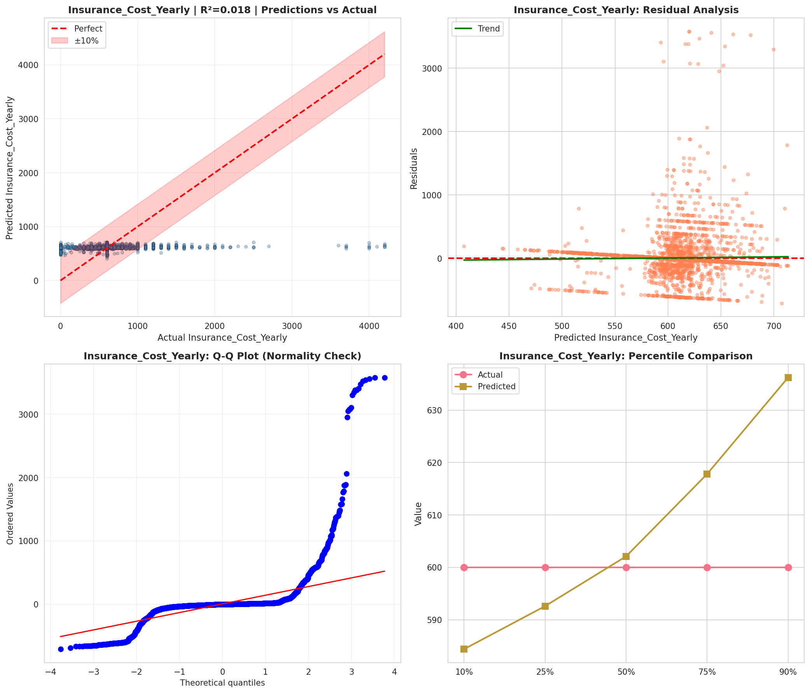
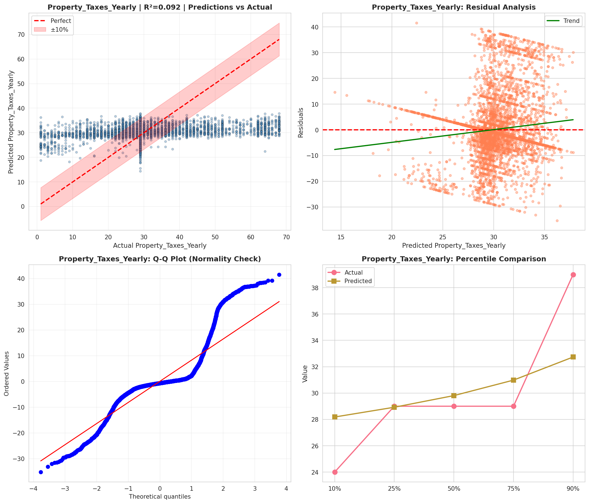
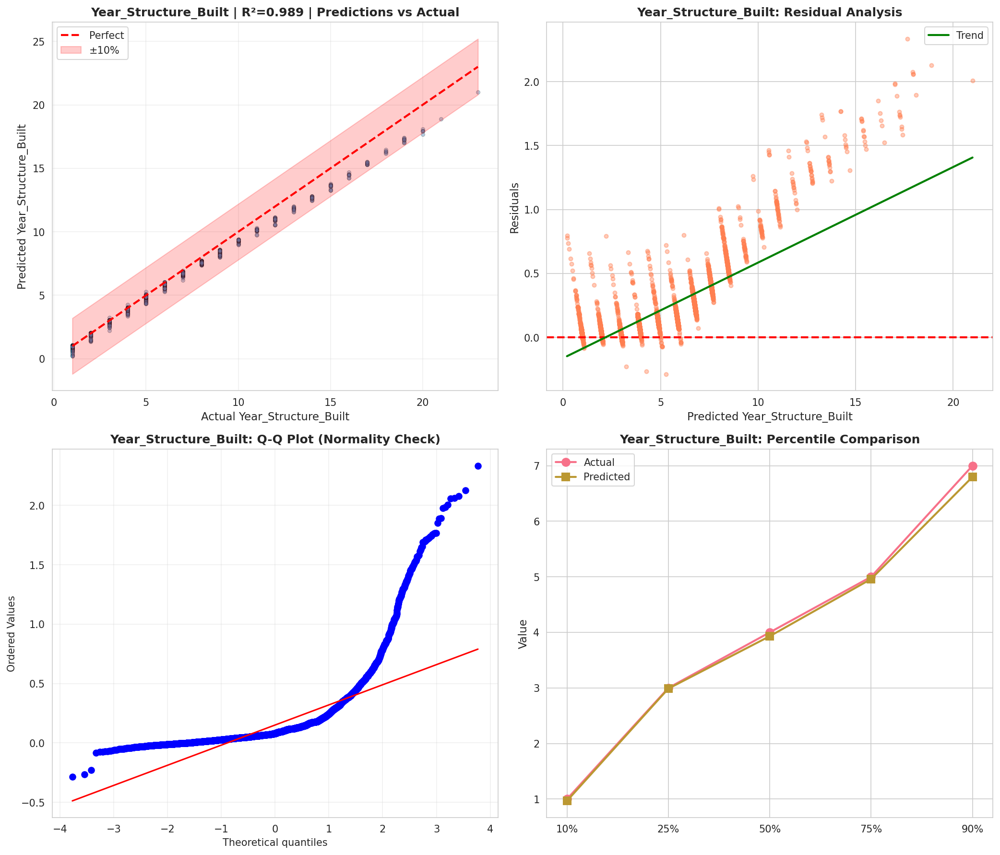
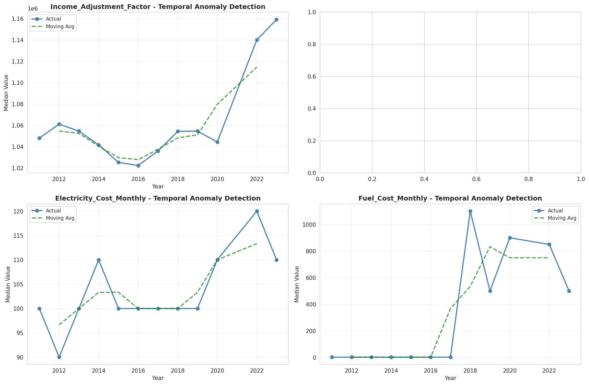
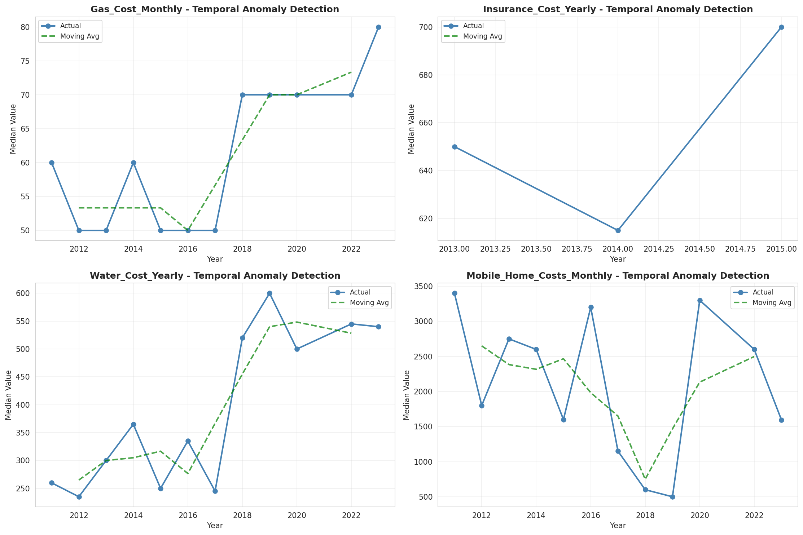
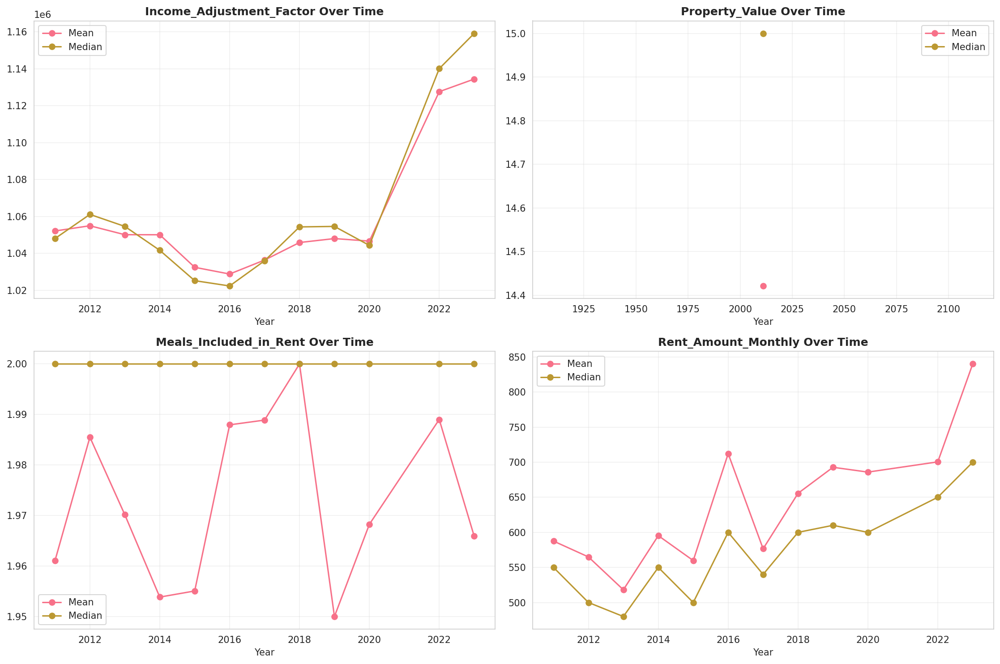
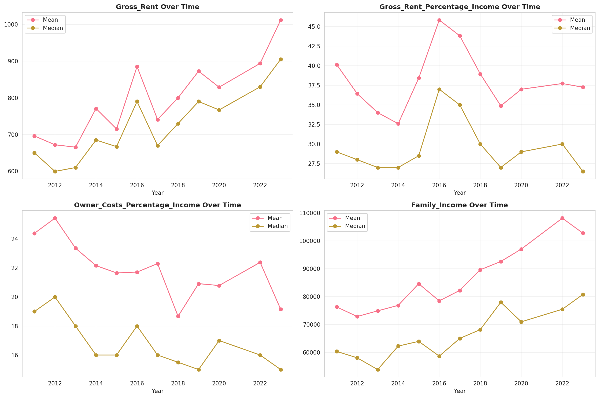
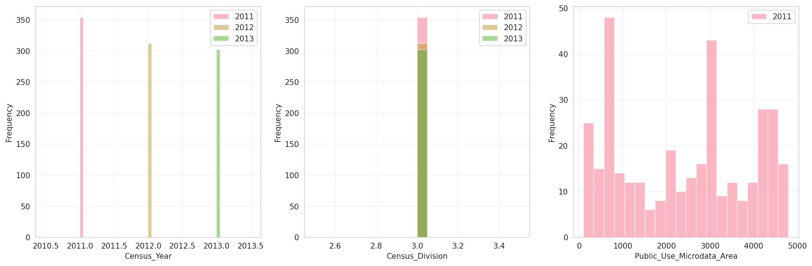
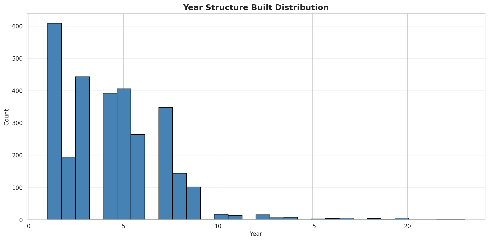
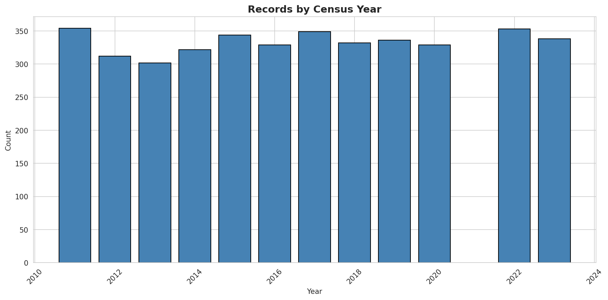
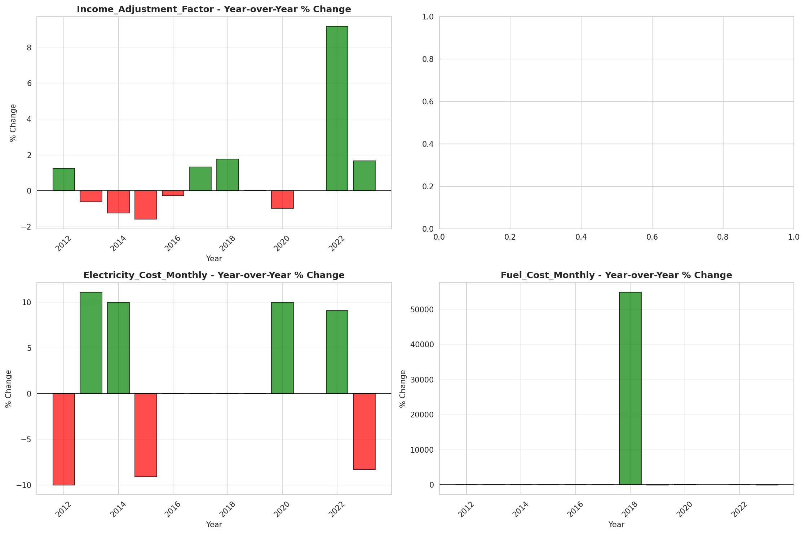
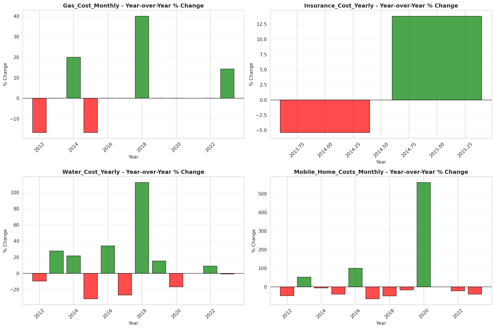
