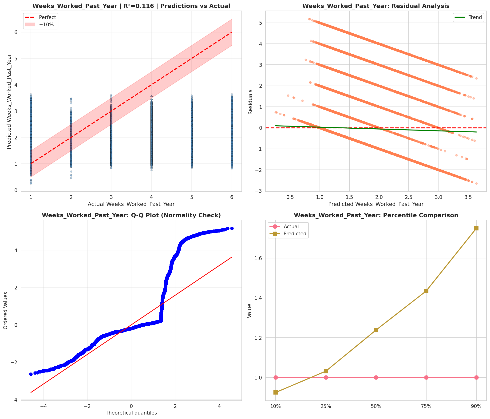
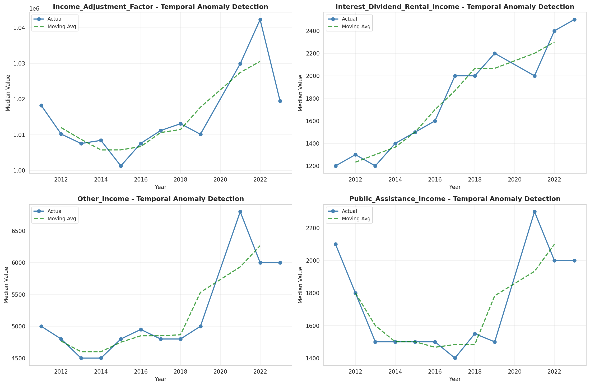
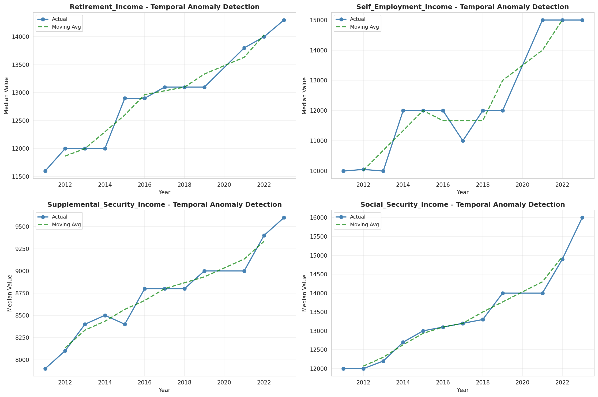
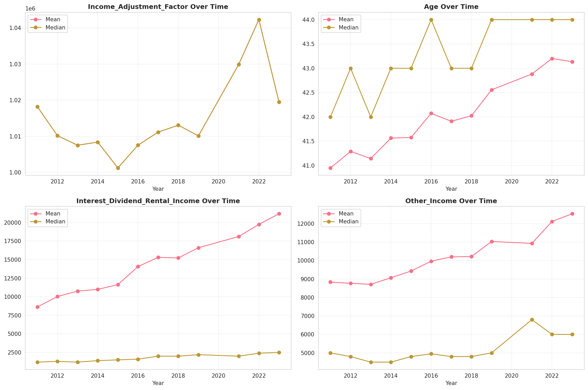
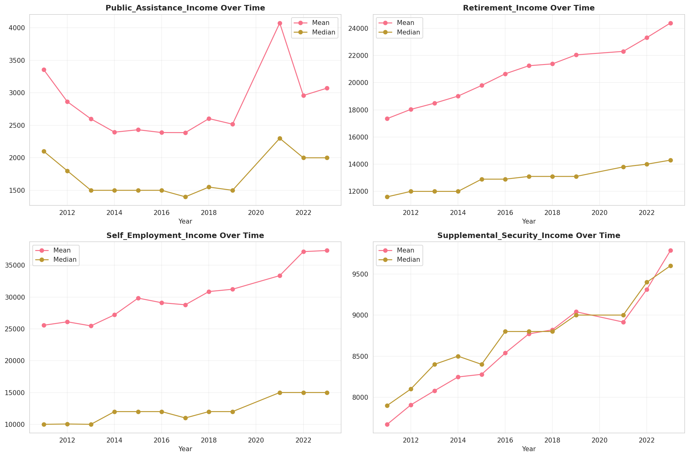
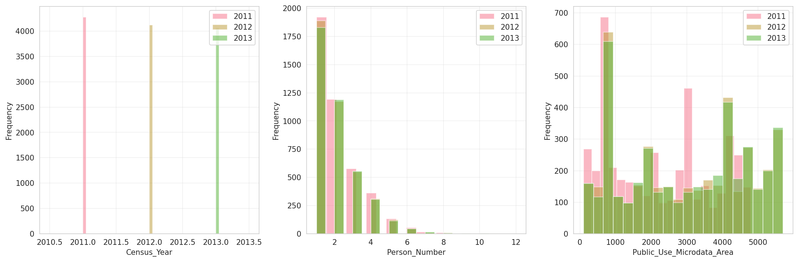
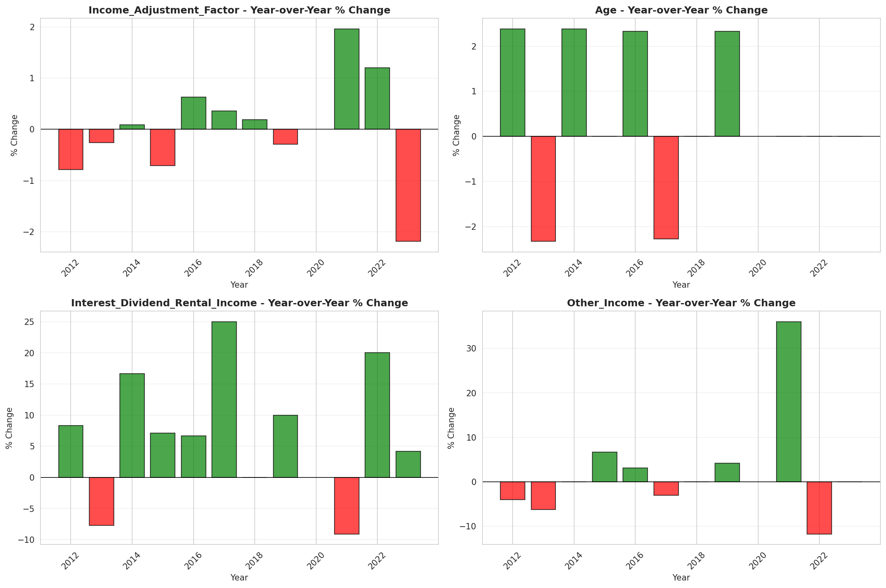
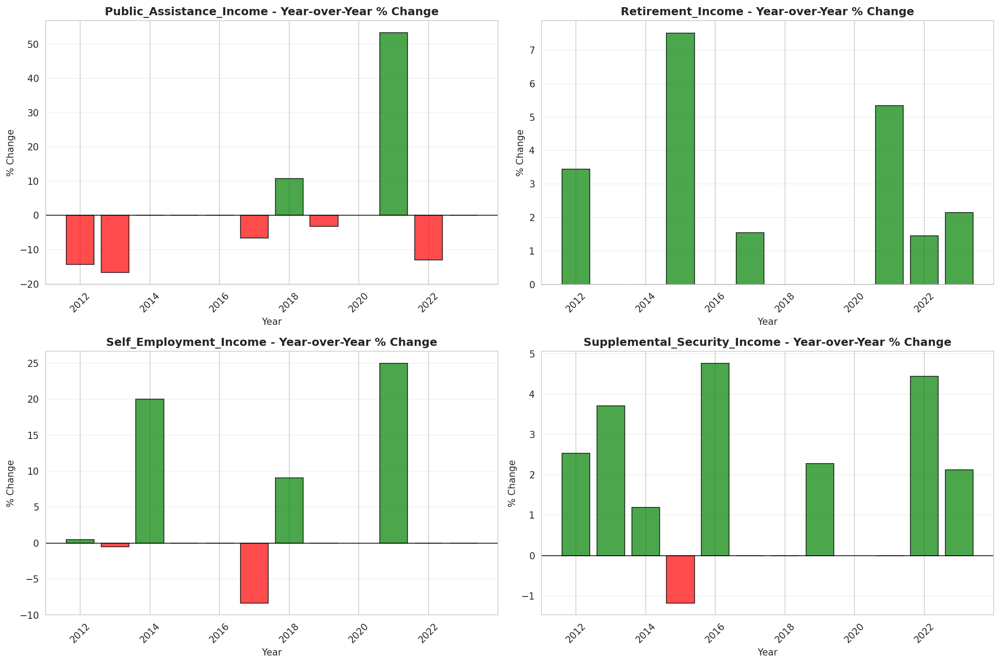

# Temporal Analysis

## Year Distribution

- 2011: 118,423 records

- 2012: 117,251 records

- 2013: 118,223 records

- 2014: 117,468 records

- 2015: 118,123 records

- 2016: 117,426 records

- 2017: 118,842 records

- 2018: 119,086 records

- 2019: 119,589 records

- 2021: 119,869 records

- 2022: 120,666 records

- 2023: 121,729 records

## Temporal Trends

- Census_Year: {np.int64(2011): {'mean': 2011.0, 'median': 2011.0, 'std': 0.0}, np.int64(2012): {'mean': 2012.0, 'median': 2012.0, 'std': 0.0}, np.int64(2013): {'mean': 2013.0, 'median': 2013.0, 'std': 0.0}, np.int64(2014): {'mean': 2014.0, 'median': 2014.0, 'std': 0.0}, np.int64(2015): {'mean': 2015.0, 'median': 2015.0, 'std': 0.0}, np.int64(2016): {'mean': 2016.0, 'median': 2016.0, 'std': 0.0}, np.int64(2017): {'mean': 2017.0, 'median': 2017.0, 'std': 0.0}, np.int64(2018): {'mean': 2018.0, 'median': 2018.0, 'std': 0.0}, np.int64(2019): {'mean': 2019.0, 'median': 2019.0, 'std': 0.0}, np.int64(2021): {'mean': 2021.0, 'median': 2021.0, 'std': 0.0}, np.int64(2022): {'mean': 2022.0, 'median': 2022.0, 'std': 0.0}, np.int64(2023): {'mean': 2023.0, 'median': 2023.0, 'std': 0.0}}

- Person_Number: {np.int64(2011): {'mean': 2.012430017817485, 'median': 2.0, 'std': 1.2676602124365965}, np.int64(2012): {'mean': 2.0080766901774827, 'median': 2.0, 'std': 1.2610326812719137}, np.int64(2013): {'mean': 2.0160713228390414, 'median': 2.0, 'std': 1.2692244991229908}, np.int64(2014): {'mean': 2.0049460278543942, 'median': 2.0, 'std': 1.2571439427977447}, np.int64(2015): {'mean': 2.0211813110063237, 'median': 2.0, 'std': 1.300484494624499}, np.int64(2016): {'mean': 2.0000851600156695, 'median': 2.0, 'std': 1.2653822517801847}, np.int64(2017): {'mean': 1.9990239141044412, 'median': 2.0, 'std': 1.2659825890204062}, np.int64(2018): {'mean': 2.0077171120030903, 'median': 2.0, 'std': 1.2781389065027196}, np.int64(2019): {'mean': 1.9943389442172774, 'median': 2.0, 'std': 1.2589286012622782}, np.int64(2021): {'mean': 1.9884290350299076, 'median': 2.0, 'std': 1.2619666165600512}, np.int64(2022): {'mean': 1.9896574014221073, 'median': 2.0, 'std': 1.2719903999829008}, np.int64(2023): {'mean': 2.000920076563514, 'median': 2.0, 'std': 1.2966387914740274}}

- Public_Use_Microdata_Area: {np.int64(2011): {'mean': 2238.929751821859, 'median': 2202.0, 'std': 1447.0119304857096}, np.int64(2012): {'mean': 2952.2303263938047, 'median': 3000.0, 'std': 1715.675763598099}, np.int64(2013): {'mean': 2956.3705624117133, 'median': 3000.0, 'std': 1713.6328791512187}, np.int64(2014): {'mean': 2965.5579902611776, 'median': 3000.0, 'std': 1717.3978940353304}, np.int64(2015): {'mean': 2963.11934170314, 'median': 3000.0, 'std': 1714.416192644729}, np.int64(2016): {'mean': 2963.0114114421, 'median': 3000.0, 'std': 1717.568073922018}, np.int64(2017): {'mean': 2976.0404654919976, 'median': 3100.0, 'std': 1713.9562839143491}, np.int64(2018): {'mean': 2974.523159733302, 'median': 3100.0, 'std': 1709.2499167984356}, np.int64(2019): {'mean': 2980.7554122870833, 'median': 3100.0, 'std': 1710.4857130850612}, np.int64(2021): {'mean': 2984.868022591329, 'median': 3100.0, 'std': 1697.5142543365318}, np.int64(2022): {'mean': 2335.8472063381564, 'median': 2500.0, 'std': 1416.7657280454814}, np.int64(2023): {'mean': 2341.720715688127, 'median': 2500.0, 'std': 1421.9534178702029}}

- State_Code: {np.int64(2011): {'mean': 39.0, 'median': 39.0, 'std': 0.0}, np.int64(2012): {'mean': 39.0, 'median': 39.0, 'std': 0.0}, np.int64(2013): {'mean': 39.0, 'median': 39.0, 'std': 0.0}, np.int64(2014): {'mean': 39.0, 'median': 39.0, 'std': 0.0}, np.int64(2015): {'mean': 39.0, 'median': 39.0, 'std': 0.0}, np.int64(2016): {'mean': 39.0, 'median': 39.0, 'std': 0.0}, np.int64(2017): {'mean': 39.0, 'median': 39.0, 'std': 0.0}, np.int64(2018): {'mean': 39.0, 'median': 39.0, 'std': 0.0}, np.int64(2019): {'mean': 39.0, 'median': 39.0, 'std': 0.0}, np.int64(2021): {'mean': 39.0, 'median': 39.0, 'std': 0.0}, np.int64(2022): {'mean': 39.0, 'median': 39.0, 'std': 0.0}, np.int64(2023): {'mean': None, 'median': None, 'std': None}}

- Income_Adjustment_Factor: {np.int64(2011): {'mean': 1018237.0, 'median': 1018237.0, 'std': 0.0}, np.int64(2012): {'mean': 1010207.0, 'median': 1010207.0, 'std': 0.0}, np.int64(2013): {'mean': 1007549.0, 'median': 1007549.0, 'std': 0.0}, np.int64(2014): {'mean': 1008425.0, 'median': 1008425.0, 'std': 0.0}, np.int64(2015): {'mean': 1001264.0, 'median': 1001264.0, 'std': 0.0}, np.int64(2016): {'mean': 1007588.0, 'median': 1007588.0, 'std': 0.0}, np.int64(2017): {'mean': 1011189.0, 'median': 1011189.0, 'std': 0.0}, np.int64(2018): {'mean': 1013097.0, 'median': 1013097.0, 'std': 0.0}, np.int64(2019): {'mean': 1010145.0, 'median': 1010145.0, 'std': 0.0}, np.int64(2021): {'mean': 1029928.0, 'median': 1029928.0, 'std': 0.0}, np.int64(2022): {'mean': 1042311.0, 'median': 1042311.0, 'std': 0.0}, np.int64(2023): {'mean': 1019518.0, 'median': 1019518.0, 'std': 0.0}}

- Person_Weight: {np.int64(2011): {'mean': 97.48909417934016, 'median': 78.0, 'std': 78.88761346240956}, np.int64(2012): {'mean': 98.45736923352466, 'median': 79.0, 'std': 75.53389522321469}, np.int64(2013): {'mean': 97.87273204029673, 'median': 78.0, 'std': 75.5414190348661}, np.int64(2014): {'mean': 98.70060782510981, 'median': 79.0, 'std': 74.93048084249338}, np.int64(2015): {'mean': 98.31635667905488, 'median': 79.0, 'std': 75.18475187680511}, np.int64(2016): {'mean': 98.90801866707544, 'median': 79.0, 'std': 76.24524360735823}, np.int64(2017): {'mean': 98.101756954612, 'median': 78.0, 'std': 75.99516833852357}, np.int64(2018): {'mean': 98.15966612364174, 'median': 78.0, 'std': 77.49190727464463}, np.int64(2019): {'mean': 97.74393966000217, 'median': 76.0, 'std': 83.38800389885706}, np.int64(2021): {'mean': 98.27409088254679, 'median': 75.0, 'std': 82.76544848310415}, np.int64(2022): {'mean': 97.42643329521158, 'median': 75.0, 'std': 83.03207258202397}, np.int64(2023): {'mean': 96.82109439821242, 'median': 74.0, 'std': 84.22830540424913}}

- Age: {np.int64(2011): {'mean': 40.94979015900628, 'median': 42.0, 'std': 23.744181036325415}, np.int64(2012): {'mean': 41.29072673154174, 'median': 43.0, 'std': 23.769249581077307}, np.int64(2013): {'mean': 41.14313627635909, 'median': 42.0, 'std': 23.656196947233113}, np.int64(2014): {'mean': 41.56385568835768, 'median': 43.0, 'std': 23.76405118280435}, np.int64(2015): {'mean': 41.57768597140269, 'median': 43.0, 'std': 23.837123950326205}, np.int64(2016): {'mean': 42.07329722548669, 'median': 44.0, 'std': 23.83701133701084}, np.int64(2017): {'mean': 41.9098635162653, 'median': 43.0, 'std': 23.878058590732632}, np.int64(2018): {'mean': 42.02326050081454, 'median': 43.0, 'std': 23.930150831312314}, np.int64(2019): {'mean': 42.55704119944142, 'median': 44.0, 'std': 23.999475997909183}, np.int64(2021): {'mean': 42.88199617916225, 'median': 44.0, 'std': 24.153469268791223}, np.int64(2022): {'mean': 43.20115856993685, 'median': 44.0, 'std': 24.210594206234227}, np.int64(2023): {'mean': 43.134815861462755, 'median': 44.0, 'std': 24.190842000485382}}

- Citizenship_Status: {np.int64(2011): {'mean': 1.1285983297163558, 'median': 1.0, 'std': 0.6467784834237796}, np.int64(2012): {'mean': 1.1202463091999215, 'median': 1.0, 'std': 0.6243095788192439}, np.int64(2013): {'mean': 1.1321654838736963, 'median': 1.0, 'std': 0.6542487548242106}, np.int64(2014): {'mean': 1.1332618244968842, 'median': 1.0, 'std': 0.658898153386212}, np.int64(2015): {'mean': 1.1376615900375033, 'median': 1.0, 'std': 0.6674523710484733}, np.int64(2016): {'mean': 1.1371587212372047, 'median': 1.0, 'std': 0.66364533928052}, np.int64(2017): {'mean': 1.143610844650881, 'median': 1.0, 'std': 0.6791203233453479}, np.int64(2018): {'mean': 1.140369144987656, 'median': 1.0, 'std': 0.6691618254038307}, np.int64(2019): {'mean': 1.137596267215212, 'median': 1.0, 'std': 0.6643712928995591}, np.int64(2021): {'mean': 1.1513151857444377, 'median': 1.0, 'std': 0.6939921930553832}, np.int64(2022): {'mean': 1.1548406344786435, 'median': 1.0, 'std': 0.6999710383777348}, np.int64(2023): {'mean': 1.1555422290497745, 'median': 1.0, 'std': 0.7061823480991554}}

- Class_of_Worker: {np.int64(2011): {'mean': 1.9879431399631675, 'median': 1.0, 'std': 1.8180311140102297}, np.int64(2012): {'mean': 1.985584879365909, 'median': 1.0, 'std': 1.8165909547926054}, np.int64(2013): {'mean': 1.9609589138369334, 'median': 1.0, 'std': 1.7931890147958318}, np.int64(2014): {'mean': 1.9487153782258757, 'median': 1.0, 'std': 1.7837848213438743}, np.int64(2015): {'mean': 1.9381925109381215, 'median': 1.0, 'std': 1.7636385254030933}, np.int64(2016): {'mean': 1.9334549548907545, 'median': 1.0, 'std': 1.7556154278219849}, np.int64(2017): {'mean': 1.923498804668823, 'median': 1.0, 'std': 1.7384565370016798}, np.int64(2018): {'mean': 1.914022962724125, 'median': 1.0, 'std': 1.7287441591614203}, np.int64(2019): {'mean': 1.9282836196765347, 'median': 1.0, 'std': 1.720515397513481}, np.int64(2021): {'mean': 1.9509208477690656, 'median': 1.0, 'std': 1.7413280620915388}, np.int64(2022): {'mean': 1.9476361625656622, 'median': 1.0, 'std': 1.720955940324075}, np.int64(2023): {'mean': 1.950047781569966, 'median': 1.0, 'std': 1.7298078058831665}}

- English_Speaking_Ability: {np.int64(2011): {'mean': 1.494475962974022, 'median': 1.0, 'std': 0.7703532765025376}, np.int64(2012): {'mean': 1.4977007970570202, 'median': 1.0, 'std': 0.7727306150247802}, np.int64(2013): {'mean': 1.5153834379305067, 'median': 1.0, 'std': 0.7955117480510254}, np.int64(2014): {'mean': 1.5116566311563995, 'median': 1.0, 'std': 0.7970732756305874}, np.int64(2015): {'mean': 1.5182634730538922, 'median': 1.0, 'std': 0.8001133936974072}, np.int64(2016): {'mean': 1.4964720012010209, 'median': 1.0, 'std': 0.7816559664290222}, np.int64(2017): {'mean': 1.456890409006698, 'median': 1.0, 'std': 0.7534800815446733}, np.int64(2018): {'mean': 1.4805612394036831, 'median': 1.0, 'std': 0.7692294058313147}, np.int64(2019): {'mean': 1.4806835066864785, 'median': 1.0, 'std': 0.7640290282779213}, np.int64(2021): {'mean': 1.4956784195362876, 'median': 1.0, 'std': 0.7936107605571797}, np.int64(2022): {'mean': 1.4818111455108358, 'median': 1.0, 'std': 0.7736663290049014}, np.int64(2023): {'mean': 1.5065558873166298, 'median': 1.0, 'std': 0.8079245049338544}}

- Fertility_Status: {np.int64(2011): {'mean': 1.9474391461260847, 'median': 2.0, 'std': 0.22315941055780564}, np.int64(2012): {'mean': 2.709911553563638, 'median': 2.0, 'std': 2.018303256886545}, np.int64(2013): {'mean': 1.949437983742367, 'median': 2.0, 'std': 0.21910583278703993}, np.int64(2014): {'mean': 1.9503294275456662, 'median': 2.0, 'std': 0.21726773586425796}, np.int64(2015): {'mean': 1.9482040087318913, 'median': 2.0, 'std': 0.22161930411402864}, np.int64(2016): {'mean': 1.9499694438785904, 'median': 2.0, 'std': 0.2180124675239504}, np.int64(2017): {'mean': 1.9464242908509788, 'median': 2.0, 'std': 0.22518298870540776}, np.int64(2018): {'mean': 1.9472394117174314, 'median': 2.0, 'std': 0.22355964958202323}, np.int64(2019): {'mean': 1.9469953147280505, 'median': 2.0, 'std': 0.2240473916865096}, np.int64(2021): {'mean': 1.9487870619946093, 'median': 2.0, 'std': 0.2204362889217782}, np.int64(2022): {'mean': 1.9487179487179487, 'median': 2.0, 'std': 0.22057694583135157}, np.int64(2023): {'mean': 1.948499399759904, 'median': 2.0, 'std': 0.22102091124292042}}

- Marital_Status: {np.int64(2011): {'mean': 2.9388801161936446, 'median': 3.0, 'std': 1.8363526618332227}, np.int64(2012): {'mean': 2.927915326948171, 'median': 3.0, 'std': 1.8343901233008284}, np.int64(2013): {'mean': 2.9449853243446706, 'median': 3.0, 'std': 1.8409554459889241}, np.int64(2014): {'mean': 2.9401198624306195, 'median': 3.0, 'std': 1.8385247296430782}, np.int64(2015): {'mean': 2.946962064966179, 'median': 3.0, 'std': 1.8392196770124025}, np.int64(2016): {'mean': 2.927281862619863, 'median': 3.0, 'std': 1.8402267260987788}, np.int64(2017): {'mean': 2.9456926002591675, 'median': 3.0, 'std': 1.840597638119965}, np.int64(2018): {'mean': 2.9542179601296543, 'median': 3.0, 'std': 1.8403564433986797}, np.int64(2019): {'mean': 2.930445107827643, 'median': 3.0, 'std': 1.8383138886027346}, np.int64(2021): {'mean': 2.938966705319974, 'median': 3.0, 'std': 1.8427101804202113}, np.int64(2022): {'mean': 2.917930485803789, 'median': 3.0, 'std': 1.8420410868624602}, np.int64(2023): {'mean': 2.927921859211856, 'median': 3.0, 'std': 1.840592078508178}}

- Mobility_Status: {np.int64(2011): {'mean': 1.2602891627926813, 'median': 1.0, 'std': 0.6707757354916258}, np.int64(2012): {'mean': 1.2594303044924264, 'median': 1.0, 'std': 0.6698377562947652}, np.int64(2013): {'mean': 1.2666626795280367, 'median': 1.0, 'std': 0.6774443933479591}, np.int64(2014): {'mean': 1.2678545335774392, 'median': 1.0, 'std': 0.6787937382171962}, np.int64(2015): {'mean': 1.2764028801587166, 'median': 1.0, 'std': 0.6877058435285354}, np.int64(2016): {'mean': 1.26758892261132, 'median': 1.0, 'std': 0.6782276103844792}, np.int64(2017): {'mean': 1.2643156454258782, 'median': 1.0, 'std': 0.6747562647209788}, np.int64(2018): {'mean': 1.264391021834654, 'median': 1.0, 'std': 0.6753399036830986}, np.int64(2019): {'mean': 1.2594831443599246, 'median': 1.0, 'std': 0.6696431466261171}, np.int64(2021): {'mean': 1.2221445829790458, 'median': 1.0, 'std': 0.6261577036121451}, np.int64(2022): {'mean': 1.216646318007727, 'median': 1.0, 'std': 0.6187403442848696}, np.int64(2023): {'mean': 1.2062828961001284, 'median': 1.0, 'std': 0.6050035447728018}}

- Military_Service: {np.int64(2011): {'mean': 4.777145451473942, 'median': 5.0, 'std': 0.6279050511355603}, np.int64(2012): {'mean': 4.782672602943996, 'median': 5.0, 'std': 0.6211178781430768}, np.int64(2013): {'mean': 3.797451424358907, 'median': 4.0, 'std': 0.5930080281402138}, np.int64(2014): {'mean': 3.8023405648619533, 'median': 4.0, 'std': 0.5871640975026138}, np.int64(2015): {'mean': 3.805526650479824, 'median': 4.0, 'std': 0.5824543096607462}, np.int64(2016): {'mean': 3.8090082514321755, 'median': 4.0, 'std': 0.5775536592595857}, np.int64(2017): {'mean': 3.8149853451680626, 'median': 4.0, 'std': 0.5686303227088901}, np.int64(2018): {'mean': 3.826438224038332, 'median': 4.0, 'std': 0.5529469209980387}, np.int64(2019): {'mean': 3.8268403601162064, 'median': 4.0, 'std': 0.5522725417014812}, np.int64(2021): {'mean': 3.8367246824123376, 'median': 4.0, 'std': 0.5378534777545737}, np.int64(2022): {'mean': 3.8427481379533677, 'median': 4.0, 'std': 0.5291240922226805}, np.int64(2023): {'mean': 3.845992492824023, 'median': 4.0, 'std': 0.5246682788372832}}

- Travel_Time_To_Work_Minutes: {np.int64(2011): {'mean': 23.353494843673268, 'median': 20.0, 'std': 20.105152673513917}, np.int64(2012): {'mean': 23.47026465374977, 'median': 20.0, 'std': 21.151473049809283}, np.int64(2013): {'mean': 23.46204913027205, 'median': 20.0, 'std': 19.76945928401583}, np.int64(2014): {'mean': 23.31500443918319, 'median': 20.0, 'std': 19.098911507887767}, np.int64(2015): {'mean': 23.64302296092546, 'median': 20.0, 'std': 19.821183978723713}, np.int64(2016): {'mean': 23.669596056041623, 'median': 20.0, 'std': 19.556532452050813}, np.int64(2017): {'mean': 23.87104758250192, 'median': 20.0, 'std': 20.53410111304914}, np.int64(2018): {'mean': 23.925607576160957, 'median': 20.0, 'std': 20.268163685847448}, np.int64(2019): {'mean': 24.6804396843292, 'median': 20.0, 'std': 21.73608687561104}, np.int64(2021): {'mean': 23.145884769166905, 'median': 20.0, 'std': 19.797160601826636}, np.int64(2022): {'mean': 23.862445459997105, 'median': 20.0, 'std': 20.467580546072863}, np.int64(2023): {'mean': 23.90805243821646, 'median': 20.0, 'std': 20.55980004863606}}

- Vehicle_Occupancy: {np.int64(2011): {'mean': 1.1382420536837083, 'median': 1.0, 'std': 0.6070952283145801}, np.int64(2012): {'mean': 1.1350884764782045, 'median': 1.0, 'std': 0.561355511122339}, np.int64(2013): {'mean': 1.1282776991592443, 'median': 1.0, 'std': 0.559935010632921}, np.int64(2014): {'mean': 1.129993949888386, 'median': 1.0, 'std': 0.5625189769948903}, np.int64(2015): {'mean': 1.1290429315907022, 'median': 1.0, 'std': 0.5762466689624451}, np.int64(2016): {'mean': 1.1236932720262274, 'median': 1.0, 'std': 0.5419619096163498}, np.int64(2017): {'mean': 1.1308836006625995, 'median': 1.0, 'std': 0.5766618078699922}, np.int64(2018): {'mean': 1.1336294390738992, 'median': 1.0, 'std': 0.5650913901259004}, np.int64(2019): {'mean': 1.1309377356244295, 'median': 1.0, 'std': 0.5764205823799377}, np.int64(2021): {'mean': 1.135427453687723, 'median': 1.0, 'std': 0.5913572114012139}, np.int64(2022): {'mean': 1.1290997450258242, 'median': 1.0, 'std': 0.5256198950164607}, np.int64(2023): {'mean': 1.1408292548570944, 'median': 1.0, 'std': 0.5796254612275867}}

- Transportation_To_Work: {np.int64(2011): {'mean': 1.7224414108735107, 'median': 1.0, 'std': 2.505226237790717}, np.int64(2012): {'mean': 1.7158608490566039, 'median': 1.0, 'std': 2.493274825136392}, np.int64(2013): {'mean': 1.7038078055265407, 'median': 1.0, 'std': 2.4758820181244205}, np.int64(2014): {'mean': 1.724434569589244, 'median': 1.0, 'std': 2.5114658638796183}, np.int64(2015): {'mean': 1.7393990610328638, 'median': 1.0, 'std': 2.537556696890386}, np.int64(2016): {'mean': 1.7905688873972143, 'median': 1.0, 'std': 2.6213514986963204}, np.int64(2017): {'mean': 1.758415514296733, 'median': 1.0, 'std': 2.5739805111885614}, np.int64(2018): {'mean': 1.7897434965187515, 'median': 1.0, 'std': 2.6224872086262705}, np.int64(2019): {'mean': None, 'median': None, 'std': None}, np.int64(2021): {'mean': None, 'median': None, 'std': None}, np.int64(2022): {'mean': None, 'median': None, 'std': None}, np.int64(2023): {'mean': None, 'median': None, 'std': None}}

- Language_Other_Than_English: {np.int64(2011): {'mean': 1.9401477986578382, 'median': 2.0, 'std': 0.23721386586717458}, np.int64(2012): {'mean': 1.9412649110961062, 'median': 2.0, 'std': 0.2351292750150284}, np.int64(2013): {'mean': 1.941758045823304, 'median': 2.0, 'std': 0.23420144735491297}, np.int64(2014): {'mean': 1.9418842530282638, 'median': 2.0, 'std': 0.2339632408666498}, np.int64(2015): {'mean': 1.940369920731272, 'median': 2.0, 'std': 0.236801253113294}, np.int64(2016): {'mean': 1.940284725584064, 'median': 2.0, 'std': 0.23695962482228208}, np.int64(2017): {'mean': 1.9378035809253678, 'median': 2.0, 'std': 0.24151302559956683}, np.int64(2018): {'mean': 1.9394331037657349, 'median': 2.0, 'std': 0.23853521961711957}, np.int64(2019): {'mean': 1.9407867531256324, 'median': 2.0, 'std': 0.23602442332564746}, np.int64(2021): {'mean': 1.9360793461484496, 'median': 2.0, 'std': 0.2446126092145559}, np.int64(2022): {'mean': 1.932442678239954, 'median': 2.0, 'std': 0.25098581437458667}, np.int64(2023): {'mean': 1.9335478527924912, 'median': 2.0, 'std': 0.24907186616976473}}

- Grandparents_Living_With_Grandchildren: {np.int64(2011): {'mean': 1.969564302805606, 'median': 2.0, 'std': 0.1717840315640935}, np.int64(2012): {'mean': 1.9711216995287861, 'median': 2.0, 'std': 0.1674655587539653}, np.int64(2013): {'mean': 1.971437201239691, 'median': 2.0, 'std': 0.16657529731065965}, np.int64(2014): {'mean': 1.9691399330840387, 'median': 2.0, 'std': 0.17293962993950154}, np.int64(2015): {'mean': 1.9709458929365307, 'median': 2.0, 'std': 0.16795932482252998}, np.int64(2016): {'mean': 1.9729806893687707, 'median': 2.0, 'std': 0.16214070636210967}, np.int64(2017): {'mean': 1.9719605667243025, 'median': 2.0, 'std': 0.16508656857959028}, np.int64(2018): {'mean': 1.9719216633683723, 'median': 2.0, 'std': 0.1651977431367715}, np.int64(2019): {'mean': 1.9722067322315726, 'median': 2.0, 'std': 0.1643810952972766}, np.int64(2021): {'mean': 1.9752890700688233, 'median': 2.0, 'std': 0.15524368942231698}, np.int64(2022): {'mean': 1.9751823551994452, 'median': 2.0, 'std': 0.15557001326203454}, np.int64(2023): {'mean': 1.9759074610737266, 'median': 2.0, 'std': 0.15333746188231998}}

- Months_Responsible_For_Grandchildren: {np.int64(2011): {'mean': 3.6129032258064515, 'median': 4.0, 'std': 1.356301636572793}, np.int64(2012): {'mean': 3.661682242990654, 'median': 4.0, 'std': 1.3539012583510166}, np.int64(2013): {'mean': 3.710393541876892, 'median': 4.0, 'std': 1.3743255265944678}, np.int64(2014): {'mean': 3.813775510204082, 'median': 4.0, 'std': 1.3343950216546678}, np.int64(2015): {'mean': 3.677005347593583, 'median': 4.0, 'std': 1.3619388870618558}, np.int64(2016): {'mean': 3.7236286919831225, 'median': 4.0, 'std': 1.3109846679815764}, np.int64(2017): {'mean': 3.8669354838709675, 'median': 4.0, 'std': 1.3114551903583382}, np.int64(2018): {'mean': 3.8645294725956565, 'median': 4.0, 'std': 1.3176824818958748}, np.int64(2019): {'mean': 3.917610710607621, 'median': 4.0, 'std': 1.310311545880065}, np.int64(2021): {'mean': 4.103248259860789, 'median': 5.0, 'std': 1.1853788433132546}, np.int64(2022): {'mean': 4.050410316529894, 'median': 5.0, 'std': 1.2299244014656645}, np.int64(2023): {'mean': 4.025575447570333, 'median': 5.0, 'std': 1.2928883044547566}}

- Grandparents_Responsible_For_Grandchildren: {np.int64(2011): {'mean': 1.5045356371490282, 'median': 2.0, 'std': 0.50008744948739}, np.int64(2012): {'mean': 1.512306289881495, 'median': 2.0, 'std': 0.4999624838516359}, np.int64(2013): {'mean': 1.544367816091954, 'median': 2.0, 'std': 0.49814213515843553}, np.int64(2014): {'mean': 1.5, 'median': 1.5, 'std': 0.5001063264233178}, np.int64(2015): {'mean': 1.5792079207920793, 'median': 2.0, 'std': 0.49379736976474414}, np.int64(2016): {'mean': 1.5446685878962536, 'median': 2.0, 'std': 0.4981203599497489}, np.int64(2017): {'mean': 1.54348826507133, 'median': 2.0, 'std': 0.4982198323617241}, np.int64(2018): {'mean': 1.557437070938215, 'median': 2.0, 'std': 0.4968037250338751}, np.int64(2019): {'mean': 1.5572275421796626, 'median': 2.0, 'std': 0.49682750069361276}, np.int64(2021): {'mean': 1.5610997963340123, 'median': 2.0, 'std': 0.4963791587085045}, np.int64(2022): {'mean': 1.5743512974051896, 'median': 2.0, 'std': 0.49456439159846305}, np.int64(2023): {'mean': 1.601427115188583, 'median': 2.0, 'std': 0.489729292827867}}

- Interest_Dividend_Rental_Income: {np.int64(2011): {'mean': 8617.090929930466, 'median': 1200.0, 'std': 23828.483888911724}, np.int64(2012): {'mean': 10037.267011602384, 'median': 1300.0, 'std': 28582.06868533573}, np.int64(2013): {'mean': 10759.588365569172, 'median': 1200.0, 'std': 31807.07206219448}, np.int64(2014): {'mean': 10994.44575435352, 'median': 1400.0, 'std': 30319.346432585284}, np.int64(2015): {'mean': 11634.857838290105, 'median': 1500.0, 'std': 31598.818441885935}, np.int64(2016): {'mean': 14069.772210938088, 'median': 1600.0, 'std': 42918.54596593576}, np.int64(2017): {'mean': 15306.481511125341, 'median': 2000.0, 'std': 44125.66589880705}, np.int64(2018): {'mean': 15230.191873589165, 'median': 2000.0, 'std': 41728.9500190005}, np.int64(2019): {'mean': 16602.706050500237, 'median': 2200.0, 'std': 47672.59751152876}, np.int64(2021): {'mean': 18114.014399859512, 'median': 2000.0, 'std': 52418.171369755}, np.int64(2022): {'mean': 19746.114008271892, 'median': 2400.0, 'std': 53272.07199752421}, np.int64(2023): {'mean': 21173.40421838382, 'median': 2500.0, 'std': 61429.23490316937}}

- Military_Service_Period_1: {np.int64(2011): {'mean': 0.06972253277772131, 'median': 0.0, 'std': 0.2546917629929538}, np.int64(2012): {'mean': 0.08260549300220983, 'median': 0.0, 'std': 0.27529947490563017}, np.int64(2013): {'mean': 0.09216018048505357, 'median': 0.0, 'std': 0.2892682501566738}, np.int64(2014): {'mean': 0.09585880724420348, 'median': 0.0, 'std': 0.29441449548602755}, np.int64(2015): {'mean': 0.11629266012155212, 'median': 0.0, 'std': 0.3205942763474964}, np.int64(2016): {'mean': 0.11970402195966105, 'median': 0.0, 'std': 0.324634481635579}, np.int64(2017): {'mean': 0.12743775297436527, 'median': 0.0, 'std': 0.33348315188804345}, np.int64(2018): {'mean': 0.14335800545383717, 'median': 0.0, 'std': 0.3504603210359838}, np.int64(2019): {'mean': 0.14535335231685217, 'median': 0.0, 'std': 0.3524795544297944}, np.int64(2021): {'mean': 0.16970527758738863, 'median': 0.0, 'std': 0.3753994064103745}, np.int64(2022): {'mean': 0.17996315714893013, 'median': 0.0, 'std': 0.38418398488656297}, np.int64(2023): {'mean': 0.20823209947120194, 'median': 0.0, 'std': 0.4060727259468777}}

- Military_Service_Period_2: {np.int64(2011): {'mean': 0.11606870616932616, 'median': 0.0, 'std': 0.32032357115471144}, np.int64(2012): {'mean': 0.13016942018310007, 'median': 0.0, 'std': 0.3365074414938721}, np.int64(2013): {'mean': 0.13344613649182177, 'median': 0.0, 'std': 0.34007544895271435}, np.int64(2014): {'mean': 0.14257699850040373, 'median': 0.0, 'std': 0.34966112374668573}, np.int64(2015): {'mean': 0.15018700327255727, 'median': 0.0, 'std': 0.3572755045940129}, np.int64(2016): {'mean': 0.14882444205752476, 'median': 0.0, 'std': 0.3559365779849781}, np.int64(2017): {'mean': 0.1578560039249356, 'median': 0.0, 'std': 0.3646282947001685}, np.int64(2018): {'mean': 0.16932865861576418, 'median': 0.0, 'std': 0.3750663022192147}, np.int64(2019): {'mean': 0.16554491327983434, 'median': 0.0, 'std': 0.37169567813079557}, np.int64(2021): {'mean': 0.18122001370801918, 'median': 0.0, 'std': 0.38522676827288055}, np.int64(2022): {'mean': 0.19484200085021963, 'median': 0.0, 'std': 0.39610709273623285}, np.int64(2023): {'mean': 0.1912248106331285, 'median': 0.0, 'std': 0.3932937693976461}}

- Military_Service_Period_3: {np.int64(2011): {'mean': 0.15784124402886474, 'median': 0.0, 'std': 0.36461061056860705}, np.int64(2012): {'mean': 0.17468167946964117, 'median': 0.0, 'std': 0.37971458058790725}, np.int64(2013): {'mean': None, 'median': None, 'std': None}, np.int64(2014): {'mean': None, 'median': None, 'std': None}, np.int64(2015): {'mean': None, 'median': None, 'std': None}, np.int64(2016): {'mean': None, 'median': None, 'std': None}, np.int64(2017): {'mean': None, 'median': None, 'std': None}, np.int64(2018): {'mean': None, 'median': None, 'std': None}, np.int64(2019): {'mean': None, 'median': None, 'std': None}, np.int64(2021): {'mean': None, 'median': None, 'std': None}, np.int64(2022): {'mean': None, 'median': None, 'std': None}, np.int64(2023): {'mean': None, 'median': None, 'std': None}}

- Military_Service_Period_4: {np.int64(2011): {'mean': 0.10915743469864823, 'median': 0.0, 'std': 0.31185248673660243}, np.int64(2012): {'mean': 0.11480585078396296, 'median': 0.0, 'std': 0.3188042700086397}, np.int64(2013): {'mean': None, 'median': None, 'std': None}, np.int64(2014): {'mean': None, 'median': None, 'std': None}, np.int64(2015): {'mean': None, 'median': None, 'std': None}, np.int64(2016): {'mean': None, 'median': None, 'std': None}, np.int64(2017): {'mean': None, 'median': None, 'std': None}, np.int64(2018): {'mean': None, 'median': None, 'std': None}, np.int64(2019): {'mean': None, 'median': None, 'std': None}, np.int64(2021): {'mean': None, 'median': None, 'std': None}, np.int64(2022): {'mean': None, 'median': None, 'std': None}, np.int64(2023): {'mean': None, 'median': None, 'std': None}}

- Military_Service_Period_5: {np.int64(2011): {'mean': 0.3588779347494664, 'median': 0.0, 'std': 0.47969568481533764}, np.int64(2012): {'mean': 0.3583079027675471, 'median': 0.0, 'std': 0.4795284631234498}, np.int64(2013): {'mean': 0.37687535250987025, 'median': 0.0, 'std': 0.48463059632979866}, np.int64(2014): {'mean': 0.3815895720382974, 'median': 0.0, 'std': 0.4858046878163598}, np.int64(2015): {'mean': 0.37844787283777465, 'median': 0.0, 'std': 0.48502842804142043}, np.int64(2016): {'mean': 0.3902613677049767, 'median': 0.0, 'std': 0.487837919021989}, np.int64(2017): {'mean': 0.3916349809885932, 'median': 0.0, 'std': 0.4881457256526389}, np.int64(2018): {'mean': 0.3912478898844306, 'median': 0.0, 'std': 0.4880613794401952}, np.int64(2019): {'mean': 0.3930882733626715, 'median': 0.0, 'std': 0.488467773287182}, np.int64(2021): {'mean': 0.3946538725154215, 'median': 0.0, 'std': 0.4888097244044432}, np.int64(2022): {'mean': 0.401161966841434, 'median': 0.0, 'std': 0.4901684297779754}, np.int64(2023): {'mean': 0.38159211090467343, 'median': 0.0, 'std': 0.48581200318851897}}

- Military_Service_Period_6: {np.int64(2011): {'mean': 0.09563980079276349, 'median': 0.0, 'std': 0.2941115791764972}, np.int64(2012): {'mean': 0.09607492370830265, 'median': 0.0, 'std': 0.2947094710870035}, np.int64(2013): {'mean': None, 'median': None, 'std': None}, np.int64(2014): {'mean': None, 'median': None, 'std': None}, np.int64(2015): {'mean': None, 'median': None, 'std': None}, np.int64(2016): {'mean': None, 'median': None, 'std': None}, np.int64(2017): {'mean': None, 'median': None, 'std': None}, np.int64(2018): {'mean': None, 'median': None, 'std': None}, np.int64(2019): {'mean': None, 'median': None, 'std': None}, np.int64(2021): {'mean': None, 'median': None, 'std': None}, np.int64(2022): {'mean': None, 'median': None, 'std': None}, np.int64(2023): {'mean': None, 'median': None, 'std': None}}

- Military_Service_Period_7: {np.int64(2011): {'mean': 0.11911779652403699, 'median': 0.0, 'std': 0.32394353324872605}, np.int64(2012): {'mean': 0.11154372303483111, 'median': 0.0, 'std': 0.31482082277186746}, np.int64(2013): {'mean': None, 'median': None, 'std': None}, np.int64(2014): {'mean': None, 'median': None, 'std': None}, np.int64(2015): {'mean': None, 'median': None, 'std': None}, np.int64(2016): {'mean': None, 'median': None, 'std': None}, np.int64(2017): {'mean': None, 'median': None, 'std': None}, np.int64(2018): {'mean': None, 'median': None, 'std': None}, np.int64(2019): {'mean': None, 'median': None, 'std': None}, np.int64(2021): {'mean': None, 'median': None, 'std': None}, np.int64(2022): {'mean': None, 'median': None, 'std': None}, np.int64(2023): {'mean': None, 'median': None, 'std': None}}

- Military_Service_Period_8: {np.int64(2011): {'mean': 0.12755361317207034, 'median': 0.0, 'std': 0.333609053468144}, np.int64(2012): {'mean': 0.11627906976744186, 'median': 0.0, 'std': 0.3205761408501907}, np.int64(2013): {'mean': 0.11663846587704456, 'median': 0.0, 'std': 0.32100709964003443}, np.int64(2014): {'mean': 0.10762487022724651, 'median': 0.0, 'std': 0.30992392223326026}, np.int64(2015): {'mean': 0.10624123422159888, 'median': 0.0, 'std': 0.3081641342156778}, np.int64(2016): {'mean': 0.09392528941401122, 'median': 0.0, 'std': 0.29174215906414414}, np.int64(2017): {'mean': 0.09125475285171103, 'median': 0.0, 'std': 0.2879887073636396}, np.int64(2018): {'mean': 0.07674328009349435, 'median': 0.0, 'std': 0.26620095950160844}, np.int64(2019): {'mean': 0.0717059280352058, 'median': 0.0, 'std': 0.25801706269774266}, np.int64(2021): {'mean': 0.06552433173406443, 'median': 0.0, 'std': 0.2474657317251667}, np.int64(2022): {'mean': 0.043928014737140426, 'median': 0.0, 'std': 0.2049494972052604}, np.int64(2023): {'mean': 0.03701586394168929, 'median': 0.0, 'std': 0.18881415442505772}}

- Military_Service_Period_9: {np.int64(2011): {'mean': 0.02134363248297591, 'median': 0.0, 'std': 0.14453444239868005}, np.int64(2012): {'mean': 0.017152478164790066, 'median': 0.0, 'std': 0.12984623536664686}, np.int64(2013): {'mean': 0.01601804850535815, 'median': 0.0, 'std': 0.12555177725419758}, np.int64(2014): {'mean': 0.015342023301418848, 'median': 0.0, 'std': 0.1229161845682187}, np.int64(2015): {'mean': 0.013440860215053764, 'median': 0.0, 'std': 0.11515968689735469}, np.int64(2016): {'mean': 0.013247404224847834, 'median': 0.0, 'std': 0.11433927921928237}, np.int64(2017): {'mean': 0.01152949834416779, 'median': 0.0, 'std': 0.10676126179966203}, np.int64(2018): {'mean': 0.008700168809245552, 'median': 0.0, 'std': 0.09287408644900756}, np.int64(2019): {'mean': 0.009578048149106911, 'median': 0.0, 'std': 0.09740398936359754}, np.int64(2021): {'mean': None, 'median': None, 'std': None}, np.int64(2022): {'mean': None, 'median': None, 'std': None}, np.int64(2023): {'mean': None, 'median': None, 'std': None}}

- Military_Service_Period_10: {np.int64(2011): {'mean': 0.10194125419249923, 'median': 0.0, 'std': 0.3025864183362989}, np.int64(2012): {'mean': 0.09091865726612648, 'median': 0.0, 'std': 0.2875085276200118}, np.int64(2013): {'mean': 0.07704455724760294, 'median': 0.0, 'std': 0.2666771749442925}, np.int64(2014): {'mean': 0.07232668127811744, 'median': 0.0, 'std': 0.25904299460660124}, np.int64(2015): {'mean': 0.05423094904160823, 'median': 0.0, 'std': 0.22648608903541276}, np.int64(2016): {'mean': 0.04917054541114692, 'median': 0.0, 'std': 0.2162368685039231}, np.int64(2017): {'mean': 0.04145713234392248, 'median': 0.0, 'std': 0.19935725020055403}, np.int64(2018): {'mean': 0.027269185820023373, 'median': 0.0, 'std': 0.16287732256182377}, np.int64(2019): {'mean': 0.029122443696608852, 'median': 0.0, 'std': 0.16816059906172354}, np.int64(2021): {'mean': 0.014530500342700479, 'median': 0.0, 'std': 0.11967175135716794}, np.int64(2022): {'mean': 0.008643899674082472, 'median': 0.0, 'std': 0.09257643936679265}, np.int64(2023): {'mean': 0.010433042732599686, 'median': 0.0, 'std': 0.10161530435972768}}

- Military_Service_Period_11: {np.int64(2011): {'mean': 0.0025409086289257038, 'median': 0.0, 'std': 0.05034590381479654}, np.int64(2012): {'mean': 0.003893507313479954, 'median': 0.0, 'std': 0.06227966020700516}, np.int64(2013): {'mean': 0.0025944726452340667, 'median': 0.0, 'std': 0.05087271660976229}, np.int64(2014): {'mean': 0.002191717614488407, 'median': 0.0, 'std': 0.046767149643753066}, np.int64(2015): {'mean': 0.0015194015895278168, 'median': 0.0, 'std': 0.03895215452850036}, np.int64(2016): {'mean': 0.0014321518080916578, 'median': 0.0, 'std': 0.03781892973688457}, np.int64(2017): {'mean': 0.0004906169508156506, 'median': 0.0, 'std': 0.02214579869695375}, np.int64(2018): {'mean': 0.001168679392286716, 'median': 0.0, 'std': 0.03416818959106693}, np.int64(2019): {'mean': 0.0, 'median': 0.0, 'std': 0.0}, np.int64(2021): {'mean': None, 'median': None, 'std': None}, np.int64(2022): {'mean': None, 'median': None, 'std': None}, np.int64(2023): {'mean': None, 'median': None, 'std': None}}

- Temporary_Absence_From_Work: {np.int64(2011): {'mean': 2.5046291966707193, 'median': 3.0, 'std': 0.5344562640676219}, np.int64(2012): {'mean': 2.514893929230253, 'median': 3.0, 'std': 0.5304053512773019}, np.int64(2013): {'mean': 2.579755682760909, 'median': 3.0, 'std': 0.5184187131136725}, np.int64(2014): {'mean': 2.577800883805563, 'median': 3.0, 'std': 0.5189206586935702}, np.int64(2015): {'mean': 2.5818701046074892, 'median': 3.0, 'std': 0.5191523880406309}, np.int64(2016): {'mean': 2.5877641409855743, 'median': 3.0, 'std': 0.5174325154669702}, np.int64(2017): {'mean': 2.5929261503193057, 'median': 3.0, 'std': 0.5152665244253894}, np.int64(2018): {'mean': 2.594806547467094, 'median': 3.0, 'std': 0.5167126075682639}, np.int64(2019): {'mean': 2.6027569175960976, 'median': 3.0, 'std': 0.5120501189157489}, np.int64(2021): {'mean': 2.587152452594584, 'median': 3.0, 'std': 0.5156850686207564}, np.int64(2022): {'mean': 2.5925744943954685, 'median': 3.0, 'std': 0.5135863506766546}, np.int64(2023): {'mean': 2.5972781310888466, 'median': 3.0, 'std': 0.5113586373007083}}

- Available_For_Work: {np.int64(2011): {'mean': 4.488585471284433, 'median': 5.0, 'std': 1.2463618077138103}, np.int64(2012): {'mean': 4.498197216166359, 'median': 5.0, 'std': 1.216575466255859}, np.int64(2013): {'mean': 4.658515845362535, 'median': 5.0, 'std': 1.0380395836094076}, np.int64(2014): {'mean': 4.67919937613725, 'median': 5.0, 'std': 1.0054923222761083}, np.int64(2015): {'mean': 4.699721667511666, 'median': 5.0, 'std': 0.971941599472819}, np.int64(2016): {'mean': 4.720357224165408, 'median': 5.0, 'std': 0.9364555545825043}, np.int64(2017): {'mean': 4.734628295398723, 'median': 5.0, 'std': 0.912002096874988}, np.int64(2018): {'mean': 4.74086857072837, 'median': 5.0, 'std': 0.899442295856582}, np.int64(2019): {'mean': 4.745045847418173, 'median': 5.0, 'std': 0.8900512255329911}, np.int64(2021): {'mean': 4.768385647966325, 'median': 5.0, 'std': 0.8581309294642245}, np.int64(2022): {'mean': 4.799264031273685, 'median': 5.0, 'std': 0.7919715932989363}, np.int64(2023): {'mean': 4.788530962247916, 'median': 5.0, 'std': 0.8157669056851004}}

- On_Layoff_From_Work: {np.int64(2011): {'mean': 2.4666812140860586, 'median': 2.0, 'std': 0.5356334272501935}, np.int64(2012): {'mean': 2.4810707697467715, 'median': 2.0, 'std': 0.528673207176014}, np.int64(2013): {'mean': 2.555355068856811, 'median': 3.0, 'std': 0.5198561171888423}, np.int64(2014): {'mean': 2.5592409669872627, 'median': 3.0, 'std': 0.5151259238219033}, np.int64(2015): {'mean': 2.566701501339928, 'median': 3.0, 'std': 0.5100216489115172}, np.int64(2016): {'mean': 2.573131609992342, 'median': 3.0, 'std': 0.508449798754578}, np.int64(2017): {'mean': 2.5808907810709023, 'median': 3.0, 'std': 0.5050394306821389}, np.int64(2018): {'mean': 2.583696684400241, 'median': 3.0, 'std': 0.5047181670252496}, np.int64(2019): {'mean': 2.592180636803433, 'median': 3.0, 'std': 0.5021679507662012}, np.int64(2021): {'mean': 2.569690744489089, 'median': 3.0, 'std': 0.5152744865087281}, np.int64(2022): {'mean': 2.585075192468786, 'median': 3.0, 'std': 0.5019555230554735}, np.int64(2023): {'mean': 2.5892470353190187, 'median': 3.0, 'std': 0.5008985396168331}}

- Looking_For_Work: {np.int64(2011): {'mean': 2.449920508744038, 'median': 3.0, 'std': 0.6212454615356596}, np.int64(2012): {'mean': 2.467507965789032, 'median': 3.0, 'std': 0.6075580120585684}, np.int64(2013): {'mean': 2.5388149162103866, 'median': 3.0, 'std': 0.5917470149930071}, np.int64(2014): {'mean': 2.5453496230829216, 'median': 3.0, 'std': 0.5806362846121971}, np.int64(2015): {'mean': 2.5556406303351373, 'median': 3.0, 'std': 0.5716699359230227}, np.int64(2016): {'mean': 2.5643562307262453, 'median': 3.0, 'std': 0.5639238296020597}, np.int64(2017): {'mean': 2.5719256590797444, 'median': 3.0, 'std': 0.5604232540316655}, np.int64(2018): {'mean': 2.57703893557709, 'median': 3.0, 'std': 0.55592507422322}, np.int64(2019): {'mean': 2.5760581341214097, 'median': 3.0, 'std': 0.5520700757831832}, np.int64(2021): {'mean': 2.5548070048236204, 'median': 3.0, 'std': 0.5604705495169827}, np.int64(2022): {'mean': 2.569199010730384, 'median': 3.0, 'std': 0.5449693146152997}, np.int64(2023): {'mean': 2.5694857922794663, 'median': 3.0, 'std': 0.5482169128524609}}

- Informed_Of_Recall: {np.int64(2011): {'mean': 2.8824880243565363, 'median': 3.0, 'std': 0.34327236197532235}, np.int64(2012): {'mean': 2.8866028006037228, 'median': 3.0, 'std': 0.3365779618282808}, np.int64(2013): {'mean': 2.932522399203584, 'median': 3.0, 'std': 0.267842527499779}, np.int64(2014): {'mean': 2.9324044710163766, 'median': 3.0, 'std': 0.26970093295734576}, np.int64(2015): {'mean': 2.9370596086790073, 'median': 3.0, 'std': 0.2605339956140552}, np.int64(2016): {'mean': 2.9389241881739347, 'median': 3.0, 'std': 0.25605234862895226}, np.int64(2017): {'mean': 2.9429752742754216, 'median': 3.0, 'std': 0.24681363772360093}, np.int64(2018): {'mean': 2.9426637122055324, 'median': 3.0, 'std': 0.24849299168284703}, np.int64(2019): {'mean': 2.9309151266117444, 'median': 3.0, 'std': 0.26769499592274787}, np.int64(2021): {'mean': 2.943244413562531, 'median': 3.0, 'std': 0.24894544080828043}, np.int64(2022): {'mean': 2.9491802624755676, 'median': 3.0, 'std': 0.2325542991327631}, np.int64(2023): {'mean': 2.9497759799024794, 'median': 3.0, 'std': 0.2310823034696593}}

- Other_Income: {np.int64(2011): {'mean': 8834.096168881939, 'median': 5000.0, 'std': 10969.61811978272}, np.int64(2012): {'mean': 8769.708160640275, 'median': 4800.0, 'std': 11590.810430939604}, np.int64(2013): {'mean': 8709.462726863656, 'median': 4500.0, 'std': 12105.408807692666}, np.int64(2014): {'mean': 9068.890008123477, 'median': 4500.0, 'std': 12681.957262500404}, np.int64(2015): {'mean': 9431.891480562448, 'median': 4800.0, 'std': 13068.147524806795}, np.int64(2016): {'mean': 9966.440251572327, 'median': 4950.0, 'std': 13333.854339100762}, np.int64(2017): {'mean': 10200.298266689548, 'median': 4800.0, 'std': 14102.729201807531}, np.int64(2018): {'mean': 10218.709745022703, 'median': 4800.0, 'std': 13952.989689090298}, np.int64(2019): {'mean': 11033.244917715392, 'median': 5000.0, 'std': 14928.92781442977}, np.int64(2021): {'mean': 10929.604342236824, 'median': 6800.0, 'std': 12324.420693682157}, np.int64(2022): {'mean': 12119.511956095648, 'median': 6000.0, 'std': 15304.414398829962}, np.int64(2023): {'mean': 12533.498207885305, 'median': 6000.0, 'std': 16156.870073979662}}

- Public_Assistance_Income: {np.int64(2011): {'mean': 3355.2647679324896, 'median': 2100.0, 'std': 4484.460074635013}, np.int64(2012): {'mean': 2862.9464384318057, 'median': 1800.0, 'std': 3640.0114763498086}, np.int64(2013): {'mean': 2598.0992196209586, 'median': 1500.0, 'std': 3375.719246930743}, np.int64(2014): {'mean': 2394.3077837195483, 'median': 1500.0, 'std': 3050.137934598387}, np.int64(2015): {'mean': 2431.2758201701095, 'median': 1500.0, 'std': 3119.929770932145}, np.int64(2016): {'mean': 2388.2151741293533, 'median': 1500.0, 'std': 2840.3815770319225}, np.int64(2017): {'mean': 2387.3504823151125, 'median': 1400.0, 'std': 3092.259098880955}, np.int64(2018): {'mean': 2602.8918495297808, 'median': 1550.0, 'std': 3326.506620662871}, np.int64(2019): {'mean': 2517.0008084074375, 'median': 1500.0, 'std': 3078.184983669543}, np.int64(2021): {'mean': 4072.6869158878503, 'median': 2300.0, 'std': 5054.18384188108}, np.int64(2022): {'mean': 2958.3625218914185, 'median': 2000.0, 'std': 3496.0908478475076}, np.int64(2023): {'mean': 3070.5130513051304, 'median': 2000.0, 'std': 3643.151443358334}}

- Retirement_Income: {np.int64(2011): {'mean': 17356.59237624504, 'median': 11600.0, 'std': 18500.097692401345}, np.int64(2012): {'mean': 18034.57633559892, 'median': 12000.0, 'std': 19633.417665265417}, np.int64(2013): {'mean': 18488.271747267554, 'median': 12000.0, 'std': 20364.022150243927}, np.int64(2014): {'mean': 19011.488993824918, 'median': 12000.0, 'std': 20985.026065372607}, np.int64(2015): {'mean': 19795.03449240887, 'median': 12900.0, 'std': 22294.628467316077}, np.int64(2016): {'mean': 20651.4164305949, 'median': 12900.0, 'std': 24215.664117938377}, np.int64(2017): {'mean': 21245.675946862633, 'median': 13100.0, 'std': 24926.075666274275}, np.int64(2018): {'mean': 21382.9451726568, 'median': 13100.0, 'std': 25204.915496252986}, np.int64(2019): {'mean': 22045.16943240672, 'median': 13100.0, 'std': 26537.51345662174}, np.int64(2021): {'mean': 22302.58461702468, 'median': 13800.0, 'std': 26408.79015608436}, np.int64(2022): {'mean': 23315.318432843596, 'median': 14000.0, 'std': 28142.97976620397}, np.int64(2023): {'mean': 24390.319933433875, 'median': 14300.0, 'std': 30636.211724574252}}

- Self_Employment_Income: {np.int64(2011): {'mean': 25575.48521335023, 'median': 10000.0, 'std': 44612.68707640881}, np.int64(2012): {'mean': 26116.03797996661, 'median': 10050.0, 'std': 46505.153257862374}, np.int64(2013): {'mean': 25476.024824162185, 'median': 10000.0, 'std': 43911.91473928402}, np.int64(2014): {'mean': 27217.38295192106, 'median': 12000.0, 'std': 47122.532334981486}, np.int64(2015): {'mean': 29843.47932869423, 'median': 12000.0, 'std': 54098.85212996684}, np.int64(2016): {'mean': 29113.71580928482, 'median': 12000.0, 'std': 54444.38477855403}, np.int64(2017): {'mean': 28793.221018852786, 'median': 11000.0, 'std': 53154.64291061466}, np.int64(2018): {'mean': 30874.317440912797, 'median': 12000.0, 'std': 57163.40815219077}, np.int64(2019): {'mean': 31234.32589285714, 'median': 12000.0, 'std': 56225.429508726294}, np.int64(2021): {'mean': 33378.75778406794, 'median': 15000.0, 'std': 58184.92082277889}, np.int64(2022): {'mean': 37150.79514170041, 'median': 15000.0, 'std': 65905.31282536153}, np.int64(2023): {'mean': 37325.36082067469, 'median': 15000.0, 'std': 63770.429690512465}}

- Supplemental_Security_Income: {np.int64(2011): {'mean': 7670.390559145828, 'median': 7900.0, 'std': 4090.870302338769}, np.int64(2012): {'mean': 7906.5020827547905, 'median': 8100.0, 'std': 4178.4947673984425}, np.int64(2013): {'mean': 8078.757745647684, 'median': 8400.0, 'std': 4265.8013039164225}, np.int64(2014): {'mean': 8246.781869688386, 'median': 8500.0, 'std': 4458.033538747593}, np.int64(2015): {'mean': 8278.808364365512, 'median': 8400.0, 'std': 4558.825963665444}, np.int64(2016): {'mean': 8537.854101617939, 'median': 8800.0, 'std': 4672.532116731531}, np.int64(2017): {'mean': 8770.868720510685, 'median': 8800.0, 'std': 5009.068954221618}, np.int64(2018): {'mean': 8820.882990249187, 'median': 8800.0, 'std': 4765.851501760559}, np.int64(2019): {'mean': 9040.489053170315, 'median': 9000.0, 'std': 4879.109491581289}, np.int64(2021): {'mean': 8914.940119760478, 'median': 9000.0, 'std': 5145.510826688865}, np.int64(2022): {'mean': 9312.117331745087, 'median': 9400.0, 'std': 5465.413832489969}, np.int64(2023): {'mean': 9785.784032165422, 'median': 9600.0, 'std': 5793.931046784215}}

- Social_Security_Income: {np.int64(2011): {'mean': 12058.420959521503, 'median': 12000.0, 'std': 6113.443554431111}, np.int64(2012): {'mean': 12288.259074371774, 'median': 12000.0, 'std': 6341.427638823267}, np.int64(2013): {'mean': 12620.288285993292, 'median': 12200.0, 'std': 6558.049518805609}, np.int64(2014): {'mean': 12994.601484214498, 'median': 12700.0, 'std': 6727.8924430185625}, np.int64(2015): {'mean': 13337.358529111338, 'median': 13000.0, 'std': 6893.959462805813}, np.int64(2016): {'mean': 13432.544550854649, 'median': 13100.0, 'std': 7201.215569364531}, np.int64(2017): {'mean': 13663.690423431772, 'median': 13200.0, 'std': 7335.415129024217}, np.int64(2018): {'mean': 13849.652, 'median': 13300.0, 'std': 7505.610211453951}, np.int64(2019): {'mean': 14331.690173679915, 'median': 14000.0, 'std': 7642.911941681651}, np.int64(2021): {'mean': 14798.83842258708, 'median': 14000.0, 'std': 8334.085302844924}, np.int64(2022): {'mean': 15548.129225023342, 'median': 14900.0, 'std': 8767.962470525736}, np.int64(2023): {'mean': 16593.807520572715, 'median': 16000.0, 'std': 9462.296288402953}}

- Wage_Income: {np.int64(2011): {'mean': 36464.28668637999, 'median': 28000.0, 'std': 41182.75735045503}, np.int64(2012): {'mean': 37758.75283867743, 'median': 28500.0, 'std': 42887.20321274255}, np.int64(2013): {'mean': 39242.76539371643, 'median': 30000.0, 'std': 45864.953411107286}, np.int64(2014): {'mean': 39860.27070489554, 'median': 30000.0, 'std': 46231.507267848196}, np.int64(2015): {'mean': 41318.38327215342, 'median': 30000.0, 'std': 50065.09870451218}, np.int64(2016): {'mean': 42665.486422284885, 'median': 31500.0, 'std': 50466.90082886323}, np.int64(2017): {'mean': 43661.72546506333, 'median': 32000.0, 'std': 51488.42976440819}, np.int64(2018): {'mean': 45706.20675598917, 'median': 34900.0, 'std': 55007.96424988243}, np.int64(2019): {'mean': 46933.04264659245, 'median': 35000.0, 'std': 55483.8129643844}, np.int64(2021): {'mean': 49633.20918041833, 'median': 37900.0, 'std': 58259.38640310901}, np.int64(2022): {'mean': 53514.34857890675, 'median': 40000.0, 'std': 63068.20087805587}, np.int64(2023): {'mean': 56117.93059270266, 'median': 42000.0, 'std': 64863.810469886215}}

- Relationship_To_Householder: {np.int64(2011): {'mean': 2.4713020274777704, 'median': 1.0, 'std': 4.367544381044076}, np.int64(2012): {'mean': 2.4195870397693837, 'median': 1.0, 'std': 4.3047438268686165}, np.int64(2013): {'mean': 2.462574964262453, 'median': 1.0, 'std': 4.338836153907365}, np.int64(2014): {'mean': 2.4471260258112846, 'median': 1.0, 'std': 4.321911519646622}, np.int64(2015): {'mean': 2.463398322087993, 'median': 1.0, 'std': 4.336108423403118}, np.int64(2016): {'mean': 2.4388210447430723, 'median': 1.0, 'std': 4.327520589298471}, np.int64(2017): {'mean': 2.5195133033775936, 'median': 1.0, 'std': 4.429574982969076}, np.int64(2018): {'mean': 2.5225551282266596, 'median': 1.0, 'std': 4.429887876177457}, np.int64(2019): {'mean': None, 'median': None, 'std': None}, np.int64(2021): {'mean': None, 'median': None, 'std': None}, np.int64(2022): {'mean': None, 'median': None, 'std': None}, np.int64(2023): {'mean': None, 'median': None, 'std': None}}

- School_Enrollment: {np.int64(2011): {'mean': 1.3082140428573918, 'median': 1.0, 'std': 0.5587368974859079}, np.int64(2012): {'mean': 1.3014883099062329, 'median': 1.0, 'std': 0.5557101076031812}, np.int64(2013): {'mean': 1.2996747783173919, 'median': 1.0, 'std': 0.5554145205552892}, np.int64(2014): {'mean': 1.2903302217855137, 'median': 1.0, 'std': 0.545766526854608}, np.int64(2015): {'mean': 1.2898114195914092, 'median': 1.0, 'std': 0.5490043000088353}, np.int64(2016): {'mean': 1.2806221418602814, 'median': 1.0, 'std': 0.5415729786363431}, np.int64(2017): {'mean': 1.2817542551438903, 'median': 1.0, 'std': 0.542044738683931}, np.int64(2018): {'mean': 1.279330383046532, 'median': 1.0, 'std': 0.5403207329773734}, np.int64(2019): {'mean': 1.2719341308597956, 'median': 1.0, 'std': 0.5355707032318651}, np.int64(2021): {'mean': 1.2665258385285176, 'median': 1.0, 'std': 0.5355760011983489}, np.int64(2022): {'mean': 1.2628050964539732, 'median': 1.0, 'std': 0.5327437243097457}, np.int64(2023): {'mean': 1.2622615515944455, 'median': 1.0, 'std': 0.5306140817450196}}

- School_Grade_Attending: {np.int64(2011): {'mean': 9.859997304400567, 'median': 11.0, 'std': 4.904503992213333}, np.int64(2012): {'mean': 9.764777638366095, 'median': 11.0, 'std': 4.863446686162119}, np.int64(2013): {'mean': 9.772209646526205, 'median': 10.0, 'std': 4.863230129148245}, np.int64(2014): {'mean': 9.770997846374732, 'median': 11.0, 'std': 4.851818977906549}, np.int64(2015): {'mean': 9.759460336928683, 'median': 10.0, 'std': 4.826006095251908}, np.int64(2016): {'mean': 9.723274670253709, 'median': 10.0, 'std': 4.832770936011483}, np.int64(2017): {'mean': 9.73286312541327, 'median': 10.0, 'std': 4.8273805655192294}, np.int64(2018): {'mean': 9.716960882276748, 'median': 10.0, 'std': 4.844355100988444}, np.int64(2019): {'mean': 9.650439127801333, 'median': 10.0, 'std': 4.8786374865722335}, np.int64(2021): {'mean': 9.723200746529804, 'median': 10.0, 'std': 4.807971523913457}, np.int64(2022): {'mean': 9.625768552966516, 'median': 10.0, 'std': 4.866977442394079}, np.int64(2023): {'mean': 9.615646785437646, 'median': 10.0, 'std': 4.825887812557448}}

- Educational_Attainment: {np.int64(2011): {'mean': 15.610290656112147, 'median': 16.0, 'std': 5.4160764788244915}, np.int64(2012): {'mean': 15.703525500061573, 'median': 16.0, 'std': 5.380127701654654}, np.int64(2013): {'mean': 15.80249540068532, 'median': 16.0, 'std': 5.405367465303965}, np.int64(2014): {'mean': 15.857374719258843, 'median': 16.0, 'std': 5.374406024212918}, np.int64(2015): {'mean': 15.884468308014668, 'median': 16.0, 'std': 5.377175215466586}, np.int64(2016): {'mean': 16.000623195147856, 'median': 16.0, 'std': 5.346501628371839}, np.int64(2017): {'mean': 16.039980577641746, 'median': 16.0, 'std': 5.358053480358586}, np.int64(2018): {'mean': 16.076150308740875, 'median': 16.0, 'std': 5.378914467000641}, np.int64(2019): {'mean': 16.147619908878728, 'median': 17.0, 'std': 5.3510467514643665}, np.int64(2021): {'mean': 16.211353839284182, 'median': 17.0, 'std': 5.375473666450761}, np.int64(2022): {'mean': 16.28659025396988, 'median': 17.0, 'std': 5.399731522040896}, np.int64(2023): {'mean': 16.30938918329572, 'median': 17.0, 'std': 5.382430459875864}}

- Sex: {np.int64(2011): {'mean': 1.516031514148434, 'median': 2.0, 'std': 0.4997450344706252}, np.int64(2012): {'mean': 1.5145798330078208, 'median': 2.0, 'std': 0.49978951454852377}, np.int64(2013): {'mean': 1.51358026779899, 'median': 2.0, 'std': 0.49981765618289264}, np.int64(2014): {'mean': 1.5149828038274253, 'median': 2.0, 'std': 0.49977759247061354}, np.int64(2015): {'mean': 1.5145229972147676, 'median': 2.0, 'std': 0.4997911536053606}, np.int64(2016): {'mean': 1.511479570112241, 'median': 2.0, 'std': 0.49987033055213875}, np.int64(2017): {'mean': 1.5120075394220898, 'median': 2.0, 'std': 0.4998579012428424}, np.int64(2018): {'mean': 1.5108912886485397, 'median': 2.0, 'std': 0.4998834645957858}, np.int64(2019): {'mean': 1.50967898385303, 'median': 2.0, 'std': 0.49990839860813163}, np.int64(2021): {'mean': 1.5088137883856543, 'median': 2.0, 'std': 0.49992439639783964}, np.int64(2022): {'mean': 1.5115276879982762, 'median': 2.0, 'std': 0.49986916604241377}, np.int64(2023): {'mean': 1.510962876553656, 'median': 2.0, 'std': 0.49988185415110303}}

- Hours_Worked_Per_Week: {np.int64(2011): {'mean': 36.96092629162658, 'median': 40.0, 'std': 13.24849335255017}, np.int64(2012): {'mean': 37.14308708912233, 'median': 40.0, 'std': 13.159892944717038}, np.int64(2013): {'mean': 37.31522989450159, 'median': 40.0, 'std': 13.271508671493521}, np.int64(2014): {'mean': 37.370826938627324, 'median': 40.0, 'std': 13.281475311089263}, np.int64(2015): {'mean': 37.48567092078206, 'median': 40.0, 'std': 13.257961260282329}, np.int64(2016): {'mean': 37.4854098440784, 'median': 40.0, 'std': 13.233251992548189}, np.int64(2017): {'mean': 37.491258797441915, 'median': 40.0, 'std': 13.060294809550175}, np.int64(2018): {'mean': 37.73294539657234, 'median': 40.0, 'std': 13.181869337655737}, np.int64(2019): {'mean': 37.40476494227212, 'median': 40.0, 'std': 13.136227912817748}, np.int64(2021): {'mean': 37.56839533701694, 'median': 40.0, 'std': 12.891736079303362}, np.int64(2022): {'mean': 37.373360209893136, 'median': 40.0, 'std': 12.877653004670131}, np.int64(2023): {'mean': 37.27975834618168, 'median': 40.0, 'std': 12.82911647621904}}

- When_Last_Worked: {np.int64(2011): {'mean': 1.6711555846503943, 'median': 1.0, 'std': 0.8912339670320996}, np.int64(2012): {'mean': 1.6679209290625525, 'median': 1.0, 'std': 0.8915523334477693}, np.int64(2013): {'mean': 1.6463622034179526, 'median': 1.0, 'std': 0.8851117433862261}, np.int64(2014): {'mean': 1.651177540940993, 'median': 1.0, 'std': 0.8886219739907512}, np.int64(2015): {'mean': 1.6436619864041304, 'median': 1.0, 'std': 0.8858268613063999}, np.int64(2016): {'mean': 1.643934846948279, 'median': 1.0, 'std': 0.8873887768759452}, np.int64(2017): {'mean': 1.6397269526772555, 'median': 1.0, 'std': 0.8853041420464615}, np.int64(2018): {'mean': 1.6353759279492703, 'median': 1.0, 'std': 0.8851198710369631}, np.int64(2019): {'mean': 1.6457097747100378, 'median': 1.0, 'std': 0.8885447822730975}, np.int64(2021): {'mean': 1.6708357250032728, 'median': 1.0, 'std': 0.8893123133289451}, np.int64(2022): {'mean': 1.6576149826478919, 'median': 1.0, 'std': 0.8871946727900655}, np.int64(2023): {'mean': 1.649865983561969, 'median': 1.0, 'std': 0.8857772664365143}}

- Weeks_Worked_Past_Year: {np.int64(2011): {'mean': 1.9744628420004389, 'median': 1.0, 'std': 1.6957323663971664}, np.int64(2012): {'mean': 1.9424432395798035, 'median': 1.0, 'std': 1.6754465348844323}, np.int64(2013): {'mean': 1.9261346830117987, 'median': 1.0, 'std': 1.6594279552942914}, np.int64(2014): {'mean': 1.924039143852006, 'median': 1.0, 'std': 1.6604722222440578}, np.int64(2015): {'mean': 1.9025851095081112, 'median': 1.0, 'std': 1.6396798784942725}, np.int64(2016): {'mean': 1.8910666862179644, 'median': 1.0, 'std': 1.6246223184666293}, np.int64(2017): {'mean': 1.8634669151910532, 'median': 1.0, 'std': 1.6106322373270556}, np.int64(2018): {'mean': 1.847987245914707, 'median': 1.0, 'std': 1.596199682856867}}

- Year_Of_Entry: {np.int64(2011): {'mean': 1987.8261050010376, 'median': 1994.0, 'std': 19.184171492759585}, np.int64(2012): {'mean': 1987.6409745293465, 'median': 1994.0, 'std': 19.832757883631004}, np.int64(2013): {'mean': 1989.6653250150937, 'median': 1995.0, 'std': 18.838294179586413}, np.int64(2014): {'mean': 1990.6058883248731, 'median': 1997.0, 'std': 19.25750104015719}, np.int64(2015): {'mean': 1991.8829541072116, 'median': 1998.0, 'std': 19.771666475185977}, np.int64(2016): {'mean': 1992.1437705870956, 'median': 1998.0, 'std': 19.57809507160056}, np.int64(2017): {'mean': 1994.0595129097235, 'median': 2000.0, 'std': 19.760922969651958}, np.int64(2018): {'mean': 1994.7030729359496, 'median': 2000.0, 'std': 19.315751731396528}, np.int64(2019): {'mean': 1995.6128848346636, 'median': 2001.0, 'std': 19.680852434742402}, np.int64(2021): {'mean': 1997.3956081660663, 'median': 2002.0, 'std': 19.39176235985035}, np.int64(2022): {'mean': 1998.5844499586435, 'median': 2003.0, 'std': 19.15382426134705}, np.int64(2023): {'mean': 1999.8881513441752, 'median': 2005.0, 'std': 19.44612565922882}}

- Ancestry_Recode: {np.int64(2011): {'mean': 1.7489170178090405, 'median': 1.0, 'std': 1.0213404910732593}, np.int64(2012): {'mean': 1.775848393617112, 'median': 1.0, 'std': 1.0380268615487571}, np.int64(2013): {'mean': 1.8509088755995027, 'median': 1.0, 'std': 1.0928464709286911}, np.int64(2014): {'mean': 1.849533489971737, 'median': 1.0, 'std': 1.0940185589592013}, np.int64(2015): {'mean': 1.8520863845313784, 'median': 1.0, 'std': 1.0992764471181}, np.int64(2016): {'mean': 1.9359937322228467, 'median': 2.0, 'std': 1.1261383572506252}, np.int64(2017): {'mean': 1.9751013951296679, 'median': 2.0, 'std': 1.144668523178178}, np.int64(2018): {'mean': 1.9878827066153872, 'median': 2.0, 'std': 1.1509620166644938}, np.int64(2019): {'mean': 1.999464833722165, 'median': 2.0, 'std': 1.1537416924411064}, np.int64(2021): {'mean': 2.0316428768071813, 'median': 2.0, 'std': 1.17283328444697}, np.int64(2022): {'mean': 2.045422902888966, 'median': 2.0, 'std': 1.1779758945463015}, np.int64(2023): {'mean': 2.047893271118632, 'median': 2.0, 'std': 1.1769213148968258}}

- First_Ancestry_Code: {np.int64(2011): {'mean': 445.1340786840394, 'median': 142.0, 'std': 436.71833106307446}, np.int64(2012): {'mean': 444.40325455646433, 'median': 142.0, 'std': 437.235261096838}, np.int64(2013): {'mean': 450.54728775280614, 'median': 142.0, 'std': 439.78343246564754}, np.int64(2014): {'mean': 451.8416760309191, 'median': 144.0, 'std': 439.5154245318725}, np.int64(2015): {'mean': 454.4735826215047, 'median': 148.0, 'std': 439.47220392343723}, np.int64(2016): {'mean': 471.2984858549214, 'median': 195.0, 'std': 441.8965546460583}, np.int64(2017): {'mean': 481.2518217465206, 'median': 195.0, 'std': 442.8615081326433}, np.int64(2018): {'mean': 482.0358564398838, 'median': 195.0, 'std': 442.47954218053275}, np.int64(2019): {'mean': 484.66525349321427, 'median': 195.0, 'std': 443.09829445649467}, np.int64(2021): {'mean': 470.17242156020325, 'median': 190.0, 'std': 446.34102574412026}, np.int64(2022): {'mean': 474.77370593207695, 'median': 195.0, 'std': 446.5451109750216}, np.int64(2023): {'mean': 475.9548669585719, 'median': 195.0, 'std': 446.6960396443196}}

- Second_Ancestry_Code: {np.int64(2011): {'mean': 750.4091434940848, 'median': 999.0, 'std': 411.1229428566867}, np.int64(2012): {'mean': 746.3847216654868, 'median': 999.0, 'std': 413.4648007344745}, np.int64(2013): {'mean': 751.9203200730823, 'median': 999.0, 'std': 410.56809721668355}, np.int64(2014): {'mean': 752.7130282289645, 'median': 999.0, 'std': 410.15763295165607}, np.int64(2015): {'mean': 757.663985845263, 'median': 999.0, 'std': 407.16271155641607}, np.int64(2016): {'mean': 745.8019433515576, 'median': 999.0, 'std': 413.383739188408}, np.int64(2017): {'mean': 748.2846636710927, 'median': 999.0, 'std': 411.8989545756776}, np.int64(2018): {'mean': 748.4968426179399, 'median': 999.0, 'std': 411.617712207275}, np.int64(2019): {'mean': 746.327981670555, 'median': 999.0, 'std': 413.13233660176115}, np.int64(2021): {'mean': 755.7425522862458, 'median': 999.0, 'std': 408.477866181559}, np.int64(2022): {'mean': 756.7867170536854, 'median': 999.0, 'std': 408.0227974411199}, np.int64(2023): {'mean': 756.7572805165572, 'median': 999.0, 'std': 407.9366561081566}}

- Decade_Of_Entry: {np.int64(2011): {'mean': 5.283046275160822, 'median': 6.0, 'std': 1.8220961066337884}, np.int64(2012): {'mean': 5.250276854928018, 'median': 6.0, 'std': 1.86787708652163}, np.int64(2013): {'mean': 5.411149124572349, 'median': 6.0, 'std': 1.765831446133838}, np.int64(2014): {'mean': 5.473299492385787, 'median': 6.0, 'std': 1.7786610214124412}, np.int64(2015): {'mean': 5.557655225607404, 'median': 6.0, 'std': 1.7734384978344806}, np.int64(2016): {'mean': 5.556868823871342, 'median': 6.0, 'std': 1.7424009431095866}, np.int64(2017): {'mean': 5.9598974546786305, 'median': 7.0, 'std': 1.9638778983783431}, np.int64(2018): {'mean': 6.015364679748242, 'median': 7.0, 'std': 1.9214208127225016}, np.int64(2019): {'mean': 6.077537058152793, 'median': 7.0, 'std': 1.9442116938459366}, np.int64(2021): {'mean': 6.2264539372105, 'median': 7.0, 'std': 1.8802097972719418}, np.int64(2022): {'mean': 6.324234904880067, 'median': 7.0, 'std': 1.8292651666827515}, np.int64(2023): {'mean': 6.406073680716894, 'median': 7.0, 'std': 1.8254693117152765}}

- Drives_Alone_To_Work: {np.int64(2011): {'mean': 1.1288105459433675, 'median': 1.0, 'std': 0.49855576302391136}, np.int64(2012): {'mean': 1.1285714285714286, 'median': 1.0, 'std': 0.4849973337068391}, np.int64(2013): {'mean': 1.12128527428619, 'median': 1.0, 'std': 0.4800910192508413}, np.int64(2014): {'mean': 1.1231719274821104, 'median': 1.0, 'std': 0.4800708447117847}, np.int64(2015): {'mean': 1.1209570684092978, 'median': 1.0, 'std': 0.4781120046227773}, np.int64(2016): {'mean': 1.1177343862760056, 'median': 1.0, 'std': 0.46974829806160384}, np.int64(2017): {'mean': 1.123328350369682, 'median': 1.0, 'std': 0.488862655193022}, np.int64(2018): {'mean': 1.1272383785196052, 'median': 1.0, 'std': 0.4910865162351912}, np.int64(2019): {'mean': 1.1233183856502242, 'median': 1.0, 'std': 0.4858980501682736}, np.int64(2021): {'mean': 1.127856403175699, 'median': 1.0, 'std': 0.504949266075114}, np.int64(2022): {'mean': 1.1252206507289646, 'median': 1.0, 'std': 0.4794627649961239}, np.int64(2023): {'mean': 1.1342825059852963, 'median': 1.0, 'std': 0.5057598131759575}}

- Employment_Status_Parents: {np.int64(2011): {'mean': 3.249947507663881, 'median': 2.0, 'std': 2.669142220441636}, np.int64(2012): {'mean': 3.188885566613985, 'median': 2.0, 'std': 2.639534054842586}, np.int64(2013): {'mean': 3.1543362983236403, 'median': 2.0, 'std': 2.6181690285601102}, np.int64(2014): {'mean': 3.2300382737231095, 'median': 2.0, 'std': 2.6457025050306577}, np.int64(2015): {'mean': 3.1550669962273967, 'median': 2.0, 'std': 2.6067119351424304}, np.int64(2016): {'mean': 3.1295140436914846, 'median': 2.0, 'std': 2.6064287883455126}, np.int64(2017): {'mean': 3.106504172738111, 'median': 2.0, 'std': 2.58574677221395}, np.int64(2018): {'mean': 3.130156629163909, 'median': 2.0, 'std': 2.6100051015414962}, np.int64(2019): {'mean': 3.061493345364313, 'median': 2.0, 'std': 2.573597993283989}, np.int64(2021): {'mean': 3.023223050354481, 'median': 2.0, 'std': 2.557035905846998}, np.int64(2022): {'mean': 2.9591892507401503, 'median': 2.0, 'std': 2.5333651601652485}, np.int64(2023): {'mean': 2.9580066684689554, 'median': 2.0, 'std': 2.521451804104959}}

- Employment_Status_Recode: {np.int64(2011): {'mean': 3.1439259328532687, 'median': 1.0, 'std': 2.3902778622364984}, np.int64(2012): {'mean': 3.142000670803287, 'median': 1.0, 'std': 2.4023132133763925}, np.int64(2013): {'mean': 3.091971544715447, 'median': 1.0, 'std': 2.4006582914678427}, np.int64(2014): {'mean': 3.1024590590070185, 'median': 1.0, 'std': 2.409862276785212}, np.int64(2015): {'mean': 3.097168044533198, 'median': 1.0, 'std': 2.4146942342826416}, np.int64(2016): {'mean': 3.089005939938324, 'median': 1.0, 'std': 2.417518436734858}, np.int64(2017): {'mean': 3.0862534796135583, 'median': 1.0, 'std': 2.4205546911148996}, np.int64(2018): {'mean': 3.0655155160265903, 'median': 1.0, 'std': 2.41843909811419}, np.int64(2019): {'mean': 3.0656336659717023, 'median': 1.0, 'std': 2.4233429638937967}, np.int64(2021): {'mean': 3.1642145755918754, 'median': 1.0, 'std': 2.4318823181625837}, np.int64(2022): {'mean': 3.126411105349236, 'median': 1.0, 'std': 2.437097179221263}, np.int64(2023): {'mean': 3.097421543513308, 'median': 1.0, 'std': 2.4326352090799097}}

- Hispanic_Origin: {np.int64(2011): {'mean': 1.0988743740658486, 'median': 1.0, 'std': 1.1202967321128863}, np.int64(2012): {'mean': 1.113568327775456, 'median': 1.0, 'std': 1.2413821451328038}, np.int64(2013): {'mean': 1.1184371907327677, 'median': 1.0, 'std': 1.2702576588754186}, np.int64(2014): {'mean': 1.1176064970885689, 'median': 1.0, 'std': 1.2444989623470606}, np.int64(2015): {'mean': 1.1180295116107786, 'median': 1.0, 'std': 1.248816959507524}, np.int64(2016): {'mean': 1.1306780440447601, 'median': 1.0, 'std': 1.3535427156260516}, np.int64(2017): {'mean': 1.1363575167028492, 'median': 1.0, 'std': 1.3741293813907656}, np.int64(2018): {'mean': 1.1286801135313975, 'median': 1.0, 'std': 1.3164020490680806}, np.int64(2019): {'mean': 1.151017234026541, 'median': 1.0, 'std': 1.4836428183996688}, np.int64(2021): {'mean': 1.173389283300937, 'median': 1.0, 'std': 1.5660779577186623}, np.int64(2022): {'mean': 1.1958878225846552, 'median': 1.0, 'std': 1.7273789087751257}, np.int64(2023): {'mean': 1.2147557278873564, 'median': 1.0, 'std': 1.7906221487039817}}

- Time_Of_Arrival_At_Work: {np.int64(2011): {'mean': 106.96390571288264, 'median': 92.0, 'std': 46.43195919317809}, np.int64(2012): {'mean': 106.75294908624167, 'median': 92.0, 'std': 46.60196704864128}, np.int64(2013): {'mean': 107.7804109292201, 'median': 92.0, 'std': 47.610045850352456}, np.int64(2014): {'mean': 107.4036894544737, 'median': 93.0, 'std': 47.20530980280569}, np.int64(2015): {'mean': 106.92678644583602, 'median': 92.0, 'std': 47.0974459533047}, np.int64(2016): {'mean': 106.71338100898303, 'median': 92.0, 'std': 47.01879457373749}, np.int64(2017): {'mean': 106.37603607060629, 'median': 92.0, 'std': 46.1469400186377}, np.int64(2018): {'mean': 106.08032556193663, 'median': 92.0, 'std': 46.244456034085786}, np.int64(2019): {'mean': 105.22337467117624, 'median': 92.0, 'std': 44.94436840974058}, np.int64(2021): {'mean': 105.03041359872402, 'median': 92.0, 'std': 45.79283403948611}, np.int64(2022): {'mean': 104.89832295953184, 'median': 92.0, 'std': 45.04076969336964}, np.int64(2023): {'mean': 104.3432374375138, 'median': 92.0, 'std': 44.42121409399625}}

- Time_Of_Departure_For_Work: {np.int64(2011): {'mean': 57.09878867245048, 'median': 49.0, 'std': 30.865239870015944}, np.int64(2012): {'mean': 56.90884827740766, 'median': 49.0, 'std': 30.92866922308562}, np.int64(2013): {'mean': 57.49149971435888, 'median': 49.0, 'std': 31.454090640423235}, np.int64(2014): {'mean': 57.29837229949689, 'median': 49.0, 'std': 31.27726518434903}, np.int64(2015): {'mean': 56.91986110298277, 'median': 49.0, 'std': 31.294977710718747}, np.int64(2016): {'mean': 56.737738459439974, 'median': 49.0, 'std': 31.24158352600195}, np.int64(2017): {'mean': 56.558883346124325, 'median': 49.0, 'std': 30.89123641505028}, np.int64(2018): {'mean': 56.34081314418286, 'median': 49.0, 'std': 30.935223247988063}, np.int64(2019): {'mean': 55.82735813603908, 'median': 49.0, 'std': 30.215669334035567}, np.int64(2021): {'mean': 55.8359806856169, 'median': 49.0, 'std': 30.78244395244385}, np.int64(2022): {'mean': 55.711180959076906, 'median': 49.0, 'std': 30.332301162726992}, np.int64(2023): {'mean': 55.37274899118668, 'median': 49.0, 'std': 30.010813874290992}}

- Language_Spoken_At_Home: {np.int64(2011): {'mean': 658.9671543744402, 'median': 625.0, 'std': 63.83437671259554}, np.int64(2012): {'mean': 657.5997854077253, 'median': 625.0, 'std': 61.1183701087932}, np.int64(2013): {'mean': 661.2455227307515, 'median': 625.0, 'std': 61.88874292261815}, np.int64(2014): {'mean': 660.4639493592713, 'median': 625.0, 'std': 62.33271476903593}, np.int64(2015): {'mean': 661.3073353293413, 'median': 625.0, 'std': 63.22012776528707}, np.int64(2016): {'mean': 1781.4975228944602, 'median': 1200.0, 'std': 1220.6307506001474}, np.int64(2017): {'mean': 1748.9267493230725, 'median': 1200.0, 'std': 1154.895577322706}, np.int64(2018): {'mean': 1780.0274773458052, 'median': 1200.0, 'std': 1184.5800691338648}, np.int64(2019): {'mean': 1773.52838038633, 'median': 1200.0, 'std': 1203.6013275196124}, np.int64(2021): {'mean': 1789.9497873508026, 'median': 1200.0, 'std': 1220.522695991374}, np.int64(2022): {'mean': 1821.2488390092878, 'median': 1200.0, 'std': 1280.442511712953}, np.int64(2023): {'mean': 1820.8059197715177, 'median': 1200.0, 'std': 1241.7370931158914}}

- Migration_PUMA: {np.int64(2011): {'mean': 2221.2749724508976, 'median': 2200.0, 'std': 1475.0555132327374}, np.int64(2012): {'mean': 3037.976678491657, 'median': 2900.0, 'std': 3150.6432339722132}, np.int64(2013): {'mean': 3115.7783896695782, 'median': 3000.0, 'std': 3575.382415603935}, np.int64(2014): {'mean': 3134.6645104008117, 'median': 3000.0, 'std': 3811.8644884084515}, np.int64(2015): {'mean': 3193.644769005133, 'median': 3000.0, 'std': 4227.016985214551}, np.int64(2016): {'mean': 3076.1725428027903, 'median': 2900.0, 'std': 3538.3599749446926}, np.int64(2017): {'mean': 3129.094140798578, 'median': 3000.0, 'std': 3658.582279073342}, np.int64(2018): {'mean': 3182.070798145914, 'median': 3000.0, 'std': 3831.749669849133}, np.int64(2019): {'mean': 3175.096092042679, 'median': 3190.0, 'std': 3617.490985081797}, np.int64(2021): {'mean': 3267.474483687519, 'median': 3190.0, 'std': 4207.246062798576}, np.int64(2022): {'mean': 2617.7252354907323, 'median': 2500.0, 'std': 3685.2389702652195}, np.int64(2023): {'mean': 2672.372674235257, 'median': 2600.0, 'std': 3414.3724844684957}}

- Migration_State_Or_Country: {np.int64(2011): {'mean': 42.40325403513321, 'median': 39.0, 'std': 35.6080831617558}, np.int64(2012): {'mean': 42.08441729076337, 'median': 39.0, 'std': 34.108479582962325}, np.int64(2013): {'mean': 42.837321179896186, 'median': 39.0, 'std': 35.60313656484764}, np.int64(2014): {'mean': 42.4189497716895, 'median': 39.0, 'std': 33.421583540058734}, np.int64(2015): {'mean': 43.04149352236617, 'median': 39.0, 'std': 38.07451500863745}, np.int64(2016): {'mean': 43.22435003170577, 'median': 39.0, 'std': 36.1436440678809}, np.int64(2017): {'mean': 43.03897670285025, 'median': 39.0, 'std': 36.749569488107355}, np.int64(2018): {'mean': 42.11232459203759, 'median': 39.0, 'std': 34.181798821899754}, np.int64(2019): {'mean': 42.82439902301067, 'median': 39.0, 'std': 38.92302507135345}, np.int64(2021): {'mean': 43.525516312481294, 'median': 39.0, 'std': 41.327708840350276}, np.int64(2022): {'mean': 44.91096931024005, 'median': 39.0, 'std': 45.73820683231342}, np.int64(2023): {'mean': 46.24976348155156, 'median': 39.0, 'std': 49.57497565239089}}

- Place_Of_Birth: {np.int64(2011): {'mean': 44.65365680653252, 'median': 39.0, 'std': 42.162970694699666}, np.int64(2012): {'mean': 44.2518016903907, 'median': 39.0, 'std': 41.27409837473473}, np.int64(2013): {'mean': 44.95765629361461, 'median': 39.0, 'std': 42.99250772896734}, np.int64(2014): {'mean': 45.043645929104095, 'median': 39.0, 'std': 43.453950322462646}, np.int64(2015): {'mean': 45.34404815319625, 'median': 39.0, 'std': 44.22888945197305}, np.int64(2016): {'mean': 45.418246384957335, 'median': 39.0, 'std': 44.6748889525118}, np.int64(2017): {'mean': 45.839316066710424, 'median': 39.0, 'std': 45.643006564674465}, np.int64(2018): {'mean': 45.92639772937205, 'median': 39.0, 'std': 46.563103964908144}, np.int64(2019): {'mean': 45.81956534463872, 'median': 39.0, 'std': 46.72454923838526}, np.int64(2021): {'mean': 46.91695100484696, 'median': 39.0, 'std': 49.526597308437715}, np.int64(2022): {'mean': 47.33502395040857, 'median': 39.0, 'std': 50.73982916934568}, np.int64(2023): {'mean': 47.13900549581447, 'median': 39.0, 'std': 49.88710398614721}}

- Place_Of_Work_PUMA: {np.int64(2011): {'mean': 2202.097115915726, 'median': 2200.0, 'std': 1433.7943982507968}, np.int64(2012): {'mean': 2904.110298742138, 'median': 2900.0, 'std': 1989.194582426501}, np.int64(2013): {'mean': 2897.8348305004274, 'median': 2900.0, 'std': 1881.1393847107697}, np.int64(2014): {'mean': 2911.0290168822044, 'median': 2900.0, 'std': 1991.1720815680033}, np.int64(2015): {'mean': 2908.4138779342725, 'median': 2900.0, 'std': 1913.5685015344698}, np.int64(2016): {'mean': 2913.8787827935334, 'median': 2900.0, 'std': 1874.8680532401977}, np.int64(2017): {'mean': 2926.2909481571264, 'median': 2900.0, 'std': 1880.2960353306582}, np.int64(2018): {'mean': 2924.435328764384, 'median': 2900.0, 'std': 1920.0263051232143}, np.int64(2019): {'mean': 2923.930802851718, 'median': 2900.0, 'std': 1853.8634662905947}, np.int64(2021): {'mean': 2960.1138218941182, 'median': 3100.0, 'std': 1885.7604483744021}, np.int64(2022): {'mean': 2331.8118057303086, 'median': 2500.0, 'std': 1441.8917398204774}, np.int64(2023): {'mean': 2334.9396054788726, 'median': 2400.0, 'std': 1506.5080709730423}}

- Place_Of_Work_State_Or_Country: {np.int64(2011): {'mean': 38.90629685157421, 'median': 39.0, 'std': 5.36273529005352}, np.int64(2012): {'mean': 38.95119889937107, 'median': 39.0, 'std': 5.016080642731915}, np.int64(2013): {'mean': 38.88175861741525, 'median': 39.0, 'std': 3.6448944065855065}, np.int64(2014): {'mean': 38.92629939801363, 'median': 39.0, 'std': 4.884524274221838}, np.int64(2015): {'mean': 38.90356807511737, 'median': 39.0, 'std': 4.261613755523619}, np.int64(2016): {'mean': 38.90604314668755, 'median': 39.0, 'std': 5.4606034835836}, np.int64(2017): {'mean': 38.89870163260059, 'median': 39.0, 'std': 4.453526105624391}, np.int64(2018): {'mean': 38.924903197658566, 'median': 39.0, 'std': 4.746448519053098}, np.int64(2019): {'mean': 38.90436355819869, 'median': 39.0, 'std': 5.001671725973792}, np.int64(2021): {'mean': 38.9383937370995, 'median': 39.0, 'std': 4.805749313716508}, np.int64(2022): {'mean': 38.93031239889277, 'median': 39.0, 'std': 3.7522372338129513}, np.int64(2023): {'mean': 38.90544185308583, 'median': 39.0, 'std': 3.9943963280482433}}

- Married_Spouse_Present: {np.int64(2011): {'mean': 3.018110791823044, 'median': 2.0, 'std': 2.170066989952135}, np.int64(2012): {'mean': 3.0063326388745644, 'median': 2.0, 'std': 2.165759322183799}, np.int64(2013): {'mean': 3.0354204519935486, 'median': 2.0, 'std': 2.1815685811631598}, np.int64(2014): {'mean': 3.040857046382417, 'median': 2.0, 'std': 2.1807550996861353}, np.int64(2015): {'mean': 3.0451237411831857, 'median': 3.0, 'std': 2.182522302787953}, np.int64(2016): {'mean': 3.033418263350999, 'median': 2.0, 'std': 2.183565784211439}, np.int64(2017): {'mean': 3.0559578802977425, 'median': 3.0, 'std': 2.1878486200711538}, np.int64(2018): {'mean': 3.069042898976583, 'median': 3.0, 'std': 2.190402599933154}, np.int64(2019): {'mean': 3.048907948538945, 'median': 2.0, 'std': 2.185181173065872}, np.int64(2021): {'mean': 3.0665250957588266, 'median': 3.0, 'std': 2.1962862208788914}, np.int64(2022): {'mean': 3.0418293966611247, 'median': 2.0, 'std': 2.1914921603526896}, np.int64(2023): {'mean': 3.059825561565073, 'median': 3.0, 'std': 2.1924076810964044}}

- Nativity: {np.int64(2011): {'mean': 1.033827888163617, 'median': 1.0, 'std': 0.18078672002756077}, np.int64(2012): {'mean': 1.031590348909604, 'median': 1.0, 'std': 0.1749075746826147}, np.int64(2013): {'mean': 1.0349339806974953, 'median': 1.0, 'std': 0.18361340599767675}, np.int64(2014): {'mean': 1.0355330813498145, 'median': 1.0, 'std': 0.18512367008357136}, np.int64(2015): {'mean': 1.0362418834604608, 'median': 1.0, 'std': 0.18689222841372286}, np.int64(2016): {'mean': 1.0364570027080886, 'median': 1.0, 'std': 0.1874251552309393}, np.int64(2017): {'mean': 1.0379579609902223, 'median': 1.0, 'std': 0.1910954250239731}, np.int64(2018): {'mean': 1.0372251985959726, 'median': 1.0, 'std': 0.18931398295588656}, np.int64(2019): {'mean': 1.0364414787313214, 'median': 1.0, 'std': 0.187386741739567}, np.int64(2021): {'mean': 1.040227248079153, 'median': 1.0, 'std': 0.1964925919398541}, np.int64(2022): {'mean': 1.041188072862281, 'median': 1.0, 'std': 0.19872579802148074}, np.int64(2023): {'mean': 1.0413048657263264, 'median': 1.0, 'std': 0.19899522380961976}}

- Nativity_Of_Parent: {np.int64(2011): {'mean': 3.0284718431109057, 'median': 1.0, 'std': 2.680982230183713}, np.int64(2012): {'mean': 2.9696723762333948, 'median': 1.0, 'std': 2.6524147548818235}, np.int64(2013): {'mean': 2.947598253275109, 'median': 1.0, 'std': 2.6380443839974026}, np.int64(2014): {'mean': 3.028507324798733, 'median': 1.0, 'std': 2.6683981631878755}, np.int64(2015): {'mean': 2.9501322579246345, 'median': 1.0, 'std': 2.6318208545151434}, np.int64(2016): {'mean': 2.9510922871154706, 'median': 1.0, 'std': 2.6255733456557033}, np.int64(2017): {'mean': 2.939329712544708, 'median': 1.0, 'std': 2.611047249541357}, np.int64(2018): {'mean': 2.968100595632032, 'median': 1.0, 'std': 2.6228544315948015}, np.int64(2019): {'mean': 2.9019174374013086, 'median': 1.0, 'std': 2.595954682263813}, np.int64(2021): {'mean': 2.8684784584620977, 'median': 1.0, 'std': 2.572525492377997}, np.int64(2022): {'mean': 2.8444545661580505, 'median': 1.0, 'std': 2.5561010825230115}, np.int64(2023): {'mean': 2.8229701721185907, 'median': 1.0, 'std': 2.5494297803687522}}

- Own_Child: {np.int64(2011): {'mean': 0.18763247004382594, 'median': 0.0, 'std': 0.39042004735427516}, np.int64(2012): {'mean': 0.18716258283511442, 'median': 0.0, 'std': 0.39004364874853614}, np.int64(2013): {'mean': 0.18484558842188067, 'median': 0.0, 'std': 0.38817389324197915}, np.int64(2014): {'mean': 0.18048319542343447, 'median': 0.0, 'std': 0.384591043508442}, np.int64(2015): {'mean': 0.1820644582342135, 'median': 0.0, 'std': 0.3858992769973217}, np.int64(2016): {'mean': 0.17973021307035922, 'median': 0.0, 'std': 0.3839642158867688}, np.int64(2017): {'mean': 0.18834450473454623, 'median': 0.0, 'std': 0.3909887564433314}, np.int64(2018): {'mean': 0.18764194879680443, 'median': 0.0, 'std': 0.39042770771110047}, np.int64(2019): {'mean': 0.18308856487462757, 'median': 0.0, 'std': 0.38674081348632466}, np.int64(2021): {'mean': 0.1829518908190329, 'median': 0.0, 'std': 0.3866287744747091}, np.int64(2022): {'mean': 0.18044145389423535, 'median': 0.0, 'std': 0.3845563953844776}, np.int64(2023): {'mean': 0.1797025612778849, 'median': 0.0, 'std': 0.38394116662724614}}

- Presence_And_Age_Own_Children: {np.int64(2011): {'mean': 3.49485100558071, 'median': 4.0, 'std': 0.9374326816688096}, np.int64(2012): {'mean': 3.504252528244404, 'median': 4.0, 'std': 0.9300244186420898}, np.int64(2013): {'mean': 3.5039555135872416, 'median': 4.0, 'std': 0.9291993048694727}, np.int64(2014): {'mean': 3.515172558922559, 'median': 4.0, 'std': 0.9227519782176039}, np.int64(2015): {'mean': 3.511674701320478, 'median': 4.0, 'std': 0.9280538645944864}, np.int64(2016): {'mean': 3.532492684672547, 'median': 4.0, 'std': 0.908972179301699}, np.int64(2017): {'mean': 3.5297698744769876, 'median': 4.0, 'std': 0.9111635359695347}, np.int64(2018): {'mean': 3.5306680014181735, 'median': 4.0, 'std': 0.9130478130961354}, np.int64(2019): {'mean': 3.547973043027475, 'median': 4.0, 'std': 0.8986606237389285}, np.int64(2021): {'mean': 3.5588047266503064, 'median': 4.0, 'std': 0.8890742648980143}, np.int64(2022): {'mean': 3.56365223747259, 'median': 4.0, 'std': 0.885972639836113}, np.int64(2023): {'mean': 3.563789490651193, 'median': 4.0, 'std': 0.8864763681250317}}

- Total_Person_Earnings: {np.int64(2011): {'mean': 36638.83052967928, 'median': 27000.0, 'std': 42636.87900257086}, np.int64(2012): {'mean': 37990.20981014269, 'median': 28000.0, 'std': 44560.531415512014}, np.int64(2013): {'mean': 39411.26280616276, 'median': 29000.0, 'std': 47189.68502350857}, np.int64(2014): {'mean': 40061.36191168694, 'median': 30000.0, 'std': 47753.621587248796}, np.int64(2015): {'mean': 41730.84527272133, 'median': 30000.0, 'std': 52321.99477740999}, np.int64(2016): {'mean': 42988.45285912391, 'median': 31000.0, 'std': 52766.10919178972}, np.int64(2017): {'mean': 43946.16415677189, 'median': 32000.0, 'std': 53493.498693865455}, np.int64(2018): {'mean': 46086.688892082195, 'median': 34000.0, 'std': 57230.7118446551}, np.int64(2019): {'mean': 47324.82572951919, 'median': 35000.0, 'std': 57742.7287149525}, np.int64(2021): {'mean': 49950.278727281686, 'median': 37000.0, 'std': 60233.60299338309}, np.int64(2022): {'mean': 53995.741793960355, 'median': 40000.0, 'std': 65479.908942932416}, np.int64(2023): {'mean': 56502.674258891726, 'median': 42000.0, 'std': 67068.01163291109}}

- Total_Person_Income: {np.int64(2011): {'mean': 33598.41600204025, 'median': 23000.0, 'std': 40133.66493304765}, np.int64(2012): {'mean': 34941.57626150798, 'median': 24000.0, 'std': 42265.633289696714}, np.int64(2013): {'mean': 36400.32312421854, 'median': 24800.0, 'std': 45261.5633381677}, np.int64(2014): {'mean': 37027.50498662963, 'median': 25000.0, 'std': 45168.347082653534}, np.int64(2015): {'mean': 38774.674395035014, 'median': 26000.0, 'std': 49592.16825089518}, np.int64(2016): {'mean': 40190.40061836452, 'median': 27400.0, 'std': 51530.338382423695}, np.int64(2017): {'mean': 41074.313733640396, 'median': 28000.0, 'std': 52193.47934567397}, np.int64(2018): {'mean': 42746.985704210376, 'median': 30000.0, 'std': 55164.032459053975}, np.int64(2019): {'mean': 44835.785095972904, 'median': 30490.0, 'std': 56922.24010069909}, np.int64(2021): {'mean': 46337.635646582414, 'median': 32000.0, 'std': 58494.86468972122}, np.int64(2022): {'mean': 49780.01031548088, 'median': 35000.0, 'std': 62825.36575085973}, np.int64(2023): {'mean': 52389.01223955799, 'median': 36400.0, 'std': 65857.11914372329}}

- Poverty_Status: {np.int64(2011): {'mean': 291.6654730460371, 'median': 287.0, 'std': 162.1029055957539}, np.int64(2012): {'mean': 292.5511039743075, 'median': 289.0, 'std': 162.12026848322844}, np.int64(2013): {'mean': 297.4812007464865, 'median': 296.0, 'std': 161.89817199223518}, np.int64(2014): {'mean': 298.93627520717, 'median': 298.0, 'std': 162.21216976647418}, np.int64(2015): {'mean': 305.1877776401253, 'median': 309.0, 'std': 161.98302825037447}, np.int64(2016): {'mean': 311.30436058924, 'median': 319.0, 'std': 162.05739049599265}, np.int64(2017): {'mean': 313.3743606927445, 'median': 322.0, 'std': 161.43674452147076}, np.int64(2018): {'mean': 315.91606645032493, 'median': 325.0, 'std': 161.5437943719046}, np.int64(2019): {'mean': 322.1254875553146, 'median': 336.0, 'std': 160.27384143782547}, np.int64(2021): {'mean': 322.1645446669992, 'median': 337.0, 'std': 161.49804539344447}, np.int64(2022): {'mean': 323.412411979446, 'median': 339.0, 'std': 161.2343747490278}, np.int64(2023): {'mean': 322.5905674445711, 'median': 337.0, 'std': 160.62019975789178}}

- Quarter_Of_Birth: {np.int64(2011): {'mean': 2.516926610540182, 'median': 3.0, 'std': 1.1099774601665424}, np.int64(2012): {'mean': 2.515825024946482, 'median': 3.0, 'std': 1.1083993594415102}, np.int64(2013): {'mean': 2.5156272468132257, 'median': 3.0, 'std': 1.1120691196287282}, np.int64(2014): {'mean': 2.5132802124833997, 'median': 3.0, 'std': 1.1092220206119543}, np.int64(2015): {'mean': 2.5203389687021156, 'median': 3.0, 'std': 1.1112111319993294}, np.int64(2016): {'mean': 2.512833614361385, 'median': 3.0, 'std': 1.1112414911414499}, np.int64(2017): {'mean': 2.5120664411571667, 'median': 3.0, 'std': 1.1110729144426164}, np.int64(2018): {'mean': 2.512100498799187, 'median': 3.0, 'std': 1.1106558395896624}, np.int64(2019): {'mean': 2.5204826530868223, 'median': 3.0, 'std': 1.10697009690485}, np.int64(2021): {'mean': 2.517256338169168, 'median': 3.0, 'std': 1.110113454084694}, np.int64(2022): {'mean': 2.514693451345035, 'median': 3.0, 'std': 1.1104370635281655}, np.int64(2023): {'mean': 2.5116529339762916, 'median': 3.0, 'std': 1.1096915288101588}}

- Race_Recode: {np.int64(2011): {'mean': 1.4063062074090338, 'median': 1.0, 'std': 1.4285259703011328}, np.int64(2012): {'mean': 1.3921501735592874, 'median': 1.0, 'std': 1.393579352488491}, np.int64(2013): {'mean': 1.4107660945839642, 'median': 1.0, 'std': 1.4496225834472816}, np.int64(2014): {'mean': 1.4222426533183505, 'median': 1.0, 'std': 1.467566630348711}, np.int64(2015): {'mean': 1.4306019996105754, 'median': 1.0, 'std': 1.4938846912039332}, np.int64(2016): {'mean': 1.436538756323131, 'median': 1.0, 'std': 1.5073154572587169}, np.int64(2017): {'mean': 1.4388347553895087, 'median': 1.0, 'std': 1.516568402490053}, np.int64(2018): {'mean': 1.440009740859547, 'median': 1.0, 'std': 1.5241293894682226}, np.int64(2019): {'mean': 1.426937260115897, 'median': 1.0, 'std': 1.5041470371768615}, np.int64(2021): {'mean': 1.78393913355413, 'median': 1.0, 'std': 2.1477471366617356}, np.int64(2022): {'mean': 1.77156779871712, 'median': 1.0, 'std': 2.1316654996062034}, np.int64(2023): {'mean': 1.7734886510198884, 'median': 1.0, 'std': 2.1419911313903}}

- Race_Two_Categories: {np.int64(2011): {'mean': 3.6612820144735396, 'median': 1.0, 'std': 12.075677496399578}, np.int64(2012): {'mean': 3.573922610468141, 'median': 1.0, 'std': 11.922010972801338}, np.int64(2013): {'mean': 3.7784695025502653, 'median': 1.0, 'std': 12.417092248233262}, np.int64(2014): {'mean': 3.854743419484455, 'median': 1.0, 'std': 12.570334861220427}, np.int64(2015): {'mean': 3.9466234348941356, 'median': 1.0, 'std': 12.760108779249713}, np.int64(2016): {'mean': 4.0048456048915915, 'median': 1.0, 'std': 12.914319519473743}, np.int64(2017): {'mean': 4.076622742801367, 'median': 1.0, 'std': 13.034610212099164}, np.int64(2018): {'mean': 4.087516584653108, 'median': 1.0, 'std': 13.05923148239021}, np.int64(2019): {'mean': 4.004440207711411, 'median': 1.0, 'std': 12.900680471581408}, np.int64(2021): {'mean': 7.06380298492521, 'median': 1.0, 'std': 18.488994767429144}, np.int64(2022): {'mean': 6.993353554439527, 'median': 1.0, 'std': 18.33638739100322}, np.int64(2023): {'mean': 1810.6236065358296, 'median': 1000.0, 'std': 2105.552020896304}}

- Race_Three_Categories: {np.int64(2011): {'mean': 64.91527828209047, 'median': 69.0, 'std': 11.13747707261811}, np.int64(2012): {'mean': 1.7514989211179435, 'median': 1.0, 'std': 4.1554407770684945}, np.int64(2013): {'mean': 1.7943547363880126, 'median': 1.0, 'std': 4.297278176025143}, np.int64(2014): {'mean': 1.818222835155106, 'median': 1.0, 'std': 4.3899706614621135}, np.int64(2015): {'mean': 1.8383803323654158, 'median': 1.0, 'std': 4.418261366038702}, np.int64(2016): {'mean': 1.855534549418357, 'median': 1.0, 'std': 4.4976707600819505}, np.int64(2017): {'mean': 1.862540179397856, 'median': 1.0, 'std': 4.565801868233642}, np.int64(2018): {'mean': 1.880162235695212, 'median': 1.0, 'std': 4.688306996173446}, np.int64(2019): {'mean': 1.8565001797824214, 'median': 1.0, 'std': 4.675761838172651}, np.int64(2021): {'mean': 2.935679783763942, 'median': 1.0, 'std': 7.10479486078165}, np.int64(2022): {'mean': 2.9172674987154625, 'median': 1.0, 'std': 7.112005674680806}, np.int64(2023): {'mean': 2.9330808599429883, 'median': 1.0, 'std': 7.161936421534411}}

- Number_Of_Races: {np.int64(2011): {'mean': 1.0231205086849684, 'median': 1.0, 'std': 0.16254195949107353}, np.int64(2012): {'mean': 1.0218590886218455, 'median': 1.0, 'std': 0.1584297993728314}, np.int64(2013): {'mean': 1.0235910102095194, 'median': 1.0, 'std': 0.1631598669850017}, np.int64(2014): {'mean': 1.0241512582150032, 'median': 1.0, 'std': 0.16614256352034695}, np.int64(2015): {'mean': 1.025862871752326, 'median': 1.0, 'std': 0.1708510040444967}, np.int64(2016): {'mean': 1.0257949687462742, 'median': 1.0, 'std': 0.17003217117645764}, np.int64(2017): {'mean': 1.025294087948705, 'median': 1.0, 'std': 0.16834518478820384}, np.int64(2018): {'mean': 1.0266949935340846, 'median': 1.0, 'std': 0.17358250623928467}, np.int64(2019): {'mean': 1.0257632390938967, 'median': 1.0, 'std': 0.17310809779641176}, np.int64(2021): {'mean': 1.06573843112064, 'median': 1.0, 'std': 0.26626019911496596}, np.int64(2022): {'mean': 1.0641357134569804, 'median': 1.0, 'std': 0.26313194037649085}, np.int64(2023): {'mean': 1.0644053594459826, 'median': 1.0, 'std': 0.2648249957505378}}

- Race_American_Indian_Alaska_Native: {np.int64(2011): {'mean': 0.007903870025248474, 'median': 0.0, 'std': 0.08855204729197311}, np.int64(2012): {'mean': 0.008409309941919471, 'median': 0.0, 'std': 0.09131628861428849}, np.int64(2013): {'mean': 0.0083740050582374, 'median': 0.0, 'std': 0.09112601899155788}, np.int64(2014): {'mean': 0.008112847754282016, 'median': 0.0, 'std': 0.08970561833126438}, np.int64(2015): {'mean': 0.009507039272622605, 'median': 0.0, 'std': 0.09703986395618244}, np.int64(2016): {'mean': 0.007996525471360687, 'median': 0.0, 'std': 0.08906541756593578}, np.int64(2017): {'mean': 0.007354302351020683, 'median': 0.0, 'std': 0.08544166440551682}, np.int64(2018): {'mean': 0.0077926876375056684, 'median': 0.0, 'std': 0.08793194291598737}, np.int64(2019): {'mean': 0.0065725108496600855, 'median': 0.0, 'std': 0.08080450203538674}, np.int64(2021): {'mean': 0.021456756959680984, 'median': 0.0, 'std': 0.144901827810546}, np.int64(2022): {'mean': 0.02006364676047934, 'median': 0.0, 'std': 0.14021861423743728}, np.int64(2023): {'mean': 0.01953519703603907, 'median': 0.0, 'std': 0.13839700307488662}}

- Race_Asian: {np.int64(2011): {'mean': 0.018771691309965127, 'median': 0.0, 'std': 0.13571834973564129}, np.int64(2012): {'mean': 0.01846466128220655, 'median': 0.0, 'std': 0.13462493134343306}, np.int64(2013): {'mean': 0.020545917461069336, 'median': 0.0, 'std': 0.14185891920157556}, np.int64(2014): {'mean': 0.02105254196887663, 'median': 0.0, 'std': 0.14356011943911856}, np.int64(2015): {'mean': 0.022044817690034964, 'median': 0.0, 'std': 0.1468299227555926}, np.int64(2016): {'mean': 0.022882496210379303, 'median': 0.0, 'std': 0.14952952212691867}, np.int64(2017): {'mean': 0.023872031773278807, 'median': 0.0, 'std': 0.1526510856519993}, np.int64(2018): {'mean': 0.025116302504072686, 'median': 0.0, 'std': 0.15647900647056212}, np.int64(2019): {'mean': 0.02439187550694462, 'median': 0.0, 'std': 0.15426312231703118}, np.int64(2021): {'mean': 0.02657901542517248, 'median': 0.0, 'std': 0.16085020113878817}, np.int64(2022): {'mean': 0.02901397245288648, 'median': 0.0, 'std': 0.16784634440335294}, np.int64(2023): {'mean': 0.02963960929605928, 'median': 0.0, 'std': 0.1695916835530418}}

- Race_Black: {np.int64(2011): {'mean': 0.11919137329741689, 'median': 0.0, 'std': 0.32401493231026623}, np.int64(2012): {'mean': 0.11771328176305533, 'median': 0.0, 'std': 0.3222696864932555}, np.int64(2013): {'mean': 0.11203403737005489, 'median': 0.0, 'std': 0.31540965953624395}, np.int64(2014): {'mean': 0.11518030442333231, 'median': 0.0, 'std': 0.3192407704091848}, np.int64(2015): {'mean': 0.1120357593356078, 'median': 0.0, 'std': 0.31541177875524923}, np.int64(2016): {'mean': 0.11236864067582988, 'median': 0.0, 'std': 0.3158208015285806}, np.int64(2017): {'mean': 0.10629238821292136, 'median': 0.0, 'std': 0.3082127767638878}, np.int64(2018): {'mean': 0.10548679105856272, 'median': 0.0, 'std': 0.3071809244407619}, np.int64(2019): {'mean': 0.1019408139544607, 'median': 0.0, 'std': 0.3025717269350712}, np.int64(2021): {'mean': 0.10657467735611376, 'median': 0.0, 'std': 0.30857302190453306}, np.int64(2022): {'mean': 0.10037624517262526, 'median': 0.0, 'std': 0.3005022511357105}, np.int64(2023): {'mean': 0.09491575548965325, 'median': 0.0, 'std': 0.2930997450982089}}

- Race_Native_Hawaiian_Pacific_Islander: {np.int64(2011): {'mean': 0.0008444305582530421, 'median': 0.0, 'std': 0.029046938219954303}, np.int64(2012): {'mean': None, 'median': None, 'std': None}, np.int64(2013): {'mean': None, 'median': None, 'std': None}, np.int64(2014): {'mean': None, 'median': None, 'std': None}, np.int64(2015): {'mean': None, 'median': None, 'std': None}, np.int64(2016): {'mean': None, 'median': None, 'std': None}, np.int64(2017): {'mean': None, 'median': None, 'std': None}, np.int64(2018): {'mean': None, 'median': None, 'std': None}, np.int64(2019): {'mean': None, 'median': None, 'std': None}, np.int64(2021): {'mean': None, 'median': None, 'std': None}, np.int64(2022): {'mean': None, 'median': None, 'std': None}, np.int64(2023): {'mean': None, 'median': None, 'std': None}}

- Race_Some_Other: {np.int64(2011): {'mean': 0.008993185445394899, 'median': 0.0, 'std': 0.09440541997061296}, np.int64(2012): {'mean': 0.008264321839472585, 'median': 0.0, 'std': 0.09053227449987032}, np.int64(2013): {'mean': 0.008940730653087809, 'median': 0.0, 'std': 0.09413218864417648}, np.int64(2014): {'mean': 0.009713283617666088, 'median': 0.0, 'std': 0.09807659060810453}, np.int64(2015): {'mean': 0.008745121610524622, 'median': 0.0, 'std': 0.09310594957227658}, np.int64(2016): {'mean': 0.009648629775347878, 'median': 0.0, 'std': 0.09775282652915607}, np.int64(2017): {'mean': 0.010518166978004409, 'median': 0.0, 'std': 0.1020177568696651}, np.int64(2018): {'mean': 0.009169843642409687, 'median': 0.0, 'std': 0.09531964071685507}, np.int64(2019): {'mean': 0.009440667619931599, 'median': 0.0, 'std': 0.09670377248490962}, np.int64(2021): {'mean': 0.03725733926202771, 'median': 0.0, 'std': 0.18939252670724654}, np.int64(2022): {'mean': 0.037400759120216134, 'median': 0.0, 'std': 0.18974256428173297}, np.int64(2023): {'mean': 0.03812567260061284, 'median': 0.0, 'std': 0.19150040979606692}}

- Race_White: {np.int64(2011): {'mean': 0.8674159580486899, 'median': 1.0, 'std': 0.33912606051594646}, np.int64(2012): {'mean': 0.8682569871472312, 'median': 1.0, 'std': 0.3382126062073313}, np.int64(2013): {'mean': 0.8729688808438291, 'median': 1.0, 'std': 0.33300923701728113}, np.int64(2014): {'mean': 0.8691899070385126, 'median': 1.0, 'std': 0.3371939804655553}, np.int64(2015): {'mean': 0.8727766819332391, 'median': 1.0, 'std': 0.3332243770061003}, np.int64(2016): {'mean': 0.8719534004394257, 'median': 1.0, 'std': 0.33414311114686895}, np.int64(2017): {'mean': 0.876011847663284, 'median': 1.0, 'std': 0.32956942268641903}, np.int64(2018): {'mean': 0.8781300908587072, 'median': 1.0, 'std': 0.3271368720476709}, np.int64(2019): {'mean': 0.8822299709839534, 'median': 1.0, 'std': 0.3223369635954893}, np.int64(2021): {'mean': 0.8722939208636095, 'median': 1.0, 'std': 0.3337636376548087}, np.int64(2022): {'mean': 0.8761374372234101, 'median': 1.0, 'std': 0.329426057976065}, np.int64(2023): {'mean': 0.8808254401169812, 'median': 1.0, 'std': 0.32399513346410175}}

- Related_Child: {np.int64(2011): {'mean': 0.20765391858000556, 'median': 0.0, 'std': 0.4056293358024409}, np.int64(2012): {'mean': 0.20691507961552566, 'median': 0.0, 'std': 0.40509582696847857}, np.int64(2013): {'mean': 0.20424113751131337, 'median': 0.0, 'std': 0.40314770248367054}, np.int64(2014): {'mean': 0.20104198590254369, 'median': 0.0, 'std': 0.4007810789004467}, np.int64(2015): {'mean': 0.20215368725819696, 'median': 0.0, 'std': 0.4016079424242522}, np.int64(2016): {'mean': 0.19774155638444638, 'median': 0.0, 'std': 0.39829785870837314}, np.int64(2017): {'mean': 0.2085948859807781, 'median': 0.0, 'std': 0.40630594777141676}, np.int64(2018): {'mean': 0.2078086198821107, 'median': 0.0, 'std': 0.40574086832318723}, np.int64(2019): {'mean': 0.20259094224870586, 'median': 0.0, 'std': 0.4019319248254935}, np.int64(2021): {'mean': 0.20068325926966785, 'median': 0.0, 'std': 0.4005132925230188}, np.int64(2022): {'mean': 0.19806309713202758, 'median': 0.0, 'std': 0.39854170110095083}, np.int64(2023): {'mean': 0.19764699807215644, 'median': 0.0, 'std': 0.3982261004377397}}

- Subfamily_Number: {np.int64(2011): {'mean': 1.0168372400132057, 'median': 1.0, 'std': 0.13371693317011962}, np.int64(2012): {'mean': 1.005935754189944, 'median': 1.0, 'std': 0.07682826283036913}, np.int64(2013): {'mean': 1.0074931880108993, 'median': 1.0, 'std': 0.08625296550961466}, np.int64(2014): {'mean': 1.0140093395597065, 'median': 1.0, 'std': 0.12577634489481385}, np.int64(2015): {'mean': 1.0098007187193727, 'median': 1.0, 'std': 0.09852835171150756}, np.int64(2016): {'mean': 1.0070058997050146, 'median': 1.0, 'std': 0.08342291782593476}, np.int64(2017): {'mean': 1.0077765995051255, 'median': 1.0, 'std': 0.08785700017128584}, np.int64(2018): {'mean': 1.0123066104078762, 'median': 1.0, 'std': 0.11026982006391113}, np.int64(2019): {'mean': 1.012354923249719, 'median': 1.0, 'std': 0.11048461097911202}, np.int64(2021): {'mean': 1.0099750623441397, 'median': 1.0, 'std': 0.09939651270302265}, np.int64(2022): {'mean': 1.0081566068515497, 'median': 1.0, 'std': 0.08996319992681812}, np.int64(2023): {'mean': 1.0151104223169314, 'median': 1.0, 'std': 0.12201584204177204}}

- Subfamily_Relationship: {np.int64(2011): {'mean': 3.7939914163090127, 'median': 4.0, 'std': 1.44670292525983}, np.int64(2012): {'mean': 3.7321927374301676, 'median': 4.0, 'std': 1.4922774580281863}, np.int64(2013): {'mean': 3.750681198910082, 'median': 4.0, 'std': 1.481918117687532}, np.int64(2014): {'mean': 3.7421614409606403, 'median': 4.0, 'std': 1.5102464839874932}, np.int64(2015): {'mean': 3.6821300228683436, 'median': 4.0, 'std': 1.5117959401942682}, np.int64(2016): {'mean': 3.6216814159292037, 'median': 3.0, 'std': 1.545551455035885}, np.int64(2017): {'mean': 3.6670201484623544, 'median': 3.0, 'std': 1.5477241790183691}, np.int64(2018): {'mean': 3.6606891701828412, 'median': 4.0, 'std': 1.5344060927321208}, np.int64(2019): {'mean': 3.67016098839386, 'median': 3.0, 'std': 1.5564787675546072}, np.int64(2021): {'mean': 3.607647547797174, 'median': 3.0, 'std': 1.6233252089269863}, np.int64(2022): {'mean': 3.612153344208809, 'median': 3.0, 'std': 1.5940727920127262}, np.int64(2023): {'mean': 3.69469197985277, 'median': 4.0, 'std': 1.5739420317876713}}

- Veteran_Period_Of_Service: {np.int64(2011): {'mean': 8.146051427990649, 'median': 6.0, 'std': 3.5270730597151814}, np.int64(2012): {'mean': 7.968641481637378, 'median': 6.0, 'std': 3.6195732888944083}, np.int64(2013): {'mean': 7.767174280879865, 'median': 6.0, 'std': 3.6066376038459507}, np.int64(2014): {'mean': 7.6659360941285035, 'median': 6.0, 'std': 3.631130955086846}, np.int64(2015): {'mean': 7.451028517999065, 'median': 6.0, 'std': 3.6989973043716615}, np.int64(2016): {'mean': 7.402792696025779, 'median': 6.0, 'std': 3.712989956897041}, np.int64(2017): {'mean': 7.249478719489758, 'median': 6.0, 'std': 3.7230642085058414}, np.int64(2018): {'mean': 7.092195818724841, 'median': 6.0, 'std': 3.791900818074959}, np.int64(2019): {'mean': 7.091120890499612, 'median': 6.0, 'std': 3.803045124524562}, np.int64(2021): {'mean': 6.761206305688828, 'median': 6.0, 'std': 3.812942137865587}, np.int64(2022): {'mean': 6.56737990647584, 'median': 6.0, 'std': 3.8041668222886105}, np.int64(2023): {'mean': 6.444333285693869, 'median': 6.0, 'std': 3.9096713404936234}}

- World_Area_Of_Birth: {np.int64(2011): {'mean': 1.1360630958513127, 'median': 1.0, 'std': 0.7001558136007113}, np.int64(2012): {'mean': 1.126949876760113, 'median': 1.0, 'std': 0.6747050280829967}, np.int64(2013): {'mean': 1.1394314135151367, 'median': 1.0, 'std': 0.707624636781845}, np.int64(2014): {'mean': 1.1379524636496747, 'median': 1.0, 'std': 0.6997850149853754}, np.int64(2015): {'mean': 1.1448066845576221, 'median': 1.0, 'std': 0.720244743342195}, np.int64(2016): {'mean': 1.1455469827806448, 'median': 1.0, 'std': 0.7220335139681081}, np.int64(2017): {'mean': 1.1514868480840108, 'median': 1.0, 'std': 0.7355201650495183}, np.int64(2018): {'mean': 1.1495977696790556, 'median': 1.0, 'std': 0.7318928150292919}, np.int64(2019): {'mean': 1.1469867629965966, 'median': 1.0, 'std': 0.7293457577204578}, np.int64(2021): {'mean': 1.1623605769631848, 'median': 1.0, 'std': 0.7666796796993609}, np.int64(2022): {'mean': 1.163923557588716, 'median': 1.0, 'std': 0.7645200324153227}, np.int64(2023): {'mean': 1.1605780052411505, 'median': 1.0, 'std': 0.7513689187956969}}

- Flag_Age: {np.int64(2011): {'mean': 0.008064311831316551, 'median': 0.0, 'std': 0.08943906447927591}, np.int64(2012): {'mean': 0.008639585163452763, 'median': 0.0, 'std': 0.09254737046620086}, np.int64(2013): {'mean': 0.010361773935697791, 'median': 0.0, 'std': 0.1012644770646469}, np.int64(2014): {'mean': 0.010232573977593898, 'median': 0.0, 'std': 0.10063773957232046}, np.int64(2015): {'mean': 0.010336682949129298, 'median': 0.0, 'std': 0.10114307953945119}, np.int64(2016): {'mean': 0.010568357944577863, 'median': 0.0, 'std': 0.10225828477287541}, np.int64(2017): {'mean': 0.009634640951852038, 'median': 0.0, 'std': 0.09768262351194439}, np.int64(2018): {'mean': 0.008825554641183682, 'median': 0.0, 'std': 0.09352934129872323}, np.int64(2019): {'mean': 0.007592671566782898, 'median': 0.0, 'std': 0.08680487263654925}, np.int64(2021): {'mean': 0.008792932284410481, 'median': 0.0, 'std': 0.09335785631842655}, np.int64(2022): {'mean': 0.008502809407786784, 'median': 0.0, 'std': 0.09181819812567175}, np.int64(2023): {'mean': 0.007878155575088927, 'median': 0.0, 'std': 0.088409017918381}}

- Flag_Ancestry: {np.int64(2011): {'mean': 0.0, 'median': 0.0, 'std': 0.0}, np.int64(2012): {'mean': 0.0, 'median': 0.0, 'std': 0.0}, np.int64(2013): {'mean': 0.0, 'median': 0.0, 'std': 0.0}, np.int64(2014): {'mean': 0.0, 'median': 0.0, 'std': 0.0}, np.int64(2015): {'mean': 0.0, 'median': 0.0, 'std': 0.0}, np.int64(2016): {'mean': 0.0, 'median': 0.0, 'std': 0.0}, np.int64(2017): {'mean': 0.0, 'median': 0.0, 'std': 0.0}, np.int64(2018): {'mean': 0.0, 'median': 0.0, 'std': 0.0}, np.int64(2019): {'mean': 0.0, 'median': 0.0, 'std': 0.0}, np.int64(2021): {'mean': 0.0, 'median': 0.0, 'std': 0.0}, np.int64(2022): {'mean': 0.0, 'median': 0.0, 'std': 0.0}, np.int64(2023): {'mean': 0.0, 'median': 0.0, 'std': 0.0}}

- Flag_Citizenship: {np.int64(2011): {'mean': 0.02071388159394712, 'median': 0.0, 'std': 0.14242537693787652}, np.int64(2012): {'mean': 0.023445429036852563, 'median': 0.0, 'std': 0.1513140316261977}, np.int64(2013): {'mean': 0.045710225590621115, 'median': 0.0, 'std': 0.2088568166010115}, np.int64(2014): {'mean': 0.045586883236285625, 'median': 0.0, 'std': 0.20858832590555906}, np.int64(2015): {'mean': 0.047196566291069476, 'median': 0.0, 'std': 0.21205997057776976}, np.int64(2016): {'mean': 0.04901810501933132, 'median': 0.0, 'std': 0.21590675621493063}, np.int64(2017): {'mean': 0.04865283317345719, 'median': 0.0, 'std': 0.2151421029780115}, np.int64(2018): {'mean': 0.05142502057336715, 'median': 0.0, 'std': 0.22086397954367865}, np.int64(2019): {'mean': 0.054938163208990795, 'median': 0.0, 'std': 0.22786047395097778}, np.int64(2021): {'mean': 0.07443125411908, 'median': 0.0, 'std': 0.2624725076178969}, np.int64(2022): {'mean': 0.07542306863573832, 'median': 0.0, 'std': 0.26407386707306907}, np.int64(2023): {'mean': 0.07601311109103008, 'median': 0.0, 'std': 0.2650201785098116}}

- Flag_English_Ability: {np.int64(2011): {'mean': 0.003479053900002533, 'median': 0.0, 'std': 0.05888106113341169}, np.int64(2012): {'mean': 0.0032579679491006475, 'median': 0.0, 'std': 0.05698579901977982}, np.int64(2013): {'mean': 0.0037979073445945375, 'median': 0.0, 'std': 0.061510285705760614}, np.int64(2014): {'mean': 0.004128784009262097, 'median': 0.0, 'std': 0.06412310157193993}, np.int64(2015): {'mean': 0.0044191224401682995, 'median': 0.0, 'std': 0.0663297146323689}, np.int64(2016): {'mean': 0.004573092841449083, 'median': 0.0, 'std': 0.06747012990955199}, np.int64(2017): {'mean': 0.005040305615859713, 'median': 0.0, 'std': 0.07081626319967634}, np.int64(2018): {'mean': 0.005349075458072317, 'median': 0.0, 'std': 0.07294180918838797}, np.int64(2019): {'mean': 0.005410196589987373, 'median': 0.0, 'std': 0.07335510451483751}, np.int64(2021): {'mean': 0.006949252934453445, 'median': 0.0, 'std': 0.08307236838709767}, np.int64(2022): {'mean': 0.007790098287835844, 'median': 0.0, 'std': 0.08791744259981883}, np.int64(2023): {'mean': 0.006941649072940713, 'median': 0.0, 'std': 0.08302721970015395}}

- Flag_Fertility: {np.int64(2011): {'mean': 0.0063416734924803455, 'median': 0.0, 'std': 0.0793820501226203}, np.int64(2012): {'mean': 0.00603832803131743, 'median': 0.0, 'std': 0.0774720453746487}, np.int64(2013): {'mean': 0.013136191773174424, 'median': 0.0, 'std': 0.11385842917352641}, np.int64(2014): {'mean': 0.013714373276126264, 'median': 0.0, 'std': 0.116303071289905}, np.int64(2015): {'mean': 0.012808682475047196, 'median': 0.0, 'std': 0.11244877578445443}, np.int64(2016): {'mean': 0.013438250472638087, 'median': 0.0, 'std': 0.11514241963812012}, np.int64(2017): {'mean': 0.014043856549031487, 'median': 0.0, 'std': 0.11767218514222882}, np.int64(2018): {'mean': 0.013939505903296777, 'median': 0.0, 'std': 0.11724040046789755}, np.int64(2019): {'mean': 0.015068275510289409, 'median': 0.0, 'std': 0.12182506591985576}, np.int64(2021): {'mean': 0.021565208686149046, 'median': 0.0, 'std': 0.14525951427941056}, np.int64(2022): {'mean': 0.020950391991115973, 'median': 0.0, 'std': 0.14321886416762963}, np.int64(2023): {'mean': 0.021728593843701995, 'median': 0.0, 'std': 0.14579655920458362}}

- Flag_Hispanic_Origin: {np.int64(2011): {'mean': 0.021347204512636903, 'median': 0.0, 'std': 0.14453953710955356}, np.int64(2012): {'mean': 0.026004042609444694, 'median': 0.0, 'std': 0.15914788215065545}, np.int64(2013): {'mean': 0.027854140057349246, 'median': 0.0, 'std': 0.1645555103456144}, np.int64(2014): {'mean': 0.027139306023768177, 'median': 0.0, 'std': 0.1624899654126929}, np.int64(2015): {'mean': 0.025676625212702014, 'median': 0.0, 'std': 0.15816936467830886}, np.int64(2016): {'mean': 0.023504164324766236, 'median': 0.0, 'std': 0.15149889122596502}, np.int64(2017): {'mean': 0.02371215563521314, 'median': 0.0, 'std': 0.15215151694118784}, np.int64(2018): {'mean': 0.023117746838419294, 'median': 0.0, 'std': 0.15027809640744885}, np.int64(2019): {'mean': 0.022493707615248895, 'median': 0.0, 'std': 0.14828325797406264}, np.int64(2021): {'mean': 0.00643202162360577, 'median': 0.0, 'std': 0.07994187910918382}, np.int64(2022): {'mean': 0.007906121028292974, 'median': 0.0, 'std': 0.0885645486738635}, np.int64(2023): {'mean': 0.008929671647676395, 'median': 0.0, 'std': 0.09407446685718208}}

- Flag_Marital_Status: {np.int64(2011): {'mean': 0.024986700218707514, 'median': 0.0, 'std': 0.1560851394460094}, np.int64(2012): {'mean': 0.02841766807958994, 'median': 0.0, 'std': 0.1661635931879815}, np.int64(2013): {'mean': 0.037234717440768714, 'median': 0.0, 'std': 0.18933725593894363}, np.int64(2014): {'mean': 0.03855518098545987, 'median': 0.0, 'std': 0.19253309993708856}, np.int64(2015): {'mean': 0.03671596556132167, 'median': 0.0, 'std': 0.18806435827303422}, np.int64(2016): {'mean': 0.03902031917973873, 'median': 0.0, 'std': 0.193644140640323}, np.int64(2017): {'mean': 0.038328200467848066, 'median': 0.0, 'std': 0.19198817586483227}, np.int64(2018): {'mean': 0.041381858488823205, 'median': 0.0, 'std': 0.19917262210253045}, np.int64(2019): {'mean': 0.04068099908854493, 'median': 0.0, 'std': 0.19755095985404966}, np.int64(2021): {'mean': 0.05019646447371714, 'median': 0.0, 'std': 0.21835104115178763}, np.int64(2022): {'mean': 0.049301377355675996, 'median': 0.0, 'std': 0.21649743643636252}, np.int64(2023): {'mean': 0.05183645639083538, 'median': 0.0, 'std': 0.22169763630702122}}

- Flag_Mobility_Status: {np.int64(2011): {'mean': 0.040034452766776724, 'median': 0.0, 'std': 0.1960408628071241}, np.int64(2012): {'mean': 0.04490366819899191, 'median': 0.0, 'std': 0.20709344402480973}, np.int64(2013): {'mean': 0.06702587482977086, 'median': 0.0, 'std': 0.25006786255347035}, np.int64(2014): {'mean': 0.06556679265842612, 'median': 0.0, 'std': 0.24752436230275252}, np.int64(2015): {'mean': 0.06614291882190598, 'median': 0.0, 'std': 0.24853280674568592}, np.int64(2016): {'mean': 0.06807691652615264, 'median': 0.0, 'std': 0.25187891980681626}, np.int64(2017): {'mean': 0.06792211507716127, 'median': 0.0, 'std': 0.25161326292205083}, np.int64(2018): {'mean': 0.06947919990595032, 'median': 0.0, 'std': 0.254268329902427}, np.int64(2019): {'mean': 0.07297493916664576, 'median': 0.0, 'std': 0.26009644962804407}, np.int64(2021): {'mean': 0.09113281999516139, 'median': 0.0, 'std': 0.2877990967762486}, np.int64(2022): {'mean': 0.09305023784661794, 'median': 0.0, 'std': 0.2905040283253885}, np.int64(2023): {'mean': 0.09438178248404243, 'median': 0.0, 'std': 0.2923603321076518}}

- Flag_Race: {np.int64(2011): {'mean': 0.01144203406432872, 'median': 0.0, 'std': 0.10635416981063027}, np.int64(2012): {'mean': 0.012631022336696489, 'median': 0.0, 'std': 0.11167625521116938}, np.int64(2013): {'mean': 0.012045033538313188, 'median': 0.0, 'std': 0.10908735656821658}, np.int64(2014): {'mean': 0.011986243061940273, 'median': 0.0, 'std': 0.10882404998606862}, np.int64(2015): {'mean': 0.011369504668862117, 'median': 0.0, 'std': 0.10602044232281871}, np.int64(2016): {'mean': 0.012475942295573382, 'median': 0.0, 'std': 0.11099728861526502}, np.int64(2017): {'mean': 0.01316874505646152, 'median': 0.0, 'std': 0.11399753752013018}, np.int64(2018): {'mean': 0.013192146851854962, 'median': 0.0, 'std': 0.1140974295553014}, np.int64(2019): {'mean': 0.012869076587311542, 'median': 0.0, 'std': 0.11271011348592076}, np.int64(2021): {'mean': 0.013072604259650117, 'median': 0.0, 'std': 0.11358617393933688}, np.int64(2022): {'mean': 0.015563621898463527, 'median': 0.0, 'std': 0.12378013793218377}, np.int64(2023): {'mean': 0.017185715811351445, 'median': 0.0, 'std': 0.1299634784791073}}

- Flag_Sex: {np.int64(2011): {'mean': 0.0012750901429620935, 'median': 0.0, 'std': 0.03568578206655749}, np.int64(2012): {'mean': 0.0014925245840120766, 'median': 0.0, 'std': 0.03860452907108151}, np.int64(2013): {'mean': 0.0005328912309787436, 'median': 0.0, 'std': 0.023078383025241015}, np.int64(2014): {'mean': 0.0006214458405693465, 'median': 0.0, 'std': 0.024921174385158437}, np.int64(2015): {'mean': 0.0004402190936566122, 'median': 0.0, 'std': 0.020976868831708705}, np.int64(2016): {'mean': 0.0006557321206547102, 'median': 0.0, 'std': 0.025598978820300437}, np.int64(2017): {'mean': 0.0006647481530098787, 'median': 0.0, 'std': 0.02577424786055531}, np.int64(2018): {'mean': 0.0005290294409082512, 'median': 0.0, 'std': 0.022994651744722757}, np.int64(2019): {'mean': 0.000635509954928965, 'median': 0.0, 'std': 0.025201416484208143}, np.int64(2021): {'mean': 0.0004087795843796144, 'median': 0.0, 'std': 0.020214249738359745}, np.int64(2022): {'mean': 0.00043922894601627633, 'median': 0.0, 'std': 0.02095327331038272}, np.int64(2023): {'mean': 0.0004928981590253761, 'median': 0.0, 'std': 0.02219592885217649}}

- Flag_Education: {np.int64(2011): {'mean': 0.04342061930537142, 'median': 0.0, 'std': 0.20380289464081816}, np.int64(2012): {'mean': 0.04664352542835456, 'median': 0.0, 'std': 0.2108750488350185}, np.int64(2013): {'mean': 0.06995254730466999, 'median': 0.0, 'std': 0.2550681060892864}, np.int64(2014): {'mean': 0.06926992883168182, 'median': 0.0, 'std': 0.25391367556710576}, np.int64(2015): {'mean': 0.06842867180819993, 'median': 0.0, 'std': 0.2524811445370635}, np.int64(2016): {'mean': 0.07020591691788872, 'median': 0.0, 'std': 0.2554948180526725}, np.int64(2017): {'mean': 0.06958819272647718, 'median': 0.0, 'std': 0.25445278730796134}, np.int64(2018): {'mean': 0.06966394034563257, 'median': 0.0, 'std': 0.254580871240588}, np.int64(2019): {'mean': 0.07426268302268603, 'median': 0.0, 'std': 0.26219899276025355}, np.int64(2021): {'mean': 0.09401096196681377, 'median': 0.0, 'std': 0.29184518422045996}, np.int64(2022): {'mean': 0.09455024613395654, 'median': 0.0, 'std': 0.2925939277890465}, np.int64(2023): {'mean': 0.09648481462921736, 'median': 0.0, 'std': 0.2952561791480135}}

- Flag_School_Enrollment: {np.int64(2011): {'mean': 0.03196169662987764, 'median': 0.0, 'std': 0.17589885687143036}, np.int64(2012): {'mean': 0.035070063368329484, 'median': 0.0, 'std': 0.1839577197049818}, np.int64(2013): {'mean': 0.05459174610693351, 'median': 0.0, 'std': 0.22718257839914321}, np.int64(2014): {'mean': 0.055266115027071204, 'median': 0.0, 'std': 0.22849992568318495}, np.int64(2015): {'mean': 0.054409386825597046, 'median': 0.0, 'std': 0.22682469223842464}, np.int64(2016): {'mean': 0.0565888304123448, 'median': 0.0, 'std': 0.23105624711007614}, np.int64(2017): {'mean': 0.05627640059911479, 'median': 0.0, 'std': 0.2304556665153563}, np.int64(2018): {'mean': 0.05744587944846581, 'median': 0.0, 'std': 0.23269358621421338}, np.int64(2019): {'mean': 0.06093369791536011, 'median': 0.0, 'std': 0.23920965878568337}, np.int64(2021): {'mean': 0.0789945690712361, 'median': 0.0, 'std': 0.2697314110055183}, np.int64(2022): {'mean': 0.08077668937397445, 'median': 0.0, 'std': 0.27249299290586254}, np.int64(2023): {'mean': 0.08177180458230988, 'median': 0.0, 'std': 0.2740178705580189}}

- Flag_School_Grade: {np.int64(2011): {'mean': 0.014321542267971594, 'median': 0.0, 'std': 0.11881310912328541}, np.int64(2012): {'mean': 0.013415663832291409, 'median': 0.0, 'std': 0.11504693251246245}, np.int64(2013): {'mean': 0.020935012645593498, 'median': 0.0, 'std': 0.14316742389982026}, np.int64(2014): {'mean': 0.021205775189838936, 'median': 0.0, 'std': 0.14407035429136508}, np.int64(2015): {'mean': 0.02115591375092065, 'median': 0.0, 'std': 0.14390453911341494}, np.int64(2016): {'mean': 0.02146883995026655, 'median': 0.0, 'std': 0.1449417392145383}, np.int64(2017): {'mean': 0.021448646101546592, 'median': 0.0, 'std': 0.14487504371953464}, np.int64(2018): {'mean': 0.02247955259224426, 'median': 0.0, 'std': 0.14823767008767802}, np.int64(2019): {'mean': 0.024182826179665353, 'median': 0.0, 'std': 0.1536171032966817}, np.int64(2021): {'mean': 0.03065846882847108, 'median': 0.0, 'std': 0.17239134271963083}, np.int64(2022): {'mean': 0.03256924071403709, 'median': 0.0, 'std': 0.17750703196492928}, np.int64(2023): {'mean': 0.033870318494360424, 'median': 0.0, 'std': 0.18089607193382135}}

- Flag_Interest_Dividend_Income: {np.int64(2011): {'mean': 0.06584869493257221, 'median': 0.0, 'std': 0.24801847460260207}, np.int64(2012): {'mean': 0.07001219605802936, 'median': 0.0, 'std': 0.25516865750812046}, np.int64(2013): {'mean': 0.09839033013880548, 'median': 0.0, 'std': 0.297842950964377}, np.int64(2014): {'mean': 0.098537474035482, 'median': 0.0, 'std': 0.29804126633770983}, np.int64(2015): {'mean': 0.12392167486433633, 'median': 0.0, 'std': 0.3294935696733221}, np.int64(2016): {'mean': 0.1283702076201182, 'median': 0.0, 'std': 0.33450298995713834}, np.int64(2017): {'mean': 0.1271015297622053, 'median': 0.0, 'std': 0.3330880731385598}, np.int64(2018): {'mean': 0.12642124179164638, 'median': 0.0, 'std': 0.3323248994751335}, np.int64(2019): {'mean': 0.12492787798208865, 'median': 0.0, 'std': 0.3306384996201707}, np.int64(2021): {'mean': 0.15551977575519943, 'median': 0.0, 'std': 0.3624009806198937}, np.int64(2022): {'mean': 0.15650638953806376, 'median': 0.0, 'std': 0.36333625419188487}, np.int64(2023): {'mean': 0.15566545358953085, 'median': 0.0, 'std': 0.36253937700771854}}

- Flag_Other_Income: {np.int64(2011): {'mean': 0.051324489330619893, 'median': 0.0, 'std': 0.22065968658705656}, np.int64(2012): {'mean': 0.05621274018984913, 'median': 0.0, 'std': 0.23033306429317582}, np.int64(2013): {'mean': 0.08263197516557692, 'median': 0.0, 'std': 0.27532630285842713}, np.int64(2014): {'mean': 0.08443150475022985, 'median': 0.0, 'std': 0.2780350406640392}, np.int64(2015): {'mean': 0.10249485705578083, 'median': 0.0, 'std': 0.30329925832604937}, np.int64(2016): {'mean': 0.10692691567455248, 'median': 0.0, 'std': 0.30902162320625653}, np.int64(2017): {'mean': 0.1075629827838643, 'median': 0.0, 'std': 0.3098289774427174}, np.int64(2018): {'mean': 0.1085098164351813, 'median': 0.0, 'std': 0.31102451429907907}, np.int64(2019): {'mean': 0.10811195009574459, 'median': 0.0, 'std': 0.3105230468771009}, np.int64(2021): {'mean': 0.1424638563765444, 'median': 0.0, 'std': 0.34952671598871815}, np.int64(2022): {'mean': 0.1409924916712247, 'median': 0.0, 'std': 0.34801524777136966}, np.int64(2023): {'mean': 0.14103459323579426, 'median': 0.0, 'std': 0.3480586616472666}}

- Flag_Public_Assistance: {np.int64(2011): {'mean': 0.04858853432188004, 'median': 0.0, 'std': 0.215007160388572}, np.int64(2012): {'mean': 0.05440465326521735, 'median': 0.0, 'std': 0.22681540011607929}, np.int64(2013): {'mean': 0.0808387538803786, 'median': 0.0, 'std': 0.27258847786110546}, np.int64(2014): {'mean': 0.08245649879116014, 'median': 0.0, 'std': 0.275060118287126}, np.int64(2015): {'mean': 0.10555945920777494, 'median': 0.0, 'std': 0.3072742408571041}, np.int64(2016): {'mean': 0.10966906817910854, 'median': 0.0, 'std': 0.3124781515375575}, np.int64(2017): {'mean': 0.11087830901533129, 'median': 0.0, 'std': 0.31398270518166377}, np.int64(2018): {'mean': 0.11107938800530709, 'median': 0.0, 'std': 0.31423174048412206}, np.int64(2019): {'mean': 0.11068743780782514, 'median': 0.0, 'std': 0.31374599924646746}, np.int64(2021): {'mean': 0.14203004947067216, 'median': 0.0, 'std': 0.34908241307114796}, np.int64(2022): {'mean': 0.1429648782589959, 'median': 0.0, 'std': 0.35003847969274304}, np.int64(2023): {'mean': 0.1429815409639445, 'median': 0.0, 'std': 0.3500554621202485}}

- Flag_Retirement_Income: {np.int64(2011): {'mean': 0.056551514486206225, 'median': 0.0, 'std': 0.2309846125439613}, np.int64(2012): {'mean': 0.06312099683584788, 'median': 0.0, 'std': 0.2431814979779277}, np.int64(2013): {'mean': 0.08747874779019311, 'median': 0.0, 'std': 0.2825365316172008}, np.int64(2014): {'mean': 0.09010113392583512, 'median': 0.0, 'std': 0.28632781477548047}, np.int64(2015): {'mean': 0.10835315730213421, 'median': 0.0, 'std': 0.3108272325766899}, np.int64(2016): {'mean': 0.1122749646585935, 'median': 0.0, 'std': 0.3157057898750391}, np.int64(2017): {'mean': 0.11304084414600898, 'median': 0.0, 'std': 0.31664405153259795}, np.int64(2018): {'mean': 0.1140856187965, 'median': 0.0, 'std': 0.3179165599690921}, np.int64(2019): {'mean': 0.11646556121382401, 'median': 0.0, 'std': 0.3207837195531549}, np.int64(2021): {'mean': 0.14825351008183935, 'median': 0.0, 'std': 0.355352585857718}, np.int64(2022): {'mean': 0.14932955430692987, 'median': 0.0, 'std': 0.356414493628902}, np.int64(2023): {'mean': 0.14878952427112685, 'median': 0.0, 'std': 0.35588234317338746}}

- Flag_Self_Employment_Income: {np.int64(2011): {'mean': 0.04104776943668038, 'median': 0.0, 'std': 0.19840156868254435}, np.int64(2012): {'mean': 0.04710407587142114, 'median': 0.0, 'std': 0.21186237213017228}, np.int64(2013): {'mean': 0.07309068455376704, 'median': 0.0, 'std': 0.26028639888858585}, np.int64(2014): {'mean': 0.07374774406646917, 'median': 0.0, 'std': 0.26136104497076285}, np.int64(2015): {'mean': 0.07909551907757169, 'median': 0.0, 'std': 0.2698889300899059}, np.int64(2016): {'mean': 0.08079130686560046, 'median': 0.0, 'std': 0.27251551155647075}, np.int64(2017): {'mean': 0.08100671479779875, 'median': 0.0, 'std': 0.2728465747953454}, np.int64(2018): {'mean': 0.08219270107317402, 'median': 0.0, 'std': 0.2746592332980475}, np.int64(2019): {'mean': 0.08262465611385662, 'median': 0.0, 'std': 0.2753151941694723}, np.int64(2021): {'mean': 0.10412199984983607, 'median': 0.0, 'std': 0.3054200176667013}, np.int64(2022): {'mean': 0.10140387515953127, 'median': 0.0, 'std': 0.30186401643798577}, np.int64(2023): {'mean': 0.10133986149561731, 'median': 0.0, 'std': 0.3017794593935122}}

- Flag_Social_Security_Income: {np.int64(2011): {'mean': 0.06846642966315665, 'median': 0.0, 'std': 0.25254567160094443}, np.int64(2012): {'mean': 0.07462622920060383, 'median': 0.0, 'std': 0.262788401740844}, np.int64(2013): {'mean': 0.096512522943928, 'median': 0.0, 'std': 0.2952940795819636}, np.int64(2014): {'mean': 0.09947389927469609, 'median': 0.0, 'std': 0.29929852192265544}, np.int64(2015): {'mean': 0.11570989561728029, 'median': 0.0, 'std': 0.31987807349992264}, np.int64(2016): {'mean': 0.11856828981656532, 'median': 0.0, 'std': 0.3232812095995849}, np.int64(2017): {'mean': 0.11837565843725283, 'median': 0.0, 'std': 0.32305377276700603}, np.int64(2018): {'mean': 0.11959424281611608, 'median': 0.0, 'std': 0.3244878180640838}, np.int64(2019): {'mean': 0.11900760103353987, 'median': 0.0, 'std': 0.32379880890213536}, np.int64(2021): {'mean': 0.15007216211030375, 'median': 0.0, 'std': 0.3571436298763336}, np.int64(2022): {'mean': 0.15186547991977856, 'median': 0.0, 'std': 0.35889193828518656}, np.int64(2023): {'mean': 0.1505639576436182, 'median': 0.0, 'std': 0.3576248075287015}}

- Flag_Supplemental_Security_Income: {np.int64(2011): {'mean': 0.04850409126605473, 'median': 0.0, 'std': 0.21482977939917786}, np.int64(2012): {'mean': 0.05391851668642485, 'median': 0.0, 'std': 0.22585779886742913}, np.int64(2013): {'mean': 0.07953613087131946, 'median': 0.0, 'std': 0.2705748584350787}, np.int64(2014): {'mean': 0.08220962304627644, 'median': 0.0, 'std': 0.2746849891114231}, np.int64(2015): {'mean': 0.09932020013037257, 'median': 0.0, 'std': 0.2990927202266618}, np.int64(2016): {'mean': 0.10366528707441282, 'median': 0.0, 'std': 0.30482714221922125}, np.int64(2017): {'mean': 0.10484508843674795, 'median': 0.0, 'std': 0.30635499930620447}, np.int64(2018): {'mean': 0.10696471457602069, 'median': 0.0, 'std': 0.30906967912630934}, np.int64(2019): {'mean': 0.1052103454331084, 'median': 0.0, 'std': 0.30682554629483166}, np.int64(2021): {'mean': 0.13673259975473226, 'median': 0.0, 'std': 0.343566268196113}, np.int64(2022): {'mean': 0.13768584356819652, 'median': 0.0, 'std': 0.34457138012340344}, np.int64(2023): {'mean': 0.13660672477388297, 'median': 0.0, 'std': 0.34343310330491195}}

- Flag_Wage_Income: {np.int64(2011): {'mean': 0.1044813929726489, 'median': 0.0, 'std': 0.3058853079072827}, np.int64(2012): {'mean': 0.1073508967940572, 'median': 0.0, 'std': 0.3095601703008666}, np.int64(2013): {'mean': 0.12726795970327262, 'median': 0.0, 'std': 0.3332743099113269}, np.int64(2014): {'mean': 0.12964381789082985, 'median': 0.0, 'std': 0.33591257635316857}, np.int64(2015): {'mean': 0.12511534586828985, 'median': 0.0, 'std': 0.33085105830003253}, np.int64(2016): {'mean': 0.12556844310459353, 'median': 0.0, 'std': 0.33136376427487146}, np.int64(2017): {'mean': 0.12588142239275676, 'median': 0.0, 'std': 0.3317170719040065}, np.int64(2018): {'mean': 0.1234569974640176, 'median': 0.0, 'std': 0.3289624233327163}, np.int64(2019): {'mean': 0.12314677771366932, 'median': 0.0, 'std': 0.3286069868392987}, np.int64(2021): {'mean': 0.14889587800015017, 'median': 0.0, 'std': 0.35598729292880216}, np.int64(2022): {'mean': 0.14031292990569008, 'median': 0.0, 'std': 0.3473128435247217}, np.int64(2023): {'mean': 0.13936695446442507, 'median': 0.0, 'std': 0.346330466188754}}

- Flag_Class_Worker: {np.int64(2011): {'mean': 0.040929549158524946, 'median': 0.0, 'std': 0.1981278694239833}, np.int64(2012): {'mean': 0.04487808206326598, 'median': 0.0, 'std': 0.20703720774719042}, np.int64(2013): {'mean': 0.06267815907226175, 'median': 0.0, 'std': 0.2423842082122446}, np.int64(2014): {'mean': 0.06493683386113665, 'median': 0.0, 'std': 0.24641541830963373}, np.int64(2015): {'mean': 0.06405187812703707, 'median': 0.0, 'std': 0.24484636520699496}, np.int64(2016): {'mean': 0.06555618006233713, 'median': 0.0, 'std': 0.24750573528803294}, np.int64(2017): {'mean': 0.06855320509584154, 'median': 0.0, 'std': 0.2526938868873632}, np.int64(2018): {'mean': 0.06973951598004803, 'median': 0.0, 'std': 0.2547085799056394}, np.int64(2019): {'mean': 0.06950472033380997, 'median': 0.0, 'std': 0.2543115313750928}, np.int64(2021): {'mean': 0.08863008784589844, 'median': 0.0, 'std': 0.28421025533726396}, np.int64(2022): {'mean': 0.09576019757015232, 'median': 0.0, 'std': 0.2942633170131546}, np.int64(2023): {'mean': 0.09505540996804376, 'median': 0.0, 'std': 0.2932926621317403}}

- Flag_Employment_Status: {np.int64(2011): {'mean': 0.038463811928426066, 'median': 0.0, 'std': 0.1923139605180191}, np.int64(2012): {'mean': 0.042498571440755306, 'median': 0.0, 'std': 0.20172453971525686}, np.int64(2013): {'mean': 0.06294037539226716, 'median': 0.0, 'std': 0.24285671376395332}, np.int64(2014): {'mean': 0.06491980794769639, 'median': 0.0, 'std': 0.24638535522448432}, np.int64(2015): {'mean': 0.06421272741125776, 'median': 0.0, 'std': 0.24513253916273042}, np.int64(2016): {'mean': 0.06506225197145436, 'median': 0.0, 'std': 0.24663672347290613}, np.int64(2017): {'mean': 0.06506117365914407, 'median': 0.0, 'std': 0.24663480935712126}, np.int64(2018): {'mean': 0.06549888316006919, 'median': 0.0, 'std': 0.24740512011113613}, np.int64(2019): {'mean': 0.06656130580571792, 'median': 0.0, 'std': 0.24926174579425447}, np.int64(2021): {'mean': 0.07948677306059114, 'median': 0.0, 'std': 0.27049812638723514}, np.int64(2022): {'mean': 0.07832363714716656, 'median': 0.0, 'std': 0.2686813042830169}, np.int64(2023): {'mean': 0.07715499182610552, 'median': 0.0, 'std': 0.26683831057455837}}

- Flag_Grandparents_Living_Grandchildren: {np.int64(2011): {'mean': 0.0038421590400513415, 'median': 0.0, 'std': 0.061866219974585863}, np.int64(2012): {'mean': 0.003744104527893152, 'median': 0.0, 'std': 0.061074692158694585}, np.int64(2013): {'mean': 0.005405039628498685, 'median': 0.0, 'std': 0.07332032901865615}, np.int64(2014): {'mean': 0.005056696291756053, 'median': 0.0, 'std': 0.07093073342700223}, np.int64(2015): {'mean': 0.00421594439694217, 'median': 0.0, 'std': 0.06479356257184775}, np.int64(2016): {'mean': 0.005339532982474068, 'median': 0.0, 'std': 0.07287707183376092}, np.int64(2017): {'mean': 0.010711701250399691, 'median': 0.0, 'std': 0.10294197334398683}, np.int64(2018): {'mean': 0.0023092554960280807, 'median': 0.0, 'std': 0.0479993977249614}, np.int64(2019): {'mean': 0.0023079045731630833, 'median': 0.0, 'std': 0.047985387399726596}, np.int64(2021): {'mean': 0.0020689252433907014, 'median': 0.0, 'std': 0.045438552090135684}, np.int64(2022): {'mean': 0.0017569157840651053, 'median': 0.0, 'std': 0.04187891552664991}, np.int64(2023): {'mean': 0.0018401531270280705, 'median': 0.0, 'std': 0.04285769537207264}}

- Flag_Months_Responsible_Grandchildren: {np.int64(2011): {'mean': 0.0010977597257289546, 'median': 0.0, 'std': 0.0331144063669312}, np.int64(2012): {'mean': 0.0011769622433923804, 'median': 0.0, 'std': 0.034286834638285114}, np.int64(2013): {'mean': 0.0012518714632516516, 'median': 0.0, 'std': 0.03535979152926546}, np.int64(2014): {'mean': 0.0013620730752204855, 'median': 0.0, 'std': 0.03688128809752111}, np.int64(2015): {'mean': 0.0011005477341415305, 'median': 0.0, 'std': 0.033156384537753505}, np.int64(2016): {'mean': 0.0012177882240730332, 'median': 0.0, 'std': 0.03487571610819878}, np.int64(2017): {'mean': 0.0008835260261523703, 'median': 0.0, 'std': 0.02971115675746842}, np.int64(2018): {'mean': 0.0007725509295803034, 'median': 0.0, 'std': 0.02778417853780152}, np.int64(2019): {'mean': 0.001070332555669836, 'median': 0.0, 'std': 0.032698560893062716}, np.int64(2021): {'mean': 0.0010177777407002645, 'median': 0.0, 'std': 0.031886523036388045}, np.int64(2022): {'mean': 0.0012099514361957801, 'median': 0.0, 'std': 0.03476345018759702}, np.int64(2023): {'mean': 0.0009200765635140353, 'median': 0.0, 'std': 0.030318930953115438}}

- Flag_Grandparents_Responsible: {np.int64(2011): {'mean': 0.0018661915337392229, 'median': 0.0, 'std': 0.04315929323233075}, np.int64(2012): {'mean': 0.001910431467535458, 'median': 0.0, 'std': 0.04366689800837664}, np.int64(2013): {'mean': 0.002605246018118302, 'median': 0.0, 'std': 0.05097529490634348}, np.int64(2014): {'mean': 0.0027837368474818674, 'median': 0.0, 'std': 0.05268786661756062}, np.int64(2015): {'mean': 0.0023788762561059236, 'median': 0.0, 'std': 0.04871588339650611}, np.int64(2016): {'mean': 0.002427060446579122, 'median': 0.0, 'std': 0.049205593615252854}, np.int64(2017): {'mean': 0.0017922956530519512, 'median': 0.0, 'std': 0.04229773497212859}, np.int64(2018): {'mean': 0.0017046504207043648, 'median': 0.0, 'std': 0.04125238026847629}, np.int64(2019): {'mean': 0.0022660947077072307, 'median': 0.0, 'std': 0.04754974688390785}, np.int64(2021): {'mean': 0.002544444351750661, 'median': 0.0, 'std': 0.05037848080017098}, np.int64(2022): {'mean': 0.0026187989988894966, 'median': 0.0, 'std': 0.05110736284441706}, np.int64(2023): {'mean': 0.002505565641712328, 'median': 0.0, 'std': 0.04999308266418981}}

- Flag_Industry: {np.int64(2011): {'mean': 0.04198508735634125, 'median': 0.0, 'std': 0.20055592598728725}, np.int64(2012): {'mean': 0.04512541470861656, 'median': 0.0, 'std': 0.2075800548071653}, np.int64(2013): {'mean': 0.06404845080906423, 'median': 0.0, 'std': 0.24484026185064708}, np.int64(2014): {'mean': 0.07455647495488132, 'median': 0.0, 'std': 0.2626754544633514}, np.int64(2015): {'mean': 0.06597360378588421, 'median': 0.0, 'std': 0.24823700179996747}, np.int64(2016): {'mean': 0.06810246453085347, 'median': 0.0, 'std': 0.25192272490631223}, np.int64(2017): {'mean': 0.0701351374093334, 'median': 0.0, 'std': 0.2553757010336506}, np.int64(2018): {'mean': 0.07552525065918748, 'median': 0.0, 'std': 0.26423809998924025}, np.int64(2019): {'mean': 0.07333450400956609, 'median': 0.0, 'std': 0.26068586994094767}, np.int64(2021): {'mean': 0.09458659036114425, 'median': 0.0, 'std': 0.2926442921659139}, np.int64(2022): {'mean': 0.09508892314322179, 'median': 0.0, 'std': 0.29333893867910593}, np.int64(2023): {'mean': 0.09784028456653715, 'median': 0.0, 'std': 0.2970997953613514}}

- Flag_Departure_Time_Work: {np.int64(2011): {'mean': 0.04783699112503483, 'median': 0.0, 'std': 0.2134221123379597}, np.int64(2012): {'mean': 0.04961151717256143, 'median': 0.0, 'std': 0.21714192748160036}, np.int64(2013): {'mean': 0.07457093797315244, 'median': 0.0, 'std': 0.26269887117422797}, np.int64(2014): {'mean': 0.07395205502775223, 'median': 0.0, 'std': 0.26169396550927104}, np.int64(2015): {'mean': 0.07611557444358846, 'median': 0.0, 'std': 0.2651840664600651}, np.int64(2016): {'mean': 0.08131929896275102, 'median': 0.0, 'std': 0.27332600824801834}, np.int64(2017): {'mean': 0.08547483213005504, 'median': 0.0, 'std': 0.27958816670710207}, np.int64(2018): {'mean': 0.08542565876761332, 'median': 0.0, 'std': 0.2795152440599545}, np.int64(2019): {'mean': 0.08788433718820293, 'median': 0.0, 'std': 0.28312779936320287}, np.int64(2021): {'mean': 0.09733959572533349, 'median': 0.0, 'std': 0.29642086944185453}, np.int64(2022): {'mean': 0.10102265758374356, 'median': 0.0, 'std': 0.3013599722534379}, np.int64(2023): {'mean': 0.10375506247484166, 'median': 0.0, 'std': 0.3049437872814291}}

- Flag_Travel_Time_Work: {np.int64(2011): {'mean': 0.030188392457546252, 'median': 0.0, 'std': 0.17110610931480189}, np.int64(2012): {'mean': 0.03181209541922883, 'median': 0.0, 'std': 0.1755002811723308}, np.int64(2013): {'mean': 0.04803633810679817, 'median': 0.0, 'std': 0.21384395042409388}, np.int64(2014): {'mean': 0.048251438689685705, 'median': 0.0, 'std': 0.21429798949108717}, np.int64(2015): {'mean': 0.050142647917848344, 'median': 0.0, 'std': 0.21824015668741228}, np.int64(2016): {'mean': 0.05122374942516989, 'median': 0.0, 'std': 0.2204547363976323}, np.int64(2017): {'mean': 0.05254876222211003, 'median': 0.0, 'std': 0.22313181922850708}, np.int64(2018): {'mean': 0.05544732378281242, 'median': 0.0, 'std': 0.22885226208747286}, np.int64(2019): {'mean': 0.05727951567451856, 'median': 0.0, 'std': 0.23237690138436504}, np.int64(2021): {'mean': 0.06804928713845948, 'median': 0.0, 'std': 0.25183151258046327}, np.int64(2022): {'mean': 0.06983740241658794, 'median': 0.0, 'std': 0.25487384720960476}, np.int64(2023): {'mean': 0.07298178741302401, 'median': 0.0, 'std': 0.2601076736872713}}

- Flag_Vehicle_Occupancy: {np.int64(2011): {'mean': 0.022453408543948387, 'median': 0.0, 'std': 0.14815342836556836}, np.int64(2012): {'mean': 0.02398273788709691, 'median': 0.0, 'std': 0.15299596664169474}, np.int64(2013): {'mean': 0.036710284800757886, 'median': 0.0, 'std': 0.18805036269904038}, np.int64(2014): {'mean': 0.03715054312663874, 'median': 0.0, 'std': 0.18913139555961037}, np.int64(2015): {'mean': 0.03694454085995107, 'median': 0.0, 'std': 0.18862646413365475}, np.int64(2016): {'mean': 0.03813465501677652, 'median': 0.0, 'std': 0.19152210179652376}, np.int64(2017): {'mean': 0.03971659850894465, 'median': 0.0, 'std': 0.1952933978352113}, np.int64(2018): {'mean': 0.04129788556169491, 'median': 0.0, 'std': 0.1989791513735607}, np.int64(2019): {'mean': 0.0450710349614095, 'median': 0.0, 'std': 0.2074608316483168}, np.int64(2021): {'mean': 0.05169810376327491, 'median': 0.0, 'std': 0.2214177473138332}, np.int64(2022): {'mean': 0.05497820429947127, 'median': 0.0, 'std': 0.22793865825854653}, np.int64(2023): {'mean': 0.05619860509820996, 'median': 0.0, 'std': 0.23030579152817995}}

- Flag_Transportation_Work: {np.int64(2011): {'mean': 0.019827229507781426, 'median': 0.0, 'std': 0.13940686707182073}, np.int64(2012): {'mean': 0.02125355007633197, 'median': 0.0, 'std': 0.14422903348449034}, np.int64(2013): {'mean': 0.03507777674394999, 'median': 0.0, 'std': 0.1839772068104142}, np.int64(2014): {'mean': 0.035149998297408655, 'median': 0.0, 'std': 0.184159617267262}, np.int64(2015): {'mean': 0.03603870541723458, 'median': 0.0, 'std': 0.1863872614506969}, np.int64(2016): {'mean': 0.036882802786435714, 'median': 0.0, 'std': 0.18847483693312414}, np.int64(2017): {'mean': 0.03724272563571801, 'median': 0.0, 'std': 0.18935682383931593}, np.int64(2018): {'mean': 0.03957644055556488, 'median': 0.0, 'std': 0.19496272744685883}, np.int64(2019): {'mean': None, 'median': None, 'std': None}, np.int64(2021): {'mean': None, 'median': None, 'std': None}, np.int64(2022): {'mean': None, 'median': None, 'std': None}, np.int64(2023): {'mean': None, 'median': None, 'std': None}}

- Flag_Language_Home: {np.int64(2011): {'mean': 0.007076328078160493, 'median': 0.0, 'std': 0.08382310535541368}, np.int64(2012): {'mean': 0.007496737767694945, 'median': 0.0, 'std': 0.08625891344824874}, np.int64(2013): {'mean': 0.006360860407873256, 'median': 0.0, 'std': 0.07950127876250947}, np.int64(2014): {'mean': 0.0063081009296148734, 'median': 0.0, 'std': 0.07917298879398382}, np.int64(2015): {'mean': 0.006645615163854626, 'median': 0.0, 'std': 0.08124965753569127}, np.int64(2016): {'mean': 0.006949057278626539, 'median': 0.0, 'std': 0.0830712143225046}, np.int64(2017): {'mean': 0.007211255280119823, 'median': 0.0, 'std': 0.08461272551860667}, np.int64(2018): {'mean': 0.007540768856120787, 'median': 0.0, 'std': 0.08650993299184462}, np.int64(2019): {'mean': 0.007291640535500757, 'median': 0.0, 'std': 0.08507956888830775}, np.int64(2021): {'mean': 0.008909726451376086, 'median': 0.0, 'std': 0.0939702979305982}, np.int64(2022): {'mean': 0.010002817695125387, 'median': 0.0, 'std': 0.09951303131499847}, np.int64(2023): {'mean': 0.009488289561238488, 'median': 0.0, 'std': 0.09694503148438352}}

- Flag_Language_Other: {np.int64(2011): {'mean': 0.029825287317497444, 'median': 0.0, 'std': 0.17010580207099465}, np.int64(2012): {'mean': 0.033509309089048284, 'median': 0.0, 'std': 0.17996308374318182}, np.int64(2013): {'mean': 0.05531072633920642, 'median': 0.0, 'std': 0.2285867272358908}, np.int64(2014): {'mean': 0.05677290836653386, 'median': 0.0, 'std': 0.23140916384768118}, np.int64(2015): {'mean': 0.05776182453882817, 'median': 0.0, 'std': 0.2332934995248886}, np.int64(2016): {'mean': 0.05984194301091751, 'median': 0.0, 'std': 0.2371947806960756}, np.int64(2017): {'mean': 0.059339290823109674, 'median': 0.0, 'std': 0.23625962218559687}, np.int64(2018): {'mean': 0.06051089128864854, 'median': 0.0, 'std': 0.23843196243062642}, np.int64(2019): {'mean': 0.06444572661365176, 'median': 0.0, 'std': 0.24554628708893073}, np.int64(2021): {'mean': 0.08538487849235415, 'median': 0.0, 'std': 0.2794547414514447}, np.int64(2022): {'mean': 0.08639550494754114, 'median': 0.0, 'std': 0.28094835078428537}, np.int64(2023): {'mean': 0.0875304980735897, 'median': 0.0, 'std': 0.2826120416872126}}

- Flag_Migration_State: {np.int64(2011): {'mean': 0.011138039063357625, 'median': 0.0, 'std': 0.10494796880076177}, np.int64(2012): {'mean': 0.011377301686126344, 'median': 0.0, 'std': 0.10605637474020076}, np.int64(2013): {'mean': 0.014954788831276485, 'median': 0.0, 'std': 0.12137243397104835}, np.int64(2014): {'mean': 0.016438519426567235, 'median': 0.0, 'std': 0.12715514990275734}, np.int64(2015): {'mean': 0.016779120069757795, 'median': 0.0, 'std': 0.1284434539595253}, np.int64(2016): {'mean': 0.017193807163660518, 'median': 0.0, 'std': 0.12999355393646803}, np.int64(2017): {'mean': 0.01831843960889248, 'median': 0.0, 'std': 0.13410080424054668}, np.int64(2018): {'mean': 0.01990998102211847, 'median': 0.0, 'std': 0.13969158006259197}, np.int64(2019): {'mean': 0.018931507078410223, 'median': 0.0, 'std': 0.13628374968151574}, np.int64(2021): {'mean': 0.020722622195897187, 'median': 0.0, 'std': 0.14245478026871675}, np.int64(2022): {'mean': 0.020925529975303732, 'median': 0.0, 'std': 0.14313567675486905}, np.int64(2023): {'mean': 0.020923526850627212, 'median': 0.0, 'std': 0.14312896689981153}}

- Flag_Military_Periods: {np.int64(2011): {'mean': 0.004838587098789931, 'median': 0.0, 'std': 0.06939175624547396}, np.int64(2012): {'mean': 0.0049125380593768924, 'median': 0.0, 'std': 0.06991742787993419}, np.int64(2013): {'mean': 0.007003713321434915, 'median': 0.0, 'std': 0.08339496476574104}, np.int64(2014): {'mean': 0.006963598597064732, 'median': 0.0, 'std': 0.08315747567206741}, np.int64(2015): {'mean': 0.006281587836407812, 'median': 0.0, 'std': 0.07900748278123802}, np.int64(2016): {'mean': 0.006616933217515712, 'median': 0.0, 'std': 0.08107530690498864}, np.int64(2017): {'mean': 0.006748455933087629, 'median': 0.0, 'std': 0.08187167201162246}, np.int64(2018): {'mean': 0.005693364459298322, 'median': 0.0, 'std': 0.07523960125815217}, np.int64(2019): {'mean': 0.005518902240172591, 'median': 0.0, 'std': 0.07408434283194039}, np.int64(2021): {'mean': 0.006390309421118054, 'median': 0.0, 'std': 0.07968391517217299}, np.int64(2022): {'mean': 0.006024895165166659, 'median': 0.0, 'std': 0.0773863388030978}, np.int64(2023): {'mean': 0.006226946742353918, 'median': 0.0, 'std': 0.0786652573419902}}

- Flag_Military_Service: {np.int64(2011): {'mean': 0.024775592579144252, 'median': 0.0, 'std': 0.15544119988769353}, np.int64(2012): {'mean': 0.028980563065560207, 'median': 0.0, 'std': 0.1677525857799168}, np.int64(2013): {'mean': 0.05018482021264898, 'median': 0.0, 'std': 0.2183270648042809}, np.int64(2014): {'mean': 0.05040521673987809, 'median': 0.0, 'std': 0.21878057120647715}, np.int64(2015): {'mean': 0.04958390829897649, 'median': 0.0, 'std': 0.21708464545338504}, np.int64(2016): {'mean': 0.05175174152232044, 'median': 0.0, 'std': 0.22152633406725686}, np.int64(2017): {'mean': 0.05164840712879285, 'median': 0.0, 'std': 0.22131710581046307}, np.int64(2018): {'mean': 0.05318005475034849, 'median': 0.0, 'std': 0.22439331396144255}, np.int64(2019): {'mean': 0.05298982347874805, 'median': 0.0, 'std': 0.22401411051463438}, np.int64(2021): {'mean': 0.06744028898213883, 'median': 0.0, 'std': 0.25078401281200696}, np.int64(2022): {'mean': 0.06771584373394328, 'median': 0.0, 'std': 0.2512586942351422}, np.int64(2023): {'mean': 0.06769134717281831, 'median': 0.0, 'std': 0.25121653435907393}}

- Flag_Occupation: {np.int64(2011): {'mean': 0.043901944723575656, 'median': 0.0, 'std': 0.20487781339642877}, np.int64(2012): {'mean': 0.0463364917996435, 'median': 0.0, 'std': 0.2102136965314199}, np.int64(2013): {'mean': 0.06613772277813962, 'median': 0.0, 'std': 0.24852373496442975}, np.int64(2014): {'mean': 0.07797017059965267, 'median': 0.0, 'std': 0.2681257822459246}, np.int64(2015): {'mean': 0.06877576763204456, 'median': 0.0, 'std': 0.25307351425609753}, np.int64(2016): {'mean': 0.07109158108085092, 'median': 0.0, 'std': 0.25697885236162504}, np.int64(2017): {'mean': 0.07420777166321671, 'median': 0.0, 'std': 0.262109817403984}, np.int64(2018): {'mean': 0.08067279109215189, 'median': 0.0, 'std': 0.27233309504614084}, np.int64(2019): {'mean': 0.07734825109332798, 'median': 0.0, 'std': 0.267144335346093}, np.int64(2021): {'mean': 0.10050972311439989, 'median': 0.0, 'std': 0.30067968487994506}, np.int64(2022): {'mean': 0.10076575008701706, 'median': 0.0, 'std': 0.3010195419488246}, np.int64(2023): {'mean': 0.10219421830459463, 'median': 0.0, 'std': 0.3029047932666886}}

- Flag_Place_Birth: {np.int64(2011): {'mean': 0.06324784881315285, 'median': 0.0, 'std': 0.24340924128384195}, np.int64(2012): {'mean': 0.07399510451936445, 'median': 0.0, 'std': 0.2617640414904221}, np.int64(2013): {'mean': 0.09030391717347724, 'median': 0.0, 'std': 0.2866178895119469}, np.int64(2014): {'mean': 0.09037354854087921, 'median': 0.0, 'std': 0.28671740457903105}, np.int64(2015): {'mean': 0.0895676540555184, 'median': 0.0, 'std': 0.2855625671381575}, np.int64(2016): {'mean': 0.09048251664878307, 'median': 0.0, 'std': 0.2868730235900036}, np.int64(2017): {'mean': 0.08928661584288383, 'median': 0.0, 'std': 0.2851582022381489}, np.int64(2018): {'mean': 0.10566313420553214, 'median': 0.0, 'std': 0.30740727026713316}, np.int64(2019): {'mean': 0.09589510740954435, 'median': 0.0, 'std': 0.2944485706659064}, np.int64(2021): {'mean': 0.11580975898689402, 'median': 0.0, 'std': 0.31999798900221565}, np.int64(2022): {'mean': 0.11553378747948884, 'median': 0.0, 'std': 0.31966635463386933}, np.int64(2023): {'mean': 0.11675935890379449, 'median': 0.0, 'std': 0.3211346418577023}}

- Flag_Place_Work: {np.int64(2011): {'mean': 0.025324472442008732, 'median': 0.0, 'std': 0.15710936309243034}, np.int64(2012): {'mean': 0.0268483850884001, 'median': 0.0, 'std': 0.16164087398546872}, np.int64(2013): {'mean': 0.04329106857379698, 'median': 0.0, 'std': 0.2035124131043479}, np.int64(2014): {'mean': 0.044216297204345015, 'median': 0.0, 'std': 0.20557620493833773}, np.int64(2015): {'mean': 0.04561347070426589, 'median': 0.0, 'std': 0.20864623297886614}, np.int64(2016): {'mean': 0.047408580723178856, 'median': 0.0, 'std': 0.2125120979885051}, np.int64(2017): {'mean': 0.05084902643846451, 'median': 0.0, 'std': 0.21969025710342008}, np.int64(2018): {'mean': 0.05999025914045312, 'median': 0.0, 'std': 0.23746979068508342}, np.int64(2019): {'mean': 0.05697012267014525, 'median': 0.0, 'std': 0.23178649020144998}, np.int64(2021): {'mean': 0.06788243832850863, 'median': 0.0, 'std': 0.2515451068148868}, np.int64(2022): {'mean': 0.07249763810849784, 'median': 0.0, 'std': 0.25931117954456584}, np.int64(2023): {'mean': 0.07514232434341858, 'median': 0.0, 'std': 0.26362193828951036}}

- Flag_Relationship: {np.int64(2011): {'mean': 0.008993185445394899, 'median': 0.0, 'std': 0.09440541997061298}, np.int64(2012): {'mean': 0.008648113875361404, 'median': 0.0, 'std': 0.09259264075397317}, np.int64(2013): {'mean': 0.008627762787274895, 'median': 0.0, 'std': 0.09248457626137897}, np.int64(2014): {'mean': 0.00835972349916573, 'median': 0.0, 'std': 0.09104893790605373}, np.int64(2015): {'mean': 0.008144053232647325, 'median': 0.0, 'std': 0.08987655987078778}, np.int64(2016): {'mean': 0.00843935755284179, 'median': 0.0, 'std': 0.09147789930137773}, np.int64(2017): {'mean': 0.008675384123458037, 'median': 0.0, 'std': 0.09273723200738421}, np.int64(2018): {'mean': 0.010177518767949213, 'median': 0.0, 'std': 0.1003694249967799}, np.int64(2019): {'mean': None, 'median': None, 'std': None}, np.int64(2021): {'mean': None, 'median': None, 'std': None}, np.int64(2022): {'mean': None, 'median': None, 'std': None}, np.int64(2023): {'mean': None, 'median': None, 'std': None}}

- Flag_Hours_Worked: {np.int64(2011): {'mean': 0.03203769538012042, 'median': 0.0, 'std': 0.17610094640801727}, np.int64(2012): {'mean': 0.03335579227469275, 'median': 0.0, 'std': 0.1795646356930782}, np.int64(2013): {'mean': 0.04877223552100691, 'median': 0.0, 'std': 0.21539242556387334}, np.int64(2014): {'mean': 0.050362651956277454, 'median': 0.0, 'std': 0.21869307805807636}, np.int64(2015): {'mean': 0.05148023670242036, 'median': 0.0, 'std': 0.2209760967114523}, np.int64(2016): {'mean': 0.05235637763357349, 'median': 0.0, 'std': 0.22274561697432885}, np.int64(2017): {'mean': 0.05475337002069975, 'median': 0.0, 'std': 0.2274991736108413}, np.int64(2018): {'mean': 0.05671531498244966, 'median': 0.0, 'std': 0.23129880517807777}, np.int64(2019): {'mean': 0.056777797289048325, 'median': 0.0, 'std': 0.23141851016192397}, np.int64(2021): {'mean': 0.07560753822923358, 'median': 0.0, 'std': 0.2643702355766278}, np.int64(2022): {'mean': 0.0762020784645219, 'median': 0.0, 'std': 0.26532226649286594}, np.int64(2023): {'mean': 0.0783543773464006, 'median': 0.0, 'std': 0.2687295334452186}}

- Flag_When_Last_Worked: {np.int64(2011): {'mean': 0.042694409025273806, 'median': 0.0, 'std': 0.20216810232680382}, np.int64(2012): {'mean': 0.04908273703422572, 'median': 0.0, 'std': 0.21604170900251088}, np.int64(2013): {'mean': 0.07334444228280453, 'median': 0.0, 'std': 0.26070214798179936}, np.int64(2014): {'mean': 0.07461606565192222, 'median': 0.0, 'std': 0.2627719471528835}, np.int64(2015): {'mean': 0.07410919126673045, 'median': 0.0, 'std': 0.2619496133535807}, np.int64(2016): {'mean': 0.07489823378127501, 'median': 0.0, 'std': 0.2632281869854025}, np.int64(2017): {'mean': 0.07578970397670858, 'median': 0.0, 'std': 0.2646624532381816}, np.int64(2018): {'mean': 0.07725509295803033, 'median': 0.0, 'std': 0.26699689547025435}, np.int64(2019): {'mean': 0.08053416284106397, 'median': 0.0, 'std': 0.27211951538350426}, np.int64(2021): {'mean': 0.10452243699371815, 'median': 0.0, 'std': 0.30593835653065365}, np.int64(2022): {'mean': 0.09398670710887906, 'median': 0.0, 'std': 0.29181143174147367}, np.int64(2023): {'mean': 0.09443928726926205, 'median': 0.0, 'std': 0.29244009787212694}}

- Flag_Weeks_Worked: {np.int64(2011): {'mean': 0.02968173412259443, 'median': 0.0, 'std': 0.1697084912026456}, np.int64(2012): {'mean': 0.0307289490068315, 'median': 0.0, 'std': 0.17258312410805032}, np.int64(2013): {'mean': 0.045261920269321534, 'median': 0.0, 'std': 0.2078789175683703}, np.int64(2014): {'mean': 0.04602955698573229, 'median': 0.0, 'std': 0.20955001952675997}, np.int64(2015): {'mean': 0.04646851163617585, 'median': 0.0, 'std': 0.21049837095870197}, np.int64(2016): {'mean': 0.04696574864169775, 'median': 0.0, 'std': 0.21156641575500418}, np.int64(2017): {'mean': 0.0489052691809293, 'median': 0.0, 'std': 0.2156708956265059}, np.int64(2018): {'mean': 0.05256705238231194, 'median': 0.0, 'std': 0.22316849151792909}, np.int64(2019): {'mean': None, 'median': None, 'std': None}, np.int64(2021): {'mean': None, 'median': None, 'std': None}, np.int64(2022): {'mean': None, 'median': None, 'std': None}, np.int64(2023): {'mean': None, 'median': None, 'std': None}}

- Flag_Year_Entry: {np.int64(2011): {'mean': 0.0026008461194193693, 'median': 0.0, 'std': 0.05093234359703231}, np.int64(2012): {'mean': 0.0027718313703081424, 'median': 0.0, 'std': 0.052575392494859104}, np.int64(2013): {'mean': 0.004043206482664118, 'median': 0.0, 'std': 0.06345780508214634}, np.int64(2014): {'mean': 0.003677597303095311, 'median': 0.0, 'std': 0.06053184098908948}, np.int64(2015): {'mean': 0.004038163609119308, 'median': 0.0, 'std': 0.06341837976576933}, np.int64(2016): {'mean': 0.004888184899426022, 'median': 0.0, 'std': 0.06974476304693886}, np.int64(2017): {'mean': 0.005090792817354134, 'median': 0.0, 'std': 0.0711682461830987}, np.int64(2018): {'mean': 0.005391061921636464, 'median': 0.0, 'std': 0.0732259748971736}, np.int64(2019): {'mean': 0.007400346185685975, 'median': 0.0, 'std': 0.08570672369238479}, np.int64(2021): {'mean': 0.008334098057045608, 'median': 0.0, 'std': 0.09091044942398555}, np.int64(2022): {'mean': 0.009281819236570368, 'median': 0.0, 'std': 0.09589443819360993}, np.int64(2023): {'mean': 0.008617502813626991, 'median': 0.0, 'std': 0.09243003647044111}}

- Person_Weight_Replicate_1: {np.int64(2011): {'mean': None, 'median': None, 'std': None}, np.int64(2012): {'mean': None, 'median': None, 'std': None}, np.int64(2013): {'mean': None, 'median': None, 'std': None}, np.int64(2014): {'mean': None, 'median': None, 'std': None}, np.int64(2015): {'mean': None, 'median': None, 'std': None}, np.int64(2016): {'mean': None, 'median': None, 'std': None}, np.int64(2017): {'mean': 98.101756954612, 'median': 72.0, 'std': 96.35189369228509}, np.int64(2018): {'mean': 98.15966612364174, 'median': 73.0, 'std': 96.45776659076776}, np.int64(2019): {'mean': 97.74393966000217, 'median': 71.0, 'std': 102.1993838497689}, np.int64(2021): {'mean': 98.27409088254679, 'median': 70.0, 'std': 102.48578080231692}, np.int64(2022): {'mean': 97.42643329521158, 'median': 70.0, 'std': 102.28794453875905}, np.int64(2023): {'mean': 96.82109439821242, 'median': 69.0, 'std': 102.97666927691527}}

- Person_Weight_Replicate_2: {np.int64(2011): {'mean': None, 'median': None, 'std': None}, np.int64(2012): {'mean': None, 'median': None, 'std': None}, np.int64(2013): {'mean': None, 'median': None, 'std': None}, np.int64(2014): {'mean': None, 'median': None, 'std': None}, np.int64(2015): {'mean': None, 'median': None, 'std': None}, np.int64(2016): {'mean': None, 'median': None, 'std': None}, np.int64(2017): {'mean': 98.101756954612, 'median': 73.0, 'std': 95.69531647499934}, np.int64(2018): {'mean': 98.15966612364174, 'median': 73.0, 'std': 98.04656885682013}, np.int64(2019): {'mean': 97.74393966000217, 'median': 70.0, 'std': 102.56446616823732}, np.int64(2021): {'mean': 98.27409088254679, 'median': 69.0, 'std': 103.01561039692534}, np.int64(2022): {'mean': 97.42643329521158, 'median': 70.0, 'std': 103.25317715387818}, np.int64(2023): {'mean': 96.82109439821242, 'median': 70.0, 'std': 102.92857810508725}}

- Person_Weight_Replicate_3: {np.int64(2011): {'mean': None, 'median': None, 'std': None}, np.int64(2012): {'mean': None, 'median': None, 'std': None}, np.int64(2013): {'mean': None, 'median': None, 'std': None}, np.int64(2014): {'mean': None, 'median': None, 'std': None}, np.int64(2015): {'mean': None, 'median': None, 'std': None}, np.int64(2016): {'mean': None, 'median': None, 'std': None}, np.int64(2017): {'mean': 98.101756954612, 'median': 73.0, 'std': 96.47117825706205}, np.int64(2018): {'mean': 98.15966612364174, 'median': 72.0, 'std': 97.95646483026724}, np.int64(2019): {'mean': 97.74393966000217, 'median': 70.0, 'std': 104.72746071844568}, np.int64(2021): {'mean': 98.27409088254679, 'median': 69.0, 'std': 102.91280928767218}, np.int64(2022): {'mean': 97.42643329521158, 'median': 70.0, 'std': 103.13848556501105}, np.int64(2023): {'mean': 96.82109439821242, 'median': 69.0, 'std': 103.71777232606782}}

- Person_Weight_Replicate_4: {np.int64(2011): {'mean': None, 'median': None, 'std': None}, np.int64(2012): {'mean': None, 'median': None, 'std': None}, np.int64(2013): {'mean': None, 'median': None, 'std': None}, np.int64(2014): {'mean': None, 'median': None, 'std': None}, np.int64(2015): {'mean': None, 'median': None, 'std': None}, np.int64(2016): {'mean': None, 'median': None, 'std': None}, np.int64(2017): {'mean': 98.101756954612, 'median': 73.0, 'std': 96.26311849669753}, np.int64(2018): {'mean': 98.15966612364174, 'median': 72.0, 'std': 98.25046231524563}, np.int64(2019): {'mean': 97.74393966000217, 'median': 70.0, 'std': 102.69171857288904}, np.int64(2021): {'mean': 98.27409088254679, 'median': 69.0, 'std': 102.6210166660228}, np.int64(2022): {'mean': 97.42643329521158, 'median': 70.0, 'std': 101.57359322511466}, np.int64(2023): {'mean': 96.82109439821242, 'median': 69.0, 'std': 103.89718482584817}}

- Person_Weight_Replicate_5: {np.int64(2011): {'mean': None, 'median': None, 'std': None}, np.int64(2012): {'mean': None, 'median': None, 'std': None}, np.int64(2013): {'mean': None, 'median': None, 'std': None}, np.int64(2014): {'mean': None, 'median': None, 'std': None}, np.int64(2015): {'mean': None, 'median': None, 'std': None}, np.int64(2016): {'mean': None, 'median': None, 'std': None}, np.int64(2017): {'mean': 98.101756954612, 'median': 73.0, 'std': 96.01542897314194}, np.int64(2018): {'mean': 98.15966612364174, 'median': 73.0, 'std': 97.13280260534377}, np.int64(2019): {'mean': 97.74393966000217, 'median': 70.0, 'std': 102.8253217109666}, np.int64(2021): {'mean': 98.27409088254679, 'median': 70.0, 'std': 101.80281418248511}, np.int64(2022): {'mean': 97.42643329521158, 'median': 70.0, 'std': 101.8555467357989}, np.int64(2023): {'mean': 96.82109439821242, 'median': 69.0, 'std': 103.37366682279962}}

- Person_Weight_Replicate_6: {np.int64(2011): {'mean': None, 'median': None, 'std': None}, np.int64(2012): {'mean': None, 'median': None, 'std': None}, np.int64(2013): {'mean': None, 'median': None, 'std': None}, np.int64(2014): {'mean': None, 'median': None, 'std': None}, np.int64(2015): {'mean': None, 'median': None, 'std': None}, np.int64(2016): {'mean': None, 'median': None, 'std': None}, np.int64(2017): {'mean': 98.101756954612, 'median': 73.0, 'std': 97.61850090511489}, np.int64(2018): {'mean': 98.15966612364174, 'median': 73.0, 'std': 97.61757422411}, np.int64(2019): {'mean': 97.74393966000217, 'median': 70.0, 'std': 103.11044230196043}, np.int64(2021): {'mean': 98.27409088254679, 'median': 69.0, 'std': 103.65006271223743}, np.int64(2022): {'mean': 97.42643329521158, 'median': 70.0, 'std': 101.91170119598988}, np.int64(2023): {'mean': 96.82109439821242, 'median': 69.0, 'std': 103.38674410554057}}

- Person_Weight_Replicate_7: {np.int64(2011): {'mean': None, 'median': None, 'std': None}, np.int64(2012): {'mean': None, 'median': None, 'std': None}, np.int64(2013): {'mean': None, 'median': None, 'std': None}, np.int64(2014): {'mean': None, 'median': None, 'std': None}, np.int64(2015): {'mean': None, 'median': None, 'std': None}, np.int64(2016): {'mean': None, 'median': None, 'std': None}, np.int64(2017): {'mean': 98.101756954612, 'median': 73.0, 'std': 95.88354313341699}, np.int64(2018): {'mean': 98.15966612364174, 'median': 73.0, 'std': 98.15237218134997}, np.int64(2019): {'mean': 97.74393966000217, 'median': 70.0, 'std': 102.95954805801254}, np.int64(2021): {'mean': 98.27409088254679, 'median': 69.0, 'std': 103.02534627640625}, np.int64(2022): {'mean': 97.42643329521158, 'median': 70.0, 'std': 102.01582087361926}, np.int64(2023): {'mean': 96.82109439821242, 'median': 70.0, 'std': 102.83779789430956}}

- Person_Weight_Replicate_8: {np.int64(2011): {'mean': None, 'median': None, 'std': None}, np.int64(2012): {'mean': None, 'median': None, 'std': None}, np.int64(2013): {'mean': None, 'median': None, 'std': None}, np.int64(2014): {'mean': None, 'median': None, 'std': None}, np.int64(2015): {'mean': None, 'median': None, 'std': None}, np.int64(2016): {'mean': None, 'median': None, 'std': None}, np.int64(2017): {'mean': 98.101756954612, 'median': 73.0, 'std': 96.82722144300364}, np.int64(2018): {'mean': 98.15966612364174, 'median': 72.0, 'std': 98.02969843507846}, np.int64(2019): {'mean': 97.74393966000217, 'median': 70.0, 'std': 102.64309377875325}, np.int64(2021): {'mean': 98.27409088254679, 'median': 70.0, 'std': 101.76281050116026}, np.int64(2022): {'mean': 97.42643329521158, 'median': 70.0, 'std': 103.3156245361998}, np.int64(2023): {'mean': 96.82109439821242, 'median': 69.0, 'std': 103.64363156623037}}

- Person_Weight_Replicate_9: {np.int64(2011): {'mean': None, 'median': None, 'std': None}, np.int64(2012): {'mean': None, 'median': None, 'std': None}, np.int64(2013): {'mean': None, 'median': None, 'std': None}, np.int64(2014): {'mean': None, 'median': None, 'std': None}, np.int64(2015): {'mean': None, 'median': None, 'std': None}, np.int64(2016): {'mean': None, 'median': None, 'std': None}, np.int64(2017): {'mean': 98.101756954612, 'median': 72.0, 'std': 97.19152559645278}, np.int64(2018): {'mean': 98.15966612364174, 'median': 72.0, 'std': 98.61589577502981}, np.int64(2019): {'mean': 97.74393966000217, 'median': 70.0, 'std': 105.42800328650826}, np.int64(2021): {'mean': 98.27409088254679, 'median': 69.0, 'std': 103.39590779938277}, np.int64(2022): {'mean': 97.42643329521158, 'median': 69.0, 'std': 103.4796352842564}, np.int64(2023): {'mean': 96.82109439821242, 'median': 69.0, 'std': 104.72781618083921}}

- Person_Weight_Replicate_10: {np.int64(2011): {'mean': None, 'median': None, 'std': None}, np.int64(2012): {'mean': None, 'median': None, 'std': None}, np.int64(2013): {'mean': None, 'median': None, 'std': None}, np.int64(2014): {'mean': None, 'median': None, 'std': None}, np.int64(2015): {'mean': None, 'median': None, 'std': None}, np.int64(2016): {'mean': None, 'median': None, 'std': None}, np.int64(2017): {'mean': 98.101756954612, 'median': 72.0, 'std': 97.4763182633887}, np.int64(2018): {'mean': 98.15966612364174, 'median': 72.0, 'std': 98.74253681315345}, np.int64(2019): {'mean': 97.74393966000217, 'median': 70.0, 'std': 103.65389873589793}, np.int64(2021): {'mean': 98.27409088254679, 'median': 69.0, 'std': 102.74799542320554}, np.int64(2022): {'mean': 97.42643329521158, 'median': 69.0, 'std': 103.49067641494098}, np.int64(2023): {'mean': 96.82109439821242, 'median': 69.0, 'std': 104.73692013087191}}

- Person_Weight_Replicate_11: {np.int64(2011): {'mean': None, 'median': None, 'std': None}, np.int64(2012): {'mean': None, 'median': None, 'std': None}, np.int64(2013): {'mean': None, 'median': None, 'std': None}, np.int64(2014): {'mean': None, 'median': None, 'std': None}, np.int64(2015): {'mean': None, 'median': None, 'std': None}, np.int64(2016): {'mean': None, 'median': None, 'std': None}, np.int64(2017): {'mean': 98.101756954612, 'median': 72.0, 'std': 96.72058043538806}, np.int64(2018): {'mean': 98.15966612364174, 'median': 73.0, 'std': 97.9536426216692}, np.int64(2019): {'mean': 97.74393966000217, 'median': 70.0, 'std': 103.06364012320273}, np.int64(2021): {'mean': 98.27409088254679, 'median': 69.0, 'std': 103.22763682288853}, np.int64(2022): {'mean': 97.42643329521158, 'median': 70.0, 'std': 102.73967237885873}, np.int64(2023): {'mean': 96.82109439821242, 'median': 69.0, 'std': 103.36155768851427}}

- Person_Weight_Replicate_12: {np.int64(2011): {'mean': None, 'median': None, 'std': None}, np.int64(2012): {'mean': None, 'median': None, 'std': None}, np.int64(2013): {'mean': None, 'median': None, 'std': None}, np.int64(2014): {'mean': None, 'median': None, 'std': None}, np.int64(2015): {'mean': None, 'median': None, 'std': None}, np.int64(2016): {'mean': None, 'median': None, 'std': None}, np.int64(2017): {'mean': 98.101756954612, 'median': 73.0, 'std': 96.22287067829014}, np.int64(2018): {'mean': 98.15966612364174, 'median': 73.0, 'std': 97.8553620520549}, np.int64(2019): {'mean': 97.74393966000217, 'median': 70.0, 'std': 102.5084375627256}, np.int64(2021): {'mean': 98.27409088254679, 'median': 69.0, 'std': 102.6979496076044}, np.int64(2022): {'mean': 97.42643329521158, 'median': 70.0, 'std': 102.21531250765521}, np.int64(2023): {'mean': 96.82109439821242, 'median': 69.0, 'std': 102.93055792689111}}

- Person_Weight_Replicate_13: {np.int64(2011): {'mean': None, 'median': None, 'std': None}, np.int64(2012): {'mean': None, 'median': None, 'std': None}, np.int64(2013): {'mean': None, 'median': None, 'std': None}, np.int64(2014): {'mean': None, 'median': None, 'std': None}, np.int64(2015): {'mean': None, 'median': None, 'std': None}, np.int64(2016): {'mean': None, 'median': None, 'std': None}, np.int64(2017): {'mean': 98.101756954612, 'median': 74.0, 'std': 94.04075510962215}, np.int64(2018): {'mean': 98.15966612364174, 'median': 73.0, 'std': 95.97170503073019}, np.int64(2019): {'mean': 97.74393966000217, 'median': 71.0, 'std': 100.29398932011878}, np.int64(2021): {'mean': 98.27409088254679, 'median': 70.0, 'std': 100.0161865693113}, np.int64(2022): {'mean': 97.42643329521158, 'median': 70.0, 'std': 100.7707341269774}, np.int64(2023): {'mean': 96.82109439821242, 'median': 70.0, 'std': 101.58079990814225}}

- Person_Weight_Replicate_14: {np.int64(2011): {'mean': None, 'median': None, 'std': None}, np.int64(2012): {'mean': None, 'median': None, 'std': None}, np.int64(2013): {'mean': None, 'median': None, 'std': None}, np.int64(2014): {'mean': None, 'median': None, 'std': None}, np.int64(2015): {'mean': None, 'median': None, 'std': None}, np.int64(2016): {'mean': None, 'median': None, 'std': None}, np.int64(2017): {'mean': 98.101756954612, 'median': 73.0, 'std': 95.77434199929003}, np.int64(2018): {'mean': 98.15966612364174, 'median': 73.0, 'std': 98.059235782262}, np.int64(2019): {'mean': 97.74393966000217, 'median': 71.0, 'std': 102.50986836407601}, np.int64(2021): {'mean': 98.27409088254679, 'median': 69.0, 'std': 102.80819946060261}, np.int64(2022): {'mean': 97.42643329521158, 'median': 70.0, 'std': 102.3132752572117}, np.int64(2023): {'mean': 96.82109439821242, 'median': 69.0, 'std': 103.42238665491003}}

- Person_Weight_Replicate_15: {np.int64(2011): {'mean': None, 'median': None, 'std': None}, np.int64(2012): {'mean': None, 'median': None, 'std': None}, np.int64(2013): {'mean': None, 'median': None, 'std': None}, np.int64(2014): {'mean': None, 'median': None, 'std': None}, np.int64(2015): {'mean': None, 'median': None, 'std': None}, np.int64(2016): {'mean': None, 'median': None, 'std': None}, np.int64(2017): {'mean': 98.101756954612, 'median': 74.0, 'std': 93.80777800204896}, np.int64(2018): {'mean': 98.15966612364174, 'median': 74.0, 'std': 95.25231089087907}, np.int64(2019): {'mean': 97.74393966000217, 'median': 71.0, 'std': 101.39091145551828}, np.int64(2021): {'mean': 98.27409088254679, 'median': 70.0, 'std': 101.00916700082463}, np.int64(2022): {'mean': 97.42643329521158, 'median': 71.0, 'std': 99.97541410145477}, np.int64(2023): {'mean': 96.82109439821242, 'median': 70.0, 'std': 100.58417058817855}}

- Person_Weight_Replicate_16: {np.int64(2011): {'mean': None, 'median': None, 'std': None}, np.int64(2012): {'mean': None, 'median': None, 'std': None}, np.int64(2013): {'mean': None, 'median': None, 'std': None}, np.int64(2014): {'mean': None, 'median': None, 'std': None}, np.int64(2015): {'mean': None, 'median': None, 'std': None}, np.int64(2016): {'mean': None, 'median': None, 'std': None}, np.int64(2017): {'mean': 98.101756954612, 'median': 73.0, 'std': 95.45917472425862}, np.int64(2018): {'mean': 98.15966612364174, 'median': 73.0, 'std': 97.34055739052569}, np.int64(2019): {'mean': 97.74393966000217, 'median': 71.0, 'std': 101.42875402976242}, np.int64(2021): {'mean': 98.27409088254679, 'median': 69.0, 'std': 102.31082732109225}, np.int64(2022): {'mean': 97.42643329521158, 'median': 70.0, 'std': 101.8005003712704}, np.int64(2023): {'mean': 96.82109439821242, 'median': 70.0, 'std': 102.79397025281045}}

- Person_Weight_Replicate_17: {np.int64(2011): {'mean': None, 'median': None, 'std': None}, np.int64(2012): {'mean': None, 'median': None, 'std': None}, np.int64(2013): {'mean': None, 'median': None, 'std': None}, np.int64(2014): {'mean': None, 'median': None, 'std': None}, np.int64(2015): {'mean': None, 'median': None, 'std': None}, np.int64(2016): {'mean': None, 'median': None, 'std': None}, np.int64(2017): {'mean': 98.101756954612, 'median': 73.0, 'std': 95.29661276411933}, np.int64(2018): {'mean': 98.15966612364174, 'median': 73.0, 'std': 96.77194465132325}, np.int64(2019): {'mean': 97.74393966000217, 'median': 70.0, 'std': 102.37544890933286}, np.int64(2021): {'mean': 98.27409088254679, 'median': 70.0, 'std': 102.1198116563409}, np.int64(2022): {'mean': 97.42643329521158, 'median': 70.0, 'std': 101.82886355474955}, np.int64(2023): {'mean': 96.82109439821242, 'median': 70.0, 'std': 103.08183463117842}}

- Person_Weight_Replicate_18: {np.int64(2011): {'mean': None, 'median': None, 'std': None}, np.int64(2012): {'mean': None, 'median': None, 'std': None}, np.int64(2013): {'mean': None, 'median': None, 'std': None}, np.int64(2014): {'mean': None, 'median': None, 'std': None}, np.int64(2015): {'mean': None, 'median': None, 'std': None}, np.int64(2016): {'mean': None, 'median': None, 'std': None}, np.int64(2017): {'mean': 98.101756954612, 'median': 73.0, 'std': 96.0596566310373}, np.int64(2018): {'mean': 98.15966612364174, 'median': 73.0, 'std': 97.0028959696379}, np.int64(2019): {'mean': 97.74393966000217, 'median': 71.0, 'std': 102.41639515293619}, np.int64(2021): {'mean': 98.27409088254679, 'median': 69.0, 'std': 102.16032238178309}, np.int64(2022): {'mean': 97.42643329521158, 'median': 70.0, 'std': 102.35107921902204}, np.int64(2023): {'mean': 96.82109439821242, 'median': 69.0, 'std': 102.69592986350541}}

- Person_Weight_Replicate_19: {np.int64(2011): {'mean': None, 'median': None, 'std': None}, np.int64(2012): {'mean': None, 'median': None, 'std': None}, np.int64(2013): {'mean': None, 'median': None, 'std': None}, np.int64(2014): {'mean': None, 'median': None, 'std': None}, np.int64(2015): {'mean': None, 'median': None, 'std': None}, np.int64(2016): {'mean': None, 'median': None, 'std': None}, np.int64(2017): {'mean': 98.101756954612, 'median': 73.0, 'std': 94.57279427347166}, np.int64(2018): {'mean': 98.15966612364174, 'median': 74.0, 'std': 95.36738710803303}, np.int64(2019): {'mean': 97.74393966000217, 'median': 72.0, 'std': 100.66403931853289}, np.int64(2021): {'mean': 98.27409088254679, 'median': 70.0, 'std': 101.03808594861889}, np.int64(2022): {'mean': 97.42643329521158, 'median': 71.0, 'std': 100.22992137873582}, np.int64(2023): {'mean': 96.82109439821242, 'median': 71.0, 'std': 100.68153164910345}}

- Person_Weight_Replicate_20: {np.int64(2011): {'mean': None, 'median': None, 'std': None}, np.int64(2012): {'mean': None, 'median': None, 'std': None}, np.int64(2013): {'mean': None, 'median': None, 'std': None}, np.int64(2014): {'mean': None, 'median': None, 'std': None}, np.int64(2015): {'mean': None, 'median': None, 'std': None}, np.int64(2016): {'mean': None, 'median': None, 'std': None}, np.int64(2017): {'mean': 98.101756954612, 'median': 73.0, 'std': 96.10539801600967}, np.int64(2018): {'mean': 98.15966612364174, 'median': 72.0, 'std': 98.68381466782076}, np.int64(2019): {'mean': 97.74393966000217, 'median': 70.0, 'std': 103.73142632736419}, np.int64(2021): {'mean': 98.27409088254679, 'median': 70.0, 'std': 102.24940113224218}, np.int64(2022): {'mean': 97.42643329521158, 'median': 70.0, 'std': 103.16211083407609}, np.int64(2023): {'mean': 96.82109439821242, 'median': 69.0, 'std': 103.474729120321}}

- Person_Weight_Replicate_21: {np.int64(2011): {'mean': None, 'median': None, 'std': None}, np.int64(2012): {'mean': None, 'median': None, 'std': None}, np.int64(2013): {'mean': None, 'median': None, 'std': None}, np.int64(2014): {'mean': None, 'median': None, 'std': None}, np.int64(2015): {'mean': None, 'median': None, 'std': None}, np.int64(2016): {'mean': None, 'median': None, 'std': None}, np.int64(2017): {'mean': 98.101756954612, 'median': 73.0, 'std': 94.07812964734362}, np.int64(2018): {'mean': 98.15966612364174, 'median': 73.0, 'std': 96.45175909424654}, np.int64(2019): {'mean': 97.74393966000217, 'median': 71.0, 'std': 100.99591696038358}, np.int64(2021): {'mean': 98.27409088254679, 'median': 70.0, 'std': 101.9306934511279}, np.int64(2022): {'mean': 97.42643329521158, 'median': 70.0, 'std': 101.3851170473999}, np.int64(2023): {'mean': 96.82109439821242, 'median': 70.0, 'std': 102.21776312269124}}

- Person_Weight_Replicate_22: {np.int64(2011): {'mean': None, 'median': None, 'std': None}, np.int64(2012): {'mean': None, 'median': None, 'std': None}, np.int64(2013): {'mean': None, 'median': None, 'std': None}, np.int64(2014): {'mean': None, 'median': None, 'std': None}, np.int64(2015): {'mean': None, 'median': None, 'std': None}, np.int64(2016): {'mean': None, 'median': None, 'std': None}, np.int64(2017): {'mean': 98.101756954612, 'median': 73.0, 'std': 95.60221966471003}, np.int64(2018): {'mean': 98.15966612364174, 'median': 73.0, 'std': 96.40417587770925}, np.int64(2019): {'mean': 97.74393966000217, 'median': 70.0, 'std': 102.42477208918326}, np.int64(2021): {'mean': 98.27409088254679, 'median': 70.0, 'std': 101.47242293226516}, np.int64(2022): {'mean': 97.42643329521158, 'median': 70.0, 'std': 101.73214132562086}, np.int64(2023): {'mean': 96.82109439821242, 'median': 70.0, 'std': 102.71719857021328}}

- Person_Weight_Replicate_23: {np.int64(2011): {'mean': None, 'median': None, 'std': None}, np.int64(2012): {'mean': None, 'median': None, 'std': None}, np.int64(2013): {'mean': None, 'median': None, 'std': None}, np.int64(2014): {'mean': None, 'median': None, 'std': None}, np.int64(2015): {'mean': None, 'median': None, 'std': None}, np.int64(2016): {'mean': None, 'median': None, 'std': None}, np.int64(2017): {'mean': 98.101756954612, 'median': 73.0, 'std': 95.78551556203955}, np.int64(2018): {'mean': 98.15966612364174, 'median': 73.0, 'std': 97.35101585982157}, np.int64(2019): {'mean': 97.74393966000217, 'median': 70.0, 'std': 102.63017544888521}, np.int64(2021): {'mean': 98.27409088254679, 'median': 70.0, 'std': 102.3239024551376}, np.int64(2022): {'mean': 97.42643329521158, 'median': 70.0, 'std': 101.43085764415807}, np.int64(2023): {'mean': 96.82109439821242, 'median': 70.0, 'std': 101.85926824151682}}

- Person_Weight_Replicate_24: {np.int64(2011): {'mean': None, 'median': None, 'std': None}, np.int64(2012): {'mean': None, 'median': None, 'std': None}, np.int64(2013): {'mean': None, 'median': None, 'std': None}, np.int64(2014): {'mean': None, 'median': None, 'std': None}, np.int64(2015): {'mean': None, 'median': None, 'std': None}, np.int64(2016): {'mean': None, 'median': None, 'std': None}, np.int64(2017): {'mean': 98.101756954612, 'median': 73.0, 'std': 96.71552043480824}, np.int64(2018): {'mean': 98.15966612364174, 'median': 72.0, 'std': 97.43547125866013}, np.int64(2019): {'mean': 97.74393966000217, 'median': 70.0, 'std': 103.31661345260356}, np.int64(2021): {'mean': 98.27409088254679, 'median': 69.0, 'std': 102.85492483908463}, np.int64(2022): {'mean': 97.42643329521158, 'median': 69.0, 'std': 103.4800269105382}, np.int64(2023): {'mean': 96.82109439821242, 'median': 69.0, 'std': 102.97445667385446}}

- Person_Weight_Replicate_25: {np.int64(2011): {'mean': None, 'median': None, 'std': None}, np.int64(2012): {'mean': None, 'median': None, 'std': None}, np.int64(2013): {'mean': None, 'median': None, 'std': None}, np.int64(2014): {'mean': None, 'median': None, 'std': None}, np.int64(2015): {'mean': None, 'median': None, 'std': None}, np.int64(2016): {'mean': None, 'median': None, 'std': None}, np.int64(2017): {'mean': 98.101756954612, 'median': 74.0, 'std': 94.67864132380524}, np.int64(2018): {'mean': 98.15966612364174, 'median': 73.0, 'std': 96.87315189739886}, np.int64(2019): {'mean': 97.74393966000217, 'median': 71.0, 'std': 101.7355051707341}, np.int64(2021): {'mean': 98.27409088254679, 'median': 70.0, 'std': 102.13875646718866}, np.int64(2022): {'mean': 97.42643329521158, 'median': 70.0, 'std': 102.40155739950913}, np.int64(2023): {'mean': 96.82109439821242, 'median': 70.0, 'std': 102.88107570547879}}

- Person_Weight_Replicate_26: {np.int64(2011): {'mean': None, 'median': None, 'std': None}, np.int64(2012): {'mean': None, 'median': None, 'std': None}, np.int64(2013): {'mean': None, 'median': None, 'std': None}, np.int64(2014): {'mean': None, 'median': None, 'std': None}, np.int64(2015): {'mean': None, 'median': None, 'std': None}, np.int64(2016): {'mean': None, 'median': None, 'std': None}, np.int64(2017): {'mean': 98.101756954612, 'median': 73.0, 'std': 96.0652630702224}, np.int64(2018): {'mean': 98.15966612364174, 'median': 73.0, 'std': 97.047540761254}, np.int64(2019): {'mean': 97.74393966000217, 'median': 70.0, 'std': 102.18506116564353}, np.int64(2021): {'mean': 98.27409088254679, 'median': 69.0, 'std': 102.90988778556853}, np.int64(2022): {'mean': 97.42643329521158, 'median': 70.0, 'std': 101.31413831185442}, np.int64(2023): {'mean': 96.82109439821242, 'median': 69.0, 'std': 104.02584191896545}}

- Person_Weight_Replicate_27: {np.int64(2011): {'mean': None, 'median': None, 'std': None}, np.int64(2012): {'mean': None, 'median': None, 'std': None}, np.int64(2013): {'mean': None, 'median': None, 'std': None}, np.int64(2014): {'mean': None, 'median': None, 'std': None}, np.int64(2015): {'mean': None, 'median': None, 'std': None}, np.int64(2016): {'mean': None, 'median': None, 'std': None}, np.int64(2017): {'mean': 98.101756954612, 'median': 73.0, 'std': 96.23666671024014}, np.int64(2018): {'mean': 98.15966612364174, 'median': 73.0, 'std': 97.37793405401999}, np.int64(2019): {'mean': 97.74393966000217, 'median': 70.0, 'std': 102.8728523593701}, np.int64(2021): {'mean': 98.27409088254679, 'median': 69.0, 'std': 102.66326461637733}, np.int64(2022): {'mean': 97.42643329521158, 'median': 70.0, 'std': 102.71351612195697}, np.int64(2023): {'mean': 96.82109439821242, 'median': 69.0, 'std': 103.23845015773819}}

- Person_Weight_Replicate_28: {np.int64(2011): {'mean': None, 'median': None, 'std': None}, np.int64(2012): {'mean': None, 'median': None, 'std': None}, np.int64(2013): {'mean': None, 'median': None, 'std': None}, np.int64(2014): {'mean': None, 'median': None, 'std': None}, np.int64(2015): {'mean': None, 'median': None, 'std': None}, np.int64(2016): {'mean': None, 'median': None, 'std': None}, np.int64(2017): {'mean': 98.101756954612, 'median': 73.0, 'std': 96.05222245268035}, np.int64(2018): {'mean': 98.15966612364174, 'median': 72.0, 'std': 97.8926916734743}, np.int64(2019): {'mean': 97.74393966000217, 'median': 70.0, 'std': 102.84052461633954}, np.int64(2021): {'mean': 98.27409088254679, 'median': 69.0, 'std': 103.33834974093764}, np.int64(2022): {'mean': 97.42643329521158, 'median': 70.0, 'std': 103.0053048680735}, np.int64(2023): {'mean': 96.82109439821242, 'median': 69.0, 'std': 102.83664309285277}}

- Person_Weight_Replicate_29: {np.int64(2011): {'mean': None, 'median': None, 'std': None}, np.int64(2012): {'mean': None, 'median': None, 'std': None}, np.int64(2013): {'mean': None, 'median': None, 'std': None}, np.int64(2014): {'mean': None, 'median': None, 'std': None}, np.int64(2015): {'mean': None, 'median': None, 'std': None}, np.int64(2016): {'mean': None, 'median': None, 'std': None}, np.int64(2017): {'mean': 98.101756954612, 'median': 73.0, 'std': 96.04458505384851}, np.int64(2018): {'mean': 98.15966612364174, 'median': 73.0, 'std': 96.75100259205655}, np.int64(2019): {'mean': 97.74393966000217, 'median': 71.0, 'std': 102.96051185303553}, np.int64(2021): {'mean': 98.27409088254679, 'median': 70.0, 'std': 101.85630069428211}, np.int64(2022): {'mean': 97.42643329521158, 'median': 70.0, 'std': 101.55388173701286}, np.int64(2023): {'mean': 96.82109439821242, 'median': 70.0, 'std': 102.73708026458822}}

- Person_Weight_Replicate_30: {np.int64(2011): {'mean': None, 'median': None, 'std': None}, np.int64(2012): {'mean': None, 'median': None, 'std': None}, np.int64(2013): {'mean': None, 'median': None, 'std': None}, np.int64(2014): {'mean': None, 'median': None, 'std': None}, np.int64(2015): {'mean': None, 'median': None, 'std': None}, np.int64(2016): {'mean': None, 'median': None, 'std': None}, np.int64(2017): {'mean': 98.101756954612, 'median': 73.0, 'std': 96.08313879018696}, np.int64(2018): {'mean': 98.15966612364174, 'median': 73.0, 'std': 98.09809474982252}, np.int64(2019): {'mean': 97.74393966000217, 'median': 70.0, 'std': 103.41357390896334}, np.int64(2021): {'mean': 98.27409088254679, 'median': 69.0, 'std': 102.95188146291206}, np.int64(2022): {'mean': 97.42643329521158, 'median': 70.0, 'std': 101.78588872798515}, np.int64(2023): {'mean': 96.82109439821242, 'median': 69.0, 'std': 104.2097524114166}}

- Person_Weight_Replicate_31: {np.int64(2011): {'mean': None, 'median': None, 'std': None}, np.int64(2012): {'mean': None, 'median': None, 'std': None}, np.int64(2013): {'mean': None, 'median': None, 'std': None}, np.int64(2014): {'mean': None, 'median': None, 'std': None}, np.int64(2015): {'mean': None, 'median': None, 'std': None}, np.int64(2016): {'mean': None, 'median': None, 'std': None}, np.int64(2017): {'mean': 98.101756954612, 'median': 73.0, 'std': 96.06377757614722}, np.int64(2018): {'mean': 98.15966612364174, 'median': 73.0, 'std': 97.441439737813}, np.int64(2019): {'mean': 97.74393966000217, 'median': 70.0, 'std': 103.18644562373434}, np.int64(2021): {'mean': 98.27409088254679, 'median': 69.0, 'std': 102.10048387522696}, np.int64(2022): {'mean': 97.42643329521158, 'median': 70.0, 'std': 102.90486460107685}, np.int64(2023): {'mean': 96.82109439821242, 'median': 70.0, 'std': 102.8101371702081}}

- Person_Weight_Replicate_32: {np.int64(2011): {'mean': None, 'median': None, 'std': None}, np.int64(2012): {'mean': None, 'median': None, 'std': None}, np.int64(2013): {'mean': None, 'median': None, 'std': None}, np.int64(2014): {'mean': None, 'median': None, 'std': None}, np.int64(2015): {'mean': None, 'median': None, 'std': None}, np.int64(2016): {'mean': None, 'median': None, 'std': None}, np.int64(2017): {'mean': 98.101756954612, 'median': 72.0, 'std': 96.31870521915341}, np.int64(2018): {'mean': 98.15966612364174, 'median': 73.0, 'std': 97.6400110209932}, np.int64(2019): {'mean': 97.74393966000217, 'median': 70.0, 'std': 103.2208653123255}, np.int64(2021): {'mean': 98.27409088254679, 'median': 69.0, 'std': 103.11593467281787}, np.int64(2022): {'mean': 97.42643329521158, 'median': 70.0, 'std': 103.00692572433682}, np.int64(2023): {'mean': 96.82109439821242, 'median': 69.0, 'std': 103.42172244321803}}

- Person_Weight_Replicate_33: {np.int64(2011): {'mean': None, 'median': None, 'std': None}, np.int64(2012): {'mean': None, 'median': None, 'std': None}, np.int64(2013): {'mean': None, 'median': None, 'std': None}, np.int64(2014): {'mean': None, 'median': None, 'std': None}, np.int64(2015): {'mean': None, 'median': None, 'std': None}, np.int64(2016): {'mean': None, 'median': None, 'std': None}, np.int64(2017): {'mean': 98.101756954612, 'median': 73.0, 'std': 96.65946696013569}, np.int64(2018): {'mean': 98.15966612364174, 'median': 73.0, 'std': 97.90505489595998}, np.int64(2019): {'mean': 97.74393966000217, 'median': 70.0, 'std': 102.8261893402549}, np.int64(2021): {'mean': 98.27409088254679, 'median': 69.0, 'std': 103.69925379011939}, np.int64(2022): {'mean': 97.42643329521158, 'median': 70.0, 'std': 102.0389796620633}, np.int64(2023): {'mean': 96.82109439821242, 'median': 69.0, 'std': 104.37929155694499}}

- Person_Weight_Replicate_34: {np.int64(2011): {'mean': None, 'median': None, 'std': None}, np.int64(2012): {'mean': None, 'median': None, 'std': None}, np.int64(2013): {'mean': None, 'median': None, 'std': None}, np.int64(2014): {'mean': None, 'median': None, 'std': None}, np.int64(2015): {'mean': None, 'median': None, 'std': None}, np.int64(2016): {'mean': None, 'median': None, 'std': None}, np.int64(2017): {'mean': 98.101756954612, 'median': 72.0, 'std': 96.42656174829041}, np.int64(2018): {'mean': 98.15966612364174, 'median': 73.0, 'std': 97.56187732336412}, np.int64(2019): {'mean': 97.74393966000217, 'median': 70.0, 'std': 102.80632091639771}, np.int64(2021): {'mean': 98.27409088254679, 'median': 69.0, 'std': 102.63242041199919}, np.int64(2022): {'mean': 97.42643329521158, 'median': 70.0, 'std': 102.81582409613596}, np.int64(2023): {'mean': 96.82109439821242, 'median': 69.0, 'std': 103.00972828939224}}

- Person_Weight_Replicate_35: {np.int64(2011): {'mean': None, 'median': None, 'std': None}, np.int64(2012): {'mean': None, 'median': None, 'std': None}, np.int64(2013): {'mean': None, 'median': None, 'std': None}, np.int64(2014): {'mean': None, 'median': None, 'std': None}, np.int64(2015): {'mean': None, 'median': None, 'std': None}, np.int64(2016): {'mean': None, 'median': None, 'std': None}, np.int64(2017): {'mean': 98.101756954612, 'median': 73.0, 'std': 96.22256749174893}, np.int64(2018): {'mean': 98.15966612364174, 'median': 73.0, 'std': 97.51064223124925}, np.int64(2019): {'mean': 97.74393966000217, 'median': 70.0, 'std': 103.16767425542878}, np.int64(2021): {'mean': 98.27409088254679, 'median': 69.0, 'std': 102.43976878171532}, np.int64(2022): {'mean': 97.42643329521158, 'median': 70.0, 'std': 101.39677897723604}, np.int64(2023): {'mean': 96.82109439821242, 'median': 69.0, 'std': 103.31283016319536}}

- Person_Weight_Replicate_36: {np.int64(2011): {'mean': None, 'median': None, 'std': None}, np.int64(2012): {'mean': None, 'median': None, 'std': None}, np.int64(2013): {'mean': None, 'median': None, 'std': None}, np.int64(2014): {'mean': None, 'median': None, 'std': None}, np.int64(2015): {'mean': None, 'median': None, 'std': None}, np.int64(2016): {'mean': None, 'median': None, 'std': None}, np.int64(2017): {'mean': 98.101756954612, 'median': 72.0, 'std': 96.87501054539973}, np.int64(2018): {'mean': 98.15966612364174, 'median': 73.0, 'std': 98.36153582324164}, np.int64(2019): {'mean': 97.74393966000217, 'median': 70.0, 'std': 103.46353425739515}, np.int64(2021): {'mean': 98.27409088254679, 'median': 69.0, 'std': 103.25854471970062}, np.int64(2022): {'mean': 97.42643329521158, 'median': 70.0, 'std': 102.60017277728677}, np.int64(2023): {'mean': 96.82109439821242, 'median': 69.0, 'std': 104.4032743849634}}

- Person_Weight_Replicate_37: {np.int64(2011): {'mean': None, 'median': None, 'std': None}, np.int64(2012): {'mean': None, 'median': None, 'std': None}, np.int64(2013): {'mean': None, 'median': None, 'std': None}, np.int64(2014): {'mean': None, 'median': None, 'std': None}, np.int64(2015): {'mean': None, 'median': None, 'std': None}, np.int64(2016): {'mean': None, 'median': None, 'std': None}, np.int64(2017): {'mean': 98.101756954612, 'median': 73.0, 'std': 96.28194531831686}, np.int64(2018): {'mean': 98.15966612364174, 'median': 73.0, 'std': 97.68235528259132}, np.int64(2019): {'mean': 97.74393966000217, 'median': 70.0, 'std': 102.89808450711058}, np.int64(2021): {'mean': 98.27409088254679, 'median': 69.0, 'std': 101.85002291483131}, np.int64(2022): {'mean': 97.42643329521158, 'median': 70.0, 'std': 102.6384162510216}, np.int64(2023): {'mean': 96.82109439821242, 'median': 70.0, 'std': 103.3412210759286}}

- Person_Weight_Replicate_38: {np.int64(2011): {'mean': None, 'median': None, 'std': None}, np.int64(2012): {'mean': None, 'median': None, 'std': None}, np.int64(2013): {'mean': None, 'median': None, 'std': None}, np.int64(2014): {'mean': None, 'median': None, 'std': None}, np.int64(2015): {'mean': None, 'median': None, 'std': None}, np.int64(2016): {'mean': None, 'median': None, 'std': None}, np.int64(2017): {'mean': 98.101756954612, 'median': 73.0, 'std': 96.47152889700222}, np.int64(2018): {'mean': 98.15966612364174, 'median': 73.0, 'std': 98.01310115774429}, np.int64(2019): {'mean': 97.74393966000217, 'median': 70.0, 'std': 102.42378202609835}, np.int64(2021): {'mean': 98.27409088254679, 'median': 69.0, 'std': 102.04605766780612}, np.int64(2022): {'mean': 97.42643329521158, 'median': 69.0, 'std': 102.58421305354344}, np.int64(2023): {'mean': 96.82109439821242, 'median': 69.0, 'std': 103.85804498654295}}

- Person_Weight_Replicate_39: {np.int64(2011): {'mean': None, 'median': None, 'std': None}, np.int64(2012): {'mean': None, 'median': None, 'std': None}, np.int64(2013): {'mean': None, 'median': None, 'std': None}, np.int64(2014): {'mean': None, 'median': None, 'std': None}, np.int64(2015): {'mean': None, 'median': None, 'std': None}, np.int64(2016): {'mean': None, 'median': None, 'std': None}, np.int64(2017): {'mean': 98.101756954612, 'median': 73.0, 'std': 95.860436496714}, np.int64(2018): {'mean': 98.15966612364174, 'median': 73.0, 'std': 96.54139598945146}, np.int64(2019): {'mean': 97.74393966000217, 'median': 70.0, 'std': 102.9165162627766}, np.int64(2021): {'mean': 98.27409088254679, 'median': 70.0, 'std': 102.15473604769247}, np.int64(2022): {'mean': 97.42643329521158, 'median': 70.0, 'std': 101.06095749419276}, np.int64(2023): {'mean': 96.82109439821242, 'median': 70.0, 'std': 103.3520193338426}}

- Person_Weight_Replicate_40: {np.int64(2011): {'mean': None, 'median': None, 'std': None}, np.int64(2012): {'mean': None, 'median': None, 'std': None}, np.int64(2013): {'mean': None, 'median': None, 'std': None}, np.int64(2014): {'mean': None, 'median': None, 'std': None}, np.int64(2015): {'mean': None, 'median': None, 'std': None}, np.int64(2016): {'mean': None, 'median': None, 'std': None}, np.int64(2017): {'mean': 98.101756954612, 'median': 73.0, 'std': 97.17822187187468}, np.int64(2018): {'mean': 98.15966612364174, 'median': 73.0, 'std': 97.65566056151326}, np.int64(2019): {'mean': 97.74393966000217, 'median': 70.0, 'std': 102.93834780834676}, np.int64(2021): {'mean': 98.27409088254679, 'median': 70.0, 'std': 102.33801186952893}, np.int64(2022): {'mean': 97.42643329521158, 'median': 70.0, 'std': 103.50034835871224}, np.int64(2023): {'mean': 96.82109439821242, 'median': 69.0, 'std': 104.3079339853202}}

- Person_Weight_Replicate_41: {np.int64(2011): {'mean': None, 'median': None, 'std': None}, np.int64(2012): {'mean': None, 'median': None, 'std': None}, np.int64(2013): {'mean': None, 'median': None, 'std': None}, np.int64(2014): {'mean': None, 'median': None, 'std': None}, np.int64(2015): {'mean': None, 'median': None, 'std': None}, np.int64(2016): {'mean': None, 'median': None, 'std': None}, np.int64(2017): {'mean': 98.101756954612, 'median': 73.0, 'std': 96.42531028165745}, np.int64(2018): {'mean': 98.15966612364174, 'median': 72.0, 'std': 97.82182052292316}, np.int64(2019): {'mean': 97.74393966000217, 'median': 70.0, 'std': 103.41947968900246}, np.int64(2021): {'mean': 98.27409088254679, 'median': 69.0, 'std': 103.08301055770154}, np.int64(2022): {'mean': 97.42643329521158, 'median': 70.0, 'std': 102.96919731474928}, np.int64(2023): {'mean': 96.82109439821242, 'median': 69.0, 'std': 104.06319897319798}}

- Person_Weight_Replicate_42: {np.int64(2011): {'mean': None, 'median': None, 'std': None}, np.int64(2012): {'mean': None, 'median': None, 'std': None}, np.int64(2013): {'mean': None, 'median': None, 'std': None}, np.int64(2014): {'mean': None, 'median': None, 'std': None}, np.int64(2015): {'mean': None, 'median': None, 'std': None}, np.int64(2016): {'mean': None, 'median': None, 'std': None}, np.int64(2017): {'mean': 98.101756954612, 'median': 73.0, 'std': 95.4140992812877}, np.int64(2018): {'mean': 98.15966612364174, 'median': 73.0, 'std': 98.1104010192723}, np.int64(2019): {'mean': 97.74393966000217, 'median': 70.0, 'std': 101.85646303392329}, np.int64(2021): {'mean': 98.27409088254679, 'median': 69.0, 'std': 102.56856848094993}, np.int64(2022): {'mean': 97.42643329521158, 'median': 70.0, 'std': 102.1944004480431}, np.int64(2023): {'mean': 96.82109439821242, 'median': 70.0, 'std': 103.20641362198381}}

- Person_Weight_Replicate_43: {np.int64(2011): {'mean': None, 'median': None, 'std': None}, np.int64(2012): {'mean': None, 'median': None, 'std': None}, np.int64(2013): {'mean': None, 'median': None, 'std': None}, np.int64(2014): {'mean': None, 'median': None, 'std': None}, np.int64(2015): {'mean': None, 'median': None, 'std': None}, np.int64(2016): {'mean': None, 'median': None, 'std': None}, np.int64(2017): {'mean': 98.101756954612, 'median': 72.0, 'std': 97.69089102721696}, np.int64(2018): {'mean': 98.15966612364174, 'median': 72.0, 'std': 98.64223733442196}, np.int64(2019): {'mean': 97.74393966000217, 'median': 70.0, 'std': 103.98618719557474}, np.int64(2021): {'mean': 98.27409088254679, 'median': 69.0, 'std': 102.4797167709374}, np.int64(2022): {'mean': 97.42643329521158, 'median': 69.0, 'std': 103.32518277026392}, np.int64(2023): {'mean': 96.82109439821242, 'median': 69.0, 'std': 104.20226817195966}}

- Person_Weight_Replicate_44: {np.int64(2011): {'mean': None, 'median': None, 'std': None}, np.int64(2012): {'mean': None, 'median': None, 'std': None}, np.int64(2013): {'mean': None, 'median': None, 'std': None}, np.int64(2014): {'mean': None, 'median': None, 'std': None}, np.int64(2015): {'mean': None, 'median': None, 'std': None}, np.int64(2016): {'mean': None, 'median': None, 'std': None}, np.int64(2017): {'mean': 98.101756954612, 'median': 72.0, 'std': 96.81014361370752}, np.int64(2018): {'mean': 98.15966612364174, 'median': 72.0, 'std': 97.94597987364394}, np.int64(2019): {'mean': 97.74393966000217, 'median': 70.0, 'std': 103.87683018887184}, np.int64(2021): {'mean': 98.27409088254679, 'median': 69.0, 'std': 103.67491114273642}, np.int64(2022): {'mean': 97.42643329521158, 'median': 70.0, 'std': 103.66350139739977}, np.int64(2023): {'mean': 96.82109439821242, 'median': 69.0, 'std': 104.6759579498938}}

- Person_Weight_Replicate_45: {np.int64(2011): {'mean': None, 'median': None, 'std': None}, np.int64(2012): {'mean': None, 'median': None, 'std': None}, np.int64(2013): {'mean': None, 'median': None, 'std': None}, np.int64(2014): {'mean': None, 'median': None, 'std': None}, np.int64(2015): {'mean': None, 'median': None, 'std': None}, np.int64(2016): {'mean': None, 'median': None, 'std': None}, np.int64(2017): {'mean': 98.101756954612, 'median': 73.0, 'std': 96.92703543702936}, np.int64(2018): {'mean': 98.15966612364174, 'median': 72.0, 'std': 97.72479213035419}, np.int64(2019): {'mean': 97.74393966000217, 'median': 70.0, 'std': 102.87481724836289}, np.int64(2021): {'mean': 98.27409088254679, 'median': 69.0, 'std': 102.92044092441732}, np.int64(2022): {'mean': 97.42643329521158, 'median': 70.0, 'std': 102.2006862975311}, np.int64(2023): {'mean': 96.82109439821242, 'median': 69.0, 'std': 103.78544409771732}}

- Person_Weight_Replicate_46: {np.int64(2011): {'mean': None, 'median': None, 'std': None}, np.int64(2012): {'mean': None, 'median': None, 'std': None}, np.int64(2013): {'mean': None, 'median': None, 'std': None}, np.int64(2014): {'mean': None, 'median': None, 'std': None}, np.int64(2015): {'mean': None, 'median': None, 'std': None}, np.int64(2016): {'mean': None, 'median': None, 'std': None}, np.int64(2017): {'mean': 98.101756954612, 'median': 73.0, 'std': 96.99418661167248}, np.int64(2018): {'mean': 98.15966612364174, 'median': 73.0, 'std': 96.97569555334049}, np.int64(2019): {'mean': 97.74393966000217, 'median': 70.0, 'std': 103.9080023617706}, np.int64(2021): {'mean': 98.27409088254679, 'median': 69.0, 'std': 103.96308368637574}, np.int64(2022): {'mean': 97.42643329521158, 'median': 70.0, 'std': 102.51713535735968}, np.int64(2023): {'mean': 96.82109439821242, 'median': 70.0, 'std': 102.71499269460355}}

- Person_Weight_Replicate_47: {np.int64(2011): {'mean': None, 'median': None, 'std': None}, np.int64(2012): {'mean': None, 'median': None, 'std': None}, np.int64(2013): {'mean': None, 'median': None, 'std': None}, np.int64(2014): {'mean': None, 'median': None, 'std': None}, np.int64(2015): {'mean': None, 'median': None, 'std': None}, np.int64(2016): {'mean': None, 'median': None, 'std': None}, np.int64(2017): {'mean': 98.101756954612, 'median': 73.0, 'std': 95.26612977942895}, np.int64(2018): {'mean': 98.15966612364174, 'median': 73.0, 'std': 96.6189321781225}, np.int64(2019): {'mean': 97.74393966000217, 'median': 70.0, 'std': 101.89670971027421}, np.int64(2021): {'mean': 98.27409088254679, 'median': 70.0, 'std': 102.3924667810715}, np.int64(2022): {'mean': 97.42643329521158, 'median': 70.0, 'std': 102.16508243372174}, np.int64(2023): {'mean': 96.82109439821242, 'median': 69.0, 'std': 103.25195272537279}}

- Person_Weight_Replicate_48: {np.int64(2011): {'mean': None, 'median': None, 'std': None}, np.int64(2012): {'mean': None, 'median': None, 'std': None}, np.int64(2013): {'mean': None, 'median': None, 'std': None}, np.int64(2014): {'mean': None, 'median': None, 'std': None}, np.int64(2015): {'mean': None, 'median': None, 'std': None}, np.int64(2016): {'mean': None, 'median': None, 'std': None}, np.int64(2017): {'mean': 98.101756954612, 'median': 73.0, 'std': 97.28134241763837}, np.int64(2018): {'mean': 98.15966612364174, 'median': 72.0, 'std': 97.95138332168965}, np.int64(2019): {'mean': 97.74393966000217, 'median': 70.0, 'std': 103.36700621917711}, np.int64(2021): {'mean': 98.27409088254679, 'median': 69.0, 'std': 102.70877063452505}, np.int64(2022): {'mean': 97.42643329521158, 'median': 70.0, 'std': 103.79643367290396}, np.int64(2023): {'mean': 96.82109439821242, 'median': 70.0, 'std': 101.87149982188846}}

- Person_Weight_Replicate_49: {np.int64(2011): {'mean': None, 'median': None, 'std': None}, np.int64(2012): {'mean': None, 'median': None, 'std': None}, np.int64(2013): {'mean': None, 'median': None, 'std': None}, np.int64(2014): {'mean': None, 'median': None, 'std': None}, np.int64(2015): {'mean': None, 'median': None, 'std': None}, np.int64(2016): {'mean': None, 'median': None, 'std': None}, np.int64(2017): {'mean': 98.101756954612, 'median': 72.0, 'std': 96.41094609333814}, np.int64(2018): {'mean': 98.15966612364174, 'median': 72.0, 'std': 98.20531998349061}, np.int64(2019): {'mean': 97.74393966000217, 'median': 70.0, 'std': 104.11378234677389}, np.int64(2021): {'mean': 98.27409088254679, 'median': 69.0, 'std': 102.84343155052876}, np.int64(2022): {'mean': 97.42643329521158, 'median': 69.0, 'std': 102.85795729473439}, np.int64(2023): {'mean': 96.82109439821242, 'median': 69.0, 'std': 104.71675483440258}}

- Person_Weight_Replicate_50: {np.int64(2011): {'mean': None, 'median': None, 'std': None}, np.int64(2012): {'mean': None, 'median': None, 'std': None}, np.int64(2013): {'mean': None, 'median': None, 'std': None}, np.int64(2014): {'mean': None, 'median': None, 'std': None}, np.int64(2015): {'mean': None, 'median': None, 'std': None}, np.int64(2016): {'mean': None, 'median': None, 'std': None}, np.int64(2017): {'mean': 98.101756954612, 'median': 72.0, 'std': 97.14321084569265}, np.int64(2018): {'mean': 98.15966612364174, 'median': 72.0, 'std': 99.08993304394193}, np.int64(2019): {'mean': 97.74393966000217, 'median': 70.0, 'std': 102.96088739522855}, np.int64(2021): {'mean': 98.27409088254679, 'median': 69.0, 'std': 102.95074731739878}, np.int64(2022): {'mean': 97.42643329521158, 'median': 69.0, 'std': 103.55106606425066}, np.int64(2023): {'mean': 96.82109439821242, 'median': 69.0, 'std': 103.32915767006122}}

- Person_Weight_Replicate_51: {np.int64(2011): {'mean': None, 'median': None, 'std': None}, np.int64(2012): {'mean': None, 'median': None, 'std': None}, np.int64(2013): {'mean': None, 'median': None, 'std': None}, np.int64(2014): {'mean': None, 'median': None, 'std': None}, np.int64(2015): {'mean': None, 'median': None, 'std': None}, np.int64(2016): {'mean': None, 'median': None, 'std': None}, np.int64(2017): {'mean': 98.101756954612, 'median': 73.0, 'std': 96.26783900815448}, np.int64(2018): {'mean': 98.15966612364174, 'median': 73.0, 'std': 98.35403778925675}, np.int64(2019): {'mean': 97.74393966000217, 'median': 70.0, 'std': 102.77974579541046}, np.int64(2021): {'mean': 98.27409088254679, 'median': 69.0, 'std': 103.13575243163584}, np.int64(2022): {'mean': 97.42643329521158, 'median': 70.0, 'std': 102.35896073572985}, np.int64(2023): {'mean': 96.82109439821242, 'median': 69.0, 'std': 103.16121905604004}}

- Person_Weight_Replicate_52: {np.int64(2011): {'mean': None, 'median': None, 'std': None}, np.int64(2012): {'mean': None, 'median': None, 'std': None}, np.int64(2013): {'mean': None, 'median': None, 'std': None}, np.int64(2014): {'mean': None, 'median': None, 'std': None}, np.int64(2015): {'mean': None, 'median': None, 'std': None}, np.int64(2016): {'mean': None, 'median': None, 'std': None}, np.int64(2017): {'mean': 98.101756954612, 'median': 73.0, 'std': 94.72965771446285}, np.int64(2018): {'mean': 98.15966612364174, 'median': 73.0, 'std': 96.91697450048068}, np.int64(2019): {'mean': 97.74393966000217, 'median': 71.0, 'std': 101.91331907793524}, np.int64(2021): {'mean': 98.27409088254679, 'median': 69.0, 'std': 101.47349664867255}, np.int64(2022): {'mean': 97.42643329521158, 'median': 70.0, 'std': 101.49690981958199}, np.int64(2023): {'mean': 96.82109439821242, 'median': 70.0, 'std': 101.92348341973114}}

- Person_Weight_Replicate_53: {np.int64(2011): {'mean': None, 'median': None, 'std': None}, np.int64(2012): {'mean': None, 'median': None, 'std': None}, np.int64(2013): {'mean': None, 'median': None, 'std': None}, np.int64(2014): {'mean': None, 'median': None, 'std': None}, np.int64(2015): {'mean': None, 'median': None, 'std': None}, np.int64(2016): {'mean': None, 'median': None, 'std': None}, np.int64(2017): {'mean': 98.101756954612, 'median': 73.0, 'std': 94.93266193258258}, np.int64(2018): {'mean': 98.15966612364174, 'median': 73.0, 'std': 96.12220165668072}, np.int64(2019): {'mean': 97.74393966000217, 'median': 71.0, 'std': 100.6487967804015}, np.int64(2021): {'mean': 98.27409088254679, 'median': 70.0, 'std': 101.2271745439589}, np.int64(2022): {'mean': 97.42643329521158, 'median': 71.0, 'std': 100.62188576787028}, np.int64(2023): {'mean': 96.82109439821242, 'median': 70.0, 'std': 103.08165444216174}}

- Person_Weight_Replicate_54: {np.int64(2011): {'mean': None, 'median': None, 'std': None}, np.int64(2012): {'mean': None, 'median': None, 'std': None}, np.int64(2013): {'mean': None, 'median': None, 'std': None}, np.int64(2014): {'mean': None, 'median': None, 'std': None}, np.int64(2015): {'mean': None, 'median': None, 'std': None}, np.int64(2016): {'mean': None, 'median': None, 'std': None}, np.int64(2017): {'mean': 98.101756954612, 'median': 73.0, 'std': 95.10720992084494}, np.int64(2018): {'mean': 98.15966612364174, 'median': 73.0, 'std': 97.23941623350227}, np.int64(2019): {'mean': 97.74393966000217, 'median': 71.0, 'std': 102.3550912909771}, np.int64(2021): {'mean': 98.27409088254679, 'median': 70.0, 'std': 102.28261331959904}, np.int64(2022): {'mean': 97.42643329521158, 'median': 70.0, 'std': 101.72528435228729}, np.int64(2023): {'mean': 96.82109439821242, 'median': 70.0, 'std': 102.24900197034461}}

- Person_Weight_Replicate_55: {np.int64(2011): {'mean': None, 'median': None, 'std': None}, np.int64(2012): {'mean': None, 'median': None, 'std': None}, np.int64(2013): {'mean': None, 'median': None, 'std': None}, np.int64(2014): {'mean': None, 'median': None, 'std': None}, np.int64(2015): {'mean': None, 'median': None, 'std': None}, np.int64(2016): {'mean': None, 'median': None, 'std': None}, np.int64(2017): {'mean': 98.101756954612, 'median': 73.0, 'std': 93.89166679013188}, np.int64(2018): {'mean': 98.15966612364174, 'median': 73.0, 'std': 95.75462002990359}, np.int64(2019): {'mean': 97.74393966000217, 'median': 71.0, 'std': 101.06523536068313}, np.int64(2021): {'mean': 98.27409088254679, 'median': 70.0, 'std': 99.94136874240321}, np.int64(2022): {'mean': 97.42643329521158, 'median': 71.0, 'std': 99.85346241150526}, np.int64(2023): {'mean': 96.82109439821242, 'median': 70.0, 'std': 101.17069557317087}}

- Person_Weight_Replicate_56: {np.int64(2011): {'mean': None, 'median': None, 'std': None}, np.int64(2012): {'mean': None, 'median': None, 'std': None}, np.int64(2013): {'mean': None, 'median': None, 'std': None}, np.int64(2014): {'mean': None, 'median': None, 'std': None}, np.int64(2015): {'mean': None, 'median': None, 'std': None}, np.int64(2016): {'mean': None, 'median': None, 'std': None}, np.int64(2017): {'mean': 98.101756954612, 'median': 73.0, 'std': 96.42669884053869}, np.int64(2018): {'mean': 98.15966612364174, 'median': 73.0, 'std': 96.70936293055661}, np.int64(2019): {'mean': 97.74393966000217, 'median': 70.0, 'std': 102.88783034780172}, np.int64(2021): {'mean': 98.27409088254679, 'median': 69.0, 'std': 103.3207432777073}, np.int64(2022): {'mean': 97.42643329521158, 'median': 70.0, 'std': 101.91425662883883}, np.int64(2023): {'mean': 96.82109439821242, 'median': 69.0, 'std': 103.53261196306175}}

- Person_Weight_Replicate_57: {np.int64(2011): {'mean': None, 'median': None, 'std': None}, np.int64(2012): {'mean': None, 'median': None, 'std': None}, np.int64(2013): {'mean': None, 'median': None, 'std': None}, np.int64(2014): {'mean': None, 'median': None, 'std': None}, np.int64(2015): {'mean': None, 'median': None, 'std': None}, np.int64(2016): {'mean': None, 'median': None, 'std': None}, np.int64(2017): {'mean': 98.101756954612, 'median': 73.0, 'std': 96.01806622858086}, np.int64(2018): {'mean': 98.15966612364174, 'median': 73.0, 'std': 97.85368857829611}, np.int64(2019): {'mean': 97.74393966000217, 'median': 71.0, 'std': 102.06054162574738}, np.int64(2021): {'mean': 98.27409088254679, 'median': 69.0, 'std': 102.3000601844672}, np.int64(2022): {'mean': 97.42643329521158, 'median': 70.0, 'std': 102.93366499653507}, np.int64(2023): {'mean': 96.82109439821242, 'median': 69.0, 'std': 103.47826143586312}}

- Person_Weight_Replicate_58: {np.int64(2011): {'mean': None, 'median': None, 'std': None}, np.int64(2012): {'mean': None, 'median': None, 'std': None}, np.int64(2013): {'mean': None, 'median': None, 'std': None}, np.int64(2014): {'mean': None, 'median': None, 'std': None}, np.int64(2015): {'mean': None, 'median': None, 'std': None}, np.int64(2016): {'mean': None, 'median': None, 'std': None}, np.int64(2017): {'mean': 98.101756954612, 'median': 73.0, 'std': 96.02983830312577}, np.int64(2018): {'mean': 98.15966612364174, 'median': 73.0, 'std': 97.75243697874811}, np.int64(2019): {'mean': 97.74393966000217, 'median': 71.0, 'std': 102.09631399405465}, np.int64(2021): {'mean': 98.27409088254679, 'median': 69.0, 'std': 102.44792107237933}, np.int64(2022): {'mean': 97.42643329521158, 'median': 70.0, 'std': 101.14873430818288}, np.int64(2023): {'mean': 96.82109439821242, 'median': 69.0, 'std': 103.7366640119094}}

- Person_Weight_Replicate_59: {np.int64(2011): {'mean': None, 'median': None, 'std': None}, np.int64(2012): {'mean': None, 'median': None, 'std': None}, np.int64(2013): {'mean': None, 'median': None, 'std': None}, np.int64(2014): {'mean': None, 'median': None, 'std': None}, np.int64(2015): {'mean': None, 'median': None, 'std': None}, np.int64(2016): {'mean': None, 'median': None, 'std': None}, np.int64(2017): {'mean': 98.101756954612, 'median': 73.0, 'std': 94.66339342812137}, np.int64(2018): {'mean': 98.15966612364174, 'median': 74.0, 'std': 95.85409542070013}, np.int64(2019): {'mean': 97.74393966000217, 'median': 71.0, 'std': 102.2671971569808}, np.int64(2021): {'mean': 98.27409088254679, 'median': 70.0, 'std': 102.06774623669224}, np.int64(2022): {'mean': 97.42643329521158, 'median': 70.0, 'std': 100.60227061063189}, np.int64(2023): {'mean': 96.82109439821242, 'median': 70.0, 'std': 101.67595544746875}}

- Person_Weight_Replicate_60: {np.int64(2011): {'mean': None, 'median': None, 'std': None}, np.int64(2012): {'mean': None, 'median': None, 'std': None}, np.int64(2013): {'mean': None, 'median': None, 'std': None}, np.int64(2014): {'mean': None, 'median': None, 'std': None}, np.int64(2015): {'mean': None, 'median': None, 'std': None}, np.int64(2016): {'mean': None, 'median': None, 'std': None}, np.int64(2017): {'mean': 98.101756954612, 'median': 73.0, 'std': 96.9017557813125}, np.int64(2018): {'mean': 98.15966612364174, 'median': 72.0, 'std': 97.75067858602593}, np.int64(2019): {'mean': 97.74393966000217, 'median': 70.0, 'std': 103.96389145192461}, np.int64(2021): {'mean': 98.27409088254679, 'median': 69.0, 'std': 102.87207822725132}, np.int64(2022): {'mean': 97.42643329521158, 'median': 70.0, 'std': 102.83038666689852}, np.int64(2023): {'mean': 96.82109439821242, 'median': 69.0, 'std': 104.10243418376596}}

- Person_Weight_Replicate_61: {np.int64(2011): {'mean': None, 'median': None, 'std': None}, np.int64(2012): {'mean': None, 'median': None, 'std': None}, np.int64(2013): {'mean': None, 'median': None, 'std': None}, np.int64(2014): {'mean': None, 'median': None, 'std': None}, np.int64(2015): {'mean': None, 'median': None, 'std': None}, np.int64(2016): {'mean': None, 'median': None, 'std': None}, np.int64(2017): {'mean': 98.101756954612, 'median': 73.0, 'std': 95.08184413589159}, np.int64(2018): {'mean': 98.15966612364174, 'median': 74.0, 'std': 96.1256477372294}, np.int64(2019): {'mean': 97.74393966000217, 'median': 71.0, 'std': 101.11123236400093}, np.int64(2021): {'mean': 98.27409088254679, 'median': 70.0, 'std': 100.76595690217607}, np.int64(2022): {'mean': 97.42643329521158, 'median': 71.0, 'std': 101.34571823860533}, np.int64(2023): {'mean': 96.82109439821242, 'median': 70.0, 'std': 101.62245990691835}}

- Person_Weight_Replicate_62: {np.int64(2011): {'mean': None, 'median': None, 'std': None}, np.int64(2012): {'mean': None, 'median': None, 'std': None}, np.int64(2013): {'mean': None, 'median': None, 'std': None}, np.int64(2014): {'mean': None, 'median': None, 'std': None}, np.int64(2015): {'mean': None, 'median': None, 'std': None}, np.int64(2016): {'mean': None, 'median': None, 'std': None}, np.int64(2017): {'mean': 98.101756954612, 'median': 73.0, 'std': 95.463255834764}, np.int64(2018): {'mean': 98.15966612364174, 'median': 73.0, 'std': 97.57273498260643}, np.int64(2019): {'mean': 97.74393966000217, 'median': 70.0, 'std': 102.68921901012098}, np.int64(2021): {'mean': 98.27409088254679, 'median': 69.0, 'std': 102.50270931619002}, np.int64(2022): {'mean': 97.42643329521158, 'median': 70.0, 'std': 102.51494741998808}, np.int64(2023): {'mean': 96.82109439821242, 'median': 69.0, 'std': 103.97737339812923}}

- Person_Weight_Replicate_63: {np.int64(2011): {'mean': None, 'median': None, 'std': None}, np.int64(2012): {'mean': None, 'median': None, 'std': None}, np.int64(2013): {'mean': None, 'median': None, 'std': None}, np.int64(2014): {'mean': None, 'median': None, 'std': None}, np.int64(2015): {'mean': None, 'median': None, 'std': None}, np.int64(2016): {'mean': None, 'median': None, 'std': None}, np.int64(2017): {'mean': 98.101756954612, 'median': 73.0, 'std': 95.95648349675275}, np.int64(2018): {'mean': 98.15966612364174, 'median': 73.0, 'std': 97.1893751871577}, np.int64(2019): {'mean': 97.74393966000217, 'median': 70.0, 'std': 102.15450359109226}, np.int64(2021): {'mean': 98.27409088254679, 'median': 70.0, 'std': 101.56318519282598}, np.int64(2022): {'mean': 97.42643329521158, 'median': 70.0, 'std': 102.34618411772321}, np.int64(2023): {'mean': 96.82109439821242, 'median': 70.0, 'std': 102.60152563604174}}

- Person_Weight_Replicate_64: {np.int64(2011): {'mean': None, 'median': None, 'std': None}, np.int64(2012): {'mean': None, 'median': None, 'std': None}, np.int64(2013): {'mean': None, 'median': None, 'std': None}, np.int64(2014): {'mean': None, 'median': None, 'std': None}, np.int64(2015): {'mean': None, 'median': None, 'std': None}, np.int64(2016): {'mean': None, 'median': None, 'std': None}, np.int64(2017): {'mean': 98.101756954612, 'median': 73.0, 'std': 96.28551142380344}, np.int64(2018): {'mean': 98.15966612364174, 'median': 73.0, 'std': 96.34324065664153}, np.int64(2019): {'mean': 97.74393966000217, 'median': 70.0, 'std': 103.26263958497267}, np.int64(2021): {'mean': 98.27409088254679, 'median': 69.0, 'std': 102.67053956644477}, np.int64(2022): {'mean': 97.42643329521158, 'median': 70.0, 'std': 102.43584764910138}, np.int64(2023): {'mean': 96.82109439821242, 'median': 70.0, 'std': 103.3923629162214}}

- Person_Weight_Replicate_65: {np.int64(2011): {'mean': None, 'median': None, 'std': None}, np.int64(2012): {'mean': None, 'median': None, 'std': None}, np.int64(2013): {'mean': None, 'median': None, 'std': None}, np.int64(2014): {'mean': None, 'median': None, 'std': None}, np.int64(2015): {'mean': None, 'median': None, 'std': None}, np.int64(2016): {'mean': None, 'median': None, 'std': None}, np.int64(2017): {'mean': 98.101756954612, 'median': 74.0, 'std': 94.83915443334183}, np.int64(2018): {'mean': 98.15966612364174, 'median': 73.0, 'std': 96.40382475357423}, np.int64(2019): {'mean': 97.74393966000217, 'median': 71.0, 'std': 101.26929406816559}, np.int64(2021): {'mean': 98.27409088254679, 'median': 70.0, 'std': 101.10072810888636}, np.int64(2022): {'mean': 97.42643329521158, 'median': 70.0, 'std': 101.68076208946289}, np.int64(2023): {'mean': 96.82109439821242, 'median': 70.0, 'std': 101.98382974564521}}

- Person_Weight_Replicate_66: {np.int64(2011): {'mean': None, 'median': None, 'std': None}, np.int64(2012): {'mean': None, 'median': None, 'std': None}, np.int64(2013): {'mean': None, 'median': None, 'std': None}, np.int64(2014): {'mean': None, 'median': None, 'std': None}, np.int64(2015): {'mean': None, 'median': None, 'std': None}, np.int64(2016): {'mean': None, 'median': None, 'std': None}, np.int64(2017): {'mean': 98.101756954612, 'median': 73.0, 'std': 96.41379298924846}, np.int64(2018): {'mean': 98.15966612364174, 'median': 73.0, 'std': 97.62686427339938}, np.int64(2019): {'mean': 97.74393966000217, 'median': 70.0, 'std': 102.4032261152137}, np.int64(2021): {'mean': 98.27409088254679, 'median': 70.0, 'std': 103.0081966251376}, np.int64(2022): {'mean': 97.42643329521158, 'median': 70.0, 'std': 101.38120317195681}, np.int64(2023): {'mean': 96.82109439821242, 'median': 70.0, 'std': 102.61715720367997}}

- Person_Weight_Replicate_67: {np.int64(2011): {'mean': None, 'median': None, 'std': None}, np.int64(2012): {'mean': None, 'median': None, 'std': None}, np.int64(2013): {'mean': None, 'median': None, 'std': None}, np.int64(2014): {'mean': None, 'median': None, 'std': None}, np.int64(2015): {'mean': None, 'median': None, 'std': None}, np.int64(2016): {'mean': None, 'median': None, 'std': None}, np.int64(2017): {'mean': 98.101756954612, 'median': 73.0, 'std': 96.12714315341574}, np.int64(2018): {'mean': 98.15966612364174, 'median': 72.0, 'std': 98.15640478874727}, np.int64(2019): {'mean': 97.74393966000217, 'median': 70.0, 'std': 103.37269374334741}, np.int64(2021): {'mean': 98.27409088254679, 'median': 69.0, 'std': 102.88681011901618}, np.int64(2022): {'mean': 97.42643329521158, 'median': 70.0, 'std': 102.06546581751297}, np.int64(2023): {'mean': 96.82109439821242, 'median': 69.0, 'std': 103.00840331260274}}

- Person_Weight_Replicate_68: {np.int64(2011): {'mean': None, 'median': None, 'std': None}, np.int64(2012): {'mean': None, 'median': None, 'std': None}, np.int64(2013): {'mean': None, 'median': None, 'std': None}, np.int64(2014): {'mean': None, 'median': None, 'std': None}, np.int64(2015): {'mean': None, 'median': None, 'std': None}, np.int64(2016): {'mean': None, 'median': None, 'std': None}, np.int64(2017): {'mean': 98.101756954612, 'median': 73.0, 'std': 95.8571797251816}, np.int64(2018): {'mean': 98.15966612364174, 'median': 73.0, 'std': 97.37018865683295}, np.int64(2019): {'mean': 97.74393966000217, 'median': 70.0, 'std': 102.48254125623639}, np.int64(2021): {'mean': 98.27409088254679, 'median': 69.0, 'std': 101.84558756901691}, np.int64(2022): {'mean': 97.42643329521158, 'median': 70.0, 'std': 102.07289636958538}, np.int64(2023): {'mean': 96.82109439821242, 'median': 69.0, 'std': 102.95668631507627}}

- Person_Weight_Replicate_69: {np.int64(2011): {'mean': None, 'median': None, 'std': None}, np.int64(2012): {'mean': None, 'median': None, 'std': None}, np.int64(2013): {'mean': None, 'median': None, 'std': None}, np.int64(2014): {'mean': None, 'median': None, 'std': None}, np.int64(2015): {'mean': None, 'median': None, 'std': None}, np.int64(2016): {'mean': None, 'median': None, 'std': None}, np.int64(2017): {'mean': 98.101756954612, 'median': 72.0, 'std': 96.60129251697171}, np.int64(2018): {'mean': 98.15966612364174, 'median': 73.0, 'std': 98.14537324307861}, np.int64(2019): {'mean': 97.74393966000217, 'median': 70.0, 'std': 103.8258338144694}, np.int64(2021): {'mean': 98.27409088254679, 'median': 70.0, 'std': 102.75762148303497}, np.int64(2022): {'mean': 97.42643329521158, 'median': 70.0, 'std': 102.50517117929404}, np.int64(2023): {'mean': 96.82109439821242, 'median': 69.0, 'std': 103.84809278530969}}

- Person_Weight_Replicate_70: {np.int64(2011): {'mean': None, 'median': None, 'std': None}, np.int64(2012): {'mean': None, 'median': None, 'std': None}, np.int64(2013): {'mean': None, 'median': None, 'std': None}, np.int64(2014): {'mean': None, 'median': None, 'std': None}, np.int64(2015): {'mean': None, 'median': None, 'std': None}, np.int64(2016): {'mean': None, 'median': None, 'std': None}, np.int64(2017): {'mean': 98.101756954612, 'median': 72.0, 'std': 97.50152178888263}, np.int64(2018): {'mean': 98.15966612364174, 'median': 72.0, 'std': 97.93624053457349}, np.int64(2019): {'mean': 97.74393966000217, 'median': 70.0, 'std': 103.56120215554276}, np.int64(2021): {'mean': 98.27409088254679, 'median': 69.0, 'std': 103.74299776407737}, np.int64(2022): {'mean': 97.42643329521158, 'median': 70.0, 'std': 102.89439730235921}, np.int64(2023): {'mean': 96.82109439821242, 'median': 69.0, 'std': 105.07080663449456}}

- Person_Weight_Replicate_71: {np.int64(2011): {'mean': None, 'median': None, 'std': None}, np.int64(2012): {'mean': None, 'median': None, 'std': None}, np.int64(2013): {'mean': None, 'median': None, 'std': None}, np.int64(2014): {'mean': None, 'median': None, 'std': None}, np.int64(2015): {'mean': None, 'median': None, 'std': None}, np.int64(2016): {'mean': None, 'median': None, 'std': None}, np.int64(2017): {'mean': 98.101756954612, 'median': 73.0, 'std': 96.01334807287773}, np.int64(2018): {'mean': 98.15966612364174, 'median': 73.0, 'std': 97.06759310487587}, np.int64(2019): {'mean': 97.74393966000217, 'median': 70.0, 'std': 102.8545705818166}, np.int64(2021): {'mean': 98.27409088254679, 'median': 69.0, 'std': 102.7032745667562}, np.int64(2022): {'mean': 97.42643329521158, 'median': 70.0, 'std': 101.69678748284763}, np.int64(2023): {'mean': 96.82109439821242, 'median': 69.0, 'std': 102.90569549400176}}

- Person_Weight_Replicate_72: {np.int64(2011): {'mean': None, 'median': None, 'std': None}, np.int64(2012): {'mean': None, 'median': None, 'std': None}, np.int64(2013): {'mean': None, 'median': None, 'std': None}, np.int64(2014): {'mean': None, 'median': None, 'std': None}, np.int64(2015): {'mean': None, 'median': None, 'std': None}, np.int64(2016): {'mean': None, 'median': None, 'std': None}, np.int64(2017): {'mean': 98.101756954612, 'median': 73.0, 'std': 96.73318465413007}, np.int64(2018): {'mean': 98.15966612364174, 'median': 72.0, 'std': 98.88567297816911}, np.int64(2019): {'mean': 97.74393966000217, 'median': 70.0, 'std': 104.53384142665907}, np.int64(2021): {'mean': 98.27409088254679, 'median': 69.0, 'std': 103.40642271292754}, np.int64(2022): {'mean': 97.42643329521158, 'median': 69.0, 'std': 103.19147597924692}, np.int64(2023): {'mean': 96.82109439821242, 'median': 69.0, 'std': 104.51351045638631}}

- Person_Weight_Replicate_73: {np.int64(2011): {'mean': None, 'median': None, 'std': None}, np.int64(2012): {'mean': None, 'median': None, 'std': None}, np.int64(2013): {'mean': None, 'median': None, 'std': None}, np.int64(2014): {'mean': None, 'median': None, 'std': None}, np.int64(2015): {'mean': None, 'median': None, 'std': None}, np.int64(2016): {'mean': None, 'median': None, 'std': None}, np.int64(2017): {'mean': 98.101756954612, 'median': 73.0, 'std': 95.57876267806324}, np.int64(2018): {'mean': 98.15966612364174, 'median': 73.0, 'std': 96.97410163298342}, np.int64(2019): {'mean': 97.74393966000217, 'median': 71.0, 'std': 102.06420687809107}, np.int64(2021): {'mean': 98.27409088254679, 'median': 70.0, 'std': 101.64432205601706}, np.int64(2022): {'mean': 97.42643329521158, 'median': 70.0, 'std': 101.67594638236616}, np.int64(2023): {'mean': 96.82109439821242, 'median': 70.0, 'std': 102.6895063211409}}

- Person_Weight_Replicate_74: {np.int64(2011): {'mean': None, 'median': None, 'std': None}, np.int64(2012): {'mean': None, 'median': None, 'std': None}, np.int64(2013): {'mean': None, 'median': None, 'std': None}, np.int64(2014): {'mean': None, 'median': None, 'std': None}, np.int64(2015): {'mean': None, 'median': None, 'std': None}, np.int64(2016): {'mean': None, 'median': None, 'std': None}, np.int64(2017): {'mean': 98.101756954612, 'median': 72.0, 'std': 96.44849952567718}, np.int64(2018): {'mean': 98.15966612364174, 'median': 73.0, 'std': 97.63569330182195}, np.int64(2019): {'mean': 97.74393966000217, 'median': 70.0, 'std': 103.44670729718555}, np.int64(2021): {'mean': 98.27409088254679, 'median': 70.0, 'std': 102.77130395304071}, np.int64(2022): {'mean': 97.42643329521158, 'median': 70.0, 'std': 103.30601038554883}, np.int64(2023): {'mean': 96.82109439821242, 'median': 69.0, 'std': 103.89361970581892}}

- Person_Weight_Replicate_75: {np.int64(2011): {'mean': None, 'median': None, 'std': None}, np.int64(2012): {'mean': None, 'median': None, 'std': None}, np.int64(2013): {'mean': None, 'median': None, 'std': None}, np.int64(2014): {'mean': None, 'median': None, 'std': None}, np.int64(2015): {'mean': None, 'median': None, 'std': None}, np.int64(2016): {'mean': None, 'median': None, 'std': None}, np.int64(2017): {'mean': 98.101756954612, 'median': 73.0, 'std': 95.71324317698542}, np.int64(2018): {'mean': 98.15966612364174, 'median': 73.0, 'std': 96.50964138205954}, np.int64(2019): {'mean': 97.74393966000217, 'median': 71.0, 'std': 101.84254387954053}, np.int64(2021): {'mean': 98.27409088254679, 'median': 69.0, 'std': 102.18694422443244}, np.int64(2022): {'mean': 97.42643329521158, 'median': 70.0, 'std': 101.6135895846024}, np.int64(2023): {'mean': 96.82109439821242, 'median': 70.0, 'std': 102.39013075070514}}

- Person_Weight_Replicate_76: {np.int64(2011): {'mean': None, 'median': None, 'std': None}, np.int64(2012): {'mean': None, 'median': None, 'std': None}, np.int64(2013): {'mean': None, 'median': None, 'std': None}, np.int64(2014): {'mean': None, 'median': None, 'std': None}, np.int64(2015): {'mean': None, 'median': None, 'std': None}, np.int64(2016): {'mean': None, 'median': None, 'std': None}, np.int64(2017): {'mean': 98.101756954612, 'median': 73.0, 'std': 96.21443689143118}, np.int64(2018): {'mean': 98.15966612364174, 'median': 73.0, 'std': 98.47968382462656}, np.int64(2019): {'mean': 97.74393966000217, 'median': 70.0, 'std': 102.90871232090979}, np.int64(2021): {'mean': 98.27409088254679, 'median': 69.0, 'std': 102.3252317998977}, np.int64(2022): {'mean': 97.42643329521158, 'median': 70.0, 'std': 101.64143963998734}, np.int64(2023): {'mean': 96.82109439821242, 'median': 69.0, 'std': 103.62318438342015}}

- Person_Weight_Replicate_77: {np.int64(2011): {'mean': None, 'median': None, 'std': None}, np.int64(2012): {'mean': None, 'median': None, 'std': None}, np.int64(2013): {'mean': None, 'median': None, 'std': None}, np.int64(2014): {'mean': None, 'median': None, 'std': None}, np.int64(2015): {'mean': None, 'median': None, 'std': None}, np.int64(2016): {'mean': None, 'median': None, 'std': None}, np.int64(2017): {'mean': 98.101756954612, 'median': 73.0, 'std': 95.60174569290096}, np.int64(2018): {'mean': 98.15966612364174, 'median': 73.0, 'std': 97.47590343085106}, np.int64(2019): {'mean': 97.74393966000217, 'median': 70.0, 'std': 102.79085425937566}, np.int64(2021): {'mean': 98.27409088254679, 'median': 70.0, 'std': 101.99377792301374}, np.int64(2022): {'mean': 97.42643329521158, 'median': 70.0, 'std': 101.9454318976973}, np.int64(2023): {'mean': 96.82109439821242, 'median': 70.0, 'std': 102.95377277823944}}

- Person_Weight_Replicate_78: {np.int64(2011): {'mean': None, 'median': None, 'std': None}, np.int64(2012): {'mean': None, 'median': None, 'std': None}, np.int64(2013): {'mean': None, 'median': None, 'std': None}, np.int64(2014): {'mean': None, 'median': None, 'std': None}, np.int64(2015): {'mean': None, 'median': None, 'std': None}, np.int64(2016): {'mean': None, 'median': None, 'std': None}, np.int64(2017): {'mean': 98.101756954612, 'median': 72.0, 'std': 96.71137914587236}, np.int64(2018): {'mean': 98.15966612364174, 'median': 73.0, 'std': 96.84429453226242}, np.int64(2019): {'mean': 97.74393966000217, 'median': 70.0, 'std': 102.48580156961178}, np.int64(2021): {'mean': 98.27409088254679, 'median': 69.0, 'std': 102.42398582050446}, np.int64(2022): {'mean': 97.42643329521158, 'median': 70.0, 'std': 101.7330344007693}, np.int64(2023): {'mean': 96.82109439821242, 'median': 69.0, 'std': 103.92010540153294}}

- Person_Weight_Replicate_79: {np.int64(2011): {'mean': None, 'median': None, 'std': None}, np.int64(2012): {'mean': None, 'median': None, 'std': None}, np.int64(2013): {'mean': None, 'median': None, 'std': None}, np.int64(2014): {'mean': None, 'median': None, 'std': None}, np.int64(2015): {'mean': None, 'median': None, 'std': None}, np.int64(2016): {'mean': None, 'median': None, 'std': None}, np.int64(2017): {'mean': 98.101756954612, 'median': 73.0, 'std': 94.94931423831206}, np.int64(2018): {'mean': 98.15966612364174, 'median': 73.0, 'std': 96.48230251613263}, np.int64(2019): {'mean': 97.74393966000217, 'median': 71.0, 'std': 101.12541044659659}, np.int64(2021): {'mean': 98.27409088254679, 'median': 70.0, 'std': 101.39837864669526}, np.int64(2022): {'mean': 97.42643329521158, 'median': 70.0, 'std': 101.3934685137278}, np.int64(2023): {'mean': 96.82109439821242, 'median': 70.0, 'std': 101.99505627214485}}

- Person_Weight_Replicate_80: {np.int64(2011): {'mean': None, 'median': None, 'std': None}, np.int64(2012): {'mean': None, 'median': None, 'std': None}, np.int64(2013): {'mean': None, 'median': None, 'std': None}, np.int64(2014): {'mean': None, 'median': None, 'std': None}, np.int64(2015): {'mean': None, 'median': None, 'std': None}, np.int64(2016): {'mean': None, 'median': None, 'std': None}, np.int64(2017): {'mean': 98.101756954612, 'median': 72.0, 'std': 97.32090417905364}, np.int64(2018): {'mean': 98.15966612364174, 'median': 72.0, 'std': 98.04292512235469}, np.int64(2019): {'mean': 97.74393966000217, 'median': 70.0, 'std': 103.38202795644548}, np.int64(2021): {'mean': 98.27409088254679, 'median': 69.0, 'std': 102.47779621193634}, np.int64(2022): {'mean': 97.42643329521158, 'median': 70.0, 'std': 103.56292493909034}, np.int64(2023): {'mean': 96.82109439821242, 'median': 69.0, 'std': 104.89657126302302}}

- Total_Person_Income_is_zero: {np.int64(2011): {'mean': 0.09674640905905103, 'median': 0.0, 'std': 0.2956133950248533}, np.int64(2012): {'mean': 0.09452371408346197, 'median': 0.0, 'std': 0.29255719360377985}, np.int64(2013): {'mean': 0.09075222249477682, 'median': 0.0, 'std': 0.2872576449534489}, np.int64(2014): {'mean': 0.08971805087342936, 'median': 0.0, 'std': 0.2857786161858835}, np.int64(2015): {'mean': 0.08669776419494933, 'median': 0.0, 'std': 0.28139284321590496}, np.int64(2016): {'mean': 0.08591793980890093, 'median': 0.0, 'std': 0.28024402981454155}, np.int64(2017): {'mean': 0.08433045556284816, 'median': 0.0, 'std': 0.2778839318732116}, np.int64(2018): {'mean': 0.08344389768738558, 'median': 0.0, 'std': 0.2765531700504895}, np.int64(2019): {'mean': 0.08234034902875682, 'median': 0.0, 'std': 0.2748836986618658}, np.int64(2021): {'mean': 0.08998990564699798, 'median': 0.0, 'std': 0.28616849182110327}, np.int64(2022): {'mean': 0.08407505013839855, 'median': 0.0, 'std': 0.2775014851605727}, np.int64(2023): {'mean': 0.08251115182084795, 'median': 0.0, 'std': 0.27514302380668076}}

- Wage_Income_is_zero: {np.int64(2011): {'mean': 0.3516968832068095, 'median': 0.0, 'std': 0.4775019486029284}, np.int64(2012): {'mean': 0.3492166378111914, 'median': 0.0, 'std': 0.4767245703506143}, np.int64(2013): {'mean': 0.3389272814934488, 'median': 0.0, 'std': 0.4733470973434196}, np.int64(2014): {'mean': 0.34177818639970037, 'median': 0.0, 'std': 0.4743076774014404}, np.int64(2015): {'mean': 0.33702157920134096, 'median': 0.0, 'std': 0.47269432611459067}, np.int64(2016): {'mean': 0.33727624205882856, 'median': 0.0, 'std': 0.4727820662025154}, np.int64(2017): {'mean': 0.33534440685952777, 'median': 0.0, 'std': 0.4721127102360292}, np.int64(2018): {'mean': 0.3318190215474531, 'median': 0.0, 'std': 0.47086836834668067}, np.int64(2019): {'mean': 0.33748087198655397, 'median': 0.0, 'std': 0.47285241109496107}, np.int64(2021): {'mean': 0.35689794692539356, 'median': 0.0, 'std': 0.47908633584541493}, np.int64(2022): {'mean': 0.34847430096298876, 'median': 0.0, 'std': 0.47648908078148783}, np.int64(2023): {'mean': 0.3453983849370323, 'median': 0.0, 'std': 0.47549994534816875}}

- Income_Per_Hour: {np.int64(2011): {'mean': 21.269782820175223, 'median': 15.297202797202797, 'std': 44.82117694890005}, np.int64(2012): {'mean': 22.13494665940078, 'median': 15.384615384615385, 'std': 43.7241199474298}, np.int64(2013): {'mean': 22.834407493651458, 'median': 15.865384615384615, 'std': 58.6751540244811}, np.int64(2014): {'mean': 23.04247077118463, 'median': 16.153846153846153, 'std': 48.53293471144961}, np.int64(2015): {'mean': 24.232051243034736, 'median': 16.666666666666668, 'std': 49.93205719621209}, np.int64(2016): {'mean': 25.224963080624978, 'median': 17.23607427055703, 'std': 56.250798187112}, np.int64(2017): {'mean': 25.55002018795644, 'median': 17.39423076923077, 'std': 54.12809497587152}, np.int64(2018): {'mean': 26.57474056589873, 'median': 18.315018315018314, 'std': 51.31630516666049}, np.int64(2019): {'mean': 28.429641039074824, 'median': 19.23076923076923, 'std': 57.266748902862965}, np.int64(2021): {'mean': 29.54633257409835, 'median': 20.03205128205128, 'std': 56.947159648059205}, np.int64(2022): {'mean': 31.69946006039666, 'median': 21.634615384615383, 'std': 65.58242380264468}, np.int64(2023): {'mean': 33.57917143442527, 'median': 23.076923076923077, 'std': 75.58853482610874}}

- Income_Per_Week_Worked: {np.int64(2011): {'mean': 35927.160854827904, 'median': 26000.0, 'std': 44511.7269875227}, np.int64(2012): {'mean': 37426.80089417936, 'median': 27000.0, 'std': 46647.293149041936}, np.int64(2013): {'mean': 38894.81388952845, 'median': 28000.0, 'std': 49782.08803755328}, np.int64(2014): {'mean': 39537.03367652482, 'median': 28800.0, 'std': 49689.72360204147}, np.int64(2015): {'mean': 41342.48223980361, 'median': 30000.0, 'std': 54625.962269055555}, np.int64(2016): {'mean': 42585.805117650256, 'median': 30000.0, 'std': 55477.56313965466}, np.int64(2017): {'mean': 43650.49325636119, 'median': 31000.0, 'std': 56225.744328236}, np.int64(2018): {'mean': 45860.10289947563, 'median': 33000.0, 'std': 60281.38511321603}}

- Total_Annual_Hours: {np.int64(2011): {'mean': 64.17616081826928, 'median': 40.0, 'std': 54.71798116038403}, np.int64(2012): {'mean': 63.49434090138936, 'median': 40.0, 'std': 54.03583110668766}, np.int64(2013): {'mean': 62.96041344858185, 'median': 40.0, 'std': 53.27192115261853}, np.int64(2014): {'mean': 62.639140551512455, 'median': 40.0, 'std': 52.603047447899435}, np.int64(2015): {'mean': 62.212341286679504, 'median': 40.0, 'std': 51.71436899447556}, np.int64(2016): {'mean': 61.94396923929159, 'median': 40.0, 'std': 51.7079898404898}, np.int64(2017): {'mean': 60.96093775106855, 'median': 40.0, 'std': 50.24157092521109}, np.int64(2018): {'mean': 60.78517337584695, 'median': 40.0, 'std': 50.089756853569945}}

- Years_Since_Start: {np.int64(2011): {'mean': 0.0, 'median': 0.0, 'std': 0.0}, np.int64(2012): {'mean': 1.0, 'median': 1.0, 'std': 0.0}, np.int64(2013): {'mean': 2.0, 'median': 2.0, 'std': 0.0}, np.int64(2014): {'mean': 3.0, 'median': 3.0, 'std': 0.0}, np.int64(2015): {'mean': 4.0, 'median': 4.0, 'std': 0.0}, np.int64(2016): {'mean': 5.0, 'median': 5.0, 'std': 0.0}, np.int64(2017): {'mean': 6.0, 'median': 6.0, 'std': 0.0}, np.int64(2018): {'mean': 7.0, 'median': 7.0, 'std': 0.0}, np.int64(2019): {'mean': 8.0, 'median': 8.0, 'std': 0.0}, np.int64(2021): {'mean': 10.0, 'median': 10.0, 'std': 0.0}, np.int64(2022): {'mean': 11.0, 'median': 11.0, 'std': 0.0}, np.int64(2023): {'mean': 12.0, 'median': 12.0, 'std': 0.0}}

- Decade: {np.int64(2011): {'mean': 2010.0, 'median': 2010.0, 'std': 0.0}, np.int64(2012): {'mean': 2010.0, 'median': 2010.0, 'std': 0.0}, np.int64(2013): {'mean': 2010.0, 'median': 2010.0, 'std': 0.0}, np.int64(2014): {'mean': 2010.0, 'median': 2010.0, 'std': 0.0}, np.int64(2015): {'mean': 2010.0, 'median': 2010.0, 'std': 0.0}, np.int64(2016): {'mean': 2010.0, 'median': 2010.0, 'std': 0.0}, np.int64(2017): {'mean': 2010.0, 'median': 2010.0, 'std': 0.0}, np.int64(2018): {'mean': 2010.0, 'median': 2010.0, 'std': 0.0}, np.int64(2019): {'mean': 2010.0, 'median': 2010.0, 'std': 0.0}, np.int64(2021): {'mean': 2020.0, 'median': 2020.0, 'std': 0.0}, np.int64(2022): {'mean': 2020.0, 'median': 2020.0, 'std': 0.0}, np.int64(2023): {'mean': 2020.0, 'median': 2020.0, 'std': 0.0}}

## Growth Rates

- sample_growth: 279.17%

## Visualizations

