# Temporal Analysis

## Year Distribution

- 2012: 18,860 records

- 2013: 18,887 records

- 2017: 19,398 records

- 2018: 19,683 records

- 2019: 19,632 records

- 2022: 20,417 records

- 2023: 20,499 records

## Temporal Trends

- Census_Year: {np.int64(2012): {'mean': 2012.0, 'median': 2012.0, 'std': 0.0}, np.int64(2013): {'mean': 2013.0, 'median': 2013.0, 'std': 0.0}, np.int64(2017): {'mean': 2017.0, 'median': 2017.0, 'std': 0.0}, np.int64(2018): {'mean': 2018.0, 'median': 2018.0, 'std': 0.0}, np.int64(2019): {'mean': 2019.0, 'median': 2019.0, 'std': 0.0}, np.int64(2022): {'mean': 2022.0, 'median': 2022.0, 'std': 0.0}, np.int64(2023): {'mean': 2023.0, 'median': 2023.0, 'std': 0.0}}

- Census_Division: {np.int64(2012): {'mean': 7.0, 'median': 7.0, 'std': 0.0}, np.int64(2013): {'mean': 7.0, 'median': 7.0, 'std': 0.0}, np.int64(2017): {'mean': 7.0, 'median': 7.0, 'std': 0.0}, np.int64(2018): {'mean': 7.0, 'median': 7.0, 'std': 0.0}, np.int64(2019): {'mean': 7.0, 'median': 7.0, 'std': 0.0}, np.int64(2022): {'mean': 7.0, 'median': 7.0, 'std': 0.0}, np.int64(2023): {'mean': 7.0, 'median': 7.0, 'std': 0.0}}

- Public_Use_Microdata_Area: {np.int64(2012): {'mean': 881.4583244962885, 'median': 1002.0, 'std': 433.06488419820926}, np.int64(2013): {'mean': 883.2183512468894, 'median': 1003.0, 'std': 432.83964060670144}, np.int64(2017): {'mean': 882.9891225899577, 'median': 1003.0, 'std': 434.1065392634584}, np.int64(2018): {'mean': 883.1211705532693, 'median': 1003.0, 'std': 434.4464031009728}, np.int64(2019): {'mean': 883.9040851670742, 'median': 1003.0, 'std': 434.723901201918}, np.int64(2022): {'mean': 21122.609541068716, 'median': 21100.0, 'std': 570.1011032184907}, np.int64(2023): {'mean': 21130.20298551149, 'median': 21100.0, 'std': 573.2467200498163}}

- Census_Region: {np.int64(2012): {'mean': 3.0, 'median': 3.0, 'std': 0.0}, np.int64(2013): {'mean': 3.0, 'median': 3.0, 'std': 0.0}, np.int64(2017): {'mean': 3.0, 'median': 3.0, 'std': 0.0}, np.int64(2018): {'mean': 3.0, 'median': 3.0, 'std': 0.0}, np.int64(2019): {'mean': 3.0, 'median': 3.0, 'std': 0.0}, np.int64(2022): {'mean': 3.0, 'median': 3.0, 'std': 0.0}, np.int64(2023): {'mean': 3.0, 'median': 3.0, 'std': 0.0}}

- State_Code: {np.int64(2012): {'mean': 40.0, 'median': 40.0, 'std': 0.0}, np.int64(2013): {'mean': 40.0, 'median': 40.0, 'std': 0.0}, np.int64(2017): {'mean': 40.0, 'median': 40.0, 'std': 0.0}, np.int64(2018): {'mean': 40.0, 'median': 40.0, 'std': 0.0}, np.int64(2019): {'mean': 40.0, 'median': 40.0, 'std': 0.0}, np.int64(2022): {'mean': 40.0, 'median': 40.0, 'std': 0.0}, np.int64(2023): {'mean': None, 'median': None, 'std': None}}

- Housing_Adjustment_Factor: {np.int64(2012): {'mean': 1000000.0, 'median': 1000000.0, 'std': 0.0}, np.int64(2013): {'mean': 1000000.0, 'median': 1000000.0, 'std': 0.0}, np.int64(2017): {'mean': 1000000.0, 'median': 1000000.0, 'std': 0.0}, np.int64(2018): {'mean': 1000000.0, 'median': 1000000.0, 'std': 0.0}, np.int64(2019): {'mean': 1000000.0, 'median': 1000000.0, 'std': 0.0}, np.int64(2022): {'mean': 1000000.0, 'median': 1000000.0, 'std': 0.0}, np.int64(2023): {'mean': 1000000.0, 'median': 1000000.0, 'std': 0.0}}

- Income_Adjustment_Factor: {np.int64(2012): {'mean': 1010207.0, 'median': 1010207.0, 'std': 0.0}, np.int64(2013): {'mean': 1007549.0, 'median': 1007549.0, 'std': 0.0}, np.int64(2017): {'mean': 1011189.0, 'median': 1011189.0, 'std': 0.0}, np.int64(2018): {'mean': 1013097.0, 'median': 1013097.0, 'std': 0.0}, np.int64(2019): {'mean': 1010145.0, 'median': 1010145.0, 'std': 0.0}, np.int64(2022): {'mean': 1042311.0, 'median': 1042311.0, 'std': 0.0}, np.int64(2023): {'mean': 1019518.0, 'median': 1019518.0, 'std': 0.0}}

- Housing_Unit_Weight: {np.int64(2012): {'mean': 88.9525980911983, 'median': 70.0, 'std': 85.39597682364457}, np.int64(2013): {'mean': 89.07491925663155, 'median': 71.0, 'std': 84.73566268971553}, np.int64(2017): {'mean': 89.39447365707805, 'median': 69.0, 'std': 87.40207328889254}, np.int64(2018): {'mean': 88.55728293451202, 'median': 69.0, 'std': 87.12394305402911}, np.int64(2019): {'mean': 89.1157294213529, 'median': 67.0, 'std': 93.62118588261781}, np.int64(2022): {'mean': 87.0221873928589, 'median': 68.0, 'std': 92.10929170178866}, np.int64(2023): {'mean': 87.26698863359188, 'median': 67.0, 'std': 93.57831976740759}}

- Number_of_Persons: {np.int64(2012): {'mean': 1.966914103923648, 'median': 2.0, 'std': 1.4961525927443626}, np.int64(2013): {'mean': 1.9667496161380844, 'median': 2.0, 'std': 1.5108965430534922}, np.int64(2017): {'mean': 1.9128260645427364, 'median': 2.0, 'std': 1.524720072145696}, np.int64(2018): {'mean': 1.9127165574353504, 'median': 2.0, 'std': 1.5137154858090567}, np.int64(2019): {'mean': 1.9250203748981256, 'median': 2.0, 'std': 1.5153373424978467}, np.int64(2022): {'mean': 1.9319684576578342, 'median': 2.0, 'std': 1.504995993425768}, np.int64(2023): {'mean': 1.9288257963803113, 'median': 2.0, 'std': 1.5093159960476792}}

- Housing_Unit_Type: {np.int64(2012): {'mean': 1.1531813361611878, 'median': 1.0, 'std': 0.46389667277227814}, np.int64(2013): {'mean': 1.1545507491925664, 'median': 1.0, 'std': 0.4703349798612723}, np.int64(2017): {'mean': 1.1501185689246314, 'median': 1.0, 'std': 0.46448630143396147}, np.int64(2018): {'mean': 1.1615607376924248, 'median': 1.0, 'std': 0.47933819785499976}, np.int64(2019): {'mean': 1.1545945395273023, 'median': 1.0, 'std': 0.4713700013676342}, np.int64(2022): {'mean': None, 'median': None, 'std': None}, np.int64(2023): {'mean': None, 'median': None, 'std': None}}

- Number_of_Bedrooms: {np.int64(2012): {'mean': 2.7203910115038448, 'median': 3.0, 'std': 0.9576560160113119}, np.int64(2013): {'mean': 2.7409498900315046, 'median': 3.0, 'std': 0.9765122869820315}, np.int64(2017): {'mean': 2.7170866732022376, 'median': 3.0, 'std': 0.9204841518160585}, np.int64(2018): {'mean': 2.732373357810797, 'median': 3.0, 'std': 0.9328123816853814}, np.int64(2019): {'mean': 2.757473563875393, 'median': 3.0, 'std': 0.9211499469955196}, np.int64(2022): {'mean': 2.76253728823099, 'median': 3.0, 'std': 0.9361329898134387}, np.int64(2023): {'mean': 2.7789267747344883, 'median': 3.0, 'std': 0.9416617128725223}}

- Number_of_Rooms: {np.int64(2012): {'mean': 5.605948620134709, 'median': 5.0, 'std': 1.8920233624067853}, np.int64(2013): {'mean': 5.653747845211912, 'median': 5.0, 'std': 1.9924969413403586}, np.int64(2017): {'mean': 5.658497203160141, 'median': 5.0, 'std': 2.0264345942492588}, np.int64(2018): {'mean': 5.7249727496988125, 'median': 5.0, 'std': 2.040349145001578}, np.int64(2019): {'mean': 5.773420977422121, 'median': 6.0, 'std': 2.0257832847286035}, np.int64(2022): {'mean': 5.773400123825069, 'median': 6.0, 'std': 2.0917773341747417}, np.int64(2023): {'mean': 5.807825600894354, 'median': 6.0, 'std': 2.118984360091299}}

- Building_Type: {np.int64(2012): {'mean': 2.3868391249925494, 'median': 2.0, 'std': 1.5929216879626495}, np.int64(2013): {'mean': 2.3785888367116446, 'median': 2.0, 'std': 1.5576689769389966}, np.int64(2017): {'mean': 2.384810564557984, 'median': 2.0, 'std': 1.5721986144987017}, np.int64(2018): {'mean': 2.3916585393838563, 'median': 2.0, 'std': 1.578999210114964}, np.int64(2019): {'mean': 2.3946270362960846, 'median': 2.0, 'std': 1.5950057626713574}, np.int64(2022): {'mean': 2.405133111949119, 'median': 2.0, 'std': 1.5988895564773564}, np.int64(2023): {'mean': 2.412465064281722, 'median': 2.0, 'std': 1.603203726459276}}

- Year_Structure_Built: {np.int64(2012): {'mean': 5.111998569470108, 'median': 5.0, 'std': 2.688423347143229}, np.int64(2013): {'mean': 5.234857040955834, 'median': 5.0, 'std': 2.8418785894131555}, np.int64(2017): {'mean': 5.7378467216423505, 'median': 5.0, 'std': 3.618039602460207}, np.int64(2018): {'mean': 5.798233033101945, 'median': 5.0, 'std': 3.843954098098171}, np.int64(2019): {'mean': 6.009431266076022, 'median': 5.0, 'std': 4.104189567281025}, np.int64(2022): {'mean': None, 'median': None, 'std': None}, np.int64(2023): {'mean': None, 'median': None, 'std': None}}

- Bathtub_or_Shower: {np.int64(2012): {'mean': 1.0174047803540562, 'median': 1.0, 'std': 0.13077795455925098}, np.int64(2013): {'mean': 1.018308268442014, 'median': 1.0, 'std': 0.13406768505302144}, np.int64(2017): {'mean': 1.016550371950868, 'median': 1.0, 'std': 0.1275828977743651}, np.int64(2018): {'mean': 1.0156043829958121, 'median': 1.0, 'std': 0.12394259767013006}, np.int64(2019): {'mean': 1.0174907116318948, 'median': 1.0, 'std': 0.13109450393937078}, np.int64(2022): {'mean': 1.014352451173524, 'median': 1.0, 'std': 0.11894223213241832}, np.int64(2023): {'mean': 1.0159865846841811, 'median': 1.0, 'std': 0.12542684386644148}}

- Refrigerator: {np.int64(2012): {'mean': 1.0456577457233116, 'median': 1.0, 'std': 0.2087479660430991}, np.int64(2013): {'mean': 1.0457112286750283, 'median': 1.0, 'std': 0.20886432290548496}, np.int64(2017): {'mean': 1.0484401130269303, 'median': 1.0, 'std': 0.2147005512442331}, np.int64(2018): {'mean': 1.0489358040273076, 'median': 1.0, 'std': 0.21574003171204784}, np.int64(2019): {'mean': 1.0470420120034296, 'median': 1.0, 'std': 0.21173479555641847}, np.int64(2022): {'mean': 1.0388923284741374, 'median': 1.0, 'std': 0.19334378516746403}, np.int64(2023): {'mean': 1.0397987702627165, 'median': 1.0, 'std': 0.19549159666761454}}

- Hot_and_Cold_Running_Water: {np.int64(2012): {'mean': 1.0386243070870835, 'median': 1.0, 'std': 0.19270361547526085}, np.int64(2013): {'mean': 1.0424418950246686, 'median': 1.0, 'std': 0.20160108256122541}, np.int64(2017): {'mean': 1.0475174442073698, 'median': 1.0, 'std': 0.21274902309198349}, np.int64(2018): {'mean': 1.0479031610349379, 'median': 1.0, 'std': 0.21356747144987517}, np.int64(2019): {'mean': 1.0498428122320662, 'median': 1.0, 'std': 0.21762631603136542}, np.int64(2022): {'mean': 1.0482354927674904, 'median': 1.0, 'std': 0.2142694894020395}, np.int64(2023): {'mean': 1.047065399664617, 'median': 1.0, 'std': 0.21178469009861137}}

- Running_Water: {np.int64(2012): {'mean': None, 'median': None, 'std': None}, np.int64(2013): {'mean': 9.0, 'median': 9.0, 'std': 0.0}, np.int64(2017): {'mean': 9.0, 'median': 9.0, 'std': 0.0}, np.int64(2018): {'mean': 9.0, 'median': 9.0, 'std': 0.0}, np.int64(2019): {'mean': 9.0, 'median': 9.0, 'std': 0.0}, np.int64(2022): {'mean': 9.0, 'median': 9.0, 'std': 0.0}, np.int64(2023): {'mean': 9.0, 'median': 9.0, 'std': 0.0}}

- Sink_with_Faucet: {np.int64(2012): {'mean': 1.0174047803540562, 'median': 1.0, 'std': 0.13077795455925084}, np.int64(2013): {'mean': 1.0178327290019615, 'median': 1.0, 'std': 0.13234713430171885}, np.int64(2017): {'mean': 1.0167810391557581, 'median': 1.0, 'std': 0.1284538337503847}, np.int64(2018): {'mean': 1.0145717400034422, 'median': 1.0, 'std': 0.1198341697073054}, np.int64(2019): {'mean': 1.0163475278651044, 'median': 1.0, 'std': 0.12681169262513348}, np.int64(2022): {'mean': 1.0141835988067767, 'median': 1.0, 'std': 0.11825062944628617}, np.int64(2023): {'mean': 1.0149245388485186, 'median': 1.0, 'std': 0.12125435589353638}}

- Stove_or_Range: {np.int64(2012): {'mean': 1.0423794480538833, 'median': 1.0, 'std': 0.20145930004053836}, np.int64(2013): {'mean': 1.0428579920347143, 'median': 1.0, 'std': 0.20254289199404474}, np.int64(2017): {'mean': 1.0442881033389078, 'median': 1.0, 'std': 0.20574039036081365}, np.int64(2018): {'mean': 1.0448626011129596, 'median': 1.0, 'std': 0.20700822818528836}, np.int64(2019): {'mean': 1.0460703058016576, 'median': 1.0, 'std': 0.20964337550001577}, np.int64(2022): {'mean': 1.0386109078628918, 'median': 1.0, 'std': 0.19267120969947601}, np.int64(2023): {'mean': 1.037954164337619, 'median': 1.0, 'std': 0.1910907817500639}}

- Telephone_Service: {np.int64(2012): {'mean': 1.027879626426842, 'median': 1.0, 'std': 0.16463361726404166}, np.int64(2013): {'mean': 1.0288568257491675, 'median': 1.0, 'std': 0.16740983677925758}, np.int64(2017): {'mean': 1.0185762805850143, 'median': 1.0, 'std': 0.1350276496075829}, np.int64(2018): {'mean': 1.01722954420648, 'median': 1.0, 'std': 0.13013012492633455}, np.int64(2019): {'mean': 1.0115673408645065, 'median': 1.0, 'std': 0.10693133762776483}, np.int64(2022): {'mean': 1.0113815789473684, 'median': 1.0, 'std': 0.10607911633510173}, np.int64(2023): {'mean': 1.0095959266270644, 'median': 1.0, 'std': 0.09749084703517172}}

- Lot_Acreage: {np.int64(2012): {'mean': 1.463785594639866, 'median': 1.0, 'std': 0.7124724558855077}, np.int64(2013): {'mean': 1.4604788016584191, 'median': 1.0, 'std': 0.7106277782460239}, np.int64(2017): {'mean': 1.4320706906633747, 'median': 1.0, 'std': 0.6927982784704559}, np.int64(2018): {'mean': 1.4530311834204919, 'median': 1.0, 'std': 0.7028057785893225}, np.int64(2019): {'mean': 1.461148214744413, 'median': 1.0, 'std': 0.707469740201226}, np.int64(2022): {'mean': 1.454799213347713, 'median': 1.0, 'std': 0.7004151812916929}, np.int64(2023): {'mean': 1.4682139253279516, 'median': 1.0, 'std': 0.702744083897453}}

- Agricultural_Sales: {np.int64(2012): {'mean': 1.4173158246160695, 'median': 1.0, 'std': 1.2405056014045064}, np.int64(2013): {'mean': 1.4123340085527796, 'median': 1.0, 'std': 1.240597604787264}, np.int64(2017): {'mean': 1.3943561773772823, 'median': 1.0, 'std': 1.1928775102715956}, np.int64(2018): {'mean': 1.403718459495352, 'median': 1.0, 'std': 1.2155018141270804}, np.int64(2019): {'mean': 1.3985602094240839, 'median': 1.0, 'std': 1.2138583096628879}, np.int64(2022): {'mean': 1.4397628625873387, 'median': 1.0, 'std': 1.2487700458301276}, np.int64(2023): {'mean': 1.4070760471736479, 'median': 1.0, 'std': 1.2116841643121439}}

- Tenure: {np.int64(2012): {'mean': 1.9559322033898305, 'median': 2.0, 'std': 0.8801474465751198}, np.int64(2013): {'mean': 1.9613623751387348, 'median': 2.0, 'std': 0.8820670250972694}, np.int64(2017): {'mean': 1.9911970610660568, 'median': 2.0, 'std': 0.8747217191025005}, np.int64(2018): {'mean': 1.9926551345414607, 'median': 2.0, 'std': 0.8638413501195822}, np.int64(2019): {'mean': 1.9786240952445378, 'median': 2.0, 'std': 0.8567876343284045}, np.int64(2022): {'mean': 1.9781578947368421, 'median': 2.0, 'std': 0.8499021133518428}, np.int64(2023): {'mean': 1.9838109537176056, 'median': 2.0, 'std': 0.8388180306271191}}

- Vacancy_Status: {np.int64(2012): {'mean': 5.105081826012059, 'median': 5.0, 'std': 2.2419716535895247}, np.int64(2013): {'mean': 5.11882010801828, 'median': 7.0, 'std': 2.240526138436822}, np.int64(2017): {'mean': 5.298215511324639, 'median': 7.0, 'std': 2.152434233045529}, np.int64(2018): {'mean': 5.340551868669228, 'median': 7.0, 'std': 2.1945044384268533}, np.int64(2019): {'mean': 5.4044985250737465, 'median': 7.0, 'std': 2.15031459683488}, np.int64(2022): {'mean': 5.55512271133619, 'median': 7.0, 'std': 2.0416503090750733}, np.int64(2023): {'mean': 5.6001555814858035, 'median': 7.0, 'std': 2.043206446443649}}

- Property_Value: {np.int64(2012): {'mean': 132307.46197718632, 'median': 97000.0, 'std': 161880.81989011832}, np.int64(2013): {'mean': 133613.39479496784, 'median': 100000.0, 'std': 154549.05620677178}, np.int64(2017): {'mean': 158128.80611270297, 'median': 118500.0, 'std': 200324.71627991705}, np.int64(2018): {'mean': 159040.48295454544, 'median': 120000.0, 'std': 178502.2347844571}, np.int64(2019): {'mean': 172226.96441808747, 'median': 125500.0, 'std': 229280.43391221832}, np.int64(2022): {'mean': 233276.0035922766, 'median': 160000.0, 'std': 362703.64656006}, np.int64(2023): {'mean': 223542.36265199253, 'median': 175000.0, 'std': 245416.98563346048}}

- Vehicles_Available: {np.int64(2012): {'mean': 1.884814942926323, 'median': 2.0, 'std': 1.0653614134136986}, np.int64(2013): {'mean': 1.891717536071032, 'median': 2.0, 'std': 1.071303583623018}, np.int64(2017): {'mean': 1.9402509184168573, 'median': 2.0, 'std': 1.0942198529667595}, np.int64(2018): {'mean': 1.9719247666117519, 'median': 2.0, 'std': 1.1115301283825814}, np.int64(2019): {'mean': 1.9895149834269092, 'median': 2.0, 'std': 1.13132345639261}, np.int64(2022): {'mean': 1.9735526315789473, 'median': 2.0, 'std': 1.1193460583108863}, np.int64(2023): {'mean': 1.9744108623278283, 'median': 2.0, 'std': 1.1335305771204582}}

- Condo_Fee_Monthly: {np.int64(2012): {'mean': 248.875, 'median': 190.0, 'std': 213.64227613442694}, np.int64(2013): {'mean': 235.3968253968254, 'median': 210.0, 'std': 168.98964844061283}, np.int64(2017): {'mean': 311.7073170731707, 'median': 250.0, 'std': 234.7512730374705}, np.int64(2018): {'mean': 287.20588235294116, 'median': 250.0, 'std': 214.1128561968246}, np.int64(2019): {'mean': 328.6585365853659, 'median': 250.0, 'std': 270.4078410138703}, np.int64(2022): {'mean': 346.42105263157896, 'median': 250.0, 'std': 380.33276524384405}, np.int64(2023): {'mean': 359.6551724137931, 'median': 250.0, 'std': 374.53676279912935}}

- Electricity_Cost_Monthly: {np.int64(2012): {'mean': 142.44289173296437, 'median': 130.0, 'std': 86.61305643320856}, np.int64(2013): {'mean': 137.15080466148723, 'median': 120.0, 'std': 84.26673544224121}, np.int64(2017): {'mean': 142.54668330214182, 'median': 130.0, 'std': 86.86529172662377}, np.int64(2018): {'mean': 158.96630651123115, 'median': 140.0, 'std': 89.93778408823887}, np.int64(2019): {'mean': 156.87632409680813, 'median': 140.0, 'std': 88.99048627755187}, np.int64(2022): {'mean': 199.23362445414847, 'median': 160.0, 'std': 211.85072670148813}, np.int64(2023): {'mean': 209.4243592344627, 'median': 170.0, 'std': 201.4006702002461}}

- Fuel_Cost_Monthly: {np.int64(2012): {'mean': 49.00152196471809, 'median': 2.0, 'std': 247.00168731928088}, np.int64(2013): {'mean': 31.529134295227525, 'median': 2.0, 'std': 168.1835196212411}, np.int64(2017): {'mean': 30.430858806404657, 'median': 2.0, 'std': 164.30617892840743}, np.int64(2018): {'mean': 525.1391650099404, 'median': 300.0, 'std': 576.3422236165617}, np.int64(2019): {'mean': 529.9443339960238, 'median': 350.0, 'std': 567.7655013823083}, np.int64(2022): {'mean': 593.0589371980676, 'median': 400.0, 'std': 598.0198461324743}, np.int64(2023): {'mean': 607.1696606786427, 'median': 400.0, 'std': 676.9842549692041}}

- Gas_Cost_Monthly: {np.int64(2012): {'mean': 49.59654098927707, 'median': 40.0, 'std': 61.69469538322377}, np.int64(2013): {'mean': 53.591911764705884, 'median': 40.0, 'std': 65.0329056850925}, np.int64(2017): {'mean': 46.485963817841544, 'median': 40.0, 'std': 55.76654855368021}, np.int64(2018): {'mean': 80.83238884045336, 'median': 60.0, 'std': 68.543153903464}, np.int64(2019): {'mean': 79.30891617725574, 'median': 60.0, 'std': 65.85983662648782}, np.int64(2022): {'mean': 114.76488695467573, 'median': 80.0, 'std': 203.48079410472894}, np.int64(2023): {'mean': 122.05529857022708, 'median': 90.0, 'std': 165.56427027130346}}

- House_Heating_Fuel: {np.int64(2012): {'mean': 2.0742303701141473, 'median': 2.0, 'std': 1.3199135477030148}, np.int64(2013): {'mean': 2.0742924528301887, 'median': 2.0, 'std': 1.3535434869530836}, np.int64(2017): {'mean': 2.088098703819228, 'median': 2.0, 'std': 1.2697633958113703}, np.int64(2018): {'mean': 2.111820428336079, 'median': 2.0, 'std': 1.313935231546288}, np.int64(2019): {'mean': 2.1017384833930866, 'median': 2.0, 'std': 1.3159149190621395}, np.int64(2022): {'mean': 2.1414473684210527, 'median': 2.0, 'std': 1.33465128138051}, np.int64(2023): {'mean': 2.136301325151772, 'median': 2.0, 'std': 1.2910804826614939}}

- Insurance_Cost_Yearly: {np.int64(2012): {'mean': 1176.2565179785, 'median': 1100.0, 'std': 778.297688278983}, np.int64(2013): {'mean': 1255.5157711008603, 'median': 1200.0, 'std': 847.3310039949235}, np.int64(2017): {'mean': 1537.6295454545455, 'median': 1300.0, 'std': 1064.1157473051915}, np.int64(2018): {'mean': 1564.0782278481013, 'median': 1350.0, 'std': 1086.341012061729}, np.int64(2019): {'mean': 1582.411599167992, 'median': 1400.0, 'std': 1049.071022711359}, np.int64(2022): {'mean': 1769.4992974238876, 'median': 1500.0, 'std': 1223.8585077179748}, np.int64(2023): {'mean': 2109.911206507004, 'median': 1900.0, 'std': 1476.9541682064128}}

- Water_Cost_Yearly: {np.int64(2012): {'mean': 421.64026288481494, 'median': 360.0, 'std': 437.1771653473394}, np.int64(2013): {'mean': 404.28787458379577, 'median': 360.0, 'std': 419.7575908249715}, np.int64(2017): {'mean': 456.9642337284259, 'median': 380.0, 'std': 483.3229644905393}, np.int64(2018): {'mean': 593.1312225153914, 'median': 540.0, 'std': 504.4858382208896}, np.int64(2019): {'mean': 589.7888307155323, 'median': 540.0, 'std': 493.46328134238223}, np.int64(2022): {'mean': 641.3477035317526, 'median': 560.0, 'std': 611.5765404521245}, np.int64(2023): {'mean': 675.587652690657, 'median': 600.0, 'std': 660.6893856993651}}

- Mobile_Home_Costs_Monthly: {np.int64(2012): {'mean': 684.9314641744548, 'median': 230.0, 'std': 1261.1860493780243}, np.int64(2013): {'mean': 684.4724409448819, 'median': 220.0, 'std': 1267.632644312618}, np.int64(2017): {'mean': 999.2476370510396, 'median': 320.0, 'std': 1787.5821280982054}, np.int64(2018): {'mean': 911.2947189097104, 'median': 300.0, 'std': 1655.316688101468}, np.int64(2019): {'mean': 938.0277777777778, 'median': 320.0, 'std': 1612.7790843383445}, np.int64(2022): {'mean': 2101.8147566718994, 'median': 410.0, 'std': 5895.593974447604}, np.int64(2023): {'mean': 1992.4281437125749, 'median': 480.0, 'std': 5877.459441764063}}

- First_Mortgage_Includes_Insurance: {np.int64(2012): {'mean': 1.3584275913220842, 'median': 1.0, 'std': 0.479583049074553}, np.int64(2013): {'mean': 1.3507532081086107, 'median': 1.0, 'std': 0.47725020140868973}, np.int64(2017): {'mean': 1.2989054726368159, 'median': 1.0, 'std': 0.4578238777579037}, np.int64(2018): {'mean': 1.2843907351460222, 'median': 1.0, 'std': 0.45116919511602144}, np.int64(2019): {'mean': 1.2819305473808122, 'median': 1.0, 'std': 0.4499838221873448}, np.int64(2022): {'mean': 1.251624335499114, 'median': 1.0, 'std': 0.43398918499023276}, np.int64(2023): {'mean': 1.250805152979066, 'median': 1.0, 'std': 0.4335201936268711}}

- First_Mortgage_Payment_Monthly: {np.int64(2012): {'mean': 822.5173372890785, 'median': 700.0, 'std': 561.2297805582762}, np.int64(2013): {'mean': 831.0928026780733, 'median': 700.0, 'std': 543.9353410678046}, np.int64(2017): {'mean': 919.6521393034826, 'median': 790.0, 'std': 605.2651876989017}, np.int64(2018): {'mean': 949.0259818731117, 'median': 800.0, 'std': 623.4328920098089}, np.int64(2019): {'mean': 987.6562683931725, 'median': 840.0, 'std': 683.9854404644243}, np.int64(2022): {'mean': 380.6553810592155, 'median': 4.0, 'std': 666.8516991156644}, np.int64(2023): {'mean': 1169.25, 'median': 1000.0, 'std': 765.8819887926571}}

- First_Mortgage_Includes_Taxes: {np.int64(2012): {'mean': 1.345447802707213, 'median': 1.0, 'std': 0.47555814926274276}, np.int64(2013): {'mean': 1.3416403198809745, 'median': 1.0, 'std': 0.47430375280153936}, np.int64(2017): {'mean': 1.2823880597014925, 'median': 1.0, 'std': 0.45020592936820886}, np.int64(2018): {'mean': 1.263645518630413, 'median': 1.0, 'std': 0.4406536826493014}, np.int64(2019): {'mean': 1.2552481852069846, 'median': 1.0, 'std': 0.4360434063783316}, np.int64(2022): {'mean': 1.2146091750344556, 'median': 1.0, 'std': 0.41059136575939376}, np.int64(2023): {'mean': 1.214573268921095, 'median': 1.0, 'std': 0.41056730439909206}}

- First_Mortgage_Status: {np.int64(2012): {'mean': 1.9674709387515874, 'median': 1.0, 'std': 0.9889072040620527}, np.int64(2013): {'mean': 1.9591735863977857, 'median': 1.0, 'std': 0.9880221204244733}, np.int64(2017): {'mean': 2.0207197382769904, 'median': 3.0, 'std': 0.9912701225946714}, np.int64(2018): {'mean': 2.0475864764510456, 'median': 3.0, 'std': 0.9899240932242128}, np.int64(2019): {'mean': 2.04451010293557, 'median': 3.0, 'std': 0.9909616217810945}, np.int64(2022): {'mean': 2.0799963177759366, 'median': 3.0, 'std': 0.9892388768649765}, np.int64(2023): {'mean': 2.109838152391344, 'median': 3.0, 'std': 0.987293810884457}}

- Second_Mortgage_Payment_Monthly: {np.int64(2012): {'mean': 353.71729957805906, 'median': 270.0, 'std': 320.98947878848594}, np.int64(2013): {'mean': 403.56908665105385, 'median': 290.0, 'std': 455.77199820445975}, np.int64(2017): {'mean': 398.7260273972603, 'median': 300.0, 'std': 439.326875316352}, np.int64(2018): {'mean': 388.8085106382979, 'median': 300.0, 'std': 340.9579119494159}, np.int64(2019): {'mean': 436.7177914110429, 'median': 300.0, 'std': 480.0941831855971}, np.int64(2022): {'mean': 470.74418604651163, 'median': 330.0, 'std': 449.1593491817275}, np.int64(2023): {'mean': 546.2710027100271, 'median': 390.0, 'std': 528.8335320484404}}

- Second_Mortgage_Status: {np.int64(2012): {'mean': 2.884479881327647, 'median': 3.0, 'std': 0.4355815219368293}, np.int64(2013): {'mean': 2.896224660591408, 'median': 3.0, 'std': 0.41594282974162217}, np.int64(2017): {'mean': 2.925373134328358, 'median': 3.0, 'std': 0.33416610174218725}, np.int64(2018): {'mean': 2.9295065458207454, 'median': 3.0, 'std': 0.3277789180915979}, np.int64(2019): {'mean': 2.924072984108299, 'median': 3.0, 'std': 0.33957224594167873}, np.int64(2022): {'mean': 2.9200232378001547, 'median': 3.0, 'std': 0.3257820630236208}, np.int64(2023): {'mean': 2.913923046410155, 'median': 3.0, 'std': 0.3399717020739668}}

- Property_Taxes_Yearly: {np.int64(2012): {'mean': 17.630653511771026, 'median': 15.0, 'std': 13.176265048264565}, np.int64(2013): {'mean': 18.198299723210756, 'median': 16.0, 'std': 13.693806526957701}, np.int64(2017): {'mean': 20.412610290472887, 'median': 19.0, 'std': 14.83281380102585}}

- Meals_Included_in_Rent: {np.int64(2012): {'mean': 1.9782608695652173, 'median': 2.0, 'std': 0.14584833380874568}, np.int64(2013): {'mean': 1.9802380952380951, 'median': 2.0, 'std': 0.13919764801137446}, np.int64(2017): {'mean': 1.9777039848197344, 'median': 2.0, 'std': 0.14766202840203796}, np.int64(2018): {'mean': 1.9816643159379408, 'median': 2.0, 'std': 0.13417793759766775}, np.int64(2019): {'mean': 1.9809433063363506, 'median': 2.0, 'std': 0.13674059424191}, np.int64(2022): {'mean': 1.9798270893371759, 'median': 2.0, 'std': 0.14060836514199165}, np.int64(2023): {'mean': 1.9788512376832492, 'median': 2.0, 'std': 0.1438974234983148}}

- Rent_Amount_Monthly: {np.int64(2012): {'mean': 528.7376648754274, 'median': 480.0, 'std': 334.2092067191898}, np.int64(2013): {'mean': 536.8309523809523, 'median': 500.0, 'std': 320.34126836131327}, np.int64(2017): {'mean': 604.3216318785579, 'median': 550.0, 'std': 347.89938001694355}, np.int64(2018): {'mean': 625.1513869299483, 'median': 575.0, 'std': 360.2741296686995}, np.int64(2019): {'mean': 633.6388756550739, 'median': 600.0, 'std': 352.7988086895889}, np.int64(2022): {'mean': 741.0629202689721, 'median': 650.0, 'std': 484.0164401838199}, np.int64(2023): {'mean': 789.3217976447969, 'median': 700.0, 'std': 495.8426826046099}}

- Gross_Rent: {np.int64(2012): {'mean': 707.6470108695652, 'median': 650.0, 'std': 354.33666092601004}, np.int64(2013): {'mean': 716.441798941799, 'median': 670.0, 'std': 345.1717484207691}, np.int64(2017): {'mean': 783.4648334214701, 'median': 733.0, 'std': 365.2652540976991}, np.int64(2018): {'mean': 822.4897637795276, 'median': 770.0, 'std': 380.51726208167406}, np.int64(2019): {'mean': 827.0328860826098, 'median': 780.0, 'std': 380.83920107588193}, np.int64(2022): {'mean': 969.6676210307131, 'median': 884.0, 'std': 541.4713840190893}, np.int64(2023): {'mean': 1031.4846673596674, 'median': 950.0, 'std': 538.4084091556216}}

- Gross_Rent_Percentage_Income: {np.int64(2012): {'mean': 36.22933481770109, 'median': 28.0, 'std': 26.178221559056496}, np.int64(2013): {'mean': 35.3449864498645, 'median': 27.0, 'std': 25.96187454439406}, np.int64(2017): {'mean': 34.895449620801735, 'median': 27.0, 'std': 25.597554553520652}, np.int64(2018): {'mean': 35.197958635508996, 'median': 26.0, 'std': 26.04857975753457}, np.int64(2019): {'mean': 34.448683503492745, 'median': 26.0, 'std': 25.7732796772862}, np.int64(2022): {'mean': 36.66258648217137, 'median': 28.0, 'std': 26.53986991574942}, np.int64(2023): {'mean': 37.12633262260128, 'median': 28.0, 'std': 26.85832831004079}}

- Selected_Monthly_Owner_Costs: {np.int64(2012): {'mean': 797.0857924565175, 'median': 622.5, 'std': 653.8188451329423}, np.int64(2013): {'mean': 806.3657402828602, 'median': 636.0, 'std': 655.115318447172}, np.int64(2017): {'mean': 839.4594862640088, 'median': 650.0, 'std': 690.7583249583903}, np.int64(2018): {'mean': 859.6979176850132, 'median': 663.0, 'std': 708.7186198928297}, np.int64(2019): {'mean': 883.5196377502383, 'median': 665.0, 'std': 754.1945937344609}, np.int64(2022): {'mean': 1018.3120051555883, 'median': 763.0, 'std': 869.0236212481896}, np.int64(2023): {'mean': 1079.0953073845035, 'median': 804.5, 'std': 895.6667018241299}}

- Owner_Costs_Percentage_Income: {np.int64(2012): {'mean': 21.32437771631766, 'median': 16.0, 'std': 19.499614971944858}, np.int64(2013): {'mean': 20.6847467785436, 'median': 15.0, 'std': 19.523471518742898}, np.int64(2017): {'mean': 20.04152491494897, 'median': 15.0, 'std': 18.8535035187756}, np.int64(2018): {'mean': 19.53558052434457, 'median': 14.0, 'std': 18.589932079213746}, np.int64(2019): {'mean': 19.24971153846154, 'median': 14.0, 'std': 18.67729323891549}, np.int64(2022): {'mean': 21.17705712421955, 'median': 15.0, 'std': 20.74604261988787}, np.int64(2023): {'mean': 21.820283714075167, 'median': 15.0, 'std': 21.466879942287378}}

- Satellite_Internet: {np.int64(2012): {'mean': None, 'median': None, 'std': None}, np.int64(2013): {'mean': 1.8842752372735116, 'median': 2.0, 'std': 0.31991183150493796}, np.int64(2017): {'mean': 1.8758782201405153, 'median': 2.0, 'std': 0.32973528312365874}, np.int64(2018): {'mean': 1.8617343844754397, 'median': 2.0, 'std': 0.3451935081991332}, np.int64(2019): {'mean': 1.869760853262228, 'median': 2.0, 'std': 0.3365803784200813}, np.int64(2022): {'mean': 1.8836552408580807, 'median': 2.0, 'std': 0.32065012918989655}, np.int64(2023): {'mean': 1.8888065233506302, 'median': 2.0, 'std': 0.3143832280396785}}

- Smartphone: {np.int64(2012): {'mean': None, 'median': None, 'std': None}, np.int64(2013): {'mean': None, 'median': None, 'std': None}, np.int64(2017): {'mean': 1.2163998059194565, 'median': 1.0, 'std': 0.4118041821704008}, np.int64(2018): {'mean': 1.1852004393190554, 'median': 1.0, 'std': 0.38847341699357013}, np.int64(2019): {'mean': 1.1580869918149226, 'median': 1.0, 'std': 0.36483489241483974}, np.int64(2022): {'mean': 1.1075657894736841, 'median': 1.0, 'std': 0.30984142123079417}, np.int64(2023): {'mean': 1.0985051243553756, 'median': 1.0, 'std': 0.2980061443230631}}

- Tablet_Computer: {np.int64(2012): {'mean': None, 'median': None, 'std': None}, np.int64(2013): {'mean': None, 'median': None, 'std': None}, np.int64(2017): {'mean': 1.464060442226381, 'median': 1.0, 'std': 0.49872396019422793}, np.int64(2018): {'mean': 1.4435063152114223, 'median': 1.0, 'std': 0.49681526402082543}, np.int64(2019): {'mean': 1.460055469119935, 'median': 1.0, 'std': 0.49841873858645486}, np.int64(2022): {'mean': 1.4390789473684211, 'median': 1.0, 'std': 0.4962910734754005}, np.int64(2023): {'mean': 1.4455904432404203, 'median': 1.0, 'std': 0.49704700737344887}}

- Food_Stamp_SNAP: {np.int64(2012): {'mean': 1.8606240174144395, 'median': 2.0, 'std': 0.3463489158562533}, np.int64(2013): {'mean': 1.8597087378640778, 'median': 2.0, 'std': 0.34729950027819734}, np.int64(2017): {'mean': 1.8769109439456442, 'median': 2.0, 'std': 0.328549370394113}, np.int64(2018): {'mean': 1.8822235434007135, 'median': 2.0, 'std': 0.32235282023658246}, np.int64(2019): {'mean': 1.8843971631205674, 'median': 2.0, 'std': 0.31975750784854345}, np.int64(2022): {'mean': 1.862296918767507, 'median': 2.0, 'std': 0.3445977295019678}, np.int64(2023): {'mean': 1.85698348951361, 'median': 2.0, 'std': 0.3500994501357842}}

- Family_Type_Employment_Status: {np.int64(2012): {'mean': 3.249176276771005, 'median': 2.0, 'std': 2.352933990517653}, np.int64(2013): {'mean': 3.2355615249509246, 'median': 2.0, 'std': 2.3391180851587157}, np.int64(2017): {'mean': 3.2590047886737454, 'median': 2.0, 'std': 2.356503203659577}, np.int64(2018): {'mean': 3.277852210656498, 'median': 2.0, 'std': 2.3387804261369034}, np.int64(2019): {'mean': 3.2438347718865597, 'median': 2.0, 'std': 2.3365129980515933}, np.int64(2022): {'mean': None, 'median': None, 'std': None}, np.int64(2023): {'mean': None, 'median': None, 'std': None}}

- Family_Income: {np.int64(2012): {'mean': 68189.91518182766, 'median': 52000.0, 'std': 65560.64828150962}, np.int64(2013): {'mean': 70988.25130235466, 'median': 54400.0, 'std': 68858.3217005443}, np.int64(2017): {'mean': 76700.34293495338, 'median': 58900.0, 'std': 74767.45591187503}, np.int64(2018): {'mean': 80850.423256296, 'median': 62000.0, 'std': 77636.46645044579}, np.int64(2019): {'mean': 86514.1290589452, 'median': 66100.0, 'std': 85181.47519001224}, np.int64(2022): {'mean': 91859.21552070769, 'median': 70000.0, 'std': 88660.99553109705}, np.int64(2023): {'mean': 97497.0423259095, 'median': 75000.0, 'std': 94465.40141661552}}

- Family_Presence_Children: {np.int64(2012): {'mean': 3.0819604612850084, 'median': 4.0, 'std': 1.0756935518670188}, np.int64(2013): {'mean': 3.082955948950185, 'median': 4.0, 'std': 1.081503000270004}, np.int64(2017): {'mean': 3.11279129984464, 'median': 4.0, 'std': 1.0604365203444546}, np.int64(2018): {'mean': 3.105327868852459, 'median': 4.0, 'std': 1.0664817068041113}, np.int64(2019): {'mean': 3.1622147170197525, 'median': 4.0, 'std': 1.045431141490988}, np.int64(2022): {'mean': 3.13518077075884, 'median': 4.0, 'std': 1.053030128568746}, np.int64(2023): {'mean': 3.172688364685976, 'median': 4.0, 'std': 1.0405565253592117}}

- Household_Family_Type: {np.int64(2012): {'mean': 2.68135593220339, 'median': 2.0, 'std': 1.9792462261211539}, np.int64(2013): {'mean': 2.6668978912319643, 'median': 1.0, 'std': 1.9718526368932858}, np.int64(2017): {'mean': 2.684341859014348, 'median': 2.0, 'std': 1.9766152084752506}, np.int64(2018): {'mean': 2.6755903349807797, 'median': 2.0, 'std': 1.9705882948283788}, np.int64(2019): {'mean': 2.703646079956707, 'median': 2.0, 'std': 1.9872866369153244}, np.int64(2022): {'mean': 2.7049342105263157, 'median': 2.0, 'std': 1.9948883611057722}, np.int64(2023): {'mean': 2.7354265944252236, 'median': 2.0, 'std': 2.007732213214571}}

- Household_Income: {np.int64(2012): {'mean': 57973.57112735451, 'median': 42000.0, 'std': 59912.35406158172}, np.int64(2013): {'mean': 60748.45057422673, 'median': 44100.0, 'std': 63588.83063029852}, np.int64(2017): {'mean': 65523.578784468205, 'median': 48000.0, 'std': 68830.74726238867}, np.int64(2018): {'mean': 69116.42336884618, 'median': 50000.0, 'std': 72220.44544979042}, np.int64(2019): {'mean': 73310.46078969016, 'median': 53800.0, 'std': 79328.67777931162}, np.int64(2022): {'mean': 77610.61437646272, 'median': 56400.0, 'std': 81326.26570624203}, np.int64(2023): {'mean': 81843.13442252773, 'median': 60000.0, 'std': 86671.0822080004}}

- Number_Persons_Family: {np.int64(2012): {'mean': 2.956136738056013, 'median': 2.0, 'std': 1.2476035828208216}, np.int64(2013): {'mean': 2.9641827912721284, 'median': 2.0, 'std': 1.2537759997201576}, np.int64(2017): {'mean': 2.9696530295183843, 'median': 2.0, 'std': 1.2654722298564673}, np.int64(2018): {'mean': 2.9644467213114756, 'median': 2.0, 'std': 1.2507468006800269}, np.int64(2019): {'mean': 2.959881281342749, 'median': 2.0, 'std': 1.2847532595008262}, np.int64(2022): {'mean': 2.9651370679380213, 'median': 2.0, 'std': 1.2731130500738048}, np.int64(2023): {'mean': 2.968149696426794, 'median': 2.0, 'std': 1.2843646927688084}}

- Workers_In_Family: {np.int64(2012): {'mean': 1.367174629324547, 'median': 1.0, 'std': 0.8663467050248693}, np.int64(2013): {'mean': 1.3736105393165912, 'median': 1.0, 'std': 0.8551135124198921}, np.int64(2017): {'mean': 1.3634386328327293, 'median': 1.0, 'std': 0.8692008000484378}, np.int64(2018): {'mean': 1.365061475409836, 'median': 1.0, 'std': 0.8814494697099128}, np.int64(2019): {'mean': 1.367925493808208, 'median': 1.0, 'std': 0.8788605637167064}, np.int64(2022): {'mean': 1.3520063567739373, 'median': 1.0, 'std': 0.8861084506486971}, np.int64(2023): {'mean': 1.3670747486811983, 'median': 1.0, 'std': 0.891497002195591}}

- Work_Experience_Householder_Spouse: {np.int64(2012): {'mean': 6.541392092257001, 'median': 6.0, 'std': 4.707524047380863}, np.int64(2013): {'mean': 6.526657060518732, 'median': 6.0, 'std': 4.6660598855474085}, np.int64(2017): {'mean': 6.5472812014500255, 'median': 6.0, 'std': 4.679008283143858}, np.int64(2018): {'mean': 6.575819672131147, 'median': 7.0, 'std': 4.659201208521503}, np.int64(2019): {'mean': 6.490226179510797, 'median': 6.0, 'std': 4.677630476877508}, np.int64(2022): {'mean': 6.622963845848232, 'median': 7.0, 'std': 4.617297569899061}, np.int64(2023): {'mean': 6.571215288145715, 'median': 7.0, 'std': 4.6545056879776086}}

- Work_Status_Householder_Spouse: {np.int64(2012): {'mean': 6.084431630971993, 'median': 3.0, 'std': 4.908835949616718}, np.int64(2013): {'mean': 6.046389089782002, 'median': 3.0, 'std': 4.885485198312138}, np.int64(2017): {'mean': 6.106600041640641, 'median': 3.0, 'std': 4.912613153037404}, np.int64(2018): {'mean': 6.141090384417191, 'median': 3.0, 'std': 4.886949617921458}, np.int64(2019): {'mean': 6.07203041512536, 'median': 3.0, 'std': 4.891595440975735}, np.int64(2022): {'mean': 6.178760355324883, 'median': 6.0, 'std': 4.848398856500171}, np.int64(2023): {'mean': 6.1819821625413365, 'median': 7.0, 'std': 4.867821128685036}}

- Complete_Kitchen_Facilities: {np.int64(2012): {'mean': 1.0532276330690826, 'median': 1.0, 'std': 0.2244937774373479}, np.int64(2013): {'mean': 1.0532009748558522, 'median': 1.0, 'std': 0.2244406947524103}, np.int64(2017): {'mean': 1.0550717951675221, 'median': 1.0, 'std': 0.2281269243953554}, np.int64(2018): {'mean': 1.0569101026906087, 'median': 1.0, 'std': 0.2316774096739619}, np.int64(2019): {'mean': 1.055901686196056, 'median': 1.0, 'std': 0.2297383392504718}, np.int64(2022): {'mean': 1.0469972420780098, 'median': 1.0, 'std': 0.21163889609059958}, np.int64(2023): {'mean': 1.0480156512017886, 'median': 1.0, 'std': 0.213805293786836}}

- Complete_Plumbing_Facilities: {np.int64(2012): {'mean': 1.0404124694522263, 'median': 1.0, 'std': 0.19693047849189846}, np.int64(2013): {'mean': 1.0442846103548713, 'median': 1.0, 'std': 0.20573283549510862}, np.int64(2017): {'mean': 1.0497087826538263, 'median': 1.0, 'std': 0.2173488987594583}, np.int64(2018): {'mean': 1.050427399460731, 'median': 1.0, 'std': 0.21883149702261318}, np.int64(2019): {'mean': 1.0517290654472706, 'median': 1.0, 'std': 0.22148583077667972}, np.int64(2022): {'mean': 1.0495300275792199, 'median': 1.0, 'std': 0.2169780029702392}, np.int64(2023): {'mean': 1.0487423141419787, 'median': 1.0, 'std': 0.215334838923401}}

- Plumbing_Facilities_for_Project: {np.int64(2012): {'mean': None, 'median': None, 'std': None}, np.int64(2013): {'mean': None, 'median': None, 'std': None}, np.int64(2017): {'mean': 9.0, 'median': 9.0, 'std': 0.0}, np.int64(2018): {'mean': 9.0, 'median': 9.0, 'std': 0.0}, np.int64(2019): {'mean': 9.0, 'median': 9.0, 'std': 0.0}, np.int64(2022): {'mean': 9.0, 'median': 9.0, 'std': 0.0}, np.int64(2023): {'mean': 9.0, 'median': 9.0, 'std': 0.0}}

- Response_Mode: {np.int64(2012): {'mean': 1.5695297132979675, 'median': 2.0, 'std': 0.4951567762209753}, np.int64(2013): {'mean': 1.986209356238483, 'median': 2.0, 'std': 0.6631959209369863}, np.int64(2017): {'mean': 2.0936508851853985, 'median': 2.0, 'std': 0.6815204083805204}, np.int64(2018): {'mean': 2.1128449314439792, 'median': 2.0, 'std': 0.7090527656190312}, np.int64(2019): {'mean': 2.1198628179479853, 'median': 2.0, 'std': 0.7276115204424941}, np.int64(2022): {'mean': 2.291495469128159, 'median': 2.0, 'std': 0.7127497543974555}, np.int64(2023): {'mean': 2.2837898267188375, 'median': 2.0, 'std': 0.7242784666959922}}

- Specified_Rent_Unit: {np.int64(2012): {'mean': 0.26709185194015617, 'median': 0.0, 'std': 0.4424539108748618}, np.int64(2013): {'mean': 0.27183023241990134, 'median': 0.0, 'std': 0.4449160862575232}, np.int64(2017): {'mean': 0.2677469580762355, 'median': 0.0, 'std': 0.44279773174344766}, np.int64(2018): {'mean': 0.2666513682519649, 'median': 0.0, 'std': 0.442221251335584}, np.int64(2019): {'mean': 0.2607602172049157, 'median': 0.0, 'std': 0.43906189223209263}, np.int64(2022): {'mean': 0.25491078966623515, 'median': 0.0, 'std': 0.4358233239456257}, np.int64(2023): {'mean': 0.25181665735047515, 'median': 0.0, 'std': 0.4340686124612139}}

- Specified_Value_Unit: {np.int64(2012): {'mean': 0.4608690469094594, 'median': 0.0, 'std': 0.49848127294452993}, np.int64(2013): {'mean': 0.46097604470070735, 'median': 0.0, 'std': 0.49848962062944047}, np.int64(2017): {'mean': 0.4601810737558388, 'median': 0.0, 'std': 0.4984263026825435}, np.int64(2018): {'mean': 0.45774769089553097, 'median': 0.0, 'std': 0.49822583537744597}, np.int64(2019): {'mean': 0.4690482995141469, 'median': 0.0, 'std': 0.4990553356982387}, np.int64(2022): {'mean': 0.4759948218607531, 'median': 0.0, 'std': 0.49943747437453473}, np.int64(2023): {'mean': 0.4823923979877026, 'median': 0.0, 'std': 0.49970384237988846}}

- Moved_When: {np.int64(2012): {'mean': 4.269742411416132, 'median': 4.0, 'std': 1.876060569256605}, np.int64(2013): {'mean': 4.058337957824639, 'median': 4.0, 'std': 1.8442650988783198}, np.int64(2017): {'mean': 4.040410341720386, 'median': 4.0, 'std': 1.8519559388131301}, np.int64(2018): {'mean': 4.105848434925865, 'median': 4.0, 'std': 1.880386598391752}, np.int64(2019): {'mean': 4.142799161198674, 'median': 4.0, 'std': 1.8728625298339874}, np.int64(2022): {'mean': 4.1175, 'median': 4.0, 'std': 1.828313281657518}, np.int64(2023): {'mean': 4.179058685292774, 'median': 4.0, 'std': 1.8325202417697193}}

- Household_Language: {np.int64(2012): {'mean': 1.1575925285368385, 'median': 1.0, 'std': 0.6153452695411887}, np.int64(2013): {'mean': 1.148931742508324, 'median': 1.0, 'std': 0.5900812450357599}, np.int64(2017): {'mean': 1.1545019754626742, 'median': 1.0, 'std': 0.594734922649951}, np.int64(2018): {'mean': 1.145455793520044, 'median': 1.0, 'std': 0.5702384652867459}, np.int64(2019): {'mean': 1.1476019752418318, 'median': 1.0, 'std': 0.5759776644318676}, np.int64(2022): {'mean': 1.1696052631578948, 'median': 1.0, 'std': 0.6150061972410041}, np.int64(2023): {'mean': 1.1647627129708205, 'median': 1.0, 'std': 0.606259451946872}}

- Household_Language_Detailed: {np.int64(2012): {'mean': None, 'median': None, 'std': None}, np.int64(2013): {'mean': None, 'median': None, 'std': None}, np.int64(2017): {'mean': 8846.342482844666, 'median': 9500.0, 'std': 2177.6493006348996}, np.int64(2018): {'mean': 8861.383717737506, 'median': 9500.0, 'std': 2161.6097308433223}, np.int64(2019): {'mean': 8857.706419535953, 'median': 9500.0, 'std': 2164.5236770403944}, np.int64(2022): {'mean': 8761.19644736842, 'median': 9500.0, 'std': 2304.111764616517}, np.int64(2023): {'mean': 8787.963901037927, 'median': 9500.0, 'std': 2268.5502182028044}}

- Limited_English_Speaking_Household: {np.int64(2012): {'mean': 1.0170183327568316, 'median': 1.0, 'std': 0.12934398510468303}, np.int64(2013): {'mean': 1.0157463928967814, 'median': 1.0, 'std': 0.1244970648987204}, np.int64(2017): {'mean': 1.01420946835794, 'median': 1.0, 'std': 0.1183576375267747}, np.int64(2018): {'mean': 1.014003294892916, 'median': 1.0, 'std': 0.11750808681213712}, np.int64(2019): {'mean': 1.0131908273016303, 'median': 1.0, 'std': 0.11409517940391166}, np.int64(2022): {'mean': 1.0164473684210527, 'median': 1.0, 'std': 0.1271924401436984}, np.int64(2023): {'mean': 1.0145570859716693, 'median': 1.0, 'std': 0.11977526335270675}}

- Household_Grandchildren: {np.int64(2012): {'mean': 0.04219993081978554, 'median': 0.0, 'std': 0.20105196605311057}, np.int64(2013): {'mean': 0.040996115427303, 'median': 0.0, 'std': 0.19828807665768458}, np.int64(2017): {'mean': 0.043737436750537186, 'median': 0.0, 'std': 0.20451741397642434}, np.int64(2018): {'mean': 0.041666666666666664, 'median': 0.0, 'std': 0.19983317222347974}, np.int64(2019): {'mean': 0.04180477575593587, 'median': 0.0, 'std': 0.20014955992702516}, np.int64(2022): {'mean': 0.04065789473684211, 'median': 0.0, 'std': 0.19750290278500435}, np.int64(2023): {'mean': 0.03779620079639663, 'median': 0.0, 'std': 0.19070926086339615}}

- Household_Children_Present: {np.int64(2012): {'mean': 3.366378415773089, 'median': 4.0, 'std': 1.0063332007863788}, np.int64(2013): {'mean': 3.3645948945615984, 'median': 4.0, 'std': 1.0107877791043487}, np.int64(2017): {'mean': 3.3894780619671447, 'median': 4.0, 'std': 0.9886547179077609}, np.int64(2018): {'mean': 3.3867380560131797, 'median': 4.0, 'std': 0.9914551448298763}, np.int64(2019): {'mean': 3.4307650679834945, 'median': 4.0, 'std': 0.9623858094112824}, np.int64(2022): {'mean': 3.414407894736842, 'median': 4.0, 'std': 0.9702680751103293}, np.int64(2023): {'mean': 3.443566812455121, 'median': 4.0, 'std': 0.9505656780717184}}

- Household_Own_Children_Present: {np.int64(2012): {'mean': 3.4470425458318923, 'median': 4.0, 'std': 0.9613109055027373}, np.int64(2013): {'mean': 3.4480438401775806, 'median': 4.0, 'std': 0.9637582823498793}, np.int64(2017): {'mean': 3.474942815554169, 'median': 4.0, 'std': 0.9401798526148686}, np.int64(2018): {'mean': 3.4647858319604614, 'median': 4.0, 'std': 0.9502607422485586}, np.int64(2019): {'mean': 3.511127646621119, 'median': 4.0, 'std': 0.9127073673085234}, np.int64(2022): {'mean': 3.489671052631579, 'median': 4.0, 'std': 0.9278313433636274}, np.int64(2023): {'mean': 3.5126966512174422, 'median': 4.0, 'std': 0.9086519078730341}}

- Household_Related_Children_Present: {np.int64(2012): {'mean': 3.373988239363542, 'median': 4.0, 'std': 1.0030470933934308}, np.int64(2013): {'mean': 3.374653163152053, 'median': 4.0, 'std': 1.0062413023239796}, np.int64(2017): {'mean': 3.3973105981839606, 'median': 4.0, 'std': 0.9856384383920567}, np.int64(2018): {'mean': 3.39113124656782, 'median': 4.0, 'std': 0.9916703318972855}, np.int64(2019): {'mean': 3.4386795643644725, 'median': 4.0, 'std': 0.9584862626282995}, np.int64(2022): {'mean': 3.420394736842105, 'median': 4.0, 'std': 0.9683346835933798}, np.int64(2023): {'mean': 3.4521835628957502, 'median': 4.0, 'std': 0.9464967760140046}}

- Number_Own_Children: {np.int64(2012): {'mean': 0.5205811138014528, 'median': 0.0, 'std': 0.9950627779717678}, np.int64(2013): {'mean': 0.5226831298557159, 'median': 0.0, 'std': 1.0015105696875006}, np.int64(2017): {'mean': 0.510778401608096, 'median': 0.0, 'std': 1.0026677972638305}, np.int64(2018): {'mean': 0.5071389346512905, 'median': 0.0, 'std': 0.986253340265028}, np.int64(2019): {'mean': 0.4818372454846783, 'median': 0.0, 'std': 0.9859269968173218}, np.int64(2022): {'mean': 0.49138157894736845, 'median': 0.0, 'std': 0.984880468848753}, np.int64(2023): {'mean': 0.48273385991252693, 'median': 0.0, 'std': 0.9905277688515828}}

- Number_Related_Children: {np.int64(2012): {'mean': 0.5869249394673124, 'median': 0.0, 'std': 1.038771320722979}, np.int64(2013): {'mean': 0.5903856825749167, 'median': 0.0, 'std': 1.0510463364476532}, np.int64(2017): {'mean': 0.5815484854786165, 'median': 0.0, 'std': 1.0512583221126315}, np.int64(2018): {'mean': 0.574890170236134, 'median': 0.0, 'std': 1.0330003110529873}, np.int64(2019): {'mean': 0.551714807549212, 'median': 0.0, 'std': 1.0405853586435063}, np.int64(2022): {'mean': 0.5576315789473684, 'median': 0.0, 'std': 1.0350624851208832}, np.int64(2023): {'mean': 0.5430511129969319, 'median': 0.0, 'std': 1.0389137627519784}}

- Multigenerational_Household: {np.int64(2012): {'mean': 1.0324455205811138, 'median': 1.0, 'std': 0.17718628808920592}, np.int64(2013): {'mean': 1.0341287458379578, 'median': 1.0, 'std': 0.18156613486088058}, np.int64(2017): {'mean': 1.0354890136549526, 'median': 1.0, 'std': 0.1850186918455107}, np.int64(2018): {'mean': 1.0324684239428885, 'median': 1.0, 'std': 0.17724666970971156}, np.int64(2019): {'mean': 1.0343637962524521, 'median': 1.0, 'std': 0.18216797352810596}, np.int64(2022): {'mean': 1.034078947368421, 'median': 1.0, 'std': 0.18143797421419355}, np.int64(2023): {'mean': 1.033161433513937, 'median': 1.0, 'std': 0.1790638040425692}}

- Grandparent_Grandchildren: {np.int64(2012): {'mean': 0.011691456243514356, 'median': 0.0, 'std': 0.10749681628271882}, np.int64(2013): {'mean': 0.00978079911209767, 'median': 0.0, 'std': 0.09841649739641006}, np.int64(2017): {'mean': 0.010743744368198516, 'median': 0.0, 'std': 0.10309729905498828}, np.int64(2018): {'mean': 0.012904997254255904, 'median': 0.0, 'std': 0.11286865275096303}, np.int64(2019): {'mean': 0.011093823987012108, 'median': 0.0, 'std': 0.10474489594228126}, np.int64(2022): {'mean': 0.010328947368421052, 'median': 0.0, 'std': 0.1011085197995115}, np.int64(2023): {'mean': 0.008877864090345322, 'median': 0.0, 'std': 0.0938063006673634}}

- Nonrelative_Present: {np.int64(2012): {'mean': 0.09014181943964027, 'median': 0.0, 'std': 0.28639473829589607}, np.int64(2013): {'mean': 0.09045504994450611, 'median': 0.0, 'std': 0.28684253753055083}, np.int64(2017): {'mean': 0.09336660428363486, 'median': 0.0, 'std': 0.29095557962653834}, np.int64(2018): {'mean': 0.09486545853926415, 'median': 0.0, 'std': 0.29303907226138903}, np.int64(2019): {'mean': 0.09882973685990665, 'median': 0.0, 'std': 0.2984433698894348}, np.int64(2022): {'mean': 0.10032894736842106, 'median': 0.0, 'std': 0.3004479795864919}, np.int64(2023): {'mean': 0.09987597101638489, 'median': 0.0, 'std': 0.29984434360517564}}

- Unmarried_Partner_Household: {np.int64(2012): {'mean': 0.1437564856451055, 'median': 0.0, 'std': 0.6702515705030673}, np.int64(2013): {'mean': 0.13963651498335183, 'median': 0.0, 'std': 0.6612988037923743}, np.int64(2017): {'mean': 0.15990850488667083, 'median': 0.0, 'std': 0.7050004144026768}, np.int64(2018): {'mean': 0.1628226249313564, 'median': 0.0, 'std': 0.712343712313056}, np.int64(2019): {'mean': 0.16796320097409187, 'median': 0.0, 'std': 0.7132483926732804}, np.int64(2022): {'mean': 0.1911842105263158, 'median': 0.0, 'std': 0.7734499315697241}, np.int64(2023): {'mean': 0.17703505450747437, 'median': 0.0, 'std': 0.7427185348777158}}

- Subfamilies_Present: {np.int64(2012): {'mean': 0.02926323071601522, 'median': 0.0, 'std': 0.16854927877348092}, np.int64(2013): {'mean': 0.030382907880133186, 'median': 0.0, 'std': 0.1716444886343983}, np.int64(2017): {'mean': 0.031191515907673113, 'median': 0.0, 'std': 0.1738410192536622}, np.int64(2018): {'mean': 0.02828116419549698, 'median': 0.0, 'std': 0.16578065778285803}, np.int64(2019): {'mean': 0.028411012649665154, 'median': 0.0, 'std': 0.1661496145180242}, np.int64(2022): {'mean': 0.02736842105263158, 'median': 0.0, 'std': 0.163159866304912}, np.int64(2023): {'mean': 0.02408773418630459, 'median': 0.0, 'std': 0.1533266117851972}}

- Persons_Under_18: {np.int64(2012): {'mean': 0.31532341750259424, 'median': 0.0, 'std': 0.46466062512585743}, np.int64(2013): {'mean': 0.3149972253052164, 'median': 0.0, 'std': 0.4645308838672939}, np.int64(2017): {'mean': 0.3068552020517086, 'median': 0.0, 'std': 0.46120476027117174}, np.int64(2018): {'mean': 0.3063563975837452, 'median': 0.0, 'std': 0.4609953830116732}, np.int64(2019): {'mean': 0.2885070689305283, 'median': 0.0, 'std': 0.45308346542471933}, np.int64(2022): {'mean': 0.2951315789473684, 'median': 0.0, 'std': 0.4561168897000888}, np.int64(2023): {'mean': 0.28206802010575105, 'median': 0.0, 'std': 0.4500209686779501}}

- Persons_60_And_Over: {np.int64(2012): {'mean': 0.5470771359391214, 'median': 0.0, 'std': 0.7483996120477548}, np.int64(2013): {'mean': 0.5523029966703663, 'median': 0.0, 'std': 0.7510225906747543}, np.int64(2017): {'mean': 0.5897969085742012, 'median': 0.0, 'std': 0.7594507428499501}, np.int64(2018): {'mean': 0.6131933003844042, 'median': 0.0, 'std': 0.7683296753274275}, np.int64(2019): {'mean': 0.6398565920313874, 'median': 0.0, 'std': 0.7798797689798546}, np.int64(2022): {'mean': 0.6624342105263158, 'median': 0.0, 'std': 0.7864631209965145}, np.int64(2023): {'mean': 0.6764149095893988, 'median': 0.0, 'std': 0.7843200237465145}}

- Persons_65_And_Over: {np.int64(2012): {'mean': 0.3986163957108267, 'median': 0.0, 'std': 0.6681786677015144}, np.int64(2013): {'mean': 0.39920921198668147, 'median': 0.0, 'std': 0.6692052422553144}, np.int64(2017): {'mean': 0.4209468357939974, 'median': 0.0, 'std': 0.6798984328441955}, np.int64(2018): {'mean': 0.44433003844041735, 'median': 0.0, 'std': 0.6919622906703087}, np.int64(2019): {'mean': 0.4678346749644862, 'median': 0.0, 'std': 0.7048767723769975}, np.int64(2022): {'mean': 0.49, 'median': 0.0, 'std': 0.7170385984046334}, np.int64(2023): {'mean': 0.5072132645734055, 'median': 0.0, 'std': 0.7216348229873958}}

- Same_Sex_Married_Couple: {np.int64(2012): {'mean': None, 'median': None, 'std': None}, np.int64(2013): {'mean': 0.005063817980022198, 'median': 0.0, 'std': 0.10016647304910983}, np.int64(2017): {'mean': 0.006723504540098427, 'median': 0.0, 'std': 0.11547040004134}, np.int64(2018): {'mean': 0.007688083470620538, 'median': 0.0, 'std': 0.1232104507531667}, np.int64(2019): {'mean': None, 'median': None, 'std': None}, np.int64(2022): {'mean': None, 'median': None, 'std': None}, np.int64(2023): {'mean': None, 'median': None, 'std': None}}

- Flag_Access: {np.int64(2012): {'mean': None, 'median': None, 'std': None}, np.int64(2013): {'mean': 0.042144682874635915, 'median': 0.0, 'std': 0.20092513114323143}, np.int64(2017): {'mean': 0.03067873825038925, 'median': 0.0, 'std': 0.172450770477326}, np.int64(2018): {'mean': 0.024726062761746315, 'median': 0.0, 'std': 0.15529349019868374}, np.int64(2019): {'mean': 0.02389254072592169, 'median': 0.0, 'std': 0.15271876226742587}, np.int64(2022): {'mean': 0.023977036078122363, 'median': 0.0, 'std': 0.15298187821423967}, np.int64(2023): {'mean': 0.023141419787590833, 'median': 0.0, 'std': 0.15035676956325789}}

- Flag_Lot_Acreage: {np.int64(2012): {'mean': 0.03290218751862669, 'median': 0.0, 'std': 0.17838590277974864}, np.int64(2013): {'mean': 0.03614099744397551, 'median': 0.0, 'std': 0.1866464479638286}, np.int64(2017): {'mean': 0.04019376045210772, 'median': 0.0, 'std': 0.19641905936998086}, np.int64(2018): {'mean': 0.03918306465492513, 'median': 0.0, 'std': 0.19403585245787053}, np.int64(2019): {'mean': 0.04035438696770506, 'median': 0.0, 'std': 0.19679462413466603}, np.int64(2022): {'mean': 0.041706534586593125, 'median': 0.0, 'std': 0.1999233583128974}, np.int64(2023): {'mean': 0.046730016769144775, 'median': 0.0, 'std': 0.21106589599818934}}

- Flag_Agricultural_Sales: {np.int64(2012): {'mean': 0.012636347380342135, 'median': 0.0, 'std': 0.11170234476777771}, np.int64(2013): {'mean': 0.01343398918147774, 'median': 0.0, 'std': 0.11512734247017957}, np.int64(2017): {'mean': 0.010841358629836803, 'median': 0.0, 'std': 0.10355888188447243}, np.int64(2018): {'mean': 0.011186965750674087, 'median': 0.0, 'std': 0.10517819256099101}, np.int64(2019): {'mean': 0.011088882537867962, 'median': 0.0, 'std': 0.10472127797540014}, np.int64(2022): {'mean': 0.010243710249338662, 'median': 0.0, 'std': 0.10069432622512119}, np.int64(2023): {'mean': 0.011961989938513136, 'median': 0.0, 'std': 0.1087178063383015}}

- Flag_Bathtub: {np.int64(2012): {'mean': 0.026822435477141325, 'median': 0.0, 'std': 0.1615690205595835}, np.int64(2013): {'mean': 0.03168281519348511, 'median': 0.0, 'std': 0.17515946494116524}, np.int64(2017): {'mean': 0.05097745228072199, 'median': 0.0, 'std': 0.21995804520051931}, np.int64(2018): {'mean': 0.050828982846652514, 'median': 0.0, 'std': 0.21965465007844126}, np.int64(2019): {'mean': 0.049156901971992, 'median': 0.0, 'std': 0.21620169463332953}, np.int64(2022): {'mean': 0.05724095232734845, 'median': 0.0, 'std': 0.23230898220969406}, np.int64(2023): {'mean': 0.058859698155394075, 'median': 0.0, 'std': 0.23536849979810195}}

- Flag_Bedrooms: {np.int64(2012): {'mean': 0.05185670858913989, 'median': 0.0, 'std': 0.2217442698078648}, np.int64(2013): {'mean': 0.05884800570647328, 'median': 0.0, 'std': 0.23534699985481106}, np.int64(2017): {'mean': 0.07917651807854219, 'median': 0.0, 'std': 0.2700218540301389}, np.int64(2018): {'mean': 0.07721874820721703, 'median': 0.0, 'std': 0.26694587701855405}, np.int64(2019): {'mean': 0.07099171191769077, 'median': 0.0, 'std': 0.25681833799128484}, np.int64(2022): {'mean': 0.08667754826363483, 'median': 0.0, 'std': 0.28136987551743997}, np.int64(2023): {'mean': 0.09016210173281163, 'median': 0.0, 'std': 0.28642186160513977}}

- Flag_Building_Type: {np.int64(2012): {'mean': 0.006854622399713894, 'median': 0.0, 'std': 0.08251086199792995}, np.int64(2013): {'mean': 0.00850026749093503, 'median': 0.0, 'std': 0.09180693848979182}, np.int64(2017): {'mean': 0.009515022201718472, 'median': 0.0, 'std': 0.09708259404009857}, np.int64(2018): {'mean': 0.011186965750674087, 'median': 0.0, 'std': 0.10517819256099097}, np.int64(2019): {'mean': 0.009488425264361246, 'median': 0.0, 'std': 0.09694809067591033}, np.int64(2022): {'mean': 0.012889063995046997, 'median': 0.0, 'std': 0.11279916739042174}, np.int64(2023): {'mean': 0.013583007266629402, 'median': 0.0, 'std': 0.11575516472519647}}

- Flag_Kitchen: {np.int64(2012): {'mean': 0.03981641533051201, 'median': 0.0, 'std': 0.19553349410053927}, np.int64(2013): {'mean': 0.04695951970516555, 'median': 0.0, 'std': 0.21155846397177083}, np.int64(2017): {'mean': 0.06274147973011937, 'median': 0.0, 'std': 0.24250438705809785}, np.int64(2018): {'mean': 0.06482703229877804, 'median': 0.0, 'std': 0.24622746871796178}, np.int64(2019): {'mean': 0.05784509859959989, 'median': 0.0, 'std': 0.2334569734806469}, np.int64(2022): {'mean': 0.06709067372094332, 'median': 0.0, 'std': 0.25018600723227535}, np.int64(2023): {'mean': 0.068921185019564, 'median': 0.0, 'std': 0.25332714511996113}}

- Flag_Plumbing: {np.int64(2012): {'mean': 0.029027835727484054, 'median': 0.0, 'std': 0.16788954872858786}, np.int64(2013): {'mean': 0.036259882303988585, 'median': 0.0, 'std': 0.18694165021371145}, np.int64(2017): {'mean': 0.05518712876996713, 'median': 0.0, 'std': 0.22835173876186676}, np.int64(2018): {'mean': 0.05415638804428891, 'median': 0.0, 'std': 0.22633252636147463}, np.int64(2019): {'mean': 0.05264361246070306, 'median': 0.0, 'std': 0.22332736811413814}, np.int64(2022): {'mean': 0.06101198851803906, 'median': 0.0, 'std': 0.23935904087225066}, np.int64(2023): {'mean': 0.06238121855785355, 'median': 0.0, 'std': 0.24185340957913082}}

- Flag_Plumbing_Project: {np.int64(2012): {'mean': None, 'median': None, 'std': None}, np.int64(2013): {'mean': None, 'median': None, 'std': None}, np.int64(2017): {'mean': 0.0, 'median': 0.0, 'std': 0.0}, np.int64(2018): {'mean': 0.0, 'median': 0.0, 'std': 0.0}, np.int64(2019): {'mean': 0.0, 'median': 0.0, 'std': 0.0}, np.int64(2022): {'mean': 0.0, 'median': 0.0, 'std': 0.0}, np.int64(2023): {'mean': 0.0, 'median': 0.0, 'std': 0.0}}

- Flag_Refrigerator: {np.int64(2012): {'mean': 0.038743517911426356, 'median': 0.0, 'std': 0.19298880204726737}, np.int64(2013): {'mean': 0.04357130119479284, 'median': 0.0, 'std': 0.20414534084639047}, np.int64(2017): {'mean': 0.060377140879995385, 'median': 0.0, 'std': 0.2381911280167591}, np.int64(2018): {'mean': 0.06086856749469336, 'median': 0.0, 'std': 0.23909593178229496}, np.int64(2019): {'mean': 0.05533009431266076, 'median': 0.0, 'std': 0.2286299691244142}, np.int64(2022): {'mean': 0.06433275173073676, 'median': 0.0, 'std': 0.24535165975674184}, np.int64(2023): {'mean': 0.06618222470653996, 'median': 0.0, 'std': 0.24860730599856937}}

- Flag_Rooms: {np.int64(2012): {'mean': 0.058413303927996665, 'median': 0.0, 'std': 0.2345303144930806}, np.int64(2013): {'mean': 0.06461392141710753, 'median': 0.0, 'std': 0.245850677096041}, np.int64(2017): {'mean': 0.07513984199296465, 'median': 0.0, 'std': 0.2636244561059549}, np.int64(2018): {'mean': 0.07314554529286903, 'median': 0.0, 'std': 0.2603827261372366}, np.int64(2019): {'mean': 0.06819091168905402, 'median': 0.0, 'std': 0.25208043043162665}, np.int64(2022): {'mean': 0.08020487420498677, 'median': 0.0, 'std': 0.2716177549198097}, np.int64(2023): {'mean': 0.08462828395751816, 'median': 0.0, 'std': 0.278335531151539}}

- Flag_Running_Water: {np.int64(2012): {'mean': 0.024736246051141445, 'median': 0.0, 'std': 0.1553248280566361}, np.int64(2013): {'mean': 0.029305117993223564, 'median': 0.0, 'std': 0.16866540567647356}, np.int64(2017): {'mean': 0.04365376852545989, 'median': 0.0, 'std': 0.20432945122568838}, np.int64(2018): {'mean': 0.04251046985256153, 'median': 0.0, 'std': 0.20175644983746768}, np.int64(2019): {'mean': 0.04149757073449557, 'median': 0.0, 'std': 0.19944371643189368}, np.int64(2022): {'mean': 0.04581527551077841, 'median': 0.0, 'std': 0.20909016406593597}, np.int64(2023): {'mean': 0.04941307993292342, 'median': 0.0, 'std': 0.21673498374772643}}

- Flag_Running_Water_Project: {np.int64(2012): {'mean': None, 'median': None, 'std': None}, np.int64(2013): {'mean': 0.0, 'median': 0.0, 'std': 0.0}, np.int64(2017): {'mean': 0.0, 'median': 0.0, 'std': 0.0}, np.int64(2018): {'mean': 0.0, 'median': 0.0, 'std': 0.0}, np.int64(2019): {'mean': 0.0, 'median': 0.0, 'std': 0.0}, np.int64(2022): {'mean': 0.0, 'median': 0.0, 'std': 0.0}, np.int64(2023): {'mean': 0.0, 'median': 0.0, 'std': 0.0}}

- Flag_Sink: {np.int64(2012): {'mean': 0.026941646301484174, 'median': 0.0, 'std': 0.16191774668763584}, np.int64(2013): {'mean': 0.03156393033347203, 'median': 0.0, 'std': 0.1748412587426226}, np.int64(2017): {'mean': 0.04993944985871634, 'median': 0.0, 'std': 0.21782616324629012}, np.int64(2018): {'mean': 0.050828982846652514, 'median': 0.0, 'std': 0.21965465007844073}, np.int64(2019): {'mean': 0.048928265218633894, 'median': 0.0, 'std': 0.2157242454978669}, np.int64(2022): {'mean': 0.05656554286035909, 'median': 0.0, 'std': 0.2310170687247552}, np.int64(2023): {'mean': 0.05830072666294019, 'median': 0.0, 'std': 0.23431777772180404}}

- Flag_Stove: {np.int64(2012): {'mean': 0.03564403647851225, 'median': 0.0, 'std': 0.18540654819377045}, np.int64(2013): {'mean': 0.04143137371455745, 'median': 0.0, 'std': 0.19929168540641337}, np.int64(2017): {'mean': 0.05882013724698691, 'median': 0.0, 'std': 0.23529454166727354}, np.int64(2018): {'mean': 0.05972118639206012, 'median': 0.0, 'std': 0.23697634482627442}, np.int64(2019): {'mean': 0.05401543298085167, 'median': 0.0, 'std': 0.22605461033680976}, np.int64(2022): {'mean': 0.0640513311194912, 'median': 0.0, 'std': 0.24485124556445412}, np.int64(2023): {'mean': 0.06461710452766908, 'median': 0.0, 'std': 0.2458558785948265}}

- Flag_Condo_Fee: {np.int64(2012): {'mean': 0.001430529892114204, 'median': 0.0, 'std': 0.03779641023647317}, np.int64(2013): {'mean': 0.0011294061701242347, 'median': 0.0, 'std': 0.03358865395693057}, np.int64(2017): {'mean': 0.0010956692232281875, 'median': 0.0, 'std': 0.033083709742592414}, np.int64(2018): {'mean': 0.0018931788193448454, 'median': 0.0, 'std': 0.04347071547357344}, np.int64(2019): {'mean': 0.0013146613318090884, 'median': 0.0, 'std': 0.03623545291376994}, np.int64(2022): {'mean': 0.0015196713007260651, 'median': 0.0, 'std': 0.03895442603932962}, np.int64(2023): {'mean': 0.0015092230296254892, 'median': 0.0, 'std': 0.038820478025469944}}

- Flag_Electricity: {np.int64(2012): {'mean': 0.06616200751028194, 'median': 0.0, 'std': 0.2485724827657711}, np.int64(2013): {'mean': 0.07067704927777448, 'median': 0.0, 'std': 0.256292232619897}, np.int64(2017): {'mean': 0.06752782423158987, 'median': 0.0, 'std': 0.25094112566126603}, np.int64(2018): {'mean': 0.062188055762721586, 'median': 0.0, 'std': 0.2415037214592549}, np.int64(2019): {'mean': 0.05973135181480423, 'median': 0.0, 'std': 0.2369952064278031}, np.int64(2022): {'mean': 0.06146226149603197, 'median': 0.0, 'std': 0.24018305273389914}, np.int64(2023): {'mean': 0.06137506987143656, 'median': 0.0, 'std': 0.24002373003982927}}

- Flag_Family_Income: {np.int64(2012): {'mean': 0.17577636049353282, 'median': 0.0, 'std': 0.38064112714514986}, np.int64(2013): {'mean': 0.1943173036913749, 'median': 0.0, 'std': 0.39568598145999934}, np.int64(2017): {'mean': 0.20552447955711897, 'median': 0.0, 'std': 0.4040960089861946}, np.int64(2018): {'mean': 0.20182433595318686, 'median': 0.0, 'std': 0.40137328704661024}, np.int64(2019): {'mean': 0.20171477565018578, 'median': 0.0, 'std': 0.40129182594700463}, np.int64(2022): {'mean': 0.2227162717397422, 'median': 0.0, 'std': 0.41608109563533385}, np.int64(2023): {'mean': 0.21676914477361656, 'median': 0.0, 'std': 0.41205554651289017}}

- Flag_Food_Stamp: {np.int64(2012): {'mean': 0.01410392364793213, 'median': 0.0, 'std': 0.11792260300541628}, np.int64(2013): {'mean': 0.020437337851432202, 'median': 0.0, 'std': 0.14149456915050293}, np.int64(2017): {'mean': 0.020775337663676667, 'median': 0.0, 'std': 0.14263510022550374}, np.int64(2018): {'mean': 0.03297261596301377, 'median': 0.0, 'std': 0.1785694335242405}, np.int64(2019): {'mean': 0.028728606356968216, 'median': 0.0, 'std': 0.1670469841752466}, np.int64(2022): {'mean': 0.03585247587794485, 'median': 0.0, 'std': 0.1859267839444295}, np.int64(2023): {'mean': 0.03683106492999658, 'median': 0.0, 'std': 0.18835144868094225}}

- Flag_Fuel: {np.int64(2012): {'mean': 0.10317696846873696, 'median': 0.0, 'std': 0.3041989437065922}, np.int64(2013): {'mean': 0.08149557153896451, 'median': 0.0, 'std': 0.27360280175692764}, np.int64(2017): {'mean': 0.06608615420102647, 'median': 0.0, 'std': 0.2484397990530024}, np.int64(2018): {'mean': 0.0706213068670759, 'median': 0.0, 'std': 0.25619856255742374}, np.int64(2019): {'mean': 0.07219205487282081, 'median': 0.0, 'std': 0.258813042268046}, np.int64(2022): {'mean': 0.0694546068554061, 'median': 0.0, 'std': 0.25423277193733496}, np.int64(2023): {'mean': 0.07272219116825042, 'median': 0.0, 'std': 0.2596872034598361}}

- Flag_Gas: {np.int64(2012): {'mean': 0.10258091434702271, 'median': 0.0, 'std': 0.3034197716778905}, np.int64(2013): {'mean': 0.09445402128038995, 'median': 0.0, 'std': 0.29246802167725594}, np.int64(2017): {'mean': 0.09001787670837899, 'median': 0.0, 'std': 0.28621562258207933}, np.int64(2018): {'mean': 0.08054615340485342, 'median': 0.0, 'std': 0.2721446664639458}, np.int64(2019): {'mean': 0.07847956559016862, 'median': 0.0, 'std': 0.2689324402032243}, np.int64(2022): {'mean': 0.0794731806157483, 'median': 0.0, 'std': 0.2704834782362752}, np.int64(2023): {'mean': 0.07808831749580772, 'median': 0.0, 'std': 0.2683180136646606}}

- Flag_Gross_Rent: {np.int64(2012): {'mean': 0.22880434782608697, 'median': 0.0, 'std': 0.4201200785938911}, np.int64(2013): {'mean': 0.23095238095238096, 'median': 0.0, 'std': 0.4214977802848016}, np.int64(2017): {'mean': 0.04636410818291909, 'median': 0.0, 'std': 0.21027845231943731}, np.int64(2018): {'mean': 0.0445183867821697, 'median': 0.0, 'std': 0.2062497040950661}, np.int64(2019): {'mean': 0.043726779079737065, 'median': 0.0, 'std': 0.2044923913125415}, np.int64(2022): {'mean': 0.04187538695334046, 'median': 0.0, 'std': 0.20031000292158252}, np.int64(2023): {'mean': 0.03996646171045277, 'median': 0.0, 'std': 0.19588590682956092}}

- Flag_House_Heating_Fuel: {np.int64(2012): {'mean': 0.03129284138999821, 'median': 0.0, 'std': 0.17411320004535574}, np.int64(2013): {'mean': 0.030969506033406646, 'median': 0.0, 'std': 0.17324023703039126}, np.int64(2017): {'mean': 0.023931722507352517, 'median': 0.0, 'std': 0.15284090513144197}, np.int64(2018): {'mean': 0.028512420400436004, 'median': 0.0, 'std': 0.16643632856589233}, np.int64(2019): {'mean': 0.029779937124892828, 'median': 0.0, 'std': 0.1699845406789946}, np.int64(2022): {'mean': 0.030112005403275736, 'median': 0.0, 'std': 0.17090031134998857}, np.int64(2023): {'mean': 0.03219675796534377, 'median': 0.0, 'std': 0.1765272460598789}}

- Flag_Household_Income: {np.int64(2012): {'mean': 0.2574357751683853, 'median': 0.0, 'std': 0.43723448152726746}, np.int64(2013): {'mean': 0.27973607561077096, 'median': 0.0, 'std': 0.4488828143419129}, np.int64(2017): {'mean': 0.29779136151317687, 'median': 0.0, 'std': 0.4573004767301749}, np.int64(2018): {'mean': 0.29223796684068615, 'median': 0.0, 'std': 0.4548041382652768}, np.int64(2019): {'mean': 0.3012289225492998, 'median': 0.0, 'std': 0.4588050685179342}, np.int64(2022): {'mean': 0.3238588394213992, 'median': 0.0, 'std': 0.4679600592139739}, np.int64(2023): {'mean': 0.314533258803801, 'median': 0.0, 'std': 0.4643426968585093}}

- Flag_Insurance: {np.int64(2012): {'mean': 0.19783036299696014, 'median': 0.0, 'std': 0.3983754134348562}, np.int64(2013): {'mean': 0.19942935267193723, 'median': 0.0, 'std': 0.3995832540860577}, np.int64(2017): {'mean': 0.1877054379793553, 'median': 0.0, 'std': 0.3904880274964431}, np.int64(2018): {'mean': 0.1787046067351271, 'median': 0.0, 'std': 0.3831157667914546}, np.int64(2019): {'mean': 0.17685052872249213, 'median': 0.0, 'std': 0.381553063943087}, np.int64(2022): {'mean': 0.17577531378398153, 'median': 0.0, 'std': 0.3806396033757307}, np.int64(2023): {'mean': 0.131078814980436, 'median': 0.0, 'std': 0.3374959646072226}}

- Flag_Mobile_Home: {np.int64(2012): {'mean': 0.017285569529713298, 'median': 0.0, 'std': 0.13033722100782255}, np.int64(2013): {'mean': 0.01515781965166736, 'median': 0.0, 'std': 0.12218407248080954}, np.int64(2017): {'mean': 0.013090363877515714, 'median': 0.0, 'std': 0.11366508387275101}, np.int64(2018): {'mean': 0.01216223968791234, 'median': 0.0, 'std': 0.10961299605153739}, np.int64(2019): {'mean': 0.011603315232923692, 'median': 0.0, 'std': 0.1070949760088906}, np.int64(2022): {'mean': 0.012551359261552316, 'median': 0.0, 'std': 0.11133067976498262}, np.int64(2023): {'mean': 0.01442146450531023, 'median': 0.0, 'std': 0.11922365706765388}}

- Flag_First_Mortgage_Insurance: {np.int64(2012): {'mean': 0.035703641890683674, 'median': 0.0, 'std': 0.18555577090740444}, np.int64(2013): {'mean': 0.037270403614099744, 'median': 0.0, 'std': 0.1894292839774847}, np.int64(2017): {'mean': 0.030794071852834323, 'median': 0.0, 'std': 0.17276434297173712}, np.int64(2018): {'mean': 0.02725030118753944, 'median': 0.0, 'std': 0.16281659338948196}, np.int64(2019): {'mean': 0.028122320663046586, 'median': 0.0, 'std': 0.16532700347099852}, np.int64(2022): {'mean': 0.0241458884448697, 'median': 0.0, 'std': 0.15350632171306058}, np.int64(2023): {'mean': 0.022358859698155393, 'median': 0.0, 'std': 0.14785182789518697}}

- Flag_First_Mortgage_Payment: {np.int64(2012): {'mean': 0.03373666328902664, 'median': 0.0, 'std': 0.1805559303984535}, np.int64(2013): {'mean': 0.03768650062414552, 'median': 0.0, 'std': 0.19044260073770197}, np.int64(2017): {'mean': 0.028199065797820194, 'median': 0.0, 'std': 0.16554594187445193}, np.int64(2018): {'mean': 0.026102920084906202, 'median': 0.0, 'std': 0.15944596621539833}, np.int64(2019): {'mean': 0.02715061446127465, 'median': 0.0, 'std': 0.16252682379781708}, np.int64(2022): {'mean': 0.028930038836044353, 'median': 0.0, 'std': 0.16761465619986038}, np.int64(2023): {'mean': 0.02800447177193963, 'median': 0.0, 'std': 0.16499012985794867}}

- Flag_First_Mortgage_Taxes: {np.int64(2012): {'mean': 0.03367705787685522, 'median': 0.0, 'std': 0.1804019221045636}, np.int64(2013): {'mean': 0.03495214884384474, 'median': 0.0, 'std': 0.18366409904194309}, np.int64(2017): {'mean': 0.028256732599042732, 'median': 0.0, 'std': 0.16571020845113152}, np.int64(2018): {'mean': 0.025471860478457918, 'median': 0.0, 'std': 0.15755782734777807}, np.int64(2019): {'mean': 0.02600743069448414, 'median': 0.0, 'std': 0.1591618428765203}, np.int64(2022): {'mean': 0.02313277424438566, 'median': 0.0, 'std': 0.15032937490914397}, np.int64(2023): {'mean': 0.020961430967020682, 'median': 0.0, 'std': 0.14325919365617293}}

- Flag_First_Mortgage_Status: {np.int64(2012): {'mean': 0.014603325981999166, 'median': 0.0, 'std': 0.11996218833189025}, np.int64(2013): {'mean': 0.015514474231706592, 'median': 0.0, 'std': 0.12359078964596186}, np.int64(2017): {'mean': 0.01118735943717202, 'median': 0.0, 'std': 0.10518003795689082}, np.int64(2018): {'mean': 0.011703287246859045, 'median': 0.0, 'std': 0.10754991353512867}, np.int64(2019): {'mean': 0.012689339811374678, 'median': 0.0, 'std': 0.1119331792458778}, np.int64(2022): {'mean': 0.015872122474250013, 'median': 0.0, 'std': 0.1249843086993069}, np.int64(2023): {'mean': 0.017216321967579655, 'median': 0.0, 'std': 0.1300802292958598}}

- Flag_Meals_Included_Rent: {np.int64(2012): {'mean': 0.006318173690171068, 'median': 0.0, 'std': 0.07923779787221641}, np.int64(2013): {'mean': 0.00713309160078464, 'median': 0.0, 'std': 0.0841583722147325}, np.int64(2017): {'mean': 0.006228014532033908, 'median': 0.0, 'std': 0.0786739048255042}, np.int64(2018): {'mean': 0.007457977167116057, 'median': 0.0, 'std': 0.08603941209823393}, np.int64(2019): {'mean': 0.006173192340668762, 'median': 0.0, 'std': 0.07832901591021899}, np.int64(2022): {'mean': 0.00894917543760905, 'median': 0.0, 'std': 0.09417848434493997}, np.int64(2023): {'mean': 0.007993292342090553, 'median': 0.0, 'std': 0.08904966521686129}}

- Flag_Rent_Amount: {np.int64(2012): {'mean': 0.023126899922512965, 'median': 0.0, 'std': 0.15031098799154988}, np.int64(2013): {'mean': 0.02770017238304702, 'median': 0.0, 'std': 0.16411725650758063}, np.int64(2017): {'mean': 0.025604059742806065, 'median': 0.0, 'std': 0.15795547046615493}, np.int64(2018): {'mean': 0.026848717801617808, 'median': 0.0, 'std': 0.16164579540125154}, np.int64(2019): {'mean': 0.02417833666761932, 'median': 0.0, 'std': 0.15360694443934797}, np.int64(2022): {'mean': 0.02392075195587325, 'median': 0.0, 'std': 0.15280662226594754}, np.int64(2023): {'mean': 0.023365008384572387, 'median': 0.0, 'std': 0.151064093552539}}

- Flag_Selected_Monthly_Owner_Costs: {np.int64(2012): {'mean': 0.3532284849076878, 'median': 0.0, 'std': 0.47799627764179253}, np.int64(2013): {'mean': 0.3237445630684065, 'median': 0.0, 'std': 0.4679269872987747}, np.int64(2017): {'mean': 0.16786805835880284, 'median': 0.0, 'std': 0.37375985497089137}, np.int64(2018): {'mean': 0.16137915208536516, 'median': 0.0, 'std': 0.3678908613936365}, np.int64(2019): {'mean': 0.16170334381251786, 'median': 0.0, 'std': 0.3681889746995949}, np.int64(2022): {'mean': 0.1602971801654753, 'median': 0.0, 'std': 0.36689176956971853}, np.int64(2023): {'mean': 0.15762996087199552, 'median': 0.0, 'std': 0.3644038678443697}}

- Flag_Second_Mortgage_Payment: {np.int64(2012): {'mean': 0.029683495261369732, 'median': 0.0, 'std': 0.16971771342681005}, np.int64(2013): {'mean': 0.0322772394935505, 'median': 0.0, 'std': 0.17674070307607712}, np.int64(2017): {'mean': 0.024220056513465198, 'median': 0.0, 'std': 0.153736164644963}, np.int64(2018): {'mean': 0.021800240950031552, 'median': 0.0, 'std': 0.1460349749522134}, np.int64(2019): {'mean': 0.021606173192340667, 'median': 0.0, 'std': 0.14539791899913676}, np.int64(2022): {'mean': 0.015703270107502672, 'median': 0.0, 'std': 0.12432838545530449}, np.int64(2023): {'mean': 0.015315818893236445, 'median': 0.0, 'std': 0.12280915124928332}}

- Flag_Second_Mortgage_Home_Equity: {np.int64(2012): {'mean': 0.011444239136913632, 'median': 0.0, 'std': 0.10636701979335778}, np.int64(2013): {'mean': 0.01295844974142543, 'median': 0.0, 'std': 0.11309857942081139}, np.int64(2017): {'mean': 0.009111354593160717, 'median': 0.0, 'std': 0.09502030559846358}, np.int64(2018): {'mean': 0.00837588204922265, 'median': 0.0, 'std': 0.0911383737409645}, np.int64(2019): {'mean': 0.008459559874249786, 'median': 0.0, 'std': 0.09158861937717813}, np.int64(2022): {'mean': 0.010919119716328024, 'median': 0.0, 'std': 0.10392545615793775}, np.int64(2023): {'mean': 0.010396869759642258, 'median': 0.0, 'std': 0.10143643331750196}}

- Flag_Second_Mortgage_Status: {np.int64(2012): {'mean': 0.011027001251713655, 'median': 0.0, 'std': 0.10443206669938336}, np.int64(2013): {'mean': 0.012423467871366582, 'median': 0.0, 'std': 0.11076937603594639}, np.int64(2017): {'mean': 0.009169021394383253, 'median': 0.0, 'std': 0.09531775475375603}, np.int64(2018): {'mean': 0.008433251104354311, 'median': 0.0, 'std': 0.09144731343929424}, np.int64(2019): {'mean': 0.00840240068591026, 'median': 0.0, 'std': 0.09128130484821088}, np.int64(2022): {'mean': 0.01103168796082625, 'median': 0.0, 'std': 0.10445383628821758}, np.int64(2023): {'mean': 0.010452766908887646, 'median': 0.0, 'std': 0.10170587386029724}}

- Flag_Property_Taxes: {np.int64(2012): {'mean': 0.1280920307563927, 'median': 0.0, 'std': 0.3342022139488724}, np.int64(2013): {'mean': 0.12780122451405815, 'median': 0.0, 'std': 0.3338782680164876}, np.int64(2017): {'mean': 0.11994694654287527, 'median': 0.0, 'std': 0.32490885521612967}, np.int64(2018): {'mean': 0.10682118065515461, 'median': 0.0, 'std': 0.3088946259455536}, np.int64(2019): {'mean': 0.10688768219491283, 'median': 0.0, 'std': 0.30897922660365257}, np.int64(2022): {'mean': 0.11701469015590701, 'median': 0.0, 'std': 0.32144683568709254}, np.int64(2023): {'mean': 0.11207378423700391, 'median': 0.0, 'std': 0.315466026604762}}

- Flag_Property_Value: {np.int64(2012): {'mean': 0.10913750968587947, 'median': 0.0, 'std': 0.311820957020712}, np.int64(2013): {'mean': 0.10663971943173037, 'median': 0.0, 'std': 0.3086638186617706}, np.int64(2017): {'mean': 0.09192088114872268, 'median': 0.0, 'std': 0.2889225615380062}, np.int64(2018): {'mean': 0.08559463025643968, 'median': 0.0, 'std': 0.2797725504001334}, np.int64(2019): {'mean': 0.08259502715061447, 'median': 0.0, 'std': 0.27527698780760196}, np.int64(2022): {'mean': 0.0999043169921765, 'median': 0.0, 'std': 0.2998808196359483}, np.int64(2023): {'mean': 0.1043599776411403, 'median': 0.0, 'std': 0.3057355027618766}}

- Flag_Water_Cost: {np.int64(2012): {'mean': 0.07742743041068129, 'median': 0.0, 'std': 0.26727641393045193}, np.int64(2013): {'mean': 0.08018783807882066, 'median': 0.0, 'std': 0.27159185058376084}, np.int64(2017): {'mean': 0.0715645003171674, 'median': 0.0, 'std': 0.2577728736486165}, np.int64(2018): {'mean': 0.06436807985772475, 'median': 0.0, 'std': 0.2454145174861892}, np.int64(2019): {'mean': 0.06361817662189197, 'median': 0.0, 'std': 0.24407849033532555}, np.int64(2022): {'mean': 0.0769966792367873, 'median': 0.0, 'std': 0.26659368120638866}, np.int64(2023): {'mean': 0.07803242034656233, 'median': 0.0, 'std': 0.2682300940890975}}

- Flag_Broadband: {np.int64(2012): {'mean': None, 'median': None, 'std': None}, np.int64(2013): {'mean': 0.13255661891458123, 'median': 0.0, 'std': 0.339104994230613}, np.int64(2017): {'mean': 0.03898275762643446, 'median': 0.0, 'std': 0.19355945530025687}, np.int64(2018): {'mean': 0.04325626756927314, 'median': 0.0, 'std': 0.20343927164919406}, np.int64(2019): {'mean': 0.046584738496713345, 'median': 0.0, 'std': 0.2107537413275205}, np.int64(2022): {'mean': 0.05296335903641583, 'median': 0.0, 'std': 0.22396666025885414}, np.int64(2023): {'mean': 0.0553381777529346, 'median': 0.0, 'std': 0.2286455467990282}}

- Flag_Computer_Other: {np.int64(2012): {'mean': None, 'median': None, 'std': None}, np.int64(2013): {'mean': 0.03483326398383166, 'median': 0.0, 'std': 0.18336277231726875}, np.int64(2017): {'mean': 0.01706937316187071, 'median': 0.0, 'std': 0.12953369156971223}, np.int64(2018): {'mean': 0.01474384716883713, 'median': 0.0, 'std': 0.12052924772414458}, np.int64(2019): {'mean': 0.014804229779937126, 'median': 0.0, 'std': 0.12077209230060888}, np.int64(2022): {'mean': 0.016547531941239375, 'median': 0.0, 'std': 0.12757204682451367}, np.int64(2023): {'mean': 0.01665735047512577, 'median': 0.0, 'std': 0.1279874946634604}}

- Flag_Dialup: {np.int64(2012): {'mean': None, 'median': None, 'std': None}, np.int64(2013): {'mean': 0.03209891220353088, 'median': 0.0, 'std': 0.176268031531767}, np.int64(2017): {'mean': 0.025488726140360993, 'median': 0.0, 'std': 0.1576086401544158}, np.int64(2018): {'mean': 0.022546038666743158, 'median': 0.0, 'std': 0.14845531032129308}, np.int64(2019): {'mean': 0.02337810803086596, 'median': 0.0, 'std': 0.15110551679039297}, np.int64(2022): {'mean': 0.025102718523104632, 'median': 0.0, 'std': 0.15644152115286494}, np.int64(2023): {'mean': 0.0247624371157071, 'median': 0.0, 'std': 0.15540466136503378}}

- Flag_High_Speed: {np.int64(2012): {'mean': None, 'median': None, 'std': None}, np.int64(2013): {'mean': None, 'median': None, 'std': None}, np.int64(2017): {'mean': 0.025488726140360993, 'median': 0.0, 'std': 0.1576086401544158}, np.int64(2018): {'mean': 0.022546038666743158, 'median': 0.0, 'std': 0.14845531032129308}, np.int64(2019): {'mean': 0.02337810803086596, 'median': 0.0, 'std': 0.15110551679039297}, np.int64(2022): {'mean': 0.025102718523104632, 'median': 0.0, 'std': 0.15644152115286494}, np.int64(2023): {'mean': 0.0247624371157071, 'median': 0.0, 'std': 0.15540466136503378}}

- Flag_Hot_Water: {np.int64(2012): {'mean': None, 'median': None, 'std': None}, np.int64(2013): {'mean': None, 'median': None, 'std': None}, np.int64(2017): {'mean': 0.0, 'median': 0.0, 'std': 0.0}, np.int64(2018): {'mean': 0.0, 'median': 0.0, 'std': 0.0}, np.int64(2019): {'mean': 0.0, 'median': 0.0, 'std': 0.0}, np.int64(2022): {'mean': 0.0, 'median': 0.0, 'std': 0.0}, np.int64(2023): {'mean': 0.0, 'median': 0.0, 'std': 0.0}}

- Flag_Laptop: {np.int64(2012): {'mean': None, 'median': None, 'std': None}, np.int64(2013): {'mean': 0.02900790584319087, 'median': 0.0, 'std': 0.16783361291285323}, np.int64(2017): {'mean': 0.01407069949829883, 'median': 0.0, 'std': 0.1177858860609227}, np.int64(2018): {'mean': 0.012047501577649016, 'median': 0.0, 'std': 0.10910106392545789}, np.int64(2019): {'mean': 0.01148899685624464, 'median': 0.0, 'std': 0.10657227125983632}, np.int64(2022): {'mean': 0.014014746440029268, 'median': 0.0, 'std': 0.11755471542558614}, np.int64(2023): {'mean': 0.014309670206819452, 'median': 0.0, 'std': 0.11876738615193654}}

- Flag_Moved_When: {np.int64(2012): {'mean': 0.02354188759278897, 'median': 0.0, 'std': 0.15162086282654355}, np.int64(2013): {'mean': 0.027426272038968604, 'median': 0.0, 'std': 0.1633263114557998}, np.int64(2017): {'mean': 0.028833400611268094, 'median': 0.0, 'std': 0.16734291291060138}, np.int64(2018): {'mean': 0.02702082496701279, 'median': 0.0, 'std': 0.16214872291900684}, np.int64(2019): {'mean': 0.0270362960845956, 'median': 0.0, 'std': 0.1621938298954547}, np.int64(2022): {'mean': 0.03241965441548939, 'median': 0.0, 'std': 0.17711687123962755}, np.int64(2023): {'mean': 0.0359418669647848, 'median': 0.0, 'std': 0.1861504394598893}}

- Flag_Other_Service: {np.int64(2012): {'mean': None, 'median': None, 'std': None}, np.int64(2013): {'mean': 0.032217797063543954, 'median': 0.0, 'std': 0.1765833064867789}, np.int64(2017): {'mean': 0.025488726140360993, 'median': 0.0, 'std': 0.1576086401544158}, np.int64(2018): {'mean': 0.022546038666743158, 'median': 0.0, 'std': 0.14845531032129308}, np.int64(2019): {'mean': 0.02337810803086596, 'median': 0.0, 'std': 0.15110551679039297}, np.int64(2022): {'mean': 0.025102718523104632, 'median': 0.0, 'std': 0.15644152115286494}, np.int64(2023): {'mean': 0.0247624371157071, 'median': 0.0, 'std': 0.15540466136503378}}

- Flag_Satellite: {np.int64(2012): {'mean': None, 'median': None, 'std': None}, np.int64(2013): {'mean': 0.032217797063543954, 'median': 0.0, 'std': 0.1765833064867789}, np.int64(2017): {'mean': 0.025488726140360993, 'median': 0.0, 'std': 0.1576086401544158}, np.int64(2018): {'mean': 0.022546038666743158, 'median': 0.0, 'std': 0.14845531032129308}, np.int64(2019): {'mean': 0.02337810803086596, 'median': 0.0, 'std': 0.15110551679039297}, np.int64(2022): {'mean': 0.025102718523104632, 'median': 0.0, 'std': 0.15644152115286494}, np.int64(2023): {'mean': 0.0247624371157071, 'median': 0.0, 'std': 0.15540466136503378}}

- Flag_Smartphone: {np.int64(2012): {'mean': None, 'median': None, 'std': None}, np.int64(2013): {'mean': None, 'median': None, 'std': None}, np.int64(2017): {'mean': 0.015800703534974914, 'median': 0.0, 'std': 0.12470741009779505}, np.int64(2018): {'mean': 0.013539097011072228, 'median': 0.0, 'std': 0.11557056769005361}, np.int64(2019): {'mean': 0.013946841954844242, 'median': 0.0, 'std': 0.11727366998241917}, np.int64(2022): {'mean': 0.015196713007260651, 'median': 0.0, 'std': 0.1223381187686037}, np.int64(2023): {'mean': 0.015427613191727222, 'median': 0.0, 'std': 0.12324954785248846}}

- Flag_Tablet: {np.int64(2012): {'mean': None, 'median': None, 'std': None}, np.int64(2013): {'mean': None, 'median': None, 'std': None}, np.int64(2017): {'mean': 0.015512369528862233, 'median': 0.0, 'std': 0.12358242853824458}, np.int64(2018): {'mean': 0.01330962079054558, 'median': 0.0, 'std': 0.11460029766912286}, np.int64(2019): {'mean': 0.013203772506430409, 'median': 0.0, 'std': 0.11414980373355721}, np.int64(2022): {'mean': 0.015027860640513311, 'median': 0.0, 'std': 0.1216669931037483}, np.int64(2023): {'mean': 0.01509223029625489, 'median': 0.0, 'std': 0.121923278368157}}

- Flag_Telephone: {np.int64(2012): {'mean': 0.009417655123085176, 'median': 0.0, 'std': 0.09658943516188656}, np.int64(2013): {'mean': 0.010640194971170422, 'median': 0.0, 'std': 0.10260412763962586}, np.int64(2017): {'mean': 0.012110028256732599, 'median': 0.0, 'std': 0.1093803702760924}, np.int64(2018): {'mean': 0.012219608743044003, 'median': 0.0, 'std': 0.10986802267296049}, np.int64(2019): {'mean': 0.009888539582737926, 'median': 0.0, 'std': 0.09895107898014882}, np.int64(2022): {'mean': 0.011932233916812068, 'median': 0.0, 'std': 0.10858415782054912}, np.int64(2023): {'mean': 0.01106763555058692, 'median': 0.0, 'std': 0.10462196151094558}}

- Flag_Tenure: {np.int64(2012): {'mean': 0.013709244799427788, 'median': 0.0, 'std': 0.11628459656051608}, np.int64(2013): {'mean': 0.013552874041490815, 'median': 0.0, 'std': 0.11562866595834037}, np.int64(2017): {'mean': 0.010668358226169194, 'median': 0.0, 'std': 0.10273827446886347}, np.int64(2018): {'mean': 0.01072801330962079, 'median': 0.0, 'std': 0.10302199730323468}, np.int64(2019): {'mean': 0.011546156044584166, 'median': 0.0, 'std': 0.10683395860526806}, np.int64(2022): {'mean': 0.015590701863004446, 'median': 0.0, 'std': 0.12388904614627864}, np.int64(2023): {'mean': 0.01727221911682504, 'median': 0.0, 'std': 0.13028752207591254}}

- Flag_Vacancy_Status: {np.int64(2012): {'mean': 0.0030994814329141085, 'median': 0.0, 'std': 0.05558829761731725}, np.int64(2013): {'mean': 0.004042085240444629, 'median': 0.0, 'std': 0.06345065879682155}, np.int64(2017): {'mean': 0.005247678911250793, 'median': 0.0, 'std': 0.07225262502827243}, np.int64(2018): {'mean': 0.006195857954219494, 'median': 0.0, 'std': 0.07847179472200808}, np.int64(2019): {'mean': 0.004286939125464418, 'median': 0.0, 'std': 0.06533609477037916}, np.int64(2022): {'mean': 0.009061743682107277, 'median': 0.0, 'std': 0.09476356854035528}, np.int64(2023): {'mean': 0.008719955282280603, 'median': 0.0, 'std': 0.09297527015029622}}

- Flag_Vehicles: {np.int64(2012): {'mean': 0.011325028312570781, 'median': 0.0, 'std': 0.10581795440418115}, np.int64(2013): {'mean': 0.012601795161386197, 'median': 0.0, 'std': 0.11155146617424071}, np.int64(2017): {'mean': 0.011937027853064991, 'median': 0.0, 'std': 0.10860577982521291}, np.int64(2018): {'mean': 0.010441168033962481, 'median': 0.0, 'std': 0.10165009996916748}, np.int64(2019): {'mean': 0.012232066304658474, 'median': 0.0, 'std': 0.10992330744970126}, np.int64(2022): {'mean': 0.016997804919232286, 'median': 0.0, 'std': 0.12926646914306242}, np.int64(2023): {'mean': 0.015539407490218, 'median': 0.0, 'std': 0.12368827536912624}}

- Flag_Year_Built: {np.int64(2012): {'mean': 0.16743160278953328, 'median': 0.0, 'std': 0.3733718931078756}, np.int64(2013): {'mean': 0.1686381739285502, 'median': 0.0, 'std': 0.3744431525712181}, np.int64(2017): {'mean': 0.20915748803413875, 'median': 0.0, 'std': 0.4067187879673034}, np.int64(2018): {'mean': 0.18805576272158797, 'median': 0.0, 'std': 0.390767901775297}, np.int64(2019): {'mean': 0.1756501857673621, 'median': 0.0, 'std': 0.38053314569255337}, np.int64(2022): {'mean': None, 'median': None, 'std': None}, np.int64(2023): {'mean': None, 'median': None, 'std': None}}

- Weight_Replicate_1: {np.int64(2012): {'mean': None, 'median': None, 'std': None}, np.int64(2013): {'mean': None, 'median': None, 'std': None}, np.int64(2017): {'mean': 89.39612331168162, 'median': 57.0, 'std': 104.91575612511846}, np.int64(2018): {'mean': 88.553218513438, 'median': 56.0, 'std': 105.71447247305093}, np.int64(2019): {'mean': 89.11725753871231, 'median': 55.0, 'std': 110.8718111520346}, np.int64(2022): {'mean': 87.01018758877406, 'median': 52.0, 'std': 112.24469286195709}, np.int64(2023): {'mean': 87.26879359968778, 'median': 52.0, 'std': 110.20643066137869}}

- Weight_Replicate_2: {np.int64(2012): {'mean': None, 'median': None, 'std': None}, np.int64(2013): {'mean': None, 'median': None, 'std': None}, np.int64(2017): {'mean': 89.39638107021342, 'median': 57.0, 'std': 104.37295052975439}, np.int64(2018): {'mean': 88.56292231875223, 'median': 55.0, 'std': 105.74051272782495}, np.int64(2019): {'mean': 89.11557660961695, 'median': 55.0, 'std': 113.2139066483643}, np.int64(2022): {'mean': 87.02502816280551, 'median': 52.0, 'std': 110.03474448846558}, np.int64(2023): {'mean': 87.27215961754231, 'median': 52.0, 'std': 109.6704655627824}}

- Weight_Replicate_3: {np.int64(2012): {'mean': None, 'median': None, 'std': None}, np.int64(2013): {'mean': None, 'median': None, 'std': None}, np.int64(2017): {'mean': 89.38854521084647, 'median': 55.0, 'std': 105.47734181458495}, np.int64(2018): {'mean': 88.5651069450795, 'median': 56.0, 'std': 105.58811573133254}, np.int64(2019): {'mean': 89.1124694376528, 'median': 55.0, 'std': 111.58646367561529}, np.int64(2022): {'mean': 87.02257922319636, 'median': 52.0, 'std': 109.46765300676188}, np.int64(2023): {'mean': 87.27225718327723, 'median': 51.0, 'std': 112.56002865739816}}

- Weight_Replicate_4: {np.int64(2012): {'mean': None, 'median': None, 'std': None}, np.int64(2013): {'mean': None, 'median': None, 'std': None}, np.int64(2017): {'mean': 89.39452520878442, 'median': 56.0, 'std': 105.05243014451784}, np.int64(2018): {'mean': 88.5598740029467, 'median': 57.0, 'std': 104.70480086936499}, np.int64(2019): {'mean': 89.11822534637326, 'median': 55.0, 'std': 112.16445873819791}, np.int64(2022): {'mean': 87.0120977616692, 'median': 53.0, 'std': 109.14959555144729}, np.int64(2023): {'mean': 87.27128152592809, 'median': 52.0, 'std': 111.9714274539554}}

- Weight_Replicate_5: {np.int64(2012): {'mean': None, 'median': None, 'std': None}, np.int64(2013): {'mean': None, 'median': None, 'std': None}, np.int64(2017): {'mean': 89.39272089906176, 'median': 56.0, 'std': 105.09578586919908}, np.int64(2018): {'mean': 88.55911192399533, 'median': 56.0, 'std': 104.64817399146425}, np.int64(2019): {'mean': 89.11313162184189, 'median': 55.0, 'std': 110.6650559538762}, np.int64(2022): {'mean': 87.01993436841848, 'median': 53.0, 'std': 109.4477630530628}, np.int64(2023): {'mean': 87.26806185667594, 'median': 52.0, 'std': 109.68159107004007}}

- Weight_Replicate_6: {np.int64(2012): {'mean': None, 'median': None, 'std': None}, np.int64(2013): {'mean': None, 'median': None, 'std': None}, np.int64(2017): {'mean': 89.39215383029179, 'median': 56.0, 'std': 105.23670329529838}, np.int64(2018): {'mean': 88.55814662399024, 'median': 56.0, 'std': 106.93979480765869}, np.int64(2019): {'mean': 89.1083435207824, 'median': 55.0, 'std': 110.984469043521}, np.int64(2022): {'mean': 87.00827741587892, 'median': 52.0, 'std': 109.82496172511499}, np.int64(2023): {'mean': 87.27269622908435, 'median': 51.0, 'std': 110.54189817100085}}

- Weight_Replicate_7: {np.int64(2012): {'mean': None, 'median': None, 'std': None}, np.int64(2013): {'mean': None, 'median': None, 'std': None}, np.int64(2017): {'mean': 89.39184452005361, 'median': 56.0, 'std': 105.17528425488453}, np.int64(2018): {'mean': 88.5590611187319, 'median': 57.0, 'std': 104.93218109996431}, np.int64(2019): {'mean': 89.11272412387937, 'median': 55.0, 'std': 110.89165235740131}, np.int64(2022): {'mean': 87.03036685115345, 'median': 53.0, 'std': 108.12058903712098}, np.int64(2023): {'mean': 87.26367139860481, 'median': 51.0, 'std': 111.45678219298196}}

- Weight_Replicate_8: {np.int64(2012): {'mean': None, 'median': None, 'std': None}, np.int64(2013): {'mean': None, 'median': None, 'std': None}, np.int64(2017): {'mean': 89.39705124239612, 'median': 56.0, 'std': 105.7374625514491}, np.int64(2018): {'mean': 88.55657166082406, 'median': 55.0, 'std': 106.5273824466111}, np.int64(2019): {'mean': 89.1124694376528, 'median': 55.0, 'std': 109.99276622786775}, np.int64(2022): {'mean': 87.01856296223735, 'median': 53.0, 'std': 107.94177014845553}, np.int64(2023): {'mean': 87.26108590662959, 'median': 52.0, 'std': 110.44839703703684}}

- Weight_Replicate_9: {np.int64(2012): {'mean': None, 'median': None, 'std': None}, np.int64(2013): {'mean': None, 'median': None, 'std': None}, np.int64(2017): {'mean': 89.39395814001443, 'median': 56.0, 'std': 106.55573435044211}, np.int64(2018): {'mean': 88.56094091347863, 'median': 55.0, 'std': 107.13497058919076}, np.int64(2019): {'mean': 89.12031377343114, 'median': 54.0, 'std': 110.54246415832617}, np.int64(2022): {'mean': 87.02757505999902, 'median': 51.0, 'std': 111.53659534896904}, np.int64(2023): {'mean': 87.2622079125811, 'median': 50.0, 'std': 112.34738493863574}}

- Weight_Replicate_10: {np.int64(2012): {'mean': None, 'median': None, 'std': None}, np.int64(2013): {'mean': None, 'median': None, 'std': None}, np.int64(2017): {'mean': 89.40179399938138, 'median': 55.0, 'std': 108.42347706945365}, np.int64(2018): {'mean': 88.55647005029721, 'median': 56.0, 'std': 104.86038835425538}, np.int64(2019): {'mean': 89.1227587612062, 'median': 55.0, 'std': 112.61088064743427}, np.int64(2022): {'mean': 87.0129793799285, 'median': 51.0, 'std': 111.74216746000167}, np.int64(2023): {'mean': 87.26815942241085, 'median': 51.0, 'std': 112.28338800446359}}

- Weight_Replicate_11: {np.int64(2012): {'mean': None, 'median': None, 'std': None}, np.int64(2013): {'mean': None, 'median': None, 'std': None}, np.int64(2017): {'mean': 89.39287555418085, 'median': 57.0, 'std': 105.45782245585963}, np.int64(2018): {'mean': 88.55367576080882, 'median': 56.0, 'std': 104.839945087958}, np.int64(2019): {'mean': 89.11048288508557, 'median': 55.0, 'std': 109.87995528072265}, np.int64(2022): {'mean': 87.00303668511535, 'median': 52.0, 'std': 111.53041598522647}, np.int64(2023): {'mean': 87.26937899409727, 'median': 51.0, 'std': 111.25261493837846}}

- Weight_Replicate_12: {np.int64(2012): {'mean': None, 'median': None, 'std': None}, np.int64(2013): {'mean': None, 'median': None, 'std': None}, np.int64(2017): {'mean': 89.39674193215795, 'median': 57.0, 'std': 106.29019203156089}, np.int64(2018): {'mean': 88.55972158715643, 'median': 56.0, 'std': 104.67512137959746}, np.int64(2019): {'mean': 89.11302974735126, 'median': 55.0, 'std': 111.09572176817095}, np.int64(2022): {'mean': 87.00847333104765, 'median': 52.0, 'std': 108.68430832499755}, np.int64(2023): {'mean': 87.26903751402507, 'median': 52.0, 'std': 111.2361066580318}}

- Weight_Replicate_13: {np.int64(2012): {'mean': None, 'median': None, 'std': None}, np.int64(2013): {'mean': None, 'median': None, 'std': None}, np.int64(2017): {'mean': 89.3973605526343, 'median': 58.0, 'std': 104.9804203175136}, np.int64(2018): {'mean': 88.55840065030738, 'median': 58.0, 'std': 102.01333410019005}, np.int64(2019): {'mean': 89.1157803585982, 'median': 57.0, 'std': 109.22596783212235}, np.int64(2022): {'mean': 87.02409756575403, 'median': 54.0, 'std': 106.15378460835439}, np.int64(2023): {'mean': 87.26586662764038, 'median': 53.0, 'std': 109.45682668671974}}

- Weight_Replicate_14: {np.int64(2012): {'mean': None, 'median': None, 'std': None}, np.int64(2013): {'mean': None, 'median': None, 'std': None}, np.int64(2017): {'mean': 89.39045262398186, 'median': 56.0, 'std': 105.66343060243973}, np.int64(2018): {'mean': 88.5584514555708, 'median': 56.0, 'std': 104.10792618120222}, np.int64(2019): {'mean': 89.11725753871231, 'median': 55.5, 'std': 111.60666687494528}, np.int64(2022): {'mean': 87.02409756575403, 'median': 53.0, 'std': 109.32560979430386}, np.int64(2023): {'mean': 87.27318405775891, 'median': 52.0, 'std': 109.78875843475747}}

- Weight_Replicate_15: {np.int64(2012): {'mean': None, 'median': None, 'std': None}, np.int64(2013): {'mean': None, 'median': None, 'std': None}, np.int64(2017): {'mean': 89.39395814001443, 'median': 58.0, 'std': 103.85737306461284}, np.int64(2018): {'mean': 88.56053447137123, 'median': 57.0, 'std': 102.65940379151563}, np.int64(2019): {'mean': 89.12128158109209, 'median': 57.0, 'std': 107.41801351759275}, np.int64(2022): {'mean': 87.0167017681344, 'median': 54.0, 'std': 106.58434746364208}, np.int64(2023): {'mean': 87.26820820527831, 'median': 54.0, 'std': 108.86618034770626}}

- Weight_Replicate_16: {np.int64(2012): {'mean': None, 'median': None, 'std': None}, np.int64(2013): {'mean': None, 'median': None, 'std': None}, np.int64(2017): {'mean': 89.39741210434066, 'median': 57.0, 'std': 104.22206468070262}, np.int64(2018): {'mean': 88.55799420819997, 'median': 57.0, 'std': 104.77273457078753}, np.int64(2019): {'mean': 89.10951507742462, 'median': 56.0, 'std': 108.80294349228983}, np.int64(2022): {'mean': 87.01973845324974, 'median': 54.0, 'std': 107.24939236785484}, np.int64(2023): {'mean': 87.27454997804772, 'median': 53.0, 'std': 110.21551963539673}}

- Weight_Replicate_17: {np.int64(2012): {'mean': None, 'median': None, 'std': None}, np.int64(2013): {'mean': None, 'median': None, 'std': None}, np.int64(2017): {'mean': 89.39916486235694, 'median': 57.0, 'std': 104.58999318065987}, np.int64(2018): {'mean': 88.56490372402581, 'median': 57.0, 'std': 103.336037983061}, np.int64(2019): {'mean': 89.1135391198044, 'median': 56.0, 'std': 110.26863755098145}, np.int64(2022): {'mean': 87.00450604888083, 'median': 53.0, 'std': 109.64950429614564}, np.int64(2023): {'mean': 87.2681106395434, 'median': 52.0, 'std': 110.41502668593914}}

- Weight_Replicate_18: {np.int64(2012): {'mean': None, 'median': None, 'std': None}, np.int64(2013): {'mean': None, 'median': None, 'std': None}, np.int64(2017): {'mean': 89.39998968965872, 'median': 57.0, 'std': 104.63044146828175}, np.int64(2018): {'mean': 88.56033125031753, 'median': 57.0, 'std': 104.96617905489185}, np.int64(2019): {'mean': 89.12270782396088, 'median': 56.0, 'std': 110.4909013658786}, np.int64(2022): {'mean': 87.0198853896263, 'median': 53.0, 'std': 107.99111814897594}, np.int64(2023): {'mean': 87.27508658958973, 'median': 52.0, 'std': 110.02966536597496}}

- Weight_Replicate_19: {np.int64(2012): {'mean': None, 'median': None, 'std': None}, np.int64(2013): {'mean': None, 'median': None, 'std': None}, np.int64(2017): {'mean': 89.40421692958037, 'median': 58.0, 'std': 104.73223444010438}, np.int64(2018): {'mean': 88.55794340293654, 'median': 58.0, 'std': 103.09616313442895}, np.int64(2019): {'mean': 89.11425224123879, 'median': 56.0, 'std': 110.57111010708147}, np.int64(2022): {'mean': 87.02527305676642, 'median': 54.0, 'std': 109.20842576732245}, np.int64(2023): {'mean': 87.27303770915654, 'median': 54.0, 'std': 108.72283448031956}}

- Weight_Replicate_20: {np.int64(2012): {'mean': None, 'median': None, 'std': None}, np.int64(2013): {'mean': None, 'median': None, 'std': None}, np.int64(2017): {'mean': 89.39942262088876, 'median': 57.0, 'std': 104.80178480710173}, np.int64(2018): {'mean': 88.5588578976782, 'median': 56.0, 'std': 106.36699314221052}, np.int64(2019): {'mean': 89.1094641401793, 'median': 56.0, 'std': 112.23087013643709}, np.int64(2022): {'mean': 87.01993436841848, 'median': 53.0, 'std': 108.9727376335509}, np.int64(2023): {'mean': 87.26411044441193, 'median': 52.0, 'std': 110.53867653430088}}

- Weight_Replicate_21: {np.int64(2012): {'mean': None, 'median': None, 'std': None}, np.int64(2013): {'mean': None, 'median': None, 'std': None}, np.int64(2017): {'mean': 89.40024744819054, 'median': 57.0, 'std': 103.83881293104804}, np.int64(2018): {'mean': 88.56556419245034, 'median': 57.0, 'std': 104.45461986911484}, np.int64(2019): {'mean': 89.11929502852486, 'median': 56.0, 'std': 110.15163429738729}, np.int64(2022): {'mean': 87.01518342557672, 'median': 53.0, 'std': 108.84206892792784}, np.int64(2023): {'mean': 87.26654958778477, 'median': 52.0, 'std': 109.56067272321876}}

- Weight_Replicate_22: {np.int64(2012): {'mean': None, 'median': None, 'std': None}, np.int64(2013): {'mean': None, 'median': None, 'std': None}, np.int64(2017): {'mean': 89.4039076193422, 'median': 57.0, 'std': 104.16295821150044}, np.int64(2018): {'mean': 88.56073769242494, 'median': 57.0, 'std': 104.98601339580166}, np.int64(2019): {'mean': 89.11257131214344, 'median': 56.0, 'std': 110.04173756251149}, np.int64(2022): {'mean': 87.03301170593133, 'median': 53.0, 'std': 109.25116203617902}, np.int64(2023): {'mean': 87.26772037660373, 'median': 52.0, 'std': 109.5048031810815}}

- Weight_Replicate_23: {np.int64(2012): {'mean': None, 'median': None, 'std': None}, np.int64(2013): {'mean': None, 'median': None, 'std': None}, np.int64(2017): {'mean': 89.39442210537169, 'median': 57.0, 'std': 103.88400423973145}, np.int64(2018): {'mean': 88.56175379769344, 'median': 56.0, 'std': 104.81370229223585}, np.int64(2019): {'mean': 89.11674816625917, 'median': 56.0, 'std': 108.70463041794034}, np.int64(2022): {'mean': 87.0092080129304, 'median': 53.0, 'std': 107.64949151099204}, np.int64(2023): {'mean': 87.2667447192546, 'median': 51.0, 'std': 112.61198748288369}}

- Weight_Replicate_24: {np.int64(2012): {'mean': None, 'median': None, 'std': None}, np.int64(2013): {'mean': None, 'median': None, 'std': None}, np.int64(2017): {'mean': 89.3976183111661, 'median': 56.0, 'std': 106.56292297787697}, np.int64(2018): {'mean': 88.5644972819184, 'median': 56.0, 'std': 105.87045595105012}, np.int64(2019): {'mean': 89.12067033414833, 'median': 55.0, 'std': 112.44713090079779}, np.int64(2022): {'mean': 87.0046040064652, 'median': 52.0, 'std': 110.61468935338405}, np.int64(2023): {'mean': 87.26703741645935, 'median': 52.0, 'std': 111.89230493234379}}

- Weight_Replicate_25: {np.int64(2012): {'mean': None, 'median': None, 'std': None}, np.int64(2013): {'mean': None, 'median': None, 'std': None}, np.int64(2017): {'mean': 89.3942674502526, 'median': 58.0, 'std': 103.97159726193766}, np.int64(2018): {'mean': 88.55596199766296, 'median': 57.0, 'std': 103.92582123256402}, np.int64(2019): {'mean': 89.11995721271394, 'median': 56.0, 'std': 110.16396671306056}, np.int64(2022): {'mean': 87.01190184650046, 'median': 53.0, 'std': 109.708824445615}, np.int64(2023): {'mean': 87.26718376506172, 'median': 52.0, 'std': 108.78517789648417}}

- Weight_Replicate_26: {np.int64(2012): {'mean': None, 'median': None, 'std': None}, np.int64(2013): {'mean': None, 'median': None, 'std': None}, np.int64(2017): {'mean': 89.40014434477781, 'median': 56.0, 'std': 104.81714612973249}, np.int64(2018): {'mean': 88.5592643397856, 'median': 56.0, 'std': 104.29141868381878}, np.int64(2019): {'mean': 89.11063569682152, 'median': 55.0, 'std': 110.93693845859971}, np.int64(2022): {'mean': 87.01479159523926, 'median': 53.0, 'std': 108.10612899380658}, np.int64(2023): {'mean': 87.26845211961559, 'median': 52.0, 'std': 110.402608483656}}

- Weight_Replicate_27: {np.int64(2012): {'mean': None, 'median': None, 'std': None}, np.int64(2013): {'mean': None, 'median': None, 'std': None}, np.int64(2017): {'mean': 89.40246417156408, 'median': 57.0, 'std': 104.91275880441394}, np.int64(2018): {'mean': 88.55601280292639, 'median': 57.0, 'std': 103.35266541125696}, np.int64(2019): {'mean': 89.11634066829666, 'median': 55.0, 'std': 109.88818863843814}, np.int64(2022): {'mean': 87.0106773766959, 'median': 53.0, 'std': 109.79467239275002}, np.int64(2023): {'mean': 87.26767159373628, 'median': 52.0, 'std': 111.35871806237131}}

- Weight_Replicate_28: {np.int64(2012): {'mean': None, 'median': None, 'std': None}, np.int64(2013): {'mean': None, 'median': None, 'std': None}, np.int64(2017): {'mean': 89.3960202082689, 'median': 56.0, 'std': 104.22508562290571}, np.int64(2018): {'mean': 88.55433622923334, 'median': 56.0, 'std': 103.36046863696042}, np.int64(2019): {'mean': 89.1143031784841, 'median': 55.0, 'std': 110.76362897599033}, np.int64(2022): {'mean': 87.00715090365871, 'median': 52.0, 'std': 109.98848903061737}, np.int64(2023): {'mean': 87.27020830284404, 'median': 51.0, 'std': 110.43028614545112}}

- Weight_Replicate_29: {np.int64(2012): {'mean': None, 'median': None, 'std': None}, np.int64(2013): {'mean': None, 'median': None, 'std': None}, np.int64(2017): {'mean': 89.39684503557068, 'median': 57.0, 'std': 105.96668361393277}, np.int64(2018): {'mean': 88.56398922928416, 'median': 56.0, 'std': 104.73134932156978}, np.int64(2019): {'mean': 89.1072229013855, 'median': 55.0, 'std': 111.5224988729488}, np.int64(2022): {'mean': 87.02311798991038, 'median': 53.0, 'std': 108.68806632999944}, np.int64(2023): {'mean': 87.26679350212206, 'median': 52.0, 'std': 110.885379414318}}

- Weight_Replicate_30: {np.int64(2012): {'mean': None, 'median': None, 'std': None}, np.int64(2013): {'mean': None, 'median': None, 'std': None}, np.int64(2017): {'mean': 89.39540158779256, 'median': 57.0, 'std': 106.08489823408509}, np.int64(2018): {'mean': 88.56724076614337, 'median': 56.0, 'std': 104.82459249329473}, np.int64(2019): {'mean': 89.110228198859, 'median': 56.0, 'std': 109.48307589951617}, np.int64(2022): {'mean': 87.02914238134888, 'median': 52.0, 'std': 109.81280328939614}, np.int64(2023): {'mean': 87.26386653007464, 'median': 52.0, 'std': 111.31665239091086}}

- Weight_Replicate_31: {np.int64(2012): {'mean': None, 'median': None, 'std': None}, np.int64(2013): {'mean': None, 'median': None, 'std': None}, np.int64(2017): {'mean': 89.39710279410248, 'median': 57.0, 'std': 105.00565980891088}, np.int64(2018): {'mean': 88.55687649240461, 'median': 57.0, 'std': 104.66655943322789}, np.int64(2019): {'mean': 89.10987163814181, 'median': 55.0, 'std': 110.26534419965968}, np.int64(2022): {'mean': 87.0141058921487, 'median': 52.0, 'std': 108.87347734069803}, np.int64(2023): {'mean': 87.26928142836236, 'median': 52.0, 'std': 110.77192441800423}}

- Weight_Replicate_32: {np.int64(2012): {'mean': None, 'median': None, 'std': None}, np.int64(2013): {'mean': None, 'median': None, 'std': None}, np.int64(2017): {'mean': 89.39158676152181, 'median': 56.0, 'std': 105.20483105905666}, np.int64(2018): {'mean': 88.55748615556571, 'median': 56.0, 'std': 105.42501304670299}, np.int64(2019): {'mean': 89.11404849225754, 'median': 55.0, 'std': 110.04475674403469}, np.int64(2022): {'mean': 87.02194249889797, 'median': 52.0, 'std': 108.54576184389347}, np.int64(2023): {'mean': 87.26854968535051, 'median': 51.0, 'std': 111.12631985046454}}

- Weight_Replicate_33: {np.int64(2012): {'mean': None, 'median': None, 'std': None}, np.int64(2013): {'mean': None, 'median': None, 'std': None}, np.int64(2017): {'mean': 89.40370141251675, 'median': 57.0, 'std': 104.91200367666589}, np.int64(2018): {'mean': 88.55901031346848, 'median': 56.0, 'std': 105.28209578843091}, np.int64(2019): {'mean': 89.11445599022005, 'median': 56.0, 'std': 110.76909156778368}, np.int64(2022): {'mean': 87.02664446294754, 'median': 52.0, 'std': 108.58222553198937}, np.int64(2023): {'mean': 87.27206205180741, 'median': 52.0, 'std': 109.78082274396783}}

- Weight_Replicate_34: {np.int64(2012): {'mean': None, 'median': None, 'std': None}, np.int64(2013): {'mean': None, 'median': None, 'std': None}, np.int64(2017): {'mean': 89.39617486338798, 'median': 57.0, 'std': 105.68201245075412}, np.int64(2018): {'mean': 88.56048366610781, 'median': 55.0, 'std': 104.86038611589204}, np.int64(2019): {'mean': 89.11878565607172, 'median': 55.0, 'std': 111.1613656701749}, np.int64(2022): {'mean': 87.01057941911152, 'median': 53.0, 'std': 109.29510577647574}, np.int64(2023): {'mean': 87.26659837065223, 'median': 52.0, 'std': 111.26875166934217}}

- Weight_Replicate_35: {np.int64(2012): {'mean': None, 'median': None, 'std': None}, np.int64(2013): {'mean': None, 'median': None, 'std': None}, np.int64(2017): {'mean': 89.39236003711723, 'median': 57.0, 'std': 103.9708842526208}, np.int64(2018): {'mean': 88.56129655032261, 'median': 56.0, 'std': 103.82580128407812}, np.int64(2019): {'mean': 89.1157294213529, 'median': 56.0, 'std': 109.44878285574241}, np.int64(2022): {'mean': 87.00342851545281, 'median': 53.0, 'std': 108.56499770409059}, np.int64(2023): {'mean': 87.26879359968778, 'median': 52.0, 'std': 111.39533702845178}}

- Weight_Replicate_36: {np.int64(2012): {'mean': None, 'median': None, 'std': None}, np.int64(2013): {'mean': None, 'median': None, 'std': None}, np.int64(2017): {'mean': 89.40158779255593, 'median': 57.0, 'std': 105.55975788856459}, np.int64(2018): {'mean': 88.55753696082914, 'median': 56.0, 'std': 105.49070851905789}, np.int64(2019): {'mean': 89.10976976365119, 'median': 55.0, 'std': 111.81598430908845}, np.int64(2022): {'mean': 87.00514277317922, 'median': 52.0, 'std': 110.10626111745562}, np.int64(2023): {'mean': 87.2726474462169, 'median': 52.0, 'std': 111.61725891512826}}

- Weight_Replicate_37: {np.int64(2012): {'mean': None, 'median': None, 'std': None}, np.int64(2013): {'mean': None, 'median': None, 'std': None}, np.int64(2017): {'mean': 89.39452520878442, 'median': 56.0, 'std': 105.81755933792633}, np.int64(2018): {'mean': 88.56241426611797, 'median': 57.0, 'std': 105.08902407532054}, np.int64(2019): {'mean': 89.1124185004075, 'median': 55.0, 'std': 111.08507224443967}, np.int64(2022): {'mean': 87.02003232600283, 'median': 52.0, 'std': 109.05622193102113}, np.int64(2023): {'mean': 87.26411044441193, 'median': 52.0, 'std': 111.31297675180679}}

- Weight_Replicate_38: {np.int64(2012): {'mean': None, 'median': None, 'std': None}, np.int64(2013): {'mean': None, 'median': None, 'std': None}, np.int64(2017): {'mean': 89.39653572533251, 'median': 57.0, 'std': 104.84800023083453}, np.int64(2018): {'mean': 88.5672915714068, 'median': 57.0, 'std': 104.94905825151082}, np.int64(2019): {'mean': 89.1124185004075, 'median': 55.0, 'std': 110.77002305616583}, np.int64(2022): {'mean': 87.03168927854239, 'median': 53.0, 'std': 108.21863312615525}, np.int64(2023): {'mean': 87.27040343431386, 'median': 52.0, 'std': 109.78991286103604}}

- Weight_Replicate_39: {np.int64(2012): {'mean': None, 'median': None, 'std': None}, np.int64(2013): {'mean': None, 'median': None, 'std': None}, np.int64(2017): {'mean': 89.3962779668007, 'median': 57.0, 'std': 104.53294755663653}, np.int64(2018): {'mean': 88.56022963979068, 'median': 57.0, 'std': 103.21247564089366}, np.int64(2019): {'mean': 89.11608598207009, 'median': 56.0, 'std': 108.42528677334258}, np.int64(2022): {'mean': 87.01366508301905, 'median': 53.0, 'std': 108.70845718332166}, np.int64(2023): {'mean': 87.2652812332309, 'median': 52.0, 'std': 111.32298888574951}}

- Weight_Replicate_40: {np.int64(2012): {'mean': None, 'median': None, 'std': None}, np.int64(2013): {'mean': None, 'median': None, 'std': None}, np.int64(2017): {'mean': 89.40040210330962, 'median': 57.0, 'std': 106.34006521224211}, np.int64(2018): {'mean': 88.55667327135092, 'median': 56.0, 'std': 107.46981520082353}, np.int64(2019): {'mean': 89.10987163814181, 'median': 55.0, 'std': 112.00106518493968}, np.int64(2022): {'mean': 87.01111818582554, 'median': 53.0, 'std': 109.33347968658425}, np.int64(2023): {'mean': 87.27201326893994, 'median': 52.0, 'std': 112.71015631789444}}

- Weight_Replicate_41: {np.int64(2012): {'mean': None, 'median': None, 'std': None}, np.int64(2013): {'mean': None, 'median': None, 'std': None}, np.int64(2017): {'mean': 89.3935972780699, 'median': 57.0, 'std': 103.89507108611153}, np.int64(2018): {'mean': 88.56033125031753, 'median': 56.0, 'std': 104.85060941655429}, np.int64(2019): {'mean': 89.11099225753871, 'median': 55.0, 'std': 110.22106172855388}, np.int64(2022): {'mean': 87.02223637165108, 'median': 53.0, 'std': 109.80825093849546}, np.int64(2023): {'mean': 87.2705985657837, 'median': 53.0, 'std': 111.11462218726523}}

- Weight_Replicate_42: {np.int64(2012): {'mean': None, 'median': None, 'std': None}, np.int64(2013): {'mean': None, 'median': None, 'std': None}, np.int64(2017): {'mean': 89.39323641612538, 'median': 57.0, 'std': 104.81311787384085}, np.int64(2018): {'mean': 88.56236346085454, 'median': 56.0, 'std': 105.43741113979215}, np.int64(2019): {'mean': 89.11791972290139, 'median': 55.0, 'std': 113.07524577718948}, np.int64(2022): {'mean': 87.0253220355586, 'median': 53.0, 'std': 108.2907274745195}, np.int64(2023): {'mean': 87.26981803990438, 'median': 52.0, 'std': 111.10957397910704}}

- Weight_Replicate_43: {np.int64(2012): {'mean': None, 'median': None, 'std': None}, np.int64(2013): {'mean': None, 'median': None, 'std': None}, np.int64(2017): {'mean': 89.39272089906176, 'median': 56.0, 'std': 105.2285366089095}, np.int64(2018): {'mean': 88.55901031346848, 'median': 55.0, 'std': 106.02209292917433}, np.int64(2019): {'mean': 89.1157803585982, 'median': 54.0, 'std': 112.82705240242784}, np.int64(2022): {'mean': 87.02169760493706, 'median': 52.0, 'std': 108.96363177665657}, np.int64(2023): {'mean': 87.26962290843456, 'median': 51.0, 'std': 110.9924069965075}}

- Weight_Replicate_44: {np.int64(2012): {'mean': None, 'median': None, 'std': None}, np.int64(2013): {'mean': None, 'median': None, 'std': None}, np.int64(2017): {'mean': 89.39854624188061, 'median': 56.0, 'std': 106.06664561154652}, np.int64(2018): {'mean': 88.55972158715643, 'median': 56.0, 'std': 105.69147585136248}, np.int64(2019): {'mean': 89.11776691116545, 'median': 55.0, 'std': 111.60708168267334}, np.int64(2022): {'mean': 87.01273448596757, 'median': 52.0, 'std': 110.21237440076223}, np.int64(2023): {'mean': 87.26933021122981, 'median': 51.0, 'std': 111.79950963909562}}

- Weight_Replicate_45: {np.int64(2012): {'mean': None, 'median': None, 'std': None}, np.int64(2013): {'mean': None, 'median': None, 'std': None}, np.int64(2017): {'mean': 89.39983503453965, 'median': 56.0, 'std': 105.41887981598258}, np.int64(2018): {'mean': 88.56647868719199, 'median': 56.0, 'std': 104.4600810540545}, np.int64(2019): {'mean': 89.11746128769356, 'median': 55.0, 'std': 112.44217167539927}, np.int64(2022): {'mean': 87.0146936376549, 'median': 53.0, 'std': 108.26523436168458}, np.int64(2023): {'mean': 87.26791550807357, 'median': 51.0, 'std': 112.41482733441508}}

- Weight_Replicate_46: {np.int64(2012): {'mean': None, 'median': None, 'std': None}, np.int64(2013): {'mean': None, 'median': None, 'std': None}, np.int64(2017): {'mean': 89.3973605526343, 'median': 56.0, 'std': 105.16685254146547}, np.int64(2018): {'mean': 88.56419245033786, 'median': 56.0, 'std': 105.12590755627511}, np.int64(2019): {'mean': 89.11725753871231, 'median': 55.0, 'std': 111.80035713262144}, np.int64(2022): {'mean': 87.02786893275211, 'median': 52.0, 'std': 108.86188600451553}, np.int64(2023): {'mean': 87.27425728084297, 'median': 52.0, 'std': 111.01011173792881}}

- Weight_Replicate_47: {np.int64(2012): {'mean': None, 'median': None, 'std': None}, np.int64(2013): {'mean': None, 'median': None, 'std': None}, np.int64(2017): {'mean': 89.39457676049078, 'median': 58.0, 'std': 104.86314909747244}, np.int64(2018): {'mean': 88.5656658029772, 'median': 58.0, 'std': 104.85210304860632}, np.int64(2019): {'mean': 89.11639160554198, 'median': 55.0, 'std': 109.42546367045847}, np.int64(2022): {'mean': 87.00367340941372, 'median': 53.0, 'std': 107.42914682343321}, np.int64(2023): {'mean': 87.2706961315186, 'median': 53.0, 'std': 109.36511736313211}}

- Weight_Replicate_48: {np.int64(2012): {'mean': None, 'median': None, 'std': None}, np.int64(2013): {'mean': None, 'median': None, 'std': None}, np.int64(2017): {'mean': 89.39834003505516, 'median': 56.0, 'std': 105.87148583271643}, np.int64(2018): {'mean': 88.56282070822537, 'median': 55.0, 'std': 104.87911833180307}, np.int64(2019): {'mean': 89.1117053789731, 'median': 55.0, 'std': 113.90774056225139}, np.int64(2022): {'mean': 87.01190184650046, 'median': 52.0, 'std': 110.4384988808847}, np.int64(2023): {'mean': 87.27206205180741, 'median': 51.0, 'std': 111.46223846429095}}

- Weight_Replicate_49: {np.int64(2012): {'mean': None, 'median': None, 'std': None}, np.int64(2013): {'mean': None, 'median': None, 'std': None}, np.int64(2017): {'mean': 89.39034952056913, 'median': 56.0, 'std': 107.63706761215904}, np.int64(2018): {'mean': 88.54854442920286, 'median': 55.0, 'std': 107.0749600357136}, np.int64(2019): {'mean': 89.11185819070904, 'median': 55.0, 'std': 110.93348599444737}, np.int64(2022): {'mean': 87.0253220355586, 'median': 51.0, 'std': 110.830178044721}, np.int64(2023): {'mean': 87.2681106395434, 'median': 51.0, 'std': 111.29138243927784}}

- Weight_Replicate_50: {np.int64(2012): {'mean': None, 'median': None, 'std': None}, np.int64(2013): {'mean': None, 'median': None, 'std': None}, np.int64(2017): {'mean': 89.40411382616765, 'median': 56.0, 'std': 106.13199162807162}, np.int64(2018): {'mean': 88.56464969770869, 'median': 56.0, 'std': 106.02961982684299}, np.int64(2019): {'mean': 89.11598410757946, 'median': 55.0, 'std': 113.1264345062908}, np.int64(2022): {'mean': 87.01875887740609, 'median': 53.0, 'std': 109.09300207731427}, np.int64(2023): {'mean': 87.2635738328699, 'median': 51.0, 'std': 111.42887564178281}}

- Weight_Replicate_51: {np.int64(2012): {'mean': None, 'median': None, 'std': None}, np.int64(2013): {'mean': None, 'median': None, 'std': None}, np.int64(2017): {'mean': 89.3973605526343, 'median': 56.0, 'std': 104.99205054269305}, np.int64(2018): {'mean': 88.55784179240969, 'median': 55.0, 'std': 105.17818601202042}, np.int64(2019): {'mean': 89.11934596577017, 'median': 56.0, 'std': 110.17287654369942}, np.int64(2022): {'mean': 87.0054856247245, 'median': 52.0, 'std': 111.10840143920987}, np.int64(2023): {'mean': 87.26893994829015, 'median': 52.0, 'std': 111.93033441661024}}

- Weight_Replicate_52: {np.int64(2012): {'mean': None, 'median': None, 'std': None}, np.int64(2013): {'mean': None, 'median': None, 'std': None}, np.int64(2017): {'mean': 89.40009279307145, 'median': 58.0, 'std': 104.25507855415145}, np.int64(2018): {'mean': 88.55997561347355, 'median': 57.0, 'std': 104.82721712463754}, np.int64(2019): {'mean': 89.11679910350448, 'median': 56.0, 'std': 109.74588510751313}, np.int64(2022): {'mean': 87.01136307978645, 'median': 53.0, 'std': 108.27368968102878}, np.int64(2023): {'mean': 87.27279379481926, 'median': 53.0, 'std': 109.60744814519346}}

- Weight_Replicate_53: {np.int64(2012): {'mean': None, 'median': None, 'std': None}, np.int64(2013): {'mean': None, 'median': None, 'std': None}, np.int64(2017): {'mean': 89.39545313949891, 'median': 57.0, 'std': 104.4564993461697}, np.int64(2018): {'mean': 88.56053447137123, 'median': 57.0, 'std': 103.74113689642805}, np.int64(2019): {'mean': 89.11236756316218, 'median': 56.0, 'std': 109.49850583989912}, np.int64(2022): {'mean': 87.02125679580742, 'median': 54.0, 'std': 107.45473339214655}, np.int64(2023): {'mean': 87.26591541050783, 'median': 53.0, 'std': 109.0273112806517}}

- Weight_Replicate_54: {np.int64(2012): {'mean': None, 'median': None, 'std': None}, np.int64(2013): {'mean': None, 'median': None, 'std': None}, np.int64(2017): {'mean': 89.38978245179915, 'median': 57.0, 'std': 104.06787194011393}, np.int64(2018): {'mean': 88.55311690291114, 'median': 56.0, 'std': 105.1719292519875}, np.int64(2019): {'mean': 89.1179706601467, 'median': 56.0, 'std': 108.94205753777078}, np.int64(2022): {'mean': 87.0285056570505, 'median': 53.0, 'std': 108.22236234931347}, np.int64(2023): {'mean': 87.26742767939899, 'median': 52.0, 'std': 109.92330590846113}}

- Weight_Replicate_55: {np.int64(2012): {'mean': None, 'median': None, 'std': None}, np.int64(2013): {'mean': None, 'median': None, 'std': None}, np.int64(2017): {'mean': 89.39431900195896, 'median': 59.0, 'std': 102.94657578718635}, np.int64(2018): {'mean': 88.55977239241986, 'median': 58.0, 'std': 103.66125088408477}, np.int64(2019): {'mean': 89.11639160554198, 'median': 57.0, 'std': 109.17385783014876}, np.int64(2022): {'mean': 87.01400793456433, 'median': 54.0, 'std': 106.62700906980604}, np.int64(2023): {'mean': 87.26713498219425, 'median': 54.0, 'std': 108.2622580457495}}

- Weight_Replicate_56: {np.int64(2012): {'mean': None, 'median': None, 'std': None}, np.int64(2013): {'mean': None, 'median': None, 'std': None}, np.int64(2017): {'mean': 89.3972058975152, 'median': 57.0, 'std': 104.56664058618806}, np.int64(2018): {'mean': 88.55626682924351, 'median': 56.0, 'std': 103.73140396232664}, np.int64(2019): {'mean': 89.11078850855746, 'median': 56.0, 'std': 110.44799830614924}, np.int64(2022): {'mean': 87.0095018856835, 'median': 53.0, 'std': 109.51040055167698}, np.int64(2023): {'mean': 87.26513488462852, 'median': 52.0, 'std': 109.92652439042003}}

- Weight_Replicate_57: {np.int64(2012): {'mean': None, 'median': None, 'std': None}, np.int64(2013): {'mean': None, 'median': None, 'std': None}, np.int64(2017): {'mean': 89.39339107124445, 'median': 56.0, 'std': 105.50954660134336}, np.int64(2018): {'mean': 88.55982319768329, 'median': 57.0, 'std': 104.64905721363628}, np.int64(2019): {'mean': 89.11700285248574, 'median': 56.0, 'std': 110.89560529168631}, np.int64(2022): {'mean': 87.02875055101141, 'median': 52.0, 'std': 110.15795782506947}, np.int64(2023): {'mean': 87.27181813747012, 'median': 52.0, 'std': 109.9922289960651}}

- Weight_Replicate_58: {np.int64(2012): {'mean': None, 'median': None, 'std': None}, np.int64(2013): {'mean': None, 'median': None, 'std': None}, np.int64(2017): {'mean': 89.40081451696051, 'median': 56.0, 'std': 105.66791000869434}, np.int64(2018): {'mean': 88.56591982929432, 'median': 57.0, 'std': 104.88283639343955}, np.int64(2019): {'mean': 89.1194478402608, 'median': 56.0, 'std': 111.78742299667718}, np.int64(2022): {'mean': 87.02576284468824, 'median': 53.0, 'std': 108.6886105798837}, np.int64(2023): {'mean': 87.26772037660373, 'median': 52.0, 'std': 111.02512875504065}}

- Weight_Replicate_59: {np.int64(2012): {'mean': None, 'median': None, 'std': None}, np.int64(2013): {'mean': None, 'median': None, 'std': None}, np.int64(2017): {'mean': 89.40127848231776, 'median': 58.0, 'std': 104.68687588809007}, np.int64(2018): {'mean': 88.55657166082406, 'median': 57.0, 'std': 102.28990696265697}, np.int64(2019): {'mean': 89.11425224123879, 'median': 57.0, 'std': 110.32262040572827}, np.int64(2022): {'mean': 87.01606504383602, 'median': 54.0, 'std': 108.54601421847212}, np.int64(2023): {'mean': 87.26479340455631, 'median': 52.0, 'std': 110.61092087683402}}

- Weight_Replicate_60: {np.int64(2012): {'mean': None, 'median': None, 'std': None}, np.int64(2013): {'mean': None, 'median': None, 'std': None}, np.int64(2017): {'mean': 89.3953500360862, 'median': 56.0, 'std': 106.39041548134611}, np.int64(2018): {'mean': 88.55738454503887, 'median': 55.0, 'std': 105.85772449993932}, np.int64(2019): {'mean': 89.11756316218418, 'median': 55.0, 'std': 111.74755297525064}, np.int64(2022): {'mean': 87.01390997697997, 'median': 53.0, 'std': 111.18126201652689}, np.int64(2023): {'mean': 87.26098834089468, 'median': 52.0, 'std': 110.62185778438676}}

- Weight_Replicate_61: {np.int64(2012): {'mean': None, 'median': None, 'std': None}, np.int64(2013): {'mean': None, 'median': None, 'std': None}, np.int64(2017): {'mean': 89.39808227652335, 'median': 57.0, 'std': 104.20170368678004}, np.int64(2018): {'mean': 88.56109332926891, 'median': 57.0, 'std': 104.07419775630083}, np.int64(2019): {'mean': 89.11348818255908, 'median': 57.0, 'std': 109.99797098918437}, np.int64(2022): {'mean': 87.01978743204192, 'median': 53.0, 'std': 108.35426999210966}, np.int64(2023): {'mean': 87.26664715351968, 'median': 53.0, 'std': 109.11992168414935}}

- Weight_Replicate_62: {np.int64(2012): {'mean': None, 'median': None, 'std': None}, np.int64(2013): {'mean': None, 'median': None, 'std': None}, np.int64(2017): {'mean': 89.39612331168162, 'median': 56.0, 'std': 106.62709279299446}, np.int64(2018): {'mean': 88.55514911344815, 'median': 56.0, 'std': 104.43696817407132}, np.int64(2019): {'mean': 89.11741035044825, 'median': 55.0, 'std': 111.1813581502746}, np.int64(2022): {'mean': 87.02728118724592, 'median': 53.0, 'std': 110.14917788763141}, np.int64(2023): {'mean': 87.27113517732572, 'median': 52.0, 'std': 110.10128410589141}}

- Weight_Replicate_63: {np.int64(2012): {'mean': None, 'median': None, 'std': None}, np.int64(2013): {'mean': None, 'median': None, 'std': None}, np.int64(2017): {'mean': 89.39581400144345, 'median': 57.0, 'std': 104.92005439428608}, np.int64(2018): {'mean': 88.55662246608749, 'median': 57.0, 'std': 104.10942689902807}, np.int64(2019): {'mean': 89.11532192339038, 'median': 55.0, 'std': 109.53375585313272}, np.int64(2022): {'mean': 87.0285056570505, 'median': 53.0, 'std': 108.2120734095242}, np.int64(2023): {'mean': 87.26728133079662, 'median': 52.0, 'std': 109.86839548545534}}

- Weight_Replicate_64: {np.int64(2012): {'mean': None, 'median': None, 'std': None}, np.int64(2013): {'mean': None, 'median': None, 'std': None}, np.int64(2017): {'mean': 89.39607175997526, 'median': 56.0, 'std': 105.72874934199146}, np.int64(2018): {'mean': 88.55794340293654, 'median': 57.0, 'std': 104.8659633559891}, np.int64(2019): {'mean': 89.11720660146699, 'median': 55.0, 'std': 109.3034040420262}, np.int64(2022): {'mean': 87.00411421854336, 'median': 53.0, 'std': 109.06729952441663}, np.int64(2023): {'mean': 87.26762281086883, 'median': 52.0, 'std': 111.1295612534829}}

- Weight_Replicate_65: {np.int64(2012): {'mean': None, 'median': None, 'std': None}, np.int64(2013): {'mean': None, 'median': None, 'std': None}, np.int64(2017): {'mean': 89.3935972780699, 'median': 58.0, 'std': 103.75781996125873}, np.int64(2018): {'mean': 88.56383681349388, 'median': 57.0, 'std': 104.54521504387716}, np.int64(2019): {'mean': 89.1168500407498, 'median': 56.0, 'std': 109.99545744923978}, np.int64(2022): {'mean': 87.02507714159769, 'median': 54.0, 'std': 109.20344004928761}, np.int64(2023): {'mean': 87.2724035318796, 'median': 53.0, 'std': 108.88480614755292}}

- Weight_Replicate_66: {np.int64(2012): {'mean': None, 'median': None, 'std': None}, np.int64(2013): {'mean': None, 'median': None, 'std': None}, np.int64(2017): {'mean': 89.3982884833488, 'median': 57.0, 'std': 104.04299162343148}, np.int64(2018): {'mean': 88.55570797134583, 'median': 55.0, 'std': 105.59892998574901}, np.int64(2019): {'mean': 89.11124694376528, 'median': 55.0, 'std': 110.13175872932743}, np.int64(2022): {'mean': 87.03012195719253, 'median': 53.0, 'std': 108.57109885604082}, np.int64(2023): {'mean': 87.27147665739793, 'median': 52.0, 'std': 111.66722150868286}}

- Weight_Replicate_67: {np.int64(2012): {'mean': None, 'median': None, 'std': None}, np.int64(2013): {'mean': None, 'median': None, 'std': None}, np.int64(2017): {'mean': 89.3938550366017, 'median': 56.0, 'std': 105.03095897409456}, np.int64(2018): {'mean': 88.56261748717166, 'median': 56.0, 'std': 104.40574445086541}, np.int64(2019): {'mean': 89.1219947025265, 'median': 54.0, 'std': 111.51433329220748}, np.int64(2022): {'mean': 87.0089141401773, 'median': 52.0, 'std': 110.6188886118138}, np.int64(2023): {'mean': 87.26611054197765, 'median': 51.0, 'std': 110.27016985738389}}

- Weight_Replicate_68: {np.int64(2012): {'mean': None, 'median': None, 'std': None}, np.int64(2013): {'mean': None, 'median': None, 'std': None}, np.int64(2017): {'mean': 89.40045365501598, 'median': 58.0, 'std': 105.56199411744831}, np.int64(2018): {'mean': 88.55530152923843, 'median': 56.0, 'std': 103.99168930096596}, np.int64(2019): {'mean': 89.11771597392013, 'median': 55.0, 'std': 111.6778659670322}, np.int64(2022): {'mean': 87.0152813831611, 'median': 53.0, 'std': 109.32229097887206}, np.int64(2023): {'mean': 87.26298843846041, 'median': 52.0, 'std': 110.5830239782809}}

- Weight_Replicate_69: {np.int64(2012): {'mean': None, 'median': None, 'std': None}, np.int64(2013): {'mean': None, 'median': None, 'std': None}, np.int64(2017): {'mean': 89.40086606866687, 'median': 56.0, 'std': 105.29773342824627}, np.int64(2018): {'mean': 88.56632627140172, 'median': 55.0, 'std': 107.18124241579191}, np.int64(2019): {'mean': 89.11756316218418, 'median': 54.0, 'std': 112.03173163114774}, np.int64(2022): {'mean': 87.02223637165108, 'median': 52.0, 'std': 109.27751699344681}, np.int64(2023): {'mean': 87.26806185667594, 'median': 51.0, 'std': 114.1507857742222}}

- Weight_Replicate_70: {np.int64(2012): {'mean': None, 'median': None, 'std': None}, np.int64(2013): {'mean': None, 'median': None, 'std': None}, np.int64(2017): {'mean': 89.39509227755438, 'median': 57.0, 'std': 105.80504346875722}, np.int64(2018): {'mean': 88.56022963979068, 'median': 56.0, 'std': 103.93946275051766}, np.int64(2019): {'mean': 89.11109413202934, 'median': 55.0, 'std': 109.34345602766312}, np.int64(2022): {'mean': 87.02625263261008, 'median': 51.0, 'std': 109.41970580496833}, np.int64(2023): {'mean': 87.26596419337528, 'median': 51.0, 'std': 111.82842981574946}}

- Weight_Replicate_71: {np.int64(2012): {'mean': None, 'median': None, 'std': None}, np.int64(2013): {'mean': None, 'median': None, 'std': None}, np.int64(2017): {'mean': 89.40344365398495, 'median': 56.0, 'std': 106.7407456116268}, np.int64(2018): {'mean': 88.56485291876238, 'median': 55.0, 'std': 104.67873390445058}, np.int64(2019): {'mean': 89.1143031784841, 'median': 55.0, 'std': 111.46869610149923}, np.int64(2022): {'mean': 87.01513444678454, 'median': 52.0, 'std': 110.03295235345406}, np.int64(2023): {'mean': 87.26693985072443, 'median': 51.0, 'std': 112.14459745294727}}

- Weight_Replicate_72: {np.int64(2012): {'mean': None, 'median': None, 'std': None}, np.int64(2013): {'mean': None, 'median': None, 'std': None}, np.int64(2017): {'mean': 89.39813382822972, 'median': 57.0, 'std': 104.93313754862949}, np.int64(2018): {'mean': 88.56109332926891, 'median': 56.0, 'std': 104.70143103059935}, np.int64(2019): {'mean': 89.10554197229014, 'median': 55.0, 'std': 111.54756619519209}, np.int64(2022): {'mean': 87.0046040064652, 'median': 52.0, 'std': 109.60484550185465}, np.int64(2023): {'mean': 87.27015951997659, 'median': 51.0, 'std': 112.50790279298653}}

- Weight_Replicate_73: {np.int64(2012): {'mean': None, 'median': None, 'std': None}, np.int64(2013): {'mean': None, 'median': None, 'std': None}, np.int64(2017): {'mean': 89.39421589854624, 'median': 58.0, 'std': 105.29515062047459}, np.int64(2018): {'mean': 88.55961997662958, 'median': 57.0, 'std': 105.47436090419066}, np.int64(2019): {'mean': 89.11262224938875, 'median': 56.0, 'std': 109.54862447960494}, np.int64(2022): {'mean': 87.01503648920017, 'median': 53.0, 'std': 109.42746779695712}, np.int64(2023): {'mean': 87.26713498219425, 'median': 53.0, 'std': 109.44181485411147}}

- Weight_Replicate_74: {np.int64(2012): {'mean': None, 'median': None, 'std': None}, np.int64(2013): {'mean': None, 'median': None, 'std': None}, np.int64(2017): {'mean': 89.39741210434066, 'median': 56.0, 'std': 105.15549516860071}, np.int64(2018): {'mean': 88.5560636081898, 'median': 56.0, 'std': 104.47230152819147}, np.int64(2019): {'mean': 89.11185819070904, 'median': 55.0, 'std': 109.73155066673868}, np.int64(2022): {'mean': 87.01704461967968, 'median': 52.0, 'std': 110.6148873998542}, np.int64(2023): {'mean': 87.26518366749598, 'median': 52.0, 'std': 110.91211406613051}}

- Weight_Replicate_75: {np.int64(2012): {'mean': None, 'median': None, 'std': None}, np.int64(2013): {'mean': None, 'median': None, 'std': None}, np.int64(2017): {'mean': 89.40499020517579, 'median': 57.0, 'std': 104.26041768537881}, np.int64(2018): {'mean': 88.5582482345171, 'median': 57.0, 'std': 104.83674796380159}, np.int64(2019): {'mean': 89.11848003259983, 'median': 56.0, 'std': 109.93888494836236}, np.int64(2022): {'mean': 87.01048146152716, 'median': 53.0, 'std': 108.68823818138588}, np.int64(2023): {'mean': 87.26562271330309, 'median': 52.0, 'std': 110.10402985006758}}

- Weight_Replicate_76: {np.int64(2012): {'mean': None, 'median': None, 'std': None}, np.int64(2013): {'mean': None, 'median': None, 'std': None}, np.int64(2017): {'mean': 89.39653572533251, 'median': 57.0, 'std': 105.07873740759138}, np.int64(2018): {'mean': 88.54930650815425, 'median': 56.0, 'std': 105.40997690096911}, np.int64(2019): {'mean': 89.11104319478403, 'median': 56.0, 'std': 111.15562888815047}, np.int64(2022): {'mean': 87.00852230983983, 'median': 53.0, 'std': 108.74061739267569}, np.int64(2023): {'mean': 87.26547636470072, 'median': 52.0, 'std': 111.96333521258731}}

- Weight_Replicate_77: {np.int64(2012): {'mean': None, 'median': None, 'std': None}, np.int64(2013): {'mean': None, 'median': None, 'std': None}, np.int64(2017): {'mean': 89.39777296628519, 'median': 57.0, 'std': 105.3467085318485}, np.int64(2018): {'mean': 88.55946756083931, 'median': 57.0, 'std': 103.10528790230082}, np.int64(2019): {'mean': 89.12194376528117, 'median': 56.0, 'std': 109.26835373306534}, np.int64(2022): {'mean': 87.02120781701524, 'median': 52.0, 'std': 109.17703688453338}, np.int64(2023): {'mean': 87.26679350212206, 'median': 52.0, 'std': 110.68523120623685}}

- Weight_Replicate_78: {np.int64(2012): {'mean': None, 'median': None, 'std': None}, np.int64(2013): {'mean': None, 'median': None, 'std': None}, np.int64(2017): {'mean': 89.39663882874522, 'median': 56.0, 'std': 105.92377335985863}, np.int64(2018): {'mean': 88.5638876187573, 'median': 57.0, 'std': 102.42063515723567}, np.int64(2019): {'mean': 89.1246434392828, 'median': 56.0, 'std': 108.73644788405322}, np.int64(2022): {'mean': 87.00813047950237, 'median': 53.0, 'std': 107.42623012196852}, np.int64(2023): {'mean': 87.26806185667594, 'median': 52.0, 'std': 109.60952524394159}}

- Weight_Replicate_79: {np.int64(2012): {'mean': None, 'median': None, 'std': None}, np.int64(2013): {'mean': None, 'median': None, 'std': None}, np.int64(2017): {'mean': 89.40014434477781, 'median': 58.0, 'std': 104.56581810025855}, np.int64(2018): {'mean': 88.56302392927907, 'median': 57.0, 'std': 101.37932397176206}, np.int64(2019): {'mean': 89.11374286878565, 'median': 56.0, 'std': 109.17262647458993}, np.int64(2022): {'mean': 87.02649752657099, 'median': 54.0, 'std': 107.55534740736427}, np.int64(2023): {'mean': 87.2653787989658, 'median': 52.0, 'std': 108.66233699082244}}

- Weight_Replicate_80: {np.int64(2012): {'mean': None, 'median': None, 'std': None}, np.int64(2013): {'mean': None, 'median': None, 'std': None}, np.int64(2017): {'mean': 89.39741210434066, 'median': 56.0, 'std': 106.65819025944211}, np.int64(2018): {'mean': 88.56353198191333, 'median': 56.0, 'std': 106.276536116935}, np.int64(2019): {'mean': 89.12138345558272, 'median': 55.0, 'std': 111.97307727437895}, np.int64(2022): {'mean': 87.01616300142038, 'median': 52.0, 'std': 108.99014999150566}, np.int64(2023): {'mean': 87.27152544026538, 'median': 51.0, 'std': 111.79154324394347}}

- Property_Value_is_zero: {np.int64(2012): {'mean': 0.0, 'median': 0.0, 'std': 0.0}, np.int64(2013): {'mean': 0.0, 'median': 0.0, 'std': 0.0}, np.int64(2017): {'mean': 0.0, 'median': 0.0, 'std': 0.0}, np.int64(2018): {'mean': 0.0, 'median': 0.0, 'std': 0.0}, np.int64(2019): {'mean': 0.0, 'median': 0.0, 'std': 0.0}, np.int64(2022): {'mean': 0.0, 'median': 0.0, 'std': 0.0}, np.int64(2023): {'mean': 0.0, 'median': 0.0, 'std': 0.0}}

- Gross_Rent_is_zero: {np.int64(2012): {'mean': 0.0, 'median': 0.0, 'std': 0.0}, np.int64(2013): {'mean': 0.0, 'median': 0.0, 'std': 0.0}, np.int64(2017): {'mean': 0.0, 'median': 0.0, 'std': 0.0}, np.int64(2018): {'mean': 0.0, 'median': 0.0, 'std': 0.0}, np.int64(2019): {'mean': 0.0, 'median': 0.0, 'std': 0.0}, np.int64(2022): {'mean': 0.0, 'median': 0.0, 'std': 0.0}, np.int64(2023): {'mean': 0.0, 'median': 0.0, 'std': 0.0}}

- Annual_Rent_to_Value_Ratio: {}

- Total_Monthly_Utility_Cost: {np.int64(2012): {'mean': 192.03943272224143, 'median': 173.0, 'std': 107.42189040385331}, np.int64(2013): {'mean': 190.7427164261931, 'median': 170.0, 'std': 106.37394323089387}, np.int64(2017): {'mean': 189.03264711998335, 'median': 170.0, 'std': 104.74984084617863}, np.int64(2018): {'mean': 210.34439892640202, 'median': 190.0, 'std': 111.48303755910922}, np.int64(2019): {'mean': 207.56688963210703, 'median': 190.0, 'std': 109.143714175141}, np.int64(2022): {'mean': 270.89830737982396, 'median': 220.0, 'std': 303.67709896515356}, np.int64(2023): {'mean': 286.0236463791482, 'median': 240.0, 'std': 265.30071765414635}}

- Property_Tax_Rate: {np.int64(2012): {'mean': 0.018933248519368708, 'median': 0.016, 'std': 0.021484112865568162}, np.int64(2013): {'mean': 0.032038683580316474, 'median': 0.016, 'std': 0.2344967816324015}, np.int64(2017): {'mean': 0.025068297074261645, 'median': 0.0155, 'std': 0.13849055692580958}}

- Years_Since_Start: {np.int64(2012): {'mean': 0.0, 'median': 0.0, 'std': 0.0}, np.int64(2013): {'mean': 1.0, 'median': 1.0, 'std': 0.0}, np.int64(2017): {'mean': 5.0, 'median': 5.0, 'std': 0.0}, np.int64(2018): {'mean': 6.0, 'median': 6.0, 'std': 0.0}, np.int64(2019): {'mean': 7.0, 'median': 7.0, 'std': 0.0}, np.int64(2022): {'mean': 10.0, 'median': 10.0, 'std': 0.0}, np.int64(2023): {'mean': 11.0, 'median': 11.0, 'std': 0.0}}

- Decade: {np.int64(2012): {'mean': 2010.0, 'median': 2010.0, 'std': 0.0}, np.int64(2013): {'mean': 2010.0, 'median': 2010.0, 'std': 0.0}, np.int64(2017): {'mean': 2010.0, 'median': 2010.0, 'std': 0.0}, np.int64(2018): {'mean': 2010.0, 'median': 2010.0, 'std': 0.0}, np.int64(2019): {'mean': 2010.0, 'median': 2010.0, 'std': 0.0}, np.int64(2022): {'mean': 2020.0, 'median': 2020.0, 'std': 0.0}, np.int64(2023): {'mean': 2020.0, 'median': 2020.0, 'std': 0.0}}

## Growth Rates

- sample_growth: 869.03%

## Visualizations

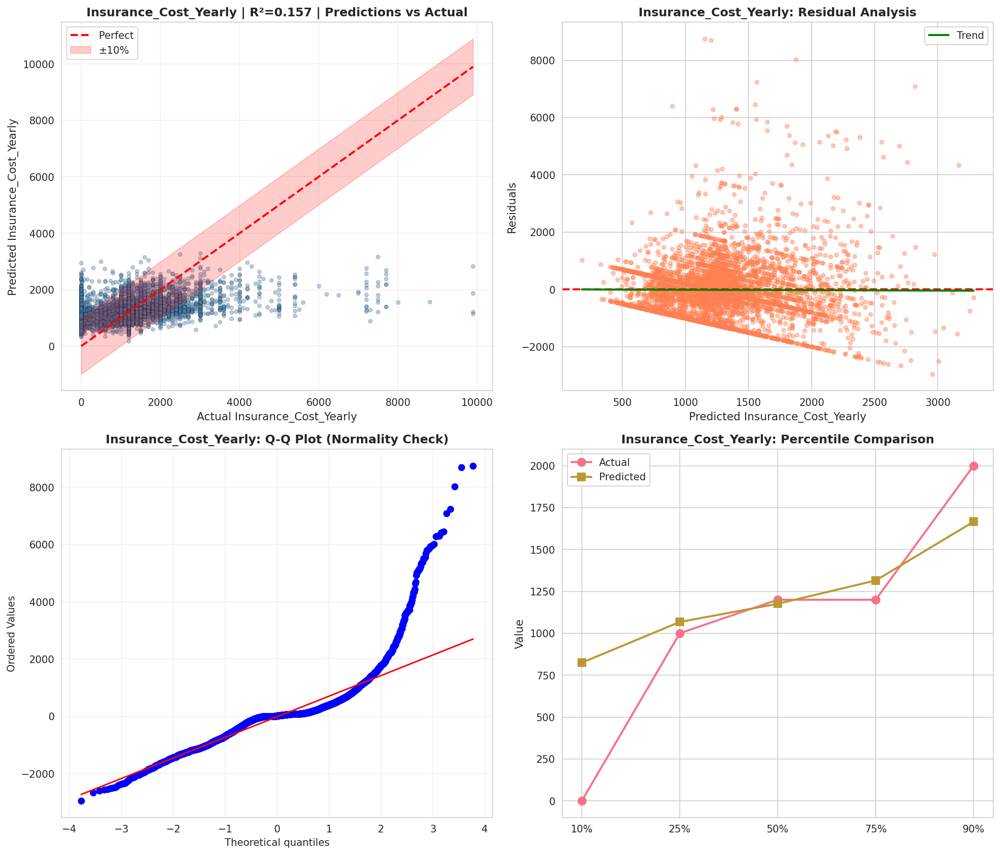
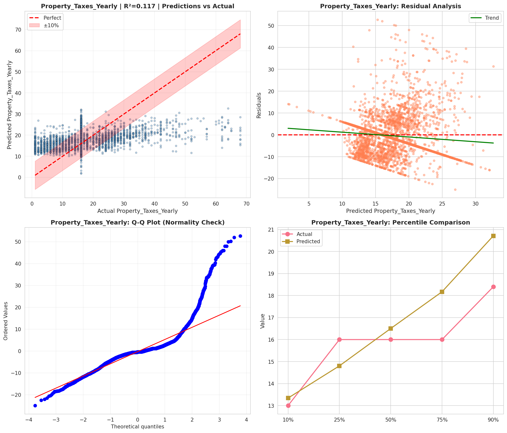
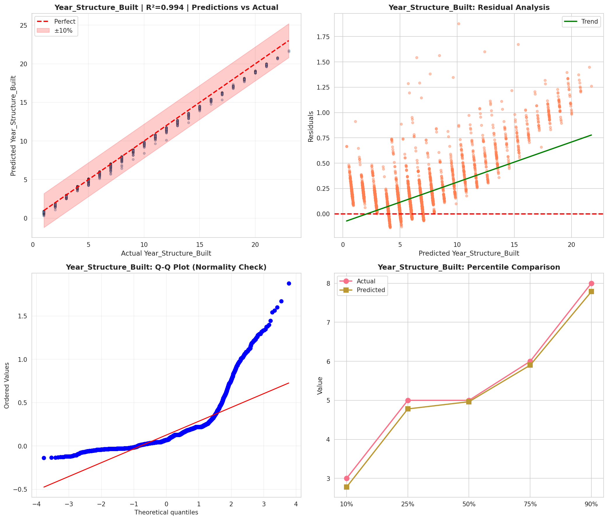
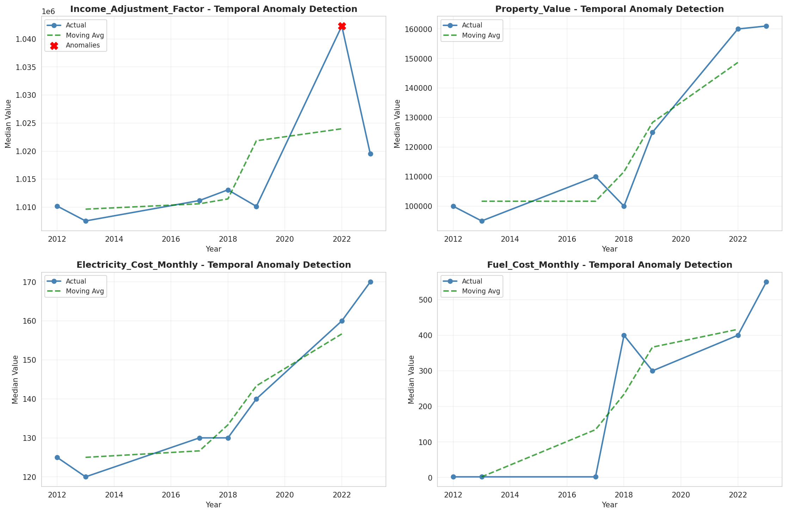
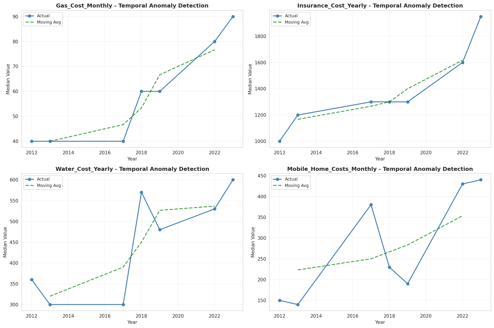
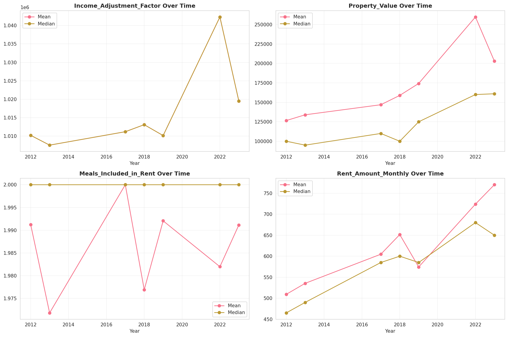
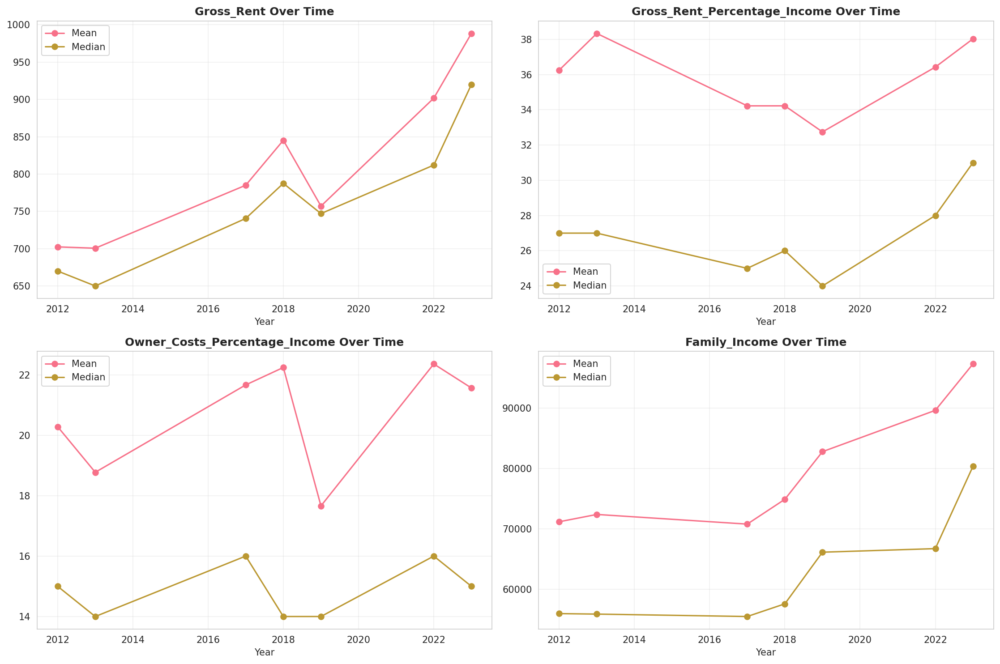
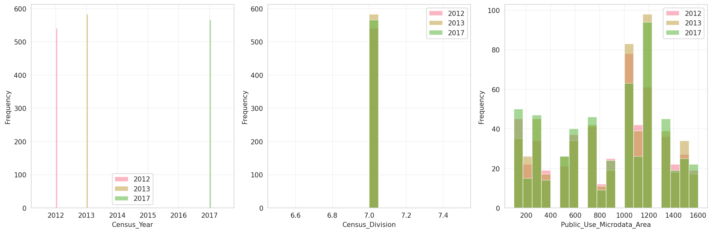
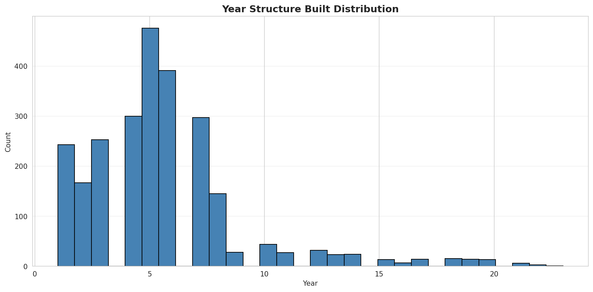
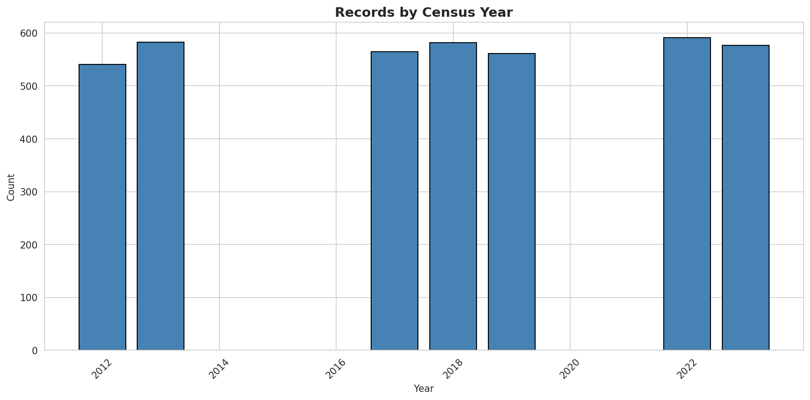
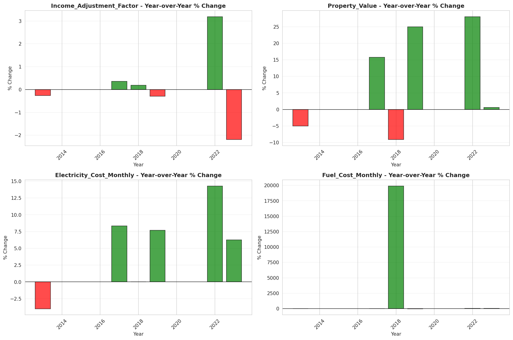
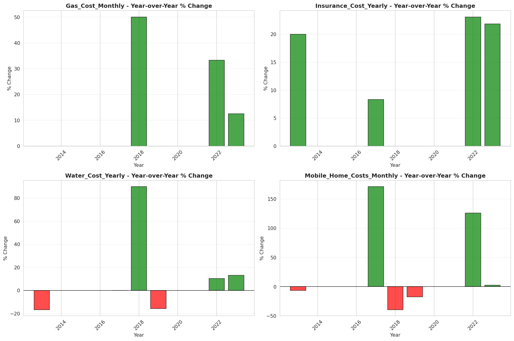
