# Temporal Analysis

## Year Distribution

- 2012: 90,883 records

- 2014: 93,666 records

- 2016: 95,291 records

- 2017: 95,829 records

- 2018: 96,625 records

- 2019: 97,152 records

- 2020: 98,486 records

- 2021: 98,891 records

- 2022: 99,910 records

- 2023: 100,726 records

## Temporal Trends

- Census_Year: {np.int64(2012): {'mean': 2012.0, 'median': 2012.0, 'std': 0.0}, np.int64(2014): {'mean': 2014.0, 'median': 2014.0, 'std': 0.0}, np.int64(2016): {'mean': 2016.0, 'median': 2016.0, 'std': 0.0}, np.int64(2017): {'mean': 2017.0, 'median': 2017.0, 'std': 0.0}, np.int64(2018): {'mean': 2018.0, 'median': 2018.0, 'std': 0.0}, np.int64(2019): {'mean': 2019.0, 'median': 2019.0, 'std': 0.0}, np.int64(2020): {'mean': 2020.0, 'median': 2020.0, 'std': 0.0}, np.int64(2021): {'mean': 2021.0, 'median': 2021.0, 'std': 0.0}, np.int64(2022): {'mean': 2022.0, 'median': 2022.0, 'std': 0.0}, np.int64(2023): {'mean': 2023.0, 'median': 2023.0, 'std': 0.0}}

- Census_Division: {np.int64(2012): {'mean': 7.0, 'median': 7.0, 'std': 0.0}, np.int64(2014): {'mean': 7.0, 'median': 7.0, 'std': 0.0}, np.int64(2016): {'mean': 7.0, 'median': 7.0, 'std': 0.0}, np.int64(2017): {'mean': 7.0, 'median': 7.0, 'std': 0.0}, np.int64(2018): {'mean': 7.0, 'median': 7.0, 'std': 0.0}, np.int64(2019): {'mean': 7.0, 'median': 7.0, 'std': 0.0}, np.int64(2020): {'mean': 7.0, 'median': 7.0, 'std': 0.0}, np.int64(2021): {'mean': 7.0, 'median': 7.0, 'std': 0.0}, np.int64(2022): {'mean': 7.0, 'median': 7.0, 'std': 0.0}, np.int64(2023): {'mean': 7.0, 'median': 7.0, 'std': 0.0}}

- Public_Use_Microdata_Area: {np.int64(2012): {'mean': None, 'median': None, 'std': None}, np.int64(2014): {'mean': None, 'median': None, 'std': None}, np.int64(2016): {'mean': 882.2608221133161, 'median': 1003.0, 'std': 433.19852025942106}, np.int64(2017): {'mean': 882.5661856014359, 'median': 1003.0, 'std': 433.40862396655876}, np.int64(2018): {'mean': 882.5517619663648, 'median': 1003.0, 'std': 433.7312652252209}, np.int64(2019): {'mean': 883.1561779479579, 'median': 1003.0, 'std': 433.8361133100001}, np.int64(2020): {'mean': 881.3601425583331, 'median': 1003.0, 'std': 435.4994620431247}, np.int64(2021): {'mean': 882.0806443457949, 'median': 1003.0, 'std': 435.5673162023165}, np.int64(2022): {'mean': None, 'median': None, 'std': None}, np.int64(2023): {'mean': 21117.107439985703, 'median': 21100.0, 'std': 574.52462335158}}

- Census_Region: {np.int64(2012): {'mean': 3.0, 'median': 3.0, 'std': 0.0}, np.int64(2014): {'mean': 3.0, 'median': 3.0, 'std': 0.0}, np.int64(2016): {'mean': 3.0, 'median': 3.0, 'std': 0.0}, np.int64(2017): {'mean': 3.0, 'median': 3.0, 'std': 0.0}, np.int64(2018): {'mean': 3.0, 'median': 3.0, 'std': 0.0}, np.int64(2019): {'mean': 3.0, 'median': 3.0, 'std': 0.0}, np.int64(2020): {'mean': 3.0, 'median': 3.0, 'std': 0.0}, np.int64(2021): {'mean': 3.0, 'median': 3.0, 'std': 0.0}, np.int64(2022): {'mean': 3.0, 'median': 3.0, 'std': 0.0}, np.int64(2023): {'mean': 3.0, 'median': 3.0, 'std': 0.0}}

- State_Code: {np.int64(2012): {'mean': 40.0, 'median': 40.0, 'std': 0.0}, np.int64(2014): {'mean': 40.0, 'median': 40.0, 'std': 0.0}, np.int64(2016): {'mean': 40.0, 'median': 40.0, 'std': 0.0}, np.int64(2017): {'mean': 40.0, 'median': 40.0, 'std': 0.0}, np.int64(2018): {'mean': 40.0, 'median': 40.0, 'std': 0.0}, np.int64(2019): {'mean': 40.0, 'median': 40.0, 'std': 0.0}, np.int64(2020): {'mean': 40.0, 'median': 40.0, 'std': 0.0}, np.int64(2021): {'mean': 40.0, 'median': 40.0, 'std': 0.0}, np.int64(2022): {'mean': 40.0, 'median': 40.0, 'std': 0.0}, np.int64(2023): {'mean': None, 'median': None, 'std': None}}

- Housing_Adjustment_Factor: {np.int64(2012): {'mean': 1041282.6992946976, 'median': 1053092.0, 'std': 27489.35179446073}, np.int64(2014): {'mean': 1036568.4681634745, 'median': 1031130.0, 'std': 29578.49188103086}, np.int64(2016): {'mean': 1020310.5872013096, 'median': 1013801.0, 'std': 15751.00161786369}, np.int64(2017): {'mean': 1029177.1336443039, 'median': 1034680.0, 'std': 17955.288569214434}, np.int64(2018): {'mean': 1038237.8236170763, 'median': 1046406.0, 'std': 23493.6698837464}, np.int64(2019): {'mean': 1040817.3076004612, 'median': 1042936.0, 'std': 29167.87925660722}, np.int64(2020): {'mean': 1035060.4810531446, 'median': 1030827.0, 'std': 28619.8697122815}, np.int64(2021): {'mean': 1057910.3219403182, 'median': 1059761.0, 'std': 34956.67939912562}, np.int64(2022): {'mean': 1105687.5398358523, 'median': 1133141.0, 'std': 60867.07950439966}, np.int64(2023): {'mean': 1107612.828028513, 'median': 1125501.0, 'std': 76704.63709293466}}

- Income_Adjustment_Factor: {np.int64(2012): {'mean': 1052543.7253501755, 'median': 1061121.0, 'std': 26397.798624364274}, np.int64(2014): {'mean': 1047425.4058356287, 'median': 1041654.0, 'std': 31029.383395253924}, np.int64(2016): {'mean': 1027468.2364546495, 'median': 1022342.0, 'std': 17501.27475207815}, np.int64(2017): {'mean': 1036571.2967682017, 'median': 1035988.0, 'std': 16829.130981627655}, np.int64(2018): {'mean': 1046824.2230271669, 'median': 1054346.0, 'std': 20516.766563443725}, np.int64(2019): {'mean': 1049771.3814023386, 'median': 1054606.0, 'std': 26213.13600371253}, np.int64(2020): {'mean': 1045015.0053713218, 'median': 1044328.0, 'std': 29287.598947514514}, np.int64(2021): {'mean': 1072571.3415983254, 'median': 1070512.0, 'std': 30381.63516351915}, np.int64(2022): {'mean': 1127438.9509058152, 'median': 1140108.0, 'std': 48975.73290091708}, np.int64(2023): {'mean': 1130935.280930445, 'median': 1159185.0, 'std': 69973.19083927471}}

- Housing_Unit_Weight: {np.int64(2012): {'mean': 18.313700031909157, 'median': 15.0, 'std': 16.72735054338675}, np.int64(2014): {'mean': 17.94094975764952, 'median': 14.0, 'std': 17.05923887062759}, np.int64(2016): {'mean': 17.83444396637668, 'median': 14.0, 'std': 17.088123004665462}, np.int64(2017): {'mean': 17.873931690824282, 'median': 14.0, 'std': 17.20209375514636}, np.int64(2018): {'mean': 17.834204398447607, 'median': 14.0, 'std': 17.319884834764512}, np.int64(2019): {'mean': 17.823945981554676, 'median': 14.0, 'std': 17.594568011243233}, np.int64(2020): {'mean': 17.677355157078164, 'median': 12.0, 'std': 23.605507388264982}, np.int64(2021): {'mean': 17.612532990868733, 'median': 12.0, 'std': 22.085921082623248}, np.int64(2022): {'mean': 17.53380042037834, 'median': 12.0, 'std': 22.314812767542183}, np.int64(2023): {'mean': 17.50328614260469, 'median': 12.0, 'std': 22.44692378288921}}

- Number_of_Persons: {np.int64(2012): {'mean': 2.039127229514871, 'median': 2.0, 'std': 1.472863863030833}, np.int64(2014): {'mean': 1.9898575790575022, 'median': 2.0, 'std': 1.4939882544008354}, np.int64(2016): {'mean': 1.9499008300888856, 'median': 2.0, 'std': 1.5087697135459157}, np.int64(2017): {'mean': 1.9390476786776445, 'median': 2.0, 'std': 1.514511409106732}, np.int64(2018): {'mean': 1.928269081500647, 'median': 2.0, 'std': 1.5150137055567965}, np.int64(2019): {'mean': 1.922945487483531, 'median': 2.0, 'std': 1.5154815185250339}, np.int64(2020): {'mean': 1.9033162073797292, 'median': 2.0, 'std': 1.5192637789674528}, np.int64(2021): {'mean': 1.9031863364714685, 'median': 2.0, 'std': 1.5165621064653096}, np.int64(2022): {'mean': 1.9071964768291463, 'median': 2.0, 'std': 1.5126590701220184}, np.int64(2023): {'mean': 1.9105196275043186, 'median': 2.0, 'std': 1.511798599430158}}

- Housing_Unit_Type: {np.int64(2012): {'mean': 1.1177998085450525, 'median': 1.0, 'std': 0.40916143127594845}, np.int64(2014): {'mean': 1.1432216599406402, 'median': 1.0, 'std': 0.45038559411519796}, np.int64(2016): {'mean': 1.152973523207858, 'median': 1.0, 'std': 0.466768530739475}, np.int64(2017): {'mean': 1.1523547151697293, 'median': 1.0, 'std': 0.46687248419848937}, np.int64(2018): {'mean': 1.1538007761966365, 'median': 1.0, 'std': 0.4687776780473624}, np.int64(2019): {'mean': 1.1538516963109355, 'median': 1.0, 'std': 0.46959162708895535}, np.int64(2020): {'mean': None, 'median': None, 'std': None}, np.int64(2021): {'mean': None, 'median': None, 'std': None}, np.int64(2022): {'mean': None, 'median': None, 'std': None}, np.int64(2023): {'mean': None, 'median': None, 'std': None}}

- Building_Type: {np.int64(2012): {'mean': 2.3689894295827214, 'median': 2.0, 'std': 1.5265036038549202}, np.int64(2014): {'mean': 2.3725060711394694, 'median': 2.0, 'std': 1.5504773768777527}, np.int64(2016): {'mean': 2.3795763121018356, 'median': 2.0, 'std': 1.566972237131829}, np.int64(2017): {'mean': 2.3792127273790724, 'median': 2.0, 'std': 1.562892591702981}, np.int64(2018): {'mean': 2.3818545061735565, 'median': 2.0, 'std': 1.5671911364714652}, np.int64(2019): {'mean': 2.386994329795711, 'median': 2.0, 'std': 1.5764150639008048}, np.int64(2020): {'mean': 2.384032339565437, 'median': 2.0, 'std': 1.5736122855415704}, np.int64(2021): {'mean': 2.384960051207608, 'median': 2.0, 'std': 1.5731336404139704}, np.int64(2022): {'mean': 2.3890664634354417, 'median': 2.0, 'std': 1.57857695676934}, np.int64(2023): {'mean': 2.39329199293894, 'median': 2.0, 'std': 1.583538993521912}}

- Year_Structure_Built: {np.int64(2012): {'mean': 4.980953986178998, 'median': 5.0, 'std': 2.476418366086158}, np.int64(2014): {'mean': 5.1388148183419835, 'median': 5.0, 'std': 2.7148361552711577}, np.int64(2016): {'mean': 5.344449547226246, 'median': 5.0, 'std': 3.0258765975941855}, np.int64(2017): {'mean': 5.469871907352167, 'median': 5.0, 'std': 3.215192471023147}, np.int64(2018): {'mean': 5.582277304775069, 'median': 5.0, 'std': 3.417060852279787}, np.int64(2019): {'mean': 5.726825493977573, 'median': 5.0, 'std': 3.649748674290657}, np.int64(2020): {'mean': 5.85510358767054, 'median': 5.0, 'std': 3.87587314970298}, np.int64(2021): {'mean': None, 'median': None, 'std': None}, np.int64(2022): {'mean': None, 'median': None, 'std': None}, np.int64(2023): {'mean': None, 'median': None, 'std': None}}

- Bathtub_or_Shower: {np.int64(2012): {'mean': 1.015988057113963, 'median': 1.0, 'std': 0.12542977538024874}, np.int64(2014): {'mean': 1.0175110709013857, 'median': 1.0, 'std': 0.13116645190230558}, np.int64(2016): {'mean': 1.0181462771281544, 'median': 1.0, 'std': 0.1334810831678192}, np.int64(2017): {'mean': 1.017968064572732, 'median': 1.0, 'std': 0.13283606303874052}, np.int64(2018): {'mean': 1.01742301929309, 'median': 1.0, 'std': 0.13084210538867153}, np.int64(2019): {'mean': 1.0170799025325372, 'median': 1.0, 'std': 0.12956995538631605}, np.int64(2020): {'mean': 1.016525793559649, 'median': 1.0, 'std': 0.1274867771908709}, np.int64(2021): {'mean': 1.0165053093602479, 'median': 1.0, 'std': 0.12740906432249413}, np.int64(2022): {'mean': 1.0160613333636663, 'median': 1.0, 'std': 0.12571215811418637}, np.int64(2023): {'mean': 1.0161363327750872, 'median': 1.0, 'std': 0.12600052059736094}}

- Refrigerator: {np.int64(2012): {'mean': 1.037742890852616, 'median': 1.0, 'std': 0.19057492566446196}, np.int64(2014): {'mean': 1.0428908147231084, 'median': 1.0, 'std': 0.20261214529913632}, np.int64(2016): {'mean': 1.0465373700262597, 'median': 1.0, 'std': 0.2106470168989016}, np.int64(2017): {'mean': 1.0470959817511845, 'median': 1.0, 'std': 0.21184540410550978}, np.int64(2018): {'mean': 1.0477390728630667, 'median': 1.0, 'std': 0.21321487243069542}, np.int64(2019): {'mean': 1.047578903606527, 'median': 1.0, 'std': 0.21287478680228944}, np.int64(2020): {'mean': 1.0494510542514586, 'median': 1.0, 'std': 0.21680910339353113}, np.int64(2021): {'mean': 1.0490930081040613, 'median': 1.0, 'std': 0.21606345888052036}, np.int64(2022): {'mean': 1.0471602607122952, 'median': 1.0, 'std': 0.21198273908810059}, np.int64(2023): {'mean': 1.0453197845471416, 'median': 1.0, 'std': 0.2080057481648847}}

- Hot_and_Cold_Running_Water: {np.int64(2012): {'mean': 1.0313861934458597, 'median': 1.0, 'std': 0.17436016264089993}, np.int64(2014): {'mean': 1.0379624779772392, 'median': 1.0, 'std': 0.1911066796458362}, np.int64(2016): {'mean': 1.0435581304977568, 'median': 1.0, 'std': 0.20411102457809435}, np.int64(2017): {'mean': 1.0453295899865473, 'median': 1.0, 'std': 0.2080272205533616}, np.int64(2018): {'mean': 1.0464149233967919, 'median': 1.0, 'std': 0.21038320368026728}, np.int64(2019): {'mean': 1.0471516173362743, 'median': 1.0, 'std': 0.21196429220462534}, np.int64(2020): {'mean': 1.0506798658643024, 'median': 1.0, 'std': 0.21934440861064894}, np.int64(2021): {'mean': 1.0516419582337948, 'median': 1.0, 'std': 0.2213043745346806}, np.int64(2022): {'mean': 1.051767087916463, 'median': 1.0, 'std': 0.22155770104695705}, np.int64(2023): {'mean': 1.0515774227130765, 'median': 1.0, 'std': 0.22117356470168004}}

- Running_Water: {np.int64(2012): {'mean': None, 'median': None, 'std': None}, np.int64(2014): {'mean': 9.0, 'median': 9.0, 'std': 0.0}, np.int64(2016): {'mean': 9.0, 'median': 9.0, 'std': 0.0}, np.int64(2017): {'mean': 9.0, 'median': 9.0, 'std': 0.0}, np.int64(2018): {'mean': 9.0, 'median': 9.0, 'std': 0.0}, np.int64(2019): {'mean': 9.0, 'median': 9.0, 'std': 0.0}, np.int64(2020): {'mean': 9.0, 'median': 9.0, 'std': 0.0}, np.int64(2021): {'mean': 9.0, 'median': 9.0, 'std': 0.0}, np.int64(2022): {'mean': 9.0, 'median': 9.0, 'std': 0.0}, np.int64(2023): {'mean': 9.0, 'median': 9.0, 'std': 0.0}}

- Sink_with_Faucet: {np.int64(2012): {'mean': 1.0151693915388504, 'median': 1.0, 'std': 0.12222708766204278}, np.int64(2014): {'mean': 1.0166896814437407, 'median': 1.0, 'std': 0.12810671856205091}, np.int64(2016): {'mean': 1.017239552054262, 'median': 1.0, 'std': 0.13016354869458552}, np.int64(2017): {'mean': 1.017114113587179, 'median': 1.0, 'std': 0.12969740737405408}, np.int64(2018): {'mean': 1.0164589455588724, 'median': 1.0, 'std': 0.12723300162275547}, np.int64(2019): {'mean': 1.0160982989387133, 'median': 1.0, 'std': 0.12585438660187234}, np.int64(2020): {'mean': 1.0160090036290137, 'median': 1.0, 'std': 0.12551054275063}, np.int64(2021): {'mean': 1.0158423537211243, 'median': 1.0, 'std': 0.12486613538241613}, np.int64(2022): {'mean': 1.0153219660346025, 'median': 1.0, 'std': 0.12283067617068309}, np.int64(2023): {'mean': 1.0153894898836735, 'median': 1.0, 'std': 0.12309681129562791}}

- Stove_or_Range: {np.int64(2012): {'mean': 1.034817365341552, 'median': 1.0, 'std': 0.18331808693034415}, np.int64(2014): {'mean': 1.039676682062759, 'median': 1.0, 'std': 0.195199632549762}, np.int64(2016): {'mean': 1.0427338349760364, 'median': 1.0, 'std': 0.20225759823596845}, np.int64(2017): {'mean': 1.0431186757910744, 'median': 1.0, 'std': 0.20312542491316254}, np.int64(2018): {'mean': 1.043522702194139, 'median': 1.0, 'std': 0.20403176253378438}, np.int64(2019): {'mean': 1.0440913237790583, 'median': 1.0, 'std': 0.20529921013137342}, np.int64(2020): {'mean': 1.0455004823372687, 'median': 1.0, 'std': 0.20840030521076555}, np.int64(2021): {'mean': 1.0455610547852825, 'median': 1.0, 'std': 0.20853235270790127}, np.int64(2022): {'mean': 1.04440753927178, 'median': 1.0, 'std': 0.20599998163109365}, np.int64(2023): {'mean': 1.0430113610645906, 'median': 1.0, 'std': 0.20288383292731113}}

- Telephone_Service: {np.int64(2012): {'mean': 1.0247408169341958, 'median': 1.0, 'std': 0.15533523580555544}, np.int64(2014): {'mean': 1.0278104888402027, 'median': 1.0, 'std': 0.164430641227107}, np.int64(2016): {'mean': 1.030275343660451, 'median': 1.0, 'std': 0.17134513023395054}, np.int64(2017): {'mean': 1.0284175102826518, 'median': 1.0, 'std': 0.16616358734384026}, np.int64(2018): {'mean': 1.0260775832285347, 'median': 1.0, 'std': 0.15936716685127156}, np.int64(2019): {'mean': 1.0222662320694256, 'median': 1.0, 'std': 0.14754913213439452}, np.int64(2020): {'mean': 1.0182875570194176, 'median': 1.0, 'std': 0.1339901850710236}, np.int64(2021): {'mean': 1.0133789798014379, 'median': 1.0, 'std': 0.11489196431066362}, np.int64(2022): {'mean': 1.0119515434022601, 'median': 1.0, 'std': 0.10866859725149808}, np.int64(2023): {'mean': 1.0104360890152786, 'median': 1.0, 'std': 0.10162340080864979}}

- Lot_Acreage: {np.int64(2012): {'mean': 1.4613316123480693, 'median': 1.0, 'std': 0.7116300589030038}, np.int64(2014): {'mean': 1.46212677353479, 'median': 1.0, 'std': 0.7109732611770415}, np.int64(2016): {'mean': 1.456263491769193, 'median': 1.0, 'std': 0.7074326916099096}, np.int64(2017): {'mean': 1.4498848305363607, 'median': 1.0, 'std': 0.7035418453645362}, np.int64(2018): {'mean': 1.4484511828519149, 'median': 1.0, 'std': 0.7019837105441014}, np.int64(2019): {'mean': 1.4478651130769131, 'median': 1.0, 'std': 0.7014767714237855}, np.int64(2020): {'mean': 1.45222494518251, 'median': 1.0, 'std': 0.7039718605256357}, np.int64(2021): {'mean': 1.4541300301649445, 'median': 1.0, 'std': 0.7036340043381412}, np.int64(2022): {'mean': 1.458602143669277, 'median': 1.0, 'std': 0.7050178611632851}, np.int64(2023): {'mean': 1.4616372514114235, 'median': 1.0, 'std': 0.7049974975523734}}

- Agricultural_Sales: {np.int64(2012): {'mean': 1.4485602151960135, 'median': 1.0, 'std': 1.265427734400105}, np.int64(2014): {'mean': 1.4268108874900256, 'median': 1.0, 'std': 1.2433743323110167}, np.int64(2016): {'mean': 1.3981976270265375, 'median': 1.0, 'std': 1.2143498443136456}, np.int64(2017): {'mean': 1.3935155461799504, 'median': 1.0, 'std': 1.2047114400004502}, np.int64(2018): {'mean': 1.3918011059823592, 'median': 1.0, 'std': 1.1995217114782621}, np.int64(2019): {'mean': 1.3901528940662542, 'median': 1.0, 'std': 1.1969401467748328}, np.int64(2020): {'mean': 1.400943820224719, 'median': 1.0, 'std': 1.2083537003288574}, np.int64(2021): {'mean': 1.4057958170861398, 'median': 1.0, 'std': 1.2121839388058524}, np.int64(2022): {'mean': 1.4148392129669758, 'median': 1.0, 'std': 1.2232870822648416}, np.int64(2023): {'mean': 1.4153531566839908, 'median': 1.0, 'std': 1.2223564426819218}}

- Business_On_Property: {np.int64(2012): {'mean': 1.984538023018178, 'median': 2.0, 'std': 0.12338196354143442}, np.int64(2014): {'mean': 1.9850108781249582, 'median': 2.0, 'std': 0.12150985626677523}, np.int64(2016): {'mean': 3.407805692036711, 'median': 2.0, 'std': 2.8229843900031018}, np.int64(2017): {'mean': 4.8202171767028625, 'median': 2.0, 'std': 3.443830688483814}, np.int64(2018): {'mean': 6.220376421382825, 'median': 9.0, 'std': 3.432267508307867}, np.int64(2019): {'mean': 7.613395165166335, 'median': 9.0, 'std': 2.794387746889831}, np.int64(2020): {'mean': None, 'median': None, 'std': None}, np.int64(2021): {'mean': None, 'median': None, 'std': None}, np.int64(2022): {'mean': None, 'median': None, 'std': None}, np.int64(2023): {'mean': None, 'median': None, 'std': None}}

- Tenure: {np.int64(2012): {'mean': 1.9056654846655658, 'median': 2.0, 'std': 0.8701783571529179}, np.int64(2014): {'mean': 1.9421881418595097, 'median': 2.0, 'std': 0.8769312705592948}, np.int64(2016): {'mean': 1.97551116463862, 'median': 2.0, 'std': 0.8780796409421315}, np.int64(2017): {'mean': 1.9825645002700494, 'median': 2.0, 'std': 0.8769509027937052}, np.int64(2018): {'mean': 1.9888199444452122, 'median': 2.0, 'std': 0.873239802118896}, np.int64(2019): {'mean': 1.9879660574053444, 'median': 2.0, 'std': 0.8691006034370519}, np.int64(2020): {'mean': 1.9793696511996473, 'median': 2.0, 'std': 0.8628897119861181}, np.int64(2021): {'mean': 1.9821294077370764, 'median': 2.0, 'std': 0.8599452892400178}, np.int64(2022): {'mean': 1.9795387408872869, 'median': 2.0, 'std': 0.8549496911906447}, np.int64(2023): {'mean': 1.9778534923339013, 'median': 2.0, 'std': 0.8498856255317665}}

- Vacancy_Status: {np.int64(2012): {'mean': 5.103312990409765, 'median': 5.0, 'std': 2.225540605055573}, np.int64(2014): {'mean': 5.146528157463095, 'median': 7.0, 'std': 2.227152858142284}, np.int64(2016): {'mean': 5.220987070324819, 'median': 7.0, 'std': 2.193896280844789}, np.int64(2017): {'mean': 5.258210304308527, 'median': 7.0, 'std': 2.1757585005851574}, np.int64(2018): {'mean': 5.2998106612292455, 'median': 7.0, 'std': 2.1672928318968667}, np.int64(2019): {'mean': 5.334605964558421, 'median': 7.0, 'std': 2.157089081176262}, np.int64(2020): {'mean': 5.372011300213601, 'median': 7.0, 'std': 2.1566688289069895}, np.int64(2021): {'mean': 5.432443645415572, 'median': 7.0, 'std': 2.1342064031560892}, np.int64(2022): {'mean': 5.482465462274177, 'median': 7.0, 'std': 2.1130446051429828}, np.int64(2023): {'mean': 5.533748100991102, 'median': 7.0, 'std': 2.08185146467583}}

- Vehicles_Available: {np.int64(2012): {'mean': 1.9166012505752104, 'median': 2.0, 'std': 1.0717009676899558}, np.int64(2014): {'mean': 1.9011228262357935, 'median': 2.0, 'std': 1.0707170898274294}, np.int64(2016): {'mean': 1.904508769744037, 'median': 2.0, 'std': 1.0734508183764342}, np.int64(2017): {'mean': 1.9155922391945603, 'median': 2.0, 'std': 1.0792632158057671}, np.int64(2018): {'mean': 1.931689722364257, 'median': 2.0, 'std': 1.087527550578668}, np.int64(2019): {'mean': 1.9478895902958286, 'median': 2.0, 'std': 1.0990522020274234}, np.int64(2020): {'mean': 1.9690475862354093, 'median': 2.0, 'std': 1.113117157948368}, np.int64(2021): {'mean': 1.9770215679561793, 'median': 2.0, 'std': 1.1204409166520164}, np.int64(2022): {'mean': 1.983495487682593, 'median': 2.0, 'std': 1.1251359164899664}, np.int64(2023): {'mean': 1.98388979060752, 'median': 2.0, 'std': 1.1294972152725133}}

- Condo_Fee_Monthly: {np.int64(2012): {'mean': 257.55368421052634, 'median': 180.0, 'std': 270.970787116573}, np.int64(2014): {'mean': 264.287841191067, 'median': 190.0, 'std': 252.5268450850553}, np.int64(2016): {'mean': 270.7317073170732, 'median': 200.0, 'std': 225.46993460413378}, np.int64(2017): {'mean': 284.50134770889485, 'median': 220.0, 'std': 230.12912209456806}, np.int64(2018): {'mean': 293.218085106383, 'median': 230.0, 'std': 235.0376203477295}, np.int64(2019): {'mean': 301.1139896373057, 'median': 240.0, 'std': 244.68703034032816}, np.int64(2020): {'mean': 319.86807387862797, 'median': 240.0, 'std': 278.0492010613059}, np.int64(2021): {'mean': 327.77127659574467, 'median': 250.0, 'std': 276.1147603432903}, np.int64(2022): {'mean': 335.7120822622108, 'median': 250.0, 'std': 311.7573061223316}, np.int64(2023): {'mean': 348.9019607843137, 'median': 250.0, 'std': 338.0895745054353}}

- Electricity_Cost_Monthly: {np.int64(2012): {'mean': 137.2411688276534, 'median': 120.0, 'std': 85.32481887239776}, np.int64(2014): {'mean': 142.52290839381075, 'median': 120.0, 'std': 87.73776023224809}, np.int64(2016): {'mean': 142.94447443830722, 'median': 120.0, 'std': 87.96636014888831}, np.int64(2017): {'mean': 142.96540597432454, 'median': 120.0, 'std': 88.01644712397247}, np.int64(2018): {'mean': 151.50044390984334, 'median': 130.0, 'std': 86.96765011345985}, np.int64(2019): {'mean': 152.68815793227398, 'median': 130.0, 'std': 87.44749304456415}, np.int64(2020): {'mean': 152.92573550414167, 'median': 130.0, 'std': 87.16309205301035}, np.int64(2021): {'mean': 155.41975291130623, 'median': 130.0, 'std': 90.77139669233128}, np.int64(2022): {'mean': 165.86353687282522, 'median': 140.0, 'std': 127.60957498494253}, np.int64(2023): {'mean': 176.15876984623077, 'median': 150.0, 'std': 152.139836926449}}

- Fuel_Cost_Monthly: {np.int64(2012): {'mean': 61.45069431286035, 'median': 2.0, 'std': 270.4912216813908}, np.int64(2014): {'mean': 49.62922086813638, 'median': 2.0, 'std': 239.90576721686077}, np.int64(2016): {'mean': 38.18145825546465, 'median': 2.0, 'std': 203.68599808666852}, np.int64(2017): {'mean': 34.466936254483514, 'median': 2.0, 'std': 186.17161282858874}, np.int64(2018): {'mean': 519.5039153439153, 'median': 350.0, 'std': 563.9221735855637}, np.int64(2019): {'mean': 508.70996216897856, 'median': 330.0, 'std': 549.3892015654092}, np.int64(2020): {'mean': 493.6625584360391, 'median': 300.0, 'std': 531.6406015858638}, np.int64(2021): {'mean': 503.0587258767379, 'median': 300.0, 'std': 541.2809619597862}, np.int64(2022): {'mean': 528.4902394848058, 'median': 350.0, 'std': 562.9360585303475}, np.int64(2023): {'mean': 545.0477341389728, 'median': 360.0, 'std': 585.9126302886732}}

- Gas_Cost_Monthly: {np.int64(2012): {'mean': 60.04894025931841, 'median': 40.0, 'std': 71.72560624313859}, np.int64(2014): {'mean': 55.720744899356426, 'median': 40.0, 'std': 68.2727035018756}, np.int64(2016): {'mean': 51.855849495410936, 'median': 40.0, 'std': 64.06132290312225}, np.int64(2017): {'mean': 51.235247683806726, 'median': 40.0, 'std': 63.00164874789704}, np.int64(2018): {'mean': 78.26166724496878, 'median': 60.0, 'std': 64.90410559442552}, np.int64(2019): {'mean': 76.43881929695289, 'median': 60.0, 'std': 62.548788835114564}, np.int64(2020): {'mean': 74.99396474715122, 'median': 60.0, 'std': 61.610116900148}, np.int64(2021): {'mean': 77.39413581589594, 'median': 60.0, 'std': 66.31574084422971}, np.int64(2022): {'mean': 86.01843855255203, 'median': 60.0, 'std': 111.22625075411383}, np.int64(2023): {'mean': 94.38613564263053, 'median': 70.0, 'std': 130.90529471116096}}

- House_Heating_Fuel: {np.int64(2012): {'mean': 1.98400238204802, 'median': 1.0, 'std': 1.3131527637320368}, np.int64(2014): {'mean': 2.040462823497193, 'median': 1.0, 'std': 1.3275083586236416}, np.int64(2016): {'mean': 2.0794329775599762, 'median': 2.0, 'std': 1.3416790338669111}, np.int64(2017): {'mean': 2.0822058192192108, 'median': 2.0, 'std': 1.3319836747782814}, np.int64(2018): {'mean': 2.089744475615318, 'median': 2.0, 'std': 1.3240618745518233}, np.int64(2019): {'mean': 2.0932733699165187, 'median': 2.0, 'std': 1.3159590857229317}, np.int64(2020): {'mean': 2.104640105839064, 'median': 2.0, 'std': 1.316102269974866}, np.int64(2021): {'mean': 2.1159055118110235, 'median': 2.0, 'std': 1.3177778037695824}, np.int64(2022): {'mean': 2.1266023469470716, 'median': 2.0, 'std': 1.330380184911913}, np.int64(2023): {'mean': 2.1314839903955787, 'median': 2.0, 'std': 1.3255914150860135}}

- Insurance_Cost_Yearly: {np.int64(2014): {'mean': 1202.1839097161678, 'median': 1100.0, 'std': 804.8707688665348}}

- Water_Cost_Yearly: {np.int64(2012): {'mean': 395.0027339414774, 'median': 360.0, 'std': 400.5837084604134}, np.int64(2014): {'mean': 410.6322881007805, 'median': 360.0, 'std': 420.18855981109203}, np.int64(2016): {'mean': 423.514459349087, 'median': 360.0, 'std': 442.87514310758854}, np.int64(2017): {'mean': 430.5727402401363, 'median': 360.0, 'std': 452.54793209863254}, np.int64(2018): {'mean': 565.4472846839202, 'median': 520.0, 'std': 462.23162870567546}, np.int64(2019): {'mean': 575.4977016150337, 'median': 540.0, 'std': 475.8391773745349}, np.int64(2020): {'mean': 586.4454425363276, 'median': 540.0, 'std': 495.8030967999894}, np.int64(2021): {'mean': 597.3555450783174, 'median': 540.0, 'std': 513.1072746106619}, np.int64(2022): {'mean': 609.7517331769737, 'median': 550.0, 'std': 542.1405058188419}, np.int64(2023): {'mean': 626.5508070557788, 'median': 560.0, 'std': 575.7760022414456}}

- Mobile_Home_Costs_Monthly: {np.int64(2012): {'mean': 679.665230361286, 'median': 250.0, 'std': 1217.3318000855634}, np.int64(2014): {'mean': 703.7480165026975, 'median': 250.0, 'std': 1260.1106371085061}, np.int64(2016): {'mean': 765.2555701179555, 'median': 250.0, 'std': 1392.2131317957678}, np.int64(2017): {'mean': 824.918679823069, 'median': 260.0, 'std': 1498.3099623290855}, np.int64(2018): {'mean': 873.305430646835, 'median': 300.0, 'std': 1574.8467182296172}, np.int64(2019): {'mean': 917.6555634301914, 'median': 300.0, 'std': 1640.0736646211299}, np.int64(2020): {'mean': 998.4657142857143, 'median': 320.0, 'std': 1963.5337104076723}, np.int64(2021): {'mean': 1109.6905687036383, 'median': 330.0, 'std': 2556.251704963753}, np.int64(2022): {'mean': 1344.6029261653623, 'median': 350.0, 'std': 3660.623957962849}, np.int64(2023): {'mean': 1572.1192052980132, 'median': 400.0, 'std': 4488.364724373645}}

- First_Mortgage_Includes_Insurance: {np.int64(2012): {'mean': 1.3861365813603395, 'median': 1.0, 'std': 0.4868708576591405}, np.int64(2014): {'mean': 1.3627617635357518, 'median': 1.0, 'std': 0.4808056025868349}, np.int64(2016): {'mean': 1.3324624428478118, 'median': 1.0, 'std': 0.4711047592948969}, np.int64(2017): {'mean': 1.3204333762032816, 'median': 1.0, 'std': 0.4666522414788397}, np.int64(2018): {'mean': 1.3068879470828216, 'median': 1.0, 'std': 0.4612116221665974}, np.int64(2019): {'mean': 1.2993259318001587, 'median': 1.0, 'std': 0.45797187107689563}, np.int64(2020): {'mean': 1.2880876494023905, 'median': 1.0, 'std': 0.45288114007077707}, np.int64(2021): {'mean': 1.2775747841798835, 'median': 1.0, 'std': 0.4478114283579544}, np.int64(2022): {'mean': 1.2679995192115068, 'median': 1.0, 'std': 0.44292622088806455}, np.int64(2023): {'mean': 1.2613172021472638, 'median': 1.0, 'std': 0.4393611900179555}}

- First_Mortgage_Payment_Monthly: {np.int64(2012): {'mean': 813.3569180238128, 'median': 690.0, 'std': 552.667458691984}, np.int64(2014): {'mean': 828.9305218995262, 'median': 700.0, 'std': 554.1474345142237}, np.int64(2016): {'mean': 857.8750528297537, 'median': 730.0, 'std': 568.8501776536648}, np.int64(2017): {'mean': 877.4048092287306, 'median': 750.0, 'std': 577.8194084449624}, np.int64(2018): {'mean': 901.3529528260783, 'median': 770.0, 'std': 593.9035453081437}, np.int64(2019): {'mean': 928.5055511498811, 'median': 800.0, 'std': 619.1301160240346}, np.int64(2020): {'mean': 948.7394422310757, 'median': 800.0, 'std': 626.5744977711037}, np.int64(2021): {'mean': 970.6258984139731, 'median': 830.0, 'std': 636.6223207366965}, np.int64(2022): {'mean': 1006.1591409912256, 'median': 860.0, 'std': 659.9624541565893}, np.int64(2023): {'mean': 1049.9818123547793, 'median': 900.0, 'std': 691.1226277505248}}

- First_Mortgage_Includes_Taxes: {np.int64(2012): {'mean': 1.3736143424113862, 'median': 1.0, 'std': 0.48377130212922126}, np.int64(2014): {'mean': 1.3519837968823465, 'median': 1.0, 'std': 0.4775975852547335}, np.int64(2016): {'mean': 1.3203596265416682, 'median': 1.0, 'std': 0.466623726425424}, np.int64(2017): {'mean': 1.3076503371136834, 'median': 1.0, 'std': 0.46152996517513684}, np.int64(2018): {'mean': 1.291757436527112, 'median': 1.0, 'std': 0.4545802675222316}, np.int64(2019): {'mean': 1.27934179222839, 'median': 1.0, 'std': 0.4486846752617969}, np.int64(2020): {'mean': 1.2679282868525896, 'median': 1.0, 'std': 0.44288885142794704}, np.int64(2021): {'mean': 1.2560931539851437, 'median': 1.0, 'std': 0.4364826459553179}, np.int64(2022): {'mean': 1.2423574662446413, 'median': 1.0, 'std': 0.4285180065915112}, np.int64(2023): {'mean': 1.2325935421841199, 'median': 1.0, 'std': 0.4224937126458004}}

- First_Mortgage_Status: {np.int64(2012): {'mean': 1.9422924317640762, 'median': 1.0, 'std': 0.9877310744785068}, np.int64(2014): {'mean': 1.9637247211433602, 'median': 1.0, 'std': 0.9884267163790408}, np.int64(2016): {'mean': 1.9926241470437425, 'median': 2.0, 'std': 0.990331341859808}, np.int64(2017): {'mean': 2.0033230477094706, 'median': 2.0, 'std': 0.9907638119276065}, np.int64(2018): {'mean': 2.021075896909658, 'median': 3.0, 'std': 0.990985068961723}, np.int64(2019): {'mean': 2.0290505200885423, 'median': 3.0, 'std': 0.9909866292082249}, np.int64(2020): {'mean': 2.0416844722427254, 'median': 3.0, 'std': 0.9907062656956118}, np.int64(2021): {'mean': 2.0565674086923003, 'median': 3.0, 'std': 0.990072675539707}, np.int64(2022): {'mean': 2.06826683883709, 'median': 3.0, 'std': 0.98953487900315}, np.int64(2023): {'mean': 2.0807861488067383, 'median': 3.0, 'std': 0.9890585817912176}}

- Second_Mortgage_Payment_Monthly: {np.int64(2012): {'mean': 353.3141274238227, 'median': 270.0, 'std': 322.58671791229716}, np.int64(2014): {'mean': 370.35024799694776, 'median': 280.0, 'std': 363.7344317238929}, np.int64(2016): {'mean': 387.00613496932516, 'median': 290.0, 'std': 382.36927554125486}, np.int64(2017): {'mean': 397.8297632468997, 'median': 300.0, 'std': 406.2195710073936}, np.int64(2018): {'mean': 394.76365868631063, 'median': 300.0, 'std': 381.33567954845125}, np.int64(2019): {'mean': 407.75445292620867, 'median': 300.0, 'std': 411.3589696622614}, np.int64(2020): {'mean': 406.35339308578745, 'median': 300.0, 'std': 405.1833008902491}, np.int64(2021): {'mean': 413.84253968253967, 'median': 300.0, 'std': 430.1275134874049}, np.int64(2022): {'mean': 428.58635525507066, 'median': 300.0, 'std': 433.0528295104877}, np.int64(2023): {'mean': 460.46674445740956, 'median': 315.0, 'std': 469.8148252202677}}

- Second_Mortgage_Status: {np.int64(2012): {'mean': 2.8347132886273436, 'median': 3.0, 'std': 0.4996491702896674}, np.int64(2014): {'mean': 2.8746066765524976, 'median': 3.0, 'std': 0.445213961141487}, np.int64(2016): {'mean': 2.901871133822569, 'median': 3.0, 'std': 0.3974568967524678}, np.int64(2017): {'mean': 2.9101289995713007, 'median': 3.0, 'std': 0.37710396464177753}, np.int64(2018): {'mean': 2.9169010179427257, 'median': 3.0, 'std': 0.3588857084652792}, np.int64(2019): {'mean': 2.9212133227597143, 'median': 3.0, 'std': 0.34710604612049256}, np.int64(2020): {'mean': 2.9227103026451666, 'median': 3.0, 'std': 0.33866170783135985}, np.int64(2021): {'mean': 2.9233685891039713, 'median': 3.0, 'std': 0.3342355556860253}, np.int64(2022): {'mean': 2.922283083273795, 'median': 3.0, 'std': 0.33253501628540044}, np.int64(2023): {'mean': 2.9191959162676584, 'median': 3.0, 'std': 0.3349452028622029}}

- Property_Taxes_Yearly: {np.int64(2012): {'mean': 17.299204606270877, 'median': 15.0, 'std': 12.947226708152535}, np.int64(2014): {'mean': 17.853483077276294, 'median': 15.0, 'std': 13.374568388605418}, np.int64(2016): {'mean': 18.646077387291445, 'median': 16.0, 'std': 13.876239219830248}, np.int64(2017): {'mean': 19.204149853627662, 'median': 17.0, 'std': 14.211451159823886}}

- Meals_Included_in_Rent: {np.int64(2012): {'mean': 1.9799914630242237, 'median': 2.0, 'std': 0.140033002169127}, np.int64(2014): {'mean': 1.9800380228136882, 'median': 2.0, 'std': 0.1398730691169136}, np.int64(2016): {'mean': 1.9802454929037208, 'median': 2.0, 'std': 0.13915888424673656}, np.int64(2017): {'mean': 1.9801220326055868, 'median': 2.0, 'std': 0.1395842490322467}, np.int64(2018): {'mean': 1.9804108025865348, 'median': 2.0, 'std': 0.13858706272902307}, np.int64(2019): {'mean': 1.9800940662264241, 'median': 2.0, 'std': 0.1396804012317361}, np.int64(2020): {'mean': 1.9795423695947256, 'median': 2.0, 'std': 0.14156301516554848}, np.int64(2021): {'mean': 1.9795452336993489, 'median': 2.0, 'std': 0.14155331989544917}, np.int64(2022): {'mean': 1.979980516317584, 'median': 2.0, 'std': 0.14007019530773832}, np.int64(2023): {'mean': 1.9794001076478935, 'median': 2.0, 'std': 0.1420440918935923}}

- Rent_Amount_Monthly: {np.int64(2012): {'mean': 500.5979084409348, 'median': 450.0, 'std': 305.7888722935286}, np.int64(2014): {'mean': 527.5668401040624, 'median': 480.0, 'std': 322.40021979086737}, np.int64(2016): {'mean': 559.5430571538167, 'median': 500.0, 'std': 340.1648876930309}, np.int64(2017): {'mean': 574.5541996377157, 'median': 520.0, 'std': 342.86673084748}, np.int64(2018): {'mean': 592.3213198934956, 'median': 550.0, 'std': 350.6186830672296}, np.int64(2019): {'mean': 607.0772958335313, 'median': 550.0, 'std': 350.99157980425355}, np.int64(2020): {'mean': 623.0880356796587, 'median': 570.0, 'std': 365.18814593681475}, np.int64(2021): {'mean': 641.2602273831503, 'median': 600.0, 'std': 381.6299834335404}, np.int64(2022): {'mean': 669.0883584997565, 'median': 600.0, 'std': 411.86474982990654}, np.int64(2023): {'mean': 702.713607672359, 'median': 630.0, 'std': 441.4189295904183}}

- Gross_Rent: {np.int64(2012): {'mean': 681.950991831972, 'median': 630.0, 'std': 329.4332425910666}, np.int64(2014): {'mean': 712.8323111774131, 'median': 660.0, 'std': 346.20984587395054}, np.int64(2016): {'mean': 742.0595617953627, 'median': 690.0, 'std': 361.5630973796085}, np.int64(2017): {'mean': 757.0406749180155, 'median': 705.5, 'std': 363.53928876912636}, np.int64(2018): {'mean': 778.3136354034643, 'median': 730.0, 'std': 370.64845198307654}, np.int64(2019): {'mean': 793.2514357974603, 'median': 743.0, 'std': 372.6685463085864}, np.int64(2020): {'mean': 807.8233861804015, 'median': 755.0, 'std': 382.9117905845168}, np.int64(2021): {'mean': 828.0601187263896, 'median': 772.0, 'std': 396.1909573753721}, np.int64(2022): {'mean': 866.3987627756859, 'median': 800.0, 'std': 438.37729344163785}, np.int64(2023): {'mean': 909.4814258106077, 'median': 833.0, 'std': 474.7869893674762}}

- Gross_Rent_Percentage_Income: {np.int64(2012): {'mean': 36.83740176232436, 'median': 28.0, 'std': 26.603705132492326}, np.int64(2014): {'mean': 36.358067982580174, 'median': 28.0, 'std': 26.39115149729306}, np.int64(2016): {'mean': 35.39753718738081, 'median': 27.0, 'std': 25.859774990281732}, np.int64(2017): {'mean': 35.135107305441146, 'median': 27.0, 'std': 25.741979599698933}, np.int64(2018): {'mean': 35.105869624019476, 'median': 27.0, 'std': 25.759833512038487}, np.int64(2019): {'mean': 35.01780607564884, 'median': 26.0, 'std': 25.76526360748032}, np.int64(2020): {'mean': 34.939912499307745, 'median': 26.0, 'std': 25.82692621456981}, np.int64(2021): {'mean': 35.18072422168249, 'median': 27.0, 'std': 26.0220233154044}, np.int64(2022): {'mean': 35.544934550654496, 'median': 27.0, 'std': 26.2206651691686}, np.int64(2023): {'mean': 35.94168359782549, 'median': 27.0, 'std': 26.39444809158465}}

- Selected_Monthly_Owner_Costs: {np.int64(2012): {'mean': 808.6676081298111, 'median': 634.0, 'std': 658.6360939153624}, np.int64(2014): {'mean': 811.3487980401163, 'median': 640.0, 'std': 656.0542393990643}, np.int64(2016): {'mean': 814.4113283484917, 'median': 638.0, 'std': 663.8255557664503}, np.int64(2017): {'mean': 822.9175439290802, 'median': 643.0, 'std': 671.2710550840137}, np.int64(2018): {'mean': 833.6488135191693, 'median': 650.0, 'std': 682.2169909478305}, np.int64(2019): {'mean': 847.7079838520028, 'median': 653.0, 'std': 703.3756144866907}, np.int64(2020): {'mean': 854.8759617626487, 'median': 657.0, 'std': 708.0675777642014}, np.int64(2021): {'mean': 868.6125922927149, 'median': 663.0, 'std': 718.7146561416292}, np.int64(2022): {'mean': 905.0781736686166, 'median': 687.0, 'std': 759.2472747859852}, np.int64(2023): {'mean': 949.5883112750145, 'median': 714.0, 'std': 800.6154993318796}}

- Owner_Costs_Percentage_Income: {np.int64(2012): {'mean': 21.277356244885816, 'median': 16.0, 'std': 18.946719402977326}, np.int64(2014): {'mean': 21.234779586398655, 'median': 16.0, 'std': 19.375875324376715}, np.int64(2016): {'mean': 20.545690033076955, 'median': 15.0, 'std': 19.32243503343425}, np.int64(2017): {'mean': 20.287537957487615, 'median': 15.0, 'std': 19.189917433364542}, np.int64(2018): {'mean': 20.056304915223844, 'median': 15.0, 'std': 19.00329187950382}, np.int64(2019): {'mean': 19.79503203860454, 'median': 14.0, 'std': 18.85318411079157}, np.int64(2020): {'mean': 19.497470588235295, 'median': 14.0, 'std': 18.66926078701075}, np.int64(2021): {'mean': 19.588919355152363, 'median': 14.0, 'std': 18.90350349040079}, np.int64(2022): {'mean': 19.828930214723925, 'median': 14.0, 'std': 19.317220743202913}, np.int64(2023): {'mean': 20.294117647058822, 'median': 14.0, 'std': 19.92554492624226}}

- Satellite_Internet: {np.int64(2012): {'mean': None, 'median': None, 'std': None}, np.int64(2014): {'mean': None, 'median': None, 'std': None}, np.int64(2016): {'mean': None, 'median': None, 'std': None}, np.int64(2017): {'mean': 1.876182949718463, 'median': 2.0, 'std': 0.32937597324007867}, np.int64(2018): {'mean': 1.8716106341943046, 'median': 2.0, 'std': 0.3345260117992039}, np.int64(2019): {'mean': 1.8696541364269814, 'median': 2.0, 'std': 0.33668660656045557}, np.int64(2020): {'mean': 1.8689033969905386, 'median': 2.0, 'std': 0.33750892161904644}, np.int64(2021): {'mean': 1.8713969706691882, 'median': 2.0, 'std': 0.33476287505683866}, np.int64(2022): {'mean': 1.8732072266326898, 'median': 2.0, 'std': 0.3327434065127362}, np.int64(2023): {'mean': 1.878635320193145, 'median': 2.0, 'std': 0.3265531848431409}}

- Smartphone: {np.int64(2012): {'mean': None, 'median': None, 'std': None}, np.int64(2014): {'mean': None, 'median': None, 'std': None}, np.int64(2016): {'mean': None, 'median': None, 'std': None}, np.int64(2017): {'mean': 1.3363431151241536, 'median': 1.0, 'std': 0.472461125734621}, np.int64(2018): {'mean': 1.2820027362805932, 'median': 1.0, 'std': 0.44997776745426477}, np.int64(2019): {'mean': 1.2347650286751661, 'median': 1.0, 'std': 0.42385478735795906}, np.int64(2020): {'mean': 1.1942725631520197, 'median': 1.0, 'std': 0.39564237836485255}, np.int64(2021): {'mean': 1.1639575487846627, 'median': 1.0, 'std': 0.3702395820414482}, np.int64(2022): {'mean': 1.142090571560205, 'median': 1.0, 'std': 0.3491453749857778}, np.int64(2023): {'mean': 1.1247099223329622, 'median': 1.0, 'std': 0.3303919216032463}}

- Tablet_Computer: {np.int64(2012): {'mean': None, 'median': None, 'std': None}, np.int64(2014): {'mean': None, 'median': None, 'std': None}, np.int64(2016): {'mean': None, 'median': None, 'std': None}, np.int64(2017): {'mean': 1.522677228600313, 'median': 2.0, 'std': 0.4994889372162123}, np.int64(2018): {'mean': 1.491963903207529, 'median': 1.0, 'std': 0.4999388714666644}, np.int64(2019): {'mean': 1.475842719808557, 'median': 1.0, 'std': 0.4994195191462807}, np.int64(2020): {'mean': 1.4628116257596846, 'median': 1.0, 'std': 0.49861854266729033}, np.int64(2021): {'mean': 1.4519685039370078, 'median': 1.0, 'std': 0.49769103601054654}, np.int64(2022): {'mean': 1.4469497818369061, 'median': 1.0, 'std': 0.49718107756469476}, np.int64(2023): {'mean': 1.4473433580597996, 'median': 1.0, 'std': 0.4972228820255815}}

- Food_Stamp_SNAP: {np.int64(2012): {'mean': 1.880720134137834, 'median': 2.0, 'std': 0.3241195230097015}, np.int64(2014): {'mean': 1.8657064770473564, 'median': 2.0, 'std': 0.34096946870341166}, np.int64(2016): {'mean': 1.8656288208021112, 'median': 2.0, 'std': 0.34105274295236737}, np.int64(2017): {'mean': 1.8688842319479606, 'median': 2.0, 'std': 0.33752896683459177}, np.int64(2018): {'mean': 1.873415125523265, 'median': 2.0, 'std': 0.33250936502294615}, np.int64(2019): {'mean': 1.8769785036627837, 'median': 2.0, 'std': 0.3284638540584047}, np.int64(2020): {'mean': 1.8812951782120444, 'median': 2.0, 'std': 0.32344278148093747}, np.int64(2021): {'mean': 1.8795200701180874, 'median': 2.0, 'std': 0.32552384162290243}, np.int64(2022): {'mean': 1.8764380208636866, 'median': 2.0, 'std': 0.32908308785044976}, np.int64(2023): {'mean': 1.8713047880970737, 'median': 2.0, 'std': 0.33486421826152374}}

- Family_Type_Employment_Status: {np.int64(2012): {'mean': 3.096512926907118, 'median': 2.0, 'std': 2.3002308822006166}, np.int64(2014): {'mean': 3.186218944887968, 'median': 2.0, 'std': 2.3253959222782257}, np.int64(2016): {'mean': 3.241405700575022, 'median': 2.0, 'std': 2.3374425088174573}, np.int64(2017): {'mean': 3.243345771144279, 'median': 2.0, 'std': 2.338133969078527}, np.int64(2018): {'mean': 3.251844024531742, 'median': 2.0, 'std': 2.3380997051159844}, np.int64(2019): {'mean': 3.253153283764472, 'median': 2.0, 'std': 2.3392908645894828}, np.int64(2020): {'mean': 3.2550757733028854, 'median': 2.0, 'std': 2.3321917132805825}, np.int64(2021): {'mean': None, 'median': None, 'std': None}, np.int64(2022): {'mean': None, 'median': None, 'std': None}, np.int64(2023): {'mean': None, 'median': None, 'std': None}}

- Family_Income: {np.int64(2012): {'mean': 67839.46054114995, 'median': 53000.0, 'std': 63713.31550646014}, np.int64(2014): {'mean': 69165.69667876998, 'median': 53300.0, 'std': 65656.10723223018}, np.int64(2016): {'mean': 73217.32804773728, 'median': 56000.0, 'std': 70761.69719361613}, np.int64(2017): {'mean': 74919.54456024562, 'median': 57180.0, 'std': 72525.92236708595}, np.int64(2018): {'mean': 76900.75885666597, 'median': 59000.0, 'std': 74285.78731391366}, np.int64(2019): {'mean': 79666.28946380921, 'median': 60500.0, 'std': 77776.82080557413}, np.int64(2020): {'mean': 81611.48767649762, 'median': 62200.0, 'std': 78675.71605825676}, np.int64(2021): {'mean': 83085.38081062514, 'median': 64000.0, 'std': 79204.89576121999}, np.int64(2022): {'mean': 86145.78925636897, 'median': 66000.0, 'std': 82051.54919032607}, np.int64(2023): {'mean': 89507.04460913122, 'median': 69000.0, 'std': 85602.77700634628}}

- Family_Presence_Children: {np.int64(2012): {'mean': 3.1195539419087135, 'median': 4.0, 'std': 1.070522944784246}, np.int64(2014): {'mean': 3.101473094716338, 'median': 4.0, 'std': 1.0757629169125988}, np.int64(2016): {'mean': 3.0918872124659904, 'median': 4.0, 'std': 1.073975805045091}, np.int64(2017): {'mean': 3.098041643451165, 'median': 4.0, 'std': 1.0709604159991162}, np.int64(2018): {'mean': 3.102529740428427, 'median': 4.0, 'std': 1.0679090152131898}, np.int64(2019): {'mean': 3.116808471189304, 'median': 4.0, 'std': 1.0613804940350957}, np.int64(2020): {'mean': 3.1327853956715677, 'median': 4.0, 'std': 1.0555692786309119}, np.int64(2021): {'mean': 3.141198509582724, 'median': 4.0, 'std': 1.0525406028556992}, np.int64(2022): {'mean': 3.145560318432333, 'median': 4.0, 'std': 1.050997193294788}, np.int64(2023): {'mean': 3.1590600077115085, 'median': 4.0, 'std': 1.0456082867171153}}

- Household_Family_Type: {np.int64(2012): {'mean': 2.6301058387245217, 'median': 1.0, 'std': 1.9899823304424586}, np.int64(2014): {'mean': 2.6550321785567577, 'median': 1.0, 'std': 1.9813389006476825}, np.int64(2016): {'mean': 2.6734360507773025, 'median': 1.0, 'std': 1.9767754086096718}, np.int64(2017): {'mean': 2.6740295531027987, 'median': 1.0, 'std': 1.9762511835785723}, np.int64(2018): {'mean': 2.6757645693121987, 'median': 1.0, 'std': 1.9759848547012975}, np.int64(2019): {'mean': 2.684188087084485, 'median': 2.0, 'std': 1.9780705708106443}, np.int64(2020): {'mean': 2.683929826495597, 'median': 1.0, 'std': 1.9825731576656898}, np.int64(2021): {'mean': 2.6946525162615544, 'median': 2.0, 'std': 1.9857324193431138}, np.int64(2022): {'mean': 2.698785874955961, 'median': 2.0, 'std': 1.9893932300381914}, np.int64(2023): {'mean': 2.710847898697501, 'median': 2.0, 'std': 1.9968285114127866}}

- Household_Income: {np.int64(2012): {'mean': 57580.09842508902, 'median': 42400.0, 'std': 58848.53691001413}, np.int64(2014): {'mean': 58884.062265618486, 'median': 43200.0, 'std': 60398.480906164776}, np.int64(2016): {'mean': 62251.7866704162, 'median': 45200.0, 'std': 64981.04676989933}, np.int64(2017): {'mean': 63761.9155931822, 'median': 46800.0, 'std': 66696.12818962688}, np.int64(2018): {'mean': 65440.82848364106, 'median': 48000.0, 'std': 68445.20872990384}, np.int64(2019): {'mean': 67729.82891283713, 'median': 49700.0, 'std': 71916.82711884176}, np.int64(2020): {'mean': 69341.94736106257, 'median': 50070.0, 'std': 72712.86795411256}, np.int64(2021): {'mean': 70577.52538606821, 'median': 51500.0, 'std': 73545.59019562921}, np.int64(2022): {'mean': 73010.98313332509, 'median': 53400.0, 'std': 76072.91717927044}, np.int64(2023): {'mean': 75583.25652546874, 'median': 55020.0, 'std': 79112.54199574557}}

- Number_Persons_Family: {np.int64(2012): {'mean': 2.9296999680817106, 'median': 2.0, 'std': 1.2372215775604525}, np.int64(2014): {'mean': 2.949719990260531, 'median': 2.0, 'std': 1.246331842740804}, np.int64(2016): {'mean': 2.9603842031494763, 'median': 2.0, 'std': 1.2544210876100514}, np.int64(2017): {'mean': 2.963082193194247, 'median': 2.0, 'std': 1.2579923534391362}, np.int64(2018): {'mean': 2.96313630084737, 'median': 2.0, 'std': 1.257381714945627}, np.int64(2019): {'mean': 2.962547125110731, 'median': 2.0, 'std': 1.263704525594023}, np.int64(2020): {'mean': 2.9654923178589128, 'median': 2.0, 'std': 1.2716078435257558}, np.int64(2021): {'mean': 2.964427609774173, 'median': 2.0, 'std': 1.2685427280092387}, np.int64(2022): {'mean': 2.963543580322515, 'median': 2.0, 'std': 1.270084627575929}, np.int64(2023): {'mean': 2.9643038334314182, 'median': 2.0, 'std': 1.276796633968256}}

- Workers_In_Family: {np.int64(2012): {'mean': 1.4074569103096075, 'median': 1.0, 'std': 0.8717131107308683}, np.int64(2014): {'mean': 1.380305981657333, 'median': 1.0, 'std': 0.8668997797246792}, np.int64(2016): {'mean': 1.3684145436557011, 'median': 1.0, 'std': 0.8662956023389007}, np.int64(2017): {'mean': 1.3676716399430446, 'median': 1.0, 'std': 0.8668672791562552}, np.int64(2018): {'mean': 1.3659567449436116, 'median': 1.0, 'std': 0.8721433074022097}, np.int64(2019): {'mean': 1.3646814033497456, 'median': 1.0, 'std': 0.8741634390246361}, np.int64(2020): {'mean': 1.3618247150173468, 'median': 1.0, 'std': 0.8781993549881539}, np.int64(2021): {'mean': 1.3583383082528768, 'median': 1.0, 'std': 0.8823380085054389}, np.int64(2022): {'mean': 1.356031843233313, 'median': 1.0, 'std': 0.8856765111994632}, np.int64(2023): {'mean': 1.3564949164924813, 'median': 1.0, 'std': 0.8877046805358669}}

- Work_Experience_Householder_Spouse: {np.int64(2012): {'mean': 6.243656240025534, 'median': 6.0, 'std': 4.616741418826983}, np.int64(2014): {'mean': 6.4382761139517894, 'median': 6.0, 'std': 4.645030569294985}, np.int64(2016): {'mean': 6.535782010058537, 'median': 6.0, 'std': 4.660664647761075}, np.int64(2017): {'mean': 6.536948760808106, 'median': 6.0, 'std': 4.654886907886912}, np.int64(2018): {'mean': 6.54683215471208, 'median': 7.0, 'std': 4.653534428830781}, np.int64(2019): {'mean': 6.53630951154694, 'median': 6.0, 'std': 4.660928371650788}, np.int64(2020): {'mean': 6.541694201222534, 'median': 7.0, 'std': 4.6478799825458905}, np.int64(2021): {'mean': 6.5733989336517284, 'median': 7.0, 'std': 4.653137767584013}, np.int64(2022): {'mean': 6.588732394366197, 'median': 7.0, 'std': 4.640686692643092}, np.int64(2023): {'mean': 6.587718408182316, 'median': 7.0, 'std': 4.639837116169037}}

- Work_Status_Householder_Spouse: {np.int64(2012): {'mean': 5.782995531439515, 'median': 3.0, 'std': 4.830119064822497}, np.int64(2014): {'mean': 5.966664635261137, 'median': 3.0, 'std': 4.862740984413479}, np.int64(2016): {'mean': 6.069043974682497, 'median': 3.0, 'std': 4.884030071638189}, np.int64(2017): {'mean': 6.073424543946932, 'median': 3.0, 'std': 4.884753480444648}, np.int64(2018): {'mean': 6.092449859108238, 'median': 3.0, 'std': 4.885090471874423}, np.int64(2019): {'mean': 6.094650290992689, 'median': 3.0, 'std': 4.889172810771118}, np.int64(2020): {'mean': 6.111729292090513, 'median': 3.0, 'std': 4.877406065965901}, np.int64(2021): {'mean': 6.1452510499203505, 'median': 4.0, 'std': 4.880589998156807}, np.int64(2022): {'mean': 6.159753846153846, 'median': 4.0, 'std': 4.8676209758690305}, np.int64(2023): {'mean': 6.167972096438624, 'median': 5.0, 'std': 4.863823830031596}}

- Complete_Kitchen_Facilities: {np.int64(2012): {'mean': 1.0441718234571766, 'median': 1.0, 'std': 0.205477935017074}, np.int64(2014): {'mean': 1.0498904814056473, 'median': 1.0, 'std': 0.2177199704970611}, np.int64(2016): {'mean': 1.0538853758198796, 'median': 1.0, 'std': 0.22579269793965168}, np.int64(2017): {'mean': 1.0542551324793823, 'median': 1.0, 'std': 0.22652177230016884}, np.int64(2018): {'mean': 1.0549986642351876, 'median': 1.0, 'std': 0.22797897900542102}, np.int64(2019): {'mean': 1.0552469599159284, 'median': 1.0, 'std': 0.22846298628488057}, np.int64(2020): {'mean': 1.0571799347696265, 'median': 1.0, 'std': 0.23218744357800966}, np.int64(2021): {'mean': 1.0569227428075028, 'median': 1.0, 'std': 0.23169626188556086}, np.int64(2022): {'mean': 1.055281926450013, 'median': 1.0, 'std': 0.22853102443094347}, np.int64(2023): {'mean': 1.0534897931471507, 'median': 1.0, 'std': 0.22500935110854672}}

- Complete_Plumbing_Facilities: {np.int64(2012): {'mean': 1.033011485396451, 'median': 1.0, 'std': 0.17866760071441237}, np.int64(2014): {'mean': 1.039712394647874, 'median': 1.0, 'std': 0.19528383019313392}, np.int64(2016): {'mean': 1.045406907596472, 'median': 1.0, 'std': 0.20819613531953052}, np.int64(2017): {'mean': 1.0472597531730714, 'median': 1.0, 'std': 0.2121951828498648}, np.int64(2018): {'mean': 1.048482455019572, 'median': 1.0, 'std': 0.21478464195360075}, np.int64(2019): {'mean': 1.0492187590220918, 'median': 1.0, 'std': 0.21632571091991235}, np.int64(2020): {'mean': 1.0527125729248012, 'median': 1.0, 'std': 0.22346035675175732}, np.int64(2021): {'mean': 1.053767988386846, 'median': 1.0, 'std': 0.22556057580184596}, np.int64(2022): {'mean': 1.0537121927360005, 'median': 1.0, 'std': 0.22545015246699454}, np.int64(2023): {'mean': 1.05335400353053, 'median': 1.0, 'std': 0.22473968357957222}}

- Plumbing_Facilities_for_Project: {np.int64(2012): {'mean': None, 'median': None, 'std': None}, np.int64(2014): {'mean': None, 'median': None, 'std': None}, np.int64(2016): {'mean': None, 'median': None, 'std': None}, np.int64(2017): {'mean': 9.0, 'median': 9.0, 'std': 0.0}, np.int64(2018): {'mean': 9.0, 'median': 9.0, 'std': 0.0}, np.int64(2019): {'mean': 9.0, 'median': 9.0, 'std': 0.0}, np.int64(2020): {'mean': 9.0, 'median': 9.0, 'std': 0.0}, np.int64(2021): {'mean': 9.0, 'median': 9.0, 'std': 0.0}, np.int64(2022): {'mean': 9.0, 'median': 9.0, 'std': 0.0}, np.int64(2023): {'mean': 9.0, 'median': 9.0, 'std': 0.0}}

- Response_Mode: {np.int64(2012): {'mean': 1.4785461462521972, 'median': 1.0, 'std': 0.4995425271728023}, np.int64(2014): {'mean': 1.704609304318842, 'median': 2.0, 'std': 0.6229252340849842}, np.int64(2016): {'mean': 1.938260265423158, 'median': 2.0, 'std': 0.6687043821993733}, np.int64(2017): {'mean': 2.0421477452184593, 'median': 2.0, 'std': 0.6765622204154016}, np.int64(2018): {'mean': 2.0673922386256725, 'median': 2.0, 'std': 0.6856480537635694}, np.int64(2019): {'mean': 2.088159551002968, 'median': 2.0, 'std': 0.6966670301457062}, np.int64(2020): {'mean': 2.126636501447012, 'median': 2.0, 'std': 0.6935872067052041}, np.int64(2021): {'mean': 2.164241544458034, 'median': 2.0, 'std': 0.6980776511975649}, np.int64(2022): {'mean': 2.2038833847098838, 'median': 2.0, 'std': 0.7047832155252526}, np.int64(2023): {'mean': 2.238016566333228, 'median': 2.0, 'std': 0.7068671699193781}}

- Specified_Rent_Unit: {np.int64(2012): {'mean': 0.24738147407960318, 'median': 0.0, 'std': 0.43149289900726884}, np.int64(2014): {'mean': 0.26084472167992, 'median': 0.0, 'std': 0.4390979936920104}, np.int64(2016): {'mean': 0.2690971608907102, 'median': 0.0, 'std': 0.44349317356541756}, np.int64(2017): {'mean': 0.2692168216646195, 'median': 0.0, 'std': 0.44355543742636805}, np.int64(2018): {'mean': 0.26818672830543716, 'median': 0.0, 'std': 0.44301793050718596}, np.int64(2019): {'mean': 0.2662224429226381, 'median': 0.0, 'std': 0.441984513039246}, np.int64(2020): {'mean': 0.25919886076530846, 'median': 0.0, 'std': 0.4381974629194759}, np.int64(2021): {'mean': 0.25753540526021007, 'median': 0.0, 'std': 0.43727920818972227}, np.int64(2022): {'mean': 0.25499072947118173, 'median': 0.0, 'std': 0.43585848422515644}, np.int64(2023): {'mean': 0.2520481600506948, 'median': 0.0, 'std': 0.43419122324555537}}

- Specified_Value_Unit: {np.int64(2012): {'mean': 0.5033107798993522, 'median': 1.0, 'std': 0.4999920483774077}, np.int64(2014): {'mean': 0.47522737012523214, 'median': 0.0, 'std': 0.49938891215943704}, np.int64(2016): {'mean': 0.4580610214199079, 'median': 0.0, 'std': 0.49824095105754407}, np.int64(2017): {'mean': 0.45793998947183717, 'median': 0.0, 'std': 0.498230729024023}, np.int64(2018): {'mean': 0.45730779505883173, 'median': 0.0, 'std': 0.4981769347700438}, np.int64(2019): {'mean': 0.46070698555310474, 'median': 0.0, 'std': 0.49845654603821393}, np.int64(2020): {'mean': 0.4633308833662548, 'median': 0.0, 'std': 0.4986564263411301}, np.int64(2021): {'mean': 0.46477762410415263, 'median': 0.0, 'std': 0.4987606917707033}, np.int64(2022): {'mean': 0.4679512700055737, 'median': 0.0, 'std': 0.49897465965224297}, np.int64(2023): {'mean': 0.4728873398814104, 'median': 0.0, 'std': 0.499267187310915}}

- Moved_When: {np.int64(2012): {'mean': 4.053559675636743, 'median': 4.0, 'std': 1.8817856198117442}, np.int64(2014): {'mean': 4.104874709023689, 'median': 4.0, 'std': 1.8495336773763544}, np.int64(2016): {'mean': 4.089677035314312, 'median': 4.0, 'std': 1.8552133877740753}, np.int64(2017): {'mean': 4.081707266407235, 'median': 4.0, 'std': 1.8559195241694335}, np.int64(2018): {'mean': 4.091223172703528, 'median': 4.0, 'std': 1.8631557387286966}, np.int64(2019): {'mean': 4.097949416181871, 'median': 4.0, 'std': 1.8658797969210887}, np.int64(2020): {'mean': 4.130893154913661, 'median': 4.0, 'std': 1.8634912567375979}, np.int64(2021): {'mean': 4.139007189318726, 'median': 4.0, 'std': 1.8599414957819205}, np.int64(2022): {'mean': 4.153852407924334, 'median': 4.0, 'std': 1.8544879903819234}, np.int64(2023): {'mean': 4.1684127218339615, 'median': 4.0, 'std': 1.844735778439372}}

- Household_Language: {np.int64(2012): {'mean': 1.1483095579676799, 'median': 1.0, 'std': 0.5879485345180595}, np.int64(2014): {'mean': 1.1515952348349994, 'median': 1.0, 'std': 0.5947766950016947}, np.int64(2016): {'mean': 1.1523180641499509, 'median': 1.0, 'std': 0.5947404582621924}, np.int64(2017): {'mean': 1.151698541733025, 'median': 1.0, 'std': 0.5905242567591719}, np.int64(2018): {'mean': 1.150992938184934, 'median': 1.0, 'std': 0.5865906586781073}, np.int64(2019): {'mean': 1.1511325659116227, 'median': 1.0, 'std': 0.5864912629842286}, np.int64(2020): {'mean': 1.154031669032427, 'median': 1.0, 'std': 0.5922678750724124}, np.int64(2021): {'mean': 1.156987333105101, 'median': 1.0, 'std': 0.5984420643909986}, np.int64(2022): {'mean': 1.1600720886744897, 'median': 1.0, 'std': 0.6026270165392743}, np.int64(2023): {'mean': 1.1638922051268292, 'median': 1.0, 'std': 0.6094527886432416}}

- Household_Language_Detailed: {np.int64(2012): {'mean': None, 'median': None, 'std': None}, np.int64(2014): {'mean': None, 'median': None, 'std': None}, np.int64(2016): {'mean': None, 'median': None, 'std': None}, np.int64(2017): {'mean': None, 'median': None, 'std': None}, np.int64(2018): {'mean': None, 'median': None, 'std': None}, np.int64(2019): {'mean': None, 'median': None, 'std': None}, np.int64(2020): {'mean': None, 'median': None, 'std': None}, np.int64(2021): {'mean': 8834.934433413215, 'median': 9500.0, 'std': 2196.4793536158936}, np.int64(2022): {'mean': 8817.517005880918, 'median': 9500.0, 'std': 2222.875410794852}, np.int64(2023): {'mean': 8802.87174878268, 'median': 9500.0, 'std': 2243.971708950021}}

- Limited_English_Speaking_Household: {np.int64(2012): {'mean': 1.0156051214032429, 'median': 1.0, 'std': 0.12394276704007566}, np.int64(2014): {'mean': 1.0162672874161303, 'median': 1.0, 'std': 0.12650249761866056}, np.int64(2016): {'mean': 1.0161689992663039, 'median': 1.0, 'std': 0.12612605974016827}, np.int64(2017): {'mean': 1.015607472752704, 'median': 1.0, 'std': 0.12395197585967445}, np.int64(2018): {'mean': 1.015256837246583, 'median': 1.0, 'std': 0.12257354442640855}, np.int64(2019): {'mean': 1.014578261886097, 'median': 1.0, 'std': 0.11985797321110471}, np.int64(2020): {'mean': 1.0139740639168722, 'median': 1.0, 'std': 0.11738389729600518}, np.int64(2021): {'mean': 1.013721328312222, 'median': 1.0, 'std': 0.11633244940658628}, np.int64(2022): {'mean': 1.0141873763516627, 'median': 1.0, 'std': 0.11826362173171186}, np.int64(2023): {'mean': 1.0142993199103945, 'median': 1.0, 'std': 0.11872252705904675}}

- Household_Grandchildren: {np.int64(2012): {'mean': 0.03976396069620767, 'median': 0.0, 'std': 0.19540548844056582}, np.int64(2014): {'mean': 0.04079145556620567, 'median': 0.0, 'std': 0.1978081102975207}, np.int64(2016): {'mean': 0.042152913326965406, 'median': 0.0, 'std': 0.2009393046950222}, np.int64(2017): {'mean': 0.04246008115331884, 'median': 0.0, 'std': 0.20163775866342795}, np.int64(2018): {'mean': 0.0425920039800445, 'median': 0.0, 'std': 0.20193684339260265}, np.int64(2019): {'mean': 0.04264829255545929, 'median': 0.0, 'std': 0.20206428985695318}, np.int64(2020): {'mean': 0.04298333861609911, 'median': 0.0, 'std': 0.20282095089674346}, np.int64(2021): {'mean': 0.04220472440944882, 'median': 0.0, 'std': 0.2010573033027058}, np.int64(2022): {'mean': 0.04158649285888506, 'median': 0.0, 'std': 0.19964367398205696}, np.int64(2023): {'mean': 0.04079196233349877, 'median': 0.0, 'std': 0.197809259166678}}

- Household_Children_Present: {np.int64(2012): {'mean': 3.3864196194136915, 'median': 4.0, 'std': 0.9968097819732904}, np.int64(2014): {'mean': 3.3770642201834864, 'median': 4.0, 'std': 1.003136180713297}, np.int64(2016): {'mean': 3.372482245940446, 'median': 4.0, 'std': 1.0031004334844413}, np.int64(2017): {'mean': 3.3770998075032197, 'median': 4.0, 'std': 0.9995953385882849}, np.int64(2018): {'mean': 3.3815314879562197, 'median': 4.0, 'std': 0.995697479096855}, np.int64(2019): {'mean': 3.393860626315138, 'median': 4.0, 'std': 0.986740725886793}, np.int64(2020): {'mean': 3.4055786006642506, 'median': 4.0, 'std': 0.9784468027926957}, np.int64(2021): {'mean': 3.4145566586785345, 'median': 4.0, 'std': 0.9717267796380706}, np.int64(2022): {'mean': 3.419428710805171, 'median': 4.0, 'std': 0.9680060403007154}, np.int64(2023): {'mean': 3.430777072797757, 'median': 4.0, 'std': 0.9596686985072631}}

- Household_Own_Children_Present: {np.int64(2012): {'mean': 3.461115772947514, 'median': 4.0, 'std': 0.9544812839587818}, np.int64(2014): {'mean': 3.4553471176228947, 'median': 4.0, 'std': 0.9592891211985745}, np.int64(2016): {'mean': 3.455306837216385, 'median': 4.0, 'std': 0.9574027062380589}, np.int64(2017): {'mean': 3.4608843772936893, 'median': 4.0, 'std': 0.9532165908626172}, np.int64(2018): {'mean': 3.4642279681043657, 'median': 4.0, 'std': 0.9504854168142399}, np.int64(2019): {'mean': 3.4763103244350924, 'median': 4.0, 'std': 0.940441672616353}, np.int64(2020): {'mean': 3.4891335804748977, 'median': 4.0, 'std': 0.9301134150227783}, np.int64(2021): {'mean': 3.4971858952413557, 'median': 4.0, 'std': 0.9228249745676603}, np.int64(2022): {'mean': 3.4999864494972766, 'median': 4.0, 'std': 0.920380807314805}, np.int64(2023): {'mean': 3.5094769882895815, 'median': 4.0, 'std': 0.9118507167997074}}

- Household_Related_Children_Present: {np.int64(2012): {'mean': 3.3941748098421893, 'median': 4.0, 'std': 0.993434853555171}, np.int64(2014): {'mean': 3.385033547857045, 'median': 4.0, 'std': 0.9997209052520027}, np.int64(2016): {'mean': 3.381314284923239, 'median': 4.0, 'std': 0.9993609039637302}, np.int64(2017): {'mean': 3.3859768172942433, 'median': 4.0, 'std': 0.9959023077412097}, np.int64(2018): {'mean': 3.389270463371153, 'median': 4.0, 'std': 0.9929618935832243}, np.int64(2019): {'mean': 3.401603608807471, 'median': 4.0, 'std': 0.983733559098472}, np.int64(2020): {'mean': 3.41302040985075, 'median': 4.0, 'std': 0.9754841840347338}, np.int64(2021): {'mean': 3.4216090380006845, 'median': 4.0, 'std': 0.9691470549716453}, np.int64(2022): {'mean': 3.426109108647931, 'median': 4.0, 'std': 0.9656524706569638}, np.int64(2023): {'mean': 3.438302324645535, 'median': 4.0, 'std': 0.9564304659652023}}

- Number_Own_Children: {np.int64(2012): {'mean': 0.5018000703786915, 'median': 0.0, 'std': 0.9759596647650396}, np.int64(2014): {'mean': 0.5098863480761331, 'median': 0.0, 'std': 0.9838023378187756}, np.int64(2016): {'mean': 0.5142101693038194, 'median': 0.0, 'std': 0.9919289389067384}, np.int64(2017): {'mean': 0.5122491656164744, 'median': 0.0, 'std': 0.9934516903112786}, np.int64(2018): {'mean': 0.5091416647088901, 'median': 0.0, 'std': 0.9903779953345232}, np.int64(2019): {'mean': 0.5032250966153677, 'median': 0.0, 'std': 0.9908742849843079}, np.int64(2020): {'mean': 0.4961619558177032, 'median': 0.0, 'std': 0.9915972393544875}, np.int64(2021): {'mean': 0.49059910989387195, 'median': 0.0, 'std': 0.9878881178578243}, np.int64(2022): {'mean': 0.4868153608498875, 'median': 0.0, 'std': 0.9843048660347329}, np.int64(2023): {'mean': 0.4820051241465345, 'median': 0.0, 'std': 0.9851550786425457}}

- Number_Related_Children: {np.int64(2012): {'mean': 0.5658582140053596, 'median': 0.0, 'std': 1.0238611833085303}, np.int64(2014): {'mean': 0.576927290154731, 'median': 0.0, 'std': 1.0334034256284685}, np.int64(2016): {'mean': 0.5840635685313621, 'median': 0.0, 'std': 1.0429131500154714}, np.int64(2017): {'mean': 0.5829882701602294, 'median': 0.0, 'std': 1.0454107578636744}, np.int64(2018): {'mean': 0.5798841917607551, 'median': 0.0, 'std': 1.0417917300016877}, np.int64(2019): {'mean': 0.5736958644496706, 'median': 0.0, 'std': 1.0424549349667211}, np.int64(2020): {'mean': 0.5672312335487784, 'median': 0.0, 'std': 1.0433320154071408}, np.int64(2021): {'mean': 0.5596850393700787, 'median': 0.0, 'std': 1.0371212651746635}, np.int64(2022): {'mean': 0.5549879400525759, 'median': 0.0, 'std': 1.0338548743312335}, np.int64(2023): {'mean': 0.5486458570872849, 'median': 0.0, 'std': 1.0350204418313478}}

- Multigenerational_Household: {np.int64(2012): {'mean': 1.0318869609939636, 'median': 1.0, 'std': 0.1757003145315046}, np.int64(2014): {'mean': 1.032849513898398, 'median': 1.0, 'std': 0.17824381720971974}, np.int64(2016): {'mean': 1.0332931877015934, 'median': 1.0, 'std': 0.17940233249398294}, np.int64(2017): {'mean': 1.0339015912143916, 'median': 1.0, 'std': 0.18097714471684095}, np.int64(2018): {'mean': 1.033567805862274, 'median': 1.0, 'std': 0.18011512040854985}, np.int64(2019): {'mean': 1.0337500515740397, 'median': 1.0, 'std': 0.18058636188915758}, np.int64(2020): {'mean': 1.0349213786640574, 'median': 1.0, 'std': 0.18358197197037124}, np.int64(2021): {'mean': 1.0350154056829852, 'median': 1.0, 'std': 0.18381999282779105}, np.int64(2022): {'mean': 1.0347299384807176, 'median': 1.0, 'std': 0.18309621548227906}, np.int64(2023): {'mean': 1.0348495620330254, 'median': 1.0, 'std': 0.18339989434534773}}

- Grandparent_Grandchildren: {np.int64(2012): {'mean': 0.009812413718431097, 'median': 0.0, 'std': 0.09857110001856746}, np.int64(2014): {'mean': 0.010119129125017116, 'median': 0.0, 'std': 0.10008431201637662}, np.int64(2016): {'mean': 0.011199246923321844, 'median': 0.0, 'std': 0.10523296580585018}, np.int64(2017): {'mean': 0.011009707931144317, 'median': 0.0, 'std': 0.10434867059946962}, np.int64(2018): {'mean': 0.011636102320310664, 'median': 0.0, 'std': 0.10724207374164157}, np.int64(2019): {'mean': 0.011772634126885891, 'median': 0.0, 'std': 0.10786194518290919}, np.int64(2020): {'mean': 0.011589928751567603, 'median': 0.0, 'std': 0.10703158494762119}, np.int64(2021): {'mean': 0.011160561451557686, 'median': 0.0, 'std': 0.10505310299122714}, np.int64(2022): {'mean': 0.011070760725222905, 'median': 0.0, 'std': 0.1046343506588451}, np.int64(2023): {'mean': 0.01026170706515178, 'median': 0.0, 'std': 0.10077966398564006}}

- Nonrelative_Present: {np.int64(2012): {'mean': 0.0773353544649866, 'median': 0.0, 'std': 0.2671246210421421}, np.int64(2014): {'mean': 0.08623853211009175, 'median': 0.0, 'std': 0.2807178774727622}, np.int64(2016): {'mean': 0.09263950607029639, 'median': 0.0, 'std': 0.28992859747779204}, np.int64(2017): {'mean': 0.09328477059646305, 'median': 0.0, 'std': 0.29083310256448175}, np.int64(2018): {'mean': 0.0941667472809939, 'median': 0.0, 'std': 0.2920625785801748}, np.int64(2019): {'mean': 0.09528131919516993, 'median': 0.0, 'std': 0.29360513445361414}, np.int64(2020): {'mean': 0.09595799512148065, 'median': 0.0, 'std': 0.29453565798369724}, np.int64(2021): {'mean': 0.09632317699418008, 'median': 0.0, 'std': 0.2950359547133284}, np.int64(2022): {'mean': 0.09772622564297136, 'median': 0.0, 'std': 0.2969461319958569}, np.int64(2023): {'mean': 0.09872701176407464, 'median': 0.0, 'std': 0.29829713794378104}}

- Unmarried_Partner_Household: {np.int64(2012): {'mean': 0.1273448285196113, 'median': 0.0, 'std': 0.6343446044491405}, np.int64(2014): {'mean': 0.1391893742297686, 'median': 0.0, 'std': 0.6618926273195836}, np.int64(2016): {'mean': 0.14990932624555284, 'median': 0.0, 'std': 0.6824964669142581}, np.int64(2017): {'mean': 0.15313880541206776, 'median': 0.0, 'std': 0.6894615128729913}, np.int64(2018): {'mean': 0.15777836127195588, 'median': 0.0, 'std': 0.699538310681867}, np.int64(2019): {'mean': 0.16114480615037616, 'median': 0.0, 'std': 0.7042795709228021}, np.int64(2020): {'mean': 0.16403676804983255, 'median': 0.0, 'std': 0.7128472774769852}, np.int64(2021): {'mean': 0.16688805203697363, 'median': 0.0, 'std': 0.7194053314121153}, np.int64(2022): {'mean': 0.1732567278246023, 'median': 0.0, 'std': 0.7336506538875258}, np.int64(2023): {'mean': 0.1760721136433755, 'median': 0.0, 'std': 0.7395865160966884}}

- Subfamilies_Present: {np.int64(2012): {'mean': 0.02854397314782232, 'median': 0.0, 'std': 0.16652204072469587}, np.int64(2014): {'mean': 0.029754895248528004, 'median': 0.0, 'std': 0.169911555738285}, np.int64(2016): {'mean': 0.030136910447554576, 'median': 0.0, 'std': 0.1709651476289821}, np.int64(2017): {'mean': 0.030522511044329653, 'median': 0.0, 'std': 0.1720212113797497}, np.int64(2018): {'mean': 0.03009908652450906, 'median': 0.0, 'std': 0.17086115696039433}, np.int64(2019): {'mean': 0.029610375321478182, 'median': 0.0, 'std': 0.16951105030548433}, np.int64(2020): {'mean': 0.029684549977261138, 'median': 0.0, 'std': 0.16971674760734265}, np.int64(2021): {'mean': 0.029168093118794935, 'median': 0.0, 'std': 0.1682786476162363}, np.int64(2022): {'mean': 0.028401853708772594, 'median': 0.0, 'std': 0.16611912095969308}, np.int64(2023): {'mean': 0.02753893412386484, 'median': 0.0, 'std': 0.163648710566514}}

- Persons_Under_18: {np.int64(2012): {'mean': 0.305199902552581, 'median': 0.0, 'std': 0.46049515966479204}, np.int64(2014): {'mean': 0.3091743119266055, 'median': 0.0, 'std': 0.462156338741562}, np.int64(2016): {'mean': 0.31223611168791615, 'median': 0.0, 'std': 0.4634087775034731}, np.int64(2017): {'mean': 0.31054300710437754, 'median': 0.0, 'std': 0.4627191512917182}, np.int64(2018): {'mean': 0.3088127582537555, 'median': 0.0, 'std': 0.46200691379267067}, np.int64(2019): {'mean': 0.30405303186588, 'median': 0.0, 'std': 0.4600083650718059}, np.int64(2020): {'mean': 0.29914694816917714, 'median': 0.0, 'std': 0.4578874762805097}, np.int64(2021): {'mean': 0.29541937692571035, 'median': 0.0, 'std': 0.4562341712881856}, np.int64(2022): {'mean': 0.29312447491801946, 'median': 0.0, 'std': 0.4551981160531909}, np.int64(2023): {'mean': 0.2882667775557016, 'median': 0.0, 'std': 0.45295893267162746}}

- Persons_60_And_Over: {np.int64(2012): {'mean': 0.5601873155942939, 'median': 0.0, 'std': 0.7547987465753999}, np.int64(2014): {'mean': 0.56038614268109, 'median': 0.0, 'std': 0.7538278361182218}, np.int64(2016): {'mean': 0.5688359151127539, 'median': 0.0, 'std': 0.7566359565263425}, np.int64(2017): {'mean': 0.5773795510254954, 'median': 0.0, 'std': 0.7587831574997681}, np.int64(2018): {'mean': 0.5895855502273324, 'median': 0.0, 'std': 0.7622367480084686}, np.int64(2019): {'mean': 0.6030861905351322, 'median': 0.0, 'std': 0.7668258164305459}, np.int64(2020): {'mean': 0.6242299794661191, 'median': 0.0, 'std': 0.7741132881928043}, np.int64(2021): {'mean': 0.6354673057172201, 'median': 0.0, 'std': 0.7766071698704999}, np.int64(2022): {'mean': 0.6499498631399225, 'median': 0.0, 'std': 0.7816491819496834}, np.int64(2023): {'mean': 0.662570926504715, 'median': 0.0, 'std': 0.7845951664753983}}

- Persons_65_And_Over: {np.int64(2012): {'mean': 0.40600384375930487, 'median': 0.0, 'std': 0.6728595873533113}, np.int64(2014): {'mean': 0.40465562097768043, 'median': 0.0, 'std': 0.6713566944295712}, np.int64(2016): {'mean': 0.4115896285836898, 'median': 0.0, 'std': 0.6759231889896153}, np.int64(2017): {'mean': 0.4160561702834827, 'median': 0.0, 'std': 0.678230389529197}, np.int64(2018): {'mean': 0.4251046834620859, 'median': 0.0, 'std': 0.6828098835639627}, np.int64(2019): {'mean': 0.43649516579334624, 'median': 0.0, 'std': 0.6890554152315653}, np.int64(2020): {'mean': 0.4538814547358847, 'median': 0.0, 'std': 0.6988871036143748}, np.int64(2021): {'mean': 0.46263608353303665, 'median': 0.0, 'std': 0.7020564056213514}, np.int64(2022): {'mean': 0.47642212526084715, 'median': 0.0, 'std': 0.7091349659510023}, np.int64(2023): {'mean': 0.4890206441400958, 'median': 0.0, 'std': 0.7149011419185768}}

- Same_Sex_Married_Couple: {np.int64(2012): {'mean': None, 'median': None, 'std': None}, np.int64(2014): {'mean': None, 'median': None, 'std': None}, np.int64(2016): {'mean': None, 'median': None, 'std': None}, np.int64(2017): {'mean': 0.005913390297608331, 'median': 0.0, 'std': 0.10788715411344035}, np.int64(2018): {'mean': 0.0064399331131410565, 'median': 0.0, 'std': 0.11257323586186567}, np.int64(2019): {'mean': None, 'median': None, 'std': None}, np.int64(2020): {'mean': None, 'median': None, 'std': None}, np.int64(2021): {'mean': None, 'median': None, 'std': None}, np.int64(2022): {'mean': None, 'median': None, 'std': None}, np.int64(2023): {'mean': None, 'median': None, 'std': None}}

- Flag_Lot_Acreage: {np.int64(2012): {'mean': 0.03708073487274566, 'median': 0.0, 'std': 0.18896079976523666}, np.int64(2014): {'mean': 0.036105423551259466, 'median': 0.0, 'std': 0.18655357470188347}, np.int64(2016): {'mean': 0.03661049681468659, 'median': 0.0, 'std': 0.18780464230611552}, np.int64(2017): {'mean': 0.038065157629993567, 'median': 0.0, 'std': 0.19135472229453787}, np.int64(2018): {'mean': 0.038667487484464476, 'median': 0.0, 'std': 0.19280234612266062}, np.int64(2019): {'mean': 0.03935652997355445, 'median': 0.0, 'std': 0.19444287114631362}, np.int64(2020): {'mean': 0.0425145849602646, 'median': 0.0, 'std': 0.20176115215906174}, np.int64(2021): {'mean': 0.042760638723467484, 'median': 0.0, 'std': 0.20231815136184994}, np.int64(2022): {'mean': 0.04305392831549373, 'median': 0.0, 'std': 0.20297969412194553}, np.int64(2023): {'mean': 0.04456162585434301, 'median': 0.0, 'std': 0.20634042052224658}}

- Flag_Agricultural_Sales: {np.int64(2012): {'mean': 0.012243866027786474, 'median': 0.0, 'std': 0.10997317571006537}, np.int64(2014): {'mean': 0.012570829960478072, 'median': 0.0, 'std': 0.11141342809905785}, np.int64(2016): {'mean': 0.012482189328905689, 'median': 0.0, 'std': 0.11102490455462356}, np.int64(2017): {'mean': 0.012119085219629174, 'median': 0.0, 'std': 0.10941824822743258}, np.int64(2018): {'mean': 0.01167342292637032, 'median': 0.0, 'std': 0.10741176906255781}, np.int64(2019): {'mean': 0.011398149965932582, 'median': 0.0, 'std': 0.10615254247290529}, np.int64(2020): {'mean': 0.010875556984703019, 'median': 0.0, 'std': 0.10371790002387718}, np.int64(2021): {'mean': 0.011041640472298742, 'median': 0.0, 'std': 0.10449807397641424}, np.int64(2022): {'mean': 0.010919886706175424, 'median': 0.0, 'std': 0.10392673206607736}, np.int64(2023): {'mean': 0.011078169555967953, 'median': 0.0, 'std': 0.10466884773553767}}

- Flag_Bedrooms: {np.int64(2012): {'mean': 0.04319664828682189, 'median': 0.0, 'std': 0.2033007512482906}, np.int64(2014): {'mean': 0.0526284462644636, 'median': 0.0, 'std': 0.22329193098480327}, np.int64(2016): {'mean': 0.06534308357179025, 'median': 0.0, 'std': 0.2471317142500688}, np.int64(2017): {'mean': 0.0707960460899573, 'median': 0.0, 'std': 0.2564853514240265}, np.int64(2018): {'mean': 0.07443113842008062, 'median': 0.0, 'std': 0.26247274955193733}, np.int64(2019): {'mean': 0.07477509729423856, 'median': 0.0, 'std': 0.2630296201602058}, np.int64(2020): {'mean': 0.07993017593826084, 'median': 0.0, 'std': 0.27118662851890435}, np.int64(2021): {'mean': 0.08216077817275709, 'median': 0.0, 'std': 0.2746110825762271}, np.int64(2022): {'mean': 0.08366225700408358, 'median': 0.0, 'std': 0.2768822056366965}, np.int64(2023): {'mean': 0.08624903815688227, 'median': 0.0, 'std': 0.28073302866583677}}

- Flag_Building_Type: {np.int64(2012): {'mean': 0.00786159736100744, 'median': 0.0, 'std': 0.08831696638999914}, np.int64(2014): {'mean': 0.008344840721870387, 'median': 0.0, 'std': 0.09096869168025008}, np.int64(2016): {'mean': 0.009137904640783788, 'median': 0.0, 'std': 0.09515518883541126}, np.int64(2017): {'mean': 0.009662513891325964, 'median': 0.0, 'std': 0.09782260299876323}, np.int64(2018): {'mean': 0.010198273959555365, 'median': 0.0, 'std': 0.10047082371312653}, np.int64(2019): {'mean': 0.010127839432748606, 'median': 0.0, 'std': 0.10012682995615153}, np.int64(2020): {'mean': 0.014963939547062337, 'median': 0.0, 'std': 0.12140918144803309}, np.int64(2021): {'mean': 0.015327991587321545, 'median': 0.0, 'std': 0.12285445364641095}, np.int64(2022): {'mean': 0.015981709189767157, 'median': 0.0, 'std': 0.12540523532897585}, np.int64(2023): {'mean': 0.016441859412483592, 'median': 0.0, 'std': 0.1271680292659105}}

- Flag_Kitchen: {np.int64(2012): {'mean': 0.032325251017312366, 'median': 0.0, 'std': 0.17686352297362337}, np.int64(2014): {'mean': 0.04170039521927527, 'median': 0.0, 'std': 0.19990484729654323}, np.int64(2016): {'mean': 0.05349677935964014, 'median': 0.0, 'std': 0.22502326596015945}, np.int64(2017): {'mean': 0.05805696905889922, 'median': 0.0, 'std': 0.23385251148710573}, np.int64(2018): {'mean': 0.06159618087417095, 'median': 0.0, 'std': 0.24042205134926295}, np.int64(2019): {'mean': 0.06142528841823242, 'median': 0.0, 'std': 0.2401101583701225}, np.int64(2020): {'mean': 0.06634434287289265, 'median': 0.0, 'std': 0.2488844760411533}, np.int64(2021): {'mean': 0.06807868597620217, 'median': 0.0, 'std': 0.2518823210986175}, np.int64(2022): {'mean': 0.06893178483273237, 'median': 0.0, 'std': 0.25333954275426807}, np.int64(2023): {'mean': 0.06973928393608836, 'median': 0.0, 'std': 0.2547085596150941}}

- Flag_Plumbing: {np.int64(2012): {'mean': 0.023115263297295997, 'median': 0.0, 'std': 0.15027048865231432}, np.int64(2014): {'mean': 0.03197466787295843, 'median': 0.0, 'std': 0.175933672029653}, np.int64(2016): {'mean': 0.04338149574310241, 'median': 0.0, 'std': 0.20371556214496184}, np.int64(2017): {'mean': 0.04859332046557876, 'median': 0.0, 'std': 0.21501755858109528}, np.int64(2018): {'mean': 0.05212967372492537, 'median': 0.0, 'std': 0.22228977661691043}, np.int64(2019): {'mean': 0.05274098368228379, 'median': 0.0, 'std': 0.22351722366267596}, np.int64(2020): {'mean': 0.05819054618953558, 'median': 0.0, 'std': 0.2341047541525497}, np.int64(2021): {'mean': 0.06040897504772138, 'median': 0.0, 'std': 0.2382443694357727}, np.int64(2022): {'mean': 0.061560861306063946, 'median': 0.0, 'std': 0.2403576060965953}, np.int64(2023): {'mean': 0.06318743493414204, 'median': 0.0, 'std': 0.24330115668564628}}

- Flag_Rooms: {np.int64(2012): {'mean': 0.04948111049577424, 'median': 0.0, 'std': 0.21687161281072379}, np.int64(2014): {'mean': 0.05886624446454931, 'median': 0.0, 'std': 0.2353755918515453}, np.int64(2016): {'mean': 0.06814568834563889, 'median': 0.0, 'std': 0.2519972247663938}, np.int64(2017): {'mean': 0.07147452769491723, 'median': 0.0, 'std': 0.25761734402127223}, np.int64(2018): {'mean': 0.07315345033858735, 'median': 0.0, 'std': 0.2603897282829425}, np.int64(2019): {'mean': 0.07199196239880822, 'median': 0.0, 'std': 0.25847609422912804}, np.int64(2020): {'mean': 0.07630116220313289, 'median': 0.0, 'std': 0.26548089245490963}, np.int64(2021): {'mean': 0.07802302056305509, 'median': 0.0, 'std': 0.2682093418880449}, np.int64(2022): {'mean': 0.07903268003594463, 'median': 0.0, 'std': 0.26979129613411074}, np.int64(2023): {'mean': 0.08132666455438374, 'median': 0.0, 'std': 0.27333767327206093}}

- Flag_Condo_Fee: {np.int64(2012): {'mean': 0.0013002335604728997, 'median': 0.0, 'std': 0.03603551840569523}, np.int64(2014): {'mean': 0.0012618446740631398, 'median': 0.0, 'std': 0.03550024541536161}, np.int64(2016): {'mean': 0.0013070971844420108, 'median': 0.0, 'std': 0.03613037577128264}, np.int64(2017): {'mean': 0.0012399836228578114, 'median': 0.0, 'std': 0.035191768226862964}, np.int64(2018): {'mean': 0.0013938415434472024, 'median': 0.0, 'std': 0.03730837595999851}, np.int64(2019): {'mean': 0.0013973415865023732, 'median': 0.0, 'std': 0.037355121971677153}, np.int64(2020): {'mean': 0.0013781064816941523, 'median': 0.0, 'std': 0.03709748116879569}, np.int64(2021): {'mean': 0.0013602020871672363, 'median': 0.0, 'std': 0.03685603700827993}, np.int64(2022): {'mean': 0.0014446100121711237, 'median': 0.0, 'std': 0.037980778333266046}, np.int64(2023): {'mean': 0.0013692119675915448, 'median': 0.0, 'std': 0.036977732473353724}}

- Flag_Electricity: {np.int64(2012): {'mean': 0.05179263682550384, 'median': 0.0, 'std': 0.2216094556879257}, np.int64(2014): {'mean': 0.06247321556116375, 'median': 0.0, 'std': 0.2420144833255669}, np.int64(2016): {'mean': 0.07007689499652618, 'median': 0.0, 'std': 0.255278066364296}, np.int64(2017): {'mean': 0.07032812774170907, 'median': 0.0, 'std': 0.25570069815293966}, np.int64(2018): {'mean': 0.06861184997618854, 'median': 0.0, 'std': 0.25279439530536496}, np.int64(2019): {'mean': 0.06669130299215872, 'median': 0.0, 'std': 0.24948805965762558}, np.int64(2020): {'mean': 0.06358812990950434, 'median': 0.0, 'std': 0.24401918669688905}, np.int64(2021): {'mean': 0.06316367003097603, 'median': 0.0, 'std': 0.24325849872499677}, np.int64(2022): {'mean': 0.06195898217555993, 'median': 0.0, 'std': 0.2410824087729098}, np.int64(2023): {'mean': 0.061795591363780385, 'median': 0.0, 'std': 0.2407852825947802}}

- Flag_Food_Stamp: {np.int64(2012): {'mean': 0.012224508433920535, 'median': 0.0, 'std': 0.10988722715962711}, np.int64(2014): {'mean': 0.015864881600580787, 'median': 0.0, 'std': 0.12495340661293297}, np.int64(2016): {'mean': 0.019141366970647805, 'median': 0.0, 'std': 0.13702252395500242}, np.int64(2017): {'mean': 0.02046353400327667, 'median': 0.0, 'std': 0.14158031979732505}, np.int64(2018): {'mean': 0.02301681759379043, 'median': 0.0, 'std': 0.14995758209892548}, np.int64(2019): {'mean': 0.024755023056653492, 'median': 0.0, 'std': 0.15537844249463137}, np.int64(2020): {'mean': 0.03058302702922243, 'median': 0.0, 'std': 0.17218596494700067}, np.int64(2021): {'mean': 0.03462397993750695, 'median': 0.0, 'std': 0.1828264148153419}, np.int64(2022): {'mean': 0.03756380742668401, 'median': 0.0, 'std': 0.1901397634774548}, np.int64(2023): {'mean': 0.038311855925977405, 'median': 0.0, 'std': 0.1919490125270083}}

- Flag_Fuel: {np.int64(2012): {'mean': 0.11440851412198116, 'median': 0.0, 'std': 0.3183086958209208}, np.int64(2014): {'mean': 0.09626922527498691, 'median': 0.0, 'std': 0.2949618572538447}, np.int64(2016): {'mean': 0.08093404458261208, 'median': 0.0, 'std': 0.2727354046271965}, np.int64(2017): {'mean': 0.07355676434462187, 'median': 0.0, 'std': 0.26104973461802633}, np.int64(2018): {'mean': 0.07141114840927834, 'median': 0.0, 'std': 0.25751187648969}, np.int64(2019): {'mean': 0.07094106913953784, 'median': 0.0, 'std': 0.2567278617262967}, np.int64(2020): {'mean': 0.06699894345169737, 'median': 0.0, 'std': 0.2500216048982764}, np.int64(2021): {'mean': 0.06542686341970808, 'median': 0.0, 'std': 0.24727896774328087}, np.int64(2022): {'mean': 0.06611081410030371, 'median': 0.0, 'std': 0.2484771149512248}, np.int64(2023): {'mean': 0.06655954374688816, 'median': 0.0, 'std': 0.24925904985510836}}

- Flag_Gas: {np.int64(2012): {'mean': 0.08898172449495557, 'median': 0.0, 'std': 0.28471907761513743}, np.int64(2014): {'mean': 0.09223370315699253, 'median': 0.0, 'std': 0.2893572944806174}, np.int64(2016): {'mean': 0.09581846657481659, 'median': 0.0, 'std': 0.2943438605788951}, np.int64(2017): {'mean': 0.0933146165994034, 'median': 0.0, 'std': 0.2908745239258112}, np.int64(2018): {'mean': 0.09050677755450501, 'median': 0.0, 'std': 0.28690809835734127}, np.int64(2019): {'mean': 0.08780155439816151, 'median': 0.0, 'std': 0.2830077143539651}, np.int64(2020): {'mean': 0.08355918967338877, 'median': 0.0, 'std': 0.27672717779859013}, np.int64(2021): {'mean': 0.08148639226399351, 'median': 0.0, 'std': 0.27358219178822474}, np.int64(2022): {'mean': 0.07939667625948381, 'median': 0.0, 'std': 0.2703584204169756}, np.int64(2023): {'mean': 0.07890508305798216, 'median': 0.0, 'std': 0.26959208696998593}}

- Flag_House_Heating_Fuel: {np.int64(2012): {'mean': 0.030459175074041077, 'median': 0.0, 'std': 0.17184809939803164}, np.int64(2014): {'mean': 0.03071282319889529, 'median': 0.0, 'std': 0.1725395609034209}, np.int64(2016): {'mean': 0.030310523898682305, 'median': 0.0, 'std': 0.17144136651128716}, np.int64(2017): {'mean': 0.02882377025209101, 'median': 0.0, 'std': 0.16731194812347572}, np.int64(2018): {'mean': 0.028341444716759784, 'median': 0.0, 'std': 0.16594736243053948}, np.int64(2019): {'mean': 0.028524245608767453, 'median': 0.0, 'std': 0.16646601165032052}, np.int64(2020): {'mean': 0.026792686848270478, 'median': 0.0, 'std': 0.16147798064244825}, np.int64(2021): {'mean': 0.026621097991701623, 'median': 0.0, 'std': 0.1609742567080073}, np.int64(2022): {'mean': 0.02785708598273293, 'median': 0.0, 'std': 0.1645642026406372}, np.int64(2023): {'mean': 0.028606345901416738, 'median': 0.0, 'std': 0.16669834229197034}}

- Flag_Insurance: {np.int64(2012): {'mean': 0.17364137632130217, 'median': 0.0, 'std': 0.3788030837739894}, np.int64(2014): {'mean': 0.18913385076901099, 'median': 0.0, 'std': 0.3916172403482953}, np.int64(2016): {'mean': 0.19735989920043334, 'median': 0.0, 'std': 0.3980085863126881}, np.int64(2017): {'mean': 0.1953091185588115, 'median': 0.0, 'std': 0.3964407966895488}, np.int64(2018): {'mean': 0.19114213699139304, 'median': 0.0, 'std': 0.3932030217207877}, np.int64(2019): {'mean': 0.18663171387987482, 'median': 0.0, 'std': 0.38961785162717966}, np.int64(2020): {'mean': 0.18463181588497404, 'median': 0.0, 'std': 0.38800082130818664}, np.int64(2021): {'mean': 0.1810326105592831, 'median': 0.0, 'std': 0.3850473985657948}, np.int64(2022): {'mean': 0.17865389646582416, 'median': 0.0, 'std': 0.38306442131164736}, np.int64(2023): {'mean': 0.16901280948716788, 'median': 0.0, 'std': 0.37476535193396837}}

- Flag_Mobile_Home: {np.int64(2012): {'mean': 0.014374804363005948, 'median': 0.0, 'std': 0.11903083608042131}, np.int64(2014): {'mean': 0.014975477358221037, 'median': 0.0, 'std': 0.12145529234872728}, np.int64(2016): {'mean': 0.014366293378551831, 'median': 0.0, 'std': 0.11899609126833877}, np.int64(2017): {'mean': 0.013534538223080072, 'median': 0.0, 'std': 0.11554873726522746}, np.int64(2018): {'mean': 0.012939495661668196, 'median': 0.0, 'std': 0.11301421798769859}, np.int64(2019): {'mean': 0.012356657004607762, 'median': 0.0, 'std': 0.11047221808553988}, np.int64(2020): {'mean': 0.011713905094400293, 'median': 0.0, 'std': 0.1075956433719491}, np.int64(2021): {'mean': 0.011658875032862025, 'median': 0.0, 'std': 0.10734559784970915}, np.int64(2022): {'mean': 0.01155688009736899, 'median': 0.0, 'std': 0.10688053405631595}, np.int64(2023): {'mean': 0.012017381070927443, 'median': 0.0, 'std': 0.10896374615780294}}

- Flag_First_Mortgage_Insurance: {np.int64(2012): {'mean': 0.031855722231586045, 'median': 0.0, 'std': 0.17561693112378438}, np.int64(2014): {'mean': 0.03518880053330794, 'median': 0.0, 'std': 0.18425784381974447}, np.int64(2016): {'mean': 0.03510321357496968, 'median': 0.0, 'std': 0.18404178011845324}, np.int64(2017): {'mean': 0.034111247587296015, 'median': 0.0, 'std': 0.1815159932356671}, np.int64(2018): {'mean': 0.03210481688406723, 'median': 0.0, 'std': 0.17627948989460385}, np.int64(2019): {'mean': 0.030475904518841013, 'median': 0.0, 'std': 0.17189376075043133}, np.int64(2020): {'mean': 0.02867609903991915, 'median': 0.0, 'std': 0.16689547706995084}, np.int64(2021): {'mean': 0.02598100289185822, 'median': 0.0, 'std': 0.1590794758546529}, np.int64(2022): {'mean': 0.0246607441447795, 'median': 0.0, 'std': 0.15508986247176454}, np.int64(2023): {'mean': 0.02368397229891821, 'median': 0.0, 'std': 0.15206348481397838}}

- Flag_First_Mortgage_Payment: {np.int64(2012): {'mean': 0.02915894151356818, 'median': 0.0, 'std': 0.16825290030647916}, np.int64(2014): {'mean': 0.03410551878481977, 'median': 0.0, 'std': 0.18150130724007404}, np.int64(2016): {'mean': 0.03379611639052767, 'median': 0.0, 'std': 0.1807050730702917}, np.int64(2017): {'mean': 0.032672398666432706, 'median': 0.0, 'std': 0.17777874661811252}, np.int64(2018): {'mean': 0.030362514954758228, 'median': 0.0, 'std': 0.1715837247745048}, np.int64(2019): {'mean': 0.028905338768722644, 'median': 0.0, 'std': 0.16754147045196233}, np.int64(2020): {'mean': 0.02799853001975286, 'median': 0.0, 'std': 0.16496946650422536}, np.int64(2021): {'mean': 0.0273869260575857, 'median': 0.0, 'std': 0.16320902796392683}, np.int64(2022): {'mean': 0.027538589287136147, 'median': 0.0, 'std': 0.16364754814070762}, np.int64(2023): {'mean': 0.02791608201692844, 'median': 0.0, 'std': 0.16473336474307917}}

- Flag_First_Mortgage_Taxes: {np.int64(2012): {'mean': 0.027509571163709036, 'median': 0.0, 'std': 0.16356380022551292}, np.int64(2014): {'mean': 0.03346269225274987, 'median': 0.0, 'std': 0.17984250193211546}, np.int64(2016): {'mean': 0.03271275656198114, 'median': 0.0, 'std': 0.17788480749365995}, np.int64(2017): {'mean': 0.03161958238287419, 'median': 0.0, 'std': 0.17498612112384931}, np.int64(2018): {'mean': 0.029723670914011593, 'median': 0.0, 'std': 0.1698249371968295}, np.int64(2019): {'mean': 0.02810850761608906, 'median': 0.0, 'std': 0.16528380108171248}, np.int64(2020): {'mean': 0.026746749965547337, 'median': 0.0, 'std': 0.1613432994740066}, np.int64(2021): {'mean': 0.024220741367288856, 'median': 0.0, 'std': 0.15373472998024112}, np.int64(2022): {'mean': 0.023204759250622774, 'median': 0.0, 'std': 0.15055416376887581}, np.int64(2023): {'mean': 0.02230344452994161, 'median': 0.0, 'std': 0.14766938628980944}}

- Flag_First_Mortgage_Status: {np.int64(2012): {'mean': 0.011617827646818039, 'median': 0.0, 'std': 0.10715872327356145}, np.int64(2014): {'mean': 0.01397552497500119, 'median': 0.0, 'std': 0.11738983653166284}, np.int64(2016): {'mean': 0.014013023869243179, 'median': 0.0, 'std': 0.11754497749093526}, np.int64(2017): {'mean': 0.013323974966368368, 'median': 0.0, 'std': 0.11465862569319911}, np.int64(2018): {'mean': 0.01256780458341561, 'median': 0.0, 'std': 0.11140017512465383}, np.int64(2019): {'mean': 0.012310463894310163, 'median': 0.0, 'std': 0.11026811320222986}, np.int64(2020): {'mean': 0.012609674307501493, 'median': 0.0, 'std': 0.11158321293657551}, np.int64(2021): {'mean': 0.012824762536148228, 'median': 0.0, 'std': 0.1125185883052186}, np.int64(2022): {'mean': 0.013763607202575273, 'median': 0.0, 'std': 0.1165089040618365}, np.int64(2023): {'mean': 0.014868963019961073, 'median': 0.0, 'std': 0.12102909862101041}}

- Flag_Meals_Included_Rent: {np.int64(2012): {'mean': 0.005152777443355566, 'median': 0.0, 'std': 0.07159810084338802}, np.int64(2014): {'mean': 0.006118756249702395, 'median': 0.0, 'std': 0.07798326401033401}, np.int64(2016): {'mean': 0.007065390186173031, 'median': 0.0, 'std': 0.08375889839527306}, np.int64(2017): {'mean': 0.007042171141135872, 'median': 0.0, 'std': 0.08362213084232958}, np.int64(2018): {'mean': 0.007108591871580732, 'median': 0.0, 'std': 0.08401274769905015}, np.int64(2019): {'mean': 0.006882773434342268, 'median': 0.0, 'std': 0.08267696052838368}, np.int64(2020): {'mean': 0.0073958381184252835, 'median': 0.0, 'std': 0.08568094306896838}, np.int64(2021): {'mean': 0.007589699041000377, 'median': 0.0, 'std': 0.08678814207214094}, np.int64(2022): {'mean': 0.00813304061970357, 'median': 0.0, 'std': 0.08981640179274591}, np.int64(2023): {'mean': 0.008237903408319378, 'median': 0.0, 'std': 0.09038878695587618}}

- Flag_Rent_Amount: {np.int64(2012): {'mean': 0.017950446654306423, 'median': 0.0, 'std': 0.13277213695474713}, np.int64(2014): {'mean': 0.022772725108328173, 'median': 0.0, 'std': 0.14917906361183345}, np.int64(2016): {'mean': 0.026506988848459156, 'median': 0.0, 'std': 0.160638327485826}, np.int64(2017): {'mean': 0.026987190735216705, 'median': 0.0, 'std': 0.16204687423814038}, np.int64(2018): {'mean': 0.026819834365163255, 'median': 0.0, 'std': 0.16155752542054935}, np.int64(2019): {'mean': 0.026306976314482696, 'median': 0.0, 'std': 0.16004754019754888}, np.int64(2020): {'mean': 0.026126602048784968, 'median': 0.0, 'std': 0.1595126795024991}, np.int64(2021): {'mean': 0.025180884017053963, 'median': 0.0, 'std': 0.15667510228815806}, np.int64(2022): {'mean': 0.02484274225654909, 'median': 0.0, 'std': 0.15564657394230205}, np.int64(2023): {'mean': 0.024147920155705428, 'median': 0.0, 'std': 0.15350916834329986}}

- Flag_Second_Mortgage_Payment: {np.int64(2012): {'mean': 0.024921143242397244, 'median': 0.0, 'std': 0.15588576721087713}, np.int64(2014): {'mean': 0.028951002333222228, 'median': 0.0, 'std': 0.1676698436268721}, np.int64(2016): {'mean': 0.02874436240741395, 'median': 0.0, 'std': 0.16708815875202712}, np.int64(2017): {'mean': 0.027642276422764227, 'median': 0.0, 'std': 0.16394662363239176}, np.int64(2018): {'mean': 0.02555376162986538, 'median': 0.0, 'std': 0.1578006848236627}, np.int64(2019): {'mean': 0.024274479461388335, 'median': 0.0, 'std': 0.15390095072814208}, np.int64(2020): {'mean': 0.02157885065919427, 'median': 0.0, 'std': 0.1453046672853255}, np.int64(2021): {'mean': 0.018997108141781065, 'median': 0.0, 'std': 0.13651531431843977}, np.int64(2022): {'mean': 0.017301195500096688, 'median': 0.0, 'std': 0.13039193813561592}, np.int64(2023): {'mean': 0.016011858959851535, 'median': 0.0, 'std': 0.12552154245544342}}

- Flag_Second_Mortgage_Home_Equity: {np.int64(2012): {'mean': 0.009799908502082781, 'median': 0.0, 'std': 0.09850881749199797}, np.int64(2014): {'mean': 0.011261368506261606, 'median': 0.0, 'std': 0.10552100565793321}, np.int64(2016): {'mean': 0.010762944383603585, 'median': 0.0, 'std': 0.10318540977212788}, np.int64(2017): {'mean': 0.010294203661461075, 'median': 0.0, 'std': 0.10093736778498433}, np.int64(2018): {'mean': 0.00938519972587783, 'median': 0.0, 'std': 0.096422122681876}, np.int64(2019): {'mean': 0.009088494451052625, 'median': 0.0, 'std': 0.09489993531835125}, np.int64(2020): {'mean': 0.00921034498598925, 'median': 0.0, 'std': 0.0955281075487971}, np.int64(2021): {'mean': 0.008812737892486884, 'median': 0.0, 'std': 0.09346214949760334}, np.int64(2022): {'mean': 0.009179529762378714, 'median': 0.0, 'std': 0.09536964640007031}, np.int64(2023): {'mean': 0.009584483773140813, 'median': 0.0, 'std': 0.09743063615607592}}

- Flag_Second_Mortgage_Status: {np.int64(2012): {'mean': 0.009222026919650381, 'median': 0.0, 'std': 0.09558813285344625}, np.int64(2014): {'mean': 0.010749488119613352, 'median': 0.0, 'std': 0.103121594318272}, np.int64(2016): {'mean': 0.010386123573674357, 'median': 0.0, 'std': 0.10138231130386359}, np.int64(2017): {'mean': 0.010013452652512137, 'median': 0.0, 'std': 0.09956555319916069}, np.int64(2018): {'mean': 0.009222584879142322, 'median': 0.0, 'std': 0.09559097731523875}, np.int64(2019): {'mean': 0.008938366842585428, 'median': 0.0, 'std': 0.09412000181711062}, np.int64(2020): {'mean': 0.009106986999862189, 'median': 0.0, 'std': 0.09499554422716909}, np.int64(2021): {'mean': 0.008824168162126944, 'median': 0.0, 'std': 0.09352220159998847}, np.int64(2022): {'mean': 0.009202279526349914, 'median': 0.0, 'std': 0.09548665503956533}, np.int64(2023): {'mean': 0.009607115375910922, 'median': 0.0, 'std': 0.09754448410382717}}

- Flag_Property_Taxes: {np.int64(2012): {'mean': 0.11212106619151958, 'median': 0.0, 'std': 0.3155172439400718}, np.int64(2014): {'mean': 0.12111328031998476, 'median': 0.0, 'std': 0.326260817147109}, np.int64(2016): {'mean': 0.12324395614747824, 'median': 0.0, 'std': 0.3287189618079592}, np.int64(2017): {'mean': 0.12162367666842136, 'median': 0.0, 'std': 0.3268525778780237}, np.int64(2018): {'mean': 0.11741953468923141, 'median': 0.0, 'std': 0.32192140547082815}, np.int64(2019): {'mean': 0.11366969616481702, 'median': 0.0, 'std': 0.31741149920611145}, np.int64(2020): {'mean': 0.11284395240938949, 'median': 0.0, 'std': 0.31640376817413335}, np.int64(2021): {'mean': 0.1131025180884017, 'median': 0.0, 'std': 0.31671988424755915}, np.int64(2022): {'mean': 0.11254308236552046, 'median': 0.0, 'std': 0.3160352402513965}, np.int64(2023): {'mean': 0.11357669850178789, 'median': 0.0, 'std': 0.3172982371735019}}

- Flag_Property_Value: {np.int64(2012): {'mean': 0.09591630348414437, 'median': 0.0, 'std': 0.29447819990331237}, np.int64(2014): {'mean': 0.10281653254606923, 'median': 0.0, 'std': 0.3037209102124927}, np.int64(2016): {'mean': 0.1041320756938802, 'median': 0.0, 'std': 0.3054336017079203}, np.int64(2017): {'mean': 0.10067263262560683, 'median': 0.0, 'std': 0.3008965150744696}, np.int64(2018): {'mean': 0.09645383480654642, 'median': 0.0, 'std': 0.2952143371392372}, np.int64(2019): {'mean': 0.09185499982677583, 'median': 0.0, 'std': 0.28882282142344895}, np.int64(2020): {'mean': 0.0906219853920713, 'median': 0.0, 'std': 0.287072443081958}, np.int64(2021): {'mean': 0.09021911826899996, 'median': 0.0, 'std': 0.2864970631102161}, np.int64(2022): {'mean': 0.09184079715172955, 'median': 0.0, 'std': 0.28880272484033925}, np.int64(2023): {'mean': 0.095607205902322, 'median': 0.0, 'std': 0.2940534756304088}}

- Flag_Water_Cost: {np.int64(2012): {'mean': 0.06568587320314946, 'median': 0.0, 'std': 0.2477336838909611}, np.int64(2014): {'mean': 0.07328222465596876, 'median': 0.0, 'std': 0.2606007456858988}, np.int64(2016): {'mean': 0.07781349725038565, 'median': 0.0, 'std': 0.2678794540640866}, np.int64(2017): {'mean': 0.07662162952564777, 'median': 0.0, 'std': 0.2659916973583558}, np.int64(2018): {'mean': 0.07344383399347218, 'median': 0.0, 'std': 0.2608651522787409}, np.int64(2019): {'mean': 0.07075629669834745, 'median': 0.0, 'std': 0.2564188029027718}, np.int64(2020): {'mean': 0.0674123753962056, 'median': 0.0, 'std': 0.25073625393491933}, np.int64(2021): {'mean': 0.06790723193160127, 'median': 0.0, 'std': 0.2515880825471966}, np.int64(2022): {'mean': 0.06902278388861716, 'median': 0.0, 'std': 0.25349431973051134}, np.int64(2023): {'mean': 0.07176481238401304, 'median': 0.0, 'std': 0.25809955035583876}}

- Flag_Moved_When: {np.int64(2012): {'mean': 0.023315691603490202, 'median': 0.0, 'std': 0.15090500553653519}, np.int64(2014): {'mean': 0.02896290652826056, 'median': 0.0, 'std': 0.16770328372436882}, np.int64(2016): {'mean': 0.029274266671376926, 'median': 0.0, 'std': 0.1685752609909578}, np.int64(2017): {'mean': 0.02973621103117506, 'median': 0.0, 'std': 0.16985966648316334}, np.int64(2018): {'mean': 0.02898028875750642, 'median': 0.0, 'std': 0.16775207446016874}, np.int64(2019): {'mean': 0.02853579388634185, 'median': 0.0, 'std': 0.1664987161900007}, np.int64(2020): {'mean': 0.027320960999586568, 'median': 0.0, 'std': 0.16301788638328266}, np.int64(2021): {'mean': 0.029078605964314698, 'median': 0.0, 'std': 0.16802786481545992}, np.int64(2022): {'mean': 0.029802190802270426, 'median': 0.0, 'std': 0.17004219806555354}, np.int64(2023): {'mean': 0.03159371746707102, 'median': 0.0, 'std': 0.17491683938608563}}

- Flag_Telephone: {np.int64(2012): {'mean': 0.009559124509402614, 'median': 0.0, 'std': 0.09730293743506743}, np.int64(2014): {'mean': 0.010547116803961715, 'median': 0.0, 'std': 0.1021567391964777}, np.int64(2016): {'mean': 0.011398829500359158, 'median': 0.0, 'std': 0.10615568230916504}, np.int64(2017): {'mean': 0.011931917880329882, 'median': 0.0, 'std': 0.10858031650016896}, np.int64(2018): {'mean': 0.012242574889944595, 'median': 0.0, 'std': 0.10996742568811123}, np.int64(2019): {'mean': 0.01196401556707817, 'median': 0.0, 'std': 0.10872448855223264}, np.int64(2020): {'mean': 0.011587578666911664, 'median': 0.0, 'std': 0.10702073734263837}, np.int64(2021): {'mean': 0.011087361550858986, 'median': 0.0, 'std': 0.10471178201399303}, np.int64(2022): {'mean': 0.011056385290002616, 'median': 0.0, 'std': 0.10456704074567226}, np.int64(2023): {'mean': 0.010829221925496764, 'median': 0.0, 'std': 0.10349913571452632}}

- Flag_Tenure: {np.int64(2012): {'mean': 0.010269437287809106, 'median': 0.0, 'std': 0.10081715287196619}, np.int64(2014): {'mean': 0.012201799914289796, 'median': 0.0, 'std': 0.1097864266433344}, np.int64(2016): {'mean': 0.012541067580457132, 'median': 0.0, 'std': 0.11128313004803633}, np.int64(2017): {'mean': 0.011931917880329882, 'median': 0.0, 'std': 0.10858031650016849}, np.int64(2018): {'mean': 0.011371423925290093, 'median': 0.0, 'std': 0.10602945451982598}, np.int64(2019): {'mean': 0.011259570635039785, 'median': 0.0, 'std': 0.10551265928891852}, np.int64(2020): {'mean': 0.01140383113601911, 'median': 0.0, 'std': 0.10617868544838861}, np.int64(2021): {'mean': 0.012196097705944884, 'median': 0.0, 'std': 0.1097610614596912}, np.int64(2022): {'mean': 0.013183488221309703, 'median': 0.0, 'std': 0.11406064985318208}, np.int64(2023): {'mean': 0.014495541574254289, 'median': 0.0, 'std': 0.11952230963940469}}

- Flag_Vacancy_Status: {np.int64(2012): {'mean': 0.002504153523873733, 'median': 0.0, 'std': 0.049979123760562454}, np.int64(2014): {'mean': 0.0031546116851578496, 'median': 0.0, 'std': 0.05607760288534654}, np.int64(2016): {'mean': 0.003956618504256898, 'median': 0.0, 'std': 0.06277746476423884}, np.int64(2017): {'mean': 0.0043867345148271624, 'median': 0.0, 'std': 0.06608738280830527}, np.int64(2018): {'mean': 0.004820368671088242, 'median': 0.0, 'std': 0.06926173862940153}, np.int64(2019): {'mean': 0.0049888559121407045, 'median': 0.0, 'std': 0.0704558340718638}, np.int64(2020): {'mean': 0.00940557673756259, 'median': 0.0, 'std': 0.0965257419800231}, np.int64(2021): {'mean': 0.00960142649765108, 'median': 0.0, 'std': 0.09751588486636828}, np.int64(2022): {'mean': 0.010351142606895453, 'median': 0.0, 'std': 0.10121320555739419}, np.int64(2023): {'mean': 0.010840537726881818, 'median': 0.0, 'std': 0.10355260406970346}}

- Flag_Vehicles: {np.int64(2012): {'mean': 0.01031759408634514, 'median': 0.0, 'std': 0.1010508004622614}, np.int64(2014): {'mean': 0.011808961478024856, 'median': 0.0, 'std': 0.10802614880023793}, np.int64(2016): {'mean': 0.012140695469907325, 'median': 0.0, 'std': 0.10951456621825358}, np.int64(2017): {'mean': 0.012259460724103643, 'median': 0.0, 'std': 0.11004230096214246}, np.int64(2018): {'mean': 0.011824422426910433, 'median': 0.0, 'std': 0.10809598134757101}, np.int64(2019): {'mean': 0.011883177624057372, 'median': 0.0, 'std': 0.10836098612822229}, np.int64(2020): {'mean': 0.012357021452524231, 'median': 0.0, 'std': 0.11047382328915115}, np.int64(2021): {'mean': 0.012916204693268714, 'median': 0.0, 'std': 0.11291378162148948}, np.int64(2022): {'mean': 0.013934230432359264, 'median': 0.0, 'std': 0.1172187013579448}, np.int64(2023): {'mean': 0.014948173629656452, 'median': 0.0, 'std': 0.12134616746626738}}

- Flag_Year_Built: {np.int64(2012): {'mean': 0.14394067082420361, 'median': 0.0, 'std': 0.3510316760864161}, np.int64(2014): {'mean': 0.16011142326555877, 'median': 0.0, 'std': 0.36671154365537895}, np.int64(2016): {'mean': 0.18452444036221902, 'median': 0.0, 'std': 0.3879135770182469}, np.int64(2017): {'mean': 0.1928759431479207, 'median': 0.0, 'std': 0.3945587849757839}, np.int64(2018): {'mean': 0.1966361957418141, 'median': 0.0, 'std': 0.3974572142611378}, np.int64(2019): {'mean': 0.19555853244488586, 'median': 0.0, 'std': 0.39663233551450716}, np.int64(2020): {'mean': 0.1948757407322339, 'median': 0.0, 'std': 0.39610729391399846}, np.int64(2021): {'mean': None, 'median': None, 'std': None}, np.int64(2022): {'mean': None, 'median': None, 'std': None}, np.int64(2023): {'mean': None, 'median': None, 'std': None}}

- Flag_Business_On_Property: {np.int64(2012): {'mean': 0.024427536057402905, 'median': 0.0, 'std': 0.15437330872647595}, np.int64(2014): {'mean': 0.022927479643826486, 'median': 0.0, 'std': 0.14967323407911695}, np.int64(2016): {'mean': 0.017922539772258925, 'median': 0.0, 'std': 0.13267075642291365}, np.int64(2017): {'mean': 0.013370766801193193, 'median': 0.0, 'std': 0.11485705776091368}, np.int64(2018): {'mean': 0.009187738840556143, 'median': 0.0, 'std': 0.09541189671652811}, np.int64(2019): {'mean': 0.004630859307334311, 'median': 0.0, 'std': 0.0678930606234702}, np.int64(2020): {'mean': None, 'median': None, 'std': None}, np.int64(2021): {'mean': None, 'median': None, 'std': None}, np.int64(2022): {'mean': None, 'median': None, 'std': None}, np.int64(2023): {'mean': None, 'median': None, 'std': None}}

- Weight_Replicate_1: {np.int64(2012): {'mean': 18.31264372875015, 'median': 12.0, 'std': 20.53343345071656}, np.int64(2014): {'mean': 17.941494245510643, 'median': 12.0, 'std': 20.86822232792737}, np.int64(2016): {'mean': 17.831201267695796, 'median': 11.0, 'std': 20.91811335639327}, np.int64(2017): {'mean': 17.87284642436006, 'median': 11.0, 'std': 21.007374428376462}, np.int64(2018): {'mean': 17.836150064683054, 'median': 11.0, 'std': 21.097169394600854}, np.int64(2019): {'mean': 17.8222784914361, 'median': 11.0, 'std': 21.340629337114084}, np.int64(2020): {'mean': 17.677761306175498, 'median': 10.0, 'std': 26.973415923871144}, np.int64(2021): {'mean': 17.613230728782195, 'median': 10.0, 'std': 25.444358097105816}, np.int64(2022): {'mean': 17.537603843459113, 'median': 10.0, 'std': 25.801500054497087}, np.int64(2023): {'mean': 17.50454698886087, 'median': 9.0, 'std': 25.90062292173158}}

- Weight_Replicate_2: {np.int64(2012): {'mean': 18.313248902435, 'median': 12.0, 'std': 20.526726615454805}, np.int64(2014): {'mean': 17.941985352208913, 'median': 12.0, 'std': 20.765926132173217}, np.int64(2016): {'mean': 17.835923644415526, 'median': 11.0, 'std': 20.66591306753963}, np.int64(2017): {'mean': 17.873545586409126, 'median': 11.0, 'std': 20.794280761372068}, np.int64(2018): {'mean': 17.83577749029754, 'median': 11.0, 'std': 20.894247290828908}, np.int64(2019): {'mean': 17.823606307641633, 'median': 11.0, 'std': 21.294766940854498}, np.int64(2020): {'mean': 17.677152082529496, 'median': 10.0, 'std': 26.809911095911307}, np.int64(2021): {'mean': 17.613534093092394, 'median': 10.0, 'std': 25.737680420086505}, np.int64(2022): {'mean': 17.535441897707937, 'median': 10.0, 'std': 25.833491170077913}, np.int64(2023): {'mean': 17.507217600222386, 'median': 9.0, 'std': 25.91230303400752}}

- Weight_Replicate_3: {np.int64(2012): {'mean': 18.313678025593344, 'median': 12.0, 'std': 20.550154168972792}, np.int64(2014): {'mean': 17.942722012256315, 'median': 12.0, 'std': 20.85901194613458}, np.int64(2016): {'mean': 17.834013705386656, 'median': 11.0, 'std': 20.8730908807771}, np.int64(2017): {'mean': 17.873879514551962, 'median': 11.0, 'std': 20.991022105038066}, np.int64(2018): {'mean': 17.834794307891332, 'median': 11.0, 'std': 21.080218177665053}, np.int64(2019): {'mean': 17.823894515810277, 'median': 11.0, 'std': 21.326910933017015}, np.int64(2020): {'mean': 17.67682716325163, 'median': 10.0, 'std': 26.696587106995718}, np.int64(2021): {'mean': 17.613352074506274, 'median': 10.0, 'std': 25.908662136187925}, np.int64(2022): {'mean': 17.536072465218698, 'median': 10.0, 'std': 25.963988369626982}, np.int64(2023): {'mean': 17.50521215972043, 'median': 9.0, 'std': 26.073568856935854}}

- Weight_Replicate_4: {np.int64(2012): {'mean': 18.311532409801615, 'median': 13.0, 'std': 20.443241680285112}, np.int64(2014): {'mean': 17.939732667136422, 'median': 12.0, 'std': 20.654302488696313}, np.int64(2016): {'mean': 17.83251303900683, 'median': 11.0, 'std': 20.715412441095836}, np.int64(2017): {'mean': 17.875476108484904, 'median': 11.0, 'std': 20.868822036541303}, np.int64(2018): {'mean': 17.83503234152652, 'median': 11.0, 'std': 21.014624619938004}, np.int64(2019): {'mean': 17.82402832674572, 'median': 11.0, 'std': 21.288549759405964}, np.int64(2020): {'mean': 17.677822228540098, 'median': 10.0, 'std': 26.68521688341431}, np.int64(2021): {'mean': 17.61170379508752, 'median': 10.0, 'std': 25.514571809033487}, np.int64(2022): {'mean': 17.53935541987789, 'median': 10.0, 'std': 25.70311458043758}, np.int64(2023): {'mean': 17.505420646109247, 'median': 9.0, 'std': 25.832252749382572}}

- Weight_Replicate_5: {np.int64(2012): {'mean': 18.314646303489102, 'median': 13.0, 'std': 20.52562588351695}, np.int64(2014): {'mean': 17.939839429462133, 'median': 12.0, 'std': 20.85695588320294}, np.int64(2016): {'mean': 17.833027253360758, 'median': 11.0, 'std': 20.821451935576274}, np.int64(2017): {'mean': 17.87538219119473, 'median': 11.0, 'std': 20.87519633428386}, np.int64(2018): {'mean': 17.836522639068566, 'median': 11.0, 'std': 20.976473909778232}, np.int64(2019): {'mean': 17.823029891304348, 'median': 11.0, 'std': 21.27559176527411}, np.int64(2020): {'mean': 17.6794671323843, 'median': 10.0, 'std': 26.547812860089245}, np.int64(2021): {'mean': 17.612320635851596, 'median': 10.0, 'std': 25.35737391085173}, np.int64(2022): {'mean': 17.535201681513364, 'median': 10.0, 'std': 25.505254524204393}, np.int64(2023): {'mean': 17.50800190616127, 'median': 9.0, 'std': 25.701522728103146}}

- Weight_Replicate_6: {np.int64(2012): {'mean': 18.31459128769957, 'median': 12.0, 'std': 20.553129596341634}, np.int64(2014): {'mean': 17.943810987978562, 'median': 12.0, 'std': 20.919551206188522}, np.int64(2016): {'mean': 17.833509985203218, 'median': 11.0, 'std': 20.920247351519674}, np.int64(2017): {'mean': 17.873128176230576, 'median': 11.0, 'std': 21.02242244371085}, np.int64(2018): {'mean': 17.833624838292366, 'median': 11.0, 'std': 21.22628259461058}, np.int64(2019): {'mean': 17.823071063899867, 'median': 11.0, 'std': 21.413720696837657}, np.int64(2020): {'mean': 17.67734500335073, 'median': 10.0, 'std': 26.93036228451552}, np.int64(2021): {'mean': 17.61305882233975, 'median': 10.0, 'std': 25.921833989072535}, np.int64(2022): {'mean': 17.537994194775298, 'median': 10.0, 'std': 26.180041669367366}, np.int64(2023): {'mean': 17.50676091575164, 'median': 9.0, 'std': 26.06788108729584}}

- Weight_Replicate_7: {np.int64(2012): {'mean': 18.313435956119406, 'median': 13.0, 'std': 20.35928184399784}, np.int64(2014): {'mean': 17.94336258621058, 'median': 12.0, 'std': 20.639651193600212}, np.int64(2016): {'mean': 17.83048766410259, 'median': 12.0, 'std': 20.736952706410136}, np.int64(2017): {'mean': 17.873295140301995, 'median': 12.0, 'std': 20.835475476582893}, np.int64(2018): {'mean': 17.835591203104787, 'median': 11.0, 'std': 20.968725529752014}, np.int64(2019): {'mean': 17.822659337944664, 'median': 11.0, 'std': 21.18789229578434}, np.int64(2020): {'mean': 17.677578539081697, 'median': 10.0, 'std': 26.990710811527197}, np.int64(2021): {'mean': 17.61324084092587, 'median': 10.0, 'std': 25.455837493155514}, np.int64(2022): {'mean': 17.537603843459113, 'median': 10.0, 'std': 25.482453486076643}, np.int64(2023): {'mean': 17.5043186466255, 'median': 9.0, 'std': 25.746660750480462}}

- Weight_Replicate_8: {np.int64(2012): {'mean': 18.314778341383978, 'median': 13.0, 'std': 20.461583579998845}, np.int64(2014): {'mean': 17.94196399974377, 'median': 12.0, 'std': 20.820057476381695}, np.int64(2016): {'mean': 17.831830917925092, 'median': 11.0, 'std': 20.882782084281835}, np.int64(2017): {'mean': 17.874004737605528, 'median': 11.0, 'std': 21.033188227777153}, np.int64(2018): {'mean': 17.83506338939198, 'median': 11.0, 'std': 21.14070727556576}, np.int64(2019): {'mean': 17.823071063899867, 'median': 11.0, 'std': 21.267955313998513}, np.int64(2020): {'mean': 17.67764961517373, 'median': 10.0, 'std': 27.0945861734774}, np.int64(2021): {'mean': 17.614019475988716, 'median': 10.0, 'std': 25.489397509789374}, np.int64(2022): {'mean': 17.535461915724152, 'median': 10.0, 'std': 25.533583095643014}, np.int64(2023): {'mean': 17.50736651907154, 'median': 10.0, 'std': 25.736675599739144}}

- Weight_Replicate_9: {np.int64(2012): {'mean': 18.31201654874949, 'median': 12.0, 'std': 20.618538493419415}, np.int64(2014): {'mean': 17.942433753976896, 'median': 12.0, 'std': 20.973122790865588}, np.int64(2016): {'mean': 17.835619313471366, 'median': 11.0, 'std': 20.937305316559687}, np.int64(2017): {'mean': 17.87477694643584, 'median': 11.0, 'std': 21.077509311850438}, np.int64(2018): {'mean': 17.836191461837, 'median': 11.0, 'std': 21.24783509774721}, np.int64(2019): {'mean': 17.824048913043477, 'median': 11.0, 'std': 21.410770174737923}, np.int64(2020): {'mean': 17.679812359117033, 'median': 10.0, 'std': 26.551267858168142}, np.int64(2021): {'mean': 17.612472318006695, 'median': 10.0, 'std': 25.616766099496804}, np.int64(2022): {'mean': 17.537193474126713, 'median': 10.0, 'std': 25.87260828526238}, np.int64(2023): {'mean': 17.506850267061136, 'median': 9.0, 'std': 25.92109583841986}}

- Weight_Replicate_10: {np.int64(2012): {'mean': 18.309870932957757, 'median': 12.0, 'std': 20.59559071046391}, np.int64(2014): {'mean': 17.941889266115773, 'median': 11.0, 'std': 21.043865415869607}, np.int64(2016): {'mean': 17.837487275818283, 'median': 11.0, 'std': 21.138993350128814}, np.int64(2017): {'mean': 17.874036043368918, 'median': 11.0, 'std': 21.28627801781331}, np.int64(2018): {'mean': 17.836284605433377, 'median': 11.0, 'std': 21.3372996582055}, np.int64(2019): {'mean': 17.824398880105402, 'median': 11.0, 'std': 21.503427738461706}, np.int64(2020): {'mean': 17.67714192880206, 'median': 10.0, 'std': 27.12758306835525}, np.int64(2021): {'mean': 17.6116734586565, 'median': 10.0, 'std': 25.5745497347757}, np.int64(2022): {'mean': 17.534190771694526, 'median': 10.0, 'std': 25.791748914473057}, np.int64(2023): {'mean': 17.505797907193774, 'median': 9.0, 'std': 25.96637689120316}}

- Weight_Replicate_11: {np.int64(2012): {'mean': 18.312951817171527, 'median': 13.0, 'std': 20.40572033789755}, np.int64(2014): {'mean': 17.94105651997523, 'median': 12.0, 'std': 20.75299765284526}, np.int64(2016): {'mean': 17.83461187310449, 'median': 11.0, 'std': 20.833982761013857}, np.int64(2017): {'mean': 17.87390038506089, 'median': 11.0, 'std': 20.90871084739869}, np.int64(2018): {'mean': 17.836263906856402, 'median': 11.0, 'std': 20.994128738713222}, np.int64(2019): {'mean': 17.82215497364954, 'median': 11.0, 'std': 21.214874786942737}, np.int64(2020): {'mean': 17.678918831102898, 'median': 10.0, 'std': 26.625010595858956}, np.int64(2021): {'mean': 17.61234086013894, 'median': 10.0, 'std': 25.44141376622487}, np.int64(2022): {'mean': 17.537743969572617, 'median': 10.0, 'std': 25.612927043268023}, np.int64(2023): {'mean': 17.506353870897286, 'median': 9.0, 'std': 25.747376000210743}}

- Weight_Replicate_12: {np.int64(2012): {'mean': 18.313435956119406, 'median': 13.0, 'std': 20.33683463511712}, np.int64(2014): {'mean': 17.941280720859222, 'median': 12.0, 'std': 20.734143678396485}, np.int64(2016): {'mean': 17.834895215707675, 'median': 12.0, 'std': 20.715403955239257}, np.int64(2017): {'mean': 17.87336818708324, 'median': 12.0, 'std': 20.861493397654478}, np.int64(2018): {'mean': 17.834318240620956, 'median': 11.0, 'std': 20.990650591263627}, np.int64(2019): {'mean': 17.82313282279315, 'median': 11.0, 'std': 21.306319193890197}, np.int64(2020): {'mean': 17.67638039924456, 'median': 10.0, 'std': 26.32848941136414}, np.int64(2021): {'mean': 17.613614990241782, 'median': 10.0, 'std': 25.58637799078246}, np.int64(2022): {'mean': 17.53529176258633, 'median': 10.0, 'std': 25.623493191004776}, np.int64(2023): {'mean': 17.50689990667752, 'median': 9.0, 'std': 25.737810206147063}}

- Weight_Replicate_13: {np.int64(2012): {'mean': 18.31581263822717, 'median': 13.0, 'std': 20.068001169876826}, np.int64(2014): {'mean': 17.940565413276964, 'median': 12.0, 'std': 20.37785175704121}, np.int64(2016): {'mean': 17.832555015688786, 'median': 12.0, 'std': 20.375584604572033}, np.int64(2017): {'mean': 17.87609178849826, 'median': 12.0, 'std': 20.54376900222365}, np.int64(2018): {'mean': 17.834173350582148, 'median': 12.0, 'std': 20.648225320545656}, np.int64(2019): {'mean': 17.821866765480895, 'median': 12.0, 'std': 20.8786665401647}, np.int64(2020): {'mean': 17.678055764271065, 'median': 10.0, 'std': 26.101150793465816}, np.int64(2021): {'mean': 17.613412747368315, 'median': 10.0, 'std': 25.000904174029124}, np.int64(2022): {'mean': 17.536933239915925, 'median': 10.0, 'std': 25.127177387303195}, np.int64(2023): {'mean': 17.505837618886883, 'median': 10.0, 'std': 25.43407463558837}}

- Weight_Replicate_14: {np.int64(2012): {'mean': 18.31258871296062, 'median': 13.0, 'std': 20.43730679481705}, np.int64(2014): {'mean': 17.941526274208357, 'median': 12.0, 'std': 20.66483641457243}, np.int64(2016): {'mean': 17.832366120619994, 'median': 12.0, 'std': 20.70646998445753}, np.int64(2017): {'mean': 17.871437665007463, 'median': 12.0, 'std': 20.848720285389913}, np.int64(2018): {'mean': 17.83527037516171, 'median': 11.0, 'std': 20.960697861597705}, np.int64(2019): {'mean': 17.82301959815547, 'median': 11.0, 'std': 21.235158134294004}, np.int64(2020): {'mean': 17.680340352943567, 'median': 10.0, 'std': 26.594081466769854}, np.int64(2021): {'mean': 17.60867015198552, 'median': 10.0, 'std': 25.223264947510543}, np.int64(2022): {'mean': 17.53495145631068, 'median': 10.0, 'std': 25.46966224466794}, np.int64(2023): {'mean': 17.508438734785457, 'median': 9.0, 'std': 25.609513296409617}}

- Weight_Replicate_15: {np.int64(2012): {'mean': 18.313490971908937, 'median': 13.0, 'std': 20.067711606073697}, np.int64(2014): {'mean': 17.942999594303163, 'median': 12.0, 'std': 20.461334541758177}, np.int64(2016): {'mean': 17.83609155114334, 'median': 12.0, 'std': 20.485775676761158}, np.int64(2017): {'mean': 17.87299251792255, 'median': 12.0, 'std': 20.58645366414723}, np.int64(2018): {'mean': 17.835197930142304, 'median': 12.0, 'std': 20.72880126325578}, np.int64(2019): {'mean': 17.822546113306984, 'median': 12.0, 'std': 20.933206153744738}, np.int64(2020): {'mean': 17.677243466076398, 'median': 10.0, 'std': 26.59193544089118}, np.int64(2021): {'mean': 17.61381723311525, 'median': 10.0, 'std': 25.003707214287363}, np.int64(2022): {'mean': 17.536703032729456, 'median': 10.0, 'std': 25.202760605122705}, np.int64(2023): {'mean': 17.507177888529277, 'median': 10.0, 'std': 25.31472510471308}}

- Weight_Replicate_16: {np.int64(2012): {'mean': 18.314822354015604, 'median': 13.0, 'std': 20.281169404867633}, np.int64(2014): {'mean': 17.942903508210023, 'median': 12.0, 'std': 20.552907861041476}, np.int64(2016): {'mean': 17.831988330482417, 'median': 12.0, 'std': 20.600101308573905}, np.int64(2017): {'mean': 17.87342036335556, 'median': 12.0, 'std': 20.73648679289491}, np.int64(2018): {'mean': 17.834732212160414, 'median': 12.0, 'std': 20.933592791409772}, np.int64(2019): {'mean': 17.82448122529644, 'median': 11.0, 'std': 21.095663299716637}, np.int64(2020): {'mean': 17.677050545255163, 'median': 10.0, 'std': 26.848483851723195}, np.int64(2021): {'mean': 17.611865589386294, 'median': 10.0, 'std': 25.227589650468673}, np.int64(2022): {'mean': 17.539185266740066, 'median': 10.0, 'std': 25.330927494955066}, np.int64(2023): {'mean': 17.50693961837063, 'median': 10.0, 'std': 25.507352177996864}}

- Weight_Replicate_17: {np.int64(2012): {'mean': 18.314844360331413, 'median': 13.0, 'std': 20.30720875775431}, np.int64(2014): {'mean': 17.94234834411633, 'median': 12.0, 'std': 20.619255918498972}, np.int64(2016): {'mean': 17.835147075799394, 'median': 12.0, 'std': 20.728108433373155}, np.int64(2017): {'mean': 17.873441233864487, 'median': 11.0, 'std': 20.85380227100381}, np.int64(2018): {'mean': 17.835363518758086, 'median': 11.0, 'std': 20.922216001198823}, np.int64(2019): {'mean': 17.823348978919633, 'median': 11.0, 'std': 21.120295661142467}, np.int64(2020): {'mean': 17.677598846536565, 'median': 10.0, 'std': 26.667014942200677}, np.int64(2021): {'mean': 17.60939822633, 'median': 10.0, 'std': 25.252986560371525}, np.int64(2022): {'mean': 17.537223501151036, 'median': 10.0, 'std': 25.38999495541257}, np.int64(2023): {'mean': 17.50517244802732, 'median': 10.0, 'std': 25.66805625655393}}

- Weight_Replicate_18: {np.int64(2012): {'mean': 18.31309485822431, 'median': 13.0, 'std': 20.370028774880122}, np.int64(2014): {'mean': 17.942924860675166, 'median': 12.0, 'std': 20.68355783432582}, np.int64(2016): {'mean': 17.833835304488357, 'median': 12.0, 'std': 20.74578019322247}, np.int64(2017): {'mean': 17.874036043368918, 'median': 12.0, 'std': 20.760914088621828}, np.int64(2018): {'mean': 17.835684346701164, 'median': 11.0, 'std': 20.892185171236296}, np.int64(2019): {'mean': 17.82502676218709, 'median': 11.0, 'std': 21.202003980134265}, np.int64(2020): {'mean': 17.67932498020023, 'median': 10.0, 'std': 26.77951554027268}, np.int64(2021): {'mean': 17.61434306458626, 'median': 10.0, 'std': 25.489782069417068}, np.int64(2022): {'mean': 17.537403663296967, 'median': 10.0, 'std': 25.749001092998462}, np.int64(2023): {'mean': 17.506919762524074, 'median': 10.0, 'std': 25.91665712767318}}

- Weight_Replicate_19: {np.int64(2012): {'mean': 18.31408514243588, 'median': 13.0, 'std': 20.050219579960903}, np.int64(2014): {'mean': 17.942551192535177, 'median': 12.0, 'std': 20.36328834388053}, np.int64(2016): {'mean': 17.834076670409587, 'median': 12.0, 'std': 20.41464485842235}, np.int64(2017): {'mean': 17.874651723382275, 'median': 12.0, 'std': 20.566653867092246}, np.int64(2018): {'mean': 17.83575679172057, 'median': 12.0, 'std': 20.65455368812396}, np.int64(2019): {'mean': 17.823503376152832, 'median': 12.0, 'std': 20.991098764496655}, np.int64(2020): {'mean': 17.676532705156063, 'median': 10.0, 'std': 26.54840279646185}, np.int64(2021): {'mean': 17.611956598679352, 'median': 10.0, 'std': 25.14868179449548}, np.int64(2022): {'mean': 17.53643278951056, 'median': 10.0, 'std': 25.273252655510575}, np.int64(2023): {'mean': 17.507515437920695, 'median': 10.0, 'std': 25.480593369840427}}

- Weight_Replicate_20: {np.int64(2012): {'mean': 18.31351297822475, 'median': 13.0, 'std': 20.47725503034901}, np.int64(2014): {'mean': 17.94376828304828, 'median': 12.0, 'std': 20.71570090534869}, np.int64(2016): {'mean': 17.8329013233149, 'median': 11.0, 'std': 20.80751786604391}, np.int64(2017): {'mean': 17.87441171252961, 'median': 11.0, 'std': 20.826472828039716}, np.int64(2018): {'mean': 17.835394566623545, 'median': 11.0, 'std': 20.991798954594678}, np.int64(2019): {'mean': 17.82448122529644, 'median': 11.0, 'std': 21.39811372454188}, np.int64(2020): {'mean': 17.678979753467498, 'median': 10.0, 'std': 26.880284864788983}, np.int64(2021): {'mean': 17.61370599953484, 'median': 10.0, 'std': 25.60534466919663}, np.int64(2022): {'mean': 17.5367630867781, 'median': 10.0, 'std': 25.834678758637576}, np.int64(2023): {'mean': 17.5064332942835, 'median': 9.0, 'std': 25.99420813569608}}

- Weight_Replicate_21: {np.int64(2012): {'mean': 18.31335893401406, 'median': 13.0, 'std': 20.322600369284903}, np.int64(2014): {'mean': 17.940373241090683, 'median': 12.0, 'std': 20.494090111785226}, np.int64(2016): {'mean': 17.835860679392596, 'median': 12.0, 'std': 20.5431580382817}, np.int64(2017): {'mean': 17.873034258940404, 'median': 12.0, 'std': 20.673632777165324}, np.int64(2018): {'mean': 17.836357050452783, 'median': 12.0, 'std': 20.76923434689006}, np.int64(2019): {'mean': 17.822103507905137, 'median': 11.0, 'std': 21.02177889359397}, np.int64(2020): {'mean': 17.67688808561623, 'median': 10.0, 'std': 26.298176162601344}, np.int64(2021): {'mean': 17.613038598052402, 'median': 10.0, 'std': 25.180115883347185}, np.int64(2022): {'mean': 17.53639275347813, 'median': 10.0, 'std': 25.38729722286993}, np.int64(2023): {'mean': 17.50726723983877, 'median': 10.0, 'std': 25.67966943889159}}

- Weight_Replicate_22: {np.int64(2012): {'mean': 18.312786769802933, 'median': 13.0, 'std': 20.293939169555447}, np.int64(2014): {'mean': 17.94105651997523, 'median': 12.0, 'std': 20.610374219526413}, np.int64(2016): {'mean': 17.831872894607045, 'median': 12.0, 'std': 20.678452020358765}, np.int64(2017): {'mean': 17.87480825219923, 'median': 12.0, 'std': 20.7973029747092}, np.int64(2018): {'mean': 17.834297542043984, 'median': 11.0, 'std': 20.888062722180408}, np.int64(2019): {'mean': 17.823390151515152, 'median': 11.0, 'std': 21.120232648165416}, np.int64(2020): {'mean': 17.67807607172593, 'median': 10.0, 'std': 26.584284366405893}, np.int64(2021): {'mean': 17.61269478516751, 'median': 10.0, 'std': 25.396959460392285}, np.int64(2022): {'mean': 17.537994194775298, 'median': 10.0, 'std': 25.678854920094835}, np.int64(2023): {'mean': 17.506810555368027, 'median': 10.0, 'std': 25.742127034757743}}

- Weight_Replicate_23: {np.int64(2012): {'mean': 18.313248902435, 'median': 13.0, 'std': 20.276311170126004}, np.int64(2014): {'mean': 17.939561847415284, 'median': 12.0, 'std': 20.693091975655385}, np.int64(2016): {'mean': 17.835199546651836, 'median': 12.0, 'std': 20.7080698655809}, np.int64(2017): {'mean': 17.873858644043036, 'median': 12.0, 'std': 20.76923840600665}, np.int64(2018): {'mean': 17.835715394566623, 'median': 11.0, 'std': 20.838346676021775}, np.int64(2019): {'mean': 17.821043313570488, 'median': 11.0, 'std': 21.05648049669395}, np.int64(2020): {'mean': 17.676674857340128, 'median': 10.0, 'std': 26.32672915681888}, np.int64(2021): {'mean': 17.612704897311183, 'median': 10.0, 'std': 25.281217924595783}, np.int64(2022): {'mean': 17.536602942648383, 'median': 10.0, 'std': 25.478511083852517}, np.int64(2023): {'mean': 17.506889978754245, 'median': 9.0, 'std': 25.913246778121316}}

- Weight_Replicate_24: {np.int64(2012): {'mean': 18.311895514012523, 'median': 13.0, 'std': 20.58349313901595}, np.int64(2014): {'mean': 17.942380372814043, 'median': 12.0, 'std': 20.80399052456891}, np.int64(2016): {'mean': 17.833919257852262, 'median': 11.0, 'std': 20.733778094160062}, np.int64(2017): {'mean': 17.87132287720836, 'median': 11.0, 'std': 20.876989990153003}, np.int64(2018): {'mean': 17.8353531694696, 'median': 11.0, 'std': 20.97452346439415}, np.int64(2019): {'mean': 17.8241930171278, 'median': 11.0, 'std': 21.289201916367414}, np.int64(2020): {'mean': 17.679446824929432, 'median': 10.0, 'std': 26.968677409450958}, np.int64(2021): {'mean': 17.612704897311183, 'median': 10.0, 'std': 25.351147937820627}, np.int64(2022): {'mean': 17.538044239815836, 'median': 10.0, 'std': 25.542916236346468}, np.int64(2023): {'mean': 17.50603617735242, 'median': 9.0, 'std': 25.80471438492414}}

- Weight_Replicate_25: {np.int64(2012): {'mean': 18.314668309804915, 'median': 13.0, 'std': 20.400390503624884}, np.int64(2014): {'mean': 17.941195310998655, 'median': 12.0, 'std': 20.60962426720869}, np.int64(2016): {'mean': 17.833226642600035, 'median': 12.0, 'std': 20.609942520388476}, np.int64(2017): {'mean': 17.875559590520616, 'median': 12.0, 'std': 20.645323446827483}, np.int64(2018): {'mean': 17.837547218628718, 'median': 12.0, 'std': 20.77375907879888}, np.int64(2019): {'mean': 17.820405138339922, 'median': 11.0, 'std': 21.101248256544284}, np.int64(2020): {'mean': 17.678928984830332, 'median': 10.0, 'std': 26.633645505047784}, np.int64(2021): {'mean': 17.61248243015037, 'median': 10.0, 'std': 25.177237557911468}, np.int64(2022): {'mean': 17.53787408667801, 'median': 10.0, 'std': 25.43412699754478}, np.int64(2023): {'mean': 17.505063240871273, 'median': 10.0, 'std': 25.48417988382056}}

- Weight_Replicate_26: {np.int64(2012): {'mean': 18.313325924540344, 'median': 12.0, 'std': 20.453247492022562}, np.int64(2014): {'mean': 17.94287147951231, 'median': 12.0, 'std': 20.647563126890258}, np.int64(2016): {'mean': 17.833300101793455, 'median': 12.0, 'std': 20.63837652283066}, np.int64(2017): {'mean': 17.873910820315352, 'median': 11.0, 'std': 20.794465396599673}, np.int64(2018): {'mean': 17.834794307891332, 'median': 11.0, 'std': 20.85761471768888}, np.int64(2019): {'mean': 17.82224761198946, 'median': 11.0, 'std': 21.140300020056273}, np.int64(2020): {'mean': 17.679030522104664, 'median': 10.0, 'std': 26.153631425773156}, np.int64(2021): {'mean': 17.611531888645075, 'median': 10.0, 'std': 25.276006314030464}, np.int64(2022): {'mean': 17.534671204083676, 'median': 10.0, 'std': 25.5056680872046}, np.int64(2023): {'mean': 17.50527172726009, 'median': 9.0, 'std': 25.870624273583548}}

- Weight_Replicate_27: {np.int64(2012): {'mean': 18.314327211909816, 'median': 13.0, 'std': 20.454393309438398}, np.int64(2014): {'mean': 17.94072555676553, 'median': 12.0, 'std': 20.73667842100247}, np.int64(2016): {'mean': 17.83430754216033, 'median': 12.0, 'std': 20.74469003815002}, np.int64(2017): {'mean': 17.8723455321458, 'median': 11.0, 'std': 20.834767231645344}, np.int64(2018): {'mean': 17.834525226390685, 'median': 11.0, 'std': 20.885040954390337}, np.int64(2019): {'mean': 17.82335927206851, 'median': 11.0, 'std': 21.05621725688513}, np.int64(2020): {'mean': 17.678268992547164, 'median': 10.0, 'std': 26.45862866111878}, np.int64(2021): {'mean': 17.61530371823523, 'median': 10.0, 'std': 25.293612870669502}, np.int64(2022): {'mean': 17.538494645180663, 'median': 10.0, 'std': 25.444928549513254}, np.int64(2023): {'mean': 17.504725691479855, 'median': 10.0, 'std': 25.713023269439134}}

- Weight_Replicate_28: {np.int64(2012): {'mean': 18.317144020333835, 'median': 13.0, 'std': 20.580718796990794}, np.int64(2014): {'mean': 17.943052975466017, 'median': 12.0, 'std': 20.854291931433902}, np.int64(2016): {'mean': 17.8329013233149, 'median': 11.0, 'std': 20.788665280203737}, np.int64(2017): {'mean': 17.876102223752728, 'median': 11.0, 'std': 20.953538557448045}, np.int64(2018): {'mean': 17.832765847347996, 'median': 11.0, 'std': 20.912280783639176}, np.int64(2019): {'mean': 17.823863636363637, 'median': 11.0, 'std': 21.123447603232027}, np.int64(2020): {'mean': 17.677050545255163, 'median': 10.0, 'std': 26.94585988751039}, np.int64(2021): {'mean': 17.61291725232832, 'median': 10.0, 'std': 25.410135595763006}, np.int64(2022): {'mean': 17.538104293864478, 'median': 10.0, 'std': 25.660090900281226}, np.int64(2023): {'mean': 17.505380934416138, 'median': 9.0, 'std': 25.824167566721457}}

- Weight_Replicate_29: {np.int64(2012): {'mean': 18.31222560874971, 'median': 13.0, 'std': 20.32617713401854}, np.int64(2014): {'mean': 17.94410992249055, 'median': 12.0, 'std': 20.620660553269854}, np.int64(2016): {'mean': 17.832943299996852, 'median': 12.0, 'std': 20.625723257754515}, np.int64(2017): {'mean': 17.873879514551962, 'median': 11.0, 'std': 20.838977637549736}, np.int64(2018): {'mean': 17.83375937904269, 'median': 11.0, 'std': 20.92418854389983}, np.int64(2019): {'mean': 17.823894515810277, 'median': 11.0, 'std': 21.26630929469432}, np.int64(2020): {'mean': 17.676542858883497, 'median': 10.0, 'std': 27.068606686201967}, np.int64(2021): {'mean': 17.613392523080968, 'median': 10.0, 'std': 25.553405877810704}, np.int64(2022): {'mean': 17.537994194775298, 'median': 10.0, 'std': 25.6942699965392}, np.int64(2023): {'mean': 17.504934177868673, 'median': 9.0, 'std': 25.833080288796026}}

- Weight_Replicate_30: {np.int64(2012): {'mean': 18.31354598769847, 'median': 13.0, 'std': 20.398435228823136}, np.int64(2014): {'mean': 17.944120598723124, 'median': 12.0, 'std': 20.73356296920276}, np.int64(2016): {'mean': 17.8338877753408, 'median': 11.0, 'std': 20.763595876744784}, np.int64(2017): {'mean': 17.87489173423494, 'median': 11.0, 'std': 20.918502446267485}, np.int64(2018): {'mean': 17.835808538163, 'median': 11.0, 'std': 21.012366376000077}, np.int64(2019): {'mean': 17.823493083003953, 'median': 11.0, 'std': 21.220031265614224}, np.int64(2020): {'mean': 17.678786832646264, 'median': 10.0, 'std': 26.387338872151144}, np.int64(2021): {'mean': 17.613412747368315, 'median': 10.0, 'std': 25.55273303842374}, np.int64(2022): {'mean': 17.537663897507755, 'median': 10.0, 'std': 25.787257161291326}, np.int64(2023): {'mean': 17.506125528661915, 'median': 9.0, 'std': 25.969627279439496}}

- Weight_Replicate_31: {np.int64(2012): {'mean': 18.313909091909377, 'median': 13.0, 'std': 20.346415492574035}, np.int64(2014): {'mean': 17.942028057139197, 'median': 12.0, 'std': 20.666533639854755}, np.int64(2016): {'mean': 17.83201981299388, 'median': 12.0, 'std': 20.74530802442564}, np.int64(2017): {'mean': 17.872637719270784, 'median': 12.0, 'std': 20.908471364654165}, np.int64(2018): {'mean': 17.836025873221217, 'median': 11.0, 'std': 20.98933149717479}, np.int64(2019): {'mean': 17.824090085639, 'median': 11.0, 'std': 21.163697882319426}, np.int64(2020): {'mean': 17.677852689722396, 'median': 10.0, 'std': 26.64555048286627}, np.int64(2021): {'mean': 17.61203749582874, 'median': 10.0, 'std': 25.480281612301916}, np.int64(2022): {'mean': 17.53432088879992, 'median': 10.0, 'std': 25.605188878847834}, np.int64(2023): {'mean': 17.505023529178168, 'median': 9.0, 'std': 25.657225178358697}}

- Weight_Replicate_32: {np.int64(2012): {'mean': 18.312445671907838, 'median': 13.0, 'std': 20.50551198029779}, np.int64(2014): {'mean': 17.943533405931714, 'median': 12.0, 'std': 20.853657642747443}, np.int64(2016): {'mean': 17.83320565425906, 'median': 11.0, 'std': 20.84754312293057}, np.int64(2017): {'mean': 17.87452650032871, 'median': 11.0, 'std': 20.94596805922264}, np.int64(2018): {'mean': 17.83393531694696, 'median': 11.0, 'std': 21.090584433827043}, np.int64(2019): {'mean': 17.822999011857707, 'median': 11.0, 'std': 21.324222034553213}, np.int64(2020): {'mean': 17.675354872773795, 'median': 10.0, 'std': 26.64848435173906}, np.int64(2021): {'mean': 17.61052067427774, 'median': 10.0, 'std': 25.542941348011574}, np.int64(2022): {'mean': 17.537353618256432, 'median': 10.0, 'std': 25.65983533986855}, np.int64(2023): {'mean': 17.50440799793499, 'median': 9.0, 'std': 25.74728810581128}}

- Weight_Replicate_33: {np.int64(2012): {'mean': 18.31467931296282, 'median': 13.0, 'std': 20.48825076326856}, np.int64(2014): {'mean': 17.941526274208357, 'median': 12.0, 'std': 20.819111411944615}, np.int64(2016): {'mean': 17.83425507130789, 'median': 11.0, 'std': 20.764774126462054}, np.int64(2017): {'mean': 17.87399430235106, 'median': 12.0, 'std': 20.858841845721162}, np.int64(2018): {'mean': 17.83459767141009, 'median': 11.0, 'std': 20.96616978612804}, np.int64(2019): {'mean': 17.8241415513834, 'median': 11.0, 'std': 21.225349710519904}, np.int64(2020): {'mean': 17.67819791645513, 'median': 10.0, 'std': 26.739703232448097}, np.int64(2021): {'mean': 17.611410542920993, 'median': 10.0, 'std': 25.38986162143178}, np.int64(2022): {'mean': 17.53666299669703, 'median': 10.0, 'std': 25.571758534247383}, np.int64(2023): {'mean': 17.505291583106647, 'median': 9.0, 'std': 25.711995703440042}}

- Weight_Replicate_34: {np.int64(2012): {'mean': 18.31509743296326, 'median': 13.0, 'std': 20.376826671303807}, np.int64(2014): {'mean': 17.942273610488332, 'median': 12.0, 'std': 20.694935342558338}, np.int64(2016): {'mean': 17.8344229780357, 'median': 11.0, 'std': 20.821648809427085}, np.int64(2017): {'mean': 17.874119525404627, 'median': 11.0, 'std': 20.933277750396556}, np.int64(2018): {'mean': 17.836874514877103, 'median': 11.0, 'std': 21.017529196675728}, np.int64(2019): {'mean': 17.82519145256917, 'median': 11.0, 'std': 21.290103378871578}, np.int64(2020): {'mean': 17.67865483418963, 'median': 10.0, 'std': 27.11051021482556}, np.int64(2021): {'mean': 17.611956598679352, 'median': 10.0, 'std': 25.660656684338957}, np.int64(2022): {'mean': 17.533970573516164, 'median': 10.0, 'std': 25.822969106130646}, np.int64(2023): {'mean': 17.505589420804956, 'median': 9.0, 'std': 26.012988785151688}}

- Weight_Replicate_35: {np.int64(2012): {'mean': 18.31408514243588, 'median': 13.0, 'std': 20.21059037457244}, np.int64(2014): {'mean': 17.94346934853629, 'median': 12.0, 'std': 20.492593813845275}, np.int64(2016): {'mean': 17.834391495524237, 'median': 12.0, 'std': 20.674297245836506}, np.int64(2017): {'mean': 17.874161266422483, 'median': 12.0, 'std': 20.822037944644585}, np.int64(2018): {'mean': 17.835818887451488, 'median': 11.0, 'std': 20.912442803787364}, np.int64(2019): {'mean': 17.823482789855074, 'median': 11.0, 'std': 21.135376992121753}, np.int64(2020): {'mean': 17.67697946916313, 'median': 10.0, 'std': 26.48736284330664}, np.int64(2021): {'mean': 17.61206783225976, 'median': 10.0, 'std': 25.26400530764943}, np.int64(2022): {'mean': 17.53814432989691, 'median': 10.0, 'std': 25.517075097671125}, np.int64(2023): {'mean': 17.506522645592995, 'median': 10.0, 'std': 25.729263271220002}}

- Weight_Replicate_36: {np.int64(2012): {'mean': 18.313832069804032, 'median': 13.0, 'std': 20.529770534500894}, np.int64(2014): {'mean': 17.939262912903295, 'median': 12.0, 'std': 20.70427206200658}, np.int64(2016): {'mean': 17.834108152921054, 'median': 11.0, 'std': 20.78109615013082}, np.int64(2017): {'mean': 17.872804683342203, 'median': 11.0, 'std': 20.911933833806504}, np.int64(2018): {'mean': 17.833924967658472, 'median': 11.0, 'std': 21.087753001379006}, np.int64(2019): {'mean': 17.82215497364954, 'median': 11.0, 'std': 21.357212134806236}, np.int64(2020): {'mean': 17.677629307718863, 'median': 10.0, 'std': 27.154743021573697}, np.int64(2021): {'mean': 17.6131902802075, 'median': 10.0, 'std': 25.65731520221029}, np.int64(2022): {'mean': 17.538995095586028, 'median': 10.0, 'std': 25.929167138684083}, np.int64(2023): {'mean': 17.5054405019558, 'median': 9.0, 'std': 25.92960409482422}}

- Weight_Replicate_37: {np.int64(2012): {'mean': 18.312478681381556, 'median': 12.0, 'std': 20.489913796653408}, np.int64(2014): {'mean': 17.941526274208357, 'median': 12.0, 'std': 20.70900663077339}, np.int64(2016): {'mean': 17.835178558310858, 'median': 11.0, 'std': 20.78656745222686}, np.int64(2017): {'mean': 17.8759665654447, 'median': 11.0, 'std': 20.926474340500704}, np.int64(2018): {'mean': 17.835560155239328, 'median': 11.0, 'std': 21.07675186140946}, np.int64(2019): {'mean': 17.82428565546772, 'median': 11.0, 'std': 21.326843210846338}, np.int64(2020): {'mean': 17.677883150904698, 'median': 10.0, 'std': 27.005802885708526}, np.int64(2021): {'mean': 17.613180168063828, 'median': 10.0, 'std': 25.448765393159743}, np.int64(2022): {'mean': 17.53846461815634, 'median': 10.0, 'std': 25.557062733210625}, np.int64(2023): {'mean': 17.506046105275697, 'median': 9.0, 'std': 25.70524249765423}}

- Weight_Replicate_38: {np.int64(2012): {'mean': 18.314701319278633, 'median': 13.0, 'std': 20.372714415513123}, np.int64(2014): {'mean': 17.94277539341917, 'median': 12.0, 'std': 20.6917758841382}, np.int64(2016): {'mean': 17.836868119759473, 'median': 12.0, 'std': 20.77867294092356}, np.int64(2017): {'mean': 17.87378559726179, 'median': 12.0, 'std': 20.848632273594745}, np.int64(2018): {'mean': 17.834897800776197, 'median': 11.0, 'std': 20.940109167111014}, np.int64(2019): {'mean': 17.82240200922266, 'median': 11.0, 'std': 21.1557083425188}, np.int64(2020): {'mean': 17.677446540625063, 'median': 10.0, 'std': 26.605706879668634}, np.int64(2021): {'mean': 17.614039700276063, 'median': 10.0, 'std': 25.292364815136438}, np.int64(2022): {'mean': 17.536412771494344, 'median': 10.0, 'std': 25.519753033615437}, np.int64(2023): {'mean': 17.505569564958403, 'median': 10.0, 'std': 25.763834608712433}}

- Weight_Replicate_39: {np.int64(2012): {'mean': 18.312445671907838, 'median': 13.0, 'std': 20.396988081142972}, np.int64(2014): {'mean': 17.941398159417506, 'median': 12.0, 'std': 20.613906154254}, np.int64(2016): {'mean': 17.834139635432518, 'median': 12.0, 'std': 20.675196705455985}, np.int64(2017): {'mean': 17.873044694194867, 'median': 12.0, 'std': 20.799112860243607}, np.int64(2018): {'mean': 17.837619663648123, 'median': 12.0, 'std': 20.84568095401551}, np.int64(2019): {'mean': 17.822988718708828, 'median': 11.0, 'std': 21.052699534808045}, np.int64(2020): {'mean': 17.676847470706495, 'median': 10.0, 'std': 26.392683564271096}, np.int64(2021): {'mean': 17.614717213902175, 'median': 10.0, 'std': 25.134307113583887}, np.int64(2022): {'mean': 17.53632269042138, 'median': 10.0, 'std': 25.313527644522548}, np.int64(2023): {'mean': 17.508627365327722, 'median': 10.0, 'std': 25.657268331720676}}

- Weight_Replicate_40: {np.int64(2012): {'mean': 18.31303984243478, 'median': 12.0, 'std': 20.596765128241945}, np.int64(2014): {'mean': 17.94218820062776, 'median': 12.0, 'std': 20.81446356360225}, np.int64(2016): {'mean': 17.835262511674763, 'median': 11.0, 'std': 21.017498157127253}, np.int64(2017): {'mean': 17.873222093520752, 'median': 11.0, 'std': 21.081367096191524}, np.int64(2018): {'mean': 17.836150064683054, 'median': 11.0, 'std': 21.270489456606946}, np.int64(2019): {'mean': 17.821805006587617, 'median': 11.0, 'std': 21.56441572047336}, np.int64(2020): {'mean': 17.68042158276303, 'median': 10.0, 'std': 26.69736176356663}, np.int64(2021): {'mean': 17.61252287872506, 'median': 10.0, 'std': 25.893885811041553}, np.int64(2022): {'mean': 17.535161645480933, 'median': 10.0, 'std': 26.035512312255857}, np.int64(2023): {'mean': 17.506810555368027, 'median': 9.0, 'std': 26.106590761548357}}

- Weight_Replicate_41: {np.int64(2012): {'mean': 18.313193886645468, 'median': 12.0, 'std': 20.582059976027185}, np.int64(2014): {'mean': 17.939743343368992, 'median': 12.0, 'std': 20.951838913344822}, np.int64(2016): {'mean': 17.835629807641855, 'median': 11.0, 'std': 20.95946807082949}, np.int64(2017): {'mean': 17.874766511181374, 'median': 11.0, 'std': 21.052342175715506}, np.int64(2018): {'mean': 17.836574385510996, 'median': 11.0, 'std': 21.091043985198784}, np.int64(2019): {'mean': 17.823709239130434, 'median': 11.0, 'std': 21.27526019006195}, np.int64(2020): {'mean': 17.67786284344983, 'median': 10.0, 'std': 26.540768384128906}, np.int64(2021): {'mean': 17.613291401644233, 'median': 10.0, 'std': 25.402565970196356}, np.int64(2022): {'mean': 17.538895005504955, 'median': 10.0, 'std': 25.623381725270477}, np.int64(2023): {'mean': 17.50511288048766, 'median': 10.0, 'std': 25.811031957883184}}

- Weight_Replicate_42: {np.int64(2012): {'mean': 18.312896801381996, 'median': 13.0, 'std': 20.348010149946678}, np.int64(2014): {'mean': 17.940480003416393, 'median': 12.0, 'std': 20.55755816831326}, np.int64(2016): {'mean': 17.832911817485385, 'median': 11.0, 'std': 20.610109528469412}, np.int64(2017): {'mean': 17.874203007440336, 'median': 12.0, 'std': 20.767310269461777}, np.int64(2018): {'mean': 17.835560155239328, 'median': 11.0, 'std': 20.912311356281837}, np.int64(2019): {'mean': 17.82201086956522, 'median': 11.0, 'std': 21.249478736995552}, np.int64(2020): {'mean': 17.67752777044453, 'median': 10.0, 'std': 26.488005487971098}, np.int64(2021): {'mean': 17.612492542294042, 'median': 10.0, 'std': 25.58204425444843}, np.int64(2022): {'mean': 17.535982384145733, 'median': 10.0, 'std': 25.72178545042796}, np.int64(2023): {'mean': 17.50661199690249, 'median': 10.0, 'std': 26.031090694860644}}

- Weight_Replicate_43: {np.int64(2012): {'mean': 18.311697457170208, 'median': 12.0, 'std': 20.659156158886486}, np.int64(2014): {'mean': 17.942412401511753, 'median': 11.0, 'std': 20.848992868479097}, np.int64(2016): {'mean': 17.831673505367768, 'median': 11.0, 'std': 20.81143472546827}, np.int64(2017): {'mean': 17.874161266422483, 'median': 11.0, 'std': 20.921937907740045}, np.int64(2018): {'mean': 17.834504527813714, 'median': 11.0, 'std': 21.108024779003863}, np.int64(2019): {'mean': 17.824975296442688, 'median': 11.0, 'std': 21.390457352679764}, np.int64(2020): {'mean': 17.6806855796763, 'median': 10.0, 'std': 26.338705978181082}, np.int64(2021): {'mean': 17.614262167436873, 'median': 10.0, 'std': 25.806875028024802}, np.int64(2022): {'mean': 17.536232609348414, 'median': 10.0, 'std': 25.939775574593632}, np.int64(2023): {'mean': 17.50627444751107, 'median': 9.0, 'std': 25.97564728776455}}

- Weight_Replicate_44: {np.int64(2012): {'mean': 18.31345796243522, 'median': 12.0, 'std': 20.577851924002857}, np.int64(2014): {'mean': 17.942326991651186, 'median': 12.0, 'std': 20.946830946228964}, np.int64(2016): {'mean': 17.834034693727634, 'median': 11.0, 'std': 20.84249995496631}, np.int64(2017): {'mean': 17.87315948199397, 'median': 11.0, 'std': 20.945873387027767}, np.int64(2018): {'mean': 17.83439068564036, 'median': 11.0, 'std': 21.043536156579133}, np.int64(2019): {'mean': 17.8222270256917, 'median': 11.0, 'std': 21.287947560428506}, np.int64(2020): {'mean': 17.675913327782627, 'median': 10.0, 'std': 26.332467613244955}, np.int64(2021): {'mean': 17.612017271541394, 'median': 10.0, 'std': 25.57662322045785}, np.int64(2022): {'mean': 17.53602242017816, 'median': 10.0, 'std': 25.845896153350033}, np.int64(2023): {'mean': 17.504924249945397, 'median': 9.0, 'std': 25.990042398438728}}

- Weight_Replicate_45: {np.int64(2012): {'mean': 18.313050845592684, 'median': 12.0, 'std': 20.563642371521038}, np.int64(2014): {'mean': 17.94034121239297, 'median': 12.0, 'std': 20.81503872308822}, np.int64(2016): {'mean': 17.83633291706457, 'median': 11.0, 'std': 20.780627983861756}, np.int64(2017): {'mean': 17.87350384539127, 'median': 11.0, 'std': 20.89219696925771}, np.int64(2018): {'mean': 17.835622250970246, 'median': 11.0, 'std': 20.94385344152741}, np.int64(2019): {'mean': 17.825644351119895, 'median': 11.0, 'std': 21.26273249039282}, np.int64(2020): {'mean': 17.679436671201998, 'median': 10.0, 'std': 26.716852102624465}, np.int64(2021): {'mean': 17.612492542294042, 'median': 10.0, 'std': 25.19770853446661}, np.int64(2022): {'mean': 17.538114302872586, 'median': 10.0, 'std': 25.315198311271217}, np.int64(2023): {'mean': 17.506482933899886, 'median': 9.0, 'std': 25.683291157723932}}

- Weight_Replicate_46: {np.int64(2012): {'mean': 18.312929810855717, 'median': 12.0, 'std': 20.424953324206665}, np.int64(2014): {'mean': 17.941280720859222, 'median': 12.0, 'std': 20.79615293705615}, np.int64(2016): {'mean': 17.835902656074552, 'median': 11.0, 'std': 20.8949008923672}, np.int64(2017): {'mean': 17.87336818708324, 'median': 11.0, 'std': 21.017453674637878}, np.int64(2018): {'mean': 17.836139715394566, 'median': 11.0, 'std': 21.07831878619942}, np.int64(2019): {'mean': 17.822721096837945, 'median': 11.0, 'std': 21.284607359719956}, np.int64(2020): {'mean': 17.680919115407267, 'median': 10.0, 'std': 27.03490339836024}, np.int64(2021): {'mean': 17.611238636478546, 'median': 10.0, 'std': 26.093983134109912}, np.int64(2022): {'mean': 17.533710339305376, 'median': 10.0, 'std': 26.27160328248525}, np.int64(2023): {'mean': 17.506602068979213, 'median': 9.0, 'std': 26.249297426497016}}

- Weight_Replicate_47: {np.int64(2012): {'mean': 18.31055312874795, 'median': 13.0, 'std': 20.226379660008728}, np.int64(2014): {'mean': 17.94133410202208, 'median': 12.0, 'std': 20.540899183623146}, np.int64(2016): {'mean': 17.835010651583044, 'median': 12.0, 'std': 20.693081728303607}, np.int64(2017): {'mean': 17.87378559726179, 'median': 12.0, 'std': 20.798170850422668}, np.int64(2018): {'mean': 17.83164812419146, 'median': 12.0, 'std': 20.912661789572976}, np.int64(2019): {'mean': 17.82324604743083, 'median': 11.0, 'std': 21.15825746786246}, np.int64(2020): {'mean': 17.678878216193166, 'median': 10.0, 'std': 26.543554210333753}, np.int64(2021): {'mean': 17.61309927091444, 'median': 10.0, 'std': 25.239872139702204}, np.int64(2022): {'mean': 17.534851366229606, 'median': 10.0, 'std': 25.395492685312703}, np.int64(2023): {'mean': 17.506254591664515, 'median': 10.0, 'std': 25.500868650052876}}

- Weight_Replicate_48: {np.int64(2012): {'mean': 18.313050845592684, 'median': 12.0, 'std': 20.482526294174942}, np.int64(2014): {'mean': 17.943554758396857, 'median': 12.0, 'std': 20.787952507523553}, np.int64(2016): {'mean': 17.833184665918083, 'median': 11.0, 'std': 20.90831679580145}, np.int64(2017): {'mean': 17.875507414248297, 'median': 11.0, 'std': 21.046294607643716}, np.int64(2018): {'mean': 17.835208279430788, 'median': 11.0, 'std': 21.195690518256857}, np.int64(2019): {'mean': 17.823626893939394, 'median': 11.0, 'std': 21.49665301857223}, np.int64(2020): {'mean': 17.678614219279897, 'median': 10.0, 'std': 27.237834986320614}, np.int64(2021): {'mean': 17.612967813046687, 'median': 10.0, 'std': 25.37100476527979}, np.int64(2022): {'mean': 17.53821439295366, 'median': 10.0, 'std': 25.540313935485887}, np.int64(2023): {'mean': 17.50726723983877, 'median': 9.0, 'std': 25.730894071299247}}

- Weight_Replicate_49: {np.int64(2012): {'mean': 18.312577709802714, 'median': 12.0, 'std': 20.520882120033388}, np.int64(2014): {'mean': 17.941601007836354, 'median': 12.0, 'std': 20.87946831871762}, np.int64(2016): {'mean': 17.83524152333379, 'median': 11.0, 'std': 20.911385049338005}, np.int64(2017): {'mean': 17.87449519456532, 'median': 11.0, 'std': 21.021796995648327}, np.int64(2018): {'mean': 17.836864165588615, 'median': 11.0, 'std': 21.175683752839287}, np.int64(2019): {'mean': 17.82312252964427, 'median': 11.0, 'std': 21.398732684248138}, np.int64(2020): {'mean': 17.6774871555348, 'median': 10.0, 'std': 26.99454534235679}, np.int64(2021): {'mean': 17.612897028040976, 'median': 10.0, 'std': 25.581709243561694}, np.int64(2022): {'mean': 17.53569212291062, 'median': 10.0, 'std': 25.719865039407843}, np.int64(2023): {'mean': 17.507555149613804, 'median': 9.0, 'std': 25.8927968702596}}

- Weight_Replicate_50: {np.int64(2012): {'mean': 18.313832069804032, 'median': 12.0, 'std': 20.680876477969306}, np.int64(2014): {'mean': 17.941483569278073, 'median': 12.0, 'std': 20.883241537014708}, np.int64(2016): {'mean': 17.83500015741256, 'median': 11.0, 'std': 20.925257328014414}, np.int64(2017): {'mean': 17.8746725938912, 'median': 11.0, 'std': 21.036703588680357}, np.int64(2018): {'mean': 17.836512289780078, 'median': 11.0, 'std': 21.105603464615292}, np.int64(2019): {'mean': 17.82234025032938, 'median': 11.0, 'std': 21.47315131617089}, np.int64(2020): {'mean': 17.679050829559532, 'median': 10.0, 'std': 27.409734000424557}, np.int64(2021): {'mean': 17.612168953696493, 'median': 10.0, 'std': 25.658409426019542}, np.int64(2022): {'mean': 17.53684315884296, 'median': 10.0, 'std': 25.88649260440159}, np.int64(2023): {'mean': 17.506641780672318, 'median': 9.0, 'std': 26.06439570222957}}

- Weight_Replicate_51: {np.int64(2012): {'mean': 18.31339194348778, 'median': 13.0, 'std': 20.48309077423624}, np.int64(2014): {'mean': 17.941601007836354, 'median': 12.0, 'std': 20.751441641313818}, np.int64(2016): {'mean': 17.832481556495367, 'median': 12.0, 'std': 20.686514969806613}, np.int64(2017): {'mean': 17.874286489476045, 'median': 11.0, 'std': 20.829274326353822}, np.int64(2018): {'mean': 17.834711513583443, 'median': 11.0, 'std': 20.872280330767666}, np.int64(2019): {'mean': 17.822103507905137, 'median': 11.0, 'std': 21.14603373615971}, np.int64(2020): {'mean': 17.67691854679853, 'median': 10.0, 'std': 26.288695009736006}, np.int64(2021): {'mean': 17.609994842806728, 'median': 10.0, 'std': 25.16854104629834}, np.int64(2022): {'mean': 17.53809428485637, 'median': 10.0, 'std': 25.397018386132697}, np.int64(2023): {'mean': 17.503901673847864, 'median': 9.0, 'std': 25.611685633112657}}

- Weight_Replicate_52: {np.int64(2012): {'mean': 18.313821066646128, 'median': 13.0, 'std': 20.371387965731152}, np.int64(2014): {'mean': 17.941088548672944, 'median': 12.0, 'std': 20.648638517774383}, np.int64(2016): {'mean': 17.833520479373707, 'median': 12.0, 'std': 20.649584530016458}, np.int64(2017): {'mean': 17.873378622337707, 'median': 12.0, 'std': 20.743825954572017}, np.int64(2018): {'mean': 17.835384217335058, 'median': 12.0, 'std': 20.8643989994771}, np.int64(2019): {'mean': 17.824800312911727, 'median': 11.0, 'std': 21.0825757930627}, np.int64(2020): {'mean': 17.6794671323843, 'median': 10.0, 'std': 26.213448827088893}, np.int64(2021): {'mean': 17.612270075133228, 'median': 10.0, 'std': 25.271700694980854}, np.int64(2022): {'mean': 17.536823140826744, 'median': 10.0, 'std': 25.47604082964865}, np.int64(2023): {'mean': 17.5076445009233, 'median': 10.0, 'std': 25.53364243777848}}

- Weight_Replicate_53: {np.int64(2012): {'mean': 18.316208751911798, 'median': 13.0, 'std': 20.063580632767664}, np.int64(2014): {'mean': 17.94226293425576, 'median': 12.0, 'std': 20.438827400028615}, np.int64(2016): {'mean': 17.83480076817328, 'median': 12.0, 'std': 20.547385764255385}, np.int64(2017): {'mean': 17.87203247451189, 'median': 12.0, 'std': 20.674725448873602}, np.int64(2018): {'mean': 17.835736093143595, 'median': 12.0, 'std': 20.71309835150603}, np.int64(2019): {'mean': 17.824470932147563, 'median': 12.0, 'std': 20.921247330237584}, np.int64(2020): {'mean': 17.679030522104664, 'median': 10.0, 'std': 26.81763315196979}, np.int64(2021): {'mean': 17.61251276658139, 'median': 10.0, 'std': 24.9634670629227}, np.int64(2022): {'mean': 17.53814432989691, 'median': 10.0, 'std': 25.113654340753534}, np.int64(2023): {'mean': 17.50797212239144, 'median': 10.0, 'std': 25.35249809342131}}

- Weight_Replicate_54: {np.int64(2012): {'mean': 18.31303984243478, 'median': 13.0, 'std': 20.194119671755224}, np.int64(2014): {'mean': 17.943939102769416, 'median': 12.0, 'std': 20.56252646247865}, np.int64(2016): {'mean': 17.83339454932785, 'median': 12.0, 'std': 20.564881105711986}, np.int64(2017): {'mean': 17.87515261559653, 'median': 12.0, 'std': 20.721573980482944}, np.int64(2018): {'mean': 17.836833117723156, 'median': 12.0, 'std': 20.82445302811299}, np.int64(2019): {'mean': 17.82330780632411, 'median': 11.0, 'std': 20.98913827326475}, np.int64(2020): {'mean': 17.677629307718863, 'median': 10.0, 'std': 26.491982395955556}, np.int64(2021): {'mean': 17.61112740289814, 'median': 10.0, 'std': 25.085436279080714}, np.int64(2022): {'mean': 17.537073366029425, 'median': 10.0, 'std': 25.243785336549855}, np.int64(2023): {'mean': 17.507882771081945, 'median': 10.0, 'std': 25.313076493375814}}

- Weight_Replicate_55: {np.int64(2012): {'mean': 18.31354598769847, 'median': 13.0, 'std': 20.050630548911283}, np.int64(2014): {'mean': 17.94092840518438, 'median': 12.0, 'std': 20.41577494273013}, np.int64(2016): {'mean': 17.834821756514255, 'median': 12.0, 'std': 20.431340885033862}, np.int64(2017): {'mean': 17.872189003328845, 'median': 12.0, 'std': 20.53034434014011}, np.int64(2018): {'mean': 17.835798188874517, 'median': 12.0, 'std': 20.70811668808926}, np.int64(2019): {'mean': 17.825716403162055, 'median': 12.0, 'std': 20.967553639581936}, np.int64(2020): {'mean': 17.681304957049733, 'median': 10.0, 'std': 26.253824873574686}, np.int64(2021): {'mean': 17.61279590660424, 'median': 10.0, 'std': 24.998440353425053}, np.int64(2022): {'mean': 17.537293564207786, 'median': 10.0, 'std': 25.116607124359287}, np.int64(2023): {'mean': 17.506542501439547, 'median': 10.0, 'std': 25.2415266091339}}

- Weight_Replicate_56: {np.int64(2012): {'mean': 18.31405213296216, 'median': 13.0, 'std': 20.443227616492727}, np.int64(2014): {'mean': 17.940458650951253, 'median': 12.0, 'std': 20.699764574361676}, np.int64(2016): {'mean': 17.83357295022615, 'median': 11.0, 'std': 20.794509463218937}, np.int64(2017): {'mean': 17.873002953177014, 'median': 11.0, 'std': 20.894360089984527}, np.int64(2018): {'mean': 17.83298318240621, 'median': 11.0, 'std': 20.97288745556038}, np.int64(2019): {'mean': 17.8241415513834, 'median': 11.0, 'std': 21.227913491684525}, np.int64(2020): {'mean': 17.679934203846233, 'median': 10.0, 'std': 26.201307464115185}, np.int64(2021): {'mean': 17.611693682943848, 'median': 10.0, 'std': 25.45561233573935}, np.int64(2022): {'mean': 17.538224401961767, 'median': 10.0, 'std': 25.6150622641748}, np.int64(2023): {'mean': 17.506552429362827, 'median': 10.0, 'std': 25.710669042443175}}

- Weight_Replicate_57: {np.int64(2012): {'mean': 18.313645016119626, 'median': 13.0, 'std': 20.38507253578696}, np.int64(2014): {'mean': 17.942604573698034, 'median': 12.0, 'std': 20.632240670011228}, np.int64(2016): {'mean': 17.83375135112445, 'median': 12.0, 'std': 20.678375604478287}, np.int64(2017): {'mean': 17.875183921359923, 'median': 11.0, 'std': 20.866128371507045}, np.int64(2018): {'mean': 17.837288486416558, 'median': 11.0, 'std': 21.016007826517004}, np.int64(2019): {'mean': 17.8225358201581, 'median': 11.0, 'std': 21.178670555662716}, np.int64(2020): {'mean': 17.679304672745364, 'median': 10.0, 'std': 26.992473111944218}, np.int64(2021): {'mean': 17.611663346512827, 'median': 10.0, 'std': 25.24939087150624}, np.int64(2022): {'mean': 17.535942348113302, 'median': 10.0, 'std': 25.487957804892286}, np.int64(2023): {'mean': 17.50626451958779, 'median': 10.0, 'std': 25.586786803808227}}

- Weight_Replicate_58: {np.int64(2012): {'mean': 18.3113343529593, 'median': 13.0, 'std': 20.321580002308284}, np.int64(2014): {'mean': 17.944440885700253, 'median': 12.0, 'std': 20.58787293890001}, np.int64(2016): {'mean': 17.833971728704704, 'median': 12.0, 'std': 20.627086439964806}, np.int64(2017): {'mean': 17.875027392542968, 'median': 12.0, 'std': 20.77289439499997}, np.int64(2018): {'mean': 17.835694695989652, 'median': 11.0, 'std': 20.9490915871759}, np.int64(2019): {'mean': 17.826375164690383, 'median': 11.0, 'std': 21.213059636684992}, np.int64(2020): {'mean': 17.676289015697662, 'median': 10.0, 'std': 26.469623310846348}, np.int64(2021): {'mean': 17.613139719489133, 'median': 10.0, 'std': 25.480351749397357}, np.int64(2022): {'mean': 17.537633870483436, 'median': 10.0, 'std': 25.601053623980707}, np.int64(2023): {'mean': 17.507217600222386, 'median': 10.0, 'std': 25.74499886426032}}

- Weight_Replicate_59: {np.int64(2012): {'mean': 18.312797772960838, 'median': 13.0, 'std': 20.22112573582315}, np.int64(2014): {'mean': 17.940800290393526, 'median': 12.0, 'std': 20.46094008749305}, np.int64(2016): {'mean': 17.83497916907158, 'median': 12.0, 'std': 20.609146243420962}, np.int64(2017): {'mean': 17.875768295609888, 'median': 12.0, 'std': 20.773524010224946}, np.int64(2018): {'mean': 17.835880983182406, 'median': 12.0, 'std': 20.835423988649453}, np.int64(2019): {'mean': 17.82405920619236, 'median': 11.0, 'std': 21.136741501440326}, np.int64(2020): {'mean': 17.6781877627277, 'median': 10.0, 'std': 26.30697256302615}, np.int64(2021): {'mean': 17.611734131518542, 'median': 10.0, 'std': 25.09970655051904}, np.int64(2022): {'mean': 17.538524672204986, 'median': 10.0, 'std': 25.23251931562896}, np.int64(2023): {'mean': 17.50661199690249, 'median': 10.0, 'std': 25.44896558909256}}

- Weight_Replicate_60: {np.int64(2012): {'mean': 18.312478681381556, 'median': 12.0, 'std': 20.581792048460027}, np.int64(2014): {'mean': 17.942487135139753, 'median': 12.0, 'std': 20.94825413200753}, np.int64(2016): {'mean': 17.831516092810443, 'median': 11.0, 'std': 21.104287569929824}, np.int64(2017): {'mean': 17.874432583038537, 'median': 11.0, 'std': 21.220191113837448}, np.int64(2018): {'mean': 17.835746442432082, 'median': 11.0, 'std': 21.25918368412046}, np.int64(2019): {'mean': 17.821578557312254, 'median': 11.0, 'std': 21.49049351198301}, np.int64(2020): {'mean': 17.678949292285196, 'median': 10.0, 'std': 26.894766464762856}, np.int64(2021): {'mean': 17.612927364471993, 'median': 10.0, 'std': 25.794039364107633}, np.int64(2022): {'mean': 17.535211690521468, 'median': 10.0, 'std': 25.98941468093119}, np.int64(2023): {'mean': 17.506949546293907, 'median': 9.0, 'std': 26.01398303473565}}

- Weight_Replicate_61: {np.int64(2012): {'mean': 18.313017836118966, 'median': 13.0, 'std': 20.248257098955733}, np.int64(2014): {'mean': 17.939284265368435, 'median': 12.0, 'std': 20.52590878118723}, np.int64(2016): {'mean': 17.833415537668824, 'median': 12.0, 'std': 20.664528734138187}, np.int64(2017): {'mean': 17.874338665748365, 'median': 12.0, 'std': 20.71450739786895}, np.int64(2018): {'mean': 17.83454592496766, 'median': 12.0, 'std': 20.848463925758317}, np.int64(2019): {'mean': 17.821969696969695, 'median': 12.0, 'std': 21.032616490285026}, np.int64(2020): {'mean': 17.6792234429259, 'median': 10.0, 'std': 26.466615165191946}, np.int64(2021): {'mean': 17.611390318633646, 'median': 10.0, 'std': 25.29263410107588}, np.int64(2022): {'mean': 17.536632969672706, 'median': 10.0, 'std': 25.470254062917366}, np.int64(2023): {'mean': 17.50680062744475, 'median': 10.0, 'std': 25.50555394654927}}

- Weight_Replicate_62: {np.int64(2012): {'mean': 18.313523981382655, 'median': 13.0, 'std': 20.40495608595644}, np.int64(2014): {'mean': 17.942956889372876, 'median': 12.0, 'std': 20.745433019768676}, np.int64(2016): {'mean': 17.83375135112445, 'median': 11.0, 'std': 20.805990132787414}, np.int64(2017): {'mean': 17.873211658266285, 'median': 11.0, 'std': 21.024015312718667}, np.int64(2018): {'mean': 17.83537386804657, 'median': 11.0, 'std': 21.165670238964534}, np.int64(2019): {'mean': 17.82131093544137, 'median': 11.0, 'std': 21.3850089240754}, np.int64(2020): {'mean': 17.6792234429259, 'median': 10.0, 'std': 26.331598882920467}, np.int64(2021): {'mean': 17.610662244289166, 'median': 10.0, 'std': 25.519749146463596}, np.int64(2022): {'mean': 17.53668301471324, 'median': 10.0, 'std': 25.684704421990872}, np.int64(2023): {'mean': 17.50576812342394, 'median': 9.0, 'std': 25.7724702901561}}

- Weight_Replicate_63: {np.int64(2012): {'mean': 18.313105861382216, 'median': 13.0, 'std': 20.246773781187006}, np.int64(2014): {'mean': 17.94123801592894, 'median': 12.0, 'std': 20.565198669006968}, np.int64(2016): {'mean': 17.83283835829197, 'median': 12.0, 'std': 20.620105554840478}, np.int64(2017): {'mean': 17.871343747717287, 'median': 12.0, 'std': 20.771227381489147}, np.int64(2018): {'mean': 17.83293143596378, 'median': 11.0, 'std': 20.848381552849183}, np.int64(2019): {'mean': 17.822772562582344, 'median': 11.0, 'std': 21.07472780053163}, np.int64(2020): {'mean': 17.675273642954327, 'median': 10.0, 'std': 25.961529512636087}, np.int64(2021): {'mean': 17.61308915877077, 'median': 10.0, 'std': 25.530882244821598}, np.int64(2022): {'mean': 17.53828445601041, 'median': 10.0, 'std': 25.715061758134514}, np.int64(2023): {'mean': 17.50779341977245, 'median': 10.0, 'std': 25.798132922174755}}

- Weight_Replicate_64: {np.int64(2012): {'mean': 18.311884510854615, 'median': 13.0, 'std': 20.351409989868834}, np.int64(2014): {'mean': 17.939369675229006, 'median': 12.0, 'std': 20.58700996353322}, np.int64(2016): {'mean': 17.833667397760543, 'median': 11.0, 'std': 20.72058125248943}, np.int64(2017): {'mean': 17.874338665748365, 'median': 11.0, 'std': 20.858549503451872}, np.int64(2018): {'mean': 17.83419404915912, 'median': 11.0, 'std': 20.915065365735753}, np.int64(2019): {'mean': 17.82395627470356, 'median': 11.0, 'std': 21.093858134211942}, np.int64(2020): {'mean': 17.680431736490466, 'median': 10.0, 'std': 26.58886407552521}, np.int64(2021): {'mean': 17.610995945030385, 'median': 10.0, 'std': 25.431742571351332}, np.int64(2022): {'mean': 17.538254428986086, 'median': 10.0, 'std': 25.652667832793643}, np.int64(2023): {'mean': 17.50374282707543, 'median': 9.0, 'std': 25.820633778170766}}

- Weight_Replicate_65: {np.int64(2012): {'mean': 18.313259905592904, 'median': 13.0, 'std': 20.293612787030018}, np.int64(2014): {'mean': 17.940383917323256, 'median': 12.0, 'std': 20.450590438154695}, np.int64(2016): {'mean': 17.831830917925092, 'median': 12.0, 'std': 20.569161350977495}, np.int64(2017): {'mean': 17.871928121967255, 'median': 12.0, 'std': 20.621180268227302}, np.int64(2018): {'mean': 17.83509443725744, 'median': 12.0, 'std': 20.753581179056987}, np.int64(2019): {'mean': 17.824326828063242, 'median': 11.0, 'std': 21.081344882069878}, np.int64(2020): {'mean': 17.67774099872063, 'median': 10.0, 'std': 26.657388074858748}, np.int64(2021): {'mean': 17.6133419623626, 'median': 10.0, 'std': 25.139280812054697}, np.int64(2022): {'mean': 17.537643879491544, 'median': 10.0, 'std': 25.300626275876162}, np.int64(2023): {'mean': 17.505758195500665, 'median': 10.0, 'std': 25.51282940476706}}

- Weight_Replicate_66: {np.int64(2012): {'mean': 18.315108436121168, 'median': 12.0, 'std': 20.467639155455828}, np.int64(2014): {'mean': 17.943821664211132, 'median': 12.0, 'std': 20.791863029662498}, np.int64(2016): {'mean': 17.834790274002792, 'median': 11.0, 'std': 20.882792138155356}, np.int64(2017): {'mean': 17.874109090150164, 'median': 11.0, 'std': 20.882598296003877}, np.int64(2018): {'mean': 17.835798188874517, 'median': 11.0, 'std': 20.989278436923556}, np.int64(2019): {'mean': 17.8223299571805, 'median': 11.0, 'std': 21.225431128543374}, np.int64(2020): {'mean': 17.676969315435695, 'median': 10.0, 'std': 26.70880565574385}, np.int64(2021): {'mean': 17.61112740289814, 'median': 10.0, 'std': 25.437438899369962}, np.int64(2022): {'mean': 17.536572915624063, 'median': 10.0, 'std': 25.674631029541608}, np.int64(2023): {'mean': 17.50766435676985, 'median': 9.0, 'std': 25.89808223634792}}

- Weight_Replicate_67: {np.int64(2012): {'mean': 18.312005545591585, 'median': 13.0, 'std': 20.442936549022352}, np.int64(2014): {'mean': 17.943415967373433, 'median': 12.0, 'std': 20.747028815268376}, np.int64(2016): {'mean': 17.832712428246108, 'median': 12.0, 'std': 20.711323164350514}, np.int64(2017): {'mean': 17.872585542998465, 'median': 11.0, 'std': 20.88255657404829}, np.int64(2018): {'mean': 17.83546701164295, 'median': 11.0, 'std': 21.00683891396763}, np.int64(2019): {'mean': 17.82351366930171, 'median': 11.0, 'std': 21.21624462260312}, np.int64(2020): {'mean': 17.677395771987896, 'median': 10.0, 'std': 26.546662508368765}, np.int64(2021): {'mean': 17.610975720743042, 'median': 10.0, 'std': 25.154013381357903}, np.int64(2022): {'mean': 17.535642077870083, 'median': 10.0, 'std': 25.366698305535675}, np.int64(2023): {'mean': 17.505569564958403, 'median': 9.0, 'std': 25.587826043897522}}

- Weight_Replicate_68: {np.int64(2012): {'mean': 18.313556990856377, 'median': 13.0, 'std': 20.49872493967725}, np.int64(2014): {'mean': 17.944633057886534, 'median': 12.0, 'std': 20.74135789855582}, np.int64(2016): {'mean': 17.83496867490109, 'median': 12.0, 'std': 20.714363718962613}, np.int64(2017): {'mean': 17.874516065074246, 'median': 12.0, 'std': 20.865212144727824}, np.int64(2018): {'mean': 17.834980595084087, 'median': 11.0, 'std': 20.946036376024804}, np.int64(2019): {'mean': 17.822525527009223, 'median': 11.0, 'std': 21.17761262072612}, np.int64(2020): {'mean': 17.680289584306397, 'median': 10.0, 'std': 26.335686892571818}, np.int64(2021): {'mean': 17.61276557017322, 'median': 10.0, 'std': 25.388538098294955}, np.int64(2022): {'mean': 17.537954158742867, 'median': 10.0, 'std': 25.595590009329843}, np.int64(2023): {'mean': 17.50793241069833, 'median': 10.0, 'std': 25.76023844909303}}

- Weight_Replicate_69: {np.int64(2012): {'mean': 18.315526556121608, 'median': 12.0, 'std': 20.433017863607663}, np.int64(2014): {'mean': 17.9426899835586, 'median': 12.0, 'std': 20.774077476163853}, np.int64(2016): {'mean': 17.83281736995099, 'median': 11.0, 'std': 20.8239056577155}, np.int64(2017): {'mean': 17.873316010810925, 'median': 11.0, 'std': 20.891769765050565}, np.int64(2018): {'mean': 17.835187580853816, 'median': 11.0, 'std': 21.13534994961763}, np.int64(2019): {'mean': 17.820363965744402, 'median': 11.0, 'std': 21.445355059191563}, np.int64(2020): {'mean': 17.67902036837723, 'median': 10.0, 'std': 26.784327979858702}, np.int64(2021): {'mean': 17.613139719489133, 'median': 10.0, 'std': 25.88851282775596}, np.int64(2022): {'mean': 17.536492843559202, 'median': 10.0, 'std': 26.047086874340525}, np.int64(2023): {'mean': 17.50500367333161, 'median': 9.0, 'std': 26.10409217871866}}

- Weight_Replicate_70: {np.int64(2012): {'mean': 18.31335893401406, 'median': 12.0, 'std': 20.530555702851828}, np.int64(2014): {'mean': 17.941526274208357, 'median': 12.0, 'std': 20.837563538702792}, np.int64(2016): {'mean': 17.835619313471366, 'median': 11.0, 'std': 20.929821706759373}, np.int64(2017): {'mean': 17.871969862985107, 'median': 11.0, 'std': 21.075961310424283}, np.int64(2018): {'mean': 17.83280724450194, 'median': 11.0, 'std': 21.159463239748195}, np.int64(2019): {'mean': 17.823966567852437, 'median': 11.0, 'std': 21.348211207773495}, np.int64(2020): {'mean': 17.679152366833865, 'median': 10.0, 'std': 26.54115911624795}, np.int64(2021): {'mean': 17.611471215783034, 'median': 10.0, 'std': 25.72474495999294}, np.int64(2022): {'mean': 17.53828445601041, 'median': 10.0, 'std': 25.92754996254736}, np.int64(2023): {'mean': 17.507803347695727, 'median': 9.0, 'std': 26.098508874379476}}

- Weight_Replicate_71: {np.int64(2012): {'mean': 18.312478681381556, 'median': 13.0, 'std': 20.46117974947852}, np.int64(2014): {'mean': 17.943565434629427, 'median': 12.0, 'std': 20.811391336524267}, np.int64(2016): {'mean': 17.835021145753533, 'median': 11.0, 'std': 20.841597935537184}, np.int64(2017): {'mean': 17.874902169489403, 'median': 11.0, 'std': 20.99815443165179}, np.int64(2018): {'mean': 17.833862871927554, 'median': 11.0, 'std': 21.069970033169458}, np.int64(2019): {'mean': 17.824810606060606, 'median': 11.0, 'std': 21.333924557063412}, np.int64(2020): {'mean': 17.67749730926223, 'median': 10.0, 'std': 26.850848267674493}, np.int64(2021): {'mean': 17.611319533627935, 'median': 10.0, 'std': 25.70367107110635}, np.int64(2022): {'mean': 17.536813131818636, 'median': 10.0, 'std': 25.826894449914402}, np.int64(2023): {'mean': 17.505648988344618, 'median': 9.0, 'std': 26.085371855261453}}

- Weight_Replicate_72: {np.int64(2012): {'mean': 18.311532409801615, 'median': 12.0, 'std': 20.65592838122088}, np.int64(2014): {'mean': 17.94092840518438, 'median': 11.0, 'std': 20.995092668459908}, np.int64(2016): {'mean': 17.836227975359687, 'median': 11.0, 'std': 21.099756609317406}, np.int64(2017): {'mean': 17.873796032516253, 'median': 11.0, 'std': 21.138041876873736}, np.int64(2018): {'mean': 17.83668822768435, 'median': 11.0, 'std': 21.210410395635236}, np.int64(2019): {'mean': 17.823688652832676, 'median': 11.0, 'std': 21.467588972205213}, np.int64(2020): {'mean': 17.679446824929432, 'median': 10.0, 'std': 26.999062284285635}, np.int64(2021): {'mean': 17.611046505748753, 'median': 10.0, 'std': 25.50853623989835}, np.int64(2022): {'mean': 17.53535181663497, 'median': 10.0, 'std': 25.724129945593173}, np.int64(2023): {'mean': 17.507177888529277, 'median': 9.0, 'std': 25.923379150893908}}

- Weight_Replicate_73: {np.int64(2012): {'mean': 18.312324637170867, 'median': 13.0, 'std': 20.320472655831182}, np.int64(2014): {'mean': 17.94370422565285, 'median': 12.0, 'std': 20.65282236686059}, np.int64(2016): {'mean': 17.833268619281988, 'median': 12.0, 'std': 20.55600709685654}, np.int64(2017): {'mean': 17.87305512944933, 'median': 12.0, 'std': 20.681256002270892}, np.int64(2018): {'mean': 17.834069857697283, 'median': 11.0, 'std': 20.815105946323634}, np.int64(2019): {'mean': 17.821877058629777, 'median': 11.0, 'std': 21.089712499331178}, np.int64(2020): {'mean': 17.679446824929432, 'median': 10.0, 'std': 26.84570095959132}, np.int64(2021): {'mean': 17.611865589386294, 'median': 10.0, 'std': 25.218838580793385}, np.int64(2022): {'mean': 17.538454609148232, 'median': 10.0, 'std': 25.519211920336033}, np.int64(2023): {'mean': 17.504626412247084, 'median': 10.0, 'std': 25.634509065747054}}

- Weight_Replicate_74: {np.int64(2012): {'mean': 18.313380940329875, 'median': 12.0, 'std': 20.45837584032866}, np.int64(2014): {'mean': 17.942113466999764, 'median': 12.0, 'std': 20.773394914020805}, np.int64(2016): {'mean': 17.833992717045682, 'median': 11.0, 'std': 20.737048368871147}, np.int64(2017): {'mean': 17.87242901418151, 'median': 11.0, 'std': 20.860022975770573}, np.int64(2018): {'mean': 17.83768175937904, 'median': 11.0, 'std': 20.888877323062307}, np.int64(2019): {'mean': 17.8204154314888, 'median': 11.0, 'std': 21.119659026756004}, np.int64(2020): {'mean': 17.678096379180797, 'median': 10.0, 'std': 26.865280717153553}, np.int64(2021): {'mean': 17.612077944403435, 'median': 10.0, 'std': 25.74776851531177}, np.int64(2022): {'mean': 17.53779401461315, 'median': 10.0, 'std': 25.91191901356881}, np.int64(2023): {'mean': 17.505152592180767, 'median': 9.0, 'std': 26.004056583669772}}

- Weight_Replicate_75: {np.int64(2012): {'mean': 18.313050845592684, 'median': 13.0, 'std': 20.302983406696818}, np.int64(2014): {'mean': 17.94175047509235, 'median': 12.0, 'std': 20.569821566720726}, np.int64(2016): {'mean': 17.832145743039742, 'median': 12.0, 'std': 20.686248449642648}, np.int64(2017): {'mean': 17.87299251792255, 'median': 12.0, 'std': 20.7740572796395}, np.int64(2018): {'mean': 17.836408796895213, 'median': 11.0, 'std': 20.932654235648045}, np.int64(2019): {'mean': 17.822999011857707, 'median': 11.0, 'std': 21.15810021218396}, np.int64(2020): {'mean': 17.677182543711798, 'median': 10.0, 'std': 26.38947908605986}, np.int64(2021): {'mean': 17.61327117735689, 'median': 10.0, 'std': 25.34664357282032}, np.int64(2022): {'mean': 17.537033329996998, 'median': 10.0, 'std': 25.593137022448147}, np.int64(2023): {'mean': 17.507227528145663, 'median': 10.0, 'std': 25.498112241039347}}

- Weight_Replicate_76: {np.int64(2012): {'mean': 18.313193886645468, 'median': 13.0, 'std': 20.392771649574932}, np.int64(2014): {'mean': 17.940512032114107, 'median': 12.0, 'std': 20.656197314957815}, np.int64(2016): {'mean': 17.834769285661814, 'median': 12.0, 'std': 20.6552920519492}, np.int64(2017): {'mean': 17.872773377578813, 'median': 12.0, 'std': 20.759277001766065}, np.int64(2018): {'mean': 17.832827943078915, 'median': 11.0, 'std': 20.945514331262807}, np.int64(2019): {'mean': 17.824820899209485, 'median': 11.0, 'std': 21.21085713461891}, np.int64(2020): {'mean': 17.67646162906403, 'median': 10.0, 'std': 26.402050142885827}, np.int64(2021): {'mean': 17.6125835515871, 'median': 10.0, 'std': 25.372313765297715}, np.int64(2022): {'mean': 17.534020618556703, 'median': 10.0, 'std': 25.545108366771743}, np.int64(2023): {'mean': 17.506324087127453, 'median': 9.5, 'std': 25.68713095432704}}

- Weight_Replicate_77: {np.int64(2012): {'mean': 18.31180748874927, 'median': 13.0, 'std': 20.396541462377993}, np.int64(2014): {'mean': 17.942722012256315, 'median': 12.0, 'std': 20.686628032063414}, np.int64(2016): {'mean': 17.8344229780357, 'median': 12.0, 'std': 20.709303706393573}, np.int64(2017): {'mean': 17.875538720011686, 'median': 12.0, 'std': 20.79760640892056}, np.int64(2018): {'mean': 17.83630530401035, 'median': 11.0, 'std': 20.86130755767106}, np.int64(2019): {'mean': 17.823029891304348, 'median': 11.0, 'std': 21.001763835157202}, np.int64(2020): {'mean': 17.67822837763743, 'median': 10.0, 'std': 26.620660834382825}, np.int64(2021): {'mean': 17.612017271541394, 'median': 10.0, 'std': 25.196877907220195}, np.int64(2022): {'mean': 17.535371834651187, 'median': 10.0, 'std': 25.337917319870773}, np.int64(2023): {'mean': 17.50810118539404, 'median': 9.0, 'std': 25.685264375716358}}

- Weight_Replicate_78: {np.int64(2012): {'mean': 18.3139421013831, 'median': 13.0, 'std': 20.44656771095527}, np.int64(2014): {'mean': 17.940746909230672, 'median': 12.0, 'std': 20.812432571597146}, np.int64(2016): {'mean': 17.83178894124314, 'median': 11.0, 'std': 20.81031340797874}, np.int64(2017): {'mean': 17.875048263051895, 'median': 11.0, 'std': 20.932147438429812}, np.int64(2018): {'mean': 17.836119016817594, 'median': 11.0, 'std': 20.955493298352362}, np.int64(2019): {'mean': 17.82246376811594, 'median': 11.0, 'std': 21.158602160341086}, np.int64(2020): {'mean': 17.677568385354263, 'median': 10.0, 'std': 26.550772802641536}, np.int64(2021): {'mean': 17.611744243662216, 'median': 10.0, 'std': 25.45928800139215}, np.int64(2022): {'mean': 17.535812231007906, 'median': 10.0, 'std': 25.575147582694402}, np.int64(2023): {'mean': 17.50561920457479, 'median': 10.0, 'std': 25.744815316999947}}

- Weight_Replicate_79: {np.int64(2012): {'mean': 18.31356799401428, 'median': 13.0, 'std': 20.13392254464609}, np.int64(2014): {'mean': 17.940810966626096, 'median': 12.0, 'std': 20.420452079714043}, np.int64(2016): {'mean': 17.833730362783474, 'median': 12.0, 'std': 20.572785337066072}, np.int64(2017): {'mean': 17.873096870467187, 'median': 12.0, 'std': 20.72188757048638}, np.int64(2018): {'mean': 17.83529107373868, 'median': 12.0, 'std': 20.736865990935012}, np.int64(2019): {'mean': 17.821743247694336, 'median': 12.0, 'std': 20.975647711815203}, np.int64(2020): {'mean': 17.6779440732693, 'median': 10.0, 'std': 26.574702724553156}, np.int64(2021): {'mean': 17.613938578839328, 'median': 10.0, 'std': 24.970958750898017}, np.int64(2022): {'mean': 17.536052447202483, 'median': 10.0, 'std': 25.11625346707057}, np.int64(2023): {'mean': 17.506324087127453, 'median': 10.0, 'std': 25.339020041719785}}

- Weight_Replicate_80: {np.int64(2012): {'mean': 18.3142942024361, 'median': 12.0, 'std': 20.597266353184317}, np.int64(2014): {'mean': 17.940277154997545, 'median': 12.0, 'std': 20.933584418464495}, np.int64(2016): {'mean': 17.83425507130789, 'median': 11.0, 'std': 21.036831167110996}, np.int64(2017): {'mean': 17.873837773534106, 'median': 11.0, 'std': 21.160934857188085}, np.int64(2018): {'mean': 17.836315653298836, 'median': 11.0, 'std': 21.27443637694537}, np.int64(2019): {'mean': 17.822597579051383, 'median': 11.0, 'std': 21.60924834644686}, np.int64(2020): {'mean': 17.677517616717097, 'median': 10.0, 'std': 27.056310263221985}, np.int64(2021): {'mean': 17.613352074506274, 'median': 10.0, 'std': 25.74420876354851}, np.int64(2022): {'mean': 17.536032429186267, 'median': 10.0, 'std': 25.865191188494872}, np.int64(2023): {'mean': 17.50644322220678, 'median': 9.0, 'std': 25.962629905009585}}

- Property_Value_is_zero: {np.int64(2012): {'mean': 0.0, 'median': 0.0, 'std': 0.0}, np.int64(2014): {'mean': 0.0, 'median': 0.0, 'std': 0.0}, np.int64(2016): {'mean': 0.0, 'median': 0.0, 'std': 0.0}, np.int64(2017): {'mean': 0.0, 'median': 0.0, 'std': 0.0}, np.int64(2018): {'mean': 0.0, 'median': 0.0, 'std': 0.0}, np.int64(2019): {'mean': 0.0, 'median': 0.0, 'std': 0.0}, np.int64(2020): {'mean': 0.0, 'median': 0.0, 'std': 0.0}, np.int64(2021): {'mean': 0.0, 'median': 0.0, 'std': 0.0}, np.int64(2022): {'mean': 0.0, 'median': 0.0, 'std': 0.0}, np.int64(2023): {'mean': 0.0, 'median': 0.0, 'std': 0.0}}

- Gross_Rent_is_zero: {np.int64(2012): {'mean': 0.0, 'median': 0.0, 'std': 0.0}, np.int64(2014): {'mean': 0.0, 'median': 0.0, 'std': 0.0}, np.int64(2016): {'mean': 0.0, 'median': 0.0, 'std': 0.0}, np.int64(2017): {'mean': 0.0, 'median': 0.0, 'std': 0.0}, np.int64(2018): {'mean': 0.0, 'median': 0.0, 'std': 0.0}, np.int64(2019): {'mean': 0.0, 'median': 0.0, 'std': 0.0}, np.int64(2020): {'mean': 0.0, 'median': 0.0, 'std': 0.0}, np.int64(2021): {'mean': 0.0, 'median': 0.0, 'std': 0.0}, np.int64(2022): {'mean': 0.0, 'median': 0.0, 'std': 0.0}, np.int64(2023): {'mean': 0.0, 'median': 0.0, 'std': 0.0}}

- Total_Monthly_Utility_Cost: {np.int64(2012): {'mean': 197.29010908697182, 'median': 180.0, 'std': 110.42691372812548}, np.int64(2014): {'mean': 198.2436532931672, 'median': 180.0, 'std': 110.53311107107214}, np.int64(2016): {'mean': 194.80032393371818, 'median': 180.0, 'std': 109.27437156572732}, np.int64(2017): {'mean': 194.20065365813124, 'median': 180.0, 'std': 108.77748255939272}, np.int64(2018): {'mean': 201.93103251974668, 'median': 180.0, 'std': 107.23376232200182}, np.int64(2019): {'mean': 201.64639537519838, 'median': 180.0, 'std': 106.8087413349071}, np.int64(2020): {'mean': 200.7470703402094, 'median': 180.0, 'std': 106.14088517021834}, np.int64(2021): {'mean': 204.55125278317973, 'median': 180.0, 'std': 111.72180974375199}, np.int64(2022): {'mean': 220.31887815553603, 'median': 190.0, 'std': 173.0991877463662}, np.int64(2023): {'mean': 235.7645273020823, 'median': 200.0, 'std': 205.71955842652565}}

- Years_Since_Start: {np.int64(2012): {'mean': 0.0, 'median': 0.0, 'std': 0.0}, np.int64(2014): {'mean': 2.0, 'median': 2.0, 'std': 0.0}, np.int64(2016): {'mean': 4.0, 'median': 4.0, 'std': 0.0}, np.int64(2017): {'mean': 5.0, 'median': 5.0, 'std': 0.0}, np.int64(2018): {'mean': 6.0, 'median': 6.0, 'std': 0.0}, np.int64(2019): {'mean': 7.0, 'median': 7.0, 'std': 0.0}, np.int64(2020): {'mean': 8.0, 'median': 8.0, 'std': 0.0}, np.int64(2021): {'mean': 9.0, 'median': 9.0, 'std': 0.0}, np.int64(2022): {'mean': 10.0, 'median': 10.0, 'std': 0.0}, np.int64(2023): {'mean': 11.0, 'median': 11.0, 'std': 0.0}}

- Decade: {np.int64(2012): {'mean': 2010.0, 'median': 2010.0, 'std': 0.0}, np.int64(2014): {'mean': 2010.0, 'median': 2010.0, 'std': 0.0}, np.int64(2016): {'mean': 2010.0, 'median': 2010.0, 'std': 0.0}, np.int64(2017): {'mean': 2010.0, 'median': 2010.0, 'std': 0.0}, np.int64(2018): {'mean': 2010.0, 'median': 2010.0, 'std': 0.0}, np.int64(2019): {'mean': 2010.0, 'median': 2010.0, 'std': 0.0}, np.int64(2020): {'mean': 2020.0, 'median': 2020.0, 'std': 0.0}, np.int64(2021): {'mean': 2020.0, 'median': 2020.0, 'std': 0.0}, np.int64(2022): {'mean': 2020.0, 'median': 2020.0, 'std': 0.0}, np.int64(2023): {'mean': 2020.0, 'median': 2020.0, 'std': 0.0}}

## Growth Rates

- sample_growth: 1083.04%

## Visualizations

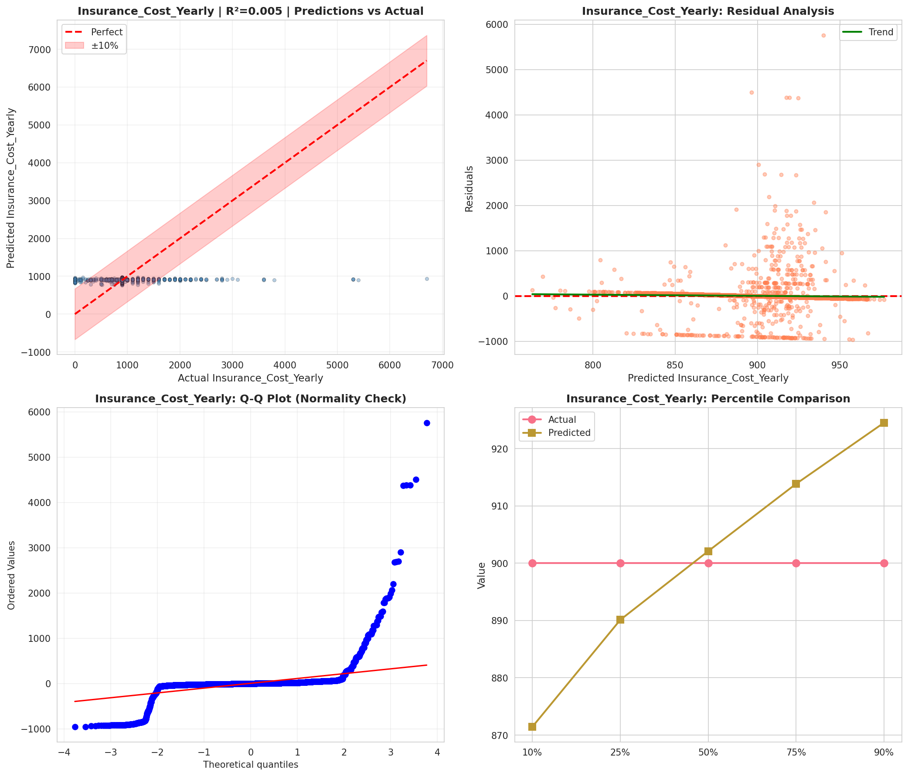
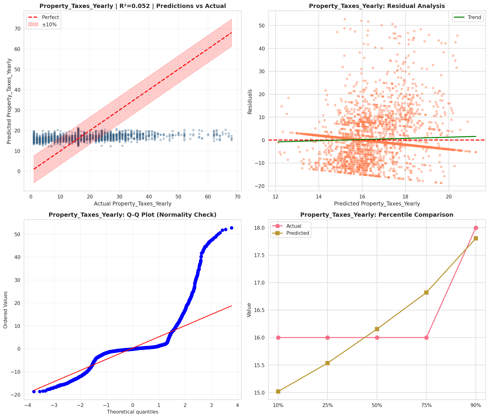
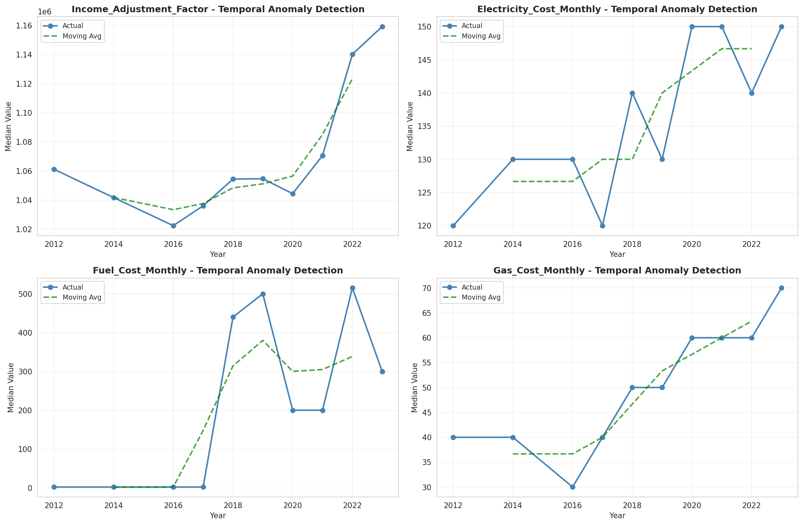
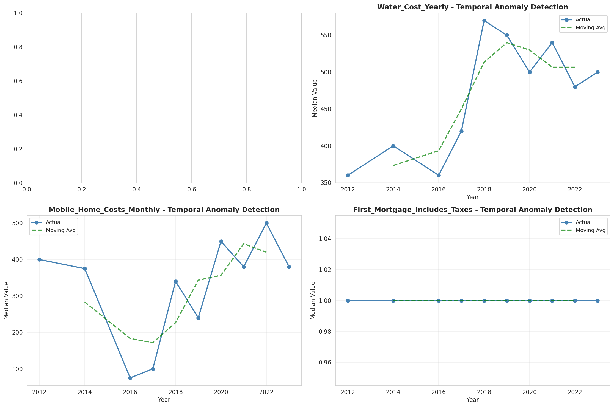
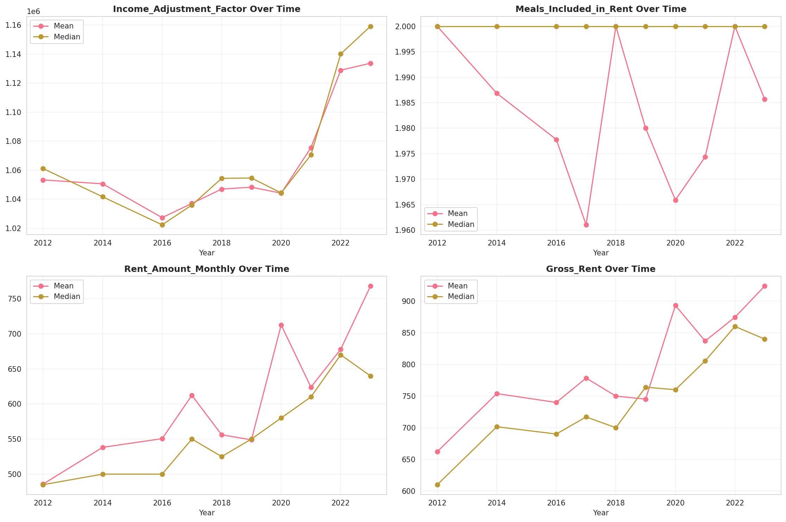
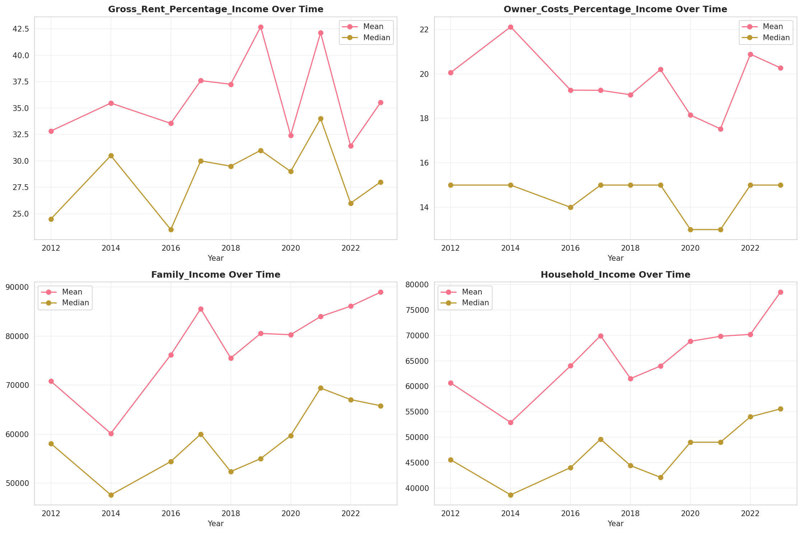
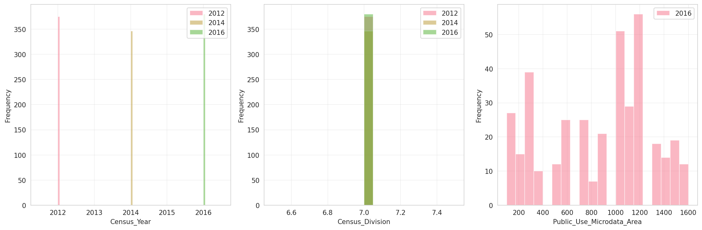
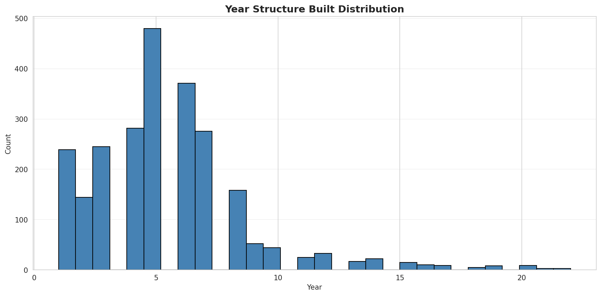
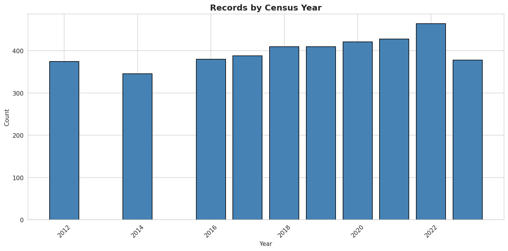
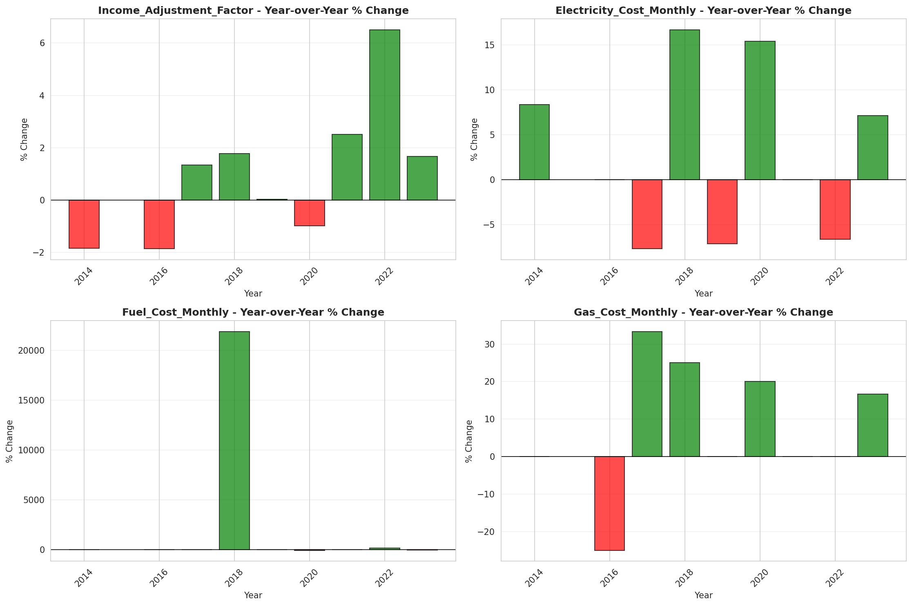
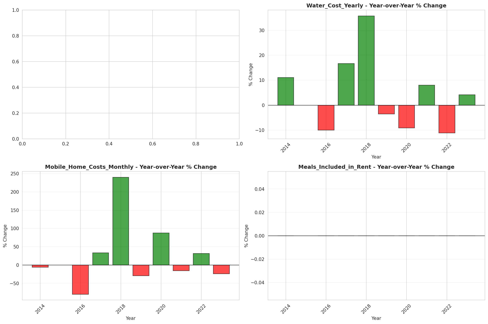
