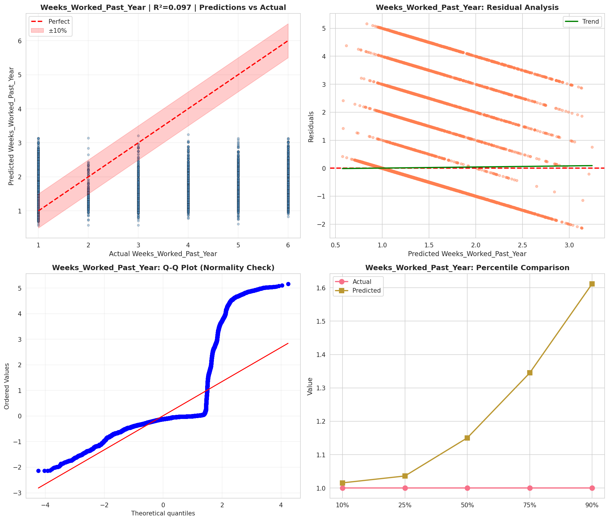
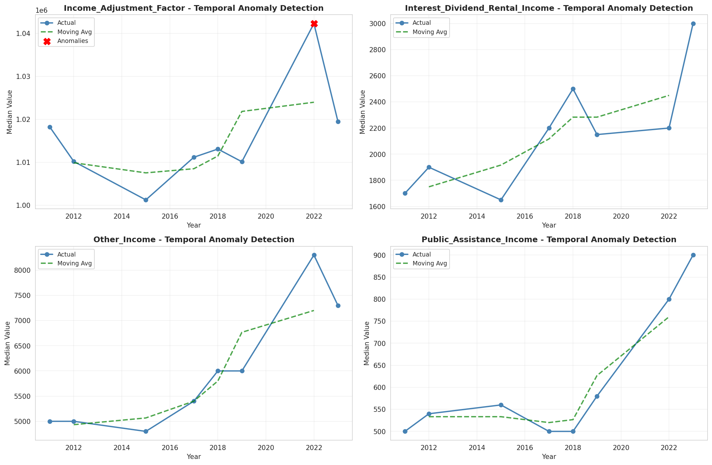
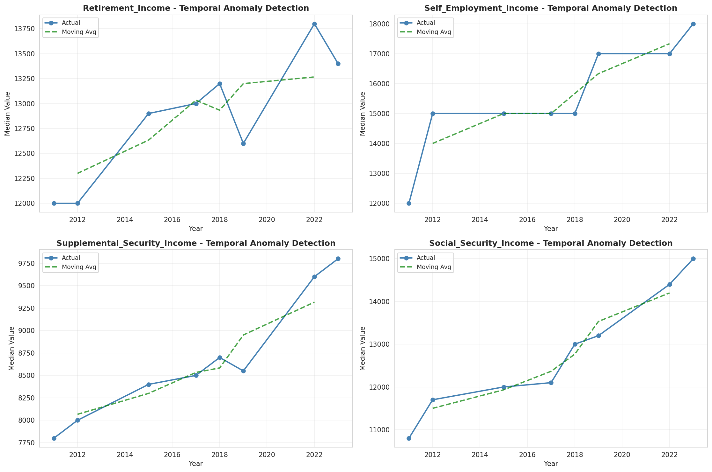
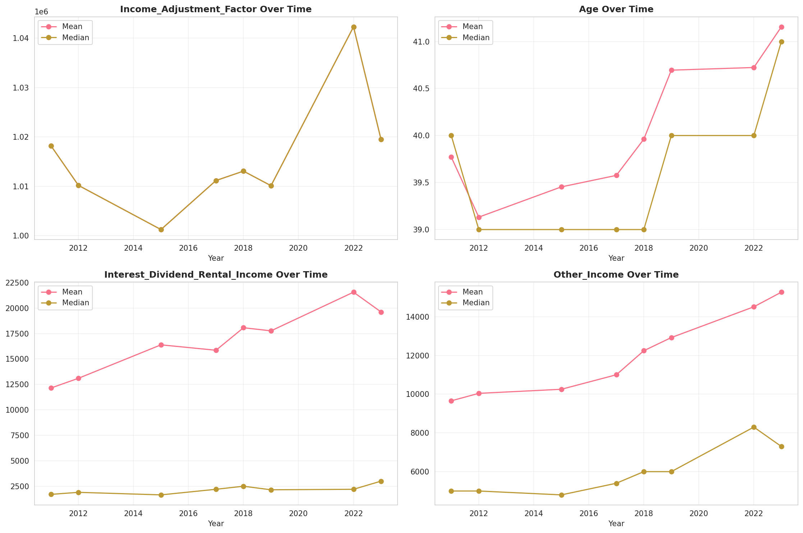
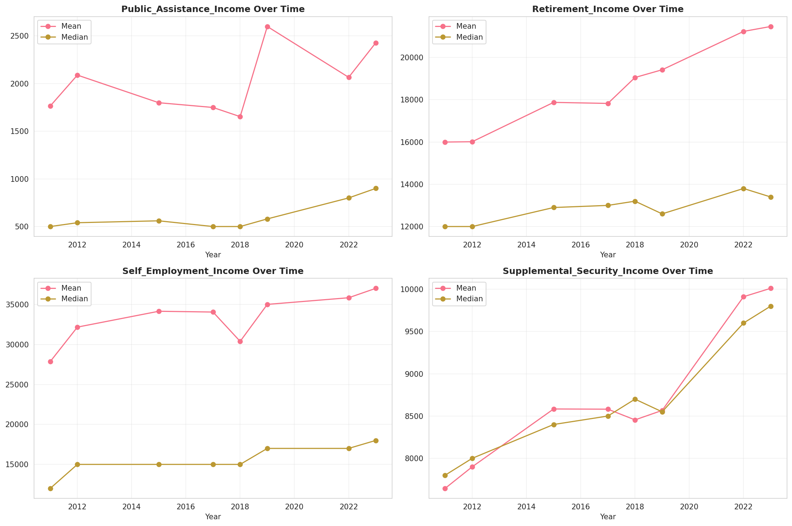
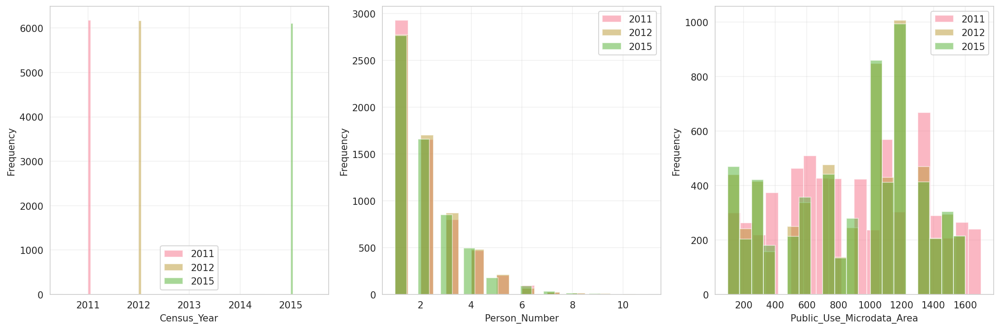
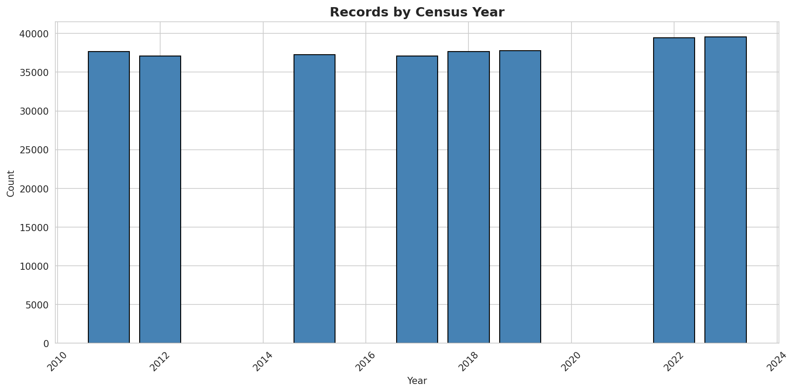
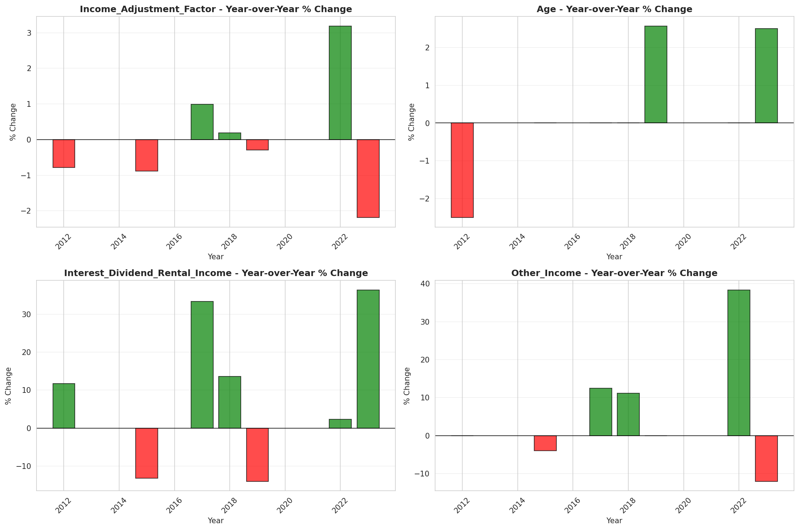
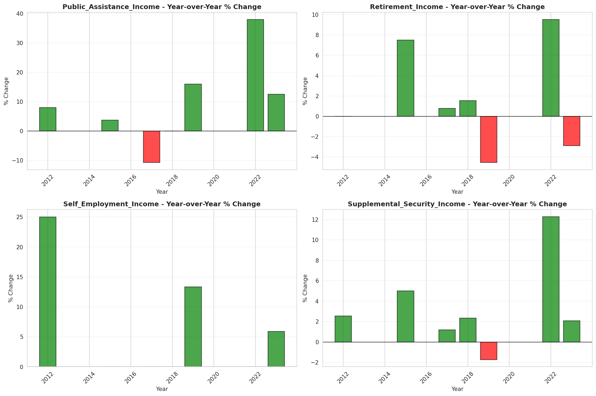

# Temporal Analysis

## Year Distribution

- 2011: 37,650 records

- 2012: 37,096 records

- 2015: 37,251 records

- 2017: 37,105 records

- 2018: 37,648 records

- 2019: 37,792 records

- 2022: 39,445 records

- 2023: 39,539 records

## Temporal Trends

- Census_Year: {np.int64(2011): {'mean': 2011.0, 'median': 2011.0, 'std': 0.0}, np.int64(2012): {'mean': 2012.0, 'median': 2012.0, 'std': 0.0}, np.int64(2015): {'mean': 2015.0, 'median': 2015.0, 'std': 0.0}, np.int64(2017): {'mean': 2017.0, 'median': 2017.0, 'std': 0.0}, np.int64(2018): {'mean': 2018.0, 'median': 2018.0, 'std': 0.0}, np.int64(2019): {'mean': 2019.0, 'median': 2019.0, 'std': 0.0}, np.int64(2022): {'mean': 2022.0, 'median': 2022.0, 'std': 0.0}, np.int64(2023): {'mean': 2023.0, 'median': 2023.0, 'std': 0.0}}

- Person_Number: {np.int64(2011): {'mean': 2.0300929614873837, 'median': 2.0, 'std': 1.2864660682439861}, np.int64(2012): {'mean': 2.0524584860901447, 'median': 2.0, 'std': 1.2985202708525692}, np.int64(2015): {'mean': 2.0498510107111216, 'median': 2.0, 'std': 1.2805664295483274}, np.int64(2017): {'mean': 2.0640614472443066, 'median': 2.0, 'std': 1.309203065027773}, np.int64(2018): {'mean': 2.0553017424564386, 'median': 2.0, 'std': 1.3027700939592977}, np.int64(2019): {'mean': 2.0589013547840813, 'median': 2.0, 'std': 1.3177714300095296}, np.int64(2022): {'mean': 2.0521485612878694, 'median': 2.0, 'std': 1.3242234907288095}, np.int64(2023): {'mean': 2.054907812539518, 'median': 2.0, 'std': 1.3269826969578797}}

- Public_Use_Microdata_Area: {np.int64(2011): {'mean': 898.7322974767596, 'median': 900.0, 'std': 442.97833559550173}, np.int64(2012): {'mean': 887.259300194091, 'median': 1003.0, 'std': 428.56080863919334}, np.int64(2015): {'mean': 891.6401438887547, 'median': 1003.0, 'std': 425.4263614582348}, np.int64(2017): {'mean': 893.5890041773346, 'median': 1003.0, 'std': 426.8668137607016}, np.int64(2018): {'mean': 893.5527518062048, 'median': 1003.0, 'std': 424.15400574189863}, np.int64(2019): {'mean': 896.2091712531753, 'median': 1003.0, 'std': 426.70253330673717}, np.int64(2022): {'mean': 21126.251971099, 'median': 21100.0, 'std': 562.453600169884}, np.int64(2023): {'mean': 21128.952502592376, 'median': 21100.0, 'std': 567.6489573966678}}

- State_Code: {np.int64(2011): {'mean': 40.0, 'median': 40.0, 'std': 0.0}, np.int64(2012): {'mean': 40.0, 'median': 40.0, 'std': 0.0}, np.int64(2015): {'mean': 40.0, 'median': 40.0, 'std': 0.0}, np.int64(2017): {'mean': 40.0, 'median': 40.0, 'std': 0.0}, np.int64(2018): {'mean': 40.0, 'median': 40.0, 'std': 0.0}, np.int64(2019): {'mean': 40.0, 'median': 40.0, 'std': 0.0}, np.int64(2022): {'mean': 40.0, 'median': 40.0, 'std': 0.0}, np.int64(2023): {'mean': None, 'median': None, 'std': None}}

- Income_Adjustment_Factor: {np.int64(2011): {'mean': 1018237.0, 'median': 1018237.0, 'std': 0.0}, np.int64(2012): {'mean': 1010207.0, 'median': 1010207.0, 'std': 0.0}, np.int64(2015): {'mean': 1001264.0, 'median': 1001264.0, 'std': 0.0}, np.int64(2017): {'mean': 1011189.0, 'median': 1011189.0, 'std': 0.0}, np.int64(2018): {'mean': 1013097.0, 'median': 1013097.0, 'std': 0.0}, np.int64(2019): {'mean': 1010145.0, 'median': 1010145.0, 'std': 0.0}, np.int64(2022): {'mean': 1042311.0, 'median': 1042311.0, 'std': 0.0}, np.int64(2023): {'mean': 1019518.0, 'median': 1019518.0, 'std': 0.0}}

- Person_Weight: {np.int64(2011): {'mean': 100.70406374501992, 'median': 74.0, 'std': 96.62166224769462}, np.int64(2012): {'mean': 102.83642441233556, 'median': 82.0, 'std': 88.25991304243601}, np.int64(2015): {'mean': 104.99954363641244, 'median': 84.0, 'std': 90.04331381178606}, np.int64(2017): {'mean': 105.93893006333379, 'median': 83.0, 'std': 94.33358745808678}, np.int64(2018): {'mean': 104.7354175520612, 'median': 83.0, 'std': 92.49908419717755}, np.int64(2019): {'mean': 104.70393204911092, 'median': 80.0, 'std': 98.8894964072911}, np.int64(2022): {'mean': 101.90898719736342, 'median': 82.0, 'std': 91.69961157168672}, np.int64(2023): {'mean': 102.52722628291055, 'median': 81.0, 'std': 96.08320025298936}}

- Age: {np.int64(2011): {'mean': 39.770464807436916, 'median': 40.0, 'std': 23.786891483674502}, np.int64(2012): {'mean': 39.131981884839334, 'median': 39.0, 'std': 23.64452327079952}, np.int64(2015): {'mean': 39.453652250946284, 'median': 39.0, 'std': 23.679762112565392}, np.int64(2017): {'mean': 39.57601401428379, 'median': 39.0, 'std': 23.73847502560802}, np.int64(2018): {'mean': 39.96137909052274, 'median': 39.0, 'std': 23.925671287803794}, np.int64(2019): {'mean': 40.695279424216764, 'median': 40.0, 'std': 24.14302226337166}, np.int64(2022): {'mean': 40.72358980859425, 'median': 40.0, 'std': 24.025333376281665}, np.int64(2023): {'mean': 41.15614962442146, 'median': 41.0, 'std': 24.158928996877286}}

- Citizenship_Status: {np.int64(2011): {'mean': 1.1612483399734397, 'median': 1.0, 'std': 0.7362841172108121}, np.int64(2012): {'mean': 1.1685087340953202, 'median': 1.0, 'std': 0.7592472897850658}, np.int64(2015): {'mean': 1.1811494993422995, 'median': 1.0, 'std': 0.7828977866794653}, np.int64(2017): {'mean': 1.1776310470287024, 'median': 1.0, 'std': 0.7737234365449956}, np.int64(2018): {'mean': 1.1752815554611136, 'median': 1.0, 'std': 0.7650755422304447}, np.int64(2019): {'mean': 1.1763865368331923, 'median': 1.0, 'std': 0.7626090259153815}, np.int64(2022): {'mean': 1.1894536696666245, 'median': 1.0, 'std': 0.7909014586501489}, np.int64(2023): {'mean': 1.1891803029919825, 'median': 1.0, 'std': 0.7876797305533062}}

- Class_of_Worker: {np.int64(2011): {'mean': 2.249249249249249, 'median': 1.0, 'std': 1.9645870961248946}, np.int64(2012): {'mean': 2.246859296482412, 'median': 1.0, 'std': 1.9748576193691645}, np.int64(2015): {'mean': 2.2091477906581947, 'median': 1.0, 'std': 1.9592293097288527}, np.int64(2017): {'mean': 2.2418104283775926, 'median': 1.0, 'std': 1.9666392100547183}, np.int64(2018): {'mean': 2.192346376742181, 'median': 1.0, 'std': 1.9270081289663867}, np.int64(2019): {'mean': 2.25501210653753, 'median': 1.0, 'std': 1.9534401538425648}, np.int64(2022): {'mean': 2.2812282895650964, 'median': 1.0, 'std': 1.9691269502180575}, np.int64(2023): {'mean': 2.2876813262721623, 'median': 1.0, 'std': 1.9756257993855078}}

- English_Speaking_Ability: {np.int64(2011): {'mean': 1.6383136094674555, 'median': 1.0, 'std': 0.9220990366507394}, np.int64(2012): {'mean': 1.6173144876325087, 'median': 1.0, 'std': 0.8931124834712622}, np.int64(2015): {'mean': 1.6231013776050864, 'median': 1.0, 'std': 0.9051968471673866}, np.int64(2017): {'mean': 1.5790372140662343, 'median': 1.0, 'std': 0.8977721524718747}, np.int64(2018): {'mean': 1.5607773851590105, 'median': 1.0, 'std': 0.8662899138449545}, np.int64(2019): {'mean': 1.5352542372881357, 'median': 1.0, 'std': 0.8558009341162193}, np.int64(2022): {'mean': 1.6083511124657117, 'median': 1.0, 'std': 0.9172684760582664}, np.int64(2023): {'mean': 1.58096926713948, 'median': 1.0, 'std': 0.8969706992730335}}

- Fertility_Status: {np.int64(2011): {'mean': 1.9399950714637753, 'median': 2.0, 'std': 0.2375106054778648}, np.int64(2012): {'mean': 1.939338459660686, 'median': 2.0, 'std': 0.2387230060951024}, np.int64(2015): {'mean': 1.949293330027275, 'median': 2.0, 'std': 0.21941164973022978}, np.int64(2017): {'mean': 1.936545386812368, 'median': 2.0, 'std': 0.2437939822780141}, np.int64(2018): {'mean': 1.9419659500434945, 'median': 2.0, 'std': 0.23382235393114342}, np.int64(2019): {'mean': 1.9404073422177521, 'median': 2.0, 'std': 0.23674547406637123}, np.int64(2022): {'mean': 1.941616233535066, 'median': 2.0, 'std': 0.2344816127942172}, np.int64(2023): {'mean': 1.950011789672247, 'median': 2.0, 'std': 0.21793345007014872}}

- Marital_Status: {np.int64(2011): {'mean': 2.8560956175298804, 'median': 3.0, 'std': 1.8249245024695142}, np.int64(2012): {'mean': 2.9183739486737115, 'median': 3.0, 'std': 1.8220085691946595}, np.int64(2015): {'mean': 2.926498617486779, 'median': 3.0, 'std': 1.8253160301137006}, np.int64(2017): {'mean': 2.9377172887750977, 'median': 3.0, 'std': 1.828699684465078}, np.int64(2018): {'mean': 2.942520186995325, 'median': 3.0, 'std': 1.8294017034905152}, np.int64(2019): {'mean': 2.9259896274343777, 'median': 3.0, 'std': 1.8238276666168973}, np.int64(2022): {'mean': 2.957916085688934, 'median': 3.0, 'std': 1.8293773687244403}, np.int64(2023): {'mean': 2.962770935026177, 'median': 3.0, 'std': 1.8271533937838826}}

- Mobility_Status: {np.int64(2011): {'mean': 1.3028683461352528, 'median': 1.0, 'std': 0.714682766727863}, np.int64(2012): {'mean': 1.311809477043948, 'median': 1.0, 'std': 0.7238459123140639}, np.int64(2015): {'mean': 1.315094493099428, 'median': 1.0, 'std': 0.7260135203024244}, np.int64(2017): {'mean': 1.3095790249092845, 'median': 1.0, 'std': 0.7212458225287551}, np.int64(2018): {'mean': 1.315816312837167, 'median': 1.0, 'std': 0.7276431334663632}, np.int64(2019): {'mean': 1.2948615121377394, 'median': 1.0, 'std': 0.7071724238179868}, np.int64(2022): {'mean': 1.2598965534900395, 'median': 1.0, 'std': 0.6696780921759733}, np.int64(2023): {'mean': 1.2557035676006738, 'median': 1.0, 'std': 0.6659062744335744}}

- Military_Service: {np.int64(2011): {'mean': 4.729898860061564, 'median': 5.0, 'std': 0.7085224097092951}, np.int64(2012): {'mean': 4.741483174075613, 'median': 5.0, 'std': 0.6958822820192868}, np.int64(2015): {'mean': 3.7733365411053064, 'median': 4.0, 'std': 0.6262887929106156}, np.int64(2017): {'mean': 3.7837241379310345, 'median': 4.0, 'std': 0.6160468328257273}, np.int64(2018): {'mean': 3.7839788553420757, 'median': 4.0, 'std': 0.6175416441315711}, np.int64(2019): {'mean': 3.778707733511885, 'median': 4.0, 'std': 0.6254198260132224}, np.int64(2022): {'mean': 3.794862761425872, 'median': 4.0, 'std': 0.6121853202078883}, np.int64(2023): {'mean': 3.8042960941713995, 'median': 4.0, 'std': 0.598229457838249}}

- Travel_Time_To_Work_Minutes: {np.int64(2011): {'mean': 21.983575786015955, 'median': 15.0, 'std': 20.53882472300003}, np.int64(2012): {'mean': 21.800310014826795, 'median': 15.0, 'std': 20.982585073374263}, np.int64(2015): {'mean': 21.963943102877934, 'median': 15.0, 'std': 20.137402417250147}, np.int64(2017): {'mean': 22.62680577849117, 'median': 18.0, 'std': 21.332319613501213}, np.int64(2018): {'mean': 22.81519520705774, 'median': 20.0, 'std': 21.078409140711386}, np.int64(2019): {'mean': 23.666033782899046, 'median': 20.0, 'std': 22.72801477378291}, np.int64(2022): {'mean': 23.453260650111044, 'median': 20.0, 'std': 21.841661337389557}, np.int64(2023): {'mean': 23.564095762318455, 'median': 20.0, 'std': 22.36744094010671}}

- Vehicle_Occupancy: {np.int64(2011): {'mean': 1.1747294938917976, 'median': 1.0, 'std': 0.6427506990268246}, np.int64(2012): {'mean': 1.161977293561808, 'median': 1.0, 'std': 0.5893350557594573}, np.int64(2015): {'mean': 1.1417458350543852, 'median': 1.0, 'std': 0.5005432728836969}, np.int64(2017): {'mean': 1.161267899346587, 'median': 1.0, 'std': 0.6110930549674084}, np.int64(2018): {'mean': 1.1413282107574094, 'median': 1.0, 'std': 0.5156131014467282}, np.int64(2019): {'mean': 1.1483814167682513, 'median': 1.0, 'std': 0.5300260563824631}, np.int64(2022): {'mean': 1.1635854341736696, 'median': 1.0, 'std': 0.5891295565595857}, np.int64(2023): {'mean': 1.1745888557352022, 'median': 1.0, 'std': 0.6693826813662962}}

- Transportation_To_Work: {np.int64(2011): {'mean': 1.6863592389551758, 'median': 1.0, 'std': 2.4784385608456}, np.int64(2012): {'mean': 1.7213487525987525, 'median': 1.0, 'std': 2.5335108961374067}, np.int64(2015): {'mean': 1.700916730328495, 'median': 1.0, 'std': 2.5122214394258178}, np.int64(2017): {'mean': 1.7617739152661511, 'median': 1.0, 'std': 2.616604467418239}, np.int64(2018): {'mean': 1.757839063090291, 'median': 1.0, 'std': 2.608331034156598}, np.int64(2019): {'mean': None, 'median': None, 'std': None}, np.int64(2022): {'mean': None, 'median': None, 'std': None}, np.int64(2023): {'mean': None, 'median': None, 'std': None}}

- Language_Other_Than_English: {np.int64(2011): {'mean': 1.9235661588037425, 'median': 2.0, 'std': 0.2656947582945123}, np.int64(2012): {'mean': 1.9187622000229647, 'median': 2.0, 'std': 0.273203884403979}, np.int64(2015): {'mean': 1.919314845954342, 'median': 2.0, 'std': 0.2723548678747743}, np.int64(2017): {'mean': 1.9162400983728445, 'median': 2.0, 'std': 0.27703136140880685}, np.int64(2018): {'mean': 1.9203445170006754, 'median': 2.0, 'std': 0.2707629046641671}, np.int64(2019): {'mean': 1.9172672967439774, 'median': 2.0, 'std': 0.27548163533256786}, np.int64(2022): {'mean': 1.9122351808260218, 'median': 2.0, 'std': 0.2829563523976357}, np.int64(2023): {'mean': 1.9099497059527928, 'median': 2.0, 'std': 0.2862576097736828}}

- Grandparents_Living_With_Grandchildren: {np.int64(2011): {'mean': 1.9640256959314775, 'median': 2.0, 'std': 0.18623006956539498}, np.int64(2012): {'mean': 1.9609994711792702, 'median': 2.0, 'std': 0.1936004630832612}, np.int64(2015): {'mean': 1.960477418790714, 'median': 2.0, 'std': 0.19483892444519796}, np.int64(2017): {'mean': 1.9603497267759562, 'median': 2.0, 'std': 0.19514044621179769}, np.int64(2018): {'mean': 1.961373758136348, 'median': 2.0, 'std': 0.192706630833425}, np.int64(2019): {'mean': 1.962123446387192, 'median': 2.0, 'std': 0.19090169127135498}, np.int64(2022): {'mean': 1.9637399221852312, 'median': 2.0, 'std': 0.1869403282009533}, np.int64(2023): {'mean': 1.968065620769292, 'median': 2.0, 'std': 0.17582891022991212}}

- Months_Responsible_For_Grandchildren: {np.int64(2011): {'mean': 3.70989010989011, 'median': 4.0, 'std': 1.4030375280362892}, np.int64(2012): {'mean': 3.6022304832713754, 'median': 4.0, 'std': 1.453741927909157}, np.int64(2015): {'mean': 3.6660377358490566, 'median': 4.0, 'std': 1.3871464223581544}, np.int64(2017): {'mean': 3.7939914163090127, 'median': 4.0, 'std': 1.2903472700577605}, np.int64(2018): {'mean': 3.7761806981519506, 'median': 4.0, 'std': 1.3120239258854267}, np.int64(2019): {'mean': 3.928270042194093, 'median': 5.0, 'std': 1.2887225769774557}, np.int64(2022): {'mean': 4.027777777777778, 'median': 5.0, 'std': 1.2473860368048084}, np.int64(2023): {'mean': 3.911764705882353, 'median': 5.0, 'std': 1.3262540075255302}}

- Grandparents_Responsible_For_Grandchildren: {np.int64(2011): {'mean': 1.4583333333333333, 'median': 1.0, 'std': 0.4985577132136732}, np.int64(2012): {'mean': 1.392090395480226, 'median': 1.0, 'std': 0.4884927329965657}, np.int64(2015): {'mean': 1.413716814159292, 'median': 1.0, 'std': 0.49277157209404465}, np.int64(2017): {'mean': 1.486218302094818, 'median': 1.0, 'std': 0.5000857859919612}, np.int64(2018): {'mean': 1.460088691796009, 'median': 1.0, 'std': 0.498681049386656}, np.int64(2019): {'mean': 1.4727474972191323, 'median': 1.0, 'std': 0.4995346539228157}, np.int64(2022): {'mean': 1.4823008849557522, 'median': 1.0, 'std': 0.49996324799512876}, np.int64(2023): {'mean': 1.5336658354114714, 'median': 2.0, 'std': 0.4991766284811774}}

- Interest_Dividend_Rental_Income: {np.int64(2011): {'mean': 12144.658988764046, 'median': 1700.0, 'std': 35563.04527991586}, np.int64(2012): {'mean': 13100.799342105263, 'median': 1900.0, 'std': 38016.70870806172}, np.int64(2015): {'mean': 16385.934875228242, 'median': 1650.0, 'std': 46829.56207747144}, np.int64(2017): {'mean': 15852.8190215532, 'median': 2200.0, 'std': 44713.3971151613}, np.int64(2018): {'mean': 18066.25, 'median': 2500.0, 'std': 47994.671128174086}, np.int64(2019): {'mean': 17759.32490752158, 'median': 2150.0, 'std': 51516.1877915119}, np.int64(2022): {'mean': 21557.39029255319, 'median': 2200.0, 'std': 62831.397704892064}, np.int64(2023): {'mean': 19616.259160559628, 'median': 3000.0, 'std': 51983.32806805575}}

- Military_Service_Period_1: {np.int64(2011): {'mean': 0.13539921831379118, 'median': 0.0, 'std': 0.34219725442743415}, np.int64(2012): {'mean': 0.1412849494348602, 'median': 0.0, 'std': 0.3483670620810839}, np.int64(2015): {'mean': 0.18711233631977947, 'median': 0.0, 'std': 0.39006889207517836}, np.int64(2017): {'mean': 0.21595400646784046, 'median': 0.0, 'std': 0.41155647909209814}, np.int64(2018): {'mean': 0.233356940509915, 'median': 0.0, 'std': 0.42304237571263276}, np.int64(2019): {'mean': 0.23412162162162162, 'median': 0.0, 'std': 0.42352011244156934}, np.int64(2022): {'mean': 0.3076651359943483, 'median': 0.0, 'std': 0.4616086737542215}, np.int64(2023): {'mean': 0.31580895964457606, 'median': 0.0, 'std': 0.46492331403631454}}

- Military_Service_Period_2: {np.int64(2011): {'mean': 0.14935790061418203, 'median': 0.0, 'std': 0.35649066900523485}, np.int64(2012): {'mean': 0.15675193337299226, 'median': 0.0, 'std': 0.3636208087629707}, np.int64(2015): {'mean': 0.18263266712611992, 'median': 0.0, 'std': 0.3864316672385017}, np.int64(2017): {'mean': 0.20373697448796263, 'median': 0.0, 'std': 0.4028480274706543}, np.int64(2018): {'mean': 0.21104815864022664, 'median': 0.0, 'std': 0.4081247549513725}, np.int64(2019): {'mean': 0.1966216216216216, 'median': 0.0, 'std': 0.39751093438945917}, np.int64(2022): {'mean': 0.2225362062875309, 'median': 0.0, 'std': 0.41602281044711514}, np.int64(2023): {'mean': 0.22769344687152906, 'median': 0.0, 'std': 0.41942135190619295}}

- Military_Service_Period_3: {np.int64(2011): {'mean': 0.15773310999441653, 'median': 0.0, 'std': 0.3645414592669505}, np.int64(2012): {'mean': 0.17073170731707318, 'median': 0.0, 'std': 0.37633032898365054}, np.int64(2015): {'mean': None, 'median': None, 'std': None}, np.int64(2017): {'mean': None, 'median': None, 'std': None}, np.int64(2018): {'mean': None, 'median': None, 'std': None}, np.int64(2019): {'mean': None, 'median': None, 'std': None}, np.int64(2022): {'mean': None, 'median': None, 'std': None}, np.int64(2023): {'mean': None, 'median': None, 'std': None}}

- Military_Service_Period_4: {np.int64(2011): {'mean': 0.1273031825795645, 'median': 0.0, 'std': 0.33335882517685755}, np.int64(2012): {'mean': 0.13503866745984533, 'median': 0.0, 'std': 0.3418157080537828}, np.int64(2015): {'mean': None, 'median': None, 'std': None}, np.int64(2017): {'mean': None, 'median': None, 'std': None}, np.int64(2018): {'mean': None, 'median': None, 'std': None}, np.int64(2019): {'mean': None, 'median': None, 'std': None}, np.int64(2022): {'mean': None, 'median': None, 'std': None}, np.int64(2023): {'mean': None, 'median': None, 'std': None}}

- Military_Service_Period_5: {np.int64(2011): {'mean': 0.37018425460636517, 'median': 0.0, 'std': 0.48292129707187736}, np.int64(2012): {'mean': 0.37388459250446165, 'median': 0.0, 'std': 0.4839055221480064}, np.int64(2015): {'mean': 0.39662301860785665, 'median': 0.0, 'std': 0.4892807916373505}, np.int64(2017): {'mean': 0.38016528925619836, 'median': 0.0, 'std': 0.48551451433071197}, np.int64(2018): {'mean': 0.37747875354107646, 'median': 0.0, 'std': 0.48484202054192704}, np.int64(2019): {'mean': 0.3844594594594595, 'median': 0.0, 'std': 0.4865494424666022}, np.int64(2022): {'mean': 0.35217237725185446, 'median': 0.0, 'std': 0.47773173566865196}, np.int64(2023): {'mean': 0.3524620510921881, 'median': 0.0, 'std': 0.47782536999148056}}

- Military_Service_Period_6: {np.int64(2011): {'mean': 0.11194863204913456, 'median': 0.0, 'std': 0.31534726564063476}, np.int64(2012): {'mean': 0.1032123735871505, 'median': 0.0, 'std': 0.3042813152714836}, np.int64(2015): {'mean': None, 'median': None, 'std': None}, np.int64(2017): {'mean': None, 'median': None, 'std': None}, np.int64(2018): {'mean': None, 'median': None, 'std': None}, np.int64(2019): {'mean': None, 'median': None, 'std': None}, np.int64(2022): {'mean': None, 'median': None, 'std': None}, np.int64(2023): {'mean': None, 'median': None, 'std': None}}

- Military_Service_Period_7: {np.int64(2011): {'mean': 0.1309324399776661, 'median': 0.0, 'std': 0.33737354955321947}, np.int64(2012): {'mean': 0.12462819750148721, 'median': 0.0, 'std': 0.3303459842029978}, np.int64(2015): {'mean': None, 'median': None, 'std': None}, np.int64(2017): {'mean': None, 'median': None, 'std': None}, np.int64(2018): {'mean': None, 'median': None, 'std': None}, np.int64(2019): {'mean': None, 'median': None, 'std': None}, np.int64(2022): {'mean': None, 'median': None, 'std': None}, np.int64(2023): {'mean': None, 'median': None, 'std': None}}

- Military_Service_Period_8: {np.int64(2011): {'mean': 0.12116136236739251, 'median': 0.0, 'std': 0.3263602636764161}, np.int64(2012): {'mean': 0.10142772159428912, 'median': 0.0, 'std': 0.3019391591981548}, np.int64(2015): {'mean': 0.09786354238456237, 'median': 0.0, 'std': 0.29718126203303125}, np.int64(2017): {'mean': 0.07833273445921667, 'median': 0.0, 'std': 0.2687427553320361}, np.int64(2018): {'mean': 0.07507082152974505, 'median': 0.0, 'std': 0.26355225198685867}, np.int64(2019): {'mean': 0.06114864864864865, 'median': 0.0, 'std': 0.23964326210047487}, np.int64(2022): {'mean': 0.032497350759448956, 'median': 0.0, 'std': 0.1773481968995148}, np.int64(2023): {'mean': 0.03332099222510181, 'median': 0.0, 'std': 0.17950663941062617}}

- Military_Service_Period_9: {np.int64(2011): {'mean': 0.027359017308766054, 'median': 0.0, 'std': 0.16315003066481962}, np.int64(2012): {'mean': 0.02052349791790601, 'median': 0.0, 'std': 0.14180361417697376}, np.int64(2015): {'mean': 0.016195727084769126, 'median': 0.0, 'std': 0.12624942732422678}, np.int64(2017): {'mean': 0.010420409629895796, 'median': 0.0, 'std': 0.10156540412888512}, np.int64(2018): {'mean': 0.009915014164305949, 'median': 0.0, 'std': 0.09909684183017821}, np.int64(2019): {'mean': 0.008783783783783784, 'median': 0.0, 'std': 0.09332508424307238}, np.int64(2022): {'mean': None, 'median': None, 'std': None}, np.int64(2023): {'mean': None, 'median': None, 'std': None}}

- Military_Service_Period_10: {np.int64(2011): {'mean': 0.08458961474036851, 'median': 0.0, 'std': 0.2783088849577582}, np.int64(2012): {'mean': 0.07346817370612731, 'median': 0.0, 'std': 0.26094224310793157}, np.int64(2015): {'mean': 0.03859407305306685, 'median': 0.0, 'std': 0.19265866408576984}, np.int64(2017): {'mean': 0.0265900107797341, 'median': 0.0, 'std': 0.16091080087537174}, np.int64(2018): {'mean': 0.02301699716713881, 'median': 0.0, 'std': 0.1499839348867092}, np.int64(2019): {'mean': 0.022972972972972974, 'median': 0.0, 'std': 0.14984258704207754}, np.int64(2022): {'mean': 0.00565171317555634, 'median': 0.0, 'std': 0.07497837754082241}, np.int64(2023): {'mean': 0.00518326545723806, 'median': 0.0, 'std': 0.07182136864419558}}

- Military_Service_Period_11: {np.int64(2011): {'mean': 0.004745951982132886, 'median': 0.0, 'std': 0.06873679470813115}, np.int64(2012): {'mean': 0.002676977989292088, 'median': 0.0, 'std': 0.051677907548214976}, np.int64(2015): {'mean': 0.002067539627842867, 'median': 0.0, 'std': 0.04543100409563786}, np.int64(2017): {'mean': 0.00035932446999640676, 'median': 0.0, 'std': 0.01895585582337042}, np.int64(2018): {'mean': 0.0010623229461756375, 'median': 0.0, 'std': 0.0325817483617112}, np.int64(2019): {'mean': 0.00033783783783783786, 'median': 0.0, 'std': 0.01838036555234519}, np.int64(2022): {'mean': None, 'median': None, 'std': None}, np.int64(2023): {'mean': None, 'median': None, 'std': None}}

- Temporary_Absence_From_Work: {np.int64(2011): {'mean': 2.5140870837907063, 'median': 3.0, 'std': 0.529289303238793}, np.int64(2012): {'mean': 2.5316925381263617, 'median': 3.0, 'std': 0.5250003200648871}, np.int64(2015): {'mean': 2.582840935948948, 'median': 3.0, 'std': 0.5142157856827353}, np.int64(2017): {'mean': 2.585767104236627, 'median': 3.0, 'std': 0.5144251536444246}, np.int64(2018): {'mean': 2.5837468776019983, 'median': 3.0, 'std': 0.5143707683948322}, np.int64(2019): {'mean': 2.5950524688312115, 'median': 3.0, 'std': 0.5087269165028067}, np.int64(2022): {'mean': 2.5820275627713802, 'median': 3.0, 'std': 0.5120140018807984}, np.int64(2023): {'mean': 2.5789407983022814, 'median': 3.0, 'std': 0.5111291612656345}}

- Available_For_Work: {np.int64(2011): {'mean': 4.580115091640887, 'median': 5.0, 'std': 1.138163389207221}, np.int64(2012): {'mean': 4.618123638344227, 'median': 5.0, 'std': 1.0806792343973863}, np.int64(2015): {'mean': 4.753790053010095, 'median': 5.0, 'std': 0.8937443366579332}, np.int64(2017): {'mean': 4.754248499033276, 'median': 5.0, 'std': 0.8941717356255403}, np.int64(2018): {'mean': 4.770391340549542, 'median': 5.0, 'std': 0.8614574334215707}, np.int64(2019): {'mean': 4.771406954176125, 'median': 5.0, 'std': 0.8546692158586363}, np.int64(2022): {'mean': 4.803630986092757, 'median': 5.0, 'std': 0.7922856752316519}, np.int64(2023): {'mean': 4.792310332990045, 'median': 5.0, 'std': 0.8186245920119903}}

- On_Layoff_From_Work: {np.int64(2011): {'mean': 2.495925223696903, 'median': 3.0, 'std': 0.5196956051874886}, np.int64(2012): {'mean': 2.517803649237473, 'median': 3.0, 'std': 0.5151884989944245}, np.int64(2015): {'mean': 2.5703818752743355, 'median': 3.0, 'std': 0.5088207286796038}, np.int64(2017): {'mean': 2.576710423662698, 'median': 3.0, 'std': 0.5056253894872428}, np.int64(2018): {'mean': 2.5763863447127395, 'median': 3.0, 'std': 0.5025599904934811}, np.int64(2019): {'mean': 2.5865324517253856, 'median': 3.0, 'std': 0.5024489793321382}, np.int64(2022): {'mean': 2.576552765716443, 'median': 3.0, 'std': 0.5013824731803497}, np.int64(2023): {'mean': 2.5739787161002403, 'median': 3.0, 'std': 0.5016477267133109}}

- Looking_For_Work: {np.int64(2011): {'mean': 2.4800585437248444, 'median': 3.0, 'std': 0.5907666423940332}, np.int64(2012): {'mean': 2.5024850217864922, 'median': 3.0, 'std': 0.581467507909401}, np.int64(2015): {'mean': 2.558463044872877, 'median': 3.0, 'std': 0.5609471554103556}, np.int64(2017): {'mean': 2.5627353210542383, 'median': 3.0, 'std': 0.5635412426323041}, np.int64(2018): {'mean': 2.5651290591174023, 'median': 3.0, 'std': 0.5538209368190695}, np.int64(2019): {'mean': 2.567913418204546, 'median': 3.0, 'std': 0.5500044185778727}, np.int64(2022): {'mean': 2.555849222830533, 'median': 3.0, 'std': 0.5503035604718014}, np.int64(2023): {'mean': 2.5504166276565865, 'median': 3.0, 'std': 0.5566722221037186}}

- Informed_Of_Recall: {np.int64(2011): {'mean': 2.9049995010478, 'median': 3.0, 'std': 0.3069656031944922}, np.int64(2012): {'mean': 2.9189814814814814, 'median': 3.0, 'std': 0.2872126309037786}, np.int64(2015): {'mean': 2.9520883276496606, 'median': 3.0, 'std': 0.22512777278254156}, np.int64(2017): {'mean': 2.954682676978393, 'median': 3.0, 'std': 0.21881139816331505}, np.int64(2018): {'mean': 2.9545378850957533, 'median': 3.0, 'std': 0.2169343035227195}, np.int64(2019): {'mean': 2.94457054508372, 'median': 3.0, 'std': 0.23977211973345922}, np.int64(2022): {'mean': 2.958561449877289, 'median': 3.0, 'std': 0.20659232459329813}, np.int64(2023): {'mean': 2.9565271666198547, 'median': 3.0, 'std': 0.21202551738091358}}

- Other_Income: {np.int64(2011): {'mean': 9656.959903769046, 'median': 5000.0, 'std': 12024.778972894575}, np.int64(2012): {'mean': 10042.385949310805, 'median': 5000.0, 'std': 12947.812695384071}, np.int64(2015): {'mean': 10252.495920217589, 'median': 4800.0, 'std': 13411.708165931042}, np.int64(2017): {'mean': 11000.82060235705, 'median': 5400.0, 'std': 13948.089250388317}, np.int64(2018): {'mean': 12243.48115687993, 'median': 6000.0, 'std': 15064.736565463056}, np.int64(2019): {'mean': 12923.230987246103, 'median': 6000.0, 'std': 15843.960641192089}, np.int64(2022): {'mean': 14511.136454183266, 'median': 8300.0, 'std': 16080.86306167913}, np.int64(2023): {'mean': 15266.686146095717, 'median': 7300.0, 'std': 17556.320349332924}}

- Public_Assistance_Income: {np.int64(2011): {'mean': 1763.9285714285713, 'median': 500.0, 'std': 3075.518330731597}, np.int64(2012): {'mean': 2087.9899497487436, 'median': 540.0, 'std': 3335.3447815749673}, np.int64(2015): {'mean': 1798.2904411764705, 'median': 560.0, 'std': 2805.7359395113685}, np.int64(2017): {'mean': 1748.4855233853007, 'median': 500.0, 'std': 2568.9214707089486}, np.int64(2018): {'mean': 1652.3762376237623, 'median': 500.0, 'std': 2757.2016627294483}, np.int64(2019): {'mean': 2597.6470588235293, 'median': 580.0, 'std': 5193.515495152549}, np.int64(2022): {'mean': 2064.644549763033, 'median': 800.0, 'std': 3017.1358178227165}, np.int64(2023): {'mean': 2427.188940092166, 'median': 900.0, 'std': 3200.895288481329}}

- Retirement_Income: {np.int64(2011): {'mean': 15997.49499848439, 'median': 12000.0, 'std': 15380.95360473413}, np.int64(2012): {'mean': 16014.456049302627, 'median': 12000.0, 'std': 15183.618208226404}, np.int64(2015): {'mean': 17875.30294396961, 'median': 12900.0, 'std': 18586.454789050593}, np.int64(2017): {'mean': 17826.11025145068, 'median': 13000.0, 'std': 17265.586391477253}, np.int64(2018): {'mean': 19053.15131380248, 'median': 13200.0, 'std': 21071.783953510956}, np.int64(2019): {'mean': 19418.323462414577, 'median': 12600.0, 'std': 22400.729700284144}, np.int64(2022): {'mean': 21233.538147138963, 'median': 13800.0, 'std': 25834.71951525036}, np.int64(2023): {'mean': 21467.002869123815, 'median': 13400.0, 'std': 26525.65659618045}}

- Self_Employment_Income: {np.int64(2011): {'mean': 27868.1, 'median': 12000.0, 'std': 46387.56736251093}, np.int64(2012): {'mean': 32175.07779097387, 'median': 15000.0, 'std': 54345.67952454393}, np.int64(2015): {'mean': 34157.87739686229, 'median': 15000.0, 'std': 59724.58557690639}, np.int64(2017): {'mean': 34060.45806824754, 'median': 15000.0, 'std': 61188.415051064585}, np.int64(2018): {'mean': 30392.74739281576, 'median': 15000.0, 'std': 47146.96288015919}, np.int64(2019): {'mean': 35017.09378407852, 'median': 17000.0, 'std': 63569.28614819497}, np.int64(2022): {'mean': 35848.58050383352, 'median': 17000.0, 'std': 56016.274068346334}, np.int64(2023): {'mean': 37026.15057283142, 'median': 18000.0, 'std': 66589.03355533266}}

- Supplemental_Security_Income: {np.int64(2011): {'mean': 7644.229074889868, 'median': 7800.0, 'std': 4081.724626467887}, np.int64(2012): {'mean': 7899.636032757052, 'median': 8000.0, 'std': 4394.9714449809235}, np.int64(2015): {'mean': 8583.538732394367, 'median': 8400.0, 'std': 4806.5174341922975}, np.int64(2017): {'mean': 8581.215970961888, 'median': 8500.0, 'std': 4588.763392652769}, np.int64(2018): {'mean': 8454.634581105169, 'median': 8700.0, 'std': 4434.138999962523}, np.int64(2019): {'mean': 8566.355140186915, 'median': 8550.0, 'std': 4609.583378093369}, np.int64(2022): {'mean': 9911.59936658749, 'median': 9600.0, 'std': 5522.988807152325}, np.int64(2023): {'mean': 10010.78691423519, 'median': 9800.0, 'std': 5536.890632457284}}

- Social_Security_Income: {np.int64(2011): {'mean': 11427.379832810868, 'median': 10800.0, 'std': 5776.061589685833}, np.int64(2012): {'mean': 11841.720281651249, 'median': 11700.0, 'std': 5882.973282541288}, np.int64(2015): {'mean': 12909.860886007564, 'median': 12000.0, 'std': 6546.673609145809}, np.int64(2017): {'mean': 13123.669638033496, 'median': 12100.0, 'std': 6732.246018799627}, np.int64(2018): {'mean': 13543.056594044088, 'median': 13000.0, 'std': 6968.971715027078}, np.int64(2019): {'mean': 13873.476454293628, 'median': 13200.0, 'std': 7182.411127730292}, np.int64(2022): {'mean': 15158.102762031118, 'median': 14400.0, 'std': 8075.356673912944}, np.int64(2023): {'mean': 16136.729957805906, 'median': 15000.0, 'std': 8835.33400699148}}

- Wage_Income: {np.int64(2011): {'mean': 34108.61857988166, 'median': 25000.0, 'std': 38780.01932665076}, np.int64(2012): {'mean': 34880.01589978318, 'median': 26000.0, 'std': 39839.73525872469}, np.int64(2015): {'mean': 39280.86784537009, 'median': 29400.0, 'std': 47267.41676342198}, np.int64(2017): {'mean': 39313.32385920729, 'median': 30000.0, 'std': 44651.29411267575}, np.int64(2018): {'mean': 41249.73673336875, 'median': 30000.0, 'std': 49661.415660776955}, np.int64(2019): {'mean': 43817.29397014925, 'median': 32000.0, 'std': 51820.850945100596}, np.int64(2022): {'mean': 46065.49252341886, 'median': 35000.0, 'std': 51668.13603496991}, np.int64(2023): {'mean': 49310.252062063795, 'median': 37500.0, 'std': 58692.57682417411}}

- Relationship_To_Householder: {np.int64(2011): {'mean': 2.6236918990703852, 'median': 1.0, 'std': 4.511536991280612}, np.int64(2012): {'mean': 2.634057580332111, 'median': 1.0, 'std': 4.47521918807543}, np.int64(2015): {'mean': 2.651069769939062, 'median': 1.0, 'std': 4.488023151520269}, np.int64(2017): {'mean': 2.6588060908233393, 'median': 1.0, 'std': 4.483999887259731}, np.int64(2018): {'mean': 2.736001912452189, 'median': 1.0, 'std': 4.584158201356355}, np.int64(2019): {'mean': None, 'median': None, 'std': None}, np.int64(2022): {'mean': None, 'median': None, 'std': None}, np.int64(2023): {'mean': None, 'median': None, 'std': None}}

- School_Enrollment: {np.int64(2011): {'mean': 1.2816909171075839, 'median': 1.0, 'std': 0.5085472613874608}, np.int64(2012): {'mean': 1.2834139386653993, 'median': 1.0, 'std': 0.5060646869971306}, np.int64(2015): {'mean': 1.285289375660199, 'median': 1.0, 'std': 0.5073357603996718}, np.int64(2017): {'mean': 1.281374766172488, 'median': 1.0, 'std': 0.5058377408210173}, np.int64(2018): {'mean': 1.2825299220379927, 'median': 1.0, 'std': 0.5125648854079163}, np.int64(2019): {'mean': 1.2708726447343233, 'median': 1.0, 'std': 0.503719319153861}, np.int64(2022): {'mean': 1.2742251863475873, 'median': 1.0, 'std': 0.5147748746322909}, np.int64(2023): {'mean': 1.2782896106600041, 'median': 1.0, 'std': 0.5190900426755247}}

- School_Grade_Attending: {np.int64(2011): {'mean': 9.36974241930225, 'median': 10.0, 'std': 4.8545601185395215}, np.int64(2012): {'mean': 9.231882480957562, 'median': 10.0, 'std': 4.855926888624199}, np.int64(2015): {'mean': 9.213095366089668, 'median': 10.0, 'std': 4.857093747884957}, np.int64(2017): {'mean': 9.152023692003949, 'median': 9.0, 'std': 4.810303397509865}, np.int64(2018): {'mean': 9.256875747363845, 'median': 10.0, 'std': 4.801223871489854}, np.int64(2019): {'mean': 9.176974202996508, 'median': 9.0, 'std': 4.8565145769224145}, np.int64(2022): {'mean': 9.293256721595837, 'median': 10.0, 'std': 4.737884399349408}, np.int64(2023): {'mean': 9.37728, 'median': 10.0, 'std': 4.764885613456385}}

- Educational_Attainment: {np.int64(2011): {'mean': 15.289572310405644, 'median': 16.0, 'std': 5.485790296168838}, np.int64(2012): {'mean': 15.227698414917112, 'median': 16.0, 'std': 5.541291354917274}, np.int64(2015): {'mean': 15.38102518485573, 'median': 16.0, 'std': 5.533511596167124}, np.int64(2017): {'mean': 15.459139514755563, 'median': 16.0, 'std': 5.501117849626906}, np.int64(2018): {'mean': 15.455199297243878, 'median': 16.0, 'std': 5.516882464596924}, np.int64(2019): {'mean': 15.551015943336889, 'median': 16.0, 'std': 5.511719921580565}, np.int64(2022): {'mean': 15.621027854060415, 'median': 16.0, 'std': 5.475875689156417}, np.int64(2023): {'mean': 15.643790339371227, 'median': 16.0, 'std': 5.4909207815448084}}

- Sex: {np.int64(2011): {'mean': 1.5029747675962815, 'median': 2.0, 'std': 0.4999977908004346}, np.int64(2012): {'mean': 1.507413198188484, 'median': 2.0, 'std': 0.499951780138739}, np.int64(2015): {'mean': 1.5064293576011383, 'median': 2.0, 'std': 0.49996537246145756}, np.int64(2017): {'mean': 1.503759601131923, 'median': 2.0, 'std': 0.4999926027816885}, np.int64(2018): {'mean': 1.5022843178920526, 'median': 2.0, 'std': 0.5000014223865146}, np.int64(2019): {'mean': 1.504524767146486, 'median': 2.0, 'std': 0.499986141080139}, np.int64(2022): {'mean': 1.5025732031943213, 'median': 2.0, 'std': 0.49999971655695674}, np.int64(2023): {'mean': 1.5043121980829055, 'median': 2.0, 'std': 0.4999877273577756}}

- Hours_Worked_Per_Week: {np.int64(2011): {'mean': 38.79048091771454, 'median': 40.0, 'std': 13.546678355130474}, np.int64(2012): {'mean': 39.13331083361458, 'median': 40.0, 'std': 13.423341094554747}, np.int64(2015): {'mean': 39.537074372759854, 'median': 40.0, 'std': 13.45642636914156}, np.int64(2017): {'mean': 39.20961334004812, 'median': 40.0, 'std': 13.39081275234394}, np.int64(2018): {'mean': 39.4116931918656, 'median': 40.0, 'std': 13.505814014633764}, np.int64(2019): {'mean': 39.389949357226335, 'median': 40.0, 'std': 13.399257666515876}, np.int64(2022): {'mean': 38.79866608827676, 'median': 40.0, 'std': 13.141992636444481}, np.int64(2023): {'mean': 38.62374959664408, 'median': 40.0, 'std': 13.390272604734156}}

- When_Last_Worked: {np.int64(2011): {'mean': 1.6933772411269667, 'median': 1.0, 'std': 0.8975819535504156}, np.int64(2012): {'mean': 1.6973039215686274, 'median': 1.0, 'std': 0.9033729037634831}, np.int64(2015): {'mean': 1.7060472026201168, 'median': 1.0, 'std': 0.9085487308858027}, np.int64(2017): {'mean': 1.698822970726909, 'median': 1.0, 'std': 0.9058240840646261}, np.int64(2018): {'mean': 1.705745212323064, 'median': 1.0, 'std': 0.908065140389053}, np.int64(2019): {'mean': 1.733675449850324, 'median': 1.0, 'std': 0.9192303418669979}, np.int64(2022): {'mean': 1.743156503681329, 'median': 1.0, 'std': 0.915284327101889}, np.int64(2023): {'mean': 1.74587273351434, 'median': 1.0, 'std': 0.9175422767535503}}

- Weeks_Worked_Past_Year: {np.int64(2011): {'mean': 1.9535076108537393, 'median': 1.0, 'std': 1.7021920499338417}, np.int64(2012): {'mean': 1.8680953988075149, 'median': 1.0, 'std': 1.6364059287092763}, np.int64(2015): {'mean': 1.824540770609319, 'median': 1.0, 'std': 1.6025967137958086}, np.int64(2017): {'mean': 1.863857646466342, 'median': 1.0, 'std': 1.6230324174124242}, np.int64(2018): {'mean': 1.8256520778072503, 'median': 1.0, 'std': 1.5984057459657142}}

- Year_Of_Entry: {np.int64(2011): {'mean': 1991.3098360655738, 'median': 1996.0, 'std': 15.50187069525448}, np.int64(2012): {'mean': 1992.0919540229886, 'median': 1996.0, 'std': 15.382750038716587}, np.int64(2015): {'mean': 1994.5130260521041, 'median': 1999.0, 'std': 16.140496265932942}, np.int64(2017): {'mean': 1996.2130812468063, 'median': 1999.0, 'std': 16.035813464120693}, np.int64(2018): {'mean': 1996.0131313131312, 'median': 2000.0, 'std': 16.622607972241216}, np.int64(2019): {'mean': 1996.0374753451676, 'median': 1999.0, 'std': 16.31941213914363}, np.int64(2022): {'mean': 1998.881445570736, 'median': 2001.0, 'std': 17.164073735168486}, np.int64(2023): {'mean': 1999.1564685314686, 'median': 2001.5, 'std': 17.508221371543996}}

- Ancestry_Recode: {np.int64(2011): {'mean': 1.7573970783532538, 'median': 1.0, 'std': 1.0820672235643256}, np.int64(2012): {'mean': 1.7567123139961183, 'median': 1.0, 'std': 1.0940825116162036}, np.int64(2015): {'mean': 1.8512791602909988, 'median': 1.0, 'std': 1.155437527728591}, np.int64(2017): {'mean': 1.943107397924808, 'median': 1.0, 'std': 1.191719170173021}, np.int64(2018): {'mean': 1.9679133021674458, 'median': 1.0, 'std': 1.1979125741314605}, np.int64(2019): {'mean': 2.0020639288738358, 'median': 1.0, 'std': 1.2216658678290708}, np.int64(2022): {'mean': 2.062720243376854, 'median': 2.0, 'std': 1.2485955005568823}, np.int64(2023): {'mean': 2.0890007334530463, 'median': 2.0, 'std': 1.2575414312004443}}

- First_Ancestry_Code: {np.int64(2011): {'mean': 587.6675697211156, 'median': 917.0, 'std': 427.4868376871095}, np.int64(2012): {'mean': 595.8519516929049, 'median': 917.0, 'std': 424.1495883483758}, np.int64(2015): {'mean': 606.2254973020858, 'median': 917.0, 'std': 425.09496912309254}, np.int64(2017): {'mean': 636.4763778466514, 'median': 919.0, 'std': 416.67395388879345}, np.int64(2018): {'mean': 634.4693742031449, 'median': 919.0, 'std': 416.928594593016}, np.int64(2019): {'mean': 639.8979149026248, 'median': 920.0, 'std': 417.0775715937173}, np.int64(2022): {'mean': 609.7017872987705, 'median': 919.0, 'std': 430.6744638848587}, np.int64(2023): {'mean': 614.5666557070234, 'median': 919.0, 'std': 429.90851368644695}}

- Second_Ancestry_Code: {np.int64(2011): {'mean': 825.0851527224436, 'median': 999.0, 'std': 358.84598306259215}, np.int64(2012): {'mean': 835.9546042700022, 'median': 999.0, 'std': 349.3233644171463}, np.int64(2015): {'mean': 842.4600413411721, 'median': 999.0, 'std': 343.4159121708284}, np.int64(2017): {'mean': 837.7258859991915, 'median': 999.0, 'std': 347.1190802287358}, np.int64(2018): {'mean': 838.0964725881853, 'median': 999.0, 'std': 346.2195153578269}, np.int64(2019): {'mean': 839.4908181625741, 'median': 999.0, 'std': 345.84140297710974}, np.int64(2022): {'mean': 850.9572062365319, 'median': 999.0, 'std': 335.63043471522684}, np.int64(2023): {'mean': 852.0758238701029, 'median': 999.0, 'std': 334.53310186529256}}

- Decade_Of_Entry: {np.int64(2011): {'mean': 5.63224043715847, 'median': 6.0, 'std': 1.500045163199748}, np.int64(2012): {'mean': 5.703338806787083, 'median': 6.0, 'std': 1.4836106517108831}, np.int64(2015): {'mean': 5.846693386773547, 'median': 6.0, 'std': 1.4693336727172641}, np.int64(2017): {'mean': 6.187020950434338, 'median': 6.0, 'std': 1.6171926387251914}, np.int64(2018): {'mean': 6.1595959595959595, 'median': 7.0, 'std': 1.6642918754151428}, np.int64(2019): {'mean': 6.141025641025641, 'median': 6.0, 'std': 1.635156834086725}, np.int64(2022): {'mean': 6.368884971353019, 'median': 7.0, 'std': 1.6153806698558326}, np.int64(2023): {'mean': 6.373251748251748, 'median': 7.0, 'std': 1.6501173265905102}}

- Drives_Alone_To_Work: {np.int64(2011): {'mean': 1.16565445026178, 'median': 1.0, 'std': 0.5484041729783034}, np.int64(2012): {'mean': 1.1558423242366547, 'median': 1.0, 'std': 0.5203603817544601}, np.int64(2015): {'mean': 1.1394740465372435, 'median': 1.0, 'std': 0.4729826683855885}, np.int64(2017): {'mean': 1.154247184762964, 'median': 1.0, 'std': 0.5371642153944927}, np.int64(2018): {'mean': 1.1387897914379803, 'median': 1.0, 'std': 0.48625909503827347}, np.int64(2019): {'mean': 1.1458756603006908, 'median': 1.0, 'std': 0.5013887809192754}, np.int64(2022): {'mean': 1.15812324929972, 'median': 1.0, 'std': 0.5346039336346486}, np.int64(2023): {'mean': 1.1643883144819929, 'median': 1.0, 'std': 0.565339622244611}}

- Employment_Status_Parents: {np.int64(2011): {'mean': 3.2537969122630854, 'median': 2.0, 'std': 2.605321584333898}, np.int64(2012): {'mean': 3.3673974978322803, 'median': 2.0, 'std': 2.624838921421275}, np.int64(2015): {'mean': 3.353140703517588, 'median': 2.0, 'std': 2.603850587002562}, np.int64(2017): {'mean': 3.3319132940734244, 'median': 2.0, 'std': 2.62439303602161}, np.int64(2018): {'mean': 3.279637553486031, 'median': 2.0, 'std': 2.6139155459922887}, np.int64(2019): {'mean': 3.2384904681623654, 'median': 2.0, 'std': 2.580893983128031}, np.int64(2022): {'mean': 3.275371287128713, 'median': 2.0, 'std': 2.5873117922762265}, np.int64(2023): {'mean': 3.1561789234268387, 'median': 2.0, 'std': 2.551057369076897}}

- Employment_Status_Recode: {np.int64(2011): {'mean': 3.2687023916442137, 'median': 1.0, 'std': 2.4222142797808903}, np.int64(2012): {'mean': 3.246459694989107, 'median': 1.0, 'std': 2.4279481350854195}, np.int64(2015): {'mean': 3.232839247729345, 'median': 1.0, 'std': 2.4345174791213315}, np.int64(2017): {'mean': 3.229809029544452, 'median': 1.0, 'std': 2.43422317455262}, np.int64(2018): {'mean': 3.256652789342215, 'median': 1.0, 'std': 2.4427922547045537}, np.int64(2019): {'mean': 3.2832658969045037, 'median': 1.0, 'std': 2.4493272154212233}, np.int64(2022): {'mean': 3.3412623497577245, 'median': 1.0, 'std': 2.4518564969747474}, np.int64(2023): {'mean': 3.328152794682146, 'median': 1.0, 'std': 2.448944833178718}}

- Hispanic_Origin: {np.int64(2011): {'mean': 1.1832934926958831, 'median': 1.0, 'std': 1.484584761802216}, np.int64(2012): {'mean': 1.2109930989864137, 'median': 1.0, 'std': 1.6373418851790504}, np.int64(2015): {'mean': 1.2525301334192371, 'median': 1.0, 'std': 1.8525617962678802}, np.int64(2017): {'mean': 1.2985042447109554, 'median': 1.0, 'std': 2.0927306404976775}, np.int64(2018): {'mean': 1.2709572885677858, 'median': 1.0, 'std': 1.908392665410393}, np.int64(2019): {'mean': 1.2623571126164268, 'median': 1.0, 'std': 1.8558696210082957}, np.int64(2022): {'mean': 1.3599949296488782, 'median': 1.0, 'std': 2.2497905343629068}, np.int64(2023): {'mean': 1.379144641999039, 'median': 1.0, 'std': 2.3527355412546074}}

- Time_Of_Arrival_At_Work: {np.int64(2011): {'mean': 102.0397533016022, 'median': 91.0, 'std': 42.282037291822455}, np.int64(2012): {'mean': 101.9911039223615, 'median': 91.0, 'std': 43.04012121050901}, np.int64(2015): {'mean': 102.57922593450215, 'median': 91.0, 'std': 43.61502724851303}, np.int64(2017): {'mean': 101.51993044408775, 'median': 91.0, 'std': 42.79941883023318}, np.int64(2018): {'mean': 102.19231022450458, 'median': 91.0, 'std': 43.30675388026282}, np.int64(2019): {'mean': 100.8177294749247, 'median': 91.0, 'std': 41.44151745226081}, np.int64(2022): {'mean': 100.57810081432129, 'median': 91.0, 'std': 41.57148288339065}, np.int64(2023): {'mean': 100.97121825054712, 'median': 91.0, 'std': 41.730876781839584}}

- Time_Of_Departure_For_Work: {np.int64(2011): {'mean': 53.8665281222766, 'median': 49.0, 'std': 28.661385356583104}, np.int64(2012): {'mean': 53.787976816282516, 'median': 49.0, 'std': 29.002024196581417}, np.int64(2015): {'mean': 54.18398941448892, 'median': 49.0, 'std': 29.389299638979228}, np.int64(2017): {'mean': 53.31681380417336, 'median': 49.0, 'std': 29.132032017688182}, np.int64(2018): {'mean': 53.72032391862532, 'median': 49.0, 'std': 29.4609881809621}, np.int64(2019): {'mean': 52.839269346602066, 'median': 47.0, 'std': 28.381037643663113}, np.int64(2022): {'mean': 52.79830405814658, 'median': 49.0, 'std': 28.50005905875086}, np.int64(2023): {'mean': 53.153790039127266, 'median': 49.0, 'std': 28.754632908605643}}

- Language_Spoken_At_Home: {np.int64(2011): {'mean': 670.0795118343195, 'median': 625.0, 'std': 95.57309642880615}, np.int64(2012): {'mean': 673.8219081272085, 'median': 625.0, 'std': 100.52919756111696}, np.int64(2015): {'mean': 665.1352878841399, 'median': 625.0, 'std': 87.23245251621138}, np.int64(2017): {'mean': 1848.6503926254695, 'median': 1200.0, 'std': 1553.2116748309918}, np.int64(2018): {'mean': 1830.9989399293286, 'median': 1200.0, 'std': 1564.2757435881872}, np.int64(2019): {'mean': 1774.157627118644, 'median': 1200.0, 'std': 1460.5469424882335}, np.int64(2022): {'mean': 1788.7372752209692, 'median': 1200.0, 'std': 1465.0120637074303}, np.int64(2023): {'mean': 1794.1554373522458, 'median': 1200.0, 'std': 1469.166244644015}}

- Migration_PUMA: {np.int64(2011): {'mean': 984.6062467099491, 'median': 700.0, 'std': 861.2891989996025}, np.int64(2012): {'mean': 1299.0144097222221, 'median': 1000.0, 'std': 3447.1592281964085}, np.int64(2015): {'mean': 1347.5102873660942, 'median': 1000.0, 'std': 3691.5415110991166}, np.int64(2017): {'mean': 1145.2722038038737, 'median': 1000.0, 'std': 2185.2745609407875}, np.int64(2018): {'mean': 1260.9743632990387, 'median': 1000.0, 'std': 3319.468414420584}, np.int64(2019): {'mean': 1327.152380952381, 'median': 1000.0, 'std': 3506.749518824398}, np.int64(2022): {'mean': 17230.727325694308, 'median': 20800.0, 'std': 7976.417544757969}, np.int64(2023): {'mean': 17451.304287690178, 'median': 20800.0, 'std': 8025.382695262234}}

- Migration_State_Or_Country: {np.int64(2011): {'mean': 42.8096157220565, 'median': 40.0, 'std': 36.03582913688454}, np.int64(2012): {'mean': 41.513888888888886, 'median': 40.0, 'std': 27.979064956891154}, np.int64(2015): {'mean': 43.590885903757865, 'median': 40.0, 'std': 37.375097368618015}, np.int64(2017): {'mean': 43.00977141860059, 'median': 40.0, 'std': 34.48181717979839}, np.int64(2018): {'mean': 42.30224321133412, 'median': 40.0, 'std': 34.87429803337593}, np.int64(2019): {'mean': 42.36819407008086, 'median': 40.0, 'std': 34.23531125500756}, np.int64(2022): {'mean': 44.3934744610604, 'median': 40.0, 'std': 42.641534567010865}, np.int64(2023): {'mean': 42.840940525587826, 'median': 40.0, 'std': 37.6663450422065}}

- Place_Of_Birth: {np.int64(2011): {'mean': 46.24456839309429, 'median': 40.0, 'std': 53.34922011563235}, np.int64(2012): {'mean': 46.492775501401766, 'median': 40.0, 'std': 53.85030998298047}, np.int64(2015): {'mean': 47.399183914525786, 'median': 40.0, 'std': 55.87269906021711}, np.int64(2017): {'mean': 47.42218029915106, 'median': 40.0, 'std': 56.743870580614654}, np.int64(2018): {'mean': 47.27441032724182, 'median': 40.0, 'std': 55.10906995091439}, np.int64(2019): {'mean': 47.38730419136325, 'median': 40.0, 'std': 55.729091415340605}, np.int64(2022): {'mean': 48.48467486373431, 'median': 40.0, 'std': 59.150669422958835}, np.int64(2023): {'mean': 48.080578669162094, 'median': 40.0, 'std': 57.51366025386016}}

- Place_Of_Work_PUMA: {np.int64(2011): {'mean': 937.1441470493389, 'median': 1100.0, 'std': 489.0934710545972}, np.int64(2012): {'mean': 901.704067047817, 'median': 1000.0, 'std': 646.6777557230155}, np.int64(2015): {'mean': 900.4029793735676, 'median': 1000.0, 'std': 557.5156622943257}, np.int64(2017): {'mean': 912.0453064093552, 'median': 1000.0, 'std': 833.0844593686605}, np.int64(2018): {'mean': 919.0638458632415, 'median': 1000.0, 'std': 892.5251253496526}, np.int64(2019): {'mean': 921.8799450034372, 'median': 1000.0, 'std': 1103.9760123745402}, np.int64(2022): {'mean': 20483.399951240324, 'median': 21100.0, 'std': 3549.2510361773047}, np.int64(2023): {'mean': 20476.60107345314, 'median': 21100.0, 'std': 3577.652952118962}}

- Place_Of_Work_State_Or_Country: {np.int64(2011): {'mean': 39.587745888423086, 'median': 40.0, 'std': 7.990185509820594}, np.int64(2012): {'mean': 39.58348492723493, 'median': 40.0, 'std': 7.2053279918122515}, np.int64(2015): {'mean': 39.55054749172396, 'median': 40.0, 'std': 6.3483723400288365}, np.int64(2017): {'mean': 39.639721387948114, 'median': 40.0, 'std': 6.767684689562573}, np.int64(2018): {'mean': 39.50881501070394, 'median': 40.0, 'std': 4.2702107322306295}, np.int64(2019): {'mean': 39.50778076370227, 'median': 40.0, 'std': 4.803600741207821}, np.int64(2022): {'mean': 39.556226001097095, 'median': 40.0, 'std': 6.673266133760154}, np.int64(2023): {'mean': 39.49119527198167, 'median': 40.0, 'std': 4.282034444062844}}

- Married_Spouse_Present: {np.int64(2011): {'mean': 2.8510248182830202, 'median': 1.0, 'std': 2.100127482235774}, np.int64(2012): {'mean': 2.927080545892427, 'median': 2.0, 'std': 2.1125469250302453}, np.int64(2015): {'mean': 2.944400159426066, 'median': 2.0, 'std': 2.125211032814872}, np.int64(2017): {'mean': 2.9646710175812467, 'median': 2.0, 'std': 2.1352609242120413}, np.int64(2018): {'mean': 2.9791400595998296, 'median': 2.0, 'std': 2.1395947911652216}, np.int64(2019): {'mean': 2.9787916073047533, 'median': 2.0, 'std': 2.134480076534818}, np.int64(2022): {'mean': 3.0332404828226553, 'median': 3.0, 'std': 2.153724924598234}, np.int64(2023): {'mean': 3.0593326989778693, 'median': 3.0, 'std': 2.157571362481498}}

- Nativity: {np.int64(2011): {'mean': 1.0403718459495352, 'median': 1.0, 'std': 0.19683238817434354}, np.int64(2012): {'mean': 1.0425113219754152, 'median': 1.0, 'std': 0.20175531411343064}, np.int64(2015): {'mean': 1.0456632036723847, 'median': 1.0, 'std': 0.208756425970509}, np.int64(2017): {'mean': 1.044630103759601, 'median': 1.0, 'std': 0.20649311551064076}, np.int64(2018): {'mean': 1.0442520186995325, 'median': 1.0, 'std': 0.20565724147418296}, np.int64(2019): {'mean': 1.0448772226926333, 'median': 1.0, 'std': 0.2070371749099527}, np.int64(2022): {'mean': 1.0476613005450628, 'median': 1.0, 'std': 0.2130512889263877}, np.int64(2023): {'mean': 1.0477250309820683, 'median': 1.0, 'std': 0.21318654239867696}}

- Nativity_Of_Parent: {np.int64(2011): {'mean': 3.047571231329233, 'median': 1.0, 'std': 2.6308338567340495}, np.int64(2012): {'mean': 3.192865105908584, 'median': 1.0, 'std': 2.6577743971315746}, np.int64(2015): {'mean': 3.1628140703517587, 'median': 1.0, 'std': 2.6471754289392795}, np.int64(2017): {'mean': 3.14496930209247, 'median': 1.0, 'std': 2.6550484025219214}, np.int64(2018): {'mean': 3.1102441479989933, 'median': 1.0, 'std': 2.6389498198787336}, np.int64(2019): {'mean': 3.080663986512774, 'median': 1.0, 'std': 2.6128443337428457}, np.int64(2022): {'mean': 3.1034653465346533, 'median': 1.0, 'std': 2.6158869592405565}, np.int64(2023): {'mean': 3.0083396512509477, 'median': 1.0, 'std': 2.5853667078198743}}

- Own_Child: {np.int64(2011): {'mean': 0.1956175298804781, 'median': 0.0, 'std': 0.39668059104606856}, np.int64(2012): {'mean': 0.2028520595212422, 'median': 0.0, 'std': 0.4021286617873494}, np.int64(2015): {'mean': 0.19816917666639822, 'median': 0.0, 'std': 0.39862566375989633}, np.int64(2017): {'mean': 0.21025450810317278, 'median': 0.0, 'std': 0.40749513835003826}, np.int64(2018): {'mean': 0.20872414962142616, 'median': 0.0, 'std': 0.40640256536620384}, np.int64(2019): {'mean': 0.19977562754171926, 'median': 0.0, 'std': 0.39983722935691596}, np.int64(2022): {'mean': 0.20298953662182362, 'median': 0.0, 'std': 0.4022302595360773}, np.int64(2023): {'mean': 0.20024370430544272, 'median': 0.0, 'std': 0.4001880805168161}}

- Presence_And_Age_Own_Children: {np.int64(2011): {'mean': 3.4571290611850727, 'median': 4.0, 'std': 0.9648773252215627}, np.int64(2012): {'mean': 3.448754822869169, 'median': 4.0, 'std': 0.9672015513295044}, np.int64(2015): {'mean': 3.4642059726486183, 'median': 4.0, 'std': 0.9570585352950324}, np.int64(2017): {'mean': 3.4780116059567923, 'median': 4.0, 'std': 0.9400590380241395}, np.int64(2018): {'mean': 3.4697011813759557, 'median': 4.0, 'std': 0.9499347876809635}, np.int64(2019): {'mean': 3.5125367220058754, 'median': 4.0, 'std': 0.916317919214157}, np.int64(2022): {'mean': 3.499303852018829, 'median': 4.0, 'std': 0.9257239177763109}, np.int64(2023): {'mean': 3.5241455923675096, 'median': 4.0, 'std': 0.9046427614917956}}

- Total_Person_Earnings: {np.int64(2011): {'mean': 34552.7985297369, 'median': 25000.0, 'std': 41248.48462200487}, np.int64(2012): {'mean': 35663.516846968676, 'median': 25900.0, 'std': 42915.34145426474}, np.int64(2015): {'mean': 40067.32665431891, 'median': 29000.0, 'std': 50710.60794949275}, np.int64(2017): {'mean': 40033.02057405539, 'median': 30000.0, 'std': 48417.93199648274}, np.int64(2018): {'mean': 41573.62897330823, 'median': 30000.0, 'std': 51199.843531114304}, np.int64(2019): {'mean': 44477.95879105559, 'median': 31300.0, 'std': 55136.507151380705}, np.int64(2022): {'mean': 46539.91023690502, 'median': 35000.0, 'std': 54477.88522262792}, np.int64(2023): {'mean': 49728.465354543005, 'median': 36400.0, 'std': 61676.653101894306}}

- Total_Person_Income: {np.int64(2011): {'mean': 31883.688999924296, 'median': 21000.0, 'std': 40255.77874553114}, np.int64(2012): {'mean': 32677.50023337223, 'median': 21900.0, 'std': 41556.60287868876}, np.int64(2015): {'mean': 36777.448085533426, 'median': 24000.0, 'std': 50009.98321609081}, np.int64(2017): {'mean': 36711.77440464666, 'median': 25000.0, 'std': 47312.6240934999}, np.int64(2018): {'mean': 38407.12316804617, 'median': 25100.0, 'std': 50508.90275357752}, np.int64(2019): {'mean': 40920.55222982627, 'median': 27200.0, 'std': 54488.42047310285}, np.int64(2022): {'mean': 43227.650486146646, 'median': 29800.0, 'std': 55450.236291013825}, np.int64(2023): {'mean': 45551.273691450086, 'median': 31000.0, 'std': 58924.00300968769}}

- Poverty_Status: {np.int64(2011): {'mean': 270.41569169180457, 'median': 251.0, 'std': 160.96892408177771}, np.int64(2012): {'mean': 266.0687651331719, 'median': 245.0, 'std': 160.86477130432002}, np.int64(2015): {'mean': 276.43426091396475, 'median': 260.0, 'std': 161.2189074165314}, np.int64(2017): {'mean': 277.4063621347611, 'median': 261.0, 'std': 160.7828623650875}, np.int64(2018): {'mean': 282.2032554728052, 'median': 269.0, 'std': 161.499205089945}, np.int64(2019): {'mean': 287.88663164365954, 'median': 279.0, 'std': 162.79378139104165}, np.int64(2022): {'mean': 280.56577950881746, 'median': 266.0, 'std': 162.8210517612974}, np.int64(2023): {'mean': 280.35483957940147, 'median': 267.0, 'std': 162.77505983569253}}

- Quarter_Of_Birth: {np.int64(2011): {'mean': 2.539309428950863, 'median': 3.0, 'std': 1.113547649373021}, np.int64(2012): {'mean': 2.5256092301056716, 'median': 3.0, 'std': 1.1173215140327524}, np.int64(2015): {'mean': 2.521811494993423, 'median': 3.0, 'std': 1.1151311736765246}, np.int64(2017): {'mean': 2.524781026815793, 'median': 3.0, 'std': 1.1147201000287075}, np.int64(2018): {'mean': 2.5271993200169995, 'median': 3.0, 'std': 1.1128593188641782}, np.int64(2019): {'mean': 2.5226767569856055, 'median': 3.0, 'std': 1.1152117896857625}, np.int64(2022): {'mean': 2.524502471796172, 'median': 3.0, 'std': 1.1124482142252552}, np.int64(2023): {'mean': 2.5290472697842636, 'median': 3.0, 'std': 1.113396927951915}}

- Race_Recode: {np.int64(2011): {'mean': 2.1426826029216466, 'median': 1.0, 'std': 2.448272302417108}, np.int64(2012): {'mean': 2.1788332973905544, 'median': 1.0, 'std': 2.472338516682796}, np.int64(2015): {'mean': 2.220638372124238, 'median': 1.0, 'std': 2.5110417807525303}, np.int64(2017): {'mean': 2.1861743700309932, 'median': 1.0, 'std': 2.461212185674906}, np.int64(2018): {'mean': 2.1842594560135997, 'median': 1.0, 'std': 2.4594071679266714}, np.int64(2019): {'mean': 2.1741109229466553, 'median': 1.0, 'std': 2.4494484224435276}, np.int64(2022): {'mean': 2.8192166307516797, 'median': 1.0, 'std': 3.0068029287593045}, np.int64(2023): {'mean': 2.7941526088166113, 'median': 1.0, 'std': 3.0010772851332868}}

- Race_Two_Categories: {np.int64(2011): {'mean': 9.73160690571049, 'median': 1.0, 'std': 20.884921562651684}, np.int64(2012): {'mean': 10.116050248005175, 'median': 1.0, 'std': 21.418266327182472}, np.int64(2015): {'mean': 10.49577192558589, 'median': 1.0, 'std': 21.816165476147287}, np.int64(2017): {'mean': 10.21951219512195, 'median': 1.0, 'std': 21.397731208024638}, np.int64(2018): {'mean': 10.11275499362516, 'median': 1.0, 'std': 21.313404830393377}, np.int64(2019): {'mean': 10.061071126164267, 'median': 1.0, 'std': 21.214337944402732}, np.int64(2022): {'mean': 15.535099505640765, 'median': 1.0, 'std': 26.11373884807481}, np.int64(2023): {'mean': 2998.1854624547914, 'median': 1000.0, 'std': 3038.665179560537}}

- Race_Three_Categories: {np.int64(2011): {'mean': 61.75476759628154, 'median': 69.0, 'std': 15.416086891895516}, np.int64(2012): {'mean': 3.4436327366832002, 'median': 1.0, 'std': 7.161334031443996}, np.int64(2015): {'mean': 3.518697484631285, 'median': 1.0, 'std': 7.183014504687381}, np.int64(2017): {'mean': 3.411777388492117, 'median': 1.0, 'std': 6.960844745036407}, np.int64(2018): {'mean': 3.4316032724181897, 'median': 1.0, 'std': 7.104492901400216}, np.int64(2019): {'mean': 3.415299534292972, 'median': 1.0, 'std': 7.279146389353469}, np.int64(2022): {'mean': 5.508480162251236, 'median': 1.0, 'std': 10.22830155287622}, np.int64(2023): {'mean': 5.508207086673917, 'median': 1.0, 'std': 10.443833245535318}}

- Number_Of_Races: {np.int64(2011): {'mean': 1.0873837981407704, 'median': 1.0, 'std': 0.29428346846332065}, np.int64(2012): {'mean': 1.092435842139314, 'median': 1.0, 'std': 0.3085708984790583}, np.int64(2015): {'mean': 1.094843091460632, 'median': 1.0, 'std': 0.310527559665701}, np.int64(2017): {'mean': 1.0890715536989624, 'median': 1.0, 'std': 0.30086382547371604}, np.int64(2018): {'mean': 1.090575860603485, 'median': 1.0, 'std': 0.3050445930849177}, np.int64(2019): {'mean': 1.0904953429297206, 'median': 1.0, 'std': 0.3062553339626863}, np.int64(2022): {'mean': 1.1650652807706934, 'median': 1.0, 'std': 0.40306917405536585}, np.int64(2023): {'mean': 1.1640658590252662, 'median': 1.0, 'std': 0.4064177593637925}}

- Race_American_Indian_Alaska_Native: {np.int64(2011): {'mean': 0.15667994687915007, 'median': 0.0, 'std': 0.3635035772628435}, np.int64(2012): {'mean': 0.1684009057580332, 'median': 0.0, 'std': 0.37422695777399256}, np.int64(2015): {'mean': 0.1685860782260879, 'median': 0.0, 'std': 0.3743909390839905}, np.int64(2017): {'mean': 0.16879126802317748, 'median': 0.0, 'std': 0.3745724991863284}, np.int64(2018): {'mean': 0.171217594560136, 'median': 0.0, 'std': 0.3767039940780977}, np.int64(2019): {'mean': 0.16929508890770534, 'median': 0.0, 'std': 0.37501731046525527}, np.int64(2022): {'mean': 0.20215489922677146, 'median': 0.0, 'std': 0.40161223212261765}, np.int64(2023): {'mean': 0.1938086446293533, 'median': 0.0, 'std': 0.3952857266726118}}

- Race_Asian: {np.int64(2011): {'mean': 0.01755644090305445, 'median': 0.0, 'std': 0.13133419363550558}, np.int64(2012): {'mean': 0.018492559844727193, 'median': 0.0, 'std': 0.13472592317426865}, np.int64(2015): {'mean': 0.021798072534965504, 'median': 0.0, 'std': 0.1460256449943508}, np.int64(2017): {'mean': 0.022099447513812154, 'median': 0.0, 'std': 0.14700899421126234}, np.int64(2018): {'mean': 0.021435401614959625, 'median': 0.0, 'std': 0.14483260111745555}, np.int64(2019): {'mean': 0.023602878916172736, 'median': 0.0, 'std': 0.15181038450987638}, np.int64(2022): {'mean': 0.025934845988084675, 'median': 0.0, 'std': 0.15894297785611824}, np.int64(2023): {'mean': 0.0291357899795139, 'median': 0.0, 'std': 0.16818921236945822}}

- Race_Black: {np.int64(2011): {'mean': 0.07274900398406374, 'median': 0.0, 'std': 0.2597275074507532}, np.int64(2012): {'mean': 0.07370066853569118, 'median': 0.0, 'std': 0.26128666321235944}, np.int64(2015): {'mean': 0.0747362486913103, 'median': 0.0, 'std': 0.26296881605736905}, np.int64(2017): {'mean': 0.07233526478911198, 'median': 0.0, 'std': 0.2590457155886267}, np.int64(2018): {'mean': 0.07081385465363366, 'median': 0.0, 'std': 0.2565170568171002}, np.int64(2019): {'mean': 0.06850656223539374, 'median': 0.0, 'std': 0.252616511245127}, np.int64(2022): {'mean': 0.07952845734567118, 'median': 0.0, 'std': 0.27056521895245417}, np.int64(2023): {'mean': 0.0748627936973621, 'median': 0.0, 'std': 0.2631731511915958}}

- Race_Native_Hawaiian_Pacific_Islander: {np.int64(2011): {'mean': 0.0022841965471447545, 'median': 0.0, 'std': 0.04773928702376159}, np.int64(2012): {'mean': None, 'median': None, 'std': None}, np.int64(2015): {'mean': None, 'median': None, 'std': None}, np.int64(2017): {'mean': None, 'median': None, 'std': None}, np.int64(2018): {'mean': None, 'median': None, 'std': None}, np.int64(2019): {'mean': None, 'median': None, 'std': None}, np.int64(2022): {'mean': None, 'median': None, 'std': None}, np.int64(2023): {'mean': None, 'median': None, 'std': None}}

- Race_Some_Other: {np.int64(2011): {'mean': 0.025630810092961486, 'median': 0.0, 'std': 0.15803333509485634}, np.int64(2012): {'mean': 0.025043131334914814, 'median': 0.0, 'std': 0.15625821933274633}, np.int64(2015): {'mean': 0.026576467745832326, 'median': 0.0, 'std': 0.16084419047296325}, np.int64(2017): {'mean': 0.02541436464088398, 'median': 0.0, 'std': 0.15738215353935647}, np.int64(2018): {'mean': 0.025313429664258393, 'median': 0.0, 'std': 0.15707741820976298}, np.int64(2019): {'mean': 0.022200465707027942, 'median': 0.0, 'std': 0.14733695884417128}, np.int64(2022): {'mean': 0.07542147293700088, 'median': 0.0, 'std': 0.26407355463524435}, np.int64(2023): {'mean': 0.07460987885378993, 'median': 0.0, 'std': 0.26276413583578045}}

- Race_White: {np.int64(2011): {'mean': 0.8124833997343958, 'median': 1.0, 'std': 0.3903308488810735}, np.int64(2012): {'mean': 0.8048307095104593, 'median': 1.0, 'std': 0.39633631302824335}, np.int64(2015): {'mean': 0.8007570266570025, 'median': 1.0, 'std': 0.3994364705548943}, np.int64(2017): {'mean': 0.7980326101603558, 'median': 1.0, 'std': 0.4014734202838589}, np.int64(2018): {'mean': 0.8002018699532512, 'median': 1.0, 'std': 0.399853828373346}, np.int64(2019): {'mean': 0.8033975444538527, 'median': 1.0, 'std': 0.39743440915965644}, np.int64(2022): {'mean': 0.778653821777158, 'median': 1.0, 'std': 0.415158303718893}, np.int64(2023): {'mean': 0.788512607804952, 'median': 1.0, 'std': 0.4083683298986432}}

- Related_Child: {np.int64(2011): {'mean': 0.22098273572377158, 'median': 0.0, 'std': 0.4149143751638175}, np.int64(2012): {'mean': 0.2287039033858098, 'median': 0.0, 'std': 0.42000378959884266}, np.int64(2015): {'mean': 0.2252825427505302, 'median': 0.0, 'std': 0.4177738671339642}, np.int64(2017): {'mean': 0.23938598493494637, 'median': 0.0, 'std': 0.42671481163699065}, np.int64(2018): {'mean': 0.23660865634534975, 'median': 0.0, 'std': 0.4250060037337237}, np.int64(2019): {'mean': 0.2287477212172206, 'median': 0.0, 'std': 0.4200323195056562}, np.int64(2022): {'mean': 0.23035738551433618, 'median': 0.0, 'std': 0.421067309322082}, np.int64(2023): {'mean': 0.22526401299756296, 'median': 0.0, 'std': 0.41776173026589064}}

- Subfamily_Number: {np.int64(2011): {'mean': 1.011453744493392, 'median': 1.0, 'std': 0.10645440736747049}, np.int64(2012): {'mean': 1.0200364298724955, 'median': 1.0, 'std': 0.16415080373048652}, np.int64(2015): {'mean': 1.0125, 'median': 1.0, 'std': 0.11115206275419713}, np.int64(2017): {'mean': 1.0066722268557131, 'median': 1.0, 'std': 0.08144470857717291}, np.int64(2018): {'mean': 1.0072202166064983, 'median': 1.0, 'std': 0.08470277630392942}, np.int64(2019): {'mean': 1.0114035087719297, 'median': 1.0, 'std': 0.10622319167435285}, np.int64(2022): {'mean': 1.012089810017271, 'median': 1.0, 'std': 0.10933420990375962}, np.int64(2023): {'mean': 1.0127952755905512, 'median': 1.0, 'std': 0.11244554858409107}}

- Subfamily_Relationship: {np.int64(2011): {'mean': 3.753303964757709, 'median': 4.0, 'std': 1.4653328200395794}, np.int64(2012): {'mean': 3.6703096539162114, 'median': 3.0, 'std': 1.5637915539979146}, np.int64(2015): {'mean': 3.7776785714285714, 'median': 4.0, 'std': 1.5387871587150619}, np.int64(2017): {'mean': 3.6839032527105924, 'median': 4.0, 'std': 1.5394639845025249}, np.int64(2018): {'mean': 3.6462093862815883, 'median': 4.0, 'std': 1.5673135029281946}, np.int64(2019): {'mean': 3.7157894736842105, 'median': 4.0, 'std': 1.5734618140617587}, np.int64(2022): {'mean': 3.697754749568221, 'median': 4.0, 'std': 1.5389537697974547}, np.int64(2023): {'mean': 3.661417322834646, 'median': 4.0, 'std': 1.587986784776792}}

- Veteran_Period_Of_Service: {np.int64(2011): {'mean': 7.370742601898381, 'median': 6.0, 'std': 3.7621126661915594}, np.int64(2012): {'mean': 7.272754312908983, 'median': 6.0, 'std': 3.7929484164294003}, np.int64(2015): {'mean': 6.616815988973122, 'median': 6.0, 'std': 3.7488318014835715}, np.int64(2017): {'mean': 6.399928135106001, 'median': 6.0, 'std': 3.8455946387619604}, np.int64(2018): {'mean': 6.143059490084986, 'median': 6.0, 'std': 3.798418857713651}, np.int64(2019): {'mean': 6.260135135135135, 'median': 6.0, 'std': 3.875020127538606}, np.int64(2022): {'mean': 5.565877781702579, 'median': 6.0, 'std': 3.90086806474606}, np.int64(2023): {'mean': 5.5079600148093295, 'median': 6.0, 'std': 3.876093817409939}}

- World_Area_Of_Birth: {np.int64(2011): {'mean': 1.136972111553785, 'median': 1.0, 'std': 0.6570703735182853}, np.int64(2012): {'mean': 1.1372385162820788, 'median': 1.0, 'std': 0.6508637601524327}, np.int64(2015): {'mean': 1.1438082199135593, 'median': 1.0, 'std': 0.6496383994899738}, np.int64(2017): {'mean': 1.1473386336073306, 'median': 1.0, 'std': 0.6764755104729537}, np.int64(2018): {'mean': 1.1482681682957927, 'median': 1.0, 'std': 0.6774246952405886}, np.int64(2019): {'mean': 1.1502963590177815, 'median': 1.0, 'std': 0.6805009906566989}, np.int64(2022): {'mean': 1.1622005323868678, 'median': 1.0, 'std': 0.7152389834259258}, np.int64(2023): {'mean': 1.1621437062141178, 'median': 1.0, 'std': 0.7054325644066312}}

- Flag_Age: {np.int64(2011): {'mean': 0.009163346613545816, 'median': 0.0, 'std': 0.09528704450749957}, np.int64(2012): {'mean': 0.010567177054129826, 'median': 0.0, 'std': 0.1022535753944494}, np.int64(2015): {'mean': 0.010925881184397735, 'median': 0.0, 'std': 0.10395574256525694}, np.int64(2017): {'mean': 0.014041234334995283, 'median': 0.0, 'std': 0.11766244595817332}, np.int64(2018): {'mean': 0.010571610709732256, 'median': 0.0, 'std': 0.10227477497888005}, np.int64(2019): {'mean': 0.013785986452159187, 'median': 0.0, 'std': 0.11660314230811626}, np.int64(2022): {'mean': 0.01064773735581189, 'median': 0.0, 'std': 0.10263834622781928}, np.int64(2023): {'mean': 0.010015427805457902, 'median': 0.0, 'std': 0.09957594983604948}}

- Flag_Ancestry: {np.int64(2011): {'mean': 0.0, 'median': 0.0, 'std': 0.0}, np.int64(2012): {'mean': 0.0, 'median': 0.0, 'std': 0.0}, np.int64(2015): {'mean': 0.0, 'median': 0.0, 'std': 0.0}, np.int64(2017): {'mean': 0.0, 'median': 0.0, 'std': 0.0}, np.int64(2018): {'mean': 0.0, 'median': 0.0, 'std': 0.0}, np.int64(2019): {'mean': 0.0, 'median': 0.0, 'std': 0.0}, np.int64(2022): {'mean': 0.0, 'median': 0.0, 'std': 0.0}, np.int64(2023): {'mean': 0.0, 'median': 0.0, 'std': 0.0}}

- Flag_Citizenship: {np.int64(2011): {'mean': 0.017768924302788845, 'median': 0.0, 'std': 0.13211227501014872}, np.int64(2012): {'mean': 0.022751779167565236, 'median': 0.0, 'std': 0.1491131620478369}, np.int64(2015): {'mean': 0.051434860809105795, 'median': 0.0, 'std': 0.22088600155497873}, np.int64(2017): {'mean': 0.054062794771594126, 'median': 0.0, 'std': 0.22614461585758927}, np.int64(2018): {'mean': 0.0625531236719082, 'median': 0.0, 'std': 0.2421606657249458}, np.int64(2019): {'mean': 0.07340177815410669, 'median': 0.0, 'std': 0.26079830685314415}, np.int64(2022): {'mean': 0.07975662314615287, 'median': 0.0, 'std': 0.27091948058885346}, np.int64(2023): {'mean': 0.08047750322466425, 'median': 0.0, 'std': 0.2720344579987814}}

- Flag_English_Ability: {np.int64(2011): {'mean': 0.0032138114209827357, 'median': 0.0, 'std': 0.056600070011075414}, np.int64(2012): {'mean': 0.0028035367694630147, 'median': 0.0, 'std': 0.05287487414997988}, np.int64(2015): {'mean': 0.005771657136721162, 'median': 0.0, 'std': 0.07575288219038569}, np.int64(2017): {'mean': 0.008166015361811076, 'median': 0.0, 'std': 0.08999749908864281}, np.int64(2018): {'mean': 0.007304504887377815, 'median': 0.0, 'std': 0.0851548102262984}, np.int64(2019): {'mean': 0.009049534292972058, 'median': 0.0, 'std': 0.09469887812276657}, np.int64(2022): {'mean': 0.009861832931930535, 'median': 0.0, 'std': 0.09881712775932919}, np.int64(2023): {'mean': 0.011482333898176484, 'median': 0.0, 'std': 0.10654002526950078}}

- Flag_Fertility: {np.int64(2011): {'mean': 0.005365205843293493, 'median': 0.0, 'std': 0.07305177719201102}, np.int64(2012): {'mean': 0.007682769031701531, 'median': 0.0, 'std': 0.08731523126671298}, np.int64(2015): {'mean': 0.015811656062924485, 'median': 0.0, 'std': 0.12474800743027425}, np.int64(2017): {'mean': 0.01741005255356421, 'median': 0.0, 'std': 0.13079527391122275}, np.int64(2018): {'mean': 0.019283892902677433, 'median': 0.0, 'std': 0.13752282257366585}, np.int64(2019): {'mean': 0.022835520745131246, 'median': 0.0, 'std': 0.1493808896648309}, np.int64(2022): {'mean': 0.023146152871086324, 'median': 0.0, 'std': 0.15036948396013441}, np.int64(2023): {'mean': 0.025443233263360225, 'median': 0.0, 'std': 0.1574690518318314}}

- Flag_Hispanic_Origin: {np.int64(2011): {'mean': 0.016148738379814075, 'median': 0.0, 'std': 0.1260491119787948}, np.int64(2012): {'mean': 0.019355186543023508, 'median': 0.0, 'std': 0.13777182212392627}, np.int64(2015): {'mean': 0.017717645163888216, 'median': 0.0, 'std': 0.13192496893298364}, np.int64(2017): {'mean': 0.015631316534159816, 'median': 0.0, 'std': 0.12404593171971598}, np.int64(2018): {'mean': 0.017663620909477262, 'median': 0.0, 'std': 0.13172728763965694}, np.int64(2019): {'mean': 0.017225867908552076, 'median': 0.0, 'std': 0.1301137400537905}, np.int64(2022): {'mean': 0.006743566992014197, 'median': 0.0, 'std': 0.0818429050615689}, np.int64(2023): {'mean': 0.004830673512228433, 'median': 0.0, 'std': 0.0693358471026232}}

- Flag_Marital_Status: {np.int64(2011): {'mean': 0.023187250996015936, 'median': 0.0, 'std': 0.15049984713051062}, np.int64(2012): {'mean': 0.026957084321759757, 'median': 0.0, 'std': 0.16196020202751507}, np.int64(2015): {'mean': 0.04534106466940485, 'median': 0.0, 'std': 0.20805387413901086}, np.int64(2017): {'mean': 0.043336477563670664, 'median': 0.0, 'std': 0.2036161698721359}, np.int64(2018): {'mean': 0.04781130471738206, 'median': 0.0, 'std': 0.21336961622616685}, np.int64(2019): {'mean': 0.05358276883996613, 'median': 0.0, 'std': 0.22519546536531765}, np.int64(2022): {'mean': 0.05577386233996704, 'median': 0.0, 'std': 0.22948741524649546}, np.int64(2023): {'mean': 0.051847542932294696, 'median': 0.0, 'std': 0.22172193975606894}}

- Flag_Mobility_Status: {np.int64(2011): {'mean': 0.03343957503320053, 'median': 0.0, 'std': 0.17978383783566276}, np.int64(2012): {'mean': 0.03922255768816045, 'median': 0.0, 'std': 0.1941266713739179}, np.int64(2015): {'mean': 0.06810555421330972, 'median': 0.0, 'std': 0.2519303306783989}, np.int64(2017): {'mean': 0.06802317746934375, 'median': 0.0, 'std': 0.2517890652904379}, np.int64(2018): {'mean': 0.07748087547811305, 'median': 0.0, 'std': 0.2673564812000886}, np.int64(2019): {'mean': 0.08687023708721422, 'median': 0.0, 'std': 0.281648536315373}, np.int64(2022): {'mean': 0.09570287742426163, 'median': 0.0, 'std': 0.29418706764709823}, np.int64(2023): {'mean': 0.09739750625964237, 'median': 0.0, 'std': 0.2965020328696404}}

- Flag_Race: {np.int64(2011): {'mean': 0.01046480743691899, 'median': 0.0, 'std': 0.10176232254904012}, np.int64(2012): {'mean': 0.011564589174034936, 'median': 0.0, 'std': 0.1069165917991689}, np.int64(2015): {'mean': 0.010523207430673002, 'median': 0.0, 'std': 0.10204287856302177}, np.int64(2017): {'mean': 0.010968872119660423, 'median': 0.0, 'std': 0.10415780501943538}, np.int64(2018): {'mean': 0.011395027624309393, 'median': 0.0, 'std': 0.10613896646184033}, np.int64(2019): {'mean': 0.011351608806096529, 'median': 0.0, 'std': 0.10593888215598274}, np.int64(2022): {'mean': 0.012878691849410573, 'median': 0.0, 'std': 0.11275262057450255}, np.int64(2023): {'mean': 0.01069829788310276, 'median': 0.0, 'std': 0.10287911349447945}}

- Flag_Sex: {np.int64(2011): {'mean': 0.0014873837981407702, 'median': 0.0, 'std': 0.0385384345220639}, np.int64(2012): {'mean': 0.0015365538063403063, 'median': 0.0, 'std': 0.03916930133689325}, np.int64(2015): {'mean': 0.0004563635875546965, 'median': 0.0, 'std': 0.021358079633034727}, np.int64(2017): {'mean': 0.0004581592777253739, 'median': 0.0, 'std': 0.021400039956028717}, np.int64(2018): {'mean': 0.0005577985550361241, 'median': 0.0, 'std': 0.023611485003928526}, np.int64(2019): {'mean': 0.0009261219305673158, 'median': 0.0, 'std': 0.030418558684726437}, np.int64(2022): {'mean': 0.0005830903790087463, 'median': 0.0, 'std': 0.024140529379832083}, np.int64(2023): {'mean': 0.00035408078100103695, 'median': 0.0, 'std': 0.01881394057834876}}

- Flag_Education: {np.int64(2011): {'mean': 0.04334661354581673, 'median': 0.0, 'std': 0.20363886188178118}, np.int64(2012): {'mean': 0.05167673064481346, 'median': 0.0, 'std': 0.22137652824046228}, np.int64(2015): {'mean': 0.08040052616037154, 'median': 0.0, 'std': 0.27191591792340125}, np.int64(2017): {'mean': 0.0784260881282846, 'median': 0.0, 'std': 0.268844536385144}, np.int64(2018): {'mean': 0.08467913302167446, 'median': 0.0, 'std': 0.27840732080385006}, np.int64(2019): {'mean': 0.0945173581710415, 'median': 0.0, 'std': 0.29255100723980826}, np.int64(2022): {'mean': 0.10155913296995817, 'median': 0.0, 'std': 0.30207149610113393}, np.int64(2023): {'mean': 0.1070082703153848, 'median': 0.0, 'std': 0.3091276714427988}}

- Flag_School_Enrollment: {np.int64(2011): {'mean': 0.025869853917662684, 'median': 0.0, 'std': 0.1587490911233408}, np.int64(2012): {'mean': 0.03251024369204227, 'median': 0.0, 'std': 0.17735325105560315}, np.int64(2015): {'mean': 0.05846822904083112, 'median': 0.0, 'std': 0.23462986399396746}, np.int64(2017): {'mean': 0.05899474464357903, 'median': 0.0, 'std': 0.23561804033385803}, np.int64(2018): {'mean': 0.06552804929876753, 'median': 0.0, 'std': 0.24745858358082437}, np.int64(2019): {'mean': 0.0780588484335309, 'median': 0.0, 'std': 0.26826771874701794}, np.int64(2022): {'mean': 0.08571428571428572, 'median': 0.0, 'std': 0.27994523346356825}, np.int64(2023): {'mean': 0.08798907407875768, 'median': 0.0, 'std': 0.2832825913086079}}

- Flag_School_Grade: {np.int64(2011): {'mean': 0.011580345285524568, 'median': 0.0, 'std': 0.10698852701897482}, np.int64(2012): {'mean': 0.014610739702393788, 'median': 0.0, 'std': 0.1199902250457032}, np.int64(2015): {'mean': 0.023462457383694398, 'median': 0.0, 'std': 0.15136903766513277}, np.int64(2017): {'mean': 0.022692359520280286, 'median': 0.0, 'std': 0.14892284596147382}, np.int64(2018): {'mean': 0.027597747556311093, 'median': 0.0, 'std': 0.16381948822244924}, np.int64(2019): {'mean': 0.03058848433530906, 'median': 0.0, 'std': 0.17220224625298794}, np.int64(2022): {'mean': 0.03508682976296108, 'median': 0.0, 'std': 0.18400163712439505}, np.int64(2023): {'mean': 0.03700144161460836, 'median': 0.0, 'std': 0.18876767771650846}}

- Flag_Interest_Dividend_Income: {np.int64(2011): {'mean': 0.06326693227091633, 'median': 0.0, 'std': 0.2434456852704974}, np.int64(2012): {'mean': 0.07081626051326288, 'median': 0.0, 'std': 0.2565211328909771}, np.int64(2015): {'mean': 0.12209068212933881, 'median': 0.0, 'std': 0.32739490665562776}, np.int64(2017): {'mean': 0.12275973588465167, 'median': 0.0, 'std': 0.3281656373035266}, np.int64(2018): {'mean': 0.12345941351466214, 'median': 0.0, 'std': 0.32896817665663486}, np.int64(2019): {'mean': 0.13481689246401354, 'median': 0.0, 'std': 0.3415324061547617}, np.int64(2022): {'mean': 0.15431613639244518, 'median': 0.0, 'std': 0.36125610721057266}, np.int64(2023): {'mean': 0.15308935481423405, 'median': 0.0, 'std': 0.3600781629822361}}

- Flag_Other_Income: {np.int64(2011): {'mean': 0.0502523240371846, 'median': 0.0, 'std': 0.21846806551498954}, np.int64(2012): {'mean': 0.05927862842354971, 'median': 0.0, 'std': 0.2361486310129257}, np.int64(2015): {'mean': 0.10654747523556414, 'median': 0.0, 'std': 0.3085411906535897}, np.int64(2017): {'mean': 0.11095539684678615, 'median': 0.0, 'std': 0.3140811286063534}, np.int64(2018): {'mean': 0.1109487887802805, 'median': 0.0, 'std': 0.3140728819161551}, np.int64(2019): {'mean': 0.12203640982218458, 'median': 0.0, 'std': 0.3273321854931313}, np.int64(2022): {'mean': 0.14191912789960706, 'median': 0.0, 'std': 0.34897159827476437}, np.int64(2023): {'mean': 0.14079769341662662, 'median': 0.0, 'std': 0.3478171396396166}}

- Flag_Public_Assistance: {np.int64(2011): {'mean': 0.04664010624169987, 'median': 0.0, 'std': 0.21086959896342192}, np.int64(2012): {'mean': 0.05534289411257278, 'median': 0.0, 'std': 0.22865141053522084}, np.int64(2015): {'mean': 0.10584950739577462, 'median': 0.0, 'std': 0.307649037046539}, np.int64(2017): {'mean': 0.10863764991241073, 'median': 0.0, 'std': 0.31118824009612567}, np.int64(2018): {'mean': 0.11063004674883128, 'median': 0.0, 'std': 0.31367762594940246}, np.int64(2019): {'mean': 0.12039585097375106, 'median': 0.0, 'std': 0.3254281676727168}, np.int64(2022): {'mean': 0.14103181645328938, 'median': 0.0, 'std': 0.3480587801470315}, np.int64(2023): {'mean': 0.14097473380712713, 'median': 0.0, 'std': 0.3479998866854181}}

- Flag_Retirement_Income: {np.int64(2011): {'mean': 0.05439575033200531, 'median': 0.0, 'std': 0.22679995348054416}, np.int64(2012): {'mean': 0.06264826396376968, 'median': 0.0, 'std': 0.24233250306553186}, np.int64(2015): {'mean': 0.10950041609621218, 'median': 0.0, 'std': 0.3122702238304245}, np.int64(2017): {'mean': 0.11338094596415578, 'median': 0.0, 'std': 0.31706216480701815}, np.int64(2018): {'mean': 0.1136049723756906, 'median': 0.0, 'std': 0.3173350870065547}, np.int64(2019): {'mean': 0.12664055884843353, 'median': 0.0, 'std': 0.33257428402976336}, np.int64(2022): {'mean': 0.148916212447712, 'median': 0.0, 'std': 0.35601037524954304}, np.int64(2023): {'mean': 0.14755051974000355, 'median': 0.0, 'std': 0.3546583498125073}}

- Flag_Self_Employment_Income: {np.int64(2011): {'mean': 0.04284196547144754, 'median': 0.0, 'std': 0.2025033842823912}, np.int64(2012): {'mean': 0.05027496226008195, 'median': 0.0, 'std': 0.21851470796025835}, np.int64(2015): {'mean': 0.08791710289656654, 'median': 0.0, 'std': 0.28317810403418614}, np.int64(2017): {'mean': 0.08718501549656381, 'median': 0.0, 'std': 0.28210978971628836}, np.int64(2018): {'mean': 0.09158521036974075, 'median': 0.0, 'std': 0.2884433558683375}, np.int64(2019): {'mean': 0.10272015241320914, 'median': 0.0, 'std': 0.3035970382070709}, np.int64(2022): {'mean': 0.10870832805171758, 'median': 0.0, 'std': 0.3112768604936297}, np.int64(2023): {'mean': 0.11067553554718126, 'median': 0.0, 'std': 0.3137338853117329}}

- Flag_Social_Security_Income: {np.int64(2011): {'mean': 0.07126162018592297, 'median': 0.0, 'std': 0.2572647655244789}, np.int64(2012): {'mean': 0.08194953633814966, 'median': 0.0, 'std': 0.2742915200492718}, np.int64(2015): {'mean': 0.12568790099594643, 'median': 0.0, 'std': 0.33150173848479686}, np.int64(2017): {'mean': 0.12758388357364236, 'median': 0.0, 'std': 0.333630388409942}, np.int64(2018): {'mean': 0.1253453038674033, 'median': 0.0, 'std': 0.3311144376491498}, np.int64(2019): {'mean': 0.1360605419136325, 'median': 0.0, 'std': 0.3428573775284927}, np.int64(2022): {'mean': 0.1591329699581696, 'median': 0.0, 'std': 0.36580467496528996}, np.int64(2023): {'mean': 0.15756594754546144, 'median': 0.0, 'std': 0.3643381354851352}}

- Flag_Supplemental_Security_Income: {np.int64(2011): {'mean': 0.04658698539176627, 'median': 0.0, 'std': 0.21075535091663447}, np.int64(2012): {'mean': 0.056394220401121416, 'median': 0.0, 'std': 0.2306845179830308}, np.int64(2015): {'mean': 0.10429250221470565, 'median': 0.0, 'std': 0.3056437206899635}, np.int64(2017): {'mean': 0.1070475677132462, 'median': 0.0, 'std': 0.3091778811437258}, np.int64(2018): {'mean': 0.10757543561410965, 'median': 0.0, 'std': 0.3098475614704545}, np.int64(2019): {'mean': 0.11751164267569857, 'median': 0.0, 'std': 0.3220332290637707}, np.int64(2022): {'mean': 0.13951071111674485, 'median': 0.0, 'std': 0.34648306753980146}, np.int64(2023): {'mean': 0.13776271529376058, 'median': 0.0, 'std': 0.34465512308987306}}

- Flag_Wage_Income: {np.int64(2011): {'mean': 0.11397078353253652, 'median': 0.0, 'std': 0.31777999656180894}, np.int64(2012): {'mean': 0.12642872546905326, 'median': 0.0, 'std': 0.33233639612200166}, np.int64(2015): {'mean': 0.15419720275965745, 'median': 0.0, 'std': 0.36114252953678616}, np.int64(2017): {'mean': 0.15062660018865381, 'median': 0.0, 'std': 0.35768935628872583}, np.int64(2018): {'mean': 0.14725881852953676, 'median': 0.0, 'std': 0.35436844449012}, np.int64(2019): {'mean': 0.15537679932260795, 'median': 0.0, 'std': 0.3622683014053349}, np.int64(2022): {'mean': 0.16179490429712257, 'median': 0.0, 'std': 0.3682672283339288}, np.int64(2023): {'mean': 0.16072738309011356, 'median': 0.0, 'std': 0.3672839544183872}}

- Flag_Class_Worker: {np.int64(2011): {'mean': 0.03795484727755644, 'median': 0.0, 'std': 0.1910896300330405}, np.int64(2012): {'mean': 0.04251132197541514, 'median': 0.0, 'std': 0.20175531411343095}, np.int64(2015): {'mean': 0.06464255993127702, 'median': 0.0, 'std': 0.245897382191713}, np.int64(2017): {'mean': 0.06955935857701119, 'median': 0.0, 'std': 0.25440636493751145}, np.int64(2018): {'mean': 0.07129196770080748, 'median': 0.0, 'std': 0.2573153352070226}, np.int64(2019): {'mean': 0.07909081287044878, 'median': 0.0, 'std': 0.26988401863160894}, np.int64(2022): {'mean': 0.09537330460134365, 'median': 0.0, 'std': 0.29373359478556765}, np.int64(2023): {'mean': 0.09261741571612837, 'median': 0.0, 'std': 0.28989921620777437}}

- Flag_Employment_Status: {np.int64(2011): {'mean': 0.03527224435590969, 'median': 0.0, 'std': 0.1844695556430877}, np.int64(2012): {'mean': 0.03941125727841277, 'median': 0.0, 'std': 0.19457397217312708}, np.int64(2015): {'mean': 0.06775657029341495, 'median': 0.0, 'std': 0.25133108283052247}, np.int64(2017): {'mean': 0.06815793019808651, 'median': 0.0, 'std': 0.2520201152485542}, np.int64(2018): {'mean': 0.07073416914577135, 'median': 0.0, 'std': 0.25638368208481127}, np.int64(2019): {'mean': 0.08499153259949195, 'median': 0.0, 'std': 0.2788727843114138}, np.int64(2022): {'mean': 0.0809988591709976, 'median': 0.0, 'std': 0.2728368215013077}, np.int64(2023): {'mean': 0.08558638306482208, 'median': 0.0, 'std': 0.2797558462205524}}

- Flag_Grandparents_Living_Grandchildren: {np.int64(2011): {'mean': 0.0037184594953519256, 'median': 0.0, 'std': 0.060866501078687386}, np.int64(2012): {'mean': 0.004879232262238516, 'median': 0.0, 'std': 0.069681821491755}, np.int64(2015): {'mean': 0.005046844380016644, 'median': 0.0, 'std': 0.07086260328128079}, np.int64(2017): {'mean': 0.009055383371513273, 'median': 0.0, 'std': 0.09472922066398469}, np.int64(2018): {'mean': 0.0018593285167870803, 'median': 0.0, 'std': 0.043080398221409376}, np.int64(2019): {'mean': 0.0026460626587637595, 'median': 0.0, 'std': 0.05137247165774165}, np.int64(2022): {'mean': 0.0016225123589808594, 'median': 0.0, 'std': 0.04024824071265818}, np.int64(2023): {'mean': 0.0021497761703634386, 'median': 0.0, 'std': 0.04631639977694521}}

- Flag_Months_Responsible_Grandchildren: {np.int64(2011): {'mean': 0.001248339973439575, 'median': 0.0, 'std': 0.035310263899885334}, np.int64(2012): {'mean': 0.0018600388182014233, 'median': 0.0, 'std': 0.0430886194151546}, np.int64(2015): {'mean': 0.0021207484362835895, 'median': 0.0, 'std': 0.04600334416601993}, np.int64(2017): {'mean': 0.0011319229214391592, 'median': 0.0, 'std': 0.0336254686832829}, np.int64(2018): {'mean': 0.0018593285167870803, 'median': 0.0, 'std': 0.04308039822140943}, np.int64(2019): {'mean': 0.001693480101608806, 'median': 0.0, 'std': 0.04111759918327955}, np.int64(2022): {'mean': 0.002154899226771454, 'median': 0.0, 'std': 0.046371436792828964}, np.int64(2023): {'mean': 0.0014669060927185818, 'median': 0.0, 'std': 0.03827259236033844}}

- Flag_Grandparents_Responsible: {np.int64(2011): {'mean': 0.0020717131474103584, 'median': 0.0, 'std': 0.0454695069809219}, np.int64(2012): {'mean': 0.0029652792753935733, 'median': 0.0, 'std': 0.05437431465879847}, np.int64(2015): {'mean': 0.0037314434511825185, 'median': 0.0, 'std': 0.0609722853445882}, np.int64(2017): {'mean': 0.002129093114135561, 'median': 0.0, 'std': 0.046093571528398866}, np.int64(2018): {'mean': 0.0028155546111347214, 'median': 0.0, 'std': 0.05298775180248866}, np.int64(2019): {'mean': 0.0030429720575783233, 'median': 0.0, 'std': 0.055079875223984755}, np.int64(2022): {'mean': 0.0035999492964887817, 'median': 0.0, 'std': 0.059892241570525785}, np.int64(2023): {'mean': 0.003136144060294899, 'median': 0.0, 'std': 0.055914110309602416}}

- Flag_Industry: {np.int64(2011): {'mean': 0.03837981407702523, 'median': 0.0, 'std': 0.1921139876085872}, np.int64(2012): {'mean': 0.044236575372007765, 'median': 0.0, 'std': 0.20562305449425625}, np.int64(2015): {'mean': 0.06477678451585192, 'median': 0.0, 'std': 0.2461348797561417}, np.int64(2017): {'mean': 0.07133809459641557, 'median': 0.0, 'std': 0.2573922227842337}, np.int64(2018): {'mean': 0.07453251168720781, 'median': 0.0, 'std': 0.2626390081543293}, np.int64(2019): {'mean': 0.08110182049110923, 'median': 0.0, 'std': 0.27299503148664406}, np.int64(2022): {'mean': 0.09291418430726328, 'median': 0.0, 'std': 0.2903158200835411}, np.int64(2023): {'mean': 0.09307266243455828, 'median': 0.0, 'std': 0.2905379094949245}}

- Flag_Departure_Time_Work: {np.int64(2011): {'mean': 0.04438247011952191, 'median': 0.0, 'std': 0.20594609244648893}, np.int64(2012): {'mean': 0.04846883761052405, 'median': 0.0, 'std': 0.21475766034049468}, np.int64(2015): {'mean': 0.07513892244503503, 'median': 0.0, 'std': 0.2636189112420914}, np.int64(2017): {'mean': 0.08675380676458698, 'median': 0.0, 'std': 0.28147774167881773}, np.int64(2018): {'mean': 0.08441351466213344, 'median': 0.0, 'std': 0.2780106583691695}, np.int64(2019): {'mean': 0.09136854360711262, 'median': 0.0, 'std': 0.28813630398542944}, np.int64(2022): {'mean': 0.09466345544428952, 'median': 0.0, 'std': 0.2927532380796502}, np.int64(2023): {'mean': 0.09888970383671818, 'median': 0.0, 'std': 0.2985176445478382}}

- Flag_Travel_Time_Work: {np.int64(2011): {'mean': 0.03328021248339973, 'median': 0.0, 'std': 0.1793697145065064}, np.int64(2012): {'mean': 0.03790166055639422, 'median': 0.0, 'std': 0.19096101095093312}, np.int64(2015): {'mean': 0.05779710611795656, 'median': 0.0, 'std': 0.23336251319462353}, np.int64(2017): {'mean': 0.05931815119256165, 'median': 0.0, 'std': 0.23622237827814835}, np.int64(2018): {'mean': 0.06260624734381641, 'median': 0.0, 'std': 0.24225660776412758}, np.int64(2019): {'mean': 0.07001481795088908, 'median': 0.0, 'std': 0.25517536359877646}, np.int64(2022): {'mean': 0.07303840790974775, 'median': 0.0, 'std': 0.2602028349834709}, np.int64(2023): {'mean': 0.0756215382280786, 'median': 0.0, 'std': 0.2643949492283288}}

- Flag_Vehicle_Occupancy: {np.int64(2011): {'mean': 0.02249667994687915, 'median': 0.0, 'std': 0.14829417868848765}, np.int64(2012): {'mean': 0.025878800948889367, 'median': 0.0, 'std': 0.1587758425963594}, np.int64(2015): {'mean': 0.041341172049072505, 'median': 0.0, 'std': 0.19908074615875238}, np.int64(2017): {'mean': 0.042150653550734406, 'median': 0.0, 'std': 0.2009354724432501}, np.int64(2018): {'mean': 0.044384827879303014, 'median': 0.0, 'std': 0.20595130875697262}, np.int64(2019): {'mean': 0.05136007620660457, 'median': 0.0, 'std': 0.22073402101445153}, np.int64(2022): {'mean': 0.05486119913804031, 'median': 0.0, 'std': 0.2277120166476495}, np.int64(2023): {'mean': 0.05645059308530818, 'median': 0.0, 'std': 0.23079270088845458}}

- Flag_Transportation_Work: {np.int64(2011): {'mean': 0.020265604249667994, 'median': 0.0, 'std': 0.14090932156144212}, np.int64(2012): {'mean': 0.021996980806555964, 'median': 0.0, 'std': 0.14667547030231037}, np.int64(2015): {'mean': 0.03959625244959867, 'median': 0.0, 'std': 0.19501130771804426}, np.int64(2017): {'mean': 0.040129362619593045, 'median': 0.0, 'std': 0.1962652159994324}, np.int64(2018): {'mean': 0.043827029324266895, 'median': 0.0, 'std': 0.20471280849181542}, np.int64(2019): {'mean': None, 'median': None, 'std': None}, np.int64(2022): {'mean': None, 'median': None, 'std': None}, np.int64(2023): {'mean': None, 'median': None, 'std': None}}

- Flag_Language_Home: {np.int64(2011): {'mean': 0.0057370517928286855, 'median': 0.0, 'std': 0.07552674716886289}, np.int64(2012): {'mean': 0.0050409747681690745, 'median': 0.0, 'std': 0.07082159663665108}, np.int64(2015): {'mean': 0.007113902982470269, 'median': 0.0, 'std': 0.08404454167579119}, np.int64(2017): {'mean': 0.009432691011992993, 'median': 0.0, 'std': 0.09666419801188093}, np.int64(2018): {'mean': 0.00834041648958776, 'median': 0.0, 'std': 0.0909454431913395}, np.int64(2019): {'mean': 0.010875317527519052, 'median': 0.0, 'std': 0.103717547415456}, np.int64(2022): {'mean': 0.012092787425529218, 'median': 0.0, 'std': 0.10930166875008411}, np.int64(2023): {'mean': 0.013303320771896103, 'median': 0.0, 'std': 0.11457169991501834}}

- Flag_Language_Other: {np.int64(2011): {'mean': 0.0248605577689243, 'median': 0.0, 'std': 0.15570213339843553}, np.int64(2012): {'mean': 0.03145891740349364, 'median': 0.0, 'std': 0.1745567967845512}, np.int64(2015): {'mean': 0.05911250704679069, 'median': 0.0, 'std': 0.2358383167849786}, np.int64(2017): {'mean': 0.06230966177065086, 'median': 0.0, 'std': 0.24172038082705394}, np.int64(2018): {'mean': 0.07004356141096472, 'median': 0.0, 'std': 0.2552238059671205}, np.int64(2019): {'mean': 0.08157811176968671, 'median': 0.0, 'std': 0.27372450751628336}, np.int64(2022): {'mean': 0.09228039041703638, 'median': 0.0, 'std': 0.28942502241178636}, np.int64(2023): {'mean': 0.09522243860492172, 'median': 0.0, 'std': 0.29352564596161046}}

- Flag_Migration_State: {np.int64(2011): {'mean': 0.01256308100929615, 'median': 0.0, 'std': 0.11138033714401124}, np.int64(2012): {'mean': 0.012993314643088203, 'median': 0.0, 'std': 0.1132467842272314}, np.int64(2015): {'mean': 0.021046414861346004, 'median': 0.0, 'std': 0.14354099204038642}, np.int64(2017): {'mean': 0.020105107128419352, 'median': 0.0, 'std': 0.14036175675685195}, np.int64(2018): {'mean': 0.02796961325966851, 'median': 0.0, 'std': 0.16488795031150516}, np.int64(2019): {'mean': 0.02627540220152413, 'median': 0.0, 'std': 0.15995525141070505}, np.int64(2022): {'mean': 0.026872860945620483, 'median': 0.0, 'std': 0.16171386234161186}, np.int64(2023): {'mean': 0.02617668630971952, 'median': 0.0, 'std': 0.15966249445914765}}

- Flag_Military_Periods: {np.int64(2011): {'mean': 0.005524568393094289, 'median': 0.0, 'std': 0.07412282688401463}, np.int64(2012): {'mean': 0.005849687297821868, 'median': 0.0, 'std': 0.07626024671242036}, np.int64(2015): {'mean': 0.007677646237684894, 'median': 0.0, 'std': 0.08728633635794646}, np.int64(2017): {'mean': 0.0076539549925886, 'median': 0.0, 'std': 0.087152605643759}, np.int64(2018): {'mean': 0.007543561410964726, 'median': 0.0, 'std': 0.08652661415320118}, np.int64(2019): {'mean': 0.008546782387806944, 'median': 0.0, 'std': 0.092054109766433}, np.int64(2022): {'mean': 0.007123843326150336, 'median': 0.0, 'std': 0.08410275561666214}, np.int64(2023): {'mean': 0.00789094311945168, 'median': 0.0, 'std': 0.08848092528892941}}

- Flag_Military_Service: {np.int64(2011): {'mean': 0.0250730411686587, 'median': 0.0, 'std': 0.1563490743358576}, np.int64(2012): {'mean': 0.0290058227302135, 'median': 0.0, 'std': 0.16782504053573372}, np.int64(2015): {'mean': 0.0574481221980618, 'median': 0.0, 'std': 0.23269999803855768}, np.int64(2017): {'mean': 0.0573507613529174, 'median': 0.0, 'std': 0.23251474911376827}, np.int64(2018): {'mean': 0.05878134296642584, 'median': 0.0, 'std': 0.23521812491223662}, np.int64(2019): {'mean': 0.06845364098221846, 'median': 0.0, 'std': 0.25252609250828406}, np.int64(2022): {'mean': 0.07232855875269363, 'median': 0.0, 'std': 0.2590344367354082}, np.int64(2023): {'mean': 0.07339588760464352, 'median': 0.0, 'std': 0.260788518492851}}

- Flag_Occupation: {np.int64(2011): {'mean': 0.0398140770252324, 'median': 0.0, 'std': 0.19552475981085818}, np.int64(2012): {'mean': 0.046554884623679106, 'median': 0.0, 'std': 0.2106863164325785}, np.int64(2015): {'mean': 0.06794448471181981, 'median': 0.0, 'std': 0.25165399220050816}, np.int64(2017): {'mean': 0.07551542918744104, 'median': 0.0, 'std': 0.2642247730383552}, np.int64(2018): {'mean': 0.07936676583085422, 'median': 0.0, 'std': 0.2703139344831273}, np.int64(2019): {'mean': 0.0829805249788315, 'median': 0.0, 'std': 0.2758564319012912}, np.int64(2022): {'mean': 0.09882114336417797, 'median': 0.0, 'std': 0.29842550621473046}, np.int64(2023): {'mean': 0.09790333594678671, 'median': 0.0, 'std': 0.29718766211601993}}

- Flag_Place_Birth: {np.int64(2011): {'mean': 0.05099601593625498, 'median': 0.0, 'std': 0.2199925174454997}, np.int64(2012): {'mean': 0.0578768600388182, 'median': 0.0, 'std': 0.2335135949851905}, np.int64(2015): {'mean': 0.08354138143942444, 'median': 0.0, 'std': 0.27670250159368226}, np.int64(2017): {'mean': 0.08362754345775501, 'median': 0.0, 'std': 0.2768321563983381}, np.int64(2018): {'mean': 0.10452082447938801, 'median': 0.0, 'std': 0.30593905910011115}, np.int64(2019): {'mean': 0.10555143945808637, 'median': 0.0, 'std': 0.3072667103821802}, np.int64(2022): {'mean': 0.1099505640765623, 'median': 0.0, 'std': 0.3128320932352596}, np.int64(2023): {'mean': 0.11682136624598498, 'median': 0.0, 'std': 0.3212113698601221}}

- Flag_Place_Work: {np.int64(2011): {'mean': 0.024701195219123506, 'median': 0.0, 'std': 0.15521496725280795}, np.int64(2012): {'mean': 0.027415354755229673, 'median': 0.0, 'std': 0.1632925958985629}, np.int64(2015): {'mean': 0.04759603769026335, 'median': 0.0, 'std': 0.2129128268019163}, np.int64(2017): {'mean': 0.050424471095539686, 'median': 0.0, 'std': 0.21882215218500112}, np.int64(2018): {'mean': 0.059286017849553764, 'median': 0.0, 'std': 0.23616237499131362}, np.int64(2019): {'mean': 0.06075359864521592, 'median': 0.0, 'std': 0.23888095120571606}, np.int64(2022): {'mean': 0.06936240334643173, 'median': 0.0, 'std': 0.2540726212674321}, np.int64(2023): {'mean': 0.07256126862085535, 'median': 0.0, 'std': 0.259418258761942}}

- Flag_Relationship: {np.int64(2011): {'mean': 0.008579017264276229, 'median': 0.0, 'std': 0.09222604643247549}, np.int64(2012): {'mean': 0.01010890662065991, 'median': 0.0, 'std': 0.10003492583478274}, np.int64(2015): {'mean': 0.009127271751093931, 'median': 0.0, 'std': 0.09510103812510802}, np.int64(2017): {'mean': 0.010079504109958226, 'median': 0.0, 'std': 0.09989082352329062}, np.int64(2018): {'mean': 0.010598172545686358, 'median': 0.0, 'std': 0.10240180572254642}, np.int64(2019): {'mean': None, 'median': None, 'std': None}, np.int64(2022): {'mean': None, 'median': None, 'std': None}, np.int64(2023): {'mean': None, 'median': None, 'std': None}}

- Flag_Hours_Worked: {np.int64(2011): {'mean': 0.031288180610889775, 'median': 0.0, 'std': 0.17409777543774474}, np.int64(2012): {'mean': 0.03566422255768816, 'median': 0.0, 'std': 0.1854540722868728}, np.int64(2015): {'mean': 0.056025341601567746, 'median': 0.0, 'std': 0.22997374300532597}, np.int64(2017): {'mean': 0.057269909715671745, 'median': 0.0, 'std': 0.2323607588596254}, np.int64(2018): {'mean': 0.06029536761580961, 'median': 0.0, 'std': 0.23803642849180953}, np.int64(2019): {'mean': 0.066442633361558, 'median': 0.0, 'std': 0.24905752583886467}, np.int64(2022): {'mean': 0.07544682469260997, 'median': 0.0, 'std': 0.26411431196141444}, np.int64(2023): {'mean': 0.07794835478894256, 'median': 0.0, 'std': 0.2680936899304354}}

- Flag_When_Last_Worked: {np.int64(2011): {'mean': 0.0398406374501992, 'median': 0.0, 'std': 0.19558726213706729}, np.int64(2012): {'mean': 0.04585400043131335, 'median': 0.0, 'std': 0.20917119906437928}, np.int64(2015): {'mean': 0.07838715739174787, 'median': 0.0, 'std': 0.2687834636779959}, np.int64(2017): {'mean': 0.07861474194852446, 'median': 0.0, 'std': 0.26914014285841575}, np.int64(2018): {'mean': 0.08157139821504462, 'median': 0.0, 'std': 0.2737142583199277}, np.int64(2019): {'mean': 0.09618437764606266, 'median': 0.0, 'std': 0.29484783109922574}, np.int64(2022): {'mean': 0.09712257573836988, 'median': 0.0, 'std': 0.2961283575859844}, np.int64(2023): {'mean': 0.0996737398517919, 'median': 0.0, 'std': 0.2995682812361307}}

- Flag_Weeks_Worked: {np.int64(2011): {'mean': 0.028525896414342628, 'median': 0.0, 'std': 0.1664719367180351}, np.int64(2012): {'mean': 0.030704119042484365, 'median': 0.0, 'std': 0.17251718296408258}, np.int64(2015): {'mean': 0.04985101071112185, 'median': 0.0, 'std': 0.21763997567002621}, np.int64(2017): {'mean': 0.05093653146476216, 'median': 0.0, 'std': 0.21987110793719641}, np.int64(2018): {'mean': 0.05487675308117297, 'median': 0.0, 'std': 0.22774255800463297}, np.int64(2019): {'mean': None, 'median': None, 'std': None}, np.int64(2022): {'mean': None, 'median': None, 'std': None}, np.int64(2023): {'mean': None, 'median': None, 'std': None}}

- Flag_Year_Entry: {np.int64(2011): {'mean': 0.0036122177954847276, 'median': 0.0, 'std': 0.05999387698838959}, np.int64(2012): {'mean': 0.0038548630580116454, 'median': 0.0, 'std': 0.06196859371401982}, np.int64(2015): {'mean': 0.008214544575984537, 'median': 0.0, 'std': 0.09026230966782556}, np.int64(2017): {'mean': 0.008543323002290796, 'median': 0.0, 'std': 0.09203566113557729}, np.int64(2018): {'mean': 0.009110709732256694, 'median': 0.0, 'std': 0.09501549610043623}, np.int64(2019): {'mean': 0.012145427603725657, 'median': 0.0, 'std': 0.10953644906070839}, np.int64(2022): {'mean': 0.01188997338065661, 'median': 0.0, 'std': 0.10839234183695633}, np.int64(2023): {'mean': 0.012873365537823415, 'median': 0.0, 'std': 0.11272960303669385}}

- Person_Weight_Replicate_1: {np.int64(2011): {'mean': None, 'median': None, 'std': None}, np.int64(2012): {'mean': None, 'median': None, 'std': None}, np.int64(2015): {'mean': None, 'median': None, 'std': None}, np.int64(2017): {'mean': 105.93893006333379, 'median': 71.0, 'std': 114.53644333796028}, np.int64(2018): {'mean': 104.7354175520612, 'median': 70.0, 'std': 113.4402348987737}, np.int64(2019): {'mean': 104.70393204911092, 'median': 69.0, 'std': 118.41244838694954}, np.int64(2022): {'mean': 101.90898719736342, 'median': 68.0, 'std': 113.68602532111007}, np.int64(2023): {'mean': 102.52722628291055, 'median': 68.0, 'std': 116.22367148724068}}

- Person_Weight_Replicate_2: {np.int64(2011): {'mean': None, 'median': None, 'std': None}, np.int64(2012): {'mean': None, 'median': None, 'std': None}, np.int64(2015): {'mean': None, 'median': None, 'std': None}, np.int64(2017): {'mean': 105.93893006333379, 'median': 71.0, 'std': 114.32948681319195}, np.int64(2018): {'mean': 104.7354175520612, 'median': 70.0, 'std': 114.27748428130911}, np.int64(2019): {'mean': 104.70393204911092, 'median': 69.0, 'std': 120.90519186629017}, np.int64(2022): {'mean': 101.90898719736342, 'median': 68.0, 'std': 112.15112252737686}, np.int64(2023): {'mean': 102.52722628291055, 'median': 67.0, 'std': 115.07698165241207}}

- Person_Weight_Replicate_3: {np.int64(2011): {'mean': None, 'median': None, 'std': None}, np.int64(2012): {'mean': None, 'median': None, 'std': None}, np.int64(2015): {'mean': None, 'median': None, 'std': None}, np.int64(2017): {'mean': 105.93893006333379, 'median': 70.0, 'std': 114.82354373079887}, np.int64(2018): {'mean': 104.7354175520612, 'median': 70.0, 'std': 113.84747901970141}, np.int64(2019): {'mean': 104.70393204911092, 'median': 68.0, 'std': 118.74827525025067}, np.int64(2022): {'mean': 101.90898719736342, 'median': 68.0, 'std': 112.409832401108}, np.int64(2023): {'mean': 102.52722628291055, 'median': 67.0, 'std': 116.78474927416943}}

- Person_Weight_Replicate_4: {np.int64(2011): {'mean': None, 'median': None, 'std': None}, np.int64(2012): {'mean': None, 'median': None, 'std': None}, np.int64(2015): {'mean': None, 'median': None, 'std': None}, np.int64(2017): {'mean': 105.93893006333379, 'median': 71.0, 'std': 114.05977520749333}, np.int64(2018): {'mean': 104.7354175520612, 'median': 70.0, 'std': 112.91297022445053}, np.int64(2019): {'mean': 104.70393204911092, 'median': 69.0, 'std': 119.03415059046115}, np.int64(2022): {'mean': 101.90898719736342, 'median': 68.0, 'std': 111.00668201319175}, np.int64(2023): {'mean': 102.52722628291055, 'median': 68.0, 'std': 116.1074743838338}}

- Person_Weight_Replicate_5: {np.int64(2011): {'mean': None, 'median': None, 'std': None}, np.int64(2012): {'mean': None, 'median': None, 'std': None}, np.int64(2015): {'mean': None, 'median': None, 'std': None}, np.int64(2017): {'mean': 105.93893006333379, 'median': 71.0, 'std': 115.7209721819991}, np.int64(2018): {'mean': 104.7354175520612, 'median': 71.0, 'std': 112.16988014477798}, np.int64(2019): {'mean': 104.70393204911092, 'median': 69.0, 'std': 117.79672686537923}, np.int64(2022): {'mean': 101.90898719736342, 'median': 68.0, 'std': 111.61886897458764}, np.int64(2023): {'mean': 102.52722628291055, 'median': 68.0, 'std': 115.53969841172487}}

- Person_Weight_Replicate_6: {np.int64(2011): {'mean': None, 'median': None, 'std': None}, np.int64(2012): {'mean': None, 'median': None, 'std': None}, np.int64(2015): {'mean': None, 'median': None, 'std': None}, np.int64(2017): {'mean': 105.93893006333379, 'median': 71.0, 'std': 114.08237654327675}, np.int64(2018): {'mean': 104.7354175520612, 'median': 70.0, 'std': 114.35975433606573}, np.int64(2019): {'mean': 104.70393204911092, 'median': 69.0, 'std': 118.69331554083476}, np.int64(2022): {'mean': 101.90898719736342, 'median': 68.0, 'std': 112.09332644672573}, np.int64(2023): {'mean': 102.52722628291055, 'median': 67.0, 'std': 115.1827280398838}}

- Person_Weight_Replicate_7: {np.int64(2011): {'mean': None, 'median': None, 'std': None}, np.int64(2012): {'mean': None, 'median': None, 'std': None}, np.int64(2015): {'mean': None, 'median': None, 'std': None}, np.int64(2017): {'mean': 105.93893006333379, 'median': 71.0, 'std': 114.55508381417013}, np.int64(2018): {'mean': 104.7354175520612, 'median': 72.0, 'std': 112.24093932968523}, np.int64(2019): {'mean': 104.70393204911092, 'median': 69.0, 'std': 118.37098322386355}, np.int64(2022): {'mean': 101.90898719736342, 'median': 69.0, 'std': 110.16346181578787}, np.int64(2023): {'mean': 102.52722628291055, 'median': 67.0, 'std': 116.1395383487966}}

- Person_Weight_Replicate_8: {np.int64(2011): {'mean': None, 'median': None, 'std': None}, np.int64(2012): {'mean': None, 'median': None, 'std': None}, np.int64(2015): {'mean': None, 'median': None, 'std': None}, np.int64(2017): {'mean': 105.93893006333379, 'median': 71.0, 'std': 114.85106429171326}, np.int64(2018): {'mean': 104.7354175520612, 'median': 71.0, 'std': 113.09977075684242}, np.int64(2019): {'mean': 104.70393204911092, 'median': 70.0, 'std': 116.5649898054392}, np.int64(2022): {'mean': 101.90898719736342, 'median': 68.0, 'std': 110.90358786915907}, np.int64(2023): {'mean': 102.52722628291055, 'median': 67.0, 'std': 114.88365801925556}}

- Person_Weight_Replicate_9: {np.int64(2011): {'mean': None, 'median': None, 'std': None}, np.int64(2012): {'mean': None, 'median': None, 'std': None}, np.int64(2015): {'mean': None, 'median': None, 'std': None}, np.int64(2017): {'mean': 105.93893006333379, 'median': 70.0, 'std': 115.79462231149355}, np.int64(2018): {'mean': 104.7354175520612, 'median': 70.0, 'std': 114.68466463780125}, np.int64(2019): {'mean': 104.70393204911092, 'median': 68.0, 'std': 118.99552943004365}, np.int64(2022): {'mean': 101.90898719736342, 'median': 67.0, 'std': 113.28431131781825}, np.int64(2023): {'mean': 102.52722628291055, 'median': 66.0, 'std': 116.7718961943719}}

- Person_Weight_Replicate_10: {np.int64(2011): {'mean': None, 'median': None, 'std': None}, np.int64(2012): {'mean': None, 'median': None, 'std': None}, np.int64(2015): {'mean': None, 'median': None, 'std': None}, np.int64(2017): {'mean': 105.93893006333379, 'median': 69.0, 'std': 118.32158650701051}, np.int64(2018): {'mean': 104.7354175520612, 'median': 70.0, 'std': 113.00688119228884}, np.int64(2019): {'mean': 104.70393204911092, 'median': 69.0, 'std': 118.87972622303653}, np.int64(2022): {'mean': 101.90898719736342, 'median': 67.0, 'std': 113.72170922463172}, np.int64(2023): {'mean': 102.52722628291055, 'median': 66.0, 'std': 116.64087629118946}}

- Person_Weight_Replicate_11: {np.int64(2011): {'mean': None, 'median': None, 'std': None}, np.int64(2012): {'mean': None, 'median': None, 'std': None}, np.int64(2015): {'mean': None, 'median': None, 'std': None}, np.int64(2017): {'mean': 105.93893006333379, 'median': 71.0, 'std': 116.10230624637325}, np.int64(2018): {'mean': 104.7354175520612, 'median': 71.0, 'std': 111.67083133713089}, np.int64(2019): {'mean': 104.70393204911092, 'median': 69.0, 'std': 118.45353446321892}, np.int64(2022): {'mean': 101.90898719736342, 'median': 67.0, 'std': 113.10173883658155}, np.int64(2023): {'mean': 102.52722628291055, 'median': 67.0, 'std': 116.24985687541609}}

- Person_Weight_Replicate_12: {np.int64(2011): {'mean': None, 'median': None, 'std': None}, np.int64(2012): {'mean': None, 'median': None, 'std': None}, np.int64(2015): {'mean': None, 'median': None, 'std': None}, np.int64(2017): {'mean': 105.93893006333379, 'median': 71.0, 'std': 115.9053516893176}, np.int64(2018): {'mean': 104.7354175520612, 'median': 71.0, 'std': 111.50832409726955}, np.int64(2019): {'mean': 104.70393204911092, 'median': 69.0, 'std': 118.53544400595827}, np.int64(2022): {'mean': 101.90898719736342, 'median': 68.0, 'std': 111.2823506553826}, np.int64(2023): {'mean': 102.52722628291055, 'median': 67.0, 'std': 115.2896053043217}}

- Person_Weight_Replicate_13: {np.int64(2011): {'mean': None, 'median': None, 'std': None}, np.int64(2012): {'mean': None, 'median': None, 'std': None}, np.int64(2015): {'mean': None, 'median': None, 'std': None}, np.int64(2017): {'mean': 105.93893006333379, 'median': 73.0, 'std': 112.94712946281392}, np.int64(2018): {'mean': 104.7354175520612, 'median': 72.0, 'std': 109.90223918544773}, np.int64(2019): {'mean': 104.70393204911092, 'median': 71.0, 'std': 116.27255906363628}, np.int64(2022): {'mean': 101.90898719736342, 'median': 70.0, 'std': 107.73730117229142}, np.int64(2023): {'mean': 102.52722628291055, 'median': 69.0, 'std': 113.9406880111895}}

- Person_Weight_Replicate_14: {np.int64(2011): {'mean': None, 'median': None, 'std': None}, np.int64(2012): {'mean': None, 'median': None, 'std': None}, np.int64(2015): {'mean': None, 'median': None, 'std': None}, np.int64(2017): {'mean': 105.93893006333379, 'median': 71.0, 'std': 114.24514449429283}, np.int64(2018): {'mean': 104.7354175520612, 'median': 71.0, 'std': 111.32283285965441}, np.int64(2019): {'mean': 104.70393204911092, 'median': 69.0, 'std': 117.79320722376566}, np.int64(2022): {'mean': 101.90898719736342, 'median': 68.0, 'std': 111.55240942387522}, np.int64(2023): {'mean': 102.52722628291055, 'median': 68.0, 'std': 115.58158448422007}}

- Person_Weight_Replicate_15: {np.int64(2011): {'mean': None, 'median': None, 'std': None}, np.int64(2012): {'mean': None, 'median': None, 'std': None}, np.int64(2015): {'mean': None, 'median': None, 'std': None}, np.int64(2017): {'mean': 105.93893006333379, 'median': 73.0, 'std': 112.95587807047785}, np.int64(2018): {'mean': 104.7354175520612, 'median': 73.0, 'std': 108.9880287132519}, np.int64(2019): {'mean': 104.70393204911092, 'median': 71.0, 'std': 116.11452788486542}, np.int64(2022): {'mean': 101.90898719736342, 'median': 70.0, 'std': 109.12390620569191}, np.int64(2023): {'mean': 102.52722628291055, 'median': 69.0, 'std': 113.94959734466846}}

- Person_Weight_Replicate_16: {np.int64(2011): {'mean': None, 'median': None, 'std': None}, np.int64(2012): {'mean': None, 'median': None, 'std': None}, np.int64(2015): {'mean': None, 'median': None, 'std': None}, np.int64(2017): {'mean': 105.93893006333379, 'median': 72.0, 'std': 113.68876688681338}, np.int64(2018): {'mean': 104.7354175520612, 'median': 71.0, 'std': 112.04983132912525}, np.int64(2019): {'mean': 104.70393204911092, 'median': 70.0, 'std': 116.19924239468055}, np.int64(2022): {'mean': 101.90898719736342, 'median': 70.0, 'std': 108.95570329728885}, np.int64(2023): {'mean': 102.52722628291055, 'median': 69.0, 'std': 115.4354269168176}}

- Person_Weight_Replicate_17: {np.int64(2011): {'mean': None, 'median': None, 'std': None}, np.int64(2012): {'mean': None, 'median': None, 'std': None}, np.int64(2015): {'mean': None, 'median': None, 'std': None}, np.int64(2017): {'mean': 105.93893006333379, 'median': 71.0, 'std': 113.9716562227288}, np.int64(2018): {'mean': 104.7354175520612, 'median': 72.0, 'std': 110.41585217275183}, np.int64(2019): {'mean': 104.70393204911092, 'median': 69.0, 'std': 118.13465262048663}, np.int64(2022): {'mean': 101.90898719736342, 'median': 69.0, 'std': 110.68123760133325}, np.int64(2023): {'mean': 102.52722628291055, 'median': 68.0, 'std': 114.55420519337201}}

- Person_Weight_Replicate_18: {np.int64(2011): {'mean': None, 'median': None, 'std': None}, np.int64(2012): {'mean': None, 'median': None, 'std': None}, np.int64(2015): {'mean': None, 'median': None, 'std': None}, np.int64(2017): {'mean': 105.93893006333379, 'median': 71.0, 'std': 112.9769986377898}, np.int64(2018): {'mean': 104.7354175520612, 'median': 71.0, 'std': 112.04948569500229}, np.int64(2019): {'mean': 104.70393204911092, 'median': 69.0, 'std': 119.30552954673335}, np.int64(2022): {'mean': 101.90898719736342, 'median': 69.0, 'std': 110.42741257738312}, np.int64(2023): {'mean': 102.52722628291055, 'median': 68.0, 'std': 114.99061661754968}}

- Person_Weight_Replicate_19: {np.int64(2011): {'mean': None, 'median': None, 'std': None}, np.int64(2012): {'mean': None, 'median': None, 'std': None}, np.int64(2015): {'mean': None, 'median': None, 'std': None}, np.int64(2017): {'mean': 105.93893006333379, 'median': 72.0, 'std': 113.82452394536318}, np.int64(2018): {'mean': 104.7354175520612, 'median': 72.0, 'std': 111.23946772912159}, np.int64(2019): {'mean': 104.70393204911092, 'median': 70.0, 'std': 117.266486996042}, np.int64(2022): {'mean': 101.90898719736342, 'median': 70.0, 'std': 110.107290337465}, np.int64(2023): {'mean': 102.52722628291055, 'median': 69.0, 'std': 113.68643422834568}}

- Person_Weight_Replicate_20: {np.int64(2011): {'mean': None, 'median': None, 'std': None}, np.int64(2012): {'mean': None, 'median': None, 'std': None}, np.int64(2015): {'mean': None, 'median': None, 'std': None}, np.int64(2017): {'mean': 105.93893006333379, 'median': 71.0, 'std': 113.60685929208014}, np.int64(2018): {'mean': 104.7354175520612, 'median': 70.0, 'std': 114.11374015748864}, np.int64(2019): {'mean': 104.70393204911092, 'median': 69.0, 'std': 119.8304046520072}, np.int64(2022): {'mean': 101.90898719736342, 'median': 69.0, 'std': 111.07432288308468}, np.int64(2023): {'mean': 102.52722628291055, 'median': 67.0, 'std': 115.80393234753384}}

- Person_Weight_Replicate_21: {np.int64(2011): {'mean': None, 'median': None, 'std': None}, np.int64(2012): {'mean': None, 'median': None, 'std': None}, np.int64(2015): {'mean': None, 'median': None, 'std': None}, np.int64(2017): {'mean': 105.93893006333379, 'median': 71.0, 'std': 114.41006060125686}, np.int64(2018): {'mean': 104.7354175520612, 'median': 71.0, 'std': 111.9801699587958}, np.int64(2019): {'mean': 104.70393204911092, 'median': 70.0, 'std': 116.52622244345031}, np.int64(2022): {'mean': 101.90898719736342, 'median': 69.0, 'std': 111.15997178959645}, np.int64(2023): {'mean': 102.52722628291055, 'median': 68.0, 'std': 114.5882208305067}}

- Person_Weight_Replicate_22: {np.int64(2011): {'mean': None, 'median': None, 'std': None}, np.int64(2012): {'mean': None, 'median': None, 'std': None}, np.int64(2015): {'mean': None, 'median': None, 'std': None}, np.int64(2017): {'mean': 105.93893006333379, 'median': 71.0, 'std': 113.1577032016111}, np.int64(2018): {'mean': 104.7354175520612, 'median': 71.0, 'std': 112.70117690821019}, np.int64(2019): {'mean': 104.70393204911092, 'median': 70.0, 'std': 117.88909334250528}, np.int64(2022): {'mean': 101.90898719736342, 'median': 69.0, 'std': 111.14299149730815}, np.int64(2023): {'mean': 102.52722628291055, 'median': 68.0, 'std': 115.60917150562089}}

- Person_Weight_Replicate_23: {np.int64(2011): {'mean': None, 'median': None, 'std': None}, np.int64(2012): {'mean': None, 'median': None, 'std': None}, np.int64(2015): {'mean': None, 'median': None, 'std': None}, np.int64(2017): {'mean': 105.93893006333379, 'median': 72.0, 'std': 112.83355343570126}, np.int64(2018): {'mean': 104.7354175520612, 'median': 70.0, 'std': 113.22365534500565}, np.int64(2019): {'mean': 104.70393204911092, 'median': 69.0, 'std': 117.04819077256774}, np.int64(2022): {'mean': 101.90898719736342, 'median': 69.0, 'std': 109.94190545646869}, np.int64(2023): {'mean': 102.52722628291055, 'median': 68.0, 'std': 116.3760698611278}}

- Person_Weight_Replicate_24: {np.int64(2011): {'mean': None, 'median': None, 'std': None}, np.int64(2012): {'mean': None, 'median': None, 'std': None}, np.int64(2015): {'mean': None, 'median': None, 'std': None}, np.int64(2017): {'mean': 105.93893006333379, 'median': 70.0, 'std': 115.58004619699899}, np.int64(2018): {'mean': 104.7354175520612, 'median': 71.0, 'std': 113.7845902100695}, np.int64(2019): {'mean': 104.70393204911092, 'median': 68.0, 'std': 120.6081950024386}, np.int64(2022): {'mean': 101.90898719736342, 'median': 68.0, 'std': 112.13924380255783}, np.int64(2023): {'mean': 102.52722628291055, 'median': 67.0, 'std': 116.2564202491645}}

- Person_Weight_Replicate_25: {np.int64(2011): {'mean': None, 'median': None, 'std': None}, np.int64(2012): {'mean': None, 'median': None, 'std': None}, np.int64(2015): {'mean': None, 'median': None, 'std': None}, np.int64(2017): {'mean': 105.93893006333379, 'median': 72.0, 'std': 114.27123570146998}, np.int64(2018): {'mean': 104.7354175520612, 'median': 71.0, 'std': 111.48885219752773}, np.int64(2019): {'mean': 104.70393204911092, 'median': 69.0, 'std': 118.42960519757533}, np.int64(2022): {'mean': 101.90898719736342, 'median': 69.0, 'std': 112.1857943354028}, np.int64(2023): {'mean': 102.52722628291055, 'median': 68.0, 'std': 113.18042241765146}}

- Person_Weight_Replicate_26: {np.int64(2011): {'mean': None, 'median': None, 'std': None}, np.int64(2012): {'mean': None, 'median': None, 'std': None}, np.int64(2015): {'mean': None, 'median': None, 'std': None}, np.int64(2017): {'mean': 105.93893006333379, 'median': 71.0, 'std': 115.24413074224184}, np.int64(2018): {'mean': 104.7354175520612, 'median': 70.0, 'std': 112.32216947574103}, np.int64(2019): {'mean': 104.70393204911092, 'median': 69.0, 'std': 118.91252576129102}, np.int64(2022): {'mean': 101.90898719736342, 'median': 68.0, 'std': 109.79680244616327}, np.int64(2023): {'mean': 102.52722628291055, 'median': 67.0, 'std': 114.9671372550181}}

- Person_Weight_Replicate_27: {np.int64(2011): {'mean': None, 'median': None, 'std': None}, np.int64(2012): {'mean': None, 'median': None, 'std': None}, np.int64(2015): {'mean': None, 'median': None, 'std': None}, np.int64(2017): {'mean': 105.93893006333379, 'median': 71.0, 'std': 113.71303611343183}, np.int64(2018): {'mean': 104.7354175520612, 'median': 72.0, 'std': 112.02133071275773}, np.int64(2019): {'mean': 104.70393204911092, 'median': 69.0, 'std': 117.60543436218879}, np.int64(2022): {'mean': 101.90898719736342, 'median': 67.0, 'std': 112.54646599972116}, np.int64(2023): {'mean': 102.52722628291055, 'median': 68.0, 'std': 115.68281864145071}}

- Person_Weight_Replicate_28: {np.int64(2011): {'mean': None, 'median': None, 'std': None}, np.int64(2012): {'mean': None, 'median': None, 'std': None}, np.int64(2015): {'mean': None, 'median': None, 'std': None}, np.int64(2017): {'mean': 105.93893006333379, 'median': 72.0, 'std': 113.25384814975979}, np.int64(2018): {'mean': 104.7354175520612, 'median': 70.0, 'std': 110.7563973771776}, np.int64(2019): {'mean': 104.70393204911092, 'median': 69.0, 'std': 118.6895246316016}, np.int64(2022): {'mean': 101.90898719736342, 'median': 68.0, 'std': 110.45555648321825}, np.int64(2023): {'mean': 102.52722628291055, 'median': 67.0, 'std': 115.68746625618523}}

- Person_Weight_Replicate_29: {np.int64(2011): {'mean': None, 'median': None, 'std': None}, np.int64(2012): {'mean': None, 'median': None, 'std': None}, np.int64(2015): {'mean': None, 'median': None, 'std': None}, np.int64(2017): {'mean': 105.93893006333379, 'median': 71.0, 'std': 113.70890587987942}, np.int64(2018): {'mean': 104.7354175520612, 'median': 71.0, 'std': 112.7561801338276}, np.int64(2019): {'mean': 104.70393204911092, 'median': 68.0, 'std': 120.65082855560027}, np.int64(2022): {'mean': 101.90898719736342, 'median': 69.0, 'std': 109.9278078580374}, np.int64(2023): {'mean': 102.52722628291055, 'median': 68.0, 'std': 115.46136019393057}}

- Person_Weight_Replicate_30: {np.int64(2011): {'mean': None, 'median': None, 'std': None}, np.int64(2012): {'mean': None, 'median': None, 'std': None}, np.int64(2015): {'mean': None, 'median': None, 'std': None}, np.int64(2017): {'mean': 105.93893006333379, 'median': 72.0, 'std': 115.35342667140065}, np.int64(2018): {'mean': 104.7354175520612, 'median': 70.0, 'std': 113.51008416065108}, np.int64(2019): {'mean': 104.70393204911092, 'median': 70.0, 'std': 117.33426229088275}, np.int64(2022): {'mean': 101.90898719736342, 'median': 68.0, 'std': 111.71843220395225}, np.int64(2023): {'mean': 102.52722628291055, 'median': 68.0, 'std': 116.35402737073159}}

- Person_Weight_Replicate_31: {np.int64(2011): {'mean': None, 'median': None, 'std': None}, np.int64(2012): {'mean': None, 'median': None, 'std': None}, np.int64(2015): {'mean': None, 'median': None, 'std': None}, np.int64(2017): {'mean': 105.93893006333379, 'median': 71.0, 'std': 114.49237449157246}, np.int64(2018): {'mean': 104.7354175520612, 'median': 71.0, 'std': 111.97521434626383}, np.int64(2019): {'mean': 104.70393204911092, 'median': 69.0, 'std': 118.64370868322824}, np.int64(2022): {'mean': 101.90898719736342, 'median': 69.0, 'std': 111.08294002021232}, np.int64(2023): {'mean': 102.52722628291055, 'median': 67.0, 'std': 116.52207922822284}}

- Person_Weight_Replicate_32: {np.int64(2011): {'mean': None, 'median': None, 'std': None}, np.int64(2012): {'mean': None, 'median': None, 'std': None}, np.int64(2015): {'mean': None, 'median': None, 'std': None}, np.int64(2017): {'mean': 105.93893006333379, 'median': 71.0, 'std': 114.80925619801235}, np.int64(2018): {'mean': 104.7354175520612, 'median': 71.0, 'std': 112.49036361148269}, np.int64(2019): {'mean': 104.70393204911092, 'median': 69.0, 'std': 118.50128158610167}, np.int64(2022): {'mean': 101.90898719736342, 'median': 68.0, 'std': 111.61991446576755}, np.int64(2023): {'mean': 102.52722628291055, 'median': 68.0, 'std': 115.86498090193483}}

- Person_Weight_Replicate_33: {np.int64(2011): {'mean': None, 'median': None, 'std': None}, np.int64(2012): {'mean': None, 'median': None, 'std': None}, np.int64(2015): {'mean': None, 'median': None, 'std': None}, np.int64(2017): {'mean': 105.93893006333379, 'median': 71.0, 'std': 114.29150527713077}, np.int64(2018): {'mean': 104.7354175520612, 'median': 70.0, 'std': 112.60445371107843}, np.int64(2019): {'mean': 104.70393204911092, 'median': 70.0, 'std': 118.47814299900351}, np.int64(2022): {'mean': 101.90898719736342, 'median': 67.0, 'std': 111.64067962134044}, np.int64(2023): {'mean': 102.52722628291055, 'median': 68.0, 'std': 115.03885747144218}}

- Person_Weight_Replicate_34: {np.int64(2011): {'mean': None, 'median': None, 'std': None}, np.int64(2012): {'mean': None, 'median': None, 'std': None}, np.int64(2015): {'mean': None, 'median': None, 'std': None}, np.int64(2017): {'mean': 105.93893006333379, 'median': 71.0, 'std': 115.05225714461568}, np.int64(2018): {'mean': 104.7354175520612, 'median': 71.0, 'std': 113.69662952846777}, np.int64(2019): {'mean': 104.70393204911092, 'median': 69.0, 'std': 118.8109276306493}, np.int64(2022): {'mean': 101.90898719736342, 'median': 69.0, 'std': 110.82380159560692}, np.int64(2023): {'mean': 102.52722628291055, 'median': 68.0, 'std': 115.53900054306138}}

- Person_Weight_Replicate_35: {np.int64(2011): {'mean': None, 'median': None, 'std': None}, np.int64(2012): {'mean': None, 'median': None, 'std': None}, np.int64(2015): {'mean': None, 'median': None, 'std': None}, np.int64(2017): {'mean': 105.93893006333379, 'median': 72.0, 'std': 113.55163064771735}, np.int64(2018): {'mean': 104.7354175520612, 'median': 70.0, 'std': 111.56616680536779}, np.int64(2019): {'mean': 104.70393204911092, 'median': 70.0, 'std': 117.056857828773}, np.int64(2022): {'mean': 101.90898719736342, 'median': 70.0, 'std': 110.04297904545328}, np.int64(2023): {'mean': 102.52722628291055, 'median': 68.0, 'std': 116.35678579050246}}

- Person_Weight_Replicate_36: {np.int64(2011): {'mean': None, 'median': None, 'std': None}, np.int64(2012): {'mean': None, 'median': None, 'std': None}, np.int64(2015): {'mean': None, 'median': None, 'std': None}, np.int64(2017): {'mean': 105.93893006333379, 'median': 71.0, 'std': 114.8311171603432}, np.int64(2018): {'mean': 104.7354175520612, 'median': 71.0, 'std': 112.75724186552819}, np.int64(2019): {'mean': 104.70393204911092, 'median': 70.0, 'std': 119.46402163312129}, np.int64(2022): {'mean': 101.90898719736342, 'median': 68.0, 'std': 112.0573771641108}, np.int64(2023): {'mean': 102.52722628291055, 'median': 68.0, 'std': 116.98971618556426}}

- Person_Weight_Replicate_37: {np.int64(2011): {'mean': None, 'median': None, 'std': None}, np.int64(2012): {'mean': None, 'median': None, 'std': None}, np.int64(2015): {'mean': None, 'median': None, 'std': None}, np.int64(2017): {'mean': 105.93893006333379, 'median': 70.0, 'std': 116.31455368653266}, np.int64(2018): {'mean': 104.7354175520612, 'median': 71.0, 'std': 113.12353626357236}, np.int64(2019): {'mean': 104.70393204911092, 'median': 69.0, 'std': 118.14041245822233}, np.int64(2022): {'mean': 101.90898719736342, 'median': 68.0, 'std': 110.99403166388979}, np.int64(2023): {'mean': 102.52722628291055, 'median': 68.0, 'std': 114.4164813363826}}

- Person_Weight_Replicate_38: {np.int64(2011): {'mean': None, 'median': None, 'std': None}, np.int64(2012): {'mean': None, 'median': None, 'std': None}, np.int64(2015): {'mean': None, 'median': None, 'std': None}, np.int64(2017): {'mean': 105.93893006333379, 'median': 72.0, 'std': 113.27699953066123}, np.int64(2018): {'mean': 104.7354175520612, 'median': 71.0, 'std': 113.14802007406895}, np.int64(2019): {'mean': 104.70393204911092, 'median': 69.0, 'std': 118.67552548737643}, np.int64(2022): {'mean': 101.90898719736342, 'median': 68.0, 'std': 110.34416630995}, np.int64(2023): {'mean': 102.52722628291055, 'median': 68.0, 'std': 114.94645482299472}}

- Person_Weight_Replicate_39: {np.int64(2011): {'mean': None, 'median': None, 'std': None}, np.int64(2012): {'mean': None, 'median': None, 'std': None}, np.int64(2015): {'mean': None, 'median': None, 'std': None}, np.int64(2017): {'mean': 105.93893006333379, 'median': 71.0, 'std': 114.07836764912791}, np.int64(2018): {'mean': 104.7354175520612, 'median': 71.0, 'std': 112.3788352682893}, np.int64(2019): {'mean': 104.70393204911092, 'median': 70.0, 'std': 117.92617831932995}, np.int64(2022): {'mean': 101.90898719736342, 'median': 68.0, 'std': 111.28747148626944}, np.int64(2023): {'mean': 102.52722628291055, 'median': 68.0, 'std': 115.10561445760464}}

- Person_Weight_Replicate_40: {np.int64(2011): {'mean': None, 'median': None, 'std': None}, np.int64(2012): {'mean': None, 'median': None, 'std': None}, np.int64(2015): {'mean': None, 'median': None, 'std': None}, np.int64(2017): {'mean': 105.93893006333379, 'median': 71.0, 'std': 115.75249446359759}, np.int64(2018): {'mean': 104.7354175520612, 'median': 70.0, 'std': 114.57499823281896}, np.int64(2019): {'mean': 104.70393204911092, 'median': 68.0, 'std': 120.51185524910798}, np.int64(2022): {'mean': 101.90898719736342, 'median': 69.0, 'std': 112.36494549984776}, np.int64(2023): {'mean': 102.52722628291055, 'median': 68.0, 'std': 116.43016444156105}}

- Person_Weight_Replicate_41: {np.int64(2011): {'mean': None, 'median': None, 'std': None}, np.int64(2012): {'mean': None, 'median': None, 'std': None}, np.int64(2015): {'mean': None, 'median': None, 'std': None}, np.int64(2017): {'mean': 105.93893006333379, 'median': 71.0, 'std': 114.82203964133161}, np.int64(2018): {'mean': 104.7354175520612, 'median': 70.0, 'std': 113.75449926189847}, np.int64(2019): {'mean': 104.70393204911092, 'median': 69.0, 'std': 118.31073058853462}, np.int64(2022): {'mean': 101.90898719736342, 'median': 68.0, 'std': 111.14544862944426}, np.int64(2023): {'mean': 102.52722628291055, 'median': 68.0, 'std': 114.91465639711173}}

- Person_Weight_Replicate_42: {np.int64(2011): {'mean': None, 'median': None, 'std': None}, np.int64(2012): {'mean': None, 'median': None, 'std': None}, np.int64(2015): {'mean': None, 'median': None, 'std': None}, np.int64(2017): {'mean': 105.93893006333379, 'median': 72.0, 'std': 114.47868810658034}, np.int64(2018): {'mean': 104.7354175520612, 'median': 70.0, 'std': 113.25633848432189}, np.int64(2019): {'mean': 104.70393204911092, 'median': 70.0, 'std': 120.14480210315446}, np.int64(2022): {'mean': 101.90898719736342, 'median': 68.0, 'std': 110.58043697177621}, np.int64(2023): {'mean': 102.52722628291055, 'median': 68.0, 'std': 116.30000915789132}}

- Person_Weight_Replicate_43: {np.int64(2011): {'mean': None, 'median': None, 'std': None}, np.int64(2012): {'mean': None, 'median': None, 'std': None}, np.int64(2015): {'mean': None, 'median': None, 'std': None}, np.int64(2017): {'mean': 105.93893006333379, 'median': 71.0, 'std': 113.80189437156659}, np.int64(2018): {'mean': 104.7354175520612, 'median': 70.0, 'std': 113.39253556003119}, np.int64(2019): {'mean': 104.70393204911092, 'median': 68.0, 'std': 120.89994173535082}, np.int64(2022): {'mean': 101.90898719736342, 'median': 68.0, 'std': 112.09964212850674}, np.int64(2023): {'mean': 102.52722628291055, 'median': 67.0, 'std': 116.63526049664411}}

- Person_Weight_Replicate_44: {np.int64(2011): {'mean': None, 'median': None, 'std': None}, np.int64(2012): {'mean': None, 'median': None, 'std': None}, np.int64(2015): {'mean': None, 'median': None, 'std': None}, np.int64(2017): {'mean': 105.93893006333379, 'median': 71.0, 'std': 114.36878270161655}, np.int64(2018): {'mean': 104.7354175520612, 'median': 70.0, 'std': 112.75828450601163}, np.int64(2019): {'mean': 104.70393204911092, 'median': 68.0, 'std': 118.99677848950947}, np.int64(2022): {'mean': 101.90898719736342, 'median': 67.0, 'std': 111.84096844400855}, np.int64(2023): {'mean': 102.52722628291055, 'median': 68.0, 'std': 116.70478900128091}}

- Person_Weight_Replicate_45: {np.int64(2011): {'mean': None, 'median': None, 'std': None}, np.int64(2012): {'mean': None, 'median': None, 'std': None}, np.int64(2015): {'mean': None, 'median': None, 'std': None}, np.int64(2017): {'mean': 105.93893006333379, 'median': 70.0, 'std': 114.76099096754396}, np.int64(2018): {'mean': 104.7354175520612, 'median': 71.0, 'std': 112.0223515113813}, np.int64(2019): {'mean': 104.70393204911092, 'median': 68.0, 'std': 120.61577456361606}, np.int64(2022): {'mean': 101.90898719736342, 'median': 68.0, 'std': 111.82249160813016}, np.int64(2023): {'mean': 102.52722628291055, 'median': 67.0, 'std': 117.21186031850543}}

- Person_Weight_Replicate_46: {np.int64(2011): {'mean': None, 'median': None, 'std': None}, np.int64(2012): {'mean': None, 'median': None, 'std': None}, np.int64(2015): {'mean': None, 'median': None, 'std': None}, np.int64(2017): {'mean': 105.93893006333379, 'median': 71.0, 'std': 113.25928187757066}, np.int64(2018): {'mean': 104.7354175520612, 'median': 70.0, 'std': 113.00166126252206}, np.int64(2019): {'mean': 104.70393204911092, 'median': 69.0, 'std': 119.56871310328847}, np.int64(2022): {'mean': 101.90898719736342, 'median': 67.0, 'std': 110.78042007531187}, np.int64(2023): {'mean': 102.52722628291055, 'median': 67.0, 'std': 116.5141024842928}}

- Person_Weight_Replicate_47: {np.int64(2011): {'mean': None, 'median': None, 'std': None}, np.int64(2012): {'mean': None, 'median': None, 'std': None}, np.int64(2015): {'mean': None, 'median': None, 'std': None}, np.int64(2017): {'mean': 105.93893006333379, 'median': 71.0, 'std': 113.17662886500129}, np.int64(2018): {'mean': 104.7354175520612, 'median': 71.0, 'std': 113.41232891366926}, np.int64(2019): {'mean': 104.70393204911092, 'median': 70.0, 'std': 116.03921844302866}, np.int64(2022): {'mean': 101.90898719736342, 'median': 69.0, 'std': 109.53974861816553}, np.int64(2023): {'mean': 102.52722628291055, 'median': 69.0, 'std': 114.85602071499778}}

- Person_Weight_Replicate_48: {np.int64(2011): {'mean': None, 'median': None, 'std': None}, np.int64(2012): {'mean': None, 'median': None, 'std': None}, np.int64(2015): {'mean': None, 'median': None, 'std': None}, np.int64(2017): {'mean': 105.93893006333379, 'median': 71.0, 'std': 116.17868286520613}, np.int64(2018): {'mean': 104.7354175520612, 'median': 71.0, 'std': 113.40205988697066}, np.int64(2019): {'mean': 104.70393204911092, 'median': 68.0, 'std': 121.40839932095054}, np.int64(2022): {'mean': 101.90898719736342, 'median': 68.0, 'std': 111.48255189463664}, np.int64(2023): {'mean': 102.52722628291055, 'median': 67.0, 'std': 116.3065596982637}}

- Person_Weight_Replicate_49: {np.int64(2011): {'mean': None, 'median': None, 'std': None}, np.int64(2012): {'mean': None, 'median': None, 'std': None}, np.int64(2015): {'mean': None, 'median': None, 'std': None}, np.int64(2017): {'mean': 105.93893006333379, 'median': 71.0, 'std': 116.94143331318894}, np.int64(2018): {'mean': 104.7354175520612, 'median': 70.0, 'std': 114.65302971574228}, np.int64(2019): {'mean': 104.70393204911092, 'median': 69.0, 'std': 119.04572075849435}, np.int64(2022): {'mean': 101.90898719736342, 'median': 67.0, 'std': 113.1777596750501}, np.int64(2023): {'mean': 102.52722628291055, 'median': 67.0, 'std': 115.95181410358491}}

- Person_Weight_Replicate_50: {np.int64(2011): {'mean': None, 'median': None, 'std': None}, np.int64(2012): {'mean': None, 'median': None, 'std': None}, np.int64(2015): {'mean': None, 'median': None, 'std': None}, np.int64(2017): {'mean': 105.93893006333379, 'median': 70.0, 'std': 115.67911712881684}, np.int64(2018): {'mean': 104.7354175520612, 'median': 70.0, 'std': 114.92485848863555}, np.int64(2019): {'mean': 104.70393204911092, 'median': 69.0, 'std': 121.15656717801413}, np.int64(2022): {'mean': 101.90898719736342, 'median': 68.0, 'std': 112.0074634593706}, np.int64(2023): {'mean': 102.52722628291055, 'median': 68.0, 'std': 116.4604204314076}}

- Person_Weight_Replicate_51: {np.int64(2011): {'mean': None, 'median': None, 'std': None}, np.int64(2012): {'mean': None, 'median': None, 'std': None}, np.int64(2015): {'mean': None, 'median': None, 'std': None}, np.int64(2017): {'mean': 105.93893006333379, 'median': 71.0, 'std': 115.11879839096606}, np.int64(2018): {'mean': 104.7354175520612, 'median': 70.0, 'std': 112.7314689025021}, np.int64(2019): {'mean': 104.70393204911092, 'median': 70.0, 'std': 116.79709765205544}, np.int64(2022): {'mean': 101.90898719736342, 'median': 68.0, 'std': 111.80578721589073}, np.int64(2023): {'mean': 102.52722628291055, 'median': 67.0, 'std': 115.85466582108921}}

- Person_Weight_Replicate_52: {np.int64(2011): {'mean': None, 'median': None, 'std': None}, np.int64(2012): {'mean': None, 'median': None, 'std': None}, np.int64(2015): {'mean': None, 'median': None, 'std': None}, np.int64(2017): {'mean': 105.93893006333379, 'median': 72.0, 'std': 113.60940026406891}, np.int64(2018): {'mean': 104.7354175520612, 'median': 72.0, 'std': 111.80490721662284}, np.int64(2019): {'mean': 104.70393204911092, 'median': 70.0, 'std': 117.27591500229597}, np.int64(2022): {'mean': 101.90898719736342, 'median': 68.0, 'std': 110.44834271127634}, np.int64(2023): {'mean': 102.52722628291055, 'median': 69.0, 'std': 114.87361480445074}}

- Person_Weight_Replicate_53: {np.int64(2011): {'mean': None, 'median': None, 'std': None}, np.int64(2012): {'mean': None, 'median': None, 'std': None}, np.int64(2015): {'mean': None, 'median': None, 'std': None}, np.int64(2017): {'mean': 105.93893006333379, 'median': 72.0, 'std': 112.61414835849381}, np.int64(2018): {'mean': 104.7354175520612, 'median': 71.0, 'std': 110.95249056364933}, np.int64(2019): {'mean': 104.70393204911092, 'median': 71.0, 'std': 116.27836517111272}, np.int64(2022): {'mean': 101.90898719736342, 'median': 70.0, 'std': 109.20327963915592}, np.int64(2023): {'mean': 102.52722628291055, 'median': 69.0, 'std': 114.15730027622396}}

- Person_Weight_Replicate_54: {np.int64(2011): {'mean': None, 'median': None, 'std': None}, np.int64(2012): {'mean': None, 'median': None, 'std': None}, np.int64(2015): {'mean': None, 'median': None, 'std': None}, np.int64(2017): {'mean': 105.93893006333379, 'median': 72.0, 'std': 113.28838027253099}, np.int64(2018): {'mean': 104.7354175520612, 'median': 70.0, 'std': 113.06710179670041}, np.int64(2019): {'mean': 104.70393204911092, 'median': 70.0, 'std': 117.1855468505693}, np.int64(2022): {'mean': 101.90898719736342, 'median': 69.0, 'std': 110.23098739782972}, np.int64(2023): {'mean': 102.52722628291055, 'median': 69.0, 'std': 114.5575900348474}}

- Person_Weight_Replicate_55: {np.int64(2011): {'mean': None, 'median': None, 'std': None}, np.int64(2012): {'mean': None, 'median': None, 'std': None}, np.int64(2015): {'mean': None, 'median': None, 'std': None}, np.int64(2017): {'mean': 105.93893006333379, 'median': 73.0, 'std': 111.85961134505814}, np.int64(2018): {'mean': 104.7354175520612, 'median': 72.0, 'std': 112.07607768030597}, np.int64(2019): {'mean': 104.70393204911092, 'median': 71.0, 'std': 117.9963485378127}, np.int64(2022): {'mean': 101.90898719736342, 'median': 70.0, 'std': 109.46737161053377}, np.int64(2023): {'mean': 102.52722628291055, 'median': 69.0, 'std': 113.39782161804837}}

- Person_Weight_Replicate_56: {np.int64(2011): {'mean': None, 'median': None, 'std': None}, np.int64(2012): {'mean': None, 'median': None, 'std': None}, np.int64(2015): {'mean': None, 'median': None, 'std': None}, np.int64(2017): {'mean': 105.93893006333379, 'median': 71.0, 'std': 114.43532052399007}, np.int64(2018): {'mean': 104.7354175520612, 'median': 71.0, 'std': 111.05040742830381}, np.int64(2019): {'mean': 104.70393204911092, 'median': 70.0, 'std': 117.58365721032276}, np.int64(2022): {'mean': 101.90898719736342, 'median': 69.0, 'std': 111.95310423347541}, np.int64(2023): {'mean': 102.52722628291055, 'median': 68.0, 'std': 114.8328759263558}}

- Person_Weight_Replicate_57: {np.int64(2011): {'mean': None, 'median': None, 'std': None}, np.int64(2012): {'mean': None, 'median': None, 'std': None}, np.int64(2015): {'mean': None, 'median': None, 'std': None}, np.int64(2017): {'mean': 105.93893006333379, 'median': 71.0, 'std': 115.31465914076675}, np.int64(2018): {'mean': 104.7354175520612, 'median': 71.0, 'std': 112.60935639322119}, np.int64(2019): {'mean': 104.70393204911092, 'median': 69.0, 'std': 118.50523727817313}, np.int64(2022): {'mean': 101.90898719736342, 'median': 68.0, 'std': 111.61918082861906}, np.int64(2023): {'mean': 102.52722628291055, 'median': 67.0, 'std': 114.61388437620917}}

- Person_Weight_Replicate_58: {np.int64(2011): {'mean': None, 'median': None, 'std': None}, np.int64(2012): {'mean': None, 'median': None, 'std': None}, np.int64(2015): {'mean': None, 'median': None, 'std': None}, np.int64(2017): {'mean': 105.93893006333379, 'median': 71.0, 'std': 114.246964976998}, np.int64(2018): {'mean': 104.7354175520612, 'median': 71.0, 'std': 112.57088781634697}, np.int64(2019): {'mean': 104.70393204911092, 'median': 69.0, 'std': 118.7502791926516}, np.int64(2022): {'mean': 101.90898719736342, 'median': 68.0, 'std': 111.27963978649477}, np.int64(2023): {'mean': 102.52722628291055, 'median': 68.0, 'std': 116.11415101347487}}

- Person_Weight_Replicate_59: {np.int64(2011): {'mean': None, 'median': None, 'std': None}, np.int64(2012): {'mean': None, 'median': None, 'std': None}, np.int64(2015): {'mean': None, 'median': None, 'std': None}, np.int64(2017): {'mean': 105.93893006333379, 'median': 71.0, 'std': 114.26609893240766}, np.int64(2018): {'mean': 104.7354175520612, 'median': 72.0, 'std': 111.039428140671}, np.int64(2019): {'mean': 104.70393204911092, 'median': 70.0, 'std': 118.06323283775181}, np.int64(2022): {'mean': 101.90898719736342, 'median': 69.0, 'std': 110.79923222970616}, np.int64(2023): {'mean': 102.52722628291055, 'median': 69.0, 'std': 114.41563514178101}}

- Person_Weight_Replicate_60: {np.int64(2011): {'mean': None, 'median': None, 'std': None}, np.int64(2012): {'mean': None, 'median': None, 'std': None}, np.int64(2015): {'mean': None, 'median': None, 'std': None}, np.int64(2017): {'mean': 105.93893006333379, 'median': 71.0, 'std': 115.55425214157749}, np.int64(2018): {'mean': 104.7354175520612, 'median': 71.0, 'std': 112.48598800586436}, np.int64(2019): {'mean': 104.70393204911092, 'median': 68.0, 'std': 118.96107272325843}, np.int64(2022): {'mean': 101.90898719736342, 'median': 68.0, 'std': 113.60604435801338}, np.int64(2023): {'mean': 102.52722628291055, 'median': 68.0, 'std': 115.74822356327171}}

- Person_Weight_Replicate_61: {np.int64(2011): {'mean': None, 'median': None, 'std': None}, np.int64(2012): {'mean': None, 'median': None, 'std': None}, np.int64(2015): {'mean': None, 'median': None, 'std': None}, np.int64(2017): {'mean': 105.93893006333379, 'median': 71.0, 'std': 113.45648466080277}, np.int64(2018): {'mean': 104.7354175520612, 'median': 71.0, 'std': 111.67469990054143}, np.int64(2019): {'mean': 104.70393204911092, 'median': 71.0, 'std': 116.93679161493918}, np.int64(2022): {'mean': 101.90898719736342, 'median': 69.0, 'std': 109.58200019556304}, np.int64(2023): {'mean': 102.52722628291055, 'median': 69.0, 'std': 112.86841636722704}}

- Person_Weight_Replicate_62: {np.int64(2011): {'mean': None, 'median': None, 'std': None}, np.int64(2012): {'mean': None, 'median': None, 'std': None}, np.int64(2015): {'mean': None, 'median': None, 'std': None}, np.int64(2017): {'mean': 105.93893006333379, 'median': 71.0, 'std': 115.34434983473183}, np.int64(2018): {'mean': 104.7354175520612, 'median': 71.0, 'std': 112.47637146541133}, np.int64(2019): {'mean': 104.70393204911092, 'median': 69.0, 'std': 119.18029689883662}, np.int64(2022): {'mean': 101.90898719736342, 'median': 69.0, 'std': 110.41093867626574}, np.int64(2023): {'mean': 102.52722628291055, 'median': 67.0, 'std': 115.19300756064621}}

- Person_Weight_Replicate_63: {np.int64(2011): {'mean': None, 'median': None, 'std': None}, np.int64(2012): {'mean': None, 'median': None, 'std': None}, np.int64(2015): {'mean': None, 'median': None, 'std': None}, np.int64(2017): {'mean': 105.93893006333379, 'median': 71.0, 'std': 114.22585059591232}, np.int64(2018): {'mean': 104.7354175520612, 'median': 71.0, 'std': 111.64741467665084}, np.int64(2019): {'mean': 104.70393204911092, 'median': 69.0, 'std': 117.60120291942849}, np.int64(2022): {'mean': 101.90898719736342, 'median': 69.0, 'std': 111.99241204901827}, np.int64(2023): {'mean': 102.52722628291055, 'median': 68.0, 'std': 114.22080089102252}}

- Person_Weight_Replicate_64: {np.int64(2011): {'mean': None, 'median': None, 'std': None}, np.int64(2012): {'mean': None, 'median': None, 'std': None}, np.int64(2015): {'mean': None, 'median': None, 'std': None}, np.int64(2017): {'mean': 105.93893006333379, 'median': 71.0, 'std': 114.67944120461308}, np.int64(2018): {'mean': 104.7354175520612, 'median': 71.0, 'std': 112.64483762764485}, np.int64(2019): {'mean': 104.70393204911092, 'median': 69.0, 'std': 116.29869916774551}, np.int64(2022): {'mean': 101.90898719736342, 'median': 69.0, 'std': 111.65246175250631}, np.int64(2023): {'mean': 102.52722628291055, 'median': 68.0, 'std': 115.69325048079234}}

- Person_Weight_Replicate_65: {np.int64(2011): {'mean': None, 'median': None, 'std': None}, np.int64(2012): {'mean': None, 'median': None, 'std': None}, np.int64(2015): {'mean': None, 'median': None, 'std': None}, np.int64(2017): {'mean': 105.93893006333379, 'median': 72.0, 'std': 112.55659321296771}, np.int64(2018): {'mean': 104.7354175520612, 'median': 72.0, 'std': 111.36559969938837}, np.int64(2019): {'mean': 104.70393204911092, 'median': 70.0, 'std': 117.20257350010671}, np.int64(2022): {'mean': 101.90898719736342, 'median': 70.0, 'std': 109.35285957566224}, np.int64(2023): {'mean': 102.52722628291055, 'median': 68.0, 'std': 113.63286197921349}}

- Person_Weight_Replicate_66: {np.int64(2011): {'mean': None, 'median': None, 'std': None}, np.int64(2012): {'mean': None, 'median': None, 'std': None}, np.int64(2015): {'mean': None, 'median': None, 'std': None}, np.int64(2017): {'mean': 105.93893006333379, 'median': 71.0, 'std': 114.2419342216354}, np.int64(2018): {'mean': 104.7354175520612, 'median': 71.0, 'std': 113.67016287753874}, np.int64(2019): {'mean': 104.70393204911092, 'median': 69.0, 'std': 118.43578256919955}, np.int64(2022): {'mean': 101.90898719736342, 'median': 69.0, 'std': 109.69734793883512}, np.int64(2023): {'mean': 102.52722628291055, 'median': 68.0, 'std': 116.51210756174976}}

- Person_Weight_Replicate_67: {np.int64(2011): {'mean': None, 'median': None, 'std': None}, np.int64(2012): {'mean': None, 'median': None, 'std': None}, np.int64(2015): {'mean': None, 'median': None, 'std': None}, np.int64(2017): {'mean': 105.93893006333379, 'median': 71.0, 'std': 114.7884908373069}, np.int64(2018): {'mean': 104.7354175520612, 'median': 71.0, 'std': 112.56027276542376}, np.int64(2019): {'mean': 104.70393204911092, 'median': 69.0, 'std': 117.56082645191232}, np.int64(2022): {'mean': 101.90898719736342, 'median': 68.0, 'std': 112.11237735084852}, np.int64(2023): {'mean': 102.52722628291055, 'median': 67.0, 'std': 115.54119089085015}}

- Person_Weight_Replicate_68: {np.int64(2011): {'mean': None, 'median': None, 'std': None}, np.int64(2012): {'mean': None, 'median': None, 'std': None}, np.int64(2015): {'mean': None, 'median': None, 'std': None}, np.int64(2017): {'mean': 105.93893006333379, 'median': 71.0, 'std': 115.40452288780789}, np.int64(2018): {'mean': 104.7354175520612, 'median': 71.0, 'std': 110.88609887465161}, np.int64(2019): {'mean': 104.70393204911092, 'median': 69.0, 'std': 118.4995865042809}, np.int64(2022): {'mean': 101.90898719736342, 'median': 69.0, 'std': 112.024513682296}, np.int64(2023): {'mean': 102.52722628291055, 'median': 67.0, 'std': 115.74114865445893}}

- Person_Weight_Replicate_69: {np.int64(2011): {'mean': None, 'median': None, 'std': None}, np.int64(2012): {'mean': None, 'median': None, 'std': None}, np.int64(2015): {'mean': None, 'median': None, 'std': None}, np.int64(2017): {'mean': 105.93893006333379, 'median': 71.0, 'std': 114.42367746693978}, np.int64(2018): {'mean': 104.7354175520612, 'median': 70.0, 'std': 115.93448599995396}, np.int64(2019): {'mean': 104.70393204911092, 'median': 68.0, 'std': 120.28664113902522}, np.int64(2022): {'mean': 101.90898719736342, 'median': 68.0, 'std': 112.2725725464287}, np.int64(2023): {'mean': 102.52722628291055, 'median': 68.0, 'std': 118.31674577353496}}

- Person_Weight_Replicate_70: {np.int64(2011): {'mean': None, 'median': None, 'std': None}, np.int64(2012): {'mean': None, 'median': None, 'std': None}, np.int64(2015): {'mean': None, 'median': None, 'std': None}, np.int64(2017): {'mean': 105.93893006333379, 'median': 71.0, 'std': 115.6473308465899}, np.int64(2018): {'mean': 104.7354175520612, 'median': 70.0, 'std': 112.03768418653748}, np.int64(2019): {'mean': 104.70393204911092, 'median': 70.0, 'std': 116.44811863084732}, np.int64(2022): {'mean': 101.90898719736342, 'median': 67.0, 'std': 111.60112297656717}, np.int64(2023): {'mean': 102.52722628291055, 'median': 67.0, 'std': 116.65288023498512}}

- Person_Weight_Replicate_71: {np.int64(2011): {'mean': None, 'median': None, 'std': None}, np.int64(2012): {'mean': None, 'median': None, 'std': None}, np.int64(2015): {'mean': None, 'median': None, 'std': None}, np.int64(2017): {'mean': 105.93893006333379, 'median': 70.0, 'std': 116.46945611177578}, np.int64(2018): {'mean': 104.7354175520612, 'median': 71.0, 'std': 111.90474078201059}, np.int64(2019): {'mean': 104.70393204911092, 'median': 69.0, 'std': 118.16174862549217}, np.int64(2022): {'mean': 101.90898719736342, 'median': 68.0, 'std': 111.68095526448165}, np.int64(2023): {'mean': 102.52722628291055, 'median': 67.0, 'std': 117.33627871471755}}

- Person_Weight_Replicate_72: {np.int64(2011): {'mean': None, 'median': None, 'std': None}, np.int64(2012): {'mean': None, 'median': None, 'std': None}, np.int64(2015): {'mean': None, 'median': None, 'std': None}, np.int64(2017): {'mean': 105.93893006333379, 'median': 70.0, 'std': 115.66507951503586}, np.int64(2018): {'mean': 104.7354175520612, 'median': 71.0, 'std': 111.43708378796094}, np.int64(2019): {'mean': 104.70393204911092, 'median': 69.0, 'std': 118.689109282916}, np.int64(2022): {'mean': 101.90898719736342, 'median': 68.0, 'std': 111.77250567399618}, np.int64(2023): {'mean': 102.52722628291055, 'median': 67.0, 'std': 117.43992143632487}}

- Person_Weight_Replicate_73: {np.int64(2011): {'mean': None, 'median': None, 'std': None}, np.int64(2012): {'mean': None, 'median': None, 'std': None}, np.int64(2015): {'mean': None, 'median': None, 'std': None}, np.int64(2017): {'mean': 105.93893006333379, 'median': 72.0, 'std': 113.37439332619549}, np.int64(2018): {'mean': 104.7354175520612, 'median': 70.0, 'std': 113.26536724136334}, np.int64(2019): {'mean': 104.70393204911092, 'median': 70.0, 'std': 118.27890335338317}, np.int64(2022): {'mean': 101.90898719736342, 'median': 68.0, 'std': 111.7896654385144}, np.int64(2023): {'mean': 102.52722628291055, 'median': 69.0, 'std': 114.66005651882882}}

- Person_Weight_Replicate_74: {np.int64(2011): {'mean': None, 'median': None, 'std': None}, np.int64(2012): {'mean': None, 'median': None, 'std': None}, np.int64(2015): {'mean': None, 'median': None, 'std': None}, np.int64(2017): {'mean': 105.93893006333379, 'median': 71.0, 'std': 113.77860320845987}, np.int64(2018): {'mean': 104.7354175520612, 'median': 71.0, 'std': 113.3027757473929}, np.int64(2019): {'mean': 104.70393204911092, 'median': 69.0, 'std': 117.05476838069745}, np.int64(2022): {'mean': 101.90898719736342, 'median': 68.0, 'std': 112.87805908635242}, np.int64(2023): {'mean': 102.52722628291055, 'median': 67.0, 'std': 116.98779617751522}}

- Person_Weight_Replicate_75: {np.int64(2011): {'mean': None, 'median': None, 'std': None}, np.int64(2012): {'mean': None, 'median': None, 'std': None}, np.int64(2015): {'mean': None, 'median': None, 'std': None}, np.int64(2017): {'mean': 105.93893006333379, 'median': 72.0, 'std': 112.9163055328298}, np.int64(2018): {'mean': 104.7354175520612, 'median': 71.0, 'std': 111.45456948295012}, np.int64(2019): {'mean': 104.70393204911092, 'median': 70.0, 'std': 117.85769401090066}, np.int64(2022): {'mean': 101.90898719736342, 'median': 69.0, 'std': 110.59761893763799}, np.int64(2023): {'mean': 102.52722628291055, 'median': 68.0, 'std': 113.15389329238316}}

- Person_Weight_Replicate_76: {np.int64(2011): {'mean': None, 'median': None, 'std': None}, np.int64(2012): {'mean': None, 'median': None, 'std': None}, np.int64(2015): {'mean': None, 'median': None, 'std': None}, np.int64(2017): {'mean': 105.93893006333379, 'median': 72.0, 'std': 114.90962424751329}, np.int64(2018): {'mean': 104.7354175520612, 'median': 71.0, 'std': 113.103799932515}, np.int64(2019): {'mean': 104.70393204911092, 'median': 70.0, 'std': 119.1485467055555}, np.int64(2022): {'mean': 101.90898719736342, 'median': 68.0, 'std': 111.10038450964885}, np.int64(2023): {'mean': 102.52722628291055, 'median': 68.0, 'std': 116.21864640883547}}

- Person_Weight_Replicate_77: {np.int64(2011): {'mean': None, 'median': None, 'std': None}, np.int64(2012): {'mean': None, 'median': None, 'std': None}, np.int64(2015): {'mean': None, 'median': None, 'std': None}, np.int64(2017): {'mean': 105.93893006333379, 'median': 70.0, 'std': 115.79776044580885}, np.int64(2018): {'mean': 104.7354175520612, 'median': 71.0, 'std': 110.86625390200082}, np.int64(2019): {'mean': 104.70393204911092, 'median': 70.0, 'std': 116.96557658602745}, np.int64(2022): {'mean': 101.90898719736342, 'median': 68.0, 'std': 111.61380082694951}, np.int64(2023): {'mean': 102.52722628291055, 'median': 67.0, 'std': 116.17945134919562}}

- Person_Weight_Replicate_78: {np.int64(2011): {'mean': None, 'median': None, 'std': None}, np.int64(2012): {'mean': None, 'median': None, 'std': None}, np.int64(2015): {'mean': None, 'median': None, 'std': None}, np.int64(2017): {'mean': 105.93893006333379, 'median': 70.0, 'std': 115.44534010869238}, np.int64(2018): {'mean': 104.7354175520612, 'median': 71.0, 'std': 110.43613814626228}, np.int64(2019): {'mean': 104.70393204911092, 'median': 70.0, 'std': 117.86262771921741}, np.int64(2022): {'mean': 101.90898719736342, 'median': 68.0, 'std': 110.5416602776177}, np.int64(2023): {'mean': 102.52722628291055, 'median': 67.0, 'std': 116.04601288542345}}

- Person_Weight_Replicate_79: {np.int64(2011): {'mean': None, 'median': None, 'std': None}, np.int64(2012): {'mean': None, 'median': None, 'std': None}, np.int64(2015): {'mean': None, 'median': None, 'std': None}, np.int64(2017): {'mean': 105.93893006333379, 'median': 72.0, 'std': 112.93620116231762}, np.int64(2018): {'mean': 104.7354175520612, 'median': 72.0, 'std': 110.22662604628948}, np.int64(2019): {'mean': 104.70393204911092, 'median': 70.0, 'std': 117.50514853462869}, np.int64(2022): {'mean': 101.90898719736342, 'median': 69.0, 'std': 109.57848677463123}, np.int64(2023): {'mean': 102.52722628291055, 'median': 69.0, 'std': 113.61217930388409}}

- Person_Weight_Replicate_80: {np.int64(2011): {'mean': None, 'median': None, 'std': None}, np.int64(2012): {'mean': None, 'median': None, 'std': None}, np.int64(2015): {'mean': None, 'median': None, 'std': None}, np.int64(2017): {'mean': 105.93893006333379, 'median': 71.0, 'std': 115.62467948226843}, np.int64(2018): {'mean': 104.7354175520612, 'median': 70.0, 'std': 114.67630817365912}, np.int64(2019): {'mean': 104.70393204911092, 'median': 68.0, 'std': 121.04749109026787}, np.int64(2022): {'mean': 101.90898719736342, 'median': 68.0, 'std': 112.31490325308587}, np.int64(2023): {'mean': 102.52722628291055, 'median': 68.0, 'std': 116.06018372450542}}

- Total_Person_Income_is_zero: {np.int64(2011): {'mean': 0.10868525896414342, 'median': 0.0, 'std': 0.3112480465776647}, np.int64(2012): {'mean': 0.11238408453741644, 'median': 0.0, 'std': 0.31584266847109765}, np.int64(2015): {'mean': 0.11234597728920029, 'median': 0.0, 'std': 0.3157958768573867}, np.int64(2017): {'mean': 0.112707182320442, 'median': 0.0, 'std': 0.31623878417457224}, np.int64(2018): {'mean': 0.11073629409264768, 'median': 0.0, 'std': 0.31380946922743436}, np.int64(2019): {'mean': 0.11272226926333616, 'median': 0.0, 'std': 0.3162571830495559}, np.int64(2022): {'mean': 0.12475598935226265, 'median': 0.0, 'std': 0.33044621461043944}, np.int64(2023): {'mean': 0.12425706264700676, 'median': 0.0, 'std': 0.3298787614391118}}

- Wage_Income_is_zero: {np.int64(2011): {'mean': 0.36233731739707836, 'median': 0.0, 'std': 0.4806819351097141}, np.int64(2012): {'mean': 0.35831356480483073, 'median': 0.0, 'std': 0.4795113683273294}, np.int64(2015): {'mean': 0.3603393197498054, 'median': 0.0, 'std': 0.48010528238549344}, np.int64(2017): {'mean': 0.35992453847190403, 'median': 0.0, 'std': 0.479984451916067}, np.int64(2018): {'mean': 0.3611347216319592, 'median': 0.0, 'std': 0.48033588547872735}, np.int64(2019): {'mean': 0.3739944961896698, 'median': 0.0, 'std': 0.4838685856763935}, np.int64(2022): {'mean': 0.38339460007605525, 'median': 0.0, 'std': 0.48621926545148597}, np.int64(2023): {'mean': 0.38549280457270035, 'median': 0.0, 'std': 0.4867176733986937}}

- Income_Per_Hour: {np.int64(2011): {'mean': 19.397242584108458, 'median': 13.461538461538462, 'std': 33.11141874967976}, np.int64(2012): {'mean': 19.45075482696203, 'median': 13.846153846153847, 'std': 27.36903059248472}, np.int64(2015): {'mean': 22.279755564964262, 'median': 14.743589743589743, 'std': 58.73575590818103}, np.int64(2017): {'mean': 22.162970240579714, 'median': 15.384615384615385, 'std': 42.73434040652752}, np.int64(2018): {'mean': 23.064353729624866, 'median': 15.625, 'std': 43.4288659833357}, np.int64(2019): {'mean': 25.894917521757456, 'median': 16.826923076923077, 'std': 64.56910955026387}, np.int64(2022): {'mean': 26.876574687646436, 'median': 18.26923076923077, 'std': 48.2702695541398}, np.int64(2023): {'mean': 28.972853356028693, 'median': 19.23076923076923, 'std': 55.03512651716491}}

- Income_Per_Week_Worked: {np.int64(2011): {'mean': 34452.93852481643, 'median': 24500.0, 'std': 44367.04000452285}, np.int64(2012): {'mean': 35492.64735355923, 'median': 25000.0, 'std': 45800.09287426782}, np.int64(2015): {'mean': 40090.70228368079, 'median': 28000.0, 'std': 54848.887020534654}, np.int64(2017): {'mean': 39499.10616903722, 'median': 29000.0, 'std': 50647.77518984752}, np.int64(2018): {'mean': 41525.31127762724, 'median': 30000.0, 'std': 54804.94642930239}}

- Total_Annual_Hours: {np.int64(2011): {'mean': 67.70058460180896, 'median': 40.0, 'std': 60.18964636025576}, np.int64(2012): {'mean': 65.8122960962988, 'median': 40.0, 'std': 58.31021095472735}, np.int64(2015): {'mean': 64.76534498207886, 'median': 40.0, 'std': 57.484890345731294}, np.int64(2017): {'mean': 65.47680599854513, 'median': 40.0, 'std': 56.84953099028781}, np.int64(2018): {'mean': 64.38710212201592, 'median': 40.0, 'std': 56.33643724402873}}

- Years_Since_Start: {np.int64(2011): {'mean': 0.0, 'median': 0.0, 'std': 0.0}, np.int64(2012): {'mean': 1.0, 'median': 1.0, 'std': 0.0}, np.int64(2015): {'mean': 4.0, 'median': 4.0, 'std': 0.0}, np.int64(2017): {'mean': 6.0, 'median': 6.0, 'std': 0.0}, np.int64(2018): {'mean': 7.0, 'median': 7.0, 'std': 0.0}, np.int64(2019): {'mean': 8.0, 'median': 8.0, 'std': 0.0}, np.int64(2022): {'mean': 11.0, 'median': 11.0, 'std': 0.0}, np.int64(2023): {'mean': 12.0, 'median': 12.0, 'std': 0.0}}

- Decade: {np.int64(2011): {'mean': 2010.0, 'median': 2010.0, 'std': 0.0}, np.int64(2012): {'mean': 2010.0, 'median': 2010.0, 'std': 0.0}, np.int64(2015): {'mean': 2010.0, 'median': 2010.0, 'std': 0.0}, np.int64(2017): {'mean': 2010.0, 'median': 2010.0, 'std': 0.0}, np.int64(2018): {'mean': 2010.0, 'median': 2010.0, 'std': 0.0}, np.int64(2019): {'mean': 2010.0, 'median': 2010.0, 'std': 0.0}, np.int64(2022): {'mean': 2020.0, 'median': 2020.0, 'std': 0.0}, np.int64(2023): {'mean': 2020.0, 'median': 2020.0, 'std': 0.0}}

## Growth Rates

- sample_growth: 501.73%

## Visualizations

