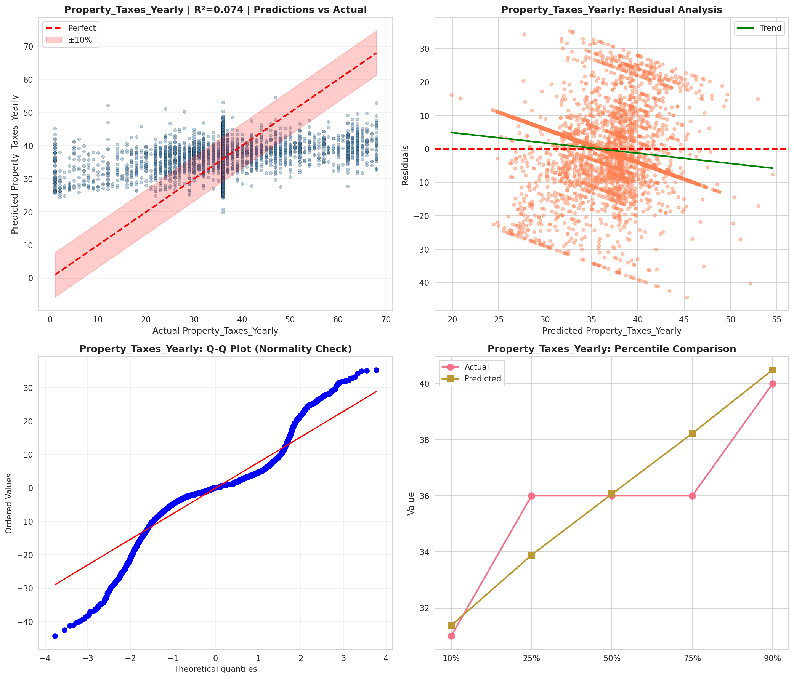
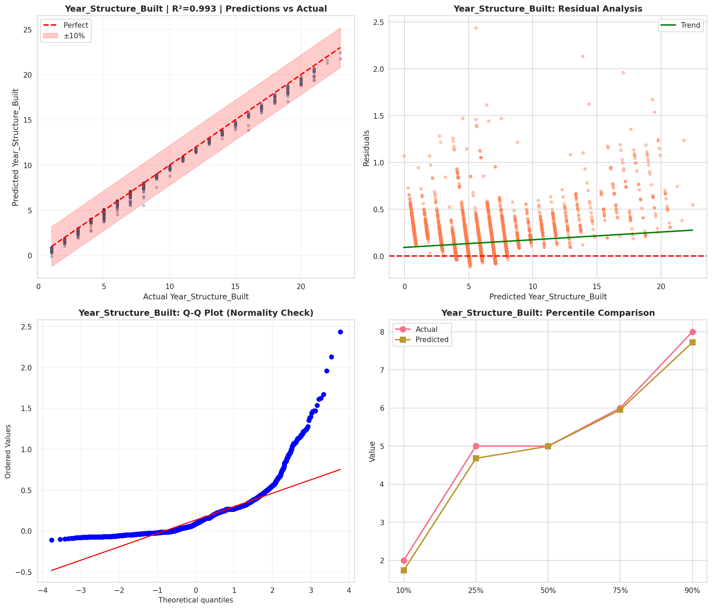
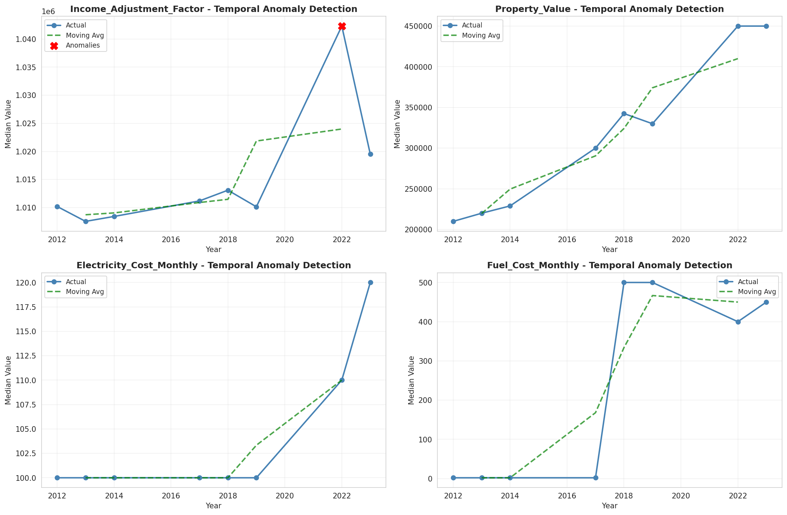
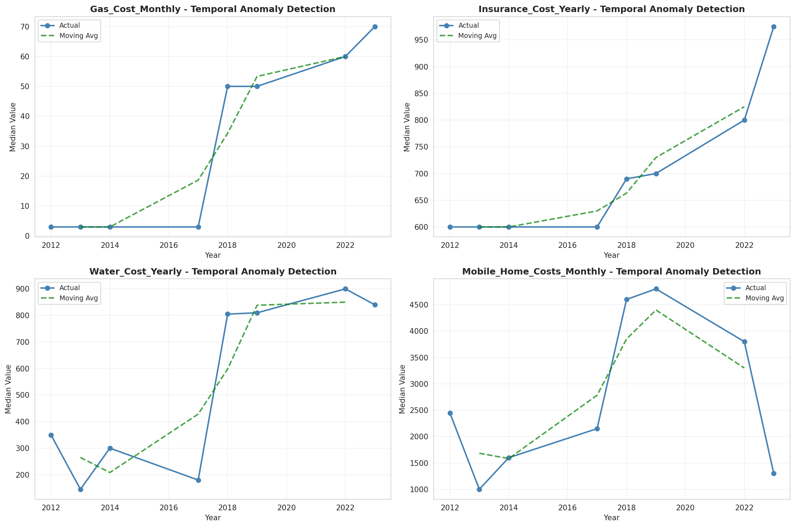
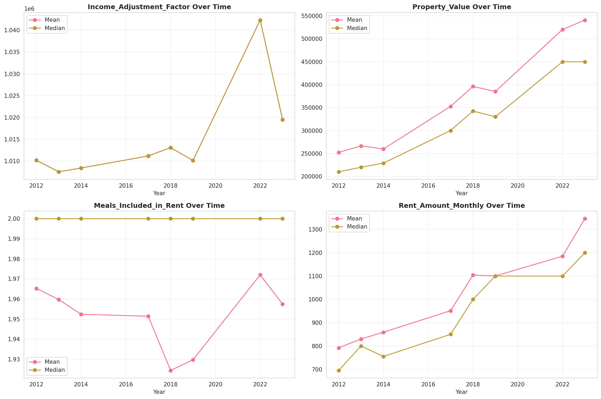
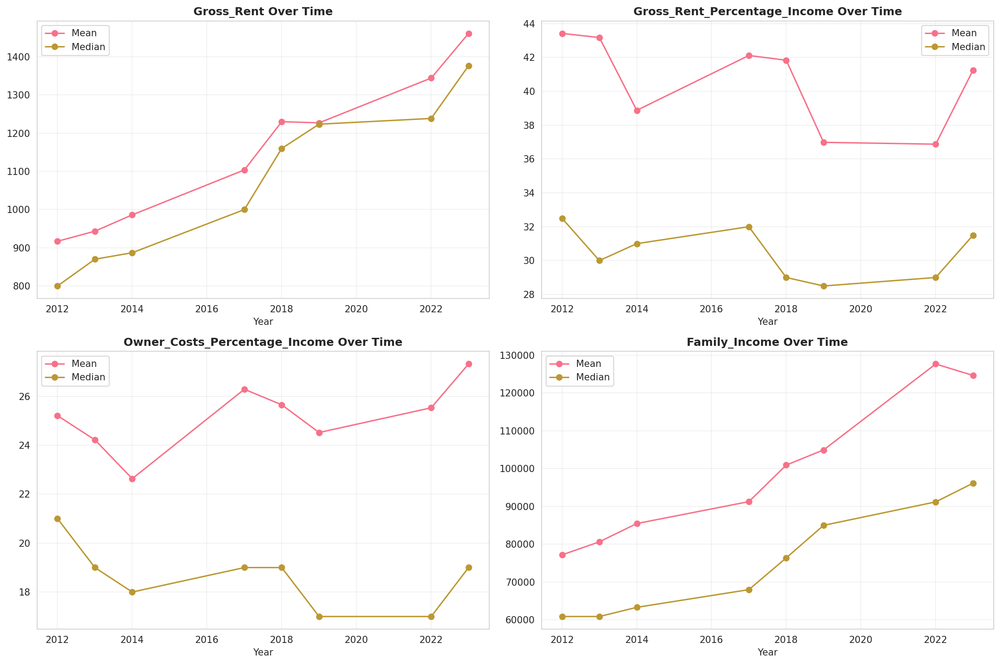
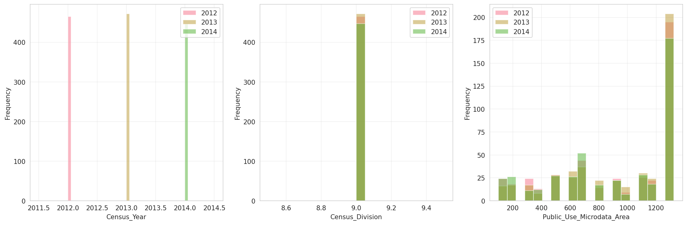
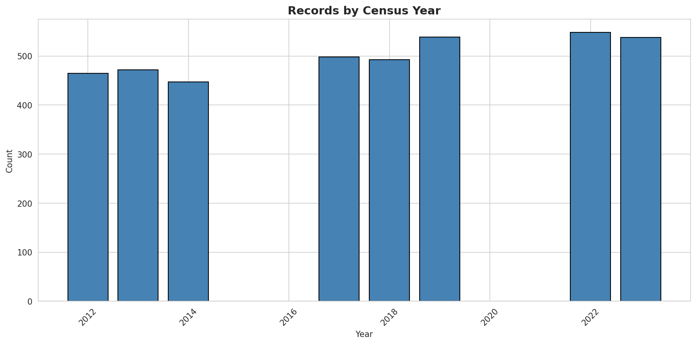
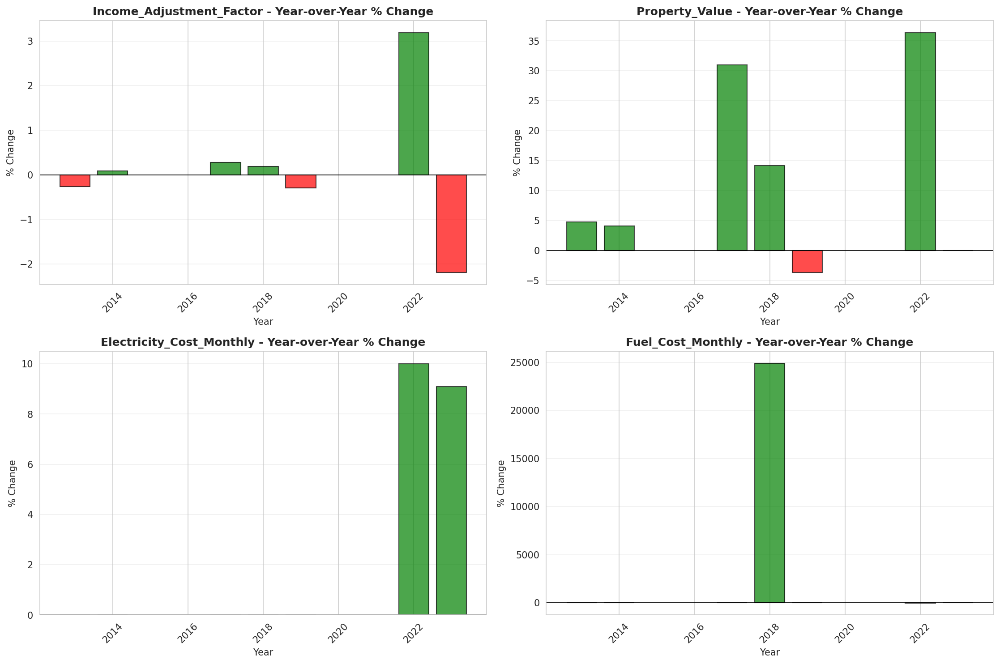
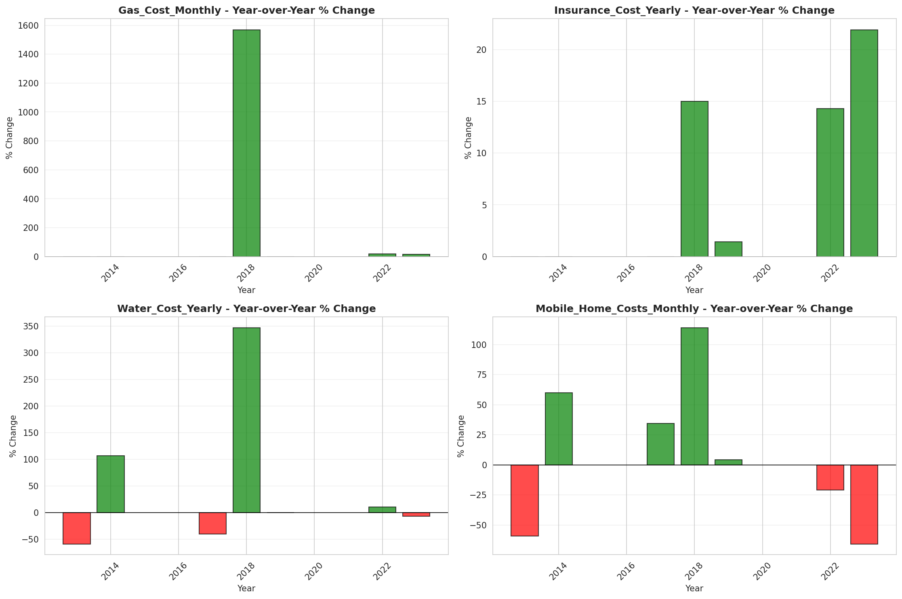

# Temporal Analysis

## Year Distribution

- 2012: 18,618 records

- 2013: 18,785 records

- 2014: 18,727 records

- 2017: 19,500 records

- 2018: 19,819 records

- 2019: 19,981 records

- 2022: 21,008 records

- 2023: 21,004 records

## Temporal Trends

- Census_Year: {np.int64(2012): {'mean': 2012.0, 'median': 2012.0, 'std': 0.0}, np.int64(2013): {'mean': 2013.0, 'median': 2013.0, 'std': 0.0}, np.int64(2014): {'mean': 2014.0, 'median': 2014.0, 'std': 0.0}, np.int64(2017): {'mean': 2017.0, 'median': 2017.0, 'std': 0.0}, np.int64(2018): {'mean': 2018.0, 'median': 2018.0, 'std': 0.0}, np.int64(2019): {'mean': 2019.0, 'median': 2019.0, 'std': 0.0}, np.int64(2022): {'mean': 2022.0, 'median': 2022.0, 'std': 0.0}, np.int64(2023): {'mean': 2023.0, 'median': 2023.0, 'std': 0.0}}

- Census_Division: {np.int64(2012): {'mean': 9.0, 'median': 9.0, 'std': 0.0}, np.int64(2013): {'mean': 9.0, 'median': 9.0, 'std': 0.0}, np.int64(2014): {'mean': 9.0, 'median': 9.0, 'std': 0.0}, np.int64(2017): {'mean': 9.0, 'median': 9.0, 'std': 0.0}, np.int64(2018): {'mean': 9.0, 'median': 9.0, 'std': 0.0}, np.int64(2019): {'mean': 9.0, 'median': 9.0, 'std': 0.0}, np.int64(2022): {'mean': 9.0, 'median': 9.0, 'std': 0.0}, np.int64(2023): {'mean': 9.0, 'median': 9.0, 'std': 0.0}}

- Public_Use_Microdata_Area: {np.int64(2012): {'mean': 912.6559243742614, 'median': 1103.0, 'std': 412.2544224872114}, np.int64(2013): {'mean': 918.2770295448496, 'median': 1103.0, 'std': 411.3008928044706}, np.int64(2014): {'mean': 916.3761414001175, 'median': 1103.0, 'std': 410.89940765542246}, np.int64(2017): {'mean': 923.0133846153847, 'median': 1103.0, 'std': 408.6970643396474}, np.int64(2018): {'mean': 917.4978555931177, 'median': 1103.0, 'std': 410.15324964642616}, np.int64(2019): {'mean': 920.913267604224, 'median': 1103.0, 'std': 408.79044896597526}, np.int64(2022): {'mean': 5001.750142802742, 'median': 5103.0, 'std': 2614.3411222658447}, np.int64(2023): {'mean': 4956.133688821177, 'median': 5103.0, 'std': 2633.535807002598}}

- Census_Region: {np.int64(2012): {'mean': 4.0, 'median': 4.0, 'std': 0.0}, np.int64(2013): {'mean': 4.0, 'median': 4.0, 'std': 0.0}, np.int64(2014): {'mean': 4.0, 'median': 4.0, 'std': 0.0}, np.int64(2017): {'mean': 4.0, 'median': 4.0, 'std': 0.0}, np.int64(2018): {'mean': 4.0, 'median': 4.0, 'std': 0.0}, np.int64(2019): {'mean': 4.0, 'median': 4.0, 'std': 0.0}, np.int64(2022): {'mean': 4.0, 'median': 4.0, 'std': 0.0}, np.int64(2023): {'mean': 4.0, 'median': 4.0, 'std': 0.0}}

- State_Code: {np.int64(2012): {'mean': 41.0, 'median': 41.0, 'std': 0.0}, np.int64(2013): {'mean': 41.0, 'median': 41.0, 'std': 0.0}, np.int64(2014): {'mean': 41.0, 'median': 41.0, 'std': 0.0}, np.int64(2017): {'mean': 41.0, 'median': 41.0, 'std': 0.0}, np.int64(2018): {'mean': 41.0, 'median': 41.0, 'std': 0.0}, np.int64(2019): {'mean': 41.0, 'median': 41.0, 'std': 0.0}, np.int64(2022): {'mean': 41.0, 'median': 41.0, 'std': 0.0}, np.int64(2023): {'mean': None, 'median': None, 'std': None}}

- Housing_Adjustment_Factor: {np.int64(2012): {'mean': 1000000.0, 'median': 1000000.0, 'std': 0.0}, np.int64(2013): {'mean': 1000000.0, 'median': 1000000.0, 'std': 0.0}, np.int64(2014): {'mean': 1000000.0, 'median': 1000000.0, 'std': 0.0}, np.int64(2017): {'mean': 1000000.0, 'median': 1000000.0, 'std': 0.0}, np.int64(2018): {'mean': 1000000.0, 'median': 1000000.0, 'std': 0.0}, np.int64(2019): {'mean': 1000000.0, 'median': 1000000.0, 'std': 0.0}, np.int64(2022): {'mean': 1000000.0, 'median': 1000000.0, 'std': 0.0}, np.int64(2023): {'mean': 1000000.0, 'median': 1000000.0, 'std': 0.0}}

- Income_Adjustment_Factor: {np.int64(2012): {'mean': 1010207.0, 'median': 1010207.0, 'std': 0.0}, np.int64(2013): {'mean': 1007549.0, 'median': 1007549.0, 'std': 0.0}, np.int64(2014): {'mean': 1008425.0, 'median': 1008425.0, 'std': 0.0}, np.int64(2017): {'mean': 1011189.0, 'median': 1011189.0, 'std': 0.0}, np.int64(2018): {'mean': 1013097.0, 'median': 1013097.0, 'std': 0.0}, np.int64(2019): {'mean': 1010145.0, 'median': 1010145.0, 'std': 0.0}, np.int64(2022): {'mean': 1042311.0, 'median': 1042311.0, 'std': 0.0}, np.int64(2023): {'mean': 1019518.0, 'median': 1019518.0, 'std': 0.0}}

- Housing_Unit_Weight: {np.int64(2012): {'mean': 90.37119991406166, 'median': 73.0, 'std': 77.8950713173973}, np.int64(2013): {'mean': 89.65169017833378, 'median': 72.0, 'std': 79.24090992828502}, np.int64(2014): {'mean': 90.81064772787953, 'median': 73.0, 'std': 77.18214182023426}, np.int64(2017): {'mean': 90.69651282051282, 'median': 74.0, 'std': 77.04653476671466}, np.int64(2018): {'mean': 90.25394823149503, 'median': 74.0, 'std': 77.02961151062469}, np.int64(2019): {'mean': 90.51008458035133, 'median': 72.0, 'std': 83.14590069089118}, np.int64(2022): {'mean': 88.5067117288652, 'median': 70.0, 'std': 80.36938424080904}, np.int64(2023): {'mean': 89.48343172729004, 'median': 69.0, 'std': 83.09645690996665}}

- Number_of_Persons: {np.int64(2012): {'mean': 2.0822322483618003, 'median': 2.0, 'std': 1.40806809768781}, np.int64(2013): {'mean': 2.0943305829118977, 'median': 2.0, 'std': 1.4239458242302776}, np.int64(2014): {'mean': 2.10049660917392, 'median': 2.0, 'std': 1.4050622036363756}, np.int64(2017): {'mean': 2.113794871794872, 'median': 2.0, 'std': 1.419832151561042}, np.int64(2018): {'mean': 2.125081992027852, 'median': 2.0, 'std': 1.4358647660866934}, np.int64(2019): {'mean': 2.1060007006656325, 'median': 2.0, 'std': 1.3922330403485441}, np.int64(2022): {'mean': 2.0805407463823307, 'median': 2.0, 'std': 1.3813445531989184}, np.int64(2023): {'mean': 2.0917444296324508, 'median': 2.0, 'std': 1.3463313584156187}}

- Housing_Unit_Type: {np.int64(2012): {'mean': 1.1503383822107638, 'median': 1.0, 'std': 0.4857204025002006}, np.int64(2013): {'mean': 1.161298908703753, 'median': 1.0, 'std': 0.5009182532030709}, np.int64(2014): {'mean': 1.1452448336626262, 'median': 1.0, 'std': 0.48047057487688716}, np.int64(2017): {'mean': 1.1503076923076923, 'median': 1.0, 'std': 0.4921272684619521}, np.int64(2018): {'mean': 1.1516221807356577, 'median': 1.0, 'std': 0.4867491991452807}, np.int64(2019): {'mean': 1.1501926830488964, 'median': 1.0, 'std': 0.48811047903959526}, np.int64(2022): {'mean': None, 'median': None, 'std': None}, np.int64(2023): {'mean': None, 'median': None, 'std': None}}

- Number_of_Bedrooms: {np.int64(2012): {'mean': 2.7485439201236184, 'median': 3.0, 'std': 1.1616223047800143}, np.int64(2013): {'mean': 2.747639688854581, 'median': 3.0, 'std': 1.1826504282706798}, np.int64(2014): {'mean': 2.7562036928143008, 'median': 3.0, 'std': 1.2631250482078396}, np.int64(2017): {'mean': 2.7303929884082554, 'median': 3.0, 'std': 1.0776385211272317}, np.int64(2018): {'mean': 2.7332140660815116, 'median': 3.0, 'std': 1.0881657723133307}, np.int64(2019): {'mean': 2.7306607685927564, 'median': 3.0, 'std': 1.0809690892224513}, np.int64(2022): {'mean': 2.737818651177799, 'median': 3.0, 'std': 1.1042294346046921}, np.int64(2023): {'mean': 2.747393062353692, 'median': 3.0, 'std': 1.0945856315115974}}

- Number_of_Rooms: {np.int64(2012): {'mean': 5.859146558896946, 'median': 6.0, 'std': 2.417103215649195}, np.int64(2013): {'mean': 5.900837242444036, 'median': 6.0, 'std': 2.4474088070967484}, np.int64(2014): {'mean': 5.913030695048806, 'median': 6.0, 'std': 2.6411616620160023}, np.int64(2017): {'mean': 5.8601074356799545, 'median': 6.0, 'std': 2.392969063416454}, np.int64(2018): {'mean': 5.878962374909152, 'median': 6.0, 'std': 2.414464888741284}, np.int64(2019): {'mean': 5.868233342549074, 'median': 6.0, 'std': 2.429735882682276}, np.int64(2022): {'mean': 5.859793481768312, 'median': 6.0, 'std': 2.467466816833185}, np.int64(2023): {'mean': 5.857256863162375, 'median': 6.0, 'std': 2.4486209632459364}}

- Building_Type: {np.int64(2012): {'mean': 2.8279448472601927, 'median': 2.0, 'std': 2.03243974387934}, np.int64(2013): {'mean': 2.820972626328603, 'median': 2.0, 'std': 2.0213121086660992}, np.int64(2014): {'mean': 2.8428789838880397, 'median': 2.0, 'std': 2.0341710753599838}, np.int64(2017): {'mean': 2.87921967769296, 'median': 2.0, 'std': 2.081792944943359}, np.int64(2018): {'mean': 2.903393526024487, 'median': 2.0, 'std': 2.105341948885269}, np.int64(2019): {'mean': 2.8940558473873375, 'median': 2.0, 'std': 2.091009009950558}, np.int64(2022): {'mean': 2.95810476497795, 'median': 2.0, 'std': 2.150828123125403}, np.int64(2023): {'mean': 2.9228559267929346, 'median': 2.0, 'std': 2.1168089378782415}}

- Year_Structure_Built: {np.int64(2012): {'mean': 5.131819802686318, 'median': 5.0, 'std': 2.7137821562422553}, np.int64(2013): {'mean': 5.14464699245888, 'median': 5.0, 'std': 2.797326938414294}, np.int64(2014): {'mean': 5.2306244854757145, 'median': 5.0, 'std': 2.9256542104506424}, np.int64(2017): {'mean': 5.682329657902177, 'median': 5.0, 'std': 3.6984512309167545}, np.int64(2018): {'mean': 5.80824062168055, 'median': 5.0, 'std': 3.8834947025002853}, np.int64(2019): {'mean': 5.933536079623998, 'median': 5.0, 'std': 4.1240450716663855}, np.int64(2022): {'mean': None, 'median': None, 'std': None}, np.int64(2023): {'mean': None, 'median': None, 'std': None}}

- Bathtub_or_Shower: {np.int64(2012): {'mean': 1.005764887673838, 'median': 1.0, 'std': 0.07570993598513343}, np.int64(2013): {'mean': 1.0058785107772699, 'median': 1.0, 'std': 0.076448027551088}, np.int64(2014): {'mean': 1.0064095025285194, 'median': 1.0, 'std': 0.07980473237031073}, np.int64(2017): {'mean': 1.0063330506078598, 'median': 1.0, 'std': 0.07933031534692325}, np.int64(2018): {'mean': 1.0072119416335887, 'median': 1.0, 'std': 0.0846187322087522}, np.int64(2019): {'mean': 1.0056400331766657, 'median': 1.0, 'std': 0.07489014169540269}, np.int64(2022): {'mean': 1.005109175002689, 'median': 1.0, 'std': 0.07129757863892199}, np.int64(2023): {'mean': 1.0046818472015322, 'median': 1.0, 'std': 0.06826547767897209}}

- Refrigerator: {np.int64(2012): {'mean': 1.008855342921669, 'median': 1.0, 'std': 0.09368803276400871}, np.int64(2013): {'mean': 1.007838014369693, 'median': 1.0, 'std': 0.08818753705932114}, np.int64(2014): {'mean': 1.0087028107726685, 'median': 1.0, 'std': 0.09288476292118816}, np.int64(2017): {'mean': 1.008481764206955, 'median': 1.0, 'std': 0.09170768476017309}, np.int64(2018): {'mean': 1.0081064460222509, 'median': 1.0, 'std': 0.08967263300264006}, np.int64(2019): {'mean': 1.0079623997788223, 'median': 1.0, 'std': 0.08887877566404481}, np.int64(2022): {'mean': 1.0061847907927288, 'median': 1.0, 'std': 0.07840197535194242}, np.int64(2023): {'mean': 1.005107469674399, 'median': 1.0, 'std': 0.07128571937057417}}

- Hot_and_Cold_Running_Water: {np.int64(2012): {'mean': 1.0075478426245097, 'median': 1.0, 'std': 0.08655239984524422}, np.int64(2013): {'mean': 1.0073036042990322, 'median': 1.0, 'std': 0.0851509964790712}, np.int64(2014): {'mean': 1.0082323885687405, 'median': 1.0, 'std': 0.09036092339904869}, np.int64(2017): {'mean': 1.0095561210065027, 'median': 1.0, 'std': 0.09728996236085319}, np.int64(2018): {'mean': 1.0098395482752838, 'median': 1.0, 'std': 0.09870803552768125}, np.int64(2019): {'mean': 1.0082388719933646, 'median': 1.0, 'std': 0.09039604425598788}, np.int64(2022): {'mean': 1.0067763794772506, 'median': 1.0, 'std': 0.08204158791344854}, np.int64(2023): {'mean': 1.0052138752926154, 'median': 1.0, 'std': 0.07202059954103976}}

- Running_Water: {np.int64(2012): {'mean': None, 'median': None, 'std': None}, np.int64(2013): {'mean': 9.0, 'median': 9.0, 'std': 0.0}, np.int64(2014): {'mean': 9.0, 'median': 9.0, 'std': 0.0}, np.int64(2017): {'mean': 9.0, 'median': 9.0, 'std': 0.0}, np.int64(2018): {'mean': 9.0, 'median': 9.0, 'std': 0.0}, np.int64(2019): {'mean': 9.0, 'median': 9.0, 'std': 0.0}, np.int64(2022): {'mean': 9.0, 'median': 9.0, 'std': 0.0}, np.int64(2023): {'mean': 9.0, 'median': 9.0, 'std': 0.0}}

- Sink_with_Faucet: {np.int64(2012): {'mean': 1.004338523713301, 'median': 1.0, 'std': 0.0657263848715796}, np.int64(2013): {'mean': 1.0043940383587673, 'median': 1.0, 'std': 0.06614371147571127}, np.int64(2014): {'mean': 1.0045866164882982, 'median': 1.0, 'std': 0.06757105831654413}, np.int64(2017): {'mean': 1.0051456036188862, 'median': 1.0, 'std': 0.07155009336218958}, np.int64(2018): {'mean': 1.004360708894728, 'median': 1.0, 'std': 0.0658933673081426}, np.int64(2019): {'mean': 1.0048106165330384, 'median': 1.0, 'std': 0.06919349129061494}, np.int64(2022): {'mean': 1.0040335592126493, 'median': 1.0, 'std': 0.06338379664673328}, np.int64(2023): {'mean': 1.0032453713556075, 'median': 1.0, 'std': 0.056877157383664764}}

- Stove_or_Range: {np.int64(2012): {'mean': 1.015987162724355, 'median': 1.0, 'std': 0.12542929627550892}, np.int64(2013): {'mean': 1.0147259663915444, 'median': 1.0, 'std': 0.12045735299939565}, np.int64(2014): {'mean': 1.0158767493825709, 'median': 1.0, 'std': 0.12500238813754116}, np.int64(2017): {'mean': 1.0160022618037885, 'median': 1.0, 'std': 0.12548736924914983}, np.int64(2018): {'mean': 1.0145356963157601, 'median': 1.0, 'std': 0.11968797233271716}, np.int64(2019): {'mean': 1.0151506773569257, 'median': 1.0, 'std': 0.12215547238656985}, np.int64(2022): {'mean': 1.0126384855329675, 'median': 1.0, 'std': 0.11171134843761187}, np.int64(2023): {'mean': 1.0134071078952969, 'median': 1.0, 'std': 0.11501330846120188}}

- Telephone_Service: {np.int64(2012): {'mean': 1.0241009946442234, 'median': 1.0, 'std': 0.15336765116270196}, np.int64(2013): {'mean': 1.0237883785841158, 'median': 1.0, 'std': 0.15239411030735284}, np.int64(2014): {'mean': 1.0237749889638645, 'median': 1.0, 'std': 0.15235223216729116}, np.int64(2017): {'mean': 1.0131642512077295, 'median': 1.0, 'std': 0.11398130646349106}, np.int64(2018): {'mean': 1.012554292854168, 'median': 1.0, 'std': 0.11134370309735411}, np.int64(2019): {'mean': 1.008517387218045, 'median': 1.0, 'std': 0.09189851694789661}, np.int64(2022): {'mean': 1.0082171596962484, 'median': 1.0, 'std': 0.090277903439758}, np.int64(2023): {'mean': 1.0065257404205477, 'median': 1.0, 'std': 0.0805202878427762}}

- Lot_Acreage: {np.int64(2012): {'mean': 1.286884646331651, 'median': 1.0, 'std': 0.5821559215346466}, np.int64(2013): {'mean': 1.2916118661405815, 'median': 1.0, 'std': 0.5849892524194971}, np.int64(2014): {'mean': 1.2866399708773206, 'median': 1.0, 'std': 0.5814031246217518}, np.int64(2017): {'mean': 1.2800196505017896, 'median': 1.0, 'std': 0.571447819583369}, np.int64(2018): {'mean': 1.2829951892909432, 'median': 1.0, 'std': 0.5768461977127434}, np.int64(2019): {'mean': 1.2814947108119248, 'median': 1.0, 'std': 0.5755687889943111}, np.int64(2022): {'mean': 1.2749611827448863, 'median': 1.0, 'std': 0.5673087861915184}, np.int64(2023): {'mean': 1.2763958719237893, 'median': 1.0, 'std': 0.5621904402498595}}

- Agricultural_Sales: {np.int64(2012): {'mean': 1.5385996409335727, 'median': 1.0, 'std': 1.3614273351394166}, np.int64(2013): {'mean': 1.5136459062281316, 'median': 1.0, 'std': 1.3273947537268616}, np.int64(2014): {'mean': 1.5171418260555756, 'median': 1.0, 'std': 1.3212967816858066}, np.int64(2017): {'mean': 1.4993084370677732, 'median': 1.0, 'std': 1.3075888198975933}, np.int64(2018): {'mean': 1.5414651002073254, 'median': 1.0, 'std': 1.37008231149118}, np.int64(2019): {'mean': 1.5554044867437118, 'median': 1.0, 'std': 1.3782283751802218}, np.int64(2022): {'mean': 1.4877228388832828, 'median': 1.0, 'std': 1.2924881171006213}, np.int64(2023): {'mean': 1.474021808851828, 'median': 1.0, 'std': 1.2977357155187699}}

- Tenure: {np.int64(2012): {'mean': 1.9007268553940322, 'median': 2.0, 'std': 0.9049881152457836}, np.int64(2013): {'mean': 1.9071301700076122, 'median': 2.0, 'std': 0.8980244542195193}, np.int64(2014): {'mean': 1.921170460995144, 'median': 2.0, 'std': 0.8949440011261076}, np.int64(2017): {'mean': 1.8906400966183574, 'median': 2.0, 'std': 0.8906296433436871}, np.int64(2018): {'mean': 1.9064080442672695, 'median': 2.0, 'std': 0.887514378253842}, np.int64(2019): {'mean': 1.8880404135338347, 'median': 2.0, 'std': 0.8865176093386278}, np.int64(2022): {'mean': 1.8918735124107446, 'median': 2.0, 'std': 0.8770779774356847}, np.int64(2023): {'mean': 1.8790228122036923, 'median': 2.0, 'std': 0.8657870780946071}}

- Vacancy_Status: {np.int64(2012): {'mean': 4.648861646234676, 'median': 5.0, 'std': 1.9916991455885658}, np.int64(2013): {'mean': 4.671309192200557, 'median': 5.0, 'std': 1.9414389936867043}, np.int64(2014): {'mean': 4.827676240208877, 'median': 5.0, 'std': 1.8506708209248832}, np.int64(2017): {'mean': 4.872, 'median': 5.0, 'std': 1.8132489862456838}, np.int64(2018): {'mean': 4.7444444444444445, 'median': 5.0, 'std': 1.9267077247940263}, np.int64(2019): {'mean': 4.798303487276154, 'median': 5.0, 'std': 1.8634612110712347}, np.int64(2022): {'mean': 4.7478902953586495, 'median': 5.0, 'std': 1.971482479892329}, np.int64(2023): {'mean': 4.665513264129181, 'median': 5.0, 'std': 2.01294851315806}}

- Property_Value: {np.int64(2012): {'mean': 256227.0695595493, 'median': 200000.0, 'std': 216278.08562228252}, np.int64(2013): {'mean': 262360.02235677687, 'median': 210000.0, 'std': 233202.6022804589}, np.int64(2014): {'mean': 276068.935991801, 'median': 230000.0, 'std': 253264.04294632954}, np.int64(2017): {'mean': 356349.35757363867, 'median': 300000.0, 'std': 317452.40775919927}, np.int64(2018): {'mean': 377649.95221961604, 'median': 325000.0, 'std': 342323.59580995876}, np.int64(2019): {'mean': 390669.5802719365, 'median': 340000.0, 'std': 329909.40131534793}, np.int64(2022): {'mean': 526142.8363047001, 'median': 450000.0, 'std': 440402.7171223894}, np.int64(2023): {'mean': 542669.6509982707, 'median': 475000.0, 'std': 504240.4235664284}}

- Vehicles_Available: {np.int64(2012): {'mean': 1.8603672532517215, 'median': 2.0, 'std': 1.09720751447639}, np.int64(2013): {'mean': 1.8780131946206546, 'median': 2.0, 'std': 1.0900698126674984}, np.int64(2014): {'mean': 1.8761430283155704, 'median': 2.0, 'std': 1.0908164286694784}, np.int64(2017): {'mean': 1.9458937198067632, 'median': 2.0, 'std': 1.1354203384408588}, np.int64(2018): {'mean': 1.9701314928303684, 'median': 2.0, 'std': 1.127612758225202}, np.int64(2019): {'mean': 1.9776785714285714, 'median': 2.0, 'std': 1.1569415065594806}, np.int64(2022): {'mean': 1.9368695455060636, 'median': 2.0, 'std': 1.1239345302133648}, np.int64(2023): {'mean': 1.9351330247085727, 'median': 2.0, 'std': 1.1158256665367488}}

- Condo_Fee_Monthly: {np.int64(2012): {'mean': 258.8636363636364, 'median': 220.0, 'std': 169.90147517461776}, np.int64(2013): {'mean': 282.7652733118971, 'median': 250.0, 'std': 191.01445532997158}, np.int64(2014): {'mean': 302.12827988338194, 'median': 250.0, 'std': 204.93577909831873}, np.int64(2017): {'mean': 310.45226130653265, 'median': 280.0, 'std': 185.07618822602245}, np.int64(2018): {'mean': 352.2994652406417, 'median': 300.0, 'std': 226.80448560688183}, np.int64(2019): {'mean': 376.06598984771574, 'median': 320.0, 'std': 239.81970689971567}, np.int64(2022): {'mean': 407.4791154791155, 'median': 350.0, 'std': 285.1222604085772}, np.int64(2023): {'mean': 457.4458874458874, 'median': 380.0, 'std': 326.3370167104216}}

- Electricity_Cost_Monthly: {np.int64(2012): {'mean': 111.34608518235144, 'median': 90.0, 'std': 76.39795677989174}, np.int64(2013): {'mean': 113.58900025374271, 'median': 100.0, 'std': 79.66517118307422}, np.int64(2014): {'mean': 115.39156208614492, 'median': 100.0, 'std': 80.77243676406687}, np.int64(2017): {'mean': 122.19432367149759, 'median': 100.0, 'std': 89.75045779595375}, np.int64(2018): {'mean': 124.49842036796134, 'median': 100.0, 'std': 83.03864930567389}, np.int64(2019): {'mean': 123.66899509803922, 'median': 100.0, 'std': 81.46701665756234}, np.int64(2022): {'mean': 148.24551886792452, 'median': 110.0, 'std': 208.05222258445616}, np.int64(2023): {'mean': 161.99324914159342, 'median': 120.0, 'std': 203.16416111106795}}

- Fuel_Cost_Monthly: {np.int64(2012): {'mean': 122.99764090793165, 'median': 2.0, 'std': 384.9498448118166}, np.int64(2013): {'mean': 97.55791677239279, 'median': 2.0, 'std': 333.8505725486956}, np.int64(2014): {'mean': 92.25856088793593, 'median': 2.0, 'std': 308.24969012462947}, np.int64(2017): {'mean': 79.22632850241546, 'median': 2.0, 'std': 277.48824075756323}, np.int64(2018): {'mean': 569.7340177321512, 'median': 430.0, 'std': 534.880331821799}, np.int64(2019): {'mean': 597.6042309387395, 'median': 430.0, 'std': 604.6011674590533}, np.int64(2022): {'mean': 646.1165452653486, 'median': 500.0, 'std': 603.549865661798}, np.int64(2023): {'mean': 741.0761263593993, 'median': 500.0, 'std': 770.6126812896797}}

- Gas_Cost_Monthly: {np.int64(2012): {'mean': 39.288319306299414, 'median': 3.0, 'std': 58.15646651902537}, np.int64(2013): {'mean': 36.38055062166963, 'median': 3.0, 'std': 54.73761215015061}, np.int64(2014): {'mean': 36.02837863404175, 'median': 3.0, 'std': 55.88205041765068}, np.int64(2017): {'mean': 36.18695652173913, 'median': 3.0, 'std': 53.33629743984272}, np.int64(2018): {'mean': 67.70822880080281, 'median': 50.0, 'std': 57.14517795682608}, np.int64(2019): {'mean': 67.98864197530864, 'median': 60.0, 'std': 56.19628406655962}, np.int64(2022): {'mean': 91.24546914429915, 'median': 70.0, 'std': 137.1811669250243}, np.int64(2023): {'mean': 102.07775280898876, 'median': 80.0, 'std': 125.34680789368156}}

- House_Heating_Fuel: {np.int64(2012): {'mean': 2.5599974496301963, 'median': 3.0, 'std': 1.566330655869246}, np.int64(2013): {'mean': 2.5907130170007613, 'median': 3.0, 'std': 1.6032084256139199}, np.int64(2014): {'mean': 2.5889512518130795, 'median': 3.0, 'std': 1.6032963068740902}, np.int64(2017): {'mean': 2.5106884057971013, 'median': 3.0, 'std': 1.547174881799892}, np.int64(2018): {'mean': 2.517105967751532, 'median': 3.0, 'std': 1.5452019851636516}, np.int64(2019): {'mean': 2.5179158834586466, 'median': 3.0, 'std': 1.53856484835927}, np.int64(2022): {'mean': 2.4538138955003967, 'median': 3.0, 'std': 1.4724418205758045}, np.int64(2023): {'mean': 2.4596463829549893, 'median': 3.0, 'std': 1.468261845460664}}

- Insurance_Cost_Yearly: {np.int64(2012): {'mean': 712.5547309833024, 'median': 600.0, 'std': 538.4596648619228}, np.int64(2013): {'mean': 782.1505177893981, 'median': 600.0, 'std': 709.6533408182657}, np.int64(2014): {'mean': 807.2316642426761, 'median': 600.0, 'std': 758.0234802509872}, np.int64(2017): {'mean': 875.8066064912617, 'median': 700.0, 'std': 734.6166983595185}, np.int64(2018): {'mean': 907.3886060140263, 'median': 700.0, 'std': 785.4834642354399}, np.int64(2019): {'mean': 945.1076519129782, 'median': 750.0, 'std': 777.1370030113496}, np.int64(2022): {'mean': 1116.9752988047808, 'median': 880.0, 'std': 985.8302343402178}, np.int64(2023): {'mean': 1266.4359461325967, 'median': 1000.0, 'std': 1165.6774009252647}}

- Water_Cost_Yearly: {np.int64(2012): {'mean': 445.29941341494515, 'median': 310.0, 'std': 497.2654958951053}, np.int64(2013): {'mean': 465.43960923623445, 'median': 320.0, 'std': 523.8780971809723}, np.int64(2014): {'mean': 471.77240335498516, 'median': 300.0, 'std': 543.5030891786661}, np.int64(2017): {'mean': 519.2144323671498, 'median': 300.0, 'std': 588.4481526081207}, np.int64(2018): {'mean': 792.1687494460693, 'median': 790.0, 'std': 589.0020969330665}, np.int64(2019): {'mean': 809.7726075504829, 'median': 800.0, 'std': 600.4098368371631}, np.int64(2022): {'mean': 865.2700330192478, 'median': 850.0, 'std': 699.5272330919252}, np.int64(2023): {'mean': 916.4489247311828, 'median': 900.0, 'std': 758.3985465576011}}

- Mobile_Home_Costs_Monthly: {np.int64(2012): {'mean': 2803.8894736842103, 'median': 1850.0, 'std': 2524.7090198024125}, np.int64(2013): {'mean': 2853.410288582183, 'median': 1800.0, 'std': 2535.6777272014815}, np.int64(2014): {'mean': 2992.5038363171357, 'median': 2000.0, 'std': 2658.468273063291}, np.int64(2017): {'mean': 3298.8525402726145, 'median': 2200.0, 'std': 2863.36767781882}, np.int64(2018): {'mean': 3614.9297573435506, 'median': 2500.0, 'std': 3105.8105866956043}, np.int64(2019): {'mean': 3743.245614035088, 'median': 2800.0, 'std': 3065.968170154586}, np.int64(2022): {'mean': 4644.430656934306, 'median': 2500.0, 'std': 5284.231737603494}, np.int64(2023): {'mean': 4868.896017699115, 'median': 2400.0, 'std': 6092.77370624134}}

- First_Mortgage_Includes_Insurance: {np.int64(2012): {'mean': 1.433314170738718, 'median': 1.0, 'std': 0.4955686592117416}, np.int64(2013): {'mean': 1.4229260496876361, 'median': 1.0, 'std': 0.49405978348178403}, np.int64(2014): {'mean': 1.4337028824833702, 'median': 1.0, 'std': 0.49562183444487434}, np.int64(2017): {'mean': 1.3810566657541747, 'median': 1.0, 'std': 0.485679698653166}, np.int64(2018): {'mean': 1.3690690275280122, 'median': 1.0, 'std': 0.4825860507975323}, np.int64(2019): {'mean': 1.371103678929766, 'median': 1.0, 'std': 0.4831324505395591}, np.int64(2022): {'mean': 1.3448182311448724, 'median': 1.0, 'std': 0.4753412124690729}, np.int64(2023): {'mean': 1.3565601176942623, 'median': 1.0, 'std': 0.4790153320786148}}

- First_Mortgage_Payment_Monthly: {np.int64(2012): {'mean': 1223.151480310434, 'median': 1100.0, 'std': 694.1543641039102}, np.int64(2013): {'mean': 1189.1349702164753, 'median': 1100.0, 'std': 692.0330213555005}, np.int64(2014): {'mean': 1186.2536585365854, 'median': 1100.0, 'std': 668.5947199720506}, np.int64(2017): {'mean': 1325.2551327675883, 'median': 1200.0, 'std': 715.7044375636674}, np.int64(2018): {'mean': 1404.4158251487065, 'median': 1300.0, 'std': 780.150882384088}, np.int64(2019): {'mean': 1458.8508361204013, 'median': 1300.0, 'std': 819.2785247612095}, np.int64(2022): {'mean': 769.0126123876124, 'median': 4.0, 'std': 1028.0261640196609}, np.int64(2023): {'mean': 1770.2835361776113, 'median': 1600.0, 'std': 991.7699398300331}}

- First_Mortgage_Includes_Taxes: {np.int64(2012): {'mean': 1.3643288301235987, 'median': 1.0, 'std': 0.48127603609305863}, np.int64(2013): {'mean': 1.3524625889873603, 'median': 1.0, 'std': 0.47777178241334567}, np.int64(2014): {'mean': 1.3534368070953438, 'median': 1.0, 'std': 0.4780721860917883}, np.int64(2017): {'mean': 1.2992061319463455, 'median': 1.0, 'std': 0.45794161901840513}, np.int64(2018): {'mean': 1.2803983953520541, 'median': 1.0, 'std': 0.449224944764965}, np.int64(2019): {'mean': 1.2662207357859532, 'median': 1.0, 'std': 0.44201062490876725}, np.int64(2022): {'mean': 1.2346717308735757, 'median': 1.0, 'std': 0.42382222155460103}, np.int64(2023): {'mean': 1.234853550889394, 'median': 1.0, 'std': 0.4239356048848875}}

- First_Mortgage_Status: {np.int64(2012): {'mean': 1.6970668678675846, 'median': 1.0, 'std': 0.9480457157112945}, np.int64(2013): {'mean': 1.7146355245809004, 'median': 1.0, 'std': 0.9526486151555641}, np.int64(2014): {'mean': 1.7367229506650317, 'median': 1.0, 'std': 0.9579948475117515}, np.int64(2017): {'mean': 1.720060012355485, 'median': 1.0, 'std': 0.9550363716863062}, np.int64(2018): {'mean': 1.7433558459784229, 'median': 1.0, 'std': 0.9605854942147846}, np.int64(2019): {'mean': 1.7351862903913378, 'median': 1.0, 'std': 0.9592431351802678}, np.int64(2022): {'mean': 1.8062886933854676, 'median': 1.0, 'std': 0.9773547787645892}, np.int64(2023): {'mean': 1.8241714782883809, 'median': 1.0, 'std': 0.9809179695485851}}

- Second_Mortgage_Payment_Monthly: {np.int64(2012): {'mean': 401.88965517241377, 'median': 300.0, 'std': 386.6490164680351}, np.int64(2013): {'mean': 388.1085271317829, 'median': 300.0, 'std': 355.28546505666196}, np.int64(2014): {'mean': 347.39567099567097, 'median': 270.0, 'std': 278.56374360878436}, np.int64(2017): {'mean': 389.55809523809523, 'median': 300.0, 'std': 371.34180595580034}, np.int64(2018): {'mean': 444.89499509322866, 'median': 300.0, 'std': 489.60849578000136}, np.int64(2019): {'mean': 451.2310642377756, 'median': 300.0, 'std': 485.46939443227564}, np.int64(2022): {'mean': 477.59105431309905, 'median': 350.0, 'std': 454.0253543036915}, np.int64(2023): {'mean': 597.9409660107334, 'median': 440.0, 'std': 564.5173599545225}}

- Second_Mortgage_Status: {np.int64(2012): {'mean': 2.7553894797355563, 'median': 3.0, 'std': 0.5566477125968723}, np.int64(2013): {'mean': 2.7857039081795727, 'median': 3.0, 'std': 0.5313361596801763}, np.int64(2014): {'mean': 2.8011825572801183, 'median': 3.0, 'std': 0.5071328217803798}, np.int64(2017): {'mean': 2.841226389269094, 'median': 3.0, 'std': 0.4358698905314399}, np.int64(2018): {'mean': 2.842855166689722, 'median': 3.0, 'std': 0.43464446305446797}, np.int64(2019): {'mean': 2.8500334448160536, 'median': 3.0, 'std': 0.4113858997681739}, np.int64(2022): {'mean': 2.8677423621214126, 'median': 3.0, 'std': 0.38001363838680213}, np.int64(2023): {'mean': 2.8444444444444446, 'median': 3.0, 'std': 0.4038417024199761}}

- Property_Taxes_Yearly: {np.int64(2012): {'mean': 35.165236253890406, 'median': 34.0, 'std': 15.793059332471474}, np.int64(2013): {'mean': 35.20776040685628, 'median': 34.0, 'std': 16.236831792369863}, np.int64(2014): {'mean': 36.10885765493821, 'median': 36.0, 'std': 16.7390752271168}, np.int64(2017): {'mean': 40.00105904156738, 'median': 40.0, 'std': 16.842303700376128}}

- Meals_Included_in_Rent: {np.int64(2012): {'mean': 1.9575025176233636, 'median': 2.0, 'std': 0.20174152690556532}, np.int64(2013): {'mean': 1.9618350800870081, 'median': 2.0, 'std': 0.19161320193765966}, np.int64(2014): {'mean': 1.9577191621411947, 'median': 2.0, 'std': 0.20124866144552134}, np.int64(2017): {'mean': 1.9555859909998043, 'median': 2.0, 'std': 0.2060332748936352}, np.int64(2018): {'mean': 1.959467066991931, 'median': 2.0, 'std': 0.1972240186354085}, np.int64(2019): {'mean': 1.9539918809201624, 'median': 2.0, 'std': 0.20952293049388462}, np.int64(2022): {'mean': 1.953413196425176, 'median': 2.0, 'std': 0.2107722010035795}, np.int64(2023): {'mean': 1.9556366429806031, 'median': 2.0, 'std': 0.20592084185334142}}

- Rent_Amount_Monthly: {np.int64(2012): {'mean': 793.3115810674723, 'median': 720.0, 'std': 429.09639775990416}, np.int64(2013): {'mean': 827.5689143761123, 'median': 750.0, 'std': 452.6664399981308}, np.int64(2014): {'mean': 861.5698215671063, 'median': 780.0, 'std': 477.2784813515572}, np.int64(2017): {'mean': 997.3621600469576, 'median': 900.0, 'std': 527.0046377293187}, np.int64(2018): {'mean': 1048.2105460686807, 'median': 970.0, 'std': 539.2401212490913}, np.int64(2019): {'mean': 1096.087763386816, 'median': 1000.0, 'std': 542.3657489171827}, np.int64(2022): {'mean': 1315.3204031184637, 'median': 1200.0, 'std': 742.5276825041894}, np.int64(2023): {'mean': 1408.7689648550029, 'median': 1300.0, 'std': 808.1272119394646}}

- Gross_Rent: {np.int64(2012): {'mean': 927.5935727788279, 'median': 850.0, 'std': 449.02647508630247}, np.int64(2013): {'mean': 965.1260004104248, 'median': 876.0, 'std': 470.16865590011037}, np.int64(2014): {'mean': 996.3716229737843, 'median': 910.0, 'std': 495.50684254007155}, np.int64(2017): {'mean': 1140.3653032440056, 'median': 1050.0, 'std': 547.9625386039315}, np.int64(2018): {'mean': 1183.3522110162917, 'median': 1100.0, 'std': 557.2154990600874}, np.int64(2019): {'mean': 1229.4720175263892, 'median': 1170.0, 'std': 563.4076265450229}, np.int64(2022): {'mean': 1465.1305287988991, 'median': 1370.0, 'std': 761.6676388569775}, np.int64(2023): {'mean': 1572.6512088783195, 'median': 1477.5, 'std': 836.5449466677617}}

- Gross_Rent_Percentage_Income: {np.int64(2012): {'mean': 41.405666452028335, 'median': 32.0, 'std': 27.779599698032467}, np.int64(2013): {'mean': 40.03363978269954, 'median': 30.0, 'std': 27.346935413094776}, np.int64(2014): {'mean': 39.89246435845214, 'median': 31.0, 'std': 27.161525478576102}, np.int64(2017): {'mean': 38.894262295081965, 'median': 30.0, 'std': 26.645323047088734}, np.int64(2018): {'mean': 37.886874260938114, 'median': 29.0, 'std': 26.189919805784566}, np.int64(2019): {'mean': 38.29265330904675, 'median': 29.0, 'std': 27.081750668938653}, np.int64(2022): {'mean': 40.46173826173826, 'median': 31.0, 'std': 27.79903874833012}, np.int64(2023): {'mean': 40.55070707070707, 'median': 31.0, 'std': 27.872261419967565}}

- Selected_Monthly_Owner_Costs: {np.int64(2012): {'mean': 1268.0465094339622, 'median': 1131.0, 'std': 907.5282178437978}, np.int64(2013): {'mean': 1226.6982571832314, 'median': 1083.0, 'std': 877.6597865971619}, np.int64(2014): {'mean': 1220.3776771393527, 'median': 1070.0, 'std': 858.081725208644}, np.int64(2017): {'mean': 1346.1109933774835, 'median': 1208.0, 'std': 903.0449309153839}, np.int64(2018): {'mean': 1391.8298675089936, 'median': 1221.0, 'std': 974.4877229295927}, np.int64(2019): {'mean': 1429.7563741792444, 'median': 1257.0, 'std': 999.7439050791357}, np.int64(2022): {'mean': 1585.7189409368636, 'median': 1375.0, 'std': 1113.9421804506628}, np.int64(2023): {'mean': 1697.3299319727892, 'median': 1463.0, 'std': 1218.9081368294683}}

- Owner_Costs_Percentage_Income: {np.int64(2012): {'mean': 26.753796507213362, 'median': 21.0, 'std': 21.78394001410626}, np.int64(2013): {'mean': 25.580577925153957, 'median': 20.0, 'std': 21.541429467018492}, np.int64(2014): {'mean': 24.853086419753087, 'median': 19.0, 'std': 21.06496408741576}, np.int64(2017): {'mean': 25.141955555555555, 'median': 19.0, 'std': 21.729918926789235}, np.int64(2018): {'mean': 24.047724064925898, 'median': 18.0, 'std': 20.682589080437033}, np.int64(2019): {'mean': 23.67475353621946, 'median': 18.0, 'std': 20.569027148167493}, np.int64(2022): {'mean': 24.466398621481908, 'median': 18.0, 'std': 21.94305214315575}, np.int64(2023): {'mean': 24.833718428810453, 'median': 18.0, 'std': 22.32186852329776}}

- Satellite_Internet: {np.int64(2012): {'mean': None, 'median': None, 'std': None}, np.int64(2013): {'mean': 1.923052539820905, 'median': 2.0, 'std': 0.26651862512277785}, np.int64(2014): {'mean': 1.9217807038169135, 'median': 2.0, 'std': 0.2685268875272511}, np.int64(2017): {'mean': 1.9113097284290135, 'median': 2.0, 'std': 0.28430593473668603}, np.int64(2018): {'mean': 1.9058682155017024, 'median': 2.0, 'std': 0.29202171961704176}, np.int64(2019): {'mean': 1.916020587660434, 'median': 2.0, 'std': 0.2773659727115728}, np.int64(2022): {'mean': 1.9181055447470816, 'median': 2.0, 'std': 0.2742121896808337}, np.int64(2023): {'mean': 1.9169044222539229, 'median': 2.0, 'std': 0.27603483777529864}}

- Smartphone: {np.int64(2012): {'mean': None, 'median': None, 'std': None}, np.int64(2013): {'mean': None, 'median': None, 'std': None}, np.int64(2014): {'mean': None, 'median': None, 'std': None}, np.int64(2017): {'mean': 1.1856280193236715, 'median': 1.0, 'std': 0.388817935486104}, np.int64(2018): {'mean': 1.1551139406199797, 'median': 1.0, 'std': 0.36202403797288885}, np.int64(2019): {'mean': 1.132107612781955, 'median': 1.0, 'std': 0.33861767044493296}, np.int64(2022): {'mean': 1.0865351921115267, 'median': 1.0, 'std': 0.28116068800962546}, np.int64(2023): {'mean': 1.0785877628423224, 'median': 1.0, 'std': 0.2691017751772881}}

- Tablet_Computer: {np.int64(2012): {'mean': None, 'median': None, 'std': None}, np.int64(2013): {'mean': None, 'median': None, 'std': None}, np.int64(2014): {'mean': None, 'median': None, 'std': None}, np.int64(2017): {'mean': 1.3534420289855071, 'median': 1.0, 'std': 0.4780528857023491}, np.int64(2018): {'mean': 1.3328970071993813, 'median': 1.0, 'std': 0.47126404904509306}, np.int64(2019): {'mean': 1.34375, 'median': 1.0, 'std': 0.47497283009881874}, np.int64(2022): {'mean': 1.3303298197891873, 'median': 1.0, 'std': 0.4703451570476961}, np.int64(2023): {'mean': 1.334486028222433, 'median': 1.0, 'std': 0.4718236341730704}}

- Food_Stamp_SNAP: {np.int64(2012): {'mean': 1.8243305104142824, 'median': 2.0, 'std': 0.3805496113434729}, np.int64(2013): {'mean': 1.829907386491981, 'median': 2.0, 'std': 0.3757247508343766}, np.int64(2014): {'mean': 1.8329161451814768, 'median': 2.0, 'std': 0.37306133253279217}, np.int64(2017): {'mean': 1.8597006802721088, 'median': 2.0, 'std': 0.34730675932603833}, np.int64(2018): {'mean': 1.8715513101019265, 'median': 2.0, 'std': 0.33459766650682793}, np.int64(2019): {'mean': 1.8784883720930232, 'median': 2.0, 'std': 0.3267295433289591}, np.int64(2022): {'mean': 1.8557328015952144, 'median': 2.0, 'std': 0.3513692195141497}, np.int64(2023): {'mean': 1.8426279982122462, 'median': 2.0, 'std': 0.3641601850316247}}

- Family_Type_Employment_Status: {np.int64(2012): {'mean': 3.0137243285939967, 'median': 2.0, 'std': 2.2331977399199636}, np.int64(2013): {'mean': 3.011867088607595, 'median': 2.0, 'std': 2.2178053259446964}, np.int64(2014): {'mean': 3.0987885354082536, 'median': 2.0, 'std': 2.2282552952156527}, np.int64(2017): {'mean': 3.0115336955485654, 'median': 2.0, 'std': 2.1798891100709183}, np.int64(2018): {'mean': 2.995673845575096, 'median': 2.0, 'std': 2.1757306141850203}, np.int64(2019): {'mean': 3.0752089136490253, 'median': 2.0, 'std': 2.2113065300356856}, np.int64(2022): {'mean': None, 'median': None, 'std': None}, np.int64(2023): {'mean': None, 'median': None, 'std': None}}

- Family_Income: {np.int64(2012): {'mean': 78737.89095427435, 'median': 62000.0, 'std': 69594.95933344224}, np.int64(2013): {'mean': 82665.13026667989, 'median': 64600.0, 'std': 76965.12879482006}, np.int64(2014): {'mean': 84964.08687943262, 'median': 65400.0, 'std': 76463.21821816622}, np.int64(2017): {'mean': 97645.63422500475, 'median': 75470.0, 'std': 88722.12871156042}, np.int64(2018): {'mean': 104266.50364145658, 'median': 80000.0, 'std': 96431.03625423706}, np.int64(2019): {'mean': 107058.74734214663, 'median': 85000.0, 'std': 91478.09255600355}, np.int64(2022): {'mean': 122919.16785388128, 'median': 93700.0, 'std': 116007.29258203483}, np.int64(2023): {'mean': 128527.95608676405, 'median': 100000.0, 'std': 116617.16701641392}}

- Family_Presence_Children: {np.int64(2012): {'mean': 3.190165876777251, 'median': 4.0, 'std': 1.0587436600909903}, np.int64(2013): {'mean': 3.1776244455396747, 'median': 4.0, 'std': 1.0627920246833042}, np.int64(2014): {'mean': 3.192209825797612, 'median': 4.0, 'std': 1.0535481841227432}, np.int64(2017): {'mean': 3.203375447859702, 'median': 4.0, 'std': 1.0560134780013795}, np.int64(2018): {'mean': 3.2254646840148697, 'median': 4.0, 'std': 1.045174567268397}, np.int64(2019): {'mean': 3.2475647858849475, 'median': 4.0, 'std': 1.0322909114908898}, np.int64(2022): {'mean': 3.24026857816895, 'median': 4.0, 'std': 1.0390632038775702}, np.int64(2023): {'mean': 3.262815440077376, 'median': 4.0, 'std': 1.0358269388292722}}

- Household_Family_Type: {np.int64(2012): {'mean': 2.768808977301709, 'median': 1.0, 'std': 2.090073052740198}, np.int64(2013): {'mean': 2.7620527784826185, 'median': 1.0, 'std': 2.0879668108693203}, np.int64(2014): {'mean': 2.7761241092262092, 'median': 1.0, 'std': 2.0854482458719716}, np.int64(2017): {'mean': 2.773973429951691, 'median': 1.0, 'std': 2.103904366803639}, np.int64(2018): {'mean': 2.7766406854286902, 'median': 1.0, 'std': 2.110303364156871}, np.int64(2019): {'mean': 2.792939379699248, 'median': 1.0, 'std': 2.1072560798786992}, np.int64(2022): {'mean': 2.8510710642638557, 'median': 2.0, 'std': 2.1295079001210846}, np.int64(2023): {'mean': 2.820848904010263, 'median': 1.0, 'std': 2.116668599326623}}

- Household_Income: {np.int64(2012): {'mean': 66873.98967808529, 'median': 50000.0, 'std': 64862.18345345638}, np.int64(2013): {'mean': 70352.20381879926, 'median': 52000.0, 'std': 70932.19872771809}, np.int64(2014): {'mean': 72063.04590080326, 'median': 53500.0, 'std': 70641.84078568619}, np.int64(2017): {'mean': 82685.60830280831, 'median': 61890.0, 'std': 81299.38151423671}, np.int64(2018): {'mean': 87881.35119548239, 'median': 65120.0, 'std': 88088.29248695327}, np.int64(2019): {'mean': 91035.21641171588, 'median': 69300.0, 'std': 85805.87887020374}, np.int64(2022): {'mean': 103463.27835996106, 'median': 76000.0, 'std': 105303.6943029557}, np.int64(2023): {'mean': 109241.52467429925, 'median': 82000.0, 'std': 107870.99407741489}}

- Number_Persons_Family: {np.int64(2012): {'mean': 2.875592417061611, 'median': 2.0, 'std': 1.2179837407624519}, np.int64(2013): {'mean': 2.8925579103006407, 'median': 2.0, 'std': 1.2419650322721625}, np.int64(2014): {'mean': 2.870718340183989, 'median': 2.0, 'std': 1.1991734342687514}, np.int64(2017): {'mean': 2.8810107486328493, 'median': 2.0, 'std': 1.2098073055746714}, np.int64(2018): {'mean': 2.8890334572490706, 'median': 2.0, 'std': 1.243236407277055}, np.int64(2019): {'mean': 2.8425840838081236, 'median': 2.0, 'std': 1.192035671814701}, np.int64(2022): {'mean': 2.860357499319481, 'median': 2.0, 'std': 1.1972476827053953}, np.int64(2023): {'mean': 2.817462410973358, 'median': 2.0, 'std': 1.1636665934276795}}

- Workers_In_Family: {np.int64(2012): {'mean': 1.3910939968404423, 'median': 1.0, 'std': 0.8800857184274153}, np.int64(2013): {'mean': 1.3939871858058157, 'median': 1.0, 'std': 0.8880689859968129}, np.int64(2014): {'mean': 1.375415932667841, 'median': 1.0, 'std': 0.8834334065230955}, np.int64(2017): {'mean': 1.4220252687158212, 'median': 2.0, 'std': 0.902665908469392}, np.int64(2018): {'mean': 1.4307620817843867, 'median': 2.0, 'std': 0.9043079222212712}, np.int64(2019): {'mean': 1.4067267046498806, 'median': 2.0, 'std': 0.913088744104732}, np.int64(2022): {'mean': 1.3829053624897922, 'median': 1.0, 'std': 0.9240750204405904}, np.int64(2023): {'mean': 1.3632286995515694, 'median': 1.0, 'std': 0.9215872696121186}}

- Work_Experience_Householder_Spouse: {np.int64(2012): {'mean': 6.296208530805687, 'median': 5.0, 'std': 4.416918718908737}, np.int64(2013): {'mean': 6.324790537210449, 'median': 6.0, 'std': 4.354654304848665}, np.int64(2014): {'mean': 6.432765707574868, 'median': 6.0, 'std': 4.400057724726387}, np.int64(2017): {'mean': 6.214784084480483, 'median': 6.0, 'std': 4.347762454930459}, np.int64(2018): {'mean': 6.156226765799256, 'median': 6.0, 'std': 4.34740535723914}, np.int64(2019): {'mean': 6.302977393861423, 'median': 6.0, 'std': 4.404675431710209}, np.int64(2022): {'mean': 6.382996098357681, 'median': 6.0, 'std': 4.387992747381622}, np.int64(2023): {'mean': 6.467422843576893, 'median': 6.0, 'std': 4.404387183855829}}

- Work_Status_Householder_Spouse: {np.int64(2012): {'mean': 5.715837282780411, 'median': 3.0, 'std': 4.705026523069013}, np.int64(2013): {'mean': 5.6958069620253164, 'median': 3.0, 'std': 4.695308350249787}, np.int64(2014): {'mean': 5.862996158770807, 'median': 3.0, 'std': 4.714425781247628}, np.int64(2017): {'mean': 5.680773996759127, 'median': 3.0, 'std': 4.657864513081677}, np.int64(2018): {'mean': 5.6343459042603214, 'median': 3.0, 'std': 4.662180105158416}, np.int64(2019): {'mean': 5.8086350974930365, 'median': 3.0, 'std': 4.712050183471802}, np.int64(2022): {'mean': 5.897306242530109, 'median': 4.0, 'std': 4.684573321467219}, np.int64(2023): {'mean': 6.004097630500624, 'median': 7.0, 'std': 4.702951842878712}}

- Complete_Kitchen_Facilities: {np.int64(2012): {'mean': 1.0190181861404968, 'median': 1.0, 'std': 0.136592838728751}, np.int64(2013): {'mean': 1.0172198800546286, 'median': 1.0, 'std': 0.1300936613959391}, np.int64(2014): {'mean': 1.018228860402211, 'median': 1.0, 'std': 0.1337819923624455}, np.int64(2017): {'mean': 1.0193949674865705, 'median': 1.0, 'std': 0.13791257449406102}, np.int64(2018): {'mean': 1.016995583384581, 'median': 1.0, 'std': 0.12925814325458562}, np.int64(2019): {'mean': 1.0176389272878075, 'median': 1.0, 'std': 0.13163872422553355}, np.int64(2022): {'mean': 1.0141981284285253, 'median': 1.0, 'std': 0.11831016170724344}, np.int64(2023): {'mean': 1.0143647584592466, 'median': 1.0, 'std': 0.11899229168745558}}

- Complete_Plumbing_Facilities: {np.int64(2012): {'mean': 1.0096279567336266, 'median': 1.0, 'std': 0.09765155356860786}, np.int64(2013): {'mean': 1.0096193812718959, 'median': 1.0, 'std': 0.09760847557053547}, np.int64(2014): {'mean': 1.0109373162413267, 'median': 1.0, 'std': 0.10401118931368465}, np.int64(2017): {'mean': 1.0108566581849026, 'median': 1.0, 'std': 0.10363106878856011}, np.int64(2018): {'mean': 1.0118521831497735, 'median': 1.0, 'std': 0.10822367440585055}, np.int64(2019): {'mean': 1.0092894664086258, 'median': 1.0, 'std': 0.09593581778923867}, np.int64(2022): {'mean': 1.0079057760567924, 'median': 1.0, 'std': 0.08856464645629337}, np.int64(2023): {'mean': 1.0067035539476485, 'median': 1.0, 'std': 0.08160251581943088}}

- Plumbing_Facilities_for_Project: {np.int64(2012): {'mean': None, 'median': None, 'std': None}, np.int64(2013): {'mean': None, 'median': None, 'std': None}, np.int64(2014): {'mean': 9.0, 'median': 9.0, 'std': 0.0}, np.int64(2017): {'mean': 9.0, 'median': 9.0, 'std': 0.0}, np.int64(2018): {'mean': 9.0, 'median': 9.0, 'std': 0.0}, np.int64(2019): {'mean': 9.0, 'median': 9.0, 'std': 0.0}, np.int64(2022): {'mean': 9.0, 'median': 9.0, 'std': 0.0}, np.int64(2023): {'mean': 9.0, 'median': 9.0, 'std': 0.0}}

- Response_Mode: {np.int64(2012): {'mean': 1.294781885177701, 'median': 1.0, 'std': 0.45595820104551354}, np.int64(2013): {'mean': 2.123508105219405, 'median': 2.0, 'std': 0.8414408784040532}, np.int64(2014): {'mean': 2.1361872280371634, 'median': 2.0, 'std': 0.8452990326294603}, np.int64(2017): {'mean': 2.2428046366977665, 'median': 3.0, 'std': 0.8466239115538746}, np.int64(2018): {'mean': 2.2795885279812156, 'median': 3.0, 'std': 0.85387664273532}, np.int64(2019): {'mean': 2.274481614597733, 'median': 3.0, 'std': 0.8622009454372037}, np.int64(2022): {'mean': 2.510971281058406, 'median': 3.0, 'std': 0.7769698390784744}, np.int64(2023): {'mean': 2.505533092147265, 'median': 3.0, 'std': 0.7951845145998936}}

- Specified_Rent_Unit: {np.int64(2012): {'mean': 0.3074408653274694, 'median': 0.0, 'std': 0.4614473260190201}, np.int64(2013): {'mean': 0.3101953565702749, 'median': 0.0, 'std': 0.46258718490547285}, np.int64(2014): {'mean': 0.31230154063271787, 'median': 0.0, 'std': 0.46344570137618113}, np.int64(2017): {'mean': 0.29793610404297427, 'median': 0.0, 'std': 0.4573641986068055}, np.int64(2018): {'mean': 0.30675909878682844, 'median': 0.0, 'std': 0.46116140745958506}, np.int64(2019): {'mean': 0.29466408625933094, 'median': 0.0, 'std': 0.45590421735699677}, np.int64(2022): {'mean': 0.2918683446272991, 'median': 0.0, 'std': 0.45463428171280407}, np.int64(2023): {'mean': 0.28378378378378377, 'median': 0.0, 'std': 0.45084516402039726}}

- Specified_Value_Unit: {np.int64(2012): {'mean': 0.5126589801497682, 'median': 1.0, 'std': 0.4998545783906291}, np.int64(2013): {'mean': 0.507214535953922, 'median': 1.0, 'std': 0.499962791601378}, np.int64(2014): {'mean': 0.5047630248147713, 'median': 1.0, 'std': 0.4999920137550965}, np.int64(2017): {'mean': 0.5341249646593158, 'median': 1.0, 'std': 0.49884823143800605}, np.int64(2018): {'mean': 0.5284843741264605, 'median': 1.0, 'std': 0.4992019355734656}, np.int64(2019): {'mean': 0.5401714127730163, 'median': 1.0, 'std': 0.4983974244867597}, np.int64(2022): {'mean': 0.5537807895019898, 'median': 1.0, 'std': 0.49711257984340274}, np.int64(2023): {'mean': 0.5670887422855927, 'median': 1.0, 'std': 0.495491839080382}}

- Moved_When: {np.int64(2012): {'mean': 3.88452735179675, 'median': 4.0, 'std': 1.8221805578648602}, np.int64(2013): {'mean': 3.9934661253488963, 'median': 4.0, 'std': 1.7927286398330289}, np.int64(2014): {'mean': 3.98896386453932, 'median': 4.0, 'std': 1.8193701553360573}, np.int64(2017): {'mean': 3.9606884057971015, 'median': 4.0, 'std': 1.8198237411104077}, np.int64(2018): {'mean': 3.930148152555483, 'median': 4.0, 'std': 1.8381493211913742}, np.int64(2019): {'mean': 3.9710996240601504, 'median': 4.0, 'std': 1.8102714796397006}, np.int64(2022): {'mean': 3.9748384903094185, 'median': 4.0, 'std': 1.7971172452835105}, np.int64(2023): {'mean': 4.037034971275587, 'median': 4.0, 'std': 1.787322865144344}}

- Household_Language: {np.int64(2012): {'mean': 1.236483040040806, 'median': 1.0, 'std': 0.7076649423490571}, np.int64(2013): {'mean': 1.2215173813752855, 'median': 1.0, 'std': 0.683055505032251}, np.int64(2014): {'mean': 1.2323894809863152, 'median': 1.0, 'std': 0.6965319145829808}, np.int64(2017): {'mean': 1.2301328502415458, 'median': 1.0, 'std': 0.6922815915686689}, np.int64(2018): {'mean': 1.2341881358957578, 'median': 1.0, 'std': 0.698693783797632}, np.int64(2019): {'mean': 1.2383693609022557, 'median': 1.0, 'std': 0.7079867269332347}, np.int64(2022): {'mean': 1.254845290717443, 'median': 1.0, 'std': 0.73054092178624}, np.int64(2023): {'mean': 1.240559986613866, 'median': 1.0, 'std': 0.7106266434176456}}

- Household_Language_Detailed: {np.int64(2012): {'mean': None, 'median': None, 'std': None}, np.int64(2013): {'mean': None, 'median': None, 'std': None}, np.int64(2014): {'mean': None, 'median': None, 'std': None}, np.int64(2017): {'mean': 8519.270652173913, 'median': 9500.0, 'std': 2621.1341457646554}, np.int64(2018): {'mean': 8497.114357113107, 'median': 9500.0, 'std': 2646.878558046737}, np.int64(2019): {'mean': 8501.68556156015, 'median': 9500.0, 'std': 2638.228693796088}, np.int64(2022): {'mean': 8429.492179530771, 'median': 9500.0, 'std': 2718.4581933652353}, np.int64(2023): {'mean': 8483.654526186625, 'median': 9500.0, 'std': 2656.9404921640385}}

- Limited_English_Speaking_Household: {np.int64(2012): {'mean': 1.0214868655955114, 'median': 1.0, 'std': 0.1450052441723653}, np.int64(2013): {'mean': 1.020362852068003, 'median': 1.0, 'std': 0.14124259921105814}, np.int64(2014): {'mean': 1.0201172983540392, 'median': 1.0, 'std': 0.1404059681318774}, np.int64(2017): {'mean': 1.0178743961352656, 'median': 1.0, 'std': 0.13249891411144693}, np.int64(2018): {'mean': 1.0174927113702623, 'median': 1.0, 'std': 0.13110201780590636}, np.int64(2019): {'mean': 1.0155662593984962, 'median': 1.0, 'std': 0.1237935828619962}, np.int64(2022): {'mean': 1.0168876799274622, 'median': 1.0, 'std': 0.128854286352665}, np.int64(2023): {'mean': 1.017123096659044, 'median': 1.0, 'std': 0.1297337079138664}}

- Household_Grandchildren: {np.int64(2012): {'mean': 0.029393011986738077, 'median': 0.0, 'std': 0.16891086981180312}, np.int64(2013): {'mean': 0.029116975386957625, 'median': 0.0, 'std': 0.16813973509972427}, np.int64(2014): {'mean': 0.02844169767295201, 'median': 0.0, 'std': 0.16623630842567066}, np.int64(2017): {'mean': 0.029408212560386473, 'median': 0.0, 'std': 0.16895293229745867}, np.int64(2018): {'mean': 0.027964538585113347, 'median': 0.0, 'std': 0.1648761371348591}, np.int64(2019): {'mean': 0.028606672932330827, 'median': 0.0, 'std': 0.16670322011062355}, np.int64(2022): {'mean': 0.02850504363595149, 'median': 0.0, 'std': 0.16641537052921931}, np.int64(2023): {'mean': 0.026549166155390706, 'median': 0.0, 'std': 0.16076613291664923}}

- Household_Children_Present: {np.int64(2012): {'mean': 3.459959194083142, 'median': 4.0, 'std': 0.9611417992369279}, np.int64(2013): {'mean': 3.453945699061152, 'median': 4.0, 'std': 0.9635745089985672}, np.int64(2014): {'mean': 3.459607744213912, 'median': 4.0, 'std': 0.9584052051959435}, np.int64(2017): {'mean': 3.475, 'median': 4.0, 'std': 0.9475543099156615}, np.int64(2018): {'mean': 3.4878919497828287, 'median': 4.0, 'std': 0.9400476138739768}, np.int64(2019): {'mean': 3.502173402255639, 'median': 4.0, 'std': 0.9265424190938815}, np.int64(2022): {'mean': 3.5106539725716877, 'median': 4.0, 'std': 0.9235895652699099}, np.int64(2023): {'mean': 3.517652964470969, 'median': 4.0, 'std': 0.9226155645561319}}

- Household_Own_Children_Present: {np.int64(2012): {'mean': 3.5139632746748277, 'median': 4.0, 'std': 0.9237989247726448}, np.int64(2013): {'mean': 3.5079294595280386, 'median': 4.0, 'std': 0.9291329316446404}, np.int64(2014): {'mean': 3.517437094027874, 'median': 4.0, 'std': 0.9192768459470068}, np.int64(2017): {'mean': 3.532729468599034, 'median': 4.0, 'std': 0.9090622332109239}, np.int64(2018): {'mean': 3.5393586005830904, 'median': 4.0, 'std': 0.9042495007949213}, np.int64(2019): {'mean': 3.5584468984962405, 'median': 4.0, 'std': 0.8858958467733831}, np.int64(2022): {'mean': 3.5629037742264535, 'median': 4.0, 'std': 0.8840924960362859}, np.int64(2023): {'mean': 3.5667354565229514, 'median': 4.0, 'std': 0.8853384905647148}}

- Household_Related_Children_Present: {np.int64(2012): {'mean': 3.469076766131089, 'median': 4.0, 'std': 0.9555578213571772}, np.int64(2013): {'mean': 3.462192336970312, 'median': 4.0, 'std': 0.9600424849192786}, np.int64(2014): {'mean': 3.469508734312922, 'median': 4.0, 'std': 0.9531636298201484}, np.int64(2017): {'mean': 3.4852657004830916, 'median': 4.0, 'std': 0.9415685912223518}, np.int64(2018): {'mean': 3.495210329029571, 'median': 4.0, 'std': 0.9362445596584891}, np.int64(2019): {'mean': 3.5115718984962405, 'median': 4.0, 'std': 0.9210036290165798}, np.int64(2022): {'mean': 3.5189278023348067, 'median': 4.0, 'std': 0.9180405326618742}, np.int64(2023): {'mean': 3.5247364604830165, 'median': 4.0, 'std': 0.917906529748397}}

- Number_Own_Children: {np.int64(2012): {'mean': 0.44076766131089007, 'median': 0.0, 'std': 0.9155494358333031}, np.int64(2013): {'mean': 0.4465871606191322, 'median': 0.0, 'std': 0.9270829182845253}, np.int64(2014): {'mean': 0.4382922368669988, 'median': 0.0, 'std': 0.9065112650562928}, np.int64(2017): {'mean': 0.41835748792270533, 'median': 0.0, 'std': 0.8880040541424401}, np.int64(2018): {'mean': 0.42464449336585947, 'median': 0.0, 'std': 0.9080776601932431}, np.int64(2019): {'mean': 0.39444313909774437, 'median': 0.0, 'std': 0.861095750140403}, np.int64(2022): {'mean': 0.38677320639238355, 'median': 0.0, 'std': 0.8492916344384414}, np.int64(2023): {'mean': 0.3803335378437169, 'median': 0.0, 'std': 0.8487038180444684}}

- Number_Related_Children: {np.int64(2012): {'mean': 0.48335883703136956, 'median': 0.0, 'std': 0.9548453725192855}, np.int64(2013): {'mean': 0.48769347881248415, 'median': 0.0, 'std': 0.9642013436538195}, np.int64(2014): {'mean': 0.47953585167433943, 'median': 0.0, 'std': 0.9413827059615681}, np.int64(2017): {'mean': 0.45966183574879227, 'median': 0.0, 'std': 0.9229987501683725}, np.int64(2018): {'mean': 0.46331885523888855, 'median': 0.0, 'std': 0.9417503559057848}, np.int64(2019): {'mean': 0.4344454887218045, 'median': 0.0, 'std': 0.8990926377473337}, np.int64(2022): {'mean': 0.42247534852091123, 'median': 0.0, 'std': 0.8820313977475208}, np.int64(2023): {'mean': 0.4128506888281555, 'median': 0.0, 'std': 0.8762725558971617}}

- Multigenerational_Household: {np.int64(2012): {'mean': 1.0279903085947462, 'median': 1.0, 'std': 0.16495025316264791}, np.int64(2013): {'mean': 1.028165440243593, 'median': 1.0, 'std': 0.16545055061970812}, np.int64(2014): {'mean': 1.0288200794601754, 'median': 1.0, 'std': 0.16730585079370955}, np.int64(2017): {'mean': 1.0285024154589373, 'median': 1.0, 'std': 0.16640823289743858}, np.int64(2018): {'mean': 1.0280240376033796, 'median': 1.0, 'std': 0.16504639254339049}, np.int64(2019): {'mean': 1.0277843045112782, 'median': 1.0, 'std': 0.1643591304072655}, np.int64(2022): {'mean': 1.0288450640371756, 'median': 1.0, 'std': 0.16737566701259238}, np.int64(2023): {'mean': 1.0276089017792402, 'median': 1.0, 'std': 0.16385404417419747}}

- Grandparent_Grandchildren: {np.int64(2012): {'mean': 0.0038255547054322878, 'median': 0.0, 'std': 0.06173461616867159}, np.int64(2013): {'mean': 0.0038061405734585133, 'median': 0.0, 'std': 0.061578359906541695}, np.int64(2014): {'mean': 0.004225263290660276, 'median': 0.0, 'std': 0.06486659997332415}, np.int64(2017): {'mean': 0.0038043478260869567, 'median': 0.0, 'std': 0.06156381757735252}, np.int64(2018): {'mean': 0.0030939489498423276, 'median': 0.0, 'std': 0.05553881487777163}, np.int64(2019): {'mean': 0.00393562030075188, 'median': 0.0, 'std': 0.0626127900511671}, np.int64(2022): {'mean': 0.0032868638784993767, 'median': 0.0, 'std': 0.05723850163506563}, np.int64(2023): {'mean': 0.0025099001617491217, 'median': 0.0, 'std': 0.05003738812565432}}

- Nonrelative_Present: {np.int64(2012): {'mean': 0.11986738077021168, 'median': 0.0, 'std': 0.3248167464513414}, np.int64(2013): {'mean': 0.12033747779751332, 'median': 0.0, 'std': 0.32536607802783324}, np.int64(2014): {'mean': 0.12921738033675978, 'median': 0.0, 'std': 0.3354509581722374}, np.int64(2017): {'mean': 0.1355072463768116, 'median': 0.0, 'std': 0.3422748996914318}, np.int64(2018): {'mean': 0.13785922532278216, 'median': 0.0, 'std': 0.3447624275306338}, np.int64(2019): {'mean': 0.1417998120300752, 'median': 0.0, 'std': 0.3488549470141446}, np.int64(2022): {'mean': 0.14042842570554234, 'median': 0.0, 'std': 0.3474408207069928}, np.int64(2023): {'mean': 0.13910424452005132, 'median': 0.0, 'std': 0.3460649265811005}}

- Unmarried_Partner_Household: {np.int64(2012): {'mean': 0.20045906656465187, 'median': 0.0, 'std': 0.7899191373136101}, np.int64(2013): {'mean': 0.19259071301700076, 'median': 0.0, 'std': 0.77988146429398}, np.int64(2014): {'mean': 0.2158037459796935, 'median': 0.0, 'std': 0.8189204171808595}, np.int64(2017): {'mean': 0.2073671497584541, 'median': 0.0, 'std': 0.8046719222475817}, np.int64(2018): {'mean': 0.22091985482239543, 'median': 0.0, 'std': 0.8276693597238056}, np.int64(2019): {'mean': 0.2384281015037594, 'median': 0.0, 'std': 0.856818162349362}, np.int64(2022): {'mean': 0.25104839623710756, 'median': 0.0, 'std': 0.8853153443706706}, np.int64(2023): {'mean': 0.25032070946511237, 'median': 0.0, 'std': 0.8816818139542137}}

- Subfamilies_Present: {np.int64(2012): {'mean': 0.02282580974241265, 'median': 0.0, 'std': 0.1493526510625285}, np.int64(2013): {'mean': 0.023090586145648313, 'median': 0.0, 'std': 0.150196011972677}, np.int64(2014): {'mean': 0.023333543545437346, 'median': 0.0, 'std': 0.1509653157000356}, np.int64(2017): {'mean': 0.024094202898550725, 'median': 0.0, 'std': 0.15334631485213196}, np.int64(2018): {'mean': 0.023680609269947046, 'median': 0.0, 'std': 0.15205661348349042}, np.int64(2019): {'mean': 0.024024906015037595, 'median': 0.0, 'std': 0.15313094827467136}, np.int64(2022): {'mean': 0.023631417885073103, 'median': 0.0, 'std': 0.15190221063202225}, np.int64(2023): {'mean': 0.020915834681242678, 'median': 0.0, 'std': 0.14310662038026248}}

- Persons_Under_18: {np.int64(2012): {'mean': 0.26530221882172916, 'median': 0.0, 'std': 0.44150807473942577}, np.int64(2013): {'mean': 0.2674448109616849, 'median': 0.0, 'std': 0.4426403879403015}, np.int64(2014): {'mean': 0.2659393327867819, 'median': 0.0, 'std': 0.4418460318312133}, np.int64(2017): {'mean': 0.25821256038647344, 'median': 0.0, 'std': 0.43766471310621113}, np.int64(2018): {'mean': 0.2528708276313441, 'median': 0.0, 'std': 0.43467046577208207}, np.int64(2019): {'mean': 0.24571193609022557, 'median': 0.0, 'std': 0.43052115863627305}, np.int64(2022): {'mean': 0.23982772299671315, 'median': 0.0, 'std': 0.4269903024732872}, np.int64(2023): {'mean': 0.2339784706341681, 'median': 0.0, 'std': 0.42337045629913517}}

- Persons_60_And_Over: {np.int64(2012): {'mean': 0.6071155317521041, 'median': 0.0, 'std': 0.7723397553797162}, np.int64(2013): {'mean': 0.6221771124080183, 'median': 0.0, 'std': 0.7771268141245521}, np.int64(2014): {'mean': 0.6444472472724979, 'median': 0.0, 'std': 0.7871073244606626}, np.int64(2017): {'mean': 0.6701086956521739, 'median': 0.0, 'std': 0.7951178024966392}, np.int64(2018): {'mean': 0.6774558219789374, 'median': 0.0, 'std': 0.8015844720121664}, np.int64(2019): {'mean': 0.7033012218045113, 'median': 0.0, 'std': 0.8045271684128981}, np.int64(2022): {'mean': 0.7175563867165363, 'median': 0.0, 'std': 0.8110983157637598}, np.int64(2023): {'mean': 0.7364604830163423, 'median': 0.0, 'std': 0.8171035284240973}}

- Persons_65_And_Over: {np.int64(2012): {'mean': 0.4291634787044121, 'median': 0.0, 'std': 0.6869262458292885}, np.int64(2013): {'mean': 0.43719868053793454, 'median': 0.0, 'std': 0.6939450788702715}, np.int64(2014): {'mean': 0.4593554896890963, 'median': 0.0, 'std': 0.7044284121252652}, np.int64(2017): {'mean': 0.4850845410628019, 'median': 0.0, 'std': 0.7190822519574284}, np.int64(2018): {'mean': 0.5048491699886952, 'median': 0.0, 'std': 0.7293246756316276}, np.int64(2019): {'mean': 0.5294877819548872, 'median': 0.0, 'std': 0.742512296183747}, np.int64(2022): {'mean': 0.5571800974725151, 'median': 0.0, 'std': 0.7553645034721356}, np.int64(2023): {'mean': 0.574097830330749, 'median': 0.0, 'std': 0.7645586463557935}}

- Same_Sex_Married_Couple: {np.int64(2012): {'mean': None, 'median': None, 'std': None}, np.int64(2013): {'mean': 0.00393301192590713, 'median': 0.0, 'std': 0.08716246040367373}, np.int64(2014): {'mean': 0.008072144794097244, 'median': 0.0, 'std': 0.126309179879947}, np.int64(2017): {'mean': 0.013768115942028985, 'median': 0.0, 'std': 0.1650077031409507}, np.int64(2018): {'mean': 0.014874754566549651, 'median': 0.0, 'std': 0.17114905077656295}, np.int64(2019): {'mean': None, 'median': None, 'std': None}, np.int64(2022): {'mean': None, 'median': None, 'std': None}, np.int64(2023): {'mean': None, 'median': None, 'std': None}}

- Flag_Access: {np.int64(2012): {'mean': None, 'median': None, 'std': None}, np.int64(2013): {'mean': 0.03948696633216555, 'median': 0.0, 'std': 0.19475625295092933}, np.int64(2014): {'mean': 0.020816182523815126, 'median': 0.0, 'std': 0.14277278350129408}, np.int64(2017): {'mean': 0.022674582979926493, 'median': 0.0, 'std': 0.1488680603823554}, np.int64(2018): {'mean': 0.020349974842064068, 'median': 0.0, 'std': 0.1411983285048933}, np.int64(2019): {'mean': 0.020071882775781032, 'median': 0.0, 'std': 0.14025009784054282}, np.int64(2022): {'mean': 0.022050123695815854, 'median': 0.0, 'std': 0.14685052103279217}, np.int64(2023): {'mean': 0.025643753990210683, 'median': 0.0, 'std': 0.1580742903691064}}

- Flag_Lot_Acreage: {np.int64(2012): {'mean': 0.03595625817187686, 'median': 0.0, 'std': 0.186186642652713}, np.int64(2013): {'mean': 0.028858143815687905, 'median': 0.0, 'std': 0.16741271028349147}, np.int64(2014): {'mean': 0.027696107256262495, 'median': 0.0, 'std': 0.16410550415542896}, np.int64(2017): {'mean': 0.027989821882951654, 'median': 0.0, 'std': 0.16494826531038118}, np.int64(2018): {'mean': 0.02806507519427517, 'median': 0.0, 'std': 0.1651634094465155}, np.int64(2019): {'mean': 0.030411943599668232, 'median': 0.0, 'std': 0.171722706264272}, np.int64(2022): {'mean': 0.024416478433903408, 'median': 0.0, 'std': 0.15434246064834184}, np.int64(2023): {'mean': 0.028463502872951692, 'median': 0.0, 'std': 0.16629733368388191}}

- Flag_Agricultural_Sales: {np.int64(2012): {'mean': 0.008201592773089267, 'median': 0.0, 'std': 0.09019318220208937}, np.int64(2013): {'mean': 0.007422362092512321, 'median': 0.0, 'std': 0.0858353547197168}, np.int64(2014): {'mean': 0.00646830530401035, 'median': 0.0, 'std': 0.0801676009793474}, np.int64(2017): {'mean': 0.006728866270851004, 'median': 0.0, 'std': 0.08175552932421795}, np.int64(2018): {'mean': 0.007435567730754179, 'median': 0.0, 'std': 0.08591095792825741}, np.int64(2019): {'mean': 0.007077688692286426, 'median': 0.0, 'std': 0.08383306998733116}, np.int64(2022): {'mean': 0.0065612563192427665, 'median': 0.0, 'std': 0.08073757989862883}, np.int64(2023): {'mean': 0.007288784847839966, 'median': 0.0, 'std': 0.0850649366138585}}

- Flag_Bathtub: {np.int64(2012): {'mean': 0.014441935100439795, 'median': 0.0, 'std': 0.11930721510562989}, np.int64(2013): {'mean': 0.01864497357639095, 'median': 0.0, 'std': 0.13527167137660315}, np.int64(2014): {'mean': 0.018052452075737975, 'median': 0.0, 'std': 0.13314504678011385}, np.int64(2017): {'mean': 0.02250494769578739, 'median': 0.0, 'std': 0.14832302249209986}, np.int64(2018): {'mean': 0.020349974842064068, 'median': 0.0, 'std': 0.1411983285048928}, np.int64(2019): {'mean': 0.021509538291401713, 'median': 0.0, 'std': 0.1450794330483926}, np.int64(2022): {'mean': 0.022319027643325804, 'median': 0.0, 'std': 0.14772292393572128}, np.int64(2023): {'mean': 0.022079165779953183, 'median': 0.0, 'std': 0.14694497275293925}}

- Flag_Bedrooms: {np.int64(2012): {'mean': 0.0302508023297278, 'median': 0.0, 'std': 0.17128174119160094}, np.int64(2013): {'mean': 0.03402410783207648, 'median': 0.0, 'std': 0.18129649640520237}, np.int64(2014): {'mean': 0.03451722921321886, 'median': 0.0, 'std': 0.18255889423650098}, np.int64(2017): {'mean': 0.04602770709640939, 'median': 0.0, 'std': 0.20955104453023915}, np.int64(2018): {'mean': 0.042544864985743835, 'median': 0.0, 'std': 0.2018342808282797}, np.int64(2019): {'mean': 0.038484932264307437, 'median': 0.0, 'std': 0.19236914636424007}, np.int64(2022): {'mean': 0.047542217919759065, 'median': 0.0, 'std': 0.21280129432247774}, np.int64(2023): {'mean': 0.044317939987231325, 'median': 0.0, 'std': 0.20580600974400318}}

- Flag_Building_Type: {np.int64(2012): {'mean': 0.011292048020920004, 'median': 0.0, 'std': 0.10566551585438876}, np.int64(2013): {'mean': 0.011757021554539516, 'median': 0.0, 'std': 0.10779371016364216}, np.int64(2014): {'mean': 0.011701752322709633, 'median': 0.0, 'std': 0.10754302115372129}, np.int64(2017): {'mean': 0.011365564037319762, 'median': 0.0, 'std': 0.10600482720133647}, np.int64(2018): {'mean': 0.010510426566780343, 'median': 0.0, 'std': 0.10198303269734904}, np.int64(2019): {'mean': 0.011943599668233343, 'median': 0.0, 'std': 0.10863518149403892}, np.int64(2022): {'mean': 0.013606539744003441, 'median': 0.0, 'std': 0.11585388932878424}, np.int64(2023): {'mean': 0.01330070227708023, 'median': 0.0, 'std': 0.11456217462955018}}

- Flag_Kitchen: {np.int64(2012): {'mean': 0.019077617972185903, 'median': 0.0, 'std': 0.13680195436482043}, np.int64(2013): {'mean': 0.02577044118520278, 'median': 0.0, 'std': 0.15845446166252755}, np.int64(2014): {'mean': 0.027166882276843468, 'median': 0.0, 'std': 0.16257428137592536}, np.int64(2017): {'mean': 0.030421260955612102, 'median': 0.0, 'std': 0.171748291913032}, np.int64(2018): {'mean': 0.027561916475652707, 'median': 0.0, 'std': 0.1637185259543439}, np.int64(2019): {'mean': 0.02421896599391761, 'median': 0.0, 'std': 0.1537326071241229}, np.int64(2022): {'mean': 0.025760998171453157, 'median': 0.0, 'std': 0.1584257522424478}, np.int64(2023): {'mean': 0.025590551181102362, 'median': 0.0, 'std': 0.1579145388806398}}

- Flag_Plumbing: {np.int64(2012): {'mean': 0.015571139902531795, 'median': 0.0, 'std': 0.12381272378198548}, np.int64(2013): {'mean': 0.02202957069057657, 'median': 0.0, 'std': 0.1467840183965499}, np.int64(2014): {'mean': 0.020874985299306127, 'median': 0.0, 'std': 0.142970004691963}, np.int64(2017): {'mean': 0.02374893977947413, 'median': 0.0, 'std': 0.15227028175874882}, np.int64(2018): {'mean': 0.02152401185218315, 'median': 0.0, 'std': 0.1451272071802677}, np.int64(2019): {'mean': 0.022283660492120543, 'median': 0.0, 'std': 0.14760861675156248}, np.int64(2022): {'mean': 0.02291061632784769, 'median': 0.0, 'std': 0.14962260515634565}, np.int64(2023): {'mean': 0.022983613534794636, 'median': 0.0, 'std': 0.14985513603426523}}

- Flag_Plumbing_Project: {np.int64(2012): {'mean': None, 'median': None, 'std': None}, np.int64(2013): {'mean': None, 'median': None, 'std': None}, np.int64(2014): {'mean': 0.0, 'median': 0.0, 'std': 0.0}, np.int64(2017): {'mean': 0.0, 'median': 0.0, 'std': 0.0}, np.int64(2018): {'mean': 0.0, 'median': 0.0, 'std': 0.0}, np.int64(2019): {'mean': 0.0, 'median': 0.0, 'std': 0.0}, np.int64(2022): {'mean': 0.0, 'median': 0.0, 'std': 0.0}, np.int64(2023): {'mean': 0.0, 'median': 0.0, 'std': 0.0}}

- Flag_Refrigerator: {np.int64(2012): {'mean': 0.017829549506715798, 'median': 0.0, 'std': 0.1323355488249191}, np.int64(2013): {'mean': 0.021435781723175583, 'median': 0.0, 'std': 0.14483623375368865}, np.int64(2014): {'mean': 0.02205104080912619, 'median': 0.0, 'std': 0.14685387482997259}, np.int64(2017): {'mean': 0.025954198473282442, 'median': 0.0, 'std': 0.15900316861121896}, np.int64(2018): {'mean': 0.023983898921004082, 'median': 0.0, 'std': 0.15300320350954305}, np.int64(2019): {'mean': 0.02189659939176113, 'median': 0.0, 'std': 0.14635000048191435}, np.int64(2022): {'mean': 0.02328708185436162, 'median': 0.0, 'std': 0.15081782710217206}, np.int64(2023): {'mean': 0.023462438816769526, 'median': 0.0, 'std': 0.1513709741880711}}

- Flag_Rooms: {np.int64(2012): {'mean': 0.04635682871746107, 'median': 0.0, 'std': 0.2102629322057392}, np.int64(2013): {'mean': 0.05154088237040556, 'median': 0.0, 'std': 0.22110477762855196}, np.int64(2014): {'mean': 0.051570034105609786, 'median': 0.0, 'std': 0.22116383505017378}, np.int64(2017): {'mean': 0.04048628781453209, 'median': 0.0, 'std': 0.19710237201369893}, np.int64(2018): {'mean': 0.037848716945267515, 'median': 0.0, 'std': 0.19083560356335505}, np.int64(2019): {'mean': 0.0350566768039812, 'median': 0.0, 'std': 0.18392818381924367}, np.int64(2022): {'mean': 0.03791545659890287, 'median': 0.0, 'std': 0.19099695459408847}, np.int64(2023): {'mean': 0.03788040008512449, 'median': 0.0, 'std': 0.19091205954404902}}

- Flag_Running_Water: {np.int64(2012): {'mean': 0.013550457625104005, 'median': 0.0, 'std': 0.11561849846117904}, np.int64(2013): {'mean': 0.016388575500267205, 'median': 0.0, 'std': 0.1269682926458672}, np.int64(2014): {'mean': 0.014935904974714807, 'median': 0.0, 'std': 0.12129999556078955}, np.int64(2017): {'mean': 0.019621147865422673, 'median': 0.0, 'std': 0.1386984001125242}, np.int64(2018): {'mean': 0.01861687258903114, 'median': 0.0, 'std': 0.13517139538103043}, np.int64(2019): {'mean': 0.018523638374343378, 'median': 0.0, 'std': 0.13483886135924758}, np.int64(2022): {'mean': 0.01952242658922233, 'median': 0.0, 'std': 0.13835581281233428}, np.int64(2023): {'mean': 0.01973824217918706, 'median': 0.0, 'std': 0.13910310360248856}}

- Flag_Running_Water_Project: {np.int64(2012): {'mean': None, 'median': None, 'std': None}, np.int64(2013): {'mean': 0.0, 'median': 0.0, 'std': 0.0}, np.int64(2014): {'mean': 0.0, 'median': 0.0, 'std': 0.0}, np.int64(2017): {'mean': 0.0, 'median': 0.0, 'std': 0.0}, np.int64(2018): {'mean': 0.0, 'median': 0.0, 'std': 0.0}, np.int64(2019): {'mean': 0.0, 'median': 0.0, 'std': 0.0}, np.int64(2022): {'mean': 0.0, 'median': 0.0, 'std': 0.0}, np.int64(2023): {'mean': 0.0, 'median': 0.0, 'std': 0.0}}

- Flag_Sink: {np.int64(2012): {'mean': 0.013847616783549269, 'median': 0.0, 'std': 0.1168617642087996}, np.int64(2013): {'mean': 0.018169942402470163, 'median': 0.0, 'std': 0.13356966334406112}, np.int64(2014): {'mean': 0.01817005762671998, 'median': 0.0, 'std': 0.1335700405415676}, np.int64(2017): {'mean': 0.022674582979926493, 'median': 0.0, 'std': 0.14886806038235506}, np.int64(2018): {'mean': 0.021356292279308995, 'median': 0.0, 'std': 0.14457305966989834}, np.int64(2019): {'mean': 0.02189659939176113, 'median': 0.0, 'std': 0.14635000048191393}, np.int64(2022): {'mean': 0.022372808432827795, 'median': 0.0, 'std': 0.1478967283162441}, np.int64(2023): {'mean': 0.022717599489253032, 'median': 0.0, 'std': 0.1490056757585151}}

- Flag_Stove: {np.int64(2012): {'mean': 0.016878640199690955, 'median': 0.0, 'std': 0.12882056497459438}, np.int64(2013): {'mean': 0.020901371652514697, 'median': 0.0, 'std': 0.14305844801131407}, np.int64(2014): {'mean': 0.020639774197342114, 'median': 0.0, 'std': 0.14217933258506013}, np.int64(2017): {'mean': 0.0243709358213175, 'median': 0.0, 'std': 0.15420226281373747}, np.int64(2018): {'mean': 0.022083077095097, 'median': 0.0, 'std': 0.1469578925855711}, np.int64(2019): {'mean': 0.02211777716339508, 'median': 0.0, 'std': 0.14707065343983733}, np.int64(2022): {'mean': 0.023071958696353662, 'median': 0.0, 'std': 0.1501361238452694}, np.int64(2023): {'mean': 0.02255799106192807, 'median': 0.0, 'std': 0.1484934383706759}}

- Flag_Condo_Fee: {np.int64(2012): {'mean': 0.0013075002971591585, 'median': 0.0, 'std': 0.036136800498661886}, np.int64(2013): {'mean': 0.0025532925598242386, 'median': 0.0, 'std': 0.0504670634225384}, np.int64(2014): {'mean': 0.0019404915912031048, 'median': 0.0, 'std': 0.04400954413708229}, np.int64(2017): {'mean': 0.0022618037885213456, 'median': 0.0, 'std': 0.047505953774215966}, np.int64(2018): {'mean': 0.0029630457874433944, 'median': 0.0, 'std': 0.054354680746842826}, np.int64(2019): {'mean': 0.002211777716339508, 'median': 0.0, 'std': 0.046978801505991034}, np.int64(2022): {'mean': 0.002258793159083575, 'median': 0.0, 'std': 0.047474332268594134}, np.int64(2023): {'mean': 0.0033517769738242178, 'median': 0.0, 'std': 0.057798964529188666}}

- Flag_Electricity: {np.int64(2012): {'mean': 0.04338523713300844, 'median': 0.0, 'std': 0.20372880276327746}, np.int64(2013): {'mean': 0.05255032361498723, 'median': 0.0, 'std': 0.22314063655406588}, np.int64(2014): {'mean': 0.05027637304480771, 'median': 0.0, 'std': 0.21852109114929108}, np.int64(2017): {'mean': 0.05603618886061634, 'median': 0.0, 'std': 0.22999809908923108}, np.int64(2018): {'mean': 0.05389388941689495, 'median': 0.0, 'std': 0.22581450107657294}, np.int64(2019): {'mean': 0.050373237489632294, 'median': 0.0, 'std': 0.2187199570985889}, np.int64(2022): {'mean': 0.05614714424007745, 'median': 0.0, 'std': 0.2302118430506115}, np.int64(2023): {'mean': 0.058150670355394764, 'median': 0.0, 'std': 0.2340343648299077}}

- Flag_Family_Income: {np.int64(2012): {'mean': 0.13455366694401522, 'median': 0.0, 'std': 0.34125635355743006}, np.int64(2013): {'mean': 0.14856599964372663, 'median': 0.0, 'std': 0.3556707113641663}, np.int64(2014): {'mean': 0.14189109725979066, 'median': 0.0, 'std': 0.3489486694463631}, np.int64(2017): {'mean': 0.1821882951653944, 'median': 0.0, 'std': 0.3860105513113026}, np.int64(2018): {'mean': 0.17945994297534523, 'median': 0.0, 'std': 0.38374770978632483}, np.int64(2019): {'mean': 0.17428808404755322, 'median': 0.0, 'std': 0.3793675075260678}, np.int64(2022): {'mean': 0.18839410562547057, 'median': 0.0, 'std': 0.3910370701238512}, np.int64(2023): {'mean': 0.19158331559906364, 'median': 0.0, 'std': 0.3935573518908466}}

- Flag_Food_Stamp: {np.int64(2012): {'mean': 0.016972822000214847, 'median': 0.0, 'std': 0.12917291327428093}, np.int64(2013): {'mean': 0.020654777748203353, 'median': 0.0, 'std': 0.14222951447121393}, np.int64(2014): {'mean': 0.018796390238692798, 'median': 0.0, 'std': 0.13580894979566002}, np.int64(2017): {'mean': 0.018256410256410255, 'median': 0.0, 'std': 0.13388066672277704}, np.int64(2018): {'mean': 0.025531056057318733, 'median': 0.0, 'std': 0.15773546404972602}, np.int64(2019): {'mean': 0.01966868525098844, 'median': 0.0, 'std': 0.13886249719757324}, np.int64(2022): {'mean': 0.03384424980959634, 'median': 0.0, 'std': 0.18083244490983658}, np.int64(2023): {'mean': 0.033565035231384495, 'median': 0.0, 'std': 0.18011098830305275}}

- Flag_Fuel: {np.int64(2012): {'mean': 0.13502912159752764, 'median': 0.0, 'std': 0.3417648310552676}, np.int64(2013): {'mean': 0.08972151297428894, 'median': 0.0, 'std': 0.28579085524065223}, np.int64(2014): {'mean': 0.08985064095025286, 'median': 0.0, 'std': 0.28597606944992826}, np.int64(2017): {'mean': 0.08119875600791632, 'median': 0.0, 'std': 0.2731478296551509}, np.int64(2018): {'mean': 0.0783250405322301, 'median': 0.0, 'std': 0.26868990432888734}, np.int64(2019): {'mean': 0.0790710533591374, 'median': 0.0, 'std': 0.2698570891762104}, np.int64(2022): {'mean': 0.07389480477573411, 'median': 0.0, 'std': 0.2616066575125507}, np.int64(2023): {'mean': 0.08225154288146413, 'median': 0.0, 'std': 0.2747548777875723}}

- Flag_Gas: {np.int64(2012): {'mean': 0.10513491025793414, 'median': 0.0, 'std': 0.30673629174718176}, np.int64(2013): {'mean': 0.09150287987649189, 'median': 0.0, 'std': 0.2883314747260791}, np.int64(2014): {'mean': 0.08402916617664354, 'median': 0.0, 'std': 0.2774397080846319}, np.int64(2017): {'mean': 0.0843652813118462, 'median': 0.0, 'std': 0.27794270785737973}, np.int64(2018): {'mean': 0.07994632973668027, 'median': 0.0, 'std': 0.2712176737010655}, np.int64(2019): {'mean': 0.08155930329001936, 'median': 0.0, 'std': 0.27369969953936235}, np.int64(2022): {'mean': 0.07206625793266645, 'median': 0.0, 'std': 0.2586045418413012}, np.int64(2023): {'mean': 0.07788891253458183, 'median': 0.0, 'std': 0.2680038268130747}}

- Flag_Gross_Rent: {np.int64(2012): {'mean': 0.2102499474900231, 'median': 0.0, 'std': 0.4075288829694209}, np.int64(2013): {'mean': 0.19187358916478556, 'median': 0.0, 'std': 0.39381460273088087}, np.int64(2014): {'mean': 0.15017897819720144, 'median': 0.0, 'std': 0.35727583414469705}, np.int64(2017): {'mean': 0.05083404014701725, 'median': 0.0, 'std': 0.21966490152294482}, np.int64(2018): {'mean': 0.05031587186224632, 'median': 0.0, 'std': 0.2186020505348522}, np.int64(2019): {'mean': 0.047829693115841856, 'median': 0.0, 'std': 0.21341164900681292}, np.int64(2022): {'mean': 0.04372378186511778, 'median': 0.0, 'std': 0.20448535783407346}, np.int64(2023): {'mean': 0.04474356246009789, 'median': 0.0, 'std': 0.20674585889777436}}

- Flag_House_Heating_Fuel: {np.int64(2012): {'mean': 0.034351598716272434, 'median': 0.0, 'std': 0.18213604241344497}, np.int64(2013): {'mean': 0.029808206163529482, 'median': 0.0, 'std': 0.17006291285677033}, np.int64(2014): {'mean': 0.029518993296483595, 'median': 0.0, 'std': 0.1692610616474231}, np.int64(2017): {'mean': 0.030986711902742436, 'median': 0.0, 'std': 0.17328656479227744}, np.int64(2018): {'mean': 0.029071392631520098, 'median': 0.0, 'std': 0.16801138319043019}, np.int64(2019): {'mean': 0.0323472491014653, 'median': 0.0, 'std': 0.17692550816324173}, np.int64(2022): {'mean': 0.03312896633322577, 'median': 0.0, 'std': 0.17897810115092266}, np.int64(2023): {'mean': 0.03655032985741647, 'median': 0.0, 'std': 0.18766000332938632}}

- Flag_Household_Income: {np.int64(2012): {'mean': 0.21294425294187566, 'median': 0.0, 'std': 0.4094007320320362}, np.int64(2013): {'mean': 0.22938067810700077, 'median': 0.0, 'std': 0.4204469994695932}, np.int64(2014): {'mean': 0.22515582735505116, 'median': 0.0, 'std': 0.41769718713277937}, np.int64(2017): {'mean': 0.2819338422391858, 'median': 0.0, 'std': 0.44995399640417033}, np.int64(2018): {'mean': 0.2792530888354671, 'median': 0.0, 'std': 0.44864468590563994}, np.int64(2019): {'mean': 0.2770804534144318, 'median': 0.0, 'std': 0.4475689357179026}, np.int64(2022): {'mean': 0.2921910293643111, 'median': 0.0, 'std': 0.4547818763085826}, np.int64(2023): {'mean': 0.2945307512236646, 'median': 0.0, 'std': 0.45584366070196797}}

- Flag_Insurance: {np.int64(2012): {'mean': 0.1097111612979912, 'median': 0.0, 'std': 0.3125386819441345}, np.int64(2013): {'mean': 0.1207766759693605, 'median': 0.0, 'std': 0.32587724116768896}, np.int64(2014): {'mean': 0.11554745383982123, 'median': 0.0, 'std': 0.31969086556686194}, np.int64(2017): {'mean': 0.10319479785128641, 'median': 0.0, 'std': 0.3042217363127383}, np.int64(2018): {'mean': 0.09923408061720802, 'median': 0.0, 'std': 0.2989844066822544}, np.int64(2019): {'mean': 0.09776057506220624, 'median': 0.0, 'std': 0.2969988593509469}, np.int64(2022): {'mean': 0.10605571689792406, 'median': 0.0, 'std': 0.3079171981706061}, np.int64(2023): {'mean': 0.10496914237071718, 'median': 0.0, 'std': 0.3065218103554796}}

- Flag_Mobile_Home: {np.int64(2012): {'mean': 0.013609889456793058, 'median': 0.0, 'std': 0.11586827980661012}, np.int64(2013): {'mean': 0.013775904043702868, 'median': 0.0, 'std': 0.11656300995045162}, np.int64(2014): {'mean': 0.01276020228154769, 'median': 0.0, 'std': 0.11224134854732754}, np.int64(2017): {'mean': 0.011874469889737066, 'median': 0.0, 'std': 0.10832419102900097}, np.int64(2018): {'mean': 0.013138033208475428, 'median': 0.0, 'std': 0.11386900449322726}, np.int64(2019): {'mean': 0.011501244124965442, 'median': 0.0, 'std': 0.10662829917015415}, np.int64(2022): {'mean': 0.013391416585995483, 'median': 0.0, 'std': 0.1149469318532585}, np.int64(2023): {'mean': 0.013407107895296871, 'median': 0.0, 'std': 0.11501330846120149}}

- Flag_First_Mortgage_Insurance: {np.int64(2012): {'mean': 0.03304409841911328, 'median': 0.0, 'std': 0.17875705599664257}, np.int64(2013): {'mean': 0.03818063060388338, 'median': 0.0, 'std': 0.1916378113618737}, np.int64(2014): {'mean': 0.03434082088674585, 'median': 0.0, 'std': 0.18210842652711343}, np.int64(2017): {'mean': 0.03517104891150693, 'median': 0.0, 'std': 0.18421716842448277}, np.int64(2018): {'mean': 0.0323698775647118, 'median': 0.0, 'std': 0.1769853660533823}, np.int64(2019): {'mean': 0.032789604644733204, 'median': 0.0, 'std': 0.1780904270352468}, np.int64(2022): {'mean': 0.02914918791007852, 'median': 0.0, 'std': 0.16822911402684443}, np.int64(2023): {'mean': 0.029687167482443072, 'median': 0.0, 'std': 0.16972734665467584}}

- Flag_First_Mortgage_Payment: {np.int64(2012): {'mean': 0.03167716629026507, 'median': 0.0, 'std': 0.17514435911556578}, np.int64(2013): {'mean': 0.042218395582210085, 'median': 0.0, 'std': 0.20109302286374883}, np.int64(2014): {'mean': 0.036575326355403975, 'median': 0.0, 'std': 0.1877222524003932}, np.int64(2017): {'mean': 0.03206106870229008, 'median': 0.0, 'std': 0.17616728256962005}, np.int64(2018): {'mean': 0.028344607815732097, 'median': 0.0, 'std': 0.16596002784362024}, np.int64(2019): {'mean': 0.030411943599668232, 'median': 0.0, 'std': 0.1717227062642718}, np.int64(2022): {'mean': 0.03468860922878348, 'median': 0.0, 'std': 0.18299483758238003}, np.int64(2023): {'mean': 0.038093211321557775, 'median': 0.0, 'std': 0.19142640397847704}}

- Flag_First_Mortgage_Taxes: {np.int64(2012): {'mean': 0.02935932485439201, 'median': 0.0, 'std': 0.16881661247978183}, np.int64(2013): {'mean': 0.03604299032123983, 'median': 0.0, 'std': 0.1864026725841048}, np.int64(2014): {'mean': 0.03234152652005175, 'median': 0.0, 'std': 0.1769106909034966}, np.int64(2017): {'mean': 0.03307888040712468, 'median': 0.0, 'std': 0.17884763559100691}, np.int64(2018): {'mean': 0.031251747078884104, 'median': 0.0, 'std': 0.17400220703275615}, np.int64(2019): {'mean': 0.030633121371302183, 'median': 0.0, 'std': 0.1723263627274754}, np.int64(2022): {'mean': 0.0255458750134452, 'median': 0.0, 'std': 0.15778029704521235}, np.int64(2023): {'mean': 0.027612257927218557, 'median': 0.0, 'std': 0.1638635093646278}}

- Flag_First_Mortgage_Status: {np.int64(2012): {'mean': 0.009925115892071793, 'median': 0.0, 'std': 0.09913219464241925}, np.int64(2013): {'mean': 0.012113294934980107, 'median': 0.0, 'std': 0.10939503473331443}, np.int64(2014): {'mean': 0.010584499588380572, 'median': 0.0, 'std': 0.10233808579038266}, np.int64(2017): {'mean': 0.012157195363302233, 'median': 0.0, 'std': 0.10959049719362758}, np.int64(2018): {'mean': 0.011684463576899425, 'median': 0.0, 'std': 0.10746433142642817}, np.int64(2019): {'mean': 0.01293889964058612, 'median': 0.0, 'std': 0.11301411747144278}, np.int64(2022): {'mean': 0.01957620737872432, 'median': 0.0, 'std': 0.1385424546934815}, np.int64(2023): {'mean': 0.021919557352628218, 'median': 0.0, 'std': 0.1464248306763994}}

- Flag_Meals_Included_Rent: {np.int64(2012): {'mean': 0.006180910495661477, 'median': 0.0, 'std': 0.07837775153143521}, np.int64(2013): {'mean': 0.006769194228371237, 'median': 0.0, 'std': 0.08199860662232451}, np.int64(2014): {'mean': 0.005939080324591321, 'median': 0.0, 'std': 0.07683849835974348}, np.int64(2017): {'mean': 0.006841956460277071, 'median': 0.0, 'std': 0.08243499466771781}, np.int64(2018): {'mean': 0.0067087829149661765, 'median': 0.0, 'std': 0.08163423127648234}, np.int64(2019): {'mean': 0.007243572021011889, 'median': 0.0, 'std': 0.08480271419826758}, np.int64(2022): {'mean': 0.008873830267828332, 'median': 0.0, 'std': 0.093784638594404}, np.int64(2023): {'mean': 0.009044477548414556, 'median': 0.0, 'std': 0.09467392375489181}}

- Flag_Rent_Amount: {np.int64(2012): {'mean': 0.019434208962320218, 'median': 0.0, 'std': 0.1380494589470072}, np.int64(2013): {'mean': 0.019773172614452824, 'median': 0.0, 'std': 0.13922408276180592}, np.int64(2014): {'mean': 0.020051746442432083, 'median': 0.0, 'std': 0.14018141613763135}, np.int64(2017): {'mean': 0.021939496748657052, 'median': 0.0, 'std': 0.14649016572147694}, np.int64(2018): {'mean': 0.02141219880360038, 'median': 0.0, 'std': 0.14475803280286012}, np.int64(2019): {'mean': 0.02189659939176113, 'median': 0.0, 'std': 0.14635000048191407}, np.int64(2022): {'mean': 0.02516940948693127, 'median': 0.0, 'std': 0.15664363997497383}, np.int64(2023): {'mean': 0.025111725899127475, 'median': 0.0, 'std': 0.15646862195189856}}

- Flag_Selected_Monthly_Owner_Costs: {np.int64(2012): {'mean': 0.3352824672262567, 'median': 0.0, 'std': 0.47211138063632807}, np.int64(2013): {'mean': 0.2864946317573931, 'median': 0.0, 'std': 0.45214456905985345}, np.int64(2014): {'mean': 0.2534468085106383, 'median': 0.0, 'std': 0.43500302096124616}, np.int64(2017): {'mean': 0.1699180096126661, 'median': 0.0, 'std': 0.37557137207933816}, np.int64(2018): {'mean': 0.1619052943478504, 'median': 0.0, 'std': 0.3683742071597011}, np.int64(2019): {'mean': 0.16378213989494056, 'median': 0.0, 'std': 0.37008799488311206}, np.int64(2022): {'mean': 0.16107346455845972, 'median': 0.0, 'std': 0.3676085843641291}, np.int64(2023): {'mean': 0.1701957863375186, 'median': 0.0, 'std': 0.3758147081200874}}

- Flag_Second_Mortgage_Payment: {np.int64(2012): {'mean': 0.02775466539878759, 'median': 0.0, 'std': 0.16427400211748333}, np.int64(2013): {'mean': 0.030342616234190368, 'median': 0.0, 'std': 0.17153334667185527}, np.int64(2014): {'mean': 0.025990826767023405, 'median': 0.0, 'std': 0.15911251487123496}, np.int64(2017): {'mean': 0.02900763358778626, 'median': 0.0, 'std': 0.1678326056861738}, np.int64(2018): {'mean': 0.027785542572818248, 'median': 0.0, 'std': 0.1643624546921505}, np.int64(2019): {'mean': 0.02902958252695604, 'median': 0.0, 'std': 0.16789408723507032}, np.int64(2022): {'mean': 0.026836613961492953, 'median': 0.0, 'std': 0.16161007007384165}, np.int64(2023): {'mean': 0.028623111300276654, 'median': 0.0, 'std': 0.1667492372404407}}

- Flag_Second_Mortgage_Home_Equity: {np.int64(2012): {'mean': 0.011113752525852847, 'median': 0.0, 'std': 0.10483744674201942}, np.int64(2013): {'mean': 0.011519505967579122, 'median': 0.0, 'std': 0.10671215078905812}, np.int64(2014): {'mean': 0.01017288015994355, 'median': 0.0, 'std': 0.10034931396004185}, np.int64(2017): {'mean': 0.01102629346904156, 'median': 0.0, 'std': 0.10442859265712806}, np.int64(2018): {'mean': 0.010510426566780343, 'median': 0.0, 'std': 0.10198303269734899}, np.int64(2019): {'mean': 0.01105888858169754, 'median': 0.0, 'std': 0.10458104192970472}, np.int64(2022): {'mean': 0.015865332903087018, 'median': 0.0, 'std': 0.12495784838558957}, np.int64(2023): {'mean': 0.015907639923387954, 'median': 0.0, 'std': 0.12512162014523487}}

- Flag_Second_Mortgage_Status: {np.int64(2012): {'mean': 0.009330797575181267, 'median': 0.0, 'std': 0.0961471954685901}, np.int64(2013): {'mean': 0.010272549136037052, 'median': 0.0, 'std': 0.10083465482062612}, np.int64(2014): {'mean': 0.009584852405033517, 'median': 0.0, 'std': 0.09743480515699894}, np.int64(2017): {'mean': 0.010121571953633023, 'median': 0.0, 'std': 0.10009841307068981}, np.int64(2018): {'mean': 0.009560015653826802, 'median': 0.0, 'std': 0.09730956346553847}, np.int64(2019): {'mean': 0.009731821951893834, 'median': 0.0, 'std': 0.09817151573488463}, np.int64(2022): {'mean': 0.015972894482090997, 'median': 0.0, 'std': 0.12537386682646995}, np.int64(2023): {'mean': 0.015907639923387954, 'median': 0.0, 'std': 0.1251216201452349}}

- Flag_Property_Taxes: {np.int64(2012): {'mean': 0.06769285629383097, 'median': 0.0, 'std': 0.2512255649772672}, np.int64(2013): {'mean': 0.07778635472952912, 'median': 0.0, 'std': 0.26784304654665114}, np.int64(2014): {'mean': 0.07673762201575915, 'median': 0.0, 'std': 0.2661825045782911}, np.int64(2017): {'mean': 0.06610121571953632, 'median': 0.0, 'std': 0.24846596513475927}, np.int64(2018): {'mean': 0.06166489629339744, 'median': 0.0, 'std': 0.24055263856695594}, np.int64(2019): {'mean': 0.06397567044512027, 'median': 0.0, 'std': 0.24471635704321298}, np.int64(2022): {'mean': 0.07523932451328386, 'median': 0.0, 'std': 0.26378421245578687}, np.int64(2023): {'mean': 0.07549478612470739, 'median': 0.0, 'std': 0.26419507356786215}}

- Flag_Property_Value: {np.int64(2012): {'mean': 0.06757399263045287, 'median': 0.0, 'std': 0.2510209015976177}, np.int64(2013): {'mean': 0.061279021435781726, 'median': 0.0, 'std': 0.239848533196228}, np.int64(2014): {'mean': 0.057861931083147126, 'median': 0.0, 'std': 0.23348904422532113}, np.int64(2017): {'mean': 0.053322024314390724, 'median': 0.0, 'std': 0.22468119753675622}, np.int64(2018): {'mean': 0.050874937105160174, 'median': 0.0, 'std': 0.21974844156663897}, np.int64(2019): {'mean': 0.04871440420237766, 'median': 0.0, 'std': 0.2152762726922244}, np.int64(2022): {'mean': 0.05684629450360331, 'median': 0.0, 'std': 0.23155491121072835}, np.int64(2023): {'mean': 0.06405618216641838, 'median': 0.0, 'std': 0.24485950569612228}}

- Flag_Water_Cost: {np.int64(2012): {'mean': 0.06353262807559729, 'median': 0.0, 'std': 0.2439257457212892}, np.int64(2013): {'mean': 0.06525740751736833, 'median': 0.0, 'std': 0.2469868428533411}, np.int64(2014): {'mean': 0.06380101140773844, 'median': 0.0, 'std': 0.2444053086032001}, np.int64(2017): {'mean': 0.06259541984732825, 'median': 0.0, 'std': 0.24224068890010864}, np.int64(2018): {'mean': 0.058030972214457424, 'median': 0.0, 'std': 0.2338085428051366}, np.int64(2019): {'mean': 0.05833563726845452, 'median': 0.0, 'std': 0.2343835069451386}, np.int64(2022): {'mean': 0.08266107346455846, 'median': 0.0, 'std': 0.27537664882691126}, np.int64(2023): {'mean': 0.0877314322196212, 'median': 0.0, 'std': 0.28291144606379104}}

- Flag_Broadband: {np.int64(2012): {'mean': None, 'median': None, 'std': None}, np.int64(2013): {'mean': 0.23739682916691407, 'median': 0.0, 'std': 0.4255000884100682}, np.int64(2014): {'mean': 0.2332118075973186, 'median': 0.0, 'std': 0.4228883734083418}, np.int64(2017): {'mean': 0.06983319197059655, 'median': 0.0, 'std': 0.2548728907709009}, np.int64(2018): {'mean': 0.06999496841281377, 'median': 0.0, 'std': 0.25514566875803857}, np.int64(2019): {'mean': 0.07038982582250485, 'median': 0.0, 'std': 0.255809922873535}, np.int64(2022): {'mean': 0.07464773582876197, 'median': 0.0, 'std': 0.26282915838337656}, np.int64(2023): {'mean': 0.07943179399872313, 'median': 0.0, 'std': 0.27041870243031874}}

- Flag_Computer_Other: {np.int64(2012): {'mean': None, 'median': None, 'std': None}, np.int64(2013): {'mean': 0.03580547473427944, 'median': 0.0, 'std': 0.18581036784583352}, np.int64(2014): {'mean': 0.016405974361989886, 'median': 0.0, 'std': 0.12703451228989637}, np.int64(2017): {'mean': 0.013570822731128074, 'median': 0.0, 'std': 0.11570398650883136}, np.int64(2018): {'mean': 0.014479789791468665, 'median': 0.0, 'std': 0.119460969846995}, np.int64(2019): {'mean': 0.012883605197677634, 'median': 0.0, 'std': 0.11277553443576159}, np.int64(2022): {'mean': 0.018554372378186513, 'median': 0.0, 'std': 0.13494846071918482}, np.int64(2023): {'mean': 0.02080229836135348, 'median': 0.0, 'std': 0.14272577384571059}}

- Flag_Dialup: {np.int64(2012): {'mean': None, 'median': None, 'std': None}, np.int64(2013): {'mean': 0.042040258891989785, 'median': 0.0, 'std': 0.20068698768282425}, np.int64(2014): {'mean': 0.025343996236622368, 'median': 0.0, 'std': 0.15717229623578405}, np.int64(2017): {'mean': 0.024992931863160872, 'median': 0.0, 'std': 0.15610785760158982}, np.int64(2018): {'mean': 0.02258623581371946, 'median': 0.0, 'std': 0.1485844272876067}, np.int64(2019): {'mean': 0.022836604921205417, 'median': 0.0, 'std': 0.14938650663906344}, np.int64(2022): {'mean': 0.02463160159191137, 'median': 0.0, 'std': 0.15500379976551282}, np.int64(2023): {'mean': 0.02947435624600979, 'median': 0.0, 'std': 0.16913645541435166}}

- Flag_High_Speed: {np.int64(2012): {'mean': None, 'median': None, 'std': None}, np.int64(2013): {'mean': None, 'median': None, 'std': None}, np.int64(2014): {'mean': None, 'median': None, 'std': None}, np.int64(2017): {'mean': 0.025049476957873903, 'median': 0.0, 'std': 0.15627981854494635}, np.int64(2018): {'mean': 0.02269804886230223, 'median': 0.0, 'std': 0.14894323642040005}, np.int64(2019): {'mean': 0.022836604921205417, 'median': 0.0, 'std': 0.14938650663906344}, np.int64(2022): {'mean': 0.024685382381413358, 'median': 0.0, 'std': 0.15516864752517937}, np.int64(2023): {'mean': 0.02952755905511811, 'median': 0.0, 'std': 0.16928439666807946}}

- Flag_Hot_Water: {np.int64(2012): {'mean': None, 'median': None, 'std': None}, np.int64(2013): {'mean': None, 'median': None, 'std': None}, np.int64(2014): {'mean': 0.0, 'median': 0.0, 'std': 0.0}, np.int64(2017): {'mean': 0.0, 'median': 0.0, 'std': 0.0}, np.int64(2018): {'mean': 0.0, 'median': 0.0, 'std': 0.0}, np.int64(2019): {'mean': 0.0, 'median': 0.0, 'std': 0.0}, np.int64(2022): {'mean': 0.0, 'median': 0.0, 'std': 0.0}, np.int64(2023): {'mean': 0.0, 'median': 0.0, 'std': 0.0}}

- Flag_Laptop: {np.int64(2012): {'mean': None, 'median': None, 'std': None}, np.int64(2013): {'mean': 0.030105100647229974, 'median': 0.0, 'std': 0.17088158899296613}, np.int64(2014): {'mean': 0.012054568975655652, 'median': 0.0, 'std': 0.10913274797683603}, np.int64(2017): {'mean': 0.011422109132032796, 'median': 0.0, 'std': 0.10626515458147556}, np.int64(2018): {'mean': 0.011963996198356348, 'median': 0.0, 'std': 0.10872681313002389}, np.int64(2019): {'mean': 0.010837710810063588, 'median': 0.0, 'std': 0.10354152615138856}, np.int64(2022): {'mean': 0.016188017640098955, 'median': 0.0, 'std': 0.1262015145791024}, np.int64(2023): {'mean': 0.019312619706320495, 'median': 0.0, 'std': 0.13762503450387303}}

- Flag_Moved_When: {np.int64(2012): {'mean': 0.019013857557202706, 'median': 0.0, 'std': 0.1365772040853332}, np.int64(2013): {'mean': 0.021400053233963268, 'median': 0.0, 'std': 0.144717676340513}, np.int64(2014): {'mean': 0.023050687992473246, 'median': 0.0, 'std': 0.1500689110173134}, np.int64(2017): {'mean': 0.025332202431439074, 'median': 0.0, 'std': 0.15713649530265267}, np.int64(2018): {'mean': 0.022809861910885, 'median': 0.0, 'std': 0.14930109950253823}, np.int64(2019): {'mean': 0.024053082665192148, 'median': 0.0, 'std': 0.1532182429165445}, np.int64(2022): {'mean': 0.030870173174142198, 'median': 0.0, 'std': 0.17297056003786654}, np.int64(2023): {'mean': 0.03202809108320919, 'median': 0.0, 'std': 0.17607936267939117}}

- Flag_Other_Service: {np.int64(2012): {'mean': None, 'median': None, 'std': None}, np.int64(2013): {'mean': 0.04198087999524969, 'median': 0.0, 'std': 0.20055142477977367}, np.int64(2014): {'mean': 0.025343996236622368, 'median': 0.0, 'std': 0.15717229623578405}, np.int64(2017): {'mean': 0.025049476957873903, 'median': 0.0, 'std': 0.15627981854494635}, np.int64(2018): {'mean': 0.02269804886230223, 'median': 0.0, 'std': 0.14894323642040005}, np.int64(2019): {'mean': 0.022836604921205417, 'median': 0.0, 'std': 0.14938650663906344}, np.int64(2022): {'mean': 0.024685382381413358, 'median': 0.0, 'std': 0.15516864752517937}, np.int64(2023): {'mean': 0.02952755905511811, 'median': 0.0, 'std': 0.16928439666807946}}

- Flag_Satellite: {np.int64(2012): {'mean': None, 'median': None, 'std': None}, np.int64(2013): {'mean': 0.04198087999524969, 'median': 0.0, 'std': 0.20055142477977367}, np.int64(2014): {'mean': 0.025343996236622368, 'median': 0.0, 'std': 0.15717229623578405}, np.int64(2017): {'mean': 0.025049476957873903, 'median': 0.0, 'std': 0.15627981854494635}, np.int64(2018): {'mean': 0.02269804886230223, 'median': 0.0, 'std': 0.14894323642040005}, np.int64(2019): {'mean': 0.022836604921205417, 'median': 0.0, 'std': 0.14938650663906344}, np.int64(2022): {'mean': 0.024685382381413358, 'median': 0.0, 'std': 0.15516864752517937}, np.int64(2023): {'mean': 0.02952755905511811, 'median': 0.0, 'std': 0.16928439666807946}}

- Flag_Smartphone: {np.int64(2012): {'mean': None, 'median': None, 'std': None}, np.int64(2013): {'mean': None, 'median': None, 'std': None}, np.int64(2014): {'mean': None, 'median': None, 'std': None}, np.int64(2017): {'mean': 0.012892281594571672, 'median': 0.0, 'std': 0.11281307684582167}, np.int64(2018): {'mean': 0.01280259406272712, 'median': 0.0, 'std': 0.11242506069642617}, np.int64(2019): {'mean': 0.011833010782416368, 'median': 0.0, 'std': 0.10813712235581198}, np.int64(2022): {'mean': 0.016618263956114876, 'median': 0.0, 'std': 0.12783965033338643}, np.int64(2023): {'mean': 0.019472228133645457, 'median': 0.0, 'std': 0.1381813168400647}}

- Flag_Tablet: {np.int64(2012): {'mean': None, 'median': None, 'std': None}, np.int64(2013): {'mean': None, 'median': None, 'std': None}, np.int64(2014): {'mean': None, 'median': None, 'std': None}, np.int64(2017): {'mean': 0.012666101215719537, 'median': 0.0, 'std': 0.11183191972802989}, np.int64(2018): {'mean': 0.012746687538435735, 'median': 0.0, 'std': 0.11218249896477472}, np.int64(2019): {'mean': 0.011556538567873928, 'median': 0.0, 'std': 0.10688132038257024}, np.int64(2022): {'mean': 0.016887167903624826, 'median': 0.0, 'std': 0.12885218034651047}, np.int64(2023): {'mean': 0.01979144498829538, 'median': 0.0, 'std': 0.13928666795262837}}

- Flag_Telephone: {np.int64(2012): {'mean': 0.010222275050517057, 'median': 0.0, 'std': 0.10059016600669632}, np.int64(2013): {'mean': 0.011875779348019713, 'median': 0.0, 'std': 0.10833024531726364}, np.int64(2014): {'mean': 0.010584499588380572, 'median': 0.0, 'std': 0.10233808579038266}, np.int64(2017): {'mean': 0.013910093299406276, 'median': 0.0, 'std': 0.11712121180324572}, np.int64(2018): {'mean': 0.014144350645720356, 'median': 0.0, 'std': 0.11808923579561534}, np.int64(2019): {'mean': 0.011667127453690904, 'median': 0.0, 'std': 0.10738548890077405}, np.int64(2022): {'mean': 0.013552758954501452, 'median': 0.0, 'std': 0.11562785441951587}, np.int64(2023): {'mean': 0.014683975313896574, 'median': 0.0, 'std': 0.1202876800882989}}

- Flag_Tenure: {np.int64(2012): {'mean': 0.009033638416736003, 'median': 0.0, 'std': 0.09461798909805844}, np.int64(2013): {'mean': 0.009856896858856363, 'median': 0.0, 'std': 0.09879432169960418}, np.int64(2014): {'mean': 0.009232035752087498, 'median': 0.0, 'std': 0.09564174380010895}, np.int64(2017): {'mean': 0.010969748374328526, 'median': 0.0, 'std': 0.10416346053539649}, np.int64(2018): {'mean': 0.011125398333985577, 'median': 0.0, 'std': 0.10489155801509685}, np.int64(2019): {'mean': 0.013325960740945535, 'median': 0.0, 'std': 0.11466955386587821}, np.int64(2022): {'mean': 0.01823168764117457, 'median': 0.0, 'std': 0.13379183793050928}, np.int64(2023): {'mean': 0.02080229836135348, 'median': 0.0, 'std': 0.14272577384571078}}

- Flag_Vacancy_Status: {np.int64(2012): {'mean': 0.0014857957922263165, 'median': 0.0, 'std': 0.038518519970204654}, np.int64(2013): {'mean': 0.0019001246956831543, 'median': 0.0, 'std': 0.04355027946446943}, np.int64(2014): {'mean': 0.0022345054686581205, 'median': 0.0, 'std': 0.04721910167716596}, np.int64(2017): {'mean': 0.002883799830364716, 'median': 0.0, 'std': 0.053625051352758864}, np.int64(2018): {'mean': 0.0024039805445295465, 'median': 0.0, 'std': 0.048972803724855636}, np.int64(2019): {'mean': 0.002709427702515897, 'median': 0.0, 'std': 0.05198303687436653}, np.int64(2022): {'mean': 0.0050016134236850595, 'median': 0.0, 'std': 0.07054689891533959}, np.int64(2023): {'mean': 0.005479889338157054, 'median': 0.0, 'std': 0.07382513199645986}}

- Flag_Vehicles: {np.int64(2012): {'mean': 0.010816593367407583, 'median': 0.0, 'std': 0.10344191901563077}, np.int64(2013): {'mean': 0.011281990380618728, 'median': 0.0, 'std': 0.10561898251357106}, np.int64(2014): {'mean': 0.01017288015994355, 'median': 0.0, 'std': 0.10034931396004192}, np.int64(2017): {'mean': 0.011987560079163132, 'median': 0.0, 'std': 0.10883256972286517}, np.int64(2018): {'mean': 0.010789959188237268, 'median': 0.0, 'std': 0.10331569446417001}, np.int64(2019): {'mean': 0.011722421896599392, 'median': 0.0, 'std': 0.107636644983914}, np.int64(2022): {'mean': 0.017693879746154672, 'median': 0.0, 'std': 0.13183983149809567}, np.int64(2023): {'mean': 0.019951053415620344, 'median': 0.0, 'std': 0.13983579374957983}}

- Flag_Year_Built: {np.int64(2012): {'mean': 0.10103411387138951, 'median': 0.0, 'std': 0.30138284621916345}, np.int64(2013): {'mean': 0.09138412208301169, 'median': 0.0, 'std': 0.2881631395905116}, np.int64(2014): {'mean': 0.09226155474538399, 'median': 0.0, 'std': 0.2894033262521017}, np.int64(2017): {'mean': 0.09595702572801809, 'median': 0.0, 'std': 0.29454062617031573}, np.int64(2018): {'mean': 0.08251802985408398, 'median': 0.0, 'std': 0.2751600215435595}, np.int64(2019): {'mean': 0.07912634780204589, 'median': 0.0, 'std': 0.2699433239743701}, np.int64(2022): {'mean': None, 'median': None, 'std': None}, np.int64(2023): {'mean': None, 'median': None, 'std': None}}

- Weight_Replicate_1: {np.int64(2012): {'mean': None, 'median': None, 'std': None}, np.int64(2013): {'mean': None, 'median': None, 'std': None}, np.int64(2014): {'mean': None, 'median': None, 'std': None}, np.int64(2017): {'mean': 90.69466666666666, 'median': 67.0, 'std': 95.61260130844332}, np.int64(2018): {'mean': 90.25071900701347, 'median': 66.0, 'std': 95.8890774117745}, np.int64(2019): {'mean': 90.51674090385866, 'median': 65.0, 'std': 100.95516840923447}, np.int64(2022): {'mean': 88.50947258187357, 'median': 63.0, 'std': 98.65188067138806}, np.int64(2023): {'mean': 89.48257474766712, 'median': 63.0, 'std': 100.69844612486342}}

- Weight_Replicate_2: {np.int64(2012): {'mean': None, 'median': None, 'std': None}, np.int64(2013): {'mean': None, 'median': None, 'std': None}, np.int64(2014): {'mean': None, 'median': None, 'std': None}, np.int64(2017): {'mean': 90.69046153846153, 'median': 66.0, 'std': 96.91386551672348}, np.int64(2018): {'mean': 90.25869115495232, 'median': 66.0, 'std': 96.47176963121392}, np.int64(2019): {'mean': 90.50693158500576, 'median': 64.0, 'std': 101.497834582437}, np.int64(2022): {'mean': 88.50828255902513, 'median': 64.0, 'std': 98.85541433451777}, np.int64(2023): {'mean': 89.48286040754142, 'median': 63.0, 'std': 101.8396519477509}}

- Weight_Replicate_3: {np.int64(2012): {'mean': None, 'median': None, 'std': None}, np.int64(2013): {'mean': None, 'median': None, 'std': None}, np.int64(2014): {'mean': None, 'median': None, 'std': None}, np.int64(2017): {'mean': 90.70235897435897, 'median': 66.0, 'std': 96.15211285337878}, np.int64(2018): {'mean': 90.25722791260911, 'median': 66.0, 'std': 96.46675138681461}, np.int64(2019): {'mean': 90.5084330113608, 'median': 64.0, 'std': 102.77009966345607}, np.int64(2022): {'mean': 88.51004379284082, 'median': 63.0, 'std': 99.5126879814772}, np.int64(2023): {'mean': 89.4809083984003, 'median': 63.0, 'std': 101.51222238171925}}

- Weight_Replicate_4: {np.int64(2012): {'mean': None, 'median': None, 'std': None}, np.int64(2013): {'mean': None, 'median': None, 'std': None}, np.int64(2014): {'mean': None, 'median': None, 'std': None}, np.int64(2017): {'mean': 90.69769230769231, 'median': 67.0, 'std': 96.31706557877685}, np.int64(2018): {'mean': 90.25071900701347, 'median': 66.0, 'std': 94.97680909932461}, np.int64(2019): {'mean': 90.50668134727992, 'median': 65.0, 'std': 101.21508737245594}, np.int64(2022): {'mean': 88.51132901751714, 'median': 64.0, 'std': 98.89111788593237}, np.int64(2023): {'mean': 89.48414587697582, 'median': 63.0, 'std': 100.6131456679807}}

- Weight_Replicate_5: {np.int64(2012): {'mean': None, 'median': None, 'std': None}, np.int64(2013): {'mean': None, 'median': None, 'std': None}, np.int64(2014): {'mean': None, 'median': None, 'std': None}, np.int64(2017): {'mean': 90.68564102564102, 'median': 67.0, 'std': 95.06547498732233}, np.int64(2018): {'mean': 90.24960896109793, 'median': 66.0, 'std': 95.23922219954652}, np.int64(2019): {'mean': 90.50337820929883, 'median': 64.0, 'std': 101.25903833210378}, np.int64(2022): {'mean': 88.51061500380807, 'median': 63.0, 'std': 99.10502725892981}, np.int64(2023): {'mean': 89.4851456865359, 'median': 63.0, 'std': 100.79477112472397}}

- Weight_Replicate_6: {np.int64(2012): {'mean': None, 'median': None, 'std': None}, np.int64(2013): {'mean': None, 'median': None, 'std': None}, np.int64(2014): {'mean': None, 'median': None, 'std': None}, np.int64(2017): {'mean': 90.69635897435897, 'median': 67.0, 'std': 96.75498229219677}, np.int64(2018): {'mean': 90.25566375700086, 'median': 66.0, 'std': 95.35133697277588}, np.int64(2019): {'mean': 90.51704118912967, 'median': 64.0, 'std': 101.68617433271945}, np.int64(2022): {'mean': 88.50333206397563, 'median': 63.0, 'std': 98.5326054437979}, np.int64(2023): {'mean': 89.48490763664064, 'median': 63.0, 'std': 101.38836446211961}}

- Weight_Replicate_7: {np.int64(2012): {'mean': None, 'median': None, 'std': None}, np.int64(2013): {'mean': None, 'median': None, 'std': None}, np.int64(2014): {'mean': None, 'median': None, 'std': None}, np.int64(2017): {'mean': 90.69476923076923, 'median': 67.0, 'std': 95.72610359995525}, np.int64(2018): {'mean': 90.2565719763863, 'median': 67.0, 'std': 95.34266279610307}, np.int64(2019): {'mean': 90.5112356738902, 'median': 64.0, 'std': 102.2407668730546}, np.int64(2022): {'mean': 88.49795316070069, 'median': 64.0, 'std': 98.53845783398008}, np.int64(2023): {'mean': 89.4837649971434, 'median': 63.0, 'std': 100.41315249182708}}

- Weight_Replicate_8: {np.int64(2012): {'mean': None, 'median': None, 'std': None}, np.int64(2013): {'mean': None, 'median': None, 'std': None}, np.int64(2014): {'mean': None, 'median': None, 'std': None}, np.int64(2017): {'mean': 90.69246153846154, 'median': 67.0, 'std': 95.95957026094459}, np.int64(2018): {'mean': 90.25404914476007, 'median': 66.0, 'std': 95.82677974210067}, np.int64(2019): {'mean': 90.51173614934187, 'median': 63.0, 'std': 102.1777986033221}, np.int64(2022): {'mean': 88.49300266565118, 'median': 63.0, 'std': 97.98802196096104}, np.int64(2023): {'mean': 89.48457436678729, 'median': 64.0, 'std': 100.31944691781075}}

- Weight_Replicate_9: {np.int64(2012): {'mean': None, 'median': None, 'std': None}, np.int64(2013): {'mean': None, 'median': None, 'std': None}, np.int64(2014): {'mean': None, 'median': None, 'std': None}, np.int64(2017): {'mean': 90.68779487179488, 'median': 66.0, 'std': 97.76460510293515}, np.int64(2018): {'mean': 90.25162722639891, 'median': 65.0, 'std': 96.94442960207664}, np.int64(2019): {'mean': 90.51313748060657, 'median': 64.0, 'std': 103.04930737186173}, np.int64(2022): {'mean': 88.50023800456968, 'median': 63.0, 'std': 100.28470539131067}, np.int64(2023): {'mean': 89.48190820796039, 'median': 62.0, 'std': 102.18193687182979}}

- Weight_Replicate_10: {np.int64(2012): {'mean': None, 'median': None, 'std': None}, np.int64(2013): {'mean': None, 'median': None, 'std': None}, np.int64(2014): {'mean': None, 'median': None, 'std': None}, np.int64(2017): {'mean': 90.68774358974359, 'median': 65.0, 'std': 96.5595688126478}, np.int64(2018): {'mean': 90.25500782077805, 'median': 66.0, 'std': 97.02768388261299}, np.int64(2019): {'mean': 90.51073519843851, 'median': 63.0, 'std': 103.39862243998915}, np.int64(2022): {'mean': 88.50371287128714, 'median': 63.0, 'std': 99.20818271401716}, np.int64(2023): {'mean': 89.4855265663683, 'median': 63.0, 'std': 101.7109567642537}}

- Weight_Replicate_11: {np.int64(2012): {'mean': None, 'median': None, 'std': None}, np.int64(2013): {'mean': None, 'median': None, 'std': None}, np.int64(2014): {'mean': None, 'median': None, 'std': None}, np.int64(2017): {'mean': 90.6923076923077, 'median': 66.0, 'std': 95.70424826443667}, np.int64(2018): {'mean': 90.2536959483324, 'median': 66.0, 'std': 96.34236433912825}, np.int64(2019): {'mean': 90.51023472298684, 'median': 65.0, 'std': 101.10876193282888}, np.int64(2022): {'mean': 88.50737814166033, 'median': 63.0, 'std': 99.17765623074982}, np.int64(2023): {'mean': 89.48181298800229, 'median': 62.0, 'std': 102.60853545622896}}

- Weight_Replicate_12: {np.int64(2012): {'mean': None, 'median': None, 'std': None}, np.int64(2013): {'mean': None, 'median': None, 'std': None}, np.int64(2014): {'mean': None, 'median': None, 'std': None}, np.int64(2017): {'mean': 90.69364102564103, 'median': 67.0, 'std': 96.00129220807482}, np.int64(2018): {'mean': 90.2543014279227, 'median': 66.0, 'std': 95.02613328290914}, np.int64(2019): {'mean': 90.51744156949101, 'median': 64.0, 'std': 102.86037874758547}, np.int64(2022): {'mean': 88.50871096725056, 'median': 64.0, 'std': 97.895449520354}, np.int64(2023): {'mean': 89.48433631689203, 'median': 63.0, 'std': 101.43054939866026}}

- Weight_Replicate_13: {np.int64(2012): {'mean': None, 'median': None, 'std': None}, np.int64(2013): {'mean': None, 'median': None, 'std': None}, np.int64(2014): {'mean': None, 'median': None, 'std': None}, np.int64(2017): {'mean': 90.6831282051282, 'median': 68.0, 'std': 92.66594872270291}, np.int64(2018): {'mean': 90.24854937181493, 'median': 67.0, 'std': 94.02544721122872}, np.int64(2019): {'mean': 90.51629047595216, 'median': 66.0, 'std': 99.46638658075383}, np.int64(2022): {'mean': 88.50975818735719, 'median': 65.0, 'std': 96.77483646189715}, np.int64(2023): {'mean': 89.48566939630547, 'median': 65.0, 'std': 98.54021566373869}}

- Weight_Replicate_14: {np.int64(2012): {'mean': None, 'median': None, 'std': None}, np.int64(2013): {'mean': None, 'median': None, 'std': None}, np.int64(2014): {'mean': None, 'median': None, 'std': None}, np.int64(2017): {'mean': 90.69410256410256, 'median': 66.0, 'std': 96.43438420521257}, np.int64(2018): {'mean': 90.24945759120037, 'median': 67.0, 'std': 95.02244230396491}, np.int64(2019): {'mean': 90.50728191782193, 'median': 65.0, 'std': 100.95182603947653}, np.int64(2022): {'mean': 88.50485529322162, 'median': 64.0, 'std': 97.09413267804943}, np.int64(2023): {'mean': 89.48262235764616, 'median': 64.0, 'std': 101.30199790556053}}

- Weight_Replicate_15: {np.int64(2012): {'mean': None, 'median': None, 'std': None}, np.int64(2013): {'mean': None, 'median': None, 'std': None}, np.int64(2014): {'mean': None, 'median': None, 'std': None}, np.int64(2017): {'mean': 90.69241025641026, 'median': 68.0, 'std': 93.23338170204408}, np.int64(2018): {'mean': 90.2557646702659, 'median': 67.0, 'std': 93.21288520562106}, np.int64(2019): {'mean': 90.5113858165257, 'median': 66.0, 'std': 100.43134963234982}, np.int64(2022): {'mean': 88.50847296268088, 'median': 65.0, 'std': 96.24894939933445}, np.int64(2023): {'mean': 89.4839554370596, 'median': 65.0, 'std': 98.34332556913418}}

- Weight_Replicate_16: {np.int64(2012): {'mean': None, 'median': None, 'std': None}, np.int64(2013): {'mean': None, 'median': None, 'std': None}, np.int64(2014): {'mean': None, 'median': None, 'std': None}, np.int64(2017): {'mean': 90.70702564102564, 'median': 67.0, 'std': 94.92919379911457}, np.int64(2018): {'mean': 90.25092083354357, 'median': 67.0, 'std': 93.90668664844954}, np.int64(2019): {'mean': 90.51428857414544, 'median': 65.0, 'std': 101.0030969035836}, np.int64(2022): {'mean': 88.5055693069307, 'median': 64.0, 'std': 98.14131291815434}, np.int64(2023): {'mean': 89.48105122833746, 'median': 64.0, 'std': 99.4880873031071}}

- Weight_Replicate_17: {np.int64(2012): {'mean': None, 'median': None, 'std': None}, np.int64(2013): {'mean': None, 'median': None, 'std': None}, np.int64(2014): {'mean': None, 'median': None, 'std': None}, np.int64(2017): {'mean': 90.70205128205129, 'median': 68.0, 'std': 94.96549801652321}, np.int64(2018): {'mean': 90.25182905292901, 'median': 66.0, 'std': 95.61469105363422}, np.int64(2019): {'mean': 90.5085831539963, 'median': 65.0, 'std': 100.10885961128588}, np.int64(2022): {'mean': 88.51347105864433, 'median': 64.0, 'std': 98.48019615866721}, np.int64(2023): {'mean': 89.48300323747857, 'median': 63.0, 'std': 101.7837252291516}}

- Weight_Replicate_18: {np.int64(2012): {'mean': None, 'median': None, 'std': None}, np.int64(2013): {'mean': None, 'median': None, 'std': None}, np.int64(2014): {'mean': None, 'median': None, 'std': None}, np.int64(2017): {'mean': 90.68471794871795, 'median': 67.0, 'std': 95.51911811533844}, np.int64(2018): {'mean': 90.25929663454261, 'median': 66.0, 'std': 95.15547360800417}, np.int64(2019): {'mean': 90.50868324908663, 'median': 65.0, 'std': 99.65408483246739}, np.int64(2022): {'mean': 88.50157083015993, 'median': 64.0, 'std': 97.71671642619802}, np.int64(2023): {'mean': 89.48257474766712, 'median': 64.0, 'std': 100.32324384389459}}

- Weight_Replicate_19: {np.int64(2012): {'mean': None, 'median': None, 'std': None}, np.int64(2013): {'mean': None, 'median': None, 'std': None}, np.int64(2014): {'mean': None, 'median': None, 'std': None}, np.int64(2017): {'mean': 90.70179487179487, 'median': 68.0, 'std': 94.5037092985894}, np.int64(2018): {'mean': 90.25717745597659, 'median': 67.0, 'std': 94.69336722214385}, np.int64(2019): {'mean': 90.5084330113608, 'median': 66.0, 'std': 99.03442132945433}, np.int64(2022): {'mean': 88.50195163747144, 'median': 65.0, 'std': 95.7124323496567}, np.int64(2023): {'mean': 89.48286040754142, 'median': 64.0, 'std': 99.08478847355337}}

- Weight_Replicate_20: {np.int64(2012): {'mean': None, 'median': None, 'std': None}, np.int64(2013): {'mean': None, 'median': None, 'std': None}, np.int64(2014): {'mean': None, 'median': None, 'std': None}, np.int64(2017): {'mean': 90.69, 'median': 66.0, 'std': 97.03900289563256}, np.int64(2018): {'mean': 90.25611786669357, 'median': 66.0, 'std': 95.05217744407989}, np.int64(2019): {'mean': 90.50923377208348, 'median': 65.0, 'std': 101.01850580875917}, np.int64(2022): {'mean': 88.5001428027418, 'median': 63.0, 'std': 98.97975864532518}, np.int64(2023): {'mean': 89.4820986478766, 'median': 63.0, 'std': 101.3497792738015}}

- Weight_Replicate_21: {np.int64(2012): {'mean': None, 'median': None, 'std': None}, np.int64(2013): {'mean': None, 'median': None, 'std': None}, np.int64(2014): {'mean': None, 'median': None, 'std': None}, np.int64(2017): {'mean': 90.69610256410256, 'median': 68.0, 'std': 94.0638836705129}, np.int64(2018): {'mean': 90.25566375700086, 'median': 67.0, 'std': 94.9681638344139}, np.int64(2019): {'mean': 90.50758220309294, 'median': 65.0, 'std': 100.52758327973879}, np.int64(2022): {'mean': 88.50476009139375, 'median': 64.0, 'std': 97.10524715380174}, np.int64(2023): {'mean': 89.48319367739478, 'median': 64.0, 'std': 99.60470341173719}}

- Weight_Replicate_22: {np.int64(2012): {'mean': None, 'median': None, 'std': None}, np.int64(2013): {'mean': None, 'median': None, 'std': None}, np.int64(2014): {'mean': None, 'median': None, 'std': None}, np.int64(2017): {'mean': 90.70015384615385, 'median': 67.0, 'std': 95.54141643523447}, np.int64(2018): {'mean': 90.25652151975378, 'median': 67.0, 'std': 94.00639248940689}, np.int64(2019): {'mean': 90.50953405735449, 'median': 64.0, 'std': 103.21225819605934}, np.int64(2022): {'mean': 88.50866336633663, 'median': 64.0, 'std': 97.33325083767808}, np.int64(2023): {'mean': 89.48595505617978, 'median': 63.0, 'std': 101.83332899448035}}

- Weight_Replicate_23: {np.int64(2012): {'mean': None, 'median': None, 'std': None}, np.int64(2013): {'mean': None, 'median': None, 'std': None}, np.int64(2014): {'mean': None, 'median': None, 'std': None}, np.int64(2017): {'mean': 90.69646153846153, 'median': 67.0, 'std': 94.82610706903529}, np.int64(2018): {'mean': 90.24839800191735, 'median': 66.0, 'std': 95.19685669551619}, np.int64(2019): {'mean': 90.51043491316751, 'median': 64.0, 'std': 101.80221335688321}, np.int64(2022): {'mean': 88.50537890327494, 'median': 63.0, 'std': 98.14442203278844}, np.int64(2023): {'mean': 89.48300323747857, 'median': 63.0, 'std': 101.59818107693165}}

- Weight_Replicate_24: {np.int64(2012): {'mean': None, 'median': None, 'std': None}, np.int64(2013): {'mean': None, 'median': None, 'std': None}, np.int64(2014): {'mean': None, 'median': None, 'std': None}, np.int64(2017): {'mean': 90.70297435897436, 'median': 66.0, 'std': 95.6085594881105}, np.int64(2018): {'mean': 90.2499621575256, 'median': 66.0, 'std': 95.75807130037661}, np.int64(2019): {'mean': 90.51148591161603, 'median': 64.0, 'std': 102.08880376688593}, np.int64(2022): {'mean': 88.50666412795125, 'median': 63.0, 'std': 97.8605252120293}, np.int64(2023): {'mean': 89.48181298800229, 'median': 63.0, 'std': 101.0410746644421}}

- Weight_Replicate_25: {np.int64(2012): {'mean': None, 'median': None, 'std': None}, np.int64(2013): {'mean': None, 'median': None, 'std': None}, np.int64(2014): {'mean': None, 'median': None, 'std': None}, np.int64(2017): {'mean': 90.70051282051283, 'median': 67.0, 'std': 96.97689799270726}, np.int64(2018): {'mean': 90.25147585650134, 'median': 67.0, 'std': 94.62532321497105}, np.int64(2019): {'mean': 90.5074821080026, 'median': 65.0, 'std': 99.73565213542301}, np.int64(2022): {'mean': 88.51061500380807, 'median': 64.0, 'std': 97.78346982322473}, np.int64(2023): {'mean': 89.4839554370596, 'median': 63.0, 'std': 100.59912880405591}}

- Weight_Replicate_26: {np.int64(2012): {'mean': None, 'median': None, 'std': None}, np.int64(2013): {'mean': None, 'median': None, 'std': None}, np.int64(2014): {'mean': None, 'median': None, 'std': None}, np.int64(2017): {'mean': 90.70461538461538, 'median': 67.0, 'std': 95.46083727978416}, np.int64(2018): {'mean': 90.25046672385085, 'median': 66.0, 'std': 95.42135385002321}, np.int64(2019): {'mean': 90.50753215554776, 'median': 64.0, 'std': 102.87438089274004}, np.int64(2022): {'mean': 88.4994763899467, 'median': 63.0, 'std': 98.66549930832053}, np.int64(2023): {'mean': 89.48414587697582, 'median': 63.0, 'std': 101.69254961627622}}

- Weight_Replicate_27: {np.int64(2012): {'mean': None, 'median': None, 'std': None}, np.int64(2013): {'mean': None, 'median': None, 'std': None}, np.int64(2014): {'mean': None, 'median': None, 'std': None}, np.int64(2017): {'mean': 90.69287179487179, 'median': 67.0, 'std': 96.21450363504373}, np.int64(2018): {'mean': 90.25051718048337, 'median': 66.0, 'std': 96.84397312584925}, np.int64(2019): {'mean': 90.51103548370952, 'median': 65.0, 'std': 101.80585529824326}, np.int64(2022): {'mean': 88.50176123381569, 'median': 63.0, 'std': 98.04318549721765}, np.int64(2023): {'mean': 89.48228908779281, 'median': 63.0, 'std': 100.34187298030783}}

- Weight_Replicate_28: {np.int64(2012): {'mean': None, 'median': None, 'std': None}, np.int64(2013): {'mean': None, 'median': None, 'std': None}, np.int64(2014): {'mean': None, 'median': None, 'std': None}, np.int64(2017): {'mean': 90.70784615384615, 'median': 67.0, 'std': 96.88743555246839}, np.int64(2018): {'mean': 90.24935667793531, 'median': 66.0, 'std': 96.76882532360787}, np.int64(2019): {'mean': 90.51058505580302, 'median': 64.0, 'std': 102.48893907732797}, np.int64(2022): {'mean': 88.49738194973344, 'median': 63.0, 'std': 97.98854247279954}, np.int64(2023): {'mean': 89.48566939630547, 'median': 63.0, 'std': 101.24368336233498}}

- Weight_Replicate_29: {np.int64(2012): {'mean': None, 'median': None, 'std': None}, np.int64(2013): {'mean': None, 'median': None, 'std': None}, np.int64(2014): {'mean': None, 'median': None, 'std': None}, np.int64(2017): {'mean': 90.68507692307692, 'median': 67.0, 'std': 95.31520234038668}, np.int64(2018): {'mean': 90.2540996013926, 'median': 67.0, 'std': 95.9152417159053}, np.int64(2019): {'mean': 90.50993443771583, 'median': 64.0, 'std': 101.40116646499284}, np.int64(2022): {'mean': 88.50209444021326, 'median': 63.0, 'std': 98.09359365423221}, np.int64(2023): {'mean': 89.48371738716435, 'median': 63.0, 'std': 100.16299610277694}}

- Weight_Replicate_30: {np.int64(2012): {'mean': None, 'median': None, 'std': None}, np.int64(2013): {'mean': None, 'median': None, 'std': None}, np.int64(2014): {'mean': None, 'median': None, 'std': None}, np.int64(2017): {'mean': 90.6931282051282, 'median': 66.0, 'std': 96.25069560203745}, np.int64(2018): {'mean': 90.25843887178969, 'median': 66.0, 'std': 96.33216637729743}, np.int64(2019): {'mean': 90.51098543616436, 'median': 63.0, 'std': 101.89184555264933}, np.int64(2022): {'mean': 88.5059501142422, 'median': 63.0, 'std': 99.84939896304846}, np.int64(2023): {'mean': 89.48728813559322, 'median': 64.0, 'std': 101.1127066263913}}

- Weight_Replicate_31: {np.int64(2012): {'mean': None, 'median': None, 'std': None}, np.int64(2013): {'mean': None, 'median': None, 'std': None}, np.int64(2014): {'mean': None, 'median': None, 'std': None}, np.int64(2017): {'mean': 90.70384615384616, 'median': 67.0, 'std': 96.10030283037304}, np.int64(2018): {'mean': 90.25551238710328, 'median': 66.0, 'std': 96.1942222414457}, np.int64(2019): {'mean': 90.50903358190281, 'median': 64.0, 'std': 101.16717737858812}, np.int64(2022): {'mean': 88.50752094440213, 'median': 64.0, 'std': 97.41998627337891}, np.int64(2023): {'mean': 89.47890877928013, 'median': 64.0, 'std': 100.72809302426722}}

- Weight_Replicate_32: {np.int64(2012): {'mean': None, 'median': None, 'std': None}, np.int64(2013): {'mean': None, 'median': None, 'std': None}, np.int64(2014): {'mean': None, 'median': None, 'std': None}, np.int64(2017): {'mean': 90.6865641025641, 'median': 66.0, 'std': 95.77660477617768}, np.int64(2018): {'mean': 90.25480599424795, 'median': 65.0, 'std': 95.23041283326901}, np.int64(2019): {'mean': 90.51458885941645, 'median': 64.0, 'std': 101.07722074939409}, np.int64(2022): {'mean': 88.5055693069307, 'median': 63.0, 'std': 98.05962994190762}, np.int64(2023): {'mean': 89.48347933726909, 'median': 64.0, 'std': 100.5970680148925}}

- Weight_Replicate_33: {np.int64(2012): {'mean': None, 'median': None, 'std': None}, np.int64(2013): {'mean': None, 'median': None, 'std': None}, np.int64(2014): {'mean': None, 'median': None, 'std': None}, np.int64(2017): {'mean': 90.68979487179487, 'median': 67.0, 'std': 96.18495007650915}, np.int64(2018): {'mean': 90.25561330036834, 'median': 66.0, 'std': 96.13026635218623}, np.int64(2019): {'mean': 90.51208648215805, 'median': 64.0, 'std': 101.23476821157178}, np.int64(2022): {'mean': 88.49976199543032, 'median': 63.0, 'std': 98.56917822585746}, np.int64(2023): {'mean': 89.48243191772995, 'median': 64.0, 'std': 100.01842912538054}}

- Weight_Replicate_34: {np.int64(2012): {'mean': None, 'median': None, 'std': None}, np.int64(2013): {'mean': None, 'median': None, 'std': None}, np.int64(2014): {'mean': None, 'median': None, 'std': None}, np.int64(2017): {'mean': 90.70615384615385, 'median': 67.0, 'std': 95.81180382376508}, np.int64(2018): {'mean': 90.2543014279227, 'median': 66.0, 'std': 95.12441840203151}, np.int64(2019): {'mean': 90.51173614934187, 'median': 65.0, 'std': 101.60131816441323}, np.int64(2022): {'mean': 88.50614051789795, 'median': 64.0, 'std': 99.25124097725394}, np.int64(2023): {'mean': 89.48271757760426, 'median': 63.0, 'std': 100.34886267506485}}

- Weight_Replicate_35: {np.int64(2012): {'mean': None, 'median': None, 'std': None}, np.int64(2013): {'mean': None, 'median': None, 'std': None}, np.int64(2014): {'mean': None, 'median': None, 'std': None}, np.int64(2017): {'mean': 90.6931282051282, 'median': 67.0, 'std': 94.11674028593599}, np.int64(2018): {'mean': 90.24774206569454, 'median': 65.0, 'std': 95.72780249264308}, np.int64(2019): {'mean': 90.51118562634502, 'median': 65.0, 'std': 100.60139451358917}, np.int64(2022): {'mean': 88.51066260472201, 'median': 63.0, 'std': 97.66071547872355}, np.int64(2023): {'mean': 89.48457436678729, 'median': 64.0, 'std': 101.34672370650073}}

- Weight_Replicate_36: {np.int64(2012): {'mean': None, 'median': None, 'std': None}, np.int64(2013): {'mean': None, 'median': None, 'std': None}, np.int64(2014): {'mean': None, 'median': None, 'std': None}, np.int64(2017): {'mean': 90.69020512820512, 'median': 66.0, 'std': 96.01783406826539}, np.int64(2018): {'mean': 90.25309046874212, 'median': 66.0, 'std': 97.20646068290323}, np.int64(2019): {'mean': 90.51258695760973, 'median': 64.0, 'std': 101.78534452748886}, np.int64(2022): {'mean': 88.50980578827114, 'median': 63.0, 'std': 97.9792850793511}, np.int64(2023): {'mean': 89.48481241668253, 'median': 64.0, 'std': 101.1486409796059}}

- Weight_Replicate_37: {np.int64(2012): {'mean': None, 'median': None, 'std': None}, np.int64(2013): {'mean': None, 'median': None, 'std': None}, np.int64(2014): {'mean': None, 'median': None, 'std': None}, np.int64(2017): {'mean': 90.67928205128206, 'median': 67.0, 'std': 95.0667338926582}, np.int64(2018): {'mean': 90.26131489984358, 'median': 66.0, 'std': 95.21971968643324}, np.int64(2019): {'mean': 90.50773234572844, 'median': 64.0, 'std': 100.81605963658897}, np.int64(2022): {'mean': 88.50866336633663, 'median': 64.0, 'std': 97.18478037138362}, np.int64(2023): {'mean': 89.48295562749952, 'median': 63.0, 'std': 100.71972415466134}}

- Weight_Replicate_38: {np.int64(2012): {'mean': None, 'median': None, 'std': None}, np.int64(2013): {'mean': None, 'median': None, 'std': None}, np.int64(2014): {'mean': None, 'median': None, 'std': None}, np.int64(2017): {'mean': 90.69317948717949, 'median': 67.0, 'std': 96.17595123108184}, np.int64(2018): {'mean': 90.25157676976639, 'median': 67.0, 'std': 95.15796355516319}, np.int64(2019): {'mean': 90.51153595916121, 'median': 65.0, 'std': 102.20365412481377}, np.int64(2022): {'mean': 88.50304645849201, 'median': 64.0, 'std': 97.21843491564898}, np.int64(2023): {'mean': 89.48009902875643, 'median': 63.0, 'std': 100.23393118066016}}

- Weight_Replicate_39: {np.int64(2012): {'mean': None, 'median': None, 'std': None}, np.int64(2013): {'mean': None, 'median': None, 'std': None}, np.int64(2014): {'mean': None, 'median': None, 'std': None}, np.int64(2017): {'mean': 90.70169230769231, 'median': 67.0, 'std': 95.30107918775717}, np.int64(2018): {'mean': 90.25566375700086, 'median': 67.0, 'std': 94.20023730561338}, np.int64(2019): {'mean': 90.51133576898053, 'median': 66.0, 'std': 99.70759217863241}, np.int64(2022): {'mean': 88.50547410510282, 'median': 63.0, 'std': 96.93478585933808}, np.int64(2023): {'mean': 89.48319367739478, 'median': 64.0, 'std': 100.73817182832562}}

- Weight_Replicate_40: {np.int64(2012): {'mean': None, 'median': None, 'std': None}, np.int64(2013): {'mean': None, 'median': None, 'std': None}, np.int64(2014): {'mean': None, 'median': None, 'std': None}, np.int64(2017): {'mean': 90.68051282051282, 'median': 66.0, 'std': 96.12598778803594}, np.int64(2018): {'mean': 90.2530400121096, 'median': 66.0, 'std': 95.85595660367846}, np.int64(2019): {'mean': 90.509984485261, 'median': 64.0, 'std': 103.44255229125646}, np.int64(2022): {'mean': 88.50295125666413, 'median': 63.0, 'std': 97.98888106780548}, np.int64(2023): {'mean': 89.48533612645211, 'median': 63.0, 'std': 101.16327125262487}}

- Weight_Replicate_41: {np.int64(2012): {'mean': None, 'median': None, 'std': None}, np.int64(2013): {'mean': None, 'median': None, 'std': None}, np.int64(2014): {'mean': None, 'median': None, 'std': None}, np.int64(2017): {'mean': 90.6874358974359, 'median': 67.0, 'std': 94.88290832229335}, np.int64(2018): {'mean': 90.25480599424795, 'median': 66.0, 'std': 96.16806833627781}, np.int64(2019): {'mean': 90.51303738551624, 'median': 63.0, 'std': 102.42932519228742}, np.int64(2022): {'mean': 88.5074733434882, 'median': 63.0, 'std': 98.24733149403285}, np.int64(2023): {'mean': 89.47952770900781, 'median': 63.0, 'std': 100.68379652023032}}

- Weight_Replicate_42: {np.int64(2012): {'mean': None, 'median': None, 'std': None}, np.int64(2013): {'mean': None, 'median': None, 'std': None}, np.int64(2014): {'mean': None, 'median': None, 'std': None}, np.int64(2017): {'mean': 90.70015384615385, 'median': 67.0, 'std': 94.55067224514164}, np.int64(2018): {'mean': 90.2555628437358, 'median': 66.0, 'std': 96.550129304288}, np.int64(2019): {'mean': 90.51118562634502, 'median': 65.0, 'std': 101.13150260091561}, np.int64(2022): {'mean': 88.50652132520945, 'median': 64.0, 'std': 98.55292519471301}, np.int64(2023): {'mean': 89.48119405827461, 'median': 63.0, 'std': 101.24077629645768}}

- Weight_Replicate_43: {np.int64(2012): {'mean': None, 'median': None, 'std': None}, np.int64(2013): {'mean': None, 'median': None, 'std': None}, np.int64(2014): {'mean': None, 'median': None, 'std': None}, np.int64(2017): {'mean': 90.70333333333333, 'median': 66.0, 'std': 96.75545234776236}, np.int64(2018): {'mean': 90.25586558353096, 'median': 66.0, 'std': 95.84922771103477}, np.int64(2019): {'mean': 90.51203643461288, 'median': 63.0, 'std': 102.19611471883634}, np.int64(2022): {'mean': 88.50575971058645, 'median': 63.0, 'std': 99.41895680121367}, np.int64(2023): {'mean': 89.48538373643116, 'median': 63.0, 'std': 101.98073261145173}}

- Weight_Replicate_44: {np.int64(2012): {'mean': None, 'median': None, 'std': None}, np.int64(2013): {'mean': None, 'median': None, 'std': None}, np.int64(2014): {'mean': None, 'median': None, 'std': None}, np.int64(2017): {'mean': 90.71164102564103, 'median': 66.0, 'std': 95.25046287206081}, np.int64(2018): {'mean': 90.25435188455522, 'median': 65.0, 'std': 96.06433670916928}, np.int64(2019): {'mean': 90.51293729042591, 'median': 64.0, 'std': 100.96106046895787}, np.int64(2022): {'mean': 88.50780654988576, 'median': 63.0, 'std': 98.59120967610401}, np.int64(2023): {'mean': 89.48771662540469, 'median': 63.0, 'std': 101.75483694841351}}

- Weight_Replicate_45: {np.int64(2012): {'mean': None, 'median': None, 'std': None}, np.int64(2013): {'mean': None, 'median': None, 'std': None}, np.int64(2014): {'mean': None, 'median': None, 'std': None}, np.int64(2017): {'mean': 90.71051282051282, 'median': 67.0, 'std': 96.19274344633003}, np.int64(2018): {'mean': 90.25152631313387, 'median': 66.0, 'std': 95.23730079425755}, np.int64(2019): {'mean': 90.51028477053201, 'median': 64.0, 'std': 102.29926929026112}, np.int64(2022): {'mean': 88.50775894897183, 'median': 63.0, 'std': 98.61994135387194}, np.int64(2023): {'mean': 89.48300323747857, 'median': 64.0, 'std': 101.27634806760456}}

- Weight_Replicate_46: {np.int64(2012): {'mean': None, 'median': None, 'std': None}, np.int64(2013): {'mean': None, 'median': None, 'std': None}, np.int64(2014): {'mean': None, 'median': None, 'std': None}, np.int64(2017): {'mean': 90.6888717948718, 'median': 67.0, 'std': 95.93049835773708}, np.int64(2018): {'mean': 90.24925576467027, 'median': 66.0, 'std': 95.60733957489603}, np.int64(2019): {'mean': 90.51238676742906, 'median': 64.0, 'std': 101.5301895428268}, np.int64(2022): {'mean': 88.49895277989337, 'median': 64.0, 'std': 97.40552373223866}, np.int64(2023): {'mean': 89.48266996762521, 'median': 63.0, 'std': 101.46884741513685}}

- Weight_Replicate_47: {np.int64(2012): {'mean': None, 'median': None, 'std': None}, np.int64(2013): {'mean': None, 'median': None, 'std': None}, np.int64(2014): {'mean': None, 'median': None, 'std': None}, np.int64(2017): {'mean': 90.68317948717949, 'median': 67.0, 'std': 94.89829005196044}, np.int64(2018): {'mean': 90.25667288965134, 'median': 66.0, 'std': 96.07549280719613}, np.int64(2019): {'mean': 90.51443871678094, 'median': 64.0, 'std': 101.36797877704224}, np.int64(2022): {'mean': 88.48595773038842, 'median': 64.0, 'std': 97.44329522905541}, np.int64(2023): {'mean': 89.485240906494, 'median': 63.0, 'std': 101.16023410453924}}

- Weight_Replicate_48: {np.int64(2012): {'mean': None, 'median': None, 'std': None}, np.int64(2013): {'mean': None, 'median': None, 'std': None}, np.int64(2014): {'mean': None, 'median': None, 'std': None}, np.int64(2017): {'mean': 90.6991282051282, 'median': 66.0, 'std': 98.0588121056953}, np.int64(2018): {'mean': 90.25415005802513, 'median': 66.0, 'std': 96.31806207012502}, np.int64(2019): {'mean': 90.51538962013913, 'median': 63.0, 'std': 102.07474064901236}, np.int64(2022): {'mean': 88.4994763899467, 'median': 63.0, 'std': 99.03423735376118}, np.int64(2023): {'mean': 89.48452675680822, 'median': 63.0, 'std': 100.90137256847288}}

- Weight_Replicate_49: {np.int64(2012): {'mean': None, 'median': None, 'std': None}, np.int64(2013): {'mean': None, 'median': None, 'std': None}, np.int64(2014): {'mean': None, 'median': None, 'std': None}, np.int64(2017): {'mean': 90.67917948717948, 'median': 66.0, 'std': 96.87411592085118}, np.int64(2018): {'mean': 90.25541147383824, 'median': 66.0, 'std': 96.19770182109602}, np.int64(2019): {'mean': 90.51724137931035, 'median': 64.0, 'std': 102.12864988162659}, np.int64(2022): {'mean': 88.5074733434882, 'median': 63.0, 'std': 99.5514347579151}, np.int64(2023): {'mean': 89.48409826699677, 'median': 63.0, 'std': 101.94430266578645}}

- Weight_Replicate_50: {np.int64(2012): {'mean': None, 'median': None, 'std': None}, np.int64(2013): {'mean': None, 'median': None, 'std': None}, np.int64(2014): {'mean': None, 'median': None, 'std': None}, np.int64(2017): {'mean': 90.69620512820512, 'median': 66.0, 'std': 96.78004209804259}, np.int64(2018): {'mean': 90.25263635904939, 'median': 66.0, 'std': 97.31344434965476}, np.int64(2019): {'mean': 90.51383814623892, 'median': 64.0, 'std': 101.57328883221112}, np.int64(2022): {'mean': 88.50185643564356, 'median': 63.0, 'std': 98.41586644928114}, np.int64(2023): {'mean': 89.48319367739478, 'median': 63.0, 'std': 101.76785791029718}}

- Weight_Replicate_51: {np.int64(2012): {'mean': None, 'median': None, 'std': None}, np.int64(2013): {'mean': None, 'median': None, 'std': None}, np.int64(2014): {'mean': None, 'median': None, 'std': None}, np.int64(2017): {'mean': 90.7088717948718, 'median': 67.0, 'std': 95.89265784760289}, np.int64(2018): {'mean': 90.26111307331348, 'median': 66.0, 'std': 96.78639785090522}, np.int64(2019): {'mean': 90.50903358190281, 'median': 65.0, 'std': 100.73277606194057}, np.int64(2022): {'mean': 88.50109482102056, 'median': 63.0, 'std': 99.07889583117603}, np.int64(2023): {'mean': 89.48319367739478, 'median': 63.0, 'std': 100.02883626213952}}

- Weight_Replicate_52: {np.int64(2012): {'mean': None, 'median': None, 'std': None}, np.int64(2013): {'mean': None, 'median': None, 'std': None}, np.int64(2014): {'mean': None, 'median': None, 'std': None}, np.int64(2017): {'mean': 90.6936923076923, 'median': 67.0, 'std': 95.66068409524932}, np.int64(2018): {'mean': 90.25616832332611, 'median': 66.0, 'std': 95.00336010582384}, np.int64(2019): {'mean': 90.51624042840699, 'median': 64.0, 'std': 101.23251958743812}, np.int64(2022): {'mean': 88.50590251332825, 'median': 64.0, 'std': 97.17812220866244}, np.int64(2023): {'mean': 89.4839554370596, 'median': 63.0, 'std': 101.19174921256129}}

- Weight_Replicate_53: {np.int64(2012): {'mean': None, 'median': None, 'std': None}, np.int64(2013): {'mean': None, 'median': None, 'std': None}, np.int64(2014): {'mean': None, 'median': None, 'std': None}, np.int64(2017): {'mean': 90.70189743589744, 'median': 68.0, 'std': 94.18245044858877}, np.int64(2018): {'mean': 90.25192996619406, 'median': 67.0, 'std': 95.18707330247784}, np.int64(2019): {'mean': 90.51423852660027, 'median': 65.0, 'std': 100.79390244815252}, np.int64(2022): {'mean': 88.51075780654989, 'median': 64.0, 'std': 96.50650681929785}, np.int64(2023): {'mean': 89.48624071605408, 'median': 64.0, 'std': 99.5844914801919}}

- Weight_Replicate_54: {np.int64(2012): {'mean': None, 'median': None, 'std': None}, np.int64(2013): {'mean': None, 'median': None, 'std': None}, np.int64(2014): {'mean': None, 'median': None, 'std': None}, np.int64(2017): {'mean': 90.69871794871794, 'median': 67.0, 'std': 96.06430360224029}, np.int64(2018): {'mean': 90.25495736414551, 'median': 66.0, 'std': 94.81649519810902}, np.int64(2019): {'mean': 90.51338771833241, 'median': 66.0, 'std': 100.23831055211181}, np.int64(2022): {'mean': 88.50504569687737, 'median': 64.0, 'std': 98.06046785570213}, np.int64(2023): {'mean': 89.48057512854695, 'median': 64.0, 'std': 101.0524513217662}}

- Weight_Replicate_55: {np.int64(2012): {'mean': None, 'median': None, 'std': None}, np.int64(2013): {'mean': None, 'median': None, 'std': None}, np.int64(2014): {'mean': None, 'median': None, 'std': None}, np.int64(2017): {'mean': 90.67876923076923, 'median': 68.0, 'std': 94.22462035749984}, np.int64(2018): {'mean': 90.25515919067561, 'median': 68.0, 'std': 93.1375082961119}, np.int64(2019): {'mean': 90.50948400980931, 'median': 66.0, 'std': 100.53005752064489}, np.int64(2022): {'mean': 88.51261424219345, 'median': 65.0, 'std': 96.47585671844529}, np.int64(2023): {'mean': 89.48447914682917, 'median': 64.0, 'std': 100.6689390868503}}

- Weight_Replicate_56: {np.int64(2012): {'mean': None, 'median': None, 'std': None}, np.int64(2013): {'mean': None, 'median': None, 'std': None}, np.int64(2014): {'mean': None, 'median': None, 'std': None}, np.int64(2017): {'mean': 90.69979487179488, 'median': 67.0, 'std': 95.9340205786447}, np.int64(2018): {'mean': 90.2480952621222, 'median': 67.0, 'std': 95.15194362915082}, np.int64(2019): {'mean': 90.51078524598368, 'median': 65.0, 'std': 100.22959252389737}, np.int64(2022): {'mean': 88.51085300837777, 'median': 64.0, 'std': 97.63404184885422}, np.int64(2023): {'mean': 89.48619310607504, 'median': 64.0, 'std': 100.42979082005226}}

- Weight_Replicate_57: {np.int64(2012): {'mean': None, 'median': None, 'std': None}, np.int64(2013): {'mean': None, 'median': None, 'std': None}, np.int64(2014): {'mean': None, 'median': None, 'std': None}, np.int64(2017): {'mean': 90.7005641025641, 'median': 67.0, 'std': 95.43611170674963}, np.int64(2018): {'mean': 90.24945759120037, 'median': 66.0, 'std': 95.82704745320208}, np.int64(2019): {'mean': 90.5132375756969, 'median': 65.0, 'std': 100.35055216965111}, np.int64(2022): {'mean': 88.50880616907844, 'median': 63.0, 'std': 98.82888249869232}, np.int64(2023): {'mean': 89.48114644829556, 'median': 64.0, 'std': 99.5644166487696}}

- Weight_Replicate_58: {np.int64(2012): {'mean': None, 'median': None, 'std': None}, np.int64(2013): {'mean': None, 'median': None, 'std': None}, np.int64(2014): {'mean': None, 'median': None, 'std': None}, np.int64(2017): {'mean': 90.70364102564102, 'median': 68.0, 'std': 95.12993814039723}, np.int64(2018): {'mean': 90.25879206821736, 'median': 67.0, 'std': 94.83912890869861}, np.int64(2019): {'mean': 90.51073519843851, 'median': 65.0, 'std': 101.13922824925946}, np.int64(2022): {'mean': 88.50180883472963, 'median': 64.0, 'std': 96.83500321640105}, np.int64(2023): {'mean': 89.48266996762521, 'median': 64.0, 'std': 100.178968236337}}

- Weight_Replicate_59: {np.int64(2012): {'mean': None, 'median': None, 'std': None}, np.int64(2013): {'mean': None, 'median': None, 'std': None}, np.int64(2014): {'mean': None, 'median': None, 'std': None}, np.int64(2017): {'mean': 90.6917435897436, 'median': 68.0, 'std': 94.92880342884715}, np.int64(2018): {'mean': 90.25465462435037, 'median': 67.0, 'std': 93.50801140273303}, np.int64(2019): {'mean': 90.50638106200891, 'median': 66.0, 'std': 100.95313396362583}, np.int64(2022): {'mean': 88.50799695354151, 'median': 64.0, 'std': 96.19994447362386}, np.int64(2023): {'mean': 89.48300323747857, 'median': 64.0, 'std': 100.08459853723804}}

- Weight_Replicate_60: {np.int64(2012): {'mean': None, 'median': None, 'std': None}, np.int64(2013): {'mean': None, 'median': None, 'std': None}, np.int64(2014): {'mean': None, 'median': None, 'std': None}, np.int64(2017): {'mean': 90.68969230769231, 'median': 67.0, 'std': 96.07530481075457}, np.int64(2018): {'mean': 90.25283818557949, 'median': 66.0, 'std': 95.55170415915579}, np.int64(2019): {'mean': 90.50783244081877, 'median': 64.0, 'std': 101.53984804968493}, np.int64(2022): {'mean': 88.5, 'median': 64.0, 'std': 98.29150509730879}, np.int64(2023): {'mean': 89.48471719672443, 'median': 63.0, 'std': 100.85787292796539}}

- Weight_Replicate_61: {np.int64(2012): {'mean': None, 'median': None, 'std': None}, np.int64(2013): {'mean': None, 'median': None, 'std': None}, np.int64(2014): {'mean': None, 'median': None, 'std': None}, np.int64(2017): {'mean': 90.68651282051282, 'median': 68.0, 'std': 94.08930331036144}, np.int64(2018): {'mean': 90.25283818557949, 'median': 67.0, 'std': 93.13968710138556}, np.int64(2019): {'mean': 90.50563034883139, 'median': 66.0, 'std': 100.09171235277678}, np.int64(2022): {'mean': 88.50952018278751, 'median': 64.0, 'std': 97.78325622069997}, np.int64(2023): {'mean': 89.47724243001333, 'median': 63.0, 'std': 99.60777006369742}}

- Weight_Replicate_62: {np.int64(2012): {'mean': None, 'median': None, 'std': None}, np.int64(2013): {'mean': None, 'median': None, 'std': None}, np.int64(2014): {'mean': None, 'median': None, 'std': None}, np.int64(2017): {'mean': 90.69533333333334, 'median': 66.0, 'std': 96.15930681189765}, np.int64(2018): {'mean': 90.25228316262172, 'median': 67.0, 'std': 94.72494362738216}, np.int64(2019): {'mean': 90.51258695760973, 'median': 65.0, 'std': 102.48994825695212}, np.int64(2022): {'mean': 88.50966298552932, 'median': 64.0, 'std': 97.99062076257077}, np.int64(2023): {'mean': 89.48352694724814, 'median': 63.0, 'std': 102.43931068900355}}

- Weight_Replicate_63: {np.int64(2012): {'mean': None, 'median': None, 'std': None}, np.int64(2013): {'mean': None, 'median': None, 'std': None}, np.int64(2014): {'mean': None, 'median': None, 'std': None}, np.int64(2017): {'mean': 90.69415384615385, 'median': 67.0, 'std': 94.55344338390617}, np.int64(2018): {'mean': 90.2588425248499, 'median': 67.0, 'std': 95.33454014812366}, np.int64(2019): {'mean': 90.51533957259396, 'median': 64.0, 'std': 102.30221684299983}, np.int64(2022): {'mean': 88.50552170601675, 'median': 63.0, 'std': 97.86101755823057}, np.int64(2023): {'mean': 89.48190820796039, 'median': 63.0, 'std': 100.79860851427222}}

- Weight_Replicate_64: {np.int64(2012): {'mean': None, 'median': None, 'std': None}, np.int64(2013): {'mean': None, 'median': None, 'std': None}, np.int64(2014): {'mean': None, 'median': None, 'std': None}, np.int64(2017): {'mean': 90.69594871794872, 'median': 67.0, 'std': 95.44782990862481}, np.int64(2018): {'mean': 90.25722791260911, 'median': 67.0, 'std': 94.30219380688803}, np.int64(2019): {'mean': 90.51188629197738, 'median': 64.0, 'std': 102.35013811481845}, np.int64(2022): {'mean': 88.50756854531608, 'median': 64.0, 'std': 97.37019542811555}, np.int64(2023): {'mean': 89.48019424871453, 'median': 64.0, 'std': 100.35792080254386}}

- Weight_Replicate_65: {np.int64(2012): {'mean': None, 'median': None, 'std': None}, np.int64(2013): {'mean': None, 'median': None, 'std': None}, np.int64(2014): {'mean': None, 'median': None, 'std': None}, np.int64(2017): {'mean': 90.68620512820513, 'median': 68.0, 'std': 94.34125811475592}, np.int64(2018): {'mean': 90.24769160906202, 'median': 67.0, 'std': 95.64327125129597}, np.int64(2019): {'mean': 90.51038486562234, 'median': 65.0, 'std': 99.66819153150225}, np.int64(2022): {'mean': 88.50923457730389, 'median': 64.0, 'std': 97.56361675320555}, np.int64(2023): {'mean': 89.48105122833746, 'median': 64.0, 'std': 100.03883725631586}}

- Weight_Replicate_66: {np.int64(2012): {'mean': None, 'median': None, 'std': None}, np.int64(2013): {'mean': None, 'median': None, 'std': None}, np.int64(2014): {'mean': None, 'median': None, 'std': None}, np.int64(2017): {'mean': 90.68584615384616, 'median': 67.0, 'std': 95.28025323982902}, np.int64(2018): {'mean': 90.25061809374843, 'median': 66.0, 'std': 95.3280022020353}, np.int64(2019): {'mean': 90.5151393824133, 'median': 64.0, 'std': 101.11620057901897}, np.int64(2022): {'mean': 88.50195163747144, 'median': 64.0, 'std': 98.77212263216158}, np.int64(2023): {'mean': 89.48128927823272, 'median': 64.0, 'std': 101.18315866639644}}

- Weight_Replicate_67: {np.int64(2012): {'mean': None, 'median': None, 'std': None}, np.int64(2013): {'mean': None, 'median': None, 'std': None}, np.int64(2014): {'mean': None, 'median': None, 'std': None}, np.int64(2017): {'mean': 90.6894358974359, 'median': 66.0, 'std': 96.97081627149046}, np.int64(2018): {'mean': 90.25137494323629, 'median': 66.0, 'std': 96.73600446053382}, np.int64(2019): {'mean': 90.51293729042591, 'median': 64.0, 'std': 101.58823142495181}, np.int64(2022): {'mean': 88.49842916984007, 'median': 63.0, 'std': 99.04219313865528}, np.int64(2023): {'mean': 89.48195581793944, 'median': 63.0, 'std': 101.49082412174057}}

- Weight_Replicate_68: {np.int64(2012): {'mean': None, 'median': None, 'std': None}, np.int64(2013): {'mean': None, 'median': None, 'std': None}, np.int64(2014): {'mean': None, 'median': None, 'std': None}, np.int64(2017): {'mean': 90.69179487179487, 'median': 66.0, 'std': 95.75533908181835}, np.int64(2018): {'mean': 90.25137494323629, 'median': 66.0, 'std': 96.16524920368487}, np.int64(2019): {'mean': 90.50778239327362, 'median': 64.0, 'std': 100.95931500003942}, np.int64(2022): {'mean': 88.50085681645088, 'median': 63.0, 'std': 99.42690256376324}, np.int64(2023): {'mean': 89.47990858884022, 'median': 64.0, 'std': 100.46468440463632}}

- Weight_Replicate_69: {np.int64(2012): {'mean': None, 'median': None, 'std': None}, np.int64(2013): {'mean': None, 'median': None, 'std': None}, np.int64(2014): {'mean': None, 'median': None, 'std': None}, np.int64(2017): {'mean': 90.6916923076923, 'median': 66.0, 'std': 96.3703608283409}, np.int64(2018): {'mean': 90.24774206569454, 'median': 66.0, 'std': 95.89931624845369}, np.int64(2019): {'mean': 90.50818277363496, 'median': 64.0, 'std': 102.51627960079797}, np.int64(2022): {'mean': 88.50561690784463, 'median': 64.0, 'std': 97.8777573228477}, np.int64(2023): {'mean': 89.48433631689203, 'median': 63.0, 'std': 102.1324454620894}}

- Weight_Replicate_70: {np.int64(2012): {'mean': None, 'median': None, 'std': None}, np.int64(2013): {'mean': None, 'median': None, 'std': None}, np.int64(2014): {'mean': None, 'median': None, 'std': None}, np.int64(2017): {'mean': 90.69020512820512, 'median': 65.0, 'std': 97.7136038812649}, np.int64(2018): {'mean': 90.24986124426056, 'median': 66.0, 'std': 97.32043446124678}, np.int64(2019): {'mean': 90.5098343426255, 'median': 63.0, 'std': 102.4230449948817}, np.int64(2022): {'mean': 88.50909177456207, 'median': 64.0, 'std': 98.40933741016111}, np.int64(2023): {'mean': 89.48600266615883, 'median': 62.0, 'std': 103.39709998786829}}

- Weight_Replicate_71: {np.int64(2012): {'mean': None, 'median': None, 'std': None}, np.int64(2013): {'mean': None, 'median': None, 'std': None}, np.int64(2014): {'mean': None, 'median': None, 'std': None}, np.int64(2017): {'mean': 90.69020512820512, 'median': 67.0, 'std': 95.9484363741657}, np.int64(2018): {'mean': 90.25213179272416, 'median': 66.0, 'std': 94.94461661894464}, np.int64(2019): {'mean': 90.50898353435764, 'median': 64.0, 'std': 102.33236533408005}, np.int64(2022): {'mean': 88.50309405940594, 'median': 64.0, 'std': 99.04865647617405}, np.int64(2023): {'mean': 89.48571700628452, 'median': 63.0, 'std': 102.42859995436449}}

- Weight_Replicate_72: {np.int64(2012): {'mean': None, 'median': None, 'std': None}, np.int64(2013): {'mean': None, 'median': None, 'std': None}, np.int64(2014): {'mean': None, 'median': None, 'std': None}, np.int64(2017): {'mean': 90.6894358974359, 'median': 66.0, 'std': 96.79403624064996}, np.int64(2018): {'mean': 90.25092083354357, 'median': 65.0, 'std': 96.3543801514046}, np.int64(2019): {'mean': 90.5110855312547, 'median': 64.0, 'std': 101.67512021039144}, np.int64(2022): {'mean': 88.50380807311501, 'median': 62.0, 'std': 99.7933771703803}, np.int64(2023): {'mean': 89.48281279756237, 'median': 64.0, 'std': 101.06462068134806}}

- Weight_Replicate_73: {np.int64(2012): {'mean': None, 'median': None, 'std': None}, np.int64(2013): {'mean': None, 'median': None, 'std': None}, np.int64(2014): {'mean': None, 'median': None, 'std': None}, np.int64(2017): {'mean': 90.70189743589744, 'median': 67.0, 'std': 94.52222709194349}, np.int64(2018): {'mean': 90.25455371108532, 'median': 67.0, 'std': 94.7413470277884}, np.int64(2019): {'mean': 90.51538962013913, 'median': 65.0, 'std': 99.84039177464327}, np.int64(2022): {'mean': 88.50399847677076, 'median': 64.0, 'std': 98.21698903220202}, np.int64(2023): {'mean': 89.48152732812798, 'median': 64.0, 'std': 100.61784324894695}}

- Weight_Replicate_74: {np.int64(2012): {'mean': None, 'median': None, 'std': None}, np.int64(2013): {'mean': None, 'median': None, 'std': None}, np.int64(2014): {'mean': None, 'median': None, 'std': None}, np.int64(2017): {'mean': 90.68728205128205, 'median': 67.0, 'std': 96.66693268093039}, np.int64(2018): {'mean': 90.25389777486251, 'median': 65.0, 'std': 96.9170602113786}, np.int64(2019): {'mean': 90.51243681497422, 'median': 64.0, 'std': 102.61983452730273}, np.int64(2022): {'mean': 88.50561690784463, 'median': 63.0, 'std': 99.39521102801545}, np.int64(2023): {'mean': 89.48505046657779, 'median': 63.0, 'std': 100.47926013449725}}

- Weight_Replicate_75: {np.int64(2012): {'mean': None, 'median': None, 'std': None}, np.int64(2013): {'mean': None, 'median': None, 'std': None}, np.int64(2014): {'mean': None, 'median': None, 'std': None}, np.int64(2017): {'mean': 90.6985641025641, 'median': 67.0, 'std': 95.05572987533237}, np.int64(2018): {'mean': 90.24728795600181, 'median': 66.0, 'std': 94.74308069338778}, np.int64(2019): {'mean': 90.50863320154147, 'median': 65.0, 'std': 100.71847446788382}, np.int64(2022): {'mean': 88.51175742574257, 'median': 63.0, 'std': 99.19384801381166}, np.int64(2023): {'mean': 89.48409826699677, 'median': 64.0, 'std': 99.85658660946228}}

- Weight_Replicate_76: {np.int64(2012): {'mean': None, 'median': None, 'std': None}, np.int64(2013): {'mean': None, 'median': None, 'std': None}, np.int64(2014): {'mean': None, 'median': None, 'std': None}, np.int64(2017): {'mean': 90.69789743589743, 'median': 67.0, 'std': 95.71801568022629}, np.int64(2018): {'mean': 90.25727836924163, 'median': 66.0, 'std': 95.96659524146976}, np.int64(2019): {'mean': 90.51008458035133, 'median': 65.0, 'std': 101.77342379368287}, np.int64(2022): {'mean': 88.50909177456207, 'median': 64.0, 'std': 97.68020277790063}, np.int64(2023): {'mean': 89.47952770900781, 'median': 63.0, 'std': 101.4038996020021}}

- Weight_Replicate_77: {np.int64(2012): {'mean': None, 'median': None, 'std': None}, np.int64(2013): {'mean': None, 'median': None, 'std': None}, np.int64(2014): {'mean': None, 'median': None, 'std': None}, np.int64(2017): {'mean': 90.6848717948718, 'median': 67.0, 'std': 95.18972084673169}, np.int64(2018): {'mean': 90.25848932842221, 'median': 66.0, 'std': 95.39586159093848}, np.int64(2019): {'mean': 90.51228667233872, 'median': 64.0, 'std': 101.68764619692124}, np.int64(2022): {'mean': 88.50890137090632, 'median': 64.0, 'std': 98.75016411585004}, np.int64(2023): {'mean': 89.48214625785565, 'median': 62.0, 'std': 101.66419219804959}}

- Weight_Replicate_78: {np.int64(2012): {'mean': None, 'median': None, 'std': None}, np.int64(2013): {'mean': None, 'median': None, 'std': None}, np.int64(2014): {'mean': None, 'median': None, 'std': None}, np.int64(2017): {'mean': 90.70292307692307, 'median': 68.0, 'std': 95.4065687269131}, np.int64(2018): {'mean': 90.24955850446541, 'median': 66.0, 'std': 94.8364005234622}, np.int64(2019): {'mean': 90.51163605425154, 'median': 65.0, 'std': 102.30495653370004}, np.int64(2022): {'mean': 88.50509329779132, 'median': 64.0, 'std': 97.86564932108757}, np.int64(2023): {'mean': 89.48476480670348, 'median': 63.0, 'std': 100.23168041983378}}

- Weight_Replicate_79: {np.int64(2012): {'mean': None, 'median': None, 'std': None}, np.int64(2013): {'mean': None, 'median': None, 'std': None}, np.int64(2014): {'mean': None, 'median': None, 'std': None}, np.int64(2017): {'mean': 90.69328205128205, 'median': 67.0, 'std': 95.234030774009}, np.int64(2018): {'mean': 90.2536959483324, 'median': 67.0, 'std': 94.98006823769305}, np.int64(2019): {'mean': 90.50808267854461, 'median': 66.0, 'std': 98.86783018291376}, np.int64(2022): {'mean': 88.50376047220107, 'median': 64.0, 'std': 97.13474872005223}, np.int64(2023): {'mean': 89.4840506570177, 'median': 65.0, 'std': 98.02136139761977}}

- Weight_Replicate_80: {np.int64(2012): {'mean': None, 'median': None, 'std': None}, np.int64(2013): {'mean': None, 'median': None, 'std': None}, np.int64(2014): {'mean': None, 'median': None, 'std': None}, np.int64(2017): {'mean': 90.69420512820513, 'median': 66.0, 'std': 96.11230373493477}, np.int64(2018): {'mean': 90.25354457843484, 'median': 65.0, 'std': 97.36654439295144}, np.int64(2019): {'mean': 90.51203643461288, 'median': 65.0, 'std': 101.19150576308476}, np.int64(2022): {'mean': 88.50542650418888, 'median': 63.0, 'std': 100.26859804666091}, np.int64(2023): {'mean': 89.48547895638926, 'median': 63.0, 'std': 101.87109487955972}}

- Property_Value_is_zero: {np.int64(2012): {'mean': 0.0, 'median': 0.0, 'std': 0.0}, np.int64(2013): {'mean': 0.0, 'median': 0.0, 'std': 0.0}, np.int64(2014): {'mean': 0.0, 'median': 0.0, 'std': 0.0}, np.int64(2017): {'mean': 0.0, 'median': 0.0, 'std': 0.0}, np.int64(2018): {'mean': 0.0, 'median': 0.0, 'std': 0.0}, np.int64(2019): {'mean': 0.0, 'median': 0.0, 'std': 0.0}, np.int64(2022): {'mean': 0.0, 'median': 0.0, 'std': 0.0}, np.int64(2023): {'mean': 0.0, 'median': 0.0, 'std': 0.0}}

- Gross_Rent_is_zero: {np.int64(2012): {'mean': 0.0, 'median': 0.0, 'std': 0.0}, np.int64(2013): {'mean': 0.0, 'median': 0.0, 'std': 0.0}, np.int64(2014): {'mean': 0.0, 'median': 0.0, 'std': 0.0}, np.int64(2017): {'mean': 0.0, 'median': 0.0, 'std': 0.0}, np.int64(2018): {'mean': 0.0, 'median': 0.0, 'std': 0.0}, np.int64(2019): {'mean': 0.0, 'median': 0.0, 'std': 0.0}, np.int64(2022): {'mean': 0.0, 'median': 0.0, 'std': 0.0}, np.int64(2023): {'mean': 0.0, 'median': 0.0, 'std': 0.0}}

- Annual_Rent_to_Value_Ratio: {}

- Total_Monthly_Utility_Cost: {np.int64(2012): {'mean': 150.63440448865086, 'median': 133.0, 'std': 97.52579127592483}, np.int64(2013): {'mean': 149.96955087541232, 'median': 130.0, 'std': 97.9752033929228}, np.int64(2014): {'mean': 151.41994072018667, 'median': 130.0, 'std': 99.79109505508052}, np.int64(2017): {'mean': 158.3812801932367, 'median': 140.0, 'std': 105.53927341419146}, np.int64(2018): {'mean': 156.78912735994098, 'median': 130.0, 'std': 99.45079751591156}, np.int64(2019): {'mean': 156.4165854846566, 'median': 140.0, 'std': 96.94011410448744}, np.int64(2022): {'mean': 194.0503048780488, 'median': 150.0, 'std': 252.77114967802876}, np.int64(2023): {'mean': 213.52275750390376, 'median': 170.0, 'std': 242.61468781483327}}

- Property_Tax_Rate: {np.int64(2012): {'mean': 0.019110300395290873, 'median': 0.0165, 'std': 0.019255171413069937}, np.int64(2013): {'mean': 0.06963476211468511, 'median': 0.016226415094339624, 'std': 0.5398972523018879}, np.int64(2014): {'mean': 0.08695090487240514, 'median': 0.015789473684210527, 'std': 0.6304713954250546}, np.int64(2017): {'mean': 0.024633895586981144, 'median': 0.013333333333333334, 'std': 0.17572180097486187}}

- Years_Since_Start: {np.int64(2012): {'mean': 0.0, 'median': 0.0, 'std': 0.0}, np.int64(2013): {'mean': 1.0, 'median': 1.0, 'std': 0.0}, np.int64(2014): {'mean': 2.0, 'median': 2.0, 'std': 0.0}, np.int64(2017): {'mean': 5.0, 'median': 5.0, 'std': 0.0}, np.int64(2018): {'mean': 6.0, 'median': 6.0, 'std': 0.0}, np.int64(2019): {'mean': 7.0, 'median': 7.0, 'std': 0.0}, np.int64(2022): {'mean': 10.0, 'median': 10.0, 'std': 0.0}, np.int64(2023): {'mean': 11.0, 'median': 11.0, 'std': 0.0}}

- Decade: {np.int64(2012): {'mean': 2010.0, 'median': 2010.0, 'std': 0.0}, np.int64(2013): {'mean': 2010.0, 'median': 2010.0, 'std': 0.0}, np.int64(2014): {'mean': 2010.0, 'median': 2010.0, 'std': 0.0}, np.int64(2017): {'mean': 2010.0, 'median': 2010.0, 'std': 0.0}, np.int64(2018): {'mean': 2010.0, 'median': 2010.0, 'std': 0.0}, np.int64(2019): {'mean': 2010.0, 'median': 2010.0, 'std': 0.0}, np.int64(2022): {'mean': 2020.0, 'median': 2020.0, 'std': 0.0}, np.int64(2023): {'mean': 2020.0, 'median': 2020.0, 'std': 0.0}}

## Growth Rates

- sample_growth: 1281.56%

## Visualizations

