# Temporal Analysis

## Year Distribution

- 2012: 89,409 records

- 2015: 93,942 records

- 2016: 94,241 records

- 2017: 95,123 records

- 2018: 96,157 records

- 2019: 97,411 records

- 2020: 95,002 records

- 2021: 96,124 records

- 2022: 97,632 records

- 2023: 98,817 records

## Temporal Trends

- Census_Year: {np.int64(2012): {'mean': 2012.0, 'median': 2012.0, 'std': 0.0}, np.int64(2015): {'mean': 2015.0, 'median': 2015.0, 'std': 0.0}, np.int64(2016): {'mean': 2016.0, 'median': 2016.0, 'std': 0.0}, np.int64(2017): {'mean': 2017.0, 'median': 2017.0, 'std': 0.0}, np.int64(2018): {'mean': 2018.0, 'median': 2018.0, 'std': 0.0}, np.int64(2019): {'mean': 2019.0, 'median': 2019.0, 'std': 0.0}, np.int64(2020): {'mean': 2020.0, 'median': 2020.0, 'std': 0.0}, np.int64(2021): {'mean': 2021.0, 'median': 2021.0, 'std': 0.0}, np.int64(2022): {'mean': 2022.0, 'median': 2022.0, 'std': 0.0}, np.int64(2023): {'mean': 2023.0, 'median': 2023.0, 'std': 0.0}}

- Census_Division: {np.int64(2012): {'mean': 9.0, 'median': 9.0, 'std': 0.0}, np.int64(2015): {'mean': 9.0, 'median': 9.0, 'std': 0.0}, np.int64(2016): {'mean': 9.0, 'median': 9.0, 'std': 0.0}, np.int64(2017): {'mean': 9.0, 'median': 9.0, 'std': 0.0}, np.int64(2018): {'mean': 9.0, 'median': 9.0, 'std': 0.0}, np.int64(2019): {'mean': 9.0, 'median': 9.0, 'std': 0.0}, np.int64(2020): {'mean': 9.0, 'median': 9.0, 'std': 0.0}, np.int64(2021): {'mean': 9.0, 'median': 9.0, 'std': 0.0}, np.int64(2022): {'mean': 9.0, 'median': 9.0, 'std': 0.0}, np.int64(2023): {'mean': 9.0, 'median': 9.0, 'std': 0.0}}

- Public_Use_Microdata_Area: {np.int64(2012): {'mean': None, 'median': None, 'std': None}, np.int64(2015): {'mean': None, 'median': None, 'std': None}, np.int64(2016): {'mean': 917.2984900414893, 'median': 1103.0, 'std': 410.7879881345349}, np.int64(2017): {'mean': 919.3786991579324, 'median': 1103.0, 'std': 410.07006340224456}, np.int64(2018): {'mean': 919.2062564347889, 'median': 1103.0, 'std': 409.846910594075}, np.int64(2019): {'mean': 920.1004814651322, 'median': 1103.0, 'std': 409.4255642291577}, np.int64(2020): {'mean': 919.5971453232563, 'median': 1103.0, 'std': 409.1171226089786}, np.int64(2021): {'mean': 921.7983334026882, 'median': 1103.0, 'std': 408.3573730147573}, np.int64(2022): {'mean': None, 'median': None, 'std': None}, np.int64(2023): {'mean': 5004.150399222805, 'median': 5103.0, 'std': 2604.9385901280702}}

- Census_Region: {np.int64(2012): {'mean': 4.0, 'median': 4.0, 'std': 0.0}, np.int64(2015): {'mean': 4.0, 'median': 4.0, 'std': 0.0}, np.int64(2016): {'mean': 4.0, 'median': 4.0, 'std': 0.0}, np.int64(2017): {'mean': 4.0, 'median': 4.0, 'std': 0.0}, np.int64(2018): {'mean': 4.0, 'median': 4.0, 'std': 0.0}, np.int64(2019): {'mean': 4.0, 'median': 4.0, 'std': 0.0}, np.int64(2020): {'mean': 4.0, 'median': 4.0, 'std': 0.0}, np.int64(2021): {'mean': 4.0, 'median': 4.0, 'std': 0.0}, np.int64(2022): {'mean': 4.0, 'median': 4.0, 'std': 0.0}, np.int64(2023): {'mean': 4.0, 'median': 4.0, 'std': 0.0}}

- State_Code: {np.int64(2012): {'mean': 41.0, 'median': 41.0, 'std': 0.0}, np.int64(2015): {'mean': 41.0, 'median': 41.0, 'std': 0.0}, np.int64(2016): {'mean': 41.0, 'median': 41.0, 'std': 0.0}, np.int64(2017): {'mean': 41.0, 'median': 41.0, 'std': 0.0}, np.int64(2018): {'mean': 41.0, 'median': 41.0, 'std': 0.0}, np.int64(2019): {'mean': 41.0, 'median': 41.0, 'std': 0.0}, np.int64(2020): {'mean': 41.0, 'median': 41.0, 'std': 0.0}, np.int64(2021): {'mean': 41.0, 'median': 41.0, 'std': 0.0}, np.int64(2022): {'mean': 41.0, 'median': 41.0, 'std': 0.0}, np.int64(2023): {'mean': None, 'median': None, 'std': None}}

- Housing_Adjustment_Factor: {np.int64(2012): {'mean': 1041159.8058361015, 'median': 1053092.0, 'std': 27477.959202476584}, np.int64(2015): {'mean': 1020930.4261565647, 'median': 1017534.0, 'std': 20296.658893397944}, np.int64(2016): {'mean': 1020308.6871213167, 'median': 1013801.0, 'std': 15753.97989613677}, np.int64(2017): {'mean': 1029092.4774344795, 'median': 1034680.0, 'std': 18018.546887247867}, np.int64(2018): {'mean': 1038024.2710775087, 'median': 1046406.0, 'std': 23531.586395470866}, np.int64(2019): {'mean': 1040534.2537598424, 'median': 1042936.0, 'std': 29181.089204194497}, np.int64(2020): {'mean': 1036369.6290183364, 'median': 1030827.0, 'std': 28214.02653362245}, np.int64(2021): {'mean': 1058114.423910782, 'median': 1059761.0, 'std': 35702.556122025984}, np.int64(2022): {'mean': 1104043.2432808916, 'median': 1133141.0, 'std': 61979.967792225325}, np.int64(2023): {'mean': 1104213.2889684974, 'median': 1125501.0, 'std': 76767.78997020218}}

- Income_Adjustment_Factor: {np.int64(2012): {'mean': 1052431.4052276616, 'median': 1061121.0, 'std': 26385.08067265867}, np.int64(2015): {'mean': 1030341.362266079, 'median': 1025215.0, 'std': 25675.40968317343}, np.int64(2016): {'mean': 1027461.3128044057, 'median': 1022342.0, 'std': 17504.294562627747}, np.int64(2017): {'mean': 1036495.4122872491, 'median': 1035988.0, 'std': 16879.952848606838}, np.int64(2018): {'mean': 1046632.9080150172, 'median': 1054346.0, 'std': 20542.21373354967}, np.int64(2019): {'mean': 1049516.5555019453, 'median': 1054606.0, 'std': 26244.653940713368}, np.int64(2020): {'mean': 1046492.1884276121, 'median': 1044328.0, 'std': 28710.599939978205}, np.int64(2021): {'mean': 1073182.8915983522, 'median': 1070512.0, 'std': 30777.77665021401}, np.int64(2022): {'mean': 1126528.5473615208, 'median': 1140108.0, 'std': 50006.21581224806}, np.int64(2023): {'mean': 1128296.9330479573, 'median': 1159185.0, 'std': 70426.48767964539}}

- Housing_Unit_Weight: {np.int64(2012): {'mean': 18.71839523985281, 'median': 16.0, 'std': 14.904416046940876}, np.int64(2015): {'mean': 18.044995848502268, 'median': 15.0, 'std': 15.738033704514407}, np.int64(2016): {'mean': 18.10560159590836, 'median': 15.0, 'std': 15.503680300287927}, np.int64(2017): {'mean': 18.21894809877737, 'median': 15.0, 'std': 15.615705062904656}, np.int64(2018): {'mean': 18.205008475721996, 'median': 15.0, 'std': 15.506169077553828}, np.int64(2019): {'mean': 18.159150403958485, 'median': 15.0, 'std': 15.673176187833795}, np.int64(2020): {'mean': 18.829656217763837, 'median': 14.0, 'std': 19.49208702744331}, np.int64(2021): {'mean': 18.71399442386917, 'median': 14.0, 'std': 19.473925243579266}, np.int64(2022): {'mean': 18.62707923631596, 'median': 14.0, 'std': 19.631165228161397}, np.int64(2023): {'mean': 18.606423995871157, 'median': 14.0, 'std': 19.78454703829122}}

- Number_of_Persons: {np.int64(2012): {'mean': 2.139527340648033, 'median': 2.0, 'std': 1.422274911118382}, np.int64(2015): {'mean': 2.091577782035724, 'median': 2.0, 'std': 1.408591495117961}, np.int64(2016): {'mean': 2.097876720323426, 'median': 2.0, 'std': 1.4110932119304194}, np.int64(2017): {'mean': 2.104201928030024, 'median': 2.0, 'std': 1.413466839450938}, np.int64(2018): {'mean': 2.1104339777655294, 'median': 2.0, 'std': 1.4160739453120816}, np.int64(2019): {'mean': 2.111435053536048, 'median': 2.0, 'std': 1.4133253984122782}, np.int64(2020): {'mean': 2.106271446916907, 'median': 2.0, 'std': 1.4171620088040606}, np.int64(2021): {'mean': 2.1075173733927013, 'median': 2.0, 'std': 1.4142422807625254}, np.int64(2022): {'mean': 2.1004588659455914, 'median': 2.0, 'std': 1.4061392229222531}, np.int64(2023): {'mean': 2.093668093546657, 'median': 2.0, 'std': 1.3874955076179025}}

- Housing_Unit_Type: {np.int64(2012): {'mean': 1.1060407788925053, 'median': 1.0, 'std': 0.4075942721905363}, np.int64(2015): {'mean': 1.1542441080666794, 'median': 1.0, 'std': 0.4921218899288603}, np.int64(2016): {'mean': 1.1512505172907759, 'median': 1.0, 'std': 0.4885800595628853}, np.int64(2017): {'mean': 1.151235768426143, 'median': 1.0, 'std': 0.4898662119066938}, np.int64(2018): {'mean': 1.1493495013363562, 'median': 1.0, 'std': 0.4870103510462272}, np.int64(2019): {'mean': 1.1503115664555337, 'median': 1.0, 'std': 0.48847867519167054}, np.int64(2020): {'mean': None, 'median': None, 'std': None}, np.int64(2021): {'mean': None, 'median': None, 'std': None}, np.int64(2022): {'mean': None, 'median': None, 'std': None}, np.int64(2023): {'mean': None, 'median': None, 'std': None}}

- Building_Type: {np.int64(2012): {'mean': 2.8247169652417674, 'median': 2.0, 'std': 2.0370010267204535}, np.int64(2015): {'mean': 2.8329161747343568, 'median': 2.0, 'std': 2.0343669720634647}, np.int64(2016): {'mean': 2.8392811025285845, 'median': 2.0, 'std': 2.034995229194853}, np.int64(2017): {'mean': 2.849706548898832, 'median': 2.0, 'std': 2.045245058061282}, np.int64(2018): {'mean': 2.8662892836228773, 'median': 2.0, 'std': 2.0623364382799227}, np.int64(2019): {'mean': 2.876499943291369, 'median': 2.0, 'std': 2.0736099720575565}, np.int64(2020): {'mean': 2.8822593290349756, 'median': 2.0, 'std': 2.082400273263377}, np.int64(2021): {'mean': 2.8972162493352753, 'median': 2.0, 'std': 2.0991348157358294}, np.int64(2022): {'mean': 2.913809474780062, 'median': 2.0, 'std': 2.1138151828914515}, np.int64(2023): {'mean': 2.9178442028985505, 'median': 2.0, 'std': 2.1161590268708586}}

- Year_Structure_Built: {np.int64(2012): {'mean': 5.037056197889722, 'median': 5.0, 'std': 2.587726110359278}, np.int64(2015): {'mean': 5.174687131050767, 'median': 5.0, 'std': 2.84874388638793}, np.int64(2016): {'mean': 5.280022538914845, 'median': 5.0, 'std': 3.008138561225242}, np.int64(2017): {'mean': 5.391690394560985, 'median': 5.0, 'std': 3.2165571368913444}, np.int64(2018): {'mean': 5.525014065747322, 'median': 5.0, 'std': 3.4369044291135205}, np.int64(2019): {'mean': 5.665589202676648, 'median': 5.0, 'std': 3.6746503873075618}, np.int64(2020): {'mean': 5.799120045869949, 'median': 5.0, 'std': 3.9333367255633793}, np.int64(2021): {'mean': None, 'median': None, 'std': None}, np.int64(2022): {'mean': None, 'median': None, 'std': None}, np.int64(2023): {'mean': None, 'median': None, 'std': None}}

- Bathtub_or_Shower: {np.int64(2012): {'mean': 1.0066412406607552, 'median': 1.0, 'std': 0.08122323532007342}, np.int64(2015): {'mean': 1.006021251475797, 'median': 1.0, 'std': 0.077363212629817}, np.int64(2016): {'mean': 1.0056582067475877, 'median': 1.0, 'std': 0.07500838280304419}, np.int64(2017): {'mean': 1.0057760474170492, 'median': 1.0, 'std': 0.07578094374275099}, np.int64(2018): {'mean': 1.0060511419090377, 'median': 1.0, 'std': 0.07755381777623852}, np.int64(2019): {'mean': 1.0058976976295793, 'median': 1.0, 'std': 0.07657010701688892}, np.int64(2020): {'mean': 1.0060262816087246, 'median': 1.0, 'std': 0.07739532047355918}, np.int64(2021): {'mean': 1.006115465538369, 'median': 1.0, 'std': 0.07796240687326136}, np.int64(2022): {'mean': 1.0058573863701366, 'median': 1.0, 'std': 0.07630952766872981}, np.int64(2023): {'mean': 1.0053328804347825, 'median': 1.0, 'std': 0.07283200451086033}}

- Refrigerator: {np.int64(2012): {'mean': 1.0094445179686466, 'median': 1.0, 'std': 0.0967234801191757}, np.int64(2015): {'mean': 1.008866587957497, 'median': 1.0, 'std': 0.09374473494978681}, np.int64(2016): {'mean': 1.0083581809217477, 'median': 1.0, 'std': 0.09104075478228642}, np.int64(2017): {'mean': 1.008286361787437, 'median': 1.0, 'std': 0.09065204631738336}, np.int64(2018): {'mean': 1.0083361082086553, 'median': 1.0, 'std': 0.09092146297210277}, np.int64(2019): {'mean': 1.0081887263241465, 'median': 1.0, 'std': 0.09012082556295944}, np.int64(2020): {'mean': 1.008331480593033, 'median': 1.0, 'std': 0.09089644494706989}, np.int64(2021): {'mean': 1.0081963422811033, 'median': 1.0, 'std': 0.09016238812266554}, np.int64(2022): {'mean': 1.0077107000263126, 'median': 1.0, 'std': 0.0874718964253779}, np.int64(2023): {'mean': 1.0070765398550725, 'median': 1.0, 'std': 0.08382447134649425}}

- Hot_and_Cold_Running_Water: {np.int64(2012): {'mean': 1.0075676456079983, 'median': 1.0, 'std': 0.08666294887739305}, np.int64(2015): {'mean': 1.0077213695395513, 'median': 1.0, 'std': 0.08753193960235296}, np.int64(2016): {'mean': 1.0077829690324702, 'median': 1.0, 'std': 0.08787767111105269}, np.int64(2017): {'mean': 1.0081933871811262, 'median': 1.0, 'std': 0.09014627019822063}, np.int64(2018): {'mean': 1.008703539975428, 'median': 1.0, 'std': 0.09288642223070986}, np.int64(2019): {'mean': 1.0086991040036293, 'median': 1.0, 'std': 0.0928629495485157}, np.int64(2020): {'mean': 1.0089516610304357, 'median': 1.0, 'std': 0.0941893444440378}, np.int64(2021): {'mean': 1.0091096159626367, 'median': 1.0, 'std': 0.09500913225873368}, np.int64(2022): {'mean': 1.0085229547768588, 'median': 1.0, 'std': 0.09192611540353626}, np.int64(2023): {'mean': 1.0075520833333333, 'median': 1.0, 'std': 0.08657444330774267}}

- Running_Water: {np.int64(2012): {'mean': None, 'median': None, 'std': None}, np.int64(2015): {'mean': 9.0, 'median': 9.0, 'std': 0.0}, np.int64(2016): {'mean': 9.0, 'median': 9.0, 'std': 0.0}, np.int64(2017): {'mean': 9.0, 'median': 9.0, 'std': 0.0}, np.int64(2018): {'mean': 9.0, 'median': 9.0, 'std': 0.0}, np.int64(2019): {'mean': 9.0, 'median': 9.0, 'std': 0.0}, np.int64(2020): {'mean': 9.0, 'median': 9.0, 'std': 0.0}, np.int64(2021): {'mean': 9.0, 'median': 9.0, 'std': 0.0}, np.int64(2022): {'mean': 9.0, 'median': 9.0, 'std': 0.0}, np.int64(2023): {'mean': 9.0, 'median': 9.0, 'std': 0.0}}

- Sink_with_Faucet: {np.int64(2012): {'mean': 1.0053057737887556, 'median': 1.0, 'std': 0.07264768441133648}, np.int64(2015): {'mean': 1.00469893742621, 'median': 1.0, 'std': 0.06838795676624036}, np.int64(2016): {'mean': 1.0041908294790223, 'median': 1.0, 'std': 0.06460120291392064}, np.int64(2017): {'mean': 1.0043581846708118, 'median': 1.0, 'std': 0.06587291800955587}, np.int64(2018): {'mean': 1.004351769987714, 'median': 1.0, 'std': 0.06582462940943085}, np.int64(2019): {'mean': 1.004400589769763, 'median': 1.0, 'std': 0.06619119481210765}, np.int64(2020): {'mean': 1.0045518903801822, 'median': 1.0, 'std': 0.06731436471024102}, np.int64(2021): {'mean': 1.0048322582136828, 'median': 1.0, 'std': 0.06934668764910688}, np.int64(2022): {'mean': 1.0045989635171775, 'median': 1.0, 'std': 0.0676599247965642}, np.int64(2023): {'mean': 1.0043591485507246, 'median': 1.0, 'std': 0.06588016026349557}}

- Stove_or_Range: {np.int64(2012): {'mean': 1.015941383832429, 'median': 1.0, 'std': 0.1252495303513808}, np.int64(2015): {'mean': 1.0158559622195986, 'median': 1.0, 'std': 0.1249189133680269}, np.int64(2016): {'mean': 1.015155072429742, 'median': 1.0, 'std': 0.12217025587656449}, np.int64(2017): {'mean': 1.015166482654425, 'median': 1.0, 'std': 0.12221552294727901}, np.int64(2018): {'mean': 1.0151221136512383, 'median': 1.0, 'std': 0.1220393639034563}, np.int64(2019): {'mean': 1.0149824203243734, 'median': 1.0, 'std': 0.12148298147516227}, np.int64(2020): {'mean': 1.0150949578160287, 'median': 1.0, 'std': 0.12193143169105766}, np.int64(2021): {'mean': 1.0151904002219603, 'median': 1.0, 'std': 0.12231036303196349}, np.int64(2022): {'mean': 1.0144833030167828, 'median': 1.0, 'std': 0.11947259202261878}, np.int64(2023): {'mean': 1.01424365942029, 'median': 1.0, 'std': 0.11849445794890237}}

- Telephone_Service: {np.int64(2012): {'mean': 1.0219972022228212, 'median': 1.0, 'std': 0.1466751561080256}, np.int64(2015): {'mean': 1.0247089719956566, 'median': 1.0, 'std': 0.1552376982821785}, np.int64(2016): {'mean': 1.0264764249290361, 'median': 1.0, 'std': 0.1605482718522049}, np.int64(2017): {'mean': 1.0242005615325367, 'median': 1.0, 'std': 0.15367233886513987}, np.int64(2018): {'mean': 1.0218796374652, 'median': 1.0, 'std': 0.14629142627514036}, np.int64(2019): {'mean': 1.0187657187076804, 'median': 1.0, 'std': 0.13569741764663024}, np.int64(2020): {'mean': 1.0152357165157664, 'median': 1.0, 'std': 0.12248990501084933}, np.int64(2021): {'mean': 1.009676585371859, 'median': 1.0, 'std': 0.09789314095603387}, np.int64(2022): {'mean': 1.008662058241104, 'median': 1.0, 'std': 0.09266677565900895}, np.int64(2023): {'mean': 1.0074189488823635, 'median': 1.0, 'std': 0.08581373048716026}}

- Lot_Acreage: {np.int64(2012): {'mean': 1.2906642994525817, 'median': 1.0, 'std': 0.5839490146282057}, np.int64(2015): {'mean': 1.2918583658493972, 'median': 1.0, 'std': 0.5860240965865703}, np.int64(2016): {'mean': 1.2877502790947182, 'median': 1.0, 'std': 0.5812964217478839}, np.int64(2017): {'mean': 1.2863366450518325, 'median': 1.0, 'std': 0.5791315260158846}, np.int64(2018): {'mean': 1.2846256836827712, 'median': 1.0, 'std': 0.5775105027880466}, np.int64(2019): {'mean': 1.2835944869141642, 'median': 1.0, 'std': 0.5763570273699709}, np.int64(2020): {'mean': 1.2832426155744248, 'median': 1.0, 'std': 0.576597275224763}, np.int64(2021): {'mean': 1.2808249673258938, 'median': 1.0, 'std': 0.5739741449779471}, np.int64(2022): {'mean': 1.2797509652234618, 'median': 1.0, 'std': 0.5730919586169149}, np.int64(2023): {'mean': 1.2783805873400598, 'median': 1.0, 'std': 0.5700211719585029}}

- Agricultural_Sales: {np.int64(2012): {'mean': 1.526270945754047, 'median': 1.0, 'std': 1.345390107080787}, np.int64(2015): {'mean': 1.5208654250105027, 'median': 1.0, 'std': 1.3394072461797246}, np.int64(2016): {'mean': 1.509814997881655, 'median': 1.0, 'std': 1.3189566387943663}, np.int64(2017): {'mean': 1.5020674188800898, 'median': 1.0, 'std': 1.308122739005931}, np.int64(2018): {'mean': 1.507724571828032, 'median': 1.0, 'std': 1.3171397546601782}, np.int64(2019): {'mean': 1.5156120475269412, 'median': 1.0, 'std': 1.32913341142714}, np.int64(2020): {'mean': 1.5212025543517256, 'median': 1.0, 'std': 1.3318491243097252}, np.int64(2021): {'mean': 1.5214163335237008, 'median': 1.0, 'std': 1.3316252829500024}, np.int64(2022): {'mean': 1.518844488608134, 'median': 1.0, 'std': 1.3284242069726198}, np.int64(2023): {'mean': 1.5045063927897715, 'median': 1.0, 'std': 1.3132265440347999}}

- Business_On_Property: {np.int64(2012): {'mean': 1.9798047048379939, 'median': 2.0, 'std': 0.14066889484406525}, np.int64(2015): {'mean': 1.9801846135926853, 'median': 2.0, 'std': 0.13936649402553575}, np.int64(2016): {'mean': 3.4085946674785785, 'median': 2.0, 'std': 2.828306621947407}, np.int64(2017): {'mean': 4.834553061782001, 'median': 2.0, 'std': 3.4497797928908676}, np.int64(2018): {'mean': 6.242251595259799, 'median': 9.0, 'std': 3.4290810001497314}, np.int64(2019): {'mean': 7.631484844645295, 'median': 9.0, 'std': 2.7813353579298887}, np.int64(2020): {'mean': None, 'median': None, 'std': None}, np.int64(2021): {'mean': None, 'median': None, 'std': None}, np.int64(2022): {'mean': None, 'median': None, 'std': None}, np.int64(2023): {'mean': None, 'median': None, 'std': None}}

- Tenure: {np.int64(2012): {'mean': 1.871032739126529, 'median': 2.0, 'std': 0.9000101815541494}, np.int64(2015): {'mean': 1.908979571222949, 'median': 2.0, 'std': 0.900547131278629}, np.int64(2016): {'mean': 1.9107865055640685, 'median': 2.0, 'std': 0.8986980138582836}, np.int64(2017): {'mean': 1.908601883370189, 'median': 2.0, 'std': 0.8958441094743672}, np.int64(2018): {'mean': 1.9084342077829697, 'median': 2.0, 'std': 0.8937109228052158}, np.int64(2019): {'mean': 1.901794350938286, 'median': 2.0, 'std': 0.8920038899057761}, np.int64(2020): {'mean': 1.894136746799875, 'median': 2.0, 'std': 0.88816681302929}, np.int64(2021): {'mean': 1.8904182106934886, 'median': 2.0, 'std': 0.8837288545800058}, np.int64(2022): {'mean': 1.8906855539222238, 'median': 2.0, 'std': 0.8809105292578198}, np.int64(2023): {'mean': 1.885012285012285, 'median': 2.0, 'std': 0.8763116138218793}}

- Vacancy_Status: {np.int64(2012): {'mean': 4.486918045402078, 'median': 5.0, 'std': 1.9857395401893703}, np.int64(2015): {'mean': 4.7115314659876315, 'median': 5.0, 'std': 1.9245590138215276}, np.int64(2016): {'mean': 4.757543103448276, 'median': 5.0, 'std': 1.8922228012185207}, np.int64(2017): {'mean': 4.803098540803459, 'median': 5.0, 'std': 1.8547133386284158}, np.int64(2018): {'mean': 4.817248829672308, 'median': 5.0, 'std': 1.8509909233122401}, np.int64(2019): {'mean': 4.811379436516648, 'median': 5.0, 'std': 1.8534867218807438}, np.int64(2020): {'mean': 4.821136701337296, 'median': 5.0, 'std': 1.8671637110519206}, np.int64(2021): {'mean': 4.8360189573459715, 'median': 5.0, 'std': 1.8718498451115033}, np.int64(2022): {'mean': 4.811690859160455, 'median': 5.0, 'std': 1.9034588069154805}, np.int64(2023): {'mean': 4.800614124872057, 'median': 5.0, 'std': 1.9189023828637428}}

- Vehicles_Available: {np.int64(2012): {'mean': 1.88775523299837, 'median': 2.0, 'std': 1.095660121231844}, np.int64(2015): {'mean': 1.8754324385747834, 'median': 2.0, 'std': 1.093240371974522}, np.int64(2016): {'mean': 1.8876887136074756, 'median': 2.0, 'std': 1.0980637071264305}, np.int64(2017): {'mean': 1.9049867070837578, 'median': 2.0, 'std': 1.1061314323475642}, np.int64(2018): {'mean': 1.9236297631750003, 'median': 2.0, 'std': 1.1138326035678423}, np.int64(2019): {'mean': 1.9438600309537628, 'median': 2.0, 'std': 1.1270582748058746}, np.int64(2020): {'mean': 1.9618982204183577, 'median': 2.0, 'std': 1.136184534629715}, np.int64(2021): {'mean': 1.965491769977963, 'median': 2.0, 'std': 1.1390868887547843}, np.int64(2022): {'mean': 1.9632986284062055, 'median': 2.0, 'std': 1.1366351712588778}, np.int64(2023): {'mean': 1.955869838796668, 'median': 2.0, 'std': 1.134058445574724}}

- Condo_Fee_Monthly: {np.int64(2012): {'mean': 248.4459234608985, 'median': 200.0, 'std': 186.89557031955235}, np.int64(2015): {'mean': 284.4834355828221, 'median': 240.0, 'std': 197.4996981958526}, np.int64(2016): {'mean': 293.9250302297461, 'median': 250.0, 'std': 195.59332648906755}, np.int64(2017): {'mean': 305.05411764705883, 'median': 260.0, 'std': 197.3488544379103}, np.int64(2018): {'mean': 318.9920634920635, 'median': 270.0, 'std': 205.4068854558595}, np.int64(2019): {'mean': 334.4259768849752, 'median': 290.0, 'std': 214.31947710733405}, np.int64(2020): {'mean': 345.16312056737587, 'median': 300.0, 'std': 223.88568344250731}, np.int64(2021): {'mean': 358.6998928188639, 'median': 310.0, 'std': 236.55059362815575}, np.int64(2022): {'mean': 379.5296, 'median': 320.0, 'std': 256.1868784814774}, np.int64(2023): {'mean': 403.05552725420273, 'median': 350.0, 'std': 280.47415523921376}}

- Electricity_Cost_Monthly: {np.int64(2012): {'mean': 105.81926102747725, 'median': 90.0, 'std': 72.76022368601298}, np.int64(2015): {'mean': 112.00845938233883, 'median': 90.0, 'std': 77.89806991026077}, np.int64(2016): {'mean': 112.76677384511041, 'median': 100.0, 'std': 78.42704357148563}, np.int64(2017): {'mean': 114.98311675404378, 'median': 100.0, 'std': 81.34341138208923}, np.int64(2018): {'mean': 121.12234797621332, 'median': 100.0, 'std': 80.58072535939665}, np.int64(2019): {'mean': 121.78886059353017, 'median': 100.0, 'std': 81.09737886923273}, np.int64(2020): {'mean': 124.06671180085408, 'median': 100.0, 'std': 84.12519988398297}, np.int64(2021): {'mean': 127.09681227863047, 'median': 100.0, 'std': 89.13244533541007}, np.int64(2022): {'mean': 131.5454154328955, 'median': 100.0, 'std': 125.08763513311526}, np.int64(2023): {'mean': 139.50066195388806, 'median': 110.0, 'std': 151.7792046120366}}

- Fuel_Cost_Monthly: {np.int64(2012): {'mean': 126.69035793580512, 'median': 2.0, 'std': 387.6848282019073}, np.int64(2015): {'mean': 105.29908335648089, 'median': 2.0, 'std': 344.426147028431}, np.int64(2016): {'mean': 93.03284433168379, 'median': 2.0, 'std': 316.4684943847587}, np.int64(2017): {'mean': 84.35388973091162, 'median': 2.0, 'std': 292.9496478382845}, np.int64(2018): {'mean': 570.5917488789238, 'median': 400.0, 'std': 540.059107500894}, np.int64(2019): {'mean': 570.6133163775094, 'median': 400.0, 'std': 547.1298448474581}, np.int64(2020): {'mean': 567.0237131289763, 'median': 400.0, 'std': 546.467403400716}, np.int64(2021): {'mean': 580.356177795183, 'median': 430.0, 'std': 555.76062063259}, np.int64(2022): {'mean': 592.5889459377831, 'median': 450.0, 'std': 570.2574937773722}, np.int64(2023): {'mean': 627.1231354798889, 'median': 460.0, 'std': 624.6797320667791}}

- Gas_Cost_Monthly: {np.int64(2012): {'mean': 41.89813780977682, 'median': 3.0, 'std': 62.82578180013087}, np.int64(2015): {'mean': 36.797492487563446, 'median': 3.0, 'std': 55.67298316333501}, np.int64(2016): {'mean': 35.7185561054033, 'median': 3.0, 'std': 53.96358420385439}, np.int64(2017): {'mean': 35.119362933883274, 'median': 3.0, 'std': 52.951213216418374}, np.int64(2018): {'mean': 70.32116368954351, 'median': 60.0, 'std': 58.22150240704363}, np.int64(2019): {'mean': 68.98895027624309, 'median': 60.0, 'std': 56.78685570720235}, np.int64(2020): {'mean': 69.45400235818158, 'median': 50.0, 'std': 59.513920925359585}, np.int64(2021): {'mean': 70.49168396504446, 'median': 60.0, 'std': 63.01107811271655}, np.int64(2022): {'mean': 74.67179216602598, 'median': 60.0, 'std': 86.06511290192287}, np.int64(2023): {'mean': 82.02347221881215, 'median': 60.0, 'std': 100.66235581990063}}

- House_Heating_Fuel: {np.int64(2012): {'mean': 2.5665755464007494, 'median': 3.0, 'std': 1.5794308724545474}, np.int64(2015): {'mean': 2.580515643544355, 'median': 3.0, 'std': 1.5899801619696643}, np.int64(2016): {'mean': 2.5698585746941647, 'median': 3.0, 'std': 1.5828039375117493}, np.int64(2017): {'mean': 2.5596069272243893, 'median': 3.0, 'std': 1.5789333500613518}, np.int64(2018): {'mean': 2.5448324073733395, 'median': 3.0, 'std': 1.5672724022187916}, np.int64(2019): {'mean': 2.5308328496807895, 'median': 3.0, 'std': 1.554243437438714}, np.int64(2020): {'mean': 2.5220355916328443, 'median': 3.0, 'std': 1.5454090672006295}, np.int64(2021): {'mean': 2.509079493271942, 'median': 3.0, 'std': 1.5360876715434002}, np.int64(2022): {'mean': 2.4969081433066465, 'median': 3.0, 'std': 1.5205746393943316}, np.int64(2023): {'mean': 2.4848325043446993, 'median': 3.0, 'std': 1.5044641784217734}}

- Insurance_Cost_Yearly: {np.int64(2015): {'mean': 761.9270634969388, 'median': 600.0, 'std': 648.4886947309706}}

- Water_Cost_Yearly: {np.int64(2012): {'mean': 412.54509169778873, 'median': 300.0, 'std': 463.7167818516943}, np.int64(2015): {'mean': 457.53338299537893, 'median': 300.0, 'std': 518.697440214291}, np.int64(2016): {'mean': 473.2711572759929, 'median': 300.0, 'std': 539.3727979537506}, np.int64(2017): {'mean': 488.17325514945213, 'median': 300.0, 'std': 557.5603989450071}, np.int64(2018): {'mean': 756.9217745670094, 'median': 720.0, 'std': 553.3465696789148}, np.int64(2019): {'mean': 774.05391266439, 'median': 760.0, 'std': 569.195086425804}, np.int64(2020): {'mean': 794.5895874080284, 'median': 790.0, 'std': 594.1836275009103}, np.int64(2021): {'mean': 817.7625827514283, 'median': 800.0, 'std': 626.5738949798442}, np.int64(2022): {'mean': 837.139247235611, 'median': 820.0, 'std': 654.0798891476863}, np.int64(2023): {'mean': 863.2740107618042, 'median': 840.0, 'std': 690.0387155179188}}

- Mobile_Home_Costs_Monthly: {np.int64(2012): {'mean': 2800.135282457879, 'median': 2000.0, 'std': 2476.908678628287}, np.int64(2015): {'mean': 2929.392994119151, 'median': 1900.0, 'std': 2625.121078341132}, np.int64(2016): {'mean': 3033.1444847229413, 'median': 2100.0, 'std': 2673.7612089877794}, np.int64(2017): {'mean': 3132.571501662829, 'median': 2100.0, 'std': 2740.5266884317084}, np.int64(2018): {'mean': 3286.660847240051, 'median': 2300.0, 'std': 2857.8628237923863}, np.int64(2019): {'mean': 3438.638711327026, 'median': 2400.0, 'std': 2939.474026776192}, np.int64(2020): {'mean': 3545.989836854774, 'median': 2400.0, 'std': 3079.0273871869067}, np.int64(2021): {'mean': 3787.0407358738503, 'median': 2500.0, 'std': 3717.750928452004}, np.int64(2022): {'mean': 4074.669633507853, 'median': 2500.0, 'std': 4250.290646226042}, np.int64(2023): {'mean': 4348.193351941131, 'median': 2500.0, 'std': 4912.376089721704}}

- First_Mortgage_Includes_Insurance: {np.int64(2012): {'mean': 1.4706013611514002, 'median': 1.0, 'std': 0.4991419329534224}, np.int64(2015): {'mean': 1.4322354914264235, 'median': 1.0, 'std': 0.4953938511785248}, np.int64(2016): {'mean': 1.4181344902386117, 'median': 1.0, 'std': 0.493259642921107}, np.int64(2017): {'mean': 1.407353320161498, 'median': 1.0, 'std': 0.49134866005516187}, np.int64(2018): {'mean': 1.3964671524568317, 'median': 1.0, 'std': 0.48917045508405654}, np.int64(2019): {'mean': 1.3841963367519943, 'median': 1.0, 'std': 0.48641143852489177}, np.int64(2020): {'mean': 1.3708055619397839, 'median': 1.0, 'std': 0.4830274320385899}, np.int64(2021): {'mean': 1.3602704167498645, 'median': 1.0, 'std': 0.48008563617747574}, np.int64(2022): {'mean': 1.352703356774763, 'median': 1.0, 'std': 0.4778181654135775}, np.int64(2023): {'mean': 1.3501738712504594, 'median': 1.0, 'std': 0.4770309891635226}}

- First_Mortgage_Payment_Monthly: {np.int64(2012): {'mean': 1224.133381680241, 'median': 1100.0, 'std': 721.7988767138637}, np.int64(2015): {'mean': 1212.2938437960847, 'median': 1100.0, 'std': 697.999577805793}, np.int64(2016): {'mean': 1229.4483297180043, 'median': 1100.0, 'std': 703.9142592385638}, np.int64(2017): {'mean': 1250.7459840219913, 'median': 1200.0, 'std': 709.3472804858242}, np.int64(2018): {'mean': 1294.2671467861294, 'median': 1200.0, 'std': 729.1964846206699}, np.int64(2019): {'mean': 1348.7704494288334, 'median': 1200.0, 'std': 759.6669456677348}, np.int64(2020): {'mean': 1397.952137439669, 'median': 1300.0, 'std': 781.1502766878291}, np.int64(2021): {'mean': 1453.990301508971, 'median': 1300.0, 'std': 794.7607836561556}, np.int64(2022): {'mean': 1525.2727272727273, 'median': 1400.0, 'std': 832.9464702441369}, np.int64(2023): {'mean': 1601.7653444912498, 'median': 1500.0, 'std': 881.0858979258935}}

- First_Mortgage_Includes_Taxes: {np.int64(2012): {'mean': 1.402432221354457, 'median': 1.0, 'std': 0.4903949799371948}, np.int64(2015): {'mean': 1.3580082699592286, 'median': 1.0, 'std': 0.47942152098588436}, np.int64(2016): {'mean': 1.3426753434562546, 'median': 1.0, 'std': 0.47461085894064176}, np.int64(2017): {'mean': 1.3292672450820375, 'median': 1.0, 'std': 0.46995388124917514}, np.int64(2018): {'mean': 1.3147239785647453, 'median': 1.0, 'std': 0.4644124364566775}, np.int64(2019): {'mean': 1.2973679090580617, 'median': 1.0, 'std': 0.45710616181028313}, np.int64(2020): {'mean': 1.281400827396001, 'median': 1.0, 'std': 0.4496890162400272}, np.int64(2021): {'mean': 1.2665088284793335, 'median': 1.0, 'std': 0.44213962624518777}, np.int64(2022): {'mean': 1.2530250832787633, 'median': 1.0, 'std': 0.43475139085412906}, np.int64(2023): {'mean': 1.2435893811314354, 'median': 1.0, 'std': 0.4292537755802683}}

- First_Mortgage_Status: {np.int64(2012): {'mean': 1.6706172654877183, 'median': 1.0, 'std': 0.9383465242518524}, np.int64(2015): {'mean': 1.7134708123018032, 'median': 1.0, 'std': 0.9521571453546821}, np.int64(2016): {'mean': 1.7209419492078895, 'median': 1.0, 'std': 0.9543966952388797}, np.int64(2017): {'mean': 1.7254183618991512, 'median': 1.0, 'std': 0.9556960619201711}, np.int64(2018): {'mean': 1.7312075786722805, 'median': 1.0, 'std': 0.9573007179905202}, np.int64(2019): {'mean': 1.7309976880668683, 'median': 1.0, 'std': 0.957574036020638}, np.int64(2020): {'mean': 1.7406171353539774, 'median': 1.0, 'std': 0.9604909936504799}, np.int64(2021): {'mean': 1.7558825632956658, 'median': 1.0, 'std': 0.9648280735179787}, np.int64(2022): {'mean': 1.7738997415293725, 'median': 1.0, 'std': 0.9694624893321454}, np.int64(2023): {'mean': 1.790828529639508, 'median': 1.0, 'std': 0.973734558828634}}

- Second_Mortgage_Payment_Monthly: {np.int64(2012): {'mean': 411.58529955420244, 'median': 300.0, 'std': 400.2193513303212}, np.int64(2015): {'mean': 385.2074209245742, 'median': 300.0, 'std': 354.5915087966733}, np.int64(2016): {'mean': 381.55871650678137, 'median': 290.0, 'std': 359.7290053125175}, np.int64(2017): {'mean': 377.82500885582715, 'median': 290.0, 'std': 354.56577845365007}, np.int64(2018): {'mean': 388.0721860465116, 'median': 300.0, 'std': 384.5931920003919}, np.int64(2019): {'mean': 409.51548546456394, 'median': 300.0, 'std': 425.0650015102622}, np.int64(2020): {'mean': 425.5674190382728, 'median': 300.0, 'std': 451.4450989694118}, np.int64(2021): {'mean': 447.59164826340094, 'median': 300.0, 'std': 494.3682117589118}, np.int64(2022): {'mean': 465.88829568788503, 'median': 310.0, 'std': 509.0063635896406}, np.int64(2023): {'mean': 499.90460857315355, 'median': 350.0, 'std': 528.3294393981047}}

- Second_Mortgage_Status: {np.int64(2012): {'mean': 2.693601472721187, 'median': 3.0, 'std': 0.608421649673866}, np.int64(2015): {'mean': 2.7785038891941127, 'median': 3.0, 'std': 0.5324836421855151}, np.int64(2016): {'mean': 2.798467100506146, 'median': 3.0, 'std': 0.5074136202993884}, np.int64(2017): {'mean': 2.8159951894167166, 'median': 3.0, 'std': 0.48230783036099595}, np.int64(2018): {'mean': 2.8274121749978733, 'median': 3.0, 'std': 0.4623900115427755}, np.int64(2019): {'mean': 2.837043831123711, 'median': 3.0, 'std': 0.4430295336144441}, np.int64(2020): {'mean': 2.8392010058867236, 'median': 3.0, 'std': 0.4329135829079332}, np.int64(2021): {'mean': 2.846279778706108, 'median': 3.0, 'std': 0.4203196799844899}, np.int64(2022): {'mean': 2.8518622313146316, 'median': 3.0, 'std': 0.40886372595568293}, np.int64(2023): {'mean': 2.8520844283382667, 'median': 3.0, 'std': 0.4024276034915061}}

- Property_Taxes_Yearly: {np.int64(2012): {'mean': 34.189853067633756, 'median': 33.0, 'std': 15.287728787877361}, np.int64(2015): {'mean': 35.78922184902332, 'median': 35.0, 'std': 16.18779430774436}, np.int64(2016): {'mean': 36.697243940213845, 'median': 36.0, 'std': 16.43066529806845}, np.int64(2017): {'mean': 37.68546917284928, 'median': 37.0, 'std': 16.663616518728194}}

- Meals_Included_in_Rent: {np.int64(2012): {'mean': 1.9544546211490426, 'median': 2.0, 'std': 0.20850133614687105}, np.int64(2015): {'mean': 1.9581490840176878, 'median': 2.0, 'std': 0.20025234101324968}, np.int64(2016): {'mean': 1.9585496303287715, 'median': 2.0, 'std': 0.1993333868813651}, np.int64(2017): {'mean': 1.958160631891765, 'median': 2.0, 'std': 0.20022587996566174}, np.int64(2018): {'mean': 1.9577110578039154, 'median': 2.0, 'std': 0.20125147110269198}, np.int64(2019): {'mean': 1.9569655492402274, 'median': 2.0, 'std': 0.20293860943968592}, np.int64(2020): {'mean': 1.9561772315653299, 'median': 2.0, 'std': 0.20470473236264078}, np.int64(2021): {'mean': 1.955422220432489, 'median': 2.0, 'std': 0.20637905970857068}, np.int64(2022): {'mean': 1.9549657739882311, 'median': 2.0, 'std': 0.20738337957118974}, np.int64(2023): {'mean': 1.9541413572549178, 'median': 2.0, 'std': 0.20918266623655507}}

- Rent_Amount_Monthly: {np.int64(2012): {'mean': 765.5705245628643, 'median': 700.0, 'std': 423.89704587940105}, np.int64(2015): {'mean': 830.9126658243841, 'median': 750.0, 'std': 462.17935806852216}, np.int64(2016): {'mean': 867.3477269152115, 'median': 780.0, 'std': 480.08184898011507}, np.int64(2017): {'mean': 907.7048564948776, 'median': 810.0, 'std': 499.6043787458919}, np.int64(2018): {'mean': 952.3540199644045, 'median': 850.0, 'std': 517.3562197410525}, np.int64(2019): {'mean': 999.2015620770985, 'median': 900.0, 'std': 530.2809181445296}, np.int64(2020): {'mean': 1048.816542690815, 'median': 960.0, 'std': 560.1084419343514}, np.int64(2021): {'mean': 1098.9174082873596, 'median': 1000.0, 'std': 591.2140131347104}, np.int64(2022): {'mean': 1165.2523117569353, 'median': 1100.0, 'std': 640.351077354426}, np.int64(2023): {'mean': 1241.3497727181302, 'median': 1200.0, 'std': 700.1449117766786}}

- Gross_Rent: {np.int64(2012): {'mean': 891.1864017008721, 'median': 810.0, 'std': 442.28219559135914}, np.int64(2015): {'mean': 963.7151448208149, 'median': 880.0, 'std': 479.5203591992833}, np.int64(2016): {'mean': 1000.5389309250671, 'median': 910.0, 'std': 497.2749738191113}, np.int64(2017): {'mean': 1042.551969012266, 'median': 950.0, 'std': 517.4817275025198}, np.int64(2018): {'mean': 1086.5645270674593, 'median': 1000.0, 'std': 535.3756242669103}, np.int64(2019): {'mean': 1133.124347375553, 'median': 1043.0, 'std': 548.8830531721964}, np.int64(2020): {'mean': 1184.1871479240558, 'median': 1100.0, 'std': 577.6163007320434}, np.int64(2021): {'mean': 1235.4733496738813, 'median': 1157.0, 'std': 605.112165200959}, np.int64(2022): {'mean': 1303.2678239305642, 'median': 1220.0, 'std': 655.2062613214262}, np.int64(2023): {'mean': 1385.3767490139091, 'median': 1293.0, 'std': 718.8698423555369}}

- Gross_Rent_Percentage_Income: {np.int64(2012): {'mean': 40.758072353019124, 'median': 31.0, 'std': 27.768366193726365}, np.int64(2015): {'mean': 40.41158803654111, 'median': 31.0, 'std': 27.537596117582062}, np.int64(2016): {'mean': 39.79313059330461, 'median': 30.0, 'std': 27.189691210133955}, np.int64(2017): {'mean': 39.304594161842594, 'median': 30.0, 'std': 26.9561309274315}, np.int64(2018): {'mean': 38.87113004666261, 'median': 30.0, 'std': 26.725505913446423}, np.int64(2019): {'mean': 38.55207489058194, 'median': 29.0, 'std': 26.705308439250196}, np.int64(2020): {'mean': 38.395194100695036, 'median': 29.0, 'std': 26.638553586682352}, np.int64(2021): {'mean': 38.64524573551765, 'median': 29.0, 'std': 26.97134286466346}, np.int64(2022): {'mean': 38.97605947330841, 'median': 29.0, 'std': 27.223799579056955}, np.int64(2023): {'mean': 39.538484272746466, 'median': 30.0, 'std': 27.574938330504995}}

- Selected_Monthly_Owner_Costs: {np.int64(2012): {'mean': 1294.282046487275, 'median': 1143.0, 'std': 951.762317901945}, np.int64(2015): {'mean': 1249.1538432660723, 'median': 1102.0, 'std': 894.2919555275552}, np.int64(2016): {'mean': 1255.977692738473, 'median': 1108.0, 'std': 892.5084518160003}, np.int64(2017): {'mean': 1272.4217515424994, 'median': 1123.0, 'std': 892.5441460379724}, np.int64(2018): {'mean': 1305.9429889064402, 'median': 1150.0, 'std': 913.6699122384168}, np.int64(2019): {'mean': 1347.9119651276576, 'median': 1188.0, 'std': 942.2214567805174}, np.int64(2020): {'mean': 1382.9950925841467, 'median': 1220.0, 'std': 965.8982470074567}, np.int64(2021): {'mean': 1420.8181102784683, 'median': 1252.0, 'std': 986.8459060517597}, np.int64(2022): {'mean': 1471.294092819584, 'median': 1285.0, 'std': 1032.1093257235948}, np.int64(2023): {'mean': 1536.0562401046327, 'median': 1337.0, 'std': 1088.615937465785}}

- Owner_Costs_Percentage_Income: {np.int64(2012): {'mean': 27.46275025848294, 'median': 22.0, 'std': 21.974365694405996}, np.int64(2015): {'mean': 25.913406344410877, 'median': 20.0, 'std': 21.59335942713529}, np.int64(2016): {'mean': 25.1460363964167, 'median': 19.0, 'std': 21.140144062005646}, np.int64(2017): {'mean': 24.83126702618558, 'median': 19.0, 'std': 21.122914443121054}, np.int64(2018): {'mean': 24.524533265134632, 'median': 19.0, 'std': 20.94870106783361}, np.int64(2019): {'mean': 24.285215741718417, 'median': 19.0, 'std': 20.849706055999757}, np.int64(2020): {'mean': 24.06191978864712, 'median': 18.0, 'std': 20.788077608081753}, np.int64(2021): {'mean': 24.150297752910063, 'median': 18.0, 'std': 21.15421171081299}, np.int64(2022): {'mean': 24.02107218683652, 'median': 18.0, 'std': 21.206744255755126}, np.int64(2023): {'mean': 24.192500216506453, 'median': 18.0, 'std': 21.556952369441674}}

- Satellite_Internet: {np.int64(2012): {'mean': None, 'median': None, 'std': None}, np.int64(2015): {'mean': None, 'median': None, 'std': None}, np.int64(2016): {'mean': None, 'median': None, 'std': None}, np.int64(2017): {'mean': 1.9153031904598847, 'median': 2.0, 'std': 0.27843206382057806}, np.int64(2018): {'mean': 1.9118641142544837, 'median': 2.0, 'std': 0.28349445725989303}, np.int64(2019): {'mean': 1.9109943288176485, 'median': 2.0, 'std': 0.2847539042736102}, np.int64(2020): {'mean': 1.9120014610229972, 'median': 2.0, 'std': 0.28329476446635987}, np.int64(2021): {'mean': 1.9144875262999699, 'median': 2.0, 'std': 0.27964470127493896}, np.int64(2022): {'mean': 1.915895441895149, 'median': 2.0, 'std': 0.2775464054489075}, np.int64(2023): {'mean': 1.9180681552338126, 'median': 2.0, 'std': 0.27426263908676907}}

- Smartphone: {np.int64(2012): {'mean': None, 'median': None, 'std': None}, np.int64(2015): {'mean': None, 'median': None, 'std': None}, np.int64(2016): {'mean': None, 'median': None, 'std': None}, np.int64(2017): {'mean': 1.292841702487142, 'median': 1.0, 'std': 0.4550692392210508}, np.int64(2018): {'mean': 1.2433619093172426, 'median': 1.0, 'std': 0.4291143772486606}, np.int64(2019): {'mean': 1.201489649835558, 'median': 1.0, 'std': 0.40111534034322766}, np.int64(2020): {'mean': 1.1686668748048705, 'median': 1.0, 'std': 0.37445975919737207}, np.int64(2021): {'mean': 1.137835941251062, 'median': 1.0, 'std': 0.34472983275933716}, np.int64(2022): {'mean': 1.1172232818631322, 'median': 1.0, 'std': 0.32168811175472856}, np.int64(2023): {'mean': 1.1012884281176964, 'median': 1.0, 'std': 0.3017120704880211}}

- Tablet_Computer: {np.int64(2012): {'mean': None, 'median': None, 'std': None}, np.int64(2015): {'mean': None, 'median': None, 'std': None}, np.int64(2016): {'mean': None, 'median': None, 'std': None}, np.int64(2017): {'mean': 1.4514622207866426, 'median': 1.0, 'std': 0.4976415985230627}, np.int64(2018): {'mean': 1.4077412708341, 'median': 1.0, 'std': 0.4914176315837645}, np.int64(2019): {'mean': 1.3769829754304508, 'median': 1.0, 'std': 0.4846335229311579}, np.int64(2020): {'mean': 1.3519825163908836, 'median': 1.0, 'std': 0.47759153368382573}, np.int64(2021): {'mean': 1.3394191586541422, 'median': 1.0, 'std': 0.47351510404886465}, np.int64(2022): {'mean': 1.334649447839345, 'median': 1.0, 'std': 0.4718706390142971}, np.int64(2023): {'mean': 1.3349673398453887, 'median': 1.0, 'std': 0.471981875740639}}

- Food_Stamp_SNAP: {np.int64(2012): {'mean': 1.8520620821507878, 'median': 2.0, 'std': 0.3550405430256571}, np.int64(2015): {'mean': 1.8302654787209987, 'median': 2.0, 'std': 0.37540152764885176}, np.int64(2016): {'mean': 1.8336133885173616, 'median': 2.0, 'std': 0.37242941776577454}, np.int64(2017): {'mean': 1.8407761353994552, 'median': 2.0, 'std': 0.36588675861380116}, np.int64(2018): {'mean': 1.8492654768605896, 'median': 2.0, 'std': 0.3577918942571101}, np.int64(2019): {'mean': 1.8584044809396922, 'median': 2.0, 'std': 0.34863670202902297}, np.int64(2020): {'mean': 1.8653395523220782, 'median': 2.0, 'std': 0.3413624346454664}, np.int64(2021): {'mean': 1.8671641955332474, 'median': 2.0, 'std': 0.3393990593173075}, np.int64(2022): {'mean': 1.866168111180755, 'median': 2.0, 'std': 0.340473445523237}, np.int64(2023): {'mean': 1.860047694076566, 'median': 2.0, 'std': 0.34693938867832935}}

- Family_Type_Employment_Status: {np.int64(2012): {'mean': 2.956076481382821, 'median': 2.0, 'std': 2.2150470174569543}, np.int64(2015): {'mean': 3.0324649771761374, 'median': 2.0, 'std': 2.2246940854941393}, np.int64(2016): {'mean': 3.0399490345976674, 'median': 2.0, 'std': 2.2191220699523635}, np.int64(2017): {'mean': 3.039316438942738, 'median': 2.0, 'std': 2.2083796480270106}, np.int64(2018): {'mean': 3.035723231661496, 'median': 2.0, 'std': 2.199936277618707}, np.int64(2019): {'mean': 3.0316284560895728, 'median': 2.0, 'std': 2.1966558378866616}, np.int64(2020): {'mean': 3.035151944575657, 'median': 2.0, 'std': 2.1908346139690074}, np.int64(2021): {'mean': None, 'median': None, 'std': None}, np.int64(2022): {'mean': None, 'median': None, 'std': None}, np.int64(2023): {'mean': None, 'median': None, 'std': None}}

- Family_Income: {np.int64(2012): {'mean': 76604.02774855601, 'median': 60800.0, 'std': 66448.49432210345}, np.int64(2015): {'mean': 81991.65500917214, 'median': 64000.0, 'std': 74160.15460529501}, np.int64(2016): {'mean': 85757.00559042762, 'median': 66700.0, 'std': 77614.2253304229}, np.int64(2017): {'mean': 89564.51824647312, 'median': 69600.0, 'std': 81473.97180065024}, np.int64(2018): {'mean': 93923.7846404915, 'median': 72540.0, 'std': 85671.9668698636}, np.int64(2019): {'mean': 98341.59967772511, 'median': 76300.0, 'std': 88534.31044213484}, np.int64(2020): {'mean': 102858.5271968985, 'median': 80000.0, 'std': 92675.68164198729}, np.int64(2021): {'mean': 107208.66175274109, 'median': 83000.0, 'std': 96933.94580768098}, np.int64(2022): {'mean': 112452.62635018259, 'median': 86800.0, 'std': 102789.52454888338}, np.int64(2023): {'mean': 117569.87853273781, 'median': 91000.0, 'std': 107193.33461171442}}

- Family_Presence_Children: {np.int64(2012): {'mean': 3.1684524161881646, 'median': 4.0, 'std': 1.0623347992045071}, np.int64(2015): {'mean': 3.1896193500333214, 'median': 4.0, 'std': 1.0580465865417887}, np.int64(2016): {'mean': 3.197793630374615, 'median': 4.0, 'std': 1.054344322262474}, np.int64(2017): {'mean': 3.200428703846748, 'median': 4.0, 'std': 1.053818480101593}, np.int64(2018): {'mean': 3.2099849233764, 'median': 4.0, 'std': 1.0502702489664948}, np.int64(2019): {'mean': 3.221114524244766, 'median': 4.0, 'std': 1.0460241434810054}, np.int64(2020): {'mean': 3.2263566797126, 'median': 4.0, 'std': 1.0431496257973594}, np.int64(2021): {'mean': 3.2279100223403434, 'median': 4.0, 'std': 1.0440015299281482}, np.int64(2022): {'mean': 3.235484055866562, 'median': 4.0, 'std': 1.040439709309895}, np.int64(2023): {'mean': 3.2433902402175554, 'median': 4.0, 'std': 1.0385224854967712}}

- Household_Family_Type: {np.int64(2012): {'mean': 2.7402687406152544, 'median': 1.0, 'std': 2.0859491963004673}, np.int64(2015): {'mean': 2.770043685765511, 'median': 1.0, 'std': 2.090534328642016}, np.int64(2016): {'mean': 2.769976638448592, 'median': 1.0, 'std': 2.0934236911998165}, np.int64(2017): {'mean': 2.7710264119064774, 'median': 1.0, 'std': 2.096236044851797}, np.int64(2018): {'mean': 2.7739185891067857, 'median': 1.0, 'std': 2.100731816984418}, np.int64(2019): {'mean': 2.7774110079319017, 'median': 1.0, 'std': 2.10500660195547}, np.int64(2020): {'mean': 2.7772837964408366, 'median': 1.0, 'std': 2.1065247096688697}, np.int64(2021): {'mean': 2.7866842306129733, 'median': 1.0, 'std': 2.108127973196396}, np.int64(2022): {'mean': 2.803044476571137, 'median': 1.0, 'std': 2.1137153906394794}, np.int64(2023): {'mean': 2.8121891292623, 'median': 1.0, 'std': 2.1149998555093985}}

- Household_Income: {np.int64(2012): {'mean': 65311.84078596054, 'median': 50000.0, 'std': 62094.871242927315}, np.int64(2015): {'mean': 69855.27972581406, 'median': 52000.0, 'std': 68983.60999212752}, np.int64(2016): {'mean': 73064.39741766753, 'median': 54400.0, 'std': 72118.10571868879}, np.int64(2017): {'mean': 76247.93617929562, 'median': 56800.0, 'std': 75402.74492933461}, np.int64(2018): {'mean': 79788.47112190769, 'median': 59600.0, 'std': 79048.31904771}, np.int64(2019): {'mean': 83585.85001954461, 'median': 62300.0, 'std': 81972.23824958266}, np.int64(2020): {'mean': 87315.24310318741, 'median': 65000.0, 'std': 85674.11702090692}, np.int64(2021): {'mean': 90869.35981250311, 'median': 68000.0, 'std': 89335.64842395992}, np.int64(2022): {'mean': 95212.05526861406, 'median': 70504.0, 'std': 94466.41142482447}, np.int64(2023): {'mean': 99701.17607390188, 'median': 74275.0, 'std': 98752.40342188043}}

- Number_Persons_Family: {np.int64(2012): {'mean': 2.8926577083210008, 'median': 2.0, 'std': 1.2270069093157663}, np.int64(2015): {'mean': 2.875240111333255, 'median': 2.0, 'std': 1.216389305414109}, np.int64(2016): {'mean': 2.8745760729739214, 'median': 2.0, 'std': 1.2151457619868926}, np.int64(2017): {'mean': 2.875695195427159, 'median': 2.0, 'std': 1.213500981252181}, np.int64(2018): {'mean': 2.8751693734613255, 'median': 2.0, 'std': 1.2140984068992846}, np.int64(2019): {'mean': 2.8693439873358084, 'median': 2.0, 'std': 1.2125445370573986}, np.int64(2020): {'mean': 2.8716825359736746, 'median': 2.0, 'std': 1.218627554952533}, np.int64(2021): {'mean': 2.868943070641707, 'median': 2.0, 'std': 1.2171786017447332}, np.int64(2022): {'mean': 2.8646898106574445, 'median': 2.0, 'std': 1.2144893554473537}, np.int64(2023): {'mean': 2.8495996374074632, 'median': 2.0, 'std': 1.1978322938362098}}

- Workers_In_Family: {np.int64(2012): {'mean': 1.421259298723337, 'median': 2.0, 'std': 0.8831838532303504}, np.int64(2015): {'mean': 1.3913716727429535, 'median': 1.0, 'std': 0.8856939906082351}, np.int64(2016): {'mean': 1.3959575878064943, 'median': 1.0, 'std': 0.8898733097639785}, np.int64(2017): {'mean': 1.402247798547814, 'median': 1.0, 'std': 0.8944571838994995}, np.int64(2018): {'mean': 1.4097024752380771, 'median': 2.0, 'std': 0.8977720435568534}, np.int64(2019): {'mean': 1.4156945517592296, 'median': 2.0, 'std': 0.9035151117003435}, np.int64(2020): {'mean': 1.4168857215180015, 'median': 2.0, 'std': 0.9054799879260312}, np.int64(2021): {'mean': 1.406497958554811, 'median': 2.0, 'std': 0.9095301561993352}, np.int64(2022): {'mean': 1.3983836145130781, 'median': 2.0, 'std': 0.9139931789454279}, np.int64(2023): {'mean': 1.3842536636954224, 'median': 1.0, 'std': 0.9175011111087242}}

- Work_Experience_Householder_Spouse: {np.int64(2012): {'mean': 6.193058268710906, 'median': 5.0, 'std': 4.3745546426960376}, np.int64(2015): {'mean': 6.332784507428751, 'median': 6.0, 'std': 4.385030463073312}, np.int64(2016): {'mean': 6.3221650489221535, 'median': 6.0, 'std': 4.383505896335657}, np.int64(2017): {'mean': 6.30524872547505, 'median': 6.0, 'std': 4.369856732784279}, np.int64(2018): {'mean': 6.270863947785263, 'median': 6.0, 'std': 4.3685744457939615}, np.int64(2019): {'mean': 6.246273297778113, 'median': 6.0, 'std': 4.369301294104441}, np.int64(2020): {'mean': 6.245029888817493, 'median': 6.0, 'std': 4.362575085100847}, np.int64(2021): {'mean': 6.2826823819428395, 'median': 6.0, 'std': 4.369815885478701}, np.int64(2022): {'mean': 6.317564340166988, 'median': 6.0, 'std': 4.37809685921194}, np.int64(2023): {'mean': 6.3825351261519865, 'median': 6.0, 'std': 4.3894243696902455}}

- Work_Status_Householder_Spouse: {np.int64(2012): {'mean': 5.603011109137907, 'median': 3.0, 'std': 4.674549650011042}, np.int64(2015): {'mean': 5.7441366283645525, 'median': 3.0, 'std': 4.702269915591264}, np.int64(2016): {'mean': 5.745270998725865, 'median': 3.0, 'std': 4.700520346971556}, np.int64(2017): {'mean': 5.737903382770836, 'median': 3.0, 'std': 4.691018691373523}, np.int64(2018): {'mean': 5.724888726179695, 'median': 3.0, 'std': 4.684467528453336}, np.int64(2019): {'mean': 5.715362937009673, 'median': 3.0, 'std': 4.684080711761831}, np.int64(2020): {'mean': 5.7311643835616435, 'median': 3.0, 'std': 4.675299403742529}, np.int64(2021): {'mean': 5.779881195832116, 'median': 3.0, 'std': 4.682074932277044}, np.int64(2022): {'mean': 5.824669927123002, 'median': 3.0, 'std': 4.6873767913215625}, np.int64(2023): {'mean': 5.90184236679153, 'median': 4.0, 'std': 4.695139756739711}}

- Complete_Kitchen_Facilities: {np.int64(2012): {'mean': 1.0188770047042122, 'median': 1.0, 'std': 0.13609146272528774}, np.int64(2015): {'mean': 1.0186540731995277, 'median': 1.0, 'std': 0.13530083105369745}, np.int64(2016): {'mean': 1.01803113187613, 'median': 1.0, 'std': 0.13306471362840636}, np.int64(2017): {'mean': 1.0181184264047882, 'median': 1.0, 'std': 0.13338049252352505}, np.int64(2018): {'mean': 1.01806156778542, 'median': 1.0, 'std': 0.13317488951921777}, np.int64(2019): {'mean': 1.0179426108653737, 'median': 1.0, 'std': 0.13274363800886912}, np.int64(2020): {'mean': 1.0179033220608713, 'median': 1.0, 'std': 0.13260090070519176}, np.int64(2021): {'mean': 1.017768375297681, 'median': 1.0, 'std': 0.1321092801414278}, np.int64(2022): {'mean': 1.016679822905584, 'median': 1.0, 'std': 0.12806948915863473}, np.int64(2023): {'mean': 1.016123188405797, 'median': 1.0, 'std': 0.1259500330064364}}

- Complete_Plumbing_Facilities: {np.int64(2012): {'mean': 1.009637017697944, 'median': 1.0, 'std': 0.09769473075378715}, np.int64(2015): {'mean': 1.0099055489964581, 'median': 1.0, 'std': 0.0990330494688208}, np.int64(2016): {'mean': 1.0099312093536497, 'median': 1.0, 'std': 0.09915995089056247}, np.int64(2017): {'mean': 1.0101807193910164, 'median': 1.0, 'std': 0.10038520537926934}, np.int64(2018): {'mean': 1.0106325567509846, 'median': 1.0, 'std': 0.10256522937537754}, np.int64(2019): {'mean': 1.0102982873993422, 'median': 1.0, 'std': 0.10095716059203562}, np.int64(2020): {'mean': 1.010437753776665, 'median': 1.0, 'std': 0.10163133344050716}, np.int64(2021): {'mean': 1.0104968671244596, 'median': 1.0, 'std': 0.10191566602295159}, np.int64(2022): {'mean': 1.009872899291851, 'median': 1.0, 'std': 0.09887131528202857}, np.int64(2023): {'mean': 1.008797554347826, 'median': 1.0, 'std': 0.09338231160186082}}

- Plumbing_Facilities_for_Project: {np.int64(2012): {'mean': None, 'median': None, 'std': None}, np.int64(2015): {'mean': None, 'median': None, 'std': None}, np.int64(2016): {'mean': None, 'median': None, 'std': None}, np.int64(2017): {'mean': 9.0, 'median': 9.0, 'std': 0.0}, np.int64(2018): {'mean': 9.0, 'median': 9.0, 'std': 0.0}, np.int64(2019): {'mean': 9.0, 'median': 9.0, 'std': 0.0}, np.int64(2020): {'mean': 9.0, 'median': 9.0, 'std': 0.0}, np.int64(2021): {'mean': 9.0, 'median': 9.0, 'std': 0.0}, np.int64(2022): {'mean': 9.0, 'median': 9.0, 'std': 0.0}, np.int64(2023): {'mean': 9.0, 'median': 9.0, 'std': 0.0}}

- Response_Mode: {np.int64(2012): {'mean': 1.2976286439597193, 'median': 1.0, 'std': 0.4572180545033571}, np.int64(2015): {'mean': 1.8121133412042503, 'median': 2.0, 'std': 0.8290380694603008}, np.int64(2016): {'mean': 1.9959617777569083, 'median': 2.0, 'std': 0.8580990554611779}, np.int64(2017): {'mean': 2.1838107966761577, 'median': 2.0, 'std': 0.8466027324545559}, np.int64(2018): {'mean': 2.2151427816881193, 'median': 2.0, 'std': 0.8492117051395024}, np.int64(2019): {'mean': 2.2425428150164457, 'median': 3.0, 'std': 0.8519200716166377}, np.int64(2020): {'mean': 2.286102107443335, 'median': 3.0, 'std': 0.843264815787382}, np.int64(2021): {'mean': 2.3375528889505444, 'median': 3.0, 'std': 0.8339064542951609}, np.int64(2022): {'mean': 2.39361178799007, 'median': 3.0, 'std': 0.8203689991980009}, np.int64(2023): {'mean': 2.440523097826087, 'median': 3.0, 'std': 0.8067327271497696}}

- Specified_Rent_Unit: {np.int64(2012): {'mean': 0.2985069239746382, 'median': 0.0, 'std': 0.45760579070949137}, np.int64(2015): {'mean': 0.3095749704840614, 'median': 0.0, 'std': 0.46232113475198267}, np.int64(2016): {'mean': 0.3089474796328035, 'median': 0.0, 'std': 0.4620621611413665}, np.int64(2017): {'mean': 0.3069789063861933, 'median': 0.0, 'std': 0.46124324375462866}, np.int64(2018): {'mean': 0.30631178881859206, 'median': 0.0, 'std': 0.46096346566760577}, np.int64(2019): {'mean': 0.30276738119541796, 'median': 0.0, 'std': 0.45945803762371806}, np.int64(2020): {'mean': 0.2980961630723505, 'median': 0.0, 'std': 0.4574246266082873}, np.int64(2021): {'mean': 0.2952417285149476, 'median': 0.0, 'std': 0.45615398245657574}, np.int64(2022): {'mean': 0.29397901865897885, 'median': 0.0, 'std': 0.45558504118422494}, np.int64(2023): {'mean': 0.2892210144927536, 'median': 0.0, 'std': 0.45340329385536565}}

- Specified_Value_Unit: {np.int64(2012): {'mean': 0.5216141102301575, 'median': 1.0, 'std': 0.4995356168109776}, np.int64(2015): {'mean': 0.5094214876033057, 'median': 1.0, 'std': 0.4999141787867662}, np.int64(2016): {'mean': 0.5131359613081962, 'median': 1.0, 'std': 0.49983035050291713}, np.int64(2017): {'mean': 0.517543146028241, 'median': 1.0, 'std': 0.4996950469444822}, np.int64(2018): {'mean': 0.5217875555453492, 'median': 1.0, 'std': 0.49952794473016254}, np.int64(2019): {'mean': 0.5288420097538845, 'median': 1.0, 'std': 0.4991702760603988}, np.int64(2020): {'mean': 0.5343615066874173, 'median': 1.0, 'std': 0.4988208079616635}, np.int64(2021): {'mean': 0.5398141083443158, 'median': 1.0, 'std': 0.4984151969907935}, np.int64(2022): {'mean': 0.5439361178799007, 'median': 1.0, 'std': 0.49806872572574995}, np.int64(2023): {'mean': 0.5519927536231884, 'median': 1.0, 'std': 0.49729222154676195}}

- Moved_When: {np.int64(2012): {'mean': 3.9261379154742255, 'median': 4.0, 'std': 1.760889332511277}, np.int64(2015): {'mean': 3.9886366505896316, 'median': 4.0, 'std': 1.7980086492866072}, np.int64(2016): {'mean': 3.9761486096108922, 'median': 4.0, 'std': 1.8075781343286117}, np.int64(2017): {'mean': 3.9695877953636294, 'median': 4.0, 'std': 1.8176043092779917}, np.int64(2018): {'mean': 3.956841679237647, 'median': 4.0, 'std': 1.8266299019856187}, np.int64(2019): {'mean': 3.9536177210292127, 'median': 4.0, 'std': 1.824620315840179}, np.int64(2020): {'mean': 3.9617483609116455, 'median': 4.0, 'std': 1.8232657416709726}, np.int64(2021): {'mean': 3.9719797604244893, 'median': 4.0, 'std': 1.8201056022124096}, np.int64(2022): {'mean': 3.974864237726726, 'median': 4.0, 'std': 1.8152501426323422}, np.int64(2023): {'mean': 3.997231377719183, 'median': 4.0, 'std': 1.804602550208514}}

- Household_Language: {np.int64(2012): {'mean': 1.227287311182125, 'median': 1.0, 'std': 0.6851280298955442}, np.int64(2015): {'mean': 1.2303224666043786, 'median': 1.0, 'std': 0.6935487041151286}, np.int64(2016): {'mean': 1.2320831972669497, 'median': 1.0, 'std': 0.6971703746429324}, np.int64(2017): {'mean': 1.230824657738465, 'median': 1.0, 'std': 0.6940980139460498}, np.int64(2018): {'mean': 1.2333173896513239, 'median': 1.0, 'std': 0.6971446901019325}, np.int64(2019): {'mean': 1.234535209905204, 'median': 1.0, 'std': 0.6995096969354025}, np.int64(2020): {'mean': 1.2361910708710584, 'median': 1.0, 'std': 0.70428344040635}, np.int64(2021): {'mean': 1.241459120735716, 'median': 1.0, 'std': 0.7127796559396763}, np.int64(2022): {'mean': 1.2466074617618117, 'median': 1.0, 'std': 0.7206457477039233}, np.int64(2023): {'mean': 1.2478096721999161, 'median': 1.0, 'std': 0.7228417989362904}}

- Household_Language_Detailed: {np.int64(2012): {'mean': None, 'median': None, 'std': None}, np.int64(2015): {'mean': None, 'median': None, 'std': None}, np.int64(2016): {'mean': None, 'median': None, 'std': None}, np.int64(2017): {'mean': None, 'median': None, 'std': None}, np.int64(2018): {'mean': None, 'median': None, 'std': None}, np.int64(2019): {'mean': None, 'median': None, 'std': None}, np.int64(2020): {'mean': None, 'median': None, 'std': None}, np.int64(2021): {'mean': 8487.486648528198, 'median': 9500.0, 'std': 2655.0028682651273}, np.int64(2022): {'mean': 8468.66060039119, 'median': 9500.0, 'std': 2675.489382962795}, np.int64(2023): {'mean': 8466.150907892372, 'median': 9500.0, 'std': 2677.22651519441}}

- Limited_English_Speaking_Household: {np.int64(2012): {'mean': 1.0230239094444231, 'median': 1.0, 'std': 0.14998032445616113}, np.int64(2015): {'mean': 1.0204792808262417, 'median': 1.0, 'std': 0.1416337995013744}, np.int64(2016): {'mean': 1.0196814790625235, 'median': 1.0, 'std': 0.1389041424188001}, np.int64(2017): {'mean': 1.0189579347529008, 'median': 1.0, 'std': 0.13637728007463543}, np.int64(2018): {'mean': 1.0183842917939094, 'median': 1.0, 'std': 0.1343373772949753}, np.int64(2019): {'mean': 1.0174719481524472, 'median': 1.0, 'std': 0.13102246658652303}, np.int64(2020): {'mean': 1.0167967530440212, 'median': 1.0, 'std': 0.1285100321889396}, np.int64(2021): {'mean': 1.0170386694079554, 'median': 1.0, 'std': 0.12941622520861049}, np.int64(2022): {'mean': 1.0168381665107578, 'median': 1.0, 'std': 0.1286656278108501}, np.int64(2023): {'mean': 1.016767543596812, 'median': 1.0, 'std': 0.1284001194569524}}

- Household_Grandchildren: {np.int64(2012): {'mean': 0.027990605628922343, 'median': 0.0, 'std': 0.16494690297762923}, np.int64(2015): {'mean': 0.028458877301078257, 'median': 0.0, 'std': 0.16628084286105924}, np.int64(2016): {'mean': 0.028360421010324297, 'median': 0.0, 'std': 0.16600136637624086}, np.int64(2017): {'mean': 0.028374785698312917, 'median': 0.0, 'std': 0.1660421625518217}, np.int64(2018): {'mean': 0.028146730931969535, 'median': 0.0, 'std': 0.16539295015074093}, np.int64(2019): {'mean': 0.02818485200232153, 'median': 0.0, 'std': 0.1655016534982337}, np.int64(2020): {'mean': 0.028573212613175147, 'median': 0.0, 'std': 0.16660471413887967}, np.int64(2021): {'mean': 0.02880815492385537, 'median': 0.0, 'std': 0.16726801721523393}, np.int64(2022): {'mean': 0.028622453318430868, 'median': 0.0, 'std': 0.16674395420157728}, np.int64(2023): {'mean': 0.02830946245580392, 'median': 0.0, 'std': 0.16585646351418804}}

- Household_Children_Present: {np.int64(2012): {'mean': 3.44384553189851, 'median': 4.0, 'std': 0.9675690772279011}, np.int64(2015): {'mean': 3.4625261988333627, 'median': 4.0, 'std': 0.9568886483713644}, np.int64(2016): {'mean': 3.465924790876435, 'median': 4.0, 'std': 0.9545353563025523}, np.int64(2017): {'mean': 3.4689542077670383, 'median': 4.0, 'std': 0.9518093795854148}, np.int64(2018): {'mean': 3.475759471160332, 'median': 4.0, 'std': 0.9470914288918869}, np.int64(2019): {'mean': 3.4842933836331977, 'median': 4.0, 'std': 0.9407150941703554}, np.int64(2020): {'mean': 3.4873431158289105, 'median': 4.0, 'std': 0.9382482302608883}, np.int64(2021): {'mean': 3.4907727726002435, 'median': 4.0, 'std': 0.9366183906556735}, np.int64(2022): {'mean': 3.4982080594802767, 'median': 4.0, 'std': 0.9316076005805737}, np.int64(2023): {'mean': 3.504464553245041, 'median': 4.0, 'std': 0.9279810212099829}}

- Household_Own_Children_Present: {np.int64(2012): {'mean': 3.492511454202441, 'median': 4.0, 'std': 0.9374504645385164}, np.int64(2015): {'mean': 3.516413726926088, 'median': 4.0, 'std': 0.9213126980563405}, np.int64(2016): {'mean': 3.519706599010274, 'median': 4.0, 'std': 0.9187004160101641}, np.int64(2017): {'mean': 3.523504857504907, 'median': 4.0, 'std': 0.9157347713385767}, np.int64(2018): {'mean': 3.5297840244306267, 'median': 4.0, 'std': 0.910740677116191}, np.int64(2019): {'mean': 3.5380513639001743, 'median': 4.0, 'std': 0.9040671259073212}, np.int64(2020): {'mean': 3.5417670933499843, 'median': 4.0, 'std': 0.900423952039939}, np.int64(2021): {'mean': 3.545594445196794, 'median': 4.0, 'std': 0.8984449050367367}, np.int64(2022): {'mean': 3.5518933825762637, 'median': 4.0, 'std': 0.8932242117041201}, np.int64(2023): {'mean': 3.5576077185833284, 'median': 4.0, 'std': 0.8892845343376156}}

- Household_Related_Children_Present: {np.int64(2012): {'mean': 3.451314826935664, 'median': 4.0, 'std': 0.963947924138798}, np.int64(2015): {'mean': 3.470922451453246, 'median': 4.0, 'std': 0.9525658267773236}, np.int64(2016): {'mean': 3.4751689316486223, 'median': 4.0, 'std': 0.9495706537245272}, np.int64(2017): {'mean': 3.478433175143489, 'median': 4.0, 'std': 0.9467586708442813}, np.int64(2018): {'mean': 3.4850313354673337, 'median': 4.0, 'std': 0.9419861316209097}, np.int64(2019): {'mean': 3.493470690655833, 'median': 4.0, 'std': 0.9355523195773603}, np.int64(2020): {'mean': 3.4965594754917264, 'median': 4.0, 'std': 0.9329616233304664}, np.int64(2021): {'mean': 3.49947677496399, 'median': 4.0, 'std': 0.9317085163284173}, np.int64(2022): {'mean': 3.5065056552427927, 'median': 4.0, 'std': 0.9267881733033538}, np.int64(2023): {'mean': 3.512698507820459, 'median': 4.0, 'std': 0.9229704690787921}}

- Number_Own_Children: {np.int64(2012): {'mean': 0.46253160333166493, 'median': 0.0, 'std': 0.9338497050615902}, np.int64(2015): {'mean': 0.43843589808338174, 'median': 0.0, 'std': 0.9120232368220728}, np.int64(2016): {'mean': 0.4345750960838001, 'median': 0.0, 'std': 0.9073105313564019}, np.int64(2017): {'mean': 0.43003205207841577, 'median': 0.0, 'std': 0.9017659196184866}, np.int64(2018): {'mean': 0.4257208383923863, 'median': 0.0, 'std': 0.8980643366750658}, np.int64(2019): {'mean': 0.4168722189978719, 'median': 0.0, 'std': 0.8889903352301165}, np.int64(2020): {'mean': 0.4142616297221355, 'median': 0.0, 'std': 0.8885921668007962}, np.int64(2021): {'mean': 0.4082386398611299, 'median': 0.0, 'std': 0.8818405237105978}, np.int64(2022): {'mean': 0.4016012051559292, 'median': 0.0, 'std': 0.8737296497431131}, np.int64(2023): {'mean': 0.3923892850722119, 'median': 0.0, 'std': 0.861230985293571}}

- Number_Related_Children: {np.int64(2012): {'mean': 0.5020854990438789, 'median': 0.0, 'std': 0.9678301140062407}, np.int64(2015): {'mean': 0.47964697861165123, 'median': 0.0, 'std': 0.9477431507020003}, np.int64(2016): {'mean': 0.47542013112612724, 'median': 0.0, 'std': 0.9434731143347759}, np.int64(2017): {'mean': 0.4706313514050737, 'median': 0.0, 'std': 0.9370643941525502}, np.int64(2018): {'mean': 0.4658253308314017, 'median': 0.0, 'std': 0.9326636258196774}, np.int64(2019): {'mean': 0.4567372799380925, 'median': 0.0, 'std': 0.9242052275117199}, np.int64(2020): {'mean': 0.4540368404620668, 'median': 0.0, 'std': 0.9239616361999127}, np.int64(2021): {'mean': 0.4483607667401234, 'median': 0.0, 'std': 0.9181947720001598}, np.int64(2022): {'mean': 0.4405379466183956, 'median': 0.0, 'std': 0.9096170675027073}, np.int64(2023): {'mean': 0.42999940073110804, 'median': 0.0, 'std': 0.8958646266579882}}

- Multigenerational_Household: {np.int64(2012): {'mean': 1.0262837048730091, 'median': 1.0, 'std': 0.15997874918313665}, np.int64(2015): {'mean': 1.0273225423600414, 'median': 1.0, 'std': 0.16302256466701065}, np.int64(2016): {'mean': 1.0276445024994347, 'median': 1.0, 'std': 0.16395310793302667}, np.int64(2017): {'mean': 1.0277536213879295, 'median': 1.0, 'std': 0.16426713948300065}, np.int64(2018): {'mean': 1.02772974232557, 'median': 1.0, 'std': 0.1641984603383235}, np.int64(2019): {'mean': 1.0275319210679048, 'median': 1.0, 'std': 0.16362835367357617}, np.int64(2020): {'mean': 1.028236028723072, 'median': 1.0, 'std': 0.16564751151918047}, np.int64(2021): {'mean': 1.0284511307816366, 'median': 1.0, 'std': 0.1662588471164727}, np.int64(2022): {'mean': 1.0285252633241408, 'median': 1.0, 'std': 0.16646894407506851}, np.int64(2023): {'mean': 1.0284293162341942, 'median': 1.0, 'std': 0.1661969351878089}}

- Grandparent_Grandchildren: {np.int64(2012): {'mean': 0.00404265968505756, 'median': 0.0, 'std': 0.06345367019720387}, np.int64(2015): {'mean': 0.00404030201257544, 'median': 0.0, 'std': 0.06343523294970876}, np.int64(2016): {'mean': 0.003918711849079354, 'median': 0.0, 'std': 0.06247723243856675}, np.int64(2017): {'mean': 0.00391333515541531, 'median': 0.0, 'std': 0.06243452082148462}, np.int64(2018): {'mean': 0.0037651618283723954, 'median': 0.0, 'std': 0.061245664245057105}, np.int64(2019): {'mean': 0.003712033275295028, 'median': 0.0, 'std': 0.06081363993010696}, np.int64(2020): {'mean': 0.003621604745551046, 'median': 0.0, 'std': 0.06007107281414705}, np.int64(2021): {'mean': 0.003668730840730299, 'median': 0.0, 'std': 0.060459211506561424}, np.int64(2022): {'mean': 0.003559583540874467, 'median': 0.0, 'std': 0.05955632625480814}, np.int64(2023): {'mean': 0.0034278180619644032, 'median': 0.0, 'std': 0.05844748984050925}}

- Nonrelative_Present: {np.int64(2012): {'mean': 0.11585107611750664, 'median': 0.0, 'std': 0.32004830707562615}, np.int64(2015): {'mean': 0.12324183732734022, 'median': 0.0, 'std': 0.3287166730658392}, np.int64(2016): {'mean': 0.12676781632294204, 'median': 0.0, 'std': 0.33271478393032466}, np.int64(2017): {'mean': 0.12991030387358063, 'median': 0.0, 'std': 0.33620681297004257}, np.int64(2018): {'mean': 0.1333995609355262, 'median': 0.0, 'std': 0.34000814094208276}, np.int64(2019): {'mean': 0.1359305474946798, 'median': 0.0, 'std': 0.34271687139087287}, np.int64(2020): {'mean': 0.13842023103340617, 'median': 0.0, 'std': 0.3453426704698935}, np.int64(2021): {'mean': 0.14000270845900994, 'median': 0.0, 'std': 0.346991977416131}, np.int64(2022): {'mean': 0.14099838421634492, 'median': 0.0, 'std': 0.3480219983174505}, np.int64(2023): {'mean': 0.14122370707736562, 'median': 0.0, 'std': 0.34825425372219754}}

- Unmarried_Partner_Household: {np.int64(2012): {'mean': 0.1938423234384425, 'median': 0.0, 'std': 0.7792995275392243}, np.int64(2015): {'mean': 0.20231812327971516, 'median': 0.0, 'std': 0.7958971570495208}, np.int64(2016): {'mean': 0.20775452787058202, 'median': 0.0, 'std': 0.8061750042729579}, np.int64(2017): {'mean': 0.20909633016125426, 'median': 0.0, 'std': 0.8089889473166016}, np.int64(2018): {'mean': 0.21472460355421466, 'median': 0.0, 'std': 0.8183215969173202}, np.int64(2019): {'mean': 0.21939688527761655, 'median': 0.0, 'std': 0.8263349466862336}, np.int64(2020): {'mean': 0.22339057133936935, 'median': 0.0, 'std': 0.832471522081127}, np.int64(2021): {'mean': 0.2303175052630283, 'median': 0.0, 'std': 0.8434237393863665}, np.int64(2022): {'mean': 0.23937895593648634, 'median': 0.0, 'std': 0.8600234629591024}, np.int64(2023): {'mean': 0.24544855276562594, 'median': 0.0, 'std': 0.871013801087328}}

- Subfamilies_Present: {np.int64(2012): {'mean': 0.02211270678525135, 'median': 0.0, 'std': 0.1470510540696769}, np.int64(2015): {'mean': 0.022953965808944217, 'median': 0.0, 'std': 0.14975768571004522}, np.int64(2016): {'mean': 0.02287171242683815, 'median': 0.0, 'std': 0.14949541096242572}, np.int64(2017): {'mean': 0.02313215891867717, 'median': 0.0, 'std': 0.1503241260599789}, np.int64(2018): {'mean': 0.02325324699216307, 'median': 0.0, 'std': 0.15070770403278272}, np.int64(2019): {'mean': 0.023396691816598956, 'median': 0.0, 'std': 0.1511607188057426}, np.int64(2020): {'mean': 0.02345301280049953, 'median': 0.0, 'std': 0.15133821398979524}, np.int64(2021): {'mean': 0.02350203749984611, 'median': 0.0, 'std': 0.15149248916829017}, np.int64(2022): {'mean': 0.023410639874624908, 'median': 0.0, 'std': 0.15120469427380245}, np.int64(2023): {'mean': 0.02282015940552526, 'median': 0.0, 'std': 0.14933073026060695}}

- Persons_Under_18: {np.int64(2012): {'mean': 0.2742720004106829, 'median': 0.0, 'std': 0.4461495542639583}, np.int64(2015): {'mean': 0.2645892780485341, 'median': 0.0, 'std': 0.4411170465988293}, np.int64(2016): {'mean': 0.2629430530784496, 'median': 0.0, 'std': 0.44023452626984344}, np.int64(2017): {'mean': 0.2615101746714041, 'median': 0.0, 'std': 0.43945989858224377}, np.int64(2018): {'mean': 0.258581993450826, 'median': 0.0, 'std': 0.4378580791024368}, np.int64(2019): {'mean': 0.2545221512865158, 'median': 0.0, 'std': 0.4355949035883582}, np.int64(2020): {'mean': 0.2530128004995317, 'median': 0.0, 'std': 0.43474093845208}, np.int64(2021): {'mean': 0.250704814901449, 'median': 0.0, 'std': 0.4334215308372843}, np.int64(2022): {'mean': 0.2468625854968231, 'median': 0.0, 'std': 0.4311887152038706}, np.int64(2023): {'mean': 0.24288368190807216, 'median': 0.0, 'std': 0.4288279410238661}}

- Persons_60_And_Over: {np.int64(2012): {'mean': 0.5731978079800819, 'median': 0.0, 'std': 0.7622664620522889}, np.int64(2015): {'mean': 0.6236206156410191, 'median': 0.0, 'std': 0.778754542552223}, np.int64(2016): {'mean': 0.6377703534376649, 'median': 0.0, 'std': 0.7842260997599473}, np.int64(2017): {'mean': 0.6503963028300246, 'median': 0.0, 'std': 0.7886867498472796}, np.int64(2018): {'mean': 0.6614297803451193, 'median': 0.0, 'std': 0.7934916537462414}, np.int64(2019): {'mean': 0.6733047978332366, 'median': 0.0, 'std': 0.7970935433104781}, np.int64(2020): {'mean': 0.6839962535123322, 'median': 0.0, 'std': 0.8007371126385118}, np.int64(2021): {'mean': 0.6947320472256762, 'median': 0.0, 'std': 0.804067294727957}, np.int64(2022): {'mean': 0.7045788636059918, 'median': 0.0, 'std': 0.8072982969241125}, np.int64(2023): {'mean': 0.7168933900641218, 'median': 0.0, 'std': 0.8105080516884621}}

- Persons_65_And_Over: {np.int64(2012): {'mean': 0.40076233011203943, 'median': 0.0, 'std': 0.6715593799437712}, np.int64(2015): {'mean': 0.4401277745511477, 'median': 0.0, 'std': 0.6942595058753109}, np.int64(2016): {'mean': 0.4527116983596674, 'median': 0.0, 'std': 0.7020615766218133}, np.int64(2017): {'mean': 0.46396004671155616, 'median': 0.0, 'std': 0.7084797976042522}, np.int64(2018): {'mean': 0.4775623336644713, 'median': 0.0, 'std': 0.7155997553306379}, np.int64(2019): {'mean': 0.4917416328109886, 'median': 0.0, 'std': 0.7235274756156895}, np.int64(2020): {'mean': 0.5053262566344052, 'median': 0.0, 'std': 0.7308467026396638}, np.int64(2021): {'mean': 0.5209351570290667, 'median': 0.0, 'std': 0.738232645957345}, np.int64(2022): {'mean': 0.5359177772648306, 'median': 0.0, 'std': 0.7455773893738252}, np.int64(2023): {'mean': 0.5503805357463895, 'median': 0.0, 'std': 0.7528499393068285}}

- Same_Sex_Married_Couple: {np.int64(2012): {'mean': None, 'median': None, 'std': None}, np.int64(2015): {'mean': None, 'median': None, 'std': None}, np.int64(2016): {'mean': None, 'median': None, 'std': None}, np.int64(2017): {'mean': 0.009926205679926454, 'median': 0.0, 'std': 0.139973649251242}, np.int64(2018): {'mean': 0.012104933956363369, 'median': 0.0, 'std': 0.15460981481281724}, np.int64(2019): {'mean': None, 'median': None, 'std': None}, np.int64(2020): {'mean': None, 'median': None, 'std': None}, np.int64(2021): {'mean': None, 'median': None, 'std': None}, np.int64(2022): {'mean': None, 'median': None, 'std': None}, np.int64(2023): {'mean': None, 'median': None, 'std': None}}

- Flag_Lot_Acreage: {np.int64(2012): {'mean': 0.03400026468712778, 'median': 0.0, 'std': 0.18123090754580037}, np.int64(2015): {'mean': 0.030436835891381346, 'median': 0.0, 'std': 0.17178702898557466}, np.int64(2016): {'mean': 0.030145798605404645, 'median': 0.0, 'std': 0.17098939338419694}, np.int64(2017): {'mean': 0.028566447788947645, 'median': 0.0, 'std': 0.16658549865999553}, np.int64(2018): {'mean': 0.02840706846861329, 'median': 0.0, 'std': 0.16613375287520094}, np.int64(2019): {'mean': 0.028955427015991835, 'median': 0.0, 'std': 0.16768222673068978}, np.int64(2020): {'mean': 0.029324003323231023, 'median': 0.0, 'std': 0.168714075374491}, np.int64(2021): {'mean': 0.028484890522762478, 'median': 0.0, 'std': 0.16635450536683266}, np.int64(2022): {'mean': 0.02771962338836073, 'median': 0.0, 'std': 0.16416928518741605}, np.int64(2023): {'mean': 0.027807971014492755, 'median': 0.0, 'std': 0.16442321571265003}}

- Flag_Agricultural_Sales: {np.int64(2012): {'mean': 0.008313582059025229, 'median': 0.0, 'std': 0.09079959033312623}, np.int64(2015): {'mean': 0.007520661157024793, 'median': 0.0, 'std': 0.0863955377192769}, np.int64(2016): {'mean': 0.007383842415420374, 'median': 0.0, 'std': 0.085611957848482}, np.int64(2017): {'mean': 0.00708931373118717, 'median': 0.0, 'std': 0.08389956596809017}, np.int64(2018): {'mean': 0.007096025995797499, 'median': 0.0, 'std': 0.0839389856497807}, np.int64(2019): {'mean': 0.007213337870023818, 'median': 0.0, 'std': 0.08462497769149299}, np.int64(2020): {'mean': 0.00707941820054061, 'median': 0.0, 'std': 0.08384141156328258}, np.int64(2021): {'mean': 0.006728168134840813, 'median': 0.0, 'std': 0.0817494779583039}, np.int64(2022): {'mean': 0.0066925215361910975, 'median': 0.0, 'std': 0.08153408945944199}, np.int64(2023): {'mean': 0.00666893115942029, 'median': 0.0, 'std': 0.08139122509600918}}

- Flag_Bedrooms: {np.int64(2012): {'mean': 0.027912460748102073, 'median': 0.0, 'std': 0.16472304554839085}, np.int64(2015): {'mean': 0.03324675324675325, 'median': 0.0, 'std': 0.17928130444443222}, np.int64(2016): {'mean': 0.03690747305895335, 'median': 0.0, 'std': 0.18853574929787464}, np.int64(2017): {'mean': 0.040083677145679585, 'median': 0.0, 'std': 0.1961566291259845}, np.int64(2018): {'mean': 0.0417609167422581, 'median': 0.0, 'std': 0.20004350043084987}, np.int64(2019): {'mean': 0.04248610638539186, 'median': 0.0, 'std': 0.20169655065969558}, np.int64(2020): {'mean': 0.04431364748007817, 'median': 0.0, 'std': 0.20579223428389118}, np.int64(2021): {'mean': 0.04416082865136066, 'median': 0.0, 'std': 0.20545349313880326}, np.int64(2022): {'mean': 0.04450240816373225, 'median': 0.0, 'std': 0.20620967556542377}, np.int64(2023): {'mean': 0.04485960144927536, 'median': 0.0, 'std': 0.20699686651891486}}

- Flag_Building_Type: {np.int64(2012): {'mean': 0.01099654703610573, 'median': 0.0, 'std': 0.10428688238756537}, np.int64(2015): {'mean': 0.01103896103896104, 'median': 0.0, 'std': 0.10448555532260172}, np.int64(2016): {'mean': 0.011739018148522058, 'median': 0.0, 'std': 0.10770956220264902}, np.int64(2017): {'mean': 0.011749665872508572, 'median': 0.0, 'std': 0.10775781258954784}, np.int64(2018): {'mean': 0.011493724954358086, 'median': 0.0, 'std': 0.10659150857080216}, np.int64(2019): {'mean': 0.011545877282522399, 'median': 0.0, 'std': 0.10683023654383514}, np.int64(2020): {'mean': 0.013164207397699482, 'median': 0.0, 'std': 0.11397834468197912}, np.int64(2021): {'mean': 0.013259809021756722, 'median': 0.0, 'std': 0.1143859158492601}, np.int64(2022): {'mean': 0.013716809097253205, 'median': 0.0, 'std': 0.11631342578513507}, np.int64(2023): {'mean': 0.014277626811594203, 'median': 0.0, 'std': 0.1186336189106971}}

- Flag_Kitchen: {np.int64(2012): {'mean': 0.0175535690652935, 'median': 0.0, 'std': 0.13132268945153125}, np.int64(2015): {'mean': 0.0238370720188902, 'median': 0.0, 'std': 0.1525422588683801}, np.int64(2016): {'mean': 0.025872795999342616, 'median': 0.0, 'std': 0.15875670156908867}, np.int64(2017): {'mean': 0.02813644023476088, 'median': 0.0, 'std': 0.16536353517523358}, np.int64(2018): {'mean': 0.028475961924883168, 'median': 0.0, 'std': 0.1663291891946937}, np.int64(2019): {'mean': 0.027855279573551096, 'median': 0.0, 'std': 0.164559017083946}, np.int64(2020): {'mean': 0.028657016815080916, 'median': 0.0, 'std': 0.1668415953147394}, np.int64(2021): {'mean': 0.028253681995792004, 'median': 0.0, 'std': 0.16569770321101052}, np.int64(2022): {'mean': 0.027284895493702166, 'median': 0.0, 'std': 0.1629132701872571}, np.int64(2023): {'mean': 0.02686820652173913, 'median': 0.0, 'std': 0.1616991095955643}}

- Flag_Plumbing: {np.int64(2012): {'mean': 0.014040449005618585, 'median': 0.0, 'std': 0.11765832461619521}, np.int64(2015): {'mean': 0.01949232585596222, 'median': 0.0, 'std': 0.13824832996903494}, np.int64(2016): {'mean': 0.0213415349940131, 'median': 0.0, 'std': 0.1445209986921995}, np.int64(2017): {'mean': 0.0229647277587309, 'median': 0.0, 'std': 0.14979188831071774}, np.int64(2018): {'mean': 0.022849662996176412, 'median': 0.0, 'std': 0.1494249385828791}, np.int64(2019): {'mean': 0.02311443801746626, 'median': 0.0, 'std': 0.1502678171582628}, np.int64(2020): {'mean': 0.023953006704969634, 'median': 0.0, 'std': 0.15290367474586353}, np.int64(2021): {'mean': 0.02409192851032346, 'median': 0.0, 'std': 0.15333551218543526}, np.int64(2022): {'mean': 0.023910034206221186, 'median': 0.0, 'std': 0.1527697989428614}, np.int64(2023): {'mean': 0.024196105072463767, 'median': 0.0, 'std': 0.15365845536638278}}

- Flag_Rooms: {np.int64(2012): {'mean': 0.04281915853555831, 'median': 0.0, 'std': 0.20245041692238142}, np.int64(2015): {'mean': 0.04579693034238489, 'median': 0.0, 'std': 0.20904565877635284}, np.int64(2016): {'mean': 0.044972178526988, 'median': 0.0, 'std': 0.20724426621389744}, np.int64(2017): {'mean': 0.04377941774652798, 'median': 0.0, 'std': 0.2046051486544188}, np.int64(2018): {'mean': 0.04106049993684766, 'median': 0.0, 'std': 0.19843131656809146}, np.int64(2019): {'mean': 0.03780197346036067, 'median': 0.0, 'std': 0.19071810821201793}, np.int64(2020): {'mean': 0.03894265086181678, 'median': 0.0, 'std': 0.19345944989379757}, np.int64(2021): {'mean': 0.03892395551547941, 'median': 0.0, 'std': 0.19341487448002495}, np.int64(2022): {'mean': 0.03839333722300397, 'median': 0.0, 'std': 0.1921450266050402}, np.int64(2023): {'mean': 0.03839447463768116, 'median': 0.0, 'std': 0.192147747811185}}

- Flag_Condo_Fee: {np.int64(2012): {'mean': 0.0015279666012969668, 'median': 0.0, 'std': 0.03905957340801795}, np.int64(2015): {'mean': 0.0019008264462809918, 'median': 0.0, 'std': 0.04355726925071355}, np.int64(2016): {'mean': 0.0021130232667339703, 'median': 0.0, 'std': 0.04591931132001106}, np.int64(2017): {'mean': 0.0023011215061886224, 'median': 0.0, 'std': 0.04791506055517752}, np.int64(2018): {'mean': 0.0023883064840224595, 'median': 0.0, 'std': 0.04881218940075203}, np.int64(2019): {'mean': 0.0024384711353067938, 'median': 0.0, 'std': 0.04932091425728504}, np.int64(2020): {'mean': 0.0025626323734188323, 'median': 0.0, 'std': 0.05055784013316551}, np.int64(2021): {'mean': 0.0028438648817368383, 'median': 0.0, 'std': 0.053252324807890584}, np.int64(2022): {'mean': 0.0028371715230348584, 'median': 0.0, 'std': 0.05318979551471561}, np.int64(2023): {'mean': 0.002921195652173913, 'median': 0.0, 'std': 0.05396939176071946}}

- Flag_Electricity: {np.int64(2012): {'mean': 0.040292599588531826, 'median': 0.0, 'std': 0.1966458015050285}, np.int64(2015): {'mean': 0.04872491145218418, 'median': 0.0, 'std': 0.21529361741004613}, np.int64(2016): {'mean': 0.05235602094240838, 'median': 0.0, 'std': 0.22274525909693405}, np.int64(2017): {'mean': 0.05486663954907316, 'median': 0.0, 'std': 0.22772108836349347}, np.int64(2018): {'mean': 0.05511476501590291, 'median': 0.0, 'std': 0.22820544617127442}, np.int64(2019): {'mean': 0.05507542247930135, 'median': 0.0, 'std': 0.22812871492252237}, np.int64(2020): {'mean': 0.0528908599445348, 'median': 0.0, 'std': 0.22381689626729487}, np.int64(2021): {'mean': 0.05405655360569698, 'median': 0.0, 'std': 0.22613056794861394}, np.int64(2022): {'mean': 0.054100742469483244, 'median': 0.0, 'std': 0.22621767742581717}, np.int64(2023): {'mean': 0.05500452898550725, 'median': 0.0, 'std': 0.22799039302993965}}

- Flag_Food_Stamp: {np.int64(2012): {'mean': 0.012705656030153565, 'median': 0.0, 'std': 0.11200161890851384}, np.int64(2015): {'mean': 0.017925954312235207, 'median': 0.0, 'std': 0.13268308812726437}, np.int64(2016): {'mean': 0.019609299561761866, 'median': 0.0, 'std': 0.13865417026002236}, np.int64(2017): {'mean': 0.0198479862914332, 'median': 0.0, 'std': 0.139478486686561}, np.int64(2018): {'mean': 0.020861715735723867, 'median': 0.0, 'std': 0.14292206611707906}, np.int64(2019): {'mean': 0.021014053854287503, 'median': 0.0, 'std': 0.14343177677721902}, np.int64(2020): {'mean': 0.023231089871792173, 'median': 0.0, 'std': 0.15063746276924325}, np.int64(2021): {'mean': 0.025987266447505306, 'median': 0.0, 'std': 0.1590980570548333}, np.int64(2022): {'mean': 0.02922197640117994, 'median': 0.0, 'std': 0.16842904458665936}, np.int64(2023): {'mean': 0.030885373974113766, 'median': 0.0, 'std': 0.17300800718353282}}

- Flag_Fuel: {np.int64(2012): {'mean': 0.12885450629835052, 'median': 0.0, 'std': 0.3350408527917513}, np.int64(2015): {'mean': 0.10544273907910272, 'median': 0.0, 'std': 0.30712486304271835}, np.int64(2016): {'mean': 0.0958490831826826, 'median': 0.0, 'std': 0.2943858926220536}, np.int64(2017): {'mean': 0.08517636120634552, 'median': 0.0, 'std': 0.2791455790387092}, np.int64(2018): {'mean': 0.08289031013537564, 'median': 0.0, 'std': 0.2757179346823229}, np.int64(2019): {'mean': 0.08076443234660315, 'median': 0.0, 'std': 0.2724745508319839}, np.int64(2020): {'mean': 0.07652792567195965, 'median': 0.0, 'std': 0.2658424895246186}, np.int64(2021): {'mean': 0.07535085893967769, 'median': 0.0, 'std': 0.2639581642171037}, np.int64(2022): {'mean': 0.0738579812609397, 'median': 0.0, 'std': 0.26154112949639907}, np.int64(2023): {'mean': 0.07473958333333333, 'median': 0.0, 'std': 0.26297216775590443}}

- Flag_Gas: {np.int64(2012): {'mean': 0.10268657434700483, 'median': 0.0, 'std': 0.3035509024720569}, np.int64(2015): {'mean': 0.09451003541912632, 'median': 0.0, 'std': 0.29253871367874174}, np.int64(2016): {'mean': 0.09110651985067969, 'median': 0.0, 'std': 0.28776221775166283}, np.int64(2017): {'mean': 0.08697774420361438, 'median': 0.0, 'std': 0.28180407936575463}, np.int64(2018): {'mean': 0.0846585755129692, 'median': 0.0, 'std': 0.2783745514437753}, np.int64(2019): {'mean': 0.08414426675740047, 'median': 0.0, 'std': 0.27760562526372884}, np.int64(2020): {'mean': 0.0792543792929943, 'median': 0.0, 'std': 0.2701369588970624}, np.int64(2021): {'mean': 0.07775542762017063, 'median': 0.0, 'std': 0.26778788265714315}, np.int64(2022): {'mean': 0.07520792577593209, 'median': 0.0, 'std': 0.2637280595070274}, np.int64(2023): {'mean': 0.07481884057971014, 'median': 0.0, 'std': 0.26310029539122304}}

- Flag_House_Heating_Fuel: {np.int64(2012): {'mean': 0.0318105802663715, 'median': 0.0, 'std': 0.1754965464044549}, np.int64(2015): {'mean': 0.03245572609208973, 'median': 0.0, 'std': 0.17720813380953826}, np.int64(2016): {'mean': 0.0326227314347428, 'median': 0.0, 'std': 0.17764813339436336}, np.int64(2017): {'mean': 0.03194839909349759, 'median': 0.0, 'std': 0.1758637493327313}, np.int64(2018): {'mean': 0.031771365583125696, 'median': 0.0, 'std': 0.1753918445432793}, np.int64(2019): {'mean': 0.03232391970057843, 'median': 0.0, 'std': 0.17685994085320472}, np.int64(2020): {'mean': 0.030821797587147055, 'median': 0.0, 'std': 0.17283565584189697}, np.int64(2021): {'mean': 0.031074426024831795, 'median': 0.0, 'std': 0.17351989553569336}, np.int64(2022): {'mean': 0.03152921257050028, 'median': 0.0, 'std': 0.17474401465375838}, np.int64(2023): {'mean': 0.0330955615942029, 'median': 0.0, 'std': 0.17888713682847499}}

- Flag_Insurance: {np.int64(2012): {'mean': 0.1031437612040858, 'median': 0.0, 'std': 0.30414838268989475}, np.int64(2015): {'mean': 0.11174734356552539, 'median': 0.0, 'std': 0.3150572117643987}, np.int64(2016): {'mean': 0.11113328481205832, 'median': 0.0, 'std': 0.3142989618885178}, np.int64(2017): {'mean': 0.10977976640130165, 'median': 0.0, 'std': 0.31261686628065266}, np.int64(2018): {'mean': 0.10548736379189583, 'median': 0.0, 'std': 0.3071821338334442}, np.int64(2019): {'mean': 0.10196211863445616, 'median': 0.0, 'std': 0.3026002041052718}, np.int64(2020): {'mean': 0.09947460185586071, 'median': 0.0, 'std': 0.2992999393062769}, np.int64(2021): {'mean': 0.10115373054958267, 'median': 0.0, 'std': 0.3015339192374765}, np.int64(2022): {'mean': 0.10178352838887554, 'median': 0.0, 'std': 0.30236515615230586}, np.int64(2023): {'mean': 0.1029778079710145, 'median': 0.0, 'std': 0.30393161227911086}}

- Flag_Mobile_Home: {np.int64(2012): {'mean': 0.013691543246267309, 'median': 0.0, 'std': 0.11620777668706433}, np.int64(2015): {'mean': 0.013412042502951594, 'median': 0.0, 'std': 0.11503180362204032}, np.int64(2016): {'mean': 0.01330030756227549, 'median': 0.0, 'std': 0.11455812253513034}, np.int64(2017): {'mean': 0.012946713928758208, 'median': 0.0, 'std': 0.11304532296988129}, np.int64(2018): {'mean': 0.012825665108909073, 'median': 0.0, 'std': 0.1125224990999119}, np.int64(2019): {'mean': 0.012566632641488034, 'median': 0.0, 'std': 0.1113950318611947}, np.int64(2020): {'mean': 0.011982354111328239, 'median': 0.0, 'std': 0.10880678211656683}, np.int64(2021): {'mean': 0.011687591038357495, 'median': 0.0, 'std': 0.10747615917032445}, np.int64(2022): {'mean': 0.012012218141881456, 'median': 0.0, 'std': 0.10894062846464352}, np.int64(2023): {'mean': 0.01208106884057971, 'median': 0.0, 'std': 0.10924857780632374}}

- Flag_First_Mortgage_Insurance: {np.int64(2012): {'mean': 0.03513120059674916, 'median': 0.0, 'std': 0.18411248509806888}, np.int64(2015): {'mean': 0.0354073199527745, 'median': 0.0, 'std': 0.18480812991319548}, np.int64(2016): {'mean': 0.03558096400817036, 'median': 0.0, 'std': 0.185244060193776}, np.int64(2017): {'mean': 0.03599279446801092, 'median': 0.0, 'std': 0.18627323067260723}, np.int64(2018): {'mean': 0.03482564214442365, 'median': 0.0, 'std': 0.1833390377104781}, np.int64(2019): {'mean': 0.03450153113303845, 'median': 0.0, 'std': 0.18251452899161638}, np.int64(2020): {'mean': 0.03256532372248681, 'median': 0.0, 'std': 0.17749701989582523}, np.int64(2021): {'mean': 0.030889459203255417, 'median': 0.0, 'std': 0.17301920870881163}, np.int64(2022): {'mean': 0.02965301849881594, 'median': 0.0, 'std': 0.16962914305563961}, np.int64(2023): {'mean': 0.029110054347826087, 'median': 0.0, 'std': 0.1681159691708368}}

- Flag_First_Mortgage_Payment: {np.int64(2012): {'mean': 0.03096839395069601, 'median': 0.0, 'std': 0.1732331191795298}, np.int64(2015): {'mean': 0.03521841794569067, 'median': 0.0, 'std': 0.18433253143655967}, np.int64(2016): {'mean': 0.03555748597187331, 'median': 0.0, 'std': 0.18518518767947717}, np.int64(2017): {'mean': 0.03559765239119066, 'median': 0.0, 'std': 0.18528588322558093}, np.int64(2018): {'mean': 0.03282773191259717, 'median': 0.0, 'std': 0.17818652164597068}, np.int64(2019): {'mean': 0.031609390949302485, 'median': 0.0, 'std': 0.17495880809489295}, np.int64(2020): {'mean': 0.031126037047004996, 'median': 0.0, 'std': 0.1736593209533322}, np.int64(2021): {'mean': 0.031317194978150796, 'median': 0.0, 'std': 0.17417456468425713}, np.int64(2022): {'mean': 0.03188385901087964, 'median': 0.0, 'std': 0.17569186571259796}, np.int64(2023): {'mean': 0.03392210144927536, 'median': 0.0, 'std': 0.18102973109311524}}

- Flag_First_Mortgage_Taxes: {np.int64(2012): {'mean': 0.02728683662788599, 'median': 0.0, 'std': 0.1629189507538954}, np.int64(2015): {'mean': 0.0325974025974026, 'median': 0.0, 'std': 0.17758148624654113}, np.int64(2016): {'mean': 0.033280116451060035, 'median': 0.0, 'std': 0.17936813534920115}, np.int64(2017): {'mean': 0.034005462258120754, 'median': 0.0, 'std': 0.18124423457197045}, np.int64(2018): {'mean': 0.03304589452411845, 'median': 0.0, 'std': 0.17875746218115496}, np.int64(2019): {'mean': 0.03268685493932177, 'median': 0.0, 'std': 0.17781671199602808}, np.int64(2020): {'mean': 0.0307281854456523, 'median': 0.0, 'std': 0.17258132166179127}, np.int64(2021): {'mean': 0.028681417770687383, 'median': 0.0, 'std': 0.16691050329026821}, np.int64(2022): {'mean': 0.027124732585143745, 'median': 0.0, 'std': 0.16244778658452738}, np.int64(2023): {'mean': 0.02639266304347826, 'median': 0.0, 'std': 0.1603009086914301}}

- Flag_First_Mortgage_Status: {np.int64(2012): {'mean': 0.008891081246916996, 'median': 0.0, 'std': 0.09387297769879908}, np.int64(2015): {'mean': 0.010826446280991735, 'median': 0.0, 'std': 0.10348604147734375}, np.int64(2016): {'mean': 0.011750757166670579, 'median': 0.0, 'std': 0.10776276349326498}, np.int64(2017): {'mean': 0.012191295252484165, 'median': 0.0, 'std': 0.10973972631623477}, np.int64(2018): {'mean': 0.012102283818075347, 'median': 0.0, 'std': 0.10934329346443032}, np.int64(2019): {'mean': 0.012566632641488034, 'median': 0.0, 'std': 0.11139503186119493}, np.int64(2020): {'mean': 0.012590833031044127, 'median': 0.0, 'std': 0.11150089431549594}, np.int64(2021): {'mean': 0.013548819680469816, 'median': 0.0, 'std': 0.11560883908897655}, np.int64(2022): {'mean': 0.01511251444326229, 'median': 0.0, 'std': 0.12200121569029587}, np.int64(2023): {'mean': 0.017255434782608697, 'median': 0.0, 'std': 0.130222412656259}}

- Flag_Meals_Included_Rent: {np.int64(2012): {'mean': 0.00537796118724208, 'median': 0.0, 'std': 0.0731375626953518}, np.int64(2015): {'mean': 0.006221959858323495, 'median': 0.0, 'std': 0.07863408978581268}, np.int64(2016): {'mean': 0.006151245509825558, 'median': 0.0, 'std': 0.07818874250651249}, np.int64(2017): {'mean': 0.006287407751757801, 'median': 0.0, 'std': 0.0790439679424952}, np.int64(2018): {'mean': 0.006280786763270602, 'median': 0.0, 'std': 0.07900259581995457}, np.int64(2019): {'mean': 0.00654417602359079, 'median': 0.0, 'std': 0.0806314053029501}, np.int64(2020): {'mean': 0.00666986508150107, 'median': 0.0, 'std': 0.08139690110305509}, np.int64(2021): {'mean': 0.007283068599569952, 'median': 0.0, 'std': 0.08503004818584824}, np.int64(2022): {'mean': 0.007710700026312478, 'median': 0.0, 'std': 0.0874718964253776}, np.int64(2023): {'mean': 0.008197463768115943, 'median': 0.0, 'std': 0.0901684945619234}}

- Flag_Rent_Amount: {np.int64(2012): {'mean': 0.01748138166680703, 'median': 0.0, 'std': 0.13105719976468713}, np.int64(2015): {'mean': 0.020330578512396693, 'median': 0.0, 'std': 0.14112930681828417}, np.int64(2016): {'mean': 0.020742845068438476, 'median': 0.0, 'std': 0.1425230433980538}, np.int64(2017): {'mean': 0.021244697541983847, 'median': 0.0, 'std': 0.1441998683354244}, np.int64(2018): {'mean': 0.021563651812472013, 'median': 0.0, 'std': 0.14525461436976086}, np.int64(2019): {'mean': 0.021923556765339684, 'median': 0.0, 'std': 0.1464348238176965}, np.int64(2020): {'mean': 0.021378672813863957, 'median': 0.0, 'std': 0.14464394207920853}, np.int64(2021): {'mean': 0.021860766225058382, 'median': 0.0, 'std': 0.14622968345414403}, np.int64(2022): {'mean': 0.02254864948347462, 'median': 0.0, 'std': 0.14846029784891282}, np.int64(2023): {'mean': 0.02332427536231884, 'median': 0.0, 'std': 0.1509321419468271}}

- Flag_Second_Mortgage_Payment: {np.int64(2012): {'mean': 0.02792449198118315, 'median': 0.0, 'std': 0.16475752279363481}, np.int64(2015): {'mean': 0.028193624557260922, 'median': 0.0, 'std': 0.1655266370565893}, np.int64(2016): {'mean': 0.02898363580870096, 'median': 0.0, 'std': 0.1677614826053319}, np.int64(2017): {'mean': 0.029228891858911036, 'median': 0.0, 'std': 0.1684484891819464}, np.int64(2018): {'mean': 0.028717089021827742, 'median': 0.0, 'std': 0.16701119151460708}, np.int64(2019): {'mean': 0.029307020528524443, 'median': 0.0, 'std': 0.16866665862197552}, np.int64(2020): {'mean': 0.02808364244842556, 'median': 0.0, 'std': 0.16521280480443828}, np.int64(2021): {'mean': 0.027143881066333725, 'median': 0.0, 'std': 0.16250352632404128}, np.int64(2022): {'mean': 0.026701444898239352, 'median': 0.0, 'std': 0.16121034413328286}, np.int64(2023): {'mean': 0.026890851449275364, 'median': 0.0, 'std': 0.1617653542764278}}

- Flag_Second_Mortgage_Home_Equity: {np.int64(2012): {'mean': 0.011104828133835436, 'median': 0.0, 'std': 0.10479333494388128}, np.int64(2015): {'mean': 0.010991735537190083, 'median': 0.0, 'std': 0.10426430661888417}, np.int64(2016): {'mean': 0.011363369567769352, 'median': 0.0, 'std': 0.10599233595109997}, np.int64(2017): {'mean': 0.01134290196989947, 'median': 0.0, 'std': 0.10589792668539563}, np.int64(2018): {'mean': 0.011137775430297045, 'median': 0.0, 'std': 0.10494690015661015}, np.int64(2019): {'mean': 0.011307701032097085, 'median': 0.0, 'std': 0.1057353475879921}, np.int64(2020): {'mean': 0.010976023590259657, 'median': 0.0, 'std': 0.10419058270452429}, np.int64(2021): {'mean': 0.011317657395204735, 'median': 0.0, 'std': 0.10578136595810259}, np.int64(2022): {'mean': 0.012343984166752468, 'median': 0.0, 'std': 0.11041625649238768}, np.int64(2023): {'mean': 0.013473731884057972, 'median': 0.0, 'std': 0.11529241490758672}}

- Flag_Second_Mortgage_Status: {np.int64(2012): {'mean': 0.008975299878484546, 'median': 0.0, 'std': 0.09431251712577737}, np.int64(2015): {'mean': 0.009634002361275089, 'median': 0.0, 'std': 0.09767958337319003}, np.int64(2016): {'mean': 0.010306857934402367, 'median': 0.0, 'std': 0.10099874435194241}, np.int64(2017): {'mean': 0.010459643209948282, 'median': 0.0, 'std': 0.10173671590896878}, np.int64(2018): {'mean': 0.010311053955058502, 'median': 0.0, 'std': 0.10101907392169428}, np.int64(2019): {'mean': 0.010332312577974368, 'median': 0.0, 'std': 0.10112206421714273}, np.int64(2020): {'mean': 0.010156917352180578, 'median': 0.0, 'std': 0.1002689983376861}, np.int64(2021): {'mean': 0.010647152666990359, 'median': 0.0, 'std': 0.10263485072623574}, np.int64(2022): {'mean': 0.011886375856585555, 'median': 0.0, 'std': 0.10837538601263451}, np.int64(2023): {'mean': 0.013213315217391304, 'median': 0.0, 'std': 0.11418787654783372}}

- Flag_Property_Taxes: {np.int64(2012): {'mean': 0.06256241202160809, 'median': 0.0, 'std': 0.24217568466752493}, np.int64(2015): {'mean': 0.0696340023612751, 'median': 0.0, 'std': 0.25453069159290925}, np.int64(2016): {'mean': 0.07107975488930106, 'median': 0.0, 'std': 0.2569595268527668}, np.int64(2017): {'mean': 0.07071880992503922, 'median': 0.0, 'std': 0.25635604852606125}, np.int64(2018): {'mean': 0.06749262265905777, 'median': 0.0, 'std': 0.2508746523985606}, np.int64(2019): {'mean': 0.06498809118747874, 'median': 0.0, 'std': 0.24650624408928007}, np.int64(2020): {'mean': 0.06386688353479446, 'median': 0.0, 'std': 0.24451708394252936}, np.int64(2021): {'mean': 0.06642620979861737, 'median': 0.0, 'std': 0.24902707757249715}, np.int64(2022): {'mean': 0.06836668153893674, 'median': 0.0, 'std': 0.2523755278550209}, np.int64(2023): {'mean': 0.07124094202898551, 'median': 0.0, 'std': 0.2572283409243519}}

- Flag_Property_Value: {np.int64(2012): {'mean': 0.06109460158571652, 'median': 0.0, 'std': 0.2395052011696398}, np.int64(2015): {'mean': 0.06166469893742621, 'median': 0.0, 'std': 0.24054697460762026}, np.int64(2016): {'mean': 0.06033855328340337, 'median': 0.0, 'std': 0.2381144217714033}, np.int64(2017): {'mean': 0.05748155035156023, 'median': 0.0, 'std': 0.23276179104100347}, np.int64(2018): {'mean': 0.05539033884098242, 'median': 0.0, 'std': 0.22874188507513407}, np.int64(2019): {'mean': 0.0535442894408529, 'median': 0.0, 'std': 0.22511746552342585}, np.int64(2020): {'mean': 0.0515334838928609, 'median': 0.0, 'std': 0.2210844994152036}, np.int64(2021): {'mean': 0.05241497306420661, 'median': 0.0, 'std': 0.22286367548045943}, np.int64(2022): {'mean': 0.053174085641395245, 'median': 0.0, 'std': 0.22438176895589243}, np.int64(2023): {'mean': 0.05595561594202898, 'median': 0.0, 'std': 0.22983729701203537}}

- Flag_Water_Cost: {np.int64(2012): {'mean': 0.05926585415739259, 'median': 0.0, 'std': 0.2361230261511152}, np.int64(2015): {'mean': 0.06365997638724911, 'median': 0.0, 'std': 0.24414767569871462}, np.int64(2016): {'mean': 0.06463503392576245, 'median': 0.0, 'std': 0.24588219950495593}, np.int64(2017): {'mean': 0.06443140217328142, 'median': 0.0, 'std': 0.2455212763876637}, np.int64(2018): {'mean': 0.06295713678795742, 'median': 0.0, 'std': 0.2428872435952389}, np.int64(2019): {'mean': 0.061846433027106726, 'median': 0.0, 'std': 0.2408777902169771}, np.int64(2020): {'mean': 0.0590341567301279, 'median': 0.0, 'std': 0.23568999784879593}, np.int64(2021): {'mean': 0.06347830107974382, 'median': 0.0, 'std': 0.24382266841552244}, np.int64(2022): {'mean': 0.06773747011245725, 'median': 0.0, 'std': 0.2512962946451264}, np.int64(2023): {'mean': 0.07395833333333333, 'median': 0.0, 'std': 0.2617045542806021}}

- Flag_Moved_When: {np.int64(2012): {'mean': 0.021116442416311557, 'median': 0.0, 'std': 0.14377332669649306}, np.int64(2015): {'mean': 0.023317591499409682, 'median': 0.0, 'std': 0.1509110675406059}, np.int64(2016): {'mean': 0.023513253351489682, 'median': 0.0, 'std': 0.15152771958886949}, np.int64(2017): {'mean': 0.0243709686791795, 'median': 0.0, 'std': 0.15419890045154952}, np.int64(2018): {'mean': 0.02414715642259246, 'median': 0.0, 'std': 0.15350681362984314}, np.int64(2019): {'mean': 0.02433934444822502, 'median': 0.0, 'std': 0.15410129815939563}, np.int64(2020): {'mean': 0.024093424917211764, 'median': 0.0, 'std': 0.1533401673834259}, np.int64(2021): {'mean': 0.02547917967214631, 'median': 0.0, 'std': 0.15757626129586358}, np.int64(2022): {'mean': 0.02665568406722266, 'median': 0.0, 'std': 0.1610759305282175}, np.int64(2023): {'mean': 0.028577898550724637, 'median': 0.0, 'std': 0.16661787597348268}}

- Flag_Telephone: {np.int64(2012): {'mean': 0.009564830299457391, 'median': 0.0, 'std': 0.09733169215720455}, np.int64(2015): {'mean': 0.011121605667060212, 'median': 0.0, 'std': 0.10487156622030443}, np.int64(2016): {'mean': 0.012138144765571807, 'median': 0.0, 'std': 0.10950320072588224}, np.int64(2017): {'mean': 0.01287698297402522, 'median': 0.0, 'std': 0.1127444633327447}, np.int64(2018): {'mean': 0.013330883788221516, 'median': 0.0, 'std': 0.11468793465437363}, np.int64(2019): {'mean': 0.013519337643189293, 'median': 0.0, 'std': 0.11548470207895442}, np.int64(2020): {'mean': 0.013058893738517886, 'median': 0.0, 'std': 0.11352757307354848}, np.int64(2021): {'mean': 0.01282051282051282, 'median': 0.0, 'std': 0.11250019370508489}, np.int64(2022): {'mean': 0.01275583164590269, 'median': 0.0, 'std': 0.11221971517735198}, np.int64(2023): {'mean': 0.012884963768115942, 'median': 0.0, 'std': 0.11277892306718831}}

- Flag_Tenure: {np.int64(2012): {'mean': 0.007856395201944246, 'median': 0.0, 'std': 0.08828797221038728}, np.int64(2015): {'mean': 0.009539551357733177, 'median': 0.0, 'std': 0.09720421735733673}, np.int64(2016): {'mean': 0.010283379898105323, 'median': 0.0, 'std': 0.10088484263151591}, np.int64(2017): {'mean': 0.010668836074147248, 'median': 0.0, 'std': 0.10273818511588861}, np.int64(2018): {'mean': 0.010919612818775763, 'median': 0.0, 'std': 0.1039254487053742}, np.int64(2019): {'mean': 0.011738686628104797, 'median': 0.0, 'std': 0.10770803795428095}, np.int64(2020): {'mean': 0.011947249558267708, 'median': 0.0, 'std': 0.1086492103910174}, np.int64(2021): {'mean': 0.013340732006196388, 'median': 0.0, 'std': 0.11472972171401706}, np.int64(2022): {'mean': 0.014860829872670487, 'median': 0.0, 'std': 0.12099650034012968}, np.int64(2023): {'mean': 0.01688179347826087, 'median': 0.0, 'std': 0.12882929187881148}}

- Flag_Vacancy_Status: {np.int64(2012): {'mean': 0.001552029067459124, 'median': 0.0, 'std': 0.039365453348080365}, np.int64(2015): {'mean': 0.0019244391971664698, 'median': 0.0, 'std': 0.04382645785524726}, np.int64(2016): {'mean': 0.0018782429037635293, 'median': 0.0, 'std': 0.04329823454750825}, np.int64(2017): {'mean': 0.002161659596722645, 'median': 0.0, 'std': 0.04644364211522352}, np.int64(2018): {'mean': 0.0022620018141943483, 'median': 0.0, 'std': 0.04750695818917135}, np.int64(2019): {'mean': 0.0023590790518316887, 'median': 0.0, 'std': 0.04851330220744402}, np.int64(2020): {'mean': 0.00396681449584011, 'median': 0.0, 'std': 0.06285797572906769}, np.int64(2021): {'mean': 0.004554807981318351, 'median': 0.0, 'std': 0.06733583089161431}, np.int64(2022): {'mean': 0.004987930580819347, 'median': 0.0, 'std': 0.070449328657737}, np.int64(2023): {'mean': 0.005615942028985507, 'median': 0.0, 'std': 0.07472928779288412}}

- Flag_Vehicles: {np.int64(2012): {'mean': 0.010118267021187002, 'median': 0.0, 'std': 0.10008000898583153}, np.int64(2015): {'mean': 0.011062573789846517, 'median': 0.0, 'std': 0.10459599617836578}, np.int64(2016): {'mean': 0.011304674477026742, 'median': 0.0, 'std': 0.10572137919606668}, np.int64(2017): {'mean': 0.011540473008309605, 'median': 0.0, 'std': 0.10680553855553396}, np.int64(2018): {'mean': 0.011436313740799854, 'median': 0.0, 'std': 0.10632805031170406}, np.int64(2019): {'mean': 0.011738686628104797, 'median': 0.0, 'std': 0.1077080379542814}, np.int64(2020): {'mean': 0.011760025275278203, 'median': 0.0, 'std': 0.10780474513786174}, np.int64(2021): {'mean': 0.012843633673209868, 'median': 0.0, 'std': 0.1126002722903387}, np.int64(2022): {'mean': 0.014048575122124218, 'median': 0.0, 'std': 0.11769184815324162}, np.int64(2023): {'mean': 0.01596467391304348, 'median': 0.0, 'std': 0.12533946296192577}}

- Flag_Year_Built: {np.int64(2012): {'mean': 0.09312174404754743, 'median': 0.0, 'std': 0.2906047158667065}, np.int64(2015): {'mean': 0.09602125147579693, 'median': 0.0, 'std': 0.2946221233378912}, np.int64(2016): {'mean': 0.09607212452750452, 'median': 0.0, 'std': 0.2946918574905742}, np.int64(2017): {'mean': 0.09507815677842989, 'median': 0.0, 'std': 0.2933245656534942}, np.int64(2018): {'mean': 0.09321284633314579, 'median': 0.0, 'std': 0.29073214846362594}, np.int64(2019): {'mean': 0.0905069751616196, 'median': 0.0, 'std': 0.28690834114529146}, np.int64(2020): {'mean': 0.08920066932681169, 'median': 0.0, 'std': 0.28503484103988763}, np.int64(2021): {'mean': None, 'median': None, 'std': None}, np.int64(2022): {'mean': None, 'median': None, 'std': None}, np.int64(2023): {'mean': None, 'median': None, 'std': None}}

- Flag_Business_On_Property: {np.int64(2012): {'mean': 0.030090113935777277, 'median': 0.0, 'std': 0.17083632550265623}, np.int64(2015): {'mean': 0.024899645808736718, 'median': 0.0, 'std': 0.1558202172550939}, np.int64(2016): {'mean': 0.018970253328011645, 'median': 0.0, 'std': 0.1364206776367461}, np.int64(2017): {'mean': 0.01248184089720495, 'median': 0.0, 'std': 0.11102336599936473}, np.int64(2018): {'mean': 0.008244250266962143, 'median': 0.0, 'std': 0.09042331827375677}, np.int64(2019): {'mean': 0.004355222864920041, 'median': 0.0, 'std': 0.06585061943437215}, np.int64(2020): {'mean': None, 'median': None, 'std': None}, np.int64(2021): {'mean': None, 'median': None, 'std': None}, np.int64(2022): {'mean': None, 'median': None, 'std': None}, np.int64(2023): {'mean': None, 'median': None, 'std': None}}

- Weight_Replicate_1: {np.int64(2012): {'mean': 18.719748571172925, 'median': 15.0, 'std': 18.882038885995918}, np.int64(2015): {'mean': 18.04632645674991, 'median': 13.0, 'std': 19.535733063366603}, np.int64(2016): {'mean': 18.105590984815525, 'median': 13.0, 'std': 19.29517890428936}, np.int64(2017): {'mean': 18.220398852012657, 'median': 13.0, 'std': 19.40677861096574}, np.int64(2018): {'mean': 18.20563245525547, 'median': 13.0, 'std': 19.326097245704492}, np.int64(2019): {'mean': 18.15966369301208, 'median': 13.0, 'std': 19.430000327996467}, np.int64(2020): {'mean': 18.827940464411274, 'median': 13.0, 'std': 23.015494049344685}, np.int64(2021): {'mean': 18.714025633556655, 'median': 13.0, 'std': 23.049625306008817}, np.int64(2022): {'mean': 18.62538921665028, 'median': 13.0, 'std': 23.19017370612098}, np.int64(2023): {'mean': 18.606130524100106, 'median': 12.0, 'std': 23.35281748356779}}

- Weight_Replicate_2: {np.int64(2012): {'mean': 18.71971501750383, 'median': 15.0, 'std': 18.955290512465897}, np.int64(2015): {'mean': 18.048977028379213, 'median': 13.0, 'std': 19.615931420891634}, np.int64(2016): {'mean': 18.107352426226377, 'median': 13.0, 'std': 19.39841550606233}, np.int64(2017): {'mean': 18.218201696750523, 'median': 13.0, 'std': 19.50599798787053}, np.int64(2018): {'mean': 18.205674053891034, 'median': 13.0, 'std': 19.410082801642343}, np.int64(2019): {'mean': 18.160505487059982, 'median': 13.0, 'std': 19.553392954323147}, np.int64(2020): {'mean': 18.82662470263784, 'median': 13.0, 'std': 23.18994236665867}, np.int64(2021): {'mean': 18.714441762723148, 'median': 13.0, 'std': 23.13566912261277}, np.int64(2022): {'mean': 18.629250655522778, 'median': 13.0, 'std': 23.242472868695927}, np.int64(2023): {'mean': 18.60588765091027, 'median': 12.0, 'std': 23.397426080325673}}

- Weight_Replicate_3: {np.int64(2012): {'mean': 18.718272209732802, 'median': 15.0, 'std': 18.943491179667003}, np.int64(2015): {'mean': 18.046699027059248, 'median': 13.0, 'std': 19.575007895566625}, np.int64(2016): {'mean': 18.105474262794324, 'median': 13.0, 'std': 19.425558134785334}, np.int64(2017): {'mean': 18.21890604795896, 'median': 13.0, 'std': 19.51087428645667}, np.int64(2018): {'mean': 18.20671401978015, 'median': 13.0, 'std': 19.400776746650102}, np.int64(2019): {'mean': 18.158924556774902, 'median': 13.0, 'std': 19.5805383394958}, np.int64(2020): {'mean': 18.82858255615671, 'median': 13.0, 'std': 23.369772496395147}, np.int64(2021): {'mean': 18.714462569181475, 'median': 13.0, 'std': 23.370085504734792}, np.int64(2022): {'mean': 18.627038266142247, 'median': 12.0, 'std': 23.503866302268396}, np.int64(2023): {'mean': 18.60455184836617, 'median': 12.0, 'std': 23.5469087259166}}

- Weight_Replicate_4: {np.int64(2012): {'mean': 18.718473531747364, 'median': 15.0, 'std': 18.771687140842626}, np.int64(2015): {'mean': 18.046369036213836, 'median': 13.0, 'std': 19.469496773444785}, np.int64(2016): {'mean': 18.10489065268832, 'median': 13.0, 'std': 19.271799377064294}, np.int64(2017): {'mean': 18.219084763937218, 'median': 13.0, 'std': 19.403970173891725}, np.int64(2018): {'mean': 18.204894079474194, 'median': 13.0, 'std': 19.251009001322917}, np.int64(2019): {'mean': 18.160146184722464, 'median': 13.0, 'std': 19.380645531157597}, np.int64(2020): {'mean': 18.828666764910214, 'median': 13.0, 'std': 23.123789413387573}, np.int64(2021): {'mean': 18.71417127876493, 'median': 13.0, 'std': 22.945694438629612}, np.int64(2022): {'mean': 18.62804203539823, 'median': 13.0, 'std': 23.091844666630923}, np.int64(2023): {'mean': 18.60622160154629, 'median': 12.0, 'std': 23.247683272003286}}

- Weight_Replicate_5: {np.int64(2012): {'mean': 18.718037334049146, 'median': 15.0, 'std': 18.868876236788346}, np.int64(2015): {'mean': 18.045081007430117, 'median': 13.0, 'std': 19.449335821155096}, np.int64(2016): {'mean': 18.106344372406912, 'median': 13.0, 'std': 19.20206206007241}, np.int64(2017): {'mean': 18.220535517172504, 'median': 13.0, 'std': 19.349846941749224}, np.int64(2018): {'mean': 18.204488492777436, 'median': 13.0, 'std': 19.233938866756144}, np.int64(2019): {'mean': 18.16153206516718, 'median': 13.0, 'std': 19.364700250150992}, np.int64(2020): {'mean': 18.82880360413465, 'median': 13.0, 'std': 23.28835202740627}, np.int64(2021): {'mean': 18.71417127876493, 'median': 13.0, 'std': 22.962680737124025}, np.int64(2022): {'mean': 18.62759136348738, 'median': 13.0, 'std': 23.11817614034675}, np.int64(2023): {'mean': 18.605685256585407, 'median': 12.0, 'std': 23.327716223748794}}

- Weight_Replicate_6: {np.int64(2012): {'mean': 18.718037334049146, 'median': 15.0, 'std': 18.96272071109745}, np.int64(2015): {'mean': 18.045613250729172, 'median': 13.0, 'std': 19.53859878709585}, np.int64(2016): {'mean': 18.104540486624717, 'median': 13.0, 'std': 19.3420494679933}, np.int64(2017): {'mean': 18.218086056999883, 'median': 13.0, 'std': 19.50908265652136}, np.int64(2018): {'mean': 18.205445261395425, 'median': 13.0, 'std': 19.39884748632764}, np.int64(2019): {'mean': 18.160567081746414, 'median': 13.0, 'std': 19.53827290480403}, np.int64(2020): {'mean': 18.829235173996338, 'median': 13.0, 'std': 23.35472886610176}, np.int64(2021): {'mean': 18.71471224668137, 'median': 13.0, 'std': 23.24359029516124}, np.int64(2022): {'mean': 18.627622091117665, 'median': 12.0, 'std': 23.266902462064074}, np.int64(2023): {'mean': 18.606231721262535, 'median': 12.0, 'std': 23.513329206332923}}

- Weight_Replicate_7: {np.int64(2012): {'mean': 18.717064277645427, 'median': 15.0, 'std': 18.735448772351603}, np.int64(2015): {'mean': 18.046454195141685, 'median': 13.0, 'std': 19.341207835615286}, np.int64(2016): {'mean': 18.103956876518712, 'median': 13.0, 'std': 19.214822590893135}, np.int64(2017): {'mean': 18.220440902831072, 'median': 13.0, 'std': 19.333120392443192}, np.int64(2018): {'mean': 18.206662021485695, 'median': 13.0, 'std': 19.22918095896551}, np.int64(2019): {'mean': 18.159951134882096, 'median': 13.0, 'std': 19.390561343773413}, np.int64(2020): {'mean': 18.827793099092652, 'median': 13.0, 'std': 23.0433078996603}, np.int64(2021): {'mean': 18.715138779077026, 'median': 13.0, 'std': 22.916610581460503}, np.int64(2022): {'mean': 18.625276548672566, 'median': 13.0, 'std': 23.079382198526897}, np.int64(2023): {'mean': 18.60601920722143, 'median': 12.0, 'std': 23.18900074831383}}

- Weight_Replicate_8: {np.int64(2012): {'mean': 18.718965652227403, 'median': 15.0, 'std': 19.003302564110626}, np.int64(2015): {'mean': 18.046635157863363, 'median': 13.0, 'std': 19.47625582198601}, np.int64(2016): {'mean': 18.104933097059668, 'median': 13.0, 'std': 19.269374116105514}, np.int64(2017): {'mean': 18.21926347991548, 'median': 13.0, 'std': 19.437100745895787}, np.int64(2018): {'mean': 18.204821281861953, 'median': 13.0, 'std': 19.292951821416597}, np.int64(2019): {'mean': 18.15832914147273, 'median': 13.0, 'std': 19.49536679448753}, np.int64(2020): {'mean': 18.82959306119871, 'median': 13.0, 'std': 23.248241993821463}, np.int64(2021): {'mean': 18.712985310640423, 'median': 13.0, 'std': 23.12099900940673}, np.int64(2022): {'mean': 18.627622091117665, 'median': 12.0, 'std': 23.27656601290374}, np.int64(2023): {'mean': 18.6040661019865, 'median': 12.0, 'std': 23.282029272488522}}

- Weight_Replicate_9: {np.int64(2012): {'mean': 18.719021575009226, 'median': 15.0, 'std': 19.065033366637987}, np.int64(2015): {'mean': 18.04624129782206, 'median': 13.0, 'std': 19.74466218662472}, np.int64(2016): {'mean': 18.103765876847657, 'median': 13.0, 'std': 19.533799305202987}, np.int64(2017): {'mean': 18.22117679215332, 'median': 13.0, 'std': 19.66486405063294}, np.int64(2018): {'mean': 18.203614921430578, 'median': 13.0, 'std': 19.57015102163878}, np.int64(2019): {'mean': 18.15928385911242, 'median': 13.0, 'std': 19.750170082042384}, np.int64(2020): {'mean': 18.828782551946276, 'median': 13.0, 'std': 23.538821886374397}, np.int64(2021): {'mean': 18.713432649494404, 'median': 12.0, 'std': 23.217286573683058}, np.int64(2022): {'mean': 18.627109963946246, 'median': 12.0, 'std': 23.394550233867662}, np.int64(2023): {'mean': 18.60656567189856, 'median': 12.0, 'std': 23.50227923009574}}

- Weight_Replicate_10: {np.int64(2012): {'mean': 18.71784719659095, 'median': 14.0, 'std': 19.058492127469957}, np.int64(2015): {'mean': 18.047571906069702, 'median': 13.0, 'std': 19.835635269264483}, np.int64(2016): {'mean': 18.10408420963275, 'median': 13.0, 'std': 19.635587677966846}, np.int64(2017): {'mean': 18.2202201360344, 'median': 13.0, 'std': 19.748542977493962}, np.int64(2018): {'mean': 18.20575725116216, 'median': 13.0, 'std': 19.57210801765965}, np.int64(2019): {'mean': 18.15802116804057, 'median': 13.0, 'std': 19.732702191495598}, np.int64(2020): {'mean': 18.827172059535588, 'median': 13.0, 'std': 23.449369751401246}, np.int64(2021): {'mean': 18.714857891889643, 'median': 12.0, 'std': 23.395779523354612}, np.int64(2022): {'mean': 18.62683341527368, 'median': 12.0, 'std': 23.542301912270084}, np.int64(2023): {'mean': 18.604561968082415, 'median': 12.0, 'std': 23.65952134695446}}

- Weight_Replicate_11: {np.int64(2012): {'mean': 18.716840586518135, 'median': 15.0, 'std': 18.918747996032778}, np.int64(2015): {'mean': 18.044889399842457, 'median': 13.0, 'std': 19.560520901479762}, np.int64(2016): {'mean': 18.103405099691216, 'median': 13.0, 'std': 19.294792031709893}, np.int64(2017): {'mean': 18.21927399262008, 'median': 13.0, 'std': 19.408913920219188}, np.int64(2018): {'mean': 18.205091672993127, 'median': 13.0, 'std': 19.329995361993078}, np.int64(2019): {'mean': 18.160885320959647, 'median': 13.0, 'std': 19.46783706697324}, np.int64(2020): {'mean': 18.830614092334898, 'median': 13.0, 'std': 23.052577620606545}, np.int64(2021): {'mean': 18.714192085223253, 'median': 13.0, 'std': 23.27679961779332}, np.int64(2022): {'mean': 18.626433956079975, 'median': 12.0, 'std': 23.41684723683091}, np.int64(2023): {'mean': 18.60640375643867, 'median': 12.0, 'std': 23.57559006018267}}

- Weight_Replicate_12: {np.int64(2012): {'mean': 18.719066313234684, 'median': 15.0, 'std': 18.755764893900654}, np.int64(2015): {'mean': 18.047348363884097, 'median': 13.0, 'std': 19.421967424163913}, np.int64(2016): {'mean': 18.104200931653953, 'median': 13.0, 'std': 19.166375908871657}, np.int64(2017): {'mean': 18.22073525855997, 'median': 13.0, 'std': 19.37950606633089}, np.int64(2018): {'mean': 18.204311698576287, 'median': 13.0, 'std': 19.237551463031643}, np.int64(2019): {'mean': 18.15996140066317, 'median': 13.0, 'std': 19.441918344320896}, np.int64(2020): {'mean': 18.827814151281025, 'median': 13.0, 'std': 23.105955827947675}, np.int64(2021): {'mean': 18.712985310640423, 'median': 13.0, 'std': 23.12863568171274}, np.int64(2022): {'mean': 18.627775729269093, 'median': 13.0, 'std': 23.219442853541555}, np.int64(2023): {'mean': 18.604460770919985, 'median': 12.0, 'std': 23.39378261995514}}

- Weight_Replicate_13: {np.int64(2012): {'mean': 18.719357111700166, 'median': 15.0, 'std': 18.47586285869694}, np.int64(2015): {'mean': 18.045719699388986, 'median': 13.0, 'std': 19.03477100047427}, np.int64(2016): {'mean': 18.1045935420889, 'median': 14.0, 'std': 18.80706032463598}, np.int64(2017): {'mean': 18.22153422410984, 'median': 14.0, 'std': 18.911941063363138}, np.int64(2018): {'mean': 18.2072444023836, 'median': 14.0, 'std': 18.84409347546523}, np.int64(2019): {'mean': 18.158883493650613, 'median': 14.0, 'std': 19.00419557201985}, np.int64(2020): {'mean': 18.82955095682196, 'median': 13.0, 'std': 22.927131999873094}, np.int64(2021): {'mean': 18.71480587574383, 'median': 13.0, 'std': 22.73755912286372}, np.int64(2022): {'mean': 18.627058751229104, 'median': 13.0, 'std': 22.952787450856636}, np.int64(2023): {'mean': 18.60592812977524, 'median': 13.0, 'std': 23.040322369685466}}

- Weight_Replicate_14: {np.int64(2012): {'mean': 18.7188090684383, 'median': 15.0, 'std': 18.775780885647492}, np.int64(2015): {'mean': 18.045847437780758, 'median': 13.0, 'std': 19.501954288903683}, np.int64(2016): {'mean': 18.106163983828694, 'median': 13.0, 'std': 19.229820092417263}, np.int64(2017): {'mean': 18.220356801194242, 'median': 14.0, 'std': 19.47159568256521}, np.int64(2018): {'mean': 18.205590856619903, 'median': 14.0, 'std': 19.310051272441186}, np.int64(2019): {'mean': 18.160033261130675, 'median': 13.0, 'std': 19.373187147801673}, np.int64(2020): {'mean': 18.82896149554746, 'median': 13.0, 'std': 23.17918361052448}, np.int64(2021): {'mean': 18.713380633348592, 'median': 13.0, 'std': 23.08409325172052}, np.int64(2022): {'mean': 18.626987053425108, 'median': 13.0, 'std': 23.09492505374774}, np.int64(2023): {'mean': 18.606262080411266, 'median': 12.0, 'std': 23.26752797983556}}

- Weight_Replicate_15: {np.int64(2012): {'mean': 18.719088682347415, 'median': 15.0, 'std': 18.510496908166587}, np.int64(2015): {'mean': 18.04687998978093, 'median': 13.0, 'std': 19.126658864562014}, np.int64(2016): {'mean': 18.10510287454505, 'median': 14.0, 'std': 18.89070969937249}, np.int64(2017): {'mean': 18.22130294460856, 'median': 14.0, 'std': 19.00887028937932}, np.int64(2018): {'mean': 18.20460288902524, 'median': 14.0, 'std': 18.875993724686335}, np.int64(2019): {'mean': 18.158965619899192, 'median': 14.0, 'std': 19.06114503243165}, np.int64(2020): {'mean': 18.82988779183596, 'median': 13.0, 'std': 22.809168876253754}, np.int64(2021): {'mean': 18.714837085431316, 'median': 13.0, 'std': 22.780060238383243}, np.int64(2022): {'mean': 18.62847222222222, 'median': 13.0, 'std': 22.852369083647684}, np.int64(2023): {'mean': 18.604916158150925, 'median': 13.0, 'std': 23.0070340752975}}

- Weight_Replicate_16: {np.int64(2012): {'mean': 18.72047556733662, 'median': 15.0, 'std': 18.85771675416778}, np.int64(2015): {'mean': 18.045740989120947, 'median': 13.0, 'std': 19.34142720881668}, np.int64(2016): {'mean': 18.10560159590836, 'median': 13.0, 'std': 19.144727098834675}, np.int64(2017): {'mean': 18.220745771264575, 'median': 14.0, 'std': 19.26587481056771}, np.int64(2018): {'mean': 18.20434289755296, 'median': 14.0, 'std': 19.114267808456347}, np.int64(2019): {'mean': 18.159150403958485, 'median': 13.0, 'std': 19.260677977720846}, np.int64(2020): {'mean': 18.829077282583526, 'median': 13.0, 'std': 23.150718211244207}, np.int64(2021): {'mean': 18.713214181681995, 'median': 13.0, 'std': 23.17652044411439}, np.int64(2022): {'mean': 18.625952556538838, 'median': 13.0, 'std': 23.30522526853231}, np.int64(2023): {'mean': 18.605391784814355, 'median': 12.0, 'std': 23.48045645646062}}

- Weight_Replicate_17: {np.int64(2012): {'mean': 18.718428793521905, 'median': 15.0, 'std': 18.76345390758368}, np.int64(2015): {'mean': 18.046922569244852, 'median': 13.0, 'std': 19.403559268235924}, np.int64(2016): {'mean': 18.106068483993166, 'median': 13.0, 'std': 19.249951419754918}, np.int64(2017): {'mean': 18.21953681023517, 'median': 14.0, 'std': 19.336597459530264}, np.int64(2018): {'mean': 18.205819649115508, 'median': 14.0, 'std': 19.231425934992963}, np.int64(2019): {'mean': 18.160176982065682, 'median': 13.0, 'std': 19.313440668038076}, np.int64(2020): {'mean': 18.8285088734974, 'median': 13.0, 'std': 23.016735855376616}, np.int64(2021): {'mean': 18.71369273022346, 'median': 13.0, 'std': 23.119023858010667}, np.int64(2022): {'mean': 18.62830834152737, 'median': 13.0, 'std': 23.246092760820016}, np.int64(2023): {'mean': 18.604723883542306, 'median': 12.0, 'std': 23.511476627856943}}

- Weight_Replicate_18: {np.int64(2012): {'mean': 18.72128085539487, 'median': 15.0, 'std': 18.801184705682772}, np.int64(2015): {'mean': 18.04547486747142, 'median': 13.0, 'std': 19.369343744997426}, np.int64(2016): {'mean': 18.10528326312327, 'median': 13.0, 'std': 19.21270099864237}, np.int64(2017): {'mean': 18.221712940088096, 'median': 14.0, 'std': 19.30950720615466}, np.int64(2018): {'mean': 18.203791715631727, 'median': 14.0, 'std': 19.18532602421874}, np.int64(2019): {'mean': 18.15949944051493, 'median': 13.0, 'std': 19.271241527126616}, np.int64(2020): {'mean': 18.8301930485674, 'median': 13.0, 'std': 23.1026626265045}, np.int64(2021): {'mean': 18.7144001498065, 'median': 13.0, 'std': 23.08115740990231}, np.int64(2022): {'mean': 18.62733529990167, 'median': 13.0, 'std': 23.159663541141786}, np.int64(2023): {'mean': 18.60410658085147, 'median': 12.0, 'std': 23.287215338256107}}

- Weight_Replicate_19: {np.int64(2012): {'mean': 18.720039369638403, 'median': 15.0, 'std': 18.330222024730126}, np.int64(2015): {'mean': 18.045847437780758, 'median': 13.0, 'std': 19.04095766329883}, np.int64(2016): {'mean': 18.10597298415764, 'median': 14.0, 'std': 18.889767873204683}, np.int64(2017): {'mean': 18.218664255753076, 'median': 14.0, 'std': 19.083826799606666}, np.int64(2018): {'mean': 18.20450929209522, 'median': 14.0, 'std': 18.969671235233925}, np.int64(2019): {'mean': 18.160094855817103, 'median': 14.0, 'std': 19.027241349269403}, np.int64(2020): {'mean': 18.82843519083809, 'median': 13.0, 'std': 22.726310784957224}, np.int64(2021): {'mean': 18.714701843452207, 'median': 13.0, 'std': 22.61867375685878}, np.int64(2022): {'mean': 18.626239347754833, 'median': 13.0, 'std': 22.708255812728122}, np.int64(2023): {'mean': 18.607182974589392, 'median': 13.0, 'std': 22.90270135973913}}

- Weight_Replicate_20: {np.int64(2012): {'mean': 18.719379480812893, 'median': 15.0, 'std': 18.853322818746438}, np.int64(2015): {'mean': 18.046379681079816, 'median': 13.0, 'std': 19.546423360328948}, np.int64(2016): {'mean': 18.105506096072833, 'median': 13.0, 'std': 19.299210013369397}, np.int64(2017): {'mean': 18.220419877421865, 'median': 13.0, 'std': 19.435840935609388}, np.int64(2018): {'mean': 18.204842081179738, 'median': 13.0, 'std': 19.31185311454234}, np.int64(2019): {'mean': 18.15964316144994, 'median': 13.0, 'std': 19.45169468526308}, np.int64(2020): {'mean': 18.82929833056146, 'median': 13.0, 'std': 23.252276869304957}, np.int64(2021): {'mean': 18.71484748866048, 'median': 13.0, 'std': 23.105512647093068}, np.int64(2022): {'mean': 18.6265875942314, 'median': 13.0, 'std': 23.198259140072135}, np.int64(2023): {'mean': 18.606100164951375, 'median': 12.0, 'std': 23.451817699888327}}

- Weight_Replicate_21: {np.int64(2012): {'mean': 18.717936673041862, 'median': 15.0, 'std': 18.658130230422056}, np.int64(2015): {'mean': 18.04623065295608, 'median': 13.0, 'std': 19.254340010130985}, np.int64(2016): {'mean': 18.10510287454505, 'median': 14.0, 'std': 19.095263691782257}, np.int64(2017): {'mean': 18.220787822082986, 'median': 14.0, 'std': 19.11826325502291}, np.int64(2018): {'mean': 18.205102072652018, 'median': 14.0, 'std': 19.043208693362093}, np.int64(2019): {'mean': 18.158164888975577, 'median': 13.0, 'std': 19.25418296853483}, np.int64(2020): {'mean': 18.829898317930148, 'median': 13.0, 'std': 22.928757725406562}, np.int64(2021): {'mean': 18.715045150014564, 'median': 13.0, 'std': 22.79896226211931}, np.int64(2022): {'mean': 18.627243117010817, 'median': 13.0, 'std': 22.91877762001978}, np.int64(2023): {'mean': 18.605138791908274, 'median': 12.0, 'std': 23.062529818730475}}

- Weight_Replicate_22: {np.int64(2012): {'mean': 18.71932355803107, 'median': 15.0, 'std': 18.799205128545}, np.int64(2015): {'mean': 18.045368418811606, 'median': 13.0, 'std': 19.32326030669374}, np.int64(2016): {'mean': 18.103468766248238, 'median': 14.0, 'std': 19.09429622989734}, np.int64(2017): {'mean': 18.221208330267128, 'median': 14.0, 'std': 19.273875554965354}, np.int64(2018): {'mean': 18.204218101646266, 'median': 14.0, 'std': 19.15711778184314}, np.int64(2019): {'mean': 18.158719241153463, 'median': 13.0, 'std': 19.425913433814234}, np.int64(2020): {'mean': 18.83005620934296, 'median': 13.0, 'std': 22.98641358035791}, np.int64(2021): {'mean': 18.715180391993673, 'median': 13.0, 'std': 23.144205703741136}, np.int64(2022): {'mean': 18.628912651589644, 'median': 13.0, 'std': 23.23236716253953}, np.int64(2023): {'mean': 18.604713763826062, 'median': 12.0, 'std': 23.4666116103554}}

- Weight_Replicate_23: {np.int64(2012): {'mean': 18.717500475343645, 'median': 15.0, 'std': 18.841375600951565}, np.int64(2015): {'mean': 18.045421643141513, 'median': 13.0, 'std': 19.477672047496483}, np.int64(2016): {'mean': 18.106906760327245, 'median': 13.0, 'std': 19.240124336670878}, np.int64(2017): {'mean': 18.220009881942328, 'median': 13.0, 'std': 19.29128379408671}, np.int64(2018): {'mean': 18.20477968322639, 'median': 13.0, 'std': 19.16448793178926}, np.int64(2019): {'mean': 18.160002463787457, 'median': 13.0, 'std': 19.333673397106068}, np.int64(2020): {'mean': 18.830414096545336, 'median': 13.0, 'std': 23.048514866522968}, np.int64(2021): {'mean': 18.713651117306814, 'median': 13.0, 'std': 23.06458331186407}, np.int64(2022): {'mean': 18.628748770894788, 'median': 13.0, 'std': 23.205104910253926}, np.int64(2023): {'mean': 18.60730441118431, 'median': 12.0, 'std': 23.379261937872748}}

- Weight_Replicate_24: {np.int64(2012): {'mean': 18.71860774642374, 'median': 15.0, 'std': 18.909603299701676}, np.int64(2015): {'mean': 18.04578356858487, 'median': 13.0, 'std': 19.576588659063464}, np.int64(2016): {'mean': 18.104869430502646, 'median': 13.0, 'std': 19.318018810370525}, np.int64(2017): {'mean': 18.21861169223006, 'median': 13.0, 'std': 19.4408250845332}, np.int64(2018): {'mean': 18.205143671287583, 'median': 13.0, 'std': 19.335936507361346}, np.int64(2019): {'mean': 18.158257281005227, 'median': 13.0, 'std': 19.460104860988054}, np.int64(2020): {'mean': 18.832424580535147, 'median': 13.0, 'std': 23.26976912041784}, np.int64(2021): {'mean': 18.71551329532687, 'median': 13.0, 'std': 23.255521668283013}, np.int64(2022): {'mean': 18.627273844641103, 'median': 12.0, 'std': 23.44874060476844}, np.int64(2023): {'mean': 18.606069805802644, 'median': 12.0, 'std': 23.534384484614343}}

- Weight_Replicate_25: {np.int64(2012): {'mean': 18.71722086143453, 'median': 15.0, 'std': 18.625338238222422}, np.int64(2015): {'mean': 18.047412233079985, 'median': 13.0, 'std': 19.344965329744127}, np.int64(2016): {'mean': 18.103479377341074, 'median': 14.0, 'std': 19.204890830279908}, np.int64(2017): {'mean': 18.221586787632855, 'median': 14.0, 'std': 19.38525029808359}, np.int64(2018): {'mean': 18.20593404536331, 'median': 14.0, 'std': 19.230229843113598}, np.int64(2019): {'mean': 18.159047746147767, 'median': 13.0, 'std': 19.294632262285617}, np.int64(2020): {'mean': 18.829982526683647, 'median': 13.0, 'std': 22.95547886069467}, np.int64(2021): {'mean': 18.7151179726187, 'median': 13.0, 'std': 23.043682341274064}, np.int64(2022): {'mean': 18.62672074729597, 'median': 13.0, 'std': 23.108464441663884}, np.int64(2023): {'mean': 18.605148911624518, 'median': 12.0, 'std': 23.314408568557976}}

- Weight_Replicate_26: {np.int64(2012): {'mean': 18.71909986690378, 'median': 15.0, 'std': 18.947395730075943}, np.int64(2015): {'mean': 18.045794213450854, 'median': 13.0, 'std': 19.52068934482445}, np.int64(2016): {'mean': 18.103914432147366, 'median': 13.0, 'std': 19.27538548595237}, np.int64(2017): {'mean': 18.221681401974287, 'median': 13.0, 'std': 19.361478480058004}, np.int64(2018): {'mean': 18.20669322046237, 'median': 13.0, 'std': 19.253657459216384}, np.int64(2019): {'mean': 18.16028990565747, 'median': 13.0, 'std': 19.48476335003403}, np.int64(2020): {'mean': 18.830750931559336, 'median': 13.0, 'std': 23.093633738443224}, np.int64(2021): {'mean': 18.713266197827807, 'median': 13.0, 'std': 23.2568463691946}, np.int64(2022): {'mean': 18.625788675843985, 'median': 12.0, 'std': 23.415074780245888}, np.int64(2023): {'mean': 18.603873827377882, 'median': 12.0, 'std': 23.56784309589641}}

- Weight_Replicate_27: {np.int64(2012): {'mean': 18.721124271605767, 'median': 15.0, 'std': 18.823364141064207}, np.int64(2015): {'mean': 18.044027165697983, 'median': 13.0, 'std': 19.43982214645445}, np.int64(2016): {'mean': 18.105633429186874, 'median': 13.0, 'std': 19.32475326915054}, np.int64(2017): {'mean': 18.21998885653312, 'median': 13.0, 'std': 19.475172876860135}, np.int64(2018): {'mean': 18.204394895847415, 'median': 13.0, 'std': 19.4105745020399}, np.int64(2019): {'mean': 18.15890402521276, 'median': 13.0, 'std': 19.561818685340615}, np.int64(2020): {'mean': 18.83030883560346, 'median': 13.0, 'std': 23.37402045544692}, np.int64(2021): {'mean': 18.715211601681162, 'median': 13.0, 'std': 23.227710004390435}, np.int64(2022): {'mean': 18.627929367420517, 'median': 13.0, 'std': 23.233451842818933}, np.int64(2023): {'mean': 18.605978728356458, 'median': 12.0, 'std': 23.405739790801235}}

- Weight_Replicate_28: {np.int64(2012): {'mean': 18.7204196445548, 'median': 15.0, 'std': 18.94147943258904}, np.int64(2015): {'mean': 18.0462200080901, 'median': 13.0, 'std': 19.49131723989401}, np.int64(2016): {'mean': 18.10367037701213, 'median': 13.0, 'std': 19.377419652956792}, np.int64(2017): {'mean': 18.21929501802929, 'median': 13.0, 'std': 19.555815679564002}, np.int64(2018): {'mean': 18.20470688561415, 'median': 13.0, 'std': 19.431325286893966}, np.int64(2019): {'mean': 18.15747708164376, 'median': 13.0, 'std': 19.693862806225948}, np.int64(2020): {'mean': 18.8293509610324, 'median': 13.0, 'std': 23.262546426145377}, np.int64(2021): {'mean': 18.71498273063959, 'median': 13.0, 'std': 23.105517692679623}, np.int64(2022): {'mean': 18.625798918387414, 'median': 12.0, 'std': 23.146683033597654}, np.int64(2023): {'mean': 18.607000819697017, 'median': 12.0, 'std': 23.25760991957947}}

- Weight_Replicate_29: {np.int64(2012): {'mean': 18.718887360332854, 'median': 15.0, 'std': 18.855897716660696}, np.int64(2015): {'mean': 18.04465521279087, 'median': 13.0, 'std': 19.550605643353883}, np.int64(2016): {'mean': 18.106376205685425, 'median': 13.0, 'std': 19.3072629048197}, np.int64(2017): {'mean': 18.220714233150762, 'median': 13.0, 'std': 19.449429407826358}, np.int64(2018): {'mean': 18.205507659348772, 'median': 13.0, 'std': 19.3626449016527}, np.int64(2019): {'mean': 18.160156450503536, 'median': 13.0, 'std': 19.539669650862514}, np.int64(2020): {'mean': 18.82843519083809, 'median': 13.0, 'std': 23.077038968009525}, np.int64(2021): {'mean': 18.712860471890476, 'median': 13.0, 'std': 23.00043572877758}, np.int64(2022): {'mean': 18.62755039331367, 'median': 13.0, 'std': 23.186041997399133}, np.int64(2023): {'mean': 18.606454355019885, 'median': 12.0, 'std': 23.269681659946855}}

- Weight_Replicate_30: {np.int64(2012): {'mean': 18.7193459271438, 'median': 15.0, 'std': 19.095714224805313}, np.int64(2015): {'mean': 18.047401588214004, 'median': 13.0, 'std': 19.662677290199593}, np.int64(2016): {'mean': 18.104699653017263, 'median': 13.0, 'std': 19.439702039141007}, np.int64(2017): {'mean': 18.220482953649487, 'median': 13.0, 'std': 19.524510807348822}, np.int64(2018): {'mean': 18.207525193173662, 'median': 13.0, 'std': 19.414505381440396}, np.int64(2019): {'mean': 18.158883493650613, 'median': 13.0, 'std': 19.57251486287282}, np.int64(2020): {'mean': 18.829572009010338, 'median': 13.0, 'std': 23.289590445287075}, np.int64(2021): {'mean': 18.714639424077234, 'median': 13.0, 'std': 23.267709662684478}, np.int64(2022): {'mean': 18.624846361848576, 'median': 12.0, 'std': 23.44519950010391}, np.int64(2023): {'mean': 18.605766214315352, 'median': 12.0, 'std': 23.552044113453636}}

- Weight_Replicate_31: {np.int64(2012): {'mean': 18.72200785155857, 'median': 15.0, 'std': 18.874868007009127}, np.int64(2015): {'mean': 18.046645802729344, 'median': 13.0, 'std': 19.454524669622717}, np.int64(2016): {'mean': 18.1044768200677, 'median': 13.0, 'std': 19.201466645033893}, np.int64(2017): {'mean': 18.218874509845147, 'median': 13.0, 'std': 19.360926436365197}, np.int64(2018): {'mean': 18.204634088001914, 'median': 13.0, 'std': 19.265537374069815}, np.int64(2019): {'mean': 18.160556815965343, 'median': 13.0, 'std': 19.431764189476738}, np.int64(2020): {'mean': 18.82988779183596, 'median': 13.0, 'std': 23.24178171360837}, np.int64(2021): {'mean': 18.713120552619532, 'median': 13.0, 'std': 23.051130755204802}, np.int64(2022): {'mean': 18.627376270075384, 'median': 13.0, 'std': 23.17663687635852}, np.int64(2023): {'mean': 18.60570549601789, 'median': 12.0, 'std': 23.340041349360547}}

- Weight_Replicate_32: {np.int64(2012): {'mean': 18.720363721772976, 'median': 15.0, 'std': 18.92954496014442}, np.int64(2015): {'mean': 18.046113559430285, 'median': 13.0, 'std': 19.572832584773746}, np.int64(2016): {'mean': 18.10456170881039, 'median': 13.0, 'std': 19.38855436635886}, np.int64(2017): {'mean': 18.218275285682747, 'median': 13.0, 'std': 19.485993099266135}, np.int64(2018): {'mean': 18.204207701987375, 'median': 13.0, 'std': 19.310598315547306}, np.int64(2019): {'mean': 18.158134091632363, 'median': 13.0, 'std': 19.44452732190561}, np.int64(2020): {'mean': 18.829487800256835, 'median': 13.0, 'std': 23.237132921373505}, np.int64(2021): {'mean': 18.715253214597812, 'median': 13.0, 'std': 23.177128216114877}, np.int64(2022): {'mean': 18.62690511307768, 'median': 12.0, 'std': 23.23484788364896}, np.int64(2023): {'mean': 18.60592812977524, 'median': 12.0, 'std': 23.40810580060536}}

- Weight_Replicate_33: {np.int64(2012): {'mean': 18.719256450692882, 'median': 15.0, 'std': 18.857719106078964}, np.int64(2015): {'mean': 18.045453577739455, 'median': 13.0, 'std': 19.54898634864423}, np.int64(2016): {'mean': 18.106344372406912, 'median': 13.0, 'std': 19.281579012789425}, np.int64(2017): {'mean': 18.218243747568938, 'median': 13.0, 'std': 19.3952890744471}, np.int64(2018): {'mean': 18.204914878791975, 'median': 13.0, 'std': 19.274482125036865}, np.int64(2019): {'mean': 18.16090585252179, 'median': 13.0, 'std': 19.385759153507262}, np.int64(2020): {'mean': 18.82780362518684, 'median': 13.0, 'std': 23.211063443298567}, np.int64(2021): {'mean': 18.714514585327287, 'median': 13.0, 'std': 23.23151778582062}, np.int64(2022): {'mean': 18.62780645689938, 'median': 13.0, 'std': 23.315044284103013}, np.int64(2023): {'mean': 18.604713763826062, 'median': 12.0, 'std': 23.40293018827846}}

- Weight_Replicate_34: {np.int64(2012): {'mean': 18.718428793521905, 'median': 15.0, 'std': 18.866132373978306}, np.int64(2015): {'mean': 18.046922569244852, 'median': 13.0, 'std': 19.438361476902518}, np.int64(2016): {'mean': 18.106970426884264, 'median': 13.0, 'std': 19.192263046774954}, np.int64(2017): {'mean': 18.219084763937218, 'median': 13.0, 'std': 19.331069636487207}, np.int64(2018): {'mean': 18.203614921430578, 'median': 13.0, 'std': 19.250666835952053}, np.int64(2019): {'mean': 18.1600229953496, 'median': 13.0, 'std': 19.383953699808547}, np.int64(2020): {'mean': 18.828908865076524, 'median': 13.0, 'std': 23.274178915312763}, np.int64(2021): {'mean': 18.71364071407765, 'median': 13.0, 'std': 22.903062020892545}, np.int64(2022): {'mean': 18.627458210422812, 'median': 13.0, 'std': 23.041616730297292}, np.int64(2023): {'mean': 18.607263932319338, 'median': 12.0, 'std': 23.230596956979632}}

- Weight_Replicate_35: {np.int64(2012): {'mean': 18.718820252994664, 'median': 15.0, 'std': 18.763244886834958}, np.int64(2015): {'mean': 18.04556002639927, 'median': 13.0, 'std': 19.439209141210174}, np.int64(2016): {'mean': 18.105888095414947, 'median': 13.0, 'std': 19.133171474308078}, np.int64(2017): {'mean': 18.218475027070216, 'median': 14.0, 'std': 19.257554508487164}, np.int64(2018): {'mean': 18.205715652526596, 'median': 13.0, 'std': 19.195437616010718}, np.int64(2019): {'mean': 18.157990370697355, 'median': 13.0, 'std': 19.29522859962491}, np.int64(2020): {'mean': 18.830214100755775, 'median': 13.0, 'std': 22.908788141550204}, np.int64(2021): {'mean': 18.71597103741001, 'median': 13.0, 'std': 22.79029297074274}, np.int64(2022): {'mean': 18.62683341527368, 'median': 13.0, 'std': 22.920083492496158}, np.int64(2023): {'mean': 18.60611028466762, 'median': 12.0, 'std': 23.11240240087182}}

- Weight_Replicate_36: {np.int64(2012): {'mean': 18.719435403594716, 'median': 15.0, 'std': 18.94698866656407}, np.int64(2015): {'mean': 18.046741606523174, 'median': 13.0, 'std': 19.56497039422561}, np.int64(2016): {'mean': 18.10638681677826, 'median': 13.0, 'std': 19.39511630704561}, np.int64(2017): {'mean': 18.220083470874552, 'median': 13.0, 'std': 19.492067155460823}, np.int64(2018): {'mean': 18.20470688561415, 'median': 13.0, 'std': 19.440272945978606}, np.int64(2019): {'mean': 18.157990370697355, 'median': 13.0, 'std': 19.5526230082925}, np.int64(2020): {'mean': 18.830614092334898, 'median': 13.0, 'std': 23.331818317082455}, np.int64(2021): {'mean': 18.71346385918189, 'median': 13.0, 'std': 23.107223314062203}, np.int64(2022): {'mean': 18.62708947885939, 'median': 13.0, 'std': 23.263367469026917}, np.int64(2023): {'mean': 18.605745974882865, 'median': 12.0, 'std': 23.380697414568278}}

- Weight_Replicate_37: {np.int64(2012): {'mean': 18.719111051460143, 'median': 15.0, 'std': 18.835224399580785}, np.int64(2015): {'mean': 18.0460496902344, 'median': 13.0, 'std': 19.622131296824}, np.int64(2016): {'mean': 18.10498615252385, 'median': 13.0, 'std': 19.318715488184022}, np.int64(2017): {'mean': 18.22010449628376, 'median': 13.0, 'std': 19.414449401629817}, np.int64(2018): {'mean': 18.204758883908607, 'median': 13.0, 'std': 19.20305947125173}, np.int64(2019): {'mean': 18.15970475613637, 'median': 13.0, 'std': 19.323419557761717}, np.int64(2020): {'mean': 18.830129892002272, 'median': 13.0, 'std': 23.255882741931543}, np.int64(2021): {'mean': 18.71392160126503, 'median': 13.0, 'std': 22.936736495635582}, np.int64(2022): {'mean': 18.62620862012455, 'median': 13.0, 'std': 23.018626920244984}, np.int64(2023): {'mean': 18.60528046793568, 'median': 12.0, 'std': 23.26959654282778}}

- Weight_Replicate_38: {np.int64(2012): {'mean': 18.720386090885704, 'median': 15.0, 'std': 18.851142040725815}, np.int64(2015): {'mean': 18.046773541121116, 'median': 13.0, 'std': 19.54084955369558}, np.int64(2016): {'mean': 18.105888095414947, 'median': 13.0, 'std': 19.25411349526922}, np.int64(2017): {'mean': 18.219978343828515, 'median': 13.0, 'std': 19.366915497262095}, np.int64(2018): {'mean': 18.20470688561415, 'median': 13.0, 'std': 19.233309593100888}, np.int64(2019): {'mean': 18.16007432425496, 'median': 13.0, 'std': 19.381845588477542}, np.int64(2020): {'mean': 18.82919306961959, 'median': 13.0, 'std': 23.199007946568738}, np.int64(2021): {'mean': 18.712007407099165, 'median': 13.0, 'std': 23.295634437959162}, np.int64(2022): {'mean': 18.6274172402491, 'median': 13.0, 'std': 23.403833800194363}, np.int64(2023): {'mean': 18.605624538287948, 'median': 12.0, 'std': 23.48275419353225}}

- Weight_Replicate_39: {np.int64(2012): {'mean': 18.71926763524925, 'median': 15.0, 'std': 18.619097341422783}, np.int64(2015): {'mean': 18.046486129739627, 'median': 13.0, 'std': 19.30850277742905}, np.int64(2016): {'mean': 18.10570770683673, 'median': 14.0, 'std': 19.16257320951498}, np.int64(2017): {'mean': 18.21950527212136, 'median': 14.0, 'std': 19.2894676838964}, np.int64(2018): {'mean': 18.20537246378319, 'median': 14.0, 'std': 19.15923146323788}, np.int64(2019): {'mean': 18.158041699602713, 'median': 13.0, 'std': 19.2920204928618}, np.int64(2020): {'mean': 18.830340413886024, 'median': 13.0, 'std': 23.134220320519102}, np.int64(2021): {'mean': 18.715274021056135, 'median': 13.0, 'std': 23.075605998913225}, np.int64(2022): {'mean': 18.627755244182236, 'median': 13.0, 'std': 23.14359445245753}, np.int64(2023): {'mean': 18.605776334031592, 'median': 12.0, 'std': 23.363055480555424}}

- Weight_Replicate_40: {np.int64(2012): {'mean': 18.72088939592211, 'median': 15.0, 'std': 18.98962890939735}, np.int64(2015): {'mean': 18.046709671925232, 'median': 13.0, 'std': 19.754799015904347}, np.int64(2016): {'mean': 18.106333761314076, 'median': 13.0, 'std': 19.557029766808803}, np.int64(2017): {'mean': 18.218737844685304, 'median': 13.0, 'std': 19.659662800559452}, np.int64(2018): {'mean': 18.205507659348772, 'median': 13.0, 'std': 19.468430875988744}, np.int64(2019): {'mean': 18.16095718142715, 'median': 13.0, 'std': 19.616165182785146}, np.int64(2020): {'mean': 18.830287783415088, 'median': 13.0, 'std': 23.250126465202587}, np.int64(2021): {'mean': 18.714857891889643, 'median': 13.0, 'std': 23.29279425538148}, np.int64(2022): {'mean': 18.628605375286792, 'median': 12.0, 'std': 23.369202954751433}, np.int64(2023): {'mean': 18.60553346084176, 'median': 12.0, 'std': 23.472561360081162}}

- Weight_Replicate_41: {np.int64(2012): {'mean': 18.71978212484202, 'median': 15.0, 'std': 18.999462368701565}, np.int64(2015): {'mean': 18.046954503842798, 'median': 13.0, 'std': 19.561493425442375}, np.int64(2016): {'mean': 18.104200931653953, 'median': 13.0, 'std': 19.313736662910262}, np.int64(2017): {'mean': 18.220115008988362, 'median': 13.0, 'std': 19.41901327283726}, np.int64(2018): {'mean': 18.206755618415716, 'median': 13.0, 'std': 19.277308716321986}, np.int64(2019): {'mean': 18.15924279598813, 'median': 13.0, 'std': 19.494984160275376}, np.int64(2020): {'mean': 18.8307825098419, 'median': 13.0, 'std': 23.276892957311432}, np.int64(2021): {'mean': 18.714857891889643, 'median': 13.0, 'std': 23.14575672847754}, np.int64(2022): {'mean': 18.627673303834808, 'median': 12.0, 'std': 23.319446973416106}, np.int64(2023): {'mean': 18.604713763826062, 'median': 12.0, 'std': 23.434699039093218}}

- Weight_Replicate_42: {np.int64(2012): {'mean': 18.71814917961279, 'median': 15.0, 'std': 18.860651002022596}, np.int64(2015): {'mean': 18.045921951842626, 'median': 13.0, 'std': 19.39732022470654}, np.int64(2016): {'mean': 18.103044322534778, 'median': 13.0, 'std': 19.210401893843915}, np.int64(2017): {'mean': 18.218022980772265, 'median': 14.0, 'std': 19.3105283657711}, np.int64(2018): {'mean': 18.2044156951652, 'median': 14.0, 'std': 19.261529822594486}, np.int64(2019): {'mean': 18.159725287698514, 'median': 13.0, 'std': 19.411721327520837}, np.int64(2020): {'mean': 18.829877265741775, 'median': 13.0, 'std': 23.17321945201516}, np.int64(2021): {'mean': 18.716251924597394, 'median': 13.0, 'std': 23.04875959176929}, np.int64(2022): {'mean': 18.627191904293674, 'median': 13.0, 'std': 23.220537373429828}, np.int64(2023): {'mean': 18.603226165538317, 'median': 12.0, 'std': 23.39545263097243}}

- Weight_Replicate_43: {np.int64(2012): {'mean': 18.718864991220123, 'median': 15.0, 'std': 18.888562631924614}, np.int64(2015): {'mean': 18.04557067126525, 'median': 13.0, 'std': 19.573420949764966}, np.int64(2016): {'mean': 18.10579259557942, 'median': 13.0, 'std': 19.34175354121352}, np.int64(2017): {'mean': 18.21989424219169, 'median': 13.0, 'std': 19.506650235758038}, np.int64(2018): {'mean': 18.20589244672775, 'median': 13.0, 'std': 19.42293068784001}, np.int64(2019): {'mean': 18.159191467082774, 'median': 13.0, 'std': 19.537848579920933}, np.int64(2020): {'mean': 18.829498326351025, 'median': 13.0, 'std': 23.392241857619815}, np.int64(2021): {'mean': 18.71229869751571, 'median': 13.0, 'std': 23.184827039844617}, np.int64(2022): {'mean': 18.629097017371354, 'median': 12.0, 'std': 23.293208809491976}, np.int64(2023): {'mean': 18.60646447473613, 'median': 12.0, 'std': 23.484183686141634}}

- Weight_Replicate_44: {np.int64(2012): {'mean': 18.720565043787538, 'median': 15.0, 'std': 18.93508760129819}, np.int64(2015): {'mean': 18.04623065295608, 'median': 13.0, 'std': 19.696235405483954}, np.int64(2016): {'mean': 18.10599420634331, 'median': 13.0, 'std': 19.443181070788008}, np.int64(2017): {'mean': 18.220546029877106, 'median': 13.0, 'std': 19.577196089440534}, np.int64(2018): {'mean': 18.204290899258503, 'median': 13.0, 'std': 19.424033435275504}, np.int64(2019): {'mean': 18.160310437219614, 'median': 13.0, 'std': 19.47120743623446}, np.int64(2020): {'mean': 18.82929833056146, 'median': 13.0, 'std': 23.20990850821516}, np.int64(2021): {'mean': 18.713484665640216, 'median': 13.0, 'std': 23.249524102554354}, np.int64(2022): {'mean': 18.626946083251394, 'median': 12.0, 'std': 23.3705930594204}, np.int64(2023): {'mean': 18.60618112268132, 'median': 12.0, 'std': 23.544272797850727}}

- Weight_Replicate_45: {np.int64(2012): {'mean': 18.719603171940186, 'median': 15.0, 'std': 18.887482851091004}, np.int64(2015): {'mean': 18.044538119265077, 'median': 13.0, 'std': 19.551795842595215}, np.int64(2016): {'mean': 18.1058456510436, 'median': 13.0, 'std': 19.268549149005157}, np.int64(2017): {'mean': 18.2199257803055, 'median': 13.0, 'std': 19.41219624289217}, np.int64(2018): {'mean': 18.207078007841343, 'median': 13.0, 'std': 19.32222713577869}, np.int64(2019): {'mean': 18.159632895668867, 'median': 13.0, 'std': 19.52042347491731}, np.int64(2020): {'mean': 18.829035178206773, 'median': 13.0, 'std': 23.24386210146648}, np.int64(2021): {'mean': 18.714504182098125, 'median': 13.0, 'std': 22.959198362975698}, np.int64(2022): {'mean': 18.626997295968536, 'median': 13.0, 'std': 23.067727624843005}, np.int64(2023): {'mean': 18.605229869354464, 'median': 12.0, 'std': 23.257970878195575}}

- Weight_Replicate_46: {np.int64(2012): {'mean': 18.72115782527486, 'median': 15.0, 'std': 18.940184704884253}, np.int64(2015): {'mean': 18.045900662110665, 'median': 13.0, 'std': 19.538316713501125}, np.int64(2016): {'mean': 18.102821489585214, 'median': 13.0, 'std': 19.327949926005378}, np.int64(2017): {'mean': 18.21995731841931, 'median': 13.0, 'std': 19.433486093651233}, np.int64(2018): {'mean': 18.20590284638664, 'median': 13.0, 'std': 19.325038545573136}, np.int64(2019): {'mean': 18.161573128291465, 'median': 13.0, 'std': 19.489788165398235}, np.int64(2020): {'mean': 18.829982526683647, 'median': 13.0, 'std': 23.160293034824193}, np.int64(2021): {'mean': 18.713193375223668, 'median': 13.0, 'std': 23.10555408354506}, np.int64(2022): {'mean': 18.62733529990167, 'median': 12.0, 'std': 23.199180027857476}, np.int64(2023): {'mean': 18.60666686906099, 'median': 12.0, 'std': 23.430045431045425}}

- Weight_Replicate_47: {np.int64(2012): {'mean': 18.71940184992562, 'median': 15.0, 'std': 18.78533367053199}, np.int64(2015): {'mean': 18.045740989120947, 'median': 13.0, 'std': 19.514171015674485}, np.int64(2016): {'mean': 18.10518776328774, 'median': 13.0, 'std': 19.309409425924844}, np.int64(2017): {'mean': 18.220609106104728, 'median': 13.0, 'std': 19.38257330475868}, np.int64(2018): {'mean': 18.205455661054316, 'median': 13.0, 'std': 19.313026182968347}, np.int64(2019): {'mean': 18.157764523513773, 'median': 13.0, 'std': 19.397106781996904}, np.int64(2020): {'mean': 18.829319382749837, 'median': 13.0, 'std': 23.013916561720826}, np.int64(2021): {'mean': 18.715617327618492, 'median': 13.0, 'std': 23.091283440367317}, np.int64(2022): {'mean': 18.62766306129138, 'median': 13.0, 'std': 23.22204860409873}, np.int64(2023): {'mean': 18.606434115587398, 'median': 12.0, 'std': 23.37639158607551}}

- Weight_Replicate_48: {np.int64(2012): {'mean': 18.718070887718238, 'median': 15.0, 'std': 19.040554291606057}, np.int64(2015): {'mean': 18.046028400502436, 'median': 13.0, 'std': 19.656035886972727}, np.int64(2016): {'mean': 18.104731486295773, 'median': 13.0, 'std': 19.476559716696098}, np.int64(2017): {'mean': 18.219116302051027, 'median': 13.0, 'std': 19.588644597065613}, np.int64(2018): {'mean': 18.204103705398463, 'median': 13.0, 'std': 19.433904197419775}, np.int64(2019): {'mean': 18.158760304277752, 'median': 13.0, 'std': 19.64331194208217}, np.int64(2020): {'mean': 18.828403612555526, 'median': 13.0, 'std': 23.40776315496878}, np.int64(2021): {'mean': 18.713755149598434, 'median': 13.0, 'std': 23.515590144806747}, np.int64(2022): {'mean': 18.628533677482793, 'median': 12.0, 'std': 23.591615004938724}, np.int64(2023): {'mean': 18.60528046793568, 'median': 12.0, 'std': 23.665317002650298}}

- Weight_Replicate_49: {np.int64(2012): {'mean': 18.71951369548927, 'median': 15.0, 'std': 18.900633280392285}, np.int64(2015): {'mean': 18.046028400502436, 'median': 13.0, 'std': 19.59921964589326}, np.int64(2016): {'mean': 18.105007374709523, 'median': 13.0, 'std': 19.42191301295975}, np.int64(2017): {'mean': 18.220304237671225, 'median': 13.0, 'std': 19.579694326935932}, np.int64(2018): {'mean': 18.203677319383925, 'median': 13.0, 'std': 19.48579700684828}, np.int64(2019): {'mean': 18.15790824444878, 'median': 13.0, 'std': 19.61950162501064}, np.int64(2020): {'mean': 18.828603608345087, 'median': 13.0, 'std': 23.25429929465664}, np.int64(2021): {'mean': 18.712402729807334, 'median': 13.0, 'std': 23.331133155619373}, np.int64(2022): {'mean': 18.626095952146837, 'median': 12.0, 'std': 23.41405649895073}, np.int64(2023): {'mean': 18.60541202424684, 'median': 12.0, 'std': 23.57464585426467}}

- Weight_Replicate_50: {np.int64(2012): {'mean': 18.718965652227403, 'median': 15.0, 'std': 19.03984851191679}, np.int64(2015): {'mean': 18.044442315471247, 'median': 13.0, 'std': 19.705133443400932}, np.int64(2016): {'mean': 18.105537929351343, 'median': 13.0, 'std': 19.452325247963962}, np.int64(2017): {'mean': 18.219042713118803, 'median': 13.0, 'std': 19.639827376790958}, np.int64(2018): {'mean': 18.20469648595526, 'median': 13.0, 'std': 19.52595147202828}, np.int64(2019): {'mean': 18.156943261028015, 'median': 13.0, 'std': 19.65959689414564}, np.int64(2020): {'mean': 18.826561546072714, 'median': 13.0, 'std': 23.282040334081827}, np.int64(2021): {'mean': 18.713973617410844, 'median': 13.0, 'std': 23.31737569422418}, np.int64(2022): {'mean': 18.627366027531956, 'median': 12.0, 'std': 23.390308588584503}, np.int64(2023): {'mean': 18.60615076353259, 'median': 12.0, 'std': 23.52394351916752}}

- Weight_Replicate_51: {np.int64(2012): {'mean': 18.718965652227403, 'median': 15.0, 'std': 18.909897263052144}, np.int64(2015): {'mean': 18.046560643801495, 'median': 13.0, 'std': 19.464939701422555}, np.int64(2016): {'mean': 18.105750151208074, 'median': 13.0, 'std': 19.341666543103578}, np.int64(2017): {'mean': 18.21977860244105, 'median': 13.0, 'std': 19.471116026917223}, np.int64(2018): {'mean': 18.205289266512057, 'median': 13.0, 'std': 19.36904817873447}, np.int64(2019): {'mean': 18.157743991951627, 'median': 13.0, 'std': 19.450223151334043}, np.int64(2020): {'mean': 18.829150965242835, 'median': 13.0, 'std': 23.12875016766434}, np.int64(2021): {'mean': 18.71461861761891, 'median': 13.0, 'std': 22.987538495981838}, np.int64(2022): {'mean': 18.627202146837103, 'median': 12.0, 'std': 23.094456857563173}, np.int64(2023): {'mean': 18.605806693180323, 'median': 12.0, 'std': 23.264069035161985}}

- Weight_Replicate_52: {np.int64(2012): {'mean': 18.71778008925276, 'median': 15.0, 'std': 18.616510541908337}, np.int64(2015): {'mean': 18.046677737327286, 'median': 13.0, 'std': 19.23099513844193}, np.int64(2016): {'mean': 18.10530448530894, 'median': 13.0, 'std': 19.03610883847288}, np.int64(2017): {'mean': 18.221019101584265, 'median': 14.0, 'std': 19.21812200594703}, np.int64(2018): {'mean': 18.205247667876495, 'median': 13.0, 'std': 19.074695706802473}, np.int64(2019): {'mean': 18.16065947377606, 'median': 13.0, 'std': 19.34096336714276}, np.int64(2020): {'mean': 18.8298562135534, 'median': 13.0, 'std': 23.047951978371454}, np.int64(2021): {'mean': 18.712683616994717, 'median': 13.0, 'std': 23.011734661472754}, np.int64(2022): {'mean': 18.627202146837103, 'median': 13.0, 'std': 23.048735275748623}, np.int64(2023): {'mean': 18.60473400325855, 'median': 12.0, 'std': 23.272446958095124}}

- Weight_Replicate_53: {np.int64(2012): {'mean': 18.72027424532206, 'median': 15.0, 'std': 18.53303003185751}, np.int64(2015): {'mean': 18.045261970151795, 'median': 13.0, 'std': 19.2200401655648}, np.int64(2016): {'mean': 18.10452987553188, 'median': 14.0, 'std': 19.014744211083883}, np.int64(2017): {'mean': 18.22118730485792, 'median': 14.0, 'std': 19.140812003794473}, np.int64(2018): {'mean': 18.206100439905573, 'median': 14.0, 'std': 19.137242538376665}, np.int64(2019): {'mean': 18.15828807834844, 'median': 13.0, 'std': 19.223762039711488}, np.int64(2020): {'mean': 18.82888781288815, 'median': 13.0, 'std': 22.870669640797452}, np.int64(2021): {'mean': 18.714379343348174, 'median': 13.0, 'std': 22.910301269899467}, np.int64(2022): {'mean': 18.628349311701083, 'median': 13.0, 'std': 22.98694552571471}, np.int64(2023): {'mean': 18.607010939413257, 'median': 13.0, 'std': 23.11576027224923}}

- Weight_Replicate_54: {np.int64(2012): {'mean': 18.717768904696396, 'median': 15.0, 'std': 18.755301738076543}, np.int64(2015): {'mean': 18.046816120585042, 'median': 13.0, 'std': 19.389283291591177}, np.int64(2016): {'mean': 18.104911874873995, 'median': 13.0, 'std': 19.162794927302834}, np.int64(2017): {'mean': 18.22026218685281, 'median': 14.0, 'std': 19.34782506200255}, np.int64(2018): {'mean': 18.208783551899497, 'median': 14.0, 'std': 19.24970899649263}, np.int64(2019): {'mean': 18.158401001940234, 'median': 13.0, 'std': 19.331734587070965}, np.int64(2020): {'mean': 18.829077282583526, 'median': 13.0, 'std': 23.204721411094585}, np.int64(2021): {'mean': 18.7135158753277, 'median': 13.0, 'std': 23.203289660828}, np.int64(2022): {'mean': 18.62861561783022, 'median': 13.0, 'std': 23.27130805854266}, np.int64(2023): {'mean': 18.606940101399555, 'median': 12.0, 'std': 23.47399450615074}}

- Weight_Replicate_55: {np.int64(2012): {'mean': 18.71975975572929, 'median': 15.0, 'std': 18.498050830675776}, np.int64(2015): {'mean': 18.0449213344404, 'median': 13.0, 'std': 19.134220045981937}, np.int64(2016): {'mean': 18.105028596895195, 'median': 14.0, 'std': 18.89709152747236}, np.int64(2017): {'mean': 18.221082177811887, 'median': 14.0, 'std': 19.022966204627394}, np.int64(2018): {'mean': 18.204831681520847, 'median': 14.0, 'std': 18.895292246687863}, np.int64(2019): {'mean': 18.15865764646703, 'median': 14.0, 'std': 19.08320408701892}, np.int64(2020): {'mean': 18.829603587292898, 'median': 13.0, 'std': 23.10255576993664}, np.int64(2021): {'mean': 18.714192085223253, 'median': 13.0, 'std': 22.583860667740066}, np.int64(2022): {'mean': 18.628011307767945, 'median': 13.0, 'std': 22.68596009955346}, np.int64(2023): {'mean': 18.606555552182318, 'median': 13.0, 'std': 22.930342384254676}}

- Weight_Replicate_56: {np.int64(2012): {'mean': 18.71868603831829, 'median': 15.0, 'std': 18.83508801003554}, np.int64(2015): {'mean': 18.047199335760364, 'median': 13.0, 'std': 19.466913939194832}, np.int64(2016): {'mean': 18.10452987553188, 'median': 13.0, 'std': 19.264726930189823}, np.int64(2017): {'mean': 18.2208298729014, 'median': 13.0, 'std': 19.388577044899787}, np.int64(2018): {'mean': 18.205507659348772, 'median': 13.0, 'std': 19.244903767259977}, np.int64(2019): {'mean': 18.158770570058824, 'median': 13.0, 'std': 19.322089215544313}, np.int64(2020): {'mean': 18.8294351697859, 'median': 13.0, 'std': 23.04390892136892}, np.int64(2021): {'mean': 18.713432649494404, 'median': 13.0, 'std': 22.975556631553125}, np.int64(2022): {'mean': 18.62715093411996, 'median': 13.0, 'std': 23.089261709550247}, np.int64(2023): {'mean': 18.603155327524615, 'median': 12.0, 'std': 23.26409573271174}}

- Weight_Replicate_57: {np.int64(2012): {'mean': 18.718518269972822, 'median': 15.0, 'std': 18.777069742815815}, np.int64(2015): {'mean': 18.046496774605608, 'median': 13.0, 'std': 19.452537594678088}, np.int64(2016): {'mean': 18.105781984486583, 'median': 13.0, 'std': 19.219491197392202}, np.int64(2017): {'mean': 18.217686574224953, 'median': 14.0, 'std': 19.343401694807238}, np.int64(2018): {'mean': 18.20644362864898, 'median': 13.0, 'std': 19.284607176663666}, np.int64(2019): {'mean': 18.159047746147767, 'median': 13.0, 'std': 19.36968911770298}, np.int64(2020): {'mean': 18.828235195048524, 'median': 13.0, 'std': 23.215907015749853}, np.int64(2021): {'mean': 18.714275311056554, 'median': 13.0, 'std': 23.120342749677945}, np.int64(2022): {'mean': 18.62747869550967, 'median': 13.0, 'std': 23.272652303074963}, np.int64(2023): {'mean': 18.60592812977524, 'median': 12.0, 'std': 23.346023436702286}}

- Weight_Replicate_58: {np.int64(2012): {'mean': 18.718976836783767, 'median': 15.0, 'std': 18.75561983663411}, np.int64(2015): {'mean': 18.047369653616062, 'median': 13.0, 'std': 19.32222145705129}, np.int64(2016): {'mean': 18.105421207330142, 'median': 13.0, 'std': 19.154580068729032}, np.int64(2017): {'mean': 18.21845400166101, 'median': 14.0, 'std': 19.29413937211955}, np.int64(2018): {'mean': 18.204041307445117, 'median': 14.0, 'std': 19.21667703564151}, np.int64(2019): {'mean': 18.15922226442599, 'median': 13.0, 'std': 19.328138219628038}, np.int64(2020): {'mean': 18.829982526683647, 'median': 13.0, 'std': 23.072235205233547}, np.int64(2021): {'mean': 18.713422246265242, 'median': 13.0, 'std': 23.007619780095098}, np.int64(2022): {'mean': 18.62848246476565, 'median': 13.0, 'std': 23.11030340396948}, np.int64(2023): {'mean': 18.6045113695012, 'median': 13.0, 'std': 23.252739134019617}}

- Weight_Replicate_59: {np.int64(2012): {'mean': 18.7198827858493, 'median': 15.0, 'std': 18.543683994616703}, np.int64(2015): {'mean': 18.046773541121116, 'median': 13.0, 'std': 19.16500662730676}, np.int64(2016): {'mean': 18.103946265425876, 'median': 14.0, 'std': 18.967871633692038}, np.int64(2017): {'mean': 18.22013603439757, 'median': 14.0, 'std': 19.135207918286856}, np.int64(2018): {'mean': 18.206599623532348, 'median': 14.0, 'std': 18.979253095042164}, np.int64(2019): {'mean': 18.158965619899192, 'median': 14.0, 'std': 19.1862583151181}, np.int64(2020): {'mean': 18.830508831393022, 'median': 13.0, 'std': 22.91817288817227}, np.int64(2021): {'mean': 18.713411843036077, 'median': 13.0, 'std': 22.927944903222738}, np.int64(2022): {'mean': 18.627181661750246, 'median': 13.0, 'std': 23.00047957033711}, np.int64(2023): {'mean': 18.606474594452372, 'median': 13.0, 'std': 23.164374470110417}}

- Weight_Replicate_60: {np.int64(2012): {'mean': 18.71878669932557, 'median': 15.0, 'std': 18.916362430564757}, np.int64(2015): {'mean': 18.04512358689404, 'median': 13.0, 'std': 19.618925120822666}, np.int64(2016): {'mean': 18.10636559459259, 'median': 13.0, 'std': 19.446597622091748}, np.int64(2017): {'mean': 18.21917937827865, 'median': 13.0, 'std': 19.543308059302035}, np.int64(2018): {'mean': 18.206745218756826, 'median': 13.0, 'std': 19.38134750609436}, np.int64(2019): {'mean': 18.158780835839895, 'median': 13.0, 'std': 19.51251789893629}, np.int64(2020): {'mean': 18.82896149554746, 'median': 13.0, 'std': 23.290131943558627}, np.int64(2021): {'mean': 18.7135158753277, 'median': 13.0, 'std': 23.132698454250704}, np.int64(2022): {'mean': 18.62614716486398, 'median': 12.0, 'std': 23.208840752245187}, np.int64(2023): {'mean': 18.60505783417833, 'median': 12.0, 'std': 23.404176135342794}}

- Weight_Replicate_61: {np.int64(2012): {'mean': 18.71936829625653, 'median': 15.0, 'std': 18.713009225542883}, np.int64(2015): {'mean': 18.046113559430285, 'median': 13.0, 'std': 19.263031796490786}, np.int64(2016): {'mean': 18.10516654110207, 'median': 14.0, 'std': 19.090657158153807}, np.int64(2017): {'mean': 18.221197817562523, 'median': 14.0, 'std': 19.200605215615294}, np.int64(2018): {'mean': 18.20467568663748, 'median': 14.0, 'std': 19.030912184006755}, np.int64(2019): {'mean': 18.160926384083933, 'median': 14.0, 'std': 19.17300872600501}, np.int64(2020): {'mean': 18.829456221974276, 'median': 13.0, 'std': 22.817107208437672}, np.int64(2021): {'mean': 18.71408805293163, 'median': 13.0, 'std': 22.72293135386883}, np.int64(2022): {'mean': 18.626054981973123, 'median': 13.0, 'std': 22.90843229142651}, np.int64(2023): {'mean': 18.60752704494166, 'median': 12.0, 'std': 23.07830798563198}}

- Weight_Replicate_62: {np.int64(2012): {'mean': 18.71860774642374, 'median': 15.0, 'std': 18.930540801784066}, np.int64(2015): {'mean': 18.04651806433757, 'median': 13.0, 'std': 19.40287007907949}, np.int64(2016): {'mean': 18.10393565433304, 'median': 13.0, 'std': 19.225682761754562}, np.int64(2017): {'mean': 18.221471147882216, 'median': 13.0, 'std': 19.353994517837243}, np.int64(2018): {'mean': 18.205029275039777, 'median': 13.0, 'std': 19.204176516807397}, np.int64(2019): {'mean': 18.160053792692818, 'median': 13.0, 'std': 19.43227576892576}, np.int64(2020): {'mean': 18.82891939117071, 'median': 13.0, 'std': 23.07377139979233}, np.int64(2021): {'mean': 18.71315176230702, 'median': 13.0, 'std': 23.126694514862656}, np.int64(2022): {'mean': 18.627632333661094, 'median': 13.0, 'std': 23.232881676925665}, np.int64(2023): {'mean': 18.604592327231146, 'median': 12.0, 'std': 23.41437486873956}}

- Weight_Replicate_63: {np.int64(2012): {'mean': 18.71767942824548, 'median': 15.0, 'std': 18.779296982838606}, np.int64(2015): {'mean': 18.047422877945966, 'median': 13.0, 'std': 19.426125975453314}, np.int64(2016): {'mean': 18.103956876518712, 'median': 13.0, 'std': 19.232255545813313}, np.int64(2017): {'mean': 18.219757577031842, 'median': 14.0, 'std': 19.28445067732389}, np.int64(2018): {'mean': 18.205871647409964, 'median': 13.0, 'std': 19.17926258661897}, np.int64(2019): {'mean': 18.158575520218456, 'median': 13.0, 'std': 19.32374548991873}, np.int64(2020): {'mean': 18.828572030062524, 'median': 13.0, 'std': 23.00948470058086}, np.int64(2021): {'mean': 18.714733053139696, 'median': 13.0, 'std': 22.907642285067222}, np.int64(2022): {'mean': 18.62615740740741, 'median': 13.0, 'std': 23.04939426308375}, np.int64(2023): {'mean': 18.605067953894572, 'median': 12.0, 'std': 23.23348454930156}}

- Weight_Replicate_64: {np.int64(2012): {'mean': 18.720140030645684, 'median': 15.0, 'std': 18.82724405812873}, np.int64(2015): {'mean': 18.047359008750078, 'median': 13.0, 'std': 19.509212841009145}, np.int64(2016): {'mean': 18.105262040937596, 'median': 13.0, 'std': 19.287003825357683}, np.int64(2017): {'mean': 18.221344995426975, 'median': 13.0, 'std': 19.368631456480752}, np.int64(2018): {'mean': 18.204571690048567, 'median': 13.0, 'std': 19.2456821592338}, np.int64(2019): {'mean': 18.15790824444878, 'median': 13.0, 'std': 19.371295521718594}, np.int64(2020): {'mean': 18.830614092334898, 'median': 13.0, 'std': 23.122525720439945}, np.int64(2021): {'mean': 18.713359826890265, 'median': 13.0, 'std': 23.069898343028193}, np.int64(2022): {'mean': 18.626382743362832, 'median': 13.0, 'std': 23.188497816445373}, np.int64(2023): {'mean': 18.6054019045306, 'median': 12.0, 'std': 23.353002787580184}}

- Weight_Replicate_65: {np.int64(2012): {'mean': 18.71956961827109, 'median': 15.0, 'std': 18.662221089279004}, np.int64(2015): {'mean': 18.046667092461306, 'median': 13.0, 'std': 19.16764781407834}, np.int64(2016): {'mean': 18.10498615252385, 'median': 14.0, 'std': 18.93322453712423}, np.int64(2017): {'mean': 18.218159645932108, 'median': 14.0, 'std': 19.08933062174845}, np.int64(2018): {'mean': 18.205070873675343, 'median': 14.0, 'std': 19.011678416533194}, np.int64(2019): {'mean': 18.158965619899192, 'median': 14.0, 'std': 19.153939950798666}, np.int64(2020): {'mean': 18.829372013220773, 'median': 13.0, 'std': 22.95481034256937}, np.int64(2021): {'mean': 18.715284424285297, 'median': 13.0, 'std': 22.99254568373977}, np.int64(2022): {'mean': 18.62812397574566, 'median': 13.0, 'std': 23.196594037889447}, np.int64(2023): {'mean': 18.606201362113808, 'median': 12.0, 'std': 23.292766351279766}}

- Weight_Replicate_66: {np.int64(2012): {'mean': 18.719334742587435, 'median': 15.0, 'std': 18.903786820657437}, np.int64(2015): {'mean': 18.045230035553853, 'median': 13.0, 'std': 19.567171920918483}, np.int64(2016): {'mean': 18.105145318916396, 'median': 13.0, 'std': 19.337396450280586}, np.int64(2017): {'mean': 18.220840385606007, 'median': 14.0, 'std': 19.428663064848582}, np.int64(2018): {'mean': 18.207026009546887, 'median': 14.0, 'std': 19.297431488938113}, np.int64(2019): {'mean': 18.159170935520628, 'median': 13.0, 'std': 19.38850871374978}, np.int64(2020): {'mean': 18.82967726995221, 'median': 13.0, 'std': 23.10030471064189}, np.int64(2021): {'mean': 18.71314135907786, 'median': 13.0, 'std': 23.041902017091093}, np.int64(2022): {'mean': 18.627447967879384, 'median': 13.0, 'std': 23.24926620232559}, np.int64(2023): {'mean': 18.60662639019602, 'median': 12.0, 'std': 23.38655057645572}}

- Weight_Replicate_67: {np.int64(2012): {'mean': 18.719211712467423, 'median': 15.0, 'std': 18.83769156509681}, np.int64(2015): {'mean': 18.046507419471588, 'median': 13.0, 'std': 19.584658504445372}, np.int64(2016): {'mean': 18.104667819738754, 'median': 13.0, 'std': 19.452775070509286}, np.int64(2017): {'mean': 18.219168865574048, 'median': 13.0, 'std': 19.567148146702582}, np.int64(2018): {'mean': 18.204228501305156, 'median': 13.0, 'std': 19.45608656618196}, np.int64(2019): {'mean': 18.15944811160957, 'median': 13.0, 'std': 19.61584858674114}, np.int64(2020): {'mean': 18.83119302751521, 'median': 13.0, 'std': 23.51731607905947}, np.int64(2021): {'mean': 18.716709666680536, 'median': 13.0, 'std': 23.24566767652826}, np.int64(2022): {'mean': 18.625624795149132, 'median': 13.0, 'std': 23.33543056538512}, np.int64(2023): {'mean': 18.605624538287948, 'median': 12.0, 'std': 23.481066976051565}}

- Weight_Replicate_68: {np.int64(2012): {'mean': 18.718160364169155, 'median': 15.0, 'std': 18.816799085536214}, np.int64(2015): {'mean': 18.04632645674991, 'median': 13.0, 'std': 19.577332048021336}, np.int64(2016): {'mean': 18.10556976262985, 'median': 13.0, 'std': 19.367001247864923}, np.int64(2017): {'mean': 18.218653743048474, 'median': 13.0, 'std': 19.543467792947215}, np.int64(2018): {'mean': 18.204498892436327, 'median': 13.0, 'std': 19.394061192232304}, np.int64(2019): {'mean': 18.159561035201364, 'median': 13.0, 'std': 19.47248392081774}, np.int64(2020): {'mean': 18.82963516557546, 'median': 13.0, 'std': 23.2339497126479}, np.int64(2021): {'mean': 18.71461861761891, 'median': 13.0, 'std': 23.113673276773195}, np.int64(2022): {'mean': 18.628103490658802, 'median': 13.0, 'std': 23.254164612097224}, np.int64(2023): {'mean': 18.60359047532307, 'median': 12.0, 'std': 23.420441513695756}}

- Weight_Replicate_69: {np.int64(2012): {'mean': 18.719826863067475, 'median': 15.0, 'std': 18.948958628235484}, np.int64(2015): {'mean': 18.046773541121116, 'median': 13.0, 'std': 19.649061351672557}, np.int64(2016): {'mean': 18.105686484651056, 'median': 13.0, 'std': 19.414735491046994}, np.int64(2017): {'mean': 18.21849605247942, 'median': 13.0, 'std': 19.48118276082711}, np.int64(2018): {'mean': 18.204082906080682, 'median': 13.0, 'std': 19.371392122990812}, np.int64(2019): {'mean': 18.158247015224152, 'median': 13.0, 'std': 19.536897834266316}, np.int64(2020): {'mean': 18.82905623039515, 'median': 13.0, 'std': 23.03736122342624}, np.int64(2021): {'mean': 18.715076359702053, 'median': 13.0, 'std': 23.178928827826194}, np.int64(2022): {'mean': 18.626956325794822, 'median': 12.0, 'std': 23.31030120864508}, np.int64(2023): {'mean': 18.607324650616796, 'median': 12.0, 'std': 23.494170696056788}}

- Weight_Replicate_70: {np.int64(2012): {'mean': 18.7205762283439, 'median': 14.0, 'std': 19.081501673357284}, np.int64(2015): {'mean': 18.045049072832175, 'median': 13.0, 'std': 19.617665635257886}, np.int64(2016): {'mean': 18.107469148247578, 'median': 13.0, 'std': 19.47414744861628}, np.int64(2017): {'mean': 18.219768089736448, 'median': 13.0, 'std': 19.642421367670885}, np.int64(2018): {'mean': 18.204821281861953, 'median': 13.0, 'std': 19.50158177903982}, np.int64(2019): {'mean': 18.15901694880455, 'median': 13.0, 'std': 19.699444468954223}, np.int64(2020): {'mean': 18.829203595713775, 'median': 13.0, 'std': 23.6043995653499}, np.int64(2021): {'mean': 18.71501394032708, 'median': 12.0, 'std': 23.463189914896525}, np.int64(2022): {'mean': 18.626167649950837, 'median': 12.0, 'std': 23.482830125420247}, np.int64(2023): {'mean': 18.606616270479776, 'median': 12.0, 'std': 23.72160172290863}}

- Weight_Replicate_71: {np.int64(2012): {'mean': 18.71885380666376, 'median': 15.0, 'std': 18.976537661384015}, np.int64(2015): {'mean': 18.046773541121116, 'median': 13.0, 'std': 19.675692779540018}, np.int64(2016): {'mean': 18.103023100349105, 'median': 13.0, 'std': 19.395110120068818}, np.int64(2017): {'mean': 18.21995731841931, 'median': 13.0, 'std': 19.54233318320025}, np.int64(2018): {'mean': 18.2044156951652, 'median': 13.0, 'std': 19.422222897072544}, np.int64(2019): {'mean': 18.159211998644917, 'median': 13.0, 'std': 19.501375917467808}, np.int64(2020): {'mean': 18.828729921475336, 'median': 13.0, 'std': 23.29313015837834}, np.int64(2021): {'mean': 18.712943697723773, 'median': 13.0, 'std': 23.10283174670301}, np.int64(2022): {'mean': 18.627929367420517, 'median': 12.0, 'std': 23.278863428064966}, np.int64(2023): {'mean': 18.605857291761538, 'median': 12.0, 'std': 23.415657120803544}}

- Weight_Replicate_72: {np.int64(2012): {'mean': 18.718216286950977, 'median': 14.0, 'std': 19.05319016213495}, np.int64(2015): {'mean': 18.046081624832343, 'median': 13.0, 'std': 19.656695645554638}, np.int64(2016): {'mean': 18.105389374051633, 'median': 13.0, 'std': 19.43004934142465}, np.int64(2017): {'mean': 18.220661669627745, 'median': 13.0, 'std': 19.50598648283109}, np.int64(2018): {'mean': 18.203677319383925, 'median': 13.0, 'std': 19.41168169863246}, np.int64(2019): {'mean': 18.160259108314257, 'median': 13.0, 'std': 19.541903151984975}, np.int64(2020): {'mean': 18.82919306961959, 'median': 13.0, 'std': 23.5454648503979}, np.int64(2021): {'mean': 18.71346385918189, 'median': 13.0, 'std': 23.240709808842173}, np.int64(2022): {'mean': 18.627068993772532, 'median': 12.0, 'std': 23.40737731310299}, np.int64(2023): {'mean': 18.605290587651922, 'median': 12.0, 'std': 23.497338284004957}}

- Weight_Replicate_73: {np.int64(2012): {'mean': 18.719334742587435, 'median': 15.0, 'std': 18.66731799237475}, np.int64(2015): {'mean': 18.046273232420003, 'median': 13.0, 'std': 19.380122963363092}, np.int64(2016): {'mean': 18.104423764603517, 'median': 13.0, 'std': 19.130552215615914}, np.int64(2017): {'mean': 18.219831165964067, 'median': 14.0, 'std': 19.288472859221844}, np.int64(2018): {'mean': 18.203677319383925, 'median': 14.0, 'std': 19.16944970806692}, np.int64(2019): {'mean': 18.159376251142067, 'median': 13.0, 'std': 19.261280519551672}, np.int64(2020): {'mean': 18.82914043914865, 'median': 13.0, 'std': 22.983982602112963}, np.int64(2021): {'mean': 18.715710956680955, 'median': 13.0, 'std': 22.974477134411835}, np.int64(2022): {'mean': 18.626413470993118, 'median': 13.0, 'std': 23.101248127191585}, np.int64(2023): {'mean': 18.60601920722143, 'median': 12.0, 'std': 23.31050949369321}}

- Weight_Replicate_74: {np.int64(2012): {'mean': 18.71790311937277, 'median': 15.0, 'std': 18.957502766826174}, np.int64(2015): {'mean': 18.045230035553853, 'median': 13.0, 'std': 19.652577661666253}, np.int64(2016): {'mean': 18.103946265425876, 'median': 13.0, 'std': 19.29891964524221}, np.int64(2017): {'mean': 18.220661669627745, 'median': 13.0, 'std': 19.44020085980258}, np.int64(2018): {'mean': 18.20443649448298, 'median': 13.0, 'std': 19.33729770915807}, np.int64(2019): {'mean': 18.159129872396342, 'median': 13.0, 'std': 19.541045046611053}, np.int64(2020): {'mean': 18.830129892002272, 'median': 13.0, 'std': 23.23254497807844}, np.int64(2021): {'mean': 18.71399442386917, 'median': 13.0, 'std': 23.19296134687394}, np.int64(2022): {'mean': 18.625727220583414, 'median': 12.0, 'std': 23.336519854478194}, np.int64(2023): {'mean': 18.604916158150925, 'median': 12.0, 'std': 23.40697851437631}}

- Weight_Replicate_75: {np.int64(2012): {'mean': 18.719334742587435, 'median': 15.0, 'std': 18.74907388133676}, np.int64(2015): {'mean': 18.04511294202806, 'median': 13.0, 'std': 19.397558099691544}, np.int64(2016): {'mean': 18.105951761971966, 'median': 14.0, 'std': 19.140020282043434}, np.int64(2017): {'mean': 18.21789682831702, 'median': 14.0, 'std': 19.254351138551808}, np.int64(2018): {'mean': 18.204478093118546, 'median': 14.0, 'std': 19.05883986962412}, np.int64(2019): {'mean': 18.158154623194505, 'median': 13.0, 'std': 19.246699259817465}, np.int64(2020): {'mean': 18.828361508178777, 'median': 13.0, 'std': 23.17426481345709}, np.int64(2021): {'mean': 18.715461279181056, 'median': 13.0, 'std': 22.863899710779016}, np.int64(2022): {'mean': 18.62664904949197, 'median': 13.0, 'std': 23.017391895142087}, np.int64(2023): {'mean': 18.60611028466762, 'median': 12.0, 'std': 23.243021638243018}}

- Weight_Replicate_76: {np.int64(2012): {'mean': 18.72078873491483, 'median': 15.0, 'std': 18.86287184066205}, np.int64(2015): {'mean': 18.045975176172533, 'median': 13.0, 'std': 19.599685501669224}, np.int64(2016): {'mean': 18.106397427871098, 'median': 13.0, 'std': 19.309272008400118}, np.int64(2017): {'mean': 18.21953681023517, 'median': 14.0, 'std': 19.423158939294403}, np.int64(2018): {'mean': 18.204758883908607, 'median': 14.0, 'std': 19.279224056022716}, np.int64(2019): {'mean': 18.158534457094166, 'median': 13.0, 'std': 19.441033684014883}, np.int64(2020): {'mean': 18.829572009010338, 'median': 13.0, 'std': 23.12896763146617}, np.int64(2021): {'mean': 18.715887811576714, 'median': 13.0, 'std': 23.0312909275155}, np.int64(2022): {'mean': 18.627314814814813, 'median': 13.0, 'std': 23.150720708274598}, np.int64(2023): {'mean': 18.605897770626513, 'median': 12.0, 'std': 23.328506951560705}}

- Weight_Replicate_77: {np.int64(2012): {'mean': 18.71817154872552, 'median': 15.0, 'std': 18.867559901746425}, np.int64(2015): {'mean': 18.047593195801664, 'median': 13.0, 'std': 19.439125140767008}, np.int64(2016): {'mean': 18.105039207988032, 'median': 13.0, 'std': 19.24183872618503}, np.int64(2017): {'mean': 18.219736551622635, 'median': 14.0, 'std': 19.349390415977513}, np.int64(2018): {'mean': 18.205091672993127, 'median': 14.0, 'std': 19.200713493937783}, np.int64(2019): {'mean': 18.15703565305766, 'median': 13.0, 'std': 19.35729379785362}, np.int64(2020): {'mean': 18.828066777541526, 'median': 13.0, 'std': 23.177390173985355}, np.int64(2021): {'mean': 18.713588697931836, 'median': 13.0, 'std': 23.067574173979168}, np.int64(2022): {'mean': 18.62805227794166, 'median': 13.0, 'std': 23.20641923269684}, np.int64(2023): {'mean': 18.60448101035247, 'median': 12.0, 'std': 23.427989334548656}}

- Weight_Replicate_78: {np.int64(2012): {'mean': 18.71981567851111, 'median': 15.0, 'std': 18.778920103846996}, np.int64(2015): {'mean': 18.045442932873474, 'median': 13.0, 'std': 19.37498744606133}, np.int64(2016): {'mean': 18.104667819738754, 'median': 13.0, 'std': 19.25846327874923}, np.int64(2017): {'mean': 18.22097705076585, 'median': 14.0, 'std': 19.33883581451474}, np.int64(2018): {'mean': 18.204488492777436, 'median': 14.0, 'std': 19.184177791940716}, np.int64(2019): {'mean': 18.159201732863846, 'median': 13.0, 'std': 19.38589555074911}, np.int64(2020): {'mean': 18.82914043914865, 'median': 13.0, 'std': 22.846629289364955}, np.int64(2021): {'mean': 18.713599101161, 'median': 13.0, 'std': 23.062638773401353}, np.int64(2022): {'mean': 18.62828785644051, 'median': 13.0, 'std': 23.186065759538288}, np.int64(2023): {'mean': 18.60467328496109, 'median': 12.0, 'std': 23.347099311184987}}

- Weight_Replicate_79: {np.int64(2012): {'mean': 18.7213032245076, 'median': 15.0, 'std': 18.58419695470305}, np.int64(2015): {'mean': 18.04603904536842, 'median': 13.0, 'std': 19.129483808426667}, np.int64(2016): {'mean': 18.10462537536741, 'median': 14.0, 'std': 18.89027224084342}, np.int64(2017): {'mean': 18.22058808069552, 'median': 14.0, 'std': 19.05511245899824}, np.int64(2018): {'mean': 18.205091672993127, 'median': 14.0, 'std': 19.02279859032875}, np.int64(2019): {'mean': 18.157764523513773, 'median': 14.0, 'std': 19.176908474806115}, np.int64(2020): {'mean': 18.830171996379022, 'median': 13.0, 'std': 22.887889728089657}, np.int64(2021): {'mean': 18.71306853647372, 'median': 13.0, 'std': 22.929009824221573}, np.int64(2022): {'mean': 18.62722263192396, 'median': 13.0, 'std': 23.00360797216071}, np.int64(2023): {'mean': 18.607041298561988, 'median': 13.0, 'std': 23.02018018971379}}

- Weight_Replicate_80: {np.int64(2012): {'mean': 18.719256450692882, 'median': 15.0, 'std': 18.92996905065791}, np.int64(2015): {'mean': 18.04585808264674, 'median': 13.0, 'std': 19.682539292535434}, np.int64(2016): {'mean': 18.106333761314076, 'median': 13.0, 'std': 19.520731282469775}, np.int64(2017): {'mean': 18.219578861053584, 'median': 13.0, 'std': 19.64631193258408}, np.int64(2018): {'mean': 18.206204436494485, 'median': 13.0, 'std': 19.53592886246589}, np.int64(2019): {'mean': 18.160413095030336, 'median': 13.0, 'std': 19.623747941368524}, np.int64(2020): {'mean': 18.830035157154587, 'median': 13.0, 'std': 23.410625684726984}, np.int64(2021): {'mean': 18.715128375847865, 'median': 13.0, 'std': 23.288882495737088}, np.int64(2022): {'mean': 18.62841076696165, 'median': 12.0, 'std': 23.41941746636311}, np.int64(2023): {'mean': 18.60512867219203, 'median': 12.0, 'std': 23.58606543283336}}

- Property_Value_is_zero: {np.int64(2012): {'mean': 0.0, 'median': 0.0, 'std': 0.0}, np.int64(2015): {'mean': 0.0, 'median': 0.0, 'std': 0.0}, np.int64(2016): {'mean': 0.0, 'median': 0.0, 'std': 0.0}, np.int64(2017): {'mean': 0.0, 'median': 0.0, 'std': 0.0}, np.int64(2018): {'mean': 0.0, 'median': 0.0, 'std': 0.0}, np.int64(2019): {'mean': 0.0, 'median': 0.0, 'std': 0.0}, np.int64(2020): {'mean': 0.0, 'median': 0.0, 'std': 0.0}, np.int64(2021): {'mean': 0.0, 'median': 0.0, 'std': 0.0}, np.int64(2022): {'mean': 0.0, 'median': 0.0, 'std': 0.0}, np.int64(2023): {'mean': 0.0, 'median': 0.0, 'std': 0.0}}

- Gross_Rent_is_zero: {np.int64(2012): {'mean': 0.0, 'median': 0.0, 'std': 0.0}, np.int64(2015): {'mean': 0.0, 'median': 0.0, 'std': 0.0}, np.int64(2016): {'mean': 0.0, 'median': 0.0, 'std': 0.0}, np.int64(2017): {'mean': 0.0, 'median': 0.0, 'std': 0.0}, np.int64(2018): {'mean': 0.0, 'median': 0.0, 'std': 0.0}, np.int64(2019): {'mean': 0.0, 'median': 0.0, 'std': 0.0}, np.int64(2020): {'mean': 0.0, 'median': 0.0, 'std': 0.0}, np.int64(2021): {'mean': 0.0, 'median': 0.0, 'std': 0.0}, np.int64(2022): {'mean': 0.0, 'median': 0.0, 'std': 0.0}, np.int64(2023): {'mean': 0.0, 'median': 0.0, 'std': 0.0}}

- Total_Monthly_Utility_Cost: {np.int64(2012): {'mean': 147.71739883725408, 'median': 130.0, 'std': 97.77011726759434}, np.int64(2015): {'mean': 148.8059518699023, 'median': 130.0, 'std': 97.35097192960262}, np.int64(2016): {'mean': 148.48532995051372, 'median': 130.0, 'std': 96.88623174332014}, np.int64(2017): {'mean': 150.10247968792706, 'median': 130.0, 'std': 98.6898496703228}, np.int64(2018): {'mean': 154.56231972452, 'median': 130.0, 'std': 97.39702341997295}, np.int64(2019): {'mean': 154.796673013328, 'median': 130.0, 'std': 97.23582787790038}, np.int64(2020): {'mean': 157.51733591981895, 'median': 140.0, 'std': 101.10847887122706}, np.int64(2021): {'mean': 161.27839518760194, 'median': 140.0, 'std': 107.26886176294647}, np.int64(2022): {'mean': 168.04555797201655, 'median': 140.0, 'std': 151.94255444039374}, np.int64(2023): {'mean': 180.07612594164587, 'median': 150.0, 'std': 183.5746505276966}}

- Years_Since_Start: {np.int64(2012): {'mean': 0.0, 'median': 0.0, 'std': 0.0}, np.int64(2015): {'mean': 3.0, 'median': 3.0, 'std': 0.0}, np.int64(2016): {'mean': 4.0, 'median': 4.0, 'std': 0.0}, np.int64(2017): {'mean': 5.0, 'median': 5.0, 'std': 0.0}, np.int64(2018): {'mean': 6.0, 'median': 6.0, 'std': 0.0}, np.int64(2019): {'mean': 7.0, 'median': 7.0, 'std': 0.0}, np.int64(2020): {'mean': 8.0, 'median': 8.0, 'std': 0.0}, np.int64(2021): {'mean': 9.0, 'median': 9.0, 'std': 0.0}, np.int64(2022): {'mean': 10.0, 'median': 10.0, 'std': 0.0}, np.int64(2023): {'mean': 11.0, 'median': 11.0, 'std': 0.0}}

- Decade: {np.int64(2012): {'mean': 2010.0, 'median': 2010.0, 'std': 0.0}, np.int64(2015): {'mean': 2010.0, 'median': 2010.0, 'std': 0.0}, np.int64(2016): {'mean': 2010.0, 'median': 2010.0, 'std': 0.0}, np.int64(2017): {'mean': 2010.0, 'median': 2010.0, 'std': 0.0}, np.int64(2018): {'mean': 2010.0, 'median': 2010.0, 'std': 0.0}, np.int64(2019): {'mean': 2010.0, 'median': 2010.0, 'std': 0.0}, np.int64(2020): {'mean': 2020.0, 'median': 2020.0, 'std': 0.0}, np.int64(2021): {'mean': 2020.0, 'median': 2020.0, 'std': 0.0}, np.int64(2022): {'mean': 2020.0, 'median': 2020.0, 'std': 0.0}, np.int64(2023): {'mean': 2020.0, 'median': 2020.0, 'std': 0.0}}

## Growth Rates

- sample_growth: 1052.24%

## Visualizations

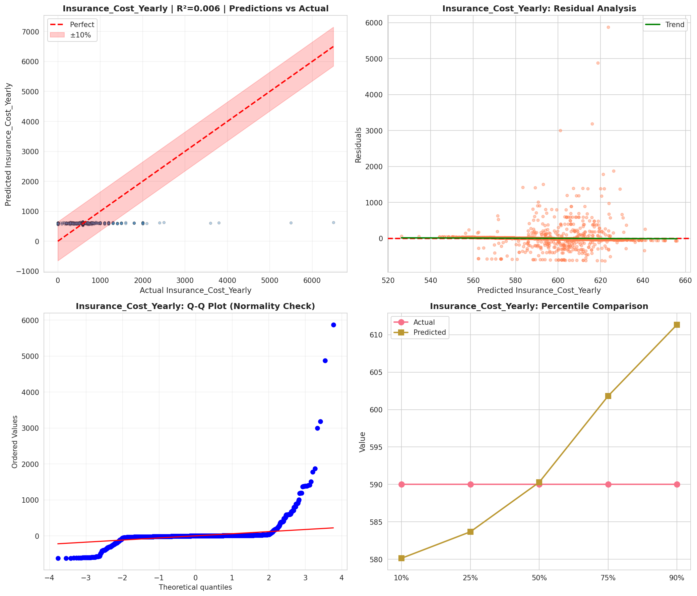
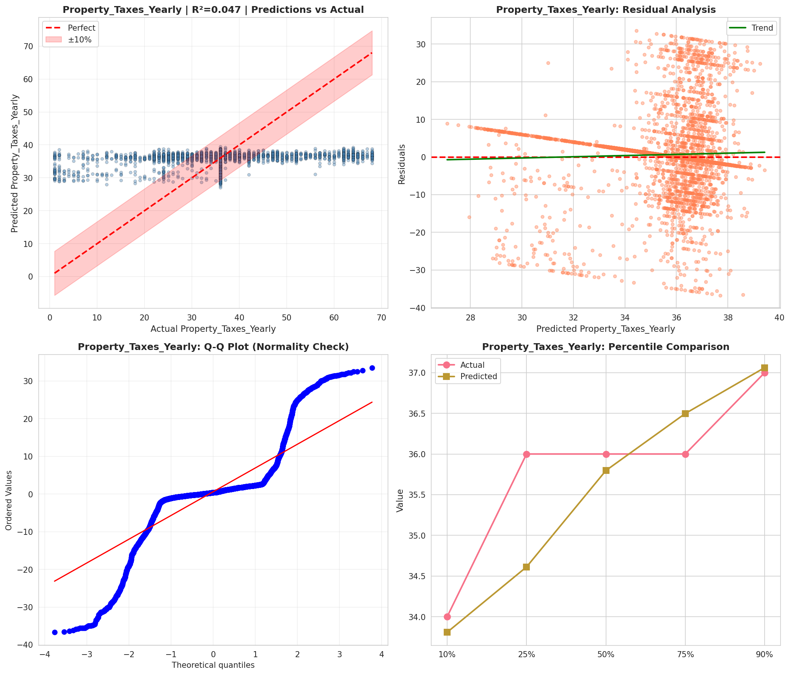
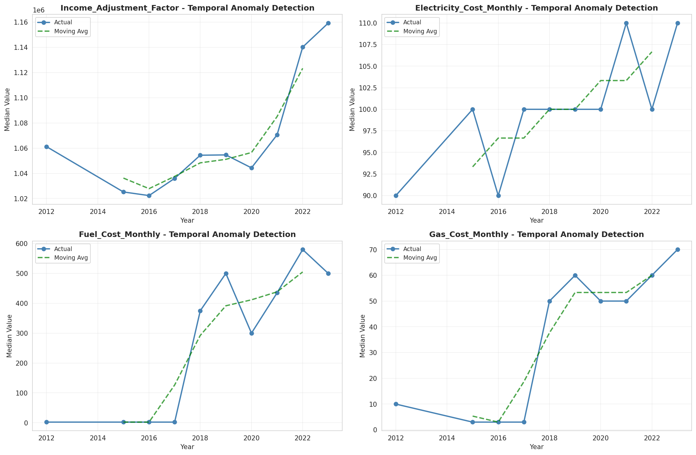
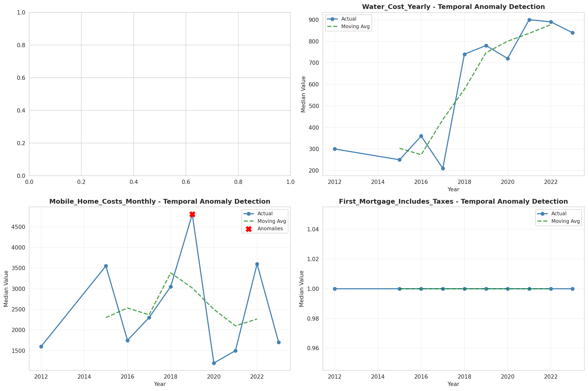
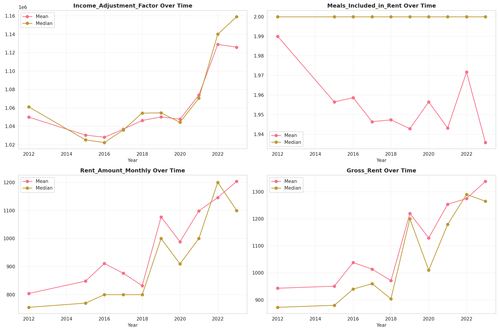
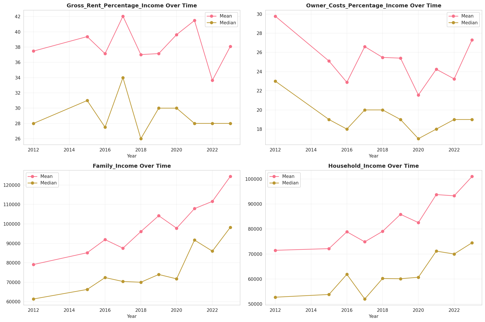
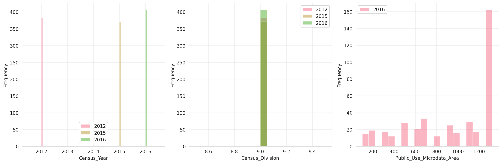
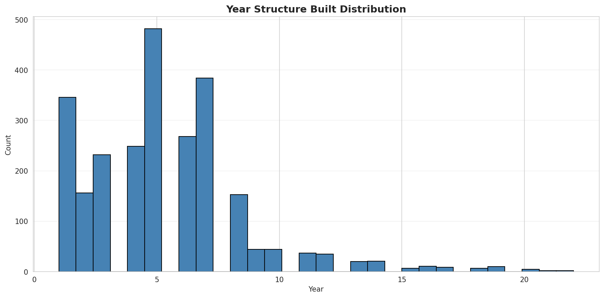
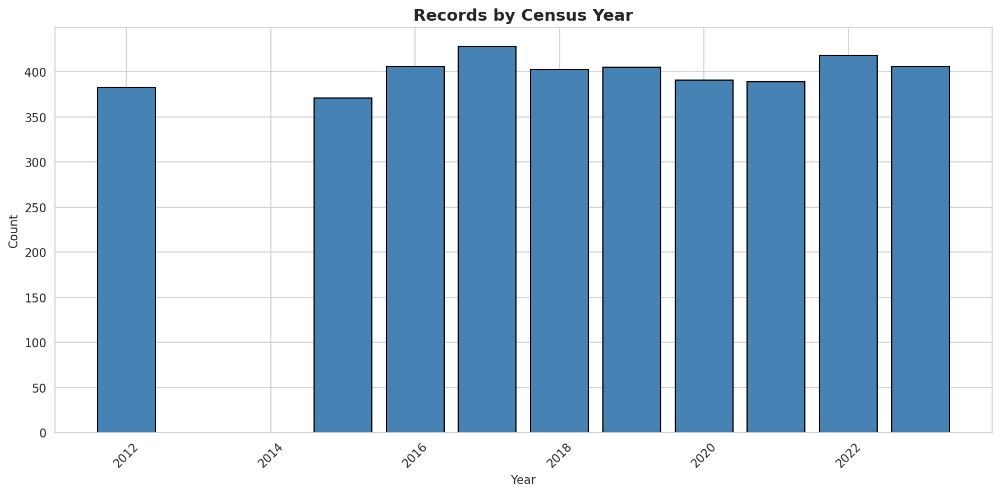
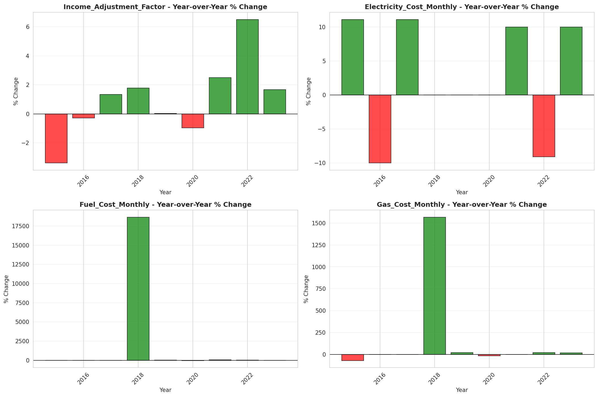
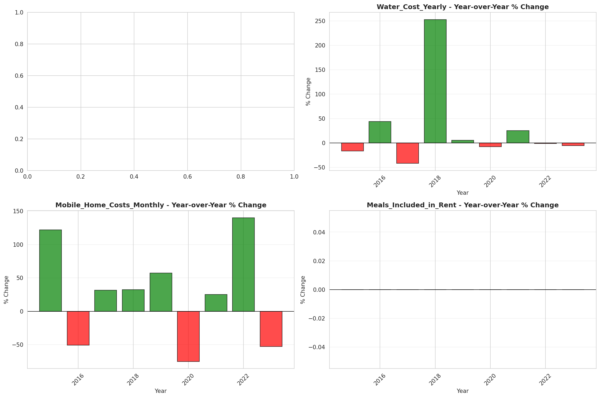
