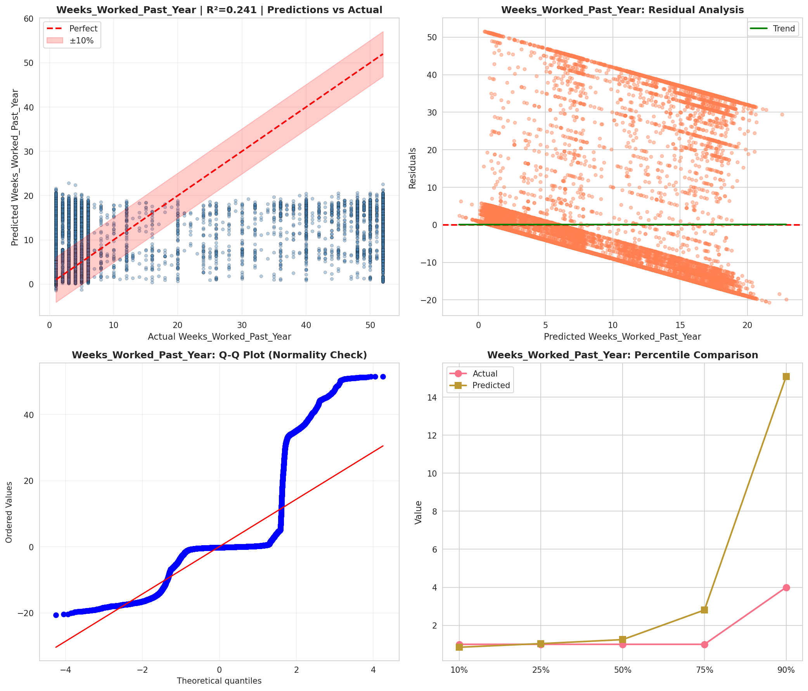
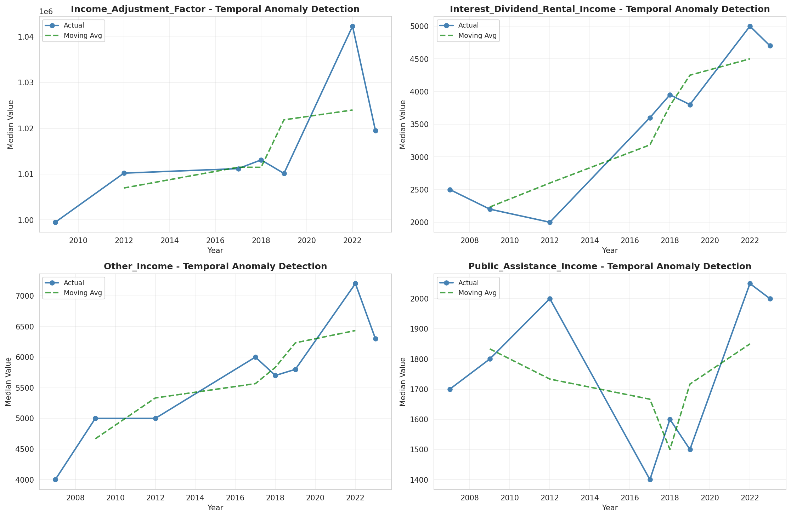
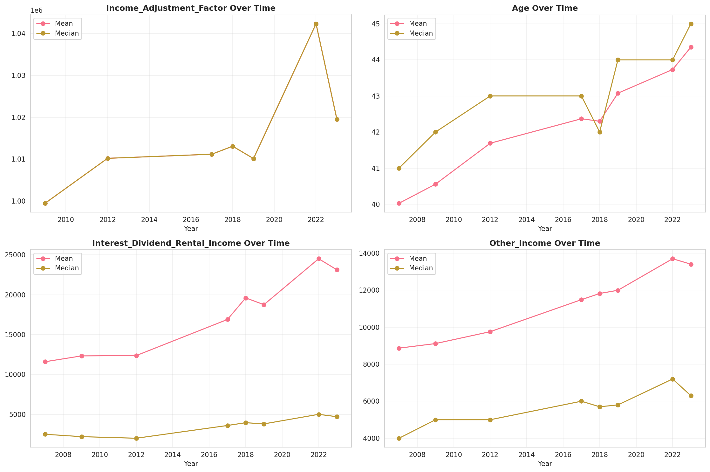
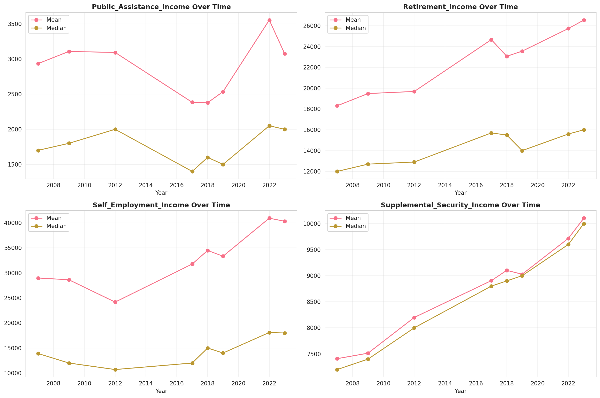
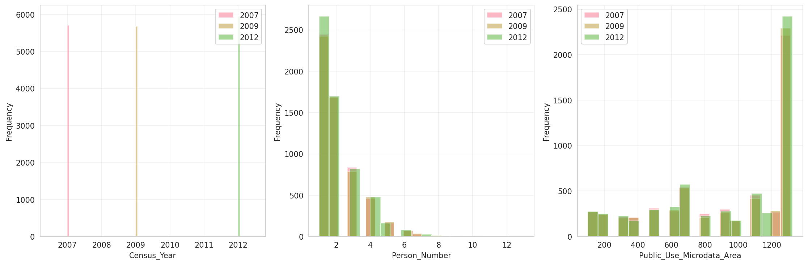
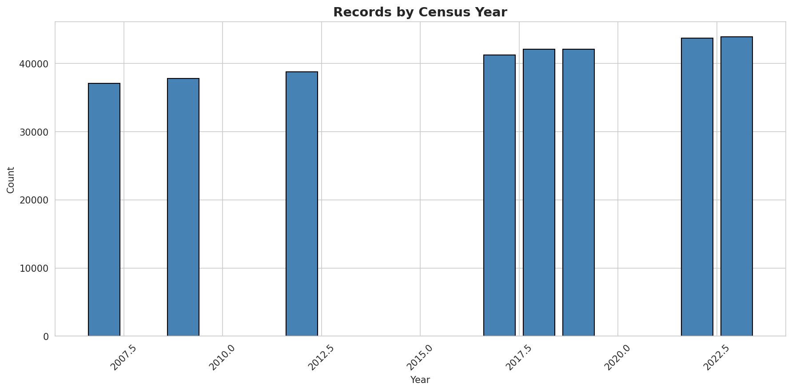
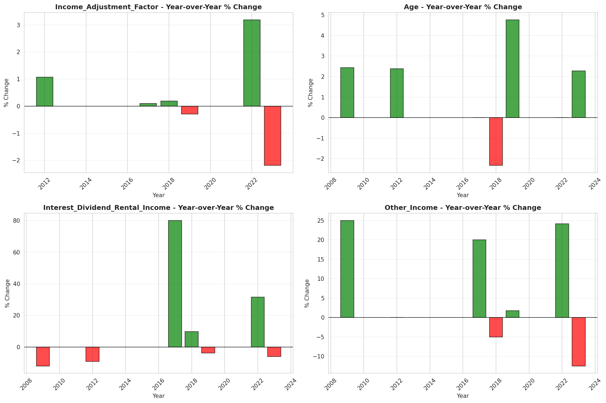
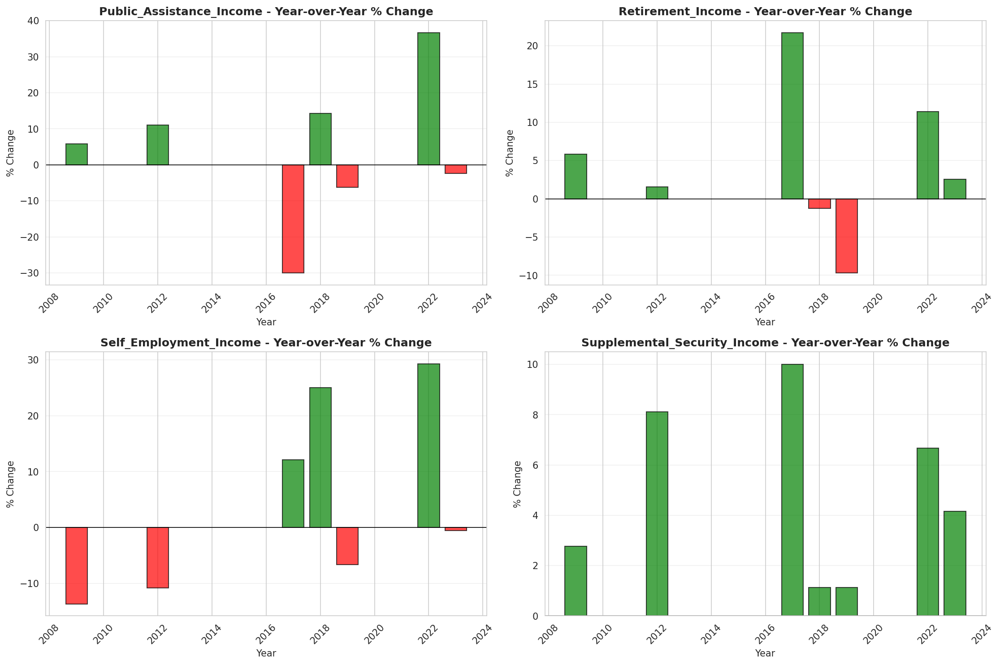

# Temporal Analysis

## Year Distribution

- 2007: 37,076 records

- 2009: 37,792 records

- 2012: 38,767 records

- 2017: 41,219 records

- 2018: 42,117 records

- 2019: 42,080 records

- 2022: 43,708 records

- 2023: 43,935 records

## Temporal Trends

- Census_Year: {np.int64(2007): {'mean': 2007.0, 'median': 2007.0, 'std': 0.0}, np.int64(2009): {'mean': 2009.0, 'median': 2009.0, 'std': 0.0}, np.int64(2012): {'mean': 2012.0, 'median': 2012.0, 'std': 0.0}, np.int64(2017): {'mean': 2017.0, 'median': 2017.0, 'std': 0.0}, np.int64(2018): {'mean': 2018.0, 'median': 2018.0, 'std': 0.0}, np.int64(2019): {'mean': 2019.0, 'median': 2019.0, 'std': 0.0}, np.int64(2022): {'mean': 2022.0, 'median': 2022.0, 'std': 0.0}, np.int64(2023): {'mean': 2023.0, 'median': 2023.0, 'std': 0.0}}

- Person_Number: {np.int64(2007): {'mean': 2.0606591865357644, 'median': 2.0, 'std': 1.299686953225732}, np.int64(2009): {'mean': 2.0642199407281963, 'median': 2.0, 'std': 1.292429847021452}, np.int64(2012): {'mean': 2.017179559934996, 'median': 2.0, 'std': 1.2815744297394773}, np.int64(2017): {'mean': 2.033722312525777, 'median': 2.0, 'std': 1.2874797492205612}, np.int64(2018): {'mean': 2.0476054799724577, 'median': 2.0, 'std': 1.3320207938710087}, np.int64(2019): {'mean': 2.0131653992395435, 'median': 2.0, 'std': 1.2782021982243892}, np.int64(2022): {'mean': 1.9988102864464172, 'median': 2.0, 'std': 1.284553431848472}, np.int64(2023): {'mean': 1.9791282576533515, 'median': 2.0, 'std': 1.235319037540925}}

- Public_Use_Microdata_Area: {np.int64(2007): {'mean': 932.4408242528859, 'median': 1101.0, 'std': 398.41324375944873}, np.int64(2009): {'mean': 929.4194538526672, 'median': 1101.0, 'std': 402.2455426274682}, np.int64(2012): {'mean': 936.662522248304, 'median': 1104.0, 'std': 405.91995319732564}, np.int64(2017): {'mean': 944.5420801086877, 'median': 1104.0, 'std': 403.7024512179332}, np.int64(2018): {'mean': 942.0683097086687, 'median': 1104.0, 'std': 403.3981928755008}, np.int64(2019): {'mean': 939.2588403041825, 'median': 1104.0, 'std': 402.98277478508004}, np.int64(2022): {'mean': 4946.855060858424, 'median': 5103.0, 'std': 2616.2859082242626}, np.int64(2023): {'mean': 4906.371207465574, 'median': 5102.0, 'std': 2630.830968835502}}

- State_Code: {np.int64(2007): {'mean': 41.0, 'median': 41.0, 'std': 0.0}, np.int64(2009): {'mean': 41.0, 'median': 41.0, 'std': 0.0}, np.int64(2012): {'mean': 41.0, 'median': 41.0, 'std': 0.0}, np.int64(2017): {'mean': 41.0, 'median': 41.0, 'std': 0.0}, np.int64(2018): {'mean': 41.0, 'median': 41.0, 'std': 0.0}, np.int64(2019): {'mean': 41.0, 'median': 41.0, 'std': 0.0}, np.int64(2022): {'mean': 41.0, 'median': 41.0, 'std': 0.0}, np.int64(2023): {'mean': None, 'median': None, 'std': None}}

- Income_Adjustment_Factor: {np.int64(2007): {'mean': nan, 'median': nan, 'std': nan}, np.int64(2009): {'mean': 999480.0, 'median': 999480.0, 'std': 0.0}, np.int64(2012): {'mean': 1010207.0, 'median': 1010207.0, 'std': 0.0}, np.int64(2017): {'mean': 1011189.0, 'median': 1011189.0, 'std': 0.0}, np.int64(2018): {'mean': 1013097.0, 'median': 1013097.0, 'std': 0.0}, np.int64(2019): {'mean': 1010145.0, 'median': 1010145.0, 'std': 0.0}, np.int64(2022): {'mean': 1042311.0, 'median': 1042311.0, 'std': 0.0}, np.int64(2023): {'mean': 1019518.0, 'median': 1019518.0, 'std': 0.0}}

- Person_Weight: {np.int64(2007): {'mean': 101.07495414823606, 'median': 84.0, 'std': 69.77731861369924}, np.int64(2009): {'mean': 101.22928132938188, 'median': 85.0, 'std': 69.62285292579676}, np.int64(2012): {'mean': 100.58433719400522, 'median': 79.0, 'std': 79.37394265613155}, np.int64(2017): {'mean': 100.50646546495548, 'median': 82.0, 'std': 77.04793428424864}, np.int64(2018): {'mean': 99.50169765177957, 'median': 81.0, 'std': 76.49881095118445}, np.int64(2019): {'mean': 100.23139258555133, 'median': 80.0, 'std': 84.09225671092724}, np.int64(2022): {'mean': 97.01054726823465, 'median': 74.0, 'std': 78.86855623329438}, np.int64(2023): {'mean': 96.35502446796404, 'median': 73.0, 'std': 80.64623958172635}}

- Age: {np.int64(2007): {'mean': 40.02664796633941, 'median': 41.0, 'std': 23.125893496578335}, np.int64(2009): {'mean': 40.55617591024556, 'median': 42.0, 'std': 23.194404179421213}, np.int64(2012): {'mean': 41.69030360873939, 'median': 43.0, 'std': 23.511955389867836}, np.int64(2017): {'mean': 42.368349547538756, 'median': 43.0, 'std': 23.492091490115065}, np.int64(2018): {'mean': 42.29926158083434, 'median': 42.0, 'std': 23.68133414986115}, np.int64(2019): {'mean': 43.07621197718631, 'median': 44.0, 'std': 23.62811674780232}, np.int64(2022): {'mean': 43.73256612061865, 'median': 44.0, 'std': 23.731270467657303}, np.int64(2023): {'mean': 44.3522021167634, 'median': 45.0, 'std': 23.855529051326645}}

- Citizenship_Status: {np.int64(2007): {'mean': 1.3093375768691338, 'median': 1.0, 'std': 1.0036911960441466}, np.int64(2009): {'mean': 1.313743649449619, 'median': 1.0, 'std': 1.0072498116252608}, np.int64(2012): {'mean': 1.2952769107746278, 'median': 1.0, 'std': 0.9725501103983254}, np.int64(2017): {'mean': 1.305199058686528, 'median': 1.0, 'std': 0.9788212422866519}, np.int64(2018): {'mean': 1.2939668067526178, 'median': 1.0, 'std': 0.9616716439530997}, np.int64(2019): {'mean': 1.2854325095057033, 'median': 1.0, 'std': 0.943024715310687}, np.int64(2022): {'mean': 1.312848906378695, 'median': 1.0, 'std': 0.9845641450896176}, np.int64(2023): {'mean': 1.3009445772163424, 'median': 1.0, 'std': 0.9642032769144572}}

- Class_of_Worker: {np.int64(2007): {'mean': 2.296217838386513, 'median': 1.0, 'std': 2.0142026590870787}, np.int64(2009): {'mean': 2.261341908569442, 'median': 1.0, 'std': 1.9960010623332398}, np.int64(2012): {'mean': 2.321668388429752, 'median': 1.0, 'std': 2.03701247730391}, np.int64(2017): {'mean': 2.265538079801497, 'median': 1.0, 'std': 1.9906645450718317}, np.int64(2018): {'mean': 2.256106153123532, 'median': 1.0, 'std': 1.97672384825881}, np.int64(2019): {'mean': 2.2452511110237148, 'median': 1.0, 'std': 1.9372339980673916}, np.int64(2022): {'mean': 2.2352267521759046, 'median': 1.0, 'std': 1.9444718822994889}, np.int64(2023): {'mean': 2.250531914893617, 'median': 1.0, 'std': 1.9460405170578}}

- English_Speaking_Ability: {np.int64(2007): {'mean': 1.7479943369513922, 'median': 1.0, 'std': 0.9782696731605032}, np.int64(2009): {'mean': 1.7275822928490352, 'median': 1.0, 'std': 0.9836421817607586}, np.int64(2012): {'mean': 1.6469227209625175, 'median': 1.0, 'std': 0.9149437027572687}, np.int64(2017): {'mean': 1.5695067264573992, 'median': 1.0, 'std': 0.8633856398138442}, np.int64(2018): {'mean': 1.54156223893066, 'median': 1.0, 'std': 0.8536933748143791}, np.int64(2019): {'mean': 1.4947826086956522, 'median': 1.0, 'std': 0.819138700738631}, np.int64(2022): {'mean': 1.5267545560294689, 'median': 1.0, 'std': 0.8488443445106212}, np.int64(2023): {'mean': 1.5474689977637732, 'median': 1.0, 'std': 0.8660448899024701}}

- Fertility_Status: {np.int64(2007): {'mean': 1.948890462700661, 'median': 2.0, 'std': 0.22023414267541475}, np.int64(2009): {'mean': 1.950712450362065, 'median': 2.0, 'std': 0.21648039298781604}, np.int64(2012): {'mean': 1.9507242935169793, 'median': 2.0, 'std': 0.21645594106474345}, np.int64(2017): {'mean': 1.9528890907026903, 'median': 2.0, 'std': 0.21188810299952163}, np.int64(2018): {'mean': 1.9518059062465694, 'median': 2.0, 'std': 0.21418790691550604}, np.int64(2019): {'mean': 1.9550746924428823, 'median': 2.0, 'std': 0.20715148515453344}, np.int64(2022): {'mean': 1.9554160459672272, 'median': 2.0, 'std': 0.206399510744507}, np.int64(2023): {'mean': 1.9593383137673426, 'median': 2.0, 'std': 0.19751576407168395}}

- Marital_Status: {np.int64(2007): {'mean': 2.8057773222569855, 'median': 2.0, 'std': 1.8373395590806645}, np.int64(2009): {'mean': 2.8193533022861983, 'median': 2.0, 'std': 1.8403056848665555}, np.int64(2012): {'mean': 2.8490210746253255, 'median': 3.0, 'std': 1.827883400150789}, np.int64(2017): {'mean': 2.866639171255974, 'median': 3.0, 'std': 1.8351826805572746}, np.int64(2018): {'mean': 2.8663247619726, 'median': 3.0, 'std': 1.8385636973016939}, np.int64(2019): {'mean': 2.863925855513308, 'median': 3.0, 'std': 1.8334023256654925}, np.int64(2022): {'mean': 2.8904548366431775, 'median': 3.0, 'std': 1.8359859574227309}, np.int64(2023): {'mean': 2.8682826903379994, 'median': 3.0, 'std': 1.8343988561637559}}

- Mobility_Status: {np.int64(2007): {'mean': 1.3115044730525856, 'median': 1.0, 'std': 0.7221033545112218}, np.int64(2009): {'mean': 1.2940264599759455, 'median': 1.0, 'std': 0.7051653066004305}, np.int64(2012): {'mean': 1.3100880162491537, 'median': 1.0, 'std': 0.7210913302107927}, np.int64(2017): {'mean': 1.3135719703457218, 'median': 1.0, 'std': 0.7230224606074966}, np.int64(2018): {'mean': 1.3180543907990896, 'median': 1.0, 'std': 0.7280295191788719}, np.int64(2019): {'mean': 1.2911098337883795, 'median': 1.0, 'std': 0.7029634022154518}, np.int64(2022): {'mean': 1.2758580918988742, 'median': 1.0, 'std': 0.6859866483328091}, np.int64(2023): {'mean': 1.251559346908824, 'median': 1.0, 'std': 0.6595339797068983}}

- Military_Service: {np.int64(2007): {'mean': 4.719560469560469, 'median': 5.0, 'std': 0.6883210661766622}, np.int64(2009): {'mean': 4.727076984232145, 'median': 5.0, 'std': 0.682963230399609}, np.int64(2012): {'mean': 4.747900496246341, 'median': 5.0, 'std': 0.6623581759117515}, np.int64(2017): {'mean': 3.7931565237982476, 'median': 4.0, 'std': 0.5982880635124027}, np.int64(2018): {'mean': 3.8010665430095063, 'median': 4.0, 'std': 0.5872926340988391}, np.int64(2019): {'mean': 3.7974770642201836, 'median': 4.0, 'std': 0.5935850283813607}, np.int64(2022): {'mean': 3.8222478007070624, 'median': 4.0, 'std': 0.5584921529036119}, np.int64(2023): {'mean': 3.825947387034468, 'median': 4.0, 'std': 0.5527904909651844}}

- Travel_Time_To_Work_Minutes: {np.int64(2007): {'mean': 22.465311004784688, 'median': 15.0, 'std': 20.999188824098365}, np.int64(2009): {'mean': 22.3902945374335, 'median': 15.0, 'std': 20.488085050061187}, np.int64(2012): {'mean': 22.907699322563836, 'median': 20.0, 'std': 20.447556032759906}, np.int64(2017): {'mean': 24.391207153502236, 'median': 20.0, 'std': 21.74605120415578}, np.int64(2018): {'mean': 23.82052293474586, 'median': 20.0, 'std': 20.896319031994697}, np.int64(2019): {'mean': 24.44358282760171, 'median': 20.0, 'std': 21.933527969299522}, np.int64(2022): {'mean': 22.775704517860568, 'median': 20.0, 'std': 19.547904562376026}, np.int64(2023): {'mean': 23.303443150854594, 'median': 20.0, 'std': 21.24997587029674}}

- Vehicle_Occupancy: {np.int64(2007): {'mean': 1.1694463910301331, 'median': 1.0, 'std': 0.5493565337716843}, np.int64(2009): {'mean': 1.1663617067993852, 'median': 1.0, 'std': 0.5612049065940693}, np.int64(2012): {'mean': 1.1715279834172343, 'median': 1.0, 'std': 0.5696846351978719}, np.int64(2017): {'mean': 1.1641967213114754, 'median': 1.0, 'std': 0.5539224210275472}, np.int64(2018): {'mean': 1.1725415070242657, 'median': 1.0, 'std': 0.6137093574547939}, np.int64(2019): {'mean': 1.1596030729833546, 'median': 1.0, 'std': 0.5444050139353347}, np.int64(2022): {'mean': 1.1586438738287677, 'median': 1.0, 'std': 0.5788430006879931}, np.int64(2023): {'mean': 1.1698269896193771, 'median': 1.0, 'std': 0.5961584037609794}}

- Transportation_To_Work: {np.int64(2007): {'mean': 2.1844257437477776, 'median': 1.0, 'std': 3.0803082451163712}, np.int64(2009): {'mean': 2.3379335391320137, 'median': 1.0, 'std': 3.2379999829041504}, np.int64(2012): {'mean': 2.39300461501093, 'median': 1.0, 'std': 3.2907753328583977}, np.int64(2017): {'mean': 2.461415901003771, 'median': 1.0, 'std': 3.354879524952101}, np.int64(2018): {'mean': 2.4807233910249766, 'median': 1.0, 'std': 3.3940811668199373}, np.int64(2019): {'mean': None, 'median': None, 'std': None}, np.int64(2022): {'mean': None, 'median': None, 'std': None}, np.int64(2023): {'mean': None, 'median': None, 'std': None}}

- Language_Other_Than_English: {np.int64(2007): {'mean': 1.8788519810188096, 'median': 2.0, 'std': 0.3263038770287954}, np.int64(2009): {'mean': 1.8766348335060352, 'median': 2.0, 'std': 0.3288605038404931}, np.int64(2012): {'mean': 1.8823561435026404, 'median': 2.0, 'std': 0.3221903243704843}, np.int64(2017): {'mean': 1.880675737654793, 'median': 2.0, 'std': 0.3241738121008001}, np.int64(2018): {'mean': 1.8803867196282695, 'median': 2.0, 'std': 0.3245128261524761}, np.int64(2019): {'mean': 1.8857369963733916, 'median': 2.0, 'std': 0.3181343798624808}, np.int64(2022): {'mean': 1.8769326207291468, 'median': 2.0, 'std': 0.3285184537488056}, np.int64(2023): {'mean': 1.8833254269449715, 'median': 2.0, 'std': 0.3210359195650041}}

- Grandparents_Living_With_Grandchildren: {np.int64(2007): {'mean': 1.9738753025623905, 'median': 2.0, 'std': 0.15950943369726805}, np.int64(2009): {'mean': 1.9726172527606862, 'median': 2.0, 'std': 0.1631993188696266}, np.int64(2012): {'mean': 1.9738396952499417, 'median': 2.0, 'std': 0.1596149539483508}, np.int64(2017): {'mean': 1.9733988723435014, 'median': 2.0, 'std': 0.16091750545711575}, np.int64(2018): {'mean': 1.9752849685735592, 'median': 2.0, 'std': 0.15525802594711216}, np.int64(2019): {'mean': 1.974434302101913, 'median': 2.0, 'std': 0.15783841194396292}, np.int64(2022): {'mean': 1.9753601589667162, 'median': 2.0, 'std': 0.15502746598805947}, np.int64(2023): {'mean': 1.9783494734096319, 'median': 2.0, 'std': 0.14554199383324984}}

- Months_Responsible_For_Grandchildren: {np.int64(2007): {'mean': 3.3811320754716983, 'median': 3.0, 'std': 1.3630759282878828}, np.int64(2009): {'mean': 3.385159010600707, 'median': 3.0, 'std': 1.4179918722627698}, np.int64(2012): {'mean': 3.8032128514056227, 'median': 4.0, 'std': 1.291032079195399}, np.int64(2017): {'mean': 3.640625, 'median': 4.0, 'std': 1.393173130859557}, np.int64(2018): {'mean': 3.6283185840707963, 'median': 4.0, 'std': 1.3346306373124726}, np.int64(2019): {'mean': 3.618811881188119, 'median': 4.0, 'std': 1.47558659362337}, np.int64(2022): {'mean': 3.8941176470588235, 'median': 4.0, 'std': 1.3676181463995332}, np.int64(2023): {'mean': 3.7660818713450293, 'median': 4.0, 'std': 1.3474229757617298}}

- Grandparents_Responsible_For_Grandchildren: {np.int64(2007): {'mean': 1.5766773162939298, 'median': 2.0, 'std': 0.4944807196530782}, np.int64(2009): {'mean': 1.5788690476190477, 'median': 2.0, 'std': 0.49410826883953707}, np.int64(2012): {'mean': 1.6300148588410104, 'median': 2.0, 'std': 0.48315939992022044}, np.int64(2017): {'mean': 1.6521739130434783, 'median': 2.0, 'std': 0.47660437498759967}, np.int64(2018): {'mean': 1.6752873563218391, 'median': 2.0, 'std': 0.46860414569771724}, np.int64(2019): {'mean': 1.7236662106703147, 'median': 2.0, 'std': 0.44749006961569815}, np.int64(2022): {'mean': 1.771505376344086, 'median': 2.0, 'std': 0.42014532187317927}, np.int64(2023): {'mean': 1.7424698795180722, 'median': 2.0, 'std': 0.4376034234964263}}

- Interest_Dividend_Rental_Income: {np.int64(2007): {'mean': 11593.431088944306, 'median': 2500.0, 'std': 27803.310019518038}, np.int64(2009): {'mean': 12328.295967312133, 'median': 2200.0, 'std': 31313.112475349775}, np.int64(2012): {'mean': 12368.164110429449, 'median': 2000.0, 'std': 31366.835578871014}, np.int64(2017): {'mean': 16896.221574344025, 'median': 3600.0, 'std': 39819.87389126264}, np.int64(2018): {'mean': 19603.305691669808, 'median': 3950.0, 'std': 48233.72119702548}, np.int64(2019): {'mean': 18752.97434964526, 'median': 3800.0, 'std': 44584.395321261894}, np.int64(2022): {'mean': 24513.85244306015, 'median': 5000.0, 'std': 62067.57016613358}, np.int64(2023): {'mean': 23125.64595834804, 'median': 4700.0, 'std': 57273.87483258119}}

- Military_Service_Period_1: {np.int64(2007): {'mean': 0.04581151832460733, 'median': 0.0, 'std': 0.2091034893472277}, np.int64(2009): {'mean': 0.04930304594734125, 'median': 0.0, 'std': 0.2165279610580895}, np.int64(2012): {'mean': 0.08067135896047645, 'median': 0.0, 'std': 0.27236661503195203}, np.int64(2017): {'mean': 0.1341425459072518, 'median': 0.0, 'std': 0.3408584516085725}, np.int64(2018): {'mean': 0.1426755640292342, 'median': 0.0, 'std': 0.3497972674819655}, np.int64(2019): {'mean': 0.16717791411042945, 'median': 0.0, 'std': 0.37319188184086854}, np.int64(2022): {'mean': 0.18396226415094338, 'median': 0.0, 'std': 0.38751870423500845}, np.int64(2023): {'mean': 0.2088174982911825, 'median': 0.0, 'std': 0.40653318891609136}}

- Military_Service_Period_2: {np.int64(2007): {'mean': 0.10366492146596859, 'median': 0.0, 'std': 0.3048652753410785}, np.int64(2009): {'mean': 0.11357769747031492, 'median': 0.0, 'std': 0.3173386186601341}, np.int64(2012): {'mean': 0.12425554953979426, 'median': 0.0, 'std': 0.3299175252283696}, np.int64(2017): {'mean': 0.164021164021164, 'median': 0.0, 'std': 0.3703524147801847}, np.int64(2018): {'mean': 0.15697489672704162, 'median': 0.0, 'std': 0.3638349112752874}, np.int64(2019): {'mean': 0.16656441717791412, 'median': 0.0, 'std': 0.37264367459398806}, np.int64(2022): {'mean': 0.17149595687331537, 'median': 0.0, 'std': 0.37700528128991256}, np.int64(2023): {'mean': 0.18010936431989064, 'median': 0.0, 'std': 0.38434420337483305}}

- Military_Service_Period_3: {np.int64(2007): {'mean': 0.14607329842931938, 'median': 0.0, 'std': 0.3532259218118959}, np.int64(2009): {'mean': 0.14713474445018068, 'median': 0.0, 'std': 0.3542859179548186}, np.int64(2012): {'mean': 0.1621548456957228, 'median': 0.0, 'std': 0.36864270019683154}, np.int64(2017): {'mean': None, 'median': None, 'std': None}, np.int64(2018): {'mean': None, 'median': None, 'std': None}, np.int64(2019): {'mean': None, 'median': None, 'std': None}, np.int64(2022): {'mean': None, 'median': None, 'std': None}, np.int64(2023): {'mean': None, 'median': None, 'std': None}}

- Military_Service_Period_4: {np.int64(2007): {'mean': 0.11518324607329843, 'median': 0.0, 'std': 0.31928475140810514}, np.int64(2009): {'mean': 0.1169334021683015, 'median': 0.0, 'std': 0.32138239392290124}, np.int64(2012): {'mean': 0.11315646995127233, 'median': 0.0, 'std': 0.3168268562694871}, np.int64(2017): {'mean': None, 'median': None, 'std': None}, np.int64(2018): {'mean': None, 'median': None, 'std': None}, np.int64(2019): {'mean': None, 'median': None, 'std': None}, np.int64(2022): {'mean': None, 'median': None, 'std': None}, np.int64(2023): {'mean': None, 'median': None, 'std': None}}

- Military_Service_Period_5: {np.int64(2007): {'mean': 0.37329842931937174, 'median': 0.0, 'std': 0.4837437034402757}, np.int64(2009): {'mean': 0.3802271553949406, 'median': 0.0, 'std': 0.48550521228405386}, np.int64(2012): {'mean': 0.38170005414185165, 'median': 0.0, 'std': 0.4858693537172981}, np.int64(2017): {'mean': 0.43261749144102085, 'median': 0.0, 'std': 0.49551591002834083}, np.int64(2018): {'mean': 0.43946615824594853, 'median': 0.0, 'std': 0.49640100244413615}, np.int64(2019): {'mean': 0.4098159509202454, 'median': 0.0, 'std': 0.491875037319755}, np.int64(2022): {'mean': 0.430256064690027, 'median': 0.0, 'std': 0.4951953192868699}, np.int64(2023): {'mean': 0.4090909090909091, 'median': 0.0, 'std': 0.4917501213199457}}

- Military_Service_Period_6: {np.int64(2007): {'mean': 0.11544502617801047, 'median': 0.0, 'std': 0.3196000804617124}, np.int64(2009): {'mean': 0.10970573051109964, 'median': 0.0, 'std': 0.31256295602676853}, np.int64(2012): {'mean': 0.11234434217650244, 'median': 0.0, 'std': 0.3158323831266383}, np.int64(2017): {'mean': None, 'median': None, 'std': None}, np.int64(2018): {'mean': None, 'median': None, 'std': None}, np.int64(2019): {'mean': None, 'median': None, 'std': None}, np.int64(2022): {'mean': None, 'median': None, 'std': None}, np.int64(2023): {'mean': None, 'median': None, 'std': None}}

- Military_Service_Period_7: {np.int64(2007): {'mean': 0.14083769633507853, 'median': 0.0, 'std': 0.3478995888927558}, np.int64(2009): {'mean': 0.13758389261744966, 'median': 0.0, 'std': 0.34450718636179223}, np.int64(2012): {'mean': 0.13670817541959934, 'median': 0.0, 'std': 0.34358551729339926}, np.int64(2017): {'mean': None, 'median': None, 'std': None}, np.int64(2018): {'mean': None, 'median': None, 'std': None}, np.int64(2019): {'mean': None, 'median': None, 'std': None}, np.int64(2022): {'mean': None, 'median': None, 'std': None}, np.int64(2023): {'mean': None, 'median': None, 'std': None}}

- Military_Service_Period_8: {np.int64(2007): {'mean': 0.1450261780104712, 'median': 0.0, 'std': 0.3521733284270044}, np.int64(2009): {'mean': 0.13216313887454828, 'median': 0.0, 'std': 0.33871176221257715}, np.int64(2012): {'mean': 0.1253383865728208, 'median': 0.0, 'std': 0.3311470382740872}, np.int64(2017): {'mean': 0.08621226268285091, 'median': 0.0, 'std': 0.28072092036358653}, np.int64(2018): {'mean': 0.07785192246584048, 'median': 0.0, 'std': 0.26798100754634235}, np.int64(2019): {'mean': 0.06901840490797546, 'median': 0.0, 'std': 0.25352431997940655}, np.int64(2022): {'mean': 0.05289757412398922, 'median': 0.0, 'std': 0.22386671553346008}, np.int64(2023): {'mean': 0.05160628844839371, 'median': 0.0, 'std': 0.22126864241845673}}

- Military_Service_Period_9: {np.int64(2007): {'mean': 0.03193717277486911, 'median': 0.0, 'std': 0.17585586539682455}, np.int64(2009): {'mean': 0.02607124419204956, 'median': 0.0, 'std': 0.1593677836205706}, np.int64(2012): {'mean': 0.027883053600433135, 'median': 0.0, 'std': 0.16466003960630704}, np.int64(2017): {'mean': 0.007469654528478058, 'median': 0.0, 'std': 0.08611716997740902}, np.int64(2018): {'mean': 0.008897362567524627, 'median': 0.0, 'std': 0.09392019215605898}, np.int64(2019): {'mean': 0.008895705521472393, 'median': 0.0, 'std': 0.09391100704664973}, np.int64(2022): {'mean': None, 'median': None, 'std': None}, np.int64(2023): {'mean': None, 'median': None, 'std': None}}

- Military_Service_Period_10: {np.int64(2007): {'mean': 0.13534031413612566, 'median': 0.0, 'std': 0.3421314892004148}, np.int64(2009): {'mean': 0.12829117191533299, 'median': 0.0, 'std': 0.33445690610191736}, np.int64(2012): {'mean': 0.09962100703844072, 'median': 0.0, 'std': 0.2995345560815811}, np.int64(2017): {'mean': 0.034858387799564274, 'median': 0.0, 'std': 0.1834495975638581}, np.int64(2018): {'mean': 0.03272958373053702, 'median': 0.0, 'std': 0.1779562337493302}, np.int64(2019): {'mean': 0.02361963190184049, 'median': 0.0, 'std': 0.15188423623335146}, np.int64(2022): {'mean': 0.01179245283018868, 'median': 0.0, 'std': 0.10796906295051859}, np.int64(2023): {'mean': 0.008544087491455913, 'median': 0.0, 'std': 0.09205423487375623}}

- Military_Service_Period_11: {np.int64(2007): {'mean': 0.008115183246073299, 'median': 0.0, 'std': 0.08972978743086663}, np.int64(2009): {'mean': 0.005937016004130098, 'median': 0.0, 'std': 0.07683288142748206}, np.int64(2012): {'mean': 0.006497022198159177, 'median': 0.0, 'std': 0.0803527146457801}, np.int64(2017): {'mean': 0.0006224712107065049, 'median': 0.0, 'std': 0.02494548887447105}, np.int64(2018): {'mean': 0.0006355258976803305, 'median': 0.0, 'std': 0.02520563204733179}, np.int64(2019): {'mean': 0.00030674846625766873, 'median': 0.0, 'std': 0.01751423610260147}, np.int64(2022): {'mean': None, 'median': None, 'std': None}, np.int64(2023): {'mean': None, 'median': None, 'std': None}}

- Temporary_Absence_From_Work: {np.int64(2007): {'mean': 2.5039219629927594, 'median': 3.0, 'std': 0.542811694076411}, np.int64(2009): {'mean': 2.497164461247637, 'median': 3.0, 'std': 0.5358091705977517}, np.int64(2012): {'mean': 2.487744405737062, 'median': 3.0, 'std': 0.5348023601742445}, np.int64(2017): {'mean': 2.5656919395318973, 'median': 3.0, 'std': 0.5206554323249745}, np.int64(2018): {'mean': 2.5738262709441297, 'median': 3.0, 'std': 0.5192345985546524}, np.int64(2019): {'mean': 2.5758990464872817, 'median': 3.0, 'std': 0.5179192602446454}, np.int64(2022): {'mean': 2.5648964361040507, 'median': 3.0, 'std': 0.5191174613000423}, np.int64(2023): {'mean': 2.5643721005068247, 'median': 3.0, 'std': 0.5182179784894035}}

- Available_For_Work: {np.int64(2007): {'mean': 4.596976401179941, 'median': 5.0, 'std': 1.1291429812884173}, np.int64(2009): {'mean': 4.429926341177238, 'median': 5.0, 'std': 1.3292182713602034}, np.int64(2012): {'mean': 4.432633462009227, 'median': 5.0, 'std': 1.2878766213797002}, np.int64(2017): {'mean': 4.7350142998891025, 'median': 5.0, 'std': 0.9159311148657026}, np.int64(2018): {'mean': 4.746354434722937, 'median': 5.0, 'std': 0.8975946180938278}, np.int64(2019): {'mean': 4.742721330956625, 'median': 5.0, 'std': 0.9026768876070644}, np.int64(2022): {'mean': 4.7981991238981125, 'median': 5.0, 'std': 0.8072197954778426}, np.int64(2023): {'mean': 4.78624869271406, 'median': 5.0, 'std': 0.8307445172412246}}

- On_Layoff_From_Work: {np.int64(2007): {'mean': 2.4815969428801288, 'median': 2.0, 'std': 0.5224309390464139}, np.int64(2009): {'mean': 2.43768333224692, 'median': 2.0, 'std': 0.5561391764547424}, np.int64(2012): {'mean': 2.4517779242381446, 'median': 2.0, 'std': 0.5315262387766613}, np.int64(2017): {'mean': 2.5557403840541646, 'median': 3.0, 'std': 0.5094191124083081}, np.int64(2018): {'mean': 2.564648024246583, 'median': 3.0, 'std': 0.5072130286097328}, np.int64(2019): {'mean': 2.5684293919588037, 'median': 3.0, 'std': 0.5052565494234798}, np.int64(2022): {'mean': 2.5598128819425665, 'median': 3.0, 'std': 0.5061797043651004}, np.int64(2023): {'mean': 2.5571049314848087, 'median': 3.0, 'std': 0.5072059199417946}}

- Looking_For_Work: {np.int64(2007): {'mean': 2.468155001340842, 'median': 3.0, 'std': 0.5785126806746579}, np.int64(2009): {'mean': 2.424516002868131, 'median': 3.0, 'std': 0.6330550886280385}, np.int64(2012): {'mean': 2.4339202209459248, 'median': 3.0, 'std': 0.6197181315636265}, np.int64(2017): {'mean': 2.545438627210646, 'median': 3.0, 'std': 0.565193859796529}, np.int64(2018): {'mean': 2.5572425230170985, 'median': 3.0, 'std': 0.5593707855941038}, np.int64(2019): {'mean': 2.552018787312905, 'median': 3.0, 'std': 0.5558124112183994}, np.int64(2022): {'mean': 2.5432642907360337, 'median': 3.0, 'std': 0.5565861947398273}, np.int64(2023): {'mean': 2.5376632431417767, 'median': 3.0, 'std': 0.5586985407171731}}

- Informed_Of_Recall: {np.int64(2007): {'mean': 2.8634017162778225, 'median': 3.0, 'std': 0.36720338008194703}, np.int64(2009): {'mean': 2.859200834365426, 'median': 3.0, 'std': 0.37859981291462935}, np.int64(2012): {'mean': 2.866333992404984, 'median': 3.0, 'std': 0.36606904132747886}, np.int64(2017): {'mean': 2.9442596159458354, 'median': 3.0, 'std': 0.24694460751077912}, np.int64(2018): {'mean': 2.9463315605878653, 'median': 3.0, 'std': 0.23951219615294764}, np.int64(2019): {'mean': 2.9330843448490507, 'median': 3.0, 'std': 0.26300934241486484}, np.int64(2022): {'mean': 2.953707208912444, 'median': 3.0, 'std': 0.22443344759239234}, np.int64(2023): {'mean': 2.9526427288085597, 'median': 3.0, 'std': 0.22491421797177413}}

- Other_Income: {np.int64(2007): {'mean': 8867.071139854486, 'median': 4000.0, 'std': 13378.455893412553}, np.int64(2009): {'mean': 9112.970320305612, 'median': 5000.0, 'std': 11831.297607242217}, np.int64(2012): {'mean': 9756.333125, 'median': 5000.0, 'std': 12555.056063814174}, np.int64(2017): {'mean': 11485.168820678513, 'median': 6000.0, 'std': 15131.836611360237}, np.int64(2018): {'mean': 11819.084745762711, 'median': 5700.0, 'std': 15087.428591067286}, np.int64(2019): {'mean': 11991.61113419194, 'median': 5800.0, 'std': 15354.97065801726}, np.int64(2022): {'mean': 13695.877224199288, 'median': 7200.0, 'std': 16391.154423015574}, np.int64(2023): {'mean': 13401.722850122851, 'median': 6300.0, 'std': 16592.31703600341}}

- Public_Assistance_Income: {np.int64(2007): {'mean': 2935.1761517615178, 'median': 1700.0, 'std': 3905.487225891748}, np.int64(2009): {'mean': 3109.1187050359713, 'median': 1800.0, 'std': 4094.8645201198015}, np.int64(2012): {'mean': 3094.297450424929, 'median': 2000.0, 'std': 3827.219489104424}, np.int64(2017): {'mean': 2384.1915227629515, 'median': 1400.0, 'std': 2948.0627656445176}, np.int64(2018): {'mean': 2378.4985422740524, 'median': 1600.0, 'std': 2811.3432780443536}, np.int64(2019): {'mean': 2536.356209150327, 'median': 1500.0, 'std': 3255.124821143056}, np.int64(2022): {'mean': 3556.133333333333, 'median': 2050.0, 'std': 4388.380334265302}, np.int64(2023): {'mean': 3075.7751277683133, 'median': 2000.0, 'std': 3673.2241936274368}}

- Retirement_Income: {np.int64(2007): {'mean': 18312.57504819609, 'median': 12000.0, 'std': 19256.665206687576}, np.int64(2009): {'mean': 19488.058095750403, 'median': 12700.0, 'std': 19249.607388352528}, np.int64(2012): {'mean': 19687.33660933661, 'median': 12900.0, 'std': 20375.414339184605}, np.int64(2017): {'mean': 24673.19177772758, 'median': 15700.0, 'std': 28000.333073676564}, np.int64(2018): {'mean': 23071.93407060825, 'median': 15500.0, 'std': 24189.802394360933}, np.int64(2019): {'mean': 23565.034547444113, 'median': 14000.0, 'std': 26092.750795472537}, np.int64(2022): {'mean': 25741.686782893757, 'median': 15600.0, 'std': 30061.326717887656}, np.int64(2023): {'mean': 26556.649317038104, 'median': 16000.0, 'std': 29559.440589978643}}

- Self_Employment_Income: {np.int64(2007): {'mean': 28981.45945945946, 'median': 13900.0, 'std': 46017.74044156448}, np.int64(2009): {'mean': 28628.924978687126, 'median': 12000.0, 'std': 50671.65619020073}, np.int64(2012): {'mean': 24168.841913254964, 'median': 10700.0, 'std': 41563.36457043123}, np.int64(2017): {'mean': 31775.103648424545, 'median': 12000.0, 'std': 58464.00681690869}, np.int64(2018): {'mean': 34484.83550295858, 'median': 15000.0, 'std': 59880.065930490935}, np.int64(2019): {'mean': 33330.729631130926, 'median': 14000.0, 'std': 58652.78680384006}, np.int64(2022): {'mean': 40930.54712260217, 'median': 18100.0, 'std': 70634.92904828551}, np.int64(2023): {'mean': 40306.90278338039, 'median': 18000.0, 'std': 68044.4288160357}}

- Supplemental_Security_Income: {np.int64(2007): {'mean': 7408.585858585859, 'median': 7200.0, 'std': 4663.074099150398}, np.int64(2009): {'mean': 7513.9146567718, 'median': 7400.0, 'std': 4360.801578730666}, np.int64(2012): {'mean': 8198.829787234043, 'median': 8000.0, 'std': 4606.22682601505}, np.int64(2017): {'mean': 8904.780114722753, 'median': 8800.0, 'std': 4874.310757256124}, np.int64(2018): {'mean': 9102.6291931097, 'median': 8900.0, 'std': 4957.904683673902}, np.int64(2019): {'mean': 9027.659574468085, 'median': 9000.0, 'std': 5248.400865278766}, np.int64(2022): {'mean': 9716.958234830576, 'median': 9600.0, 'std': 5576.895602160986}, np.int64(2023): {'mean': 10103.195962994112, 'median': 10000.0, 'std': 6138.076493757309}}

- Social_Security_Income: {np.int64(2007): {'mean': 10694.984381972334, 'median': 10800.0, 'std': 5365.680373104013}, np.int64(2009): {'mean': 11634.209154031458, 'median': 11700.0, 'std': 5917.0059947163445}, np.int64(2012): {'mean': 12537.052943354312, 'median': 12100.0, 'std': 6198.584132774557}, np.int64(2017): {'mean': 14107.619100132333, 'median': 13500.0, 'std': 7176.419959117552}, np.int64(2018): {'mean': 14319.286562331354, 'median': 13800.0, 'std': 7383.384041726289}, np.int64(2019): {'mean': 14741.471702082896, 'median': 14200.0, 'std': 7639.255320566446}, np.int64(2022): {'mean': 16384.626909518214, 'median': 15600.0, 'std': 8741.93431564966}, np.int64(2023): {'mean': 17447.22111648185, 'median': 16800.0, 'std': 9637.07542175828}}

- Wage_Income: {np.int64(2007): {'mean': 36671.598773207734, 'median': 28000.0, 'std': 40313.63843062271}, np.int64(2009): {'mean': 37515.43406085016, 'median': 28000.0, 'std': 41089.35557815378}, np.int64(2012): {'mean': 39605.44357541899, 'median': 29000.0, 'std': 45550.7865754136}, np.int64(2017): {'mean': 46445.83801800905, 'median': 34000.0, 'std': 53208.203101252126}, np.int64(2018): {'mean': 49123.38108910409, 'median': 35000.0, 'std': 57404.81968394565}, np.int64(2019): {'mean': 50465.454244870176, 'median': 36000.0, 'std': 56277.39523020869}, np.int64(2022): {'mean': 58363.00218985052, 'median': 41000.0, 'std': 66981.97047179195}, np.int64(2023): {'mean': 62735.140415835944, 'median': 45150.0, 'std': 72056.87354078161}}

- Relationship_To_Householder: {np.int64(2007): {'mean': None, 'median': None, 'std': None}, np.int64(2009): {'mean': None, 'median': None, 'std': None}, np.int64(2012): {'mean': 2.5732710810741093, 'median': 1.0, 'std': 4.455283288360458}, np.int64(2017): {'mean': 2.6724083553700964, 'median': 1.0, 'std': 4.541486963393856}, np.int64(2018): {'mean': 2.7225111000308666, 'median': 1.0, 'std': 4.596538862382544}, np.int64(2019): {'mean': None, 'median': None, 'std': None}, np.int64(2022): {'mean': None, 'median': None, 'std': None}, np.int64(2023): {'mean': None, 'median': None, 'std': None}}

- School_Enrollment: {np.int64(2007): {'mean': 1.283046257781748, 'median': 1.0, 'std': 0.5324006184697074}, np.int64(2009): {'mean': 1.2817483110418204, 'median': 1.0, 'std': 0.5281649067363597}, np.int64(2012): {'mean': 1.2821276595744682, 'median': 1.0, 'std': 0.5351843043416536}, np.int64(2017): {'mean': 1.2620557108626198, 'median': 1.0, 'std': 0.521118233853725}, np.int64(2018): {'mean': 1.2649518313853978, 'median': 1.0, 'std': 0.5252036389712342}, np.int64(2019): {'mean': 1.2541736735638906, 'median': 1.0, 'std': 0.513816483729395}, np.int64(2022): {'mean': 1.2478135477971348, 'median': 1.0, 'std': 0.5194098505846387}, np.int64(2023): {'mean': 1.240984638336558, 'median': 1.0, 'std': 0.5133469829670414}}

- School_Grade_Attending: {np.int64(2007): {'mean': 4.2817063355179945, 'median': 4.0, 'std': 1.5086312343444843}, np.int64(2009): {'mean': 9.670149421413324, 'median': 10.0, 'std': 4.8050951270414926}, np.int64(2012): {'mean': 9.814417008083268, 'median': 11.0, 'std': 4.920170734434463}, np.int64(2017): {'mean': 9.70323519534311, 'median': 10.0, 'std': 4.867688190835942}, np.int64(2018): {'mean': 9.73218566136413, 'median': 10.0, 'std': 4.884139963552561}, np.int64(2019): {'mean': 9.76555830150528, 'median': 10.0, 'std': 4.880365410530607}, np.int64(2022): {'mean': 9.796268911386646, 'median': 11.0, 'std': 4.838649357191896}, np.int64(2023): {'mean': 9.799744453478917, 'median': 11.0, 'std': 4.789029141753262}}

- Educational_Attainment: {np.int64(2007): {'mean': 9.058010664135564, 'median': 9.0, 'std': 3.8500199548451572}, np.int64(2009): {'mean': 16.109542955608436, 'median': 18.0, 'std': 5.52468669087689}, np.int64(2012): {'mean': 16.296409574468086, 'median': 18.0, 'std': 5.4980599672142585}, np.int64(2017): {'mean': 16.584340055910545, 'median': 18.0, 'std': 5.47861309379682}, np.int64(2018): {'mean': 16.622768839552055, 'median': 18.0, 'std': 5.488419562006728}, np.int64(2019): {'mean': 16.73824669152592, 'median': 18.0, 'std': 5.40315388320746}, np.int64(2022): {'mean': 16.850125442566064, 'median': 19.0, 'std': 5.395426449038832}, np.int64(2023): {'mean': 16.95130422620574, 'median': 19.0, 'std': 5.3760738155814}}

- Sex: {np.int64(2007): {'mean': 1.5111392814758873, 'median': 2.0, 'std': 0.49988264237689917}, np.int64(2009): {'mean': 1.50817633361558, 'median': 2.0, 'std': 0.4999397575021365}, np.int64(2012): {'mean': 1.5087832434802797, 'median': 2.0, 'std': 0.4999292965950794}, np.int64(2017): {'mean': 1.5074116305587228, 'median': 2.0, 'std': 0.4999511293226657}, np.int64(2018): {'mean': 1.504594344326519, 'median': 2.0, 'std': 0.4999848272551355}, np.int64(2019): {'mean': 1.5087690114068442, 'median': 2.0, 'std': 0.49992903878186884}, np.int64(2022): {'mean': 1.508053445593484, 'median': 2.0, 'std': 0.49994085693980894}, np.int64(2023): {'mean': 1.5101627404119722, 'median': 2.0, 'std': 0.49990239718389307}}

- Hours_Worked_Per_Week: {np.int64(2007): {'mean': 38.155316070448535, 'median': 40.0, 'std': 13.475786497566917}, np.int64(2009): {'mean': 36.832038883599736, 'median': 40.0, 'std': 13.304720365407682}, np.int64(2012): {'mean': 36.62595653504744, 'median': 40.0, 'std': 14.045807400833075}, np.int64(2017): {'mean': 37.02737825463627, 'median': 40.0, 'std': 13.385263725115788}, np.int64(2018): {'mean': 37.29911824553471, 'median': 40.0, 'std': 13.569996691301855}, np.int64(2019): {'mean': 36.951452789991386, 'median': 40.0, 'std': 13.43532070765679}, np.int64(2022): {'mean': 36.98013893836836, 'median': 40.0, 'std': 13.325731202802972}, np.int64(2023): {'mean': 36.77574279379157, 'median': 40.0, 'std': 13.19374811010081}}

- When_Last_Worked: {np.int64(2007): {'mean': 1.572170823277018, 'median': 1.0, 'std': 0.8560855360436326}, np.int64(2009): {'mean': 1.6048823414379767, 'median': 1.0, 'std': 0.8658416962733597}, np.int64(2012): {'mean': 1.6632143865925995, 'median': 1.0, 'std': 0.8832932366382186}, np.int64(2017): {'mean': 1.644078678573513, 'median': 1.0, 'std': 0.8828866264099896}, np.int64(2018): {'mean': 1.6413621547435238, 'median': 1.0, 'std': 0.8817125506088245}, np.int64(2019): {'mean': 1.6600458365164248, 'median': 1.0, 'std': 0.8904458123410892}, np.int64(2022): {'mean': 1.6872802985236062, 'median': 1.0, 'std': 0.8966253768419371}, np.int64(2023): {'mean': 1.6934917272264085, 'median': 1.0, 'std': 0.8994293718894056}}

- Weeks_Worked_Past_Year: {np.int64(2007): {'mean': 43.247817193034976, 'median': 52.0, 'std': 14.450166409100035}, np.int64(2009): {'mean': 2.098912662223781, 'median': 1.0, 'std': 1.7361649436051905}, np.int64(2012): {'mean': 2.094123048668503, 'median': 1.0, 'std': 1.7610328853791726}, np.int64(2017): {'mean': 1.9757665448827637, 'median': 1.0, 'std': 1.671795080590439}, np.int64(2018): {'mean': 1.915939407641872, 'median': 1.0, 'std': 1.638605810556006}}

- Year_Of_Entry: {np.int64(2007): {'mean': 1986.3240107110978, 'median': 1991.0, 'std': 16.636432269910287}, np.int64(2009): {'mean': 1988.1414634146342, 'median': 1992.0, 'std': 16.48893497524471}, np.int64(2012): {'mean': 1989.1928133216477, 'median': 1993.0, 'std': 16.828532789311915}, np.int64(2017): {'mean': 1992.4292428198432, 'median': 1996.0, 'std': 17.866618821502698}, np.int64(2018): {'mean': 1993.2610196494954, 'median': 1996.0, 'std': 17.731241459294264}, np.int64(2019): {'mean': 1993.4793633666038, 'median': 1996.0, 'std': 17.51452385741182}, np.int64(2022): {'mean': 1995.7881093935791, 'median': 1998.0, 'std': 18.046194328726454}, np.int64(2023): {'mean': 1995.8117073170731, 'median': 1998.0, 'std': 18.873073029947996}}

- Ancestry_Recode: {np.int64(2007): {'mean': 1.6763135181788757, 'median': 1.0, 'std': 0.9079024981984846}, np.int64(2009): {'mean': 1.702106265876376, 'median': 1.0, 'std': 0.9420834171453785}, np.int64(2012): {'mean': 1.760105244150953, 'median': 2.0, 'std': 0.9674176390102531}, np.int64(2017): {'mean': 1.9339382323685679, 'median': 2.0, 'std': 1.083212517117722}, np.int64(2018): {'mean': 1.9507799700833393, 'median': 2.0, 'std': 1.0987755002338329}, np.int64(2019): {'mean': 1.9469106463878327, 'median': 2.0, 'std': 1.0917356140198158}, np.int64(2022): {'mean': 1.990139104969342, 'median': 2.0, 'std': 1.1204155268492375}, np.int64(2023): {'mean': 2.01604643222943, 'median': 2.0, 'std': 1.1320965634889832}}

- First_Ancestry_Code: {np.int64(2007): {'mean': 338.3528697809904, 'median': 88.0, 'std': 398.28854446262784}, np.int64(2009): {'mean': 350.3822237510584, 'median': 89.0, 'std': 401.6034095438871}, np.int64(2012): {'mean': 400.7192457502515, 'median': 148.0, 'std': 417.69514255925407}, np.int64(2017): {'mean': 433.9803246075839, 'median': 195.0, 'std': 426.20539843789777}, np.int64(2018): {'mean': 445.0500747916518, 'median': 195.0, 'std': 427.20947396123023}, np.int64(2019): {'mean': 444.7870960076046, 'median': 195.0, 'std': 427.16049222048974}, np.int64(2022): {'mean': 437.50402672279677, 'median': 195.0, 'std': 430.315872381935}, np.int64(2023): {'mean': 440.1323546147718, 'median': 195.0, 'std': 431.0078393971991}}

- Second_Ancestry_Code: {np.int64(2007): {'mean': 686.492474916388, 'median': 999.0, 'std': 440.99462047811846}, np.int64(2009): {'mean': 687.9595152413209, 'median': 999.0, 'std': 440.60023534414194}, np.int64(2012): {'mean': 704.8607578610674, 'median': 999.0, 'std': 430.8667946916566}, np.int64(2017): {'mean': 714.5306533394794, 'median': 999.0, 'std': 426.2000368330156}, np.int64(2018): {'mean': 723.2163496925232, 'median': 999.0, 'std': 422.0523180207392}, np.int64(2019): {'mean': 718.6747623574145, 'median': 999.0, 'std': 423.98230881613864}, np.int64(2022): {'mean': 727.3081815685915, 'median': 999.0, 'std': 420.53385874970354}, np.int64(2023): {'mean': 726.3384545351087, 'median': 999.0, 'std': 420.9014874290914}}

- Decade_Of_Entry: {np.int64(2007): {'mean': 5.211841713775662, 'median': 6.0, 'std': 1.6445408155426333}, np.int64(2009): {'mean': 5.377044476327116, 'median': 6.0, 'std': 1.6138895154248727}, np.int64(2012): {'mean': 5.4408413672217355, 'median': 6.0, 'std': 1.6099640772029074}, np.int64(2017): {'mean': 5.8148825065274155, 'median': 6.0, 'std': 1.7786752032024595}, np.int64(2018): {'mean': 5.88024429102496, 'median': 6.0, 'std': 1.7589830285957027}, np.int64(2019): {'mean': 5.890477475047208, 'median': 6.0, 'std': 1.7279591772392637}, np.int64(2022): {'mean': 6.0872770511296075, 'median': 6.0, 'std': 1.744296763566902}, np.int64(2023): {'mean': 6.0634146341463415, 'median': 6.0, 'std': 1.800050973440103}}

- Drives_Alone_To_Work: {np.int64(2007): {'mean': 1.1651716888577435, 'median': 1.0, 'std': 0.49806481834635924}, np.int64(2009): {'mean': 1.1613847617653517, 'median': 1.0, 'std': 0.5037661266623404}, np.int64(2012): {'mean': 1.1661978087059521, 'median': 1.0, 'std': 0.5067023882351616}, np.int64(2017): {'mean': 1.1607213114754098, 'median': 1.0, 'std': 0.5151690771159604}, np.int64(2018): {'mean': 1.1656449553001278, 'median': 1.0, 'std': 0.5366875498350938}, np.int64(2019): {'mean': 1.156145966709347, 'median': 1.0, 'std': 0.5048050050943576}, np.int64(2022): {'mean': 1.1529218224733566, 'median': 1.0, 'std': 0.5142499533886484}, np.int64(2023): {'mean': 1.1638754325259515, 'median': 1.0, 'std': 0.5299489968093362}}

- Employment_Status_Parents: {np.int64(2007): {'mean': 2.7901059157840353, 'median': 2.0, 'std': 2.3968157544217887}, np.int64(2009): {'mean': 2.8538372541457773, 'median': 2.0, 'std': 2.462232411696964}, np.int64(2012): {'mean': 3.02490525175961, 'median': 2.0, 'std': 2.509584104517461}, np.int64(2017): {'mean': 2.8176542043460655, 'median': 2.0, 'std': 2.3862527791232817}, np.int64(2018): {'mean': 2.752984389348026, 'median': 2.0, 'std': 2.379278096823355}, np.int64(2019): {'mean': 2.8449353897457272, 'median': 2.0, 'std': 2.4159854165389483}, np.int64(2022): {'mean': 2.7655086848635237, 'median': 2.0, 'std': 2.3838271858446407}, np.int64(2023): {'mean': 2.8487487902668325, 'median': 2.0, 'std': 2.420486950265125}}

- Employment_Status_Recode: {np.int64(2007): {'mean': 2.9890050951997855, 'median': 1.0, 'std': 2.384908312602984}, np.int64(2009): {'mean': 3.056417443452187, 'median': 1.0, 'std': 2.364556226844662}, np.int64(2012): {'mean': 3.192856918683112, 'median': 1.0, 'std': 2.3971787227323134}, np.int64(2017): {'mean': 3.122482927683418, 'median': 1.0, 'std': 2.425429142882092}, np.int64(2018): {'mean': 3.119174243723909, 'median': 1.0, 'std': 2.427652635659049}, np.int64(2019): {'mean': 3.1516566222448574, 'median': 1.0, 'std': 2.4336194343304065}, np.int64(2022): {'mean': 3.2271916067275974, 'median': 1.0, 'std': 2.4450652158138086}, np.int64(2023): {'mean': 3.224826365611005, 'median': 1.0, 'std': 2.444871141413236}}

- Hispanic_Origin: {np.int64(2007): {'mean': 1.300490883590463, 'median': 1.0, 'std': 2.0950265807374513}, np.int64(2009): {'mean': 1.2648708721422524, 'median': 1.0, 'std': 1.8694430594539242}, np.int64(2012): {'mean': 1.3044599788479894, 'median': 1.0, 'std': 2.097119943816743}, np.int64(2017): {'mean': 1.3159222688565952, 'median': 1.0, 'std': 2.116219433687598}, np.int64(2018): {'mean': 1.3528741363344967, 'median': 1.0, 'std': 2.2950391057160737}, np.int64(2019): {'mean': 1.331796577946768, 'median': 1.0, 'std': 2.1712024356574107}, np.int64(2022): {'mean': 1.4541731490802599, 'median': 1.0, 'std': 2.623154433457878}, np.int64(2023): {'mean': 1.4427449641515875, 'median': 1.0, 'std': 2.5761835258072727}}

- Time_Of_Arrival_At_Work: {np.int64(2007): {'mean': 102.15203978846638, 'median': 92.0, 'std': 40.49265789862655}, np.int64(2009): {'mean': 102.63799143635656, 'median': 92.0, 'std': 40.60127945779871}, np.int64(2012): {'mean': 102.86887701928087, 'median': 92.0, 'std': 40.427046694654905}, np.int64(2017): {'mean': 102.68909778745844, 'median': 92.0, 'std': 40.603097207024156}, np.int64(2018): {'mean': 102.87056238025471, 'median': 92.0, 'std': 41.41209355190915}, np.int64(2019): {'mean': 102.205383232187, 'median': 93.0, 'std': 40.575096153787335}, np.int64(2022): {'mean': 103.01469742475558, 'median': 93.0, 'std': 41.22021808607915}, np.int64(2023): {'mean': 102.70590785236561, 'median': 93.0, 'std': 40.00317411416193}}

- Time_Of_Departure_For_Work: {np.int64(2007): {'mean': 54.46014857718459, 'median': 49.0, 'std': 27.793637615244172}, np.int64(2009): {'mean': 54.85973790060984, 'median': 49.0, 'std': 27.967024582195478}, np.int64(2012): {'mean': 54.872003647733194, 'median': 49.0, 'std': 27.961485426634237}, np.int64(2017): {'mean': 54.603634070847185, 'median': 49.0, 'std': 28.142433584325047}, np.int64(2018): {'mean': 54.693339344077536, 'median': 49.0, 'std': 28.53189714765224}, np.int64(2019): {'mean': 54.23685097774781, 'median': 49.0, 'std': 27.987203226293126}, np.int64(2022): {'mean': 55.17643299891367, 'median': 49.0, 'std': 28.581056330405037}, np.int64(2023): {'mean': 55.07598464206094, 'median': 49.0, 'std': 27.801820318695373}}

- Language_Spoken_At_Home: {np.int64(2007): {'mean': 652.3402548371873, 'median': 625.0, 'std': 58.00451129681501}, np.int64(2009): {'mean': 655.7437003405221, 'median': 625.0, 'std': 57.54772066623755}, np.int64(2012): {'mean': 658.6381304951411, 'median': 625.0, 'std': 62.162000721830694}, np.int64(2017): {'mean': 1613.4433055733505, 'median': 1200.0, 'std': 910.1811703486546}, np.int64(2018): {'mean': 1657.9014202172098, 'median': 1200.0, 'std': 1038.964146391499}, np.int64(2019): {'mean': 1631.4780434782608, 'median': 1200.0, 'std': 990.6416294306152}, np.int64(2022): {'mean': 1667.5306320279178, 'median': 1200.0, 'std': 1046.7807121591832}, np.int64(2023): {'mean': 1631.507826794064, 'median': 1200.0, 'std': 939.9020987072361}}

- Migration_PUMA: {np.int64(2007): {'mean': 1119.5300310666207, 'median': 1100.0, 'std': 1020.4603662570292}, np.int64(2009): {'mean': 1087.2237549265496, 'median': 1100.0, 'std': 990.2896507900814}, np.int64(2012): {'mean': 1825.8473143236074, 'median': 1100.0, 'std': 4016.1865937096077}, np.int64(2017): {'mean': 2234.379210042866, 'median': 1100.0, 'std': 5750.941832070306}, np.int64(2018): {'mean': 1992.1924332344213, 'median': 1100.0, 'std': 4681.502642692016}, np.int64(2019): {'mean': 1873.8892142508541, 'median': 1100.0, 'std': 3824.8387271747847}, np.int64(2022): {'mean': 5396.557070126458, 'median': 5100.0, 'std': 5678.725829102733}, np.int64(2023): {'mean': 5389.400107315329, 'median': 5100.0, 'std': 5708.561654586434}}

- Migration_State_Or_Country: {np.int64(2007): {'mean': 43.29841215050052, 'median': 41.0, 'std': 37.90599328392965}, np.int64(2009): {'mean': 44.11214618416338, 'median': 41.0, 'std': 40.264115932208284}, np.int64(2012): {'mean': 43.80868700265252, 'median': 41.0, 'std': 39.21808980812067}, np.int64(2017): {'mean': 45.44458052663809, 'median': 41.0, 'std': 45.864073467758914}, np.int64(2018): {'mean': 44.56646884272997, 'median': 41.0, 'std': 47.116629078397665}, np.int64(2019): {'mean': 42.31364893443956, 'median': 41.0, 'std': 36.97490218530869}, np.int64(2022): {'mean': 44.04992609623912, 'median': 41.0, 'std': 41.92808518104786}, np.int64(2023): {'mean': 45.03040600965838, 'median': 41.0, 'std': 45.89235057133309}}

- Place_Of_Birth: {np.int64(2007): {'mean': 52.56602654007984, 'median': 41.0, 'std': 69.32903504976345}, np.int64(2009): {'mean': 52.83409187129551, 'median': 41.0, 'std': 69.13889123557576}, np.int64(2012): {'mean': 52.0909278510073, 'median': 41.0, 'std': 68.56644655916142}, np.int64(2017): {'mean': 52.55629685339285, 'median': 41.0, 'std': 68.91793907250886}, np.int64(2018): {'mean': 51.82636465085358, 'median': 41.0, 'std': 68.88415535710904}, np.int64(2019): {'mean': 51.5585788973384, 'median': 41.0, 'std': 68.1797330588545}, np.int64(2022): {'mean': 52.80188981422165, 'median': 41.0, 'std': 70.28891893081638}, np.int64(2023): {'mean': 52.37182200978719, 'median': 41.0, 'std': 69.76752980399115}}

- Place_Of_Work_PUMA: {np.int64(2007): {'mean': 976.4418632215243, 'median': 1100.0, 'std': 437.76575797501386}, np.int64(2009): {'mean': 976.1899400762666, 'median': 1100.0, 'std': 439.7080074757101}, np.int64(2012): {'mean': 1139.5229536069953, 'median': 1200.0, 'std': 1296.3023392719513}, np.int64(2017): {'mean': 1155.3354931223114, 'median': 1200.0, 'std': 1489.8953909437719}, np.int64(2018): {'mean': 1150.7104881334853, 'median': 1200.0, 'std': 1353.2195577021957}, np.int64(2019): {'mean': 1158.8680105715914, 'median': 1200.0, 'std': 1462.7281561984344}, np.int64(2022): {'mean': 4971.035409035409, 'median': 5100.0, 'std': 3155.7505209801866}, np.int64(2023): {'mean': 4958.2223062191315, 'median': 5100.0, 'std': 3204.3781438944493}}

- Place_Of_Work_State_Or_Country: {np.int64(2007): {'mean': 41.07117458812374, 'median': 41.0, 'std': 6.735186740738826}, np.int64(2009): {'mean': 41.10459415289631, 'median': 41.0, 'std': 8.318498236572028}, np.int64(2012): {'mean': 41.121629827544325, 'median': 41.0, 'std': 8.094965944434334}, np.int64(2017): {'mean': 41.1848743958787, 'median': 41.0, 'std': 8.514398295960415}, np.int64(2018): {'mean': 41.092082081044666, 'median': 41.0, 'std': 7.412719132731744}, np.int64(2019): {'mean': 41.11944861895631, 'median': 41.0, 'std': 6.565572391167292}, np.int64(2022): {'mean': 41.0740231990232, 'median': 41.0, 'std': 6.008512981560109}, np.int64(2023): {'mean': 41.098326781574436, 'median': 41.0, 'std': 6.884955262288861}}

- Married_Spouse_Present: {np.int64(2007): {'mean': 2.7784074061871973, 'median': 1.0, 'std': 2.1208976045810246}, np.int64(2009): {'mean': 2.8225656481451793, 'median': 1.0, 'std': 2.1414342424829687}, np.int64(2012): {'mean': 2.917563056379822, 'median': 1.0, 'std': 2.142645303046395}, np.int64(2017): {'mean': 2.9664419864039635, 'median': 1.0, 'std': 2.1691664667390556}, np.int64(2018): {'mean': 2.9646726862302484, 'median': 2.0, 'std': 2.170539986536624}, np.int64(2019): {'mean': 2.995447054551549, 'median': 2.0, 'std': 2.1751405134723876}, np.int64(2022): {'mean': 3.0591594396264177, 'median': 2.0, 'std': 2.1902485120765585}, np.int64(2023): {'mean': 3.0373379200846786, 'median': 2.0, 'std': 2.1855880817375355}}

- Nativity: {np.int64(2007): {'mean': 1.0806991045420218, 'median': 1.0, 'std': 0.27237613709650826}, np.int64(2009): {'mean': 1.08266299745978, 'median': 1.0, 'std': 0.2753758029830462}, np.int64(2012): {'mean': 1.078417210514097, 'median': 1.0, 'std': 0.2688304592469818}, np.int64(2017): {'mean': 1.080763725466411, 'median': 1.0, 'std': 0.27247522326440304}, np.int64(2018): {'mean': 1.0782819289123158, 'median': 1.0, 'std': 0.26861791030307286}, np.int64(2019): {'mean': 1.0759268060836502, 'median': 1.0, 'std': 0.2648841135050652}, np.int64(2022): {'mean': 1.0839434428479913, 'median': 1.0, 'std': 0.27730614963321926}, np.int64(2023): {'mean': 1.0795948560373279, 'median': 1.0, 'std': 0.2706680299184518}}

- Nativity_Of_Parent: {np.int64(2007): {'mean': 2.8190390080082666, 'median': 1.0, 'std': 2.4591606459472843}, np.int64(2009): {'mean': 2.895102198225993, 'median': 1.0, 'std': 2.499380313883152}, np.int64(2012): {'mean': 3.032485110990796, 'median': 1.0, 'std': 2.545702563074802}, np.int64(2017): {'mean': 2.850992036712107, 'median': 1.0, 'std': 2.439812623604631}, np.int64(2018): {'mean': 2.8021776203594384, 'median': 1.0, 'std': 2.429852492342899}, np.int64(2019): {'mean': 2.8295122967903295, 'median': 1.0, 'std': 2.4605789004448324}, np.int64(2022): {'mean': 2.795974634684312, 'median': 1.0, 'std': 2.4207853343684627}, np.int64(2023): {'mean': 2.837688372736071, 'median': 1.0, 'std': 2.470664337027588}}

- Own_Child: {np.int64(2007): {'mean': 0.19977883266803323, 'median': 0.0, 'std': 0.3998394211202833}, np.int64(2009): {'mean': 0.1937711685012701, 'median': 0.0, 'std': 0.3952569248611118}, np.int64(2012): {'mean': 0.17832176851445816, 'median': 0.0, 'std': 0.38278831626550336}, np.int64(2017): {'mean': 0.17581971373464622, 'median': 0.0, 'std': 0.3806715376320372}, np.int64(2018): {'mean': 0.17760358342665172, 'median': 0.0, 'std': 0.3821834446628687}, np.int64(2019): {'mean': 0.16710631096954012, 'median': 0.0, 'std': 0.37307540189895405}, np.int64(2022): {'mean': 0.16527824865597907, 'median': 0.0, 'std': 0.3714359840025883}, np.int64(2023): {'mean': 0.16341936875404414, 'median': 0.0, 'std': 0.3697522888744379}}

- Presence_And_Age_Own_Children: {np.int64(2007): {'mean': 3.478627372892606, 'median': 4.0, 'std': 0.9491421184279389}, np.int64(2009): {'mean': 3.4807741769547325, 'median': 4.0, 'std': 0.9500498847666227}, np.int64(2012): {'mean': 3.520747545137789, 'median': 4.0, 'std': 0.9241184337299603}, np.int64(2017): {'mean': 3.5458452722063036, 'median': 4.0, 'std': 0.9020698288809327}, np.int64(2018): {'mean': 3.550512445095168, 'median': 4.0, 'std': 0.8990638154094522}, np.int64(2019): {'mean': 3.572294372294372, 'median': 4.0, 'std': 0.8798358567180998}, np.int64(2022): {'mean': 3.57267539442766, 'median': 4.0, 'std': 0.8797851837799675}, np.int64(2023): {'mean': 3.587045865526878, 'median': 4.0, 'std': 0.8708205640476248}}

- Total_Person_Earnings: {np.int64(2007): {'mean': 37219.44903581267, 'median': 27000.0, 'std': 43211.63485528783}, np.int64(2009): {'mean': 38004.54366296315, 'median': 27000.0, 'std': 44132.738199500534}, np.int64(2012): {'mean': 39326.28520964522, 'median': 28000.0, 'std': 47274.74758390096}, np.int64(2017): {'mean': 46811.0528926386, 'median': 33000.0, 'std': 56167.04458958677}, np.int64(2018): {'mean': 49678.11485659916, 'median': 35000.0, 'std': 60566.47320637173}, np.int64(2019): {'mean': 50844.06417185158, 'median': 36000.0, 'std': 59363.881535006374}, np.int64(2022): {'mean': 59029.69260613628, 'median': 40000.0, 'std': 71173.22881128866}, np.int64(2023): {'mean': 63119.175639658846, 'median': 45000.0, 'std': 74655.10344796648}}

- Total_Person_Income: {np.int64(2007): {'mean': 35926.04043334557, 'median': 25000.0, 'std': 43057.35489959144}, np.int64(2009): {'mean': 36582.83926963662, 'median': 25000.0, 'std': 43207.258390559095}, np.int64(2012): {'mean': 36976.16053277252, 'median': 24700.0, 'std': 45010.4128663187}, np.int64(2017): {'mean': 44213.035104669885, 'median': 30000.0, 'std': 54403.10774506402}, np.int64(2018): {'mean': 46604.80644350939, 'median': 30200.0, 'std': 58957.24267790381}, np.int64(2019): {'mean': 48308.41656561888, 'median': 32000.0, 'std': 58341.463251724395}, np.int64(2022): {'mean': 54788.60704153851, 'median': 36000.0, 'std': 69365.69849509561}, np.int64(2023): {'mean': 58063.743012790146, 'median': 39500.0, 'std': 71791.28334319353}}

- Poverty_Status: {np.int64(2007): {'mean': 315.671170177567, 'median': 323.0, 'std': 158.48885805871174}, np.int64(2009): {'mean': 309.4844223279965, 'median': 313.0, 'std': 160.52299252717305}, np.int64(2012): {'mean': 296.7940422121293, 'median': 292.0, 'std': 163.84611946439045}, np.int64(2017): {'mean': 321.0853817598074, 'median': 337.0, 'std': 163.38627453802383}, np.int64(2018): {'mean': 327.1898425371479, 'median': 348.0, 'std': 162.3551119972777}, np.int64(2019): {'mean': 334.1747524996306, 'median': 362.0, 'std': 161.58984137856763}, np.int64(2022): {'mean': 332.8929082070346, 'median': 361.0, 'std': 163.67398141693656}, np.int64(2023): {'mean': 334.860272937621, 'median': 367.0, 'std': 164.1503914236548}}

- Quarter_Of_Birth: {np.int64(2007): {'mean': 2.506581076707304, 'median': 3.0, 'std': 1.109529545194585}, np.int64(2009): {'mean': 2.505186282811177, 'median': 3.0, 'std': 1.1096983045062863}, np.int64(2012): {'mean': 2.5156963396703382, 'median': 3.0, 'std': 1.1104950083772451}, np.int64(2017): {'mean': 2.50767849778015, 'median': 3.0, 'std': 1.1087493162246567}, np.int64(2018): {'mean': 2.511147517629461, 'median': 3.0, 'std': 1.1063242190359226}, np.int64(2019): {'mean': 2.5070817490494295, 'median': 3.0, 'std': 1.1049395503546975}, np.int64(2022): {'mean': 2.507572984350691, 'median': 3.0, 'std': 1.1068738541162892}, np.int64(2023): {'mean': 2.5126891999544783, 'median': 3.0, 'std': 1.1077995416738653}}

- Race_Recode: {np.int64(2007): {'mean': 1.6758550005394326, 'median': 1.0, 'std': 1.9839166218401347}, np.int64(2009): {'mean': 1.7288844199830653, 'median': 1.0, 'std': 2.060065909275294}, np.int64(2012): {'mean': 1.719890628627441, 'median': 1.0, 'std': 2.050032573773692}, np.int64(2017): {'mean': 1.763385817220214, 'median': 1.0, 'std': 2.1175330882005543}, np.int64(2018): {'mean': 1.7687157204929127, 'median': 1.0, 'std': 2.1182627850549056}, np.int64(2019): {'mean': 1.764995247148289, 'median': 1.0, 'std': 2.1131688283677286}, np.int64(2022): {'mean': 2.4541273908666605, 'median': 1.0, 'std': 2.8681771706616335}, np.int64(2023): {'mean': 2.470786388983726, 'median': 1.0, 'std': 2.893381096672181}}

- Race_Two_Categories: {np.int64(2007): {'mean': 6.980364656381487, 'median': 1.0, 'std': 17.633650863160774}, np.int64(2009): {'mean': 7.4252487298899235, 'median': 1.0, 'std': 18.28065481437922}, np.int64(2012): {'mean': 7.371269378595197, 'median': 1.0, 'std': 18.320043200475897}, np.int64(2017): {'mean': 7.704262597345884, 'median': 1.0, 'std': 18.751133345055287}, np.int64(2018): {'mean': 7.775506327611178, 'median': 1.0, 'std': 18.843107328831408}, np.int64(2019): {'mean': 7.746482889733841, 'median': 1.0, 'std': 18.798417119950162}, np.int64(2022): {'mean': 13.662075592568867, 'median': 1.0, 'std': 25.064118867462458}, np.int64(2023): {'mean': 2428.604757027427, 'median': 1000.0, 'std': 2834.3601262858806}}

- Race_Three_Categories: {np.int64(2007): {'mean': 64.00172618405438, 'median': 69.0, 'std': 15.5723061837121}, np.int64(2009): {'mean': 63.80032811176969, 'median': 69.0, 'std': 15.941299729648847}, np.int64(2012): {'mean': 2.6722986044831947, 'median': 1.0, 'std': 6.877531579733085}, np.int64(2017): {'mean': 2.830175404546447, 'median': 1.0, 'std': 7.500780731246429}, np.int64(2018): {'mean': 2.7670299404041123, 'median': 1.0, 'std': 6.931592013770072}, np.int64(2019): {'mean': 2.8360503802281367, 'median': 1.0, 'std': 7.5034659506895505}, np.int64(2022): {'mean': 5.139196485769196, 'median': 1.0, 'std': 11.070984983456288}, np.int64(2023): {'mean': 5.2546261522704, 'median': 1.0, 'std': 11.137438199186615}}

- Number_Of_Races: {np.int64(2007): {'mean': 1.031637717121588, 'median': 1.0, 'std': 0.1824305044390012}, np.int64(2009): {'mean': 1.0374153259949195, 'median': 1.0, 'std': 0.20415458927090435}, np.int64(2012): {'mean': 1.0429231047024532, 'median': 1.0, 'std': 0.22130360690862555}, np.int64(2017): {'mean': 1.0496858244984109, 'median': 1.0, 'std': 0.2383815050365731}, np.int64(2018): {'mean': 1.046204620462046, 'median': 1.0, 'std': 0.22520902420224295}, np.int64(2019): {'mean': 1.0475998098859316, 'median': 1.0, 'std': 0.23458728279843716}, np.int64(2022): {'mean': 1.1200924315914706, 'median': 1.0, 'std': 0.35777531538766016}, np.int64(2023): {'mean': 1.12661886878343, 'median': 1.0, 'std': 0.36179031220188307}}

- Race_American_Indian_Alaska_Native: {np.int64(2007): {'mean': 0.030181249325709352, 'median': 0.0, 'std': 0.17108807966904666}, np.int64(2009): {'mean': 0.030244496189669772, 'median': 0.0, 'std': 0.17126162075737172}, np.int64(2012): {'mean': 0.03500399824593082, 'median': 0.0, 'std': 0.18379224603287192}, np.int64(2017): {'mean': 0.03362526989980349, 'median': 0.0, 'std': 0.18026480378513451}, np.int64(2018): {'mean': 0.0319823349241399, 'median': 0.0, 'std': 0.17595510869760905}, np.int64(2019): {'mean': 0.030917300380228135, 'median': 0.0, 'std': 0.17309573346937482}, np.int64(2022): {'mean': 0.046490345016930536, 'median': 0.0, 'std': 0.21054692367285593}, np.int64(2023): {'mean': 0.04809377489473085, 'median': 0.0, 'std': 0.21396683328511615}}

- Race_Asian: {np.int64(2007): {'mean': 0.04059229690365735, 'median': 0.0, 'std': 0.19734642829866164}, np.int64(2009): {'mean': 0.04678238780694327, 'median': 0.0, 'std': 0.2111752258410816}, np.int64(2012): {'mean': 0.048004746304846906, 'median': 0.0, 'std': 0.2137790202817658}, np.int64(2017): {'mean': 0.05429534923215022, 'median': 0.0, 'std': 0.22660231692305915}, np.int64(2018): {'mean': 0.05418239665693188, 'median': 0.0, 'std': 0.2263799490843712}, np.int64(2019): {'mean': 0.05461026615969582, 'median': 0.0, 'std': 0.2272206238870143}, np.int64(2022): {'mean': 0.0667154754278393, 'median': 0.0, 'std': 0.24953145163584137}, np.int64(2023): {'mean': 0.06571070900193468, 'median': 0.0, 'std': 0.24777854853004136}}

- Race_Black: {np.int64(2007): {'mean': 0.017990074441687345, 'median': 0.0, 'std': 0.13291692205474348}, np.int64(2009): {'mean': 0.018548899237933954, 'median': 0.0, 'std': 0.13492708882633955}, np.int64(2012): {'mean': 0.022080635592127324, 'median': 0.0, 'std': 0.14694773946810757}, np.int64(2017): {'mean': 0.02462456634076518, 'median': 0.0, 'std': 0.15497993349030809}, np.int64(2018): {'mean': 0.02191514115440321, 'median': 0.0, 'std': 0.14640825349314415}, np.int64(2019): {'mean': 0.02393060836501901, 'median': 0.0, 'std': 0.152834843689133}, np.int64(2022): {'mean': 0.027226137091607944, 'median': 0.0, 'std': 0.16274360360645304}, np.int64(2023): {'mean': 0.027130988960965063, 'median': 0.0, 'std': 0.16246691719915618}}

- Race_Native_Hawaiian_Pacific_Islander: {np.int64(2007): {'mean': 0.0040457438774409325, 'median': 0.0, 'std': 0.06347822079790666}, np.int64(2009): {'mean': 0.005662574089754445, 'median': 0.0, 'std': 0.07503771275285621}, np.int64(2012): {'mean': None, 'median': None, 'std': None}, np.int64(2017): {'mean': None, 'median': None, 'std': None}, np.int64(2018): {'mean': None, 'median': None, 'std': None}, np.int64(2019): {'mean': None, 'median': None, 'std': None}, np.int64(2022): {'mean': None, 'median': None, 'std': None}, np.int64(2023): {'mean': None, 'median': None, 'std': None}}

- Race_Some_Other: {np.int64(2007): {'mean': 0.03398424857050383, 'median': 0.0, 'std': 0.1811910729136651}, np.int64(2009): {'mean': 0.03315516511430991, 'median': 0.0, 'std': 0.1790439844904079}, np.int64(2012): {'mean': 0.026104676657982304, 'median': 0.0, 'std': 0.1594486698813733}, np.int64(2017): {'mean': 0.024551784371285086, 'median': 0.0, 'std': 0.1547565032167953}, np.int64(2018): {'mean': 0.02796970344516466, 'median': 0.0, 'std': 0.16488797612461575}, np.int64(2019): {'mean': 0.02685361216730038, 'median': 0.0, 'std': 0.16165740538252893}, np.int64(2022): {'mean': 0.0946737439370367, 'median': 0.0, 'std': 0.2927671210594134}, np.int64(2023): {'mean': 0.09536815750540571, 'median': 0.0, 'std': 0.29372612368771794}}

- Race_White: {np.int64(2007): {'mean': 0.9048441040025893, 'median': 1.0, 'std': 0.29343410471129244}, np.int64(2009): {'mean': 0.9030218035563082, 'median': 1.0, 'std': 0.2959319907804121}, np.int64(2012): {'mean': 0.9049449273866949, 'median': 1.0, 'std': 0.2932947744648189}, np.int64(2017): {'mean': 0.9060142167447051, 'median': 1.0, 'std': 0.2918124769535801}, np.int64(2018): {'mean': 0.9034356673077379, 'median': 1.0, 'std': 0.29536711692016415}, np.int64(2019): {'mean': 0.9038022813688213, 'median': 1.0, 'std': 0.294865704624021}, np.int64(2022): {'mean': 0.8766358561361765, 'median': 1.0, 'std': 0.3288584896274768}, np.int64(2023): {'mean': 0.8828496642767725, 'median': 1.0, 'std': 0.3216029985686025}}

- Related_Child: {np.int64(2007): {'mean': 0.21588089330024815, 'median': 0.0, 'std': 0.4114376003590412}, np.int64(2009): {'mean': 0.21001799322607959, 'median': 0.0, 'std': 0.40732643660536605}, np.int64(2012): {'mean': 0.19555291871952948, 'median': 0.0, 'std': 0.39663085191158387}, np.int64(2017): {'mean': 0.1931783575271546, 'median': 0.0, 'std': 0.39479670117520066}, np.int64(2018): {'mean': 0.19377877317406994, 'median': 0.0, 'std': 0.39526250526860096}, np.int64(2019): {'mean': 0.18405335456898267, 'median': 0.0, 'std': 0.3875325206811243}, np.int64(2022): {'mean': 0.18053470237806946, 'median': 0.0, 'std': 0.38463684996562053}, np.int64(2023): {'mean': 0.17739113763270783, 'median': 0.0, 'std': 0.3820039516897928}}

- Subfamily_Number: {np.int64(2007): {'mean': 1.0082872928176796, 'median': 1.0, 'std': 0.09071924256996079}, np.int64(2009): {'mean': 1.0114345114345114, 'median': 1.0, 'std': 0.1063744606739985}, np.int64(2012): {'mean': 1.0185758513931888, 'median': 1.0, 'std': 0.13509116402659552}, np.int64(2017): {'mean': 1.019811320754717, 'median': 1.0, 'std': 0.13941724884969808}, np.int64(2018): {'mean': 1.015769944341373, 'median': 1.0, 'std': 0.12464214680315709}, np.int64(2019): {'mean': 1.0083720930232558, 'median': 1.0, 'std': 0.09115772629926072}, np.int64(2022): {'mean': 1.0094876660341556, 'median': 1.0, 'std': 0.09698749853187534}, np.int64(2023): {'mean': 1.0249221183800623, 'median': 1.0, 'std': 0.17482354976926798}}

- Subfamily_Relationship: {np.int64(2007): {'mean': 3.430939226519337, 'median': 3.0, 'std': 1.620045147897245}, np.int64(2009): {'mean': 3.4365904365904365, 'median': 3.0, 'std': 1.5492712585275368}, np.int64(2012): {'mean': 3.521155830753354, 'median': 3.0, 'std': 1.5258842123887737}, np.int64(2017): {'mean': 3.357547169811321, 'median': 3.0, 'std': 1.646092928373107}, np.int64(2018): {'mean': 3.302411873840445, 'median': 3.0, 'std': 1.6265593130344054}, np.int64(2019): {'mean': 3.34046511627907, 'median': 3.0, 'std': 1.6577198693433952}, np.int64(2022): {'mean': 3.121442125237192, 'median': 3.0, 'std': 1.6829561248320828}, np.int64(2023): {'mean': 3.276220145379024, 'median': 3.0, 'std': 1.6605128585965947}}

- Veteran_Period_Of_Service: {np.int64(2007): {'mean': 8.355328620057607, 'median': 9.0, 'std': 3.349034835224758}, np.int64(2009): {'mean': 8.231543624161073, 'median': 7.0, 'std': 3.384908464183791}, np.int64(2012): {'mean': 7.921494315105576, 'median': 6.0, 'std': 3.561886936199895}, np.int64(2017): {'mean': 7.014939309056956, 'median': 6.0, 'std': 3.6372434802826232}, np.int64(2018): {'mean': 6.934858595487766, 'median': 6.0, 'std': 3.663519494052703}, np.int64(2019): {'mean': 6.825153374233129, 'median': 6.0, 'std': 3.7912844538705386}, np.int64(2022): {'mean': 6.539083557951482, 'median': 6.0, 'std': 3.7621151923286087}, np.int64(2023): {'mean': 6.3896103896103895, 'median': 6.0, 'std': 3.8282728763338163}}

- World_Area_Of_Birth: {np.int64(2007): {'mean': 1.2795069586794692, 'median': 1.0, 'std': 0.9645708976081513}, np.int64(2009): {'mean': 1.2849280270956815, 'median': 1.0, 'std': 0.9676831369008057}, np.int64(2012): {'mean': 1.280780044883535, 'median': 1.0, 'std': 0.9808661825267622}, np.int64(2017): {'mean': 1.2900846696911619, 'median': 1.0, 'std': 0.9762632094146313}, np.int64(2018): {'mean': 1.283662179167557, 'median': 1.0, 'std': 0.9783739053925655}, np.int64(2019): {'mean': 1.2823906844106463, 'median': 1.0, 'std': 0.9828171735593442}, np.int64(2022): {'mean': 1.3021186052896494, 'median': 1.0, 'std': 0.9999602323200987}, np.int64(2023): {'mean': 1.293069306930693, 'median': 1.0, 'std': 0.9859074326442492}}

- Flag_Age: {np.int64(2007): {'mean': 0.006931707843348797, 'median': 0.0, 'std': 0.08296893959918585}, np.int64(2009): {'mean': 0.010663632514817951, 'median': 0.0, 'std': 0.10271415978954898}, np.int64(2012): {'mean': 0.011298269146438982, 'median': 0.0, 'std': 0.10569250879685396}, np.int64(2017): {'mean': 0.014483611926538732, 'median': 0.0, 'std': 0.11947461325802972}, np.int64(2018): {'mean': 0.014008595104114728, 'median': 0.0, 'std': 0.11752736841736187}, np.int64(2019): {'mean': 0.013212927756653992, 'median': 0.0, 'std': 0.11418693511408123}, np.int64(2022): {'mean': 0.009540587535462615, 'median': 0.0, 'std': 0.09720998368217013}, np.int64(2023): {'mean': 0.010674860589507227, 'median': 0.0, 'std': 0.10276744777461692}}

- Flag_Ancestry: {np.int64(2007): {'mean': 0.0, 'median': 0.0, 'std': 0.0}, np.int64(2009): {'mean': 0.0, 'median': 0.0, 'std': 0.0}, np.int64(2012): {'mean': 0.0, 'median': 0.0, 'std': 0.0}, np.int64(2017): {'mean': 0.0, 'median': 0.0, 'std': 0.0}, np.int64(2018): {'mean': 0.0, 'median': 0.0, 'std': 0.0}, np.int64(2019): {'mean': 0.0, 'median': 0.0, 'std': 0.0}, np.int64(2022): {'mean': 0.0, 'median': 0.0, 'std': 0.0}, np.int64(2023): {'mean': 0.0, 'median': 0.0, 'std': 0.0}}

- Flag_Citizenship: {np.int64(2007): {'mean': 0.012730607401014133, 'median': 0.0, 'std': 0.11211100766334836}, np.int64(2009): {'mean': 0.015664690939881456, 'median': 0.0, 'std': 0.12417615074158794}, np.int64(2012): {'mean': 0.022725513968065623, 'median': 0.0, 'std': 0.1490289833675357}, np.int64(2017): {'mean': 0.05288823115553507, 'median': 0.0, 'std': 0.22381305018342149}, np.int64(2018): {'mean': 0.062160172851817554, 'median': 0.0, 'std': 0.2414491042573359}, np.int64(2019): {'mean': 0.06307034220532319, 'median': 0.0, 'std': 0.2430923249747593}, np.int64(2022): {'mean': 0.0777432049052805, 'median': 0.0, 'std': 0.267770124262398}, np.int64(2023): {'mean': 0.07561169910094458, 'median': 0.0, 'std': 0.26437882093563675}}

- Flag_English_Ability: {np.int64(2007): {'mean': 0.004531233142733844, 'median': 0.0, 'std': 0.06716265877080141}, np.int64(2009): {'mean': 0.00428662150719729, 'median': 0.0, 'std': 0.06533268191888038}, np.int64(2012): {'mean': 0.005520158898031831, 'median': 0.0, 'std': 0.0740933759160432}, np.int64(2017): {'mean': 0.00803027729930372, 'median': 0.0, 'std': 0.08925236806847589}, np.int64(2018): {'mean': 0.008832537930051999, 'median': 0.0, 'std': 0.09356672523237025}, np.int64(2019): {'mean': 0.009054182509505704, 'median': 0.0, 'std': 0.0947228457735501}, np.int64(2022): {'mean': 0.013818980507001007, 'median': 0.0, 'std': 0.11674043039462387}, np.int64(2023): {'mean': 0.011585296460680551, 'median': 0.0, 'std': 0.10701092471949376}}

- Flag_Fertility: {np.int64(2007): {'mean': 0.0038029992447944764, 'median': 0.0, 'std': 0.061551918144620674}, np.int64(2009): {'mean': 0.004815834038950043, 'median': 0.0, 'std': 0.06922982450591365}, np.int64(2012): {'mean': 0.006913096190058555, 'median': 0.0, 'std': 0.08285820651674056}, np.int64(2017): {'mean': 0.015987772629127345, 'median': 0.0, 'std': 0.12542944406066428}, np.int64(2018): {'mean': 0.017024004558729253, 'median': 0.0, 'std': 0.12936222463746458}, np.int64(2019): {'mean': 0.017347908745247147, 'median': 0.0, 'std': 0.1305655541303976}, np.int64(2022): {'mean': 0.022947744120069554, 'median': 0.0, 'std': 0.1497386327818603}, np.int64(2023): {'mean': 0.02073517696597246, 'median': 0.0, 'std': 0.14249804061078214}}

- Flag_Hispanic_Origin: {np.int64(2007): {'mean': 0.015643542992771604, 'median': 0.0, 'std': 0.12409366582500442}, np.int64(2009): {'mean': 0.014870872142252328, 'median': 0.0, 'std': 0.12103766750584428}, np.int64(2012): {'mean': 0.02066190316506307, 'median': 0.0, 'std': 0.14225157609108136}, np.int64(2017): {'mean': 0.016133336568087533, 'median': 0.0, 'std': 0.12598982942790918}, np.int64(2018): {'mean': 0.017570102333974404, 'median': 0.0, 'std': 0.13138418356689327}, np.int64(2019): {'mean': 0.017324144486692016, 'median': 0.0, 'std': 0.13047767271563349}, np.int64(2022): {'mean': 0.0069094902535005035, 'median': 0.0, 'std': 0.08283662349602307}, np.int64(2023): {'mean': 0.007351769659724593, 'median': 0.0, 'std': 0.08542767261873195}}

- Flag_Marital_Status: {np.int64(2007): {'mean': 0.009413097421512568, 'median': 0.0, 'std': 0.09656470639893316}, np.int64(2009): {'mean': 0.02180355630821338, 'median': 0.0, 'std': 0.14604357436043536}, np.int64(2012): {'mean': 0.030102922588799753, 'median': 0.0, 'std': 0.17087272981258428}, np.int64(2017): {'mean': 0.04325675052766928, 'median': 0.0, 'std': 0.20343698810132707}, np.int64(2018): {'mean': 0.045112424911555905, 'median': 0.0, 'std': 0.20755316633351492}, np.int64(2019): {'mean': 0.04588878326996198, 'median': 0.0, 'std': 0.209246369945313}, np.int64(2022): {'mean': 0.05637411915438821, 'median': 0.0, 'std': 0.2306453878805037}, np.int64(2023): {'mean': 0.05660635029020143, 'median': 0.0, 'std': 0.23109151196814942}}

- Flag_Mobility_Status: {np.int64(2007): {'mean': 0.01836767720358183, 'median': 0.0, 'std': 0.13427878446538488}, np.int64(2009): {'mean': 0.029212531752751906, 'median': 0.0, 'std': 0.16840400874783035}, np.int64(2012): {'mean': 0.043129465782753375, 'median': 0.0, 'std': 0.20315112487766604}, np.int64(2017): {'mean': 0.06683810863921978, 'median': 0.0, 'std': 0.24974444751671843}, np.int64(2018): {'mean': 0.07529026283923357, 'median': 0.0, 'std': 0.2638622600017371}, np.int64(2019): {'mean': 0.07756653992395438, 'median': 0.0, 'std': 0.26749144319139917}, np.int64(2022): {'mean': 0.09403312894664592, 'median': 0.0, 'std': 0.2918781402288186}, np.int64(2023): {'mean': 0.09532263571184704, 'median': 0.0, 'std': 0.2936634020292929}}

- Flag_Race: {np.int64(2007): {'mean': 0.017126982414499947, 'median': 0.0, 'std': 0.12974630218622446}, np.int64(2009): {'mean': 0.015770533446232006, 'median': 0.0, 'std': 0.1245882596760343}, np.int64(2012): {'mean': 0.019501122088374134, 'median': 0.0, 'std': 0.1382798668018601}, np.int64(2017): {'mean': 0.018462359591450546, 'median': 0.0, 'std': 0.13461775707513648}, np.int64(2018): {'mean': 0.020490538262459338, 'median': 0.0, 'std': 0.14167269553872874}, np.int64(2019): {'mean': 0.0185361216730038, 'median': 0.0, 'std': 0.13488130414805583}, np.int64(2022): {'mean': 0.015054452274183215, 'median': 0.0, 'std': 0.12177091194472274}, np.int64(2023): {'mean': 0.014749061113007852, 'median': 0.0, 'std': 0.12054815248435538}}

- Flag_Sex: {np.int64(2007): {'mean': 0.003883914122343295, 'median': 0.0, 'std': 0.06220075308921367}, np.int64(2009): {'mean': 0.0012965707027942422, 'median': 0.0, 'std': 0.035985050669742266}, np.int64(2012): {'mean': 0.0018830448577398303, 'median': 0.0, 'std': 0.04335374819995055}, np.int64(2017): {'mean': 0.0008976442902544943, 'median': 0.0, 'std': 0.029947625672195256}, np.int64(2018): {'mean': 0.0009734786428283116, 'median': 0.0, 'std': 0.031185799234310307}, np.int64(2019): {'mean': 0.0008079847908745247, 'median': 0.0, 'std': 0.028413925064190135}, np.int64(2022): {'mean': 0.0006634940971904457, 'median': 0.0, 'std': 0.025750127052131092}, np.int64(2023): {'mean': 0.0005235006259246615, 'median': 0.0, 'std': 0.02287440671135321}}

- Flag_Education: {np.int64(2007): {'mean': 0.023896860502751107, 'median': 0.0, 'std': 0.15272992409019923}, np.int64(2009): {'mean': 0.03421359017781541, 'median': 0.0, 'std': 0.18177979752194834}, np.int64(2012): {'mean': 0.0467923749580829, 'median': 0.0, 'std': 0.21119658891669446}, np.int64(2017): {'mean': 0.07152041534243916, 'median': 0.0, 'std': 0.2576952785862049}, np.int64(2018): {'mean': 0.07892300021369043, 'median': 0.0, 'std': 0.26962174670661226}, np.int64(2019): {'mean': 0.07991920152091254, 'median': 0.0, 'std': 0.2711712931471109}, np.int64(2022): {'mean': 0.10021048778255696, 'median': 0.0, 'std': 0.3002838805852818}, np.int64(2023): {'mean': 0.09643791965403437, 'median': 0.0, 'std': 0.295194225355063}}

- Flag_School_Enrollment: {np.int64(2007): {'mean': 0.019365627360017262, 'median': 0.0, 'std': 0.1378082437960046}, np.int64(2009): {'mean': 0.02341765453005927, 'median': 0.0, 'std': 0.15122788478829982}, np.int64(2012): {'mean': 0.03324992906337865, 'median': 0.0, 'std': 0.17929082650946135}, np.int64(2017): {'mean': 0.058589485431475775, 'median': 0.0, 'std': 0.23485760749859852}, np.int64(2018): {'mean': 0.0650093786357053, 'median': 0.0, 'std': 0.2465453357034239}, np.int64(2019): {'mean': 0.06889258555133079, 'median': 0.0, 'std': 0.25327439988119277}, np.int64(2022): {'mean': 0.08444678319758396, 'median': 0.0, 'std': 0.2780598729694149}, np.int64(2023): {'mean': 0.08442016615454649, 'median': 0.0, 'std': 0.2780200730310067}}

- Flag_School_Grade: {np.int64(2007): {'mean': 0.009925558312655087, 'median': 0.0, 'std': 0.09913277290218238}, np.int64(2009): {'mean': 0.009367061812023708, 'median': 0.0, 'std': 0.0963305014424365}, np.int64(2012): {'mean': 0.013542445894704259, 'median': 0.0, 'std': 0.11558283895644288}, np.int64(2017): {'mean': 0.02132511705766758, 'median': 0.0, 'std': 0.14446751462172067}, np.int64(2018): {'mean': 0.02557162191039248, 'median': 0.0, 'std': 0.15785533157959586}, np.int64(2019): {'mean': 0.026354562737642584, 'median': 0.0, 'std': 0.16018929291906744}, np.int64(2022): {'mean': 0.03141301363594765, 'median': 0.0, 'std': 0.1744331744574123}, np.int64(2023): {'mean': 0.028451120974166383, 'median': 0.0, 'std': 0.16625968799636634}}

- Flag_Interest_Dividend_Income: {np.int64(2007): {'mean': 0.051111230985003774, 'median': 0.0, 'std': 0.22022756680520547}, np.int64(2009): {'mean': 0.048581710414902626, 'median': 0.0, 'std': 0.2149947694968808}, np.int64(2012): {'mean': 0.06675780947713261, 'median': 0.0, 'std': 0.24960531136252312}, np.int64(2017): {'mean': 0.12271040054343871, 'median': 0.0, 'std': 0.3281084728058776}, np.int64(2018): {'mean': 0.12595863902937057, 'median': 0.0, 'std': 0.3318066821612236}, np.int64(2019): {'mean': 0.12326520912547528, 'median': 0.0, 'std': 0.32874528989858964}, np.int64(2022): {'mean': 0.14892010615905554, 'median': 0.0, 'std': 0.3560137749743788}, np.int64(2023): {'mean': 0.14692158871059519, 'median': 0.0, 'std': 0.35403176170754186}}

- Flag_Other_Income: {np.int64(2007): {'mean': 0.03606106376092351, 'median': 0.0, 'std': 0.1864446325809637}, np.int64(2009): {'mean': 0.03860605419136325, 'median': 0.0, 'std': 0.19265671257411493}, np.int64(2012): {'mean': 0.05484045708979286, 'median': 0.0, 'std': 0.22767151431221885}, np.int64(2017): {'mean': 0.10594628690652369, 'median': 0.0, 'std': 0.3077725934239832}, np.int64(2018): {'mean': 0.11083410499323314, 'median': 0.0, 'std': 0.3139303204967034}, np.int64(2019): {'mean': 0.11026615969581749, 'median': 0.0, 'std': 0.31322494349900915}, np.int64(2022): {'mean': 0.1372288825844239, 'median': 0.0, 'std': 0.34409275675506606}, np.int64(2023): {'mean': 0.13463070444975533, 'median': 0.0, 'std': 0.3413325793036462}}

- Flag_Public_Assistance: {np.int64(2007): {'mean': 0.033903333692955014, 'median': 0.0, 'std': 0.18098281992266516}, np.int64(2009): {'mean': 0.03450465707027942, 'median': 0.0, 'std': 0.18252388130228323}, np.int64(2012): {'mean': 0.052312533856114736, 'median': 0.0, 'std': 0.2226594069616941}, np.int64(2017): {'mean': 0.10584924428055023, 'median': 0.0, 'std': 0.3076483024099734}, np.int64(2018): {'mean': 0.11415817840776883, 'median': 0.0, 'std': 0.3180070594227539}, np.int64(2019): {'mean': 0.11076520912547529, 'median': 0.0, 'std': 0.3138448953217164}, np.int64(2022): {'mean': 0.1368399377688295, 'median': 0.0, 'std': 0.3436822247694821}, np.int64(2023): {'mean': 0.13611016274041196, 'median': 0.0, 'std': 0.3429094089138333}}

- Flag_Retirement_Income: {np.int64(2007): {'mean': 0.03964828999892114, 'median': 0.0, 'std': 0.19513413362757298}, np.int64(2009): {'mean': 0.038897121083827264, 'median': 0.0, 'std': 0.1933523319979131}, np.int64(2012): {'mean': 0.0579358732942967, 'median': 0.0, 'std': 0.2336251608813962}, np.int64(2017): {'mean': 0.10970668866299522, 'median': 0.0, 'std': 0.3125275999793394}, np.int64(2018): {'mean': 0.11506042690599995, 'median': 0.0, 'std': 0.3190986410358565}, np.int64(2019): {'mean': 0.11547053231939164, 'median': 0.0, 'std': 0.31959273420265577}, np.int64(2022): {'mean': 0.1440010981971264, 'median': 0.0, 'std': 0.3510948620640599}, np.int64(2023): {'mean': 0.1419141914191419, 'median': 0.0, 'std': 0.3489660806641943}}

- Flag_Self_Employment_Income: {np.int64(2007): {'mean': 0.024490236271442443, 'median': 0.0, 'std': 0.15456749005164075}, np.int64(2009): {'mean': 0.03159398814563929, 'median': 0.0, 'std': 0.1749188888152658}, np.int64(2012): {'mean': 0.0462248819872572, 'median': 0.0, 'std': 0.20997447359486723}, np.int64(2017): {'mean': 0.07862878769499503, 'median': 0.0, 'std': 0.26916177120476303}, np.int64(2018): {'mean': 0.08530996984590546, 'median': 0.0, 'std': 0.27934572071643304}, np.int64(2019): {'mean': 0.08464828897338403, 'median': 0.0, 'std': 0.27836091233509186}, np.int64(2022): {'mean': 0.09959275189896587, 'median': 0.0, 'std': 0.2994596590142608}, np.int64(2023): {'mean': 0.09939683623534767, 'median': 0.0, 'std': 0.29919749784668725}}

- Flag_Social_Security_Income: {np.int64(2007): {'mean': 0.047631891250404575, 'median': 0.0, 'std': 0.21298900848569338}, np.int64(2009): {'mean': 0.04678238780694327, 'median': 0.0, 'std': 0.2111752258410819}, np.int64(2012): {'mean': 0.06737689271803338, 'median': 0.0, 'std': 0.2506768197954919}, np.int64(2017): {'mean': 0.11446177733569471, 'median': 0.0, 'std': 0.31837515291149276}, np.int64(2018): {'mean': 0.11703112757318897, 'median': 0.0, 'std': 0.32146118945992747}, np.int64(2019): {'mean': 0.11711026615969582, 'median': 0.0, 'std': 0.3215554522852033}, np.int64(2022): {'mean': 0.14779902992587168, 'median': 0.0, 'std': 0.3549047174534301}, np.int64(2023): {'mean': 0.1467850233299192, 'median': 0.0, 'std': 0.3538955084158193}}

- Flag_Supplemental_Security_Income: {np.int64(2007): {'mean': 0.03250080914877549, 'median': 0.0, 'std': 0.17732838093715192}, np.int64(2009): {'mean': 0.03291701947502117, 'median': 0.0, 'std': 0.17842178022950345}, np.int64(2012): {'mean': 0.051874016560476695, 'median': 0.0, 'std': 0.22177549838489646}, np.int64(2017): {'mean': 0.10075450641694364, 'median': 0.0, 'std': 0.30100703313391186}, np.int64(2018): {'mean': 0.10720136761877627, 'median': 0.0, 'std': 0.3093727636917405}, np.int64(2019): {'mean': 0.10432509505703422, 'median': 0.0, 'std': 0.3056854432517419}, np.int64(2022): {'mean': 0.13258442390409078, 'median': 0.0, 'std': 0.33912892199304795}, np.int64(2023): {'mean': 0.13060202571981336, 'median': 0.0, 'std': 0.3369684273721387}}

- Flag_Wage_Income: {np.int64(2007): {'mean': 0.06802244039270687, 'median': 0.0, 'std': 0.2517878033553901}, np.int64(2009): {'mean': 0.076153683319221, 'median': 0.0, 'std': 0.2652473590900672}, np.int64(2012): {'mean': 0.09340418397090308, 'median': 0.0, 'std': 0.2910017642076238}, np.int64(2017): {'mean': 0.11819791843567287, 'median': 0.0, 'std': 0.32284624698775055}, np.int64(2018): {'mean': 0.11828952679440606, 'median': 0.0, 'std': 0.3229544721321349}, np.int64(2019): {'mean': 0.11504277566539924, 'median': 0.0, 'std': 0.3190773493687644}, np.int64(2022): {'mean': 0.13256154479729113, 'median': 0.0, 'std': 0.3391041323010249}, np.int64(2023): {'mean': 0.1299419597132127, 'median': 0.0, 'std': 0.3362433942212797}}

- Flag_Class_Worker: {np.int64(2007): {'mean': 0.02551515805372748, 'median': 0.0, 'std': 0.15768578061273866}, np.int64(2009): {'mean': 0.03289055884843353, 'median': 0.0, 'std': 0.17835249280379678}, np.int64(2012): {'mean': 0.0414527820053138, 'median': 0.0, 'std': 0.1993375876528238}, np.int64(2017): {'mean': 0.07154467599893254, 'median': 0.0, 'std': 0.25773561436763803}, np.int64(2018): {'mean': 0.07258351734454022, 'median': 0.0, 'std': 0.2594547141249939}, np.int64(2019): {'mean': 0.07286121673003802, 'median': 0.0, 'std': 0.2599116488326915}, np.int64(2022): {'mean': 0.09014368079070192, 'median': 0.0, 'std': 0.28639077174568767}, np.int64(2023): {'mean': 0.09129395698190508, 'median': 0.0, 'std': 0.2880299614157113}}

- Flag_Employment_Status: {np.int64(2007): {'mean': 0.0147534793397346, 'median': 0.0, 'std': 0.12056619033635796}, np.int64(2009): {'mean': 0.029291913632514818, 'median': 0.0, 'std': 0.16862576857322692}, np.int64(2012): {'mean': 0.040962674439600694, 'median': 0.0, 'std': 0.19820632463044205}, np.int64(2017): {'mean': 0.06480021349377714, 'median': 0.0, 'std': 0.24617598600226925}, np.int64(2018): {'mean': 0.068214735142579, 'median': 0.0, 'std': 0.25211702491587273}, np.int64(2019): {'mean': 0.07195817490494297, 'median': 0.0, 'std': 0.25842171539723563}, np.int64(2022): {'mean': 0.07648485403129862, 'median': 0.0, 'std': 0.2657753510692612}, np.int64(2023): {'mean': 0.07740980994651189, 'median': 0.0, 'std': 0.26724362823950265}}

- Flag_Grandparents_Living_Grandchildren: {np.int64(2007): {'mean': 0.0022386449455173156, 'median': 0.0, 'std': 0.04726196843842768}, np.int64(2009): {'mean': 0.0034398814563928876, 'median': 0.0, 'std': 0.05855031496648789}, np.int64(2012): {'mean': 0.0047205097118683415, 'median': 0.0, 'std': 0.0685444942678967}, np.int64(2017): {'mean': 0.011426769208374779, 'median': 0.0, 'std': 0.10628486352094213}, np.int64(2018): {'mean': 0.0028254624023553434, 'median': 0.0, 'std': 0.053080562003800964}, np.int64(2019): {'mean': 0.0031368821292775666, 'median': 0.0, 'std': 0.05592062601033333}, np.int64(2022): {'mean': 0.001898965864372655, 'median': 0.0, 'std': 0.04353622811119357}, np.int64(2023): {'mean': 0.002389894161829976, 'median': 0.0, 'std': 0.048828647688562286}}

- Flag_Months_Responsible_Grandchildren: {np.int64(2007): {'mean': 0.0011058366598338549, 'median': 0.0, 'std': 0.03323617876875938}, np.int64(2009): {'mean': 0.0011642675698560541, 'median': 0.0, 'std': 0.03410194749684568}, np.int64(2012): {'mean': 0.0008770345912760853, 'median': 0.0, 'std': 0.02960216217726724}, np.int64(2017): {'mean': 0.001018947572721318, 'median': 0.0, 'std': 0.03190507819004386}, np.int64(2018): {'mean': 0.0008547617351663223, 'median': 0.0, 'std': 0.029224157739968316}, np.int64(2019): {'mean': 0.0008079847908745247, 'median': 0.0, 'std': 0.02841392506419018}, np.int64(2022): {'mean': 0.0007092523107897868, 'median': 0.0, 'std': 0.02662264990324437}, np.int64(2023): {'mean': 0.0006600660066006601, 'median': 0.0, 'std': 0.025683561544048595}}

- Flag_Grandparents_Responsible: {np.int64(2007): {'mean': 0.0017801273060740102, 'median': 0.0, 'std': 0.0421545535096678}, np.int64(2009): {'mean': 0.0017199407281964438, 'median': 0.0, 'std': 0.041437036159983585}, np.int64(2012): {'mean': 0.001986225397889958, 'median': 0.0, 'std': 0.04452338083598247}, np.int64(2017): {'mean': 0.0025716295882966594, 'median': 0.0, 'std': 0.050646604427608086}, np.int64(2018): {'mean': 0.001970700667189021, 'median': 0.0, 'std': 0.044349337154739356}, np.int64(2019): {'mean': 0.0024239543726235742, 'median': 0.0, 'std': 0.049174549139152146}, np.int64(2022): {'mean': 0.0026082181751624417, 'median': 0.0, 'std': 0.05100465559667169}, np.int64(2023): {'mean': 0.0026402640264026403, 'median': 0.0, 'std': 0.051316205722448605}}

- Flag_Industry: {np.int64(2007): {'mean': 0.026243391951666847, 'median': 0.0, 'std': 0.15986045664984655}, np.int64(2009): {'mean': 0.03273179508890771, 'median': 0.0, 'std': 0.17793611903154685}, np.int64(2012): {'mean': 0.040833698764413034, 'median': 0.0, 'std': 0.19790734735196322}, np.int64(2017): {'mean': 0.07452873674761638, 'median': 0.0, 'std': 0.2626325904119509}, np.int64(2018): {'mean': 0.08084621411781466, 'median': 0.0, 'std': 0.2726020326330501}, np.int64(2019): {'mean': 0.07699619771863118, 'median': 0.0, 'std': 0.2665885822176493}, np.int64(2022): {'mean': 0.09474238125743571, 'median': 0.0, 'std': 0.2928621258399248}, np.int64(2023): {'mean': 0.09366109024695574, 'median': 0.0, 'std': 0.2913599536782737}}

- Flag_Departure_Time_Work: {np.int64(2007): {'mean': 0.034820368971841625, 'median': 0.0, 'std': 0.18332707754435415}, np.int64(2009): {'mean': 0.04048475867908552, 'median': 0.0, 'std': 0.1970958419238738}, np.int64(2012): {'mean': 0.045425232801093715, 'median': 0.0, 'std': 0.20823760365964253}, np.int64(2017): {'mean': 0.08823600766636745, 'median': 0.0, 'std': 0.2836412636495165}, np.int64(2018): {'mean': 0.0913407887551345, 'median': 0.0, 'std': 0.28809654589453826}, np.int64(2019): {'mean': 0.08961501901140684, 'median': 0.0, 'std': 0.2856328171137106}, np.int64(2022): {'mean': 0.09437631554864098, 'median': 0.0, 'std': 0.29235489070816706}, np.int64(2023): {'mean': 0.09873677022874701, 'median': 0.0, 'std': 0.29831165904510043}}

- Flag_Travel_Time_Work: {np.int64(2007): {'mean': 0.0234383428633078, 'median': 0.0, 'std': 0.151293107301599}, np.int64(2009): {'mean': 0.028683319220999152, 'median': 0.0, 'std': 0.16691711610121496}, np.int64(2012): {'mean': 0.030180307993912348, 'median': 0.0, 'std': 0.17108539397732622}, np.int64(2017): {'mean': 0.05883209199640942, 'median': 0.0, 'std': 0.2353130262313403}, np.int64(2018): {'mean': 0.059928294987772156, 'median': 0.0, 'std': 0.23735676124300792}, np.int64(2019): {'mean': 0.05943441064638783, 'median': 0.0, 'std': 0.2364387658099691}, np.int64(2022): {'mean': 0.06639516793264391, 'median': 0.0, 'std': 0.24897443210908263}, np.int64(2023): {'mean': 0.06769090702173666, 'median': 0.0, 'std': 0.2512176040308168}}

- Flag_Vehicle_Occupancy: {np.int64(2007): {'mean': 0.014591649584636962, 'median': 0.0, 'std': 0.11991297334030396}, np.int64(2009): {'mean': 0.019871930567315833, 'median': 0.0, 'std': 0.13956200174504085}, np.int64(2012): {'mean': 0.021177805865813706, 'median': 0.0, 'std': 0.14397861345899635}, np.int64(2017): {'mean': 0.04024842912249205, 'median': 0.0, 'std': 0.19654371078974261}, np.int64(2018): {'mean': 0.04383028230880642, 'median': 0.0, 'std': 0.20471976883295873}, np.int64(2019): {'mean': 0.045080798479087456, 'median': 0.0, 'std': 0.20748383823336447}, np.int64(2022): {'mean': 0.04854946462890089, 'median': 0.0, 'std': 0.21492666418688855}, np.int64(2023): {'mean': 0.0505291908501195, 'median': 0.0, 'std': 0.21903671775207476}}

- Flag_Transportation_Work: {np.int64(2007): {'mean': 0.012865465530262164, 'median': 0.0, 'std': 0.11269555392456482}, np.int64(2009): {'mean': 0.01992485182049111, 'median': 0.0, 'std': 0.13974394023820216}, np.int64(2012): {'mean': 0.021538937756339156, 'median': 0.0, 'std': 0.14517422485919984}, np.int64(2017): {'mean': 0.042528930832868336, 'median': 0.0, 'std': 0.20179496722748116}, np.int64(2018): {'mean': 0.04686943514495334, 'median': 0.0, 'std': 0.21136166137708667}, np.int64(2019): {'mean': None, 'median': None, 'std': None}, np.int64(2022): {'mean': None, 'median': None, 'std': None}, np.int64(2023): {'mean': None, 'median': None, 'std': None}}

- Flag_Language_Home: {np.int64(2007): {'mean': 0.0070126227208976155, 'median': 0.0, 'std': 0.08344838922348158}, np.int64(2009): {'mean': 0.007620660457239628, 'median': 0.0, 'std': 0.08696428064150395}, np.int64(2012): {'mean': 0.009286248613511492, 'median': 0.0, 'std': 0.09591794160598902}, np.int64(2017): {'mean': 0.010432082292146826, 'median': 0.0, 'std': 0.10160464756196391}, np.int64(2018): {'mean': 0.011088159175629794, 'median': 0.0, 'std': 0.1047161508990719}, np.int64(2019): {'mean': 0.011240494296577946, 'median': 0.0, 'std': 0.1054249008074118}, np.int64(2022): {'mean': 0.015786583691772674, 'median': 0.0, 'std': 0.12465040295297203}, np.int64(2023): {'mean': 0.014066234209627859, 'median': 0.0, 'std': 0.11776540633237931}}

- Flag_Language_Other: {np.int64(2007): {'mean': 0.015697486244470815, 'median': 0.0, 'std': 0.12430403019184223}, np.int64(2009): {'mean': 0.02045406435224386, 'median': 0.0, 'std': 0.14154937574855825}, np.int64(2012): {'mean': 0.02994815177857456, 'median': 0.0, 'std': 0.17044650006417592}, np.int64(2017): {'mean': 0.05931730512627672, 'median': 0.0, 'std': 0.23622048214810654}, np.int64(2018): {'mean': 0.06477194482038132, 'median': 0.0, 'std': 0.24612593993851617}, np.int64(2019): {'mean': 0.0685361216730038, 'median': 0.0, 'std': 0.2526666555359475}, np.int64(2022): {'mean': 0.0869863640523474, 'median': 0.0, 'std': 0.28181829893657845}, np.int64(2023): {'mean': 0.08885854102651644, 'median': 0.0, 'std': 0.28454269194406306}}

- Flag_Migration_State: {np.int64(2007): {'mean': 0.00633833207465746, 'median': 0.0, 'std': 0.07936200285591062}, np.int64(2009): {'mean': 0.008626164267569856, 'median': 0.0, 'std': 0.09247691521857812}, np.int64(2012): {'mean': 0.014264709675755152, 'median': 0.0, 'std': 0.1185815772126776}, np.int64(2017): {'mean': 0.02384822533297751, 'median': 0.0, 'std': 0.15257802027420636}, np.int64(2018): {'mean': 0.02842082769428022, 'median': 0.0, 'std': 0.16617382432565708}, np.int64(2019): {'mean': 0.02345532319391635, 'median': 0.0, 'std': 0.15134634235794162}, np.int64(2022): {'mean': 0.029788597053171044, 'median': 0.0, 'std': 0.17000558163890053}, np.int64(2023): {'mean': 0.02733583703197906, 'median': 0.0, 'std': 0.1630619337541592}}

- Flag_Military_Periods: {np.int64(2007): {'mean': 0.0036951127413960513, 'median': 0.0, 'std': 0.060675845118417976}, np.int64(2009): {'mean': 0.004815834038950043, 'median': 0.0, 'std': 0.06922982450591385}, np.int64(2012): {'mean': 0.006448783759382981, 'median': 0.0, 'std': 0.0800460006882387}, np.int64(2017): {'mean': 0.006623159222688566, 'median': 0.0, 'std': 0.08111382500190113}, np.int64(2018): {'mean': 0.006600660066006601, 'median': 0.0, 'std': 0.08097683029063318}, np.int64(2019): {'mean': 0.00686787072243346, 'median': 0.0, 'std': 0.08258852926997019}, np.int64(2022): {'mean': 0.006634940971904457, 'median': 0.0, 'std': 0.08118540095351433}, np.int64(2023): {'mean': 0.007374530556503926, 'median': 0.0, 'std': 0.0855588304763128}}

- Flag_Military_Service: {np.int64(2007): {'mean': 0.014834394217283418, 'median': 0.0, 'std': 0.12089139402164253}, np.int64(2009): {'mean': 0.018390135478408128, 'median': 0.0, 'std': 0.1343592798199466}, np.int64(2012): {'mean': 0.029896561508499498, 'median': 0.0, 'std': 0.17030415516892966}, np.int64(2017): {'mean': 0.05342196559838909, 'median': 0.0, 'std': 0.22487615710446374}, np.int64(2018): {'mean': 0.057435239926870385, 'median': 0.0, 'std': 0.23267513522918684}, np.int64(2019): {'mean': 0.057723384030418254, 'median': 0.0, 'std': 0.23322239937104275}, np.int64(2022): {'mean': 0.0716116042829688, 'median': 0.0, 'std': 0.25784666670367623}, np.int64(2023): {'mean': 0.07381358825537726, 'median': 0.0, 'std': 0.2614702631880174}}

- Flag_Occupation: {np.int64(2007): {'mean': 0.02756500161829755, 'median': 0.0, 'std': 0.16372506009362123}, np.int64(2009): {'mean': 0.0334991532599492, 'median': 0.0, 'std': 0.17993836924940143}, np.int64(2012): {'mean': 0.04142698687027627, 'median': 0.0, 'std': 0.19927823764973152}, np.int64(2017): {'mean': 0.077828186030714, 'median': 0.0, 'std': 0.2679042753349054}, np.int64(2018): {'mean': 0.08606975805494219, 'median': 0.0, 'std': 0.28047035947441723}, np.int64(2019): {'mean': 0.08084600760456273, 'median': 0.0, 'std': 0.27260171793541216}, np.int64(2022): {'mean': 0.09874622494737806, 'median': 0.0, 'std': 0.2983243942222124}, np.int64(2023): {'mean': 0.09882781381586435, 'median': 0.0, 'std': 0.2984340868329386}}

- Flag_Place_Birth: {np.int64(2007): {'mean': 0.04744308986945733, 'median': 0.0, 'std': 0.21258753969657926}, np.int64(2009): {'mean': 0.05114839119390347, 'median': 0.0, 'std': 0.22030323987509287}, np.int64(2012): {'mean': 0.06951788892614853, 'median': 0.0, 'std': 0.2543360388357773}, np.int64(2017): {'mean': 0.0930881389650404, 'median': 0.0, 'std': 0.2905594354857334}, np.int64(2018): {'mean': 0.11287603580501936, 'median': 0.0, 'std': 0.31644496195513805}, np.int64(2019): {'mean': 0.09988117870722434, 'median': 0.0, 'std': 0.29984506903070524}, np.int64(2022): {'mean': 0.11181019492998993, 'median': 0.0, 'std': 0.31513639489192435}, np.int64(2023): {'mean': 0.10893365198588824, 'median': 0.0, 'std': 0.311559498066897}}

- Flag_Place_Work: {np.int64(2007): {'mean': 0.013998273815945626, 'median': 0.0, 'std': 0.11748486892885064}, np.int64(2009): {'mean': 0.02045406435224386, 'median': 0.0, 'std': 0.1415493757485587}, np.int64(2012): {'mean': 0.025279232336781282, 'median': 0.0, 'std': 0.15697397352025985}, np.int64(2017): {'mean': 0.057619059171741184, 'median': 0.0, 'std': 0.23302450634161748}, np.int64(2018): {'mean': 0.06679013225063514, 'median': 0.0, 'std': 0.24966115121488505}, np.int64(2019): {'mean': 0.05950570342205323, 'median': 0.0, 'std': 0.23657156353898842}, np.int64(2022): {'mean': 0.06776791434062414, 'median': 0.0, 'std': 0.2513500936082818}, np.int64(2023): {'mean': 0.0699897575964493, 'median': 0.0, 'std': 0.255132657642351}}

- Flag_Relationship: {np.int64(2007): {'mean': 0.007471140360340921, 'median': 0.0, 'std': 0.08611342770296328}, np.int64(2009): {'mean': 0.007382514817950889, 'median': 0.0, 'std': 0.08560494846600854}, np.int64(2012): {'mean': 0.00964738050403694, 'median': 0.0, 'std': 0.09774740413169129}, np.int64(2017): {'mean': 0.007617846138916519, 'median': 0.0, 'std': 0.08694824880142318}, np.int64(2018): {'mean': 0.009616069520621127, 'median': 0.0, 'std': 0.09759009609304892}, np.int64(2019): {'mean': None, 'median': None, 'std': None}, np.int64(2022): {'mean': None, 'median': None, 'std': None}, np.int64(2023): {'mean': None, 'median': None, 'std': None}}

- Flag_Hours_Worked: {np.int64(2007): {'mean': 0.02513755529183299, 'median': 0.0, 'std': 0.15654494428459056}, np.int64(2009): {'mean': 0.0281541066892464, 'median': 0.0, 'std': 0.16541516552639546}, np.int64(2012): {'mean': 0.03384321716924188, 'median': 0.0, 'std': 0.18082781115798977}, np.int64(2017): {'mean': 0.05972973628666392, 'median': 0.0, 'std': 0.23698830657257794}, np.int64(2018): {'mean': 0.06035567585535532, 'median': 0.0, 'std': 0.23814746447241406}, np.int64(2019): {'mean': 0.06375950570342205, 'median': 0.0, 'std': 0.2443269321191032}, np.int64(2022): {'mean': 0.07614166742930356, 'median': 0.0, 'std': 0.2652276821104974}, np.int64(2023): {'mean': 0.0765904176624559, 'median': 0.0, 'std': 0.26594348153406666}}

- Flag_When_Last_Worked: {np.int64(2007): {'mean': 0.02071420865249757, 'median': 0.0, 'std': 0.14242779697129992}, np.int64(2009): {'mean': 0.03069432684165961, 'median': 0.0, 'std': 0.1724904995171923}, np.int64(2012): {'mean': 0.045580003611318906, 'median': 0.0, 'std': 0.20857514008880726}, np.int64(2017): {'mean': 0.07227249569373347, 'median': 0.0, 'std': 0.25894170918678205}, np.int64(2018): {'mean': 0.07875679654296365, 'median': 0.0, 'std': 0.26936199855091564}, np.int64(2019): {'mean': 0.08250950570342205, 'median': 0.0, 'std': 0.2751426651924752}, np.int64(2022): {'mean': 0.0917223391598792, 'median': 0.0, 'std': 0.28863689602350334}, np.int64(2023): {'mean': 0.09184021850460908, 'median': 0.0, 'std': 0.288803551222855}}

- Flag_Weeks_Worked: {np.int64(2007): {'mean': 0.02972273168626605, 'median': 0.0, 'std': 0.16982364020040536}, np.int64(2009): {'mean': 0.02511113463166808, 'median': 0.0, 'std': 0.1564647351239987}, np.int64(2012): {'mean': 0.029870766373461966, 'median': 0.0, 'std': 0.17023293222353403}, np.int64(2017): {'mean': 0.05274266721657488, 'median': 0.0, 'std': 0.22352201319907875}, np.int64(2018): {'mean': 0.05786262079445355, 'median': 0.0, 'std': 0.23348625719612823}, np.int64(2019): {'mean': None, 'median': None, 'std': None}, np.int64(2022): {'mean': None, 'median': None, 'std': None}, np.int64(2023): {'mean': None, 'median': None, 'std': None}}

- Flag_Year_Entry: {np.int64(2007): {'mean': 0.005960729312762973, 'median': 0.0, 'std': 0.07697635244271094}, np.int64(2009): {'mean': 0.005741955969517358, 'median': 0.0, 'std': 0.07555883124098225}, np.int64(2012): {'mean': 0.007506384295921789, 'median': 0.0, 'std': 0.08631471873574037}, np.int64(2017): {'mean': 0.012300152842135908, 'median': 0.0, 'std': 0.11022320004719385}, np.int64(2018): {'mean': 0.010803238597241019, 'median': 0.0, 'std': 0.10337689477539574}, np.int64(2019): {'mean': 0.014733840304182509, 'median': 0.0, 'std': 0.12048692560677766}, np.int64(2022): {'mean': 0.018371922760135443, 'median': 0.0, 'std': 0.13429373713813125}, np.int64(2023): {'mean': 0.017844543074997155, 'median': 0.0, 'std': 0.1323877421690692}}

- Person_Weight_Replicate_1: {np.int64(2007): {'mean': None, 'median': None, 'std': None}, np.int64(2009): {'mean': None, 'median': None, 'std': None}, np.int64(2012): {'mean': None, 'median': None, 'std': None}, np.int64(2017): {'mean': 100.50646546495548, 'median': 76.0, 'std': 97.43738569901583}, np.int64(2018): {'mean': 99.50169765177957, 'median': 75.0, 'std': 97.50167936783141}, np.int64(2019): {'mean': 100.23139258555133, 'median': 73.0, 'std': 104.17095547147173}, np.int64(2022): {'mean': 97.01054726823465, 'median': 70.0, 'std': 99.06158172514584}, np.int64(2023): {'mean': 96.35502446796404, 'median': 69.0, 'std': 99.29765307880777}}

- Person_Weight_Replicate_2: {np.int64(2007): {'mean': None, 'median': None, 'std': None}, np.int64(2009): {'mean': None, 'median': None, 'std': None}, np.int64(2012): {'mean': None, 'median': None, 'std': None}, np.int64(2017): {'mean': 100.50646546495548, 'median': 75.0, 'std': 98.31542615339241}, np.int64(2018): {'mean': 99.50169765177957, 'median': 75.0, 'std': 97.23996243150188}, np.int64(2019): {'mean': 100.23139258555133, 'median': 74.0, 'std': 103.20218981432036}, np.int64(2022): {'mean': 97.01054726823465, 'median': 71.0, 'std': 98.94774012458052}, np.int64(2023): {'mean': 96.35502446796404, 'median': 69.0, 'std': 100.16757461267747}}

- Person_Weight_Replicate_3: {np.int64(2007): {'mean': None, 'median': None, 'std': None}, np.int64(2009): {'mean': None, 'median': None, 'std': None}, np.int64(2012): {'mean': None, 'median': None, 'std': None}, np.int64(2017): {'mean': 100.50646546495548, 'median': 75.0, 'std': 97.95403632197385}, np.int64(2018): {'mean': 99.50169765177957, 'median': 75.0, 'std': 96.89835216704331}, np.int64(2019): {'mean': 100.23139258555133, 'median': 73.0, 'std': 105.44270673400551}, np.int64(2022): {'mean': 97.01054726823465, 'median': 70.0, 'std': 98.93263853376494}, np.int64(2023): {'mean': 96.35502446796404, 'median': 69.0, 'std': 100.7092818747949}}

- Person_Weight_Replicate_4: {np.int64(2007): {'mean': None, 'median': None, 'std': None}, np.int64(2009): {'mean': None, 'median': None, 'std': None}, np.int64(2012): {'mean': None, 'median': None, 'std': None}, np.int64(2017): {'mean': 100.50646546495548, 'median': 76.0, 'std': 97.58651361261163}, np.int64(2018): {'mean': 99.50169765177957, 'median': 75.0, 'std': 96.21250722195909}, np.int64(2019): {'mean': 100.23139258555133, 'median': 74.0, 'std': 104.62072812998134}, np.int64(2022): {'mean': 97.01054726823465, 'median': 71.0, 'std': 98.47643806003406}, np.int64(2023): {'mean': 96.35502446796404, 'median': 69.0, 'std': 99.72494611433014}}

- Person_Weight_Replicate_5: {np.int64(2007): {'mean': None, 'median': None, 'std': None}, np.int64(2009): {'mean': None, 'median': None, 'std': None}, np.int64(2012): {'mean': None, 'median': None, 'std': None}, np.int64(2017): {'mean': 100.50646546495548, 'median': 76.0, 'std': 97.28719927002639}, np.int64(2018): {'mean': 99.50169765177957, 'median': 75.0, 'std': 96.96431352250146}, np.int64(2019): {'mean': 100.23139258555133, 'median': 74.0, 'std': 104.55985704230685}, np.int64(2022): {'mean': 97.01054726823465, 'median': 71.0, 'std': 98.9562843770716}, np.int64(2023): {'mean': 96.35502446796404, 'median': 69.0, 'std': 99.71300263978635}}

- Person_Weight_Replicate_6: {np.int64(2007): {'mean': None, 'median': None, 'std': None}, np.int64(2009): {'mean': None, 'median': None, 'std': None}, np.int64(2012): {'mean': None, 'median': None, 'std': None}, np.int64(2017): {'mean': 100.50646546495548, 'median': 75.0, 'std': 98.0536926357236}, np.int64(2018): {'mean': 99.50169765177957, 'median': 75.0, 'std': 97.1919738350924}, np.int64(2019): {'mean': 100.23139258555133, 'median': 73.0, 'std': 104.37478899900972}, np.int64(2022): {'mean': 97.01054726823465, 'median': 70.0, 'std': 98.85427003491934}, np.int64(2023): {'mean': 96.35502446796404, 'median': 69.0, 'std': 99.85894844968605}}

- Person_Weight_Replicate_7: {np.int64(2007): {'mean': None, 'median': None, 'std': None}, np.int64(2009): {'mean': None, 'median': None, 'std': None}, np.int64(2012): {'mean': None, 'median': None, 'std': None}, np.int64(2017): {'mean': 100.50646546495548, 'median': 75.0, 'std': 98.11834978229116}, np.int64(2018): {'mean': 99.50169765177957, 'median': 75.0, 'std': 96.6659227708774}, np.int64(2019): {'mean': 100.23139258555133, 'median': 73.0, 'std': 104.38909589406947}, np.int64(2022): {'mean': 97.01054726823465, 'median': 71.0, 'std': 97.62803498597123}, np.int64(2023): {'mean': 96.35502446796404, 'median': 69.0, 'std': 99.15811067644847}}

- Person_Weight_Replicate_8: {np.int64(2007): {'mean': None, 'median': None, 'std': None}, np.int64(2009): {'mean': None, 'median': None, 'std': None}, np.int64(2012): {'mean': None, 'median': None, 'std': None}, np.int64(2017): {'mean': 100.50646546495548, 'median': 75.0, 'std': 98.78241260568527}, np.int64(2018): {'mean': 99.50169765177957, 'median': 75.0, 'std': 96.6432001629163}, np.int64(2019): {'mean': 100.23139258555133, 'median': 72.0, 'std': 104.93426164217941}, np.int64(2022): {'mean': 97.01054726823465, 'median': 70.0, 'std': 97.79369014860085}, np.int64(2023): {'mean': 96.35502446796404, 'median': 69.0, 'std': 98.71044316277748}}

- Person_Weight_Replicate_9: {np.int64(2007): {'mean': None, 'median': None, 'std': None}, np.int64(2009): {'mean': None, 'median': None, 'std': None}, np.int64(2012): {'mean': None, 'median': None, 'std': None}, np.int64(2017): {'mean': 100.50646546495548, 'median': 75.0, 'std': 99.06142402176086}, np.int64(2018): {'mean': 99.50169765177957, 'median': 74.0, 'std': 98.58736791385132}, np.int64(2019): {'mean': 100.23139258555133, 'median': 73.0, 'std': 104.56969844780811}, np.int64(2022): {'mean': 97.01054726823465, 'median': 70.0, 'std': 99.55018104541996}, np.int64(2023): {'mean': 96.35502446796404, 'median': 68.0, 'std': 101.19864705519575}}

- Person_Weight_Replicate_10: {np.int64(2007): {'mean': None, 'median': None, 'std': None}, np.int64(2009): {'mean': None, 'median': None, 'std': None}, np.int64(2012): {'mean': None, 'median': None, 'std': None}, np.int64(2017): {'mean': 100.50646546495548, 'median': 74.0, 'std': 98.60626635584788}, np.int64(2018): {'mean': 99.50169765177957, 'median': 75.0, 'std': 98.22641742367114}, np.int64(2019): {'mean': 100.23139258555133, 'median': 72.0, 'std': 106.87172109296189}, np.int64(2022): {'mean': 97.01054726823465, 'median': 70.0, 'std': 99.21025628554497}, np.int64(2023): {'mean': 96.35502446796404, 'median': 70.0, 'std': 99.89919878910054}}

- Person_Weight_Replicate_11: {np.int64(2007): {'mean': None, 'median': None, 'std': None}, np.int64(2009): {'mean': None, 'median': None, 'std': None}, np.int64(2012): {'mean': None, 'median': None, 'std': None}, np.int64(2017): {'mean': 100.50646546495548, 'median': 75.0, 'std': 98.38041312929009}, np.int64(2018): {'mean': 99.50169765177957, 'median': 75.0, 'std': 97.08635636820196}, np.int64(2019): {'mean': 100.23139258555133, 'median': 73.0, 'std': 103.71922439785976}, np.int64(2022): {'mean': 97.01054726823465, 'median': 70.0, 'std': 98.98866181653045}, np.int64(2023): {'mean': 96.35502446796404, 'median': 69.0, 'std': 101.0142877862723}}

- Person_Weight_Replicate_12: {np.int64(2007): {'mean': None, 'median': None, 'std': None}, np.int64(2009): {'mean': None, 'median': None, 'std': None}, np.int64(2012): {'mean': None, 'median': None, 'std': None}, np.int64(2017): {'mean': 100.50646546495548, 'median': 76.0, 'std': 97.3764252982527}, np.int64(2018): {'mean': 99.50169765177957, 'median': 75.0, 'std': 95.45034162347001}, np.int64(2019): {'mean': 100.23139258555133, 'median': 73.0, 'std': 104.37432952484484}, np.int64(2022): {'mean': 97.01054726823465, 'median': 70.0, 'std': 98.41617975557034}, np.int64(2023): {'mean': 96.35502446796404, 'median': 70.0, 'std': 98.52112874147015}}

- Person_Weight_Replicate_13: {np.int64(2007): {'mean': None, 'median': None, 'std': None}, np.int64(2009): {'mean': None, 'median': None, 'std': None}, np.int64(2012): {'mean': None, 'median': None, 'std': None}, np.int64(2017): {'mean': 100.50646546495548, 'median': 76.0, 'std': 94.27633449616197}, np.int64(2018): {'mean': 99.50169765177957, 'median': 76.0, 'std': 95.51315350447355}, np.int64(2019): {'mean': 100.23139258555133, 'median': 75.0, 'std': 101.60182347658582}, np.int64(2022): {'mean': 97.01054726823465, 'median': 72.0, 'std': 96.80364087223887}, np.int64(2023): {'mean': 96.35502446796404, 'median': 71.0, 'std': 97.36005656709628}}

- Person_Weight_Replicate_14: {np.int64(2007): {'mean': None, 'median': None, 'std': None}, np.int64(2009): {'mean': None, 'median': None, 'std': None}, np.int64(2012): {'mean': None, 'median': None, 'std': None}, np.int64(2017): {'mean': 100.50646546495548, 'median': 75.0, 'std': 98.22194936697468}, np.int64(2018): {'mean': 99.50169765177957, 'median': 75.0, 'std': 97.23761730924164}, np.int64(2019): {'mean': 100.23139258555133, 'median': 74.0, 'std': 103.0031570888256}, np.int64(2022): {'mean': 97.01054726823465, 'median': 71.0, 'std': 96.90679185620436}, np.int64(2023): {'mean': 96.35502446796404, 'median': 70.0, 'std': 99.16468536396341}}

- Person_Weight_Replicate_15: {np.int64(2007): {'mean': None, 'median': None, 'std': None}, np.int64(2009): {'mean': None, 'median': None, 'std': None}, np.int64(2012): {'mean': None, 'median': None, 'std': None}, np.int64(2017): {'mean': 100.50646546495548, 'median': 76.0, 'std': 96.0225690272998}, np.int64(2018): {'mean': 99.50169765177957, 'median': 77.0, 'std': 93.95851915849616}, np.int64(2019): {'mean': 100.23139258555133, 'median': 74.0, 'std': 102.99738386700729}, np.int64(2022): {'mean': 97.01054726823465, 'median': 71.0, 'std': 95.90620944367738}, np.int64(2023): {'mean': 96.35502446796404, 'median': 71.0, 'std': 96.63378975940822}}

- Person_Weight_Replicate_16: {np.int64(2007): {'mean': None, 'median': None, 'std': None}, np.int64(2009): {'mean': None, 'median': None, 'std': None}, np.int64(2012): {'mean': None, 'median': None, 'std': None}, np.int64(2017): {'mean': 100.50646546495548, 'median': 76.0, 'std': 96.78865929726012}, np.int64(2018): {'mean': 99.50169765177957, 'median': 76.0, 'std': 95.64109369674617}, np.int64(2019): {'mean': 100.23139258555133, 'median': 74.0, 'std': 102.15577060064633}, np.int64(2022): {'mean': 97.01054726823465, 'median': 71.0, 'std': 97.65609146531355}, np.int64(2023): {'mean': 96.35502446796404, 'median': 70.0, 'std': 98.72156332039567}}

- Person_Weight_Replicate_17: {np.int64(2007): {'mean': None, 'median': None, 'std': None}, np.int64(2009): {'mean': None, 'median': None, 'std': None}, np.int64(2012): {'mean': None, 'median': None, 'std': None}, np.int64(2017): {'mean': 100.50646546495548, 'median': 77.0, 'std': 96.3008994766683}, np.int64(2018): {'mean': 99.50169765177957, 'median': 75.0, 'std': 97.66505776689057}, np.int64(2019): {'mean': 100.23139258555133, 'median': 74.0, 'std': 103.31066573938293}, np.int64(2022): {'mean': 97.01054726823465, 'median': 71.0, 'std': 98.09170559303281}, np.int64(2023): {'mean': 96.35502446796404, 'median': 69.0, 'std': 100.33699582459427}}

- Person_Weight_Replicate_18: {np.int64(2007): {'mean': None, 'median': None, 'std': None}, np.int64(2009): {'mean': None, 'median': None, 'std': None}, np.int64(2012): {'mean': None, 'median': None, 'std': None}, np.int64(2017): {'mean': 100.50646546495548, 'median': 76.0, 'std': 97.15272324251023}, np.int64(2018): {'mean': 99.50169765177957, 'median': 75.0, 'std': 97.58491035528345}, np.int64(2019): {'mean': 100.23139258555133, 'median': 74.0, 'std': 102.83022457043572}, np.int64(2022): {'mean': 97.01054726823465, 'median': 71.0, 'std': 97.599116202029}, np.int64(2023): {'mean': 96.35502446796404, 'median': 70.0, 'std': 97.76123947061618}}

- Person_Weight_Replicate_19: {np.int64(2007): {'mean': None, 'median': None, 'std': None}, np.int64(2009): {'mean': None, 'median': None, 'std': None}, np.int64(2012): {'mean': None, 'median': None, 'std': None}, np.int64(2017): {'mean': 100.50646546495548, 'median': 77.0, 'std': 96.1887343937169}, np.int64(2018): {'mean': 99.50169765177957, 'median': 76.0, 'std': 95.90562672517764}, np.int64(2019): {'mean': 100.23139258555133, 'median': 75.0, 'std': 101.62684294925576}, np.int64(2022): {'mean': 97.01054726823465, 'median': 71.0, 'std': 95.97030171423847}, np.int64(2023): {'mean': 96.35502446796404, 'median': 70.0, 'std': 97.35467630200627}}

- Person_Weight_Replicate_20: {np.int64(2007): {'mean': None, 'median': None, 'std': None}, np.int64(2009): {'mean': None, 'median': None, 'std': None}, np.int64(2012): {'mean': None, 'median': None, 'std': None}, np.int64(2017): {'mean': 100.50646546495548, 'median': 75.0, 'std': 98.78501031319638}, np.int64(2018): {'mean': 99.50169765177957, 'median': 75.0, 'std': 96.24159944229721}, np.int64(2019): {'mean': 100.23139258555133, 'median': 74.0, 'std': 103.4063848972577}, np.int64(2022): {'mean': 97.01054726823465, 'median': 70.0, 'std': 99.44063682919717}, np.int64(2023): {'mean': 96.35502446796404, 'median': 69.0, 'std': 100.38467601025354}}

- Person_Weight_Replicate_21: {np.int64(2007): {'mean': None, 'median': None, 'std': None}, np.int64(2009): {'mean': None, 'median': None, 'std': None}, np.int64(2012): {'mean': None, 'median': None, 'std': None}, np.int64(2017): {'mean': 100.50646546495548, 'median': 77.0, 'std': 96.03398184523644}, np.int64(2018): {'mean': 99.50169765177957, 'median': 76.0, 'std': 95.81815333789774}, np.int64(2019): {'mean': 100.23139258555133, 'median': 74.0, 'std': 102.5532055051008}, np.int64(2022): {'mean': 97.01054726823465, 'median': 71.0, 'std': 96.84888110404526}, np.int64(2023): {'mean': 96.35502446796404, 'median': 70.0, 'std': 97.92529182445006}}

- Person_Weight_Replicate_22: {np.int64(2007): {'mean': None, 'median': None, 'std': None}, np.int64(2009): {'mean': None, 'median': None, 'std': None}, np.int64(2012): {'mean': None, 'median': None, 'std': None}, np.int64(2017): {'mean': 100.50646546495548, 'median': 76.0, 'std': 96.98403391469813}, np.int64(2018): {'mean': 99.50169765177957, 'median': 76.0, 'std': 95.25149901995184}, np.int64(2019): {'mean': 100.23139258555133, 'median': 74.0, 'std': 105.01987353843268}, np.int64(2022): {'mean': 97.01054726823465, 'median': 71.0, 'std': 96.83931619793523}, np.int64(2023): {'mean': 96.35502446796404, 'median': 69.0, 'std': 99.74828340413211}}

- Person_Weight_Replicate_23: {np.int64(2007): {'mean': None, 'median': None, 'std': None}, np.int64(2009): {'mean': None, 'median': None, 'std': None}, np.int64(2012): {'mean': None, 'median': None, 'std': None}, np.int64(2017): {'mean': 100.50646546495548, 'median': 77.0, 'std': 96.1575038152582}, np.int64(2018): {'mean': 99.50169765177957, 'median': 75.0, 'std': 95.93994899666279}, np.int64(2019): {'mean': 100.23139258555133, 'median': 73.0, 'std': 103.48213169380902}, np.int64(2022): {'mean': 97.01054726823465, 'median': 70.0, 'std': 97.98256652182549}, np.int64(2023): {'mean': 96.35502446796404, 'median': 69.0, 'std': 99.71110935644245}}

- Person_Weight_Replicate_24: {np.int64(2007): {'mean': None, 'median': None, 'std': None}, np.int64(2009): {'mean': None, 'median': None, 'std': None}, np.int64(2012): {'mean': None, 'median': None, 'std': None}, np.int64(2017): {'mean': 100.50646546495548, 'median': 76.0, 'std': 97.57208182222082}, np.int64(2018): {'mean': 99.50169765177957, 'median': 75.0, 'std': 97.13397816586836}, np.int64(2019): {'mean': 100.23139258555133, 'median': 72.0, 'std': 104.93271074059375}, np.int64(2022): {'mean': 97.01054726823465, 'median': 70.0, 'std': 98.19900855883942}, np.int64(2023): {'mean': 96.35502446796404, 'median': 70.0, 'std': 98.7886704054282}}

- Person_Weight_Replicate_25: {np.int64(2007): {'mean': None, 'median': None, 'std': None}, np.int64(2009): {'mean': None, 'median': None, 'std': None}, np.int64(2012): {'mean': None, 'median': None, 'std': None}, np.int64(2017): {'mean': 100.50646546495548, 'median': 75.0, 'std': 97.72305686109391}, np.int64(2018): {'mean': 99.50169765177957, 'median': 76.0, 'std': 95.89772946375193}, np.int64(2019): {'mean': 100.23139258555133, 'median': 73.0, 'std': 102.58470806009011}, np.int64(2022): {'mean': 97.01054726823465, 'median': 70.0, 'std': 97.43930402171631}, np.int64(2023): {'mean': 96.35502446796404, 'median': 69.0, 'std': 99.6143616102664}}

- Person_Weight_Replicate_26: {np.int64(2007): {'mean': None, 'median': None, 'std': None}, np.int64(2009): {'mean': None, 'median': None, 'std': None}, np.int64(2012): {'mean': None, 'median': None, 'std': None}, np.int64(2017): {'mean': 100.50646546495548, 'median': 76.0, 'std': 97.01044740838319}, np.int64(2018): {'mean': 99.50169765177957, 'median': 74.0, 'std': 97.75741789528067}, np.int64(2019): {'mean': 100.23139258555133, 'median': 73.0, 'std': 106.0036368445595}, np.int64(2022): {'mean': 97.01054726823465, 'median': 70.0, 'std': 97.9950296405551}, np.int64(2023): {'mean': 96.35502446796404, 'median': 69.0, 'std': 100.82454417802917}}

- Person_Weight_Replicate_27: {np.int64(2007): {'mean': None, 'median': None, 'std': None}, np.int64(2009): {'mean': None, 'median': None, 'std': None}, np.int64(2012): {'mean': None, 'median': None, 'std': None}, np.int64(2017): {'mean': 100.50646546495548, 'median': 75.0, 'std': 98.58742244232}, np.int64(2018): {'mean': 99.50169765177957, 'median': 74.0, 'std': 98.09122455795502}, np.int64(2019): {'mean': 100.23139258555133, 'median': 73.0, 'std': 105.45636621501308}, np.int64(2022): {'mean': 97.01054726823465, 'median': 71.0, 'std': 97.00357353637725}, np.int64(2023): {'mean': 96.35502446796404, 'median': 69.0, 'std': 98.15724537774759}}

- Person_Weight_Replicate_28: {np.int64(2007): {'mean': None, 'median': None, 'std': None}, np.int64(2009): {'mean': None, 'median': None, 'std': None}, np.int64(2012): {'mean': None, 'median': None, 'std': None}, np.int64(2017): {'mean': 100.50646546495548, 'median': 75.0, 'std': 98.3317675966418}, np.int64(2018): {'mean': 99.50169765177957, 'median': 75.0, 'std': 96.66289018877943}, np.int64(2019): {'mean': 100.23139258555133, 'median': 73.0, 'std': 104.39751701199081}, np.int64(2022): {'mean': 97.01054726823465, 'median': 70.0, 'std': 98.26660250795335}, np.int64(2023): {'mean': 96.35502446796404, 'median': 69.0, 'std': 99.63567748545846}}

- Person_Weight_Replicate_29: {np.int64(2007): {'mean': None, 'median': None, 'std': None}, np.int64(2009): {'mean': None, 'median': None, 'std': None}, np.int64(2012): {'mean': None, 'median': None, 'std': None}, np.int64(2017): {'mean': 100.50646546495548, 'median': 76.0, 'std': 97.27339175057004}, np.int64(2018): {'mean': 99.50169765177957, 'median': 76.0, 'std': 96.84190847055532}, np.int64(2019): {'mean': 100.23139258555133, 'median': 74.0, 'std': 104.16405581934994}, np.int64(2022): {'mean': 97.01054726823465, 'median': 71.0, 'std': 98.23468976707655}, np.int64(2023): {'mean': 96.35502446796404, 'median': 69.0, 'std': 98.42922664670303}}

- Person_Weight_Replicate_30: {np.int64(2007): {'mean': None, 'median': None, 'std': None}, np.int64(2009): {'mean': None, 'median': None, 'std': None}, np.int64(2012): {'mean': None, 'median': None, 'std': None}, np.int64(2017): {'mean': 100.50646546495548, 'median': 75.0, 'std': 98.45322436178847}, np.int64(2018): {'mean': 99.50169765177957, 'median': 75.0, 'std': 97.2459287594416}, np.int64(2019): {'mean': 100.23139258555133, 'median': 72.0, 'std': 104.84530956131889}, np.int64(2022): {'mean': 97.01054726823465, 'median': 70.0, 'std': 99.03597955413377}, np.int64(2023): {'mean': 96.35502446796404, 'median': 69.0, 'std': 100.30443126005696}}

- Person_Weight_Replicate_31: {np.int64(2007): {'mean': None, 'median': None, 'std': None}, np.int64(2009): {'mean': None, 'median': None, 'std': None}, np.int64(2012): {'mean': None, 'median': None, 'std': None}, np.int64(2017): {'mean': 100.50646546495548, 'median': 76.0, 'std': 97.58815344809774}, np.int64(2018): {'mean': 99.50169765177957, 'median': 75.0, 'std': 96.8455537759824}, np.int64(2019): {'mean': 100.23139258555133, 'median': 73.0, 'std': 103.78336960703977}, np.int64(2022): {'mean': 97.01054726823465, 'median': 71.0, 'std': 97.01682062906859}, np.int64(2023): {'mean': 96.35502446796404, 'median': 69.0, 'std': 99.70871724859383}}

- Person_Weight_Replicate_32: {np.int64(2007): {'mean': None, 'median': None, 'std': None}, np.int64(2009): {'mean': None, 'median': None, 'std': None}, np.int64(2012): {'mean': None, 'median': None, 'std': None}, np.int64(2017): {'mean': 100.50646546495548, 'median': 76.0, 'std': 97.2329163254481}, np.int64(2018): {'mean': 99.50169765177957, 'median': 74.0, 'std': 96.43517424872815}, np.int64(2019): {'mean': 100.23139258555133, 'median': 74.0, 'std': 103.73522054775162}, np.int64(2022): {'mean': 97.01054726823465, 'median': 70.0, 'std': 98.3237887841037}, np.int64(2023): {'mean': 96.35502446796404, 'median': 69.0, 'std': 99.82311190193089}}

- Person_Weight_Replicate_33: {np.int64(2007): {'mean': None, 'median': None, 'std': None}, np.int64(2009): {'mean': None, 'median': None, 'std': None}, np.int64(2012): {'mean': None, 'median': None, 'std': None}, np.int64(2017): {'mean': 100.50646546495548, 'median': 76.0, 'std': 97.30686244974495}, np.int64(2018): {'mean': 99.50169765177957, 'median': 75.0, 'std': 96.81333681186537}, np.int64(2019): {'mean': 100.23139258555133, 'median': 73.0, 'std': 103.59993669865706}, np.int64(2022): {'mean': 97.01054726823465, 'median': 71.0, 'std': 97.65762182119471}, np.int64(2023): {'mean': 96.35502446796404, 'median': 70.0, 'std': 98.72317009204536}}

- Person_Weight_Replicate_34: {np.int64(2007): {'mean': None, 'median': None, 'std': None}, np.int64(2009): {'mean': None, 'median': None, 'std': None}, np.int64(2012): {'mean': None, 'median': None, 'std': None}, np.int64(2017): {'mean': 100.50646546495548, 'median': 76.0, 'std': 97.40344077000334}, np.int64(2018): {'mean': 99.50169765177957, 'median': 75.0, 'std': 96.80046914888221}, np.int64(2019): {'mean': 100.23139258555133, 'median': 74.0, 'std': 103.39324596032168}, np.int64(2022): {'mean': 97.01054726823465, 'median': 70.0, 'std': 99.09033138014726}, np.int64(2023): {'mean': 96.35502446796404, 'median': 70.0, 'std': 98.34146531568442}}

- Person_Weight_Replicate_35: {np.int64(2007): {'mean': None, 'median': None, 'std': None}, np.int64(2009): {'mean': None, 'median': None, 'std': None}, np.int64(2012): {'mean': None, 'median': None, 'std': None}, np.int64(2017): {'mean': 100.50646546495548, 'median': 76.0, 'std': 96.16570118399585}, np.int64(2018): {'mean': 99.50169765177957, 'median': 75.0, 'std': 97.08976530283913}, np.int64(2019): {'mean': 100.23139258555133, 'median': 74.0, 'std': 103.24651963106092}, np.int64(2022): {'mean': 97.01054726823465, 'median': 70.0, 'std': 97.38579630674425}, np.int64(2023): {'mean': 96.35502446796404, 'median': 70.0, 'std': 99.49556803974654}}

- Person_Weight_Replicate_36: {np.int64(2007): {'mean': None, 'median': None, 'std': None}, np.int64(2009): {'mean': None, 'median': None, 'std': None}, np.int64(2012): {'mean': None, 'median': None, 'std': None}, np.int64(2017): {'mean': 100.50646546495548, 'median': 76.0, 'std': 96.87562803497376}, np.int64(2018): {'mean': 99.50169765177957, 'median': 75.0, 'std': 98.52879106649046}, np.int64(2019): {'mean': 100.23139258555133, 'median': 73.0, 'std': 104.30606443575934}, np.int64(2022): {'mean': 97.01054726823465, 'median': 71.0, 'std': 97.51643878866983}, np.int64(2023): {'mean': 96.35502446796404, 'median': 69.0, 'std': 100.276374848083}}

- Person_Weight_Replicate_37: {np.int64(2007): {'mean': None, 'median': None, 'std': None}, np.int64(2009): {'mean': None, 'median': None, 'std': None}, np.int64(2012): {'mean': None, 'median': None, 'std': None}, np.int64(2017): {'mean': 100.50646546495548, 'median': 76.0, 'std': 96.54132860667195}, np.int64(2018): {'mean': 99.50169765177957, 'median': 75.0, 'std': 97.01347744014443}, np.int64(2019): {'mean': 100.23139258555133, 'median': 73.0, 'std': 102.69510275847264}, np.int64(2022): {'mean': 97.01054726823465, 'median': 71.0, 'std': 97.46464930141397}, np.int64(2023): {'mean': 96.35502446796404, 'median': 69.0, 'std': 99.64503855197434}}

- Person_Weight_Replicate_38: {np.int64(2007): {'mean': None, 'median': None, 'std': None}, np.int64(2009): {'mean': None, 'median': None, 'std': None}, np.int64(2012): {'mean': None, 'median': None, 'std': None}, np.int64(2017): {'mean': 100.50646546495548, 'median': 76.0, 'std': 97.27840980999895}, np.int64(2018): {'mean': 99.50169765177957, 'median': 75.0, 'std': 96.38622947014082}, np.int64(2019): {'mean': 100.23139258555133, 'median': 74.0, 'std': 104.62406244325551}, np.int64(2022): {'mean': 97.01054726823465, 'median': 71.0, 'std': 97.13711425499694}, np.int64(2023): {'mean': 96.35502446796404, 'median': 69.0, 'std': 98.80167131052073}}

- Person_Weight_Replicate_39: {np.int64(2007): {'mean': None, 'median': None, 'std': None}, np.int64(2009): {'mean': None, 'median': None, 'std': None}, np.int64(2012): {'mean': None, 'median': None, 'std': None}, np.int64(2017): {'mean': 100.50646546495548, 'median': 76.0, 'std': 97.79520839920966}, np.int64(2018): {'mean': 99.50169765177957, 'median': 75.0, 'std': 95.38095472913216}, np.int64(2019): {'mean': 100.23139258555133, 'median': 74.0, 'std': 102.36334837215513}, np.int64(2022): {'mean': 97.01054726823465, 'median': 70.0, 'std': 96.87555843446687}, np.int64(2023): {'mean': 96.35502446796404, 'median': 69.0, 'std': 100.00490067751598}}

- Person_Weight_Replicate_40: {np.int64(2007): {'mean': None, 'median': None, 'std': None}, np.int64(2009): {'mean': None, 'median': None, 'std': None}, np.int64(2012): {'mean': None, 'median': None, 'std': None}, np.int64(2017): {'mean': 100.50646546495548, 'median': 75.0, 'std': 98.75275479855588}, np.int64(2018): {'mean': 99.50169765177957, 'median': 75.0, 'std': 96.75957427265412}, np.int64(2019): {'mean': 100.23139258555133, 'median': 74.0, 'std': 105.39741495645296}, np.int64(2022): {'mean': 97.01054726823465, 'median': 71.0, 'std': 96.98616357545808}, np.int64(2023): {'mean': 96.35502446796404, 'median': 69.0, 'std': 99.61476261873602}}

- Person_Weight_Replicate_41: {np.int64(2007): {'mean': None, 'median': None, 'std': None}, np.int64(2009): {'mean': None, 'median': None, 'std': None}, np.int64(2012): {'mean': None, 'median': None, 'std': None}, np.int64(2017): {'mean': 100.50646546495548, 'median': 77.0, 'std': 96.06845940221565}, np.int64(2018): {'mean': 99.50169765177957, 'median': 75.0, 'std': 97.35636974440176}, np.int64(2019): {'mean': 100.23139258555133, 'median': 73.0, 'std': 105.23850165606332}, np.int64(2022): {'mean': 97.01054726823465, 'median': 71.0, 'std': 97.93391069782143}, np.int64(2023): {'mean': 96.35502446796404, 'median': 69.0, 'std': 99.89072742461533}}

- Person_Weight_Replicate_42: {np.int64(2007): {'mean': None, 'median': None, 'std': None}, np.int64(2009): {'mean': None, 'median': None, 'std': None}, np.int64(2012): {'mean': None, 'median': None, 'std': None}, np.int64(2017): {'mean': 100.50646546495548, 'median': 76.0, 'std': 96.58861524807023}, np.int64(2018): {'mean': 99.50169765177957, 'median': 75.0, 'std': 97.65485827193608}, np.int64(2019): {'mean': 100.23139258555133, 'median': 74.0, 'std': 102.89149460626582}, np.int64(2022): {'mean': 97.01054726823465, 'median': 71.0, 'std': 98.36865877625615}, np.int64(2023): {'mean': 96.35502446796404, 'median': 69.0, 'std': 99.3939566020609}}

- Person_Weight_Replicate_43: {np.int64(2007): {'mean': None, 'median': None, 'std': None}, np.int64(2009): {'mean': None, 'median': None, 'std': None}, np.int64(2012): {'mean': None, 'median': None, 'std': None}, np.int64(2017): {'mean': 100.50646546495548, 'median': 75.0, 'std': 97.85533594266933}, np.int64(2018): {'mean': 99.50169765177957, 'median': 75.0, 'std': 97.74144243852912}, np.int64(2019): {'mean': 100.23139258555133, 'median': 73.0, 'std': 104.5663726281874}, np.int64(2022): {'mean': 97.01054726823465, 'median': 70.0, 'std': 98.79261641851983}, np.int64(2023): {'mean': 96.35502446796404, 'median': 69.0, 'std': 99.78260983225623}}

- Person_Weight_Replicate_44: {np.int64(2007): {'mean': None, 'median': None, 'std': None}, np.int64(2009): {'mean': None, 'median': None, 'std': None}, np.int64(2012): {'mean': None, 'median': None, 'std': None}, np.int64(2017): {'mean': 100.50646546495548, 'median': 75.0, 'std': 97.24150256760718}, np.int64(2018): {'mean': 99.50169765177957, 'median': 75.0, 'std': 97.0493165045334}, np.int64(2019): {'mean': 100.23139258555133, 'median': 73.0, 'std': 104.38002431156096}, np.int64(2022): {'mean': 97.01054726823465, 'median': 71.0, 'std': 97.33874799250279}, np.int64(2023): {'mean': 96.35502446796404, 'median': 69.0, 'std': 100.00302589407792}}

- Person_Weight_Replicate_45: {np.int64(2007): {'mean': None, 'median': None, 'std': None}, np.int64(2009): {'mean': None, 'median': None, 'std': None}, np.int64(2012): {'mean': None, 'median': None, 'std': None}, np.int64(2017): {'mean': 100.50646546495548, 'median': 76.0, 'std': 97.14286044136864}, np.int64(2018): {'mean': 99.50169765177957, 'median': 75.0, 'std': 96.93496276173146}, np.int64(2019): {'mean': 100.23139258555133, 'median': 73.0, 'std': 104.23075293283269}, np.int64(2022): {'mean': 97.01054726823465, 'median': 71.0, 'std': 97.38906635473035}, np.int64(2023): {'mean': 96.35502446796404, 'median': 70.0, 'std': 99.12473287415496}}

- Person_Weight_Replicate_46: {np.int64(2007): {'mean': None, 'median': None, 'std': None}, np.int64(2009): {'mean': None, 'median': None, 'std': None}, np.int64(2012): {'mean': None, 'median': None, 'std': None}, np.int64(2017): {'mean': 100.50646546495548, 'median': 76.0, 'std': 96.96521276948481}, np.int64(2018): {'mean': 99.50169765177957, 'median': 74.0, 'std': 96.90734152235466}, np.int64(2019): {'mean': 100.23139258555133, 'median': 73.0, 'std': 104.72881216863448}, np.int64(2022): {'mean': 97.01054726823465, 'median': 71.0, 'std': 97.12088728799854}, np.int64(2023): {'mean': 96.35502446796404, 'median': 69.0, 'std': 100.52308702889816}}

- Person_Weight_Replicate_47: {np.int64(2007): {'mean': None, 'median': None, 'std': None}, np.int64(2009): {'mean': None, 'median': None, 'std': None}, np.int64(2012): {'mean': None, 'median': None, 'std': None}, np.int64(2017): {'mean': 100.50646546495548, 'median': 76.0, 'std': 97.13194358813294}, np.int64(2018): {'mean': 99.50169765177957, 'median': 75.0, 'std': 97.08447417608839}, np.int64(2019): {'mean': 100.23139258555133, 'median': 73.0, 'std': 103.44829505604993}, np.int64(2022): {'mean': 97.01054726823465, 'median': 71.0, 'std': 96.97448315972888}, np.int64(2023): {'mean': 96.35502446796404, 'median': 69.0, 'std': 98.79122579549504}}

- Person_Weight_Replicate_48: {np.int64(2007): {'mean': None, 'median': None, 'std': None}, np.int64(2009): {'mean': None, 'median': None, 'std': None}, np.int64(2012): {'mean': None, 'median': None, 'std': None}, np.int64(2017): {'mean': 100.50646546495548, 'median': 75.0, 'std': 100.47159132063484}, np.int64(2018): {'mean': 99.50169765177957, 'median': 75.0, 'std': 96.75389992621065}, np.int64(2019): {'mean': 100.23139258555133, 'median': 72.0, 'std': 104.99170404357301}, np.int64(2022): {'mean': 97.01054726823465, 'median': 70.0, 'std': 98.7972898448859}, np.int64(2023): {'mean': 96.35502446796404, 'median': 69.0, 'std': 99.29433294148241}}

- Person_Weight_Replicate_49: {np.int64(2007): {'mean': None, 'median': None, 'std': None}, np.int64(2009): {'mean': None, 'median': None, 'std': None}, np.int64(2012): {'mean': None, 'median': None, 'std': None}, np.int64(2017): {'mean': 100.50646546495548, 'median': 76.0, 'std': 99.19678674010662}, np.int64(2018): {'mean': 99.50169765177957, 'median': 75.0, 'std': 97.51897286957558}, np.int64(2019): {'mean': 100.23139258555133, 'median': 73.0, 'std': 104.36393343816286}, np.int64(2022): {'mean': 97.01054726823465, 'median': 70.0, 'std': 99.44886265733811}, np.int64(2023): {'mean': 96.35502446796404, 'median': 69.0, 'std': 100.49806320330175}}

- Person_Weight_Replicate_50: {np.int64(2007): {'mean': None, 'median': None, 'std': None}, np.int64(2009): {'mean': None, 'median': None, 'std': None}, np.int64(2012): {'mean': None, 'median': None, 'std': None}, np.int64(2017): {'mean': 100.50646546495548, 'median': 74.0, 'std': 99.342863057503}, np.int64(2018): {'mean': 99.50169765177957, 'median': 74.0, 'std': 98.8178537001854}, np.int64(2019): {'mean': 100.23139258555133, 'median': 73.0, 'std': 105.04858656975165}, np.int64(2022): {'mean': 97.01054726823465, 'median': 70.0, 'std': 98.12217159576221}, np.int64(2023): {'mean': 96.35502446796404, 'median': 69.0, 'std': 100.36032505519667}}

- Person_Weight_Replicate_51: {np.int64(2007): {'mean': None, 'median': None, 'std': None}, np.int64(2009): {'mean': None, 'median': None, 'std': None}, np.int64(2012): {'mean': None, 'median': None, 'std': None}, np.int64(2017): {'mean': 100.50646546495548, 'median': 76.0, 'std': 97.74082607653314}, np.int64(2018): {'mean': 99.50169765177957, 'median': 75.0, 'std': 98.31408713187507}, np.int64(2019): {'mean': 100.23139258555133, 'median': 73.0, 'std': 103.68542754379712}, np.int64(2022): {'mean': 97.01054726823465, 'median': 70.0, 'std': 98.56226603494389}, np.int64(2023): {'mean': 96.35502446796404, 'median': 69.0, 'std': 99.03325393796185}}

- Person_Weight_Replicate_52: {np.int64(2007): {'mean': None, 'median': None, 'std': None}, np.int64(2009): {'mean': None, 'median': None, 'std': None}, np.int64(2012): {'mean': None, 'median': None, 'std': None}, np.int64(2017): {'mean': 100.50646546495548, 'median': 76.0, 'std': 97.11173509312924}, np.int64(2018): {'mean': 99.50169765177957, 'median': 75.0, 'std': 95.65672168573346}, np.int64(2019): {'mean': 100.23139258555133, 'median': 73.0, 'std': 104.48707888989992}, np.int64(2022): {'mean': 97.01054726823465, 'median': 71.0, 'std': 97.3059482995666}, np.int64(2023): {'mean': 96.35502446796404, 'median': 70.0, 'std': 99.49479457169933}}

- Person_Weight_Replicate_53: {np.int64(2007): {'mean': None, 'median': None, 'std': None}, np.int64(2009): {'mean': None, 'median': None, 'std': None}, np.int64(2012): {'mean': None, 'median': None, 'std': None}, np.int64(2017): {'mean': 100.50646546495548, 'median': 77.0, 'std': 95.80679487121218}, np.int64(2018): {'mean': 99.50169765177957, 'median': 75.0, 'std': 96.39433253895973}, np.int64(2019): {'mean': 100.23139258555133, 'median': 74.0, 'std': 102.48660482752031}, np.int64(2022): {'mean': 97.01054726823465, 'median': 71.0, 'std': 96.36505540502026}, np.int64(2023): {'mean': 96.35502446796404, 'median': 70.0, 'std': 98.22666202336167}}

- Person_Weight_Replicate_54: {np.int64(2007): {'mean': None, 'median': None, 'std': None}, np.int64(2009): {'mean': None, 'median': None, 'std': None}, np.int64(2012): {'mean': None, 'median': None, 'std': None}, np.int64(2017): {'mean': 100.50646546495548, 'median': 76.0, 'std': 97.43770167085603}, np.int64(2018): {'mean': 99.50169765177957, 'median': 75.0, 'std': 96.03677024290646}, np.int64(2019): {'mean': 100.23139258555133, 'median': 74.0, 'std': 102.72292621697956}, np.int64(2022): {'mean': 97.01054726823465, 'median': 71.0, 'std': 97.84134657278865}, np.int64(2023): {'mean': 96.35502446796404, 'median': 69.0, 'std': 99.50240454038001}}

- Person_Weight_Replicate_55: {np.int64(2007): {'mean': None, 'median': None, 'std': None}, np.int64(2009): {'mean': None, 'median': None, 'std': None}, np.int64(2012): {'mean': None, 'median': None, 'std': None}, np.int64(2017): {'mean': 100.50646546495548, 'median': 76.0, 'std': 95.77185934466732}, np.int64(2018): {'mean': 99.50169765177957, 'median': 77.0, 'std': 93.55437434700777}, np.int64(2019): {'mean': 100.23139258555133, 'median': 74.0, 'std': 103.06668107535197}, np.int64(2022): {'mean': 97.01054726823465, 'median': 71.0, 'std': 96.61694734768375}, np.int64(2023): {'mean': 96.35502446796404, 'median': 70.0, 'std': 99.3323389416564}}

- Person_Weight_Replicate_56: {np.int64(2007): {'mean': None, 'median': None, 'std': None}, np.int64(2009): {'mean': None, 'median': None, 'std': None}, np.int64(2012): {'mean': None, 'median': None, 'std': None}, np.int64(2017): {'mean': 100.50646546495548, 'median': 75.0, 'std': 97.72420632272227}, np.int64(2018): {'mean': 99.50169765177957, 'median': 75.0, 'std': 96.50186752671401}, np.int64(2019): {'mean': 100.23139258555133, 'median': 74.0, 'std': 102.54446722757189}, np.int64(2022): {'mean': 97.01054726823465, 'median': 70.0, 'std': 98.0840202583187}, np.int64(2023): {'mean': 96.35502446796404, 'median': 70.0, 'std': 99.93973423336175}}

- Person_Weight_Replicate_57: {np.int64(2007): {'mean': None, 'median': None, 'std': None}, np.int64(2009): {'mean': None, 'median': None, 'std': None}, np.int64(2012): {'mean': None, 'median': None, 'std': None}, np.int64(2017): {'mean': 100.50646546495548, 'median': 76.0, 'std': 96.54342596906568}, np.int64(2018): {'mean': 99.50169765177957, 'median': 75.0, 'std': 97.58044151596278}, np.int64(2019): {'mean': 100.23139258555133, 'median': 74.0, 'std': 103.41431406201418}, np.int64(2022): {'mean': 97.01054726823465, 'median': 70.0, 'std': 98.92042769607467}, np.int64(2023): {'mean': 96.35502446796404, 'median': 70.0, 'std': 97.56659546230848}}

- Person_Weight_Replicate_58: {np.int64(2007): {'mean': None, 'median': None, 'std': None}, np.int64(2009): {'mean': None, 'median': None, 'std': None}, np.int64(2012): {'mean': None, 'median': None, 'std': None}, np.int64(2017): {'mean': 100.50646546495548, 'median': 76.0, 'std': 96.4370775602178}, np.int64(2018): {'mean': 99.50169765177957, 'median': 76.0, 'std': 96.16063723231905}, np.int64(2019): {'mean': 100.23139258555133, 'median': 73.0, 'std': 104.02196665176605}, np.int64(2022): {'mean': 97.01054726823465, 'median': 72.0, 'std': 96.22056034230796}, np.int64(2023): {'mean': 96.35502446796404, 'median': 70.0, 'std': 98.26845209344367}}

- Person_Weight_Replicate_59: {np.int64(2007): {'mean': None, 'median': None, 'std': None}, np.int64(2009): {'mean': None, 'median': None, 'std': None}, np.int64(2012): {'mean': None, 'median': None, 'std': None}, np.int64(2017): {'mean': 100.50646546495548, 'median': 76.0, 'std': 96.14718262913819}, np.int64(2018): {'mean': 99.50169765177957, 'median': 76.0, 'std': 94.39616081883023}, np.int64(2019): {'mean': 100.23139258555133, 'median': 74.0, 'std': 102.48314183966912}, np.int64(2022): {'mean': 97.01054726823465, 'median': 71.0, 'std': 96.01718632360374}, np.int64(2023): {'mean': 96.35502446796404, 'median': 70.0, 'std': 98.61720341504238}}

- Person_Weight_Replicate_60: {np.int64(2007): {'mean': None, 'median': None, 'std': None}, np.int64(2009): {'mean': None, 'median': None, 'std': None}, np.int64(2012): {'mean': None, 'median': None, 'std': None}, np.int64(2017): {'mean': 100.50646546495548, 'median': 75.0, 'std': 98.3122180980119}, np.int64(2018): {'mean': 99.50169765177957, 'median': 74.0, 'std': 96.89193681474539}, np.int64(2019): {'mean': 100.23139258555133, 'median': 73.0, 'std': 104.84757913924577}, np.int64(2022): {'mean': 97.01054726823465, 'median': 70.0, 'std': 99.58148358327115}, np.int64(2023): {'mean': 96.35502446796404, 'median': 69.0, 'std': 100.13044143405558}}

- Person_Weight_Replicate_61: {np.int64(2007): {'mean': None, 'median': None, 'std': None}, np.int64(2009): {'mean': None, 'median': None, 'std': None}, np.int64(2012): {'mean': None, 'median': None, 'std': None}, np.int64(2017): {'mean': 100.50646546495548, 'median': 76.0, 'std': 96.26032640596247}, np.int64(2018): {'mean': 99.50169765177957, 'median': 76.0, 'std': 94.17233258822523}, np.int64(2019): {'mean': 100.23139258555133, 'median': 74.0, 'std': 102.7511866722984}, np.int64(2022): {'mean': 97.01054726823465, 'median': 71.0, 'std': 97.17483282737824}, np.int64(2023): {'mean': 96.35502446796404, 'median': 70.0, 'std': 97.43268080734245}}

- Person_Weight_Replicate_62: {np.int64(2007): {'mean': None, 'median': None, 'std': None}, np.int64(2009): {'mean': None, 'median': None, 'std': None}, np.int64(2012): {'mean': None, 'median': None, 'std': None}, np.int64(2017): {'mean': 100.50646546495548, 'median': 75.0, 'std': 98.27634885865925}, np.int64(2018): {'mean': 99.50169765177957, 'median': 76.0, 'std': 95.88328334635916}, np.int64(2019): {'mean': 100.23139258555133, 'median': 74.0, 'std': 104.68440153513782}, np.int64(2022): {'mean': 97.01054726823465, 'median': 71.0, 'std': 98.25172689625882}, np.int64(2023): {'mean': 96.35502446796404, 'median': 69.0, 'std': 100.228634285338}}

- Person_Weight_Replicate_63: {np.int64(2007): {'mean': None, 'median': None, 'std': None}, np.int64(2009): {'mean': None, 'median': None, 'std': None}, np.int64(2012): {'mean': None, 'median': None, 'std': None}, np.int64(2017): {'mean': 100.50646546495548, 'median': 76.0, 'std': 96.73527009647736}, np.int64(2018): {'mean': 99.50169765177957, 'median': 76.0, 'std': 97.09637104166644}, np.int64(2019): {'mean': 100.23139258555133, 'median': 74.0, 'std': 103.40999691023862}, np.int64(2022): {'mean': 97.01054726823465, 'median': 71.0, 'std': 97.8470903189918}, np.int64(2023): {'mean': 96.35502446796404, 'median': 69.0, 'std': 99.46548460072633}}

- Person_Weight_Replicate_64: {np.int64(2007): {'mean': None, 'median': None, 'std': None}, np.int64(2009): {'mean': None, 'median': None, 'std': None}, np.int64(2012): {'mean': None, 'median': None, 'std': None}, np.int64(2017): {'mean': 100.50646546495548, 'median': 75.0, 'std': 96.75568911375844}, np.int64(2018): {'mean': 99.50169765177957, 'median': 76.0, 'std': 95.00110360324653}, np.int64(2019): {'mean': 100.23139258555133, 'median': 73.0, 'std': 104.87412613021456}, np.int64(2022): {'mean': 97.01054726823465, 'median': 71.0, 'std': 97.21075580379531}, np.int64(2023): {'mean': 96.35502446796404, 'median': 69.0, 'std': 99.64313780967801}}

- Person_Weight_Replicate_65: {np.int64(2007): {'mean': None, 'median': None, 'std': None}, np.int64(2009): {'mean': None, 'median': None, 'std': None}, np.int64(2012): {'mean': None, 'median': None, 'std': None}, np.int64(2017): {'mean': 100.50646546495548, 'median': 77.0, 'std': 95.27570477869489}, np.int64(2018): {'mean': 99.50169765177957, 'median': 76.0, 'std': 96.66984612184743}, np.int64(2019): {'mean': 100.23139258555133, 'median': 74.0, 'std': 101.8175316973225}, np.int64(2022): {'mean': 97.01054726823465, 'median': 70.0, 'std': 97.85105576943064}, np.int64(2023): {'mean': 96.35502446796404, 'median': 70.0, 'std': 98.69666274061561}}

- Person_Weight_Replicate_66: {np.int64(2007): {'mean': None, 'median': None, 'std': None}, np.int64(2009): {'mean': None, 'median': None, 'std': None}, np.int64(2012): {'mean': None, 'median': None, 'std': None}, np.int64(2017): {'mean': 100.50646546495548, 'median': 75.0, 'std': 96.6860271987362}, np.int64(2018): {'mean': 99.50169765177957, 'median': 75.0, 'std': 96.72705914165013}, np.int64(2019): {'mean': 100.23139258555133, 'median': 73.0, 'std': 103.1379064233931}, np.int64(2022): {'mean': 97.01054726823465, 'median': 71.0, 'std': 98.56563864876625}, np.int64(2023): {'mean': 96.35502446796404, 'median': 70.0, 'std': 99.24227038731026}}

- Person_Weight_Replicate_67: {np.int64(2007): {'mean': None, 'median': None, 'std': None}, np.int64(2009): {'mean': None, 'median': None, 'std': None}, np.int64(2012): {'mean': None, 'median': None, 'std': None}, np.int64(2017): {'mean': 100.50646546495548, 'median': 75.0, 'std': 97.99278238848315}, np.int64(2018): {'mean': 99.50169765177957, 'median': 75.0, 'std': 97.22147828677218}, np.int64(2019): {'mean': 100.23139258555133, 'median': 73.0, 'std': 103.43184854154305}, np.int64(2022): {'mean': 97.01054726823465, 'median': 70.0, 'std': 98.25909338226185}, np.int64(2023): {'mean': 96.35502446796404, 'median': 69.0, 'std': 100.57623980765499}}

- Person_Weight_Replicate_68: {np.int64(2007): {'mean': None, 'median': None, 'std': None}, np.int64(2009): {'mean': None, 'median': None, 'std': None}, np.int64(2012): {'mean': None, 'median': None, 'std': None}, np.int64(2017): {'mean': 100.50646546495548, 'median': 75.0, 'std': 98.09113497661944}, np.int64(2018): {'mean': 99.50169765177957, 'median': 75.0, 'std': 98.06514785912664}, np.int64(2019): {'mean': 100.23139258555133, 'median': 73.0, 'std': 103.8252038131756}, np.int64(2022): {'mean': 97.01054726823465, 'median': 71.0, 'std': 97.73520652085413}, np.int64(2023): {'mean': 96.35502446796404, 'median': 69.0, 'std': 99.71882561897536}}

- Person_Weight_Replicate_69: {np.int64(2007): {'mean': None, 'median': None, 'std': None}, np.int64(2009): {'mean': None, 'median': None, 'std': None}, np.int64(2012): {'mean': None, 'median': None, 'std': None}, np.int64(2017): {'mean': 100.50646546495548, 'median': 75.0, 'std': 97.49389848254796}, np.int64(2018): {'mean': 99.50169765177957, 'median': 75.0, 'std': 97.14839594682884}, np.int64(2019): {'mean': 100.23139258555133, 'median': 73.0, 'std': 105.17625460922605}, np.int64(2022): {'mean': 97.01054726823465, 'median': 71.0, 'std': 97.53709612219934}, np.int64(2023): {'mean': 96.35502446796404, 'median': 69.0, 'std': 100.28232263416473}}

- Person_Weight_Replicate_70: {np.int64(2007): {'mean': None, 'median': None, 'std': None}, np.int64(2009): {'mean': None, 'median': None, 'std': None}, np.int64(2012): {'mean': None, 'median': None, 'std': None}, np.int64(2017): {'mean': 100.50646546495548, 'median': 75.0, 'std': 99.49289967828395}, np.int64(2018): {'mean': 99.50169765177957, 'median': 74.0, 'std': 98.58293247407491}, np.int64(2019): {'mean': 100.23139258555133, 'median': 72.0, 'std': 105.59944801669664}, np.int64(2022): {'mean': 97.01054726823465, 'median': 71.0, 'std': 97.97357818568668}, np.int64(2023): {'mean': 96.35502446796404, 'median': 68.0, 'std': 102.0258825065565}}

- Person_Weight_Replicate_71: {np.int64(2007): {'mean': None, 'median': None, 'std': None}, np.int64(2009): {'mean': None, 'median': None, 'std': None}, np.int64(2012): {'mean': None, 'median': None, 'std': None}, np.int64(2017): {'mean': 100.50646546495548, 'median': 75.0, 'std': 98.22797361741642}, np.int64(2018): {'mean': 99.50169765177957, 'median': 75.0, 'std': 95.8667129821755}, np.int64(2019): {'mean': 100.23139258555133, 'median': 73.0, 'std': 105.20814204768635}, np.int64(2022): {'mean': 97.01054726823465, 'median': 70.0, 'std': 99.02171144427602}, np.int64(2023): {'mean': 96.35502446796404, 'median': 69.0, 'std': 100.67537065933251}}

- Person_Weight_Replicate_72: {np.int64(2007): {'mean': None, 'median': None, 'std': None}, np.int64(2009): {'mean': None, 'median': None, 'std': None}, np.int64(2012): {'mean': None, 'median': None, 'std': None}, np.int64(2017): {'mean': 100.50646546495548, 'median': 75.0, 'std': 98.57551201686005}, np.int64(2018): {'mean': 99.50169765177957, 'median': 74.0, 'std': 97.52836320778222}, np.int64(2019): {'mean': 100.23139258555133, 'median': 73.0, 'std': 103.90028434725296}, np.int64(2022): {'mean': 97.01054726823465, 'median': 69.0, 'std': 100.78246601153704}, np.int64(2023): {'mean': 96.35502446796404, 'median': 70.0, 'std': 99.58254015461326}}

- Person_Weight_Replicate_73: {np.int64(2007): {'mean': None, 'median': None, 'std': None}, np.int64(2009): {'mean': None, 'median': None, 'std': None}, np.int64(2012): {'mean': None, 'median': None, 'std': None}, np.int64(2017): {'mean': 100.50646546495548, 'median': 76.0, 'std': 96.13059500345972}, np.int64(2018): {'mean': 99.50169765177957, 'median': 76.0, 'std': 95.31140970143987}, np.int64(2019): {'mean': 100.23139258555133, 'median': 74.0, 'std': 102.41779803792446}, np.int64(2022): {'mean': 97.01054726823465, 'median': 71.0, 'std': 98.52901051214135}, np.int64(2023): {'mean': 96.35502446796404, 'median': 69.0, 'std': 99.49990127126775}}

- Person_Weight_Replicate_74: {np.int64(2007): {'mean': None, 'median': None, 'std': None}, np.int64(2009): {'mean': None, 'median': None, 'std': None}, np.int64(2012): {'mean': None, 'median': None, 'std': None}, np.int64(2017): {'mean': 100.50646546495548, 'median': 75.0, 'std': 98.99184090443926}, np.int64(2018): {'mean': 99.50169765177957, 'median': 74.0, 'std': 98.86218813369887}, np.int64(2019): {'mean': 100.23139258555133, 'median': 73.0, 'std': 104.69727879254177}, np.int64(2022): {'mean': 97.01054726823465, 'median': 70.0, 'std': 98.9269781674904}, np.int64(2023): {'mean': 96.35502446796404, 'median': 69.0, 'std': 98.95070102302576}}

- Person_Weight_Replicate_75: {np.int64(2007): {'mean': None, 'median': None, 'std': None}, np.int64(2009): {'mean': None, 'median': None, 'std': None}, np.int64(2012): {'mean': None, 'median': None, 'std': None}, np.int64(2017): {'mean': 100.50646546495548, 'median': 76.0, 'std': 96.81204424545703}, np.int64(2018): {'mean': 99.50169765177957, 'median': 75.0, 'std': 96.10995399995744}, np.int64(2019): {'mean': 100.23139258555133, 'median': 74.0, 'std': 102.96307933632662}, np.int64(2022): {'mean': 97.01054726823465, 'median': 71.0, 'std': 99.21981792193941}, np.int64(2023): {'mean': 96.35502446796404, 'median': 70.0, 'std': 98.53920986274436}}

- Person_Weight_Replicate_76: {np.int64(2007): {'mean': None, 'median': None, 'std': None}, np.int64(2009): {'mean': None, 'median': None, 'std': None}, np.int64(2012): {'mean': None, 'median': None, 'std': None}, np.int64(2017): {'mean': 100.50646546495548, 'median': 76.0, 'std': 97.40630190947671}, np.int64(2018): {'mean': 99.50169765177957, 'median': 75.0, 'std': 96.68540409300012}, np.int64(2019): {'mean': 100.23139258555133, 'median': 74.0, 'std': 104.77310122739708}, np.int64(2022): {'mean': 97.01054726823465, 'median': 71.0, 'std': 98.63437963295961}, np.int64(2023): {'mean': 96.35502446796404, 'median': 69.0, 'std': 99.74485526883242}}

- Person_Weight_Replicate_77: {np.int64(2007): {'mean': None, 'median': None, 'std': None}, np.int64(2009): {'mean': None, 'median': None, 'std': None}, np.int64(2012): {'mean': None, 'median': None, 'std': None}, np.int64(2017): {'mean': 100.50646546495548, 'median': 76.0, 'std': 96.1564456324043}, np.int64(2018): {'mean': 99.50169765177957, 'median': 75.0, 'std': 96.97957231940946}, np.int64(2019): {'mean': 100.23139258555133, 'median': 73.0, 'std': 103.81761986578071}, np.int64(2022): {'mean': 97.01054726823465, 'median': 71.0, 'std': 98.18430353557606}, np.int64(2023): {'mean': 96.35502446796404, 'median': 69.0, 'std': 100.62868548450564}}

- Person_Weight_Replicate_78: {np.int64(2007): {'mean': None, 'median': None, 'std': None}, np.int64(2009): {'mean': None, 'median': None, 'std': None}, np.int64(2012): {'mean': None, 'median': None, 'std': None}, np.int64(2017): {'mean': 100.50646546495548, 'median': 76.0, 'std': 97.1515792558634}, np.int64(2018): {'mean': 99.50169765177957, 'median': 75.0, 'std': 95.52322100901898}, np.int64(2019): {'mean': 100.23139258555133, 'median': 74.0, 'std': 104.38112420837803}, np.int64(2022): {'mean': 97.01054726823465, 'median': 71.0, 'std': 98.4868995983397}, np.int64(2023): {'mean': 96.35502446796404, 'median': 69.0, 'std': 98.80047773149445}}

- Person_Weight_Replicate_79: {np.int64(2007): {'mean': None, 'median': None, 'std': None}, np.int64(2009): {'mean': None, 'median': None, 'std': None}, np.int64(2012): {'mean': None, 'median': None, 'std': None}, np.int64(2017): {'mean': 100.50646546495548, 'median': 76.0, 'std': 97.51153952385}, np.int64(2018): {'mean': 99.50169765177957, 'median': 75.0, 'std': 96.82584473956965}, np.int64(2019): {'mean': 100.23139258555133, 'median': 75.0, 'std': 100.97038291481971}, np.int64(2022): {'mean': 97.01054726823465, 'median': 71.0, 'std': 97.55663555550152}, np.int64(2023): {'mean': 96.35502446796404, 'median': 70.0, 'std': 96.75897139899162}}

- Person_Weight_Replicate_80: {np.int64(2007): {'mean': None, 'median': None, 'std': None}, np.int64(2009): {'mean': None, 'median': None, 'std': None}, np.int64(2012): {'mean': None, 'median': None, 'std': None}, np.int64(2017): {'mean': 100.50646546495548, 'median': 75.0, 'std': 98.40571120588841}, np.int64(2018): {'mean': 99.50169765177957, 'median': 74.0, 'std': 98.60119125599265}, np.int64(2019): {'mean': 100.23139258555133, 'median': 74.0, 'std': 103.16439900951607}, np.int64(2022): {'mean': 97.01054726823465, 'median': 69.0, 'std': 100.99263125992807}, np.int64(2023): {'mean': 96.35502446796404, 'median': 69.0, 'std': 100.29965214102253}}

- Total_Person_Income_is_zero: {np.int64(2007): {'mean': 0.08293774948753911, 'median': 0.0, 'std': 0.275791824914808}, np.int64(2009): {'mean': 0.08906646909398815, 'median': 0.0, 'std': 0.2848434308189285}, np.int64(2012): {'mean': 0.09768617638713338, 'median': 0.0, 'std': 0.29689368646770603}, np.int64(2017): {'mean': 0.0879934011014338, 'median': 0.0, 'std': 0.2832887386441607}, np.int64(2018): {'mean': 0.08386162357242918, 'median': 0.0, 'std': 0.2771834697168585}, np.int64(2019): {'mean': 0.08552756653992395, 'median': 0.0, 'std': 0.27966848340552647}, np.int64(2022): {'mean': 0.0900064061499039, 'median': 0.0, 'std': 0.2861942119676569}, np.int64(2023): {'mean': 0.08981449869124844, 'median': 0.0, 'std': 0.2859190710899118}}

- Wage_Income_is_zero: {np.int64(2007): {'mean': 0.32619484302513757, 'median': 0.0, 'std': 0.4688258692842718}, np.int64(2009): {'mean': 0.33911939034716343, 'median': 0.0, 'std': 0.4734166873719908}, np.int64(2012): {'mean': 0.3727912915624113, 'median': 0.0, 'std': 0.483553488270612}, np.int64(2017): {'mean': 0.35456949465052523, 'median': 0.0, 'std': 0.47838846171177885}, np.int64(2018): {'mean': 0.3535626943989363, 'median': 0.0, 'std': 0.47808110436640877}, np.int64(2019): {'mean': 0.36204847908745247, 'median': 0.0, 'std': 0.48059844654802025}, np.int64(2022): {'mean': 0.37679600988377415, 'median': 0.0, 'std': 0.4845886393963373}, np.int64(2023): {'mean': 0.3806532377375669, 'median': 0.0, 'std': 0.4855530006966964}}

- Income_Per_Hour: {np.int64(2007): {'mean': 21.40781018884017, 'median': 14.957264957264957, 'std': 47.22297680137573}, np.int64(2009): {'mean': 22.524277014165982, 'median': 15.865384615384615, 'std': 35.18822003095755}, np.int64(2012): {'mean': 24.175016189226287, 'median': 16.346153846153847, 'std': 48.805332712641246}, np.int64(2017): {'mean': 28.75641703768434, 'median': 19.23076923076923, 'std': 74.22041418888064}, np.int64(2018): {'mean': 30.099485767922722, 'median': 19.23076923076923, 'std': 102.71110038106144}, np.int64(2019): {'mean': 31.34204629827227, 'median': 20.192307692307693, 'std': 82.64894991366498}, np.int64(2022): {'mean': 36.28883100839573, 'median': 23.14903846153846, 'std': 87.24254497835639}, np.int64(2023): {'mean': 39.774794086893834, 'median': 25.0, 'std': 137.2225606099886}}

- Income_Per_Week_Worked: {np.int64(2007): {'mean': 1053.8324568928085, 'median': 665.3846153846154, 'std': 2412.1272361769174}, np.int64(2009): {'mean': 36166.4420445605, 'median': 24200.0, 'std': 46068.96352704046}, np.int64(2012): {'mean': 37973.59155724723, 'median': 25000.0, 'std': 49105.89572353193}, np.int64(2017): {'mean': 45324.591885426795, 'median': 31000.0, 'std': 57552.60521743821}, np.int64(2018): {'mean': 48603.166183793575, 'median': 32993.33333333333, 'std': 63067.23199128788}}

- Total_Annual_Hours: {np.int64(2007): {'mean': 1715.5497679988025, 'median': 2000.0, 'std': 855.9069276800702}, np.int64(2009): {'mean': 69.08793906899835, 'median': 40.0, 'std': 59.791117101556765}, np.int64(2012): {'mean': 67.1511070298949, 'median': 40.0, 'std': 59.03783677577962}, np.int64(2017): {'mean': 63.655644452666145, 'median': 40.0, 'std': 53.283485850916875}, np.int64(2018): {'mean': 62.34207551435677, 'median': 40.0, 'std': 53.504889772534405}}

- Years_Since_Start: {np.int64(2007): {'mean': 0.0, 'median': 0.0, 'std': 0.0}, np.int64(2009): {'mean': 2.0, 'median': 2.0, 'std': 0.0}, np.int64(2012): {'mean': 5.0, 'median': 5.0, 'std': 0.0}, np.int64(2017): {'mean': 10.0, 'median': 10.0, 'std': 0.0}, np.int64(2018): {'mean': 11.0, 'median': 11.0, 'std': 0.0}, np.int64(2019): {'mean': 12.0, 'median': 12.0, 'std': 0.0}, np.int64(2022): {'mean': 15.0, 'median': 15.0, 'std': 0.0}, np.int64(2023): {'mean': 16.0, 'median': 16.0, 'std': 0.0}}

- Decade: {np.int64(2007): {'mean': 2000.0, 'median': 2000.0, 'std': 0.0}, np.int64(2009): {'mean': 2000.0, 'median': 2000.0, 'std': 0.0}, np.int64(2012): {'mean': 2010.0, 'median': 2010.0, 'std': 0.0}, np.int64(2017): {'mean': 2010.0, 'median': 2010.0, 'std': 0.0}, np.int64(2018): {'mean': 2010.0, 'median': 2010.0, 'std': 0.0}, np.int64(2019): {'mean': 2010.0, 'median': 2010.0, 'std': 0.0}, np.int64(2022): {'mean': 2020.0, 'median': 2020.0, 'std': 0.0}, np.int64(2023): {'mean': 2020.0, 'median': 2020.0, 'std': 0.0}}

## Growth Rates

- sample_growth: 1849.98%

## Visualizations

