# Temporal Analysis

## Year Distribution

- 2012: 63,628 records

- 2017: 64,357 records

- 2018: 64,645 records

- 2019: 64,608 records

- 2022: 66,132 records

- 2023: 66,306 records

## Temporal Trends

- Census_Year: {np.int64(2012): {'mean': 2012.0, 'median': 2012.0, 'std': 0.0}, np.int64(2017): {'mean': 2017.0, 'median': 2017.0, 'std': 0.0}, np.int64(2018): {'mean': 2018.0, 'median': 2018.0, 'std': 0.0}, np.int64(2019): {'mean': 2019.0, 'median': 2019.0, 'std': 0.0}, np.int64(2022): {'mean': 2022.0, 'median': 2022.0, 'std': 0.0}, np.int64(2023): {'mean': 2023.0, 'median': 2023.0, 'std': 0.0}}

- Census_Division: {np.int64(2012): {'mean': 2.0, 'median': 2.0, 'std': 0.0}, np.int64(2017): {'mean': 2.0, 'median': 2.0, 'std': 0.0}, np.int64(2018): {'mean': 2.0, 'median': 2.0, 'std': 0.0}, np.int64(2019): {'mean': 2.0, 'median': 2.0, 'std': 0.0}, np.int64(2022): {'mean': 2.0, 'median': 2.0, 'std': 0.0}, np.int64(2023): {'mean': 2.0, 'median': 2.0, 'std': 0.0}}

- Public_Use_Microdata_Area: {np.int64(2012): {'mean': 2187.118674168605, 'median': 2200.0, 'std': 1132.7543505146646}, np.int64(2017): {'mean': 2196.9985238590984, 'median': 2301.0, 'std': 1128.6722941436963}, np.int64(2018): {'mean': 2176.700920411478, 'median': 2200.0, 'std': 1131.4755455504817}, np.int64(2019): {'mean': 2178.2878900445767, 'median': 2200.0, 'std': 1131.7784221111763}, np.int64(2022): {'mean': 2172.4841680275813, 'median': 2200.0, 'std': 1140.3768698583847}, np.int64(2023): {'mean': 2169.6603474798662, 'median': 2200.0, 'std': 1142.2646564804204}}

- Census_Region: {np.int64(2012): {'mean': 1.0, 'median': 1.0, 'std': 0.0}, np.int64(2017): {'mean': 1.0, 'median': 1.0, 'std': 0.0}, np.int64(2018): {'mean': 1.0, 'median': 1.0, 'std': 0.0}, np.int64(2019): {'mean': 1.0, 'median': 1.0, 'std': 0.0}, np.int64(2022): {'mean': 1.0, 'median': 1.0, 'std': 0.0}, np.int64(2023): {'mean': 1.0, 'median': 1.0, 'std': 0.0}}

- State_Code: {np.int64(2012): {'mean': 42.0, 'median': 42.0, 'std': 0.0}, np.int64(2017): {'mean': 42.0, 'median': 42.0, 'std': 0.0}, np.int64(2018): {'mean': 42.0, 'median': 42.0, 'std': 0.0}, np.int64(2019): {'mean': 42.0, 'median': 42.0, 'std': 0.0}, np.int64(2022): {'mean': 42.0, 'median': 42.0, 'std': 0.0}, np.int64(2023): {'mean': None, 'median': None, 'std': None}}

- Housing_Adjustment_Factor: {np.int64(2012): {'mean': 1000000.0, 'median': 1000000.0, 'std': 0.0}, np.int64(2017): {'mean': 1000000.0, 'median': 1000000.0, 'std': 0.0}, np.int64(2018): {'mean': 1000000.0, 'median': 1000000.0, 'std': 0.0}, np.int64(2019): {'mean': 1000000.0, 'median': 1000000.0, 'std': 0.0}, np.int64(2022): {'mean': 1000000.0, 'median': 1000000.0, 'std': 0.0}, np.int64(2023): {'mean': 1000000.0, 'median': 1000000.0, 'std': 0.0}}

- Income_Adjustment_Factor: {np.int64(2012): {'mean': 1010207.0, 'median': 1010207.0, 'std': 0.0}, np.int64(2017): {'mean': 1011189.0, 'median': 1011189.0, 'std': 0.0}, np.int64(2018): {'mean': 1013097.0, 'median': 1013097.0, 'std': 0.0}, np.int64(2019): {'mean': 1010145.0, 'median': 1010145.0, 'std': 0.0}, np.int64(2022): {'mean': 1042311.0, 'median': 1042311.0, 'std': 0.0}, np.int64(2023): {'mean': 1019518.0, 'median': 1019518.0, 'std': 0.0}}

- Housing_Unit_Weight: {np.int64(2012): {'mean': 87.58353240711637, 'median': 71.0, 'std': 85.34791908760388}, np.int64(2017): {'mean': 88.48147054710444, 'median': 72.0, 'std': 85.49246393132525}, np.int64(2018): {'mean': 88.37707479310077, 'median': 71.0, 'std': 88.01115553684242}, np.int64(2019): {'mean': 88.72864041604755, 'median': 68.0, 'std': 94.21207674322572}, np.int64(2022): {'mean': 87.93308836871711, 'median': 67.0, 'std': 99.07036694903303}, np.int64(2023): {'mean': 88.07343226857299, 'median': 66.0, 'std': 98.84966900011679}}

- Number_of_Persons: {np.int64(2012): {'mean': 2.0212013578927515, 'median': 2.0, 'std': 1.4004684972166757}, np.int64(2017): {'mean': 1.9800954053172148, 'median': 2.0, 'std': 1.4151773927198923}, np.int64(2018): {'mean': 1.996534921494315, 'median': 2.0, 'std': 1.3983027792414962}, np.int64(2019): {'mean': 1.9996594848935116, 'median': 2.0, 'std': 1.385420305856968}, np.int64(2022): {'mean': 2.0051563539587494, 'median': 2.0, 'std': 1.3848204093832033}, np.int64(2023): {'mean': 2.00953156577082, 'median': 2.0, 'std': 1.3658661973455188}}

- Housing_Unit_Type: {np.int64(2012): {'mean': 1.1917080530584019, 'median': 1.0, 'std': 0.5384831382928771}, np.int64(2017): {'mean': 1.181829482418385, 'median': 1.0, 'std': 0.5310343721978168}, np.int64(2018): {'mean': 1.1836955681027148, 'median': 1.0, 'std': 0.5337680640072295}, np.int64(2019): {'mean': 1.17813583457157, 'median': 1.0, 'std': 0.5265827337212686}, np.int64(2022): {'mean': None, 'median': None, 'std': None}, np.int64(2023): {'mean': None, 'median': None, 'std': None}}

- Number_of_Bedrooms: {np.int64(2012): {'mean': 2.848398384925976, 'median': 3.0, 'std': 1.160116448309788}, np.int64(2017): {'mean': 2.8153208527975835, 'median': 3.0, 'std': 1.0604555747542084}, np.int64(2018): {'mean': 2.831530490793251, 'median': 3.0, 'std': 1.047267156224248}, np.int64(2019): {'mean': 2.8449421738447853, 'median': 3.0, 'std': 1.0422358863867884}, np.int64(2022): {'mean': 2.8523919248890874, 'median': 3.0, 'std': 1.0422516255044378}, np.int64(2023): {'mean': 2.8733561643835617, 'median': 3.0, 'std': 1.0694903888329406}}

- Number_of_Rooms: {np.int64(2012): {'mean': 6.311081202332884, 'median': 6.0, 'std': 2.3676222348537053}, np.int64(2017): {'mean': 6.320747427206632, 'median': 6.0, 'std': 2.418339732951045}, np.int64(2018): {'mean': 6.379559616327102, 'median': 6.0, 'std': 2.402659405811567}, np.int64(2019): {'mean': 6.425558637291329, 'median': 6.0, 'std': 2.438333655670135}, np.int64(2022): {'mean': 6.467379715926677, 'median': 6.0, 'std': 2.455262775040771}, np.int64(2023): {'mean': 6.478184931506849, 'median': 6.0, 'std': 2.451083823084206}}

- Building_Type: {np.int64(2012): {'mean': 2.7196052041274115, 'median': 2.0, 'std': 1.6904168114355151}, np.int64(2017): {'mean': 2.745969583084542, 'median': 2.0, 'std': 1.7257195722354084}, np.int64(2018): {'mean': 2.7317615346915916, 'median': 2.0, 'std': 1.7243901247267965}, np.int64(2019): {'mean': 2.7286793308563153, 'median': 2.0, 'std': 1.7234277961857951}, np.int64(2022): {'mean': 2.7137084293427796, 'median': 2.0, 'std': 1.7225010840918853}, np.int64(2023): {'mean': 2.7071917808219177, 'median': 2.0, 'std': 1.7157605610482598}}

- Year_Structure_Built: {np.int64(2012): {'mean': 3.969044414535666, 'median': 4.0, 'std': 2.6864190566463018}, np.int64(2017): {'mean': 4.344490885462401, 'median': 4.0, 'std': 3.3717849765278585}, np.int64(2018): {'mean': 4.376706574249107, 'median': 4.0, 'std': 3.4563228942414024}, np.int64(2019): {'mean': 4.501229787011356, 'median': 4.0, 'std': 3.672441127826511}, np.int64(2022): {'mean': None, 'median': None, 'std': None}, np.int64(2023): {'mean': None, 'median': None, 'std': None}}

- Bathtub_or_Shower: {np.int64(2012): {'mean': 1.0148586810228801, 'median': 1.0, 'std': 0.12098827755980536}, np.int64(2017): {'mean': 1.018878859190053, 'median': 1.0, 'std': 0.13609839513259012}, np.int64(2018): {'mean': 1.0166281593502766, 'median': 1.0, 'std': 0.12787474293386372}, np.int64(2019): {'mean': 1.013588710380798, 'median': 1.0, 'std': 0.11577690250041082}, np.int64(2022): {'mean': 1.0123981153489012, 'median': 1.0, 'std': 0.11065537781620881}, np.int64(2023): {'mean': 1.011181506849315, 'median': 1.0, 'std': 0.10515070175912396}}

- Refrigerator: {np.int64(2012): {'mean': 1.017658142664872, 'median': 1.0, 'std': 0.1317066587255756}, np.int64(2017): {'mean': 1.0225843841101472, 'median': 1.0, 'std': 0.1485756284682229}, np.int64(2018): {'mean': 1.0199537912203318, 'median': 1.0, 'std': 0.13984269638042734}, np.int64(2019): {'mean': 1.018001988591763, 'median': 1.0, 'std': 0.13295948771603255}, np.int64(2022): {'mean': 1.0159232382983114, 'median': 1.0, 'std': 0.1251797037728058}, np.int64(2023): {'mean': 1.0152054794520549, 'median': 1.0, 'std': 0.12237045909802027}}

- Hot_and_Cold_Running_Water: {np.int64(2012): {'mean': 1.0193988335576492, 'median': 1.0, 'std': 0.13792338519828978}, np.int64(2017): {'mean': 1.026535773242949, 'median': 1.0, 'std': 0.16072361256934847}, np.int64(2018): {'mean': 1.0239095428131344, 'median': 1.0, 'std': 0.15276873067877791}, np.int64(2019): {'mean': 1.0205487815514505, 'median': 1.0, 'std': 0.1418692363312798}, np.int64(2022): {'mean': 1.0183650307803418, 'median': 1.0, 'std': 0.1342686353188721}, np.int64(2023): {'mean': 1.0165582191780822, 'median': 1.0, 'std': 0.12761004426332115}}

- Running_Water: {np.int64(2012): {'mean': None, 'median': None, 'std': None}, np.int64(2017): {'mean': 9.0, 'median': 9.0, 'std': 0.0}, np.int64(2018): {'mean': 9.0, 'median': 9.0, 'std': 0.0}, np.int64(2019): {'mean': 9.0, 'median': 9.0, 'std': 0.0}, np.int64(2022): {'mean': 9.0, 'median': 9.0, 'std': 0.0}, np.int64(2023): {'mean': 9.0, 'median': 9.0, 'std': 0.0}}

- Sink_with_Faucet: {np.int64(2012): {'mean': 1.010946612830866, 'median': 1.0, 'std': 0.10405276926358802}, np.int64(2017): {'mean': 1.0149801552456885, 'median': 1.0, 'std': 0.12147431553850281}, np.int64(2018): {'mean': 1.0131800042007981, 'median': 1.0, 'std': 0.11404612815614804}, np.int64(2019): {'mean': 1.0097161895790814, 'median': 1.0, 'std': 0.09809155459288295}, np.int64(2022): {'mean': 1.0093200811638063, 'median': 1.0, 'std': 0.09609045751515026}, np.int64(2023): {'mean': 1.0091780821917808, 'median': 1.0, 'std': 0.0953624701769628}}

- Stove_or_Range: {np.int64(2012): {'mean': 1.0173351278600269, 'median': 1.0, 'std': 0.13051791792092685}, np.int64(2017): {'mean': 1.0219346001194198, 'median': 1.0, 'std': 0.14647132894779957}, np.int64(2018): {'mean': 1.019236154869425, 'median': 1.0, 'std': 0.1373552162860149}, np.int64(2019): {'mean': 1.0177228879934412, 'median': 1.0, 'std': 0.1319435141077189}, np.int64(2022): {'mean': 1.016146782680469, 'median': 1.0, 'std': 0.12604101422383665}, np.int64(2023): {'mean': 1.0147089041095891, 'median': 1.0, 'std': 0.12038604742192704}}

- Telephone_Service: {np.int64(2012): {'mean': 1.0201843860337387, 'median': 1.0, 'std': 0.14063201818140855}, np.int64(2017): {'mean': 1.0153025328330207, 'median': 1.0, 'std': 0.12275446963648928}, np.int64(2018): {'mean': 1.0141782574402185, 'median': 1.0, 'std': 0.11822649175446859}, np.int64(2019): {'mean': 1.0105603038936373, 'median': 1.0, 'std': 0.10222026382530133}, np.int64(2022): {'mean': 1.0113503371663168, 'median': 1.0, 'std': 0.10593259873373348}, np.int64(2023): {'mean': 1.0102014604968625, 'median': 1.0, 'std': 0.10048669548959109}}

- Lot_Acreage: {np.int64(2012): {'mean': 1.3978931336464018, 'median': 1.0, 'std': 0.6337991774472039}, np.int64(2017): {'mean': 1.385593923798456, 'median': 1.0, 'std': 0.6295857859031534}, np.int64(2018): {'mean': 1.405468331478963, 'median': 1.0, 'std': 0.6364272441115955}, np.int64(2019): {'mean': 1.4131433258150503, 'median': 1.0, 'std': 0.6409091395609893}, np.int64(2022): {'mean': 1.4210229561014902, 'median': 1.0, 'std': 0.6444669451605892}, np.int64(2023): {'mean': 1.4214704176914001, 'median': 1.0, 'std': 0.6406231386613106}}

- Agricultural_Sales: {np.int64(2012): {'mean': 1.169766755240626, 'median': 1.0, 'std': 0.806865812804115}, np.int64(2017): {'mean': 1.166705689534067, 'median': 1.0, 'std': 0.7884150174300811}, np.int64(2018): {'mean': 1.1818052896546833, 'median': 1.0, 'std': 0.8266176765865297}, np.int64(2019): {'mean': 1.1592224979321752, 'median': 1.0, 'std': 0.7652854503288645}, np.int64(2022): {'mean': 1.1692859471796544, 'median': 1.0, 'std': 0.7956995113398802}, np.int64(2023): {'mean': 1.1699130765814352, 'median': 1.0, 'std': 0.7970827513468136}}

- Tenure: {np.int64(2012): {'mean': 1.8247940368772066, 'median': 2.0, 'std': 0.8488075868950233}, np.int64(2017): {'mean': 1.8420888055034397, 'median': 2.0, 'std': 0.8466816459643974}, np.int64(2018): {'mean': 1.8411919739904965, 'median': 2.0, 'std': 0.8374419144552092}, np.int64(2019): {'mean': 1.8342830009496676, 'median': 2.0, 'std': 0.8265973048558064}, np.int64(2022): {'mean': 1.8392747673273764, 'median': 2.0, 'std': 0.8218794843581263}, np.int64(2023): {'mean': 1.8452717331474073, 'median': 2.0, 'std': 0.8136170746055507}}

- Vacancy_Status: {np.int64(2012): {'mean': 4.958693361433087, 'median': 5.0, 'std': 1.7963275199076552}, np.int64(2017): {'mean': 5.063560789747142, 'median': 5.0, 'std': 1.7531577108601044}, np.int64(2018): {'mean': 5.121723937099592, 'median': 5.0, 'std': 1.8091825698787611}, np.int64(2019): {'mean': 5.131280735514219, 'median': 5.0, 'std': 1.776750430793923}, np.int64(2022): {'mean': 5.091371732593107, 'median': 5.0, 'std': 1.8214433159635606}, np.int64(2023): {'mean': 5.079014879425347, 'median': 5.0, 'std': 1.877822119922861}}

- Property_Value: {np.int64(2012): {'mean': 189149.70863817225, 'median': 150000.0, 'std': 201686.69752902235}, np.int64(2017): {'mean': 216077.62353244744, 'median': 162000.0, 'std': 227269.80146439216}, np.int64(2018): {'mean': 219932.15365239294, 'median': 170000.0, 'std': 239456.21085271295}, np.int64(2019): {'mean': 225812.03282797258, 'median': 175000.0, 'std': 230920.26603508467}, np.int64(2022): {'mean': 277605.25938493153, 'median': 210000.0, 'std': 295796.31785451615}, np.int64(2023): {'mean': 292341.1564065771, 'median': 225000.0, 'std': 318528.1228209248}}

- Vehicles_Available: {np.int64(2012): {'mean': 1.7640839544919575, 'median': 2.0, 'std': 1.0641337977592107}, np.int64(2017): {'mean': 1.8100961538461537, 'median': 2.0, 'std': 1.088207230174109}, np.int64(2018): {'mean': 1.825744021854139, 'median': 2.0, 'std': 1.0909363673284214}, np.int64(2019): {'mean': 1.8318708452041785, 'median': 2.0, 'std': 1.0920146416347325}, np.int64(2022): {'mean': 1.831825528041463, 'median': 2.0, 'std': 1.08095598720854}, np.int64(2023): {'mean': 1.826905434662948, 'median': 2.0, 'std': 1.0883354970152435}}

- Condo_Fee_Monthly: {np.int64(2012): {'mean': 253.00921658986175, 'median': 190.0, 'std': 229.06678619138526}, np.int64(2017): {'mean': 302.9472674976031, 'median': 230.0, 'std': 249.3770667099835}, np.int64(2018): {'mean': 318.23146473779383, 'median': 235.0, 'std': 275.8647395380325}, np.int64(2019): {'mean': 313.5073170731707, 'median': 240.0, 'std': 250.77018131300568}, np.int64(2022): {'mean': 372.0509148766905, 'median': 270.0, 'std': 379.9733111033381}, np.int64(2023): {'mean': 412.87438016528927, 'median': 280.0, 'std': 428.15391791286885}}

- Electricity_Cost_Monthly: {np.int64(2012): {'mean': 121.85054923499412, 'median': 100.0, 'std': 85.80341520259687}, np.int64(2017): {'mean': 130.84687695434647, 'median': 110.0, 'std': 92.50610292267018}, np.int64(2018): {'mean': 143.92127225331905, 'median': 120.0, 'std': 94.74548481266933}, np.int64(2019): {'mean': 140.93373722074972, 'median': 120.0, 'std': 93.14005842067695}, np.int64(2022): {'mean': 176.96522043932077, 'median': 130.0, 'std': 250.2994497179292}, np.int64(2023): {'mean': 191.9479178660526, 'median': 150.0, 'std': 231.61115591682594}}

- Fuel_Cost_Monthly: {np.int64(2012): {'mean': 477.67432326402513, 'median': 2.0, 'std': 933.2752979947608}, np.int64(2017): {'mean': 268.1541588492808, 'median': 2.0, 'std': 616.1882730494184}, np.int64(2018): {'mean': 1194.2417896956915, 'median': 1000.0, 'std': 889.9659564726231}, np.int64(2019): {'mean': 1267.3815080789946, 'median': 1000.0, 'std': 943.3812668963499}, np.int64(2022): {'mean': 1461.3733601609658, 'median': 1200.0, 'std': 1170.3033416771661}, np.int64(2023): {'mean': 1606.8197105983575, 'median': 1300.0, 'std': 1274.1397233153473}}

- Gas_Cost_Monthly: {np.int64(2012): {'mean': 54.36067085131424, 'median': 20.0, 'std': 77.46741510474047}, np.int64(2017): {'mean': 52.72979205753596, 'median': 20.0, 'std': 75.50395530626533}, np.int64(2018): {'mean': 109.62605290379784, 'median': 90.0, 'std': 94.01490566234388}, np.int64(2019): {'mean': 107.55443886097153, 'median': 90.0, 'std': 91.13774860936283}, np.int64(2022): {'mean': 145.01562171628723, 'median': 100.0, 'std': 194.0427002317093}, np.int64(2023): {'mean': 149.85617009449695, 'median': 100.0, 'std': 193.95446166997027}}

- House_Heating_Fuel: {np.int64(2012): {'mean': 2.4903491565319733, 'median': 2.0, 'std': 1.6293749788346221}, np.int64(2017): {'mean': 2.4121521263289556, 'median': 2.0, 'std': 1.618711336886188}, np.int64(2018): {'mean': 2.4606875589157577, 'median': 2.0, 'std': 1.641298689912459}, np.int64(2019): {'mean': 2.4483570750237416, 'median': 2.0, 'std': 1.630972437327364}, np.int64(2022): {'mean': 2.431498578885772, 'median': 2.0, 'std': 1.6151403236521475}, np.int64(2023): {'mean': 2.4418920406590585, 'median': 2.0, 'std': 1.6241798728318415}}

- Insurance_Cost_Yearly: {np.int64(2012): {'mean': 744.8481270241609, 'median': 600.0, 'std': 557.7682028718167}, np.int64(2017): {'mean': 907.5826573911036, 'median': 760.0, 'std': 679.1942766009561}, np.int64(2018): {'mean': 931.7857649026333, 'median': 780.0, 'std': 734.4494237383329}, np.int64(2019): {'mean': 942.2504446420631, 'median': 800.0, 'std': 726.155655444091}, np.int64(2022): {'mean': 1040.4635955177828, 'median': 850.0, 'std': 847.082431085923}, np.int64(2023): {'mean': 1163.3406228592507, 'median': 950.0, 'std': 990.3800176228883}}

- Water_Cost_Yearly: {np.int64(2012): {'mean': 380.5081796783052, 'median': 200.0, 'std': 469.23138845753914}, np.int64(2017): {'mean': 431.7149976547842, 'median': 210.0, 'std': 525.2947066860054}, np.int64(2018): {'mean': 693.4257040707521, 'median': 600.0, 'std': 530.4512661479563}, np.int64(2019): {'mean': 701.4838809098194, 'median': 610.0, 'std': 537.4882263815991}, np.int64(2022): {'mean': 744.0355261983398, 'median': 650.0, 'std': 621.8996734265695}, np.int64(2023): {'mean': 776.1574076794266, 'median': 670.0, 'std': 664.9506352622075}}

- Mobile_Home_Costs_Monthly: {np.int64(2012): {'mean': 2025.12976022567, 'median': 1300.0, 'std': 1921.9509175983417}, np.int64(2017): {'mean': 2287.721933085502, 'median': 1600.0, 'std': 2178.488575415647}, np.int64(2018): {'mean': 2164.732516222062, 'median': 1300.0, 'std': 2131.6071600945775}, np.int64(2019): {'mean': 2260.4854368932038, 'median': 1400.0, 'std': 2217.422749585121}, np.int64(2022): {'mean': 2674.7207207207207, 'median': 1300.0, 'std': 3802.349125862462}, np.int64(2023): {'mean': 2892.8073635765945, 'median': 1500.0, 'std': 3484.58207421575}}

- First_Mortgage_Includes_Insurance: {np.int64(2012): {'mean': 1.5042382283761595, 'median': 2.0, 'std': 0.4999931319069421}, np.int64(2017): {'mean': 1.4619542997319765, 'median': 1.0, 'std': 0.4985617478046703}, np.int64(2018): {'mean': 1.4569376903149571, 'median': 1.0, 'std': 0.49815350626734084}, np.int64(2019): {'mean': 1.4504092985391885, 'median': 1.0, 'std': 0.49754593577084955}, np.int64(2022): {'mean': 1.3991262517180443, 'median': 1.0, 'std': 0.4897308033458246}, np.int64(2023): {'mean': 1.3993643541739087, 'median': 1.0, 'std': 0.4897799295670506}}

- First_Mortgage_Payment_Monthly: {np.int64(2012): {'mean': 994.8563440287578, 'median': 820.0, 'std': 707.3537375023413}, np.int64(2017): {'mean': 1074.6656066869577, 'median': 900.0, 'std': 742.6238041307946}, np.int64(2018): {'mean': 1082.278780166341, 'median': 910.0, 'std': 748.6096831353162}, np.int64(2019): {'mean': 1125.1775134548416, 'median': 950.0, 'std': 782.5795936289967}, np.int64(2022): {'mean': 547.0116220099738, 'median': 4.0, 'std': 826.0570895959979}, np.int64(2023): {'mean': 1309.276853553161, 'median': 1100.0, 'std': 850.9403327015978}}

- First_Mortgage_Includes_Taxes: {np.int64(2012): {'mean': 1.4288820840544978, 'median': 1.0, 'std': 0.49492738143353276}, np.int64(2017): {'mean': 1.3741879798301004, 'median': 1.0, 'std': 0.4839235207443931}, np.int64(2018): {'mean': 1.367995273371813, 'median': 1.0, 'std': 0.48227100552126845}, np.int64(2019): {'mean': 1.3549364569671205, 'median': 1.0, 'std': 0.4785048838024497}, np.int64(2022): {'mean': 1.2924111525623405, 'median': 1.0, 'std': 0.45488133326388375}, np.int64(2023): {'mean': 1.2865372200427074, 'median': 1.0, 'std': 0.4521546131767349}}

- First_Mortgage_Status: {np.int64(2012): {'mean': 1.833016979120622, 'median': 1.0, 'std': 0.9835301243664244}, np.int64(2017): {'mean': 1.8534780334728034, 'median': 1.0, 'std': 0.9867984663546189}, np.int64(2018): {'mean': 1.8832823649337411, 'median': 1.0, 'std': 0.9907885492736078}, np.int64(2019): {'mean': 1.904636420136731, 'median': 1.0, 'std': 0.9934424174581064}, np.int64(2022): {'mean': 2.0217732018421626, 'median': 3.0, 'std': 0.9976745095735677}, np.int64(2023): {'mean': 2.0490337877889746, 'median': 3.0, 'std': 0.9968247369959788}}

- Second_Mortgage_Payment_Monthly: {np.int64(2012): {'mean': 357.5933402705515, 'median': 270.0, 'std': 314.14068501328825}, np.int64(2017): {'mean': 374.570617092693, 'median': 270.0, 'std': 374.3888128621622}, np.int64(2018): {'mean': 378.25820333512644, 'median': 280.0, 'std': 358.07318338708774}, np.int64(2019): {'mean': 398.9721831975274, 'median': 300.0, 'std': 376.8167117388532}, np.int64(2022): {'mean': 446.72869225764475, 'median': 320.0, 'std': 449.3893469602842}, np.int64(2023): {'mean': 509.04741379310343, 'median': 370.0, 'std': 512.3077875126879}}

- Second_Mortgage_Status: {np.int64(2012): {'mean': 2.767274663826388, 'median': 3.0, 'std': 0.5126479616554181}, np.int64(2017): {'mean': 2.8112024712669785, 'median': 3.0, 'std': 0.4555150702444091}, np.int64(2018): {'mean': 2.818433849929555, 'median': 3.0, 'std': 0.44472911379744207}, np.int64(2019): {'mean': 2.830175026005156, 'median': 3.0, 'std': 0.43268262851327705}, np.int64(2022): {'mean': 2.780738261105582, 'median': 3.0, 'std': 0.4522050502209333}, np.int64(2023): {'mean': 2.7788769808555465, 'median': 3.0, 'std': 0.45249872752231596}}

- Property_Taxes_Yearly: {np.int64(2012): {'mean': 34.35055513663902, 'median': 32.0, 'std': 17.221389613581785}, np.int64(2017): {'mean': 37.790559623430966, 'median': 36.0, 'std': 17.848446833526058}}

- Meals_Included_in_Rent: {np.int64(2012): {'mean': 1.9727681545636242, 'median': 2.0, 'std': 0.16276510149968718}, np.int64(2017): {'mean': 1.9715537848605578, 'median': 2.0, 'std': 0.16625050469935854}, np.int64(2018): {'mean': 1.9718653439583673, 'median': 2.0, 'std': 0.16536420631265164}, np.int64(2019): {'mean': 1.9712874602377364, 'median': 2.0, 'std': 0.16700438477550233}, np.int64(2022): {'mean': 1.972252863809928, 'median': 2.0, 'std': 0.1642544426602393}, np.int64(2023): {'mean': 1.971698113207547, 'median': 2.0, 'std': 0.16584097055206767}}

- Rent_Amount_Monthly: {np.int64(2012): {'mean': 679.6815456362425, 'median': 600.0, 'std': 441.67167756294316}, np.int64(2017): {'mean': 792.9348207171315, 'median': 700.0, 'std': 489.4378515454323}, np.int64(2018): {'mean': 818.4199056757196, 'median': 700.0, 'std': 501.5740019524389}, np.int64(2019): {'mean': 841.3467269378872, 'median': 720.0, 'std': 523.3437944164514}, np.int64(2022): {'mean': 989.8618582944421, 'median': 820.0, 'std': 700.919712888666}, np.int64(2023): {'mean': 1036.3437021927589, 'median': 860.0, 'std': 702.2620766602754}}

- Gross_Rent: {np.int64(2012): {'mean': 827.7384843982169, 'median': 750.0, 'std': 464.32187823062094}, np.int64(2017): {'mean': 941.1534009896839, 'median': 853.0, 'std': 504.9637477565722}, np.int64(2018): {'mean': 975.8659451167547, 'median': 890.0, 'std': 517.3375956350624}, np.int64(2019): {'mean': 995.6628576413119, 'median': 900.0, 'std': 538.4238750363646}, np.int64(2022): {'mean': 1181.6664002841414, 'median': 1020.0, 'std': 747.9964979891165}, np.int64(2023): {'mean': 1242.8630587398916, 'median': 1093.0, 'std': 751.0213977536799}}

- Gross_Rent_Percentage_Income: {np.int64(2012): {'mean': 38.700776162012666, 'median': 29.0, 'std': 27.57140234501077}, np.int64(2017): {'mean': 37.033561110630565, 'median': 28.0, 'std': 27.034149521233772}, np.int64(2018): {'mean': 36.96885060471591, 'median': 28.0, 'std': 27.171198050980845}, np.int64(2019): {'mean': 35.89883648636646, 'median': 27.0, 'std': 26.622899991175405}, np.int64(2022): {'mean': 37.86583929703777, 'median': 28.0, 'std': 27.973530683779824}, np.int64(2023): {'mean': 37.68078737300436, 'median': 28.0, 'std': 27.793607088812887}}

- Selected_Monthly_Owner_Costs: {np.int64(2012): {'mean': 1094.7561191312263, 'median': 871.0, 'std': 851.7875767386477}, np.int64(2017): {'mean': 1144.9560758665796, 'median': 911.0, 'std': 870.2089374940953}, np.int64(2018): {'mean': 1151.444671138201, 'median': 915.0, 'std': 875.0157486791113}, np.int64(2019): {'mean': 1155.2125273522977, 'median': 907.0, 'std': 897.4268823912975}, np.int64(2022): {'mean': 1263.8682148110636, 'median': 994.0, 'std': 984.5477666096401}, np.int64(2023): {'mean': 1313.6844988262076, 'median': 1024.0, 'std': 1013.2539612433108}}

- Owner_Costs_Percentage_Income: {np.int64(2012): {'mean': 23.713191467112832, 'median': 18.0, 'std': 19.92654573685301}, np.int64(2017): {'mean': 21.69077352724207, 'median': 16.0, 'std': 19.054963943107385}, np.int64(2018): {'mean': 21.76425494821044, 'median': 16.0, 'std': 19.36586225505325}, np.int64(2019): {'mean': 20.726159536185527, 'median': 15.0, 'std': 19.091466676698438}, np.int64(2022): {'mean': 21.620140355989413, 'median': 15.0, 'std': 20.493327344600623}, np.int64(2023): {'mean': 21.805239778372183, 'median': 15.0, 'std': 20.807986193336873}}

- Satellite_Internet: {np.int64(2012): {'mean': None, 'median': None, 'std': None}, np.int64(2017): {'mean': 1.9420928588263022, 'median': 2.0, 'std': 0.2335705245617534}, np.int64(2018): {'mean': 1.9390091258733302, 'median': 2.0, 'std': 0.2393162986314044}, np.int64(2019): {'mean': 1.9406167322528292, 'median': 2.0, 'std': 0.23634326123313704}, np.int64(2022): {'mean': 1.9420371295371295, 'median': 2.0, 'std': 0.23367565676374316}, np.int64(2023): {'mean': 1.9773611818644932, 'median': 2.0, 'std': 0.544057776739088}}

- Smartphone: {np.int64(2012): {'mean': None, 'median': None, 'std': None}, np.int64(2017): {'mean': 1.262214665415885, 'median': 1.0, 'std': 0.4398430578886447}, np.int64(2018): {'mean': 1.2318154710374944, 'median': 1.0, 'std': 0.4219958344600321}, np.int64(2019): {'mean': 1.2087749287749288, 'median': 1.0, 'std': 0.40643707437022597}, np.int64(2022): {'mean': 1.1438762051605953, 'median': 1.0, 'std': 0.35096742154652877}, np.int64(2023): {'mean': 1.1338849950460534, 'median': 1.0, 'std': 0.34053183523914815}}

- Tablet_Computer: {np.int64(2012): {'mean': None, 'median': None, 'std': None}, np.int64(2017): {'mean': 1.3919050969355848, 'median': 1.0, 'std': 0.48818044771673685}, np.int64(2018): {'mean': 1.3851792000923415, 'median': 1.0, 'std': 0.4866423119892275}, np.int64(2019): {'mean': 1.3934852801519468, 'median': 1.0, 'std': 0.48852752982095354}, np.int64(2022): {'mean': 1.3783321877728447, 'median': 1.0, 'std': 0.4849755795108344}, np.int64(2023): {'mean': 1.3849033063006861, 'median': 1.0, 'std': 0.4865769159207574}}

- Food_Stamp_SNAP: {np.int64(2012): {'mean': 1.8898323794643614, 'median': 2.0, 'std': 0.31310123089577213}, np.int64(2017): {'mean': 1.8917945479063891, 'median': 2.0, 'std': 0.3106423658225519}, np.int64(2018): {'mean': 1.890190607456214, 'median': 2.0, 'std': 0.3126546544113394}, np.int64(2019): {'mean': 1.8940114464968048, 'median': 2.0, 'std': 0.3078255368285285}, np.int64(2022): {'mean': 1.887653901535375, 'median': 2.0, 'std': 0.31579434143097446}, np.int64(2023): {'mean': 1.8800955005768492, 'median': 2.0, 'std': 0.32485243018321935}}

- Family_Type_Employment_Status: {np.int64(2012): {'mean': 2.9944083110156274, 'median': 2.0, 'std': 2.287395420244455}, np.int64(2017): {'mean': 3.014355509982508, 'median': 2.0, 'std': 2.2655744661448556}, np.int64(2018): {'mean': 3.012071662583749, 'median': 2.0, 'std': 2.241118260897249}, np.int64(2019): {'mean': 3.020367435581382, 'median': 2.0, 'std': 2.229303966020379}, np.int64(2022): {'mean': None, 'median': None, 'std': None}, np.int64(2023): {'mean': None, 'median': None, 'std': None}}

- Family_Income: {np.int64(2012): {'mean': 81707.45181898847, 'median': 64000.0, 'std': 73763.65180558193}, np.int64(2017): {'mean': 97743.48108254888, 'median': 75400.0, 'std': 90905.59755319638}, np.int64(2018): {'mean': 99331.15053636685, 'median': 77000.0, 'std': 92466.76973274913}, np.int64(2019): {'mean': 106093.23369501466, 'median': 81600.0, 'std': 98711.60866371122}, np.int64(2022): {'mean': 116692.35392966449, 'median': 89005.0, 'std': 109243.90255242272}, np.int64(2023): {'mean': 121566.9628440367, 'median': 93000.0, 'std': 113260.48186866686}}

- Family_Presence_Children: {np.int64(2012): {'mean': 3.206921922363813, 'median': 4.0, 'std': 1.0493184831397966}, np.int64(2017): {'mean': 3.2265423586545956, 'median': 4.0, 'std': 1.0466674580802995}, np.int64(2018): {'mean': 3.2501832898325462, 'median': 4.0, 'std': 1.0390730938845556}, np.int64(2019): {'mean': 3.281862745098039, 'median': 4.0, 'std': 1.022224025915762}, np.int64(2022): {'mean': 3.279911649120794, 'median': 4.0, 'std': 1.0259487881413372}, np.int64(2023): {'mean': 3.2953496324157974, 'median': 4.0, 'std': 1.0211579428750819}}

- Household_Family_Type: {np.int64(2012): {'mean': 2.6736171047469597, 'median': 1.0, 'std': 2.0291444201760953}, np.int64(2017): {'mean': 2.722131019387117, 'median': 1.0, 'std': 2.044825988610721}, np.int64(2018): {'mean': 2.6966199188164905, 'median': 1.0, 'std': 2.0379701560757306}, np.int64(2019): {'mean': 2.7135042735042734, 'median': 1.0, 'std': 2.045580708313779}, np.int64(2022): {'mean': 2.7206813917631103, 'median': 1.0, 'std': 2.0581558011962975}, np.int64(2023): {'mean': 2.7350922901911856, 'median': 1.0, 'std': 2.059201868068718}}

- Household_Income: {np.int64(2012): {'mean': 68811.68917179797, 'median': 51100.0, 'std': 68456.18304680279}, np.int64(2017): {'mean': 81603.23663652946, 'median': 60000.0, 'std': 83892.0752748386}, np.int64(2018): {'mean': 83335.34400015544, 'median': 61260.0, 'std': 85617.64238298136}, np.int64(2019): {'mean': 88661.64630736229, 'median': 65000.0, 'std': 91493.41156158362}, np.int64(2022): {'mean': 97113.22958206601, 'median': 70500.0, 'std': 100655.52706324213}, np.int64(2023): {'mean': 100919.42784537765, 'median': 73800.0, 'std': 103710.58979114366}}

- Number_Persons_Family: {np.int64(2012): {'mean': 2.9019394331793165, 'median': 2.0, 'std': 1.1952441490687267}, np.int64(2017): {'mean': 2.891420348941783, 'median': 2.0, 'std': 1.2049194724760888}, np.int64(2018): {'mean': 2.868676500777149, 'median': 2.0, 'std': 1.194793058455429}, np.int64(2019): {'mean': 2.846580298786181, 'median': 2.0, 'std': 1.1913497664528174}, np.int64(2022): {'mean': 2.85906887352629, 'median': 2.0, 'std': 1.211233106797657}, np.int64(2023): {'mean': 2.8422522368496037, 'median': 2.0, 'std': 1.1866129433620896}}

- Workers_In_Family: {np.int64(2012): {'mean': 1.4687012566585245, 'median': 2.0, 'std': 0.9079323519092959}, np.int64(2017): {'mean': 1.491246477606571, 'median': 2.0, 'std': 0.9119746782099296}, np.int64(2018): {'mean': 1.482184228276489, 'median': 2.0, 'std': 0.9147792798371326}, np.int64(2019): {'mean': 1.4634395424836601, 'median': 2.0, 'std': 0.9231221934041565}, np.int64(2022): {'mean': 1.429276268609621, 'median': 2.0, 'std': 0.9335783728860827}, np.int64(2023): {'mean': 1.416566934518721, 'median': 2.0, 'std': 0.9354879578727647}}

- Work_Experience_Householder_Spouse: {np.int64(2012): {'mean': 6.105388622384414, 'median': 5.0, 'std': 4.581784406457957}, np.int64(2017): {'mean': 6.087655135199952, 'median': 5.0, 'std': 4.546758521438465}, np.int64(2018): {'mean': 6.095721282149037, 'median': 5.0, 'std': 4.507244726199237}, np.int64(2019): {'mean': 6.099789915966387, 'median': 5.0, 'std': 4.506236680433788}, np.int64(2022): {'mean': 6.129772525171395, 'median': 6.0, 'std': 4.478330912877705}, np.int64(2023): {'mean': 6.183877585912121, 'median': 6.0, 'std': 4.484202071380066}}

- Work_Status_Householder_Spouse: {np.int64(2012): {'mean': 5.604844168456988, 'median': 3.0, 'std': 4.810638859576511}, np.int64(2017): {'mean': 5.619669461366789, 'median': 3.0, 'std': 4.792829778613666}, np.int64(2018): {'mean': 5.63295062129217, 'median': 3.0, 'std': 4.75644524486162}, np.int64(2019): {'mean': 5.661765569055585, 'median': 3.0, 'std': 4.744562072172209}, np.int64(2022): {'mean': 5.708646182280235, 'median': 3.0, 'std': 4.713023989251173}, np.int64(2023): {'mean': 5.776276147025911, 'median': 3.0, 'std': 4.716826697298626}}

- Complete_Kitchen_Facilities: {np.int64(2012): {'mean': 1.0254463885150291, 'median': 1.0, 'std': 0.15747798213368264}, np.int64(2017): {'mean': 1.0324716378068912, 'median': 1.0, 'std': 0.17725062001477673}, np.int64(2018): {'mean': 1.0291605405026956, 'median': 1.0, 'std': 0.16825783462195093}, np.int64(2019): {'mean': 1.0249271721876254, 'median': 1.0, 'std': 0.1559045614056949}, np.int64(2022): {'mean': 1.022715548371565, 'median': 1.0, 'std': 0.14899642270078375}, np.int64(2023): {'mean': 1.0210958904109588, 'median': 1.0, 'std': 0.14370527977528716}}

- Complete_Plumbing_Facilities: {np.int64(2012): {'mean': 1.0235621354867654, 'median': 1.0, 'std': 0.15168181872439168}, np.int64(2017): {'mean': 1.028889044993151, 'median': 1.0, 'std': 0.16749615149658234}, np.int64(2018): {'mean': 1.026272491773437, 'median': 1.0, 'std': 0.15994591502037656}, np.int64(2019): {'mean': 1.0227466987632354, 'median': 1.0, 'std': 0.14909619119320652}, np.int64(2022): {'mean': 1.0202221687244213, 'median': 1.0, 'std': 0.14076069524265408}, np.int64(2023): {'mean': 1.0182191780821919, 'median': 1.0, 'std': 0.13374433044355832}}

- Plumbing_Facilities_for_Project: {np.int64(2012): {'mean': None, 'median': None, 'std': None}, np.int64(2017): {'mean': 9.0, 'median': 9.0, 'std': 0.0}, np.int64(2018): {'mean': 9.0, 'median': 9.0, 'std': 0.0}, np.int64(2019): {'mean': 9.0, 'median': 9.0, 'std': 0.0}, np.int64(2022): {'mean': 9.0, 'median': 9.0, 'std': 0.0}, np.int64(2023): {'mean': 9.0, 'median': 9.0, 'std': 0.0}}

- Response_Mode: {np.int64(2012): {'mean': 1.2964737550471064, 'median': 1.0, 'std': 0.4567064819484154}, np.int64(2017): {'mean': 2.1462013979136665, 'median': 2.0, 'std': 0.851506942237229}, np.int64(2018): {'mean': 2.163551074704194, 'median': 2.0, 'std': 0.8741479772966093}, np.int64(2019): {'mean': 2.1591047848308826, 'median': 2.0, 'std': 0.8890182838450919}, np.int64(2022): {'mean': 2.3854592977267255, 'median': 3.0, 'std': 0.8394551556436842}, np.int64(2023): {'mean': 2.3709246575342466, 'median': 3.0, 'std': 0.855939789336521}}

- Specified_Rent_Unit: {np.int64(2012): {'mean': 0.22851502916105876, 'median': 0.0, 'std': 0.41987983321723005}, np.int64(2017): {'mean': 0.23242948965614132, 'median': 0.0, 'std': 0.4223850792436313}, np.int64(2018): {'mean': 0.2270881467478821, 'median': 0.0, 'std': 0.4189536878660771}, np.int64(2019): {'mean': 0.21893697559614145, 'median': 0.0, 'std': 0.41352939353209217}, np.int64(2022): {'mean': 0.21544519723492794, 'median': 0.0, 'std': 0.41113437078583326}, np.int64(2023): {'mean': 0.2139041095890411, 'median': 0.0, 'std': 0.4100634350992364}}

- Specified_Value_Unit: {np.int64(2012): {'mean': 0.586630776132795, 'median': 1.0, 'std': 0.4924423421520285}, np.int64(2017): {'mean': 0.5886340486811141, 'median': 1.0, 'std': 0.4920856205545889}, np.int64(2018): {'mean': 0.5968634040467689, 'median': 1.0, 'std': 0.4905320505699014}, np.int64(2019): {'mean': 0.6087881800896611, 'median': 1.0, 'std': 0.4880259075573517}, np.int64(2022): {'mean': 0.6146438766035011, 'median': 1.0, 'std': 0.48668352607280463}, np.int64(2023): {'mean': 0.6237157534246576, 'median': 1.0, 'std': 0.48445684138354367}}

- Moved_When: {np.int64(2012): {'mean': 4.687549887064178, 'median': 5.0, 'std': 1.6959620274352398}, np.int64(2017): {'mean': 4.567073170731708, 'median': 5.0, 'std': 1.8692051311161635}, np.int64(2018): {'mean': 4.612300648313807, 'median': 5.0, 'std': 1.8866478400699838}, np.int64(2019): {'mean': 4.642222222222222, 'median': 5.0, 'std': 1.8772444700968014}, np.int64(2022): {'mean': 4.643198157195668, 'median': 5.0, 'std': 1.8595387088324495}, np.int64(2023): {'mean': 4.691625995376317, 'median': 5.0, 'std': 1.863018598527274}}

- Household_Language: {np.int64(2012): {'mean': 1.176127893291487, 'median': 1.0, 'std': 0.6049993381023259}, np.int64(2017): {'mean': 1.179506722951845, 'median': 1.0, 'std': 0.6203409140804472}, np.int64(2018): {'mean': 1.1743521671379926, 'median': 1.0, 'std': 0.6089755479110837}, np.int64(2019): {'mean': 1.1732193732193732, 'median': 1.0, 'std': 0.611237173122405}, np.int64(2022): {'mean': 1.1821812710148427, 'median': 1.0, 'std': 0.6254606071653817}, np.int64(2023): {'mean': 1.186543613078419, 'median': 1.0, 'std': 0.63390459228875}}

- Household_Language_Detailed: {np.int64(2012): {'mean': None, 'median': None, 'std': None}, np.int64(2017): {'mean': 8761.52915884928, 'median': 9500.0, 'std': 2320.965453789931}, np.int64(2018): {'mean': 8772.359150458822, 'median': 9500.0, 'std': 2307.3410218000877}, np.int64(2019): {'mean': 8789.915441595442, 'median': 9500.0, 'std': 2282.098249264609}, np.int64(2022): {'mean': 8753.608757035909, 'median': 9500.0, 'std': 2332.500527991105}, np.int64(2023): {'mean': 8738.486073905544, 'median': 9500.0, 'std': 2352.6069839757556}}

- Limited_English_Speaking_Household: {np.int64(2012): {'mean': 1.016300510003923, 'median': 1.0, 'std': 0.1266298460670302}, np.int64(2017): {'mean': 1.0166119449656035, 'median': 1.0, 'std': 0.12781356546983516}, np.int64(2018): {'mean': 1.0156018545237684, 'median': 1.0, 'std': 0.1239303519214734}, np.int64(2019): {'mean': 1.0146058879392212, 'median': 1.0, 'std': 0.11997011854960812}, np.int64(2022): {'mean': 1.0162731511582546, 'median': 1.0, 'std': 0.12652522711504763}, np.int64(2023): {'mean': 1.0161828923709222, 'median': 1.0, 'std': 0.12617962786690387}}

- Household_Grandchildren: {np.int64(2012): {'mean': 0.030482542173401333, 'median': 0.0, 'std': 0.17191258392665446}, np.int64(2017): {'mean': 0.02812304565353346, 'median': 0.0, 'std': 0.16532596327211768}, np.int64(2018): {'mean': 0.027952521113483772, 'median': 0.0, 'std': 0.16483840693412102}, np.int64(2019): {'mean': 0.028736942070275405, 'median': 0.0, 'std': 0.16706783163351493}, np.int64(2022): {'mean': 0.02639742899073025, 'median': 0.0, 'std': 0.16031557058996762}, np.int64(2023): {'mean': 0.026512788521522147, 'median': 0.0, 'std': 0.16065594957258592}}

- Household_Children_Present: {np.int64(2012): {'mean': 3.4588073754413498, 'median': 4.0, 'std': 0.9554761375013896}, np.int64(2017): {'mean': 3.482234990619137, 'median': 4.0, 'std': 0.9434314827176246}, np.int64(2018): {'mean': 3.4977587964833305, 'median': 4.0, 'std': 0.9323705849353899}, np.int64(2019): {'mean': 3.5187844254510923, 'median': 4.0, 'std': 0.91625358964063}, np.int64(2022): {'mean': 3.521948319741413, 'median': 4.0, 'std': 0.9154668063517957}, np.int64(2023): {'mean': 3.534182231844703, 'median': 4.0, 'std': 0.9073906044647496}}

- Household_Own_Children_Present: {np.int64(2012): {'mean': 3.5153981953707336, 'median': 4.0, 'std': 0.9159644143229853}, np.int64(2017): {'mean': 3.5353932145090683, 'median': 4.0, 'std': 0.9057215466640672}, np.int64(2018): {'mean': 3.548315730747773, 'median': 4.0, 'std': 0.8965315690021869}, np.int64(2019): {'mean': 3.5735042735042737, 'median': 4.0, 'std': 0.8748333586529699}, np.int64(2022): {'mean': 3.5688543775891217, 'median': 4.0, 'std': 0.8808923967368273}, np.int64(2023): {'mean': 3.5824373417489266, 'median': 4.0, 'std': 0.8704143419369084}}

- Household_Related_Children_Present: {np.int64(2012): {'mean': 3.4645154962730484, 'median': 4.0, 'std': 0.9529302397119925}, np.int64(2017): {'mean': 3.488586616635397, 'median': 4.0, 'std': 0.940251264775233}, np.int64(2018): {'mean': 3.502549008291491, 'median': 4.0, 'std': 0.9304075349836303}, np.int64(2019): {'mean': 3.5246153846153847, 'median': 4.0, 'std': 0.9131874649345922}, np.int64(2022): {'mean': 3.5266482138544704, 'median': 4.0, 'std': 0.9130254729993315}, np.int64(2023): {'mean': 3.5397783567575503, 'median': 4.0, 'std': 0.9041438044926202}}

- Number_Own_Children: {np.int64(2012): {'mean': 0.4392899176147509, 'median': 0.0, 'std': 0.9139940938614444}, np.int64(2017): {'mean': 0.4235655096935585, 'median': 0.0, 'std': 0.9100179544799879}, np.int64(2018): {'mean': 0.41093861218522154, 'median': 0.0, 'std': 0.9038728640624472}, np.int64(2019): {'mean': 0.391661918328585, 'median': 0.0, 'std': 0.8877057040324553}, np.int64(2022): {'mean': 0.3960171648306738, 'median': 0.0, 'std': 0.8951922910604142}, np.int64(2023): {'mean': 0.3818575465120546, 'median': 0.0, 'std': 0.874092102561986}}

- Number_Related_Children: {np.int64(2012): {'mean': 0.48038446449588074, 'median': 0.0, 'std': 0.9446663977107943}, np.int64(2017): {'mean': 0.46028767979987495, 'median': 0.0, 'std': 0.9381909041333806}, np.int64(2018): {'mean': 0.44854850810873204, 'median': 0.0, 'std': 0.9337381481435324}, np.int64(2019): {'mean': 0.43095916429249764, 'median': 0.0, 'std': 0.9195397308078058}, np.int64(2022): {'mean': 0.4315728855120655, 'median': 0.0, 'std': 0.9254959731303989}, np.int64(2023): {'mean': 0.4158379509008844, 'median': 0.0, 'std': 0.9015240504220228}}

- Multigenerational_Household: {np.int64(2012): {'mean': 1.029776382895253, 'median': 1.0, 'std': 0.16997151707259409}, np.int64(2017): {'mean': 1.028338023764853, 'median': 1.0, 'std': 0.16593829670508506}, np.int64(2018): {'mean': 1.0274908139512515, 'median': 1.0, 'std': 0.16351019366789898}, np.int64(2019): {'mean': 1.0277872744539411, 'median': 1.0, 'std': 0.1643643968449839}, np.int64(2022): {'mean': 1.0269175753747841, 'median': 1.0, 'std': 0.1618440795904945}, np.int64(2023): {'mean': 1.0259073061539026, 'median': 1.0, 'std': 0.15886025519709018}}

- Grandparent_Grandchildren: {np.int64(2012): {'mean': 0.004217340133385641, 'median': 0.0, 'std': 0.06480460287437069}, np.int64(2017): {'mean': 0.0038109756097560975, 'median': 0.0, 'std': 0.06161595793246212}, np.int64(2018): {'mean': 0.004443931436486409, 'median': 0.0, 'std': 0.06651517137503812}, np.int64(2019): {'mean': 0.0047293447293447295, 'median': 0.0, 'std': 0.06860807117800241}, np.int64(2022): {'mean': 0.0035852947186565363, 'median': 0.0, 'std': 0.0597704504388901}, np.int64(2023): {'mean': 0.004440204029209937, 'median': 0.0, 'std': 0.06648736515898}}

- Nonrelative_Present: {np.int64(2012): {'mean': 0.08264025107885445, 'median': 0.0, 'std': 0.27534038403378375}, np.int64(2017): {'mean': 0.0933786741713571, 'median': 0.0, 'std': 0.2909652074488813}, np.int64(2018): {'mean': 0.09386121852215233, 'median': 0.0, 'std': 0.29163834866276356}, np.int64(2019): {'mean': 0.0945868945868946, 'median': 0.0, 'std': 0.2926462721186692}, np.int64(2022): {'mean': 0.09412791885716408, 'median': 0.0, 'std': 0.29200931110128225}, np.int64(2023): {'mean': 0.09539099482587796, 'median': 0.0, 'std': 0.2937569339338256}}

- Unmarried_Partner_Household: {np.int64(2012): {'mean': 0.15535504119262455, 'median': 0.0, 'std': 0.6973591723722274}, np.int64(2017): {'mean': 0.175187617260788, 'median': 0.0, 'std': 0.7398490347816183}, np.int64(2018): {'mean': 0.17560262403570534, 'median': 0.0, 'std': 0.7411540563735632}, np.int64(2019): {'mean': 0.1798670465337132, 'median': 0.0, 'std': 0.7479407435314719}, np.int64(2022): {'mean': 0.1960023035054151, 'median': 0.0, 'std': 0.7842374749779838}, np.int64(2023): {'mean': 0.19234156544713957, 'median': 0.0, 'std': 0.774455518567573}}

- Subfamilies_Present: {np.int64(2012): {'mean': 0.0244409572381326, 'median': 0.0, 'std': 0.15441523422742753}, np.int64(2017): {'mean': 0.022709505941213258, 'median': 0.0, 'std': 0.14897723998327778}, np.int64(2018): {'mean': 0.02104615147842481, 'median': 0.0, 'std': 0.14353956720854766}, np.int64(2019): {'mean': 0.021899335232668567, 'median': 0.0, 'std': 0.1463562816885706}, np.int64(2022): {'mean': 0.020490052200404972, 'median': 0.0, 'std': 0.14167068435478727}, np.int64(2023): {'mean': 0.019191956258485927, 'median': 0.0, 'std': 0.1372004754173137}}

- Persons_Under_18: {np.int64(2012): {'mean': 0.26671243624950963, 'median': 0.0, 'std': 0.4422451232297403}, np.int64(2017): {'mean': 0.2537718886804253, 'median': 0.0, 'std': 0.4351728601921222}, np.int64(2018): {'mean': 0.24709028298801486, 'median': 0.0, 'std': 0.431323838949141}, np.int64(2019): {'mean': 0.23768281101614436, 'median': 0.0, 'std': 0.4256678679776485}, np.int64(2022): {'mean': 0.23512474224889005, 'median': 0.0, 'std': 0.4240806983814027}, np.int64(2023): {'mean': 0.2291842501192617, 'median': 0.0, 'std': 0.42031187349808574}}

- Persons_60_And_Over: {np.int64(2012): {'mean': 0.6114162416633974, 'median': 0.0, 'std': 0.7720697122822744}, np.int64(2017): {'mean': 0.6634810819262039, 'median': 0.0, 'std': 0.7868910625426856}, np.int64(2018): {'mean': 0.6947730901675612, 'median': 0.0, 'std': 0.797230559498349}, np.int64(2019): {'mean': 0.728945868945869, 'median': 1.0, 'std': 0.8054354195350635}, np.int64(2022): {'mean': 0.75750032509149, 'median': 1.0, 'std': 0.8106940037222836}, np.int64(2023): {'mean': 0.7752743018604822, 'median': 1.0, 'std': 0.8141061049395002}}

- Persons_65_And_Over: {np.int64(2012): {'mean': 0.43999607689289916, 'median': 0.0, 'std': 0.6899196283139986}, np.int64(2017): {'mean': 0.4785021888680425, 'median': 0.0, 'std': 0.711829091053756}, np.int64(2018): {'mean': 0.5050883976837691, 'median': 0.0, 'std': 0.7267745939981642}, np.int64(2019): {'mean': 0.5342070275403609, 'median': 0.0, 'std': 0.7396957909302303}, np.int64(2022): {'mean': 0.5659006891939589, 'median': 0.0, 'std': 0.7514672910046252}, np.int64(2023): {'mean': 0.5908590510439984, 'median': 0.0, 'std': 0.7626003849683115}}

- Same_Sex_Married_Couple: {np.int64(2012): {'mean': None, 'median': None, 'std': None}, np.int64(2017): {'mean': 0.007700125078173858, 'median': 0.0, 'std': 0.12338555414530299}, np.int64(2018): {'mean': 0.008195302129624285, 'median': 0.0, 'std': 0.1270093446566176}, np.int64(2019): {'mean': None, 'median': None, 'std': None}, np.int64(2022): {'mean': None, 'median': None, 'std': None}, np.int64(2023): {'mean': None, 'median': None, 'std': None}}

- Flag_Access: {np.int64(2012): {'mean': None, 'median': None, 'std': None}, np.int64(2017): {'mean': 0.02611429173545011, 'median': 0.0, 'std': 0.1594765880819054}, np.int64(2018): {'mean': 0.02464468248967304, 'median': 0.0, 'std': 0.1550411005349779}, np.int64(2019): {'mean': 0.023880544943918225, 'median': 0.0, 'std': 0.15267832571616458}, np.int64(2022): {'mean': 0.025690408226433262, 'median': 0.0, 'std': 0.15821138257084488}, np.int64(2023): {'mean': 0.026746575342465752, 'median': 0.0, 'std': 0.16134324218016216}}

- Flag_Lot_Acreage: {np.int64(2012): {'mean': 0.05177209510991476, 'median': 0.0, 'std': 0.22156855882125326}, np.int64(2017): {'mean': 0.038302131993958766, 'median': 0.0, 'std': 0.19192635456790227}, np.int64(2018): {'mean': 0.036704473850031505, 'median': 0.0, 'std': 0.18803689619277364}, np.int64(2019): {'mean': 0.03650984701798454, 'median': 0.0, 'std': 0.18755663602601336}, np.int64(2022): {'mean': 0.036179798466141624, 'median': 0.0, 'std': 0.1867389094118568}, np.int64(2023): {'mean': 0.03578767123287671, 'median': 0.0, 'std': 0.1857619570916881}}

- Flag_Agricultural_Sales: {np.int64(2012): {'mean': 0.009744279946164199, 'median': 0.0, 'std': 0.0982318793334741}, np.int64(2017): {'mean': 0.007498858487583858, 'median': 0.0, 'std': 0.08627141077228344}, np.int64(2018): {'mean': 0.008226563046978925, 'median': 0.0, 'std': 0.09032734645478896}, np.int64(2019): {'mean': 0.008634674760584018, 'median': 0.0, 'std': 0.09252170813291001}, np.int64(2022): {'mean': 0.008958971008013206, 'median': 0.0, 'std': 0.09422770571814497}, np.int64(2023): {'mean': 0.010616438356164383, 'median': 0.0, 'std': 0.10248858206774776}}

- Flag_Bathtub: {np.int64(2012): {'mean': 0.02971736204576043, 'median': 0.0, 'std': 0.16980800300995502}, np.int64(2017): {'mean': 0.029890063573460714, 'median': 0.0, 'std': 0.1702855158645644}, np.int64(2018): {'mean': 0.024329622628299376, 'median': 0.0, 'std': 0.15407176115982726}, np.int64(2019): {'mean': 0.025467929596874075, 'median': 0.0, 'std': 0.15754284213925593}, np.int64(2022): {'mean': 0.03380678887092891, 'median': 0.0, 'std': 0.18073309488299089}, np.int64(2023): {'mean': 0.029965753424657533, 'median': 0.0, 'std': 0.170494295480215}}

- Flag_Bedrooms: {np.int64(2012): {'mean': 0.045365634813817855, 'median': 0.0, 'std': 0.20810663413749594}, np.int64(2017): {'mean': 0.05310666994485617, 'median': 0.0, 'std': 0.22424815424666514}, np.int64(2018): {'mean': 0.048204158790170135, 'median': 0.0, 'std': 0.21419925523026956}, np.int64(2019): {'mean': 0.046836569155895125, 'median': 0.0, 'std': 0.21129051966552434}, np.int64(2022): {'mean': 0.062007772466210406, 'median': 0.0, 'std': 0.24117174127301588}, np.int64(2023): {'mean': 0.05719178082191781, 'median': 0.0, 'std': 0.23221068956209423}}

- Flag_Building_Type: {np.int64(2012): {'mean': 0.01015702108568865, 'median': 0.0, 'std': 0.10026981814444993}, np.int64(2017): {'mean': 0.010730216711741772, 'median': 0.0, 'std': 0.10303041096435261}, np.int64(2018): {'mean': 0.009959392284534062, 'median': 0.0, 'std': 0.09929942285440466}, np.int64(2019): {'mean': 0.010448828649676417, 'median': 0.0, 'std': 0.10168495953355}, np.int64(2022): {'mean': 0.013980121745709667, 'median': 0.0, 'std': 0.11740917759377482}, np.int64(2023): {'mean': 0.013167808219178082, 'median': 0.0, 'std': 0.11399403298783801}}

- Flag_Kitchen: {np.int64(2012): {'mean': 0.03867205024674742, 'median': 0.0, 'std': 0.19281387380335938}, np.int64(2017): {'mean': 0.043781391591443924, 'median': 0.0, 'std': 0.20461015754142015}, np.int64(2018): {'mean': 0.038594833018273475, 'median': 0.0, 'std': 0.19262897331291903}, np.int64(2019): {'mean': 0.0340153854204825, 'median': 0.0, 'std': 0.181270273787669}, np.int64(2022): {'mean': 0.04235306255803556, 'median': 0.0, 'std': 0.2013950796521272}, np.int64(2023): {'mean': 0.037517123287671234, 'median': 0.0, 'std': 0.19002685882093806}}

- Flag_Plumbing: {np.int64(2012): {'mean': 0.03167339614176761, 'median': 0.0, 'std': 0.17513064412967852}, np.int64(2017): {'mean': 0.032278458782620915, 'median': 0.0, 'std': 0.17674022875080836}, np.int64(2018): {'mean': 0.027235174683189808, 'median': 0.0, 'std': 0.16276941873164805}, np.int64(2019): {'mean': 0.028346154517068747, 'median': 0.0, 'std': 0.16596123191178155}, np.int64(2022): {'mean': 0.036214189909550505, 'median': 0.0, 'std': 0.18682430930306396}, np.int64(2023): {'mean': 0.03273972602739726, 'median': 0.0, 'std': 0.17795611434790898}}

- Flag_Plumbing_Project: {np.int64(2012): {'mean': None, 'median': None, 'std': None}, np.int64(2017): {'mean': 0.0, 'median': 0.0, 'std': 0.0}, np.int64(2018): {'mean': 0.0, 'median': 0.0, 'std': 0.0}, np.int64(2019): {'mean': 0.0, 'median': 0.0, 'std': 0.0}, np.int64(2022): {'mean': 0.0, 'median': 0.0, 'std': 0.0}, np.int64(2023): {'mean': 0.0, 'median': 0.0, 'std': 0.0}}

- Flag_Refrigerator: {np.int64(2012): {'mean': 0.03702108568864962, 'median': 0.0, 'std': 0.1888151600712985}, np.int64(2017): {'mean': 0.03919778019739384, 'median': 0.0, 'std': 0.19406693596390523}, np.int64(2018): {'mean': 0.03423650493593783, 'median': 0.0, 'std': 0.18183768974614659}, np.int64(2019): {'mean': 0.031084829138102465, 'median': 0.0, 'std': 0.1735485175002183}, np.int64(2022): {'mean': 0.03843243800942325, 'median': 0.0, 'std': 0.19223948918869607}, np.int64(2023): {'mean': 0.03429794520547945, 'median': 0.0, 'std': 0.1819949541072289}}

- Flag_Rooms: {np.int64(2012): {'mean': 0.05051592642440556, 'median': 0.0, 'std': 0.21900896864131475}, np.int64(2017): {'mean': 0.04590636085841734, 'median': 0.0, 'std': 0.2092838648588813}, np.int64(2018): {'mean': 0.04116782188615837, 'median': 0.0, 'std': 0.198679951803748}, np.int64(2019): {'mean': 0.03975439147347672, 'median': 0.0, 'std': 0.1953833302573541}, np.int64(2022): {'mean': 0.05053822608934897, 'median': 0.0, 'std': 0.21905464827012183}, np.int64(2023): {'mean': 0.047773972602739724, 'median': 0.0, 'std': 0.21328947260455539}}

- Flag_Running_Water: {np.int64(2012): {'mean': 0.028335576491700314, 'median': 0.0, 'std': 0.1659312076934034}, np.int64(2017): {'mean': 0.02720311896315549, 'median': 0.0, 'std': 0.162676286003707}, np.int64(2018): {'mean': 0.022946859903381644, 'median': 0.0, 'std': 0.14973541318159686}, np.int64(2019): {'mean': 0.023863101156523105, 'median': 0.0, 'std': 0.15262391652799628}, np.int64(2022): {'mean': 0.031072669119922965, 'median': 0.0, 'std': 0.17351563640463513}, np.int64(2023): {'mean': 0.027825342465753425, 'median': 0.0, 'std': 0.1644735723269624}}

- Flag_Running_Water_Project: {np.int64(2012): {'mean': None, 'median': None, 'std': None}, np.int64(2017): {'mean': 0.0, 'median': 0.0, 'std': 0.0}, np.int64(2018): {'mean': 0.0, 'median': 0.0, 'std': 0.0}, np.int64(2019): {'mean': 0.0, 'median': 0.0, 'std': 0.0}, np.int64(2022): {'mean': 0.0, 'median': 0.0, 'std': 0.0}, np.int64(2023): {'mean': 0.0, 'median': 0.0, 'std': 0.0}}

- Flag_Sink: {np.int64(2012): {'mean': 0.029107222969941678, 'median': 0.0, 'std': 0.1681085949115344}, np.int64(2017): {'mean': 0.030610094482104597, 'median': 0.0, 'std': 0.17226037767954452}, np.int64(2018): {'mean': 0.02525729888678849, 'median': 0.0, 'std': 0.15690697456800673}, np.int64(2019): {'mean': 0.02506672248678633, 'median': 0.0, 'std': 0.15632916623564336}, np.int64(2022): {'mean': 0.03435705196547099, 'median': 0.0, 'std': 0.1821461376254701}, np.int64(2023): {'mean': 0.030393835616438356, 'median': 0.0, 'std': 0.1716699012807729}}

- Flag_Stove: {np.int64(2012): {'mean': 0.03486765365634814, 'median': 0.0, 'std': 0.18344618908012758}, np.int64(2017): {'mean': 0.036826946717712764, 'median': 0.0, 'std': 0.1883383807176327}, np.int64(2018): {'mean': 0.03194356927816285, 'median': 0.0, 'std': 0.1758514115037355}, np.int64(2019): {'mean': 0.030526627941458648, 'median': 0.0, 'std': 0.17203275612965646}, np.int64(2022): {'mean': 0.0379337620799945, 'median': 0.0, 'std': 0.19103774323292097}, np.int64(2023): {'mean': 0.033664383561643835, 'median': 0.0, 'std': 0.18036532341294967}}

- Flag_Condo_Fee: {np.int64(2012): {'mean': 0.0019021982951996411, 'median': 0.0, 'std': 0.043573088116182164}, np.int64(2017): {'mean': 0.002528889044993151, 'median': 0.0, 'std': 0.05022487496572177}, np.int64(2018): {'mean': 0.0025904921935167684, 'median': 0.0, 'std': 0.05083135616205261}, np.int64(2019): {'mean': 0.002825893558009315, 'median': 0.0, 'std': 0.0530844331179265}, np.int64(2022): {'mean': 0.002458988203734911, 'median': 0.0, 'std': 0.0495276060553598}, np.int64(2023): {'mean': 0.002191780821917808, 'median': 0.0, 'std': 0.0467655254180112}}

- Flag_Electricity: {np.int64(2012): {'mean': 0.04961866307761328, 'median': 0.0, 'std': 0.21715777123070218}, np.int64(2017): {'mean': 0.061185065505250956, 'median': 0.0, 'std': 0.23967157122476668}, np.int64(2018): {'mean': 0.05723587481621508, 'median': 0.0, 'std': 0.23229479965118704}, np.int64(2019): {'mean': 0.056919078270274044, 'median': 0.0, 'std': 0.23168995054967564}, np.int64(2022): {'mean': 0.06276438422120577, 'median': 0.0, 'std': 0.2425407756451323}, np.int64(2023): {'mean': 0.06301369863013699, 'median': 0.0, 'std': 0.24298967764537177}}

- Flag_Family_Income: {np.int64(2012): {'mean': 0.16430686406460296, 'median': 0.0, 'std': 0.3705571246067306}, np.int64(2017): {'mean': 0.19848266657300412, 'median': 0.0, 'std': 0.39886099275339465}, np.int64(2018): {'mean': 0.20044808513617587, 'median': 0.0, 'std': 0.40033917568093985}, np.int64(2019): {'mean': 0.20079543670521743, 'median': 0.0, 'std': 0.4005988375827042}, np.int64(2022): {'mean': 0.21802455549059394, 'median': 0.0, 'std': 0.4129077141930486}, np.int64(2023): {'mean': 0.21674657534246575, 'median': 0.0, 'std': 0.41203204298604323}}

- Flag_Food_Stamp: {np.int64(2012): {'mean': 0.020038347897152198, 'median': 0.0, 'std': 0.1401325127677335}, np.int64(2017): {'mean': 0.03491461690259024, 'median': 0.0, 'std': 0.18356500213889823}, np.int64(2018): {'mean': 0.03854899837574445, 'median': 0.0, 'std': 0.19251895085859838}, np.int64(2019): {'mean': 0.04182144626052501, 'median': 0.0, 'std': 0.20018249958970594}, np.int64(2022): {'mean': 0.0582017782616585, 'median': 0.0, 'std': 0.23412637643763662}, np.int64(2023): {'mean': 0.06216631979006425, 'median': 0.0, 'std': 0.24145920518594335}}

- Flag_Fuel: {np.int64(2012): {'mean': 0.11352175863615971, 'median': 0.0, 'std': 0.31723236735699684}, np.int64(2017): {'mean': 0.08013417161322046, 'median': 0.0, 'std': 0.2715031872705576}, np.int64(2018): {'mean': 0.08135545753693202, 'median': 0.0, 'std': 0.273382616913377}, np.int64(2019): {'mean': 0.08179391909571407, 'median': 0.0, 'std': 0.27405288542551803}, np.int64(2022): {'mean': 0.0814217422705231, 'median': 0.0, 'std': 0.27348405490055977}, np.int64(2023): {'mean': 0.08643835616438356, 'median': 0.0, 'std': 0.28101266687073134}}

- Flag_Gas: {np.int64(2012): {'mean': 0.10578734858681023, 'median': 0.0, 'std': 0.30756801370369347}, np.int64(2017): {'mean': 0.09648414175828035, 'median': 0.0, 'std': 0.29525663941266944}, np.int64(2018): {'mean': 0.09695092067492823, 'median': 0.0, 'std': 0.2958935148383493}, np.int64(2019): {'mean': 0.09911559997906745, 'median': 0.0, 'std': 0.2988197708191668}, np.int64(2022): {'mean': 0.09378546617601541, 'median': 0.0, 'std': 0.2915325264793386}, np.int64(2023): {'mean': 0.09726027397260274, 'median': 0.0, 'std': 0.296314388010421}}

- Flag_Gross_Rent: {np.int64(2012): {'mean': 0.21475395507385717, 'median': 0.0, 'std': 0.4106694956396322}, np.int64(2017): {'mean': 0.045151206490815214, 'median': 0.0, 'std': 0.20763750188228522}, np.int64(2018): {'mean': 0.041955471539592525, 'median': 0.0, 'std': 0.20048918551793818}, np.int64(2019): {'mean': 0.03996371692221815, 'median': 0.0, 'std': 0.19587569405821026}, np.int64(2022): {'mean': 0.03619699418784606, 'median': 0.0, 'std': 0.18678161502981483}, np.int64(2023): {'mean': 0.037636986301369864, 'median': 0.0, 'std': 0.1903183222583037}}

- Flag_House_Heating_Fuel: {np.int64(2012): {'mean': 0.03332436069986541, 'median': 0.0, 'std': 0.17948377581352673}, np.int64(2017): {'mean': 0.03226089705314179, 'median': 0.0, 'std': 0.17669374596629742}, np.int64(2018): {'mean': 0.032976265490443184, 'median': 0.0, 'std': 0.1785760050373992}, np.int64(2019): {'mean': 0.0352887819003262, 'median': 0.0, 'std': 0.1845103726893682}, np.int64(2022): {'mean': 0.03676445300409258, 'median': 0.0, 'std': 0.18818458215010284}, np.int64(2023): {'mean': 0.038236301369863016, 'median': 0.0, 'std': 0.19176787096614406}}

- Flag_Household_Income: {np.int64(2012): {'mean': 0.24403768506056528, 'median': 0.0, 'std': 0.429519037985747}, np.int64(2017): {'mean': 0.3011660988374135, 'median': 0.0, 'std': 0.45876876086343793}, np.int64(2018): {'mean': 0.30333263320030807, 'median': 0.0, 'std': 0.4597016921196456}, np.int64(2019): {'mean': 0.3067838889179619, 'median': 0.0, 'std': 0.46116292588444674}, np.int64(2022): {'mean': 0.32489596588368813, 'median': 0.0, 'std': 0.4683399929390889}, np.int64(2023): {'mean': 0.32852739726027397, 'median': 0.0, 'std': 0.46968172619630616}}

- Flag_Insurance: {np.int64(2012): {'mean': 0.12570659488559893, 'median': 0.0, 'std': 0.3315213706352833}, np.int64(2017): {'mean': 0.11845386533665836, 'median': 0.0, 'std': 0.32314761487003557}, np.int64(2018): {'mean': 0.11483931947069943, 'median': 0.0, 'std': 0.31883072223404085}, np.int64(2019): {'mean': 0.11587907966577703, 'median': 0.0, 'std': 0.32008265452581913}, np.int64(2022): {'mean': 0.13557106991780446, 'median': 0.0, 'std': 0.3423354643433313}, np.int64(2023): {'mean': 0.11761986301369863, 'median': 0.0, 'std': 0.32216022103381614}}

- Flag_Mobile_Home: {np.int64(2012): {'mean': 0.008434275459847465, 'median': 0.0, 'std': 0.09145101715541612}, np.int64(2017): {'mean': 0.007200309086438833, 'median': 0.0, 'std': 0.08454933575791947}, np.int64(2018): {'mean': 0.007351396765385423, 'median': 0.0, 'std': 0.08542529754807815}, np.int64(2019): {'mean': 0.007971810839569488, 'median': 0.0, 'std': 0.08892917982270418}, np.int64(2022): {'mean': 0.008460295078584448, 'median': 0.0, 'std': 0.0915907350026014}, np.int64(2023): {'mean': 0.008578767123287671, 'median': 0.0, 'std': 0.09222427834865758}}

- Flag_First_Mortgage_Insurance: {np.int64(2012): {'mean': 0.05839389860924181, 'median': 0.0, 'std': 0.23448888659302947}, np.int64(2017): {'mean': 0.04984018826174002, 'median': 0.0, 'std': 0.21761657925389685}, np.int64(2018): {'mean': 0.049866974725197785, 'median': 0.0, 'std': 0.21767197542077282}, np.int64(2019): {'mean': 0.047551764439095014, 'median': 0.0, 'std': 0.21281772527470597}, np.int64(2022): {'mean': 0.029868968600612167, 'median': 0.0, 'std': 0.17022723519206234}, np.int64(2023): {'mean': 0.029760273972602738, 'median': 0.0, 'std': 0.16992673274746412}}

- Flag_First_Mortgage_Payment: {np.int64(2012): {'mean': 0.037846567967698516, 'median': 0.0, 'std': 0.19082677677706933}, np.int64(2017): {'mean': 0.03361315022303397, 'median': 0.0, 'std': 0.18023284059287073}, np.int64(2018): {'mean': 0.034166491633410345, 'median': 0.0, 'std': 0.18165825081102302}, np.int64(2019): {'mean': 0.03281176409021927, 'median': 0.0, 'std': 0.17814518185573316}, np.int64(2022): {'mean': 0.03743508615056574, 'median': 0.0, 'std': 0.18982707950028127}, np.int64(2023): {'mean': 0.037345890410958905, 'median': 0.0, 'std': 0.1896095738437864}}

- Flag_First_Mortgage_Taxes: {np.int64(2012): {'mean': 0.04908030506953791, 'median': 0.0, 'std': 0.21603765012167628}, np.int64(2017): {'mean': 0.04729373748726775, 'median': 0.0, 'std': 0.21226829997716348}, np.int64(2018): {'mean': 0.04815164881327452, 'median': 0.0, 'std': 0.21408846249853253}, np.int64(2019): {'mean': 0.04510963420377832, 'median': 0.0, 'std': 0.20754639603172284}, np.int64(2022): {'mean': 0.0269113044674485, 'median': 0.0, 'std': 0.16182563601882777}, np.int64(2023): {'mean': 0.027208904109589042, 'median': 0.0, 'std': 0.1626930634157725}}

- Flag_First_Mortgage_Status: {np.int64(2012): {'mean': 0.011664423508299685, 'median': 0.0, 'std': 0.10737118615258788}, np.int64(2017): {'mean': 0.012995679814548137, 'median': 0.0, 'std': 0.11325642315257578}, np.int64(2018): {'mean': 0.014177693761814745, 'median': 0.0, 'std': 0.11822407286247807}, np.int64(2019): {'mean': 0.015280757758124444, 'median': 0.0, 'std': 0.12266832796683397}, np.int64(2022): {'mean': 0.022973484197131754, 'median': 0.0, 'std': 0.14982018955294088}, np.int64(2023): {'mean': 0.023681506849315068, 'median': 0.0, 'std': 0.15205620339768738}}

- Flag_Meals_Included_Rent: {np.int64(2012): {'mean': 0.0060296096904441454, 'median': 0.0, 'std': 0.07741680082442666}, np.int64(2017): {'mean': 0.006673457202065259, 'median': 0.0, 'std': 0.08141890805224472}, np.int64(2018): {'mean': 0.006721277042638101, 'median': 0.0, 'std': 0.08170812893205762}, np.int64(2019): {'mean': 0.006663526784935545, 'median': 0.0, 'std': 0.08135870980006565}, np.int64(2022): {'mean': 0.009629604154486365, 'median': 0.0, 'std': 0.09765776402611603}, np.int64(2023): {'mean': 0.009794520547945206, 'median': 0.0, 'std': 0.09848225215608936}}

- Flag_Rent_Amount: {np.int64(2012): {'mean': 0.018250336473755048, 'median': 0.0, 'std': 0.13385657708220206}, np.int64(2017): {'mean': 0.02249657546275157, 'median': 0.0, 'std': 0.1482931750042321}, np.int64(2018): {'mean': 0.020321361058601134, 'median': 0.0, 'std': 0.14109837636448175}, np.int64(2019): {'mean': 0.01882184659933365, 'median': 0.0, 'std': 0.1358966770755093}, np.int64(2022): {'mean': 0.02142586924373216, 'median': 0.0, 'std': 0.14480042098130738}, np.int64(2023): {'mean': 0.021027397260273972, 'median': 0.0, 'std': 0.14347682153523753}}

- Flag_Selected_Monthly_Owner_Costs: {np.int64(2012): {'mean': 0.34709690839595414, 'median': 0.0, 'std': 0.4760530823939814}, np.int64(2017): {'mean': 0.19704260475571633, 'median': 0.0, 'std': 0.3977682683127558}, np.int64(2018): {'mean': 0.19901281243436253, 'median': 0.0, 'std': 0.39926119660914783}, np.int64(2019): {'mean': 0.1994871526505835, 'median': 0.0, 'std': 0.39961833574090866}, np.int64(2022): {'mean': 0.1823606286755855, 'median': 0.0, 'std': 0.3861447834695664}, np.int64(2023): {'mean': 0.18503424657534245, 'median': 0.0, 'std': 0.38832867051889497}}

- Flag_Second_Mortgage_Payment: {np.int64(2012): {'mean': 0.032050246747420366, 'median': 0.0, 'std': 0.17613513322834493}, np.int64(2017): {'mean': 0.027888026412841136, 'median': 0.0, 'std': 0.1646534558018134}, np.int64(2018): {'mean': 0.027882797731568997, 'median': 0.0, 'std': 0.1646384577316428}, np.int64(2019): {'mean': 0.026793657438903135, 'median': 0.0, 'std': 0.1614813061250501}, np.int64(2022): {'mean': 0.028200983595281493, 'median': 0.0, 'std': 0.1655480576395559}, np.int64(2023): {'mean': 0.02839041095890411, 'median': 0.0, 'std': 0.1660869286491762}}

- Flag_Second_Mortgage_Home_Equity: {np.int64(2012): {'mean': 0.013638402871242709, 'median': 0.0, 'std': 0.11598550879118023}, np.int64(2017): {'mean': 0.012170278529029539, 'median': 0.0, 'std': 0.10964658673773202}, np.int64(2018): {'mean': 0.01226983126794091, 'median': 0.0, 'std': 0.11008857633768526}, np.int64(2019): {'mean': 0.01289095888499311, 'median': 0.0, 'std': 0.11280515961729567}, np.int64(2022): {'mean': 0.01611239123706022, 'median': 0.0, 'std': 0.1259089142610673}, np.int64(2023): {'mean': 0.01602739726027397, 'median': 0.0, 'std': 0.1255818053903773}}

- Flag_Second_Mortgage_Status: {np.int64(2012): {'mean': 0.010910722296994168, 'median': 0.0, 'std': 0.10388393571181974}, np.int64(2017): {'mean': 0.010238488286326437, 'median': 0.0, 'std': 0.10066697378826368}, np.int64(2018): {'mean': 0.011009591822446265, 'median': 0.0, 'std': 0.10434831717166515}, np.int64(2019): {'mean': 0.011704781342125003, 'median': 0.0, 'std': 0.10755454999795698}, np.int64(2022): {'mean': 0.01602641262853802, 'median': 0.0, 'std': 0.12557801519590026}, np.int64(2023): {'mean': 0.01589041095890411, 'median': 0.0, 'std': 0.12505268319954596}}

- Flag_Property_Taxes: {np.int64(2012): {'mean': 0.094302377747869, 'median': 0.0, 'std': 0.29225155606370873}, np.int64(2017): {'mean': 0.0877032770187208, 'median': 0.0, 'std': 0.28286536971207854}, np.int64(2018): {'mean': 0.08643142197017434, 'median': 0.0, 'std': 0.28100251488416006}, np.int64(2019): {'mean': 0.08559666474785005, 'median': 0.0, 'std': 0.2797699788733291}, np.int64(2022): {'mean': 0.10783437080854283, 'median': 0.0, 'std': 0.31017377974769267}, np.int64(2023): {'mean': 0.10321917808219178, 'median': 0.0, 'std': 0.30424753803792404}}

- Flag_Property_Value: {np.int64(2012): {'mean': 0.08981606101390759, 'median': 0.0, 'std': 0.2859206240099698}, np.int64(2017): {'mean': 0.07075620807137087, 'median': 0.0, 'std': 0.2564194255329212}, np.int64(2018): {'mean': 0.06800042007981516, 'median': 0.0, 'std': 0.2517488277337532}, np.int64(2019): {'mean': 0.06850175310063321, 'median': 0.0, 'std': 0.2526071574944106}, np.int64(2022): {'mean': 0.08558310692299756, 'median': 0.0, 'std': 0.2797498605349384}, np.int64(2023): {'mean': 0.08934931506849315, 'median': 0.0, 'std': 0.2852497296104271}}

- Flag_Water_Cost: {np.int64(2012): {'mean': 0.06844324809331538, 'median': 0.0, 'std': 0.252507255484729}, np.int64(2017): {'mean': 0.06482034350742862, 'median': 0.0, 'std': 0.2462107454241742}, np.int64(2018): {'mean': 0.06434222502275433, 'median': 0.0, 'std': 0.24536372360402955}, np.int64(2019): {'mean': 0.06379193050395102, 'median': 0.0, 'std': 0.24438404594336058}, np.int64(2022): {'mean': 0.07760429205213742, 'median': 0.0, 'std': 0.26755017628518857}, np.int64(2023): {'mean': 0.08164383561643836, 'median': 0.0, 'std': 0.27382367249047784}}

- Flag_Broadband: {np.int64(2012): {'mean': None, 'median': None, 'std': None}, np.int64(2017): {'mean': 0.07123037476730708, 'median': 0.0, 'std': 0.2572115283627096}, np.int64(2018): {'mean': 0.07342645102569488, 'median': 0.0, 'std': 0.26083749380638704}, np.int64(2019): {'mean': 0.07755507875870009, 'median': 0.0, 'std': 0.2674724966660758}, np.int64(2022): {'mean': 0.08133576366200089, 'median': 0.0, 'std': 0.2733524137489244}, np.int64(2023): {'mean': 0.08436643835616438, 'median': 0.0, 'std': 0.27793895950433073}}

- Flag_Computer_Other: {np.int64(2012): {'mean': None, 'median': None, 'std': None}, np.int64(2017): {'mean': 0.017157809701099366, 'median': 0.0, 'std': 0.12986036894822242}, np.int64(2018): {'mean': 0.016488132745221592, 'median': 0.0, 'std': 0.12734425023334933}, np.int64(2019): {'mean': 0.01761822526907042, 'median': 0.0, 'std': 0.13156034861118635}, np.int64(2022): {'mean': 0.021804175121229837, 'median': 0.0, 'std': 0.146044924040932}, np.int64(2023): {'mean': 0.02166095890410959, 'median': 0.0, 'std': 0.14557515118422737}}

- Flag_Dialup: {np.int64(2012): {'mean': None, 'median': None, 'std': None}, np.int64(2017): {'mean': 0.0258333040637842, 'median': 0.0, 'std': 0.15863917054183882}, np.int64(2018): {'mean': 0.024347125953931247, 'median': 0.0, 'std': 0.15412579018126793}, np.int64(2019): {'mean': 0.023392118896854885, 'median': 0.0, 'std': 0.15114670416315032}, np.int64(2022): {'mean': 0.027925852048010454, 'median': 0.0, 'std': 0.16476184521445383}, np.int64(2023): {'mean': 0.02982876712328767, 'median': 0.0, 'std': 0.17011615829985485}}

- Flag_High_Speed: {np.int64(2012): {'mean': None, 'median': None, 'std': None}, np.int64(2017): {'mean': 0.025903550981700676, 'median': 0.0, 'std': 0.15884898540236814}, np.int64(2018): {'mean': 0.024487152558986206, 'median': 0.0, 'std': 0.15455727105868333}, np.int64(2019): {'mean': 0.023461894046435363, 'median': 0.0, 'std': 0.15136655259117585}, np.int64(2022): {'mean': 0.027943047769714895, 'median': 0.0, 'std': 0.16481110682627073}, np.int64(2023): {'mean': 0.02988013698630137, 'median': 0.0, 'std': 0.17025807107624621}}

- Flag_Hot_Water: {np.int64(2012): {'mean': None, 'median': None, 'std': None}, np.int64(2017): {'mean': 0.0, 'median': 0.0, 'std': 0.0}, np.int64(2018): {'mean': 0.0, 'median': 0.0, 'std': 0.0}, np.int64(2019): {'mean': 0.0, 'median': 0.0, 'std': 0.0}, np.int64(2022): {'mean': 0.0, 'median': 0.0, 'std': 0.0}, np.int64(2023): {'mean': 0.0, 'median': 0.0, 'std': 0.0}}

- Flag_Laptop: {np.int64(2012): {'mean': None, 'median': None, 'std': None}, np.int64(2017): {'mean': 0.012433704471216325, 'median': 0.0, 'std': 0.11081210723783494}, np.int64(2018): {'mean': 0.011622208219561716, 'median': 0.0, 'std': 0.10717897910599249}, np.int64(2019): {'mean': 0.011408236956407976, 'median': 0.0, 'std': 0.10619927411227663}, np.int64(2022): {'mean': 0.01790074629432197, 'median': 0.0, 'std': 0.1325918997817654}, np.int64(2023): {'mean': 0.018304794520547944, 'median': 0.0, 'std': 0.13405236560470163}}

- Flag_Moved_When: {np.int64(2012): {'mean': 0.020101213302319735, 'median': 0.0, 'std': 0.14034765440989647}, np.int64(2017): {'mean': 0.02527132872045239, 'median': 0.0, 'std': 0.15694942263470454}, np.int64(2018): {'mean': 0.02539732549184345, 'median': 0.0, 'std': 0.15733001813029462}, np.int64(2019): {'mean': 0.02463062780190835, 'median': 0.0, 'std': 0.1549979969294849}, np.int64(2022): {'mean': 0.035491969597964024, 'median': 0.0, 'std': 0.1850212916155066}, np.int64(2023): {'mean': 0.036421232876712326, 'median': 0.0, 'std': 0.18733746987680666}}

- Flag_Other_Service: {np.int64(2012): {'mean': None, 'median': None, 'std': None}, np.int64(2017): {'mean': 0.025903550981700676, 'median': 0.0, 'std': 0.15884898540236814}, np.int64(2018): {'mean': 0.024487152558986206, 'median': 0.0, 'std': 0.15455727105868333}, np.int64(2019): {'mean': 0.023461894046435363, 'median': 0.0, 'std': 0.15136655259117585}, np.int64(2022): {'mean': 0.027943047769714895, 'median': 0.0, 'std': 0.16481110682627073}, np.int64(2023): {'mean': 0.02988013698630137, 'median': 0.0, 'std': 0.17025807107624621}}

- Flag_Satellite: {np.int64(2012): {'mean': None, 'median': None, 'std': None}, np.int64(2017): {'mean': 0.025903550981700676, 'median': 0.0, 'std': 0.15884898540236814}, np.int64(2018): {'mean': 0.024487152558986206, 'median': 0.0, 'std': 0.15455727105868333}, np.int64(2019): {'mean': 0.023461894046435363, 'median': 0.0, 'std': 0.15136655259117585}, np.int64(2022): {'mean': 0.027943047769714895, 'median': 0.0, 'std': 0.16481110682627073}, np.int64(2023): {'mean': 0.02988013698630137, 'median': 0.0, 'std': 0.17025807107624621}}

- Flag_Smartphone: {np.int64(2012): {'mean': None, 'median': None, 'std': None}, np.int64(2017): {'mean': 0.014576235467668857, 'median': 0.0, 'std': 0.11984999409391882}, np.int64(2018): {'mean': 0.013670097318490513, 'median': 0.0, 'std': 0.11611830933670833}, np.int64(2019): {'mean': 0.014408568388368483, 'median': 0.0, 'std': 0.1191688267469363}, np.int64(2022): {'mean': 0.019843862846923684, 'median': 0.0, 'std': 0.13946475690373727}, np.int64(2023): {'mean': 0.01986301369863014, 'median': 0.0, 'std': 0.1395306695871338}}

- Flag_Tablet: {np.int64(2012): {'mean': None, 'median': None, 'std': None}, np.int64(2017): {'mean': 0.014347932984440308, 'median': 0.0, 'std': 0.11892147899803499}, np.int64(2018): {'mean': 0.013425050759644333, 'median': 0.0, 'std': 0.11508714352254652}, np.int64(2019): {'mean': 0.013867810979119786, 'median': 0.0, 'std': 0.11694329119001355}, np.int64(2022): {'mean': 0.019448361247721566, 'median': 0.0, 'std': 0.13809580161126525}, np.int64(2023): {'mean': 0.01964041095890411, 'median': 0.0, 'std': 0.1387623685481288}}

- Flag_Telephone: {np.int64(2012): {'mean': 0.010462090623598026, 'median': 0.0, 'std': 0.10174881359268657}, np.int64(2017): {'mean': 0.014172315689649117, 'median': 0.0, 'std': 0.11820197343941621}, np.int64(2018): {'mean': 0.014230203738710355, 'median': 0.0, 'std': 0.1184396495100011}, np.int64(2019): {'mean': 0.009995290177403318, 'median': 0.0, 'std': 0.09947641412749426}, np.int64(2022): {'mean': 0.014341231901502906, 'median': 0.0, 'std': 0.11889408750817969}, np.int64(2023): {'mean': 0.014777397260273972, 'median': 0.0, 'std': 0.1206618211910536}}

- Flag_Tenure: {np.int64(2012): {'mean': 0.009923732615522656, 'median': 0.0, 'std': 0.09912329931168988}, np.int64(2017): {'mean': 0.011731235292051561, 'median': 0.0, 'std': 0.10767458854368632}, np.int64(2018): {'mean': 0.011919764755303508, 'median': 0.0, 'std': 0.10852598820433558}, np.int64(2019): {'mean': 0.014164355364836814, 'median': 0.0, 'std': 0.11816924297996949}, np.int64(2022): {'mean': 0.0210131719228256, 'median': 0.0, 'std': 0.1434293285157452}, np.int64(2023): {'mean': 0.022345890410958903, 'median': 0.0, 'std': 0.14780705559577817}}

- Flag_Vacancy_Status: {np.int64(2012): {'mean': 0.0024226110363391655, 'median': 0.0, 'std': 0.04916081124192548}, np.int64(2017): {'mean': 0.00410944469811387, 'median': 0.0, 'std': 0.0639736589232708}, np.int64(2018): {'mean': 0.004095778197857593, 'median': 0.0, 'std': 0.06386763026898258}, np.int64(2019): {'mean': 0.004151621400038376, 'median': 0.0, 'std': 0.06429974774746634}, np.int64(2022): {'mean': 0.007187811672455893, 'median': 0.0, 'std': 0.08447644493659666}, np.int64(2023): {'mean': 0.006421232876712328, 'median': 0.0, 'std': 0.0798755900980546}}

- Flag_Vehicles: {np.int64(2012): {'mean': 0.010838941229250785, 'median': 0.0, 'std': 0.10354540542761242}, np.int64(2017): {'mean': 0.01157317972673949, 'median': 0.0, 'std': 0.10695532775014138}, np.int64(2018): {'mean': 0.011709724847721066, 'median': 0.0, 'std': 0.10757699454051133}, np.int64(2019): {'mean': 0.013135171908524779, 'median': 0.0, 'std': 0.11385457956939853}, np.int64(2022): {'mean': 0.01865735804931733, 'median': 0.0, 'std': 0.13531288145002449}, np.int64(2023): {'mean': 0.019058219178082193, 'median': 0.0, 'std': 0.13673084357688356}}

- Flag_Year_Built: {np.int64(2012): {'mean': 0.12394795872588604, 'median': 0.0, 'std': 0.3295251293496125}, np.int64(2017): {'mean': 0.11648695163499702, 'median': 0.0, 'std': 0.32081076848987566}, np.int64(2018): {'mean': 0.1029895680179234, 'median': 0.0, 'std': 0.30394791318659203}, np.int64(2019): {'mean': 0.09086468854117606, 'median': 0.0, 'std': 0.2874190980853506}, np.int64(2022): {'mean': None, 'median': None, 'std': None}, np.int64(2023): {'mean': None, 'median': None, 'std': None}}

- Weight_Replicate_1: {np.int64(2012): {'mean': None, 'median': None, 'std': None}, np.int64(2017): {'mean': 88.48088009074382, 'median': 56.0, 'std': 103.67041467030448}, np.int64(2018): {'mean': 88.37458426792482, 'median': 54.0, 'std': 106.29334463443664}, np.int64(2019): {'mean': 88.72590081723625, 'median': 53.0, 'std': 111.27950383337381}, np.int64(2022): {'mean': 87.9371408697756, 'median': 50.0, 'std': 116.3450997666649}, np.int64(2023): {'mean': 88.06933007570959, 'median': 50.0, 'std': 116.65474827970677}}

- Weight_Replicate_2: {np.int64(2012): {'mean': None, 'median': None, 'std': None}, np.int64(2017): {'mean': 88.47312646642945, 'median': 56.0, 'std': 104.00392152953123}, np.int64(2018): {'mean': 88.37320751798283, 'median': 53.0, 'std': 107.31879232164185}, np.int64(2019): {'mean': 88.7284701584943, 'median': 52.0, 'std': 112.8726077147919}, np.int64(2022): {'mean': 87.93544728724369, 'median': 50.0, 'std': 118.1046559807166}, np.int64(2023): {'mean': 88.07237655717431, 'median': 50.0, 'std': 117.18632946835459}}

- Weight_Replicate_3: {np.int64(2012): {'mean': None, 'median': None, 'std': None}, np.int64(2017): {'mean': 88.48075578414158, 'median': 55.0, 'std': 105.09156506256848}, np.int64(2018): {'mean': 88.37566710495784, 'median': 53.0, 'std': 106.34950138967268}, np.int64(2019): {'mean': 88.72788199603764, 'median': 52.0, 'std': 113.44931177237395}, np.int64(2022): {'mean': 87.93358737071311, 'median': 50.0, 'std': 117.25693031957414}, np.int64(2023): {'mean': 88.07708201369408, 'median': 50.0, 'std': 117.10555219193863}}

- Weight_Replicate_4: {np.int64(2012): {'mean': None, 'median': None, 'std': None}, np.int64(2017): {'mean': 88.47618751650947, 'median': 56.0, 'std': 103.77830677104254}, np.int64(2018): {'mean': 88.37846701214325, 'median': 54.0, 'std': 105.93713018889491}, np.int64(2019): {'mean': 88.73178244180288, 'median': 53.0, 'std': 112.7911272796823}, np.int64(2022): {'mean': 87.93343615798706, 'median': 50.0, 'std': 116.53607614871518}, np.int64(2023): {'mean': 88.07169788556088, 'median': 50.0, 'std': 116.98970885812264}}

- Weight_Replicate_5: {np.int64(2012): {'mean': None, 'median': None, 'std': None}, np.int64(2017): {'mean': 88.47828519042217, 'median': 56.0, 'std': 104.1179221822688}, np.int64(2018): {'mean': 88.37927140536777, 'median': 53.0, 'std': 106.91206860064773}, np.int64(2019): {'mean': 88.73323736998515, 'median': 53.0, 'std': 112.87242915752184}, np.int64(2022): {'mean': 87.93458537470514, 'median': 50.0, 'std': 117.13161499195328}, np.int64(2023): {'mean': 88.06926974934395, 'median': 50.0, 'std': 116.49914380225783}}

- Weight_Replicate_6: {np.int64(2012): {'mean': None, 'median': None, 'std': None}, np.int64(2017): {'mean': 88.4786425719036, 'median': 55.0, 'std': 104.52595338737828}, np.int64(2018): {'mean': 88.3762394616753, 'median': 54.0, 'std': 106.19985533854663}, np.int64(2019): {'mean': 88.71672238732046, 'median': 52.0, 'std': 112.90398824486934}, np.int64(2022): {'mean': 87.93246839654026, 'median': 50.0, 'std': 117.74761201247274}, np.int64(2023): {'mean': 88.07242180194854, 'median': 49.0, 'std': 118.27412036198847}}

- Weight_Replicate_7: {np.int64(2012): {'mean': None, 'median': None, 'std': None}, np.int64(2017): {'mean': 88.47621859316003, 'median': 56.0, 'std': 103.41227785643989}, np.int64(2018): {'mean': 88.3750328718385, 'median': 54.0, 'std': 106.11639364301661}, np.int64(2019): {'mean': 88.73305163447252, 'median': 53.0, 'std': 111.70284719791727}, np.int64(2022): {'mean': 87.93401076634609, 'median': 50.0, 'std': 117.22317921334879}, np.int64(2023): {'mean': 88.07147166168974, 'median': 50.0, 'std': 116.84638695040888}}

- Weight_Replicate_8: {np.int64(2012): {'mean': None, 'median': None, 'std': None}, np.int64(2017): {'mean': 88.47899995338503, 'median': 56.0, 'std': 103.63892812802487}, np.int64(2018): {'mean': 88.37674994199088, 'median': 53.0, 'std': 107.48894138988472}, np.int64(2019): {'mean': 88.72333147597821, 'median': 53.0, 'std': 112.50239791206987}, np.int64(2022): {'mean': 87.93553801487933, 'median': 50.0, 'std': 117.97515212923332}, np.int64(2023): {'mean': 88.0717129671523, 'median': 50.0, 'std': 117.96353419645483}}

- Weight_Replicate_9: {np.int64(2012): {'mean': None, 'median': None, 'std': None}, np.int64(2017): {'mean': 88.48220084839257, 'median': 55.0, 'std': 104.97717335180134}, np.int64(2018): {'mean': 88.37741511331116, 'median': 53.0, 'std': 107.45650010893836}, np.int64(2019): {'mean': 88.7249876176325, 'median': 52.0, 'std': 113.48726623941353}, np.int64(2022): {'mean': 87.933284945261, 'median': 49.0, 'std': 119.09609155108942}, np.int64(2023): {'mean': 88.07239163876572, 'median': 49.0, 'std': 118.48063388838237}}

- Weight_Replicate_10: {np.int64(2012): {'mean': None, 'median': None, 'std': None}, np.int64(2017): {'mean': 88.47381015274173, 'median': 54.0, 'std': 105.57911408226929}, np.int64(2018): {'mean': 88.37908577616211, 'median': 53.0, 'std': 107.559498410635}, np.int64(2019): {'mean': 88.73105497771174, 'median': 52.0, 'std': 113.95019743982925}, np.int64(2022): {'mean': 87.93251376035808, 'median': 49.0, 'std': 118.26951207192623}, np.int64(2023): {'mean': 88.07278376014237, 'median': 49.0, 'std': 118.59135618433851}}

- Weight_Replicate_11: {np.int64(2012): {'mean': None, 'median': None, 'std': None}, np.int64(2017): {'mean': 88.48414313905248, 'median': 55.0, 'std': 104.10654574815412}, np.int64(2018): {'mean': 88.3765179054838, 'median': 54.0, 'std': 106.75979264310747}, np.int64(2019): {'mean': 88.7291202327885, 'median': 53.0, 'std': 113.34890329402137}, np.int64(2022): {'mean': 87.93336055162402, 'median': 49.5, 'std': 117.81959876715524}, np.int64(2023): {'mean': 88.0706120109794, 'median': 50.0, 'std': 116.67565679756008}}

- Weight_Replicate_12: {np.int64(2012): {'mean': None, 'median': None, 'std': None}, np.int64(2017): {'mean': 88.48251161489814, 'median': 56.0, 'std': 103.9486819472462}, np.int64(2018): {'mean': 88.37543506845077, 'median': 54.0, 'std': 105.95642268256641}, np.int64(2019): {'mean': 88.72217062902428, 'median': 53.0, 'std': 112.22481652567356}, np.int64(2022): {'mean': 87.93381418980222, 'median': 50.0, 'std': 117.49287482565134}, np.int64(2023): {'mean': 88.07524205954212, 'median': 50.0, 'std': 117.36031537930988}}

- Weight_Replicate_13: {np.int64(2012): {'mean': None, 'median': None, 'std': None}, np.int64(2017): {'mean': 88.47618751650947, 'median': 57.0, 'std': 101.68217063750312}, np.int64(2018): {'mean': 88.37594554876634, 'median': 56.0, 'std': 104.1648374119683}, np.int64(2019): {'mean': 88.72461614660723, 'median': 55.0, 'std': 110.88815252259538}, np.int64(2022): {'mean': 87.93481219379423, 'median': 52.0, 'std': 115.21152666289117}, np.int64(2023): {'mean': 88.0752118963593, 'median': 51.0, 'std': 115.09165129254143}}

- Weight_Replicate_14: {np.int64(2012): {'mean': None, 'median': None, 'std': None}, np.int64(2017): {'mean': 88.47976133132372, 'median': 56.0, 'std': 103.95793209450416}, np.int64(2018): {'mean': 88.37811122283239, 'median': 54.0, 'std': 106.17001856668702}, np.int64(2019): {'mean': 88.72704618623081, 'median': 53.0, 'std': 112.71890711677348}, np.int64(2022): {'mean': 87.93509949797375, 'median': 50.0, 'std': 117.07555909769795}, np.int64(2023): {'mean': 88.0713962537327, 'median': 50.0, 'std': 116.1049647454887}}

- Weight_Replicate_15: {np.int64(2012): {'mean': None, 'median': None, 'std': None}, np.int64(2017): {'mean': 88.48303991795764, 'median': 58.0, 'std': 101.73339295554511}, np.int64(2018): {'mean': 88.37852888854513, 'median': 56.0, 'std': 104.42939587205845}, np.int64(2019): {'mean': 88.7339493561169, 'median': 55.0, 'std': 109.94660947871762}, np.int64(2022): {'mean': 87.93372346216658, 'median': 52.0, 'std': 114.04364864560901}, np.int64(2023): {'mean': 88.07023497119415, 'median': 52.0, 'std': 114.59081420640243}}

- Weight_Replicate_16: {np.int64(2012): {'mean': None, 'median': None, 'std': None}, np.int64(2017): {'mean': 88.47550383019718, 'median': 56.0, 'std': 103.4953988028927}, np.int64(2018): {'mean': 88.37845154304277, 'median': 55.0, 'std': 105.97019881107687}, np.int64(2019): {'mean': 88.72265044576523, 'median': 54.0, 'std': 111.08965843110003}, np.int64(2022): {'mean': 87.93515998306418, 'median': 51.0, 'std': 116.22343858695054}, np.int64(2023): {'mean': 88.07668989231743, 'median': 51.0, 'std': 116.2659941234605}}

- Weight_Replicate_17: {np.int64(2012): {'mean': None, 'median': None, 'std': None}, np.int64(2017): {'mean': 88.47921748993893, 'median': 56.0, 'std': 104.36590434210144}, np.int64(2018): {'mean': 88.37365612189652, 'median': 54.0, 'std': 106.33949485008317}, np.int64(2019): {'mean': 88.72783556215948, 'median': 53.0, 'std': 112.2464010247732}, np.int64(2022): {'mean': 87.93122845218653, 'median': 51.0, 'std': 116.4679871136455}, np.int64(2023): {'mean': 88.07218049648598, 'median': 50.0, 'std': 116.11428485737602}}

- Weight_Replicate_18: {np.int64(2012): {'mean': None, 'median': None, 'std': None}, np.int64(2017): {'mean': 88.47499106546296, 'median': 57.0, 'std': 102.53398062358548}, np.int64(2018): {'mean': 88.3755278830536, 'median': 54.0, 'std': 105.73130768716831}, np.int64(2019): {'mean': 88.728377290738, 'median': 53.0, 'std': 112.00126507947454}, np.int64(2022): {'mean': 87.93478195124902, 'median': 50.0, 'std': 116.43974197533099}, np.int64(2023): {'mean': 88.07073266371067, 'median': 51.0, 'std': 115.55606594941752}}

- Weight_Replicate_19: {np.int64(2012): {'mean': None, 'median': None, 'std': None}, np.int64(2017): {'mean': 88.4812685488758, 'median': 58.0, 'std': 102.01444517266368}, np.int64(2018): {'mean': 88.37659525098616, 'median': 56.0, 'std': 104.26603839706874}, np.int64(2019): {'mean': 88.72546743437346, 'median': 55.0, 'std': 109.65154387478285}, np.int64(2022): {'mean': 87.93688380814129, 'median': 52.0, 'std': 114.77625193365913}, np.int64(2023): {'mean': 88.07697644255421, 'median': 52.0, 'std': 115.05526225134182}}

- Weight_Replicate_20: {np.int64(2012): {'mean': None, 'median': None, 'std': None}, np.int64(2017): {'mean': 88.48165700700778, 'median': 55.0, 'std': 105.03617506914925}, np.int64(2018): {'mean': 88.37385722020265, 'median': 54.0, 'std': 106.3493418731001}, np.int64(2019): {'mean': 88.73158122833085, 'median': 53.0, 'std': 112.82976184423197}, np.int64(2022): {'mean': 87.93461561725034, 'median': 50.0, 'std': 116.43426461228943}, np.int64(2023): {'mean': 88.07477453020843, 'median': 50.0, 'std': 117.37380619342385}}

- Weight_Replicate_21: {np.int64(2012): {'mean': None, 'median': None, 'std': None}, np.int64(2017): {'mean': 88.48004102117874, 'median': 57.0, 'std': 102.78987544295322}, np.int64(2018): {'mean': 88.3786526413489, 'median': 55.0, 'std': 104.63378531260712}, np.int64(2019): {'mean': 88.73156575037147, 'median': 54.0, 'std': 111.90219765269849}, np.int64(2022): {'mean': 87.93275570071977, 'median': 51.0, 'std': 115.77708298570766}, np.int64(2023): {'mean': 88.072512291497, 'median': 51.0, 'std': 115.55312143088722}}

- Weight_Replicate_22: {np.int64(2012): {'mean': None, 'median': None, 'std': None}, np.int64(2017): {'mean': 88.48000994452818, 'median': 56.0, 'std': 103.62367709311356}, np.int64(2018): {'mean': 88.37611570887152, 'median': 54.0, 'std': 106.50653150130634}, np.int64(2019): {'mean': 88.72131934125805, 'median': 53.0, 'std': 113.00475282722374}, np.int64(2022): {'mean': 87.93420734288998, 'median': 50.0, 'std': 116.64673088321868}, np.int64(2023): {'mean': 88.07391487949809, 'median': 50.0, 'std': 116.0777679519282}}

- Weight_Replicate_23: {np.int64(2012): {'mean': None, 'median': None, 'std': None}, np.int64(2017): {'mean': 88.47918641328837, 'median': 56.0, 'std': 103.5148313152675}, np.int64(2018): {'mean': 88.38247350916544, 'median': 54.0, 'std': 106.44670934173475}, np.int64(2019): {'mean': 88.73054420505201, 'median': 54.0, 'std': 112.00975001481052}, np.int64(2022): {'mean': 87.93381418980222, 'median': 50.0, 'std': 117.29578306956824}, np.int64(2023): {'mean': 88.0696618707206, 'median': 50.0, 'std': 116.59852954131593}}

- Weight_Replicate_24: {np.int64(2012): {'mean': None, 'median': None, 'std': None}, np.int64(2017): {'mean': 88.48215423341672, 'median': 55.0, 'std': 103.96763730051235}, np.int64(2018): {'mean': 88.37883827055457, 'median': 54.0, 'std': 106.90237372941687}, np.int64(2019): {'mean': 88.72535908865775, 'median': 53.0, 'std': 112.67336348245239}, np.int64(2022): {'mean': 87.93082017782616, 'median': 50.0, 'std': 117.304046995177}, np.int64(2023): {'mean': 88.07043103188248, 'median': 50.0, 'std': 116.25090082054932}}

- Weight_Replicate_25: {np.int64(2012): {'mean': None, 'median': None, 'std': None}, np.int64(2017): {'mean': 88.47820749879578, 'median': 57.0, 'std': 102.60867988558091}, np.int64(2018): {'mean': 88.37429035501586, 'median': 55.0, 'std': 105.28132875478082}, np.int64(2019): {'mean': 88.72696879643388, 'median': 53.0, 'std': 111.59726158796202}, np.int64(2022): {'mean': 87.93396540252827, 'median': 50.0, 'std': 116.57811172962155}, np.int64(2023): {'mean': 88.06931499411817, 'median': 51.0, 'std': 116.67063858173668}}

- Weight_Replicate_26: {np.int64(2012): {'mean': None, 'median': None, 'std': None}, np.int64(2017): {'mean': 88.48361483599298, 'median': 56.0, 'std': 104.2140568417649}, np.int64(2018): {'mean': 88.37277438316961, 'median': 55.0, 'std': 105.83706397655267}, np.int64(2019): {'mean': 88.735357850421, 'median': 53.0, 'std': 112.30105963267572}, np.int64(2022): {'mean': 87.93407125143652, 'median': 50.0, 'std': 116.80248331189861}, np.int64(2023): {'mean': 88.07106445872168, 'median': 49.0, 'std': 117.7652414542524}}

- Weight_Replicate_27: {np.int64(2012): {'mean': None, 'median': None, 'std': None}, np.int64(2017): {'mean': 88.48064701586463, 'median': 56.0, 'std': 104.11323282228862}, np.int64(2018): {'mean': 88.37698197849795, 'median': 54.0, 'std': 106.17077287972762}, np.int64(2019): {'mean': 88.72562221396731, 'median': 53.0, 'std': 112.92126374292664}, np.int64(2022): {'mean': 87.93460049597775, 'median': 50.0, 'std': 116.41638296687391}, np.int64(2023): {'mean': 88.07245196513136, 'median': 50.0, 'std': 115.72775324631068}}

- Weight_Replicate_28: {np.int64(2012): {'mean': None, 'median': None, 'std': None}, np.int64(2017): {'mean': 88.47898441505974, 'median': 55.0, 'std': 103.90781595401916}, np.int64(2018): {'mean': 88.37644055998143, 'median': 54.0, 'std': 105.78555405419452}, np.int64(2019): {'mean': 88.7331599801882, 'median': 52.0, 'std': 112.71479029911433}, np.int64(2022): {'mean': 87.93476682997641, 'median': 50.0, 'std': 116.34599558188158}, np.int64(2023): {'mean': 88.06853075136489, 'median': 50.0, 'std': 117.19730167430669}}

- Weight_Replicate_29: {np.int64(2012): {'mean': None, 'median': None, 'std': None}, np.int64(2017): {'mean': 88.47822303712105, 'median': 56.0, 'std': 104.22993882197682}, np.int64(2018): {'mean': 88.3762394616753, 'median': 54.0, 'std': 105.88363552392063}, np.int64(2019): {'mean': 88.72730931154037, 'median': 53.0, 'std': 112.23225263838701}, np.int64(2022): {'mean': 87.93254400290328, 'median': 50.0, 'std': 116.90794150447653}, np.int64(2023): {'mean': 88.0711097034959, 'median': 49.0, 'std': 117.47509628109334}}

- Weight_Replicate_30: {np.int64(2012): {'mean': None, 'median': None, 'std': None}, np.int64(2017): {'mean': 88.48255822987399, 'median': 55.0, 'std': 104.32329327344466}, np.int64(2018): {'mean': 88.37746152061257, 'median': 54.0, 'std': 107.44274744596044}, np.int64(2019): {'mean': 88.73476968796435, 'median': 53.0, 'std': 112.23915970952262}, np.int64(2022): {'mean': 87.93311861126233, 'median': 50.0, 'std': 117.50247194910179}, np.int64(2023): {'mean': 88.0734624317558, 'median': 50.0, 'std': 117.08572859448843}}

- Weight_Replicate_31: {np.int64(2012): {'mean': None, 'median': None, 'std': None}, np.int64(2017): {'mean': 88.48047609428656, 'median': 56.0, 'std': 103.80967478276777}, np.int64(2018): {'mean': 88.37831232113852, 'median': 55.0, 'std': 106.06544866700185}, np.int64(2019): {'mean': 88.73904160475483, 'median': 53.0, 'std': 112.44497334246853}, np.int64(2022): {'mean': 87.93124357345914, 'median': 50.0, 'std': 117.15512230896114}, np.int64(2023): {'mean': 88.07120019304438, 'median': 50.0, 'std': 116.81964781807673}}

- Weight_Replicate_32: {np.int64(2012): {'mean': None, 'median': None, 'std': None}, np.int64(2017): {'mean': 88.47694889444816, 'median': 56.0, 'std': 103.7687614639693}, np.int64(2018): {'mean': 88.37815763013381, 'median': 54.0, 'std': 106.34445662952258}, np.int64(2019): {'mean': 88.72145864289251, 'median': 52.0, 'std': 112.99401706362553}, np.int64(2022): {'mean': 87.93463073852296, 'median': 50.0, 'std': 116.98452641169298}, np.int64(2023): {'mean': 88.07199951738907, 'median': 50.0, 'std': 117.30470798034858}}

- Weight_Replicate_33: {np.int64(2012): {'mean': None, 'median': None, 'std': None}, np.int64(2017): {'mean': 88.48170362198363, 'median': 56.0, 'std': 103.73750560020417}, np.int64(2018): {'mean': 88.37746152061257, 'median': 54.0, 'std': 105.94864705206261}, np.int64(2019): {'mean': 88.72388868251609, 'median': 53.0, 'std': 111.81643799355277}, np.int64(2022): {'mean': 87.93487267888466, 'median': 50.0, 'std': 117.14710832080958}, np.int64(2023): {'mean': 88.07501583567098, 'median': 50.0, 'std': 117.96741205299547}}

- Weight_Replicate_34: {np.int64(2012): {'mean': None, 'median': None, 'std': None}, np.int64(2017): {'mean': 88.47822303712105, 'median': 56.0, 'std': 103.8672183209416}, np.int64(2018): {'mean': 88.37688916389511, 'median': 54.0, 'std': 106.83290181793782}, np.int64(2019): {'mean': 88.73063707280832, 'median': 53.0, 'std': 112.82569818277224}, np.int64(2022): {'mean': 87.93505413415593, 'median': 50.0, 'std': 116.97115386424443}, np.int64(2023): {'mean': 88.07310047356196, 'median': 50.0, 'std': 117.30390907237097}}

- Weight_Replicate_35: {np.int64(2012): {'mean': None, 'median': None, 'std': None}, np.int64(2017): {'mean': 88.47957487142035, 'median': 56.0, 'std': 103.36509071736938}, np.int64(2018): {'mean': 88.38125145022816, 'median': 54.0, 'std': 106.14468214366144}, np.int64(2019): {'mean': 88.73320641406637, 'median': 53.0, 'std': 111.38198120769928}, np.int64(2022): {'mean': 87.93446440452429, 'median': 51.0, 'std': 116.69242548741403}, np.int64(2023): {'mean': 88.07239163876572, 'median': 50.0, 'std': 116.97529089143744}}

- Weight_Replicate_36: {np.int64(2012): {'mean': None, 'median': None, 'std': None}, np.int64(2017): {'mean': 88.48055378591296, 'median': 55.0, 'std': 104.40463041647212}, np.int64(2018): {'mean': 88.37840513574136, 'median': 54.0, 'std': 106.56327131848217}, np.int64(2019): {'mean': 88.71466381872214, 'median': 53.0, 'std': 112.90232595296334}, np.int64(2022): {'mean': 87.93387467489264, 'median': 50.0, 'std': 118.03561010865765}, np.int64(2023): {'mean': 88.07364341085271, 'median': 50.0, 'std': 117.39185165533716}}

- Weight_Replicate_37: {np.int64(2012): {'mean': None, 'median': None, 'std': None}, np.int64(2017): {'mean': 88.47912425998726, 'median': 55.0, 'std': 104.15486689610506}, np.int64(2018): {'mean': 88.37772449532059, 'median': 54.0, 'std': 105.8113420561197}, np.int64(2019): {'mean': 88.73614722634967, 'median': 53.0, 'std': 112.86967622196066}, np.int64(2022): {'mean': 87.93290691344583, 'median': 50.0, 'std': 117.24527732917265}, np.int64(2023): {'mean': 88.07332669743312, 'median': 50.0, 'std': 116.69789822141756}}

- Weight_Replicate_38: {np.int64(2012): {'mean': None, 'median': None, 'std': None}, np.int64(2017): {'mean': 88.48063147753935, 'median': 56.0, 'std': 103.97333846109566}, np.int64(2018): {'mean': 88.37682728749323, 'median': 54.0, 'std': 106.1394986039694}, np.int64(2019): {'mean': 88.73266468548786, 'median': 53.0, 'std': 112.38696011854564}, np.int64(2022): {'mean': 87.93264985181153, 'median': 50.0, 'std': 117.10072665060521}, np.int64(2023): {'mean': 88.07477453020843, 'median': 50.0, 'std': 117.39918215327063}}

- Weight_Replicate_39: {np.int64(2012): {'mean': None, 'median': None, 'std': None}, np.int64(2017): {'mean': 88.47876687850584, 'median': 56.0, 'std': 102.9329840628166}, np.int64(2018): {'mean': 88.38057080980741, 'median': 55.0, 'std': 105.5192756901975}, np.int64(2019): {'mean': 88.72283618127786, 'median': 53.0, 'std': 112.42119346115736}, np.int64(2022): {'mean': 87.93478195124902, 'median': 51.0, 'std': 116.36937726722473}, np.int64(2023): {'mean': 88.07355292130426, 'median': 51.0, 'std': 115.7237164885084}}

- Weight_Replicate_40: {np.int64(2012): {'mean': None, 'median': None, 'std': None}, np.int64(2017): {'mean': 88.47772581071212, 'median': 55.0, 'std': 104.38534800554656}, np.int64(2018): {'mean': 88.37169154613659, 'median': 53.0, 'std': 106.41788773778808}, np.int64(2019): {'mean': 88.72894997523527, 'median': 52.0, 'std': 112.26437053162887}, np.int64(2022): {'mean': 87.93242303272244, 'median': 50.0, 'std': 117.718088525509}, np.int64(2023): {'mean': 88.07278376014237, 'median': 50.0, 'std': 117.16314538062325}}

- Weight_Replicate_41: {np.int64(2012): {'mean': None, 'median': None, 'std': None}, np.int64(2017): {'mean': 88.47803657721771, 'median': 55.0, 'std': 103.62160838650134}, np.int64(2018): {'mean': 88.37630133807718, 'median': 54.0, 'std': 106.39954463150615}, np.int64(2019): {'mean': 88.72747956909362, 'median': 53.0, 'std': 112.99179623845602}, np.int64(2022): {'mean': 87.93289179217322, 'median': 50.0, 'std': 117.0929574083226}, np.int64(2023): {'mean': 88.07420142973487, 'median': 50.0, 'std': 118.36490894365733}}

- Weight_Replicate_42: {np.int64(2012): {'mean': None, 'median': None, 'std': None}, np.int64(2017): {'mean': 88.47659151296673, 'median': 56.0, 'std': 103.13810591414817}, np.int64(2018): {'mean': 88.37555882125454, 'median': 54.0, 'std': 105.83836914255994}, np.int64(2019): {'mean': 88.7244304110946, 'median': 53.0, 'std': 112.76128735408965}, np.int64(2022): {'mean': 87.93171233290994, 'median': 50.0, 'std': 117.2495251339491}, np.int64(2023): {'mean': 88.07359816607848, 'median': 50.0, 'std': 116.49008238163604}}

- Weight_Replicate_43: {np.int64(2012): {'mean': None, 'median': None, 'std': None}, np.int64(2017): {'mean': 88.47892226175863, 'median': 55.0, 'std': 105.41789169371903}, np.int64(2018): {'mean': 88.37724495320597, 'median': 53.0, 'std': 106.6670759600054}, np.int64(2019): {'mean': 88.72512691926697, 'median': 52.0, 'std': 112.53265190723344}, np.int64(2022): {'mean': 87.93652089759874, 'median': 49.0, 'std': 117.71134459564927}, np.int64(2023): {'mean': 88.07291949446505, 'median': 50.0, 'std': 117.03256945209519}}

- Weight_Replicate_44: {np.int64(2012): {'mean': None, 'median': None, 'std': None}, np.int64(2017): {'mean': 88.47837842037386, 'median': 55.0, 'std': 104.57283742081988}, np.int64(2018): {'mean': 88.37730682960786, 'median': 54.0, 'std': 106.68508887404339}, np.int64(2019): {'mean': 88.73172052996533, 'median': 53.0, 'std': 112.51887226883554}, np.int64(2022): {'mean': 87.93695941450433, 'median': 49.0, 'std': 117.3534940157649}, np.int64(2023): {'mean': 88.07391487949809, 'median': 49.0, 'std': 117.78424949158607}}

- Weight_Replicate_45: {np.int64(2012): {'mean': None, 'median': None, 'std': None}, np.int64(2017): {'mean': 88.47929518156533, 'median': 55.0, 'std': 104.12777818392725}, np.int64(2018): {'mean': 88.37801840822956, 'median': 54.0, 'std': 106.24900479732449}, np.int64(2019): {'mean': 88.72729383358099, 'median': 52.0, 'std': 112.97699083442083}, np.int64(2022): {'mean': 87.9361731083288, 'median': 50.0, 'std': 117.57575018707159}, np.int64(2023): {'mean': 88.07436732724037, 'median': 50.0, 'std': 117.50156195549901}}

- Weight_Replicate_46: {np.int64(2012): {'mean': None, 'median': None, 'std': None}, np.int64(2017): {'mean': 88.47836288204857, 'median': 55.0, 'std': 104.25245535306411}, np.int64(2018): {'mean': 88.37724495320597, 'median': 54.0, 'std': 106.57395597628144}, np.int64(2019): {'mean': 88.73314450222882, 'median': 53.0, 'std': 113.18476405583812}, np.int64(2022): {'mean': 87.93313373253493, 'median': 50.0, 'std': 116.5430906177861}, np.int64(2023): {'mean': 88.07374898199258, 'median': 50.0, 'std': 116.75666286088963}}

- Weight_Replicate_47: {np.int64(2012): {'mean': None, 'median': None, 'std': None}, np.int64(2017): {'mean': 88.47718196932735, 'median': 56.0, 'std': 103.58361061387669}, np.int64(2018): {'mean': 88.3790393688607, 'median': 54.0, 'std': 106.45417259920944}, np.int64(2019): {'mean': 88.73043585933631, 'median': 53.0, 'std': 112.20324922910703}, np.int64(2022): {'mean': 87.9325591241759, 'median': 50.0, 'std': 116.10293899808374}, np.int64(2023): {'mean': 88.07329653425029, 'median': 50.0, 'std': 116.76747985759522}}

- Weight_Replicate_48: {np.int64(2012): {'mean': None, 'median': None, 'std': None}, np.int64(2017): {'mean': 88.47747719750765, 'median': 55.0, 'std': 104.61940771461762}, np.int64(2018): {'mean': 88.37243406295924, 'median': 53.0, 'std': 106.61983929719658}, np.int64(2019): {'mean': 88.72619489846458, 'median': 52.0, 'std': 112.93308090173122}, np.int64(2022): {'mean': 87.9337688259844, 'median': 49.0, 'std': 118.45767157916839}, np.int64(2023): {'mean': 88.07212017012036, 'median': 50.0, 'std': 117.63328265489248}}

- Weight_Replicate_49: {np.int64(2012): {'mean': None, 'median': None, 'std': None}, np.int64(2017): {'mean': 88.47657597464145, 'median': 55.0, 'std': 104.80717030642164}, np.int64(2018): {'mean': 88.37560522855595, 'median': 53.0, 'std': 106.52883979972306}, np.int64(2019): {'mean': 88.72576151560179, 'median': 52.0, 'std': 112.48859792579417}, np.int64(2022): {'mean': 87.93469122361338, 'median': 49.0, 'std': 117.78032069344195}, np.int64(2023): {'mean': 88.0739450426809, 'median': 50.0, 'std': 117.3234942336144}}

- Weight_Replicate_50: {np.int64(2012): {'mean': None, 'median': None, 'std': None}, np.int64(2017): {'mean': 88.48028963438321, 'median': 55.0, 'std': 104.89139690175767}, np.int64(2018): {'mean': 88.38033877330034, 'median': 53.0, 'std': 107.44317340613213}, np.int64(2019): {'mean': 88.72687592867756, 'median': 52.0, 'std': 113.25707820281615}, np.int64(2022): {'mean': 87.93460049597775, 'median': 50.0, 'std': 117.77828106426439}, np.int64(2023): {'mean': 88.07193919102343, 'median': 49.0, 'std': 117.52787281137147}}

- Weight_Replicate_51: {np.int64(2012): {'mean': None, 'median': None, 'std': None}, np.int64(2017): {'mean': 88.47520860201688, 'median': 56.0, 'std': 104.22552708539848}, np.int64(2018): {'mean': 88.37924046716684, 'median': 54.0, 'std': 106.50178785870901}, np.int64(2019): {'mean': 88.72573055968302, 'median': 53.0, 'std': 111.95704957075931}, np.int64(2022): {'mean': 87.93577995524103, 'median': 50.0, 'std': 117.37836838028916}, np.int64(2023): {'mean': 88.0717129671523, 'median': 50.0, 'std': 117.88049198848067}}

- Weight_Replicate_52: {np.int64(2012): {'mean': None, 'median': None, 'std': None}, np.int64(2017): {'mean': 88.4806625541899, 'median': 56.0, 'std': 103.39694527587429}, np.int64(2018): {'mean': 88.37944156547297, 'median': 55.0, 'std': 105.37225153153864}, np.int64(2019): {'mean': 88.72118003962358, 'median': 54.0, 'std': 111.38737785694317}, np.int64(2022): {'mean': 87.934282949253, 'median': 51.0, 'std': 116.2233526139098}, np.int64(2023): {'mean': 88.07486501975688, 'median': 51.0, 'std': 115.95902913844483}}

- Weight_Replicate_53: {np.int64(2012): {'mean': None, 'median': None, 'std': None}, np.int64(2017): {'mean': 88.47778796401325, 'median': 57.0, 'std': 102.5008301728298}, np.int64(2018): {'mean': 88.38047799520457, 'median': 55.0, 'std': 105.35181921926687}, np.int64(2019): {'mean': 88.72676758296186, 'median': 54.0, 'std': 110.91543385569672}, np.int64(2022): {'mean': 87.9333151878062, 'median': 51.0, 'std': 114.60430162747032}, np.int64(2023): {'mean': 88.0710946219045, 'median': 51.0, 'std': 115.62968389214767}}

- Weight_Replicate_54: {np.int64(2012): {'mean': None, 'median': None, 'std': None}, np.int64(2017): {'mean': 88.48056932423823, 'median': 57.0, 'std': 102.77562180759573}, np.int64(2018): {'mean': 88.3757444504602, 'median': 55.0, 'std': 105.68776399583138}, np.int64(2019): {'mean': 88.72450780089153, 'median': 53.0, 'std': 112.0448639380025}, np.int64(2022): {'mean': 87.93422246416259, 'median': 51.0, 'std': 117.23258932487245}, np.int64(2023): {'mean': 88.0704611950653, 'median': 50.0, 'std': 116.41168898917645}}

- Weight_Replicate_55: {np.int64(2012): {'mean': None, 'median': None, 'std': None}, np.int64(2017): {'mean': 88.47915533663782, 'median': 57.0, 'std': 102.2805583915227}, np.int64(2018): {'mean': 88.37509474824039, 'median': 56.0, 'std': 104.54303570155109}, np.int64(2019): {'mean': 88.7252043090639, 'median': 54.0, 'std': 110.97178399914782}, np.int64(2022): {'mean': 87.93435855561604, 'median': 52.0, 'std': 115.9379711851051}, np.int64(2023): {'mean': 88.07380930835822, 'median': 52.0, 'std': 115.22280255159869}}

- Weight_Replicate_56: {np.int64(2012): {'mean': None, 'median': None, 'std': None}, np.int64(2017): {'mean': 88.48122193389996, 'median': 56.0, 'std': 103.74608692620829}, np.int64(2018): {'mean': 88.37498646453709, 'median': 54.0, 'std': 106.19364147351428}, np.int64(2019): {'mean': 88.72703070827143, 'median': 53.0, 'std': 112.19085687010259}, np.int64(2022): {'mean': 87.93605213814794, 'median': 50.0, 'std': 116.92347320193102}, np.int64(2023): {'mean': 88.073764063584, 'median': 50.0, 'std': 116.4009622665958}}

- Weight_Replicate_57: {np.int64(2012): {'mean': None, 'median': None, 'std': None}, np.int64(2017): {'mean': 88.47934179654116, 'median': 56.0, 'std': 103.81272521219032}, np.int64(2018): {'mean': 88.37840513574136, 'median': 54.0, 'std': 105.71860619949231}, np.int64(2019): {'mean': 88.72316121842496, 'median': 53.0, 'std': 112.35923028305744}, np.int64(2022): {'mean': 87.9354321659711, 'median': 50.0, 'std': 116.85087243993341}, np.int64(2023): {'mean': 88.07136609054987, 'median': 50.0, 'std': 117.28873212158334}}

- Weight_Replicate_58: {np.int64(2012): {'mean': None, 'median': None, 'std': None}, np.int64(2017): {'mean': 88.47738396755598, 'median': 56.0, 'std': 103.75579786376659}, np.int64(2018): {'mean': 88.378327790239, 'median': 54.0, 'std': 105.65149261215764}, np.int64(2019): {'mean': 88.72845468053492, 'median': 53.0, 'std': 111.40922417235342}, np.int64(2022): {'mean': 87.93450976834211, 'median': 51.0, 'std': 115.89938060728846}, np.int64(2023): {'mean': 88.06967695231201, 'median': 51.0, 'std': 115.61611693715537}}

- Weight_Replicate_59: {np.int64(2012): {'mean': None, 'median': None, 'std': None}, np.int64(2017): {'mean': 88.48215423341672, 'median': 57.0, 'std': 102.06175173779663}, np.int64(2018): {'mean': 88.379704540181, 'median': 55.0, 'std': 105.44304284843284}, np.int64(2019): {'mean': 88.72189202575532, 'median': 54.0, 'std': 111.15632375394283}, np.int64(2022): {'mean': 87.93582531905885, 'median': 52.0, 'std': 115.66010656555117}, np.int64(2023): {'mean': 88.07391487949809, 'median': 51.0, 'std': 115.11808547289012}}

- Weight_Replicate_60: {np.int64(2012): {'mean': None, 'median': None, 'std': None}, np.int64(2017): {'mean': 88.47859595692776, 'median': 55.0, 'std': 104.68493301588232}, np.int64(2018): {'mean': 88.37891561605693, 'median': 53.0, 'std': 106.33065216680004}, np.int64(2019): {'mean': 88.72065378900446, 'median': 53.0, 'std': 112.94234731248125}, np.int64(2022): {'mean': 87.93381418980222, 'median': 50.0, 'std': 117.46085224818974}, np.int64(2023): {'mean': 88.07071758211927, 'median': 50.0, 'std': 116.76888006081172}}

- Weight_Replicate_61: {np.int64(2012): {'mean': None, 'median': None, 'std': None}, np.int64(2017): {'mean': 88.48335068446323, 'median': 57.0, 'std': 101.70639830932677}, np.int64(2018): {'mean': 88.37741511331116, 'median': 55.0, 'std': 105.20700214786778}, np.int64(2019): {'mean': 88.73676634472511, 'median': 54.0, 'std': 110.72965409986901}, np.int64(2022): {'mean': 87.9325591241759, 'median': 51.0, 'std': 115.27994603213196}, np.int64(2023): {'mean': 88.07412602177781, 'median': 51.0, 'std': 116.8594773035004}}

- Weight_Replicate_62: {np.int64(2012): {'mean': None, 'median': None, 'std': None}, np.int64(2017): {'mean': 88.47623413148531, 'median': 56.0, 'std': 103.0947370797299}, np.int64(2018): {'mean': 88.37710573130173, 'median': 54.0, 'std': 106.83072976465199}, np.int64(2019): {'mean': 88.73046681525507, 'median': 53.0, 'std': 112.11339187942603}, np.int64(2022): {'mean': 87.93144015000303, 'median': 50.0, 'std': 117.54366229426454}, np.int64(2023): {'mean': 88.07299490242211, 'median': 50.0, 'std': 117.09633572105584}}

- Weight_Replicate_63: {np.int64(2012): {'mean': None, 'median': None, 'std': None}, np.int64(2017): {'mean': 88.48137731715276, 'median': 56.0, 'std': 103.53456430648312}, np.int64(2018): {'mean': 88.37647149818238, 'median': 55.0, 'std': 105.89250529785137}, np.int64(2019): {'mean': 88.72941431401684, 'median': 53.0, 'std': 111.69399821845553}, np.int64(2022): {'mean': 87.9349936490655, 'median': 51.0, 'std': 117.52043109036416}, np.int64(2023): {'mean': 88.07180345670075, 'median': 50.0, 'std': 116.64672547855983}}

- Weight_Replicate_64: {np.int64(2012): {'mean': None, 'median': None, 'std': None}, np.int64(2017): {'mean': 88.47755488913405, 'median': 56.0, 'std': 103.9871641148119}, np.int64(2018): {'mean': 88.3809575373192, 'median': 55.0, 'std': 105.88349410540907}, np.int64(2019): {'mean': 88.73430534918276, 'median': 53.0, 'std': 112.37284961003103}, np.int64(2022): {'mean': 87.93558337869715, 'median': 50.0, 'std': 116.83845369018157}, np.int64(2023): {'mean': 88.0685609145477, 'median': 50.0, 'std': 116.92350716491639}}

- Weight_Replicate_65: {np.int64(2012): {'mean': None, 'median': None, 'std': None}, np.int64(2017): {'mean': 88.48189008188697, 'median': 57.0, 'std': 102.93042347288869}, np.int64(2018): {'mean': 88.38135973393148, 'median': 54.0, 'std': 105.53943712413648}, np.int64(2019): {'mean': 88.72560673600792, 'median': 53.0, 'std': 111.90039824727828}, np.int64(2022): {'mean': 87.93339079416924, 'median': 51.0, 'std': 116.2695101333727}, np.int64(2023): {'mean': 88.07074774530209, 'median': 51.0, 'std': 115.8077173180957}}

- Weight_Replicate_66: {np.int64(2012): {'mean': None, 'median': None, 'std': None}, np.int64(2017): {'mean': 88.47777242568796, 'median': 56.0, 'std': 103.95686446873006}, np.int64(2018): {'mean': 88.37828138293759, 'median': 54.0, 'std': 105.93356854202757}, np.int64(2019): {'mean': 88.7377569341258, 'median': 53.0, 'std': 112.1341523898035}, np.int64(2022): {'mean': 87.93408637270913, 'median': 50.0, 'std': 117.38491901263491}, np.int64(2023): {'mean': 88.07215033330317, 'median': 49.0, 'std': 117.4105813995506}}

- Weight_Replicate_67: {np.int64(2012): {'mean': None, 'median': None, 'std': None}, np.int64(2017): {'mean': 88.4748201438849, 'median': 56.0, 'std': 103.78268052353081}, np.int64(2018): {'mean': 88.3765643127852, 'median': 54.0, 'std': 107.16141417707654}, np.int64(2019): {'mean': 88.72885710747894, 'median': 52.0, 'std': 112.90698973614067}, np.int64(2022): {'mean': 87.93370834089397, 'median': 50.0, 'std': 117.33634607046302}, np.int64(2023): {'mean': 88.07411094018642, 'median': 50.0, 'std': 117.35464403879773}}

- Weight_Replicate_68: {np.int64(2012): {'mean': None, 'median': None, 'std': None}, np.int64(2017): {'mean': 88.48311760958404, 'median': 56.0, 'std': 103.74937371204268}, np.int64(2018): {'mean': 88.37724495320597, 'median': 54.0, 'std': 106.02299655565584}, np.int64(2019): {'mean': 88.73438273897969, 'median': 53.0, 'std': 112.41509852135474}, np.int64(2022): {'mean': 87.9318786669086, 'median': 50.0, 'std': 116.87297150603868}, np.int64(2023): {'mean': 88.0679274877085, 'median': 50.0, 'std': 116.3465302674082}}

- Weight_Replicate_69: {np.int64(2012): {'mean': None, 'median': None, 'std': None}, np.int64(2017): {'mean': 88.48004102117874, 'median': 55.0, 'std': 104.29917414147745}, np.int64(2018): {'mean': 88.37747698971305, 'median': 53.0, 'std': 107.11871718756348}, np.int64(2019): {'mean': 88.73257181773155, 'median': 52.0, 'std': 113.77995344276135}, np.int64(2022): {'mean': 87.9333151878062, 'median': 50.0, 'std': 117.19290654197806}, np.int64(2023): {'mean': 88.07008415528007, 'median': 49.0, 'std': 117.65397030075462}}

- Weight_Replicate_70: {np.int64(2012): {'mean': None, 'median': None, 'std': None}, np.int64(2017): {'mean': 88.48167254533307, 'median': 55.0, 'std': 104.60140415653727}, np.int64(2018): {'mean': 88.37736870600975, 'median': 53.0, 'std': 108.02705456997586}, np.int64(2019): {'mean': 88.72757243684993, 'median': 52.0, 'std': 113.10337427452839}, np.int64(2022): {'mean': 87.93609750196576, 'median': 49.0, 'std': 118.46690118707905}, np.int64(2023): {'mean': 88.07071758211927, 'median': 49.0, 'std': 118.42639499250849}}

- Weight_Replicate_71: {np.int64(2012): {'mean': None, 'median': None, 'std': None}, np.int64(2017): {'mean': 88.47918641328837, 'median': 56.0, 'std': 103.98343885508098}, np.int64(2018): {'mean': 88.37823497563616, 'median': 54.0, 'std': 106.69778132396344}, np.int64(2019): {'mean': 88.72521978702328, 'median': 53.0, 'std': 113.46127956111927}, np.int64(2022): {'mean': 87.93287667090063, 'median': 50.0, 'std': 117.08721881426096}, np.int64(2023): {'mean': 88.07576991524145, 'median': 49.0, 'std': 117.28234367811451}}

- Weight_Replicate_72: {np.int64(2012): {'mean': None, 'median': None, 'std': None}, np.int64(2017): {'mean': 88.47932625821589, 'median': 55.0, 'std': 104.75187451242336}, np.int64(2018): {'mean': 88.37622399257484, 'median': 53.0, 'std': 106.87498015536997}, np.int64(2019): {'mean': 88.72025136206042, 'median': 52.0, 'std': 113.65984924161083}, np.int64(2022): {'mean': 87.93484243633944, 'median': 49.0, 'std': 117.44093894274602}, np.int64(2023): {'mean': 88.07145658009833, 'median': 49.0, 'std': 117.99178545502612}}

- Weight_Replicate_73: {np.int64(2012): {'mean': None, 'median': None, 'std': None}, np.int64(2017): {'mean': 88.47948164146868, 'median': 56.0, 'std': 103.57152844321391}, np.int64(2018): {'mean': 88.3776162116173, 'median': 54.0, 'std': 105.87792207216467}, np.int64(2019): {'mean': 88.71760463100544, 'median': 53.0, 'std': 111.62522569632567}, np.int64(2022): {'mean': 87.93584044033146, 'median': 50.0, 'std': 116.99760158712269}, np.int64(2023): {'mean': 88.0734624317558, 'median': 51.0, 'std': 116.5922630913029}}

- Weight_Replicate_74: {np.int64(2012): {'mean': None, 'median': None, 'std': None}, np.int64(2017): {'mean': 88.47715089267679, 'median': 55.0, 'std': 104.538157140124}, np.int64(2018): {'mean': 88.38066362441025, 'median': 54.0, 'std': 106.85960985280471}, np.int64(2019): {'mean': 88.73416604754829, 'median': 52.0, 'std': 113.0191312357748}, np.int64(2022): {'mean': 87.93567410633278, 'median': 49.0, 'std': 118.04079116726129}, np.int64(2023): {'mean': 88.07430700087473, 'median': 50.0, 'std': 117.06689065210928}}

- Weight_Replicate_75: {np.int64(2012): {'mean': None, 'median': None, 'std': None}, np.int64(2017): {'mean': 88.48070916916575, 'median': 56.0, 'std': 102.978766192842}, np.int64(2018): {'mean': 88.37780184082295, 'median': 54.0, 'std': 106.20771302008626}, np.int64(2019): {'mean': 88.73178244180288, 'median': 54.0, 'std': 111.67969918514507}, np.int64(2022): {'mean': 87.93559849996976, 'median': 50.0, 'std': 116.02342179992706}, np.int64(2023): {'mean': 88.07717250324254, 'median': 50.0, 'std': 116.53482278410469}}

- Weight_Replicate_76: {np.int64(2012): {'mean': None, 'median': None, 'std': None}, np.int64(2017): {'mean': 88.4809733206955, 'median': 56.0, 'std': 103.63017838488905}, np.int64(2018): {'mean': 88.37645602908191, 'median': 54.0, 'std': 105.6853548483031}, np.int64(2019): {'mean': 88.72326956414067, 'median': 54.0, 'std': 111.88025961755388}, np.int64(2022): {'mean': 87.93564386378758, 'median': 50.0, 'std': 116.91901708418176}, np.int64(2023): {'mean': 88.07089856121618, 'median': 50.0, 'std': 117.20381662284285}}

- Weight_Replicate_77: {np.int64(2012): {'mean': None, 'median': None, 'std': None}, np.int64(2017): {'mean': 88.48349052939074, 'median': 56.0, 'std': 103.64925004584273}, np.int64(2018): {'mean': 88.37756980431588, 'median': 54.0, 'std': 106.34709391981495}, np.int64(2019): {'mean': 88.72995604259535, 'median': 53.0, 'std': 112.51536280346693}, np.int64(2022): {'mean': 87.9357194701506, 'median': 50.0, 'std': 116.12468666036365}, np.int64(2023): {'mean': 88.07080807166773, 'median': 51.0, 'std': 116.58294871535917}}

- Weight_Replicate_78: {np.int64(2012): {'mean': None, 'median': None, 'std': None}, np.int64(2017): {'mean': 88.47693335612287, 'median': 56.0, 'std': 104.00370057886074}, np.int64(2018): {'mean': 88.37735323690927, 'median': 54.0, 'std': 106.48217389565757}, np.int64(2019): {'mean': 88.72299096087171, 'median': 53.0, 'std': 112.88794120146248}, np.int64(2022): {'mean': 87.93561362124237, 'median': 50.0, 'std': 116.44832733278615}, np.int64(2023): {'mean': 88.07270835218532, 'median': 50.0, 'std': 117.16564762047197}}

- Weight_Replicate_79: {np.int64(2012): {'mean': None, 'median': None, 'std': None}, np.int64(2017): {'mean': 88.48070916916575, 'median': 57.0, 'std': 103.03163734291206}, np.int64(2018): {'mean': 88.37606930157011, 'median': 55.0, 'std': 105.3671950026965}, np.int64(2019): {'mean': 88.73486255572065, 'median': 54.0, 'std': 111.40250666720083}, np.int64(2022): {'mean': 87.93379906852961, 'median': 51.0, 'std': 116.4463410615371}, np.int64(2023): {'mean': 88.0736283292613, 'median': 51.0, 'std': 114.96805420799224}}

- Weight_Replicate_80: {np.int64(2012): {'mean': None, 'median': None, 'std': None}, np.int64(2017): {'mean': 88.48453159718446, 'median': 55.0, 'std': 104.61900664129905}, np.int64(2018): {'mean': 88.37773996442107, 'median': 53.0, 'std': 106.93949017955651}, np.int64(2019): {'mean': 88.73134905894007, 'median': 52.0, 'std': 114.16440764434186}, np.int64(2022): {'mean': 87.93463073852296, 'median': 50.0, 'std': 117.03625195749274}, np.int64(2023): {'mean': 88.0711097034959, 'median': 49.0, 'std': 118.24557170727475}}

- Property_Value_is_zero: {np.int64(2012): {'mean': 0.0, 'median': 0.0, 'std': 0.0}, np.int64(2017): {'mean': 0.0, 'median': 0.0, 'std': 0.0}, np.int64(2018): {'mean': 0.0, 'median': 0.0, 'std': 0.0}, np.int64(2019): {'mean': 0.0, 'median': 0.0, 'std': 0.0}, np.int64(2022): {'mean': 0.0, 'median': 0.0, 'std': 0.0}, np.int64(2023): {'mean': 0.0, 'median': 0.0, 'std': 0.0}}

- Gross_Rent_is_zero: {np.int64(2012): {'mean': 0.0, 'median': 0.0, 'std': 0.0}, np.int64(2017): {'mean': 0.0, 'median': 0.0, 'std': 0.0}, np.int64(2018): {'mean': 0.0, 'median': 0.0, 'std': 0.0}, np.int64(2019): {'mean': 0.0, 'median': 0.0, 'std': 0.0}, np.int64(2022): {'mean': 0.0, 'median': 0.0, 'std': 0.0}, np.int64(2023): {'mean': 0.0, 'median': 0.0, 'std': 0.0}}

- Annual_Rent_to_Value_Ratio: {}

- Total_Monthly_Utility_Cost: {np.int64(2012): {'mean': 176.21122008630834, 'median': 153.0, 'std': 118.6763293936976}, np.int64(2017): {'mean': 183.57666901188242, 'median': 160.0, 'std': 121.08021803916516}, np.int64(2018): {'mean': 202.37057985839502, 'median': 180.0, 'std': 128.67120153426418}, np.int64(2019): {'mean': 198.4162048765041, 'median': 170.0, 'std': 126.38826626336729}, np.int64(2022): {'mean': 255.64257967261273, 'median': 200.0, 'std': 316.0991772264376}, np.int64(2023): {'mean': 272.8442699498752, 'median': 210.0, 'std': 300.9776640428368}}

- Property_Tax_Rate: {np.int64(2012): {'mean': 0.02790151253451103, 'median': 0.022222222222222223, 'std': 0.03381251171157492}, np.int64(2017): {'mean': 0.033306855655258295, 'median': 0.021333333333333333, 'std': 0.14080739142910587}}

- Years_Since_Start: {np.int64(2012): {'mean': 0.0, 'median': 0.0, 'std': 0.0}, np.int64(2017): {'mean': 5.0, 'median': 5.0, 'std': 0.0}, np.int64(2018): {'mean': 6.0, 'median': 6.0, 'std': 0.0}, np.int64(2019): {'mean': 7.0, 'median': 7.0, 'std': 0.0}, np.int64(2022): {'mean': 10.0, 'median': 10.0, 'std': 0.0}, np.int64(2023): {'mean': 11.0, 'median': 11.0, 'std': 0.0}}

- Decade: {np.int64(2012): {'mean': 2010.0, 'median': 2010.0, 'std': 0.0}, np.int64(2017): {'mean': 2010.0, 'median': 2010.0, 'std': 0.0}, np.int64(2018): {'mean': 2010.0, 'median': 2010.0, 'std': 0.0}, np.int64(2019): {'mean': 2010.0, 'median': 2010.0, 'std': 0.0}, np.int64(2022): {'mean': 2020.0, 'median': 2020.0, 'std': 0.0}, np.int64(2023): {'mean': 2020.0, 'median': 2020.0, 'std': 0.0}}

## Growth Rates

- sample_growth: 420.88%

## Visualizations

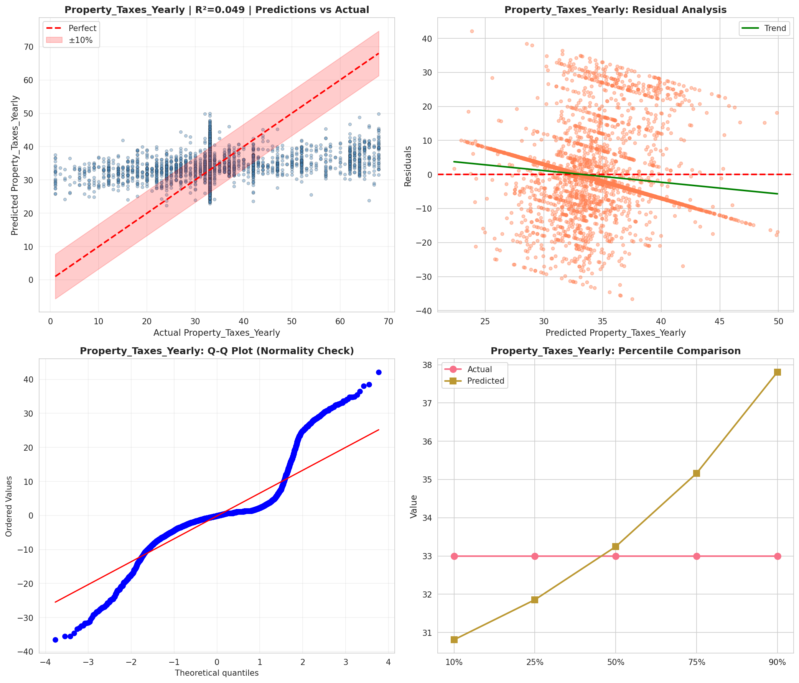
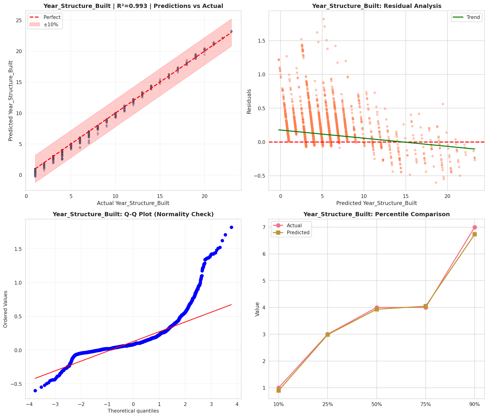
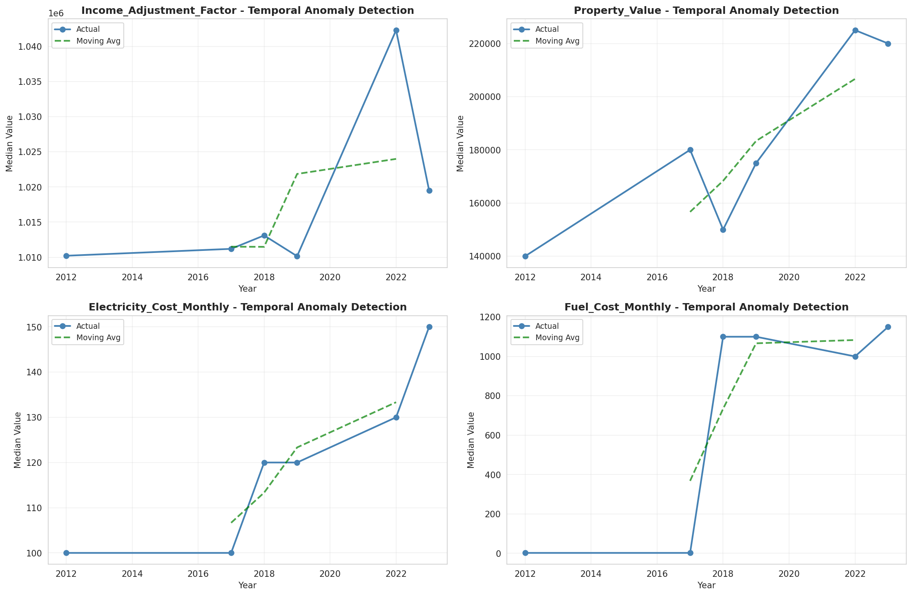
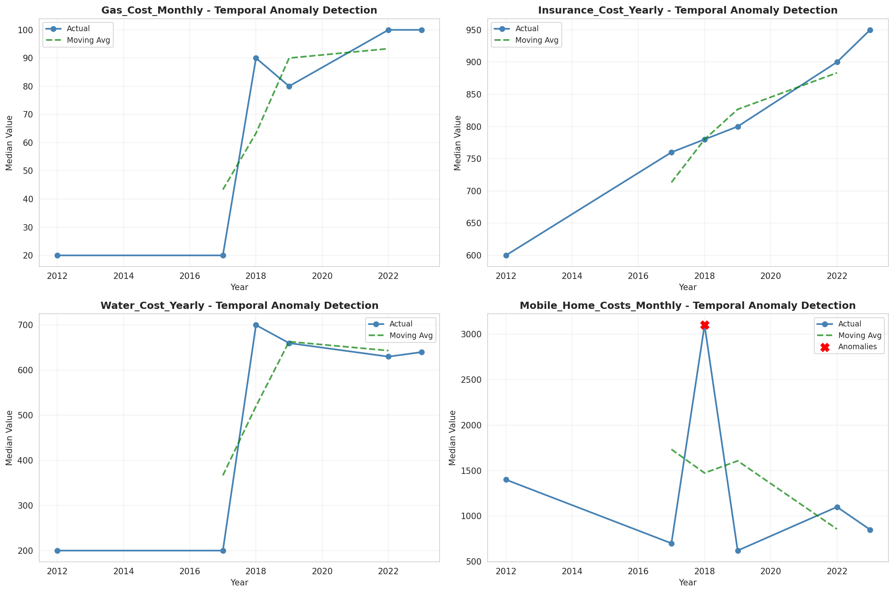
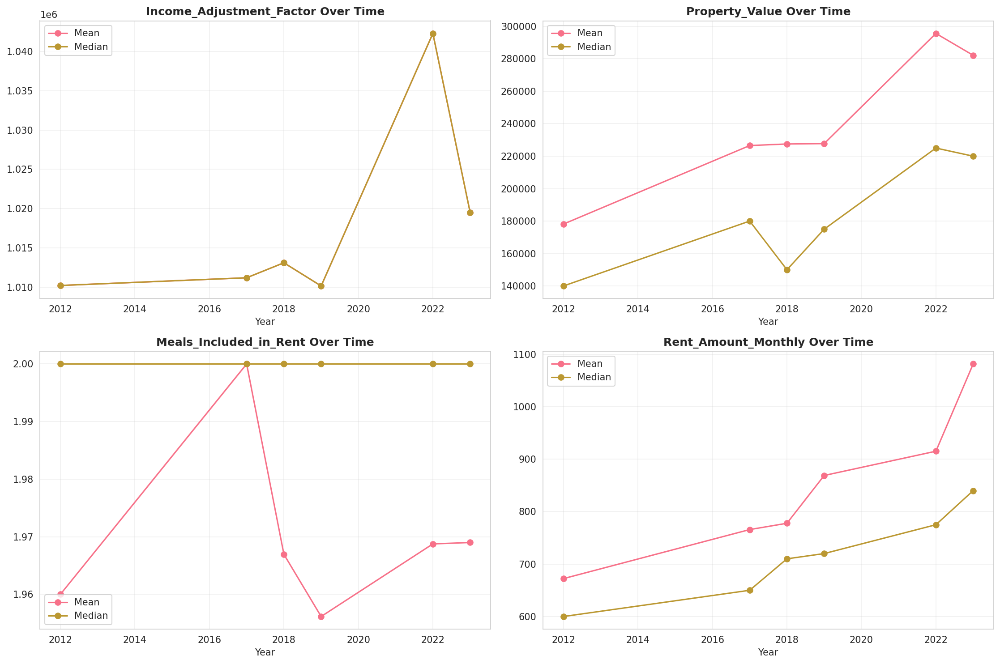
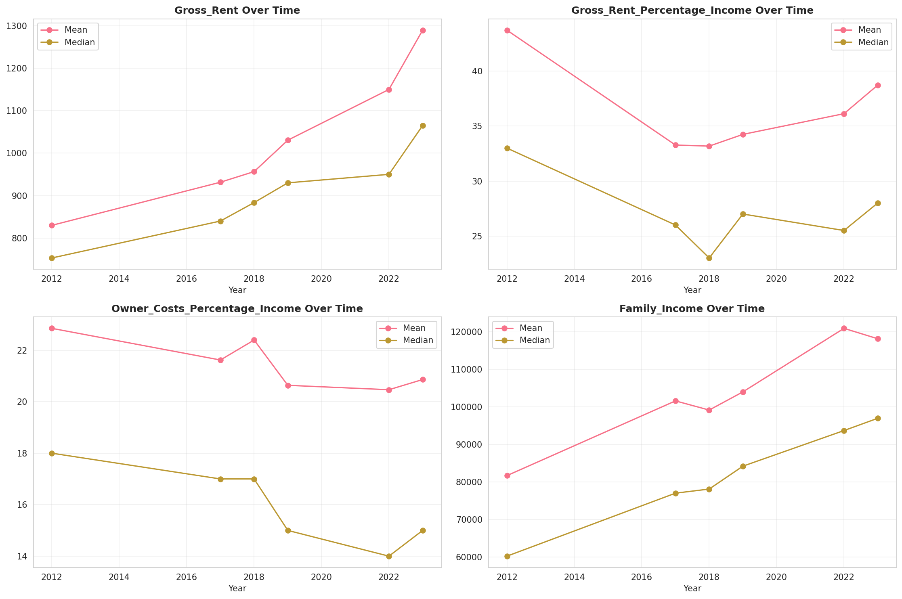
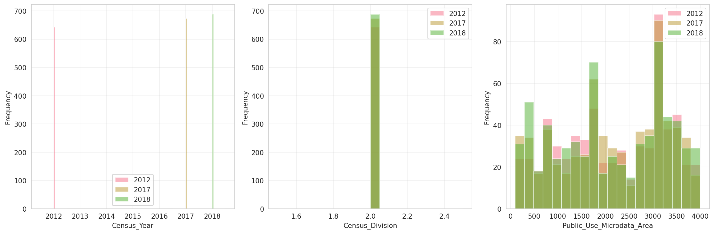
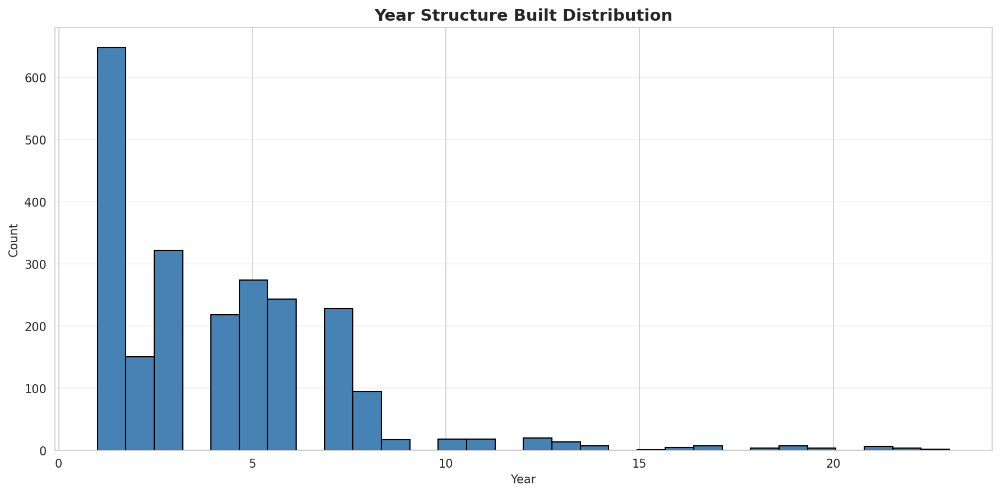
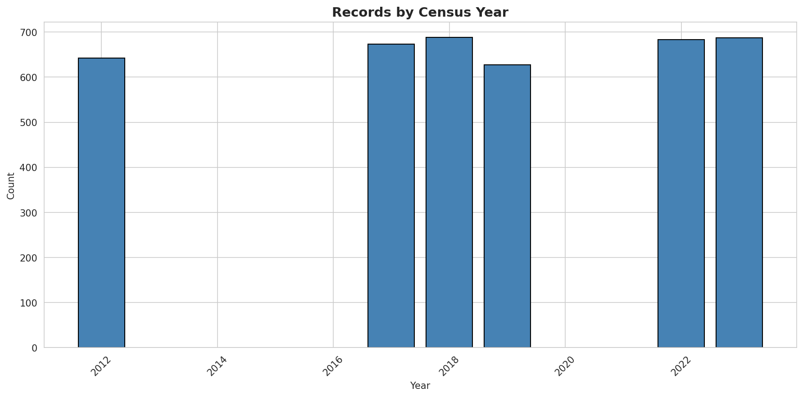
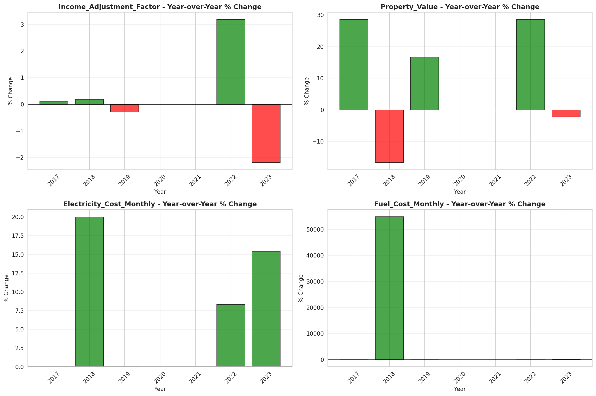
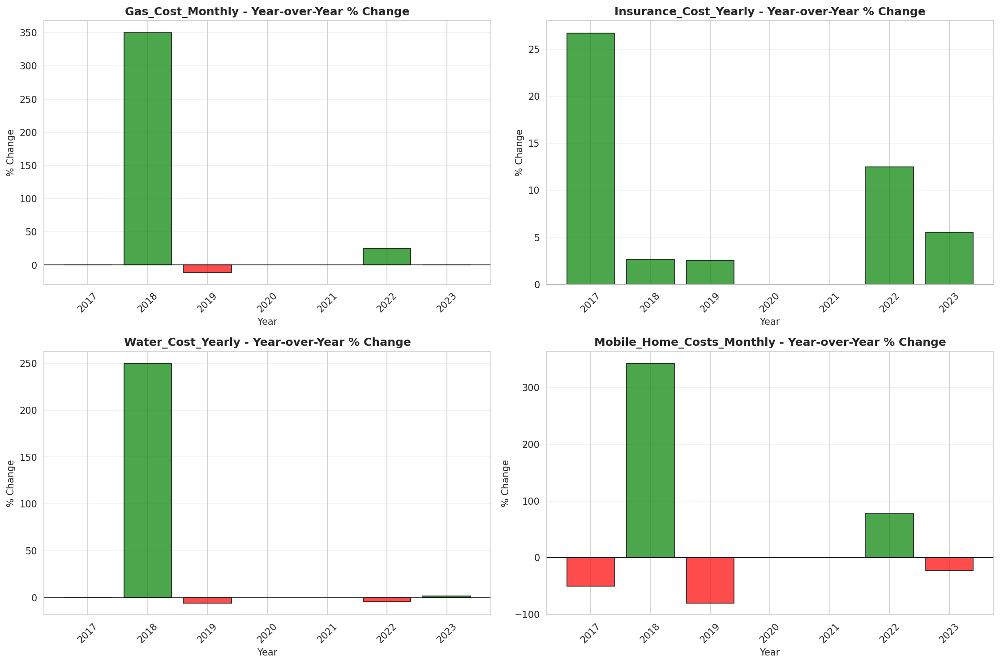
