# Temporal Analysis

## Year Distribution

- 2012: 307,340 records

- 2016: 317,416 records

- 2017: 318,145 records

- 2018: 319,602 records

- 2019: 320,939 records

- 2020: 324,047 records

- 2021: 325,363 records

- 2022: 327,138 records

## Temporal Trends

- Census_Year: {np.int64(2012): {'mean': 2012.0, 'median': 2012.0, 'std': 0.0}, np.int64(2016): {'mean': 2016.0, 'median': 2016.0, 'std': 0.0}, np.int64(2017): {'mean': 2017.0, 'median': 2017.0, 'std': 0.0}, np.int64(2018): {'mean': 2018.0, 'median': 2018.0, 'std': 0.0}, np.int64(2019): {'mean': 2019.0, 'median': 2019.0, 'std': 0.0}, np.int64(2020): {'mean': 2020.0, 'median': 2020.0, 'std': 0.0}, np.int64(2021): {'mean': 2021.0, 'median': 2021.0, 'std': 0.0}, np.int64(2022): {'mean': 2022.0, 'median': 2022.0, 'std': 0.0}}

- Census_Division: {np.int64(2012): {'mean': 2.0, 'median': 2.0, 'std': 0.0}, np.int64(2016): {'mean': 2.0, 'median': 2.0, 'std': 0.0}, np.int64(2017): {'mean': 2.0, 'median': 2.0, 'std': 0.0}, np.int64(2018): {'mean': 2.0, 'median': 2.0, 'std': 0.0}, np.int64(2019): {'mean': 2.0, 'median': 2.0, 'std': 0.0}, np.int64(2020): {'mean': 2.0, 'median': 2.0, 'std': 0.0}, np.int64(2021): {'mean': 2.0, 'median': 2.0, 'std': 0.0}, np.int64(2022): {'mean': 2.0, 'median': 2.0, 'std': 0.0}}

- Public_Use_Microdata_Area: {np.int64(2012): {'mean': None, 'median': None, 'std': None}, np.int64(2016): {'mean': 2191.6305888802076, 'median': 2301.0, 'std': 1131.6304833985453}, np.int64(2017): {'mean': 2193.6188278929417, 'median': 2301.0, 'std': 1130.806717356921}, np.int64(2018): {'mean': 2190.0447681804244, 'median': 2301.0, 'std': 1130.9747149970378}, np.int64(2019): {'mean': 2188.47603127074, 'median': 2301.0, 'std': 1130.8147145182952}, np.int64(2020): {'mean': 2184.6680882711457, 'median': 2200.0, 'std': 1130.670525352278}, np.int64(2021): {'mean': 2182.9035876851394, 'median': 2200.0, 'std': 1129.673264483491}, np.int64(2022): {'mean': None, 'median': None, 'std': None}}

- Census_Region: {np.int64(2012): {'mean': 1.0, 'median': 1.0, 'std': 0.0}, np.int64(2016): {'mean': 1.0, 'median': 1.0, 'std': 0.0}, np.int64(2017): {'mean': 1.0, 'median': 1.0, 'std': 0.0}, np.int64(2018): {'mean': 1.0, 'median': 1.0, 'std': 0.0}, np.int64(2019): {'mean': 1.0, 'median': 1.0, 'std': 0.0}, np.int64(2020): {'mean': 1.0, 'median': 1.0, 'std': 0.0}, np.int64(2021): {'mean': 1.0, 'median': 1.0, 'std': 0.0}, np.int64(2022): {'mean': 1.0, 'median': 1.0, 'std': 0.0}}

- State_Code: {np.int64(2012): {'mean': 42.0, 'median': 42.0, 'std': 0.0}, np.int64(2016): {'mean': 42.0, 'median': 42.0, 'std': 0.0}, np.int64(2017): {'mean': 42.0, 'median': 42.0, 'std': 0.0}, np.int64(2018): {'mean': 42.0, 'median': 42.0, 'std': 0.0}, np.int64(2019): {'mean': 42.0, 'median': 42.0, 'std': 0.0}, np.int64(2020): {'mean': 42.0, 'median': 42.0, 'std': 0.0}, np.int64(2021): {'mean': 42.0, 'median': 42.0, 'std': 0.0}, np.int64(2022): {'mean': 42.0, 'median': 42.0, 'std': 0.0}}

- Housing_Adjustment_Factor: {np.int64(2012): {'mean': 1041346.2994794039, 'median': 1053092.0, 'std': 27488.045199812525}, np.int64(2016): {'mean': 1020432.1000800212, 'median': 1013801.0, 'std': 15776.261917489644}, np.int64(2017): {'mean': 1029227.0027440318, 'median': 1034680.0, 'std': 17975.627831960246}, np.int64(2018): {'mean': 1038309.6731716322, 'median': 1046406.0, 'std': 23464.3250937955}, np.int64(2019): {'mean': 1040922.0568051873, 'median': 1042936.0, 'std': 29166.443315089553}, np.int64(2020): {'mean': 1035182.8835292411, 'median': 1030827.0, 'std': 28610.09683008404}, np.int64(2021): {'mean': 1057973.5333120239, 'median': 1059761.0, 'std': 35026.76182936991}, np.int64(2022): {'mean': 1105942.5673630089, 'median': 1133141.0, 'std': 60700.90195637277}}

- Income_Adjustment_Factor: {np.int64(2012): {'mean': 1052613.8703357845, 'median': 1061121.0, 'std': 26407.726642034395}, np.int64(2016): {'mean': 1027598.5516483102, 'median': 1022342.0, 'std': 17538.277286250974}, np.int64(2017): {'mean': 1036618.1880620472, 'median': 1035988.0, 'std': 16852.517904610308}, np.int64(2018): {'mean': 1046883.804544402, 'median': 1054346.0, 'std': 20486.76717161987}, np.int64(2019): {'mean': 1049862.4404170264, 'median': 1054606.0, 'std': 26204.141570394182}, np.int64(2020): {'mean': 1045145.2747903854, 'median': 1044328.0, 'std': 29270.176336113007}, np.int64(2021): {'mean': 1072653.1246177347, 'median': 1070512.0, 'std': 30436.952144045168}, np.int64(2022): {'mean': 1127662.1251520766, 'median': 1140108.0, 'std': 48844.219996709246}}

- Housing_Unit_Weight: {np.int64(2012): {'mean': 18.10318214355437, 'median': 16.0, 'std': 16.34864770929923}, np.int64(2016): {'mean': 17.617810696373212, 'median': 15.0, 'std': 17.02191647457927}, np.int64(2017): {'mean': 17.770510301906363, 'median': 15.0, 'std': 17.163434485916813}, np.int64(2018): {'mean': 17.752076019549314, 'median': 15.0, 'std': 17.255841956070526}, np.int64(2019): {'mean': 17.739551752825303, 'median': 14.0, 'std': 17.593615809818875}, np.int64(2020): {'mean': 17.631223248479387, 'median': 13.0, 'std': 20.788992029310805}, np.int64(2021): {'mean': 17.607373917747253, 'median': 13.0, 'std': 20.575314799936542}, np.int64(2022): {'mean': 17.588626206677304, 'median': 12.0, 'std': 21.116837333873736}}

- Number_of_Persons: {np.int64(2012): {'mean': 2.0643554369753367, 'median': 2.0, 'std': 1.4216805846846683}, np.int64(2016): {'mean': 2.01710373768178, 'median': 2.0, 'std': 1.4151290127531293}, np.int64(2017): {'mean': 2.0087978751826996, 'median': 2.0, 'std': 1.418124791067134}, np.int64(2018): {'mean': 2.001780339297001, 'median': 2.0, 'std': 1.4146559722501473}, np.int64(2019): {'mean': 1.9976007901813118, 'median': 2.0, 'std': 1.4078474308673266}, np.int64(2020): {'mean': 1.9846565467355044, 'median': 2.0, 'std': 1.4054554732883284}, np.int64(2021): {'mean': 1.9843651552266237, 'median': 2.0, 'std': 1.399286267296719}, np.int64(2022): {'mean': 1.98940813968417, 'median': 2.0, 'std': 1.3932409642406978}}

- Housing_Unit_Type: {np.int64(2012): {'mean': 1.1445727858397865, 'median': 1.0, 'std': 0.46657459880063484}, np.int64(2016): {'mean': 1.1871109206845276, 'median': 1.0, 'std': 0.5357091168056792}, np.int64(2017): {'mean': 1.1851231356771283, 'median': 1.0, 'std': 0.5342069108646924}, np.int64(2018): {'mean': 1.1845107352269384, 'median': 1.0, 'std': 0.5338396026883538}, np.int64(2019): {'mean': 1.183757661113171, 'median': 1.0, 'std': 0.533400108478674}, np.int64(2020): {'mean': None, 'median': None, 'std': None}, np.int64(2021): {'mean': None, 'median': None, 'std': None}, np.int64(2022): {'mean': None, 'median': None, 'std': None}}

- Building_Type: {np.int64(2012): {'mean': 2.717214400317283, 'median': 2.0, 'std': 1.6859969941963933}, np.int64(2016): {'mean': 2.7231552691004217, 'median': 2.0, 'std': 1.6914102987888275}, np.int64(2017): {'mean': 2.728489068156552, 'median': 2.0, 'std': 1.698645769800913}, np.int64(2018): {'mean': 2.7312248341178473, 'median': 2.0, 'std': 1.7083788000154825}, np.int64(2019): {'mean': 2.732894611551361, 'median': 2.0, 'std': 1.7150366274110853}, np.int64(2020): {'mean': 2.7345808367469435, 'median': 2.0, 'std': 1.7248325983250539}, np.int64(2021): {'mean': 2.7316449952002793, 'median': 2.0, 'std': 1.7288057194755784}, np.int64(2022): {'mean': 2.7251839672977924, 'median': 2.0, 'std': 1.7281387699989295}}

- Year_Structure_Built: {np.int64(2012): {'mean': 3.8781777865911917, 'median': 4.0, 'std': 2.556890265996789}, np.int64(2016): {'mean': 4.088211401025656, 'median': 4.0, 'std': 2.9001224000272368}, np.int64(2017): {'mean': 4.163870756249822, 'median': 4.0, 'std': 3.0418316036912803}, np.int64(2018): {'mean': 4.236516758350819, 'median': 4.0, 'std': 3.182143052903944}, np.int64(2019): {'mean': 4.326576171482379, 'median': 4.0, 'std': 3.3507199225090276}, np.int64(2020): {'mean': 4.40679352309145, 'median': 4.0, 'std': 3.5162390458040313}, np.int64(2021): {'mean': None, 'median': None, 'std': None}, np.int64(2022): {'mean': None, 'median': None, 'std': None}}

- Bathtub_or_Shower: {np.int64(2012): {'mean': 1.0165708207892412, 'median': 1.0, 'std': 0.12765691302735205}, np.int64(2016): {'mean': 1.0153884143133725, 'median': 1.0, 'std': 0.12309210064651656}, np.int64(2017): {'mean': 1.0162017901428124, 'median': 1.0, 'std': 0.1262511343861405}, np.int64(2018): {'mean': 1.01674417285771, 'median': 1.0, 'std': 0.12831158906751017}, np.int64(2019): {'mean': 1.016208724356465, 'median': 1.0, 'std': 0.12627770131025462}, np.int64(2020): {'mean': 1.016434470969395, 'median': 1.0, 'std': 0.12713943476659237}, np.int64(2021): {'mean': 1.016374901823894, 'median': 1.0, 'std': 0.1269126496387465}, np.int64(2022): {'mean': 1.015075411819095, 'median': 1.0, 'std': 0.1218531714396721}}

- Refrigerator: {np.int64(2012): {'mean': 1.0191956157271367, 'median': 1.0, 'std': 0.13721228788002526}, np.int64(2016): {'mean': 1.0194931843639397, 'median': 1.0, 'std': 0.13825074512626231}, np.int64(2017): {'mean': 1.0204847353268152, 'median': 1.0, 'std': 0.14165162350396687}, np.int64(2018): {'mean': 1.0206750127601656, 'median': 1.0, 'std': 0.14229416142293977}, np.int64(2019): {'mean': 1.0201621577776132, 'median': 1.0, 'std': 0.140555024257017}, np.int64(2020): {'mean': 1.020242971824114, 'median': 1.0, 'std': 0.14083062001338598}, np.int64(2021): {'mean': 1.0199109869971201, 'median': 1.0, 'std': 0.13969469465115195}, np.int64(2022): {'mean': 1.018575743777091, 'median': 1.0, 'std': 0.13502129050746567}}

- Hot_and_Cold_Running_Water: {np.int64(2012): {'mean': 1.021138973517694, 'median': 1.0, 'std': 0.1438478081923845}, np.int64(2016): {'mean': 1.020971187878224, 'median': 1.0, 'std': 0.14328806870495053}, np.int64(2017): {'mean': 1.0224124169778512, 'median': 1.0, 'std': 0.14802087222085963}, np.int64(2018): {'mean': 1.0232199568989961, 'median': 1.0, 'std': 0.1506016961814689}, np.int64(2019): {'mean': 1.0230716872802423, 'median': 1.0, 'std': 0.1501314890896216}, np.int64(2020): {'mean': 1.0237215196093918, 'median': 1.0, 'std': 0.15218045343518263}, np.int64(2021): {'mean': 1.0234854699362945, 'median': 1.0, 'std': 0.15143969986088895}, np.int64(2022): {'mean': 1.0218466597378402, 'median': 1.0, 'std': 0.14618295891236}}

- Running_Water: {np.int64(2012): {'mean': None, 'median': None, 'std': None}, np.int64(2016): {'mean': 9.0, 'median': 9.0, 'std': 0.0}, np.int64(2017): {'mean': 9.0, 'median': 9.0, 'std': 0.0}, np.int64(2018): {'mean': 9.0, 'median': 9.0, 'std': 0.0}, np.int64(2019): {'mean': 9.0, 'median': 9.0, 'std': 0.0}, np.int64(2020): {'mean': 9.0, 'median': 9.0, 'std': 0.0}, np.int64(2021): {'mean': 9.0, 'median': 9.0, 'std': 0.0}, np.int64(2022): {'mean': 9.0, 'median': 9.0, 'std': 0.0}}

- Sink_with_Faucet: {np.int64(2012): {'mean': 1.013423230156298, 'median': 1.0, 'std': 0.11507864613507629}, np.int64(2016): {'mean': 1.012206949121608, 'median': 1.0, 'std': 0.10980884603102312}, np.int64(2017): {'mean': 1.0130198683047804, 'median': 1.0, 'std': 0.11335959210589465}, np.int64(2018): {'mean': 1.01331665059831, 'median': 1.0, 'std': 0.11462706481238498}, np.int64(2019): {'mean': 1.0126291213926242, 'median': 1.0, 'std': 0.11166767957780853}, np.int64(2020): {'mean': 1.0125733180291272, 'median': 1.0, 'std': 0.11142384521367431}, np.int64(2021): {'mean': 1.0122907758094075, 'median': 1.0, 'std': 0.11018055643227657}, np.int64(2022): {'mean': 1.0111579598661045, 'median': 1.0, 'std': 0.10504045958662797}}

- Stove_or_Range: {np.int64(2012): {'mean': 1.0185898938183915, 'median': 1.0, 'std': 0.13507174184884513}, np.int64(2016): {'mean': 1.0186808192362335, 'median': 1.0, 'std': 0.13539539073885615}, np.int64(2017): {'mean': 1.0196081924688578, 'median': 1.0, 'std': 0.13864984585204054}, np.int64(2018): {'mean': 1.0196045766460613, 'median': 1.0, 'std': 0.13863731585247263}, np.int64(2019): {'mean': 1.019224054931917, 'median': 1.0, 'std': 0.13731189729336687}, np.int64(2020): {'mean': 1.0196743293001835, 'median': 1.0, 'std': 0.13887878804172538}, np.int64(2021): {'mean': 1.019520027925648, 'median': 1.0, 'std': 0.13834400328266042}, np.int64(2022): {'mean': 1.0183602317796772, 'median': 1.0, 'std': 0.1342504983875423}}

- Telephone_Service: {np.int64(2012): {'mean': 1.0174964124075505, 'median': 1.0, 'std': 0.1311119969027777}, np.int64(2016): {'mean': 1.0208020503305844, 'median': 1.0, 'std': 0.142721424816577}, np.int64(2017): {'mean': 1.0198204143197191, 'median': 1.0, 'std': 0.13938307575397138}, np.int64(2018): {'mean': 1.018967391729435, 'median': 1.0, 'std': 0.13641005297068776}, np.int64(2019): {'mean': 1.017259324851253, 'median': 1.0, 'std': 0.13023634834773698}, np.int64(2020): {'mean': 1.0147788022003563, 'median': 1.0, 'std': 0.1206666715009046}, np.int64(2021): {'mean': 1.0120349058380051, 'median': 1.0, 'std': 0.10904179275844865}, np.int64(2022): {'mean': 1.0112587769012498, 'median': 1.0, 'std': 0.10550857399421472}}

- Lot_Acreage: {np.int64(2012): {'mean': 1.3860350164975859, 'median': 1.0, 'std': 0.6270831392253287}, np.int64(2016): {'mean': 1.391299399784192, 'median': 1.0, 'std': 0.6295160437057582}, np.int64(2017): {'mean': 1.3888361703378374, 'median': 1.0, 'std': 0.6286700855921039}, np.int64(2018): {'mean': 1.3925053345415217, 'median': 1.0, 'std': 0.6305500492211569}, np.int64(2019): {'mean': 1.3963861427265931, 'median': 1.0, 'std': 0.6329507381420392}, np.int64(2020): {'mean': 1.4005693438498057, 'median': 1.0, 'std': 0.6352343512977655}, np.int64(2021): {'mean': 1.404571606664671, 'median': 1.0, 'std': 0.6370997817994833}, np.int64(2022): {'mean': 1.4116294711097523, 'median': 1.0, 'std': 0.6400086323999157}}

- Agricultural_Sales: {np.int64(2012): {'mean': 1.1759440602240039, 'median': 1.0, 'std': 0.8202343081544757}, np.int64(2016): {'mean': 1.177436592157748, 'median': 1.0, 'std': 0.8241578708591263}, np.int64(2017): {'mean': 1.1769254185692541, 'median': 1.0, 'std': 0.8208664980098312}, np.int64(2018): {'mean': 1.1792493884962258, 'median': 1.0, 'std': 0.8249306700436398}, np.int64(2019): {'mean': 1.174576446433583, 'median': 1.0, 'std': 0.8105807041777282}, np.int64(2020): {'mean': 1.1734924641445017, 'median': 1.0, 'std': 0.8062646929497048}, np.int64(2021): {'mean': 1.1740458887191423, 'median': 1.0, 'std': 0.8064000242572504}, np.int64(2022): {'mean': 1.1743360758534198, 'median': 1.0, 'std': 0.8072904495329016}}

- Business_On_Property: {np.int64(2012): {'mean': 1.979888657219658, 'median': 2.0, 'std': 0.14038148153222782}, np.int64(2016): {'mean': 3.3861275964391693, 'median': 2.0, 'std': 2.810898049828331}, np.int64(2017): {'mean': 4.800954812270639, 'median': 2.0, 'std': 3.4423776585430828}, np.int64(2018): {'mean': 6.207752727819373, 'median': 9.0, 'std': 3.436441880705767}, np.int64(2019): {'mean': 7.607443715211431, 'median': 9.0, 'std': 2.799813144152628}, np.int64(2020): {'mean': None, 'median': None, 'std': None}, np.int64(2021): {'mean': None, 'median': None, 'std': None}, np.int64(2022): {'mean': None, 'median': None, 'std': None}}

- Tenure: {np.int64(2012): {'mean': 1.8076301389305032, 'median': 2.0, 'std': 0.8460937404336476}, np.int64(2016): {'mean': 1.832117390859991, 'median': 2.0, 'std': 0.8438713527985081}, np.int64(2017): {'mean': 1.8355879742012522, 'median': 2.0, 'std': 0.8434440040181709}, np.int64(2018): {'mean': 1.8377290752516602, 'median': 2.0, 'std': 0.8415472284145712}, np.int64(2019): {'mean': 1.8377802115859627, 'median': 2.0, 'std': 0.8386841272287284}, np.int64(2020): {'mean': 1.835961106376385, 'median': 2.0, 'std': 0.8352593214013896}, np.int64(2021): {'mean': 1.8352578167328228, 'median': 2.0, 'std': 0.8306693907758215}, np.int64(2022): {'mean': 1.834750823488243, 'median': 2.0, 'std': 0.8257143949916177}}

- Vacancy_Status: {np.int64(2012): {'mean': 4.938784120153567, 'median': 5.0, 'std': 1.787577679884453}, np.int64(2016): {'mean': 5.021491631047018, 'median': 5.0, 'std': 1.7911312254367233}, np.int64(2017): {'mean': 5.042245414780139, 'median': 5.0, 'std': 1.781624824427352}, np.int64(2018): {'mean': 5.05524861878453, 'median': 5.0, 'std': 1.7884876992561936}, np.int64(2019): {'mean': 5.077722791268654, 'median': 5.0, 'std': 1.7814544333602649}, np.int64(2020): {'mean': 5.09233990055703, 'median': 5.0, 'std': 1.78381387518148}, np.int64(2021): {'mean': 5.1135254650808175, 'median': 5.0, 'std': 1.7884357912938968}, np.int64(2022): {'mean': 5.121302610871232, 'median': 5.0, 'std': 1.8021752208661144}}

- Vehicles_Available: {np.int64(2012): {'mean': 1.7656040559506725, 'median': 2.0, 'std': 1.062965178375066}, np.int64(2016): {'mean': 1.7842750336087547, 'median': 2.0, 'std': 1.074947856683184}, np.int64(2017): {'mean': 1.7935078912430378, 'median': 2.0, 'std': 1.0797576864280667}, np.int64(2018): {'mean': 1.8020547355906484, 'median': 2.0, 'std': 1.0830308929481967}, np.int64(2019): {'mean': 1.811778595951593, 'median': 2.0, 'std': 1.0858848717881489}, np.int64(2020): {'mean': 1.8229100488107228, 'median': 2.0, 'std': 1.0894837701923779}, np.int64(2021): {'mean': 1.827165380048647, 'median': 2.0, 'std': 1.0894032702387566}, np.int64(2022): {'mean': 1.8314416559530784, 'median': 2.0, 'std': 1.087879592025717}}

- Condo_Fee_Monthly: {np.int64(2012): {'mean': 235.77845128049705, 'median': 170.0, 'std': 218.79223719744252}, np.int64(2016): {'mean': 277.34241103848944, 'median': 200.0, 'std': 241.6725684213292}, np.int64(2017): {'mean': 288.44943820224717, 'median': 220.0, 'std': 245.89767416001217}, np.int64(2018): {'mean': 298.2671942717166, 'median': 220.0, 'std': 254.51681497770082}, np.int64(2019): {'mean': 303.90207499089917, 'median': 230.0, 'std': 254.55048828507933}, np.int64(2020): {'mean': 316.81255637741293, 'median': 240.0, 'std': 283.46515816635315}, np.int64(2021): {'mean': 330.7148368993336, 'median': 240.0, 'std': 304.41701562898066}, np.int64(2022): {'mean': 344.39317106152805, 'median': 250.0, 'std': 330.24156262431507}}

- Electricity_Cost_Monthly: {np.int64(2012): {'mean': 118.21132102250327, 'median': 100.0, 'std': 85.88852800450411}, np.int64(2016): {'mean': 128.46019229710924, 'median': 100.0, 'std': 92.85739882601281}, np.int64(2017): {'mean': 130.26343946642785, 'median': 110.0, 'std': 94.0793014544733}, np.int64(2018): {'mean': 139.28494592752563, 'median': 120.0, 'std': 93.32083429669318}, np.int64(2019): {'mean': 140.1402985196329, 'median': 120.0, 'std': 93.1116634937149}, np.int64(2020): {'mean': 140.55282747174968, 'median': 120.0, 'std': 92.7806604886836}, np.int64(2021): {'mean': 141.40932391719065, 'median': 120.0, 'std': 94.59633074749988}, np.int64(2022): {'mean': 149.4469872884399, 'median': 120.0, 'std': 142.51094045873558}}

- Fuel_Cost_Monthly: {np.int64(2012): {'mean': 482.8047640073802, 'median': 2.0, 'std': 913.113750698221}, np.int64(2016): {'mean': 398.335910659675, 'median': 2.0, 'std': 861.3400133142552}, np.int64(2017): {'mean': 356.2840611816832, 'median': 2.0, 'std': 802.2679429236317}, np.int64(2018): {'mean': 1293.945818006392, 'median': 1000.0, 'std': 1009.2188419103461}, np.int64(2019): {'mean': 1228.1662664518678, 'median': 1000.0, 'std': 939.7559657755812}, np.int64(2020): {'mean': 1171.9010256490312, 'median': 1000.0, 'std': 888.1106750122235}, np.int64(2021): {'mean': 1178.304373895481, 'median': 1000.0, 'std': 891.0136544034401}, np.int64(2022): {'mean': 1251.8866510686732, 'median': 1000.0, 'std': 970.7877374075737}}

- Gas_Cost_Monthly: {np.int64(2012): {'mean': 64.04699746108842, 'median': 20.0, 'std': 91.31696791847118}, np.int64(2016): {'mean': 56.0552913151833, 'median': 20.0, 'std': 81.67610226334989}, np.int64(2017): {'mean': 55.726257531836, 'median': 20.0, 'std': 81.31214468140318}, np.int64(2018): {'mean': 105.26441492156421, 'median': 80.0, 'std': 89.58054873629435}, np.int64(2019): {'mean': 103.62875669076209, 'median': 80.0, 'std': 88.43045065878201}, np.int64(2020): {'mean': 102.2176184231, 'median': 80.0, 'std': 87.23322667935565}, np.int64(2021): {'mean': 105.22970707314752, 'median': 80.0, 'std': 92.40645989783809}, np.int64(2022): {'mean': 114.83598212607193, 'median': 90.0, 'std': 123.12183545620094}}

- House_Heating_Fuel: {np.int64(2012): {'mean': 2.481979247157523, 'median': 2.0, 'std': 1.6147042882134885}, np.int64(2016): {'mean': 2.469414067720658, 'median': 2.0, 'std': 1.6437053747954145}, np.int64(2017): {'mean': 2.453713087129693, 'median': 2.0, 'std': 1.6416748023172973}, np.int64(2018): {'mean': 2.4483265676451493, 'median': 2.0, 'std': 1.636231901798293}, np.int64(2019): {'mean': 2.4432042379332306, 'median': 2.0, 'std': 1.6317882087403897}, np.int64(2020): {'mean': 2.433857596652979, 'median': 2.0, 'std': 1.6246201813638812}, np.int64(2021): {'mean': 2.431043294152004, 'median': 2.0, 'std': 1.6256285904975118}, np.int64(2022): {'mean': 2.434813203198101, 'median': 2.0, 'std': 1.6248054905526825}}

- Insurance_Cost_Yearly: {np.int64(2012): {'mean': 699.1667450305052, 'median': 580.0, 'std': 537.0815473743945}, np.int64(2016): {'mean': 825.1980464318008, 'median': 680.0, 'std': 646.9045423502789}, np.int64(2017): {'mean': 857.8283453395085, 'median': 700.0, 'std': 669.0600577833434}, np.int64(2018): {'mean': 885.6263776677048, 'median': 720.0, 'std': 689.397290823375}, np.int64(2019): {'mean': 908.241087554768, 'median': 750.0, 'std': 705.2635672047614}, np.int64(2020): {'mean': 927.9662903536286, 'median': 780.0, 'std': 717.9171240477222}, np.int64(2021): {'mean': 945.3086593977678, 'median': 800.0, 'std': 733.1699101404299}, np.int64(2022): {'mean': 971.9713609624486, 'median': 800.0, 'std': 767.967603831132}}

- Water_Cost_Yearly: {np.int64(2012): {'mean': 364.84290681721416, 'median': 220.0, 'std': 444.0785718758908}, np.int64(2016): {'mean': 403.9423383831634, 'median': 200.0, 'std': 495.32715739632846}, np.int64(2017): {'mean': 414.21684224584226, 'median': 210.0, 'std': 506.43453178596064}, np.int64(2018): {'mean': 676.3348153193207, 'median': 600.0, 'std': 506.8179806502532}, np.int64(2019): {'mean': 685.4545704966475, 'median': 600.0, 'std': 518.2942045991588}, np.int64(2020): {'mean': 698.3564416948349, 'median': 600.0, 'std': 535.7014615706839}, np.int64(2021): {'mean': 708.1709633482685, 'median': 620.0, 'std': 555.3114756032174}, np.int64(2022): {'mean': 719.9191101011581, 'median': 630.0, 'std': 577.0520766503729}}

- Mobile_Home_Costs_Monthly: {np.int64(2012): {'mean': 2034.3851265375372, 'median': 1500.0, 'std': 1889.1610553521614}, np.int64(2016): {'mean': 2100.908931953956, 'median': 1400.0, 'std': 2021.7457784611577}, np.int64(2017): {'mean': 2153.739322533137, 'median': 1400.0, 'std': 2074.3327040577205}, np.int64(2018): {'mean': 2179.048856088561, 'median': 1400.0, 'std': 2102.7857791260376}, np.int64(2019): {'mean': 2218.5897920604916, 'median': 1500.0, 'std': 2134.8568046755204}, np.int64(2020): {'mean': 2297.166096654275, 'median': 1500.0, 'std': 2339.430080648112}, np.int64(2021): {'mean': 2393.55663003663, 'median': 1500.0, 'std': 2635.8197120200584}, np.int64(2022): {'mean': 2475.910435029855, 'median': 1400.0, 'std': 3005.8668524577247}}

- First_Mortgage_Includes_Insurance: {np.int64(2012): {'mean': 1.5229994413797918, 'median': 2.0, 'std': 0.4994729254006565}, np.int64(2016): {'mean': 1.493208528529617, 'median': 1.0, 'std': 0.49995613892809904}, np.int64(2017): {'mean': 1.484682125656643, 'median': 1.0, 'std': 0.4997675826508808}, np.int64(2018): {'mean': 1.4757543693217061, 'median': 1.0, 'std': 0.499414081189985}, np.int64(2019): {'mean': 1.4668299076990297, 'median': 1.0, 'std': 0.4989008024117324}, np.int64(2020): {'mean': 1.453627760252366, 'median': 1.0, 'std': 0.4978472807903217}, np.int64(2021): {'mean': 1.4400369699713294, 'median': 1.0, 'std': 0.49639375390942747}, np.int64(2022): {'mean': 1.4274314835570117, 'median': 1.0, 'std': 0.49470815117542644}}

- First_Mortgage_Payment_Monthly: {np.int64(2012): {'mean': 993.3924306961804, 'median': 810.0, 'std': 705.5686790653716}, np.int64(2016): {'mean': 1012.0905227484845, 'median': 850.0, 'std': 713.1810850787856}, np.int64(2017): {'mean': 1028.1668077822997, 'median': 860.0, 'std': 720.6806842829318}, np.int64(2018): {'mean': 1046.6934724705368, 'median': 880.0, 'std': 731.8204927164196}, np.int64(2019): {'mean': 1070.8439986163958, 'median': 900.0, 'std': 745.9481109299047}, np.int64(2020): {'mean': 1106.0820374837633, 'median': 930.0, 'std': 762.6702999964501}, np.int64(2021): {'mean': 1140.738758110759, 'median': 970.0, 'std': 775.2812225579753}, np.int64(2022): {'mean': 1179.0017147072065, 'median': 1000.0, 'std': 792.0608059515868}}

- First_Mortgage_Includes_Taxes: {np.int64(2012): {'mean': 1.445979680189931, 'median': 1.0, 'std': 0.49707540846972104}, np.int64(2016): {'mean': 1.4116474415317282, 'median': 1.0, 'std': 0.4921341484104411}, np.int64(2017): {'mean': 1.4006045211627929, 'median': 1.0, 'std': 0.49002318814551105}, np.int64(2018): {'mean': 1.3903929653008356, 'median': 1.0, 'std': 0.487840618253019}, np.int64(2019): {'mean': 1.378433978408491, 'median': 1.0, 'std': 0.48499880778929627}, np.int64(2020): {'mean': 1.3622657264798663, 'median': 1.0, 'std': 0.48065727233041616}, np.int64(2021): {'mean': 1.344546929228912, 'median': 1.0, 'std': 0.47522255068295466}, np.int64(2022): {'mean': 1.3281221561245702, 'median': 1.0, 'std': 0.46953180792545685}}

- First_Mortgage_Status: {np.int64(2012): {'mean': 1.818254284575528, 'median': 1.0, 'std': 0.9811585395828522}, np.int64(2016): {'mean': 1.8546602816960123, 'median': 1.0, 'std': 0.9869666335586494}, np.int64(2017): {'mean': 1.85876675882936, 'median': 1.0, 'std': 0.98756515100015}, np.int64(2018): {'mean': 1.8663108268084487, 'median': 1.0, 'std': 0.9886338953274957}, np.int64(2019): {'mean': 1.8741748771640985, 'median': 1.0, 'std': 0.9897314483207289}, np.int64(2020): {'mean': 1.9025208193813232, 'median': 1.0, 'std': 0.9929748301245589}, np.int64(2021): {'mean': 1.9345138100643209, 'median': 1.0, 'std': 0.9956847621486058}, np.int64(2022): {'mean': 1.967859305661726, 'median': 1.0, 'std': 0.9973753734904048}}

- Second_Mortgage_Payment_Monthly: {np.int64(2012): {'mean': 375.99301432064266, 'median': 300.0, 'std': 350.362697787306}, np.int64(2016): {'mean': 357.9367885238316, 'median': 260.0, 'std': 334.23884543293315}, np.int64(2017): {'mean': 361.1321210948835, 'median': 260.0, 'std': 346.57272054863824}, np.int64(2018): {'mean': 366.832915454819, 'median': 270.0, 'std': 354.233655144318}, np.int64(2019): {'mean': 375.74855072463765, 'median': 280.0, 'std': 362.1484154891721}, np.int64(2020): {'mean': 394.7128267774249, 'median': 290.0, 'std': 382.517166652124}, np.int64(2021): {'mean': 410.32089904618, 'median': 300.0, 'std': 406.73102326409105}, np.int64(2022): {'mean': 424.29868589158605, 'median': 300.0, 'std': 421.22884455420535}}

- Second_Mortgage_Status: {np.int64(2012): {'mean': 2.7211699601983104, 'median': 3.0, 'std': 0.5561333471652556}, np.int64(2016): {'mean': 2.788372493407878, 'median': 3.0, 'std': 0.48728778786782745}, np.int64(2017): {'mean': 2.7972760130736805, 'median': 3.0, 'std': 0.4755818047182186}, np.int64(2018): {'mean': 2.8046028386908453, 'median': 3.0, 'std': 0.46452207728317324}, np.int64(2019): {'mean': 2.8119754592291866, 'median': 3.0, 'std': 0.45452981207254267}, np.int64(2020): {'mean': 2.8017361522275763, 'median': 3.0, 'std': 0.4557698121551163}, np.int64(2021): {'mean': 2.795359763981716, 'median': 3.0, 'std': 0.4566702149191684}, np.int64(2022): {'mean': 2.7892462357276075, 'median': 3.0, 'std': 0.4559582144875964}}

- Property_Taxes_Yearly: {np.int64(2012): {'mean': 33.74214904266718, 'median': 32.0, 'std': 16.91717059288514}, np.int64(2016): {'mean': 35.54935933176662, 'median': 33.0, 'std': 17.662716895046515}, np.int64(2017): {'mean': 36.236971151338096, 'median': 34.0, 'std': 17.793731110374303}}

- Meals_Included_in_Rent: {np.int64(2012): {'mean': 1.974360743987025, 'median': 2.0, 'std': 0.15805795015053506}, np.int64(2016): {'mean': 1.9727520435967303, 'median': 2.0, 'std': 0.16280646688937278}, np.int64(2017): {'mean': 1.9725012349744773, 'median': 2.0, 'std': 0.16353294257410017}, np.int64(2018): {'mean': 1.9722613625192515, 'median': 2.0, 'std': 0.1642243811086927}, np.int64(2019): {'mean': 1.9720901249549048, 'median': 2.0, 'std': 0.16471599445020868}, np.int64(2020): {'mean': 1.9711563862105401, 'median': 2.0, 'std': 0.16736822345799474}, np.int64(2021): {'mean': 1.9706480432028801, 'median': 2.0, 'std': 0.16879245927824119}, np.int64(2022): {'mean': 1.9707754385372525, 'median': 2.0, 'std': 0.16843682928183354}}

- Rent_Amount_Monthly: {np.int64(2012): {'mean': 652.118292556679, 'median': 570.0, 'std': 422.179256337524}, np.int64(2016): {'mean': 730.4753106931614, 'median': 630.0, 'std': 462.49517259781936}, np.int64(2017): {'mean': 753.4260497283057, 'median': 650.0, 'std': 471.90407375895455}, np.int64(2018): {'mean': 773.6643837860864, 'median': 680.0, 'std': 480.61935157346727}, np.int64(2019): {'mean': 796.0091502410547, 'median': 700.0, 'std': 493.77317208722974}, np.int64(2020): {'mean': 826.6876238277638, 'median': 700.0, 'std': 529.107992209775}, np.int64(2021): {'mean': 857.129275285019, 'median': 730.0, 'std': 562.7246706370646}, np.int64(2022): {'mean': 897.1403150377337, 'median': 750.0, 'std': 607.2648887925691}}

- Gross_Rent: {np.int64(2012): {'mean': 800.7095294224317, 'median': 727.0, 'std': 446.09882541283844}, np.int64(2016): {'mean': 884.0705763326821, 'median': 800.0, 'std': 484.05936817150524}, np.int64(2017): {'mean': 906.9921120913336, 'median': 820.0, 'std': 491.7318219856132}, np.int64(2018): {'mean': 928.6828348571723, 'median': 843.0, 'std': 499.73044159231455}, np.int64(2019): {'mean': 949.9034205231388, 'median': 860.0, 'std': 511.37423222092934}, np.int64(2020): {'mean': 977.3276292953835, 'median': 880.0, 'std': 541.1536493795766}, np.int64(2021): {'mean': 1008.5257414122304, 'median': 900.0, 'std': 572.9519407947597}, np.int64(2022): {'mean': 1057.318682876688, 'median': 932.0, 'std': 626.5368230743065}}

- Gross_Rent_Percentage_Income: {np.int64(2012): {'mean': 38.37871351072074, 'median': 29.0, 'std': 27.416292882501036}, np.int64(2016): {'mean': 38.04235671628487, 'median': 29.0, 'std': 27.28222645256376}, np.int64(2017): {'mean': 37.704997608376, 'median': 28.0, 'std': 27.173869624691772}, np.int64(2018): {'mean': 37.40139640672109, 'median': 28.0, 'std': 27.081448556870896}, np.int64(2019): {'mean': 36.85013988351838, 'median': 28.0, 'std': 26.88640505478408}, np.int64(2020): {'mean': 36.55255036889898, 'median': 27.0, 'std': 26.80513045280187}, np.int64(2021): {'mean': 36.54769742727305, 'median': 27.0, 'std': 26.91354298949623}, np.int64(2022): {'mean': 36.70904067037492, 'median': 27.0, 'std': 27.108105541272074}}

- Selected_Monthly_Owner_Costs: {np.int64(2012): {'mean': 1111.039722033793, 'median': 881.0, 'std': 873.3477623663864}, np.int64(2016): {'mean': 1103.989798046146, 'median': 877.0, 'std': 849.6663475450677}, np.int64(2017): {'mean': 1114.015187415843, 'median': 884.0, 'std': 853.5069964198109}, np.int64(2018): {'mean': 1127.4506558611913, 'median': 895.0, 'std': 861.9495934027129}, np.int64(2019): {'mean': 1138.7075625147986, 'median': 903.0, 'std': 872.359382309493}, np.int64(2020): {'mean': 1149.389315358533, 'median': 908.0, 'std': 887.4975570054421}, np.int64(2021): {'mean': 1159.289833425006, 'median': 913.0, 'std': 898.9954251381415}, np.int64(2022): {'mean': 1183.541836922145, 'median': 930.0, 'std': 923.3956804640598}}

- Owner_Costs_Percentage_Income: {np.int64(2012): {'mean': 24.34908797585283, 'median': 19.0, 'std': 19.98277729459765}, np.int64(2016): {'mean': 22.894428398446305, 'median': 17.0, 'std': 19.766544867531437}, np.int64(2017): {'mean': 22.49014831342696, 'median': 17.0, 'std': 19.59405212153626}, np.int64(2018): {'mean': 22.225402382943145, 'median': 17.0, 'std': 19.47819241405207}, np.int64(2019): {'mean': 21.774960782384948, 'median': 16.0, 'std': 19.333804354745315}, np.int64(2020): {'mean': 21.346630941238185, 'median': 16.0, 'std': 19.23567812306536}, np.int64(2021): {'mean': 21.073666096438018, 'median': 16.0, 'std': 19.282710523248323}, np.int64(2022): {'mean': 21.0690783230614, 'median': 15.0, 'std': 19.57986600477043}}

- Satellite_Internet: {np.int64(2012): {'mean': None, 'median': None, 'std': None}, np.int64(2016): {'mean': None, 'median': None, 'std': None}, np.int64(2017): {'mean': 1.948293342345387, 'median': 2.0, 'std': 0.22143470038780289}, np.int64(2018): {'mean': 1.9452291289675747, 'median': 2.0, 'std': 0.22753302159509303}, np.int64(2019): {'mean': 1.9428382213812678, 'median': 2.0, 'std': 0.23215202912111743}, np.int64(2020): {'mean': 1.9415229416011073, 'median': 2.0, 'std': 0.23464386886107888}, np.int64(2021): {'mean': 1.9415202055762097, 'median': 2.0, 'std': 0.23464900381908566}, np.int64(2022): {'mean': 1.941522565518086, 'median': 2.0, 'std': 0.23464455030151826}}

- Smartphone: {np.int64(2012): {'mean': None, 'median': None, 'std': None}, np.int64(2016): {'mean': None, 'median': None, 'std': None}, np.int64(2017): {'mean': 1.3663437895249542, 'median': 1.0, 'std': 0.4818059040969943}, np.int64(2018): {'mean': 1.318734307905296, 'median': 1.0, 'std': 0.4659866930236692}, np.int64(2019): {'mean': 1.2781221357443568, 'median': 1.0, 'std': 0.4480747628409558}, np.int64(2020): {'mean': 1.2419113659254668, 'median': 1.0, 'std': 0.42824171608303147}, np.int64(2021): {'mean': 1.2097808586590226, 'median': 1.0, 'std': 0.4071529037036251}, np.int64(2022): {'mean': 1.1860817174199143, 'median': 1.0, 'std': 0.38917333920217206}}

- Tablet_Computer: {np.int64(2012): {'mean': None, 'median': None, 'std': None}, np.int64(2016): {'mean': None, 'median': None, 'std': None}, np.int64(2017): {'mean': 1.5017165122983982, 'median': 2.0, 'std': 0.4999980355603924}, np.int64(2018): {'mean': 1.4591712227514841, 'median': 1.0, 'std': 0.4983311972308409}, np.int64(2019): {'mean': 1.4271993599602306, 'median': 1.0, 'std': 0.4946726363607199}, np.int64(2020): {'mean': 1.3982257689625786, 'median': 1.0, 'std': 0.48953338419516157}, np.int64(2021): {'mean': 1.385666473257686, 'median': 1.0, 'std': 0.48675327947146263}, np.int64(2022): {'mean': 1.3829505602762964, 'median': 1.0, 'std': 0.48610732093020237}}

- Food_Stamp_SNAP: {np.int64(2012): {'mean': 1.9067011708627577, 'median': 2.0, 'std': 0.2908512607293872}, np.int64(2016): {'mean': 1.891560042820547, 'median': 2.0, 'std': 0.31093578683096296}, np.int64(2017): {'mean': 1.891955368850635, 'median': 2.0, 'std': 0.3104373024849607}, np.int64(2018): {'mean': 1.8908334925096189, 'median': 2.0, 'std': 0.3118485415118729}, np.int64(2019): {'mean': 1.8910069453864728, 'median': 2.0, 'std': 0.3116310286253506}, np.int64(2020): {'mean': 1.8908166217061668, 'median': 2.0, 'std': 0.3118696768744055}, np.int64(2021): {'mean': 1.8908839271088587, 'median': 2.0, 'std': 0.3117853115573303}, np.int64(2022): {'mean': 1.8900471958644913, 'median': 2.0, 'std': 0.31283143810522873}}

- Family_Type_Employment_Status: {np.int64(2012): {'mean': 2.960621950717115, 'median': 2.0, 'std': 2.277900714838163}, np.int64(2016): {'mean': 3.0193546085374336, 'median': 2.0, 'std': 2.2768576958729323}, np.int64(2017): {'mean': 3.0234290972537585, 'median': 2.0, 'std': 2.272448765199217}, np.int64(2018): {'mean': 3.024389079801451, 'median': 2.0, 'std': 2.264319839023118}, np.int64(2019): {'mean': 3.024331899244872, 'median': 2.0, 'std': 2.2540512066925413}, np.int64(2020): {'mean': 3.022365358399362, 'median': 2.0, 'std': 2.242399177169893}, np.int64(2021): {'mean': None, 'median': None, 'std': None}, np.int64(2022): {'mean': None, 'median': None, 'std': None}}

- Family_Income: {np.int64(2012): {'mean': 79429.59745619896, 'median': 62400.0, 'std': 71056.344539925}, np.int64(2016): {'mean': 87684.57727627573, 'median': 68000.0, 'std': 80722.11529264113}, np.int64(2017): {'mean': 90888.33290455364, 'median': 70000.0, 'std': 84158.50410857172}, np.int64(2018): {'mean': 93752.28235034292, 'median': 72400.0, 'std': 86988.68753977389}, np.int64(2019): {'mean': 97541.98818888268, 'median': 75000.0, 'std': 90873.47414727454}, np.int64(2020): {'mean': 101218.96516338586, 'median': 78000.0, 'std': 94173.3916109679}, np.int64(2021): {'mean': 104484.66607244386, 'median': 80300.0, 'std': 96771.08726927117}, np.int64(2022): {'mean': 108278.48129014079, 'median': 83200.0, 'std': 100540.27978195297}}

- Family_Presence_Children: {np.int64(2012): {'mean': 3.1800526139232685, 'median': 4.0, 'std': 1.057364604047488}, np.int64(2016): {'mean': 3.2214214593902613, 'median': 4.0, 'std': 1.0465856646162308}, np.int64(2017): {'mean': 3.22536836657605, 'median': 4.0, 'std': 1.0460234011841683}, np.int64(2018): {'mean': 3.2343357726617166, 'median': 4.0, 'std': 1.0434699776808296}, np.int64(2019): {'mean': 3.245998354961448, 'median': 4.0, 'std': 1.0380169310927143}, np.int64(2020): {'mean': 3.2548719071600614, 'median': 4.0, 'std': 1.0344615817600533}, np.int64(2021): {'mean': 3.2640919318168433, 'median': 4.0, 'std': 1.0311587524272394}, np.int64(2022): {'mean': 3.274624739463221, 'median': 4.0, 'std': 1.026886916504101}}

- Household_Family_Type: {np.int64(2012): {'mean': 2.658965827196316, 'median': 1.0, 'std': 2.0280888440692046}, np.int64(2016): {'mean': 2.6848167045338407, 'median': 1.0, 'std': 2.033012114169256}, np.int64(2017): {'mean': 2.6945590095291965, 'median': 1.0, 'std': 2.0362039321749115}, np.int64(2018): {'mean': 2.695489280490571, 'median': 1.0, 'std': 2.036072265135415}, np.int64(2019): {'mean': 2.7017678768389493, 'median': 1.0, 'std': 2.0389274051432227}, np.int64(2020): {'mean': 2.7050902610986287, 'median': 1.0, 'std': 2.0424935683294647}, np.int64(2021): {'mean': 2.7102093043809057, 'median': 1.0, 'std': 2.045981167178329}, np.int64(2022): {'mean': 2.7100332438209853, 'median': 1.0, 'std': 2.04870301807119}}

- Household_Income: {np.int64(2012): {'mean': 66944.3949820703, 'median': 50000.0, 'std': 65965.31762307398}, np.int64(2016): {'mean': 73839.47209506379, 'median': 54700.0, 'std': 74679.307197227}, np.int64(2017): {'mean': 76403.03974154296, 'median': 56400.0, 'std': 77773.42677314644}, np.int64(2018): {'mean': 78723.67693323632, 'median': 58200.0, 'std': 80366.54789400227}, np.int64(2019): {'mean': 81792.36065335668, 'median': 60000.0, 'std': 83972.16306259694}, np.int64(2020): {'mean': 84719.26034398419, 'median': 62040.0, 'std': 87044.88351550559}, np.int64(2021): {'mean': 87321.1510302635, 'median': 64400.0, 'std': 89470.4726389796}, np.int64(2022): {'mean': 90431.13996467381, 'median': 66300.0, 'std': 92901.93068127896}}

- Number_Persons_Family: {np.int64(2012): {'mean': 2.9217500308974382, 'median': 2.0, 'std': 1.2027153015888943}, np.int64(2016): {'mean': 2.9012849082547056, 'median': 2.0, 'std': 1.206494231714982}, np.int64(2017): {'mean': 2.899195155466459, 'median': 2.0, 'std': 1.20844982336956}, np.int64(2018): {'mean': 2.8901946121111766, 'median': 2.0, 'std': 1.2067391506667644}, np.int64(2019): {'mean': 2.8792849407963645, 'median': 2.0, 'std': 1.2047367654674028}, np.int64(2020): {'mean': 2.8765763793134056, 'median': 2.0, 'std': 1.2061623900222385}, np.int64(2021): {'mean': 2.8697593327757422, 'median': 2.0, 'std': 1.2025722835753603}, np.int64(2022): {'mean': 2.863364879934143, 'median': 2.0, 'std': 1.2038377840689607}}

- Workers_In_Family: {np.int64(2012): {'mean': 1.4921461654807935, 'median': 2.0, 'std': 0.9050367972779271}, np.int64(2016): {'mean': 1.4733950500213362, 'median': 2.0, 'std': 0.9088978121916904}, np.int64(2017): {'mean': 1.4778861082524821, 'median': 2.0, 'std': 0.9097252855792397}, np.int64(2018): {'mean': 1.478173649318353, 'median': 2.0, 'std': 0.9124134805556047}, np.int64(2019): {'mean': 1.475510819974792, 'median': 2.0, 'std': 0.9147431351826901}, np.int64(2020): {'mean': 1.4734493635303796, 'median': 2.0, 'std': 0.9184505498007565}, np.int64(2021): {'mean': 1.462303714262154, 'median': 2.0, 'std': 0.9226147796993693}, np.int64(2022): {'mean': 1.4499448275056779, 'median': 2.0, 'std': 0.9268590076953744}}

- Work_Experience_Householder_Spouse: {np.int64(2012): {'mean': 6.0475232025047525, 'median': 5.0, 'std': 4.552218564757041}, np.int64(2016): {'mean': 6.15658337679579, 'median': 5.0, 'std': 4.548431652525704}, np.int64(2017): {'mean': 6.153253582539692, 'median': 5.0, 'std': 4.541372365265349}, np.int64(2018): {'mean': 6.141718450462641, 'median': 5.0, 'std': 4.533016777188623}, np.int64(2019): {'mean': 6.127011177977786, 'median': 5.0, 'std': 4.525134047366334}, np.int64(2020): {'mean': 6.127359020943431, 'median': 5.0, 'std': 4.505661611515282}, np.int64(2021): {'mean': 6.143569838259374, 'median': 6.0, 'std': 4.49192546435111}, np.int64(2022): {'mean': 6.151651379896194, 'median': 6.0, 'std': 4.47832749860577}}

- Work_Status_Householder_Spouse: {np.int64(2012): {'mean': 5.526374641736848, 'median': 3.0, 'std': 4.7925311953231375}, np.int64(2016): {'mean': 5.647199081919644, 'median': 3.0, 'std': 4.799138488291786}, np.int64(2017): {'mean': 5.650344176486054, 'median': 3.0, 'std': 4.7955269996050385}, np.int64(2018): {'mean': 5.653010452462772, 'median': 3.0, 'std': 4.786455437988495}, np.int64(2019): {'mean': 5.656163902624798, 'median': 3.0, 'std': 4.774188299823784}, np.int64(2020): {'mean': 5.663388557175429, 'median': 3.0, 'std': 4.757245520866077}, np.int64(2021): {'mean': 5.681462868250591, 'median': 3.0, 'std': 4.7442097593205945}, np.int64(2022): {'mean': 5.699031179681212, 'median': 3.0, 'std': 4.728244216972167}}

- Complete_Kitchen_Facilities: {np.int64(2012): {'mean': 1.0272286419931136, 'median': 1.0, 'std': 0.16274931197425485}, np.int64(2016): {'mean': 1.0276919883620643, 'median': 1.0, 'std': 0.16408911755505787}, np.int64(2017): {'mean': 1.0291076366124112, 'median': 1.0, 'std': 0.16810854469807332}, np.int64(2018): {'mean': 1.0294582600805309, 'median': 1.0, 'std': 0.16908746947236983}, np.int64(2019): {'mean': 1.0286826708422823, 'median': 1.0, 'std': 0.1669133712134067}, np.int64(2020): {'mean': 1.0288814239932045, 'median': 1.0, 'std': 0.16747353758595115}, np.int64(2021): {'mean': 1.028201413735928, 'median': 1.0, 'std': 0.16554814908712598}, np.int64(2022): {'mean': 1.0262472756850327, 'median': 1.0, 'std': 0.15987008802556144}}

- Complete_Plumbing_Facilities: {np.int64(2012): {'mean': 1.0249103134971427, 'median': 1.0, 'std': 0.15585210090167956}, np.int64(2016): {'mean': 1.024714509127477, 'median': 1.0, 'std': 0.15525394818269805}, np.int64(2017): {'mean': 1.0257903138451014, 'median': 1.0, 'std': 0.15850950470797276}, np.int64(2018): {'mean': 1.0262150513242216, 'median': 1.0, 'std': 0.15977456897683484}, np.int64(2019): {'mean': 1.025639126647411, 'median': 1.0, 'std': 0.1580564770445036}, np.int64(2020): {'mean': 1.0260627823468087, 'median': 1.0, 'std': 0.15932232368104302}, np.int64(2021): {'mean': 1.0258766035430666, 'median': 1.0, 'std': 0.15876741769863092}, np.int64(2022): {'mean': 1.0241373437103518, 'median': 1.0, 'std': 0.1534757773249365}}

- Plumbing_Facilities_for_Project: {np.int64(2012): {'mean': None, 'median': None, 'std': None}, np.int64(2016): {'mean': None, 'median': None, 'std': None}, np.int64(2017): {'mean': 9.0, 'median': 9.0, 'std': 0.0}, np.int64(2018): {'mean': 9.0, 'median': 9.0, 'std': 0.0}, np.int64(2019): {'mean': 9.0, 'median': 9.0, 'std': 0.0}, np.int64(2020): {'mean': 9.0, 'median': 9.0, 'std': 0.0}, np.int64(2021): {'mean': 9.0, 'median': 9.0, 'std': 0.0}, np.int64(2022): {'mean': 9.0, 'median': 9.0, 'std': 0.0}}

- Response_Mode: {np.int64(2012): {'mean': 1.302060536135999, 'median': 1.0, 'std': 0.4591521847456962}, np.int64(2016): {'mean': 1.903120985144812, 'median': 2.0, 'std': 0.8441236764371491}, np.int64(2017): {'mean': 2.072895584504433, 'median': 2.0, 'std': 0.851610808211373}, np.int64(2018): {'mean': 2.1012341915726194, 'median': 2.0, 'std': 0.8573137721764633}, np.int64(2019): {'mean': 2.127398598488455, 'median': 2.0, 'std': 0.8650013337866382}, np.int64(2020): {'mean': 2.1835802716145585, 'median': 2.0, 'std': 0.8575303419986139}, np.int64(2021): {'mean': 2.231611833493324, 'median': 3.0, 'std': 0.8562681038355028}, np.int64(2022): {'mean': 2.2796163886446035, 'median': 3.0, 'std': 0.8544457731488054}}

- Specified_Rent_Unit: {np.int64(2012): {'mean': 0.22187809846586504, 'median': 0.0, 'std': 0.41551032522700254}, np.int64(2016): {'mean': 0.22781652715697256, 'median': 0.0, 'std': 0.4194243515399268}, np.int64(2017): {'mean': 0.22861377953878168, 'median': 0.0, 'std': 0.4199406478438497}, np.int64(2018): {'mean': 0.2283148074632791, 'median': 0.0, 'std': 0.4197472818877918}, np.int64(2019): {'mean': 0.22670348544000904, 'median': 0.0, 'std': 0.4186999324029905}, np.int64(2020): {'mean': 0.223981971925908, 'median': 0.0, 'std': 0.4169108517317695}, np.int64(2021): {'mean': 0.22078715420193734, 'median': 0.0, 'std': 0.41477799759046313}, np.int64(2022): {'mean': 0.2174029413911647, 'median': 0.0, 'std': 0.41247968903997}}

- Specified_Value_Unit: {np.int64(2012): {'mean': 0.5934416181428134, 'median': 1.0, 'std': 0.4911919521868755}, np.int64(2016): {'mean': 0.5895766754583421, 'median': 1.0, 'std': 0.49191146070888814}, np.int64(2017): {'mean': 0.5899703543228528, 'median': 1.0, 'std': 0.4918396052565462}, np.int64(2018): {'mean': 0.5914301310043668, 'median': 1.0, 'std': 0.4915703282747213}, np.int64(2019): {'mean': 0.5957305740413541, 'median': 1.0, 'std': 0.490750961845625}, np.int64(2020): {'mean': 0.5989174731211103, 'median': 1.0, 'std': 0.4901185333197534}, np.int64(2021): {'mean': 0.602586613142508, 'median': 1.0, 'std': 0.4893636916927204}, np.int64(2022): {'mean': 0.6077855447065734, 'median': 1.0, 'std': 0.4882449231399826}}

- Moved_When: {np.int64(2012): {'mean': 4.596960199127758, 'median': 5.0, 'std': 1.7914673586825516}, np.int64(2016): {'mean': 4.632434217250136, 'median': 5.0, 'std': 1.8335253018045505}, np.int64(2017): {'mean': 4.617960139206398, 'median': 5.0, 'std': 1.844029287467771}, np.int64(2018): {'mean': 4.617234124097583, 'median': 5.0, 'std': 1.8568665966400504}, np.int64(2019): {'mean': 4.616916002547731, 'median': 5.0, 'std': 1.8658843620970813}, np.int64(2020): {'mean': 4.627337878670489, 'median': 5.0, 'std': 1.872292893066309}, np.int64(2021): {'mean': 4.63784616685175, 'median': 5.0, 'std': 1.874383492154899}, np.int64(2022): {'mean': 4.652716179927427, 'median': 5.0, 'std': 1.8720435524194436}}

- Household_Language: {np.int64(2012): {'mean': 1.173777458880671, 'median': 1.0, 'std': 0.5984100930344738}, np.int64(2016): {'mean': 1.1729101643880848, 'median': 1.0, 'std': 0.6047217405279564}, np.int64(2017): {'mean': 1.1735916350467033, 'median': 1.0, 'std': 0.6078429318148219}, np.int64(2018): {'mean': 1.1741362992858875, 'median': 1.0, 'std': 0.6087578228503949}, np.int64(2019): {'mean': 1.175164282052477, 'median': 1.0, 'std': 0.6118382438479392}, np.int64(2020): {'mean': 1.1755094134965522, 'median': 1.0, 'std': 0.6133908550484284}, np.int64(2021): {'mean': 1.1761084832252933, 'median': 1.0, 'std': 0.6151428824639286}, np.int64(2022): {'mean': 1.1766905281735678, 'median': 1.0, 'std': 0.6162602583442699}}

- Household_Language_Detailed: {np.int64(2012): {'mean': None, 'median': None, 'std': None}, np.int64(2016): {'mean': None, 'median': None, 'std': None}, np.int64(2017): {'mean': None, 'median': None, 'std': None}, np.int64(2018): {'mean': None, 'median': None, 'std': None}, np.int64(2019): {'mean': None, 'median': None, 'std': None}, np.int64(2020): {'mean': None, 'median': None, 'std': None}, np.int64(2021): {'mean': 8777.04278693375, 'median': 9500.0, 'std': 2299.7718812156118}, np.int64(2022): {'mean': 8775.263972674644, 'median': 9500.0, 'std': 2302.388952355001}}

- Limited_English_Speaking_Household: {np.int64(2012): {'mean': 1.0159825272420482, 'median': 1.0, 'std': 0.12540792665481637}, np.int64(2016): {'mean': 1.0161439948427267, 'median': 1.0, 'std': 0.12602947555471694}, np.int64(2017): {'mean': 1.0162067042178282, 'median': 1.0, 'std': 0.1262699868686989}, np.int64(2018): {'mean': 1.0161203275688107, 'median': 1.0, 'std': 0.1259385748500545}, np.int64(2019): {'mean': 1.0158961333519754, 'median': 1.0, 'std': 0.12507400629903304}, np.int64(2020): {'mean': 1.0156039358487643, 'median': 1.0, 'std': 0.12393753482852883}, np.int64(2021): {'mean': 1.0153010839868892, 'median': 1.0, 'std': 0.12274778495629401}, np.int64(2022): {'mean': 1.0152449925068274, 'median': 1.0, 'std': 0.12252607809353976}}

- Household_Grandchildren: {np.int64(2012): {'mean': 0.0289412265623768, 'median': 0.0, 'std': 0.16764170949945031}, np.int64(2016): {'mean': 0.030342219671538297, 'median': 0.0, 'std': 0.17152750516791276}, np.int64(2017): {'mean': 0.02986809958128098, 'median': 0.0, 'std': 0.17022370582639867}, np.int64(2018): {'mean': 0.029350572150393817, 'median': 0.0, 'std': 0.16878752169689099}, np.int64(2019): {'mean': 0.029120256015907786, 'median': 0.0, 'std': 0.16814391605983173}, np.int64(2020): {'mean': 0.02910436197412257, 'median': 0.0, 'std': 0.16809939783841407}, np.int64(2021): {'mean': 0.02823514945646953, 'median': 0.0, 'std': 0.16564429125083271}, np.int64(2022): {'mean': 0.02788068739397351, 'median': 0.0, 'std': 0.1646312781831935}}

- Household_Children_Present: {np.int64(2012): {'mean': 3.437422137416618, 'median': 4.0, 'std': 0.9690555442368373}, np.int64(2016): {'mean': 3.470302439484587, 'median': 4.0, 'std': 0.9499872606678436}, np.int64(2017): {'mean': 3.475002553164746, 'median': 4.0, 'std': 0.9475583296555585}, np.int64(2018): {'mean': 3.482952812258019, 'median': 4.0, 'std': 0.9421065432996409}, np.int64(2019): {'mean': 3.4922208758602475, 'median': 4.0, 'std': 0.9354346771357899}, np.int64(2020): {'mean': 3.499697838382273, 'median': 4.0, 'std': 0.9301969125872914}, np.int64(2021): {'mean': 3.5074680202733597, 'median': 4.0, 'std': 0.9250014012988071}, np.int64(2022): {'mean': 3.515343887168798, 'median': 4.0, 'std': 0.919342002632104}}

- Household_Own_Children_Present: {np.int64(2012): {'mean': 3.4894501127529054, 'median': 4.0, 'std': 0.9347738061141312}, np.int64(2016): {'mean': 3.52794047123012, 'median': 4.0, 'std': 0.9087696792170827}, np.int64(2017): {'mean': 3.5319499108356314, 'median': 4.0, 'std': 0.9066892692088001}, np.int64(2018): {'mean': 3.538212450430579, 'median': 4.0, 'std': 0.9024394691623026}, np.int64(2019): {'mean': 3.546907769026425, 'median': 4.0, 'std': 0.8957333334866731}, np.int64(2020): {'mean': 3.553730533818858, 'median': 4.0, 'std': 0.8907219371873397}, np.int64(2021): {'mean': 3.559961266969717, 'median': 4.0, 'std': 0.8860870725510371}, np.int64(2022): {'mean': 3.5665637147877947, 'median': 4.0, 'std': 0.8810669765131687}}

- Household_Related_Children_Present: {np.int64(2012): {'mean': 3.4427443899515873, 'median': 4.0, 'std': 0.96693316979063}, np.int64(2016): {'mean': 3.4763323611034678, 'median': 4.0, 'std': 0.9472188868281289}, np.int64(2017): {'mean': 3.481161572121012, 'median': 4.0, 'std': 0.9446619712673475}, np.int64(2018): {'mean': 3.488815105083261, 'median': 4.0, 'std': 0.9393551337567143}, np.int64(2019): {'mean': 3.4980969691320625, 'median': 4.0, 'std': 0.9324710861066753}, np.int64(2020): {'mean': 3.5053188192453706, 'median': 4.0, 'std': 0.9273747098679312}, np.int64(2021): {'mean': 3.512997467751294, 'median': 4.0, 'std': 0.922077568739737}, np.int64(2022): {'mean': 3.520543464203936, 'median': 4.0, 'std': 0.9165718793433385}}

- Number_Own_Children: {np.int64(2012): {'mean': 0.46239335782883634, 'median': 0.0, 'std': 0.9341188107207665}, np.int64(2016): {'mean': 0.4294176841012901, 'median': 0.0, 'std': 0.9155853517084696}, np.int64(2017): {'mean': 0.4262646021383737, 'median': 0.0, 'std': 0.9147754830040046}, np.int64(2018): {'mean': 0.42113475842973463, 'median': 0.0, 'std': 0.9119385290388031}, np.int64(2019): {'mean': 0.4144840067732364, 'median': 0.0, 'std': 0.9074150230177177}, np.int64(2020): {'mean': 0.4095142170915007, 'median': 0.0, 'std': 0.9036487799310773}, np.int64(2021): {'mean': 0.4039685985790204, 'median': 0.0, 'std': 0.8985573675843259}, np.int64(2022): {'mean': 0.39852646953664045, 'median': 0.0, 'std': 0.8955691168814145}}

- Number_Related_Children: {np.int64(2012): {'mean': 0.5008200211313137, 'median': 0.0, 'std': 0.9629196645575233}, np.int64(2016): {'mean': 0.4709667528832774, 'median': 0.0, 'std': 0.9466876819604819}, np.int64(2017): {'mean': 0.46693455256769817, 'median': 0.0, 'std': 0.945385205515711}, np.int64(2018): {'mean': 0.4608958866180163, 'median': 0.0, 'std': 0.9422088772102694}, np.int64(2019): {'mean': 0.4538845132124715, 'median': 0.0, 'std': 0.9379887214387952}, np.int64(2020): {'mean': 0.4488262183311381, 'median': 0.0, 'std': 0.9349283761598701}, np.int64(2021): {'mean': 0.4417525159178153, 'median': 0.0, 'std': 0.9287151539129376}, np.int64(2022): {'mean': 0.43606079739526676, 'median': 0.0, 'std': 0.9261580358360828}}

- Multigenerational_Household: {np.int64(2012): {'mean': 1.0279398546039455, 'median': 1.0, 'std': 0.16480086832852409}, np.int64(2016): {'mean': 1.0299923741538848, 'median': 1.0, 'std': 0.1705665442179712}, np.int64(2017): {'mean': 1.0297031258592382, 'median': 1.0, 'std': 0.16976738020187815}, np.int64(2018): {'mean': 1.0292645344971882, 'median': 1.0, 'std': 0.1685474194902893}, np.int64(2019): {'mean': 1.0288289757810194, 'median': 1.0, 'std': 0.16732595337601278}, np.int64(2020): {'mean': 1.0285891376772294, 'median': 1.0, 'std': 0.16664905180879752}, np.int64(2021): {'mean': 1.0278009398907944, 'median': 1.0, 'std': 0.16440240718841287}, np.int64(2022): {'mean': 1.027515537872852, 'median': 1.0, 'std': 0.1635803619884618}}

- Grandparent_Grandchildren: {np.int64(2012): {'mean': 0.004234147572264362, 'median': 0.0, 'std': 0.06493255107208813}, np.int64(2016): {'mean': 0.004092013301991368, 'median': 0.0, 'std': 0.06383795695708583}, np.int64(2017): {'mean': 0.004010432623946328, 'median': 0.0, 'std': 0.06320098688915468}, np.int64(2018): {'mean': 0.004071145317596264, 'median': 0.0, 'std': 0.0636756385919115}, np.int64(2019): {'mean': 0.0042526914293703685, 'median': 0.0, 'std': 0.06507397706560325}, np.int64(2020): {'mean': 0.004377469590144883, 'median': 0.0, 'std': 0.06601760548293371}, np.int64(2021): {'mean': 0.004384363844560661, 'median': 0.0, 'std': 0.06606934214620032}, np.int64(2022): {'mean': 0.0043323469224741925, 'median': 0.0, 'std': 0.06567795748940647}}

- Nonrelative_Present: {np.int64(2012): {'mean': 0.07985350007096337, 'median': 0.0, 'std': 0.2710667967026024}, np.int64(2016): {'mean': 0.08751248044402865, 'median': 0.0, 'std': 0.28258513780090583}, np.int64(2017): {'mean': 0.08966714587604975, 'median': 0.0, 'std': 0.28570486424627317}, np.int64(2018): {'mean': 0.09091833462389813, 'median': 0.0, 'std': 0.2874935030409678}, np.int64(2019): {'mean': 0.09237467182426869, 'median': 0.0, 'std': 0.28955468818435626}, np.int64(2020): {'mean': 0.09279848144417757, 'median': 0.0, 'std': 0.29015039103201123}, np.int64(2021): {'mean': 0.09379310874836211, 'median': 0.0, 'std': 0.29154122882232747}, np.int64(2022): {'mean': 0.09394232159022617, 'median': 0.0, 'std': 0.29174901124222213}}

- Unmarried_Partner_Household: {np.int64(2012): {'mean': 0.15201141721728983, 'median': 0.0, 'std': 0.6913570955384497}, np.int64(2016): {'mean': 0.16204136824975038, 'median': 0.0, 'std': 0.7138034178057853}, np.int64(2017): {'mean': 0.16602248356154697, 'median': 0.0, 'std': 0.7223444048063914}, np.int64(2018): {'mean': 0.16837568732352504, 'median': 0.0, 'std': 0.7266323852151543}, np.int64(2019): {'mean': 0.172333038169362, 'median': 0.0, 'std': 0.7339512000166133}, np.int64(2020): {'mean': 0.17497869373208336, 'median': 0.0, 'std': 0.7396451693841376}, np.int64(2021): {'mean': 0.18163024557817117, 'median': 0.0, 'std': 0.7532223196609398}, np.int64(2022): {'mean': 0.1858268734832982, 'median': 0.0, 'std': 0.7622401047917503}}

- Subfamilies_Present: {np.int64(2012): {'mean': 0.022534811473987983, 'median': 0.0, 'std': 0.14841523030196976}, np.int64(2016): {'mean': 0.02444987775061125, 'median': 0.0, 'std': 0.15444149373752467}, np.int64(2017): {'mean': 0.02410187520130722, 'median': 0.0, 'std': 0.15336579541268186}, np.int64(2018): {'mean': 0.023265363587300844, 'median': 0.0, 'std': 0.15074539898189687}, np.int64(2019): {'mean': 0.02284025415171428, 'median': 0.0, 'std': 0.14939432258893576}, np.int64(2020): {'mean': 0.02263113039435965, 'median': 0.0, 'std': 0.14872473909098255}, np.int64(2021): {'mean': 0.021698950596173577, 'median': 0.0, 'std': 0.1456989626244349}, np.int64(2022): {'mean': 0.021254745041954157, 'median': 0.0, 'std': 0.14423265920908526}}

- Persons_Under_18: {np.int64(2012): {'mean': 0.2768162679576743, 'median': 0.0, 'std': 0.4474257603020057}, np.int64(2016): {'mean': 0.2603754746499579, 'median': 0.0, 'std': 0.43884033982405724}, np.int64(2017): {'mean': 0.25777929658347276, 'median': 0.0, 'std': 0.4374127140010933}, np.int64(2018): {'mean': 0.25403790349703953, 'median': 0.0, 'std': 0.4353198688254193}, np.int64(2019): {'mean': 0.2499106740613009, 'median': 0.0, 'std': 0.4329619580072269}, np.int64(2020): {'mean': 0.2465096459285659, 'median': 0.0, 'std': 0.4309795354048683}, np.int64(2021): {'mean': 0.24258097239887336, 'median': 0.0, 'std': 0.4286445500021385}, np.int64(2022): {'mean': 0.2388762523487482, 'median': 0.0, 'std': 0.42639779545845835}}

- Persons_60_And_Over: {np.int64(2012): {'mean': 0.5867448315014272, 'median': 0.0, 'std': 0.7635748825911951}, np.int64(2016): {'mean': 0.6403077068215945, 'median': 0.0, 'std': 0.7816568177898696}, np.int64(2017): {'mean': 0.6507506304352949, 'median': 0.0, 'std': 0.7845074741266893}, np.int64(2018): {'mean': 0.6649654676146451, 'median': 0.0, 'std': 0.7886025836922209}, np.int64(2019): {'mean': 0.6821860775815196, 'median': 0.0, 'std': 0.7937556345902635}, np.int64(2020): {'mean': 0.6995661269078794, 'median': 0.0, 'std': 0.7985488627669972}, np.int64(2021): {'mean': 0.717310359932832, 'median': 0.0, 'std': 0.8031308780960731}, np.int64(2022): {'mean': 0.7360159144332955, 'median': 1.0, 'std': 0.8074407976517313}}

- Persons_65_And_Over: {np.int64(2012): {'mean': 0.4256264488354123, 'median': 0.0, 'std': 0.6828918824718089}, np.int64(2016): {'mean': 0.461862907727262, 'median': 0.0, 'std': 0.7029893954157342}, np.int64(2017): {'mean': 0.46958591595767246, 'median': 0.0, 'std': 0.7072859168794207}, np.int64(2018): {'mean': 0.48059459839969965, 'median': 0.0, 'std': 0.7133913822404672}, np.int64(2019): {'mean': 0.4947686069814047, 'median': 0.0, 'std': 0.721187788357717}, np.int64(2020): {'mean': 0.510374215541954, 'median': 0.0, 'std': 0.7286693153541732}, np.int64(2021): {'mean': 0.5267192585391346, 'median': 0.0, 'std': 0.7364094839546114}, np.int64(2022): {'mean': 0.5441260374430404, 'median': 0.0, 'std': 0.743890615804614}}

- Same_Sex_Married_Couple: {np.int64(2012): {'mean': None, 'median': None, 'std': None}, np.int64(2016): {'mean': None, 'median': None, 'std': None}, np.int64(2017): {'mean': 0.005781936163025461, 'median': 0.0, 'std': 0.10682999576725676}, np.int64(2018): {'mean': 0.006699204542788089, 'median': 0.0, 'std': 0.11499793468913214}, np.int64(2019): {'mean': None, 'median': None, 'std': None}, np.int64(2020): {'mean': None, 'median': None, 'std': None}, np.int64(2021): {'mean': None, 'median': None, 'std': None}, np.int64(2022): {'mean': None, 'median': None, 'std': None}}

- Flag_Lot_Acreage: {np.int64(2012): {'mean': 0.04777992103982261, 'median': 0.0, 'std': 0.21330064281363653}, np.int64(2016): {'mean': 0.04536361391542098, 'median': 0.0, 'std': 0.20810072423435105}, np.int64(2017): {'mean': 0.042658419087255206, 'median': 0.0, 'std': 0.20208617935031561}, np.int64(2018): {'mean': 0.04104165485169852, 'median': 0.0, 'std': 0.19838693737385724}, np.int64(2019): {'mean': 0.039400319519239925, 'median': 0.0, 'std': 0.19454579877215136}, np.int64(2020): {'mean': 0.037537426857477824, 'median': 0.0, 'std': 0.19007497273033983}, np.int64(2021): {'mean': 0.036495331180731304, 'median': 0.0, 'std': 0.1875194515999238}, np.int64(2022): {'mean': 0.03607392756711287, 'median': 0.0, 'std': 0.18647444915314515}}

- Flag_Agricultural_Sales: {np.int64(2012): {'mean': 0.008901948766021885, 'median': 0.0, 'std': 0.09392941969613755}, np.int64(2016): {'mean': 0.008996854321818267, 'median': 0.0, 'std': 0.09442427040556811}, np.int64(2017): {'mean': 0.008544511273908954, 'median': 0.0, 'std': 0.09204092995301122}, np.int64(2018): {'mean': 0.008333097033970397, 'median': 0.0, 'std': 0.0909048173550144}, np.int64(2019): {'mean': 0.00833712453844282, 'median': 0.0, 'std': 0.0909265970461935}, np.int64(2020): {'mean': 0.008108421174562725, 'median': 0.0, 'std': 0.08968111792135607}, np.int64(2021): {'mean': 0.008206649794921023, 'median': 0.0, 'std': 0.09021823045299279}, np.int64(2022): {'mean': 0.00849881989801416, 'median': 0.0, 'std': 0.09179661894254773}}

- Flag_Bedrooms: {np.int64(2012): {'mean': 0.04528852914135314, 'median': 0.0, 'std': 0.20793661092341922}, np.int64(2016): {'mean': 0.05136151679663316, 'median': 0.0, 'std': 0.22073442358745424}, np.int64(2017): {'mean': 0.052906131524186883, 'median': 0.0, 'std': 0.22384649050768354}, np.int64(2018): {'mean': 0.05252580389043271, 'median': 0.0, 'std': 0.22308523083078202}, np.int64(2019): {'mean': 0.0517190910982504, 'median': 0.0, 'std': 0.22145970215645167}, np.int64(2020): {'mean': 0.05297150820143986, 'median': 0.0, 'std': 0.2239770158049685}, np.int64(2021): {'mean': 0.055093812723623355, 'median': 0.0, 'std': 0.22816368301001613}, np.int64(2022): {'mean': 0.05688473931738313, 'median': 0.0, 'std': 0.23162265052079647}}

- Flag_Building_Type: {np.int64(2012): {'mean': 0.009121883506697194, 'median': 0.0, 'std': 0.09507211650601897}, np.int64(2016): {'mean': 0.010904301956475838, 'median': 0.0, 'std': 0.10385295736362736}, np.int64(2017): {'mean': 0.011017359824406374, 'median': 0.0, 'std': 0.10438398551214388}, np.int64(2018): {'mean': 0.01088867464413316, 'median': 0.0, 'std': 0.10377933119518289}, np.int64(2019): {'mean': 0.010893983798329048, 'median': 0.0, 'std': 0.10380434921889768}, np.int64(2020): {'mean': 0.011937982863501223, 'median': 0.0, 'std': 0.10860713067072582}, np.int64(2021): {'mean': 0.012496727463129418, 'median': 0.0, 'std': 0.11108826375120065}, np.int64(2022): {'mean': 0.013146231842245218, 'median': 0.0, 'std': 0.11390106903062402}}

- Flag_Kitchen: {np.int64(2012): {'mean': 0.03790809612229814, 'median': 0.0, 'std': 0.19097435395139153}, np.int64(2016): {'mean': 0.04513815575222506, 'median': 0.0, 'std': 0.20760745866319896}, np.int64(2017): {'mean': 0.04614677460733731, 'median': 0.0, 'std': 0.20980325698788227}, np.int64(2018): {'mean': 0.0445081665059831, 'median': 0.0, 'std': 0.20622158072813335}, np.int64(2019): {'mean': 0.041840797599020985, 'median': 0.0, 'std': 0.20022558937810433}, np.int64(2020): {'mean': 0.041152870065183283, 'median': 0.0, 'std': 0.19864402799665876}, np.int64(2021): {'mean': 0.04113797015446374, 'median': 0.0, 'std': 0.19860960515453133}, np.int64(2022): {'mean': 0.04086037950967544, 'median': 0.0, 'std': 0.19796703039578126}}

- Flag_Plumbing: {np.int64(2012): {'mean': 0.031173045375060843, 'median': 0.0, 'std': 0.17378548704613217}, np.int64(2016): {'mean': 0.036878513837047426, 'median': 0.0, 'std': 0.18846383251097612}, np.int64(2017): {'mean': 0.036978706422279864, 'median': 0.0, 'std': 0.1887098529053463}, np.int64(2018): {'mean': 0.034849430045936595, 'median': 0.0, 'std': 0.18339865454954088}, np.int64(2019): {'mean': 0.03276306555081802, 'median': 0.0, 'std': 0.1780161758011906}, np.int64(2020): {'mean': 0.032058099821333924, 'median': 0.0, 'std': 0.17615472454209938}, np.int64(2021): {'mean': 0.03293481106553801, 'median': 0.0, 'std': 0.17846630064348662}, np.int64(2022): {'mean': 0.03372762759526847, 'median': 0.0, 'std': 0.18052752702996677}}

- Flag_Rooms: {np.int64(2012): {'mean': 0.04942041787600728, 'median': 0.0, 'std': 0.21674457214038223}, np.int64(2016): {'mean': 0.05189474324609653, 'median': 0.0, 'std': 0.2218149114650468}, np.int64(2017): {'mean': 0.05095350759670477, 'median': 0.0, 'std': 0.2199032059034225}, np.int64(2018): {'mean': 0.048407105994442236, 'median': 0.0, 'std': 0.2146253045592913}, np.int64(2019): {'mean': 0.045127684261385075, 'median': 0.0, 'std': 0.20758450892319136}, np.int64(2020): {'mean': 0.045561604695161975, 'median': 0.0, 'std': 0.2085327252838528}, np.int64(2021): {'mean': 0.04694650493062222, 'median': 0.0, 'std': 0.2115246718210104}, np.int64(2022): {'mean': 0.04787842342545892, 'median': 0.0, 'std': 0.21350934043623127}}

- Flag_Condo_Fee: {np.int64(2012): {'mean': 0.001878459014620252, 'median': 0.0, 'std': 0.043300544643378916}, np.int64(2016): {'mean': 0.0022545816319592313, 'median': 0.0, 'std': 0.04742896313367381}, np.int64(2017): {'mean': 0.0023802058094125026, 'median': 0.0, 'std': 0.04872934322015869}, np.int64(2018): {'mean': 0.00242088697328872, 'median': 0.0, 'std': 0.049143003974312066}, np.int64(2019): {'mean': 0.002525118938039365, 'median': 0.0, 'std': 0.05018716564297585}, np.int64(2020): {'mean': 0.0025694217747964996, 'median': 0.0, 'std': 0.050624389798053095}, np.int64(2021): {'mean': 0.002673880792390261, 'median': 0.0, 'std': 0.05164049247155988}, np.int64(2022): {'mean': 0.00265913996809032, 'median': 0.0, 'std': 0.051498331636510276}}

- Flag_Electricity: {np.int64(2012): {'mean': 0.04577526996088046, 'median': 0.0, 'std': 0.20899773230533777}, np.int64(2016): {'mean': 0.058962677727238566, 'median': 0.0, 'std': 0.23555525664113958}, np.int64(2017): {'mean': 0.06126892049827542, 'median': 0.0, 'std': 0.2398233616988892}, np.int64(2018): {'mean': 0.06086953439573527, 'median': 0.0, 'std': 0.2390912729433894}, np.int64(2019): {'mean': 0.05990456743231377, 'median': 0.0, 'std': 0.23731036396156716}, np.int64(2020): {'mean': 0.058580710381938225, 'median': 0.0, 'std': 0.2348386772541107}, np.int64(2021): {'mean': 0.06044506501439916, 'median': 0.0, 'std': 0.23831000267043567}, np.int64(2022): {'mean': 0.060767431270790824, 'median': 0.0, 'std': 0.23890363948684443}}

- Flag_Food_Stamp: {np.int64(2012): {'mean': 0.02157870762022516, 'median': 0.0, 'std': 0.1453035983519148}, np.int64(2016): {'mean': 0.028785568465357764, 'median': 0.0, 'std': 0.16720361117655264}, np.int64(2017): {'mean': 0.03177481965770325, 'median': 0.0, 'std': 0.17540033408031297}, np.int64(2018): {'mean': 0.03411743355798775, 'median': 0.0, 'std': 0.18153109208466164}, np.int64(2019): {'mean': 0.036835660359133666, 'median': 0.0, 'std': 0.18835844826348996}, np.int64(2020): {'mean': 0.04375599835826285, 'median': 0.0, 'std': 0.20455204738100066}, np.int64(2021): {'mean': 0.05044212156883235, 'median': 0.0, 'std': 0.21885579990961135}, np.int64(2022): {'mean': 0.055065446386540234, 'median': 0.0, 'std': 0.22810831211777513}}

- Flag_Fuel: {np.int64(2012): {'mean': 0.10704692542048999, 'median': 0.0, 'std': 0.30917345587981926}, np.int64(2016): {'mean': 0.09382280419853202, 'median': 0.0, 'std': 0.29158256098986846}, np.int64(2017): {'mean': 0.08713406117271458, 'median': 0.0, 'std': 0.28203191305048125}, np.int64(2018): {'mean': 0.08499688084840923, 'median': 0.0, 'std': 0.27887754796504316}, np.int64(2019): {'mean': 0.08283165991303151, 'median': 0.0, 'std': 0.2756280899248904}, np.int64(2020): {'mean': 0.07850074941468431, 'median': 0.0, 'std': 0.26895842740967957}, np.int64(2021): {'mean': 0.07884457631555983, 'median': 0.0, 'std': 0.26949649835469763}, np.int64(2022): {'mean': 0.0791102830506766, 'median': 0.0, 'std': 0.26991128060941155}}

- Flag_Gas: {np.int64(2012): {'mean': 0.09971336373961169, 'median': 0.0, 'std': 0.2996179775970142}, np.int64(2016): {'mean': 0.10301648707552133, 'median': 0.0, 'std': 0.30398095524874136}, np.int64(2017): {'mean': 0.10114093098828425, 'median': 0.0, 'std': 0.30151578234366094}, np.int64(2018): {'mean': 0.1000326093120853, 'median': 0.0, 'std': 0.3000440059125221}, np.int64(2019): {'mean': 0.09877235488501186, 'median': 0.0, 'std': 0.298356650220607}, np.int64(2020): {'mean': 0.09495979135733566, 'median': 0.0, 'std': 0.2931599069682636}, np.int64(2021): {'mean': 0.09476917706606161, 'median': 0.0, 'std': 0.2928963632514803}, np.int64(2022): {'mean': 0.0942308828692294, 'median': 0.0, 'std': 0.29215016732066074}}

- Flag_House_Heating_Fuel: {np.int64(2012): {'mean': 0.029774116204863803, 'median': 0.0, 'std': 0.16996388546807822}, np.int64(2016): {'mean': 0.03459888129806643, 'median': 0.0, 'std': 0.18276191683845583}, np.int64(2017): {'mean': 0.03437758330720333, 'median': 0.0, 'std': 0.18219737472352487}, np.int64(2018): {'mean': 0.0343815573073215, 'median': 0.0, 'std': 0.18220752865908144}, np.int64(2019): {'mean': 0.034572263896089236, 'median': 0.0, 'std': 0.1826941164253231}, np.int64(2020): {'mean': 0.03273906679443573, 'median': 0.0, 'std': 0.17795317208917974}, np.int64(2021): {'mean': 0.03312330918928353, 'median': 0.0, 'std': 0.1789588426759585}, np.int64(2022): {'mean': 0.03403003959163953, 'median': 0.0, 'std': 0.18130667461647862}}

- Flag_Insurance: {np.int64(2012): {'mean': 0.11745596798327054, 'median': 0.0, 'std': 0.3219634099005663}, np.int64(2016): {'mean': 0.12722639936155974, 'median': 0.0, 'std': 0.3332270097799241}, np.int64(2017): {'mean': 0.12574826829337818, 'median': 0.0, 'std': 0.3315660311864369}, np.int64(2018): {'mean': 0.12229200930074292, 'median': 0.0, 'std': 0.32762334199060705}, np.int64(2019): {'mean': 0.11895214617476221, 'median': 0.0, 'std': 0.3237327643347676}, np.int64(2020): {'mean': 0.11875853402553276, 'median': 0.0, 'std': 0.32350473254085504}, np.int64(2021): {'mean': 0.12240509643075312, 'median': 0.0, 'std': 0.3277536632575884}, np.int64(2022): {'mean': 0.12584857848981706, 'median': 0.0, 'std': 0.33167920673517226}}

- Flag_Mobile_Home: {np.int64(2012): {'mean': 0.007585945809522093, 'median': 0.0, 'std': 0.08676650493908748}, np.int64(2016): {'mean': 0.007984081937938167, 'median': 0.0, 'std': 0.08899643092935618}, np.int64(2017): {'mean': 0.007735668880590633, 'median': 0.0, 'std': 0.08761196070191396}, np.int64(2018): {'mean': 0.007549764645834515, 'median': 0.0, 'std': 0.08656091645631661}, np.int64(2019): {'mean': 0.007568303409263236, 'median': 0.0, 'std': 0.08666631803653138}, np.int64(2020): {'mean': 0.007248437110593951, 'median': 0.0, 'std': 0.0848287836099064}, np.int64(2021): {'mean': 0.007410768827995462, 'median': 0.0, 'std': 0.08576639791066479}, np.int64(2022): {'mean': 0.007664579908025041, 'median': 0.0, 'std': 0.08721158501500531}}

- Flag_First_Mortgage_Insurance: {np.int64(2012): {'mean': 0.05814209226442646, 'median': 0.0, 'std': 0.23401236466153097}, np.int64(2016): {'mean': 0.055469865548203316, 'median': 0.0, 'std': 0.2288954937600907}, np.int64(2017): {'mean': 0.05374704255864998, 'median': 0.0, 'std': 0.22551824580925459}, np.int64(2018): {'mean': 0.05252580389043271, 'median': 0.0, 'std': 0.2230852308307817}, np.int64(2019): {'mean': 0.050717507608860485, 'median': 0.0, 'std': 0.21942062762043854}, np.int64(2020): {'mean': 0.04541768899466108, 'median': 0.0, 'std': 0.2082188144798297}, np.int64(2021): {'mean': 0.0410367396806004, 'median': 0.0, 'std': 0.19837556060730482}, np.int64(2022): {'mean': 0.03703677955555865, 'median': 0.0, 'std': 0.18885227159840606}}

- Flag_First_Mortgage_Payment: {np.int64(2012): {'mean': 0.034396351246597325, 'median': 0.0, 'std': 0.182245334694418}, np.int64(2016): {'mean': 0.0399418818957095, 'median': 0.0, 'std': 0.19582304562432723}, np.int64(2017): {'mean': 0.039073857643738774, 'median': 0.0, 'std': 0.19377106357809315}, np.int64(2018): {'mean': 0.0371108149492429, 'median': 0.0, 'std': 0.18903367165906484}, np.int64(2019): {'mean': 0.03506952893835677, 'median': 0.0, 'std': 0.18395590890542152}, np.int64(2020): {'mean': 0.03440287269778756, 'median': 0.0, 'std': 0.1822619863074897}, np.int64(2021): {'mean': 0.03484073653896501, 'median': 0.0, 'std': 0.18337659882950438}, np.int64(2022): {'mean': 0.035608143572702276, 'median': 0.0, 'std': 0.18531142180386592}}

- Flag_First_Mortgage_Taxes: {np.int64(2012): {'mean': 0.042620468352833014, 'median': 0.0, 'std': 0.20200027512093277}, np.int64(2016): {'mean': 0.051515400939766885, 'median': 0.0, 'std': 0.2210469164393309}, np.int64(2017): {'mean': 0.05114235626122402, 'median': 0.0, 'std': 0.2202884213202891}, np.int64(2018): {'mean': 0.0500198491464867, 'median': 0.0, 'std': 0.21798631210482167}, np.int64(2019): {'mean': 0.04828408293393428, 'median': 0.0, 'std': 0.21436625744584964}, np.int64(2020): {'mean': 0.04303781472784137, 'median': 0.0, 'std': 0.20294261700995128}, np.int64(2021): {'mean': 0.0386560781918143, 'median': 0.0, 'std': 0.1927742605535403}, np.int64(2022): {'mean': 0.03457229558513245, 'median': 0.0, 'std': 0.1826941925243982}}

- Flag_First_Mortgage_Status: {np.int64(2012): {'mean': 0.01044149195074904, 'median': 0.0, 'std': 0.10164892744297713}, np.int64(2016): {'mean': 0.013699267439904664, 'median': 0.0, 'std': 0.11623960540906561}, np.int64(2017): {'mean': 0.013960548445027223, 'median': 0.0, 'std': 0.11732732240123155}, np.int64(2018): {'mean': 0.013851868655362105, 'median': 0.0, 'std': 0.11687618580364485}, np.int64(2019): {'mean': 0.013902260968926225, 'median': 0.0, 'std': 0.1170855945732437}, np.int64(2020): {'mean': 0.014805766456409339, 'median': 0.0, 'std': 0.12077502613150666}, np.int64(2021): {'mean': 0.0166506675975216, 'median': 0.0, 'std': 0.12795889973379432}, np.int64(2022): {'mean': 0.01865221577617341, 'median': 0.0, 'std': 0.1352936593075103}}

- Flag_Meals_Included_Rent: {np.int64(2012): {'mean': 0.005473130104018316, 'median': 0.0, 'std': 0.07377800875771343}, np.int64(2016): {'mean': 0.006334300775504507, 'median': 0.0, 'std': 0.07933599393875113}, np.int64(2017): {'mean': 0.006463612781847724, 'median': 0.0, 'std': 0.08013649214872585}, np.int64(2018): {'mean': 0.006614019168604321, 'median': 0.0, 'std': 0.08105736985245236}, np.int64(2019): {'mean': 0.006612567051429902, 'median': 0.0, 'std': 0.08104852975131294}, np.int64(2020): {'mean': 0.006900933345969834, 'median': 0.0, 'std': 0.08278486891383882}, np.int64(2021): {'mean': 0.007330482590103849, 'median': 0.0, 'std': 0.08530399765645098}, np.int64(2022): {'mean': 0.00792527990489664, 'median': 0.0, 'std': 0.08867072331590456}}

- Flag_Rent_Amount: {np.int64(2012): {'mean': 0.017544302428295865, 'median': 0.0, 'std': 0.1312880879090322}, np.int64(2016): {'mean': 0.020573952066878766, 'median': 0.0, 'std': 0.14195329047503552}, np.int64(2017): {'mean': 0.02142541546706194, 'median': 0.0, 'std': 0.1447979341923802}, np.int64(2018): {'mean': 0.021681648046276866, 'median': 0.0, 'std': 0.14564212772646537}, np.int64(2019): {'mean': 0.021015619765051084, 'median': 0.0, 'std': 0.14343652271804808}, np.int64(2020): {'mean': 0.020762472401531826, 'median': 0.0, 'std': 0.14258844100266746}, np.int64(2021): {'mean': 0.02079064490793263, 'median': 0.0, 'std': 0.14268309310377628}, np.int64(2022): {'mean': 0.02058139575302325, 'median': 0.0, 'std': 0.1419784207921834}}

- Flag_Second_Mortgage_Payment: {np.int64(2012): {'mean': 0.030844946007823906, 'median': 0.0, 'std': 0.1728977822146839}, np.int64(2016): {'mean': 0.032090211894886395, 'median': 0.0, 'std': 0.1762400106440576}, np.int64(2017): {'mean': 0.031245546022063225, 'median': 0.0, 'std': 0.1739809464600361}, np.int64(2018): {'mean': 0.030000567118471048, 'median': 0.0, 'std': 0.17058908592863842}, np.int64(2019): {'mean': 0.02888369288064581, 'median': 0.0, 'std': 0.16747992144895096}, np.int64(2020): {'mean': 0.027912625619100774, 'median': 0.0, 'std': 0.16472281624862725}, np.int64(2021): {'mean': 0.027552142420804608, 'median': 0.0, 'std': 0.16368602687987005}, np.int64(2022): {'mean': 0.027616819668598164, 'median': 0.0, 'std': 0.16387258552080192}}

- Flag_Second_Mortgage_Home_Equity: {np.int64(2012): {'mean': 0.012961727749634944, 'median': 0.0, 'std': 0.11310953757817624}, np.int64(2016): {'mean': 0.013849572882035279, 'median': 0.0, 'std': 0.11686663805484862}, np.int64(2017): {'mean': 0.013550782474843932, 'median': 0.0, 'std': 0.11561663547672213}, np.int64(2018): {'mean': 0.012994101967901095, 'median': 0.0, 'std': 0.113248844325691}, np.int64(2019): {'mean': 0.01279487640671343, 'median': 0.0, 'std': 0.11238866531361875}, np.int64(2020): {'mean': 0.012787436510360175, 'median': 0.0, 'std': 0.11235640742617405}, np.int64(2021): {'mean': 0.01326119207609739, 'median': 0.0, 'std': 0.11439133943628596}, np.int64(2022): {'mean': 0.014053467831358387, 'median': 0.0, 'std': 0.1177115798754844}}

- Flag_Second_Mortgage_Status: {np.int64(2012): {'mean': 0.009824953579347767, 'median': 0.0, 'std': 0.09863295059131698}, np.int64(2016): {'mean': 0.011444685807945432, 'median': 0.0, 'std': 0.10636609169850583}, np.int64(2017): {'mean': 0.011305977594709388, 'median': 0.0, 'std': 0.10572697051970671}, np.int64(2018): {'mean': 0.010991464867010718, 'median': 0.0, 'std': 0.10426260642315055}, np.int64(2019): {'mean': 0.010996258168724498, 'median': 0.0, 'std': 0.104285084404416}, np.int64(2020): {'mean': 0.01148517492777889, 'median': 0.0, 'std': 0.10655189128466168}, np.int64(2021): {'mean': 0.01236757134130378, 'median': 0.0, 'std': 0.11051994009317226}, np.int64(2022): {'mean': 0.013528591837656898, 'median': 0.0, 'std': 0.11552322463429397}}

- Flag_Property_Taxes: {np.int64(2012): {'mean': 0.08868057183032575, 'median': 0.0, 'std': 0.2842826399791002}, np.int64(2016): {'mean': 0.0975088662317352, 'median': 0.0, 'std': 0.29664996573053304}, np.int64(2017): {'mean': 0.09615603888144579, 'median': 0.0, 'std': 0.2948056389310688}, np.int64(2018): {'mean': 0.09286564963420858, 'median': 0.0, 'std': 0.2902445853877423}, np.int64(2019): {'mean': 0.08908450331686363, 'median': 0.0, 'std': 0.28486618046569123}, np.int64(2020): {'mean': 0.0888205581823096, 'median': 0.0, 'std': 0.2844850623638952}, np.int64(2021): {'mean': 0.09245483899118596, 'median': 0.0, 'std': 0.28966745525479015}, np.int64(2022): {'mean': 0.09650418684194975, 'median': 0.0, 'std': 0.2952819531250369}}

- Flag_Property_Value: {np.int64(2012): {'mean': 0.08148401867642552, 'median': 0.0, 'std': 0.2735774903536405}, np.int64(2016): {'mean': 0.08074623073316847, 'median': 0.0, 'std': 0.27244548553821857}, np.int64(2017): {'mean': 0.07691841737692769, 'median': 0.0, 'std': 0.26646243157158256}, np.int64(2018): {'mean': 0.07411175069472013, 'median': 0.0, 'std': 0.2619531300149746}, np.int64(2019): {'mean': 0.07133460999961207, 'median': 0.0, 'std': 0.25738340476128074}, np.int64(2020): {'mean': 0.07075738269992875, 'median': 0.0, 'std': 0.2564195902979291}, np.int64(2021): {'mean': 0.0735526660267039, 'median': 0.0, 'std': 0.26104196829998527}, np.int64(2022): {'mean': 0.07653804308154348, 'median': 0.0, 'std': 0.2658575120759668}}

- Flag_Water_Cost: {np.int64(2012): {'mean': 0.06231724684970525, 'median': 0.0, 'std': 0.2417312935428592}, np.int64(2016): {'mean': 0.06878979068177833, 'median': 0.0, 'std': 0.2530967890434562}, np.int64(2017): {'mean': 0.06805321969157094, 'median': 0.0, 'std': 0.2518376559731772}, np.int64(2018): {'mean': 0.0672070833097034, 'median': 0.0, 'std': 0.25038073701591484}, np.int64(2019): {'mean': 0.06583295421282238, 'median': 0.0, 'std': 0.24799030876586747}, np.int64(2020): {'mean': 0.06379677699033659, 'median': 0.0, 'std': 0.24439099387233332}, np.int64(2021): {'mean': 0.06652238415219477, 'median': 0.0, 'std': 0.24919344558510834}, np.int64(2022): {'mean': 0.06909940317080716, 'median': 0.0, 'std': 0.25362353842968166}}

- Flag_Moved_When: {np.int64(2012): {'mean': 0.020781544868874863, 'median': 0.0, 'std': 0.1426525095264733}, np.int64(2016): {'mean': 0.025108166237818995, 'median': 0.0, 'std': 0.15645393515294484}, np.int64(2017): {'mean': 0.0255693965394373, 'median': 0.0, 'std': 0.15784705027081694}, np.int64(2018): {'mean': 0.025502608744966824, 'median': 0.0, 'std': 0.1576461664010778}, np.int64(2019): {'mean': 0.02531467002408738, 'median': 0.0, 'std': 0.15707935740652945}, np.int64(2020): {'mean': 0.02484125396206944, 'median': 0.0, 'std': 0.15564141831193662}, np.int64(2021): {'mean': 0.02706693428745964, 'median': 0.0, 'std': 0.16227879492223063}, np.int64(2022): {'mean': 0.029125403650495155, 'median': 0.0, 'std': 0.16815829686423767}}

- Flag_Telephone: {np.int64(2012): {'mean': 0.00934902922247661, 'median': 0.0, 'std': 0.09623750967199499}, np.int64(2016): {'mean': 0.013606221213823806, 'median': 0.0, 'std': 0.11584964388530274}, np.int64(2017): {'mean': 0.014345372138764573, 'median': 0.0, 'std': 0.1189101880372542}, np.int64(2018): {'mean': 0.014621023081721772, 'median': 0.0, 'std': 0.12003041211418827}, np.int64(2019): {'mean': 0.014078596090297688, 'median': 0.0, 'std': 0.11781527139805997}, np.int64(2020): {'mean': 0.013271835697411975, 'median': 0.0, 'std': 0.11443662019870018}, np.int64(2021): {'mean': 0.013044768304389562, 'median': 0.0, 'std': 0.113466502836223}, np.int64(2022): {'mean': 0.013083663842996035, 'median': 0.0, 'std': 0.11363329823331243}}

- Flag_Tenure: {np.int64(2012): {'mean': 0.008833444502532855, 'median': 0.0, 'std': 0.0935705419905557}, np.int64(2016): {'mean': 0.011433949704936103, 'median': 0.0, 'std': 0.10631676702219178}, np.int64(2017): {'mean': 0.011794133576579916, 'median': 0.0, 'std': 0.1079586657888566}, np.int64(2018): {'mean': 0.01188822094935632, 'median': 0.0, 'std': 0.10838326803020235}, np.int64(2019): {'mean': 0.01220944380376017, 'median': 0.0, 'std': 0.10981992450944865}, np.int64(2020): {'mean': 0.013082288189435184, 'median': 0.0, 'std': 0.11362740534407181}, np.int64(2021): {'mean': 0.01515315472554324, 'median': 0.0, 'std': 0.12216214111281716}, np.int64(2022): {'mean': 0.017015019795819764, 'median': 0.0, 'std': 0.12932736383007976}}

- Flag_Vacancy_Status: {np.int64(2012): {'mean': 0.0025851345748228805, 'median': 0.0, 'std': 0.05077854813463871}, np.int64(2016): {'mean': 0.003428395560979276, 'median': 0.0, 'std': 0.05845215044837478}, np.int64(2017): {'mean': 0.003766283743336849, 'median': 0.0, 'std': 0.06125448734224809}, np.int64(2018): {'mean': 0.003948562354675892, 'median': 0.0, 'std': 0.06271351648915303}, np.int64(2019): {'mean': 0.004108608327955112, 'median': 0.0, 'std': 0.06396672647493624}, np.int64(2020): {'mean': 0.0048966439560671, 'median': 0.0, 'std': 0.0698046125827853}, np.int64(2021): {'mean': 0.0051278471070774065, 'median': 0.0, 'std': 0.07142527633271836}, np.int64(2022): {'mean': 0.0057458279310500645, 'median': 0.0, 'std': 0.07558328684467824}}

- Flag_Vehicles: {np.int64(2012): {'mean': 0.009774476753619008, 'median': 0.0, 'std': 0.09838176281823008}, np.int64(2016): {'mean': 0.01150910242600141, 'median': 0.0, 'std': 0.1066615380589399}, np.int64(2017): {'mean': 0.011655169464952538, 'median': 0.0, 'std': 0.10732831655860017}, np.int64(2018): {'mean': 0.01166137356093688, 'median': 0.0, 'std': 0.10735654045922992}, np.int64(2019): {'mean': 0.011786239512468656, 'median': 0.0, 'std': 0.10792295931549621}, np.int64(2020): {'mean': 0.012422382050553023, 'median': 0.0, 'std': 0.11076149844378827}, np.int64(2021): {'mean': 0.014098961514966401, 'median': 0.0, 'std': 0.11789923375823785}, np.int64(2022): {'mean': 0.015520339813755923, 'median': 0.0, 'std': 0.12361032310209472}}

- Flag_Year_Built: {np.int64(2012): {'mean': 0.11889095202898813, 'median': 0.0, 'std': 0.32366073480121144}, np.int64(2016): {'mean': 0.12054138588775047, 'median': 0.0, 'std': 0.32559413317751307}, np.int64(2017): {'mean': 0.1190423591117699, 'median': 0.0, 'std': 0.3238389252787314}, np.int64(2018): {'mean': 0.11684767197867635, 'median': 0.0, 'std': 0.32123925554689714}, np.int64(2019): {'mean': 0.11111228667858693, 'median': 0.0, 'std': 0.3142716893841808}, np.int64(2020): {'mean': 0.10609746252049043, 'median': 0.0, 'std': 0.30796286119065486}, np.int64(2021): {'mean': None, 'median': None, 'std': None}, np.int64(2022): {'mean': None, 'median': None, 'std': None}}

- Flag_Business_On_Property: {np.int64(2012): {'mean': 0.029038596744244742, 'median': 0.0, 'std': 0.1679150329831842}, np.int64(2016): {'mean': 0.02069920660198761, 'median': 0.0, 'std': 0.1423756369300812}, np.int64(2017): {'mean': 0.014562726262079188, 'median': 0.0, 'std': 0.11979442558012297}, np.int64(2018): {'mean': 0.009818238530028923, 'median': 0.0, 'std': 0.09859956988389906}, np.int64(2019): {'mean': 0.0050467111736513005, 'median': 0.0, 'std': 0.07086084665363182}, np.int64(2020): {'mean': None, 'median': None, 'std': None}, np.int64(2021): {'mean': None, 'median': None, 'std': None}, np.int64(2022): {'mean': None, 'median': None, 'std': None}}

- Weight_Replicate_1: {np.int64(2012): {'mean': 18.103487993752847, 'median': 12.0, 'std': 20.30081084937347}, np.int64(2016): {'mean': 17.620116818307835, 'median': 11.0, 'std': 20.849591115104527}, np.int64(2017): {'mean': 17.771186094390924, 'median': 11.0, 'std': 20.972416743864237}, np.int64(2018): {'mean': 17.75180693487525, 'median': 11.0, 'std': 21.040258871859752}, np.int64(2019): {'mean': 17.73851728833205, 'median': 11.0, 'std': 21.307653062390777}, np.int64(2020): {'mean': 17.631544189577436, 'median': 10.0, 'std': 24.390495091001196}, np.int64(2021): {'mean': 17.607183361353318, 'median': 10.0, 'std': 24.17285830071867}, np.int64(2022): {'mean': 17.588024014330344, 'median': 10.0, 'std': 24.696186933114912}}

- Weight_Replicate_2: {np.int64(2012): {'mean': 18.103907724344374, 'median': 12.0, 'std': 20.282140528458047}, np.int64(2016): {'mean': 17.61903936789576, 'median': 11.0, 'std': 20.861316620155797}, np.int64(2017): {'mean': 17.772044193685268, 'median': 11.0, 'std': 21.004679521759417}, np.int64(2018): {'mean': 17.75333383395598, 'median': 11.0, 'std': 21.102402582356028}, np.int64(2019): {'mean': 17.73890988630238, 'median': 11.0, 'std': 21.401186743541256}, np.int64(2020): {'mean': 17.630612226004253, 'median': 10.0, 'std': 24.428801964734294}, np.int64(2021): {'mean': 17.60636581295353, 'median': 10.0, 'std': 24.295461567526175}, np.int64(2022): {'mean': 17.588464195538275, 'median': 10.0, 'std': 24.828128630833532}}

- Weight_Replicate_3: {np.int64(2012): {'mean': 18.102030324721806, 'median': 12.0, 'std': 20.376608518657523}, np.int64(2016): {'mean': 17.619622199259016, 'median': 11.0, 'std': 20.908206124144066}, np.int64(2017): {'mean': 17.770830910433922, 'median': 11.0, 'std': 21.109978982217317}, np.int64(2018): {'mean': 17.75159104135769, 'median': 11.0, 'std': 21.153558363155238}, np.int64(2019): {'mean': 17.739392844123028, 'median': 11.0, 'std': 21.506995038990045}, np.int64(2020): {'mean': 17.631143013204873, 'median': 10.0, 'std': 24.588122455401336}, np.int64(2021): {'mean': 17.607715075162204, 'median': 10.0, 'std': 24.372748624180602}, np.int64(2022): {'mean': 17.590084306928574, 'median': 10.0, 'std': 24.83584845309985}}

- Weight_Replicate_4: {np.int64(2012): {'mean': 18.103439187870112, 'median': 12.0, 'std': 20.224909146789038}, np.int64(2016): {'mean': 17.619464677268947, 'median': 11.0, 'std': 20.835460369298026}, np.int64(2017): {'mean': 17.771314966446116, 'median': 11.0, 'std': 20.946552819589122}, np.int64(2018): {'mean': 17.750902685214736, 'median': 11.0, 'std': 21.02937859693829}, np.int64(2019): {'mean': 17.738436276052457, 'median': 11.0, 'std': 21.358218706646454}, np.int64(2020): {'mean': 17.630269683101524, 'median': 10.0, 'std': 24.4158341720457}, np.int64(2021): {'mean': 17.607201802294668, 'median': 10.0, 'std': 24.20740701191095}, np.int64(2022): {'mean': 17.587152822356316, 'median': 10.0, 'std': 24.69469722573635}}

- Weight_Replicate_5: {np.int64(2012): {'mean': 18.103042233357193, 'median': 12.0, 'std': 20.183324822855646}, np.int64(2016): {'mean': 17.619934092799355, 'median': 11.0, 'std': 20.808401872445238}, np.int64(2017): {'mean': 17.770453723930913, 'median': 11.0, 'std': 20.99302112744333}, np.int64(2018): {'mean': 17.7520541173084, 'median': 11.0, 'std': 21.111035801335117}, np.int64(2019): {'mean': 17.73916227071188, 'median': 11.0, 'std': 21.4143397581377}, np.int64(2020): {'mean': 17.6311183254281, 'median': 10.0, 'std': 24.342199536804017}, np.int64(2021): {'mean': 17.607650531867485, 'median': 10.0, 'std': 24.23509262711618}, np.int64(2022): {'mean': 17.58805152565584, 'median': 10.0, 'std': 24.73157313167802}}

- Weight_Replicate_6: {np.int64(2012): {'mean': 18.103260232966747, 'median': 12.0, 'std': 20.277031370689755}, np.int64(2016): {'mean': 17.61962850013862, 'median': 11.0, 'std': 20.857614623736506}, np.int64(2017): {'mean': 17.771591569881657, 'median': 11.0, 'std': 21.070270087792554}, np.int64(2018): {'mean': 17.75166300586354, 'median': 11.0, 'std': 21.159412009422017}, np.int64(2019): {'mean': 17.739218356136213, 'median': 11.0, 'std': 21.47463553439279}, np.int64(2020): {'mean': 17.631417664721475, 'median': 10.0, 'std': 24.460683388365236}, np.int64(2021): {'mean': 17.607367770766807, 'median': 10.0, 'std': 24.350788720007504}, np.int64(2022): {'mean': 17.587834491865816, 'median': 10.0, 'std': 24.839604416136392}}

- Weight_Replicate_7: {np.int64(2012): {'mean': 18.10192945923082, 'median': 12.0, 'std': 20.12584738308519}, np.int64(2016): {'mean': 17.620157774025255, 'median': 11.0, 'std': 20.796874426830623}, np.int64(2017): {'mean': 17.771066651998304, 'median': 11.0, 'std': 20.924797503498578}, np.int64(2018): {'mean': 17.75197589501943, 'median': 11.0, 'std': 20.99100467058598}, np.int64(2019): {'mean': 17.739283789131267, 'median': 11.0, 'std': 21.277623756393137}, np.int64(2020): {'mean': 17.6302943708783, 'median': 10.0, 'std': 24.173340994509843}, np.int64(2021): {'mean': 17.608013203714005, 'median': 10.0, 'std': 24.104885704043294}, np.int64(2022): {'mean': 17.587470731006487, 'median': 10.0, 'std': 24.64736936352004}}

- Weight_Replicate_8: {np.int64(2012): {'mean': 18.102524891000193, 'median': 12.0, 'std': 20.238017624827766}, np.int64(2016): {'mean': 17.619590694861003, 'median': 11.0, 'std': 20.80038007535732}, np.int64(2017): {'mean': 17.771594713102516, 'median': 11.0, 'std': 20.94990095734699}, np.int64(2018): {'mean': 17.75214172627205, 'median': 11.0, 'std': 21.072206277766327}, np.int64(2019): {'mean': 17.73990072879893, 'median': 11.0, 'std': 21.375730197027007}, np.int64(2020): {'mean': 17.63076035266489, 'median': 10.0, 'std': 24.31521716142938}, np.int64(2021): {'mean': 17.607463048963773, 'median': 10.0, 'std': 24.19508416688172}, np.int64(2022): {'mean': 17.588415286515172, 'median': 10.0, 'std': 24.765452365316992}}

- Weight_Replicate_9: {np.int64(2012): {'mean': 18.10326674041778, 'median': 12.0, 'std': 20.489293187583655}, np.int64(2016): {'mean': 17.619430022431132, 'median': 11.0, 'std': 21.04670849475382}, np.int64(2017): {'mean': 17.77137154442157, 'median': 11.0, 'std': 21.188165835368732}, np.int64(2018): {'mean': 17.75225123747661, 'median': 11.0, 'std': 21.27569883504427}, np.int64(2019): {'mean': 17.739046984006308, 'median': 11.0, 'std': 21.56521232376201}, np.int64(2020): {'mean': 17.631062777930364, 'median': 10.0, 'std': 24.47537975685122}, np.int64(2021): {'mean': 17.60712496503905, 'median': 10.0, 'std': 24.423779985308226}, np.int64(2022): {'mean': 17.587794753284548, 'median': 9.0, 'std': 25.0019540863756}}

- Weight_Replicate_10: {np.int64(2012): {'mean': 18.102947875317238, 'median': 12.0, 'std': 20.356950592205422}, np.int64(2016): {'mean': 17.620403508329762, 'median': 11.0, 'std': 21.03594148452884}, np.int64(2017): {'mean': 17.770541734114946, 'median': 11.0, 'std': 21.253358059802725}, np.int64(2018): {'mean': 17.751882028272664, 'median': 11.0, 'std': 21.326901684727883}, np.int64(2019): {'mean': 17.740084564356465, 'median': 11.0, 'std': 21.67018312978611}, np.int64(2020): {'mean': 17.629945656031378, 'median': 10.0, 'std': 24.531572578150964}, np.int64(2021): {'mean': 17.607085009666125, 'median': 10.0, 'std': 24.362516169998013}, np.int64(2022): {'mean': 17.58755020816903, 'median': 9.0, 'std': 24.86782754846069}}

- Weight_Replicate_11: {np.int64(2012): {'mean': 18.103624650224507, 'median': 12.0, 'std': 20.30375373128427}, np.int64(2016): {'mean': 17.61930715527888, 'median': 11.0, 'std': 20.853830315541316}, np.int64(2017): {'mean': 17.770592025648682, 'median': 11.0, 'std': 21.024822813654303}, np.int64(2018): {'mean': 17.752101050681784, 'median': 11.0, 'std': 21.09072343780424}, np.int64(2019): {'mean': 17.74011572292554, 'median': 11.0, 'std': 21.46375193851211}, np.int64(2020): {'mean': 17.63156270541002, 'median': 10.0, 'std': 24.23599820138962}, np.int64(2021): {'mean': 17.6071065240977, 'median': 10.0, 'std': 24.22700509466116}, np.int64(2022): {'mean': 17.58748907189015, 'median': 10.0, 'std': 24.74109062271426}}

- Weight_Replicate_12: {np.int64(2012): {'mean': 18.103533545910068, 'median': 12.0, 'std': 20.139418658355556}, np.int64(2016): {'mean': 17.61850379312952, 'median': 11.0, 'std': 20.74039357658962}, np.int64(2017): {'mean': 17.771126373194612, 'median': 11.0, 'std': 20.888906333548366}, np.int64(2018): {'mean': 17.75156288133366, 'median': 11.0, 'std': 20.961662622885058}, np.int64(2019): {'mean': 17.74000978379069, 'median': 11.0, 'std': 21.30686549822936}, np.int64(2020): {'mean': 17.6307510947486, 'median': 10.0, 'std': 24.40766210708443}, np.int64(2021): {'mean': 17.608003983243332, 'median': 10.0, 'std': 24.14808025213894}, np.int64(2022): {'mean': 17.587654139843124, 'median': 10.0, 'std': 24.690278545219446}}

- Weight_Replicate_13: {np.int64(2012): {'mean': 18.10281772629661, 'median': 13.0, 'std': 19.820664852248424}, np.int64(2016): {'mean': 17.618929102502708, 'median': 11.0, 'std': 20.421960869525645}, np.int64(2017): {'mean': 17.770617171415548, 'median': 11.0, 'std': 20.560641919251616}, np.int64(2018): {'mean': 17.751932090537608, 'median': 11.0, 'std': 20.628812909134624}, np.int64(2019): {'mean': 17.73880706302444, 'median': 11.0, 'std': 20.946171628452504}, np.int64(2020): {'mean': 17.629954913947667, 'median': 10.0, 'std': 23.91789454406362}, np.int64(2021): {'mean': 17.60676536668275, 'median': 10.0, 'std': 23.842729694216032}, np.int64(2022): {'mean': 17.588488650049825, 'median': 10.0, 'std': 24.372420424460678}}

- Weight_Replicate_14: {np.int64(2012): {'mean': 18.10362139649899, 'median': 12.0, 'std': 20.118513454057968}, np.int64(2016): {'mean': 17.620494871084002, 'median': 11.0, 'std': 20.68558175349223}, np.int64(2017): {'mean': 17.772405664083987, 'median': 11.0, 'std': 20.843662171205395}, np.int64(2018): {'mean': 17.7515065612856, 'median': 11.0, 'std': 20.947740049424834}, np.int64(2019): {'mean': 17.738729166601754, 'median': 11.0, 'std': 21.27858781976098}, np.int64(2020): {'mean': 17.630846759883596, 'median': 10.0, 'std': 24.409466260265443}, np.int64(2021): {'mean': 17.60768741375018, 'median': 10.0, 'std': 24.14789036759239}, np.int64(2022): {'mean': 17.58889214949043, 'median': 10.0, 'std': 24.676896267611298}}

- Weight_Replicate_15: {np.int64(2012): {'mean': 18.10258020433396, 'median': 13.0, 'std': 19.721407568166878}, np.int64(2016): {'mean': 17.61944892506994, 'median': 11.0, 'std': 20.37921982117671}, np.int64(2017): {'mean': 17.770422291722326, 'median': 11.0, 'std': 20.534281989004803}, np.int64(2018): {'mean': 17.752467130994173, 'median': 11.0, 'std': 20.618968874920114}, np.int64(2019): {'mean': 17.740268399914, 'median': 11.0, 'std': 20.91815549321445}, np.int64(2020): {'mean': 17.631121411400198, 'median': 10.0, 'std': 23.919122260307603}, np.int64(2021): {'mean': 17.60690060025264, 'median': 10.0, 'std': 23.719701425895895}, np.int64(2022): {'mean': 17.587724446563836, 'median': 10.0, 'std': 24.19204743514052}}

- Weight_Replicate_16: {np.int64(2012): {'mean': 18.102586711784994, 'median': 12.0, 'std': 20.05288029858965}, np.int64(2016): {'mean': 17.61915593416841, 'median': 11.0, 'std': 20.588203072973883}, np.int64(2017): {'mean': 17.770673749391, 'median': 11.0, 'std': 20.78177846432115}, np.int64(2018): {'mean': 17.75134073003298, 'median': 11.0, 'std': 20.898639088742623}, np.int64(2019): {'mean': 17.73825555635183, 'median': 11.0, 'std': 21.18438535250704}, np.int64(2020): {'mean': 17.63018327588282, 'median': 10.0, 'std': 24.107456207172227}, np.int64(2021): {'mean': 17.606949776096236, 'median': 10.0, 'std': 23.969904449446858}, np.int64(2022): {'mean': 17.587608287633966, 'median': 10.0, 'std': 24.43439329327524}}

- Weight_Replicate_17: {np.int64(2012): {'mean': 18.103471725125267, 'median': 12.0, 'std': 20.170786333689676}, np.int64(2016): {'mean': 17.618371474657863, 'median': 11.0, 'std': 20.69338460251937}, np.int64(2017): {'mean': 17.771855600433764, 'median': 11.0, 'std': 20.908685314714198}, np.int64(2018): {'mean': 17.75307100706504, 'median': 11.0, 'std': 21.016574149198398}, np.int64(2019): {'mean': 17.740985047002702, 'median': 11.0, 'std': 21.324547761957458}, np.int64(2020): {'mean': 17.630562850450705, 'median': 10.0, 'std': 24.34425517604026}, np.int64(2021): {'mean': 17.60797017485086, 'median': 10.0, 'std': 24.271533244315172}, np.int64(2022): {'mean': 17.588014843888512, 'median': 10.0, 'std': 24.63470360434848}}

- Weight_Replicate_18: {np.int64(2012): {'mean': 18.10323420316262, 'median': 12.0, 'std': 20.131911398889258}, np.int64(2016): {'mean': 17.618645562920584, 'median': 11.0, 'std': 20.64559011778018}, np.int64(2017): {'mean': 17.770978641814267, 'median': 11.0, 'std': 20.775015115174437}, np.int64(2018): {'mean': 17.751512819068715, 'median': 11.0, 'std': 20.87204711086681}, np.int64(2019): {'mean': 17.739645228532524, 'median': 11.0, 'std': 21.23075397172103}, np.int64(2020): {'mean': 17.63079121238586, 'median': 10.0, 'std': 24.21978740175675}, np.int64(2021): {'mean': 17.607014319390956, 'median': 10.0, 'std': 24.15180201069946}, np.int64(2022): {'mean': 17.58708862926349, 'median': 10.0, 'std': 24.683553952441823}}

- Weight_Replicate_19: {np.int64(2012): {'mean': 18.10228411531203, 'median': 13.0, 'std': 19.79276067788208}, np.int64(2016): {'mean': 17.618762129193236, 'median': 11.0, 'std': 20.35169774187613}, np.int64(2017): {'mean': 17.77153184868535, 'median': 11.0, 'std': 20.49223578962941}, np.int64(2018): {'mean': 17.752050988416844, 'median': 11.0, 'std': 20.594420376849797}, np.int64(2019): {'mean': 17.740517668466595, 'median': 11.0, 'std': 20.918609915912146}, np.int64(2020): {'mean': 17.630130814357177, 'median': 10.0, 'std': 23.781236064584334}, np.int64(2021): {'mean': 17.606922114684213, 'median': 10.0, 'std': 23.667644393165006}, np.int64(2022): {'mean': 17.58899913797847, 'median': 10.0, 'std': 24.164890955047888}}

- Weight_Replicate_20: {np.int64(2012): {'mean': 18.103400143163924, 'median': 12.0, 'std': 20.279840270228874}, np.int64(2016): {'mean': 17.619127580210197, 'median': 11.0, 'std': 20.826661150717232}, np.int64(2017): {'mean': 17.771915321630075, 'median': 11.0, 'std': 21.008316184831944}, np.int64(2018): {'mean': 17.75174748593563, 'median': 11.0, 'std': 21.08781378020497}, np.int64(2019): {'mean': 17.739526825970046, 'median': 11.0, 'std': 21.4404458409794}, np.int64(2020): {'mean': 17.63097328473956, 'median': 10.0, 'std': 24.496885325282236}, np.int64(2021): {'mean': 17.606992804959383, 'median': 10.0, 'std': 24.26040185350872}, np.int64(2022): {'mean': 17.58863843393308, 'median': 10.0, 'std': 24.69565632521089}}

- Weight_Replicate_21: {np.int64(2012): {'mean': 18.103699485911367, 'median': 13.0, 'std': 19.98396192315127}, np.int64(2016): {'mean': 17.619826977846106, 'median': 11.0, 'std': 20.619989309162772}, np.int64(2017): {'mean': 17.77166072074054, 'median': 11.0, 'std': 20.801905884163897}, np.int64(2018): {'mean': 17.7518945438389, 'median': 11.0, 'std': 20.82952180802948}, np.int64(2019): {'mean': 17.739738704239745, 'median': 11.0, 'std': 21.1386145487501}, np.int64(2020): {'mean': 17.631059691958264, 'median': 10.0, 'std': 23.903779192662054}, np.int64(2021): {'mean': 17.607392358688603, 'median': 10.0, 'std': 23.9425004936974}, np.int64(2022): {'mean': 17.587006095287006, 'median': 10.0, 'std': 24.455130149207292}}

- Weight_Replicate_22: {np.int64(2012): {'mean': 18.10335784473222, 'median': 12.0, 'std': 20.17479868488605}, np.int64(2016): {'mean': 17.618462837412103, 'median': 11.0, 'std': 20.691812554382906}, np.int64(2017): {'mean': 17.77194675383866, 'median': 11.0, 'std': 20.86061258365034}, np.int64(2018): {'mean': 17.753468376293014, 'median': 11.0, 'std': 20.965053894870735}, np.int64(2019): {'mean': 17.73998797279234, 'median': 11.0, 'std': 21.311255200686713}, np.int64(2020): {'mean': 17.630886877520854, 'median': 10.0, 'std': 24.33837555440819}, np.int64(2021): {'mean': 17.60666086801511, 'median': 10.0, 'std': 24.200427083431777}, np.int64(2022): {'mean': 17.588054582469784, 'median': 10.0, 'std': 24.68974338361313}}

- Weight_Replicate_23: {np.int64(2012): {'mean': 18.10240775688163, 'median': 12.0, 'std': 20.133991370274778}, np.int64(2016): {'mean': 17.620296393376517, 'median': 11.0, 'std': 20.665545071239382}, np.int64(2017): {'mean': 17.771355828317276, 'median': 11.0, 'std': 20.83612543895518}, np.int64(2018): {'mean': 17.75264234892147, 'median': 11.0, 'std': 20.9426100829336}, np.int64(2019): {'mean': 17.73986645437295, 'median': 11.0, 'std': 21.278439286844677}, np.int64(2020): {'mean': 17.631519501800664, 'median': 10.0, 'std': 24.214273884321845}, np.int64(2021): {'mean': 17.607155699941295, 'median': 10.0, 'std': 24.216851334964986}, np.int64(2022): {'mean': 17.58875459286295, 'median': 10.0, 'std': 24.73777097927351}}

- Weight_Replicate_24: {np.int64(2012): {'mean': 18.10311381531854, 'median': 12.0, 'std': 20.265444659447937}, np.int64(2016): {'mean': 17.62022078282128, 'median': 11.0, 'std': 20.943059841129227}, np.int64(2017): {'mean': 17.77093149350139, 'median': 11.0, 'std': 21.09218925970502}, np.int64(2018): {'mean': 17.751021583093973, 'median': 11.0, 'std': 21.164099431159677}, np.int64(2019): {'mean': 17.739726240812118, 'median': 11.0, 'std': 21.470837616855036}, np.int64(2020): {'mean': 17.63157196332631, 'median': 10.0, 'std': 24.22956481538079}, np.int64(2021): {'mean': 17.607355476805907, 'median': 10.0, 'std': 24.29463112213371}, np.int64(2022): {'mean': 17.58863843393308, 'median': 10.0, 'std': 24.836817361514086}}

- Weight_Replicate_25: {np.int64(2012): {'mean': 18.1029608902193, 'median': 12.0, 'std': 20.07859200781989}, np.int64(2016): {'mean': 17.618790483151447, 'median': 11.0, 'std': 20.694815379752573}, np.int64(2017): {'mean': 17.771393546967577, 'median': 11.0, 'std': 20.827491696546993}, np.int64(2018): {'mean': 17.75120305880439, 'median': 11.0, 'std': 20.864566508386392}, np.int64(2019): {'mean': 17.738330336917606, 'median': 11.0, 'std': 21.219506217681356}, np.int64(2020): {'mean': 17.629226624532862, 'median': 10.0, 'std': 23.869905816164753}, np.int64(2021): {'mean': 17.60735855029613, 'median': 10.0, 'std': 24.003364392286006}, np.int64(2022): {'mean': 17.58729037898379, 'median': 10.0, 'std': 24.53951118035938}}

- Weight_Replicate_26: {np.int64(2012): {'mean': 18.10283399492419, 'median': 12.0, 'std': 20.15177791508753}, np.int64(2016): {'mean': 17.62012626962724, 'median': 11.0, 'std': 20.72001578640325}, np.int64(2017): {'mean': 17.770686322274436, 'median': 11.0, 'std': 20.91919998883592}, np.int64(2018): {'mean': 17.75197589501943, 'median': 11.0, 'std': 21.035422319052667}, np.int64(2019): {'mean': 17.738277367350182, 'median': 11.0, 'std': 21.351520925030908}, np.int64(2020): {'mean': 17.630930081130206, 'median': 10.0, 'std': 24.25552765722011}, np.int64(2021): {'mean': 17.607032760332306, 'median': 10.0, 'std': 24.222881021832748}, np.int64(2022): {'mean': 17.58820742316698, 'median': 10.0, 'std': 24.629226637089864}}

- Weight_Replicate_27: {np.int64(2012): {'mean': 18.10256068198087, 'median': 12.0, 'std': 20.17427851469285}, np.int64(2016): {'mean': 17.620006552914788, 'median': 11.0, 'std': 20.73790518360693}, np.int64(2017): {'mean': 17.771849313992046, 'median': 11.0, 'std': 20.92335950140552}, np.int64(2018): {'mean': 17.75259541554809, 'median': 11.0, 'std': 21.025622695831743}, np.int64(2019): {'mean': 17.739025173007956, 'median': 11.0, 'std': 21.324190791176346}, np.int64(2020): {'mean': 17.630856017799886, 'median': 10.0, 'std': 24.342270927984085}, np.int64(2021): {'mean': 17.60734625633523, 'median': 10.0, 'std': 24.105443069812633}, np.int64(2022): {'mean': 17.588534502258984, 'median': 10.0, 'std': 24.614025289552476}}

- Weight_Replicate_28: {np.int64(2012): {'mean': 18.10348474002733, 'median': 12.0, 'std': 20.3010521602913}, np.int64(2016): {'mean': 17.62087607429997, 'median': 11.0, 'std': 20.82728413175168}, np.int64(2017): {'mean': 17.771440695280454, 'median': 11.0, 'std': 21.025127318784808}, np.int64(2018): {'mean': 17.75186638381487, 'median': 11.0, 'std': 21.055975421033537}, np.int64(2019): {'mean': 17.739501899114785, 'median': 11.0, 'std': 21.363572386017477}, np.int64(2020): {'mean': 17.630121556440887, 'median': 10.0, 'std': 24.304403955140124}, np.int64(2021): {'mean': 17.606879085821067, 'median': 10.0, 'std': 24.19298609576007}, np.int64(2022): {'mean': 17.588097377864997, 'median': 10.0, 'std': 24.652132848096077}}

- Weight_Replicate_29: {np.int64(2012): {'mean': 18.103871933363703, 'median': 12.0, 'std': 20.16489151129828}, np.int64(2016): {'mean': 17.619971898076972, 'median': 11.0, 'std': 20.803435959445785}, np.int64(2017): {'mean': 17.771283534237533, 'median': 11.0, 'std': 20.994906184403803}, np.int64(2018): {'mean': 17.752354490898053, 'median': 11.0, 'std': 21.06472188829816}, np.int64(2019): {'mean': 17.7390438681494, 'median': 11.0, 'std': 21.388149377276953}, np.int64(2020): {'mean': 17.629985773668633, 'median': 10.0, 'std': 24.459021243597757}, np.int64(2021): {'mean': 17.608695518543904, 'median': 10.0, 'std': 24.138183010989707}, np.int64(2022): {'mean': 17.588231877678535, 'median': 10.0, 'std': 24.573241775769034}}

- Weight_Replicate_30: {np.int64(2012): {'mean': 18.10332530747706, 'median': 12.0, 'std': 20.287338400122326}, np.int64(2016): {'mean': 17.61951193386597, 'median': 11.0, 'std': 20.913818080353877}, np.int64(2017): {'mean': 17.77101007402285, 'median': 11.0, 'std': 21.080096150457024}, np.int64(2018): {'mean': 17.75053034711923, 'median': 11.0, 'std': 21.162173190564765}, np.int64(2019): {'mean': 17.738093531792646, 'median': 11.0, 'std': 21.438053610645984}, np.int64(2020): {'mean': 17.629883936589444, 'median': 10.0, 'std': 24.543371020811076}, np.int64(2021): {'mean': 17.606891379781967, 'median': 10.0, 'std': 24.313233684363365}, np.int64(2022): {'mean': 17.587788639656658, 'median': 10.0, 'std': 24.813394563619095}}

- Weight_Replicate_31: {np.int64(2012): {'mean': 18.103396889438407, 'median': 12.0, 'std': 20.13945748868212}, np.int64(2016): {'mean': 17.61996244675757, 'median': 11.0, 'std': 20.72564009845839}, np.int64(2017): {'mean': 17.771384117305, 'median': 11.0, 'std': 20.883978755890052}, np.int64(2018): {'mean': 17.750959005262796, 'median': 11.0, 'std': 20.996646505878097}, np.int64(2019): {'mean': 17.73986333851604, 'median': 11.0, 'std': 21.31698249195047}, np.int64(2020): {'mean': 17.63096094085117, 'median': 10.0, 'std': 24.29595344303592}, np.int64(2021): {'mean': 17.607767324496024, 'median': 10.0, 'std': 24.223827220507996}, np.int64(2022): {'mean': 17.58846113872433, 'median': 10.0, 'std': 24.664853096262462}}

- Weight_Replicate_32: {np.int64(2012): {'mean': 18.10374503806859, 'median': 12.0, 'std': 20.21520094872787}, np.int64(2016): {'mean': 17.619820676966505, 'median': 11.0, 'std': 20.8374819700724}, np.int64(2017): {'mean': 17.770978641814267, 'median': 11.0, 'std': 20.98824305002264}, np.int64(2018): {'mean': 17.75180693487525, 'median': 11.0, 'std': 21.055996638745924}, np.int64(2019): {'mean': 17.73949878325788, 'median': 11.0, 'std': 21.379937614705227}, np.int64(2020): {'mean': 17.630911565297627, 'median': 10.0, 'std': 24.205134353098344}, np.int64(2021): {'mean': 17.6080869674794, 'median': 10.0, 'std': 24.149739263788657}, np.int64(2022): {'mean': 17.588332752538683, 'median': 10.0, 'std': 24.683486125131886}}

- Weight_Replicate_33: {np.int64(2012): {'mean': 18.10395653022711, 'median': 12.0, 'std': 20.189564169589648}, np.int64(2016): {'mean': 17.619215792524635, 'median': 11.0, 'std': 20.747449331572966}, np.int64(2017): {'mean': 17.771283534237533, 'median': 11.0, 'std': 20.916774797008333}, np.int64(2018): {'mean': 17.750680533914057, 'median': 11.0, 'std': 21.007236310076177}, np.int64(2019): {'mean': 17.739430234405916, 'median': 11.0, 'std': 21.28927646023692}, np.int64(2020): {'mean': 17.631164615009553, 'median': 10.0, 'std': 24.18792195782298}, np.int64(2021): {'mean': 17.607730442613327, 'median': 10.0, 'std': 24.08489567407688}, np.int64(2022): {'mean': 17.588210479980926, 'median': 10.0, 'std': 24.61921879837288}}

- Weight_Replicate_34: {np.int64(2012): {'mean': 18.103406650614954, 'median': 12.0, 'std': 20.140227339297024}, np.int64(2016): {'mean': 17.618730624795223, 'median': 11.0, 'std': 20.82514839318515}, np.int64(2017): {'mean': 17.77125210202895, 'median': 11.0, 'std': 20.96879640802957}, np.int64(2018): {'mean': 17.752072890657754, 'median': 11.0, 'std': 21.067415993242573}, np.int64(2019): {'mean': 17.739772978665727, 'median': 11.0, 'std': 21.367243708288118}, np.int64(2020): {'mean': 17.62976049770558, 'median': 10.0, 'std': 24.45343110580671}, np.int64(2021): {'mean': 17.6071188180586, 'median': 10.0, 'std': 24.222169191529986}, np.int64(2022): {'mean': 17.58840000244545, 'median': 10.0, 'std': 24.61513352553532}}

- Weight_Replicate_35: {np.int64(2012): {'mean': 18.102547667078806, 'median': 12.0, 'std': 20.156795035227184}, np.int64(2016): {'mean': 17.61934181011669, 'median': 11.0, 'std': 20.72605242517054}, np.int64(2017): {'mean': 17.77026513067941, 'median': 11.0, 'std': 20.874964382319664}, np.int64(2018): {'mean': 17.751268765527126, 'median': 11.0, 'std': 20.9528645193063}, np.int64(2019): {'mean': 17.739623417534172, 'median': 11.0, 'std': 21.289130415807527}, np.int64(2020): {'mean': 17.63110906751181, 'median': 10.0, 'std': 23.899274063816076}, np.int64(2021): {'mean': 17.60691904119399, 'median': 10.0, 'std': 24.131809501642575}, np.int64(2022): {'mean': 17.588271616259807, 'median': 10.0, 'std': 24.616726231134017}}

- Weight_Replicate_36: {np.int64(2012): {'mean': 18.102830741198673, 'median': 12.0, 'std': 20.332986569543635}, np.int64(2016): {'mean': 17.619660004536634, 'median': 11.0, 'std': 20.84464798609787}, np.int64(2017): {'mean': 17.771553851231356, 'median': 11.0, 'std': 21.010249651821294}, np.int64(2018): {'mean': 17.75142208121351, 'median': 11.0, 'std': 21.102417439667715}, np.int64(2019): {'mean': 17.739545521111488, 'median': 11.0, 'std': 21.428571487765907}, np.int64(2020): {'mean': 17.63017093199443, 'median': 10.0, 'std': 24.413764805242348}, np.int64(2021): {'mean': 17.607641311396808, 'median': 10.0, 'std': 24.162444902207454}, np.int64(2022): {'mean': 17.589216171768488, 'median': 10.0, 'std': 24.69743821871794}}

- Weight_Replicate_37: {np.int64(2012): {'mean': 18.10234593609683, 'median': 12.0, 'std': 20.154723950291437}, np.int64(2016): {'mean': 17.618620359402172, 'median': 11.0, 'std': 20.797436626017326}, np.int64(2017): {'mean': 17.769803077213222, 'median': 11.0, 'std': 20.98000546848371}, np.int64(2018): {'mean': 17.75216675740452, 'median': 11.0, 'std': 21.025276935626852}, np.int64(2019): {'mean': 17.74060491246, 'median': 11.0, 'std': 21.350862782375568}, np.int64(2020): {'mean': 17.630942425018592, 'median': 10.0, 'std': 24.13790550971644}, np.int64(2021): {'mean': 17.607413873120176, 'median': 10.0, 'std': 24.140130315337498}, np.int64(2022): {'mean': 17.58836026386418, 'median': 10.0, 'std': 24.646494546399918}}

- Weight_Replicate_38: {np.int64(2012): {'mean': 18.103100800416478, 'median': 12.0, 'std': 20.16478534268739}, np.int64(2016): {'mean': 17.61974191597147, 'median': 11.0, 'std': 20.72683368506866}, np.int64(2017): {'mean': 17.772619403102357, 'median': 11.0, 'std': 20.887332749931762}, np.int64(2018): {'mean': 17.7526705089455, 'median': 11.0, 'std': 20.98088424239228}, np.int64(2019): {'mean': 17.739075026718474, 'median': 11.0, 'std': 21.283377874737024}, np.int64(2020): {'mean': 17.630590624199577, 'median': 10.0, 'std': 24.301722814607494}, np.int64(2021): {'mean': 17.60730015398186, 'median': 10.0, 'std': 24.193883411032534}, np.int64(2022): {'mean': 17.58687159547347, 'median': 10.0, 'std': 24.70484622099912}}

- Weight_Replicate_39: {np.int64(2012): {'mean': 18.103055248259256, 'median': 12.0, 'std': 20.00809259510354}, np.int64(2016): {'mean': 17.61987738488293, 'median': 11.0, 'std': 20.703227147951598}, np.int64(2017): {'mean': 17.770585739206965, 'median': 11.0, 'std': 20.79957766800779}, np.int64(2018): {'mean': 17.752510935476, 'median': 11.0, 'std': 20.89190395663913}, np.int64(2019): {'mean': 17.739190313424047, 'median': 11.0, 'std': 21.211495788011778}, np.int64(2020): {'mean': 17.630997972516333, 'median': 10.0, 'std': 24.33007583043901}, np.int64(2021): {'mean': 17.606986657978933, 'median': 10.0, 'std': 24.04337914051894}, np.int64(2022): {'mean': 17.58772138974989, 'median': 10.0, 'std': 24.576234159929452}}

- Weight_Replicate_40: {np.int64(2012): {'mean': 18.103143098848182, 'median': 12.0, 'std': 20.320804102868415}, np.int64(2016): {'mean': 17.619556040023188, 'median': 11.0, 'std': 20.86102989932038}, np.int64(2017): {'mean': 17.770727184145596, 'median': 11.0, 'std': 21.041195217774213}, np.int64(2018): {'mean': 17.75136576116545, 'median': 11.0, 'std': 21.104005749298302}, np.int64(2019): {'mean': 17.739265093989825, 'median': 11.0, 'std': 21.431931952819067}, np.int64(2020): {'mean': 17.62987776464525, 'median': 10.0, 'std': 24.27762491104803}, np.int64(2021): {'mean': 17.60698358448871, 'median': 10.0, 'std': 24.251168515591704}, np.int64(2022): {'mean': 17.58758077630847, 'median': 10.0, 'std': 24.739352347906756}}

- Weight_Replicate_41: {np.int64(2012): {'mean': 18.1034782325763, 'median': 12.0, 'std': 20.277770065751366}, np.int64(2016): {'mean': 17.619036217455957, 'median': 11.0, 'std': 20.877640360850858}, np.int64(2017): {'mean': 17.771563280893933, 'median': 11.0, 'std': 21.0319280261061}, np.int64(2018): {'mean': 17.751647361405748, 'median': 11.0, 'std': 21.07541371998915}, np.int64(2019): {'mean': 17.739501899114785, 'median': 11.0, 'std': 21.37819025704591}, np.int64(2020): {'mean': 17.63074183683231, 'median': 10.0, 'std': 24.264952144385013}, np.int64(2021): {'mean': 17.606147595147572, 'median': 10.0, 'std': 24.191273186627416}, np.int64(2022): {'mean': 17.58839694563151, 'median': 10.0, 'std': 24.72733193103012}}

- Weight_Replicate_42: {np.int64(2012): {'mean': 18.103032472180647, 'median': 12.0, 'std': 20.189338930871944}, np.int64(2016): {'mean': 17.620066411271015, 'median': 11.0, 'std': 20.761266609461583}, np.int64(2017): {'mean': 17.77009853997391, 'median': 11.0, 'std': 20.890769489414367}, np.int64(2018): {'mean': 17.75175374371875, 'median': 11.0, 'std': 20.978926343393322}, np.int64(2019): {'mean': 17.738084184221925, 'median': 11.0, 'std': 21.29841621768287}, np.int64(2020): {'mean': 17.62982530311961, 'median': 10.0, 'std': 24.107034806764904}, np.int64(2021): {'mean': 17.60697743750826, 'median': 10.0, 'std': 24.170451061307148}, np.int64(2022): {'mean': 17.58736374251845, 'median': 10.0, 'std': 24.71443594945898}}

- Weight_Replicate_43: {np.int64(2012): {'mean': 18.10419079846424, 'median': 12.0, 'std': 20.376284930165298}, np.int64(2016): {'mean': 17.619713562013256, 'median': 11.0, 'std': 20.951944764823196}, np.int64(2017): {'mean': 17.772163636077888, 'median': 11.0, 'std': 21.134086355789908}, np.int64(2018): {'mean': 17.751009067527736, 'median': 11.0, 'std': 21.21281889050259}, np.int64(2019): {'mean': 17.74053013189422, 'median': 11.0, 'std': 21.497917225336067}, np.int64(2020): {'mean': 17.631485556107602, 'median': 10.0, 'std': 24.530404251314362}, np.int64(2021): {'mean': 17.60696514354736, 'median': 10.0, 'std': 24.407071285497413}, np.int64(2022): {'mean': 17.587953707609632, 'median': 9.0, 'std': 24.926457814485453}}

- Weight_Replicate_44: {np.int64(2012): {'mean': 18.10280145766903, 'median': 12.0, 'std': 20.383839496860045}, np.int64(2016): {'mean': 17.618415580815082, 'median': 11.0, 'std': 20.941299799977912}, np.int64(2017): {'mean': 17.77097235537255, 'median': 11.0, 'std': 21.089017277334584}, np.int64(2018): {'mean': 17.751960250561638, 'median': 11.0, 'std': 21.15583260510951}, np.int64(2019): {'mean': 17.739797905520987, 'median': 11.0, 'std': 21.448760854382787}, np.int64(2020): {'mean': 17.631291139865514, 'median': 10.0, 'std': 24.315405181616374}, np.int64(2021): {'mean': 17.60632585758061, 'median': 10.0, 'std': 24.311709810291525}, np.int64(2022): {'mean': 17.587993446190904, 'median': 10.0, 'std': 24.8103217205539}}

- Weight_Replicate_45: {np.int64(2012): {'mean': 18.1023394286458, 'median': 12.0, 'std': 20.284154821647146}, np.int64(2016): {'mean': 17.619533986944578, 'median': 11.0, 'std': 20.86764187727696}, np.int64(2017): {'mean': 17.77063917396156, 'median': 11.0, 'std': 21.033442009671585}, np.int64(2018): {'mean': 17.75159104135769, 'median': 11.0, 'std': 21.14101525943614}, np.int64(2019): {'mean': 17.74054571117876, 'median': 11.0, 'std': 21.441203488888213}, np.int64(2020): {'mean': 17.630359176292327, 'median': 10.0, 'std': 24.3800837802126}, np.int64(2021): {'mean': 17.607075789195452, 'median': 10.0, 'std': 24.194168456380854}, np.int64(2022): {'mean': 17.587947593981745, 'median': 10.0, 'std': 24.710656103465283}}

- Weight_Replicate_46: {np.int64(2012): {'mean': 18.101887160799116, 'median': 12.0, 'std': 20.25200362531516}, np.int64(2016): {'mean': 17.619691508934647, 'median': 11.0, 'std': 20.88872562447529}, np.int64(2017): {'mean': 17.770271417121123, 'median': 11.0, 'std': 21.048034610102746}, np.int64(2018): {'mean': 17.752360748681173, 'median': 11.0, 'std': 21.108905638143394}, np.int64(2019): {'mean': 17.739261978132916, 'median': 11.0, 'std': 21.43839160204542}, np.int64(2020): {'mean': 17.630488787120388, 'median': 10.0, 'std': 24.42046586393991}, np.int64(2021): {'mean': 17.60607997836263, 'median': 10.0, 'std': 24.268386773339188}, np.int64(2022): {'mean': 17.588149343702046, 'median': 10.0, 'std': 24.7521696920947}}

- Weight_Replicate_47: {np.int64(2012): {'mean': 18.102912084336566, 'median': 12.0, 'std': 20.12297787900898}, np.int64(2016): {'mean': 17.618065881997126, 'median': 11.0, 'std': 20.644138074785943}, np.int64(2017): {'mean': 17.772465385280295, 'median': 11.0, 'std': 20.81427759545053}, np.int64(2018): {'mean': 17.751982152802547, 'median': 11.0, 'std': 20.927240260445235}, np.int64(2019): {'mean': 17.73955486868221, 'median': 11.0, 'std': 21.291262221297966}, np.int64(2020): {'mean': 17.629726552012517, 'median': 10.0, 'std': 24.230342250945064}, np.int64(2021): {'mean': 17.60722331672624, 'median': 10.0, 'std': 24.147632020228208}, np.int64(2022): {'mean': 17.587675537540733, 'median': 10.0, 'std': 24.633346903185583}}

- Weight_Replicate_48: {np.int64(2012): {'mean': 18.10210516040867, 'median': 12.0, 'std': 20.309553664531403}, np.int64(2016): {'mean': 17.61938276583411, 'median': 11.0, 'std': 20.905218540234966}, np.int64(2017): {'mean': 17.770667462949284, 'median': 11.0, 'std': 21.1282234566281}, np.int64(2018): {'mean': 17.751907059405134, 'median': 11.0, 'std': 21.18772672802311}, np.int64(2019): {'mean': 17.739620301677267, 'median': 11.0, 'std': 21.49627966743876}, np.int64(2020): {'mean': 17.631627510824046, 'median': 10.0, 'std': 24.48805609537317}, np.int64(2021): {'mean': 17.60866785713188, 'median': 10.0, 'std': 24.296293004226694}, np.int64(2022): {'mean': 17.588008730260626, 'median': 10.0, 'std': 24.863700051997302}}

- Weight_Replicate_49: {np.int64(2012): {'mean': 18.10234593609683, 'median': 12.0, 'std': 20.35732643711373}, np.int64(2016): {'mean': 17.619858482244123, 'median': 11.0, 'std': 20.864183807350848}, np.int64(2017): {'mean': 17.770962925709973, 'median': 11.0, 'std': 21.045621270205295}, np.int64(2018): {'mean': 17.752570384415616, 'median': 11.0, 'std': 21.119671567918566}, np.int64(2019): {'mean': 17.739620301677267, 'median': 11.0, 'std': 21.4403827419457}, np.int64(2020): {'mean': 17.63110289556762, 'median': 10.0, 'std': 24.099399236411767}, np.int64(2021): {'mean': 17.607038907312756, 'median': 10.0, 'std': 24.326601540580018}, np.int64(2022): {'mean': 17.588210479980926, 'median': 10.0, 'std': 24.85961445886074}}

- Weight_Replicate_50: {np.int64(2012): {'mean': 18.102638771393245, 'median': 12.0, 'std': 20.32745968991422}, np.int64(2016): {'mean': 17.62010736698843, 'median': 11.0, 'std': 20.939118422174655}, np.int64(2017): {'mean': 17.77043486460576, 'median': 11.0, 'std': 21.13017507386023}, np.int64(2018): {'mean': 17.752382650922083, 'median': 11.0, 'std': 21.23442416054763}, np.int64(2019): {'mean': 17.73831475763307, 'median': 11.0, 'std': 21.583034085027332}, np.int64(2020): {'mean': 17.629930226170895, 'median': 10.0, 'std': 24.29113835904695}, np.int64(2021): {'mean': 17.606992804959383, 'median': 10.0, 'std': 24.406682299792358}, np.int64(2022): {'mean': 17.590347192927755, 'median': 10.0, 'std': 24.907195804333554}}

- Weight_Replicate_51: {np.int64(2012): {'mean': 18.102847009826252, 'median': 12.0, 'std': 20.22861249659883}, np.int64(2016): {'mean': 17.62015147314565, 'median': 11.0, 'std': 20.788084559680726}, np.int64(2017): {'mean': 17.771192380832638, 'median': 11.0, 'std': 20.909017888830213}, np.int64(2018): {'mean': 17.751841352682398, 'median': 11.0, 'std': 21.002749754851553}, np.int64(2019): {'mean': 17.738919233873105, 'median': 11.0, 'std': 21.27297147377914}, np.int64(2020): {'mean': 17.63025425324104, 'median': 10.0, 'std': 24.284773934878253}, np.int64(2021): {'mean': 17.60745997547355, 'median': 10.0, 'std': 24.181999354990623}, np.int64(2022): {'mean': 17.588500877305602, 'median': 10.0, 'std': 24.67834906164852}}

- Weight_Replicate_52: {np.int64(2012): {'mean': 18.103065009435802, 'median': 12.0, 'std': 20.005345443543224}, np.int64(2016): {'mean': 17.618900748544498, 'median': 11.0, 'std': 20.63239366487153}, np.int64(2017): {'mean': 17.77075232991246, 'median': 11.0, 'std': 20.770957117647917}, np.int64(2018): {'mean': 17.75264860670459, 'median': 11.0, 'std': 20.86523782099487}, np.int64(2019): {'mean': 17.739994204506154, 'median': 11.0, 'std': 21.181455189561483}, np.int64(2020): {'mean': 17.630856017799886, 'median': 10.0, 'std': 24.044840049729398}, np.int64(2021): {'mean': 17.608246788971087, 'median': 10.0, 'std': 24.02971466334601}, np.int64(2022): {'mean': 17.588873808606767, 'median': 10.0, 'std': 24.539277163607117}}

- Weight_Replicate_53: {np.int64(2012): {'mean': 18.10288605453244, 'median': 13.0, 'std': 19.931973276032934}, np.int64(2016): {'mean': 17.618632961161378, 'median': 11.0, 'std': 20.508670279382656}, np.int64(2017): {'mean': 17.7716638639614, 'median': 11.0, 'std': 20.693653967270315}, np.int64(2018): {'mean': 17.751093547599826, 'median': 11.0, 'std': 20.80276931474957}, np.int64(2019): {'mean': 17.74015311320843, 'median': 11.0, 'std': 21.122455080655087}, np.int64(2020): {'mean': 17.629812959231224, 'median': 10.0, 'std': 24.01419177614117}, np.int64(2021): {'mean': 17.607284786530737, 'median': 10.0, 'std': 23.965309425941793}, np.int64(2022): {'mean': 17.58823799130642, 'median': 10.0, 'std': 24.463550848186173}}

- Weight_Replicate_54: {np.int64(2012): {'mean': 18.103149606299212, 'median': 12.0, 'std': 20.060105586441544}, np.int64(2016): {'mean': 17.619281951760467, 'median': 11.0, 'std': 20.66013280130274}, np.int64(2017): {'mean': 17.771217526599507, 'median': 11.0, 'std': 20.83616917725595}, np.int64(2018): {'mean': 17.75284259798124, 'median': 11.0, 'std': 20.893860443230686}, np.int64(2019): {'mean': 17.73923393542075, 'median': 11.0, 'std': 21.22023552185647}, np.int64(2020): {'mean': 17.630501131008774, 'median': 10.0, 'std': 24.051288028440275}, np.int64(2021): {'mean': 17.60738313821793, 'median': 10.0, 'std': 24.059309990772544}, np.int64(2022): {'mean': 17.588017900702457, 'median': 10.0, 'std': 24.563832142782204}}

- Weight_Replicate_55: {np.int64(2012): {'mean': 18.10340990434047, 'median': 13.0, 'std': 19.830063050620776}, np.int64(2016): {'mean': 17.620296393376517, 'median': 11.0, 'std': 20.41023810693237}, np.int64(2017): {'mean': 17.771434408838736, 'median': 11.0, 'std': 20.568299972946697}, np.int64(2018): {'mean': 17.751081032033593, 'median': 11.0, 'std': 20.653432629269897}, np.int64(2019): {'mean': 17.73874163002938, 'median': 11.0, 'std': 21.04862052609958}, np.int64(2020): {'mean': 17.63113684126068, 'median': 10.0, 'std': 24.015891090386436}, np.int64(2021): {'mean': 17.607549106690065, 'median': 10.0, 'std': 23.7506170350826}, np.int64(2022): {'mean': 17.58795065079569, 'median': 10.0, 'std': 24.26110235682715}}

- Weight_Replicate_56: {np.int64(2012): {'mean': 18.103959783952625, 'median': 12.0, 'std': 20.16428668877417}, np.int64(2016): {'mean': 17.619480429467952, 'median': 11.0, 'std': 20.75334154332821}, np.int64(2017): {'mean': 17.771264674912384, 'median': 11.0, 'std': 20.915429301795065}, np.int64(2018): {'mean': 17.751490916827805, 'median': 11.0, 'std': 20.98250464296948}, np.int64(2019): {'mean': 17.73935233798323, 'median': 11.0, 'std': 21.291843138699623}, np.int64(2020): {'mean': 17.63043015365055, 'median': 10.0, 'std': 24.073087365003275}, np.int64(2021): {'mean': 17.60698358448871, 'median': 10.0, 'std': 24.138195115761455}, np.int64(2022): {'mean': 17.587455446936765, 'median': 10.0, 'std': 24.65452161387303}}

- Weight_Replicate_57: {np.int64(2012): {'mean': 18.104499902388234, 'median': 12.0, 'std': 20.11803746599713}, np.int64(2016): {'mean': 17.61945207550974, 'median': 11.0, 'std': 20.74740302559867}, np.int64(2017): {'mean': 17.77111380031118, 'median': 11.0, 'std': 20.951039474062153}, np.int64(2018): {'mean': 17.751869512706428, 'median': 11.0, 'std': 21.001365088433875}, np.int64(2019): {'mean': 17.740371223191946, 'median': 11.0, 'std': 21.32028678794216}, np.int64(2020): {'mean': 17.62962471493333, 'median': 10.0, 'std': 24.131329346922485}, np.int64(2021): {'mean': 17.606731558290278, 'median': 10.0, 'std': 24.22516704589418}, np.int64(2022): {'mean': 17.588879922234653, 'median': 10.0, 'std': 24.723347297006292}}

- Weight_Replicate_58: {np.int64(2012): {'mean': 18.103338322379123, 'median': 12.0, 'std': 20.1045086371518}, np.int64(2016): {'mean': 17.619943544118758, 'median': 11.0, 'std': 20.67928525704663}, np.int64(2017): {'mean': 17.769850225526095, 'median': 11.0, 'std': 20.81395360969985}, np.int64(2018): {'mean': 17.75317738937804, 'median': 11.0, 'std': 20.90336364173543}, np.int64(2019): {'mean': 17.738613879896178, 'median': 11.0, 'std': 21.222477796027576}, np.int64(2020): {'mean': 17.629485846188977, 'median': 10.0, 'std': 24.352761014661905}, np.int64(2021): {'mean': 17.606599398210616, 'median': 10.0, 'std': 24.11621983290373}, np.int64(2022): {'mean': 17.58762051488974, 'median': 10.0, 'std': 24.548157071245953}}

- Weight_Replicate_59: {np.int64(2012): {'mean': 18.102446801587817, 'median': 13.0, 'std': 19.869325753762443}, np.int64(2016): {'mean': 17.619285102200266, 'median': 11.0, 'std': 20.509796000582224}, np.int64(2017): {'mean': 17.77145012494303, 'median': 11.0, 'std': 20.680772045125728}, np.int64(2018): {'mean': 17.75186325492331, 'median': 11.0, 'std': 20.782768551993843}, np.int64(2019): {'mean': 17.739657691960154, 'median': 11.0, 'std': 21.091850389089505}, np.int64(2020): {'mean': 17.63114609917697, 'median': 10.0, 'std': 24.068320022676662}, np.int64(2021): {'mean': 17.607343182845007, 'median': 10.0, 'std': 23.88841856938913}, np.int64(2022): {'mean': 17.588216593608813, 'median': 10.0, 'std': 24.367141726566693}}

- Weight_Replicate_60: {np.int64(2012): {'mean': 18.103595366694865, 'median': 12.0, 'std': 20.338869306372377}, np.int64(2016): {'mean': 17.620205030622277, 'median': 11.0, 'std': 20.932403817934613}, np.int64(2017): {'mean': 17.770623457857265, 'median': 11.0, 'std': 21.129393760811674}, np.int64(2018): {'mean': 17.7516129435986, 'median': 11.0, 'std': 21.18116135201426}, np.int64(2019): {'mean': 17.739679502958506, 'median': 11.0, 'std': 21.4726786276979}, np.int64(2020): {'mean': 17.630167846022335, 'median': 10.0, 'std': 24.53704028916283}, np.int64(2021): {'mean': 17.60682376299702, 'median': 10.0, 'std': 24.201019837451458}, np.int64(2022): {'mean': 17.588742365607175, 'median': 10.0, 'std': 24.71650986055392}}

- Weight_Replicate_61: {np.int64(2012): {'mean': 18.103800351402356, 'median': 13.0, 'std': 19.989511317313355}, np.int64(2016): {'mean': 17.620973737933816, 'median': 11.0, 'std': 20.566933910337838}, np.int64(2017): {'mean': 17.770711468041302, 'median': 11.0, 'std': 20.703232760018818}, np.int64(2018): {'mean': 17.75278314904162, 'median': 11.0, 'std': 20.790382084052673}, np.int64(2019): {'mean': 17.739177849996416, 'median': 11.0, 'std': 21.055575623295454}, np.int64(2020): {'mean': 17.630769610581183, 'median': 10.0, 'std': 24.03847644269566}, np.int64(2021): {'mean': 17.607755030535124, 'median': 10.0, 'std': 23.890703935059026}, np.int64(2022): {'mean': 17.588250218562198, 'median': 10.0, 'std': 24.361848228863423}}

- Weight_Replicate_62: {np.int64(2012): {'mean': 18.102485846294005, 'median': 12.0, 'std': 20.184218396958073}, np.int64(2016): {'mean': 17.61861090808277, 'median': 11.0, 'std': 20.743864938188832}, np.int64(2017): {'mean': 17.771635574973676, 'median': 11.0, 'std': 20.888141316778253}, np.int64(2018): {'mean': 17.75122808993686, 'median': 11.0, 'std': 20.999179291239976}, np.int64(2019): {'mean': 17.739872686086763, 'median': 11.0, 'std': 21.29407105947962}, np.int64(2020): {'mean': 17.63138680500051, 'median': 10.0, 'std': 24.299715361045628}, np.int64(2021): {'mean': 17.607702781201304, 'median': 10.0, 'std': 24.21078665276704}, np.int64(2022): {'mean': 17.589977318440535, 'median': 10.0, 'std': 24.754053414387666}}

- Weight_Replicate_63: {np.int64(2012): {'mean': 18.10236220472441, 'median': 12.0, 'std': 20.101328507946043}, np.int64(2016): {'mean': 17.620003402474985, 'median': 11.0, 'std': 20.688005608969164}, np.int64(2017): {'mean': 17.7719813292681, 'median': 11.0, 'std': 20.847705601871606}, np.int64(2018): {'mean': 17.75286762911371, 'median': 11.0, 'std': 20.943767451010533}, np.int64(2019): {'mean': 17.738501709047515, 'median': 11.0, 'std': 21.229709549911068}, np.int64(2020): {'mean': 17.63022956546427, 'median': 10.0, 'std': 24.041999207009617}, np.int64(2021): {'mean': 17.607017392881183, 'median': 10.0, 'std': 24.11045051766475}, np.int64(2022): {'mean': 17.588733195165343, 'median': 10.0, 'std': 24.6394806073492}}

- Weight_Replicate_64: {np.int64(2012): {'mean': 18.103725515715496, 'median': 12.0, 'std': 20.182703721198372}, np.int64(2016): {'mean': 17.62059568515765, 'median': 11.0, 'std': 20.778652027098012}, np.int64(2017): {'mean': 17.770485156139497, 'median': 11.0, 'std': 20.93679945545973}, np.int64(2018): {'mean': 17.753024073691655, 'median': 11.0, 'std': 21.02258613552894}, np.int64(2019): {'mean': 17.74096323600435, 'median': 11.0, 'std': 21.330892024190508}, np.int64(2020): {'mean': 17.629782099510255, 'median': 10.0, 'std': 24.210423926182354}, np.int64(2021): {'mean': 17.607189508333768, 'median': 10.0, 'std': 24.106140047372477}, np.int64(2022): {'mean': 17.5875135264017, 'median': 10.0, 'std': 24.60138809133516}}

- Weight_Replicate_65: {np.int64(2012): {'mean': 18.103937007874016, 'median': 12.0, 'std': 20.023526279486067}, np.int64(2016): {'mean': 17.62076265846712, 'median': 11.0, 'std': 20.598182869359558}, np.int64(2017): {'mean': 17.771069795219162, 'median': 11.0, 'std': 20.74325143339762}, np.int64(2018): {'mean': 17.751882028272664, 'median': 11.0, 'std': 20.8201520096902}, np.int64(2019): {'mean': 17.73991630808347, 'median': 11.0, 'std': 21.16513232470013}, np.int64(2020): {'mean': 17.631038090153588, 'median': 10.0, 'std': 24.005856449326597}, np.int64(2021): {'mean': 17.60773351610355, 'median': 10.0, 'std': 23.92985643689602}, np.int64(2022): {'mean': 17.588604808979696, 'median': 10.0, 'std': 24.417031328331767}}

- Weight_Replicate_66: {np.int64(2012): {'mean': 18.1027331294332, 'median': 12.0, 'std': 20.20850533954375}, np.int64(2016): {'mean': 17.620063260831213, 'median': 11.0, 'std': 20.84468828857302}, np.int64(2017): {'mean': 17.77063917396156, 'median': 11.0, 'std': 20.993218772351167}, np.int64(2018): {'mean': 17.751853868248634, 'median': 11.0, 'std': 21.07453664440211}, np.int64(2019): {'mean': 17.738105995220277, 'median': 11.0, 'std': 21.33370529937474}, np.int64(2020): {'mean': 17.630019719361698, 'median': 10.0, 'std': 24.189593174746065}, np.int64(2021): {'mean': 17.60762901743591, 'median': 10.0, 'std': 24.12994702859254}, np.int64(2022): {'mean': 17.587305663053513, 'median': 10.0, 'std': 24.71113080336147}}

- Weight_Replicate_67: {np.int64(2012): {'mean': 18.102508622372618, 'median': 12.0, 'std': 20.240672144120342}, np.int64(2016): {'mean': 17.620831968142753, 'median': 11.0, 'std': 20.813749138695734}, np.int64(2017): {'mean': 17.771358971538135, 'median': 11.0, 'std': 20.954409995910513}, np.int64(2018): {'mean': 17.752122952922697, 'median': 11.0, 'std': 21.062418341508124}, np.int64(2019): {'mean': 17.739514362542415, 'median': 11.0, 'std': 21.389920485595237}, np.int64(2020): {'mean': 17.631383719028413, 'median': 10.0, 'std': 24.243186422054535}, np.int64(2021): {'mean': 17.60670082338803, 'median': 10.0, 'std': 24.314057074388916}, np.int64(2022): {'mean': 17.588959399397197, 'median': 10.0, 'std': 24.83662704498068}}

- Weight_Replicate_68: {np.int64(2012): {'mean': 18.102576950608448, 'median': 12.0, 'std': 20.23467315750115}, np.int64(2016): {'mean': 17.619234695163446, 'median': 11.0, 'std': 20.83416293667525}, np.int64(2017): {'mean': 17.770494585802073, 'median': 11.0, 'std': 20.94846969880869}, np.int64(2018): {'mean': 17.75052721822767, 'median': 11.0, 'std': 20.979117613051372}, np.int64(2019): {'mean': 17.73874163002938, 'median': 11.0, 'std': 21.29344607465048}, np.int64(2020): {'mean': 17.63055667850651, 'median': 10.0, 'std': 24.28327875531094}, np.int64(2021): {'mean': 17.607632090926135, 'median': 10.0, 'std': 24.194170561211585}, np.int64(2022): {'mean': 17.58825327537614, 'median': 10.0, 'std': 24.659262031559877}}

- Weight_Replicate_69: {np.int64(2012): {'mean': 18.103217934535042, 'median': 12.0, 'std': 20.34539257102719}, np.int64(2016): {'mean': 17.61970096025405, 'median': 11.0, 'std': 20.799235271979747}, np.int64(2017): {'mean': 17.76994452215185, 'median': 11.0, 'std': 20.984752864901534}, np.int64(2018): {'mean': 17.751991539477224, 'median': 11.0, 'std': 21.11879815086898}, np.int64(2019): {'mean': 17.738788367882993, 'median': 11.0, 'std': 21.482588613496134}, np.int64(2020): {'mean': 17.631210904591, 'median': 10.0, 'std': 24.38496286067361}, np.int64(2021): {'mean': 17.607625943945685, 'median': 10.0, 'std': 24.329160928756068}, np.int64(2022): {'mean': 17.587354572076617, 'median': 10.0, 'std': 24.80016884505591}}

- Weight_Replicate_70: {np.int64(2012): {'mean': 18.104021604737426, 'median': 12.0, 'std': 20.39156152348709}, np.int64(2016): {'mean': 17.620535826801422, 'median': 11.0, 'std': 20.96906615148599}, np.int64(2017): {'mean': 17.771402976630153, 'median': 11.0, 'std': 21.150163208414746}, np.int64(2018): {'mean': 17.752163628512964, 'median': 11.0, 'std': 21.231216638793054}, np.int64(2019): {'mean': 17.73934922212632, 'median': 11.0, 'std': 21.54589803283351}, np.int64(2020): {'mean': 17.630692461278766, 'median': 10.0, 'std': 24.291548548705713}, np.int64(2021): {'mean': 17.60609227232353, 'median': 10.0, 'std': 24.45228268025865}, np.int64(2022): {'mean': 17.58748907189015, 'median': 9.0, 'std': 24.974236502476685}}

- Weight_Replicate_71: {np.int64(2012): {'mean': 18.104522678466843, 'median': 12.0, 'std': 20.221259448379854}, np.int64(2016): {'mean': 17.619798623887895, 'median': 11.0, 'std': 20.853857410419995}, np.int64(2017): {'mean': 17.77087177230508, 'median': 11.0, 'std': 21.040813916560296}, np.int64(2018): {'mean': 17.751159254322562, 'median': 11.0, 'std': 21.114552712944466}, np.int64(2019): {'mean': 17.738750977600105, 'median': 11.0, 'std': 21.412965801106175}, np.int64(2020): {'mean': 17.628899511490616, 'median': 10.0, 'std': 24.407864894654818}, np.int64(2021): {'mean': 17.607942513438836, 'median': 10.0, 'std': 24.236129076053643}, np.int64(2022): {'mean': 17.58975111420868, 'median': 10.0, 'std': 24.732015068411812}}

- Weight_Replicate_72: {np.int64(2012): {'mean': 18.10259647296154, 'median': 12.0, 'std': 20.32700186930011}, np.int64(2016): {'mean': 17.61969465937445, 'median': 11.0, 'std': 20.98873182682404}, np.int64(2017): {'mean': 17.770610884973834, 'median': 11.0, 'std': 21.112353911045766}, np.int64(2018): {'mean': 17.752304428633114, 'median': 11.0, 'std': 21.185892963390046}, np.int64(2019): {'mean': 17.73848301390607, 'median': 11.0, 'std': 21.487200058769375}, np.int64(2020): {'mean': 17.630451755455226, 'median': 10.0, 'std': 24.560488645914234}, np.int64(2021): {'mean': 17.607069642215002, 'median': 10.0, 'std': 24.385494469593564}, np.int64(2022): {'mean': 17.58873930879323, 'median': 9.0, 'std': 24.886573183105828}}

- Weight_Replicate_73: {np.int64(2012): {'mean': 18.103618142773474, 'median': 12.0, 'std': 20.11187528246286}, np.int64(2016): {'mean': 17.620154623585453, 'median': 11.0, 'std': 20.705890660564044}, np.int64(2017): {'mean': 17.77150670291848, 'median': 11.0, 'std': 20.864644638948125}, np.int64(2018): {'mean': 17.751819450441488, 'median': 11.0, 'std': 20.947170928536366}, np.int64(2019): {'mean': 17.740059637501208, 'median': 11.0, 'std': 21.284213401239302}, np.int64(2020): {'mean': 17.630078352831532, 'median': 10.0, 'std': 24.26506762709511}, np.int64(2021): {'mean': 17.607367770766807, 'median': 10.0, 'std': 24.01815661979438}, np.int64(2022): {'mean': 17.588824899583663, 'median': 10.0, 'std': 24.540347735280278}}

- Weight_Replicate_74: {np.int64(2012): {'mean': 18.103468471399754, 'median': 12.0, 'std': 20.255071579187113}, np.int64(2016): {'mean': 17.619889986642136, 'median': 11.0, 'std': 20.85226920129056}, np.int64(2017): {'mean': 17.771038363010575, 'median': 11.0, 'std': 21.030282110007278}, np.int64(2018): {'mean': 17.75197589501943, 'median': 11.0, 'std': 21.08334182409367}, np.int64(2019): {'mean': 17.738878727733308, 'median': 11.0, 'std': 21.40939988201682}, np.int64(2020): {'mean': 17.630223393520076, 'median': 10.0, 'std': 24.365175391148615}, np.int64(2021): {'mean': 17.60753066574872, 'median': 10.0, 'std': 24.180718106532897}, np.int64(2022): {'mean': 17.58866900207252, 'median': 10.0, 'std': 24.6830275711029}}

- Weight_Replicate_75: {np.int64(2012): {'mean': 18.101773280406064, 'median': 12.0, 'std': 20.07857351206883}, np.int64(2016): {'mean': 17.620208181062075, 'median': 11.0, 'std': 20.671276886694866}, np.int64(2017): {'mean': 17.769972811139574, 'median': 11.0, 'std': 20.83438662723611}, np.int64(2018): {'mean': 17.750765013986147, 'median': 11.0, 'std': 20.892764258058182}, np.int64(2019): {'mean': 17.739146691427344, 'median': 11.0, 'std': 21.215002818721587}, np.int64(2020): {'mean': 17.63117695889794, 'median': 10.0, 'std': 24.066053886841633}, np.int64(2021): {'mean': 17.606670088485785, 'median': 10.0, 'std': 24.024744834420108}, np.int64(2022): {'mean': 17.588195195911204, 'median': 10.0, 'std': 24.521520044746016}}

- Weight_Replicate_76: {np.int64(2012): {'mean': 18.10293811414069, 'median': 12.0, 'std': 20.19481822669754}, np.int64(2016): {'mean': 17.619165385487815, 'median': 11.0, 'std': 20.765499482201474}, np.int64(2017): {'mean': 17.77113265963633, 'median': 11.0, 'std': 20.928933777618248}, np.int64(2018): {'mean': 17.753377638437808, 'median': 11.0, 'std': 20.98668580391112}, np.int64(2019): {'mean': 17.741137723991162, 'median': 11.0, 'std': 21.29085141329875}, np.int64(2020): {'mean': 17.6311183254281, 'median': 10.0, 'std': 24.188221007685694}, np.int64(2021): {'mean': 17.60713418550972, 'median': 10.0, 'std': 24.06823562434456}, np.int64(2022): {'mean': 17.587718332935946, 'median': 10.0, 'std': 24.575530162752674}}

- Weight_Replicate_77: {np.int64(2012): {'mean': 18.103065009435802, 'median': 12.0, 'std': 20.098920242368123}, np.int64(2016): {'mean': 17.62024283589989, 'median': 11.0, 'std': 20.70075132613802}, np.int64(2017): {'mean': 17.771604142765092, 'median': 11.0, 'std': 20.900922828548758}, np.int64(2018): {'mean': 17.75206037509152, 'median': 11.0, 'std': 20.964895508539545}, np.int64(2019): {'mean': 17.738881843590214, 'median': 11.0, 'std': 21.31449096686654}, np.int64(2020): {'mean': 17.630482615176195, 'median': 10.0, 'std': 24.337953212147692}, np.int64(2021): {'mean': 17.607232537196914, 'median': 10.0, 'std': 24.215728399070436}, np.int64(2022): {'mean': 17.58670958433444, 'median': 10.0, 'std': 24.71881807149365}}

- Weight_Replicate_78: {np.int64(2012): {'mean': 18.10375805297065, 'median': 12.0, 'std': 20.084364562517116}, np.int64(2016): {'mean': 17.621134410363688, 'median': 11.0, 'std': 20.723919023439233}, np.int64(2017): {'mean': 17.77138726052586, 'median': 11.0, 'std': 20.905388359325272}, np.int64(2018): {'mean': 17.75256099774094, 'median': 11.0, 'std': 21.002872658588778}, np.int64(2019): {'mean': 17.739860222659136, 'median': 11.0, 'std': 21.332600002423355}, np.int64(2020): {'mean': 17.630269683101524, 'median': 10.0, 'std': 24.248729289006395}, np.int64(2021): {'mean': 17.60735855029613, 'median': 10.0, 'std': 24.19892494862599}, np.int64(2022): {'mean': 17.587559378610862, 'median': 10.0, 'std': 24.667698832693922}}

- Weight_Replicate_79: {np.int64(2012): {'mean': 18.10307802433787, 'median': 13.0, 'std': 19.941610458278923}, np.int64(2016): {'mean': 17.619644252337626, 'median': 11.0, 'std': 20.483452270749645}, np.int64(2017): {'mean': 17.770940923163966, 'median': 11.0, 'std': 20.63754248126871}, np.int64(2018): {'mean': 17.751015325310856, 'median': 11.0, 'std': 20.805811434963616}, np.int64(2019): {'mean': 17.739720009098303, 'median': 11.0, 'std': 21.113409234182242}, np.int64(2020): {'mean': 17.630353004348134, 'median': 10.0, 'std': 24.019183254196406}, np.int64(2021): {'mean': 17.608176098695917, 'median': 10.0, 'std': 23.893942078759256}, np.int64(2022): {'mean': 17.588644547560968, 'median': 10.0, 'std': 24.393307744727156}}

- Weight_Replicate_80: {np.int64(2012): {'mean': 18.103367605908765, 'median': 12.0, 'std': 20.395117605354343}, np.int64(2016): {'mean': 17.619751367290874, 'median': 11.0, 'std': 20.99507580463579}, np.int64(2017): {'mean': 17.77093149350139, 'median': 11.0, 'std': 21.15780890975632}, np.int64(2018): {'mean': 17.751447112345982, 'median': 11.0, 'std': 21.229489016317512}, np.int64(2019): {'mean': 17.739716893241393, 'median': 11.0, 'std': 21.528329038043054}, np.int64(2020): {'mean': 17.631056605986167, 'median': 10.0, 'std': 24.214736720062216}, np.int64(2021): {'mean': 17.607967101360636, 'median': 10.0, 'std': 24.418964795860827}, np.int64(2022): {'mean': 17.588094321051056, 'median': 10.0, 'std': 24.913179175593683}}

- Property_Value_is_zero: {np.int64(2012): {'mean': 0.0, 'median': 0.0, 'std': 0.0}, np.int64(2016): {'mean': 0.0, 'median': 0.0, 'std': 0.0}, np.int64(2017): {'mean': 0.0, 'median': 0.0, 'std': 0.0}, np.int64(2018): {'mean': 0.0, 'median': 0.0, 'std': 0.0}, np.int64(2019): {'mean': 0.0, 'median': 0.0, 'std': 0.0}, np.int64(2020): {'mean': 0.0, 'median': 0.0, 'std': 0.0}, np.int64(2021): {'mean': 0.0, 'median': 0.0, 'std': 0.0}, np.int64(2022): {'mean': 0.0, 'median': 0.0, 'std': 0.0}}

- Gross_Rent_is_zero: {np.int64(2012): {'mean': 0.0, 'median': 0.0, 'std': 0.0}, np.int64(2016): {'mean': 0.0, 'median': 0.0, 'std': 0.0}, np.int64(2017): {'mean': 0.0, 'median': 0.0, 'std': 0.0}, np.int64(2018): {'mean': 0.0, 'median': 0.0, 'std': 0.0}, np.int64(2019): {'mean': 0.0, 'median': 0.0, 'std': 0.0}, np.int64(2020): {'mean': 0.0, 'median': 0.0, 'std': 0.0}, np.int64(2021): {'mean': 0.0, 'median': 0.0, 'std': 0.0}, np.int64(2022): {'mean': 0.0, 'median': 0.0, 'std': 0.0}}

- Total_Monthly_Utility_Cost: {np.int64(2012): {'mean': 182.2583184835917, 'median': 153.0, 'std': 126.72847236914629}, np.int64(2016): {'mean': 184.51548361229254, 'median': 160.0, 'std': 125.06757217944381}, np.int64(2017): {'mean': 185.98969699826384, 'median': 160.0, 'std': 125.4622549066843}, np.int64(2018): {'mean': 195.444143266499, 'median': 170.0, 'std': 124.83711713035193}, np.int64(2019): {'mean': 195.47287085271128, 'median': 170.0, 'std': 124.28235133780676}, np.int64(2020): {'mean': 195.19573827278123, 'median': 170.0, 'std': 123.7985014804519}, np.int64(2021): {'mean': 197.8431005294817, 'median': 170.0, 'std': 128.4899270064852}, np.int64(2022): {'mean': 211.2039691464593, 'median': 180.0, 'std': 185.99922276778324}}

- Years_Since_Start: {np.int64(2012): {'mean': 0.0, 'median': 0.0, 'std': 0.0}, np.int64(2016): {'mean': 4.0, 'median': 4.0, 'std': 0.0}, np.int64(2017): {'mean': 5.0, 'median': 5.0, 'std': 0.0}, np.int64(2018): {'mean': 6.0, 'median': 6.0, 'std': 0.0}, np.int64(2019): {'mean': 7.0, 'median': 7.0, 'std': 0.0}, np.int64(2020): {'mean': 8.0, 'median': 8.0, 'std': 0.0}, np.int64(2021): {'mean': 9.0, 'median': 9.0, 'std': 0.0}, np.int64(2022): {'mean': 10.0, 'median': 10.0, 'std': 0.0}}

- Decade: {np.int64(2012): {'mean': 2010.0, 'median': 2010.0, 'std': 0.0}, np.int64(2016): {'mean': 2010.0, 'median': 2010.0, 'std': 0.0}, np.int64(2017): {'mean': 2010.0, 'median': 2010.0, 'std': 0.0}, np.int64(2018): {'mean': 2010.0, 'median': 2010.0, 'std': 0.0}, np.int64(2019): {'mean': 2010.0, 'median': 2010.0, 'std': 0.0}, np.int64(2020): {'mean': 2020.0, 'median': 2020.0, 'std': 0.0}, np.int64(2021): {'mean': 2020.0, 'median': 2020.0, 'std': 0.0}, np.int64(2022): {'mean': 2020.0, 'median': 2020.0, 'std': 0.0}}

## Growth Rates

- sample_growth: 644.17%

## Visualizations

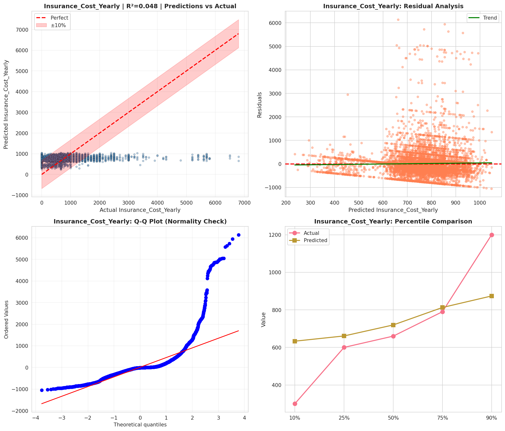
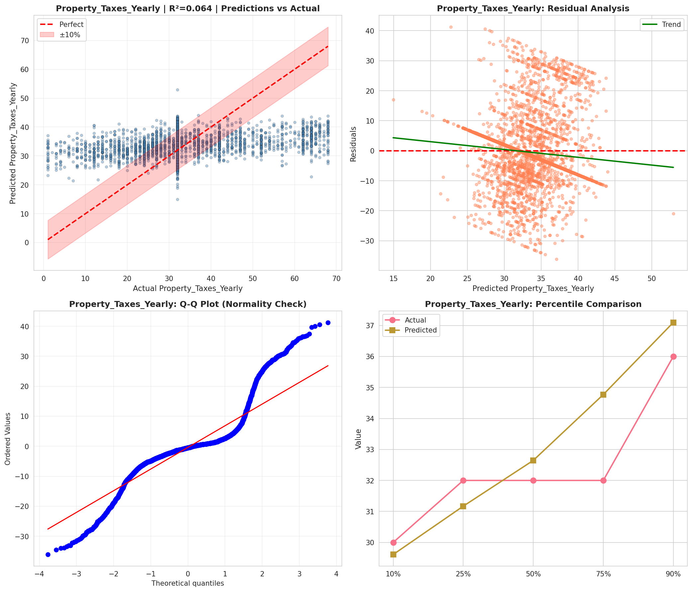
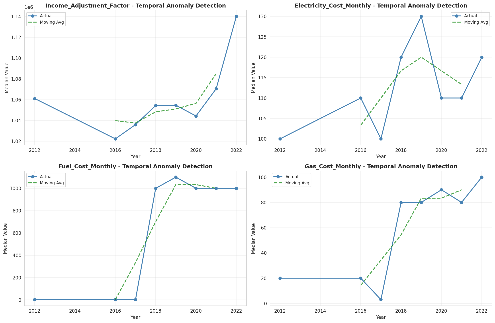
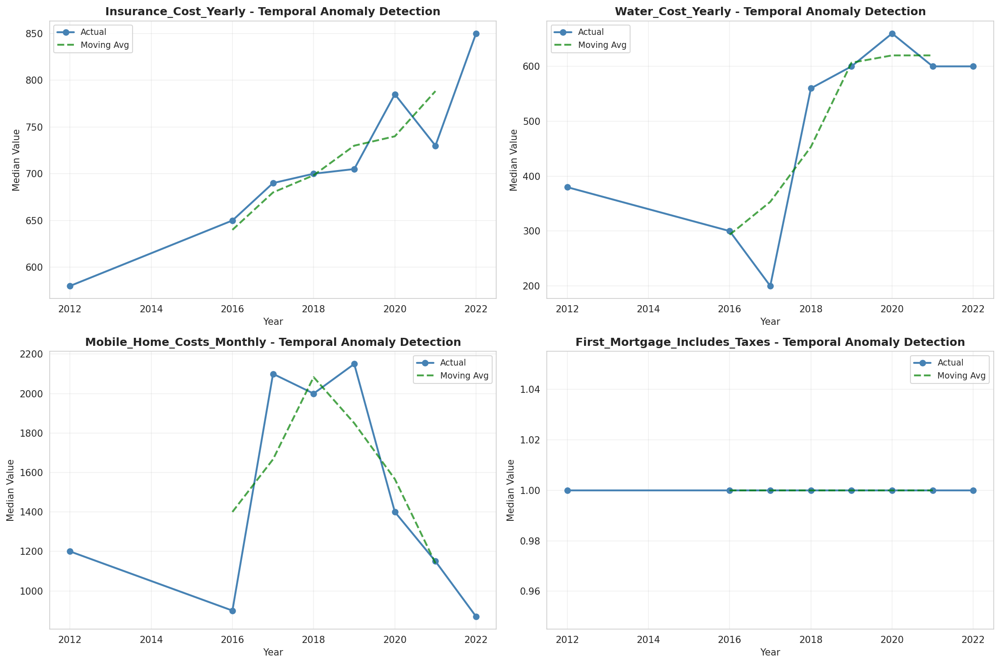
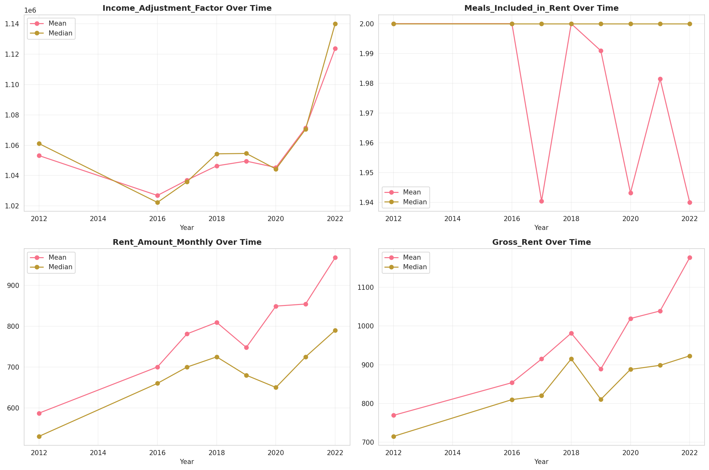
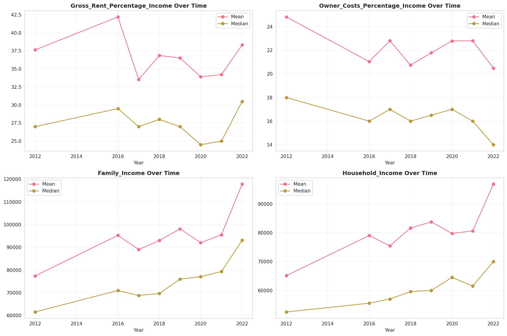
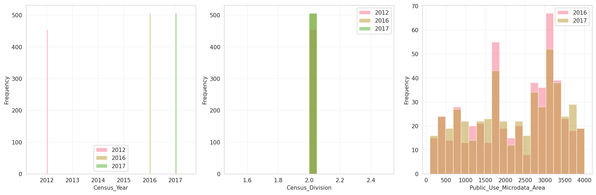
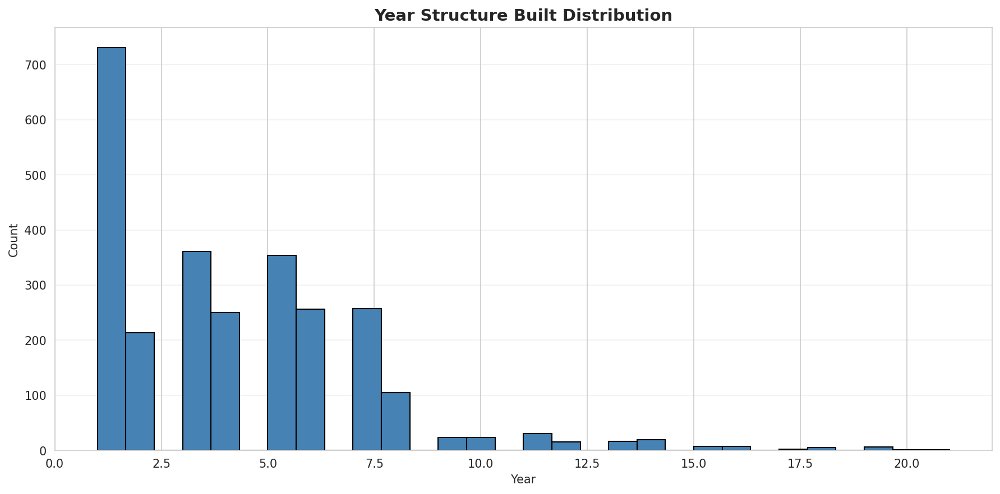
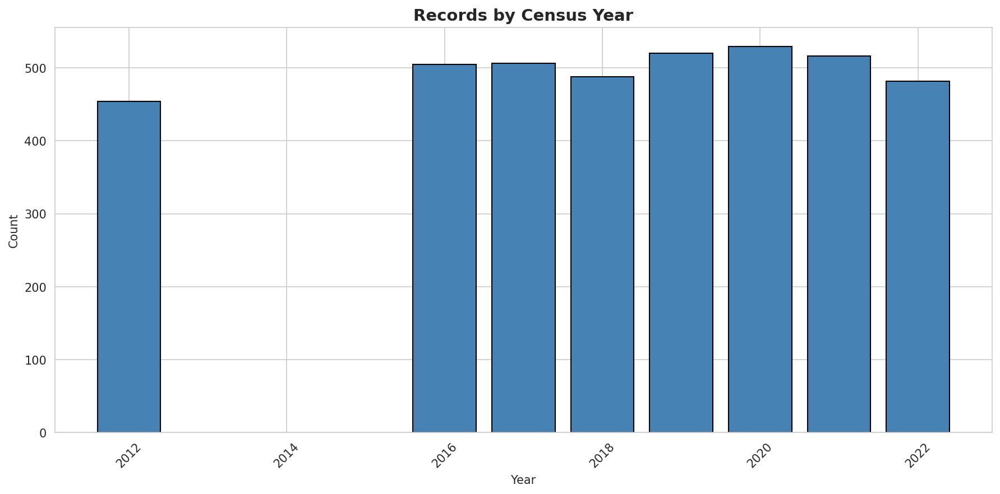
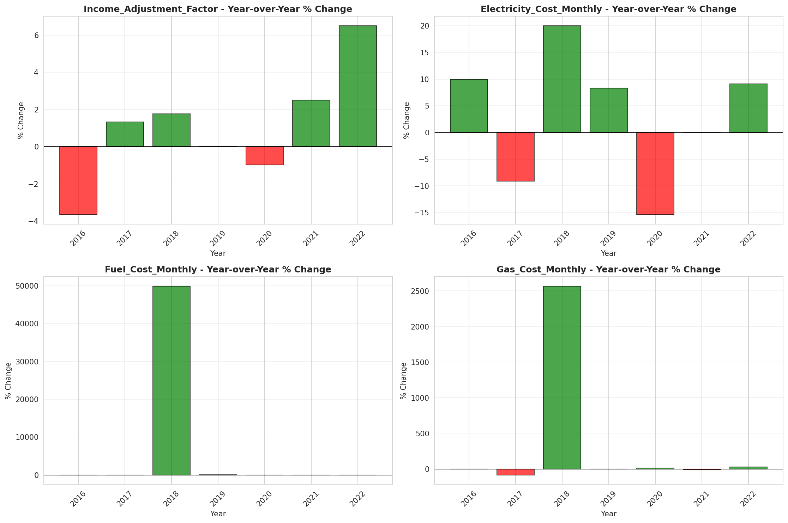
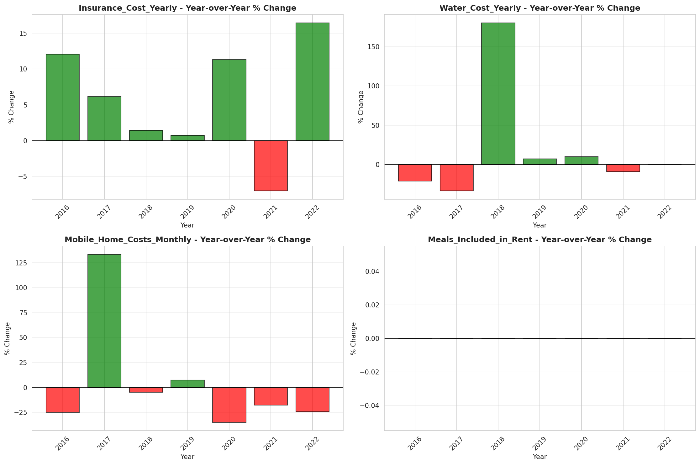
