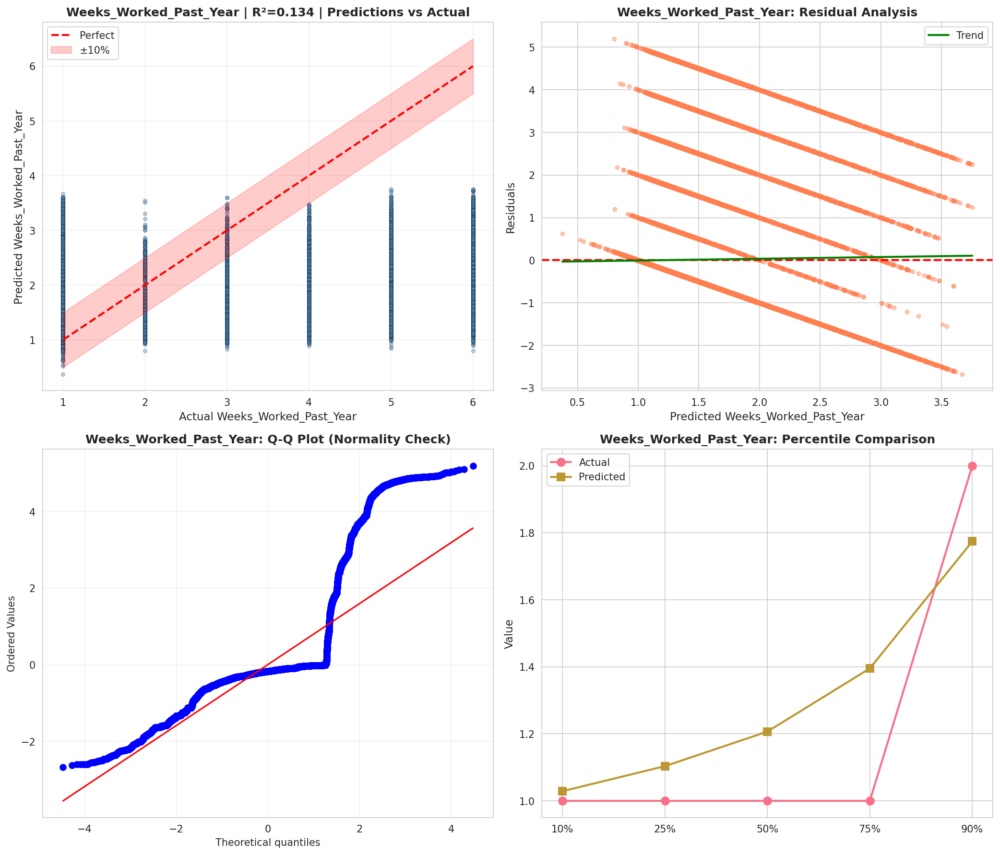
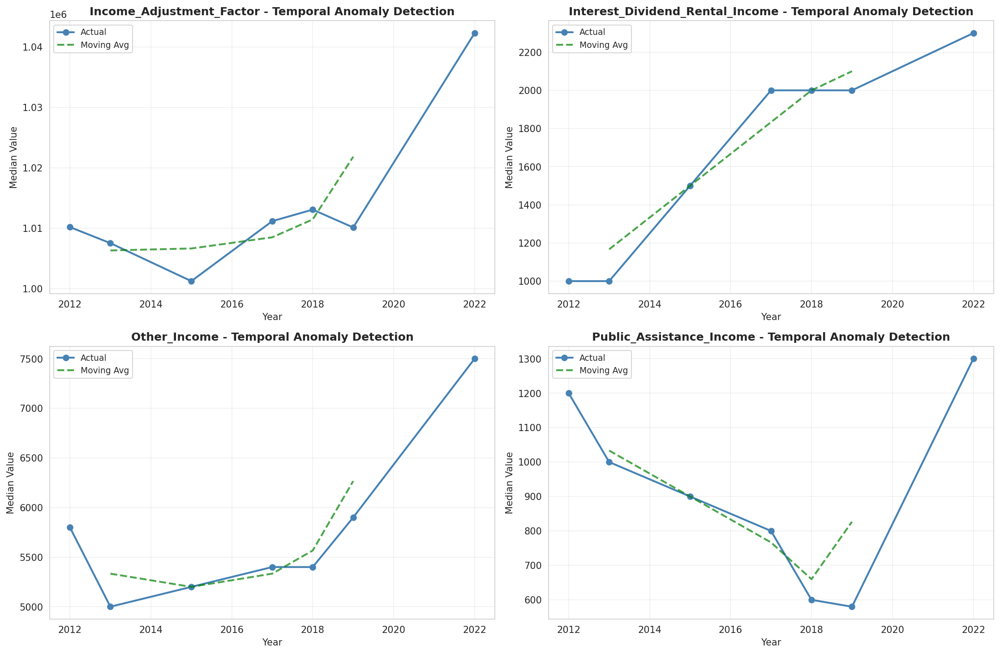
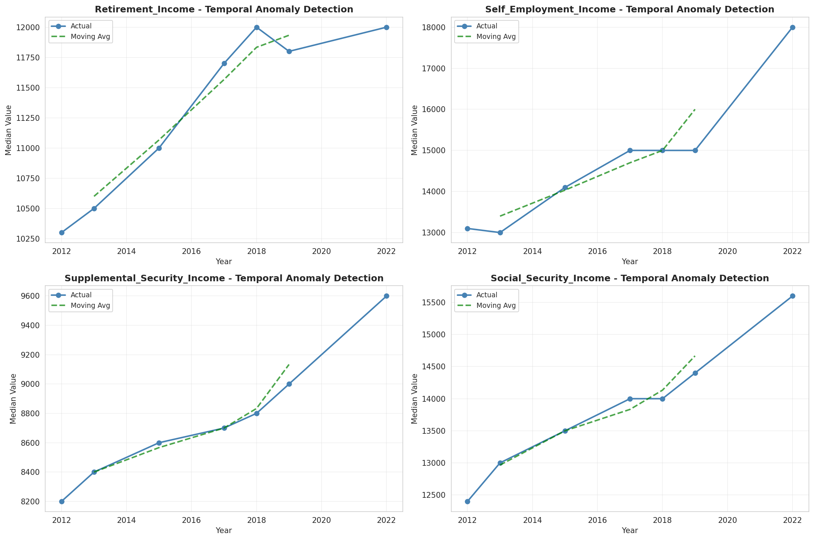
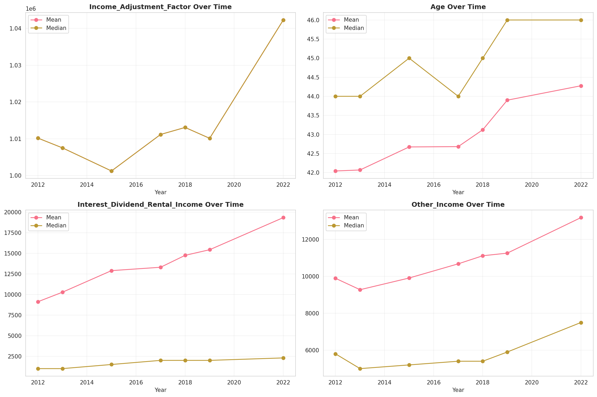
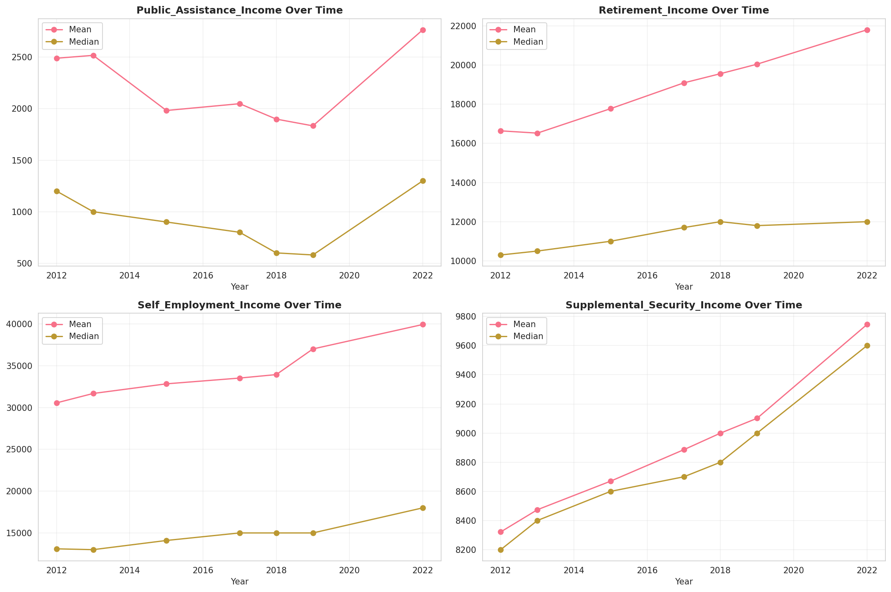
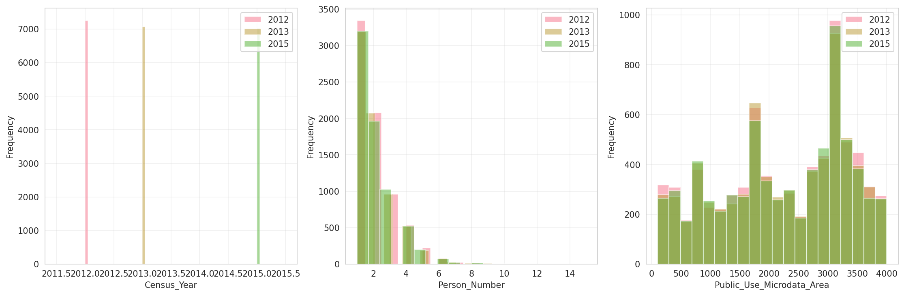
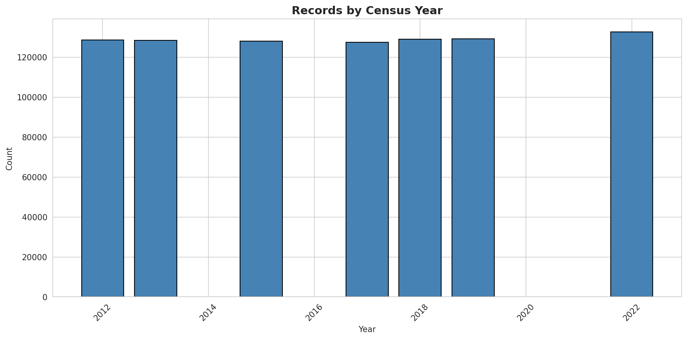
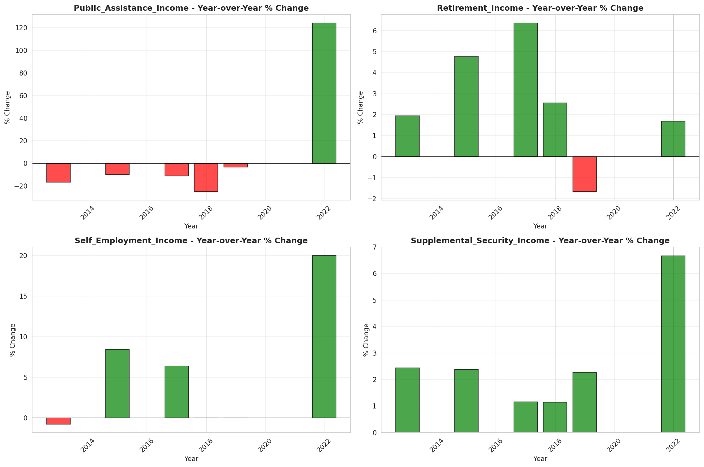

# Temporal Analysis

## Year Distribution

- 2012: 128,605 records

- 2013: 128,382 records

- 2015: 128,145 records

- 2017: 127,433 records

- 2018: 129,066 records

- 2019: 129,194 records

- 2022: 132,605 records

## Temporal Trends

- Census_Year: {np.int64(2012): {'mean': 2012.0, 'median': 2012.0, 'std': 0.0}, np.int64(2013): {'mean': 2013.0, 'median': 2013.0, 'std': 0.0}, np.int64(2015): {'mean': 2015.0, 'median': 2015.0, 'std': 0.0}, np.int64(2017): {'mean': 2017.0, 'median': 2017.0, 'std': 0.0}, np.int64(2018): {'mean': 2018.0, 'median': 2018.0, 'std': 0.0}, np.int64(2019): {'mean': 2019.0, 'median': 2019.0, 'std': 0.0}, np.int64(2022): {'mean': 2022.0, 'median': 2022.0, 'std': 0.0}}

- Person_Number: {np.int64(2012): {'mean': 1.9957777691380585, 'median': 2.0, 'std': 1.2447167042320557}, np.int64(2013): {'mean': 2.0088018569581405, 'median': 2.0, 'std': 1.2695839057747755}, np.int64(2015): {'mean': 1.9992352413281829, 'median': 2.0, 'std': 1.266826826364856}, np.int64(2017): {'mean': 1.9957546318457542, 'median': 2.0, 'std': 1.2662426507429425}, np.int64(2018): {'mean': 1.9879209086823795, 'median': 2.0, 'std': 1.2559428904376437}, np.int64(2019): {'mean': 1.9797513816431103, 'median': 2.0, 'std': 1.268425476078318}, np.int64(2022): {'mean': 1.9807699558840164, 'median': 2.0, 'std': 1.271679257951992}}

- Public_Use_Microdata_Area: {np.int64(2012): {'mean': 2239.7689047859726, 'median': 2302.0, 'std': 1119.9811920853635}, np.int64(2013): {'mean': 2248.2559626738953, 'median': 2401.0, 'std': 1115.2387464439805}, np.int64(2015): {'mean': 2250.1249053806237, 'median': 2401.0, 'std': 1118.599335617989}, np.int64(2017): {'mean': 2269.234656643099, 'median': 2402.0, 'std': 1108.7022609353135}, np.int64(2018): {'mean': 2236.842088543846, 'median': 2302.0, 'std': 1114.5070091795285}, np.int64(2019): {'mean': 2239.6386983915663, 'median': 2302.0, 'std': 1117.68402141193}, np.int64(2022): {'mean': 2225.8715206817237, 'median': 2302.0, 'std': 1131.618143139486}}

- State_Code: {np.int64(2012): {'mean': 42.0, 'median': 42.0, 'std': 0.0}, np.int64(2013): {'mean': 42.0, 'median': 42.0, 'std': 0.0}, np.int64(2015): {'mean': 42.0, 'median': 42.0, 'std': 0.0}, np.int64(2017): {'mean': 42.0, 'median': 42.0, 'std': 0.0}, np.int64(2018): {'mean': 42.0, 'median': 42.0, 'std': 0.0}, np.int64(2019): {'mean': 42.0, 'median': 42.0, 'std': 0.0}, np.int64(2022): {'mean': 42.0, 'median': 42.0, 'std': 0.0}}

- Income_Adjustment_Factor: {np.int64(2012): {'mean': 1010207.0, 'median': 1010207.0, 'std': 0.0}, np.int64(2013): {'mean': 1007549.0, 'median': 1007549.0, 'std': 0.0}, np.int64(2015): {'mean': 1001264.0, 'median': 1001264.0, 'std': 0.0}, np.int64(2017): {'mean': 1011189.0, 'median': 1011189.0, 'std': 0.0}, np.int64(2018): {'mean': 1013097.0, 'median': 1013097.0, 'std': 0.0}, np.int64(2019): {'mean': 1010145.0, 'median': 1010145.0, 'std': 0.0}, np.int64(2022): {'mean': 1042311.0, 'median': 1042311.0, 'std': 0.0}}

- Person_Weight: {np.int64(2012): {'mean': 99.24603242486684, 'median': 82.0, 'std': 86.03754833533363}, np.int64(2013): {'mean': 99.49837983517939, 'median': 82.0, 'std': 85.39519936715763}, np.int64(2015): {'mean': 99.90637949198174, 'median': 82.0, 'std': 86.18058576284065}, np.int64(2017): {'mean': 100.48838997747836, 'median': 81.0, 'std': 88.37022945161902}, np.int64(2018): {'mean': 99.22876667751383, 'median': 79.0, 'std': 89.38270010522629}, np.int64(2019): {'mean': 99.09120392587892, 'median': 77.0, 'std': 95.38954890904681}, np.int64(2022): {'mean': 97.82442592662419, 'median': 75.0, 'std': 100.01657106389439}}

- Age: {np.int64(2012): {'mean': 42.043466428210415, 'median': 44.0, 'std': 23.64241568330229}, np.int64(2013): {'mean': 42.069822872365286, 'median': 44.0, 'std': 23.694756622567688}, np.int64(2015): {'mean': 42.67337781419486, 'median': 45.0, 'std': 23.757297448986897}, np.int64(2017): {'mean': 42.681824958998064, 'median': 44.0, 'std': 23.77474611668495}, np.int64(2018): {'mean': 43.12320828103451, 'median': 45.0, 'std': 23.85680020916166}, np.int64(2019): {'mean': 43.89906652011703, 'median': 46.0, 'std': 24.002660250092973}, np.int64(2022): {'mean': 44.27590211530485, 'median': 46.0, 'std': 24.202404243989484}}

- Citizenship_Status: {np.int64(2012): {'mean': 1.166758679678084, 'median': 1.0, 'std': 0.7272927362732479}, np.int64(2013): {'mean': 1.1796902992631366, 'median': 1.0, 'std': 0.7536645503975674}, np.int64(2015): {'mean': 1.1796792695774319, 'median': 1.0, 'std': 0.7545481855425921}, np.int64(2017): {'mean': 1.1901783682405656, 'median': 1.0, 'std': 0.771169048690404}, np.int64(2018): {'mean': 1.1899880681201866, 'median': 1.0, 'std': 0.7700184344733392}, np.int64(2019): {'mean': 1.1829032308001919, 'median': 1.0, 'std': 0.7533309376464956}, np.int64(2022): {'mean': 1.1984389728894085, 'median': 1.0, 'std': 0.7855011985173759}}

- Class_of_Worker: {np.int64(2012): {'mean': 1.9791823491239455, 'median': 1.0, 'std': 1.809879457022094}, np.int64(2013): {'mean': 1.9587032431805589, 'median': 1.0, 'std': 1.785743704443888}, np.int64(2015): {'mean': 1.9709595471133634, 'median': 1.0, 'std': 1.793416811321346}, np.int64(2017): {'mean': 1.949918682396675, 'median': 1.0, 'std': 1.7686449827926953}, np.int64(2018): {'mean': 1.9479968498336, 'median': 1.0, 'std': 1.7764598087011076}, np.int64(2019): {'mean': 1.970105756137292, 'median': 1.0, 'std': 1.761777060232626}, np.int64(2022): {'mean': 1.9710485624850718, 'median': 1.0, 'std': 1.7526369171105602}}

- English_Speaking_Ability: {np.int64(2012): {'mean': 1.5743927125506072, 'median': 1.0, 'std': 0.8544981908946686}, np.int64(2013): {'mean': 1.570733684637211, 'median': 1.0, 'std': 0.8483721281814134}, np.int64(2015): {'mean': 1.567963111467522, 'median': 1.0, 'std': 0.8506474615268093}, np.int64(2017): {'mean': 1.5483776957450943, 'median': 1.0, 'std': 0.8280405849294984}, np.int64(2018): {'mean': 1.542636407532593, 'median': 1.0, 'std': 0.8273809320322691}, np.int64(2019): {'mean': 1.5452934226073258, 'median': 1.0, 'std': 0.8334563193698001}, np.int64(2022): {'mean': 1.5748976807639836, 'median': 1.0, 'std': 0.8459188243794973}}

- Fertility_Status: {np.int64(2012): {'mean': 1.954130411429799, 'median': 2.0, 'std': 0.20920596696206378}, np.int64(2013): {'mean': 1.951940783534934, 'median': 2.0, 'std': 0.21389525507400076}, np.int64(2015): {'mean': 1.9522956995263139, 'median': 2.0, 'std': 0.21314383560113123}, np.int64(2017): {'mean': 1.9504980042526205, 'median': 2.0, 'std': 0.2169177342363204}, np.int64(2018): {'mean': 1.9517670426863547, 'median': 2.0, 'std': 0.21426212835765523}, np.int64(2019): {'mean': 1.9514198272188432, 'median': 2.0, 'std': 0.21499286090270658}, np.int64(2022): {'mean': 1.9499334221038616, 'median': 2.0, 'std': 0.21808650837806293}}

- Marital_Status: {np.int64(2012): {'mean': 2.8895610590568017, 'median': 2.0, 'std': 1.8534375922129784}, np.int64(2013): {'mean': 2.8994095745509494, 'median': 3.0, 'std': 1.854388395400409}, np.int64(2015): {'mean': 2.891396464942058, 'median': 3.0, 'std': 1.854227580031498}, np.int64(2017): {'mean': 2.908359687051235, 'median': 3.0, 'std': 1.8551758195484307}, np.int64(2018): {'mean': 2.8863062309206144, 'median': 3.0, 'std': 1.854849139033944}, np.int64(2019): {'mean': 2.862013715807236, 'median': 2.0, 'std': 1.8507280277637095}, np.int64(2022): {'mean': 2.866339881603258, 'median': 2.0, 'std': 1.8528386684625424}}

- Mobility_Status: {np.int64(2012): {'mean': 1.2109085775240007, 'median': 1.0, 'std': 0.6117832484556474}, np.int64(2013): {'mean': 1.2140336259952995, 'median': 1.0, 'std': 0.6154939344593412}, np.int64(2015): {'mean': 1.2162973113452724, 'median': 1.0, 'std': 0.6182473680544184}, np.int64(2017): {'mean': 1.227993759453873, 'median': 1.0, 'std': 0.633176930201401}, np.int64(2018): {'mean': 1.2262541022034692, 'median': 1.0, 'std': 0.6306552796516033}, np.int64(2019): {'mean': 1.217355326739475, 'median': 1.0, 'std': 0.6198759925473012}, np.int64(2022): {'mean': 1.186848289866977, 'median': 1.0, 'std': 0.5789816841317804}}

- Military_Service: {np.int64(2012): {'mean': 4.7808498087644855, 'median': 5.0, 'std': 0.6199365616878852}, np.int64(2013): {'mean': 3.8005680085391886, 'median': 4.0, 'std': 0.5866597174581565}, np.int64(2015): {'mean': 3.8100484502555254, 'median': 4.0, 'std': 0.5729859982487588}, np.int64(2017): {'mean': 3.8228861513211254, 'median': 4.0, 'std': 0.5564921193500656}, np.int64(2018): {'mean': 3.8210684301862012, 'median': 4.0, 'std': 0.5592865085880612}, np.int64(2019): {'mean': 3.8230065408195593, 'median': 4.0, 'std': 0.5567687570838913}, np.int64(2022): {'mean': 3.840408270560828, 'median': 4.0, 'std': 0.5302898357326711}}

- Travel_Time_To_Work_Minutes: {np.int64(2012): {'mean': 26.15701744839845, 'median': 20.0, 'std': 23.453664109955906}, np.int64(2013): {'mean': 26.042836915025184, 'median': 20.0, 'std': 22.651354842015465}, np.int64(2015): {'mean': 26.774465037156414, 'median': 20.0, 'std': 23.236288084218568}, np.int64(2017): {'mean': 26.89820783452575, 'median': 20.0, 'std': 23.402842565777142}, np.int64(2018): {'mean': 27.222399439137675, 'median': 20.0, 'std': 23.591618528182305}, np.int64(2019): {'mean': 27.896585960634035, 'median': 20.0, 'std': 24.582894028030218}, np.int64(2022): {'mean': 26.601760197203713, 'median': 20.0, 'std': 23.15645299569209}}

- Vehicle_Occupancy: {np.int64(2012): {'mean': 1.1534833526519845, 'median': 1.0, 'std': 0.5829352408684174}, np.int64(2013): {'mean': 1.1415187571648813, 'median': 1.0, 'std': 0.563075705888933}, np.int64(2015): {'mean': 1.1543233119958778, 'median': 1.0, 'std': 0.5979221418034386}, np.int64(2017): {'mean': 1.148636711618868, 'median': 1.0, 'std': 0.5871252054067146}, np.int64(2018): {'mean': 1.14652827349372, 'median': 1.0, 'std': 0.5707086818147002}, np.int64(2019): {'mean': 1.1419077705435914, 'median': 1.0, 'std': 0.5781376700866957}, np.int64(2022): {'mean': 1.1385174143975816, 'median': 1.0, 'std': 0.5364615782487276}}

- Transportation_To_Work: {np.int64(2012): {'mean': 1.9534212767436605, 'median': 1.0, 'std': 2.7779296665754756}, np.int64(2013): {'mean': 1.9568429371542453, 'median': 1.0, 'std': 2.782119172145352}, np.int64(2015): {'mean': 2.011665641866503, 'median': 1.0, 'std': 2.851423077096669}, np.int64(2017): {'mean': 2.0754441101830223, 'median': 1.0, 'std': 2.9397717037909428}, np.int64(2018): {'mean': 2.0505333709375053, 'median': 1.0, 'std': 2.917922026378153}, np.int64(2019): {'mean': None, 'median': None, 'std': None}, np.int64(2022): {'mean': None, 'median': None, 'std': None}}

- Language_Other_Than_English: {np.int64(2012): {'mean': 1.9193166413510379, 'median': 2.0, 'std': 0.2723493345262491}, np.int64(2013): {'mean': 1.919234578207741, 'median': 2.0, 'std': 0.2724756430994354}, np.int64(2015): {'mean': 1.9183800368173451, 'median': 2.0, 'std': 0.2737859712945668}, np.int64(2017): {'mean': 1.9152317662656357, 'median': 2.0, 'std': 0.2785376440630691}, np.int64(2018): {'mean': 1.915974910132509, 'median': 2.0, 'std': 0.27742656446823144}, np.int64(2019): {'mean': 1.9177172116537577, 'median': 2.0, 'std': 0.27479618426338676}, np.int64(2022): {'mean': 1.9132571753159664, 'median': 2.0, 'std': 0.2814589348966543}}

- Grandparents_Living_With_Grandchildren: {np.int64(2012): {'mean': 1.9732485732178515, 'median': 2.0, 'std': 0.1613570438183755}, np.int64(2013): {'mean': 1.9730492417505543, 'median': 2.0, 'std': 0.16194050087442738}, np.int64(2015): {'mean': 1.9741030704847886, 'median': 2.0, 'std': 0.15882876031404092}, np.int64(2017): {'mean': 1.975695592611838, 'median': 2.0, 'std': 0.1539934518907088}, np.int64(2018): {'mean': 1.9757914123220552, 'median': 2.0, 'std': 0.15369712289067383}, np.int64(2019): {'mean': 1.9749046833210038, 'median': 2.0, 'std': 0.15641553697643149}, np.int64(2022): {'mean': 1.9773432855538675, 'median': 2.0, 'std': 0.14880736378939335}}

- Months_Responsible_For_Grandchildren: {np.int64(2012): {'mean': 3.6944140197152247, 'median': 4.0, 'std': 1.337606165445689}, np.int64(2013): {'mean': 3.7549234135667398, 'median': 4.0, 'std': 1.3333299380091193}, np.int64(2015): {'mean': 3.6635182998819364, 'median': 4.0, 'std': 1.3141810254644235}, np.int64(2017): {'mean': 3.8064066852367686, 'median': 4.0, 'std': 1.3044770719748597}, np.int64(2018): {'mean': 3.9224030037546935, 'median': 4.0, 'std': 1.2491545944329592}, np.int64(2019): {'mean': 3.9694267515923567, 'median': 4.0, 'std': 1.2409191797869152}, np.int64(2022): {'mean': 4.012269938650307, 'median': 5.0, 'std': 1.2268763431698393}}

- Grandparents_Responsible_For_Grandchildren: {np.int64(2012): {'mean': 1.596731448763251, 'median': 2.0, 'std': 0.4906621698061246}, np.int64(2013): {'mean': 1.5978882534095908, 'median': 2.0, 'std': 0.490432164093696}, np.int64(2015): {'mean': 1.6155242850658194, 'median': 2.0, 'std': 0.48658155731729175}, np.int64(2017): {'mean': 1.6511175898931, 'median': 2.0, 'std': 0.47673253337979316}, np.int64(2018): {'mean': 1.6177033492822968, 'median': 2.0, 'std': 0.48606477359946704}, np.int64(2019): {'mean': 1.6439909297052153, 'median': 2.0, 'std': 0.47892654460408035}, np.int64(2022): {'mean': 1.6831875607385811, 'median': 2.0, 'std': 0.4653466878717947}}

- Interest_Dividend_Rental_Income: {np.int64(2012): {'mean': 9124.10297524692, 'median': 1000.0, 'std': 26966.506879808723}, np.int64(2013): {'mean': 10281.935217767523, 'median': 1000.0, 'std': 29590.022439903856}, np.int64(2015): {'mean': 12905.67951807229, 'median': 1500.0, 'std': 37767.29630985883}, np.int64(2017): {'mean': 13314.918796424525, 'median': 2000.0, 'std': 37419.22263846731}, np.int64(2018): {'mean': 14762.802634849615, 'median': 2000.0, 'std': 41545.86927025649}, np.int64(2019): {'mean': 15445.620891381703, 'median': 2000.0, 'std': 45762.128029158775}, np.int64(2022): {'mean': 19346.070261437908, 'median': 2300.0, 'std': 54965.75042643482}}

- Military_Service_Period_1: {np.int64(2012): {'mean': 0.07873498498498499, 'median': 0.0, 'std': 0.2693373253010768}, np.int64(2013): {'mean': 0.08453050176972725, 'median': 0.0, 'std': 0.2781962487014612}, np.int64(2015): {'mean': 0.10125889436234264, 'median': 0.0, 'std': 0.30168774263599474}, np.int64(2017): {'mean': 0.1233152045400804, 'median': 0.0, 'std': 0.32881810806673273}, np.int64(2018): {'mean': 0.132837528604119, 'median': 0.0, 'std': 0.33941847465517944}, np.int64(2019): {'mean': 0.14031437817845585, 'median': 0.0, 'std': 0.34733297723435747}, np.int64(2022): {'mean': 0.1678959869983748, 'median': 0.0, 'std': 0.37379726093260457}}

- Military_Service_Period_2: {np.int64(2012): {'mean': 0.12002627627627628, 'median': 0.0, 'std': 0.3250075106727202}, np.int64(2013): {'mean': 0.12627524463876744, 'median': 0.0, 'std': 0.33217660052414993}, np.int64(2015): {'mean': 0.1371647509578544, 'median': 0.0, 'std': 0.3440400255779446}, np.int64(2017): {'mean': 0.15795696382123434, 'median': 0.0, 'std': 0.3647222077067286}, np.int64(2018): {'mean': 0.14988558352402745, 'median': 0.0, 'std': 0.3569796576548142}, np.int64(2019): {'mean': 0.1555709662505779, 'median': 0.0, 'std': 0.36246906913693866}, np.int64(2022): {'mean': 0.17752219027378421, 'median': 0.0, 'std': 0.38213390036197303}}

- Military_Service_Period_3: {np.int64(2012): {'mean': 0.15418543543543545, 'median': 0.0, 'std': 0.36114336000252917}, np.int64(2013): {'mean': None, 'median': None, 'std': None}, np.int64(2015): {'mean': None, 'median': None, 'std': None}, np.int64(2017): {'mean': None, 'median': None, 'std': None}, np.int64(2018): {'mean': None, 'median': None, 'std': None}, np.int64(2019): {'mean': None, 'median': None, 'std': None}, np.int64(2022): {'mean': None, 'median': None, 'std': None}}

- Military_Service_Period_4: {np.int64(2012): {'mean': 0.10482357357357357, 'median': 0.0, 'std': 0.3063403315202524}, np.int64(2013): {'mean': None, 'median': None, 'std': None}, np.int64(2015): {'mean': None, 'median': None, 'std': None}, np.int64(2017): {'mean': None, 'median': None, 'std': None}, np.int64(2018): {'mean': None, 'median': None, 'std': None}, np.int64(2019): {'mean': None, 'median': None, 'std': None}, np.int64(2022): {'mean': None, 'median': None, 'std': None}}

- Military_Service_Period_5: {np.int64(2012): {'mean': 0.35604354354354356, 'median': 0.0, 'std': 0.4788507667901779}, np.int64(2013): {'mean': 0.36831147199666875, 'median': 0.0, 'std': 0.48237159348205405}, np.int64(2015): {'mean': 0.38149972632731255, 'median': 0.0, 'std': 0.4857813479714191}, np.int64(2017): {'mean': 0.39134547174272877, 'median': 0.0, 'std': 0.4880802790719119}, np.int64(2018): {'mean': 0.40606407322654464, 'median': 0.0, 'std': 0.4911248714243816}, np.int64(2019): {'mean': 0.40048543689320387, 'median': 0.0, 'std': 0.4900251068900651}, np.int64(2022): {'mean': 0.4055506938367296, 'median': 0.0, 'std': 0.4910289920330171}}

- Military_Service_Period_6: {np.int64(2012): {'mean': 0.11017267267267267, 'median': 0.0, 'std': 0.313119554932481}, np.int64(2013): {'mean': None, 'median': None, 'std': None}, np.int64(2015): {'mean': None, 'median': None, 'std': None}, np.int64(2017): {'mean': None, 'median': None, 'std': None}, np.int64(2018): {'mean': None, 'median': None, 'std': None}, np.int64(2019): {'mean': None, 'median': None, 'std': None}, np.int64(2022): {'mean': None, 'median': None, 'std': None}}

- Military_Service_Period_7: {np.int64(2012): {'mean': 0.12209084084084085, 'median': 0.0, 'std': 0.32740605826532587}, np.int64(2013): {'mean': None, 'median': None, 'std': None}, np.int64(2015): {'mean': None, 'median': None, 'std': None}, np.int64(2017): {'mean': None, 'median': None, 'std': None}, np.int64(2018): {'mean': None, 'median': None, 'std': None}, np.int64(2019): {'mean': None, 'median': None, 'std': None}, np.int64(2022): {'mean': None, 'median': None, 'std': None}}

- Military_Service_Period_8: {np.int64(2012): {'mean': 0.12575075075075076, 'median': 0.0, 'std': 0.3315838014170421}, np.int64(2013): {'mean': 0.12471372059129711, 'median': 0.0, 'std': 0.330411218670593}, np.int64(2015): {'mean': 0.12315270935960591, 'median': 0.0, 'std': 0.3286304032979946}, np.int64(2017): {'mean': 0.0995507212106881, 'median': 0.0, 'std': 0.2994177260364619}, np.int64(2018): {'mean': 0.08638443935926773, 'median': 0.0, 'std': 0.2809469683507719}, np.int64(2019): {'mean': 0.0892279241793805, 'median': 0.0, 'std': 0.2850889257551061}, np.int64(2022): {'mean': 0.05650706338292286, 'median': 0.0, 'std': 0.23091271313883333}}

- Military_Service_Period_9: {np.int64(2012): {'mean': 0.02242867867867868, 'median': 0.0, 'std': 0.14808001495880974}, np.int64(2013): {'mean': 0.019050593379138038, 'median': 0.0, 'std': 0.1367099626574789}, np.int64(2015): {'mean': 0.015873015873015872, 'median': 0.0, 'std': 0.12499109348537313}, np.int64(2017): {'mean': 0.01454244502246394, 'median': 0.0, 'std': 0.1197190748515871}, np.int64(2018): {'mean': 0.010526315789473684, 'median': 0.0, 'std': 0.10206225701978248}, np.int64(2019): {'mean': 0.011095700416088766, 'median': 0.0, 'std': 0.10475616549286443}, np.int64(2022): {'mean': None, 'median': None, 'std': None}}

- Military_Service_Period_10: {np.int64(2012): {'mean': 0.09862987987987988, 'median': 0.0, 'std': 0.2981784203554524}, np.int64(2013): {'mean': 0.08609202581719759, 'median': 0.0, 'std': 0.28051449248559074}, np.int64(2015): {'mean': 0.06425834701696771, 'median': 0.0, 'std': 0.24522600772644843}, np.int64(2017): {'mean': 0.04670134783636794, 'median': 0.0, 'std': 0.21101089133975623}, np.int64(2018): {'mean': 0.035583524027459956, 'median': 0.0, 'std': 0.18525998964508755}, np.int64(2019): {'mean': 0.027623670827554323, 'median': 0.0, 'std': 0.16390152089200552}, np.int64(2022): {'mean': 0.012501562695336917, 'median': 0.0, 'std': 0.11111623270522183}}

- Military_Service_Period_11: {np.int64(2012): {'mean': 0.0018768768768768769, 'median': 0.0, 'std': 0.04328429310183352}, np.int64(2013): {'mean': 0.003123048094940662, 'median': 0.0, 'std': 0.055799810019801166}, np.int64(2015): {'mean': 0.0013136288998357964, 'median': 0.0, 'std': 0.036222188055259855}, np.int64(2017): {'mean': 0.0014187751241428233, 'median': 0.0, 'std': 0.037642127021162645}, np.int64(2018): {'mean': 0.0005720823798627002, 'median': 0.0, 'std': 0.023912769126618782}, np.int64(2019): {'mean': 0.0001155802126675913, 'median': 0.0, 'std': 0.010750823813438268}, np.int64(2022): {'mean': None, 'median': None, 'std': None}}

- Temporary_Absence_From_Work: {np.int64(2012): {'mean': 2.5194122442859688, 'median': 3.0, 'std': 0.5303420136548571}, np.int64(2013): {'mean': 2.5834609494640124, 'median': 3.0, 'std': 0.517132805823266}, np.int64(2015): {'mean': 2.5827892509877546, 'median': 3.0, 'std': 0.518204442418489}, np.int64(2017): {'mean': 2.5946375652664755, 'median': 3.0, 'std': 0.5151453654198185}, np.int64(2018): {'mean': 2.5986463120324736, 'median': 3.0, 'std': 0.5126722164619306}, np.int64(2019): {'mean': 2.603339773668231, 'median': 3.0, 'std': 0.5117449303351544}, np.int64(2022): {'mean': 2.5874349202941334, 'median': 3.0, 'std': 0.5140762353121417}}

- Available_For_Work: {np.int64(2012): {'mean': 4.511868504652754, 'median': 5.0, 'std': 1.1982037540964312}, np.int64(2013): {'mean': 4.665667659410555, 'median': 5.0, 'std': 1.023440712705728}, np.int64(2015): {'mean': 4.702319238564931, 'median': 5.0, 'std': 0.9616158122759151}, np.int64(2017): {'mean': 4.7369678724305, 'median': 5.0, 'std': 0.9074885793860158}, np.int64(2018): {'mean': 4.739988349406837, 'median': 5.0, 'std': 0.8992218837226018}, np.int64(2019): {'mean': 4.742809826110958, 'median': 5.0, 'std': 0.8881784349874936}, np.int64(2022): {'mean': 4.792460594349919, 'median': 5.0, 'std': 0.8026496231716909}}

- On_Layoff_From_Work: {np.int64(2012): {'mean': 2.4773547244426535, 'median': 2.0, 'std': 0.5374288766931514}, np.int64(2013): {'mean': 2.552842473153637, 'median': 3.0, 'std': 0.5260508797442529}, np.int64(2015): {'mean': 2.5609699143478952, 'median': 3.0, 'std': 0.517282745924524}, np.int64(2017): {'mean': 2.577233171833106, 'median': 3.0, 'std': 0.5112034778490061}, np.int64(2018): {'mean': 2.581031724750113, 'median': 3.0, 'std': 0.5090729909668859}, np.int64(2019): {'mean': 2.5895390560309135, 'median': 3.0, 'std': 0.5059164343740469}, np.int64(2022): {'mean': 2.576968493371263, 'median': 3.0, 'std': 0.5057283620814309}}

- Looking_For_Work: {np.int64(2012): {'mean': 2.474177919802082, 'median': 3.0, 'std': 0.6002576310816644}, np.int64(2013): {'mean': 2.543259519537012, 'median': 3.0, 'std': 0.5851671372986522}, np.int64(2015): {'mean': 2.5572150456281935, 'median': 3.0, 'std': 0.5657975235386641}, np.int64(2017): {'mean': 2.573789924267369, 'median': 3.0, 'std': 0.5567919705968919}, np.int64(2018): {'mean': 2.576852305615401, 'median': 3.0, 'std': 0.552597387166721}, np.int64(2019): {'mean': 2.577514030729598, 'median': 3.0, 'std': 0.5472918952600812}, np.int64(2022): {'mean': 2.563371084035568, 'median': 3.0, 'std': 0.5453498355082673}}

- Informed_Of_Recall: {np.int64(2012): {'mean': 2.878587961878344, 'median': 3.0, 'std': 0.3533709261827259}, np.int64(2013): {'mean': 2.9282687736637887, 'median': 3.0, 'std': 0.28198261803602886}, np.int64(2015): {'mean': 2.9314222732834554, 'median': 3.0, 'std': 0.27567999806709165}, np.int64(2017): {'mean': 2.9393104097088294, 'median': 3.0, 'std': 0.25963821571150664}, np.int64(2018): {'mean': 2.937798777612368, 'median': 3.0, 'std': 0.2612376543320123}, np.int64(2019): {'mean': 2.9244732726101756, 'median': 3.0, 'std': 0.2815692846990326}, np.int64(2022): {'mean': 2.9455566886730002, 'median': 3.0, 'std': 0.24325508749536412}}

- Other_Income: {np.int64(2012): {'mean': 9895.899010931806, 'median': 5800.0, 'std': 12534.089233543818}, np.int64(2013): {'mean': 9278.122634995167, 'median': 5000.0, 'std': 11769.381147349615}, np.int64(2015): {'mean': 9912.302734988998, 'median': 5200.0, 'std': 12877.799164077607}, np.int64(2017): {'mean': 10680.871690427699, 'median': 5400.0, 'std': 13950.248082485574}, np.int64(2018): {'mean': 11118.54235018413, 'median': 5400.0, 'std': 14672.922295789367}, np.int64(2019): {'mean': 11261.118248699086, 'median': 5900.0, 'std': 14372.651286752987}, np.int64(2022): {'mean': 13186.577026784109, 'median': 7500.0, 'std': 15344.674907745877}}

- Public_Assistance_Income: {np.int64(2012): {'mean': 2489.6252863032523, 'median': 1200.0, 'std': 3723.442574011777}, np.int64(2013): {'mean': 2517.6470588235293, 'median': 1000.0, 'std': 4268.663369810053}, np.int64(2015): {'mean': 1982.3072717331875, 'median': 900.0, 'std': 2956.3104318436194}, np.int64(2017): {'mean': 2048.3043981481483, 'median': 800.0, 'std': 3243.211281471377}, np.int64(2018): {'mean': 1898.7627695800227, 'median': 600.0, 'std': 2894.443981861232}, np.int64(2019): {'mean': 1833.225988700565, 'median': 580.0, 'std': 2878.4785213467294}, np.int64(2022): {'mean': 2765.5277280858677, 'median': 1300.0, 'std': 4078.0285360731136}}

- Retirement_Income: {np.int64(2012): {'mean': 16640.151942199012, 'median': 10300.0, 'std': 19004.511582599334}, np.int64(2013): {'mean': 16524.367154660096, 'median': 10500.0, 'std': 18329.834914695744}, np.int64(2015): {'mean': 17774.376504573906, 'median': 11000.0, 'std': 20633.559697506153}, np.int64(2017): {'mean': 19091.60595662915, 'median': 11700.0, 'std': 22919.441467715897}, np.int64(2018): {'mean': 19561.18859161379, 'median': 12000.0, 'std': 23216.478674874983}, np.int64(2019): {'mean': 20046.52480149463, 'median': 11800.0, 'std': 24665.622245683262}, np.int64(2022): {'mean': 21801.845866885036, 'median': 12000.0, 'std': 28829.287508039302}}

- Self_Employment_Income: {np.int64(2012): {'mean': 30560.993059572007, 'median': 13100.0, 'std': 53363.635750077876}, np.int64(2013): {'mean': 31684.52429421932, 'median': 13000.0, 'std': 56621.61061529875}, np.int64(2015): {'mean': 32837.83019901406, 'median': 14100.0, 'std': 57025.32361217307}, np.int64(2017): {'mean': 33529.16602739726, 'median': 15000.0, 'std': 57918.46190321538}, np.int64(2018): {'mean': 33944.44845269673, 'median': 15000.0, 'std': 58908.652915445935}, np.int64(2019): {'mean': 37011.47864506627, 'median': 15000.0, 'std': 65986.27659421682}, np.int64(2022): {'mean': 39935.077826725406, 'median': 18000.0, 'std': 67983.10936450312}}

- Supplemental_Security_Income: {np.int64(2012): {'mean': 8321.853978671043, 'median': 8200.0, 'std': 4450.34332969884}, np.int64(2013): {'mean': 8473.948094975152, 'median': 8400.0, 'std': 4593.278753256837}, np.int64(2015): {'mean': 8670.005496015388, 'median': 8600.0, 'std': 4765.65417944678}, np.int64(2017): {'mean': 8885.966266437965, 'median': 8700.0, 'std': 5036.216085270821}, np.int64(2018): {'mean': 8999.63026166098, 'median': 8800.0, 'std': 4899.081387441891}, np.int64(2019): {'mean': 9101.538680318543, 'median': 9000.0, 'std': 5233.955494759263}, np.int64(2022): {'mean': 9744.817701085443, 'median': 9600.0, 'std': 5678.713758541279}}

- Social_Security_Income: {np.int64(2012): {'mean': 12713.459216581512, 'median': 12400.0, 'std': 6074.818188874368}, np.int64(2013): {'mean': 13099.474487016525, 'median': 13000.0, 'std': 6303.132207012843}, np.int64(2015): {'mean': 13784.631894443104, 'median': 13500.0, 'std': 6725.321368315743}, np.int64(2017): {'mean': 14255.590290028933, 'median': 14000.0, 'std': 7059.396877158618}, np.int64(2018): {'mean': 14383.780929290246, 'median': 14000.0, 'std': 7231.481229861095}, np.int64(2019): {'mean': 14856.382321721509, 'median': 14400.0, 'std': 7447.96459590399}, np.int64(2022): {'mean': 16137.389217134416, 'median': 15600.0, 'std': 8521.140204407651}}

- Wage_Income: {np.int64(2012): {'mean': 40020.08001514482, 'median': 30000.0, 'std': 46885.9389032873}, np.int64(2013): {'mean': 41463.43655529972, 'median': 30000.0, 'std': 49704.2858822557}, np.int64(2015): {'mean': 43515.17522998936, 'median': 32000.0, 'std': 51979.98275715291}, np.int64(2017): {'mean': 46743.3040902111, 'median': 35000.0, 'std': 57656.179456056525}, np.int64(2018): {'mean': 47338.610346885376, 'median': 35000.0, 'std': 58265.259076743685}, np.int64(2019): {'mean': 49819.68473585108, 'median': 36700.0, 'std': 60265.24075882622}, np.int64(2022): {'mean': 56126.797237935236, 'median': 41000.0, 'std': 66611.27229161399}}

- Relationship_To_Householder: {np.int64(2012): {'mean': 2.572225030131021, 'median': 1.0, 'std': 4.542263823986383}, np.int64(2013): {'mean': 2.584801607702014, 'median': 1.0, 'std': 4.536394247475887}, np.int64(2015): {'mean': 2.599765890202505, 'median': 1.0, 'std': 4.570042832644109}, np.int64(2017): {'mean': 2.582266759787496, 'median': 1.0, 'std': 4.552988612436506}, np.int64(2018): {'mean': 2.58225249097361, 'median': 1.0, 'std': 4.564068726203687}, np.int64(2019): {'mean': None, 'median': None, 'std': None}, np.int64(2022): {'mean': None, 'median': None, 'std': None}}

- School_Enrollment: {np.int64(2012): {'mean': 1.2975864881723527, 'median': 1.0, 'std': 0.5754254874439102}, np.int64(2013): {'mean': 1.2913073445965442, 'median': 1.0, 'std': 0.5680616084185178}, np.int64(2015): {'mean': 1.2862245553201053, 'median': 1.0, 'std': 0.5681204792532016}, np.int64(2017): {'mean': 1.283064704885352, 'median': 1.0, 'std': 0.5637728512860023}, np.int64(2018): {'mean': 1.2810960517624213, 'median': 1.0, 'std': 0.5638371709688044}, np.int64(2019): {'mean': 1.2700790281289256, 'median': 1.0, 'std': 0.5544765548321775}, np.int64(2022): {'mean': 1.266774535685807, 'median': 1.0, 'std': 0.5568608060248638}}

- School_Grade_Attending: {np.int64(2012): {'mean': 9.872646134081611, 'median': 11.0, 'std': 4.871814339024169}, np.int64(2013): {'mean': 9.887506444406256, 'median': 11.0, 'std': 4.868211655743468}, np.int64(2015): {'mean': 9.977263083451202, 'median': 11.0, 'std': 4.834509348951102}, np.int64(2017): {'mean': 9.894827216140802, 'median': 11.0, 'std': 4.8458024423095996}, np.int64(2018): {'mean': 9.928395678065828, 'median': 11.0, 'std': 4.847963868866058}, np.int64(2019): {'mean': 9.89102208411941, 'median': 11.0, 'std': 4.8529460938102105}, np.int64(2022): {'mean': 9.865287271383705, 'median': 11.0, 'std': 4.847888840683814}}

- Educational_Attainment: {np.int64(2012): {'mean': 15.868816275610575, 'median': 16.0, 'std': 5.279483141205676}, np.int64(2013): {'mean': 15.939449555990127, 'median': 16.0, 'std': 5.327469194965173}, np.int64(2015): {'mean': 16.0783326911963, 'median': 16.0, 'std': 5.242563936105228}, np.int64(2017): {'mean': 16.185083251951156, 'median': 16.0, 'std': 5.311236258742074}, np.int64(2018): {'mean': 16.23680671065093, 'median': 16.0, 'std': 5.253084528717835}, np.int64(2019): {'mean': 16.324913736901525, 'median': 16.0, 'std': 5.228150400915775}, np.int64(2022): {'mean': 16.43492633681456, 'median': 17.0, 'std': 5.284794036644683}}

- Sex: {np.int64(2012): {'mean': 1.5131449010536138, 'median': 2.0, 'std': 0.49982912498642224}, np.int64(2013): {'mean': 1.5125173310900282, 'median': 2.0, 'std': 0.49984523857948043}, np.int64(2015): {'mean': 1.5085801240781926, 'median': 2.0, 'std': 0.4999283266894426}, np.int64(2017): {'mean': 1.5116571060871202, 'median': 2.0, 'std': 0.4998660547005944}, np.int64(2018): {'mean': 1.5097004633288396, 'median': 2.0, 'std': 0.4999078287950793}, np.int64(2019): {'mean': 1.5075932318838337, 'median': 2.0, 'std': 0.49994427436728467}, np.int64(2022): {'mean': 1.5083141661324988, 'median': 2.0, 'std': 0.4999327549109897}}

- Hours_Worked_Per_Week: {np.int64(2012): {'mean': 37.41448517882476, 'median': 40.0, 'std': 13.374227201941672}, np.int64(2013): {'mean': 37.439904274927166, 'median': 40.0, 'std': 13.429078768332818}, np.int64(2015): {'mean': 37.65109011197346, 'median': 40.0, 'std': 13.593219494659474}, np.int64(2017): {'mean': 37.78750993494451, 'median': 40.0, 'std': 13.276684135492395}, np.int64(2018): {'mean': 37.77301334106728, 'median': 40.0, 'std': 13.503778543274576}, np.int64(2019): {'mean': 37.79865370885725, 'median': 40.0, 'std': 13.361424453123437}, np.int64(2022): {'mean': 37.703170577974525, 'median': 40.0, 'std': 13.23557234569576}}

- When_Last_Worked: {np.int64(2012): {'mean': 1.6577203849649988, 'median': 1.0, 'std': 0.8919891349225373}, np.int64(2013): {'mean': 1.6457125677618167, 'median': 1.0, 'std': 0.8856203840522674}, np.int64(2015): {'mean': 1.650601059209236, 'median': 1.0, 'std': 0.8887019114668273}, np.int64(2017): {'mean': 1.636445740627499, 'median': 1.0, 'std': 0.8846740718780756}, np.int64(2018): {'mean': 1.6387021609076367, 'median': 1.0, 'std': 0.8851276194953016}, np.int64(2019): {'mean': 1.649204158616248, 'median': 1.0, 'std': 0.888294189749865}, np.int64(2022): {'mean': 1.681257044710429, 'median': 1.0, 'std': 0.8945565517353274}}

- Weeks_Worked_Past_Year: {np.int64(2012): {'mean': 1.9451056522063765, 'median': 1.0, 'std': 1.6684178698820489}, np.int64(2013): {'mean': 1.9297817943991913, 'median': 1.0, 'std': 1.6560163130045105}, np.int64(2015): {'mean': 1.9127466082113869, 'median': 1.0, 'std': 1.6403280165595857}, np.int64(2017): {'mean': 1.8701097995348974, 'median': 1.0, 'std': 1.6088973364526036}, np.int64(2018): {'mean': 1.8851073085846868, 'median': 1.0, 'std': 1.626988130112299}}

- Year_Of_Entry: {np.int64(2012): {'mean': 1989.3833215547704, 'median': 1994.0, 'std': 18.097443153035016}, np.int64(2013): {'mean': 1990.2901145188891, 'median': 1995.0, 'std': 18.33915097843526}, np.int64(2015): {'mean': 1992.2249401754852, 'median': 1997.0, 'std': 18.640467068397104}, np.int64(2017): {'mean': 1994.1942122988648, 'median': 1999.0, 'std': 18.10335916908584}, np.int64(2018): {'mean': 1994.958523076923, 'median': 1999.0, 'std': 18.593063137463215}, np.int64(2019): {'mean': 1995.2557933392427, 'median': 1999.0, 'std': 18.341082331642607}, np.int64(2022): {'mean': 1998.3060774762237, 'median': 2002.0, 'std': 18.30696657335029}}

- Ancestry_Recode: {np.int64(2012): {'mean': 1.7418685121107267, 'median': 1.0, 'std': 0.9741448104342092}, np.int64(2013): {'mean': 1.818089763362465, 'median': 2.0, 'std': 1.0410060528731058}, np.int64(2015): {'mean': 1.8509657029146669, 'median': 2.0, 'std': 1.0667630410890796}, np.int64(2017): {'mean': 1.963078637401615, 'median': 2.0, 'std': 1.1096970866223517}, np.int64(2018): {'mean': 1.9887731858119102, 'median': 2.0, 'std': 1.1238383719264233}, np.int64(2019): {'mean': 2.0042339427527596, 'median': 2.0, 'std': 1.1311780517113268}, np.int64(2022): {'mean': 2.06186795369707, 'median': 2.0, 'std': 1.1708144928997204}}

- First_Ancestry_Code: {np.int64(2012): {'mean': 363.57825901014735, 'median': 88.0, 'std': 414.3202644614888}, np.int64(2013): {'mean': 374.85690361577167, 'median': 94.0, 'std': 419.4343055784233}, np.int64(2015): {'mean': 385.6265324437161, 'median': 97.0, 'std': 423.33029929449606}, np.int64(2017): {'mean': 413.54248114695565, 'median': 142.0, 'std': 430.838329658173}, np.int64(2018): {'mean': 422.5689027319356, 'median': 142.0, 'std': 433.0073151267838}, np.int64(2019): {'mean': 422.9747356688391, 'median': 142.0, 'std': 433.8777124785578}, np.int64(2022): {'mean': 436.94847102296296, 'median': 142.0, 'std': 440.5088238759487}}

- Second_Ancestry_Code: {np.int64(2012): {'mean': 699.5816803390226, 'median': 999.0, 'std': 434.0912555940884}, np.int64(2013): {'mean': 706.8311990777523, 'median': 999.0, 'std': 431.80643144446486}, np.int64(2015): {'mean': 715.9746849272309, 'median': 999.0, 'std': 427.57423964933093}, np.int64(2017): {'mean': 706.2374345734621, 'median': 999.0, 'std': 430.93139687873}, np.int64(2018): {'mean': 708.2285109943749, 'median': 999.0, 'std': 430.2069562169251}, np.int64(2019): {'mean': 707.0817375419911, 'median': 999.0, 'std': 430.710279656826}, np.int64(2022): {'mean': 728.3487575883262, 'median': 999.0, 'std': 421.8634800835933}}

- Decade_Of_Entry: {np.int64(2012): {'mean': 5.420353356890459, 'median': 6.0, 'std': 1.6950037641063564}, np.int64(2013): {'mean': 5.487429248387522, 'median': 6.0, 'std': 1.7071716850836514}, np.int64(2015): {'mean': 5.614331294868386, 'median': 6.0, 'std': 1.6758360354022148}, np.int64(2017): {'mean': 5.975926156916552, 'median': 6.0, 'std': 1.8246603650105235}, np.int64(2018): {'mean': 6.036061538461539, 'median': 6.0, 'std': 1.8474047284176445}, np.int64(2019): {'mean': 6.0486260605293145, 'median': 6.0, 'std': 1.8065416279707676}, np.int64(2022): {'mean': 6.313384365576432, 'median': 7.0, 'std': 1.7505773301322758}}

- Drives_Alone_To_Work: {np.int64(2012): {'mean': 1.1469683040888925, 'median': 1.0, 'std': 0.5094230688297725}, np.int64(2013): {'mean': 1.1354113135944974, 'median': 1.0, 'std': 0.49080443996722856}, np.int64(2015): {'mean': 1.1472482609643473, 'median': 1.0, 'std': 0.5216761932436902}, np.int64(2017): {'mean': 1.142257032369511, 'median': 1.0, 'std': 0.5166168808494583}, np.int64(2018): {'mean': 1.1410298458510988, 'median': 1.0, 'std': 0.509764808774083}, np.int64(2019): {'mean': 1.1352236390954271, 'median': 1.0, 'std': 0.5028137278712244}, np.int64(2022): {'mean': 1.1341087061490984, 'median': 1.0, 'std': 0.484416925626448}}

- Employment_Status_Parents: {np.int64(2012): {'mean': 2.9248808628041134, 'median': 2.0, 'std': 2.523101001785063}, np.int64(2013): {'mean': 2.975885328836425, 'median': 2.0, 'std': 2.5333744001522533}, np.int64(2015): {'mean': 2.95830068773396, 'median': 2.0, 'std': 2.5340930630921035}, np.int64(2017): {'mean': 2.9068120601268572, 'median': 2.0, 'std': 2.4951193777915623}, np.int64(2018): {'mean': 2.8710373370905247, 'median': 2.0, 'std': 2.479871576955189}, np.int64(2019): {'mean': 2.8680256049393926, 'median': 2.0, 'std': 2.487390797019627}, np.int64(2022): {'mean': 2.767011311417462, 'median': 1.0, 'std': 2.4268034988074834}}

- Employment_Status_Recode: {np.int64(2012): {'mean': 3.121477635857597, 'median': 1.0, 'std': 2.4035870435086806}, np.int64(2013): {'mean': 3.093161341237704, 'median': 1.0, 'std': 2.403941415526518}, np.int64(2015): {'mean': 3.122014552451406, 'median': 1.0, 'std': 2.421336912624121}, np.int64(2017): {'mean': 3.0751399407309847, 'median': 1.0, 'std': 2.41950365621482}, np.int64(2018): {'mean': 3.095608835957799, 'median': 1.0, 'std': 2.426302889154137}, np.int64(2019): {'mean': 3.0936884718005335, 'median': 1.0, 'std': 2.4288208571101735}, np.int64(2022): {'mean': 3.176506897106972, 'median': 1.0, 'std': 2.4438889711551726}}

- Hispanic_Origin: {np.int64(2012): {'mean': 1.174643287586019, 'median': 1.0, 'std': 1.4525600076166254}, np.int64(2013): {'mean': 1.177034163667804, 'median': 1.0, 'std': 1.437058492765654}, np.int64(2015): {'mean': 1.2112762885793438, 'median': 1.0, 'std': 1.6545479499669729}, np.int64(2017): {'mean': 1.2218263715050262, 'median': 1.0, 'std': 1.6757330538884123}, np.int64(2018): {'mean': 1.2293090356871679, 'median': 1.0, 'std': 1.690474038188928}, np.int64(2019): {'mean': 1.222316825858786, 'median': 1.0, 'std': 1.687980091242285}, np.int64(2022): {'mean': 1.2764450812563628, 'median': 1.0, 'std': 1.9491709943374034}}

- Time_Of_Arrival_At_Work: {np.int64(2012): {'mean': 104.60782820038452, 'median': 92.0, 'std': 44.942388702778956}, np.int64(2013): {'mean': 104.6830964457907, 'median': 92.0, 'std': 45.038565236368946}, np.int64(2015): {'mean': 104.80990240845196, 'median': 92.0, 'std': 45.373113923974245}, np.int64(2017): {'mean': 104.36332081887086, 'median': 92.0, 'std': 44.7059392231668}, np.int64(2018): {'mean': 104.12088335816317, 'median': 92.0, 'std': 44.622794270315396}, np.int64(2019): {'mean': 103.57801776693955, 'median': 92.0, 'std': 43.26930798225352}, np.int64(2022): {'mean': 103.1673342834033, 'median': 92.0, 'std': 44.03121600968463}}

- Time_Of_Departure_For_Work: {np.int64(2012): {'mean': 54.916512496825916, 'median': 49.0, 'std': 30.12678868181115}, np.int64(2013): {'mean': 55.04959403509401, 'median': 49.0, 'std': 30.22060290004114}, np.int64(2015): {'mean': 54.94633360193392, 'median': 49.0, 'std': 30.414721760948954}, np.int64(2017): {'mean': 54.76443295317702, 'median': 49.0, 'std': 30.137264409049248}, np.int64(2018): {'mean': 54.44961878888792, 'median': 49.0, 'std': 30.222567127940266}, np.int64(2019): {'mean': 54.159345061835914, 'median': 49.0, 'std': 29.36412873721814}, np.int64(2022): {'mean': 54.07537649732311, 'median': 49.0, 'std': 29.933588175122466}}

- Language_Spoken_At_Home: {np.int64(2012): {'mean': 650.8438259109312, 'median': 625.0, 'std': 52.560234003858795}, np.int64(2013): {'mean': 652.9429468990677, 'median': 625.0, 'std': 53.63937939708488}, np.int64(2015): {'mean': 651.7321571772253, 'median': 625.0, 'std': 51.255581833303104}, np.int64(2017): {'mean': 1577.7223625412862, 'median': 1200.0, 'std': 924.9518117855339}, np.int64(2018): {'mean': 1596.4485755673588, 'median': 1200.0, 'std': 975.8639380917814}, np.int64(2019): {'mean': 1591.6819614021267, 'median': 1200.0, 'std': 983.2689040840162}, np.int64(2022): {'mean': 1594.6492041837198, 'median': 1200.0, 'std': 962.8671469218779}}

- Migration_PUMA: {np.int64(2012): {'mean': 2628.0557184750733, 'median': 2200.0, 'std': 4929.6887914095705}, np.int64(2013): {'mean': 2533.510373743946, 'median': 2300.0, 'std': 4412.226496395185}, np.int64(2015): {'mean': 2561.281446991404, 'median': 2300.0, 'std': 4429.765890515396}, np.int64(2017): {'mean': 2572.277861549006, 'median': 2400.0, 'std': 4185.20353776439}, np.int64(2018): {'mean': 2614.900122382377, 'median': 2300.0, 'std': 4546.311809003227}, np.int64(2019): {'mean': 2573.8798131370327, 'median': 2300.0, 'std': 4433.346709373214}, np.int64(2022): {'mean': 2492.080444160409, 'median': 2200.0, 'std': 3737.935501307536}}

- Migration_State_Or_Country: {np.int64(2012): {'mean': 46.10894428152493, 'median': 42.0, 'std': 38.71058549658996}, np.int64(2013): {'mean': 46.793031157377285, 'median': 42.0, 'std': 41.2270498473086}, np.int64(2015): {'mean': 46.85852435530086, 'median': 42.0, 'std': 41.35023675079478}, np.int64(2017): {'mean': 45.54270047978067, 'median': 42.0, 'std': 37.863475884543824}, np.int64(2018): {'mean': 46.95417459885776, 'median': 42.0, 'std': 42.45820531524053}, np.int64(2019): {'mean': 46.19351642129105, 'median': 42.0, 'std': 41.17479613862103}, np.int64(2022): {'mean': 47.464531075251635, 'median': 42.0, 'std': 44.382005174422936}}

- Place_Of_Birth: {np.int64(2012): {'mean': 49.647750865051904, 'median': 42.0, 'std': 48.0319184555683}, np.int64(2013): {'mean': 50.41046252589927, 'median': 42.0, 'std': 49.81447468383568}, np.int64(2015): {'mean': 50.307464200710136, 'median': 42.0, 'std': 49.301210539346776}, np.int64(2017): {'mean': 51.22762549732016, 'median': 42.0, 'std': 51.8658346629642}, np.int64(2018): {'mean': 51.462352594796464, 'median': 42.0, 'std': 53.00857086711282}, np.int64(2019): {'mean': 50.921288914345865, 'median': 42.0, 'std': 51.49531186069115}, np.int64(2022): {'mean': 52.0495456430753, 'median': 42.0, 'std': 54.53391507691845}}

- Place_Of_Work_PUMA: {np.int64(2012): {'mean': 2215.1615482211446, 'median': 2300.0, 'std': 1791.9373086566845}, np.int64(2013): {'mean': 2232.6472013194516, 'median': 2300.0, 'std': 1881.6435347942422}, np.int64(2015): {'mean': 2225.8835314613652, 'median': 2300.0, 'std': 1600.8367474920315}, np.int64(2017): {'mean': 2239.2077780205373, 'median': 2300.0, 'std': 1628.5454382900964}, np.int64(2018): {'mean': 2221.486852364915, 'median': 2300.0, 'std': 1667.1832754500663}, np.int64(2019): {'mean': 2230.1866092416944, 'median': 2300.0, 'std': 1759.813428470458}, np.int64(2022): {'mean': 2214.6701917700075, 'median': 2303.0, 'std': 1347.787080732392}}

- Place_Of_Work_State_Or_Country: {np.int64(2012): {'mean': 41.501972643690145, 'median': 42.0, 'std': 6.273670452227131}, np.int64(2013): {'mean': 41.49335120090712, 'median': 42.0, 'std': 5.624795888272057}, np.int64(2015): {'mean': 41.48006763681082, 'median': 42.0, 'std': 5.034225761890068}, np.int64(2017): {'mean': 41.457521722323996, 'median': 42.0, 'std': 5.061015751758664}, np.int64(2018): {'mean': 41.52943908953664, 'median': 42.0, 'std': 5.206953679373899}, np.int64(2019): {'mean': 41.49211776502885, 'median': 42.0, 'std': 5.697015433646108}, np.int64(2022): {'mean': 41.646557679023715, 'median': 42.0, 'std': 7.179082582881588}}

- Married_Spouse_Present: {np.int64(2012): {'mean': 2.99057310006377, 'median': 1.0, 'std': 2.197579715069644}, np.int64(2013): {'mean': 3.0043248349246627, 'median': 2.0, 'std': 2.201018009222651}, np.int64(2015): {'mean': 3.0132998075027864, 'median': 2.0, 'std': 2.206167222049449}, np.int64(2017): {'mean': 3.031603567815409, 'median': 2.0, 'std': 2.2100009572472796}, np.int64(2018): {'mean': 3.0108969444748657, 'median': 2.0, 'std': 2.2078582976245733}, np.int64(2019): {'mean': 2.9892288550436388, 'median': 1.0, 'std': 2.1993899882787162}, np.int64(2022): {'mean': 3.0007506247847475, 'median': 1.0, 'std': 2.204981875930311}}

- Nativity: {np.int64(2012): {'mean': 1.0435364099374052, 'median': 1.0, 'std': 0.20406203649751575}, np.int64(2013): {'mean': 1.0469769905438457, 'median': 1.0, 'std': 0.21159041006646764}, np.int64(2015): {'mean': 1.04721214249483, 'median': 1.0, 'std': 0.21209315673040913}, np.int64(2017): {'mean': 1.0499948992804062, 'median': 1.0, 'std': 0.2179352702940547}, np.int64(2018): {'mean': 1.0499279438426852, 'median': 1.0, 'std': 0.21779695084053702}, np.int64(2019): {'mean': 1.048314937226187, 'median': 1.0, 'std': 0.21443171401014355}, np.int64(2022): {'mean': 1.0527808152030467, 'median': 1.0, 'std': 0.22359646190040688}}

- Nativity_Of_Parent: {np.int64(2012): {'mean': 2.7465512916980184, 'median': 1.0, 'std': 2.5438123292422072}, np.int64(2013): {'mean': 2.8157272035831995, 'median': 1.0, 'std': 2.570348780160466}, np.int64(2015): {'mean': 2.7938103943588404, 'median': 1.0, 'std': 2.556924120926156}, np.int64(2017): {'mean': 2.7927274307064036, 'median': 1.0, 'std': 2.5240908392003063}, np.int64(2018): {'mean': 2.7573969707643537, 'median': 1.0, 'std': 2.512627238822198}, np.int64(2019): {'mean': 2.7601125890952014, 'median': 1.0, 'std': 2.516200436807494}, np.int64(2022): {'mean': 2.6736037469070344, 'median': 1.0, 'std': 2.4559205415203054}}

- Own_Child: {np.int64(2012): {'mean': 0.1741378640021772, 'median': 0.0, 'std': 0.3792294642982686}, np.int64(2013): {'mean': 0.17289806982287237, 'median': 0.0, 'std': 0.37816060236372356}, np.int64(2015): {'mean': 0.16779429552460104, 'median': 0.0, 'std': 0.3736849737688983}, np.int64(2017): {'mean': 0.18058124614641138, 'median': 0.0, 'std': 0.3846724484663795}, np.int64(2018): {'mean': 0.17573404194055267, 'median': 0.0, 'std': 0.3805952970386106}, np.int64(2019): {'mean': 0.16914521010884812, 'median': 0.0, 'std': 0.3748816623478598}, np.int64(2022): {'mean': 0.17105442640840268, 'median': 0.0, 'std': 0.3765580265738029}}

- Presence_And_Age_Own_Children: {np.int64(2012): {'mean': 3.5185442878954793, 'median': 4.0, 'std': 0.9204486305071428}, np.int64(2013): {'mean': 3.520916219243694, 'median': 4.0, 'std': 0.922052874860049}, np.int64(2015): {'mean': 3.540415659739004, 'median': 4.0, 'std': 0.9046956559097912}, np.int64(2017): {'mean': 3.5428099494753207, 'median': 4.0, 'std': 0.9046615479822477}, np.int64(2018): {'mean': 3.5562083747990507, 'median': 4.0, 'std': 0.893989678988079}, np.int64(2019): {'mean': 3.5765391648887532, 'median': 4.0, 'std': 0.8756853072418791}, np.int64(2022): {'mean': 3.5752174399940273, 'median': 4.0, 'std': 0.8776781089247053}}

- Total_Person_Earnings: {np.int64(2012): {'mean': 40316.24884413389, 'median': 30000.0, 'std': 48781.28918269441}, np.int64(2013): {'mean': 41849.59286660613, 'median': 30000.0, 'std': 51911.94295025804}, np.int64(2015): {'mean': 43912.285057334855, 'median': 31300.0, 'std': 54157.0685149726}, np.int64(2017): {'mean': 47100.336717851984, 'median': 34000.0, 'std': 59648.30170074246}, np.int64(2018): {'mean': 47698.70435073045, 'median': 35000.0, 'std': 60152.221371603504}, np.int64(2019): {'mean': 50390.616781666205, 'median': 36000.0, 'std': 62873.8935634911}, np.int64(2022): {'mean': 56617.36474904608, 'median': 40300.0, 'std': 69038.7340488295}}

- Total_Person_Income: {np.int64(2012): {'mean': 36726.9339982978, 'median': 25000.0, 'std': 46089.306668116806}, np.int64(2013): {'mean': 38280.48521104048, 'median': 25500.0, 'std': 48951.29047090126}, np.int64(2015): {'mean': 40659.89574507657, 'median': 27000.0, 'std': 52121.967850913774}, np.int64(2017): {'mean': 43438.919034179344, 'median': 29900.0, 'std': 56475.35245914533}, np.int64(2018): {'mean': 44133.1472427458, 'median': 30000.0, 'std': 57660.13298118313}, np.int64(2019): {'mean': 47126.875308443836, 'median': 31700.0, 'std': 61069.251125020586}, np.int64(2022): {'mean': 51881.58342461833, 'median': 35000.0, 'std': 66723.11622744387}}

- Poverty_Status: {np.int64(2012): {'mean': 311.10895682951065, 'median': 316.0, 'std': 159.56240536500638}, np.int64(2013): {'mean': 314.4748739178289, 'median': 322.0, 'std': 159.60026979309262}, np.int64(2015): {'mean': 321.0098228915365, 'median': 331.0, 'std': 159.16787658846312}, np.int64(2017): {'mean': 328.6827012944047, 'median': 349.0, 'std': 159.9114861073173}, np.int64(2018): {'mean': 329.20696973902255, 'median': 350.0, 'std': 159.58519798602353}, np.int64(2019): {'mean': 338.1478673062983, 'median': 366.0, 'std': 158.44096811589847}, np.int64(2022): {'mean': 334.91994748567794, 'median': 361.0, 'std': 159.5993163175954}}

- Quarter_Of_Birth: {np.int64(2012): {'mean': 2.5154465222969558, 'median': 3.0, 'std': 1.1105027815456896}, np.int64(2013): {'mean': 2.510694645666838, 'median': 3.0, 'std': 1.1102476380257302}, np.int64(2015): {'mean': 2.516516446213274, 'median': 3.0, 'std': 1.1109173333868554}, np.int64(2017): {'mean': 2.509185218899343, 'median': 3.0, 'std': 1.1103411700109667}, np.int64(2018): {'mean': 2.5113352858227573, 'median': 3.0, 'std': 1.1101707576409394}, np.int64(2019): {'mean': 2.5090716287134076, 'median': 3.0, 'std': 1.1113700093278358}, np.int64(2022): {'mean': 2.5135251310282416, 'median': 3.0, 'std': 1.1114651753583384}}

- Race_Recode: {np.int64(2012): {'mean': 1.3919909801329653, 'median': 1.0, 'std': 1.4321859714936733}, np.int64(2013): {'mean': 1.405212568740166, 'median': 1.0, 'std': 1.4559265135935993}, np.int64(2015): {'mean': 1.4297553552616178, 'median': 1.0, 'std': 1.505670242822874}, np.int64(2017): {'mean': 1.441949887391806, 'median': 1.0, 'std': 1.5348168680785064}, np.int64(2018): {'mean': 1.4516758867556134, 'median': 1.0, 'std': 1.563191603432506}, np.int64(2019): {'mean': 1.4457250336702943, 'median': 1.0, 'std': 1.5560549692172778}, np.int64(2022): {'mean': 1.8048188228196524, 'median': 1.0, 'std': 2.185170817097833}}

- Race_Two_Categories: {np.int64(2012): {'mean': 3.857610512810544, 'median': 1.0, 'std': 12.483913496978689}, np.int64(2013): {'mean': 3.9919381221666588, 'median': 1.0, 'std': 12.72492317564981}, np.int64(2015): {'mean': 4.20327753716493, 'median': 1.0, 'std': 13.145827754835446}, np.int64(2017): {'mean': 4.325331742955122, 'median': 1.0, 'std': 13.36796937774742}, np.int64(2018): {'mean': 4.445802922535757, 'median': 1.0, 'std': 13.657145032547495}, np.int64(2019): {'mean': 4.410096444107311, 'median': 1.0, 'std': 13.597008532283075}, np.int64(2022): {'mean': 7.5395950378944985, 'median': 1.0, 'std': 18.967288727168878}}

- Race_Three_Categories: {np.int64(2012): {'mean': 1.767264103261926, 'median': 1.0, 'std': 4.249543701960073}, np.int64(2013): {'mean': 1.768316430652272, 'median': 1.0, 'std': 4.150335050331123}, np.int64(2015): {'mean': 1.8390885325217528, 'median': 1.0, 'std': 4.49673339554965}, np.int64(2017): {'mean': 1.8706771401442326, 'median': 1.0, 'std': 4.598035736360919}, np.int64(2018): {'mean': 1.915485100646181, 'median': 1.0, 'std': 4.876509417773885}, np.int64(2019): {'mean': 1.8780438720064399, 'median': 1.0, 'std': 4.5807303864897655}, np.int64(2022): {'mean': 3.066543493835074, 'median': 1.0, 'std': 7.511293228104747}}

- Number_Of_Races: {np.int64(2012): {'mean': 1.0182341277555305, 'median': 1.0, 'std': 0.1439327134546025}, np.int64(2013): {'mean': 1.017658238693898, 'median': 1.0, 'std': 0.14239151208318873}, np.int64(2015): {'mean': 1.0201802645440712, 'median': 1.0, 'std': 0.15406967885893846}, np.int64(2017): {'mean': 1.0216741346433027, 'median': 1.0, 'std': 0.16019304636785653}, np.int64(2018): {'mean': 1.0220042458896998, 'median': 1.0, 'std': 0.16124078084004076}, np.int64(2019): {'mean': 1.0209684660278342, 'median': 1.0, 'std': 0.15289669683133802}, np.int64(2022): {'mean': 1.0612344934203084, 'median': 1.0, 'std': 0.26122612265516976}}

- Race_American_Indian_Alaska_Native: {np.int64(2012): {'mean': 0.006298355429415653, 'median': 0.0, 'std': 0.07911216603431909}, np.int64(2013): {'mean': 0.005452477761679986, 'median': 0.0, 'std': 0.07363959863708205}, np.int64(2015): {'mean': 0.006359982831948184, 'median': 0.0, 'std': 0.07949580345024594}, np.int64(2017): {'mean': 0.006505379297356258, 'median': 0.0, 'std': 0.08039347022777876}, np.int64(2018): {'mean': 0.006430818341003827, 'median': 0.0, 'std': 0.07993442576414964}, np.int64(2019): {'mean': 0.004899608340944626, 'median': 0.0, 'std': 0.06982578261612037}, np.int64(2022): {'mean': 0.014765657403566985, 'median': 0.0, 'std': 0.12061402270197479}}

- Race_Asian: {np.int64(2012): {'mean': 0.024789082850589013, 'median': 0.0, 'std': 0.15548238549410875}, np.int64(2013): {'mean': 0.026943029396644388, 'median': 0.0, 'std': 0.1619175925489136}, np.int64(2015): {'mean': 0.02931835030629365, 'median': 0.0, 'std': 0.16869797487231733}, np.int64(2017): {'mean': 0.03207960261470734, 'median': 0.0, 'std': 0.17621221686957622}, np.int64(2018): {'mean': 0.03184417274882618, 'median': 0.0, 'std': 0.17558576332834083}, np.int64(2019): {'mean': 0.03161137514126043, 'median': 0.0, 'std': 0.17496380497550226}, np.int64(2022): {'mean': 0.037245956034840315, 'median': 0.0, 'std': 0.18936463559307026}}

- Race_Black: {np.int64(2012): {'mean': 0.08321604914272385, 'median': 0.0, 'std': 0.2762095790030383}, np.int64(2013): {'mean': 0.08131981118848437, 'median': 0.0, 'std': 0.27332669355973843}, np.int64(2015): {'mean': 0.08246127433766437, 'median': 0.0, 'std': 0.27506726997738884}, np.int64(2017): {'mean': 0.07951629483728705, 'median': 0.0, 'std': 0.27054394849131613}, np.int64(2018): {'mean': 0.07616258348441883, 'median': 0.0, 'std': 0.26525909885874843}, np.int64(2019): {'mean': 0.07349412511416939, 'median': 0.0, 'std': 0.26094686384397847}, np.int64(2022): {'mean': 0.07167904679310735, 'median': 0.0, 'std': 0.2579567073125092}}

- Race_Some_Other: {np.int64(2012): {'mean': 0.012697795575599705, 'median': 0.0, 'std': 0.11196722308343002}, np.int64(2013): {'mean': 0.013958343069900766, 'median': 0.0, 'std': 0.11731843391784584}, np.int64(2015): {'mean': 0.013656404853876468, 'median': 0.0, 'std': 0.11606038331722353}, np.int64(2017): {'mean': 0.01312062024750261, 'median': 0.0, 'std': 0.11379178873117363}, np.int64(2018): {'mean': 0.015131793036121055, 'median': 0.0, 'std': 0.12207758739098135}, np.int64(2019): {'mean': 0.015596699537130207, 'median': 0.0, 'std': 0.12390948850597297}, np.int64(2022): {'mean': 0.04947023113758908, 'median': 0.0, 'std': 0.21684852312262415}}

- Race_White: {np.int64(2012): {'mean': 0.8902686520741806, 'median': 1.0, 'std': 0.31255581714283515}, np.int64(2013): {'mean': 0.8891822841208269, 'median': 1.0, 'std': 0.313907497940645}, np.int64(2015): {'mean': 0.8875960825627219, 'median': 1.0, 'std': 0.3158639823620477}, np.int64(2017): {'mean': 0.8895341081195609, 'median': 1.0, 'std': 0.3134708115827525}, np.int64(2018): {'mean': 0.8915051214107511, 'median': 1.0, 'std': 0.3110056098014516}, np.int64(2019): {'mean': 0.8944997445701813, 'median': 1.0, 'std': 0.3071981152142983}, np.int64(2022): {'mean': 0.8867388107537423, 'median': 1.0, 'std': 0.3169130001244845}}

- Related_Child: {np.int64(2012): {'mean': 0.19042805489677694, 'median': 0.0, 'std': 0.39264030557760277}, np.int64(2013): {'mean': 0.18958265177361314, 'median': 0.0, 'std': 0.39197227794670403}, np.int64(2015): {'mean': 0.18395567521167427, 'median': 0.0, 'std': 0.38744955314508506}, np.int64(2017): {'mean': 0.19623723108200436, 'median': 0.0, 'std': 0.3971517272209633}, np.int64(2018): {'mean': 0.19181756106389805, 'median': 0.0, 'std': 0.39373196428513907}, np.int64(2019): {'mean': 0.18611632885746393, 'median': 0.0, 'std': 0.38920211137840766}, np.int64(2022): {'mean': 0.18641225416643264, 'median': 0.0, 'std': 0.38944055079808854}}

- Subfamily_Number: {np.int64(2012): {'mean': 1.009850651414045, 'median': 1.0, 'std': 0.10799953763375607}, np.int64(2013): {'mean': 1.0112640801001251, 'median': 1.0, 'std': 0.10554945012366035}, np.int64(2015): {'mean': 1.0189418680600915, 'median': 1.0, 'std': 0.14105285217372457}, np.int64(2017): {'mean': 1.012486992715921, 'median': 1.0, 'std': 0.11106460452497155}, np.int64(2018): {'mean': 1.006433166547534, 'median': 1.0, 'std': 0.07996290479379801}, np.int64(2019): {'mean': 1.0141223940820443, 'median': 1.0, 'std': 0.1180154023831135}, np.int64(2022): {'mean': 1.0105745505816002, 'median': 1.0, 'std': 0.1023055165541036}}

- Subfamily_Relationship: {np.int64(2012): {'mean': 3.5932634254845883, 'median': 3.0, 'std': 1.5313400287760408}, np.int64(2013): {'mean': 3.5775969962453065, 'median': 3.0, 'std': 1.5736241420715855}, np.int64(2015): {'mean': 3.5571521881123447, 'median': 3.0, 'std': 1.5562520385237881}, np.int64(2017): {'mean': 3.5365938258758236, 'median': 3.0, 'std': 1.6035709361232144}, np.int64(2018): {'mean': 3.5814867762687634, 'median': 3.0, 'std': 1.5746155150965637}, np.int64(2019): {'mean': 3.5124411566913247, 'median': 3.0, 'std': 1.6209027808058762}, np.int64(2022): {'mean': 3.4476559746210786, 'median': 3.0, 'std': 1.6487672139791418}}

- Veteran_Period_Of_Service: {np.int64(2012): {'mean': 8.106325075075075, 'median': 6.0, 'std': 3.6012737421537118}, np.int64(2013): {'mean': 7.949510722465126, 'median': 6.0, 'std': 3.606092835580229}, np.int64(2015): {'mean': 7.634044882320745, 'median': 6.0, 'std': 3.6236277280201388}, np.int64(2017): {'mean': 7.32903759754079, 'median': 6.0, 'std': 3.7129676079403455}, np.int64(2018): {'mean': 7.261556064073226, 'median': 6.0, 'std': 3.748075492552791}, np.int64(2019): {'mean': 7.1629680998613035, 'median': 6.0, 'std': 3.760304917628362}, np.int64(2022): {'mean': 6.836479559944993, 'median': 6.0, 'std': 3.837179353952544}}

- World_Area_Of_Birth: {np.int64(2012): {'mean': 1.1666809222036467, 'median': 1.0, 'std': 0.7480861492007065}, np.int64(2013): {'mean': 1.1806250097365674, 'median': 1.0, 'std': 0.7797277571333127}, np.int64(2015): {'mean': 1.1790393694642787, 'median': 1.0, 'std': 0.7735729198488539}, np.int64(2017): {'mean': 1.1884676653614057, 'median': 1.0, 'std': 0.7868760567532176}, np.int64(2018): {'mean': 1.1898176126942805, 'median': 1.0, 'std': 0.7945435228173258}, np.int64(2019): {'mean': 1.1840952366208957, 'median': 1.0, 'std': 0.7821823955952802}, np.int64(2022): {'mean': 1.1971418875608009, 'median': 1.0, 'std': 0.8069163334739641}}

- Flag_Age: {np.int64(2012): {'mean': 0.007760195948835581, 'median': 0.0, 'std': 0.08774984433718462}, np.int64(2013): {'mean': 0.009580782352666262, 'median': 0.0, 'std': 0.09741183128816101}, np.int64(2015): {'mean': 0.009988684693121074, 'median': 0.0, 'std': 0.09944339114049736}, np.int64(2017): {'mean': 0.009871854229281269, 'median': 0.0, 'std': 0.09886595686196387}, np.int64(2018): {'mean': 0.009398292346551377, 'median': 0.0, 'std': 0.09648853082849089}, np.int64(2019): {'mean': 0.008305339257241048, 'median': 0.0, 'std': 0.09075474835752859}, np.int64(2022): {'mean': 0.008679914030391011, 'median': 0.0, 'std': 0.09276118806946558}}

- Flag_Ancestry: {np.int64(2012): {'mean': 0.0, 'median': 0.0, 'std': 0.0}, np.int64(2013): {'mean': 0.0, 'median': 0.0, 'std': 0.0}, np.int64(2015): {'mean': 0.0, 'median': 0.0, 'std': 0.0}, np.int64(2017): {'mean': 0.0, 'median': 0.0, 'std': 0.0}, np.int64(2018): {'mean': 0.0, 'median': 0.0, 'std': 0.0}, np.int64(2019): {'mean': 0.0, 'median': 0.0, 'std': 0.0}, np.int64(2022): {'mean': 0.0, 'median': 0.0, 'std': 0.0}}

- Flag_Citizenship: {np.int64(2012): {'mean': 0.028956883480424557, 'median': 0.0, 'std': 0.1676860191627979}, np.int64(2013): {'mean': 0.051097505880886726, 'median': 0.0, 'std': 0.2201974760314887}, np.int64(2015): {'mean': 0.05738811502594717, 'median': 0.0, 'std': 0.23258362242385597}, np.int64(2017): {'mean': 0.06004724051069974, 'median': 0.0, 'std': 0.2375752771921918}, np.int64(2018): {'mean': 0.06701997427672664, 'median': 0.0, 'std': 0.2500575569664794}, np.int64(2019): {'mean': 0.07302970726194714, 'median': 0.0, 'std': 0.26018626618881446}, np.int64(2022): {'mean': 0.0895516760303156, 'median': 0.0, 'std': 0.2855394687342384}}

- Flag_English_Ability: {np.int64(2012): {'mean': 0.005691847128805256, 'median': 0.0, 'std': 0.07522960861166121}, np.int64(2013): {'mean': 0.007018117804676668, 'median': 0.0, 'std': 0.08348004617768977}, np.int64(2015): {'mean': 0.007733426977252331, 'median': 0.0, 'std': 0.08759954889858998}, np.int64(2017): {'mean': 0.008545667134886567, 'median': 0.0, 'std': 0.09204729868733014}, np.int64(2018): {'mean': 0.009537755876838206, 'median': 0.0, 'std': 0.09719496017643597}, np.int64(2019): {'mean': 0.010310076319333715, 'median': 0.0, 'std': 0.10101414567533268}, np.int64(2022): {'mean': 0.012880358960823499, 'median': 0.0, 'std': 0.11275881870948283}}

- Flag_Fertility: {np.int64(2012): {'mean': 0.009237587963142958, 'median': 0.0, 'std': 0.09566779028462123}, np.int64(2013): {'mean': 0.014449066068451963, 'median': 0.0, 'std': 0.11933315331585251}, np.int64(2015): {'mean': 0.017527020172460883, 'median': 0.0, 'std': 0.13122483802631252}, np.int64(2017): {'mean': 0.019453359804760147, 'median': 0.0, 'std': 0.13811254933628261}, np.int64(2018): {'mean': 0.020795561960547316, 'median': 0.0, 'std': 0.14269991008172744}, np.int64(2019): {'mean': 0.02116971376379708, 'median': 0.0, 'std': 0.1439503990102638}, np.int64(2022): {'mean': 0.024893480637984994, 'median': 0.0, 'std': 0.1558010857294809}}

- Flag_Hispanic_Origin: {np.int64(2012): {'mean': 0.027596127677773027, 'median': 0.0, 'std': 0.16381327808061102}, np.int64(2013): {'mean': 0.030144412768145067, 'median': 0.0, 'std': 0.1709852475311398}, np.int64(2015): {'mean': 0.027422060946583948, 'median': 0.0, 'std': 0.16331043948864357}, np.int64(2017): {'mean': 0.02624124049500522, 'median': 0.0, 'std': 0.15985255178469335}, np.int64(2018): {'mean': 0.02714115258859808, 'median': 0.0, 'std': 0.1624952768784482}, np.int64(2019): {'mean': 0.028352709878167716, 'median': 0.0, 'std': 0.16597905578280775}, np.int64(2022): {'mean': 0.013197089099204404, 'median': 0.0, 'std': 0.11411846541055799}}

- Flag_Marital_Status: {np.int64(2012): {'mean': 0.03307802962559776, 'median': 0.0, 'std': 0.178841053122997}, np.int64(2013): {'mean': 0.04238911997008926, 'median': 0.0, 'std': 0.2014760498528538}, np.int64(2015): {'mean': 0.04664247532092551, 'median': 0.0, 'std': 0.21087271474650815}, np.int64(2017): {'mean': 0.048511766967739914, 'median': 0.0, 'std': 0.21484584625508898}, np.int64(2018): {'mean': 0.05334480033471247, 'median': 0.0, 'std': 0.22472099118897346}, np.int64(2019): {'mean': 0.055853987027261326, 'median': 0.0, 'std': 0.22964043054936853}, np.int64(2022): {'mean': 0.06256928471777082, 'median': 0.0, 'std': 0.2421875547070432}}

- Flag_Mobility_Status: {np.int64(2012): {'mean': 0.049298238793204, 'median': 0.0, 'std': 0.21649084710687724}, np.int64(2013): {'mean': 0.07034475237961708, 'median': 0.0, 'std': 0.2557281321739066}, np.int64(2015): {'mean': 0.07602325490655117, 'median': 0.0, 'std': 0.2650363518129953}, np.int64(2017): {'mean': 0.07928872427079328, 'median': 0.0, 'std': 0.2701899245803155}, np.int64(2018): {'mean': 0.0863046813258333, 'median': 0.0, 'std': 0.2808145193672603}, np.int64(2019): {'mean': 0.09190055265724414, 'median': 0.0, 'std': 0.2888866335586311}, np.int64(2022): {'mean': 0.10796727121903398, 'median': 0.0, 'std': 0.31034024209721933}}

- Flag_Race: {np.int64(2012): {'mean': 0.016033591228956885, 'median': 0.0, 'std': 0.12560508690499472}, np.int64(2013): {'mean': 0.01540714430371859, 'median': 0.0, 'std': 0.1231660763773412}, np.int64(2015): {'mean': 0.01691833469897382, 'median': 0.0, 'std': 0.1289660204948902}, np.int64(2017): {'mean': 0.018205645319501227, 'median': 0.0, 'std': 0.13369495152253152}, np.int64(2018): {'mean': 0.018796584693102754, 'median': 0.0, 'std': 0.1358065388561377}, np.int64(2019): {'mean': 0.02064337353127854, 'median': 0.0, 'std': 0.14218783755677572}, np.int64(2022): {'mean': 0.02100976584593341, 'median': 0.0, 'std': 0.14341726080272596}}

- Flag_Sex: {np.int64(2012): {'mean': 0.0015007192566385444, 'median': 0.0, 'std': 0.038710189228982415}, np.int64(2013): {'mean': 0.0006387188235110841, 'median': 0.0, 'std': 0.025264913096618793}, np.int64(2015): {'mean': 0.0006164891334035663, 'median': 0.0, 'std': 0.02482164141420086}, np.int64(2017): {'mean': 0.0004943774375554213, 'median': 0.0, 'std': 0.022229190406442702}, np.int64(2018): {'mean': 0.0005656020950521439, 'median': 0.0, 'std': 0.02377575591117544}, np.int64(2019): {'mean': 0.0006424446955740978, 'median': 0.0, 'std': 0.025338447662477115}, np.int64(2022): {'mean': 0.00047509520757135857, 'median': 0.0, 'std': 0.02179158262322791}}

- Flag_Education: {np.int64(2012): {'mean': 0.05318611251506551, 'median': 0.0, 'std': 0.22440530635366018}, np.int64(2013): {'mean': 0.07465999906528953, 'median': 0.0, 'std': 0.26284296021872566}, np.int64(2015): {'mean': 0.07782590034726286, 'median': 0.0, 'std': 0.2678984689166224}, np.int64(2017): {'mean': 0.07807239882918868, 'median': 0.0, 'std': 0.2682865337614907}, np.int64(2018): {'mean': 0.08555312785706538, 'median': 0.0, 'std': 0.2797041228316068}, np.int64(2019): {'mean': 0.09057696177841076, 'median': 0.0, 'std': 0.28700768869166515}, np.int64(2022): {'mean': 0.10909845028468007, 'median': 0.0, 'std': 0.3117638712381496}}

- Flag_School_Enrollment: {np.int64(2012): {'mean': 0.040542747171571865, 'median': 0.0, 'std': 0.1972291441312897}, np.int64(2013): {'mean': 0.05961894969699802, 'median': 0.0, 'std': 0.23678041987945733}, np.int64(2015): {'mean': 0.06396660033555737, 'median': 0.0, 'std': 0.24469438412818512}, np.int64(2017): {'mean': 0.06551678136746368, 'median': 0.0, 'std': 0.24743648310989677}, np.int64(2018): {'mean': 0.07225760463638758, 'median': 0.0, 'std': 0.25891497177497647}, np.int64(2019): {'mean': 0.0766676471043547, 'median': 0.0, 'std': 0.2660644037250482}, np.int64(2022): {'mean': 0.09265110667018589, 'median': 0.0, 'std': 0.28994398264558163}}

- Flag_School_Grade: {np.int64(2012): {'mean': 0.014999416818941722, 'median': 0.0, 'std': 0.12155060344233844}, np.int64(2013): {'mean': 0.021451605365238116, 'median': 0.0, 'std': 0.14488477318674964}, np.int64(2015): {'mean': 0.023317335830504507, 'median': 0.0, 'std': 0.15090995791988687}, np.int64(2017): {'mean': 0.02476595544325253, 'median': 0.0, 'std': 0.15541168690770746}, np.int64(2018): {'mean': 0.02654455859792664, 'median': 0.0, 'std': 0.1607487020648632}, np.int64(2019): {'mean': 0.027872811430871402, 'median': 0.0, 'std': 0.16460901416963652}, np.int64(2022): {'mean': 0.03459899702122846, 'median': 0.0, 'std': 0.18276257362627918}}

- Flag_Interest_Dividend_Income: {np.int64(2012): {'mean': 0.0853621554371914, 'median': 0.0, 'std': 0.279420945807704}, np.int64(2013): {'mean': 0.112632612048418, 'median': 0.0, 'std': 0.31614440571731317}, np.int64(2015): {'mean': 0.14549143548324164, 'median': 0.0, 'std': 0.3525970049100472}, np.int64(2017): {'mean': 0.14409140489512134, 'median': 0.0, 'std': 0.3511837691771508}, np.int64(2018): {'mean': 0.15171307703035655, 'median': 0.0, 'std': 0.35874394270985616}, np.int64(2019): {'mean': 0.15358298372989457, 'median': 0.0, 'std': 0.36054993696883014}, np.int64(2022): {'mean': 0.18353003280419292, 'median': 0.0, 'std': 0.3871019115104673}}

- Flag_Other_Income: {np.int64(2012): {'mean': 0.0696940243380895, 'median': 0.0, 'std': 0.25463163878022}, np.int64(2013): {'mean': 0.09386051004034833, 'median': 0.0, 'std': 0.29163569257223754}, np.int64(2015): {'mean': 0.12122205314292403, 'median': 0.0, 'std': 0.3263864247847748}, np.int64(2017): {'mean': 0.12130295920209051, 'median': 0.0, 'std': 0.3264803022015916}, np.int64(2018): {'mean': 0.13218818279020036, 'median': 0.0, 'std': 0.33869655435568047}, np.int64(2019): {'mean': 0.13441800702819015, 'median': 0.0, 'std': 0.34110219436974076}, np.int64(2022): {'mean': 0.1654688737227103, 'median': 0.0, 'std': 0.371604584087501}}

- Flag_Public_Assistance: {np.int64(2012): {'mean': 0.06669258582481241, 'median': 0.0, 'std': 0.2494898170738127}, np.int64(2013): {'mean': 0.0924117088065305, 'median': 0.0, 'std': 0.28960738627615873}, np.int64(2015): {'mean': 0.12338366693979476, 'median': 0.0, 'std': 0.32887836919414726}, np.int64(2017): {'mean': 0.12394748612996634, 'median': 0.0, 'std': 0.3295229262277078}, np.int64(2018): {'mean': 0.13444284319650412, 'median': 0.0, 'std': 0.34112881252202615}, np.int64(2019): {'mean': 0.1361673142715606, 'median': 0.0, 'std': 0.3429674725993539}, np.int64(2022): {'mean': 0.16528788507220693, 'median': 0.0, 'std': 0.3714415708699375}}

- Flag_Retirement_Income: {np.int64(2012): {'mean': 0.07481824190350297, 'median': 0.0, 'std': 0.2630988613184611}, np.int64(2013): {'mean': 0.09868984748640776, 'median': 0.0, 'std': 0.29824629813345654}, np.int64(2015): {'mean': 0.12641929064731358, 'median': 0.0, 'std': 0.3323226074503495}, np.int64(2017): {'mean': 0.12656847127510143, 'median': 0.0, 'std': 0.33249024176207365}, np.int64(2018): {'mean': 0.13635659275099563, 'median': 0.0, 'std': 0.343168158196119}, np.int64(2019): {'mean': 0.14280848955833864, 'median': 0.0, 'std': 0.349878796725755}, np.int64(2022): {'mean': 0.17518947249349573, 'median': 0.0, 'std': 0.3801305182664173}}

- Flag_Self_Employment_Income: {np.int64(2012): {'mean': 0.058450293534466, 'median': 0.0, 'std': 0.23459387172920454}, np.int64(2013): {'mean': 0.08279198018413797, 'median': 0.0, 'std': 0.275568611605458}, np.int64(2015): {'mean': 0.09340200554059853, 'median': 0.0, 'std': 0.29099610256086966}, np.int64(2017): {'mean': 0.09464581387866565, 'median': 0.0, 'std': 0.292726247909466}, np.int64(2018): {'mean': 0.10345869555111338, 'median': 0.0, 'std': 0.30455822519645526}, np.int64(2019): {'mean': 0.10482684954409648, 'median': 0.0, 'std': 0.30633136878194517}, np.int64(2022): {'mean': 0.12145846687530636, 'median': 0.0, 'std': 0.32666054613102}}

- Flag_Social_Security_Income: {np.int64(2012): {'mean': 0.08815364876948796, 'median': 0.0, 'std': 0.28351932565106897}, np.int64(2013): {'mean': 0.10936112539141, 'median': 0.0, 'std': 0.3120929802697691}, np.int64(2015): {'mean': 0.13559639470911858, 'median': 0.0, 'std': 0.3423608142372966}, np.int64(2017): {'mean': 0.13399198009934632, 'median': 0.0, 'std': 0.3406450351275156}, np.int64(2018): {'mean': 0.14184990624951574, 'median': 0.0, 'std': 0.3488974827985276}, np.int64(2019): {'mean': 0.14407789835441273, 'median': 0.0, 'std': 0.3511700615042095}, np.int64(2022): {'mean': 0.17632819275291278, 'median': 0.0, 'std': 0.381100585749634}}

- Flag_Supplemental_Security_Income: {np.int64(2012): {'mean': 0.06679367054158081, 'median': 0.0, 'std': 0.24966529755047961}, np.int64(2013): {'mean': 0.09143805206337337, 'median': 0.0, 'std': 0.2882321665119417}, np.int64(2015): {'mean': 0.11688321822934956, 'median': 0.0, 'std': 0.32128233228379616}, np.int64(2017): {'mean': 0.11790509522651119, 'median': 0.0, 'std': 0.32249697656724846}, np.int64(2018): {'mean': 0.12863186276788618, 'median': 0.0, 'std': 0.3347933319118055}, np.int64(2019): {'mean': 0.13026146725080112, 'median': 0.0, 'std': 0.33659217806125}, np.int64(2022): {'mean': 0.16028807360205122, 'median': 0.0, 'std': 0.366874395513931}}

- Flag_Wage_Income: {np.int64(2012): {'mean': 0.12648030791959877, 'median': 0.0, 'std': 0.33239118328116724}, np.int64(2013): {'mean': 0.142442086896917, 'median': 0.0, 'std': 0.34950434941552105}, np.int64(2015): {'mean': 0.14352491318428343, 'median': 0.0, 'std': 0.35060871602986005}, np.int64(2017): {'mean': 0.14127423822714683, 'median': 0.0, 'std': 0.34830558399903816}, np.int64(2018): {'mean': 0.14831171648613886, 'median': 0.0, 'std': 0.35541008699064996}, np.int64(2019): {'mean': 0.14571110113472763, 'median': 0.0, 'std': 0.35281771448681587}, np.int64(2022): {'mean': 0.16416424720033182, 'median': 0.0, 'std': 0.370425946592927}}

- Flag_Class_Worker: {np.int64(2012): {'mean': 0.05237743478091832, 'median': 0.0, 'std': 0.22278784762963066}, np.int64(2013): {'mean': 0.06927762458911685, 'median': 0.0, 'std': 0.2539266381490282}, np.int64(2015): {'mean': 0.07574232314955714, 'median': 0.0, 'std': 0.26458641298495866}, np.int64(2017): {'mean': 0.07957907292459566, 'median': 0.0, 'std': 0.270641495088904}, np.int64(2018): {'mean': 0.08725768211612664, 'median': 0.0, 'std': 0.28221338754664327}, np.int64(2019): {'mean': 0.0862114339675217, 'median': 0.0, 'std': 0.28067709631991744}, np.int64(2022): {'mean': 0.10728856377964632, 'median': 0.0, 'std': 0.3094809366432741}}

- Flag_Employment_Status: {np.int64(2012): {'mean': 0.050021383305470235, 'median': 0.0, 'std': 0.21798994017659032}, np.int64(2013): {'mean': 0.06950351295352931, 'median': 0.0, 'std': 0.2543094146846248}, np.int64(2015): {'mean': 0.07417378750634047, 'median': 0.0, 'std': 0.2620545222863105}, np.int64(2017): {'mean': 0.07531801024852275, 'median': 0.0, 'std': 0.2639048201703229}, np.int64(2018): {'mean': 0.08139246587017494, 'median': 0.0, 'std': 0.27343794848680786}, np.int64(2019): {'mean': 0.08333204328374383, 'median': 0.0, 'std': 0.2763845240147949}, np.int64(2022): {'mean': 0.08997398288149014, 'median': 0.0, 'std': 0.28614556217678633}}

- Flag_Grandparents_Living_Grandchildren: {np.int64(2012): {'mean': 0.003911200964192683, 'median': 0.0, 'std': 0.06241741555853969}, np.int64(2013): {'mean': 0.005078593572307644, 'median': 0.0, 'std': 0.0710833371297047}, np.int64(2015): {'mean': 0.004908502087479028, 'median': 0.0, 'std': 0.06988881749820976}, np.int64(2017): {'mean': 0.01036623166683669, 'median': 0.0, 'std': 0.1012859981032205}, np.int64(2018): {'mean': 0.0030914415880247317, 'median': 0.0, 'std': 0.055514939029768}, np.int64(2019): {'mean': 0.002345310153722309, 'median': 0.0, 'std': 0.04837176640322761}, np.int64(2022): {'mean': 0.0017570981486369293, 'median': 0.0, 'std': 0.041881069496464654}}

- Flag_Months_Responsible_Grandchildren: {np.int64(2012): {'mean': 0.0008164534815909179, 'median': 0.0, 'std': 0.028562094263296405}, np.int64(2013): {'mean': 0.0010203922668286832, 'median': 0.0, 'std': 0.031927402125707695}, np.int64(2015): {'mean': 0.0011783526473916268, 'median': 0.0, 'std': 0.03430704471576479}, np.int64(2017): {'mean': 0.0007533370477034991, 'median': 0.0, 'std': 0.02743675341984403}, np.int64(2018): {'mean': 0.0009530007902933383, 'median': 0.0, 'std': 0.03085611700510398}, np.int64(2019): {'mean': 0.0009210954069074415, 'median': 0.0, 'std': 0.03033569041903417}, np.int64(2022): {'mean': 0.0009501904151427171, 'median': 0.0, 'std': 0.030810626610522862}}

- Flag_Grandparents_Responsible: {np.int64(2012): {'mean': 0.0017884219120562965, 'median': 0.0, 'std': 0.04225206906975647}, np.int64(2013): {'mean': 0.0024302472309202226, 'median': 0.0, 'std': 0.04923779049949997}, np.int64(2015): {'mean': 0.0026220297319442818, 'median': 0.0, 'std': 0.0511387827384091}, np.int64(2017): {'mean': 0.0021423022294068256, 'median': 0.0, 'std': 0.04623558743961394}, np.int64(2018): {'mean': 0.002084204980397626, 'median': 0.0, 'std': 0.04560567053373348}, np.int64(2019): {'mean': 0.0025465578896852795, 'median': 0.0, 'std': 0.05039933128199425}, np.int64(2022): {'mean': 0.002888277214283021, 'median': 0.0, 'std': 0.05366522884819034}}

- Flag_Industry: {np.int64(2012): {'mean': 0.051763150732864194, 'median': 0.0, 'std': 0.22154933677333033}, np.int64(2013): {'mean': 0.0698696078889564, 'median': 0.0, 'std': 0.2549281310353508}, np.int64(2015): {'mean': 0.07745132467127083, 'median': 0.0, 'std': 0.2673072662203734}, np.int64(2017): {'mean': 0.0805364387560522, 'median': 0.0, 'std': 0.27212295361709843}, np.int64(2018): {'mean': 0.09392868764818, 'median': 0.0, 'std': 0.29173060979221777}, np.int64(2019): {'mean': 0.08996547827298482, 'median': 0.0, 'std': 0.28613340369179546}, np.int64(2022): {'mean': 0.10706986916028807, 'median': 0.0, 'std': 0.30920322324716254}}

- Flag_Departure_Time_Work: {np.int64(2012): {'mean': 0.0523385560436997, 'median': 0.0, 'std': 0.2227097152552133}, np.int64(2013): {'mean': 0.07730834540667694, 'median': 0.0, 'std': 0.2670811127030868}, np.int64(2015): {'mean': 0.08101759725311171, 'median': 0.0, 'std': 0.2728632023646504}, np.int64(2017): {'mean': 0.09040829298533347, 'median': 0.0, 'std': 0.28676694172533573}, np.int64(2018): {'mean': 0.09498241209923605, 'median': 0.0, 'std': 0.2931917794172963}, np.int64(2019): {'mean': 0.09640540582379986, 'median': 0.0, 'std': 0.29514755263283576}, np.int64(2022): {'mean': 0.10798989480034689, 'median': 0.0, 'std': 0.31036881907745245}}

- Flag_Travel_Time_Work: {np.int64(2012): {'mean': 0.03582286847323199, 'median': 0.0, 'std': 0.18584902243703705}, np.int64(2013): {'mean': 0.05028742347057999, 'median': 0.0, 'std': 0.2185382587054715}, np.int64(2015): {'mean': 0.054937765812165903, 'median': 0.0, 'std': 0.227859634129998}, np.int64(2017): {'mean': 0.06029835285993424, 'median': 0.0, 'std': 0.23803971549075975}, np.int64(2018): {'mean': 0.06433917530565757, 'median': 0.0, 'std': 0.2453571116873194}, np.int64(2019): {'mean': 0.0652429679396876, 'median': 0.0, 'std': 0.24695504677987196}, np.int64(2022): {'mean': 0.07600015082387541, 'median': 0.0, 'std': 0.26499935372821887}}

- Flag_Vehicle_Occupancy: {np.int64(2012): {'mean': 0.0257299482912795, 'median': 0.0, 'std': 0.15832912863880427}, np.int64(2013): {'mean': 0.03639139443224128, 'median': 0.0, 'std': 0.18726274053289074}, np.int64(2015): {'mean': 0.038885637363923684, 'median': 0.0, 'std': 0.19332313938955345}, np.int64(2017): {'mean': 0.042814655544482196, 'median': 0.0, 'std': 0.2024398241715626}, np.int64(2018): {'mean': 0.04601521702074907, 'median': 0.0, 'std': 0.20951887014074988}, np.int64(2019): {'mean': 0.04843104168924253, 'median': 0.0, 'std': 0.21467611093969924}, np.int64(2022): {'mean': 0.05651370611967874, 'median': 0.0, 'std': 0.23091190796293373}}

- Flag_Transportation_Work: {np.int64(2012): {'mean': 0.02550445161541153, 'median': 0.0, 'std': 0.15765204668173616}, np.int64(2013): {'mean': 0.03760651804770139, 'median': 0.0, 'std': 0.19024339610349172}, np.int64(2015): {'mean': 0.04178079519294549, 'median': 0.0, 'std': 0.20008866227051722}, np.int64(2017): {'mean': 0.04472153994648168, 'median': 0.0, 'std': 0.20669266813525633}, np.int64(2018): {'mean': 0.04926936606077511, 'median': 0.0, 'std': 0.21643072462416574}, np.int64(2019): {'mean': None, 'median': None, 'std': None}, np.int64(2022): {'mean': None, 'median': None, 'std': None}}

- Flag_Language_Home: {np.int64(2012): {'mean': 0.01129816103572956, 'median': 0.0, 'std': 0.10569105663536757}, np.int64(2013): {'mean': 0.010188344160396318, 'median': 0.0, 'std': 0.10042221046827551}, np.int64(2015): {'mean': 0.010441296968278122, 'median': 0.0, 'std': 0.10164820173568163}, np.int64(2017): {'mean': 0.011096026931799455, 'median': 0.0, 'std': 0.1047520464050858}, np.int64(2018): {'mean': 0.012040351448096323, 'median': 0.0, 'std': 0.10906637222774651}, np.int64(2019): {'mean': 0.013460377416907907, 'median': 0.0, 'std': 0.11523583835952818}, np.int64(2022): {'mean': 0.01596470721315184, 'median': 0.0, 'std': 0.12533935458807743}}

- Flag_Language_Other: {np.int64(2012): {'mean': 0.03890206446094631, 'median': 0.0, 'std': 0.19336231424174558}, np.int64(2013): {'mean': 0.061130064962377904, 'median': 0.0, 'std': 0.2395696708133373}, np.int64(2015): {'mean': 0.06626868001092512, 'median': 0.0, 'std': 0.24875213553350004}, np.int64(2017): {'mean': 0.07034284682931423, 'median': 0.0, 'std': 0.2557249379759504}, np.int64(2018): {'mean': 0.077518478917763, 'median': 0.0, 'std': 0.2674133848576443}, np.int64(2019): {'mean': 0.08341718655665124, 'median': 0.0, 'std': 0.2765128412239729}, np.int64(2022): {'mean': 0.1042570038837148, 'median': 0.0, 'std': 0.30559480572042735}}

- Flag_Migration_State: {np.int64(2012): {'mean': 0.011912445083783679, 'median': 0.0, 'std': 0.10849253550985781}, np.int64(2013): {'mean': 0.014893053543331619, 'median': 0.0, 'std': 0.12112540930157094}, np.int64(2015): {'mean': 0.016442311444067267, 'median': 0.0, 'std': 0.12716952480810434}, np.int64(2017): {'mean': 0.020497045506266038, 'median': 0.0, 'std': 0.1416935925926775}, np.int64(2018): {'mean': 0.02425115832209877, 'median': 0.0, 'std': 0.15382855061453723}, np.int64(2019): {'mean': 0.02290354041209344, 'median': 0.0, 'std': 0.14959659578312307}, np.int64(2022): {'mean': 0.022223898043060217, 'median': 0.0, 'std': 0.1474115337081222}}

- Flag_Military_Periods: {np.int64(2012): {'mean': 0.005963998289335562, 'median': 0.0, 'std': 0.07699659156135119}, np.int64(2013): {'mean': 0.006885700487607297, 'median': 0.0, 'std': 0.08269426148153158}, np.int64(2015): {'mean': 0.007132545163681767, 'median': 0.0, 'std': 0.0841529989160266}, np.int64(2017): {'mean': 0.0062935032526896485, 'median': 0.0, 'std': 0.07908188253847748}, np.int64(2018): {'mean': 0.00683371298405467, 'median': 0.0, 'std': 0.0823836509079072}, np.int64(2019): {'mean': 0.007376503552796569, 'median': 0.0, 'std': 0.08556954729184856}, np.int64(2022): {'mean': 0.007307416764073753, 'median': 0.0, 'std': 0.08517084670637601}}

- Flag_Military_Service: {np.int64(2012): {'mean': 0.03735469071964542, 'median': 0.0, 'std': 0.18963015955705176}, np.int64(2013): {'mean': 0.05654998364256671, 'median': 0.0, 'std': 0.23098159790068146}, np.int64(2015): {'mean': 0.06149284014202661, 'median': 0.0, 'std': 0.24023305583848945}, np.int64(2017): {'mean': 0.0644338593613899, 'median': 0.0, 'std': 0.24552517219738831}, np.int64(2018): {'mean': 0.07130460384609424, 'median': 0.0, 'std': 0.25733396665276637}, np.int64(2019): {'mean': 0.07170611638311376, 'median': 0.0, 'std': 0.25800167535932916}, np.int64(2022): {'mean': 0.08503450096150221, 'median': 0.0, 'std': 0.27893408064350717}}

- Flag_Occupation: {np.int64(2012): {'mean': 0.05252517398234905, 'median': 0.0, 'std': 0.22308443929039012}, np.int64(2013): {'mean': 0.07138072315433627, 'median': 0.0, 'std': 0.25746073843410383}, np.int64(2015): {'mean': 0.08026064224121113, 'median': 0.0, 'std': 0.27169734560739406}, np.int64(2017): {'mean': 0.08420895686360676, 'median': 0.0, 'std': 0.27770202306764513}, np.int64(2018): {'mean': 0.09887964297336246, 'median': 0.0, 'std': 0.29850150677626497}, np.int64(2019): {'mean': 0.09316996145331827, 'median': 0.0, 'std': 0.2906715908265562}, np.int64(2022): {'mean': 0.11226575166848912, 'median': 0.0, 'std': 0.3156943208993024}}

- Flag_Place_Birth: {np.int64(2012): {'mean': 0.08685509894638622, 'median': 0.0, 'std': 0.28162369829750133}, np.int64(2013): {'mean': 0.10275583804583197, 'median': 0.0, 'std': 0.3036408963650328}, np.int64(2015): {'mean': 0.10805727886378712, 'median': 0.0, 'std': 0.3104539506561357}, np.int64(2017): {'mean': 0.10786844851804478, 'median': 0.0, 'std': 0.3102154114523201}, np.int64(2018): {'mean': 0.13090201912199959, 'median': 0.0, 'std': 0.3372944736871388}, np.int64(2019): {'mean': 0.11721906590089323, 'median': 0.0, 'std': 0.32168238598465165}, np.int64(2022): {'mean': 0.13775498661438107, 'median': 0.0, 'std': 0.34464394092464673}}

- Flag_Place_Work: {np.int64(2012): {'mean': 0.03115742000699817, 'median': 0.0, 'std': 0.17374369027674838}, np.int64(2013): {'mean': 0.04717172189247714, 'median': 0.0, 'std': 0.21200684104292222}, np.int64(2015): {'mean': 0.05284638495454368, 'median': 0.0, 'std': 0.22372759140626267}, np.int64(2017): {'mean': 0.0601335603807491, 'median': 0.0, 'std': 0.237735060114937}, np.int64(2018): {'mean': 0.07165326267181132, 'median': 0.0, 'std': 0.25791391589506735}, np.int64(2019): {'mean': 0.06546743656826168, 'median': 0.0, 'std': 0.24734980267577605}, np.int64(2022): {'mean': 0.0784359564119, 'median': 0.0, 'std': 0.26885740135540354}}

- Flag_Relationship: {np.int64(2012): {'mean': 0.009229812215699235, 'median': 0.0, 'std': 0.09562789283986194}, np.int64(2013): {'mean': 0.008833013973921578, 'median': 0.0, 'std': 0.0935684777766741}, np.int64(2015): {'mean': 0.008888368644894456, 'median': 0.0, 'std': 0.09385858667994178}, np.int64(2017): {'mean': 0.008757543179553177, 'median': 0.0, 'std': 0.09317143735303236}, np.int64(2018): {'mean': 0.01035904111074954, 'median': 0.0, 'std': 0.1012512262087622}, np.int64(2019): {'mean': None, 'median': None, 'std': None}, np.int64(2022): {'mean': None, 'median': None, 'std': None}}

- Flag_Hours_Worked: {np.int64(2012): {'mean': 0.04008397807239221, 'median': 0.0, 'std': 0.19615695747541176}, np.int64(2013): {'mean': 0.05383932326961723, 'median': 0.0, 'std': 0.22570123467150272}, np.int64(2015): {'mean': 0.060384720433883494, 'median': 0.0, 'std': 0.23819917871958443}, np.int64(2017): {'mean': 0.06366482779185925, 'median': 0.0, 'std': 0.24415586268955153}, np.int64(2018): {'mean': 0.06844560147521424, 'median': 0.0, 'std': 0.2525099901682339}, np.int64(2019): {'mean': 0.06961623604811369, 'median': 0.0, 'std': 0.25450013176446973}, np.int64(2022): {'mean': 0.0854417254251348, 'median': 0.0, 'std': 0.27953895303816273}}

- Flag_When_Last_Worked: {np.int64(2012): {'mean': 0.05904125034018895, 'median': 0.0, 'std': 0.2357028067003615}, np.int64(2013): {'mean': 0.0818962159804334, 'median': 0.0, 'std': 0.2742076064974405}, np.int64(2015): {'mean': 0.08776776308088494, 'median': 0.0, 'std': 0.2829579609170151}, np.int64(2017): {'mean': 0.08869759010617344, 'median': 0.0, 'std': 0.28430786467697267}, np.int64(2018): {'mean': 0.09755473943563758, 'median': 0.0, 'std': 0.29671281463603677}, np.int64(2019): {'mean': 0.10245831849776306, 'median': 0.0, 'std': 0.3032512543690116}, np.int64(2022): {'mean': 0.11381923758530975, 'median': 0.0, 'std': 0.3175927886219605}}

- Flag_Weeks_Worked: {np.int64(2012): {'mean': 0.0367715096613662, 'median': 0.0, 'std': 0.18820106575886994}, np.int64(2013): {'mean': 0.04953186583789005, 'median': 0.0, 'std': 0.21697655821181566}, np.int64(2015): {'mean': 0.054968980451831906, 'median': 0.0, 'std': 0.22792059367871925}, np.int64(2017): {'mean': 0.05771660401936704, 'median': 0.0, 'std': 0.23320768516408952}, np.int64(2018): {'mean': 0.06523794027861714, 'median': 0.0, 'std': 0.24694619640125945}, np.int64(2019): {'mean': None, 'median': None, 'std': None}, np.int64(2022): {'mean': None, 'median': None, 'std': None}}

- Flag_Year_Entry: {np.int64(2012): {'mean': 0.00526418101940049, 'median': 0.0, 'std': 0.07236373494628207}, np.int64(2013): {'mean': 0.006901278995497811, 'median': 0.0, 'std': 0.0827871048471359}, np.int64(2015): {'mean': 0.007866089195832846, 'median': 0.0, 'std': 0.08834180628955918}, np.int64(2017): {'mean': 0.009055739094269145, 'median': 0.0, 'std': 0.09473015941874134}, np.int64(2018): {'mean': 0.010304805293415771, 'median': 0.0, 'std': 0.10098858995206218}, np.int64(2019): {'mean': 0.01307336254005604, 'median': 0.0, 'std': 0.11358939035634102}, np.int64(2022): {'mean': 0.0142981033897666, 'median': 0.0, 'std': 0.11871720142044362}}

- Person_Weight_Replicate_1: {np.int64(2012): {'mean': None, 'median': None, 'std': None}, np.int64(2013): {'mean': None, 'median': None, 'std': None}, np.int64(2015): {'mean': None, 'median': None, 'std': None}, np.int64(2017): {'mean': 100.48838997747836, 'median': 69.0, 'std': 109.35808897535063}, np.int64(2018): {'mean': 99.22876667751383, 'median': 66.0, 'std': 110.06353276803695}, np.int64(2019): {'mean': 99.09120392587892, 'median': 65.0, 'std': 114.31327545812739}, np.int64(2022): {'mean': 97.82442592662419, 'median': 63.0, 'std': 119.13643111221812}}

- Person_Weight_Replicate_2: {np.int64(2012): {'mean': None, 'median': None, 'std': None}, np.int64(2013): {'mean': None, 'median': None, 'std': None}, np.int64(2015): {'mean': None, 'median': None, 'std': None}, np.int64(2017): {'mean': 100.48838997747836, 'median': 70.0, 'std': 108.98131144186388}, np.int64(2018): {'mean': 99.22876667751383, 'median': 66.0, 'std': 110.68669076476894}, np.int64(2019): {'mean': 99.09120392587892, 'median': 64.0, 'std': 115.5220601937138}, np.int64(2022): {'mean': 97.82442592662419, 'median': 62.0, 'std': 119.97017216381988}}

- Person_Weight_Replicate_3: {np.int64(2012): {'mean': None, 'median': None, 'std': None}, np.int64(2013): {'mean': None, 'median': None, 'std': None}, np.int64(2015): {'mean': None, 'median': None, 'std': None}, np.int64(2017): {'mean': 100.48838997747836, 'median': 68.0, 'std': 110.42036057215972}, np.int64(2018): {'mean': 99.22876667751383, 'median': 66.0, 'std': 109.8297496491389}, np.int64(2019): {'mean': 99.09120392587892, 'median': 63.0, 'std': 116.4504352924828}, np.int64(2022): {'mean': 97.82442592662419, 'median': 62.0, 'std': 119.8873380258423}}

- Person_Weight_Replicate_4: {np.int64(2012): {'mean': None, 'median': None, 'std': None}, np.int64(2013): {'mean': None, 'median': None, 'std': None}, np.int64(2015): {'mean': None, 'median': None, 'std': None}, np.int64(2017): {'mean': 100.48838997747836, 'median': 70.0, 'std': 108.60567761171465}, np.int64(2018): {'mean': 99.22876667751383, 'median': 67.0, 'std': 109.57843872854203}, np.int64(2019): {'mean': 99.09120392587892, 'median': 64.0, 'std': 116.84798579396667}, np.int64(2022): {'mean': 97.82442592662419, 'median': 62.0, 'std': 118.4473494602704}}

- Person_Weight_Replicate_5: {np.int64(2012): {'mean': None, 'median': None, 'std': None}, np.int64(2013): {'mean': None, 'median': None, 'std': None}, np.int64(2015): {'mean': None, 'median': None, 'std': None}, np.int64(2017): {'mean': 100.48838997747836, 'median': 69.0, 'std': 108.44818651502692}, np.int64(2018): {'mean': 99.22876667751383, 'median': 66.0, 'std': 109.58255334159126}, np.int64(2019): {'mean': 99.09120392587892, 'median': 65.0, 'std': 115.40973655862992}, np.int64(2022): {'mean': 97.82442592662419, 'median': 63.0, 'std': 119.12458862040867}}

- Person_Weight_Replicate_6: {np.int64(2012): {'mean': None, 'median': None, 'std': None}, np.int64(2013): {'mean': None, 'median': None, 'std': None}, np.int64(2015): {'mean': None, 'median': None, 'std': None}, np.int64(2017): {'mean': 100.48838997747836, 'median': 69.0, 'std': 109.02765488648765}, np.int64(2018): {'mean': 99.22876667751383, 'median': 67.0, 'std': 109.64070316543108}, np.int64(2019): {'mean': 99.09120392587892, 'median': 64.0, 'std': 116.623953788636}, np.int64(2022): {'mean': 97.82442592662419, 'median': 62.0, 'std': 119.57206761698508}}

- Person_Weight_Replicate_7: {np.int64(2012): {'mean': None, 'median': None, 'std': None}, np.int64(2013): {'mean': None, 'median': None, 'std': None}, np.int64(2015): {'mean': None, 'median': None, 'std': None}, np.int64(2017): {'mean': 100.48838997747836, 'median': 70.0, 'std': 107.79493632682181}, np.int64(2018): {'mean': 99.22876667751383, 'median': 67.0, 'std': 109.38124694782661}, np.int64(2019): {'mean': 99.09120392587892, 'median': 65.0, 'std': 114.50398185774306}, np.int64(2022): {'mean': 97.82442592662419, 'median': 63.0, 'std': 120.01591570561514}}

- Person_Weight_Replicate_8: {np.int64(2012): {'mean': None, 'median': None, 'std': None}, np.int64(2013): {'mean': None, 'median': None, 'std': None}, np.int64(2015): {'mean': None, 'median': None, 'std': None}, np.int64(2017): {'mean': 100.48838997747836, 'median': 70.0, 'std': 108.43419652241268}, np.int64(2018): {'mean': 99.22876667751383, 'median': 66.0, 'std': 110.50573469997416}, np.int64(2019): {'mean': 99.09120392587892, 'median': 64.0, 'std': 114.80389086693084}, np.int64(2022): {'mean': 97.82442592662419, 'median': 63.0, 'std': 119.6515245108121}}

- Person_Weight_Replicate_9: {np.int64(2012): {'mean': None, 'median': None, 'std': None}, np.int64(2013): {'mean': None, 'median': None, 'std': None}, np.int64(2015): {'mean': None, 'median': None, 'std': None}, np.int64(2017): {'mean': 100.48838997747836, 'median': 69.0, 'std': 109.22120348338343}, np.int64(2018): {'mean': 99.22876667751383, 'median': 65.0, 'std': 110.62368942479648}, np.int64(2019): {'mean': 99.09120392587892, 'median': 64.0, 'std': 117.04182033734739}, np.int64(2022): {'mean': 97.82442592662419, 'median': 62.0, 'std': 120.80883473039445}}

- Person_Weight_Replicate_10: {np.int64(2012): {'mean': None, 'median': None, 'std': None}, np.int64(2013): {'mean': None, 'median': None, 'std': None}, np.int64(2015): {'mean': None, 'median': None, 'std': None}, np.int64(2017): {'mean': 100.48838997747836, 'median': 68.0, 'std': 111.53736096860149}, np.int64(2018): {'mean': 99.22876667751383, 'median': 65.0, 'std': 110.69949590718213}, np.int64(2019): {'mean': 99.09120392587892, 'median': 63.0, 'std': 117.13663858826864}, np.int64(2022): {'mean': 97.82442592662419, 'median': 62.0, 'std': 120.5864104398468}}

- Person_Weight_Replicate_11: {np.int64(2012): {'mean': None, 'median': None, 'std': None}, np.int64(2013): {'mean': None, 'median': None, 'std': None}, np.int64(2015): {'mean': None, 'median': None, 'std': None}, np.int64(2017): {'mean': 100.48838997747836, 'median': 69.0, 'std': 109.01720404347937}, np.int64(2018): {'mean': 99.22876667751383, 'median': 67.0, 'std': 109.54524593423456}, np.int64(2019): {'mean': 99.09120392587892, 'median': 64.0, 'std': 116.09836660688471}, np.int64(2022): {'mean': 97.82442592662419, 'median': 62.0, 'std': 120.67897520901414}}

- Person_Weight_Replicate_12: {np.int64(2012): {'mean': None, 'median': None, 'std': None}, np.int64(2013): {'mean': None, 'median': None, 'std': None}, np.int64(2015): {'mean': None, 'median': None, 'std': None}, np.int64(2017): {'mean': 100.48838997747836, 'median': 70.0, 'std': 108.41626326631784}, np.int64(2018): {'mean': 99.22876667751383, 'median': 67.0, 'std': 108.91022958474441}, np.int64(2019): {'mean': 99.09120392587892, 'median': 65.0, 'std': 115.20010063885114}, np.int64(2022): {'mean': 97.82442592662419, 'median': 62.0, 'std': 119.5248122180391}}

- Person_Weight_Replicate_13: {np.int64(2012): {'mean': None, 'median': None, 'std': None}, np.int64(2013): {'mean': None, 'median': None, 'std': None}, np.int64(2015): {'mean': None, 'median': None, 'std': None}, np.int64(2017): {'mean': 100.48838997747836, 'median': 71.0, 'std': 106.67237718064352}, np.int64(2018): {'mean': 99.22876667751383, 'median': 68.0, 'std': 107.52122078614795}, np.int64(2019): {'mean': 99.09120392587892, 'median': 66.0, 'std': 113.50368196674015}, np.int64(2022): {'mean': 97.82442592662419, 'median': 65.0, 'std': 116.98660849540033}}

- Person_Weight_Replicate_14: {np.int64(2012): {'mean': None, 'median': None, 'std': None}, np.int64(2013): {'mean': None, 'median': None, 'std': None}, np.int64(2015): {'mean': None, 'median': None, 'std': None}, np.int64(2017): {'mean': 100.48838997747836, 'median': 70.0, 'std': 108.68605148171446}, np.int64(2018): {'mean': 99.22876667751383, 'median': 67.0, 'std': 109.50858488078957}, np.int64(2019): {'mean': 99.09120392587892, 'median': 65.0, 'std': 115.42539109472014}, np.int64(2022): {'mean': 97.82442592662419, 'median': 63.0, 'std': 118.91464325073082}}

- Person_Weight_Replicate_15: {np.int64(2012): {'mean': None, 'median': None, 'std': None}, np.int64(2013): {'mean': None, 'median': None, 'std': None}, np.int64(2015): {'mean': None, 'median': None, 'std': None}, np.int64(2017): {'mean': 100.48838997747836, 'median': 72.0, 'std': 106.3618239794413}, np.int64(2018): {'mean': 99.22876667751383, 'median': 68.0, 'std': 107.67219354330358}, np.int64(2019): {'mean': 99.09120392587892, 'median': 66.0, 'std': 112.52733046571633}, np.int64(2022): {'mean': 97.82442592662419, 'median': 65.0, 'std': 116.52503016198631}}

- Person_Weight_Replicate_16: {np.int64(2012): {'mean': None, 'median': None, 'std': None}, np.int64(2013): {'mean': None, 'median': None, 'std': None}, np.int64(2015): {'mean': None, 'median': None, 'std': None}, np.int64(2017): {'mean': 100.48838997747836, 'median': 71.0, 'std': 108.34160653266315}, np.int64(2018): {'mean': 99.22876667751383, 'median': 68.0, 'std': 108.97184059140572}, np.int64(2019): {'mean': 99.09120392587892, 'median': 66.0, 'std': 113.4963921891303}, np.int64(2022): {'mean': 97.82442592662419, 'median': 63.0, 'std': 118.5087606138261}}

- Person_Weight_Replicate_17: {np.int64(2012): {'mean': None, 'median': None, 'std': None}, np.int64(2013): {'mean': None, 'median': None, 'std': None}, np.int64(2015): {'mean': None, 'median': None, 'std': None}, np.int64(2017): {'mean': 100.48838997747836, 'median': 70.0, 'std': 109.20885635729975}, np.int64(2018): {'mean': 99.22876667751383, 'median': 67.0, 'std': 109.80505377645999}, np.int64(2019): {'mean': 99.09120392587892, 'median': 65.0, 'std': 113.93163582337642}, np.int64(2022): {'mean': 97.82442592662419, 'median': 64.0, 'std': 118.6794168757084}}

- Person_Weight_Replicate_18: {np.int64(2012): {'mean': None, 'median': None, 'std': None}, np.int64(2013): {'mean': None, 'median': None, 'std': None}, np.int64(2015): {'mean': None, 'median': None, 'std': None}, np.int64(2017): {'mean': 100.48838997747836, 'median': 71.0, 'std': 107.5501234007348}, np.int64(2018): {'mean': 99.22876667751383, 'median': 68.0, 'std': 108.96040619970235}, np.int64(2019): {'mean': 99.09120392587892, 'median': 65.0, 'std': 114.67176179788052}, np.int64(2022): {'mean': 97.82442592662419, 'median': 63.0, 'std': 118.41834980527393}}

- Person_Weight_Replicate_19: {np.int64(2012): {'mean': None, 'median': None, 'std': None}, np.int64(2013): {'mean': None, 'median': None, 'std': None}, np.int64(2015): {'mean': None, 'median': None, 'std': None}, np.int64(2017): {'mean': 100.48838997747836, 'median': 72.0, 'std': 106.70250208955042}, np.int64(2018): {'mean': 99.22876667751383, 'median': 69.0, 'std': 106.96044507389641}, np.int64(2019): {'mean': 99.09120392587892, 'median': 66.0, 'std': 112.34641385278502}, np.int64(2022): {'mean': 97.82442592662419, 'median': 65.0, 'std': 117.16339106332332}}

- Person_Weight_Replicate_20: {np.int64(2012): {'mean': None, 'median': None, 'std': None}, np.int64(2013): {'mean': None, 'median': None, 'std': None}, np.int64(2015): {'mean': None, 'median': None, 'std': None}, np.int64(2017): {'mean': 100.48838997747836, 'median': 69.0, 'std': 109.61679763759582}, np.int64(2018): {'mean': 99.22876667751383, 'median': 67.0, 'std': 108.97100849031527}, np.int64(2019): {'mean': 99.09120392587892, 'median': 64.0, 'std': 115.62058711134802}, np.int64(2022): {'mean': 97.82442592662419, 'median': 63.0, 'std': 119.60614008643381}}

- Person_Weight_Replicate_21: {np.int64(2012): {'mean': None, 'median': None, 'std': None}, np.int64(2013): {'mean': None, 'median': None, 'std': None}, np.int64(2015): {'mean': None, 'median': None, 'std': None}, np.int64(2017): {'mean': 100.48838997747836, 'median': 71.0, 'std': 107.61240741674884}, np.int64(2018): {'mean': 99.22876667751383, 'median': 68.0, 'std': 107.90703945107894}, np.int64(2019): {'mean': 99.09120392587892, 'median': 66.0, 'std': 114.2583974467698}, np.int64(2022): {'mean': 97.82442592662419, 'median': 64.0, 'std': 117.72060654159851}}

- Person_Weight_Replicate_22: {np.int64(2012): {'mean': None, 'median': None, 'std': None}, np.int64(2013): {'mean': None, 'median': None, 'std': None}, np.int64(2015): {'mean': None, 'median': None, 'std': None}, np.int64(2017): {'mean': 100.48838997747836, 'median': 70.0, 'std': 109.23625459747025}, np.int64(2018): {'mean': 99.22876667751383, 'median': 67.0, 'std': 109.80014391134748}, np.int64(2019): {'mean': 99.09120392587892, 'median': 64.0, 'std': 116.36354768418596}, np.int64(2022): {'mean': 97.82442592662419, 'median': 63.0, 'std': 118.85880258491753}}

- Person_Weight_Replicate_23: {np.int64(2012): {'mean': None, 'median': None, 'std': None}, np.int64(2013): {'mean': None, 'median': None, 'std': None}, np.int64(2015): {'mean': None, 'median': None, 'std': None}, np.int64(2017): {'mean': 100.48838997747836, 'median': 70.0, 'std': 108.64467186069938}, np.int64(2018): {'mean': 99.22876667751383, 'median': 67.0, 'std': 109.46224228046187}, np.int64(2019): {'mean': 99.09120392587892, 'median': 65.0, 'std': 115.10910153434534}, np.int64(2022): {'mean': 97.82442592662419, 'median': 63.0, 'std': 120.1213466941622}}

- Person_Weight_Replicate_24: {np.int64(2012): {'mean': None, 'median': None, 'std': None}, np.int64(2013): {'mean': None, 'median': None, 'std': None}, np.int64(2015): {'mean': None, 'median': None, 'std': None}, np.int64(2017): {'mean': 100.48838997747836, 'median': 69.0, 'std': 108.82815998482546}, np.int64(2018): {'mean': 99.22876667751383, 'median': 67.0, 'std': 110.33459666104116}, np.int64(2019): {'mean': 99.09120392587892, 'median': 64.0, 'std': 116.00914314856732}, np.int64(2022): {'mean': 97.82442592662419, 'median': 62.0, 'std': 119.44726471302052}}

- Person_Weight_Replicate_25: {np.int64(2012): {'mean': None, 'median': None, 'std': None}, np.int64(2013): {'mean': None, 'median': None, 'std': None}, np.int64(2015): {'mean': None, 'median': None, 'std': None}, np.int64(2017): {'mean': 100.48838997747836, 'median': 70.0, 'std': 107.22283218600242}, np.int64(2018): {'mean': 99.22876667751383, 'median': 67.0, 'std': 108.89344039748848}, np.int64(2019): {'mean': 99.09120392587892, 'median': 65.0, 'std': 114.70911939053376}, np.int64(2022): {'mean': 97.82442592662419, 'median': 63.0, 'std': 118.60683056272269}}

- Person_Weight_Replicate_26: {np.int64(2012): {'mean': None, 'median': None, 'std': None}, np.int64(2013): {'mean': None, 'median': None, 'std': None}, np.int64(2015): {'mean': None, 'median': None, 'std': None}, np.int64(2017): {'mean': 100.48838997747836, 'median': 69.0, 'std': 108.74668143657455}, np.int64(2018): {'mean': 99.22876667751383, 'median': 67.0, 'std': 109.99247109874541}, np.int64(2019): {'mean': 99.09120392587892, 'median': 65.0, 'std': 114.73279009994323}, np.int64(2022): {'mean': 97.82442592662419, 'median': 63.0, 'std': 119.42171445392067}}

- Person_Weight_Replicate_27: {np.int64(2012): {'mean': None, 'median': None, 'std': None}, np.int64(2013): {'mean': None, 'median': None, 'std': None}, np.int64(2015): {'mean': None, 'median': None, 'std': None}, np.int64(2017): {'mean': 100.48838997747836, 'median': 70.0, 'std': 109.33668088150397}, np.int64(2018): {'mean': 99.22876667751383, 'median': 67.0, 'std': 109.20852930983699}, np.int64(2019): {'mean': 99.09120392587892, 'median': 65.0, 'std': 115.21959472899559}, np.int64(2022): {'mean': 97.82442592662419, 'median': 63.0, 'std': 119.10933650789255}}

- Person_Weight_Replicate_28: {np.int64(2012): {'mean': None, 'median': None, 'std': None}, np.int64(2013): {'mean': None, 'median': None, 'std': None}, np.int64(2015): {'mean': None, 'median': None, 'std': None}, np.int64(2017): {'mean': 100.48838997747836, 'median': 70.0, 'std': 108.60937679702938}, np.int64(2018): {'mean': 99.22876667751383, 'median': 66.0, 'std': 109.17030317703738}, np.int64(2019): {'mean': 99.09120392587892, 'median': 64.0, 'std': 115.01180678232434}, np.int64(2022): {'mean': 97.82442592662419, 'median': 63.0, 'std': 118.54258734464112}}

- Person_Weight_Replicate_29: {np.int64(2012): {'mean': None, 'median': None, 'std': None}, np.int64(2013): {'mean': None, 'median': None, 'std': None}, np.int64(2015): {'mean': None, 'median': None, 'std': None}, np.int64(2017): {'mean': 100.48838997747836, 'median': 69.0, 'std': 109.15117646126369}, np.int64(2018): {'mean': 99.22876667751383, 'median': 67.0, 'std': 108.70062274858488}, np.int64(2019): {'mean': 99.09120392587892, 'median': 65.0, 'std': 115.61784482911341}, np.int64(2022): {'mean': 97.82442592662419, 'median': 63.0, 'std': 118.64864102562474}}

- Person_Weight_Replicate_30: {np.int64(2012): {'mean': None, 'median': None, 'std': None}, np.int64(2013): {'mean': None, 'median': None, 'std': None}, np.int64(2015): {'mean': None, 'median': None, 'std': None}, np.int64(2017): {'mean': 100.48838997747836, 'median': 70.0, 'std': 109.12598000116138}, np.int64(2018): {'mean': 99.22876667751383, 'median': 66.0, 'std': 110.37652998196796}, np.int64(2019): {'mean': 99.09120392587892, 'median': 64.0, 'std': 114.94047414640053}, np.int64(2022): {'mean': 97.82442592662419, 'median': 63.0, 'std': 119.48508623942699}}

- Person_Weight_Replicate_31: {np.int64(2012): {'mean': None, 'median': None, 'std': None}, np.int64(2013): {'mean': None, 'median': None, 'std': None}, np.int64(2015): {'mean': None, 'median': None, 'std': None}, np.int64(2017): {'mean': 100.48838997747836, 'median': 70.0, 'std': 108.13321932509746}, np.int64(2018): {'mean': 99.22876667751383, 'median': 67.0, 'std': 109.62875702245668}, np.int64(2019): {'mean': 99.09120392587892, 'median': 65.0, 'std': 115.50260823960821}, np.int64(2022): {'mean': 97.82442592662419, 'median': 63.0, 'std': 118.88906878909981}}

- Person_Weight_Replicate_32: {np.int64(2012): {'mean': None, 'median': None, 'std': None}, np.int64(2013): {'mean': None, 'median': None, 'std': None}, np.int64(2015): {'mean': None, 'median': None, 'std': None}, np.int64(2017): {'mean': 100.48838997747836, 'median': 70.0, 'std': 108.64684550582008}, np.int64(2018): {'mean': 99.22876667751383, 'median': 67.0, 'std': 108.95469616288318}, np.int64(2019): {'mean': 99.09120392587892, 'median': 64.0, 'std': 116.35117254354107}, np.int64(2022): {'mean': 97.82442592662419, 'median': 63.0, 'std': 119.19271151665103}}

- Person_Weight_Replicate_33: {np.int64(2012): {'mean': None, 'median': None, 'std': None}, np.int64(2013): {'mean': None, 'median': None, 'std': None}, np.int64(2015): {'mean': None, 'median': None, 'std': None}, np.int64(2017): {'mean': 100.48838997747836, 'median': 70.0, 'std': 109.30270055816405}, np.int64(2018): {'mean': 99.22876667751383, 'median': 67.0, 'std': 108.82336799050304}, np.int64(2019): {'mean': 99.09120392587892, 'median': 65.0, 'std': 114.43316140289939}, np.int64(2022): {'mean': 97.82442592662419, 'median': 63.0, 'std': 119.11880513585801}}

- Person_Weight_Replicate_34: {np.int64(2012): {'mean': None, 'median': None, 'std': None}, np.int64(2013): {'mean': None, 'median': None, 'std': None}, np.int64(2015): {'mean': None, 'median': None, 'std': None}, np.int64(2017): {'mean': 100.48838997747836, 'median': 70.0, 'std': 108.85329943920952}, np.int64(2018): {'mean': 99.22876667751383, 'median': 67.0, 'std': 109.98549259081712}, np.int64(2019): {'mean': 99.09120392587892, 'median': 65.0, 'std': 115.82229522417333}, np.int64(2022): {'mean': 97.82442592662419, 'median': 63.0, 'std': 119.36166094908876}}

- Person_Weight_Replicate_35: {np.int64(2012): {'mean': None, 'median': None, 'std': None}, np.int64(2013): {'mean': None, 'median': None, 'std': None}, np.int64(2015): {'mean': None, 'median': None, 'std': None}, np.int64(2017): {'mean': 100.48838997747836, 'median': 70.0, 'std': 108.41091805661458}, np.int64(2018): {'mean': 99.22876667751383, 'median': 67.0, 'std': 109.15324912046486}, np.int64(2019): {'mean': 99.09120392587892, 'median': 65.0, 'std': 114.28589074559142}, np.int64(2022): {'mean': 97.82442592662419, 'median': 63.0, 'std': 119.35144919698422}}

- Person_Weight_Replicate_36: {np.int64(2012): {'mean': None, 'median': None, 'std': None}, np.int64(2013): {'mean': None, 'median': None, 'std': None}, np.int64(2015): {'mean': None, 'median': None, 'std': None}, np.int64(2017): {'mean': 100.48838997747836, 'median': 69.0, 'std': 109.52213721162136}, np.int64(2018): {'mean': 99.22876667751383, 'median': 66.0, 'std': 110.61233501004892}, np.int64(2019): {'mean': 99.09120392587892, 'median': 64.0, 'std': 115.72600299894762}, np.int64(2022): {'mean': 97.82442592662419, 'median': 62.0, 'std': 120.38474778289591}}

- Person_Weight_Replicate_37: {np.int64(2012): {'mean': None, 'median': None, 'std': None}, np.int64(2013): {'mean': None, 'median': None, 'std': None}, np.int64(2015): {'mean': None, 'median': None, 'std': None}, np.int64(2017): {'mean': 100.48838997747836, 'median': 69.0, 'std': 108.56237938669291}, np.int64(2018): {'mean': 99.22876667751383, 'median': 67.0, 'std': 108.98991047098636}, np.int64(2019): {'mean': 99.09120392587892, 'median': 64.0, 'std': 115.32973273240377}, np.int64(2022): {'mean': 97.82442592662419, 'median': 63.0, 'std': 119.48272289072776}}

- Person_Weight_Replicate_38: {np.int64(2012): {'mean': None, 'median': None, 'std': None}, np.int64(2013): {'mean': None, 'median': None, 'std': None}, np.int64(2015): {'mean': None, 'median': None, 'std': None}, np.int64(2017): {'mean': 100.48838997747836, 'median': 70.0, 'std': 109.45822948110236}, np.int64(2018): {'mean': 99.22876667751383, 'median': 67.0, 'std': 109.34336286432689}, np.int64(2019): {'mean': 99.09120392587892, 'median': 65.0, 'std': 115.0926119385091}, np.int64(2022): {'mean': 97.82442592662419, 'median': 63.0, 'std': 118.79073318480167}}

- Person_Weight_Replicate_39: {np.int64(2012): {'mean': None, 'median': None, 'std': None}, np.int64(2013): {'mean': None, 'median': None, 'std': None}, np.int64(2015): {'mean': None, 'median': None, 'std': None}, np.int64(2017): {'mean': 100.48838997747836, 'median': 70.0, 'std': 107.8190083606998}, np.int64(2018): {'mean': 99.22876667751383, 'median': 68.0, 'std': 108.79235459514452}, np.int64(2019): {'mean': 99.09120392587892, 'median': 65.0, 'std': 115.0072662613263}, np.int64(2022): {'mean': 97.82442592662419, 'median': 63.0, 'std': 119.08253914326806}}

- Person_Weight_Replicate_40: {np.int64(2012): {'mean': None, 'median': None, 'std': None}, np.int64(2013): {'mean': None, 'median': None, 'std': None}, np.int64(2015): {'mean': None, 'median': None, 'std': None}, np.int64(2017): {'mean': 100.48838997747836, 'median': 69.0, 'std': 109.33035190688572}, np.int64(2018): {'mean': 99.22876667751383, 'median': 67.0, 'std': 109.27062312027832}, np.int64(2019): {'mean': 99.09120392587892, 'median': 64.0, 'std': 115.213171884842}, np.int64(2022): {'mean': 97.82442592662419, 'median': 63.0, 'std': 119.23383016304537}}

- Person_Weight_Replicate_41: {np.int64(2012): {'mean': None, 'median': None, 'std': None}, np.int64(2013): {'mean': None, 'median': None, 'std': None}, np.int64(2015): {'mean': None, 'median': None, 'std': None}, np.int64(2017): {'mean': 100.48838997747836, 'median': 70.0, 'std': 108.34602837277792}, np.int64(2018): {'mean': 99.22876667751383, 'median': 66.0, 'std': 109.89746768156607}, np.int64(2019): {'mean': 99.09120392587892, 'median': 64.0, 'std': 115.42038292303447}, np.int64(2022): {'mean': 97.82442592662419, 'median': 63.0, 'std': 119.66700439994419}}

- Person_Weight_Replicate_42: {np.int64(2012): {'mean': None, 'median': None, 'std': None}, np.int64(2013): {'mean': None, 'median': None, 'std': None}, np.int64(2015): {'mean': None, 'median': None, 'std': None}, np.int64(2017): {'mean': 100.48838997747836, 'median': 70.0, 'std': 108.58664234024407}, np.int64(2018): {'mean': 99.22876667751383, 'median': 66.0, 'std': 109.2488919855497}, np.int64(2019): {'mean': 99.09120392587892, 'median': 65.0, 'std': 115.5269191027089}, np.int64(2022): {'mean': 97.82442592662419, 'median': 63.0, 'std': 119.27844544686963}}

- Person_Weight_Replicate_43: {np.int64(2012): {'mean': None, 'median': None, 'std': None}, np.int64(2013): {'mean': None, 'median': None, 'std': None}, np.int64(2015): {'mean': None, 'median': None, 'std': None}, np.int64(2017): {'mean': 100.48838997747836, 'median': 69.0, 'std': 110.78581635259414}, np.int64(2018): {'mean': 99.22876667751383, 'median': 66.0, 'std': 110.23723429148771}, np.int64(2019): {'mean': 99.09120392587892, 'median': 64.0, 'std': 115.54935752381542}, np.int64(2022): {'mean': 97.82442592662419, 'median': 62.0, 'std': 120.60301586363747}}

- Person_Weight_Replicate_44: {np.int64(2012): {'mean': None, 'median': None, 'std': None}, np.int64(2013): {'mean': None, 'median': None, 'std': None}, np.int64(2015): {'mean': None, 'median': None, 'std': None}, np.int64(2017): {'mean': 100.48838997747836, 'median': 69.0, 'std': 109.41829017642105}, np.int64(2018): {'mean': 99.22876667751383, 'median': 66.0, 'std': 109.90532594932112}, np.int64(2019): {'mean': 99.09120392587892, 'median': 64.0, 'std': 115.50192294659824}, np.int64(2022): {'mean': 97.82442592662419, 'median': 62.0, 'std': 119.63397190304923}}

- Person_Weight_Replicate_45: {np.int64(2012): {'mean': None, 'median': None, 'std': None}, np.int64(2013): {'mean': None, 'median': None, 'std': None}, np.int64(2015): {'mean': None, 'median': None, 'std': None}, np.int64(2017): {'mean': 100.48838997747836, 'median': 69.0, 'std': 108.96312844914108}, np.int64(2018): {'mean': 99.22876667751383, 'median': 66.0, 'std': 109.6515153951784}, np.int64(2019): {'mean': 99.09120392587892, 'median': 64.0, 'std': 116.33318217114149}, np.int64(2022): {'mean': 97.82442592662419, 'median': 62.0, 'std': 120.05844071444831}}

- Person_Weight_Replicate_46: {np.int64(2012): {'mean': None, 'median': None, 'std': None}, np.int64(2013): {'mean': None, 'median': None, 'std': None}, np.int64(2015): {'mean': None, 'median': None, 'std': None}, np.int64(2017): {'mean': 100.48838997747836, 'median': 69.0, 'std': 109.01470730454666}, np.int64(2018): {'mean': 99.22876667751383, 'median': 67.0, 'std': 109.65629166018336}, np.int64(2019): {'mean': 99.09120392587892, 'median': 64.0, 'std': 115.97563300896063}, np.int64(2022): {'mean': 97.82442592662419, 'median': 63.0, 'std': 119.48664755762488}}

- Person_Weight_Replicate_47: {np.int64(2012): {'mean': None, 'median': None, 'std': None}, np.int64(2013): {'mean': None, 'median': None, 'std': None}, np.int64(2015): {'mean': None, 'median': None, 'std': None}, np.int64(2017): {'mean': 100.48838997747836, 'median': 70.0, 'std': 108.97186548436753}, np.int64(2018): {'mean': 99.22876667751383, 'median': 68.0, 'std': 109.12287535106175}, np.int64(2019): {'mean': 99.09120392587892, 'median': 65.0, 'std': 114.43385999556816}, np.int64(2022): {'mean': 97.82442592662419, 'median': 63.0, 'std': 118.34578612436559}}

- Person_Weight_Replicate_48: {np.int64(2012): {'mean': None, 'median': None, 'std': None}, np.int64(2013): {'mean': None, 'median': None, 'std': None}, np.int64(2015): {'mean': None, 'median': None, 'std': None}, np.int64(2017): {'mean': 100.48838997747836, 'median': 69.0, 'std': 109.60133654097903}, np.int64(2018): {'mean': 99.22876667751383, 'median': 66.0, 'std': 110.80379856359241}, np.int64(2019): {'mean': 99.09120392587892, 'median': 64.0, 'std': 115.98193881676461}, np.int64(2022): {'mean': 97.82442592662419, 'median': 62.0, 'std': 121.4182090291651}}

- Person_Weight_Replicate_49: {np.int64(2012): {'mean': None, 'median': None, 'std': None}, np.int64(2013): {'mean': None, 'median': None, 'std': None}, np.int64(2015): {'mean': None, 'median': None, 'std': None}, np.int64(2017): {'mean': 100.48838997747836, 'median': 69.0, 'std': 109.11375349533493}, np.int64(2018): {'mean': 99.22876667751383, 'median': 66.0, 'std': 109.38680035122526}, np.int64(2019): {'mean': 99.09120392587892, 'median': 64.0, 'std': 115.6351719580602}, np.int64(2022): {'mean': 97.82442592662419, 'median': 62.0, 'std': 119.99023664583483}}

- Person_Weight_Replicate_50: {np.int64(2012): {'mean': None, 'median': None, 'std': None}, np.int64(2013): {'mean': None, 'median': None, 'std': None}, np.int64(2015): {'mean': None, 'median': None, 'std': None}, np.int64(2017): {'mean': 100.48838997747836, 'median': 69.0, 'std': 109.59481935423726}, np.int64(2018): {'mean': 99.22876667751383, 'median': 66.0, 'std': 110.58346175620436}, np.int64(2019): {'mean': 99.09120392587892, 'median': 64.0, 'std': 116.719736195326}, np.int64(2022): {'mean': 97.82442592662419, 'median': 62.0, 'std': 120.49731338494128}}

- Person_Weight_Replicate_51: {np.int64(2012): {'mean': None, 'median': None, 'std': None}, np.int64(2013): {'mean': None, 'median': None, 'std': None}, np.int64(2015): {'mean': None, 'median': None, 'std': None}, np.int64(2017): {'mean': 100.48838997747836, 'median': 69.0, 'std': 109.04735633392423}, np.int64(2018): {'mean': 99.22876667751383, 'median': 67.0, 'std': 108.83833276363312}, np.int64(2019): {'mean': 99.09120392587892, 'median': 65.0, 'std': 114.67962306465792}, np.int64(2022): {'mean': 97.82442592662419, 'median': 62.0, 'std': 119.73740474166328}}

- Person_Weight_Replicate_52: {np.int64(2012): {'mean': None, 'median': None, 'std': None}, np.int64(2013): {'mean': None, 'median': None, 'std': None}, np.int64(2015): {'mean': None, 'median': None, 'std': None}, np.int64(2017): {'mean': 100.48838997747836, 'median': 70.0, 'std': 108.10317400127308}, np.int64(2018): {'mean': 99.22876667751383, 'median': 68.0, 'std': 107.64917153558748}, np.int64(2019): {'mean': 99.09120392587892, 'median': 65.0, 'std': 114.88586837800165}, np.int64(2022): {'mean': 97.82442592662419, 'median': 63.0, 'std': 118.53260767702561}}

- Person_Weight_Replicate_53: {np.int64(2012): {'mean': None, 'median': None, 'std': None}, np.int64(2013): {'mean': None, 'median': None, 'std': None}, np.int64(2015): {'mean': None, 'median': None, 'std': None}, np.int64(2017): {'mean': 100.48838997747836, 'median': 71.0, 'std': 107.7147412390756}, np.int64(2018): {'mean': 99.22876667751383, 'median': 68.0, 'std': 108.48845685721291}, np.int64(2019): {'mean': 99.09120392587892, 'median': 66.0, 'std': 113.74596693966575}, np.int64(2022): {'mean': 97.82442592662419, 'median': 64.0, 'std': 117.078802551061}}

- Person_Weight_Replicate_54: {np.int64(2012): {'mean': None, 'median': None, 'std': None}, np.int64(2013): {'mean': None, 'median': None, 'std': None}, np.int64(2015): {'mean': None, 'median': None, 'std': None}, np.int64(2017): {'mean': 100.48838997747836, 'median': 71.0, 'std': 107.80686641391027}, np.int64(2018): {'mean': 99.22876667751383, 'median': 68.0, 'std': 108.98796345545071}, np.int64(2019): {'mean': 99.09120392587892, 'median': 65.0, 'std': 114.65210556386101}, np.int64(2022): {'mean': 97.82442592662419, 'median': 63.0, 'std': 119.80111022446128}}

- Person_Weight_Replicate_55: {np.int64(2012): {'mean': None, 'median': None, 'std': None}, np.int64(2013): {'mean': None, 'median': None, 'std': None}, np.int64(2015): {'mean': None, 'median': None, 'std': None}, np.int64(2017): {'mean': 100.48838997747836, 'median': 71.0, 'std': 106.7238249807172}, np.int64(2018): {'mean': 99.22876667751383, 'median': 69.0, 'std': 107.91901751363298}, np.int64(2019): {'mean': 99.09120392587892, 'median': 66.0, 'std': 113.4296518375478}, np.int64(2022): {'mean': 97.82442592662419, 'median': 65.0, 'std': 117.23560155104771}}

- Person_Weight_Replicate_56: {np.int64(2012): {'mean': None, 'median': None, 'std': None}, np.int64(2013): {'mean': None, 'median': None, 'std': None}, np.int64(2015): {'mean': None, 'median': None, 'std': None}, np.int64(2017): {'mean': 100.48838997747836, 'median': 70.0, 'std': 109.03641892171872}, np.int64(2018): {'mean': 99.22876667751383, 'median': 67.0, 'std': 109.53451474697125}, np.int64(2019): {'mean': 99.09120392587892, 'median': 65.0, 'std': 114.78043139709803}, np.int64(2022): {'mean': 97.82442592662419, 'median': 63.0, 'std': 119.20771984358123}}

- Person_Weight_Replicate_57: {np.int64(2012): {'mean': None, 'median': None, 'std': None}, np.int64(2013): {'mean': None, 'median': None, 'std': None}, np.int64(2015): {'mean': None, 'median': None, 'std': None}, np.int64(2017): {'mean': 100.48838997747836, 'median': 70.0, 'std': 108.61733709284061}, np.int64(2018): {'mean': 99.22876667751383, 'median': 67.0, 'std': 109.03863211706536}, np.int64(2019): {'mean': 99.09120392587892, 'median': 65.0, 'std': 114.91007503856369}, np.int64(2022): {'mean': 97.82442592662419, 'median': 63.0, 'std': 119.23454258160382}}

- Person_Weight_Replicate_58: {np.int64(2012): {'mean': None, 'median': None, 'std': None}, np.int64(2013): {'mean': None, 'median': None, 'std': None}, np.int64(2015): {'mean': None, 'median': None, 'std': None}, np.int64(2017): {'mean': 100.48838997747836, 'median': 70.0, 'std': 107.92413701531498}, np.int64(2018): {'mean': 99.22876667751383, 'median': 67.0, 'std': 109.58539628187606}, np.int64(2019): {'mean': 99.09120392587892, 'median': 65.0, 'std': 114.18305413184312}, np.int64(2022): {'mean': 97.82442592662419, 'median': 63.0, 'std': 118.28254434172491}}

- Person_Weight_Replicate_59: {np.int64(2012): {'mean': None, 'median': None, 'std': None}, np.int64(2013): {'mean': None, 'median': None, 'std': None}, np.int64(2015): {'mean': None, 'median': None, 'std': None}, np.int64(2017): {'mean': 100.48838997747836, 'median': 71.0, 'std': 106.78740413537324}, np.int64(2018): {'mean': 99.22876667751383, 'median': 68.0, 'std': 108.40166156297417}, np.int64(2019): {'mean': 99.09120392587892, 'median': 66.0, 'std': 113.82952289386809}, np.int64(2022): {'mean': 97.82442592662419, 'median': 64.0, 'std': 117.63115218041746}}

- Person_Weight_Replicate_60: {np.int64(2012): {'mean': None, 'median': None, 'std': None}, np.int64(2013): {'mean': None, 'median': None, 'std': None}, np.int64(2015): {'mean': None, 'median': None, 'std': None}, np.int64(2017): {'mean': 100.48838997747836, 'median': 69.0, 'std': 109.43859590529432}, np.int64(2018): {'mean': 99.22876667751383, 'median': 66.0, 'std': 109.86864739088757}, np.int64(2019): {'mean': 99.09120392587892, 'median': 64.0, 'std': 116.07672021821286}, np.int64(2022): {'mean': 97.82442592662419, 'median': 63.0, 'std': 119.10699159928723}}

- Person_Weight_Replicate_61: {np.int64(2012): {'mean': None, 'median': None, 'std': None}, np.int64(2013): {'mean': None, 'median': None, 'std': None}, np.int64(2015): {'mean': None, 'median': None, 'std': None}, np.int64(2017): {'mean': 100.48838997747836, 'median': 71.0, 'std': 106.61264430310935}, np.int64(2018): {'mean': 99.22876667751383, 'median': 68.0, 'std': 107.89528260030691}, np.int64(2019): {'mean': 99.09120392587892, 'median': 66.0, 'std': 113.2423801659114}, np.int64(2022): {'mean': 97.82442592662419, 'median': 64.0, 'std': 117.33843187411387}}

- Person_Weight_Replicate_62: {np.int64(2012): {'mean': None, 'median': None, 'std': None}, np.int64(2013): {'mean': None, 'median': None, 'std': None}, np.int64(2015): {'mean': None, 'median': None, 'std': None}, np.int64(2017): {'mean': 100.48838997747836, 'median': 70.0, 'std': 107.6133085113375}, np.int64(2018): {'mean': 99.22876667751383, 'median': 66.0, 'std': 109.81676548081899}, np.int64(2019): {'mean': 99.09120392587892, 'median': 64.0, 'std': 115.1940601849486}, np.int64(2022): {'mean': 97.82442592662419, 'median': 63.0, 'std': 119.64685627805459}}

- Person_Weight_Replicate_63: {np.int64(2012): {'mean': None, 'median': None, 'std': None}, np.int64(2013): {'mean': None, 'median': None, 'std': None}, np.int64(2015): {'mean': None, 'median': None, 'std': None}, np.int64(2017): {'mean': 100.48838997747836, 'median': 70.0, 'std': 108.13356098824424}, np.int64(2018): {'mean': 99.22876667751383, 'median': 68.0, 'std': 108.31688501878814}, np.int64(2019): {'mean': 99.09120392587892, 'median': 65.0, 'std': 115.19816452705166}, np.int64(2022): {'mean': 97.82442592662419, 'median': 63.0, 'std': 119.71631784935235}}

- Person_Weight_Replicate_64: {np.int64(2012): {'mean': None, 'median': None, 'std': None}, np.int64(2013): {'mean': None, 'median': None, 'std': None}, np.int64(2015): {'mean': None, 'median': None, 'std': None}, np.int64(2017): {'mean': 100.48838997747836, 'median': 70.0, 'std': 108.92113233667419}, np.int64(2018): {'mean': 99.22876667751383, 'median': 67.0, 'std': 109.5178020908907}, np.int64(2019): {'mean': 99.09120392587892, 'median': 65.0, 'std': 115.5891326521889}, np.int64(2022): {'mean': 97.82442592662419, 'median': 63.0, 'std': 118.97265482721977}}

- Person_Weight_Replicate_65: {np.int64(2012): {'mean': None, 'median': None, 'std': None}, np.int64(2013): {'mean': None, 'median': None, 'std': None}, np.int64(2015): {'mean': None, 'median': None, 'std': None}, np.int64(2017): {'mean': 100.48838997747836, 'median': 71.0, 'std': 107.66048449832083}, np.int64(2018): {'mean': 99.22876667751383, 'median': 67.0, 'std': 109.02556154959775}, np.int64(2019): {'mean': 99.09120392587892, 'median': 65.0, 'std': 114.80157077020301}, np.int64(2022): {'mean': 97.82442592662419, 'median': 64.0, 'std': 118.38183667801141}}

- Person_Weight_Replicate_66: {np.int64(2012): {'mean': None, 'median': None, 'std': None}, np.int64(2013): {'mean': None, 'median': None, 'std': None}, np.int64(2015): {'mean': None, 'median': None, 'std': None}, np.int64(2017): {'mean': 100.48838997747836, 'median': 70.0, 'std': 109.45548305442503}, np.int64(2018): {'mean': 99.22876667751383, 'median': 67.0, 'std': 109.71246633682914}, np.int64(2019): {'mean': 99.09120392587892, 'median': 65.0, 'std': 114.94549433890106}, np.int64(2022): {'mean': 97.82442592662419, 'median': 63.0, 'std': 119.54820390013363}}

- Person_Weight_Replicate_67: {np.int64(2012): {'mean': None, 'median': None, 'std': None}, np.int64(2013): {'mean': None, 'median': None, 'std': None}, np.int64(2015): {'mean': None, 'median': None, 'std': None}, np.int64(2017): {'mean': 100.48838997747836, 'median': 70.0, 'std': 108.11771649402958}, np.int64(2018): {'mean': 99.22876667751383, 'median': 67.0, 'std': 110.33043586578026}, np.int64(2019): {'mean': 99.09120392587892, 'median': 64.0, 'std': 115.57601063406214}, np.int64(2022): {'mean': 97.82442592662419, 'median': 62.0, 'std': 119.53095870156496}}

- Person_Weight_Replicate_68: {np.int64(2012): {'mean': None, 'median': None, 'std': None}, np.int64(2013): {'mean': None, 'median': None, 'std': None}, np.int64(2015): {'mean': None, 'median': None, 'std': None}, np.int64(2017): {'mean': 100.48838997747836, 'median': 70.0, 'std': 108.10850778716934}, np.int64(2018): {'mean': 99.22876667751383, 'median': 67.0, 'std': 109.11296148435808}, np.int64(2019): {'mean': 99.09120392587892, 'median': 64.0, 'std': 115.012642180973}, np.int64(2022): {'mean': 97.82442592662419, 'median': 63.0, 'std': 118.33166043334482}}

- Person_Weight_Replicate_69: {np.int64(2012): {'mean': None, 'median': None, 'std': None}, np.int64(2013): {'mean': None, 'median': None, 'std': None}, np.int64(2015): {'mean': None, 'median': None, 'std': None}, np.int64(2017): {'mean': 100.48838997747836, 'median': 69.0, 'std': 109.52172321390098}, np.int64(2018): {'mean': 99.22876667751383, 'median': 66.0, 'std': 110.9801562943452}, np.int64(2019): {'mean': 99.09120392587892, 'median': 64.0, 'std': 116.43787500983396}, np.int64(2022): {'mean': 97.82442592662419, 'median': 63.0, 'std': 118.75737687736176}}

- Person_Weight_Replicate_70: {np.int64(2012): {'mean': None, 'median': None, 'std': None}, np.int64(2013): {'mean': None, 'median': None, 'std': None}, np.int64(2015): {'mean': None, 'median': None, 'std': None}, np.int64(2017): {'mean': 100.48838997747836, 'median': 69.0, 'std': 109.28569717149784}, np.int64(2018): {'mean': 99.22876667751383, 'median': 66.0, 'std': 110.3377696447663}, np.int64(2019): {'mean': 99.09120392587892, 'median': 64.0, 'std': 116.78213484381314}, np.int64(2022): {'mean': 97.82442592662419, 'median': 62.0, 'std': 120.23840650179422}}

- Person_Weight_Replicate_71: {np.int64(2012): {'mean': None, 'median': None, 'std': None}, np.int64(2013): {'mean': None, 'median': None, 'std': None}, np.int64(2015): {'mean': None, 'median': None, 'std': None}, np.int64(2017): {'mean': 100.48838997747836, 'median': 70.0, 'std': 109.27040567860885}, np.int64(2018): {'mean': 99.22876667751383, 'median': 66.0, 'std': 110.13155744851507}, np.int64(2019): {'mean': 99.09120392587892, 'median': 64.0, 'std': 116.24236392092692}, np.int64(2022): {'mean': 97.82442592662419, 'median': 62.0, 'std': 119.0090441597208}}

- Person_Weight_Replicate_72: {np.int64(2012): {'mean': None, 'median': None, 'std': None}, np.int64(2013): {'mean': None, 'median': None, 'std': None}, np.int64(2015): {'mean': None, 'median': None, 'std': None}, np.int64(2017): {'mean': 100.48838997747836, 'median': 69.0, 'std': 109.81253140864085}, np.int64(2018): {'mean': 99.22876667751383, 'median': 66.0, 'std': 110.17333217584562}, np.int64(2019): {'mean': 99.09120392587892, 'median': 64.0, 'std': 116.32287294208646}, np.int64(2022): {'mean': 97.82442592662419, 'median': 62.0, 'std': 120.28785214086145}}

- Person_Weight_Replicate_73: {np.int64(2012): {'mean': None, 'median': None, 'std': None}, np.int64(2013): {'mean': None, 'median': None, 'std': None}, np.int64(2015): {'mean': None, 'median': None, 'std': None}, np.int64(2017): {'mean': 100.48838997747836, 'median': 70.0, 'std': 108.51624017723628}, np.int64(2018): {'mean': 99.22876667751383, 'median': 67.0, 'std': 109.17787541310847}, np.int64(2019): {'mean': 99.09120392587892, 'median': 65.0, 'std': 114.55188953917833}, np.int64(2022): {'mean': 97.82442592662419, 'median': 63.0, 'std': 119.38565683068609}}

- Person_Weight_Replicate_74: {np.int64(2012): {'mean': None, 'median': None, 'std': None}, np.int64(2013): {'mean': None, 'median': None, 'std': None}, np.int64(2015): {'mean': None, 'median': None, 'std': None}, np.int64(2017): {'mean': 100.48838997747836, 'median': 69.0, 'std': 109.85344847631445}, np.int64(2018): {'mean': 99.22876667751383, 'median': 67.0, 'std': 110.05516799585683}, np.int64(2019): {'mean': 99.09120392587892, 'median': 64.0, 'std': 116.42148951325643}, np.int64(2022): {'mean': 97.82442592662419, 'median': 62.0, 'std': 119.24974579584976}}

- Person_Weight_Replicate_75: {np.int64(2012): {'mean': None, 'median': None, 'std': None}, np.int64(2013): {'mean': None, 'median': None, 'std': None}, np.int64(2015): {'mean': None, 'median': None, 'std': None}, np.int64(2017): {'mean': 100.48838997747836, 'median': 70.0, 'std': 107.79535004058009}, np.int64(2018): {'mean': 99.22876667751383, 'median': 67.0, 'std': 108.99650133103496}, np.int64(2019): {'mean': 99.09120392587892, 'median': 65.0, 'std': 113.88975823841652}, np.int64(2022): {'mean': 97.82442592662419, 'median': 63.0, 'std': 118.9159929543689}}

- Person_Weight_Replicate_76: {np.int64(2012): {'mean': None, 'median': None, 'std': None}, np.int64(2013): {'mean': None, 'median': None, 'std': None}, np.int64(2015): {'mean': None, 'median': None, 'std': None}, np.int64(2017): {'mean': 100.48838997747836, 'median': 70.0, 'std': 108.58849100821607}, np.int64(2018): {'mean': 99.22876667751383, 'median': 67.0, 'std': 109.47505780128871}, np.int64(2019): {'mean': 99.09120392587892, 'median': 65.0, 'std': 115.15267114861753}, np.int64(2022): {'mean': 97.82442592662419, 'median': 63.0, 'std': 119.65849191878424}}

- Person_Weight_Replicate_77: {np.int64(2012): {'mean': None, 'median': None, 'std': None}, np.int64(2013): {'mean': None, 'median': None, 'std': None}, np.int64(2015): {'mean': None, 'median': None, 'std': None}, np.int64(2017): {'mean': 100.48838997747836, 'median': 70.0, 'std': 108.59939151838945}, np.int64(2018): {'mean': 99.22876667751383, 'median': 67.0, 'std': 109.4263015564396}, np.int64(2019): {'mean': 99.09120392587892, 'median': 65.0, 'std': 115.44957802610473}, np.int64(2022): {'mean': 97.82442592662419, 'median': 63.0, 'std': 117.672318404758}}

- Person_Weight_Replicate_78: {np.int64(2012): {'mean': None, 'median': None, 'std': None}, np.int64(2013): {'mean': None, 'median': None, 'std': None}, np.int64(2015): {'mean': None, 'median': None, 'std': None}, np.int64(2017): {'mean': 100.48838997747836, 'median': 70.0, 'std': 108.32265547313398}, np.int64(2018): {'mean': 99.22876667751383, 'median': 67.0, 'std': 109.42713295682039}, np.int64(2019): {'mean': 99.09120392587892, 'median': 65.0, 'std': 114.98699389386921}, np.int64(2022): {'mean': 97.82442592662419, 'median': 63.0, 'std': 118.77276961670307}}

- Person_Weight_Replicate_79: {np.int64(2012): {'mean': None, 'median': None, 'std': None}, np.int64(2013): {'mean': None, 'median': None, 'std': None}, np.int64(2015): {'mean': None, 'median': None, 'std': None}, np.int64(2017): {'mean': 100.48838997747836, 'median': 71.0, 'std': 107.99005433500164}, np.int64(2018): {'mean': 99.22876667751383, 'median': 68.0, 'std': 108.82124797060237}, np.int64(2019): {'mean': 99.09120392587892, 'median': 66.0, 'std': 113.37991319692097}, np.int64(2022): {'mean': 97.82442592662419, 'median': 64.0, 'std': 118.9610366701503}}

- Person_Weight_Replicate_80: {np.int64(2012): {'mean': None, 'median': None, 'std': None}, np.int64(2013): {'mean': None, 'median': None, 'std': None}, np.int64(2015): {'mean': None, 'median': None, 'std': None}, np.int64(2017): {'mean': 100.48838997747836, 'median': 69.0, 'std': 109.91888624527044}, np.int64(2018): {'mean': 99.22876667751383, 'median': 66.0, 'std': 109.665244512158}, np.int64(2019): {'mean': 99.09120392587892, 'median': 64.0, 'std': 116.77576486606283}, np.int64(2022): {'mean': 97.82442592662419, 'median': 62.0, 'std': 118.79079412893905}}

- Total_Person_Income_is_zero: {np.int64(2012): {'mean': 0.09145834143307026, 'median': 0.0, 'std': 0.2882609223188862}, np.int64(2013): {'mean': 0.0919209858079793, 'median': 0.0, 'std': 0.2889155038449589}, np.int64(2015): {'mean': 0.09145109056147332, 'median': 0.0, 'std': 0.2882506495924954}, np.int64(2017): {'mean': 0.08824244897318591, 'median': 0.0, 'std': 0.28364828667625475}, np.int64(2018): {'mean': 0.08361613438085941, 'median': 0.0, 'std': 0.2768123374076885}, np.int64(2019): {'mean': 0.07987213028468815, 'median': 0.0, 'std': 0.2710961857851551}, np.int64(2022): {'mean': 0.08885034500961503, 'median': 0.0, 'std': 0.28452868345824345}}

- Wage_Income_is_zero: {np.int64(2012): {'mean': 0.34845457019556003, 'median': 0.0, 'std': 0.4764826839225414}, np.int64(2013): {'mean': 0.3438020906357589, 'median': 0.0, 'std': 0.4749778630598034}, np.int64(2015): {'mean': 0.34848804089117796, 'median': 0.0, 'std': 0.47649333472356464}, np.int64(2017): {'mean': 0.33955097973052506, 'median': 0.0, 'std': 0.47355873099816953}, np.int64(2018): {'mean': 0.3426076580974075, 'median': 0.0, 'std': 0.4745833918100083}, np.int64(2019): {'mean': 0.3466569654937536, 'median': 0.0, 'std': 0.4759072040328318}, np.int64(2022): {'mean': 0.3646921307643, 'median': 0.0, 'std': 0.4813455388478038}}

- Income_Per_Hour: {np.int64(2012): {'mean': 23.08427826578534, 'median': 16.346153846153847, 'std': 45.279921700557324}, np.int64(2013): {'mean': 23.588853698241234, 'median': 16.826923076923077, 'std': 36.02467863237528}, np.int64(2015): {'mean': 25.186932801161422, 'median': 17.307692307692307, 'std': 44.74661908890941}, np.int64(2017): {'mean': 26.85313533698983, 'median': 18.504273504273506, 'std': 64.85449138989577}, np.int64(2018): {'mean': 27.760670548562196, 'median': 19.23076923076923, 'std': 59.45646092837602}, np.int64(2019): {'mean': 29.489023465121317, 'median': 19.71153846153846, 'std': 52.397213968074695}, np.int64(2022): {'mean': 33.29015564007488, 'median': 22.435897435897434, 'std': 61.058290201339986}}

- Income_Per_Week_Worked: {np.int64(2012): {'mean': 39649.056009977176, 'median': 28100.0, 'std': 51551.44411375275}, np.int64(2013): {'mean': 41169.65259106662, 'median': 30000.0, 'std': 54220.734111022495}, np.int64(2015): {'mean': 43340.03633765168, 'median': 30000.0, 'std': 56857.38188458129}, np.int64(2017): {'mean': 46360.18094066698, 'median': 33000.0, 'std': 61559.26466222319}, np.int64(2018): {'mean': 47298.309734436225, 'median': 33400.0, 'std': 63323.49196383103}}

- Total_Annual_Hours: {np.int64(2012): {'mean': 63.681579929814085, 'median': 40.0, 'std': 53.29866065201755}, np.int64(2013): {'mean': 63.0883375943873, 'median': 40.0, 'std': 52.88100213325442}, np.int64(2015): {'mean': 62.75321405296522, 'median': 40.0, 'std': 51.913333923914045}, np.int64(2017): {'mean': 61.82042035854111, 'median': 40.0, 'std': 51.38395668283162}, np.int64(2018): {'mean': 61.867270881670535, 'median': 40.0, 'std': 51.330628523807945}}

- Years_Since_Start: {np.int64(2012): {'mean': 0.0, 'median': 0.0, 'std': 0.0}, np.int64(2013): {'mean': 1.0, 'median': 1.0, 'std': 0.0}, np.int64(2015): {'mean': 3.0, 'median': 3.0, 'std': 0.0}, np.int64(2017): {'mean': 5.0, 'median': 5.0, 'std': 0.0}, np.int64(2018): {'mean': 6.0, 'median': 6.0, 'std': 0.0}, np.int64(2019): {'mean': 7.0, 'median': 7.0, 'std': 0.0}, np.int64(2022): {'mean': 10.0, 'median': 10.0, 'std': 0.0}}

- Decade: {np.int64(2012): {'mean': 2010.0, 'median': 2010.0, 'std': 0.0}, np.int64(2013): {'mean': 2010.0, 'median': 2010.0, 'std': 0.0}, np.int64(2015): {'mean': 2010.0, 'median': 2010.0, 'std': 0.0}, np.int64(2017): {'mean': 2010.0, 'median': 2010.0, 'std': 0.0}, np.int64(2018): {'mean': 2010.0, 'median': 2010.0, 'std': 0.0}, np.int64(2019): {'mean': 2010.0, 'median': 2010.0, 'std': 0.0}, np.int64(2022): {'mean': 2020.0, 'median': 2020.0, 'std': 0.0}}

## Growth Rates

- sample_growth: 311.03%

## Visualizations

