# Temporal Analysis

## Year Distribution

- 2011: 16,742 records

- 2012: 16,754 records

- 2013: 16,532 records

- 2014: 16,455 records

- 2015: 16,633 records

- 2016: 16,360 records

- 2017: 12,218 records

- 2018: 16,224 records

- 2019: 16,279 records

- 2021: 15,988 records

- 2022: 17,112 records

- 2023: 16,667 records

## Temporal Trends

- Census_Year: {np.int64(2011): {'mean': 2011.0, 'median': 2011.0, 'std': 0.0}, np.int64(2012): {'mean': 2012.0, 'median': 2012.0, 'std': 0.0}, np.int64(2013): {'mean': 2013.0, 'median': 2013.0, 'std': 0.0}, np.int64(2014): {'mean': 2014.0, 'median': 2014.0, 'std': 0.0}, np.int64(2015): {'mean': 2015.0, 'median': 2015.0, 'std': 0.0}, np.int64(2016): {'mean': 2016.0, 'median': 2016.0, 'std': 0.0}, np.int64(2017): {'mean': 2017.0, 'median': 2017.0, 'std': 0.0}, np.int64(2018): {'mean': 2018.0, 'median': 2018.0, 'std': 0.0}, np.int64(2019): {'mean': 2019.0, 'median': 2019.0, 'std': 0.0}, np.int64(2021): {'mean': 2021.0, 'median': 2021.0, 'std': 0.0}, np.int64(2022): {'mean': 2022.0, 'median': 2022.0, 'std': 0.0}, np.int64(2023): {'mean': 2023.0, 'median': 2023.0, 'std': 0.0}}

- Census_Division: {np.int64(2011): {'mean': 0.0, 'median': 0.0, 'std': 0.0}, np.int64(2012): {'mean': 0.0, 'median': 0.0, 'std': 0.0}, np.int64(2013): {'mean': 0.0, 'median': 0.0, 'std': 0.0}, np.int64(2014): {'mean': 0.0, 'median': 0.0, 'std': 0.0}, np.int64(2015): {'mean': 0.0, 'median': 0.0, 'std': 0.0}, np.int64(2016): {'mean': 0.0, 'median': 0.0, 'std': 0.0}, np.int64(2017): {'mean': 0.0, 'median': 0.0, 'std': 0.0}, np.int64(2018): {'mean': 0.0, 'median': 0.0, 'std': 0.0}, np.int64(2019): {'mean': 0.0, 'median': 0.0, 'std': 0.0}, np.int64(2021): {'mean': 0.0, 'median': 0.0, 'std': 0.0}, np.int64(2022): {'mean': 0.0, 'median': 0.0, 'std': 0.0}, np.int64(2023): {'mean': 0.0, 'median': 0.0, 'std': 0.0}}

- Public_Use_Microdata_Area: {np.int64(2011): {'mean': 1332.6526102018875, 'median': 1200.0, 'std': 705.1654093611804}, np.int64(2012): {'mean': 619.5478691655724, 'median': 602.0, 'std': 298.4753613656954}, np.int64(2013): {'mean': 615.1262400193564, 'median': 602.0, 'std': 299.38724241443094}, np.int64(2014): {'mean': 616.7907019143117, 'median': 602.0, 'std': 299.7325357669547}, np.int64(2015): {'mean': 616.6395719353093, 'median': 602.0, 'std': 299.96690957412454}, np.int64(2016): {'mean': 618.9615525672372, 'median': 602.0, 'std': 298.52641645691773}, np.int64(2017): {'mean': 613.847929284662, 'median': 602.0, 'std': 298.82427622315754}, np.int64(2018): {'mean': 609.3648298816568, 'median': 602.0, 'std': 300.91822467767406}, np.int64(2019): {'mean': 612.5214079488912, 'median': 602.0, 'std': 298.8035818994212}, np.int64(2021): {'mean': 607.1250938203652, 'median': 602.0, 'std': 301.36349513948596}, np.int64(2022): {'mean': 1135.9972533894343, 'median': 1102.0, 'std': 616.3736577248969}, np.int64(2023): {'mean': 1144.2422151556968, 'median': 1102.0, 'std': 611.3506646238737}}

- Census_Region: {np.int64(2011): {'mean': 9.0, 'median': 9.0, 'std': 0.0}, np.int64(2012): {'mean': 9.0, 'median': 9.0, 'std': 0.0}, np.int64(2013): {'mean': 9.0, 'median': 9.0, 'std': 0.0}, np.int64(2014): {'mean': 9.0, 'median': 9.0, 'std': 0.0}, np.int64(2015): {'mean': 9.0, 'median': 9.0, 'std': 0.0}, np.int64(2016): {'mean': 9.0, 'median': 9.0, 'std': 0.0}, np.int64(2017): {'mean': 9.0, 'median': 9.0, 'std': 0.0}, np.int64(2018): {'mean': 9.0, 'median': 9.0, 'std': 0.0}, np.int64(2019): {'mean': 9.0, 'median': 9.0, 'std': 0.0}, np.int64(2021): {'mean': 9.0, 'median': 9.0, 'std': 0.0}, np.int64(2022): {'mean': 9.0, 'median': 9.0, 'std': 0.0}, np.int64(2023): {'mean': 9.0, 'median': 9.0, 'std': 0.0}}

- State_Code: {np.int64(2011): {'mean': 72.0, 'median': 72.0, 'std': 0.0}, np.int64(2012): {'mean': 72.0, 'median': 72.0, 'std': 0.0}, np.int64(2013): {'mean': 72.0, 'median': 72.0, 'std': 0.0}, np.int64(2014): {'mean': 72.0, 'median': 72.0, 'std': 0.0}, np.int64(2015): {'mean': 72.0, 'median': 72.0, 'std': 0.0}, np.int64(2016): {'mean': 72.0, 'median': 72.0, 'std': 0.0}, np.int64(2017): {'mean': 72.0, 'median': 72.0, 'std': 0.0}, np.int64(2018): {'mean': 72.0, 'median': 72.0, 'std': 0.0}, np.int64(2019): {'mean': 72.0, 'median': 72.0, 'std': 0.0}, np.int64(2021): {'mean': 72.0, 'median': 72.0, 'std': 0.0}, np.int64(2022): {'mean': 72.0, 'median': 72.0, 'std': 0.0}, np.int64(2023): {'mean': None, 'median': None, 'std': None}}

- Housing_Adjustment_Factor: {np.int64(2011): {'mean': 1000000.0, 'median': 1000000.0, 'std': 0.0}, np.int64(2012): {'mean': 1000000.0, 'median': 1000000.0, 'std': 0.0}, np.int64(2013): {'mean': 1000000.0, 'median': 1000000.0, 'std': 0.0}, np.int64(2014): {'mean': 1000000.0, 'median': 1000000.0, 'std': 0.0}, np.int64(2015): {'mean': 1000000.0, 'median': 1000000.0, 'std': 0.0}, np.int64(2016): {'mean': 1000000.0, 'median': 1000000.0, 'std': 0.0}, np.int64(2017): {'mean': 1000000.0, 'median': 1000000.0, 'std': 0.0}, np.int64(2018): {'mean': 1000000.0, 'median': 1000000.0, 'std': 0.0}, np.int64(2019): {'mean': 1000000.0, 'median': 1000000.0, 'std': 0.0}, np.int64(2021): {'mean': 1000000.0, 'median': 1000000.0, 'std': 0.0}, np.int64(2022): {'mean': 1000000.0, 'median': 1000000.0, 'std': 0.0}, np.int64(2023): {'mean': 1000000.0, 'median': 1000000.0, 'std': 0.0}}

- Income_Adjustment_Factor: {np.int64(2011): {'mean': 1018237.0, 'median': 1018237.0, 'std': 0.0}, np.int64(2012): {'mean': 1010207.0, 'median': 1010207.0, 'std': 0.0}, np.int64(2013): {'mean': 1007549.0, 'median': 1007549.0, 'std': 0.0}, np.int64(2014): {'mean': 1008425.0, 'median': 1008425.0, 'std': 0.0}, np.int64(2015): {'mean': 1001264.0, 'median': 1001264.0, 'std': 0.0}, np.int64(2016): {'mean': 1007588.0, 'median': 1007588.0, 'std': 0.0}, np.int64(2017): {'mean': 1011189.0, 'median': 1011189.0, 'std': 0.0}, np.int64(2018): {'mean': 1013097.0, 'median': 1013097.0, 'std': 0.0}, np.int64(2019): {'mean': 1010145.0, 'median': 1010145.0, 'std': 0.0}, np.int64(2021): {'mean': 1029928.0, 'median': 1029928.0, 'std': 0.0}, np.int64(2022): {'mean': 1042311.0, 'median': 1042311.0, 'std': 0.0}, np.int64(2023): {'mean': 1019518.0, 'median': 1019518.0, 'std': 0.0}}

- Housing_Unit_Weight: {np.int64(2011): {'mean': 93.65422291243578, 'median': 86.0, 'std': 55.54062552181635}, np.int64(2012): {'mean': 94.51098245195178, 'median': 86.0, 'std': 53.89949796879986}, np.int64(2013): {'mean': 95.13966852165497, 'median': 88.0, 'std': 53.482192908326326}, np.int64(2014): {'mean': 95.48921300516561, 'median': 88.0, 'std': 53.199790298600334}, np.int64(2015): {'mean': 94.60301809655505, 'median': 86.0, 'std': 55.13724280412557}, np.int64(2016): {'mean': 95.10268948655256, 'median': 86.0, 'std': 54.52230996445227}, np.int64(2017): {'mean': 127.82795874938616, 'median': 118.0, 'std': 78.6251137894241}, np.int64(2018): {'mean': 95.72614644970415, 'median': 88.0, 'std': 53.88367609726566}, np.int64(2019): {'mean': 95.79857485103507, 'median': 88.0, 'std': 54.453255679694735}, np.int64(2021): {'mean': 95.49668501376031, 'median': 87.0, 'std': 55.127079188387135}, np.int64(2022): {'mean': 93.41806919121085, 'median': 85.0, 'std': 58.18244041533992}, np.int64(2023): {'mean': 96.78610427791445, 'median': 87.0, 'std': 60.21257518055031}}

- Number_of_Persons: {np.int64(2011): {'mean': 2.01797873611277, 'median': 2.0, 'std': 1.5549122578229657}, np.int64(2012): {'mean': 1.9730810552703832, 'median': 2.0, 'std': 1.5285511655379604}, np.int64(2013): {'mean': 1.9840309702395353, 'median': 2.0, 'std': 1.5543660212169503}, np.int64(2014): {'mean': 1.9146763901549682, 'median': 2.0, 'std': 1.5091029982179622}, np.int64(2015): {'mean': 1.8497565081464558, 'median': 2.0, 'std': 1.4897344235901127}, np.int64(2016): {'mean': 1.8474327628361857, 'median': 2.0, 'std': 1.5020248813451484}, np.int64(2017): {'mean': 1.7164838762481585, 'median': 1.0, 'std': 1.4307255285223066}, np.int64(2018): {'mean': 1.7330498027613412, 'median': 2.0, 'std': 1.4499570887200772}, np.int64(2019): {'mean': 1.7089501812150623, 'median': 2.0, 'std': 1.4242344132040072}, np.int64(2021): {'mean': 1.6205278959219414, 'median': 1.0, 'std': 1.357311049402031}, np.int64(2022): {'mean': 1.6914446002805048, 'median': 2.0, 'std': 1.3372564365198176}, np.int64(2023): {'mean': 1.6455870882582349, 'median': 1.0, 'std': 1.313909445183222}}

- Housing_Unit_Type: {np.int64(2011): {'mean': 1.0852347389798112, 'median': 1.0, 'std': 0.34868317287909106}, np.int64(2012): {'mean': 1.0725796824638891, 'median': 1.0, 'std': 0.3205810759161163}, np.int64(2013): {'mean': 1.0658722477619162, 'median': 1.0, 'std': 0.310062049457489}, np.int64(2014): {'mean': 1.059860224855667, 'median': 1.0, 'std': 0.2929458812183382}, np.int64(2015): {'mean': 1.0725665845006913, 'median': 1.0, 'std': 0.3233918042395058}, np.int64(2016): {'mean': 1.0693154034229828, 'median': 1.0, 'std': 0.324385968637422}, np.int64(2017): {'mean': 1.117204125061385, 'median': 1.0, 'std': 0.4169766191696076}, np.int64(2018): {'mean': 1.058370315581854, 'median': 1.0, 'std': 0.29373487532099846}, np.int64(2019): {'mean': 1.061551692364396, 'median': 1.0, 'std': 0.3113850257248425}, np.int64(2021): {'mean': None, 'median': None, 'std': None}, np.int64(2022): {'mean': None, 'median': None, 'std': None}, np.int64(2023): {'mean': None, 'median': None, 'std': None}}

- Number_of_Bedrooms: {np.int64(2011): {'mean': 2.8042091836734695, 'median': 3.0, 'std': 0.9640162163464959}, np.int64(2012): {'mean': 2.8032207136090936, 'median': 3.0, 'std': 0.9661713943677638}, np.int64(2013): {'mean': 2.785873227795791, 'median': 3.0, 'std': 0.9721065601276183}, np.int64(2014): {'mean': 2.79354674473366, 'median': 3.0, 'std': 1.0083114893558252}, np.int64(2015): {'mean': 2.766649720386375, 'median': 3.0, 'std': 0.9160205229986582}, np.int64(2016): {'mean': 2.800951217944598, 'median': 3.0, 'std': 0.9076295259313459}, np.int64(2017): {'mean': 2.7768366619115548, 'median': 3.0, 'std': 0.9016961361559129}, np.int64(2018): {'mean': 2.820681218208744, 'median': 3.0, 'std': 0.8867485915219065}, np.int64(2019): {'mean': 2.8023852269812775, 'median': 3.0, 'std': 0.8985382761108082}, np.int64(2021): {'mean': 2.7800117885912634, 'median': 3.0, 'std': 0.8956587433913901}, np.int64(2022): {'mean': 2.782747403978481, 'median': 3.0, 'std': 0.8881974426638836}, np.int64(2023): {'mean': 2.7875312359838533, 'median': 3.0, 'std': 0.8983821297275867}}

- Number_of_Rooms: {np.int64(2011): {'mean': 4.799234693877551, 'median': 5.0, 'std': 1.5736685992545483}, np.int64(2012): {'mean': 4.794316387748658, 'median': 5.0, 'std': 1.5387933047822115}, np.int64(2013): {'mean': 4.821539830885626, 'median': 5.0, 'std': 1.5885618921301643}, np.int64(2014): {'mean': 4.838668618341501, 'median': 5.0, 'std': 1.6054266296393833}, np.int64(2015): {'mean': 4.817361464158617, 'median': 5.0, 'std': 1.5023569417925897}, np.int64(2016): {'mean': 4.837264605694453, 'median': 5.0, 'std': 1.5089388279612308}, np.int64(2017): {'mean': 4.781651212553495, 'median': 5.0, 'std': 1.4843593489217766}, np.int64(2018): {'mean': 4.830274934002962, 'median': 5.0, 'std': 1.4787310462519878}, np.int64(2019): {'mean': 4.841882533983073, 'median': 5.0, 'std': 1.5214630395189108}, np.int64(2021): {'mean': 4.709214748837514, 'median': 5.0, 'std': 1.4712535286489044}, np.int64(2022): {'mean': 4.770048792693607, 'median': 5.0, 'std': 1.521089351710233}, np.int64(2023): {'mean': 4.743128083552252, 'median': 5.0, 'std': 1.5034072218888999}}

- Building_Type: {np.int64(2011): {'mean': 2.9909438775510204, 'median': 2.0, 'std': 1.8872605231054764}, np.int64(2012): {'mean': 3.0086517208714874, 'median': 2.0, 'std': 1.893525107295677}, np.int64(2013): {'mean': 3.0040689172865407, 'median': 2.0, 'std': 1.9000277677284652}, np.int64(2014): {'mean': 3.01107363329727, 'median': 2.0, 'std': 1.8910308114290015}, np.int64(2015): {'mean': 2.998411286222674, 'median': 2.0, 'std': 1.9033354277098191}, np.int64(2016): {'mean': 2.9857317308310303, 'median': 2.0, 'std': 1.9023066431605362}, np.int64(2017): {'mean': 2.9773537803138375, 'median': 2.0, 'std': 1.8831739141941117}, np.int64(2018): {'mean': 2.927886163157556, 'median': 2.0, 'std': 1.853230806961798}, np.int64(2019): {'mean': 2.949923057194152, 'median': 2.0, 'std': 1.8768410204237933}, np.int64(2021): {'mean': 2.9339183967515883, 'median': 2.0, 'std': 1.865786219623878}, np.int64(2022): {'mean': 2.9772300763167774, 'median': 2.0, 'std': 1.9011168662767022}, np.int64(2023): {'mean': 2.9841096943679117, 'median': 2.0, 'std': 1.915156354683938}}

- Year_Structure_Built: {np.int64(2011): {'mean': 5.248469387755102, 'median': 5.0, 'std': 2.021189544053137}, np.int64(2012): {'mean': 5.2736975055257345, 'median': 5.0, 'std': 2.028528920821768}, np.int64(2013): {'mean': 5.331235297857461, 'median': 5.0, 'std': 2.0783585515264553}, np.int64(2014): {'mean': 5.3091071087634445, 'median': 5.0, 'std': 2.1345056170986427}, np.int64(2015): {'mean': 5.328355363497712, 'median': 5.0, 'std': 2.138015018583601}, np.int64(2016): {'mean': 5.3774021466675235, 'median': 5.0, 'std': 2.181120929060096}, np.int64(2017): {'mean': 5.393188302425107, 'median': 5.0, 'std': 2.278356549721717}, np.int64(2018): {'mean': 5.387096774193548, 'median': 5.0, 'std': 2.2705706184264107}, np.int64(2019): {'mean': 5.384201077199282, 'median': 5.0, 'std': 2.351370465919302}, np.int64(2021): {'mean': None, 'median': None, 'std': None}, np.int64(2022): {'mean': None, 'median': None, 'std': None}, np.int64(2023): {'mean': None, 'median': None, 'std': None}}

- Bathtub_or_Shower: {np.int64(2011): {'mean': 1.018813775510204, 'median': 1.0, 'std': 0.13587124317018975}, np.int64(2012): {'mean': 1.0159141143037576, 'median': 1.0, 'std': 0.12514729056071575}, np.int64(2013): {'mean': 1.013986903172484, 'median': 1.0, 'std': 0.11743997008310844}, np.int64(2014): {'mean': 1.0168650162286006, 'median': 1.0, 'std': 0.1287697275682362}, np.int64(2015): {'mean': 1.0178571428571428, 'median': 1.0, 'std': 0.13243632397610072}, np.int64(2016): {'mean': 1.018060286650813, 'median': 1.0, 'std': 0.1331737683174989}, np.int64(2017): {'mean': 1.0240727532097005, 'median': 1.0, 'std': 0.15328193164617415}, np.int64(2018): {'mean': 1.0220848625329986, 'median': 1.0, 'std': 0.14696432237432808}, np.int64(2019): {'mean': 1.0251987689151065, 'median': 1.0, 'std': 0.15673342357996276}, np.int64(2021): {'mean': 1.0239046433951142, 'median': 1.0, 'std': 0.15275712638724737}, np.int64(2022): {'mean': 1.0185162016764668, 'median': 1.0, 'std': 0.13481279187185558}, np.int64(2023): {'mean': 1.020247324918306, 'median': 1.0, 'std': 0.1408497138420581}}

- Refrigerator: {np.int64(2011): {'mean': 1.1057397959183672, 'median': 1.0, 'std': 0.3075141011460821}, np.int64(2012): {'mean': 1.1022418692769183, 'median': 1.0, 'std': 0.30297568609723513}, np.int64(2013): {'mean': 1.1014050480005086, 'median': 1.0, 'std': 0.3018739105339976}, np.int64(2014): {'mean': 1.1099089925539363, 'median': 1.0, 'std': 0.31278624058223126}, np.int64(2015): {'mean': 1.1153406202338587, 'median': 1.0, 'std': 0.3194427120530335}, np.int64(2016): {'mean': 1.116717012661482, 'median': 1.0, 'std': 0.32109309873732694}, np.int64(2017): {'mean': 1.128120542082739, 'median': 1.0, 'std': 0.334238880383171}, np.int64(2018): {'mean': 1.131865301654755, 'median': 1.0, 'std': 0.33835516134674953}, np.int64(2019): {'mean': 1.134329315209028, 'median': 1.0, 'std': 0.34101672515860953}, np.int64(2021): {'mean': 1.1315082847599711, 'median': 1.0, 'std': 0.3379664723061497}, np.int64(2022): {'mean': 1.0973977230076317, 'median': 1.0, 'std': 0.29650785180052597}, np.int64(2023): {'mean': 1.0938040622797462, 'median': 1.0, 'std': 0.2915652707612619}}

- Hot_and_Cold_Running_Water: {np.int64(2011): {'mean': 1.2392857142857143, 'median': 1.0, 'std': 0.4266610726295272}, np.int64(2012): {'mean': 1.234606883485949, 'median': 1.0, 'std': 0.42376624956592523}, np.int64(2013): {'mean': 9.0, 'median': 9.0, 'std': 0.0}, np.int64(2014): {'mean': 9.0, 'median': 9.0, 'std': 0.0}, np.int64(2015): {'mean': 9.0, 'median': 9.0, 'std': 0.0}, np.int64(2016): {'mean': 9.0, 'median': 9.0, 'std': 0.0}, np.int64(2017): {'mean': 9.0, 'median': 9.0, 'std': 0.0}, np.int64(2018): {'mean': 9.0, 'median': 9.0, 'std': 0.0}, np.int64(2019): {'mean': 9.0, 'median': 9.0, 'std': 0.0}, np.int64(2021): {'mean': 9.0, 'median': 9.0, 'std': 0.0}, np.int64(2022): {'mean': 9.0, 'median': 9.0, 'std': 0.0}, np.int64(2023): {'mean': 9.0, 'median': 9.0, 'std': 0.0}}

- Running_Water: {np.int64(2011): {'mean': None, 'median': None, 'std': None}, np.int64(2012): {'mean': None, 'median': None, 'std': None}, np.int64(2013): {'mean': 1.0425964778434738, 'median': 1.0, 'std': 0.20195200141415448}, np.int64(2014): {'mean': 1.0458219308852543, 'median': 1.0, 'std': 0.20910539033456127}, np.int64(2015): {'mean': 1.0534443314692425, 'median': 1.0, 'std': 0.22492498728171004}, np.int64(2016): {'mean': 1.0539237740214666, 'median': 1.0, 'std': 0.22587447775590586}, np.int64(2017): {'mean': 1.0635699001426533, 'median': 1.0, 'std': 0.24399605713658057}, np.int64(2018): {'mean': 1.0570471959307193, 'median': 1.0, 'std': 0.23194024481991207}, np.int64(2019): {'mean': 1.065016670941267, 'median': 1.0, 'std': 0.2465631794355883}, np.int64(2021): {'mean': 1.061300674569389, 'median': 1.0, 'std': 0.2398888716120047}, np.int64(2022): {'mean': 1.0447266358063305, 'median': 1.0, 'std': 0.20670954682078588}, np.int64(2023): {'mean': 1.045940923944384, 'median': 1.0, 'std': 0.2093637122556723}}

- Sink_with_Faucet: {np.int64(2011): {'mean': 1.0279974489795918, 'median': 1.0, 'std': 0.1649706867950294}, np.int64(2012): {'mean': 1.0246289864224818, 'median': 1.0, 'std': 0.1549965050915001}, np.int64(2013): {'mean': 1.0242863500540402, 'median': 1.0, 'std': 0.1539416444655993}, np.int64(2014): {'mean': 1.026793101253739, 'median': 1.0, 'std': 0.16148340643304177}, np.int64(2015): {'mean': 1.029295882053889, 'median': 1.0, 'std': 0.1686399734162105}, np.int64(2016): {'mean': 1.0273153801658204, 'median': 1.0, 'std': 0.1630060058006481}, np.int64(2017): {'mean': 1.0361091298145506, 'median': 1.0, 'std': 0.186569997627491}, np.int64(2018): {'mean': 1.0381817011139012, 'median': 1.0, 'std': 0.19164087121049245}, np.int64(2019): {'mean': 1.0437291613234163, 'median': 1.0, 'std': 0.2044984185873047}, np.int64(2021): {'mean': 1.0456480450586154, 'median': 1.0, 'std': 0.20872746428915753}, np.int64(2022): {'mean': 1.0319654697860627, 'median': 1.0, 'std': 0.175913655871665}, np.int64(2023): {'mean': 1.0320369065163069, 'median': 1.0, 'std': 0.17610374847866167}}

- Stove_or_Range: {np.int64(2011): {'mean': 1.1069515306122448, 'median': 1.0, 'std': 0.30906147039775617}, np.int64(2012): {'mean': 1.1023050205241554, 'median': 1.0, 'std': 0.30305858079692943}, np.int64(2013): {'mean': 1.1029308919829615, 'median': 1.0, 'std': 0.30387825567168397}, np.int64(2014): {'mean': 1.1106726914020237, 'median': 1.0, 'std': 0.31373637189873665}, np.int64(2015): {'mean': 1.1164209456024403, 'median': 1.0, 'std': 0.320739218834639}, np.int64(2016): {'mean': 1.1174239989716563, 'median': 1.0, 'std': 0.32193518707837215}, np.int64(2017): {'mean': 1.1282988587731813, 'median': 1.0, 'std': 0.33443718963973484}, np.int64(2018): {'mean': 1.1290322580645162, 'median': 1.0, 'std': 0.3352464331637958}, np.int64(2019): {'mean': 1.1347140292382663, 'median': 1.0, 'std': 0.34142881271221587}, np.int64(2021): {'mean': 1.1311153317178597, 'median': 1.0, 'std': 0.33753749885323303}, np.int64(2022): {'mean': 1.1002126861003378, 'median': 1.0, 'std': 0.30029276475588484}, np.int64(2023): {'mean': 1.095982571922855, 'median': 1.0, 'std': 0.2945767775057508}}

- Telephone_Service: {np.int64(2011): {'mean': 1.0642607683352736, 'median': 1.0, 'std': 0.24522640379802907}, np.int64(2012): {'mean': 1.0609255096504147, 'median': 1.0, 'std': 0.23920289941055572}, np.int64(2013): {'mean': 1.0613011821811633, 'median': 1.0, 'std': 0.23989133513736086}, np.int64(2014): {'mean': 1.0563828940033448, 'median': 1.0, 'std': 0.2306688114873661}, np.int64(2015): {'mean': 1.04642166344294, 'median': 1.0, 'std': 0.21040499159138157}, np.int64(2016): {'mean': 1.0411899313501145, 'median': 1.0, 'std': 0.19873738652447356}, np.int64(2017): {'mean': 1.042189679218968, 'median': 1.0, 'std': 0.20103334885369809}, np.int64(2018): {'mean': 1.0461655533947747, 'median': 1.0, 'std': 0.20985237332490203}, np.int64(2019): {'mean': 1.0358462055070516, 'median': 1.0, 'std': 0.18591437997845003}, np.int64(2021): {'mean': 1.0259310824921684, 'median': 1.0, 'std': 0.1589366527222994}, np.int64(2022): {'mean': 1.0240506329113923, 'median': 1.0, 'std': 0.15321245736794356}, np.int64(2023): {'mean': 1.0260926288323549, 'median': 1.0, 'std': 0.15941730077632596}}

- Lot_Acreage: {np.int64(2011): {'mean': 1.0521496815286624, 'median': 1.0, 'std': 0.24710151246939954}, np.int64(2012): {'mean': 1.0505492755930583, 'median': 1.0, 'std': 0.23756406667107438}, np.int64(2013): {'mean': 1.0515158787297016, 'median': 1.0, 'std': 0.2434458911705965}, np.int64(2014): {'mean': 1.054510525894501, 'median': 1.0, 'std': 0.24857556603368286}, np.int64(2015): {'mean': 1.0551762464274372, 'median': 1.0, 'std': 0.2508663051020687}, np.int64(2016): {'mean': 1.049888071634154, 'median': 1.0, 'std': 0.2373984561216022}, np.int64(2017): {'mean': 1.046300398759415, 'median': 1.0, 'std': 0.23737571207408958}, np.int64(2018): {'mean': 1.04286723718301, 'median': 1.0, 'std': 0.2256680632873237}, np.int64(2019): {'mean': 1.0457727093983484, 'median': 1.0, 'std': 0.22979295985538872}, np.int64(2021): {'mean': 1.049733003905316, 'median': 1.0, 'std': 0.23805206848030983}, np.int64(2022): {'mean': 1.0537078478277644, 'median': 1.0, 'std': 0.24763417352020725}, np.int64(2023): {'mean': 1.0605057905932405, 'median': 1.0, 'std': 0.2635444647603097}}

- Agricultural_Sales: {np.int64(2011): {'mean': 1.2161616161616162, 'median': 1.0, 'std': 0.8582426106210534}, np.int64(2012): {'mean': 1.160164271047228, 'median': 1.0, 'std': 0.7446754573272215}, np.int64(2013): {'mean': 1.139676113360324, 'median': 1.0, 'std': 0.6791032569698467}, np.int64(2014): {'mean': 1.2098298676748582, 'median': 1.0, 'std': 0.8412977942298011}, np.int64(2015): {'mean': 1.0935672514619883, 'median': 1.0, 'std': 0.502938187231233}, np.int64(2016): {'mean': 1.0524109014675052, 'median': 1.0, 'std': 0.30296062735881657}, np.int64(2017): {'mean': 1.1948051948051948, 'median': 1.0, 'std': 0.8355140186031427}, np.int64(2018): {'mean': 1.1354679802955665, 'median': 1.0, 'std': 0.6197356287881881}, np.int64(2019): {'mean': 1.0833333333333333, 'median': 1.0, 'std': 0.5298513559449969}, np.int64(2021): {'mean': 1.1103752759381897, 'median': 1.0, 'std': 0.6032383776520888}, np.int64(2022): {'mean': 1.1634615384615385, 'median': 1.0, 'std': 0.7254070271044943}, np.int64(2023): {'mean': 1.1495495495495496, 'median': 1.0, 'std': 0.6534929577475255}}

- Tenure: {np.int64(2011): {'mean': 2.147535894450912, 'median': 2.0, 'std': 0.9204013483730847}, np.int64(2012): {'mean': 2.1150298426478567, 'median': 2.0, 'std': 0.9392102782570909}, np.int64(2013): {'mean': 2.1293353166836297, 'median': 2.0, 'std': 0.9281390333393836}, np.int64(2014): {'mean': 2.1457354463645775, 'median': 2.0, 'std': 0.9426576194336594}, np.int64(2015): {'mean': 2.1338652482269502, 'median': 2.0, 'std': 0.9196216742510571}, np.int64(2016): {'mean': 2.1498855835240276, 'median': 2.0, 'std': 0.9392286064309838}, np.int64(2017): {'mean': 2.180962343096234, 'median': 2.0, 'std': 0.9514081423990064}, np.int64(2018): {'mean': 2.175615117950452, 'median': 2.0, 'std': 0.9405752689883906}, np.int64(2019): {'mean': 2.1484217595701813, 'median': 2.0, 'std': 0.9294476414696834}, np.int64(2021): {'mean': 2.1695962408632092, 'median': 2.0, 'std': 0.9214401957458925}, np.int64(2022): {'mean': 2.1568037974683545, 'median': 2.0, 'std': 0.9003350939424822}, np.int64(2023): {'mean': 2.1453848662752772, 'median': 2.0, 'std': 0.9076126969067404}}

- Vacancy_Status: {np.int64(2011): {'mean': 5.265116279069767, 'median': 7.0, 'std': 2.1228002498901994}, np.int64(2012): {'mean': 5.265507839127471, 'median': 5.0, 'std': 2.0649337467727884}, np.int64(2013): {'mean': 5.363328822733424, 'median': 7.0, 'std': 2.0583522104165435}, np.int64(2014): {'mean': 5.2927756653992395, 'median': 7.0, 'std': 2.120870204230356}, np.int64(2015): {'mean': 5.370793269230769, 'median': 7.0, 'std': 2.1252090974244258}, np.int64(2016): {'mean': 5.514595245260307, 'median': 7.0, 'std': 2.021262810861913}, np.int64(2017): {'mean': 5.52833078101072, 'median': 7.0, 'std': 2.0202824032723092}, np.int64(2018): {'mean': 5.823974082073434, 'median': 7.0, 'std': 1.8849741355338567}, np.int64(2019): {'mean': 5.876492942453854, 'median': 7.0, 'std': 1.8282785085606184}, np.int64(2021): {'mean': 5.95816785808843, 'median': 7.0, 'std': 1.7717616766871358}, np.int64(2022): {'mean': 5.923191870890616, 'median': 7.0, 'std': 1.7094881891095919}, np.int64(2023): {'mean': 5.8647921029015855, 'median': 7.0, 'std': 1.712844952350734}}

- Property_Value: {np.int64(2011): {'mean': 159006.77219834365, 'median': 120000.0, 'std': 254109.61722825075}, np.int64(2012): {'mean': 164490.89100617735, 'median': 125000.0, 'std': 285858.1343436297}, np.int64(2013): {'mean': 174486.73634812285, 'median': 119000.0, 'std': 419819.78190776246}, np.int64(2014): {'mean': 172356.04790419163, 'median': 120000.0, 'std': 386718.20604593185}, np.int64(2015): {'mean': 152181.08785698714, 'median': 104000.0, 'std': 286949.66578339454}, np.int64(2016): {'mean': 136353.04309195912, 'median': 100000.0, 'std': 177168.7916223915}, np.int64(2017): {'mean': 134917.95036028823, 'median': 100000.0, 'std': 184071.4326435937}, np.int64(2018): {'mean': 136462.62460419844, 'median': 100000.0, 'std': 185359.13492368077}, np.int64(2019): {'mean': 139665.8735632184, 'median': 100000.0, 'std': 186494.56079679477}, np.int64(2021): {'mean': 140110.39825686964, 'median': 100000.0, 'std': 179247.36819394017}, np.int64(2022): {'mean': 159456.56576774904, 'median': 120000.0, 'std': 250819.48748397295}, np.int64(2023): {'mean': 170369.72147349507, 'median': 125000.0, 'std': 242215.36235519167}}

- Vehicles_Available: {np.int64(2011): {'mean': 1.2513775708187815, 'median': 1.0, 'std': 0.9530579571773472}, np.int64(2012): {'mean': 1.3101309975970854, 'median': 1.0, 'std': 0.9385030914204502}, np.int64(2013): {'mean': 1.3479213966961558, 'median': 1.0, 'std': 0.975499956661438}, np.int64(2014): {'mean': 1.356374930317751, 'median': 1.0, 'std': 0.9841942264980684}, np.int64(2015): {'mean': 1.3455029013539652, 'median': 1.0, 'std': 0.9911280929235206}, np.int64(2016): {'mean': 1.3906505393919582, 'median': 1.0, 'std': 1.0024363627469297}, np.int64(2017): {'mean': 1.3785448628544863, 'median': 1.0, 'std': 0.9949354129005805}, np.int64(2018): {'mean': 1.42859558637017, 'median': 1.0, 'std': 1.0147920425504293}, np.int64(2019): {'mean': 1.4487071860308933, 'median': 1.0, 'std': 1.0305003618505246}, np.int64(2021): {'mean': 1.5060041768186565, 'median': 1.0, 'std': 1.0310042567194158}, np.int64(2022): {'mean': 1.5390822784810128, 'median': 1.0, 'std': 1.0567673012915708}, np.int64(2023): {'mean': 1.535143509458578, 'median': 1.0, 'std': 1.0468458602833175}}

- Condo_Fee_Monthly: {np.int64(2011): {'mean': 157.5159386068477, 'median': 110.0, 'std': 181.29595703280503}, np.int64(2012): {'mean': 157.96267837541163, 'median': 110.0, 'std': 168.88371293785428}, np.int64(2013): {'mean': 166.0045766590389, 'median': 120.0, 'std': 180.0259621778704}, np.int64(2014): {'mean': 178.11165048543688, 'median': 120.0, 'std': 192.52948750231596}, np.int64(2015): {'mean': 166.85290148448044, 'median': 120.0, 'std': 158.93893509629098}, np.int64(2016): {'mean': 180.23841059602648, 'median': 120.0, 'std': 184.50031839589505}, np.int64(2017): {'mean': 179.19494584837545, 'median': 120.0, 'std': 191.44315794264662}, np.int64(2018): {'mean': 174.63348416289594, 'median': 130.0, 'std': 179.2352583894332}, np.int64(2019): {'mean': 174.0263543191801, 'median': 130.0, 'std': 171.51313623939114}, np.int64(2021): {'mean': 187.71978021978023, 'median': 130.0, 'std': 207.45730849724242}, np.int64(2022): {'mean': 214.76135040745052, 'median': 130.0, 'std': 316.3479430446332}, np.int64(2023): {'mean': 197.06060606060606, 'median': 140.0, 'std': 205.49924043180917}}

- Electricity_Cost_Monthly: {np.int64(2011): {'mean': 118.85060147458285, 'median': 90.0, 'std': 94.94942092494915}, np.int64(2012): {'mean': 119.86225873963258, 'median': 90.0, 'std': 91.62689266794402}, np.int64(2013): {'mean': 121.36154388162531, 'median': 90.0, 'std': 94.75592559907801}, np.int64(2014): {'mean': 119.29585091980569, 'median': 90.0, 'std': 92.16500082816002}, np.int64(2015): {'mean': 103.70873629916183, 'median': 80.0, 'std': 84.04877328217363}, np.int64(2016): {'mean': 92.83115397188624, 'median': 70.0, 'std': 76.08307848370411}, np.int64(2017): {'mean': 93.19153881915388, 'median': 70.0, 'std': 77.48480170595775}, np.int64(2018): {'mean': 113.27264716249559, 'median': 80.0, 'std': 94.50735111044938}, np.int64(2019): {'mean': 100.7441135734072, 'median': 80.0, 'std': 81.55271142452037}, np.int64(2021): {'mean': 106.33838700995784, 'median': 80.0, 'std': 87.24536330741765}, np.int64(2022): {'mean': 150.1000407996736, 'median': 100.0, 'std': 228.01592431017232}, np.int64(2023): {'mean': 145.18477438870684, 'median': 100.0, 'std': 227.35936361914835}}

- Fuel_Cost_Monthly: {np.int64(2011): {'mean': 8.831199068684517, 'median': 2.0, 'std': 83.27079122208728}, np.int64(2012): {'mean': 9.2489729478335, 'median': 2.0, 'std': 85.32536101577413}, np.int64(2013): {'mean': 7.351757613716433, 'median': 2.0, 'std': 65.8970981223925}, np.int64(2014): {'mean': 9.33439515807916, 'median': 2.0, 'std': 88.70527911610193}, np.int64(2015): {'mean': 10.154255319148936, 'median': 2.0, 'std': 98.19850867961702}, np.int64(2016): {'mean': 11.714449166394246, 'median': 2.0, 'std': 156.7144569867065}, np.int64(2017): {'mean': 8.727103672710367, 'median': 2.0, 'std': 96.12288308581134}, np.int64(2018): {'mean': 606.1090909090909, 'median': 270.0, 'std': 895.8529656087752}, np.int64(2019): {'mean': 373.3510638297872, 'median': 200.0, 'std': 431.2597442426199}, np.int64(2021): {'mean': 438.29665071770336, 'median': 240.0, 'std': 575.2177246973845}, np.int64(2022): {'mean': 482.4375, 'median': 245.0, 'std': 648.7451603455311}, np.int64(2023): {'mean': 450.10377358490564, 'median': 240.0, 'std': 556.3989913014199}}

- Gas_Cost_Monthly: {np.int64(2011): {'mean': 18.792937524253006, 'median': 3.0, 'std': 28.12563781375473}, np.int64(2012): {'mean': 19.415084102007597, 'median': 4.0, 'std': 30.142079866090413}, np.int64(2013): {'mean': 18.997024974555703, 'median': 3.0, 'std': 28.383806204638272}, np.int64(2014): {'mean': 19.4904037588596, 'median': 3.0, 'std': 30.25706483477554}, np.int64(2015): {'mean': 19.727998065764023, 'median': 4.0, 'std': 29.676041603801668}, np.int64(2016): {'mean': 19.67644655116051, 'median': 4.0, 'std': 32.85840640423562}, np.int64(2017): {'mean': 19.50662482566248, 'median': 4.0, 'std': 33.42690489340341}, np.int64(2018): {'mean': 36.28256, 'median': 20.0, 'std': 39.271802145526856}, np.int64(2019): {'mean': 34.895134779750165, 'median': 20.0, 'std': 33.966943673713196}, np.int64(2021): {'mean': 34.54268781034759, 'median': 20.0, 'std': 34.478792718718616}, np.int64(2022): {'mean': 49.08232584916523, 'median': 30.0, 'std': 75.82920520371614}, np.int64(2023): {'mean': 53.08196217130555, 'median': 30.0, 'std': 78.28712593444197}}

- House_Heating_Fuel: {np.int64(2011): {'mean': 7.569499417927823, 'median': 9.0, 'std': 2.5672726682340503}, np.int64(2012): {'mean': 7.571428571428571, 'median': 9.0, 'std': 2.5695508094074024}, np.int64(2013): {'mean': 7.700461911845299, 'median': 9.0, 'std': 2.4863543545542584}, np.int64(2014): {'mean': 7.75686867882456, 'median': 9.0, 'std': 2.441261536739862}, np.int64(2015): {'mean': 7.8757253384912955, 'median': 9.0, 'std': 2.357032703486772}, np.int64(2016): {'mean': 7.851095129127166, 'median': 9.0, 'std': 2.3815922482070766}, np.int64(2017): {'mean': 7.758251975825198, 'median': 9.0, 'std': 2.452505120910952}, np.int64(2018): {'mean': 7.894478735097658, 'median': 9.0, 'std': 2.3412619779439425}, np.int64(2019): {'mean': 7.808764271323035, 'median': 9.0, 'std': 2.4064106622133288}, np.int64(2021): {'mean': 8.008788722589628, 'median': 9.0, 'std': 2.2365565926129687}, np.int64(2022): {'mean': 7.955775316455696, 'median': 9.0, 'std': 2.2768694943607803}, np.int64(2023): {'mean': 7.669520547945205, 'median': 9.0, 'std': 2.4913053860106418}}

- Insurance_Cost_Yearly: {np.int64(2011): {'mean': 533.3310603477668, 'median': 360.0, 'std': 533.1739743112112}, np.int64(2012): {'mean': 570.6458046767538, 'median': 400.0, 'std': 553.1028773882571}, np.int64(2013): {'mean': 571.0316233309909, 'median': 420.0, 'std': 527.1084217493127}, np.int64(2014): {'mean': 594.8470162748644, 'median': 400.0, 'std': 665.8031906437888}, np.int64(2015): {'mean': 530.6259946949602, 'median': 370.0, 'std': 533.9129212963509}, np.int64(2016): {'mean': 538.0109970674487, 'median': 370.0, 'std': 554.0988659385213}, np.int64(2017): {'mean': 532.4706477732793, 'median': 360.0, 'std': 527.1945939570167}, np.int64(2018): {'mean': 577.6285178236398, 'median': 380.0, 'std': 597.0573272637076}, np.int64(2019): {'mean': 565.0965794768612, 'median': 390.0, 'std': 589.8774411409205}, np.int64(2021): {'mean': 582.7692307692307, 'median': 380.0, 'std': 592.9918142795807}, np.int64(2022): {'mean': 620.844472204872, 'median': 400.0, 'std': 696.7687577860148}, np.int64(2023): {'mean': 703.5880012243649, 'median': 450.0, 'std': 799.9038233388142}}

- Water_Cost_Yearly: {np.int64(2011): {'mean': 396.2136592937524, 'median': 300.0, 'std': 408.9046699293513}, np.int64(2012): {'mean': 384.81722347104875, 'median': 300.0, 'std': 383.0423739399626}, np.int64(2013): {'mean': 410.21287089955376, 'median': 300.0, 'std': 401.42482066131845}, np.int64(2014): {'mean': 521.577128294975, 'median': 400.0, 'std': 513.3833833420721}, np.int64(2015): {'mean': 526.4950032237266, 'median': 400.0, 'std': 520.6519762269346}, np.int64(2016): {'mean': 496.9630598234717, 'median': 360.0, 'std': 477.7350382372482}, np.int64(2017): {'mean': 486.672710367271, 'median': 370.0, 'std': 462.5111034229747}, np.int64(2018): {'mean': 554.7940396745589, 'median': 440.0, 'std': 490.4844049009423}, np.int64(2019): {'mean': 525.8944217687075, 'median': 410.0, 'std': 463.75577458437556}, np.int64(2021): {'mean': 551.8799887313363, 'median': 420.0, 'std': 513.79947335423}, np.int64(2022): {'mean': 558.7426181942311, 'median': 420.0, 'std': 501.9987121342281}, np.int64(2023): {'mean': 551.8293605418243, 'median': 420.0, 'std': 508.62485233039337}}

- Mobile_Home_Costs_Monthly: {np.int64(2011): {'mean': 4.0, 'median': 4.0, 'std': 0.0}, np.int64(2012): {'mean': 4.0, 'median': 4.0, 'std': 0.0}, np.int64(2013): {'mean': 961.6, 'median': 1600.0, 'std': 874.1652017782451}, np.int64(2014): {'mean': 5250.0, 'median': 5250.0, 'std': 5641.542342303211}, np.int64(2015): {'mean': 6412.0, 'median': 8000.0, 'std': 3550.8759482696664}, np.int64(2019): {'mean': 20.0, 'median': 20.0, 'std': 0.0}, np.int64(2022): {'mean': 8800.0, 'median': 8800.0, 'std': 0.0}, np.int64(2023): {'mean': 460.0, 'median': 460.0, 'std': 0.0}}

- First_Mortgage_Includes_Insurance: {np.int64(2011): {'mean': 1.164506172839506, 'median': 1.0, 'std': 0.37079148586292504}, np.int64(2012): {'mean': 1.155115511551155, 'median': 1.0, 'std': 0.3620645566568352}, np.int64(2013): {'mean': 1.1476510067114094, 'median': 1.0, 'std': 0.35480546893111525}, np.int64(2014): {'mean': 1.1476190476190475, 'median': 1.0, 'std': 0.354774751437448}, np.int64(2015): {'mean': 1.1261595547309833, 'median': 1.0, 'std': 0.33208044337040893}, np.int64(2016): {'mean': 1.1156505342551855, 'median': 1.0, 'std': 0.3198556552168306}, np.int64(2017): {'mean': 1.1075567918405191, 'median': 1.0, 'std': 0.3098916743922084}, np.int64(2018): {'mean': 1.1254272043745728, 'median': 1.0, 'std': 0.33125929936672543}, np.int64(2019): {'mean': 1.1049524434240734, 'median': 1.0, 'std': 0.30654240719604586}, np.int64(2021): {'mean': 1.0899604174163369, 'median': 1.0, 'std': 0.2861765375981685}, np.int64(2022): {'mean': 1.1081170991350633, 'median': 1.0, 'std': 0.31057991101350924}, np.int64(2023): {'mean': 1.1016611295681062, 'median': 1.0, 'std': 0.3022523702109858}}

- First_Mortgage_Payment_Monthly: {np.int64(2011): {'mean': 778.6092592592593, 'median': 650.0, 'std': 552.207953914312}, np.int64(2012): {'mean': 766.5852585258526, 'median': 640.0, 'std': 526.9432911317272}, np.int64(2013): {'mean': 772.5088999124599, 'median': 620.0, 'std': 540.9360442719377}, np.int64(2014): {'mean': 752.9880952380952, 'median': 620.0, 'std': 510.64984356610705}, np.int64(2015): {'mean': 755.0674087816944, 'median': 610.0, 'std': 543.1633944124534}, np.int64(2016): {'mean': 742.7517284726587, 'median': 620.0, 'std': 489.08015653633163}, np.int64(2017): {'mean': 734.4524802967084, 'median': 600.0, 'std': 499.4215644750662}, np.int64(2018): {'mean': 737.632946001367, 'median': 610.0, 'std': 501.16070465666746}, np.int64(2019): {'mean': 745.4352246638242, 'median': 620.0, 'std': 509.6054439301305}, np.int64(2021): {'mean': 133.252603313904, 'median': 4.0, 'std': 333.5105623117517}, np.int64(2022): {'mean': 179.59564416686683, 'median': 4.0, 'std': 405.22674369480666}, np.int64(2023): {'mean': 751.9036544850499, 'median': 620.0, 'std': 486.2495396831485}}

- First_Mortgage_Includes_Taxes: {np.int64(2011): {'mean': 1.4469135802469135, 'median': 1.0, 'std': 0.4972505870086824}, np.int64(2012): {'mean': 1.4458195819581958, 'median': 1.0, 'std': 0.497124180181905}, np.int64(2013): {'mean': 1.4088123723373214, 'median': 1.0, 'std': 0.4916862423073453}, np.int64(2014): {'mean': 1.4035714285714285, 'median': 1.0, 'std': 0.4906864470306227}, np.int64(2015): {'mean': 1.3614718614718615, 'median': 1.0, 'std': 0.4805011412244832}, np.int64(2016): {'mean': 1.3566939032055312, 'median': 1.0, 'std': 0.4790986310015026}, np.int64(2017): {'mean': 1.3324061196105703, 'median': 1.0, 'std': 0.4711849096001366}, np.int64(2018): {'mean': 1.349624060150376, 'median': 1.0, 'std': 0.47693271630898637}, np.int64(2019): {'mean': 1.34306329944244, 'median': 1.0, 'std': 0.4748102911615498}, np.int64(2021): {'mean': 1.2554875854623966, 'median': 1.0, 'std': 0.4362134232044731}, np.int64(2022): {'mean': 1.2950765136393878, 'median': 1.0, 'std': 0.4561530278600721}, np.int64(2023): {'mean': 1.30265780730897, 'median': 1.0, 'std': 0.4594847120185535}}

- First_Mortgage_Status: {np.int64(2011): {'mean': 2.2994208283247732, 'median': 3.0, 'std': 0.9502134894077596}, np.int64(2012): {'mean': 2.217585530616692, 'median': 3.0, 'std': 0.9710016742665276}, np.int64(2013): {'mean': 2.2532876560945962, 'median': 3.0, 'std': 0.9618878277727684}, np.int64(2014): {'mean': 2.250795093139482, 'median': 3.0, 'std': 0.9607924681224682}, np.int64(2015): {'mean': 2.2808312514194866, 'median': 3.0, 'std': 0.9517910618761356}, np.int64(2016): {'mean': 2.2818024263431544, 'median': 3.0, 'std': 0.9505744849381453}, np.int64(2017): {'mean': 2.2920353982300883, 'median': 3.0, 'std': 0.9500052814689526}, np.int64(2018): {'mean': 2.307506345944639, 'median': 3.0, 'std': 0.9437583729576448}, np.int64(2019): {'mean': 2.2956861815596112, 'median': 3.0, 'std': 0.9456777388739146}, np.int64(2021): {'mean': 2.332546583850932, 'median': 3.0, 'std': 0.9308807913538928}, np.int64(2022): {'mean': 2.3489285313586894, 'median': 3.0, 'std': 0.9246058083036961}, np.int64(2023): {'mean': 2.334249713631157, 'median': 3.0, 'std': 0.9298119558806983}}

- Second_Mortgage_Payment_Monthly: {np.int64(2011): {'mean': 485.88607594936707, 'median': 330.0, 'std': 463.67286093806587}, np.int64(2012): {'mean': 556.0127388535032, 'median': 410.0, 'std': 525.9627312923191}, np.int64(2013): {'mean': 521.2201257861635, 'median': 380.0, 'std': 468.82913202511963}, np.int64(2014): {'mean': 633.8064516129032, 'median': 470.0, 'std': 528.1999215268435}, np.int64(2015): {'mean': 452.52252252252254, 'median': 380.0, 'std': 289.15698305896194}, np.int64(2016): {'mean': 477.2173913043478, 'median': 440.0, 'std': 369.5956724562642}, np.int64(2017): {'mean': 471.2, 'median': 380.0, 'std': 369.9619095160388}, np.int64(2018): {'mean': 516.4285714285714, 'median': 445.0, 'std': 320.32924428198567}, np.int64(2019): {'mean': 594.0, 'median': 570.0, 'std': 439.8388593817311}, np.int64(2021): {'mean': 439.8837209302326, 'median': 380.0, 'std': 324.0025206366965}, np.int64(2022): {'mean': 487.46534653465346, 'median': 430.0, 'std': 412.42995925020864}, np.int64(2023): {'mean': 530.8863636363636, 'median': 310.0, 'std': 589.0473788453319}}

- Second_Mortgage_Status: {np.int64(2011): {'mean': 2.924074074074074, 'median': 3.0, 'std': 0.38065372597568725}, np.int64(2012): {'mean': 2.932343234323432, 'median': 3.0, 'std': 0.35625919641830667}, np.int64(2013): {'mean': 2.9325941056317477, 'median': 3.0, 'std': 0.362190439275619}, np.int64(2014): {'mean': 2.929464285714286, 'median': 3.0, 'std': 0.36122044941229403}, np.int64(2015): {'mean': 2.95021645021645, 'median': 3.0, 'std': 0.3111421186983533}, np.int64(2016): {'mean': 2.9431175361407917, 'median': 3.0, 'std': 0.3291861082775113}, np.int64(2017): {'mean': 2.951784886416319, 'median': 3.0, 'std': 0.3157768846879059}, np.int64(2018): {'mean': 2.9504442925495558, 'median': 3.0, 'std': 0.31259291810783973}, np.int64(2019): {'mean': 2.9622827156444735, 'median': 3.0, 'std': 0.27864884927179734}, np.int64(2021): {'mean': 2.9568500539374325, 'median': 3.0, 'std': 0.28814839706497036}, np.int64(2022): {'mean': 2.9502652519893897, 'median': 3.0, 'std': 0.3039484702543397}, np.int64(2023): {'mean': 2.9579470198675497, 'median': 3.0, 'std': 0.27581027096979965}}

- Property_Taxes_Yearly: {np.int64(2011): {'mean': 3.441700360616326, 'median': 1.0, 'std': 8.172288555486825}, np.int64(2012): {'mean': 3.0482675964262365, 'median': 1.0, 'std': 6.9590844690644245}, np.int64(2013): {'mean': 3.1057575422698642, 'median': 1.0, 'std': 6.914340980045353}, np.int64(2014): {'mean': 3.208314402544298, 'median': 1.0, 'std': 7.181662432257127}, np.int64(2015): {'mean': 3.0353168294344766, 'median': 1.0, 'std': 6.893132617451717}, np.int64(2016): {'mean': 3.181513575967649, 'median': 1.0, 'std': 6.935253421794714}, np.int64(2017): {'mean': 3.353648355318083, 'median': 1.0, 'std': 7.451098343888632}}

- Meals_Included_in_Rent: {np.int64(2011): {'mean': 1.9929603556872917, 'median': 2.0, 'std': 0.08362223724092835}, np.int64(2012): {'mean': 1.9955506117908788, 'median': 2.0, 'std': 0.06656751593014976}, np.int64(2013): {'mean': 1.9890270665691294, 'median': 2.0, 'std': 0.10419452521214177}, np.int64(2014): {'mean': 1.9853961299744431, 'median': 2.0, 'std': 0.11998271910964668}, np.int64(2015): {'mean': 1.9847826086956522, 'median': 2.0, 'std': 0.12243877621071403}, np.int64(2016): {'mean': 1.9864972200158857, 'median': 2.0, 'std': 0.11543719986146327}, np.int64(2017): {'mean': 1.9906284454244763, 'median': 2.0, 'std': 0.09637867598642252}, np.int64(2018): {'mean': 1.9942833809718252, 'median': 2.0, 'std': 0.07540730180618135}, np.int64(2019): {'mean': 1.9897372742200328, 'median': 2.0, 'std': 0.10080463113017102}, np.int64(2021): {'mean': 1.9946938775510203, 'median': 2.0, 'std': 0.07266445255862354}, np.int64(2022): {'mean': 1.9903668025194516, 'median': 2.0, 'std': 0.09769306570729068}, np.int64(2023): {'mean': 1.9944422389837237, 'median': 2.0, 'std': 0.07435769801492968}}

- Rent_Amount_Monthly: {np.int64(2011): {'mean': 365.7806595035198, 'median': 350.0, 'std': 289.06392606912175}, np.int64(2012): {'mean': 374.75787912495366, 'median': 350.0, 'std': 281.5646162452171}, np.int64(2013): {'mean': 373.7556693489393, 'median': 350.0, 'std': 286.6181611209396}, np.int64(2014): {'mean': 386.24899598393574, 'median': 350.0, 'std': 294.629297599411}, np.int64(2015): {'mean': 371.8, 'median': 350.0, 'std': 285.9056495584485}, np.int64(2016): {'mean': 395.39872915011915, 'median': 350.0, 'std': 280.88670377209496}, np.int64(2017): {'mean': 408.0463065049614, 'median': 350.0, 'std': 305.9173540829245}, np.int64(2018): {'mean': 392.61004491629234, 'median': 350.0, 'std': 278.47214205791994}, np.int64(2019): {'mean': 421.87931034482756, 'median': 380.0, 'std': 334.9911081091768}, np.int64(2021): {'mean': 433.8791836734694, 'median': 390.0, 'std': 310.8523485850019}, np.int64(2022): {'mean': 452.2919599851797, 'median': 400.0, 'std': 401.14117512153257}, np.int64(2023): {'mean': 495.8308852719333, 'median': 400.0, 'std': 450.67921028008845}}

- Gross_Rent: {np.int64(2011): {'mean': 472.05199828104855, 'median': 430.0, 'std': 328.93533322358354}, np.int64(2012): {'mean': 483.3383490971625, 'median': 441.5, 'std': 326.50046598412985}, np.int64(2013): {'mean': 478.76023638666106, 'median': 434.0, 'std': 327.2304710316046}, np.int64(2014): {'mean': 502.46157167530225, 'median': 460.0, 'std': 345.4416446234019}, np.int64(2015): {'mean': 462.9436985708099, 'median': 420.0, 'std': 315.99681944027026}, np.int64(2016): {'mean': 496.6421248835042, 'median': 455.0, 'std': 316.8769757909819}, np.int64(2017): {'mean': 503.7447229551451, 'median': 450.0, 'std': 340.7409517166298}, np.int64(2018): {'mean': 514.5239904988124, 'median': 468.0, 'std': 323.63799649445207}, np.int64(2019): {'mean': 521.3120600656969, 'median': 470.0, 'std': 357.98211949476007}, np.int64(2021): {'mean': 552.1476323119778, 'median': 500.0, 'std': 353.3333452719418}, np.int64(2022): {'mean': 606.4010586319218, 'median': 527.0, 'std': 460.6203043162231}, np.int64(2023): {'mean': 643.2534216335541, 'median': 540.0, 'std': 509.79685577590857}}

- Gross_Rent_Percentage_Income: {np.int64(2011): {'mean': 45.342884895580376, 'median': 35.0, 'std': 30.29968490555566}, np.int64(2012): {'mean': 44.640078778926636, 'median': 33.0, 'std': 30.60911916653967}, np.int64(2013): {'mean': 44.35071770334928, 'median': 33.5, 'std': 30.394312441326406}, np.int64(2014): {'mean': 44.17975308641975, 'median': 34.0, 'std': 30.251160186458154}, np.int64(2015): {'mean': 45.7001982160555, 'median': 34.0, 'std': 31.336686370808057}, np.int64(2016): {'mean': 42.29469345698094, 'median': 31.0, 'std': 29.840274411954102}, np.int64(2017): {'mean': 43.831647398843934, 'median': 32.0, 'std': 30.77734484617115}, np.int64(2018): {'mean': 43.17933618843683, 'median': 32.0, 'std': 30.129669081475594}, np.int64(2019): {'mean': 41.57065803667746, 'median': 31.0, 'std': 29.735860411058674}, np.int64(2021): {'mean': 41.754825247782996, 'median': 30.0, 'std': 29.7714218927639}, np.int64(2022): {'mean': 42.44404973357016, 'median': 32.0, 'std': 29.510759358794278}, np.int64(2023): {'mean': 40.50901120311739, 'median': 30.0, 'std': 29.327394096469632}}

- Selected_Monthly_Owner_Costs: {np.int64(2011): {'mean': 501.2086023859035, 'median': 243.0, 'std': 598.507364433081}, np.int64(2012): {'mean': 528.7289097457165, 'median': 262.0, 'std': 603.1886744751108}, np.int64(2013): {'mean': 522.0346468895284, 'median': 265.0, 'std': 601.8547198020324}, np.int64(2014): {'mean': 528.9786023218757, 'median': 273.5, 'std': 592.4962672857529}, np.int64(2015): {'mean': 493.5958584594379, 'median': 245.0, 'std': 574.791445276617}, np.int64(2016): {'mean': 475.72707271885133, 'median': 233.0, 'std': 542.8571779560568}, np.int64(2017): {'mean': 468.9136546184739, 'median': 225.0, 'std': 541.0002831337146}, np.int64(2018): {'mean': 482.2872881355932, 'median': 250.0, 'std': 542.8280398217428}, np.int64(2019): {'mean': 476.74658591616196, 'median': 238.0, 'std': 557.5480954738796}, np.int64(2021): {'mean': 464.9986335403727, 'median': 242.0, 'std': 512.4999392422569}, np.int64(2022): {'mean': 526.7116075437808, 'median': 284.0, 'std': 630.331792506821}, np.int64(2023): {'mean': 537.6997359053852, 'median': 292.0, 'std': 601.499100854733}}

- Owner_Costs_Percentage_Income: {np.int64(2011): {'mean': 24.12361581920904, 'median': 16.0, 'std': 23.948863394592305}, np.int64(2012): {'mean': 25.168162708783093, 'median': 17.0, 'std': 24.46656140900871}, np.int64(2013): {'mean': 24.931277431277433, 'median': 17.0, 'std': 24.64632608798247}, np.int64(2014): {'mean': 25.15989998809382, 'median': 17.0, 'std': 24.75895284396142}, np.int64(2015): {'mean': 23.460579434813585, 'median': 15.0, 'std': 24.03227951442776}, np.int64(2016): {'mean': 22.415107913669065, 'median': 14.0, 'std': 23.760988827216618}, np.int64(2017): {'mean': 22.356361742752995, 'median': 14.0, 'std': 23.737874789849315}, np.int64(2018): {'mean': 22.22673031026253, 'median': 14.0, 'std': 23.333580928965656}, np.int64(2019): {'mean': 21.291940076761172, 'median': 13.0, 'std': 22.893517116548516}, np.int64(2021): {'mean': 20.921586358351632, 'median': 13.0, 'std': 22.571074658285816}, np.int64(2022): {'mean': 21.935111835973906, 'median': 14.0, 'std': 23.317339912413097}, np.int64(2023): {'mean': 20.547704020937427, 'median': 13.0, 'std': 22.443144824993862}}

- Satellite_Internet: {np.int64(2011): {'mean': None, 'median': None, 'std': None}, np.int64(2012): {'mean': None, 'median': None, 'std': None}, np.int64(2013): {'mean': 1.927735368956743, 'median': 2.0, 'std': 0.2589475407080488}, np.int64(2014): {'mean': 1.9250284599121807, 'median': 2.0, 'std': 0.26336683254964754}, np.int64(2015): {'mean': 1.9074937810945274, 'median': 2.0, 'std': 0.289761750655499}, np.int64(2016): {'mean': 1.9169416941694168, 'median': 2.0, 'std': 0.27598930794338505}, np.int64(2017): {'mean': 1.9275907466616513, 'median': 2.0, 'std': 0.25918871133966637}, np.int64(2018): {'mean': 1.9223768736616702, 'median': 2.0, 'std': 0.2675955156984523}, np.int64(2019): {'mean': 1.9122359796067006, 'median': 2.0, 'std': 0.28296857927612795}, np.int64(2021): {'mean': 1.8801591813530416, 'median': 2.0, 'std': 0.32479376727493464}, np.int64(2022): {'mean': 1.8997922643189238, 'median': 2.0, 'std': 0.3002916343595191}, np.int64(2023): {'mean': 1.9087640886125146, 'median': 2.0, 'std': 0.2879582896907263}}

- Smartphone: {np.int64(2011): {'mean': None, 'median': None, 'std': None}, np.int64(2012): {'mean': None, 'median': None, 'std': None}, np.int64(2013): {'mean': None, 'median': None, 'std': None}, np.int64(2014): {'mean': None, 'median': None, 'std': None}, np.int64(2015): {'mean': None, 'median': None, 'std': None}, np.int64(2016): {'mean': 1.4481039555410264, 'median': 1.0, 'std': 0.497319830320942}, np.int64(2017): {'mean': 1.408647140864714, 'median': 1.0, 'std': 0.4916123927522803}, np.int64(2018): {'mean': 1.364166737126913, 'median': 1.0, 'std': 0.4812160682891868}, np.int64(2019): {'mean': 1.3117864338482204, 'median': 1.0, 'std': 0.4632425589596772}, np.int64(2021): {'mean': 1.2455621301775148, 'median': 1.0, 'std': 0.4304387211927302}, np.int64(2022): {'mean': 1.2115506329113923, 'median': 1.0, 'std': 0.40842399492743026}, np.int64(2023): {'mean': 1.1943900848010438, 'median': 1.0, 'std': 0.3957465730286971}}

- Tablet_Computer: {np.int64(2011): {'mean': None, 'median': None, 'std': None}, np.int64(2012): {'mean': None, 'median': None, 'std': None}, np.int64(2013): {'mean': None, 'median': None, 'std': None}, np.int64(2014): {'mean': None, 'median': None, 'std': None}, np.int64(2015): {'mean': None, 'median': None, 'std': None}, np.int64(2016): {'mean': 1.692873488067996, 'median': 2.0, 'std': 0.4613211574503864}, np.int64(2017): {'mean': 1.690841469084147, 'median': 2.0, 'std': 0.4621735170333867}, np.int64(2018): {'mean': 1.699754798342775, 'median': 2.0, 'std': 0.45838388530914925}, np.int64(2019): {'mean': 1.6882975151108126, 'median': 2.0, 'std': 0.46320843911193477}, np.int64(2021): {'mean': 1.6396623738252698, 'median': 2.0, 'std': 0.48011923522054034}, np.int64(2022): {'mean': 1.6014240506329114, 'median': 2.0, 'std': 0.4896244766171184}, np.int64(2023): {'mean': 1.577054794520548, 'median': 2.0, 'std': 0.4940470230602622}}

- Food_Stamp_SNAP: {np.int64(2011): {'mean': 1.6254391625439162, 'median': 2.0, 'std': 0.4840266671455827}, np.int64(2012): {'mean': 1.6266280752532563, 'median': 2.0, 'std': 0.4837171293811431}, np.int64(2013): {'mean': 1.6333235120801415, 'median': 2.0, 'std': 0.4819148762270261}, np.int64(2014): {'mean': 1.626513271674562, 'median': 2.0, 'std': 0.4837478561188261}, np.int64(2015): {'mean': 1.6261555806087937, 'median': 2.0, 'std': 0.4838412596586985}, np.int64(2016): {'mean': 1.6279818976758458, 'median': 2.0, 'std': 0.48336172278881206}, np.int64(2017): {'mean': 1.6407453674786592, 'median': 2.0, 'std': 0.4798069479002939}, np.int64(2018): {'mean': 1.5991214057507988, 'median': 2.0, 'std': 0.49009604340046403}, np.int64(2019): {'mean': 1.584994045256054, 'median': 2.0, 'std': 0.4927426198210106}, np.int64(2021): {'mean': 1.5339448038653674, 'median': 2.0, 'std': 0.498866846905737}, np.int64(2022): {'mean': 1.5345779456632282, 'median': 2.0, 'std': 0.49882105089734274}, np.int64(2023): {'mean': 1.5542629840888622, 'median': 2.0, 'std': 0.497065460572}}

- Family_Type_Employment_Status: {np.int64(2011): {'mean': 4.478854769970495, 'median': 4.0, 'std': 2.505156614062764}, np.int64(2012): {'mean': 4.539893617021277, 'median': 4.0, 'std': 2.488043853821395}, np.int64(2013): {'mean': 4.561393743738172, 'median': 4.0, 'std': 2.5105409340617593}, np.int64(2014): {'mean': 4.5583697904674185, 'median': 4.0, 'std': 2.4809210157717123}, np.int64(2015): {'mean': 4.618173202227224, 'median': 4.0, 'std': 2.490607289777565}, np.int64(2016): {'mean': 4.6042067307692305, 'median': 4.0, 'std': 2.461963384232978}, np.int64(2017): {'mean': 4.658844133099825, 'median': 4.0, 'std': 2.45703769235002}, np.int64(2018): {'mean': 4.618170185540627, 'median': 4.0, 'std': 2.445898345049211}, np.int64(2019): {'mean': 4.6029658284977435, 'median': 4.0, 'std': 2.451135340049943}, np.int64(2021): {'mean': None, 'median': None, 'std': None}, np.int64(2022): {'mean': None, 'median': None, 'std': None}, np.int64(2023): {'mean': None, 'median': None, 'std': None}}

- Family_Income: {np.int64(2011): {'mean': 33285.21172789431, 'median': 23400.0, 'std': 36362.15025835246}, np.int64(2012): {'mean': 34401.67441860465, 'median': 24000.0, 'std': 37494.94300552711}, np.int64(2013): {'mean': 36183.41894288755, 'median': 24600.0, 'std': 42299.52562989379}, np.int64(2014): {'mean': 36227.754684629515, 'median': 24750.0, 'std': 41348.19080676148}, np.int64(2015): {'mean': 37458.97819275598, 'median': 25200.0, 'std': 49832.80118916917}, np.int64(2016): {'mean': 37353.57366890097, 'median': 25900.0, 'std': 42487.91993562209}, np.int64(2017): {'mean': 38287.518702782385, 'median': 25000.0, 'std': 47351.38564400684}, np.int64(2018): {'mean': 38847.43572486203, 'median': 26400.0, 'std': 44180.62672812301}, np.int64(2019): {'mean': 41788.28950972336, 'median': 27700.0, 'std': 49843.54446406541}, np.int64(2021): {'mean': 42863.662977718755, 'median': 28900.0, 'std': 49170.1567498032}, np.int64(2022): {'mean': 45933.919798167575, 'median': 30300.0, 'std': 56028.29238739075}, np.int64(2023): {'mean': 51386.56815356995, 'median': 34000.0, 'std': 65919.56444238163}}

- Family_Presence_Children: {np.int64(2011): {'mean': 3.1302589880887335, 'median': 4.0, 'std': 1.0562709582722727}, np.int64(2012): {'mean': 3.142619680851064, 'median': 4.0, 'std': 1.0594355512848554}, np.int64(2013): {'mean': 3.1411751638342773, 'median': 4.0, 'std': 1.0567945630942182}, np.int64(2014): {'mean': 3.180638493339458, 'median': 4.0, 'std': 1.0508412491335515}, np.int64(2015): {'mean': 3.207409155261916, 'median': 4.0, 'std': 1.044009443161303}, np.int64(2016): {'mean': 3.2359213994728013, 'median': 4.0, 'std': 1.030538537941742}, np.int64(2017): {'mean': 3.2706190061028773, 'median': 4.0, 'std': 1.0205423459596457}, np.int64(2018): {'mean': 3.280831526590996, 'median': 4.0, 'std': 1.0170491140117415}, np.int64(2019): {'mean': 3.299575344228542, 'median': 4.0, 'std': 1.0088787689711873}, np.int64(2021): {'mean': 3.3243735125297493, 'median': 4.0, 'std': 1.000799636288425}, np.int64(2022): {'mean': 3.3386953768207728, 'median': 4.0, 'std': 0.9927740296397728}, np.int64(2023): {'mean': 3.357105124141574, 'median': 4.0, 'std': 0.9893360701856232}}

- Household_Family_Type: {np.int64(2011): {'mean': 2.774932091579356, 'median': 3.0, 'std': 1.8734261337307905}, np.int64(2012): {'mean': 2.826215022091311, 'median': 3.0, 'std': 1.8845428800189554}, np.int64(2013): {'mean': 2.8079542785563296, 'median': 3.0, 'std': 1.8758422650529005}, np.int64(2014): {'mean': 2.831408775981524, 'median': 3.0, 'std': 1.8807235543340106}, np.int64(2015): {'mean': 2.8954706640876853, 'median': 3.0, 'std': 1.9100305675213975}, np.int64(2016): {'mean': 2.8971886237332463, 'median': 3.0, 'std': 1.9166673349747587}, np.int64(2017): {'mean': 2.9404927940492795, 'median': 3.0, 'std': 1.90680009106915}, np.int64(2018): {'mean': 2.9495222795298894, 'median': 3.0, 'std': 1.9231133680279446}, np.int64(2019): {'mean': 2.98614842175957, 'median': 3.0, 'std': 1.93363822980423}, np.int64(2021): {'mean': 3.1005046989209886, 'median': 3.0, 'std': 1.9549115889412099}, np.int64(2022): {'mean': 3.0962816455696203, 'median': 3.0, 'std': 1.9714679986979637}, np.int64(2023): {'mean': 3.1188030006523157, 'median': 3.0, 'std': 1.9636653828892854}}

- Household_Income: {np.int64(2011): {'mean': 29854.750185812205, 'median': 19800.0, 'std': 34146.68024988165}, np.int64(2012): {'mean': 30999.506454568167, 'median': 20900.0, 'std': 35659.53396239537}, np.int64(2013): {'mean': 32357.536905965622, 'median': 20900.0, 'std': 40097.632921901604}, np.int64(2014): {'mean': 32294.388401307864, 'median': 20800.0, 'std': 38741.76543729316}, np.int64(2015): {'mean': 33055.30677187202, 'median': 20700.0, 'std': 46431.14861009886}, np.int64(2016): {'mean': 33010.30211690914, 'median': 21800.0, 'std': 40135.12657775124}, np.int64(2017): {'mean': 33945.45910388482, 'median': 21060.0, 'std': 44559.03597658623}, np.int64(2018): {'mean': 33816.93592057762, 'median': 21900.0, 'std': 40863.917348958275}, np.int64(2019): {'mean': 36365.85538238492, 'median': 22800.0, 'std': 47087.51218287859}, np.int64(2021): {'mean': 36520.1321438528, 'median': 23500.0, 'std': 44651.21058217276}, np.int64(2022): {'mean': 39528.34159039382, 'median': 24900.0, 'std': 51053.46420421572}, np.int64(2023): {'mean': 43936.42621813768, 'median': 27100.0, 'std': 59990.12959311469}}

- Number_Persons_Family: {np.int64(2011): {'mean': 3.0246967544530654, 'median': 3.0, 'std': 1.1644280724462714}, np.int64(2012): {'mean': 2.9828235815602837, 'median': 3.0, 'std': 1.1462072945353674}, np.int64(2013): {'mean': 2.994446295679218, 'median': 3.0, 'std': 1.174401212834604}, np.int64(2014): {'mean': 2.9417776757005054, 'median': 3.0, 'std': 1.1148311218208504}, np.int64(2015): {'mean': 2.9216611609249648, 'median': 3.0, 'std': 1.1050958933206316}, np.int64(2016): {'mean': 2.9148094895758447, 'median': 3.0, 'std': 1.1229097242887134}, np.int64(2017): {'mean': 2.8420226678291196, 'median': 3.0, 'std': 1.052251272761293}, np.int64(2018): {'mean': 2.826170131360796, 'median': 2.0, 'std': 1.061025080071826}, np.int64(2019): {'mean': 2.7989962681765537, 'median': 2.0, 'std': 1.0347894525858783}, np.int64(2021): {'mean': 2.727985440291194, 'median': 2.0, 'std': 0.9540313519829832}, np.int64(2022): {'mean': 2.7328689043698544, 'median': 2.0, 'std': 0.9666087471898384}, np.int64(2023): {'mean': 2.6897781299524564, 'median': 2.0, 'std': 0.9618456828347981}}

- Workers_In_Family: {np.int64(2011): {'mean': 0.9254726259425199, 'median': 1.0, 'std': 0.8680845273046077}, np.int64(2012): {'mean': 0.9177748226950354, 'median': 1.0, 'std': 0.8686920259927915}, np.int64(2013): {'mean': 0.924247473064534, 'median': 1.0, 'std': 0.8700461556086309}, np.int64(2014): {'mean': 0.9042259990813045, 'median': 1.0, 'std': 0.8759070170247304}, np.int64(2015): {'mean': 0.8802501179801794, 'median': 1.0, 'std': 0.8716751492111036}, np.int64(2016): {'mean': 0.9152887610831536, 'median': 1.0, 'std': 0.8799142854169023}, np.int64(2017): {'mean': 0.8777680906713164, 'median': 1.0, 'std': 0.8703257663550746}, np.int64(2018): {'mean': 0.8935084810610892, 'median': 1.0, 'std': 0.8692654345038782}, np.int64(2019): {'mean': 0.9195727705571999, 'median': 1.0, 'std': 0.8743987072867826}, np.int64(2021): {'mean': 0.9241215175696486, 'median': 1.0, 'std': 0.878894211698672}, np.int64(2022): {'mean': 0.9659278024065865, 'median': 1.0, 'std': 0.89503844353754}, np.int64(2023): {'mean': 0.968040147913365, 'median': 1.0, 'std': 0.8958633205623038}}

- Work_Experience_Householder_Spouse: {np.int64(2011): {'mean': 9.188722543984264, 'median': 9.0, 'std': 4.625577218938721}, np.int64(2012): {'mean': 9.25066489361702, 'median': 9.0, 'std': 4.624297676927421}, np.int64(2013): {'mean': 9.303232255914695, 'median': 9.0, 'std': 4.621080527453265}, np.int64(2014): {'mean': 9.329467156637575, 'median': 9.0, 'std': 4.551351386171479}, np.int64(2015): {'mean': 9.468971212836243, 'median': 9.0, 'std': 4.528179085717302}, np.int64(2016): {'mean': 9.39515935777618, 'median': 9.0, 'std': 4.525816557357503}, np.int64(2017): {'mean': 9.490671316477767, 'median': 9.0, 'std': 4.525270110190488}, np.int64(2018): {'mean': 9.411299579135314, 'median': 9.0, 'std': 4.499554383510037}, np.int64(2019): {'mean': 9.346544846223138, 'median': 9.0, 'std': 4.5395977620914545}, np.int64(2021): {'mean': 9.47515049699006, 'median': 9.0, 'std': 4.452703300002316}, np.int64(2022): {'mean': 9.348828372387587, 'median': 9.0, 'std': 4.484544393450528}, np.int64(2023): {'mean': 9.336238774432118, 'median': 9.0, 'std': 4.554081253843505}}

- Work_Status_Householder_Spouse: {np.int64(2011): {'mean': 8.77543437875642, 'median': 9.0, 'std': 4.891852461799693}, np.int64(2012): {'mean': 8.878435283687944, 'median': 9.0, 'std': 4.856715017474984}, np.int64(2013): {'mean': 8.92541467215852, 'median': 9.0, 'std': 4.887307504295564}, np.int64(2014): {'mean': 8.94278148745107, 'median': 9.0, 'std': 4.82529034088475}, np.int64(2015): {'mean': 9.066342850373179, 'median': 9.0, 'std': 4.823064255804093}, np.int64(2016): {'mean': 9.028125, 'median': 9.0, 'std': 4.788888784881687}, np.int64(2017): {'mean': 9.13782837127846, 'median': 9.0, 'std': 4.7754357932606535}, np.int64(2018): {'mean': 9.045681381957774, 'median': 9.0, 'std': 4.772139569091116}, np.int64(2019): {'mean': 9.000644745325596, 'median': 9.0, 'std': 4.795952488870801}, np.int64(2021): {'mean': 9.146290050590219, 'median': 9.0, 'std': 4.7115043194867114}, np.int64(2022): {'mean': 9.038393084159674, 'median': 9.0, 'std': 4.724695441717331}, np.int64(2023): {'mean': 9.05850358185195, 'median': 9.0, 'std': 4.784117502044842}}

- Complete_Kitchen_Facilities: {np.int64(2011): {'mean': 1.1143494897959183, 'median': 1.0, 'std': 0.31824541343456253}, np.int64(2012): {'mean': 1.1095042627091884, 'median': 1.0, 'std': 0.3122807032449977}, np.int64(2013): {'mean': 1.1096700362387946, 'median': 1.0, 'std': 0.312487963907386}, np.int64(2014): {'mean': 1.1185006045949215, 'median': 1.0, 'std': 0.32321024057616926}, np.int64(2015): {'mean': 1.123220640569395, 'median': 1.0, 'std': 0.3287007459045074}, np.int64(2016): {'mean': 1.1235940613149946, 'median': 1.0, 'std': 0.3291284423522108}, np.int64(2017): {'mean': 1.1348965763195435, 'median': 1.0, 'std': 0.3416283004640839}, np.int64(2018): {'mean': 1.1401712703625009, 'median': 1.0, 'std': 0.3471758142535707}, np.int64(2019): {'mean': 1.1421518338035395, 'median': 1.0, 'std': 0.34921699475165313}, np.int64(2021): {'mean': 1.1377955334337546, 'median': 1.0, 'std': 0.3446965417556567}, np.int64(2022): {'mean': 1.1054672838733892, 'median': 1.0, 'std': 0.30716418725968964}, np.int64(2023): {'mean': 1.1008521817133337, 'median': 1.0, 'std': 0.3011425406812726}}

- Complete_Plumbing_Facilities: {np.int64(2011): {'mean': 1.2438137755102041, 'median': 1.0, 'std': 0.4293953624974311}, np.int64(2012): {'mean': 9.0, 'median': 9.0, 'std': 0.0}, np.int64(2013): {'mean': 9.0, 'median': 9.0, 'std': 0.0}, np.int64(2014): {'mean': 9.0, 'median': 9.0, 'std': 0.0}, np.int64(2015): {'mean': 9.0, 'median': 9.0, 'std': 0.0}, np.int64(2016): {'mean': 9.0, 'median': 9.0, 'std': 0.0}, np.int64(2017): {'mean': 9.0, 'median': 9.0, 'std': 0.0}, np.int64(2018): {'mean': 9.0, 'median': 9.0, 'std': 0.0}, np.int64(2019): {'mean': 9.0, 'median': 9.0, 'std': 0.0}, np.int64(2021): {'mean': 9.0, 'median': 9.0, 'std': 0.0}, np.int64(2022): {'mean': 9.0, 'median': 9.0, 'std': 0.0}, np.int64(2023): {'mean': 9.0, 'median': 9.0, 'std': 0.0}}

- Plumbing_Facilities_for_Project: {np.int64(2011): {'mean': None, 'median': None, 'std': None}, np.int64(2012): {'mean': None, 'median': None, 'std': None}, np.int64(2013): {'mean': None, 'median': None, 'std': None}, np.int64(2014): {'mean': 1.0528106958371315, 'median': 1.0, 'std': 0.2236621701082202}, np.int64(2015): {'mean': 1.0619598373157093, 'median': 1.0, 'std': 0.2410902519885206}, np.int64(2016): {'mean': 1.0608008226749792, 'median': 1.0, 'std': 0.23897228508132273}, np.int64(2017): {'mean': 1.0725748930099857, 'median': 1.0, 'std': 0.2594489920962617}, np.int64(2018): {'mean': 1.066190200244672, 'median': 1.0, 'std': 0.24862227899807468}, np.int64(2019): {'mean': 1.0743780456527314, 'median': 1.0, 'std': 0.26239353382772784}, np.int64(2021): {'mean': 1.0711899927958608, 'median': 1.0, 'std': 0.25715036161216337}, np.int64(2022): {'mean': 1.0516076566996122, 'median': 1.0, 'std': 0.221240521512816}, np.int64(2023): {'mean': 1.053245338630102, 'median': 1.0, 'std': 0.22452951416153652}}

- Response_Mode: {np.int64(2011): {'mean': 1.6927295918367347, 'median': 2.0, 'std': 0.4613771561877433}, np.int64(2012): {'mean': 1.6994000631512471, 'median': 2.0, 'std': 0.45853341486491256}, np.int64(2013): {'mean': 1.702714730752114, 'median': 2.0, 'std': 0.45707769625006023}, np.int64(2014): {'mean': 1.7130401578310952, 'median': 2.0, 'std': 0.45235706463976827}, np.int64(2015): {'mean': 1.7271860701576005, 'median': 2.0, 'std': 0.44542013594081165}, np.int64(2016): {'mean': 1.7175911048267885, 'median': 2.0, 'std': 0.4501856692717397}, np.int64(2017): {'mean': 1.7169222539229672, 'median': 2.0, 'std': 0.4505139638048808}, np.int64(2018): {'mean': 1.7269332303135665, 'median': 2.0, 'std': 0.44554920129717573}, np.int64(2019): {'mean': 1.7087073608617593, 'median': 2.0, 'std': 0.4543726171080499}, np.int64(2021): {'mean': 1.7663894164647325, 'median': 2.0, 'std': 0.4231411171994775}, np.int64(2022): {'mean': 1.746340547979482, 'median': 2.0, 'std': 0.4351185790048889}, np.int64(2023): {'mean': 1.7315307233933492, 'median': 2.0, 'std': 0.44317728801602035}}

- Specified_Rent_Unit: {np.int64(2011): {'mean': 0.2614158163265306, 'median': 0.0, 'std': 0.4394199605250773}, np.int64(2012): {'mean': 0.25778339122197663, 'median': 0.0, 'std': 0.4374279346288676}, np.int64(2013): {'mean': 0.25907559285396403, 'median': 0.0, 'std': 0.4381411128112831}, np.int64(2014): {'mean': 0.26519442499840895, 'median': 0.0, 'std': 0.4414507269645787}, np.int64(2015): {'mean': 0.2571174377224199, 'median': 0.0, 'std': 0.43705857730791287}, np.int64(2016): {'mean': 0.25335818497332735, 'median': 0.0, 'std': 0.4349482428493998}, np.int64(2017): {'mean': 0.25891583452211125, 'median': 0.0, 'std': 0.4380588250955778}, np.int64(2018): {'mean': 0.25014487154722814, 'median': 0.0, 'std': 0.4331102548486436}, np.int64(2019): {'mean': 0.24160041036163118, 'median': 0.0, 'std': 0.42806705237734316}, np.int64(2021): {'mean': 0.2442858078459624, 'median': 0.0, 'std': 0.42967702201721175}, np.int64(2022): {'mean': 0.24734142374577756, 'median': 0.0, 'std': 0.4314803471668112}, np.int64(2023): {'mean': 0.24200679182418144, 'median': 0.0, 'std': 0.4283121046115981}}

- Specified_Value_Unit: {np.int64(2011): {'mean': 0.5347576530612245, 'median': 1.0, 'std': 0.4988063485926853}, np.int64(2012): {'mean': 0.5292706030944111, 'median': 1.0, 'std': 0.4991582579643291}, np.int64(2013): {'mean': 0.5271790959374404, 'median': 1.0, 'std': 0.49927662171920595}, np.int64(2014): {'mean': 0.5148603067523706, 'median': 1.0, 'std': 0.4997950266196532}, np.int64(2015): {'mean': 0.5170310116929334, 'median': 1.0, 'std': 0.49972573913536594}, np.int64(2016): {'mean': 0.518927951667845, 'median': 1.0, 'std': 0.4996576613254957}, np.int64(2017): {'mean': 0.4980385164051355, 'median': 0.0, 'std': 0.5000184434726705}, np.int64(2018): {'mean': 0.4983581224647479, 'median': 0.0, 'std': 0.5000134017600483}, np.int64(2019): {'mean': 0.505706591433701, 'median': 1.0, 'std': 0.4999834632316571}, np.int64(2021): {'mean': 0.492894099155151, 'median': 0.0, 'std': 0.49996587581735324}, np.int64(2022): {'mean': 0.5146378080820718, 'median': 1.0, 'std': 0.499801321359377}, np.int64(2023): {'mean': 0.51483308771705, 'median': 1.0, 'std': 0.49979594325085525}}

- Moved_When: {np.int64(2011): {'mean': 5.108410410841041, 'median': 5.0, 'std': 1.8316121474963516}, np.int64(2012): {'mean': 4.876116071428571, 'median': 5.0, 'std': 1.8121616512760634}, np.int64(2013): {'mean': 4.998669067564394, 'median': 5.0, 'std': 1.788297934669576}, np.int64(2014): {'mean': 5.044915186748427, 'median': 5.0, 'std': 1.7924452055233329}, np.int64(2015): {'mean': 5.084622823984526, 'median': 5.0, 'std': 1.8151708823292088}, np.int64(2016): {'mean': 5.151683556717882, 'median': 5.0, 'std': 1.7839697430259311}, np.int64(2017): {'mean': 5.133193863319386, 'median': 5.0, 'std': 1.7840316090604116}, np.int64(2018): {'mean': 5.1524477889574705, 'median': 5.0, 'std': 1.814222533863178}, np.int64(2019): {'mean': 5.157824042981867, 'median': 5.0, 'std': 1.7978450238676997}, np.int64(2021): {'mean': 5.144013226592412, 'median': 5.0, 'std': 1.8152090061385102}, np.int64(2022): {'mean': 5.149683544303797, 'median': 5.0, 'std': 1.804619059878286}, np.int64(2023): {'mean': 5.175309849967384, 'median': 6.0, 'std': 1.7852376933261629}}

- Household_Language: {np.int64(2011): {'mean': 1.9447419480015522, 'median': 2.0, 'std': 0.24137661873535637}, np.int64(2012): {'mean': 1.9404697310286025, 'median': 2.0, 'std': 0.2524731551360233}, np.int64(2013): {'mean': 1.9321224457840758, 'median': 2.0, 'std': 0.27246398643388564}, np.int64(2014): {'mean': 1.9366886995301424, 'median': 2.0, 'std': 0.26423588889438865}, np.int64(2015): {'mean': 1.936573178594455, 'median': 2.0, 'std': 0.26005732663015674}, np.int64(2016): {'mean': 1.9357633213468455, 'median': 2.0, 'std': 0.2656633785395867}, np.int64(2017): {'mean': 1.932473268247327, 'median': 2.0, 'std': 0.2635973228782546}, np.int64(2018): {'mean': 1.9381922719201827, 'median': 2.0, 'std': 0.2564603384340785}, np.int64(2019): {'mean': 1.9266286098052383, 'median': 2.0, 'std': 0.2865280902178781}, np.int64(2021): {'mean': 1.9463974939088062, 'median': 2.0, 'std': 0.23947351388855342}, np.int64(2022): {'mean': 1.9367088607594938, 'median': 2.0, 'std': 0.2640718194608064}, np.int64(2023): {'mean': 1.9343607305936072, 'median': 2.0, 'std': 0.266991353700787}}

- Household_Language_Detailed: {np.int64(2011): {'mean': None, 'median': None, 'std': None}, np.int64(2012): {'mean': None, 'median': None, 'std': None}, np.int64(2013): {'mean': None, 'median': None, 'std': None}, np.int64(2014): {'mean': None, 'median': None, 'std': None}, np.int64(2015): {'mean': None, 'median': None, 'std': None}, np.int64(2016): {'mean': 1764.994197450147, 'median': 1200.0, 'std': 2088.9085791656394}, np.int64(2017): {'mean': 1784.8024174802417, 'median': 1200.0, 'std': 2123.8714848524705}, np.int64(2018): {'mean': 1740.826583241735, 'median': 1200.0, 'std': 2047.7615273514107}, np.int64(2019): {'mean': 1851.7223807924781, 'median': 1200.0, 'std': 2229.923469979938}, np.int64(2021): {'mean': 1669.0928471980508, 'median': 1200.0, 'std': 1916.2035709922861}, np.int64(2022): {'mean': 1759.646598101266, 'median': 1200.0, 'std': 2080.515515153516}, np.int64(2023): {'mean': 1774.687051532942, 'median': 1200.0, 'std': 2105.535373465216}}

- Limited_English_Speaking_Household: {np.int64(2011): {'mean': 1.6908032596041909, 'median': 2.0, 'std': 0.4621803699531187}, np.int64(2012): {'mean': 1.684598093171072, 'median': 2.0, 'std': 0.4646937510412945}, np.int64(2013): {'mean': 1.6710248179754168, 'median': 2.0, 'std': 0.4698593359494099}, np.int64(2014): {'mean': 1.6614637254121207, 'median': 2.0, 'std': 0.4732307046620019}, np.int64(2015): {'mean': 1.6666666666666667, 'median': 2.0, 'std': 0.47142351793064663}, np.int64(2016): {'mean': 1.650375939849624, 'median': 2.0, 'std': 0.47687069702571344}, np.int64(2017): {'mean': 1.6637610413761041, 'median': 2.0, 'std': 0.4724492181287397}, np.int64(2018): {'mean': 1.6676249260167413, 'median': 2.0, 'std': 0.47108454451204074}, np.int64(2019): {'mean': 1.6391034251175285, 'median': 2.0, 'std': 0.48028075288679406}, np.int64(2021): {'mean': 1.6647232857640097, 'median': 2.0, 'std': 0.4721076508368135}, np.int64(2022): {'mean': 1.6463607594936709, 'median': 2.0, 'std': 0.4781177817813681}, np.int64(2023): {'mean': 1.6360893672537509, 'median': 2.0, 'std': 0.4811429729189238}}

- Household_Grandchildren: {np.int64(2011): {'mean': 0.061466821885913854, 'median': 0.0, 'std': 0.24019394087945456}, np.int64(2012): {'mean': 0.05611968064491125, 'median': 0.0, 'std': 0.23016161346126304}, np.int64(2013): {'mean': 0.06153605261097628, 'median': 0.0, 'std': 0.24032038698419375}, np.int64(2014): {'mean': 0.05622362029147089, 'median': 0.0, 'std': 0.2303622166979355}, np.int64(2015): {'mean': 0.055206318504190846, 'median': 0.0, 'std': 0.22839173554524417}, np.int64(2016): {'mean': 0.057780320366132724, 'median': 0.0, 'std': 0.2333371051033097}, np.int64(2017): {'mean': 0.048582054858205485, 'median': 0.0, 'std': 0.21500514310630078}, np.int64(2018): {'mean': 0.04303711845776613, 'median': 0.0, 'std': 0.20294927313745587}, np.int64(2019): {'mean': 0.04398925453324379, 'median': 0.0, 'std': 0.2050798154903754}, np.int64(2021): {'mean': 0.03550295857988166, 'median': 0.0, 'std': 0.18505533889258804}, np.int64(2022): {'mean': 0.034098101265822786, 'median': 0.0, 'std': 0.18148836495055037}, np.int64(2023): {'mean': 0.033105022831050226, 'median': 0.0, 'std': 0.17891811118645073}}

- Household_Children_Present: {np.int64(2011): {'mean': 3.36592937524253, 'median': 4.0, 'std': 0.9999085256102029}, np.int64(2012): {'mean': 3.391675063948531, 'median': 4.0, 'std': 0.9862569559149116}, np.int64(2013): {'mean': 3.3858138260393016, 'median': 4.0, 'std': 0.9881346436654106}, np.int64(2014): {'mean': 3.420562236202915, 'median': 4.0, 'std': 0.9751618595528503}, np.int64(2015): {'mean': 3.4529335912314636, 'median': 4.0, 'std': 0.9536917454268604}, np.int64(2016): {'mean': 3.469107551487414, 'median': 4.0, 'std': 0.942885633952341}, np.int64(2017): {'mean': 3.5096466759646674, 'median': 4.0, 'std': 0.9150986164585487}, np.int64(2018): {'mean': 3.514247061807728, 'median': 4.0, 'std': 0.9121921311843261}, np.int64(2019): {'mean': 3.5324882471457353, 'median': 4.0, 'std': 0.9020274483731394}, np.int64(2021): {'mean': 3.5720501218238776, 'median': 4.0, 'std': 0.8721880983724999}, np.int64(2022): {'mean': 3.5787974683544306, 'median': 4.0, 'std': 0.8644831380279923}, np.int64(2023): {'mean': 3.5971135029354206, 'median': 4.0, 'std': 0.8523146919866513}}

- Household_Own_Children_Present: {np.int64(2011): {'mean': 3.482033372138145, 'median': 4.0, 'std': 0.928651979506558}, np.int64(2012): {'mean': 3.4960080613905897, 'median': 4.0, 'std': 0.9224606634398679}, np.int64(2013): {'mean': 3.5002740155014482, 'median': 4.0, 'std': 0.9153512535596313}, np.int64(2014): {'mean': 3.5373098670064507, 'median': 4.0, 'std': 0.8952713876489101}, np.int64(2015): {'mean': 3.5650386847195357, 'median': 4.0, 'std': 0.8680827413324456}, np.int64(2016): {'mean': 3.5764138607388034, 'median': 4.0, 'std': 0.866369954143447}, np.int64(2017): {'mean': 3.6084379358437935, 'median': 4.0, 'std': 0.838167979304721}, np.int64(2018): {'mean': 3.6102984696034497, 'median': 4.0, 'std': 0.8309130579834897}, np.int64(2019): {'mean': 3.6226494291470788, 'median': 4.0, 'std': 0.822956310348764}, np.int64(2021): {'mean': 3.6477549599721546, 'median': 4.0, 'std': 0.8056298336963089}, np.int64(2022): {'mean': 3.651424050632911, 'median': 4.0, 'std': 0.7989714869184416}, np.int64(2023): {'mean': 3.66764514024788, 'median': 4.0, 'std': 0.783052653516419}}

- Household_Related_Children_Present: {np.int64(2011): {'mean': 3.370663562281723, 'median': 4.0, 'std': 0.9987461413696893}, np.int64(2012): {'mean': 3.3950856522750175, 'median': 4.0, 'std': 0.985603676436025}, np.int64(2013): {'mean': 3.3884756909105143, 'median': 4.0, 'std': 0.987329041511586}, np.int64(2014): {'mean': 3.4236680735844547, 'median': 4.0, 'std': 0.9736119275417859}, np.int64(2015): {'mean': 3.4547872340425534, 'median': 4.0, 'std': 0.9524283818448273}, np.int64(2016): {'mean': 3.4716410591696634, 'median': 4.0, 'std': 0.9422715750194599}, np.int64(2017): {'mean': 3.51115760111576, 'median': 4.0, 'std': 0.9144460920527758}, np.int64(2018): {'mean': 3.519658408725797, 'median': 4.0, 'std': 0.9081894081150046}, np.int64(2019): {'mean': 3.5353425117528543, 'median': 4.0, 'std': 0.9002430106231365}, np.int64(2021): {'mean': 3.575095718760877, 'median': 4.0, 'std': 0.8702327594790227}, np.int64(2022): {'mean': 3.582753164556962, 'median': 4.0, 'std': 0.8614540205384228}, np.int64(2023): {'mean': 3.5998858447488584, 'median': 4.0, 'std': 0.8499818841065705}}

- Number_Own_Children: {np.int64(2011): {'mean': 0.4554908808692278, 'median': 0.0, 'std': 0.8781615178111408}, np.int64(2012): {'mean': 0.4263235408107899, 'median': 0.0, 'std': 0.8369944627427737}, np.int64(2013): {'mean': 0.4277773428325374, 'median': 0.0, 'std': 0.8447728314553178}, np.int64(2014): {'mean': 0.3797085291072708, 'median': 0.0, 'std': 0.7917798921895768}, np.int64(2015): {'mean': 0.3609767891682785, 'median': 0.0, 'std': 0.7706316977743085}, np.int64(2016): {'mean': 0.34529257927427265, 'median': 0.0, 'std': 0.752065068862205}, np.int64(2017): {'mean': 0.31648070664807065, 'median': 0.0, 'std': 0.7228541203113612}, np.int64(2018): {'mean': 0.3135199120656126, 'median': 0.0, 'std': 0.7205206607016512}, np.int64(2019): {'mean': 0.29743116185359303, 'median': 0.0, 'std': 0.6955971368838175}, np.int64(2021): {'mean': 0.2697528715628263, 'median': 0.0, 'std': 0.6601507264642772}, np.int64(2022): {'mean': 0.26700949367088606, 'median': 0.0, 'std': 0.6576157679137408}, np.int64(2023): {'mean': 0.2536692759295499, 'median': 0.0, 'std': 0.6413307539678167}}

- Number_Related_Children: {np.int64(2011): {'mean': 0.5464493597206054, 'median': 0.0, 'std': 0.9407076732926536}, np.int64(2012): {'mean': 0.5105030617781567, 'median': 0.0, 'std': 0.8991739031742099}, np.int64(2013): {'mean': 0.5169498160181634, 'median': 0.0, 'std': 0.9073757501843204}, np.int64(2014): {'mean': 0.46269013299354944, 'median': 0.0, 'std': 0.8465289173872795}, np.int64(2015): {'mean': 0.44366537717601545, 'median': 0.0, 'std': 0.8344279578350668}, np.int64(2016): {'mean': 0.4290617848970252, 'median': 0.0, 'std': 0.8207278771977534}, np.int64(2017): {'mean': 0.3897024639702464, 'median': 0.0, 'std': 0.7825487941144806}, np.int64(2018): {'mean': 0.378709731969223, 'median': 0.0, 'std': 0.7768400038317671}, np.int64(2019): {'mean': 0.3569509738079248, 'median': 0.0, 'std': 0.7438350692910156}, np.int64(2021): {'mean': 0.317786286112078, 'median': 0.0, 'std': 0.6994312795377483}, np.int64(2022): {'mean': 0.3122626582278481, 'median': 0.0, 'std': 0.69804125530763}, np.int64(2023): {'mean': 0.2991682974559687, 'median': 0.0, 'std': 0.6845978263598623}}

- Multigenerational_Household: {np.int64(2011): {'mean': 1.0611563833915405, 'median': 1.0, 'std': 0.23962624347879508}, np.int64(2012): {'mean': 1.0587551352608324, 'median': 1.0, 'std': 0.235174948481339}, np.int64(2013): {'mean': 1.060361700461912, 'median': 1.0, 'std': 0.2381650822438927}, np.int64(2014): {'mean': 1.0602054630883173, 'median': 1.0, 'std': 0.23787658896108088}, np.int64(2015): {'mean': 1.0606060606060606, 'median': 1.0, 'std': 0.23861591481220162}, np.int64(2016): {'mean': 1.0607224583197123, 'median': 1.0, 'std': 0.23883028078853935}, np.int64(2017): {'mean': 1.0548582054858207, 'median': 1.0, 'std': 0.22771651148422423}, np.int64(2018): {'mean': 1.046419210281559, 'median': 1.0, 'std': 0.21040011924233273}, np.int64(2019): {'mean': 1.0482706514439222, 'median': 1.0, 'std': 0.21434657133267607}, np.int64(2021): {'mean': 1.0399408284023668, 'median': 1.0, 'std': 0.19582874057929672}, np.int64(2022): {'mean': 1.036867088607595, 'median': 1.0, 'std': 0.18844287138882607}, np.int64(2023): {'mean': 1.0394651011089366, 'median': 1.0, 'std': 0.19470669767998378}}

- Grandparent_Grandchildren: {np.int64(2011): {'mean': 0.007993791230112533, 'median': 0.0, 'std': 0.08905338856814293}, np.int64(2012): {'mean': 0.0074412836214246955, 'median': 0.0, 'std': 0.08594465353193473}, np.int64(2013): {'mean': 0.008377045329992954, 'median': 0.0, 'std': 0.09114560240916117}, np.int64(2014): {'mean': 0.007167317034323485, 'median': 0.0, 'std': 0.08435942945279098}, np.int64(2015): {'mean': 0.00668923275306254, 'median': 0.0, 'std': 0.08151700719257438}, np.int64(2016): {'mean': 0.007273618829682903, 'median': 0.0, 'std': 0.08497825290886157}, np.int64(2017): {'mean': 0.006276150627615063, 'median': 0.0, 'std': 0.0789777532773676}, np.int64(2018): {'mean': 0.0053267946224740004, 'median': 0.0, 'std': 0.07279332327191879}, np.int64(2019): {'mean': 0.004449294828744123, 'median': 0.0, 'std': 0.06655727223442288}, np.int64(2021): {'mean': 0.005046989209885138, 'median': 0.0, 'std': 0.07086574705355735}, np.int64(2022): {'mean': 0.004905063291139241, 'median': 0.0, 'std': 0.06986694376565743}, np.int64(2023): {'mean': 0.003669275929549902, 'median': 0.0, 'std': 0.060465779255658825}}

- Nonrelative_Present: {np.int64(2011): {'mean': 0.09297632906480403, 'median': 0.0, 'std': 0.2904105314212131}, np.int64(2012): {'mean': 0.09720176730486009, 'median': 0.0, 'std': 0.2962437954473682}, np.int64(2013): {'mean': 0.09167775777029671, 'median': 0.0, 'std': 0.2885818193543533}, np.int64(2014): {'mean': 0.09508640598869157, 'median': 0.0, 'std': 0.2933459293775443}, np.int64(2015): {'mean': 0.0892166344294004, 'median': 0.0, 'std': 0.28506766891270846}, np.int64(2016): {'mean': 0.09079764628963713, 'median': 0.0, 'std': 0.2873328749651432}, np.int64(2017): {'mean': 0.08763365876336587, 'median': 0.0, 'std': 0.28277781799484697}, np.int64(2018): {'mean': 0.10112454553141118, 'median': 0.0, 'std': 0.30150631525454935}, np.int64(2019): {'mean': 0.09780053727333782, 'median': 0.0, 'std': 0.2970572336947616}, np.int64(2021): {'mean': 0.11303515489035851, 'median': 0.0, 'std': 0.31664954379025984}, np.int64(2022): {'mean': 0.11463607594936709, 'median': 0.0, 'std': 0.3185948466553147}, np.int64(2023): {'mean': 0.10184279191128506, 'median': 0.0, 'std': 0.302453792732681}}

- Unmarried_Partner_Household: {np.int64(2011): {'mean': 0.22017850213426465, 'median': 0.0, 'std': 0.830867625611213}, np.int64(2012): {'mean': 0.23292768002480427, 'median': 0.0, 'std': 0.8484848475679218}, np.int64(2013): {'mean': 0.22884208878102247, 'median': 0.0, 'std': 0.8525901736863969}, np.int64(2014): {'mean': 0.2304690610814685, 'median': 0.0, 'std': 0.8491240608378208}, np.int64(2015): {'mean': 0.22106705351386202, 'median': 0.0, 'std': 0.8370314635718473}, np.int64(2016): {'mean': 0.2063582870219026, 'median': 0.0, 'std': 0.7991590044840087}, np.int64(2017): {'mean': 0.20711297071129708, 'median': 0.0, 'std': 0.8026838543346858}, np.int64(2018): {'mean': 0.2466390462501057, 'median': 0.0, 'std': 0.8712846710587916}, np.int64(2019): {'mean': 0.2525184687709872, 'median': 0.0, 'std': 0.8844036388919589}, np.int64(2021): {'mean': 0.2974242951618517, 'median': 0.0, 'std': 0.9565171461266557}, np.int64(2022): {'mean': 0.30609177215189876, 'median': 0.0, 'std': 0.9645480547286727}, np.int64(2023): {'mean': 0.27046640574037834, 'median': 0.0, 'std': 0.9111137505853394}}

- Subfamilies_Present: {np.int64(2011): {'mean': 0.051455180442374855, 'median': 0.0, 'std': 0.22093287006963147}, np.int64(2012): {'mean': 0.04798077668397799, 'median': 0.0, 'std': 0.21373385958057875}, np.int64(2013): {'mean': 0.05112346355593831, 'median': 0.0, 'std': 0.22025815120181275}, np.int64(2014): {'mean': 0.04993230867245361, 'median': 0.0, 'std': 0.21781379989021982}, np.int64(2015): {'mean': 0.05069310122501612, 'median': 0.0, 'std': 0.21937909981527254}, np.int64(2016): {'mean': 0.05165086629617522, 'median': 0.0, 'std': 0.2213302008899282}, np.int64(2017): {'mean': 0.044397954439795446, 'median': 0.0, 'std': 0.20598958154984132}, np.int64(2018): {'mean': 0.039570474338378285, 'median': 0.0, 'std': 0.19495606056570067}, np.int64(2019): {'mean': 0.03811282740094023, 'median': 0.0, 'std': 0.19147667647992103}, np.int64(2021): {'mean': 0.031239122868082145, 'median': 0.0, 'std': 0.17397089905419025}, np.int64(2022): {'mean': 0.02935126582278481, 'median': 0.0, 'std': 0.16879580306731368}, np.int64(2023): {'mean': 0.02968036529680365, 'median': 0.0, 'std': 0.1697109003428408}}

- Persons_Under_18: {np.int64(2011): {'mean': 0.31478463329452855, 'median': 0.0, 'std': 0.46444806950185735}, np.int64(2012): {'mean': 0.3019145802650957, 'median': 0.0, 'std': 0.45910620191943424}, np.int64(2013): {'mean': 0.3045486573240429, 'median': 0.0, 'std': 0.4602340227544145}, np.int64(2014): {'mean': 0.28366648084733614, 'median': 0.0, 'std': 0.45079484466184877}, np.int64(2015): {'mean': 0.2703900709219858, 'median': 0.0, 'std': 0.4441792218373257}, np.int64(2016): {'mean': 0.2620954560313828, 'median': 0.0, 'std': 0.4397922636729111}, np.int64(2017): {'mean': 0.24174802417480243, 'median': 0.0, 'std': 0.42816728528828907}, np.int64(2018): {'mean': 0.23809926439502832, 'median': 0.0, 'std': 0.4259381932274011}, np.int64(2019): {'mean': 0.22850906648757555, 'median': 0.0, 'std': 0.4198898353728657}, np.int64(2021): {'mean': 0.20901496693351898, 'median': 0.0, 'std': 0.40662279586098043}, np.int64(2022): {'mean': 0.2060126582278481, 'median': 0.0, 'std': 0.4044556646658928}, np.int64(2023): {'mean': 0.196102413568167, 'median': 0.0, 'std': 0.39706310883863266}}

- Persons_60_And_Over: {np.int64(2011): {'mean': 0.6651144741948002, 'median': 0.0, 'std': 0.7703550025009168}, np.int64(2012): {'mean': 0.6676226649096969, 'median': 0.0, 'std': 0.7754351610064001}, np.int64(2013): {'mean': 0.6830032098958742, 'median': 0.0, 'std': 0.7733969305323991}, np.int64(2014): {'mean': 0.6983355897109182, 'median': 1.0, 'std': 0.774992175084327}, np.int64(2015): {'mean': 0.7307382333978079, 'median': 1.0, 'std': 0.7770482719293346}, np.int64(2016): {'mean': 0.7554756456358287, 'median': 1.0, 'std': 0.7844203819733919}, np.int64(2017): {'mean': 0.754416550441655, 'median': 1.0, 'std': 0.7791066104431856}, np.int64(2018): {'mean': 0.7705250697556438, 'median': 1.0, 'std': 0.779797607774968}, np.int64(2019): {'mean': 0.7806413700470114, 'median': 1.0, 'std': 0.7804930050070843}, np.int64(2021): {'mean': 0.8004698920988513, 'median': 1.0, 'std': 0.7766654668914551}, np.int64(2022): {'mean': 0.8046677215189874, 'median': 1.0, 'std': 0.7808696852483458}, np.int64(2023): {'mean': 0.8294194390084801, 'median': 1.0, 'std': 0.7803311463120839}}

- Persons_65_And_Over: {np.int64(2011): {'mean': 0.4923554520760574, 'median': 0.0, 'std': 0.69951956125686}, np.int64(2012): {'mean': 0.5017440508487714, 'median': 0.0, 'std': 0.7073923485556172}, np.int64(2013): {'mean': 0.5174195568777891, 'median': 0.0, 'std': 0.7099453530860801}, np.int64(2014): {'mean': 0.5308592816755594, 'median': 0.0, 'std': 0.718131581376737}, np.int64(2015): {'mean': 0.5598807221147647, 'median': 0.0, 'std': 0.7260042570856022}, np.int64(2016): {'mean': 0.5854854527623407, 'median': 0.0, 'std': 0.7334375967520566}, np.int64(2017): {'mean': 0.5847280334728033, 'median': 0.0, 'std': 0.731486861421137}, np.int64(2018): {'mean': 0.5908514416166399, 'median': 0.0, 'std': 0.7366335342672862}, np.int64(2019): {'mean': 0.6062793821356616, 'median': 0.0, 'std': 0.7369865773522614}, np.int64(2021): {'mean': 0.623564218586843, 'median': 0.0, 'std': 0.7356990220526516}, np.int64(2022): {'mean': 0.6294303797468355, 'median': 0.0, 'std': 0.7432610926732339}, np.int64(2023): {'mean': 0.6532941943900848, 'median': 0.0, 'std': 0.7470514447412567}}

- Same_Sex_Married_Couple: {np.int64(2011): {'mean': None, 'median': None, 'std': None}, np.int64(2012): {'mean': None, 'median': None, 'std': None}, np.int64(2013): {'mean': 0.002896735301025601, 'median': 0.0, 'std': 0.07450264194994222}, np.int64(2014): {'mean': 0.003265111093414032, 'median': 0.0, 'std': 0.07925371208765342}, np.int64(2015): {'mean': 0.00548033526756931, 'median': 0.0, 'std': 0.10378014329884723}, np.int64(2016): {'mean': 0.004086302713305002, 'median': 0.0, 'std': 0.08940418722547544}, np.int64(2017): {'mean': 0.005811250581125058, 'median': 0.0, 'std': 0.1076572226366427}, np.int64(2018): {'mean': 0.004143062484146445, 'median': 0.0, 'std': 0.08953201038927988}, np.int64(2019): {'mean': None, 'median': None, 'std': None}, np.int64(2021): {'mean': None, 'median': None, 'std': None}, np.int64(2022): {'mean': None, 'median': None, 'std': None}, np.int64(2023): {'mean': None, 'median': None, 'std': None}}

- Flag_Access: {np.int64(2011): {'mean': None, 'median': None, 'std': None}, np.int64(2012): {'mean': None, 'median': None, 'std': None}, np.int64(2013): {'mean': 0.04958992942971581, 'median': 0.0, 'std': 0.21710312053113234}, np.int64(2014): {'mean': 0.03430280659326672, 'median': 0.0, 'std': 0.18201162706221297}, np.int64(2015): {'mean': 0.03590493136756482, 'median': 0.0, 'std': 0.18605904222238737}, np.int64(2016): {'mean': 0.04955331319493541, 'median': 0.0, 'std': 0.21702720931996133}, np.int64(2017): {'mean': 0.04778887303851641, 'median': 0.0, 'std': 0.21332874671057162}, np.int64(2018): {'mean': 0.04745348013650119, 'median': 0.0, 'std': 0.2126136354078129}, np.int64(2019): {'mean': 0.044434470377019746, 'median': 0.0, 'std': 0.20606496764357415}, np.int64(2021): {'mean': 0.04243892854803851, 'median': 0.0, 'std': 0.20159495908434943}, np.int64(2022): {'mean': 0.04722882522206931, 'median': 0.0, 'std': 0.21213457596714244}, np.int64(2023): {'mean': 0.033638751842122123, 'median': 0.0, 'std': 0.18030327010196842}}

- Flag_Lot_Acreage: {np.int64(2011): {'mean': 0.047193877551020405, 'median': 0.0, 'std': 0.21206009389903743}, np.int64(2012): {'mean': 0.055257341332491314, 'median': 0.0, 'std': 0.2284890905825154}, np.int64(2013): {'mean': 0.07565643079661771, 'median': 0.0, 'std': 0.26445601079859954}, np.int64(2014): {'mean': 0.07446063768853815, 'median': 0.0, 'std': 0.2625274030290299}, np.int64(2015): {'mean': 0.07212760549059481, 'median': 0.0, 'std': 0.2587073004139226}, np.int64(2016): {'mean': 0.06832058615592261, 'median': 0.0, 'std': 0.25230333923950243}, np.int64(2017): {'mean': 0.07533880171184022, 'median': 0.0, 'std': 0.2639490069088987}, np.int64(2018): {'mean': 0.07043976563003027, 'median': 0.0, 'std': 0.2558949418706826}, np.int64(2019): {'mean': 0.07162092844319057, 'median': 0.0, 'std': 0.25786747504493573}, np.int64(2021): {'mean': 0.07767371799070011, 'median': 0.0, 'std': 0.2676662170023096}, np.int64(2022): {'mean': 0.08601276116602027, 'median': 0.0, 'std': 0.2803916619723957}, np.int64(2023): {'mean': 0.08682001665919138, 'median': 0.0, 'std': 0.2815801513092749}}

- Flag_Agricultural_Sales: {np.int64(2011): {'mean': 0.0017219387755102041, 'median': 0.0, 'std': 0.04146182988943636}, np.int64(2012): {'mean': 0.0016419324281654562, 'median': 0.0, 'std': 0.04048876402698934}, np.int64(2013): {'mean': 0.004068917286540784, 'median': 0.0, 'std': 0.06366018262090044}, np.int64(2014): {'mean': 0.0036275695284159614, 'median': 0.0, 'std': 0.06012187878899946}, np.int64(2015): {'mean': 0.004194204372140315, 'median': 0.0, 'std': 0.06462877421396003}, np.int64(2016): {'mean': 0.0030207596889260235, 'median': 0.0, 'std': 0.054880126407441346}, np.int64(2017): {'mean': 0.0022289586305278175, 'median': 0.0, 'std': 0.047161304890060964}, np.int64(2018): {'mean': 0.0025754941729444337, 'median': 0.0, 'std': 0.05068556417288512}, np.int64(2019): {'mean': 0.0023724031803026417, 'median': 0.0, 'std': 0.04865107037295314}, np.int64(2021): {'mean': 0.00340559303163272, 'median': 0.0, 'std': 0.05825991128041721}, np.int64(2022): {'mean': 0.004191167271362442, 'median': 0.0, 'std': 0.06460543694712607}, np.int64(2023): {'mean': 0.004100724034087269, 'median': 0.0, 'std': 0.06390750961205355}}

- Flag_Bathtub: {np.int64(2011): {'mean': 0.021364795918367346, 'median': 0.0, 'std': 0.14460178055238856}, np.int64(2012): {'mean': 0.020903062835491, 'median': 0.0, 'std': 0.14306438180944747}, np.int64(2013): {'mean': 0.02924534299701189, 'median': 0.0, 'std': 0.16849883671527388}, np.int64(2014): {'mean': 0.033284541462483296, 'median': 0.0, 'std': 0.17938430440523565}, np.int64(2015): {'mean': 0.03418912048805287, 'median': 0.0, 'std': 0.18172045302906858}, np.int64(2016): {'mean': 0.03258564175075519, 'median': 0.0, 'std': 0.17755518554854913}, np.int64(2017): {'mean': 0.03905135520684736, 'median': 0.0, 'std': 0.19372581900375585}, np.int64(2018): {'mean': 0.03785976434228318, 'median': 0.0, 'std': 0.19086316600366857}, np.int64(2019): {'mean': 0.0421903052064632, 'median': 0.0, 'std': 0.201029536601843}, np.int64(2021): {'mean': 0.041980483332241796, 'median': 0.0, 'std': 0.20055113187464987}, np.int64(2022): {'mean': 0.040097585387213815, 'median': 0.0, 'std': 0.19619423258921248}, np.int64(2023): {'mean': 0.041199461779970525, 'median': 0.0, 'std': 0.19875763466894858}}

- Flag_Bedrooms: {np.int64(2011): {'mean': 0.04343112244897959, 'median': 0.0, 'std': 0.20383206265314174}, np.int64(2012): {'mean': 0.04496368803283865, 'median': 0.0, 'std': 0.20723095039253842}, np.int64(2013): {'mean': 0.050734312416555405, 'median': 0.0, 'std': 0.2194616231527754}, np.int64(2014): {'mean': 0.05963215172150449, 'median': 0.0, 'std': 0.23681158587469925}, np.int64(2015): {'mean': 0.06481952211489578, 'median': 0.0, 'std': 0.24621495506062827}, np.int64(2016): {'mean': 0.06562118388071213, 'median': 0.0, 'std': 0.24762670528217043}, np.int64(2017): {'mean': 0.07248573466476463, 'median': 0.0, 'std': 0.25930203956653647}, np.int64(2018): {'mean': 0.07868134698345244, 'median': 0.0, 'std': 0.26924943899354786}, np.int64(2019): {'mean': 0.08098230315465504, 'median': 0.0, 'std': 0.27281668211478566}, np.int64(2021): {'mean': 0.08789049708559828, 'median': 0.0, 'std': 0.2831448537078448}, np.int64(2022): {'mean': 0.08601276116602027, 'median': 0.0, 'std': 0.280391661972396}, np.int64(2023): {'mean': 0.08758890241558275, 'median': 0.0, 'std': 0.28270516003390816}}

- Flag_Building_Type: {np.int64(2011): {'mean': 0.009693877551020408, 'median': 0.0, 'std': 0.09798223597681409}, np.int64(2012): {'mean': 0.011556678244395326, 'median': 0.0, 'std': 0.10688237863312992}, np.int64(2013): {'mean': 0.016975014304787334, 'median': 0.0, 'std': 0.12918174855412182}, np.int64(2014): {'mean': 0.015210335391077452, 'median': 0.0, 'std': 0.12239254239913622}, np.int64(2015): {'mean': 0.014489069649211999, 'median': 0.0, 'std': 0.11949913801369932}, np.int64(2016): {'mean': 0.016774856995950896, 'median': 0.0, 'std': 0.12843099818991166}, np.int64(2017): {'mean': 0.016761768901569187, 'median': 0.0, 'std': 0.12838333824062617}, np.int64(2018): {'mean': 0.01583928916360827, 'median': 0.0, 'std': 0.12485755821437125}, np.int64(2019): {'mean': 0.018081559374198513, 'median': 0.0, 'std': 0.13325072257268072}, np.int64(2021): {'mean': 0.021088479926648765, 'median': 0.0, 'std': 0.14368405629725636}, np.int64(2022): {'mean': 0.020580507944451393, 'median': 0.0, 'std': 0.1419796169483287}, np.int64(2023): {'mean': 0.018773627218555775, 'median': 0.0, 'std': 0.13572898927779042}}

- Flag_Kitchen: {np.int64(2011): {'mean': 0.03284438775510204, 'median': 0.0, 'std': 0.17823484492886238}, np.int64(2012): {'mean': 0.03283864856330913, 'median': 0.0, 'std': 0.17821974512182143}, np.int64(2013): {'mean': 0.042723631508678236, 'median': 0.0, 'std': 0.2022397665409418}, np.int64(2014): {'mean': 0.048049385858843, 'median': 0.0, 'std': 0.21387742650646482}, np.int64(2015): {'mean': 0.05128368073207931, 'median': 0.0, 'std': 0.2205827665277829}, np.int64(2016): {'mean': 0.04871778391927502, 'median': 0.0, 'std': 0.21528432423553168}, np.int64(2017): {'mean': 0.054475748930099856, 'median': 0.0, 'std': 0.22696417007706352}, np.int64(2018): {'mean': 0.05923636597772197, 'median': 0.0, 'std': 0.23607415634835802}, np.int64(2019): {'mean': 0.06379840984867916, 'median': 0.0, 'std': 0.24440131486150302}, np.int64(2021): {'mean': 0.06542668151155936, 'median': 0.0, 'std': 0.2472853325749504}, np.int64(2022): {'mean': 0.05948955335918929, 'median': 0.0, 'std': 0.23654607709892822}, np.int64(2023): {'mean': 0.06465047734990709, 'median': 0.0, 'std': 0.24591597746162225}}

- Flag_Plumbing: {np.int64(2011): {'mean': 0.03628826530612245, 'median': 0.0, 'std': 0.1870124529812119}, np.int64(2012): {'mean': 0.03504894221660878, 'median': 0.0, 'std': 0.18390935215106896}, np.int64(2013): {'mean': 0.03801894589611546, 'median': 0.0, 'std': 0.19124808763632098}, np.int64(2014): {'mean': 0.0, 'median': 0.0, 'std': 0.0}, np.int64(2015): {'mean': 0.0, 'median': 0.0, 'std': 0.0}, np.int64(2016): {'mean': 0.0, 'median': 0.0, 'std': 0.0}, np.int64(2017): {'mean': 0.0, 'median': 0.0, 'std': 0.0}, np.int64(2018): {'mean': 0.0, 'median': 0.0, 'std': 0.0}, np.int64(2019): {'mean': 0.0, 'median': 0.0, 'std': 0.0}, np.int64(2021): {'mean': 0.0, 'median': 0.0, 'std': 0.0}, np.int64(2022): {'mean': 0.0, 'median': 0.0, 'std': 0.0}, np.int64(2023): {'mean': 0.0, 'median': 0.0, 'std': 0.0}}

- Flag_Plumbing_Project: {np.int64(2011): {'mean': None, 'median': None, 'std': None}, np.int64(2012): {'mean': None, 'median': None, 'std': None}, np.int64(2013): {'mean': None, 'median': None, 'std': None}, np.int64(2014): {'mean': 0.03971234010055368, 'median': 0.0, 'std': 0.1952887536117959}, np.int64(2015): {'mean': 0.04340366039654296, 'median': 0.0, 'std': 0.20377051148397146}, np.int64(2016): {'mean': 0.04004113374895559, 'median': 0.0, 'std': 0.1960620105295811}, np.int64(2017): {'mean': 0.046540656205420826, 'median': 0.0, 'std': 0.21066224209897608}, np.int64(2018): {'mean': 0.049513875474856736, 'median': 0.0, 'std': 0.2169453433916165}, np.int64(2019): {'mean': 0.05443703513721467, 'median': 0.0, 'std': 0.22688531242275542}, np.int64(2021): {'mean': 0.05553736328508743, 'median': 0.0, 'std': 0.2290336220909296}, np.int64(2022): {'mean': 0.05242086825972726, 'median': 0.0, 'std': 0.22288119772970816}, np.int64(2023): {'mean': 0.053373486256167106, 'median': 0.0, 'std': 0.22478432939668536}}

- Flag_Refrigerator: {np.int64(2011): {'mean': 0.02959183673469388, 'median': 0.0, 'std': 0.16946383519180994}, np.int64(2012): {'mean': 0.030249447426586674, 'median': 0.0, 'std': 0.17127834357873253}, np.int64(2013): {'mean': 0.03922690571555725, 'median': 0.0, 'std': 0.1941405465878889}, np.int64(2014): {'mean': 0.04512187360784064, 'median': 0.0, 'std': 0.20757801511287324}, np.int64(2015): {'mean': 0.04645399084900864, 'median': 0.0, 'std': 0.2104728787987731}, np.int64(2016): {'mean': 0.044025965679028216, 'median': 0.0, 'std': 0.20515941420399328}, np.int64(2017): {'mean': 0.05001783166904422, 'median': 0.0, 'std': 0.21799147922372447}, np.int64(2018): {'mean': 0.05427853969480394, 'median': 0.0, 'std': 0.22657379634978875}, np.int64(2019): {'mean': 0.05713003334188253, 'median': 0.0, 'std': 0.23209835566064846}, np.int64(2021): {'mean': 0.05822254240618246, 'median': 0.0, 'std': 0.23417145280417137}, np.int64(2022): {'mean': 0.05410984611535093, 'median': 0.0, 'std': 0.22624140324805375}, np.int64(2023): {'mean': 0.059844941372461075, 'median': 0.0, 'std': 0.23720693416114663}}

- Flag_Rooms: {np.int64(2011): {'mean': 0.07576530612244899, 'median': 0.0, 'std': 0.2646306684243904}, np.int64(2012): {'mean': 0.07628670666245659, 'median': 0.0, 'std': 0.26546467827543996}, np.int64(2013): {'mean': 0.08684595333460488, 'median': 0.0, 'std': 0.2816181384868163}, np.int64(2014): {'mean': 0.09361675046140139, 'median': 0.0, 'std': 0.29130405935097003}, np.int64(2015): {'mean': 0.06405693950177936, 'median': 0.0, 'std': 0.24486212082117045}, np.int64(2016): {'mean': 0.06549264091522591, 'median': 0.0, 'std': 0.24740106868075565}, np.int64(2017): {'mean': 0.07337731811697575, 'median': 0.0, 'std': 0.2607664663921065}, np.int64(2018): {'mean': 0.07681411370806773, 'median': 0.0, 'std': 0.2663048476524822}, np.int64(2019): {'mean': 0.08130289817902026, 'median': 0.0, 'std': 0.2733084822280036}, np.int64(2021): {'mean': 0.08854541882245072, 'median': 0.0, 'std': 0.2840957823136919}, np.int64(2022): {'mean': 0.08476166645815088, 'median': 0.0, 'std': 0.27853541871292625}, np.int64(2023): {'mean': 0.08739668097648491, 'median': 0.0, 'std': 0.2824245242352988}}

- Flag_Running_Water: {np.int64(2011): {'mean': 0.029017857142857144, 'median': 0.0, 'std': 0.1678619020256469}, np.int64(2012): {'mean': 0.02841806125670982, 'median': 0.0, 'std': 0.1661692474472209}, np.int64(2013): {'mean': 0.0, 'median': 0.0, 'std': 0.0}, np.int64(2014): {'mean': 0.0, 'median': 0.0, 'std': 0.0}, np.int64(2015): {'mean': 0.0, 'median': 0.0, 'std': 0.0}, np.int64(2016): {'mean': 0.0, 'median': 0.0, 'std': 0.0}, np.int64(2017): {'mean': 0.0, 'median': 0.0, 'std': 0.0}, np.int64(2018): {'mean': 0.0, 'median': 0.0, 'std': 0.0}, np.int64(2019): {'mean': 0.0, 'median': 0.0, 'std': 0.0}, np.int64(2021): {'mean': 0.0, 'median': 0.0, 'std': 0.0}, np.int64(2022): {'mean': 0.0, 'median': 0.0, 'std': 0.0}, np.int64(2023): {'mean': 0.0, 'median': 0.0, 'std': 0.0}}

- Flag_Running_Water_Project: {np.int64(2011): {'mean': None, 'median': None, 'std': None}, np.int64(2012): {'mean': None, 'median': None, 'std': None}, np.int64(2013): {'mean': 0.03159768580329328, 'median': 0.0, 'std': 0.1749320370419818}, np.int64(2014): {'mean': 0.03207535161967797, 'median': 0.0, 'std': 0.17620584386853275}, np.int64(2015): {'mean': 0.036159125571936956, 'median': 0.0, 'std': 0.18669188017156338}, np.int64(2016): {'mean': 0.03316408509544315, 'median': 0.0, 'std': 0.17907062713688612}, np.int64(2017): {'mean': 0.03905135520684736, 'median': 0.0, 'std': 0.19372581900375596}, np.int64(2018): {'mean': 0.0427532032708776, 'median': 0.0, 'std': 0.2023067031186341}, np.int64(2019): {'mean': 0.04417799435752757, 'median': 0.0, 'std': 0.2054969752915359}, np.int64(2021): {'mean': 0.046237474621782695, 'median': 0.0, 'std': 0.21000585450954168}, np.int64(2022): {'mean': 0.044789190541724005, 'median': 0.0, 'std': 0.2068472755596534}, np.int64(2023): {'mean': 0.04395463574037291, 'median': 0.0, 'std': 0.2050007767295077}}

- Flag_Sink: {np.int64(2011): {'mean': 0.021683673469387755, 'median': 0.0, 'std': 0.14565316598621986}, np.int64(2012): {'mean': 0.02065045784654247, 'median': 0.0, 'std': 0.142215659087854}, np.int64(2013): {'mean': 0.03147053213808888, 'median': 0.0, 'std': 0.17459116729908877}, np.int64(2014): {'mean': 0.03417552345191879, 'median': 0.0, 'std': 0.18168560161767938}, np.int64(2015): {'mean': 0.03609557702084393, 'median': 0.0, 'std': 0.1865339044401799}, np.int64(2016): {'mean': 0.03380679992287422, 'median': 0.0, 'std': 0.1807373776895207}, np.int64(2017): {'mean': 0.03949714693295293, 'median': 0.0, 'std': 0.19478322574019333}, np.int64(2018): {'mean': 0.04075719528684566, 'median': 0.0, 'std': 0.19773356764159933}, np.int64(2019): {'mean': 0.0455244934598615, 'median': 0.0, 'std': 0.20845814983740138}, np.int64(2021): {'mean': 0.04610649027441221, 'median': 0.0, 'std': 0.20972258440162414}, np.int64(2022): {'mean': 0.04284999374452646, 'median': 0.0, 'std': 0.20252515288975417}, np.int64(2023): {'mean': 0.043826488114307685, 'median': 0.0, 'std': 0.20471544222565952}}

- Flag_Stove: {np.int64(2011): {'mean': 0.02889030612244898, 'median': 0.0, 'std': 0.16750356925306273}, np.int64(2012): {'mean': 0.029365329965266813, 'median': 0.0, 'std': 0.16883366807435704}, np.int64(2013): {'mean': 0.038909021552546254, 'median': 0.0, 'std': 0.193384299280355}, np.int64(2014): {'mean': 0.044294533189079104, 'median': 0.0, 'std': 0.20575524731741596}, np.int64(2015): {'mean': 0.04645399084900864, 'median': 0.0, 'std': 0.21047287879877286}, np.int64(2016): {'mean': 0.04351179381708336, 'median': 0.0, 'std': 0.2040127267394599}, np.int64(2017): {'mean': 0.049750356633380885, 'median': 0.0, 'std': 0.21743843728259635}, np.int64(2018): {'mean': 0.053183954671302554, 'median': 0.0, 'std': 0.224407361951367}, np.int64(2019): {'mean': 0.05732239035650167, 'median': 0.0, 'std': 0.2324650487950222}, np.int64(2021): {'mean': 0.05802606588512673, 'median': 0.0, 'std': 0.23380038823091298}, np.int64(2022): {'mean': 0.054047291379957466, 'median': 0.0, 'std': 0.22611806663618875}, np.int64(2023): {'mean': 0.059844941372461075, 'median': 0.0, 'std': 0.23720693416114652}}

- Flag_Condo_Fee: {np.int64(2011): {'mean': 0.006951530612244898, 'median': 0.0, 'std': 0.08308818879966719}, np.int64(2012): {'mean': 0.006315124723713293, 'median': 0.0, 'std': 0.0792189386317786}, np.int64(2013): {'mean': 0.006166952762413376, 'median': 0.0, 'std': 0.07828991721944617}, np.int64(2014): {'mean': 0.005282250365939031, 'median': 0.0, 'std': 0.0724891896303546}, np.int64(2015): {'mean': 0.004639044229791561, 'median': 0.0, 'std': 0.06795452121825474}, np.int64(2016): {'mean': 0.004306189343788161, 'median': 0.0, 'std': 0.0654822240627722}, np.int64(2017): {'mean': 0.0036554921540656207, 'median': 0.0, 'std': 0.06035274878888198}, np.int64(2018): {'mean': 0.002382332109973601, 'median': 0.0, 'std': 0.048752534705139766}, np.int64(2019): {'mean': 0.0037189022826365735, 'median': 0.0, 'std': 0.0608712545395193}, np.int64(2021): {'mean': 0.0031436243368917413, 'median': 0.0, 'std': 0.05598166853475677}, np.int64(2022): {'mean': 0.0027524083573126487, 'median': 0.0, 'std': 0.05239278880309799}, np.int64(2023): {'mean': 0.0030755430255654513, 'median': 0.0, 'std': 0.05537400589580512}}

- Flag_Electricity: {np.int64(2011): {'mean': 0.03628826530612245, 'median': 0.0, 'std': 0.1870124529812119}, np.int64(2012): {'mean': 0.039974739501105146, 'median': 0.0, 'std': 0.19590605757919652}, np.int64(2013): {'mean': 0.04501239748235743, 'median': 0.0, 'std': 0.20733792383603275}, np.int64(2014): {'mean': 0.04512187360784064, 'median': 0.0, 'std': 0.20757801511287305}, np.int64(2015): {'mean': 0.05230045754956787, 'median': 0.0, 'std': 0.22263932644838869}, np.int64(2016): {'mean': 0.049874670608650945, 'median': 0.0, 'std': 0.2176929803207162}, np.int64(2017): {'mean': 0.047075606276747506, 'median': 0.0, 'std': 0.2118100411341905}, np.int64(2018): {'mean': 0.12259352263215505, 'median': 0.0, 'std': 0.3279806047173008}, np.int64(2019): {'mean': 0.053154655039753786, 'median': 0.0, 'std': 0.22434898028501138}, np.int64(2021): {'mean': 0.058550003274608686, 'median': 0.0, 'std': 0.23478822517467043}, np.int64(2022): {'mean': 0.05479794820467909, 'median': 0.0, 'std': 0.22759255987569685}, np.int64(2023): {'mean': 0.05164349330428654, 'median': 0.0, 'std': 0.2213133100654941}}

- Flag_Family_Income: {np.int64(2011): {'mean': 0.15331632653061225, 'median': 0.0, 'std': 0.3603036355689765}, np.int64(2012): {'mean': 0.15939374802652354, 'median': 0.0, 'std': 0.366054426446667}, np.int64(2013): {'mean': 0.18856888549812448, 'median': 0.0, 'std': 0.39117820679558046}, np.int64(2014): {'mean': 0.18316044039966906, 'median': 0.0, 'std': 0.3868103096675168}, np.int64(2015): {'mean': 0.18772241992882563, 'median': 0.0, 'std': 0.3905027575526146}, np.int64(2016): {'mean': 0.19898451057265892, 'median': 0.0, 'std': 0.39924919535801856}, np.int64(2017): {'mean': 0.19427603423680456, 'median': 0.0, 'std': 0.3956599729729167}, np.int64(2018): {'mean': 0.2024982293477561, 'median': 0.0, 'std': 0.40187447693999717}, np.int64(2019): {'mean': 0.1995383431649141, 'median': 0.0, 'std': 0.39966615405253486}, np.int64(2021): {'mean': 0.1981793175715502, 'median': 0.0, 'std': 0.3986410457121384}, np.int64(2022): {'mean': 0.20449143000125108, 'median': 0.0, 'std': 0.4033421150410344}, np.int64(2023): {'mean': 0.2100980329339399, 'median': 0.0, 'std': 0.4073910696870351}}

- Flag_Food_Stamp: {np.int64(2011): {'mean': 0.011050053757018277, 'median': 0.0, 'std': 0.10453995807658664}, np.int64(2012): {'mean': 0.01253432016234929, 'median': 0.0, 'std': 0.11125623481882971}, np.int64(2013): {'mean': 0.017783692233244615, 'median': 0.0, 'std': 0.13216841215228511}, np.int64(2014): {'mean': 0.015314494074749316, 'median': 0.0, 'std': 0.12280422158070668}, np.int64(2015): {'mean': 0.01689412613479228, 'median': 0.0, 'std': 0.1288786764243803}, np.int64(2016): {'mean': 0.01589242053789731, 'median': 0.0, 'std': 0.12506321420355798}, np.int64(2017): {'mean': 0.012440661319364872, 'median': 0.0, 'std': 0.11084627600541745}, np.int64(2018): {'mean': 0.015347633136094675, 'median': 0.0, 'std': 0.12293500240098733}, np.int64(2019): {'mean': 0.018060077400331716, 'median': 0.0, 'std': 0.13317282172063646}, np.int64(2021): {'mean': 0.02645734300725544, 'median': 0.0, 'std': 0.1604959910770564}, np.int64(2022): {'mean': 0.02863487611033193, 'median': 0.0, 'std': 0.16678292939718092}, np.int64(2023): {'mean': 0.02369952600947981, 'median': 0.0, 'std': 0.15211589924609278}}

- Flag_Fuel: {np.int64(2011): {'mean': 0.059885204081632656, 'median': 0.0, 'std': 0.2372815988188743}, np.int64(2012): {'mean': 0.07079254815282601, 'median': 0.0, 'std': 0.2564860964869003}, np.int64(2013): {'mean': 0.09587386356411723, 'median': 0.0, 'std': 0.2944275414613728}, np.int64(2014): {'mean': 0.08731623496467893, 'median': 0.0, 'std': 0.28230689352214}, np.int64(2015): {'mean': 0.08458312150482969, 'median': 0.0, 'std': 0.27826918238133297}, np.int64(2016): {'mean': 0.0821389549456906, 'median': 0.0, 'std': 0.27458512869900487}, np.int64(2017): {'mean': 0.0800641940085592, 'median': 0.0, 'std': 0.271404654148349}, np.int64(2018): {'mean': 0.07790869873156912, 'median': 0.0, 'std': 0.2680364885798674}, np.int64(2019): {'mean': 0.0836753013593229, 'median': 0.0, 'std': 0.27690912202605983}, np.int64(2021): {'mean': 0.06739144672211671, 'median': 0.0, 'std': 0.2507069126949333}, np.int64(2022): {'mean': 0.08000750656824722, 'median': 0.0, 'std': 0.27131330629364114}, np.int64(2023): {'mean': 0.08047670916896264, 'median': 0.0, 'std': 0.2720385087255868}}

- Flag_Gas: {np.int64(2011): {'mean': 0.057716836734693876, 'median': 0.0, 'std': 0.23321464830250854}, np.int64(2012): {'mean': 0.06277233975371013, 'median': 0.0, 'std': 0.24256069067900504}, np.int64(2013): {'mean': 0.08309492021107509, 'median': 0.0, 'std': 0.2760344157580109}, np.int64(2014): {'mean': 0.07630624323808312, 'median': 0.0, 'std': 0.2654959254932346}, np.int64(2015): {'mean': 0.08210472801220133, 'median': 0.0, 'std': 0.2745329328122388}, np.int64(2016): {'mean': 0.0774471367054438, 'median': 0.0, 'std': 0.26730819320570876}, np.int64(2017): {'mean': 0.07605206847360912, 'median': 0.0, 'std': 0.2650932230465669}, np.int64(2018): {'mean': 0.07449616895241774, 'median': 0.0, 'std': 0.2625850896980798}, np.int64(2019): {'mean': 0.08213644524236983, 'median': 0.0, 'std': 0.27458128823764044}, np.int64(2021): {'mean': 0.08121029536970333, 'median': 0.0, 'std': 0.2731667445467603}, np.int64(2022): {'mean': 0.0851369948705117, 'median': 0.0, 'std': 0.27909417691155536}, np.int64(2023): {'mean': 0.08688409047222401, 'median': 0.0, 'std': 0.28167415382395355}}

- Flag_Gross_Rent: {np.int64(2011): {'mean': 0.1826385904598195, 'median': 0.0, 'std': 0.38645299239197106}, np.int64(2012): {'mean': 0.19002579535683578, 'median': 0.0, 'std': 0.39240564838276787}, np.int64(2013): {'mean': 0.22583368509919796, 'median': 0.0, 'std': 0.4182184395815794}, np.int64(2014): {'mean': 0.09265350877192982, 'median': 0.0, 'std': 0.28997276139187395}, np.int64(2015): {'mean': 0.08994145822245875, 'median': 0.0, 'std': 0.28612325207839634}, np.int64(2016): {'mean': 0.09380142622051563, 'median': 0.0, 'std': 0.2915789158113707}, np.int64(2017): {'mean': 0.03343437945791726, 'median': 0.0, 'std': 0.17977598080026042}, np.int64(2018): {'mean': 0.04590818363273453, 'median': 0.0, 'std': 0.20929272012199435}, np.int64(2019): {'mean': 0.03962554501154142, 'median': 0.0, 'std': 0.1950840880811006}, np.int64(2021): {'mean': 0.036282664221625516, 'median': 0.0, 'std': 0.18699872369394957}, np.int64(2022): {'mean': 0.03690729388214688, 'median': 0.0, 'std': 0.18854009970485844}, np.int64(2023): {'mean': 0.03517652335490485, 'median': 0.0, 'std': 0.18423167563895562}}

- Flag_House_Heating_Fuel: {np.int64(2011): {'mean': 0.020790816326530612, 'median': 0.0, 'std': 0.14268796986171764}, np.int64(2012): {'mean': 0.020208399115882538, 'median': 0.0, 'std': 0.1407169861671485}, np.int64(2013): {'mean': 0.03642952508106046, 'median': 0.0, 'std': 0.1873623404680645}, np.int64(2014): {'mean': 0.030866161776872653, 'median': 0.0, 'std': 0.17296053218472582}, np.int64(2015): {'mean': 0.03571428571428571, 'median': 0.0, 'std': 0.18558276909125007}, np.int64(2016): {'mean': 0.033678256957388006, 'median': 0.0, 'std': 0.180405442693205}, np.int64(2017): {'mean': 0.03049215406562054, 'median': 0.0, 'std': 0.17194481258296648}, np.int64(2018): {'mean': 0.02890992209130127, 'median': 0.0, 'std': 0.16755878440676955}, np.int64(2019): {'mean': 0.03148243139266479, 'median': 0.0, 'std': 0.1746231459534335}, np.int64(2021): {'mean': 0.032746086842622306, 'median': 0.0, 'std': 0.17797711976466338}, np.int64(2022): {'mean': 0.03484298761416239, 'median': 0.0, 'std': 0.1833877248078277}, np.int64(2023): {'mean': 0.034151342346383035, 'median': 0.0, 'std': 0.18162362669619223}}

- Flag_Household_Income: {np.int64(2011): {'mean': 0.20491071428571428, 'median': 0.0, 'std': 0.4036492345750143}, np.int64(2012): {'mean': 0.21812440795705715, 'median': 0.0, 'std': 0.4129853768509939}, np.int64(2013): {'mean': 0.2582490940301354, 'median': 0.0, 'std': 0.4376855935401265}, np.int64(2014): {'mean': 0.25361165913574746, 'median': 0.0, 'std': 0.4350917525569504}, np.int64(2015): {'mean': 0.2629003558718861, 'median': 0.0, 'std': 0.4402227552206323}, np.int64(2016): {'mean': 0.278424063243139, 'median': 0.0, 'std': 0.4482376796800344}, np.int64(2017): {'mean': 0.2806704707560628, 'median': 0.0, 'std': 0.4493468146001953}, np.int64(2018): {'mean': 0.28839096001545295, 'median': 0.0, 'std': 0.45302850762888536}, np.int64(2019): {'mean': 0.29417799435752756, 'median': 0.0, 'std': 0.4556869718833214}, np.int64(2021): {'mean': 0.2960901172309909, 'median': 0.0, 'std': 0.45654617568406525}, np.int64(2022): {'mean': 0.30557988239709744, 'median': 0.0, 'std': 0.4606670086599416}, np.int64(2023): {'mean': 0.30518357147433844, 'median': 0.0, 'std': 0.46049988781616064}}

- Flag_Insurance: {np.int64(2011): {'mean': 0.11033163265306123, 'median': 0.0, 'std': 0.31331266173090716}, np.int64(2012): {'mean': 0.11038838017050837, 'median': 0.0, 'std': 0.3133831324655232}, np.int64(2013): {'mean': 0.12321190158306314, 'median': 0.0, 'std': 0.3286907324212303}, np.int64(2014): {'mean': 0.11614586647998473, 'median': 0.0, 'std': 0.3204099526930337}, np.int64(2015): {'mean': 0.11114641586171835, 'median': 0.0, 'std': 0.3143233504638638}, np.int64(2016): {'mean': 0.11054695031814384, 'median': 0.0, 'std': 0.31358035984131793}, np.int64(2017): {'mean': 0.10788159771754637, 'median': 0.0, 'std': 0.31024464578351707}, np.int64(2018): {'mean': 0.10739810701178289, 'median': 0.0, 'std': 0.30962869123030423}, np.int64(2019): {'mean': 0.12009489612721211, 'median': 0.0, 'std': 0.32508289416169783}, np.int64(2021): {'mean': 0.12869212129150567, 'median': 0.0, 'std': 0.3348698304677378}, np.int64(2022): {'mean': 0.13486800950831979, 'median': 0.0, 'std': 0.34159322121052543}, np.int64(2023): {'mean': 0.12898058563465112, 'median': 0.0, 'std': 0.3351891898193777}}

- Flag_Mobile_Home: {np.int64(2011): {'mean': 0.0005739795918367347, 'median': 0.0, 'std': 0.023951758316010242}, np.int64(2012): {'mean': 0.0006946637196084622, 'median': 0.0, 'std': 0.026348149898995324}, np.int64(2013): {'mean': 0.0006993451586241973, 'median': 0.0, 'std': 0.026436726515473966}, np.int64(2014): {'mean': 0.0009546235601094635, 'median': 0.0, 'std': 0.030883214754568213}, np.int64(2015): {'mean': 0.0008896797153024911, 'median': 0.0, 'std': 0.029815175271208146}, np.int64(2016): {'mean': 0.0007069863101741757, 'median': 0.0, 'std': 0.02658066760605545}, np.int64(2017): {'mean': 0.000891583452211127, 'median': 0.0, 'std': 0.02984741126918626}, np.int64(2018): {'mean': 0.0005150988345888868, 'median': 0.0, 'std': 0.02269067338536859}, np.int64(2019): {'mean': 0.0007053090536034881, 'median': 0.0, 'std': 0.026549139109548942}, np.int64(2021): {'mean': 0.0009823826052786692, 'median': 0.0, 'std': 0.03132861007246613}, np.int64(2022): {'mean': 0.00087576629550857, 'median': 0.0, 'std': 0.029581312811974413}, np.int64(2023): {'mean': 0.00089703338245659, 'median': 0.0, 'std': 0.02993803837992798}}

- Flag_First_Mortgage_Insurance: {np.int64(2011): {'mean': 0.06339285714285714, 'median': 0.0, 'std': 0.24367599321170028}, np.int64(2012): {'mean': 0.06738238080202084, 'median': 0.0, 'std': 0.25069097383134004}, np.int64(2013): {'mean': 0.07285905016212092, 'median': 0.0, 'std': 0.25991326225956835}, np.int64(2014): {'mean': 0.07178769172023165, 'median': 0.0, 'std': 0.258144262020242}, np.int64(2015): {'mean': 0.07358922216573462, 'median': 0.0, 'std': 0.2611095194959508}, np.int64(2016): {'mean': 0.07249823253422456, 'median': 0.0, 'std': 0.2593194185744931}, np.int64(2017): {'mean': 0.0631241084165478, 'median': 0.0, 'std': 0.24319689265961875}, np.int64(2018): {'mean': 0.06271328311119696, 'median': 0.0, 'std': 0.2424543507262179}, np.int64(2019): {'mean': 0.05841241343934342, 'median': 0.0, 'std': 0.23452916704069635}, np.int64(2021): {'mean': 0.04754731809548759, 'median': 0.0, 'std': 0.21281338479433284}, np.int64(2022): {'mean': 0.050106343050168894, 'median': 0.0, 'std': 0.21817120561344655}, np.int64(2023): {'mean': 0.05343756006919972, 'median': 0.0, 'std': 0.22491160137155944}}

- Flag_First_Mortgage_Payment: {np.int64(2011): {'mean': 0.01364795918367347, 'median': 0.0, 'std': 0.11602823352465269}, np.int64(2012): {'mean': 0.015598358067571835, 'median': 0.0, 'std': 0.12391940544129061}, np.int64(2013): {'mean': 0.02104393159132812, 'median': 0.0, 'std': 0.14353534188305592}, np.int64(2014): {'mean': 0.021319926175778017, 'median': 0.0, 'std': 0.1444531582006752}, np.int64(2015): {'mean': 0.021670055922724963, 'median': 0.0, 'std': 0.1456084198920534}, np.int64(2016): {'mean': 0.023202005270261585, 'median': 0.0, 'std': 0.15054942358954418}, np.int64(2017): {'mean': 0.018990727532097004, 'median': 0.0, 'std': 0.13649813542716457}, np.int64(2018): {'mean': 0.021698538407056853, 'median': 0.0, 'std': 0.1457020203094934}, np.int64(2019): {'mean': 0.020838676583739422, 'median': 0.0, 'std': 0.14284864205644376}, np.int64(2021): {'mean': 0.023904643395114285, 'median': 0.0, 'std': 0.1527571263872477}, np.int64(2022): {'mean': 0.02264481421243588, 'median': 0.0, 'std': 0.14877301889589414}, np.int64(2023): {'mean': 0.02332286794387134, 'median': 0.0, 'std': 0.150931677920846}}

- Flag_First_Mortgage_Taxes: {np.int64(2011): {'mean': 0.11645408163265306, 'median': 0.0, 'std': 0.3207788817016694}, np.int64(2012): {'mean': 0.1221345121566151, 'median': 0.0, 'std': 0.32745143831457285}, np.int64(2013): {'mean': 0.12340263208086973, 'median': 0.0, 'std': 0.3289092584601465}, np.int64(2014): {'mean': 0.12282823140075097, 'median': 0.0, 'std': 0.3282503834630973}, np.int64(2015): {'mean': 0.12055160142348754, 'median': 0.0, 'std': 0.3256158021260549}, np.int64(2016): {'mean': 0.11601002635130793, 'median': 0.0, 'std': 0.32024723528978727}, np.int64(2017): {'mean': 0.1067225392296719, 'median': 0.0, 'std': 0.3087739291554405}, np.int64(2018): {'mean': 0.10945850235013843, 'median': 0.0, 'std': 0.312223662340771}, np.int64(2019): {'mean': 0.10643754808925365, 'median': 0.0, 'std': 0.3084067040542412}, np.int64(2021): {'mean': 0.10865151614382082, 'median': 0.0, 'std': 0.31121167599850263}, np.int64(2022): {'mean': 0.10640560490429125, 'median': 0.0, 'std': 0.3083656927116351}, np.int64(2023): {'mean': 0.105785865316845, 'median': 0.0, 'std': 0.30757320670139116}}

- Flag_First_Mortgage_Status: {np.int64(2011): {'mean': 0.009630102040816326, 'median': 0.0, 'std': 0.09766253869573666}, np.int64(2012): {'mean': 0.010862014524786865, 'median': 0.0, 'std': 0.10365669156918635}, np.int64(2013): {'mean': 0.01570347765274334, 'median': 0.0, 'std': 0.124329647325999}, np.int64(2014): {'mean': 0.01533761853242538, 'median': 0.0, 'std': 0.12289563535895145}, np.int64(2015): {'mean': 0.015378749364514489, 'median': 0.0, 'std': 0.12305773344769085}, np.int64(2016): {'mean': 0.018253101099042355, 'median': 0.0, 'std': 0.1338696276737759}, np.int64(2017): {'mean': 0.015691868758915834, 'median': 0.0, 'std': 0.12428600582418715}, np.int64(2018): {'mean': 0.017384585667374927, 'median': 0.0, 'std': 0.13070371764971775}, np.int64(2019): {'mean': 0.01744036932546807, 'median': 0.0, 'std': 0.1309095171100582}, np.int64(2021): {'mean': 0.02102298775296352, 'median': 0.0, 'std': 0.14346556981741287}, np.int64(2022): {'mean': 0.020455398473664458, 'median': 0.0, 'std': 0.14155645034062553}, np.int64(2023): {'mean': 0.019350291535849298, 'median': 0.0, 'std': 0.1377572999401419}}

- Flag_Meals_Included_Rent: {np.int64(2011): {'mean': 0.0042729591836734694, 'median': 0.0, 'std': 0.06523014921431425}, np.int64(2012): {'mean': 0.004483738553836439, 'median': 0.0, 'std': 0.06681254780589198}, np.int64(2013): {'mean': 0.007057028418844173, 'median': 0.0, 'std': 0.0837118408252273}, np.int64(2014): {'mean': 0.0061095907847005665, 'median': 0.0, 'std': 0.07792721064004737}, np.int64(2015): {'mean': 0.0065455007625826135, 'median': 0.0, 'std': 0.08064161731422516}, np.int64(2016): {'mean': 0.006298605308824474, 'median': 0.0, 'std': 0.07911596031611383}, np.int64(2017): {'mean': 0.006419400855920114, 'median': 0.0, 'std': 0.0798671451119588}, np.int64(2018): {'mean': 0.006052411306419419, 'median': 0.0, 'std': 0.07756395418538788}, np.int64(2019): {'mean': 0.00763016157989228, 'median': 0.0, 'std': 0.08701969748676933}, np.int64(2021): {'mean': 0.0058288034579867705, 'median': 0.0, 'std': 0.07612626385819204}, np.int64(2022): {'mean': 0.00613036406855999, 'median': 0.0, 'std': 0.07805872059674016}, np.int64(2023): {'mean': 0.006727750368424425, 'median': 0.0, 'std': 0.08174910362390071}}

- Flag_Rent_Amount: {np.int64(2011): {'mean': 0.020790816326530612, 'median': 0.0, 'std': 0.14268796986171775}, np.int64(2012): {'mean': 0.02197663403852226, 'median': 0.0, 'std': 0.14661179704280383}, np.int64(2013): {'mean': 0.025685040371288704, 'median': 0.0, 'std': 0.15819895765805345}, np.int64(2014): {'mean': 0.02812957423789219, 'median': 0.0, 'std': 0.16534824236820544}, np.int64(2015): {'mean': 0.02853329944077275, 'median': 0.0, 'std': 0.16649598159589735}, np.int64(2016): {'mean': 0.02885789575165499, 'median': 0.0, 'std': 0.16741242168990417}, np.int64(2017): {'mean': 0.03468259629101284, 'median': 0.0, 'std': 0.18298278352776765}, np.int64(2018): {'mean': 0.03367458631124847, 'median': 0.0, 'std': 0.1803959641638926}, np.int64(2019): {'mean': 0.03488073865093614, 'median': 0.0, 'std': 0.1834835997231205}, np.int64(2021): {'mean': 0.030846813805750214, 'median': 0.0, 'std': 0.17290820084485864}, np.int64(2022): {'mean': 0.02902539722256975, 'median': 0.0, 'std': 0.16788295513319915}, np.int64(2023): {'mean': 0.028769142051643493, 'median': 0.0, 'std': 0.16716240291718173}}

- Flag_Selected_Monthly_Owner_Costs: {np.int64(2011): {'mean': 0.3360288493060868, 'median': 0.0, 'std': 0.4723746878538297}, np.int64(2012): {'mean': 0.36554804968402704, 'median': 0.0, 'std': 0.4816097436959179}, np.int64(2013): {'mean': 0.40335948723615866, 'median': 0.0, 'std': 0.4905988274583805}, np.int64(2014): {'mean': 0.299247491638796, 'median': 0.0, 'std': 0.45794755722285746}, np.int64(2015): {'mean': 0.2937201252678424, 'median': 0.0, 'std': 0.45548404051447233}, np.int64(2016): {'mean': 0.27959592586408416, 'median': 0.0, 'std': 0.44881940856873453}, np.int64(2017): {'mean': 0.20595577746077032, 'median': 0.0, 'std': 0.4044163414953028}, np.int64(2018): {'mean': 0.2381044362887129, 'median': 0.0, 'std': 0.42593707870573855}, np.int64(2019): {'mean': 0.21018209797383944, 'median': 0.0, 'std': 0.40745089085743397}, np.int64(2021): {'mean': 0.20584190189272383, 'median': 0.0, 'std': 0.4043287277588834}, np.int64(2022): {'mean': 0.21693982234455148, 'median': 0.0, 'std': 0.4121741902366295}, np.int64(2023): {'mean': 0.21650541423720127, 'median': 0.0, 'std': 0.41187581797560197}}

- Flag_Second_Mortgage_Payment: {np.int64(2011): {'mean': 0.01173469387755102, 'median': 0.0, 'std': 0.10769275968388183}, np.int64(2012): {'mean': 0.013703820650457846, 'median': 0.0, 'std': 0.11626211574644923}, np.int64(2013): {'mean': 0.017610782630809334, 'median': 0.0, 'std': 0.13153608993715504}, np.int64(2014): {'mean': 0.0174377903646662, 'median': 0.0, 'std': 0.13089997829535396}, np.int64(2015): {'mean': 0.017984239959328928, 'median': 0.0, 'std': 0.1328981920962097}, np.int64(2016): {'mean': 0.02018124558133556, 'median': 0.0, 'std': 0.14062444272502966}, np.int64(2017): {'mean': 0.016494293865905847, 'median': 0.0, 'std': 0.1273722050217761}, np.int64(2018): {'mean': 0.019702530423024917, 'median': 0.0, 'std': 0.138980518049586}, np.int64(2019): {'mean': 0.01788920235957938, 'median': 0.0, 'std': 0.13255302859238743}, np.int64(2021): {'mean': 0.0127709738686227, 'median': 0.0, 'std': 0.11228847610668805}, np.int64(2022): {'mean': 0.011697735518578757, 'median': 0.0, 'std': 0.10752498191817839}, np.int64(2023): {'mean': 0.013071057858653168, 'median': 0.0, 'std': 0.1135827096146956}}

- Flag_Second_Mortgage_Home_Equity: {np.int64(2011): {'mean': 0.004081632653061225, 'median': 0.0, 'std': 0.06375917338080615}, np.int64(2012): {'mean': 0.005115251026207767, 'median': 0.0, 'std': 0.07134007734452885}, np.int64(2013): {'mean': 0.008328565070888168, 'median': 0.0, 'std': 0.09088303032973019}, np.int64(2014): {'mean': 0.00827340418761535, 'median': 0.0, 'std': 0.09058408900143332}, np.int64(2015): {'mean': 0.00826131164209456, 'median': 0.0, 'std': 0.09051841283616635}, np.int64(2016): {'mean': 0.010219165756153994, 'median': 0.0, 'std': 0.10057526802432641}, np.int64(2017): {'mean': 0.008380884450784594, 'median': 0.0, 'std': 0.09116680457300409}, np.int64(2018): {'mean': 0.007726482518833301, 'median': 0.0, 'std': 0.08756299253933147}, np.int64(2019): {'mean': 0.009297255706591434, 'median': 0.0, 'std': 0.09597607706710896}, np.int64(2021): {'mean': 0.00949636518436047, 'median': 0.0, 'std': 0.09698866070033701}, np.int64(2022): {'mean': 0.008945327161266108, 'median': 0.0, 'std': 0.09415871114746015}, np.int64(2023): {'mean': 0.009290702889728967, 'median': 0.0, 'std': 0.09594256369007798}}

- Flag_Second_Mortgage_Status: {np.int64(2011): {'mean': 0.004719387755102041, 'median': 0.0, 'std': 0.06853768827688247}, np.int64(2012): {'mean': 0.0052415535206820334, 'median': 0.0, 'std': 0.07221086437510413}, np.int64(2013): {'mean': 0.008455718736092568, 'median': 0.0, 'std': 0.09156829491021011}, np.int64(2014): {'mean': 0.008527970470311208, 'median': 0.0, 'std': 0.09195532790022232}, np.int64(2015): {'mean': 0.00838840874428063, 'median': 0.0, 'std': 0.09120620579881494}, np.int64(2016): {'mean': 0.010347708721640208, 'median': 0.0, 'std': 0.10119926812416155}, np.int64(2017): {'mean': 0.008737517831669045, 'median': 0.0, 'std': 0.09306957557963301}, np.int64(2018): {'mean': 0.007855257227480523, 'median': 0.0, 'std': 0.08828393964865369}, np.int64(2019): {'mean': 0.009297255706591434, 'median': 0.0, 'std': 0.09597607706710944}, np.int64(2021): {'mean': 0.00949636518436047, 'median': 0.0, 'std': 0.09698866070033701}, np.int64(2022): {'mean': 0.009070436632053046, 'median': 0.0, 'std': 0.09480889250877035}, np.int64(2023): {'mean': 0.009482924328826808, 'median': 0.0, 'std': 0.09692058789954588}}

- Flag_Property_Taxes: {np.int64(2011): {'mean': 0.05573979591836735, 'median': 0.0, 'std': 0.2294258659603146}, np.int64(2012): {'mean': 0.05645721502999684, 'median': 0.0, 'std': 0.23080979651585098}, np.int64(2013): {'mean': 0.06675567423230974, 'median': 0.0, 'std': 0.24960632050800058}, np.int64(2014): {'mean': 0.06084134156430981, 'median': 0.0, 'std': 0.23904666785154924}, np.int64(2015): {'mean': 0.05954499237417387, 'median': 0.0, 'std': 0.23664941403552184}, np.int64(2016): {'mean': 0.058037148917025515, 'median': 0.0, 'std': 0.23382119693420755}, np.int64(2017): {'mean': 0.05572396576319544, 'median': 0.0, 'std': 0.22939811949261915}, np.int64(2018): {'mean': 0.05170304552185951, 'median': 0.0, 'std': 0.22143395789855974}, np.int64(2019): {'mean': 0.06302898179020261, 'median': 0.0, 'std': 0.24302287159970384}, np.int64(2021): {'mean': 0.07092802410111991, 'median': 0.0, 'std': 0.2567129827927523}, np.int64(2022): {'mean': 0.07838108344801702, 'median': 0.0, 'std': 0.26877873480847475}, np.int64(2023): {'mean': 0.07823412571282116, 'median': 0.0, 'std': 0.26854826041662483}}

- Flag_Property_Value: {np.int64(2011): {'mean': 0.15452806122448978, 'median': 0.0, 'std': 0.361465727650141}, np.int64(2012): {'mean': 0.16772971266182507, 'median': 0.0, 'std': 0.3736378894053431}, np.int64(2013): {'mean': 0.16765210757200077, 'median': 0.0, 'std': 0.3735689371242193}, np.int64(2014): {'mean': 0.16158594794119518, 'median': 0.0, 'std': 0.36808226229855195}, np.int64(2015): {'mean': 0.16656075241484494, 'median': 0.0, 'std': 0.3725950756924927}, np.int64(2016): {'mean': 0.17430426119930587, 'median': 0.0, 'std': 0.3793830998085307}, np.int64(2017): {'mean': 0.16824179743223966, 'median': 0.0, 'std': 0.3740975442953682}, np.int64(2018): {'mean': 0.16888803039083125, 'median': 0.0, 'std': 0.374665052928206}, np.int64(2019): {'mean': 0.17087714798666326, 'median': 0.0, 'std': 0.3764136463081515}, np.int64(2021): {'mean': 0.18062741502390464, 'median': 0.0, 'std': 0.3847217767656111}, np.int64(2022): {'mean': 0.18947829350681847, 'median': 0.0, 'std': 0.391900341056855}, np.int64(2023): {'mean': 0.18997885564169925, 'median': 0.0, 'std': 0.3922967636909686}}

- Flag_Water_Cost: {np.int64(2011): {'mean': 0.03877551020408163, 'median': 0.0, 'std': 0.19306565516167104}, np.int64(2012): {'mean': 0.0425639406378276, 'median': 0.0, 'std': 0.20187824378386215}, np.int64(2013): {'mean': 0.0518151185707928, 'median': 0.0, 'std': 0.2216606320628694}, np.int64(2014): {'mean': 0.05263157894736842, 'median': 0.0, 'std': 0.22330398409063656}, np.int64(2015): {'mean': 0.05585917641077783, 'median': 0.0, 'std': 0.22965687561446052}, np.int64(2016): {'mean': 0.0532167877112925, 'median': 0.0, 'std': 0.2244727148863282}, np.int64(2017): {'mean': 0.049750356633380885, 'median': 0.0, 'std': 0.21743843728259654}, np.int64(2018): {'mean': 0.056596484450453934, 'median': 0.0, 'std': 0.2310773906604453}, np.int64(2019): {'mean': 0.051423441908181586, 'median': 0.0, 'std': 0.22086692689621554}, np.int64(2021): {'mean': 0.060711245006221756, 'median': 0.0, 'std': 0.2388077149033424}, np.int64(2022): {'mean': 0.0613036406855999, 'median': 0.0, 'std': 0.23989394384452895}, np.int64(2023): {'mean': 0.05792272698148267, 'median': 0.0, 'std': 0.2336047543698041}}

- Flag_Broadband: {np.int64(2011): {'mean': None, 'median': None, 'std': None}, np.int64(2012): {'mean': None, 'median': None, 'std': None}, np.int64(2013): {'mean': 0.09148706211456545, 'median': 0.0, 'std': 0.2883096672732396}, np.int64(2014): {'mean': 0.0914529370584866, 'median': 0.0, 'std': 0.28826131483743633}, np.int64(2015): {'mean': 0.08973055414336553, 'median': 0.0, 'std': 0.28580443087417823}, np.int64(2016): {'mean': 0.04441159457548686, 'median': 0.0, 'std': 0.2060143991295065}, np.int64(2017): {'mean': 0.04190442225392297, 'median': 0.0, 'std': 0.20037969342547007}, np.int64(2018): {'mean': 0.038117313759577616, 'median': 0.0, 'std': 0.19148562616038636}, np.int64(2019): {'mean': 0.04295973326493973, 'median': 0.0, 'std': 0.2027728555626451}, np.int64(2021): {'mean': 0.05291767633767765, 'median': 0.0, 'std': 0.22387648018689335}, np.int64(2022): {'mean': 0.04885524834229951, 'median': 0.0, 'std': 0.2155720762363274}, np.int64(2023): {'mean': 0.052796821938873584, 'median': 0.0, 'std': 0.22363479609625544}}

- Flag_Computer_Other: {np.int64(2011): {'mean': None, 'median': None, 'std': None}, np.int64(2012): {'mean': None, 'median': None, 'std': None}, np.int64(2013): {'mean': 0.04157924852183864, 'median': 0.0, 'std': 0.19963203234557125}, np.int64(2014): {'mean': 0.030166104499459046, 'median': 0.0, 'std': 0.17104962046763408}, np.int64(2015): {'mean': 0.036858159633960344, 'median': 0.0, 'std': 0.18841945705298735}, np.int64(2016): {'mean': 0.024166077511408188, 'median': 0.0, 'std': 0.15356950856753118}, np.int64(2017): {'mean': 0.022913694721825962, 'median': 0.0, 'std': 0.14963506818138234}, np.int64(2018): {'mean': 0.023372609619470738, 'median': 0.0, 'std': 0.15108871751633138}, np.int64(2019): {'mean': 0.02449345986150295, 'median': 0.0, 'std': 0.15458027821536388}, np.int64(2021): {'mean': 0.020761019058222543, 'median': 0.0, 'std': 0.14258797526063477}, np.int64(2022): {'mean': 0.02095583635681221, 'median': 0.0, 'std': 0.14324096053767754}, np.int64(2023): {'mean': 0.01755622477093612, 'median': 0.0, 'std': 0.1313358631863776}}

- Flag_Dialup: {np.int64(2011): {'mean': None, 'median': None, 'std': None}, np.int64(2012): {'mean': None, 'median': None, 'std': None}, np.int64(2013): {'mean': 0.027147307521139297, 'median': 0.0, 'std': 0.16251772336411938}, np.int64(2014): {'mean': 0.021129001463756125, 'median': 0.0, 'std': 0.1438189247481355}, np.int64(2015): {'mean': 0.023322318251143875, 'median': 0.0, 'std': 0.15092990210050067}, np.int64(2016): {'mean': 0.0373417314737451, 'median': 0.0, 'std': 0.18960389526791993}, np.int64(2017): {'mean': 0.038248930099857345, 'median': 0.0, 'std': 0.19180518635558022}, np.int64(2018): {'mean': 0.035734981649604015, 'median': 0.0, 'std': 0.18563461837156556}, np.int64(2019): {'mean': 0.036291356758143115, 'median': 0.0, 'std': 0.18702015090233587}, np.int64(2021): {'mean': 0.03850939812692383, 'median': 0.0, 'std': 0.19242881666389627}, np.int64(2022): {'mean': 0.04103590641811585, 'median': 0.0, 'std': 0.1983794913998233}, np.int64(2023): {'mean': 0.03568911385916576, 'median': 0.0, 'std': 0.18551982718400503}}

- Flag_High_Speed: {np.int64(2011): {'mean': None, 'median': None, 'std': None}, np.int64(2012): {'mean': None, 'median': None, 'std': None}, np.int64(2013): {'mean': None, 'median': None, 'std': None}, np.int64(2014): {'mean': None, 'median': None, 'std': None}, np.int64(2015): {'mean': None, 'median': None, 'std': None}, np.int64(2016): {'mean': 0.03740600295648821, 'median': 0.0, 'std': 0.18976066045966203}, np.int64(2017): {'mean': 0.03833808844507846, 'median': 0.0, 'std': 0.19201970426844173}, np.int64(2018): {'mean': 0.03579936900392763, 'median': 0.0, 'std': 0.18579557808009226}, np.int64(2019): {'mean': 0.0364195947678892, 'median': 0.0, 'std': 0.18733781831409607}, np.int64(2021): {'mean': 0.03857489030060908, 'median': 0.0, 'std': 0.19258581774782582}, np.int64(2022): {'mean': 0.04103590641811585, 'median': 0.0, 'std': 0.1983794913998233}, np.int64(2023): {'mean': 0.03568911385916576, 'median': 0.0, 'std': 0.18551982718400503}}

- Flag_Hot_Water: {np.int64(2011): {'mean': None, 'median': None, 'std': None}, np.int64(2012): {'mean': None, 'median': None, 'std': None}, np.int64(2013): {'mean': None, 'median': None, 'std': None}, np.int64(2014): {'mean': 0.09508050658690256, 'median': 0.0, 'std': 0.29333543927780303}, np.int64(2015): {'mean': 0.10345704117946111, 'median': 0.0, 'std': 0.3045645687642317}, np.int64(2016): {'mean': 0.10579086059515393, 'median': 0.0, 'std': 0.3075796398144848}, np.int64(2017): {'mean': 0.11688659058487874, 'median': 0.0, 'std': 0.3212994236507001}, np.int64(2018): {'mean': 0.11692743545167729, 'median': 0.0, 'std': 0.3213441442770599}, np.int64(2019): {'mean': 0.12650679661451655, 'median': 0.0, 'std': 0.332430312713037}, np.int64(2021): {'mean': 0.13360403431789902, 'median': 0.0, 'std': 0.3402375314530141}, np.int64(2022): {'mean': 0.11510071312398348, 'median': 0.0, 'std': 0.3191534281807759}, np.int64(2023): {'mean': 0.1185365541103351, 'median': 0.0, 'std': 0.3232527411674918}}

- Flag_Laptop: {np.int64(2011): {'mean': None, 'median': None, 'std': None}, np.int64(2012): {'mean': None, 'median': None, 'std': None}, np.int64(2013): {'mean': 0.030071841820840484, 'median': 0.0, 'std': 0.1707904583024863}, np.int64(2014): {'mean': 0.016928657799274487, 'median': 0.0, 'std': 0.12900828477196144}, np.int64(2015): {'mean': 0.020208439247585155, 'median': 0.0, 'std': 0.14071715096511853}, np.int64(2016): {'mean': 0.01767465775435439, 'median': 0.0, 'std': 0.13177017947096942}, np.int64(2017): {'mean': 0.017742510699001426, 'median': 0.0, 'std': 0.1320199529532887}, np.int64(2018): {'mean': 0.017127036250080486, 'median': 0.0, 'std': 0.12974892996331217}, np.int64(2019): {'mean': 0.017055655296229804, 'median': 0.0, 'std': 0.1294829522651436}, np.int64(2021): {'mean': 0.01715894950553409, 'median': 0.0, 'std': 0.1298677193293667}, np.int64(2022): {'mean': 0.017014888027023646, 'median': 0.0, 'std': 0.12933069214121065}, np.int64(2023): {'mean': 0.013711795988979304, 'median': 0.0, 'std': 0.11629552534633927}}

- Flag_Moved_When: {np.int64(2011): {'mean': 0.04085533389081352, 'median': 0.0, 'std': 0.19796089592229885}, np.int64(2012): {'mean': 0.04530261430106243, 'median': 0.0, 'std': 0.20797324126646757}, np.int64(2013): {'mean': 0.08038954754415678, 'median': 0.0, 'std': 0.2719035494733166}, np.int64(2014): {'mean': 0.05753197988926367, 'median': 0.0, 'std': 0.23286369870680562}, np.int64(2015): {'mean': 0.056494661921708184, 'median': 0.0, 'std': 0.23088179365361833}, np.int64(2016): {'mean': 0.061186451571437754, 'median': 0.0, 'std': 0.23967970685560722}, np.int64(2017): {'mean': 0.06196504992867333, 'median': 0.0, 'std': 0.2411028107281677}, np.int64(2018): {'mean': 0.06593265082737751, 'median': 0.0, 'std': 0.24817232312918902}, np.int64(2019): {'mean': 0.07155680943831752, 'median': 0.0, 'std': 0.2577609213445994}, np.int64(2021): {'mean': 0.097190385748903, 'median': 0.0, 'std': 0.2962265376628289}, np.int64(2022): {'mean': 0.09689728512448392, 'median': 0.0, 'std': 0.29582710432753173}, np.int64(2023): {'mean': 0.09271480745819184, 'median': 0.0, 'std': 0.29004165578760516}}

- Flag_Other_Service: {np.int64(2011): {'mean': None, 'median': None, 'std': None}, np.int64(2012): {'mean': None, 'median': None, 'std': None}, np.int64(2013): {'mean': 0.027083730688537096, 'median': 0.0, 'std': 0.16233261406580674}, np.int64(2014): {'mean': 0.021129001463756125, 'median': 0.0, 'std': 0.1438189247481355}, np.int64(2015): {'mean': 0.02338586680223691, 'median': 0.0, 'std': 0.1511304718172717}, np.int64(2016): {'mean': 0.03740600295648821, 'median': 0.0, 'std': 0.18976066045966203}, np.int64(2017): {'mean': 0.03833808844507846, 'median': 0.0, 'std': 0.19201970426844173}, np.int64(2018): {'mean': 0.03579936900392763, 'median': 0.0, 'std': 0.18579557808009226}, np.int64(2019): {'mean': 0.0364195947678892, 'median': 0.0, 'std': 0.18733781831409607}, np.int64(2021): {'mean': 0.03857489030060908, 'median': 0.0, 'std': 0.19258581774782582}, np.int64(2022): {'mean': 0.04103590641811585, 'median': 0.0, 'std': 0.1983794913998233}, np.int64(2023): {'mean': 0.03568911385916576, 'median': 0.0, 'std': 0.18551982718400503}}

- Flag_Satellite: {np.int64(2011): {'mean': None, 'median': None, 'std': None}, np.int64(2012): {'mean': None, 'median': None, 'std': None}, np.int64(2013): {'mean': 0.027083730688537096, 'median': 0.0, 'std': 0.16233261406580674}, np.int64(2014): {'mean': 0.021129001463756125, 'median': 0.0, 'std': 0.1438189247481355}, np.int64(2015): {'mean': 0.02338586680223691, 'median': 0.0, 'std': 0.1511304718172717}, np.int64(2016): {'mean': 0.03740600295648821, 'median': 0.0, 'std': 0.18976066045966203}, np.int64(2017): {'mean': 0.03833808844507846, 'median': 0.0, 'std': 0.19201970426844173}, np.int64(2018): {'mean': 0.03579936900392763, 'median': 0.0, 'std': 0.18579557808009226}, np.int64(2019): {'mean': 0.0364195947678892, 'median': 0.0, 'std': 0.18733781831409607}, np.int64(2021): {'mean': 0.03857489030060908, 'median': 0.0, 'std': 0.19258581774782582}, np.int64(2022): {'mean': 0.04103590641811585, 'median': 0.0, 'std': 0.1983794913998233}, np.int64(2023): {'mean': 0.03568911385916576, 'median': 0.0, 'std': 0.18551982718400503}}

- Flag_Smartphone: {np.int64(2011): {'mean': None, 'median': None, 'std': None}, np.int64(2012): {'mean': None, 'median': None, 'std': None}, np.int64(2013): {'mean': None, 'median': None, 'std': None}, np.int64(2014): {'mean': None, 'median': None, 'std': None}, np.int64(2015): {'mean': None, 'median': None, 'std': None}, np.int64(2016): {'mean': 0.021788032649913233, 'median': 0.0, 'std': 0.1459954937986713}, np.int64(2017): {'mean': 0.02121968616262482, 'median': 0.0, 'std': 0.14412238900747862}, np.int64(2018): {'mean': 0.020346403966261025, 'median': 0.0, 'std': 0.1411867957382511}, np.int64(2019): {'mean': 0.022954603744549884, 'median': 0.0, 'std': 0.14976357382504943}, np.int64(2021): {'mean': 0.020695526884537296, 'median': 0.0, 'std': 0.14236765602787668}, np.int64(2022): {'mean': 0.020580507944451393, 'median': 0.0, 'std': 0.1419796169483287}, np.int64(2023): {'mean': 0.01685141282757737, 'median': 0.0, 'std': 0.12871870229512083}}

- Flag_Tablet: {np.int64(2011): {'mean': None, 'median': None, 'std': None}, np.int64(2012): {'mean': None, 'median': None, 'std': None}, np.int64(2013): {'mean': None, 'median': None, 'std': None}, np.int64(2014): {'mean': None, 'median': None, 'std': None}, np.int64(2015): {'mean': None, 'median': None, 'std': None}, np.int64(2016): {'mean': 0.023202005270261585, 'median': 0.0, 'std': 0.1505494235895443}, np.int64(2017): {'mean': 0.020328102710413694, 'median': 0.0, 'std': 0.14112635007633914}, np.int64(2018): {'mean': 0.019702530423024917, 'median': 0.0, 'std': 0.13898051804958558}, np.int64(2019): {'mean': 0.021672223647088998, 'median': 0.0, 'std': 0.1456155827585598}, np.int64(2021): {'mean': 0.01932019123714716, 'median': 0.0, 'std': 0.13765232436849886}, np.int64(2022): {'mean': 0.018828975353434255, 'median': 0.0, 'std': 0.1359249821662373}, np.int64(2023): {'mean': 0.015185493688729417, 'median': 0.0, 'std': 0.12229412393353839}}

- Flag_Telephone: {np.int64(2011): {'mean': 0.01639030612244898, 'median': 0.0, 'std': 0.12697516379427787}, np.int64(2012): {'mean': 0.017808651720871486, 'median': 0.0, 'std': 0.13225962469623645}, np.int64(2013): {'mean': 0.023968465891029307, 'median': 0.0, 'std': 0.15295576466247326}, np.int64(2014): {'mean': 0.021383567746451983, 'median': 0.0, 'std': 0.14466389544365663}, np.int64(2015): {'mean': 0.02452974072191154, 'median': 0.0, 'std': 0.15469180078615494}, np.int64(2016): {'mean': 0.028922167234398097, 'median': 0.0, 'std': 0.16759320004372083}, np.int64(2017): {'mean': 0.02451854493580599, 'median': 0.0, 'std': 0.15465936284210596}, np.int64(2018): {'mean': 0.02749340029618183, 'median': 0.0, 'std': 0.16352135917037822}, np.int64(2019): {'mean': 0.01602975121826109, 'median': 0.0, 'std': 0.12559382825251605}, np.int64(2021): {'mean': 0.01689698081079311, 'median': 0.0, 'std': 0.1288897235740419}, np.int64(2022): {'mean': 0.01570123858376079, 'median': 0.0, 'std': 0.12432086114748167}, np.int64(2023): {'mean': 0.012109950663163964, 'median': 0.0, 'std': 0.10938037457171913}}

- Flag_Tenure: {np.int64(2011): {'mean': 0.01096938775510204, 'median': 0.0, 'std': 0.1041621439673004}, np.int64(2012): {'mean': 0.01288285443637512, 'median': 0.0, 'std': 0.1127727344525653}, np.int64(2013): {'mean': 0.017737936296013734, 'median': 0.0, 'std': 0.13200155188766183}, np.int64(2014): {'mean': 0.01635588366320881, 'median': 0.0, 'std': 0.12684396984889043}, np.int64(2015): {'mean': 0.017158108795119472, 'median': 0.0, 'std': 0.12986446715717492}, np.int64(2016): {'mean': 0.019474259271161386, 'median': 0.0, 'std': 0.138189145162166}, np.int64(2017): {'mean': 0.01818830242510699, 'median': 0.0, 'std': 0.13363787025410268}, np.int64(2018): {'mean': 0.01822162127358187, 'median': 0.0, 'std': 0.13375629229882416}, np.int64(2019): {'mean': 0.019876891510643754, 'median': 0.0, 'std': 0.1395816962509451}, np.int64(2021): {'mean': 0.023053245137206104, 'median': 0.0, 'std': 0.15007754037042914}, np.int64(2022): {'mean': 0.023458025772550982, 'median': 0.0, 'std': 0.1513577876327828}, np.int64(2023): {'mean': 0.01973473441404498, 'median': 0.0, 'std': 0.1390917476940693}}

- Flag_Vacancy_Status: {np.int64(2011): {'mean': 0.0013392857142857143, 'median': 0.0, 'std': 0.03657290435196596}, np.int64(2012): {'mean': 0.001768234922639722, 'median': 0.0, 'std': 0.04201451824936887}, np.int64(2013): {'mean': 0.0029881111323033886, 'median': 0.0, 'std': 0.05458362156529152}, np.int64(2014): {'mean': 0.0027365875389804622, 'median': 0.0, 'std': 0.05224243794846666}, np.int64(2015): {'mean': 0.0036858159633960347, 'median': 0.0, 'std': 0.060600858936592235}, np.int64(2016): {'mean': 0.0035992030336139853, 'median': 0.0, 'std': 0.05988722133709265}, np.int64(2017): {'mean': 0.004725392296718973, 'median': 0.0, 'std': 0.06858193872340909}, np.int64(2018): {'mean': 0.0030262056532097095, 'median': 0.0, 'std': 0.05492942749368712}, np.int64(2019): {'mean': 0.004039497307001795, 'median': 0.0, 'std': 0.06343057423146232}, np.int64(2021): {'mean': 0.00340559303163272, 'median': 0.0, 'std': 0.058259911280417395}, np.int64(2022): {'mean': 0.005192043037657951, 'median': 0.0, 'std': 0.07187077881543201}, np.int64(2023): {'mean': 0.004677388351380791, 'median': 0.0, 'std': 0.06823348668364876}}

- Flag_Vehicles: {np.int64(2011): {'mean': 0.011033163265306123, 'median': 0.0, 'std': 0.1044611339218069}, np.int64(2012): {'mean': 0.009977897063467004, 'median': 0.0, 'std': 0.09939297008572223}, np.int64(2013): {'mean': 0.012016021361815754, 'median': 0.0, 'std': 0.10896050386029266}, np.int64(2014): {'mean': 0.009991726595812385, 'median': 0.0, 'std': 0.09946115609149946}, np.int64(2015): {'mean': 0.009913573970513472, 'median': 0.0, 'std': 0.09907531886934613}, np.int64(2016): {'mean': 0.009769265376952246, 'median': 0.0, 'std': 0.09835877501323738}, np.int64(2017): {'mean': 0.009985734664764621, 'median': 0.0, 'std': 0.09943289831703525}, np.int64(2018): {'mean': 0.008885454896658295, 'median': 0.0, 'std': 0.09384599433069275}, np.int64(2019): {'mean': 0.010387278789433189, 'median': 0.0, 'std': 0.10139054381386305}, np.int64(2021): {'mean': 0.015521645163402974, 'median': 0.0, 'std': 0.12361927247877412}, np.int64(2022): {'mean': 0.01576379331915426, 'median': 0.0, 'std': 0.12456430771014007}, np.int64(2023): {'mean': 0.011789581598000897, 'median': 0.0, 'std': 0.10794134476249345}}

- Flag_Year_Built: {np.int64(2011): {'mean': 0.217984693877551, 'median': 0.0, 'std': 0.4128901057779913}, np.int64(2012): {'mean': 0.22784970003157562, 'median': 0.0, 'std': 0.4194583714671092}, np.int64(2013): {'mean': 0.261936550321063, 'median': 0.0, 'std': 0.43970226943930735}, np.int64(2014): {'mean': 0.26506714185706104, 'median': 0.0, 'std': 0.4413829978021476}, np.int64(2015): {'mean': 0.27618200305033047, 'median': 0.0, 'std': 0.44712214075567946}, np.int64(2016): {'mean': 0.29384921910148465, 'median': 0.0, 'std': 0.4555383549648352}, np.int64(2017): {'mean': 0.306972182596291, 'median': 0.0, 'std': 0.4612583126289694}, np.int64(2018): {'mean': 0.31202111905221813, 'median': 0.0, 'std': 0.46333331722508486}, np.int64(2019): {'mean': 0.32142857142857145, 'median': 0.0, 'std': 0.46703986011348403}, np.int64(2021): {'mean': None, 'median': None, 'std': None}, np.int64(2022): {'mean': None, 'median': None, 'std': None}, np.int64(2023): {'mean': None, 'median': None, 'std': None}}

- Weight_Replicate_1: {np.int64(2011): {'mean': None, 'median': None, 'std': None}, np.int64(2012): {'mean': None, 'median': None, 'std': None}, np.int64(2013): {'mean': None, 'median': None, 'std': None}, np.int64(2014): {'mean': None, 'median': None, 'std': None}, np.int64(2015): {'mean': None, 'median': None, 'std': None}, np.int64(2016): {'mean': None, 'median': None, 'std': None}, np.int64(2017): {'mean': 127.69913242756589, 'median': 106.0, 'std': 107.50742354345623}, np.int64(2018): {'mean': 95.82760108481263, 'median': 80.0, 'std': 76.45042670477282}, np.int64(2019): {'mean': 95.75981325634253, 'median': 79.0, 'std': 77.18540334231696}, np.int64(2021): {'mean': 95.32699524643482, 'median': 79.0, 'std': 77.56472224400315}, np.int64(2022): {'mean': 93.54236792893876, 'median': 77.0, 'std': 79.61412301936045}, np.int64(2023): {'mean': 96.99634007319854, 'median': 78.0, 'std': 82.67193908809188}}

- Weight_Replicate_2: {np.int64(2011): {'mean': None, 'median': None, 'std': None}, np.int64(2012): {'mean': None, 'median': None, 'std': None}, np.int64(2013): {'mean': None, 'median': None, 'std': None}, np.int64(2014): {'mean': None, 'median': None, 'std': None}, np.int64(2015): {'mean': None, 'median': None, 'std': None}, np.int64(2016): {'mean': None, 'median': None, 'std': None}, np.int64(2017): {'mean': 127.63144540841381, 'median': 106.0, 'std': 108.33303108858489}, np.int64(2018): {'mean': 95.53026380670612, 'median': 79.5, 'std': 76.10886544711371}, np.int64(2019): {'mean': 95.72357024387247, 'median': 79.0, 'std': 77.32534353020354}, np.int64(2021): {'mean': 95.40799349512135, 'median': 80.0, 'std': 77.16784914176789}, np.int64(2022): {'mean': 93.47685834502104, 'median': 76.0, 'std': 80.27175835136744}, np.int64(2023): {'mean': 96.75496490070199, 'median': 78.0, 'std': 83.14433616203031}}

- Weight_Replicate_3: {np.int64(2011): {'mean': None, 'median': None, 'std': None}, np.int64(2012): {'mean': None, 'median': None, 'std': None}, np.int64(2013): {'mean': None, 'median': None, 'std': None}, np.int64(2014): {'mean': None, 'median': None, 'std': None}, np.int64(2015): {'mean': None, 'median': None, 'std': None}, np.int64(2016): {'mean': None, 'median': None, 'std': None}, np.int64(2017): {'mean': 127.92208217384187, 'median': 108.0, 'std': 104.6483143275425}, np.int64(2018): {'mean': 95.78809171597634, 'median': 81.0, 'std': 76.03538395282371}, np.int64(2019): {'mean': 95.84298789851957, 'median': 80.0, 'std': 75.81803325185507}, np.int64(2021): {'mean': 95.56336002001501, 'median': 80.0, 'std': 77.26393285172574}, np.int64(2022): {'mean': 93.36687704534829, 'median': 77.0, 'std': 78.78561399955424}, np.int64(2023): {'mean': 96.7495050098998, 'median': 79.0, 'std': 81.10691489799606}}

- Weight_Replicate_4: {np.int64(2011): {'mean': None, 'median': None, 'std': None}, np.int64(2012): {'mean': None, 'median': None, 'std': None}, np.int64(2013): {'mean': None, 'median': None, 'std': None}, np.int64(2014): {'mean': None, 'median': None, 'std': None}, np.int64(2015): {'mean': None, 'median': None, 'std': None}, np.int64(2016): {'mean': None, 'median': None, 'std': None}, np.int64(2017): {'mean': 127.96055000818464, 'median': 108.0, 'std': 106.80517505765654}, np.int64(2018): {'mean': 95.48946005917159, 'median': 79.0, 'std': 76.52611614621324}, np.int64(2019): {'mean': 95.90994532833712, 'median': 79.0, 'std': 76.143416513539}, np.int64(2021): {'mean': 95.5493495121341, 'median': 80.0, 'std': 77.03275547358146}, np.int64(2022): {'mean': 93.16619915848527, 'median': 77.0, 'std': 78.23607460215494}, np.int64(2023): {'mean': 96.62596748065039, 'median': 78.0, 'std': 81.29019707641328}}

- Weight_Replicate_5: {np.int64(2011): {'mean': None, 'median': None, 'std': None}, np.int64(2012): {'mean': None, 'median': None, 'std': None}, np.int64(2013): {'mean': None, 'median': None, 'std': None}, np.int64(2014): {'mean': None, 'median': None, 'std': None}, np.int64(2015): {'mean': None, 'median': None, 'std': None}, np.int64(2016): {'mean': None, 'median': None, 'std': None}, np.int64(2017): {'mean': 127.69266655753806, 'median': 106.0, 'std': 106.72785245607095}, np.int64(2018): {'mean': 95.67301528599606, 'median': 80.0, 'std': 76.49090263337207}, np.int64(2019): {'mean': 95.73776030468701, 'median': 79.0, 'std': 77.909493290489}, np.int64(2021): {'mean': 95.60220165123843, 'median': 80.0, 'std': 76.96974504796839}, np.int64(2022): {'mean': 93.4283543712015, 'median': 77.0, 'std': 79.44736660638645}, np.int64(2023): {'mean': 96.61516769664607, 'median': 79.0, 'std': 81.1786995485073}}

- Weight_Replicate_6: {np.int64(2011): {'mean': None, 'median': None, 'std': None}, np.int64(2012): {'mean': None, 'median': None, 'std': None}, np.int64(2013): {'mean': None, 'median': None, 'std': None}, np.int64(2014): {'mean': None, 'median': None, 'std': None}, np.int64(2015): {'mean': None, 'median': None, 'std': None}, np.int64(2016): {'mean': None, 'median': None, 'std': None}, np.int64(2017): {'mean': 127.6562448845965, 'median': 106.0, 'std': 107.69609130733411}, np.int64(2018): {'mean': 95.64164201183432, 'median': 79.0, 'std': 77.33501287674645}, np.int64(2019): {'mean': 95.77031758707537, 'median': 80.0, 'std': 76.74688862243109}, np.int64(2021): {'mean': 95.58781586189642, 'median': 80.0, 'std': 77.10300864256719}, np.int64(2022): {'mean': 93.46277466105657, 'median': 77.0, 'std': 79.60627291024946}, np.int64(2023): {'mean': 96.64504709905802, 'median': 78.0, 'std': 82.50924479679433}}

- Weight_Replicate_7: {np.int64(2011): {'mean': None, 'median': None, 'std': None}, np.int64(2012): {'mean': None, 'median': None, 'std': None}, np.int64(2013): {'mean': None, 'median': None, 'std': None}, np.int64(2014): {'mean': None, 'median': None, 'std': None}, np.int64(2015): {'mean': None, 'median': None, 'std': None}, np.int64(2016): {'mean': None, 'median': None, 'std': None}, np.int64(2017): {'mean': 127.74161073825503, 'median': 106.0, 'std': 106.52676723529805}, np.int64(2018): {'mean': 95.66259861932939, 'median': 80.0, 'std': 76.1254885020916}, np.int64(2019): {'mean': 95.77934762577554, 'median': 79.0, 'std': 76.6557461425904}, np.int64(2021): {'mean': 95.74912434325745, 'median': 80.0, 'std': 77.09973716754307}, np.int64(2022): {'mean': 93.53629032258064, 'median': 77.0, 'std': 78.2553111374235}, np.int64(2023): {'mean': 96.67912641747165, 'median': 78.0, 'std': 81.68194559199908}}

- Weight_Replicate_8: {np.int64(2011): {'mean': None, 'median': None, 'std': None}, np.int64(2012): {'mean': None, 'median': None, 'std': None}, np.int64(2013): {'mean': None, 'median': None, 'std': None}, np.int64(2014): {'mean': None, 'median': None, 'std': None}, np.int64(2015): {'mean': None, 'median': None, 'std': None}, np.int64(2016): {'mean': None, 'median': None, 'std': None}, np.int64(2017): {'mean': 127.81911933213291, 'median': 106.0, 'std': 107.44527923217848}, np.int64(2018): {'mean': 95.88344428007889, 'median': 80.0, 'std': 76.89044770069586}, np.int64(2019): {'mean': 95.49272068308863, 'median': 79.0, 'std': 77.39688290994022}, np.int64(2021): {'mean': 95.4412684513385, 'median': 80.0, 'std': 77.36439592033982}, np.int64(2022): {'mean': 93.47732585320243, 'median': 76.0, 'std': 79.74481655009396}, np.int64(2023): {'mean': 96.83878322433551, 'median': 78.0, 'std': 82.76413876032292}}

- Weight_Replicate_9: {np.int64(2011): {'mean': None, 'median': None, 'std': None}, np.int64(2012): {'mean': None, 'median': None, 'std': None}, np.int64(2013): {'mean': None, 'median': None, 'std': None}, np.int64(2014): {'mean': None, 'median': None, 'std': None}, np.int64(2015): {'mean': None, 'median': None, 'std': None}, np.int64(2016): {'mean': None, 'median': None, 'std': None}, np.int64(2017): {'mean': 127.88983467015878, 'median': 105.0, 'std': 110.87631760717923}, np.int64(2018): {'mean': 95.83986686390533, 'median': 80.0, 'std': 77.95808320175766}, np.int64(2019): {'mean': 95.61447263345414, 'median': 77.0, 'std': 78.25082867056658}, np.int64(2021): {'mean': 95.47710783087315, 'median': 79.0, 'std': 79.23674598408786}, np.int64(2022): {'mean': 93.27173913043478, 'median': 76.0, 'std': 80.74835111555211}, np.int64(2023): {'mean': 97.06923861522769, 'median': 77.0, 'std': 83.60590124977554}}

- Weight_Replicate_10: {np.int64(2011): {'mean': None, 'median': None, 'std': None}, np.int64(2012): {'mean': None, 'median': None, 'std': None}, np.int64(2013): {'mean': None, 'median': None, 'std': None}, np.int64(2014): {'mean': None, 'median': None, 'std': None}, np.int64(2015): {'mean': None, 'median': None, 'std': None}, np.int64(2016): {'mean': None, 'median': None, 'std': None}, np.int64(2017): {'mean': 127.57194303486659, 'median': 105.0, 'std': 109.55210713607771}, np.int64(2018): {'mean': 95.97830374753451, 'median': 79.0, 'std': 77.57656732066799}, np.int64(2019): {'mean': 95.72959026967258, 'median': 78.0, 'std': 79.29513537839476}, np.int64(2021): {'mean': 95.3069176882662, 'median': 78.0, 'std': 79.59291990442264}, np.int64(2022): {'mean': 93.46230715287517, 'median': 75.0, 'std': 82.0992156136591}, np.int64(2023): {'mean': 96.86284274314514, 'median': 77.0, 'std': 84.64763952069613}}

- Weight_Replicate_11: {np.int64(2011): {'mean': None, 'median': None, 'std': None}, np.int64(2012): {'mean': None, 'median': None, 'std': None}, np.int64(2013): {'mean': None, 'median': None, 'std': None}, np.int64(2014): {'mean': None, 'median': None, 'std': None}, np.int64(2015): {'mean': None, 'median': None, 'std': None}, np.int64(2016): {'mean': None, 'median': None, 'std': None}, np.int64(2017): {'mean': 128.04133246030446, 'median': 104.0, 'std': 109.28307380727686}, np.int64(2018): {'mean': 95.78883136094674, 'median': 81.0, 'std': 77.24610758904937}, np.int64(2019): {'mean': 96.01394434547576, 'median': 78.0, 'std': 78.4940969005103}, np.int64(2021): {'mean': 95.35182636977733, 'median': 79.0, 'std': 78.30137225023643}, np.int64(2022): {'mean': 93.54318606825619, 'median': 77.0, 'std': 79.50862700848387}, np.int64(2023): {'mean': 96.96970060598788, 'median': 77.0, 'std': 83.62153074624113}}

- Weight_Replicate_12: {np.int64(2011): {'mean': None, 'median': None, 'std': None}, np.int64(2012): {'mean': None, 'median': None, 'std': None}, np.int64(2013): {'mean': None, 'median': None, 'std': None}, np.int64(2014): {'mean': None, 'median': None, 'std': None}, np.int64(2015): {'mean': None, 'median': None, 'std': None}, np.int64(2016): {'mean': None, 'median': None, 'std': None}, np.int64(2017): {'mean': 127.93452283516123, 'median': 105.0, 'std': 109.1610973573087}, np.int64(2018): {'mean': 95.56354783037476, 'median': 80.0, 'std': 76.61507985111112}, np.int64(2019): {'mean': 95.8708765894711, 'median': 79.0, 'std': 77.11040324207407}, np.int64(2021): {'mean': 95.47867150362772, 'median': 79.0, 'std': 77.36542834598495}, np.int64(2022): {'mean': 93.36132538569424, 'median': 77.0, 'std': 79.86884408563056}, np.int64(2023): {'mean': 96.75106497870043, 'median': 78.0, 'std': 82.07528388135366}}

- Weight_Replicate_13: {np.int64(2011): {'mean': None, 'median': None, 'std': None}, np.int64(2012): {'mean': None, 'median': None, 'std': None}, np.int64(2013): {'mean': None, 'median': None, 'std': None}, np.int64(2014): {'mean': None, 'median': None, 'std': None}, np.int64(2015): {'mean': None, 'median': None, 'std': None}, np.int64(2016): {'mean': None, 'median': None, 'std': None}, np.int64(2017): {'mean': 127.92805696513341, 'median': 108.0, 'std': 105.07808801397265}, np.int64(2018): {'mean': 95.69403353057199, 'median': 82.0, 'std': 73.90306502814268}, np.int64(2019): {'mean': 95.93574543890902, 'median': 80.0, 'std': 74.32380135231561}, np.int64(2021): {'mean': 95.72466850137603, 'median': 81.0, 'std': 74.85631865467998}, np.int64(2022): {'mean': 93.52927769985975, 'median': 78.0, 'std': 77.32344736464499}, np.int64(2023): {'mean': 96.8039839203216, 'median': 80.0, 'std': 79.38475568083261}}

- Weight_Replicate_14: {np.int64(2011): {'mean': None, 'median': None, 'std': None}, np.int64(2012): {'mean': None, 'median': None, 'std': None}, np.int64(2013): {'mean': None, 'median': None, 'std': None}, np.int64(2014): {'mean': None, 'median': None, 'std': None}, np.int64(2015): {'mean': None, 'median': None, 'std': None}, np.int64(2016): {'mean': None, 'median': None, 'std': None}, np.int64(2017): {'mean': 127.8626616467507, 'median': 106.0, 'std': 108.4138363876815}, np.int64(2018): {'mean': 95.60071499013807, 'median': 80.0, 'std': 76.43332211518327}, np.int64(2019): {'mean': 95.97954419804657, 'median': 79.0, 'std': 77.69512539028779}, np.int64(2021): {'mean': 95.58656492369278, 'median': 80.0, 'std': 77.91338846897605}, np.int64(2022): {'mean': 93.25619448340346, 'median': 77.0, 'std': 79.06610045089533}, np.int64(2023): {'mean': 97.08387832243355, 'median': 78.0, 'std': 82.70265602421033}}

- Weight_Replicate_15: {np.int64(2011): {'mean': None, 'median': None, 'std': None}, np.int64(2012): {'mean': None, 'median': None, 'std': None}, np.int64(2013): {'mean': None, 'median': None, 'std': None}, np.int64(2014): {'mean': None, 'median': None, 'std': None}, np.int64(2015): {'mean': None, 'median': None, 'std': None}, np.int64(2016): {'mean': None, 'median': None, 'std': None}, np.int64(2017): {'mean': 128.0711245703061, 'median': 108.0, 'std': 105.96322734350038}, np.int64(2018): {'mean': 95.75906065088758, 'median': 81.0, 'std': 74.1265808934327}, np.int64(2019): {'mean': 95.85502795011979, 'median': 80.0, 'std': 75.83849013490388}, np.int64(2021): {'mean': 95.51138353765324, 'median': 81.0, 'std': 75.4325119553792}, np.int64(2022): {'mean': 93.29569892473118, 'median': 78.0, 'std': 77.38835505995797}, np.int64(2023): {'mean': 96.93436131277375, 'median': 81.0, 'std': 79.96729732973486}}

- Weight_Replicate_16: {np.int64(2011): {'mean': None, 'median': None, 'std': None}, np.int64(2012): {'mean': None, 'median': None, 'std': None}, np.int64(2013): {'mean': None, 'median': None, 'std': None}, np.int64(2014): {'mean': None, 'median': None, 'std': None}, np.int64(2015): {'mean': None, 'median': None, 'std': None}, np.int64(2016): {'mean': None, 'median': None, 'std': None}, np.int64(2017): {'mean': 128.13742019970536, 'median': 106.0, 'std': 107.22298322762968}, np.int64(2018): {'mean': 95.64823717948718, 'median': 80.0, 'std': 75.79964128239999}, np.int64(2019): {'mean': 95.87228945266908, 'median': 80.0, 'std': 75.99655625639627}, np.int64(2021): {'mean': 95.75487865899424, 'median': 81.0, 'std': 77.70490535093631}, np.int64(2022): {'mean': 93.29978962131837, 'median': 78.0, 'std': 78.53843210920417}, np.int64(2023): {'mean': 97.11945761084779, 'median': 79.0, 'std': 82.56049248272787}}

- Weight_Replicate_17: {np.int64(2011): {'mean': None, 'median': None, 'std': None}, np.int64(2012): {'mean': None, 'median': None, 'std': None}, np.int64(2013): {'mean': None, 'median': None, 'std': None}, np.int64(2014): {'mean': None, 'median': None, 'std': None}, np.int64(2015): {'mean': None, 'median': None, 'std': None}, np.int64(2016): {'mean': None, 'median': None, 'std': None}, np.int64(2017): {'mean': 127.5920772630545, 'median': 107.0, 'std': 105.867609773428}, np.int64(2018): {'mean': 95.5816691321499, 'median': 80.0, 'std': 75.7083615748804}, np.int64(2019): {'mean': 95.75833896430984, 'median': 80.0, 'std': 75.81841676025876}, np.int64(2021): {'mean': 95.32593194896172, 'median': 80.0, 'std': 76.89835588758162}, np.int64(2022): {'mean': 93.54283543712015, 'median': 77.0, 'std': 79.13175866170997}, np.int64(2023): {'mean': 96.63172736545269, 'median': 78.0, 'std': 81.3784752302682}}

- Weight_Replicate_18: {np.int64(2011): {'mean': None, 'median': None, 'std': None}, np.int64(2012): {'mean': None, 'median': None, 'std': None}, np.int64(2013): {'mean': None, 'median': None, 'std': None}, np.int64(2014): {'mean': None, 'median': None, 'std': None}, np.int64(2015): {'mean': None, 'median': None, 'std': None}, np.int64(2016): {'mean': None, 'median': None, 'std': None}, np.int64(2017): {'mean': 127.8707644458995, 'median': 106.0, 'std': 106.53148255976801}, np.int64(2018): {'mean': 95.74081607495069, 'median': 81.0, 'std': 75.75489091131644}, np.int64(2019): {'mean': 95.71257448246207, 'median': 78.0, 'std': 77.1339255488399}, np.int64(2021): {'mean': 95.43832874655992, 'median': 80.0, 'std': 77.93928450605223}, np.int64(2022): {'mean': 93.3424497428705, 'median': 77.0, 'std': 79.57442808955881}, np.int64(2023): {'mean': 96.74146517069659, 'median': 78.0, 'std': 81.42585870117573}}

- Weight_Replicate_19: {np.int64(2011): {'mean': None, 'median': None, 'std': None}, np.int64(2012): {'mean': None, 'median': None, 'std': None}, np.int64(2013): {'mean': None, 'median': None, 'std': None}, np.int64(2014): {'mean': None, 'median': None, 'std': None}, np.int64(2015): {'mean': None, 'median': None, 'std': None}, np.int64(2016): {'mean': None, 'median': None, 'std': None}, np.int64(2017): {'mean': 127.69937796693404, 'median': 108.0, 'std': 104.41980113492482}, np.int64(2018): {'mean': 95.75160256410257, 'median': 81.0, 'std': 75.01277663812705}, np.int64(2019): {'mean': 95.72369310154187, 'median': 80.0, 'std': 75.19301990713826}, np.int64(2021): {'mean': 95.65036277207906, 'median': 81.0, 'std': 75.9087286169795}, np.int64(2022): {'mean': 93.23410472183264, 'median': 78.0, 'std': 77.38641060964676}, np.int64(2023): {'mean': 97.00455990880182, 'median': 80.0, 'std': 80.76148658807259}}

- Weight_Replicate_20: {np.int64(2011): {'mean': None, 'median': None, 'std': None}, np.int64(2012): {'mean': None, 'median': None, 'std': None}, np.int64(2013): {'mean': None, 'median': None, 'std': None}, np.int64(2014): {'mean': None, 'median': None, 'std': None}, np.int64(2015): {'mean': None, 'median': None, 'std': None}, np.int64(2016): {'mean': None, 'median': None, 'std': None}, np.int64(2017): {'mean': 127.87379276477328, 'median': 104.0, 'std': 109.7794053311304}, np.int64(2018): {'mean': 95.7569033530572, 'median': 78.0, 'std': 79.22588669295338}, np.int64(2019): {'mean': 95.68984581362491, 'median': 77.0, 'std': 79.40668339754001}, np.int64(2021): {'mean': 95.54816112084063, 'median': 79.0, 'std': 78.70641294100157}, np.int64(2022): {'mean': 93.30014025245441, 'median': 75.0, 'std': 80.67784916359854}, np.int64(2023): {'mean': 96.755024899502, 'median': 77.0, 'std': 83.76442338573605}}

- Weight_Replicate_21: {np.int64(2011): {'mean': None, 'median': None, 'std': None}, np.int64(2012): {'mean': None, 'median': None, 'std': None}, np.int64(2013): {'mean': None, 'median': None, 'std': None}, np.int64(2014): {'mean': None, 'median': None, 'std': None}, np.int64(2015): {'mean': None, 'median': None, 'std': None}, np.int64(2016): {'mean': None, 'median': None, 'std': None}, np.int64(2017): {'mean': 127.84514650515632, 'median': 108.0, 'std': 105.87681549189172}, np.int64(2018): {'mean': 95.58049802761342, 'median': 81.0, 'std': 75.83980693342015}, np.int64(2019): {'mean': 95.86313655629952, 'median': 80.0, 'std': 75.88345667336078}, np.int64(2021): {'mean': 95.82142857142857, 'median': 80.0, 'std': 76.46997724803323}, np.int64(2022): {'mean': 93.35109864422627, 'median': 77.0, 'std': 78.81973827983451}, np.int64(2023): {'mean': 96.96664066718665, 'median': 79.0, 'std': 81.46021530661328}}

- Weight_Replicate_22: {np.int64(2011): {'mean': None, 'median': None, 'std': None}, np.int64(2012): {'mean': None, 'median': None, 'std': None}, np.int64(2013): {'mean': None, 'median': None, 'std': None}, np.int64(2014): {'mean': None, 'median': None, 'std': None}, np.int64(2015): {'mean': None, 'median': None, 'std': None}, np.int64(2016): {'mean': None, 'median': None, 'std': None}, np.int64(2017): {'mean': 127.94884596496972, 'median': 106.0, 'std': 107.55048841078177}, np.int64(2018): {'mean': 95.6261711045365, 'median': 80.0, 'std': 76.42966079094671}, np.int64(2019): {'mean': 95.7035444437619, 'median': 79.0, 'std': 76.18970772474836}, np.int64(2021): {'mean': 95.50606705028771, 'median': 79.0, 'std': 76.85390491323534}, np.int64(2022): {'mean': 93.53927068723702, 'median': 76.0, 'std': 79.4029381067448}, np.int64(2023): {'mean': 96.66088678226436, 'median': 78.0, 'std': 81.68866874585254}}

- Weight_Replicate_23: {np.int64(2011): {'mean': None, 'median': None, 'std': None}, np.int64(2012): {'mean': None, 'median': None, 'std': None}, np.int64(2013): {'mean': None, 'median': None, 'std': None}, np.int64(2014): {'mean': None, 'median': None, 'std': None}, np.int64(2015): {'mean': None, 'median': None, 'std': None}, np.int64(2016): {'mean': None, 'median': None, 'std': None}, np.int64(2017): {'mean': 127.83606154853494, 'median': 108.0, 'std': 105.37091206562944}, np.int64(2018): {'mean': 95.79265285996055, 'median': 82.0, 'std': 75.277209241356}, np.int64(2019): {'mean': 95.80041771607593, 'median': 79.0, 'std': 76.71450582951294}, np.int64(2021): {'mean': 95.46153365023768, 'median': 80.0, 'std': 76.88718141124254}, np.int64(2022): {'mean': 93.3702664796634, 'median': 77.0, 'std': 78.89160275830604}, np.int64(2023): {'mean': 96.88810223795524, 'median': 78.0, 'std': 82.51765838411941}}

- Weight_Replicate_24: {np.int64(2011): {'mean': None, 'median': None, 'std': None}, np.int64(2012): {'mean': None, 'median': None, 'std': None}, np.int64(2013): {'mean': None, 'median': None, 'std': None}, np.int64(2014): {'mean': None, 'median': None, 'std': None}, np.int64(2015): {'mean': None, 'median': None, 'std': None}, np.int64(2016): {'mean': None, 'median': None, 'std': None}, np.int64(2017): {'mean': 127.82255688328695, 'median': 107.0, 'std': 106.9000367279882}, np.int64(2018): {'mean': 95.99186390532545, 'median': 79.0, 'std': 77.24699190180056}, np.int64(2019): {'mean': 95.97088273235457, 'median': 79.0, 'std': 77.21110031240312}, np.int64(2021): {'mean': 95.48755316487366, 'median': 79.5, 'std': 77.6933394176863}, np.int64(2022): {'mean': 93.47183263207106, 'median': 76.0, 'std': 79.54035831268396}, np.int64(2023): {'mean': 97.08795824083518, 'median': 78.0, 'std': 83.68778482554252}}

- Weight_Replicate_25: {np.int64(2011): {'mean': None, 'median': None, 'std': None}, np.int64(2012): {'mean': None, 'median': None, 'std': None}, np.int64(2013): {'mean': None, 'median': None, 'std': None}, np.int64(2014): {'mean': None, 'median': None, 'std': None}, np.int64(2015): {'mean': None, 'median': None, 'std': None}, np.int64(2016): {'mean': None, 'median': None, 'std': None}, np.int64(2017): {'mean': 127.58471108201014, 'median': 107.0, 'std': 106.97319769976777}, np.int64(2018): {'mean': 95.52785996055226, 'median': 80.0, 'std': 76.0612939306297}, np.int64(2019): {'mean': 95.61674550033786, 'median': 79.0, 'std': 76.25385444634648}, np.int64(2021): {'mean': 95.24186890167626, 'median': 80.0, 'std': 76.35364600139766}, np.int64(2022): {'mean': 93.3890252454418, 'median': 78.0, 'std': 78.80732248612526}, np.int64(2023): {'mean': 96.89746205075899, 'median': 79.0, 'std': 81.24843628091907}}

- Weight_Replicate_26: {np.int64(2011): {'mean': None, 'median': None, 'std': None}, np.int64(2012): {'mean': None, 'median': None, 'std': None}, np.int64(2013): {'mean': None, 'median': None, 'std': None}, np.int64(2014): {'mean': None, 'median': None, 'std': None}, np.int64(2015): {'mean': None, 'median': None, 'std': None}, np.int64(2016): {'mean': None, 'median': None, 'std': None}, np.int64(2017): {'mean': 127.6219512195122, 'median': 106.0, 'std': 107.03940075334579}, np.int64(2018): {'mean': 95.49395956607495, 'median': 80.0, 'std': 75.74411132586297}, np.int64(2019): {'mean': 95.79531912279624, 'median': 80.0, 'std': 76.40015322890068}, np.int64(2021): {'mean': 95.12984738553915, 'median': 79.0, 'std': 76.97070172833878}, np.int64(2022): {'mean': 93.36179289387564, 'median': 77.0, 'std': 80.01898375813782}, np.int64(2023): {'mean': 96.81856362872743, 'median': 79.0, 'std': 82.17114921975553}}

- Weight_Replicate_27: {np.int64(2011): {'mean': None, 'median': None, 'std': None}, np.int64(2012): {'mean': None, 'median': None, 'std': None}, np.int64(2013): {'mean': None, 'median': None, 'std': None}, np.int64(2014): {'mean': None, 'median': None, 'std': None}, np.int64(2015): {'mean': None, 'median': None, 'std': None}, np.int64(2016): {'mean': None, 'median': None, 'std': None}, np.int64(2017): {'mean': 127.7200851203143, 'median': 106.0, 'std': 107.11826970198085}, np.int64(2018): {'mean': 95.86889792899409, 'median': 80.0, 'std': 76.08425780028979}, np.int64(2019): {'mean': 95.92112537625161, 'median': 79.0, 'std': 76.73779108895978}, np.int64(2021): {'mean': 95.29859894921191, 'median': 79.0, 'std': 76.90230491796815}, np.int64(2022): {'mean': 93.51548620850865, 'median': 77.0, 'std': 78.92456533916842}, np.int64(2023): {'mean': 96.61912761744765, 'median': 78.0, 'std': 81.39319263549774}}

- Weight_Replicate_28: {np.int64(2011): {'mean': None, 'median': None, 'std': None}, np.int64(2012): {'mean': None, 'median': None, 'std': None}, np.int64(2013): {'mean': None, 'median': None, 'std': None}, np.int64(2014): {'mean': None, 'median': None, 'std': None}, np.int64(2015): {'mean': None, 'median': None, 'std': None}, np.int64(2016): {'mean': None, 'median': None, 'std': None}, np.int64(2017): {'mean': 127.96439679161892, 'median': 107.0, 'std': 107.49873498539168}, np.int64(2018): {'mean': 95.93053500986193, 'median': 80.0, 'std': 77.54725379470275}, np.int64(2019): {'mean': 95.61152404938878, 'median': 79.0, 'std': 76.6115219973165}, np.int64(2021): {'mean': 95.34413309982487, 'median': 80.0, 'std': 76.27798047013826}, np.int64(2022): {'mean': 93.67180925666199, 'median': 77.0, 'std': 80.41993070840671}, np.int64(2023): {'mean': 96.67510649787005, 'median': 78.0, 'std': 83.2121682970664}}

- Weight_Replicate_29: {np.int64(2011): {'mean': None, 'median': None, 'std': None}, np.int64(2012): {'mean': None, 'median': None, 'std': None}, np.int64(2013): {'mean': None, 'median': None, 'std': None}, np.int64(2014): {'mean': None, 'median': None, 'std': None}, np.int64(2015): {'mean': None, 'median': None, 'std': None}, np.int64(2016): {'mean': None, 'median': None, 'std': None}, np.int64(2017): {'mean': 127.6555901129481, 'median': 107.0, 'std': 106.30237240337976}, np.int64(2018): {'mean': 95.87728057199212, 'median': 81.0, 'std': 76.53558748379615}, np.int64(2019): {'mean': 95.92204680877204, 'median': 80.0, 'std': 76.149251923184}, np.int64(2021): {'mean': 95.47541906429822, 'median': 80.0, 'std': 76.76277505525431}, np.int64(2022): {'mean': 93.43998363721366, 'median': 78.0, 'std': 79.37644543683795}, np.int64(2023): {'mean': 96.67294654106918, 'median': 79.0, 'std': 81.46340126293244}}

- Weight_Replicate_30: {np.int64(2011): {'mean': None, 'median': None, 'std': None}, np.int64(2012): {'mean': None, 'median': None, 'std': None}, np.int64(2013): {'mean': None, 'median': None, 'std': None}, np.int64(2014): {'mean': None, 'median': None, 'std': None}, np.int64(2015): {'mean': None, 'median': None, 'std': None}, np.int64(2016): {'mean': None, 'median': None, 'std': None}, np.int64(2017): {'mean': 127.4972990669504, 'median': 104.0, 'std': 108.17785249482078}, np.int64(2018): {'mean': 95.63344428007889, 'median': 79.0, 'std': 77.01969458169135}, np.int64(2019): {'mean': 95.64979421340377, 'median': 78.0, 'std': 77.88797377534304}, np.int64(2021): {'mean': 95.2485614210658, 'median': 80.0, 'std': 77.18649697162257}, np.int64(2022): {'mean': 93.2676484338476, 'median': 77.0, 'std': 79.19531164091879}, np.int64(2023): {'mean': 96.56314873702526, 'median': 78.0, 'std': 82.05778035220007}}

- Weight_Replicate_31: {np.int64(2011): {'mean': None, 'median': None, 'std': None}, np.int64(2012): {'mean': None, 'median': None, 'std': None}, np.int64(2013): {'mean': None, 'median': None, 'std': None}, np.int64(2014): {'mean': None, 'median': None, 'std': None}, np.int64(2015): {'mean': None, 'median': None, 'std': None}, np.int64(2016): {'mean': None, 'median': None, 'std': None}, np.int64(2017): {'mean': 127.86356195776723, 'median': 106.0, 'std': 106.64025902016702}, np.int64(2018): {'mean': 95.93996548323472, 'median': 80.0, 'std': 76.30479646963046}, np.int64(2019): {'mean': 95.98544136617728, 'median': 80.0, 'std': 76.68338181231307}, np.int64(2021): {'mean': 95.39698523892919, 'median': 80.0, 'std': 75.89212010945214}, np.int64(2022): {'mean': 93.67461430575035, 'median': 77.0, 'std': 79.25679125766669}, np.int64(2023): {'mean': 96.82540349193016, 'median': 79.0, 'std': 81.67354588955726}}

- Weight_Replicate_32: {np.int64(2011): {'mean': None, 'median': None, 'std': None}, np.int64(2012): {'mean': None, 'median': None, 'std': None}, np.int64(2013): {'mean': None, 'median': None, 'std': None}, np.int64(2014): {'mean': None, 'median': None, 'std': None}, np.int64(2015): {'mean': None, 'median': None, 'std': None}, np.int64(2016): {'mean': None, 'median': None, 'std': None}, np.int64(2017): {'mean': 127.40947781961042, 'median': 106.0, 'std': 107.21785926121761}, np.int64(2018): {'mean': 95.82729289940828, 'median': 80.0, 'std': 76.65573904454907}, np.int64(2019): {'mean': 95.79470483444929, 'median': 79.0, 'std': 77.47770444649143}, np.int64(2021): {'mean': 95.71816362271704, 'median': 79.0, 'std': 78.72766613287676}, np.int64(2022): {'mean': 93.36646797568957, 'median': 76.0, 'std': 80.11407508756517}, np.int64(2023): {'mean': 96.42503149937001, 'median': 78.0, 'std': 81.73936381912586}}

- Weight_Replicate_33: {np.int64(2011): {'mean': None, 'median': None, 'std': None}, np.int64(2012): {'mean': None, 'median': None, 'std': None}, np.int64(2013): {'mean': None, 'median': None, 'std': None}, np.int64(2014): {'mean': None, 'median': None, 'std': None}, np.int64(2015): {'mean': None, 'median': None, 'std': None}, np.int64(2016): {'mean': None, 'median': None, 'std': None}, np.int64(2017): {'mean': 128.28859060402684, 'median': 107.0, 'std': 106.73848908784865}, np.int64(2018): {'mean': 95.90008629191321, 'median': 81.0, 'std': 75.5216778591313}, np.int64(2019): {'mean': 95.85828367835862, 'median': 80.0, 'std': 76.3559154878124}, np.int64(2021): {'mean': 95.75581686264698, 'median': 81.0, 'std': 75.98151180583471}, np.int64(2022): {'mean': 93.25777232351567, 'median': 77.0, 'std': 79.22102853081242}, np.int64(2023): {'mean': 96.7690046199076, 'median': 78.0, 'std': 81.5317502395178}}

- Weight_Replicate_34: {np.int64(2011): {'mean': None, 'median': None, 'std': None}, np.int64(2012): {'mean': None, 'median': None, 'std': None}, np.int64(2013): {'mean': None, 'median': None, 'std': None}, np.int64(2014): {'mean': None, 'median': None, 'std': None}, np.int64(2015): {'mean': None, 'median': None, 'std': None}, np.int64(2016): {'mean': None, 'median': None, 'std': None}, np.int64(2017): {'mean': 128.17171386478967, 'median': 107.0, 'std': 108.24871082660418}, np.int64(2018): {'mean': 95.94711538461539, 'median': 81.0, 'std': 75.97162474125666}, np.int64(2019): {'mean': 95.72903741016033, 'median': 79.0, 'std': 76.55879783530416}, np.int64(2021): {'mean': 95.575681761321, 'median': 81.0, 'std': 77.70511748501211}, np.int64(2022): {'mean': 93.35279336138382, 'median': 78.0, 'std': 78.66498927759645}, np.int64(2023): {'mean': 96.82684346313074, 'median': 79.0, 'std': 82.03114786825114}}

- Weight_Replicate_35: {np.int64(2011): {'mean': None, 'median': None, 'std': None}, np.int64(2012): {'mean': None, 'median': None, 'std': None}, np.int64(2013): {'mean': None, 'median': None, 'std': None}, np.int64(2014): {'mean': None, 'median': None, 'std': None}, np.int64(2015): {'mean': None, 'median': None, 'std': None}, np.int64(2016): {'mean': None, 'median': None, 'std': None}, np.int64(2017): {'mean': 127.81985595023735, 'median': 107.0, 'std': 108.76137546590041}, np.int64(2018): {'mean': 95.68207593688363, 'median': 80.0, 'std': 76.0413717286018}, np.int64(2019): {'mean': 95.9398611708336, 'median': 79.0, 'std': 76.41221528526681}, np.int64(2021): {'mean': 95.56742556917688, 'median': 80.0, 'std': 77.83069981821158}, np.int64(2022): {'mean': 93.39346657316503, 'median': 77.0, 'std': 79.34514125000845}, np.int64(2023): {'mean': 96.8504829903402, 'median': 78.0, 'std': 82.03704435974399}}

- Weight_Replicate_36: {np.int64(2011): {'mean': None, 'median': None, 'std': None}, np.int64(2012): {'mean': None, 'median': None, 'std': None}, np.int64(2013): {'mean': None, 'median': None, 'std': None}, np.int64(2014): {'mean': None, 'median': None, 'std': None}, np.int64(2015): {'mean': None, 'median': None, 'std': None}, np.int64(2016): {'mean': None, 'median': None, 'std': None}, np.int64(2017): {'mean': 128.14282206580455, 'median': 107.0, 'std': 107.45700498980831}, np.int64(2018): {'mean': 95.83462771203156, 'median': 80.0, 'std': 77.19815912991453}, np.int64(2019): {'mean': 96.03777873333743, 'median': 80.0, 'std': 77.07213666612121}, np.int64(2021): {'mean': 95.4668501376032, 'median': 79.0, 'std': 77.75542433198127}, np.int64(2022): {'mean': 93.39790790088827, 'median': 76.0, 'std': 79.3364876949285}, np.int64(2023): {'mean': 96.70732585348293, 'median': 78.0, 'std': 82.80785099094312}}

- Weight_Replicate_37: {np.int64(2011): {'mean': None, 'median': None, 'std': None}, np.int64(2012): {'mean': None, 'median': None, 'std': None}, np.int64(2013): {'mean': None, 'median': None, 'std': None}, np.int64(2014): {'mean': None, 'median': None, 'std': None}, np.int64(2015): {'mean': None, 'median': None, 'std': None}, np.int64(2016): {'mean': None, 'median': None, 'std': None}, np.int64(2017): {'mean': 127.76780160419054, 'median': 106.0, 'std': 108.4775593542436}, np.int64(2018): {'mean': 95.49488412228797, 'median': 80.0, 'std': 76.29861072688257}, np.int64(2019): {'mean': 95.66988144234904, 'median': 79.0, 'std': 76.9252456817741}, np.int64(2021): {'mean': 95.4473980485364, 'median': 79.0, 'std': 77.96651238811621}, np.int64(2022): {'mean': 93.54762739597943, 'median': 77.0, 'std': 79.83682191557433}, np.int64(2023): {'mean': 96.65008699826004, 'median': 78.0, 'std': 82.4732865366848}}

- Weight_Replicate_38: {np.int64(2011): {'mean': None, 'median': None, 'std': None}, np.int64(2012): {'mean': None, 'median': None, 'std': None}, np.int64(2013): {'mean': None, 'median': None, 'std': None}, np.int64(2014): {'mean': None, 'median': None, 'std': None}, np.int64(2015): {'mean': None, 'median': None, 'std': None}, np.int64(2016): {'mean': None, 'median': None, 'std': None}, np.int64(2017): {'mean': 127.89572761499427, 'median': 107.0, 'std': 107.08558041138868}, np.int64(2018): {'mean': 95.61624753451676, 'median': 80.0, 'std': 76.05595287368695}, np.int64(2019): {'mean': 95.70778303335585, 'median': 79.0, 'std': 76.9128579698427}, np.int64(2021): {'mean': 95.44320740555416, 'median': 80.0, 'std': 77.0364399985745}, np.int64(2022): {'mean': 93.49444834034595, 'median': 77.0, 'std': 79.90854726600917}, np.int64(2023): {'mean': 96.64936701265975, 'median': 79.0, 'std': 81.89263770458078}}

- Weight_Replicate_39: {np.int64(2011): {'mean': None, 'median': None, 'std': None}, np.int64(2012): {'mean': None, 'median': None, 'std': None}, np.int64(2013): {'mean': None, 'median': None, 'std': None}, np.int64(2014): {'mean': None, 'median': None, 'std': None}, np.int64(2015): {'mean': None, 'median': None, 'std': None}, np.int64(2016): {'mean': None, 'median': None, 'std': None}, np.int64(2017): {'mean': 127.95834015387133, 'median': 107.0, 'std': 106.84489549409403}, np.int64(2018): {'mean': 95.80306952662721, 'median': 81.0, 'std': 76.03316845457528}, np.int64(2019): {'mean': 95.84968364150131, 'median': 79.0, 'std': 76.38021690098434}, np.int64(2021): {'mean': 95.64692269201902, 'median': 80.0, 'std': 76.44090922177708}, np.int64(2022): {'mean': 93.4586255259467, 'median': 77.0, 'std': 78.59081052644494}, np.int64(2023): {'mean': 96.78958420831583, 'median': 78.0, 'std': 82.32991043888754}}

- Weight_Replicate_40: {np.int64(2011): {'mean': None, 'median': None, 'std': None}, np.int64(2012): {'mean': None, 'median': None, 'std': None}, np.int64(2013): {'mean': None, 'median': None, 'std': None}, np.int64(2014): {'mean': None, 'median': None, 'std': None}, np.int64(2015): {'mean': None, 'median': None, 'std': None}, np.int64(2016): {'mean': None, 'median': None, 'std': None}, np.int64(2017): {'mean': 127.78204288754297, 'median': 104.0, 'std': 110.08085332454131}, np.int64(2018): {'mean': 95.68343195266272, 'median': 78.0, 'std': 78.28369599666587}, np.int64(2019): {'mean': 95.70028871552307, 'median': 78.0, 'std': 79.41927412556711}, np.int64(2021): {'mean': 95.67162872154115, 'median': 79.0, 'std': 79.51530314011202}, np.int64(2022): {'mean': 93.2877512856475, 'median': 75.0, 'std': 80.9533369460852}, np.int64(2023): {'mean': 96.47783044339113, 'median': 76.0, 'std': 83.90982462052733}}

- Weight_Replicate_41: {np.int64(2011): {'mean': None, 'median': None, 'std': None}, np.int64(2012): {'mean': None, 'median': None, 'std': None}, np.int64(2013): {'mean': None, 'median': None, 'std': None}, np.int64(2014): {'mean': None, 'median': None, 'std': None}, np.int64(2015): {'mean': None, 'median': None, 'std': None}, np.int64(2016): {'mean': None, 'median': None, 'std': None}, np.int64(2017): {'mean': 127.86167948927812, 'median': 106.0, 'std': 108.60047216895234}, np.int64(2018): {'mean': 95.69489644970415, 'median': 80.0, 'std': 76.6165703734291}, np.int64(2019): {'mean': 95.82572639597026, 'median': 79.0, 'std': 76.72664893919588}, np.int64(2021): {'mean': 95.58581436077058, 'median': 79.0, 'std': 78.32745796551204}, np.int64(2022): {'mean': 93.59075502571295, 'median': 76.0, 'std': 80.67371229598912}, np.int64(2023): {'mean': 96.79768404631908, 'median': 78.0, 'std': 82.40784058282213}}

- Weight_Replicate_42: {np.int64(2011): {'mean': None, 'median': None, 'std': None}, np.int64(2012): {'mean': None, 'median': None, 'std': None}, np.int64(2013): {'mean': None, 'median': None, 'std': None}, np.int64(2014): {'mean': None, 'median': None, 'std': None}, np.int64(2015): {'mean': None, 'median': None, 'std': None}, np.int64(2016): {'mean': None, 'median': None, 'std': None}, np.int64(2017): {'mean': 127.67253232935013, 'median': 106.0, 'std': 107.12306154739055}, np.int64(2018): {'mean': 95.4913708086785, 'median': 80.0, 'std': 76.7900024794472}, np.int64(2019): {'mean': 96.11947908348179, 'median': 80.0, 'std': 76.29199111581241}, np.int64(2021): {'mean': 95.41649987490618, 'median': 80.0, 'std': 76.78868082555809}, np.int64(2022): {'mean': 93.51607059373539, 'median': 77.0, 'std': 79.45411381720352}, np.int64(2023): {'mean': 96.7882642347153, 'median': 78.0, 'std': 81.98245392752732}}

- Weight_Replicate_43: {np.int64(2011): {'mean': None, 'median': None, 'std': None}, np.int64(2012): {'mean': None, 'median': None, 'std': None}, np.int64(2013): {'mean': None, 'median': None, 'std': None}, np.int64(2014): {'mean': None, 'median': None, 'std': None}, np.int64(2015): {'mean': None, 'median': None, 'std': None}, np.int64(2016): {'mean': None, 'median': None, 'std': None}, np.int64(2017): {'mean': 127.78572597806514, 'median': 108.0, 'std': 105.03777039870349}, np.int64(2018): {'mean': 95.70580621301775, 'median': 81.0, 'std': 75.59988892119937}, np.int64(2019): {'mean': 95.99195282265495, 'median': 79.0, 'std': 76.38380752142092}, np.int64(2021): {'mean': 95.4859269452089, 'median': 80.0, 'std': 76.27757096428402}, np.int64(2022): {'mean': 93.49783777466105, 'median': 77.0, 'std': 79.93698716423727}, np.int64(2023): {'mean': 96.89902201955961, 'median': 78.0, 'std': 82.59812758937574}}

- Weight_Replicate_44: {np.int64(2011): {'mean': None, 'median': None, 'std': None}, np.int64(2012): {'mean': None, 'median': None, 'std': None}, np.int64(2013): {'mean': None, 'median': None, 'std': None}, np.int64(2014): {'mean': None, 'median': None, 'std': None}, np.int64(2015): {'mean': None, 'median': None, 'std': None}, np.int64(2016): {'mean': None, 'median': None, 'std': None}, np.int64(2017): {'mean': 127.67425110492715, 'median': 107.0, 'std': 107.76200267204636}, np.int64(2018): {'mean': 95.62124013806707, 'median': 79.0, 'std': 76.45091157132661}, np.int64(2019): {'mean': 95.88408378893052, 'median': 79.0, 'std': 76.85284487709465}, np.int64(2021): {'mean': 95.5824993745309, 'median': 80.0, 'std': 77.1827431608214}, np.int64(2022): {'mean': 93.48024777933614, 'median': 77.0, 'std': 79.00015769089384}, np.int64(2023): {'mean': 96.83752324953501, 'median': 78.0, 'std': 82.28382943155368}}

- Weight_Replicate_45: {np.int64(2011): {'mean': None, 'median': None, 'std': None}, np.int64(2012): {'mean': None, 'median': None, 'std': None}, np.int64(2013): {'mean': None, 'median': None, 'std': None}, np.int64(2014): {'mean': None, 'median': None, 'std': None}, np.int64(2015): {'mean': None, 'median': None, 'std': None}, np.int64(2016): {'mean': None, 'median': None, 'std': None}, np.int64(2017): {'mean': 127.81085284007203, 'median': 106.0, 'std': 107.46048302992095}, np.int64(2018): {'mean': 95.67794625246549, 'median': 80.0, 'std': 76.25269369189682}, np.int64(2019): {'mean': 95.76718471650592, 'median': 79.0, 'std': 77.50474646697093}, np.int64(2021): {'mean': 95.42925944458344, 'median': 79.0, 'std': 77.95930448134851}, np.int64(2022): {'mean': 93.46984572230014, 'median': 76.0, 'std': 79.6975671248607}, np.int64(2023): {'mean': 96.66160676786464, 'median': 79.0, 'std': 82.3852119051464}}

- Weight_Replicate_46: {np.int64(2011): {'mean': None, 'median': None, 'std': None}, np.int64(2012): {'mean': None, 'median': None, 'std': None}, np.int64(2013): {'mean': None, 'median': None, 'std': None}, np.int64(2014): {'mean': None, 'median': None, 'std': None}, np.int64(2015): {'mean': None, 'median': None, 'std': None}, np.int64(2016): {'mean': None, 'median': None, 'std': None}, np.int64(2017): {'mean': 127.91365198886888, 'median': 107.0, 'std': 106.7132394339126}, np.int64(2018): {'mean': 95.39114891518737, 'median': 79.0, 'std': 76.86879117341508}, np.int64(2019): {'mean': 95.66207998034277, 'median': 79.0, 'std': 76.99288789051478}, np.int64(2021): {'mean': 95.37184138103578, 'median': 80.0, 'std': 76.69357337709093}, np.int64(2022): {'mean': 93.25035063113604, 'median': 77.0, 'std': 79.16796869029567}, np.int64(2023): {'mean': 96.42215155696886, 'median': 79.0, 'std': 80.89102001324649}}

- Weight_Replicate_47: {np.int64(2011): {'mean': None, 'median': None, 'std': None}, np.int64(2012): {'mean': None, 'median': None, 'std': None}, np.int64(2013): {'mean': None, 'median': None, 'std': None}, np.int64(2014): {'mean': None, 'median': None, 'std': None}, np.int64(2015): {'mean': None, 'median': None, 'std': None}, np.int64(2016): {'mean': None, 'median': None, 'std': None}, np.int64(2017): {'mean': 127.80013095432967, 'median': 106.0, 'std': 106.72973409405672}, np.int64(2018): {'mean': 95.62555473372781, 'median': 80.0, 'std': 75.88126650066805}, np.int64(2019): {'mean': 95.64186989372811, 'median': 80.0, 'std': 75.71723401617288}, np.int64(2021): {'mean': 95.42606955216412, 'median': 80.0, 'std': 75.95942562506949}, np.int64(2022): {'mean': 93.2287283777466, 'median': 77.0, 'std': 78.40713518141874}, np.int64(2023): {'mean': 96.48677026459471, 'median': 78.0, 'std': 80.58301517605302}}

- Weight_Replicate_48: {np.int64(2011): {'mean': None, 'median': None, 'std': None}, np.int64(2012): {'mean': None, 'median': None, 'std': None}, np.int64(2013): {'mean': None, 'median': None, 'std': None}, np.int64(2014): {'mean': None, 'median': None, 'std': None}, np.int64(2015): {'mean': None, 'median': None, 'std': None}, np.int64(2016): {'mean': None, 'median': None, 'std': None}, np.int64(2017): {'mean': 127.77819610410869, 'median': 106.0, 'std': 107.66570322803518}, np.int64(2018): {'mean': 95.65119575936883, 'median': 79.0, 'std': 76.77199709201446}, np.int64(2019): {'mean': 95.59979114196204, 'median': 79.0, 'std': 77.74464283837011}, np.int64(2021): {'mean': 95.64417062797098, 'median': 79.0, 'std': 78.04976523138424}, np.int64(2022): {'mean': 93.21365123889667, 'median': 76.0, 'std': 80.21522641441268}, np.int64(2023): {'mean': 96.79312413751725, 'median': 78.0, 'std': 84.09952241664891}}

- Weight_Replicate_49: {np.int64(2011): {'mean': None, 'median': None, 'std': None}, np.int64(2012): {'mean': None, 'median': None, 'std': None}, np.int64(2013): {'mean': None, 'median': None, 'std': None}, np.int64(2014): {'mean': None, 'median': None, 'std': None}, np.int64(2015): {'mean': None, 'median': None, 'std': None}, np.int64(2016): {'mean': None, 'median': None, 'std': None}, np.int64(2017): {'mean': 127.93501391389754, 'median': 105.0, 'std': 109.95353867143385}, np.int64(2018): {'mean': 95.82193047337279, 'median': 80.0, 'std': 77.51497323393001}, np.int64(2019): {'mean': 95.78131334848578, 'median': 80.0, 'std': 77.25984175191974}, np.int64(2021): {'mean': 95.59669752314235, 'median': 80.0, 'std': 78.80191151789826}, np.int64(2022): {'mean': 93.49240299205236, 'median': 76.0, 'std': 79.50992835743187}, np.int64(2023): {'mean': 96.93514129717406, 'median': 77.0, 'std': 82.92930111862648}}

- Weight_Replicate_50: {np.int64(2011): {'mean': None, 'median': None, 'std': None}, np.int64(2012): {'mean': None, 'median': None, 'std': None}, np.int64(2013): {'mean': None, 'median': None, 'std': None}, np.int64(2014): {'mean': None, 'median': None, 'std': None}, np.int64(2015): {'mean': None, 'median': None, 'std': None}, np.int64(2016): {'mean': None, 'median': None, 'std': None}, np.int64(2017): {'mean': 127.71411032902276, 'median': 106.0, 'std': 109.02060904695844}, np.int64(2018): {'mean': 95.63757396449704, 'median': 79.0, 'std': 77.0600340009097}, np.int64(2019): {'mean': 95.73690030100128, 'median': 78.0, 'std': 78.5053294476796}, np.int64(2021): {'mean': 95.46985238929197, 'median': 79.0, 'std': 78.11901657831837}, np.int64(2022): {'mean': 93.5648667601683, 'median': 77.0, 'std': 79.95360117777622}, np.int64(2023): {'mean': 96.50884982300354, 'median': 77.0, 'std': 83.05784003253814}}

- Weight_Replicate_51: {np.int64(2011): {'mean': None, 'median': None, 'std': None}, np.int64(2012): {'mean': None, 'median': None, 'std': None}, np.int64(2013): {'mean': None, 'median': None, 'std': None}, np.int64(2014): {'mean': None, 'median': None, 'std': None}, np.int64(2015): {'mean': None, 'median': None, 'std': None}, np.int64(2016): {'mean': None, 'median': None, 'std': None}, np.int64(2017): {'mean': 128.18890162055982, 'median': 106.0, 'std': 107.86764041025523}, np.int64(2018): {'mean': 95.88369082840237, 'median': 80.0, 'std': 78.12779994103596}, np.int64(2019): {'mean': 95.83905645309909, 'median': 79.0, 'std': 77.04682466718175}, np.int64(2021): {'mean': 95.42857142857143, 'median': 80.0, 'std': 76.91119584672674}, np.int64(2022): {'mean': 93.27331697054699, 'median': 77.0, 'std': 79.52668729405195}, np.int64(2023): {'mean': 96.88690226195476, 'median': 78.0, 'std': 82.47412047344173}}

- Weight_Replicate_52: {np.int64(2011): {'mean': None, 'median': None, 'std': None}, np.int64(2012): {'mean': None, 'median': None, 'std': None}, np.int64(2013): {'mean': None, 'median': None, 'std': None}, np.int64(2014): {'mean': None, 'median': None, 'std': None}, np.int64(2015): {'mean': None, 'median': None, 'std': None}, np.int64(2016): {'mean': None, 'median': None, 'std': None}, np.int64(2017): {'mean': 127.57660828286136, 'median': 107.0, 'std': 107.77715330280553}, np.int64(2018): {'mean': 95.78784516765286, 'median': 81.0, 'std': 75.94829481538355}, np.int64(2019): {'mean': 95.70268444007617, 'median': 80.0, 'std': 76.42093492168615}, np.int64(2021): {'mean': 95.23098573930447, 'median': 80.0, 'std': 76.82839961909818}, np.int64(2022): {'mean': 93.40252454417953, 'median': 77.0, 'std': 78.80031949094722}, np.int64(2023): {'mean': 96.74536509269815, 'median': 79.0, 'std': 82.05035045731123}}

- Weight_Replicate_53: {np.int64(2011): {'mean': None, 'median': None, 'std': None}, np.int64(2012): {'mean': None, 'median': None, 'std': None}, np.int64(2013): {'mean': None, 'median': None, 'std': None}, np.int64(2014): {'mean': None, 'median': None, 'std': None}, np.int64(2015): {'mean': None, 'median': None, 'std': None}, np.int64(2016): {'mean': None, 'median': None, 'std': None}, np.int64(2017): {'mean': 127.86339826485514, 'median': 108.0, 'std': 105.93700338982073}, np.int64(2018): {'mean': 95.95654585798816, 'median': 81.0, 'std': 74.19284725490915}, np.int64(2019): {'mean': 96.08581608206892, 'median': 81.0, 'std': 74.89412074857005}, np.int64(2021): {'mean': 95.5118839129347, 'median': 80.0, 'std': 75.59051353205027}, np.int64(2022): {'mean': 93.60437120149602, 'median': 78.0, 'std': 78.4397786681457}, np.int64(2023): {'mean': 96.7962440751185, 'median': 80.0, 'std': 80.2884919049425}}

- Weight_Replicate_54: {np.int64(2011): {'mean': None, 'median': None, 'std': None}, np.int64(2012): {'mean': None, 'median': None, 'std': None}, np.int64(2013): {'mean': None, 'median': None, 'std': None}, np.int64(2014): {'mean': None, 'median': None, 'std': None}, np.int64(2015): {'mean': None, 'median': None, 'std': None}, np.int64(2016): {'mean': None, 'median': None, 'std': None}, np.int64(2017): {'mean': 127.96055000818464, 'median': 108.0, 'std': 106.5665096057817}, np.int64(2018): {'mean': 95.77687376725838, 'median': 80.0, 'std': 76.39824846037651}, np.int64(2019): {'mean': 96.01326862829413, 'median': 79.0, 'std': 76.55508145926086}, np.int64(2021): {'mean': 95.50306479859896, 'median': 80.0, 'std': 77.32184180573107}, np.int64(2022): {'mean': 93.56042543244507, 'median': 78.0, 'std': 79.25439300945405}, np.int64(2023): {'mean': 96.86644267114657, 'median': 79.0, 'std': 80.88857843087608}}

- Weight_Replicate_55: {np.int64(2011): {'mean': None, 'median': None, 'std': None}, np.int64(2012): {'mean': None, 'median': None, 'std': None}, np.int64(2013): {'mean': None, 'median': None, 'std': None}, np.int64(2014): {'mean': None, 'median': None, 'std': None}, np.int64(2015): {'mean': None, 'median': None, 'std': None}, np.int64(2016): {'mean': None, 'median': None, 'std': None}, np.int64(2017): {'mean': 128.02455393681453, 'median': 109.0, 'std': 105.90190249441874}, np.int64(2018): {'mean': 96.07562869822485, 'median': 82.0, 'std': 74.24567599094566}, np.int64(2019): {'mean': 95.73155599238282, 'median': 80.0, 'std': 74.899806482804}, np.int64(2021): {'mean': 95.57687015261446, 'median': 80.0, 'std': 75.42272127651758}, np.int64(2022): {'mean': 93.46762505843853, 'median': 78.0, 'std': 77.68853222659862}, np.int64(2023): {'mean': 96.78394432111358, 'median': 80.0, 'std': 79.5168669924531}}

- Weight_Replicate_56: {np.int64(2011): {'mean': None, 'median': None, 'std': None}, np.int64(2012): {'mean': None, 'median': None, 'std': None}, np.int64(2013): {'mean': None, 'median': None, 'std': None}, np.int64(2014): {'mean': None, 'median': None, 'std': None}, np.int64(2015): {'mean': None, 'median': None, 'std': None}, np.int64(2016): {'mean': None, 'median': None, 'std': None}, np.int64(2017): {'mean': 127.78662628908168, 'median': 108.0, 'std': 105.92339511507016}, np.int64(2018): {'mean': 95.67708333333333, 'median': 79.0, 'std': 77.09245874077338}, np.int64(2019): {'mean': 95.92087966091283, 'median': 80.0, 'std': 77.07380745661678}, np.int64(2021): {'mean': 95.55541656242181, 'median': 80.0, 'std': 78.18907364804048}, np.int64(2022): {'mean': 93.45494389901823, 'median': 78.0, 'std': 79.05799390001162}, np.int64(2023): {'mean': 96.80032399352012, 'median': 79.0, 'std': 81.75764686687045}}

- Weight_Replicate_57: {np.int64(2011): {'mean': None, 'median': None, 'std': None}, np.int64(2012): {'mean': None, 'median': None, 'std': None}, np.int64(2013): {'mean': None, 'median': None, 'std': None}, np.int64(2014): {'mean': None, 'median': None, 'std': None}, np.int64(2015): {'mean': None, 'median': None, 'std': None}, np.int64(2016): {'mean': None, 'median': None, 'std': None}, np.int64(2017): {'mean': 127.64519561302995, 'median': 107.0, 'std': 106.6279141080623}, np.int64(2018): {'mean': 95.4478550295858, 'median': 79.0, 'std': 76.59815316761753}, np.int64(2019): {'mean': 95.77332759997543, 'median': 79.0, 'std': 77.18973723091908}, np.int64(2021): {'mean': 95.40480360270203, 'median': 79.0, 'std': 77.42839641667125}, np.int64(2022): {'mean': 93.79482234689107, 'median': 77.0, 'std': 79.69986530891322}, np.int64(2023): {'mean': 96.75040499190017, 'median': 78.0, 'std': 82.77188259589076}}

- Weight_Replicate_58: {np.int64(2011): {'mean': None, 'median': None, 'std': None}, np.int64(2012): {'mean': None, 'median': None, 'std': None}, np.int64(2013): {'mean': None, 'median': None, 'std': None}, np.int64(2014): {'mean': None, 'median': None, 'std': None}, np.int64(2015): {'mean': None, 'median': None, 'std': None}, np.int64(2016): {'mean': None, 'median': None, 'std': None}, np.int64(2017): {'mean': 127.82648551317727, 'median': 107.0, 'std': 105.84720986746171}, np.int64(2018): {'mean': 95.68374013806707, 'median': 80.0, 'std': 76.53420284942693}, np.int64(2019): {'mean': 95.72522882240924, 'median': 79.0, 'std': 76.35405126382462}, np.int64(2021): {'mean': 95.3634600950713, 'median': 80.0, 'std': 76.78041618530251}, np.int64(2022): {'mean': 93.26916783543712, 'median': 78.0, 'std': 78.09715623646713}, np.int64(2023): {'mean': 96.79804403911922, 'median': 78.0, 'std': 81.63351918319051}}

- Weight_Replicate_59: {np.int64(2011): {'mean': None, 'median': None, 'std': None}, np.int64(2012): {'mean': None, 'median': None, 'std': None}, np.int64(2013): {'mean': None, 'median': None, 'std': None}, np.int64(2014): {'mean': None, 'median': None, 'std': None}, np.int64(2015): {'mean': None, 'median': None, 'std': None}, np.int64(2016): {'mean': None, 'median': None, 'std': None}, np.int64(2017): {'mean': 127.8305778359797, 'median': 107.0, 'std': 105.42077326852034}, np.int64(2018): {'mean': 95.8483727810651, 'median': 80.0, 'std': 75.48723936026808}, np.int64(2019): {'mean': 95.87726518827938, 'median': 80.0, 'std': 75.65990665706678}, np.int64(2021): {'mean': 95.45340255191394, 'median': 81.0, 'std': 76.43373264887192}, np.int64(2022): {'mean': 93.32696353436185, 'median': 77.0, 'std': 78.15896852492646}, np.int64(2023): {'mean': 96.82936341273175, 'median': 79.0, 'std': 81.4100808660907}}

- Weight_Replicate_60: {np.int64(2011): {'mean': None, 'median': None, 'std': None}, np.int64(2012): {'mean': None, 'median': None, 'std': None}, np.int64(2013): {'mean': None, 'median': None, 'std': None}, np.int64(2014): {'mean': None, 'median': None, 'std': None}, np.int64(2015): {'mean': None, 'median': None, 'std': None}, np.int64(2016): {'mean': None, 'median': None, 'std': None}, np.int64(2017): {'mean': 127.88656081191684, 'median': 104.0, 'std': 109.9335318142149}, np.int64(2018): {'mean': 95.86261094674556, 'median': 78.0, 'std': 79.08080254826211}, np.int64(2019): {'mean': 95.77510903618159, 'median': 77.0, 'std': 79.6337179692615}, np.int64(2021): {'mean': 95.39410808106079, 'median': 79.0, 'std': 77.64815668935142}, np.int64(2022): {'mean': 93.4000701262272, 'median': 75.0, 'std': 81.95861662797866}, np.int64(2023): {'mean': 96.92674146517069, 'median': 77.0, 'std': 84.0970319661233}}

- Weight_Replicate_61: {np.int64(2011): {'mean': None, 'median': None, 'std': None}, np.int64(2012): {'mean': None, 'median': None, 'std': None}, np.int64(2013): {'mean': None, 'median': None, 'std': None}, np.int64(2014): {'mean': None, 'median': None, 'std': None}, np.int64(2015): {'mean': None, 'median': None, 'std': None}, np.int64(2016): {'mean': None, 'median': None, 'std': None}, np.int64(2017): {'mean': 127.69176624652152, 'median': 107.0, 'std': 105.51267947179856}, np.int64(2018): {'mean': 95.73397435897436, 'median': 81.0, 'std': 74.9539659555918}, np.int64(2019): {'mean': 95.88396093126113, 'median': 80.0, 'std': 76.27000564467929}, np.int64(2021): {'mean': 95.66993995496622, 'median': 80.0, 'std': 76.47332601871841}, np.int64(2022): {'mean': 93.39229780271155, 'median': 77.0, 'std': 78.12504774301867}, np.int64(2023): {'mean': 96.92830143397133, 'median': 79.0, 'std': 81.31010227838905}}

- Weight_Replicate_62: {np.int64(2011): {'mean': None, 'median': None, 'std': None}, np.int64(2012): {'mean': None, 'median': None, 'std': None}, np.int64(2013): {'mean': None, 'median': None, 'std': None}, np.int64(2014): {'mean': None, 'median': None, 'std': None}, np.int64(2015): {'mean': None, 'median': None, 'std': None}, np.int64(2016): {'mean': None, 'median': None, 'std': None}, np.int64(2017): {'mean': 127.88967097724668, 'median': 105.0, 'std': 108.2747836269312}, np.int64(2018): {'mean': 95.74543885601578, 'median': 80.0, 'std': 76.1871532417541}, np.int64(2019): {'mean': 95.56274955464094, 'median': 79.0, 'std': 76.89485517500799}, np.int64(2021): {'mean': 95.5558543907931, 'median': 79.0, 'std': 77.08853735953889}, np.int64(2022): {'mean': 93.50327255726975, 'median': 77.0, 'std': 78.74997175463035}, np.int64(2023): {'mean': 96.7499850003, 'median': 77.0, 'std': 83.02371895287595}}

- Weight_Replicate_63: {np.int64(2011): {'mean': None, 'median': None, 'std': None}, np.int64(2012): {'mean': None, 'median': None, 'std': None}, np.int64(2013): {'mean': None, 'median': None, 'std': None}, np.int64(2014): {'mean': None, 'median': None, 'std': None}, np.int64(2015): {'mean': None, 'median': None, 'std': None}, np.int64(2016): {'mean': None, 'median': None, 'std': None}, np.int64(2017): {'mean': 128.01546898019316, 'median': 108.0, 'std': 106.46208402858483}, np.int64(2018): {'mean': 95.92011834319527, 'median': 83.0, 'std': 74.83702915558868}, np.int64(2019): {'mean': 96.07770747588918, 'median': 80.0, 'std': 76.69852515470498}, np.int64(2021): {'mean': 95.4520890668001, 'median': 80.0, 'std': 76.58696879589198}, np.int64(2022): {'mean': 93.54464703132305, 'median': 77.0, 'std': 79.44747978925463}, np.int64(2023): {'mean': 96.89338213235736, 'median': 79.0, 'std': 81.9750848062026}}

- Weight_Replicate_64: {np.int64(2011): {'mean': None, 'median': None, 'std': None}, np.int64(2012): {'mean': None, 'median': None, 'std': None}, np.int64(2013): {'mean': None, 'median': None, 'std': None}, np.int64(2014): {'mean': None, 'median': None, 'std': None}, np.int64(2015): {'mean': None, 'median': None, 'std': None}, np.int64(2016): {'mean': None, 'median': None, 'std': None}, np.int64(2017): {'mean': 127.86257980029465, 'median': 107.0, 'std': 106.7761365994154}, np.int64(2018): {'mean': 95.5398791913215, 'median': 80.0, 'std': 76.26226343123774}, np.int64(2019): {'mean': 95.79194053688802, 'median': 79.0, 'std': 77.12209517215129}, np.int64(2021): {'mean': 95.63053540155116, 'median': 80.0, 'std': 78.00205315265151}, np.int64(2022): {'mean': 93.33555399719495, 'median': 77.0, 'std': 78.52607696517731}, np.int64(2023): {'mean': 97.01301973960521, 'median': 79.0, 'std': 82.8580250101058}}

- Weight_Replicate_65: {np.int64(2011): {'mean': None, 'median': None, 'std': None}, np.int64(2012): {'mean': None, 'median': None, 'std': None}, np.int64(2013): {'mean': None, 'median': None, 'std': None}, np.int64(2014): {'mean': None, 'median': None, 'std': None}, np.int64(2015): {'mean': None, 'median': None, 'std': None}, np.int64(2016): {'mean': None, 'median': None, 'std': None}, np.int64(2017): {'mean': 127.36102471762973, 'median': 107.0, 'std': 105.52458732406832}, np.int64(2018): {'mean': 95.58401134122288, 'median': 81.0, 'std': 74.80947032912401}, np.int64(2019): {'mean': 95.59481540635174, 'median': 80.0, 'std': 75.44029070565225}, np.int64(2021): {'mean': 95.40467850888166, 'median': 80.0, 'std': 77.08513364367944}, np.int64(2022): {'mean': 93.5736909770921, 'median': 78.0, 'std': 78.201006448771}, np.int64(2023): {'mean': 96.72892542149157, 'median': 79.0, 'std': 80.95912185961336}}

- Weight_Replicate_66: {np.int64(2011): {'mean': None, 'median': None, 'std': None}, np.int64(2012): {'mean': None, 'median': None, 'std': None}, np.int64(2013): {'mean': None, 'median': None, 'std': None}, np.int64(2014): {'mean': None, 'median': None, 'std': None}, np.int64(2015): {'mean': None, 'median': None, 'std': None}, np.int64(2016): {'mean': None, 'median': None, 'std': None}, np.int64(2017): {'mean': 127.37616631199869, 'median': 106.0, 'std': 107.2473978688825}, np.int64(2018): {'mean': 95.71961291913215, 'median': 79.0, 'std': 76.78932286438716}, np.int64(2019): {'mean': 95.65704281589778, 'median': 79.0, 'std': 76.95537034585062}, np.int64(2021): {'mean': 95.78633975481611, 'median': 81.0, 'std': 77.11539824226145}, np.int64(2022): {'mean': 93.25537634408602, 'median': 77.0, 'std': 79.55802022011336}, np.int64(2023): {'mean': 97.02537949241015, 'median': 78.0, 'std': 83.19182370311204}}

- Weight_Replicate_67: {np.int64(2011): {'mean': None, 'median': None, 'std': None}, np.int64(2012): {'mean': None, 'median': None, 'std': None}, np.int64(2013): {'mean': None, 'median': None, 'std': None}, np.int64(2014): {'mean': None, 'median': None, 'std': None}, np.int64(2015): {'mean': None, 'median': None, 'std': None}, np.int64(2016): {'mean': None, 'median': None, 'std': None}, np.int64(2017): {'mean': 128.0076117204125, 'median': 107.0, 'std': 106.49523859239387}, np.int64(2018): {'mean': 95.36889792899409, 'median': 79.0, 'std': 76.57321342662297}, np.int64(2019): {'mean': 95.75133607715462, 'median': 79.0, 'std': 76.85647511321915}, np.int64(2021): {'mean': 95.5857518138604, 'median': 80.0, 'std': 78.08908462496981}, np.int64(2022): {'mean': 93.2242286115007, 'median': 76.0, 'std': 79.8538407678972}, np.int64(2023): {'mean': 96.62110757784845, 'median': 78.0, 'std': 82.63858725259871}}

- Weight_Replicate_68: {np.int64(2011): {'mean': None, 'median': None, 'std': None}, np.int64(2012): {'mean': None, 'median': None, 'std': None}, np.int64(2013): {'mean': None, 'median': None, 'std': None}, np.int64(2014): {'mean': None, 'median': None, 'std': None}, np.int64(2015): {'mean': None, 'median': None, 'std': None}, np.int64(2016): {'mean': None, 'median': None, 'std': None}, np.int64(2017): {'mean': 128.08634801113112, 'median': 106.0, 'std': 107.66011560161014}, np.int64(2018): {'mean': 95.45475838264299, 'median': 79.0, 'std': 75.80397933996103}, np.int64(2019): {'mean': 95.8106149026353, 'median': 80.0, 'std': 76.66000219130926}, np.int64(2021): {'mean': 95.21916437327997, 'median': 80.0, 'std': 76.91568449478171}, np.int64(2022): {'mean': 93.43320476858345, 'median': 77.0, 'std': 79.69716278884854}, np.int64(2023): {'mean': 96.5667486650267, 'median': 78.0, 'std': 82.47203413875047}}

- Weight_Replicate_69: {np.int64(2011): {'mean': None, 'median': None, 'std': None}, np.int64(2012): {'mean': None, 'median': None, 'std': None}, np.int64(2013): {'mean': None, 'median': None, 'std': None}, np.int64(2014): {'mean': None, 'median': None, 'std': None}, np.int64(2015): {'mean': None, 'median': None, 'std': None}, np.int64(2016): {'mean': None, 'median': None, 'std': None}, np.int64(2017): {'mean': 127.96717957112457, 'median': 106.0, 'std': 108.88602290937762}, np.int64(2018): {'mean': 96.01596400394477, 'median': 80.0, 'std': 77.11520222648402}, np.int64(2019): {'mean': 95.86086368941581, 'median': 80.0, 'std': 77.1904560040381}, np.int64(2021): {'mean': 95.34994996247185, 'median': 80.0, 'std': 77.38538359191195}, np.int64(2022): {'mean': 93.16707573632539, 'median': 77.0, 'std': 79.51610172579285}, np.int64(2023): {'mean': 96.76180476390472, 'median': 78.0, 'std': 82.20960089085645}}

- Weight_Replicate_70: {np.int64(2011): {'mean': None, 'median': None, 'std': None}, np.int64(2012): {'mean': None, 'median': None, 'std': None}, np.int64(2013): {'mean': None, 'median': None, 'std': None}, np.int64(2014): {'mean': None, 'median': None, 'std': None}, np.int64(2015): {'mean': None, 'median': None, 'std': None}, np.int64(2016): {'mean': None, 'median': None, 'std': None}, np.int64(2017): {'mean': 127.70764445899492, 'median': 105.0, 'std': 109.93047193820098}, np.int64(2018): {'mean': 95.72602317554241, 'median': 79.0, 'std': 77.11978400157093}, np.int64(2019): {'mean': 95.51127219116654, 'median': 77.0, 'std': 78.32017140806649}, np.int64(2021): {'mean': 95.27902176632475, 'median': 79.0, 'std': 78.27239442500563}, np.int64(2022): {'mean': 93.3634876110332, 'median': 76.0, 'std': 81.08819862489511}, np.int64(2023): {'mean': 96.7122457550849, 'median': 78.0, 'std': 82.90896182968758}}

- Weight_Replicate_71: {np.int64(2011): {'mean': None, 'median': None, 'std': None}, np.int64(2012): {'mean': None, 'median': None, 'std': None}, np.int64(2013): {'mean': None, 'median': None, 'std': None}, np.int64(2014): {'mean': None, 'median': None, 'std': None}, np.int64(2015): {'mean': None, 'median': None, 'std': None}, np.int64(2016): {'mean': None, 'median': None, 'std': None}, np.int64(2017): {'mean': 127.75732525781633, 'median': 105.0, 'std': 108.3544312688252}, np.int64(2018): {'mean': 95.70950443786982, 'median': 81.0, 'std': 76.00091483210893}, np.int64(2019): {'mean': 95.86700657288532, 'median': 79.0, 'std': 76.97847206937017}, np.int64(2021): {'mean': 95.44652239179385, 'median': 80.0, 'std': 77.37778042192724}, np.int64(2022): {'mean': 93.46242402992053, 'median': 76.0, 'std': 79.21157493722413}, np.int64(2023): {'mean': 97.00419991600168, 'median': 78.0, 'std': 82.30978300527526}}

- Weight_Replicate_72: {np.int64(2011): {'mean': None, 'median': None, 'std': None}, np.int64(2012): {'mean': None, 'median': None, 'std': None}, np.int64(2013): {'mean': None, 'median': None, 'std': None}, np.int64(2014): {'mean': None, 'median': None, 'std': None}, np.int64(2015): {'mean': None, 'median': None, 'std': None}, np.int64(2016): {'mean': None, 'median': None, 'std': None}, np.int64(2017): {'mean': 127.67539695531184, 'median': 106.0, 'std': 109.11775373318572}, np.int64(2018): {'mean': 95.8159516765286, 'median': 80.0, 'std': 76.67480907877517}, np.int64(2019): {'mean': 95.78917623932674, 'median': 78.0, 'std': 78.38191320880941}, np.int64(2021): {'mean': 95.36915186389793, 'median': 79.0, 'std': 77.89608649889507}, np.int64(2022): {'mean': 93.51005142589996, 'median': 76.0, 'std': 80.7595923518199}, np.int64(2023): {'mean': 96.6222475550489, 'median': 78.0, 'std': 83.1124405089098}}

- Weight_Replicate_73: {np.int64(2011): {'mean': None, 'median': None, 'std': None}, np.int64(2012): {'mean': None, 'median': None, 'std': None}, np.int64(2013): {'mean': None, 'median': None, 'std': None}, np.int64(2014): {'mean': None, 'median': None, 'std': None}, np.int64(2015): {'mean': None, 'median': None, 'std': None}, np.int64(2016): {'mean': None, 'median': None, 'std': None}, np.int64(2017): {'mean': 128.050662956294, 'median': 108.0, 'std': 106.3437346653033}, np.int64(2018): {'mean': 95.8613782051282, 'median': 81.0, 'std': 75.17479158925408}, np.int64(2019): {'mean': 95.80785060507402, 'median': 80.0, 'std': 75.04334863768328}, np.int64(2021): {'mean': 95.42531898924193, 'median': 81.0, 'std': 75.18147591704657}, np.int64(2022): {'mean': 93.24807152875175, 'median': 77.0, 'std': 78.01274676964533}, np.int64(2023): {'mean': 96.79786404271914, 'median': 80.0, 'std': 80.10447246750935}}

- Weight_Replicate_74: {np.int64(2011): {'mean': None, 'median': None, 'std': None}, np.int64(2012): {'mean': None, 'median': None, 'std': None}, np.int64(2013): {'mean': None, 'median': None, 'std': None}, np.int64(2014): {'mean': None, 'median': None, 'std': None}, np.int64(2015): {'mean': None, 'median': None, 'std': None}, np.int64(2016): {'mean': None, 'median': None, 'std': None}, np.int64(2017): {'mean': 128.0322475036831, 'median': 107.0, 'std': 107.0630918246134}, np.int64(2018): {'mean': 95.71455867850099, 'median': 79.0, 'std': 77.13008770715457}, np.int64(2019): {'mean': 95.97432274709749, 'median': 79.0, 'std': 77.3189991154251}, np.int64(2021): {'mean': 95.51413560170127, 'median': 80.0, 'std': 77.67173693205932}, np.int64(2022): {'mean': 93.299497428705, 'median': 77.0, 'std': 79.12086573563562}, np.int64(2023): {'mean': 96.80512389752205, 'median': 78.0, 'std': 83.14359708873923}}

- Weight_Replicate_75: {np.int64(2011): {'mean': None, 'median': None, 'std': None}, np.int64(2012): {'mean': None, 'median': None, 'std': None}, np.int64(2013): {'mean': None, 'median': None, 'std': None}, np.int64(2014): {'mean': None, 'median': None, 'std': None}, np.int64(2015): {'mean': None, 'median': None, 'std': None}, np.int64(2016): {'mean': None, 'median': None, 'std': None}, np.int64(2017): {'mean': 128.0671959404158, 'median': 107.0, 'std': 108.16757567594722}, np.int64(2018): {'mean': 96.01121794871794, 'median': 80.0, 'std': 75.75947054787444}, np.int64(2019): {'mean': 95.98206278026906, 'median': 79.0, 'std': 76.43540716436713}, np.int64(2021): {'mean': 95.59131848886665, 'median': 81.0, 'std': 76.48724303499833}, np.int64(2022): {'mean': 93.54359513791492, 'median': 77.0, 'std': 79.29444269479698}, np.int64(2023): {'mean': 97.1062578748425, 'median': 79.0, 'std': 81.95189499677238}}

- Weight_Replicate_76: {np.int64(2011): {'mean': None, 'median': None, 'std': None}, np.int64(2012): {'mean': None, 'median': None, 'std': None}, np.int64(2013): {'mean': None, 'median': None, 'std': None}, np.int64(2014): {'mean': None, 'median': None, 'std': None}, np.int64(2015): {'mean': None, 'median': None, 'std': None}, np.int64(2016): {'mean': None, 'median': None, 'std': None}, np.int64(2017): {'mean': 127.97241774431167, 'median': 107.0, 'std': 107.4428221497158}, np.int64(2018): {'mean': 95.6771449704142, 'median': 80.0, 'std': 76.50360455102008}, np.int64(2019): {'mean': 95.74230603845444, 'median': 80.0, 'std': 76.81136229381433}, np.int64(2021): {'mean': 95.77295471603703, 'median': 80.0, 'std': 77.44446849990918}, np.int64(2022): {'mean': 93.19985974754559, 'median': 77.0, 'std': 78.8034718194962}, np.int64(2023): {'mean': 97.12407751844962, 'median': 79.0, 'std': 82.41572992192113}}

- Weight_Replicate_77: {np.int64(2011): {'mean': None, 'median': None, 'std': None}, np.int64(2012): {'mean': None, 'median': None, 'std': None}, np.int64(2013): {'mean': None, 'median': None, 'std': None}, np.int64(2014): {'mean': None, 'median': None, 'std': None}, np.int64(2015): {'mean': None, 'median': None, 'std': None}, np.int64(2016): {'mean': None, 'median': None, 'std': None}, np.int64(2017): {'mean': 127.46652479947618, 'median': 106.0, 'std': 107.25628275968415}, np.int64(2018): {'mean': 96.13178007889546, 'median': 80.0, 'std': 76.67186899330434}, np.int64(2019): {'mean': 95.75238036734443, 'median': 79.0, 'std': 76.5084231696253}, np.int64(2021): {'mean': 95.66456092069052, 'median': 79.0, 'std': 77.50573077124234}, np.int64(2022): {'mean': 93.56451612903226, 'median': 77.0, 'std': 80.12305668255266}, np.int64(2023): {'mean': 96.82744345113097, 'median': 79.0, 'std': 81.95283981876472}}

- Weight_Replicate_78: {np.int64(2011): {'mean': None, 'median': None, 'std': None}, np.int64(2012): {'mean': None, 'median': None, 'std': None}, np.int64(2013): {'mean': None, 'median': None, 'std': None}, np.int64(2014): {'mean': None, 'median': None, 'std': None}, np.int64(2015): {'mean': None, 'median': None, 'std': None}, np.int64(2016): {'mean': None, 'median': None, 'std': None}, np.int64(2017): {'mean': 127.6189229006384, 'median': 106.0, 'std': 107.21790328146447}, np.int64(2018): {'mean': 95.77730522682445, 'median': 80.0, 'std': 75.60858811043911}, np.int64(2019): {'mean': 95.57896676700042, 'median': 79.0, 'std': 76.59096925846535}, np.int64(2021): {'mean': 95.40405303977984, 'median': 80.0, 'std': 77.02474617256216}, np.int64(2022): {'mean': 93.5583216456288, 'median': 77.0, 'std': 79.07902087886015}, np.int64(2023): {'mean': 96.7717645647087, 'median': 79.0, 'std': 82.12115624439521}}

- Weight_Replicate_79: {np.int64(2011): {'mean': None, 'median': None, 'std': None}, np.int64(2012): {'mean': None, 'median': None, 'std': None}, np.int64(2013): {'mean': None, 'median': None, 'std': None}, np.int64(2014): {'mean': None, 'median': None, 'std': None}, np.int64(2015): {'mean': None, 'median': None, 'std': None}, np.int64(2016): {'mean': None, 'median': None, 'std': None}, np.int64(2017): {'mean': 128.15763627434933, 'median': 108.0, 'std': 107.22073811479122}, np.int64(2018): {'mean': 95.69705374753451, 'median': 81.0, 'std': 74.97763295035749}, np.int64(2019): {'mean': 95.89342097180416, 'median': 80.0, 'std': 76.1158851316126}, np.int64(2021): {'mean': 95.51419814861146, 'median': 80.0, 'std': 76.19711189376393}, np.int64(2022): {'mean': 93.44471715755026, 'median': 78.0, 'std': 77.74082210653974}, np.int64(2023): {'mean': 96.66760664786705, 'median': 79.0, 'std': 80.50490664580343}}

- Weight_Replicate_80: {np.int64(2011): {'mean': None, 'median': None, 'std': None}, np.int64(2012): {'mean': None, 'median': None, 'std': None}, np.int64(2013): {'mean': None, 'median': None, 'std': None}, np.int64(2014): {'mean': None, 'median': None, 'std': None}, np.int64(2015): {'mean': None, 'median': None, 'std': None}, np.int64(2016): {'mean': None, 'median': None, 'std': None}, np.int64(2017): {'mean': 127.74382059256834, 'median': 104.5, 'std': 110.66262511082628}, np.int64(2018): {'mean': 95.72287968441815, 'median': 78.0, 'std': 79.09360009180907}, np.int64(2019): {'mean': 95.91504392161681, 'median': 77.0, 'std': 80.13373815853595}, np.int64(2021): {'mean': 95.46128346259695, 'median': 78.0, 'std': 79.20992353798427}, np.int64(2022): {'mean': 93.48293595137915, 'median': 75.0, 'std': 80.87584127334499}, np.int64(2023): {'mean': 96.62080758384832, 'median': 77.0, 'std': 84.53880696243037}}

- Property_Value_is_zero: {np.int64(2011): {'mean': 0.0, 'median': 0.0, 'std': 0.0}, np.int64(2012): {'mean': 0.0, 'median': 0.0, 'std': 0.0}, np.int64(2013): {'mean': 0.0, 'median': 0.0, 'std': 0.0}, np.int64(2014): {'mean': 0.0, 'median': 0.0, 'std': 0.0}, np.int64(2015): {'mean': 0.0, 'median': 0.0, 'std': 0.0}, np.int64(2016): {'mean': 0.0, 'median': 0.0, 'std': 0.0}, np.int64(2017): {'mean': 0.0, 'median': 0.0, 'std': 0.0}, np.int64(2018): {'mean': 0.0, 'median': 0.0, 'std': 0.0}, np.int64(2019): {'mean': 0.0, 'median': 0.0, 'std': 0.0}, np.int64(2021): {'mean': 0.0, 'median': 0.0, 'std': 0.0}, np.int64(2022): {'mean': 0.0, 'median': 0.0, 'std': 0.0}, np.int64(2023): {'mean': 0.0, 'median': 0.0, 'std': 0.0}}

- Gross_Rent_is_zero: {np.int64(2011): {'mean': 0.0, 'median': 0.0, 'std': 0.0}, np.int64(2012): {'mean': 0.0, 'median': 0.0, 'std': 0.0}, np.int64(2013): {'mean': 0.0, 'median': 0.0, 'std': 0.0}, np.int64(2014): {'mean': 0.0, 'median': 0.0, 'std': 0.0}, np.int64(2015): {'mean': 0.0, 'median': 0.0, 'std': 0.0}, np.int64(2016): {'mean': 0.0, 'median': 0.0, 'std': 0.0}, np.int64(2017): {'mean': 0.0, 'median': 0.0, 'std': 0.0}, np.int64(2018): {'mean': 0.0, 'median': 0.0, 'std': 0.0}, np.int64(2019): {'mean': 0.0, 'median': 0.0, 'std': 0.0}, np.int64(2021): {'mean': 0.0, 'median': 0.0, 'std': 0.0}, np.int64(2022): {'mean': 0.0, 'median': 0.0, 'std': 0.0}, np.int64(2023): {'mean': 0.0, 'median': 0.0, 'std': 0.0}}

- Annual_Rent_to_Value_Ratio: {}

- Total_Monthly_Utility_Cost: {np.int64(2011): {'mean': 137.64353899883585, 'median': 113.0, 'std': 98.26250955222226}, np.int64(2012): {'mean': 139.27734284164018, 'median': 120.0, 'std': 96.23653823802968}, np.int64(2013): {'mean': 140.358568856181, 'median': 120.0, 'std': 97.87796149108226}, np.int64(2014): {'mean': 138.78625467866527, 'median': 113.0, 'std': 97.05843078242887}, np.int64(2015): {'mean': 123.43673436492585, 'median': 100.0, 'std': 89.0577111751764}, np.int64(2016): {'mean': 112.50760052304675, 'median': 93.0, 'std': 83.27240113394764}, np.int64(2017): {'mean': 112.69816364481636, 'median': 90.0, 'std': 85.00812819235878}, np.int64(2018): {'mean': 130.4956851915775, 'median': 100.0, 'std': 101.32138823997249}, np.int64(2019): {'mean': 117.45459201092523, 'median': 100.0, 'std': 86.83782247943878}, np.int64(2021): {'mean': 123.55622188905548, 'median': 100.0, 'std': 93.46518954739517}, np.int64(2022): {'mean': 175.0280943971745, 'median': 130.0, 'std': 238.56962643778124}, np.int64(2023): {'mean': 171.95056403450565, 'median': 120.0, 'std': 239.8918217652009}}

- Property_Tax_Rate: {np.int64(2011): {'mean': 0.0024926845971791544, 'median': 0.001, 'std': 0.0053912013539135694}, np.int64(2012): {'mean': 0.0023071100405424334, 'median': 0.001, 'std': 0.004917715909080031}, np.int64(2013): {'mean': 0.015705192382132187, 'median': 0.0010526315789473684, 'std': 0.17274246887514866}, np.int64(2014): {'mean': 0.014235035590479403, 'median': 0.001, 'std': 0.09226318733568029}, np.int64(2015): {'mean': 0.0029129496992707413, 'median': 0.0011111111111111111, 'std': 0.015737591499790426}, np.int64(2016): {'mean': 0.0027179125883197487, 'median': 0.0011111111111111111, 'std': 0.0063492451406439625}, np.int64(2017): {'mean': 0.003066102826821213, 'median': 0.0011111111111111111, 'std': 0.018493115749575652}}

- Years_Since_Start: {np.int64(2011): {'mean': 0.0, 'median': 0.0, 'std': 0.0}, np.int64(2012): {'mean': 1.0, 'median': 1.0, 'std': 0.0}, np.int64(2013): {'mean': 2.0, 'median': 2.0, 'std': 0.0}, np.int64(2014): {'mean': 3.0, 'median': 3.0, 'std': 0.0}, np.int64(2015): {'mean': 4.0, 'median': 4.0, 'std': 0.0}, np.int64(2016): {'mean': 5.0, 'median': 5.0, 'std': 0.0}, np.int64(2017): {'mean': 6.0, 'median': 6.0, 'std': 0.0}, np.int64(2018): {'mean': 7.0, 'median': 7.0, 'std': 0.0}, np.int64(2019): {'mean': 8.0, 'median': 8.0, 'std': 0.0}, np.int64(2021): {'mean': 10.0, 'median': 10.0, 'std': 0.0}, np.int64(2022): {'mean': 11.0, 'median': 11.0, 'std': 0.0}, np.int64(2023): {'mean': 12.0, 'median': 12.0, 'std': 0.0}}

- Decade: {np.int64(2011): {'mean': 2010.0, 'median': 2010.0, 'std': 0.0}, np.int64(2012): {'mean': 2010.0, 'median': 2010.0, 'std': 0.0}, np.int64(2013): {'mean': 2010.0, 'median': 2010.0, 'std': 0.0}, np.int64(2014): {'mean': 2010.0, 'median': 2010.0, 'std': 0.0}, np.int64(2015): {'mean': 2010.0, 'median': 2010.0, 'std': 0.0}, np.int64(2016): {'mean': 2010.0, 'median': 2010.0, 'std': 0.0}, np.int64(2017): {'mean': 2010.0, 'median': 2010.0, 'std': 0.0}, np.int64(2018): {'mean': 2010.0, 'median': 2010.0, 'std': 0.0}, np.int64(2019): {'mean': 2010.0, 'median': 2010.0, 'std': 0.0}, np.int64(2021): {'mean': 2020.0, 'median': 2020.0, 'std': 0.0}, np.int64(2022): {'mean': 2020.0, 'median': 2020.0, 'std': 0.0}, np.int64(2023): {'mean': 2020.0, 'median': 2020.0, 'std': 0.0}}

## Growth Rates

- sample_growth: -44.80%

## Visualizations

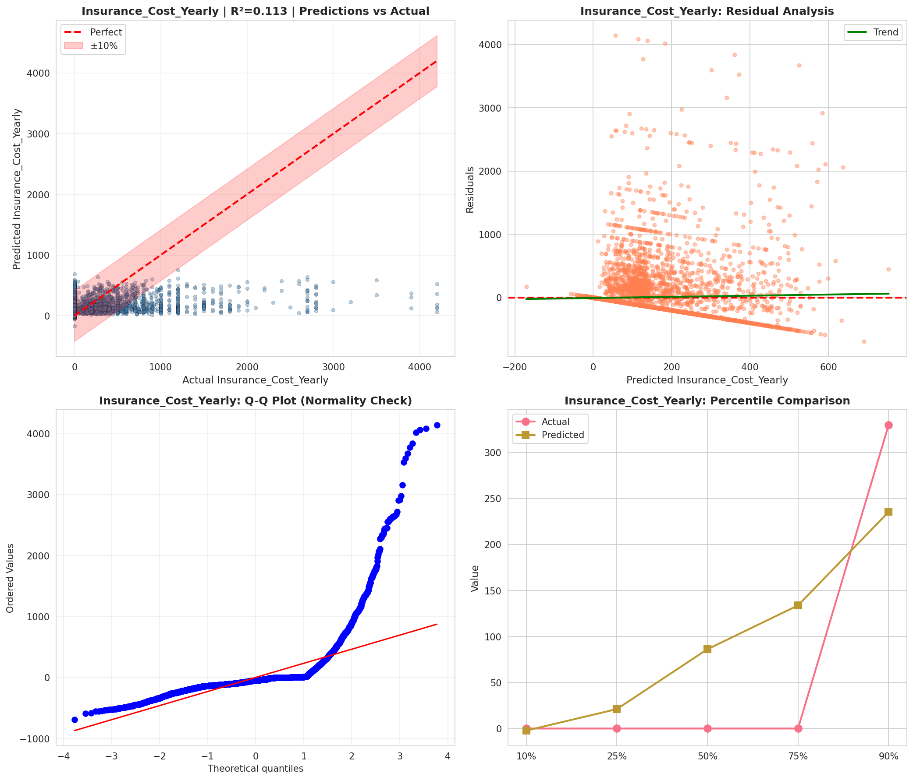
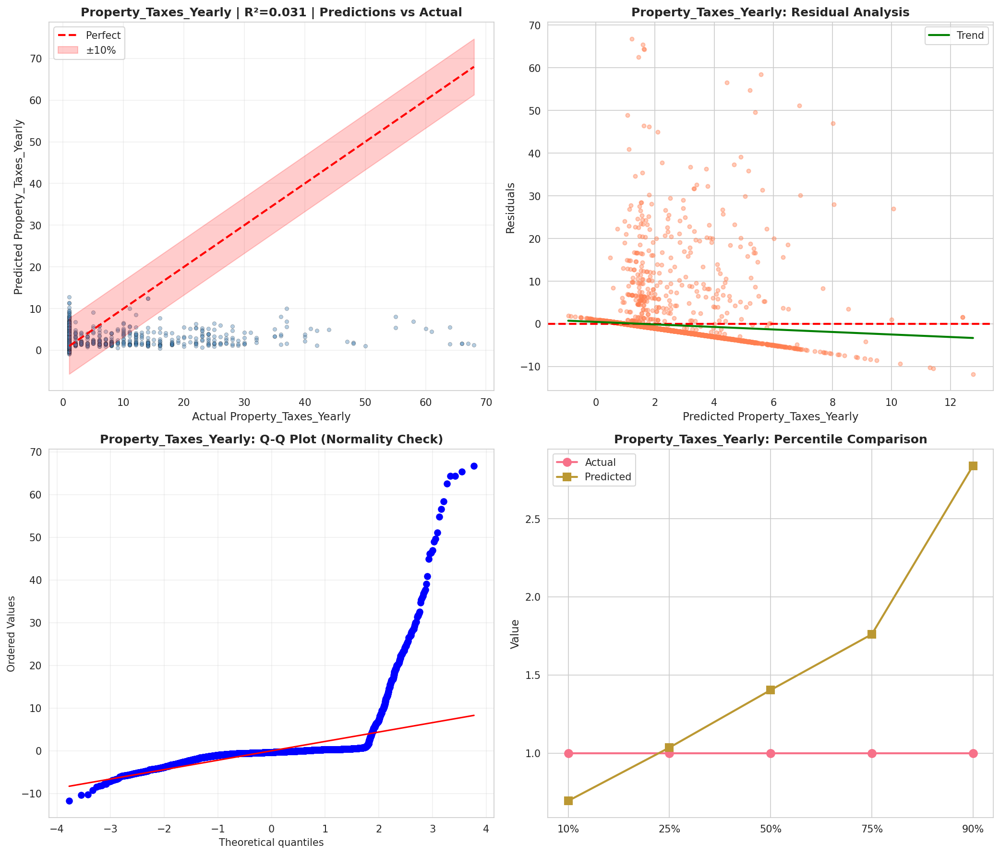
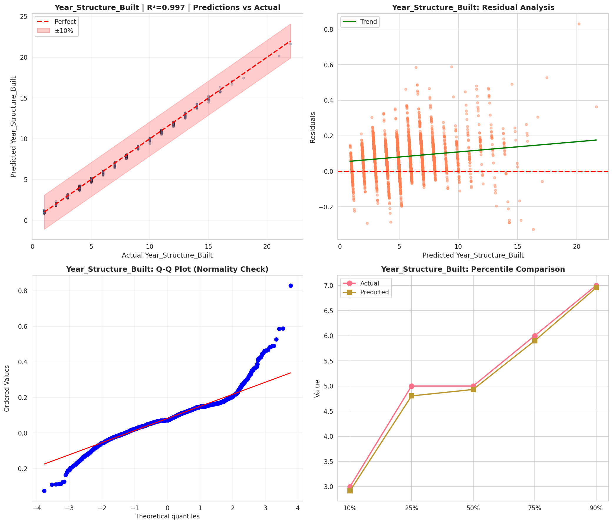
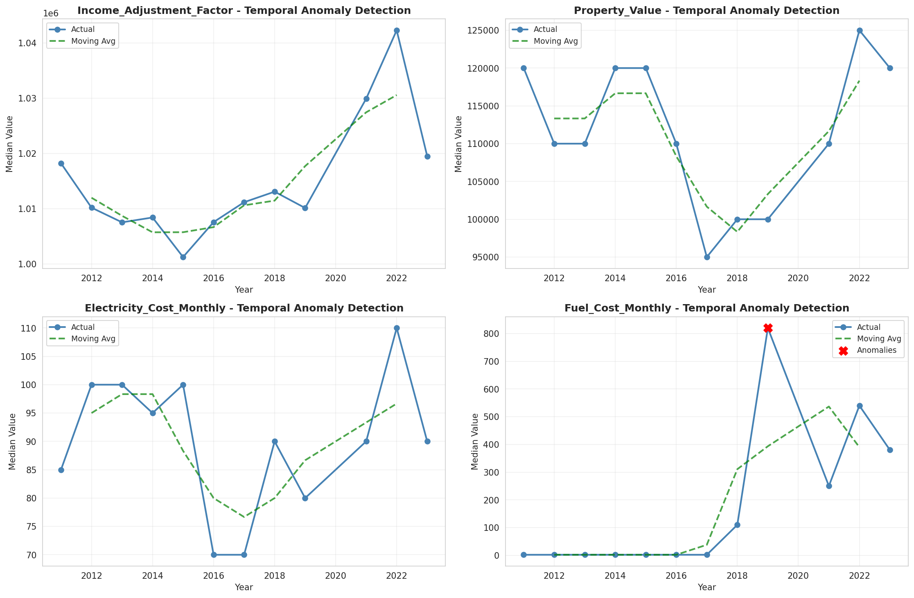

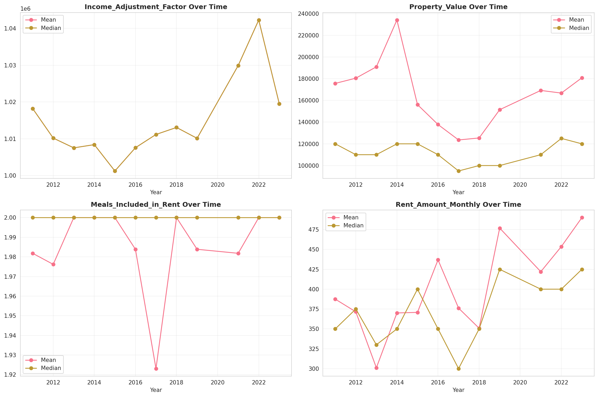
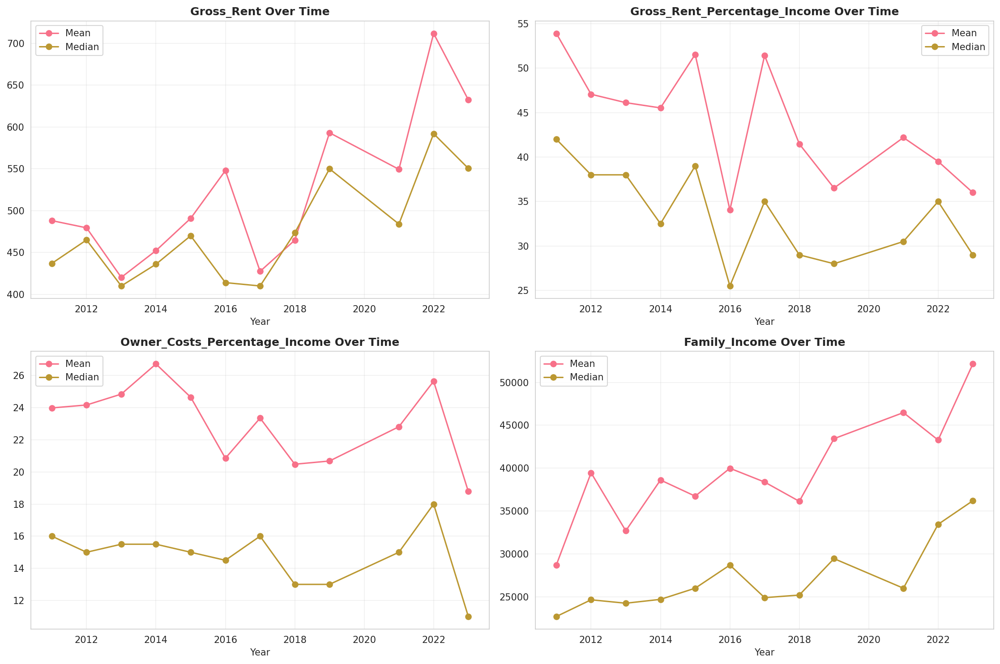
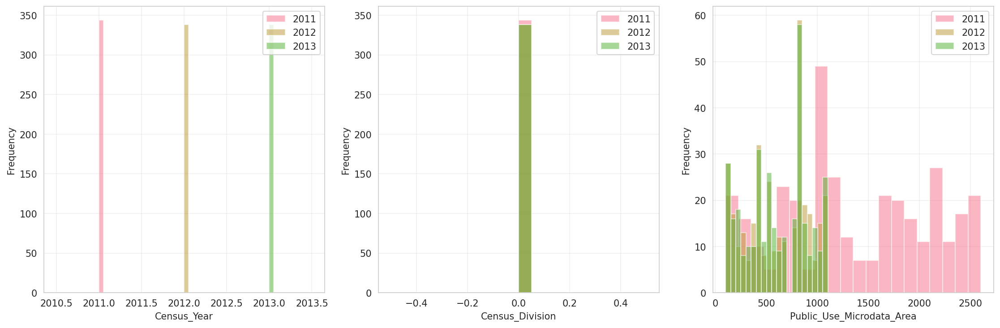
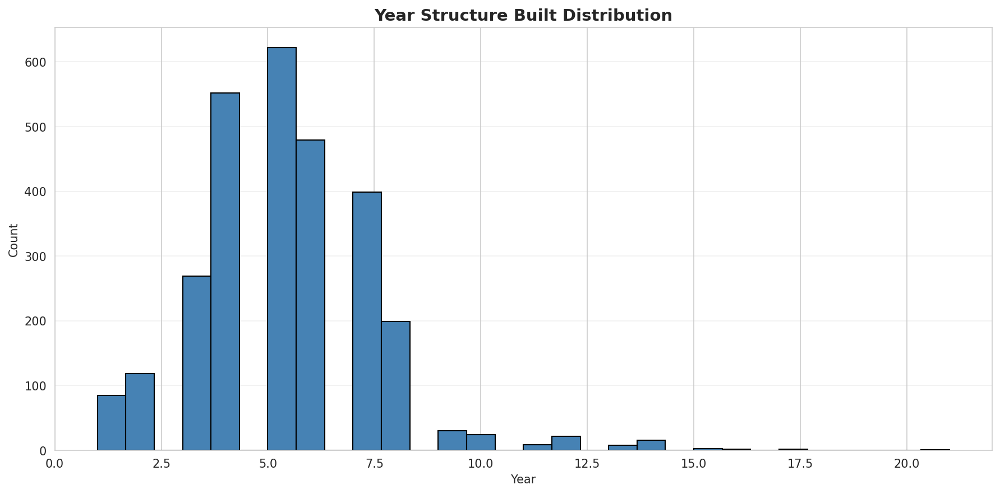
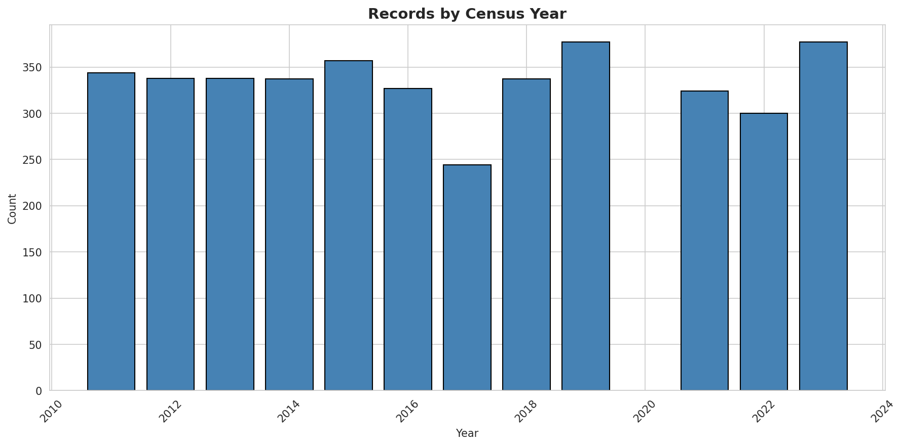
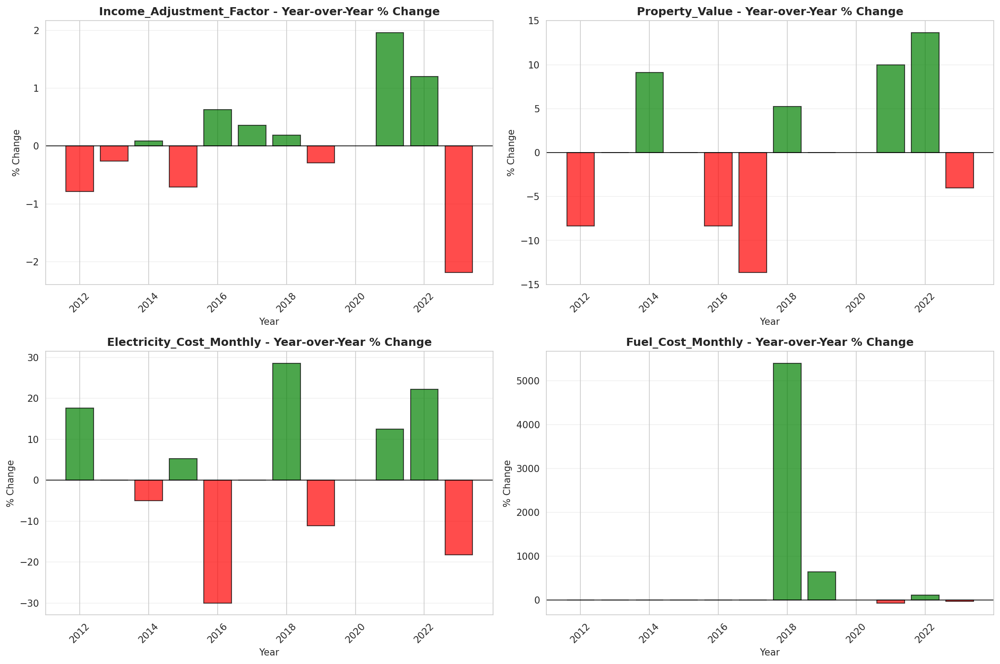
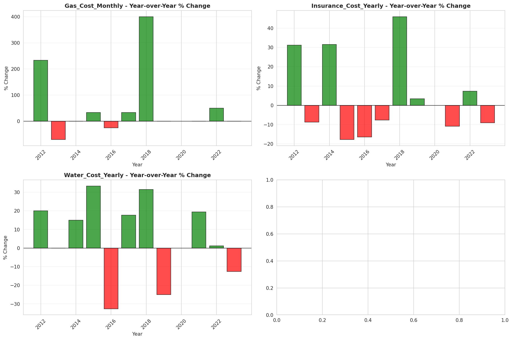
