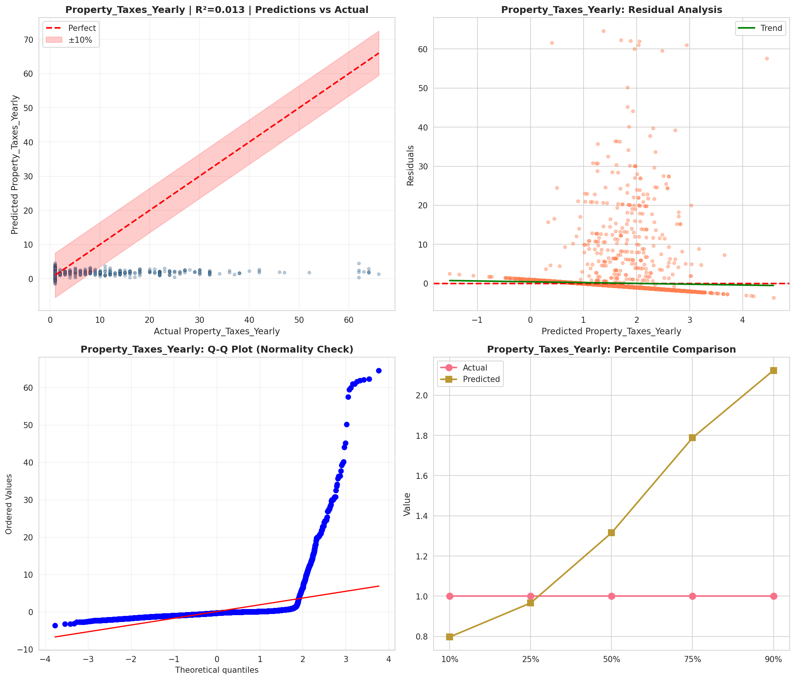
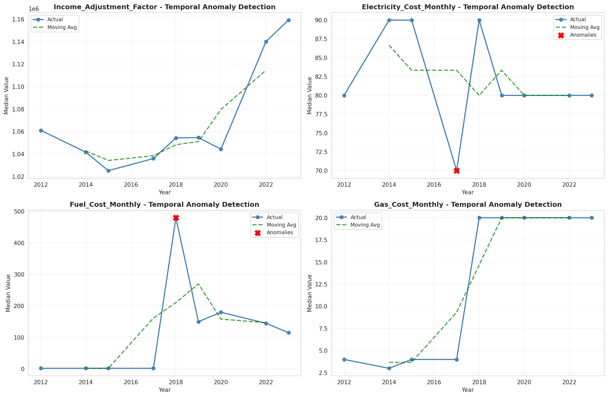
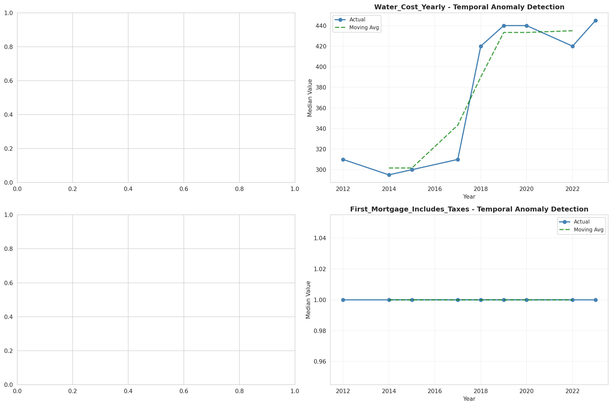
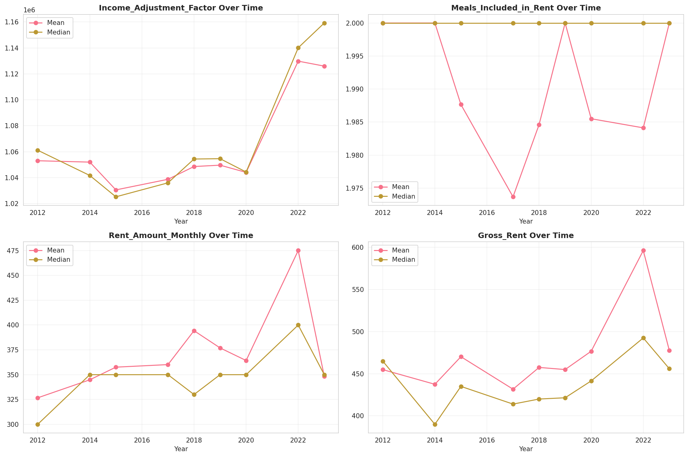
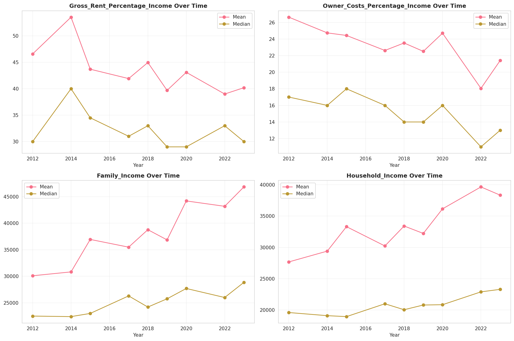
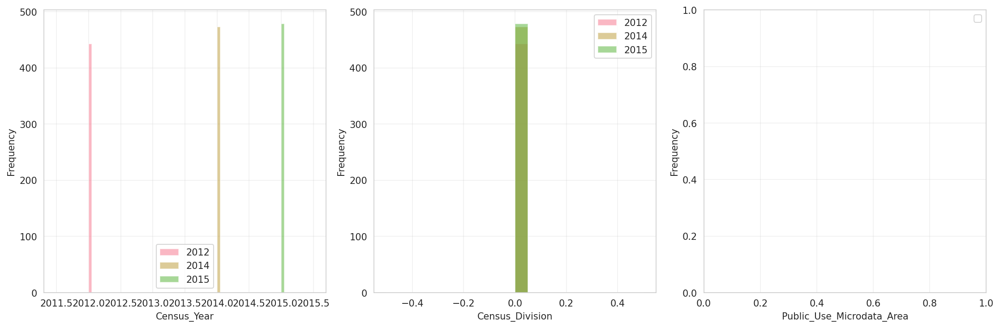
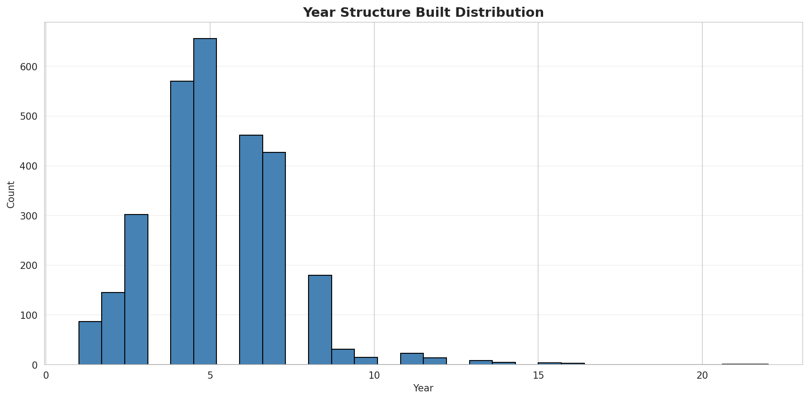
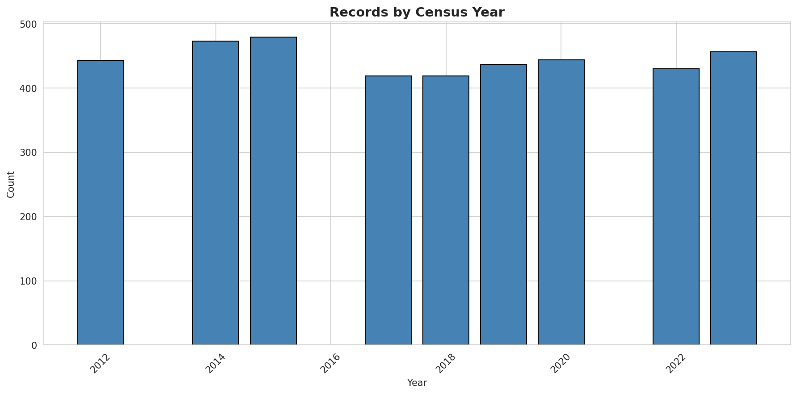
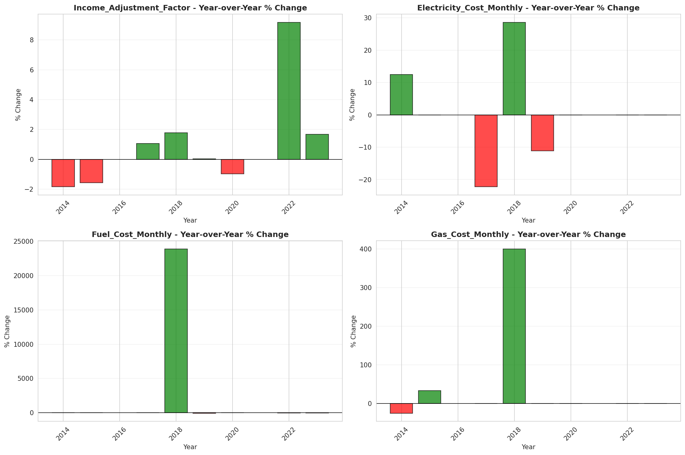
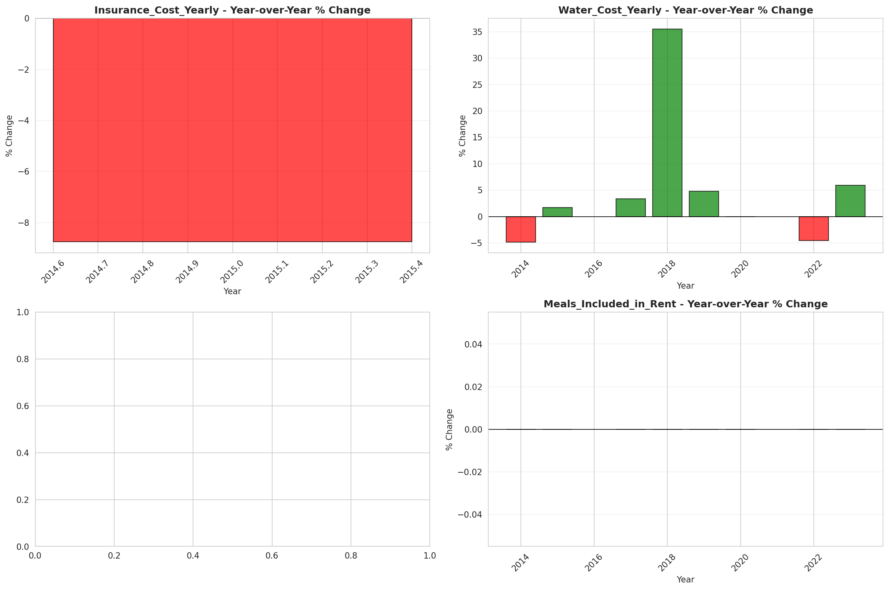

# Temporal Analysis

## Year Distribution

- 2012: 79,776 records

- 2014: 83,236 records

- 2015: 83,116 records

- 2017: 78,198 records

- 2018: 77,890 records

- 2019: 77,714 records

- 2020: 74,099 records

- 2022: 78,621 records

- 2023: 79,064 records

## Temporal Trends

- Census_Year: {np.int64(2012): {'mean': 2012.0, 'median': 2012.0, 'std': 0.0}, np.int64(2014): {'mean': 2014.0, 'median': 2014.0, 'std': 0.0}, np.int64(2015): {'mean': 2015.0, 'median': 2015.0, 'std': 0.0}, np.int64(2017): {'mean': 2017.0, 'median': 2017.0, 'std': 0.0}, np.int64(2018): {'mean': 2018.0, 'median': 2018.0, 'std': 0.0}, np.int64(2019): {'mean': 2019.0, 'median': 2019.0, 'std': 0.0}, np.int64(2020): {'mean': 2020.0, 'median': 2020.0, 'std': 0.0}, np.int64(2022): {'mean': 2022.0, 'median': 2022.0, 'std': 0.0}, np.int64(2023): {'mean': 2023.0, 'median': 2023.0, 'std': 0.0}}

- Census_Division: {np.int64(2012): {'mean': 0.0, 'median': 0.0, 'std': 0.0}, np.int64(2014): {'mean': 0.0, 'median': 0.0, 'std': 0.0}, np.int64(2015): {'mean': 0.0, 'median': 0.0, 'std': 0.0}, np.int64(2017): {'mean': 0.0, 'median': 0.0, 'std': 0.0}, np.int64(2018): {'mean': 0.0, 'median': 0.0, 'std': 0.0}, np.int64(2019): {'mean': 0.0, 'median': 0.0, 'std': 0.0}, np.int64(2020): {'mean': 0.0, 'median': 0.0, 'std': 0.0}, np.int64(2022): {'mean': 0.0, 'median': 0.0, 'std': 0.0}, np.int64(2023): {'mean': 0.0, 'median': 0.0, 'std': 0.0}}

- Public_Use_Microdata_Area: {np.int64(2012): {'mean': None, 'median': None, 'std': None}, np.int64(2014): {'mean': None, 'median': None, 'std': None}, np.int64(2015): {'mean': None, 'median': None, 'std': None}, np.int64(2017): {'mean': 616.4010460625591, 'median': 602.0, 'std': 299.3126238604642}, np.int64(2018): {'mean': 615.2060213121068, 'median': 602.0, 'std': 299.64618136572585}, np.int64(2019): {'mean': 614.3081298093008, 'median': 602.0, 'std': 299.45187345788446}, np.int64(2020): {'mean': 613.6895234753506, 'median': 602.0, 'std': 299.37814789146563}, np.int64(2022): {'mean': None, 'median': None, 'std': None}, np.int64(2023): {'mean': 1149.7216179297784, 'median': 1102.0, 'std': 611.0136671452035}}

- Census_Region: {np.int64(2012): {'mean': 9.0, 'median': 9.0, 'std': 0.0}, np.int64(2014): {'mean': 9.0, 'median': 9.0, 'std': 0.0}, np.int64(2015): {'mean': 9.0, 'median': 9.0, 'std': 0.0}, np.int64(2017): {'mean': 9.0, 'median': 9.0, 'std': 0.0}, np.int64(2018): {'mean': 9.0, 'median': 9.0, 'std': 0.0}, np.int64(2019): {'mean': 9.0, 'median': 9.0, 'std': 0.0}, np.int64(2020): {'mean': 9.0, 'median': 9.0, 'std': 0.0}, np.int64(2022): {'mean': 9.0, 'median': 9.0, 'std': 0.0}, np.int64(2023): {'mean': 9.0, 'median': 9.0, 'std': 0.0}}

- State_Code: {np.int64(2012): {'mean': 72.0, 'median': 72.0, 'std': 0.0}, np.int64(2014): {'mean': 72.0, 'median': 72.0, 'std': 0.0}, np.int64(2015): {'mean': 72.0, 'median': 72.0, 'std': 0.0}, np.int64(2017): {'mean': 72.0, 'median': 72.0, 'std': 0.0}, np.int64(2018): {'mean': 72.0, 'median': 72.0, 'std': 0.0}, np.int64(2019): {'mean': 72.0, 'median': 72.0, 'std': 0.0}, np.int64(2020): {'mean': 72.0, 'median': 72.0, 'std': 0.0}, np.int64(2022): {'mean': 72.0, 'median': 72.0, 'std': 0.0}, np.int64(2023): {'mean': None, 'median': None, 'std': None}}

- Housing_Adjustment_Factor: {np.int64(2012): {'mean': 1040865.255866426, 'median': 1053092.0, 'std': 27365.043089677638}, np.int64(2014): {'mean': 1037389.4044283724, 'median': 1031130.0, 'std': 29862.778609462053}, np.int64(2015): {'mean': 1021080.8912363444, 'median': 1017534.0, 'std': 20301.20592623603}, np.int64(2017): {'mean': 1030967.9133098033, 'median': 1034680.0, 'std': 17034.04249326895}, np.int64(2018): {'mean': 1039403.5329952497, 'median': 1046406.0, 'std': 23751.961801565187}, np.int64(2019): {'mean': 1041223.9748050545, 'median': 1042936.0, 'std': 29962.28501542275}, np.int64(2020): {'mean': 1036086.3365632464, 'median': 1030827.0, 'std': 28680.879877594954}, np.int64(2022): {'mean': 1104075.3052873914, 'median': 1133141.0, 'std': 62301.435209766954}, np.int64(2023): {'mean': 1104194.357343418, 'median': 1125501.0, 'std': 76816.89033966314}}

- Income_Adjustment_Factor: {np.int64(2012): {'mean': 1052134.5381944445, 'median': 1061121.0, 'std': 26285.914473036315}, np.int64(2014): {'mean': 1048224.8239343553, 'median': 1041654.0, 'std': 31219.652956510155}, np.int64(2015): {'mean': 1030526.9962823043, 'median': 1025215.0, 'std': 25679.017544063798}, np.int64(2017): {'mean': 1038135.609900509, 'median': 1035988.0, 'std': 16171.703457298772}, np.int64(2018): {'mean': 1047772.7227243548, 'median': 1054346.0, 'std': 20770.374757843045}, np.int64(2019): {'mean': 1049961.2291350337, 'median': 1054606.0, 'std': 26876.71070104107}, np.int64(2020): {'mean': 1046134.624178464, 'median': 1044328.0, 'std': 29066.83093724807}, np.int64(2022): {'mean': 1126587.8373716946, 'median': 1140108.0, 'std': 50305.19570448686}, np.int64(2023): {'mean': 1128347.6544318527, 'median': 1159185.0, 'std': 70399.02905552459}}

- Housing_Unit_Weight: {np.int64(2012): {'mean': 18.76416466105094, 'median': 18.0, 'std': 9.579431241001299}, np.int64(2014): {'mean': 18.665132875198232, 'median': 17.0, 'std': 10.219242135165771}, np.int64(2015): {'mean': 18.89692718610135, 'median': 17.0, 'std': 10.750549959534721}, np.int64(2017): {'mean': 20.04271208982327, 'median': 18.0, 'std': 11.90149159886415}, np.int64(2018): {'mean': 20.06880215688792, 'median': 18.0, 'std': 11.929184312873888}, np.int64(2019): {'mean': 20.084360604266926, 'median': 18.0, 'std': 11.993017654234496}, np.int64(2020): {'mean': 21.052591802858338, 'median': 19.0, 'std': 13.052081267634616}, np.int64(2022): {'mean': 19.88182546647842, 'median': 18.0, 'std': 12.168809167945547}, np.int64(2023): {'mean': 19.921898714965092, 'median': 18.0, 'std': 12.473961711772915}}

- Number_of_Persons: {np.int64(2012): {'mean': 2.1003434616927397, 'median': 2.0, 'std': 1.583397687499993}, np.int64(2014): {'mean': 2.0085059349320007, 'median': 2.0, 'std': 1.5541176808918873}, np.int64(2015): {'mean': 1.9480605418932577, 'median': 2.0, 'std': 1.5287053710261247}, np.int64(2017): {'mean': 1.8704954090897465, 'median': 2.0, 'std': 1.503603044702417}, np.int64(2018): {'mean': 1.8177686480934652, 'median': 2.0, 'std': 1.4809770844670171}, np.int64(2019): {'mean': 1.7744550531435777, 'median': 2.0, 'std': 1.4627279820789334}, np.int64(2020): {'mean': 1.7407117504959582, 'median': 2.0, 'std': 1.4435554704675415}, np.int64(2022): {'mean': 1.6871064982638226, 'median': 2.0, 'std': 1.3922726190496613}, np.int64(2023): {'mean': 1.6689264393402814, 'median': 1.0, 'std': 1.3637005623895655}}

- Housing_Unit_Type: {np.int64(2012): {'mean': 1.054991476133173, 'median': 1.0, 'std': 0.28243806684085543}, np.int64(2014): {'mean': 1.0627012350425298, 'median': 1.0, 'std': 0.3005324014585805}, np.int64(2015): {'mean': 1.0712738822849992, 'median': 1.0, 'std': 0.31986457011577296}, np.int64(2017): {'mean': 1.0747717332924116, 'median': 1.0, 'std': 0.3318964368173312}, np.int64(2018): {'mean': 1.0732443189112852, 'median': 1.0, 'std': 0.32892892851809474}, np.int64(2019): {'mean': 1.073628947165247, 'median': 1.0, 'std': 0.3325200714768533}, np.int64(2020): {'mean': None, 'median': None, 'std': None}, np.int64(2022): {'mean': None, 'median': None, 'std': None}, np.int64(2023): {'mean': None, 'median': None, 'std': None}}

- Building_Type: {np.int64(2012): {'mean': 2.952861512719287, 'median': 2.0, 'std': 1.860059729455818}, np.int64(2014): {'mean': 2.992096306567503, 'median': 2.0, 'std': 1.887700634926877}, np.int64(2015): {'mean': 3.0026431830023, 'median': 2.0, 'std': 1.895015124930929}, np.int64(2017): {'mean': 2.9964436872067393, 'median': 2.0, 'std': 1.8967424101519859}, np.int64(2018): {'mean': 2.980380991119246, 'median': 2.0, 'std': 1.8871496431697958}, np.int64(2019): {'mean': 2.967380971780874, 'median': 2.0, 'std': 1.884094992277328}, np.int64(2020): {'mean': 2.9615884023229597, 'median': 2.0, 'std': 1.8832940695257654}, np.int64(2022): {'mean': 2.951866207100036, 'median': 2.0, 'std': 1.8795801790105147}, np.int64(2023): {'mean': 2.9635981189458596, 'median': 2.0, 'std': 1.8924784098094398}}

- Year_Structure_Built: {np.int64(2012): {'mean': 5.113963763758529, 'median': 5.0, 'std': 1.8621825239928047}, np.int64(2014): {'mean': 5.259057103239632, 'median': 5.0, 'std': 2.019397911348089}, np.int64(2015): {'mean': 5.2981713748363894, 'median': 5.0, 'std': 2.080875424225249}, np.int64(2017): {'mean': 5.345029951455654, 'median': 5.0, 'std': 2.1559889359286766}, np.int64(2018): {'mean': 5.35683004542065, 'median': 5.0, 'std': 2.1966743595845637}, np.int64(2019): {'mean': 5.372810233846655, 'median': 5.0, 'std': 2.24304506110908}, np.int64(2020): {'mean': 5.384686728593239, 'median': 5.0, 'std': 2.270173823689542}, np.int64(2022): {'mean': None, 'median': None, 'std': None}, np.int64(2023): {'mean': None, 'median': None, 'std': None}}

- Bathtub_or_Shower: {np.int64(2012): {'mean': 1.018575649036576, 'median': 1.0, 'std': 0.13502160055788748}, np.int64(2014): {'mean': 1.0168788604563217, 'median': 1.0, 'std': 0.12881837487355377}, np.int64(2015): {'mean': 1.0166850927020192, 'median': 1.0, 'std': 0.12808945653781717}, np.int64(2017): {'mean': 1.017808608170054, 'median': 1.0, 'std': 0.13225618386156507}, np.int64(2018): {'mean': 1.019524100061013, 'median': 1.0, 'std': 0.13835884188810918}, np.int64(2019): {'mean': 1.0212933539748499, 'median': 1.0, 'std': 0.14436145628433017}, np.int64(2020): {'mean': 1.0223449338641326, 'median': 1.0, 'std': 0.14780375336955176}, np.int64(2022): {'mean': 1.0224776363611978, 'median': 1.0, 'std': 0.14823186874288743}, np.int64(2023): {'mean': 1.0220930076769517, 'median': 1.0, 'std': 0.14698706116968113}}

- Refrigerator: {np.int64(2012): {'mean': 1.0944338414076185, 'median': 1.0, 'std': 0.29243325547183774}, np.int64(2014): {'mean': 1.1026597756208245, 'median': 1.0, 'std': 0.303515909532945}, np.int64(2015): {'mean': 1.1069218354872734, 'median': 1.0, 'std': 0.3090158087263923}, np.int64(2017): {'mean': 1.1134504347355754, 'median': 1.0, 'std': 0.31714475189985875}, np.int64(2018): {'mean': 1.1198969561385668, 'median': 1.0, 'std': 0.32484320336442557}, np.int64(2019): {'mean': 1.1250848746571065, 'median': 1.0, 'std': 0.33081737406029843}, np.int64(2020): {'mean': 1.1268353238303155, 'median': 1.0, 'std': 0.3327907822101905}, np.int64(2022): {'mean': 1.1233990048683664, 'median': 1.0, 'std': 0.3288968549979105}, np.int64(2023): {'mean': 1.1154490279880491, 'median': 1.0, 'std': 0.31956520169739316}}

- Hot_and_Cold_Running_Water: {np.int64(2012): {'mean': 1.235862375486941, 'median': 1.0, 'std': 0.4245393637507598}, np.int64(2014): {'mean': 4.314962813563595, 'median': 2.0, 'std': 3.810702418933783}, np.int64(2015): {'mean': 5.89104494681865, 'median': 9.0, 'std': 3.8133986939632667}, np.int64(2017): {'mean': 9.0, 'median': 9.0, 'std': 0.0}, np.int64(2018): {'mean': 9.0, 'median': 9.0, 'std': 0.0}, np.int64(2019): {'mean': 9.0, 'median': 9.0, 'std': 0.0}, np.int64(2020): {'mean': 9.0, 'median': 9.0, 'std': 0.0}, np.int64(2022): {'mean': 9.0, 'median': 9.0, 'std': 0.0}, np.int64(2023): {'mean': 9.0, 'median': 9.0, 'std': 0.0}}

- Running_Water: {np.int64(2012): {'mean': None, 'median': None, 'std': None}, np.int64(2014): {'mean': 5.846766670868524, 'median': 9.0, 'std': 3.893651897629505}, np.int64(2015): {'mean': 4.232193460663591, 'median': 1.0, 'std': 3.90028353770111}, np.int64(2017): {'mean': 1.0511541113950753, 'median': 1.0, 'std': 0.2203134689903668}, np.int64(2018): {'mean': 1.054220052877771, 'median': 1.0, 'std': 0.22645293999253635}, np.int64(2019): {'mean': 1.058298704473234, 'median': 1.0, 'std': 0.23430900767708612}, np.int64(2020): {'mean': 1.0594438023486437, 'median': 1.0, 'std': 0.2364551426679087}, np.int64(2022): {'mean': 1.0571999517186808, 'median': 1.0, 'std': 0.23222583944835828}, np.int64(2023): {'mean': 1.0548774769222524, 'median': 1.0, 'std': 0.22774247374789314}}

- Sink_with_Faucet: {np.int64(2012): {'mean': 1.026811158461659, 'median': 1.0, 'std': 0.16153223001327208}, np.int64(2014): {'mean': 1.0262700113450145, 'median': 1.0, 'std': 0.15993817650032036}, np.int64(2015): {'mean': 1.0265970289606445, 'median': 1.0, 'std': 0.16090356121164628}, np.int64(2017): {'mean': 1.0283152813273295, 'median': 1.0, 'std': 0.16587313892375202}, np.int64(2018): {'mean': 1.0312521185004406, 'median': 1.0, 'std': 0.17399952322241932}, np.int64(2019): {'mean': 1.0348461392215975, 'median': 1.0, 'std': 0.1833912280571585}, np.int64(2020): {'mean': 1.0367564173908081, 'median': 1.0, 'std': 0.18816452474040807}, np.int64(2022): {'mean': 1.0396175046604885, 'median': 1.0, 'std': 0.19506016577236485}, np.int64(2023): {'mean': 1.0383311673521884, 'median': 1.0, 'std': 0.19199578859244026}}

- Stove_or_Range: {np.int64(2012): {'mean': 1.094891369709012, 'median': 1.0, 'std': 0.29306675078152594}, np.int64(2014): {'mean': 1.1039455439304173, 'median': 1.0, 'std': 0.30519181171209664}, np.int64(2015): {'mean': 1.107849491060196, 'median': 1.0, 'std': 0.31019220018303234}, np.int64(2017): {'mean': 1.1143428934593593, 'median': 1.0, 'std': 0.31822942283436195}, np.int64(2018): {'mean': 1.1198698393329265, 'median': 1.0, 'std': 0.32481147054330295}, np.int64(2019): {'mean': 1.1249762350960102, 'median': 1.0, 'std': 0.33069421047525327}, np.int64(2020): {'mean': 1.1263644535764736, 'median': 1.0, 'std': 0.3322620256605502}, np.int64(2022): {'mean': 1.123305124525569, 'median': 1.0, 'std': 0.3287893255634807}, np.int64(2023): {'mean': 1.116400273315559, 'median': 1.0, 'std': 0.32070645096219885}}

- Telephone_Service: {np.int64(2012): {'mean': 1.0676604606736295, 'median': 1.0, 'std': 0.25116430982409005}, np.int64(2014): {'mean': 1.0612714087332202, 'median': 1.0, 'std': 0.23982933659849345}, np.int64(2015): {'mean': 1.057946602858762, 'median': 1.0, 'std': 0.23364428824749078}, np.int64(2017): {'mean': 1.0500870634026427, 'median': 1.0, 'std': 0.2181264810112806}, np.int64(2018): {'mean': 1.0467969183786785, 'median': 1.0, 'std': 0.21120544694414686}, np.int64(2019): {'mean': 1.042395634091986, 'median': 1.0, 'std': 0.2014918279405044}, np.int64(2020): {'mean': 1.0392356924218533, 'median': 1.0, 'std': 0.1941570297054082}, np.int64(2022): {'mean': 1.0323443537248458, 'median': 1.0, 'std': 0.1769145096268308}, np.int64(2023): {'mean': 1.0281778117083666, 'median': 1.0, 'std': 0.1654820164763095}}

- Lot_Acreage: {np.int64(2012): {'mean': 1.0586976804040793, 'median': 1.0, 'std': 0.2597046551559756}, np.int64(2014): {'mean': 1.0543639169737629, 'median': 1.0, 'std': 0.2504334481616784}, np.int64(2015): {'mean': 1.0527809669600714, 'median': 1.0, 'std': 0.2455547938617318}, np.int64(2017): {'mean': 1.0517877076074824, 'median': 1.0, 'std': 0.24397781895180534}, np.int64(2018): {'mean': 1.049930932246218, 'median': 1.0, 'std': 0.24030903594306782}, np.int64(2019): {'mean': 1.0480833780880774, 'median': 1.0, 'std': 0.23630937653911355}, np.int64(2020): {'mean': 1.0459519369480315, 'median': 1.0, 'std': 0.23126187736528506}, np.int64(2022): {'mean': 1.0475235150957047, 'median': 1.0, 'std': 0.23410152299675913}, np.int64(2023): {'mean': 1.0512111637704056, 'median': 1.0, 'std': 0.24226751421687084}}

- Agricultural_Sales: {np.int64(2012): {'mean': 1.1937901498929335, 'median': 1.0, 'std': 0.7799184196959222}, np.int64(2014): {'mean': 1.167680608365019, 'median': 1.0, 'std': 0.7403629232769494}, np.int64(2015): {'mean': 1.1640190627482128, 'median': 1.0, 'std': 0.7375668227836107}, np.int64(2017): {'mean': 1.1348556656613529, 'median': 1.0, 'std': 0.6554776412741656}, np.int64(2018): {'mean': 1.1339005821764443, 'median': 1.0, 'std': 0.6437470555068}, np.int64(2019): {'mean': 1.104868913857678, 'median': 1.0, 'std': 0.5595704957528054}, np.int64(2020): {'mean': 1.1202046035805626, 'median': 1.0, 'std': 0.599706478084046}, np.int64(2022): {'mean': 1.132991133924405, 'median': 1.0, 'std': 0.640632247386864}, np.int64(2023): {'mean': 1.1365619546247818, 'median': 1.0, 'std': 0.6474123721868489}}

- Business_On_Property: {np.int64(2012): {'mean': 1.9828041051378567, 'median': 2.0, 'std': 0.13000179968885697}, np.int64(2014): {'mean': 1.98470817978519, 'median': 2.0, 'std': 0.1227119293063304}, np.int64(2015): {'mean': 1.985042735042735, 'median': 2.0, 'std': 0.12138278348191184}, np.int64(2017): {'mean': 4.54048980144099, 'median': 2.0, 'std': 3.376833317530215}, np.int64(2018): {'mean': 6.035460395539234, 'median': 9.0, 'std': 3.4657944060249317}, np.int64(2019): {'mean': 7.517001208378088, 'median': 9.0, 'std': 2.8648714352008517}, np.int64(2020): {'mean': None, 'median': None, 'std': None}, np.int64(2022): {'mean': None, 'median': None, 'std': None}, np.int64(2023): {'mean': None, 'median': None, 'std': None}}

- Tenure: {np.int64(2012): {'mean': 2.11144167984592, 'median': 2.0, 'std': 0.9107202535545773}, np.int64(2014): {'mean': 2.130057089955254, 'median': 2.0, 'std': 0.9271539174901803}, np.int64(2015): {'mean': 2.1342484730180717, 'median': 2.0, 'std': 0.9301192136090219}, np.int64(2017): {'mean': 2.1456860937553346, 'median': 2.0, 'std': 0.9353581330980487}, np.int64(2018): {'mean': 2.1554518323153804, 'median': 2.0, 'std': 0.9380371582354156}, np.int64(2019): {'mean': 2.1561233263726813, 'median': 2.0, 'std': 0.9352194194209458}, np.int64(2020): {'mean': 2.1611353306743344, 'median': 2.0, 'std': 0.9363497546185526}, np.int64(2022): {'mean': 2.161302166197528, 'median': 2.0, 'std': 0.9225348032598979}, np.int64(2023): {'mean': 2.154977964396016, 'median': 2.0, 'std': 0.9156061268522302}}

- Vacancy_Status: {np.int64(2012): {'mean': 5.356074396517609, 'median': 7.0, 'std': 2.047810316599385}, np.int64(2014): {'mean': 5.321487603305785, 'median': 7.0, 'std': 2.0766577628148037}, np.int64(2015): {'mean': 5.313270485859318, 'median': 7.0, 'std': 2.0996304340523646}, np.int64(2017): {'mean': 5.4111869918699185, 'median': 7.0, 'std': 2.073428878326232}, np.int64(2018): {'mean': 5.51479253240712, 'median': 7.0, 'std': 2.0413663688430597}, np.int64(2019): {'mean': 5.636898684763678, 'median': 7.0, 'std': 1.9816074623950883}, np.int64(2020): {'mean': 5.7272839658795895, 'median': 7.0, 'std': 1.9296327443645709}, np.int64(2022): {'mean': 5.885868939306691, 'median': 7.0, 'std': 1.81610341913862}, np.int64(2023): {'mean': 5.895207291972949, 'median': 7.0, 'std': 1.780525010430166}}

- Vehicles_Available: {np.int64(2012): {'mean': 1.2874434336000502, 'median': 1.0, 'std': 0.9730514447727766}, np.int64(2014): {'mean': 1.3117574448387594, 'median': 1.0, 'std': 0.9687357707922768}, np.int64(2015): {'mean': 1.3218626031106353, 'median': 1.0, 'std': 0.9691590154604319}, np.int64(2017): {'mean': 1.3626446788896855, 'median': 1.0, 'std': 0.9893274404581572}, np.int64(2018): {'mean': 1.3794419766796224, 'median': 1.0, 'std': 0.9979100756035054}, np.int64(2019): {'mean': 1.3990032814501554, 'median': 1.0, 'std': 1.0080351678195845}, np.int64(2020): {'mean': 1.4271588906409425, 'median': 1.0, 'std': 1.0153379921007266}, np.int64(2022): {'mean': 1.4828574925258318, 'median': 1.0, 'std': 1.0336025252544}, np.int64(2023): {'mean': 1.5051185064371726, 'median': 1.0, 'std': 1.0399928029148586}}

- Condo_Fee_Monthly: {np.int64(2012): {'mean': 154.82420749279538, 'median': 110.0, 'std': 167.58137573180812}, np.int64(2014): {'mean': 162.28982857142856, 'median': 110.0, 'std': 176.52723261297217}, np.int64(2015): {'mean': 165.07267095544435, 'median': 120.0, 'std': 177.0242202513954}, np.int64(2017): {'mean': 173.25147137506687, 'median': 120.0, 'std': 181.53288190715082}, np.int64(2018): {'mean': 175.35657596371883, 'median': 120.0, 'std': 181.42736791663307}, np.int64(2019): {'mean': 174.77725397760753, 'median': 130.0, 'std': 176.77820212080857}, np.int64(2020): {'mean': 177.41421036301583, 'median': 130.0, 'std': 182.44216623079103}, np.int64(2022): {'mean': 187.8297629248786, 'median': 130.0, 'std': 226.37055496224576}, np.int64(2023): {'mean': 192.4226475279107, 'median': 130.0, 'std': 228.83583156173097}}

- Electricity_Cost_Monthly: {np.int64(2012): {'mean': 115.56007390820976, 'median': 90.0, 'std': 91.1676774670993}, np.int64(2014): {'mean': 118.11217404721494, 'median': 90.0, 'std': 92.3938978400523}, np.int64(2015): {'mean': 116.69132926138153, 'median': 90.0, 'std': 91.86464640717259}, np.int64(2017): {'mean': 107.08233466489125, 'median': 80.0, 'std': 86.69008891518375}, np.int64(2018): {'mean': 107.92477852252512, 'median': 80.0, 'std': 85.61172173069754}, np.int64(2019): {'mean': 103.00145269656801, 'median': 80.0, 'std': 83.12419462841329}, np.int64(2020): {'mean': 102.36912803193123, 'median': 80.0, 'std': 83.4534842483081}, np.int64(2022): {'mean': 116.09616427461046, 'median': 80.0, 'std': 133.4249555628297}, np.int64(2023): {'mean': 122.86528859060402, 'median': 90.0, 'std': 164.17776143195096}}

- Fuel_Cost_Monthly: {np.int64(2012): {'mean': 9.898955576781548, 'median': 2.0, 'std': 91.77082316071339}, np.int64(2014): {'mean': 8.86517512729517, 'median': 2.0, 'std': 81.23420406160677}, np.int64(2015): {'mean': 8.976465587809331, 'median': 2.0, 'std': 84.83829773937555}, np.int64(2017): {'mean': 9.483696951073782, 'median': 2.0, 'std': 105.66378792103818}, np.int64(2018): {'mean': 473.3626991565136, 'median': 200.0, 'std': 762.9030455315161}, np.int64(2019): {'mean': 472.307240704501, 'median': 200.0, 'std': 761.8982245229762}, np.int64(2020): {'mean': 499.0135841170324, 'median': 200.0, 'std': 840.0338287814889}, np.int64(2022): {'mean': 488.50635386119257, 'median': 240.0, 'std': 727.9191086087716}, np.int64(2023): {'mean': 454.9950738916256, 'median': 230.0, 'std': 649.0895877112173}}

- Gas_Cost_Monthly: {np.int64(2012): {'mean': 20.16469630302366, 'median': 4.0, 'std': 30.116365749514795}, np.int64(2014): {'mean': 19.19484647430952, 'median': 3.0, 'std': 29.061522738059455}, np.int64(2015): {'mean': 19.280838738114728, 'median': 3.0, 'std': 29.32594228877664}, np.int64(2017): {'mean': 19.474393116869816, 'median': 4.0, 'std': 30.791452179419256}, np.int64(2018): {'mean': 36.09049310203524, 'median': 20.0, 'std': 38.039628797577244}, np.int64(2019): {'mean': 35.775758614777985, 'median': 20.0, 'std': 37.67970859267653}, np.int64(2020): {'mean': 35.4207897668068, 'median': 20.0, 'std': 37.47117283706443}, np.int64(2022): {'mean': 38.24135553147473, 'median': 20.0, 'std': 48.037360549532046}, np.int64(2023): {'mean': 41.78303914544389, 'median': 20.0, 'std': 57.496497378301775}}

- House_Heating_Fuel: {np.int64(2012): {'mean': 7.587257097223745, 'median': 9.0, 'std': 2.557893477960279}, np.int64(2014): {'mean': 7.641799105076377, 'median': 9.0, 'std': 2.523494704691977}, np.int64(2015): {'mean': 7.6930766324538755, 'median': 9.0, 'std': 2.4893991989669604}, np.int64(2017): {'mean': 7.789630919457817, 'median': 9.0, 'std': 2.4237650825420354}, np.int64(2018): {'mean': 7.830909911160466, 'median': 9.0, 'std': 2.3926237667579566}, np.int64(2019): {'mean': 7.8425956797164265, 'median': 9.0, 'std': 2.3844145969874937}, np.int64(2020): {'mean': 7.869195807439013, 'median': 9.0, 'std': 2.3624551506414164}, np.int64(2022): {'mean': 7.936937251953774, 'median': 9.0, 'std': 2.300337079550382}, np.int64(2023): {'mean': 7.888746226185932, 'median': 9.0, 'std': 2.3366214458947407}}

- Insurance_Cost_Yearly: {np.int64(2014): {'mean': 569.9693557582668, 'median': 400.0, 'std': 571.1237365821536}, np.int64(2015): {'mean': 560.2106308991555, 'median': 400.0, 'std': 565.0659889014431}}

- Water_Cost_Yearly: {np.int64(2012): {'mean': 401.7794654181607, 'median': 300.0, 'std': 401.855982984681}, np.int64(2014): {'mean': 422.2391606233606, 'median': 300.0, 'std': 423.83271921871585}, np.int64(2015): {'mean': 446.9426201120836, 'median': 320.0, 'std': 452.83975047999985}, np.int64(2017): {'mean': 488.0674485301649, 'median': 360.0, 'std': 479.61006524051163}, np.int64(2018): {'mean': 555.1407972218028, 'median': 430.0, 'std': 493.24578249850526}, np.int64(2019): {'mean': 545.9651816155882, 'median': 420.0, 'std': 483.3281470004552}, np.int64(2020): {'mean': 540.8586993667706, 'median': 420.0, 'std': 474.6325800410934}, np.int64(2022): {'mean': 548.8688245958604, 'median': 420.0, 'std': 491.25212019302904}, np.int64(2023): {'mean': 548.2851522985276, 'median': 420.0, 'std': 495.1531565681608}}

- Mobile_Home_Costs_Monthly: {np.int64(2012): {'mean': 203.0909090909091, 'median': 4.0, 'std': 269.31225540084677}, np.int64(2014): {'mean': 2294.625, 'median': 100.0, 'std': 4066.9180284338163}, np.int64(2015): {'mean': 3419.2, 'median': 850.0, 'std': 4318.717665428502}, np.int64(2017): {'mean': 4273.0, 'median': 1600.0, 'std': 4442.65062021912}, np.int64(2018): {'mean': 5778.181818181818, 'median': 8000.0, 'std': 4617.925547649763}, np.int64(2019): {'mean': 3216.0, 'median': 40.0, 'std': 4117.429618908704}, np.int64(2020): {'mean': 20.0, 'median': 20.0, 'std': 0.0}, np.int64(2022): {'mean': 3312.5, 'median': 20.0, 'std': 4544.081708269402}, np.int64(2023): {'mean': 2090.0, 'median': 460.0, 'std': 3642.0429600811854}}

- First_Mortgage_Includes_Insurance: {np.int64(2012): {'mean': 1.1585664022899398, 'median': 1.0, 'std': 0.36528215855973845}, np.int64(2014): {'mean': 1.1512473105774264, 'median': 1.0, 'std': 0.3583001909286397}, np.int64(2015): {'mean': 1.1483695330532047, 'median': 1.0, 'std': 0.35547643124698}, np.int64(2017): {'mean': 1.130859375, 'median': 1.0, 'std': 0.3372574744791635}, np.int64(2018): {'mean': 1.1259169526886061, 'median': 1.0, 'std': 0.3317669080809484}, np.int64(2019): {'mean': 1.1165108605993952, 'median': 1.0, 'std': 0.3208475589208133}, np.int64(2020): {'mean': 1.1060049919248274, 'median': 1.0, 'std': 0.30785530870699546}, np.int64(2022): {'mean': 1.1008672163775945, 'median': 1.0, 'std': 0.3011635241130905}, np.int64(2023): {'mean': 1.0959581684567552, 'median': 1.0, 'std': 0.29454427287932444}}

- First_Mortgage_Payment_Monthly: {np.int64(2012): {'mean': 761.4277535929393, 'median': 620.0, 'std': 572.787110741919}, np.int64(2014): {'mean': 767.2289352794091, 'median': 630.0, 'std': 538.1119950084787}, np.int64(2015): {'mean': 765.1839971592591, 'median': 630.0, 'std': 534.7105333353769}, np.int64(2017): {'mean': 753.0576822916667, 'median': 620.0, 'std': 518.7577024056247}, np.int64(2018): {'mean': 745.5341543845481, 'median': 610.0, 'std': 509.96088861406747}, np.int64(2019): {'mean': 743.7918614242508, 'median': 610.0, 'std': 509.71162924647604}, np.int64(2020): {'mean': 739.5930113052415, 'median': 610.0, 'std': 499.3578144279295}, np.int64(2022): {'mean': 733.3521467159511, 'median': 600.0, 'std': 497.86117158955585}, np.int64(2023): {'mean': 736.4128038439796, 'median': 610.0, 'std': 494.7874693660931}}

- First_Mortgage_Includes_Taxes: {np.int64(2012): {'mean': 1.4583457570517024, 'median': 1.0, 'std': 0.4982767603652823}, np.int64(2014): {'mean': 1.431819503401756, 'median': 1.0, 'std': 0.49534400957231417}, np.int64(2015): {'mean': 1.4139788128070072, 'median': 1.0, 'std': 0.49255935053856403}, np.int64(2017): {'mean': 1.376171875, 'median': 1.0, 'std': 0.4844397529382129}, np.int64(2018): {'mean': 1.3634161114476075, 'median': 1.0, 'std': 0.4809993885412092}, np.int64(2019): {'mean': 1.3498762716524608, 'median': 1.0, 'std': 0.47694706477524107}, np.int64(2020): {'mean': 1.3331375715753928, 'median': 1.0, 'std': 0.47135256429157557}, np.int64(2022): {'mean': 1.304449815183395, 'median': 1.0, 'std': 0.4601903724534084}, np.int64(2023): {'mean': 1.2947286602600339, 'median': 1.0, 'std': 0.4559368005061477}}

- First_Mortgage_Status: {np.int64(2012): {'mean': 2.2880292284547603, 'median': 3.0, 'std': 0.953020022722349}, np.int64(2014): {'mean': 2.2650294525294523, 'median': 3.0, 'std': 0.9591162865412661}, np.int64(2015): {'mean': 2.2602916333244423, 'median': 3.0, 'std': 0.9595827259905434}, np.int64(2017): {'mean': 2.270222501997434, 'median': 3.0, 'std': 0.9555143974177571}, np.int64(2018): {'mean': 2.2816147259851456, 'median': 3.0, 'std': 0.951741484043114}, np.int64(2019): {'mean': 2.291327407186076, 'median': 3.0, 'std': 0.9483350546586851}, np.int64(2020): {'mean': 2.2992304448661183, 'median': 3.0, 'std': 0.945118381725305}, np.int64(2022): {'mean': 2.3217097583389217, 'median': 3.0, 'std': 0.9359537784750686}, np.int64(2023): {'mean': 2.327283889980354, 'median': 3.0, 'std': 0.9330242951173129}}

- Second_Mortgage_Payment_Monthly: {np.int64(2012): {'mean': 495.82851018220794, 'median': 360.0, 'std': 471.57916215838605}, np.int64(2014): {'mean': 533.0840438489647, 'median': 380.0, 'std': 482.8228973910524}, np.int64(2015): {'mean': 534.3351351351351, 'median': 390.0, 'std': 474.73209436068737}, np.int64(2017): {'mean': 523.2918032786886, 'median': 400.0, 'std': 434.1564155927626}, np.int64(2018): {'mean': 522.6666666666666, 'median': 410.0, 'std': 405.30233826300577}, np.int64(2019): {'mean': 500.5319587628866, 'median': 440.0, 'std': 360.1445840129802}, np.int64(2020): {'mean': 521.2798165137615, 'median': 460.0, 'std': 405.8568284517162}, np.int64(2022): {'mean': 517.0730593607306, 'median': 450.0, 'std': 408.2895606790571}, np.int64(2023): {'mean': 520.0607476635514, 'median': 440.0, 'std': 466.92657582796465}}

- Second_Mortgage_Status: {np.int64(2012): {'mean': 2.9167511479515773, 'median': 3.0, 'std': 0.3984243030324874}, np.int64(2014): {'mean': 2.9277781008315404, 'median': 3.0, 'std': 0.3704843966197244}, np.int64(2015): {'mean': 2.9336568621648813, 'median': 3.0, 'std': 0.3552758929870071}, np.int64(2017): {'mean': 2.9404947916666666, 'median': 3.0, 'std': 0.3386676306055983}, np.int64(2018): {'mean': 2.9442761962447004, 'median': 3.0, 'std': 0.3279361391391939}, np.int64(2019): {'mean': 2.951470992576299, 'median': 3.0, 'std': 0.3097528514018805}, np.int64(2020): {'mean': 2.9533416477147676, 'median': 3.0, 'std': 0.3028751062788392}, np.int64(2022): {'mean': 2.9559230605436864, 'median': 3.0, 'std': 0.29180898863116295}, np.int64(2023): {'mean': 2.9574843122047523, 'median': 3.0, 'std': 0.28393787919163577}}

- Property_Taxes_Yearly: {np.int64(2012): {'mean': 3.2018697614442297, 'median': 1.0, 'std': 7.831074565019018}, np.int64(2014): {'mean': 3.2289067914067915, 'median': 1.0, 'std': 7.544964229466414}, np.int64(2015): {'mean': 3.1686449719925314, 'median': 1.0, 'std': 7.245222031330044}, np.int64(2017): {'mean': 3.1644190494637194, 'median': 1.0, 'std': 7.052145732770116}}

- Meals_Included_in_Rent: {np.int64(2012): {'mean': 1.9952837859814605, 'median': 2.0, 'std': 0.06851534908806256}, np.int64(2014): {'mean': 1.9920528817587642, 'median': 2.0, 'std': 0.08879497257745765}, np.int64(2015): {'mean': 1.989507667473769, 'median': 2.0, 'std': 0.10189703291150765}, np.int64(2017): {'mean': 1.9870274572224433, 'median': 2.0, 'std': 0.11316039516547544}, np.int64(2018): {'mean': 1.9880293159609121, 'median': 2.0, 'std': 0.10875821800400588}, np.int64(2019): {'mean': 1.9889788761793437, 'median': 2.0, 'std': 0.10440578899430743}, np.int64(2020): {'mean': 1.9909748905370388, 'median': 2.0, 'std': 0.09457513476889197}, np.int64(2022): {'mean': 1.9925882744836776, 'median': 2.0, 'std': 0.08577531433790604}, np.int64(2023): {'mean': 1.9926312303361484, 'median': 2.0, 'std': 0.08552822078390852}}

- Rent_Amount_Monthly: {np.int64(2012): {'mean': 358.75475687103597, 'median': 330.0, 'std': 277.039222156162}, np.int64(2014): {'mean': 371.4762329174094, 'median': 350.0, 'std': 285.2035819305132}, np.int64(2015): {'mean': 374.48939760804166, 'median': 350.0, 'std': 287.6350381193929}, np.int64(2017): {'mean': 385.33720652606445, 'median': 350.0, 'std': 290.1928658934751}, np.int64(2018): {'mean': 389.3661237785016, 'median': 350.0, 'std': 288.62862825480846}, np.int64(2019): {'mean': 396.691825999833, 'median': 350.0, 'std': 297.5635103854412}, np.int64(2020): {'mean': 407.7551603967474, 'median': 350.0, 'std': 306.8166538554646}, np.int64(2022): {'mean': 425.6427381745503, 'median': 380.0, 'std': 336.3938893377427}, np.int64(2023): {'mean': 446.97913561847986, 'median': 400.0, 'std': 373.4771099705482}}

- Gross_Rent: {np.int64(2012): {'mean': 466.23858998144715, 'median': 422.0, 'std': 314.04675385916397}, np.int64(2014): {'mean': 478.99836797801066, 'median': 437.0, 'std': 326.55696044093247}, np.int64(2015): {'mean': 479.9116510689448, 'median': 439.0, 'std': 329.1616769770255}, np.int64(2017): {'mean': 487.640015015015, 'median': 444.0, 'std': 329.13114023204474}, np.int64(2018): {'mean': 495.1098922247883, 'median': 450.0, 'std': 328.5699074075478}, np.int64(2019): {'mean': 498.9122171059077, 'median': 453.0, 'std': 331.22452535848595}, np.int64(2020): {'mean': 513.3771993753254, 'median': 462.0, 'std': 341.28400491724767}, np.int64(2022): {'mean': 547.7270918222306, 'median': 489.0, 'std': 380.5734781772508}, np.int64(2023): {'mean': 574.4478670773826, 'median': 500.0, 'std': 421.9331499225025}}

- Gross_Rent_Percentage_Income: {np.int64(2012): {'mean': 44.79761410788382, 'median': 34.0, 'std': 30.63686854081852}, np.int64(2014): {'mean': 44.35460027232056, 'median': 33.0, 'std': 30.417029986502655}, np.int64(2015): {'mean': 44.84055560989925, 'median': 34.0, 'std': 30.57775067588215}, np.int64(2017): {'mean': 44.10414463945866, 'median': 33.0, 'std': 30.525308878581832}, np.int64(2018): {'mean': 43.86130359462971, 'median': 33.0, 'std': 30.477014921718965}, np.int64(2019): {'mean': 43.321676778819636, 'median': 32.0, 'std': 30.3899196893287}, np.int64(2020): {'mean': 42.29905451149761, 'median': 31.0, 'std': 29.92442387634645}, np.int64(2022): {'mean': 41.99840612049729, 'median': 31.0, 'std': 29.67805820464473}, np.int64(2023): {'mean': 41.449874947894955, 'median': 31.0, 'std': 29.512857250353136}}

- Selected_Monthly_Owner_Costs: {np.int64(2012): {'mean': 495.4813371792664, 'median': 242.0, 'std': 599.482756703971}, np.int64(2014): {'mean': 512.9531649963122, 'median': 255.5, 'std': 596.7189918179993}, np.int64(2015): {'mean': 514.9561780489435, 'median': 259.0, 'std': 594.5623166631021}, np.int64(2017): {'mean': 500.04822784503045, 'median': 250.0, 'std': 573.8915981076327}, np.int64(2018): {'mean': 491.51037159739906, 'median': 248.0, 'std': 561.0783645820553}, np.int64(2019): {'mean': 480.19552417544037, 'median': 240.0, 'std': 552.8522456910667}, np.int64(2020): {'mean': 475.6926549794065, 'median': 238.0, 'std': 546.3048621250156}, np.int64(2022): {'mean': 485.8513748694744, 'median': 250.0, 'std': 561.5453933998454}, np.int64(2023): {'mean': 497.67765729881245, 'median': 260.0, 'std': 574.3810424319983}}

- Owner_Costs_Percentage_Income: {np.int64(2012): {'mean': 24.270636897349227, 'median': 16.0, 'std': 24.030492055376047}, np.int64(2014): {'mean': 24.560155968265416, 'median': 16.0, 'std': 24.292454949047396}, np.int64(2015): {'mean': 24.571226524460933, 'median': 16.0, 'std': 24.378782122710117}, np.int64(2017): {'mean': 23.76187468418393, 'median': 15.0, 'std': 24.25237070369496}, np.int64(2018): {'mean': 23.18717691536147, 'median': 15.0, 'std': 23.974682374310543}, np.int64(2019): {'mean': 22.360519696065975, 'median': 14.0, 'std': 23.559921868367933}, np.int64(2020): {'mean': 21.86866555211445, 'median': 14.0, 'std': 23.316713984889972}, np.int64(2022): {'mean': 21.50370695667898, 'median': 14.0, 'std': 23.007111554324958}, np.int64(2023): {'mean': 21.151471038921237, 'median': 13.0, 'std': 22.819184334143127}}

- Satellite_Internet: {np.int64(2012): {'mean': None, 'median': None, 'std': None}, np.int64(2014): {'mean': None, 'median': None, 'std': None}, np.int64(2015): {'mean': None, 'median': None, 'std': None}, np.int64(2017): {'mean': 1.920457106067922, 'median': 2.0, 'std': 0.2705885786424975}, np.int64(2018): {'mean': 1.9195821334477055, 'median': 2.0, 'std': 0.2719431905243995}, np.int64(2019): {'mean': 1.9168754138953672, 'median': 2.0, 'std': 0.2760744171175772}, np.int64(2020): {'mean': 1.9128811627244229, 'median': 2.0, 'std': 0.282013141476151}, np.int64(2022): {'mean': 1.9001328341987682, 'median': 2.0, 'std': 0.29982642667393766}, np.int64(2023): {'mean': 1.8983832673827021, 'median': 2.0, 'std': 0.3021470445837477}}

- Smartphone: {np.int64(2012): {'mean': None, 'median': None, 'std': None}, np.int64(2014): {'mean': None, 'median': None, 'std': None}, np.int64(2015): {'mean': None, 'median': None, 'std': None}, np.int64(2017): {'mean': 1.5465191710198367, 'median': 2.0, 'std': 0.4978355126655274}, np.int64(2018): {'mean': 1.484730705163798, 'median': 1.0, 'std': 0.49977113015132946}, np.int64(2019): {'mean': 1.4214820924070402, 'median': 1.0, 'std': 0.4938007867998024}, np.int64(2020): {'mean': 1.362990446155273, 'median': 1.0, 'std': 0.4808665841877155}, np.int64(2022): {'mean': 1.280853890938336, 'median': 1.0, 'std': 0.4494201977673493}, np.int64(2023): {'mean': 1.2453586424679877, 'median': 1.0, 'std': 0.430303371748838}}

- Tablet_Computer: {np.int64(2012): {'mean': None, 'median': None, 'std': None}, np.int64(2014): {'mean': None, 'median': None, 'std': None}, np.int64(2015): {'mean': None, 'median': None, 'std': None}, np.int64(2017): {'mean': 1.7022773054730445, 'median': 2.0, 'std': 0.45726082390252604}, np.int64(2018): {'mean': 1.6929483620210994, 'median': 2.0, 'std': 0.46127499557870744}, np.int64(2019): {'mean': 1.688543001035324, 'median': 2.0, 'std': 0.4630931871584373}, np.int64(2020): {'mean': 1.690288470457286, 'median': 2.0, 'std': 0.4623789183575742}, np.int64(2022): {'mean': 1.6598422994212982, 'median': 2.0, 'std': 0.4737661485890089}, np.int64(2023): {'mean': 1.6340354651768054, 'median': 2.0, 'std': 0.4817037680409681}}

- Food_Stamp_SNAP: {np.int64(2012): {'mean': 1.6431390655486215, 'median': 2.0, 'std': 0.4790768480226987}, np.int64(2014): {'mean': 1.6303189941207288, 'median': 2.0, 'std': 0.4827218151640952}, np.int64(2015): {'mean': 1.6276068111910753, 'median': 2.0, 'std': 0.4834459033610491}, np.int64(2017): {'mean': 1.6303901437371664, 'median': 2.0, 'std': 0.4827029306754705}, np.int64(2018): {'mean': 1.6234073210614082, 'median': 2.0, 'std': 0.4845352764011647}, np.int64(2019): {'mean': 1.6148076576650345, 'median': 2.0, 'std': 0.48664471648374324}, np.int64(2020): {'mean': 1.6044439840472366, 'median': 2.0, 'std': 0.48897400969430593}, np.int64(2022): {'mean': 1.5639866133376867, 'median': 2.0, 'std': 0.4958928592332765}, np.int64(2023): {'mean': 1.5548107446139963, 'median': 2.0, 'std': 0.4969907065071745}}

- Family_Type_Employment_Status: {np.int64(2012): {'mean': 4.442685340234434, 'median': 4.0, 'std': 2.5126131177582587}, np.int64(2014): {'mean': 4.514135896875683, 'median': 4.0, 'std': 2.5030443308348778}, np.int64(2015): {'mean': 4.550186293327312, 'median': 4.0, 'std': 2.495546167998481}, np.int64(2017): {'mean': 4.595416043846537, 'median': 4.0, 'std': 2.4824632517139498}, np.int64(2018): {'mean': 4.607820999692087, 'median': 4.0, 'std': 2.4685751012356096}, np.int64(2019): {'mean': 4.618122551983387, 'median': 4.0, 'std': 2.4620647934458733}, np.int64(2020): {'mean': 4.618983355825461, 'median': 4.0, 'std': 2.452807375455949}, np.int64(2022): {'mean': None, 'median': None, 'std': None}, np.int64(2023): {'mean': None, 'median': None, 'std': None}}

- Family_Income: {np.int64(2012): {'mean': 33999.99094659638, 'median': 23700.0, 'std': 38569.246046501845}, np.int64(2014): {'mean': 34846.7042524578, 'median': 24000.0, 'std': 39460.83821909539}, np.int64(2015): {'mean': 35474.512697537226, 'median': 24300.0, 'std': 41640.98884088465}, np.int64(2017): {'mean': 37006.16973770924, 'median': 25000.0, 'std': 44571.29365980731}, np.int64(2018): {'mean': 37565.32568347468, 'median': 25300.0, 'std': 45000.59842521128}, np.int64(2019): {'mean': 38723.83608922428, 'median': 26100.0, 'std': 46812.368995369674}, np.int64(2020): {'mean': 39519.50273936091, 'median': 26700.0, 'std': 46433.13306640135}, np.int64(2022): {'mean': 42247.758325897354, 'median': 28300.0, 'std': 49888.97448685213}, np.int64(2023): {'mean': 44893.98639770787, 'median': 30000.0, 'std': 54784.75669506299}}

- Family_Presence_Children: {np.int64(2012): {'mean': 3.1266989974555814, 'median': 4.0, 'std': 1.0603536114130259}, np.int64(2014): {'mean': 3.1422771326290055, 'median': 4.0, 'std': 1.0573339231215537}, np.int64(2015): {'mean': 3.159618592489067, 'median': 4.0, 'std': 1.0539721539877192}, np.int64(2017): {'mean': 3.201723452865799, 'median': 4.0, 'std': 1.043118863113896}, np.int64(2018): {'mean': 3.231524574234133, 'median': 4.0, 'std': 1.0345245556562817}, np.int64(2019): {'mean': 3.256988655715371, 'median': 4.0, 'std': 1.0254337191698928}, np.int64(2020): {'mean': 3.2821066203262514, 'median': 4.0, 'std': 1.0151140373647098}, np.int64(2022): {'mean': 3.31486283608571, 'median': 4.0, 'std': 1.0028492627070962}, np.int64(2023): {'mean': 3.330995985260958, 'median': 4.0, 'std': 0.996885033345128}}

- Household_Family_Type: {np.int64(2012): {'mean': 2.737390977561342, 'median': 3.0, 'std': 1.8659249354963061}, np.int64(2014): {'mean': 2.791791390217559, 'median': 3.0, 'std': 1.8752233811587082}, np.int64(2015): {'mean': 2.826695422202632, 'median': 3.0, 'std': 1.8851569082836408}, np.int64(2017): {'mean': 2.869626822356516, 'median': 3.0, 'std': 1.8977900611351828}, np.int64(2018): {'mean': 2.899691143808995, 'median': 3.0, 'std': 1.9077159377887216}, np.int64(2019): {'mean': 2.932809237194448, 'median': 3.0, 'std': 1.9188962326594874}, np.int64(2020): {'mean': 2.9579259808923104, 'median': 3.0, 'std': 1.9265633101781283}, np.int64(2022): {'mean': 3.0327639561515465, 'median': 3.0, 'std': 1.9477787946226104}, np.int64(2023): {'mean': 3.068154214526148, 'median': 3.0, 'std': 1.9559029550399043}}

- Household_Income: {np.int64(2012): {'mean': 30567.73376299791, 'median': 20000.0, 'std': 36538.42095323185}, np.int64(2014): {'mean': 31288.691475122694, 'median': 20600.0, 'std': 37263.19654301139}, np.int64(2015): {'mean': 31693.02367304148, 'median': 20600.0, 'std': 39193.9569229495}, np.int64(2017): {'mean': 32863.419509155225, 'median': 21000.0, 'std': 41922.347275273016}, np.int64(2018): {'mean': 33171.55542950661, 'median': 21300.0, 'std': 42101.01339853956}, np.int64(2019): {'mean': 34026.05819309956, 'median': 21600.0, 'std': 43878.60082585585}, np.int64(2020): {'mean': 34672.93344974007, 'median': 22200.0, 'std': 43665.84364060736}, np.int64(2022): {'mean': 36590.42890233879, 'median': 23400.0, 'std': 46184.64935963247}, np.int64(2023): {'mean': 38729.1136590968, 'median': 24400.0, 'std': 50463.77723878798}}

- Number_Persons_Family: {np.int64(2012): {'mean': 3.0456255572711655, 'median': 3.0, 'std': 1.2068508641609317}, np.int64(2014): {'mean': 3.003121452894438, 'median': 3.0, 'std': 1.1685239980733741}, np.int64(2015): {'mean': 2.9740769126730084, 'median': 3.0, 'std': 1.1425345074184237}, np.int64(2017): {'mean': 2.929522201251614, 'median': 3.0, 'std': 1.1203664579073076}, np.int64(2018): {'mean': 2.89385260573825, 'median': 3.0, 'std': 1.0957296678865687}, np.int64(2019): {'mean': 2.8636065917367497, 'median': 3.0, 'std': 1.079330003793659}, np.int64(2020): {'mean': 2.836397780144627, 'median': 3.0, 'std': 1.0619467305906156}, np.int64(2022): {'mean': 2.774204995223147, 'median': 2.0, 'std': 1.0078880859773292}, np.int64(2023): {'mean': 2.745421547599406, 'median': 2.0, 'std': 0.9865744265233399}}

- Workers_In_Family: {np.int64(2012): {'mean': 0.9618989626601135, 'median': 1.0, 'std': 0.8804050329866531}, np.int64(2014): {'mean': 0.9279009866410547, 'median': 1.0, 'std': 0.8738368121357916}, np.int64(2015): {'mean': 0.910847121410216, 'median': 1.0, 'std': 0.8709524678415725}, np.int64(2017): {'mean': 0.902180391377769, 'median': 1.0, 'std': 0.8738961911464747}, np.int64(2018): {'mean': 0.8953613256277809, 'median': 1.0, 'std': 0.8737724476993417}, np.int64(2019): {'mean': 0.8982682281432576, 'median': 1.0, 'std': 0.8734655907220623}, np.int64(2020): {'mean': 0.9101407029542015, 'median': 1.0, 'std': 0.8743704439982847}, np.int64(2022): {'mean': 0.9287839497748055, 'median': 1.0, 'std': 0.8792214994398823}, np.int64(2023): {'mean': 0.9445636033657813, 'median': 1.0, 'std': 0.8847243941045141}}

- Work_Experience_Householder_Spouse: {np.int64(2012): {'mean': 9.071243720505404, 'median': 9.0, 'std': 4.674007310950801}, np.int64(2014): {'mean': 9.231380424342968, 'median': 9.0, 'std': 4.618230343447587}, np.int64(2015): {'mean': 9.305734637753032, 'median': 9.0, 'std': 4.592146511973887}, np.int64(2017): {'mean': 9.389540081454257, 'median': 9.0, 'std': 4.553563017923625}, np.int64(2018): {'mean': 9.41377282258477, 'median': 9.0, 'std': 4.5268205602330145}, np.int64(2019): {'mean': 9.419319342922266, 'median': 9.0, 'std': 4.523732204493103}, np.int64(2020): {'mean': 9.404675149952352, 'median': 9.0, 'std': 4.51679881569559}, np.int64(2022): {'mean': 9.39508666575679, 'median': 9.0, 'std': 4.494066610543383}, np.int64(2023): {'mean': 9.379337843040203, 'median': 9.0, 'std': 4.505492727504159}}

- Work_Status_Householder_Spouse: {np.int64(2012): {'mean': 8.676467390122436, 'median': 9.0, 'std': 4.925838165783035}, np.int64(2014): {'mean': 8.837382564998908, 'median': 9.0, 'std': 4.881717529602838}, np.int64(2015): {'mean': 8.915117985773964, 'median': 9.0, 'std': 4.858381764983395}, np.int64(2017): {'mean': 9.010313901345292, 'median': 9.0, 'std': 4.824562957848577}, np.int64(2018): {'mean': 9.036975264292312, 'median': 9.0, 'std': 4.799267237494525}, np.int64(2019): {'mean': 9.05107647012434, 'median': 9.0, 'std': 4.792425670472855}, np.int64(2020): {'mean': 9.049679487179487, 'median': 9.0, 'std': 4.781417861618157}, np.int64(2022): {'mean': 9.057201533406353, 'median': 9.0, 'std': 4.754959697059262}, np.int64(2023): {'mean': 9.05995640537483, 'median': 9.0, 'std': 4.757326899396615}}

- Complete_Kitchen_Facilities: {np.int64(2012): {'mean': 1.1026693508327015, 'median': 1.0, 'std': 0.3035285152530914}, np.int64(2014): {'mean': 1.1108155804865751, 'median': 1.0, 'std': 0.31390560638479675}, np.int64(2015): {'mean': 1.1150419986529934, 'median': 1.0, 'std': 0.3190746479169935}, np.int64(2017): {'mean': 1.1211850770083702, 'median': 1.0, 'std': 0.3263444410926626}, np.int64(2018): {'mean': 1.1276388041488712, 'median': 1.0, 'std': 0.3336894507384997}, np.int64(2019): {'mean': 1.1326624840435644, 'median': 1.0, 'std': 0.3392118982928399}, np.int64(2020): {'mean': 1.1341552159582209, 'median': 1.0, 'std': 0.34082143630064676}, np.int64(2022): {'mean': 1.1308423749044432, 'median': 1.0, 'std': 0.33723014847875127}, np.int64(2023): {'mean': 1.122630260319672, 'median': 1.0, 'std': 0.32801451353925515}}

- Complete_Plumbing_Facilities: {np.int64(2012): {'mean': 2.8465319354754373, 'median': 1.0, 'std': 3.1668469952414857}, np.int64(2014): {'mean': 5.8667086852388755, 'median': 9.0, 'std': 3.8151593651779745}, np.int64(2015): {'mean': 7.454538523121498, 'median': 9.0, 'std': 3.104077111339263}, np.int64(2017): {'mean': 9.0, 'median': 9.0, 'std': 0.0}, np.int64(2018): {'mean': 9.0, 'median': 9.0, 'std': 0.0}, np.int64(2019): {'mean': 9.0, 'median': 9.0, 'std': 0.0}, np.int64(2020): {'mean': 9.0, 'median': 9.0, 'std': 0.0}, np.int64(2022): {'mean': 9.0, 'median': 9.0, 'std': 0.0}, np.int64(2023): {'mean': 9.0, 'median': 9.0, 'std': 0.0}}

- Plumbing_Facilities_for_Project: {np.int64(2012): {'mean': None, 'median': None, 'std': None}, np.int64(2014): {'mean': None, 'median': None, 'std': None}, np.int64(2015): {'mean': None, 'median': None, 'std': None}, np.int64(2017): {'mean': 2.7502467783592284, 'median': 1.0, 'std': 3.2553983101418025}, np.int64(2018): {'mean': 1.0628025218629245, 'median': 1.0, 'std': 0.24260907474129104}, np.int64(2019): {'mean': 1.0668540699095577, 'median': 1.0, 'std': 0.24977079580503378}, np.int64(2020): {'mean': 1.0678909293266556, 'median': 1.0, 'std': 0.2515604380841138}, np.int64(2022): {'mean': 1.065850354733581, 'median': 1.0, 'std': 0.2480219960424553}, np.int64(2023): {'mean': 1.0631439327965273, 'median': 1.0, 'std': 0.2432232906817661}}

- Response_Mode: {np.int64(2012): {'mean': 1.6900180396873121, 'median': 2.0, 'std': 0.46248885466772066}, np.int64(2014): {'mean': 1.6987772595487205, 'median': 2.0, 'std': 0.4587921691095915}, np.int64(2015): {'mean': 1.7070133302835069, 'median': 2.0, 'std': 0.4551352693897618}, np.int64(2017): {'mean': 1.7154003218260245, 'median': 2.0, 'std': 0.4512266110624927}, np.int64(2018): {'mean': 1.7205342010711138, 'median': 2.0, 'std': 0.4487397869347004}, np.int64(2019): {'mean': 1.719628452701051, 'median': 2.0, 'std': 0.4491837961641957}, np.int64(2020): {'mean': 1.7247263958449268, 'median': 2.0, 'std': 0.44665522906154337}, np.int64(2022): {'mean': 1.7405549669407079, 'median': 2.0, 'std': 0.43833307507676633}, np.int64(2023): {'mean': 1.7415024317046048, 'median': 2.0, 'std': 0.43781176727415105}}

- Specified_Rent_Unit: {np.int64(2012): {'mean': 0.24549661429056968, 'median': 0.0, 'std': 0.430384070382244}, np.int64(2014): {'mean': 0.25707802848859196, 'median': 0.0, 'std': 0.4370255408003354}, np.int64(2015): {'mean': 0.260112081125386, 'median': 0.0, 'std': 0.4386983383110327}, np.int64(2017): {'mean': 0.2587318972861142, 'median': 0.0, 'std': 0.43794097324617376}, np.int64(2018): {'mean': 0.25685038302487967, 'median': 0.0, 'std': 0.43689913229981425}, np.int64(2019): {'mean': 0.25184008256606644, 'median': 0.0, 'std': 0.43407282119682494}, np.int64(2020): {'mean': 0.24966111610518957, 'median': 0.0, 'std': 0.4328199582138519}, np.int64(2022): {'mean': 0.24589944074138648, 'median': 0.0, 'std': 0.4306220996965503}, np.int64(2023): {'mean': 0.24420209273972052, 'median': 0.0, 'std': 0.4296159953678231}}

- Specified_Value_Unit: {np.int64(2012): {'mean': 0.5561714031739392, 'median': 1.0, 'std': 0.4968380020902994}, np.int64(2014): {'mean': 0.5328375141812681, 'median': 1.0, 'std': 0.49892367703111196}, np.int64(2015): {'mean': 0.5246209955142135, 'median': 1.0, 'std': 0.4993966117421519}, np.int64(2017): {'mean': 0.5162468054034319, 'median': 1.0, 'std': 0.49973935037781203}, np.int64(2018): {'mean': 0.5101484645108806, 'median': 1.0, 'std': 0.4999003869955661}, np.int64(2019): {'mean': 0.508202286862761, 'median': 1.0, 'std': 0.49993611252736175}, np.int64(2020): {'mean': 0.5052865887590429, 'median': 1.0, 'std': 0.4999756182358223}, np.int64(2022): {'mean': 0.5029974652307445, 'median': 1.0, 'std': 0.4999943679643252}, np.int64(2023): {'mean': 0.5064376532375836, 'median': 1.0, 'std': 0.4999619041144893}}

- Moved_When: {np.int64(2012): {'mean': 5.006680842721199, 'median': 5.0, 'std': 1.789277718852776}, np.int64(2014): {'mean': 4.993889831816078, 'median': 5.0, 'std': 1.799993229551561}, np.int64(2015): {'mean': 5.0062653485296895, 'median': 5.0, 'std': 1.805444673955948}, np.int64(2017): {'mean': 5.078510703677148, 'median': 5.0, 'std': 1.7942169672957011}, np.int64(2018): {'mean': 5.111379094947251, 'median': 5.0, 'std': 1.799265376503165}, np.int64(2019): {'mean': 5.135732710969169, 'median': 5.0, 'std': 1.8001582555045184}, np.int64(2020): {'mean': 5.168221871811521, 'median': 5.0, 'std': 1.796676233912915}, np.int64(2022): {'mean': 5.168068255328077, 'median': 5.0, 'std': 1.8067396024732056}, np.int64(2023): {'mean': 5.172814658014366, 'median': 5.0, 'std': 1.8006257190684316}}

- Household_Language: {np.int64(2012): {'mean': 1.9485617650282636, 'median': 2.0, 'std': 0.23484157479440376}, np.int64(2014): {'mean': 1.9413979324178368, 'median': 2.0, 'std': 0.25229980606174}, np.int64(2015): {'mean': 1.9381493608714817, 'median': 2.0, 'std': 0.25829405128711436}, np.int64(2017): {'mean': 1.9348560893168083, 'median': 2.0, 'std': 0.2653811304299744}, np.int64(2018): {'mean': 1.9361465852304276, 'median': 2.0, 'std': 0.26196678678930757}, np.int64(2019): {'mean': 1.9340375875199607, 'median': 2.0, 'std': 0.2668215779449181}, np.int64(2020): {'mean': 1.93464428160653, 'median': 2.0, 'std': 0.2653268440083875}, np.int64(2022): {'mean': 1.937549172159379, 'median': 2.0, 'std': 0.2602848303921218}, np.int64(2023): {'mean': 1.9367387306104036, 'median': 2.0, 'std': 0.2625024954352916}}

- Household_Language_Detailed: {np.int64(2012): {'mean': None, 'median': None, 'std': None}, np.int64(2014): {'mean': None, 'median': None, 'std': None}, np.int64(2015): {'mean': None, 'median': None, 'std': None}, np.int64(2017): {'mean': None, 'median': None, 'std': None}, np.int64(2018): {'mean': None, 'median': None, 'std': None}, np.int64(2019): {'mean': None, 'median': None, 'std': None}, np.int64(2020): {'mean': None, 'median': None, 'std': None}, np.int64(2022): {'mean': 1748.8735073517842, 'median': 1200.0, 'std': 2061.416907250462}, np.int64(2023): {'mean': 1756.017697886664, 'median': 1200.0, 'std': 2073.6798233957625}}

- Limited_English_Speaking_Household: {np.int64(2012): {'mean': 1.6953321954809515, 'median': 2.0, 'std': 0.46027019308740563}, np.int64(2014): {'mean': 1.6803271100138868, 'median': 2.0, 'std': 0.4663533951133247}, np.int64(2015): {'mean': 1.6750519488697184, 'median': 2.0, 'std': 0.46835912330623547}, np.int64(2017): {'mean': 1.6626719928983578, 'median': 2.0, 'std': 0.47280190234694663}, np.int64(2018): {'mean': 1.6618371737923376, 'median': 2.0, 'std': 0.47308837721620217}, np.int64(2019): {'mean': 1.6571674241493675, 'median': 2.0, 'std': 0.47466025150714775}, np.int64(2020): {'mean': 1.6543177812818848, 'median': 2.0, 'std': 0.47559459466019466}, np.int64(2022): {'mean': 1.6540727660541636, 'median': 2.0, 'std': 0.4756737733564174}, np.int64(2023): {'mean': 1.6474650379984037, 'median': 2.0, 'std': 0.47776356395527825}}

- Household_Grandchildren: {np.int64(2012): {'mean': 0.06445046427508887, 'median': 0.0, 'std': 0.24555558657885684}, np.int64(2014): {'mean': 0.06043820398086715, 'median': 0.0, 'std': 0.23829876977665115}, np.int64(2015): {'mean': 0.058135507839556705, 'median': 0.0, 'std': 0.2340013516011788}, np.int64(2017): {'mean': 0.056369285397248114, 'median': 0.0, 'std': 0.23063542036550083}, np.int64(2018): {'mean': 0.052488200999444755, 'median': 0.0, 'std': 0.2230113286680311}, np.int64(2019): {'mean': 0.04988857107761419, 'median': 0.0, 'std': 0.21771663540358102}, np.int64(2020): {'mean': 0.04721268898988962, 'median': 0.0, 'std': 0.2120954631820027}, np.int64(2022): {'mean': 0.03949507841320349, 'median': 0.0, 'std': 0.19477135426909584}, np.int64(2023): {'mean': 0.037408474164555644, 'median': 0.0, 'std': 0.18976223287293015}}

- Household_Children_Present: {np.int64(2012): {'mean': 3.3590028655089803, 'median': 4.0, 'std': 1.000533362056682}, np.int64(2014): {'mean': 3.3824101218947695, 'median': 4.0, 'std': 0.9911452583387319}, np.int64(2015): {'mean': 3.4029500661167433, 'median': 4.0, 'std': 0.9814061462947764}, np.int64(2017): {'mean': 3.443067363173888, 'median': 4.0, 'std': 0.9590042342254513}, np.int64(2018): {'mean': 3.4703636868406442, 'median': 4.0, 'std': 0.9427154106034255}, np.int64(2019): {'mean': 3.4943232667099515, 'median': 4.0, 'std': 0.9268219568412744}, np.int64(2020): {'mean': 3.5166311102866152, 'median': 4.0, 'std': 0.9106464003439553}, np.int64(2022): {'mean': 3.5527212965714985, 'median': 4.0, 'std': 0.8849104217239437}, np.int64(2023): {'mean': 3.5700628101467884, 'median': 4.0, 'std': 0.8722225849245779}}

- Household_Own_Children_Present: {np.int64(2012): {'mean': 3.4819065812755428, 'median': 4.0, 'std': 0.9275097785906264}, np.int64(2014): {'mean': 3.4979632772720257, 'median': 4.0, 'std': 0.9187403682019828}, np.int64(2015): {'mean': 3.5156791134059566, 'median': 4.0, 'std': 0.9070368919808676}, np.int64(2017): {'mean': 3.553723240807129, 'median': 4.0, 'std': 0.8805178542424512}, np.int64(2018): {'mean': 3.5771793448084397, 'median': 4.0, 'std': 0.8622650419020631}, np.int64(2019): {'mean': 3.595469142085037, 'median': 4.0, 'std': 0.8465345540973406}, np.int64(2020): {'mean': 3.6124849271867174, 'median': 4.0, 'std': 0.832296003715378}, np.int64(2022): {'mean': 3.6365019144360717, 'median': 4.0, 'std': 0.811048515249055}, np.int64(2023): {'mean': 3.648506090155117, 'median': 4.0, 'std': 0.8009571726722062}}

- Household_Related_Children_Present: {np.int64(2012): {'mean': 3.3646086153171635, 'median': 4.0, 'std': 0.9992252831358851}, np.int64(2014): {'mean': 3.3865144267859897, 'median': 4.0, 'std': 0.98986371378814}, np.int64(2015): {'mean': 3.4061142245450537, 'median': 4.0, 'std': 0.9803017567713952}, np.int64(2017): {'mean': 3.4454573389327052, 'median': 4.0, 'std': 0.9579855155373735}, np.int64(2018): {'mean': 3.473313436979456, 'median': 4.0, 'std': 0.9410903553866955}, np.int64(2019): {'mean': 3.497218663905803, 'median': 4.0, 'std': 0.9251485585418145}, np.int64(2020): {'mean': 3.519729153139783, 'median': 4.0, 'std': 0.9088511780770424}, np.int64(2022): {'mean': 3.556357850936238, 'median': 4.0, 'std': 0.882351184405416}, np.int64(2023): {'mean': 3.5731512648783705, 'median': 4.0, 'std': 0.8700366617246714}}

- Number_Own_Children: {np.int64(2012): {'mean': 0.45607002489704523, 'median': 0.0, 'std': 0.8819531464445255}, np.int64(2014): {'mean': 0.4310137324486962, 'median': 0.0, 'std': 0.8510119648291713}, np.int64(2015): {'mean': 0.41055349159372834, 'median': 0.0, 'std': 0.8265958075452942}, np.int64(2017): {'mean': 0.369746321144457, 'median': 0.0, 'std': 0.7822774516379584}, np.int64(2018): {'mean': 0.3453463353692393, 'median': 0.0, 'std': 0.7547754405539291}, np.int64(2019): {'mean': 0.3277589625704108, 'median': 0.0, 'std': 0.7341980318880249}, np.int64(2020): {'mean': 0.31073184305723034, 'median': 0.0, 'std': 0.7149503013859783}, np.int64(2022): {'mean': 0.28457786247530464, 'median': 0.0, 'std': 0.6819704388730008}, np.int64(2023): {'mean': 0.27206163028767744, 'median': 0.0, 'std': 0.6651476670095147}}

- Number_Related_Children: {np.int64(2012): {'mean': 0.5536695739316976, 'median': 0.0, 'std': 0.9494092545668193}, np.int64(2014): {'mean': 0.5207066810677364, 'median': 0.0, 'std': 0.9139960519318072}, np.int64(2015): {'mean': 0.4965839682639632, 'median': 0.0, 'std': 0.8878366956242341}, np.int64(2017): {'mean': 0.4527467649970979, 'median': 0.0, 'std': 0.8443154529021039}, np.int64(2018): {'mean': 0.4233238478622987, 'median': 0.0, 'std': 0.8156514116596185}, np.int64(2019): {'mean': 0.4007756154912524, 'median': 0.0, 'std': 0.7941288362298858}, np.int64(2020): {'mean': 0.3788145812076802, 'median': 0.0, 'std': 0.7725367101035462}, np.int64(2022): {'mean': 0.3394583632008672, 'median': 0.0, 'std': 0.7292730811367026}, np.int64(2023): {'mean': 0.3228302737967172, 'median': 0.0, 'std': 0.7095431583172309}}

- Multigenerational_Household: {np.int64(2012): {'mean': 1.0648889028075725, 'median': 1.0, 'std': 0.2463316529553451}, np.int64(2014): {'mean': 1.0617651596975775, 'median': 1.0, 'std': 0.2407303863547603}, np.int64(2015): {'mean': 1.060213462628298, 'median': 1.0, 'std': 0.23788377912423755}, np.int64(2017): {'mean': 1.0596469664379118, 'median': 1.0, 'std': 0.2368336195774844}, np.int64(2018): {'mean': 1.0567740144364242, 'median': 1.0, 'std': 0.23141230503412238}, np.int64(2019): {'mean': 1.0542404408022883, 'median': 1.0, 'std': 0.22649352215275703}, np.int64(2020): {'mean': 1.0512939430479546, 'median': 1.0, 'std': 0.2205986791071357}, np.int64(2022): {'mean': 1.0432715002535098, 'median': 1.0, 'std': 0.2034694112883631}, np.int64(2023): {'mean': 1.0418155949613075, 'median': 1.0, 'std': 0.2001692938229192}}

- Grandparent_Grandchildren: {np.int64(2012): {'mean': 0.00850257582637834, 'median': 0.0, 'std': 0.09181728616384564}, np.int64(2014): {'mean': 0.007761147970992131, 'median': 0.0, 'std': 0.08775552049816703}, np.int64(2015): {'mean': 0.007540457150053523, 'median': 0.0, 'std': 0.08650847626272205}, np.int64(2017): {'mean': 0.007221141042712281, 'median': 0.0, 'std': 0.08467064751498936}, np.int64(2018): {'mean': 0.006576207662409773, 'median': 0.0, 'std': 0.08082743663909132}, np.int64(2019): {'mean': 0.006001368733219857, 'median': 0.0, 'std': 0.0772363708855003}, np.int64(2020): {'mean': 0.005639551062053613, 'median': 0.0, 'std': 0.07488558311167703}, np.int64(2022): {'mean': 0.004912845079287375, 'median': 0.0, 'std': 0.0699199149415426}, np.int64(2023): {'mean': 0.004563278620258875, 'median': 0.0, 'std': 0.06739832286789577}}

- Nonrelative_Present: {np.int64(2012): {'mean': 0.08931619247451576, 'median': 0.0, 'std': 0.2852018301161862}, np.int64(2014): {'mean': 0.0947693257213393, 'median': 0.0, 'std': 0.2928983173906194}, np.int64(2015): {'mean': 0.09325609218563063, 'median': 0.0, 'std': 0.290793267834271}, np.int64(2017): {'mean': 0.09110929017719963, 'median': 0.0, 'std': 0.2877669214622706}, np.int64(2018): {'mean': 0.09303858967240422, 'median': 0.0, 'std': 0.290489026795441}, np.int64(2019): {'mean': 0.09358274694228508, 'median': 0.0, 'std': 0.29124990118591737}, np.int64(2020): {'mean': 0.09622483999628977, 'median': 0.0, 'std': 0.2949020744358868}, np.int64(2022): {'mean': 0.10612444708638565, 'median': 0.0, 'std': 0.30799952493535443}, np.int64(2023): {'mean': 0.10623937259256688, 'median': 0.0, 'std': 0.3081464194857539}}

- Unmarried_Partner_Household: {np.int64(2012): {'mean': 0.2061757199004118, 'median': 0.0, 'std': 0.8038720875593226}, np.int64(2014): {'mean': 0.2281283752507329, 'median': 0.0, 'std': 0.8459205094497734}, np.int64(2015): {'mean': 0.22671746111705812, 'median': 0.0, 'std': 0.8436557565604268}, np.int64(2017): {'mean': 0.2196558434907303, 'median': 0.0, 'std': 0.8304009093048804}, np.int64(2018): {'mean': 0.22315727373681288, 'median': 0.0, 'std': 0.8340768359603696}, np.int64(2019): {'mean': 0.22768350676470073, 'median': 0.0, 'std': 0.8416225254888582}, np.int64(2020): {'mean': 0.2369167980706799, 'median': 0.0, 'std': 0.8570389277787175}, np.int64(2022): {'mean': 0.275381575956781, 'median': 0.0, 'std': 0.9209190564183438}, np.int64(2023): {'mean': 0.2802338897178749, 'median': 0.0, 'std': 0.9286198446844}}

- Subfamilies_Present: {np.int64(2012): {'mean': 0.05395925653351706, 'median': 0.0, 'std': 0.22593905043410095}, np.int64(2014): {'mean': 0.051473538034253974, 'median': 0.0, 'std': 0.22096326904906}, np.int64(2015): {'mean': 0.05023298280964675, 'median': 0.0, 'std': 0.21842706175841542}, np.int64(2017): {'mean': 0.04989927959302127, 'median': 0.0, 'std': 0.2177387214987575}, np.int64(2018): {'mean': 0.04750832870627429, 'median': 0.0, 'std': 0.21272534545712948}, np.int64(2019): {'mean': 0.04501026549914893, 'median': 0.0, 'std': 0.20732847319016562}, np.int64(2020): {'mean': 0.042111121417308224, 'median': 0.0, 'std': 0.2008445249352679}, np.int64(2022): {'mean': 0.034722100809483014, 'median': 0.0, 'std': 0.18307665749140323}, np.int64(2023): {'mean': 0.03265433598223271, 'median': 0.0, 'std': 0.17773175971977168}}

- Persons_Under_18: {np.int64(2012): {'mean': 0.31899534941985186, 'median': 0.0, 'std': 0.46609089042403756}, np.int64(2014): {'mean': 0.30590958185465206, 'median': 0.0, 'std': 0.4607951668690055}, np.int64(2015): {'mean': 0.2952899691455198, 'median': 0.0, 'std': 0.45617658768155595}, np.int64(2017): {'mean': 0.2747447847314691, 'median': 0.0, 'std': 0.4463893924280197}, np.int64(2018): {'mean': 0.26061910049972237, 'median': 0.0, 'std': 0.4389762278133146}, np.int64(2019): {'mean': 0.24882868022531454, 'median': 0.0, 'std': 0.4323381178003288}, np.int64(2020): {'mean': 0.23756608848900845, 'median': 0.0, 'std': 0.4255958203426627}, np.int64(2022): {'mean': 0.21898001643442838, 'median': 0.0, 'std': 0.41355865248096135}, np.int64(2023): {'mean': 0.21018843044036506, 'median': 0.0, 'std': 0.4074458670844845}}

- Persons_60_And_Over: {np.int64(2012): {'mean': 0.6636080359519597, 'median': 0.0, 'std': 0.7719752663459258}, np.int64(2014): {'mean': 0.6740472149359666, 'median': 0.0, 'std': 0.7729799433376474}, np.int64(2015): {'mean': 0.6886058812417354, 'median': 0.0, 'std': 0.7745713962135222}, np.int64(2017): {'mean': 0.7220287479941275, 'median': 1.0, 'std': 0.7781872952838991}, np.int64(2018): {'mean': 0.7406302054414214, 'median': 1.0, 'std': 0.7794463254489291}, np.int64(2019): {'mean': 0.7583132995244529, 'median': 1.0, 'std': 0.7804044780150674}, np.int64(2020): {'mean': 0.7722474724051572, 'median': 1.0, 'std': 0.7802816538824587}, np.int64(2022): {'mean': 0.7913526933230763, 'median': 1.0, 'std': 0.7789228478420468}, np.int64(2023): {'mean': 0.8037269667210327, 'median': 1.0, 'std': 0.7790856607862534}}

- Persons_65_And_Over: {np.int64(2012): {'mean': 0.48950096299891954, 'median': 0.0, 'std': 0.699242717246245}, np.int64(2014): {'mean': 0.5034408270328653, 'median': 0.0, 'std': 0.7051973824625676}, np.int64(2015): {'mean': 0.5201026383728984, 'median': 0.0, 'std': 0.7124942660355307}, np.int64(2017): {'mean': 0.5533988869541466, 'median': 0.0, 'std': 0.7237265528388545}, np.int64(2018): {'mean': 0.569058856191005, 'median': 0.0, 'std': 0.7292340504703725}, np.int64(2019): {'mean': 0.5852562865214873, 'median': 0.0, 'std': 0.7330787755330551}, np.int64(2020): {'mean': 0.597699656803636, 'median': 0.0, 'std': 0.7353208123286766}, np.int64(2022): {'mean': 0.614472787034285, 'median': 0.0, 'std': 0.7381454608407214}, np.int64(2023): {'mean': 0.6275809418051844, 'median': 0.0, 'std': 0.7403817039165869}}

- Same_Sex_Married_Couple: {np.int64(2012): {'mean': None, 'median': None, 'std': None}, np.int64(2014): {'mean': None, 'median': None, 'std': None}, np.int64(2015): {'mean': None, 'median': None, 'std': None}, np.int64(2017): {'mean': 0.004199528833350404, 'median': 0.0, 'std': 0.09061373648394602}, np.int64(2018): {'mean': 0.004476679622431983, 'median': 0.0, 'std': 0.09359463589596423}, np.int64(2019): {'mean': None, 'median': None, 'std': None}, np.int64(2020): {'mean': None, 'median': None, 'std': None}, np.int64(2022): {'mean': None, 'median': None, 'std': None}, np.int64(2023): {'mean': None, 'median': None, 'std': None}}

- Flag_Lot_Acreage: {np.int64(2012): {'mean': 0.04975293471724751, 'median': 0.0, 'std': 0.21743550362369451}, np.int64(2014): {'mean': 0.06015378797428463, 'median': 0.0, 'std': 0.23777304816886077}, np.int64(2015): {'mean': 0.06493589010458363, 'median': 0.0, 'std': 0.24641426883790632}, np.int64(2017): {'mean': 0.07305991643341041, 'median': 0.0, 'std': 0.2602365862106089}, np.int64(2018): {'mean': 0.07195444376652431, 'median': 0.0, 'std': 0.2584142163088945}, np.int64(2019): {'mean': 0.07134903174991174, 'median': 0.0, 'std': 0.25740871627667117}, np.int64(2020): {'mean': 0.0720431488378066, 'median': 0.0, 'std': 0.2585611870869124}, np.int64(2022): {'mean': 0.07647224494722583, 'median': 0.0, 'std': 0.2657539988186037}, np.int64(2023): {'mean': 0.07989120968930452, 'median': 0.0, 'std': 0.27112651875469335}}

- Flag_Agricultural_Sales: {np.int64(2012): {'mean': 0.00262751967371696, 'median': 0.0, 'std': 0.05119228527659692}, np.int64(2014): {'mean': 0.0028740703390898775, 'median': 0.0, 'std': 0.05353359864986941}, np.int64(2015): {'mean': 0.003049826541115474, 'median': 0.0, 'std': 0.0551413069983343}, np.int64(2017): {'mean': 0.0035022243857585223, 'median': 0.0, 'std': 0.05907627275249351}, np.int64(2018): {'mean': 0.00318622466273473, 'median': 0.0, 'std': 0.05635703769884739}, np.int64(2019): {'mean': 0.0029196882044596538, 'median': 0.0, 'std': 0.05395556652679701}, np.int64(2020): {'mean': 0.002668264771770615, 'median': 0.0, 'std': 0.05158665628586583}, np.int64(2022): {'mean': 0.00313828574494052, 'median': 0.0, 'std': 0.0559328066973906}, np.int64(2023): {'mean': 0.003456637950669221, 'median': 0.0, 'std': 0.058691871300053586}}

- Flag_Bedrooms: {np.int64(2012): {'mean': 0.03936050615702371, 'median': 0.0, 'std': 0.19445243890541458}, np.int64(2014): {'mean': 0.04747258288163368, 'median': 0.0, 'std': 0.21264878737936133}, np.int64(2015): {'mean': 0.052711168718945774, 'median': 0.0, 'std': 0.22345768267082977}, np.int64(2017): {'mean': 0.06205292550674077, 'median': 0.0, 'std': 0.2412532838567771}, np.int64(2018): {'mean': 0.06796827333740085, 'median': 0.0, 'std': 0.2516931585765527}, np.int64(2019): {'mean': 0.07250332708655857, 'median': 0.0, 'std': 0.25932124453157473}, np.int64(2020): {'mean': 0.07685173294522209, 'median': 0.0, 'std': 0.2663579479017814}, np.int64(2022): {'mean': 0.08407655271381248, 'median': 0.0, 'std': 0.27750444824953185}, np.int64(2023): {'mean': 0.08593362719221855, 'median': 0.0, 'std': 0.2802678920424356}}

- Flag_Building_Type: {np.int64(2012): {'mean': 0.009268216162514052, 'median': 0.0, 'std': 0.09582502995911345}, np.int64(2014): {'mean': 0.012668599520988276, 'median': 0.0, 'std': 0.1118403495210048}, np.int64(2015): {'mean': 0.01358443571855184, 'median': 0.0, 'std': 0.1157586675269738}, np.int64(2017): {'mean': 0.01599664651873487, 'median': 0.0, 'std': 0.12546300916941353}, np.int64(2018): {'mean': 0.015754864077011727, 'median': 0.0, 'std': 0.12452653766632125}, np.int64(2019): {'mean': 0.016363833890111083, 'median': 0.0, 'std': 0.1268711055248281}, np.int64(2020): {'mean': 0.017821725668136352, 'median': 0.0, 'std': 0.13230404955443464}, np.int64(2022): {'mean': 0.01946005391413972, 'median': 0.0, 'std': 0.13813622308599863}, np.int64(2023): {'mean': 0.02006993662830424, 'median': 0.0, 'std': 0.14024049975782749}}

- Flag_Kitchen: {np.int64(2012): {'mean': 0.030301445789432405, 'median': 0.0, 'std': 0.17141660445410348}, np.int64(2014): {'mean': 0.03699735282995084, 'median': 0.0, 'std': 0.18875645111469047}, np.int64(2015): {'mean': 0.04154117901211035, 'median': 0.0, 'std': 0.19953950843081994}, np.int64(2017): {'mean': 0.048720133057482455, 'median': 0.0, 'std': 0.21528378574027698}, np.int64(2018): {'mean': 0.05221340926038913, 'median': 0.0, 'std': 0.22245862565849647}, np.int64(2019): {'mean': 0.05555555555555555, 'median': 0.0, 'std': 0.22906297898204944}, np.int64(2020): {'mean': 0.05831656749853745, 'median': 0.0, 'std': 0.23434275974830707}, np.int64(2022): {'mean': 0.06260477716830064, 'median': 0.0, 'std': 0.24225236038632042}, np.int64(2023): {'mean': 0.06373343694315305, 'median': 0.0, 'std': 0.24427911379648318}}

- Flag_Plumbing: {np.int64(2012): {'mean': 0.03290282098878402, 'median': 0.0, 'std': 0.17838341101889146}, np.int64(2014): {'mean': 0.028602042102609353, 'median': 0.0, 'std': 0.16668627876148243}, np.int64(2015): {'mean': 0.021882505432503526, 'median': 0.0, 'std': 0.14630083178625686}, np.int64(2017): {'mean': 0.008086216921558287, 'median': 0.0, 'std': 0.08955969225830832}, np.int64(2018): {'mean': 0.0, 'median': 0.0, 'std': 0.0}, np.int64(2019): {'mean': 0.0, 'median': 0.0, 'std': 0.0}, np.int64(2020): {'mean': 0.0, 'median': 0.0, 'std': 0.0}, np.int64(2022): {'mean': 0.0, 'median': 0.0, 'std': 0.0}, np.int64(2023): {'mean': 0.0, 'median': 0.0, 'std': 0.0}}

- Flag_Rooms: {np.int64(2012): {'mean': 0.07001490235038825, 'median': 0.0, 'std': 0.25517379759793735}, np.int64(2014): {'mean': 0.08054960292449262, 'median': 0.0, 'std': 0.2721438920696267}, np.int64(2015): {'mean': 0.07930819767959031, 'median': 0.0, 'std': 0.2702209010452085}, np.int64(2017): {'mean': 0.07690019336605682, 'median': 0.0, 'std': 0.266434820409624}, np.int64(2018): {'mean': 0.07476103315029489, 'median': 0.0, 'std': 0.2630071461856614}, np.int64(2019): {'mean': 0.07212308862272196, 'median': 0.0, 'std': 0.2586933658036605}, np.int64(2020): {'mean': 0.07678038896736726, 'median': 0.0, 'std': 0.2662445723347004}, np.int64(2022): {'mean': 0.08376808873033542, 'median': 0.0, 'std': 0.2770415589742213}, np.int64(2023): {'mean': 0.08597382065676121, 'median': 0.0, 'std': 0.28032726528912827}}

- Flag_Condo_Fee: {np.int64(2012): {'mean': 0.005542628565452692, 'median': 0.0, 'std': 0.07424270932520277}, np.int64(2014): {'mean': 0.0059624353964452285, 'median': 0.0, 'std': 0.0769867486863861}, np.int64(2015): {'mean': 0.005870916091647287, 'median': 0.0, 'std': 0.07639713740807715}, np.int64(2017): {'mean': 0.004881478777061106, 'median': 0.0, 'std': 0.06969731435669382}, np.int64(2018): {'mean': 0.004081079248864484, 'median': 0.0, 'std': 0.06375326775055952}, np.int64(2019): {'mean': 0.0037480648578179744, 'median': 0.0, 'std': 0.06110701740448768}, np.int64(2020): {'mean': 0.003538661301599532, 'median': 0.0, 'std': 0.059381726922253665}, np.int64(2022): {'mean': 0.0031114627898555583, 'median': 0.0, 'std': 0.05569401394400418}, np.int64(2023): {'mean': 0.0032556706279558943, 'median': 0.0, 'std': 0.05696590835039724}}

- Flag_Electricity: {np.int64(2012): {'mean': 0.03534732934194358, 'median': 0.0, 'std': 0.18465736213848202}, np.int64(2014): {'mean': 0.03994705659901677, 'median': 0.0, 'std': 0.19583608634291874}, np.int64(2015): {'mean': 0.04373959564383109, 'median': 0.0, 'std': 0.20451644172939953}, np.int64(2017): {'mean': 0.04792232904682704, 'median': 0.0, 'std': 0.2136033623104636}, np.int64(2018): {'mean': 0.06426682936750051, 'median': 0.0, 'std': 0.2452293199801073}, np.int64(2019): {'mean': 0.0659985333659252, 'median': 0.0, 'std': 0.248281219740216}, np.int64(2020): {'mean': 0.06761982221080719, 'median': 0.0, 'std': 0.2510941685464348}, np.int64(2022): {'mean': 0.06980674060861285, 'median': 0.0, 'std': 0.2548227431834776}, np.int64(2023): {'mean': 0.05502485295890888, 'median': 0.0, 'std': 0.22803029441985628}}

- Flag_Food_Stamp: {np.int64(2012): {'mean': 0.009777376654632972, 'median': 0.0, 'std': 0.09839665097942116}, np.int64(2014): {'mean': 0.013623912730068721, 'median': 0.0, 'std': 0.11592438562323332}, np.int64(2015): {'mean': 0.014702343712401944, 'median': 0.0, 'std': 0.12035929167548319}, np.int64(2017): {'mean': 0.01584439499731451, 'median': 0.0, 'std': 0.12487413485421248}, np.int64(2018): {'mean': 0.015329310566183078, 'median': 0.0, 'std': 0.12285974359605964}, np.int64(2019): {'mean': 0.01590447023702293, 'median': 0.0, 'std': 0.1251068322076976}, np.int64(2020): {'mean': 0.017625069164226237, 'median': 0.0, 'std': 0.13158518066431216}, np.int64(2022): {'mean': 0.022983681204767174, 'median': 0.0, 'std': 0.1498523180430722}, np.int64(2023): {'mean': 0.024701507639380754, 'median': 0.0, 'std': 0.1552148442335207}}

- Flag_Fuel: {np.int64(2012): {'mean': 0.05891657298230019, 'median': 0.0, 'std': 0.23547003039739828}, np.int64(2014): {'mean': 0.07400731123156436, 'median': 0.0, 'std': 0.26178443992995987}, np.int64(2015): {'mean': 0.07968942599722974, 'median': 0.0, 'std': 0.270813502907498}, np.int64(2017): {'mean': 0.0863656646789177, 'median': 0.0, 'std': 0.2809051506140351}, np.int64(2018): {'mean': 0.08255711477187987, 'median': 0.0, 'std': 0.27521348898494413}, np.int64(2019): {'mean': 0.08177842961514435, 'median': 0.0, 'std': 0.27402871712012944}, np.int64(2020): {'mean': 0.07892070830301215, 'median': 0.0, 'std': 0.2696168899556067}, np.int64(2022): {'mean': 0.07594919732306908, 'median': 0.0, 'std': 0.26491858747823405}, np.int64(2023): {'mean': 0.07648816302469219, 'median': 0.0, 'std': 0.2657793640335884}}

- Flag_Gas: {np.int64(2012): {'mean': 0.05490339616722006, 'median': 0.0, 'std': 0.22779308938350384}, np.int64(2014): {'mean': 0.06648178494894744, 'median': 0.0, 'std': 0.2491239441628613}, np.int64(2015): {'mean': 0.07239525751972857, 'median': 0.0, 'std': 0.2591428902911434}, np.int64(2017): {'mean': 0.07918542858301894, 'median': 0.0, 'std': 0.27002978069435013}, np.int64(2018): {'mean': 0.07736424649176327, 'median': 0.0, 'std': 0.2671703345342638}, np.int64(2019): {'mean': 0.07860072245308129, 'median': 0.0, 'std': 0.26911639190485875}, np.int64(2020): {'mean': 0.07775066706619295, 'median': 0.0, 'std': 0.26778073867006896}, np.int64(2022): {'mean': 0.08036157343454528, 'median': 0.0, 'std': 0.2718539720499085}, np.int64(2023): {'mean': 0.08294591299454708, 'median': 0.0, 'std': 0.2758022981102599}}

- Flag_House_Heating_Fuel: {np.int64(2012): {'mean': 0.019856728280477923, 'median': 0.0, 'std': 0.1395087561532003}, np.int64(2014): {'mean': 0.025551493760242027, 'median': 0.0, 'std': 0.15779394409195083}, np.int64(2015): {'mean': 0.028795445592365267, 'median': 0.0, 'std': 0.1672322435849644}, np.int64(2017): {'mean': 0.03361594526253161, 'median': 0.0, 'std': 0.18023970919420118}, np.int64(2018): {'mean': 0.03202494746118907, 'median': 0.0, 'std': 0.17606751690380906}, np.int64(2019): {'mean': 0.03215731008446726, 'median': 0.0, 'std': 0.17641893364920994}, np.int64(2020): {'mean': 0.03146269423397971, 'median': 0.0, 'std': 0.17456582690142547}, np.int64(2022): {'mean': 0.03213390019178413, 'median': 0.0, 'std': 0.17635682513131976}, np.int64(2023): {'mean': 0.03322659735527003, 'median': 0.0, 'std': 0.17922896239715916}}

- Flag_Insurance: {np.int64(2012): {'mean': 0.10868257993673038, 'median': 0.0, 'std': 0.31124257916943554}, np.int64(2014): {'mean': 0.11521492499684861, 'median': 0.0, 'std': 0.3192831519022205}, np.int64(2015): {'mean': 0.11424141918595046, 'median': 0.0, 'std': 0.31810627663065605}, np.int64(2017): {'mean': 0.1141535840331021, 'median': 0.0, 'std': 0.3179998595806654}, np.int64(2018): {'mean': 0.11079926784624772, 'median': 0.0, 'std': 0.3138855299639843}, np.int64(2019): {'mean': 0.11162714902631793, 'median': 0.0, 'std': 0.3149093128519384}, np.int64(2020): {'mean': 0.11469257879942354, 'median': 0.0, 'std': 0.31865285188764103}, np.int64(2022): {'mean': 0.12377452623955582, 'median': 0.0, 'std': 0.32932635401208254}, np.int64(2023): {'mean': 0.1282707431771594, 'median': 0.0, 'std': 0.334393268100656}}

- Flag_Mobile_Home: {np.int64(2012): {'mean': 0.00044445606421082907, 'median': 0.0, 'std': 0.02107757885874259}, np.int64(2014): {'mean': 0.0006050674398083954, 'median': 0.0, 'std': 0.024590830728215843}, np.int64(2015): {'mean': 0.0007624566352788685, 'median': 0.0, 'std': 0.0276022639813437}, np.int64(2017): {'mean': 0.0008248482144064473, 'median': 0.0, 'std': 0.028708517629125806}, np.int64(2018): {'mean': 0.0007863873635685717, 'median': 0.0, 'std': 0.028031760779507083}, np.int64(2019): {'mean': 0.0007333170373991689, 'median': 0.0, 'std': 0.02707008006562657}, np.int64(2020): {'mean': 0.0007419773696902244, 'median': 0.0, 'std': 0.02722934848085883}, np.int64(2022): {'mean': 0.0008046886525488513, 'median': 0.0, 'std': 0.02835580914460849}, np.int64(2023): {'mean': 0.000884256219938638, 'median': 0.0, 'std': 0.029723494876374327}}

- Flag_First_Mortgage_Insurance: {np.int64(2012): {'mean': 0.06839394493973698, 'median': 0.0, 'std': 0.2524223566953941}, np.int64(2014): {'mean': 0.06827177612504727, 'median': 0.0, 'std': 0.2522132878530343}, np.int64(2015): {'mean': 0.0698029049597804, 'median': 0.0, 'std': 0.25481617794095196}, np.int64(2017): {'mean': 0.07123443268021581, 'median': 0.0, 'std': 0.2572177733293227}, np.int64(2018): {'mean': 0.06909362077147312, 'median': 0.0, 'std': 0.25361499250691494}, np.int64(2019): {'mean': 0.06625655232352862, 'median': 0.0, 'std': 0.24873170637147432}, np.int64(2020): {'mean': 0.06288258208124652, 'median': 0.0, 'std': 0.24275338061663307}, np.int64(2022): {'mean': 0.054960234969086544, 'median': 0.0, 'std': 0.2279041555949624}, np.int64(2023): {'mean': 0.05302857755328984, 'median': 0.0, 'std': 0.22409199074781666}}

- Flag_First_Mortgage_Payment: {np.int64(2012): {'mean': 0.012915370336479385, 'median': 0.0, 'std': 0.11291027499734367}, np.int64(2014): {'mean': 0.016803227026345645, 'median': 0.0, 'std': 0.12853438001402928}, np.int64(2015): {'mean': 0.018654772343156316, 'median': 0.0, 'std': 0.13530337930098038}, np.int64(2017): {'mean': 0.02137844306519005, 'median': 0.0, 'std': 0.1446433135077344}, np.int64(2018): {'mean': 0.021517185275574537, 'median': 0.0, 'std': 0.14510162465848625}, np.int64(2019): {'mean': 0.021415573481083135, 'median': 0.0, 'std': 0.14476612618845106}, np.int64(2020): {'mean': 0.021531612516587476, 'median': 0.0, 'std': 0.14514924318896263}, np.int64(2022): {'mean': 0.02228987567560318, 'median': 0.0, 'std': 0.1476256393676824}, np.int64(2023): {'mean': 0.022628920537520598, 'median': 0.0, 'std': 0.14871835399317504}}

- Flag_First_Mortgage_Taxes: {np.int64(2012): {'mean': 0.09889147428690946, 'median': 0.0, 'std': 0.2985181996261742}, np.int64(2014): {'mean': 0.12096306567502836, 'median': 0.0, 'std': 0.32608640388322524}, np.int64(2015): {'mean': 0.12107811368228431, 'median': 0.0, 'std': 0.3262201042359377}, np.int64(2017): {'mean': 0.1185888334482712, 'median': 0.0, 'std': 0.3233062564404208}, np.int64(2018): {'mean': 0.11563961765304047, 'median': 0.0, 'std': 0.3197944387874611}, np.int64(2019): {'mean': 0.11215676688666178, 'median': 0.0, 'std': 0.31556137090154446}, np.int64(2020): {'mean': 0.11018363939899833, 'median': 0.0, 'std': 0.3131207498493211}, np.int64(2022): {'mean': 0.10836473854324531, 'median': 0.0, 'std': 0.3108425933530877}, np.int64(2023): {'mean': 0.10759790458071518, 'median': 0.0, 'std': 0.3098739776015268}}

- Flag_First_Mortgage_Status: {np.int64(2012): {'mean': 0.00861460430338048, 'median': 0.0, 'std': 0.09241485021130348}, np.int64(2014): {'mean': 0.01224001008445733, 'median': 0.0, 'std': 0.10995610325623398}, np.int64(2015): {'mean': 0.013381113949144142, 'median': 0.0, 'std': 0.11490094650345614}, np.int64(2017): {'mean': 0.016091301231863482, 'median': 0.0, 'std': 0.1258276016872323}, np.int64(2018): {'mean': 0.016446342620839265, 'median': 0.0, 'std': 0.12718521831188795}, np.int64(2019): {'mean': 0.016893451750454928, 'median': 0.0, 'std': 0.12887314917413034}, np.int64(2020): {'mean': 0.01786453205484925, 'median': 0.0, 'std': 0.13245995962732915}, np.int64(2022): {'mean': 0.019312527661172432, 'median': 0.0, 'std': 0.13762197479805946}, np.int64(2023): {'mean': 0.01972159326893447, 'median': 0.0, 'std': 0.13904283889061206}}

- Flag_Meals_Included_Rent: {np.int64(2012): {'mean': 0.0037517320714267038, 'median': 0.0, 'std': 0.061136776477525516}, np.int64(2014): {'mean': 0.005231312240010085, 'median': 0.0, 'std': 0.07213883289736421}, np.int64(2015): {'mean': 0.005693009543415552, 'median': 0.0, 'std': 0.07523743163717421}, np.int64(2017): {'mean': 0.006490608900247455, 'median': 0.0, 'std': 0.08030297687225693}, np.int64(2018): {'mean': 0.006277540505728425, 'median': 0.0, 'std': 0.07898238772786069}, np.int64(2019): {'mean': 0.0065998533365925205, 'median': 0.0, 'std': 0.08097150306044203}, np.int64(2020): {'mean': 0.006734871509495884, 'median': 0.0, 'std': 0.08179002670192786}, np.int64(2022): {'mean': 0.006558212518273138, 'median': 0.0, 'std': 0.08071734476864593}, np.int64(2023): {'mean': 0.006698910757110894, 'median': 0.0, 'std': 0.08157281717920258}}

- Flag_Rent_Amount: {np.int64(2012): {'mean': 0.01921618865852702, 'median': 0.0, 'std': 0.1372850069260452}, np.int64(2014): {'mean': 0.02311861842934577, 'median': 0.0, 'std': 0.15028117846539427}, np.int64(2015): {'mean': 0.025021285247734868, 'median': 0.0, 'std': 0.15619068647390155}, np.int64(2017): {'mean': 0.028842643300474625, 'median': 0.0, 'std': 0.1673652413053214}, np.int64(2018): {'mean': 0.030533523150972814, 'median': 0.0, 'std': 0.17205123790825974}, np.int64(2019): {'mean': 0.031967190852548955, 'median': 0.0, 'std': 0.17591392725588068}, np.int64(2020): {'mean': 0.03278969222207954, 'median': 0.0, 'std': 0.17808700357027418}, np.int64(2022): {'mean': 0.03212048871424165, 'median': 0.0, 'std': 0.17632124055495282}, np.int64(2023): {'mean': 0.03109634373450877, 'median': 0.0, 'std': 0.17357927530112968}}

- Flag_Second_Mortgage_Payment: {np.int64(2012): {'mean': 0.011412063060472169, 'median': 0.0, 'std': 0.10621664350672048}, np.int64(2014): {'mean': 0.014269507122147989, 'median': 0.0, 'std': 0.11860044519071947}, np.int64(2015): {'mean': 0.01569389907615671, 'median': 0.0, 'std': 0.12428916651314352}, np.int64(2017): {'mean': 0.018024961800062203, 'median': 0.0, 'std': 0.13304248155177376}, np.int64(2018): {'mean': 0.018466544641041284, 'median': 0.0, 'std': 0.13463200632334665}, np.int64(2019): {'mean': 0.01856378500230859, 'median': 0.0, 'std': 0.1349793254813404}, np.int64(2020): {'mean': 0.01756488734785897, 'median': 0.0, 'std': 0.13136441036799978}, np.int64(2022): {'mean': 0.014940385982323673, 'median': 0.0, 'std': 0.12131516076186129}, np.int64(2023): {'mean': 0.013558595372392448, 'median': 0.0, 'std': 0.11565007159084041}}

- Flag_Second_Mortgage_Home_Equity: {np.int64(2012): {'mean': 0.004209260372820205, 'median': 0.0, 'std': 0.06474254623883705}, np.int64(2014): {'mean': 0.006088491113071978, 'median': 0.0, 'std': 0.07779137273262102}, np.int64(2015): {'mean': 0.006811279275157892, 'median': 0.0, 'std': 0.08224944812228119}, np.int64(2017): {'mean': 0.008708233607832001, 'median': 0.0, 'std': 0.09291133948575875}, np.int64(2018): {'mean': 0.008582468985153548, 'median': 0.0, 'std': 0.09224383761917637}, np.int64(2019): {'mean': 0.008799804448790027, 'median': 0.0, 'std': 0.09339425218576942}, np.int64(2020): {'mean': 0.009060685187563318, 'median': 0.0, 'std': 0.09475609366672287}, np.int64(2022): {'mean': 0.008985689953462174, 'median': 0.0, 'std': 0.09436666127200553}, np.int64(2023): {'mean': 0.009311485952384142, 'median': 0.0, 'std': 0.0960463730464802}}

- Flag_Second_Mortgage_Status: {np.int64(2012): {'mean': 0.0043661272190122615, 'median': 0.0, 'std': 0.06593270037482268}, np.int64(2014): {'mean': 0.0063532081179881504, 'median': 0.0, 'std': 0.0794539139540603}, np.int64(2015): {'mean': 0.007065431486917515, 'median': 0.0, 'std': 0.08375918048989034}, np.int64(2017): {'mean': 0.008897543034089218, 'median': 0.0, 'std': 0.09390684749605425}, np.int64(2018): {'mean': 0.008772286624635618, 'median': 0.0, 'std': 0.09324940486912091}, np.int64(2019): {'mean': 0.008935603900160244, 'median': 0.0, 'std': 0.09410568072891631}, np.int64(2020): {'mean': 0.009189104347702011, 'median': 0.0, 'std': 0.09541904748760706}, np.int64(2022): {'mean': 0.009052747341174578, 'median': 0.0, 'std': 0.09471491656535516}, np.int64(2023): {'mean': 0.009391872881469473, 'median': 0.0, 'std': 0.09645615716878388}}

- Flag_Property_Taxes: {np.int64(2012): {'mean': 0.05652435357787132, 'median': 0.0, 'std': 0.23093299498666991}, np.int64(2014): {'mean': 0.06024202697592336, 'median': 0.0, 'std': 0.23793620743601873}, np.int64(2015): {'mean': 0.05986555347997916, 'median': 0.0, 'std': 0.23723908657962678}, np.int64(2017): {'mean': 0.060457317485429936, 'median': 0.0, 'std': 0.2383337960588596}, np.int64(2018): {'mean': 0.05727069351230425, 'median': 0.0, 'std': 0.23236069636523732}, np.int64(2019): {'mean': 0.05772834677747902, 'median': 0.0, 'std': 0.2332306228985011}, np.int64(2020): {'mean': 0.059087082459369604, 'median': 0.0, 'std': 0.23578929670835752}, np.int64(2022): {'mean': 0.06637340235773775, 'median': 0.0, 'std': 0.24893534283108648}, np.int64(2023): {'mean': 0.07190610806682833, 'median': 0.0, 'std': 0.2583341127559642}}

- Flag_Property_Value: {np.int64(2012): {'mean': 0.15336348662710136, 'median': 0.0, 'std': 0.36033987422852376}, np.int64(2014): {'mean': 0.16050674398083953, 'median': 0.0, 'std': 0.3670776861486085}, np.int64(2015): {'mean': 0.16362319393084518, 'median': 0.0, 'std': 0.369935647654441}, np.int64(2017): {'mean': 0.16761997484889052, 'median': 0.0, 'std': 0.37353099678245594}, np.int64(2018): {'mean': 0.1678801437190699, 'median': 0.0, 'std': 0.37376235116674794}, np.int64(2019): {'mean': 0.16985795377386675, 'median': 0.0, 'std': 0.3755105114327489}, np.int64(2020): {'mean': 0.17343721016508998, 'median': 0.0, 'std': 0.3786275080504637}, np.int64(2022): {'mean': 0.17894934484932204, 'median': 0.0, 'std': 0.3833124669964332}, np.int64(2023): {'mean': 0.18334918742212516, 'median': 0.0, 'std': 0.3869551253140107}}

- Flag_Water_Cost: {np.int64(2012): {'mean': 0.03797484901566054, 'median': 0.0, 'std': 0.19113669827912017}, np.int64(2014): {'mean': 0.04447245682591706, 'median': 0.0, 'std': 0.20614362247226}, np.int64(2015): {'mean': 0.048327043066092285, 'median': 0.0, 'std': 0.21445774507950918}, np.int64(2017): {'mean': 0.05283085202763917, 'median': 0.0, 'std': 0.2236971831594263}, np.int64(2018): {'mean': 0.05384041759880686, 'median': 0.0, 'std': 0.22570404898463217}, np.int64(2019): {'mean': 0.05358646351068742, 'median': 0.0, 'std': 0.22520133914956528}, np.int64(2020): {'mean': 0.05420715437409928, 'median': 0.0, 'std': 0.22642762716230802}, np.int64(2022): {'mean': 0.0579375829835173, 'median': 0.0, 'std': 0.23362694938897224}, np.int64(2023): {'mean': 0.058213534479293665, 'median': 0.0, 'std': 0.23414835772296447}}

- Flag_Moved_When: {np.int64(2012): {'mean': 0.039974428399518654, 'median': 0.0, 'std': 0.19590036889334161}, np.int64(2014): {'mean': 0.05003151392915669, 'median': 0.0, 'std': 0.21801137739309182}, np.int64(2015): {'mean': 0.052850952435413566, 'median': 0.0, 'std': 0.22373726865298296}, np.int64(2017): {'mean': 0.05899693048287426, 'median': 0.0, 'std': 0.23562054957831957}, np.int64(2018): {'mean': 0.06052471018913972, 'median': 0.0, 'std': 0.23845804789695038}, np.int64(2019): {'mean': 0.06349982346071321, 'median': 0.0, 'std': 0.2438614431574371}, np.int64(2020): {'mean': 0.0674485966639556, 'median': 0.0, 'std': 0.2507990848903606}, np.int64(2022): {'mean': 0.08198436221718547, 'median': 0.0, 'std': 0.2743427344939422}, np.int64(2023): {'mean': 0.0875681614169536, 'median': 0.0, 'std': 0.2826677360842631}}

- Flag_Telephone: {np.int64(2012): {'mean': 0.014784700253601402, 'median': 0.0, 'std': 0.12069094127640316}, np.int64(2014): {'mean': 0.018857935207361655, 'median': 0.0, 'std': 0.13602406670238643}, np.int64(2015): {'mean': 0.020815066143113112, 'median': 0.0, 'std': 0.14276574579299128}, np.int64(2017): {'mean': 0.024664313820940326, 'median': 0.0, 'std': 0.1551009694894497}, np.int64(2018): {'mean': 0.025408446884956953, 'median': 0.0, 'std': 0.1573632532111708}, np.int64(2019): {'mean': 0.024280941904994705, 'median': 0.0, 'std': 0.15392108204265034}, np.int64(2020): {'mean': 0.023015567255967925, 'median': 0.0, 'std': 0.14995389881707685}, np.int64(2022): {'mean': 0.018735834126845756, 'median': 0.0, 'std': 0.1355914791463384}, np.int64(2023): {'mean': 0.015528075134983051, 'median': 0.0, 'std': 0.12364125052833624}}

- Flag_Tenure: {np.int64(2012): {'mean': 0.01006562263065701, 'median': 0.0, 'std': 0.09982202226556369}, np.int64(2014): {'mean': 0.013891339972267743, 'median': 0.0, 'std': 0.11704077633035449}, np.int64(2015): {'mean': 0.015020395714993709, 'median': 0.0, 'std': 0.12163458158062818}, np.int64(2017): {'mean': 0.01775451976255189, 'median': 0.0, 'std': 0.132058822536359}, np.int64(2018): {'mean': 0.017856416514134634, 'median': 0.0, 'std': 0.132430369205866}, np.int64(2019): {'mean': 0.018604524837719655, 'median': 0.0, 'std': 0.13512455159841313}, np.int64(2020): {'mean': 0.019776550661358673, 'median': 0.0, 'std': 0.13923259430214738}, np.int64(2022): {'mean': 0.021538832933224252, 'median': 0.0, 'std': 0.14517298047017388}, np.int64(2023): {'mean': 0.021851846889695735, 'median': 0.0, 'std': 0.14620064996669274}}

- Flag_Vacancy_Status: {np.int64(2012): {'mean': 0.0016993908337472874, 'median': 0.0, 'std': 0.041188895128659454}, np.int64(2014): {'mean': 0.0021051304676667085, 'median': 0.0, 'std': 0.04583367074787985}, np.int64(2015): {'mean': 0.002503399285832285, 'median': 0.0, 'std': 0.04997163206095822}, np.int64(2017): {'mean': 0.003475180182007491, 'median': 0.0, 'std': 0.058848535527904325}, np.int64(2018): {'mean': 0.0034845095247779813, 'median': 0.0, 'std': 0.05892719914053529}, np.int64(2019): {'mean': 0.003761644802954996, 'median': 0.0, 'std': 0.06121720120028911}, np.int64(2020): {'mean': 0.003952456373157541, 'median': 0.0, 'std': 0.06274464627729985}, np.int64(2022): {'mean': 0.004063677695371699, 'median': 0.0, 'std': 0.06361775301077367}, np.int64(2023): {'mean': 0.004407883278178968, 'median': 0.0, 'std': 0.06624584998091607}}

- Flag_Vehicles: {np.int64(2012): {'mean': 0.009490444194619467, 'median': 0.0, 'std': 0.09695616818519034}, np.int64(2014): {'mean': 0.010853397201563092, 'median': 0.0, 'std': 0.10361339826895684}, np.int64(2015): {'mean': 0.01058543961978829, 'median': 0.0, 'std': 0.10234022269505184}, np.int64(2017): {'mean': 0.010357930036644897, 'median': 0.0, 'std': 0.10124614528029434}, np.int64(2018): {'mean': 0.009694258016405667, 'median': 0.0, 'std': 0.09798167963520901}, np.int64(2019): {'mean': 0.009777560498655585, 'median': 0.0, 'std': 0.09839761832290146}, np.int64(2020): {'mean': 0.011044047771927572, 'median': 0.0, 'std': 0.10450948582709339}, np.int64(2022): {'mean': 0.013398066064938374, 'median': 0.0, 'std': 0.11497275839705645}, np.int64(2023): {'mean': 0.014000723482361768, 'median': 0.0, 'std': 0.11749420487734699}}

- Flag_Year_Built: {np.int64(2012): {'mean': 0.21149572537844127, 'median': 0.0, 'std': 0.40837172226897084}, np.int64(2014): {'mean': 0.23564855666204462, 'median': 0.0, 'std': 0.4244061556199225}, np.int64(2015): {'mean': 0.2497935013279453, 'median': 0.0, 'std': 0.43289616470572234}, np.int64(2017): {'mean': 0.27917731532189366, 'median': 0.0, 'std': 0.44859788577320386}, np.int64(2018): {'mean': 0.2897701850721985, 'median': 0.0, 'std': 0.45365869915498436}, np.int64(2019): {'mean': 0.301746380944621, 'median': 0.0, 'std': 0.4590189144290972}, np.int64(2020): {'mean': 0.3119158711813136, 'median': 0.0, 'std': 0.4632789904165079}, np.int64(2022): {'mean': None, 'median': None, 'std': None}, np.int64(2023): {'mean': None, 'median': None, 'std': None}}

- Flag_Business_On_Property: {np.int64(2012): {'mean': 0.02988313419958692, 'median': 0.0, 'std': 0.17026600206981546}, np.int64(2014): {'mean': 0.03694693054330014, 'median': 0.0, 'std': 0.18863272092085068}, np.int64(2015): {'mean': 0.04014334184743243, 'median': 0.0, 'std': 0.19629657054256086}, np.int64(2017): {'mean': 0.02892377591172772, 'median': 0.0, 'std': 0.1675934691499958}, np.int64(2018): {'mean': 0.01899532235102705, 'median': 0.0, 'std': 0.13650916722803566}, np.int64(2019): {'mean': 0.009180042912626633, 'median': 0.0, 'std': 0.09537239247539157}, np.int64(2020): {'mean': None, 'median': None, 'std': None}, np.int64(2022): {'mean': None, 'median': None, 'std': None}, np.int64(2023): {'mean': None, 'median': None, 'std': None}}

- Weight_Replicate_1: {np.int64(2012): {'mean': 18.75775922583233, 'median': 16.0, 'std': 14.221210538137361}, np.int64(2014): {'mean': 18.664135710509875, 'median': 16.0, 'std': 14.714749371871282}, np.int64(2015): {'mean': 18.89450887915684, 'median': 16.0, 'std': 15.195982940822809}, np.int64(2017): {'mean': 20.04629274405995, 'median': 16.0, 'std': 16.48299111207365}, np.int64(2018): {'mean': 20.07110026961099, 'median': 16.0, 'std': 16.537345051869533}, np.int64(2019): {'mean': 20.076549913786447, 'median': 16.0, 'std': 16.592837151258994}, np.int64(2020): {'mean': 21.05769308627647, 'median': 17.0, 'std': 17.85731425667237}, np.int64(2022): {'mean': 19.88008292949721, 'median': 16.0, 'std': 16.762920849724768}, np.int64(2023): {'mean': 19.898133157947992, 'median': 16.0, 'std': 16.988787282910078}}

- Weight_Replicate_2: {np.int64(2012): {'mean': 18.76554352186121, 'median': 16.0, 'std': 14.272315421041203}, np.int64(2014): {'mean': 18.657864385602384, 'median': 16.0, 'std': 14.72869466689612}, np.int64(2015): {'mean': 18.894629192935174, 'median': 16.0, 'std': 15.21895665118092}, np.int64(2017): {'mean': 20.029642701859384, 'median': 16.0, 'std': 16.551409925852706}, np.int64(2018): {'mean': 20.06620875593786, 'median': 16.0, 'std': 16.609427147160368}, np.int64(2019): {'mean': 20.08457935507116, 'median': 16.0, 'std': 16.67300826594532}, np.int64(2020): {'mean': 21.05608712668187, 'median': 17.0, 'std': 17.942847786417996}, np.int64(2022): {'mean': 19.88047722618639, 'median': 16.0, 'std': 16.8289975803244}, np.int64(2023): {'mean': 19.918129616513205, 'median': 16.0, 'std': 17.119037512113554}}

- Weight_Replicate_3: {np.int64(2012): {'mean': 18.758649217809868, 'median': 16.0, 'std': 14.048046235474443}, np.int64(2014): {'mean': 18.666983036186267, 'median': 16.0, 'std': 14.536273630804462}, np.int64(2015): {'mean': 18.89791375908369, 'median': 16.0, 'std': 15.062110395399772}, np.int64(2017): {'mean': 20.061970894396275, 'median': 17.0, 'std': 16.324134111489265}, np.int64(2018): {'mean': 20.08854795224034, 'median': 17.0, 'std': 16.37171025333657}, np.int64(2019): {'mean': 20.081890006948555, 'median': 17.0, 'std': 16.408144891072794}, np.int64(2020): {'mean': 21.047072160218086, 'median': 17.0, 'std': 17.54847525981414}, np.int64(2022): {'mean': 19.939112959641825, 'median': 16.0, 'std': 16.588287242571052}, np.int64(2023): {'mean': 19.95823636547607, 'median': 16.0, 'std': 16.79935891389248}}

- Weight_Replicate_4: {np.int64(2012): {'mean': 18.767173084636983, 'median': 16.0, 'std': 14.065427753404157}, np.int64(2014): {'mean': 18.681351818924504, 'median': 16.0, 'std': 14.56117504728426}, np.int64(2015): {'mean': 18.899802685403532, 'median': 16.0, 'std': 15.096335282088106}, np.int64(2017): {'mean': 20.039847566433924, 'median': 16.5, 'std': 16.41642490931299}, np.int64(2018): {'mean': 20.084837591475157, 'median': 17.0, 'std': 16.498623914180847}, np.int64(2019): {'mean': 20.08649664153177, 'median': 16.0, 'std': 16.55917585086528}, np.int64(2020): {'mean': 21.045209786906707, 'median': 17.0, 'std': 17.761330221592033}, np.int64(2022): {'mean': 19.89151753348342, 'median': 16.0, 'std': 16.66137971674822}, np.int64(2023): {'mean': 19.935621774764748, 'median': 16.0, 'std': 16.879407987530378}}

- Weight_Replicate_5: {np.int64(2012): {'mean': 18.750175491375852, 'median': 16.0, 'std': 14.086984552524083}, np.int64(2014): {'mean': 18.66154067951367, 'median': 16.0, 'std': 14.626276836492378}, np.int64(2015): {'mean': 18.89844313970836, 'median': 16.0, 'std': 15.17797274826861}, np.int64(2017): {'mean': 20.037788690247833, 'median': 16.0, 'std': 16.478277546101662}, np.int64(2018): {'mean': 20.070612402105535, 'median': 16.0, 'std': 16.53219292211752}, np.int64(2019): {'mean': 20.084154721157063, 'median': 16.0, 'std': 16.627733174847812}, np.int64(2020): {'mean': 21.052956180245346, 'median': 17.0, 'std': 17.78369460449428}, np.int64(2022): {'mean': 19.901260477480573, 'median': 16.0, 'std': 16.69029717851006}, np.int64(2023): {'mean': 19.945322776484872, 'median': 16.0, 'std': 16.975252501215316}}

- Weight_Replicate_6: {np.int64(2012): {'mean': 18.76170778178901, 'median': 16.0, 'std': 14.222850098758926}, np.int64(2014): {'mean': 18.649790955836416, 'median': 16.0, 'std': 14.65938511709562}, np.int64(2015): {'mean': 18.90252177679388, 'median': 16.0, 'std': 15.189476940523962}, np.int64(2017): {'mean': 20.028798690503592, 'median': 16.0, 'std': 16.499106310322862}, np.int64(2018): {'mean': 20.058235973809218, 'median': 16.0, 'std': 16.59178772195857}, np.int64(2019): {'mean': 20.075855058290657, 'median': 16.0, 'std': 16.625079410491892}, np.int64(2020): {'mean': 21.040553853628253, 'median': 17.0, 'std': 17.851013516793564}, np.int64(2022): {'mean': 19.87443558336831, 'median': 16.0, 'std': 16.709521849184487}, np.int64(2023): {'mean': 19.91279216836993, 'median': 16.0, 'std': 16.98506368471543}}

- Weight_Replicate_7: {np.int64(2012): {'mean': 18.77444344163658, 'median': 16.0, 'std': 14.047792951573019}, np.int64(2014): {'mean': 18.684163102503724, 'median': 16.0, 'std': 14.578658977312081}, np.int64(2015): {'mean': 18.8851244044468, 'median': 16.0, 'std': 15.065822879738635}, np.int64(2017): {'mean': 20.03901634312898, 'median': 17.0, 'std': 16.396820900911738}, np.int64(2018): {'mean': 20.07397612016947, 'median': 17.0, 'std': 16.46030433609916}, np.int64(2019): {'mean': 20.082456185500682, 'median': 16.0, 'std': 16.512420753121482}, np.int64(2020): {'mean': 21.04913696541114, 'median': 17.0, 'std': 17.731204484279857}, np.int64(2022): {'mean': 19.884013177140968, 'median': 16.0, 'std': 16.616767405084786}, np.int64(2023): {'mean': 19.9330289385814, 'median': 16.0, 'std': 16.838304017942278}}

- Weight_Replicate_8: {np.int64(2012): {'mean': 18.767975330926596, 'median': 16.0, 'std': 14.148212743239238}, np.int64(2014): {'mean': 18.67786774953145, 'median': 16.0, 'std': 14.655783655922724}, np.int64(2015): {'mean': 18.90767120650657, 'median': 16.0, 'std': 15.217051399588003}, np.int64(2017): {'mean': 20.024079899741682, 'median': 16.0, 'std': 16.53306757173152}, np.int64(2018): {'mean': 20.075824881242777, 'median': 16.0, 'std': 16.611800269866208}, np.int64(2019): {'mean': 20.079380806547082, 'median': 16.0, 'std': 16.66939836231067}, np.int64(2020): {'mean': 21.06290233336482, 'median': 17.0, 'std': 17.83818184761857}, np.int64(2022): {'mean': 19.885450452169266, 'median': 16.0, 'std': 16.7239359197477}, np.int64(2023): {'mean': 19.921557219467772, 'median': 16.0, 'std': 17.018770824054048}}

- Weight_Replicate_9: {np.int64(2012): {'mean': 18.75955174488568, 'median': 16.0, 'std': 14.466764218647839}, np.int64(2014): {'mean': 18.67176462107742, 'median': 15.0, 'std': 14.925674080446848}, np.int64(2015): {'mean': 18.889636171134317, 'median': 15.0, 'std': 15.446463474332782}, np.int64(2017): {'mean': 20.04179135016241, 'median': 16.0, 'std': 16.87469453803868}, np.int64(2018): {'mean': 20.068327128001027, 'median': 16.0, 'std': 16.913229811820347}, np.int64(2019): {'mean': 20.10704634943511, 'median': 16.0, 'std': 16.99186612730241}, np.int64(2020): {'mean': 21.05767959081769, 'median': 17.0, 'std': 18.16541383165864}, np.int64(2022): {'mean': 19.906157387975224, 'median': 16.0, 'std': 16.976724616298675}, np.int64(2023): {'mean': 19.930575230193263, 'median': 16.0, 'std': 17.248697738514743}}

- Weight_Replicate_10: {np.int64(2012): {'mean': 18.764340152426794, 'median': 16.0, 'std': 14.56060701521065}, np.int64(2014): {'mean': 18.662033254841656, 'median': 15.0, 'std': 15.012661065940074}, np.int64(2015): {'mean': 18.91076327060975, 'median': 15.0, 'std': 15.513482785055542}, np.int64(2017): {'mean': 20.031369088723498, 'median': 16.0, 'std': 16.894051631989804}, np.int64(2018): {'mean': 20.05885222750032, 'median': 16.0, 'std': 16.887155929922617}, np.int64(2019): {'mean': 20.084630825848624, 'median': 16.0, 'std': 16.994970717069123}, np.int64(2020): {'mean': 21.03383311515675, 'median': 17.0, 'std': 18.20627018866227}, np.int64(2022): {'mean': 19.834637056257233, 'median': 16.0, 'std': 17.093292697950282}, np.int64(2023): {'mean': 19.91228624911464, 'median': 16.0, 'std': 17.418597666898922}}

- Weight_Replicate_11: {np.int64(2012): {'mean': 18.757884576815083, 'median': 16.0, 'std': 14.445563444717664}, np.int64(2014): {'mean': 18.66524100148974, 'median': 15.0, 'std': 14.946465118891972}, np.int64(2015): {'mean': 18.889708359401318, 'median': 15.0, 'std': 15.406882429193036}, np.int64(2017): {'mean': 20.048645745415484, 'median': 16.0, 'std': 16.778247350290496}, np.int64(2018): {'mean': 20.067762228784183, 'median': 16.0, 'std': 16.779183303183977}, np.int64(2019): {'mean': 20.088156574105053, 'median': 16.0, 'std': 16.87309812747419}, np.int64(2020): {'mean': 21.05819241825126, 'median': 17.0, 'std': 18.024375769207328}, np.int64(2022): {'mean': 19.858358453848208, 'median': 16.0, 'std': 16.82372307484229}, np.int64(2023): {'mean': 19.914942325204898, 'median': 16.0, 'std': 17.111262440790544}}

- Weight_Replicate_12: {np.int64(2012): {'mean': 18.76035399117529, 'median': 16.0, 'std': 14.279777070682275}, np.int64(2014): {'mean': 18.662766110817437, 'median': 16.0, 'std': 14.700739913572189}, np.int64(2015): {'mean': 18.891284469897492, 'median': 16.0, 'std': 15.234018284021703}, np.int64(2017): {'mean': 20.0388245223663, 'median': 16.0, 'std': 16.622610038102327}, np.int64(2018): {'mean': 20.05467967646681, 'median': 16.0, 'std': 16.6786250873036}, np.int64(2019): {'mean': 20.069421211107393, 'median': 16.0, 'std': 16.74923440632054}, np.int64(2020): {'mean': 21.035965397643693, 'median': 17.0, 'std': 18.004448945085077}, np.int64(2022): {'mean': 19.867427277699342, 'median': 16.0, 'std': 16.824694752946755}, np.int64(2023): {'mean': 19.91430992613579, 'median': 16.0, 'std': 17.07205384755358}}

- Weight_Replicate_13: {np.int64(2012): {'mean': 18.758762033694346, 'median': 16.0, 'std': 13.70969200862431}, np.int64(2014): {'mean': 18.661276370801097, 'median': 16.0, 'std': 14.232211641655399}, np.int64(2015): {'mean': 18.894520910534673, 'median': 16.0, 'std': 14.767831389510672}, np.int64(2017): {'mean': 20.041880866518326, 'median': 17.0, 'std': 16.14697204013705}, np.int64(2018): {'mean': 20.07292335344717, 'median': 17.0, 'std': 16.19316334579367}, np.int64(2019): {'mean': 20.082533391666882, 'median': 17.0, 'std': 16.20200984729069}, np.int64(2020): {'mean': 21.046775260124967, 'median': 17.0, 'std': 17.337201517692122}, np.int64(2022): {'mean': 19.884941682247746, 'median': 17.0, 'std': 16.15127828256947}, np.int64(2023): {'mean': 19.919305878781746, 'median': 16.0, 'std': 16.39791627586832}}

- Weight_Replicate_14: {np.int64(2012): {'mean': 18.761482150020058, 'median': 16.0, 'std': 14.227739591848655}, np.int64(2014): {'mean': 18.66031524820991, 'median': 16.0, 'std': 14.673384774495856}, np.int64(2015): {'mean': 18.89259589008133, 'median': 16.0, 'std': 15.218934136380808}, np.int64(2017): {'mean': 20.03418245990946, 'median': 16.0, 'std': 16.56893343669242}, np.int64(2018): {'mean': 20.07389908845808, 'median': 16.0, 'std': 16.62757421664682}, np.int64(2019): {'mean': 20.09323931337983, 'median': 16.0, 'std': 16.730211303168673}, np.int64(2020): {'mean': 21.056073631223093, 'median': 17.0, 'std': 17.935171665089847}, np.int64(2022): {'mean': 19.889609646277712, 'median': 16.0, 'std': 16.81123857977495}, np.int64(2023): {'mean': 19.913639583122535, 'median': 16.0, 'std': 17.030106173638842}}

- Weight_Replicate_15: {np.int64(2012): {'mean': 18.762973826714802, 'median': 16.0, 'std': 13.775381722910629}, np.int64(2014): {'mean': 18.66795617280984, 'median': 16.0, 'std': 14.290571149275339}, np.int64(2015): {'mean': 18.89447278502334, 'median': 16.0, 'std': 14.80004870352228}, np.int64(2017): {'mean': 20.042648149569043, 'median': 17.0, 'std': 16.129889686059936}, np.int64(2018): {'mean': 20.065964822185133, 'median': 17.0, 'std': 16.140249665610398}, np.int64(2019): {'mean': 20.092505854800937, 'median': 17.0, 'std': 16.254631339186044}, np.int64(2020): {'mean': 21.05170110257898, 'median': 17.0, 'std': 17.402056200421953}, np.int64(2022): {'mean': 19.883122829778305, 'median': 16.0, 'std': 16.31544450912782}, np.int64(2023): {'mean': 19.945145704745524, 'median': 16.0, 'std': 16.617613028322776}}

- Weight_Replicate_16: {np.int64(2012): {'mean': 18.7756969514641, 'median': 16.0, 'std': 14.077373299032319}, np.int64(2014): {'mean': 18.672581575279928, 'median': 16.0, 'std': 14.546547384042539}, np.int64(2015): {'mean': 18.90206458443621, 'median': 16.0, 'std': 15.067452583708382}, np.int64(2017): {'mean': 20.050781349906647, 'median': 17.0, 'std': 16.419661878490082}, np.int64(2018): {'mean': 20.06932854024907, 'median': 17.0, 'std': 16.437884742876594}, np.int64(2019): {'mean': 20.10552796149986, 'median': 17.0, 'std': 16.503911098855035}, np.int64(2020): {'mean': 21.06715340287993, 'median': 17.0, 'std': 17.719390096764705}, np.int64(2022): {'mean': 19.904974497907684, 'median': 16.0, 'std': 16.645149919089576}, np.int64(2023): {'mean': 19.939972680360214, 'median': 16.0, 'std': 16.905564146610136}}

- Weight_Replicate_17: {np.int64(2012): {'mean': 18.77298937023666, 'median': 16.0, 'std': 14.056344886116213}, np.int64(2014): {'mean': 18.668604930558892, 'median': 16.0, 'std': 14.528640873788033}, np.int64(2015): {'mean': 18.892920737282832, 'median': 16.0, 'std': 15.092745019696862}, np.int64(2017): {'mean': 20.042673725670735, 'median': 17.0, 'std': 16.43267466440506}, np.int64(2018): {'mean': 20.066658107587624, 'median': 17.0, 'std': 16.475408110638472}, np.int64(2019): {'mean': 20.081696991533057, 'median': 17.0, 'std': 16.51175705701039}, np.int64(2020): {'mean': 21.03527712924601, 'median': 17.0, 'std': 17.63886261313892}, np.int64(2022): {'mean': 19.89917452080233, 'median': 16.0, 'std': 16.60495850997885}, np.int64(2023): {'mean': 19.928678032985935, 'median': 16.0, 'std': 16.839181502143113}}

- Weight_Replicate_18: {np.int64(2012): {'mean': 18.761218912956277, 'median': 16.0, 'std': 14.121856950713733}, np.int64(2014): {'mean': 18.654055937334807, 'median': 16.0, 'std': 14.545112568906552}, np.int64(2015): {'mean': 18.89542326387218, 'median': 16.0, 'std': 15.076032619296873}, np.int64(2017): {'mean': 20.036036727282028, 'median': 17.0, 'std': 16.37566067673668}, np.int64(2018): {'mean': 20.073167287199897, 'median': 17.0, 'std': 16.4317697124342}, np.int64(2019): {'mean': 20.09493784903621, 'median': 17.0, 'std': 16.540651859305385}, np.int64(2020): {'mean': 21.038516039352757, 'median': 17.0, 'std': 17.700158460693064}, np.int64(2022): {'mean': 19.88471273578306, 'median': 16.0, 'std': 16.726826779651734}, np.int64(2023): {'mean': 19.949623090154812, 'median': 16.0, 'std': 17.021335687763287}}

- Weight_Replicate_19: {np.int64(2012): {'mean': 18.759777376654633, 'median': 16.0, 'std': 13.862119247432492}, np.int64(2014): {'mean': 18.664015570185978, 'median': 16.0, 'std': 14.268628208042092}, np.int64(2015): {'mean': 18.888132248905144, 'median': 16.0, 'std': 14.767027894584768}, np.int64(2017): {'mean': 20.056599913041254, 'median': 17.0, 'std': 16.05270672851068}, np.int64(2018): {'mean': 20.072628065220183, 'median': 17.0, 'std': 16.14245811315292}, np.int64(2019): {'mean': 20.09493784903621, 'median': 17.0, 'std': 16.25077937216531}, np.int64(2020): {'mean': 21.062969810658714, 'median': 17.0, 'std': 17.492571842818137}, np.int64(2022): {'mean': 19.8984622429122, 'median': 16.0, 'std': 16.429389327728614}, np.int64(2023): {'mean': 19.9250860062734, 'median': 16.0, 'std': 16.63679769007566}}

- Weight_Replicate_20: {np.int64(2012): {'mean': 18.761971018852787, 'median': 16.0, 'std': 14.42394118102594}, np.int64(2014): {'mean': 18.662033254841656, 'median': 15.0, 'std': 15.01361015572174}, np.int64(2015): {'mean': 18.895555609028346, 'median': 15.0, 'std': 15.504640200675903}, np.int64(2017): {'mean': 20.03144581702857, 'median': 16.0, 'std': 16.85633976649775}, np.int64(2018): {'mean': 20.071793555013482, 'median': 16.0, 'std': 16.937633182300846}, np.int64(2019): {'mean': 20.072522325449725, 'median': 16.0, 'std': 17.013983226707516}, np.int64(2020): {'mean': 21.041431058448833, 'median': 17.0, 'std': 18.23797259710157}, np.int64(2022): {'mean': 19.880375472202083, 'median': 16.0, 'std': 17.11233402323207}, np.int64(2023): {'mean': 19.92275877769908, 'median': 16.0, 'std': 17.34005263670499}}

- Weight_Replicate_21: {np.int64(2012): {'mean': 18.76575661853189, 'median': 16.0, 'std': 14.062691569860945}, np.int64(2014): {'mean': 18.67301408044596, 'median': 16.0, 'std': 14.522093675234643}, np.int64(2015): {'mean': 18.898154386640357, 'median': 16.0, 'std': 15.01638355174187}, np.int64(2017): {'mean': 20.058057750837616, 'median': 17.0, 'std': 16.300647042487313}, np.int64(2018): {'mean': 20.075683656438567, 'median': 17.0, 'std': 16.37408173827874}, np.int64(2019): {'mean': 20.09004812517693, 'median': 17.0, 'std': 16.424511183502556}, np.int64(2020): {'mean': 21.05264578469345, 'median': 17.0, 'std': 17.674345488445926}, np.int64(2022): {'mean': 19.87458821434477, 'median': 16.0, 'std': 16.551228430283775}, np.int64(2023): {'mean': 19.913930486694323, 'median': 16.0, 'std': 16.79692282326722}}

- Weight_Replicate_22: {np.int64(2012): {'mean': 18.755904031287606, 'median': 16.0, 'std': 14.09884776256266}, np.int64(2014): {'mean': 18.673915132875198, 'median': 16.0, 'std': 14.599347765621241}, np.int64(2015): {'mean': 18.896867029212185, 'median': 16.0, 'std': 15.127779532359439}, np.int64(2017): {'mean': 20.047187907619122, 'median': 17.0, 'std': 16.4665573352506}, np.int64(2018): {'mean': 20.05830016690204, 'median': 17.0, 'std': 16.473077286154336}, np.int64(2019): {'mean': 20.08582752142471, 'median': 16.0, 'std': 16.550493149665545}, np.int64(2020): {'mean': 21.050459520371394, 'median': 17.0, 'std': 17.73906371978929}, np.int64(2022): {'mean': 19.872527696162603, 'median': 16.0, 'std': 16.618995941617296}, np.int64(2023): {'mean': 19.908049175351614, 'median': 16.0, 'std': 16.905383242168732}}

- Weight_Replicate_23: {np.int64(2012): {'mean': 18.755390092258324, 'median': 16.0, 'std': 14.09068479831159}, np.int64(2014): {'mean': 18.661156230477197, 'median': 16.0, 'std': 14.573531920794396}, np.int64(2015): {'mean': 18.891585254343326, 'median': 16.0, 'std': 15.108378676584021}, np.int64(2017): {'mean': 20.050346556177907, 'median': 17.0, 'std': 16.39231578354796}, np.int64(2018): {'mean': 20.074913339324688, 'median': 17.0, 'std': 16.41118019451431}, np.int64(2019): {'mean': 20.1046272228942, 'median': 17.0, 'std': 16.502473573337877}, np.int64(2020): {'mean': 21.079042902063456, 'median': 17.0, 'std': 17.749227850343676}, np.int64(2022): {'mean': 19.90290126047748, 'median': 16.0, 'std': 16.664744090501912}, np.int64(2023): {'mean': 19.921026004249722, 'median': 16.0, 'std': 16.977241133252413}}

- Weight_Replicate_24: {np.int64(2012): {'mean': 18.765919574809466, 'median': 16.0, 'std': 14.267886411991759}, np.int64(2014): {'mean': 18.67224518237301, 'median': 16.0, 'std': 14.726893028612974}, np.int64(2015): {'mean': 18.89734828432552, 'median': 16.0, 'std': 15.289294421895852}, np.int64(2017): {'mean': 20.0354356888923, 'median': 16.0, 'std': 16.59180716070627}, np.int64(2018): {'mean': 20.091834638592886, 'median': 16.0, 'std': 16.681990197973988}, np.int64(2019): {'mean': 20.092171294747406, 'median': 16.0, 'std': 16.706540603181196}, np.int64(2020): {'mean': 21.078408615500884, 'median': 17.0, 'std': 17.927981307952415}, np.int64(2022): {'mean': 19.879256178374735, 'median': 16.0, 'std': 16.802716274950953}, np.int64(2023): {'mean': 19.940921278963877, 'median': 16.0, 'std': 17.127604371457842}}

- Weight_Replicate_25: {np.int64(2012): {'mean': 18.75145407139992, 'median': 16.0, 'std': 13.996257650563846}, np.int64(2014): {'mean': 18.68179633812293, 'median': 16.0, 'std': 14.532280259952707}, np.int64(2015): {'mean': 18.89379902786467, 'median': 16.0, 'std': 15.036325128849937}, np.int64(2017): {'mean': 20.03893961482391, 'median': 17.0, 'std': 16.419001055113633}, np.int64(2018): {'mean': 20.068185903196817, 'median': 17.0, 'std': 16.47284214782683}, np.int64(2019): {'mean': 20.071956146897598, 'median': 17.0, 'std': 16.50658444571503}, np.int64(2020): {'mean': 21.049379883669147, 'median': 17.0, 'std': 17.714718577257955}, np.int64(2022): {'mean': 19.902290736571654, 'median': 16.0, 'std': 16.62417540218385}, np.int64(2023): {'mean': 19.93984620054639, 'median': 16.0, 'std': 16.84663131347975}}

- Weight_Replicate_26: {np.int64(2012): {'mean': 18.75567839951865, 'median': 16.0, 'std': 14.182840134471402}, np.int64(2014): {'mean': 18.664003556153588, 'median': 16.0, 'std': 14.677742635757722}, np.int64(2015): {'mean': 18.89325761586217, 'median': 16.0, 'std': 15.211972737254024}, np.int64(2017): {'mean': 20.05601166270237, 'median': 17.0, 'std': 16.53566669553079}, np.int64(2018): {'mean': 20.074245731159326, 'median': 16.5, 'std': 16.555457256673805}, np.int64(2019): {'mean': 20.07558483670896, 'median': 16.0, 'std': 16.575669563159536}, np.int64(2020): {'mean': 21.048246265131784, 'median': 17.0, 'std': 17.720866333623878}, np.int64(2022): {'mean': 19.863598784039887, 'median': 16.0, 'std': 16.633013896360577}, np.int64(2023): {'mean': 19.917497217444097, 'median': 16.0, 'std': 16.941886561431563}}

- Weight_Replicate_27: {np.int64(2012): {'mean': 18.749598876855195, 'median': 16.0, 'std': 14.082697059409965}, np.int64(2014): {'mean': 18.674023259166706, 'median': 16.0, 'std': 14.584975236530886}, np.int64(2015): {'mean': 18.905661966408392, 'median': 16.0, 'std': 15.04946676945279}, np.int64(2017): {'mean': 20.0259213790634, 'median': 17.0, 'std': 16.395214379787344}, np.int64(2018): {'mean': 20.068648093465143, 'median': 17.0, 'std': 16.46275103958}, np.int64(2019): {'mean': 20.04929613711815, 'median': 16.0, 'std': 16.51019439441812}, np.int64(2020): {'mean': 21.045803587092944, 'median': 17.0, 'std': 17.782258121905567}, np.int64(2022): {'mean': 19.85506416860635, 'median': 16.0, 'std': 16.590980659057493}, np.int64(2023): {'mean': 19.902635839320045, 'median': 16.0, 'std': 16.826372271628255}}

- Weight_Replicate_28: {np.int64(2012): {'mean': 18.76237214199759, 'median': 16.0, 'std': 14.230667352890775}, np.int64(2014): {'mean': 18.65886155029074, 'median': 16.0, 'std': 14.711013456135474}, np.int64(2015): {'mean': 18.9073944848164, 'median': 16.0, 'std': 15.259185383211586}, np.int64(2017): {'mean': 20.051599785160747, 'median': 16.0, 'std': 16.606603673981642}, np.int64(2018): {'mean': 20.076916163820773, 'median': 16.0, 'std': 16.6709864326764}, np.int64(2019): {'mean': 20.08457935507116, 'median': 16.0, 'std': 16.703223777342664}, np.int64(2020): {'mean': 21.04238923602208, 'median': 17.0, 'std': 17.88445127299378}, np.int64(2022): {'mean': 19.877946095826815, 'median': 16.0, 'std': 16.730031541041114}, np.int64(2023): {'mean': 19.909339269452595, 'median': 16.0, 'std': 17.027471568116763}}

- Weight_Replicate_29: {np.int64(2012): {'mean': 18.775421179302047, 'median': 16.0, 'std': 14.104596709372665}, np.int64(2014): {'mean': 18.65081214858955, 'median': 16.0, 'std': 14.586522783190432}, np.int64(2015): {'mean': 18.90475961307089, 'median': 16.0, 'std': 15.085423239347996}, np.int64(2017): {'mean': 20.050806926008338, 'median': 17.0, 'std': 16.42288196811423}, np.int64(2018): {'mean': 20.06479650789575, 'median': 17.0, 'std': 16.448703524279313}, np.int64(2019): {'mean': 20.091759528527678, 'median': 17.0, 'std': 16.49926472689072}, np.int64(2020): {'mean': 21.06642464810591, 'median': 17.0, 'std': 17.774594422562227}, np.int64(2022): {'mean': 19.88831228297783, 'median': 16.0, 'std': 16.679473517229617}, np.int64(2023): {'mean': 19.923656784377215, 'median': 16.0, 'std': 16.917885695620637}}

- Weight_Replicate_30: {np.int64(2012): {'mean': 18.767398716405935, 'median': 16.0, 'std': 14.359089947664613}, np.int64(2014): {'mean': 18.667139218607332, 'median': 16.0, 'std': 14.792929981165182}, np.int64(2015): {'mean': 18.893991529910004, 'median': 16.0, 'std': 15.306895972106997}, np.int64(2017): {'mean': 20.035090411519477, 'median': 16.0, 'std': 16.65151142898704}, np.int64(2018): {'mean': 20.067852099114134, 'median': 16.0, 'std': 16.677221837710796}, np.int64(2019): {'mean': 20.090781583755824, 'median': 16.0, 'std': 16.764098383373288}, np.int64(2020): {'mean': 21.05889418210772, 'median': 17.0, 'std': 17.956870613106208}, np.int64(2022): {'mean': 19.87069612444512, 'median': 16.0, 'std': 16.817068158268565}, np.int64(2023): {'mean': 19.897323687139533, 'median': 16.0, 'std': 17.0118254234604}}

- Weight_Replicate_31: {np.int64(2012): {'mean': 18.771886281588447, 'median': 16.0, 'std': 14.07958967208948}, np.int64(2014): {'mean': 18.66385938776491, 'median': 16.0, 'std': 14.55504695093707}, np.int64(2015): {'mean': 18.88815631166081, 'median': 16.0, 'std': 15.107531429001966}, np.int64(2017): {'mean': 20.06282769380291, 'median': 17.0, 'std': 16.413121855518117}, np.int64(2018): {'mean': 20.07685197072795, 'median': 16.0, 'std': 16.429163718349162}, np.int64(2019): {'mean': 20.087628998636024, 'median': 16.0, 'std': 16.50132611479725}, np.int64(2020): {'mean': 21.05380639414837, 'median': 17.0, 'std': 17.6384282895748}, np.int64(2022): {'mean': 19.868648325510996, 'median': 16.0, 'std': 16.55021057262389}, np.int64(2023): {'mean': 19.91949559850248, 'median': 16.0, 'std': 16.792107915540335}}

- Weight_Replicate_32: {np.int64(2012): {'mean': 18.76131919374248, 'median': 16.0, 'std': 14.183767841514708}, np.int64(2014): {'mean': 18.651929453601806, 'median': 16.0, 'std': 14.663514395047537}, np.int64(2015): {'mean': 18.908008085085903, 'median': 16.0, 'std': 15.230559043291931}, np.int64(2017): {'mean': 20.041497224992966, 'median': 16.0, 'std': 16.576386260997257}, np.int64(2018): {'mean': 20.056836564385673, 'median': 16.0, 'std': 16.582739314907986}, np.int64(2019): {'mean': 20.071557248372237, 'median': 16.0, 'std': 16.643106704782085}, np.int64(2020): {'mean': 21.046775260124967, 'median': 17.0, 'std': 17.88337292249574}, np.int64(2022): {'mean': 19.86908077994429, 'median': 16.0, 'std': 16.780693504465578}, np.int64(2023): {'mean': 19.929095416371545, 'median': 16.0, 'std': 17.096720295698088}}

- Weight_Replicate_33: {np.int64(2012): {'mean': 18.773766546329725, 'median': 16.0, 'std': 14.096446646869706}, np.int64(2014): {'mean': 18.661901100485366, 'median': 16.0, 'std': 14.556726232845334}, np.int64(2015): {'mean': 18.88253765821262, 'median': 16.0, 'std': 15.034530514928955}, np.int64(2017): {'mean': 20.04358167728075, 'median': 17.0, 'std': 16.399027736905865}, np.int64(2018): {'mean': 20.06723584542303, 'median': 17.0, 'std': 16.414071785190753}, np.int64(2019): {'mean': 20.094436008955917, 'median': 17.0, 'std': 16.509926199747472}, np.int64(2020): {'mean': 21.041107167438156, 'median': 17.0, 'std': 17.682044880625753}, np.int64(2022): {'mean': 19.861512827361647, 'median': 16.0, 'std': 16.504060904830315}, np.int64(2023): {'mean': 19.917573105332387, 'median': 16.0, 'std': 16.797762599559444}}

- Weight_Replicate_34: {np.int64(2012): {'mean': 18.773114721219414, 'median': 16.0, 'std': 14.162756043436564}, np.int64(2014): {'mean': 18.671187947522707, 'median': 16.0, 'std': 14.64712613839602}, np.int64(2015): {'mean': 18.898635641753692, 'median': 16.0, 'std': 15.168258018567343}, np.int64(2017): {'mean': 20.04392695465357, 'median': 17.0, 'std': 16.505180684736285}, np.int64(2018): {'mean': 20.07059956348697, 'median': 17.0, 'std': 16.536084414186174}, np.int64(2019): {'mean': 20.089301798903673, 'median': 17.0, 'std': 16.58370174004344}, np.int64(2020): {'mean': 21.07009541289356, 'median': 17.0, 'std': 17.772962255213248}, np.int64(2022): {'mean': 19.892471477086275, 'median': 16.0, 'std': 16.667147478216947}, np.int64(2023): {'mean': 19.94477891328544, 'median': 16.0, 'std': 16.959610365627864}}

- Weight_Replicate_35: {np.int64(2012): {'mean': 18.75999047332531, 'median': 16.0, 'std': 14.025214138163605}, np.int64(2014): {'mean': 18.65948627997501, 'median': 16.0, 'std': 14.536403273139564}, np.int64(2015): {'mean': 18.894905914625344, 'median': 16.0, 'std': 15.06184208008794}, np.int64(2017): {'mean': 20.05115220338116, 'median': 17.0, 'std': 16.485382463578972}, np.int64(2018): {'mean': 20.079637950956478, 'median': 17.0, 'std': 16.547581470980784}, np.int64(2019): {'mean': 20.098206243405308, 'median': 17.0, 'std': 16.60828770494248}, np.int64(2020): {'mean': 21.064440815665527, 'median': 17.0, 'std': 17.76207132722649}, np.int64(2022): {'mean': 19.86404395772122, 'median': 16.0, 'std': 16.579384270116606}, np.int64(2023): {'mean': 19.929272488110897, 'median': 16.0, 'std': 16.892348410666187}}

- Weight_Replicate_36: {np.int64(2012): {'mean': 18.76736111111111, 'median': 16.0, 'std': 14.311950705522921}, np.int64(2014): {'mean': 18.664303906963333, 'median': 16.0, 'std': 14.83254843440708}, np.int64(2015): {'mean': 18.881418740074114, 'median': 16.0, 'std': 15.355454043292871}, np.int64(2017): {'mean': 20.023504437453642, 'median': 16.0, 'std': 16.63339506260424}, np.int64(2018): {'mean': 20.09499293875979, 'median': 16.0, 'std': 16.711535905196726}, np.int64(2019): {'mean': 20.079779705072443, 'median': 16.0, 'std': 16.691303375630774}, np.int64(2020): {'mean': 21.054575635298722, 'median': 17.0, 'std': 17.905938271695433}, np.int64(2022): {'mean': 19.849544014957836, 'median': 16.0, 'std': 16.782826248375063}, np.int64(2023): {'mean': 19.88023626429222, 'median': 16.0, 'std': 17.014953926215814}}

- Weight_Replicate_37: {np.int64(2012): {'mean': 18.765894504612916, 'median': 16.0, 'std': 14.259561811269922}, np.int64(2014): {'mean': 18.661804988226248, 'median': 16.0, 'std': 14.679431012302274}, np.int64(2015): {'mean': 18.890189614514654, 'median': 16.0, 'std': 15.24727020679731}, np.int64(2017): {'mean': 20.02196987135221, 'median': 16.0, 'std': 16.616895316714142}, np.int64(2018): {'mean': 20.065194505071254, 'median': 16.0, 'std': 16.66331217470291}, np.int64(2019): {'mean': 20.087075687778263, 'median': 16.0, 'std': 16.724593094928892}, np.int64(2020): {'mean': 21.032874937583504, 'median': 17.0, 'std': 17.855618107871308}, np.int64(2022): {'mean': 19.896020147288894, 'median': 16.0, 'std': 16.79042219073025}, np.int64(2023): {'mean': 19.899790043509057, 'median': 16.0, 'std': 17.01948186840233}}

- Weight_Replicate_38: {np.int64(2012): {'mean': 18.760817789811473, 'median': 16.0, 'std': 14.16696833190841}, np.int64(2014): {'mean': 18.658981690614638, 'median': 16.0, 'std': 14.61824381192851}, np.int64(2015): {'mean': 18.892619952837, 'median': 16.0, 'std': 15.169841816607365}, np.int64(2017): {'mean': 20.052686769482595, 'median': 17.0, 'std': 16.520627934951808}, np.int64(2018): {'mean': 20.060996276800616, 'median': 17.0, 'std': 16.545481909642156}, np.int64(2019): {'mean': 20.086303626116273, 'median': 16.0, 'std': 16.61486265532027}, np.int64(2020): {'mean': 21.044642977638023, 'median': 17.0, 'std': 17.75422807838663}, np.int64(2022): {'mean': 19.879625036567838, 'median': 16.0, 'std': 16.68263200990023}, np.int64(2023): {'mean': 19.931055853485784, 'median': 16.0, 'std': 16.971041665358396}}

- Weight_Replicate_39: {np.int64(2012): {'mean': 18.763099177697555, 'median': 16.0, 'std': 14.15386718423613}, np.int64(2014): {'mean': 18.6845475515402, 'median': 16.0, 'std': 14.617236573123936}, np.int64(2015): {'mean': 18.89549545213918, 'median': 16.0, 'std': 15.140912754793709}, np.int64(2017): {'mean': 20.054234123634874, 'median': 16.0, 'std': 16.46592170689137}, np.int64(2018): {'mean': 20.060059057645397, 'median': 17.0, 'std': 16.50108728997323}, np.int64(2019): {'mean': 20.084772370486657, 'median': 17.0, 'std': 16.554108861284448}, np.int64(2020): {'mean': 21.06105345551222, 'median': 17.0, 'std': 17.773590924421143}, np.int64(2022): {'mean': 19.889406138309102, 'median': 16.0, 'std': 16.629806457478132}, np.int64(2023): {'mean': 19.902281695841342, 'median': 16.0, 'std': 16.867098371678555}}

- Weight_Replicate_40: {np.int64(2012): {'mean': 18.75678148816687, 'median': 16.0, 'std': 14.516497420228102}, np.int64(2014): {'mean': 18.672713729636214, 'median': 15.0, 'std': 15.076422555076032}, np.int64(2015): {'mean': 18.89432840848934, 'median': 15.0, 'std': 15.646253749979065}, np.int64(2017): {'mean': 20.045883526432902, 'median': 16.0, 'std': 17.01552621601766}, np.int64(2018): {'mean': 20.06814738734112, 'median': 16.0, 'std': 17.04898538633416}, np.int64(2019): {'mean': 20.081310960702062, 'median': 16.0, 'std': 17.093635947236578}, np.int64(2020): {'mean': 21.03936625325578, 'median': 17.0, 'std': 18.29116631632514}, np.int64(2022): {'mean': 19.880578980170693, 'median': 16.0, 'std': 17.156318048921086}, np.int64(2023): {'mean': 19.915397652534654, 'median': 16.0, 'std': 17.371360816145323}}

- Weight_Replicate_41: {np.int64(2012): {'mean': 18.762322001604492, 'median': 16.0, 'std': 14.266100884273454}, np.int64(2014): {'mean': 18.670310923158247, 'median': 16.0, 'std': 14.727290786803357}, np.int64(2015): {'mean': 18.914144087780933, 'median': 16.0, 'std': 15.27201447691575}, np.int64(2017): {'mean': 20.040845034399858, 'median': 16.0, 'std': 16.606570078226234}, np.int64(2018): {'mean': 20.06949544229041, 'median': 16.0, 'std': 16.63890772886922}, np.int64(2019): {'mean': 20.098991172761664, 'median': 16.0, 'std': 16.715073593559033}, np.int64(2020): {'mean': 21.053334053091135, 'median': 17.0, 'std': 17.951273724832017}, np.int64(2022): {'mean': 19.89546050037522, 'median': 16.0, 'std': 16.898558501942137}, np.int64(2023): {'mean': 19.93748102802793, 'median': 16.0, 'std': 17.159299117944865}}

- Weight_Replicate_42: {np.int64(2012): {'mean': 18.752782791817086, 'median': 16.0, 'std': 14.177559778796752}, np.int64(2014): {'mean': 18.67375895045413, 'median': 16.0, 'std': 14.659369757775885}, np.int64(2015): {'mean': 18.893065113816835, 'median': 16.0, 'std': 15.209482141808015}, np.int64(2017): {'mean': 20.034502161180594, 'median': 16.0, 'std': 16.492613603649374}, np.int64(2018): {'mean': 20.061291565027602, 'median': 16.0, 'std': 16.569958120086913}, np.int64(2019): {'mean': 20.097768741796845, 'median': 16.0, 'std': 16.61348286064837}, np.int64(2020): {'mean': 21.045155805071595, 'median': 17.0, 'std': 17.780829122133454}, np.int64(2022): {'mean': 19.893476297681282, 'median': 16.0, 'std': 16.708339818367595}, np.int64(2023): {'mean': 19.933066882525548, 'median': 16.0, 'std': 16.888917777040284}}

- Weight_Replicate_43: {np.int64(2012): {'mean': 18.764315082230244, 'median': 16.0, 'std': 14.125109896179312}, np.int64(2014): {'mean': 18.665277043586908, 'median': 16.0, 'std': 14.634106215991817}, np.int64(2015): {'mean': 18.895784205207182, 'median': 16.0, 'std': 15.1380347087035}, np.int64(2017): {'mean': 20.0403207243152, 'median': 17.0, 'std': 16.391385478951037}, np.int64(2018): {'mean': 20.081794838875336, 'median': 17.0, 'std': 16.40632909944817}, np.int64(2019): {'mean': 20.08365288107677, 'median': 17.0, 'std': 16.449573317398077}, np.int64(2020): {'mean': 21.050324565783615, 'median': 17.0, 'std': 17.697291103091683}, np.int64(2022): {'mean': 19.85913432797853, 'median': 16.0, 'std': 16.61660344219775}, np.int64(2023): {'mean': 19.89999241121117, 'median': 16.0, 'std': 16.896741408627012}}

- Weight_Replicate_44: {np.int64(2012): {'mean': 18.7573204973927, 'median': 16.0, 'std': 14.239512615308284}, np.int64(2014): {'mean': 18.676438079677062, 'median': 16.0, 'std': 14.677644265649223}, np.int64(2015): {'mean': 18.893065113816835, 'median': 16.0, 'std': 15.169677215175879}, np.int64(2017): {'mean': 20.05383769405867, 'median': 17.0, 'std': 16.519785104932247}, np.int64(2018): {'mean': 20.077917576068813, 'median': 16.0, 'std': 16.56751442893973}, np.int64(2019): {'mean': 20.079380806547082, 'median': 16.0, 'std': 16.646275693315598}, np.int64(2020): {'mean': 21.062578442354148, 'median': 17.0, 'std': 17.91434963077828}, np.int64(2022): {'mean': 19.87430839088793, 'median': 16.0, 'std': 16.70991595483021}, np.int64(2023): {'mean': 19.91769958514621, 'median': 16.0, 'std': 16.95593273602467}}

- Weight_Replicate_45: {np.int64(2012): {'mean': 18.761557360609707, 'median': 16.0, 'std': 14.239354430326497}, np.int64(2014): {'mean': 18.671139891393146, 'median': 16.0, 'std': 14.71844692585659}, np.int64(2015): {'mean': 18.89400356128784, 'median': 16.0, 'std': 15.236199707410403}, np.int64(2017): {'mean': 20.036484309061613, 'median': 16.0, 'std': 16.520814478274616}, np.int64(2018): {'mean': 20.06971369880601, 'median': 16.0, 'std': 16.56615642616274}, np.int64(2019): {'mean': 20.077514990863936, 'median': 16.0, 'std': 16.651737614194392}, np.int64(2020): {'mean': 21.04187640858851, 'median': 17.0, 'std': 17.833578061754988}, np.int64(2022): {'mean': 19.889584207781635, 'median': 16.0, 'std': 16.780925077532025}, np.int64(2023): {'mean': 19.920406253161996, 'median': 16.0, 'std': 17.036979816304367}}

- Weight_Replicate_46: {np.int64(2012): {'mean': 18.752344063377457, 'median': 16.0, 'std': 14.24043266293469}, np.int64(2014): {'mean': 18.668580902494114, 'median': 16.0, 'std': 14.668159955316629}, np.int64(2015): {'mean': 18.90275037297271, 'median': 16.0, 'std': 15.19301826569424}, np.int64(2017): {'mean': 20.05134402414384, 'median': 16.0, 'std': 16.51113423694267}, np.int64(2018): {'mean': 20.070869174476826, 'median': 16.0, 'std': 16.59854511729861}, np.int64(2019): {'mean': 20.08564737370358, 'median': 16.0, 'std': 16.654382915098203}, np.int64(2020): {'mean': 21.060891510006883, 'median': 17.0, 'std': 17.79324898016793}, np.int64(2022): {'mean': 19.871217613614682, 'median': 16.0, 'std': 16.666711002444135}, np.int64(2023): {'mean': 19.903382070221593, 'median': 16.0, 'std': 16.843288136714044}}

- Weight_Replicate_47: {np.int64(2012): {'mean': 18.757884576815083, 'median': 16.0, 'std': 13.977494800483358}, np.int64(2014): {'mean': 18.66382334566774, 'median': 16.0, 'std': 14.498863312770062}, np.int64(2015): {'mean': 18.900103469849366, 'median': 16.0, 'std': 14.999919211761814}, np.int64(2017): {'mean': 20.04360725338244, 'median': 17.0, 'std': 16.34315932505856}, np.int64(2018): {'mean': 20.07947104891514, 'median': 17.0, 'std': 16.398896388881454}, np.int64(2019): {'mean': 20.070939599042642, 'median': 17.0, 'std': 16.42936007829652}, np.int64(2020): {'mean': 21.05589819025898, 'median': 17.0, 'std': 17.671941920408937}, np.int64(2022): {'mean': 19.884572824054644, 'median': 16.0, 'std': 16.531895852963697}, np.int64(2023): {'mean': 19.931814732368714, 'median': 16.0, 'std': 16.77438465902992}}

- Weight_Replicate_48: {np.int64(2012): {'mean': 18.750814781387888, 'median': 16.0, 'std': 14.28729416795457}, np.int64(2014): {'mean': 18.664351963092894, 'median': 16.0, 'std': 14.7812574890579}, np.int64(2015): {'mean': 18.899116896867028, 'median': 16.0, 'std': 15.315064521233356}, np.int64(2017): {'mean': 20.040666001688024, 'median': 16.0, 'std': 16.603168001742674}, np.int64(2018): {'mean': 20.051893696238285, 'median': 16.0, 'std': 16.647475597086856}, np.int64(2019): {'mean': 20.09031834675863, 'median': 16.0, 'std': 16.742605491493286}, np.int64(2020): {'mean': 21.043644313688443, 'median': 17.0, 'std': 17.92532097618446}, np.int64(2022): {'mean': 19.8641711502016, 'median': 16.0, 'std': 16.823685198690065}, np.int64(2023): {'mean': 19.913513103308713, 'median': 16.0, 'std': 17.174139628024207}}

- Weight_Replicate_49: {np.int64(2012): {'mean': 18.757821901323705, 'median': 16.0, 'std': 14.382795146582772}, np.int64(2014): {'mean': 18.665589408429046, 'median': 16.0, 'std': 14.852061438547631}, np.int64(2015): {'mean': 18.90522883680639, 'median': 16.0, 'std': 15.385924924010306}, np.int64(2017): {'mean': 20.04252026906059, 'median': 16.0, 'std': 16.80073086865431}, np.int64(2018): {'mean': 20.064732314802928, 'median': 16.0, 'std': 16.83446210535012}, np.int64(2019): {'mean': 20.079342203463984, 'median': 16.0, 'std': 16.90527608247579}, np.int64(2020): {'mean': 21.035951902184916, 'median': 17.0, 'std': 18.13192982899967}, np.int64(2022): {'mean': 19.870950509405883, 'median': 16.0, 'std': 16.886949085033525}, np.int64(2023): {'mean': 19.92463067894364, 'median': 16.0, 'std': 17.139731154568647}}

- Weight_Replicate_50: {np.int64(2012): {'mean': 18.763512835940634, 'median': 16.0, 'std': 14.438075307734957}, np.int64(2014): {'mean': 18.662898265173723, 'median': 15.0, 'std': 14.903670690172998}, np.int64(2015): {'mean': 18.878819962462103, 'median': 16.0, 'std': 15.408778195011331}, np.int64(2017): {'mean': 20.038568761349396, 'median': 16.0, 'std': 16.7738438764173}, np.int64(2018): {'mean': 20.067300038515857, 'median': 16.0, 'std': 16.77938716475511}, np.int64(2019): {'mean': 20.09227423630234, 'median': 16.0, 'std': 16.87246523614892}, np.int64(2020): {'mean': 21.03506120190556, 'median': 17.0, 'std': 18.06392813377222}, np.int64(2022): {'mean': 19.843082636954502, 'median': 16.0, 'std': 16.821293905356058}, np.int64(2023): {'mean': 19.88088131134271, 'median': 16.0, 'std': 17.148532650571568}}

- Weight_Replicate_51: {np.int64(2012): {'mean': 18.768175892499, 'median': 16.0, 'std': 14.270681669467027}, np.int64(2014): {'mean': 18.673410543514827, 'median': 16.0, 'std': 14.734406439747483}, np.int64(2015): {'mean': 18.901835988257375, 'median': 16.0, 'std': 15.25248811010963}, np.int64(2017): {'mean': 20.04931072405944, 'median': 16.0, 'std': 16.60132211692414}, np.int64(2018): {'mean': 20.06767235845423, 'median': 16.0, 'std': 16.676067768919577}, np.int64(2019): {'mean': 20.10645443549425, 'median': 16.0, 'std': 16.738925654362237}, np.int64(2020): {'mean': 21.05399533057126, 'median': 17.0, 'std': 17.904107324665056}, np.int64(2022): {'mean': 19.84369316086033, 'median': 16.0, 'std': 16.76735789659585}, np.int64(2023): {'mean': 19.90970606091268, 'median': 16.0, 'std': 16.982878960945342}}

- Weight_Replicate_52: {np.int64(2012): {'mean': 18.755929101484156, 'median': 16.0, 'std': 14.038639740834034}, np.int64(2014): {'mean': 18.66307847565957, 'median': 16.0, 'std': 14.4956885989955}, np.int64(2015): {'mean': 18.90121035661004, 'median': 16.0, 'std': 15.042982727562158}, np.int64(2017): {'mean': 20.043504948975677, 'median': 16.0, 'std': 16.43779586765612}, np.int64(2018): {'mean': 20.06719732956734, 'median': 17.0, 'std': 16.459775708504836}, np.int64(2019): {'mean': 20.072071956146896, 'median': 17.0, 'std': 16.574938771522785}, np.int64(2020): {'mean': 21.04647836003185, 'median': 17.0, 'std': 17.750221556564803}, np.int64(2022): {'mean': 19.890385520408035, 'median': 16.0, 'std': 16.605433265058483}, np.int64(2023): {'mean': 19.91105939492057, 'median': 16.0, 'std': 16.87801877959928}}

- Weight_Replicate_53: {np.int64(2012): {'mean': 18.76884025270758, 'median': 16.0, 'std': 13.823957505156033}, np.int64(2014): {'mean': 18.67231726656735, 'median': 16.0, 'std': 14.355492050805157}, np.int64(2015): {'mean': 18.89549545213918, 'median': 16.0, 'std': 14.855232460732537}, np.int64(2017): {'mean': 20.056241847617585, 'median': 17.0, 'std': 16.243972027040982}, np.int64(2018): {'mean': 20.08979329824111, 'median': 17.0, 'std': 16.240672780717073}, np.int64(2019): {'mean': 20.0689965771933, 'median': 17.0, 'std': 16.243689555232663}, np.int64(2020): {'mean': 21.049717270138597, 'median': 17.0, 'std': 17.39212978118796}, np.int64(2022): {'mean': 19.89184823393241, 'median': 16.0, 'std': 16.297804616836583}, np.int64(2023): {'mean': 19.906607305474047, 'median': 16.0, 'std': 16.572364468744055}}

- Weight_Replicate_54: {np.int64(2012): {'mean': 18.769366726835138, 'median': 16.0, 'std': 14.08242449888981}, np.int64(2014): {'mean': 18.66894132346581, 'median': 16.0, 'std': 14.587680578708058}, np.int64(2015): {'mean': 18.89507435391501, 'median': 16.0, 'std': 15.14015452140724}, np.int64(2017): {'mean': 20.04503951507711, 'median': 17.0, 'std': 16.464249646948694}, np.int64(2018): {'mean': 20.070008987032995, 'median': 17.0, 'std': 16.50114260865612}, np.int64(2019): {'mean': 20.096868003191187, 'median': 17.0, 'std': 16.554892094169194}, np.int64(2020): {'mean': 21.065776866084562, 'median': 17.0, 'std': 17.72169066738812}, np.int64(2022): {'mean': 19.856704951603263, 'median': 16.0, 'std': 16.64608848931818}, np.int64(2023): {'mean': 19.912653040574725, 'median': 16.0, 'std': 16.844895744799864}}

- Weight_Replicate_55: {np.int64(2012): {'mean': 18.773866827115924, 'median': 16.0, 'std': 13.750819380189318}, np.int64(2014): {'mean': 18.662706040655486, 'median': 16.0, 'std': 14.24660117804753}, np.int64(2015): {'mean': 18.893823090620337, 'median': 16.0, 'std': 14.7659565068027}, np.int64(2017): {'mean': 20.041535589145504, 'median': 17.0, 'std': 16.13622880751505}, np.int64(2018): {'mean': 20.070971883425344, 'median': 17.0, 'std': 16.15737483912542}, np.int64(2019): {'mean': 20.084231927323263, 'median': 17.0, 'std': 16.224822663336887}, np.int64(2020): {'mean': 21.067585257560832, 'median': 17.0, 'std': 17.42109976156353}, np.int64(2022): {'mean': 19.913954287022552, 'median': 16.0, 'std': 16.3348603744867}, np.int64(2023): {'mean': 19.978827279166246, 'median': 16.0, 'std': 16.650133712485836}}

- Weight_Replicate_56: {np.int64(2012): {'mean': 18.76495437224228, 'median': 16.0, 'std': 14.123676159552252}, np.int64(2014): {'mean': 18.672966024316402, 'median': 16.0, 'std': 14.60937224974645}, np.int64(2015): {'mean': 18.89627749169835, 'median': 16.0, 'std': 15.16265529919678}, np.int64(2017): {'mean': 20.045167395585565, 'median': 17.0, 'std': 16.4536521170618}, np.int64(2018): {'mean': 20.075978944665554, 'median': 17.0, 'std': 16.530801490556584}, np.int64(2019): {'mean': 20.088439663381116, 'median': 16.0, 'std': 16.58949032675733}, np.int64(2020): {'mean': 21.074670373419345, 'median': 18.0, 'std': 16.92419022127176}, np.int64(2022): {'mean': 19.85861283880897, 'median': 17.0, 'std': 15.841845197970835}, np.int64(2023): {'mean': 19.91955883840939, 'median': 17.0, 'std': 16.105045960726613}}

- Weight_Replicate_57: {np.int64(2012): {'mean': 18.774669073405537, 'median': 16.0, 'std': 14.154609173098605}, np.int64(2014): {'mean': 18.664976692777163, 'median': 16.0, 'std': 14.616028868147046}, np.int64(2015): {'mean': 18.912158910438425, 'median': 16.0, 'std': 15.159439257267382}, np.int64(2017): {'mean': 20.038709429908693, 'median': 17.0, 'std': 16.496404405811713}, np.int64(2018): {'mean': 20.057696751829504, 'median': 16.0, 'std': 16.547308247805162}, np.int64(2019): {'mean': 20.085891859896545, 'median': 16.0, 'std': 16.658870482227698}, np.int64(2020): {'mean': 21.04132309477861, 'median': 17.0, 'std': 17.82275864289398}, np.int64(2022): {'mean': 19.894811818725277, 'median': 16.0, 'std': 16.7091966832581}, np.int64(2023): {'mean': 19.940807447131437, 'median': 16.0, 'std': 16.971056493919903}}

- Weight_Replicate_58: {np.int64(2012): {'mean': 18.767950260730043, 'median': 16.0, 'std': 14.152731960280342}, np.int64(2014): {'mean': 18.661060118218078, 'median': 16.0, 'std': 14.623357623703441}, np.int64(2015): {'mean': 18.891657442610327, 'median': 16.0, 'std': 15.122347842263558}, np.int64(2017): {'mean': 20.04906775109338, 'median': 17.0, 'std': 16.397691567583312}, np.int64(2018): {'mean': 20.068455514186674, 'median': 17.0, 'std': 16.47428790538387}, np.int64(2019): {'mean': 20.07450395038217, 'median': 17.0, 'std': 16.513273657609286}, np.int64(2020): {'mean': 21.057949499993253, 'median': 17.0, 'std': 17.760513617230867}, np.int64(2022): {'mean': 19.913216570636344, 'median': 16.0, 'std': 16.68213112323438}, np.int64(2023): {'mean': 19.9567944955985, 'median': 16.0, 'std': 16.892271258659907}}

- Weight_Replicate_59: {np.int64(2012): {'mean': 18.762196650621743, 'median': 16.0, 'std': 13.99113639488562}, np.int64(2014): {'mean': 18.654128021529147, 'median': 16.0, 'std': 14.433733711295279}, np.int64(2015): {'mean': 18.9002598777612, 'median': 16.0, 'std': 14.968442673033936}, np.int64(2017): {'mean': 20.032571165502954, 'median': 17.0, 'std': 16.237837881668135}, np.int64(2018): {'mean': 20.07828989600719, 'median': 17.0, 'std': 16.3192232802042}, np.int64(2019): {'mean': 20.085583035231746, 'median': 17.0, 'std': 16.355985152887413}, np.int64(2020): {'mean': 21.070000944682114, 'median': 17.0, 'std': 17.579822965893538}, np.int64(2022): {'mean': 19.88726930463871, 'median': 16.0, 'std': 16.46030889324183}, np.int64(2023): {'mean': 19.912589800667813, 'median': 16.0, 'std': 16.695251666394498}}

- Weight_Replicate_60: {np.int64(2012): {'mean': 18.771422482952268, 'median': 16.0, 'std': 14.558367333059113}, np.int64(2014): {'mean': 18.668520832332163, 'median': 15.0, 'std': 15.117007114712381}, np.int64(2015): {'mean': 18.886098946051302, 'median': 15.0, 'std': 15.642776002367455}, np.int64(2017): {'mean': 20.029374152791632, 'median': 16.0, 'std': 16.9577073662326}, np.int64(2018): {'mean': 20.05636153549878, 'median': 16.0, 'std': 17.007493015988413}, np.int64(2019): {'mean': 20.096173147695396, 'median': 16.0, 'std': 17.107471836997473}, np.int64(2020): {'mean': 21.06190366941524, 'median': 17.0, 'std': 18.323671320388268}, np.int64(2022): {'mean': 19.86835578280612, 'median': 16.0, 'std': 17.136876755390254}, np.int64(2023): {'mean': 19.906468177678843, 'median': 16.0, 'std': 17.339043838841263}}

- Weight_Replicate_61: {np.int64(2012): {'mean': 18.756944444444443, 'median': 16.0, 'std': 13.967712759125511}, np.int64(2014): {'mean': 18.666838867797587, 'median': 16.0, 'std': 14.456028288339922}, np.int64(2015): {'mean': 18.897745319794023, 'median': 16.0, 'std': 14.956672444842255}, np.int64(2017): {'mean': 20.038952402874752, 'median': 17.0, 'std': 16.25698914032989}, np.int64(2018): {'mean': 20.071806393632045, 'median': 17.0, 'std': 16.29178700780306}, np.int64(2019): {'mean': 20.098270581877138, 'median': 17.0, 'std': 16.376682407651195}, np.int64(2020): {'mean': 21.046518846408183, 'median': 17.0, 'std': 17.53493894029079}, np.int64(2022): {'mean': 19.892802177535263, 'median': 16.0, 'std': 16.46448755672721}, np.int64(2023): {'mean': 19.944690377415764, 'median': 16.0, 'std': 16.763627338250583}}

- Weight_Replicate_62: {np.int64(2012): {'mean': 18.776637083834736, 'median': 16.0, 'std': 14.2287348778128}, np.int64(2014): {'mean': 18.657876399634773, 'median': 16.0, 'std': 14.697702087123245}, np.int64(2015): {'mean': 18.89006930073632, 'median': 16.0, 'std': 15.237467224767583}, np.int64(2017): {'mean': 20.043709557789203, 'median': 16.0, 'std': 16.57440278835028}, np.int64(2018): {'mean': 20.064591089998718, 'median': 16.0, 'std': 16.623892024956618}, np.int64(2019): {'mean': 20.083395527189438, 'median': 16.0, 'std': 16.649254331813694}, np.int64(2020): {'mean': 21.039676648807678, 'median': 17.0, 'std': 17.858371135556382}, np.int64(2022): {'mean': 19.89256051182254, 'median': 16.0, 'std': 16.717385945771323}, np.int64(2023): {'mean': 19.948307700091064, 'median': 16.0, 'std': 17.03134026287927}}

- Weight_Replicate_63: {np.int64(2012): {'mean': 18.765969715202566, 'median': 16.0, 'std': 14.064927410839132}, np.int64(2014): {'mean': 18.665036762939113, 'median': 16.0, 'std': 14.50932793013817}, np.int64(2015): {'mean': 18.888348813706145, 'median': 16.0, 'std': 15.031024034800733}, np.int64(2017): {'mean': 20.036087879485407, 'median': 17.0, 'std': 16.36500680032756}, np.int64(2018): {'mean': 20.071793555013482, 'median': 17.0, 'std': 16.400887374868077}, np.int64(2019): {'mean': 20.083691484159868, 'median': 17.0, 'std': 16.469411423134936}, np.int64(2020): {'mean': 21.05135022065075, 'median': 17.0, 'std': 17.594190215283213}, np.int64(2022): {'mean': 19.888363159969984, 'median': 16.0, 'std': 16.501328995087317}, np.int64(2023): {'mean': 19.94689112617626, 'median': 16.0, 'std': 16.832155312375164}}

- Weight_Replicate_64: {np.int64(2012): {'mean': 18.756167268351383, 'median': 16.0, 'std': 14.158232350360473}, np.int64(2014): {'mean': 18.66092796386179, 'median': 16.0, 'std': 14.567768390959582}, np.int64(2015): {'mean': 18.899574089224696, 'median': 16.0, 'std': 15.121419083692123}, np.int64(2017): {'mean': 20.04211105143354, 'median': 16.0, 'std': 16.470584555835448}, np.int64(2018): {'mean': 20.07881627936834, 'median': 16.0, 'std': 16.56489378259311}, np.int64(2019): {'mean': 20.102800010294157, 'median': 16.0, 'std': 16.640789624727784}, np.int64(2020): {'mean': 21.05854330017949, 'median': 17.0, 'std': 17.86726532731605}, np.int64(2022): {'mean': 19.891542971979497, 'median': 16.0, 'std': 16.741723290622893}, np.int64(2023): {'mean': 19.924023575837296, 'median': 16.0, 'std': 17.02228020772022}}

- Weight_Replicate_65: {np.int64(2012): {'mean': 18.759175691937426, 'median': 16.0, 'std': 13.984659762058044}, np.int64(2014): {'mean': 18.66155269354606, 'median': 16.0, 'std': 14.430587396125702}, np.int64(2015): {'mean': 18.88921507291015, 'median': 16.0, 'std': 14.940224151218068}, np.int64(2017): {'mean': 20.043645617534974, 'median': 17.0, 'std': 16.275441900229875}, np.int64(2018): {'mean': 20.059917832841187, 'median': 17.0, 'std': 16.30330031761398}, np.int64(2019): {'mean': 20.072560928532827, 'median': 17.0, 'std': 16.35169374229036}, np.int64(2020): {'mean': 21.044008691075454, 'median': 17.0, 'std': 17.594694879746918}, np.int64(2022): {'mean': 19.867312804467, 'median': 16.0, 'std': 16.492578215335485}, np.int64(2023): {'mean': 19.909971668521703, 'median': 16.0, 'std': 16.76010272037899}}

- Weight_Replicate_66: {np.int64(2012): {'mean': 18.76240974729242, 'median': 16.0, 'std': 14.249855635724456}, np.int64(2014): {'mean': 18.660098995626893, 'median': 16.0, 'std': 14.677600756489086}, np.int64(2015): {'mean': 18.908405120554406, 'median': 16.0, 'std': 15.227136972958025}, np.int64(2017): {'mean': 20.047123967364893, 'median': 16.0, 'std': 16.528888513962126}, np.int64(2018): {'mean': 20.058287328283477, 'median': 16.0, 'std': 16.610738000557863}, np.int64(2019): {'mean': 20.08020433898654, 'median': 16.0, 'std': 16.676676133251508}, np.int64(2020): {'mean': 21.054211257911714, 'median': 17.0, 'std': 17.848631190272318}, np.int64(2022): {'mean': 19.881329415804938, 'median': 16.0, 'std': 16.70424599264424}, np.int64(2023): {'mean': 19.900093595062227, 'median': 16.0, 'std': 16.971980187864293}}

- Weight_Replicate_67: {np.int64(2012): {'mean': 18.759977938227035, 'median': 16.0, 'std': 14.25795925660815}, np.int64(2014): {'mean': 18.666202124080925, 'median': 16.0, 'std': 14.769736909277126}, np.int64(2015): {'mean': 18.90291881226238, 'median': 16.0, 'std': 15.222110858527703}, np.int64(2017): {'mean': 20.04358167728075, 'median': 16.0, 'std': 16.483691316275554}, np.int64(2018): {'mean': 20.06307613300809, 'median': 16.0, 'std': 16.511665496597022}, np.int64(2019): {'mean': 20.081890006948555, 'median': 16.0, 'std': 16.550700474732636}, np.int64(2020): {'mean': 21.032497064737715, 'median': 17.0, 'std': 17.794304165945803}, np.int64(2022): {'mean': 19.88342809173122, 'median': 16.0, 'std': 16.777780782587474}, np.int64(2023): {'mean': 19.923100273196397, 'median': 16.0, 'std': 17.064547202571152}}

- Weight_Replicate_68: {np.int64(2012): {'mean': 18.759802446851182, 'median': 16.0, 'std': 14.116348401423387}, np.int64(2014): {'mean': 18.660903935797013, 'median': 16.0, 'std': 14.582189810500449}, np.int64(2015): {'mean': 18.89032195967082, 'median': 16.0, 'std': 15.13034831035262}, np.int64(2017): {'mean': 20.03722601601064, 'median': 17.0, 'std': 16.453942861832246}, np.int64(2018): {'mean': 20.09311850044935, 'median': 17.0, 'std': 16.51683953292604}, np.int64(2019): {'mean': 20.084399207350028, 'median': 17.0, 'std': 16.562413973206255}, np.int64(2020): {'mean': 21.04942037004548, 'median': 17.0, 'std': 17.807059815973318}, np.int64(2022): {'mean': 19.888426756210173, 'median': 16.0, 'std': 16.702881603877103}, np.int64(2023): {'mean': 19.927742082363654, 'median': 16.0, 'std': 17.012952413418404}}

- Weight_Replicate_69: {np.int64(2012): {'mean': 18.77834185720016, 'median': 16.0, 'std': 14.189754655616762}, np.int64(2014): {'mean': 18.66166081983757, 'median': 16.0, 'std': 14.64565042920121}, np.int64(2015): {'mean': 18.90426632657972, 'median': 16.0, 'std': 15.191433693665013}, np.int64(2017): {'mean': 20.05267398143175, 'median': 16.0, 'std': 16.589647838658312}, np.int64(2018): {'mean': 20.082462447040697, 'median': 16.0, 'std': 16.652454240264245}, np.int64(2019): {'mean': 20.094950716730576, 'median': 16.0, 'std': 16.719530693426638}, np.int64(2020): {'mean': 21.048597147060015, 'median': 17.0, 'std': 17.918849977272547}, np.int64(2022): {'mean': 19.926635377316494, 'median': 16.0, 'std': 16.783483159216093}, np.int64(2023): {'mean': 19.959614995446728, 'median': 16.0, 'std': 17.051319766960255}}

- Weight_Replicate_70: {np.int64(2012): {'mean': 18.766308162855996, 'median': 16.0, 'std': 14.430254041080845}, np.int64(2014): {'mean': 18.669145562016435, 'median': 15.0, 'std': 14.937361293589962}, np.int64(2015): {'mean': 18.891392752297993, 'median': 15.0, 'std': 15.416765161550057}, np.int64(2017): {'mean': 20.042123839484386, 'median': 16.0, 'std': 16.78412215688594}, np.int64(2018): {'mean': 20.070008987032995, 'median': 16.0, 'std': 16.805846697301853}, np.int64(2019): {'mean': 20.077412049309004, 'median': 16.0, 'std': 16.862692416888212}, np.int64(2020): {'mean': 21.05881320935505, 'median': 17.0, 'std': 18.061277504506403}, np.int64(2022): {'mean': 19.87823863853169, 'median': 16.0, 'std': 16.918519240475486}, np.int64(2023): {'mean': 19.923315288879895, 'median': 16.0, 'std': 17.21003842292936}}

- Weight_Replicate_71: {np.int64(2012): {'mean': 18.760466807059768, 'median': 16.0, 'std': 14.24120361543829}, np.int64(2014): {'mean': 18.665625450526214, 'median': 16.0, 'std': 14.725668532214758}, np.int64(2015): {'mean': 18.89216276047933, 'median': 16.0, 'std': 15.21463850200529}, np.int64(2017): {'mean': 20.028658021944295, 'median': 16.0, 'std': 16.552186209432787}, np.int64(2018): {'mean': 20.062357170368468, 'median': 16.0, 'std': 16.60079942364945}, np.int64(2019): {'mean': 20.09363821190519, 'median': 16.0, 'std': 16.648967236126825}, np.int64(2020): {'mean': 21.070432799363015, 'median': 17.0, 'std': 17.88341425232474}, np.int64(2022): {'mean': 19.904923620915532, 'median': 16.0, 'std': 16.737899870932818}, np.int64(2023): {'mean': 19.920760396640695, 'median': 16.0, 'std': 16.9717278207603}}

- Weight_Replicate_72: {np.int64(2012): {'mean': 18.747267348576013, 'median': 16.0, 'std': 14.383657638911572}, np.int64(2014): {'mean': 18.67602960257581, 'median': 16.0, 'std': 14.949036113221473}, np.int64(2015): {'mean': 18.896758746811685, 'median': 16.0, 'std': 15.47817821722235}, np.int64(2017): {'mean': 20.036254124146396, 'median': 16.0, 'std': 16.85042367051505}, np.int64(2018): {'mean': 20.068070355629736, 'median': 16.0, 'std': 16.82943987448501}, np.int64(2019): {'mean': 20.079445145018916, 'median': 16.0, 'std': 16.875675021106435}, np.int64(2020): {'mean': 21.049217938163807, 'median': 17.0, 'std': 18.11166800093758}, np.int64(2022): {'mean': 19.89257323107058, 'median': 16.0, 'std': 17.001931247953344}, np.int64(2023): {'mean': 19.913728118992207, 'median': 16.0, 'std': 17.25893885746044}}

- Weight_Replicate_73: {np.int64(2012): {'mean': 18.756869233854793, 'median': 16.0, 'std': 13.931520857472485}, np.int64(2014): {'mean': 18.654728723148637, 'median': 16.0, 'std': 14.408979736532677}, np.int64(2015): {'mean': 18.897649068771354, 'median': 16.0, 'std': 14.921893056364791}, np.int64(2017): {'mean': 20.042993426941866, 'median': 17.0, 'std': 16.252027944022664}, np.int64(2018): {'mean': 20.079188599306715, 'median': 17.0, 'std': 16.296238178370608}, np.int64(2019): {'mean': 20.086007669145843, 'median': 17.0, 'std': 16.340022862067887}, np.int64(2020): {'mean': 21.03900187586877, 'median': 17.0, 'std': 17.487189407179272}, np.int64(2022): {'mean': 19.898792943361187, 'median': 17.0, 'std': 16.377310597582664}, np.int64(2023): {'mean': 19.930575230193263, 'median': 16.0, 'std': 16.603286533224992}}

- Weight_Replicate_74: {np.int64(2012): {'mean': 18.77572202166065, 'median': 16.0, 'std': 14.302356726776733}, np.int64(2014): {'mean': 18.668568888461724, 'median': 16.0, 'std': 14.750238295167797}, np.int64(2015): {'mean': 18.892788392126665, 'median': 16.0, 'std': 15.285939969315057}, np.int64(2017): {'mean': 20.052827438041895, 'median': 17.0, 'std': 16.563070103386877}, np.int64(2018): {'mean': 20.070586724868406, 'median': 16.0, 'std': 16.60716847736021}, np.int64(2019): {'mean': 20.09116761458682, 'median': 16.0, 'std': 16.686676260162216}, np.int64(2020): {'mean': 21.062308533178584, 'median': 17.0, 'std': 17.875604949421728}, np.int64(2022): {'mean': 19.860291779549993, 'median': 16.0, 'std': 16.746829983200474}, np.int64(2023): {'mean': 19.890835272690477, 'median': 16.0, 'std': 17.00861633407222}}

- Weight_Replicate_75: {np.int64(2012): {'mean': 18.764340152426794, 'median': 16.0, 'std': 14.015085928841112}, np.int64(2014): {'mean': 18.663631121149503, 'median': 16.0, 'std': 14.465745481118544}, np.int64(2015): {'mean': 18.878386832860098, 'median': 16.0, 'std': 15.025988729297888}, np.int64(2017): {'mean': 20.048019130924065, 'median': 17.0, 'std': 16.400753071361336}, np.int64(2018): {'mean': 20.069290024393375, 'median': 17.0, 'std': 16.423757088826108}, np.int64(2019): {'mean': 20.09434593509535, 'median': 17.0, 'std': 16.52120976058539}, np.int64(2020): {'mean': 21.060675582666434, 'median': 17.0, 'std': 17.69966176039248}, np.int64(2022): {'mean': 19.866307983871994, 'median': 16.0, 'std': 16.548255009880187}, np.int64(2023): {'mean': 19.904431852676314, 'median': 16.0, 'std': 16.833909011520674}}

- Weight_Replicate_76: {np.int64(2012): {'mean': 18.762785800240675, 'median': 16.0, 'std': 14.076198134223937}, np.int64(2014): {'mean': 18.66218943726272, 'median': 16.0, 'std': 14.598526478452204}, np.int64(2015): {'mean': 18.89893642619953, 'median': 16.0, 'std': 15.145058121042185}, np.int64(2017): {'mean': 20.04729021202588, 'median': 17.0, 'std': 16.485629039166636}, np.int64(2018): {'mean': 20.079946077802028, 'median': 17.0, 'std': 16.548919859732344}, np.int64(2019): {'mean': 20.077849550917467, 'median': 17.0, 'std': 16.569470730533425}, np.int64(2020): {'mean': 21.035344606539898, 'median': 17.0, 'std': 17.767732135076525}, np.int64(2022): {'mean': 19.89034736266392, 'median': 16.0, 'std': 16.709450773789808}, np.int64(2023): {'mean': 19.933155418395224, 'median': 16.0, 'std': 16.97866434738657}}

- Weight_Replicate_77: {np.int64(2012): {'mean': 18.74786903329322, 'median': 16.0, 'std': 14.12911436054716}, np.int64(2014): {'mean': 18.674768129174875, 'median': 16.0, 'std': 14.688924599617716}, np.int64(2015): {'mean': 18.901090042831704, 'median': 16.0, 'std': 15.172119976565963}, np.int64(2017): {'mean': 20.04227729609453, 'median': 17.0, 'std': 16.513924358029346}, np.int64(2018): {'mean': 20.077647965078956, 'median': 17.0, 'std': 16.569023266386072}, np.int64(2019): {'mean': 20.075855058290657, 'median': 17.0, 'std': 16.597588091102164}, np.int64(2020): {'mean': 21.04014898986491, 'median': 17.0, 'std': 17.777184278773433}, np.int64(2022): {'mean': 19.882130728431335, 'median': 16.0, 'std': 16.69835283343971}, np.int64(2023): {'mean': 19.908112415258525, 'median': 16.0, 'std': 16.99247657362497}}

- Weight_Replicate_78: {np.int64(2012): {'mean': 18.76570647813879, 'median': 16.0, 'std': 14.132848587977263}, np.int64(2014): {'mean': 18.66804027103657, 'median': 16.0, 'std': 14.626527239973582}, np.int64(2015): {'mean': 18.886700514942973, 'median': 16.0, 'std': 15.155478502840229}, np.int64(2017): {'mean': 20.03768638584107, 'median': 17.0, 'std': 16.50287775150501}, np.int64(2018): {'mean': 20.066054692515085, 'median': 17.0, 'std': 16.531662313044418}, np.int64(2019): {'mean': 20.078840363383687, 'median': 17.0, 'std': 16.5701467222282}, np.int64(2020): {'mean': 21.052902198410234, 'median': 18.0, 'std': 16.882381337814337}, np.int64(2022): {'mean': 19.877551799137635, 'median': 17.0, 'std': 15.741473846820755}, np.int64(2023): {'mean': 19.914588181726195, 'median': 17.0, 'std': 16.105306624945495}}

- Weight_Replicate_79: {np.int64(2012): {'mean': 18.769366726835138, 'median': 16.0, 'std': 13.955252649370657}, np.int64(2014): {'mean': 18.659101830938535, 'median': 16.0, 'std': 14.463098215847026}, np.int64(2015): {'mean': 18.895988738630347, 'median': 16.0, 'std': 15.00862685716806}, np.int64(2017): {'mean': 20.041957594823398, 'median': 17.0, 'std': 16.390399875887717}, np.int64(2018): {'mean': 20.0606753113365, 'median': 17.0, 'std': 16.3805532955355}, np.int64(2019): {'mean': 20.094924981341844, 'median': 17.0, 'std': 16.445583132430485}, np.int64(2020): {'mean': 21.067612248478387, 'median': 18.0, 'std': 16.787238455787147}, np.int64(2022): {'mean': 19.85763345671004, 'median': 17.0, 'std': 15.555731651727994}, np.int64(2023): {'mean': 19.92049478903167, 'median': 17.0, 'std': 15.909707945273864}}

- Weight_Replicate_80: {np.int64(2012): {'mean': 18.748458182912152, 'median': 16.0, 'std': 14.586944751954507}, np.int64(2014): {'mean': 18.665036762939113, 'median': 15.0, 'std': 15.154427787418923}, np.int64(2015): {'mean': 18.90909090909091, 'median': 15.0, 'std': 15.71433577357883}, np.int64(2017): {'mean': 20.05419575948234, 'median': 16.0, 'std': 17.06430889263286}, np.int64(2018): {'mean': 20.064475542431634, 'median': 16.0, 'std': 17.09174879582284}, np.int64(2019): {'mean': 20.080294412847106, 'median': 16.0, 'std': 17.169570910026724}, np.int64(2020): {'mean': 21.04086424918015, 'median': 17.0, 'std': 18.366259808489332}, np.int64(2022): {'mean': 19.8796123173198, 'median': 16.0, 'std': 17.17764691187188}, np.int64(2023): {'mean': 19.907657087928765, 'median': 16.0, 'std': 17.41087579241737}}

- Property_Value_is_zero: {np.int64(2012): {'mean': 0.0, 'median': 0.0, 'std': 0.0}, np.int64(2014): {'mean': 0.0, 'median': 0.0, 'std': 0.0}, np.int64(2015): {'mean': 0.0, 'median': 0.0, 'std': 0.0}, np.int64(2017): {'mean': 0.0, 'median': 0.0, 'std': 0.0}, np.int64(2018): {'mean': 0.0, 'median': 0.0, 'std': 0.0}, np.int64(2019): {'mean': 0.0, 'median': 0.0, 'std': 0.0}, np.int64(2020): {'mean': 0.0, 'median': 0.0, 'std': 0.0}, np.int64(2022): {'mean': 0.0, 'median': 0.0, 'std': 0.0}, np.int64(2023): {'mean': 0.0, 'median': 0.0, 'std': 0.0}}

- Gross_Rent_is_zero: {np.int64(2012): {'mean': 0.0, 'median': 0.0, 'std': 0.0}, np.int64(2014): {'mean': 0.0, 'median': 0.0, 'std': 0.0}, np.int64(2015): {'mean': 0.0, 'median': 0.0, 'std': 0.0}, np.int64(2017): {'mean': 0.0, 'median': 0.0, 'std': 0.0}, np.int64(2018): {'mean': 0.0, 'median': 0.0, 'std': 0.0}, np.int64(2019): {'mean': 0.0, 'median': 0.0, 'std': 0.0}, np.int64(2020): {'mean': 0.0, 'median': 0.0, 'std': 0.0}, np.int64(2022): {'mean': 0.0, 'median': 0.0, 'std': 0.0}, np.int64(2023): {'mean': 0.0, 'median': 0.0, 'std': 0.0}}

- Total_Monthly_Utility_Cost: {np.int64(2012): {'mean': 135.72477021123342, 'median': 113.0, 'std': 95.34642142413043}, np.int64(2014): {'mean': 137.30702052152446, 'median': 113.0, 'std': 96.29751608923846}, np.int64(2015): {'mean': 135.97216799949626, 'median': 110.0, 'std': 95.9967792287567}, np.int64(2017): {'mean': 126.55672778176107, 'median': 103.0, 'std': 91.88446869060084}, np.int64(2018): {'mean': 124.83041411124269, 'median': 100.0, 'std': 91.89984587437878}, np.int64(2019): {'mean': 119.95730923120891, 'median': 100.0, 'std': 89.52594787365585}, np.int64(2020): {'mean': 119.25163676157054, 'median': 100.0, 'std': 89.96621723615543}, np.int64(2022): {'mean': 134.7835571662048, 'median': 100.0, 'std': 140.9329355450289}, np.int64(2023): {'mean': 143.55334742776603, 'median': 110.0, 'std': 173.3145154167545}}

- Years_Since_Start: {np.int64(2012): {'mean': 0.0, 'median': 0.0, 'std': 0.0}, np.int64(2014): {'mean': 2.0, 'median': 2.0, 'std': 0.0}, np.int64(2015): {'mean': 3.0, 'median': 3.0, 'std': 0.0}, np.int64(2017): {'mean': 5.0, 'median': 5.0, 'std': 0.0}, np.int64(2018): {'mean': 6.0, 'median': 6.0, 'std': 0.0}, np.int64(2019): {'mean': 7.0, 'median': 7.0, 'std': 0.0}, np.int64(2020): {'mean': 8.0, 'median': 8.0, 'std': 0.0}, np.int64(2022): {'mean': 10.0, 'median': 10.0, 'std': 0.0}, np.int64(2023): {'mean': 11.0, 'median': 11.0, 'std': 0.0}}

- Decade: {np.int64(2012): {'mean': 2010.0, 'median': 2010.0, 'std': 0.0}, np.int64(2014): {'mean': 2010.0, 'median': 2010.0, 'std': 0.0}, np.int64(2015): {'mean': 2010.0, 'median': 2010.0, 'std': 0.0}, np.int64(2017): {'mean': 2010.0, 'median': 2010.0, 'std': 0.0}, np.int64(2018): {'mean': 2010.0, 'median': 2010.0, 'std': 0.0}, np.int64(2019): {'mean': 2010.0, 'median': 2010.0, 'std': 0.0}, np.int64(2020): {'mean': 2020.0, 'median': 2020.0, 'std': 0.0}, np.int64(2022): {'mean': 2020.0, 'median': 2020.0, 'std': 0.0}, np.int64(2023): {'mean': 2020.0, 'median': 2020.0, 'std': 0.0}}

## Growth Rates

- sample_growth: -89.25%

## Visualizations

